# Jelentés 

## Fogyatékos Személyek Esélyegyenlőségéért Közhasznú Nonprofit Kft.

Az állami tulajdonban (résztulajdonban) lévő gazdálkodó szervezetek vagyonmegőrzési és gazdálkodási tevékenységének ellenőrzése 2016.

---

# Jelentés 

## Fogyatékos Személyek Esélyegyenlőségéért Közhasznú Nonprofit Kft.

Az állami tulajdonban (résztulajdonban) lévő gazdálkodó szervezetek vagyonmegőrzési és gazdálkodási tevékenységének ellenőrzése
2016. szeptember hó 15. nap
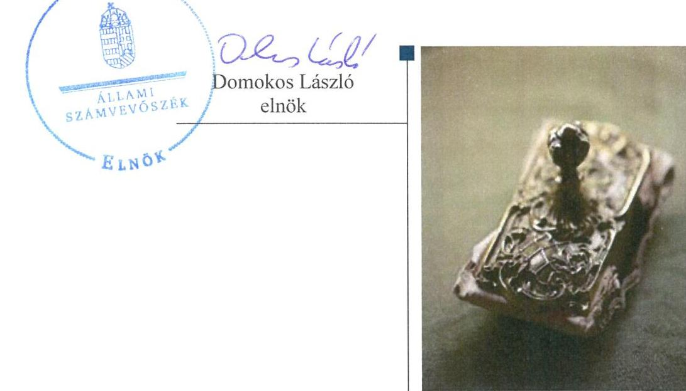

---

# AZ ELLENŐRZÉST FELÜGYELTE:

- BÖRÖCZ IMRE felügyeleti vezető

- AZ ELLENŐRZÉST VEZETTE ÉS A VÉGREHAJTÁSÁÉRT FELELŐS:
  - VIDA KATALIN ellenőrzésvezető
  - A PROGRAM ÖSSZEÁLLÍTÁSÁÉRT FELELŐS:
    - JANIK JÓZSEF osztályvezető

- IKTATÓSZÁM: V-1036-317/2016.
- TÉMASZÁM: 2070
- ELLENŐRZÉS-AZONOSÍTÓ SZÁM: V070929

Jelentéseink az Országgyűlés számítógépes hálózatán és az Interneta a www.asz.hu címen is olvashatóak.

---

# TARTALOMJEGYZÉK 

■ ÖSSZEGZÉS ..... 5
■ AZ ELLENŐRZÉS CÉLJA ..... 7
■ AZ ELLENŐRZÉS TERÜLETE ..... 8
■ AZ ELLENŐRZÉS HÁTTERE, INDOKOLTSÁGA ..... 10
■ A JELENTÉS LÉNYEGES KÉRDÉSKÖREI ..... 11
■ ELLENŐRZÉS HATÓKÖRE ÉS MÓDSZEREI ..... 12
■ MEGÁLLAPÍTÁSOK ..... 14
■ JAVASLATOK ..... 26
■ MELLÉKLETEK ..... 29
I. sz. melléklet: Értelmező szótár ..... 29
II. sz. melléklet: Az FSZK NKft. vagyonának alakulása 2012-2014. években (E Ft) ..... 31
III. sz. melléklet: Az FSZK NKft. vagyonának összetétele a 2012. és 2014. években (M Ft, \%).... 32
IV. sz. melléklet: Az FSZK NKft. karbantartási költségei 2012-2014. években (E Ft) ..... 33
V. sz. melléklet: Az FSZK NKft. 2012-2014. évekre vonatkozó beruházások és az értékcsökkenés kapcsolata (E Ft) ..... 34
■ FÜGGELÉK: ÉSZREVÉTELEK ..... 35
■ RÖVIDÍTÉSEK JEGYZÉKE ..... 43

---

.

---

# ÖSSZEGZÉS 

A tulajdonosi jogok gyakorlói összességében a vagyonnal való gazdálkodás feltételeit szabályszerűen, míg a Társaság hiányosan alakította ki. A Társaság összességében a vagyongazdálkodás szempontjából megfelelően müködött. A közhasznú tevékenység bevételeinek és ráfordításainak elszámolása és szabályozása - az egyéb bevételek kivételével - megfelelő volt. Az önköltségszámítás rendjét nem szabályozták, annak ellenére, hogy 2014. évtől arra kötelesek lettek volna. A közérdekü adatok megismerésére irányuló igények teljesitésének rendjére vonatkozó, az adatvédelmi és adatbiztonsági, valamint a közzétételi kötelezettség teljesitésének szabályzását nem készítették el.

## Az ellenőrzés társadalmi indokoltsága

Magyarországon az intézmény-centrikus közfeladat-ellátás, közvagyonnal való gazdálkodás jellemző, a költségvetésen kívüli feladatellátás térnyerése mellett. Ennek szereplői a nonprofit szervezetek, az önkormányzati tulajdonú gazdasági társaságok és az állami tulajdonú gazdálkodó szervezetek is.

Az Áht. ${ }^{1} 2$. § I) pontja, az Európai Közösséget létrehozó szerződéshez csatolt, a túlzott hiány esetén követendő eljárásról szóló jegyzőkönyv alkalmazásáról szóló 2009. május 25-i 479/2009/EK rendelet szerint, illetve az ESA95 statisztikai módszertana alapján a kormányzati szektorba tartoznak a „központi kormányzat alszektorba besorolt társaságok és egyéb szervezetek" is, amelyekkel szemben alapvető követelmény, hogy a gazdálkodásuk, a müködésük szabályszerű, az általuk szolgáltatott adatok megbízhatóak legyenek.

Az állami tulajdonú gazdálkodó szervezetek a nemzeti vagyon részét képezik. Az állami vagyonnal való gazdálkodást illetően a tulajdonosi joggyakorlás és vagyongazdálkodás feladata az állami vagyon átlátható, rendeltetésszerű és felelős felhasználásának biztosítása. Az állam meghatározza az ellátandó közszolgáltatással kapcsolatos feladatokat, amelyhez a vagyonnal kapcsolatos döntéseknek igazodniuk kell. A nemzetgazdasági szempontból kiemelt jelentőségű nemzeti vagyonban tartandó állami tulajdonban álló társasági részesedését az Nvtv². határozza meg.

Minden közpénzt, közvagyont használó szervezettel szemben társadalmi igény, hogy a tevékenységükről elszámoljanak. Ezt figyelembe véve az Állami Számvevőszék Stratégiájával összhangban került sor az FSZK NKft. ellenőrzésére.

## Főbb megállapítások, következtetések, javaslatok

A Tulajdonosi joggyakorló ${ }_{1-2}{ }^{3}$ összességében szabályszerűen alakította ki az FSZK NKft ${ }^{4}$. vagyonnal való gazdálkodásának feltételeit, azonban a Társaság saját vagyonába kerülő vagyon értékének megőrzésével, gyarapításával és a felelős gazdálkodással kapcsolatos követelmények meghatározása hiányos volt.

A FSZK Közalapítványtól ${ }^{5}$ átvett vagyon dokumentációja hiányos volt, továbbá a vezetett nyilvántartások eltérései és a szabályozási hiányosságok miatt megsértették a valódiság számviteli elvét.

A vagyonváltozást eredményező döntések kivételével valamennyi ellenőrzött területen voltak szabályozási hiányosságok, amelyek következtében a Társaság vagyonmegőrzési és gazdálkodási tevékenysége nem támogatta az állami vagyonnal való szabályszerű gazdálkodást.

Az ellátott közhasznú tevékenység bevételeinek és ráfordításainak elszámolása - az egyéb bevételek kivételével - megfelelő volt. A szabályszerű önköltségszámítás feltételeit nem alakította ki, az alkalmazott díjtételek elszámolása az önköltségszámítás rendjére vonatkozó szabályozás hiányában nem voltak megalapozottak.

Az FSZK NKft. a beszámolási kötelezettségét teljesítette. A Társaságnál az információs rendszer kiépítése és müködtetése hiányos volt, mert a közérdekű adatok megismerésére irányuló igények teljesítésének rendjére vonatkozó,

---

az adatvédelmi és adatbiztonsági, valamint a közzétételi kötelezettség teljesítésének részletes szabályait rögzítő szabályzatokkal nem rendelkeztek. Az adatok közzétételét nem az előírásoknak megfelelően teljesítették.

Az FSZK NKft., mint kormányzati szektorba sorolt egyéb szervezet - néhány késedelmes teljesítéstől és a 20122013. évi várható eredményre vonatkozó adatszolgáltatási kötelezettség elmulasztásától eltekintve - a számára előírt adatszolgáltatásokat teljesítette.

A kormányzati szektor hiányára befolyást gyakorló bevételeket és ráfordításokat összességében szabályszerűen számolták el. A Társaságnak adósságot keletkeztető ügylete az ellenőrzött években nem volt. Az ellenőrzött időszakban képzett nyereségét nem osztotta fel, azt a közhasznú tevékenységére fordította.

Az ÁSZ a Társaság ügyvezetőjének fogalmazott meg javaslatokat, amelyek alapján köteles intézkedési tervet öszszeállítani és azt a jelentés kézhezvételétől számított 30 napon belül az ÁSZ részére megküldeni.

---

# AZ ELLENŐRZÉS CÉLJA 

Az ellenőrzés célja annak értékelése volt, hogy a tulajdonosi jogok gyakorlása szabályszerű volt-e; a gazdálkodó szervezet által ellátott feladatok bevételei, ráfordításai elszámolásának és vagyongazdálkodási tevékenységének szabályozása megfelelt-e a jogszabályi és a tulajdonosi előírásoknak, és azok végrehajtása szabályszerű volt-e; biztosítva volt-e a közfeladatok átláthatósága és elszámoltathatósága érdekében a közszolgáltatás dijának megalapozottsága szabályszerű önköltségszámítással; a vagyonváltozást eredményező döntések esetében a tulajdonosi jogok gyakorlója és a gazdálkodó szervezet szabályszerűen jártak-e el; a gazdálkodó szervezet épített-e ki és működtetett-e információs rendszert a szabályszerű vagyongazdálkodás érdekében.

Az ellenőrzés célja annak értékelése is volt, hogy a kormányzati szektorba sorolt egyéb szervezetek gazdálkodásának a kormányzati szektor hiányára és az államadósságra befolyással bíró elemei a jogszabályi előírásoknak megfelel-nek-e.

---

# **AZ ELLENŐRZÉS TERÜLETE**

## **Fogyatékos Személyek Esélyegyenlőségéért Közhasznú Nonprofit Korlátolt Felelősségű Társaság**

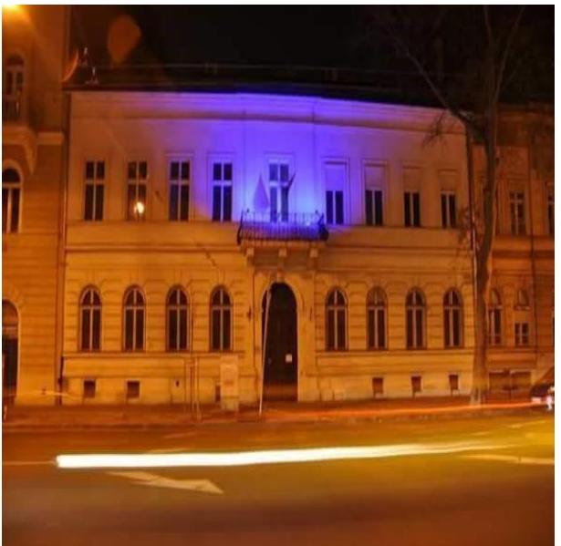

Az FSZK NKft., 100%-ban állami tulajdonban álló egyszemélyes társaság, amelyet korábban a Kormány alapított és az ellenőrzött időszakot megelőzően a Fogyatékos Személyek Esélyegyenlőségéért Közhasznú Alapítványként működött. A Kormány az 1316/2010. (XII. 217.) Korm. határozatában döntött az FSZK Közalapítvány megszűntetéséről és nonprofit korlátolt felelősségű társasági formában történő további működtetéséről.

Az FSZK NKft. a létesítő okirata szerint 2011. december 21-én jött létre és a Társaság bejegyzésére 2012. január 12-én került sor.

A Társaság átfogó szakmapolitikai célja a fogyatékos személyek esélyegyenlőségének, társadalmi integrációjának és komplex (re)habilitációjának elősegítése, szakterületi tudásközpont működtetésével, a komplex rehabilitációban közreműködők tevékenységének összehangolásával, az ellátásban közreműködő intézményrendszerek tervszerű fejlesztésével, az integrációt segítő, kutató, fejlesztő, módszertani, tanácsadó, szolgáltató és képzési programok megvalósításával. A feladatok megvalósítására és segítésére a Társaságnál működik a Magyar Jelnyelvi-, Rehabilitációs-, Hazai Támogatások Programirodája, valamint a Felnőttképzési-, Intézményi Férőhelykiváltást Koordináló-, Autizmus Koordinációs és Hazai és Nemzetközi Kapcsolatok Irodája.

A Kormány döntése alapján az FSZK Közalapítványtól átvett vagyont a 1121/2011. (IV.28.) Korm. határozat, és a 3/2012 (II. 30) sz. alapítói határozat alapján az FSZK NKft. saját vagyonaként kapta meg.

Közhasznú tevékenysége finanszírozására a Társaság 2012. április 2-án Közhasznú keretszerződést kötött a NEFMI6-vel. E szerződés alapján a NEFMI évente vissza nem térítendő működési támogatást biztosított a Társaság Alapító Okirat1-ban megjelölt közhasznú tevékenységei ellátására, a Társaság által elkészített és a tulajdonos által elfogadott éves üzleti tervek alapján.

Az ellenőrzött időszak végére a saját tőke 581 E Ft-tal nőtt, a jegyzett tőke pedig a 2014. évben a tulajdonos által biztosított törzstőke emelés következtében, 500 E Ft-ról 3 000 E Ft-ra emelkedett. Az FSZK NKft. mérlegfőösszege 2014. évben 1 743 504 ezer forint volt.

A Társaság működését az FB7 és a belső ellenőr is ellenőrizte, beszámolóit könyvvizsgáló hitelesítette. Az ellenőrzött időszakban az ügyvezető személye háromszor, a gazdasági vezető személye négyszer változott.

A NEFMI 2011. december 19-étől, az EMMI8 2013. március 7-étől gyakorolta a Társasági részesedéshez kapcsolódó tulajdonosi jogokat az MNV Zrt.-vel kötött megbízási szerződés alapján.

---

Kormányzati szektorba sorolt egyéb szervezetként a szervezet adatszolgáltatást teljesített a központi költségvetésről szóló törvény elkészítéséhez. Adósságot keletkeztető ügylete az ellenőrzött időszakban nem volt, osztalék fizetésére nem került sor.

---

# AZ ELLENŐRZÉS HÁTTERE, INDOKOLTSÁGA 

Fogyatékos Személyek Esélyegyenlőségéért Közhasznú Nonprofit Korlátolt Felelősségü Társaság

Az ÁSZ ${ }^{9}$ alapvető célkitűzése, hogy az államháztartáson kívülre nyújtott költségvetési támogatások és ingyenes vagyonjuttatások ellenőrzésével járuljon hozzá ahhoz, hogy a közpénzeket az államháztartáson kívül múködő szervezetek is átlátható módon használják fel a közfeladatok szerződésben vállalt ellátása érdekében. Az Áht. értelmében a közfeladatok ellátása elsősorban költségvetési szervek alapításával és múködtetésével történik. Az államháztartáson kívüli szervezetek a közfeladatok ellátásában - jogszabályban meghatározott feltételekkel - közremúködhetnek.

Az ellenőrzés feladata a közvagyonnal biztosított közfeladat-ellátással kapcsolatban a közpénzek átláthatósága, nyilvánossága érdekében a jogszabályokban, belső szabályzatokban megfogalmazott előírások érvényesülésének az állami tulajdonban lévő gazdálkodó szervezetek vagyonértékmegőrzési és gazdálkodási tevékenységének értékelése volt. A Vtv. ${ }^{10}$ 3. § (1) bekezdése alapján, a 2013. június 27 -éig hatályos szabályozás értelmében a tulajdonosi jogok és kötelezettségek összességét az állami vagyon tekintetében az állami vagyon felügyeletéért felelős miniszter gyakorolta, aki a feladatát az MNV Zrt. ${ }^{11}$, illetve jogszabályban rögzített egyéb tulajdonosi joggyakorlók útján látta el. 2014. július 15 -éig tulajdonosi joggyakorlóként, ha törvény vagy miniszteri rendelet eltérően nem rendelkezett, az MNV Zrt., illetve a törvényben vagy a miniszteri rendeletben kijelölt személy járt el. 2014. július 15 -ét követően a rábízott vagyon felett az államot megillető tulajdonosi jogok és kötelezettségek összességét tulajdonosi joggyakorlóként az MNV Zrt. gyakorolta. Az ellenőrzött időszakban a tulajdonosi jogokat az MNV Zrt.-vel kötött megbízási szerződések alapján 2011. december 21-étől a NEFMI, 2013. március 7-étől az EMMI látta el.

Az ellenőrzés várható hasznosulásaként az ellenőrzés megállapításai a jogalkotás számára segítséget nyújthatnak az államháztartáson kívüli köz-feladat-ellátás, közvagyonnal való gazdálkodás értékeléséhez, jogszabályi keretei pontosításához, az átláthatóságot biztosító szabályozáshoz. Az ellenőrzöttek számára visszajelzést ad a gazdálkodási tevékenységgel, az állami vagyon felhasználásával, a közszolgáltatási árképzés megalapozottságával és az éves elszámolással kapcsolatos szabálytalanságokról és kockázatokról. Az ellenőrzés tapasztalatai segítik és erősítik az ÁSZ hozzáadott értéket teremtő elemző tevékenységét és tanácsadó szerepét. A kormányzati szektorba sorolt, költségvetési tervezésbe is bevont gazdálkodó szervezetek ellenőrzése fokozza a legfőbb ellenőrző szerv iránti figyelmet és közbizalmat.

---

# A JELENTÉS LÉNYEGES KÉRDÉSKÖREI 

1. A Tulajdonosi joggyakorló a FSZK NKft. vagyonnal való gazdálkodásának feltételeit szabályszerűen alakította-e ki?
2. A FSZK NKft. vagyongazdálkodási tevékenységének kialakítása, szabályozása, illetve a vagyon nyilvántartása megfelelt-e az előírásoknak?
3. Az ellátott közhasznú tevékenység bevételeinek és ráfordításainak elszámolása és szabályozása, valamint az önköltségszámítás szabályszerű volt-e?
4. A vagyonnal való gazdálkodás, valamint a vagyonváltozást eredményező döntések megfeleltek-e a jogszabályi és a belső előírásoknak?
5. A szabályszerű vagyongazdálkodás érdekében az adatszolgáltatási és beszámolási kötelezettséget teljesítette-e, épített-e ki és müködtetett-e információs rendszert?
6. A kormányzati szektor hiányára és az államadósságra befolyást gyakorló elemek a jogszabályi előírásoknak megfeleltek-e?

---

# ELLENŐRZÉS HATÓKÖRE ÉS MÓDSZEREI 

## Az ellenőrzés típusa

Szabályszerúségi ellenőrzés

## Az ellenőrzött időszak

2012. január 1-jétől 2014. december 31-éig

## Az ellenőrzés tárgya

Az állami tulajdonban (résztulajdonban) lévő gazdálkodó szervezetek vagyonmegőrzési és gazdálkodási tevékenysége, valamint a kormányzati szektor hiányára és adósságállományára hatást gyakorló elemek ellenőrzése.

## Az ellenőrzött szervezet

FSZK NKft. és az EMMI

## Az ellenőrzés jogalapja

Az Állami Számvevőszékről szóló 2011. évi LXVI. törvény 5. § (3)-(5) bekezdései és az állami vagyonról szóló 2007. évi CVI. törvény 3. § (4) bekezdése.

## Az ellenőrzés módszerei

Az ellenőrzést a számvevőszéki ellenőrzés szakmai szabályai szerint, a szabályszerűségi ellenőrzés módszerével és a vonatkozó nemzetközi standardok figyelembevételével végeztük.

A bevételek és a ráfordítások elszámolását és a vagyonnyilvántartás terén a szabályszerű múködést véletlenszerű mintavétellel ellenőriztük. Az ellenőrzöttnél, mint a kormányzati szektorba sorolt gazdálkodó szervezetnél a személyi jellegú ráfordítások elszámolása mellett, az egyéb ráfordítások, a pénzügyi műveletek ráfordításai, a rendkívüli ráfordítások, illetve az egyéb bevételek, a pénzügyi műveletek bevételei, a rendkívüli bevételek elszámolásának szabályszerűségét szintén mintatételek alapján ellenőriztük. A mintavétellel ellenőrzött területek esetében minden egyes tétel vo-

---

natkozásában a szabályszerűségre vonatkozó kérdéseket tettük fel, amelyek eredménye összesítésre került. A jogszabályoknak és a belső előírásoknak megfelelőnek tekintettük az adott területet, amennyiben a minta ellenőrzése alapján 95\%-os bizonyossággal a teljes sokaságban a hibaarány kisebb volt, mint 10\%, nem megfelelőnek értékeltük, ha a hibaarány a 10\%ot meghaladta. Kockázatot, illetve magas kockázatot jeleztünk, amennyiben egy adott terület vonatkozásában a minta alapján a teljes sokaságban nem volt egyértelműen biztosított a jogszabályoknak és a belső szabályzatoknak megfelelő működés. A ráfordítások elszámolására és a vagyonnyilvántartásra vonatkozó véletlen mintavételt kockázati alapú kiválasztással egészítettük ki, amelynek során évente a három legnagyobb összegű tételt választottuk ki.

---

# 1. A Tulajdonosi joggyakorló a FSZK NKft. vagyonnal való gazdálkodásának feltételeit szabályszerűen alakította-e ki? 

Összegző megállapítás

A Tulajdonosi joggyakorló1,2 összességében szabályszerűen alakította ki a vagyonnal való gazdálkodásának feltételeit, az Alapító Okirat ${ }_{1-7}{ }^{12}$-ban meghatározta a tulajdonos számára fenntartott vagyongazdálkodásra vonatkozó jogokat.

Az ellenőrzött időszakban az MNV Zrt. megbízása alapján a társasági részesedéshez kapcsolódó tulajdonosi jogokat 2011. december 19-étől a NEFMI (Tulajdonosi joggyakorló1), 2013. március 7-étől az EMMI (Tulajdonosi joggyakorló2) gyakorolta. A társasági Alapító Okirat ${ }_{1-7}$-ben meghatározták a tulajdonos számára fenntartott vagyongazdálkodásra vonatkozó jogokat.

A közhasznú keretszerződés ${ }_{1,2}{ }^{13}$ tartalmazta, hogy a Társaságnak a társadalom és az egyén közös szükségleteinek a kielégítését, nyereség és vagyonszerzési cél nélkül kell szolgálnia a közhasznú céljai megvalósítása érdekében, míg az Alapító Okirat ${ }_{1-7}$ tartalmazta, hogy a közhasznú tevékenységét nem veszélyeztetve, az Alapító Okirat ${ }_{1-7}$-ben meghatározott körben vállalkozási tevékenységet is folytathat.

Az FSZK NKft. Alapító Okirata ${ }_{1-7}$ tartalmazta a vagyonnal való gazdálkodás tekintetében az alapító kizárólagos jogkörébe tartozó, továbbá az ügyvezető, az FB és a könyvvizsgáló jogait, hatáskörét és a feladatait.

A Társaság vagyonkezelésbe nem vett eszközöket. Az MNV Zrt.-től, a NEFMI-től, illetve az EMMI-től vagyonkezelésbe vagyonelemeket nem kapott.

Az FSZK Közalapítványtól átvett vagyon az 1121/2011. (IV. 28.) Korm. határozat ${ }^{14}$ és a 3/2012. (I.30.) számú alapítói határozat alapján az FSZK NKft. saját vagyonába került.

---

# 2. A FSZK NKft. vagyongazdálkodási tevékenységének kialakítása, szabályozása, illetve a vagyon nyilvántartása megfelelt-e az előírásoknak? 

Összegző megállapítás

A vagyon értékének megőrzését, gyarapítását szolgáló vagyongazdálkodási tevékenység feltételeinek kialakítása és szabályozása az FSZK NKft.-nél hiányos volt. A vagyonnyilvántartás nem felelt meg a jogszabályi előírásoknak.
2.1. számú megállapítás

Az FSZK NKft. az állami vagyon értékének megőrzését, gyarapítását szolgáló vagyongazdálkodás feltételeit hiányosan alakította ki és szabályozta.

A Tulajdonosi joggyakorló ${ }_{1,2}$ éves üzleti terv készítését írta elő, középtávú stratégiai terv és éves vagyongazdálkodási terv elkészítésére nem kötelezte a Társaságot.

A Társaság vagyongazdálkodásra vonatkozó belső szabályozása hiányos volt, mert - a Számv.tv. ${ }^{15} 14 . \S$ (5) bekezdés c.) pontja és a (6)-(7) bekezdése ellenére - nem készítette el az önköltség-számítás rendjére vonatkozó belső szabályzatot, pedig 2014. évtől arra kötelezett volt.

A vagyonnal való gazdálkodás feladatait a Számviteli politika ${ }_{1-4}{ }^{16}$, az Eszközök és források leltárkészítési és leltározási szabályzata, az Eszközök és források értékelési szabályzata, a Pénzkezelési szabályzat és az SZMSZ ${ }_{1-2}$ ${ }^{17}$ tartalmazta.

Az FSZK NKft. az Alapító Okirat ${ }_{3-7} 10.3$ pontjában meghatározottak szerint, szabályszerűen eleget tett az üzleti terv elkészítési és benyújtási kötelezettségének. A vagyongazdálkodással összefüggő éves feladatokat az üzleti tervek tartalmazták, amelyeket a Tulajdonosi joggyakorló ${ }_{1,2}$ határozatban fogadott el.

A feladat- és hatásköröket az Alapító Okirat ${ }_{1-7}$-ben és az SZMSZ ${ }_{1-2}$-ben rögzítették.

Az FSZK NKft. a Számviteli Politika ${ }_{1-4}$-ben szabályozta a Számv. tv. 14 § (3)-(4) bekezdéseiben előírtakat.

Az ellenőrzött időszakban hatályos Számlarend nem tartalmazta a Számv. tv. 161. § (2) bekezdés c) pontjában előírt főkönyvi számla és az analitikus nyilvántartás kapcsolatát, valamint a d) pontjában előírt a számlarendben foglaltakat alátámasztó bizonylati rendet.
2.2. számú megállapítás

Az FSZK NKft. vagyonának nyilvántartása nem volt szabályszerű.
Az FSZK Közalapítványi vagyon átadását követően az FSZK NKft. nyilvántartásban 2012. év végén 1244 695,6 E Ft értékű eszközt tartott nyilván. Az átvételt követően, a 2012. év második felében beszerzett további eszközöket rendeltetésszerűen használatba vették, azokat megfelelően, 6 614,5 E Ft értékben aktiválták.

A nyilvántartásba vételt követően a Társaság elmulasztotta elvégezni a térítés nélkül átvett, összesen 1205 117,2 E Ft értékű épületek újraértékelését. Az FSZK Közalapítvány megszűnésekor az átadás átvételi dokumentációban feltüntetett értékeket vették figyelembe, annak ellenére, hogy a

---

Számv. tv. 50. § (4) bekezdése alapján az eszközök állományba vétele napján ismert piaci értéken kellett volna a bekerülési értéket meghatározni és a Számv. tv. 15. § (3) bekezdésében foglalt valódiság elvének megfelelően eljárni.

A 2012-2014. években három ingatlan esetében nem történt meg az épület és a telek külön-külön történő nyilvántartása, ezzel a 2012-2014 években helytelenül az épületekkel együtt, a telek után is elszámolták az értékcsökkenést. Az értékcsökkenés elszámolásra a Számv. tv. 52. § (5) bekezdésben foglaltak ellenére került sor.

Befektetett pénzügyi eszközök, más társaságban részesedések, illetve egyéb tartósan adott kölcsönök, tartós hitelviszonyt megtestesítő értékpapírok esetében az ellenőrzött időszakban értékvesztés elszámolására nem került sor.

Leltározási kötelezettségének az FSZK NKft. az ellenőrzött években eleget tett, azonban a leltárak kiértékelése, a különbözetek megállapítása és az okok kivizsgálása annak ellenére elmaradt, hogy azt a Leltározási Szabályzat szerint 30 napon belül el kellett volna végezni. A Számv.tv. 69. § (1) bekezdése ellenére nem biztosították a mérleg tételeinek ellenőrizhető módon történő alátámasztását.

A könyvvizsgáló a leltározási hiányosságokat nem kifogásolta, azokra észrevételt nem tett, a 2012. és a 2014. évi beszámolókat hitelesítő záradékkal látta el. A 2013. évi beszámoló esetében korlátozott véleményt fogalmazott meg, de nem a leltár szabálytalanságai miatt.

A 2013. évben a főkönyvi kivonatban bruttó 1277 784,4 E Ft befektetett eszközállomány szerepelt, a tárgyi eszköz analitikában viszont 139,9 E Ft-tal kevesebb, összesen 1277 644,4 E Ft. A 2014. évben a főkönyvben szereplő 1293 397,7 E Ft eszközállománnyal szemben, a tárgyi eszköz analitikában 218,5 E Ft-tal kevesebb, 1293 179,1 E Ft értékű eszköz vagyon szerepelt. Az eltérések okát nem tisztázták, nem vizsgálták ki, a főkönyvi adatok és az analitika közötti egyeztetést nem végezték el a Számv. tv. 69. § (2) bekezdése ellenére. Az eltérés miatt nem volt megfelelő a mérleg alátámasztottsága.

Az analitika és a főkönyvi adatok közötti eltérés és a mérleg megfelelő alátámasztásának hiánya ellentétes a Számv. tv. 15.§ (3) bekezdésében előírt valódiság elvével.

---

# 3. Az ellátott közhasznú tevékenység bevételeinek és ráfordításainak elszámolása és szabályozása, valamint az önköltségszámítás szabályszerű volt-e? 

Összegző megállapítás

Az ellátott közhasznú tevékenység bevételeinek és ráfordításainak elszámolása és szabályozása összességében megfelelő volt, kivéve az egyéb bevételeket. A Társaság az önköltségszámításra vonatkozó szabályzattal nem rendelkezett.
3.1. számú megállapítás

Az ellátott közhasznú tevékenység főkönyvi szabályozása az FSZK NKft.-nél összességében megfelelő volt, kivéve az egyéb bevételeket. Az önköltségszámításra vonatkozó előírásokat nem határozták meg.

A Társaság a közhasznú tevékenység ráfordításainak és bevételeinek egyértelmú elhatárolásához szükséges előírásokat meghatározta.

Az FSZK NKft. úgy alakította ki számviteli rendszerét, hogy az az ellátott közhasznú tevékenységek bevételeinek és ráfordításainak elszámolására, a feladatonkénti és az egyéb tevékenységektől való elkülönítésre alkalmas legyen. Az elkülönítés eszköze a főkönyvi számlák alábontása és a munkaszámok alkalmazása volt.

Az FSZK NKft.-nél a Számviteli politika ${ }_{1}$ 2012. április 12-én lépett hatályba, amelyet a Számv. tv., és az annak felhatalmazása alapján kiadott, egyéb szervezetre vonatkozó 224/2000. (XII. 19.) sz. Korm. rendelet ${ }^{18}$ előírásait is figyelembe véve alakítottak ki. Az FSZK NKft-nek. az ezt megelőző időszakban nem volt Számviteli politikája, szabálytalanul az FSZK Közalapítvány - egyéb szervezetekre kialakított -Számviteli politikáját alkalmazta, ezzel megsértette a Számv. tv. 14. § (3) bekezdését.

A szabályzatot 2012. december 31-ével és 2013. november 30-ával módosították a 2012. és a 2013. évi beszámoló elkészítésének határideje tekintetében, az amortizáció elszámolási szabályainak pontosításával, az árfolyam különbözet elszámolásának előírásával. 2014. december 23-án, 2014. január 1-jei hatállyal Számviteli Politika ${ }_{4}$-et adott ki a Társaság ügyvezetője, amely szabályzatok kidolgozásánál a módosult jogszabályokra is figyelemmel voltak.

A Számviteli Politika ${ }_{1-4}$ tartalmazott a szervezet tevékenysége és a finanszírozása sajátosságaiból adódó előírásokat, a jogszabályokban, az Alapító Okirat ${ }_{1-7}$-ben, támogatási szerződésekben előírt projektenkénti-, támoga-tásonkénti-, közfeladatonkénti elkülönített nyilvántartások biztosítása érdekében.

A bevételek, a költségek és a ráfordítások elszámolása összességében szabályszerű volt és azokat a közhasznú tevékenység ellátással kapcsolatosan különítették el, a követelések nyilvántartására külön, a számviteli nyilvántartástól elkülönített elszámolási rendszert alkalmaztak.

A személyi jellegú ráfordítások elszámolása összességében a számviteli törvény előírásainak megfelelően történt. A bérek és a béren kívüli juttatások közterhei a vonatkozó jogszabályi rendelkezéseknek megfelelően kerültek elszámolásra.

---

Az egyéb ráfordítások és a pénzügyi műveletek ráfordításai esetében a költségeket megfelelő közhasznú tevékenységre számolták el.

Az anyagjellegű ráfordítások elszámolása és azok közhasznú tevékeny-ség-ellátással kapcsolatos elkülönítése az ellenőrzött időszakban szabályszerűen történt.

Az értékesítés nettó árbevétele beszedése és elszámolása, valamint azok közhasznú tevékenység-ellátással kapcsolatos elkülönítése szabályszerűen történt.

Az FSZK NKft. a Tulajdonosi joggyakorlóz-vel kötött Közhasznú Keretszerződés és éves fejezeti Támogatási Szerződés előírásait megsértve egy nem hasznosított, nem a közhasznú feladatok teljesítésébe bevont ingatlan fenntartási költségeit is a támogatás terhére számolta el, ugyanakkor a támogatás felhasználásáról szóló beszámolóját a támogató elfogadta.

Az egyéb bevételek beszedése és elszámolása nem volt megfelelő. Az FSZK NKft. a Számv. tv. 77. § (3) bekezdés b) pontja előírásának megsértésével nem számolta el bevételei között egyéb bevételként az oktatási intézmény fenntartói feladatai alapján kapott és az oktatási intézmény felé továbbadott, jogszabályon alapuló normatív támogatást.

Az oktatási célra használt ingatlanokat az FSZK NKft. a Klebelsberg Intézményfenntartó Központról szóló 202/2012. (VII. 27.) Korm. rendelet 3. § (1) bekezdés c) pontja alapján átadta a KLIK ${ }^{19}$ részére. Az átadás tartamára, feltételeire vonatkozóan az érintett felek megállapodást nem kötöttek, számviteli bizonylatot nem készítettek a gazdasági esemény dokumentálásához. Az alapbizonylatok hiányoztak annak ellenére, hogy Számv. tv. 165. § (1)-(2) bekezdései előírják, hogy az eszközök összetételét megváltoztató eseményről szabályszerű bizonylatot kell kiállítani, a könyvviteli nyilvántartásokba pedig csak szabályszerűen kiállított bizonylat alapján szabad adatokat bejegyezni.

# 3.2. számú megállapítás 

## A Társaság a szabályszerű önköltségszámítás feltételeit nem alakította ki, az önköltség számítására vonatkozóan belső szabályozással nem rendelkezett.

A közszolgáltatások árképzését megalapozó önköltség-számítás rendjét az FSZK NKft.-nél nem szabályozták. A Társaság a 2012-2013- években a Számv. tv. 14. § (6) bekezdése alapján mentesült az önköltség-számítás belső szabályzatban történő szabályozási kötelezettsége alól, azonban a mentesülés feltételei 2014-ben már nem álltak fenn, ennek ellenére megsértve a Számv. tv. 14. § (5) bekezdés c) pontjában foglaltakat - az önköltségszámítás rendjét belső szabályzatban nem szabályozták. A Számv. tv. 14. § (7) bekezdése ellenére az önköltséget nem az önköltségszámítás rendjére vonatkozó belső szabályzat szerinti utókalkuláció módszerével állapították meg.

Az FSZK NKft. által alkalmazott díjtételek önköltségszámítás rendjére vonatkozó szabályozás hiányában nem voltak megalapozottak, a díjtételek számításokkal nem voltak alátámasztva.

---

# 4. A vagyonnal való gazdálkodás, valamint a vagyonváltozást eredményező döntések megfeleltek-e a jogszabályi és a belső előírásoknak? 

Összegző megállapítás

A vagyonnal való gazdálkodás nem volt szabályszerű, azonban a vagyonváltozást eredményező döntések megfeleltek a jogszabályi és a belső szabályzatok előírásainak.
Az FSZK NKft. a saját vagyon értékének, megőrzéséről, gyarapításáról nem megfelelően gondoskodott.

Az FSZK NKft. az FSZK Közalapítványtól átvett vagyonra vonatkozóan csak az összevont tételeket tartalmazó eszközök és források kimutatásával és vagyonleltárral rendelkezett. Tételesen az egyes gazdasági eseményekről a Számv. tv. 165. § (1)-(2) bekezdése ellenére nem állított ki szabályszerű számviteli bizonylatokat.

Az FSZK Közalapítvány 2012. május 29-i megszűnéséhez kapcsolódóan készített „Eszközök és Források kimutatása" összevont vagyonleltárban összesen 1737 107,2 E Ft értékű eszköz, illetve forrás szerepelt, a főkönyvi számlák száma és megnevezése és az egyenlege szerinti bontásban, továbbá a záradék tartalmazta, hogy „a vagyonleltár tételeit alátámasztja a tárgyi eszközöknél a tételes leltár-felvétel alapján készített leltár, valamint a fökönyvi kivonat." A leltár tételei azonban nem voltak egyeztethetők az analitikus és a főkönyvi nyilvántartás adataival a Számv. tv. 21. § (3) bekezdése ellenére.

A személyi anyagok, egyéb polgári szerződések, kötelezettségvállalások, közoktatási, intézményfenntartói jogok dokumentumainak átadás-átvételét rögzítő jegyzőkönyv nem tartalmazta a jegyzőkönyvben felsorolt személyekhez kapcsolódó személyi anyagok tételes leltárát, bizonylatait, a szerződések, kötelezettségvállalások átadásával kapcsolatban rögzítették, hogy az átadott dokumentumok jegyzéke a jegyzőkönyv 1. és 2. mellékletében került tételesen felsorolásra, azonban a jegyzőkönyv mellékleteit, a számviteli bizonylatokat a dokumentumhoz nem csatolták a Számv. tv. 165. § (1)-(2) bekezdése ellenére.

Az FSZK Közalapítványtól átvett vagyonelemek és dokumentumok át-adás-átvételi dokumentációja, mint számviteli bizonylat nem felelt meg továbbá, a Számv. tv. 165. § (1)-(2) bekezdésében foglalt előírásnak, mert az eszközök és az eszközök forrásainak állományát megváltoztató gazdasági eseményről nem volt szabályszerűen kiállított bizonylat. A dokumentáció tételesen nem tartalmazta az eszközöket, nem tette lehetővé, hogy az alapján az átvett eszközök és források adatait a számviteli nyilvántartásokban történő adatrögzítésre szabályszerűen kiállított bizonylat alapján rögzítsék. A könyvviteli nyilvántartásokba pedig csak szabályszerűen kiállított bizonylat alapján szabad adatokat bejegyezni.

A befektetett eszközök állománya bár nem jelentősen, de évről évre csökkent.

Az FSZK NKft. vagyona a 2012-2014 években 175869 E Ft-tal nőtt, a 2012. évi 1567635 E Ft-ról, 2014. évre 1743504 E Ft-ra változott.

---

Az ellenőrzött időszakban, a befektetett eszközöknél, 2012.december 31-én 25063 E Ft, 2013.december 31-én 39618 E Ft, 2014.december 31én 43136 E Ft összegű értékcsökkenés elszámolására került sor.

A befektetett eszközök értéke az ellenőrzött időszakban összesen 2,1\%kal csökkent, de az összes eszköz értéke 11,2\%-kal nőtt.

A 2012 évben 6614492 Ft, a 2013. évben 18634217 Ft, a 2014. évben 26484540 Ft összegű, befejezett beruházás került aktiválásra, amelyek saját eszközként kerültek nyilvántartásba.

Az FSZK NKft. vagyonának alakulását a 2012-2014. években a II. sz. melléklet mutatja be.

A vagyon változása elsősorban a fejlesztési támogatások terhére megvalósított, illetve a folyamatban lévő beruházások elszámolása miatt következett be.

A vagyonszerkezetben történt változás, a végrehajtott európai uniós támogatásból megvalósuló projektek miatt történtek, amelyek érintették a kötelezettségek, a pénzeszközök és az aktív-, és passzív időbeli elhatárolások mérlegsorokat is.

A Társaságnak befektetett pénzügyi eszközei nem voltak.
Az FSZK NKft. vagyonösszetételét a 2012. és a 2014. években a III. sz. melléklet szemlélteti.

A követelések értéke 46254 E Ft összegről, 90.3 \%-kal, 4487 E Ft-ra csökkent. A követelések csökkenését a vevők és az egyéb követelések állományváltozása okozta.

Az FSZK NKft. az eszközök karbantartására 2012-ben 2 151,8 E Ft-ot, 2013-ban 1 998,2 E.Ft-ot, 2014-ben 2 310,4 E Ft-ot fordított. A karbantartási költségek alakulását a 2012-2014. években a IV. sz. melléklet mutatja be.

A beruházások és az értékcsökkenés alakulását a 2012-2014. években az V. számú melléklet szemlélteti.

A Tulajdonosi joggyakorló1-2 kizárólagos jogosultságába tartozó állami vagyon (üzletrész) tulajdonjogának átruházására, a vagyon elidegenítésére, illetve megterhelésére, a vagyon gazdasági társaság részére nem pénzbeli szolgáltatásként történő nyújtására, valamint vagyonértékesítésre nem került sor.

A saját tőke és a jegyzett tőke aránya nem változott jelentősen. A saját tőke és a jegyzett tőke arányának alakulását az 1. ábra mutatja be.

---

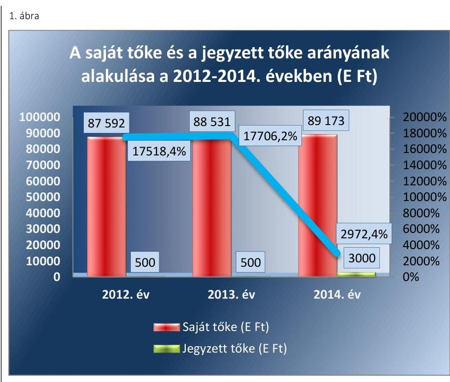

Fonrás: az FSZK NKft. 2012-2014. évi beszámolói
A saját tőke összege 2014. december 31-én 1581 E Ft-tal nőtt, a jegyzett tőke pedig a 2014. évben a tulajdonos által biztosított törzstőke emelés következtében, 500 E Ft-ról 3000 E Ft-ra emelkedett. Ezáltal a saját tőke/jegyzett tőke aránya 2012. év végi 17 518,4 \%-ról 2014. év végére 2 972,4 \%-ra csökkent.
4.2. számú megállapítás

A vagyonváltozást eredményező döntések előkészítése és megalapozása során a jogszabályi és az alapítói előírásokat betartották.

A vagyongazdálkodással kapcsolatos feladat- és hatásköröket az Alapító Okirat ${ }_{1-7}$-ben, valamint a SzMSz ${ }_{1-2}$-ban rögzítették. A Tulajdonosi joggyakorló ${ }_{1,2}$ ezen kívül nem adott ki utasítást, eljárásrendet a vagyongazdálkodási döntés előkészítésre és azok előterjesztéseire vonatkozó formai és tartalmi követelmények tekintetében.

Az FSZK NKft. az FB jóváhagyását igénylő ügyleteket, az előírt tartalommal és formában terjesztette az FB elé.

Az ellenőrzött időszakban a vagyon elidegenítésére vonatkozóan tulajdonosi döntést igénylő ügy nem volt.

Az FSZK NKft. a szükséges felújítási munkák elvégzését biztosító döntéseket megelőzően a Tulajdonosi joggyakorló ${ }_{1,2}$ által elvártaknak megfelelően a vagyongazdálkodáshoz kapcsolódó egyeztetési, engedélyeztetési kötelezettségét teljesítette.

---

A Tulajdonosi joggyakorló1,2 a felújítási terv készítését nem írta elő az FSZK NKft. részére. A Tulajdonosi joggyakorló1,2 által elfogadott üzleti tervek és a számviteli beszámolók tartalmaztak a felújításokra vonatkozóan adatokat.

Közbeszerzési eljárást az FSZK NKft. az ellenőrzött időszakban nem folytatott le, mert a beszerzések értékei és a Kbt. ${ }_{1,2}{ }^{20}$ szerint arra nem volt köteles.
4.3. számú megállapítás

A Tulajdonosi joggyakorló ${ }_{1,2}$ a vagyonváltozást eredményező döntést nem hozott.

A Tulajdonosi joggyakorló ${ }_{1,2}$ a vagyongazdálkodás során a vagyon változását eredményező döntések előkészítésével kapcsolatban az Alapító Okirat1-7-ben határozott meg követelményeket, melyet betartottak.

Az ellenőrzött időszakban a Tulajdonosi joggyakorló ${ }_{1,2}$ a vagyon tulajdonjogának átruházására, illetve ingyenes átruházására, vagyon érékesítésére, apportjára, részesedés, befektetés szerzésére vonatkozó döntést nem hozott. Az ellenőrzött időszakban az állami vagyon ingyenes átadására - az iskola kivételével - nem került sor.

Tulajdonosi ellenőrzést a Tulajdonosi joggyakorló ${ }_{1,2}$ a Társaságnál az ellenőrzött időszakban nem végzett.

# 5. A szabályszerű vagyongazdálkodás érdekében az adatszolgáltatási és beszámolási kötelezettséget teljesítette-e, épített-e ki és múködtetett-e információs rendszert? 

Összegző megállapítás

Az FSZK NKft. az adatszolgáltatási és a beszámolási kötelezettségét teljesítette. Az információs rendszer kiépítése és múködtetése hiányos volt, a közérdekú adatok közzétételével kapcsolatos kötelezettségek részletes szabályait belső szabályzatban nem állapította meg, adatvédelmi és adatbiztonsági szabályzattal nem rendelkezett.
5.1. számú megállapítás

A Társaság - az adatszolgáltatás késedelmes teljesítését és a beszámoló jóváhagyása nélküli letétbehelyezését kivéve - szabályszerűen teljesítette a beszámolási és az adatszolgáltatási kötelezettségét. Az FB szabályszerűen végezte a vagyongazdálkodás tekintetében a tevékenységét, a könyvvizsgálók azonban az átadás-átvételi dokumentáció hiányosságait, a leltározási és nyilvántartási hiányosságokat nem kifogásolták.

Az éves beszámolási, adatszolgáltatási kötelezettségeket a Tulajdonosi joggyakorló ${ }_{1,2}$ az Alapító Okirat ${ }_{1-7}$-ben, a közhasznú keretszerződésben, illetve az éveként kötött fejezeti támogatási szerződésben az FSZK NKft. részére meghatározta. Az FSZK NKft. szabályozása összhangban volt a Tulajdonosi joggyakorló ${ }_{1,2}$ által előírtakkal.

---

Az FSZK NKft. az ellenőrzött években határidőre elkészítette az éves beszámolóját, azonban a Tulajdonosi joggyakorló; a 2012. és 2013. évről elkészített beszámolót a letétbe helyezést megelőzően nem hagyta jóvá, illetve a Társaság nem helyezte a beszámolókat letétbe, ezzel megsértették a Számv. tv. 153. § (1) bekezdésében foglalt előírást.

Az FSZK NKft. éves beszámolói jóváhagyásának időpontjában a Tulajdonosi joggyakorló; számára a beszámolókhoz kapcsolódó FB határozatok és a független könyvvizsgálói jelentések rendelkezésre álltak.

A 2013. évről elkészített beszámoló 2014. május 8-án készült el. Az FB jóváhagyására 2014. április 28.-án került sor, amely időpont korábbi volt, mint a beszámoló elkészítésének időpontja, tehát nem a május 8-án készült végleges, letétbe helyezett beszámolót hagyta jóvá az FB. Az eljárás során az Számv. tv. 153. § (1) bekezdésében foglalt előírást nem tartották be.

Az FSZK NKft. a 2014. évre szóló beszámolóban három oszlopos mérleget tett közzé. Az előző évek hibahatásainak beszámolóban történő megjelenítésére az Számv. tv. 19. § (3) bekezdés rendelkezéseinek betartásával történt.

A Társaság megsértve a Számv. tv. 153. § (1) és a 154. § (1) bekezdésében foglalt előírást a 2014. évi beszámoló esetében a Tulajdonosi joggyakorló; jóváhagyása nélküli, beszámolót helyezte letétbe, illetve tette közzé.

A 2012. és 2013. évben az FSZK NKft. módosított Számviteli politikája értelmében a beszámoló-készítés időpontja február 28-a volt, ugyanakkor azonban a 2012. évre elkészített beszámoló kiegészítő mellékletében a mérlegkészítés időpontját 2013. március 20-át jelölték meg. A kiegészítő melléklet szerinti időpont nem egyezett meg az FSZK NKft. belső szabályozása szerinti időponttal.

Az FSZK NKft. éves beszámolójának és közhasznúsági jelentésének Tulajdonosi joggyakorló ${ }_{1,2}$ általi jóváhagyása a Gt. ${ }^{21} 35$. § (3) bekezdésének, valamint a Ptk. ${ }^{22}$ 3:120. § (2) bekezdésének, 3:129. § (1) bekezdés és 3:131. § (1) bekezdés rendelkezésével összhangban minden évben a felügyelőbizottsági határozatok, illetve a könyvvizsgálói jelentés tartalmának ismeretében történt.

A könyvvizsgáló és a FB észrevételei alapján a Tulajdonosi joggyakorló ${ }_{1,2}$ megfelelő intézkedéseket tett.

A könyvvizsgáló a 2011. évi adatok alapján a Tulajdonosi joggyakorló ${ }_{1}$ et tájékoztatta, hogy az FSZK NKft. saját tőkéje a jegyzett tőke alá csökkent. A Tulajdonosi joggyakorló; a 2012. évben múködési támogatás folyósításával a jegyzett tőke/saját tőke arányát helyreállította.

Az FB a TÁMOP ${ }^{23}$ 5.3.8 számú támogatási szerződés folyósításával, illetve az FSZK NKft. által működtetett iskola működtetésével kapcsolatban észrevételt tett, amelyet kivizsgálás és intézkedés követett. Az FB az ügyvezetőt felkérte, hogy személyes egyeztetést kezdeményezzen az Tulajdonosi joggyakorló; képviselőjével a kiemelt pályázati projekt folytatásával kapcsolatban. Az egyeztetés 2012. szeptember 12-én megtörtént, felügyelő bizottsági határozat ${ }^{24}$ támogatásával a projekt megvalósulása folytatódott.

Az FB 2013-ban az iskola fenntartói jogainak átadásával kapcsolatos észrevételt tett az iskola fenntartására vonatkozóan, mely az iskola költségvetési szerv részére történő átadásával megoldódott.

---

A 2013. éves beszámoló mellékleteként letétbe és közzétételre került Könyvvizsgálói jelentés korlátozott könyvvizsgálói záradékot tartalmazott, mert az FSZK NKft. a támogatások lebonyolításának ellenértékét áfa ${ }^{25}$ felszámítása nélkül számolta el a könyveiben. A könyvvizsgáló véleménye szerint a támogatások lebonyolításának diját áfa felszámításával kellett volna kiszámlázni. Az FSZK NKft. a beszámolót a könyvvizsgáló véleménye szerint nem módosította. A könyvvizsgálói jelentés „közzétételre nem alkalmas" jelzővel került közzétételre. A NAV ${ }^{26}$ állásfoglalása, illetve a későbbiek során módosított Áfa tv. ${ }^{27}$ a Társaság álláspontját támasztotta alá.

Az FSZK NKft. kormányzati szektorba sorolt egyéb szervezet, amely a számára az Áht. 107. § (1) bekezdése és az Ávr. 167/M § (1) bekezdése által előírt adatszolgáltatásnak az éves üzleti tervek megküldésével eleget tett, azonban az Ávr. ${ }^{28} 7$. számú melléklet 29. pontja szerinti adatszolgáltatási kötelezettségét - néhány kivételtől eltekintve - késedelmesen teljesítette. Az FSZK NKft. a 2013. évi várható eredményéről adatot nem szolgáltatott.

# 5.2. számú megállapítás 

Az FSZK NKft. a vagyongazdálkodását érintően hiányosan alakította ki a belső és a tulajdonosi jogok gyakorlójával fenntartott információs rendszert.

A közérdekú adatok nyilvánosságra hozatala a FSZK NKft.-nél nem volt szabályszerű. A FSZK NKft. a közérdekú adatok megismerésére irányuló igények teljesítésének rendjét rögzítő szabályzattal nem rendelkezett, annak ellenére, hogy azt az Info tv. ${ }^{29} 30 . \S$ (6) bekezdése előírta.

Az FSZK NKft. honlapján nem tették közzé 2011-2014. évekre vonatkozóan az ügyvezető nevét, alapbérét, pénzbeli juttatásait, ami ellentétes volt a Takarékossági tv ${ }^{30}$. 2. § (1) bekezdésének a) és ca) pontjában foglaltakkal.

A közérdekú adatok között a Társaság honlapján közzétételre került 2012-2014. évben FB-i tisztséget betöltő személyek neve, illetve díjazása, továbbá az FSZK NKft. 2011. és 2014. év közötti időszakról elkészített éves beszámolói, közhasznú jelentései.

Az FSZK NKft. az Info tv. 35. § (3) bekezdése ellenére a közzététellel kapcsolatos kötelezettsége teljesítésének részletes szabályait belső szabályzatban nem állapította meg.

Az FSZK NKft. adatvédelmi és adatbiztonsági szabályzattal nem rendelkezett, annak ellenére, hogy azt a 2011. évben az Avtv. ${ }^{31}$ 31/A. § (3) bekezdése, a 2012-2014. években az Info tv. 24. § (3) bekezdése előírta.

---

# 6. A kormányzati szektor hiányára és az államadósságra befolyást gyakorló elemek a jogszabályi előírásoknak megfelel-tek-e? 

Összegző megállapítás

A Társaságnál - mint kormányzati szektorba sorolt egyéb szervezetnél - adósságot keletkeztető ügylet nem volt az ellenőrzött időszakban. A kormányzati szektor hiányára befolyást gyakorló bevételek és ráfordítások elszámolása megfelelő volt, osztalékfizetésről szóló döntés nem született.
6.1. számú megállapítás Az FSZK NKft. adósságot keletkeztető ügyletet nem kötött.

A Stabilitás tv. 3. § (1) bekezdése szerinti adósságot keletkeztető ügyletet nem kötött, nem volt a Stabilitás tv. ${ }^{32}$ 9. § (1) bekezdés és a 353/2011. Korm. rend. 11. § szerinti kérelem benyújtási kötelezettsége.
6.2. számú megállapítás

A kormányzati szektor hiányára befolyást gyakorló bevételek és ráfordítások elszámolása megfelelő volt. Osztalékfizetésre nem került sor.

A kormányzati szektor hiányára befolyást gyakorló bevételek és ráfordításokat szabályszerűen számolta el.

Az ellenőrzött időszakban osztalékot nem fizetett, a képzett nyereséget nem osztotta fel, azt a közhasznú tevékenységére fordította. Kapcsolt vállalkozással nem rendelkezett.

---

# JAVASLATOK 

Az ÁSZ tv. ${ }^{33}$ 33. § (1) bekezdésében foglaltak értelmében az ellenőrzött szervezet vezetője köteles a jelentésben foglalt megállapításokhoz kapcsolódó intézkedési tervet összeállítani és azt a jelentés kézhezvételétől számított 30 napon belül az ÁSZ részére megküldeni. Amennyiben az intézkedési tervet az ellenőrzött szervezet vezetője nem küldi meg határidőben, vagy továbbra sem elfogadható intézkedési tervet küld, az ÁSZ elnöke az ÁSZ tv. 33. § (3) bekezdés a)-b) pontjaiban foglaltakat érvényesítheti.

## Az FSZK NKft. ügyvezetőjének

1. Intézkedjen arról, hogy a Számlarend tartalmazza a jogszabályban előirt tartalmi elemeket.
(2.1. sz. megállapítás 7. bekezdései alapján)
2. Intézkedjen arról, hogy a jogszabályi előírásnak megfelelően a térítés nélkül átvett eszköz bekerülési értéke az eszköznek az állományba vétel időpontjában ismert piaci értéke legyen.
(2.2. sz. megállapítás 2. bekezdése alapján)
3. Intézkedjen az értékcsökkenés jogszabályi előírásnak megfelelő elszámolásáról.
(2.2. sz. megállapítás 3. bekezdése alapján)
4. Intézkedjen arról, hogy a fökönyvi könyvelés és az analitikus nyilvántartások adatai közötti egyeztetést a jogszabályi előírásnak megfelelően elvégezzék.
(2.2. sz. megállapítás 7. bekezdése alapján)
5. Intézkedjen arról, hogy olyan leltárt állítsanak össze, amely a jogszabályi előírásoknak megfelelően alátámasztja a mérleg tételeit, és biztosítja a valódiság elvének érvényesülését.
(2.2. sz. megállapítás 5., 7. és 8. bekezdései alapján)
6. Tegyen intézkedéseket a - mérleg alátámasztásával kapcsolatban - feltárt szabálytalanság tekintetében a felelősség tisztázása érdekében, és szükség szerint intézkedjen a felelősség érvényesítéséről.
(2.2. sz. megállapítás 5., 7. és 8. bekezdései alapján)

---

7. Intézkedjen arról, hogy a jogszabályi előírásnak megfelelően a számviteli nyilvántartásba csak szabályszerűen kiállított bizonylat alapján jegyezzenek be adatokat.
(3.1. sz. megállapítás 13. bekezdése és a 4.1. sz. megállapítás 4. bekezdése alapján)
8. Intézkedjen a számviteli politika keretében az önköltségszámitás rendjére vonatkozó belső szabályzat jogszabályi előírásnak megfelelő elkészítéséről, és az önköltségnek a szabályzatban meghatározott utókalkuláció módszerével történő megállapításáról.
(3.2. sz. megállapítás 1. bekezdése alapján)
9. Intézkedjen arról, hogy az éves beszámolót a jogszabályi előírásoknak megfelelően helyezzék letétbe és tegyék közzé.
(5.1. sz. megállapítás 2. és 6. bekezdései alapján)
10. Intézkedjen arról, hogy a jogszabályi előírásnak megfelelően a közérdekü adatok megismerésére irányuló igények teljesitésének rendjét, továbbá a közzétételi kötelezettség teljesitésének részletes szabályait belső szabályzatban rögzítsék.
(5.2. sz. megállapítás 1. és 4. bekezdései alapján)
11. Intézkedjen a közzétételi kötelezettség jogszabályi előírásoknak megfelelő, teljes körü teljesitéséről.
(5.2. sz. megállapítás 2. bekezdései alapján)
12. Intézkedjen a jogszabályi előírásnak megfelelően adatvédelmi és adatbiztonsági szabályzat elkészítéséről és kiadásáról.
(5.2. sz. megállapítás 5. bekezdése alapján)

---

.

---

# MELLÉKLETEK 

## I. SZ. MELLÉKLET: ÉRTELMEZŐ SZÓTÁR

Adósságot keletkeztető ügyle

Gazdálkodó szervezet
„Adósságot keletkeztető ügylet és annak értéke:
a) hitel, kölcsön felvétele, átvállalása a folyósítás, átvállalás napjától a végtörlesztés napjáig, és annak aktuális tőketartozása,
b) a számvitelről szóló törvény szerinti hitelviszonyt megtestesítő értékpapír forgalomba hozatala a forgalomba hozatal napjától a beváltás napjáig, kamatozó értékpapír esetén annak névértéke, egyéb értékpapír esetén annak vételára,
c) váltó kibocsátása a kibocsátás napjától a beváltás napjáig, és annak a váltóval kiváltott kötelezettséggel megegyező, kamatot nem tartalmazó értéke,
d) az Szt. szerint pénzügyi lízing lízingbevevői félként történő megkötése a lízing futamideje alatt, és a lízingszerződésben kikötött tőkerész hátralévő összege,
e) a visszavásárlási kötelezettség kikötésével megkötött adásvételi szerződés eladói félként történő megkötése - ideértve az Szt. szerinti valódi penziós és óvadéki repóügyleteket is - a visszavásárlásig, és a kikötött visszavásárlási ár,
f) a szerződésben kapott, legalább háromszázhatvanöt nap időtartamú halasztott fizetés, részletfizetés, és a még ki nem fizetett ellenérték,
g) hitelintézetek által, származékos műveletek különbözeteként az Államadósság Kezelő Központ Zrt.-nél (a továbbiakban: ÁKK Zrt.) elhelyezett fedezeti betétek, és azok összege.
Forrás: Stabilitási tv. 3. § (1) bekezdése
2013. június 30-ig gazdálkodó szervezet:

Az állami vállalat, az egyéb állami gazdálkodó szerv, a szövetkezet, a lakásszövetkezet, az európai szövetkezet, a gazdasági társaság, az európai részvény-társaság, az egyesülés, az európai gazdasági egyesülés, az európai területi együttműködési csoportosulás, az egyes jogi személyek vállalata, a leányvállalat, a vízgazdálkodási társulat, az erdőbirtokossági társulat, a végrehajtói iroda, az egyéni cég, továbbá az egyéni vállalkozó.
Forrás: $\mathrm{Ptk}_{1}{ }^{34} .685 . \S$ c) pontja
2013. július 1-jétől gazdálkodó szervezet:

Az állami vállalat, az egyéb állami gazdálkodó szerv, a szövetkezet, a lakásszövetkezet, az európai szövetkezet, a gazdasági társaság, az európai részvénytársaság, az egyesülés, az európai gazdasági egyesülés, az európai területi együttműködési csoportosulás, az egyes jogi személyek vállalata, a leányvállalat, a vízgazdálkodási társulat, az erdőbirtokossági társulat, a végrehajtói iroda, az egyéni cég, továbbá az egyéni vállalkozó. Az állam, a helyi önkormányzat, a költségvetési szerv, az egyesület, a köztestület, valamint az alapítvány gazdálkodó tevékenységével összefüggő polgári jogi kapcsolataira is a gazdálkodó szervezetre vonatkozó rendelkezéseket kell alkalmazni, kivéve, ha a törvény e jogi személyekre eltérő rendelkezést tartalmaz; a 292/A-292/B. §, 301/A-301/B. §, 405. § (1) bekezdés, valamint a 407/A. § (1) bekezdés tekintetében nem minősül gazdálkodó szervezetnek az, aki a közbeszerzésekről szóló törvény értelmében ajánlatkérő (szerződő hatóság).
Forrás: $\mathrm{Ptk}_{1}$. 685. § c) pontja
2014. március 15-től gazdálkodó szervezet:

A gazdasági társaság, az európai részvénytársaság, az egyesülés, az európai gazdasági egyesülés, az európai területi együttmúködési csoportosulás, a szövetkezet, a

---

kormányzati szektorba sorolt egyéb szervezet
lakásszövetkezet, az európai szövetkezet, a vízgazdálkodási társulat, az erdőbirtokossági társulat, az állami vállalat, az egyéb állami gazdálkodó szerv, az egyes jogi személyek vállalata, a közös vállalat, a végrehajtói iroda, a közjegyzői iroda, az ügyvédi iroda, a szabadalmi ügyvivői iroda, az önkéntes kölcsönös biztosító pénztár, a magánnyugdíjpénztár, az egyéni cég, továbbá az egyéni vállalkozó. Az állam, a helyi önkormányzat, a költségvetési szerv, az egyesület, a köztestület, valamint az alapítvány gazdálkodó tevékenységével összefüggő polgári jogi kapcsolataira is a gazdálkodó szervezetre vonatkozó rendelkezéseket kell alkalmazni.
Forrás: Pp. ${ }^{35}$ 396. §
Az a szervezet, amely az Áht ${ }_{2}$. alapján nem része az államháztartásnak, azonban az Európai Közösséget létrehozó szerződéshez csatolt, a túlzott hiány esetén követendő eljárásról szóló jegyzőkönyv alkalmazásáról szóló 2009. május 25-i 479/2009/EK rendelet szerint a kormányzati szektorba tartozik. A nemzetgazdasági miniszter 2013. június 26-án megjelent Közleményben tette közé ezen szervezetek listáját.

---

II. SZ. MELLÉKLET: AZ FSZK NKFT. VAGYONÁNAK ALAKULÁSA 2012-2014. ÉVEKBEN (E FT)

|  AZ FSZK NKFT. VAGYONÁNAK ALAKULÁSA 2012-2014. ÉVEKBEN (E FT) |  |  |   |
| --- | --- | --- | --- |
|  Megnevezés | 2012. év | 2013. év | 2014. év  |
|  Befektetett eszközök | 1226247 | 1213103 | 1200805  |
|  Forgóeszközök | 333839 | 551531 | 282178  |
|  Aktív időbeli elhatárolások | 7549 | 1809 | 260521  |
|  ESZKÖZÖK ÖSSZESEN | 1567635 | 1766463 | 1743504  |
|  Saját tőke | 87592 | 88531 | 89173  |
|  Céltartalék | 0 | 0 | 0  |
|  Kötelezettségek | 19024 | 115343 | 350192  |
|  Passzív időbeli elhatárolások | 1461019 | 1562589 | 1304239  |
|  FORRÁSOK ÖSSZESEN | 1567635 | 1766463 | 1743504  |

Forrás: az FSZK Kft. 2012-2014. évt beszámolói

---

II. SZ. MELLÉKLET: AZ FSZK NKFT. VAGYONÁNAK ÖSSZETÉTELE A 2012. ÉS 2014. ÉVEKBEN (M FT, \%)

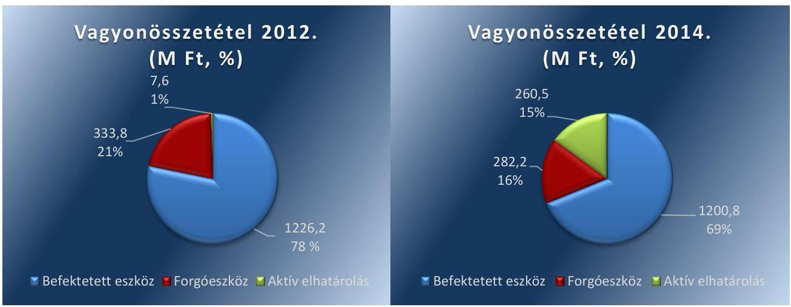

Forrás: FSZK NKft. beszámoló

---

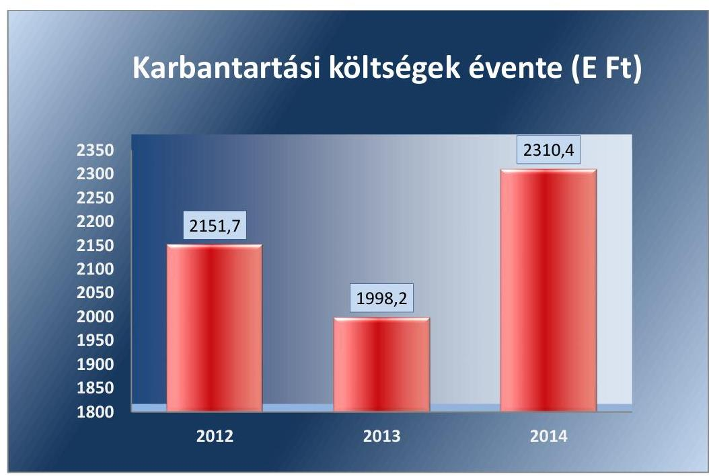

*Forrás: az FSZK 2012-2014. évi beszámolói*

---

- V. SZ. MELLÉKLET: AZ FSZK NKFT. 2012-2014. ÉVEKRE VONATKOZÓ BERUHÁZÁSOK ÉS AZ ÉRTÉKCSÖKKENÉS KAPCSOLATA (E FT)
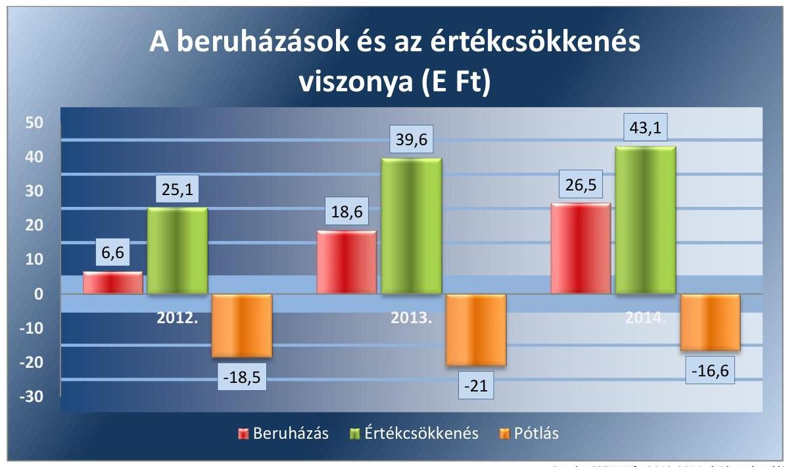

Forrás: FSZK NKft. 2012-2014. évi beszámolói

---

# FÜGGELÉK: ÉSZREVÉTELEK 

A jelentéstervezetet a Számvevőszék 15 napos észrevételezésre megküldte az ellenőrzött szervezet vezetőjének az ÁSZ tv. 29. §* (1) bekezdése előírásának megfelelően.

A függelék tartalmazza az ellenőrzött észrevételeit, illetve az el nem fogadott észrevételek elutasításának indoklását.
Az ÁSZ tv. 29. § (2) bekezdésében foglalt észrevételezési jogával az Emberi Erőforrások Minisztériumát vezető miniszter nem élt, a jelentéstervezetre észrevételt nem tett.

- Az FSZK NKft. ügyvezetőjének írásban tett észrevétele mellékletek nélkül.
- Tájékoztatás az észrevételek kezeléséről az ügyvezetőnek.
- Az EMMI levele.

[^0]
[^0]:    * 29. § (1) Az Állami Számvevőszék az ellenőrzési megállapításait megküldi az ellenőrzött szervezet vezetőjének vagy az általa megbízott személynek, és annak, akinek személyes felelősségét állapította meg.
    (2) Az ellenőrzött szervezet vezetője és a felelősként megjelölt személy az ellenőrzés megállapításaira tizenöt napon belül írásban észrevételt tehet.
    (3) Az Állami Számvevőszék az észrevételre a beérkezésétől számított harminc napon belül írásban válaszol. A figyelembe nem vett észrevételeket köteles a jelentésben feltüntetni, és megindokolni, hogy azokat miért nem fogadta el.

---

# Fogyatékos Személyek Esélyegyenlőségéért Közhasznú Nonprofit Kft. 

Előadó: Magyar Ágnes 06307567196
Melléklet: 2 darab
Tárgy: észrevétel jelentéstervezethez

Állami Számvevőszék
Domokos László úr
Elnök

Budapest
Apáczai Csere János utca 10.
1052

Úgyiratszám:
Hiv. szám:

ÁLL: 0A1D36/306/2016 ÖNZEK
ÜGYVITLLI IRODA
067210/2016
Érk.: A110 - 92016
Iktatószám: V-1036-301/2016
Melléklet:

## Böröre Inure

Tisztelt Elnök Úr!

Az alábbi észrevételeket teszem a V-1036-306/2016 iktatószámú Fogyatékos Személyek Esélyegyenlőségéért Közhasznú Nonprofit Kft - Az állami tulajdonban (résztulajdonban) lévő gazdálkodó szervezetek vagyonmegőrzési és gazdálkodási tevékenységének ellenőrzése címú jelentéstervezethez.

## 2.2. számú megállapítás:

2013: tárgyi eszköz lista szerint az analitikus nyilvántartás bruttó értéke: 1.277.784,4 eFt, ami megegyezik a fókönyvi nyilvántartás szerinti értékkel, ami 1.277.784,4 eFt.

2014: tárgyi eszköz lista szerint az analitikus nyilvántartás bruttó értéke: 1.293.179,1 eFt, ami megegyezik a fókönyvi nyilvántartás szerinti értékkel, ami 1.293.179,1 eFt.

Mellékletként csatolom az alátámasztó dokumentumokat.

### 3.1. számú megállapítás:

10. bekezdés:

Az FSZK Nonprofit Kft a müködéséhez kapcsolódó költségeket a fejezeti támogatásból tudja finanszírozni, mert a pályázati úton elnyert forrásokon kívüli egyéb bevételei nem jelentősek. A szervezetnek vagyonmegóvási kötelezettsége van, amit másként nem tud finanszírozni.
12. bekezdés:

Az FSZK Nonprofit Kft eszközösszetétele nem változott, mert az eszközök tulajdonjoga a Társaságnál maradt, a KLIK csak használja az ingatlanokat. Az előzőek miatt számviteli bizonylat nem keletkezhetett, mert az átadás nem járt számviteli eseménnyel.

---

# Javaslatok 26. oldal: 

2. pont:

Javasoljuk a szöveget az alábbiak szerint módosítani, mert problémák lehetnek a 4 évvel korábbi állapot megállapításával, mivel nincsenek akkori fényképek, leírások.
„ Intézkedjen arról, hogy a jogszabályi elöírásnak megfelelően a térítés nélkül átvett eszköz bekerülési értéke az eszköznek az állományba vétel időpontjában ismert piaci értékén legyen megállapítva, amennyiben erre a felkérendő (maximum 3) ingatlan értékelő által adott becslés megfelelő alapot ad."

4-5-6 pont: A 2.2 megállapításhoz kapcsolódik, ami a fentiek szerint már nem tisztázandó.

Támogató együttműködését előre is köszönöm.

Budapest, 2016.augusztus 4.

Üdvözlettel:
Fogyatékos Személyek
Esélyegyenlöségéért
Kozhasznú Nonprofit Kft.
1071 Budapest, Damjanich u. 4.
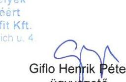

---

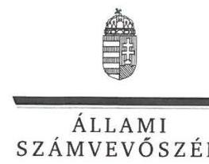

ELNÖK

# Giflo Henrik Péter úr 

ügyvezető
Fogyatékos Személyek Esélyegyenlőségéért Közhasznú Nonprofit Kft.

## Budapest

## Tisztelt Ügyvezető Úr!

A ,,Fogyatékos Személyek Esélyegyenlőségéért Közhasznú Nonprofit Kft. - Az állami tulajdonban (résztulajdonban) lévő gazdálkodó szervezetek vagyonmegőrzési és gazdálkodási tevékenységének ellenőrzése" címmel készített számvevőszéki jelentéstervezetre tett észrevételeit köszönettel megkaptam.
Az Állami Számvevőszék észrevételekre vonatkozó álláspontjáról a felügyeleti vezető által készített részletes tájékoztatást mellékelten megküldöm.
Tájékoztatom Ügyvezető urat, hogy a számvevőszéki jelentésben - az Állami Számvevőszékről szóló 2011. évi LXVI. törvény 29. § (3) bekezdése alapján - a figyelembe nem vett észrevételeket szerepeltetjük az elutasítás indokának feltüntetésével.

Budapest, 2016. m. 1 hó 30 nap
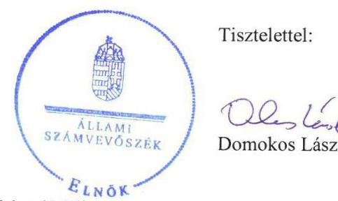

Tisztelettel:

Melléklet: Tájékoztatás az észrevételek kezeléséről

---

# Tájékoztatás   az észrevételek kezeléséről 

A „Fogyatékos Személyek Esélyegyenlőségéért Közhasznú Nonprofit Kft. - Az állami tulajdonban (résztulajdonban) lévő gazdálkodó szervezetek vagyonmegőrzési és gazdálkodási tevékenységének ellenőrzése" címú jelentéstervezetre 2016. augusztus 5-én tett (az Állami Számvevőszékhez 2016. augusztus 9-én érkezett) észrevételeit áttekintettük, ami alapján a következő tájékoztatást adom.
A 2.2. számú megállapításhoz tett észrevétel szerint a 2013. és a 2014. években a tárgyi eszközök analitikus nyilvántartásának bruttó értéke megegyezik a fökönyvi nyilvántartás szerinti értékkel. Az ellenőrzés során a 2013. évre vonatkozóan az Állami Számvevőszék rendelkezésére bocsátott fökönyvi kivonatban 1277 784,4 E Ft, a „Tárgyi eszköz lista számvitel szerint 2013" című dokumentumban - a fökönyvi kivonattól eltérően - 1277 644,4 E Ft-ot rögzítettek, így az eltérés fennállt. A 2014. évre vonatkozóan az ellenőrzés során rendelkezésre bocsátott fökönyvi kivonatban 1293 397,7 E Ft, a „Tárgyi eszköz lista számvitel szerint 2014" című dokumentumban - a fökönyvi kivonattól eltérően - 1293 179,1 E Ft szerepelt, így az eltérés fennállt. A teljességi és hitelességi nyilatkozat kiadását követően, az észrevétel mellékleteként pótlólag megküldött, 2016.07.26-i dátumozású dokumentumok hitelességéről az Állami Számvevőszék meggyőződni nem tudott, ezért azokat nem veszi figyelembe. Fentiek miatt a jelentéstervezet módosítása nem indokolt.
A 3.1. számú megállapítás 10. bekezdéséhez tett észrevétel tartalmában nem kapcsolódik a jelentéstervezet 10. bekezdésében foglaltakhoz. Az észrevételben jelzett, fejezeti támogatásból történő finanszírozásra vonatkozó megállapítást a jelentéstervezet 11. bekezdése tartalmazta. A megállapítást az észrevétel megerősítette, ezért a jelentéstervezet módosítása nem indokolt.
A 3.1. számú megállapítás 12. bekezdéséhez tett észrevétel szerint a társaság eszközeinek öszszetétele nem változott, mert azok tulajdonjoga a társaságnál maradt, a KLIK csak használja az ingatlanokat, ezért számviteli bizonylat nem keletkezhetett, mert az átadás nem járt számviteli eseménnyel. Az észrevételben hivatkozott 12. bekezdés az egyéb bevételek beszedésére és elszámolására vonatkozó megállapítást tartalmaz, amelyre az észrevétel nem vonatkozik. Az észrevétel a tartalma alapján a jelentéstervezet 3.1. számú megállapítását alátámasztó 13. bekezdéséhez kapcsolódik. Az észrevétel nem vitatja, hogy az ingatlan használatba adásához kapcsolódóan a Társaság számviteli bizonylattal nem rendelkezik. Az ügyvezető Állami Számvevőszék részére tett, 2016. március 24 -ei nyilatkozata szerint az ingatlan átadásakor készült használati szerződés 1. számú mellékletét képező leltár nem áll a Társaság rendelkezésére. Az ingatlan használójának változása az eszközök értékét a mérlegben nem befolyásolta ugyan, de az eszközök összetételét érintette, ezért bizonylatot kellett volna kiállítani és a számviteli nyilvántartásokba az adatokat a szabályszerűen kiállított bizonylat alapján bejegyezni. Fentiek alapján a jelentéstervezet módosítása nem indokolt.
Az FSZK NKft. ügyvezetőjének címzett 2. számú javaslathoz tett észrevétel szerinti szövegjavaslat alapján a jelentéstervezet módosítása nem indokolt, mert a piaci érték megállapításának módját az Állami Számvevőszék nem határozza meg.
Az FSZK NKft. ügyvezetőjének címzett 4., 5., 6. számú javaslatra tett észrevétel szerint azok a 2.2. számú megállapításhoz kapcsolódnak. Tekintettel arra, hogy a 2.2. számú megállapításhoz

---

kapcsolódó észrevétel alapján a jelentéstervezet megállapításának módosítása nem indokolt, ezért a 4., 5., 6. számú javaslatok módosítására sem kerül sor.
Tájékoztatom, hogy a számvevőszéki jelentés függelékeként szerepeltetjük a jelentéstervezethez tett észrevételeit, valamint az azokra adott válaszunkat.

Budapest, 2016. 08. hó 50 nap

Böröcz Imre
felügyeleti vezető

---

# 588 

## Bórócz 1.

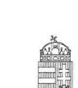

ÉMBERI ÉRÓFORRÁSOK MINISZTÉRIUMA
SZOCIÁLIS ÜGYEKÉRT ÉS TÁRSADALMI FELZÁRKÖZÁSÉRT FELELŐS ÁLLAMTITKÁR

Iktatószám: 42787-1/2016/FOGY
Domokos László Úr részére
elnök
Állami Számvevőszék

## Budapest

Apáczai Csere János u. 10 .
1052

## Tisztelt Elnök Úr!

A „Fogyatékos Személyek Esélyegyenlőségéért Közhasznú Nonprofit Kft. - Az állami tulajdonban (résztulajdonban) lévő gazdálkodó szervezetek vagyon megőrzési és gazdálkodási tevékenységének ellenőrzése" címmel készített számvevőszéki jelentéstervezet munkaanyagát köszönettel megkaptuk.

Örömmel értesültem, hogy a jelentés összegző megállapításainak többsége a Fogyatékos Személyek Esélyegyenlőségéért Közhasznú Nonprofit Kft. 2012-2014. évi gazdálkodási tevékenységéről a vizsgált területeken összességében a jogszabályoknak és az előírásoknak megfelelőnek találta.

A jelentés tervezetére további észrevételt nem teszek.

Budapest, 2016. augusztus „!!.."

Üdvözlettel:
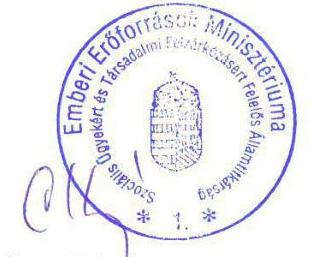

Czibere Károly

---

.

---

# RÖVIDÍTÉSEK JEGYZÉKE 

${ }^{1}$ Áht.
${ }^{2}$ Nvtv.
${ }^{3}$ Tulajdonosi joggyakorló ${ }_{1,2}$
${ }^{4}$ FSZK NKft., Társaság
${ }^{5}$ FSZK Közalapítvány
${ }^{6}$ NEFMI
${ }^{7}$ FB
${ }^{8}$ EMMI
${ }^{9}$ ÁSZ
${ }^{10}$ Vtv.
${ }^{11}$ MNV Zrt.
${ }^{12}$ Alapító Okirat ${ }_{1-7}$
${ }^{13}$ Közhasznú keretszerződés ${ }_{1,2}$
${ }^{14}$ 1121/2011. (IV. 28.) Korm. határozat
${ }^{15}$ Számv. tv.
${ }^{16}$ Számviteli politika ${ }_{1-4}$
${ }^{17}$ SZMSZ $_{3-2}$
${ }^{18}$ 224/2000. (XII. 19.) Korm. rendelet
${ }^{19}$ KLIK
${ }^{20} \mathrm{Kbt}_{1}$
$\mathrm{Kbt}_{2}$
${ }^{21} \mathrm{Gt}$.
${ }^{22}$ Ptk. 2

Az államháztartásról szóló 2011. évi CXCV. törvény
2011. évi CXCVI. törvény a Nemzeti vagyonról

Tulajdonosi joggyakorló: Nemzeti Erőforrás Minisztérium
Tulajdonosi joggyakorló: Emberi Erőforrások Minisztériuma
Fogyatékos Személyek Esélyegyenlőségéért Nonprofit Korlátolt Felelősségű Társaság
Fogyatékos Személyek Esélyegyenlőségéért Közalapítvány
Nemzeti Erőforrás Minisztérium
Felügyelő Bizottság
Emberi Erőforrások Minisztériuma
Állami Számvevőszék
Az állami vagyonról szóló 2007. évi CVI. törvény
Magyar Nemzeti Vagyonkezelő Zrt.
Alapító Okirat ${ }_{1}$ : Hatályos: 2011. december 21-től,
Alapító Okirat ${ }_{2}$ : Hatályos: 2012. június 22-től,
Alapító Okirat ${ }_{3}$ : Hatályos: 2012. szeptember 11-től,
Alapító Okirat ${ }_{4}$ : Hatályos: 2013. január 2-től,
Alapító Okirat ${ }_{5}$ : Hatályos: 2013. május 31-től,
Alapító Okirat ${ }_{6}$ : Hatályos: 2014. július 2-től,
Alapító Okirat ${ }_{7}$ : Hatályos: 2014. december 23-től,
Közhasznú keretszerződés: NEFMI-vel 2012. márciusában kötött szerződés
Közhasznú keretszerződés: EMMI-vel 2012. április 2-án kötött szerződés
A Fogyatékos Személyek Esélyegyenlőségéért Közalapítvány közhasznú nonprofit gazdasági társasággá történő átalakításáról (Hatályba lépett: 2011. április 29.)
2000. évi C. törvény a számvitelről (Hatályba lépett 2001. január 1.)

Számviteli Politika1 (hatályos 2012. ápr. 12-étől)
Számviteli Politika2 (hatályos: 2012. dec. 31-étől)
Számviteli Politika3 (hatályos: 2013. nov. 30-ától)
Számviteli Politika4 (hatályos: 2014. jan. 1-jétől)
Szervezeti és Múködési Szabályzat: Hatályos: 2012.augusztus 1-jétől
Szervezeti és Múködési Szabályzat: Hatályos: 2013.június 12-étől
A számviteli törvény szerinti egyes egyéb szervezetek beszámoló készítési és könyvvezetési kötelezettségének sajátosságairól szóló 224/2000. (XII. 19.) Korm. rendelet (Hatályba lépett: 2001. január 1.)
Klebelsberg Intézményfenntartó Központ
A közbeszerzésekről szóló 2003. évi CXXIX. törvény
A közbeszerzésekről szóló 2011. évi CVII. törvény (Hatályba lépett: 2011. augusztus 21-étől)
A gazdasági társaságokról szóló 2006.évi IV. törvény (Hatályba lépett: 2006. július 1.)

A Polgári Törvénykönyvről szóló 2013.évi V. törvény (Hatályba lépett: 2014. március 15.)

---

${ }^{23}$ TÁMOP
${ }^{24}$ Felügyelő bizottság határozata
${ }^{25}$ áfa
${ }^{26}$ NAV
${ }^{27}$ Áfa tv.
${ }^{28}$ Ávr.
${ }^{29}$ Info tv.
${ }^{30}$ Takarékossági tv.
${ }^{31}$ Avtv.
${ }^{32}$ Stabilitási tv.
${ }^{33}$ ÁSZ tv.
${ }^{34} \mathrm{Ptk}_{1}$
${ }^{35} \mathrm{Pp}$.

Társadalmi Megújulás Operatív Program
a 25/2012 felügyelő bizottsági határozat
Általános forgalmi adó
Nemzeti Adó és Vámhivatal
Az általános forgalmi adóról szóló 2007. évi CXXVII. törvény (Hatályba lépett: 2008. január 1.)

Az államháztartásról szóló törvény végrehajtásáról szóló 368/2011. (XII. 31.) Korm. rendelet (Hatályba lépett: 2012. január 1.)
Az információs önrendelkezési jogról és az információszabadságról szóló 2011. évi CXII. törvény (Hatályba lépett: 2011. július 27.)
A köztulajdonban álló gazdasági társaságok takarékosabb múködéséről szóló 2009. évi CXXII. törvény (Hatályba lépett: 2009. december 4.)

A személyes adatok védelméről és a közérdekú adatok nyilvánosságáról szóló 1992. évi LXIII. törvény

Magyarország gazdasági stabilitásáról szóló 2011. évi CXCIV. törvény (Hatályba lépett: 2011. december 31.)
Az Állami Számvevőszékről szóló 2011. évi LXVI. törvény
A Polgári Törvénykönyvről szóló 1959. évi IV. törvény
A Polgári perrendtartásról szóló 1952. évi III. törvény

---

# ÁLLAMI SZÁMVEVŐSZÉK 

1052 Budapest, Apáczai Csere János utca 10.
Levélcím: 1364 Budapest 4. Pf. 54
Telefon: +36 14849100 Telefax: +36 14849200
www.asz.hu