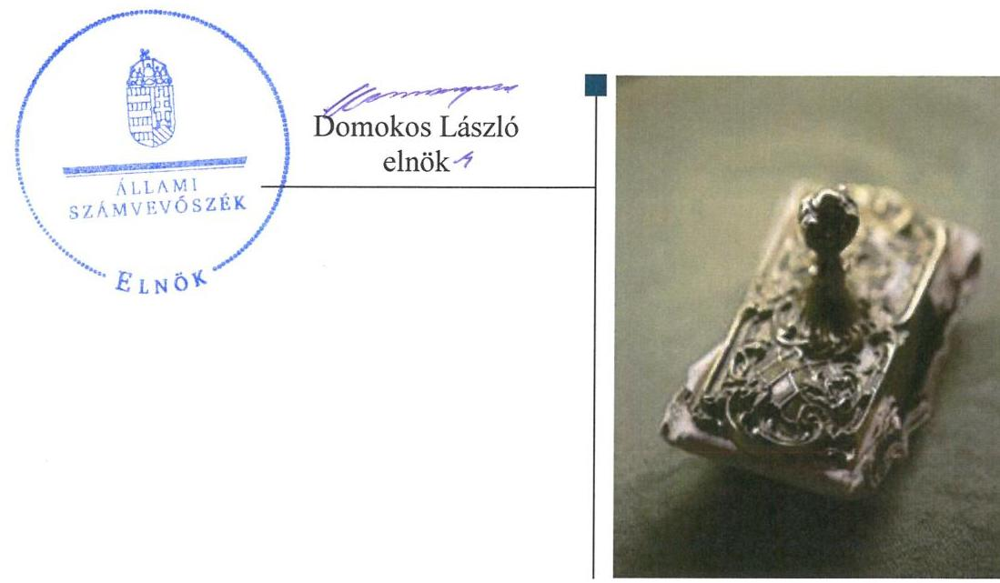
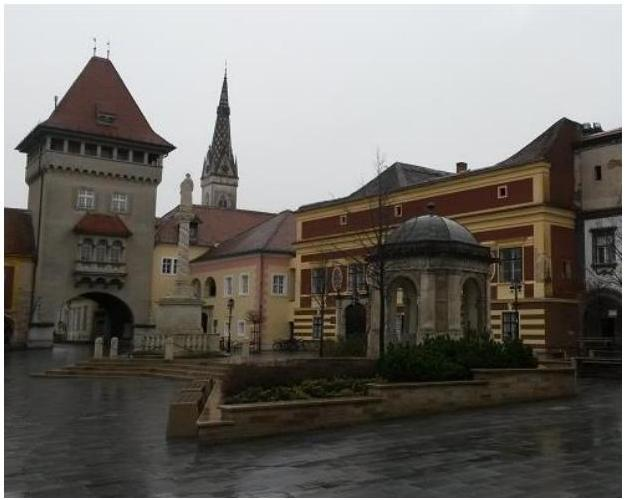
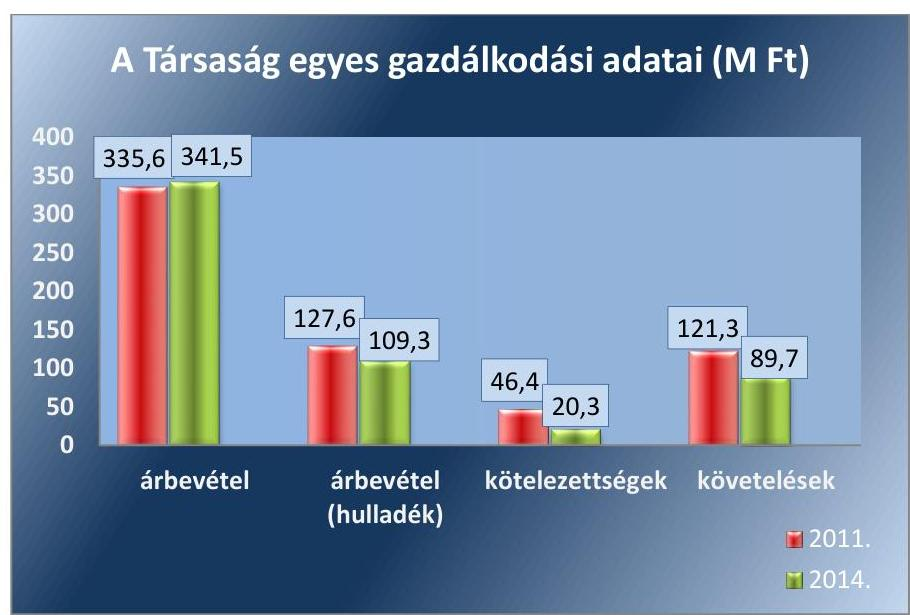
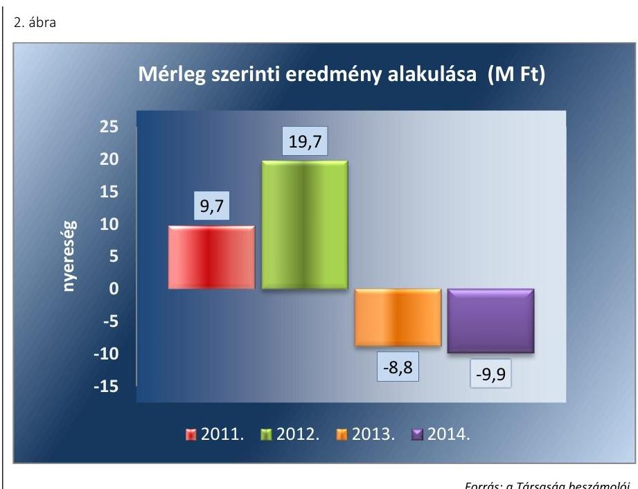
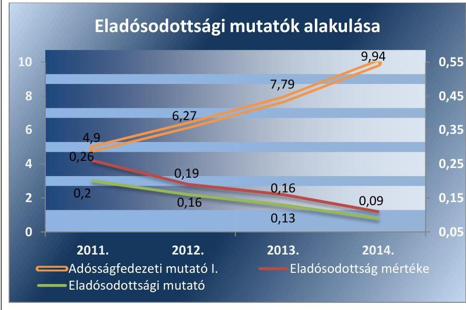
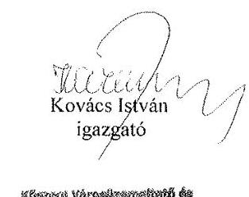
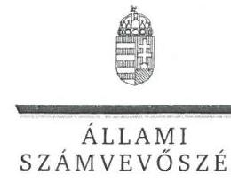
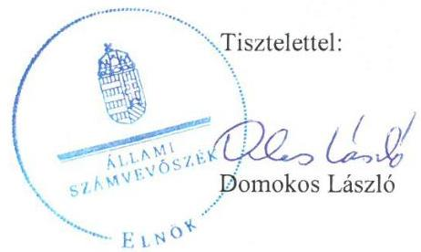

# Jelentés 

## Az önkormányzatok gazdasági társaságai

Az önkormányzatok többségi tulajdonában lévő gazdasági társaságok közfeladat ellátását érintő gazdálkodási tevékenysége szabályszerűségének ellenőrzése - Kőszegi Városüzemeltető és Kommunális Szolgáltató Nonprofit Kft.

2016

---

# Jelentés 

## Az önkormányzatok gazdasági társaságai

Az önkormányzatok többségi tulajdonában lévő gazdasági társaságok közfeladat ellátását érintő gazdálkodási tevékenysége szabályszerűségének ellenőrzése - Kőszegi Városüzemeltető és Kommunális Szolgáltató Nonprofit Kft.
2016. szegedemveser hó 24. nap

---

# AZ ELLENŐRZÉST FELÜGYELTE:

DR. HORVÁTH MARGIT felügyeleti vezető

## AZ ELLENŐRZÉST VEZETTE ÉS A VÉGREHAJTÁSÁÉRT FELELŐS:

GÁCSER JÓZSEF FERENC ellenőrzésvezető

## A PROGRAM ÖSSZEÁLLÍTÁSÁÉRT FELELŐS:

JANIK JÓZSEF LÁSZLÓ osztályvezető

IKTATÓSZÁM: V-1022-188/2016.

TÉMASZÁM: 2056

ELLENŐRZÉS-AZONOSÍTÓ SZÁM: V-070734

Jelentéseink az Országgyűlés számítógépes hálózatán és az Interneta a www.asz.hu címen is olvashatóak.

---

# TARTALOMJEGYZÉK 

■ ÖSSZEGZÉS ..... 5
■ AZ ELLENŐRZÉS CÉLJA ..... 7
■ AZ ELLENŐRZÉS TERÜLETE ..... 8
■ AZ ELLENŐRZÉS HÁTTERE, INDOKOLTSÁGA ..... 10
■ A JELENTÉS LÉNYEGES KÉRDÉSKÖREI ..... 11
■ ELLENŐRZÉS HATÓKÖRE ÉS MÓDSZEREI ..... 12
■ MEGÁLLAPÍTÁSOK ..... 14
■ JAVASLATOK ..... 35
■ MELLÉKLETEK ..... 39
I. Sz. melléklet: Értelmező szótár ..... 39
II. Sz. melléklet: A múködés főbb jellemzői ..... 42
■ FÜGGELÉK: ÉSZREVÉTELEK ..... 43
■ RÖVIDÍTÉSEK JEGYZÉKE ..... 53

---

.

---

# ÖSSZEGZÉS 

Az Állami Számvevőszék a Kőszegi Városüzemeltető és Kommunális Szolgáltató Nonprofit Kft. hulladékgazdálkodási közfeladat-ellátását érintő gazdálkodási tevékenysége 2011-2014 közötti szabályszerűségét ellenőrizte. A közszolgáltatás megszervezése tervezési, vagyonhasználati és rendeletalkotási hiányosságok miatt nem volt szabályszerű. Az Önkormányzat tulajdonosi jogait szabályszerűen gyakorolta. A Társaság vagyongazdálkodása az elkülönített nyilvántartás és a leltározás vonatkozásában nem volt szabályszerű. A Társaság az éves beszámolási kötelezettségét nem teljesítette szabályszerűen. Az adatok védelmét és átláthatóságát nem biztosította. A dijhátralékok kezeléséről nem gondoskodott szabályszerűen. Az árképzés sem volt szabályszerű, a díjak megalapozottsága nem volt biztosított.

## Az ellenőrzés társadalmi indokoltsága

Az Állami Számvevőszék középtávra szóló stratégiájában megfogalmazta, hogy a helyi önkormányzatok gazdálkodásában rejlő pénzügyi kockázatok feltárásával, az államháztartáson kívülre nyújtott költségvetési támogatások és ingyenes vagyonjuttatások, valamint az államháztartáson kívül múködő közfeladat-ellátó rendszerek ellenőrzéseivel hozzájárul ahhoz, hogy a közpénzeket az államháztartáson kívül múködő szervezetek is átlátható, rendezett módon használják fel a közfeladatok szerződésben vállalt ellátása érdekében.

A Magyarországon az intézmény-centrikus közfeladat-ellátás jellemző, de egyre jelentősebb a költségvetésen kívüli feladatellátás térnyerése. Ennek legfontosabb szereplői - a nonprofit szervezetek mellett - az önkormányzati tulajdonú gazdasági társaságok. Az önkormányzatok szervezetalakítási szabadságának következménye, hogy a korábban is vállalati formában múködő közszolgáltatások mellett, mind a kötelező, mind az önként vállalt fel-adatok ellátásában a gazdasági társaságok kiemelt fontosságú szerephez jutottak.

## Főbb megállapítások, következtetések, javaslatok

A közfeladat-ellátás megszervezése nem volt szabályszerű. Az apportba adott ingatlan a földhivatali nyilvántartásban történő átvezetését nem kérelmezték. Az Önkormányzat a közfeladatot szolgáló eszközök térítésmentes használatát szabálytalanul biztosította, a Közszolgáltatási szerződés; a vagyonelemeket nem beazonosítható módon, tételesen vette számba, hanem csoportosan, ezáltal megsértette az Nvtv. felelős gazdálkodásra vonatkozó alapelvét. A 2012. évtől hatályos árbefagyasztásra és 2013. évtől hatályos árszabályozási hatáskörre vonatkozó jogszabályváltozásokat a Hulladékgazdálkodási rendelet ${ }_{1}$-en nem a jogszabályi előírásoknak megfelelően vezették át. Az Önkormányzat gazdasági programmal és 2011-2012. évekre vonatkozó hulladékgazdálkodási tervvel nem rendelkezett.

A tulajdonosi jogokat a Képviselő-testület szabályszerűen gyakorolta, azonban nem élt a jogszabály által biztosított ellenőrzési lehetőségével. Az FB önálló belső ellenőrzési rendszer kialakítására tett intézkedési javaslatot, melyet a Társaság 2013. évtől végrehajtott. A Képviselő-testület a Társaságnak nyújtott kezességvállalás során nem tartotta be az Áht. előírásait, mert olyan hitelfelvételhez vállalt kezességet, melynek visszafizetése nem volt biztosított.

A Társaság rendelkezett a múködéshez szükséges szabályzatokkal, azonban azok - az elkülönítési kötelezettség és a leltározási gyakoriság szabályozása vonatkozásában - a jogszabályi előírásoknak nem feleltek meg. A szabályozásbeli hiányosságok hozzájárultak ahhoz, hogy a Társaság vagyongazdálkodása nem volt szabályszerű. A Társaság nem gondoskodott a Ht.-ben előírt olyan elkülönült nyilvántartás vezetéséről, amely a hulladékgazdálkodási közszolgáltatás és annak körébe nem tartozó tevékenységek átláthatóságát biztosította, és a keresztfinanszírozást kizárta volna. Az eszköznyilvántartást tevékenységenként nem különítették el, ezért az nem szolgáltatott megfelelő

---

részletezettségű adatokat a hulladékgazdálkodási tevékenység önálló mérlegének elkészítéséhez. Az éves beszámolók mérlegsorainak leltárral való alátámasztása az ellenőrzött időszakban nem volt teljes körű.

A Társaság a Számv. tv.-ben előírt beszámolási kötelezettségét nem szabályszerűen teljesítette. 2013-2014. években a hulladékgazdálkodásra vonatkozó önálló mérleget és eredménykimutatást nem készített, melyet a könyvvizsgáló nem kifogásolt. Egyéb adatszolgáltatási kötelezettségeinek a közszolgáltatói tevékenység költségelszámolása és a 2012. évi közhasznúsági beszámoló vonatkozásában nem tett eleget. A Társaság adatvédelmi felelőssel, adatvédelmi és adatbiztonsági szabályzattal nem rendelkezett. A közérdekű adatok megismerésére irányuló igények teljesítésének rendjére vonatkozó szabályzatot nem készített és a közérdekű adat közzétételi kötelezettségének sem tett eleget, ezáltal nem biztosította az átláthatóságát.

A Társaságnál az értékesítés nettó árbevételének és anyagjellegű ráfordításainak elszámolása a közszolgáltatási tevékenység elkülönítésének hiánya és a bevételek hibás könyvelése miatt nem volt megfelelő. A beruházások, illetve az értékcsökkenés elszámolása a bekerülési érték hibás meghatározása és az üzembe helyezés szabálytalanságai miatt nem volt megfelelő. A hátralékos követelések behajtásáról és a követelések értékvesztésének elszámolásáról nem a jogszabályoknak megfelelően gondoskodott a Társaság. A fizetési felszólítások kiküldéséről, illetve eredménytelen felszólítás esetén a követelések behajtásra történő átadásról nem vagy nem jogszabályban előírt határidőben intézkedtek. A kötelezettségek állománya az ellenőrzött időszakban nem jelentett kockázatot a közfeladat ellátására, ugyanakkor a pénzügyi egyensúly fenntartását folyószámla-hitel és önkormányzati támogatás igénybevételével biztosították.

A Társaság árképzése nem volt szabályszerű, mivel azt nem aktualizált és ellenőrizhető tényadatokra alapozták, továbbá a piaci rezsi óradíjakat figyelembe vevő kalkulációs módszer sem volt megfelelő. A jogszabályi előírásokhoz igazodó árképzés alapfeltételei - a közszolgáltatási bevételek és ráfordítások megfelelő elkülönítése hiányában - nem álltak rendelkezésre. A 2013. évi közszolgáltatási díjak megállapítása során a Rezsi tv. előírásait végrehajtották.

---

# AZ ELLENŐRZÉS CÉLJA 

Az ellenőrzés célja annak értékelése, hogy az önkormányzat a jogszabályi előírások figyelembevételével döntött-e az ellenőrzésre kerülő közfeladat megszervezéséről; az önkormányzat/tulajdonosi joggyakorló szabályszerűen gyakorolta-e a tulajdonosi jogokat; a gazdasági társaság közfeladat-ellátása bevételeinek, ráfordításainak elszámolása, és vagyongazdálkodási tevékenysége megfelelt-e a jogszabályi, illetve a közszolgáltatási/vagyonkezelési szerződésben foglalt tulajdonosi előírásoknak, azok végrehajtása szabályszerű volt-e; a gazdasági társaság kötelezettségállománya jelent-e kockázatot a működésre, il-
letve a közfeladat ellátására; a közfeladatok átláthatósága és elszámoltathatósága érdekében biztosítva volt-e a közszolgáltatás díjának megalapozottsága szabályszerű önköltségszámítással.

---

# AZ ELLENŐRZÉS TERÜLETE

## Kőszeg Város Önkormányzata és a kizárólagos tulajdonában lévő Kőszegi Városüzemeltető és Kommunális Szolgáltató Nonprofit Kft.

A Kőszegi Város Önkormányzata a Kőszegi Városüzemeltető és Kommunális Szolgáltató Közhasznú Társaságot a 2005. február 1-jén kelt Alapító Okirattal hozta létre, jogutódja Kőszegi Városüzemeltető és Kommunális Szolgáltató Nonprofit Kft lett, 2009. július 1-jén.

A Társaság1 alaptevékenységeként Kőszegi Város közigazgatási területén a nem veszélyes hulladék gyűjtését jelölték meg. Egyéb tevékenységei többek között építési és fenntartási tevékenység, ingatlankezelés, építmény üzemeltetés, zöldterület kezelés volt.

A Társaság Kőszegi Város Önkormányzatának 100%-os tulajdonában volt az ellenőrzött időszakban. A Társaság az ellenőrzött időszakban más társaságban tulajdoni hányaddal, részesedéssel nem rendelkezett.

A Társaság a megközelítően 12 ezer lakosság számú Kőszegen kívül az ellenőrzött időszakban további 12 településen látott el hulladékgazdálkodási feladatokat, az ellátott lakosok száma elérte 16 ezer főt. 2014. évben a hulladékszállításra kötött lakossági szerződések száma 3177 db, a nem lakossági 281 db volt.

A Társaságnál foglalkoztatottak száma 2014. évben 67 fő volt, amely a 2011. évihez képest 6 fős csökkenést jelentett.

A Társaság 2011. és 2014. évi gazdálkodására vonatkozó egyes adatokat az 1. ábra szemlélteti:

1. ábra

*Forrás: A Társaság 2011. és 2014. évi beszámolói*

---

A hulladékgazdálkodás értékesítésének nettó árbevétele a Társaság összes nettó árbevételének körülbelül harmada volt. 2011. évről 2014. év végére a hulladékgazdálkodással kapcsolatos értékesítés nettó árbevétele 15\%-kal, 18,3 M Ft-tal csökkent. A kötelezettségek állománya a 2011. évi végi 46,4 M Ft-ról a 2014. év végére 56\%-kal 20,3 M Ft-ra csökkent. A vevő követelések állománya az ellenőrzött időszak alatt 27,8 M Ft-tal csökkent, a 2014. év végi érték 23,9 \%-kal alacsonyabb, mint a 2011. év végi állomány értéke.

A befektetett eszközök mérlegértéke a 2011. évi nyitó adatról a 2014. év végére $4 \%$-kal, 3,2 M Ft-tal nőtt. A forgóeszközök 2011. évi nyitó mérlegértéke 135,9 M Ft-ról 2014. év végére 118,8 M Ft-ra csökkent. Összességében a mérlegfőösszeg 3,6 \%-kal 7,7 M Ft-tal nőtt az ellenőrzött időszakban. A jegyzett tőke összege az ellenőrzött időszak alatt nem változott, a saját tőke állománya azonban 10,0 \%-kal, 17,3 M Ft-tal nőtt.

Az ellenőrzött időszakban az ügyvezető személye nem változott, a gaz-dasági-pénzügyi feladatokat megosztva alkalmazott és külső megbízott szakember látta el. A 2011. és 2012. évi beszámolót könyvelő vállalkozás, a 2013. és 2014. évi beszámolót egyéni vállalkozó készítette. Az ügyvezető és a pénzügyi csoportvezető 2009. június 15. óta tölti be tisztségét. A könyvvizsgálati feladatokat az ellenőrzött időszakban ugyanaz a vállalkozás látta el.

Az ellenőrzött időszakban a polgármester személye nem, a jegyző személye pedig egy alkalommal, 2013. év áprilisában változott. A polgármester a 2006. évi önkormányzati választások óta tölti be tisztségét.

---

# AZ ELLENŐRZÉS HÁTTERE, INDOKOLTSÁGA 

## AZ ÖNKORMÁNYZATI TULAJDONÚ GAZDASÁGI

TÁRSASÁGOK teljes körű ellenőrzésének lehetőségét az ÁSZ. tv. ${ }^{2}$ 2011. január 1-jétől hatályos módosítása teremtette meg. A közfeladatot ellátó gazdasági társaságok ellenőrzése kiemelten fontos a vagyon megőrzése, megóvása érdekében, valamint a kormányzati szektor elszámolásaiban megjelenő önkormányzati tulajdonú gazdálkodó szervezetek esetében, amelyekkel szemben alapvető követelmény, hogy gazdálkodásuk, müködésük szabályszerű, az általuk szolgáltatott adatok minél megbízhatóbbak legyenek. A közfeladat ellátás költségeinek, ráfordításainak alakulása, színvonala hatással van a lakosság elégedettségére. A törvényalkotás számára - az észlelt problémák, szabálytalanságok, vagy egyéb nem kívánatos jelenségek felszínre kerülésével - az ellenőrzés megállapításai segítséget nyújthatnak az államháztartáson kívüli közfeladat-ellátás értékeléséhez, jogszabályi keretei pontosításához, átláthatóságot biztosító szabályozásához. Meghatározhatóvá válnak a közfeladat ellátásban részt vevő államháztartáson kívüli szervezeteknek - az önkormányzat költségvetését, pénzügyi helyzetét is befolyásoló - kockázatai, lehetővé válik ezen kockázatok csökkentése. Ellenőrzéseink feltárhatják, hogy az önkormányzat közfel-adat-ellátási kötelezettségének szabályszerűen tett-e eleget, a feladatellátáshoz rendelt közvagyon működtetését a tulajdonostól elvárható gondossággal, szabályszerűen szervezte-e meg és a tulajdonosi felügyelete hozzá-járult-e a közfeladat-ellátásához. Az ellenőrzés rávilágíthat arra, hogy a gazdasági társaság a közszolgáltatási szerződésben foglaltak betartásával, a közvagyon használatával biztosította-e a szolgáltatás folyatatásának feltételeit, a közfeladat ellátását. Ezzel az ellenőrzöttek és a helyi döntéshozók számára visszajelzést ad feladatszervezési, feladat-ellátási kockázataikról, alapot ad a meglévő hibák megszüntetéséhez, a jobb közfeladat-ellátás biztosításához. Fokozza a fegyelmet, igazolja, hogy lejárt a következmények nélküli ellenőrzések időszaka. Az ÁSZ értékteremtő rend kialakításához és megőrzéséhez hozzájáruló tevékenysége pozitív hatással van a szervezetről kialakított összkép formálására.

---

# A JELENTÉS LÉNYEGES KÉRDÉSKÖREI 

1. Az Önkormányzat közfeladat megszervezéséről szóló döntése, valamint tulajdonosi joggyakorlása szabályszerű volt-e?
2. A gazdasági társaság vagyongazdálkodása szabályszerű volt-e, kötelezettségállománya jelentett-e kockázatot a müködésre, illetve a közfeladat ellátásra?
3. A gazdasági társaságnál az ellátott közfeladat bevételei és ráfordításai elszámolása, valamint az önköltségszámítás és árképzés szabályszerű volt-e?

---

# ELLENŐRZÉS HATÓKÖRE ÉS MÓDSZEREI 

## Az ellenőrzés típusa

Megfelelőségi ellenőrzés.

## Az ellenőrzött időszak

2011. január 1-jétől 2014. december 31-ig tartó időszak.

## Az ellenőrzés tárgya

A közfeladatot gazdasági társaságokkal ellátó önkormányzatok tulajdonosi joggyakorlása, valamint gazdasági társaságok pénz- és vagyongazdálkodásának szabályozottsága és szabályszerűsége.

Az ellenőrzés kiterjed minden olyan körülményre és adatra, amely az ÁSZ jogszabályban meghatározott feladatainak teljesítéséhez, valamint a program végrehajtása folyamán felmerült újabb összefüggések feltárásához szükséges.

## Az ellenőrzött szervezet

Kőszeg Város Önkormányzata és a
Kőszegi Városüzemeltető és Kommunális Szolgáltató Nonprofit Kft.

## Az ellenőrzés jogalapja

Az ellenőrzés jogszabályi alapját az Állami Számvevőszékről szóló 2011. évi LXVI. törvény 5. § (3)-(4)-(5) be-kezdése képezte.

## Az ellenőrzés módszerei

Az ellenőrzést a nemzetközi standardokat irányadónak tekintve az ellenőrzési program ellenőrzési kérdései, az ellenőrzött időszakban hatályos jogszabályok, az ellenőrzés szakmai szabályok és módszertanok figyelembe vételével végezzük.

Az ellenőrzés ideje alatt az ellenőrzött szervezettel történő kapcsolattartást az ÁSZ Szervezeti és Múködési Szabályzatának vonatkozó előírásai alapján biztosítjuk.

Az ellenőrzés a kiválasztott, többségi tulajdonosi jogokat gyakorló önkormányzatra, illetve az ellenőrzésre kijelölt közfeladatot ellátó gazdasági

---

társaság felett tulajdonosi jogokat gyakorló szervezetre és az ellenőrzött közfeladatot ellátó gazdasági társaságra terjed ki. Amennyiben a gazdasági társaságban több önkormányzat együttesen többségi tulajdonos, úgy az ellenőrzést a többségi tulajdonosi jogokat gyakorló önkormányzatnál kell lefolytatni. Az ellenőrzött gazdasági társaságnál, amennyiben az több közfeladatot is ellát, akkor az ellenőrzésre kiválasztott közfeladat-ellátást ellenőrizzük.

Az ellenőrzést a kérdésekre adott válaszok kiértékelésével, valamint a megjelölt adatforrások, a csatolt tanúsítványok felhasználásával, továbbá az adott időszakban hatályos jogszabályok figyelembe vételével kell lefolytatni. Az ellenőrzési kérdések megválaszolásához szükséges bizonyítékok megszerzése a következő ellenőrzési eljárások alkalmazásával történik: megfigyelés, kérdésfeltevés (információkérés), összehasonlítás, valamint elemző eljárás.

A bevételek és ráfordítások elszámolása, valamint a vagyonnyilvántartás terén a szabályszerű működést véletlen mintavétellel ellenőriztük. A jogszabályoknak és a belső előírásoknak megfelelőnek tekintettük az adott területet, amennyiben a minta ellenőrzésének eredménye alapján 95\%kos bizonyossággal a teljes sokaságban a hibaarány kisebb volt, mint 10\%, nem megfelelőnek, ha a hibaarány a 10\%-ot meghaladta. Kockázatot, illetve magas kockázatot jeleztünk, amennyiben egy adott terület vonatkozásában a minta alapján a teljes sokaságban nem volt egyértelműen biztosított a jogszabályoknak és a belső szabályzatoknak megfelelő működés. A ráfordítások elszámolására és a vagyonnyilvántartásra vonatkozó véletlen mintavételt kockázati alapú kiválasztással egészítettük ki, amelynek során a három legnagyobb összegű tételt választottuk ki.

---

# 1. Az Önkormányzat közfeladat megszervezéséről szóló döntése, valamint tulajdonosi joggyakorlása szabályszerű volt-e? 

Összegző megállapítás

Az Önkormányzat a hulladékgazdálkodási közszolgáltatás megszervezéséről - a vagyonhasználati, szerződéskötési és rendeletalkotási hiányosságokra figyelemmel - nem gondoskodott szabályszerűen. Az ellenőrzött időszakban gazdasági programmal, illetve a 2011-2012. évekre hulladékgazdálkodási tervvel nem rendelkezett. Tulajdonosi jogait szabályszerűen gyakorolta, azonban a kezességvállalások során nem tartotta be a jogszabályi előírásokat.
1.1. számú megállapítás

A közfeladat-ellátás megszervezése nem volt szabályszerű, az Önkormányzat a rendeletalkotási, szerződéskötési kötelezettségének hiányosan tett eleget. Az apportált ingatlan földhivatali bejegyzését nem kezdeményezték. Az Önkormányzat a közfeladatot szolgáló eszközök térítésmentes használatát nem a felelős vagyongazdálkodásra vonatkozó szabályok szerint biztosította. Az ellenőrzött időszakban gazdasági programmal, valamint a 2011-2012. évekre vonatkozó hulladékgazdálkodási tervvel az Önkormányzat nem rendelkezett.

GAZDASÁGI PROGRAM a 2011-2014. évekre vonatkozóan, az Ötv. ${ }^{3}$ 91. § (1) bekezdésében, illetve az Mötv. ${ }^{4}$ 116. § (1) bekezdéseiben foglaltak ellenére nem készült. A Jegyző a Htv. ${ }^{5}$ 140. § (1) bekezdés a) pontjában előírtak ellenére nem készítette el gazdasági programtervezetet, ezért azt a polgármester a Htv. 139. § (1) bekezdés a) pontjában előírtak ellenére nem terjesztette a Képviselő-testület ${ }^{6}$ elé.

## A KÖZÉP- ÉS HOSSZÚ TÁVÚ VAGYONGAZDÁLKODÁSI TERVÉT az Nvtv. ${ }^{7}$ 9. § (1) bekezdésében előírtak szerint az Önkormányzat a 23/2013. (II. 28.) Kt. határozattal elfogadta, melynek pontos hatálya nem került meghatározásra. A vagyongazdálkodási terv az ellenőrzött közfeladattal kapcsolatos rendelkezéseket nem tartalmazott, előírta azonban, hogy a vagyonnal felelős módon, rendeltetésszerűen kell gazdálkodni, valamint, hogy kiemelt figyelmet kell fordítani a vagyon-nyilvántartás aktualizálására. Az Nvtv. 9.§ (1) bekezdése 2012. év január 1-jétől lépett hatályba, ennek ellenére az Önkormányzat 2012. évre vonatkozó vagyongazdálkodási tervvel nem rendelkezett.

A 106/2008. (V. 8.) Kt. határozattal a 2008-2013. évekre elfogadott IVS ${ }_{1}{ }^{8}$-ben a hulladékgazdálkodás színvonalának javítására vonatkozó kiemelt célkitúzés szerepelt. A 95/2014. (V. 29) Kt. határozattal a 2014-2020. évekre elfogadott IVS ${ }_{2}{ }^{9}$ tartalmazta a hulladékgazdálkodás fejlesztésével

---

kapcsolatos elképzeléseket, így a szelektív hulladékgyűjtés fejlesztését, a képzést, a tudatformálást és a rekultivációt.

# A KÖZTISZTASÁG ÉS TELEPÜLÉSTISZTASÁG 

BIZTOSÍTÁSA az Ötv. 8. § (1) bekezdése, illetve a Mötv. 13. § (1) bekezdés 19. pontja alapján a hulladékgazdálkodás az Önkormányzat törvényi kötelezettsége volt.

Az Önkormányzat az ellenőrzött időszakot megelőzően döntött a közfeladat gazdasági társasági formában történő ellátásáról ${ }^{10}$. A hulladékgazdálkodási közszolgáltatást az Önkormányzat az Ötv. 9. § (4) bekezdése, illetve az Mötv. 41. § (6) bekezdése alapján kizárólagos tulajdonú gazdasági társasága útján, a 2005. február 1-jétől megszüntetett Városgondnokság nevű önkormányzati intézmény feladatainak ellátását végezte.

Az Önkormányzat szintén az ellenőrzött időszakot megelőzően döntött a több önkormányzatot magában foglaló Társuláshoz ${ }^{11}$ való csatlakozásról ${ }^{12}$, a Hgt. ${ }^{13} 22 . \S$ (1) bekezdése, valamint a Ht. ${ }^{14} 36 . \S$ (1) bekezdése szerint. Az Mötv. 146. § (1) bekezdésének megfelelően a Társulás felülvizsgálta ${ }^{15}$ az Mötv. hatálybalépése előtt kötött Társulási Megállapodást, melyet az Önkormányzat jóváhagyott. A Társulás tagjai az Európai Unió pályázati alapjából igényelhető támogatással kívántak komplex regionális hulladékgazdálkodási rendszert létrehozni, fenntartani, üzemeltetni. Olyan fejlesztések megvalósítását tervezték, mint szelektív hulladékgyűjtés feltételeinek megteremtése, hulladékudvarok kialakítása, hulladéklerakók rekultivációja, amelyek megvalósítását a KEOP ${ }^{16}$ pályázati programok keretei között kívánták megoldani.

HULLADÉKGAZDÁLKODÁSI TERV az Önkormányzatnál a Hgt. 35. § (1) bekezdésében előírtak ellenére a 2011-2012. években nem készült. A jegyző a 241/2001. (XII. 10.) Korm. rendelet ${ }^{17}$ 1. § e) pontjában előírtak ellenére azt nem készítette elő.

A 2013-2014. évekre vonatkozóan a Társaság a Ht. 78. § (1) bekezdésének megfelelően a közszolgáltatói hulladékgazdálkodási tervet elkészítette és a Ht. 78. § (3) bekezdése szerint a környezetvédelmi hatóságnak megküldte. A 2016-ig érvényes hulladékgazdálkodási tervet az OKTVF ${ }^{18}$ a 14/8034-10/2013. számú határozatával hagyta jóvá 2013. december 11én. Az OHÜ ${ }^{19}$ minősítő engedélyét, a hulladékgazdálkodási tervben foglaltak figyelembe vételével 2014. január 27-i keltezéssel adta ki.

A Társaság feladatellátásának kereteit az Alapító Okiratban és a Hulladékgazdálkodási rendelet ${ }_{1,2}$-ben határozták meg. A Társaság a hulladékgazdálkodási közszolgáltatást az ellenőrzött időszakban a Hgt. 28. § (1) és Ht. 33. § (1) bekezdése alapján megkötött Közszolgáltatási szerződés ${ }_{1}{ }^{20}{ }_{2}{ }^{21}$ alapján végezte.

A KÖZSZOLGÁLTATÁSI SZERZŐDÉS ${ }_{1}$, melyet a Társaság az ellenőrzött időszakot megelőzően kötött, valamennyi városüzemeltetési és kommunális közszolgáltatást tartalmazta. A Közszolgáltatási Szerződés ${ }_{1}$ az előírásoknak teljes körűen nem felelt meg. A 224/2004. (VII. 22.) Korm. rendelet ${ }^{22}$ 11. § (2) bekezdésének megfelelően meghatározta a közszolgáltatási feladatot, annak ismérveit, a teljesítés területi kiterjedését, a közszolgáltatás időtartamát. Ugyanakkor a 224/2004. (VII. 22.) Korm. rendelet

---

12. § (1)-(2) bekezdéseivel ellentétben nem írta elő a Társaság és az Önkormányzat kötelezettségeit, így többek között a közszolgáltatás folyamatos és teljes körű, illetve meghatározott rendszer, módszer és gyakoriság szerinti ellátását, valamint a Társaság számára szükséges információk szolgáltatását. Közszolgáltatási Szerződés ${ }_{1}$ hulladékgazdálkodásra vonatkozó 2.1. pontját az Önkormányzat 2013. szeptember 1-jén a Ht. 90. § (5) bekezdésének megfelelően 6 hónapos határidővel, Kt. határozattal ${ }^{23}$ felmondta, mivel a Társaság ezen időpontig nem szerezte meg a Ht. 62. § (2) bekezdése szerinti hulladékgazdálkodási közszolgáltatási engedélyt, valamint az OHÜ minősítő okiratot.

A Társaság 2014. évben rendelkezett az OHÜ által kiállított minősítő okirattal, és OKTVF által kiadott hulladékgazdálkodási engedéllyel, így megfelelt a Ht. 34.§ (3) bekezdése szabályainak. Az engedélyek birtokában az Önkormányzat és a Társaság 2014. február 27-én megkötötte a Közszolgáltatási Szerződés2-t betartva a Ht. 90. § (8) bekezdése szerinti 2014. július 1jei határidőt. A Közszolgáltatási Szerződés ${ }_{2}$ megfelelt a Ht. és a 317/2013. (VIII.28.) Korm. rendelet ${ }^{24}$ előírásainak. A Közszolgáltatási Szerződés2 a Közszolgáltatási Szerződés ${ }_{1}$-el ellentétben kizárólag a hulladékgazdálkodási közszolgáltatással kapcsolatos feladatokat tartalmazta. A Közszolgáltatási szerződés ${ }_{2}$ meghatározta a Ht. 34. § (5) bekezdésének megfelelően a közszolgáltató azonosító adatait, a közszolgáltatás megnevezését, az ellátandó területet, a tevékenység végzésének időtartamát, valamint a 317/2013. (VIII.28.) Korm. rendelet 4. § előírásainak megfelelően a Társaság és az Önkormányzat kötelezettségeit.

A TÁRSASÁG ALAPÍTÓ OKIRATA ${ }^{25}$ megfelelt a Gt. ${ }^{26} 12$. § (1) bekezdésében, illetve a Ptk. ${ }^{27} 3: 5$ §-ában előírt tartalmi követelményeknek, tartalmazta a Társaság megnevezését, székhelyét, a Társaság tevékenységeit, a képviselet és a cégjegyzés módját, a jegyzett tőkéjét, a jegyzett tőke jegyzésének és rendelkezésre bocsátásának módját és idejét. Tartalmazta továbbá a Társaság vezető tisztségviselőjének, felügyelőbizottsági tagok és a könyvvizsgáló nevét. Az Alapító Okiratot az ellenőrzött időszakban az Önkormányzat Képviselő-testülete több alkalommal módosította, többek között a Képviselő-testület javaslata alapján az FB tagok, a könyvvizsgáló személyében bekövetkezett változások, illetve a jogszabályi előírások átvezetése miatt. Az Önkormányzat 59/2009 (III. 26.) határozata alapján a Társaság az ellenőrzött időszakban nonprofit társaságként működött.

# A KÖZFELADAT ELLÁTÁSÁHOZ SZŰKSÉGES VAGYONT (ingatlanokat, gépeket, egyéb eszközöket) az Önkormányzat az ellenőrzött időszakot megelőzően, az Alapító Okirat mellékletében feltüntetett jegyzék szerint, apportként biztosította. A Társaság könyveiben az átvett eszközök az apportjegyzékben foglaltak szerint szerepeltek. Ugyanakkor az apport keretében átvett ingatlan a földhivatali nyilvántartásban az ellenőrzött időszakban a 1997. évi CXLI tv ${ }^{28}$ 26. § (1) bekezdése ellenére nem került átvezetésre a Társaság nevére. A bejegyzési kérelmet az ingatlanügyi hatósághoz nem nyújtották be a 1997. évi CXLI tv. 26. § (4) bekezdése ellenére. Az ingatlan az Önkormányzat számviteli nyilvántartásaiban nem szerepelt.

Továbbá az Önkormányzat az ellenőrzött időszakban a Közszolgáltatási szerződés ${ }_{1}$ keretében befektetett eszközök és készletek térítésmentes

---

használatát biztosította a Társaság számára. A használatba adás a vagyongazdálkodási rendelet ${ }^{29}$ 12. §-ában foglaltakba ütközött, amely az önkormányzati vagyon térítésmentes használatát, 2014. május 31-ig nem tette lehetővé a Társaság esetében. Az Önkormányzat a használatra átadott eszközöket az előírásoknak megfelelően számviteli nyilvántartásából nem vezette ki. A 2013. szeptember 1-jén (2014. március 1. hatállyal) módosított Közszolgáltatási szerződés; 3.1. pontja a Társaság részére térítésmentes használatra biztosított vagyonelemeket továbbra sem beazonosítható módon, tételesen vette számba, hanem például telephelyi garázsok, műhelyek, irodai irodai- és raktárkészletek megjelöléssel csoportosan. Ezzel az Önkormányzat az ellenőrzött időszak alatt - megsértette az Nvtv. 7. § (1) bekezdésében foglalt vagyongazdálkodási alapelvet, mely szerint a vagyonnal felelős módon kell gazdálkodni. A csoportos használatba adás sértette továbbá a vagyongazdálkodási rendelet 1. §-át, mely előírta az önkormányzati tulajdon folyamatos és fokozott védelmét.

A 2014. március 1-től hatályos hulladékgazdálkodási közfeladat ellátására vonatkozó Közszolgáltatási szerződés ${ }_{2}$ nem tartalmazta a Közszolgáltatási szerződés ${ }_{1}$ alapján térítésmentes használatba adott ingatlanokat és tárgyi eszközöket. A Közszolgáltatási szerződés ${ }_{1}$ 2013. szeptember 1-jei hat hónapos határidővel történő módosítását (hulladékgazdálkodásra vonatkozó 2.1. pontjának felmondását) követően már csak a hulladékgazdálkodás mellett végzett többi közfeladat ellátását szabályozta. Ugyanakkor a Közszolgáltatási szerződés ${ }_{2}$ 2014. március 1. után is hatályban maradt 3.1. rendelkezése biztosította a hulladékgazdálkodást szolgáló vagyon további térítésmentes használatának jogalapját.

A HULLADÉKGAZDÁLKODÁSI RENDELET ${ }_{1}{ }^{30}$ a Hgt. 23. §. a)-d) és h) pontjaiban előírtaknak megfelelően szabályozta a települési szilárd hulladékok kezelése, a hulladékkezelési közszolgáltatás szervezése és fenntartása feladatait, a közszolgáltatás ellátásának rendjét, igénybevétele módját és feltételeit. Nem tartalmazta a Hgt. 23. § e) g) pontjaiban foglaltak ellenére a közszolgáltatással összefüggő személyes adatok kezelésére vonatkozó, valamint a települési Önkormányzat közszolgáltatással összefüggő feladat és hatáskörét meghatározó rendelkezéseket. A Hgt. 23. § f) pontjának megfelelve a hulladékgazdálkodási rendelet ${ }_{1}$ 2. számú melléklete tartalmazta a közszolgáltatási díjakat.

A 2012. évre meghatározott közszolgáltatási díj a Hgt. 57. § (1) bekezdésével szemben - a díjemelés 2012. március 5-ei hatályon kívül helyezéséig - meghaladta a 2011. évre megállapított hulladékkezelési közszolgáltatási díj legmagasabb mértékét.

A Ht. 47. § (4) bekezdésében előírtak alapján 2013. január 1-jétől a hulladékgazdálkodási díj megállapítása a miniszter ${ }^{31}$ hatáskörébe került. A hulladékgazdálkodási rendelet ${ }_{1}$ díjakat tartalmazó 2. számú mellékletét a Képviselő-testület 2013. július 1-jével helyezte hatályon kívül, ezért 2013. január 1-jétől 2013. június 30 -áig a hulladékgazdálkodási rendelet ${ }_{1}$ a Ht. rendelkezésébe ütközött, ugyanakkor a díjak a Rezsi tv. ${ }^{32}$-el összhangban kerültek megállapításra.

A hulladékgazdálkodási rendelet ${ }_{1}$ 2013. január 1-jétől 2013. december 31-ig a Ht. 35. § c), f) és g) pontjával ellentétben nem tartalmazta a hulla-

---

1.2. számú megállapítás
1. táblázat

BELSŐ ELLENŐRZÉSEK (DB)

|  | 2013 | 2014 |
| :-- | --: | --: |
| fizető parkolás | 4 | 8 |
| pénztár | 4 | 4 |
| üzemanyag elsz. | 2 | 2 |
| munkaköri leírások | 1 | - |
| hulladéklerakó múk. | 5 | 1 |
| kintlévőség-kezelés | - | 1 |
| menetlevelek | - | 1 |
| környezetvédelem | - | 1 |
| összesen | 16 | 18 |

dékgazdálkodási közszolgáltatási szerződés egyes tartalmi elemeit, az üdülőingatlanokra vonatkozó sajátos szabályokat és a közszolgáltatással összefüggő személyes adatok kezelésére vonatkozó rendelkezéseket.
2014. január 1-jétől hatályos Hulladékgazdálkodási rendelet ${ }^{33}$ megfelel a Ht. 35. § előírásainak.

A tulajdonosi jogokat az Önkormányzat szabályszerűen gyakorolta, azonban nem élt a jogszabály által biztosított belső ellenőrzés lehetőségével. Az FB javaslatára a Társaságnál a 2013. évtől belső ellenőrt foglalkoztattak. A kezességvállalások során nem tartották be a jogszabályi előírásokat.

AZ ÖNKORMÁNYZAT TULAJDONOSI JOGAIT a Társaság Alapító Okirata rögzítette. Az alapító Képviselő-testület kizárólagos hatáskörébe tartozott többek között az éves számviteli beszámoló elfogadása, az ügyvezető kinevezése, díjazásának megállapítása, a könyvvizsgáló, felügyelő bizottsági tagok megválasztása.

Az ellenőrzött időszakban a tulajdonosi jogokat az Önkormányzat szabályszerűen gyakorolta, a Társaság éves beszámolásának határidejét a Képviselő-testület éves munkaprogramjaiban határozta meg. A Számv. tv. ${ }^{34}$ szerinti éves beszámolási kötelezettség teljesítésével egyidejúleg a Társaság minden évben szakmai múködési beszámolót is készített. A szakmai beszámolóhoz kritériumokat a Képviselő-testület nem határozott meg.

Az Önkormányzat a Társaság tevékenységét az ellenőrzött időszakban nem ellenőrizte, nem élt az Ötv. 92. § (11) bekezdés b) pontjában, illetve az Áht. ${ }^{35}$ 70. § (1) bekezdés d) pontjában biztosított lehetőséggel. Az Önkormányzat belső ellenőrzési tervét a 2011-2013. években kockázatelemzéssel nem támasztották alá, megsértve a Ber. ${ }^{36}$ 6. § (4) bekezdésének, valamint a Bkr. ${ }^{37} 29$. § (1) bekezdésének előírásait. A 2014. évi belső ellenőrzési tervhez kapcsolódó kockázatelemzés értékelte az önkormányzat gazdálkodás folyamatait, intézményeit, egyéb gazdálkodó szervezeteit a Társaság kivételével. Az FB ${ }^{38}$ a 2012. évben önálló belső ellenőrzési rendszer kialakítására tett intézkedési javaslat ${ }^{39}$-ot, melyet a Társaság 2013. évtől végrehajtott. A Társaság által alkalmazott belső ellenőr 2013-2014. között 8 témában, 34 db ellenőrzést végzett (1. táblázat), súlyos hiányosságot nem tárt fel.

Az ellenőrzött időszakban az Önkormányzat a Társaságában a tulajdonosi ellenőrzési jogokat a FB-n keresztül gyakorolta. A Képviselő-testület az FB tagjait és az ügyvezetőt a Társaság tevékenységéről évente beszámoltatta. Az FB évente beszámolót készített a tevékenységéről, amelyben öszszefoglalóan szerepelt valamennyi, az évközben meghozott FB határozat. Az FB éves beszámolóját a Képviselő-testület határozatával minden ellenőrzött évben jóváhagyta.

A FELÜGYELŐ BIZOTTSÁG a Társaságnál a 2011. január 1-je és 2011. április 1-je között hat, 2011. április 1-je és 2014. december 31-e között három tagból állt a Gt. 34. § (1) bekezdésében, illetve a Ptk. 3:121. § (1) bekezdésben foglaltaknak megfelelően. Az FB az ellenőrzött időszakban a Gt. 34. § (4) bekezdésében, illetve a Ptk. 3:122. § (3) bekezdésében előírtaknak megfelelően rendelkezett ügyrenddel.

---

JAVADALMAZÁSI SZABÁLYZATOT a Taktv ${ }^{40}$. 5. § (3) bekezdésében foglaltaknak megfelelően a Képviselő-testület elkészítette. A Javadalmazási szabályzat hatálya kiterjedt a Társaság vezető állású munkavállalójára, ügyvezetőjére, az FB tagjaira, a könyvvizsgálóra. A Javadalmazási szabályzat 1.2. pontja kimondta, hogy a Társaság vezetője éves prémiumban nem részesülhet. A Javadalmazási szabályzat értelmében az ügyvezető számára az éves üzleti terv és a gazdasági célkitűzések eredményes megvalósítása, a Társaság hatékony működtetése esetén jutalom volt megállapítható, melyet az ellenőrzött időszakban nem fizettek.

# A KÉPVISELŐ-TESTÜLET ELŐZETESEN KEZES- 

SÉGET VÁLLALT a 86/2014. (IV. 29.) számú Kt. határozattal a Társaság által 2014. május 12-én felvett 25 millió Ft összegű folyószámlahitel fedezetére. Az ügyvezető a kezességvállalás iránt benyújtott előterjesztésének II. fejezet (5) bekezdésében rögzítette, hogy a hitel összegét az Önkormányzatnak várhatóan támogatásként át kell adnia a Társaság részére, mivel a Társaság éves összes árbevétele és nonprofit formája nem teszi lehetővé a hitel rövid időn belüli visszafizetését. Az ügyvezetői előterjesztésre figyelemmel a kezességvállalás sértette az Áht. 2 96. § (1) bekezdését, mely szerint az önkormányzat kezességet érvényesen úgy köthet, ha a hitel, kölcsön vagy kötvény visszafizetése a kezességet vállaló általi egyéb többlettámogatás nélkül kellően biztosított. A Képviselő-testület előírta ${ }^{41}$, hogy a hitel felhasználásáról a Társaság minden hónapban köteles tájékoztatni a Pénzügyi, Jogi és Vagyonügyi Bizottságot. Ezen kötelezettségének a Társaság nem tett eleget. A Képviselő-testület a 219/2014. (XII.18.) számú határozatával döntött arról, hogy a Társaságnak a folyószámlahitel visszafizetéséhez $22,3 \mathrm{M}$ Ft vissza nem térítendő támogatást nyújt, tekintettel arra, hogy a hitel lejárata 2014. december 31-e volt és a visszafizetése nem volt biztosított. A vissza nem térítendő támogatásról szóló döntés napján a Képviselő-testület a 220/2014. (XII.18.) Kt. határozattal a Társaság újabb 25 millió Ft összegű folyószámlahitel kérelméhez vállalt kezességet előzetesen.

A Társaság tevékenysége a 2011-2012. években nyereséges, 20132014. években veszteséges volt. A Társaság mérleg szerinti eredményének 2011-2014. évi alakulását a 2. ábra szemlélteti.

---

*Forrás: a Társaság beszámolói*

## 2. A gazdasági társaság vagyongazdálkodása szabályszerű volt-e, kötelezettségállománya jelentett-e kockázatot a működésre, illetve a közfeladat ellátásra?

### Összegző megállapítás

**A Társaság vagyongazdálkodása és az éves beszámolási kötelezettség teljesítése nem volt szabályszerű az ellenőrzött időszakban.**

### 2.1. számú megállapítás

**A Társaság rendelkezett a működéshez szükséges szabályzatokkal, azonban azok – az elkülönítés és a leltározási gyakoriság vonatkozásában – a jogszabályi előírásoknak nem feleltek meg. A hulladékgazdálkodás közszolgáltatói tevékenység elkülönített nyilvántartásának kereteit nem határozták meg.**

**ÜZLETI TERV** készítési kötelezettséget az Önkormányzat, illetve az Alapító Okirat az ügyvezető részére nem írt elő. A Társaság a 2011-2014. években üzleti tervet nem készített.

A Társaság rendelkezett a Számv. tv.42 14. § (3)-(4) bekezdésében előírtaknak megfelelően Számviteli politikával43, a Számv. tv. 14. § (5) bekezdése előírásainak megfelelően elkészítette Leltározási–44 Értékelési–45 és a Pénzkezelési szabályzatát46. A Számviteli politikát és az annak keretében elkészített szabályzatokat, illetve a Számv. tv. 161. § (1)-(2) bekezdésében előírt Számlarendet47 az ügyvezető hagyta jóvá. A Társaság Önköltségszámítási szabályzattal nem rendelkezett, melynek készítése alól a Számv. tv. 14. § (6) bekezdése alapján mentesült.

**A SZÁMVITELI POLITIKÁBAN** a Számv. tv. 14. § (3) bekezdésben a foglaltakkal ellentétben a Számv. tv. végrehajtásának módszereit, és eszközeit teljes körűen nem határozták meg, a belső szabályzatokat a Számv. tv. 14. § (11) bekezdésében foglaltak ellenére nem aktualizálták:

---

$\longrightarrow$ a 2013-2014. évben a Szám. tv. 161/A. § (1) bekezdésében és a Ht. 50. § (3) bekezdésében előírtak ellenére a hulladékgazdálkodás önálló mérlegének és eredménykimutatásának kiegészítő mellékletben szerepeltett adatai közvetlen alátámasztását biztosító könyvvezetési szabályokat nem határoztak meg,
$\longrightarrow$ a 2011-2014. években a Számv. tv. 161/A. § (2) bekezdése ellenére a nyilvántartási, könyvvezetési rendszerüket nem részletezték tovább, a Számlarend vagy más belső számviteli szabályzat nem tartalmazott olyan előírást, amely a Hgt. 29.§ (3), illetve a Ht. 50. § (2) bekezdésében előírt elkülönült nyilvántartási kötelezettség kereteit teljes körűen meghatározta volna.
A gyakorlatban alkalmazott szervezeti egységkódok használatával kapcsolatos előírást a Számviteli politika, a Számlarend vagy más belső számviteli szabályzat nem tartalmazta.

SZÁMLARENDJÉBEN a közhasznú tevékenység árbevételére közfeladatonként külön főkönyvi számla használatát írta elő, ezzel a bevételi oldalon részben kialakította a Hgt. 29.§ (3), illetve a Ht. 50.§ (2) bekezdéseiben előírt elkülönítési kötelezettség kereteit. A további bevételi számlacsoportban azonban nem biztosította az elkülönítés feltételeit. A költségnemeket a Számlarend nem bontatta meg közfeladatonként. A Társaság rendelkezett Számlakeret ${ }^{48}$-tel, amely a Számv. tv. 160. §-ának megfelelően tartalmazta a főkönyvi számlák megnevezését.

A LELTÁROZÁSI SZABÁLYZATOT a Számv. tv. 14. § (11) bekezdésében foglaltak ellenére nem aktualizálták. A folyamatos mennyiségi nyilvántartásba vett tárgyi eszközök leltározásának gyakoriságát a Leltározási szabályzat öt évben határozta meg, annak ellenére, hogy a Számv. tv. 2012. január 1-jétől hatályos 69. § (3) bekezdése meghatározott időszakonként, de legalább háromévente mennyiségi felvétellel történő leltározási kötelezettséget írt elő.

AZ ÉRTÉKELÉSI SZABÁLYZAT meghatározta az értékelés általános szabályait, az értékvesztés elszámolásának feltételeit, a visszaírásra vonatkozó előírásokat, az értékcsökkenés (amortizáció) elszámolásának szempontjait Számv. tv. 57. § (1)-(3) bekezdéseinek előírásaival összhangban.

A PÉNZKEZELÉS SZABÁLYZAT a Számv. tv. 14. § (8) bekezdésének megfelelően a pénzforgalom lebonyolításának rendjéről, a pénzkezelés tárgyi és személyi feltételeiről, a készpénzben és a bankszámlán tartott pénzeszközök közötti forgalomról, a készpénzállományt érintő pénzmozgások jogcímeiről és eljárási rendjéről, a napi készpénz záró állomány maximális mértékéről, a pénzszállítás feltételeiről, a pénzkezeléssel kapcsolatos bizonylatok rendjéről és a pénzforgalommal kapcsolatos nyilvántartási szabályokról szóló előírásokat tartalmazta.

---

# 2.2. számú megállapítás 

A Társaság vagyongazdálkodása - a közfeladat végrehajtását szolgáló eszközök 2013-2014. évi elkülönített nyilvántartása, valamint a leltározás vonatkozásában - nem volt szabályszerű. Az éves beszámolók mérlegsorainak leltárral való alátámasztása az ellenőrzött időszakban nem volt teljes körú.

A Társaság a hulladékkezelési közfeladatát saját és használatba kapott eszközeivel látta el, üzemeltetésre, illetve vagyonkezelésbe átvett eszköze nem volt. A Társaság vagyoni helyzetét jellemző, főbb könyvviteli mérleg szerinti kiemelt adatait az 2. táblázat tartalmazza:
2. táblázat

## A TÁRSASÁG FŐBB MÉRLEGADATAI (M FT)

|  | 2011.01.01. | 2011.12.31. | 2012.12.31. | 2013.12.31. | 2014.12.31. |
| :--: | :--: | :--: | :--: | :--: | :--: |
| I. Befektetett eszközök | 80,0 | 75,3 | 63,6 | 93,7 | 83,2 |
| - ebből: Tárgyi eszközök | 78,9 | 74,5 | 63,2 | 89,6 | 81,0 |
| II. Forgó eszközök | 135,9 | 152,2 | 185,7 | 149,7 | 118,8 |
| - ebből: Követelések | 101,9 | 121,3 | 119,9 | 119,2 | 89,7 |
| III. Aktív időbeli elhatárolások | 0 | 0,4 | 0 | 0 | 21,7 |
| Eszközök összesen | 216,1 | 227,6 | 249,4 | 243,4 | 223,8 |
| IV. Saját tőke | 171,5 | 181,2 | 207,7 | 198,8 | 188,8 |
| - ebből: Jegyzett tőke | 79,30 | 79,3 | 79,3 | 79,3 | 79,3 |
| - ebből Mérleg szerinti eredmény | 10,2 | 9,6 | 19,7 | $-8,8$ | $-9,9$ |
| V. Céltartalékok | 0 | 0 | 0 | 0 | 0 |
| VI. Kötelezettségek | 44,5 | 46,4 | 39,7 | 31,3 | 20,3 |
| VII. Passzív időbeli elhatárolások | 0 | 0 | 1,8 | 13,3 | 14,6 |
| Források összesen | 216,1 | 227,6 | 249,4 | 243,4 | 223,8 |

A BEFEKTETETT ESZKÖZÖK mérlegértéke a 2011. évi nyitó adatról a 2014. év végére $4 \%$-kal, 3,2 M Ft-tal nőtt. A mérlegérték 2013. évi növekedését a gázkezelő rendszer kiépítése, valamint a műszaki berendezésekkel kapcsolatos beruházások okozták. A beruházásokat saját forrásból és tulajdonosi támogatásból valósították meg. Az ellenőrzött időszakban az eszközök fejlesztésére fordított forrás összességében magasabb volt, mint az eszközök értékcsökkenési leírása.

A FORGÓESZKÖZÖK 2011. évi nyitó mérlegértéke 135,9 M Ftról 2014. év végére 118,8 M Ft-ra csökkent a követelésállomány 12,2 M Ft értékű csökkenése miatt.

A SAJÁT TÖKE az ellenőrzött időszakban 2012. év végén volt a legmagasabb 207,7 M Ft-os értékkel, az emelkedés a 2011-2012. évi nyereséges gazdálkodással és a 2012. évi számviteli beszámolót érintő áfa elszámolás korrekcióval volt összefüggésben. A 2013-2014. évi veszteséges gazdálkodás hatására a saját tőke értéke 188,8 M Ft-ra esett vissza, amely a csökkenés ellenére 10,1\%-kal meghaladta a 2011. évi nyitó értéket. A hulladékkezelési díjak jogszabályi korlátozása, a hulladéklerakási járulék emelkedése hozzájárult ahhoz, hogy a Társaság 2013-2014. években veszteségesen működött. Osztalék kifizetés a vizsgált időszakban nem történt, a nonprofitként működő Társaság eredményét szabályszerűen eredménytartalékba helyezte.

---

# A VAGYONGAZDÁLKODÁSI DÖNTÉSEK VÉGRE- 

HAJ TÁSÁHOZ, a közvagyont érintő fejlesztésekhez az Önkormányzat az Alapító Okiratban nem írt elő hozzájárulási kötelezettséget. A Társaságnak használatba adott önkormányzati tulajdonban lévő eszközök vonatkozásában a Közszolgáltatási Szerződés,-ben a tulajdonosi hozzájárulás feltételeiről nem rendelkeztek.

Nyugat-dunántúli Környezetvédelmi, Természetvédelmi és Vízügyi Felügyelőség 854-1/11/2009. számú határozata alapján a hulladéklerakón a biológiailag bomló összetevőkből képződő gázok kezelésére gázkezelő rendszert kialakítására kötelezte a Társaságot. A Társaság forráshiányra hivatkozva többször határidő módosítást kért, a beruházás megvalósításának legutolsó határideje 2012. augusztus 31. volt. A beruházás tervezett megvalósítási költségéről az ügyvezető igazgató 2012. július hónapban tájékoztatta a Képviselő-testületet és kérte az Önkormányzat támogatását a megvalósításhoz. A 20,9 millió Ft összértékű fejlesztés 2013. évben valósult meg, melyet az Önkormányzat 10,9 M Ft-tal támogatott.

A közvagyon hasznosítására, értékesítésére, ingyenes átruházására, megterhelésére és biztosítékba adására az ellenőrzött időszakban nem került sor, melyet a főkönyvi nyilvántartások alátámasztanak.

## A HULLADÉKGAZDÁLKODÁST SZOLGÁLÓ VA-

GYON esetében a Társaság a Ht. hatályba lépésétől kezdődően, 20132014. években nem gondoskodott a Ht. 50. § (2) bekezdésében előírt olyan elkülönült nyilvántartás vezetéséről, amely az egyes tevékenységek átláthatóságát biztosította, és a keresztfinanszírozást kizárta volna. Az ellenőrzött években, a Számv. tv. 161/A. § (2) bekezdésében előírtak ellenére, a befektetett eszközök nyilvántartási rendszerét nem részletezték közfeladatonként. A befektetett eszközök nyilvántartását tevékenységenként nem különítették el, azokat összevontan vezették. A nyilvántartás nem szolgáltatott megfelelő részletezettségű adatokat a Ht. 50. § (3) bekezdésében előírt önálló tevékenységi mérleg elkészítéséhez.

Az Alapító Okirat mellékletében szereplő apport lista alapján átvett ingatlanok és tárgyi eszközök a Társaság nyilvántartásában teljes körűen megtalálhatók voltak az ellenőrzött időszakban, annak ellenére, hogy az ingatlan a földhivatali és vagyonkataszteri nyilvántartás szerint az Önkormányzat tulajdonában maradt.

A Társaság a Közszolgáltatási Szerződés: 3.1 pontjában meghatározott eszközöket és ingatlanokat nem vette nyilvántartásba, ezzel nem tett eleget a Leltározási Szabályzat 5. b) pontja szabályainak, mely szerint külön leltáríven kellett szerepeltetni az idegen-tulajdonú tárgyi eszközöket. A Közszolgáltatási Szerződés: 3.1 pontjában meghatározott eszközök és ingatlanok tételes használatba átadásának hiánya miatt az előírás végrehajtásának feltételei is hiányoztak.

A MÉRLEG SORAIT ALÁTÁMASZTÓ számviteli nyilvántartásokban szereplő saját vagyon leltározását nem a Számv. tv. és a Leltározási szabályzat előírásainak megfelelően végezték. A Társaság a raktárkészletek és pénztár esetében minden évben mennyiségi leltárfelvételt hajtott végre, ezzel az érintett mérlegsorok alátámasztását ellenőrizhető módon biztosította. A tárgyi eszközök esetében csak a 2014. évben felvett menynyiségi leltárról készült jegyzőkönyv állt rendelkezésre, amely azonban - a

---

# Megállapítások 

nettó érték megjelölésének hiányában - nem volt alkalmas arra, hogy a mérlegsorokkal való értékbeli egyezőséget igazolja. Ennek következtében a Számv. tv. 69. § (1) bekezdésében foglaltak nem teljesültek teljes mértékben, így a mérleg tételeinek alátámasztásához az ellenőrzött időszakban nem volt olyan leltár összeállítva és a Számv. tv. előírásai szerint megőrizve, amely tételesen és ellenőrizhető módon tartalmazta mennyiségben és értékben a Társaság mérleg fordulónapján meglévő eszközeit és forrásait.

## 2.3. számú megállapítás

A kötelezettségek állománya nem jelentett kockázatot a közfeladat ellátására, ugyanakkor a pénzügyi egyensúly fenntartását önkormányzati támogatás igénybevételével biztosították. A hosszú lejáratú kötelezettségeket a jogszabályi előírások ellenére rövid lejáratúként vették nyilvántartásba.

A KÖTELEZETTSÉGEK állománya a 2011. évi végi 46,4 M Ft-ról a 2014. év végére 56\%-kal, 20,3 M Ft-ra csökkent. A Társaság hosszú lejáratú kötelezettséget a Társaság beszámolójában a Számv. tv. 42. § (5) bekezdését megsértve nem mutatott ki a 2011-2014. években, annak ellenére, hogy három - az ellenőrzött időszakot megelőzően kötött - hosszú lejáratú pénzügyi lízing szerződéssel rendelkezett, melyek 2011-2013. években még hatályban voltak. A lízing szerződések törlesztő részleteit a rövid lejáratú kötelezettségek között mutatta ki a Társaság a 2011. évben a Számv. tv. 42. § (2) bekezdése ellenére, mely szerint az egy éven túli törlesztő részlet megfizetésének kötelezettsége hosszú lejáratú kötelezettségnek minősül. A Társaság szintén rövid lejáratú kötelezettségként mutatta ki a 2012. évről szóló beszámolójában az Önkormányzattól három éves futamidőre 2012. évben visszatérítendő támogatásként kapott 10,9 M Ft összegű tételt a Számv. tv. 42. § (2) bekezdése ellenére. A kötelezettséget 2013. évben az Önkormányzat vissza nem térítendő támogatássá változtatta. A rövid lejáratú kötelezettségeken belül a szállítói tartozások a 2011. évi 22,5 M Ft-ról a 2014. évi 1,7 M Ft-ra, jelentősen csökkentek. A rövid lejáratú kötelezettségek csökkenéséhez az egyéb rövidlejáratú kötelezettségek 5,5 M Ft-os csökkenése is hozzájárult. A kötelezettségek alakulását a 2011-2014. években a 3. táblázat mutatja:
3. táblázat

KÖTELEZETTSÉGEK ALAKULÁSA (M FT)

|  | 2011 | 2012 | 2013 | 2014 |
| :--: | :--: | :--: | :--: | :--: |
| Hosszú lejáratú kötelezettségek összesen | 0 | 0 | 0 | 0 |
| Rövid lejáratú kötelezettségek összesen | 46,4 | 39,7 | 31,2 | 20,1 |
| szállítói kötelezettség | 22,5 | 3,8 | 10,7 | 1,7 |
| egyéb rövid lejáratú kötelezettség | 23,9 | 35,9 | 20,5 | 18,4 |

Fonrás: A Társaság 2011-2014. évi beszámolói, adatszolgáltatása
A Társaság fizetési kötelezettségeinek folyamatosan eleget tett, azok nem jelentettek kockázatot a hulladékgazdálkodással kapcsolatos közszolgáltatásra, illetve múködésére. A vele szemben érvényesített késedelmi kamat összege a rövid lejáratú kötelezettségekhez és a társaság árbevételéhez viszonyítva is elhanyagolható volt.

---

A likviditás fenntartása érdekében azonban 2014. évben 25 millió Ft összegben került sor folyószámla hitel felvételére, melynek visszafizetéséhez az önkormányzat 22,3 millió Ft vissza nem térítendő támogatást biztosított.

AZ ELADÓSODOTTSÁG mértéke és szerkezete nem jelentett kockázatot a közfeladatra. A mutatók alakulását a 3. ábra szemlélteti:
3. ábra

Forrás: A Társaság adatszolgáltatása
A Társaság múködése, a hulladékgazdálkodási közszolgáltatás biztonságos finanszírozási körülmények között valósult meg. Az eladósodottságot jellemző mutatók az ellenőrzött időszak alatt javultak, illetve kedvező helyzetet mutattak.
— az eladósodottsági mutató értékei alatta maradtak az irányadó 0,6 értéknek. Ez azt jelentette, hogy a Társaság idegen tőkéje az összes forráshoz képest alacsony volt.
—az eladósodottság mértéke azt mutatta, hogy a kötelezettségek a saját tőke egyre kisebb hányadát kötötték le, aminek az idegen tőke csökkenése volt az oka.
—az adósságfedezeti mutató minden ellenőrzött évben meghaladta az irányadó 2,0 értéket. A mutató változása az ellenőrzött időszakban összességében kedvező tendenciát mutatott. A mutató értéke 20112014. között megkétszereződött.

Az árbevételre vetített eladósodottság, illetve a nettó eladósodottsági mutató negatív értéke mutatta, hogy a forgóeszközök, illetve a követelések állománya meghaladta a kötelezettségek összegét. A mutatók értékeinek figyelembe vétele alapján a 2011-2014. években biztosított volt a Társaság rövidlejáratú kötelezettségeinek teljesítése.

A Társaság a 2013-2014. évi veszteséges időszak alatt is rendelkezett a társasági formára kötelezően előírt jegyzett tőkének megfelelő összegű saját tőkével. A saját tőke az ellenőrzött időszakban lényegesen meghaladta a jegyzett tőke 79,3 M Ft-os összegét a Gt. 51. § (1) bekezdésének és a Ptk. 2 3:133 (2) bekezdésének megfelelően.

---

### 2.4. számú megállapítás

A Társaság a számviteli beszámolási kötelezettségét nem szabályszerűen teljesítette. 2013-2014. években a hulladékgazdálkodási tevékenységre önálló mérleget és eredménykimutatást nem készített, melyet a könyvvizsgáló nem kifogásolt. Egyéb adatszolgáltatási kötelezettségeinek - a közszolgáltatói tevékenység költségelszámolása és a közhasznúsági beszámoló vonatkozásában - nem tett eleget. A Társaság adatvédelmi felelőssel, adatvédelmi és -biztonsági szabályzattal nem rendelkezett, közérdekú adat közzétételi kötelezettségét nem teljesítette.

A tulajdonosi joggyakorló az Alapító Okiratban, és a közszolgáltatási szerződés ${ }_{1,2}$-ben nem szabályozta a Társaság adatszolgáltatási, tájékoztatási kötelezettségét. Ilyen kötelezettséget a Társaság belső szabályzatai sem tartalmaztak. A Társaság a tulajdonosi joggyakorló felé történő adatszolgáltatási kötelezettségét az éves számviteli és szakmai beszámolók benyújtásával teljesítette.

A 2011-2014. évekre vonatkozó egyszerűsített éves beszámolóit a Számv. tv. 4. § (1) bekezdése, valamint a 17.§ (1)-(2) bekezdésében meghatározott előírásoknak megfelelően készítette el. A Társaság 2013-2014. évi beszámolójának kiegészítő melléklete azonban - a Ht. 50. § (3) bekezdése ellenére - nem tartalmazott a hulladékgazdálkodási tevékenység elkülönült bemutatása érdekében önálló mérleget és eredménykimutatást. Ezzel megsértették a Számv. tv. 88. § (1) bekezdésében előírtakat is, mivel a kiegészítő melléklet a Társaság sajátos tevékenységével kapcsolatos más jogszabályban előírt - információk bemutatását nem biztosította.

AZ ÉVES BESZÁMOLÓRÓL a Képviselő testület a Gt. 141. § (2) bekezdés a) pontjának, valamint a Ptk. 3:109. § (2) bekezdésének megfelelően, a könyvvizsgáló jelenlétében, a Számv. tv. 156. § (1) bekezdése alapján a könyvvizsgáló által kiadott független könyvvizsgálói jelentés ismeretében döntött. A Gt. 35. § (3) bekezdésének és a Ptk. 3:120 § (2) bekezdésének megfelelően a Képviselő-testület a Társaság számviteli beszámolójáról az FB írásos véleményének birtokában határozott.

A Képviselő-testület az ügyvezető által együttesen előterjesztett egyszerűsített éves, valamint részletes gazdálkodási és közfeladat ellátási beszámolót minden ellenőrzött évben elfogadta, amelyeket Képviselő-testületi határozatokkal ${ }^{49}$ erősített meg.

A Társaság az elfogadott egyszerűsített éves beszámolóit a Számv. tv. 153. § (1) bekezdése szerinti határidőben letétbe helyezte és a Számv. tv. 154. § (7) bekezdése szerint közzétette. A Társaság a 2013-2014. éves auditált beszámolóit és a könyvvizsgálói jelentést a Ht. 50. § (4) bekezdésének megfelelően megküldte a Hivatalnak ${ }^{50}$.

KÖZHASZNÚSÁGI JELENTÉST a Társaság 2011. évben készített, amely azonban nem felelt meg a 1997. évi CLVI. tv. ${ }^{51}$ 19. § (3) bekezdés c), e), f) és g) pontjaiban foglalt előírásoknak. A jelentés a közhasznú eredménykimutatáson felül nem tartalmazta a vagyon felhasználásával kapcsolatos kimutatást, a kapott támogatás mértékét, a vezető tisztségviselők juttatásait, a tevékenységről szóló tartalmi beszámolót. A Társaság 2013-2014. években elkészítette a beszámoló közhasznúsági mellékletét 2011. évi CLXXV. tv. ${ }^{52}$ 29. § (5)-(7) bekezdéseinek megfelelő tartalommal,

---

a 2012. évi beszámolóhoz nem került becsatolásra közhasznúsági melléklet megsértve ezzel a 2011. évi CLXXV. tv. 29. § (3) bekezdését.

# ADATSZOLGÁLTATÁSI KÖTELEZETTSÉGEINEK 

hulladékgazdálkodási közszolgáltatással összefüggésben a Társaság a 2011-2014. években nem tett eleget. A Társaság a 2011-2012. években a Hgt. 29. § (1) bekezdésében előírt, részletes, hulladékgazdálkodási kötelező közszolgáltatói tevékenységével kapcsolatos költségelszámolást nem készített, azt az Önkormányzat felé nem nyújtotta be.

A KÖNYVVIZSGÁLÓ megbízásának időtartamát, adatait, feladatát, a vele szemben támasztott követelményeket az Alapító Okirat 7. pontja, illetve a könyvvizsgálóval kötött megbízási szerződések tartalmazták. A megbízási szerződés 2.6 pontja alapján a könyvvizsgáló ellenőrzi a Társaság belső szabályozottságát tovább az éves beszámolóját a jogszabályban előírt és az elfogadott számviteli szabványoknak és alapelveknek megfelelően, és jelzi, ha azok nem kielégítőek.

A Társaság könyvvizsgálója az ellenőrzött időszakban - sem vezetői levélben, sem független könyvvizsgálói jelentésében -nem észrevételezte, hogy a Társaság a Ht. 50.§ (3) bekezdésében foglaltak ellenére nem készített a közfeladatra vonatkozóan önálló mérleget és eredménykimutatást és a mérleg adatait - a mennyiségi nyilvántartás folyamatos vezetése ellenére - a Számv. tv. 69.§ (3) bekezdésében foglaltakkal szemben teljes körűen nem támasztotta alá leltárral. A könyvvizsgáló ezzel a Ptk. 3:129. § (1) bekezdésében előírt feladatát hiányosan teljesítette.

Az FB - önálló belső ellenőrzés felállítására tett javaslata kivételével és a könyvvizsgáló nem kezdeményezte az ellenőrzött időszakban a tulajdonosi intézkedések megtételét, a Képviselő-testület összehívására nem került sor. Az FB és a könyvvizsgáló nem tett olyan megállapítást az ellenőrzött időszakban Gt. 35. § (4) bekezdésének illetve a Gt. 44. § (2) bekezdésének megfelelően, mely szerint az ügyvezető tevékenysége jogszabályba, Alapító Okiratban foglaltakba, a tulajdonos határozataiba ütközött és sértette a Társaság vagy a tulajdonos érdekeit.

AZ ADATOK VÉDELMÉRE, KÖZZÉTÉTELÉRE vonatkozó feladatokat nem teljesítették az ellenőrzött időszakban. A Társaság a közérdekú adatok megismerésére irányuló igények teljesítésének rendjére szabályzatot a 2011. évben az Avtv. ${ }^{53}$ 20. § (8) bekezdése, illetve 2012. január 1-jétől az Info tv. ${ }^{54}$ 30. § (6) bekezdése alapján a 2012-2014. években nem készített. A Társaságnál az Avtv. 31/A. § (1) bekezdés c) pontjában és az Info tv. 24. § (1) bekezdés c) pontjában előírtak ellenére belső adatvédelmi felelős nem volt, a Társaság az Avtv. 31/A. § (3) bekezdése és az Info tv. 24. § (3) bekezdése alapján adatvédelmi és adatbiztonsági szabályzatot nem készített, valamint nem vezettek belső adatvédelmi nyilvántartást az Avtv. 24. § c) pontja és az Info tv. 24. § (2) bekezdés e) pontja ellenére. A Társaság az ellenőrzött időszakban az Eisztv. ${ }^{55}$ 6. § (1) bekezdésében, valamint az Info tv. 37. § (1) bekezdésében előírt közérdekú adat közzétételi kötelezettségének az 1. számú mellékletben meghatározott adatok tekintetében nem tett eleget, ezáltal nem biztosította átláthatóságát.

---

# 3. A gazdasági társaságnál az ellátott közfeladat bevételei és ráfordításai elszámolása, valamint az önköltségszámítás és árképzés szabályszerű volt-e? 

Összegző megállapítás

A Társaságnál a bevételek, ráfordítások és a beruházások elszámolása - az elkülönítési és könyvvezetési hiányosságok miatt - nem volt megfelelő. A hátralékos követelések behajtásáról nem a jogszabályoknak megfelelően gondoskodtak. Az árképzés - a közszolgáltatással kapcsolatos elkülönítés hiánya és nem megfelelő kalkulációs módszer miatt - nem volt szabályszerű, a Rezsi tv.-ben előírtakat végrehajtották.

A Társaságnál az értékesítés nettó árbevételének és anyagjellegú ráfordításainak elszámolása a közszolgáltatási tevékenység elkülönítésének hiánya és a hibás könyvelési gyakorlat miatt nem volt megfelelő. A beruházások, illetve az értékcsökkenés elszámolása a bekerülési érték meghatározás és az üzembe helyezés szabálytalanságai miatt - nem volt megfelelő. A hátralékos követelések behajtásáról és az értékvesztés elszámolásáról nem a jogszabályoknak megfelelően gondoskodott a Társaság.

A Társaság 2011-2012. években a Hgt. 29. § (3) bekezdésében, a 20132014. években a Ht. 50. § (2) bekezdésében előírtak ellenére a hulladékgazdálkodási közszolgáltatói tevékenységével kapcsolatos bevételei és ráfordításai szigorú elkülönítéséről sem a szabályozás, sem a gyakorlat szintjén nem gondoskodott megfelelően. A könyvviteli és analitikus nyilvántartás nem biztosította az egyes tevékenységek átláthatóságát, valamint nem zárta ki a keresztfinanszírozást.

A Társaság ellenőrzött időszakban realizált bevételeit, elszámolt ráfordításait és tevékenységének eredményét a 4. táblázat szemlélteti:
4. táblázat

A TÁRSASÁG BEVÉTELEI, RÁFORDÍTÁSAI, EREDMÉNYE (MILLIÓ FT)

| Megnevezés | 2011. | 2012. | 2013. | 2014. |
| :-- | :--: | :--: | :--: | :--: |
| Összes bevétel | 346,3 | 356,3 | 395,6 | 409,8 |
| Összes ráfordítás | 336,5 | 336,2 | 404,6 | 414,1 |
| Adózás előtti eredmény | 9,7 | 19,7 | $-8,8$ | $-9,9$ |

A TÁRSASÁG BEVÉTELEI, RÁFORDÍTÁSAI, EREDMÉNYE (MILLIÓ FT)

| Megnevezés | 2011. | 2012. | 2013. | 2014. |
| :-- | :--: | :--: | :--: | :--: |
| Összes bevétel | 346,3 | 356,3 | 395,6 | 409,8 |
| Összes ráfordítás | 336,5 | 336,2 | 404,6 | 414,1 |
| Adózás előtti eredmény | 9,7 | 19,7 | $-8,8$ | $-9,9$ |

A TÁRSASÁG BEVÉTELEI, RÁFORDÍTÁSAI, EREDMÉNYE (MILLIÓ FT)

Fonrás: Az éves beszámolók kiegészitő mellékletei

AZ ÉRTÉKESÍTÉS NETTÓ ÁRBEVÉTELÉNEK az elszámolása nem volt megfelelő. A Társaság a közhasznú tevékenység árbevételének elszámolására közfeladatonként ún. szervezeti kódokat alkalmazott, a hulladékgazdálkodás a 300-as, a hulladékgyűjtés, kezelés a 301-es, a hulladékudvar, szelektív hulladékgyűjtés a 302-es szervezeti kódokat kapta.

A szervezeti egységkódokra a Társaság a bevételeket nem szabályozottan és a nem a Hgt. 29.§ (3), Ht. 50.§ (2) bekezdéseinek megfelelően számolta el. A hulladékgazdálkodási közszolgáltatás bevételei között számolták el az egyéb hulladékgazdálkodási feladattal kapcsolatos bevételeket,

---

így például az építési és állati hulladékkal, valamint az élelmiszeripari melléktermék (borseprő) lerakásával kapcsolatos bevételeket.

A bevételek elszámolása során továbbá:
a hulladékszállítási díjat felváltva a 300-as, illetve a 301-es szervezeti egységkódra könyvelték;
a hulladékgazdálkodáshoz nem kötődő magáncélú telefon költségtérítést, munkáltatói kölcsön visszafizetését a 300-as kódra számolták el;
a telefon költségtérítést a hulladékgazdálkodás értékesítés nettó árbevételeként számolták el egyéb bevétel helyett a Számv. tv. 77.§ (2) bekezdés d) pontjában foglaltak ellenére;

AZ ANYAGJELLEGŰ RÁFORDÍTÁSOK elszámolása nem volt megfelelő. A Társaság a közfeladatok bevételei elkülönítésénél alkalmazott szervezeti egység kódokat a ráfordítások esetében is használta, azonban a szelektív hulladékgyűjtéssel, az állati hulladék-ártalmatlanítással, valamint az úttisztító jármű javításával kapcsolatos ráfordításokat is a 300-as kódra könyvelte. A nyilvántartási rendszer nem biztosította a hulladékgazdálkodási közszolgáltatás, az egyéb hulladékgazdálkodási tevékenységek, illetve a más közszolgáltatások szigorú elkülönítését, mely a Hgt. 29.§ (3), Ht. 50.§ (2) bekezdéseibe ütközött.

A ráfordítások elszámolása során továbbá:
az alkatrészek beszerzése nem került bevételezésre raktár készletként, hanem anyagköltségként került elszámolásra, annak ellenére, hogy Társaság az ellenőrzött időszakban a készleteiről a Számlarend szabályozásával ellentétesen folyamatos mennyiségi és értékbeni nyilvántartást vezetett;
a javítási szolgáltatás igénybevételekor a javítási költség összege a Számv. tv. 78.§ (3) bekezdésével ellentétesen került meghatározásra, azzal, hogy a javítás során beépített alkatrész költségét anyagköltségként könyvelték igénybevett anyagjellegű szolgáltatás helyett;
a szállítási költség nem került figyelembevételre a bekerülési értéknél, megsértve ezzel a Számv. tv. 47. § (1) bekezdésében foglaltakat.
A ráfordítások elszámolása során a költségelszámolást megalapozó dokumentumok - szerződés, megrendelés - és az Áfa tv. ${ }^{56}$ 169. §-ának megfelelően kiállított számlák rendelkezésre álltak, a kapcsolódó pénzügyi teljesítések a szerződés szerinti összegben történtek.

# A BERUHÁZÁSOK, FELÚJÍTÁSOK ÉS AZ ÉRTÉK- 

CSÖKKENÉS elszámolása nem volt megfelelő. A költségelszámolást megalapozó dokumentumok - a szerződés, a megrendelés - és az Áfa tv. 169. §-ának megfelelően kiállított számlák rendelkezésre álltak, a pénzügyi teljesítés a szerződés szerinti összegben történt.

A Társaság a tárgyi eszközök bekerülési értékének meghatározása során nem vette figyelembe a szállítási költségeket, beszerelési és egyéb a beruházáshoz szorosan kapcsolódó számlázott díjat valamint a tervezési költséget, ezzel megsértette a Számv. tv. 47. § (1) - (2) bekezdéseiben és az Értékelési szabályzatban rögzítetteket.

---

Az értékcsökkenés elszámolására a Számviteli politika 17. pontja szerint a negyedéves zárlatok keretében kell sort keríteni. Az amortizáció elszámolására a gyakorlatban azonban évente került sor. Az ellenőrzött időszakban az értékcsökkenési leírás módszere, a leírási kulcsok - egy eltéréstől eltekintve - változatlanok voltak a Számviteli politikában.

A gázkezelő rendszer értékcsökkenési leírása a többi gép amortizációjától eltérően 5\%-os leírási kulccsal történt. Az alkalmazott gyakorlat nem felelt meg a 2014. évben hatályos belső elszámolási rendnek, ugyanakkor a gázkezelő rendszer egyedi leírási kulcsának alkalmazásának indokát és eredményre gyakorolt hatását a Szt. 53.§ (5) bekezdésével összhangban a 2014. évi beszámoló kiegészítő melléklete tartalmazta. A módosítás 1,6 M Ft-tal javította a Társaság eredményét.

A tárgyi eszközök állománybavétele során több esetben előfordult, hogy az értékcsökkenés elszámolásának megkezdése a - használatbavételi engedély, valamint a kivitelező által kiállított üzembehelyezési jegyzőkönyv szerinti rendeltetésszerű - használatba vétel időpontja előtt történt, melylyel a Társaság megsértette a Számv. tv. 52. § (2) bekezdésében foglaltakat.

A VEVŐ KÖVETELÉSEK ÁLLOMÁNYA 2011. december 31. és 2014. december 31. között 27,8 M Ft-tal, 23,9\%-kal csökkent. A követeléseknek az értékesítés nettó árbevételhez viszonyított aránya 2014. év végén a 25,9\%-ra csökkent, 8,8\% százalékponttal elmaradt a 2011. év végi szinttől. Az állomány csökkenéséhez hozzájárult a 2013. évben végrehajtott rezsicsökkentés és a behajthatatlan követelések leírása is.

A követelések csökkenésével párhuzamosan azonban az állomány belső szerkezete kedvezőtlen irányba változott. A lejárt határidejű követelés aránya az ellenőrzött időszakban növekedett. A vevőkövetelés határidő szerinti állományának alakulása 2011-2014. években az 5. táblázat mutatja be.
5. táblázat

| KÖVETELÉSEK LEJÁRAT SZERINT (M FT) |  |  |  |  |  |  |  |
| :--: | :--: | :--: | :--: | :--: | :--: | :--: | :--: |
| Év | nem lejárt | 1-180 nap | 181-360 nap | 361 napon túl | határidőn túl | összes vevőkövetelés | Határidőn túl/összes követelés |
| 2011.12.31. | 24,4 | 18,8 | 13,6 | 78,1 | 110,4 | 134,8 | 81,9 |
| 2012.12.31. | 12,18 | 13,2 | 9,4 | 69,9 | 119,5 | 131,7 | 90,8 |
| 2013.12.31. | 12,6 | 13,5 | 7,4 | 102,4 | 123,4 | 136,0 | 90,8 |
| 2014.12.31. | 3,5 | 8,7 | 2,6 | 92,0 | 130,4 | 133,9 | 96,7 |

A KÖVETELÉS ÁLLOMÁNY KEZELÉSÉNEK szabályait belső szabályzatban nem határozták meg. Az ügyvezető által 2012. évben kiadott intézkedési terv a követelésállomány csökkentésének érdekében is tartalmazott intézkedéseket és előírásokat. A hulladékkezelési közszolgáltatás igénybevételéből származó lejárt határidejű követelések behajtására külső cégnek a Társaság nem adott megbízást.

A díjfizetési kötelezettséget elmulasztó ingatlan tulajdonosok felszólítása a 2011-2012. években évente egyszer történt. A Hgt. 26. § (2) bekezdésében foglaltak ellenére a Társaság 2011-2012. évben a hátralékos követelések behajtásakor az ingatlantulajdonost terhelő díjhátralék esetében a díjhátralék keletkezését követő 30 napon belül nem küldte ki a fizetési felszólításokat. A felszólítások eredménytelensége esetében a 2011-2012.

---

évben a díjhátralék keletkezését követő 90. napot követően nem kezdeményezte a behajtást a települési önkormányzatok jegyzőinél, csak évente egyszer a Hgt. 26. § (3) bekezdése ellenére.

Az Önkormányzat jegyzője a behajtás megindításához, hiánypótlásként a tartozás jogcímének, a fizetési kötelezettséget elrendelő dokumentum számának, a teljesítési határidőnek, a tartozás összegének, az átvételt igazoló tértivevény másolatának, valamint a szerződött fél születési idejének megküldését kérte. A Társaság a felszólításnak nem tett eleget, a Hgt. 26.§ (3) bekezdése ellenére a felszólítás megtörténtének igazolásával nem kezdeményezte az Önkormányzat jegyzőjénél a díjhátralék behajtását, így behajtás nem történt. Az Önkormányzat jegyzője - a kért adatok hiányában - nem tett eleget a 241/2001. (XI.10.) Kormányrendeletben 2. § b) pontjában előírt a díjhátralék behajtásával kapcsolatos feladatainak.

A közszolgáltatási szerződések szerint ellátott további - nem az Önkormányzat kötelező ellátási területéhez tartozó - települések jegyzőinek, a Hgt. 26. § (3) bekezdése ellenére évente egyszer adták át behajtásra a meg nem fizetett hulladékszállítási díjakat. 2011. és 2012. években összesen 2,4 M Ft összegű követelést adtak át, melyből 0,8 M Ft folyt be.

2013-2014. években a hátralékos követelések behajtásakor az ingatlanhasználót terhelő díjhátralék esetében a díjhátralék keletkezését követő 30 napon belül - a Ht. 52. § (2) bekezdésében foglaltaknak ellenére - nem minden esetben küldték ki a fizetési felszólításokat. A felszólítás eredménytelensége esetében azonban a díjhátralék megfizetésének esedékességét követő 45 napot követően a Társaság - a Ht. 52. § (3) bekezdése ellenére - nem kezdeményezte a behajtást a NAV ${ }^{57}$-nál. A NAV-nak évente egyszer, 2014. évben adták át először behajtási kérelmet a Ht.-ben előírt kezdeményezési határidőt figyelmen kívül hagyva. A 2014. évben a NAV-nak összesen 1,9 M Ft összegű követelést adtak át, melyből 1,3 M Ft folyt be.

Az ellenőrzött időszakban végrehajtott behajtási intézkedések számát, az Önkormányzat Jegyzőjének, illetve a NAV részére átadott behajtást igénylő levelek számát és összegét az 6. táblázat mutatja.
6. táblázat

A DÍJBEHAJTÁSRA TETT INTÉZKEDÉSEK A 2011-2014. ÉVEKBEN (DB, M FT)

|  | 2011. | 2012. | 2013. | 2014. | összesen |
| :--: | :--: | :--: | :--: | :--: | :--: |
| Felszólító levél összesen (db) | - | 561 | 1351 | 1449 | 3361 |
| Önkormányzatnak behajtásra átadott (db) | 0 | 161 | - | - | 161 |
| Ellátott Önkormányzatoknak behajtásra átadott (db) | 42 | 76 | - | - | 118 |
| Önkormányzatnak behajtásra átadott (M Ft) | 0 | 4,4 | - | - | 4,4 |
| Ellátott Önkormányzatoknak behajtásra átadott (M Ft) | 0,8 | 1,6 | - | - | 2,4 |
| Önkormányzatnak behajtásra átadottból befolyt | 0 | 0 | 0 | 0 | 0 |
| Ellátott Önkormányzatoknak behajtásra átadottból befolyt | 0,4 | 0,4 | 0 | 0 | 0,8 |
| NAV-nak behajtásra átadott (db) | - | - | - | 105 | 105 |
| NAV-nak behajtásra átadott (M Ft) | - | - | - | 1,9 | 1,9 |
| NAV-nak behajtásra átadottból befolyt (M Ft) | - | - | - | 1,3 | 1,3 |

ÉRTÉKVESZTÉST kellett elszámolni Számviteli politika és Értékelési szabályzat szerint a Társaságnak a követelés minősítése alapján, annak könyv szerinti értéke és várhatóan megtérülő összege közötti - veszteségjellegú - különbözet összegében, ha ez a különbözet egy éven túli és meg-

---

#### 3.2. számú megállapítás

haladja a 100 ezer Ft-ot. A Társaság a szabályozás szerint nem élt a kisöszszegű követelések együttes minősítési és az értékvesztés nyilvántartásba vételi érték százalékban való meghatározásának lehetőségével.

A Társaság a 2011. évben elszámolt értékvesztés összegét adósok egyedi értékelése alapján állapította meg, azonban nem vette figyelembe az Értékelési szabályzatban foglaltakat, mivel az értékvesztés akkor is elszámolásra került, amikor a veszteségjellegú különbözet nem haladta meg a 100 ezer Ft-ot. A Társaság 2012. évben nem minősítette a vevőket és értékvesztést sem számolt el, ezzel megsértette a Számviteli politika és az Értékelési szabályzat rendelkezéseit és a Számv. tv. 55. § (1) bekezdésében foglaltakat, valamint a Számv. tv. 15. § (8) bekezdése szerinti óvatosság elvét, mivel annak ellenére eredményt mutatott ki, hogy a bevétel pénzügyi realizálása bizonytalan. A Számviteli politikában és az Értékelési szabályzatban rögzítettekkel szemben a Társaság 2013. és 2014. évben a vevőket egyedileg nem értékelte, hanem a vevőkövetelés nyilvántartásba vételi értékének százalékában határozta meg az elszámolt értékvesztés összegét.

A könyvvizsgáló nem észrevételezte 2012. év vonatkozásában a Számv. tv. előírásai ellenére az értékvesztés elszámolásának elmaradását, illetve 2013-2014. években a követelések értékvesztése, Számv. tv, illetve a belső szabályzatok előírásainak nem megfelelő elszámolását.

A Társaság árképzése nem volt megfelelő, mert az elkülönítési kötelezettséget nem teljesítették és az alkalmazott kalkulációs módszer sem volt szabályszerű. A díjak megállapítása során a Rezsi tv. előírásait végrehajtották.

A hulladékgazdálkodás közszolgáltatás - Hgt. 29. § (3) és a Ht. 50. § (2) bekezdésben előírt - elkülönítési kötelezettségének teljesítése hiányában a 64/2008. (III. 28.) Korm. rendelet ${ }^{58}$ 5. §-ban előírt díjkalkuláció a szabályszerű végrehajtásának alapvető feltételei hiányoztak.

A DÍJKALKULÁCIÓHOZ a ráfordítások, bevételek megbízható tényadatai nem álltak rendelkezésre. A közszolgáltatási díj számítására szolgáló kalkulációs sémát, díjképletet illetve a díjszámítási módszertant nem határozott meg a Társaság. Az önkormányzati árszabályozási időszakban 2012. évre vonatkozóan előterjesztett kalkulációt részben mozdulatelemzéses módszerrel, az ürítési időtartam meghatározásával készítette. A kalkuláció azonban nem volt megfelelő, mivel:
az ürítési tevékenység kapcsán figyelembe vett óradíjak meghatározása nem volt átlátható és tényadatok hiányában megalapozott sem;
a szállításhoz kapcsolódó üzemeltetési, fenntartási és karbantartási költségeket és ráfordításokat tényadatok helyett becsült adatokból kiindulva kalkulálták a hasonló kategóriájú és teljesítményű gépeknél alkalmazott piaci óradíjak figyelembe vételével;
a kalkulációban 110 literes tárolóedény űrmérettel számoltak, azonban a többi űrmérethez kapcsolódó díj meghatározását, az alkalmazott súlyozás módszerét nem mutatták be;
az általános költségek felosztását bevétel arányosan végezték, ugyanakkor az arányszámot az elkülönítési problémából adódóan nem megalapozott és nem aktualizált adatokból képezték;

---

- a figyelembe vett költségek között nem azonosíthatóak be a 64/2008. (III. 28.) Korm. rendelet 3.§ (2) bekezdésében rögzített költség és ráfordítás elemek, így például a környezetvédelmi kiadások, eszköz elhasználódás, pótlás, korszerűsítés költségei.
A közszolgáltatási díjak egységnyi díjtételeit nem a 64/2008. (III. 28.) számú Kormányrendelet 7. § (1) bekezdésében előírt foglaltaknak megfelelően határozták meg. A díjkalkuláció a 64/2008. (III. 28.) Korm. rendelet 3. § (2) bekezdésében foglalt költségeket teljes körűen nem vette számba, a figyelembe vett költségeket könyvviteli és analitikus nyilvántartásokból származó aktualizált tényadatokkal nem támasztották alá. A díjmegállapítás nem tartalmazott továbbá a kapacitás hatékony kihasználására, valamint a hulladékkeletkezés csökkentésére és a hatékony hulladékgazdálkodásra vonatkozó adatokat, számításokat, célokat és feladatokat.

Ezért nem állapítható meg, hogy a közszolgáltatási díjak:
a 64/2008. (III. 28.) Korm. rendelet 3. § (1) bekezdés a) pontjának megfelelően a Társaság hatékony működéséhez szükséges folyamatos költségek és ráfordítások megtérülésének, valamint a közszolgáltatás fejleszthető fenntartásához szükséges költségek és ráfordítások fedezetének biztosítására alkalmasak-e;
a 64/2008. (III. 28.) Korm. rendelet 3. § (1) bekezdés b) pontjának megfelelően ösztönözték-e a Társaságot a közszolgáltatás biztonságos és legkisebb költségű ellátására, a közszolgáltató kapacitásának hatékony kihasználására, valamint a hulladékkeletkezés csökkentésére és a hatékony hulladékgazdálkodásra;

A KÖZSZOLGÁLTATÁSI DÍJAKAT a Hgt. 23. § f) pontjában előírtaknak megfelelően a Képviselő-testület a hulladékgazdálkodási ren-delet:-ben határozta meg.

A 2012. évre meghatározott közszolgáltatási díj a Hgt. 57. § (1) bekezdése ellenére - a díjemelés 2012. március 5-ei hatályon kívül helyezéséig - meghaladta a 2011. évre megállapított hulladékkezelési közszolgáltatási díj legmagasabb mértékét. Ugyanakkor a Társaság a - negyedévenkénti utólagos számlázási rendre figyelemmel - 2012.január 1-je és 2012. március 4-e közötti időszakban nem alkalmazta a megemelt árakat.

A 2012. július 1-jétől hatályba lépett a Képviselő-testület 24/2012. (VI. 4.) számú rendelete - a 2012. évre vonatkozó díjkalkuláció figyelembe vételével - a közszolgáltatási díjak emeléséről.

A Társaság 2013. január 1-jétől a Ht. 91. § (1)-(3) bekezdései szerinti, a közszolgáltatási díj legmagasabb mértékének a 2012. december 31-ei bruttó díjhoz képest 4,2\%-kal való emelése lehetőségével nem élt. Az alkalmazott közszolgáltatási díj mértékét a Rezsi tv. 12. § módosította. Ennek megfelelően a Társaság a Ht. 91. § (1)-(2) bekezdéseiben előírt, 2013. július 1-jétől hatályos rezsidíj csökkentő intézkedéseket végrehajtotta. A Társaság a rezsicsökkentéssel összefüggésben költségcsökkentő, takarékossági intézkedéseket tett. Kiterjesztették a szelektív hulladékgyűjtést, ezáltal nőtt a szelektív hulladékértékesítésből származó bevétel, és csökkent a fizetendő hulladék lerakási járulék összege.

---

Az alkalmazott közszolgáltatási díjak - a 2012. év eleji árbefagyasztási időszak kivételével - megfeleltek a Hulladékrendelet ${ }_{1,2}$-ben közzétett díjaknak, azonban a Társaságnál alkalmazott nem megfelelő díjkalkulációs gyakorlat és a szabályozás hiánya miatt, azok nem voltak megalapozottak.

A Társaság által Kőszegen alkalmazott kommunális hulladékszállítási díjak alakulását a 7. táblázat mutatja.
7. táblázat

HULLADÉKGAZDÁLKODÁSI NETTÓ ÜRÍTÉSI DÍJ ALAKULÁSA (FT)

|  | Lakossá |  |  |  | Nem lakossá |  |  |  |
| :--: | :--: | :--: | :--: | :--: | :--: | :--: | :--: | :--: |
|  | 60 | 110-120 | 240 | 1100 | 60 | 110-120 | 240 | 1100 |
| 2011. 01.01-2011.12.31. | 182 | 257 | 495 | 2192 | 182 | 257 | 495 | 2192 |
| 2012.01.01- 2012. 03.04. n.é. ${ }^{59}$ | 221 | 315 | 598 | 2638 | 221 | 315 | 598 | 2638 |
| 2012.03.05-2012.06.30. | 182 | 257 | 495 | 2192 | 182 | 257 | 495 | 2192 |
| 2012. 07.01-2012.12.31. | 221 | 315 | 598 | 2638 | 221 | 315 | 598 | 2638 |
| 2013.01.01-2013.06.30. | 221 | 315 | 598 | 2638 | 221 | 315 | 598 | 2638 |
| 2013.07.01- | 171 | 241 | 464 | 2056 | 221 | 315 | 598 | 2638 |

A 2011-2012. években a Társaság a közszolgáltatási díjrendelet elfogadását megelőzően - a Hgt. 25. § (4) bekezdésében előírt Kt. ${ }^{60} 43 . \S$ szerinti vizsgálati elemzés részeként - nem készített a közszolgáltatás rendjére és módjára tekintettel részletes költségelemzést. A Kt. 44. § (1) bekezdés e) pontjában foglaltak szerint a vizsgálati elemzésnek különösen arra kellett kiterjednie, hogy a tervezett intézkedések megvalósításához az állami, pénzügyi, szervezeti és eljárási feltételek rendelkezésre állnak-e. A vizsgálati elemzést a Kt. 44. §(2) bekezdésében előírtak ellenére az OKT ${ }^{61}$-hoz véleménynyilvánítás céljából nem küldték meg.

---

# JAVASLATOK 

Az ÁSZ tv. 33. § (1) bekezdésében foglaltak értelmében az ellenőrzött szervezet vezetője köteles a jelentésben foglalt megállapításokhoz kapcsolódó intézkedési tervet összeállítani és azt a jelentés kézhezvételétől számított 30 napon belül az ÁSZ részére megküldeni. Amennyiben az ellenőrzött szervezet vezetője nem küldi meg határidőben az intézkedési tervet, vagy továbbra sem elfogadható intézkedési tervet küld, az Állami Számvevőszék elnöke az ÁSZ tv. 33. § (3) bekezdése a) és b) pontjaiban foglaltakat érvényesítheti.

Javaslataink célja a Kőszegi Városüzemeltető és Kommunális Szolgáltató Nonprofit Kft. gazdálkodása szabályszerűségének és gyakorlatának helyreállítása annak érdekében, hogy a szabályozási környezet és az alkalmazott gyakorlat megfelelően tudja támogatni az átlátható múködést

## A Kőszegi Városüzemeltető és Kommunális Szolgáltató Nonprofit Kft. ügyvezetőjének

1. Intézkedjen a tulajdonviszonyok rendezése érdekében, a Társaságnak apportba adott ingatlan földhivatali nyilvántartásban történő átvezetése ügyében.
(1.1. sz. megállapítás 13. bekezdése alapján)
2. Intézkedjen a hulladékgazdálkodási közszolgáltatás körébe nem tartozó hulladékkezelési tevékenységek és az egyéb közszolgáltatások szigorú elkülönítési szabályainak kidolgozására, valamint a hulladékgazdálkodási közszolgáltatás érdekében végzett tevékenység önálló mérleg és eredménykimutatás adatainak alátámasztására is alkalmas könyvvezetési szabályok meghatározására.
(2.1. sz. megállapítás 3. bekezdése és annak francia bekezdései alapján)
3. Intézkedjen a mennyiségi felvétellel történő leltározás gyakoriságának leltározási szabályzatban történő meghatározásáról, a Számv. tv. előírásának megfelelően.
(2.1. sz. megállapítás 6. bekezdése alapján)

---

4. Intézkedjen a hulladékgazdálkodási közszolgáltatás és annak körébe nem tartozó tevékenységek ellátásához szükséges vagyonának elkülönített nyilvántartására annak érdekében, hogy az megfelelő adatokat biztosítson a hulladékgazdálkodási közszolgáltatási tevékenység önálló mérlegének elkészitéséhez.
(2.2. sz. megállapítás 8. bekezdése alapján)
5. Intézkedjen a tárgyi eszközök mennyiségi felvétellel történő leltározásának szabályszerű elvégzésére, a leltár dokumentációjának megőrzésére annak érdekében, hogy a leltár a mérleg tételeinek alátámasztottságát ellenőrizhető módon igazolhassa.
(2.2. sz. megállapítás 11. bekezdése alapján)
6. Intézkedjen a hulladékgazdálkodási közszolgáltatás nyújtása érdekében végzett tevékenység önálló mérlegének és eredmény-kimutatásának elkészitéséről és az éves beszámoló kiegészitő mellékletében történő szerepeltetéséről.
(2.4. sz. megállapítás 2. bekezdése alapján)
7. Intézkedjen a közérdekü adatok megismerésére irányuló igények teljesitésének rendjére vonatkozó szabályzat és az adatvédelmi és adatbiztonsági szabályzat elkészitéséről.
(2.4. sz. megállapítás 11. bekezdése alapján)
8. Intézkedjen a belső adatvédelmi felelős kijelöléséről, az adatvédelmi nyilvántartás vezetéséről és a közérdekü adat közzétételi kötelezettség teljesitéséről az átláthatóság biztositása érdekében.
(2.4. sz. megállapítás 11. bekezdése alapján)
9. Intézkedjen a hulladékgazdálkodási közszolgáltatás és annak körébe nem tartozó tevékenységek bevételeinek és ráfordításainak elkülönült nyilvántartására annak érdekében, hogy azok megfelelő adatokat biztosítsanak a hulladékgazdálkodási közszolgáltatási tevékenység önálló eredménykimutatásának elkészitéséhez.
(3.1. sz. megállapítás 1., 4., 6. bekezdései alapján)
10. Intézkedjen arról, hogy az értékesités nettó árbevétele és az anyagjellegü ráforditások könyvviteli és analitikus elszámolása a Számv. tv. és a Számlarend elöírásainak megfelelően történjen.
(3.1. sz. megállapítás 5., 7. bekezdései és azok francia bekezdései alapján)

---

11. Intézkedjen arról, hogy a tárgyi eszközök bekerülési értékének meghatározása a Számv. tv. és az értékelési szabályzat előírásainak megfelelően történjen, az értékcsökkenés elszámolását a tárgyi eszközök üzembe helyezésétől kezdődően, a Számv. tv. előírása szerint végezzék.
(3.1. sz. megállapítás 10. és 13. bekezdései alapján)
12. Intézkedjen a követelések év végi értékelésének, az értékvesztés elszámolásának a Számv. tv és az értékelési szabályzat előírásainak megfelelő végrehajtására az óvatosság elvének érvényesítése érdekében.
(3.1. sz. megállapítás 23. bekezdése alapján)
13. Tegyen intézkedéseket a hulladékgazdálkodási közszolgáltatás nyújtása érdekében végzett tevékenység 2013-2014. évi önálló mérleg és eredménykimutatás elkészitésének hiánya, valamint a követelések 2013-2014. évi értékvesztésének elszámolásával kapcsolatban feltárt szabálytalanság tekintetében a felelősség tisztázása érdekében, és szükség szerint intézkedjen a felelősség érvényesítéséről.
(2.4. sz. megállapítás 2., illetve a 3.1. megállapítás 23. bekezdése alapján)

---

# Javaslataink célja az Önkormányzat szabályszerű müködésének elősegítése, továbbá az önkormányzati tulajdonosi joggyakorlás kontrolljainak erősítése. 

## Köszeg Város Önkormányzata Polgármesterének

1. Hívja fel a könyvvizsgáló figyelmét az éves beszámoló kiegészitő melléklete valamint a leltár tartalmi megfelelőségének ellenőrzésére és annak könyvvizsgálói záradékban való megjelenítésére, valamint a követelések értékvesztésének elszámolásával összefüggésben a felülvizsgálati feladatának megfelelő végrehajtására.
(2.4. sz. megállapítás 9. bekezdése és a 3.1. megállapítás 24. bekezdése alapján)
2. Tegyen intézkedéseket a 2013-2014. évi dijhátralékok kezelésével kapcsolatban feltárt szabálytalanságok tekintetében a felelősség tisztázása érdekében, és szükség szerint intézkedjen a felelősség érvényesitéséről.
(2.1. sz. megállapítás 3. bekezdése és annak francia bekezdései, a 3.1. megállapítás 17-20. bekezdései alapján)

## Köszeg Város Önkormányzata Jegyzőjének

1. Teremtse meg a Társaság térítésmentes használatában álló, közfeladatot szolgáló eszközökkel való felelős gazdálkodásának feltételeit, ennek érdekében készítse elő a használatba adott eszközök beazonosítására alkalmas, tételes jegyzőket.
(1.1. sz. megállapítás 14-15. bekezdései alapján)

---

# MELLÉKLETEK 

- I. SZ. MELLÉKLET: ÉRTELMEZŐ SZÓTÁR
eladósodottságot jellemző mutatók
garancia
gazdasági társaság
gazdálkodó szervezet
keresztfinanszírozás tilalma
eladósodottsági mutató (tőkeáttétel): idegen tőke/összes forrás. Egészségesnek mondható egy olyan mértékű áttétel, amelyet az üzleti tervek szerint és az elmúlt időszak tapasztalatai alapján a társaság megfelelő biztonsággal ki tud termelni. Nagy eszközberuházás-igényű iparágakban értéke magasabb, azaz magasabb eladósodottság is elfogadható, de 75-85\%-ot meghaladó értéknél már itt is erős, sőt túlzott külső finanszírozottságról beszélhetünk. Általánosságban véve kedvező, ha értéke kisebb, mint 0,6 .
eladósodottság mértéke: kötelezettségek / saját tőke. Fontos szerepet játszik ez a mutató egy vállalat megítélésében. Azt mutatja, hogy a saját források a kötelezettségek hány százalékát fedezik. Törekedni kell, hogy a mutató tartósan (jelentősen) 1 alatti értéket érjen el.
nettó eladósodottság: (kötelezettségek-követelések) / saját tőke. Azt mutatja, hogy a kintlévőségekkel csökkentett kötelezettségeket milyen mértékben fedezi a saját forrás. Ez feltételezi, hogy a követelések pénzügyileg előbb realizálódnak, mint ahogy a kötelezettségeket teljesíteni kell. A mutató minél kisebb, csökkenő értéke a kedvező.
adósságfedezeti mutató I.: (befektetett eszközök+forgó eszközök) / idegen forrás. Azt mutatja, hogy 1 Ft adósságra hány Ft vagyon jut. Általánosságban véve kedvező, ha értéke 2 körül van, de nagy eszközberuházás-igényű iparágakban értéke kisebb is lehet.
árbevételre vetített eladósodottság: (kötelezettségek-forgóeszközök) / értékesítés nettó árbevétele. Az árbevételre vetített eladósodottság azt mutatja, hogy az árbevétel mekkora fedezetet nyújt a kötelezettségeknek a forgóeszközökkel csökkentett részére. Általánosságban véve kedvező, ha az árbevétel minél nagyobb arányban nyújt fedezetet a forgóeszközökkel csökkentett kötelezettségekre (értéke kisebb, mint 1, csökken az ellenőrzött időszakban).
A garancia olyan önálló, az önkormányzat nevében vállalt kötelezettség, amely alapján az önkormányzat az önkormányzati költségvetés terhére szerződésben meghatározott feltételek szerint, a kötelezett nem teljesítése esetén a jogosultnak fizetést teljesít az előzetesen rögzített összeghatárig.
Ptk. 3.88. § (1) bekezdése szerint „a gazdasági társaságok üzletszerű közös gazdasági tevékenység folytatására, a tagok vagyoni hozzájárulásával létrehozott, jogi személyiséggel rendelkező vállalkozások, amelyekben a tagok a nyereségből közösen részesednek, és a veszteséget közösen viselik".
A Ptk. 685. § c) pontja szerint gazdálkodó szervezet:
„az állami vállalat, az egyéb állami gazdálkodó szerv, a szövetkezet, a lakásszövetkezet, az európai szövetkezet, a gazdasági társaság, az európai részvénytársaság, az egyesülés, az európai gazdasági egyesülés, az európai területi együttmúködési csoportosulás, az egyes jogi személyek vállalata, a leányvállalat, a vízgazdálkodási társulat, az erdő birtokossági társulat, a végrehajtói iroda, az egyéni cég, továbbá az egyéni vállalkozó." (2014. 03.15-ig hatályos)
A közszolgáltatás diját úgy kell megállapítani, hogy az maradéktalanul fedezetet nyújtson a közszolgáltatás indokolt költségeire és ráfordításaira, valamint a közszolgáltató e tevékenységével kapcsolatos ésszerű nyereségére; az ésszerű nyereség nem tartalmazhatja a közszolgáltatáson kívül eső egyéb gazdasági tevékenységei költségeinek, ráfordításainak fedezetét.

---

kezesség

közszolgáltatás
közszolgáltató
közületi felhasználó
lakossági felhasználó
nemzeti vagyon

A kezességre vonatkozó előírásokat a Ptk. 6:416-430. §-ai tartalmazzák. Kezességi szerződéssel a kezes kötelezettséget vállal a jogosulttal szemben, hogyha a kötelezett nem teljesít, maga fog helyette a jogosultnak teljesíteni. Kezesség egy vagy több, fennálló vagy jövőbeli, feltétlen vagy feltételes, meghatározott vagy meghatározható összegű pénzkövetelés vagy pénzben kifejezhető értékkel rendelkező egyéb kötelezettség biztosítására vállalható.
A Ptk. szerint kezességet csak írásban lehet vállalni. A kezes kötelezettsége ahhoz a kötelezettséghez igazodik, amelyért kezességet vállalt. A kezes kötelezettsége nem válhat terhesebbé, mint amilyen elvállalásakor volt, kiterjed azonban a kötelezett szerződésszegésének jogkövetkezményeire és a kezesség elvállalása után esedékessé váló mellékkövetelésekre is.
A közszolgáltatás: „közcélú, illetőleg közérdekű szolgáltatást jelent, amely egy nagyobb közösség (állam, település) minden tagjára nézve megközelítőleg azonos feltételek mellett vehető igénybe, ezért valamilyen mértékig közösségi megszervezést, illetve szabályozást, ellenőrzést igényel." Az Ebktv. 3. § d) pontja a következőképpen határozza meg a közszolgáltatást: „szerződéskötési kötelezettség alapján a lakosság alapvető szükségleteinek ellátására irányuló szolgáltatás, így különösen a villamos energia-, gáz-, hő-, víz-, szennyvíz- és hulladékkezelési, köztisztasági, postai és távközlési szolgáltatás, továbbá a menetrend alapján közlekedő járművekkel végzett közforgalmú személyszállítás".
A közszolgáltatás ellátására feljogosított hulladékkezelő (Forrás: a 2011-2012. években a Hgt. 21. § (3) bekezdés a) pontja)
Az a hulladékgazdálkodási közszolgáltatási engedéllyel rendelkező és a Ht. szerint minősített gazdálkodó szervezet, amely a települési önkormányzattal kötött hulladékgazdálkodási közszolgáltatási szerződés alapján hulladékgazdálkodási közszolgáltatást lát el. (Forrás: a 2013-2014. években a Ht. 2. § (1) bekezdés 37. pontja).
Az a jogi személy, illetőleg jogi személyiséggel nem rendelkező gazdasági társaság, aki (amely) a meghatározott szolgáltatásra, és/vagy a keletkező hulladék elszállítására közüzemi szerződést kötött a közszolgáltatóval.
Az a természetes személy, aki az Önkormányzat közigazgatási, vagy ellátási területén ingatlannal rendelkezik, és aki a közszolgáltatóval a hulladékelszállítására szerződést kötött.
Nvt. 1. § (2) bekezdése szerint:
„az állam vagy a helyi önkormányzat kizárólagos tulajdonában álló dolgok, az a) pont hatálya alá nem tartozó, állam vagy a helyi önkormányzat tulajdonában lévő dolog,
az állam vagy a helyi önkormányzatot tulajdonában lévő pénzügyi eszközök, továbbá az államot vagy a helyi önkormányzatot megillető társasági részesedések,
az államot vagy a helyi önkormányzatot megillető bármely vagyoni értékkel rendelkező jogosultság, amelyet jogszabály vagyoni értékű jogként nevesít,
Magyarország határa által körbezárt terület feletti légtér,
az üvegházhatású gázok kibocsátási egységeinek kereskedelméről szóló törvény szerint kibocsátási egység és légiközlekedési kibocsátási egység, valamint az ENSZ Éghajlat változási Keretegyezménye és annak Kiotói Jegyzőkönyve végrehajtási keretrendszeréről szóló törvény szerinti kiotói egység,
állami vagy helyi önkormányzati fenntartású közgyűjtemény (muzeális intézmény, levéltár, közgyűjteményként működő kép- és hangarchívum, valamint könyvtár) saját gyűjteményében nyilvántartott kulturális javak körébe tartozó dolog,
a régészeti lelet,

---

a nemzeti adatvagyon körébe tartozó állami nyilvántartások fokozottabb védelméről szóló törvény szerinti nemzeti adatvagyon." (hatályos 2012. január 1-jétől, g) pont módosult 2012. június 30-tól)
nonprofit gazdasági társaság Ctv. 9/F. § (2) bekezdése szerint „az a gazdasági társaság minősül nonprofit gazdasági társaságnak és cégnevében az a gazdasági társaság tüntetheti fel a nonprofit jelleget, amelynek létesítő okirata tartalmazza, hogy a gazdasági társaság tevékenységéből származó nyereség a tagok között nem osztható fel, hanem az a gazdasági társaság vagyonát gyarapítja." (hatályos 2014. március 15-től)
többségi befolyást biztosító A Ptk. 8:2. § (1) bekezdése szerint „többségi befolyás az olyan kapcsolat, amelynek részesedés révén természetes személy vagy jogi személy (befolyással rendelkező) egy jogi személyben a szavazatok több mint felével vagy meghatározó befolyással rendelkezik."

---

II. SZ. MELLÉKLET: A MŰKÖDÉS FŐBB JELLEMZŐI

| A TÁRSASÁG MŰKÖDÉSÉNEK FŐBB JELLEMZŐI |  |  |  |  |  |  |
| :--: | :--: | :--: | :--: | :--: | :--: | :--: |
| Sorszám | Megnevezés |  | 2011. | 2012. | 2013. | 2014. |
|  | A gazdasági társaság tulajdonosi összetétele: |  |  |  |  |  |
| 1. | Tulajdonos Önkormányzat megnevezése: |  | Kőszeg Város Önkormányzata |  |  |  |
| 2. | Önkormányzat tulajdoni részesedésének aránya | \% | 100,0 |  |  |  |
| 3. | Önkormányzat tulajdoni részesedésének öszszege | MFt | 79,3 |  |  |  |
| 4. | A tárgyévben a gazdasági társaság vagyonkezelésben lévő önkormányzati vagyon után elszámolt értékcsökkenés összege | MFt | Nem kezelt Önkormányzati vagyont |  |  |  |
| 5. | A tárgyévben a gazdasági társaság saját vagyona után elszámolt értékcsökkenés összege teljes tevékenység | MFt | 13,6 | 13,4 | 10,9 | 11,9 |
| 6. | A tárgyévben a saját tulajdonú eszközök pótlására elszámolt költség | MFt |  |  |  |  |
| 7. | Értékesítés nettó árbevétele teljes tevékenység | MFt | 335,6 | 347,9 | 344,9 | 341,5 |
| 8. | ebből: Hulladékgazdálkodás | MFt | 127,6 | 114,4 | 110,4 | 109,3 |
| 9. | Adózott eredmény teljes tevékenység | MFt | 9,6 | 19,7 | $-8,8$ | $-9,9$ |

---

# FÜGGELÉK: ÉSZREVÉTELEK 

A jelentéstervezetet a Számvevőszék 15 napos észrevételezésre megküldte az ellenőrzött szervezetek vezetőinek az ÁSZ tv. 29. §* (1) bekezdése előírásának megfelelően.

Kőszeg Város Önkormányzatának polgármestere észrevételezési lehetőségével nem élt. A Kőszegi Városüzemeltető és Kommunális Szolgáltató Nonprofit Kft. ügyvezetőjétől érkezett észrevételeket és azok kezeléséről szóló válaszlevelet a jelentés függeléke tartalmazza.

[^0]
[^0]:    * 29. § (1) Az Állami Számvevőszék az ellenőrzési megállapításait megküldi az ellenőrzött szervezet vezetőjének vagy az általa megbízott személynek, és annak, akinek személyes felelősségét állapította meg.
    (2) Az ellenőrzött szervezet vezetője és a felelősként megjelölt személy az ellenőrzés megállapításaira tizenöt napon belül írásban észrevételt tehet.
    (3) Az Állami Számvevőszék az észrevételre a beérkezésétől számított harminc napon belül írásban válaszol. A figyelembe nem vett észrevételeket köteles a jelentésben feltüntetni, és megindokolni, hogy azokat miért nem fogadta el.

---

# 953 

## Köszegi Városüzemeltető és Kommunális Szolgáltató Nonprofit KFT

Köszeg, Kossuth Lajos u. 3.
Tel.: 94/562-210 Fax: 94/563-127
Iktatószám:
Tárgy: észrevétel az ellenőrzés megállapításaira

## ÁLLAMI SZÉMVEVŐSZÉK

Domokos László Úr!
Elnök

Budapest
Apáczai Csere János utca 10.
1052

## Tisztelt Elnök Úr!

Hivatkozással a V-1022-175/2016 iktatószámú „Az önkormányzatok gazdasági társaságai - Az önkormányzatok többségi tulajdonában lévő gazdasági társaságok közfeladat ellátását érintő gazdálkodási tevékenysége szabályszerűségének ellenőrzése - Köszegi Városüzemeltető Nonprofit Kft" tárgyában készült számvevőszéki jelentéstervezet megállapításaira néhány észrevételt és javaslatot kívánok tenni.

## Az ellenőrzés területe tárgykör (9. oldal)

Téves állítást tartalmaz az a mondat, hogy „ A könyvvizsgálati feladatokat az ellenőrzött időszakban ugyanaz a vállalkozás látta el." A valóságban a könyvvizsgálói feladatokat a vizsgált időszakban 2011. évre vonatkozólag Kovács Judit végezte, 2012-től Dr. Méri Sándor látja el a beszámoló auditálásával kapcsolatos teendőket.

Nem tényszerű az sem, hogy a 2011. és 2012. évben a beszámolót a pénzügyi csoportvezető készítette. Az említett években a beszámolót a Vasi Cenzus Kft készítette, amelyre való hivatkozások az egyszerűsített éves beszámolók kiegészítő mellékleteiben megtalálhatóak.

## Észrevétel az összegező megállapításhoz és a 2.1 sz. megállapításhoz (20. oldal):

Amint a jelentésből is kitűnik a pénzügyi, számviteli munkát segítő belső szabályzatok rendelkezésre állnak, valójában elmaradt ezek aktualizálása, karbantartása.

A szabályzatok karbantartásának elmaradása, azonban nem jelentette a jogszabályváltozások figyelmen kívül hagyását. A gyakorlatban a társaság a hatályos jogszabályok előírásait figyelembe vette.

A leltározási szabályzatban változatlanul 5 év szerepel, de 2014 év végén a leltár felvétele megtörtént. (lásd 23. oldal)

---

# Észrevétel az összegező megállapításhoz és a 2.2 sz. megállapításhoz (22. oldal): 

A társaság számára jogalkalmazói szinten a Hulladékgazdálkodási törvény 2013. évi január 1-jei hatályba lépése jelentette a legnagyobb problémát. A társaság kis mérete a több tevékenységhez közösen használt eszközök és források sokasága, a számítógépes ügyviteli rendszer korlátai nem tették könnyen és egyértelműen kivitelezhetővé a számviteli rendszerben a hulladékgazdálkodási közszolgáltatói tevékenység elkülönített nyilvántartását.

Ugyanakkor, ha részben hibákkal terhelten is, de megtörtént a tevékenység szétválasztása, amelyet bizonyítanak az elkészült mérlegek és eredménykimutatások, illetve azok a 300 -as szervezeti kódú listák, amelyre a jelentéstervezet is több helyen hivatkozik.

1. Vitatjuk az éves beszámolók (2013-2014. év.) mérlegsorainak leltárral való alátámasztásának hiányát, az azzal kapcsolatos megállapítás nem megalapozott. A beszámolókat mindegyik évben leltárral és analitikus nyilvántartással alátámasztottak, egyezőek. A vitatott 2014. évi tárgyi eszköz leltár nem egy dokumentum keretében támasztja alá a mérleget, hanem egymással összefüggő, hasonló szerkezetű, tartalmú dokumentum együtt bizonyítja a tárgyi eszköz mennyiségben és értékben egyező alátámasztását. Az egyik dokumentum az eszközök azonosító adatait, bruttó értékét, leltári mennyiségét az esetleges leltári (értékelési) megjegyzéseket tartalmazza. A másik dokumentum ugyanabban a sorrenden ugyanazon eszközök bekerülési értékét, éves értékcsökkenését, halmozott értékcsökkenését és év végi nettó értékét bizonyítja. Mindkét dokumentum átadásra került az ellenőröknek a vizsgálat során.

Idegen tulajdonú elkülönített nyilvántartását a tárgyi eszközök beazonosíthatatlansága miatt nem tudta a Kft elkészíteni. Az átadási jegyzék több esetben gyüjtőnéven állapította meg az eszközöket (pl.: „iroda és berendezései") A probléma a jegyző feladatai között szerepel a jelentéstervezetben. Ugyanakkor ezen problémának, nincs hatása a vállalkozás beszámolójára és mérlegére. Így a mérleg alátámasztása teljességgel biztosított.
2. A 2012. évi (2013. január 1-jétől hatályos) Hgt rendelkezett a hulladékgazdálkodási kötelező közszolgáltatási tevékenység számviteli elkülönítéséről.

A jelentés megállapításaival ellentétben a hulladékgazdálkodás kötelező közszolgáltatás elkülönített mérlege és eredménykimutatása elkészült, mely a Magyar Energetikai Hivatal részére beküldésre került. Azonban az ellenőrök nem kérték el a beküldött mérleget és eredménykimutatást, ezért nem került be a vizsgálat dokumentumai közé.

A hiányosságot az okozta, hogy ezen elkülönített mérleg és eredménykimutatás az egyszerűsített éves beszámoló kiegészítő mellékletének részét nem képezte, ahhoz nem lett csatolva. A cégbírósági dokumentumok között a fenti okok miatt nem szerepel. A Magyar Energetikai Hivatalnak beküldött dokumentumok nem képezték az ellenőrzés tárgyát.

Az egyszerűsített éves beszámolóban a hulladékgazdálkodás kötelező közszolgáltatás mérlege és eredménykimutatása a kiegészítő mellékletben nem szerepelt, így azokra a könyvvizsgáló véleményt nem adott.

---

# Észrevétel az összegező megállapításhoz és a 2.3 sz. megállapításhoz (24. oldal): 

A kötelezettség a hitelek és támogatások kapcsán meg kívánjuk jegyezni, hogy megítélésünk szerint a Társaság csak önkormányzati támogatás biztosításával tudta az elvárt színvonalon a közfeladat ellátásának kötelezettségeit teljesíteni, és ezzel hozható összefüggésbe a Társaság eladósodottságára tett megállapítás, holott az ellenőrzés időszakában jelentős jogszabályi változások léptek életbe (rezsicsökkentés, hulladéklerakási járulék, útdíj) és mégsem romlottak, hanem javultak az eladósodottsági mutatók.

## Észrevétel az összegező megállapításhoz és a 2.4 sz. megállapításhoz (26. oldal):

Hibás kiterjesztést tartalmaz a jelentés azon megállapítása, hogy az adatszolgáltatási kötelezettségének a Társaság 2011-2012 években a Hgt. előírásai szerint nem tett eleget. A jelentés azt a következtetést vonja le, hogy 2013-2014 években sem tett eleget a kötelezettségének. (Együtt utal 2011-14-es évekre, mint hibás gyakorlatra) Az ügyvezető minden vizsgált évben részletes beszámolót készített, tevékenységenként, bevétel és ráfordítás mélységben, amely az önkormányzat részére átadásra került.

## Észrevétel az összegező megállapításhoz és a 3.1 sz. megállapításhoz (28. oldal):

A nettó árbevétel és anyagjellegủ ráfordítás elszámolásánál a jelentés bizonyítja, hogy vitatott közszolgáltatási tevékenység elkülönítése megtörtént.

Ugyanakkor kifogásoljuk azt, hogy a viszonylag kis esetszámú minta egy-egy hibájából olyan következtetés levonása történik, hogy hibás a könyvelési gyakorlat.

## A könyvelési hiányosságok nem rendszerszintűek, hanem eseti hibák, amelyek véletlenszerủek.

A megállapítások között szerepel olyan is, amely nem fedi a valóságot, a telefon magáncélú használatára vonatkozóan ahol minden hulládékgazdálkodási közszolgáltatásra elszámolt dolgozó ténylegesen abban a tevékenységben dolgozott. A megállapítás itt is bizonyítja az elkülönítés megtörténtét. A tárgyi eszköz értékének meghatározása valamint az ÉCS elszámolás megkezdésével kapcsolatban tett észrevétele néhány esetben valóban előfordult, de kiterjesztő hatállyal nem fogadjuk el.

A gázkezelő rendszer amortizációs kulcsa a számviteli politikában szerepel, amelyet műszaki szakértői vélemény alátámaszt, a kiegészítő mellékletben is megtörtént az eredményhatás kimutatása. Ezért a megállapítás valótlan. (2014-re vonatkozólag módosult a számviteli politika)

Az értékvesztés elszámolásánál a hatályban lévő Értékelési Szabályzatot ugyan nem tartotta be a társaság, ugyanis a szabályzat szerinti értékelés nem tükrözte volna a valós helyzetet, ezért az értékvesztés elszámolása a Szt. 55.§ (2) bekezdés szabályainak megfelelően csoportos elv alkalmazásával történt a 360 napon túli követelések esetében 2013-2014 években, (20\%)

Az értékvesztésre vonatkozó azon megállapítást, hogy Szt-nek nem felel meg, nem fogadjuk el.

---

# Észrevétel az összegező megállapításhoz és a 3.2 sz. megállapításhoz (32. oldal): 

A megállapítás tényszerűségét nem vitatjuk. Ugyanakkor meg kívánjuk jegyezni, hogy Kőszeg Város Önkormányzata a kötelező közszolgáltatás diját - szociális és várospolitikai szempontokat figyelembe véve - a lehető legalacsonyabb szinten kívánta tartani. Ez a szint nem volt elegendő ahhoz, hogy a törvény által meghatározott minden költségelemet tartalmazzon. Bár a díjkalkuláció nem a törvény által meghatározott sablon szerint készült, az alkalmazott díjak a rezsicsökkentés és a lerakási járulék bevezetése előtt a valós költséget tükrözték és „nonprofit" módon, támogatások igénybevétele nélkül fedeztetet nyújtottak a biztonságos közszolgáltatás ellátására. A 2013. január 1-től életbe lépő lerakási járulék fizetési kötelezettség és a 2013. július 1-től hatályba lépő rezsicsökkentés 2014 évben közel 50 millió Ft-tal rontotta a nagyságrendben nettó 110 millió Ft-os árbevételt elérő közszolgáltatást. Ezt a negatív hatást a társaság a végrehajtott költségcsökkentő és árbevétel növelő intézkedések ellenére sem volt képes kompenzálni az egyébként változatlan nagyságú szolgáltatási területen.

## Észrevétel a javaslatokhoz (35-37. oldal):

A jelentés tervezetben a javaslatok között jelentős átfedés van az ügyvezető részére meghatározottaknál, célszerűnek és indokoltnak tarjuk az azonos tartalmú és témakörök összevonását.

Például 3. és 5. intézkedés leltárhoz kapcsolódik, ráadásul az 5. intézkedés alapját jelentő vitatott tárgyi eszköz leltár egyértelműen bizonyítja az előzőekben leírtak szerint a mérleg tételeinek alátámasztását.

A 2. és 6. valamint a 4. 9. pontok szintén ugyanazzal a témakörrel foglalkoznak, amely a közszolgáltatási tevékenység szabályzattal nem alátámasztott elkülönítésére utal. Az érintett szinte ugyanazt kérő javaslatok egyáltalán nem veszik figyelemben azt, hogy készült 2013. és 2014. évre a hulladékgazdálkodási közszolgáltatási tevékenységről mérleg és eredménykimutatás.

A 13. pontot az észrevételekben felsoroltak alapján nem tartjuk relevánsnak. ugyanis a javaslat egyik indoka sem felel meg a valóságnak. A javaslat részben arra épül, hogy 2013. és a 2014. évben nem készült a hulladékgazdálkodási közszolgáltatási tevékenységről mérleg és eredménykimutatás. Valójában készült és az Energetikai Hivatal részre megküldésre is került, azonban ezen elkészített mérleg és eredménykimutatás nem képezte az ellenőrzés tárgyát.

A javaslat másik részben az értékveszetés elszámolásának szabálytalanságát vélelmezi, holott az elszámolási gyakorlat megfelel a számviteli törvény 55. § (2) bekezdésének. Így törvénysértés nem történt, sőt a valós összkép bemutatása így volt megbízható. Az a társaság, elismeri, hogy a törvény szabályainak megfelelő gyakorlatot az értékelési szabályzaton nem vezette át.

## Összegzés:

## A nem észrevételezett megállapításokat elfogadjuk.

A megállapított hiányosságok, olyan mértékűek, amelyek nem veszélyeztették a közszolgáltatás biztonságos ellátását. A feltárt hiányosságok nem rendszerhibák, lényegesen nem befolyásolják a valós, megbízható képet a vagyoni, pénzügyi és jövedelmi helyzetről a vállalkozás egyszerűsített éves beszámolójában.

---

A végleges jelentés kézhezvétele után a kifogásolt és megalapozott hiányosságokat orvosolni fogjuk. Ennek biztosítására megfelelő intézkedési tervet készítünk. Társaságunk az új jogszabályok eredményezte nehezebb gazdasági környezetben is mindent megtesz, hogy az önkormányzat által ráruházott kötelező közszolgáltatást megbízhatóan és hiánytalanul ellássa.

Kérem hogy a végleges jelentés elkészítése során észrevételeinket, javaslatainkat figyelembe venni, az általánosító, nem kellően megalapozott megállapításokat mellőzni szíveskedjen.

Köszeg, 2016.08.09.

Tisztelettel:

---

ELNÖK

Ikt.szám: V-1022-184/2016

# Kovács István úr 

ügyvezető
Köszegi Városüzemeltető és Kommunális Szolgáltató Nonprofit Kft.

## Köszeg

## Tisztelt Ügyvezető Úr!

Köszönettel vettem a Köszegi Városüzemeltető és Kommunális Szolgáltató Nonprofit Kft. ellenőrzéséről készített számvevőszéki jelentéstervezetre megküldött észrevételeit.
Az Állami Számvevőszék észrevételekre vonatkozó álláspontjáról a felügyeleti vezető által készített részletes tájékoztatásból kap választ, amelyet levelemhez mellékeltem.
Tájékoztatom Ügyvezető urat, hogy az Állami Számvevőszék a figyelembe nem vett észrevételeket az Állami Számvevőszékről szóló 2011. évi LXVI. törvény 29. § (3) bekezdésében előírtak szerint köteles a jelentésében feltüntetni és megindokolni, hogy azokat miért nem fogadta el.

Budapest, 2016. seytcuber hó 1 nap

Melléklet: Tájékoztatás az észrevételek kezeléséről

---

# Tájékoztatás az észrevételek kezeléséről 

Megköszönöm Ügyvezető úrnak „Az önkormányzatok gazdasági társaságai - Az önkormányzatok többségi tulajdonában lévő gazdasági társaságok közfeladat-ellátását érintő gazdálkodási tevékenysége szabályszerüségének ellenörzése - Köszegi Városüzemeltető Nonprofit Kft." címmel készített jelentéstervezetre tett észrevételeit. Az észrevételek kezeléséről - azok sorrendjében - az alábbi tájékoztatást adom.

Az 1. számú észrevételét (Az ellenőrzés területe) a könyvvizsgálatra vonatkozóan nem fogadom el, mivel az ellenőrzési dokumentumok között rendelkezésre álló szerződések szerint a könyvvizsgálatot az ellenőrzött időszak minden évében ugyanaz a vállalkozás végezte, csak a feladatra kijelölt könyvvizsgáló személye változott.
Ugyanakkor a beszámoló készítésére vonatkozó észrevétele alapján ,,AZ ELLENÖRZÉS TERÜLETE" című fejezet 9. bekezdésének második mondatát az alábbiak szerint módosítom:
„A 2011. és 2012. évi beszámolót könyvelő vállalkozás-a pénzügyi csoportvezető, a 2013. és 2014. évi beszámolót egyéni vállalkozó készítette."

A 2. számú észrevétele, amely a 2.1. számú megállapítással kapcsolatos, nem indokolja a jelentéstervezet módosítását. Észrevételében Ön is elismeri, hogy a belső szabályzatok aktualizálása elmaradt, a jelentéstervezet is ezt a tényt tartalmazza. A leltárfelvétel tényét a jelentéstervezet 2.2 számú megállapítás 11 . bekezdése is megjeleníti.

A 3. számú észrevétele 1. alpontjában foglaltakat, amelyek a 2.2. számú megállapításra vonatkoznak, nem áll módomban elfogadni, a megállapítást változatlan formában fenntartom. A tárgyi eszközök leltárának összeállításakor a mérleg adatának alátámasztása érdekében biztosítani kell a tárgyi eszközök tételes, ellenőrizhető módon megállapított mennyiségét és értékét. A Társaság által alkalmazott gyakorlat a leltár dokumentálására nem tesz eleget ennek a követelménynek, mert az észrevételében is leírtak alapján csak két külön dokumentum összevetésével állapítható meg a tárgyi eszközök mérlegben kimutatott értéke. Az idegen tulajdonú eszközök tételes, beazonosítható módon történő nyilvántartására és leltározására vonatkozó megállapítás fenntartása szintén indokolt, ez alapozza meg a jegyzőnek címzett javaslatot a térítésmenetesen használatba adott tárgyi eszközök tételes jegyzékének előkészítésére.

A 3. számú észrevétele 2. alpontjában foglaltakat, amelyek a 2.4. számú megállapításra vonatkoznak, nem áll módomban elfogadni, a megállapítást változatlan formában fenntartom. A hulladékgazdálkodási közszolgáltatás nyújtása érdekében végzett tevékenység önálló mérlegét és eredménykimutatását a Ht. 50. § (3) bekezdése szerint az éves beszámoló kiegészítő mellékletében be kell mutatni. Észrevételében Ön is elismeri, hogy ezek a dokumentumok nem képezték részét az éves beszámolónak, és a könyvvizsgáló azokat nem véleményezte. Az észrevételében hivatkozott, a MEKH-nek beküldött önálló mérleget és eredménykimutatást az adatbekérés ellenére az ellenőrzés során nem küldték meg az ÁSZ-nak. A teljességi és hitelességi nyilatkozatuk szerint az átadott dokumentumok teljes körű információt tartalmaznak és az ellenőrzés tárgykörében más adatokkal

---

nem rendelkeznek. Az ellenőrzés megállapításai az ÁSZ rendelkezésére álló dokumentumok alapján helytállóak.

A 4. számú észrevételében foglaltak, amelyek a 2.3. számú megállapításra vonatkoznak, nem indokolják a jelentéstervezet módosítását. Az észrevételében leírtak megerősítik, hogy a Társaság a közfeladat ellátásának színvonalát csak önkormányzati támogatással tudta biztosítani, amellyel csökkenteni tudta a szállítók felé fennálló tartozásait és ezáltal csökkent az eladósodottsága. A jelentéstervezet ezt a tényt tartalmazza.

Az 5. számú észrevételében foglaltakat, amelyek a 2.4. számú megállapításra vonatkoznak, nem áll módomban elfogadni, a megállapításokat változatlan formában fenntartom. A Társaság a kötelező közszolgáltatói tevékenységével kapcsolatos, a Hgt. 29. § (1) bekezdésében előírt, részletes költségelszámolást a 2011-2012. években a tevékenységek elkülönítésének hiányában nem készített. Az Önkormányzat felé benyújtott írásbeli előterjesztések nem feleltek meg a jogszabályi követelménynek. A 2013-2014. években a beszámoló kiegészítő melléklete nem tartalmazta a közszolgáltatás önálló mérlegét és eredménykimutatását.

A 6. számú észrevételében a 3.1. számú megállapítással kapcsolatban foglaltakat nem fogadom el, a megállapításokat változatlan formában fenntartom. Az értékesítés nettó árbevétele, az anyagjellegủ ráfordítások és a tárgyi eszközök mintatételeinek ellenőrzése során az ellenőrzés módszerei részben meghatározott hibaarány alapján minősítettük az elszámolást nem megfelelőnek, mert a minta ellenőrzésének eredménye alapján $95 \%$-os bizonyossággal a teljes sokaságban a hibaarány a $10 \%$-ot meghaladta.
A magáncélú telefonhasználat bevétele nem tételes kigyűjtésen alapuló közvetített szolgáltatás kiszámlázásából származott, ezért a költségtérítést az értékesítés nettó árbevétele helyett egyéb bevételként kellett volna elszámolni. A megállapítást változatlan formában fenntartom.
A gázkezelő rendszer amortizációs kulcsának 2014. évre vonatkozó módosítását a beküldött számviteli politika nem tartalmazta, a beszámoló kiegészítő mellékletében lévő indoklás ténye a jelentéstervezetben is megtalálható.
Észrevételében Ön is elismeri, hogy az értékvesztés elszámolása nem az értékelési szabályzat előírásai szerint történt a 2013-2014. években. A Számv. tv. lehetőséget ad a kisösszegű követelések elkülönített csoportjára vonatkozóan a nyilvántartási érték százalékában meghatározott értékvesztés elszámolására, azonban a beszámoló készítésekor az értékvesztés mértékét az értékelési szabályzatuk nem tartalmazta. Az értékvesztés elszámolására vonatkozó megállapítást változatlan formában fenntartom.

A 7. számú észrevételében (3.2. számú megállapítás) foglalt kiegészítések nem teszik szükségessé a jelentéstervezet módosítást. Észrevételében Ön is elismeri, hogy a díjkalkulációt nem a 64/2008. (III. 28.) Korm. rendelet által előírt tartalommal készítették el.

A jelentéstervezet javaslataira vonatkozó 8. számú észrevételét nem fogadom el. A javaslatokat a jelentéstervezet hivatkozott megállapításai alapozzák meg és elkülönülnek a szabályozási hiányosságok és a gyakorlati megvalósítás hibáira vonatkozó javaslatok, az Ön által javasolt összevonásuk nem indokolt.

---

A 13. számú javaslatot és az azt megalapozó megállapításokat fenntartom, a hulladékgazdálkodási közszolgáltatás nyújtása érdekében végzett tevékenység bevételeinek és ráfordításainak, valamint vagyonának elszámolása az elkülönítés és önálló mérleg és eredménykimutatás adatainak alátámasztására is alkalmas könyvvezetés belső szabályozásának és gyakorlatának hiányában nem volt megfelelő. Az értékvesztés elszámolása a belső szabályozás hiánya miatt nem volt megfelelő.

Budapest, 2016. segitudar hó 4. nap

Dr. Horváth Margit
felügyeleti vezető

---

# RÖVIDÍTÉSEK JEGYZÉKE 

${ }^{1}$ Társaság
${ }^{2}$ ÁSZ
${ }^{3}$ Ötv.
${ }^{4}$ Mötv.
${ }^{5} \mathrm{Htv}$.
${ }^{6}$ Képviselő-testület
${ }^{7}$ Nvtv.
${ }^{8} \mathrm{IVS}_{1}$
${ }^{9} \mathrm{IVS}_{2}$
${ }^{10}$ Társaság alapításáról
${ }^{11}$ Társulás
${ }^{12}$ 86/2009. (V. 7.) Kt. határozat
${ }^{13} \mathrm{Hgt}$.
${ }^{14} \mathrm{Ht}$.
${ }^{15}$ 86/2013. (V. 30.) Kt. határozat
${ }^{16}$ KEOP
${ }^{17}$ 241/2001. (XII. 10.) Korm. rendelet
${ }^{18}$ OKTVF
${ }^{19}$ OHÜ
${ }^{20}$ Közszolgáltatási Szerződés ${ }_{1}$
${ }^{21}$ Közszolgáltatási Szerződés ${ }_{2}$
${ }^{22}$ 224/2004. (VII. 22.) Korm. rendelet
${ }^{23}$ Kt. határozat
${ }^{24}$ 317/2013. (VIII. 28.) Korm. rendelet
${ }^{25}$ Alapító Okirat

Kőszegi Városüzemeltető és Kommunális Szolgáltató Nonprofit Kft
2011. évi LXVI. törvény az Állami Számvevőszékről, hatályos 2011. július 1-jétől a helyi önkormányzatokról szóló 1990. évi LXV. törvény (hatálytalan: 2014. október 12-től)
Magyarország helyi önkormányzatairól szóló 2011. évi CLXXXIX. törvény (hatályos: 2012. január 1-jétől)
1991. évi XX. törvény a helyi önkormányzatok és szerveik, a köztársasági megbízottak, valamint egyes centrális alárendeltségű szervek feladat- és hatásköreiről
Kőszeg Város Önkormányzatának Képviselő-testülete
a nemzeti vagyonról szóló 2011. évi CXCVI. törvény
Integrált Városfejlesztési Stratégia 2008-2013
Integrált Városfejlesztési Stratégia 2014-2020
Kőszeg Város Önkormányzatának Képviselő-testülete a 205/2004. (XII. 19.) Kt. határozattal döntött a Kőszegi Városüzemeltető és Kommunális Szolgáltató Nonprofit Kft. alapításáról
Nyugat-Dunántúli Regionális Hulladékgazdálkodási Önkormányzati Társulás
Kőszeg Város Önkormányzata Képviselő-testületének 86/2009. (V. 7.) számú határozata a Nyugat-Dunántúli Regionális Hulladékgazdálkodási Önkormányzati Társuláshoz való csatlakozásról.
2000. évi XLIII. törvény a hulladékgazdálkodásról, hatályos 2012. december 31-ig; 2012. évi CLXXXV. törvény a hulladékról (hatályos 2013. január 1-jétől)
a Nyugat-Dunántúli Regionális Hulladékgazdálkodási Önkormányzati Társulással kötött megállapodás módosításáról
Környezet és Energia Operatív Program
a jegyző hulladékgazdálkodási feladat- és hatásköréről szóló 241/2001. (XII. 10.) Korm. rendelet, hatályos 2002. január 1-jétől 2012. december 31-ig;
Országos Környezetvédelmi Természetvédelmi és Vízügyi Főfelügyelőség
Országos Hulladékgazdálkodási Ügynökség
Kőszeg Város Önkormányzata és a Kőszegi Városüzemeltető és Kommunális Szolgáltató Nonprofit Kft között létrejött Városüzemeltetési és Kommunális Közszolgáltatási Szerződés és módosításai (hatályos 2005. január 29-től 2014. március 1. a hulladékgazdálkodási tevékenység vonatkozásában/ a többi közfeladat vonatkozásában 2014. március 1. után is hatályban maradt)
Kőszeg Város Önkormányzata és a Kőszegi Városüzemeltető és Kommunális Szolgáltató Nonprofit Kft között létrejött Hulladékgazdálkodási Közszolgáltatási Szerződés (hatályos 2014. március 1-től)
a hulladékkezelési közszolgáltató kiválasztásáról és a közszolgáltatási szerződésről szóló 224/2004. (VII. 22.) Korm. rendelet, hatályos 2013. szeptember 4-ig;
124/2013. (VIII.29.) Képviselő-testületi határozat
a közszolgáltató kiválasztásáról és a hulladékgazdálkodási közszolgáltatási szerződésről, hatályos 2013. szeptember 5-től
Kőszegi Városüzemeltető és Kommunális Szolgáltató Nonprofit Kft Alapító Okirata

---

${ }^{26}$ Gt.
${ }^{27}$ Ptk.
${ }^{28}$ 1997. évi CXLI tv.
${ }^{29}$ Vagyongazdálkodási rendelet
${ }^{30}$ Hulladékgazdálkodási rendelet ${ }_{1}$
${ }^{31}$ miniszter
${ }^{32}$ Rezsi tv.
${ }^{33}$ Hulladékgazdálkodási rendelet ${ }_{2}$
${ }^{34}$ Számv. tv.
${ }^{35}$ Áht.
${ }^{36}$ Ber.
${ }^{37}$ Bkr.
${ }^{38}$ FB
${ }^{39}$ intézkedési javaslat
${ }^{40}$ Taktv.
${ }^{41}$ 93/2014. (V.29.) Kt. határozat
${ }^{42}$ Számv. tv.
${ }^{43}$ Számviteli politika
${ }^{44}$ Leltározási szabályzat
${ }^{45}$ Értékelési szabályzat
${ }^{46}$ Pénzkezelési szabályzat
${ }^{47}$ Számlarend
${ }^{48}$ Számlakeret
${ }^{49}$ határozatok
${ }^{50}$ Hivatal
${ }^{51}$ 1997. évi CLVI. tv.
${ }^{52}$ 2011. évi CLXXV. tv.
${ }^{53}$ Avtv.
${ }^{54}$ Info tv.
2006. évi IV. törvény a gazdasági társaságokról, hatályos 2014. március 14-ig; 2013. évi V. törvény a Polgári Törvénykönyvről, hatályos 2014. március 15-től; az ingatlannyilvántartásról
Kőszeg Város Önkormányzata Képviselő-testületének 1/2007. (II.02.) rendelete az önkormányzat vagyonáról és a vagyonnal való gazdálkodás szabályairól Kőszeg Város Önkormányzatának 21/2001. (XI. 1.) számú rendelete a települési szilárd hulladékkal kapcsolatos köztisztasági közszolgáltatás kötelező igénybevételéről, hatályos 2013. december 31-ig;
hulladékgazdálkodási közszolgáltatási díj megállapításáért felelős miniszter 2013. évi LIV. törvény a rezsicsökkentések végrehajtásáról, hatályos 2013. május 10-től;
Kőszeg Város Önkormányzatának 38/2013. (XII. 20.) számú rendelete a települési szilárd hulladékkal kapcsolatos köztisztasági közszolgáltatás kötelező igénybevételéről, hatályos 2014. január 1-jétől;
2000. évi C. törvény a számvitelről, hatályos 2001. január 1-jétől;
2011. évi CXCV. törvény az államháztartásról, hatályos 2011. december 31-től, illetve 2012. január 1-jétől;
193/2003. (XI.26.) Korm. rendelet a költségvetési szervek belső ellenőrzéséről 370/2011 (XII.31.) Korm. rend.
Felügyelő Bizottság
az FB 1/2012. (XI.20.) számú határozatának 4. pontjában szereplő javaslat a köztulajdonban álló gazdasági társaságok takarékosabb múködéséről szóló 2009. évi CXXII. törvény

Kőszeg Város Önkormányzata Képviselő-testületének 93/2014. (V.29.) számú határozata, 4. pont
2000. évi C. törvény a számvitelről, hatályos 2001. január 1-jétől;

Kőszegi Városüzemeltető és Kommunális Szolgáltató Nonprofit Kft. Számviteli politikája, hatályos 2008. január 1-jétől
Kőszegi Városüzemeltető és Kommunális Szolgáltató Nonprofit Kft. Leltározási szabályzata, hatályos 2008. január 1-jétől
Kőszegi Városüzemeltető és Kommunális Szolgáltató Nonprofit Kft. Értékelési szabályzata, hatályos 2008. január 1-jétől,
Kőszegi Városüzemeltető és Kommunális Szolgáltató Nonprofit Kft. Pénzkezelési szabályzata, hatályos 2008. január 1-jétől,
Kőszegi Városüzemeltető és Kommunális Szolgáltató Nonprofit Kft Számlarendje; hatályos: 2010.január 1-jétől
Kőszegi Városüzemeltető és Kommunális Szolgáltató Nonprofit Kft Számlatükre, 91/2012 (V.31.) számú, 75/2013 (V.30.) számú), 91/2014 (V.29.) számú, 106/2015 (V.28.) számú Kt. határozatok
Magyar Energetikai és Közmű-szabályozási Hivatal
a közhasznú szervezetekről
az egyesülési jogról, a közhasznú jogállásról, valamint a civil szervezetek múködéséről és támogatásáról
1992. évi LXIII. törvény a személyes adatok védelméről és a közérdekú adatok nyilvánosságáról, hatályos 2011. december 31-ig;
2011. évi CXII. törvény az információs önrendelkezési jogról, hatályos 2011. július 27-től;

---

${ }^{55}$ Eisztv.
${ }^{56}$ Áfa tv.
${ }^{57}$ NAV
${ }^{58}$ 64/2008. (III. 28.) Korm. rendelet
${ }^{59}$ 2012.01.01-2012.03.04. n.é.
${ }^{60} \mathrm{Kt}$.
${ }^{61}$ OKT
2005. évi XC. törvény az elektronikus információszabadságról, hatályos 2011. december 31-ig;
2007. évi CXXVII. törvény az általános forgalmi adóról (hatályos 2008. január 1-jétől)
Nemzeti Adó- és Vámhivatal
a települési hulladékkezelési közszolgáltatási díj megállapításának részletes szakmai szabályairól szóló 64/2008. (III. 28.) Korm. rendelet, hatályos 2008. március 31-től;
2012.01.01. és 2012.03.04. között hatályos közszolgáltatási díjak, melyet a Társaság a gyakorlatban nem érvényesített;
1995. évi LIII. törvény - a környezet védelmének általános szabályairól Országos Környezetvédelmi Tanács

---

ÁLLAMI SZÁMVEVŐSZÉK
1052 Budapest, Apáczai Csere János utca 10.
Levélcím: 1364 Budapest 4. Pf. 54
Telefon: +36 14849100 Telefax: +36 14849200
www.asz.hu