# Jelentés 

## Az önkormányzatok gazdasági társaságai

Az önkormányzatok többségi tulajdonában lévő gazdasági társaságok közfeladat ellátását érintő gazdálkodási tevékenysége szabályszerűségének ellenőrzése - Gyomaközszolg Kommunális Közszolgáltató Nonprofit Kft.
2016.

---

# Jelentés 

## Az önkormányzatok gazdasági társaságai

Az önkormányzatok többségi tulajdonában lévő gazdasági társaságok közfeladat ellátását érintő gazdálkodási tevékenysége szabályszerűségének ellenőrzése - Gyomaközszolg Kommunális Közszolgáltató Nonprofit Kft.
2016. szeptember-hó 24. nap
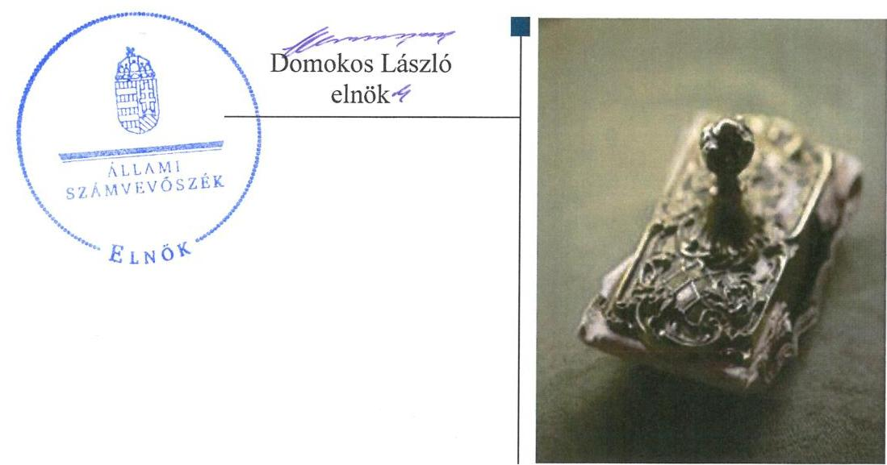

---

# AZ ELLENŐRZÉST FELÜGYELTE:

DR. HORVÁTH MARGIT felügyeleti vezető

## AZ ELLENŐRZÉST VEZETTE ÉS A VÉGREHAJTÁSÁÉRT FELELŐS:

GÁCSER JÓZSEF FERENC ellenőrzésvezető

## A PROGRAM ÖSSZEÁLLÍTÁSÁÉRT FELELŐS:

JANIK JÓZSEF LÁSZLÓ osztályvezető

IKTATÓSZÁM: V-1023-152/2016.

TÉMASZÁM: 2057

ELLENŐRZÉS-AZONOSÍTÓ SZÁM: V-070735

Jelentéseink az Országgyűlés számítógépes hálózatán és az Interneten a www.asz.hu címen is olvashatóak.

---

# TARTALOMJEGYZÉK 

■ ÖSSZEGZÉS ..... 5
■ AZ ELLENŐRZÉS CÉLJA ..... 7
■ AZ ELLENŐRZÉS TERÜLETE ..... 8
■ AZ ELLENŐRZÉS HÁTTERE, INDOKOLTSÁGA ..... 10
■ A JELENTÉS LÉNYEGES KÉRDÉSKÖREI ..... 11
■ ELLENŐRZÉS HATÓKÖRE ÉS MÓDSZEREI ..... 12
■ MEGÁLLAPÍTÁSOK ..... 14
■ JAVASLATOK ..... 34
■ MELLÉKLETEK ..... 39
I. Sz. melléklet: Értelmező szótár ..... 39
II. Sz. melléklet: A múködés főbb jellemzői ..... 42
■ FÜGGELÉK: ÉSZREVÉTELEK ..... 43
■ RÖVIDÍTÉSEK JEGYZÉKE ..... 63

---

.

---

# ÖSSZEGZÉS 

Az Állami Számvevőszék a Gyomaközszolg Kommunális Közszolgáltató Nonprofit Kft. hulladékgazdálkodási közfeladat-ellátását érintő gazdálkodási tevékenysége 2011-2014 közötti szabályszerűségét ellenőrizte. Az Önkormányzat a közfeladat megszervezéséről a hulladékkezelési rendelet és a közszolgáltatásra irányuló vállalkozási szerződés vonatkozásában nem minden elemében gondoskodott szabályszerűen. A tulajdonosi jogok gyakorlása a 2013. évi beszámoló jóváhagyása kivételével a jogszabályi előírásoknak megfelelt. A Társaság vagyongazdálkodása alapvetően szabályszerű volt. A Társaság az éves beszámolási kötelezettségét 2013-2014. években nem teljesítette szabályszerűen. Az adatok védelmét és átláthatóságát nem biztosította. A magas kötelezettségállomány kockázatot jelentett a közfeladat ellátására. A Társaság árképzése nem felelt meg az előírásoknak, a díjak megalapozottsága nem volt biztosított.

## Az ellenőrzés társadalmi indokoltsága

Az Állami Számvevőszék stratégiájában megfogalmazta, hogy a helyi önkormányzatok gazdálkodásában rejlő pénzügyi kockázatok feltárásával, az államháztartáson kívülre nyújtott költségvetési támogatások és ingyenes vagyonjuttatások, valamint az államháztartáson kívül működő közfeladat-ellátó rendszerek ellenőrzéseivel hozzájárul ahhoz, hogy a közpénzeket az államháztartáson kívül működő szervezetek is átlátható, rendezett módon használják fel a közfeladatok szerződésben vállalt ellátása érdekében.

A Magyarországon az intézmény-centrikus közfeladat-ellátás jellemző, de egyre jelentősebb a költségvetésen kívüli feladatellátás térnyerése. Ennek legfontosabb szereplői - a nonprofit szervezetek mellett - az önkormányzati tulajdonú gazdasági társaságok. Az önkormányzatok szervezetalakítási szabadságának következménye, hogy a korábban is vállalati formában működő közszolgáltatások mellett, mind a kötelező, mind az önként vállalt feladatok ellátásában a gazdasági társaságok kiemelt fontosságú szerephez jutottak.

## Főbb megállapítások, következtetések, javaslatok

Az önkormányzati hulladékkezelési rendelet; a 2012. január 1. - április 14. között a Hgt. árbefagyasztásra vonatkozó rendelkezésének nem felelt meg. 2011-2013 években a közfeladat ellátására vállalkozási szerződést kötöttek, melynek tartalma nem minden elemében felelt meg a közszolgáltatási szerződésekre vonatkozó jogszabályi előírásoknak.

A tulajdonosi jogok gyakorlása - egy mulasztás kivételével - a jogszabályi előírásoknak megfelelt, annak ellenére, hogy az FB ügyrenddel és az Önkormányzat 2011. október 27-ig javadalmazási szabályzattal nem rendelkezett. A 2013. évi számviteli beszámoló elfogadásáról a Képviselő-testület határozatot hozott, ugyanakkor a Taggyűlés, mint a legfőbb döntéshozó szerv a beszámolót nem hagyta jóvá.

A Társaság rendelkezett a működéshez szükséges szabályzatokkal, azonban azok - a tevékenység elkülönítési, megőrzési kötelezettség, a leltározás és az értékcsökkenés elszámolásának szabályozása vonatkozásában - a jogszabályi előírásoknak nem feleltek meg. A szabályozási hiányosságok ellenére a vagyongazdálkodás a jogszabályi rendelkezéseknek megfelelt. Az ellenőrzött időszakban a tőkeemelés és az elért eredmény következtében a saját tőke összege nőtt. A magas kötelezettségállomány és a lejárt szállítói tartozás állomány emelkedése kockázatot jelentett a közfeladat ellátására, illetve a társaság működésére. A likviditási helyzet rendezésére 2014. évben az Önkormányzat

---

megállapodást kötött a Társasággal a közszolgáltatás zavartalan ellátása érdekében, ennek keretében az Önkormányzat átvállalta a Társaságtól a hulladéklerakónak járó megemelt hulladéklerakási díj rendezését.

A Társaság 2011-2012. években a Hgt.-ben előírt részletes, hulladékgazdálkodási kötelező közszolgáltatói tevékenységével kapcsolatos költségelszámolását az Önkormányzat felé nem nyújtotta be. A Társaság a Számv. tv.-ben előírt beszámolási kötelezettségét nem szabályszerűen teljesítette, mivel a 2013. és a 2014. évi beszámoló a hulladékgazdálkodási tevékenységre önálló mérleget és eredménykimutatást nem tartalmazott. A beszámolók letétbe helyezése és közzététele a 2013. évi beszámoló kivételével szabályszerű volt. A Társaság a Ht. előírása ellenére, a 2013-2014. évi beszámolóit a letétbe helyezéssel egyidejűleg nem küldte meg a Hivatalnak. A Társaság adatvédelmi felelőssel, adatvédelmi és adatbiztonsági szabályzattal nem rendelkezett, közérdekű adat közzétételi kötelezettségének nem tett eleget, ezzel nem biztosította az adatok védelmét és az átláthatóságot.

A Társaságnál az anyagjellegű ráfordításokat megfelelően számolták el. Az értékesítés nettó árbevételének elszámolása a díjkompenzációs számlákhoz kapcsolódó könyvviteli szabálytalanságok miatt kockázatos volt. A beruházások, felújítások elszámolása az üzembe helyezéssel és értékcsökkenéssel kapcsolatos szabálytalanságok miatt nem volt megfelelő. A jogszabályi előírásokat megsértve a nem lakossági felhasználókkal szemben fennálló követelések adók módjára történő behajtását az ellenőrzött időszakban nem kezdeményezték, illetve, 2013-2014. között a Társaság külső céget bízott meg sikerdíj ellenében a kintlévőségek beszedésével. A követelések értékvesztésének elszámolása a minősítési és könyvelési hiányosságok miatt nem volt szabályszerű, mely az óvatosság elvét sértette.

Az elkülönítésre és díjkalkulációra vonatkozó szabályozási hiányosságok hozzájárultak ahhoz, hogy a Társaság árképzése nem felelt meg a jogszabályi előírásoknak. A díjkalkuláció főkönyvi és analitikus alátámasztása hiányos volt, a költségek felosztásának és a kezelési súlyszámok megállapításának módszere nem volt átlátható. Ennek következtében a lakossági és nem lakossági felhasználói kör közötti keresztfinanszírozás nem volt egyértelműen kizárható, a díjak megalapozottsága nem volt biztosított. A 2013. évi díjak esetében a Rezsi. törvény előírásait betartották.

---

# AZ ELLENŐRZÉS CÉLJA 

Az ellenőrzés célja annak értékelése, hogy az önkormányzat a jogszabályi előírások figyelembevételével döntött-e az ellenőrzésre kerülő közfeladat megszervezéséről; az önkormányzat/tulajdonosi joggyakorló szabályszerűen gyakorolta-e a tulajdonosi jogokat; a gazdasági társaság közfeladat-ellátása bevételeinek, ráfordításainak elszámolása, és vagyongazdálkodási tevékenysége megfelelt-e a jogszabályi, illetve a közszolgáltatási/vagyonkezelési szerződésben foglalt tulajdonosi előírásoknak, azok végrehajtása szabályszerű volt-e; a gazdasági társaság kötelezettségállománya jelent-e kockázatot a működésre, illetve a közfeladat ellátására; a közfeladatok átláthatósága és elszámoltathatósága érdekében biztosítva volt-e a közszolgáltatás díjának megalapozottsága szabályszerű önköltségszámítással.

---

# **AZ ELLENŐRZÉS TERÜLETE**

## **Gyomaendrőd Város Önkormányzata és a többségi tulajdonában lévő Gyomaközszolg Kommunális Közszolgáltató Nonprofit Kft.**

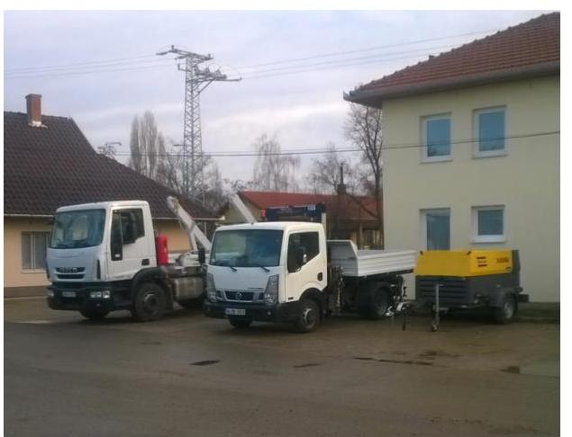

**A GYOMAKÖZSZOLG KOMMUNÁLIS KÖZSZOLGÁLTATÓ NONPROFIT KFT.-** t a Gyomaszolg Ipari Park Kft.-ből történő kiválással, a Képviselőtestület${ }^{1}$ határozatával hozták létre 2006. június 29. napján. A Társaság${ }^{2}$ alapításakor alaptevékenységeként a hulladékgyűjtést, kezelést határozták meg. A Társaság Gyomaendrőd közigazgatási területén 2007. január 31-től, Dévaványán 2012. február 1-jétől, Hunyán 2012. április 1-től, Örménykúton 2012. július 1-jétől, Kétsopronyban 2013. január 1-jétől, valamint Kardoson, Csárdaszálláson 2014. január 1-jétől végzett az ingatlantulajdonosoknál keletkező települési szilárd hulladék kezelésére közszolgáltatást.

A Társaság a hulladékkezelési feladatot Gyomaendrődön 2013. december 31-éig vállalkozási szerződés, azt követően közszolgáltatási szerződés alapján látta el. A Társaság 2011. január 1.-jén Gyomaendrőd Város Önkormányzatának 100 %-os tulajdonában állt. A 2012-2013. évben történt üzletrész értékesítések miatt, 2014. december 31-én a Társaság tulajdoni hányada hét tulajdonos között oszlott meg. Az Önkormányzat${ }^{3}$-nak 2014. december 31-én 70,0 %-os tulajdoni részesedése volt.

Az Önkormányzat többségi tulajdonában álló társaságai a Gyomaszolg Ipari Park Kft., a Zöldpark Gyomaendrőd Nonprofit Kft. és a Társaság azonos székhelyen, önkormányzati ingatlanban működött, ugyanaz a személy látta el az ügyvezetői feladataikat osztott munkaidőben. Vagyonát, árbevételét, alkalmazotti létszámát tekintve is a legnagyobb GYIP${ }^{4}$ ügyviteli és eszközbérleti szolgáltatást nyújtott a Társaságnak. A Társaság alkalmazottainak egy része a GYIP-nél is dolgozott részmunkaidőben. A GYIP által biztosított szolgáltatások díjainak alapját az Önkormányzat által évente meghatározott transzferárak képezték.

A Társaság 2014. december 31-én hét településen, összesen 8 065 db lakossági és 341 db és nem lakossági felhasználó részére végzett hulladékkezelési közszolgáltatást. Gyomaendrőd népessége 2014. december 31-én 13 456 fő volt.

A Társaság átlagos statisztikai állományi létszáma a 2011. évi 12 főről 2014. év végére 22 főre módosult. A Társaságnak más társaságokban részesedése nem volt.

---

A Társaság 2011., 2014. évi gazdálkodásának főbb adatait az 1. ábra szemlélteti.
1. ábra
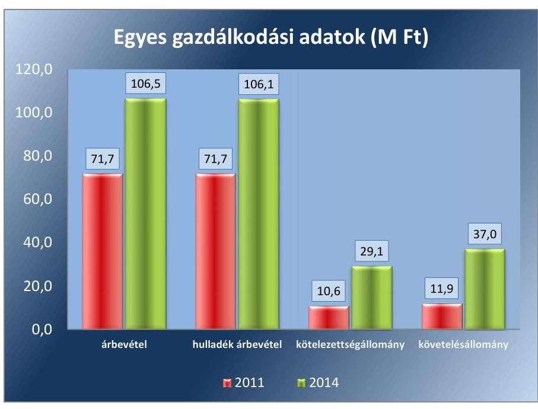

Forrás: A Társaság 2011. és 2014. évi beszámolói
A Társaság árbevételének alakulását a hulladékgazdálkodási tevékenység határozta meg. A hulladékgazdálkodás nettó árbevétele az ellenőrzött időszakban, az ellátási terület növekedésével párhuzamosan közel másfélszeresére nőtt. A követelések és kötelezettségek állománya az árbevétel növekedési ütemét meghaladóan emelkedett.

Az eszközérték 2011-2014. között összességében 38,8 M Ft-tal közel két és félszeresére nőtt. A befektetett eszközök könyv szerinti értéke 15,5 M Ft-tal emelkedett, a forgóeszközök értéke 30,1 M Ft-tal, két és félszeresére növekedett az ellenőrzött időszakban. A forgóeszközökön belül a követelések részaránya 2014. év végére 86,7 \%-ra emelkedett a 2011. évi 73,4\%-os nyitó értékhez képest. A saját tőke a 2011. évi nyitó értékről 2014. év végére 29,0 M Ft-ra, 17,9 M Ft-tal emelkedett.

Az ellenőrzött időszakban az ügyvezető személye egy alkalommal, 2011. augusztus 15. napjával változott. A 2011. évi beszámolót a GYIP alkalmazottja, a 2012., 2013. és 2014. évi beszámolókat a Társaság alkalmazottja készítette. A könyvvizsgálati feladatokat az ellenőrzött időszakban ugyanaz a vállalkozás látta el.

Az ellenőrzött időszakban a polgármester személye egy alkalommal, a 2014. évi önkormányzati választások eredményeként változott. A jegyző személye az ellenőrzött időszakban nem változott. A helyszíni ellenőrzés időszakában hivatalban lévő jegyző, 2015. július 15-től látja el feladatait.

---

# AZ ELLENŐRZÉS HÁTTERE, INDOKOLTSÁGA 

## AZ ÖNKORMÁNYZATI TULAJDONÚ GAZDASÁGI

TÁRSASÁGOK teljes körű ellenőrzésének lehetőségét az ÁSZ tv. ${ }^{5}$ 2011. január 1-jétől hatályos módosítása teremtette meg. A közfeladatot ellátó gazdasági társaságok ellenőrzése kiemelten fontos a vagyon megőrzése, megóvása érdekében, valamint a kormányzati szektor elszámolásaiban megjelenő önkormányzati tulajdonú gazdálkodó szervezetek esetében, amelyekkel szemben alapvető követelmény, hogy gazdálkodásuk, működésük szabályszerű, az általuk szolgáltatott adatok minél megbízhatóbbak legyenek. A közfeladat ellátás költségeinek, ráfordításainak alakulása, színvonala hatással van a lakosság elégedettségére. A törvényalkotás számára - az észlelt problémák, szabálytalanságok, vagy egyéb nem kívánatos jelenségek felszínre kerülésével - az ellenőrzés megállapításai segítséget nyújthatnak az államháztartáson kívüli közfeladat-ellátás értékeléséhez, jogszabályi keretei pontosításához, átláthatóságot biztosító szabályozásához. Meghatározhatóvá válnak a közfeladat ellátásban részt vevő államháztartáson kívüli szervezeteknek - az önkormányzat költségvetését, pénzügyi helyzetét is befolyásoló - kockázatai, lehetővé válik ezen kockázatok csökkentése. Ellenőrzéseink feltárhatják, hogy az önkormányzat közfeladat-ellátási kötelezettségének szabályszerűen tett-e eleget, a feladatellátáshoz rendelt közvagyon működtetését a tulajdonostól elvárható gondossággal, szabályszerűen szervezte-e meg és a tulajdonosi felügyelete hozzájárult-e a közfeladat-ellátásához. Az ellenőrzés rávilágíthat arra, hogy a gazdasági társaság a közszolgáltatási szerződésben foglaltak betartásával, a közvagyon használatával biztosította-e a szolgáltatás folyatatásának feltételeit, a közfeladat ellátását. Ezzel az ellenőrzöttek és a helyi döntéshozók számára visszajelzést ad feladatszervezési, feladat-ellátási kockázataikról, alapot ad a meglévő hibák megszüntetéséhez, a jobb közfeladat-ellátás biztosításához. Fokozza a fegyelmet, igazolja, hogy lejárt a következmények nélküli ellenőrzések időszaka. Az ÁSZ értékteremtő rend kialakításához és megőrzéséhez hozzájáruló tevékenysége pozitív hatással van a szervezetről kialakított összkép formálására.

---

# A JELENTÉS LÉNYEGES KÉRDÉSKÖREI 

1. Az Önkormányzat közfeladat megszervezéséről szóló döntése, valamint tulajdonosi joggyakorlása szabályszerű volt-e?
2. A gazdasági társaság vagyongazdálkodása szabályszerű volt-e, kötelezettségállománya jelentett-e kockázatot a működésre, illetve a közfeladat ellátásra?
3. A gazdasági társaságnál az ellátott közfeladat bevételei és ráfordításai elszámolása, valamint az önköltségszámítás és árképzés szabályszerű volt-e?

---

# ELLENŐRZÉS HATÓKÖRE ÉS MÓDSZEREI 

## Az ellenőrzés típusa

Megfelelőségi ellenőrzés.

## Az ellenőrzött időszak

2011. január 1-jétől 2014. december 31-ig tartó időszak.

## Az ellenőrzés tárgya

A közfeladatot gazdasági társaságokkal ellátó önkormányzatok tulajdonosi joggyakorlása, valamint gazdasági társaságok pénz- és vagyongazdálkodásának szabályozottsága és szabályszerűsége.

Az ellenőrzés kiterjed minden olyan körülményre és adatra, amely az ÁSZ jogszabályban meghatározott feladatainak teljesítéséhez, valamint a program végrehajtása folyamán felmerült újabb összefüggések feltárásához szükséges.

## Az ellenőrzött szervezet

Gyomaendrőd Város Önkormányzata és a
Gyomaközszolg Kommunális Közszolgáltató Nonprofit Kft.

## Az ellenőrzés jogalapja

Az ellenőrzés jogszabályi alapját az Állami Számvevőszékről szóló 2011. évi LXVI. törvény 5. § (3)-(4)-(5) bekezdése képezte.

## Az ellenőrzés módszerei

Az ellenőrzést a nemzetközi standardokat irányadónak tekintve az ellenőrzési program ellenőrzési kérdései, az ellenőrzött időszakban hatályos jogszabályok, az ellenőrzés szakmai szabályok és módszertanok figyelembe vételével végezzük.

Az ellenőrzés ideje alatt az ellenőrzött szervezettel történő kapcsolattartást az ÁSZ Szervezeti és Működési Szabályzatának vonatkozó előírásai alapján biztosítjuk.

Az ellenőrzés a kiválasztott, többségi tulajdonosi jogokat gyakorló önkormányzatra, illetve az ellenőrzésre kijelölt közfeladatot ellátó gazdasági

---

társaság felett tulajdonosi jogokat gyakorló szervezetre és az ellenőrzött közfeladatot ellátó gazdasági társaságra terjed ki. Amennyiben a gazdasági társaságban több önkormányzat együttesen többségi tulajdonos, úgy az ellenőrzést a többségi tulajdonosi jogokat gyakorló önkormányzatnál kell lefolytatni. Az ellenőrzött gazdasági társaságnál, amennyiben az több közfeladatot is ellát, akkor az ellenőrzésre kiválasztott közfeladat-ellátást ellenőrizzük.

Az ellenőrzést a kérdésekre adott válaszok kiértékelésével, valamint a megjelölt adatforrások, a csatolt tanúsítványok felhasználásával, továbbá az adott időszakban hatályos jogszabályok figyelembe vételével kell lefolytatni. Az ellenőrzési kérdések megválaszolásához szükséges bizonyítékok megszerzése a következő ellenőrzési eljárások alkalmazásával történik: megfigyelés, kérdésfeltevés (információkérés), összehasonlítás, valamint elemző eljárás.

A bevételek és ráfordítások elszámolása, valamint a vagyonnyilvántartás terén a szabályszerű működést véletlen mintavétellel ellenőriztük. A jogszabályoknak és a belső előírásoknak megfelelőnek tekintettük az adott területet, amennyiben a minta ellenőrzésének eredménye alapján 95\%-kos bizonyossággal a teljes sokaságban a hibaarány kisebb volt, mint 10\%, nem megfelelőnek, ha a hibaarány a 10%-ot meghaladta. Kockázatot, illetve magas kockázatot jeleztünk, amennyiben egy adott terület vonatkozásában a minta alapján a teljes sokaságban nem volt egyértelműen biztosított a jogszabályoknak és a belső szabályzatoknak megfelelő működés. A ráfordítások elszámolására és a vagyonnyilvántartásra vonatkozó véletlen mintavételt kockázati alapú kiválasztással egészítettük ki, amelynek során a három legnagyobb összegű tételt választottuk ki.

---

# 1. Az Önkormányzat közfeladat megszervezéséről szóló döntése, valamint tulajdonosi joggyakorlása szabályszerű volt-e? 

Összegző megállapítás

Az Önkormányzat a közszolgáltatás megszervezéséről a hulladékkezelési rendelet és a vállalkozási szerződés hiányosságai miatt nem minden elemében gondoskodott szabályszerűen. A szabályozási hiányosságok ellenére a tulajdonosi jogok gyakorlása a - 2013. évi számviteli beszámoló elfogadása kivételével - jogszabályi előírásoknak megfelelt.

Az Önkormányzat a közszolgáltatás megszervezéséről nem gondoskodott teljes körűen, mivel a hulladékkezelési rendelet részben felelt meg az előírásoknak. Továbbá 2011-2013. években a Társasággal a hulladékgazdálkodási feladatra kötött vállalkozói szerződés tartalma nem minden elemében felelt meg a jogszabályi előírásoknak.

A KÖZ- ÉS TELEPÜLÉSTISZTASÁG, HULLADÉKGAZDÁLKODÁS biztosítása 2011. évben az Ötv. ${ }^{6}$ 8. § (1) bekezdése alapján, illetve 2013. január 1-jétől az Mötv. ${ }^{7}$ 13. § (1) bekezdés 19. pontja alapján, az Önkormányzat törvényi kötelezettsége volt.

A GAZDASÁGI PROGRAM készítésével az Önkormányzat az Ötv. 91. § (1) bekezdésében foglalt törvényi előírásnak eleget tett. A program a Képviselő-testület fejlesztési elképzeléseit fogalmazta meg a közszolgáltatások biztosítására, színvonalának javítására az Ötv. 91. § (6) bekezdésének megfelelően. A 2011-2015. közötti időszakra készült Gazdasági programot az Ötv. 91. § (7) bekezdését betartva a Képviselő-testület határozatával ${ }^{8}$ elfogadta. A gazdasági program hulladékgazdálkodási feladatként, a közfeladattal összefüggésben fejlesztési területként emelte ki a szelektív hulladékgyűjtő szigetek kialakítását és hulladékkezelési és szállítási eszközök beszerzését.

VAGYONGAZDÁLKODÁSI TERVÉT az Önkormányzat az Nvtv. ${ }^{9}$ 9. § (1) bekezdésében előírt tartalommal elkészítette, melyet a Kép-viselő-testület 2013. évben határozattal fogadott el ${ }^{10}$. Az Nvtv. közép - és hosszú távú terv készítésének kötelezettségét írta elő, ennek ellenére a vagyongazdálkodási terv hatálya nem került meghatározásra. A vagyongazdálkodási terv bemutatta az önkormányzati vagyon összetételét, csoportosítását, a vagyongazdálkodással kapcsolatos elvárásokat, célkitűzéseket. A Társasággal szemben elvárásként fogalmazták meg, hogy a kötelező feladatot vagyonvesztés nélkül, lehetőség szerint vagyongyarapodással lássa el. A Társaság gazdálkodásának alapvető céljaként fektették le a szolgáltatás magas színvonalú ellátását biztosító humán és technikai kapacitások

---

működtetéséhez szükséges bevételek biztosítását, a szolgáltatási díjak lehető legalacsonyabb szinten tartása mellett.

HULLADÉKGAZDÁLKODÁSI TERVET az Önkormányzat, a Hgt. ${ }^{11}$ 35. § (1)-(3) bekezdéseiben előírtaknak megfelelően a 2009-2014. évek közötti időszakra vonatkozóan készített. A terv megfelelt a Hgt. 37. § (4) bekezdésében és a 126/2003.(VIII.15.) Korm. rendelet ${ }^{12} 11$. §-aiban és 1. számú mellékletében előírt szerkezeti felépítésnek és tartalmi követelményeknek. Az Önkormányzat ugyanakkor a Hgt. 37. § (1) bekezdésében foglaltak ellenére nem gondoskodott a három évente esedékes beszámoló összeállításáról, azzal egyidejűleg nem vizsgálta felül a tervet és a végrehajtás tapasztalatai alapján a szükség módosításokat nem vezette át. A jegyző a 241/2001. (XII.10.) Korm. rendelet ${ }^{13}$ 1. § f) pontja ellenére nem készítette elő a hulladékgazdálkodási tervben foglaltak végrehajtásáról szóló beszámolót.

# KÖZSZOLGÁLTATÓI HULLADÉKGAZDÁLKODÁSI 

TERVET a Társaság a Ht. ${ }^{14}$ 78. § (1) bekezdésének megfelelően 20132015. évekre készített, melyet 349/2013. (VI.27.) Gye. Kt. határozattal ${ }^{15}$ fogadott el. A Társaság a Ht. 78. § (3) bekezdésének megfelelően a közszolgáltatói hulladékgazdálkodási tervet megküldte az OHÜ ${ }^{16}$-nek és a környezetvédelmi hatóságnak.

## A TÁRSASÁG ALAPÍTÓ OKIRATA ${ }^{17}$ ÉS TÁRSASÁGI

SZERZŐDÉSE ${ }^{18}$ az ellenőrzött időszakban megfelelt a Gt. ${ }^{19}$ 12. § (1) és a 19. § (4) bekezdéseiben, illetve a Ptk. ${ }^{20}$ 3:5. §-ában, előírtaknak. Az Alapító Okirat és a Társasági szerződés 2011-2014. között több alkalommal módosításra került, többek között az Ügyvezető és az FB tagok személyében bekövetkezett változás, valamint a tőkeemelés és üzletrész értékesítések okán.

A Társaság alapítása, az ellátás módjára vonatkozó döntés az ellenőrzött időszakot megelőzően történt. Az Önkormányzat az előírt hulladékkezelési közszolgáltatást az Ötv. 9. § (4) bekezdése, illetve a Mötv. 41. § (6) bekezdése alapján gazdasági társasága útján biztosította. Képviselő-testületi határozatban ${ }^{21}$ döntöttek a Társaság törzstőkéjének felosztásáról. Az Önkormányzat 2012-2013. években tulajdonából 30,0 %-os üzletrészt további önkormányzatok részére értékesített.

---

A Társaság tulajdonosi megoszlását az 2. ábra mutatja be.
2. ábra
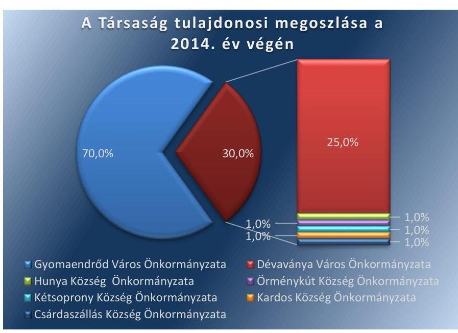

Forrás: A Társaság Társasági szerződései
KÖZSZOLGÁLTATÁSI SZERZŐDÉS címmel az Önkormányzat és a Társaság között hulladékgazdálkodási közszolgáltatásra 2014. január 1-jét követően jött létre szerződés, amely már mindenben megfelelt a jogszabályi előírásoknak. A 2011. január 1-je és 2013. december 31-e között érvényben lévő vállalkozási szerződés ${ }^{22}$ tartalmában tekinthető 2012. december 31-ig a Hgt. 27. § (3) bekezdés d) pontja, 2013. január 1-jétől a Ht. 33. § (1) pontja szerinti közszolgáltatási szerződésnek, ugyanakkor 2013. szeptember 4-ig nem minden részletében felelt meg a 224/2004.(VII.22.) számú Kormányrendelet ${ }^{23}$ 12-13. §-aiban előírt közszolgáltatási szerződésre vonatkozó tartalmi követelményeknek. A vállalkozási szerződésben többek között nem határozták meg, illetve nem írták elő az Önkormányzat és a Társaság kötelezettségeit, a szükséges mennyiségű és minőségű jármű, gép, eszköz, berendezés biztosítását, a szükséges létszámú és képzettségű szakember alkalmazását, a közszolgáltatás díjának megállapítására vonatkozó módszer leírását, a díj megváltoztatása érdekében alkalmazandó eljárást. A Társaság 2011-2012. között a Hgt. 27.§ (2) bekezdés b) pontjában foglaltaknak megfelelve a Vízügyi Felügyelőség által kiadott környezetvédelmi hatósági engedély birtokában végezte hulladékgazdálkodási tevékenységét.

A Társaság 2013. szeptember 24-től nonprofit társaságként működött, a Ht. 90. § (8) bekezdés előírásainak megfelelően az OHÜ által kiállított minősítő okirattal és az OKTVF ${ }^{24}$ által kiadott közszolgáltatási engedéllyel. Az Önkormányzat és a Társaság a hulladékgazdálkodási közfeladat ellátására Közszolgáltatási szerződést ${ }^{25}$, a Ht. 33. § (1) bekezdésének megfelelően 2014. január 1. napjától, a Ht. 34. § (7) bekezdését betartva 10 évre kötötte meg. A Közszolgáltatási szerződés tartalmazta a Ht. 34. § (5) bekezdésének megfelelően a közszolgáltató azonosító adatait, a közszolgáltatási tevékenység megnevezését, a közszolgáltatás területét. Rögzítette továbbá a közszolgáltatási díj beszedésére vonatkozó módszert, a követelések kezelését, keresztfinanszírozás tilalmát, a szerződés módosításával

---

# Megállapítások 

megszűnésével kapcsolatos rendelkezéseket. A Közszolgáltatási szerződésben a Felek közszolgáltatás ellátásával kapcsolatos jogai és kötelezettségei, a 317/2013.(VIII.28) számú Kormányrendelet 4. § (2)-(3) bekezdéseiben felsorolt kötelezettségekkel összhangban voltak.

HULLADÉKKEZELÉSI RENDELETET ${ }_{1,2,3}{ }^{26}$ alkotott az Önkormányzat Képviselő-testülete, a Hgt. 23. §-a a Ht. 35. §-a értelmében. A Hulladékkezelési rendelet ${ }_{1,2}$-ben a Hgt. 23. § a) b) c) d) e) pontokban foglaltak szabályozásra kerültek. A Hulladékkezelési rendelet ${ }_{1,2}$ tartalmazta a Hgt. 23. § f) pontja és a 64/2008. (III. 28.) Korm. rendelet ${ }^{27}$ alapján meghatározott közszolgáltatási díjat. A Hulladékkezelési rendelet ${ }_{2}$-ben rögzített közszolgáltatási díj 2012. január 1. és 2012. április 14. között a Hgt. 57. § (1) bekezdésével szemben meghaladta a 2011. évre megállapított hulladékkezelési közszolgáltatási díj legmagasabb mértékét. A Hulladékkezelési rendelet ${ }_{2}$ 2012. április 15-étől újra megfelelt a jogszabályi előírásoknak, a Hgt. 57.§ (1) bekezdés b) pontjában és az 58. §-ban foglaltak figyelembe vételével.

Az Önkormányzat a Ht. 35. §-ban előírtakat a Hulladékkezelési rendelet ${ }_{3}$-ban meghatározta. A rendeletet 2013. június 1-jétől módosították az Önkormányzat ármegállapítási jogkörének megszűnésével összhangban, ezzel betartva a 2013. július 12-től hatályos Ht. 47/A. §-ában foglaltakat.

## A tulajdonosi jogok gyakorlása - egy kivétellel - a jogszabályi előírásoknak megfelelt, annak ellenére, hogy az FB ügyrenddel és az Önkormányzat 2011. október 27-ig javadalmazási szabályzattal nem rendelkezett. A Társaság Taggyűlése új javadalmazási szabályzatot nem alkotott és a 2011. október 27-én elfogadott szabályzat hatályban tartásáról sem határozott. A 2013. évi számviteli beszámoló elfogadásáról a Képviselő-testület határozatot hozott, azonban a Taggyűlés nem hagyta jóvá a beszámolót.

A TULAJDONOSI JOGGYAKORLÁS RENDJÉRŐL az Önkormányzat a vagyonrendeletben, az Alapító Okiratban és a Társasági szerződésben rendelkezett. A Társaság egyszemélyes tulajdonosaként a legfőbb szervének a jogait a Képviselő-testület gyakorolta. A Társaság 2012. március 20-át követően többszemélyes önkormányzati tulajdonba került. A Társasági szerződésben rögzítésre került, hogy a Társaság legfőbb döntéshozó szerve a Taggyűlés ${ }^{28}$. A Taggyűlés kizárólagos hatáskörébe kerültek a Gt. 141. § (2) bekezdésében és a Ptk. 2 3:109. § (2)-(3) bekezdésében foglaltak. A Taggyűlés jogosultságába tartozott a Társasági szerződésben felsoroltak alapján, többek között a számviteli törvény szerinti beszámoló elfogadása, az ügyvezető, a könyvvizsgáló és az FB megválasztása, visszahívása, díjazásának megállapítása. A Társaság tagját megillető jogokat, az Ötv. 9. § (1) bekezdésében és a Mötv. 41. § (1) bekezdésében foglaltak alapján a polgármester gyakorolta, a Képviselő-testület döntéseinek megfelelően.

Az egyszemélyes Társaság 2011. évi egyszerűsített beszámolóját a Kép-viselő-testület megtárgyalta és elfogadta. A többszemélyes társasággá alakulást követően a Képviselő-testület határozata mellett a Taggyűlés a Társaság Számv. tv. ${ }^{29}$ szerint elkészített beszámolóiról egy eset kivételével döntött. A 2013. évi beszámolót a Taggyűlés a Gt. 141. § (2) bekezdés a)

---

pontjában és a Társasági szerződés 12. a) pontjában foglaltak ellenére nem hagyta jóvá.

A FELÜGYELŐ BIZOTTSÁG ${ }^{30}$ a Társaságnál a Gt. 33. § (1) bekezdésének valamint a Ptk. 3:121. §-ában rögzítetteknek, illetve a Takv. 4, § (2) bekezdésének megfelelően 3 fővel működött. Az FB jegyzőkönyvek alapján a tagok az üléseken részt vettek. Az FB az ellenőrzött időszak alatt a Gt. 34. § (4) bekezdése, valamint a Ptk 3:122. § (3) bekezdéseinek előírása ellenére ügyrendjét nem állapította meg és ennek következtében a Társaság legfőbb szerve az ügyrendet nem hagyta jóvá. Az FB az ellenőrzött években a Társaság Számv. tv. szerinti beszámolóit megtárgyalta és arról írásos jegyzőkönyvet készített. Az FB-nek az üzleti tervek tárgyalására vonatkozóan törvényi és belső szabályzatban előírt kötelezettsége nem volt. Az FB a Társaság 2011. évi üzleti tervét nem tárgyalta, a 2012. évi üzleti terv előkészítését tárgyalta, de határozathozatal nem történt, a 2013-2014. évi üzleti tervet és fejlesztési elképzeléseket tárgyalta és arról határozatot hozott.

JAVADALMAZÁSI SZABÁLYZATTAL 2011. január 1. és 2011. október 26. között a Társaság nem rendelkezett, ezzel a Képviselőtestület a Taktv. ${ }^{31}$ 5. § (3) bekezdésében foglaltaknak nem tett eleget. A 605/2011. (X.27.) számú Kt. határozattal elfogadott javadalmazási szabályzat tartalmazta a vezetőre és tisztségviselőkre vonatkozó elveket és szabályokat. 2012. évtől a Társaság több személyes társasággá alakulását követően a Társaság Taggyűlése volt köteles szabályzatot alkotni. A Taggyűlés a Taktv. 5. § (3) bekezdésével szemben új javadalmazási szabályzatot nem alkotott, a 2011. október 27-én elfogadott szabályzat maradt hatályban. Az ügyvezető a Társaságnál megbízási jogviszony keretében látta el feladatát. A Társaság ügyvezetője az ellenőrzött időszak alatt prémiumot, jutalmat nem kapott. Az FB tagjai, elnöke a szabályzatban rögzítettek szerint havi díjazásban részesültek.

BELSŐ ELLENŐRZÉS a közfeladat ellátásával kapcsolatban 2011. évben történt a Társaságnál. Az Ötv. 92. § (11) bekezdésének b) pontjában biztosított lehetőséggel élve az Önkormányzat 2011. évi ellenőrzési tervében feladatként tűzte ki a Társaság vizsgálatát. A belső ellenőrzés az ellenőrzés során észrevételeket tett, javasolta a szabályzatok aktualizálását, a hiányzó FB ügyrend pótlását, vezetői információs rendszer kialakítását, a kintlévőségek csökkentésére irányuló intézkedések megtételét, a lakossággal történő kommunikáció fejlesztését. A jelentés záradékában nem rendelték el intézkedési terv készítését. A Társaság a javaslatokkal összefüggésben tett intézkedéseket, azonban azok a szoftverbeszerzés kivételével nem biztosították a javaslatokban megfogalmazott célkitűzések teljesülését. A kintlévőségek állománya nem csökkent, az FB ügyrend nem készült el, a szabályzatok aktualizálása hiányosan valósult meg. Az Önkormányzatnál a belső ellenőrzési terveket a Ber. ${ }^{32}$ 12. § b) pontja és a Bkr. ${ }^{33}$ 29. § (1) bekezdése ellenére a 2011-2014. évek vonatkozásában kockázatelemzéssel nem támasztották alá.

Az Önkormányzatnak az ellenőrzött időszak alatt nem volt a Társaság kötelezettségvállalásához kapcsolódó garancia, illetve kezességvállalása. A Társaság mérleg szerinti eredménye a 2011.,2012. években pozitív volt, melyet a 3. ábra szemléltet.

---

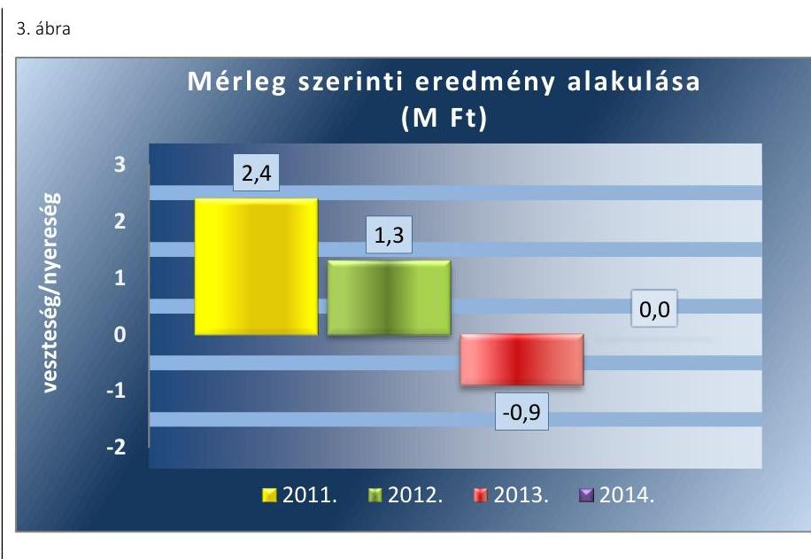

*Forrás: A Társaság 2011.-2014. évek közötti beszámolói*

Az Önkormányzat 2014. évben a Társaság részére 17,4 M Ft támogatást nyújtott. A támogatásból 14,2 M Ft-ot a hulladéklerakási díj megemelése miatt működési célra, 3,2 M Ft-ot használt hulladékgyűjtő jármű beszerzése okán fejlesztési célra fordítottak.

## 2. A gazdasági társaság vagyongazdálkodása szabályszerű volt-e, kötelezettségállománya jelentett-e kockázatot a működésre, illetve a közfeladat ellátásra?

- **Összegző megállapítás**
  A Társaság vagyongazdálkodása alapvetően megfelelt a jogszabályi előírásoknak. A Társaság 2013., 2014. évi beszámolója nem volt szabályszerű, mert közszolgáltatási tevékenységéről önálló mérleget és eredménykimutatást nem készített. A letétbe helyezési és közzétételei kötelezettségének egy év kivételével eleget tett, 2013. évben nem a Taggyűlés által jóváhagyott beszámolót tette közzé. A Társaság az adatok védelmét és átláthatóságát nem biztosította.
- **2.1. számú megállapítás**
  A Társaság rendelkezett a működéshez szükséges szabályzatokkal, azonban azok – a tevékenység elkülönítési, megőrzési kötelezettség, a leltározás és az értékcsökkenés elszámolásának szabályozása vonatkozásában – a jogszabályi előírásoknak nem feleltek meg.

**ÜZLETI TERV** készítési kötelezettséget az Alapító Okiratban, Társasági szerződésben nem határoztak meg. A Társaság az üzleti terveket az Önkormányzat munkaterveiben előírtak alapján készítette el. A munkatervek az üzleti tervek tartalmára, formájára, elkészítésének határidejére vonatkozó követelményeket nem határoztak meg. Az üzleti tervek marketing fejezetében meghatározott célkitűzések összhangban voltak az Önkor-

---

mányzat gazdasági programjával. A Társaság az ügyvezető által aláírt, érvényesített 2011. évi üzleti tervvel nem rendelkezett. A Társaság 2011. üzleti tervét Képviselő-testületi határozattal nem fogadták el. A 2012-2014. évi üzleti tervek Képviselő-testületi határozatok ${ }^{34}$ alapján elfogadásra kerültek. Az üzleti terveket a Taggyűlés nem tárgyalta, erre a társasági szerződés sem kötelezte.

SZÁMVITELI POLITIKÁVAL ${ }^{35}$ a Társaság a Számv. tv. 14. § (4) bekezdésében előírtaknak megfelelően rendelkezett. Elkészítették a Számv. tv. 14. § (5) bekezdése előírásainak megfelelően az Eszközök és források Leltározási szabályzatát ${ }^{36}$, az Értékelési szabályzatot ${ }^{37}$ és a Pénzkezelési szabályzatot ${ }^{38}$. A Számv. tv. 14. § (6) bekezdése alapján a Társaság az Önköltség-számítási szabályzat készítésének kötelezettsége alól mentesült.

A számviteli politika-ben és részét képező számlarendben a Számv. tv. 14. § (3) és (11) bekezdésben foglaltakkal ellentétesen a Számv. tv. végrehajtásának módszereit és eszközeit teljes körűen nem határozták meg, a belső szabályzatokon a jogszabályváltozásokat nem vezették át:
$\longrightarrow$ a Számv. tv. bizonylatok megőrzési kötelezettségére vonatkozó 169. § (1) bekezdésének 2012.január 1-jétől hatályos változásának megfelelően a számviteli politikát nem módosították. A számviteli politika a törvény által előírt 8 éves helyett 10 éves megőrzési kötelezettséget írt elő a már nem hatályos törvényi rendelkezésre történő hivatkozással;
$\longrightarrow$ a Számv. tv. 38. § (3) bekezdés b) pontjának lekötött tartalékra, a 86. § (3) bekezdés f) pontjának rendkívüli bevételekre, valamint a 86. § (6) bekezdés b) pontjának rendkívüli ráfordításokra vonatkozó rendelkezései 2012. január 1-jétől nem voltak hatályosak, ennek ellenére a 2013. évtől hatályos számviteli politika a már hatályon kívül helyezett törvényi előírásokra hivatkozott;
$\longrightarrow$ a Számviteli politika -ben, illetve a részét képező számlarendben a befektetett eszközökre hasznos élettartamot, amortizációs kulcsokat nem írtak elő, ezért az értékcsökkenés Számv. tv. 52. § (1) bekezdésében előírt szabályok szerinti végrehajtásának feltételei hiányoztak;
$\longrightarrow$ a Számv. tv. 161/A. § (2) bekezdése ellenére a nyilvántartási, könyvvezetési rendszerüket nem részletezték tovább, a Számlarend vagy más belső számviteli szabályzat nem tartalmazott olyan előírást, amely a Hgt. 29.§ (3), illetve a Ht. 50. § (2) bekezdésében előírt elkülönült nyilvántartás vezetési kötelezettség kereteit meghatározta volna;
$\longrightarrow$ a Szám. tv. 161/A. § (1) bekezdésében és a Ht. 50. § (3) bekezdésében előírtak ellenére a hulladékgazdálkodási közszolgáltatás nyújtása érdekében végzett tevékenység önálló mérlegének és eredménykimutatásának kiegészítő mellékletben szerepeltett adatai közvetlen alátámasztását biztosító könyvvezetési, bizonylatolási szabályokat nem határoztak meg;

---

AZ ESZKÖZÖK ÉS FORRÁSOK LELTÁROZÁSI SZABÁLYZATA részletesen tartalmazta az eszközökre és forrásokra vonatkozóan a leltározási szabályokat. Az eszközök és források leltározási szabályzata a Számv. tv. 69. § (3) bekezdésében foglaltak ellenére nem tartalmazott előírást arra vonatkozóan, hogy a mennyiségi felvételeket milyen időszakonként kell végrehajtani.

AZ ÉRTÉKELÉSI SZABÁLYZAT a Számv. tv. 55. § (1)-(2) bekezdéseinek előírásaival összhangban meghatározta a követelések minősítésére, a mérlegtételek értékelésére, a bekerülési érték meghatározására, az értékcsökkenésre, értékvesztésre vonatkozó szabályokat. Az értékelési szabályzat az értékcsökkenési leírással összefüggésben havonkénti feladást írt elő, annak ellenére, hogy a Számviteli politika szerint az értékcsökkenést csak negyedévenként kellett elszámolni. A Számviteli politika nem rendelkezett az elszámolás gyakoriságáról.

A PÉNZKEZELÉSI SZABÁLYZAT tartalmazta a Számv. tv. 14. § (8) bekezdésében foglaltak szerint a pénzforgalom lebonyolításának rendjéről, a pénzkezelés tárgyi és személyi feltételeiről, felelősségi szabályairól, a készpénzben és a bankszámlán tartott pénzeszközök közötti forgalomról, a készpénzállományt érintő pénzmozgások jogcímeiről és eljárási rendjéről, a napi készpénz záró állomány maximális mértékéről, a készpénzállomány ellenőrzésekor követendő eljárásról, az ellenőrzés gyakoriságáról, a pénzszállítás feltételeiről, a pénzkezeléssel kapcsolatos bizonylatok rendjéről és a pénzforgalommal kapcsolatos nyilvántartási szabályokról szóló előírásokat.

## 2. számú megállapítás

A vagyongazdálkodás a jogszabályi rendelkezéseknek és a belső előírásoknak megfelelt. Az ellenőrzött időszakban a tőkeemelés és az elért eredmény következtében a saját tőke összege nőtt.

Az Önkormányzat a Társaság alapításához szükséges törzsbetétet kizárólag pénz formájában biztosította. A Társaság hulladékgazdálkodási közszolgáltatási feladatainak ellátásához vagyonkezelésbe nem vett át vagyonelemeket az Önkormányzattól. A Társaságnál a közfeladat ellátása során a saját vagyon értékének megőrzése, gyarapítása, hasznosítása az Nvtv.7.§-ban rögzített vagyongazdálkodási alapelvvel összhangban történt.

A vállalkozási, majd a közszolgáltatási szerződésekben rögzített hulladékgazdálkodási feladatainak a Társaság 2011-ben a GYIP-től bérelt eszközökkel tett eleget. 2012-től a bérelt eszközök mellett, már részben saját eszközeivel látta el közszolgáltatási feladatot. A feladatellátási terület növekedésére figyelemmel eszközparkját használt hulladékszállító járművek és informatikai eszközök vásárlásával növelte. Az Önkormányzat Képviselőtestületi határozata ${ }^{39}$ alapján hulladékgyűjtő jármű tulajdonjoga a Társaságnak térítésmentesen átadásra és a Társaság nevére átírásra került. Az Önkormányzat könyveiből nulla Ft könyv szerinti értéken kivezetett eszközt a Társaság érték nélkül vette nyilvántartásba. A Társaság a jármű bekerülési értékeként az állományba vétel időpontjában piaci értéket a Számv. tv. 50. § (4) bekezdése ellenére az eszközre nem állapított meg.

LELTÁROZÁSI KÖTELEZETTSÉGÉNEK a Társaság a Számv. tv. 69. § (3) bekezdésében a mennyiségi felvétel és az egyeztetés

---

2.  táblázat

| ÉRTÉKCSÖKKENÉS ÉS ESZKÖZ-   PÓTLÁS ALAKULÁSA (M FT) |  |  |  |  |
| :----------------------------------------------------------: | :-: | :-: | :-: | :-: |
|  | Érték-   csökkenés | Eszkö-   pótlás |  |  |
| 2011. év | 0,4 | 0,2 |  |  |
| 2012. év | 2,8 | 19,7 |  |  |
| 2013. év | 4,2 | 1,3 |  |  |
| 2014. év | 4,4 | 6,1 |  |  |
| összes | 11,8 | 27,3 |  |  |

Forrás: A Társaság adatszolgáltatása
vonatkozásában előírt követelmények, valamint a leltározási szabályzat rendelkezései figyelembe vételével tett eleget.
 A Társaság az éves beszámoló mérleg sorait alátámasztó számviteli nyilvántartásokban szereplő saját vagyonának leltározását a Számv. tv. 69. § (1) bekezdésében foglaltaknak megfelelően elvégezte.

A Társaság vagyoni helyzetét jellemző, főbb mérlegadatait az 1. táblázat tartalmazza:

1. táblázat

| A TÁRSASÁG FŐBB MÉRLEG ADATAI (MILLIÓ FORINT) |  |  |  |  |  |
| :--: | :--: | :--: | :--: | :--: | :--: |
| Megnevezés | 2011. | 2011. | 2012. | 2013. | 2014. |
|  | 01,01 | 12,31 | 12,31 | 12,31 | 12,31 |
| I. Befektetett eszközök | 1,3 | 1,1 | 18,0 | 15,2 | 16,8 |
| - ebből: Tárgyi eszközök | 1,3 | 1,1 | 16,6 | 14,0 | 16,7 |
| II. Forgó eszközök | 20,3 | 14,9 | 20,5 | 46,6 | 50,4 |
| - ebből: Követelések | 14,9 | 11,9 | 11,9 | 29,9 | 43,7 |
| III. Aktív időbeli elhatárolások | 6,8 | 9,3 | 5,8 | 17,1 | 0,0 |
| Eszközök összesen | 28,4 | 25,3 | 44,3 | 78,9 | 67,2 |
| IV. Saját tőke | 11,1 | 13,5 | 29,9 | 29,0 | 29,0 |
| - ebből: Jegyzett tőke | 9,9 | 25,0 | 25,0 | 25,0 | 25,0 |
| - ebből Mérleg szerinti eredmény | $-2,5$ | 2,4 | 1,3 | $-0,9$ | 0,0 |
| V. Céltartalékok | 0,0 | 0,0 | 0,0 | 0,5 | 0,5 |
| VI. Kötelezettségek | 12,7 | 10,6 | 12,6 | 46,4 | 29,1 |
| VII. Passzív időbeli elhatárolások | 4,6 | 1,2 | 1,8 | 3,0 | 8,6 |
| Források összesen | 28,4 | 25,3 | 44,3 | 78,9 | 67,2 |

A Z ESZKÖZÉRTÉK az ellenőrzött időszakban összességében 38,8 M Ft-tal közel két és félszeresére nőtt. Az eszközökön belül a befektetett eszközök könyv szerinti értéke az ellenőrzött időszakban 15,5 M Ft-tal emelkedett a tárgyi eszközök növekedése miatt. A 2012. évi tőkeemelést követően fejlesztést hajtottak végre, ennek keretében 2 db préselve tömörítő hulladékszállító járművet, konténeres üzemanyag tartályokat, szeméttároló edényeket és szoftvereket szereztek be. 2014. évben használt hulladék- és konténerszállító jármű, bálázó gép, illetve számítástechnikai eszközök vásárlása történt. A forgóeszközök értéke az ellenőrzött időszakban 30,1 M Ft-tal, két és félszeresére növekedett, melyet a követelések 28,8 M Ft-tal emelkedése határozott meg. A forgóeszközökön belül a követelések részaránya 2014. év végére 86,7 \%-ra emelkedett a 2011. évi $73,4 \%$-os nyitó értékhez képest.

A Társaság a befektetett eszközök pótlására 2011-2014. évek között magasabb összeget fordított, mint az elszámolt értékcsökkenés (2. táblázat), ezzel az Nvtv. 7.§ (2) bekezdésével összhangban biztosította a vagyon értékének megőrzését. A Hgt. 4.§-ban, 5.§ (2) bekezdésében és a Ht. 3.§ban, 5.§ (1) bekezdésében előírt elvekhez, illetve célokhoz igazodó beruházások a tulajdonos által végrehajtott tőkeemelés és önkormányzati támogatás terhére valósultak meg.

A SAJÁT TŐKE a 2011. évi nyitó értékről 2014. év végére 29,0 M Ft-ra, 17,9 M Ft-tal emelkedett a 2012. január 26-án a fejlesztési céllal végrehajtott 15,1 M Ft összegű tőkeemelés és az ellenőrzött időszakban realizált

---

2.3. számú megállapítás

2,8 M Ft nyereség eredményeként. A tőkeemelés összegét a 2011. évi mérlegben helytelenül jegyzett tőkeként, negatív előjellel a jegyzett, de be nem fizetett tőke soron szerepeltették, annak ellenére, hogy a Számv. tv. 35. § (4) és (8) bekezdésében előírtak szerint a törzstőke felemelése miatti jegyzett tőkeváltozást a bejegyzés időpontjával (2012. január 26.) kell a könyvviteli nyilvántartásokban rögzíteni. A tőkeemelés 2012. évi bejegyzését követően a 2012. évi mérlegben a saját tőke és a jegyzett tőke helyesen került kimutatásra. A mérleg szerinti eredmény a 2013. évi 0,9 M Ft-os veszteség kivételével pozitív volt. A Gt. 51. § (1) bekezdésének megfelelően tulajdoni intézkedésre nem volt szükség, mert a Társaság rendelkezett a társasági formájára kötelezően előírt jegyzett tőkének megfelelő összegű saját tőkével.

A magas kötelezettségállomány és a lejárt szállítói tartozásállomány emelkedése kockázatot jelentett a közfeladat ellátására, illetve a társaság működésére. A likviditási helyzet rendezésére 2014. évben az Önkormányzat megállapodást kötött a Társasággal a közszolgáltatás zavartalan ellátása érdekében, ennek keretében az Önkormányzat átvállalta a Társaságtól a hulladéklerakónak járó megemelt hulladéklerakási díj rendezését.

A KÖTELEZETTSÉGEK állománya a 2011. évi nyitó értékhez képest 2014. év végére 16,4 M Ft-tal, 29,1 M Ft-ra növekedett. A kötelezettségek alakulását a 3. táblázat részletezi.
3. táblázat

KÖTELEZETTSÉGEK ALAKULÁSA (M FT)

|  | 2011. | 2012. | 2013. | 2014. |
| :-- | --: | --: | --: | --: |
|  | 12.31 | 12.31 | 12.31 | 12.31 |
| Hosszú lejáratú kötelezettségek | 0,0 | 0,0 | 0,0 | 0,0 |
| Rövid lejáratú kötelezettségek | 10,6 | 12,6 | 46,4 | 29,1 |
| ebből szállítók | 7,6 | 7,2 | 40,1 | 25,2 |

Aztalanító 2013. év táblázat 2014. év táblázat 2014. év táblázat 2015. év táblázat 2016. év táblázat 2017. év táblázat 2018. év táblázat 2019. év táblázat 2020. év táblázat 2021. év táblázat 2022. év táblázat 2023. év táblázat 2024. év táblázat 2025. év táblázat 2026. év táblázat 2027. év táblázat 2028. év táblázat 2029. év táblázat 2030. év táblázat 2031. év táblázat 2032. év táblázat 2033. év táblázat 2034. év táblázat 2035. év táblázat 2036. év táblázat 2037. év táblázat 2038. év táblázat 2039. év táblázat
 2040. évmegtáblázat 2041. évmegtáblázat 2042. évmegtáblázat 2043. évmegtáblázat 2044. évmegtáblázat 2045. évmegtáblázat 2046. évmegtáblázat 2047. évmegtáblázat 2048. évmegtáblázat 2049. évmegtáblázat 2050. évmegtáblázat 2051. évmegtáblázat 2052. évmegtáblázat 2053. évmegtáblázat 2054. évmegtáblázat 2055. évmegtáblázat 2056. évmegtáblázat 2057. évmegtáblázat 2058. évmegtáblázat 2059. évmegtáblázat 2060. évmegtáblázat 2061. évmegtáblázat 2062. évmegtáblázat 2063. évmegtáblázat 2064. évmegtáblázat 2065. évmegtáblázat 2066. évmegtáblázat 2067. évmegtáblázat 2068. évmegtáblázat 2069. évmegtáblázat 2070. évmegtáblázat 2071. évmegtáblázat 2072. évmegtáblázat 2073. évmegtáblázat 2074. évmegtáblázat 2075. évmegtáblázat 2076. évmegtáblázat 2077. évmegtáblázat 2078. évmegtáblázat 2079. évmegtáblázat 2080. évmegtáblázat 2081. évmegtáblázat 2082. évmegtáblázat 2083. évmegtáblázat 2084. évmegtáblázat 2085. évmegtáblázat 2086. évmegtáblázat 2087. évmegtáblázat 2088. évmegtáblázat 2089. évmegtáblázat 2090. évmegtáblázat 2091. évmegtáblázat 2092. évmegtáblázat 2093. évmegtáblázat 2094. évmegtáblázat 2095. évmegtáblázat 2096. évmegtáblázat 2097. évmegtáblázat 2098. évmegtáblázat 2099. évmegtáblázat 2010. évmegtáblázat 2011. évmegtáblázat 2012. évmegtáblázat 2013. évmegtáblázat 2014. évmegtáblázat 2015. évmegtáblázat 2016. évmegtáblázat 2017. évmegtáblázat 2018. évmegtáblázat 2019. évmegtáblázat 2020. évmegtáblázat 2021. évmegtáblázat 2022. évmegtáblázat 2023. évmegtáblázat 2024. évmegtáblázat 2025. évmegtáblázat 2026. évmegtáblázat 2027. évmegtáblázat 2028. évmegtáblázat 2029. évmegtáblázat 2030. évmegtáblázat 2031. évmegtáblázat 2032. évmegtáblázat 2033. évmegtáblázat 2034. évmegtáblázat 2035. évmegtáblázat 2036. évmegtáblázat 2037. évmegtáblázat 2038. évmegtáblázat 2039. évmegtáblázat 2040. évmegtáblázat 2041. évmegtáblázat 2042. évmegtáblázat 2043. évmegtáblázat 2044. évmegtáblázat 2045. évmegtáblázat 2046. évmegtáblázat 2047. évmegtáblázat 2048. évmegtáblázat 2049. évmegtáblázat 2050. évmegtáblázat 2051. évmegtáblázat 2052. évmegtáblázat 2053. évmegtáblázat 2054. évmegtáblázat 2055. évmegtáblázat 2056. évmegtáblázat 2057. évmegtáblázat 2058. évmegtáblázat 2059. évmegtáblázat 2060. évmegtáblázat 2061. évmegtáblázat 2062. évmegtáblázat 2063. évmegtáblázat 2064. évmegtáblázat 2065. évmegtáblázat 2066. évmegtáblázat 2067. évmegtáblázat 2068. évmegtáblázat 2069. évmegtáblázat 2070. évmegtáblázat 2071. évmegtáblázat 2072. évmegtáblázat 2073. évmegtáblázat 2074. évmegtáblázat 2075. évmegtáblázat 2076. évmegtáblázat 2077. évmegtáblázat 2078. évmegtáblázat 2079. évmegtáblázat 2080. évmegtáblázat 2081. évmegtáblázat 2082. évmegtáblázat 2083. évmegtáblázat 2084. évmegtáblázat 2085. évmegtáblázat 2086. évmegtáblázat 2087. évmegtáblázat 2088. évmegtáblázat 2089. évmegtáblázat 2090. évmegtáblázat 2091. évmegtáblázat 2092. évmegtáblázat 2093. évmegtáblázat 2094. évmegtáblázat 2095. évmegtáblázat 2096. évmegtáblázat 2097. évmegtáblázat 2098. évmegtáblázat 2099. évmegtáblázat 2010. évmegtáblázat 2011. évmegtáblázat 2012. évmegtáblázat 2013. évmegtáblázat 2014. évmegtáblázat 2015. évmegtáblázat 2016. évmegtáblázat 2017. évmegtáblázat 2018. évmegtáblázat 2019. évmegtáblázat 2020. évmegtáblázat 2021. évmegtáblázat 2022. évmegtáblázat 2023. évmegtáblázat 2024. évmegtáblázat 2025. évmegtáblázat 2026. évmegtáblázat 2027. évmegtáblázat 2028. évmegtáblázat 2029. évmegtáblázat 2030. évmegtáblázat 2031. évmegtáblázat 2032. évmegtáblázat 2033. évmegtáblázat 2034. évmegtáblázat 2035. évmegtáblázat 2036. évmegtáblázat 2037. évmegtáblázat 2038. évmegtáblázat 2039. évmegtáblázat 2040. évmegtáblázat 2041. évmegtáblázat 2042. évmegtáblázat 2043. évmegtáblázat 2044. évmegtáblázat 2045. évmegtáblázat 2046. évmegtáblázat 2047. évmegtáblázat 2048. évmegtáblázat 2049. évmegtáblázat 2050. évmegtáblázat 2051. évmegtáblázat 2052. évmegtáblázat 2053. évmegtáblázat 2054. évmegtáblázat 2055. évmegtáblázat 2056. évmegtáblázat 2057. évmegtáblázat 2058. évmegtáblázat 2059. évmegtáblázat 2060. évmegtáblázat 2061. évmegtáblázat 2062. évmegtáblázat 2063. évmegtáblázat 2064. évmegtáblázat 2065. évmegtáblázat 2066. évmegtáblázat 2067. évmegtáblázat 2068. évmegtáblázat 2069. évmegtáblázat 2070. évmegtáblázat 2071. évmegtáblázat 2072. évmegtáblázat 2073. évmegtáblázat 2074. évmegtáblázat 2075. évmegtáblázat 2076. évmegtáblázat 2077. évmegtáblázat 2078. évmegtáblázat 2079. évmegtáblázat 2080. évmegtáblázat 2081. évmegtáblázat 2082. évmegtáblázat 2083. évmegtáblázat 2084. évmegtáblázat 2085. évmegtáblázat 2086. évmegtáblázat 2087. évmegtáblázat 2088. évmegtáblázat 2089. évmegtáblázat 2090. évmegtáblázat 2091. évmegtáblázat 2092. évmegtáblázat 2093. évmegtáblázat 2094. évmegtáblázat 2095. évmegtáblázat 2096. évmegtáblázat 2097. évmegtáblázat 2098. évmegtáblázat 2099. évmegtáblázat 2091. évmegtáblázat 2092. évmegtáblázat 2093. évmegtáblázat 2094. évmegtáblázat 2095. évmegtáblázat 2096. évmegtáblázat 2097. évmegtáblázat 2098. évmegtáblázat 2099. évmegtáblázat 2091. évmegtáblázat 2092. évmegtáblázat 2093. évmegtáblázat 2094. évmegtáblázat 2095. évmegtáblázat 2096. évmegtáblázat 2097. évmegtáblázat 2098. évmegtáblázat 2099. évmegtáblázat 2091. évmegtáblázat 2092. évmegtáblázat 2093. évmegtáblázat 2094. évmegtáblázat 2095. évmegtáblázat 2096. évmegtáblázat 2097. évmegtáblázat 2098. évmegtáblázat 2099. évmegtáblázat 2091. évmegtáblázat 2092. évmegtáblázat 2093. évmegtáblázat 2094. évmegtáblázat 2095. évmegtáblázat 2096. évmegtáblázat 2097. évmegtáblázat 2098. évmegtáblázat 2099. évmegtáblázat 2091. évmegtáblázat 2092. évmegtáblázat 2093. évmegtáblázat 2094. évmegtáblázat 2095. évmegtáblázat 2096. évmegtáblázat 2097. évmegtáblázat 2098. évmegtáblázat 2099. évmegtáblázat 2091. évmegtáblázat 2092. évmegtáblázat 2093. évmegtáblázat 2094. évmegtáblázat 2095. évmegtáblázat 2096. évmegtáblázat 2097. évmegtáblázat 2098. évmegtáblázat 2099. évmegtáblázat 2091. évmegtáblázat 2092. évmegtáblázat 2093. évmegtáblázat 2094. évmegtáblázat 2095. évmegtáblázat 2096. évmegtáblázat 2097. évmegtáblázat 2098. évmegtáblázat 2099. évmegtáblázat 2091. évmegtáblázat 2092. évmegtáblázat 2093. évmegtáblázat 2094. évmegtáblázat 2095. évmegtáblázat 2096. évmegtáblázat 2097. évmegtáblázat 2098. évmegtáblázat 2099. évmegtáblázat 2091. évmegtáblázat 2092. évmegtáblázat 2093. évmegtáblázat 2094. évmegtáblázat 2095. évmegtáblázat 2096. évmegtáblázat 2097. évmegtáblázat 2098. évmegtáblázat 2099. évmegtáblázat 2091. évmegtáblázat 2092. évmegtáblázat 2093. évmegtáblázat 2094. évmegtáblázat 2095. évmegtáblázat 2096. évmegtáblázat 2097. évmegtáblázat 2098. évmegtáblázat 2099. évmegtáblázat 2091. évmegtáblázat 2092. évmegtáblázat 2093. évmegtáblázat 2094. évmegtáblázat 2095. évmegtáblázat 2096. évmegtáblázat 2097. évmegtáblázat 2098. évmegtáblázat 2099. évmegtáblázat 2091. évmegtáblázat 2092. évmegtáblázat 2093. évmegtáblázat 2094. évmegtáblázat 2095. évmegtáblázat 2096. évmegtáblázat 2097. évmegtáblázat 2098. évmegtáblázat 2099. évmegtáblázat 2091. évmegtáblázat 2092. évmegtáblázat 2093. évmegtáblázat 2094. évmegtáblázat 2095. évmegtáblázat 2096. évmegtáblázat 2097. évmegtáblázat 2098. évmegtáblázat 2099. évmegtáblázat 2091. évmegtáblázat 2092. évmegtáblázat 2093. évmegtáblázat 2094. évmegtáblázat 2095. évmegtáblázat 2096. évmegtáblázat 2097. évmegtáblázat 2098. évmegtáblázat 2099. évmegtáblázat 2091. évmegtáblázat 2092. évmegtáblázat 2093. évmegtáblázat 2094. évmegtáblázat 2095. évmegtáblázat 2096. évmegtáblázat 2097. évmegtáblázat 2098. évmegtáblázat
 2098. évmegtáblázat 2099. évmegtáblázat 2091. évmegtáblázat 2092. évmegtáblázat 2093. évmegtáblázat 2094. évmegtáblázat 2095. évmegtáblázat 2096. évmegtáblázat 2097. évmegtáblázat 2098. évmegtáblázat 2099. évmegtáblázat 2091. évmegtáblázat 2092. évmegtáblázat 2093. évmegtáblázat 2094. évmegtáblázat 2095. évmegtáblázat 2096. évmegtáblázat 2097. évmegtáblázat 2098. évmegtáblázat 2099. évmegtáblázat 2091. évmegtáblázat 2092. évmegtáblázat 2093. évmegtáblázat 2094. évmegtáblázat 2095. évmegtáblázat 2096. évmegtáblázat 2097. évmegtáblázat 2098. évmegtáblázat 2099. évmegtáblázat 2091. évmegtáblázat 2092. évmegtáblázat 2093. évmegtáblázat 2094. évmegtáblázat 2095. évmegtáblázat 2096. évmegtáblázat 2097. évmegtáblázat 2098. évmegtáblázat 2099. évmegtáblázat 2091. évmegtáblázat 2092. évmegtáblázat 2093. évmegtáblázat 2094. évmegtáblázat 2095. évmegtáblázat 2096. évmegtáblázat 2097. évmegtáblázat 2098. évmegtáblázat 2099. évmegtáblázat 2091. évmegtáblázat 2092. évmegtáblázat 2093. évmegtáblázat 2094. évmegtáblázat 2095. évmegtáblázat 2096. évmegtáblázat 2097. évmegtáblázat 2098. évmegtáblázat 2099. évmegtáblázat 2091. évmegtáblázat 2092. évmegtáblázat 2093. évmegtáblázat 2094. évmegtáblázat 2095. évmegtáblázat 2096. évmegtáblázat 2097. évmegtáblázat 2098. évmegtáblázat 2099. évmegtáblázat 2091. évmegtáblázat 2092. évmegtáblázat 2093. évmegtáblázat 2094. évmegtáblázat 2095. évmegtáblázat 2096. évmegtáblázat 2097. évmegtáblázat 2098. évmegtáblázat 2099. évmegtáblázat 2091. évmegtáblázat 2092. évmegtáblázat 2093. évmegtáblázat 2094. évmegtáblázat 2095. évmegtáblázat 2096. évmegtáblázat 2097. évmegtáblázat 2098. évmegtáblázat 2099. évmegtáblázat 2091. évmegtáblázat 2092. évmegtáblázat 2093. évmegtáblázat 2094. évmegtáblázat 2095. évmegtáblázat 2096. évmegtáblázat 2097. évmegtáblázat 2098. évmegtáblázat 2099. évmegtáblázat 2091. évmegtáblázat 2092. évmegtáblázat 2093. évmegtáblázat 2094. évmegtáblázat 2095. évmegtáblázat 2096. évmegtáblázat 2097. évmegtáblázat 2098. évmegtáblázat 2099. évmegtáblázat 2091. évmegtáblázat 2092. évmegtáblázat 2093. évmegtáblázat 2094. évmegtáblázat 2095. évmegtáblázat 2096. évmegtáblázat 2097. évmegtáblázat 2098. évmegtáblázat 2099. évmegtáblázat 2091. évmegtáblázat 2092. évmegtáblázat 2093. évmegtáblázat 2094. évmegtáblázat 2095. évmegtáblázat 2096. évmegtáblázat 2097. évmegtáblázat 2098. évmegtáblázat 2099. évmegtáblázat 2091. évmegtáblázat 2092. évmegtáblázat 2093. évmegtáblázat 2094. évmegtáblázat 2095. évmegtáblázat 2096. évmegtáblázat 2097. évmegtáblázat 2098. évmegtáblázat 2099. évmegtáblázat 2091. évmegtáblázat 2092. évmegtáblázat 2093. évmegtáblázat 2094. évmegtáblázat 2095. évmegtáblázat 2096. évmegtáblázat 2097. évmegtáblázat 2098. évmegtáblázat 2099. évmegtáblázat 2091. évmegtáblázat 2092. évmegtáblázat 2093. évmegtáblázat 2094. évmegtáblázat 2095. évmegtáblázat 2096. évmegtáblázat 2097. évmegtáblázat 2098. évmegtáblázat 2099. évmegtáblázat 2091. évmegtáblázat 2092. évmegtáblázat 2093. évmegtáblázat 2094. évmegtáblázat 2096. évmegtáblázat 2097. évmegtáblázat 2098. évmegtáblázat 2099. évmegtáblázat 2091. évmegtáblázat 2091. évmegtáblázat 2092. évmegtáblázat 2094. évmegtáblázat 2095. évmegtáblázat 2096. évmegtáblázat 2097. évmegtáblázat 2098. évmegtáblázat 2099. évmegtáblázat 2091. évmegtáblázat 2091. évmegtáblázat 2092. évmegtáblázat 2094. évmegtáblázat 2095. évmegtáblázat 2096. évmegtáblázat 2097. évmegtáblázat 2098. évmegtáblázat 2099. évmegtáblázat 2091. évmegtáblázat 2091. évmegtáblázat 2092. évmegtáblázat 2094. évmegtáblázat 2096. évmegtáblázat 2097. évmegtáblázat 2098. évmegtáblázat 2099. évmegtáblázat 2091. évmegtáblázat 2091. évmegtáblázat 2092. évmegtáblázat 2097. évmegtáblázat 2098. évmegtáblázat 2099. évmegtáblázat 2091. évmegtáblázat 2097. évmegtáblázat 2098. évmegtáblázat 2099. évmegtáblázat 2091. évmegtáblázat 2091. évmegtáblázat 2091. évmegtáblázat 2097. évmegtáblázat
 2098. évmegtáblázat 2099. évmegtáblázat 2091. évmegtáblázat 2091. évmegtáblázat 2099. évmegtáblázat 2091. évmegtáblázat 2091. évmegtáblázat 2091. évmegtáblázat 2091. évmegtáblázat 2092. évmegtáblázat 2097. évmegtáblázat 2098. évmegtáblázat 2099. évmegtáblázat 2091. évmegtáblázat 2091. évmegtáblázat 2091. évmegtáblázat 2091. évmegtáblázat 2091. évmegtáblázat 2092. évmegtáblázat 2097. évmegtáblázat 2098. évmegtáblázat 2099. évmegtáblázat 2091. évmegtáblázat 2091. évmegtáblázat 2091. évmegtáblázat 2091. évmegtáblázat 2091. évmegtáblázat 2092. évmegtáblázat 2091. évmegtáblázat 2092. évmegtáblázat 2097. évmegtáblázat 2098. évmegtáblázat 2099. évmegtáblázat 2091. évmegtáblázat 2091. évmegtáblázat 2091. évmegtáblázat 2091. évmegtáblázat 2091. évmegtáblázat 2091. évmegtáblázat 2091. évmegtáblázat 2092. évmegtáblázat 2091. évmegtáblázat 2091. évmegtáblázat 2092. évmegtáblázat 2091. évmegtáblázat 2091. évmegtáblázat 2092. évmegtáblázat 2091. évmegtáblázat 2091. évmegtáblázat 2092. évmegtáblázat 2091. évmegtáblázat 2091. évmegtáblázat 2092. évmegtáblázat 2091. évmegtáblázat 2091. évmegtáblázat 2092. évmegtáblázat 2091. évmegtáblázat 2091. évmegtáblázat 2092. évmegtáblázat 2091. évmegtáblázat 2091. évmegtáblázat 2091. évmegtáblázat 2091. évmegtáblázat 2091. évmegtáblázat 2092. évmegtáblázat 2091. évmegtáblázat 2091. évmegtáblázat 2091. évmegtáblázat 2091. évmegtáblázat 2091. évmegtáblázat 2092. évmegtáblázat 2091. évmegtáblázat 2091. évmegtáblázat 2091. évmegtáblázat 2091. évmegtáblázat 2091. évmegtáblázat 2091. évmegtáblázat 2091. évmegtáblázat 2091. évmegtáblázat 2091. évmegtáblázat 2091. évmegtáblázat 2091. évmegtáblázat 2091. évmegtáblázat 2091. évmegtáblázat 2092. évmegtáblázat 2091. évmegtáblázat 2091. évmegtáblázat 2091. évmegtáblázat 2091. évmegtáblázat 2091. évmegtáblázat 2091. évmegtáblázat 2091. évmegtáblázat 2091. évmegtáblázat 2091. évmegtáblázat 2091. évmegtáblázat 2091. évmegtáblázat 2091. évmegtáblázat
 2091. évmegtáblázat 2091. évmegtáblázat 2091. évmegtáblázat 2091. évmegtáblázat 2091. évmegtáblázat 2091. évmegtáblázat 2091. évmegtáblázat 2091. évmegtáblázat 2091. évmegtáblázat 2091. évmegtáblázat 2091. évmegtáblázat 2091. évmegtáblázat 2091. évmegtáblázat 2091. évmegtáblázat 2091. évmegtáblázat 2091. évmegtáblázat 2091. évmegtáblázat 2091. évmegtáblázat 2091. évmegtáblázat 2091. évmegtáblázat 2091. évmegtáblázat 2091. évmegtáblázat 2091. évmegtáblázat 2091. évmegtáblázat 2091. évmegtáblázat 2091. évmegtáblázat 2091. évmegtáblázat 2091. évmegtáblázat 2091. évmegtáblázat 2091. évmegtáblázat 2091. évmegtáblázat 2091. évmegtáblázat 2091. évmegtáblázat 2091. évmegtáblázat 2091. évmegtáblázat 2091. évmegtáblázat 2091. évmegtáblázat 2091. évmegtáblázat 2091. évmegtáblázat 2091. évmegtáblázat 2091. évmegtáblázat 2091. évmegtáblázat 2091. évmegtáblázat 2091. évmegtáblázat 2091. évmegtáblázat 2091. évmegtáblázat 2091. évmegtáblázat 2091. évmegtáblázat 2091. évmegtáblázat 2091. évmegtáblázat 2091. évmegtáblázat 2091. évmegtáblázat 2091. évmegtáblázat 2091. évmegtáblázat 2091. évmegtáblázat 2091. évmegtáblázat 2091. évmegtáblázat 2091. évmegtáblázat 2091. évmegtáblázat 2091. évmegtáblázat 2091. évmegtáblázat 2091. évmegtáblázat 2091. évmegtáblázat 2091. évmegtáblázat 2091. évmegtáblázat 2091. évmegtáblázat 2091. évmegtáblázat 2091. évmegtáblázat 2091. évmegtáblázat 2091. évmegtáblázat 2091. évmegtáblázat 2091. évmegtáblázat 2091. évmegtáblázat 2091. évmegtáblázat 2091. évmegtáblázat 2091. évmegtáblázat 2091. évmegtáblázat 2091. évmegtáblázat 2091. évmegtáblázat 2091. évmegtáblázat 2091. évmegtáblázat 2091. évmegtáblázat 2091. évmegtáblázat 2091. évmegtáblázat 2091. évmegtáblázat 2091. évmegtáblázat 2091. évmegtáblázat 2091. évmegtáblázat 2091. évmegtáblázat 2091. évmegtáblázat 2091. évmegtáblázat 2091. évmegtáblázat 2091. évmegtáblázat 2091. évmegtáblázat 2091. évmegtáblázat 2091. évmegtáblázat 2091. évmegtáblázat 2091. évmegtáblázat 2091. évmegtáblázat
 2091. évmegtáblázat 2091. évmegtáblázat 2091. évmegtáblázat 2091. évmegtáblázat 2091. évmegtáblázat 2091. évmegtáblázat 2091. évmegtáblázat 2091. évmegtáblázat 2091. évmegtáblázat 2091. évmegtáblázat 2091. évmegtáblázat 2091. évmegtáblázat 2091. évmegtáblázat 2091. évmegtáblázat 2091. évmegtáblázat 2091. évmegtáblázat 2091. évmegtáblázat 2091. évmegtáblázat 2091. évmegtáblázat 2091. évmegtáblázat 2091. évmegtáblázat 2091. évmegtáblázat 2091. évmegtáblázat 2091. évmegtáblázat 2091. évmegtáblázat 2091. évmegtáblázat 2091. évmegtáblázat 2091. évmegtáblázat 2091. évmegtáblázat 2091. évmegtáblázat 2091. évmegtáblázat 2091. évmegtáblázat 2091. évmegtáblázat 2091. évmegtáblázat 2091. évmegtáblázat 2091. évmegtáblázat 2091. évmegtáblázat 2091. évmegtáblázat 2091. évmegtáblázat 2091. évmegtáblázat 2091. évmegtáblázat 2091. évmegtáblázat 2091. évmegtáblázat 2091. évmegtáblázat 2091. évmegtáblázat 2091. évmegtáblázat 2091. évmegtáblázat 2091. évmegtáblázat 2091. évmegtáblázat 2091. évmegtáblázat 2091. évmegtáblázat 2091. évmegtáblázat 2091. évmegtáblázat 2091. évmegtáblázat 2091. évmegtáblázat 2091. évmegtáblázat 2091. évmegtáblázat 2091. évmegtáblázat 2091. évmegtáblázat 2091. évmegtáblázat 2091. évmegtáblázat 2091. évmegtáblázat 2091. évmegtáblázat 2091. évmegtáblázat 2091. évmegtáblázat 2091. évmegtáblázat 2091. évmegtáblázat 2091. évmegtáblázat 2091. évmegtáblázat 2091. évmegtáblázat 2091. évmegtáblázat 2091. évmegtáblázat 2091. évmegtáblázat 2091. évmegtáblázat 2091. évmegtáblázat 2091. évmegtáblázat 2091. évmegtáblázat 2091. évmegtáblázat 2091. évmegtáblázat 2091. évmegtáblázat 2091. évmegtáblázat 2091. évmegtáblázat 2091. évmegtáblázat 2091. évmegtáblázat 2091. évmegtáblázat 2091. évmegtáblázat 2091. évmegtáblázat 2091. évmegtáblázat 2091. évmegtáblázat 2091. évmegtáblázat 2091. évmegtáblázat 2091. évmegtáblázat 2091. évmegtáblázat 2091. évmegtáblázat 2091. évmegtáblázat 2091. évmegtáblázat 2091. évmegtáblázat 2091. évmegtáblázat 2091. évmegtáblázat
 2091. évmegtáblázat 2091. évmegtáblázat 2091. évmegtáblázat 2091. évmegtáblázat 2091. évmegtáblázat 2091. évmegtáblázat 2091. évmegtáblázat 2091. évmegtáblázat 2091. évmegtáblázat 2091. évmegtáblázat 2091. évmegtáblázat 2091. évmegtáblázat 2091. évmegtáblázat 2091. évmegtáblázat 2091. évmegtáblázat 2091. évmegtáblázat 2091. évmegtáblázat 2091. évmegtáblázat 2091. évmegtáblázat 2091. évmegtáblázat 2091. évmegtáblázat 2091. évmegtáblázat 2091. évmegtáblázat 2091. évmegtáblázat 2091. évmegtáblázat 2091. évmegtáblázat 2091. évmegtáblázat 2091. évmegtáblázat 2091. évmegtáblázat 2091. évmegtáblázat 2091. évmegtáblázat 2091. évmegtáblázat 2091. évmegtáblázat 2091. évmegtáblázat 2091. évmegtáblázat 2091. évmegtáblázat 2091. évmegtáblázat 2091. évmegtáblázat 2091. évmegtáblázat 2091. évmegtáblázat 2091. évmegtáblázat 2091. évmegtáblázat 2091. évmegtáblázat 2091. évmegt

---

is csak a szállítók felé történő késedelmes fizetéssel tudta a Társaság a működés zavartalanságát biztosítani.

A magas kötelezettség állomány és ezen belül a magas lejárt szállítói tartozás kockázatot jelentett a közfeladat ellátására, illetve a társaság működésére az ellenőrzött időszakban. Ezt a kockázatot mérsékelte a tartozásállomány szállítói megoszlása, mivel az eladósodás jelentős részben az önkormányzati tulajdonú társaságok felé állt fenn. A 2014. december 31-én a szállítói kötelezettségállományon belül a GYIP felé - eszköz bérleti, ügyviteli szolgáltatási díjak miatt - fennálló egy éven belül lejárt tartozás 11,5 M Ft volt. A Regionális Hulladékkezelő Kft. felé 10,7 M Ft ártalmatlanítási díjtartozás állt fenn, mely 60 napon belül járt le. A szállítói állomány lejárat szerinti megoszlásának adatai a 4. táblázatban szerepelnek.
4. táblázat

# SZÁLLÍTÓI KÖTELEZETTSÉGÁLLOMÁNY LEJÁRAT SZERINT (MILLIÓ FORINT) 

|  | 2011. | 2012. | 2013. | 2014. |
| :--: | :--: | :--: | :--: | :--: |
| 1-30 nap | 5,0 | 2,2 | 24,0 | 7,6 |
| 31-60 nap | 1,3 | 1,4 | 4,0 | 7,6 |
| 61-90 nap | 0,8 | 0,0 | 2,1 | 1,8 |
| 91-180 nap | 0,3 | 0,3 | 7,6 | 4,7 |
| 181-365 nap | 0,1 | 0,0 | 0,0 | 1,4 |
| 365 napon túli | 0,1 | 0,7 | 0,0 | 0,0 |
| összes lejárt | 7,6 | 4,6 | 37,7 | 23,1 |
| le nem járt szállítói kötelezettség | - | 2,6 | 2,4 | 2,1 |
| összesen | 7,6 | 7,2 | 40,1 | 25,2 |

A Társaság eladósodottságát jelző mutatókat a 4. ábra szemlélteti.
4. ábra
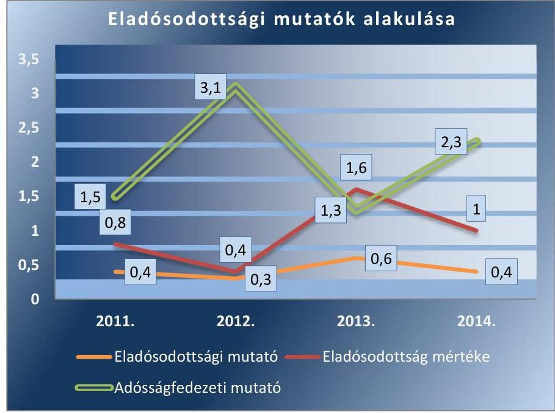

Forrás: A Társaság adatszolgáltatása

---

AZ ELADÓSODOTTSÁGI MUTATÓK az ellenőrzött időszakban kedvezőtlenül alakultak:

- Az eladósodottsági mutató 2013. évben jelentősen emelkedett, ami a megnövekedett kötelezettségállományt jelzi.
- Az eladósodottság mértéke 2011-2012. években elfogadható 1 alatti értéket mutatott, azonban 2013-ban a Társaság kötelezettségállománya jelentősen 60,0 %-kal meghaladta a saját tőke értékét. Ez azt jelentette, hogy a saját források 2013-ban nem biztosítottak fedezetet a kötelezettségek finanszírozásához.
- Az adósságfedezeti mutató I. azt mutatta, hogy 1,0 Ft adósságra mennyi vagyon jutott. A mutató értéke 2011. és 2013. években nem érte el az irányadó 2,0 értéket.
Az árbevételre vetített eladósodottság mutatója az ellenőrzött időszak alatt negatív volt, mivel a forgóeszközök értéke minden évben meghaladta a kötelezettségek értékét. A forgóeszközök értékében a jelentős részarányú követeléseken belül meghatározó az éven túli lejárt kintlévőség, melyek várható megtérülési szintje alacsony.

A nettó eladósodottsági mutató értéke alacsony, vagy negatív volt, ami azt mutatta, hogy a követelések összességében fedezték a kötelezettségek értékét. A mutató értékelése során figyelembe kell venni azt, hogy a követelések növekvő nagyságrendben éven túli követeléseket is tartalmaznak, amelyek pénzügyi realizálása bizonytalan.
2.4. számú megállapítás

A Társaság a 2013. és 2014. évi beszámolója a közszolgáltatási tevékenységről önálló mérleget és eredménykimutatást nem tartalmazott, továbbá a 2013. évi beszámolót nem a Taggyűlés hagyta jóvá. A beszámolók letétbe helyezése és közzététele a 2013. évi beszámoló kivételével szabályszerű volt. A Társaság a hulladékgazdálkodási közszolgáltatással összefüggő adatszolgáltatási, beszámolási kötelezettségének nem tett eleget. A Társaság adatvédelmi felelőssel, adatvédelmi és -biztonsági szabályzattal nem rendelkezett, közérdekű adat közzétételi kötelezettségének nem tett eleget.

A Társaság adatszolgáltatási kötelezettségéről az Alapító Okirat, Társasági szerződés és a hulladékgazdálkodási, közszolgáltatási szerződés nem rendelkezett. A Társaság a tulajdonosi joggyakorló felé történő adatszolgáltatási kötelezettségét a Számv. tv. szerint elkészített beszámolók benyújtásával teljesítette. Az ügyvezető nem rendszeres időközönként, az Önkormányzat munkatervében foglalt ütemezés szerint a Társaság gazdálkodásáról évközi beszámolót terjesztett elő az FB, a Képviselő-testület, majd a Taggyűlés felé.

AZ ÉVES BESZÁMOLÓK elkészítésével, beszámolási kötelezettségeinek a Társaság az ellenőrzött időszak alatt, a Számv. tv. 4. § (1) bekezdése alapján eleget tett. Az egyszerűsített éves beszámolókat a Számv. tv. 96. § (1) bekezdésében előírt tartalommal elkészítette, melynek részét képezte a mérleg, az eredménykimutatás és a kiegészítő melléklet. A Gt. 40. § (1) bekezdésében és a Ptk. 3:129. § (1) bekezdésében előírtaknak megfelelően a választott könyvvizsgáló az ellenőrzött időszak minden évében megállapította, hogy a Társaság Számv. tv. szerint elkészített beszámolója megfelel a jogszabályoknak, továbbá megbízható és valós képet

---

ad a Társaság vagyoni és pénzügyi helyzetéről, működésének eredményéről. A Ht. 50. (3) bekezdés ellenére a 2013-2014. évi beszámoló kiegészítő mellékletében a hulladékgazdálkodásra vonatkozóan nem készítettek önálló mérleget és eredménykimutatást a tevékenység elkülönült bemutatására.

Az egyszemélyes Társaság 2011. évi egyszerűsített beszámolóját a Kép-viselő-testület az FB és a könyvvizsgáló független könyvvizsgálói jelentései birtokában tárgyalta és fogadta el, a Gt. 141. § (2) bekezdés a) pontja, valamint a Ptk. 3:109. §(2) bekezdésének megfelelően.

A Képviselő-testület a Társaság többszemélyes társasággá történt 2012. évi átalakulását követően az ügyvezetőt továbbra is évente beszámoltatta a gazdálkodásról, a hulladékgazdálkodási tevékenységről a Számv. tv. szerint elkészítetett beszámolókon keresztül, a munkatervekben előírt időpontokban. A Képviselő-testület a 2012-2014. közötti egyszerűsített éves beszámolókat elfogadta ${ }^{41}$ és a Társaság nonprofit szervezetté válásáig a mérleg szerinti eredmény eredménytartalékba helyezéséről döntött.

A Társaság legfőbb szerve, a többszemélyes gazdasági társasággá alakulást követően a 2012. és a 2014. évi egyszerűsített éves beszámolókat elfogadta, illetve a mérleg szerinti eredmény eredménytartalékba helyezéséről döntött ${ }^{42}$. A Ptk. 3:109. § (2) bekezdésében, a Gt. 141. §(2) bekezdés a), és a Társasági szerződés 12. a) pontjaiban rögzítettek ellenére a Taggyűlés a 2013. évi egyszerűsített éves beszámolót nem hagyta jóvá.

A Társaságnál az éves beszámolók letétbe helyezése és közzététele a Számv. tv. 154. § (7), 154\B. §. (2) bekezdéseiben előírtaknak megfelelően megtörtént. A Társaság éves beszámolói elektronikusan a cégadat nyilvántartásból elérhetőek. Azok az ellenőrzött időszak minden évében a céginformációs szolgálat részére a kormányzati portál útján, a Számv. tv. 153.§ (1) bekezdésében meghatározott határidőben megküldésre kerültek a független könyvvizsgálói jelentéssel és a tulajdonosok elfogadó határozatával együtt. A 2013. évi beszámoló letétbe helyezése és közzététele azonban a Számv. tv. 153. § (1) bekezdésében előírtaknak teljes körűen nem felelt meg, mivel a 2013. évi beszámoló elfogadásáról nem a jóváhagyásra jogosult testület döntött.

A könyvvizsgáló a 2011-2014. évek beszámolóit hitelesítő záradékkal látta el. A könyvvizsgáló az éves beszámolókról készített jelentésében igazolta, hogy az éves beszámoló megbízható és valós képet nyújt a pénzügyi és jövedelmi helyzetről, valamint, hogy az megfelel az érvényes jogszabályi rendelkezéseknek.

A könyvvizsgáló az ellenőrzött időszakban - sem vezetői levélben, sem független könyvvizsgálói jelentésében - nem észrevételezte, hogy a Társaság a Ht. 50.§ (3) bekezdésében foglaltak ellenére nem készített a hulladékgazdálkodási közszolgáltatás érdekében végzett tevékenységére vonatkozóan 2013-2014. évi önálló mérleget és eredménykimutatást és a követelések értékvesztését nem a Számv. tv. 55.§ (1), valamint 165.§ (4) bekezdéseiben foglaltak szerint számolta el. A könyvvizsgáló a beszámolók megtárgyalásán jelen volt, kivéve a 2013. évi beszámolót, melyet nem tárgyaltak.

A 2011. évi beszámolóról a független könyvvizsgálói jelentés, a mérleg szerinti eredményt, a közzétett egyszerűsített éves beszámolóban szereplő értéktől eltérő összegben tartalmazta. A Társaság megsértette a Számv. tv.

---

153. § (1) bekezdését, mivel a 2011. évi egyszerűsített beszámoló és független könyvvizsgálói jelentés, letétbe helyezése és közzététele nem ugyanolyan tartalommal történt, mint amelynek alapján a könyvvizsgáló az egyszerűsített éves beszámolót felülvizsgálta.

A közvagyon védelme érdekében az FB, vagy a könyvvizsgáló az ellenőrzött időszakban nem kezdeményezte a gazdálkodó szervezet legfőbb testületének összehívását és nem tettek a vagyongazdálkodással kapcsolatban észrevételt.

ADATSZOLGÁLTATÁSI KÖTELEZETTSÉGEINEK a Társaság a 2011-2014. években nem tett eleget. A Társaság a 2011-2012. években a Hgt. 29. § (1) bekezdésében előírt, részletes, hulladékgazdálkodási kötelező közszolgáltatói tevékenységével kapcsolatos költségelszámolást nem készített, azt az Önkormányzat felé nem nyújtotta be. A Társaság a Ht. 50. § (4) bekezdése ellenére, a 2013-2014. évi beszámolóit a letétbe helyezéssel egyidejűleg nem küldte meg a Hivatalnak ${ }^{43}$.

AZ ADATOK VÉDELMÉRE, KÖZZÉTÉTELÉRE vonatkozó feladatokat nem teljesítették az ellenőrzött időszakban. Az ellenőrzött időszakban a Társaságnál nem volt belső adatvédelmi felelős az Avtv. 31/A. § (1) bekezdés c) pontjában és az Info tv. 24. § (1) bekezdés c) pontjában előírtakkal szemben. 2011-2014. évek között a Társaságnál a belső adatvédelmi és adatbiztonsági szabályzatot nem készítettek, belső adatvédelmi nyilvántartást nem vezettek, ezzel megsértették az Avtv. 31/A. § (2) bekezdés d) e) pontjában és a (3) bekezdésben előírtakat, valamint az Info tv. 24. § (2) bekezdés d), e) pontjában és a (3) bekezdésében előírtakat. A Társaság a közérdekű adatok megismerésére irányuló igények teljesítésének rendjére szabályzatot az Avtv. 20. § (8) bekezdése, illetve 2011. július 27-től az Info tv. 30. § (6) bekezdése alapján a 2011-2014. években nem készített.

A Társaság 2011-ben az Eisztv. 6. § (1) bekezdésében, 2012-2014. években az Info tv. 37. § (1) bekezdésben előírt kötelezettségének az 1. számú mellékletben meghatározott adatok tekintetében nem tett eleget. A Társaság szervezeti, személyi, tevékenységére, működésére vonatkozó és gazdálkodási adatait honlapján nem tette közzé.

---

# 3. A gazdasági társaságnál az ellátott közfeladat bevételei és ráfordításai elszámolása, valamint az önköltségszámítás és árképzés szabályszerű volt-e? 

Összegző megállapítás

A Társaságnál a ráfordításokat megfelelően, a bevételeket kockázatosan, a beruházásokat nem megfelelően számolták el. A követelések minősítése, értékvesztésének elszámolása szabálytalan volt. Az elkülönítésre vonatkozó szabályozási hiányosságok hozzájárultak ahhoz, hogy a Társaság árképzése nem felelt meg a jogszabályi előírásoknak.
3.1. számú megállapítás

A Társaságnál az anyagjellegű ráfordításokat megfelelően számolták el. Az értékesítés nettó árbevételének elszámolásánál számlázási és könyvviteli szabálytalanságok voltak, melyek magas kockázatot jeleznek. A beruházások, felújítások elszámolása az üzembehelyezéssel és értékcsökkenéssel kapcsolatos szabálytalanságok miatt nem volt megfelelő. A követelések behajtására vonatkozó jogszabályi előírásokat a nem lakossági felhasználók tartozásai esetében nem tartották be. A követelések értékvesztésének elszámolása a minősítési és könyvelési hiányosságok miatt nem volt szabályszerű, mely az óvatosság elvét sértette.

A Társaság a hulladékkezelési közfeladat mellett gyepmesteri tevékenységet is ellátott, azonban a tevékenységek főkönyvben történő elkülönítésre, illetve tevékenységszámok alkalmazására vonatkozó szabályokat nem határozott meg.

Az ellenőrzött években a keletkezett bevételeket és a közvetlen költségeket, ráfordításokat a szabályozási hiányosságok ellenére a főkönyvi könyvelésében tevékenységszámok alkalmazásával elkülönítette. Ugyanakkor a közvetett költségek megosztási arányának képzési módja nem volt alátámasztott, ezért a költségek felosztása nem volt megalapozott. A Társaság a Hgt. 29. § (3) és a Ht. 50. § (2) bekezdésében előírt szétválasztási kötelezettséget a költségfelosztás hiányossága miatt csak részben teljesítette.

A bevételek és ráfordítások alakulását az 5. táblázat szemlélteti.
5. táblázat

A TÁRSASÁG BEVÉTELEI, RÁFORDÍTÁSA (M FT)

|  | 2011 | 2012 | 2013 | 2014 |
| :-- | --: | --: | --: | --: |
| Összes bevétel | 74,5 | 113,9 | 144,5 | 145,3 |
| Összes ráfordítás | 71,7 | 112,5 | 144,6 | 145,3 |
| Adózás előtti eredmény | 2,8 | 1,4 | $-0,1$ | 0,0 |

Forrás: A Társaság 2011-2014. évek közötti eredménykimutatásai
AZ ANYAGJELLEGŰ RÁFORDÍTÁSOK elszámolása megfelelő volt. A szabályzatok szétválasztásra vonatkozó előírásainak hiánya ellenére a megfelelő költségnemre és közfeladatra elkülönítetten könyvelték a különböző tevékenységeket. A költségelszámolást dokumentumokkal alátámasztottan hajtották végre.

---

AZ ÉRTÉKESÍTÉS NETTÓ ÁRBEVÉTELÉNEK elszámolásánál számlázási és könyvviteli szabálytalanságok voltak, melyek magas kockázatot jeleznek. A bevételeknél a díjtételeket az Önkormányzat Hulladékkezelési rendelet ${ }_{1,2}$-eivel összhangban érvényesítették. A díjkompenzációs bevételek elszámolása nem volt szabályszerű, mivel az áthúzódó bevételek elhatárolását nem a megfelelő tevékenység számra könyvelték, illetve a díjkompenzációs bevételek elszámolása nem a számlarend szerint alkalmazandó számlacsoportban történt.

A Társaság lerakási díjnövekményhez kapcsolódó díjkompenzációs számlákat a Számv. tv. 77. § (2) bekezdés d) pontja ellenére egyéb bevétel helyett belföldi értékesítés árbevételeként 2013. év végén elhatárolta, majd 2014. január 28-án számlázta ki az Önkormányzat felé. A kompenzációs költséget az Önkormányzat pályázat útján kívánta fedezni. A pályázat elutasítását követően 2014. évben a díjkompenzációs számlák ellenértékének visszakövetelése helyett a kompenzációt a Képviselő-testület támogatás formájában biztosította a Társaság részére. Emiatt a kiszámlázott és kifizetett összegek 2014. évben az önkormányzati támogatások főkönyvi számlára kerültek átvezetésre. A 2013. évi hibás könyvelési gyakorlat miatt az átvezetést a 2014. évi árbevétel terhére kellett végrehajtani, mely 9,4 M Ft összegű árbevétel csökkenést okozott. A hiba a 9-es számlaosztályon belül történt, ezért a mérleg szerinti eredményre hatást nem gyakorolt, csak az eredménykimutatás szerkezetét befolyásolta. A 2014. éves beszámoló kiegészítő mellékletében ugyanakkor az eltérést és annak magyarázatát be kellett volna mutatnia a Társaságnak. A Számv. tv. 15. § (5) bekezdésében foglalt következetesség elvének nem feleltek meg, mert a beszámoló tartalma és formája, valamint az azt alátámasztó könyvvezetés tekintetében az állandóságot és az összehasonlíthatóságot nem biztosították.

# A BERUHÁZÁSOK, FELÚJÍTÁSOK ÉS AZ ÉRTÉK- 

CSÖKKENÉS elszámolása nem volt megfelelő. Az eszközök aktiválása a számla szerinti teljesítés időpontjában történt. Az eszközök értékcsökkenésének elszámolása hitelt érdemlő módon dokumentált üzembe helyezés nélkül - üzembehelyezési okmányok nélküli állományba vétel alapján - történt, mely ellentétes a Számv. tv. 52. § (2) bekezdésével.

A számviteli politika ${ }_{1}$-ben az értékcsökkenés elszámolására a 20112012. években a befektetett eszközök hasznos élettartamát, az amortizációs kulcsokat nem határozták meg. A gyakorlatban a Tao. tv. 1. számú melléklete szerinti leírási kulcsokat alkalmazták. A hasznos élettartamra vonatkozó szabályozási hiányosság miatt 2011-2012. években az értékcsökkenés elszámolásának helyessége nem volt megállapítható. A 2013.évtől hatályos számviteli politika ${ }_{1}$-ben az amortizációs kulcsokat rögzítették.

Az ún. kis értékű - a számviteli politika ${ }_{1}$-ben 50 E Ft, a számviteli politika $_{2}$-ben a Számv. tv. 80. § (2) bekezdése alapján 100 E Ft egyedi beszerzési, előállítási ár alatti - tárgyi eszközökre vonatkozóan a használatba vételt követően az értékcsökkenés egy összegben történő elszámolását írtak elő. A számviteli politika ${ }_{1,2}$ előírásai ellenére a kis értékű eszközöknél 33,0 %-os leírási kulcsot alkalmaztak. Számítástechnikai eszközök esetében a számviteli politika ${ }_{2}$-ben rögzített $33 \%$-os leírási kulcs helyett, helytelenül $50 \%$-os leírási kulcsot alkalmaztak.

---

A KÖVETELÉSÁLLOMÁNY csökkentése érdekében a Társaság a lakossági díjhátralék beszedésére intézkedett. 2011-2012. években a hátralékos lakosoknak felszólító leveleket küldött, azok eredménytelensége esetén a Társaság a díjhátralék behajtását a települési önkormányzat jegyzőjénél kezdeményezte. Ugyanakkor a Hgt. 26. § (3) bekezdése ellenére, a Társaság 2011. évben 57 db, 2012. évben 32 db, összesen 4,5 M Ft értékű nem lakossági felhasználói tartozás behajtását nem kezdeményezte az Önkormányzatnál.
2013. évtől a díjfizetési kötelezettséget elmulasztó lakosoknak kiküldött felszólító levelek eredménytelensége esetén a díjhátralék megfizetésének esedékességét követő 45 nap elteltével kezdeményezték a NAV-nál az adók módjára történő behajtást. Ugyanakkor a Társaság a Ht. 52. § (3) bekezdése ellenére 2013. évben 35 db, 2014. évben 45 db, összesen 4,3 M Ft értékű nem lakossági felhasználói díjhátralék behajtását nem kezdeményezte az adóhatóságnál. A Társaság 2013. október 1.-2014. szeptember 30. között a nem lakossági felhasználókkal szemben fennálló követeléseinek behajtására - a Ht. 52. § (3) bekezdéseiben foglaltakkal szemben külső társaságot bízott meg sikerdíj ellenében. A Társaság a megbízás időtartama alatt 1,1 M Ft követelést adott át behajtásra, amelyből 0,7 M Ft folyt be.

A Társaság követelésállományának összetételét a 6. táblázat szemlélteti, lejárat és felhasználók szerinti bontásban.
6. táblázat

KÖVETELÉSEK LEJÁRAT ÉS FELHASZNÁLÓK SZERINT (M FT)

|  | 2011. | 2012. | 2013. | 2014. |
| :--: | :--: | :--: | :--: | :--: |
|  |  | Felhasználó szerint |  |  |
| Lakossági | n.a. ${ }^{48}$ | 13,3 | 30,5 | 32,5 |
| Nem lakossági | n.a | 3,7 | 2,5 | 4,5 |
| Összesen | 11,9 | 17,0 | 33,0 | 37,0 |
|  |  | Lejárat szerint |  |  |
| 0-90 nap | n.a | 6,9 | 16,0 | 14,9 |
| 91-180 nap | n.a | 2,2 | 5,0 | 3,7 |
| 181-360 nap | n.a | 2,1 | 4,3 | 4,9 |
| 361 naptól | n.a | 5,8 | 7,7 | 13,5 |
| Összesen | 11,9 | 17,0 | 33,0 | 37,0 |

A Z ÉRTÉKVESZTÉS elszámolására a Társaság a Számviteli politika ${ }_{1}$-ben a vevőkre főszabályként egyedi minősítést határozott meg. A kis összegű, üzleti év fordulónapján fennálló, mérlegkészítésig pénzügyileg nem rendezett követelések esetében - a Számv. tv. 55. § (3) bekezdésével összhangban - 50%-ban történő elszámolást írták elő, ugyanakkor könyvviteli elkülönítésüket nem szabályozták. A Számviteli politika ${ }_{2}$ a vevőkre általánosságban egyedi minősítést írt elő, a kis összegű követelések értékvesztésére vonatkozóan nem rendelkezett.

A számviteli politika ${ }_{1,2}$-ben rögzítettek ellenére a 2011-2013. években az értékvesztés elszámolása nem a vevők egyedi minősítése alapján, hanem - a Számviteli politika ${ }_{1,2}$-t és a Számv. tv. 55. § (1) bekezdését megsértve - egy összegben történt. A 365 napon túli követelések teljes állományára 100\% értékvesztés került elszámolásra ezáltal a kis összegű követelésekre is $100 \%$-os értékvesztést számoltak el. A kis összegű követelések

---

csoportja a könyvvitelben nem volt elkülönítve, így nem alkalmazhatták a Számv. tv. 55. § (2) bekezdésében foglaltakat. Nem biztosították annak a feltételeit, hogy a következő évi mérleg fordulónapi értékeléskor a kis összegű követelések - hasonló módon megállapított - értékvesztésének összegét a Számv tv. 55.§ (2) bekezdésének megfelelően össze kell vetni az előző évi, ilyen jogcímen elszámolt értékvesztés összegével és a csoport szinten mutatkozó különbözetet előjelének megfelelően kell elszámolni.

Az értékvesztés elszámolása a 2011-2013. között helytelen főkönyvi számlán került könyvelésre. A Belföldi követelések értékvesztése és visszaírása számla helyett, a Belföldi követelések (vevők) számlát alkalmazták melynek következtében a főkönyv és a folyószámla egyenlege 2011-2013. év végén nem egyezett meg. A Számlarendben előírták, hogy az értékvesztést külön főkönyvi számlán kell nyilvántartani. A Társaság megsértette a Számlarendet és a Számv. tv. 165. § (4) bekezdését.

A Társaság a 2014. üzleti év végén nem számolt el értékvesztést, mely ellentétes a Számviteli politika ${ }_{1,2}$-vel, a Számv. tv. 55. § (1) bekezdésével, valamint megsértette a Számv. tv. 15. § (8) bekezdésében foglalt az óvatosság elvét, mivel annak ellenére mutatott ki eredményt, hogy a bevétel pénzügyi realizálása bizonytalan volt.

A Társaság követeléseinek állománya és ezen belül a lakossággal szembeni követeléseinek állománya a rezsicsökkentési előírások végrehajtása ellenére növekedett az ellenőrzött időszakban.

Az elkülönítésre vonatkozó szabályozási hiányosságok hozzájárultak ahhoz, hogy a Társaság árképzése nem felelt meg a jogszabályi előírásoknak. A díjkalkuláció főkönyvi és analitikus alátámasztása hiányos volt, a költségfelosztás nem volt átlátható. A díjak alkalmazásánál a Rezsi. törvény előírásait betartották.

A Társaság önköltség-számítási szabályzat készítésére a Számv. tv. 14. § (6) bekezdése alapján nem volt kötelezett. Az egyes közfeladatok önköltségét önköltség-számítással nem határozták meg.

A KÖZSZOLGÁLTATÁSI DÍJAKHOZ készített költségkalkulációk a 64/2008. (III.28.) számú Kormányrendeletben előírtaknak nem feleltek meg. A kalkulációs sémát és a díjképletet 2011. április 1-jéig a 64/2008. (III.28.) számú Kormányrendelet 2. § (3) bekezdése ellenére nem tették közzé. Az árképzés során kalkulációs sémát és a díjképletet alkalmaztak, azt 2011. április 1-jétől a hulladékrendelet ${ }_{2}$ is tartalmazta. Ugyanakkor a díjszámítás módját és a díjképlet elemeit részletesen nem határozták meg, a díjkalkuláció alapadatainak képzési módszere nem volt szabályozva, ezzel megsértették a 64/2008. (III.28.) számú Kormányrendelet 2. § (3) bekezdését.

Az alkalmazott díjkalkuláció szabályozás hiányában nem volt átlátható, az abban szereplő alapadatok nem voltak levezethetőek a Társaság nyilvántartásaiból. Hiányzott a 64/2008. (III.28.) számú Kormányrendelet 7. § (1) bekezdésében előírt költségek és ráfordítások egyértelmű meghatározása, főkönyvi és analitikus alátámasztása. A költségek megosztási arányának képzése, a közvetlen és közvetett (általános) költségek lakossági és

---

nem lakossági felhasználókra történő felosztása, illetve a kezelési súlyszámok megállapításának módszere nem volt szabályozott, átlátható és alátámasztott.

A Társaság árképzésével kapcsolatban - az alapadatok átláthatóságának hiánya miatt - nem állapítható meg, hogy közszolgáltatási díjak a 64/2008. (III.28.) Korm. rendelet 3. § (1) bekezdés a) pontjának megfelelően a Társaság hatékony működéséhez szükséges folyamatos költségek és ráfordítások megtérülésének, valamint a közszolgáltatás fejleszthető fenntartásához szükséges költségek és ráfordítások fedezetének biztosítására alkalmasak-e. Továbbá nem állapítható meg, hogy a meghatározott közszolgáltatási díjak a 64/2008. (III.28.) Korm. rendelet 3. § (1) bekezdés b) pontjának megfelelően ösztönözték-e a Társaságot a közszolgáltatás biztonságos és legkisebb költségű ellátására, a közszolgáltató kapacitásának hatékony kihasználására, valamint a hulladékkeletkezés csökkentésére és a hatékony hulladékgazdálkodásra.
A közvetlen és közvetett költségek felosztási arányszámai eltértek, valamint a közvetlen költségek egyes költségelemei (gyűjtés, ártalmatlanítás, egyéb) esetében sem voltak azonosak. Az eltérés okairól, a lakossági és nem lakossági felhasználók esetében alkalmazott felosztási arányszámok meghatározásának módszeréről a díjkalkuláció nem tartalmazott információt.
$\longrightarrow$ Az edények űrtartalma alapján meghatározott kezelési súlyszámok a lakossági és nem lakossági felhasználók esetében eltérést mutattak, továbbá kalkulációs időszakonként változtak. Az eltérés okairól, valamint a kezelési súlyszámok meghatározásának módszeréről a díjkalkuláció nem tartalmazott információt.
A felosztási arányszámok, valamint a kezelési súlyszámok meghatározására vonatkozó információk hiányában a díjkalkuláció átláthatósága nem volt biztosított. Ennek következtében a lakossági és nem lakossági felhasználói kör közötti keresztfinanszírozás nem volt egyértelműen kizárható, a díjak megalapozottsága nem volt biztosított. A kalkulációs módszer hiányosságát mutatja, hogy a díjkompenzáció nélkül számított lakossági díjak jelentősen elmaradtak a nem lakossági díjak értékétől, a legmagasabb ürítési esetszámú, 120 l-es edény esetében közel kétszeres volt a különbség.

A 43/2011. (XII.27.) Képviselő-testületi rendeletben 2012. évre meghatározott közszolgáltatási díj a Hgt. 57. § (1) bekezdése ellenére meghaladta 2011. évre megállapított hulladékkezelési közszolgáltatási díj legmagasabb mértékét. Az alkalmazott díj 2012. április 15-étől megfelelt a jogszabályi előírásoknak, a módosított Hgt. 57.§ (1) bekezdés b) pontjában és az 58. §-ban foglaltak figyelembe vételével.

A Társaság a Ht. 91. § (1)-(2) bekezdéseiben előírt, a 2013. július 1-jétől hatályos rezsidíj csökkentő intézkedéseket végrehajtotta, az alkalmazott lakossági díjait a 2012. április 14-ei díj 4,2 százalékkal megemelt összegének 90\%-ában állapította meg. A Társaság a rezsicsökkentéssel összefüggésben költségcsökkentő, takarékossági intézkedéseket nem tett.

Az alkalmazott közszolgáltatási díjak megfeleltek a Hulladékrendelet ${ }_{1,2}$-ben közzétett díjaknak, azonban a Társaságnál alkalmazott nem megfelelő gyakorlat és szabályozás hiánya miatt, azok nem voltak megalapozottak.

---

A hulladékkezelési közszolgáltatás díjainak változását a 2011-2014. években a táblázat mutatja:
7. táblázat

HULLADÉKKEZELÉSI KÖZSZOLGÁLTATÁSI NETTÓ DÍJAK (FT)

| időszak | Lakosság |  |  |  |  |  |  |  | Nem lakossági felhasználók |  |  |  |  |
| :--: | :--: | :--: | :--: | :--: | :--: | :--: | :--: | :--: | :--: | :--: | :--: | :--: | :--: |
|  | Hulladékgyűjtő mérete (liter) |  |  |  |  |  |  |  | Hulladékgyűjtő mérete (liter) |  |  |  |  |
|  | 60 | 80 | $\begin{gathered} 110- \\ 120 \end{gathered}$ | 240 | 660 | 770 | 1100 | 80 | $\begin{gathered} 110- \\ 120 \end{gathered}$ | 240 | 600 | 1100 | 5000 |
| 2010.01.01-2011.03.31 | - | 146 | 198 | 294 | 725 | 800 | 1000 | 429 | 647 | 1100 | - | 3229 | 8945 |
| 2011.04.01-2011.12.31 | 108 | 144 | 195 | 290 | 715 | 789 | 986 | 477 | 647 | 1100 | 2341 | 3229 | 8945 |
| 2012.01.01-2012.12.20 | 111 | 148 | 202 | 300 | 736 | 815 | 1016 | 477 | 647 | 1100 | 2341 | 3229 | 8945 |
| 2012.12.21-2012.12.31 | 122 | 163 | 222 | 330 | - | - | - | 525 | 712 | 1210 | 2575 | 3552 | 9840 |
| 2013.01.01-2013.06.30 | 127 | 170 | 231 | 344 | - | - | - | 547 | 742 | 1261 | 2683 | 3701 | 10253 |
| 2013.07.01-től | 104 | 139 | 189 | 281 | - | - | - | 547 | 742 | 1261 | 2683 | 3701 | 10253 |

A 2011-2012. években a Társaság a közszolgáltatási díjrendelet elfogadását megelőzően - a Hgt. 25. § (4) bekezdésében előírt Kt. ${ }^{49}$ 43.§ szerinti vizsgálati elemzés részeként - nem készített a közszolgáltatás rendjére és módjára tekintettel részletes költségelemzést. A Kt. 44. § (1) bekezdés e) pontjában foglaltak szerint a vizsgálati elemzésnek különösen arra kellett kiterjednie, hogy a tervezett intézkedések megvalósításához az állami, pénzügyi, szervezeti és eljárási feltételek rendelkezésre állnak-e. A vizsgálati elemzést a Kt. 44. §(2) bekezdésében előírtak ellenére az OKT ${ }^{50}$-hoz véleménynyilvánítás céljából nem küldték meg.

---

# JAVASLATOK 

Az ÁSZ tv. 33. § (1) bekezdésében foglaltak értelmében az ellenőrzött szervezet vezetője köteles a jelentésben foglalt megállapításokhoz kapcsolódó intézkedési tervet összeállítani és azt a jelentés kézhezvételétől számított 30 napon belül az ÁSZ részére megküldeni. Amennyiben az ellenőrzött szervezet vezetője nem küldi meg határidőben az intézkedési tervet, vagy továbbra sem elfogadható intézkedési tervet küld, az Állami Számvevőszék elnöke az ÁSZ tv. 33. § (3) bekezdése a) és b) pontjaiban foglaltakat érvényesítheti.

Javaslataink célja a Gyomaközszolg Kommunális Közszolgáltató Nonprofit Kft. gazdálkodása szabályszerűségének és gyakorlatának javítása annak érdekében, hogy a szabályozási környezet és az alkalmazott gyakorlat megfelelően tudja támogatni az átlátható működést.

## A Gyomaközszolg Kommunális Közszolgáltató Nonprofit Kft. ügyvezetőjének

1.  Intézkedjen a hulladékgazdálkodási közszolgáltatás kereteibe nem tartozó hulladékkezelési tevékenységek és az egyéb közszolgáltatások szigorú elkülönítési szabályainak kidolgozására, illetve a hulladékgazdálkodási közszolgáltatás érdekében végzett tevékenység önálló mérleg és eredménykimutatás adatainak alátámasztására is alkalmas könyvvezetési szabályok meghatározására a keresztfinanszírozás kizárásának biztosítása érdekében.
(2.1. sz. megállapítás 3. bekezdés 4., 5. francia bekezdései alapján)
2.  Intézkedjen a számviteli politika módosításáról a bizonylatok megőrzési idejére, továbbá a lekötött tartalék, rendkívüli bevételek és rendkívüli ráfordítások elszámolására vonatkozóan, a Számv. tv. hatályos rendelkezéseire való hivatkozásoknak megfelelően.
(2.1. sz. megállapítás 3. bekezdés 1., 2. francia bekezdései alapján)
3.  Intézkedjen a mennyiségi felvétellel történő leltározás gyakoriságának leltározási szabályzatban történő előírásáról.
(2.1. sz. megállapítás 4. bekezdése alapján)
4.  Intézkedjen az Önkormányzattól térítésmentesen átvett hulladékgyűjtő jármű piaci értékének meghatározására és az eszköz könyv szerinti értékének módosítására.
(2.2. sz. megállapítás 2. bekezdése alapján)

---

5.  Intézkedjen a hulladékgazdálkodási közszolgáltatás nyújtása érdekében végzett tevékenység önálló mérlegének és eredmény-kimutatásának elkészítéséről és az éves beszámoló kiegészítő mellékletében történő szerepeltetéséről.
(2.4. sz. megállapítás 2. bekezdése alapján)
6.  Intézkedjen az éves számviteli beszámolók megküldéséről a Magyar Energetikai és Közmű-szabályozási Hivatal részére a jogszabályi előírásoknak megfelelően.
(2.4. sz. megállapítás 11. bekezdése alapján)
7.  Intézkedjen az Info tv-ben előírtaknak megfelelően a belső adatvédelmi felelős kinevezéséről vagy megbízásáról.
(2.4. sz. megállapítás 12. bekezdése alapján)
8.  Intézkedjen az adatvédelmi nyilvántartás vezetéséről, az adatvédelmi és adatbiztonsági szabályzat és a közérdekű adatok megismerésére irányuló igények teljesítésének rendjére vonatkozó szabályzat elkészítéséről.
(2.4. sz. megállapítás 12. bekezdése alapján)
9.  Intézkedjen az Info tv. szerinti közzétételi kötelezettség teljes körű teljesítéséről, a Társaság szervezeti, személyi, illetve a tevékenységére, működésére és gazdálkodására vonatkozó adatainak a Társaság honlapján történő közzétételéről.
(2.4. sz. megállapítás 13. bekezdése alapján)
10. Intézkedjen a közszolgáltatás költségeinek teljes körű elkülönítésére, ennek keretében a közvetett költségek felosztásának szabályozott végrehajtására annak érdekében, hogy a könyvviteli és analitikus rendszer adatai biztosítsák a szétválasztási kötelezettség teljesítését, a keresztfinanszírozás kizárását.
(3.1. sz. megállapítás 2. bekezdése alapján)
11. Intézkedjen arról, hogy a tárgyi eszköz üzembe helyezése a számviteli törvény előírásainak megfelelően történjen, a kis értékű tárgyi eszközök valamint a számítástechnikai eszközök értékcsökkenésének elszámolását a számviteli politika előírása szerint végezzék.
(3.1. sz. megállapítás 7., 9. bekezdései alapján)

---

12. Intézkedjen a követelések év végi értékelésének és az értékvesztés könyvelésének szabályszerű végrehajtására az óvatosság elvének érvényesítése érdekében.
(3.1. sz. megállapítás 14-16. bekezdései alapján)
13. Tegyen intézkedéseket a hulladékgazdálkodási közszolgáltatás nyújtása érdekében végzett tevékenység 2013-2014. évi önálló mérleg és eredménykimutatás elkészítésének hiánya, valamint a követelések értékvesztésének elszámolásával kapcsolatban feltárt szabálytalanság tekintetében a felelősség tisztázása érdekében, és szükség szerint intézkedjen a felelősség érvényesítéséről.
(2.4. sz. megállapítás 2., illetve a
3.1. megállapítás 14-16. bekezdései alapján)

---

# Javaslataink célja az Önkormányzat szabályszerű működésének elősegítése, továbbá az önkormányzati tulajdonosi joggyakorlás kontrolljainak erősítése. 

## Gyomaendrőd Város Önkormányzata Polgármesterének

1.  Hívja fel a felügyelő bizottság elnökének figyelmét az ügyrend elkészítésére és a jóváhagyása érdekében a Taggyűlésre történő előterjesztésre.
(1.2. sz. megállapítás 3. bekezdése alapján)
2.  Kezdeményezze, hogy a Társaság legfőbb szerve tegyen eleget a Társaság vezető tisztségviselőire, FB tagjaira és az Mt. 208. §-ának hatálya alá tartozó munkavállalóira vonatkozó Javadalmazási szabályzat megalkotási kötelezettségének és döntsön annak elfogadásáról.
(1.2. sz. megállapítás 4. bekezdése alapján)
3.  Hívja fel a könyvvizsgáló figyelmét az éves beszámoló kiegészítő melléklete tartalmi megfelelőségének ellenőrzésére és annak könyvvizsgálói záradékban való megjelenítésére, valamint a követelések értékvesztésének elszámolásával összefüggésben a felülvizsgálati feladatának megfelelő végrehajtására.
(2.4. sz. megállapítás 8. bekezdése alapján)

---

.

---

# MELLÉKLETEK 

- I. SZ. MELLÉKLET: ÉRTELMEZŐ SZÓTÁR
eladósodottságot jellemző mutatók
garancia
gazdasági társaság
gazdálkodó szervezet
keresztfinanszírozás tilalma
eladósodottsági mutató (tőkeáttétel): idegen tőke/összes forrás. Egészségesnek mondható egy olyan mértékű áttétel, amelyet az üzleti tervek szerint és az elmúlt időszak tapasztalatai alapján a társaság megfelelő biztonsággal ki tud termelni. Nagy eszközberuházás-igényű iparágakban értéke magasabb, azaz magasabb eladósodottság is elfogadható, de 75-85\%-ot meghaladó értéknél már itt is erős, sőt túlzott külső finanszírozottságról beszélhetünk. Általánosságban véve kedvező, ha értéke kisebb, mint 0,6 .
eladósodottság mértéke: kötelezettségek / saját tőke. Fontos szerepet játszik ez a mutató egy vállalat megítélésében. Azt mutatja, hogy a saját források a kötelezettségek hány százalékát fedezik. Törekedni kell, hogy a mutató tartósan (jelentősen) 1 alatti értéket érjen el.
nettó eladósodottság: (kötelezettségek-követelések) / saját tőke. Azt mutatja, hogy a kintlévőségekkel csökkentett kötelezettségeket milyen mértékben fedezi a saját forrás. Ez feltételezi, hogy a követelések pénzügyileg előbb realizálódnak, mint ahogy a kötelezettségeket teljesíteni kell. A mutató minél kisebb, csökkenő értéke a kedvező.
adósságfedezeti mutató I.: (befektetett eszközök+forgó eszközök) / idegen forrás. Azt mutatja, hogy 1 Ft adósságra hány Ft vagyon jut. Általánosságban véve kedvező, ha értéke 2 körül van, de nagy eszközberuházás-igényű iparágakban értéke kisebb is lehet.
árbevételre vetített eladósodottság: (kötelezettségek-forgóeszközök) / értékesítés nettó árbevétele. Az árbevételre vetített eladósodottság azt mutatja, hogy az árbevétel mekkora fedezetet nyújt a kötelezettségeknek a forgóeszközökkel csökkentett részére. Általánosságban véve kedvező, ha az árbevétel minél nagyobb arányban nyújt fedezetet a forgóeszközökkel csökkentett kötelezettségekre (értéke kisebb, mint 1, csökken az ellenőrzött időszakban).
A garancia olyan önálló, az önkormányzat nevében vállalt kötelezettség, amely alapján az önkormányzat az önkormányzati költségvetés terhére szerződésben meghatározott feltételek szerint, a kötelezett nem teljesítése esetén a jogosultnak fizetést teljesít az előzetesen rögzített összeghatárig.
Ptk. 3:88. § (1) bekezdése szerint „a gazdasági társaságok üzletszerű közös gazdasági tevékenység folytatására, a tagok vagyoni hozzájárulásával létrehozott, jogi személyiséggel rendelkező vállalkozások, amelyekben a tagok a nyereségből közösen részesednek, és a veszteséget közösen viselik".
A Ptk. 685. § c) pontja szerint gazdálkodó szervezet:
„az állami vállalat, az egyéb állami gazdálkodó szerv, a szövetkezet, a lakásszövetkezet, az európai szövetkezet, a gazdasági társaság, az európai részvénytársaság, az egyesülés, az európai gazdasági egyesülés, az európai területi együttműködési csoportosulás, az egyes jogi személyek vállalata, a leányvállalat, a vízgazdálkodási társulat, az erdő birtokossági társulat, a végrehajtói iroda, az egyéni cég, továbbá az egyéni vállalkozó." (2014. 03.15-ig hatályos)
A közszolgáltatás díját úgy kell megállapítani, hogy az maradéktalanul fedezetet nyújtson a közszolgáltatás indokolt költségeire és ráfordításaira, valamint a közszolgáltató e tevékenységével kapcsolatos ésszerű nyereségére; az ésszerű nyereség nem tartalmazhatja a közszolgáltatáson kívül eső egyéb gazdasági tevékenységei költségeinek, ráfordításainak fedezetét.

---

kezesség

közszolgáltatás
közszolgáltató
közületi felhasználó
lakossági felhasználó
nemzeti vagyon

A kezességre vonatkozó előírásokat a Ptk. 6:416-430. §-ai tartalmazzák. Kezességi szerződéssel a kezes kötelezettséget vállal a jogosulttal szemben, hogyha a kötelezett nem teljesít, maga fog helyette a jogosultnak teljesíteni. Kezesség egy vagy több, fennálló vagy jövőbeli, feltétlen vagy feltételes, meghatározott vagy meghatározható összegű pénzkövetelés vagy pénzben kifejezhető értékkel rendelkező egyéb kötelezettség biztosítására vállalható.
A Ptk. szerint kezességet csak írásban lehet vállalni. A kezes kötelezettsége ahhoz a kötelezettséghez igazodik, amelyért kezességet vállalt. A kezes kötelezettsége nem válhat terhesebbé, mint amilyen elvállalásakor volt, kiterjed azonban a kötelezett szerződésszegésének jogkövetkezményeire és a kezesség elvállalása után esedékessé váló mellékkövetelésekre is.
A közszolgáltatás: „közcélú, illetőleg közérdekű szolgáltatást jelent, amely egy nagyobb közösség (állam, település) minden tagjára nézve megközelítőleg azonos feltételek mellett vehető igénybe, ezért valamilyen mértékig közösségi megszervezést, illetve szabályozást, ellenőrzést igényel." Az Ebktv. 3. § d) pontja a következőképpen határozza meg a közszolgáltatást: „szerződéskötési kötelezettség alapján a lakosság alapvető szükségleteinek ellátására irányuló szolgáltatás, így különösen a villamos energia-, gáz-, hő-, víz-, szennyvíz- és hulladékkezelési, köztisztasági, postai és távközlési szolgáltatás, továbbá a menetrend alapján közlekedő járművekkel végzett közforgalmú személyszállítás".
A közszolgáltatás ellátására feljogosított hulladékkezelő (Forrás: a 2011-2012. években a Hgt. 21. § (3) bekezdés a) pontja)
Az a hulladékgazdálkodási közszolgáltatási engedéllyel rendelkező és a Ht. szerint minősített gazdálkodó szervezet, amely a települési önkormányzattal kötött hulladékgazdálkodási közszolgáltatási szerződés alapján hulladékgazdálkodási közszolgáltatást lát el. (Forrás: a 2013-2014. években a Ht. 2. § (1) bekezdés 37. pontja).
Az a jogi személy, illetőleg jogi személyiséggel nem rendelkező gazdasági társaság, aki (amely) a meghatározott szolgáltatásra, és/vagy a keletkező hulladék elszállítására közüzemi szerződést kötött a közszolgáltatóval.
Az a természetes személy, aki az Önkormányzat közigazgatási, vagy ellátási területén ingatlannal rendelkezik, és aki a közszolgáltatóval a hulladékelszállítására szerződést kötött.
Nvt. 1. § (2) bekezdése szerint:
„az állam vagy a helyi önkormányzat kizárólagos tulajdonában álló dolgok, az a) pont hatálya alá nem tartozó, állam vagy a helyi önkormányzat tulajdonában lévő dolog,
az állam vagy a helyi önkormányzatot tulajdonában lévő pénzügyi eszközök, továbbá az államot vagy a helyi önkormányzatot megillető társasági részesedések,
az államot vagy a helyi önkormányzatot megillető bármely vagyoni értékkel rendelkező jogosultság, amelyet jogszabály vagyoni értékű jogként nevesít,
Magyarország határa által körbezárt terület feletti légtér,
az üvegházhatású gázok kibocsátási egységeinek kereskedelméről szóló törvény szerint kibocsátási egység és légiközlekedési kibocsátási egység, valamint az ENSZ Éghajlat változási Keretegyezménye és annak Kiotói Jegyzőkönyve végrehajtási keretrendszeréről szóló törvény szerinti kiotói egység,
állami vagy helyi önkormányzati fenntartású közgyűjtemény (muzeális intézmény, levéltár, közgyűjteményként működő kép- és hangarchívum, valamint könyvtár) saját gyűjteményében nyilvántartott kulturális javak körébe tartozó dolog,
a régészeti lelet,

---

a nemzeti adatvagyon körébe tartozó állami nyilvántartások fokozottabb védelméről szóló törvény szerinti nemzeti adatvagyon." (hatályos 2012. január 1-jétől, g) pont módosult 2012. június 30-tól)
nonprofit gazdasági társaság Ctv. 9/F. § (2) bekezdése szerint „az a gazdasági társaság minősül nonprofit gazdasági társaságnak és cégnevében az a gazdasági társaság tüntetheti fel a nonprofit jelleget, amelynek létesítő okirata tartalmazza, hogy a gazdasági társaság tevékenységéből származó nyereség a tagok között nem osztható fel, hanem az a gazdasági társaság vagyonát gyarapítja." (hatályos 2014. március 15-től)
többségi befolyást biztosító A Ptk. 8:2. § (1) bekezdése szerint „többségi befolyás az olyan kapcsolat, amelynek részesedés révén természetes személy vagy jogi személy (befolyással rendelkező) egy jogi személyben a szavazatok több mint felével vagy meghatározó befolyással rendelkezik."

---

# II. SZ. MELLÉKLET: A MŰKÖDÉS FŐBB JELLEMZŐI 

## GYOMAKÖZSZOLG KFT MŰKÖDÉSÉNEK FŐBB JELLEMZŐI (EZER FORINT / \%)

| Sorszám | Megnevezés |  | 2011. | 2012. | 2013. | 2014. |
| :--: | :--: | :--: | :--: | :--: | :--: | :--: |
| 1. | A gazdasági társaság tulajdonosi összetétele: |  |  |  |  |  |
| 2. | Önkormányzat megnevezése: |  | Gyomaendrőd Város Önkormányzata |  |  |  |
| 3. | Önkormányzat tulajdoni részesedésének aránya | \% | 100 | 72 | 70 | 70 |
| 4. | Önkormányzat tulajdoni részesedésének összege | ezer Ft | 9.900 | 18.000 | 17.500 | 17.500 |
| 5. | Más önkormányzatok, többcélú társulás megnevezése: |  | Dévaványa Város Önkormányzata, Hunya Község Önkormányzata, Örménykút Község Önkormányzata, Kétsoprony Község Önkormányzata, Kardos Község Önkormányzata, Csárdaszállás Község Önkormányzata |  |  |  |
| 6. | Más önkormányzatok, többcélú társulások tulajdoni részesedésének aránya | \% | 0 | Dévaványa   $25 \%$   Hunya,   Örménykút,   Kétsoprony   $1-1 \%$ | Dévaványa   $25 \%$   Hunya,   Örménykút,   Kétsoprony,   Kardos,   Csárdaszállás   $1-1 \%$ | Dévaványa   $25 \%$   Hunya,   Örménykút,   Kétsoprony,   Kardos,   Csárdaszállás   $1-1 \%$ |
| 7. | Más önkormányzatok, többcélú társulások tulajdoni részesedésének összege | ezer Ft | 0 | 7.000 | 7.500 | 7.500 |
| 8. | Gazdasági társaság megnevezése: |  | Gyomaközszolg Kommunális Közszolgáltató Nonprofit Kft |  |  |  |
| 14. | A gazdasági társaságnál a vizsgált évek során működése megszűnt-e? (IGEN/NEM) |  |  | N |  |  |
| 15. | A tárgyévben a gazdasági társaság vagyonkezelésben lévő önkormányzati vagyon után elszámolt értékcsökkenés összege | ezer Ft |  | Nem kezelt Önkormányzati vagyont |  |  |
| 17. | A tárgyévben a gazdasági társaság saját vagyona után elszámolt értékcsökkenés összege | ezer Ft | 356,0 | 2786,0 | 4202,0 | 4466,0 |
| 18. | A tárgyévben a saját tulajdonú eszközök pótlására (karbantartás) elszámolt költség | ezer Ft | 119,0 | 19719,0 | 1350,0 | 6.075,0 |
| 19. | Értékesítés nettó árbevétele | $\operatorname{ezer} \mathrm{Ft}$ | 71721 | 108989 | 138178 | 106549 |

---

# FÜGGELÉK: ÉSZREVÉTELEK 

A jelentéstervezetet a Számvevőszék 15 napos észrevételezésre megküldte az ellenőrzött szervezet vezetőjének az ÁSZ tv. 29. § (1) bekezdése előírásának megfelelően.

Gyomaendrőd Város Önkormányzatának polgármesterétől érkezett észrevételeket és azok kezeléséről szóló válaszlevelet a jelentés függeléke tartalmazza. A Gyomaközszolg Kommunális Közszolgáltató Nonprofit Kft. ügyvezetője észrevételezési lehetőségével nem élt.

Az elfogadott észrevételek alapján a Számvevőszék módosította a jelentést.

[^0]
[^0]:    * 29. § (1) Az Állami Számvevőszék az ellenőrzési megállapításait megküldi az ellenőrzött szervezet vezetőjének vagy az általa megbízott személynek, és annak, akinek személyes felelősségét állapította meg.
    (2) Az ellenőrzött szervezet vezetője és a felelősként megjelölt személy az ellenőrzés megállapításaira tizenöt napon belül írásban észrevételt tehet.
    (3) Az Állami Számvevőszék az észrevételre a beérkezésétől számított harminc napon belül írásban válaszol. A figyelembe nem vett észrevételeket köteles a jelentésben feltüntetni, és megindokolni, hogy azokat miért nem fogadta el.

---

# GYOMAENDRŐD VÁROS ÖNKORMÁNYZATA 5500 GYOMAENDRŐD, SELYEM ÚT 124. 

Ügyiratszám: V. 11/2016.

Tárgy: Észrevétel „Az önkormányzatok többségi tulajdonában lévő gazdasági társaságok közfeladat ellátását érintő gazdálkodási tevékenysége szabályszerűségének ellenőrzéséről" megküldött jelentéstervezetre
Ügyintéző: Szilágyiné Bácsi Hiv. szám:
Gabriella
Telefon: $\quad 66-521-604 \quad$ Melléklet:

## Állami Számvevőszék   Budapest-4

Pf.: 54.
1364

## Tisztelt Állami Számvevőszék!

A 2016. július 26-án érkezett - „Az önkormányzatok többségi tulajdonában lévő gazdasági társaságok közfeladat ellátását érintő gazdálkodási tevékenysége szabályszerűségének ellenőrzéséről - Gyomaközszolg Kommunális Nonprofit Kft." szóló - számvevőszéki jelentéstervezet megállapításaira az alábbi észrevételeket szeretnénk tenni.

## A jelentéstervezet 1.1. számú megállapítása:

Az Önkormányzat a közszolgáltatás megszervezéséről nem gondoskodott szabályszerűen, mivel a hulladékkezelési rendelet nem mindenben felelt meg az előírásoknak. Továbbá 20112013. években a Társaság közszolgáltatási szerződés nélkül, vállalkozási szerződéssel látta el a hulladékgazdálkodási feladatot, melynek tartalma nem felelt meg a jogszabályi előírásoknak.

## Az Önkormányzat észrevétele az 1.1. számú megállapításra:

Az Önkormányzat 2011-2013. évben szerződéses jogviszonyban állt a Társasággal, mely hulladékgazdálkodási közszolgáltatás, tehát közfeladat ellátására irányult. Közszolgáltatási szerződés: valamely közfeladat - vagy annak egy része - ellátására a szerv nevében történő ellátására kötött írásbeli szerződés. Az a tény, hogy a szerződés neve vállalkozási szerződés, valamint az, hogy tartalma hiányosnak bizonyult, nem feltétlenül jelenti azt, hogy a közfeladat 2011-2013. években közszolgáltatási szerződés nélkül lett elvégezve.
Mivel kiemelésre került a 2011-2013-as időszak nem megfelelő fogalmazású szerződése, azonban a vizsgált időszak 2011-2014., így fontosnak tartjuk kiemelni, hogy 2014. január 1-

Levelezési cím: 5501 Gyomaendrőd, Pf: 3. Telefon: +36-66-386-122 Fax: +36-66-283-288
E-mail: onkormanyzat@gyomaendrod.hu Honlap: www.gyomaendrod.hu

---

től a hulladékgazdálkodási közszolgáltatási szerződés mindenben megfelelt a jogszabályi előírásoknak.

Az 1.1. megállapítással kapcsolatos kifejtés 16. oldalán található „Közszolgáltatási szerződés" kezdetű bekezdéssel kapcsolatban az alábbi észrevételt tennénk:

Az Önkormányzat 2011-2013. évben szerződéses jogviszonyban állt a Társasággal, mely hulladékgazdálkodási közszolgáltatás, tehát közfeladat ellátására irányult. Közszolgáltatási szerződés: valamely közfeladat - vagy annak egy része - ellátására a szerv nevében történő ellátására kötött írásbeli szerződés. Az a tény, hogy a szerződés neve vállalkozási szerződés, valamint az, hogy tartalma hiányosnak bizonyult, nem feltétlenül jelenti azt, hogy a közfeladat 2011-2013. években közszolgáltatási szerződés nélkül lett elvégezve.
A bekezdés első mondata pontatlan, mert 2011. január 1. - 2013. december 31-e közötti időszakot jelöli, és 2012. december 31-ig véli jogsértőnek a vállalkozási szerződést.
A vállalkozási szerződés több helyen „hivatkozó" jelleggel fogalmaz, a közszolgáltatás ellátásának rendjét meghatározó szakmai jogszabályokra utal. Mivel a hulladékgazdálkodási közszolgáltatás ellátásának rendjét több jogszabály együttesen meghatározza, ezért a közszolgáltatóra hárult az a feladat, hogy ezt minden tekintetben biztosítsa. Az Önkormányzat a szakmai jogszabályokra történő hivatkozásokkal kívánta a kötelezettségeket feltüntetni.
A díjak vonatkozásában a helyi önkormányzati rendeletre hivatkozik, a vizsgált időszakban a rendelet minden esetben tartalmazta a díj megállapításának módszerét.

Az 1.1. megállapítással kapcsolatos kifejtés 17. oldalán található „Hulladékkezelési rendelet" kezdetű bekezdéssel kapcsolatban az alábbi észrevételt tennénk:

Az Önkormányzat a hulladékgazdálkodási díj megállapítására vonatkozó rendelkezéseit a 17/2013. (V.31.) önkormányzati rendelet hatálybalépésével szüntette meg, a rendeletről szóló határozat az 1. sz. mellékletben található.

# A jelentéstervezet 2.3. számú megállapítása: 

A magas kötelezettségállomány és a lejárt szállítói tartozásállomány emelkedése kockázatot jelentett a közfeladat ellátására, illetve a társaság működésére. A likviditási helyzet rendezése érdekében 2014. évben az Önkormányzat tartozást vállalt át a Társaságtól.

## Az Önkormányzat észrevétele a 2.3. számú megállapításra:

Az Önkormányzat a Társaságtól nem tartozást vállalt át, hanem a hulladéklerakói díj emeléséből adódóan megnövekedett működési kiadásainak finanszírozásához 2014. évben a Gyomaközszolg Nonprofit Kft. részére működési támogatást biztosított 14,2 millió Ft összegben.

## A jelentéstervezet 3.2. számú megállapítása:

Az elkülönítésre vonatkozó szabályozási hiányosságok hozzájárultak ahhoz, hogy a Társaság árképzése nem felelt meg a jogszabályi előírásoknak. A díjkalkuláció főkönyvi és analitikus

---

alátámasztása hiányos volt, a költségfelosztás nem volt átlátható. A díjak alkalmazásánál a Rezsi tv. előírásait betartották.

A 3.2. megállapítással kapcsolatos
 kifejtés 31. oldalán található „Közszolgáltatási díjakhoz" kezdetű bekezdéssel kapcsolatban az alábbi észrevételt tennénk:

A hatályos vállalkozói szerződés 3./ pontja a díjképzés bemutatását a Vállalkozó feladatának jelöli. A Vállalkozó ezen rendelkezésnek eleget téve az aktuális Képviselő-testületi ülésekre rendre bemutatta díjkalkulációit, tette ezt a 2011. április 1-jét megelőző időszakban is, az akkor hatályos helyi rendelet díjainak megállapítására is (2009. december). A Képviselőtestületi ülések nyilvánosak, a beterjesztett díjkalkuláció így nyilvánosan ismertetésre, majd tárgyalásra és jóváhagyásra került. Az önkormányzat honlapján is mindenki számára elérhetővé tett előterjesztés a 2. sz. mellékeltben található.

Gyomaendrőd Város Önkormányzata köszöni a lehetőséget az észrevételek és reagálások megtételére.

Gyomaendrőd, 2016. augusztus 9.
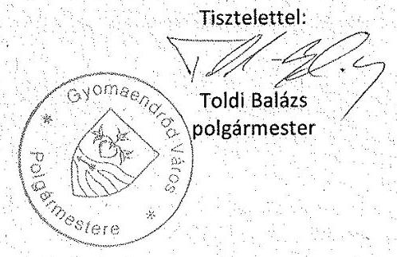

---

# Gyomaendrőd Város Önkormányzat Képviselő-testületének 17/2013. (V. 31.) önkormányzati rendelet 

## a települési szilárd hulladékkal kapcsolatos hulladékkezelési helyi közszolgáltatásról szóló 14/2011. (III. 31.) önkormányzati rendelet módosításáról

Gyomaendrőd Város Önkormányzata a hulladékról szóló 2012. évi CLXXXV törvény 35. §-ában kapott felhatalmazás alapján, az Alaptörvény 32. cikk (1) bekezdés a) pontjában meghatározott feladatkörében eljárva a következőket rendeli el:

1. § A települési szilárd hulladékkal kapcsolatos hulladékkezelési helyi közszolgáltatásról szóló14/2011. (III. 31.) önkormányzati rendelet (a továbbiakban: Hr.) 18. § (1) „Az 1. mellékletben" szövegrész helyébe a „A szolgáltató által" szöveg lép.

## 1. Záró rendelkezések

2. § (1) Ez a rendelet 2013. június 1-jén lép hatályba, és a hatályba lépését követő napon hatályát veszti.
(2) Hatályát veszti a Hr. 16. § (1), (3), (4), (5), (6) bekezdése, a 17. §-a, 1.és 4. melléklete.
(3) Hatályát veszti a települési folyékony hulladékkal kapcsolatos közszolgáltatás kötelező igénybevételéről szóló 18/2003. (VIII. 12.) önkormányzati rendelet
(4) Hatályát veszti a menetrendszerinti helyi autóbusz-közlekedés legmagasabb díjairól szóló 4/1991. (III. 29.) önkormányzati rendelet

Gyomaendrőd, 2013. május

Várfi András
polgármester

Dr. Csorba Csaba
jegyző

E rendelet 2013. május hó 31. napján a helyben szokásos módon kihirdetésre került.

Gyomaendrőd, 2016.augusztus 09.
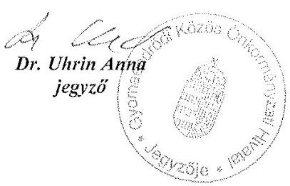

---

# ELŐTERJESZTÉS 

A Képviselő-testület
2009. december 21-i ülésére

Tárgy:
Készítette:
Előterjesztő:
Véleményező bizottság:

Települési szilárd hulladékkal kapcsolatos 44/2007. (XII. 27.) Gye. Kt. rendelet módosítása
Bóczér Tibor
Várfi András polgármester
Pénzügyi és Gazdasági Bizottság, Városfenntartó, Környezetvédelmi és Mezőgazdasági Bizottság, Ügyrendi, Oktatási, Kisebbségi és Esélyegyenlőségi Bizottság

## Tisztelt Képviselő-testület!

A települési szilárd hulladékkal kapcsolatos közszolgáltatásról szóló 44/2007 (XII.27.) Gye.Kt. rendelet 4 sz. mellékelte tartalmazza a közszolgáltatási díjakat.
A Gyomaközszolg Kft. rendelkezésünkre bocsátotta a 2010 évre kalkulált szolgáltatási díjakat, és kéri a T. Képviselő-testületet, hogy azokat fogadja el. Rendelkezésünkre bocsátotta továbbá a lakótelepi hulladékszállítással kapcsolatos anomáliák felszámolására kidolgozott, a közös képviselőkkel egyeztetett javaslatát, és kéri, hogy azt a helyi hulladékszállítási rendelet módosításával a T. Képviselő-testület fogadja el.

A Gyomaközszolg Kft ügyvezetője előterjesztésben, valamint a bizottsági ülésen kifejtette, hogy a szilárd hulladékszállítás rendszere sokat javult, a 2007-2008. évi állapotokhoz képest. Ezt elsősorban azzal indokolta, hogy pl. a 2009. évi III. negyedévében 1 millió forinttal kevesebb támogatást igényel a Kft az önkormányzattól. (A díjkompenzáció negyedévente 6.200 .000 Ft ) Problémát elsősorban a lakossági kintlévőség okoz ( A Gyomaközszolg Kft. negyedévente számlázza a lakossági vonalkód hulladékszállítás díját) Pozitívumként értékelte, hogy a IV. negyedévi díjkompenzációt nem hívják le az önkormányzattól.
A Bizottság a vonalkód alapján nyilvántartott hulladékszállítási rendszer bevezetése óta pozitívan értékelte, hogy a 60 millió Ft/év támogatás helyett ma már 24 millió Ft-tal fenntartható a rendszer, ez éves szinten 36 millió Ft-os megtakarítást jelent az Önkormányzatnak.
A további támogatás csökkentést a Bizottság is abban látja, hogy a lakótelepi társasházak tulajdonosai, használói valamennyien kell, hogy rendelkezzenek hulladékszállítási szerződéssel, (vonalkóddal) mert az még pillanatnyilag nem megoldott. A rendszer felemás, mert a közös képviselők rendelkeznek szerződéssel, de abban csak az általában évek óta használt, hulladékgyűjtésére alkalmazott edényzetszám szerepel, ami általában kevesebb, mint a társasházakban lévő lakások száma.
A Bizottság egyetértett abban, hogy minden egyes lakótelepi lakott társasház rendelkezzen hulladékszállítási szerződéssel, mert a rendeletben meghatározott kötelező ürítések csak így kerülhetnek kiszámlázásra. A Gyomaközszolg Kft ügyvezetője 3 variációt is kidolgozott a lakótelepi hulladékszállítás megnyugtató módon történő rendezésére.
Az egyik variáció szerint a lakótelepeken 80 l-es térfogat kontingenst kellene megállapítani, azonban a Bizottság aggályát fejezte ki, hogy ez a variáció ismét megkülönböztetné a lakótelepi lakásokat a kertes házaktól, hiszen ott több méretű edényre lehet szerződést kötni.A variáció szerint itt nem történne vonalkód leolvasás, a fogyasztó havi fix díjat fizetne.
A második variáció szintén a 80 litakás térfogat kontingensből indul ki, a ténylegesen társasházanként használt 120 l-es gyűjtőedényzetre átszámolva.
A harmadik variáció szerint minden lakás tulajdonosa, bérlője köteles a szolgáltatóval szerződést kötni a megrendelő által kiválasztott hulladékszállító edény szolgáltatói szállítására, így a szolgáltató az igényelt vonalkódok alapján a kötelező ürítést minden egyes lakás tulajdonosának, bérlőjének számlázni tudja, a tényleges ürítés vonalkód alapján történne,az egy lakásra jutó térítési díjat a közös képviselőnek kellene felosztani a lakók között.

Az előterjesztésében a Kft ügyvezetője a lakossági hulladékszállítás vonatkozásában átlagosan $10 \%$-os áremelést javasolt. Az ilyen mértékű áremelést sem a Bizottság, sem az ülésen jelen lévő közös képviselők sem támogatták, mint ahogy az ügyvezető által kidolgozott, a lakótelepekre vonatkozó 3 hulladékszállítási variációt, valamint a kötelező ürítések gyakoriságának emelését sem.

A hulladékszállítási rendelet módosításának 2. fordulójára a Kft új variációt dolgozott ki, melyet egyeztetett a lakótelepi társasházak közös képviselőivel, ugyanakkor benyújtotta jóváhagyásra a szolgáltatási díjak minimális, mintegy $3,8 \%$-os az infláció mértékénél alacsonyabb emelését tartalmazó díjemelési javaslatát. Egyúttal javasolja vállalkozó részére nyújtandó szolgáltatás díjtételeink minimális emelését is.
A lakótelepi hulladékszállítás átalakítása, ill. a fennálló anomáliák kiküszöbölésére benyújtott javaslata találkozott a közös képviselők egyetértésével, hiszen ők támogatják azt a megoldást, hogy a lakótelepek vonatkozásában a szolgáltatási szerződést a közös képviselők útján lehessen megkötni. A javaslat szerint a közös képviselőknek kötelező leadni a társasház lakott ingatlanjainak jegyzékét, így elhárul az akadály a kötelező ürítés realizálása

---

vonatkozásában.
Mind az előbbiekben felvázoltak, mind a szolgáltatási díj emeléséhez a hulladékszállításról szóló rendelet módosítása szükséges. E rendelet-tervezetet a T. Képviselő-testület elé jóváhagyásra előterjesztjük.

A Gyomaközszolg Kft ügyvezető igazgatója kéri az Önkormányzatot, hogy a Kft. likviditási problémáinak megoldása céljából nyújtson 4,9 millió Ft összeget jegyzett tőkeemlés formájában.
A kérését az előterjesztéshez mellékelt független könyvvizsgálói jelentés támasztja alá.
Az SZMSZ szerint: „A Képviselő-testület általában két fordulóban vitatja meg a rendelet tervezeteket. Az első fordulóban felmerült valamennyi módosító indítványt, továbbá az előkészítés során felmerült eltérő szakértői javaslatokat és kisebbségi bizottsági, valamint lakossági véleményt is tartalmazó tervezetet kell döntésre a második fordulóban beterjeszteni."
A Gyomaközszolg Kft. ügyvezető igazgatója a Városfenntartó, Környezetvédelmi és Mezőgazdasági Bizottság ülésén a vállalkozók részére végzett hulladékszállítási díjak emeléséről szóló javaslatát visszavonta. A vállalkozók részére nem kíván díjtételt emelni, megítélése szerint a vállalkozói díjtétel fedezi a hulladékszállítás költségeit, viszont a melléklet azzal módosul, hogy 240 l-es űrtartalmú hulladékgyűjtő edény szállítási díját is beépítette a táblázatba.

# Döntéshozói vélemények 

Pénzügyi és Gazdasági Bizottság
A Bizottság a rendelet-tervezet elfogadását javasolja.

Városfenntartó, Környezetvédelmi és
A Bizottság a ügyvezető igazgató bejelentését figyelembe véve Mezőgazdasági Bizottság
a rendelet-tervezet elfogadását javasolja.

Ügyrendi, Oktatási, Kisebbségi és
A Bizottság a rendelet-tervezet elfogadását javasolja. Esélyegyenlőségi Bizottság

## Döntési javaslat

"Települési szilárd hulladékkal kapcsolatos 44/2007. (XII. 27.) Gye. Kt. rendelet módosítása"
Tervezett döntéstípus: rendelet
Tervezett ágazati besorolás: Rendelet alkotás, szabályozás
A Képviselő-testület a javaslatról minősített többséggel, nyílt szavazással dönt.

## Tervezet

## .../2009 (...) Gye. Kt. rendelet

## a települési szilárd hulladékkal kapcsolatos hulladékkezelési helyi közszolgáltatásról szóló 44/2007. (XII. 27.) Gye. Kt. rendelet módosításáról

Gyomaendrőd Város Önkormányzatának Képviselő-testülete a helyi önkormányzatokról szóló 1990. évi LXV. törvény 16. § (1) bekezdésében, valamint a hulladékgazdálkodásról szóló 2000. évi XLIII. törvény (továbbiakban: Hgt.) 21. § (1) bekezdésében, 23. §, és a 24. § (1) bekezdésében kapott felhatalmazás alapján, a települési hulladékkezelési közszolgáltatási díj megállapításának részletes szakmai szabályairól szóló 242/2000. (XII. 23.) Korm. rendelet (továbbiakban: Rendelet) rendelkezéseire figyelemmel a települési szilárd hulladékkal kapcsolatos hulladékkezelési helyi közszolgáltatásokról szóló rendelet módosításának tárgyában az alábbi rendeletet (továbbiakban: rendelet) alkotja:

1. § A Rendelet 2. §-a a következő 12. ponttal egészül ki:
"2. § 12. Lakótelep: Vásártéri ltp, Kollman ltp. (Fő út 173-179 sz), Ifjúsági ltp, Október 6. ltp."
2. § A Rendelet 2.§-a az alábbi, 13. ponttal egészül ki:
3. § 13. Közös Képviselő: a lakótelepi társasház közgyűlése által a társasházakról szóló 2003. évi CXXIII tv. szabályainak megfelelően megválasztott közös képviselő, vagy intéző bizottság, akit a közgyűlés megbízhat a szolgáltató és lakótelepi társasházak közötti, e rendelet 7.§ (2) bekezdésében meghatározott hulladékkezelési helyi közszolgáltatás igénybevételéről szóló szerződés megkötésére.
3.§A Rendelet 7. § (2) bekezdése helyébe a következő rendelkezés lép:
"7. § (2) A települési szilárd hulladékkal kapcsolatos hulladékkezelési helyi közszolgáltatás igénybevételéről szóló szerződésben meg kell határozni a szerződéskötő feleket: a Szolgáltatót, a megrendelő ingatlantulajdonos (lakótelepi társasházak esetén a közös képviselő) nevét, lakcímét, születési helyét és idejét, anyja nevét. A személyes adatok kezelése tekintetében egyebekben Szolgáltató a személyes adatok védelméről és a közérdekű adatok nyilvánosságáról szóló 1992. évi LXIII. törvény rendelkezései szerint köteles eljárni."

---

4. §. A Rendelet 7. § (3) bekezdés c) pontja helyébe a következő rendelkezés lép:
"7. § (3) c) az ingatlantulajdonos (lakótelepi társasházak esetén a közös képviselő) rendelkezésére bocsátott gyűjtőedényt űrtartalom és darabszám szerint."
5. § A Rendelet 7.§ (3) bekezdés e) pontja helyébe a következő rendelkezés lép:
"7. § (3) e) az ingatlantulajdonos (lakótelepi társasházak esetén a közös képviselő) által meghatározott, az ingatlanon előreláthatólag keletkező hulladék mennyiségét, amelyre a közszolgáltatást igénybe veszi."
6. § A Rendelet 7.§ (3) bekezdés következő f. ponttal egészül ki:
"7. § (3) f) Lakótelepi társasházak esetén a társasházban lévő lakóingatlanok számát."
7. §. A Rendelet 3 sz. melléklete helyébe e rendelet 1. sz. melléklete lép.
8. § A Rendelet 4 számú melléklete helyébe e rendelt 2. sz. melléklete lép.
9. § A Rendelet 5 számú melléklete helyébe e rendelt 3. sz. melléklete lép.

# Záró rendelkezések 

10. § E Rendelet 2010. január 1-én lép hatályba, egyidejűleg a 36/2009. (VI. 29.) Gye. Kt. rendelet hatályát veszti.
11. sz. melléklet a .../2009. (...) Gye. Kt. rendelethez

## Közszolgáltatási szerződés települési szilárd hulladék szállítására

mely létre jött egyrészt Gyomaközszolg Kft (Székhely: Adószám: ................................. , számlaszám: ................................... képviseli: $\qquad$ mint Szolgáltató
másrészt Név: ............................................ Lakcím:............................................................ Születés helye és ideje: $\qquad$ Anyja neve: $\qquad$
mint ingatlantulajdonos között az alábbi feltételekkel:
Az ingatlan tulajdonosa (lakótelepi társasházak esetén a közös képviselő) igénybe veszi a .../2007. (.../...) Gye. Kt. rendelet (továbbiakban: Rendelet) alapján igénybe veszi a Szolgáltató által nyújtott települési szilárd hulladék szállításának szolgáltatását. A tulajdonos (lakótelepi társasházak esetén a közös képviselő) kijelenti, hogy ingatlanán települési szilárd hulladék keletkezik, és ezen keletkezett hulladékelszállítására kívánja igénybe venni a közszolgáltatást.
A szolgáltatás helye: Gyomaendrőd $\qquad$
A gyűjtőedényről a felek a következők szerint rendelkeznek:
A Szolgáltató tulajdonos használatába adja szabványos $\qquad$ db $\qquad$ típusú $\qquad$ űrtartalmú gyűjtőedényét.
A tulajdonos kijelenti, hogy rendelkezik $\qquad$ db $\qquad$ űrtartalmú szabványos gyűjtőedénnyel.
A Szolgáltató tulajdonos elad/bérbe ad $\qquad$ db $\qquad$ űrtartalmú szabványos gyűjtőedényt.
A szolgáltató a szolgáltatás díját
a kötelező közszolgáltatás esetén a Rendeletnek megfelelően $\qquad$ Ft/ürítés;
a kötelező közszolgáltatás alá nem eső szolgáltatás esetén $\qquad$ Ft/ürítés árban határozza meg.
A szolgáltató kijelenti, hogy a szolgáltatáson felül külön meghatározott többletszolgáltatást is elvégez, melynek díját a szolgáltató üzletszabályzatában határozza meg.
Az ingatlantulajdonos (lakótelepi társasházak esetén a közös képviselő) a szolgáltatás díját szolgáltatást követő hónap 15. napjáig készpénzben/csekken/átutalással teljesíti. A tulajdonos (lakótelepi társasházak esetén a közös képviselő) tudomásul veszi; kötelező közszolgáltatás esetén a közszolgáltatási díj adók módjára behajtandó összegnek minősül.
Jelen szerződés módosítását bármelyik fél írásban kezdeményezheti. A módosítás a szerződés azon részeire terjedhet ki, melyek a Rendlettel összhangban vannak. Ennek megfelelően kötelező közszolgáltatás esetén nem módosítható különösen a közszolgálati díjra, ürítési napokra, ürítési helyre vonatkozó rendelkezések.
Az ingatlan tulajdonos (lakótelepi társasházak esetén a közös képviselő)a szerződést 15 napos felmondási idővel akkor mondhatja fel, ha felhagy az ingatlan használatával, és ingatlana nem lakottnak minősül; vagy ha tulajdonosi minősége (lakótelepi társasházak esetében a közös képviselő képviselői megtisztása) megszűnik.
Jelen szerződésben nem szabályozott kérdésre a Hulladék gazdálkodásról szóló 2000. évi XLIII törvény, a települési hulladékkezelési közszolgáltatási díj megállapításának részletes szakmai szabályairól szóló 242/2000. (XII.23.) Korm. Rendelet és a települési szilárd hulladékkal kapcsolatos hulladékkezelési helyi közszolgáltatásról szóló 44/2007. (XII/27) Gye. Kt. rendelet rendelkezéseit alkalmazzák.
200 $\qquad$ hónap $\qquad$
Gyomaközszolg $\qquad$
mint Szolgáltató Tulajdonos
2 sz. melléklet a .../2009. (...) Gye. Kt. rendelethez
Közszolgáltatási díj 2010. január 1-től

| Edényzet típusa | Közszolgáltatási díj (Ft/ürítés) |
| :-- | :--: |
| 80 literes | 146 |

---

| 110 - 120 literes | 198 |
| :-- | --: |
| 240 literes | 294 |
| 660 literes | 725 |
| 770 literes | 800 |
| 1.100 literes | 1.000 |

Az árak az ÁFA-t nem tartalmazzák.
3. sz. melléklet a .../2009. (....) Gye. Kt. rendelethez

Vállalkozók részére végzett hulladékszállítás díjai: 2010. július 01-től

| Űrtartalom (liter) | Ürítési díj (Ft/ürítés) |
| :--: | :--: |
| 80 | 429 |
| $110-120$ | 647 |
| 240 | 1100 |
| 1100 | 3229 |
| 5000 | 8945 |

Az árak az ÁFA-t nem tartalmazzák

Határidők, felelősök:
Határidő: 2010. 01. 01.
Felelős: Várfi András
Hivatali felelős: Liszkainé Nagy Mária

---

# GYOMASZOLG IPARI PARK KFT Gyomaendrőd, Ipartelep út 2. E-mail: ipgyomaszolg@internet-x.hu T/fax: 66/386-269 

## GYOMAKÖZSZOLG KFT Gyomaendrőd, Ipartelep út

Tárgy: Előterjesztések (2010)
Ikt.: 302/2009

Tisztelt Képviselő Testület!
Jelen előterjesztés az alábbi tárgykörben jelzett ár - és szervezési módosításokhoz kapcsolódik.

1. Temető üzemeltetés
2. Temetkezési szolgáltatás
3. Közútfenntartás
4. Folyékony kommunális hulladék szállítása
5. Szociális bérlakások, szolgálati lakások bérleti díja
6. Települési szilárdhulladék szállítás
7. Gyepmesteri tevékenység

## 1. Temető üzemeltetés

A mellékelt 1sz. táblázat tartalmazza a 2010 évre javasolt -temető üzemeltetéssel kapcsolatos - árakat. Az árak képzésénél az alábbi szempontokat vettem figyelembe:

- 2009 évi 8 havi eredményszámítás (-1.364.233 Ft/8hó; - 2.100.000 Ft/év ; $36 \%$-os veszteség),
- más településeknél alkalmazott összehasonlító árak mértéke,
- a gyomaendrödi temetők állapota, az elvárható színvonal elérésének és megtartásának igénye,
- az elvárt színvonal biztosításához szükséges többletforrások kalkulációja.

A jelenlegi (2009 évi) árbevétel és költségek alapján a gazdálkodási egyensúly tartásához legalább 36\% -os díjemelés szükséges. A temető üzemeltetés GYOMASZOLG KFT részére éveken keresztül veszteséget okozott és okoz 2009 évben is. (Isd.: 2 sz. táblázat)
A jelenlegi árak rendkívül alacsony mértékét összehasonlító vizsgálatok is markánsan alátámasztják. Referenciák: négy - megyénkben lévő - más városban alkalmazott díjak. A jelenlegi árak további alkalmazásával, vagy csupán mérsékelt emelésével Gyomaendrőd város temetőinek állaga, karbantartottsága tovább romlik, illetve az elvárt színvonal nem érhető el, a minimum feltételek teljesítéséhez szükséges fejlesztéseket nem lehet elvégezni.
A legalapvetőbb tervezett fejlesztések tartalma
Aktuális ráfordítások [Ft]

1. Ravatalozók karbantartása
2. WC helyiségek építése, zárt szennyvíz tározóval
3. A személyzeti helyiség felújítása
4. Fagytalanító fűtés kialakítása a vízvezetékkel ellátott helyiségekben

---

A jelzett fejlesztésekre a 36\% -os díjemelés estén is csak akkor tudunk forrást biztosítani, ha a temető fenntartási munkák egy részét (pl.: fűkaszálás, hulladékgyűjtés, fa - és cserje gondozás) beépíttetjük a közmunka programba.

Az 1 sz. táblázatban jelzett árakkal kapcsolatban eldöntendő kérdés, hogy alkalmazzuk-e a sírhelyek osztályba sorolását és az ezzel összefüggő árdifferenciálást (más városok temetőfenntartói szinte mindenhol alkalmazzák). Lehetséges a szilárd utak (főutak) mentén lévő sírhelyekre $20-25 \%$-os, a füves keresztutak mentén lévő parcellákra $10-15 \%$ os felár képzése.

Az 1999 évi XLIII. tv. a temetőkről és a temetkezésről 40.§ (1) bekezdés értelmében az önkormányzat rendelete kötelezővé teheti, hogy a köztemetőn belüli sírhelynyitással és visszahantolással kapcsolatos feladatokat kizárólag az üzemeltető szakszemélyzetének és berendezésének igénybevétele útján lássák el.
Javasoljuk, hogy a Képviselő Testület rendeletben szabályozza, hogy a jelzett feladatokat kizárólag a temetők üzemeltetője végezhesse.
Javaslatunkat azzal indokoljuk, hogy az üzemeltető a sírásás és hantolás szabályszerű végzését, a rendtartást, minőségbiztosítást csak saját személyzete igénybevételével és az általuk végzett munkával látja megfelelően biztosítottnak, pl.: előírt sírgödör mélység biztosítása, személyzeti alkalmasság, orvosi vizsgálat, közvetlen utasítási jogkör, folyamatos ellenőrizhetőség biztosítása, számonkérés lehetősége stb.

# 2. Temetkezési szolgáltatás 

A temetkezési vállalkozással kapcsolatos árakat a 3 sz. táblázat tartalmazza. Az emelt árak mértéke elmarad más településen működő szolgáltatók átlagáraitól.

## 3. Közutak kezelése

A szolgáltatás tartalma
(Igazgatás hozzájárulási díj)
Nettó díj [Ft]
Közműépítés terveinek ellenőrzése, az út - járda bontásokkal és helyre állításokkal kapcsolatos engedélyokmányok szolgáltatása, megvalósítás ellenőrzése (személygépkocsi használat költségével):
6.000

A jelzett igazgatás hozzájárulási díjat a tervező fizeti meg az útfenntartást végző szolgáltatónak.

## 4. Folyékony kommunális hulladék szállítása

(Korrekció: $+4,1 \%$ )
A nettó díj mértéke $\left[\mathrm{Ft} / \mathrm{m}^{3}\right]$

## Szolgáltatás (szivattyúzás, szállítás, ártalmatlanítás)

1. Lakossági 5 km -en belül $1-3\left[\mathrm{~m}^{3}\right]$

2. Lakossági 5 km -en belül $3-8\left[\mathrm{~m}^{3}\right]$

3. Lakossági 5-10 km-en belül 1-3 $\left[\mathrm{m}^{3}\right]$

4. Lakossági 5-10 km-en belül 3-8 $\left[\mathrm{m}^{3}\right]$

5. Vállalkozás, intézmény részére 5 km-en belül 1-3 $\left[\mathrm{m}^{3}\right]$

6. Vállalkozás, intézmény részére 5 km-en belül 3-8 $\left[\mathrm{m}^{3}\right]$

7. Vállalkozás, intézmény részére 5-10 km-en belül 1-3 $\left[\mathrm{m}^{3}\right]$

8. Vállalkozás, intézmény részére 5-10 km-en belül 3-8 $\left[\mathrm{m}^{3}\right]$

9. WC gödrök ürítése $1\left[\mathrm{~m}^{3}\right]$ mennyiségig

| 2009 év | 2010 év |
| :--: | :--: |
| 1921 | 2000 |
| 1841 | 1916 |
| 2021 | 2105 |
| 1941 | 2020 |
|  | 2000 |
| 1971 | 2050 |
|  | 2150 |
|  | 2100 |
| 6671 | 6945 |

---

# Szolgáltatás társtelepülések részére 

| 1. Lakossági 1-3 $\left[\mathrm{m}^{3}\right]$ | 2271 | 2365 |
| :-- | :-- | :-- |
| 2. Lakossági 3-8 $\left[\mathrm{m}^{3}\right]$ | 2121 | 2210 |
| 3.Vállalkozás, intézmény (közület) részére 1-8 $\left[\mathrm{m}^{3}\right]$ |  | 2365 |
| 5. WC gödrök ürítése $1\left[\mathrm{~m}^{3}\right]$ mennyiségig | 6671 | 6945 |

A fenti egységárak tartalmazzák a környezetterhelési díj nettó értékét $\left[\mathrm{Ft} / \mathrm{m}^{3}\right]$.
Az áremelést a deklarált 4,1 \% mértékű infláció indokolja ( pl.:a befogadási díj 16\%-ot emelkedett 2009 évben)
5. Szociális bérlakások, szolgálati lakások bérleményi díja

Javasolt lakbéremelés: $4,1 \%$.
Tudott, hogy a közös költségek mértéke (lépcsőházi világítás, takarítás, kéményseprői díj, gondnoki minimálbér-hányad) az elmúlt két év során emelkedett (Pl.: e-on minimum 15%). A közös költségek egy hányadát egyrészt az eladott ingatlanok tulajdonosai fizetik, másrészt a szociális bérlakásokban lakók közös-költség térítése elvileg a bérleti díjban foglaltatik.
A megvásárolt ingatlanok esetében a közös költségek térítésének mértéke 6 év óta változatlan: 600 [Ft/hó/lakás] (nettó).
Az általunk javasolt térítés mértéke: 1.000 [Ft/hó/lakás] (nettó). (8,9\%/év)

## 6. Települési szilárdhulladék szállítás

A hulladékszállítás reál - és gazdaságfolyamati rendszere sokat javult a 2007-2008 évi állapotokhoz képest.
A múlt év végén történt tervezés sarokszámait figyelembe véve számottevő megtakarítást értünk el. A 2009 III. negyedévi díjkompenzációs keretből 1 [mFt] -al kevesebbet igényeltünk az önkormányzattól. A negyedik negyedévi díjkompenzációs kerettel (6.250.000Ft) az alábbi racionális és mellőzhetetlen pénzügyi műveletet ajánlott elvégezni:
az Önkormányzat átutal a GYOMAKÖZSZOLG részére 4,9 [mFt] összeget „jegyzett tőke emelése" céljából, majd a GT kvázi azonnal (2-3 banki nap után) visszautalja a 4,7 [mFt] likviditási hitel összegét az önkormányzat részére.

Megtakarítás: - a III. n. évi előirányzatból 1,00 [mFt],

- a IV. n. évi előirányzatból 6,05 [mFt], összesen: $\sim 7,05$ [mFt/ év].

Az előzőekkel kapcsolatos pontosításokat 2009 decemberében tudjuk a Polgármesteri Hivatal Pénzügyi Osztályvezetőjével közösen elvégezni.

---

# A lakótelepi hulladékszállítás anomáliáinak felszámolására vonatkozó javaslat (A javaslat egyeztetve a közös képviselők egy részével!) 

A/ A KT rendelet értelmében a lakott ingatlanok tulajdonosa/bérlője, vagy az előzőek által megbízott közös képviselő szerződést köt a szolgáltatóval az érintett lakott ingatlanokban képződő települési szilárd hulladékok szállítására megsemmisítésére. A szerződés kötéséhez szükséges a közös képviselő által felmért lakott ingatlanok száma, melynek aktuális jegyzékét a szolgáltató részére át kell adni. A szerződéskötés kapcsán az igénybevevők a szükségleteikhez felmért és rendelkezésre álló hulladéktároló edény térfogatának megfelelő vonalkódot, vonalkódokat kapnak a szolgáltatótól. A „kötelező ürítési számot" a lakott ingatlanok száma alapján képzik a számlázáshoz. A kötelező ürítési-gyakoriságot meghaladó ürítések mértékét a vonalkódok leolvasása alapján, a kihelyezett és vonalkóddal ellátott edények ürítési gyakorisága szerint kell figyelembe venni. A megrendelő által ürítésre kihelyezett edényre csak az edény térfogatának megfelelő vonalkód (etikett) rögzíthető. (Más esetben az edény ürítését nem végzik el.
I. Javaslat a lakosság részére végzett települési szilárdhulladék szállítás szolgáltatási díjainak 2010 évi mértékére (Az árak nettó értéken szerepelnek!)

| Edény térfogata [I] | 2009 évi ár [Ft/ürítés] | 2010 évi ár [Ft/ürítés] (3,8\%) |
| :--: | :--: | :--: |
| 80 | 141 | 146 |
| 120 | 191 | 198 |
| 240 | 283 | 294 |
| 660 | - | 725 |
| 770 | - | 800 |
| 1.100 | - | 1.000 |

II. Javaslat a vállalkozók és intézmények részére végzett hulladékszállítás szolgáltatási díjainak 2010 évi mértékére. (Az árak nettó értéken szerepelnek!)

Térfogat

| $\begin{gathered} 80[\Pi \\ (1,4 \%) \end{gathered}$ | $\begin{gathered} 120[\Pi \\ (1,4 \%) \end{gathered}$ | $\begin{gathered} 240[\Pi] \\ - \end{gathered}$ | $\begin{gathered} 1,1\left[\mathrm{~m}^{3}\right] \\ (2,2 \%) \end{gathered}$ | $\begin{gathered} 5\left[\mathrm{~m}^{3}\right] \\ (1,73 \%) \end{gathered}$ |
| :--: | :--: | :--: | :--: | :--: |
| Egységár [Ft] 2010 év (2009 év) | $\begin{gathered} 435 \\ (429) \end{gathered}$ | $\begin{gathered} 655 \\ (646) \end{gathered}$ | $\begin{gathered} 1100 \\ - \end{gathered}$ | $\begin{gathered} 3300 \\ (3229) \end{gathered}$ | $\begin{gathered} 9100 \\ (8945) \end{gathered}$ |

## 7. Gyepmesteri tevékenység

| A szolgáltatás tartalma | Nettó díj [Ft/kg] |
| :-- | :--: |
|  | $\underline{2009} \quad \underline{2010}$ |
| Állati tetem átvétele átmeneti tárolásra és megsemmisítésre | 70 73 |
| Az emelés mértéke: $4,1 \%$ |  |

Gyomaendrőd, 2009. 11. 18.
Tisztelettel:
Egeresi András
Ügyvezető igazgató

---

# Példák

|  Szerződéses
edényszám
[db] | Edény [I] | Egységár
[Ft/ú] | Tényleges
[ürítés/hó] | Téli kötelező
[Ft/hó] | Nyári kötelező
[Ft/hó] | Egy főre
[Ft/fő/hó] | Egy főre
[Ft/fő/hó] | Összes
tényleges ára
4/8(ú/hó)
[Ft/22fő/hó] | Egy főre
[Ft/fő/hó] | üxedény/hó  |
| --- | ---
 | --- | --- | --- | --- | --- | --- | --- | --- | --- |
|  22 | 80 | 141 | 89 | 3102 | 6204 | 141 | 282 | 12408 | 864 | 4x22  |
|  4 | 120 | 191 | 32 | 4202 | 8404 | 191 | 382 | 6112 | 278 | 8x4  |
|  22 | 120 | 191 | 32 | 4202 | 8404 | 191 | 382 | 16808 | 764 | 4x22  |

Téli kötelező 22 főre: 22 [ürítés/hó] < 32 tényleges, ezért elvileg még elfogadható Nyári kötelező 22 főre: 44 [ürítés/hó]>32 tényleges, ezért nyáron még 12 [ürítés/hó] kiszámlázandó külön írógéppel megírt árkülönbözeti számlán!!!

Télen: 32 [ürítés/hó] x 191 [Ft/ú]= 6112 [Ft/hó/ 22fő] Egy főre: 278 [Ft/fő/hó] Nyáron: 32 [ürítés/hó] x 191 [Ft/ú]= 12 [ürítés/hó] x 191 [Ft/ú]= 8404 [Ft/hó] Egy főre: 382 [Ft/fő/hó]

Éves díj/fő: Nyári=6x382=2292 [Ft/6hó/fő] Téli =6x278=1668 [Ft/6hó/fő] Összesen : 3960 [Ft/év/fő] (2009) (Ez a díj más városban lakótelepen 20-22.000 [Ft/év/fő])

---

# FÜGGETLEN KÖNYVVIZSGÁLÓI JELENTÉS   a Gyomaközszolg Kommunális Közszolgáltató Kft (5500 Gyomaendrőd, Ipartelep u. 2.) tulajdonosának 

Elvégeztem a Gyomaközszolg Kommunális Közszolgáltató Kft. ( 5500 Gyomaendrőd, Ipartelep u. 2.) 2009.I-III. negyedévi pénzügyi beszámolójának vizsgálatát.

A vizsgálat magában foglalta az alkalmazott számviteli alapelvek, valamint a pénzügyi beszámoló bemutatásának értékelését.

Az évközi pénzügyi beszámoló vizsgálatánál a költségek és a bevételek elszámolására fordítottam kiemelt figyelmet. Ezek alapján megállapítható, hogy azok a számviteli törvény előírásainak megfelelően kerültek rögzítésre.

Véleményem szerint a 2009.I-III. negyedévi pénzügyi beszámoló a Gyomaközszolg Kommunális Közszolgáltató Kft pénzügyi és jövedelemi helyzetéről megbízható és valós képet ad.

Vizsgálatom alapján megállapítottam, hogy a Gyomaközszolg Kft-nél jelentős likviditási problémák állnak fenn. Megoldására elfogadható intézkedés lenne, a tulajdonos által véglegesen rendelkezésre bocsátandó pénzösszeg jegyzett tőke emelés formájában, melynek elfogadható nagyságrendje $4.900 \mathrm{eFt}-5.000 \mathrm{eFt}$ körüli összegben jelölhető meg

Javaslom a T.Önkormányzat - tulajdonos - részére, hogy a likviditási probléma megoldása érdekében a jelzett intézkedést megfontolni és elfogadni szíveskedjen.

Szarvas, 2009.december 02.
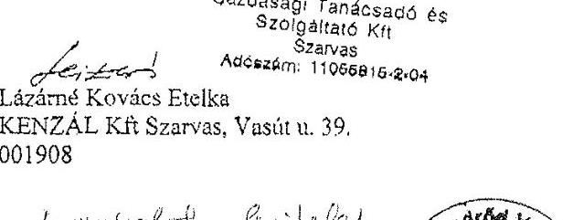

Lázárné Kovács Etelka
KENZÁL Kft Szarvas, Vasút u. 39.
001908
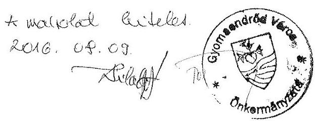

---

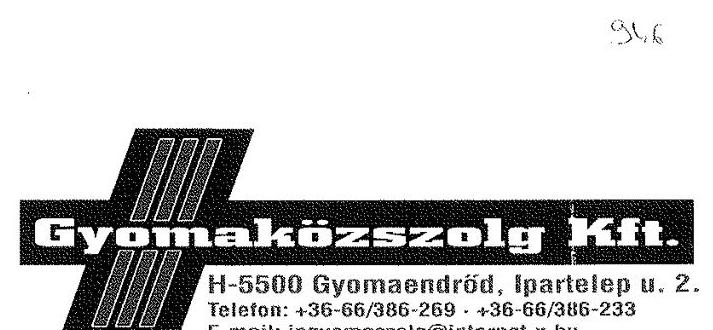

Állami Számvevőszék
1364 Budapest 4 Pf.: 54.
DOMOKOS LÁSZLÓ
elnök

Ikt.: 155/2016
Tárgy: Észrevételezés jelentéstervezetre

Tisztelt Elnök Úr!
A Gyomaközszolg Nonprofit Kft a V-1023-139/2016 iktatószámú jelentéstervezetükre, mely „Az önkormányzatok többségi tulajdonában lévő gazdasági társaságok közfeladat ellátását érintő gazdálkodási tevékenysége szabályszerűségének ellenőrzés"-ére irányul, nem kíván észrevételezést tenni, a jelentés elkészülését követően az intézkedési tervet az előírtaknak megfelelően elkészíti.

Gyomaendrőd, 2016. Augusztus 09.
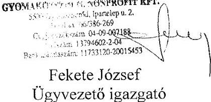

---

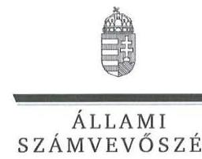

# Toldi Balázs úr 

polgármester
Gyomaendrőd Város Önkormányzata

## Gyomaendrőd

## Tisztelt Polgármester Úr!

Köszönettel vettem a Gyomaközszolg Kommunális Közszolgáltató Nonprofit Kft. ellenőrzéséről készített számvevőszéki jelentéstervezetre megküldött észrevételeit.
Az Állami Számvevőszék észrevételekre vonatkozó álláspontjáról a felügyeleti vezető által készített részletes tájékoztatásból kap választ, amelyet levelemhez mellékeltem.
Tájékoztatom Polgármester urat, hogy az Állami Számvevőszék a figyelembe nem vett észrevételeket az Állami Számvevőszékről szóló 2011. évi LXVI. törvény 29. § (3) bekezdésében előírtak szerint köteles a jelentésében feltüntetni és megindokolni, hogy azokat miért nem fogadta el.

Budapest, 2016. 03 hó 49 nap
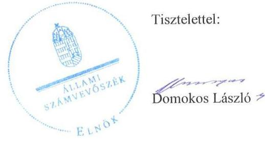

Melléklet: Tájékoztatás az észrevételek kezeléséről

---

# Tájékoztatás az észrevételek kezeléséről 

Megköszönöm Polgármester úrnak „Az önkormányzatok gazdasági társaságai - Az önkormányzatok többségi tulajdonában lévő gazdasági társaságok közfeladat-ellátását érintő gazdálkodási tevékenysége szabályszerűségének ellenőrzése - Gyomaközszolg Kommunális Közszolgáltató Nonprofit Kft." címmel készített jelentéstervezetre tett észrevételeit. Az észrevételek kezeléséről azok sorrendjében - az alábbi tájékoztatást adom.

A közszolgáltatási szerződésre vonatkozó (a 1.1. számú megállapításhoz kapcsolódó) észrevételét elfogadom, mivel a szerződés tartalmi elemei alapján az valóban a közszolgáltatás ellátásának biztosítására irányult. Észrevétele a jelentéstervezet alábbi részeinek pontosítását indokolja:

A jelentéstervezet „ÖSSZEGZÉS" című részének első bekezdését a következőképpen javítottam:
„Az Önkormányzat a közfeladat megszervezéséről a hulladékkezelési rendelet és a közszolgáltatásra irányuló vállalkozási szerződés vonatkozásában nem minden elemében gondoskodott szabályszerűen."

A jelentéstervezet „Főbb megállapítások, következtetések, javaslatok" című részének első bekezdést a következőképpen javítottam:
„Az Önkormányzat nem gondoskodott szabályszerűen a hulladékgazdálkodási közszolgáltatás megszervezéséről. A hulladékkezelési rendelet2 a 2012. január 1. - április 14. között a Hgt. árbefagyasztásra vonatkozó rendelkezésének nem felelt meg. [...] 2011-2013 években a közfeladat ellátására vállalkozási szerződést kötöttek, melynek tartalma nem minden elemében felelt meg a közszolgáltatási szerződésekre vonatkozó jogszabályi előírásoknak."

A jelentéstervezet 1. számú lényeges kérdéskörére vonatkozó „Összegző megállapítás"-át a következőképpen pontosítottam:
„Az Önkormányzat a közszolgáltatás megszervezéséről a hulladékkezelési rendelet és a közszolgáltatási vállalkozási szerződés hiányosságai miatt nem minden elemében gondoskodott szabályszerűen. A szabályozási hiányosságok ellenére a tulajdonosi jogok gyakorlása a - 2013. évi számviteli beszámoló elfogadása kivételével - jogszabályi előírásoknak megfelel.

A jelentéstervezet „1.1. számú megállapítás" részét az alábbiak szerint pontosítottam:
"Az Önkormányzat a közszolgáltatás megszervezéséről nem gondoskodott teljes körűen, mivel a hulladékkezelési rendelet nem mindenben felelt meg az előírásoknak. Továbbá 2011-2013. években a Társasággal a hulladékgazdálkodási feladatra kötött közszolgáltatási szerződés nélkül, vállalkozói szerződéssel látta el a hulladékgazdálkodási feladatot, melynek tartalma nem minden elemében felelt meg a jogszabályi előírásoknak."

---

A jelentéstervezet 1.1. számú megállapításának 8. bekezdését a következőképpen átfogalmaztam:
„Közszolgáltatási szerződés címmel az Önkormányzat és a Társaság között hulladékgazdálkodási közszolgáltatásra 2014. január 1-jét követően jött létre szerződés, amely már mindenben megfelelt a jogszabályi előírásoknak. A 2011. január 1-je és 2013. december 31-e között érvényben lévő vállalkozási szerződés tartalmában tekinthető 2012. december 31-ig a Hgt. 27. § (3) bekezdés d) pontja, 2013. január 1-jétől a Ht. 33. § (1) pontja szerinti közszolgáltatási szerződésnek ugyanakkor 2013. szeptember 4-ig nem minden részletében felelt meg, nem jött létre, ezzel 2012. december 31-ig megsértették a Hgt. 27. § (3) bekezdés d) pontját. Felek a háztartási szilárd hulladék begyűjtésével kapcsolatos feladat ellátásához 2011-2013. évek között vállalkozási szerződést kötöttek. A vállalkozási szerződés nem felelt meg, a 224/2004.(VII.22.) számú Kormányrendelet 12-13. §-aiban előírt közszolgáltatási szerződésre vonatkozó tartalmi követelményeknek. [...]."

A díjmegállapításra vonatkozó (a 1.1. számú megállapításhoz kapcsolódó) észrevételét elfogadom, mivel az Önkormányzat ármegállapítási jogkörét a 17/2013. (V. 31.) önkormányzati rendelet hatálytalanította 2013.június 1-től. A jelentéstervezet érintett részeit a következőképpen módosítom:

A jelentéstervezet „Főbb megállapítások, következtetések, javaslatok" című részének első bekezdésből a következő mondatrészt töröltem:
„[...] a hulladékkezelési rendelet, 2013. évben nem került módosításra az önkormányzati ármegállapítási jogkör megszűnésekor, ezáltal megsértette a Ht. előírásait.

A jelentéstervezet 1.1. számú megállapításának utolsó bekezdésének 2. mondatát a következőképpen átfogalmaztam:
„Ugyanakkor a rendeletet nem 2013. június 1-jétől módosították az Önkormányzat ármegállapítási jogkörének megszűnésével összhangban, ezzel megsértve a 2013. július 12-től hatályos Ht. 47/A. §-ában foglaltakat."

Egyúttal Gyomaendrőd Város Önkormányzata Jegyzőjének címzett 1. számú javaslatot töröltem.

Az az észrevétele, amely a vállalkozási szerződésnek a díjak vonatkozásában a helyi önkormányzati rendeletre való hivatkozására utal, a jelentéstervezet módosítását nem indokolja, mivel a jelentéstervezet 3.2. számú megállapításának 9. (a jelentéstervezet 32. oldalának utolsó) bekezdése tartalmazza, hogy a Társaság által alkalmazott közszolgáltatási díjak megfeleltek a Hulladékrendelet ${ }_{1,2}$-ben közzétett díjaknak.

---

A jelentéstervezet 2.3. számú megállapításának az Önkormányzat tartozásátvállalására vonatkozó észrevételét az ellenőrzési dokumentumok között is szereplő megállapodás alapján elfogadom, annak alapján a jelentéstervezet „Főbb megállapítások, következtetések, javaslatok" című rész 3. bekezdésének utolsó mondatát és a 2.3. számú megállapítás kiemelt részének 2. mondatát az alábbiak szerint helyesbítem:
„A likviditási helyzet javítása érdekében rendezésére 2014. évben az Önkormányzat tartozást vállalt át, megállapodást kötött a Társasággal a közszolgáltatás zavartalan ellátása érdekében, ennek keretében az Önkormányzat átvállalta a Társaságtól a hulladéklerakónak járó megemelt hulladéklerakási díj rendezését."

A jelentéstervezet 3.2. megállapítása kapcsán a Társaság árképzésére vonatkozó észrevétele a jelentéstervezet érintett 4, bekezdés első mondatának pontosítását indokolja az alábbi szerint:
„Ennek következtében a Társaság árképzésével kapcsolatban - az alapadatok átláthatóságának hiánya miatt - nem állapítható meg, hogy a közszolgáltatási díjak a 64/2008. (III.28.) Korm. rendelet 3. § (1) bekezdés a) pontjának megfelelően a Társaság hatékony működéséhez szükséges folyamatos költségek és ráfordítások megtérülésének, valamint a közszolgáltatás fejleszthető fenntartásához szükséges költségek és ráfordítások fedezetének biztosítására alkalmasak-e".

Budapest, 2016. hó nap

Dr. Horváth Margit
felügyeleti vezető

[^0]
[^0]:    'Vállalkozási szerződés
    ${ }^{4}$ 224/2004. (VII. 22.) számú Korm. rendelet
    Gyomaendrőd Város Önkormányzata és a Gyomaközszolg Kft között 2011. január 1.-2013. december 31-ig fennálló, 2010. június 25-én kötött és azt 2011. április 2-án módosító vállalkozási szerződés
    a hulladékkezelési közszolgáltató kiválasztásáról és a közszolgáltatási szerződésről (hatálytalan 2013. szeptember 4-ig 5-től)

---

# RÖVIDÍTÉSEK JEGYZÉKE 

${ }^{1}$ Képviselő-testület
${ }^{2}$ Társaság
${ }^{3}$ Önkormányzat
${ }^{4}$ GYIP
${ }^{5}$ ÁSZ
${ }^{6}$ Ötv
${ }^{7}$ Mötv.
${ }^{8}$ 237/2011. (IV. 28.) számú Kt. határozat
${ }^{9}$ Nvtv.
${ }^{10} 168 / 2013$. (V. 2) számú Kt határozat
${ }^{11}$ Hgt.
${ }^{12}$ 126/2003. (VIII. 15.) Korm. rendelet
${ }^{13}$ 241/2001. (XII. 10.) Korm. rendelet
${ }^{14}$ Ht.
${ }^{15}$ 349/2013. (VI. 27.) Gye. Kt. határozat
${ }^{16}$ OHÜ
${ }^{17}$ Alapító Okirat
${ }^{18}$ Társasági szerződés
${ }^{19}$ Gt.
${ }^{20}$ Ptk.

Gyomaendrőd Város Önkormányzatának Képviselő-testülete
Gyomaközszolg Kommunális Közszolgáltató Nonprofit Kft.
Gyomaendrőd Város Önkormányzata
Gyomaszolg Ipari Park Kft.
2011. évi LXVI. törvény az Állami Számvevőszékről, hatályos 2011. július 1-jétől
1990. évi LXV. törvény a helyi önkormányzatokról, hatálytalan: a 2014. évi általános önkormányzati választások napjától;
2011. évi CLXXXIX. törvény Magyarország helyi önkormányzatairól, hatályos: 2012. január 1-jétől, kivéve a 144. § (2) bekezdésben meghatározott előírások, amelyek 2012. április 15-én, a (3) bekezdésben meghatározott előírások, amelyek 2013. január l-jén léptek hatályba, a (4) bekezdésben meghatározott előírások a 2014. évi általános önkormányzati választások napján léptek hatályba;
Gyomaendrőd Város Önkormányzata Képviselő-testületének 237/2011. (IV.28.) számú határozata a Gazdasági program elfogadásáról
a nemzeti vagyonról szóló 2011. évi CXCVI. törvény (hatályos:2011. december 31-étől, kivéve a 20. § (2) bekezdésben meghatározott paragrafusok, amelyek 2012. január 1-jétől, a (3) bekezdésben meghatározott paragrafusok 2013. január 1-jétől, a (4) bekezdésben meghatározott paragrafus 2012. március 2-ától léptek hatályba)
Gyomaendrőd Város Önkormányzata Képviselő-testületének 168/2013. (V.2.) számú határozata a vagyongazdálkodási terv elfogadásáról
2000. évi XLIII. törvény a hulladékgazdálkodásról, hatályos 2012. december 31-ig; A Hulladékgazdálkodási tervek részletes tartalmi követelményeiről szóló 126/2003.(VIII.15.) Korm. rendelet, (hatályos: 2003. augusztus 18-ától) a jegyző hulladékgazdálkodási feladat- és hatásköréről (hatálytalan 2013.január 1-jétől)
2012. évi CLXXXV. törvény a hulladékról (hatályos 2013. január 1-jétől, kivéve a 95. § (6) bekezdése, ami 2015. január 1-jén lépett hatályba)

Gyomaendrőd Város Önkormányzata Képviselő-testületének 349/2013. (VI.27.) számú határozata a Közszolgáltatói Hulladékgazdálkodási Terv 2013-2015. elfogadásáról
Országos Hulladékgazdálkodási Ügynökség
Gyomaközszolg Kommunális Közszolgáltató Korlátolt Felelősségű Társaság Alapító Okirata ${ }_{1}$ (hatályos 2006. június 29-től), (Alapító Okirata ${ }_{2}$, hatályos 2010. november 4-től), (Alapító Okirata ${ }_{3}$, hatályos 2011. augusztus 15-től), (Alapító Okirata ${ }_{4}$, hatályos 2011. december 22-től)
Gyomaközszolg Kommunális Közszolgáltató Korlátolt Felelősségű Társaság Társasági szerződése és annak módosításai (Társasági szerződés ${ }_{1}$, hatályos 2012. március 20-tól), (Társasági szerződés ${ }_{2}$, hatályos 2012. december 20-tól), (Társasági szerződés ${ }_{3}$, hatályos 2013. július 19-től), Gyomaközszolg Kommunális Közszolgáltató Nonprofit Korlátolt Felelősségű Társaság Társasági szerződése és annak módosításai (Társasági szerződés4, hatályos 2013. szeptember 24-től), (Társasági szerződés, hatályos 2014. december 01-től)
2006. évi IV. törvény a gazdasági társaságokról (hatálytalan: 2014. március 15-től) 2013. évi V. törvény a Polgári Törvénykönyvről (hatályos 2014. március 15-től)

---

${ }^{21}$ 117/2012. (II. 23.) számú Kt. határozata
${ }^{22}$ Vállalkozási szerződés
${ }^{23}$ 224/2004. (VII. 22.) számú Korm. rendelet
${ }^{24}$ OKTVF
${ }^{25}$ Közszolgáltatási szerződés
${ }^{26}$ Hulladékrendelet ${ }_{1}$,

Hulladékrendelet ${ }_{2}$,

Hulladékrendelet ${ }_{3}$,
${ }^{27}$ 64/2008. (III. 28.) Korm. rendelet
${ }^{28}$ Taggyűlés
${ }^{29}$ Számv. tv.
${ }^{30} \mathrm{FB}$
${ }^{31}$ Taktv.
${ }^{32}$ Ber
${ }^{33} \mathrm{Bkr}$.
${ }^{34}$ 224/2012.(IV.26.) számú
179/2013. (V.2.) számú és a
228/2014. (IV.24.) számú Kt. határozatok
${ }^{35}$ Számviteli politika ${ }_{1,2}$
${ }^{36}$ Leltározási szabályzat ${ }_{1,2}$

Gyomaendrőd Város Önkormányzata Képviselő-testületének 117/2012.(II.23.) számú határozata a Társaság törzstőkéjének felosztásáról
Gyomaendrőd Város Önkormányzata és a Gyomaközszolg Kft között 2011. január 1.-2013. december 31-ig fennálló, 2010. június 25-én kötött és azt 2011. április 2-án módosító vállalkozási szerződés
a hulladékkezelési közszolgáltató kiválasztásáról és a közszolgáltatási szerződésről (hatálytalan 2013. szeptember 5-től)
Országos Környezetvédelmi és Természetvédelmi és Vízügyi Felügyelőség
Gyomaendrőd Város Önkormányzata és a Gyomaközszolg Kft. 2013. december 19-én kötött 2014. január 1-jétől hatályos Közszolgáltatási szerződése
Gyomaendrőd Város Önkormányzata 44/2007. (XII.27.) számú Képviselő-testületi rendelete a települési szilárdhulladékkal kapcsolatos hulladékkezelési helyi közszolgáltatásról (hatályos: 2011. március.30-ig)
Gyomaendrőd Város Önkormányzata 14/2011. (III.31.) számú Képviselő-testületi rendelete a települési szilárdhulladékkal kapcsolatos hulladékkezelési helyi közszolgáltatásról (hatályos: 2011. április 1 - 2013. december 9-ig). Módosítások: a 14/2011. (III.31.) számú önkormányzati rendelet módosításáról szóló 28/2011. (IX.30.); 43/2011. (XII.27.); 37/2012. (XII.21.); 17/2013. (V.31.); számú önkormányzati rendeletek,
Gyomaendrőd Város Önkormányzata 31/2013. (XI.29.) számú Képviselő-testületi rendelete a települési szilárdhulladékkal kapcsolatos hulladékkezelési helyi közszolgáltatásról (hatályos: 2013. december 10-étől) Módosítások: a 31/2013. (XI.29.) számú önkormányzati rendelet módosításáról szóló 9/2014. (IV.4.) számú önkormányzati rendelet
a települési hulladékkezelési közszolgáltatási díj megállapításának részletes szakmai szabályairól szóló 64/2008. (III. 28.) Korm. rendelet, hatályos 2008. március 31-től;
a Gt. 19. § (1) bekezdése és a Ptk. 3:109. § (1) bekezdése szerint a Társaság legfőbb szerve
2000. évi C. törvény a számvitelről (hatályos 2001. január 1-jétől)

Gyomaközszolg Kommunális Közszolgáltató (2013. szeptember 24-től Nonprofit) Kft. Felügyelő Bizottsága
az állami tulajdonú gazdasági társaságok takarékosabb működéséről szóló 2009. évi CXXII. törvény
193/2003.(XI.26.) számú Kormányrendelet a költségvetési szervek belső ellenőrzéséről (hatályos: 2004. január 1-jétől)
370/2011.(XII.31.) számú Kormányrendelet a költségvetési szervek belső kontrollrendszeréről és belső ellenőrzéséről (hatályos: 2012. január 1-jétől) Gyomaendrőd Város Önkormányzata Képviselő-testületének a 224/2012.(IV.26.) számú, 179/2013. (V.2.) számú és a 228/2014. (IV.24.) számú Kt. határozatai a 2012-2014. évi üzleti tervek elfogadásáról
Gyomaközszolg Kommunális Közszolgáltató (2013. szeptember 24-től Nonprofit) Kft. Számviteli politikája ${ }_{1}$, (hatályos 2008. június 2.-ától 2012. december 31-ig;) Számviteli politika ${ }_{2}$ (hatályos: 2013. január 1-jétől)
Gyomaközszolg Kommunális Közszolgáltató (2013. szeptember 24-től Nonprofit) Kft. Eszközök és források leltárkészítési és leltározási szabályzata ${ }_{1}$, (hatályos 2006. október 25-től 2012. december 31-ig;)

Eszközök és források leltárkészítési és leltározási szabályzata ${ }_{2}$ (hatályos: 2013. január 01-től)

---

${ }^{37}$ Értékelési szabályzat
${ }^{38}$ Pénzkezelési szabályzat ${ }_{1,2}$
${ }^{39}$ 633/2013. (XII.19.) számú Kt. határozata
${ }^{40}$ megállapodás
${ }^{41} \mathrm{Kt}$. határozatok
${ }^{42}$ 2/2013. (05.22.) számú és
1/2015.(IV.09.) számú taggyűlési határozat
${ }^{43}$ Hivatal
${ }^{44}$ Avtv.
${ }^{45}$ Info tv.
${ }^{46}$ Eisztv.
${ }^{47}$ Tao. tv
${ }^{48}$ n.a.
${ }^{49} \mathrm{Kt}$.
${ }^{50}$ OKT

Gyomaközszolg Kommunális Közszolgáltató (2013. szeptember 24-től Nonprofit) Kft. Eszközök és források értékelési szabályzata, (hatályos 2006. október 25-től)
Gyomaközszolg Kommunális Közszolgáltató (2013. szeptember 24-től Nonprofit) Kft. Pénzkezelési szabályzata1, (hatályos 2010. június 01-től 2012. július 31-ig;) Pénzkezelési szabályzata2 (hatályos: 2012. augusztus 01-től)
Gyomaendrőd Város Önkormányzata Képviselő-testületének 633/2013. (XII.19.) számú határozata jármű térítésmentes átadásáról

Gyomaendrőd Város Önkormányzata Képviselő-testülete és a Gyomaközszolg között 2014. január 13-án létrejött megállapodás lerakói járulék díjnövekmény átvállalásáról
Gyomaendrőd Város Önkormányzata Képviselő-testületének 222/2012.(IV.26.) számú, a 177/2013.(V.2.) számú a 225/2014. (IV.24.) számú és a 229/2015.(IV.30.) számú Képviselő-testületi határozatai a 2011-2014. évi beszámolók elfogadásáról
2/2013. (05.22.) számú taggyűlési határozat a 2012. évi beszámoló és a 1/2015.(IV.09.) számú taggyűlési határozat a 2014. évi beszámoló elfogadásáról Magyar Energetikai és Közmű-szabályozási Hivatal
1992. évi LXIII. törvény a személyes adatok védelméről és a közérdekű adatok nyilvánosságáról (hatályos 2011. december 31-ig)
2011. évi CXII. törvény az információs önrendelkezési jogról (hatályos 2011. július 27-től)
az elektronikus információszabadságról szóló 2005. évi XC. törvény (hatályos: 2011. december 31-ig)
1996. évi LXXXI. törvény a társasági adóról és az osztalékadóról nincs adat
1995. évi LIII. törvény - a környezet védelmének általános szabályairól Országos Környezetvédelmi Tanács

---

ÁLLAMI SZÁMVEVŐSZÉK
1052 Budapest, Apáczai Csere János utca 10.
Levélcím: 1364 Budapest 4. Pf. 54
Telefon: +36 14849100 Telefax: +36 14849200
www.asz.hu
