# Jelentés

## Az önkormányzatok gazdasági társaságai

Az önkormányzatok többségi tulajdonában lévő gazdasági társaságok közfeladat ellátását érintő gazdálkodási tevékenysége szabályszerűségének ellenőrzése - NHSZ Dabas Hulladékgazdálkodási Kft.

2016

---

# Jelentés

## Az önkormányzatok gazdasági társaságai

Az önkormányzatok többségi tulajdonában lévő gazdasági társaságok közfeladat ellátását érintő gazdálkodási tevékenysége szabályszerűségének ellenőrzése - NHSZ Dabas Hulladékgazdálkodási Kft.
2016. október hó 11. nap
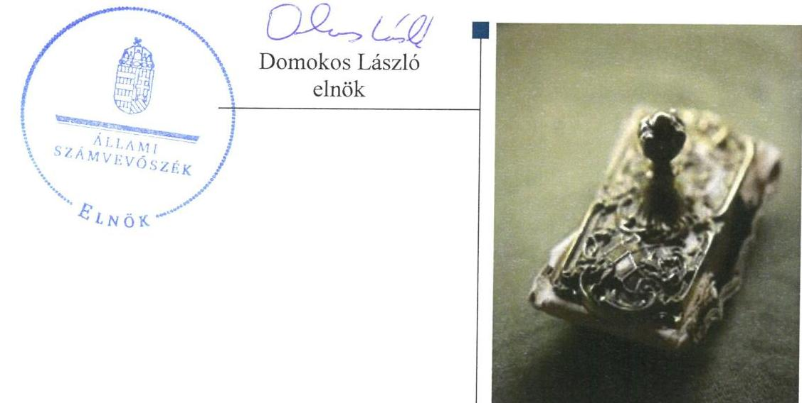

---

# AZ ELLENŐRZÉST FELÜGYELTE:

DR. HORVÁTH MARGIT felügyeleti vezető

## AZ ELLENŐRZÉST VEZETTE ÉS A VÉGREHAJTÁSÁÉRT FELELŐS:

VERTKOVCZI MÁRIA ellenőrzésvezető

## A PROGRAM ÖSSZEÁLLÍTÁSÁÉRT FELELŐS:

JANIK JÓZSEF LÁSZLÓ osztályvezető

IKTATÓSZÁM: V-1021-147/2016.

TÉMASZÁM: 2055

ELLENŐRZÉS-AZONOSÍTÓ SZÁM: V-070733

Jelentéseink az Országgyűlés számítógépes hálózatán és az Interneten a www.asz.hu címen is olvashatóak.

---

# TARTALOMJEGYZÉK

■ ÖSSZEGZÉS ..... 5
■ AZ ELLENŐRZÉS CÉLJA ..... 7
■ AZ ELLENŐRZÉS TERÜLETE ..... 8
■ AZ ELLENŐRZÉS HÁTTERE, INDOKOLTSÁGA ..... 10
■ A JELENTÉS LÉNYEGES KÉRDÉSKÖREI ..... 11
■ ELLENŐRZÉS HATÓKÖRE ÉS MÓDSZEREI ..... 12
■ MEGÁLLAPÍTÁSOK ..... 14
■ JAVASLATOK ..... 28
■ MELLÉKLETEK ..... 31
I. Sz. melléklet: Értelmező szótár ..... 31
II. Sz. melléklet: A működés főbb jellemzői. ..... 34
■ FÜGGELÉK: ÉSZREVÉTELEK ..... 35
■ RÖVIDÍTÉSEK JEGYZÉKE ..... 69

---

.

---

# ÖSSZEGZÉS

Az Állami Számvevőszék az NHSZ Dabas Hulladékgazdálkodási Kft. hulladékgazdálkodási (köz)szolgáltatást érintő gazdálkodási tevékenysége 2011-2014. évek közötti szabályszerűségét ellenőrizte. A hulladékgazdálkodást az Önkormányzat szabályosan szervezte meg. A tulajdonosi jogok gyakorlása szabályszerű volt. A Társaság vagyongazdálkodása szabályszerű volt, a kötelezettségállomány a hulladékgazdálkodásra és a működésre nem jelentett kockázatot. A Társaság közszolgáltatói feladattal kapcsolatos árképzési gyakorlata nem volt szabályszerű, ugyanakkor a díjcsökkentést szabályszerűen végrehajtotta.

## Az ellenőrzés társadalmi indokoltsága

Az Állami Számvevőszék Stratégiájában megfogalmazta, hogy a helyi önkormányzatok gazdálkodásában rejlő pénzügyi kockázatok feltárásával, az államháztartáson kívülre nyújtott költségvetési támogatások és ingyenes vagyonjuttatások, valamint az államháztartáson kívül működő közfeladat-ellátó rendszerek ellenőrzéseivel hozzájárul ahhoz, hogy a közpénzeket az államháztartáson kívül működő szervezetek is átlátható, rendezett módon használják fel a közfeladatok szerződésben vállalt ellátása érdekében.

Magyarországon az intézmény-centrikus közfeladat-ellátás jellemző, de egyre jelentősebb a költségvetésen kívüli feladatellátás térnyerése. Ennek legfontosabb szereplői - a nonprofit szervezetek mellett - az önkormányzati tulajdonú gazdasági társaságok. Az önkormányzatok szervezetalakítási szabadságának következménye, hogy a korábban is vállalati formában működő közszolgáltatások mellett, mind a kötelező, mind az önként vállalt feladatok ellátásában a gazdasági társaságok kiemelt fontosságú szerephez jutottak.

## Főbb megállapítások, következtetések, javaslatok

Az Önkormányzat a hulladékgazdálkodási kötelező közszolgáltatás megszervezéséről az ellenőrzött időszakot megelőzően döntött, annak ellátásáról a többségi tulajdonában lévő gazdasági társasága útján gondoskodott. Tulajdonosi joggyakorlását az Önkormányzat az Társasági Szerződésben, a Vagyongazdálkodás rendeletben és az SZMSZ-ben szabályozta. Az Önkormányzatnak a Társaság feletti tulajdonosi joggyakorlása az ellenőrzött időszakban szabályszerű volt. Az Önkormányzat az éves beszámolók alkalmával tett eleget beszámoltatási kötelezettségének. Az éves beszámolókat a Taggyűlés az FB írásbeli jelentése alapján, a Könyvvizsgáló jelenlétében az ellenőrzött időszak minden évében elfogadta. Az Önkormányzat a hulladékgazdálkodási közszolgáltatást a Hgt.-ben és Ht.-ban előírtaknak megfelelően szerződésben szabályozta, rendeletalkotási kötelezettségének eleget tett, azonban hiányzott a díjkalkuláció rendeleti meghatározása, valamint hiányos volt a közszolgáltatási szerződés tartalma. Az Önkormányzat a 2011-2012. években rendelkezett hulladékgazdálkodási tervvel, azonban annak végrehajtásáról a Jegyző az előírt beszámolót nem készítette el. Az FB nem rendelkezett ügyrenddel, így a szabályos működése nem volt teljes körűen biztosított.

A Társaság a 2011-2012. évekre vonatkozóan nem tett eleget a Hgt. által előírt kötelező hulladékgazdálkodási közszolgáltatást érintő költségekről való éves beszámolási kötelezettségének, ezáltal az Önkormányzat részére a közszolgáltatói tevékenység elszámoltathatósága és átláthatósága nem volt biztosított. A 2013. évre vonatkozóan a Társaság rendelkezett a Ht.-ban előírt hulladékgazdálkodási tervvel. A Társaság elkészítette a jogszabályban előírt szabályzatokat, amelyek a tevékenységek 2011-2012. évi elkülönítetésének szabályozását kivéve megfeleltek az előírásoknak. A Társaság a kötelezően ellátandó hulladékgazdálkodási tevékenységen kívül egyéb tevékenységet is végzett,

---

azonban a hulladékgazdálkodás közszolgáltatásra vonatkozóan a Hgt. előírásával ellentétben elkülönített nyilvántartást a 2011-2012. évekre vonatkozóan nem készített. A 2013. évben a Ht. szerinti tevékenységenkénti elkülönítési kötelezettségének eleget tett.

A bevételek, ráfordítások elszámolása a Hgt. által meghatározott hulladékgazdálkodás közszolgáltatással kapcsolatos 2011-2012. évi elkülönítés hiánya és a bevételi számlák szabálytalan megőrzése miatt nem volt megfelelő. A beruházások elszámolása megfelelő volt. A Társaság árképzési gyakorlata a közszolgáltatás költségeinek szigorú elkülönítési és a díjkalkuláció módszerének meghatározási hiánya, illetve a 64/2008. (III. 28.) Korm. rendeletben ${ }^{1}$ előírt költségkalkuláció alkalmazásának hiánya miatt nem volt szabályszerű. A díjak csökkenését ugyanakkor a Rezsi tv-ben és a Ht-ben foglaltaknak megfelelően, a Társaság végrehajtotta.

A Társaság vagyongazdálkodása szabályszerű volt. Az eszközök használhatósági foka az ellenőrzött időszakban a beruházások következtében nőtt. A Társaság saját tőkéje az ellenőrzött időszakban összességében nőtt. A kötelezettségállomány az ellenőrzött időszakban a működésére, közszolgáltatásra nem jelentett kockázatot. A hátralékos követelések behajtása nem volt szabályszerű, mivel a Társaság a 2013. évben a Ht.-ban előírtakkal ellentétben a hátralékos követelések adók módjára történő behajtását nem kezdeményezte a NAV-nál.

A Könyvvizsgáló az éves beszámolókat hitelesítő záradékkal látta el annak ellenére, hogy a kötelezően ellátandó hulladékgazdálkodási közszolgáltatással kapcsolatos a Hgt. és a 64/2008. Korm. rendelet és a Számv. tv. által meghatározott elkülönítési szabályozás és gyakorlat hiányozott a Társaság 2011-2012. évi nyilvántartásaiból, továbbá a 2012. évi beszámoló nyitó adatai nem minden tétel esetében egyeztek meg a 2011. évi záró adatokkal.

Az Avtv.-ben és az Info.tv.-ben előírtaktól eltérően 2011-2013. években belső adatvédelmi felelőssel, hatályos adatvédelmi szabályzattal a Társaság nem rendelkezett, közzétételi kötelezettségét hiányosan teljesítette.

---

# AZ ELLENŐRZÉS CÉLJA

Az ellenőrzés célja annak értékelése, hogy az önkormányzat a jogszabályi előírások figyelembevételével döntött-e az ellenőrzésre kerülő közfeladat megszervezéséről; az önkormányzat/tulajdonosi joggyakorló szabályszerűen gyakorolta-e a tulajdonosi jogokat; a gazdasági társaság közfeladat-ellátása bevételeinek, ráfordításainak elszámolása, és vagyongazdálkodási tevékenysége megfelelt-e a jogszabályi, illetve a közszolgáltatási/vagyonkezelési szerződésben foglalt tulajdonosi előírásoknak, azok végrehajtása szabályszerű volt-e; a gazdasági társaság kötelezettségállománya jelent-e kockázatot a működésre, illetve a közfeladat ellátására; a közfeladatok átláthatósága és elszámoltathatósága érdekében biztosítva volt-e a közszolgáltatás díjának megalapozottsága szabályszerű önköltségszámítással.

---

# **Dabas Város Önkormányzata és a többségi tulajdonában lévő NHSZ Dabas Hulladékgazdálkodási Kft.**

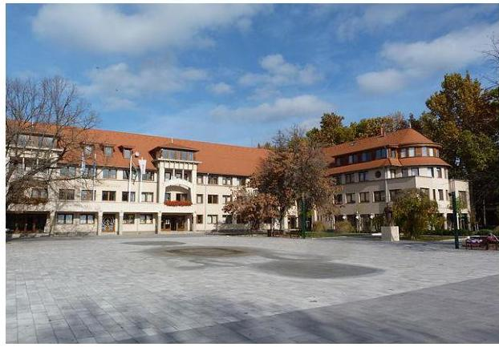

**AZ ÖNKORMÁNYZAT**2 többségi tulajdonában (51%) álló Társaság3 jogelődjét az ellenőrzött időszakot megelőzően hozták létre. A Társaság 49%-os tulajdoni részesedése az alapítástól kezdődően 2014. március 24-ei eladásig a Rethmann Recycling Hungaria Kft.4 tulajdonában állt. Az eladást követően a 49% tulajdonjog a Magyar Állam kizárólagos tulajdonában álló NHSZ5 Kft. birtokába került. A Társaság 2013. december 31-éig mint közszolgáltató látta el a települési szilárd hulladékkal kapcsolatos kötelező közfeladatokat és közszolgáltatást Dabas város közigazgatási területén. A Társaság közszolgáltatói tevékenysége 2014. január 1-jétől megszűnt és ezt követően 2014. december 31-éig az új közszolgáltató alvállalkozójaként működött. Alapításkor a Társaság jegyzett tőkéje 11,8 M Ft (5,8 M Ft pénzbeli betét és 6,0 M Ft apport) volt. A jegyzett tőkéből az Önkormányzat törzsbetétjének nagysága 6,0 M Ft apport volt, amely az ellenőrzött időszakban nem változott. Az Önkormányzat a Társaság részére kezelt vagyont a közszolgáltatáshoz nem adott át. A Társaságnak az ellenőrzött időszakban tulajdonosi részesedése más társaságban nem volt.

Az ellenőrzött időszakban a Polgármester6 az 1998. évi önkormányzati választások óta tölti be tisztségét. Az ellenőrzött időszakban a Jegyző7 személye egyszer, 2013. április 1-jétől változott.

**A TÁRSASÁG** a 2011-2012. években Dabas és Bugyi, a 2013. évben Dabas és 2013. augusztus 1-jétől Dabas és Örkény települések közigazgatási területén látta el a hulladékkezelési közszolgáltatást. A Társaság főtevékenysége az ellenőrzött időszakban a nem veszélyes hulladék kezelése volt és emellett egyéb – hulladék gyűjtése és szállítása, konténeres hulladékszállítás, bérbeadás – tevékenységet is ellátott. A hulladékkezelési közszolgáltatást a Társaság a 2011-2012. években több mint 21 ezer lakos (10 522 háztartás) és 255 közület, a 2013. évben több mint 16 ezer lakos (5354 háztartás) és 246 közület számára biztosította.

A Társaság tevékenysége az ellenőrzött időszakban a 2014. évet kivéve nyereséges volt, ennek következtében a 2011-2013. években a Társaság saját tőkéje nőtt. A Társaság nettó árbevétele a 2011-2013. években érdemben nem változott, azonban a 2014. évben a 2011. évhez viszonyítva több mint 22,0 %-kal csökkent a hulladékgazdálkodási közszolgáltatási tevékenység 2014. január 1-jétől való megszűnése miatt. A kötelezettségek állománya az ellenőrzött időszakban folyamatosan csökkent, fedezete biztosított volt. A követelések állománya a 2011. évihez viszonyítva az ellenőrzött időszak végére 17,6%-kal csökkent.

A Társaság 2011. és 2014. évi bevételeit, illetve a 2011. január 1-jei és 2014. december 31-ei főbb gazdálkodási adatait az 1. ábra mutatja.

---

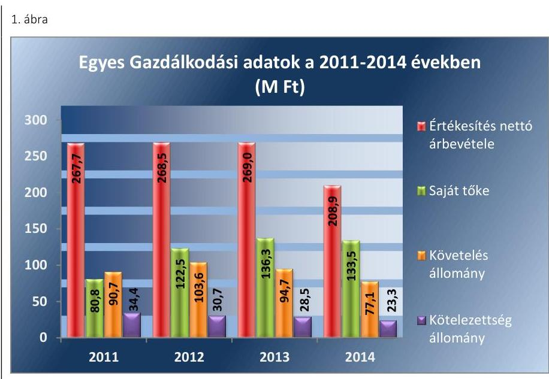

Forrás: A Társaság 2011-2014. évi beszámolói

A Társaságnál 2012. május 29-éig egy ügyvezető, ezt követően 2013. április 1-éig két ügyvezető, majd 2013. április 1-jétől ismét egy ügyvezető irányította a Társaságot. Az ellenőrzött időszakban a számviteli feladatokat megbízási szerződés alapján könyvelő iroda látta el.

---

# AZ ELLENŐRZÉS HÁTTERE, INDOKOLTSÁGA

AZ ÖNKORMÁNYZATI TULAJDONÚ GAZDASÁGI TÁRSASÁGOK teljes körű ellenőrzésének lehetőségét az 1989. évi XXXVIII. törvény 2011. január 1-jétől hatályos módosítása teremtette meg. A közfeladatot ellátó gazdasági társaságok ellenőrzése kiemelten fontos a vagyon megőrzése, megóvása érdekében, valamint a kormányzati szektor elszámolásaiban megjelenő önkormányzati tulajdonú gazdálkodó szervezetek esetében, amelyekkel szemben alapvető követelmény, hogy gazdálkodásuk, működésük szabályszerű, az általuk szolgáltatott adatok minél megbízhatóbbak legyenek. A közfeladat ellátás költségeinek, ráfordításainak alakulása, színvonala hatással van a lakosság elégedettségére. A törvényalkotás számára - az észlelt problémák, szabálytalanságok, vagy egyéb nem kívánatos jelenségek felszínre kerülésével - az ellenőrzés megállapításai segítséget nyújthatnak az államháztartáson kívüli közfeladat-ellátás értékeléséhez, jogszabályi keretei pontosításához, átláthatóságot biztosító szabályozásához. Meghatározhatóvá válnak a közfeladat ellátásban részt vevő államháztartáson kívüli szervezeteknek - az önkormányzat költségvetését, pénzügyi helyzetét is befolyásoló - kockázatai, lehetővé válik ezen kockázatok csökkentése. Ellenőrzéseink feltárhatják, hogy az önkormányzat közfeladat-ellátási kötelezettségének szabályszerűen tett-e eleget, a feladatellátáshoz rendelt közvagyon működtetését a tulajdonostól elvárható gondossággal, szabályszerűen szervezte-e meg és a tulajdonosi felügyelete hozzájárult-e a közfeladat-ellátásához. Az ellenőrzés rávilágíthat arra, hogy a gazdasági társaság a közszolgáltatási szerződésben foglaltak betartásával, a közvagyon használatával biztosította-e a szolgáltatás folyatatásának feltételeit, a közfeladat ellátását. Ezzel az ellenőrzöttek és a helyi döntéshozók számára visszajelzést ad feladatszervezési, feladat-ellátási kockázataikról, alapot ad a meglévő hibák megszüntetéséhez, a jobb közfeladat-ellátás biztosításához. Fokozza a fegyelmet, igazolja, hogy lejárt a következmények nélküli ellenőrzések időszaka. Az ÁSZ értékteremtő rend kialakításához és megőrzéséhez hozzájáruló tevékenysége pozitív hatással van a szervezetről kialakított összkép formálására.

---

# A JELENTÉS LÉNYEGES KÉRDÉSKÖREI

1.  Az Önkormányzat közfeladat megszervezéséről szóló döntése, valamint tulajdonosi joggyakorlása szabályszerű volt-e?
2.  A gazdasági társaság vagyongazdálkodása szabályszerű volt-e?
3.  A gazdasági társaságnál az ellátott közfeladat bevételei és ráfordításai elszámolása, valamint az önköltségszámítás és árképzés szabályszerű volt-e?

---

# ELLENŐRZÉS HATÓKÖRE ÉS MÓDSZEREI

## Az ellenőrzés típusa

Megfelelőségi ellenőrzés

## Az ellenőrzött időszak

2011. január 1-jétől 2014. december 31-ig tartó időszak

## Az ellenőrzés tárgya

A közfeladatot gazdasági társaságokkal ellátó önkormányzatok tulajdonosi joggyakorlása, valamint gazdasági társaságok pénz- és vagyongazdálkodásának szabályozottsága és szabályszerűsége.

Az ellenőrzés tárgya a közfeladat ellátás tekintetében a 2011-2013. évekre terjed ki, mivel a Társaság a hulladékgazdálkodási közszolgáltatási tevékenységét 2013. december 31-ig végezte. Azt követően 2014. december 31-éig az új közszolgáltató alvállalkozójaként működött a Társaság.

Az ellenőrzés kiterjed minden olyan körülményre és adatra, amely az ÁSZ jogszabályban meghatározott feladatainak teljesítéséhez, valamint a program végrehajtása folyamán felmerült újabb összefüggések feltárásához szükséges.

## Az ellenőrzött szervezet

$\longrightarrow$ Dabas Város Önkormányzata
$\longrightarrow$ NHSZ Dabas Hulladékgazdálkodási Kft.

## Az ellenőrzés jogalapja

Az ellenőrzés jogszabályi alapját az Állami Számvevőszékről szóló 2011. évi LXVI. törvény (ÁSZ. tv.)5. § (3)-(4)-(5) bekezdése képezte.

## Az ellenőrzés módszerei

Az ellenőrzést a nemzetközi standardokat irányadónak tekintve az ellenőrzési program ellenőrzési kérdései, az ellenőrzött időszakban hatályos jogszabályok, az ellenőrzés szakmai szabályok és módszertanok figyelembe vételével végeztük.

---

Az ellenőrzés ideje alatt az ellenőrzött szervezettel történő kapcsolattartást az ÁSZ Szervezeti és Működési Szabályzatának vonatkozó előírásai alapján biztosítottuk.

Az ellenőrzés a kiválasztott, többségi tulajdonosi jogokat gyakorló önkormányzatra, illetve az ellenőrzésre kijelölt közfeladatot ellátó gazdasági társaság felett tulajdonosi jogokat gyakorló szervezetre és az ellenőrzött közfeladatot ellátó gazdasági társaságra terjedt ki. Amennyiben a gazdasági társaságban több önkormányzat együttesen többségi tulajdonos, úgy az ellenőrzést a többségi tulajdonosi jogokat gyakorló önkormányzatnál kellett lefolytatni. Az ellenőrzött gazdasági társaságnál, amennyiben az több közfeladatot is ellátott, akkor az ellenőrzésre kiválasztott közfeladatellátást ellenőriztük.

Az ellenőrzést a kérdésekre adott válaszok kiértékelésével, valamint a megjelölt adatforrások, a csatolt tanúsítványok felhasználásával, továbbá az adott időszakban hatályos jogszabályok figyelembe vételével folytattuk le. Az ellenőrzési kérdések megválaszolásához szükséges bizonyítékok megszerzése a következő ellenőrzési eljárások alkalmazásával történt: megfigyelés, kérdésfeltevés (információkérés), összehasonlítás, valamint elemző eljárás.

A bevételek és ráfordítások elszámolása, valamint a vagyonnyilvántartás terén a szabályszerű működést véletlen mintavétellel ellenőriztük. A jogszabályoknak és a belső előírásoknak megfelelőnek tekintettük az adott területet, amennyiben a minta ellenőrzésének eredménye alapján 95\%-kos bizonyossággal a teljes sokaságban a hibaarány kisebb volt, mint 10\%, nem megfelelőnek, ha a hibaarány a 10\%-ot meghaladta. Kockázatot, illetve magas kockázatot jeleztünk, amennyiben egy adott terület vonatkozásában a minta alapján a teljes sokaságban nem volt egyértelműen biztosított a jogszabályoknak és a belső szabályzatoknak megfelelő működés. A ráfordítások elszámolására és a vagyonnyilvántartásra vonatkozó véletlen mintavételt kockázati alapú kiválasztással egészítettük ki, amelynek során évente a három legnagyobb összegű tételt választottuk ki.

---

# 1. Az Önkormányzat közfeladat megszervezéséről szóló döntése, valamint tulajdonosi joggyakorlása szabályszerű volt-e? 

Összegző megállapítás

Az Önkormányzat a közszolgáltatásról szabályszerűen gondoskodott, szerződéskötési és rendeletalkotási kötelezettségének a kisebb hiányosságokkal eleget tett. Az Önkormányzat tulajdonosi jogait szabályszerűen gyakorolta. Az FB szabályos működése ügyrend hiányában nem volt teljes körűen biztosított. A 2011-2012. évre vonatkozó hulladékgazdálkodási tervről az előírt beszámolót a Jegyző nem készítette el.
1.1. számú megállapítás

Az Önkormányzat a hulladékgazdálkodási közfeladat ellátását szabályszerűen szervezte meg. Rendeletalkotási és szerződéskötési kötelezettségének eleget tett, azonban hiányzott a díjkalkuláció rendeleti meghatározása, valamint a közszolgáltatási szerződés kisebb hiányossággal rendelkezett. A Jegyző a hulladékgazdálkodási terv végrehajtásáról az előírt beszámolót nem készítette el.

## A KÖZTISZTASÁG ÉS TELEPÜLÉSTISZTASÁG

BIZTOSÍTÁSA az Ötv. ${ }^{8}$ 8. § (1) bekezdése, illetve a hulladékgazdálkodási közfeladat ellátása az Mötv. ${ }^{9}$ 13. § (1) 19. pont alapján az ellenőrzött időszakban az Önkormányzat törvényi kötelezettsége volt. Az Önkormányzat közigazgatási területén a szilárd hulladék gyűjtése, ártalmatlanítása, hasznosítása és a közterületek tisztántartása feladatának ellátásáról, a közszolgáltatás megszervezéséről, a 2011-2013. évek között az ellenőrzött időszak előtt alapított Társaság útján gondoskodott.

Az Önkormányzat az ellenőrzött időszak előtt a Hgt. ${ }^{10}$ 22. § (1) bekezdése alapján Társuláshoz ${ }^{11}$ csatlakozott. A társult önkormányzatok 51\%-os részesedésével az ellenőrzött időszak előtt létrehozták az NHSZ ÖKOT NKft-t. ${ }^{12}$. Az NHSZ ÖKOT NKft. 49\%-os tulajdonrészét a Magyar Állam kizárólagos tulajdonában álló NHSZ Kft. megvásárolta, melynek cégbírósági bejegyzése 2014. március 24-ei hatállyal történt meg. Az Önkormányzat 2014. január 1-jétől az NHSZ OKÖT NKft. útján gondoskodott a közszolgáltatás ellátásáról.

## AZ ÖNKORMÁNYZAT RENDELKEZETT GAZDASÁGI PROGRAMMAL ${ }^{13}$ a 2011-2014. évekre vonatkozóan azonban az Ötv. 91. § (6) bekezdésével ellentétben a program nem tér ki a hulladékgazdálkodás közfeladatának fejlesztési tervére.

Az Önkormányzat a 2011-2012. években rendelkezett a Hgt. 37. § (4) a)-f) pontban előírtaknak megfelelő tartalmú Hulladékgazdálkodási terv-

---

vel ${ }^{14}$. A 241/2001. (XII.10.) Kormányrendelet 1. § f) pontjában előírtak ellenére a Jegyző a Hulladékgazdálkodási tervben foglaltak végrehajtásáról kétévente esedékes beszámoló elkészítésének nem tett eleget.

Az Önkormányzat az ellenőrzött időszakban az Nvtv. ${ }^{15}$ 9. § (1) bekezdésének megfelelően rendelkezett közép- és hosszú távú vagyongazdálkodási tervvel ${ }^{16}$.

A TÁRSASÁGI SZERZŐDÉS ${ }^{17}$ megfelelt a Gt. ${ }^{18}$ 12. § (1) bekezdésében, illetve a Ptk. 3:5. §-ában előírtaknak. A Társasági Szerződés tartalmazta a Társaság megnevezését, székhelyét, a tagok felsorolását, a Társaság fő- és valamennyi tevékenységét, a képviselet és a cégjegyzés módját, a jegyzett tőkéjét, a Társaság tagjainak vagyoni hozzájárulását, valamint a jegyzett tőke rendelkezésre bocsátásának módját és idejét. Tartalmazta továbbá a Társaság Ügyvezetőjének ${ }^{19}$, a FB ${ }^{20}$ tagok és a Könyvvizsgáló ${ }^{21}$ nevét. A Társaság legfőbb szerve a Taggyűlés ${ }^{22}$ volt. A Társasági Szerződést az ellenőrzött időszakban a Taggyűlés több alkalommal módosította, többek között az Önkormányzat javaslata alapján az Ügyvezető és az FB tagok személyében, a Könyvvizsgáló megbízásának időtartamában bekövetkezett változások, illetve a jogszabályi előírások átvezetése miatt.

A hulladékgazdálkodási közszolgáltatást a Társaság az Önkormányzattal az ellenőrzött időszakot megelőzően kötött, a Hgt. 28. §-ban és a 224/2004. (VII. 22.) Korm. rendelet ${ }^{23}$ 11-14. §-aiban előírtaknak alapvetően megfelelő Közszolgáltatási szerződés ${ }^{24}$ alapján végezte az ellenőrzött időszakban, azonban az alábbi kisebb hiányosságok jelentkeztek a Közszolgáltatási Szerződésben. A Közszolgáltatói Szerződés a 224/2004. (VII. 22.) Korm. rendelet 12. § (2) bekezdés b) és c), a 13. § (4) bekezdésében, valamint a 14. §-ában foglaltak ellenére nem tartalmazta:
$\longrightarrow$ a közszolgáltatás körébe tartozó és a településen folyó egyéb hulladékkezelési tevékenységek összehangolásának, a településen működtetett különböző közszolgáltatások összehangolásának elősegítését;
$\longrightarrow$ az igazolt díjhátralék kiegyenlítésére vonatkozó eljárást, az alvállalkozók egyéb közreműködők igénybevételének szabályait.
A Közszolgáltatói Szerződést a Társaság és az Önkormányzat közös megegyezéssel 2013. december 31-ével megszűntette. Az Önkormányzat ettől az időponttól másik Társasággal kötött hulladékgazdálkodási közszolgáltatói szerződést, amely társaság tevékenysége nem képezi a jelen ellenőrzés tárgyát.

RENDELETALKOTÁSI KÖTELEZETTSÉGÉNEK az ellenőrzött időszakban az Önkormányzat a Hgt. 23. § a-h) bekezdéseiben, valamint a Ht. ${ }^{25}$ 35. §-ában előírtak szerint a Hulladékkezelési rendelet ${ }^{26}$ megalkotásával eleget tett. A Hulladékkezelési rendelet tartalmazta az Ötv. 8. § (1) bekezdésében, valamint a Mötv. 13. § (1) 19. pontjában előírtakat, szabályozta Dabas város közigazgatási területén a köztisztasággal, a települési szilárd hulladék elszállításával összefüggő feladatok eredményes végrehajtását, a hulladékgazdálkodási közszolgáltatás ellátásának és igénybevételének rendjét.

A Hulladékkezelés rendeletben az Önkormányzat meghatározta a Hgt. 27. § (1), valamint a Ht. 42. § (1) bekezdésében előírtaknak megfelel-

---

# 1.2. számú megállapítás 

ően a települési hulladék ingatlantulajdonosoktól történő begyűjtését, elszállítását, illetve a települési hulladék kezelését, a szolgáltatás folyamatosságának biztosítását. A Hulladékkezelési rendelet tartalma megfelelt a Hgt. 23. §, valamint a Ht.35. § előírásainak, tartalmazta a hulladékkezelési közszolgáltatás célját, fogalmát, a közszolgáltatás ellátásának szabályait, a közszolgáltató és az ingatlantulajdonos ezzel összefüggő jogait és kötelezettségeit, a közszolgáltatási díj fizetésének szabályait. A Hulladékkezelési rendelet kitért a közszolgáltatási díjra vonatkozó mentességekre, szabálysértések, részletfizetések szabályaira. Előírták a lomtalanításra, szelektív hulladékgyűjtésre, valamint az állati melléktermékek ártalmatlanítására vonatkozó rendelkezéseket.

A Társaság azonban az ellenőrzött időszakban a települési szilárd hulladékra a közszolgáltatási díj számítására szolgáló kalkulációs sémát a 64/2008. (III. 28.) Korm. rendelet 2. § (3) bekezdésében előírtakkal ellentétben nem határozta meg, nem tette közzé.

A Hulladékkezelési rendeletet a Hgt. 57. § előírása megfelelően a díjtételekkel kapcsolatban az ellenőrzött időszakban többször módosította az Önkormányzat. Az ellenőrzött időszakban a Hulladékkezelési rendeletben az Önkormányzat a jogszabályi változásokat átvezette.

Az Önkormányzat tulajdonosi jogait szabályszerűen gyakorolta. Javadalmazási szabályzata hiányos volt. Az FB nem rendelkezett ügyrenddel.

A TÁRSASÁG TAGJAI A TULAJDONOSI JOGGYAKORLÁS KERETEIT a Gt. 141.§ (1)-(2) bekezdések és a Ptk. ${ }^{27}$ 3:109 § (1)-(2) bekezdések előírásaival összhangban a Társasági Szerződésben határozták meg. Az Önkormányzat a Társaság feletti tulajdonosi joggyakorlás feladatait, annak módját és a hatáskörök gyakorlásának rendjét az SZMSZ ${ }^{28}$-ében és a Vagyongazdálkodási rendeletében ${ }^{29}$ szabályozta.

Az Önkormányzat a vagyona feletti rendelkezési jogot a Vagyongazdálkodási rendeletében a vagyonelem típusa, a tulajdonosi jog, illetve a döntés tartalma alapján osztotta meg a Képviselő-testület és a Bizottságok között. A Vagyonrendeletében az ellenőrzött időszakban a Képviselő-testület a Társaságnál a tulajdonosi joggyakorlás képviseleti jogát a Polgármesterre ruházta át. A Társaság Taggyűlésein a Polgármester vett részt és a Társaság működéséről a Vagyonrendeletben előírt beszámolási kötelezettségének az Önkormányzat zárszámadását elfogadó Képviselő-testületi üléseken tett eleget.

AZ FB létrehozásáról a köztulajdon védelme érdekében a Gt. 33. § (2) bekezdés c) pontja előírása alapján a Társaság tulajdonosai gondoskodtak, annak létszámát a Gt. 34. § (1) bekezdésben, a Ptk. 3:26. § (1) bekezdésben és a Taktv. ${ }^{30}$ 4. § (2) bekezdésben foglaltakkal összhangban az ellenőrzött időszakban 3 főben határozták meg. Az Önkormányzat a Társasági Szerződés VII. fejezet alapján a tulajdonosi képviseletére a Képviselő-testület tagjai közül két tagot delegált az FB-be. Az FB a Társaság 2011-2014. éves beszámolóiról a Gt. 35. § (3) valamint a Ptk. 3:120. § (2) bekezdésének előírásai elfogadó javaslatot tartalmazó írásbeli jelentést készített.

---

Az FB az ellenőrzött időszakban a Gt. 34. § (4) bekezdése és a Ptk. 3:122.§ (3) bekezdésének előírásai ellenére nem rendelkezett ügyrenddel.

Az ellenőrzött időszakban a Társaság a tulajdonosok felé beszámolási kötelezettségének a Gt. 141. § (2) a pontjának megfelelően, a Számv. tv. ${ }^{31}$ 96. § előírásaiban előírt éves számviteli beszámolók megtárgyalásával tett eleget. Az Ügyvezető a 2011-2014. években az éves beszámolót megtárgyaló Taggyűléseken beszámolt a Társaság tevékenységéről. Az Önkormányzat a Közszolgáltatási szerződésben a Társaság részére az éves hulladékgyűjtés, szállítás díj változtatásához a tárgyévet megelőző év november 15-ig javaslattételi kötelezettséget írt elő, amely alapján a Társaság a díjváltoztatási javaslatait az Önkormányzat részére megküldte.

A Társasági szerződésben a Társaság tagjai 2013. május 22-től előírták, hogy a Társaság a tulajdonosok részére minden hónapban egy alkalommal a tárgyhót követő hónap 12. napjáig előzetesen egyeztetett formában adatot szolgáltasson a tárgyhót megelőző havi gazdasági teljesítményéről és kintlévőségeiről, továbbá heti rendszerességgel küldje meg a bankszámláinak egyenlegét. Az előírt adatszolgáltatási kötelezettségét a Társaság teljesítette.

A Képviselő-testület nem élt az Ötv. 92. § (11) bekezdés b) pontjában, illetve az Áht. ${ }^{32}$ 70. § (1) bekezdés d) pontjában biztosított lehetőséggel, a többségi tulajdonában lévő Társaság tevékenységét a 2011-2014. években nem ellenőrizte és a közfeladat-ellátást külső szakértővel sem ellenőriztette.

A Taggyűlés a 2011-2014. közötti időszakban a mérleg szerinti eredmény eredménytartalékba helyezéséről a Számv. tv. 37. § (1) a pontja szerint szabályosan, továbbá a 2011. évi számviteli beszámoló elfogadáskor a Gt. 132. § (1) bekezdés alapján 6,0 MFt osztalék kifizetéséről döntött. Az osztalék Társasági Szerződésben meghatározott arányos része az Önkormányzat részére átutalásra került.

Az ellenőrzött időszakban veszteség rendezése, illetve saját tőke/jegyzett tőke előírt szintjének - Gt.51. § (1) és Ptk. 3:202. § előírásainak - biztosítása érdekében nem volt szükség tulajdonosi intézkedésre. Az Önkormányzat a Társaság részére a közfeladat-ellátáshoz kapcsolódó fejlesztéshez támogatást nem nyújtott, garanciát, kezességet nem vállalt. A Társaság mérleg szerinti eredménye a 2011-2013. években nyereséges volt, majd a Társaság közszolgáltatói tevékenységének befejezését követően a 2014. évben veszteséges volt.

A Társaság mérleg szerinti eredményének 2011-2014. évi alakulását a 2. ábra szemlélteti.

---

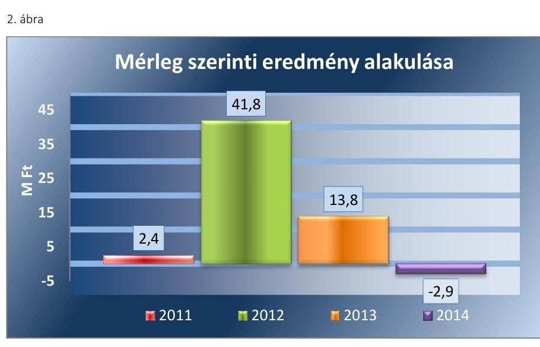

*Forrás: a Társaság beszámolói*

A Taktv. 5. § (3) bekezdésében előírt javadalmazási szabályzat33 nem tartalmazta az Mt.34 208. §-ának hatálya alá eső vezető állású munkavállalók javadalmazásának módját, mértékének elveit és annak rendszerét, valamint az ügyvezető, FB tagok és vezető állású munkavállalók jogviszonyának megszűnése esetére biztosított juttatások módját, mértékének elveit és annak rendszerét. Az ügyvezető részére prémium kifizetés 2011-2013. időszakban nem történt.

## 2. A gazdasági társaság vagyongazdálkodása szabályszerű volt-e?

### Összegző megállapítás

**A Társaság vagyongazdálkodása az ellenőrzött időszakban szabályszerű volt, azonban a 2011-2012. években a közszolgáltatási tevékenység elkülönítésének hiánya kockázatot jelentett a közfeladat-ellátással kapcsolatban, mivel a tevékenység nem volt átlátható, illetve elszámoltatható.**

### 2.1. számú megállapítás

**A Társaság rendelkezett az előírt szabályzatokkal, melyek megfeleltek a jogszabályoknak, azonban a 2011-2012. években a tevékenységek szétválasztását a Társaság nem szabályozta.**

**A TÁRSASÁGNAK ÜZLETI TERV** készítési kötelezettsége nem volt, üzleti tervet az ellenőrzött időszakban nem készített.

A Társaság 2013-2015. időszakra vonatkozó közszolgáltatói hulladékgazdálkodási tervét a Ht. 78. § (1)-(2) bekezdéseiben, valamint a 438/2012 (XII.29.) Korm. rendelet35 11. § (1) bekezdésében előírtaknak megfelelően elkészítette, amelyet a Ht. 78. § (3) bekezdésében előírtaknak megfelelően az Országos Környezetvédelmi, Természetvédelmi és Vízügyi Főfelügyelőség jóváhagyott.

A Társaság rendelkezett a Számv. tv. 14. § (3)-(5) bekezdésekben előírtaknak megfelelően Számviteli politikával36, annak keretében eszközök és források Értékelési szabályzatával37, Leltározási szabályzattal38, Pénzkezelési szabályzattal39. A Számv. tv. 14. § (7) bekezdése alapján a Társaság az Önköltségszámítási szabályzat készítésének kötelezettsége alól mentesült.

---

Önköltségszámítási szabályzat készítését, alkalmazását a Taggyűlés a Társaság részére nem írt elő az ellenőrzött időszakban. A Társaság a Számv. tv. 161.§ (1) bekezdése alapján a Számv. tv. 161.§ (2)-(4) bekezdésekben előírtaknak megfelelően eleget tett Számlarend40 készítési kötelezettségének. A leltározási szabályzat megfelelt a Számv. tv. 69. §-ban előírtaknak, alapvetően az eszközökre vonatkozóan éves leltározási kötelezettséget írt elő.

A Pénzkezelési szabályzat megfelelt a Számv. tv. 14. § (8) bekezdésében foglaltaknak.

A Hgt. 29. § (3) bekezdésében, a 64/2008. (III.8) Korm. rendeletben41 előírt Közszolgáltatási tevékenység számviteli elkülönítését Számv. tv. 161/A. § (2) bekezdése és a 14. §. (3) bekezdése ellenére a Társaság nem szabályozta, ezáltal a Társaság számviteli nyilvántartása nem biztosította az egyes közszolgáltatási tevékenységek adatainak megismerhetőségét.

A 2013. évre vonatkozóan a Ht. 50. § (1)-(4) bekezdéseiben, továbbá a Számv. tv. 161/A. § (1)-(2) bekezdéseiben előírtak alapján a Társaság elkészítette a közszolgáltatással kapcsolatos elkülönítésről szóló nyilvántartási és elszámolási Szétválasztási szabályzatát42, amely biztosította a tevékenységekkel kapcsolatos előírt adatok rendelkezésre állását.

# 2.2. számú megállapítás 

A Társaság vagyongazdálkodása szabályszerű volt.

A TÁRSASÁG VAGYONNYILVÁNTARTÁSA az ellenőrzött időszakban folyamatos, a vagyonváltozás kimutatása átlátható volt. A Társaság eszközeinek nyilvántartása a Számv. tv. 23. § - 31. § és a 159. § előírásainak és a belső szabályzatokban előírtaknak megfelelt az ellenőrzött időszakban. Az értékcsökkenés elszámolása az Értékelési szabályzatban előírt éves gyakoriság ellenére a 2011-2012. években havonta, 2013-ban és 2014-ben az Értékelési szabályzatban előírtaknak megfelelően havonta történt. Az ellenőrzött időszakban a beszámoló elkészítéséhez, a mérleg tételeinek alátámasztásához a Társaság a Számv. tv. 69.§ (1) bekezdésében és a leltározási szabályzatban foglaltaknak megfelelően a mérleg fordulónapján meglévő eszközeit és forrásait mennyiségben és értékben tételesen és ellenőrizhető leltárral támasztotta alá.

A TÁRSASÁG VAGYONA az ellenőrzött időszakban nőtt, mivel a Társaság a vagyonelemeken az ellenőrzött időszakban összességében az amortizációt (19,1 M Ft) meghaladó karbantartást, értéknövelő felújítást, és beruházást (45,2 M Ft) hajtott végre. A fejlesztésekhez vagyongazdálkodási döntések meghozatalát jogszabályi és belső előírás nem kötötte tulajdonosi döntéshez.

A Társaság vagyoni helyzetét jellemző, főbb könyvviteli mérleg szerinti kiemelt adatait az 1. táblázat tartalmazza.

1.  táblázat

A TÁRSASÁG FŐBB MÉRLEGADATAI (M FT)

|  | 2011.01.01. | 2011.12.31. | 2012.12.31. | 2013.12.31. | 2014.12.31. |
| :--: | :--: | :--: | :--: | :--: | :--: |
| I. Befektetett eszközök | 23,1 | 25,2 | 25,8 | 24,2 | 48,5 |
| - ebből: Tárgyi eszközök | 21,3 | 23,7 | 24,6 | 23,2 | 47,6 |
| II. Forgó eszközök | 104,0 | 94,7 | 134,1 | 145,9 | 108,8 |
| - ebből: Követelések | 92,2 | 94,7 | 103,6 | 94,7 | 77,1 |
| - ebből: Pénzeszközök | 11,0 | 3,1 | 29,9 | 50,9 | 31,5 |
| III. Aktív időbeli elhatárolások | 0,3 | 0,7 | 0,4 | 1,0 | 0,4 |
| Eszközök összesen | 127,4 | 120,6 | 160,3 | 171,1 | 157,7 |

---

|  | 2011.01.01. | 2011.12.31. | 2012.12.31. | 2013.12.31. | 2014.12.31. |
| :-- | --: | --: | --: | --: | --: |
| IV. Saját tőke | 78,4 | 80,8 | 122,5 | 136,3 | 133,5 |
| - ebből: Jegyzett tőke | 11,8 | 11,8 | 11,8 | 11,8 | 11,8 |
| - ebből: Tőketartalék | 0 | 0 | 0 | 0 | 0 |
| - ebből Mérleg szerinti eredmény | 20,3 | 2,4 | 41,8 | 13,8 | $-2,9$ |
| V. Céltartalékok | 0 | 0 | 0 | 0 | 0 |
| VI. Kötelezettségek | 43,6 | 34,4 | 30,7 | 28,4 | 23,2 |
| - ebből: szállítókkal szembeni kötelezettség | 12,9 | 11,4 | 12,6 | 15,1 | 11,0 |
| VII. Passzív időbeli elhatárolások | 5,4 | 5,4 | 7,1 | 6,4 | 1,0 |
| Források összesen | 127,4 | 120,6 | 160,3 | 171,1 | 157,7 |

A Társaság eszközeinek értéke 2011. január 1. és 2014. december 31. között 23,8\%-kal nőtt. A forgóeszközök állománya 4,6\%-kal nőtt a követelések csökkenése és a pénzeszközök növekedése mellett. A befektetett eszközök több mint 90\%-a tárgyi eszköz volt az ellenőrzött időszakban. A Társaság befektetett eszközállománya 2011. január 1 és 2014. december 31 között 110,0\%-kal nőtt, döntően a tárgyi eszközök értékének 123,5\%-os növekedése következtében, amely növekedés okai a 2014. évi gépjárművek és konténerek vásárlása volt.

A SAJÁT TŐKE a 2011. évi nyitó értékéről a 2014. év végére, 55,1 M Ft-tal nőtt, amely a Társaság 2011-2013. évek nyereséges gazdálkodásának köszönhető. A növekedést a legnagyobb mértékben a 2012. év eredménye befolyásolta 41,8 M Ft-tal, mely a teljes időszak növekedésének 75,9\%-a, majd a 2013. évtől kezdődően, elsősorban a díjak jogszabályi korlátozásának hatásaként a nyereség mérséklődött. A Társaság 2014. évi veszteségének az oka elsősorban a közszolgáltatási tevékenység megszűnése volt, ami az értékesítés nettó árbevételének 2013-hoz viszonyított 22,3\%-os (61,1 M Ft-os) csökkenésével járt. A saját tőke az ellenőrzött időszakban lényegesen meghaladta a jegyzett tőke 11,8 M Ft-os összegét. Az ellenőrzött időszakban a saját tőke változását a 3. ábra szemlélteti.
3. ábra
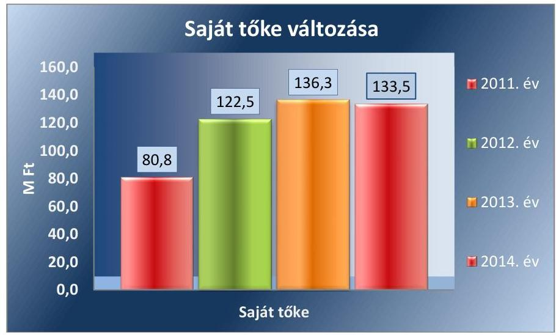

Forrás: Társaság beszámolói

---

# 2.3. számú megállapítás 

A kötelezettségek állománya nem jelentett kockázatot a Társaság működésére, a közszolgáltatás ellátására.

A TÁRSASÁG KÖTELEZETTSÉGEINEK állománya nem tartalmazott hosszúlejáratú kötelezettségeket, továbbá az ellenőrzött időszakban nem jelentett kockázatot a Társaság működésére, a közszolgáltatására.

A rövidlejáratú kötelezettségek állománya a 2011. évről a 2014. év végére 22,6\%-kal, 11,2 M Ft-tal csökkent, amely az ellenőrzött időszak folyamatos csökkenésének az eredménye. A rövid lejáratú kötelezettségek részét képező szállítói tartozás kis mértékben 0,7 M Ft-tal nőtt az ellenőrzött időszakban, az egyéb rövidlejáratú kötelezettségek összesen 10,2 M Ft-tal ezen belül a meghatározó ÁFA kötelezettségek 5,0 M Ft-tal csökkentek. A kötelezettségek alakulását a 2011-2014. években a 2. táblázat mutatja.
2. táblázat

KÖTELEZETTSÉGEK ALAKULÁSA (M FT)

|  | 2011. | 2012. | 2013. | 2014. |
| :--: | :--: | :--: | :--: | :--: |
| Hosszú lejáratú kötelezettségek összesen | 0 | 0 | 0 | 0 |
| Rövid lejáratú kötelezettségek összesen | 34,4 | 30,7 | 28,4 | 23,2 |
| Ebből rövid lejáratú hitel | 0 | 0 | 0 | 0 |
| szállítói kötelezettség | 10,3 | 12,6 | 15,1 | 11,0 |
| rövid lejáratú kötelezettség kapcsolt vállalkozással szemben | 1,1 | 0 | 0 | 0 |
| rövid lejáratú köt. egyéb rész. visz. lévő vállalkozással szemben | 0 | 10,0 | 5,1 | 0 |
| egyéb rövid lejáratú kötelezettség | 23,0 | 18,4 | 13,3 | 12,2 |

A Társaság a kötelezettségeit alapvetően határidőben teljesítette.
AZ ELADÓSODOTTSÁG mértéke és szerkezete nem jelentett kockázatot a közfeladat ellátására. A mutatók alakulását a 3. táblázat szemlélteti.
3. táblázat

ELADÓSODOTTSÁGI MUTATÓK ALAKULÁSA (ARÁNY)

| Mutató megnevezése | 2011. | 2012. | 2013. | 2014. |
| :--: | :--: | :--: | :--: | :--: |
| Eladósodottsági mutató (idegen tőke/összes forrás) | 0,29 | 0,19 | 0,17 | 0,15 |
| Eladósodottság mértéke (kötelezettségek/saját tőke) | 0,43 | 0,25 | 0,21 | 0,17 |
| Nettó eladósodottság (kötelezettségek- követelések/saját tőke) | $-0,70$ | $-0,60$ | $-0,49$ | $-0,40$ |
| Adósságfedezeti mutató I. (befektetett eszközök+forgóeszközök/idegen   forrás) | 3,49 | 5,21 | 5,98 | 6,77 |
| Árbevételre vetített eladósodottság (kötelezettségek-forgóeszközök/ért. nettó árbevétele) | $-0,23$ | $-0,38$ | $-0,44$ | $-0,41$ |

- az eladósodottsági mutató az ellenőrzött időszakban alacsony volt, továbbá folyamatosan csökkent, mivel a Társaságnál az idegen tőke (kötelezettségek) az összes forráshoz viszonyított értéke alacsony volt.

---

$\longrightarrow$ az eladósodottság mértéke azt mutatta, hogy a kötelezettségek a saját tőke egyre kisebb hányadát kötötték le, aminek oka a kötelezettségek csökkenése és a folyamatosan növekvő saját tőke volt.
$\longrightarrow$ a nettó eladósodottsági mutató minden évben negatív volt, mivel a követelések a 2011-2014. években meghaladták a kötelezettségek értékét. A mutató értéke alapján az ellenőrzött időszakban a kötelezettségeken felüli követelések összege folyamatosan csökkent, a 2014. évben a saját tőke $40 \%$-ának megfelelő értékű volt.
$\longrightarrow$ az adósságfedezeti mutató azt mutatta, hogy 1 Ft adósságra mennyi vagyon jutott az ellenőrzött időszakban. A mutató változásának az oka összességében az adósságnál nagyobb mértékű a saját tőke növekedése volt. A 2014. év végére 1 Ft adósságra 3,28 Ft-tal több vagyoni fedezet jutott.
$\longrightarrow$ az árbevételre vetített eladósodottsági mutató azt mutatja, hogy az árbevétel mekkora fedezetet nyújt a forgóeszközökkel csökkentett kötelezettségekre. Az ellenőrzött időszak minden évében a mutató negatív értéke jelezte, hogy a forgóeszközök egyre nagyobb mértékben fedezték a kötelezettségeket.

# 2.4. számú megállapítás 

A Társaság a hulladékgazdálkodási közszolgáltatással összefüggő költségkimutatást tartalmazó beszámolóját kivéve, az előírt beszámolóit elkészítette, azonban a 2013. évi számviteli éves beszámolóját nem küldte meg a Hivatalnak. Adatvédelmi, adatbiztonsági szabályzatról és adatvédelmi felelősről a Társaság nem gondoskodott, közzétételi kötelezettségét hiányosan teljesítette.

AZ ÉVES BESZÁMOLÓK elfogadására összehívott Taggyűlésre a Társaság a Könyvvizsgálót a Gt. 44. § (1) bekezdése, illetve a Ptk. 3:131. § (2) bekezdése szerint meghívta. A Taggyűlés az éves beszámoló elfogadásáról a 2011-2014. években az Társasági szerződés Okirat 16. pontja, a Gt. 141. § (2) bekezdés a) pontja, valamint a Ptk. 3:109. § (1) bekezdésének megfelelően, a Könyvvizsgáló jelenlétében, a Számv. tv. 156. § (1) bekezdése alapján a Könyvvizsgáló kiadott jelentésének és az FB írásos jelentésének ismeretében döntött. A Társaság az elfogadott beszámolót a Számv. tv. 153. § (1) bekezdése szerinti határidőben letétbe helyezte és a Számv. tv. 154. § (7) bekezdése szerint közzétette.

A Társaság a 2011-2012. években a Hgt. 29. § (3) bekezdésében előírtakkal ellentétesen a hulladékgazdálkodási kötelezően ellátandó közszolgáltatói tevékenységével kapcsolatos bevételei és ráfordításai elkülönítéséről nem gondoskodott, a Hgt. 29. § (1) bekezdésében előírt részletes, hulladékgazdálkodási kötelező közszolgáltatói tevékenységével kapcsolatos költségelszámolást nem készített, azt az Önkormányzat felé nem nyújtotta be.

A Ht. 50. § (3) bekezdéseinek megfelelően a Társaság a 2013. évi beszámoló kiegészítő mellékletében bemutatta a hulladékgazdálkodási közszolgáltatással kapcsolatos önálló mérlegét és eredmény kimutatását, azonban a Ht. 50. § (4) bekezdésének előírása ellenére a 2013. évi auditált éves beszámolóját és a Könyvvizsgálói jelentést nem küldte meg a Hivatalnak ${ }^{43}$.

A Számv. tv. 15. § (6) bekezdésében előírtak alapján az üzleti év nyitóadatainak meg kell egyezniük az előző üzleti év megfelelő záró adataival,

---

azonban ezzel ellentétben a Társaság a 2012. évi egyszerűsített beszámolójában az előző évi mérleg szerinti eredmény, a rövid lejáratú kötelezettségek, a kötelezettségek és a saját tőke összege nem egyezik meg a 2011. évi (előző évi) egyszerűsített beszámolóban szereplő összegekkel.

A Társaság és a Könyvvizsgáló között az ellenőrzési időszakra vonatkozó megbízási szerződés tartalmazta a könyvvizsgáló feladatait, jogait kötelezettségeit és felelősségét. A megbízási szerződés 2. 7/e pontja alapján a Könyvvizsgáló ellenőrzi a Társaság belső szabályozottságát és jelenti amennyiben az nem kielégítő. A Könyvvizsgáló a könyvvizsgálatot minden évre vonatkozóan elvégezte, és a Társaság 2011. és 2012. évi beszámolóit korlátozás nélküli hitelesítő záradékkal látta el, annak ellenére, hogy a Társaság a Hgt. 29. § (3) bekezdésében előírt tevékenységenkénti elkülönítését a Számv. tv. 161/A § (2), továbbá a 14. § (3) bekezdése alapján a nyilvántartásaiban nem szabályozta. A könyvvizsgáló a 2012. évi beszámolóval kapcsolatos a könyvvizsgálói jelentésében a nyitó és záró adatok eltérésére nem hívta fel a figyelmet, a beszámolókat hitelesítő záradékkal látta el.

Az Info tv. ${ }^{44}$ 24. § (2) d) pontjában előírtak ellenére adatvédelmi és adatbiztonsági szabályzattal az ellenőrzött időszakban a Társaság nem rendelkezett. A Társaságnál az Info tv. 24. § (1) c) pontjában előírtak ellenére belső adatvédelmi felelős nem volt. A Társaság a közérdekű adatok megismerésére irányuló igények teljesítésének rendjére vonatkozó szabályzatot az ellenőrzött időszakban az Avtv. ${ }^{45}$ 20. § (8) bekezdésében, illetve az Info tv 30. § (6) bekezdésében foglaltak ellenére nem készített. Az Eisztv. ${ }^{46}$ 3. § (2), az Info. tv. 33. § (3) és 37. § (1) bekezdéseiben előírtak alapján a Társaság a közzétételi kötelezettségét hiányosan teljesítette, mivel a beszámolóit az Eisztv. Mellékletének III/1. pontjában, illetve az Info tv. 1. mellékletének III/1-es pontjában előírtak ellenére nem szerepeltette a honlapján.

---

# 3. A gazdasági társaságnál az ellátott közfeladat bevételei és ráfordításai elszámolása, valamint az önköltségszámítás és árképzés szabályszerű volt-e? 

Összegző megállapítás

A Társaságnál az ellátott közszolgáltatás bevételeinek, ráfordításainak elszámolása nem volt megfelelő. A beruházások elszámolása megfelelő volt. Az árképzés nem volt szabályszerű, ugyanakkor a Rezsi tv.-ben előírtakat végrehajtotta a Társaság. A hátralékos követelések kezelése 2013-2014. években nem volt szabályszerű.
3.1. számú megállapítás

A Társaság értékesítés nettó árbevételének és anyagjellegű ráfordításainak elszámolása a közszolgáltatási tevékenység 2011-2012. évekre vonatkozó elkülönítésének hiánya miatt nem volt megfelelő, a vevői számlák megőrzése nem volt szabályszerű. A beruházások elszámolása megfelelő volt. A követelések behajtása nem volt szabályszerű, mivel a Társaság a 2013-2014. években a hátralékos követelések behajtását nem kezdeményezte a NAV-nál.

## 4. táblázat

ÉRTÉKESÍTÉS NETTÓ ÁRBEVÉTELE (M FT)

| év |  |
| :--: | :--: |
| 2011. | 267,7 |
| 2012. | 268,5 |
| 2013. | 269,0 |
| 2014. | 208,9 |

A KÖZFELADATTAL KAPCSOLATOS ÉRTÉKESÍTÉS NETTÓ ÁRBEVÉTEL elszámolása nem volt megfelelő, mivel a 2011. és 2012. években Hgt. 29. § (3) bekezdés előírásai ellenére a Társaság a nyilvántartásaiban nem különítette el közszolgáltatás bevételeit.

A 2013. évben a Társaság a Ht. 50.§ (2)- (3) bekezdéseiben foglaltaknak a Számviteli szétválasztási szabályzatának megfelelően elkülönítette a közszolgáltatás bevételeit. Az közfeladattal kapcsolatos értékesítés nettó árbevétel elszámolása az ellenőrzött időszakban megfelelt a Számv. tv. 72-74. § előírásainak és a hatályos belső szabályozásnak.

Az értékesítés nettó árbevétel alakulását a 2011-2014. években a 4. táblázat tartalmazza. A 2014. évben az árbevétel csökkenését elsősorban a közszolgáltatási feladat ellátásának megszűnése okozta.

A Társaság a 2011-2013. évek közötti időszakban a közszolgáltatásokról kiállított számláit elektronikus úton átadta a Magyar Posta részére, mely számlákat a Magyar Posta szerződés szerint kinyomtatta és kipostázta az érintettek részére. A kiállított számlák papír alapú másodpéldányával a Társaság nem rendelkezik, mivel a számla kiállításakor annak kinyomtatását nem végeztette el. Az elektronikusan tárolt számlákat a Társaság konvertálást követően papír formátumban meg tudja jeleníteni, azonban az így előállított számla hitelessége az eredeti ismeretének hiányában nem biztosított. A számla elektronikus formában történő megőrzésével kapcsolatos szabályzattal a Társaság nem rendelkezett.

A Társaság az IHM rendelet ${ }^{47}$ 7. § (2) bekezdésével ellentétesen a papíralapú számláról az elektronikus másolat esetén nem biztosította a papíralapú dokumentumnak való képi megfelelést, az elektronikus másolatot az IHM rendelet 4. § (4) bekezdésében meghatározott elektronikus aláírásával és időbélyegzővel nem látta el olyan szolgáltatóval, amely ezt a szolgáltatást külön jogszabály szerinti minősített szolgáltatóként nyújtja.

---

A 24/1995 (IX.22) PM rendelet 1/F. § (2) bekezdése alapján „a számítástechnikai eszköz útján előállított és papírra nyomtatott számla kibocsátónál maradó példánya - papírra nyomtatás helyett - elektronikus adatállományként is megőrizhető, azonban a Társaság által a számlák megőrzése nem a 114/2007. (XII. 29.) GKM rendelet ${ }^{48}$ 3. § a) vagy b) pontjában meghatározott mód valamelyikeként történt, mivel nem alkalmazott a Társaság fokozott biztonságú elektronikus aláírást, nem rendelkezett akkreditált tanúsító szervezet által kiállított tanúsítvánnyal, így nem biztosította a zárt rendszert, a védelmet a megsemmisítés ellen, nem zárta ki a módosítás, törlés, vagy jogtalan hozzáférés lehetőségét.

A Társaság eljárása ellentétes volt a Számv. tv. 168. § (2)-(3) bekezdéseivel, mivel a kibocsátót terhelő szigorú számadású bizonylatok előállításról nem vezetett olyan nyilvántartást, amely biztosítja azok elszámoltatását, továbbá ellentétes a Számv. tv. 169. § (6) bekezdésében foglaltakkal, mivel az eredetileg nem elektronikus formában kiállított bizonylatról készített elektronikus másolatkészítésének alkalmazott módszere nem biztosította az eredeti bizonylat összes adatának késedelem nélküli előállítását, folyamatos leolvashatóságát, illetve nem zárta ki az utólagos módosítás lehetőségét. Ezáltal a Számv. tv. 169. § (2) bekezdésében foglalt bizonylat megőrzési kötelezettségnek a Társaság nem tett eleget.

Az Áfa tv. ${ }^{49}$ 168/A. § (1) bekezdésében előírtakkal ellentétben a Társaság nem biztosította a számla eredetének hitelességét, adattartalma sértetlenségét és olvashatóságát. A Társaság az ellenőrzött időszakban nem tett eleget az Áfa tv. 179. §-ában foglalt bizonylat megőrzési kötelezettségének.

AZ ANYAGJELLEGŰ RÁFORDÍTÁSOK elszámolása során költségelszámolást megalapozó dokumentumok rendelkezésre álltak, a kapcsolódó pénzügyi teljesítés a szerződés szerinti összegben történt.

A ráfordítások elszámolása azonban nem volt megfelelő, mivel a Társaság a 2011. és 2012. években a Hgt. 29. § (3) bekezdésében, illetve a 64/2008 (III.28.) Korm. rendeletben előírtakkal ellentétben a hulladékgazdálkodás közszolgáltatás elkülönítését nem részletezte a nyilvántartásában.

A Közszolgáltatás tevékenységének elkülönített nyilvántartását a 2013. évben a Társaság a Ht. 50.§ (2), (3) bekezdéseinek megfelelően részletezte.

A BERUHÁZÁSOK, FELÚJÍTÁSOK elszámolása megfelelő volt az ellenőrzött időszakban. A költségelszámolást megalapozó dokumentumok rendelkezésre álltak, a pénzügyi teljesítés a szerződés szerinti összegben történt. Az állományba vétel, a besorolás, a bekerülési érték meghatározása során a Számv. tv. 47. §-a és a Számviteli politika előírásait szabályszerűen alkalmazta a Társaság. A Társaság az üzembe helyezést a Számv. tv. 52. § (2) bekezdése szerint hitelt érdemlően dokumentálta, a beszerzett eszközök a tárgyévi leltárban megtalálhatóak voltak. Az értékcsökkenés elszámolása a Számv. tv. 52. § szerint és a Számviteli politikában meghatározott módszerek és kulcsok alkalmazásával, megfelelően történt.

A KÖVETELÉS ÁLLOMÁNY a 2014. évben az eszközérték 48,9\%-a, 2011. évben a 75,5\%-a volt. A 2011. évi nyitó érték a 2014. év végére 16,4\%-kal, 15,1 M Ft-tal csökkent. A követelés állomány döntően a

---

vevőkkel szemben állt fenn. A vevőkkel szembeni követelések állománya az árbevételhez viszonyítva a 2011. évi 33,9\%-ról a 2014. évre 36,9\%-ra emelkedett az árbevétel csökkenése miatt. A követelés állomány és azon belül a vevőkövetelések változását a 4. ábra szemlélteti.
4. ábra
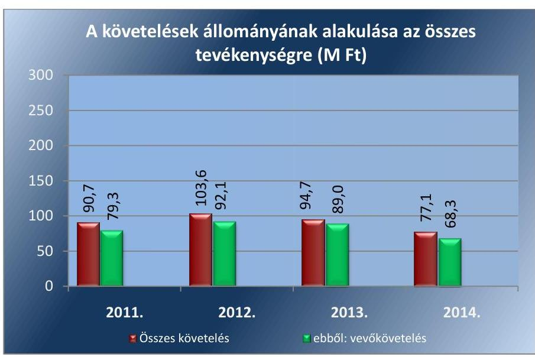

A HÁTRALÉKOS KÖVETELÉSÁLLOMÁNY kezelését, a követelések behajtását a Társaság az 1/2007. ügyvezetői utasításban szabályozta. Az analitikus nyilvántartás alkalmas volt a hátralékos díjbevételek állományának kimutatására. A díjhátralék beszedésére felszólító levelekkel kereste meg a Társaság a hátralékosokat. A Társaság a 2011-2012. években a díjhátralék befizetésének elmaradását, a felszólítás eredménytelensége esetén a díjhátralék keletkezését követő 90. nap elteltével - a felszólítás megtörténtének igazolása mellett - a Hgt. 26. § (3) bekezdésének megfelelően a díjhátralék adók módjára történő behajtása érdekében a Jegyzőnél kezdeményezte.

A Társaság a 2013-2014. években a díjhátralék befizetésére történő felszólítás eredménytelensége esetén a díjhátralék megfizetésének esedékességét követő 45. nap elteltével a Ht. 52. § (2)-(3) bekezdéseiben foglaltak ellenére a díjhátralék adók módjára történő behajtását nem kezdeményezte a NAV-nál.

A Társaság az Önkormányzatnak 2012-2013. években összesen 12861 db követelést adott át 419,5 M Ft értékben, amelyből 5,6 M Ft folyt be. A négy év alatt a sikeres behajtás aránya mindösszesen 13,3\% volt.
3.2. számú megállapítás

A Társaság árképzése a tevékenységek elkülönítésének hiánya miatt nem
 volt szabályszerű, ugyanakkor a Rezsi tv.-ben előírt díjcsökkentéseket az előírtaknak megfelelően végrehajtotta.

A DÍJMEGÁLLAPÍTÁSRA vonatkozóan a Társaság a javaslatait a 64/2008. (III. 28.) Korm. rendelet 5. §-ában előírtakkal ellentétesen nem az előírt költségkalkuláció alapján készítette el, mivel a díjra vonatkozó javaslatait az ellenőrzött időszakban alkalmazott díjak valamint a fogyasztói árindex növekedését figyelembe véve alakította ki. A 2011-2012. években

---

a hulladékgazdálkodás közszolgáltatás Hgt. 29. § (3) bekezdésben, illetve a 64/2008. (III. 28.) Korm. rendelet 3. §-ában foglalt előírásokkal ellentétben, elkülönítés és az alkalmazott ármegállapítási módszer hiányában a Társaság díjmegállapítása nem volt szabályszerű. Az elkülönítés hiányában a 64/2008. (III.28.) Korm. rendelet 3. § (1.) bekezdés a) pontjában előírtakkal ellentétben nem volt megállapítható, hogy a közszolgáltatás bevételei fedezetet nyújtottak-e a működéshez szükséges folyamatos költségekre és ráfordításokra, valamint a közszolgáltatás fejleszthető fenntartásához szükséges kiadásokra.

A 2012. évben alkalmazott 120 literes tárolóedény egyszeri ürítési díja a Hgt. 57. § (1) bekezdés b) pontjának megfelelően nem haladta meg az előírt maximális összeget. A 2013. január 1-jétől alkalmazott díj megfelelt a Ht. 91. § (1)-(2) bekezdéseiben előírtaknak, amely szerint a közszolgáltatási díj legmagasabb értéke a 2012. december 31-én alkalmazott díj legfeljebb 4,2\%-kal növelt értéke lehet. Az alkalmazott közszolgáltatási díj mértékét a Rezsi tv. ${ }^{51}$ 12. § módosította, amely alapján a Társaság 2013. július 1-jétől a Ht. 91. § (1)-(2) bekezdéseiben előírtaknak megfelelően a lakossági díjakat a 2012. április 14-ei díj összegének 90\%-ánál alacsonyabb értékben határozta meg.

A Társaság a rezsicsökkentéssel összefüggésben a gazdaságos működés érdekében tevékenységét folyamatosan felülvizsgálta és költségcsökkentő takarékossági intézkedéseket tett (a járatok optimalizálása, létszámcsökkentés, béremelés befagyasztása).

Az ellenőrzött időszakban a hulladékkezelési közszolgáltatás díjainak változását az 5. táblázat mutatja.
5. táblázat

| A HULLADÉKGYŰJTÉS, SZÁLLÍTÁS DÍJAINAK VÁLTOZÁSA AZ ELLENŐRZÖTT IDŐSZAKBAN (FT/INGATLAN/HÓ) |  |  |  |  |
| :--: | :--: | :--: | :--: | :--: |
| időszak | 120 literes szabványos tároló | 240 literes szabványos tároló | 1100 literes szabványos tároló | 120 literes szabványos tároló egyedül álló lakos |
| 2011.01.01.-2011.12.31. | 2019 | 4038 | 20188 |  |
| 2012.01.01.-2012.05.31. | 2134 | 4267 | 21336 | 1759 |
| 2012.06.01.-2012.07.31. | 1680 | 3360 | 16800 | 1380 |
| 2012.08.01.-2012.12.13. | 1680 | 3360 | 16800 | 1380 |
| 2012.12.14.-2012.12.31. | 1865 | 3730 | 18650 | 1530 |
| 2013.01.01.-2013.12.31. | 1865 | 3730 | 18650 | 1530 |

---

# JAVASLATOK 

Az ÁSZ tv. 33. § (1) bekezdésében foglaltak értelmében az ellenőrzött szervezet vezetője köteles a jelentésben foglalt megállapításokhoz kapcsolódó intézkedési tervet összeállítani és azt a jelentés kézhezvételétől számított 30 napon belül az ÁSZ részére megküldeni. Amennyiben az ellenőrzött szervezet vezetője nem küldi meg határidőben az intézkedési tervet, vagy továbbra sem elfogadható intézkedési tervet küld, az Állami Számvevőszék elnöke az ÁSZ tv. 33. § (3) bekezdése a) és b) pontjaiban foglaltakat érvényesítheti.

Javaslataink célja az NHSZ Dabas Hulladékgazdálkodási Kft. gazdálkodása szabályszerűségének és gyakorlatának javítása annak érdekében, hogy a szabályozási környezet és az alkalmazott gyakorlat megfelelően tudja támogatni az átlátható működést

## A NHSZ Dabas Hulladékgazdálkodási Kft. ügyvezetőjének

1.  Intézkedjen arról, hogy az FB által elkészítendő ügyrend jóváhagyás céljából előterjesztésre kerüljön a tulajdonosi jogokat gyakorló Taggyűlés ülésére.
(1.2. sz. megállapítás 4. bekezdése alapján)
2.  Intézkedjen arról, hogy a közszolgáltatásból keletkezett díjhátralék fizetési felszólítás megtörténtének igazolása mellett - adók módjára történő behajtását kezdeményezze a NAV-nál.
(3.1. sz. megállapítás 15. bekezdése alapján)
3.  Tegyen intézkedéseket a követelések 2013-2014. évi behajtásával kapcsolatban feltárt szabálytalanságok tekintetében a felelősség tisztázása érdekében, és szükség szerint intézkedjen a felelősség érvényesítéséről.
(3.1. sz. megállapítás 15. bekezdése alapján)
4.  Tegyen intézkedéseket a 2013. évi bizonylatok megőrzésével kapcsolatban feltárt szabálytalanságok tekintetében a felelősség tisztázása érdekében és szükség szerint intézkedjen a felelősség érvényesítéséről.
(3.1. sz. megállapítás 7. és 8. bekezdései alapján)

---

# Dabas Város Önkormányzata Polgármesterének 

1.  Kezdeményezze, hogy a Taggyűlés egészítse ki a javadalmazási szabályzatot az Mt. 208. §-ának hatálya alá eső vezető állású munkavállalók javadalmazásának módjára, mértékének elveire és annak rendszerére, valamint az ügyvezető, FB tagok és vezető állású munkavállalók jogviszonyának megszűnése esetére biztosított juttatások módjára, mértékének elveire és annak rendszerére vonatkozó előírásokkal.
(1.2. sz. megállapítás 11. bekezdése alapján)

---

.

---

# MELLÉKLETEK 

- I. SZ. MELLÉKLET: ÉRTELMEZŐ SZÓTÁR
eladósodottságot jellemző mutatók
garancia
gazdasági társaság
gazdálkodó szervezet
keresztfinanszírozás tilalma
eladósodottsági mutató (tőkeáttétel): idegen tőke/összes forrás. Egészségesnek mondható egy olyan mértékű áttétel, amelyet az üzleti tervek szerint és az elmúlt időszak tapasztalatai alapján a társaság megfelelő biztonsággal ki tud termelni. Nagy eszközberuházás-igényű iparágakban értéke magasabb, azaz magasabb eladósodottság is elfogadható, de 75-85\%-ot meghaladó értéknél már itt is erős, sőt túlzott külső finanszírozottságról beszélhetünk. Általánosságban véve kedvező, ha értéke kisebb, mint 0,6 .
eladósodottság mértéke: kötelezettségek / saját tőke. Fontos szerepet játszik ez a mutató egy vállalat megítélésében. Azt mutatja, hogy a saját források a kötelezettségek hány százalékát fedezik. Törekedni kell, hogy a mutató tartósan (jelentősen) 1 alatti értéket érjen el.
nettó eladósodottság: (kötelezettségek-követelések) / saját tőke. Azt mutatja, hogy a kintlévőségekkel csökkentett kötelezettségeket milyen mértékben fedezi a saját forrás. Ez feltételezi, hogy a követelések pénzügyileg előbb realizálódnak, mint ahogy a kötelezettségeket teljesíteni kell. A mutató minél kisebb, csökkenő értéke a kedvező.
adósságfedezeti mutató I.: (befektetett eszközök+forgó eszközök) / idegen forrás. Azt mutatja, hogy 1 Ft adósságra hány Ft vagyon jut. Általánosságban véve kedvező, ha értéke 2 körül van, de nagy eszközberuházás-igényű iparágakban értéke kisebb is lehet.
árbevételre vetített eladósodottság: (kötelezettségek-forgóeszközök) / értékesítés nettó árbevétele. Az árbevételre vetített eladósodottság azt mutatja, hogy az árbevétel mekkora fedezetet nyújt a kötelezettségeknek a forgóeszközökkel csökkentett részére. Általánosságban véve kedvező, ha az árbevétel minél nagyobb arányban nyújt fedezetet a forgóeszközökkel csökkentett kötelezettségekre (értéke kisebb, mint 1, csökken az ellenőrzött időszakban).
A garancia olyan önálló, az önkormányzat nevében vállalt kötelezettség, amely alapján az önkormányzat az önkormányzati költségvetés terhére szerződésben meghatározott feltételek szerint, a kötelezett nem teljesítése esetén a jogosultnak fizetést teljesít az előzetesen rögzített összeghatárig.
Ptk. 3.88. § (1) bekezdése szerint „a gazdasági társaságok üzletszerű közös gazdasági tevékenység folytatására, a tagok vagyoni hozzájárulásával létrehozott, jogi személyiséggel rendelkező vállalkozások, amelyekben a tagok a nyereségből közösen részesednek, és a veszteséget közösen viselik".
A Ptk. 685. § c) pontja szerint gazdálkodó szervezet:
„az állami vállalat, az egyéb állami gazdálkodó szerv, a szövetkezet, a lakásszövetkezet, az európai szövetkezet, a gazdasági társaság, az európai részvénytársaság, az egyesülés, az európai gazdasági egyesülés, az európai területi együttműködési csoportosulás, az egyes jogi személyek vállalata, a leányvállalat, a vízgazdálkodási társulat, az erdő birtokossági társulat, a végrehajtói iroda, az egyéni cég, továbbá az egyéni vállalkozó." (2014. 03.15-ig hatályos)
A közszolgáltatás díját úgy kell megállapítani, hogy az maradéktalanul fedezetet nyújtson a közszolgáltatás indokolt költségeire és ráfordításaira, valamint a közszolgáltató e tevékenységével kapcsolatos ésszerű nyereségére; az ésszerű nyereség nem tartalmazhatja a közszolgáltatáson kívül eső egyéb gazdasági tevékenységei költségeinek, ráfordításainak fedezetét.

---

kezesség

közszolgáltatás
közszolgáltató
közületi felhasználó
lakossági felhasználó
nemzeti vagyon

A kezességre vonatkozó előírásokat a Ptk. 6:416-430. §-ai tartalmazzák. Kezességi szerződéssel a kezes kötelezettséget vállal a jogosulttal szemben, hogyha a kötelezett nem teljesít, maga fog helyette a jogosultnak teljesíteni. Kezesség egy vagy több, fennálló vagy jövőbeli, feltétlen vagy feltételes, meghatározott vagy meghatározható összegű pénzkövetelés vagy pénzben kifejezhető értékkel rendelkező egyéb kötelezettség biztosítására vállalható.
A Ptk. szerint kezességet csak írásban lehet vállalni. A kezes kötelezettsége ahhoz a kötelezettséghez igazodik, amelyért kezességet vállalt. A kezes kötelezettsége nem válhat terhesebbé, mint amilyen elvállalásakor volt, kiterjed azonban a kötelezett szerződésszegésének jogkövetkezményeire és a kezesség elvállalása után esedékessé váló mellékkövetelésekre is.
A közszolgáltatás: „közcélú, illetőleg közérdekű szolgáltatást jelent, amely egy nagyobb közösség (állam, település) minden tagjára nézve megközelítőleg azonos feltételek mellett vehető igénybe, ezért valamilyen mértékig közösségi megszervezést, illetve szabályozást, ellenőrzést igényel." Az Ebktv. 3. § d) pontja a következőképpen határozza meg a közszolgáltatást: „szerződéskötési kötelezettség alapján a lakosság alapvető szükségleteinek ellátására irányuló szolgáltatás, így különösen a villamos energia-, gáz-, hő-, víz-, szennyvíz- és hulladékkezelési, köztisztasági, postai és távközlési szolgáltatás, továbbá a menetrend alapján közlekedő járművekkel végzett közforgalmú személyszállítás".
A közszolgáltatás ellátására feljogosított hulladékkezelő (Forrás: a 2011-2012. években a Hgt. 21. § (3) bekezdés a) pontja)
Az a hulladékgazdálkodási közszolgáltatási engedéllyel rendelkező és a Ht. szerint minősített gazdálkodó szervezet, amely a települési önkormányzattal kötött hulladékgazdálkodási közszolgáltatási szerződés alapján hulladékgazdálkodási közszolgáltatást lát el. (Forrás: a 2013-2014. években a Ht. 2. § (1) bekezdés 37. pontja).
Az a jogi személy, illetőleg jogi személyiséggel nem rendelkező gazdasági társaság, aki (amely) a meghatározott szolgáltatásra, és/vagy a keletkező hulladék elszállítására közüzemi szerződést kötött a közszolgáltatóval.
Az a természetes személy, aki az Önkormányzat közigazgatási, vagy ellátási területén ingatlannal rendelkezik, és aki a közszolgáltatóval a hulladékelszállítására szerződést kötött.
Nvt. 1. § (2) bekezdése szerint:
„az állam vagy a helyi önkormányzat kizárólagos tulajdonában álló dolgok, az a) pont hatálya alá nem tartozó, állam vagy a helyi önkormányzat tulajdonában lévő dolog,
az állam vagy a helyi önkormányzatot tulajdonában lévő pénzügyi eszközök, továbbá az államot vagy a helyi önkormányzatot megillető társasági részesedések,
az államot vagy a helyi önkormányzatot megillető bármely vagyoni értékkel rendelkező jogosultság, amelyet jogszabály vagyoni értékű jogként nevesít,
Magyarország határa által körbezárt terület feletti légtér,
az üvegházhatású gázok kibocsátási egységeinek kereskedelméről szóló törvény szerint kibocsátási egység és légiközlekedési kibocsátási egység, valamint az ENSZ Éghajlat változási Keretegyezménye és annak Kiotói Jegyzőkönyve végrehajtási keretrendszeréről szóló törvény szerinti kiotói egység,
állami vagy helyi önkormányzati fenntartású közgyűjtemény (muzeális intézmény, levéltár, közgyűjteményként működő kép- és hangarchívum, valamint könyvtár) saját gyűjteményében nyilvántartott kulturális javak körébe tartozó dolog,
a régészeti lelet,

---

a nemzeti adatvagyon körébe tartozó állami nyilvántartások fokozottabb védelméről szóló törvény szerinti nemzeti adatvagyon." (hatályos 2012. január 1-jétől, g) pont módosult 2012. június 30-tól)
nonprofit gazdasági társaság Ctv. 9/F. § (2) bekezdése szerint „az a gazdasági társaság minősül nonprofit gazdasági társaságnak és cégnevében az a gazdasági társaság tüntetheti fel a nonprofit jelleget, amelynek létesítő okirata tartalmazza, hogy a gazdasági társaság tevékenységéből származó nyereség a tagok között nem osztható fel, hanem az a gazdasági társaság vagyonát gyarapítja." (hatályos 2014. március 15-től)
többségi befolyást biztosító A Ptk. 8:2. § (1) bekezdése szerint „többségi befolyás az olyan kapcsolat, amelynek részesedés révén természetes személy vagy jogi személy (befolyással rendelkező) egy jogi személyben a szavazatok több mint felével vagy meghatározó befolyással rendelkezik."

---

II. SZ. MELLÉKLET: A MŰKÖDÉS FŐBB JELLEMZŐI

|  A TÁRSASÁG MŰKÖDÉSÉNEK FŐBB JELLEMZŐI |  |  |  |  |  |   |
| --- | --- | --- | --- | --- | --- | --- |
|  Sorszám | Megnevezés |  | 2011. | 2012. | 2013. | 2014.  |
|   | A gazdasági társaság tulajdonosi összetétele: |  |  |  |  |   |
|  1. | Tulajdonos Önkormányzat megnevezése: |  |  | Dabas Város Önkormányzata |  |   |
|  2. | Önkormányzat tulajdoni részesedésének aránya | $\%$ |  | 51,0 |  |   |
|  3. | Önkormányzat tulajdoni részesedésének összege | M Ft |  | 6,0 |  |   |
|  4. | A tárgyévben a gazdasági társaság vagyonkezelésben lévő önkormányzati vagyon után elszámolt értékcsökkenés összege | M Ft |  | Nem kezelt Önkormányzati vagyont |  |   |
|  5. | A tárgyévben a gazdasági társaság saját vagyona után elszámolt értékcsökkenés összege teljes tevékenység | M Ft | 4,6 | 3,3 | 3,0 | 8,2  |
|  6. | Értékesítés nettó árbevétele teljes tevékenység | M Ft | 267,7 | 268,5 | 269,0 | 208,9  |
|  7. | ebből: Hulladékgazdálkodás | M Ft | na. | na. | 127,4 | na.  |
|  8. | Adózott eredmény teljes tevékenység | M Ft | 8,4 | 41,7 | 13,8 | $-2,8$  |

---

# FÜGGELÉK: ÉSZREVÉTELEK 

A jelentéstervezetet a Számvevőszék 15 napos észrevételezésre megküldte az ellenőrzött szervezet vezetőjének az ÁSZ tv. 29. §* (1) bekezdése előírásának megfelelően.

Dabas Város Önkormányzatának polgármestere észrevételezési lehetőségével nem élt. Az NHSZ Dabas Hulladékgazdálkodási Kft. ügyvezetőjétől érkezett észrevételeket és azok kezeléséről szóló válaszlevelet a jelentés függeléke tartalmazza.
Az elfogadott észrevételek alapján a Számvevőszék módosította a jelentést.

[^0]
[^0]:    * 29. § (1) Az Állami Számvevőszék az ellenőrzési megállapításait megküldi az ellenőrzött szervezet vezetőjének vagy az általa megbízott személynek, és annak, akinek személyes felelősségét állapította meg.
    (2) Az ellenőrzött szervezet vezetője és a felelősként megjelölt személy az ellenőrzés megállapításaira tizenöt napon belül írásban észrevételt tehet.
    (3) Az Állami Számvevőszék az észrevételre a beérkezésétől számított harminc napon belül írásban válaszol. A figyelembe nem vett észrevételeket köteles a jelentésben feltüntetni, és megindokolni, hogy azokat miért nem fogadta el.

---

# NHSZ Dabas 

Tárgy: jelentéstervezetre észrevételek Iktatószám: LEDAB-357/2016

Állami Számvevőszék
1052 Budapest
Apáczai Csere János utca 10.
Levelezési cím:
1364 Budapest 4. Pf:54.

## ÁLLAMI SZÁMVEVŐSZÉK   ÜGYVITELI IRODA   $064520 / 2016$   Érki: AUG 102015   Iktatószám: U-1021-14616c16   Melléklet:

Tisztelt Cím!

Hivatkozva a V1021-134/2016 iktatószámú levelükre a vizsgálati időszakra készített jelentéstervezetükkel kapcsolatosan, mint az NHSZ Dabas Kft. ügyvezetője az alábbi észrevételeket teszem:

1. 5. oldal: Összegzés: A vizsgálati időszak helyesen 2011-2014
2. 8. oldal: Tudomásunk szerint a Társaság 49\%-os tulajdoni részesedése 2013. év decemberében került eladásra.
3. 15. oldal: Társasági szerződéssel kapcsolatos megállapításokkal az ügyvédi véleményezés 1-3 oldalában leírtakkal kiegészítve értünk egyet.
4. 16. oldal: Kalkulációs séma közzétételével kapcsolatban a jogszabály kimondja, hogy: A kalkulációs séma meghatározására valamint közzétételére akkor van szükség, az akkor kötelező, ha a közszolgáltató a közszolgáltatási díj számítására kalkulációs sémát vagy díjképletet alkalmaz. (Részletes magyarázat ügyvédi véleményezés 3-4 oldal).
5. 18. oldal: Könyvvizsgálónk tájékoztatása alapján 2007. márciusában elkészítettük a Pénzés értékkezelési szabályzatukat. A szabályzat 4. pontjában 2.500.000.- Ft-ban határoztuk meg a pénztárban tárolandó készpénz maximális összegét.

A szabályzatot többször módosítottuk, egységes szerkezetbe foglaltuk, azonban a pénztárban tárolandó készpénz maximális összegét nem módosítottuk, a szabályzatok

---

# NHSZ Dabas 

NHSZ Dabas Kft. H-2370 Dabas, Szent István út 135
szerint - 2.500.000.- Ft maradt, és valamennyi egységes szerkezetű szabályzat ezen összeget tartalmazza (pl. a 2014. évi egységes szerkezetű szabályzat 2. pontja).
6. 19. oldal: 2011-2012 években is havonta történt az értékcsökkenés elszámolása.
7. 22. oldal: A könyvvizsgáló a könyvvizsgálatot minden évre vonatkozóan elvégezte, és a Társaság 2011. és 2012. évi beszámolóit korlátozás nélküli hitelesítő záradékkal látta el, annak ellenére, hogy a Társaság a Hgt.. 29. § (3). bekezdésében előírt tevékenységenkénti elkülönítését a Számv. tv. 161/A. § (2), továbbá a 14. § (3) bekezdése alapján a nyilvántartásaiban nem szabályozta.

A könyvvizsgáló által hitelesített beszámolónak (kiegészítő mellékletének) - szemben a 2013. évtől érvényes előírásokkal - nem volt része az elkülönített elszámolás bemutatása.

A könyvvizsgálói szerződésünk, valamint könyvvizsgálatra érvényes standardok értelmében az éves beszámolóról kiadott vélemény (mint ahogy a kibocsátott könyvvizsgálói jelentés is tartalmazza) az egyszerűsített éves beszámolónak a számviteli törvényben foglaltakkal összhangban történő elkészítésének és valós bemutatásának vizsgálata alapján történik. A könyvvizsgálat magában foglalja továbbá az alkalmazott számviteli politikák megfelelőségének és a vezetés által készített számviteli becslések ésszerűségének, valamint az egyszerűsített éves beszámoló átfogó prezentálásának értékelését is.

A számviteli törvény előírásai alapján az éves beszámoló kiegészítő mellékletében az alkalmazott belső (vezetői) információs rendszerről, a hatósági árképzéséről, stb. adatot, információt közölni nem kell. A 2011-2012. években a Hgt. sem írt elő a beszámoló kiegészítő mellékletében bemutatandó adatot, információt, így az elkülönítés, vagy annak hiánya a könyvvizsgálói záradékra hatással nem lehetett, hiszen a közzétett beszámolót a vonatkozó jogszabályi előírások szerint készítették el.

---

# NHSZ Dabas 

NHSZ Dabas Kft. H-2370 Dabas, Szent István út 133.
8. 24. oldal: Mellékelt NAV állásfoglalás alapján az SZJ szám feltüntetésére nincsen szükség a kimenő számlán!
9. 25. oldal: A Társaságunknál érvényben lévő 1/2007. ügyvezetői utasítás rendelkezik a lejárt határidejű tartozások teendőiről.

A hátralékos követelésállománnyal kapcsolatosan a korábbi rendelkezések szerint Dabas Város Jegyzőjénél járt el Társaságunk. A NAV-hoz való követelésállomány adók módjára történő behajtását valóban csak később tudtuk kezdeményezni, mivel többszöri egyeztetést kellett folytatni a NAV-val és a szoftvercéggel is a nyomtatvány Pest megyei Adóhatóság igényeinek megvalósítása ( pl.: vevőnként 1. oldalas nyomtatvány) végett, valamint az Önkormányzat Jegyzőjével, mint adóhatósággal a párhuzamos behajtás indítás elkerülése okán. Az el nem évült követeléseket az Önkormányzat hosszas egyeztetés után visszaadta Társaságunknak, hogy egy ügyfél vonatkozásában a NAV felé csak egy helyről induljon meg a behajtási folyamat.

Sajnos Társaságunknak nem volt az ingatlanhasználókkal kötött külön szerződése, mely a NAV-nál történő behajtáshoz szükséges személyes adatokat tartalmazta volna. A cég alapításakor az Önkormányzattól kapott információk alapján - mely a szolgáltatást igénybe vevő nevén is címén kívül más információt nem tartalmazott - lett vevőtörzsünk kialakítva. Az új előírás alapján történő követeléskezeléshez az Önkormányzatok és az Okmányiroda segítségére is szükség volt, mely szintén nem kalkulálható, ám hosszú időt jelentett a folyamat megindításában.

A hátralékok adóhatóságnak történő átadása a vizsgált időszak után az előírásoknak megfelelően megtörtént.
10. 26. oldal: 5-ös táblázata nem a 11. számú tanúsítványban átadott információkat tartalmazza.

---

# NHSZ Dabas 

Válaszaink alátámasztásául mellékelve küldjük a vonatkozó szakterületekről érkezett észrevételeket, az azokhoz való állásfoglalást, ügyvezetői utasítást.

Bízom abban, hogy a fentiek alapján a jelentés szövegének korrigálására számíthatok!

Dabas, 2016. augusztus 9.
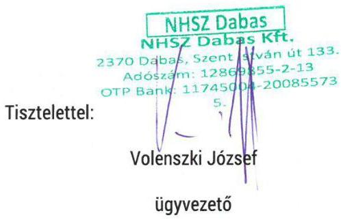

Volénszki József
ügyvezető

Mellékletek:

- Tisza Bross Audit könyvvizsgálói észrevétele
- NAV SZJ-szám szerepe a számlázásban
- 1/2007.ügyvezetői utasítás
- 11. számú tanúsítvány
- Dr. Szalay Ferenc ügyvédi észrevétele

---

# TISZA BROSS ${ }^{\otimes}$ AUDIT   Könyvvizsgáló és Gazdasági Tanácsadó Kft 

Szolnok, Kossuth tér 10/b. 5001. Pf.: 162. 56/513-634, Tel/fax: 56/410-599, E-mail: tiszabross@chello.hu

NHSZ Dabas Hulladékgazdálkodási Kft.
Volenszki József Ügyvezető Igazgató Úr részére

Ikt.sz.: 111.12016.
Tárgy: ÁSZ jelentéstervezetre észrevétel

2370 Dabas
Szent István út 133..

## Tisztelt Ügyvezető Igazgató Úr!

2016. július 26-i elektronikus levele mellékleteként megküldte részünkre a 2016. évi ÁSZ vizsgálat jelentéstervezetét.
A jelentés 2.1. és a 2.4. sz. megállapítása a könyvvizsgálói tevékenységgel ill. jelentéssel kapcsolatban is tesz megállapításokat, melyekre az alábbi észrevételt tesszük:

A 2.1. pontban megállapításra került, hogy a Pénzkezelési szabályzat nem felet meg teljes körűen a Számv. tv. 14. § (3) bekezdésében foglaltaknak, mivel 2013. évtől nem tartalmazza a napi készpénz záró állományának a maximális mértékét.
2007. január 19-i vezetői levelünkben az alábbiakat írtuk:
„Az egyes pénzügyi tárgyú törvények módosításáról szóló 2006. évi CXXXI. törvény - a számviteli törvény keretein belül - szigorította a pénzkezelés szabályait az alábbiak szerint:
101. § Az Szt. 14. §-a kiegészül a következő új (8) bekezdéssel, egyidejűleg a jelenlegi (8) és (9) bekezdés számozása (9) és (10) bekezdésre változik:
„(8) A pénzkezelési szabályzatban rendelkezni kell legalább a pénzforgalom (készpénzben, illetve bankszámlán történő) lebonyolításának rendjéről, a pénzkezelés személyi és tárgyi feltételeiről, felelősségi szabályairól, a készpénzben és a bankszámlán tartott pénzeszközök közötti forgalomról, a készpénzállományt érintő pénzmozgások jogcímeiről és eljárási rendjéről, a napi készpénz záró állomány maximális mértékéről, a készpénzállomány ellenőrzésekor követendő eljárásról, az ellenőrzés gyakoriságáról, a pénzszállítás feltételeiről, a pénzkezeléssel kapcsolatos bizonylatok rendjéről és a pénzforgalommal kapcsolatos nyilvántartási szabályokról."

Ezzel egyidejűleg módosult adózás rendjéről szóló törvény is, mely szerint a számviteli törvényben meghatározott készpénzkezelési szabályzatra vonatkozó rendelkezések megsértése esetén az adózó 500 ezer forintig, illetve 1 millió Ft-ig terjedő mulasztási bírsággal sújtható.
A pénzkezelési szabályzatot a számviteli politika keretében kell elkészíteni. A számviteli politika elkészítéséért (és módosításáért) a gazdálkodó képviseletére jogosult személy a felelős.

---

A hivatkozott törvény módosította az SZJA szabályait is, melynek értelmében 2007. február 6-tól a 30 napot meghaladó időtartamra adott előleg, elszámolásra kiadott összeg után kamatkedvezményből származó jövedelem keletkezik.
A társaság számviteli szabályzatait a számviteli törvény előírásainak megfelelően az alapítást követően elkészítette.
Kérjük a szabályzatok jogszabályoknak és a kialakult gyakorlatnak megfelelő módosítását, kiegészítését, aktualizálását elvégezni és azok másolatát részemre átadni szíveskedjenek."

A vezetői levelet követően Önök - a jogszabályi előírásoknak megfelelően - 2007. márciusában elkészítették a Pénz- és értékkezelési szabályzatukat, melyet részünkre is átadtak. A szabályzat 4. pontjában 2.500.000.- Ft-ban határozták meg a pénztárban tárolandó készpénz maximális összegét.
A szabályzatot többször módosították, egységes szerkezetbe foglalták, azonban a pénztárban tárolandó készpénz maximális összegét nem módosították, az - legalábbis a részünkre átadott szabályzatok szerint - 2.500.000.- Ft maradt, és valamennyi egységes szerkezetű szabályzat ezen összeget tartalmazza (pl. a 2014. évi egységes szerkezetű szabályzat 2. pontja).

A jelentés 2.4. számú megállapítása szerint „A könyvvizsgáló a könyvvizsgálatot minden évre vonatkozóan elvégezte, és a Társaság 2011. és 2012. évi beszámolóit korlátozás nélküli hitelesítő záradékkal látta el, annak ellenére, hogy a Társaság a Hgt.. 29. § (3), bekezdésében előírt tevékenységenkénti elkülönítését a Számv. tv. 161/A. § (2), továbbá a 14. § (3) bekezdése alapján a nyilvántartásaiban nem szabályozta.

A 2013. évtől hatályon kívül helyezett Hgt. 29. §-a az alábbiakat mondta ki:
„29. § (1) A közszolgáltató köteles a közszolgáltatói tevékenységéről évente részletes költségelszámolást készíteni, és azt a települési önkormányzatnak benyújtani.
(2) A közszolgáltató a közszolgáltatás ellátása mellett hulladékkezelési engedélyének megfelelően egyéb hulladékgazdálkodási tevékenységeket is folytathat, amelyeknek díját maga határozza meg.
(3) A kötelezően ellátandó közszolgáltatás kereteibe nem tartozó más hulladékkezelési szolgáltatás költségeit, elszámolását és díját szigorúan el kell különíteni, és e költségeket a közszolgáltatás díjából nem lehet finanszírozni.
(4) A települési szilárd és folyékony hulladékok kezelésére szolgáló technológiák, létesítmények kialakítására és üzemeltetésére vonatkozó részletes szabályokat külön jogszabály határozza meg.

A törvény fontos rendelkezése, hogy a közszolgáltató nemcsak közszolgáltatói feladatokat, hanem egyéb (hulladékkezelési engedélyének megfelelő) hulladékgazdálkodási feladatokat is elláthat, azonban e feladatok ellátása külön díj ellenében történhet. Ezen kettős feladatkör elkülönítését hivatott biztosítani a törvény azon rendelkezése (29. §), mely előírja, hogy a közszolgáltató elkülönített és részletes költségelemzést köteles készíteni és azt jóváhagyásra benyújtani a települési önkormányzatnak."

A fenti rendelkezés szerint a könyvvizsgáló által hitelesített beszámolónak (kiegészítő mellékletének) - szemben a 2013. évtől érvényes előírásokkal - nem volt része az elkülönített elszámolás bemutatása.
A könyvvizsgálói szerződésünk, valamint könyvvizsgálatra érvényes standardok értelmében az éves beszámolóról kiadott vélemény (mint ahogy a kibocsátott könyvvizsgálói jelentés is tartalmazza) az egyszerűsített éves beszámolónak a számviteli törvényben foglaltakkal

---

összhangban történő elkészítésének és valós bemutatásának vizsgálata alapján történik. A könyvvizsgálat magában foglalja továbbá az alkalmazott számviteli politikák megfelelőségének és a vezetés által készített számviteli becslések ésszerűségének, valamint az egyszerűsített éves beszámoló átfogó prezentálásának értékelését is.

A számviteli törvény előírásai alapján az éves beszámoló kiegészítő mellékletében az alkalmazott belső (vezetői) információs rendszerről, a hatósági árképzéséről, stb. adatot, információt közölni nem kell. A 2011-2012. években a Hgt. sem írt elő a beszámoló kiegészítő mellékletében bemutatandó adatot, információt, így az elkülönítés, vagy annak hiánya a könyvvizsgálói záradékra hatással nem lehetett, hiszen a közzétett beszámolót a vonatkozó jogszabályi előírások szerint készítették el.

A jelentések kibocsátásának időpontjában a könyvvizsgálatra érvényes ISA705. standard a minősített (korlátozást tartalmazó véleményről) az alábbiak szerint rendelkezett:
„Korlátozott vélemény
7. A könyvvizsgálónak korlátozott véleményt kell kiadnia, ha:
(a) miután elegendő és megfelelő könyvvizsgálati bizonyítékot gyűjtött össze arra a következtetésre jut, hogy a hibás állítások önmagukban vagy összességükben lényegesek, de nem átfogó hatásúak a pénzügyi kimutatások szempontjából, vagy
(b) nem képes elegendő és megfelelő könyvvizsgálati bizonyítékot szerezni, amelyre alapozza a véleményt, de azt a következtetést vonja le, hogy a fel nem tárt esetleges hibás állítások pénzügyi kimutatásokra gyakorolt lehetséges hatásai lényegesek lehetnek, de nem átfogóak."

A könyvvizsgálatra vonatkozó standardok értelmében ezen - az éves egyszerűsített beszámoló (pénzügyi kimutatás) szempontjából nem lényeges - hiányosság miatt korlátozó záradékot kiadni nem állt módunkban.
2013. évtől - az új jogszabályi előírásoknak megfelelően - a Társaság az elkülönítésnek és a beszámolóban történő bemutatásának maradéktalanul eleget tett. Az elkülönítés szabályai kialakításához - a vezetéssel történt véleményeltérés feloldására - az illetékes hatóságtól állásfoglalást is kértünk.

Szolnok, 2016. augusztus 1.

Krajcsné Dezsőfi Katalin igazgató
Tisza Bross Audit Könyvvizsgáló és Gazdasági Tanácsadó Kft.
Nyilvántartásba-vételi szám: 000846

Krajcsné Dezsőfi Katalin
kamarai tag könyvvizsgáló
Kamarai tagsági szám: 000817

---

# Nemzeti Adó-

és Vámhivatal

## Az SZJ-szám és a TESZOR-kód szerepe a számlázásban

2011.05.31.

## [Áfatörvény 169. § f) pont, Art. 176. § (13) bekezdés c) pont]

Az általános forgalmi adóról szóló 2007. évi CXXVII. törvény (továbbiakban: áfatörvény) 169. § f) pontjának 2008. május elsejétől hatályos rendelkezése alapján a számla kötelező adattartalma - többek között - az értékesített termék megnevezése, annak jelölésére - a számlakibocsátásra kötelezett választása alapján - az a törvényben alkalmazott vámtarifa szám (továbbiakban: vtsz.), illetőleg a nyújtott szolgáltatás megnevezése, annak jelölésére - a számlakibocsátásra kötelezett választása alapján - az e törvényben alkalmazott Szolgáltatások Jegyzéke (továbbiakban: SZJ) szerinti besorolása.
Ennek megfelelően a számlán a terméket beazonosító vtsz., valamint a szolgáltatást beazonosító SZJ szám feltüntetése akkor sem kötelező (az a számlakibocsátó választásától függ), ha azokra az áfatörvény kifejezetten hivatkozik. (Természetszerűleg, amennyiben az adóalany kívánja, illetve a partnerével ebben megegyeztek, feltüntetheti ezt az adatot, hiszen annak a felek között számos esetben jelentősége lehet.)
A 4/2010. (IV.21.) KSH közlemény a Szolgáltatások Jegyzékéről szóló 9004/2002. (SK 7.) KSH közlemény, valamint a Szolgáltatások Jegyzéke módosításáról szóló 9001/2003. (SK 3.) KSH közlemény hatályon kívül helyezéséről szól. A közlemény a közzététele napján - 2010. április 21-én - lépett hatályba. E szerint összhangban a 451/2008/EK rendelet előírásaival - a Belföldi Termékosztályozást és a Szolgáltatások Jegyzékét felváltja a közösségi szinten egységesített Termékek és Szolgáltatások Osztályozási Rendszere (TESZOR).
Az SZJ hatályon kívül helyezésének azonban az áfatörvény által hivatkozott SZJ számok tekintetében nincs jelentősége. Ugyanis az adózás rendjéről szóló 2003. évi XCII. törvény (továbbiakban: Art.) 176. § (13) bekezdés c) pontja szerint az általános forgalmi adó esetében a hivatkozással meghatározott szolgáltatások vonatkozásában a KSH Szolgáltatások Jegyzékének 2002.09.30. napján érvényes besorolási rendjét kell irányadónak tekinteni. A besorolási rend ezt követő (időközi) változása az adókötelezettséget nem változtatja meg. (Az Art. hivatkozott rendelkezése nem csak az áfatörvényben SZJ hivatkozással meghatározott szolgáltatásokra vonatkozik, hanem - a jövedéki adón kívül - valamennyi adótörvény alkalmazásában irányadó.) Az Art. előzőek szerinti állapotrögzítő rendelkezéséből következően a 4/2010. (IV.21.) KSH közleményben foglaltaknak az áfatörvény alkalmazásában nincs jelentősége. A KSH a számla adattartalmát nem írja/írhatja elő. Ennek megfelelően az áfatörvény alapján sem a TESZOR, sem az SZJ szám szerepeltetése nem kötelező eleme a számlának. Tekintve, hogy az áfatörvény egyes SZJ számokra való hivatkozást tartalmaz, az adókötelezettség teljesítését az SZJ szám számlán való szerepeltetése elősegítheti, azt az adózó a saját döntése alapján a számlán szerepeltetheti.

---

# 1/2007. ügyvezetői utasítás   a kötelezettség vállalások, pénzügyi kötelezettségek kifizetése, a pénzügyi követelések érvényesítésére vonatkozóan

## 1. A kötelezettség vállalás rendje

A társaság képviseletére a gazdasági társaságokról szóló 2006. évi IV. törvény (továbbiakban: Gt.) 29. § (1) bekezdése értelmében az ügyvezető jogosult. Az előírás értelmében szerződések aláírására, megrendelések engedélyezésére, jognyilatkozatok tételére az ügyvezető jogosult. A Gt. 29. § (2) bekezdése értelmében a vezető tisztségviselők az ügyek meghatározott csoportjaira nézve a társaság munkavállalóit képviseleti joggal ruházhatják fel.

A társaság rugalmas működésének érdekében, illetve a Gt. által biztosított lehetőségek figyelembe vételével a kötelezettség vállalások rendjét az alábbiak szerint szabályozom:
a) A társaság által kötött szerződések aláírására a b) pontban meghatározott kivétellel kizárólag az ügyvezető jogosult.
b) A közületi hulladékkezelési szolgáltatási szerződések aláírására a társaság két alkalmazottjának külön-külön aláírásával is van lehetőség (Gt. 29. § (2), (3)). Ezen szerződések aláírására Volenszki József területi vezető vagy Komjáthy Ágnes irodavezető jogosult.
c) A társaság folyamatos működéséhez szükséges, szerződéses formában nem rendezett árú és szolgáltatás beszerzések jóváhagyása a e), f), g) pontban meghatározottak kivételével az ügyvezető joga.
d) Az 20 E Ft-ot meghaladó eseti beszerzéseknél az ügyvezető jóváhagyása szükséges. A megrendelőt csatolni kell a szállító, szolgáltató által kiállított számla, egyszerűsített számla mögé.
e) A 20 E Ft ÁFA-val növelt beszerzési értéket el nem érő, a társaság működéséhez szükséges vásárlások jóváhagyására a területi vezető jogosult.
f) A hulladékgyűjtő járművek, egyéb gépek berendezések üzemszerű működéséhez szükséges üzemanyag, kenőanyag, stb. beszerzések jóváhagyására a területi vezető jogosult.
g) A járművekkel, telephellyel kapcsolatos üzemzavarok (jármű meghibásodás, csőtörés, stb.) esetében a területi vezető jogosult az ügyvezető jóváhagyása nélkül is a haladéktalanul szükséges intézkedések, kötelezettségvállalások megtételére. Az ügyvezetőt a megtett intézkedésekről, kötelezettség vállalásokról a legrövidebb időn belül értesíteni szükséges.
h) A c) pontban meghatározott ügyvezetői jóváhagyásra az 1-es számú mellékletben meghatározott nyomtatványt kell használni és azt E-Mailen, vagy faxon kell eljuttatni jóváhagyásra. A nyomtatványon meg kell jelölni, hogy a kötelezettség rendezése átutalással, vagy készpénzben történik. A szállítóval, szolgáltatóval történő egyeztetés folyamán törekedni kell arra, hogy a pénzügyi rendezés átutalással történjék. Az árút, szolgáltatást megrendelni az ügyvezető által jóváhagyott és visszaküldött nyomtatvány birtokában lehet. A nyomtatványt csatolni kell a számlához, egyszerűsített számlához.

---

# 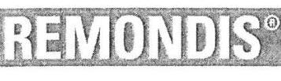

Jelen pontban meghatározott előírások betartásáért a területi vezető felelős.

## 2. Kifizetések rendje a társaságnál

A társaságnál kifizetések jóváhagyására az ügyvezető jogosult.
Kötelezettségek banki átutalással történő rendezését megelőzően a kifizetendő tételeket az ügyvezetővel jóvá kell hagyatni.

Házi pénztárból történő kifizetéseket az ügyvezetővel külön jóváhagyatni nem kell, amennyiben a megrendelés az 1. pontban meghatározottak szerint történt.

A pénzkezeléssel kapcsolatos egyéb előírásokat a társaság pénzkezelési szabályzata tartalmazza.

A pont betartásáért a területi vezető a felelős.

## 3. Követelések érvényesítésének rendje

3.1. Közületi szilárd hulladékkezelési szolgáltatással kapcsolatos követelések érvényesítése érdekében az alábbiak szerint kell eljárni:
3.1.1. Szerződés megkötése folyamatos szolgáltatás igénybevétele esetén
A közületi szilárd hulladékkezelési típusszerződéseket kell kidolgozni és azt minden év végén az adó, illetve különböző szakmai jogszabályok változásaihoz kell igazítani. Amennyiben a jogszabályi változások indokolják a régebben megkötött szerződéseket is módosítani szükséges.
3.1.2. A szerződések kitöltésekor külön figyelmet kell fordítani a vevő azonosításához szükséges alábbi adatok pontos szerepeltetésére:

- cégnév,
- székhely,
- adószám,
- cégjegyzékszám,
- képviseletre jogosult személy neve,
- a szolgáltatás helyének pontos címe.

Egyéni vállalkozók esetében cégnév helyett, a vállalkozó neve (leánykori is) születési hely idő, anyja neve, állandó lakcím, cégjegyzékszám helyett pedig az egyéni vállalkozói igazolvány számát kell beírni.
3.1.4. A szerződés megkötése előtt az adatok alapján egyeztetni szükséges, hogy a szerződő fél az APEH adózók nyilvántartásában szerepel-e. (www.apeh.hu /jobb oldali menüoszlopban „adatbázisok lekérdezése"/ ÁFA alanyok lekérdezése).

---

# REMONDS

Remondis Dabas Kft. H-2370 Dabas, Szent István út 133
3.1.5. Új szerződés kötésének feltétele, hogy az ügyfél a Kft felé fennálló korábbi tartozásait rendezze, kivéve ha az új szerződésben igényelt szolgáltatásokért előre készpénzben fizet.
3.1.6. Az új szerződést, illetve szerződés módosítást rögzíteni kell a számlázó program adatbázisában.
3.1.7. A szolgáltatás teljesítésekor fokozott figyelmet kell fordítani a teljesítés igazoltatására, ott ahol erre lehetőség van (pl. konténeres hulladékszállítás).

### 3.2. Szerződésen kívüli, egyedi megrendelések (konténer szállítás) alapján végzett szolgáltatás esetén

3.2.1. Egyedi megrendelés esetén (konténeres szállítás) az ügyfél a társaság székhelyén, vagy telefonon (29/560-290 107-es mellék) rendelheti meg. A fizetés a konténer cseréjével vagy a visszaszállítás során történik készpénzfizetési számla ellenében, melyet a gépkocsivezetőnek kell megfizetni.
3.2.2. Szerződéses partnerek esetén a megrendelés telefonon (29/560-290 107-es mellék vagy a 20/454-65-14) vagy személyesen történik. A szolgáltatás elvégzéséről a gépkocsivezető szállítólevelet állít ki, kivéve azt az esetet, ha a megrendelés írásban történik. A számlázás átutalással a szerződés szerint történik.

### 3.3. Teendők lejárt határidejű tartozások esetén.

3.3.1. Az irodavezető fizetési felszólítást küld vevőknek minden negyedévet követő hónapban az akkor éppen aktuális számlával együtt.
3.3.2. Eredménytelen első felszólítás után 30 napon belül a számlázó tértivevényes második fizetési felszólítást küld a vevőnek, amelyben értesíti, hogy amennyiben az átvételt követő 8 napon belül nem fizet, peresítjük a követelést késedelmi kamattal, és költséggel növelten.
3.3.3. A második felszólítás után 15 nappal, amennyiben az ügyfél nem fizetett, vagy nem kereste meg társaságunkat a fizetés átütemezésével kapcsolatosan folyamatos szolgáltatás esetén a szerződést fel kell mondani, az általunk biztosított edényzetet társaságunkhoz be kell szállítani. A gyűjtést végrehajtó járművezetőt értesíteni kell, hogy mely címről nem szállítható el továbbiakban a hulladék.
3.3.4. Negyedévente a negyedévet követő hónap utolsó napjáig a társaság számviteli politikájában meghatározott fajlagosan kis összegű követeléseket meghaladó tartozással rendelkező ügyfelek dokumentumait fizetési meghagyás benyújtására össze kell készíteni és az ügyvezetőnek jóváhagyásra be kell terjeszteni. A fajlagosan kis összeget el nem érő követelések esetében információt kell begyűjteni a megtérülés várható nagyságára vonatkozóan. Amennyiben nincs információ az adós megszűnésére vonatkozóan, illetve megfelelő vagyonnal rendelkezik a tartozás kiegyenlítésére (pl. országos hálózattal rendelkező kereskedő cégek, helyi kereskedelmi vállalkozások, helyi szállítási cégek, termék előállítással foglalkozó

---

# REMONDIS

Remondis Dabas Kft. a H-2370 Dabas, Szent István út 133.
társaságok, stb.) a fizetési meghagyást kezdeményezni kell. A fizetési meghagyás benyújtást megelőzően a hatályos cégbírósági adatokat be kell szerezni (Complex cégbírók) a társaságról. A fizetési meghagyást csak olyan gazdálkodóval szemben lehet benyújtani, amely nincs felszámolási eljárás alatt.
3.3.5. A fizetési meghagyás benyújtásához a következő dokumentumokat kell megküldeni a társaság jogászának:

- aláírt szerződés, szerződés módosítások/megrendelés
- a kiegyenlítetlen számlák, teljesítésigazolás (ahol kötelező), igazolt szállítólevél
- és a 2. sz. felszólító levelet és a tértivevény másolatát.
3.3.6. A közületi szolgáltatásokhoz kapcsolódó követelések év végi egyenlegét, a tárgyévet követő hónapban, az ügyfelekkel egyenlegközlő levél formájában egyeztetni kell. Nem kell egyenlegközlő levelet írni az ügyvédnek peresítésre átadott követelések és a felszámolási eljárás alatt lévő társasággal szembeni követelésekre. A felszámolás alatt lévő követelések megtérülését a Felszámolónak írt levélben kell megkérni.
3.3.7. Minden év december hónapjában azon követelések vonatkozásában amelyek estében nem várható a követelés megtérülése (fajlagosan kis összegű követelés és már nem állunk az ügyféllel szerződéses kapcsolatban, a társaság a megadott címen nem lelhető fel), a követelések behajthatatlan követelésként történő leírását az ügyvezető felé kezdeményezni kell. Az ügyvezető jóváhagyását követően a követeléseket a számlázó programból és a könyvekből ki kell vezetni.

### 3.4. Lakossági hulladékkezelési szolgáltatás esetén az alábbi feladatokat kell elvégezni:

3.4.1. A számlázó program adatbázisát folyamatosan karban kell tartani. Változás bejelentést csak írásos formában szabad elfogadni és módosítani.
3.4.2. Az Önkormányzatokkal kell egyeztetni - legalább a számlák kiállítása előtti hónapban - az általuk esetleg adott mentességeket.
3.4.4. Az adók módjára behajtható követelések érvényesítése érdekében az alábbiak szerint kell eljárni:
A negyedéves számlák fizetési határidejének lejáratát követő 30 napon belül fizetési felszólítást kell küldeni, a kiegyenlítetlen követeléseket késedelmi kamattal növelt összegben negyedévente, a lejáratot követő 90 nap után az Önkormányzatnak adóbehajtásra át kell adni.

A jelen pontban meghatározott feladatok elvégzéséért az irodavezető, az ellenőrzésért a területi vezető a felelős.

---

# REMONDIS

Remondis Dabas Kft. a H-2370 Dabas, Szent István út 133.
Az ügyvezetői utasításban meghatározott előírásokat a társaság adminisztratív dolgozóinak meg kell ismerni. Az ügyvezetői utasításban leírtak 2007. március 1-el lépnek hatályba.

Dabas, 2007. február 26.

Papp László ügyvezető

Az ügyvezető utasításban foglaltakat megismertem, azt megértettem, az előírásait a munkám elvégzése folyamán betartom:

Volenszki József területi vezető

Komjáthy Ágnes irodavezető

Rizmajer Erzsébet adminisztrátor
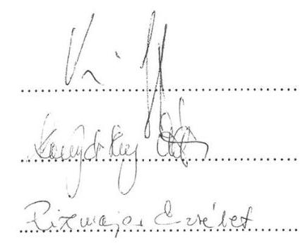

---

### 11. SZÁMÚ TANÚSÍTVÁNY

a gazdasági társaság által biztosított közszolgáltatás díjai a 2011-2014. években évente*

az 2011. évre vonatkozóan

|  No. | A közszolgáltatás díjainak megnevezése** | Kalkuláció elemei | A díjszámítás alapján/szolgáló kalkuláció | Önköltségszámítás/szabályzat alapján készült díjikalkuláció | Alkalmazott díj  |
| --- | --- | --- | --- | --- | --- |
|  1 |  | Közvetlen költségek |  |  |   |
|   |  | Közvetlen költségek |  |  |   |
|   |  | Nyereség |  |  |   |
|   |  | 02 |  |  | 1815  |
|  2 |  | Közvetlen költségek |  |  |   |
|   |  | Közvetlen költségek |  |  |   |
|   |  | Nyereség |  |  |   |
|   |  | 03 |  |  | 1725  |
|  3 |  | Közvetlen költségek |  |  |   |
|   |  | Közvetlen költségek |  |  |   |
|   |  | Nyereség |  |  |   |
|   |  | 04 |  |  | 3450  |
|  4 |  | Közvetlen költségek |  |  |   |
|   |  | Közvetlen költségek |  |  |   |
|   |  | Nyereség |  |  |   |
|   |  | 05 |  |  | 17250  |
|  5 |  | Közvetlen költségek |  |  |   |
|   |  | Közvetlen költségek |  |  |   |
|   |  | Nyereség |  |  |   |
|   |  | 06 |  |  | 18150  |
|  6 |  | Közvetlen költségek |  |  |   |
|   |  | Közvetlen költségek |  |  |   |
|   |  | Nyereség |  |  |   |
|   |  | 07 |  |  | 1815  |
|  7 |  | Közvetlen költségek |  |  |   |
|   |  | Közvetlen költségek |  |  |   |
|   |  | Nyereség |  |  |   |
|   |  | 08 |  |  | 3415  |
|  8 |  | Közvetlen költségek |  |  |   |
|   |  | Közvetlen költségek |  |  |   |
|   |  | Nyereség |  |  |   |
|   |  | 09 |  |  | 1725  |
|  9 |  | Közvetlen költségek |  |  |   |
|   |  | Közvetlen költségek |  |  |   |
|   |  | Nyereség |  |  |   |
|   |  | 10 |  |  | 2884  |
|  10 |  | Közvetlen költségek |  |  |   |
|   |  | Közvetlen költségek |  |  |   |
|   |  | Nyereség |  |  |   |
|   |  | 11 |  |  | 1815  |
|  11 |  |  |  |  |   |

- az ellenőrzött időszak minden éveire ki kell tölteni.

* az évközben bekövetkező díjváltozások esetén minden díjat fel kell tüntetni.

Nyilatkozat: a tanúsítványban szereplő adatok nyilvántartásainkkal megegyeznek, valódiságukat igazolom.

Dátum: 2018.02.24. Kísérőjén felelős neve: Voterazki József

Kísérőjén felelős telefonszáma, e-mail címe: voterazki.jozsef@nir.

NHSZ Dabas

NHSZ Dabas Kft.

2370 Dabas, Szent István út 133. Adószám: 12869855-2-13 OTP Bank: 11745004-20085573 5.

---

# Függelék: Észrevételek

|  11. SZÁMÚ TANÚSÍTVÁNY
a gazdasági társaság által biztosított közszolgáltatás díjai a 2011-2014. években évente)
az 2012. évre vonatkozóan! |  |  |  |   |
| --- | --- | --- | --- | --- |
|  No | A közszolgáltatás díjának megnevezése1) | Költség eleme | A díjszámításra, díjra
szolgáló kalkulációra (1) | Önköltségszámításban
elkészített kalkuláció(2)  |
|  1 | Közszolgáltatás (6) (Éves Lakcsodíj 120 Ft/év)
2012.01.01-2012.10.30 | Közvetlen költségei |  |   |
|   |  | Közvetett |  |   |
|   |  | Sz |  |   |
|  2 | Közszolgáltatás (6) (Éves Lakcsodíj 120 Ft/év)
2012.08.01-2012.12.30 | Közvetlen költségei |  |   |
|   |  | Közvetett |  |   |
|   |  | Sz |  |   |
|  3 | Közszolgáltatás (6) (Éves Lakcsodíj 120 Ft/év)
2012.12.01 | Közvetlen költségei |  |   |
|   |  | Közvetett |  |   |
|   |  | Sz |  |   |
|  4 | Közszolgáltatás (6) (Fizszem 120 Ft/év)
2012.01.01-2012.12.31 | Közvetlen költségei |  |   |
|   |  | Közvetett |  |   |
|   |  | Sz |  |   |
|  5 | Közszolgáltatás (6) (Fizszem 240 Ft/év)
2012.01.01-2012.12.31 | Közvetlen költségei |  |   |
|   |  | Közvetett |  |   |
|   |  | Sz |  |   |
|  6 | Közszolgáltatás (6) (Fizszem 1100 Ft/év)
2012.01.01-2012.12.31 | Közvetlen költségei |  |   |
|   |  | Közvetett |  |   |
|   |  | Sz |  |   |
|  7 | Közszolgáltatás (6) (Éves Lakcsodíj 1100
Ft/év) 2012.01.01-2012.05.31 | Közvetlen költségei |  |   |
|   |  | Közvetett |  |   |
|   |  | Sz |  |   |
|  8 | Közszolgáltatás (6) (Éves Lakcsodíj 1100
Ft/év) 2012.08.01-2012.12.30 | Közvetlen költségei |  |   |
|   |  | Közvetett |  |   |
|   |  | Sz |  |   |
|  9 | Közszolgáltatás (6) (Éves Lakcsodíj 1100
Ft/év) 2012.12.01 | Közvetlen költségei |  |   |
|   |  | Közvetett |  |   |
|   |  | Sz |  |   |
|  10 | Közszolgáltatás (6) (Fizszem 120 Ft/év Égyítés)
2012.01.01-2012.12.31 | Közvetlen költségei |  |   |
|   |  | Közvetett |  |   |
|   |  | Sz |  |   |
|  11 | Közszolgáltatás (6) (Fizszem 60 Ft/év)
2012.01.01-2012.12.31 | Közvetlen költségei |  |   |
|   |  | Hozzadó |  |   |
|   |  | Sz |  |   |
|  12 | Közszegűjtés (6) (Fizszem 120 Harres Felízi)
2012.01.01-2012.12.31 | Hozzinté költségei |  |   |
|   |  | Hozzadó |  |   |
|   |  | Sz |  |   |
|  13 | Közszegűjtés (6) (Fizszem 120 Harres Felízi)
2012.01.01-2012.12.31 | Hozzinté költségei |  |   |
|   |  | Hozzadó |  |   |
|   |  | Sz |  |   |
|  14 | Közszegűjtés (6) (Fizszem 120 Harres Felízi)
2012.01.01-2012.12.31 | Hozzinté költségei |  |   |
|   |  | Hozzadó |  |   |
|   |  | Sz |  |   |
|  15 | Közszegűjtés (6) (Fizszem 120 Harres Felízi)
2012.01.01-2012.12.31 | Hozzinté költségei |  |   |
|   |  | Hozzadó |  |   |
|   |  | Sz |  |   |
|  16 | Közszegűjtés (6) (Fizszem 120 Harres Felízi)
2012.01.01-2012.12.31 | Hozzinté költségei |  |   |
|   |  | Hozzadó |  |   |
|   |  | Sz |  |   |
|  17 | Közszegűjtés (6) (Fizszem 120 Harres
Képeszeményes) 2012.01.01-2012.12.30 | Hozzinté költségei |  |   |
|   |  | Hozzadó |  |   |
|   |  | Sz |  |   |
|  18 | Közszegűjtés (6) (Fizszem 120 Harres
Képeszeményes) 2012.01.01-2012.12.30 | Hozzinté költségei |  |   |
|   |  | Hozzadó |  |   |
|   |  | Sz |  |   |
|  19 | Közszegűjtés (6) (Fizszem 120 Harres
Képeszeményes) 2012.12.31 | Hozzinté költségei |  |   |
|   |  | Hozzadó |  |   |
|   |  | Sz |  |   |
|  20 | Közszegűjtés (6) (Fizszem 120 Harres
Képeszeményes) 2012.12.31 | Hozzinté költségei |  |   |
|   |  | Hozzadó |  |   |
|   |  | Sz |  |   |
|  21 | Közszegűjtés (6) (Fizszem 120 Harres
Képeszeményes) 2012.12.31 | Hozzinté költségei |  |   |
|   |  | Hozzadó |  |   |
|   |  | Sz |  |   |
|  22 | Közszegűjtés (6) (Fizszem 120 Harres
Képeszeményes) 2012.12.31 | Hozzinté költségei |  |   |
|   |  | Hozzadó |  |   |
|   |  | Sz |  |   |
|  23 | Közszegűjtés (6) (Fizszem 120 Harres
Képeszeményes) 2012.12.31 | Hozzinté költségei |  |   |
|   |  | Hozzadó |  |   |
|   |  | Sz |  |   |
|  24 | Közszegűjtés (6) (Fizszem 120 Harres
Képeszeményes) 2012.12.31 | Hozzinté költségei |  |   |
|   |  | Hozzadó |  |   |
|   |  | Sz |  |   |
|  25 | Közszegűjtés (6) (Fizszem 120 Harres
Képeszeményes) 2012.12.31 | Hozzinté költségei |  |   |
|   |  | Hozzadó |  |   |
|   |  | Sz |  |   |
|  26 | Közszegűjtés (6) (Fizszem 120 Harres
Képeszeményes) 2012.12.31 | Hozzinté költségei |  |   |
|   |  | Hozzadó |  |   |
|   |  | Sz |  |   |
|  27 | Közszegűjtés (6) (Fizszem 120 Harres
Képeszeményes) 2012.12.31 | Hozzinté költségei |  |   |
|   |  | Hozzadó |  |   |
|   |  | Sz |  |   |
|  28 | Közszegűjtés (6) (Fizszem 120 Harres
Képeszeményes) 2012.12.31 | Hozzinté költségei |  |   |
|   |  | Hozzadó |  |   |
|   |  | Sz |  |   |
|  29 | Közszegűjtés (6) (Fizszem 120 Harres
Képeszeményes) 2012.12.31 | Hozzinté költségei |  |   |
|   |  | Hozzadó |  |   |
|   |  | Sz |  |   |
|  30 | Közszegűjtés (6) (Fizszem 120 Harres
Képeszeményes) 2012.12.31 | Hozzinté költségei |  |   |
|   |  | Hozzadó |  |   |
|   |  | Sz |  |   |
|  31 | Közszegűjtés (6) (Fizszem 120 Harres
Képeszeményes) 2012.12.31 | Hozzinté költségei |  |   |
|   |  | Hozzadó |  |   |
|   |  | Sz |  |   |
|  32 |  | Hozzinté költségei |  |   |
|   |  | Hozzadó |  |   |
|   |  | Sz |  |   |
|  33 |  | Hozzinté költségei |  |   |
|   |  | Hozzadó |  |   |
|   |  | Sz |  |   |
|  34 |  | Hozzinté költségei |  |   |
|   |  | Hozzadó |  |   |
|   |  | Sz |  |   |
|  35 |  | Hozzinté költségei |  |   |
|   |  | Hozzadó |  |   |
|   |  | Sz |  |   |
|  36 |  | Hozzinté költségei |  |   |
|   |  | Hozzadó |  |   |
|   |  | Sz |  |   |
|  37 |  | Hozzinté költségei |  |   |
|   |  | Hozzadó |  |   |
|   |  | Sz |  |   |
|  38 |  | Hozzinté költségei |  |   |
|   |  | Hozzadó |  |   |
|   |  | Sz |  |   |
|  39 |  | Hozzinté költségei |  |   |
|   |  | Hozzadó |  |   |
|   |  | Sz |  |   |
|  40 |  | Hozzinté költségei |  |   |
|   |  | Hozzadó |  |   |
|   |  | Sz |  |   |
|  41 |  | Hozzinté költségei |  |   |
|   |  | Hozzadó |  |   |
|   |  | Sz |  |   |
|  42 |  | Hozzinté költségei |  |   |
|   |  | Hozzadó |  |   |
|   |  | Sz |  |   |
|  43 |  | Hozzinté költségei |  |   |
|   |  | Hozzadó |  |   |
|   |  | Sz |  |   |
|  44 |  | Hozzinté költségei |  |   |
|   |  | Hozzadó |  |   |
|   |  | Sz |  |   |
|  45 |  | Hozzinté költségei |  |   |
|   |  | Hozzadó |  |   |
|   |  | Sz |  |   |
|  46 |  | Hozzinté költségei |  |   |
|   |  | Hozzadó |  |   |
|   |  | Sz |  |   |
|  47 |  | Hozzinté költségei |  |   |
|   |  | Hozzadó |  |   |
|   |  | Sz |  |   |
|  48 |  | Hozzinté költségei |  |   |
|   |  | Hozzadó |  |   |
|   |  | Sz |  |   |
|  49 |  | Hozzinté költségei |  |   |
|   |  | Hozzadó |  |   |
|   |  | Sz |  |   |
|  50 |  | Hozzinté költségei |  |   |
|   |  | Hozzadó |  |   |
|   |  | Sz |  |   |
|  51 |  | Hozzinté költségei |  |   |
|   |  | Hozzadó |  |   |
| |  | Sz |  |   |
|  52 |  | Hozzinté költségei |  |   |
|   |  | Hozzadg |  |   |
|   |  | Sz |  |   |
|  53 |  | Hozzinté költségei |  |   |
|   |  | Hozzadg |  |   |
|   |  | Sz |  |   |
|  54 |  | Hozzinté költségei |  |   |
|   |  | Hozzadg |  |   |
|   |  | Sz |  |   |
|  55 |  | Hozzinté költségei |  |   |
|   |  | Hozzadg |  |   |
|   |  | Sz |  |   |
|  56 |  | Hozzinté költségei |  |   |
|   |  | Hozzadg |  |   |
|   |  | Sz |  |   |
|  57 |  | Hozzinté költségei |  |   |
|   |  | Hozzadg |  |   |
|   |  | Sz |  |   |
|  58 |  | Hozzinté költségei |  |   |
|   |  | Hozzadg |  |   |
|   |  | Sz |  |   |
|  59 |  | Hozzinté költségei |  |   |
|   |  | Hozzadg |  |   |
|   |  | Sz |  |   |
|  60 |  | Hozzinté költségei |  |   |
|   |  | Hozzadg |  |   |
|   |  | Sz |  |   |
|  61 |  | Hozzinté költségei |  |   |
|   |  | Hozzadg |  |   |
|   |  | Sz |  |   |
|  62 |  | Hozzinté költségei |  |   |
|   |  | Hozzadg |  |   |
|   |  | Sz |  |   |
|  63 |  | Hozzinté költségei |  |   |
|   |  | Hozzadg |  |   |
|   |  | Sz |  |   |
|  64 |  | Hozzinté költségei |  |   |
|   |  | Hozzadg |  |   |
|   |  | Sz |  |   |
|  65 |  | Hozzinté költségei |  |   |
|   |  | Hozzadg |  |   |
|   |  | Sz |  |   |
|  66 |  | Hozzinté költségei |  |   |
|   |  | Hozzadg |  |   |
|   |  | Sz |  |   |
|  67 |  | Hozzinté költségei |  |   |
|   |  | Hozzadg |  |   |
|   |  | Sz |  |   |
|  68 |  | Hozzinté költségei |  |   |
|   |  | Hozzadg |  |   |
|   |  | Sz |  |   |
|  69 |  | Hozzinté költségei |  |   |
|   |  | Hozzadg |  |   |
|   |  | Sz |  |   |
|  70 |  | Hozzinté költségei |  |   |
|   |  | Hozzadg |  |   |
|   |  | Sz |  |   |
|  71 |  | Hozzinté költségei |  |   |
|   |  | Hozzadg |  |   |
|   |  | Sz |  |   |
|  72 |  | Hozzinté költségei |  |   |
|   |  | Hozzadg |  |   |
|   |  | Sz |  |   |
|  73 |  | Hozzinté költségei |  |   |
|   |  | Hozzadg |  |   |
|   |  | Sz |  |   |
|  74 |  | Hozzinté költségei |  |   |
|   |  | Hozzadg |  |   |
|   |  | Sz |  |   |
|  75 |  | Hozzinté költségei |  |   |
|   |  | Hozzadg |  |   |
|   |  | Sz |  |   |
|  76 |  | Hozzinté költségei |  |   |
|   |  | Hozzadg |  |   |
|   |  | Sz |  |   |
|  77 |  | Hozzinté költségei |  |   |
|   |  | Hozzadg |  |   |
|   |  | Sz |  |   |
|  78 |  | Hozzinté költségei |  |   |
|   |  | Hozzadg |  |   |
|   |  | Sz |  |   |
|  79 |  | Hozzinté költségei |  |   |
|   |  | Hozzadg |  |   |
|   |  | Sz |  |   |
|  80 |  | Hozzinté költségei |  |   |
|   |  | Hozzadg |  |   |
|   |  | Sz |  |   |
|  81 |  | Hozzinté költségei |  |   |
|   |  | Hozzadg |  |   |
|   |  | Sz |  |   |
|  82 |  | Hozzinté költségei |  |   |
|   |  | Hozzadg |  |   |
|   |  | Sz |  |   |
|  83 |  | Hozzinté költségei |  |   |
|   |  | Hozzadg |  |   |
|   |  | Sz |  |   |
|  84 |  | Hozzinté költségei |  |   |
|   |  | Hozzadg |  |   |
|   |  | Sz |  |   |
|  85 |  | Hozzinté költségei |  |   |
|   |  | Hozzadg |  |   |
|   |  | Sz |  |   |
|  86 |  | Hozzinté költségei |  |   |
|   |  | Hozzadg |  |   |
|   |  | Sz |  |   |
|  87 |  | Hozzinté költségei |  |   |
|   |  | Hozzadg |  |   |
|   |  | Sz |  |   |
|  88 |  | Hozzinté költségei |  |   |
|   |  | Hozzadg |  |   |
|   |  | Sz |  |   |
|  89 |  | Hozzinté költségei |  |   |
|   |  | Hozzadg |  |   |
|   |  | Sz |  |   |
|  90 |  | Hozzinté költségei |  |   |
|   |  | Hozzadg |  |   |
|   |  | Sz |  |   |
|  91 |  | Hozzinté költségei |  |   |
|   |  | Hozzadg |  |   |
|   |  | Sz |  |   |
|  92 |  | Hozzinté költségei |  |   |
|   |  | Hozzadg |  |   |
|   |  | Sz |  |   |
|  93 |  | Hozzinté költségei |  |   |
|   |  | Hozzadg |  |   |
|   |  | Sz |  |   |
|  94 |  | Hozzinté költségei |  |   |
|   |  | Hozzadg |  |   |
|   |  | Sz |  |   |
|  95 |  | Hozzinté költségei |  |   |
|   |  | Hozzádg |  |   |
|   |  | Sz |  |   |
|  96 |  | Hozzinté költségei |  |   |
|   |  | Hozzádg |  |   |
|   |  | Sz |  |   |
|  97 |  | Hozzinté költségei |  |   |
|   |  | Hozzádg |  |   |
|   |  | Sz |  |   |
|  98 |  | Hozzinté költségei |  |   |
|   |  | Hozzádg |  |   |
|   |  | Sz |  |   |
|  99 |  | Hozzinté költségei |  |   |
|   |  | Hozzádg |  |   |
|   |  | Sz |  |   |
|  100 |  | Hozzinté költségei |  |   |
|   |  | Hozzádg |  |   |
|   |  | Sz |  |   |
|  101 |  | Hozzinté költségei |  |   |
|   |  | Hozzádg |  |   |
|   |  | Sz |  |   |
|  102 |  | Hozzinté költségei |  |   |
|   |  | Hozzádg |  |   |
|   |  | Sz |  |   |
|  103 |  | Hozzinté költségei |  |   |
|   |  | Hozzádg |  |   |
|   |  | Sz |  |   |
|  104 |  | Hozzinté költségei |  |   |
|   |  | Hozzádg |  |   |
|   |  | Sz |  |   |
|  105 |  | Hozzinté költségei |  |   |
|   |  | Hozzádg |  |   |
|   |  | Sz |  |   |
|  106 |  | Hozzinté költségei |  |   |
|   |  | Hozzádg |  |   |
|   |  | Sz |  |   |
|  107 |  | Hozzinté költségei |  |   |
|   |  | Hozzádg |  |   |
|   |  | Sz |  |   |
|  108 |  | Hozzinté költségei |  |   |
|   |  | Hozzádg |  |   |
|   |  | Sz |  |   |
|  109 |  | Hozzinté költségei |  |   |
|   |  | Hozzádg |  |   |
|   |  | Sz |  |   |
|  110 |  | Hozzinté költségei |  |   |
|   |  | Hozzádg |  |   |
|   |  | Sz |  |   |
|  111 |  | Hozzinté költségei |  |   |
|   |  | Hozzádg |  |   |
|   |  | Sz |  |   |
|  112 |  | Hozzinté költségei |  |   |
|   |  | Hozzádg |  |   |
|   |  | Sz |  |   |
|  113 |  | Hozzinté költségei |  |   |
|   |  | Hozzádg |  |   |
|   |  | Sz |  |   |
|  114 |  | Hozzinté költségei |  |   |
|   |  | Hozzádg |  |   |
|   |  | Sz |  |   |
|  115 |  | Hozzinté költségei |  |   |
|   |  | Hozzádg |  |   |
|   |  | Sz |  |   |
|  116 |  | Hozzinté költségei |  |   |
|   |  | Hozzádg |  |   |
|   |  | Sz |  |   |
|  117 |  | Hozzinté költségei |  |   |
|   |  | Hozzádg |  |   |
|   |  | Sz |  |   |
|  118 |  | Hozzinté költségei |  |   |
|   |  | Hozzádg |  |   |
|   |  | Sz |  |   |
|  119 |  | Hozzinté költségei |  |   |
|   |  | Hozzádg |  |   |
|   |  | Sz |  |   |
|  120 |  | Hozzinté költségei |  |   |
|   |  | Hozzádg |  |   |
|   |  | Sz |  |   |
|  121 |  | Hozzinté költségei |  |   |
|   |  | Hozzádg |  |   |
|   |  | Sz |  |   |
|  122 |  | Hozzinté költségei |  |   |
|   |  | Hozzádg |  |   |
|   |  | Sz |  |   |
|  123 |  | Hozzinté költségei |  |   |
|   |  | Hozzádg |  |   |
|   |  | Sz |  |   |
|  124 |  | Hozzinté költségei |  |   |
|   |  | Hozzádg |  |   |
|   |  | Sz |  |   |
|  125 |  | Hozzinté költségei |  |   |
|   |  | Hozzádg |  |   |
|   |  | Sz |  |   |
|  126 |  | Hozzinté költségei |  |   |
|   |  | Hozzádg |  |   |
|   |  | Sz |  |   |
|  127 |  | Hozzinté költségei |  |   |
|   |  | Hozzádg |  |   |
|   |  | Sz |  |   |
|  128 |  | Hozzinté költségei |  |   |
|   |  | Hozzádg |  |   |
|   |  | Sz |  |   |
|  129 |  | Hozzinté költségei |  |   |
|   |  | Hozzádg |  |   |
|   |  | Sz |  |   |
|  130 |  | Hozzinté költségei |  |   |
|   |  | Hozzádg |  |   |
|   |  | Sz |  |   |
|  131 |  | Hozzinté költségei |  |   |
|   |  | Hozzádg |  |   |
|   |  | Sz |  |   |
|  132 |  | Hozzinté költségei |  |   |
|   |  | Hozzádg |  |   |
|   |  | Sz |  |   |
|  133 |  | Hozzinté költségei |  |   |
|   |  | Hozzádg |  |   |
|   |  | Sz |  |   |
|  134 |  | Hozzinté költségei |  |   |
|   |  | Hozzádg |  |   |
|   |  | Sz |  |   |
|  135 |  | Hozzinté költségei |  |   |
|   |  | Hozzádg |  |   |
|   |  | Sz |  |   |
|  136 |  | Hozzinté költségei |  |   |
|   |  | Hozzádg |  |   |
|   |  | Sz |  |   |
|  137 |  | Hozzinté költségei |  |   |
|   |  | Hozzádg |  |   |
|   |  | Sz |  |   |
|  138 |  | Hozzinté költségei | |   |
|   |  | Hozzájárulás |  |   |
|   |  | Sz |  |   |
|  139 |  | Hozzájáruló költségei |  |   |
|   |  | Hozzájárulás |  |   |
|   |  | Sz |  |   |
|  140 |  | Hozzájáruló költségei |  |   |
|   |  | Hozzájárulás |  |   |
|   |  | Sz |  |   |
|  141 |  | Hozzájáruló költségei |  |   |
|   |  | Hozzájárulás |  |   |
|   |  | Sz |  |   |
|  142 |  | Hozzájáruló költségei |  |   |
|   |  | Hozzájárulás |  |   |
|   |  | Sz |  |   |
|  143 |  | Hozzájáruló költségei |  |   |
|   |  | Hozzájárulás |  |   |
|   |  | Sz |  |   |
|  144 |  | Hozzájáruló költségei |  |   |
|   |  | Hozzájárulás |  |   |
|   |  | Sz |  |   |
|  145 |  | Hozzájáruló költségei |  |   |
|   |  | Hozzájárulás |  |   |
|   |  | Sz |  |   |
|  146 |  | Hozzájáruló költségei |  |   |
|   |  | Hozzájárulás |  |   |
|   |  | Sz |  |   |
|  147 |  | Hozzájáruló költségei |  |   |
|   |  | Hozzájárulás |  |   |
|   |  | Sz |  |   |
|  148 |  | Hozzájáruló költségei |  |   |
|   |  | Hozzájárulás |  |   |
|   |  | Sz |  |   |
|  149 |  | Hozzájáruló költségei |  |   |
|   |  | Hozzájárulás |  |   |
|   |  | Sz |  |   |
|  150 |  | Hozzájáruló költségei |  |   |
|   |  | Hozzájárulás |  |   |
|   |  | Sz |  |   |
|  151 |  | Hozzájáruló költségei |  |   |
|   |  | Hozzájárulás |  |   |
|   |  | Sz |  |   |
|  152 |  | Hozzájáruló költségei |  |   |
|   |  | Hozzájárulás |  |   |
|   |  | Sz |  |   |
|  153 |  | Hozzájáruló költségei |  |   |
|   |  | Hozzájárulás |  |   |
|   |  | Sz |  |   |
|  154 |  | Hozzájáruló költségei |  |   |
|   |  | Hozzájárulás |  |   |
|   |  | Sz |  |   |
|  155 |  | Hozzájáruló költségei |  |   |
|   |  | Hozzájárulás |  |   |
|   |  | Sz |  |   |
|  156 |  | Hozzájáruló költségei |  |   |
|   |  | Hozzájárulás |  |   |
|   |  | Sz |  |   |
|  157 |  | Hozzájáruló költségei |  |   |
|   |  | Hozzájárulás |  |   |
|   |  | Sz |  |   |
|  158 |  | Hozzájáruló költségei |  |   |
|   |  | Hozzájárulás |  |   |
|   |  | Sz |  |   |
|  159 |  | Hozzájáruló költségei |  |   |
|   |  | Hozzájárulás |  |   |
|   |  | Sz |  |   |
|  160 |  | Hozzájáruló költségei |  |   |
|   |  | Hozzájárulás |  |   |
|   |  | Sz |  |   |
|  161 |  | Hozzájáruló költségei |  |   |
|   |  | Hozzájárulás |  |   |
|   |  | Sz |  |   |
|  162 |  | Hozzájáruló költségei |  |   |
|   |  | Hozzájárulás |  |   |
|   |  | Sz |  |   |
|  162 |  | Hozzájáruló költségei |  |   |
|   |  | Hozzájárulás |  |   |
|   |  | Sz |  |   |
|  163 |  | Hozzájáruló költségei |  |   |
|   |  | Hozzájárulás |  |   |
|   |  | Sz |  |   |
|  164 |  | Hozzájáruló költségei |  |   |
|   |  | Hozzájárulás |  |   |
|   |  | Sz |  |   |
|  165 |  | Hozzájáruló költségei |  |   |
|   |  | Hozzájárulás |  |   |
|   |  | Sz |  |   |
|  166 |  | Hozzájáruló költségei |  |   |
|   |  | Sz |  |   |
|  167 |  | Hozzájáruló költségei |  |   |
|   |  | Hozzájárulás |  |   |
|   |  | Sz |  |   |
|  168 |  | Hozzájáruló költségei |  |   |
|   |  | Hozzájárulás |  |   |
|   |  | Sz |  |   |
|  169 |  | Hozzájáruló költségei |  |   |
|   |  | Hozzájárulás |  |   |
|   |  | Sz |  |   |
|  170 |  | Hozzájáruló költségei |  |   |
|   |  | Sz |  |   |
|  171 |  | Hozzájáruló költségei |  |   |
|   |  | Sz |  |   |
|  172 |  | Hozzájáruló költségei |  |   |
|   |  | Sz |  |   |
|  173 |  | Hozzájáruló költségei |  |   |
|   |  | Sz |  |   |
|  174 |  | Hozzájáruló költségei |  |   |
|   |  | Sz |  |   |
|  175 |  | Hozzájáruló költségei |  |   |
|   |  | Sz |  |   |
|  176 |  | Hozzájáruló költségei |  |   |
|   |  | Sz |  |   |
|  177 |  | Hozzájáruló költségei |  |   |
|   |  | Sz |  |   |
|  178 |  | Hozzájáruló költségei |  |   |
|   |  | Sz |  |   |
|  179 |  | Hozzájáruló költségei |  |   |
|   |  | Sz |  |   |
|  180 |  | Hozzájáruló költségei |  |   |
|   |  | Sz |  |   |
|  181 |  | Hozzájáruló költségei |  |   |
|   |  | Sz |  |   |
|  182 |  | Hozzájáruló költségei |  |   |
|   |  | Sz |  |   |
|  183 |  | Hozzájáruló költségei |  |   |
|   |  | Sz |  |   |
|  184 |  | Hozzájáruló költségei |  |   |
|   |  | Sz |  |   |
|  185 |  | Hozzájáruló költségei |  |   |
|   |  | Sz |  |   |
|  186 |  | Hozzinté költségei |  |   |
|   |  | Sz |  |   |
|  187 |  | Hozzinté költségei |  |   |
|   |  | Sz |  |   |
|  188 |  | Hozzinté költségei |  |   |
|   |  | Sz |  |   |
|  189 |  | Hozzinté költségei |  |   |
|   |  | Sz |  |   |
|  190 |  | Hozzinté költségei |  |   |
|   |  | Sz |  |   |
|  191 |  | Hozzinté Költségei |  |   |
|   |  | Sz |  |   |
|  192 |  | Hozzinté költségei |  |   |
|   |  | Sz |  |   |
|  193 |  | Hozzinté Költségei |  |   |
|   |  | Sz |  |   |
|  194 |  | Hozzinté Költségei |  |   |
|   |  | Sz |  |   |
|  195 |  | Hozzinté Költségei |  |   |
|   |  | Sz |  |   |
|  196 |  | Hozzinté Költségei |  |   |
|   |  | Sz |  |   |
|  197 |  | Hozzinté Költségei |  |   |
|   |  | Sz |  |   |
|  198 |  | Hozzinté Költségei |  |   |
|   |  | Sz |  |   |
|  199 |  | Hozzinté Költségei |  |   |
|   |  | Sz |  |   |
|  199 |  | Hozzinté Költségei |  |   |
|   |  | Sz |  |   |
|  200 |  | Hozzinté Költségei |  |   |
|   |  | Sz |  |   |
|  201 |  | Hozzinté Költségei |  |   |
|   |  | Sz |  |   |
|  202 |  | Hozzinté Költségei |  |   |
|   |  | Sz |  |   |
|  202 |  | Hozzinté Költségei |  |   |
|   |  | Sz |  |   |
|  203 |  | Hozzinté Költségei |  |   |
|   |  | Sz |  |   |
|  203 |  | Hozzinté Költségei |  |   |
|   |  | Sz |  |   |
|  204 |  | Hozzinté Tél |  |   |
|   |  | Sz |  |   |
|  205 |  | Hozzinté Tél |  |   |
|   |  | Sz |  |   |
|  204 |  | Hozzinté Tél |  |   |
|   |  | Sz |  |   |
|  205 |  | Hozzinté Tél |  |   |
|   |  | Sz |  |   |
|  206 |  | Hozzinté Tél |  |   |
|   |  | Sz |  |   |
|  206 |  | Hozzinté Tél |  |   |
|   |  | Sz |  |   |
| 207 |  | Hozzinté Tél |  |   |
|   |  | Sz |  |   |
|  207 |  | Hozzinté Tél |  |   |
|   |  | Sz |  |   |
|  | 208 |  | Hozzinté Tél |  |   |
|   |  | Sz |  |   |
| 209 |  | Hozzinté Tél |  |   |
|   |  | Sz |  |   |
| 209 |  | Hozzinté Tél |  |   |
|   |  | Sz |  |   |
|  | 209 |  | Hozzinté Tél |  |   |
|   |  | Sz |  |   |
| 210 |  | Hozzinté Tél |  |   |
|   |  | Sz |  |   |
| 210 |  | Hozzinté Tél |  |   |
|   |  | Sz |  |   |
|  | 211 |  | Hozzinté Tél |  |   |
|   |  | Sz |  |   |
| 211 |  | Hozzinté Tél |  |   |
|   |  | Sz |  |   |
|  | 212 |  | Hozzinté Tél |  |   |
|   |  | Sz |  |   |
|  | 212 |  | Hozzinté Tél |  |   |
|   |  | Sz |  |   |
| 212 |  | Hozzinté Tél |  |   |
|   |  | Sz |  |   |
| 213 |  | Hozzinté Tél |  |   |
|   |  | Sz |  |   |
|  | 213 |  | Hozzinté Tél |  |   |
|   |  | Sz |  |   |
| 213 |  | Hozzinté Tél |  |   |
|   |  | Sz |  |   |
| 214 |  | Hozzinté Tél |  |   |
|   |  | Sz |  |   |
| 214 |  | Hozzinté Tél |  |   |
|   |  | Sz |  |   |
| 214 |  | Hozzinté Tél |  |   |
|   |  | Sz |  |   |
| 215 |  | Hozzinté Tél |  |   |
|   |  | Sz |  |   |
| 215 |  | Hozzinté Tél |  |   |
|   |  | Sz |  |   |
| 215 |  | Hozzinté Tél |  |   |
|   |  | Sz |  |   |
| 216 |  | Hozzinté Tél |  |   |
|   |  | Sz |  |   |
| 216 |  | Hozzinté Tél |  |   |
|   |  | Sz |  |   |
| 217 |  | Hozzinté Tél |  |   |
|   |  | Sz |  |   |
| 217 |  | Hozzinté Tél |  |   |
|   |  | Sz |  |   |
| 218 |  | Hozzinté Tél |  |   |
|   |  | Sz |  |   |
| 218 |  | Hozzinté Tél |  |   |
|   |  | Sz |  |   |
| 218 |  | Hozzinté Tél |  |   |
|   |  | Sz |  |   |
| 219 |  | Hozzinté Tél |  |   |
|   |  | Sz |  |   |
| 219 |  | Hozzinté Tél |  |   |
|   |  | Sz |  |   |
| 2222 |  | Hozzinté Tél |  |   |
|   |  | Sz |  |   |
| 219 |  | Hozzinté Tél |  |   |
|   |  | Sz |  |   |
| 223 |  | Hozzinté Tél |  |   |
|   |  | Sz |  |   |
| 223 |  | Hozzinté Tél |  |   |
|   |  | Sz |  |   |
| 23 |  | Hozzinté Tél |  |   |
|   |  | Sz |  |   |
| 23 |  | Hozzinté Tél |  |   |
|   |  | Sz |  |   |
| 24 |  | Hozzinté Tél |  |   |
|   |  | Sz |  |   |
| 24 |  | Hozzinté | Tél |  |   |
|   |  | Sz |  |   |
| 24 |  | Hozzinté Tél |  |   |
|   |  | Sz |  |   |
| 25 |  | Hozzinté Tél |  |   |
|   |  | Sz |  |   |
| 25 |  | Hozzinté Tél |  |   |
|   |  | Sz |  |   |
|  |  | Sz |  |   |
| 25 |  | Hozzinté Tél |  |   |
|   |  | Sz |  |   |
| 26 |  | Hozzinté Tél |  |   |
|   |  | Sz |  |   |
| 26 |  | Hozzinté Tél |  |   |
|   |  | Sz |  |   |
| 27 | Hozzinté Tél |  |   |
|   |  | Sz |  |   |
| 27 | Hozzinté Tél |  |   |
|   |  | Sz |  |   |
| 28 | Hozzinté Tél |  |   |
|   |  | Sz |  |   |
| 28 | Hozzinté Tél |  |   |
|   |  | Sz |  |   |
| 29 | Hozzinté Tél |  |   |
|   |  | Sz |  |   |
| 29 | Hozzinté Tél |  |   |
|   |  | Sz |  |   |
| 29 | Hozzinté Tél |  |   |
|   |  | Sz |  |   |
| 210 |  | Hozzinté Tél |  |   |
|   |  | Sz |  |   |
|  |  | Sz |  |   |
| 2110 |  | Hozzinté Tél |  |   |
|   |  | Sz |  |   |
|  |  | Sz |  |   |
|  |  | Sz |  |   |
| 211 |  | Hozzinté Tél |  |   |
|   |  | Sz |  |   |
| 2111 |  | Hozzinté Tél |  |   |
|   |  | Sz |  |   |
| 2211 |  | Hozzinté Tél |  |   |
|   |  | Sz |  |   |
| 2222 | Hozzinté Tél |  |   |
|   |  | Sz |  |   |
| 2223 | Hozzinté Tél |  |   |
|   |  | Sz |  |   |
| 24 |  | Hozzinté Tél |  |   |
|  |  | Sz |  |   |
| 24 |  | Hozzinté Tél |  |   |
|   |  | Sz |  |   |
|  |  | Sz |  |   |
|  |  | Sz |  |   |
| 24 |  | Hozzinté Tél |  |   |
|   |  | Sz |  |   |
|  |  | Sz |  |   |
|  |  | Sz |  |   |
|  |  | Sz |  |   |
|  |  | Sz |  |   |
|  |  | Sz |  |   |
|  |  | Sz |  |   |
|  |  | Sz |  |   |
|  |  | Sz |  |   |
|  |  | Sz |  |   |
|  |  | Sz |  |   |
|  |  | Sz |  |   |
|  |  | Sz |  |   |
|  |  | Sz |  |   |
|  |  | Sz |  |   |
|  |  | Sz |  |   |
|  |  | Sz |  |   |
|  |  | Sz |  |   |
|  |  | Sz |  |   |
|  |  | Sz |  |   |
|  |  | Sz |  |   |
|  |  | Sz |  |   |
|  |  | Sz |  |   |
|  |  | Sz |  |   |
|  |  | Sz |  |   |
|  |  | Sz |  |   |
|  |  | Sz |  |   |
|  |  | Sz |  |   |
|  |  | Sz |  |   |
|  |  | Sz |  |   |
|  |  | Sz |  |   |
|  |  | Sz |  |   |

---

# Függelék: Észrevételek

## 11. GENiG TeleGETekleri

### A.2019/2020 YÖNETĠRMESĠRMESĠRMESĠRMESĠRMESĠRMESĠRMESĠRMESĠRMESĠRMESĠRMESĠRMESĠRMESĠRMESĠRMESĠRMESĠRMESĠRMESĠRMESĠRMESĠRMESĠRMESĠRMESĠRMESĠRMESĠRMESĠRMESĠRMESĠRMESĠRMESĠRMESĠRMESĠRMESĠRMESĠRMESĠRMESĠRMESĠRMESĠRMESĠRMES

---

# SZALAY 

## SZALAY FERENC ÜGYVÉDI IRODA

## 2370 Dabas, Szent István út 133.

## Volenszki József Ügyvezető Úr részére

Tárgy: Állami Számvevőszéki jelentéstervezet véleményezése

## Tisztelt Ügyvezető Úr!

Alulírott Dr. Szalay Ferenc ügyvéd az NHSZ Dabas Kft. részére megküldött Állami Számvevőszéki jelentéstervezetben foglaltakkal kapcsolatosan, az előre egyeztetett pontok vonatkozásában az alábbiakról tájékoztatom.

## I. 9. oldal - ügyvezetői mandátumok

A jelentéstervezetben foglaltak szerint a Társaságnál 2012. május 29-ig egy ügyvezető, 2012. május 30. napja és 2013. április 01. napja között két ügyvezető, majd 2013. április 01. napját követően ismét egy ügyvezető irányította a Társaságot.

Az ügyvezetői mandátumok megegyeznek a Társaság 2012. május 31. napján kelt Társasági Szerződésében foglalt adatokkal, amelyek szerint

- Papp László 2008. április 02. napjától 2013. április 01. napjáig
- Volenszki József pedig 2012. május 31. napjától 2017. május 30. napjáig
terjedő időtartamra került megválasztásra a Társaság ügyvezetőjeként.
Fentiek alapján tehát a jelentéstervezetben foglaltak az ügyvezetői mandátumok kapcsán helytálló adatokat tartalmaznak.

## II. 15. oldal - társasági szerződéssel kapcsolatos megállapítások:

A jelentéstervezetben foglaltak szerint Dabas Város Önkormányzata és az NHSZ Dabas Kft. által kötött közszolgáltatási szerződés a 224/2004. (VII.22.) Kormrend. 12. § (2) bekezdés b) és c) pontjában, a 13. § (4) bekezdésében és a 14. §-ban foglaltak ellenére nem tartalmazta

- a közszolgáltatás körébe tartozó és a településen folyó egyéb hulladékkezelési tevékenységek összehangolásának, valamint a településen működtetett különböző közszolgáltatások összehangolásának elősegítését;
- az igazolt díjhátralék kiegyenlítésére vonatkozó eljárást;
- az alvállalkozók, egyéb közreműködők igénybevételének feltételeit.
Az ÁSZ által hivatkozott Korm. rendelet 2008. 05. 16. napjától 2013. 09. 05. napjáig hatályos szövege az alábbi vonatkozó rendelkezéseket tartalmazta:
„A közszolgáltatási szerződés

---

# SZALAY 

10. § (1) A közszolgáltatási szerződést a közbeszerzési eljárás nyertesével az önkormányzat képviselőtestülete köti meg.
(2) Ha az önkormányzat képviselő-testülete több ajánlattevő közös ajánlatát nyilvánította nyertesnek, a közszolgáltatási szerződést a képviselő-testület a közös ajánlatot benyújtó több ajánlattevő képviseletében az 5. § szerint eljáró vállalkozással köti meg a közös ajánlatot benyújtó felekre is kiterjedő hatállyal.
11. § (1) A közszolgáltatási szerződés célja, hogy a közszolgáltatás teljesítése érdekében - a felhívásban és a dokumentációban szereplő feltételeknek és kötelezésének, valamint a közszolgáltató ajánlatának megfelelően - az önkormányzat és a közszolgáltató közötti kapcsolatok szabályozásáról gondoskodjon.
(2) A közszolgáltatási szerződésnek tartalmaznia kell a közszolgáltatás megnevezését, minőségi ismérveit, a teljesítésének területi kiterjedését, a közszolgáltatás megkezdésének időpontját és időtartamát, valamint annak rögzítését, hogy a közszolgáltató vállalta a megjelölt közszolgáltatás teljesítését.
(3) A közszolgáltatási szerződés nyilvános.
12. § (1) A közszolgáltatási szerződésben a közszolgáltató kötelességeként kell meghatározni
a) a közszolgáltatás folyamatos és teljes körű ellátását;
b) a közszolgáltatás meghatározott rendszer, módszer és gyakoriság szerinti teljesítését;
c) a közszolgáltatás teljesítéséhez szükséges mennyiségű és minőségű jármű, gép, eszköz, berendezés biztosítását, valamint a szükséges létszámú és képzettségű szakember alkalmazását;
d) a közszolgáltatás folyamatos, biztonságos és bővíthető teljesítéséhez szükséges fejlesztések és karbantartások elvégzését;
e) a közszolgáltatás körébe tartozó hulladék ártalmatlanítására az önkormányzat képviselő-testülete által kijelölt helyek és létesítmények igénybevételét;
f) a közszolgáltató által alkalmazott közszolgáltatási díj mértékéről és az alkalmazás tapasztalatairól az önkormányzat képviselő-testületének történő legalább évenkénti egyszeri tájékoztatást;
g) a közszolgáltatás teljesítésével összefüggő adatszolgáltatás rendszeres teljesítését és meghatározott nyilvántartási rendszer működtetését;
h) a fogyasztók számára könnyen hozzáférhető ügyfélszolgálat és tájékoztatási rendszer működtetését;
i) a fogyasztói kifogások és észrevételek elintézési rendjének megállapítását.
(2) A közszolgáltatási szerződésben az önkormányzat kötelességeként kell meghatározni
a) a közszolgáltatás hatékony és folyamatos ellátásához a közszolgáltató számára szükséges információk szolgáltatását, a Hgt. 23. §-ának g) pontjára tekintettel;
b) a közszolgáltatás körébe tartozó és a településen folyó egyéb hulladékkezelési tevékenységek összehangolásának elősegítését;
c) a településen működtetett különböző közszolgáltatások összehangolásának elősegítését;
d) a települési igények kielégítésére alkalmas hulladék gyűjtésére, kezelésére, ártalmatlanítására szolgáló helyek és létesítmények kijelölését;
e) a közszolgáltató kizárólagos közszolgáltatási jogának biztosítását a 3. § (1) bekezdés a), b) és f) pontjaiban foglaltakra figyelemmel.
13. § (1) A közszolgáltatási szerződésben meg kell határozni a közszolgáltatás finanszírozásának elveit és módszereit.
(2) Az önkormányzatnak a közszolgáltatás finanszírozásában vállalt kötelezettsége esetén a közszolgáltatási szerződésben meg kell határozni a kötelezettség teljesítésének feltételeit és biztosítékait.
(3) A közszolgáltatási szerződés tartalmazza a közszolgáltatás díjának megállapítására és beszedésére vonatkozó módszer leírását, a díjnak a szerződés megkötésekor érvényesíthető legmagasabb mértékét és a díj megváltoztatása érdekében alkalmazandó eljárást.
(4) A közszolgáltatási szerződésnek tartalmaznia kell az igazolt díjhátralék kiegyenlítésére vonatkozó eljárást.
14. § A közszolgáltatási szerződés tartalmazza azokat a feltételeket, amelyek mellett a közszolgáltató a közszolgáltatás teljesítésére közreműködőt vagy teljesítési segédet vehet igénybe, figyelemmel a Kbt. 304. § (2) bekezdésében foglaltakra is. A közszolgáltató

---

# SZALAY 

közreműködőért vagy teljesítési segédért való felelőssége a közszolgáltatási szerződésben nem korlátozható.
15. § (1) A felek csak akkor módosíthatják a közszolgáltatási szerződésnek a felhívás, a dokumentáció feltételei, illetőleg az ajánlat tartalma alapján meghatározott részét, ha a szerződéskötést követően - a szerződéskötéskor előre nem látható ok következtében - beállott körülmény miatt a szerződés valamelyik fél lényeges vagy jogos érdekét sérti.
(2) Ha a közszolgáltatási szerződés megkötését követően alkotott jogszabály a közszolgáltatási szerződés tartalmi elemeit úgy változtatja meg, hogy az valamelyik szerződő fél lényeges és jogos érdekeit sérti, a szerződő felek egybehangzó akarattal a szerződést módosíthatják.
16. § (1) A közszolgáltatási szerződés megszűnik
a) a benne meghatározott időtartam lejártával;
b) a közszolgáltató jogutód nélküli megszűnésével;
c) elállással, ha a teljesítés még nem kezdődött meg;
d) felmondással.
(2) A közszolgáltató a közszolgáltatási szerződéstől a teljesítés megkezdéséig elállhat, azt követően a szerződést felmondhatja, ha a közszolgáltatási szerződés megkötését követően alkotott jogszabály a közszolgáltatási szerződés tartalmi elemeit úgy változtatja meg, hogy az a közszolgáltatónak a közszolgáltatás szerződésszerű teljesítése körébe tartozó lényeges és jogos érdekeit jelentős mértékben sérti.
(3) Az önkormányzat képviselő-testülete a közszolgáltatási szerződést felmondhatja, ha
a) a közszolgáltató - közszolgáltatás ellátása során - a tevékenységére vonatkozó jogszabályokat vagy hatósági előírásokat súlyosan megsértette, és a jogsértés tényét bíróság vagy hatóság jogerősen megállapította;
b) a közszolgáltató a közszolgáltatási szerződésben megállapított kötelezettségét neki felróhatóan súlyosan megsértette.
(4) Ha az önkormányzat képviselő-testülete a közszolgáltatási szerződést az 5. § szerint kijelölt közszolgáltatóval szemben mondja fel, a felmondás hatálya kiterjed a közszolgáltatóval közös ajánlatot benyújtó valamennyi vállalkozásra.
(5) A közszolgáltató a közszolgáltatási szerződést akkor mondhatja fel, ha az önkormányzat a közszolgáltatási szerződésben meghatározott kötelezettségét - a közszolgáltató felszólítása ellenére - súlyosan megsérti, és ezzel a közszolgáltatónak kárt okoz vagy akadályozza a közszolgáltatás teljesítését.
(6) A közszolgáltatási szerződés felmondási ideje legalább 6 hónap."

Az ÁSZ által a jelentéstervezetben megjelölt, a közszolgáltatási szerződés tartalmát kötelezően meghatározó rendelkezések az ÁSZ ellenőrzés tárgyát képező időszakban (2011-2013. években), illetve azon túl is (2008-2013. között) alkalmazandók voltak.

Szükséges megjegyezni azonban, hogy a 224/2004. (VII.22.) Korm. rendeletet a 317/2013. (VIII. 28.) Korm. rendelet hatályon kívül helyezte 2013. szeptember 5. napjával.
2013. szeptember 05. napjától tehát a közszolgáltató kiválasztásáról és a hulladékgazdálkodási közszolgáltatási szerződéséről szóló 317/2013. (VIII. 28.) Korm. rendelet alkalmazandó, amely egy kivétellel változatlan előírásokat tartalmaz.
A kivételt a 224/2004. (VII.22.) Korm. rendelet 13. § (4) bekezdésében foglalt rendelkezés jelenti, amellyel azonos vagy hasonló tartalmú előírást a 2013. szeptember 05. napjától alkalmazandó Korm. rendelet nem tartalmaz.

## III. 16. oldal - kalkulációs séma közzététele:

Az ÁSZ a jelentéstervezetben foglaltak szerint hiányosságként állapította meg, hogy a Társaság az ellenőrzött időszakban a települési szilárd hulladékra a közszolgáltatási díj számítására szolgáló

---

# SZALAY 

kalkulációs sémát a 64/2008. (III.28.) Korm. rendelet 2. § (3) bekezdésében előírtakkal ellentétben nem határozta meg, nem tette közzé.

A 64/2008. (III.28.) Korm. rendelet a települési hulladékkezelési közszolgáltatási díj megállapításának részletes szakmai szabályairól rendelkezik, és 2010. december 30. napjától kezdődően jelenleg is hatályban lévő jogszabály.
Az ÁSZ által hivatkozott 2. § (3) bekezdés az alábbi rendelkezést tartalmazza:
„2. § (1) A közszolgáltatási díjat legalább egyéves díjfizetési időszakra kell meghatározni.
(2) A települési szilárd, illetve folyékony hulladék (a továbbiakban együtt: települési hulladék) kezelésére irányuló közszolgáltatás díját külön-külön kell meghatározni. A települési szilárd hulladék kezelésére irányuló közszolgáltatási díj egytényezős vagy kéttényezős díjként határozható meg.
(3) A közszolgáltatási díj számítására szolgáló kalkulációs séma vagy díjképlet alkalmazása esetén a kalkulációs sémát, illetve a díjképletet, továbbá a díjszámítás módszertanát és a díjképlet elemeit is részletesen meg kell határozni és közzé kell tenni."

A jogszabályi rendelkezés szerint tehát a kalkulációs séma meghatározására, valamint közzétételére akkor van szükség, az akkor kötelező, ha a közszolgáltató a közszolgáltatási díj számítására kalkulációs sémát vagy díjképletet alkalmaz.

## IV. 22. oldal - éves beszámoló

A jelentéstervezetben foglaltak szerint a Társaság a Ht. 50. § (4) bekezdésének előírása ellenére a 2013. évi auditált éves beszámolóját és a könyvvizsgálói jelentést nem küldte meg a Hivatalnak.

A Ht. 2013. január 01. napján lépett hatályba, 50. §-a az alábbi rendelkezéseket tartalmazta a 2013. évben (és tartalmazza jelenleg is):
50. § (1) A közszolgáltató beszámolási és könyvvezetési kötelezettségére, a beszámoló összeállítására, a könyvek vezetésére, valamint a nyilvánosságra hozatalra és közzétételre a számvitelről szóló törvény (a továbbiakban: Szt.) rendelkezéseit az e törvény szerinti eltérésekkel kell alkalmazni.
(2) A hulladékgazdálkodási közszolgáltatás körébe nem tartozó tevékenységet is végző közszolgáltató az egyes tevékenységeire olyan elkülönült nyilvántartást vezet, amely biztosítja az egyes tevékenységek átláthatóságát, valamint kizárja a keresztfinanszírozást.
(3) A hulladékgazdálkodási közszolgáltatás körébe nem tartozó tevékenységet is végző közszolgáltató a hulladékgazdálkodási közszolgáltatás nyújtása érdekében végzett tevékenységét éves beszámolója kiegészítő mellékletében oly módon mutatja be, mintha azt önálló vállalkozás keretében végezte volna. A tevékenység elkülönült bemutatása legalább önálló mérleget és eredménykimutatást jelent.
(4) A közszolgáltató az auditált éves beszámolóját a tárgyévre készített üzleti jelentéssel és a könyvvizsgálói jelentéssel együtt az Szt. szerinti letétbe helyezéssel egyidejűleg megküldi a Hivatalnak.
(5) A közszolgáltató a Hivatal számára biztosítja, hogy a Hivatal a közszolgáltató pénzügyi-számviteli kimutatásait, valamint az azokhoz kapcsolódó bizonylatokat és információkat - ideértve az üzleti titkot is - megismerhesse, azokba betekinthessen.

A 2013. évi beszámoló, és az ahhoz kapcsolódó könyvvizsgálói jelentés vonatkozásában tehát valóban fennállt az azok Hivatal részére történő megküldésére vonatkozó kötelezettség.

---

# SZALAY 

Az ÁSZ megállapítása szerint a Társaság a 2011. és 2012. években a Hgt. 29. § (3) bekezdésében foglaltak ellenére a hulladékgazdálkodási kötelezően ellátandó közszolgáltatói tevékenységével kapcsolatos bevételei és ráfordításai elkülönítéséről nem gondoskodott, a Hgt. 29. § (1) bekezdésében előírt részletes, hulladékgazdálkodási kötelező közszolgáltatói tevékenységével kapcsolatos költségelszámolást nem készített, azt az Önkormányzat felé nem nyújtotta be.

A Hgt. 2011. január 01. napjától hatályos és a 2012. évben is változatlan szövegezése szerint:
29. § (1) A közszolgáltató köteles a közszolgáltatói tevékenységéről évente részletes költségelszámolást készíteni, és azt a települési önkormányzatnak benyújtani.
(2) A közszolgáltató a közszolgáltatás ellátása mellett hulladékkezelési engedélyének megfelelően egyéb hulladékgazdálkodási tevékenységeket is folytathat, amelyeknek díját maga határozza meg.
(3) A kötelezően ellátandó közszolgáltatás kereteibe nem tartozó más hulladékkezelési szolgáltatás költségeit, elszámolását és díját szigorúan el kell különíteni, és e költségeket a közszolgáltatás díjából nem lehet finanszírozni.
(4) A települési szilárd és folyékony hulladékok kezelésére szolgáló technológiák, létesítmények kialakítására és üzemeltetésére vonatkozó részletes szabályokat külön jogszabály határozza meg.

A Hgt. 29. § (3) bekezdése tehát előírja az elkülönítési kötelezettséget a kötelezően ellátandó közszolgáltatási tevékenységen kívül végzett más hulladékkezelési szolgáltatás költségeit, elszámolását és díját illetően.
A Hgt. 29. § (1) bekezdése pedig egyértelműen rögzíti a közszolgáltató költségelszámolási kötelezettségét az önkormányzat irányában.

## VI. 23. oldal - adatvédelmi szabályzat, belső adatvédelmi felelős, közzétételi kötelezettség

A jelentéstervezetben foglaltak szerint a Társaság az Infotv. 24. § (2) d) pontjában előírtak ellenére az ellenőrzött időszakban nem rendelkezett adatvédelmi és adatbiztonsági szabályzattal, a Társaságnál a 24. § (1) c) pontjában előírtak ellenére belső adatvédelmi felelős nem volt. A Társaság a közérdekű adatok megismerésére irányuló igények teljesítésének rendjére vonatkozó szabályzatot az ellenőrzött időszakban az Avtv. 20. § (8) bekezdésében, illetve az Infotv. 30. § (6) bekezdésében foglaltak ellenére nem készített. Az Eisztv. 3. § (2) bekezdése, az Infotv. 33. § (3) és 37. § (1) bekezdéseiben előírtak alapján a Társaság a közzétételi kötelezettségét hiányosan teljesítette, mivel a beszámolóit az Eisztv. Mellékletének III/1. pontjában, illetve az Infotv. 1. mellékletének III/1. pontjában előírtak ellenére nem szerepeltette a honlapján.

Az ÁSZ által hivatkozott jogszabályi rendelkezések:

## 1. Adatvédelmi és adatbiztonsági szabályzat készítésének kötelezettsége, belső adatvédelmi felelős:

Az Infotv. ÁSZ által hivatkozott 24. §-a 2012. január 01. napjától hatályos, az alábbiak szerint
„18. Belső adatvédelmi felelős és adatvédelmi szabályzat
24. § (1) Az adatkezelő, illetve az adatfeldolgozó szervezetén belül, közvetlenül a szerv vezetőjének felügyelete alá tartozó - jogi, közigazgatási, informatikai vagy ezeknek megfelelő, felsőfokú végzettséggel rendelkező - belső adatvédelmi felelőst kell kinevezni vagy megbízni
a) az országos hatósági, munkaügyi vagy bűnügyi adatállományt kezelő, illetve feldolgozó adatkezelőnél és adatfeldolgozónál;
b) a pénzügyi szervezetnél;
c) az elektronikus hírközlési és közüzemi szolgáltatónál.

---

# SZALAY 

(2) A belső adatvédelmi felelős
a) közreműködik, illetve segítséget nyújt az adatkezeléssel összefüggő döntések meghozatalában, valamint az érintettek jogainak biztosításában;
b) ellenőrzi e törvény és az adatkezelésre vonatkozó más jogszabályok, valamint a belső adatvédelmi és adatbiztonsági szabályzatok rendelkezéseinek és az adatbiztonsági követelményeknek a megtartását;
c) kivizsgálja a hozzá érkezett bejelentéseket, jogosulatlan adatkezelés észlelése esetén annak megszüntetésére hívja fel az adatkezelőt vagy az adatfeldolgozót;
d) elkészíti a belső adatvédelmi és adatbiztonsági szabályzatot;
e) vezeti a belső adatvédelmi nyilvántartást;
f) gondoskodik az adatvédelmi ismeretek oktatásáról.
(3) Az (1) bekezdésben meghatározott adatkezelőknek, valamint - az adatvédelmi nyilvántartásba bejelentési kötelezettség alá nem eső adatkezelők kivételével - egyéb állami és önkormányzati adatkezelőknek e törvény végrehajtása érdekében adatvédelmi és adatbiztonsági szabályzatot kell készíteniük."

Fentiekkel azonos tartalmú rendelkezést egyébként az Infotv-t megelőzően hatályos Avtv. 31/A. §-a is tartalmazott, az alábbiak szerint.
„Belső adatvédelmi felelős és adatvédelmi szabályzat
31/A. §92 (1) Az adatkezelő, illetőleg az adatfeldolgozó szervezetén belül, közvetlenül a szerv vezetőjének felügyelete alá tartozó - jogi, közigazgatási, számítástechnikai vagy ezeknek megfelelő, felsőfokú végzettséggel rendelkező - belső adatvédelmi felelőst kell kinevezni vagy megbízni:
a) az országos hatósági, munkaügyi vagy bűnügyi adatállományt kezelő, illetőleg feldolgozó adatkezelőnél és adatfeldolgozónál;
b) a pénzügyi szervezetnél;
c) a távközlési és közüzemi szolgáltatónál.
(2) A belső adatvédelmi felelős:
a) közreműködik, illetőleg segítséget nyújt az adatkezeléssel összefüggő döntések meghozatalában, valamint az érintettek jogainak biztosításában;
b) ellenőrzi e törvény és az adatkezelésre vonatkozó más jogszabályok, valamint a belső adatvédelmi és adatbiztonsági szabályzatok rendelkezéseinek és az adatbiztonsági követelményeknek a megtartását;
c) kivizsgálja a hozzá érkezett bejelentéseket, és jogosulatlan adatkezelés észlelése esetén annak megszüntetésére hívja fel az adatkezelőt vagy az adatfeldolgozót;
d) elkészíti a belső adatvédelmi és adatbiztonsági szabályzatot;
e) vezeti a belső adatvédelmi nyilvántartást;
f) gondoskodik az adatvédelmi ismeretek oktatásáról.
(3) Az (1) bekezdésben meghatározott adatkezelőknek, valamint - az adatvédelmi nyilvántartásba bejelentési kötelezettség alá nem eső adatkezelők kivételével - egyéb állami és önkormányzati adatkezelőknek, e törvény végrehajtása érdekében, adatvédelmi és adatbiztonsági szabályzatot kell készíteniük."

Fentiek alapján tehát az ellenőrzés alá vont időszakban nemcsak az Infotv., hanem az Avtv. rendelkezése alapján is a Társaságnak adatvédelmi és adatbiztonsági szabályzattal, valamint belső adatvédelmi felelőssel kellett rendelkeznie.
2. A közérdekű adatok megismerésére irányuló igények teljesítésének rendjére vonatkozó szabályzat:

Az Avtv. 20. § (8) bekezdése szerint - amely 2011. 01. 01. és 2012. 01. 01. napja között változatlan szöveggel volt hatályban -

---

# SZALAY 

„Az állami vagy helyi önkormányzati feladatot, valamint jogszabályban meghatározott egyéb közfeladatot ellátó szerveknek a közérdekű adatok megismerésére irányuló igények teljesítésének rendjét rögzítő szabályzatot kell készíteniük."
2012. 01. 01. napjától kezdődő hatállyal i: Infotv. 30. § (6) bekezdése azonos tartalmú rendelkezést tartalmaz:
„A közfeladatot ellátó szervnek a közérdekű adatok megismerésére irányuló igények teljesítésének rendjét rögzítő szabályzatot kell készítenie."

Fentiek alapján tehát az ellenőrzés alá vont időszakban az Avtv. és az Infotv., rendelkezése alapján is a Társaságnak a közérdekű adatok megismerésére irányuló igények teljesítésének rendjét rögzítő szabályzattal kellett rendelkeznie.

## 3. Közzétételi kötelezettség:

Az elektronikus információszabadságról szóló 2005. évi XC. törvény (Eitv.) ÁSZ által hivatkozott 3. § (2) bekezdése 2011.01.01. és 2012.01.01. napja között az alábbiak szerint rendelkezett.
„Az (1) bekezdésben nem szereplő, jogszabályban meghatározott közfeladatot ellátó egyéb szervek a 6. § szerinti elektronikus közzétételi kötelezettségüknek választásuk szerint saját vagy társulásaik által közösen működtetett, illetve a felügyeletüket, szakmai irányításukat vagy működésükkel kapcsolatos koordinációt ellátó szervek által fenntartott, valamint az erre a célra létrehozott központi honlapon való közzététellel is eleget tehetnek."

Az Eitv. kapcsolódó rendelkezései:
„3 §4 (1) A 6. § szerinti közzétételi listákon meghatározott adatait saját honlapján - ha törvény másként nem rendelkezik - közzéteszi
a)5 a Köztársasági Elnök Hivatala, az Országgyűlés Hivatala, az Alkotmánybíróság Hivatala, az Országgyűlési Biztos Hivatala, az Állami Számvevőszék, a Pénzügyi Szervezetek Állami Felügyelete, az Országos Igazságszolgáltatási Tanács Hivatala, a Legfőbb Ügyészség, a Magyar Tudományos Akadémia, b)6 a központi államigazgatási szerv a kormánybizottság kivételével, továbbá az országos kamara, valamint
c)? a Kormány általános hatáskörű területi államigazgatási szerve.

## (2) Az (I) bekezdésben nem szereplő, jogszabályban meghatározott közfeladatot ellátó egyéb

szervek a 6. § szerinti elektronikus közzétételi kötelezettségüknek választásuk szerint saját vagy társulásaik által közösen működtetett, illetve a felügyeletüket, szakmai irányításukat vagy működésükkel kapcsolatos koordinációt ellátó szervek által fenntartott, valamint az erre a célra létrehozott központi honlapon való közzététellel is eleget tehetnek.
(3) Ha a közoktatási intézmény nem lát el országos vagy térségi feladatot, e törvény szerinti közzétételi kötelezettségének az ágazati jogszabályokban meghatározott információs rendszerhez történő adatszolgáltatás teljesítésével eleget tesz.
(4) Az adatokat nem a saját honlapon közzétevő adatfelelős - a 4. § megfelelő alkalmazásával a közzéteendő adatokat az adatközlőnek továbbítja, amely gondoskodik az adatoknak honlapon való közzétételéről, és arról, hogy egyértelmű legyen, az egyes közzétett közérdekű adat melyik szervtől származik, illetve melyikre vonatkozik.
(5) Az adatközlő gondoskodik a honlap adatok közzétételére alkalmas kialakításáról, a folyamatos üzemeltetésről, az esetleges üzemzavar elhárításáról és az adatok frissítéséről.
(6) A honlapon közérthető formában tájékoztatást kell adni a közérdekű adatok egyedi igénylésének szabályairól. A tájékoztatásnak tartalmaznia kell az igénybe vehető jogorvoslati lehetőségek ismertetését is.

---

# SZALAY 

(7) A honlapon a közzétételi listákon meghatározott közérdekű adatokon kívül elektronikusan közzétehetőek más közérdekű és közérdekből nyilvános adatok is.
4. §8 (1) A közzétételre kötelezett adatfelelős szerv vezetője gondoskodik a 6. §-ban meghatározott közzétételi listákon szereplő adatok pontos, naprakész és folyamatos közzétételéről, az adatközlőnek való megküldéséről.
(2) A megküldött adatok közzétételéért, folyamatos hozzáférhetőségéért, hitelességéért és az adatok frissítéséért az adatközlő felel.
(3) Az adatfelelős és az adatközlő belső szabályzatban állapítja meg az (1)-(2) bekezdés szerinti kötelezettség teljesítésének részletes szabályait. 9
(4) A közzétett adatok - ha e törvény vagy más jogszabály eltérően nem rendelkezik - a közzétételt követő egy évig a honlapról nem távolíthatóak el. A szerv megszűnése esetén a közzététel kötelezettsége a szerv jogutódját terheli.
(5) Az e törvény szerinti kötelezettségek megszegése külön jogszabályban meghatározott büntetőjogi és fegyelmi felelősséget keletkeztet.
5. §10 A 6. §-ban meghatározott közzétételi listákban szereplő adatok közzététele nem érinti az adott szervnek az Avtv. 20. §-ában meghatározott, továbbá a közérdekű vagy közérdekből nyilvános adatok közzétételével kapcsolatos más jogszabályban meghatározott kötelezettségeit.

A közzétételi listák
6. §11 (1) A 3. § (1)-(3) bekezdésében meghatározott szervek (a továbbiakban együtt: közfeladatot ellátó szervek) - tevékenységükhöz kapcsolódóan - az e törvény mellékletében meghatározott adatokat (általános közzétételi lista) közzéteszik."

Melléklet

## ÁLTALÁNOS KÖZZÉTÉTELI LISTA

## III. Gazdálkodási adatok

|  | Adat | Frissítés | Megőrzés |
| :--: | :--: | :--: | :--: |
| 1. | A közfeladatot ellátó szerv éves (elemi) költségvetése, számviteli törvény szerinti beszámolója; a költségvetés végrehajtásáról a külön jogszabályban meghatározott módon és gyakorisággal - készített beszámolók | A változásokat követően azonnal | A külön jogszabályban meghatározott ideig, de legalább 5 évig archívumban tartásával |

Az Infotv. ÁSZ által megjelölt, 2012. január 01. napjától hatályos 33. § (3) bekezdése, és a 37. § (1) bekezdése pedig az alábbiak szerint rendelkezik:
33. § (3) A (2) bekezdésben nem szereplő közfeladatot ellátó szervek a 37. § szerinti elektronikus közzétételi kötelezettségüknek választásuk szerint saját vagy társulásaik által közösen működtetett, illetve a felügyeletüket, szakmai irányításukat vagy működésükkel kapcsolatos koordinációt ellátó szervek által fenntartott, valamint az erre a célra létrehozott központi honlapon való közzététellel is eleget tehetnek.
37. § (1) A 33. § (2)-(4) bekezdésében meghatározott szervek (a továbbiakban együtt: közzétételre kötelezett szerv) - a (4) bekezdésben meghatározott kivétellel - tevékenységükhöz kapcsolódóan : z 1.

---

# SZALAY 

melléklet szerinti általános közzétételi listában meghatározott adatokat az i. mellékletben foglaltak szerint közzéteszik.

A kapcsolódó rendelkezések azonosak az Eitv-ben foglaltakkal:
„23. Az elektronikus közzététel kötelezettsége
33. § (1) Az e törvény alapján kötelezően közzéteendő közérdekű adatokat internetes honlapon, digitális formában, bárki számára, személyazonosítás nélkül, korlátozástól mentesen, kinyomtatható és részleteiben is adatvesztés és -torzulás nélkül kimásolható módon, a betekintés, a letöltés, a nyomtatás, a kimásolás és a hálózati adatátvitel szempontjából is díjmentesen kell hozzáférhetővé tenni (a továbbiakban: elektronikus közzététel). A közzétett adatok megismerése személyes adatok közléséhez nem köthető.
(2) A 37. § szerinti közzétételi listákon meghatározott adatait saját honlapján - ha törvény másként nem rendelkezik - közzéteszi
a) 9 a Köztársasági Elnök Hivatala, az Országgyűlés Hivatala, az Alkotmánybíróság Hivatala, az Alapvető Jogok Biztosának Hivatala, az Állami Számvevőszék, a Magyar Tudományos Akadémia, a Magyar Művészeti Akadémia, az Országos Bírósági Hivatal, a Legfőbb Ügyészség,
b) 10
c) 11 a központi államigazgatási szerv a kormánybizottság kivételével, továbbá az országos kamara, valamint
d) a Kormány általános hatáskörű területi államigazgatási szerve.
(3) A (2) bekezdésben nem szereplő közfeladatot ellátó szervek a 37. § szerinti elektronikus közzétételi kötelezettségüknek választásuk szerint saját vagy társulásaik által közösen működtetett, illetve a felügyeletüket, szakmai irányításukat vagy működésükkel kapcsolatos koordinációt ellátó szervek által fenntartott, valamint az erre a célra létrehozott központi honlapon való közzététellel is eleget tehetnek.
(4) Ha a közoktatási intézmény nem lát el országos vagy térségi feladatot, e törvény szerinti elektronikus közzétételi kötelezettségének az ágazati jogszabályokban meghatározott információs rendszerhez történő adatszolgáltatás teljesítésével eleget tesz.
34. § (1) Az adatokat nem a saját honlapon közzétevő adatfelelős - a 35. § alkalmazásával - a közzéteendő adatokat az adatközlőnek továbbítja, amely gondoskodik az adatok honlapon való közzétételéről, és arról, hogy egyértelmű legyen az, hogy az egyes közzétett közérdekű adatok melyik szervtől származnak, illetve melyikre vonatkoznak.
(2) Az adatközlő a közzétételre szolgáló honlapot úgy alakítja ki, hogy az adatok közzétételére alkalmas legyen, gondoskodik a folyamatos üzemeltetésről, az esetleges üzemzavar elhárításáról és az adatok frissítéséről.
(3) A közzétételre szolgáló honlapon közérthető formában tájékoztatást kell adni a közérdekű adatok egyedi igénylésének szabályairól. A tájékoztatásnak tartalmaznia kell az igénybe vehető jogorvoslati lehetőségek ismertetését is.
(4) A közzétételre szolgáló honlapon a közzétételi listákon meghatározott közérdekű adatokon kívül elektronikusan közzétehetőek más közérdekű és közérdekből nyilvános adatok is.
35. § (1) Az elektronikus közzétételre kötelezett adatfelelős szerv vezetője gondoskodik a 37. §-ban meghatározott közzétételi listákon szereplő adatok pontos, naprakész és folyamatos közzétételéről, az adatközlőnek való megküldéséről.
(2) A megküldött adatok elektronikus közzétételéért, folyamatos hozzáférhetőségéért, hitelességéért és az adatok frissítéséért az adatközlő felel.
(3) Az adatfelelős az (1) bekezdés szerinti, az adatközlő a (2) bekezdés szerinti kötelezettség teljesítésének részletes szabályait belső szabályzatban állapítja meg.
(4) Az elektronikusan közzétett adatok - ha a törvény vagy más jogszabály eltérően nem rendelkezik - a honlapról nem távolíthatóak el. A szerv megszűnése esetén a közzététel kötelezettsége a szerv jogutódját terheli.

---

# SZALAY 

36. § A 37. §-ban meghatározott közzétételi listákban szereplő adatok közzététele nem érinti az adott szervnek a közérdekű vagy közérdekből nyilvános adatok közzétételével kapcsolatos, más jogszabályban meghatározott kötelezettségeit.
37. A közzétételi listák
38. § (1) A 33. § (2)-(4) bekezdésében meghatározott szervek (a továbbiakban együtt: közzétételre kötelezett szerv) - a (4) bekezdésben meghatározott kivétellel - tevékenységükhöz kapcsolódóan az 1. melléklet szerinti általános közzétételi listában meghatározott adatokat az 1. mellékletben foglaltak szerint közzéteszik.

## 1. melléklet

## ÁLTALÁNOS KÖZZÉTÉTELI LISTA

| III. Gazdálkodási adatok |  |  |  |
| :--: | :--: | :--: | :--: |
|  | Adat | Frissítés | Alapázen |
| 1. | A közfeladatot ellátó szerv éves költségvetése, számviteli törvény szerinti beszámolója vagy éves költségvetési beszámolója | A változásokat követően azonnal | A közzétételt követő 10 évig |

Fenti jogszabályi rendelkezések tehát előírják a számviteli törvény szerinti beszámoló saját vagy társulások által közösen működtetett, illetve a felügyeletet, szakmai irányítás vagy működéssel kapcsolatos koordinációt ellátó szerv által fenntartott honlapon való közzétételére vonatkozó kötelezettséget.

## VII. 26. oldal - árképzéssel kapcsolatos megállapítás

A jelentéstervezetben foglaltak szerint az árképzéssel kapcsolatosan az ÁSZ -egyebek mellett- az alábbi megállapításokat tette.

A Társaság árképzése a tevékenységek elkülönítésének hiánya miatt nem volt szabályszerű.
A díjmegállapításra vonatkozóan a Társaság a javaslatait nem 64/2008. (III.28.) Korm. rendelet (továbbiakban: Korm.rend.) 5. §-ában előírtakkal ellentétesen nem az előírt költségkalkuláció alapján készítette el, mivel a díjra vonatkozó javaslatait az ellenőrzött időszakban alkalmazott díjak valamint a fogyasztói árindex növekedését figyelembe véve alakította ki.
A 2011-2012. években a Hgt. 29. § (3) bekezdésében, illetve a Korm.rend. 3. §-ában foglalt előírásokkal ellentétben, elkülönítés és az alkalmazott ármegállapítási módszer hiányában a Társaság díj megállapítása nem volt szabályszerű.
Az elkülönítés hiányában a Korm.rend. 3. § (1) bekezdés a) pontjában előírtakkal ellentétben nem volt megállapítható, hogy a közszolgáltatás bevételei fedezetet nyújtottak-e a működéshez szükséges folyamatos költségekre és ráfordításokra, valamint a közszolgáltatás fejleszthető fenntartásához szükséges kiadásokra.

---

# SZALAY 

Az ÁSZ által hivatkozott jogszabályi rendelkezések:

1. A települési hulladékkezelési közszolgáltatási díj megállapításának részletes szakmai szabályairól szóló 64/2008. (III.28.) Korm. rendelet:

## 3. § (1) A közszolgáltatási díjat úgy kell meghatározni, hogy

a) a közszolgáltatást működtető szolgáltató hatékony működéséhez szükséges folyamatos költségek és ráfordítások megtérülésének, valamint a közszolgáltatás fejleszthető fenntartásához szükséges költségek és ráfordítások fedezetének biztosítására alkalmas legyen, és
b) ösztönözzön a közszolgáltatás biztonságos és legkisebb költségű ellátására, a közszolgáltató kapacitásának hatékony kihasználására, valamint a hulladékkeletkezés csökkentésére és a hatékony hulladékgazdálkodásra.
(2) Az (1) bekezdés a) pontja szerinti költségnek és ráfordításnak minősül különösen
a) a hulladékbegyűjtés, -szállítás, -ártalmatlanítás, -hasznosítás gyakorlásához szükséges, a hulladékkezelő létesítménynek, eszköznek a közszolgáltatással kapcsolatos üzemeltetési költsége és ráfordítása, ideértve a fenntartással és karbantartással felmerülő költségeket és ráfordításokat is;
b) a közszolgáltatás körében működtetett létesítmények bezárásának, rekultivációjának, utógondozásának és a harminc évig történő monitorozásának a díjfizetési időszakra vetített költsége;
c) a számlázás és díjbeszedés költsége;
d) a környezetvédelmi kiadás és ráfordítás, különösen a környezetvédelmi hatósági eljárásért fizetett illeték vagy igazgatási szolgáltatási díj, a jogszabályon alapuló környezetvédelmi kötelezettségek teljesítése érdekében végzett beruházások, illetve mérések és vizsgálatok költsége;
e) az a) pont szerinti létesítmények, eszközök elhasználódásából eredő, azok felújítását, pótlását, korszerűsítését, bővítését, rekonstrukcióját szolgáló kiadások és ráfordítások.
(3) Közszolgáltatási díjcsökkentő tényezőként kell figyelembe venni a közszolgáltatás teljesítéséhez biztosított, a költségek ellentételezésére kapott költségvetési, illetőleg önkormányzati támogatást, a közszolgáltatás teljesítése folyamatában keletkező melléktermékek, így különösen a hulladéklerakó gáz, komposzt, valamint a szelektíven begyűjtött hulladékok hasznosításából vagy hasznosítás céljára történő átadásból származó bevételt.
(4) A (2) bekezdés b) pontja szerinti utógondozási és monitorozási költségek a közszolgáltatási díjban akkor érvényesíthetők, ha a közszolgáltató az utógondozás, illetve a monitorozás körébe tartozó feladatai ellátására tervet készít, amely alapján mennyiségarányosan megállapítja az ennek megvalósításához évente szükséges - a Központi Statisztikai Hivatal által közzétett - hivatalos fogyasztói árindex-alakulás alapján korrigált bevételt.
(5) Ha a közszolgáltatási díjat az önkormányzat az (1)-(4) bekezdés alapján számított díjnál alacsonyabb mértékben állapítja meg, a különbséget díjkompenzáció formájában köteles a közszolgáltatónak megtéríteni. Abban az esetben, ha az önkormányzat díjkedvezményt, mentességet, vagy ingyenességet állapít meg, a felmerülő költségeket a közszolgáltató számára az önkormányzat köteles megtéríteni.
5. § A közszolgáltató köteles a közszolgáltatási díj megállapítása érdekében díjkalkulációt készíteni. Ha a közszolgáltató a közszolgáltatás körébe tartozó tevékenység mellett más gazdasági tevékenységet is folytat, a költségtervben a költségek szigorú elkülönítésének módszerét is alkalmaznia kell.
2. A hulladékgazdálkodásról szóló 2000. évi XLIII. törvény (Hgt.):
29. § (3) A kötelezően ellátandó közszolgáltatás kereteibe nem tartozó más hulladékkezelési szolgáltatás költségeit, elszámolását és díját szigorúan el kell különíteni, és e költségeket a közszolgáltatás díjából nem lehet finanszírozni.

---

# SZALAY 

Fenti jogszabályi rendelkezések előírják tehát a kötelezően ellátandó közszolgáltatási tevékenységen kívül végzett más hulladékgazdálkodási szolgáltatás(ok)ra vonatkozó költségelkülönítés alkalmazását, úgyszintén a közszolgáltatási díj megállapítása érdekében díjkalkuláció készítését, valamint azt, hogy a közszolgáltatási díjat milyen szempontok kötelező figyelembevétele mellett kell meghatározni.

Budapest, 2016. augusztus 05.
Tisztelettel:
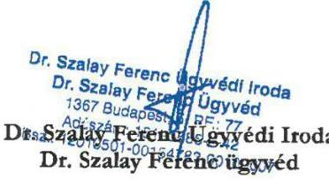

---

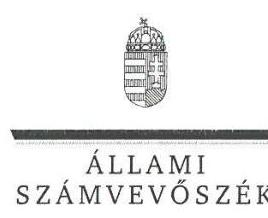

ELNÖK

Ikt.szám: V-1021-141/2016

# Volenszki József úr 

ügyvezető
NHSZ Dabas Hulladékgazdálkodási Kft.

## Dabas

## Tisztelt Ügyvezető Úr!

Köszönettel vettem a NHSZ Dabas Hulladékgazdálkodási Kft. ellenőrzéséről készített számvevőszéki jelentéstervezetre a LEDAB-357/2016 iktatószámú levelével megküldött észrevételeit.
Az Állami Számvevőszék észrevételekre vonatkozó álláspontjáról a felügyeleti vezető által készített részletes tájékoztatásból kap választ, amelyet levelemhez mellékeltem.
Tájékoztatom Ügyvezető urat, hogy az Állami Számvevőszék a figyelembe nem vett észrevételeket az Állami Számvevőszékről szóló 2011. évi LXVI. törvény 29. § (3) bekezdésében előírtak szerint köteles a jelentésében feltüntetni és megindokolni, hogy azokat miért nem fogadta el.

Budapest, 2016. segítidher hó . . nap
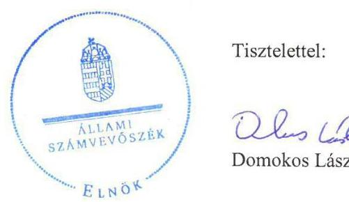

Tisztelettel:

## Domokos László

Melléklet: Tájékoztatás az észrevételek kezeléséről

---

# Tájékoztatás az észrevételek kezeléséről 

Megköszönöm Ügyvezető úrnak „Az önkormányzatok gazdasági társaságai - Az önkormányzatok többségi tulajdonában lévő gazdasági társaságok közfeladat-ellátását érintő gazdálkodási tevékenysége szabályszerűségének ellenőrzése - NHSZ Dabas Hulladékgazdálkodási Kft." címmel készített jelentéstervezetre tett észrevételeit. Az észrevételek kezeléséről - azok sorrendjében - az alábbi tájékoztatást adom.

Az 1. számú észrevételét nem áll módomban elfogadni, mivel az ÁSZ ellenőrzése a közfeladatellátás tekintetében a 2011-2013. évekre terjedt ki a Társaság hulladékgazdálkodási közszolgáltatási tevékenységét érintően. A Társaság 2014-ben már nem volt közszolgáltató, a hulladékgyűjtést és szállítást az új közszolgáltató alvállalkozójaként végezte.

A 2. számú észrevételét a dokumentumok ismételt áttekintése után elfogadom. A jelentéstervezet 1.1 számú megállapítás 2. bekezdésének 3. mondatát a következőképpen pontosítom:
„Az NHSZ ÖKOT NKft. 49\%-os tulajdonrészét megvásárolta a Magyar Állam kizárólagos tulajdonában álló NHSZ Kft., melynek cégbírósági bejegyzése 2014. március 24-ével-ei hatállyal történt meg"

A 3. számú észrevételét nem áll módomban elfogadni, a megállapítást változatlan formában fenntartom. A jelentéstervezet a Közszolgáltatói Szerződésre a 224/2004. (VII. 22.) Korm. rendelet előírásaira hivatkozva tartalmaz megállapítást, annak 13. § (4) bekezdése pedig az észrevételéhez csatolt ügyvédi véleményezés szerint is hatályos volt 2013. szeptember 4-ig, ezáltal az igazolt díjhátralék kiegyenlítésére vonatkozó eljárást a Közszolgáltatási Szerződésnek tartalmaznia kellett volna.

A 4. számú észrevételét nem áll módomban elfogadni, a megállapítást változatlan formában fenntartom. A 64/2008. (III. 28.) Korm. rendelet 5. §-a szerint: „A közszolgáltató köteles a közszolgáltatási díj megállapítása érdekében díjkalkulációt készíteni. Ha a közszolgáltató a közszolgáltatás körébe tartozó tevékenység mellett más gazdasági tevékenységet is folytat, a költségtervben a költségek szigorú elkülönítésének módszerét is alkalmaznia kell." A díjkalkuláció készítéséhez meg kell határozni a díjszámítás módszertanát, amelyet a 64/2008. (III. 28.) Korm. rendelet 2. § (3) bekezdésében foglaltak szerint közzé kell tenni.

A 5. számú észrevételét a dokumentumok ismételt áttekintése után elfogadom, mivel a Társaság Pénzkezelési szabályzatai tartalmazták a napi készpénz záró állomány maximális mértékét. A 2007től hatályos Pénzkezelési szabályzat 4. A házipénztár szabályozása c. pontjának első franciabekezdése, míg az egységes szerkezetben 2014. április 1-jétől kiadott Pénzkezelési szabályzat 2. Általános pénzkezelési szabályok c. pontjának az ötödik bekezdése tartalmazta a pénztárban tárolandó készpénz maximális összegét. Észrevétele alapján a jelentéstervezet 2.1. megállapítás 4. bekezdését módosítom, és egyúttal törlöm Ügyvezető úrnak címzett 2. számú, a Pénzkezelési szabályzat kiegészítésére vonatkozó javaslatot. A jelentéstervezetben az alábbi pontosítások kerülnek átvezetésre:

---

A jelentéstervezet 5. oldalán a Főbb megállapítások, következtetések, javaslatok alponton belül az alábbi mondatot a következőképpen pontosítom:
„A Társaság elkészítette a jogszabályban előírt szabályzatokat, amelyek a tevékenységek 2011-2012. évi elkülönítetésének szabályozását és a Pénzkezelési szabályzatot kivéve megfeleltek az előírásoknak."
A jelentéstervezet 18. oldalán a 2.1. számú megállapítás kiemelésének első mondatát a következőképpen pontosítom:
„A Társaság rendelkezett az előírt szabályzatokkal, melyek a pénzkezelési szabályzat hiányosságát kivéve megfeleltek a jogszabályoknak, azonban a 2011-2012. években a tevékenységek szétválasztását a Társaság nem szabályozta."
A jelentéstervezet 18. oldalán a 2.1. számú megállapításának 4. bekezdését a következőképpen pontosítom:
A Pénzkezelési szabályzat nem felelt meg teljes körűen a Számv. tv. 14. § (8) bekezdésében foglaltaknak.

A 6. számú észrevételét a dokumentumok ismételt áttekintése után elfogadom és a 19. oldalon a 2.2 számú megállapítás második mondatát a következőképpen módosítom:

Az értékcsökkenés elszámolása az Értékelési szabályzatban előírtaknak megfelelően éves gyakoriság ellenére a 2011-2012. években évente-havonta, 2013-ban és 2014-ben az Értékelési szabályzatban előírtaknak megfelelően havonta történt.

A 7. számú észrevételét nem fogadom el, a megállapítást változatlan formában fenntartom. A kötelezően ellátandó közszolgáltatás kereteibe nem tartozó más hulladékkezelési szolgáltatás költségeinek, elszámolásának és díjának szigorú elkülönítését a Hgt. 29. § (3) bekezdése és a 64/2008. (III. 8.) Korm. rendelet 5. §-a írta elő a kérdéses időszakban. A Hgt. 29. § (3) bekezdése előírta, hogy „A kötelezően ellátandó közszolgáltatás kereteibe nem tartozó más hulladékkezelési szolgáltatás költségeit, elszámolását és díját szigorúan el kell különíteni, és e költségeket a közszolgáltatás díjából nem lehet finanszírozni." A 64/2008. (III. 8.) Korm. rendelet előírása szerint: „A közszolgáltató köteles a közszolgáltatási díj megállapítása érdekében díjkalkulációt készíteni. Ha a közszolgáltató a közszolgáltatás körébe tartozó tevékenység mellett más gazdasági tevékenységet is folytat, a költségtervben a költségek szigorú elkülönítésének módszerét is alkalmaznia kell." A Számv. tv. 161/A. § (2) bekezdése alapján „a gazdálkodó a nyilvántartási (könyvvezetési) rendszerét köteles oly módon továbbrészletezni, hogy abból a vonatkozó külön jogszabályban előírt adatok rendelkezésre álljanak". A Számv. tv. 156. § (5) bekezdés e) pontja előírja, hogy a könyvvizsgálati jelentésnek tartalmaznia kell a könyvvizsgáló „határozott álláspontját arról, hogy a beszámoló megfelel-e [...] azon egyéb jogszabályok előírásainak, amelyek a könyvvizsgáló számára a beszámolóban szereplő adatok vonatkozásában feladatokat határoznak meg". A közszolgáltató az elkülönítés belső szabályozását a számviteli szabályzataiban elmulasztotta és a beszámoló összeállításánál alkalmazott beszámolási szabályrendszer hiányosságát a könyvvizsgáló sem vezetői levélben, sem a könyvvizsgálói jelentésben nem kifogásolta.

---

A 8. számú észrevételét a dokumentumok ismételt áttekintése után elfogadom és a 24. oldalon a 3.1 számú megállapítás 8. bekezdésének első mondatának utolsó tagmondatát törlöm:
„Az Afta tv. 168/A. § (1) bekezdésében előírtakkal ellentétben a Társaság nem biztosította a számla eredetének hitelességét, adattartalma sértetlenségét és olvashatóságát."

A 9. számú észrevételét a dokumentumok ismételt áttekintése után elfogadom és a 3.1 számú megállapítás 14. bekezdés első mondatát módosítom:
„A HÁTRALÉKOS KÖVETELÉSÁLLOMÁNY kezelését, a követelések behajtását a Társaság az 1/2007. ügyvezetői utasításban nem szabályozta."

A díjhátralék kezelésére vonatkozó tájékoztatását megköszönöm, mivel a jelzett intézkedése a vizsgált időszakot követően történt, az nem módosítja a jelentéstervezet megállapításait.

A 10. számú észrevételét a dokumentumok ismételt áttekintése után elfogadom. Annak alapján az 5. táblázat címéből törlöm a nettó szót. A táblázatban a díjak az Önkormányzat díjrendeletében szereplő hulladékgyűjtési, szállítási díjak áfával növelt értékét tartalmazzák, amelyek áfa nélküli értéke megegyezik a Társaság által a 11. számú tanúsítványban a közszolgáltatási díjra megadott 20112014. évi adatokkal.

Budapest, 2016. szeptember hó 4. nap

Dr. Horváth Margit
felügyeleti vezető

---

.

---

# RÖVIDÍTÉSEK JEGYZÉKE 

${ }^{1} 64 / 2008$. (III.8.)
${ }^{2}$ Önkormányzat
${ }^{3}$ Társaság
${ }^{4}$ Rethmann Recycling Hungaria Kft.
${ }^{5}$ NHSZ Kft.
${ }^{6}$ Polgármester
${ }^{7}$ Jegyző
${ }^{8}$ Ötv.
${ }^{9}$ Mötv.
${ }^{10}$ Hgt.
${ }^{11}$ Társulás
${ }^{12}$ NHSZ ÖKOT NKft.
${ }^{13}$ Gazdasági Program
${ }^{14}$ Hulladékgazdálkodási terv
${ }^{15}$ Nvtv.
${ }^{16}$ Vagyongazdálkodási terv
${ }^{17}$ Társasági szerződés
${ }^{18} \mathrm{Gt}$.
${ }^{19}$ Ügyvezető
${ }^{20} \mathrm{FB}$
${ }^{21}$ Könyvvizsgáló
${ }^{22}$ Taggyűlés
${ }^{23}$ 224/2004. (VII. 22.) Korm. rendelet

64/2008. (III.8) kormány rendelet a települési hulladékkezelési díj megállapításának részletes szakmai szabályairól
Dabas Város Önkormányzata
NHSZ Dabas Hulladékgazdálkodási Korlátolt Felelősségű Társaság; (2014. 03.14-ig
Remondis Dabas Hulladékgazdálkodási Kft., 2005.02.23-ig Rethman Reciclyng Dabas Hulladékgazdálkodási Kft.);
cégjegyzékszám: 0109462002 elnevezése: Rethmann Hungária
Hulladékgazdálkodási Korlátolt Felelősségű Társaság, 2005.03.10-2013.04.01. között: REMONDIS Hulladékgazdálkodási Korlátolt Felelősségű Társaság, 2013.04.01-óta: Kun Hulladék Korlátolt Felelősségű Társaság (Tulajdonos: 2013.12. 18-tól MNV Zrt.)
cégjegyzékszám: 0109990421 elnevezése: NHSZ Nemzeti Hulladékgazdálkodási Szolgáltató Kft. (tulajdonos: MNV Zrt.)
Dabas Város Polgármestere
Dabas Város Jegyzője
1990. évi LXV. törvény a helyi önkormányzatokról, hatálytalan: a 2014. évi általános önkormányzati választások napjától;
2011. évi CLXXXIX. törvény Magyarország helyi önkormányzatairól, hatályos: 2012. január 1-jétől, kivéve a 144. § (2) bekezdésben meghatározott előírások, amelyek 2012. április 15-én, a (3) bekezdésben meghatározott előírások, amelyek 2013. január I-jén léptek hatályba, a (4) bekezdésben meghatározott előírások a 2014. évi általános önkormányzati választások napján léptek hatályba 2000. évi XLIII. törvény a hulladékgazdálkodásról, hatályos 2012. december 31-ig Az Ország Közepe Többcélú Kistérségi Társulás, (Tagjai: Dabas a 225/2004. (VI.28.) önkormányzati határozattal továbbá Örkény, Hernád, Inárcs, Kakucs, Pusztavacs, Táborfalva, Tatárszentgyörgy, Újhartyán, Újlengyel Önkormányzatai.) cégjegyzékszám: 1309095819 elnevezése: NHSZ ÖKOT Hulladékgadálkodási Nonprofit Kft., (Önkormányzatok tulajdonrésze 51\% NHSZ Nemzeti Hulladékgazdálkodási Szolgáltató Korlátolt Felelősségű Társaság 49\%) a Képviselő-testület a 18/2011. (III.03.) Kt. határozatával elfogadott, Önkormányzat gazdasági programja
Az Önkormányzat hulladékgazdálkodási terve
2011. évi CXCVI. törvény a nemzeti vagyonról hatályos 2011. XII. 31-től; az Önkormányzat 80/2013. (IV.30). számú Önkormányzati határozattal elfogadott közép- és hosszú távú vagyongazdálkodási terve
NHSZ Dabas Hulladékgazdálkodási Korlátolt Felelősségű Társaság Társasági szerződése a módosításokkal egységes szerkezetben;
2006. évi IV. törvény a gazdasági társaságokról
a Társaság ügyvezetője
NHSZ Dabas Hulladékgazdálkodási Kft. felügyelőbizottsága
a Társaság könyvvizsgálója
a Társaság taggyűlése, a Társaság legfőbb szerve
a hulladékkezelési közszolgáltató kiválasztásáról és a közszolgáltatási szerződésről szóló 224/2004. (VII. 22.) Korm. rendelet, hatályos 2013. szeptember 4-ig;

---

${ }^{24}$ Közszolgáltatási Szerződés
${ }^{25} \mathrm{Ht}$.
${ }^{26}$ Hulladékkezelési rendelet
${ }^{27}$ Ptk.
${ }^{28}$ SZMSZ
${ }^{29}$ Vagyongazdálkodási rendelet
${ }^{30}$ Taktv.
${ }^{31}$ Számv. tv.
${ }^{32}$ Áht.
${ }^{33}$ Javadalmazási szabályzat
${ }^{34} \mathrm{Mt}$.
${ }^{35}$ 438/2012. (XII.29.) Korm. rendelet
${ }^{36}$ Számviteli politika
${ }^{37}$ Értékelési szabályzat
${ }^{38}$ Leltározási és leltárkészítési szabályzat
${ }^{39}$ Pénzkezelési szabályzat

Dabas Város Önkormányzata és az NHSZ Dabas Kft. jogelődje a Rethman Recycling Kft.-t között létrejött szerződés és módosításai, hatályos 2002. május 2013. december 31-ig;
NHSZ ÖKOT Nonprofit Kft. között létrejött szerződés, hatályos 2014. január 1-től számított 10 évig;
2012. évi CLXXXV. törvény a hulladékról, hatályos 2013. január 1-jétől, kivéve a 95. § (6) bekezdése, ami 2015. január 1-jén lépett hatályba;

Dabas Város Önkormányzatának 18/1996. (XII.02.) sz. többször módosított rendelete a köztisztaságról; (Módosítások:2011. évben 11/2011. (I.26.), 39/2011. (VI.23.), és 2012-ben (35/2012. (V. 31)), Dabas Város Önkormányzata Képviselő Testületének 29/2012. (IV. 27.) a települési hulladék kezeléséről;
2013. évi V. törvény a Polgári Törvénykönyvről, hatályos 2014. március 15-től Dabas Város Önkormányzatának 21/2004. (IV.28.) számú rendelete az Önkormányzat Szervezeti és Működési Szabályzatáról egységes szerkezetben (hatályos: 2004. április 28-tól - módosításaival - 2011. április 30-ig.);
Dabas Város Önkormányzatának 27/2011. (IV.28.) számú rendelete az Önkormányzat Szervezeti és Működési Szabályzatáról egységes szerkezetben az azt módosító 51/2011. (XI.30.), 58/2012. (XI.30.), 74/2012. (XII.14.), 5/2013. (II.18.), 15/2013. (V.01.), 6/2014. (V.08.), rendeletekkel (hatályos: 2011. május 1-től - módosításaival - 2014. november 30-ig.);
Dabas Város Önkormányzatának 21/2014. (XI.28.) számú rendelete az Önkormányzat Szervezeti és Működési Szabályzatáról egységes szerkezetben (hatályos: 2014. december 1-től);
Dabas Város Önkormányzatának 34/2004. (VII.16.) számú rendelete az Önkormányzat vagyonáról és a vagyongazdálkodás szabályairól egységes szerkezetben (hatályos: 2004. augusztus 1-től - 2013. május 31-ig.);
Dabas Város Önkormányzatának 32/2013. (VI.28.) számú rendelete az Önkormányzat vagyonáról és a vagyongazdálkodás szabályairól egységes szerkezetben (hatályos: 2013. június 1-től);
a köztulajdonban álló gazdasági társaságok takarékosabb működéséről szóló 2009. évi CXXII. törvény
2000. évi C. törvény a számvitelről, hatályos 2001. január 1-jétől;
2011. évi CXCV. törvény az államháztartásról, hatályos 2011. december 31-től, illetve 2012. január 1-jétől;
a Társaság Taggyűlésének a 10/2004. (05.28.) számú határozatával elfogadva 2012 évi I. tv. a munka törvénykönyvéről (hatályos: 2012. július 1-től)
a közszolgáltató hulladékgazdálkodási tevékenységéről és a hulladékgazdálkodási közszolgáltatás végzésének feltételeiről szóló 438/2012. (XII.29.) Kormányrendelet
Rethman Recycling Dabas. Számviteli politikája hatályos: 2003.január 1-étől 2012. december 31-ig;

Remondis Dabas Kft. Számviteli politikája hatályos: 2013. január 1-jétől;
a Társaság eszközök és források Számviteli politika keretében elkészítette értékelési szabályzata
Rethman Recycling Dabas Leltározási szabályzata, hatályos 2003. február 5-től 2012. december 31-ig;

Remondis Dabas Kft. Leltározási és leltárkészítési szabályzata hatályos 2013. január 1-jétől;
Remondis Dabas Kft. Pénz- és értékkezelési szabályzata hatályos: 2007. márciustól;
hatályos: 2012. november 1-étől;
Remondis Dabas Kft. Pénzkezelési szabályzata hatályos: 2014. április 1-étől;

---

${ }^{40}$ Számlarend
${ }^{41}$ 64/2008. (III.8.)
${ }^{42}$ Számviteli szétválasztási szabályzat
${ }^{43}$ Hivatal
${ }^{44}$ Info tv.
${ }^{45}$ Avtv.
${ }^{46}$ Eisztv.
${ }^{47}$ IHM rendelet
${ }^{48}$ 114/2007. (XII.29.) GKM rendelet
${ }^{49}$ Áfa tv.
${ }^{50}$ NAV
${ }^{51}$ Rezsi tv.

NHSZ Dabas Hulladékgazdálkodási Kft. korábban Remondis Dabas Hulladékgazdálkodási Kft. számlarendje hatályos: 2010. január 1-étől; hatályos: 2014. január 1-étől;
64/2008. (III.8.) kormány rendelet a települési hulladékkezelési díj megállapításának részletes szakmai szabályairól
Remondis Dabas Kft. Számviteli szétválasztási szabályzat hatályos 2013. december 20-tól.
Magyar Energetikai és Közmű-szabályozási Hivatal;
2011. évi CXII. törvény az információs önrendelkezési jogról, hatályos 2011. július 27-től;
1992. évi LXIII. törvény a személyes adatok védelméről és a közérdekű adatok nyilvánosságáról, hatályos 2011. december 31-ig;
2005. évi XC. törvény az elektronikus információszabadságról, hatályos 2011. december 31-ig;
a papíralapú dokumentumokról elektronikus úton történő másolat készítésének szabályairól szóló 13/2005. (X. 27.) IHM rendelet határozza meg. a digitális archiválás szabályairól szóló 114/2007. (XII. 29.) GKM rendele 2007. évi CXXVII. törvény az általános forgalmi adóról (hatályos 2008. január 1-jétől)
Nemzeti Adó- és Vámhivatal
2013. évi LIV. törvény a rezsicsökkentések végrehajtásáról, hatályos 2013. május 10-től;

---

ÁLLAMI SZÁMVEVŐSZÉK
1052 Budapest, Apáczai Csere János utca 10.
Levélcím: 1364 Budapest 4. Pf. 54
Telefon: +36 14849100 Telefax: +36 14849200
www.asz.hu
