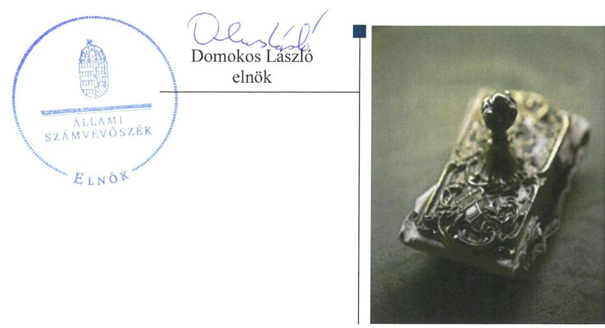
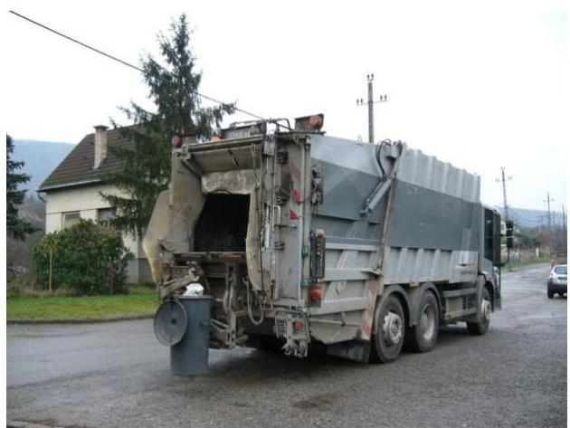
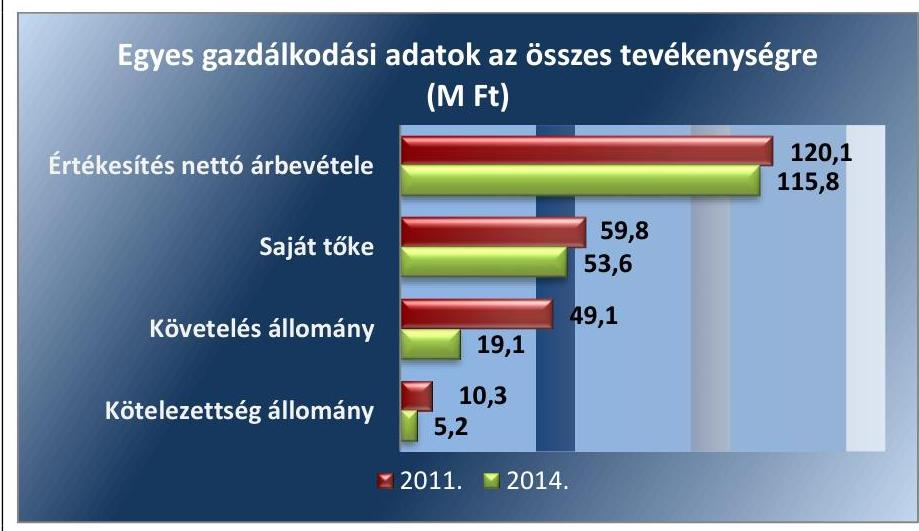
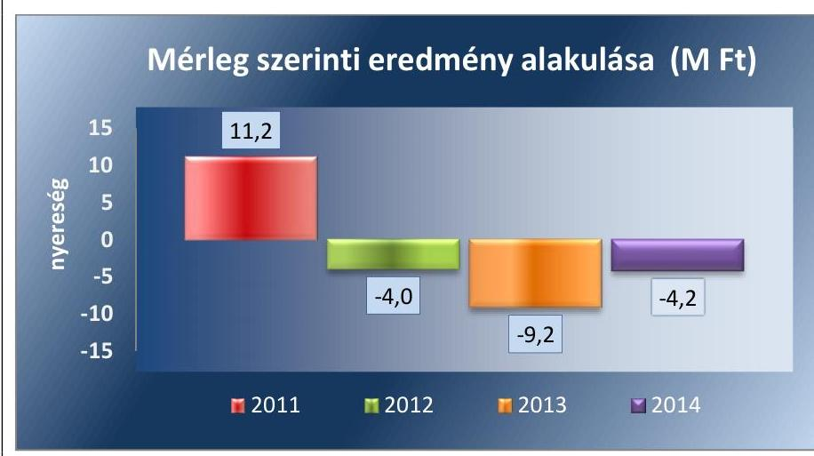
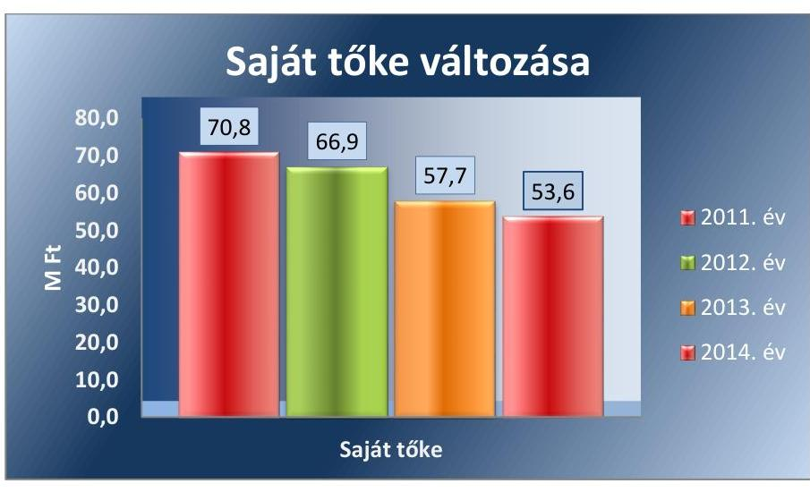
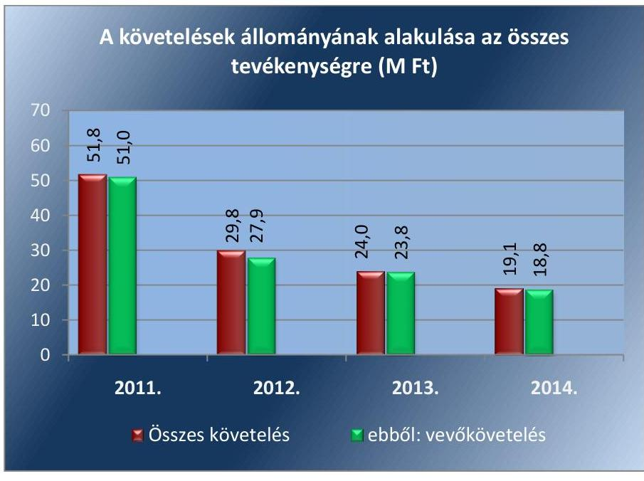

# Jelentés 

## Az önkormányzatok gazdasági társaságai

Az önkormányzatok többségi tulajdonában lévő gazdasági társaságok közfeladat ellátását érintő gazdálkodási tevékenysége szabályszerűségének ellenőrzése - Maros Építőipari és Kommunális Nonprofit Kft.

2016.

---

# Jelentés 

## Az önkormányzatok gazdasági társaságai

Az önkormányzatok többségi tulajdonában lévő gazdasági társaságok közfeladat ellátását érintő gazdálkodási tevékenysége szabályszerűségének ellenőrzése - Maros Építőipari és Kommunális Nonprofit Kft.
2016. október hó 11. nap

---

# AZ ELLENŐRZÉST FELÜGYELTE:

DR. HORVÁTH MARGIT felügyeleti vezető

## AZ ELLENŐRZÉST VEZETTE ÉS A VÉGREHAJTÁSÁÉRT FELELŐS:

VERTKOVCZI MÁRIA ellenőrzésvezető

## A PROGRAM ÖSSZEÁLLÍTÁSÁÉRT FELELŐS:

JANIK JÓZSEF LÁSZLÓ osztályvezető

IKTATÓSZÁM: V-1020-140/2016.

TÉMASZÁM: 2054

ELLENŐRZÉS-AZONOSÍTÓ SZÁM: V-070732

Jelentéseink az Országgyűlés számítógépes hálózatán és az Interneten a www.asz.hu címen is olvashatóak.

---

# TARTALOMJEGYZÉK 

■ ÖSSZEGZÉS ..... 5
■ AZ ELLENŐRZÉS CÉLJA ..... 7
■ AZ ELLENŐRZÉS TERÜLETE ..... 8
■ AZ ELLENŐRZÉS HÁTTERE, INDOKOLTSÁGA ..... 10
■ A JELENTÉS LÉNYEGES KÉRDÉSKÖREI ..... 11
■ ELLENŐRZÉS HATÓKÖRE ÉS MÓDSZEREI ..... 12
■ MEGÁLLAPÍTÁSOK ..... 14
■ JAVASLATOK ..... 29
■ MELLÉKLETEK ..... 33
I. Sz. melléklet: Értelmező szótár ..... 33
II. Sz. melléklet: A működés főbb jellemzői ..... 36
■ FÜGGELÉK: ÉSZREVÉTELEK ..... 37
■ RÖVIDÍTÉSEK JEGYZÉKE ..... 39

---

.

---

# ÖSSZEGZÉS 

Az Állami Számvevőszék a Maros Építőipari és Kommunális Nonprofit Kft. hulladékgazdálkodási közszolgáltatást érintő gazdálkodási tevékenysége 2011-2014. évek közötti szabályszerűségét ellenőrizte. A hulladékgazdálkodást az Önkormányzat szabályosan szervezte meg. A tulajdonosi jogok gyakorlása nem volt szabályszerű. A Társaság vagyongazdálkodása nem volt szabályszerű, a kötelezettségállomány a hulladékgazdálkodási közszolgáltatásra és a működésre nem jelentett kockázatot. A Társaság közszolgáltatói feladattal kapcsolatos önköltségszámítása és árképzési gyakorlata nem volt szabályszerű, ugyanakkor a díjcsökkentést az előírásoknak megfelelően végrehajtotta.

## Az ellenőrzés társadalmi indokoltsága

Az Állami Számvevőszék Stratégiájában megfogalmazta, hogy a helyi önkormányzatok gazdálkodásában rejlő pénzügyi kockázatok feltárásával, az államháztartáson kívülre nyújtott költségvetési támogatások és ingyenes vagyonjuttatások, valamint az államháztartáson kívül működő közfeladat-ellátó rendszerek ellenőrzéseivel hozzájárul ahhoz, hogy a közpénzeket az államháztartáson kívül működő szervezetek is átlátható, rendezett módon használják fel a közfeladatok szerződésben vállalt ellátása érdekében.

Magyarországon az intézmény-centrikus közfeladat-ellátás jellemző, de egyre jelentősebb a költségvetésen kívüli feladatellátás térnyerése. Ennek legfontosabb szereplői - a nonprofit szervezetek mellett - az önkormányzati tulajdonú gazdasági társaságok. Az önkormányzatok szervezetalakítási szabadságának következménye, hogy a korábban is vállalati formában működő közszolgáltatások mellett, mind a kötelező, mind az önként vállalt feladatok ellátásában a gazdasági társaságok kiemelt fontosságú szerephez jutottak.

## Főbb megállapítások, következtetések, javaslatok

Az Önkormányzat a hulladékgazdálkodási kötelező közszolgáltatás megszervezéséről az ellenőrzött időszakot megelőzően döntött, annak ellátásáról az ellenőrzött időszakban a többségi tulajdonában lévő gazdasági társasága útján gondoskodott. Az Önkormányzat tulajdonosi jogait a Hulladékkezelési rendeletében szabályozta. Az Önkormányzatnak a Társaság feletti tulajdonosi joggyakorlása az ellenőrzött időszakban nem volt szabályszerű. Az Önkormányzat az ellenőrzött időszakban tulajdonosi jogait a Társaság évente egyszer összehívott Taggyűlésén gyakorolta. Az ellenőrzött időszakban az éves számviteli beszámolókat a Taggyűlés minden évben jóváhagyta. Az Önkormányzat a hulladékgazdálkodási közszolgáltatását szerződésben szabályozta, azonban a szerződés teljes körűen nem felelt meg a Hgt.-ben, illetve a Ht.-ban előírtaknak. Rendeletalkotási kötelezettségének az Önkormányzat nem teljes körűen tett eleget. A 2011. évre vonatkozó hulladékgazdálkodási tervvel az Önkormányzat nem rendelkezett, a 2012. évben azonban elkészítette a hulladékgazdálkodási tervét. A Társaságnál az ellenőrzött időszakban a Taktv., illetve a Gt. előírásai ellenére FB-t nem hoztak létre, ezáltal az Önkormányzat az ügyvezető munkáját és a Társaság működését nem tudta szabályszerűen kontrollálni.

A Társaság a Hgt. által előírt kötelező hulladékgazdálkodási közszolgáltatást érintő költségek éves beszámolási kötelezettségének 2011-2012. években az Önkormányzat felé nem tett eleget, ezáltal a közszolgáltatói tevékenység elszámoltathatósága nem volt teljes körűen biztosított. A 2013-2014. évekre vonatkozó hulladékgazdálkodási tervet a Ht.-ban foglaltaknak megfelelően a Társaság elkészítette. A Társaság a számlarend kivételével elkészítette a jogszabályban előírt számviteli és egyéb szabályzatokat, azonban a 2011. évben nem rendelkezett Leltározási szabályzattal, továbbá a Számviteli Politikája hiányos volt. Az Önköltségszámítási szabályzat nem felelt meg a jogszabályoknak, funk-

---

cióját nem töltötte be, mivel a Társaság közszolgáltatási tevékenység önköltségének megállapítására nem volt alkalmas. A Társaság a hulladékgazdálkodási közszolgáltatás körébe nem tartozó egyéb tevékenységet is végzett, viszont a hulladékgazdálkodási közszolgáltatásra vonatkozóan az ellenőrzött időszakban a Hgt. és Ht. szerinti szétválasztási szabályokat nem határozta meg, a közszolgáltatási tevékenységet elkülönítetten nem szerepeltette a nyilvántartásokban.

A bevételek, ráfordítások elszámolása a közszolgáltatás elkülönítésének hiánya és az elszámolási hibák miatt nem volt megfelelő. A Társaság árképzése az ellenőrzött időszakban nem volt szabályszerű az önköltségszámítás és a tevékenységek szétválasztásának elmaradása miatt, ezáltal nem volt teljes körűen biztosított a hatékony működéséhez szükséges folyamatos költségek és ráfordítások megtérülése, a közszolgáltatás biztonságos és legkisebb költségű ellátása. A díjak csökkentését ugyanakkor a Rezsi tv.-ben és a Ht.-ben foglaltaknak megfelelően végrehajtotta a Társaság.

A Társaság vagyongazdálkodása a szabályozási hiányosságok és a hibás eljárások, a tárgyi eszközök leltározásának hiánya miatt nem volt szabályszerű. Az eszközök elhasználódása miatt azok használhatósági foka csökkent, döntően az elszámolt értékcsökkenésnél alacsonyabb értékben megvalósított beruházások következtében. A Társaság kötelezettségállománya a közszolgáltatására, működésére nem jelentett kockázatot. A hátralékos követelések az ellenőrzött időszakban csökkentek, döntően a közületi vevőkövetelések csökkenése miatt. A Társaság a hátralékos követelések adók módjára történő behajtását a Hgt. és Ht. előírásai ellenére nem minden esetben kezdeményezte a 2011-2012. években a Jegyzőnél, a 2013-2014. években a NAV-nál.

A Társaság a Számv. tv. alapján a számviteli beszámolókat az ellenőrzött időszakban elkészítette, azonban a 2011. évben a Számv. tv. előírásai ellenére a Társaság nem gondoskodott a kötelező könyvvizsgálatról, ezáltal a 2011. évi számviteli beszámoló előírásoknak való megfelelőssége nem volt biztosított.

A Társaság az Avtv.-ben és az Info.tv.-ben előírtak ellenére az ellenőrzött időszakban nem rendelkezett belső adatvédelmi felelőssel, adatvédelmi és adatbiztonsági, valamint a közérdekű adatok megismerésére irányuló igények teljesítésének rendjére vonatkozó szabályzattal, ezáltal az adatok védelme és a közügyek átláthatósága nem volt biztosított.

---

# AZ ELLENŐRZÉS CÉLJA 

Az ellenőrzés célja annak értékelése, hogy az önkormányzat a jogszabályi előírások figyelembevételével döntött-e az ellenőrzésre kerülő közfeladat megszervezéséről; az önkormányzat/tulajdonosi joggyakorló szabályszerűen gyakorolta-e a tulajdonosi jogokat; a gazdasági társaság közfeladat-ellátása bevételeinek, ráfordításainak elszámolása, és vagyongazdálkodási tevékenysége megfelelt-e a jogszabályi, illetve a közszolgáltatási/vagyonkezelési szerződésben foglalt tulajdonosi előírásoknak, azok végrehajtása szabályszerű volt-e; a gazdasági társaság kötelezettségállománya jelent-e kockázatot a működésre, illetve a közfeladat ellátására; a közfeladatok átláthatósága és elszámoltathatósága érdekében biztosítva volt-e a közszolgáltatás díjának megalapozottsága szabályszerű önköltségszámítással.

---

### AZ ELLENŐRZÉS TERÜLETE

### **Nagymaros Város Önkormányzata és a többségi tulajdonában lévő Maros Építőipari és Kommunális NKft.**

**AZ ÖNKORMÁNYZAT** a Társaságot² az ellenőrzött időszakot megelőzően hozta létre egyszemélyes Társaságként, majd a 2009. évben az üzletrészének 7,66%-át több környező település önkormányzata számára értékesítette. Az értékesített üzletrészből 3,33%-ot Diósjenő Község Önkormányzata, a további 4,33%-ot – közös képviselőnek Szob Város Önkormányzatát kijelölve – 13 önkormányzat közösen vásárolt meg. A közös üzletrésszel rendelkező 13 önkormányzat közül a Társaság Szob, Zebegény és Márianosztra településeken végzett a hulladékkal kapcsolatos közszolgáltatást. Az ellenőrzött időszakban az önkormányzat 92,33% tulajdoni részesedéssel rendelkezett a Társaságban. A Társaság jegyzett tőkéje 3,0 M Ft, ebből az Önkormányzat törzsbetétjének nagysága 2,8 M Ft volt (2,2 M Ft készpénz, 0,6 M Ft nem pénzbeli hozzájárulás), Diósjenő Községi Önkormányzat 0,1 M Ft, Szob Város Önkormányzat 0,1 M Ft törzsbetéttel rendelkezett, amely az ellenőrzött időszakban nem változott.

A jelenlegi Polgármester³ a 2006. évi önkormányzati választások óta tölti be tisztségét. A Jegyző⁴ 2009. december 1-je óta látja el feladatait.

**A MAROS ÉPÍTŐIPARI ÉS KOMMUNÁLIS KFT.** öt település közigazgatási területén biztosította a települési szilárd hulladékkal kapcsolatos kötelező közszolgáltatást az ellenőrzött években. A Társaság főtevékenysége a nem veszélyes hulladék gyűjtése volt, emellett egyéb tevékenységet – konténeres hulladékkezelést, illetve köztemető-fenntartási és temetkezési tevékenységet – is ellátott. A társaság 2014. évi kiszolgálási területének főbb mutatóit az 1. táblázat tartalmazza.

1. táblázat

|  A TÁRSASÁG KISZOLGÁLÁSI TERÜLETÉNEK FŐBB STATISZTIKAI MUTATÓI A 2014. ÉVBEN |  |  |   |
| --- | --- | --- | --- |
|  Mutató megnevezése | lakosságszám (fő) | lakás (db) | hétvégi ház (db)  |
|  Nagymaros | 4820 | 1 177 | 97  |
|  Szob | 2 861 | 836 | 9  |
|  Zebegény | 1 261 | 377 | 126  |
|  Márianosztra | 888 | 238 | 5  |
|  Szendehely | 1 545 | 551 | -  |

*Forrás: Társaság adatszolgáltatója*

A 2014. évben az ellátandó területen végzett hulladékszállítás összesen 11 375 főt, 3 179 lakást, és 237 hétvégi házat, valamint 211 közületet érintett.

---

A Társaság 2011. és 2014. évi bevételeit, illetve a 2011. január 1-jei és 2014. december 31-ei főbb gazdálkodási adatait az 1. ábra mutatja:
1. ábra

Forrás: A Társaság 2011. és 2014. évi beszámolói
Az ellenőrzött időszakban a Társaság árbevétele kis mértékben, 4,3 M Ft-tal csökkent. A követelések állománya a 2011-2014. években folyamatosan csökkent, a 2014. év végére 61,1%-kal lett kevesebb a 2011. január 1-jeihez képest, melynek elsődleges oka a közületi vevő követelések 83,2%-ának kiegyenlítése volt. A kötelezettségek állománya az ellenőrzött időszakban alacsony volt.

A Társaság Ügyvezetőjének⁵ személye az ellenőrzött időszakban nem változott, tisztségét 1992. január 1-je óta töltötte be. A Társaságnak a 2011-2014. években a könyvelést és a beszámoló összeállítását külső vállalkozó végezte.

---

# AZ ELLENŐRZÉS HÁTTERE, INDOKOLTSÁGA 

AZ ÖNKORMÁNYZATI TULAJDONÚ GAZDASÁGI TÁRSASÁGOK teljes körű ellenőrzésének lehetőségét az 1989. évi XXXVIII. törvény 2011. január 1-jétől hatályos módosítása teremtette meg. A közfeladatot ellátó gazdasági társaságok ellenőrzése kiemelten fontos a vagyon megőrzése, megóvása érdekében, valamint a kormányzati szektor elszámolásaiban megjelenő önkormányzati tulajdonú gazdálkodó szervezetek esetében, amelyekkel szemben alapvető követelmény, hogy gazdálkodásuk, működésük szabályszerű, az általuk szolgáltatott adatok minél megbízhatóbbak legyenek. A közfeladat ellátás költségeinek, ráfordításainak alakulása, színvonala hatással van a lakosság elégedettségére. A törvényalkotás számára - az észlelt problémák, szabálytalanságok, vagy egyéb nem kívánatos jelenségek felszínre kerülésével - az ellenőrzés megállapításai segítséget nyújthatnak az államháztartáson kívüli közfeladat-ellátás értékeléséhez, jogszabályi keretei pontosításához, átláthatóságot biztosító szabályozásához. Meghatározhatóvá válnak a közfeladat ellátásban részt vevő államháztartáson kívüli szervezeteknek - az önkormányzat költségvetését, pénzügyi helyzetét is befolyásoló - kockázatai, lehetővé válik ezen kockázatok csökkentése. Ellenőrzéseink feltárhatják, hogy az önkormányzat közfeladat-ellátási kötelezettségének szabályszerűen tett-e eleget, a feladatellátáshoz rendelt közvagyon működtetését a tulajdonostól elvárható gondossággal, szabályszerűen szervezte-e meg és a tulajdonosi felügyelete hozzájárult-e a közfeladat-ellátásához. Az ellenőrzés rávilágíthat arra, hogy a gazdasági társaság a közszolgáltatási szerződésben foglaltak betartásával, a közvagyon használatával biztosította-e a szolgáltatás folytatásának feltételeit, a közfeladat ellátását. Ezzel az ellenőrzöttek és a helyi döntéshozók számára visszajelzést ad feladatszervezési, feladat-ellátási kockázataikról, alapot ad a meglévő hibák megszüntetéséhez, a jobb köz-feladat-ellátás biztosításához. Fokozza a fegyelmet, igazolja,
 hogy lejárt a következmények nélküli ellenőrzések időszaka. Az ÁSZ értékteremtő rend kialakításához és megőrzéséhez hozzájáruló tevékenysége pozitív hatással van a szervezetről kialakított összkép formálására.

---

# A JELENTÉS LÉNYEGES KÉRDÉSKÖREI 

1. Az Önkormányzat közfeladat megszervezéséről szóló döntése, valamint tulajdonosi joggyakorlása szabályszerű volt-e?
2. A gazdasági társaság vagyongazdálkodása szabályszerű volt-e, kötelezettségállománya jelentett-e kockázatot a működésre, illetve a közfeladat ellátásra?
3. A gazdasági társaságnál az ellátott közfeladat bevételei és ráfordításai elszámolása, valamint az önköltségszámítás és árképzés szabályszerű volt-e?

---

# ELLENŐRZÉS HATÓKÖRE ÉS MÓDSZEREI 

## Az ellenőrzés típusa

Megfelelőségi ellenőrzés

## Az ellenőrzött időszak

2011. január 1-jétől 2014. december 31-ig tartó időszak.

## Az ellenőrzés tárgya

A közfeladatot gazdasági társaságokkal ellátó önkormányzatok tulajdonosi joggyakorlása, valamint gazdasági társaságok pénz- és vagyongazdálkodásának szabályozottsága és szabályszerűsége.

Az ellenőrzés kiterjed minden olyan körülményre és adatra, amely az ÁSZ jogszabályban meghatározott feladatainak teljesítéséhez, valamint a program végrehajtása folyamán felmerült újabb összefüggések feltárásához szükséges.

## Az ellenőrzött szervezet

- Maros Építőipari és Kommunális NKft.
- Nagymaros Város Önkormányzata

## Az ellenőrzés jogalapja

Az ellenőrzés jogszabályi alapját az Állami Számvevőszékről szóló 2011. évi LXVI. törvény (ÁSZ tv.) 5. § (3)-(4)-(5) bekezdése képezte.

## Az ellenőrzés módszerei

Az ellenőrzést a nemzetközi standardokat irányadónak tekintve az ellenőrzési program ellenőrzési kérdései, az ellenőrzött időszakban hatályos jogszabályok, az ellenőrzés szakmai szabályok és módszertanok figyelembe vételével végeztük.

Az ellenőrzés ideje alatt az ellenőrzött szervezettel történő kapcsolattartást az ÁSZ Szervezeti és Működési Szabályzatának vonatkozó előírásai alapján biztosítottuk.

---

Az ellenőrzés a kiválasztott, többségi tulajdonosi jogokat gyakorló önkormányzatra, illetve az ellenőrzésre kijelölt közfeladatot ellátó gazdasági társaság felett tulajdonosi jogokat gyakorló szervezetre és az ellenőrzött közfeladatot ellátó gazdasági társaságra terjedt ki. Amennyiben a gazdasági társaságban több önkormányzat együttesen többségi tulajdonos, úgy az ellenőrzést a többségi tulajdonosi jogokat gyakorló önkormányzatnál kellett lefolytatni. Az ellenőrzött gazdasági társaságnál, amennyiben az több közfeladatot is ellátott, akkor az ellenőrzésre kiválasztott közfeladatellátást ellenőriztük.

Az ellenőrzést a kérdésekre adott válaszok kiértékelésével, valamint a megjelölt adatforrások, a csatolt tanúsítványok felhasználásával, továbbá az adott időszakban hatályos jogszabályok figyelembe vételével folytattuk le. Az ellenőrzési kérdések megválaszolásához szükséges bizonyítékok megszerzése a következő ellenőrzési eljárások alkalmazásával történt: megfigyelés, kérdésfeltevés (információkérés), összehasonlítás, valamint elemző eljárás.

A bevételek és ráfordítások elszámolása, valamint a vagyonnyilvántartás terén a szabályszerű működést véletlen mintavétellel ellenőriztük. A jogszabályoknak és a belső előírásoknak megfelelőnek tekintettük az adott területet, amennyiben a minta ellenőrzésének eredménye alapján 95%-os bizonyossággal a teljes sokaságban a hibaarány kisebb volt, mint 10%, nem megfelelőnek, ha a hibaarány a 10%-ot meghaladta. Kockázatot, illetve magas kockázatot jeleztünk, amennyiben egy adott terület vonatkozásában a minta alapján a teljes sokaságban nem volt egyértelműen biztosított a jogszabályoknak és a belső szabályzatoknak megfelelő működés. A ráfordítások elszámolására és a vagyonnyilvántartásra vonatkozó véletlen mintavételt kockázati alapú kiválasztással egészítettük ki, amelynek során évente a három legnagyobb összegű tételt választottuk ki.

---

# 1. Az Önkormányzat közfeladat megszervezéséről szóló döntése, valamint tulajdonosi joggyakorlása szabályszerű volt-e? 

Összegző megállapítás

Az Önkormányzat a hulladékgazdálkodási közszolgáltatás megszervezéséről szabályszerűen gondoskodott. Az Önkormányzat rendeletalkotási és szerződéskötési kötelezettségét hiányosan teljesítette. Az FB hiánya és a szabályozási hiányosságok következtében a tulajdonosi joggyakorlás nem volt szabályszerű, ezáltal nem volt teljes körűen biztosított az elszámoltatás, a megfelelő működés. A 2011. évben hulladékgazdálkodási tervvel az Önkormányzat nem rendelkezett, azonban 2012. évben elkészítette hulladékgazdálkodási tervét.
1.1. számú megállapítás

Az Önkormányzat a hulladékgazdálkodási közfeladat ellátását szabályszerűen szervezte meg. Az Önkormányzat a rendeletalkotási kötelezettségét hiányosan teljesítette, a jogszabályokban meghatározott szerződéskötési kötelezettségének nem teljes körűen tett eleget. A 2011. évben az Önkormányzat nem rendelkezett hulladékgazdálkodási tervvel, melyet a 2012. évben elkészített.

A KÖZTISZTASÁG, ILLETVE TELEPÜLÉSTISZTASÁG BIZTOSÍTÁSA az Ötv. ${ }^{6}$ 8.§ (1) bekezdése, illetve a hulladékgazdálkodás a Mötv. ${ }^{7}$ 13. § (1) bekezdés 19. pontja alapján az Önkormányzat feladata volt. Az Önkormányzat az ellenőrzött időszakot megelőzően döntött a közfeladat gazdasági társasági formában történő ellátásáról ${ }^{8}$. Az Önkormányzat az Ötv. 8. § (1) bekezdésében, a Hgt. ${ }^{9}$ 21. § (1) bekezdésében, valamint a Ht. ${ }^{10}$ 33. § (1) bekezdésében meghatározott közszolgáltatást az Ötv. 9.§ (4) bekezdése, illetve a Mötv. 41. § (6) bekezdése alapján a többségi tulajdonú gazdasági Társasága útján látta el az ellenőrzött időszakban.

GAZDASÁGI PROGRAMOT a 2007-2013. évekre vonatkozóan készített a Képviselő-testület ${ }^{11}$, melyet az alakuló ülést ${ }^{12}$ követően felülvizsgált és a ciklus végéig kiegészítette.

A Gazdasági programban az Ötv. 91. § (6) bekezdésében, illetve a Mötv. 116. § (3)-(4) bekezdésében foglaltak ellenére az Önkormányzat nem fogalmazott meg a köztisztaság és településtisztaság biztosítása, mint kötelezően ellátandó közfeladat fejlesztésével kapcsolatos elképzeléseket, a közszolgáltatás biztosítására, színvonalának javítására vonatkozó megoldásokat.

Az Nvtv. ${ }^{13}$ 9. § (1) bekezdésének megfelelően az Önkormányzat rendelkezett vagyongazdálkodási tervvel ${ }^{14}$, azonban a Vagyonrendelet ${ }^{15}$ 36. § (1)-

---

(3) bekezdéseiben előírtak ellenére a Vagyongazdálkodási terv nem tartalmazta a hulladékgazdálkodási közfeladatot, és annak ellátásával kapcsolatos vagyon tervet. A Vagyongazdálkodási terv nem tartalmazta továbbá, hogy milyen időszakra vonatkozik, ezáltal nem állapítható meg, hogy a Vagyonrendelet 36. § (1) bekezdésében előírt 3, illetve 6 éves időtartamnak megfelel-e.

A Hgt. 35. § (1) bekezdésében előírtak ellenére Hulladékgazdálkodási tervvel az Önkormányzat a 2011. évre vonatkozóan nem rendelkezett, mivel a jegyző nem tett eleget a 241/2001. Korm. rendelet ${ }^{16}$ 1. § e) pontjában foglalt hulladékgazdálkodási tervet előkészítő feladatának. A Hgt. 37. § (4) bekezdésében előírt tartalommal 2012. augusztus 15-étől hatályos hulladékgazdálkodási tervet az Önkormányzat a Hgt. 37. § (1) bekezdésében előírt hat év időtartam helyett, három évre (2012-2014. évekre) dolgozta ki.

A TÁRSASÁG TÁRSASÁGI SZERZŐDÉSE ${ }^{17}$ megfelelt a Gt. ${ }^{18}$ 12. § (1) bekezdésében, illetve a Ptk. ${ }^{19}$ 3:5 §-ában előírt tartalmi követelményeknek. A Társasági Szerződés az ellenőrzött időszak alatt két alkalommal módosításra került az Ügyvezető megbízásának meghosszabbítása, és a Társaság nonprofit gazdasági társasággá alakulása miatt. Az ellenőrzött időszakban a Társaság legfőbb szerve a Taggyülés ${ }^{20}$ volt. A Társasági szerződés a Taggyülés kizárólagos hatáskörét a Gt. 141. § (2) bekezdése, illetve a Ptk. 3:371. § (1) bekezdése alapján tartalmazta.

A FELADATELLÁTÁS KERETSZABÁLYAIT a Hulladékkezelési rendelet ${ }^{21}$, illetve a 2012. évtől a Közszolgáltatási szerződés ${ }^{22}$ rögzítette.

A Társaság 1999. március 25-én az Önkormányzattal kötött hulladékkezelési közszolgáltatásra vonatkozó Megbízási szerződését ${ }^{23}$ a Hgt. 56. § (9) bekezdésével ellentétben a Hgt. 59. § (1) bekezdés I) pontja alapján nem módosította, ezáltal a 224/2004. (VII. 22.) Korm. rendelet ${ }^{24}$ 12.§-14. §-aiban meghatározott, a közszolgáltatás ellátására vonatkozó szerződés részletes tartalmi követelményeinek nem felelt meg. A Megbízási szerződés nem tartalmazta a közszolgáltatás finanszírozásának elveit és módszereit, a kötelezettség teljesítésének feltételeit és biztosítékait, a közszolgáltatás díjának megállapítására és beszedésére vonatkozó eljárásokat, az igazolt díjhátralék kiegyenlítésére vonatkozó eljárást, valamint alvállalkozó igénybevételének feltételeit. A Megbízási szerződés módosításának elmaradása következtében a Hgt. 56. § (9) bekezdésében foglaltak alapján az ellenőrzött időszakban 2011. január 1-jétől 2011. december 31-éig - az új szerződés megkötéséig - a Társaság és az Önkormányzat között a hulladékgazdálkodási közszolgáltatás végzésére nem volt a jogszabálynak megfelelő és hatályos megbízási szerződés, azonban a gyakorlatban a feladatellátás folyamatos volt.
2012. január 2-án az Önkormányzat Közszolgáltatási szerződést kötött a Társasággal, azonban a Hgt. 28. § (3) bekezdésében meghatározott legfeljebb 10 év helyett határozatlan időt határoztak meg benne, azonban a Közszolgáltatási szerződés 2014. június 30-ával - a Ht. alapján előírt új Közszolgáltatási szerződés megkötésével - megszűnt. A Közszolgáltatási szerződés tartalmazta a 224/2004. (VII. 22.) Korm. rendeletben meghatározottak szerint a Társaság és az Önkormányzat közszolgáltatással kapcsolatos

---

# 1.2. számú megállapítás 

kötelezettségeit, a közszolgáltatás finanszírozásának elveit. A Közszolgáltatási szerződés azonban a 224/2004. (VII. 22.) Korm. rendelet 12. § (2) bekezdés b) és c) pontjaiban, valamint a 13. § (4) bekezdésében előírtak ellenére nem tartalmazta az Önkormányzat kötelezettségeként a közszolgáltatás körébe tartozó és a településen folyó egyéb hulladékkezelési tevékenységek, illetve különböző közszolgáltatások összehangolásának elősegítését, és nem tartalmazta az igazolt díjhátralék kiegyenlítésére vonatkozó eljárást.

A Társaság 2014. január 1-jével a Ht. 2. § (1) 37. pontjában foglaltaknak megfelelő nonprofit társasággá alakult, ezáltal 2014. július 1-jétől a Ht. 90. § (8) bekezdése alapján az Önkormányzat a Társasággal megkötötte az új öt évre szóló Közszolgáltatási szerződését. A Társaság rendelkezett a Ht. 34. § (3) bekezdésben előírt hulladékgazdálkodási közszolgáltatási engedéllyel, valamint az OHÜ ${ }^{25}$ által kiállított minősítő okirattal. Az új Közszolgáltatói szerződés a Ht. 34. § (5) bekezdésben meghatározottak szerint tartalmazta a közszolgáltató azonosító adatait, a közszolgáltatási tevékenység megnevezését, a közszolgáltatási tevékenységgel érintett területet, a közszolgáltatási tevékenység végzésének időtartamát.

Ugyanakkor a 2014. július 1-jétől hatályos Közszolgáltatási szerződés az önkormányzat kötelességeként nem tartalmazta a 317/2013. (VIII. 28.) Korm. rendelet 4. § (1) bekezdés a) pontjában és a 4. § (3) bekezdés b) és c) pontjaiban előírtak ellenére az OHÜ által meghatározott minősítési osztályt és a közszolgáltatás körébe nem tartozó hulladékgazdálkodási tevékenységek közszolgáltatással történő összehangolásának elősegítését, a közszolgáltatásnak a településen végzett más közszolgáltatásokkal való összehangolásának elősegítését.

RENDELETALKOTÁSI KÖTELEZETTSÉGÉNEK az Önkormányzat a Hulladékkezelési rendeletben tett eleget a Hgt. 23. § a)-f) és h) pontjaiban, illetve a Ht. 35. § a)-f) pontjaiban előírtaknak megfelelően, azonban a Hgt. 23. § g) pontjában és a Ht. 35. § g) pontjában foglaltak ellenére a személyes adatok kezelésére vonatkozó rendeletalkotási kötelezettségét az ellenőrzött időszakban nem teljesítette.

Az Önkormányzat tulajdonosi joggyakorlása nem volt szabályszerű, mivel az ellenőrzött időszakban a Társaságnál FB nem működött. A Taggyülés javadalmazási szabályzatot nem alkotott.

A TÁRSASÁG FELETTI TULAJDONOSI JOGOK GYAKORLÁSÁRA vonatkozó szabályokat az Önkormányzat a Hulladékkezelési rendeletben határozta meg.

Az Önkormányzat a Hulladékkezelési rendelet 22. § (1) bekezdésében a Társaság részére előírta, hogy az éves számviteli beszámolón felül minden év november hónapjában számoljon be a Képviselő-testület előtt a hulladékkezelési közszolgáltatási tevékenységéről. Beszámolási kötelezettségnek a Társaság az ellenőrzött időszakban nem tett eleget.

Az Önkormányzat a 2011-2013-években nem élt az Ötv. 92. § (11) bekezdés b) pontjában, és az Áht. ${ }^{26}$ 70. § (1) bekezdés d) pontjában biztosított jogával, miszerint belső ellenőrzést végezhet a többségi tulajdonában lévő gazdasági társaságnál.

---

A 2014. évben az Önkormányzat egy külső könyvvizsgáló céget bízott meg belső ellenőrzés céljából a Társaság 2014. évi gazdálkodásának felülvizsgálatára. A szerződés tárgya kiterjedt a számviteli adatok főkönyvi és analitikus ellenőrzésére, a tárgyi eszközök és pénzeszközök leltárának ellenőrzésére, a vevő-, szállító állomány, a követelések, kötelezettségek egyeztetésére, az adófolyószámla egyeztetésére. A vizsgálatot végző társaság által kiadott jelentés a 2014. évi beszámoló és kiegészítő melléklet adatainak összhangját állapította meg, nem állapította meg és nem
 tájékoztatta az Önkormányzatot a Társaság szabályzatainak hiányosságairól, a számlarend, a bizonylati rend hiányáról, az analitika és a főkönyvi adatok eltéréséről, nem jelezte a leltárfelvétel hiányát a befektetett eszközök tekintetében.

Az Önkormányzat a tulajdonosi jogait az ellenőrzött időszakban a Társaság évente egyszer összehívott Taggyűlésén gyakorolta, azokon az Önkormányzat képviseletében az Ötv. 9. § (1) bekezdésében, és az Mt. 41. § (1) bekezdése alapján a Polgármester vett részt. A számviteli éves beszámolót és Üzleti tervet az ellenőrzött években a Taggyűlés megtárgyalta és elfogadásáról határozattal döntött.

FELÜGYELŐ BIZOTTSÁG ${ }^{27}$ létrehozására a 2011-2014. években a Társaságnál a Gt. 33. § (2) bekezdés c) pontjában és a Taktv. ${ }^{28}$ 4. § (1) bekezdésében előírtak ellenére nem került sor, így nem volt biztosított a tulajdonosi ellenőrzés. A 2010. április 28-tól 2012. május 30-áig hatályos Társasági Szerződés az FB-re vonatkozóan nem tartalmazott rendelkezést, azt követően a Társasági Szerződés 16.1. pontja úgy rendelkezett, hogy FB választására nem kerül sor.

A JAVADALMAZÁSI SZABÁLYZATOT a Taggyűlés a Taktv. 5. § (3) bekezdésében foglaltak ellenére az ellenőrzött időszakban nem alkotta meg. A munkaviszony keretében foglalkoztatott Ügyvezető részére prémium kifizetés a 2011-2014. években nem történt.

A Társaság a 2011. évben nyereségesen, a 2012-2014. években veszteségesen gazdálkodott, amely a bevételek csökkenésének és a ráfordítások növekedésének következménye volt.

A Társaság mérleg szerinti eredményének a 2011-2014. évi alakulását a 2. ábra szemlélteti:
2. ábra

---

# 2. A gazdasági társaság vagyongazdálkodása szabályszerű volt-e, kötelezettségállománya jelentett-e kockázatot a működésre, illetve a közfeladat ellátásra? 

Összegző megállapítás

A Társaság vagyongazdálkodása nem volt szabályszerű, mivel szabályozási kötelezettségének több esetben nem tett eleget, leltározási kötelezettségét hiányosan teljesítette és az értékcsökkenés elszámolása hibás volt. Kötelezettségállománya a működésre, a közfeladat ellátásra nem jelentett kockázatot. A Társaság éves beszámolóját a 2011. évben az előírtak ellenére Könyvvizsgáló nem véleményezte, ezáltal nem volt biztosított a beszámoló megfelelősége. A Társaság 2011-2012. években a közszolgáltatási tevékenységre előírt költségelszámolást nem készített, a 2013-2014. évek elkülönített mérleg és eredménykimutatást a beszámoló kiegészítő melléklete nem tartalmazta, így nem volt biztosított a közszolgáltatás átláthatósága és elszámoltathatósága. A Társaság az adatvédelmi és adatbiztonsági szabályzat és belső adatvédelmi felelős kijelölése, illetve a közérdekű adatok közzétételi hiányosságai következtében nem biztosította az adatok védelmét átláthatóságát.
2.1. számú megállapítás

A Társaság szabályzatai a jogszabályi előírásoknak nem teljes körűen feleltek meg, mivel 2011. évben Leltározási szabályzattal, az ellenőrzött időszakban Számlarenddel nem rendelkezett, a Számviteli politika hiányos volt, az Önköltségszámítási szabályzat nem felelt meg a jogszabályoknak. A hulladékgazdálkodási közszolgáltatói tevékenység számviteli elkülönítésének szabályozásáról a Társaság nem gondoskodott.

AZ ÜZLETI TERVEKET az Ügyvezető elkészítette és a Taggyűlés elé minden évben beterjesztette az éves beszámolóval egy időben. Az Üzleti tervek tartalmi és formai követelményeit a tulajdonosok nem határozták meg. Az Üzleti tervek mindössze három számot tartalmaztak az előző évi bázis adatok alapján tervezett összesen bevétel, összesen költségek és összesen eredmény összegeire vonatkozóan.

A Társaság a Ht. 78. § (1) és (4) bekezdésében előírtaknak megfelelően, a 438/2012. (XII.29.) Korm. rendelet 11. § (1) bekezdése szerinti tartalommal elkészítette a közszolgáltatói hulladékgazdálkodási tervét és a Ht. 78. § (3) bekezdésében előírtak alapján megküldte a környezetvédelmi hatóságnak. Az OKTVF a hulladékgazdálkodási tervet jóváhagyta.

A Társaság az ellenőrzött időszakban rendelkezett a Számv. tv. ${ }^{29}$ 14. § (3) bekezdésben előírt Számviteli politikával ${ }^{30}$, ezen belül a Számv. tv. 14. § (5) bekezdés a)-d) pontjaiban előírt Értékelési szabályzattal ${ }^{31}$, Pénzkezelési szabályzattal ${ }^{32}$, és Önköltségszámítási szabályzattal ${ }^{33}$, a 2012. évtől Leltározási szabályzattal ${ }^{34}$.

---

A SZÁMVITELI POLITIKA a Számv. tv. 14. § (4) bekezdésében előírtak ellenére azonban nem tartalmazta
— az ellenőrzéshez kapcsolódó jelentős és nem jelentős összegű hibák értékhatárait a Számv. tv. 3. § (3) bekezdés 3-4. pontjainak megfelelően,
— 2012. december 31-éig a Számv. tv. 3. § (3) bekezdésének 5. pontja alapján a megbízható és valós képet lényegesen befolyásoló hiba értékhatárát,
— a Számv. tv. 47. § (9) bekezdése szerint az eszközök kalkulált bekerülési értékének tényleges bekerülési értékre történő módosítása szempontjából jelentős eltérés összegét,
— a Számv. tv. 56. § (1)-(3) bekezdéseinek megfelelően a fajlagosan kis értékű készletek és a kis összegű követelések fogalmát,
— a Számv. tv. 86. § (8) bekezdésében foglaltak alapján, hogy a rendkívüli bevételek és ráfordítások mely esetben gyakorolnak jelentős hatást az eredményre, valamint
— az amortizációs politika legfőbb elemeit, ezen belül a Számv. tv. 3. § (4) bekezdésének 5)-6) pontjai, illetve a Számv. tv. 52. § (1)-(2) bekezdéseinek figyelembe vételével az egyes eszközök hasznos élettartamát, maradványértékét, a leírás módszerét és kulcsait.
A Leltározási szabályzat készítéséről a Számv. tv. 14. § (5) bekezdésének a) pontjában előírtak ellenére a Társaság a 2011. évben nem gondoskodott.

A Társaság a 2012. évtől rendelkezett a Számv. tv. 14. § (5) bekezdés a) pontjában előírtak szerinti Leltározási szabályzattal. A Számv. tv. 69. § (3) bekezdését figyelembe véve a szabályzat tartalmazta a leltározás gyakoriságát, valamint a Számv. tv. 169. § (1) bekezdése szerint a leltározási dokumentumok megőrzési kötelezettségére vonatkozó előírásokat.

SZÁMLARENDET a Társaság a Számv. tv. 161. § (1) bekezdésében előírtak ellenére a 2011-2014. évekre vonatkozóan nem készített. A Társaság az ellenőrzött időszakban a Számv. tv. 160.§-ában meghatározott tartalmú számlatükörrel rendelkezett.

A Társaság az ellenőrzött időszakban a Számv. tv. 14. § (5) bekezdés c) pontja alapján rendelkezett Önköltségszámítási szabályzattal. Az Önköltségszámítási szabályzat a végzett tevékenységgel kapcsolatos bekerülési érték megállapításához a közvetlenül felmerült, a tevékenységhez szorosan kapcsolódó, illetve mutatók alapján felosztható költségeket (közvetlen önköltséget), továbbá az általános költségeket (közvetett önköltség) nem határozta meg, így nem felelt meg a Számv. tv. 51. §. (2)-(4) bekezdés előírtaknak.

# A TEVÉKENYSÉGEK SZÉTVÁLASZTÁSÁNAK SZABÁLYOZÁSÁRÓL a Társaság a 2011-2014. években nem gondoskodott. A Társaság az ellenőrzött időszakban egyéb hulladékgazdálkodási tevékenységet is folytatott. A 2011-2012. években a Hgt. 29. § (3) bekezdésében előírta a kötelezően ellátandó közszolgáltatás kereteibe nem tartozó más hulladékkezelési szolgáltatások költségeinek, elszámolásának és dijának elkülönítését. A Társaság a tevékenységek előírt elkülönítését a 2011-2012. években a nyilvántartási (könyvvezetési) rendszerében nem

---

részletezte tovább, ezzel a Számv. tv. 161/A. § (2) bekezdésében előírtakkal ellentétben nem biztosította a közpénzek felhasználásának és a köztulajdon használatának teljes körű ellenőrizhetőségét, továbbá a 64/2008. (III. 28.) Korm. rendelet ${ }^{35}$ 5. §-ban, valamint a Hgt. 29. § (3) bekezdésében meghatározott adatok rendelkezésre állását. A Társaság a Számv. tv. 161/A. § (1) bekezdésében foglaltak ellenére a 2013-2014. években a tevékenységeinek előírt elkülönítését a könyvvezetésére vonatkozó részletes belső szabályaiban nem alakította úgy, hogy az a kiegészítő melléklet adatainak közvetlen alátámasztására is alkalmas legyen, ezáltal nem biztosította a Ht. 50. § (1)-(3) bekezdésében előírtak ellenére az egyes tevékenységek olyan elkülönült nyilvántartását, amely biztosítja az egyes tevékenységek átláthatóságát, kizárja a keresztfinanszírozást, továbbá a hulladékgazdálkodási közszolgáltatás nyújtása érdekében végzett tevékenység éves beszámoló kiegészítő mellékletében önálló mérleg és eredménykimutatásban való szerepeltetését. A szabályozás hiányával a társaság a 2013-2014. években a Számv. tv. 161/A. § (2) bekezdésében előírtakkal ellentétben nem biztosította a közpénzek felhasználásának és a köztulajdon használatának ellenőrizhetőségét, továbbá a 64/2008. Korm. rendelet (5) bekezdésében és a Ht. 50. § (2)-(3) bekezdésében meghatározott adatok rendelkezésre állását. A tevékenységek elkülönítésének szabályozási hiányában a Számv. tv. 15. § (3) bekezdésében foglaltak ellenére a könyvvitelben és beszámolóban szereplő tételek megfelelőségének bizonyíthatósága és ellenőrizhetősége nem volt biztosított.
2.2. számú megállapítás

A Társaság vagyongazdálkodása nem volt szabályszerű a befektetett eszközök leltározásának elmaradása, az értékcsökkenés év végi elszámolási hibái, továbbá a szabályozási és szerződéskötési hiányosságok miatt.

A Társaság a hulladékkezelési közfeladatát saját eszközeivel látta el, önkormányzati tulajdonban lévő vagyontárgyak vagyonkezelésbe vételére az ellenőrzött időszakban nem került sor.

A Társaság az ellenőrzött időszakban a tevékenységéhez használta az Önkormányzat tulajdonában levő hulladékudvarként funkcionáló területet, illetve egy az Önkormányzat tulajdonában álló tehergépjárművet, azonban a két eszközzel kapcsolatban az Önkormányzat és a Társaság között az ellenőrzött időszakban nem jött létre szerződés. Szerződés hiányában az eszközök használatának jogi keretei nem tisztázottak.

A Társaság az éves beszámoló mérleg sorait alátámasztó számviteli nyilvántartásokban szereplő vagyonának leltározását a Számv. tv. 69. § (1) bekezdésében és a Leltározási szabályzatában foglaltak ellenére nem megfelelően végezte. A Társaság kizárólag a készleteiről, illetőleg pénzeszközeiről készített évente mennyiségi felvétellel leltárt, a befektetett eszközeinek a Számv. tv. 69. § (3) bekezdésében, illetve a Leltározási szabályzat 2. pontjában foglaltak ellenére a 3 évente előírt leltározási kötelezettségét az ellenőrzött időszakban nem teljesítette.

---

A Társaság főbb mérlegadatait az 2. táblázat tartalmazza.
2. táblázat

FŐBB MÉRLEGADATOK 2011-2014. (M FT)

| Mégnevezés | $\begin{gathered} 2011- \\ 01 .01 . \end{gathered}$ | $\begin{gathered} 2011- \\ 12.31 . \end{gathered}$ | $\begin{gathered} 2012- \\ 12.31 . \end{gathered}$ | $\begin{gathered} 2013- \\ 12.31 . \end{gathered}$ | $\begin{gathered} 2014- \\ 12.31 . \end{gathered}$ |
| :--: | :--: | :--: | :--: | :--: | :--: |
| I. Befektetett eszközök | 5,2 | 5,1 | 7,8 | 7,3 | 6,9 |
| - ebből: Tárgyi eszközök | 5,2 | 5,1 | 7,8 | 7,3 | 6,9 |
| II. Forgó eszközök | 64,9 | 75,9 | 69,0 | 69,3 | 42,7 |
| - ebből: Követelések | 49,0 | 51,8 | 29,8 | 24,0 | 19,1 |
| - ebből: Pénzeszközök | 14,7 | 22,1 | 37,3 | 43,9 | 22,1 |
| III. Aktív időbeli elhatárolások | 0 | 0 | 2,9 | 1,0 | 15,6 |
| Eszközök összesen | 70,1 | 81,0 | 79,7 | 77,6 | 65,2 |
| IV. Saját tőke | 59,8 | 70,8 | 66,9 | 57,7 | 53,6 |
| - ebből: Jegyzett tőke | 3,0 | 3,0 | 3,0 | 3,0 | 3,0 |
| - ebből: Tőketartalék | 18,9 | 18,9 | 18,9 | 18,9 | 18,9 |
| - ebből Mérleg szerinti eredmény | - | 11,2 | $-4,0$ | $-9,2$ | $-4,2$ |
| V. Céltartalékok | 0 | 0 | 0 | 0,8 | 0,8 |
| VI. Kötelezettségek | 10,3 | 6,1 | 6,2 | 12,9 | 5,2 |
| - ebből: szállítókkal szembeni kötelezettség | n.a. | 1,8 | 3,3 | 2,7 | 1,0 |
| VII. Passzív időbeli elhatárolások | 0 | 4,1 | 6,6 | 6,2 | 5,6 |
| Források összesen | 70,1 | 81,0 | 79,7 | 77,6 | 65,2 |

Forrás: A Társaság 2011-2014. évi beszámolói / A Társaság adatszolgáltatása

A Társaság eszközeinek túlnyomó része az ellenőrzött időszakban forgóeszközökből állt, a tartós eszközök aránya a 2012. évi gépjármű beszerzést követő években
 (2013-2014.) az összes eszköz 10\%-a körül mozgott. A forgóeszközök állománya az ellenőrzött időszak egészét tekintve csökkent, 2014. december 31-én értékük 22,2 M Ft-tal volt alacsonyabb a 2011. évi nyitó értéknél. A változást elsősorban a közületi vevőkkel szembeni követelések csökkenése eredményezte. A fejlesztésre, az eszközök pótlására fordított összeg a 2011-2014. években (5,8 M Ft) összességében alacsonyabb volt, mint az eszközök elszámolt értékcsökkenése (6,3 M Ft).

A kommunális járművek esetében a 2011. évi főkönyvi nyilvántartásban könyvelt értékcsökkenés egyenlege nem egyezett meg a tárgyi eszköz analitikában kimutatott értékcsökkenés összegével, ezzel a Társaság megsértette a Számv. tv. 15. § (3) bekezdésében előírt valódiság elvét, a Számv. tv. 15. § (7) bekezdésében előírt összemérés elvét, a Számv. tv. 18. §-ban meghatározott megbízható és valós kép kialakításának kötelezettségét. A 2014. évben a Társaság a tulajdonában álló szemétszállításhoz használt gépjárművek értékcsökkenési leírását az analitikájában előírta, azonban az előírt értékcsökkenést a főkönyvi könyvelésébe nem vezette át, ezzel megsértette a Számv. tv. 15. § (7)-(8) bekezdéseiben foglalt összemérés és óvatosság elvét, a Számv. tv. 16. §-ban megfogalmazott egyedi értékelés elvét és a Számviteli politikában a számviteli alapelvek érvényesítésével, valamint az értékcsökkenés elszámolásával kapcsolatban előírtakat.

A SAJÁT TÖKE a 2011. évről a 2014. év végére 17,2 M Ft-tal csökkent, mely változást a Társaság 2012-2014. évek közötti veszteséges gazdálkodása okozta. A 2011. évben nyereséges volt a Társaság tevékenysége. A Társaságnál osztalék fizetésére nem került sor az ellenőrzött időszakban. A saját tőke összege az ellenőrzött időszakban lényegesen meghaladta a jegyzett tőke 3,0 M Ft-os összegét. A saját tőke változását a 3. ábra szemlélteti.
3. ábra

Forrás: Társaság beszámolói
2.3. számú megállapítás

A kötelezettségek állománya nem jelentett kockázatot a közfeladat ellátására, illetve a működésre.

A KÖTELEZETTSÉGEK állománya az ellenőrzött időszakban rövidlejáratú tartozásokból állt. A kötelezettségek állománya a 2011. évről a 2014. év végére 14,8 %-al (0,9 M Ft-tal) csökkent. A rövid lejáratú kötelezettségeket elsősorban szállítói tartozásokból, valamint adó- és járulékterhekből állt. A kötelezettségek alakulását a 2011-2014. években a 3. táblázat mutatja.
3. táblázat

KÖTELEZETTSÉGEK ALAKULÁSA (M FT)

|  | 2011 | 2012 | 2013 | 2014 |
| :-- | --: | --: | --: | --: |
| Hosszú lejáratú kötelezettségek összesen | 0 | 0 | 0 | 0 |
| Rövid lejáratú kötelezettségek összesen | 6,1 | 6,2 | 12,9 | 5,2 |
| Ebből rövid lejáratú hitel | 0 | 0 | 0 | 0 |
| szállítói kötelezettség | 1,8 | 3,3 | 2,7 | 1,0 |
| egyéb rövid lejáratú kötelezettség | 4,3 | 2,9 | 10,2 | 4,2 |
| Kötelezettségek összesen | 6,1 | 6,2 | 12,9 | 5,2 |

A Társaság a kötelezettségeit alapvetően határidőben teljesítette, a kötelezettségek nem jelentettek kockázatot a hulladékgazdálkodással kapcsolatos közfeladat ellátására illetve a működésre.

AZ ELADÓSODOTTSÁG mértéke az ellenőrzött időszakban jelentősen nem változott, a 2013. évi átmeneti növekedését a kötelezettségállomány növekedése okozta.

---

| A mutatók alakulását a 4. táblázat szemlélteti: |  |  |  |  |
| :--: | :--: | :--: | :--: | :--: |
| 4. táblázat |  |  |  |  |
| ELADÓSODOTTSÁGI MUTATÓK |  |  |  |  |
| Mutató megnevezése | 2011. | 2012. | 2013. | 2014. |
| Eladósodottsági mutató   (idegen tőke/összes forrás) | 0,08 | 0,08 | 0,17 | 0,08 |
| Eladósodottság mértéke (kötelezettségek/saját tőke) | 0,09 | 0,09 | 0,22 | 0,10 |
| Nettó eladósodottság (kötelezettségek-követelések) / saját tőke | $-0,65$ | $-0,35$ | $-0,19$ | $-0,26$ |
| Adósságfedezeti mutató I. (befektetett eszközök+forgóeszközök)/idegen forrás | 13,26 | 12,32 | 5,95 | 9,62 |
| Árbevételre vetített eladósodottság (kötelezettségek-forgóeszközök)/árbevétel | $-0,58$ | $-0,58$ | $-0,47$ | $-0,32$ |

A kötelezettségek és a saját forrás arányát jelző eladósodottság mértéke egy alatt volt az ellenőrzött időszakban, ami a kötelezettségek saját forrással való fedezettségét jelentette.

A nettó eladósodottság mutató arról nyújt információt, hogy a kintlévőségekkel csökkentett kötelezettségeket milyen mértékben fedezi saját forrás, és azt feltételezi, hogy a kötelezettségek teljesítését megelőzi a követelések realizálása. A mutató értéke alapján a kintlévőségek teljes mértékben fedezték a kötelezettségek összegét.

Az adósságfedezeti mutató I. értéke tendenciáját tekintve romlott az ellenőrzött években, de a 2013. évi jelentősebb csökkenést követően a 2014. év végére növekedett, mivel 2013-ban 1 Ft adósságra csak 5,95 Ft, 2014-ben már 9,62 Ft vagyon jutott.

Az árbevételre vetített eladósodottság azt mutatja, hogy az árbevétel mekkora fedezetet nyújtott a kötelezettségekre. A mutató értéke alapján a 2011-2014. években a forgóeszközök állománya fedezetet nyújtott a kötelezettségekre.

Az Éves beszámolókat a Társaság nem a jogszabályoknak megfelelően elkészítette, azonban a 2011. évben nem volt kötelező könyvvizsgálat, továbbá a 2013-2014. években a kiegészítő melléklet nem tartalmazta a közszolgáltatással kapcsolatos önálló mérleget és eredmény-kimutatást. A Társaság a közszolgáltatási tevékenység 2011-2012. évet érintő költségelszámolását nem készítette el. A Társaság belső adatvédelmi felelőssel, adatvédelmi és adatbiztonsági, valamint a közérdekű adatok megismerésére irányuló igények teljesítésének rendjére vonatkozó szabályzattal nem rendelkezett, közzétételi kötelezettségét hiányosan teljesítette.

AZ EGYSZERŰSÍTETT ÉVES BESZÁMOLÓKAT a Társaság a 2011-2014. évekre vonatkozóan a Számv. tv. 19. § (1) bekezdésében meghatározott tartalommal elkészítette. A Gt. 141. § (2) bekezdés a) pontjában, valamint a Ptk. 3:109. § (2) bekezdésében előírtaknak megfelelően a Számv. tv. szerinti beszámolókat az ellenőrzött években a Társaság legfőbb szerve, a Taggyűlés hagyta jóvá.

---

A Társaság a Számv. tv. 155. § (3) bekezdés a) pontjában előírt éves nettó árbevétele alapján a 2011. évben könyvvizsgálatra kötelezett volt, a kötelezettségnek azonban nem tett eleget. A 2012. május 30-án módosított Társasági Szerződés 17. pontja szerint a Társaságnak volt választott könyvvizsgálója, akinek a megbízása a Társasági Szerződés szerint 2012. május 31-éig volt hatályos. Azonban a 2011. évi beszámolóval kapcsolatban könyvvizsgálat a Társaságnál nem volt.

Az Éves beszámolókat a Számv. tv. 153. § és 154. § előírásainak megfelelően a Társaság letétbe helyezte és közzétette. A 2013. évi és a 2014. évi beszámolókat a Ht. 50. § (4) bekezdése alapján a Magyar Energetikai és Közmű-szabályozási Hivatal részére megküldte.

A Társaság a 2011-2012. években a Hgt. 29. § (1) bekezdésében előírt, részletes hulladékgazdálkodási közszolgáltatói tevékenységéről részletes költségelszámolást nem készített, azt az Önkormányzat felé nem nyújtotta be.

A Ht. 50. § (3) bekezdésével ellentétben a számviteli beszámoló kiegészítő melléklete a 2013-2014. években nem tartalmazta a hulladékgazdálkodási közszolgáltatással kapcsolatos önálló mérleget és eredménykimutatást.

Az ellenőrzött időszakban a közérdekű adatok megismerésére irányuló igények teljesítésének rendjét rögzítő szabályzatot az Avtv. ${ }^{36}$ 20. § (8) bekezdése, illetve az Info tv. ${ }^{37} 30. \S$ (6) bekezdésében előírtak ellenére a Társaság nem készített.

A Társaság a 2011-2014. években az Avtv. 31/A. § (1) bekezdés c) pontjában és az Info tv. 24. § (1) bekezdés c) pontjában előírtak ellenére belső adatvédelmi felelőst nem nevezett ki, továbbá az Avtv. 31/A. § (3) bekezdésben, valamint az Info tv. 24. § (3) bekezdésben előírtak ellenére adatvédelmi és adatbiztonsági szabályzatot nem készített.

A Társaság maradéktalanul nem tett eleget 2011-ben az Eisztv. ${ }^{38}$ 6. § (1) bekezdésében, míg 2012-2014. években az Info tv. 37. § (1) bekezdésében meghatározott közzétételi kötelezettségének 2011. évben az Eisztv. 3. § (2) bekezdésében, majd 2012-től 2014-ig az Info tv. 33. § (3) bekezdésében előírt módon. A Társaság az ellenőrzött időszakban saját honlappal nem rendelkezett, közérdekű adatainak egy részét az Önkormányzat honlapján tette közzé. A Társaság az Eisztv. Mellékletének I/1. pontja alapján a telefon és fax-számát, a II. tábla szerinti tevékenységére és működésére vonatkozó adatokat, illetőleg a III. tábla alapján a gazdálkodásának adatait nem tette közzé. Az Info tv. 1. melléklet I/1. pontja alapján a telefon és faxszámát, a II. tábla szerinti tevékenységére és működésére vonatkozó adatokat, illetőleg a III. tábla alapján a gazdálkodásának adatait a Társaság nem tette közzé. A Társaság megsértette a Taktv. 2. § (1)-(3) bekezdéseiben foglalt előírásokat, mivel az ellenőrzött időszakban az Ügyvezető béréről részletező adatokat a honlapon nem közölt, nem adta meg, hogy a Társaság bankszámlái fölött ki jogosult rendelkezni, nem közölt adatot a közbeszerzési értékhatárt meghaladó értékű beszerzésekről.

---

# 3. A gazdasági társaságnál az ellátott közfeladat bevételei és ráfordításai elszámolása, valamint az önköltségszámítás és árképzés szabályszerű volt-e? 

Összegző megállapítás

### 3.1. számú megállapítás

5. táblázat

## ÉRTÉKESÍTÉS NETTÓ ÁRBEVÉTELE (M FT)

KV
2011. 120,2
2012. 108,2
2013. 121,4
2014. 115,8
Forrás: A Társaság 2011-2014. évi beszámolói

A Társaságnál a hulladékgazdálkodási közszolgáltatással kapcsolatos bevételek, ráfordítások és beruházások elszámolása nem volt megfelelő. A hátralékos követelések behajtásáról a Társaság nem szabályszerűen gondoskodott. Az önköltségszámítás és az árképzés nem volt szabályszerű, ezáltal nem volt teljes körűen biztosított a hatékony költségfelhasználás, a fenntartáshoz szükséges fedezet és a biztonságos működés. Ugyanakkor a Társaság a rezsicsökkentéssel kapcsolatos jogszabályi előírásokat végrehajtotta.

A Társaság közszolgáltatással kapcsolatos bevételeinek, ráfordításainak és a beruházások elszámolása a tevékenység elkülönítésének hiánya, a téves könyvelések, illetve a hiányzó dokumentumok miatt nem volt megfelelő. A hátralékos követelések jogszabályokban előírt behajtásáról a Társaság hiányosan gondoskodott.

AZ ÉRTÉKESÍTÉS NETTÓ ÁRBEVÉTELÉNEK elszámolása alapvetően a Számv. tv-ben előírtaknak megfelelően történt, azonban előfordult, hogy a Számv. tv. 77. § (3) bekezdés e) pontját megsértve az egyéb bevételek helyett az árbevételek között számolták el a tárgyi eszköz értékesítési árbevételét. A Hgt. 29. § (3) bekezdésében és a Ht. 50. § (1)-(2) bekezdésében előírtak ellenére a Társaság nem gondoskodott a hulladékgazdálkodás közszolgáltatás bevételeinek egyéb tevékenységektől való elkülönítéséről, ezáltal az értékesített árbevétel elszámolása az ellenőrzött időszakban nem volt megfelelő.

Az értékesítés nettó árbevétele a 2014. évben 4,4 M Ft-tal alacsonyabb volt a 2011. évihez képest, az ellenőrzött időszakban érdemben nem változott, átlagosan 116,4 M Ft körül alakult.

AZ ANYAGJELLEGŰ RÁFORDÍTÁSOK elszámolásakor előfordult, hogy a Számv. tv 169. § (2) bekezdésével ellentétben költségelszámolást megalapozó dokumentum nem állt rendelkezésre, illetve néhány esetben a Számv. tv. 78. § (2) és (3) bekezdésében foglaltak ellenére nem a megfelelő főkönyvi számlákra könyvelték a gazdasági eseményt. A Társaság a Hgt. 29. § (3) bekezdésében, a Ht. 50. § (1)-(2) bekezdésében és a 64/2008. (III.8.) Korm. rendelet 5. §-ában foglaltak ellenére a hulladékgazdálkodási közszolgáltatás elkülönítéséről nyilvántartásaiban nem gondoskodott, ezáltal az anyagjellegű ráfordítások elszámolása az ellenőrzött időszakban nem volt megfelelő.

A BERUHÁZÁSOK, FELÚJÍTÁSOK elszámolása során a költségelszámolást megalapozó dokumentumok rendelkezésre álltak, a pénzügyi teljesítés a szerződés szerinti összegben történt. A Társaság az

---

üzembe helyezést a Számv. tv. 52. § (2) bekezdésében előírtakkal ellentétben hitelt érdemlő módon nem dokumentálta. A Társaság a Számv. tv.
 48.§ (2) bekezdésében előírtakkal ellentétesen a folyamatos működést szolgáló karbantartási jellegű kiadásokat a tárgyi eszközök felújításaként a bekerülési érték részeként számolta el, továbbá a tevékenységgel kapcsolatos tárgyi eszközöket (szeméttárolókat) a Számv. tv. 23. § (4) bekezdésben, és a 24. § (1) bekezdésben foglaltakkal ellentétben a készletek között és nem a befektetett eszközök között mutatta ki. A Társaság a beruházásainak, illetve felújításainak elszámolása az ellenőrzött időszakban nem volt megfelelő.

A KÖVETELÉS ÁLLOMÁNY a 2011. évben az eszközérték 68,3%-át, 2014. évben az eszközérték 44,6%-át képviselte. A 2011. évi nyitó érték a 2014. év végére 38,9%-al (30,0 M Ft-al) csökkent. A követelés állomány döntően a vevőkkel szembeni követelésekből állt. A vevőkkel szembeni követelések értéke az árbevételhez viszonyítva a 2011. évi 43,1%-ról a 2014. évre 16,5%-ra csökkent.

A követelés állomány és azon belül a vevőkövetelések változását a 4. ábra szemlélteti.
4. ábra

Forrás: A Társaság 2012-2014. évi beszámolói

A követelésállomány kezelésének szabályait a Társaság belső szabályzatban nem határozta meg, a követelések behajtásáról az Önkormányzat nem rendelkezett.

A Társaság az ellenőrzött időszakban a Hgt. 26.§ (2) bekezdésében és a Ht. 52.§ (2) bekezdésében foglaltaknak megfelelően a fizetési felszólításokat kiküldte az ingatlan tulajdonosok részére. A Társaság a 2011-2012. években a felszólítás eredménytelensége esetén a Hgt. 26.§ (3) bekezdése alapján a díjhátralék keletkezését követő 90. nap elteltével a díjhátralék adók módjára történő behajtását az ellátott települések közül csak Szob város jegyzőjénél kezdeményezte. A behajtás sikertelen volt, azonban a

---

6. táblázat

| A HÁTRALÉKOS ÁLLOMÁNY |  |  |  |
| :--: | :--: | :--: | :--: |
| ALAKULÁSA (M FT) |  |  |  |
| 2011. | 2012. | 2013. | 2014. |
| Lakossági felhasználók |  |  |  |
| 11,7 | 16,3 | 15,4 | 12,3 |
| ebből 90 napon túli |  |  |  |
| 0 | 0,3 | 0,9 | 0,8 |
| Közületi felhasználók |  |  |  |
| 39,3 | 11,7 | 8,4 | 6,6 |
| ebből 90 napon túli |  |  |  |
| 26,2 | 5,9 | 1,5 | 0,7 |
| Forrás: Társaság adatszolgáltatója |  |  |  |

3.2. számú megállapítás

Hgt. 26.§ (6) bekezdésében foglaltakkal ellentétben a behajthatatlan díjhátralékról igazolással a Társaság nem rendelkezett.

A Társaság a 2013-2014. években a felszólítások eredménytelensége következtében a díjhátralék esedékességét követő 45 nap elteltével 4 alkalommal, összesen 44 db esetben kezdeményezte a Ht. 52.§ (3) bekezdése szerint a követelések adók módjára történő behajtását a NAV-nál, a NAV által rendszeresített nyomtatványon. A Társaság azonban a behajtást kezdeményező nyomtatványon a hátralékosok személyi adatait hiányosan szerepeltette, mivel az ingatlantulajdonosok azonosító adataival (adóazonosító, személyi adatok) nem rendelkezett. A hátralékosok azonosító adatainak hiányában a NAV a kérelmeket nem tudta feldolgozni, illetve a behajtásról nem tudott intézkedni. Az ellenőrzött időszakban a behajtásra átadott követelésekről a Társaság nyilvántartást nem vezetett, ezáltal annak teljes körűsége és átláthatósága nem volt biztosított.

A hátralékos állomány alakulását az 6. táblázat mutatja.
A hátralékos követelés állomány folyamatos csökkenését a közületi vevők követelés állományának 32,7 M Ft-os csökkenése eredményezte. Az ellenőrzött években a hátralékos lakossági állomány - a sikertelen és elmaradt behajtások következtében - érdemben nem változott.

A Társaság a 2011-2014. években a Számv. tv. 55. § (1)-(2) bekezdéseiben, valamint az Értékelési szabályzatban foglaltak ellenére az értékvesztés elszámolására vonatkozó előírásokat megsértve a vevőkövetelésekre értékvesztést nem számolt el.

A Társaság árképzése nem volt szabályszerű, mivel nem a közszolgáltatás költségeinek elkülönítésén alapult, továbbá önköltségszámítást, elő- és utókalkulációt nem készített. Ugyanakkor a rezsicsökkentéssel kapcsolatos jogszabályi előírásokat végrehajtotta a Társaság.

Az ellenőrzött években a Társaság a hulladékgazdálkodási közfeladat önköltségét nem határozta meg, elő- és utókalkulációt nem készített. A Díjrendeletekben ${ }^{39}$ rögzített árakat a Képviselő-testület a 2011-2012. években a 64/2008. (III.28.) Korm. rendelet 5.§-ban és a Hulladékrendelet 22. § (2) bekezdésében előírtak ellenére díjkalkuláció és a Hgt. 29. § (1) bekezdésében előírt részletes költségelszámolás nélkül fogadta el. A díjakról a Képviselő-testület az Ügyvezető szóbeli beszámolója alapján döntött, az árak képzését, mértékének meghatározását nem dokumentálták.

A Társaság a hulladékgazdálkodással kapcsolatos rezsicsökkentési intézkedéseket végrehajtotta. 2013. január 1-jétől a Ht. 91. § (2) bekezdésében előírt 2012. december 31-én alkalmazott díj 4,2%-kal megemelt összegét, mint a legmagasabb díjat alkalmazta. A 2013. május 10-től hatályos Ht. 91. § (1)-(2) bekezdéseit 2013. július 1-jétől bevezették, ennek megfelelően az alkalmazott díjak megegyeztek a 2012. április 14-én alkalmazott díjak 4,2%-kal megemelt összegének 90%-val, mint az alkalmazható legmagasabb díjjal.

---

A hulladékgazdálkodás díjainak változását a 2011-2014. években a 7. táblázat mutatja:
7. táblázat

A HULLADÉKKEZELÉS KÖZSZOLGÁLTATÁSI DÍJAINAK VÁLTOZÁSA AZ ELLENŐRZÖTT IDŐSZAKBAN

| A lakossági szemeteszállítás árai (Ft/AV): | 2011.01.01-60 | 2012.01.01-60 | 2013.01.01-60 | 2013.07.01-60 |
| :--: | :--: | :--: | :--: | :--: |
| 110 literes edényzet lakóház esetén | 24800 | 26200 | 27300 | 24568 |
| 110 literes edényzet hétvégi ház esetén | 12400 | 13100 | 13650 | 12284 |
| 120 literes edényzet lakóház esetén | 25600 | 27000 | 28100 | 25288 |
| 120 literes edényzet hétvégi ház esetén | 12800 | 13500 | 14050 | 12644 |
| 240 literes edényzet lakóház esetén | 48000 | 50600 | 52700 | 47428 |
| 50 literes edényzet | 12400 | 13100 | 13650 | 12288 |

---

# JAVASLATOK 

Az ÁSZ tv. 33. § (1) bekezdésében foglaltak értelmében az ellenőrzött szervezet vezetője köteles a jelentésben foglalt megállapításokhoz kapcsolódó intézkedési tervet összeállítani és azt a jelentés kézhezvételétől számított 30 napon belül az ÁSZ részére megküldeni. Amennyiben az ellenőrzött szervezet vezetője nem küldi meg határidőben az intézkedési tervet, vagy továbbra sem elfogadható intézkedési tervet küld, az Állami Számvevőszék elnöke az ÁSZ tv. 33. § (3) bekezdése a) és b) pontjaiban foglaltakat érvényesítheti.
Javaslataink célja a Maros Építőipari és Kommunális Nonprofit Kft. gazdálkodása szabályszerűségének és gyakorlatának helyreállítása annak érdekében, hogy a szabályozási környezet és az alkalmazott gyakorlat megfelelően tudja támogatni az átlátható működést.

## A Maros Építőipari és Kommunális Nonprofit Kft. ügyvezetőjének

1. Gondoskodjon arról, hogy a Társaság a jövőben évente számoljon be a Képviselő-testület ülésén a hulladékkezelési közszolgáltatási tevékenységéről.
(1.2. sz. megállapítás 2. bekezdése alapján)
2. Intézkedjen arról, hogy a Számviteli politika tartalma a jelentős és nem jelentős hiba értékhatára, a kalkulált bekerülési érték módosítása, a fajlagos kisértékű készletek és a kisösszegű követelések valamint az értékcsökkenési leírás elszámolásának szabályozása tekintetében megfeleljen a Számv. tv.-ben előírt követelményeknek.
(2.1. sz. megállapítás 4. bekezdés 1., 3., 4. és 6. francia bekezdései alapján)
3. Intézkedjen a Számv. tv. előírásainak megfelelő számlarend elkészítéséről.
(2.1. sz. megállapítás 7. bekezdése alapján)
4. Intézkedjen annak érdekében, hogy az Önköltségszámítási szabályzat a Számv. tv. előírásainak megfelelően tartalmazza a teljesített szolgáltatás közvetlen önköltségének megállapítását és a közvetett költség felosztásához kapcsolódó megfelelő mutatókat, jellemzőket.
(2.1. sz. megállapítás 8. bekezdése alapján)

---

5. Intézkedjen a hulladékgazdálkodási közszolgáltatás kereteibe nem tartozó hulladékkezelési tevékenységek és az egyéb közszolgáltatások elkülönítési szabályainak kidolgozására, illetve a hulladékgazdálkodási közszolgáltatás érdekében végzett tevékenység önálló mérleg és eredménykimutatás adatainak alátámasztására is alkalmas könyvvezetési szabályok meghatározására a keresztfinanszírozás kizárásának biztosítása érdekében.
(2.1. sz. megállapítás 9. bekezdése alapján)
6. Intézkedjen arról, hogy a befektetett eszközök mennyiségi felvétellel történő leltározásának gyakorisága megfeleljen a Számv. tv. és a leltározási szabályzat előírásainak.
(2.2. sz. megállapítás 3. bekezdése alapján)
7. Intézkedjen arról, hogy a gépjárművek értékcsökkenésének elszámolásakor az analitikus nyilvántartás és a főkönyvi könyvelés egyezősége biztosított legyen, a Számv. tv alapelveinek és a számviteli politika előírásainak megfelelően.
(2.2. sz. megállapítás 6. bekezdése alapján)
8. Intézkedjen a hulladékgazdálkodási közszolgáltatás nyújtása érdekében végzett tevékenység önálló mérlegének és eredmény-kimutatásának elkészítéséről és az éves beszámoló kiegészítő mellékletében történő szerepeltetéséről.
(2.4. sz. megállapítás 5. bekezdése alapján)
9. Intézkedjen a közérdekű adatok megismerésére irányuló igények teljesítésének rendjét rögzítő szabályzat elkészítéséről.
(2.4. sz. megállapítás 6. bekezdése alapján)
10. Intézkedjen az adatvédelmi és adatbiztonsági szabályzatnak elkészítéséről, továbbá adatvédelmi felelős kinevezéséről vagy megbízásáról.
(2.4. sz. megállapítás 7. bekezdése alapján)
11. Intézkedjen az adatvédelmi nyilvántartás vezetéséről és a közérdekű adat közzétételi kötelezettség teljesítéséről az átláthatóság biztosítása érdekében.
(2.4. sz. megállapítás 8. bekezdése alapján)

---

12. Intézkedjen a közszolgáltatás árbevételének és költségeinek teljes körű elkülönítésére, ennek keretében a közvetett költségek felosztásának szabályozott végrehajtására annak érdekében, hogy a könyvviteli és analitikus rendszer adatai biztosítsák a szétválasztási kötelezettség teljesítését, a keresztfinanszírozás kizárását.
(3.1. sz. megállapítás 1. és 3. bekezdései alapján)
13. Intézkedjen arról, hogy a tárgyi eszköz értékesítés bevételének elszámolása a Számv. tv. előírásainak megfelelően az egyéb bevételek között történjen.
(3.1. sz. megállapítás 1. bekezdése alapján)
14. Intézkedjen arról, hogy a tárgyi eszközök üzembe helyezése, a folyamatos karbantartási kiadások elszámolása, a tartósan használható eszközök nyilvántartása a Számv. tv. előírásainak megfelelően történjen.
(3.1. sz. megállapítás 4. bekezdése alapján)

---

# Javaslataink célja az Önkormányzat szabályszerű működésének elősegítése, továbbá az önkormányzati tulajdonosi joggyakorlás kontrolljainak erősítése 

## Nagymaros Város Önkormányzata Polgármesterének

1. Intézkedjen a Közszolgáltatási szerződés kiegészítéséről, hogy az tartalmazza a vonatkozó Korm. rendelet előírásainak megfelelő, kötelező tartalmi elemeket.
(1.1. sz. megállapítás 11. bekezdése alapján)
2. Kezdeményezze, hogy a Taggyülésen a Társasági szerződés módosításával, a Ptk. és a Taktv. előírásainak megfelelően hozzanak létre három tagból álló felügyelő bizottságot.
(1.2. sz. megállapítás 6. bekezdése alapján)
3. Kezdeményezze, hogy a Társaság Taggyülése tegyen eleget a Társaság vezető tisztségviselőire, FB tagjaira és az Mt. 208. §-ának hatálya alá tartozó munkavállalóira vonatkozó Javadalmazási szabályzat megalkotási és jóváhagyási kötelezettségének.
(1.2. sz. megállapítás 7. bekezdése alapján)

## Nagymaros Város Önkormányzata Jegyzőjének

1. Készítse elő az Önkormányzat Gazdasági programjának kiegészítését, hogy az tartalmazza a köztisztaság és településtisztaság fejlesztésére, színvonalának javítására vonatkozó megoldásokat az Mótv. előírásainak megfelelően. Kezdeményezze az elfogadás érdekében a Képviselőtestület ülésére való előterjesztést.
(1.1. sz. megállapítás 3. bekezdése alapján)

---

# MELLÉKLETEK 

- I. SZ. MELLÉKLET: ÉRTELMEZŐ SZÓTÁR
eladósodottságot jellemző mutatók
eladósodottsági mutató (tőkeáttétel): idegen tőke/összes forrás.
Egészségesnek mondható egy olyan mértékű áttétel, amelyet az üzleti tervek szerint és az elmúlt időszak tapasztalatai alapján a társaság megfelelő biztonsággal ki tud termelni. Nagy eszközberuházás-igényű iparágakban értéke magasabb, azaz magasabb eladósodottság is elfogadható, de 75-85%-ot meghaladó értéknél már itt is erős, sőt túlzott külső finanszírozottságról beszélhetünk. Általánosságban véve kedvező, ha értéke kisebb, mint 0,6.
eladósodottság mértéke: kötelezettségek / saját tőke.
Fontos szerepet játszik ez a mutató egy vállalat megítélésében. Azt mutatja, hogy a saját források a kötelezettségek hány százalékát fedezik. Törekedni kell, hogy a mutató tartósan (jelentősen) 1 alatti értéket érjen el.
nettó eladósodottság: (kötelezettségek-követelések) / saját tőke.
Azt mutatja, hogy a kintlévőségekkel csökkentett kötelezettségeket milyen mértékben fedezi a saját forrás. Ez feltételezi, hogy a
 követelések pénzügyileg előbb realizálódnak, mint ahogy a kötelezettségeket teljesíteni kell. A mutató minél kisebb, csökkenő értéke a kedvező.
adósságfedezeti mutató I.: (befektetett eszközök+forgó eszközök) / idegen forrás.
Azt mutatja, hogy 1 Ft adósságra hány Ft vagyon jut. Általánosságban véve kedvező, ha értéke 2 körül van, de nagy eszközberuházás-igényű iparágakban értéke kisebb is lehet.
adósságfedezeti mutató II.: működési cash flow / hosszú lejáratú kötelezettségek.
A mutató azt jelzi, hogy az adott gazdálkodási időszak működési pénzáramainak eredményeként realizált cash flow révén a vállalkozás mennyiben lenne képes valamennyi hosszú lejáratú kötelezettségének eleget tenni. Ennek vizsgálatára viszonylag ritkán kerül sor, az elsősorban a veszélyhelyzetbe került vállalkozások esetében lehet érdekes. Általánosságban véve kedvező, ha a működési cash flow minél nagyobb arányban nyújt fedezetet a hosszú lejáratú kötelezettségre (értéke nagyobb, mint 1, nő az ellenőrzött időszakban).
árbevételre vetített eladósodottság: (kötelezettségek - forgóeszközök) / értékesítés nettó árbevétele.
Az árbevételre vetített eladósodottság azt mutatja, hogy az árbevétel mekkora fedezetet nyújt a kötelezettségeknek a forgóeszközökkel csökkentett részére. Általánosságban véve kedvező, ha az árbevétel minél nagyobb arányban nyújt fedezetet a forgóeszközökkel csökkentett kötelezettségekre (értéke kisebb, mint 1, csökken az ellenőrzött időszakban).
garancia
gazdasági társaság
gazdálkodó szervezet
A garancia olyan önálló, az önkormányzat nevében vállalt kötelezettség, amely alapján az önkormányzat az önkormányzati költségvetés terhére szerződésben meghatározott feltételek szerint, a kötelezett nem teljesítése esetén a jogosultnak fizetést teljesít az előzetesen rögzített összeghatárig.
Ptk. 2. 3:88. § (1) bekezdése szerint „a gazdasági társaságok üzletszerű közös gazdasági tevékenység folytatására, a tagok vagyoni hozzájárulásával létrehozott, jogi személyiséggel rendelkező vállalkozások, amelyekben a tagok a nyereségből közösen részesednek, és a veszteséget közösen viselik".
A Ptk. 685. § c) pontja szerint gazdálkodó szervezet: „az állami vállalat, az egyéb állami gazdálkodó szerv, a szövetkezet, a lakásszövetkezet, az európai szövetkezet, a gazdasági társaság, az európai részvénytársaság, az

---

keresztfinanszírozás tilalma
kezesség
közszolgáltatás
közszolgáltató
közületi felhasználó
lakossági felhasználó
nemzeti vagyon
egyesülés, az európai gazdasági egyesülés, az európai területi együttműködési csoportosulás, az egyes jogi személyek vállalata, a leányvállalat, a vízgazdálkodási társulat, az erdő birtokossági társulat, a végrehajtói iroda, az egyéni cég, továbbá az egyéni vállalkozó." (2014. 03. 15-ig hatályos)
A közszolgáltatás díját úgy kell megállapítani, hogy az maradéktalanul fedezetet nyújtson a közszolgáltatás indokolt költségeire és ráfordításaira, valamint a közszolgáltató e tevékenységével kapcsolatos ésszerű nyereségére; az ésszerű nyereség nem tartalmazhatja a közszolgáltatáson kívül eső egyéb gazdasági tevékenységei költségeinek, ráfordításainak fedezetét.
A kezességre vonatkozó előírásokat a Ptk. 2. 6:416-430. §-ai tartalmazzák. Kezességi szerződéssel a kezes kötelezettséget vállal a jogosulttal szemben, hogyha a kötelezett nem teljesít, maga fog helyette a jogosultnak teljesíteni. Kezesség egy vagy több, fennálló vagy jövőbeli, feltétlen vagy feltételes, meghatározott vagy meghatározható összegű pénzkövetelés vagy pénzben kifejezhető értékkel rendelkező egyéb kötelezettség biztosítására vállalható.
A Ptk. szerint kezességet csak írásban lehet vállalni. A kezes kötelezettsége ahhoz a kötelezettséghez igazodik, amelyért kezességet vállalt. A kezes kötelezettsége nem válhat terhesebbé, mint amilyen elvállalásakor volt, kiterjed azonban a kötelezett szerződésszegésének jogkövetkezményeire és a kezesség elvállalása után esedékessé váló mellékkövetelésekre is.
A közszolgáltatás: „közcélú, illetőleg közérdekű szolgáltatást jelent, amely egy nagyobb közösség (állam, település) minden tagjára nézve megközelítőleg azonos feltételek mellett vehető igénybe, ezért valamilyen mértékig közösségi megszervezést, illetve szabályozást, ellenőrzést igényel." Az Ebktv. 3. § d) pontja a következőképpen határozza meg a közszolgáltatást: „szerződéskötési kötelezettség alapján a lakosság alapvető szükségleteinek ellátására irányuló szolgáltatás, így különösen a villamos energia-, gáz-, hő-, víz-, szennyvíz- és hulladékkezelési, köztisztasági, postai és távközlési szolgáltatás, továbbá a menetrend alapján közlekedő járművekkel végzett közforgalmú személyszállítás".
A közszolgáltatás ellátására feljogosított hulladékkezelő (Forrás: a 2011-2012. években a Hgt. 21. § (3) bekezdés a) pontja)
Az a hulladékgazdálkodási közszolgáltatási engedéllyel rendelkező és a Ht. szerint minősített gazdálkodó szervezet, amely a települési önkormányzattal kötött hulladékgazdálkodási közszolgáltatási szerződés alapján hulladékgazdálkodási közszolgáltatást lát el. (Forrás: a 2013-2014. években a Ht. 2. § (1) bekezdés 37. pontja).
Az a jogi személy, illetőleg jogi személyiséggel nem rendelkező gazdasági társaság, aki (amely) a meghatározott szolgáltatásra, és/vagy a keletkező hulladék elszállítására közüzemi szerződést kötött a közszolgáltatóval.
Az a természetes személy, aki az Önkormányzat közigazgatási, vagy ellátási területén ingatlannal rendelkezik, és aki a közszolgáltatóval a hulladékelszállítására szerződést kötött.
Nvt. 1. § (2) bekezdése szerint:
„az állam vagy a helyi önkormányzat kizárólagos tulajdonában álló dolgok, az a) pont hatálya alá nem tartozó, állam vagy a helyi önkormányzat tulajdonában lévő dolog,
az állam vagy a helyi önkormányzat tulajdonában lévő pénzügyi eszközök, továbbá az államot vagy a helyi önkormányzatot megillető társasági részesedések,
az államot vagy a helyi önkormányzatot megillető bármely vagyoni értékkel rendelkező jogosultság, amelyet jogszabály vagyoni értékű jogként nevesít,
Magyarország határa által körbezárt terület feletti légtér,

---

az üvegházhatású gázok kibocsátási egységeinek kereskedelméről szóló törvény szerint kibocsátási egység és légiközlekedési kibocsátási egység, valamint az ENSZ Éghajlatváltozási Keretegyezménye és annak Kiotói Jegyzőkönyve végrehajtási keretrendszeréről szóló törvény szerinti kiotói egység,
állami vagy helyi önkormányzati fenntartású közgyűjtemény (muzeális intézmény, levéltár, közgyűjteményként működő kép- és hangarchívum, valamint könyvtár) saját gyűjteményében nyilvántartott kulturális javak körébe tartozó dolog,
a régészeti lelet,
a nemzeti adatvagyon körébe tartozó állami nyilvántartások fokozottabb védelméről szóló törvény szerinti nemzeti adatvagyon." (hatályos 2012. január 1-jétől, g) pont módosult 2012. június 30-tól)
nonprofit gazdasági társaság Ctv. 9/F. § (2) bekezdése szerint „az a gazdasági társaság minősül nonprofit gazdasági társaságnak és cégnevében az a gazdasági társaság tüntetheti fel a nonprofit jelleget, amelynek létesítő okirata tartalmazza, hogy a gazdasági társaság tevékenységéből származó nyereség a tagok között nem osztható fel, hanem az a gazdasági társaság vagyonát gyarapítja." (hatályos 2014. március 15-től)
saját tőke A saját tőke a - a jegyzett, de még be nem fizetett tőkével csökkentett- jegyzett tőkéből, tőketartalékból, az eredménytartalékból, a lekötött tartalékból, az értékelési tartalékból és a tárgyév mérleg szerinti eredményéből tevődik össze.
tulajdonosi joggyakorló Aki a nemzeti vagyon felett az államot vagy a helyi önkormányzatot megillető tulajdonosi jogok és kötelezettségek összességének gyakorlására jogosult (Nvtv. 3. § (1) bekezdés 17. pont).

---

II. SZ. MELLÉKLET: A MŰKÖDÉS FŐBB JELLEMZŐI

| A TÁRSASÁG MŰKÖDÉSÉNEK FŐBB JELLEMZŐI |  |  |  |  |  |  |
| :--: | :--: | :--: | :--: | :--: | :--: | :--: |
| Sorszám | Megnevezés |  | 2011. | 2012. | 2013. | 2014. |
|  | A gazdasági társaság tulajdonosi összetétele: |  |  |  |  |  |
| 1. | Tulajdonos Önkormányzat megnevezése: |  |  | Nagymaros Város Önkormányzata |  |  |
| 2. | Önkormányzat tulajdoni részesedésének aránya | $\%$ |  | 92,3 |  |  |
| 3. | Önkormányzat tulajdoni részesedésének összege | M Ft |  | 2,8 |  |  |
| 4. | A tárgyévben a gazdasági társaság vagyonkezelésben lévő önkormányzati vagyon után elszámolt értékcsökkenés összege | M Ft |  | Nem kezelt önkormányzati vagyont |  |  |
| 5. | A tárgyévben a gazdasági társaság saját vagyona után elszámolt értékcsökkenés összege teljes tevékenység | M Ft | 1,1 | 3,1 | 1,9 | 0,4 |
| 6. | Értékesítés nettó árbevétele teljes tevékenység | M Ft | 120,2 | 108,2 | 121,4 | 115,8 |
| 7. | ebből: Hulladékgazdálkodás | M Ft | 87,8 | 93,4 | 111,0 | 100,7 |
| 8. | Adózott eredmény teljes tevékenység | M Ft | 11,2 | $-4,0$ | $-9,2$ | $-4,2$ |

---

# FÜGGELÉK: ÉSZREVÉTELEK 

A jelentéstervezetet a Számvevőszék 15 napos észrevételezésre megküldte az ellenőrzött szervezet vezetőjének az ÁSZ tv. 29. § (1) bekezdése előírásának megfelelően.
Nagymaros Város Önkormányzatának polgármestere és a Maros Építőipari és Kommunális Nonprofit Kft. ügyvezetője észrevételezési lehetőségével nem élt.

- 29. § (1) Az Állami Számvevőszék az ellenőrzési megállapításait megküldi az ellenőrzött szervezet vezetőjének vagy az általa megbízott személynek, és annak, akinek személyes felelősségét állapította meg.
(2) Az ellenőrzött szervezet vezetője és a felelősként megjelölt személy az ellenőrzés megállapításaira tizenöt napon belül írásban észrevételt tehet.
(3) Az Állami Számvevőszék az észrevételre a beérkezésétől számított harminc napon belül írásban válaszol. A figyelembe nem vett észrevételeket köteles a jelentésben feltüntetni, és megindokolni, hogy azokat miért nem fogadta el.

---

.

---

# RÖVIDÍTÉSEK JEGYZÉKE 

${ }^{1}$ Önkormányzat
${ }^{2}$ Társaság
${ }^{3}$ Polgármester
${ }^{4}$ Jegyző
${ }^{5}$ Ügyvezető
${ }^{6}$ Ötv.
${ }^{7}$ Mótv.
${ }^{8}$ Társaság alapítása
${ }^{9}$ Hgt.
${ }^{10}$ Ht.
${ }^{11}$ Képviselő-testület
${ }^{12}$ alakuló ülés
${ }^{13}$ Nvtv.
${ }^{14}$ Vagyongazdálkodási terv
${ }^{15}$ Vagyonrendelet
${ }^{16}$ 241/2001. Korm. rendelet
${ }^{17}$ Társasági szerződés
${ }^{18}$ Gt.
${ }^{19}$ Ptk.
${ }^{20}$ Taggyűlés
${ }^{21}$ Hulladékkezelési rendelet
${ }^{22}$ Közszolgáltatási keretszerződés
${ }^{23}$ Megbízási szerződés
${ }^{24}$ 224/2004. (VII.22.) Korm. rendelet
${ }^{25}$ OHÜ

Nagymaros Város Önkormányzata
Maros Építőipari és Kommunális Nonprofit Korlátolt Felelősségű Társaság
Nagymaros Város polgármestere
Nagymaros Város jegyzője
Maros Építőipari és Kommunális Kft. ügyvezetője
1990. évi LXV. törvény a helyi önkormányzatokról, hatálytalan: a 2014. évi általános önkormányzati választások napjától;
2011. évi CLXXXIX. törvény Magyarország helyi önkormányzatairól, hatályos: 2012. január 1-jétől, kivéve a 144. § (2) bekezdésben meghatározott előírások, amelyek 2012. április 15-én, a (3) bekezdésben meghatározott előírások, amelyek 2013. január 1-jén léptek hatályba, a (4) bekezdésben meghatározott előírások a 2014. évi általános önkormányzati választások napján léptek hatályba
Nagymaros Város Önkormányzatának Képviselő-testülete a 127/1991. (XII. 17.) Kt. határozattal döntött a Maros Építőipari és Kommunális Korlátolt Felelősségű Társaság alapításáról
2000. évi XLIII. törvény a hulladékgazdálkodásról, hatályos 2012. december 31-ig 2012. évi CLXXXV. törvény a hulladékról, hatályos 2013. január 1-jétől, kivéve a 95. § (6) bekezdése, ami 2015. január 1-jén lépett hatályba

Nagymaros Város Önkormányzatának Képviselő-testülete
Nagymaros Város Önkormányzata Képviselő-testület alakuló ülése 2010. október 11.
a nemzeti vagyonról szóló 2011. évi CXCVI. törvény
az Önkormányzat közép- és hosszú távú vagyongazdálkodási terve
az önkormányzat vagyonáról szóló 8/2013. (III.26.) Önkormányzati rendelet, hatályos 2013. április 1-től
a jegyző hulladékgazdálkodási feladat- és hatásköréről szóló 241/2001.
Korm. rendelet, hatályos 2013. december 31-ig
Maros Építőipari és Kommunális Kft. alapításáról szóló társasági szerződés (hatályos: 2010. április 28-tól) és módosításai (2012. május 30-án és 2013. december 18-án módosított)
2006. évi IV. törvény a gazdasági társaságokról
2013. évi V. törvény a Polgári Törvénykönyvről, hatályos 2014. március 15-től Maros Építőipari és Kommunális Kft. taggyűlése
Nagymaros Város Önkormányzatának 5/2010. (III. 31.) számú rendelete a települési szilárd hulladékkal kapcsolatos hulladékkezelési helyi közszolgáltatásról, hatályos 2010. április 1-jétől és 4/2013.(II.26.) számú módosítása, hatályos 2013. február 28-ától
az Önkormányzat és a Társaság között 2012. január 2-ától hatályos közszolgáltatási keretszerződés
Nagymaros Város Önkormányzat és Maros Építőipari és Kommunális Kft között létrejött megbízási szerződés (hatályos: 1999. március 25-től 2012. január 1-ig) a hulladékkezelési közszolgáltató kiválasztásáról és a közszolgáltatási szerződésről szóló 224/2004. (VII. 22.) Korm. rendelet, hatályos 2013. szeptember 4-ig
Országos Hulladékgazdálkodási Ügynökség

---

${ }^{26}$ Áht.
${
 }^{27} \mathrm{FB}$
${ }^{28}$ Taktv.
${ }^{29}$ Számv. tv.
${ }^{30}$ Számviteli politika
${ }^{31}$ Értékelési szabályzat
${ }^{32}$ Pénzkezelési szabályzat
${ }^{33}$ Önköltségszámítási szabályzat
${ }^{34}$ Leltározási szabályzat
${ }^{35}$ 64/2008. (III. 28.)
${ }^{36}$ Avtv.
${ }^{37}$ Info tv.
${ }^{38}$ Eisztv.
${ }^{39}$ Díjrendeletek
2011. évi CXCV. törvény az Államháztartásról

Maros Építőipari és Kommunális Kft. felügyelő bizottsága
a köztulajdonban álló gazdasági társaságok takarékosabb működéséről szóló 2009. évi CXXII. törvény
2000. évi C. törvény a számvitelről, hatályos 2001. január 1-jétől

Maros Építőipari és Kommunális Kft. számviteli politikája és módosítása (hatályos: 2011. január 1-jétől, 2014. január 1-től)
Maros Építőipari és Kommunális Kft. eszközök és források értékelési szabályzata (hatályos: 2011. január 1-jétől)
Maros Építőipari és Kommunális Kft. pénzkezelési szabályzata (hatályos: 2011. január 1-jétől)
Maros Építőipari és Kommunális Kft. önköltségszámítási szabályzata (hatályos: 2011. január 1-jétől)

Maros Építőipari és Kommunális Kft. eszközök és források leltárkészítési és leltározási rendjére vonatkozó szabályzata (hatályos: 2012. január 1-jétől)
64/2008. (III. 28.) kormányrendelet a települési hulladékkezelési díj megállapításának részletes szakmai szabályairól
1992. évi LXIII. törvény a személyes adatok védelméről és a közérdekű adatok nyilvánosságáról, hatályos 2011. december 31-ig;
2011. évi CXII. törvény az információs önrendelkezési jogról, hatályos 2011. július 27-től
2005. évi XC. törvény az elektronikus információszabadságról, hatályos 2011. december 31-ig
Nagymaros Város Önkormányzatának 5/2010. (III. 31.) számú rendelete a települési szilárd hulladékkal kapcsolatos hulladékkezelési helyi közszolgáltatásról módosításai: 23/2010. (XII.22.) számú módosítás, hatályos 2011. január 1-től, és 19/2011.(XII.20.) számú módosítás, hatályos 2012. január 1-től

---

ÁLLAMI SZÁMVEVŐSZÉK
1052 Budapest, Apáczai Csere János utca 10.
Levélcím: 1364 Budapest 4. Pf. 54
Telefon: +36 14849100 Telefax: +36 14849200
www.asz.hu
