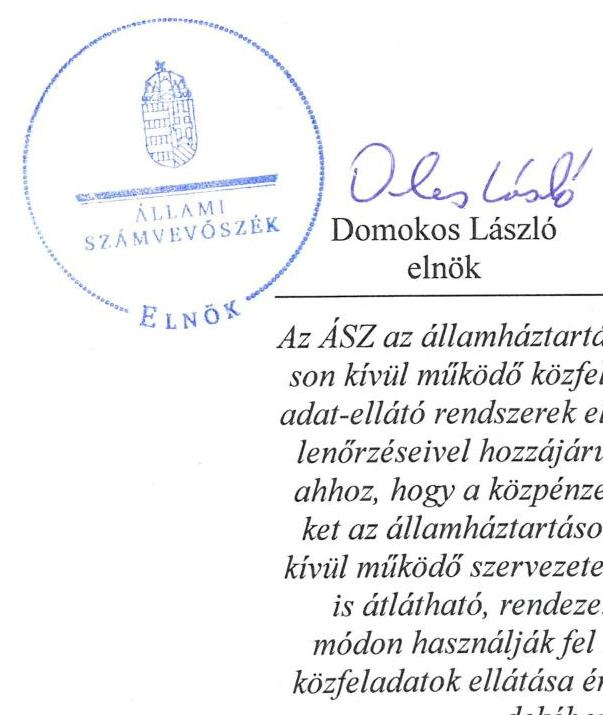
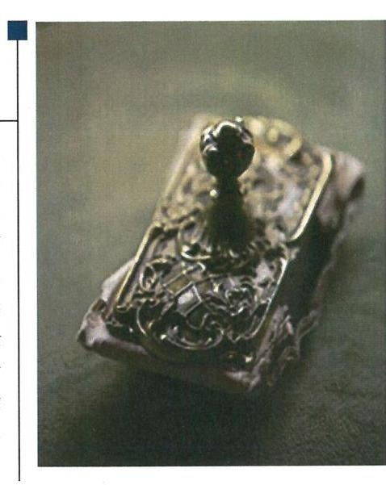
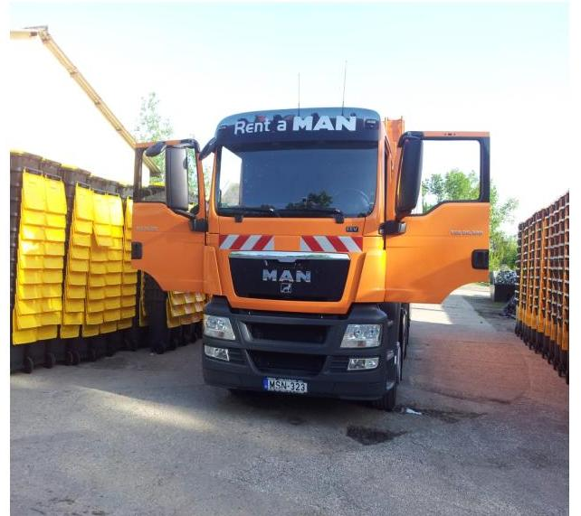
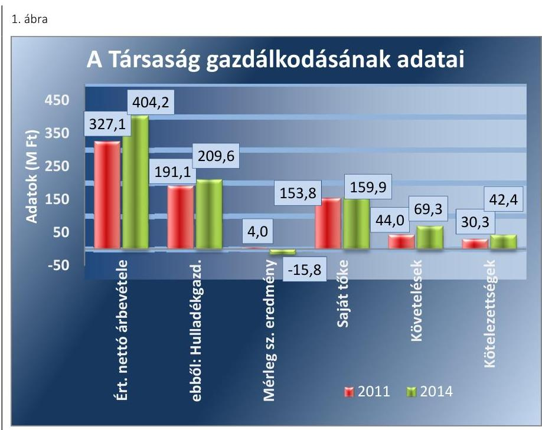
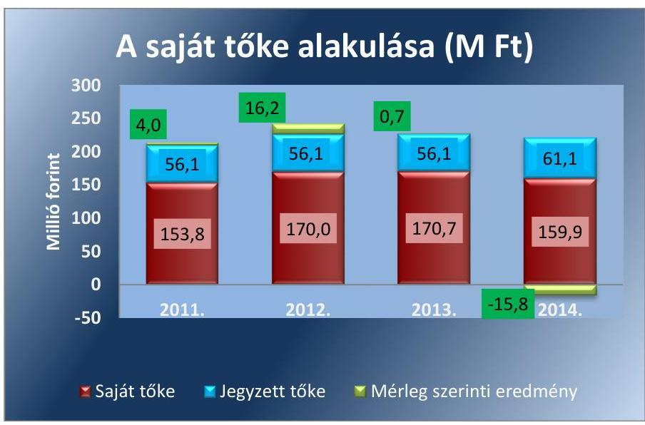
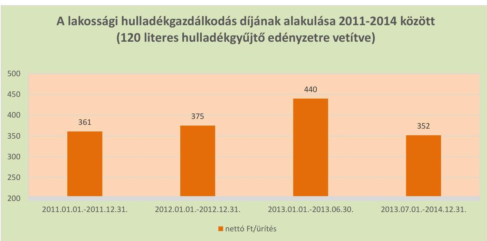
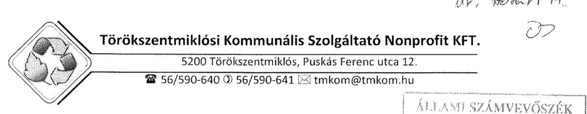
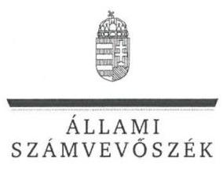
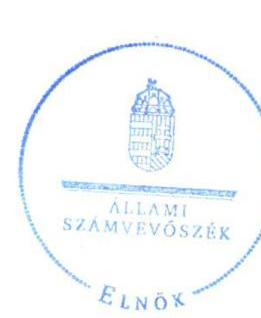
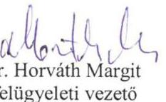

# Jelentés 

## Az önkormányzatok gazdasági társaságai

Az önkormányzatok többségi tulajdonában lévő gazdasági társaságok közfeladat ellátását érintő gazdálkodási tevékenysége szabályszerűségének ellenőrzése - Törökszentmiklósi Kommunális Szolgáltató Nonprofit Kft.

2016.

Az ÁSZ az államháztartáson kívül müködő közfel-adat-ellátó rendszerek ellenőrzéseivel hozzájárul ahhoz, hogy a közpénzeket az államháztartáson kívül müködő szervezetek is átlátható, rendezett módon használják fel a közfeladatok ellátása érdekében.

---

# Jelentés 

## Az önkormányzatok gazdasági társaságai

Az önkormányzatok többségi tulajdonában lévő gazdasági társaságok közfeladat ellátását érintő gazdálkodási tevékenysége szabályszerűségének ellenőrzése - Törökszentmiklósi Kommunális Szolgáltató Nonprofit Kft.
2016. október hó 11. nap

Az ÁSZ az államháztartáson kivïl müködő közfel-adat-ellátó rendszerek ellenőrzéseivel hozzájárul ahhoz, hogy a közpénzeket az államháztartáson kivïl müködő szervezetek is átlátható, rendezett módon használják fel a közfeladatok ellátása érdekében.

---

# AZ ELLENŐRZÉST FELÜGYELTE:

DR. HORVÁTH MARGIT felügyeleti vezető

## AZ ELLENŐRZÉST VEZETTE ÉS A VÉGREHAJTÁSÁÉRT FELELŐS:

- KLINGA LÁSZLÓ ellenőrzésvezető
- A PROGRAM ÖSSZEÁLLÍTÁSÁÉRT FELELŐS:
- JANIK JÓZSEF osztályvezető

|  IKTATÓSZÁM: V-1017-145/2016. | |
| --- | --- |
|  TÉMASZÁM: 2051 | |
|  ELLENŐRZÉS-AZONOSÍTÓ SZÁM: V-070729 | |

Jelentéseink az Országgyűlés számítógépes hálózatán és az Interneta a www.asz.hu címen is olvashatóak.

---

# TARTALOMJEGYZÉK 

■ ÖSSZEGZÉS ..... 5
■ AZ ELLENŐRZÉS CÉLJA ..... 7
■ AZ ELLENŐRZÉS TERÜLETE ..... 8
■ AZ ELLENŐRZÉS HÁTTERE, INDOKOLTSÁGA ..... 10
■ A JELENTÉS LÉNYEGES KÉRDÉSKÖREI ..... 11
■ ELLENŐRZÉS HATÓKÖRE ÉS MÓDSZEREI ..... 12
■ MEGÁLLAPÍTÁSOK ..... 14
■ JAVASLATOK ..... 30
■ MELLÉKLETEK ..... 33
I. Sz. melléklet: Értelmező szótár ..... 33
II. Sz. melléklet: Múködési adatok ..... 36
III. Sz. melléklet: A lakossági hulladékgazdálkodási díj alakulása 2011-2014 között ..... 37
IV. Sz. melléklet: Mintavételi eljárások ellenőrzési területenként ..... 38
■ FÜGGELÉK: ÉSZREVÉTELEK ..... 39
■ RÖVIDÍTÉSEK JEGYZÉKE ..... 45

---

.

---

# ÖSSZEGZÉS 

Az Állami Számvevőszék a kizárólagos önkormányzati tulajdonú Törökszentmiklósi Kommunális Szolgáltató Nonprofit Kft.-nél a hulladékgazdálkodási közfeladat ellátását érintő gazdálkodási tevékenysége 2011-2014 közötti szabályszerűségét ellenőrizte. Megállapította, hogy a közfeladat-ellátás önkormányzati megszervezése és a tulajdonosi jogok gyakorlása szabályosan történt. A szabályszerű vagyongazdálkodás biztosítása mellett a hulladékgazdálkodás közfeladata bevételeinek elszámolása nem megfelelő, a ráfordításainak elszámolása megfelelő volt. Az önköltségszámítás szabályait meghatározták, az árképzés nem volt szabályszerű. A közszolgáltatási díjak meghatározása és alkalmazása 2012. január 1. és április 14. között, valamint 2013. január 1-jétől nem felelt meg a jogszabályban foglaltaknak.

## Az ellenőrzés társadalmi indokoltsága

Az Állami Számvevőszék stratégiájában megfogalmazta, hogy a helyi önkormányzatok gazdálkodásában rejlő pénzügyi kockázatok feltárásával, az államháztartáson kívülre nyújtott költségvetési támogatások és ingyenes vagyonjuttatások, valamint az államháztartáson kívül múködő közfeladat-ellátó rendszerek ellenőrzéseivel hozzájárul ahhoz, hogy a közpénzeket az államháztartáson kívül múködő szervezetek is átlátható, rendezett módon használják fel a közfeladatok szerződésben vállalt ellátása érdekében.

Magyarországon az intézmény-centrikus közfeladat-ellátás jellemző, de egyre jelentősebb a költségvetésen kívüli feladatellátás térnyerése. Ennek legfontosabb szereplői - a nonprofit szervezetek mellett - az önkormányzati tulajdonú gazdasági társaságok. Az önkormányzatok szervezetalakítási szabadságának következménye, hogy a korábban is vállalati formában múködő közszolgáltatások mellett, mind a kötelező, mind az önként vállalt feladatok ellátásában a gazdasági társaságok kiemelt fontosságú szerephez jutottak.

## Főbb megállapítások, következtetések, javaslatok

Az Önkormányzat a hulladékgazdálkodás közfeladatának megszervezéséről a jogszabályi előírásoknak megfelelően döntött, annak ellátásáról a kizárólagos tulajdonában lévő gazdasági társasága útján gondoskodott. Az Önkormányzat a Hgt.1,2 szerinti hulladékgazdálkodással összefüggő rendeletalkotási kötelezettségének eleget tett. Az Önkormányzat a hulladékgazdálkodási közszolgáltatás ellátására az ellenőrzött időszakban Közszolgáltatási szerződés ${ }_{1,2,3}$-t kötött, amelyek tartalma az előírásokkal összhangban volt. Az Önkormányzat a Hgt. ${ }_{1}$ előírása ellenére hulladékgazdálkodási tervet a 2011-2012. évekre nem dolgozott ki, 2013-tól a közszolgáltató feladata volt a hulladékgazdálkodási terv készítésének kötelezettsége, amelynek eleget tett.

A Képviselő-testület az SZMSZ-ben, valamint az Alapító Okiratban meghatározta a tulajdonosi joggyakorlás szabályait, amelyet az előírásoknak megfelelően, szabályszerűen gyakorolt. A Törökszentmiklósi Kommunális Szolgáltató NKft. az Önkormányzattól vagyonkezelésbe nem vett át vagyont, feladatait saját eszközeivel látta el. Az ellenőrzött időszakban az Önkormányzat belső ellenőrzése a Társaságnál nem végzett ellenőrzést, így nem támogatta a szabályszerű múködés kontrollját.

A közfeladat-ellátását szolgáló vagyonnal való gazdálkodás, annak nyilvántartása szabályszerű volt, a Társaság rendelkezett a Számv. tv. előírásainak megfelelő számviteli szabályzatokkal, amelyek elősegítették a szabályszerű múködést. A Társaság vagyona 2011. január 1-jéről 2014. év végére 62,8 millió Ft-tal nőtt a tárgyi eszközök és a forgóeszközök növekedésének együttes hatására. A Társaságnak hosszúlejáratú kötelezettsége az ellenőrzött időszakban nem volt, rövid lejáratú kötelezettségeinek döntő részben határidőben eleget tudott tenni. Az ellenőrzött időszakban a kötelezettségek állománya a múködésre, a közfeladat ellátásra nem jelentett kockázatot. A követelések állománya

---

2011. év végétől folyamatosan nőtt, 2014 végére 69,3 millió Ft-ot tett ki. A Társaság a Hgt.1,2-ben előírtak figyelembe vételével kezdeményezte a hulladékgazdálkodással összefüggő követelések adók módjára történő behajtását, amelynek összege ennek ellenére is emelkedett, a 2014. év végén 61,7 millió Ft volt. A Társaság a mérleg szerinti eredménye alapján a 2011-2013. években nyereségesen gazdálkodott, a 2014. évben 15,8 millió Ft vesztesége keletkezett.

A Törökszentmiklósi Kommunális Szolgáltató NKft. az üzleti tervek teljesítéséről, az éves gazdálkodásról, azon belül a hulladékgazdálkodás közfeladatáról az éves beszámolók keretében beszámolt a tulajdonos felé a Számv. tv.-ben előírtaknak megfelelően. A Társaság az Avtv.-ben, illetve 2012-től az Info tv.-ben előírtak ellenére adatvédelmi és adatbiztonsági szabályzatot nem készített, adatvédelmi felelőst nem nevezett ki, az előírt kötelező közzétételi kötelezettségének nem teljes körűen tett eleget. A Társaságnál a bevételek elszámolása nem megfelelő, a költségek és ráfordítások elszámolása megfelelő volt, figyelembe véve a jogszabályok és a belső szabályozás előírásait. Az önköltségszámítás szabályait meghatározták, azonban a díjképzés nem felelt meg az előírásoknak. Az ürítési díjak esetében a 2012. január 1. és 2012. április 14., illetve a 2013. január 1. és 2013. június 30. közötti időszakban nem tartották be a Hgt. 1-ben foglaltakat, mert a 2011. évre megállapított díjaknál, illetve a 2012. december 31-én alkalmazott díjaknál magasabb díjat alkalmaztak. Mivel a 2012. április 14-én alkalmazott díjak meghatározása nem volt megfelelő, így ennek következtében a 2013. július 1-jétől alkalmazott díjak sem feleltek meg a Hgt. 2 előírásának.

---

# AZ ELLENŐRZÉS CÉLJA 

Az ellenőrzés célja annak értékelése, hogy az Önkormányzat a jogszabályi előírások figyelembevételével döntött-e az ellenőrzésre kerülő közfeladat megszervezéséről; az önkormányzat/tulajdonosi joggyakorló szabályszerűen gyakorolta-e a tulajdonosi jogokat.

Ellenőriztük, hogy a gazdasági társaság közfeladat-ellátása bevételeinek, ráfordításainak elszámolása, és vagyongazdálkodási tevékenysége megfelelt-e a jog-szabályi, illetve a közszolgáltatási/vagyonkezelési szerződésben foglalt tulajdonosi előírásoknak, azok végrehajtása szabályszerű volt-e.

Értékeltük továbbá, hogy a gazdasági társaság kötelezettségállománya jelent-e kockázatot a múködésre, illetve a közfeladat ellátására; valamint hogy a közfeladatok átláthatósága és elszámoltathatósága érdekében biztosítva volt-e a közszolgáltatás díjának megalapozottsága szabályszerű önköltségszámítással.

---

# AZ ELLENŐRZÉS TERÜLETE 

## A Törökszentmiklós Városi Önkormányzat és a többségi tulajdonában lévő Törökszentmiklósi Kommunális Szolgáltató Nonprofit Korlátolt Felelősségű Társaság

## A TÖRÖKSZENTMIKLÓS VÁROSI ÖNKORMÁNYZAT a Törökszentmiklósi Kommunális Szolgáltató Korlátolt Felelősségű Társaságot 2000. szeptember 26-án alapította, majd 2014. június 1-jén nonprofit társasággá alakította.

A Törökszentmiklósi Kommunális Szolgáltató Nonprofit Kft. a Törökszentmiklós Városi Önkormányzat 100\%-os tulajdonában állt az ellenőrzött időszakban, jegyzett tőkéje 2011. január 1-jén 56,1 millió Ft, 2014. december 31-én 61,1 millió Ft volt. Az Önkormányzat vagyonkezelésre nem adott át eszközöket a Társaság részére.

## A TÖRÖKSZENTMIKLÓSI KOMMUNÁLIS SZOLGÁLTATÓ NONPROFIT KFT. főtevékenysége a 2014. január 1-jén 20827 fő lakosságszámú Törökszentmiklós Város közigazgatási területén nem veszélyes hulladék gyűjtése volt, e mellett ellátott még egyéb (strand-, kemping- és piacüzemeltetési, park és zöldterület karbantartási, téli síkosság mentesítési, csapadékvíz rendszer-üzemeltetési) feladatokat is. A Társaság a nem veszélyes hulladékgyűjtési feladatot 2012. január 1-jétől Tiszatenyő, Tiszapüspöki, Örményes és Kuncsorba településeken is ellátta, Örményes és Kuncsorba esetében a feladatellátás 2012. december 31-én megszűnt. Az ellátott lakosságszám 2014-ben 24880 fő volt. A Társaság más gazdasági társaságban tulajdoni hányaddal nem rendelkezett, átlagos statisztikai állományi létszáma 2011-ben 54 fő, 2014-ben 50 fő, ebből a hulladékgazdálkodási közszolgáltatás átlagos statisztikai állományi létszáma 13 fő, illetve 11 fő volt.

A Törökszentmiklósi Kommunális Szolgáltató Nonprofit Kft. gazdálkodásának egyes adatait a 2011. és a 2014. évek vonatkozásában az 1. ábra szemlélteti:

---

Forrás: A Társaság 2011.és 2014. évi beszámolói

A Társaság mérlegfőösszege 2011-ben 188,3 millió Ft, 2014-ben 253,6 millió Ft volt. Az értékesítés nettó árbevétele a 2011. és a 2014. év vége között 23,6\%-kal, ebből a hulladékgazdálkodási közszolgáltatás nettó árbevétele 9,7\%-kal nőtt. A mérleg szerinti eredmény a 2011-2013. években pozitív, a 2014. évben negatív volt, a saját tőke összege 2011. december 31-éről a 2014. év végére 4,0\%-kal emelkedett. A követelések 57,5\%kal, a kötelezettségek 39,9\%-kal nőttek.

A Törökszentmiklósi Kommunális Szolgáltató Nonprofit Kft. múködésének főbb jellemzőit a 2. számú melléklet mutatja be.

Az ellenőrzött időszakban a polgármester, a jegyző és az ügyvezető személye is változott. A helyszíni ellenőrzés időszakában a munkakört betöltő polgármester a 2014. évi önkormányzati választások óta, a jegyző 2015. január 20. napjától látja el feladatait. Az ügyvezető 2015. március 1-jétől tölti be tisztségét.

---

# AZ ELLENŐRZÉS HÁTTERE, INDOKOLTSÁGA 

Az önkormányzatok közfeladat-ellátásában egyre jelentősebb a gazdasági társaságok útján történő feladatellátás térnyerése.

AZ ÖNKORMÁNYZATI TULAJDONÚ GAZDASÁGI TÁRSASÁGOK teljes körű ellenőrzésének lehetőségét az Állami Számvevőszékről szóló 1989. évi XXXVIII. törvény 2011. január 1-jétől ha tályos módosítása teremtette meg. A gazdasági társaságok közfeladat ellátását érintő gazdálkodási tevékenysége szabályszerűségére irányuló ellenőrzéseket erre tekintettel a 2011. évtől végezzük. A közfeladatot ellátó gazdasági társaságok ellenőrzése kiemelten fontos a vagyon megőrzése, megóvása érdekében, valamint a kormányzati szektor elszámolásaiban megjelenő önkormányzati tulajdonú gazdálkodó szervezetek esetében, amelyekkel szemben alapvető követelmény, hogy gazdálkodásuk, működésük szabályszerű, az általuk szolgáltatott adatok minél megbízhatóbbak legyenek. A közfeladat ellátás költségeinek, ráfordításainak alakulása, színvonala hatással van a lakosság elégedettségére.

## AZ ELLENŐRZÉS VÁRHATÓ HASZNOSULÁSA-

KÉNT az ÁSZ ${ }^{1}$ a megállapításaival segítséget nyújthat az államháztartáson kívüli közfeladat-ellátás értékeléséhez, jogszabályi keretei pontosításához, átláthatóságot biztosító szabályozásához. Meghatározhatóvá válnak a közfeladat ellátásban részt vevő államháztartáson kívüli szervezeteknek az önkormányzat költségvetését, pénzügyi helyzetét is befolyásoló - kockázatai, lehetővé válik ezen kockázatok csökkentése. Ellenőrzéseink feltárhatják, hogy az önkormányzat közfeladat ellátási kötelezettségének szabályszerűen tett-e eleget, a feladatellátáshoz rendelt közvagyon működtetését a tulajdonostól elvárható gondossággal, szabályszerűen szervezte-e meg és a tulajdonosi felügyelete hozzájárult-e a közfeladat szabályszerű ellátásához. Értékelhetővé válik, hogy a feladatot ellátó gazdasági társaság a közszolgáltatási szerződésben foglaltak betartásával, a közvagyon használatával biztosította-e a szolgáltatás folytatásának feltételeit. Ezzel az ellenőrzöttek és a helyi döntéshozók számára az ÁSZ visszajelzést ad feladatszervezési, feladat-ellátási kockázataikról, alapot ad a meglévő hibák megszüntetéséhez, a jobb közfeladat-ellátás biztosításához. Mindezeken keresztül az ÁSZ hozzájárul Magyarország közpénzügyi helyzetének javításához, a közpénzek mérhető módon történő, a döntéshozók által meghatározott célok szerinti felhasználásához.

---

# A JELENTÉS LÉNYEGES KÉRDÉSKÖREI 

1. Az önkormányzat közfeladat megszervezéséről szóló döntése, valamint tulajdonosi joggyakorlása szabályszerű volt-e?
2. A gazdasági társaság vagyongazdálkodása szabályszerű volt-e, kötelezettségállománya jelentett-e kockázatot a müködésre, illetve a közfeladat ellátásra?
3. A gazdasági társaságnál az ellátott közfeladat bevételei és ráfordításai elszámolása, valamint az önköltségszámítás és árképzés szabályszerű volt-e?

---

# ELLENŐRZÉS HATÓKÖRE ÉS MÓDSZEREI 

## Az ellenőrzés típusa

Megfelelőségi ellenőrzés

## Az ellenőrzött időszak

A 2011. január 1-jétől 2014. december 31-éig terjedő időszak.

## Az ellenőrzés tárgya

A közfeladatot gazdasági társaságokkal ellátó önkormányzatok tulajdonosi joggyakorlása, valamint gazdasági társaságok pénz- és vagyongazdálkodásának szabályozottsága és szabályszerűsége.

Az ellenőrzés kiterjed minden olyan körülményre és adatra, amely az ÁSZ jogszabályban meghatározott feladatainak teljesítéséhez, valamint a program végrehajtása folyamán felmerült újabb összefüggések feltárásához szükséges.

## Az ellenőrzött szervezet

Törökszentmiklós Város Önkormányzata és a Törökszentmiklósi Kommunális Szolgáltató Nonprofit Korlátolt Felelősségű Társaság

## Az ellenőrzés jogalapja

Az ellenőrzés végrehajtásának jogszabályi alapját az Állami Számvevőszékről szóló 2011. évi LXVI. törvény 5. § (3)-(4)-(5) bekezdései képezték.

## Az ellenőrzés módszerei

Az ellenőrzést a nemzetközi standardokat irányadónak tekintve az ellenőrzési program ellenőrzési kérdései, az ellenőrzött időszakban hatályos jogszabályok, az ellenőrzés szakmai szabályok és módszertanok figyelembe vételével végeztük.

Az ellenőrzés ideje alatt az ellenőrzött szervezettel történő kapcsolattartást az ÁSZ Szervezeti és Müködési Szabályzatának vonatkozó előírásai alapján biztosítottuk.

---

Az ellenőrzés a kiválasztott, többségi tulajdonosi jogokat gyakorló önkormányzatra, illetve az ellenőrzött közfeladatot ellátó gazdasági társaságra terjedt ki. Az ellenőrzött gazdasági társaságnál, amennyiben az több közfeladatot is ellát, akkor az ellenőrzésre kiválasztott közfeladat-ellátást ellenőriztük.

Az ellenőrzést a kérdésekre adott válaszok kiértékelésével, valamint a megjelölt adatforrások, a csatolt tanúsítványok felhasználásával, továbbá az adott időszakban hatályos jogszabályok figyelembe vételével folytattuk le. Az ellenőrzési kérdések megválaszolásához szükséges bizonyítékok megszerzése a következő ellenőrzési eljárások alkalmazásával történt: megfigyelés, kérdésfeltevés (információkérés), összehasonlítás, valamint elemző eljárás.

A bevételek és ráfordítások elszámolását véletlen mintavétellel, a vagyonnyilvántartás terén a beruházások és felújítások elszámolását teljes körűen ellenőriztük. A mintavétellel ellenőrzött területek esetében minden egyes tétel vonatkozásában a szabályszerűségre vonatkozó kérdéseket tettünk fel, amelyek eredménye összesítésre került. Megfelelőnek értékeltünk egy ellenőrzött területet, amennyiben 95\%-os bizonyossággal a teljes sokaságban a hibaarány legfeljebb 10\%, nem megfelelőnek, amenynyiben 10\%-nál magasabb arányt képviselt. Abban az esetben, ha a teljes sokaság tekintetében a 10\%-os hibaarányhoz való viszony megítélésnek megbízhatósága nem érte el a 95\%-ot, annak elérése érdekében értékelésünket további szempontokkal egészítettük ki, és figyelembe vettük a feltárt hibák típusát és súlyát. A ráfordítások elszámolására vonatkozó véletlen mintavételt kockázati alapú kiválasztással egészítettük ki, amelynek során évente a három legnagyobb összegű tételt választottuk ki.

---

# 1. Az önkormányzat közfeladat megszervezéséről szóló döntése, valamint tulajdonosi joggyakorlása szabályszerű volt-e? 

Összegző megállapítás

Az Önkormányzat a jogszabályok és a helyi szabályozás betartásával szervezte meg a hulladékgazdálkodást, a tulajdonosi jogait szabályszerűen gyakorolta, azonban a közszolgáltatási díjak meghatározása 2012. január 1. és április 14. között nem felelt meg a jogszabályban foglaltaknak.

### 1.1. számú megállapítás

A közfeladat-ellátást az Önkormányzat szabályszerűen szervezte meg, a hulladékgazdálkodással összefüggő rendeletalkotási kötelezettségének eleget tett. Hulladékgazdálkodási tervvel az Önkormányzat a 2011-2012. években nem rendelkezett.

Az Önkormányzat² az Ötv³. 91. § (6) bekezdése* szerint a 2005-2008. évekre elkészítette gazdasági programját, melyet a 2006. évben módosított, majd 2011. december 23-án határozatot hozott a gazdasági program megvalósítási idejének 2014. évre történő meghosszabbításáról. A gazdasági program a hulladékgazdálkodási közszolgáltatás biztosítására, színvonalának javítására fejlesztési elképzeléseket nem tartalmazott.

Az Ötv. 91. § (7) bekezdésében foglaltak alapján a gazdasági programot a képviselő-testület az alakuló ülését követő hat hónapon belül fogadja el, ha az egy választási ciklus idejére szól. Ha a meglévő gazdasági program az előző ciklusidőn túlnyúló, úgy azt az újonnan megválasztott képviselő-testület az alakuló ülését követő hat hónapon belül köteles felülvizsgálni és legalább a ciklusidő végéig kiegészíteni vagy módosítani, mely előírásnak az Önkormányzat a határidő tekintetében nem tett eleget.

A 2007-2013. évekre szóló Integrált Városfejlesztési Stratégia ${ }^{4}$ „városi életminőség javítása" című fejezetében stratégiai célként fogalmazták meg a szakszerűen működtetett hulladékgazdálkodást, a szelektív hulladékgyűjtés kiterjesztését és az illegális szemétlerakók felszámolását.

Az Önkormányzat a Hgt. ${ }_{1}{ }^{5}$ 35. § (1) bekezdésében foglaltak ellenére a 2011-2012. évekre helyi hulladékgazdálkodási tervet nem dolgozott ki. A jegyző nem tett eleget a 241/2001. (XII. 10.) Korm. rendelet ${ }^{6}$ 1. § e) és f) pontja előírásának, mivel nem készítette elő és nem terjesztette be a Kép-viselő-testület elé az Önkormányzat hulladékgazdálkodási tervét.

A Hgt. ${ }_{1}{ }^{7}$ 78. § (1) bekezdésében foglaltak alapján - 2013. január 1-jétől - a hulladékgazdálkodási tervet a közszolgáltatónak kellett elkészítenie, melynek a Törökszentmiklósi Kommunális Szolgáltató NKft. ${ }^{8}$ eleget tett.

[^0]
[^0]:    * 2013. január 1-jétől az Mötv. 116. § (3)-(4) bekezdései írják elő.

---

Az Önkormányzat az Nvtv. 9. § (1) bekezdésében foglalt előírás ellenére a 2012-2014. években közép- és hosszú távú vagyongazdálkodási tervvel nem rendelkezett.

# A KÖZTISZTASÁG ÉS A TELEPÜLÉSTISZTASÁG 

BIZTOSÍTÁSA az Ötv. 8. § (1) bekezdése ${ }^{7}$ alapján az Önkormányzat törvényi kötelezettsége. A Képviselő-testület az SZMSZ ${ }^{8}$-ben előírta a közszolgáltatások körének kötelező feladatait, így - többek között - a nem veszélyes hulladék begyűjtésének, szállításának, átrakásának kötelezettségét. Az Önkormányzat szabályszerűen szervezte meg a hulladékgazdálkodás közfeladatát, közigazgatási területén a szilárd hulladék gyűjtéséről, kezeléséről a Törökszentmiklósi Kommunális Szolgáltató NKft. útján gondoskodott.

A Törökszentmiklósi Kommunális Szolgáltató NKft. feladatellátásának kereteit az Alapító Okiratban ${ }^{10}$, a közfeladat biztosításának és a díjak megállapításának szabályait a hulladékgazdálkodási rendeletben ${ }^{11}$ meghatározták.

Az Önkormányzat 2002. december 28-án 10 éves időtartamra Közszolgáltatási szerződés ${ }_{1}{ }^{12}$-t kötött a Társasággal ${ }^{13}$ a „települési szilárd hulladék begyűjtésére, elszállítására és a városi hulladéklerakó üzemeltetésére", majd 2012. december 28-án, illetve 2014. június 3-án újabb Közszolgáltatási szerződés ${ }_{2}{ }^{14},{ }_{3}{ }^{15}$ megkötésére került sor.

A Közszolgáltatási szerződés ${ }_{1,2,3}$-ek mellett az Önkormányzat szelektív hulladékgyűjtő rendszerüzemeltetési, valamint közterületi hulladékgyűjtő edények ürítési és karbantartási szerződéseket kötött a Törökszentmiklósi Kommunális Szolgáltató NKft.-vel. A szerződések tartalmát, a díjakat, a fizetés módját a Képviselő-testület - az üzleti tervek elfogadásával egyidejűleg - jóváhagyta. A szerződések évenkénti teljesítését az Önkormányzat az éves beszámolások során folyamatosan ellenőrizte.

A Közszolgáltatási szerződés ${ }_{1,2}$ a 224/2004. (VII. 22.) Korm. rendelet ${ }^{16}$ 11-14. §-aiban előírt tartalmi követelményeknek megfelelt. A Közszolgáltatási szerződés ${ }_{2,3}$ esetében a 317/2013. (VIII. 28.) Korm. rendelet ${ }^{17}$ 4. § (1)(3) bekezdéseiben és a Hgt. 2 34. § (5) bekezdésében foglaltakat betartották.

A KÖZSZOLGÁLTATÁSI SZERZŐDÉS ${ }_{1,2,3}$ alapján a Törökszentmiklósi Kommunális Szolgáltató NKft. feladata volt a települési szilárd hulladék begyűjtése és elszállítása, a városi hulladéklerakó üzemeltetése. A Közszolgáltatási szerződés ${ }_{1,2,3}$-ben meghatározták - többek között - a közszolgáltató által teljesítendő közszolgáltatási kötelezettségeket, az ellátási területet, előírták az ellenőrzési kötelezettséget, a felmondás feltételeit.

A HULLADÉKGAZDÁLKODÁSI RENDELETET a Képvi-selő-testület 2002-ben alkotta meg, azt az ellenőrzött időszakban módosította. A hulladékgazdálkodási rendelet a 2011-2014. években a Hgt. ${ }_{1} 23 . \S$

[^0]
[^0]:    ${ }^{7}$ A helyi közügyek, valamint a helyben biztosítható közfeladatok körében ellátandó helyi önkormányzati feladatként a hulladékgazdálkodást 2013. január 1-jétől az Mótv. 13. § (1) bekezdés 19. pontja írja elő.

---

a)-h) pontjaiban, illetve a Hgt. 2 35. § a)-d) és g) pontjaiban foglaltaknak megfelelt, nem tartalmazta azonban 2013. december 31-étől a Hgt. 2 35. § f) pontjában előírt, az üdülőingatlanok esetében végzett hulladékgazdálkodási közszolgáltatásra vonatkozó részletes szabályokat.

A hulladékgazdálkodási rendeletben foglaltak szerint a közszolgáltatás célja a köztisztaság, a településtisztaság biztosítása, a közegészségügy, valamint az épített és természeti környezet védelme volt. A hulladékgazdálkodási rendeletben - többek között - meghatározták a helyi közszolgáltatás tartalmát, ellátásának rendjét és módját, a közszolgáltató és az ingatlantulajdonos jogait és kötelezettségeit, valamint a közszolgáltatási díj fizetésének szabályait. Előírták továbbá a lomtalanításra, a zöldhulladék átvételére vonatkozó rendelkezéseket.

# 1.2. számú megállapítás 

A tulajdonosi jogok gyakorlása szabályszerű volt. A közszolgáltatás díjai 2012. január 1. és április 14. között nem feleltek meg a jogszabályi előírásnak. A Társaságnál belső ellenőrzést nem végzett az Önkormányzat.

A TULAJ DONOSI JOGOK gyakorlásának rendjét az Önkormányzat az SZMSZ-ben, valamint az Alapító Okiratban határozta meg. Az Önkormányzatot megillető tulajdonosi jogok gyakorlásával kapcsolatos feladatok és jogosultságok a Képviselő-testületet illették meg, amelyeket az SZMSZ-ben meghatározott esetekben a pénzügyi és városfejlesztési bizottságra ruházott át. A pénzügyi és városfejlesztési bizottság hatáskörébe tartozott - többek között - a Társaság ügyvezetője ${ }^{18}$ kinevezésének, felmentésének, munkabére emelésének véleményezése, a köztisztasági feladatok ellátásának figyelemmel kísérése, javaslat tétel az Önkormányzat vállalkozásai szervezeti, gazdálkodási formájának megváltoztatására.

AZ ALAPÍTÓ OKIRAT előírása szerint a taggyűlés hatáskörébe tartozó ügyekben az alapító határozattal döntött, az alapítói jogokat a Kép-viselő-testület gyakorolta. A Képviselő-testület az ügyvezető részére tulajdonosi jogok gyakorlására nem adott felhatalmazást. A Törökszentmiklósi Kommunális Szolgáltató NKft. vonatkozásában a tulajdonosi jogokat a belső szabályozással összhangban az arra jogosult szabályszerűen gyakorolta.

AZ FB ${ }^{19}$ a Gt. ${ }^{20}$ 34. § (1) bekezdésében, valamint a Ptk. ${ }^{21}$ 3:121. § (1) bekezdésében előírtakat figyelembe véve három tagból állt. Az FB a Gt. 35. § (3) bekezdésének, illetve a Ptk. 2 3:120. § (2) bekezdésének megfelelően minden évben írásbeli jelentést készített a Társaság számviteli beszámolójáról. Az FB a 2011-2014. években a Gt. 34. § (4) bekezdésében, illetve a Ptk. 2 3:122. § (3) bekezdésében foglaltak szerint rendelkezett ügyrenddel. ${ }^{22}$

AZ ÉRDEKELTSÉGI RENDSZER kereteit az Önkormányzat kialakította. A Képviselő-testület a Törökszentmiklósi Kommunális Szolgáltató NKft. javadalmazási szabályzatát²3 a Taktv. ${ }^{24}$ 5. § (3) bekezdésében előírtak szerint elfogadta. A javadalmazási szabályzat előírása szerint a Társaság ügyvezetője prémiumának mértékét és feltételeit - amely személyi alapbére hatszorosát nem haladhatta meg - a Képviselő-testületnek

---

évente kellett meghatároznia. A teljesítménykövetelményként előírtakat az FB-nek a 2011-2014. évben előzetesen véleményezni kellett.

AZ ÁRKÉPZÉS SZABÁLYAIT a 2012. év végéig a hulladékgazdálkodási rendeletben határozta meg az Önkormányzat. A Hgt. ${ }_{1} 25 . \S$ (4) bekezdésében előírtak szerint a közszolgáltatás diját meghatározó önkormányzati rendelet elfogadását megelőző részletes költségelemzést - a Törökszentmiklósi Kommunális Szolgáltató NKft. javaslata alapján - elkészítették, azt a jegyző a Képviselő-testület elé terjesztette.

A hulladékgazdálkodási rendelet 2011. december 23-án történt módosításában a 2011. évi díjaknál magasabb összegben határozták meg a közszolgáltatás 2012. január 1. és december 31. között alkalmazandó díjait. A 2011. évi díjak a 60, a 110-120, illetve a 240 literes edényzet esetében nettó 265,0, 361,0, illetve 556,0 Ft/ürítés voltak, ugyanezen díjak a 2012. évben 276,0, 375,0, illetve 578,0 Ft/ürítés összeget tettek ki. A Hgt. ${ }_{1}$ 58. §ában előírtak alapján a Hgt. ${ }_{1}$ 57. § (1) bekezdésének 2012. január 1-jétől április 14-éig hatályos módosítása szerint a hulladékkezelési közszolgáltatási díj legmagasabb mértéke a 2012. évben nem haladhatta meg a hulladékgazdálkodási rendeletben 2011. évre megállapított díj legmagasabb mértékét. A jogszabályi előírás ellenére a hulladékgazdálkodási rendeletet nem módosították, a 2012. évben a díjak változatlanok maradtak, így azok 2012. január 1. és 2012. április 14. között a Hgt. ${ }_{1}$ 57. § (1) bekezdésének előírása ellenére meghaladták a hulladékgazdálkodási rendeletben 2011. évre meghatározott legmagasabb értéket. A 60, a 110-120, illetve a 240 literes edényzet esetében nettó 11,0, 14,0, illetve 22,0 Ft/ürítés összeggel.

A közszolgáltatás díjai 2012. április 15. és 2012. december 31. között megfeleltek a Hgt. ${ }_{1} 57$ § (1) bekezdésében foglaltaknak.
2013. január 1-jétől a hulladékgazdálkodási díjat a MEKH ${ }^{25}$ javaslatának figyelembe vételével a miniszter ${ }^{4}$ rendeletben állapítja meg.

A BESZÁMOLTATÁSI RENDSZER keretében az Önkormányzat a Társaság ügyvezetőjét évente beszámoltatta a gazdálkodásról, valamint a közszolgáltatási tevékenységről. A Közszolgáltatási szerződésben a közszolgáltatói tevékenységről évente részletes költségelszámolás készítési kötelezettséget írt elő az Önkormányzat a Törökszentmiklósi Kommunális Szolgáltató NKft. számára, melynek eleget tett. A Társaság 2011-2014. évi éves szakmai és számviteli beszámolóit - az FB előzetes írásbeli véleményezését követően - a Képviselő-testület a Gt. 35. § (3) bekezdésének, illetve a Ptk. ${ }_{2}$ 3:120. § (2) bekezdésében előírtaknak megfelelően elfogadta. A Képviselő-testület döntött továbbá az éves üzleti tervek elfogadásáról is.

BELSŐ ELLENŐRZÉST a Társaságnál a 2011-2014. években az Önkormányzat nem végzett, illetve külső szakértőt a közfeladat ellátás ellenőrzésével nem bízott meg. Az OHÜ NKft. ${ }^{26}$ a 2012-2013. években - öszszesen kilenc alkalommal - a beszállított hulladék mennyiségével kapcsolatosan végzett ellenőrzése során intézkedést igénylő megállapítást, javaslatot nem tett.

[^0]
[^0]:    ${ }^{4}$ Nemzeti Fejlesztési Miniszter

---

A Törökszentmiklósi Kommunális Szolgáltató NKft. mérleg szerinti eredménye a 2011-2013. években pozitív, a 2014. évben negatív volt. A Képvi-selő-testület határozataiban a 2011-2013. évek nyereségének eredménytartalékba helyezéséről döntött.

A saját tőke minden ellenőrzött évben jelentősen meghaladta a jegyzett tőkét, ezért a Gt. 143. § (2) bekezdés a) pontja, illetve a Ptk. 2 3:189. § (2) bekezdése szerinti intézkedés megtétele nem vált szükségessé. A saját tőke összege a 2011. és a 2014. évben közel háromszorosával, a 20122013. években több mint háromszorosával haladta meg a jegyzett tőke összegét.

A saját tőke, a jegyzett tőke, valamint a mérleg szerinti eredmény alakulását a 2. ábra mutatja be.
2. ábra

Forrás: 3. számú tanúsítvány
Az Önkormányzat a Törökszentmiklósi Kommunális Szolgáltató NKft. részére garanciát nem nyújtott, kezességet nem vállalt a 2011-2014. években.

---

# 2. A gazdasági társaság vagyongazdálkodása szabályszerű volt-e, kötelezettségállománya jelentett-e kockázatot a múködésre, illetve a közfeladat ellátásra? 

Összegző megállapítás

2.1. számú megállapítás

A Társaság vagyongazdálkodása szabályszerű volt, kötelezettségállománya a múködésre, a közfeladat ellátásra nem jelentett kockázatot. A Társaság adatvédelmi és adatbiztonsági szabályzattal nem rendelkezett, belső adatvédelmi felelőst nem nevezett ki, egyes közérdekú adatokat nem tett közzé.

Az előírt szabályzatokkal rendelkeztek, azokkal megteremtették a közfeladat ellátás elkülönített nyilvántartásának lehetőségét.

A Társaság vagyongazdálkodási tevékenysége, illetve annak végrehajtása a jogszabályi előírásoknak, illetve a Közszolgáltatási szerződés1,2,3-ben foglalt tulajdonosi előírásoknak megfelelt.

AZ ÜZLETI TERVEKET az ügyvezető terjesztette be a Képviselőtestület elé a Társaság SZMSZ ${ }_{1}{ }^{27} \cdot{ }^{28}$-ében előírt kötelezettsége alapján. Az üzleti tervek az Önkormányzat tervezési iránymutatásai alapján készültek, árbevétel-, költség-, eredmény-, létszám- és fejlesztési tervet tartalmaztak. Az üzleti terveket a Képviselő-testület jóváhagyta.

A HULLADÉKGAZDÁLKODÁSI TERVET ${ }^{29}$ a Törökszentmiklósi Kommunális Szolgáltató NKft. a Hgt. ${ }_{2}$ 78. § (1) bekezdésében előírtaknak megfelelően elkészítette, azt a Hgt. ${ }_{2} 78 . \S$ (3) bekezdése szerint az Országos Környezetvédelmi, Természetvédelmi és Vízügyi Főfelügyelőségnek megküldte, amely azt jóváhagyta. A hulladékgazdálkodási tervben a Hgt. ${ }_{2} 78 . \S$ (2) bekezdésében foglaltaknak megfelelően bemutatták a hulladék átvételével, elszállításával, kezelésével, illetve ártalmatlanításával, hasznosításával kapcsolatban megfogalmazott célkitűzések elérése érdekében tervezett intézkedéseket. A hulladékgazdálkodási terv a Hgt. ${ }_{2} 78 . \S$ (4) bekezdésében előírt tartalommal készült.

A Törökszentmiklósi Kommunális Szolgáltató NKft. rendelkezett a Számv. tv. ${ }^{30}$ 14. § (3) bekezdésében előírt számviteli politikával ${ }^{31}$, a Számv. tv. 14. § (5) bekezdés a)-d) pontjaiban foglaltaknak megfelelően eszközök és források leltárkészítési és leltározási szabályzattal ${ }^{32}$, értékelési szabályzattal ${ }^{33}$, önköltségszámítási szabályzattal ${ }^{34}$, valamint pénzkezelési szabályzattal ${ }^{35}$, illetve a Számv. tv. 161. § (1) bekezdésében előírt számlarenddel ${ }^{36}$. Rendelkeztek továbbá selejtezési szabályzattal ${ }^{37}$, valamint számviteli szétválasztási szabályzattal ${ }^{38}$.

A SZÁMVITELI POLITIKA a Számv. tv. 14. § (4) bekezdése előírásainak megfelelően tartalmazta - többek között - azokat a Társaságra jellemző szabályokat, előírásokat, módszereket, amelyekkel meghatározták, hogy mit tekintenek a számviteli elszámolás, értékelés szempontjából lényegesnek, jelentősnek, nem lényegesnek, nem jelentősnek, valamint azt, hogy a törvényben biztosított választási, minősítési lehetőségek közül

---

melyeket alkalmazzák. A számviteli politikában határozták meg az értékcsökkenés elszámolásának gyakoriságát és a 100 ezer Ft egyedi beszerzési értékű tárgyi eszközök egy összegben történő elszámolásának alkalmazási kötelezettségét.

# AZ ESZKÖZÖK ÉS FORRÁSOK LELTÁRKÉSZÍTÉSI 

ÉS LELTÁROZÁSI SZABÁLYZATA tartalmazta a leltározás előkészítésének feladatait, a leltározásért felelős személyeket, a leltározás módját, fordulónapját. A készletek esetében évenkénti, a tárgyi eszközök esetében kétévenkénti mennyiségi felvétellel történő leltározást írtak elő, amely megfelelt a Számv. tv. 2012. január 1-jétől hatályos 69. § (3) bekezdése előírásának. Az ellenőrzött időszakban a Társaság a tárgyi eszközökről és a készletekről folyamatos mennyiségi nyilvántartást vezetett.

## AZ ESZKÖZÖK ÉS FORRÁSOK ÉRTÉKELÉSI SZABÁLYZATA a Számv. tv. 55. § (1)-(2) bekezdésének előírásaival összhangban szabályozta a követelések minősítésének, az értékvesztés elszámolásának szabályait.

ÖNKÖLTSÉGSZÁMÍTÁSI SZABÁLYZAT készítésére a Társaság a Számv. tv. 14. § (6) bekezdése alapján nem volt kötelezett, mivel nem érte el a Számv. tv. 14. § (7) bekezdésében meghatározott értékhatárt, azonban - saját döntése alapján - elkészítette azt. Az elszámolás módjaként rögzítették, hogy elsődlegesen a 6. és a 7. számlaosztályt, másodlagosan az 5. számlaosztályt alkalmazzák, ezzel megteremtették a közvetlen és közvetett költségek elkülönítésének lehetőségét.

A PÉNZKEZELÉSI SZABÁLYZAT a Számv. tv. 14. § (8) bekezdésében előírt tartalmi követelményeknek megfelelt, rendelkezett többek között - a pénzforgalom lebonyolításának rendjéről, a pénzkezelés személyi és tárgyi feltételeiről, felelősségi szabályairól, a készpénzállomány ellenőrzésekor követendő eljárásról, az ellenőrzés gyakoriságáról.

A SZÁMLAREND a Számv. tv. 161. § (2) bekezdés a)-d) pontjaiban előírt tartalmi követelményeknek megfelelt. A számlarendben írták elő, hogy a tárgyi eszközöknek a hasznos élettartam végén várható maradványértékkel csökkentett bekerülési (beszerzési, illetve előállítási) értékét azokra az évekre kell felosztani, amelyekben ezeket az eszközöket előreláthatóan használni fogják.

A selejtezési szabályzatban meghatározták a feleslegessé vált vagyontárgyak hasznosításával, leértékelésével és selejtezésével kapcsolatos feladatokat, előírta azok végrehajtásának ellenőrzési kötelezettségét.

A számviteli szétválasztási szabályzatban - a Hgt. 50. § (2)-(3) bekezdéseinek való megfelelés érdekében - meghatározták a szétválasztandó tevékenységeket, bemutatták a szétválasztás módszertanát.

A Társaság a Számv. tv. 161/A. § (1) és (2) bekezdése előírásának megfelelően úgy alakította ki belső szabályait, hogy azok a mérleg és eredménykimutatás alátámasztásán túlmenően a kiegészítő melléklet adatainak közvetlen alátámasztására is alkalmasak legyenek, továbbá a közpénzek felhasználásának és a köztulajdon használatának nyilvánossága és

---

# 2.2. számú megállapítás 

ellenőrizhetősége érdekében olyan részletezettségű nyilvántartási (könyvvezetési) rendszert alakított ki, melyből a vonatkozó külön jogszabályban meghatározott adatok rendelkezésre álltak. A Társaság megteremtette a közfeladathoz kapcsolódó bevételek, költségek és ráfordítások elkülönített nyilvántartásának lehetőségét, ezzel eleget tett a 64/228. (III. 28.) Korm. rendelet 5. §-a, valamint a Hgt. ${ }_{1} 29 . \S$ (3) bekezdése, illetve a Hgt. 2 50. § (2) bekezdése előírásainak. A Hgt. 2 50. § (3) bekezdésében foglaltakkal összhangban megteremtette továbbá - a 2013-2014. évi éves beszámolók vonatkozásában - a közfeladat önálló mérleg és eredménykimutatás készítésének lehetőségét.

## A Társaság a tulajdonában lévő vagyonával a jogszabályi és belső rendelkezéseknek megfelelően gazdálkodott.

A Törökszentmiklósi Kommunális Szolgáltató NKft. a hulladékgazdálkodási közfeladat ellátásához az Önkormányzattól vagyonkezelésbe nem vett át vagyont, azt saját eszközeivel látta el.

## AZ ANALITIKUS ÉS FÖKÖNYVI NYILVÁNTARTÁSI

RENDSZER a Társaság vagyonának átlátható, naprakész, a számviteli politikának, az önköltségszámítási szabályzatnak, 2013. január 1-jétől a számviteli szétválasztási szabályzatnak megfelelő nyilvántartását biztosította. Az éves beszámolók adatait leltárral támasztották alá, a főkönyvi könyvelés és analitikus nyilvántartások közötti egyeztetést a mérleg fordulónapjára vonatkozóan szabályszerűen elvégezték.

A Társaság éves beszámolóinak főbb mérlegadatait az 1. táblázat szemlélteti.

1. táblázat

A TÖRÖKSZENTMIKLÓSI KOMMUNÁLIS SZOLGÁLTATÓ NKFT. FŐBB MÉRLEG ADATAI (MILLIÓ FORINT)

| Megnevezés | 2011.01 .01 | 2011.12 .31 | 2012.12 .31 | 2013.12 .31 | 2014.12 .31 |
| :-- | --: | --: | --: | --: | --: |
| Befektetett eszközök | 98,4 | 112,0 | 105,0 | 94,6 | 128,2 |
| - ebből: Tárgyi eszközök | 97,3 | 111,0 | 104,1 | 94,3 | 127,2 |
| Forgóeszközök | 92,1 | 76,1 | 95,1 | 119,8 | 124,7 |
| - ebből: Követelések | 59,6 | 44,0 | 52,2 | 61,6 | 69,3 |
| Aktív időbeli elhatárolások | 0,3 | 0,2 | 0,4 | 0,6 | 0,7 |
| ESZKÖZÖK ÖSSZESEN | 190,8 | 188,3 | 200,5 | 215,0 | 253,6 |
| Saját tőke | 149,8 | 153,8 | 170,0 | 170,7 | 159,9 |
| - ebből Jegyzett tőke | 56,1 | 56,1 | 56,1 | 56,1 | 61,1 |
| - ebből: Mérleg szerinti eredmény | 14,7 | 4,0 | 16,2 | 0,7 | $-15,8$ |
| Céltartalékok | 0,0 | 2,1 | 0,0 | 3,9 | 4,0 |
| Kötelezettségek | 39,8 | 30,4 | 28,0 | 38,1 | 42,4 |
| Passzív időbeli elhatárolások | 1,2 | 2,0 | 2,5 | 2,3 | 47,3 |
| FORRÁSOK ÖSSZESEN | 190,8 | 188,3 | 200,5 | 215,0 | 253,6 |

A Z ESZKÖZÉRTÉK 2011. január 1-jéről 2014. december 31-ére 32,9\%-kal (62,8 millió Ft-tal) emelkedett a tárgyi eszközök és a forgóeszközök állományának együttes növekedése következtében. A forgóeszközökön belül a követelések állománya 16,3\%-kal (9,7 millió Ft-tal) emelkedett. A befektetett eszközök döntő részét a tárgyi eszközök képezték. A tárgyi eszközök értéke 2011. január 1. és 2014. december 31. között 30,7\%-kal

---

(29,9 millió Ft-tal) nőtt. Jelentősebb beruházások voltak a hulladékgyűjtő járművek bérleti szerződés lejártát követő beszerzése, a járművek flottakövető rendszerrel való ellátása, traktorok és utánfutók vásárlása, valamint pályázat keretében elnyert támogatási összegből tömörítős hulladékgyűjtő gépjármú, valamint 5214 db 120 l-es hulladékgyűjtő edényzet beszerzése. A saját tőke és a kötelezettségek állománya számottevően nem változott, a saját tőke 2014. december 31.-i értéke 6,7\%-kal (10,1 millió Ft-tal), a kötelezettségeké 6,5\%-kal (2,6 millió Ft-tal) volt magasabb a 2011. év eleji értéknél.

# 2.3. számú megállapítás 

## A kötelezettségek állománya a múködésre, a közfeladat ellátására nem jelentett kockázatot, a Társaság a kötelezettségeit teljesítette.

A Társaság kötelezettségeinek állománya 2011. január 1. és 2013. december 31. között 4,3\%-kal (1,7 millió Ft-tal) csökkent, majd - az előző évhez képest - a 2014. év végére 11,3\%-kal (4,3 millió Ft-tal) emelkedett.

AZ ELADÓSODOTTSÁGI MUTATÓ értéke kedvezően alakult, a 2011. évben 0,16, a 2012. évben 0,14, a 2013. évben 0,18, a 2014. évben 0,17 volt, az idegen tőke összes forráson belüli aránya egyik évben sem érte el a kritikus 0,6-os értéket. Az eladósodottság mértéke hasonló képet mutatott, a mutató a 2011-2014. években nem érte el az 1-es értéket, az évek sorrendjében értéke 0,20, 0,16, 0,22 és 0,26 volt. A nettó eladósodottság mutatója arról nyújt információt, hogy a kintlévőségekkel csökkentett kötelezettségeket milyen mértékben fedezi saját forrás, és azt feltételezi, hogy a kötelezettségek teljesítését megelőzi a követelések realizálása. A mutató értéke 2011-ben -0,09, 2012-ben és 2013-ban -0,14, 2014-ben -0,17 volt. A negatív érték azt jelentette, hogy a kintlévőségek összege meghaladta a kötelezettségek összegét.

Az adósságfedezeti mutató I. értéke szintén kedvező volt, 1,0 Ft adósságra a 2011. évben 6,20 Ft, a 2012. évben 7,16 Ft, a 2013. évben 5,62 és a 2014. évben 5,97 Ft vagyon jutott.

Az adósságfedezeti mutató II. nem volt értelmezhető, mivel a 20112014. években hosszú lejáratú kötelezettség nem terhelte a Társaságot.

Az árbevételre vetített eladósodottság mértéke a 2011-2014. években $-0,14,-0,19,-0,23$ és $-0,20$ volt, tehát az 1,0 Ft nettó árbevételre eső, forgóeszközökkel csökkentett kötelezettség valamennyi évben kevesebb volt, mint az árbevétel. A mutató kedvező alakulását biztosította, hogy az árbevétel és a forgóeszközök állománya magasabb értékben emelkedett a kötelezettségek állományánál.

A Társaság a 2011-2014. években rendelkezett a társasági formájára kötelezően előírt jegyzett tőkének megfelelő összegű saját tőkével.

A RÖVID LEJÁRATÚ KÖTELEZETTSÉGEINEK a Társaság határidőben eleget tudott tenni. A 2011-2014. években fizetési határidőn túli szállítói kötelezettséggel jellemzően nem rendelkezett, a fizetési késedelem a 30 napot nem haladta meg. A Társaság kötelezettségállománya a múködésre, a hulladékgazdálkodási közfeladat ellátására kockázatot nem jelentett.

---

### 2.4. számú megállapítás

Az előírt beszámolási, adatszolgáltatási kötelezettséget teljesítették. Adatvédelmi és adatbiztonsági szabályzattal nem rendelkeztek, belső adatvédelmi felelőst nem neveztek ki, egyes közérdekú adatokat nem tettek közzé.

A Közszolgáltatási szerződés; előírása szerint a Társaság köteles volt az alkalmazott közszolgáltatási díj mértékéről és az alkalmazás tapasztalatairól a Képviselő-testületet évente legalább egy alkalommal tájékoztatni, továbbá a közszolgáltatói tevékenységéről évente részletes költségelszámolást készíteni és azt az Önkormányzatnak benyújtani. Közszolgáltatási szerződés ${ }_{2,3}$ ilyen előírást nem tartalmazott, ennek ellenére a Társaság a 20112014. években az Önkormányzatot tájékoztatta a díjak mértékéről, azok alkalmazásának tapasztalatairól, illetve költségelszámolást készített.

AZ ÉVES BESZÁMOLÓKAT a Törökszentmiklósi Kommunális Szolgáltató NKft. a Számv. tv. 19. § (1) bekezdésében előírt tartalommal elkészítette, azokat a Számv. tv. 153. § (1) bekezdésében, valamint 154. § (1) bekezdésében foglaltak szerint letétbe helyezte, illetve közzétette.

Az éves beszámolók elfogadásáról a Képviselő-testület a könyvvizsgáló és az FB írásbeli jelentésének birtokában határozott. A könyvvizsgáló az éves beszámolókat hitelesítő záradékkal látta el. Az FB és a könyvvizsgáló a közvagyon védelme, illetve más okból a Képviselő-testület összehívását nem kezdeményezte.

A 2013. és a 2014. évi éves beszámoló kiegészítő melléklete a közfeladatra vonatkozóan tartalmazta a Hgt. 2 50. § (3) bekezdésében előírt önálló mérleget és eredménykimutatást.

A Társaság 2011-ben az Eisztv. ${ }^{39}$ 6. § (1) bekezdésében, 2012-2014-ben az Info tv. ${ }^{40}$ 33. § (1) bekezdésében előírt elektronikus közzétételi kötelezettségének az adatkör tekintetében csak részben tett eleget, mivel honlapján ${ }^{5}$ a közérdekú adatok között kizárólag a juttatásban részesülő vezető tisztségviselők nevét és a részükre juttatott összegeket hozta nyilvánosságra, a szervezeti, személyzeti, a tevékenységre, múködésre vonatkozó és a gazdálkodási adatokat nem tette közzé.

Az Avtv. ${ }^{41}$ 31/A. § (2) bekezdés d) pontjában, illetve az Info tv. 24. § (3) bekezdésében előírt adatvédelmi és adatbiztonsági szabályzatkészítési kötelezettségének a Társaság nem tett eleget. Az Avtv. 31/A. § (1) bekezdés c) pontjában, valamint az Info tv. 24. § (1) bekezdés c) pontjában foglaltak ellenére a Társaságnál belső adatvédelmi felelőst nem neveztek ki.

A Törökszentmiklósi Kommunális Szolgáltató NKft. nem minősült kormányzati alszektorba besorolt társaságnak, illetve egyéb szervezetnek, így az Ávr. ${ }^{42}$ 7. számú melléklete 29. pontjában előírt bejelentési és adatszolgáltatási kötelezettsége nem keletkezett.

[^0]
[^0]:    ${ }^{5}$ www.tmkom.hu

---

# 3. A gazdasági társaságnál az ellátott közfeladat bevételei és ráfordításai elszámolása, valamint az önköltségszámítás és árképzés szabályszerű volt-e? 

Összegző megállapítás

A hulladékgazdálkodási közszolgáltatás bevételeinek elszámolása nem megfelelő, a ráfordítások elszámolása megfelelő volt. Az önköltségszámítás szabályait meghatározták, azonban a belső szabályozásban foglaltaktól eltérő gyakorlatot alkalmaztak, a díjképzés nem volt szabályszerű.
3.1. számú megállapítás

A bevételek elszámolása nem megfelelő, a ráfordítások elszámolása megfelelő volt. Az adók módjára történő behajtást kezdeményezték, a 2014. évben a fizetési felszólítások határidőben történő megküldése esetében a jogszabályi előírást nem tartották be.

A Törökszentmiklósi Kommunális Szolgáltató NKft. a hulladékgazdálkodási közfeladat mellett egyéb feladatokat is ellátott, így 2011. január 1-jétől a Hgt. 1 29. § (3) bekezdése, 2013. január 1-jétől a Hgt. 2 50. § (2) bekezdése alapján fennállt a bevételeinek, költségeinek és ráfordításainak elkülönített nyilvántartási kötelezettsége. Az elkülönített nyilvántartás megvalósulása érdekében elsődlegesen a 6-7-es számlaosztály, másodlagosan az 5. számlaosztály főkönyvi számláit alkalmazta, melynek részletes szabályait a számlarendben, az önköltségszámítási szabályzatban, továbbá 2013. január 1-jétől a számviteli szétválasztási szabályzatban rögzítettek.

A számviteli szétválasztási szabályzatban meghatározták az eredménykimutatás tételeinek szétválasztási módszereit, valamint a mérleg sorainak tevékenységenkénti megbontását. A bevételeket közvetlenül a megfelelő tevékenységhez rendelték, a költségeket azok felmerülési helyén számolták el. A befektetett eszközök esetében az értékcsökkenés volt a szétválasztás meghatározója, aszerint, hogy azt melyik tevékenység érdekében merült fel. Ezt a szabályt azoknál az eszközöknél alkalmazták, amelyek közvetlenül hozzárendelhetőek voltak az adott tevékenységhez. Egyéb eszközöknél naturális jellemzők (gépóra, futott km., stb.) arányában történt a szétválasztás. A forgóeszközöknél közvetlenül a tevékenységhez való hozzárendelés valósult meg a készletek és a vevőkövetelések esetében. Minden egyéb forgóeszköz szétválasztása a tárgyi eszközök és vevők összegének tevékenységek szerinti felosztása arányában történt. A mérleg forrásoldal elemeit az eszközök tevékenységek közötti aránya szerint választották szét.

A Társaság értékesítés nettó árbevételének tervezet és tényleges adatait, a közfeladat árbevételét és eredményét a 2. táblázat mutatja be.

---

| A HULLADÉKGAZDÁLKODÁSI KÖZFELADAT ÁRBEVÉTELÉNEK ÉS EREDMÉNYÉNEK ALAKULÁSA (MILLIÓ FORINT) |  |  |  |  |
| :--: | :--: | :--: | :--: | :--: |
| Megnevezés | 2011. | 2012. | 2013. | 2014. |
| Értékesítés nettó árbevétele (terv) | 349,2 | 347,4 | 361,7 | 391,2 |
| Értékesítés nettó árbevétele (tény) | 327,1 | 352,8 | 347,5 | 404,2 |
| Ebből: hulladékgazdálkodási közszolgáltatás nettó árbevétele | 191,1 | 216,2 | 189,3 | 209,6 |
| Hulladékgazdálkodási közszolgáltatás eredménye** | - | - | 2,8 | $-17,6$ |

A Társaság értékesítésének nettó árbevétele a tervezett adatokat a 2012. és a 2014. évben 1,6\%, illetve 3,3\%-kal haladta meg, 2011-ben és 2013-ban a teljesítés 6,3\%-kal, illetve 3,9\%-kal maradt alul a tervadatoktól. Az értékesítés nettó árbevételén belül a közfeladat értékesítésének nettó árbevétele a 2011. évben 58,4\%, a 2012. évben 61,3\%, a 2013. évben 54,5\%, a 2014. évben 51,9\%-os arányt képviselt. A hulladékgazdálkodási közszolgáltatás üzemi (üzleti) tevékenységének eredménye a 2013. évben 2,8 millió Ft nyereséget, a 2014. évben 17,6 millió Ft veszteséget mutatott.

A Törökszentmiklósi Kommunális Szolgáltató NKft. hulladékgazdálkodási közfeladat-ellátása bevételeinek elszámolása nem volt megfelelő, a ráfordítások elszámolása megfelelt a jogszabályi és a belső szabályozás előírásainak.

# AZ ÉRTÉKESÍTÉS NETTÓ ÁRBEVÉTELÉNEK ELSZÁMOLÁSA szabályszerűsége nem volt megfelelő. A bevételeket a számlarendnek megfelelő számlacsoportba számolták el, azokat a közfeladatra elkülönítették. Ugyanakkor a 2013. évben alkalmazott szolgáltatási díjak nem feleltek meg a Hgt. 2 91. § (2) bekezdésében foglalt árképzés szabályainak, mivel a 2012. január 1. és 2012. április 14. közötti időszakban a 2011. évre megállapított díjaknál magasabb alkalmazott díj a Hgt. 1 57. § (1) bekezdésében foglaltaktól eltért, és ezt a magasabb díjat emelték tovább 2013-ban a jogszabályban meghatározott mértékben. 

## AZ ANYAGJELLEGŰ RÁFORDÍTÁSOK ELSZÁMOLÁSÁNAK szabályszerűsége megfelelő volt. A költségeket a Törökszentmiklósi Kommunális Szolgáltató NKft. a Számv. tv. 78. §-ának megfelelő költségnemre számolta el, illetve a megfelelő közfeladatra, költséghelyre, költségviselőre könyvelte a számlarend és az önköltségszámítási szabályzat előírásai szerint.

## A BERUHÁZÁSOK, FELÚJÍTÁSOK KIADÁSAI ÉS AZ ÉRTÉKCSÖKKENÉSI LEÍRÁS ELSZÁMOLÁSÁ-

NAK szabályszerűsége megfelelő volt. A kiadást megalapozó kötelezett-

[^0]
[^0]:    ** A közszolgáltatónak a hulladékgazdálkodási közszolgáltatás nyújtása érdekében végzett tevékenységét 2013-től kellett éves beszámolója kiegészítő mellékletében oly módon bemutatni, mintha önálló tevékenység keretében végezte volna.

---

ségvállalás, a pénzügyi elszámolás, a kontírozás, valamint az értékcsökkenések elszámolása a Számv. tv. 26. §-ában, 52. §-ában, valamint a számviteli politikában és számlarendben foglaltak szerint történt.

AZ AMORTIZÁCIÓT a rendeltetésszerű használatbavételtől, az üzembe helyezéstől kezdődően számolták el, havi gyakorisággal. A Számv. tv. 92. § (1) bekezdésében foglaltaknak megfelelően az immateriális javak, tárgyi eszközök, valamint a halmozott értékcsökkenés nyitó és záró bruttó értékét, a tárgyévi értékcsökkenési leírás összegét mérlegtételek szerinti bontásban az éves beszámolók kiegészítő mellékleteiben bemutatták. A 2011-2014. években terven felüli értékcsökkenést nem számoltak el.

A Társaság teljes tevékenysége tekintetében a 2011. évben 15,0 millió Ft, a 2012. évben 16,6 millió Ft, a 2013. évben 15,3 millió Ft, a 2014. évben 40,8 millió Ft, mindösszesen 87,7 millió Ft értékcsökkenést számoltak el. Ezzel szemben a beruházás, felújítás értéke az évek sorrendjében 29,3 millió Ft, 13,5 millió Ft, 5,6 millió Ft, 68,9 millió Ft, mindösszesen 117,3 millió Ft volt, tehát összességében az amortizációt meghaladóan történtek fejlesztések az ellenőrzött időszakban. A 2014. évben a beruházásra fordított összeg emelkedésének oka pályázati forrásból megvalósuló, a szelektív hulladékgyűjtéshez kapcsolódó fejlesztés volt. A 131 és 132 főkönyvi számlaszámon belül kimutatott hulladékgyűjtő edények, konténeres autók esetében a használhatósági fok 2011. január 1-jéről 2014. december 31-ére 17,3, illetve 17,2százalékponttal csökkent, a 132. főkönyvi számlaszámon belül kimutatott kukás autók esetében 1,8 százalékponttal emelkedett. A hulladékgazdálkodási közfeladattal kapcsolatosan a 2011-2014. években összesen 64,5 millió Ft értékcsökkenést számoltak el, ezzel szemben a beruházásra, felújításra elszámolt összeg 114,6 millió Ft volt.

KÖVETELÉS ÁLLOMÁNYÁT kezelte a Társaság, az értékvesztést évente elszámolta, azt az éves beszámolók kiegészítő mellékletében bemutatta. A 2011-2012. években a hátralékos ügyfelek részére - a hátralék keletkezését követő 30 napon belül - fizetési felszólítást küldött, melyet - sikertelenség esetén - negyedévente megismételt. 2012. december 31-éig a Hgt. 26. § (3) bekezdésének megfelelően a lakossági és intézményi ügyfelek 90 napot meghaladó díjtartozásait, a felszólítás igazolása mellett átadta adók módjára történő behajtásra az illetékes önkormányzatoknak. Törökszentmiklós esetében a behajtásra átadott összeg 2011-ben 13,2 millió Ft, 2012-ben 11,6 millió Ft, az átadott esetszám 1284 db, illetve 536 db , a behajtás hatékonysága a két év átlagában $27,5 \%$ volt.

Az Art. ${ }^{43}$ 161. § (1) bekezdése értelmében az adók módjára behajtandó köztartozásnak minősülő fizetési kötelezettséget megállapító, nyilvántartó szerv, illetőleg a köztartozás jogosultja megkeresi az adóhatóságot behajtás végett, ha a köztartozás összege eléri, vagy meghaladja a 10000 Ft-ot. A 2013. évben a Törökszentmiklósi Kommunális Szolgáltató NKft. - a Hgt. 2 52. § (3) bekezdésének megfelelően - a 45 napon túli, az Art. szerinti értékhatárt meghaladó díjtartozások esetében a NAV ${ }^{44}$-nál kezdeményezte az adók módjára történő behajtást. A NAV a többszöri sikertelen behajtási kísérlet után értesítést küldött az eljárás eredménytelenségéről, sikeres behajtás esetén pedig a behajtott összeg átutalásáról. A behajtásra átadott ügyek száma 2013-ban 243 db , az átadott számlaérték 10,0 millió

---

Ft, a NAV-tól beérkezett befizetés 0,4 millió Ft volt. 2014. év március végéig összesen 200 db ügyet adtak át behajtásra, az átadott számlaérték 9,4 millió Ft-ot, a NAV-tól beérkezett befizetés 6,9 millió Ft-ot tett ki. A behajtás hatékonysága a 2013-2014. év átlagában 38,0\% volt.

A Társaság a 2014. év áprilisától - a Hgt. 2 52. § (2) bekezdésében foglaltak ellenére - a fizetési felszólításokat a díjhátralék keletkezését követő 30 napon túl küldte meg az illetékesek felé.

A közfeladat lejárt határidejű követelés állományának alakulását a 3. táblázat mutatja be.
3. táblázat

A TÖRÖKSZENTMIKLÓSI KOMMUNÁLIS SZOLGÁLTATÓ NKFT. LAKOSSÁGI ÉS KÖZÜLETI KINTLÉVŐSÉGEI (MILLIÓ FORINT)

| Megnevezés | 2011. | 2012. | 2013. | 2014. |
| :--: | :--: | :--: | :--: | :--: |
| Lakossági kintlévőségek összege | 21,2 | 35,1 | 47,1 | 58,1 |
| ebből: 30-90 nap közötti kintlévőségek öszszege | 3,2 | 4,6 | 2,6 | 5,1 |
| 91-180 nap közötti kintlévőségek összege | 4,1 | 4,2 | 5,9 | 5,6 |
| 181-365 nap közötti kintlévőségek összege | 6,3 | 10,2 | 13,5 | 10,1 |
| 365 napon túli kintlévőségek összege | 5,1 | 12,4 | 25,8 | 35,2 |
| Közületi kintlévőségek összege ebből: | 1,1 | 2,0 | 2,7 | 3,6 |
| 30-90 nap közötti kintlévőségek összege | 0,2 | 0,4 | 0,6 | 0,8 |
| 91-180 nap közötti kintlévőségek összege | 0,1 | 0,3 | 0,5 | 0,4 |
| 181-365 nap közötti kintlévőségek összege | 0,0 | 0,3 | 0,2 | 0,7 |
| 365 napon túli kintlévőségek összege | 0,4 | 0,5 | 0,9 | 1,3 |

A Társaság hulladékgazdálkodási közfeladatának lejárt határidejű lakossági és közötti követelései a 2011-2014. évek között közel háromszorosára (36,9 millió Ft-tal), illetve több mint háromszorosára (2,5 millió Ft-tal) emelkedtek, melyeken belül a 30-90 nap közötti és a 90 napon túli kintlévőségek állományában is növekvő tendencia mutatkozott.
3.2. számú megállapítás

Az önköltségszámítás szabályait meghatározták, azonban a díjképzés során a belső szabályozásban foglaltaktól eltérő gyakorlatot alkalmaztak, a díjképzés nem volt szabályszerű.

A hulladékgazdálkodási közfeladat átláthatóságát és elszámoltathatóságát szabályszerű önköltségszámítással nem biztosították teljes körűen a 20112014. években, mivel a közszolgáltatási díjak meghatározása során az önköltségszámítási szabályzat előírásaitól eltérő gyakorlatot folytattak, és a díjszámítás alkalmazott módszertanát nem tették közzé.

---

AZ ÖNKÖLTSÉGSZÁMÍTÁSI SZABÁLYZAT tartalmazta - többek között - a felosztandó költségeket, a kalkulációs sémát, a felosztandó költségek vetítési alapjait, az elő-és utókalkuláció tartalmát, határidejét. Tartalmazta továbbá az önköltségszámítási adatok szolgáltatásáért, az ellenőrzésért felelős munkakörök megnevezését.

Az önköltségszámítási szabályzatban előírták, hogy az előkalkuláció esetében a közvetlen önköltséget a gyártási, műszaki-gazdasági sajátosságok alapján tételes költségkalkulcióval állapítják meg, a közvetett költségeket, egyéb bevételeket, ráfordításokat nem osztják a kalkulációs egységekre.
2012. december 31-éig a közszolgáltatás diját az Önkormányzat rendeletben határozta meg a Törökszentmiklósi Kommunális Szolgáltató NKft. által készített költségelemzés és javaslat alapján, 2013. január 1-jétől a díjmegállapítás miniszteri hatáskör lett.

A Társaságnál a 2011-2012. években a dijképzés gyakorlata eltért az önköltségszámítási szabályzatban foglaltaktól. A díjkalkuláció az I-III. negyedév tényadatain alapult, melyhez hozzárendelték a IV. negyedév tervadatait és elkészítették az ún. „dijkalkulációs táblát". A díjkalkulációban a gyűjtőjáratos és a szelektív hulladékgyűjtés adatait használták fel. A következő évi költségek meghatározásánál a várható inflációt, továbbá az egyéb változó tényezőket (ártalmatlanítási díj inflációt meghaladó változása, számlázási gyakoriság) vették figyelembe. A díj az edényzet ürítés dijából és az edénymérettől függő ártalmatlanítás dijából tevődött össze. A Társaság nem tett eleget a 64/2008. (III. 28.) Korm. rendelet 2. § (3) bekezdésében foglaltaknak, mivel a díjszámítás általa alkalmazott módszertanát részletesen nem tette közzé.

A szilárd hulladék gyűjtésének, szállításának és elhelyezésének egyszeri díja a 110-120 literes hulladékgyűjtő edény esetében 2011. január 1-jétől nettó 361,0 Ft/ürítés, 2012. január 1-jétől nettó 375,0 Ft/ürítés, 2013. január 1-jétől nettó 440,0 Ft/ürítés volt. 2013. július 1-jétől nettó 352,0 Ft/ürítés díjat alkalmaztak. Az ürítési díjak esetében a 2012. január 1. és 2012. április 14. közötti időszakban nem tartották be a Hgt. 1 57. § (1) bekezdésében foglaltakat, mivel a 2011. évre megállapított díjaknál magasabb díjat alkalmaztak. A jegyző nem tett eleget az Ötv. 36. § (3) bekezdésében előírt kötelezettségének, mert nem jelezte a Képviselő-testületnek, hogy döntésük jogszabálysértő.
2012. április 15-étől a Hgt. 1 57. § (1) bekezdés b) pontja alapján a 120 literes hulladékgyűjtő edény ürítési díja a nettó 650,0 Ft-ot nem haladhatta meg, mely előírásnak eleget tettek.
2013. január 1-jétől a lakossági ügyfelek esetében a Hgt. 2 91. § (2) bekezdésében előírtak szerinti, a 2012. december 31-én alkalmazott bruttó díjhoz képest 4,2\%-kal megemelt mértékű díjat alkalmazhattak, mely előírásnak nem tettek eleget (a díj maximum nettó 391,0 Ft/ürítés lehetett volna, szemben a nettó 440,0 Ft/ürítési díjjal).

A Hgt. 2 91. § (2) bekezdése 2013. május 10-étől hatályos módosítása szerint 2013. július 1-jétől a 2012. április 14-én alkalmazott díjhoz képest legfeljebb 4,2\%-kal megemelt összeg 90\%-a lehetett a maximum díj a lakossági ügyfelek esetében. Mivel a 2012. április 14-én alkalmazott díj esetében a jogszabályi előírást nem tartották be, ezért a 2013. július 1-jétől alkalmazott díj a Hgt. 2 91. § (2) bekezdésében foglaltaknak nem felelt meg (a díj maximum nettó 339,0 Ft/ürítés lehetett volna, szemben a nettó 375,0 Ft/ürítési díjjal).

---

A rezsicsökkentés bevételkiesését a Földművelésügyi Minisztériumhoz benyújtott egyedi kérelmen alapuló támogatás elnyerésével tervezték csökkenteni. A támogatási kérelmet a Minisztérium jóváhagyta, a megítélt támogatás összege 10,2 millió Ft volt. A támogatás a 2014. évi beszámoló mérlegkészítése napjáig nem érkezett meg a Társasághoz.

A Törökszentmiklósi Kommunális Szolgáltató NKft. által a lakossági 120 literes gyűjtőedényzetre vetített díjak alakulását a 2011-2014. években a 3. számú melléklet tartalmazza.

---

# JAVASLATOK 

Az ÁSZ tv. 33. § (1) bekezdésében foglaltak értelmében az ellenőrzött szervezet vezetője köteles a jelentésben foglalt megállapításokhoz kapcsolódó intézkedési tervet összeállítani és azt a jelentés kézhezvételétől számított 30 napon belül az ÁSZ részére megküldeni. Amennyiben az ellenőrzött szervezet vezetője nem küldi meg határidőben az intézkedési tervet, vagy továbbra sem elfogadható intézkedési tervet küld, az Állami Számvevőszék elnöke az ÁSZ tv. 33. § (3) bekezdése a) és b) pontjaiban foglaltakat érvényesítheti.

Javaslataink célja a Törökszentmiklósi Kommunális Szolgáltató Nonprofit Kft. gazdálkodása szabályszerűségének és gyakorlatának javítása annak érdekében, hogy a szabályozási környezet és az alkalmazott gyakorlat megfelelően tudja támogatni az átlátható működést.

## A Törökszentmiklósi Kommunális Szolgáltató Nonprofit Kft. ügyvezetőjének

1. Intézkedjen az Info tv-ben előírtnak megfelelően a belső adatvédelmi felelős kijelöléséről.
(2.4. sz. megállapítás 6. bekezdése alapján)
2. Intézkedjen az adatvédelmi és adatbiztonsági szabályzat elkészítéséről az Info tv. előírásának megfelelően.
(2.4. sz. megállapítás 6. bekezdése alapján)
3. Intézkedjen az Info tv. szerinti közzétételi kötelezettség teljes körü teljesítéséről, a közérdekü adatainak az Info tv. szerinti lehetőségek közül választott honlapon történő megjelentetéséről.
(2.4. sz. megállapítás 5. bekezdése alapján)

---

Javaslataink célja az Önkormányzat szabályszerű működésének elősegítése, továbbá az önkormányzati tulajdonosi joggyakorlás kontrolljainak erősítése.

# Törökszentmiklós Város Önkormányzata Polgármesterének 

1. Gondoskodjon az Önkormányzat közép- és hosszú távú vagyongazdálkodási tervének elkészítéséről az Nvtv. előírásainak megfelelően.
(1.1. sz. megállapítás 6. bekezdése alapján)

---

.

---

# MELLÉKLETEK 

## I. SZ. MELLÉKLET: ÉRTELMEZŐ SZÓTÁR

eladósodottságot jellemző mutatók
eladósodottsági mutató (tőkeáttétel): idegen tőke/összes forrás.
Egészségesnek mondható egy olyan mértékű áttétel, amelyet az üzleti tervek szerint és az elmúlt időszak tapasztalatai alapján a társaság megfelelő biztonsággal ki tud termelni. Nagy eszközberuházás-igényű iparágakban értéke magasabb, azaz magasabb eladósodottság is elfogadható, de 75-85\%-ot meghaladó értéknél már itt is erős, sőt túlzott külső finanszírozottságról beszélhetünk. Általánosságban véve kedvező, ha értéke kisebb, mint 0,6 .
eladósodottság mértéke: kötelezettségek / saját tőke.
Fontos szerepet játszik ez a mutató egy vállalat megítélésében. Azt mutatja, hogy a saját források a kötelezettségek hány százalékát fedezik. Törekedni kell, hogy a mutató tartósan (jelentősen) 1 alatti értéket érjen el.
nettó eladósodottság: (kötelezettségek-követelések) / saját tőke.
Azt mutatja, hogy a kintlévőségekkel csökkentett kötelezettségeket milyen mértékben fedezi a saját forrás. Ez feltételezi, hogy a követelések pénzügyileg előbb realizálódnak, mint ahogy a kötelezettségeket teljesíteni kell. A mutató minél kisebb, csökkenő értéke a kedvező.
adósságfedezeti mutató I.: (befektetett eszközök+forgó eszközök) / idegen forrás.
Azt mutatja, hogy 1 Ft adósságra hány Ft vagyon jut. Általánosságban véve kedvező, ha értéke 2 körül van, de nagy eszközberuházás-igényű iparágakban értéke kisebb is lehet.
adósságfedezeti mutató II.: működési cash flow / hosszú lejáratú kötelezettségek.
A mutató azt jelzi, hogy az adott gazdálkodási időszak működési pénzáramainak eredményeként realizált cash flow révén a vállalkozás mennyiben lenne képes valamenynyi hosszú lejáratú kötelezettségének eleget tenni. Ennek vizsgálatára viszonylag ritkán kerül sor, az elsősorban a veszélyhelyzetbe került vállalkozások esetében lehet érdekes. Általánosságban véve kedvező, ha a működési cash flow minél nagyobb arányban nyújt fedezetet a hosszú lejáratú kötelezettségre (értéke nagyobb, mint 1, nő az ellenőrzött időszakban).
árbevételre vetített eladósodottság: (kötelezettségek - forgóeszközök) / értékesítés nettó árbevétele.
Az árbevételre vetített eladósodottság azt mutatja, hogy az árbevétel mekkora fedezetet nyújt a kötelezettségeknek a forgóeszközökkel csökkentett részére. Általánosságban véve kedvező, ha az árbevétel minél nagyobb arányban nyújt fedezetet a forgóeszközökkel csökkentett kötelezettségekre (értéke kisebb, mint 1, csökken az ellenőrzött időszakban).
garancia
gazdasági társaság

A garancia olyan önálló, az önkormányzat nevében vállalt kötelezettség, amely alapján az önkormányzat az önkormányzati költségvetés terhére szerződésben meghatározott feltételek szerint, a kötelezett nem teljesítése esetén a jogosultnak fizetést teljesít az előzetesen rögzített összeghatárig.
Ptk. 3.88. § (1) bekezdése szerint „a gazdasági társaságok üzletszerű közös gazdasági tevékenység folytatására, a tagok vagyoni hozzájárulásával létrehozott, jogi személyiséggel rendelkező vállalkozások, amelyekben a tagok a nyereségből közösen részesednek, és a veszteséget közösen viselik".

---

gazdálkodó szervezet
hulladékgazdálkodás
hulladékgazdálkodási közszolgáltatás
kezesség
közfeladat

A Ptk. ${ }^{45}$ 685. § c) pontja szerint gazdálkodó szervezet: „az állami vállalat, az egyéb állami gazdálkodó szerv, a szövetkezet, a lakásszövetkezet, az európai szövetkezet, a gazdasági társaság, az európai részvénytársaság, az egyesülés, az európai gazdasági egyesülés, az európai területi együttműködési csoportosulás, az egyes jogi személyek vállalata, a leányvállalat, a vízgazdálkodási társulat, az erdő birtokossági társulat, a végrehajtói iroda, az egyéni cég, továbbá az egyéni vállalkozó." (hatályos: 2014. március 15-éig) A Hgt. 2 2. § (1) bekezdés 15. pontja szerint „a polgári perrendtartásról szóló törvényben meghatározott gazdálkodó szervezet, ide nem értve azt a költségvetési szervet, amelyet az államháztartásról szóló törvény szerint közfeladat ellátására hoztak létre." (hatályos: 2014. március 15-étől)
a Hgt. 1 3. § h) pontja szerint „a hulladékkal összefüggő tevékenységek rendszere, beleértve a hulladék keletkezésének megelőzését, mennyiségének és veszélyességének csökkenését, kezelését, ezek tervezését és ellenőrzését, a kezelő berendezések és létesítmények üzemeltetését, bezárását, utógondozását, a működés felhagyását követő vizsgálatokat, valamint az ezekhez kapcsolódó szaktanácsadást és oktatást." (hatályos: 2012. december 31-éig) A Hgt. 2 2. § (1) bekezdés 26. pontja szerint „a hulladék gyűjtése, szállítása, kezelése, az ilyen műveletek felügyelete, a kereskedőként, közvetítőként vagy közvetítő szervezetként végzett tevékenység, a hulladékgazdálkodási létesítmények és berendezések üzemeltetése, valamint a hulladékkezelő létesítmények utógondozása." (hatályos: 2013. január 1-jétől)
A Hgt. 2 2. § (1) bekezdés 27. pontja szerint: „a közszolgáltatás körébe tartozó hulladék átvételét, gyűjtését, elszállítását, kezelését, valamint a hulladékgazdálkodási közszolgáltatással érintett hulladékgazdálkodási létesítmény fenntartását, üzemeltetését biztosító, kötelező jelleggel igénybe veendő szolgáltatás." (hatályos: 2013. január 1-jétől)
A kezességre vonatkozó előírásokat a Ptk. 2 6:416-430. §-ai tartalmazzák. Kezességi szerződéssel a kezes kötelezettséget vállal a jogosulttal szemben, hogyha a kötelezett nem teljesít, maga fog helyette a jogosultnak teljesíteni. Kezesség egy vagy több, fennálló vagy jövőbeli, feltétlen vagy feltételes, meghatározott vagy meghatározható összegű pénzkövetelés vagy pénzben kifejezhető értékkel rendelkező egyéb kötelezettség biztosítására vállalható.
A Ptk. 1 szerint kezességet csak írásban lehet vállalni. A kezes kötelezettsége ahhoz a kötelezettséghez igazodik, amelyért kezességet vállalt. A kezes kötelezettsége nem válhat terhesebbé, mint amilyen elvállalásakor volt, kiterjed azonban a kötelezett szerződésszegésének jogkövetkezményeire és a kezesség elvállalása után esedékessé váló mellékkövetelésekre is.
Jogszabályban meghatározott állami vagy önkormányzati feladat, amit az arra kötelezett közérdekből, jogszabályban meghatározott követelményeknek és feltételeknek megfelelve végez, ideértve a lakosság közszolgáltatásokkal való ellátását, továbbá az állam nemzetközi szerződésekben vállalt kötelezettségeiből adódó közérdekű feladatokat, valamint e feladatok ellátásához szükséges infrastruktúra biztosítását is (Nvtv. ${ }^{46}$ 3. § (1) bekezdés 7. pont).

---

közszolgáltatás

közszolgáltató
nemzeti vagyon
nonprofit gazdasági társaság
többségi befolyást biztosító részesedés
tulajdonosi joggyakorló

A közszolgáltatás: „közcélú, illetőleg közérdekű szolgáltatást jelent, amely egy nagyobb közösség (állam, település) minden tagjára nézve megközelítőleg azonos feltételek mellett vehető igénybe, ezért valamilyen mértékig közösségi megszervezést, illetve szabályozást, ellenőrzést igényel." Az Ebktv. ${ }^{47}$ 3. § d) pontja a következőképpen határozza meg a közszolgáltatást: „szerződéskötési kötelezettség alapján a lakosság alapvető szükségleteinek ellátására irányuló szolgáltatás, így különösen a villamos energia-, gáz-, hő-, víz-, szennyvíz- és hulladékkezelési, köztisztasági, postai és távközlési szolgáltatás, továbbá a menetrend alapján közlekedő járművekkel végzett közforgalmú személyszállítás".
A Hgt. 2 2. § (1) bekezdés 37. pont szerint: „az a hulladékgazdálkodási közszolgáltatási engedéllyel rendelkező és a hulladékgazdálkodási közszolgáltatási tevékenység minősítéséről szóló törvény szerint minősített nonprofit gazdasági társaság, amely a települési önkormányzattal kötött hulladékgazdálkodási közszolgáltatási szerződés alapján hulladékgazdálkodási közszolgáltatást lát el." (hatályos: 2014. január 1-jétől)
Nvtv. 1. § (2) bekezdése szerint:
„az állam vagy a helyi önkormányzat kizárólagos tulajdonában álló dolgok, az a) pont hatálya alá nem tartozó, állam vagy a helyi önkormányzat tulajdonában lévő dolog,
az állam vagy a helyi önkormányzatot tulajdonában lévő pénzügyi eszközök, továbbá az államot vagy a helyi önkormányzatot megillető társasági részesedések,
az államot vagy a helyi önkormányzatot megillető bármely vagyoni értékkel rendelkező jogosultság, amelyet jogszabály vagyoni értékű jogként nevesít,
Magyarország határa által körbezárt terület feletti légtér,
az üvegházhatású gázok kibocsátási egységeinek kereskedelméről szóló törvény szerint kibocsátási egység és légiközlekedési kibocsátási egység, valamint az ENSZ Éghajlat változási Keretegyezménye és annak Kiotói Jegyzőkönyve végrehajtási keretrendszeréről szóló törvény szerinti kiotói egység,
állami vagy helyi önkormányzati fenntartású közgyűjtemény (muzeális intézmény, levéltár, közgyűjteményként működő kép- és hangarchívum, valamint könyvtár) saját gyűjteményében nyilvántartott kulturális javak körébe tartozó dolog,
a régészeti lelet,
a nemzeti adatvagyon körébe tartozó állami nyilvántartások fokozottabb védelméről szóló törvény szerinti nemzeti adatvagyon." (hatályos 2012. január 1-jétől, g) pont módosult 2012. június 30-ától)
Ctv. ${ }^{48}$ 9/F. § (2) bekezdése szerint „az a gazdasági társaság minősül nonprofit gazdasági társaságnak és cégnevében az a gazdasági társaság tüntetheti fel a nonprofit jelleget, amelynek létesítő okirata tartalmazza, hogy a gazdasági társaság tevékenységéből származó nyereség a tagok között nem osztható fel, hanem az a gazdasági társaság vagyonát gyarapítja." (hatályos 2014. március 15-étől)
A Ptk. 2 8:2. § (1) bekezdése szerint „többségi befolyás az olyan kapcsolat, amelynek révén természetes személy vagy jogi személy (befolyással rendelkező) egy jogi személyben a szavazatok több mint felével vagy meghatározó befolyással rendelkezik." Aki a nemzeti vagyon felett az államot vagy a helyi önkormányzatot megillető tulajdonosi jogok és kötelezettségek összességének gyakorlására jogosult. (Nvtv. 3. § (1) bekezdés 17. pont).

---

# II. SZ. MELLÉKLET: MŰKÖDÉSI ADATOK 

## A TÖRÖKSZENTMIKLŐSI KOMMUNÁLIS SZOLGÁLTATÓ NKFT. MŰKÖDÉSÉNEK FŐBB JELLEMZŐI (EZER FT / \%)

| SORSZÁM | MEGNEVEZÉS |  | 2011. | 2012. | 2013. | 2014. |
| :--: | :--: | :--: | :--: | :--: | :--: | :--: |
| 1. | A gazdasági társaság tulajdonosi összetétele: |  |  |  |  |  |
| 2. | Önkormányzat megnevezése: |  | Törökszentmiklós Városi Önkormányzat |  |  |  |
| 3. | Önkormányzat tulajdoni részesedésének aránya | \% | 100,0 |  |  |  |
| 4. | Önkormányzat tulajdoni részesedésének öszszege | ezer Ft | 56100 | 56100 | 56100 | 61100 |
| 5. | A gazdasági társaság múködése a vizsgált évek során meg-szűnt-e? (IGEN/NEM) |  | NEM |  |  |  |
| 6. | A tárgyévben a gazdasági társaság saját vagyona után elszámolt értékcsökkenés összege | ezer Ft | 15020 | 16579 | 15323 | 40819 |
| 7. | A tárgyévben a saját tulajdonú eszközök pótlására (karbantartás, felújítás, beruházás) elszámolt költség | ezer Ft | 29344 | 13491 | 5591 | 68876 |
| 8. | Értékesítés nettó árbevétele | ezer Ft | 327150 | 352823 | 347452 | 404176 |
| 9. | Múködési cash flow | ezer Ft | 26102 | 20727 | 33061 | 80804 |

---

#### **III. SZ. MELLÉKLET: A LAKOSSÁGI HULLADÉKGAZDÁLKODÁSI DÍJ ALAKULÁSA 2011-2014 KÖZÖTT**

---

| Ssz. | Mintavétellel el-   lenőrzendő te-   rületek | Főbb kérdés | Ellenőrzési kérdések | Adatforrások | Alapsokaság | Mintavételi eljárás |
| :--: | :--: | :--: | :--: | :--: | :--: | :--: |
|  | 1. | 2. | 3. | 4. | 5. | 6. |
| 1. | Az ellátott közfeladat ráfordításainak elkülönített, szabályszerű elszámolása területén |  |  |  |  |  |
| 2. | Anyagjellegú ráfordítások | Az anyagjellegú ráfordítások elszámolása során betartották-e a belső szabályzatokban és a jogszabályokban foglaltakat és azokat a közfeladat-ellátással kapcsolatosan elkülönítették-e? | - a számlázott anyagjellegú ráfordításokra kötött szerződésnél betartották-e a Számv.tv. előírását, a költségelszámolást megalapozó dokumentum (szerződés, megrendelés) rendelkezésre áll?   - a beszerzett anyagok nyilvántartásba vétele megtörtént-e, azokat a közfeladat-ellátással kapcsolatosan elkülönítették-e a szabályozásnak megfelelően?   - a készlet bekerülési értékét a Számv.tv., a számviteli politika, illetve az értékelési szabályzat előírásai szerint vették-e számításba, azokat a közfeladat-ellátással kapcsolatosan elkülönítették-e?   - az anyagjellegú ráfordításokat a megfelelő költségnemre, illetve közfeladatra számolták-e el? | Az anyagjellegú ráfordítások közül az S1-53. főkönyi számlacsoportokból vett minta esetében   - a költségelszámolást megalapozó dokumentumok (szerződések, megrendelések, stb.), költségelszámoláshoz benyújtott számlák, teljesítés megtörténtét alátámasztó egyéb dokumentumok, - analitikus nyilvántartások, anyagok nyilvántartásba vételét igazoló dokumentumok, ha a számviteli politika szerint nyilvántartásba kell venni azokat. | Éves bontásban a   főkönyvi adatbázis-   ból az S1-53.   Anyagjellegú ráfordítások számlacsoportba a tartozó ráfordítások, kivéve az ELÁBÉ és az eladott közvetített szolgáltatások értéke. | A mintavételt megelőzően a sokaságból ki kell emelni tételes ellenőrzésre - évente a 3-3 legnagyobb összegű tételt.   Véletlen mintavétel évenként elem-   számmal arányos rétegzéssel. |
| 3. | Beruházások, felújítások aktiválása és értékcsökkenési leírás | A   közfeladatellátást   szolgáló közvagyon állományba vételi, nyilvántartási és elszámolási kötelezettségének teljesítése kapcsán a felújítások, beruházások kiadások aktiválása és az értékcsökkenési leírás elszámolása megfelelit-e az elöírásoknak? | - A költségelszámolást megalapozó dokumentum (szerződés, megrendelés, stb.) megfelelit-e az elöírásoknak, továbbá be lett kérve a tulajdonosi jogok gyakorlójának előzetes, írásbeli engedélye - amenynyiben előírták - az önkormányzati tulajdonban lévő eszközön elszámolt beruházáshoz/felújításhoz?   - a beruházások, felújítások állományba vétele, besorolása, a bekerülési érték meghatározása, az üzembehelyezések (aktiválások) dokumentálása megfelelit-e az Sztv., a számviteli politika, illetve az értékelési szabályzat előírásainak?   - az ellenőrzésre kiválasztott immateriális javak és tárgyi eszközök szerepelnek a mérleget alátámasztó leltárban?   - az értékcsökkenés elszámolása a jogszabályban és a számviteli politikában meghatározott szabályozásnak megfelelit-e? | A kiválasztott beruházásra vagy felújításra: szerződések, számlák, a befejezetlen beruházások, felújítások analitikus nyilvántartása, immateriális javak, tárgyi eszközök analitikus nyilvántartása, a beszerzett eszköz üzembehelyezési okmánya, állományba vételi bizonylata, egyedi eszköznyilvántartó kartonja - az értékcsökkenés elszámolása az egyedi eszköznyilvántartó kartonja, illetve analitikus nyilvántartása | Éves bontásban az immateriális javak, a tárgyi eszközök állománynövekedési tételei, amelyek összegének meg kell egyeznie a kiegészítő mérlegben az immateriális javak, a tárgyi eszközök növekedéseként bemutatott értékkel | A mintavételt megelőzően a sokaságból ki kell emelni tételes ellenőrzésre - évente a 3-3 legnagyobb összegű tételt.   Véletlen mintavétel évenként, elemszámmal arányos rétegzéssel. Kiválasztott tételek eszközkartonjának tételes ellenőrzése, különös figyelemmel az értékcsökkenés elszámolására. |
| 4. | Az ellátott közfeladat bevételeinek elkülönített, szabályszerű elszámolása területén |  |  |  |  |  |
| 5. | Értékesítés nettó árbevétel | Az értékesítés nettó árbevétele elszámolása során betartották-e a belső szabályzatokban és a jogszabályokban foglaltakat és azokat a közfeladat-ellátással kapcsolatosan elkülönítették-e? | - a bevétel kiszámlázása a belső szabályozásnak megfelelően történt-e?   - a befolyt bevétel nyilvántartásba vétele (analitika, főkönyv) megtörtént-e, azokat a közfeladat-ellátással kapcsolatosan elkülönítették-e?   - a bevételek beszedése, elszámolása során betartották-e a szabályozásban foglaltakat és a megfelelő számlacsoportba számolták el a bevételt?   - a tulajdonosi követelményeknek, belső szabályozásnak megfelelő árat alkalmaz-ták-e? | A kiválasztott értékesítés nettó árbevétel jogcímen befolyt bevételre:   - az egyes bevételek díjmegállapítása,   - a kibocsátott számla, befolyt bevétel analitikus nyilvántartása, behajtásra tett intézkedések dokumentumai, - kapcsolódó főkönyvi számla tételes forgalma, - bevétel beérkezését igazoló banki kivonat(irész). | Éves bontásban a   főkönyvi adatbázis-   ból a 91-94. szám-   lacsoportok bevé-   telei | Véletlen mintavétel évenkénti, elem-   számmal arányos rétegzéssel. |

---

# FÜGGELÉK: ÉSZREVÉTELEK 

A jelentéstervezetet a Számvevőszék 15 napos észrevételezésre megküldte az ellenőrzött szervezet vezetőjének az ÁSZ tv. 29. § ${ }^{\text {TT }}$ (1) bekezdése előírásának megfelelően.

Törökszentmiklós Város Önkormányzatának polgármestere észrevételezési lehetőségével nem élt. A Törökszentmiklósi Kommunális Szolgáltató Nonprofit Kft. ügyvezetőjétől érkezett észrevételeket és azok kezeléséről szóló válaszlevelet a jelentés függeléke tartalmazza.
Az elfogadott észrevételek alapján a Számvevőszék módosította a jelentést.

[^0]
[^0]:    ${ }^{\text {TT }}$ 29. § (1) Az Állami Számvevőszék az ellenőrzési megállapításait megküldi az ellenőrzött szervezet vezetőjének vagy az általa megbízott személynek, és annak, akinek személyes felelősségét állapította meg.
    (2) Az ellenőrzött szervezet vezetője és a felelősként megjelölt személy az ellenőrzés megállapításaira tizenöt napon belül írásban észrevételt tehet.
    (3) Az Állami Számvevőszék az észrevételre a beérkezésétől számított harminc napon belül írásban válaszol. A figyelembe nem vett észrevételeket köteles a jelentésben feltüntetni, és megindokolni, hogy azokat miért nem fogadta el.

---

Ikt.sz.: 29-0001-14-K/2016.

ÁLLAMI SZÁMVEVŐSZÉK
Domokos László elnök úr részére

Budapest
Apáczai Csere János u. 10.
Pf.: 54.
1364

Tisztelt Domokos László Úr!

Hivatkozva a V-1017-135/2016. iktató számú levelükre a Társaságunknál elvégzett vizsgálatuk alapján megküldött jelentés tervezetre az alábbi észrevételt tesszük:

25. oldal

A jelentés szövege:

„Az értékesítés nettó árbevételének elszámolása szabályszerűsége nem megfelelő volt.”

Az észrevételünk:

Az árbevétel elszámolása szabályszerűen folyt, az alkalmazott díjat a Társaság az ellátásra kötelezett vonatkozó rendelete alapján számította fel.

28. oldal

A jelentés szövege:

„A Társaságnál a 2011-2012. években a díjképzés gyakorlata eltér az önköltségszámitási szabályzatban foglaltaktól”

„Az önköltségszámitási szabályzatban előírták, hogy az előkalkuláció eseteiben a közvetlen önköltséget a gyártási, műszaki-gazdasági sajátosságok alapján tételes költségkalkulációval állapítják meg, a közvetett költségeket egyéb bevételeket, ráfordításokat nem osztják a kalkulációs egységekre.”

---

Az észrevételünk:
A Társaságunk díjkalkulációit az önköltségszámítási szabályzat 4. pont d., illetve e. pontja alapján készítette el, melyek az alábbiak szerint rendelkeznek:
d) Az árvetés az elöbbi önköltség-kategóriák felhasználásával többféle séma és módszer alapján készíthető. Az elökalkulációnál a közvetlen önköltséget a gyártási, müszakigazdasági sajátosságok alapján tételes költségkalkulációval állapítjuk meg. Az elökalkulációnál a közvetett költségeket, egyéb bevételeket, ráfordításokat nem osztjuk a kalkulációs egységekre. Az árvetést alábbiak szerint készítjük:

- közvetlen önköltség + bruttó fedezet $=$ eladási ár
e) A bruttó fedezet a közvetett költségekre, a ráfordításokra és a nyereségre nyújt fedezetet. A bruttó fedezet mértékét (a bruttó fedezet \%-át) az elöző évi beszámoló adataira épülő utókalkuláció során állapítjuk meg. Az árvetéshez a bruttó fedezeti kulcsot felfele vagy lefele el lehet téríteni attól függően, hogy a termék, szolgáltatás milyen jövedelmezö, illetve a piacképesség mit bir el.

Tehát dijkalkuláció esetében nem az előkalkuláció szabályait alkalmazzuk, hanem az árvetés szabályait. Az árvetés szabályai szerint a teljes önköltség a nyereség összegével növelve, határoztuk meg a díjat. Álláspontunk szerint az elkészített díjkalkulációnk teljes egészében megfelel az önköltségszámítási szabályzat előírásainak.
28. oldal

A jelentés szövege:
„A Társaság nem tett eleget a 64/2008 (III.2.8) Kormányrendelet 2. § (3) bekezdésében foglaltaknak, mivel a dijszámítás általa alkalmazott módszertanát nem tette közzé."

Az észrevételünk:
A hivatkozott jogszabályban található bekezdést pontosan idézve az alábbi:
„A közszolgáltatási dij számítására szolgáló kalkulációs séma vagy dijképlet alkalmazása esetén a kalkulációs sémát, illetve a dijképletet, továbbá a dijszámítás módszertanát és a dijképlet elemeit is részletesen meg kell határozni és közzé kell tenni."

Kalkulációs sémát, dijképletet a díj meghatározására az Önköltségszámítási szabályzatban nem határoztunk meg, így a közzétételi kötelezettség Társaságunkra nem vonatkozik.

Törökszentmiklós, 2016. augusztus 15.

Tisztelettel:

Törökszentmiklósi Kommanális
Seolgáltató Snoprofit N, $\square$
5200 Törökszentmiklos, Puskás Ferenc u. 12 sz.
"S"
Róth Ervin
ügyvezető

---

ELNOK

# Róth Ervin úr 

ügyvezető
Törökszentmiklósi Kommunális Szolgáltató Nonprofit Kft.

## Törökszentmiklós

## Tisztelt Ügyvezető Úr!

Köszönettel vettem a Törökszentmiklósi Kommunális Szolgáltató Nonprofit Kft. ellenőrzéséről készített számvevőszéki jelentéstervezetre tett észrevételeit.

Az Állami Számvevőszék Úgyvezető úr észrevételére vonatkozó álláspontját a felügyeleti vezető által készített melléklet tartalmazza.

Tájékoztatom Ügyvezető urat, hogy az Állami Számvevőszék a figyelembe nem vett észrevételeket az Állami Számvevőszékről szóló 2011. évi LXVI. törvény 29. § (3) bekezdésében előírtak szerint köteles a jelentésében feltüntetni és megindokolni, hogy azokat miért nem fogadta el.

Budapest, 2016. ceplemker hó 7. nap

Tisztelettel:

Domokos László

Melléklet: Tájékoztatás az észrevételek kezeléséről

---

# Tájékoztatás az észrevételek kezeléséről 

„Az önkormányzatok gazdasági társaságai - Az önkormányzatok többségi tulajdonában lévő gazdasági társaságok közfeladat-ellátását érintő gazdálkodási tevékenysége szabályszerűségének ellenőrzése - Törökszentmiklósi Kommunális Szolgáltató Nonprofit Kft." címủ jelentéstervezetre tett észrevételeit köszönöm. Ügyvezető úr észrevételeinek kezeléséről az alábbi tájékoztatást adom észrevételei sorrendjében:

1. Az értékesítés nettó árbevételéhez tett észrevételét nem fogadom el. A Társaság által alkalmazott árképzés a vonatkozó jogszabályban meghatározott előírásoknak nem felelt meg, Önök a jelentéstervezet erre vonatkozó megállapításait nem vitatták. A jelentéstervezet ,,Az ellenőrzés módszerei" cím alatt tartalmazza az ÁSZ által alkalmazott mintavételi eljárásokat és a kiértékelés módszertanát, melytől eltérni nem áll módunkban. Abban rögzítésre került, hogy amennyiben a hiba arány $10 \%$-nál magasabb, az ellenőrzött területet nem megfelelőnek minősítjük. Észrevétele alapján azonban a jelentéstervezet 25 . oldal 3. bekezdését a könnyebb érthetőség miatt a következőképpen pontosítom:
„Az értékesités nettó árbevételének elszámolása szabályszerűsége nem volt megfelelő-volt. A bevételeket a számlarendnek megfelelő számlacsoportba számolták el, azokat a közfeladatra elkülönitették, ozonbanUgyanakkor a 2013. évben oz alkalmazott szolgáltatási díjak nem feleltek meg a-2013. évben a Hgt.; 91. § (2) bekezdésében foglalt árképzés szabályainak nem feleltek-meg, mivel a 2012. január 1. és 2012. április 14. közötti időszakban a 2011. évre megállapított díjaknál magasabb alkalmazott díj a Hgt.; 57. § (1) bekezdésében foglaltaktól eltért, és ezt a magasabb díjat emelték tovább 2013-ban a jogszabályban meghatározott mértékben."
2. A díjképzéssel, illetőleg a díjmegállapítással kapcsolatos észrevételeit köszönettel vettem, az azonban megállapításunkat nem befolyásolja. Az ÁSZ megállapítása a 2011-2012. évekre vonatkozott, amely alapján a díjszámítás nem az Ön által is behivatkozott önköltségszámítási szabályzat szerint történt.
3. A díjszámítás módszertanának közzétételére vonatkozó észrevételét nem fogadom el. Az önköltségszámítási szabályzat 4. d., illetve e. pontja, amelyekre Ön is hivatkozik, a kalkulációs sémát tartalmazzák, így a Társaság számára fennállt a 64/2008. (III. 28.) Korm. rendelet előírása szerinti közzétételi kötelezettség.

Budapest, 2016. megleveleir hó 7. nap

Dr. Horváth Márgit felügyeleti vezető

---

.

---

# RÖVIDÍTÉSEK JEGYZÉKE 

${ }^{1}$ ÁSZ
${ }^{2}$ Önkormányzat
${ }^{3}$ Ötv.
${ }^{4}$ Integrált Városfejlesztési Stratégia
${ }^{5}$ Hgt. 1
${ }^{6}$ 241/2001. (XII. 10.) Korm. rendelet
${ }^{7}$ Hgt. 2
${ }^{8}$ Törökszentmiklósi Kommunális Szolgáltató NKft.
${ }^{9}$ SZMSZ
${ }^{10}$ Alapító Okirat
${ }^{11}$ hulladékgazdálkodási rendelet
${ }^{12}$ Közszolgáltatási szerződés
${ }^{13}$ Társaság
${ }^{14}$ Közszolgáltatási szerződés2
${ }^{15}$ Közszolgáltatási szerződés3
${ }^{16}$ 224/2004. (VII. 22.) Korm. rendelet
${ }^{17}$ 317/2013. (VIII. 28.) Korm. rendelet
${ }^{18}$ ügyvezető
${ }^{19} \mathrm{FB}$
${ }^{20} \mathrm{Gt}$.
${ }^{21}$ Ptk. 2

Állami Számvevőszék
Törökszentmiklós Városi Önkormányzat
a helyi önkormányzatokról szóló 1990. évi LXV. törvény (hatálytalan: 2014. október 12-étől)

Törökszentmiklós Város 2007-2013. évekre szóló Integrált Városfejlesztési Stratégiája
a hulladékgazdálkodásról szóló 2000. évi XLIII. törvény (hatálytalan: 2013. január 1-jétől)
a jegyző hulladékgazdálkodási feladat- és hatásköréről
a hulladékról szóló 2012. évi CLXXXV. törvény (hatályos: 2013. január 1jétől)

Törökszentmiklósi Kommunális Szolgáltató Nonprofit Korlátolt Felelősségű Társaság
Törökszentmiklós Városi Önkormányzat 19/2010. (X. 19.) számú rendelete és módosításai az Önkormányzat Szervezeti és Müködési Szabályzatáról a Törökszentmiklósi Kommunális Szolgáltató NKft. Alapító Okirata és módosításai
Törökszentmiklós Városi Önkormányzat Képviselő-testületének 20/2002. (XII. 18.) számú rendelete és módosításai a települési szilárd hulladékkal és szelektív hulladékkal kapcsolatos hulladékkezelési helyi közszolgáltatásról (hatályos: 2003. január 1-jétől)
Törökszentmiklós Városi Önkormányzat és a Törökszentmiklósi Kommunális Szolgáltató NKft. között létrejött, a 2003-2012. évekre szóló Közszolgáltatási szerződés települési szilárd hulladék begyűjtésére, elszállítására és a városi hulladéklerakó üzemeltetésére (hatályos: 2003. január 1-jétől 2012. december 31-éig)
Törökszentmiklósi Kommunális Szolgáltató NKft.
Törökszentmiklós Városi Önkormányzat és a Törökszentmiklósi Kommunális Szolgáltató NKft. között létrejött, a 2013-2017. évekre szóló Közszolgáltatási szerződés települési szilárd hulladék begyűjtésére, elszállítására (hatályos: 2013. január 1-jétől 2017. december 31-éig)
Törökszentmiklós Városi Önkormányzat és a Törökszentmiklósi Kommunális Szolgáltató NKft. között létrejött, a 2014. július 1. és 2017. december 31. közötti időszakra szóló Közszolgáltatási szerződés települési szilárd hulladék begyűjtésére, elszállítására
a hulladékkezelési közszolgáltató kiválasztásáról és a közszolgáltatási szerződésről (hatálytalan: 2013. szeptember 5-étől)
a közszolgáltató kiválasztásáról és a hulladékgazdálkodási közszolgáltatási szerződésről (hatályos: 2013. szeptember 5-étől)
a Törökszentmiklósi Kommunális Szolgáltató NKft. ügyvezetője
a Törökszentmiklósi Kommunális Szolgáltató NKft. Felügyelő Bizottsága
a gazdasági társaságokról szóló 2006. évi IV. törvény (hatálytalan: 2014. március 15-étől)
a Polgári Törvénykönyvről szóló 2013. évi V. törvény (hatályos: 2014. március 15-étől)

---

${ }^{22}$ ügyrend
${ }^{23}$ javadalmazási szabályzat
${ }^{24}$ Taktv.
${ }^{25}$ MEKH
${ }^{26}$ OHÜ NKft.
${ }^{27}$ Társaság SZMSZ ${ }_{1}$
${ }^{28}$ Társaság SZMSZ ${ }_{2}$
${ }^{29}$ hulladékgazdálkodási terv
${ }^{30}$ Számv. tv.
${ }^{31}$ számviteli politika
${ }^{32}$ leltározási szabályzat
${ }^{33}$ eszközök és források értékelési szabályzata
${ }^{34}$ önköltségszámítási szabályzat
${ }^{35}$ pénzkezelési szabályzat
${ }^{36}$ számlarend
${ }^{37}$ selejtezési szabályzat
${ }^{38}$ számviteli szétválasztási szabályzat
${ }^{39}$ Eisztv.
${ }^{40}$ Info tv.
${ }^{41}$ Avtv.
${ }^{42}$ Ávr.
${ }^{43}$ Art.
${ }^{44}$ NAV
${ }^{45}$ Ptk. 1
${ }^{46} \mathrm{Nvtv}$.
a Törökszentmiklósi Kommunális Szolgáltató NKft. Felügyelő Bizottságának 3/2010. (II. 9.) számú határozata a Felügyelő Bizottság ügyrendjéről (hatályos: 2010.február 9-étől)
a Törökszentmiklósi Kommunális Szolgáltató Nkft. javadalmazási szabályzata és módosításai (hatályos: 2004. április 1-jétől)
a köztulajdonban álló gazdasági társaságok takarékosabb müködéséről szóló 2009. évi CXXII. törvény (hatályos: 2009. december 4-étől)
Magyar Energetikai és Közmű-szabályozási Hivatal
Országos Hulladékgazdálkodási Ügynökség Nonprofit Kft.
a Törökszentmiklósi Kommunális Szolgáltató NKft. Szervezeti és Müködési Szabályzata és módosításai (hatályos: 2004. november 1-jétől)
a Törökszentmiklósi Kommunális Szolgáltató NKft. Szervezeti és Müködési Szabályzata és módosításai (hatályos: 2012. november 1-jétől)
a Törökszentmiklósi Kommunális Szolgáltató NKft. hulladékgazdálkodási terve (hatályos: 2013. június 10-étől)
a számvitelről szóló 2000. évi C. törvény
a Törökszentmiklósi Kommunális Szolgáltató NKft. számviteli szabályzata keretében szabályozott számviteli politika és módosításai (hatályos: 2005. január 1-jétől)
a Törökszentmiklósi Kommunális Szolgáltató NKft. leltározási szabályzata (hatályos: 2001. január 1-jétől)
a Törökszentmiklósi Kommunális Szolgáltató NKft. számviteli szabályzata keretében szabályozott eszközök és források értékelésének szabályai (hatályos: 2005. január 1-jétől)
a Törökszentmiklósi Kommunális Szolgáltató NKft. önköltségszámítási szabályzata és módosításai (hatályos: 2005. január 1-jétől)
a Törökszentmiklósi Kommunális Szolgáltató NKft. pénzkezelési szabályzata és módosításai (hatályos: 2001. január 1-jétől)
a Törökszentmiklósi Kommunális Szolgáltató NKft. számviteli szabályzata keretében szabályozott számlarend és módosításai (hatályos: 2005. január 1-jétől)
a Törökszentmiklósi Kommunális Szolgáltató NKft. felesleges vagyontárgyak hasznosításának, selejtezésének szabályzata (hatályos: 2000. október 1-jétől)
a Törökszentmiklósi Kommunális Szolgáltató NKft. számviteli szétválasztási szabályzata (hatályos: 2013. október 1-jétől)
az elektronikus információszabadságról szóló 2005. évi XC. törvény (hatálytalan: 2012. január 1-jétől)
az információs önrendelkezési jogról és az információszabadságról szóló 2011. évi CXII. törvény (hatályos: 2012. január 1-jétől)
a személyes adatok védelméről és a közérdekú adatok nyilvánosságáról szóló 1992. évi LXIII. törvény (hatályos: 2011. december 31-éig)
az államháztartási törvény végrehajtásáról szóló 368/2011. (XII. 31.) Korm. rendelet (hatályos: 2012. január 1-jétől)
az adózás rendjéről szóló 2003. évi XCII. törvény
Nemzeti Adó- és Vámhivatal
a Polgári Törvénykönyvről szóló 1959. évi IV. törvény (hatálytalan: 2014. március 15-étől)
a nemzeti vagyonról szóló 2011. évi CXCVI. törvény (hatályos: 2011. december 31-étől)

---

${ }^{47}$ Ebktv.
${ }^{48} \mathrm{Ctv}$.
az egyenlő bánásmódról és az esélyegyenlőség előmozdításáról szóló 2003. évi CXXV. törvény
az egyesülési jogról, a közhasznú jogállásról, valamint a civil szervezetek müködéséről és támogatásáról szóló 2011. évi CLXXV. törvény (hatályos: 2011. december 22-étől)

---

# ÁLLAMI SZÁMVEVŐSZÉK 

1052 Budapest, Apáczai Csere János utca 10.
Levélcím: 1364 Budapest 4. Pf. 54
Telefon: +36 14849100 Telefax: +36 14849200
www.asz.hu