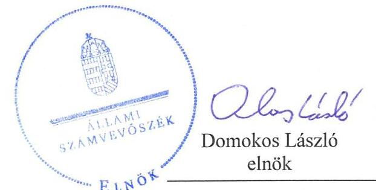
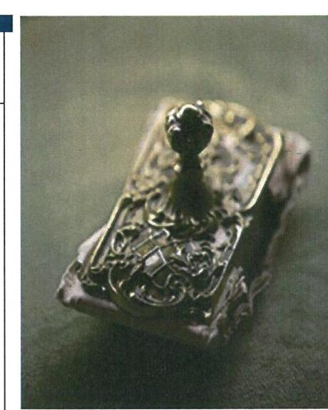
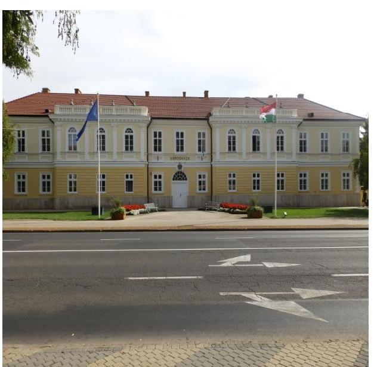
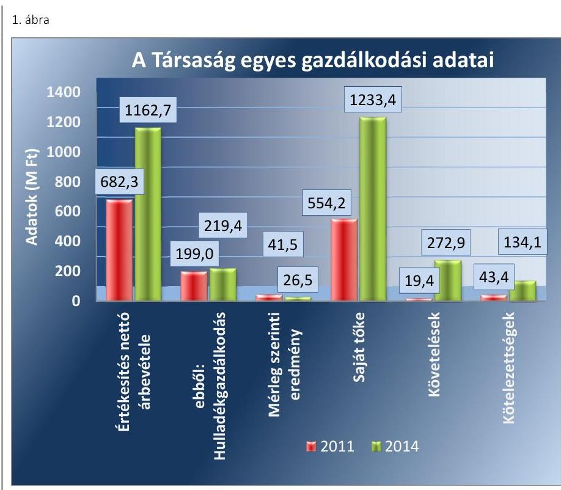
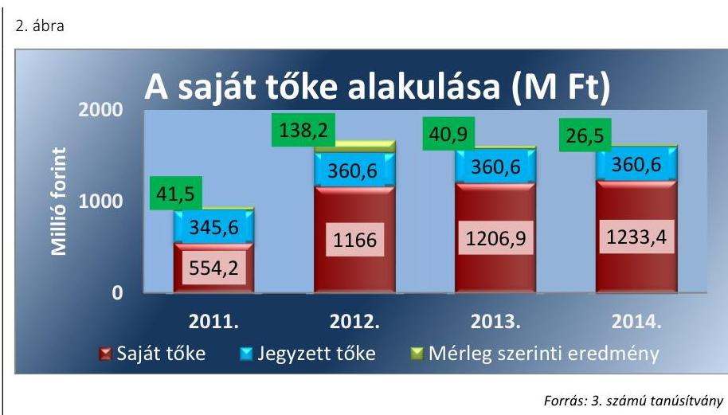
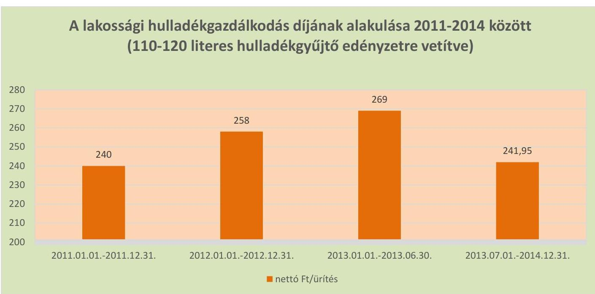
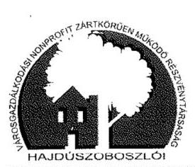
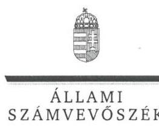
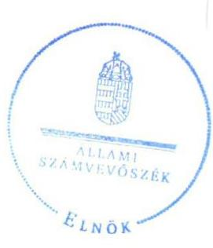
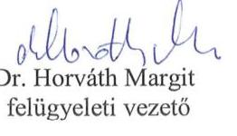

# Jelentés 

## Az önkormányzatok gazdasági társaságai

Az önkormányzatok többségi tulajdonában lévő gazdasági társaságok közfeladat ellátását érintő gazdálkodási tevékenysége szabályszerűségének ellenőrzése - Hajdúszoboszlói Városgazdálkodási Nonprofit Zrt.

2016.

Az ÁSZ az államháztartáson kívül működő közfeladat-ellátó rendszerek ellenőrzéseivel hozzájárul ahhoz, hogy a közpénzeket az államháztartáson kívül működő szervezetek is átlátható, rendezett módon használják fel a közfeladatok ellátása érdekében.

---

# Jelentés 

## Az önkormányzatok gazdasági társaságai

Az önkormányzatok többségi tulajdonában lévő gazdasági társaságok közfeladat ellátását érintő gazdálkodási tevékenysége szabályszerűségének ellenőrzése - Hajdúszoboszlói Városgazdálkodási Nonprofit Zrt.
2016. október hó 11 nap

Az ÁSZ az államháztartáson
kívül működő közfel-
adat-ellátó rendszerek el-
lenőrzéseivel hozzájárul
ahhoz, hogy a közpénze-
ket az államháztartáson
kívül működő szervezetek
is átlátható, rendezett
módon használják fel a
közfeladatok ellátása ér-
dekében.

---

# AZ ELLENŐRZÉST FELÜGYELTE:

DR. HORVÁTH MARGIT felügyeleti vezető

## AZ ELLENŐRZÉST VEZETTE ÉS A VÉGREHAJTÁSÁÉRT FELELŐS:

- KLINGA LÁSZLÓ ellenőrzésvezető
- A PROGRAM ÖSSZEÁLLÍTÁSÁÉRT FELELŐS:
- JANIK JÓZSEF osztályvezető

|  IKTATÓSZÁM: V-1016-133/2016. | |
| --- | --- |
|  TÉMASZÁM: 2050 | |
|  ELLENŐRZÉS-AZONOSÍTÓ SZÁM: V-070728 | |

Jelentéseink az Országgyűlés számítógépes hálózatán és az Interneten a www.asz.hu címen is olvashatóak.

---

# TARTALOMJEGYZÉK 

■ ÖSSZEGZÉS ..... 5
■ AZ ELLENŐRZÉS CÉLJA ..... 7
■ AZ ELLENŐRZÉS TERÜLETE ..... 8
■ AZ ELLENŐRZÉS HÁTTERE, INDOKOLTSÁGA ..... 10
■ A JELENTÉS LÉNYEGES KÉRDÉSKÖREI ..... 11
■ ELLENŐRZÉS HATÓKÖRE ÉS MÓDSZEREI ..... 12
■ MEGÁLLAPÍTÁSOK ..... 14
■ JAVASLATOK ..... 30
■ MELLÉKLETEK ..... 33
I. Sz. melléklet: Értelmező szótár ..... 33
II. Sz. melléklet: Működési adatok ..... 36
III. Sz. melléklet: A lakossági hulladékgazdálkodási díj alakulása 2011-2014 között ..... 37
IV. Sz. melléklet: Mintavételi eljárások ellenőrzési területenként ..... 38
■ FÜGGELÉK: ÉSZREVÉTELEK ..... 39
■ RÖVIDÍTÉSEK JEGYZÉKE ..... 45

---

.

---

# ÖSSZEGZÉS 

Az Állami Számvevőszék a kizárólagos önkormányzati tulajdonú Hajdúszoboszlói Városgazdálkodási Nonprofit Zrt. hulladékgazdálkodási közfeladat ellátását érintő gazdálkodási tevékenysége 2011-2014 közötti szabályszerűségét ellenőrizte. Megállapította, hogy a közfeladat-ellátás önkormányzati megszervezése szabályosan történt. A tulajdonosi jogok gyakorlása során nem érvényesültek a Taktv.-ben előírtak. A szabályszerű vagyongazdálkodás biztosítása mellett a hulladékgazdálkodás közfeladata bevételeinek elszámolása nem megfelelő, a ráfordításainak elszámolása megfelelő volt. Az önköltségszámítás szabályait meghatározták, az árképzés nem volt megalapozott. A közszolgáltatási díjak meghatározása és alkalmazása 2012. január 1. és április 14. között, valamint 2013. július 1.-jétől nem felelt meg a jogszabályban foglaltaknak, a közszolgáltatási díj előre történő megfizetésének előírása nem volt szabályszerű.

## Az ellenőrzés társadalmi indokoltsága

Az Állami Számvevőszék stratégiájában megfogalmazta, hogy a helyi önkormányzatok gazdálkodásában rejlő pénzügyi kockázatok feltárásával, az államháztartáson kívülre nyújtott költségvetési támogatások és ingyenes vagyonjuttatások, valamint az államháztartáson kívül működő közfeladat-ellátó rendszerek ellenőrzéseivel hozzájárul ahhoz, hogy a közpénzeket az államháztartáson kívül működő szervezetek is átlátható, rendezett módon használják fel a közfeladatok szerződésben vállalt ellátása érdekében.

Magyarországon az intézmény-centrikus közfeladat-ellátás jellemző, de egyre jelentősebb a költségvetésen kívüli feladatellátás térnyerése. Ennek legfontosabb szereplői - a nonprofit szervezetek mellett - az önkormányzati tulajdonú gazdasági társaságok. Az önkormányzatok szervezetalakítási szabadságának következménye, hogy a korábban is vállalati formában működő közszolgáltatások mellett, mind a kötelező, mind az önként vállalt feladatok ellátásában a gazdasági társaságok kiemelt fontosságú szerephez jutottak.

## Főbb megállapítások, következtetések, javaslatok

Az Önkormányzat a hulladékgazdálkodás közfeladatának megszervezéséről a jogszabályi előírásoknak megfelelően döntött, annak ellátásáról a kizárólagos tulajdonában lévő gazdasági társasága útján gondoskodott. Az Önkormányzat a Hgt. ${ }_{1,2}$ szerinti hulladékgazdálkodással összefüggő rendeletalkotási kötelezettségének eleget tett, melynek tartalma nem teljes körűen felelt meg az előírásoknak. Az Önkormányzat a hulladékgazdálkodási közszolgáltatás ellátására az ellenőrzött időszakban Közszolgáltatási szerződés ${ }_{1,2,3}$-t kötött, amelyek tartalma az előírásokkal összhangban volt. Az Önkormányzat a Hgt. ${ }_{1}$-ben foglaltaknak megfelelően a 2011-2012. évekre kidolgozta a hulladékgazdálkodási tervet, 2013-tól a közszolgáltató feladata volt a hulladékgazdálkodási terv készítésének kötelezettsége, amelynek eleget tett.

A Képviselő-testület a vagyongazdálkodási rendeletet ${ }_{1}$-ben, az SZMSZ ${ }_{1,2,3}$-ban, valamint az Alapító Okiratban meghatározta a tulajdonosi joggyakorlás szabályait. A tulajdonosi jogok gyakorlása során nem érvényesültek a Taktv.-ben előírtak, mivel javadalmazással összefüggő szabályzatot nem alkottak. Az FB a 2011-2014. években ügyrenddel nem rendelkezett. A Hajdúszoboszlói Városgazdálkodási NZrt. az Önkormányzattól vagyonkezelésbe nem vett át vagyont, feladatait saját eszközeivel látta el. Az ellenőrzött időszakban az Önkormányzat belső ellenőrzése a Társaságnál nem végzett ellenőrzést, így nem támogatta a szabályszerű működés kontrollját.

A közfeladat-ellátását szolgáló vagyonnal való gazdálkodás, annak nyilvántartása szabályszerű volt, a Társaság rendelkezett a Számv. tv. előírásainak megfelelő számviteli szabályzatokkal, amelyek elősegítették a szabályszerű működést. A számviteli politika ${ }_{2}$-t 2013. január 1-jétől nem módosították a jelentős összegű hiba értékhatára tekintetében,

---

továbbá az eszközök és források értékelési szabályzatát a beruházások esetében a terven felüli értékcsökkenés elszámolásának kötelezettségével. A két szabályzat közötti összhang a nem jelentős maradványérték meghatározása esetében nem volt biztosított. A Társaság vagyona 2011. január 1-jéről 2014. év végére 840,1 millió Ft-tal nőtt, döntően a forgóeszközök növekedésének következtében. A Társaságnak hosszúlejáratú kötelezettsége az ellenőrzött időszakban nem volt, rövid lejáratú kötelezettségeinek határidőben eleget tudott tenni. Az ellenőrzött időszakban a kötelezettségek állománya a működésre, a közfeladat ellátására nem jelentett kockázatot. A követelések állománya 2014 végére 272,9 millió Ft-ot tett ki. Lakossági díjhátralékkal - a díjak előre történő megfizetése miatt - az ellenőrzött időszakban nem rendelkeztek. A Társaság 2014-ben, figyelmen kívül hagyva a Hgt.-ben előírt kötelezettségét, közszolgáltatási díjhátralékos ügyeket nem adott át a NAV-nak behajtásra. A Társaság a mérleg szerinti eredménye alapján a 2011-2014. években nyereségesen gazdálkodott, a hulladékgazdálkodási közszolgáltatás eredménye 2013-ban 1,9 millió Ft, 2014-ben 11,5 millió Ft volt.

A Hajdúszoboszlói Városgazdálkodási NZrt. az üzleti tervek teljesítéséről, az éves gazdálkodásról, azon belül a hulladékgazdálkodás közfeladatáról az éves beszámolók keretében beszámolt a tulajdonos felé a Számv. tv.-ben előírtaknak megfelelően. A szakmai beszámolók nem tartalmazták a Közszolgáltatási szerződés1,2,3-ban előírtakkal ellentétben a fogyasztói panaszokról, illetve azok intézkedéséről szóló tájékoztatót. A 2011-2014. években elszámolt terven felüli értékcsökkenést a Számv. tv.-ben foglaltakkal ellentétben az éves beszámolók kiegészítő mellékletében az előírt részletezésben nem mutatták be. A Társaság az Avtv.-ben, illetve 2012-től az Info tv.-ben előírtak ellenére a közérdekű adatok megismerésére irányuló igények teljesítésének rendjét rögzítő szabályzattal nem rendelkezett, az adatvédelmi felelős az előírtak ellenére belső adatvédelmi nyilvántartást nem vezetett. A Társaságnál a bevételek elszámolása nem megfelelő, a költségek és ráfordítások elszámolása megfelelő volt, figyelembe véve a jogszabályok és a belső szabályozás előírásait. Az önköltségszámítás szabályait meghatározták, azonban a díjképzés nem felelt az előírásoknak Az ürítési díjak esetében a 2012. január 1. és 2012. április 14. közötti időszakban nem tartották be a Hgt.-ben foglaltakat, mert a 2011. évre megállapított díjaknál magasabb díjat határoztak meg és alkalmaztak. A 2013. július 1-jétől alkalmazott díjak meghatározása a 2012. április 14-én alkalmazott díjakat alapul véve történhetett. Mivel a 2012. április 14-én alkalmazott díjak meghatározása nem volt megfelelő, így ennek következtében a 2013 júliusától alkalmazott díjak nem voltak megalapozottak.

---

# AZ ELLENŐRZÉS CÉLJA 

Az ellenőrzés célja annak értékelése, hogy az Önkormányzat a jogszabályi előírások figyelembevételével döntött-e az ellenőrzésre kerülő közfeladat megszervezéséről; az önkormányzat/tulajdonosi joggyakorló szabályszerűen gyakorolta-e a tulajdonosi jogokat.

Ellenőriztük, hogy a gazdasági társaság közfeladat-ellátása bevételeinek, ráfordításainak elszámolása, és vagyongazdálkodási tevékenysége megfelelt-e a jogszabályi, illetve a közszolgáltatási/vagyonkezelési szerződésben foglalt tulajdonosi előírásoknak, azok végrehajtása szabályszerű volt-e.

Értékeltük továbbá, hogy a gazdasági társaság kötelezettségállománya jelent-e kockázatot a működésre, illetve a közfeladat ellátására; valamint hogy a közfeladatok átláthatósága és elszámoltathatósága érdekében biztosítva volt-e a közszolgáltatás díjának megalapozottsága szabályszerű önköltségszámítással.

---

# **AZ ELLENŐRZÉS TERÜLETE**

## **Hajdúszoboszló Város Önkormányzata és a Hajdúszoboszlói Városgazdálkodási Nonprofit Zártkörűen Működő Részvénytársaság**

### **HAJDÚSZOBOSZLÓ VÁROS ÖNKORMÁNYZATA**

Hajdúszoboszlói Városgazdálkodási Zártkörűen Működő Részvénytársaságot 1991. augusztus 26-án alapította, jogelődje a Hajdúszoboszlói Városgazdálkodási Vállalat volt. A Hajdúszoboszlói Közüzemi Víz-, Csatorna- és Hőszolgáltató Kft. 2012. január 1-jétől beolvadt a Hajdúszoboszlói Városgazdálkodási Nonprofit Zrt.-be. A Hajdúszoboszlói Városgazdálkodási Nonprofit Zártkörűen Működő Részvénytársaság 2013. december 1-jétől működik nonprofit gazdasági társaságként.

A Hajdúszoboszlói Városgazdálkodási Nonprofit Zrt. Hajdúszoboszló Város Önkormányzatának 100%-os tulajdonában állt az ellenőrzött időszakban, jegyzett tőkéje 2011. január 1-jén 345,6 millió Ft, 2014. december 31-én 360,6 millió Ft volt. Az Önkormányzat vagyonkezelésre nem adott át eszközöket a Társaság részére.

### **A HAJDÚSZOBOSZLÓI VÁROSGAZDÁLKODÁSI NONPROFIT ZRT**

Főtevékenysége a 2014. január 1-jén 23 830 fő lakosságszámú Hajdúszoboszló Város közigazgatási területén nem veszélyes hulladék gyűjtése volt, e mellett ellátott még távhőszolgáltatási, távhőtermelési, valamint egyéb (ingatlankezelési, temetkezési szolgáltatási, piac- és parkoló üzemeltetési, zöldterület gondozási) feladatokat is. A Társaság a nem veszélyes hulladékgyűjtési feladatot 2014-ben 5762 lakossági ügyfél, 250 közület és 86 intézmény részére végezte. A Társaság más gazdasági társaságban tulajdoni hányaddal nem rendelkezett, átlagos statisztikai állományi létszáma 2011-ben 92 fő, 2014-ben 99 fő volt.

A Hajdúszoboszlói Városgazdálkodási Nonprofit Zrt. gazdálkodásának egyes adatait a 2011. és a 2014. évek vonatkozásában az 1. ábra szemlélteti:

---

Forrás: A Társaság 2011.és 2014. évi beszámolói

A Társaság mérlegfőösszege 2011-ben 618,9 millió Ft, 2014-ben 1422,0 millió Ft volt. Az értékesítés nettó árbevétele a 2011. és a 2014. év vége között 70,4\%-kal, ebből a hulladékgazdálkodási közszolgáltatás nettó árbevétele 10,3\%-kal nőtt. Az összes értékesítés nettó árbevételéből a hulladékgazdálkodásból származó nettó árbevétel a 2011. évben 29,2\%-ot, a 2014. évben 18,9\%-ot tett ki. A mérleg szerinti eredmény pozitív volt a 2011-2014. években, a saját tőke összege 2011. december 31-éről a 2014. év végére több mint kétszeresére emelkedett. A követelések tizennégyszeresére nőttek, melyet döntően a 2012. január 1-jétől ellátott távhőszolgáltatási és távhőtermelési tevékenység kintlévőségei befolyásoltak.

A Hajdúszoboszlói Városgazdálkodási Nonprofit Zrt. működésének főbb jellemzőit a 2. számú melléklet mutatja be.

Az ellenőrzött időszakban a polgármester és a jegyző személye nem, a vezérigazgató személye változott. A polgármester az 1994. évi önkormányzati választások óta, a jegyző 1991. január 1. napjától látja el feladatait. A vezérigazgató 2012. január 1-jétől tölti be tisztségét.

---

# AZ ELLENŐRZÉS HÁTTERE, INDOKOLTSÁGA 

Az önkormányzatok közfeladat-ellátásában egyre jelentősebb a gazdasági társaságok útján történő feladatellátás térnyerése.

Az önkormányzati tulajdonú gazdasági társaságok teljes körű ellenőrzésének lehetőségét az Állami Számvevőszékről szóló 1989. évi XXXVIII. törvény 2011. január 1-jétől hatályos módosítása teremtette meg. A gazdasági társaságok közfeladat ellátását érintő gazdálkodási tevékenysége szabályszerűségére irányuló ellenőrzéseket erre tekintettel a 2011. évtől végezzük. A közfeladatot ellátó gazdasági társaságok ellenőrzése kiemelten fontos a vagyon megőrzése, megóvása érdekében, valamint a kormányzati szektor elszámolásaiban megjelenő önkormányzati tulajdonú gazdálkodó szervezetek esetében, amelyekkel szemben alapvető követelmény, hogy gazdálkodásuk, működésük szabályszerű, az általuk szolgáltatott adatok minél megbízhatóbbak legyenek. A közfeladat ellátás költségeinek, ráfordításainak alakulása, színvonala hatással van a lakosság elégedettségére. Az ellenőrzés várható hasznosulásaként az ÁSZ¹ a megállapításaival segítséget nyújthat az államháztartáson kívüli közfeladat-ellátás értékeléséhez, jogszabályi keretei pontosításához, átláthatóságot biztosító szabályozásához. Meghatározhatóvá válnak a közfeladat ellátásban részt vevő államháztartáson kívüli szervezeteknek - az önkormányzat költségvetését, pénzügyi helyzetét is befolyásoló - kockázatai, lehetővé válik ezen kockázatok
 csökkentése. Ellenőrzéseink feltárhatják, hogy az önkormányzat közfeladat-ellátási kötelezettségének szabályszerűen tett-e eleget, a feladatellátáshoz rendelt közvagyon működtetését a tulajdonostól elvárható gondossággal, szabályszerűen szervezte-e meg és a tulajdonosi felügyelete hozzájárult-e a közfeladat szabályszerű ellátásához. Értékelhetővé válik, hogy a feladatot ellátó gazdasági társaság a közszolgáltatási szerződésben foglaltak betartásával, a közvagyon használatával biztosította-e a szolgáltatás folytatásának feltételeit. Ezzel az ellenőrzöttek és a helyi döntéshozók számára az ÁSZ visszajelzést ad feladatszervezési, feladat-ellátási kockázataikról, alapot ad a meglévő hibák megszüntetéséhez, a jobb közfeladat-ellátás biztosításához. Mindezeken keresztül az ÁSZ hozzájárul Magyarország közpénzügyi helyzetének javításához, a közpénzek mérhető módon történő, a döntéshozók által meghatározott célok szerinti felhasználásához.

---

# A JELENTÉS LÉNYEGES KÉRDÉSKÖREI 

1. Az önkormányzat közfeladat megszervezéséről szóló döntése, valamint tulajdonosi joggyakorlása szabályszerű volt-e?
2. A gazdasági társaság vagyongazdálkodása szabályszerű volt-e, kötelezettségállománya jelentett-e kockázatot a működésre, illetve a közfeladat ellátásra?
3. A gazdasági társaságnál az ellátott közfeladat bevételei és ráfordításai elszámolása, valamint az önköltségszámítás és árképzés szabályszerű volt-e?

---

# ELLENŐRZÉS HATÓKÖRE ÉS MÓDSZEREI 

## Az ellenőrzés típusa

Megfelelőségi ellenőrzés

## Az ellenőrzött időszak

A 2011. január 1-jétől 2014. december 31-éig terjedő időszak.

## Az ellenőrzés tárgya

A közfeladatot gazdasági társaságokkal ellátó önkormányzatok tulajdonosi joggyakorlása, valamint gazdasági társaságok pénz- és vagyongazdálkodásának szabályozottsága és szabályszerűsége.

Az ellenőrzés kiterjed minden olyan körülményre és adatra, amely az ÁSZ jogszabályban meghatározott feladatainak teljesítéséhez, valamint a program végrehajtása folyamán felmerült újabb összefüggések feltárásához szükséges.

## Az ellenőrzött szervezet

Hajdúszoboszló Város Önkormányzata és a Hajdúszoboszlói Városgazdálkodási Nonprofit Zártkörűen Működő Részvénytársaság

## Az ellenőrzés jogalapja

Az ellenőrzés végrehajtásának jogszabályi alapját az Állami Számvevőszékről szóló 2011. évi LXVI. törvény 5. § (3)-(4)-(5) bekezdései képezték.

## Az ellenőrzés módszerei

Az ellenőrzést a nemzetközi standardokat irányadónak tekintve az ellenőrzési program ellenőrzési kérdései, az ellenőrzött időszakban hatályos jogszabályok, az ellenőrzés szakmai szabályok és módszertanok figyelembe vételével végeztük.

Az ellenőrzés ideje alatt az ellenőrzött szervezettel történő kapcsolattartást az ÁSZ Szervezeti és Működési Szabályzatának vonatkozó előírásai alapján biztosítottuk.

---

Az ellenőrzés a kiválasztott, többségi tulajdonosi jogokat gyakorló önkormányzatra, illetve az ellenőrzött közfeladatot ellátó gazdasági társaságra terjedt ki. Az ellenőrzött gazdasági társaságnál, amennyiben az több közfeladatot is ellát, akkor az ellenőrzésre kiválasztott közfeladat-ellátást ellenőriztük.

Az ellenőrzést a kérdésekre adott válaszok kiértékelésével, valamint a megjelölt adatforrások, a csatolt tanúsítványok felhasználásával, továbbá az adott időszakban hatályos jogszabályok figyelembe vételével folytattuk le. Az ellenőrzési kérdések megválaszolásához szükséges bizonyítékok megszerzése a következő ellenőrzési eljárások alkalmazásával történt: megfigyelés, kérdésfeltevés (információkérés), összehasonlítás, valamint elemző eljárás.

A bevételek és ráfordítások elszámolása, valamint a vagyonnyilvántartás terén a szabályszerű működést véletlen mintavétellel ellenőriztük. A mintavétellel ellenőrzött területek esetében minden egyes tétel vonatkozásában a szabályszerűségre vonatkozó kérdéseket tettünk fel, amelyek eredménye összesítésre került. Megfelelőnek értékeltünk egy ellenőrzött területet, amennyiben 95%-os bizonyossággal a teljes sokaságban a hibaarány legfeljebb 10%, nem megfelelőnek, amennyiben 10%-nál magasabb arányt képviselt. Abban az esetben, ha a teljes sokaság tekintetében a 10%-os hibaarányhoz való viszony megítélésének megbízhatósága nem érte el a 95%-ot, annak elérése érdekében értékelésünket további szempontokkal egészítettük ki, és figyelembe vettük a feltárt hibák típusát és súlyát. A ráfordítások elszámolására és a vagyonnyilvántartásra vonatkozó véletlen mintavételt kockázati alapú kiválasztással egészítettük ki, amelynek során évente a három legnagyobb összegű tételt választottuk ki.

---

# 1. Az önkormányzat közfeladat megszervezéséről szóló döntése, valamint tulajdonosi joggyakorlása szabályszerű volt-e? 

Összegző megállapítás

Az Önkormányzat a jogszabályok és a helyi szabályozás betartásával szervezte meg a hulladékgazdálkodást. A tulajdonosi jogait a Taktv.-ben előírtaktól eltekintve szabályszerűen gyakorolta. A közszolgáltatási díjak meghatározása és alkalmazása 2012. január 1. és április 14. között nem felelt meg a jogszabályban foglaltaknak.
1.1. számú megállapítás

A közfeladat-ellátást az Önkormányzat szabályszerűen szervezte meg, de a hulladékgazdálkodási rendelet a szolgáltatás díjának előre történő megfizetése tekintetében nem felelt meg a jogszabályi előírásoknak.

Az Önkormányzat² az Ötv³. 91. § (6) bekezdése* szerint a 2010-2014. évekre elkészítette gazdasági programját4, melyben meghatározta mindazokat a célkitűzéseket, amelyek az általa ellátott feladatok biztosítását, fejlesztését szolgálják. Így - többek között - a szennyvízcsatorna-hálózat teljes kiépítését, a bel- és csapadékvíz elvezető rendszer folyamatos fejlesztését, a közszolgáltatást nyújtó intézmények felújítását, korszerűsítését, a hatósági árak rendszeres felülvizsgálatát, a szelektív hulladékgyűjtés fejlesztését fogalmazták meg.

Az Önkormányzat a Hgt. ${ }_{1}{ }^{5}$ 35. § (1) bekezdésében foglaltaknak megfelelően kidolgozta a 2009-2014. évekre vonatkozó helyi hulladékgazdálkodási tervét. A hulladékgazdálkodási tervet ${ }^{6}$ a Hgt. ${ }_{1}$ 35. § (3) bekezdésében foglaltakkal összhangban a Képviselő-testület ${ }^{7}$ rendeletben kihirdette. A hulladékgazdálkodási terv tartalma a Hgt. ${ }_{1}$ 37. § (4) bekezdésében foglalt előírásoknak megfelelt.

A jegyző ${ }^{8}$ a 241/2001. Korm. rendelet ${ }^{9}$ 1. § f) pontjának előírásai ellenére a 2011-2012. években nem készítette elő a hulladékgazdálkodási tervben foglaltak végrehajtásáról szóló beszámolót.

A Hgt. ${ }_{2}{ }^{10}$ 78. § (1) bekezdésében foglaltak alapján - 2013. január 1-jétől - a hulladékgazdálkodási tervet a közszolgáltatónak kellett elkészítenie, melynek a Hajdúszoboszlói Városgazdálkodási NZrt. ${ }^{11}$ eleget tett.

Az Önkormányzat 2009-2014. évekre szóló Környezetvédelmi Programja a hulladékgazdálkodási tervvel összhangban készült, tartalmazta a hulladékgazdálkodással kapcsolatos célokat és az azok érdekében teendő intézkedéseket. A Környezetvédelmi Program végrehajtására évente intézkedési terv készült.

[^0]
[^0]:    * 2013. január 1-jétől az Mötv. 116. § (3)-(4) bekezdései írják elő.

---

Az Önkormányzat 2012. január 1-jétől az Nvtv. ${ }^{12}$ 9. § (1) bekezdésében foglalt előírás, továbbá 2013. május 1-jétől a vagyongazdálkodási rendelet ${ }_{2}{ }^{13}$ 6. § (2) bekezdése előírása ellenére közép- és hosszú távú vagyongazdálkodási tervvel nem rendelkezett. A vagyongazdálkodási rendelet ${ }_{2}$ 6. § (3) bekezdésében foglaltak szerint a vagyongazdálkodási tervet a polgármesternek első alkalommal a rendelet hatálybalépésétől számított 60 napon belül kellett volna elkészítenie és a Képviselő-testület elé beterjesztenie.

# A KÖZTISZTASÁG ÉS A TELEPÜLÉSTISZTASÁG 

BIZTOSÍTÁSA az Ötv. 8. § (1) bekezdése ${ }^{\dagger}$ alapján az Önkormányzat törvényi kötelezettsége. A Képviselő-testület az SZMSZ ${ }_{1}{ }^{14} \cdot{ }^{15} \cdot{ }^{16}$-ben előírta a közszolgáltatások körének kötelező feladatait, így a köztisztasági és településtisztasági, illetve a hulladékgazdálkodási feladatok ellátásának kötelezettségét, valamint meghatározta azok ellátási módját. Az Önkormányzat szabályszerűen szervezte meg a hulladékgazdálkodás közfeladatát, közigazgatási területén a szilárd hulladék gyűjtéséről, kezeléséről, ártalmatlanításáról és a közterületek tisztántartásáról a Hajdúszoboszlói Városgazdálkodási NZrt. útján gondoskodott. A Társaság ${ }^{17}$ feladatellátásának kereteit az Alapító Okiratban ${ }^{18}$, a közfeladat biztosításának és a díjak megállapításának szabályait a hulladékgazdálkodási rendeletben ${ }^{19}$ meghatározták. Az Önkormányzat 2002. december 24-én 10 éves időtartamra ${ }^{\dagger}$ Közszolgáltatási szerződés ${ }_{1}{ }^{20}$-t kötött a Társasággal a „települési szilárd hulladék gyűjtésére, szállítására, kezelésére és a komplex hulladékgazdálkodási telep működtetésére", majd 2012. december 24-én, illetve 2014. június 30-án újabb Közszolgáltatási szerződés ${ }_{2}{ }^{21} \cdot{ }^{22}$ megkötésére került sor. A Közszolgáltatási szerződés ${ }_{1,2}$ a 224/2004. (VII. 22.) Korm. rendelet ${ }^{23}$ 11-14. §-aiban előírt tartalmi követelményeknek megfelelt. A Közszolgáltatási szerződés ${ }_{2,3}$ esetében a Hgt. 2 34. § (5) bekezdésében, illetve a 317/2013. (VIII. 28.) Korm. rendelet ${ }^{24}$ 4. § (1)-(3) bekezdéseiben előírt követelményeket betartották.

A KÖZSZOLGÁLTATÁSI SZERZŐDÉS ${ }_{1,2,3}$ alapján a Hajdúszoboszlói Városgazdálkodási NZrt. feladata volt a települési szilárd hulladék rendszeres és folyamatos begyűjtése és elszállítása, a hulladékgyűjtő telep működtetése. A Közszolgáltatási szerződés ${ }_{1,2,3}$-ben meghatározták többek között - a közszolgáltató által teljesítendő közszolgáltatási kötelezettségeket, az ellátási területet, előírták az ellenőrzési és beszámolási kötelezettséget, a felmondás feltételeit.

A HULLADÉKGAZDÁLKODÁSI RENDELET tartalma a Hgt. ${ }_{1}$ 23. § a)-h) pontjaiban, valamint a Hgt. ${ }_{2}$ 35. § a)-g) pontjaiban foglaltaknak megfelelt. A hulladékgazdálkodási rendelet célja a Hajdúszoboszló város közigazgatási területén élők egészségének védelme, a természeti és épített környezet megóvása, a keletkező hulladék által okozott környezetterhelés minimálisra szorítása, a képződő hulladék mennyiségének és veszélyességének csökkentése volt. A hulladékgazdálkodási rendeletben többek között - meghatározták a helyi közszolgáltatás tartalmát, ellátásának rendjét és módját, a közszolgáltató és az ingatlantulajdonos ezzel összefüggő jogait és kötelezettségeit, valamint a közszolgáltatási díj fizetésének szabályait. Előírták továbbá a közszolgáltatás szüneteltetésére, a szabálysértésekre, a lomtalanításra, a zöldhulladék elszállítására vonatkozó rendelkezéseket. A hulladékgazdálkodási rendelet értelmében a szociálisan rászorulókat az Önkormányzat lakásfenntartási támogatással segítette. A 2011-2014. években a szolgáltatás díjának előre történő megfizetése tekintetében ellentétes volt a 64/2008. (III. 28.) Korm. rendelet ${ }^{25}$ 6. § (3) bekezdésében foglaltakkal, mely szerint a közszolgáltatási díjat az arra kötelezett számla ellenében, meghatározott időszakonként, utólag köteles megfizetni. Ellentétes volt továbbá a Hgt. 2 42. § (1) bekezdés g) pontjával, mely szerint a közszolgáltató legalább negyedévente, utólag köteles a hulladékgazdálkodási díj fizetésére kötelezett ingatlanhasználó részére a számlát kiállítani.

A hulladékgazdálkodási rendelet 34. § (2) bekezdése szerint a közszolgáltatás díját az ingatlantulajdonosoknak előre, a szolgáltatási félév ${ }^{6}$ első hónapjának 15. napjáig, a gazdálkodó szervezeteknek a szolgáltatási negyedév első hónapjának 15. napjáig kellett megfizetniük. A díj megfizetésével egyidejűleg a közszolgáltató köteles volt az ingatlantulajdonos részére a díj megfizetését igazoló matrica átadására, melyet az ingatlantulajdonosnak a gyűjtőedényzetre kellett kiragasztania.

# 1.2. számú megállapítás 

A tulajdonosi jogok gyakorlása során a Képviselő-testület javadalmazással összefüggő szabályzatot nem alkotott, az FB ügyrenddel nem rendelkezett. A közszolgáltatás díjai 2012. január 1. és április 14. között nem feleltek meg a jogszabályi előírásnak. A Társaságnál belső ellenőrzést nem végzett az Önkormányzat.

A TULAJDONOSI JOGOK gyakorlásának rendjét az Önkormányzat a vagyongazdálkodási rendelet ${ }_{1}{ }^{26}{ }_{2}$-ben, az SZMSZ ${ }_{1,2,3}$-ben, valamint az Alapító Okiratban határozta meg. Az Önkormányzatot megillető tulajdonosi jogok gyakorlásával kapcsolatos feladatok és jogosultságok a Képviselő-testületet illették meg, amelyeket a vagyongazdálkodási rendelet ${ }_{1,2}$-ben meghatározott esetekben a polgármesterre ${ }^{27}$, illetve a pénzügyi, gazdasági bizottságra ruházott át, szabálytalan hatáskör-delegálás nem volt. A Képviselő-testület a 2011-2014. évekre felhatalmazta a polgármestert, hogy a tulajdonosi jog gyakorlójának döntése alapján a szerződéseket megkösse, illetve az egyéb jognyilatkozatokat megtegye. A pénzügyi, gazdasági bizottság hatáskörébe tartozott - többek között - az önállóan nem értékesíthető ingatlanrész esetén a minimális eladási ár meghatározása, az ingyenesen felajánlott vagyontárgy elfogadása. A polgármester döntött az önkormányzati tulajdonú ingatlanra vonatkozó fellebbezési jogról történő lemondásról, az Önkormányzat által elrendelt jelzálogjog és elidegenítési,

[^0]
[^0]:    ${ }^{6}$ Szolgáltatási félévnek a január 1. és június 30., illetve július 1. és december 31. közötti, az üdülő minősítésű ingatlanok esetében az

 április 1. és szeptember 30. közötti időszakot tekintették.

---

illetve terhelési tilalom feloldásáról, olyan szerződéses ajánlat elutasításáról, amely elfogadása jogszabályi rendelkezéssel ellentétes lenne.

AZ ALAPÍTÓ OKIRATBAN előírták, hogy a Társaságnál igazgatóság választására nem került sor, az igazgatóság jogait a vezérigazgató ${ }^{28}$ gyakorolta. A Képviselő-testület a vezérigazgató részére tulajdonosi jogok gyakorlására nem adott felhatalmazást. A Hajdúszoboszlói Városgazdálkodási NZrt. vonatkozásában a tulajdonosi jogokat az arra jogosult szabályszerűen, a vagyongazdálkodási rendelet ${ }_{1,2}$, az SZMSZ ${ }_{1,2,3}$, illetve az Alapító Okirat előírásai szerint gyakorolta.

AZ FB ${ }^{29}$ a Gt. ${ }^{30}$ 34. § (1) bekezdésében, valamint a Ptk. ${ }^{31}$ 3:121. § (1) bekezdésében előírtakat figyelembe véve három tagból állt. Az FB a Gt. 35. § (3) bekezdésének, illetve a Ptk. 3:120. § (2) bekezdésének megfelelően minden évben írásbeli jelentést készített a Hajdúszoboszlói Városgazdálkodási NZrt. számviteli beszámolójáról.

Az FB a 2011-2014. években a Gt. 34. § (4) bekezdésében, illetve a Ptk. 3:122. § (3) bekezdésében foglaltakkal ellentétben ügyrenddel nem rendelkezett.

AZ ÉRDEKELTSÉGI RENDSZER kereteit az Önkormányzat nem teljes körűen alakította ki. A Képviselő-testület az egyes vezetői juttatások szabályozásáról határozatot ${ }^{* *}$ hozott. A határozatban foglaltak szerint a Társaság vezérigazgatója prémiumának mértéke a személyi alapbére hatszorosát nem haladhatta meg, a kifizetés feltétele a Képviselő-testület által elfogadott feladatterv teljesítése volt, melyet az FB-nek kellett ellenőriznie.

A Társaság legfőbb szerve a Taktv. ${ }^{32}$ 5. § (3) bekezdésében foglaltak ellenére javadalmazással összefüggő szabályzatot a Hajdúszoboszlói Városgazdálkodási NZrt. vonatkozásában nem alkotott.

AZ ÁRKÉPZÉS SZABÁLYAIT a 2012. év végéig a hulladékgazdálkodási rendeletben határozta meg az Önkormányzat, továbbá a Közszolgáltatási szerződés ${ }_{1}$-ben a díjak meghatározásához részletes költségelemzés készítési kötelezettséget írt elő a Társaság számára. A Hgt. ${ }_{1}$ 25. § (4) bekezdésében, továbbá a Közszolgáltatási szerződés ${ }_{1}$-ben előírtak ellenére a közszolgáltatás díját meghatározó önkormányzati rendelet elfogadását megelőző részletes költségelemzést a Hajdúszoboszlói Városgazdálkodási NZrt. nem készített, a jegyző a költségelemzés hiányára a Képviselő-testület figyelmét nem hívta fel.

A hulladékgazdálkodási rendelet 2011. december 15-én történt módosításában a 2011. évi díjaknál magasabb összegben ${ }^{* *}$ határozták meg a közszolgáltatás 2012. január 1. és december 31. között alkalmazandó díjait. A Hgt. ${ }_{1}$ 57. § (1) bekezdésének 2012. január 1-jétől 2012. április 14-éig hatályos módosítása szerint a hulladékkezelési közszolgáltatási díj legmagasabb

[^0]
[^0]:    ** A Képviselő-testület 176/2003. (XII. 18.) számú határozata egyes vezetői juttatások szabályozásáról, amely határozat hatályban volt a 2011-2014. években.
    ${ }^{* *}$ A 2011. évi díjak a 110-120 literes edényzet esetében a lakosságnál nettó 240,0 Ft/ürítés, a közületeknél 376,0 Ft/ürítés, ugyanezen díjak a 2012. évben nettó 258,0 Ft/ürítés, illetve 405,0 Ft/ürítés voltak.

---

mértéke a 2012. évben nem haladhatta meg a hulladékgazdálkodási rendeletben 2011. évre megállapított díj legmagasabb mértékét. A jogszabályi előírás ellenére a hulladékgazdálkodási rendeletet nem módosították, a 2012. évben a díjak változatlanok maradtak, így azok 2012. január 1. és 2012. április 14. között a Hgt. 157. § (1) bekezdésének előírása ellenére meghaladták a hulladékgazdálkodási rendeletben 2011-ben meghatározott legmagasabb mértéket ${ }^{44}$.
2013. január 1-jétől a hulladékgazdálkodási díjat a MEKH ${ }^{33}$ javaslatának figyelembe vételével a miniszter ${ }^{35}$ rendeletben állapítja meg.

A BESZÁMOLTATÁSI RENDSZER keretében az Önkormányzat a Hajdúszoboszlói Városgazdálkodási NZrt. vezérigazgatóját évente beszámoltatta a gazdálkodásról, valamint - az üzleti jelentés keretében - a közszolgáltatási tevékenységről, a Közszolgáltatási szerző-dés ${ }_{1,2,3}$-ben foglaltak szerint. A Társaság 2011-2014. évi éves szakmai és számviteli beszámolóit - az FB előzetes írásbeli véleményezését követően - a Képviselő-testület a Gt. 35. § (3) bekezdésének, illetve a Ptk. 3:120. § (2) bekezdésében előírtaknak megfelelően elfogadta.

A Közszolgáltatási szerződés ${ }_{1,2,3}$ 15. pontjában előírt kötelezettségének a Hajdúszoboszlói Városgazdálkodási NZrt. nem tett eleget, mivel a szakmai beszámolók nem tartalmazták a fogyasztói panaszokról, illetve az azok intézéséről szóló tájékoztatást.

A TÁRSASÁGNÁL BELSŐ ELLENŐRZÉST a 2011-2014. években az Önkormányzat nem végzett, illetve külső szakértőt a közfeladat ellátás ellenőrzésével nem bízott meg. A NAV ${ }^{34}$ a 2013. évben a hulladékhasznosítási szolgáltatások, az OHÚ NKft. ${ }^{35}$ a 2014. évben a Közszolgáltatási szerződés ${ }_{3}$, valamint a havi jelentéssel benyújtott támogatási igények jogszerűségének, megalapozottságának ellenőrzése során intézkedést igénylő megállapítást, javaslatot nem tett.

A Hajdúszoboszlói Városgazdálkodási NZrt. mérleg szerinti eredménye a 2011-2014. években pozitív volt. A Képviselő-testület határozataiban a 2011-2014. évek nyereségének eredménytartalékba helyezéséről döntött.

A saját tőke minden ellenőrzött évben jelentősen meghaladta a jegyzett tőkét, ezért a Gt. 143. § (2) bekezdés a) pontja, illetve a Ptk. 3:189. § (1) bekezdése miatti intézkedés megtétele nem vált szükségessé. A saját tőke összege a 2011. évben 60,4%-kal, a 2012-2014. években több mint háromszorosával haladta meg a jegyzett tőke összegét.

A saját tőke, a jegyzett tőke, valamint a mérleg szerinti eredmény alakulását a 2. ábra mutatja be.

[^0]
[^0]:    ${ }^{44}$ A 110-120 literes edényzet esetében a lakosságnál nettó 18,0 Ft/ürítés, a közületeknél nettó 29,0 Ft/ürítés összeggel volt magasabb a díj.
    ${ }^{35}$ Nemzeti Fejlesztési Miniszter

---

Az Önkormányzat a Hajdúszoboszlói Városgazdálkodási NZrt. részére garanciát nem nyújtott, kezességet nem vállalt a 2011-2014. években.

# 2. A gazdasági társaság vagyongazdálkodása szabályszerű volt-e, kötelezettségállománya jelentett-e kockázatot a működésre, illetve a közfeladat ellátásra? 

Összegző megállapítás

A Társaság vagyongazdálkodása szabályszerű volt, kötelezettségállománya a működésre, a közfeladat ellátásra nem jelentett kockázatot. Az adatvédelmi biztos az előírt nyilvántartást nem vezette.
2.1. számú megállapítás

Az előírt szabályzatokkal rendelkeztek, azonban a számviteli politikát a Számv. tv.-ben foglalt előírás ellenére nem módosították. A szabályzatok tartalmazták a közfeladat ellátás elkülönített nyilvántartásának szabályait.

A Társaság vagyongazdálkodási tevékenysége, illetve annak végrehajtása a jogszabályi előírásoknak, illetve a Közszolgáltatási szerződés1,2,3-ben foglalt tulajdonosi előírásoknak megfelelt.

AZ ÜZLETI TERVEKET a vezérigazgató terjesztette be a Képviselő-testület elé a Társaság SZMSZ ${ }_{1}{ }^{36} \cdot{ }_{2}{ }^{37}$-ében előírt kötelezettsége alapján. Az üzleti tervek árbevétel-, költség-, eredmény- és beruházási tervet tartalmaztak. Az Önkormányzat 2010-2014. évekre szóló gazdasági programjában szereplő, a szelektív hulladékgyűjtés fejlesztésével, az épületek korszerűsítésével kapcsolatos elképzelésekre, azok költségeire, illetve várható eredményére az üzleti tervekben nem tértek ki. Az üzleti terveket a Képviselő-testület jóváhagyta.

A HULLADÉKGAZDÁLKODÁSI TERVET ${ }^{38}$ a Hajdúszoboszlói Városgazdálkodási NZrt. a Hgt. ${ }_{2}$ 78. § (1) bekezdésében előírtaknak megfelelően elkészítette, azt a Hgt. ${ }_{2}$ 78. § (3) bekezdése szerint az Országos Környezetvédelmi, Természetvédelmi és Vízügyi Főfelügyelőségnek megküldte. A hulladékgazdálkodási tervben a Hgt. ${ }_{2}$ 78. § (2) bekezdésében

---

foglaltaknak megfelelően bemutatták, hogy a hulladék átvételével, elszállításával és kezelésével, illetve ártalmatlanításával, hasznosításával kapcsolatban megfogalmazott célkitűzések érdekében milyen intézkedéseket terveznek. A hulladékgazdálkodási terv a Hgt. 78. § (4) bekezdésében előírt tartalommal készült.

A Társaság SZMSZ1-ét 2011. január 1. és 2013. november 30. között nem módosították, abban ügyvezető szervként az igazgatóságot jelölték meg annak ellenére, hogy az igazgatóság jogait és kötelezettségeit a vezérigazgató gyakorolta. A Társaság SZMSZ2-én a cégjegyzékben szereplő változást 2013. december 1-jétől átvezették.

A Hajdúszoboszlói Városgazdálkodási NZrt. rendelkezett a Számv. tv. ${ }^{39}$ 14. § (3) bekezdésében előírt számviteli politika ${ }_{1}{ }^{40}{ }_{2}{ }^{41}$-val, a Számv. tv. 14. § (5) bekezdés a)-d) pontjaiban foglaltaknak megfelelően eszközök és források leltárkészítési és leltározási szabályzattal ${ }^{42}$, eszközök és források értékelési szabályzattal ${ }^{43}$, önköltségszámítási szabályzat ${ }_{1}{ }^{44}{ }_{2}{ }^{45}$-tal, valamint pénzkezelési szabályzat ${ }_{1}{ }^{46}{ }_{2}{ }^{47}{ }_{3}{ }^{48}$-tal, illetve a Számv. tv. 161. § (1) bekezdésében előírt számlarend ${ }_{1}{ }^{49}{ }_{2}{ }^{50}$-del. Rendelkeztek továbbá selejtezési szabályzattal ${ }^{51}$.

A SZÁMVITELI POLITIKA ${ }_{1,2}$ a Számv. tv. 14. § (4) bekezdése előírásainak megfelelően tartalmazta - többek között - azokat a Társaságra jellemző szabályokat, előírásokat, módszereket, amelyekkel meghatározták, hogy mit tekintenek a számviteli elszámolás, értékelés szempontjából lényegesnek, jelentősnek, valamint azt, hogy a törvényben biztosított választási, minősítési lehetőségek közül melyeket alkalmazzák.

A számviteli politika2-t a Számv. tv. 14. § (11) bekezdésében foglaltak ellenére 2013. január 1-jétől nem módosították a jelentős összegű hiba értékhatára tekintetében. A Számv. tv. 3. § (3) bekezdés 3. pontja szerint jelentős összegű a hiba 2013. január 1-jétől, ha a megállapított hibák, hibahatások eredményt, saját tőkét növelő-csökkentő értékének együttes összege meghaladja az ellenőrzött üzleti év mérlegfőösszegének 2 százalékát, illetve ha a mérlegfőösszeg 2 százaléka nem haladja meg az 1 millió forintot, akkor az 1 millió forintot. Ezzel szemben a számviteli politika2 a jelentős összegű hiba értékhatárát 500 millió Ft-ban határozta meg.

# AZ ESZKÖZÖK ÉS FORRÁSOK LELTÁRKÉSZÍTÉSI 

ÉS LELTÁROZÁSI SZABÁLYZATA tartalmazta a leltározás előkészítésének feladatait, a leltározásért felelős személyeket, a leltározás módját, fordulónapját. A készletek és a tárgyi eszközök esetében évenkénti mennyiségi felvétellel történő leltározást írtak elő, mely megfelelt a Számv. tv. 2012. január 1-jétől hatályos 69. § (3) bekezdése előírásának. A Társaság a tárgyi eszközökről és a készletekről folyamatos mennyiségi nyilvántartást vezetett.

## AZ ESZKÖZÖK ÉS FORRÁSOK ÉRTÉKELÉSI SZABÁLYZATÁT a Számv. tv. 14. § (11) bekezdésében foglaltak ellenére 2012. január 1-jétől nem módosították a beruházások tekintetében - a Számv. tv. 53. § (1) bekezdése a) pontja szerint - a terven felüli értékcsökkenés elszámolásának kötelezettségével. Az eszközök és források értékelési szabályzata szerint nem jelentős a maradványérték, ha annak értéke a beszerzési érték 10%-át, vagy ha az kevesebb, mint 50 ezer forint, akkor az

---

50 ezer forintot nem éri el. Ezzel szemben a számviteli politika ${ }_{1,2}$ szerint nem jelentős a maradványérték, ha annak értéke a beszerzési érték 10%-át, vagy ha az kevesebb, mint 500 ezer forint, akkor az 500 ezer forintot nem éri el. A két szabályozás összhangját nem biztosították.

Az eszközök és források leltárkészítési és leltározási szabályzata a vásárolt készletek leltárban kimutatott értékét tényleges beszerzési áron, az eszközök és források értékelési szabályzata átlagos beszerzési áron írta elő, így a két szabályzat összhangja nem volt biztosított.

AZ ÖNKÖLTSÉGSZÁMÍTÁSI SZABÁLYZAT ${ }_{1,2}$-ot a Hajdúszoboszlói Városgazdálkodási NZrt. a Számv. tv. 14. § (7) bekezdése alapján elkészítette. A Társaság az elszámolás módjaként rögzítette, hogy elsődlegesen a 6. és a 7. számlaosztályt, másodlagosan az 5. számlaosztályt alkalmazza, ezzel megteremtette a közvetlen és közvetett költségek elkülönítésének lehetőségét.

A PÉNZKEZELÉSI SZABÁLYZAT ${ }_{1,2,3}$ a Számv. tv. 14. § (8) bekezdésében előírt tartalmi követelményeknek megfelelt, rendelkezett - többek között - a pénzforgalom lebonyolításának rendjéről, a pénzkezelés személyi és tárgyi feltételeiről, felelősségi szabályairól, a készpénzállomány ellenőrzésekor követendő eljárásról, az ellenőrzés gyakoriságáról.

A számlarend ${ }_{1,2}$ a Számv. tv. 161. § (2) bekezdésében előírt tartalmi követelményeknek megfelelt. A számlarendben foglaltakat alátámasztó bizonylati rendről ${ }^{52}$ külön szabályzatot alkottak.

A selejtezési
 szabályzat meghatározta a feleslegessé vált vagyontárgyak hasznosításával, leértékelésével és selejtezésével kapcsolatos feladatokat, előírta azok végrehajtásának ellenőrzési kötelezettségét. A szabályozás szerint a készletek minősítését évente legalább egyszer el kellett végeznie a Társaságnak.

A Társaság a Számv. tv. 161/A. § (1) és (2) bekezdése előírásának megfelelően úgy alakította ki belső szabályait, hogy azok a mérleg és eredménykimutatás alátámasztásán túlmenően a kiegészítő melléklet adatainak közvetlen alátámasztására is alkalmasak legyenek, továbbá a közpénzek felhasználásának és a köztulajdon használatának nyilvánossága és ellenőrizhetősége érdekében olyan részletezettségű nyilvántartási (könyvvezetési) rendszert alakított ki, melyből a vonatkozó külön jogszabályban meghatározott adatok rendelkezésre álltak. A Társaság megteremtette a közfeladathoz kapcsolódó bevételek, költségek és ráfordítások elkülönített nyilvántartásának lehetőségét, ezzel eleget tett a 64/2008. (III. 28.) Korm. rendelet 5. §-a, valamint a Hgt. ${ }_{1}$ 29. § (3) bekezdése, illetve a Hgt. ${ }_{2}$ 50. § (2) bekezdése előírásainak. A Hgt. ${ }_{2}$ 50. § (3) bekezdésében foglaltakkal összhangban megteremtette továbbá - a 2013-2014. évi éves beszámolók vonatkozásában - a közfeladat önálló mérleg és eredménykimutatás készítésének lehetőségét.

A Társaság rendelkezett iratkezelési szabályzattal ${ }^{53}$, melyben a nem selejtezhető közokiratok átadásának szabályai a közokiratokról, a közlevéltárakról és a magánlevéltári anyag védelméről szóló 1995. évi LXVI. törvény 12. § (1) bekezdésében foglaltakkal nem volt összhangban. A szabályzatban úgy rendelkeztek, hogy a nem selejtezhető közokiratokat öt évenként

---

egy alkalommal és legalább 15 év után lehet átadni a levéltárnak, a jogszabály azonban a feladatot kötelezettségként és nem lehetőségként írta elő.

# 2.2. számú megállapítás 

## A Társaság a tulajdonában lévő vagyonával a jogszabályi és belső rendelkezéseknek megfelelően gazdálkodott.

A Hajdúszoboszlói Városgazdálkodási NZrt. a hulladékgazdálkodási közfeladat ellátásához az Önkormányzattól vagyonkezelésbe nem vett át vagyont, azt saját eszközeivel látta el.

## AZ ANALITIKUS ÉS FŐKÖNYVI NYILVÁNTARTÁSI

RENDSZER a Társaság vagyonának átlátható, naprakész, a számviteli politika ${ }_{1,2}$ és az önköltségszámítási szabályzat ${ }_{1,2}$-nak megfelelő nyilvántartását biztosította. A vagyonnyilvántartásokban a vagyonváltozás nyomon követhető volt.

Az éves beszámolók adatait leltárral alátámasztották, a főkönyvi könyvelés és analitikus nyilvántartások közötti egyeztetést a mérleg fordulónapjára vonatkozóan szabályszerűen elvégezték. A 2011. évre vonatkozóan december 31-i fordulónappal, a 2012-2014. évek tekintetében október 31-i fordulónappal leltározták mennyiségi felvétellel a tárgyi eszközöket és a készleteket, egyeztetéssel az immateriális javakat. A 2012-2014. években a november 1. és december 31. közötti időszakban a tárgyi eszközök értékében történt változással (beszerzés, értékesítés) korrigálták a leltárt, így annak értéke a záró főkönyvi kivonatban szereplő értékkel megegyezett. A készletek esetében a 222 Üzemanyagok raktáron főkönyvi számlaszámon nyilvántartott gázolaj esetében állapítottak meg többletet a 2011-2014. években, az eltérés okaként a hőmérséklet változás miatti térfogat emelkedést jelölték meg. Az éves beszámolókban a többlettel növelt, ténylegesen leltározott értéknek megfelelően mutatták ki az üzemanyagok értékét.

A Társaság éves beszámolóinak főbb mérlegadatait az 1. táblázat szemlélteti.

1. táblázat

## A HAJDÚSZOBOSZLÓI VÁROSGAZDÁLKODÁSI NZRT. FŐBB MÉRLEG ADATAI (MILLIÓ FORINT)

| Megnevezés | 2011.01.01. | 2011.12.31. | 2012.12.31. | 2013.12.31. | 2014.12.31. |
| :--: | :--: | :--: | :--: | :--: | :--: |
| Befektetett eszközök | 304,5 | 327,0 | 478,0 | 433,4 | 395,6 |
| - ebből: Tárgyi eszközök | 304,3 | 326,8 | 469,8 | 428,4 | 393,3 |
| Forgóeszközök | 266,9 | 282,3 | 909,1 | 976,1 | 1019,1 |
| - ebből: Követelések | 22,4 | 19,4 | 264,6 | 240,1 | 272,9 |
| Aktív időbeli elhatárolások | 10,5 | 9,6 | 11,9 | 9,7 | 7,3 |
| ESZKÖZÖK ÖSSZESEN | 581,9 | 618,9 | 1399,0 | 1419,2 | 1422,0 |
| Saját tőke | 512,7 | 554,2 | 1166,0 | 1206,9 | 1233,4 |
| - ebből:Jegyzett tőke | 345,6 | 345,6 | 360,6 | 360,6 | 360,6 |
| - ebből: Mérleg szerinti eredmény | 20,5 | 41,5 | 138,2 | 40,9 | 26,5 |
| Céltartalékok | 0,0 | 0,0 | 34,4 | 40,9 | 34,4 |
| Kötelezettségek | 69,2 | 64,7 | 233,0 | 212,3 | 188,6 |
| Passzív időbeli elhatárolások | 24,8 | 21,3 | 51,1 | 25,1 | 20,1 |
| FORRÁSOK ÖSSZESEN | 581,9 | 618,9 | 1399,0 | 1419,2 | 1422,0 |

---

AZ ESZKÖZÉRTÉK 2011. január 1-jéről 2014. december 31-ére közel két és félszeresére ( 840,1 millió Ft-tal) emelkedett döntően a forgóeszközök állományának növekedése következtében. A forgóeszközökön belül a követelések állománya több mint tizenkétszeresére emelkedett, az állománynövekedés a hulladékgazdálkodási közfeladatot alapvetően nem érintette. A követelések állománya a 2011. évről a 2012. évre nőtt meg ugrásszerűen, melynek oka a 2012. január 1-jétől ellátott távhőszolgáltatási és távhőtermelési, valamint víz-és csatornaszolgáltatási tevékenységből származó kintlévőségek magas aránya (az összes követelés közel 63\%-a) volt. Az előző évhez képest a 2013. év végén 9,3\%-kal (24,5 millió Ft-tal) csökkent, a 2014. év végén 13,7\%-kal (32,8 millió Ft-tal) nőtt a követelések állománya. A befektetett eszközök döntő részét a tárgyi eszközök képezték. A tárgyi eszközök értéke 2011. január 1. és 2012. december 31. között 54,4\%-kal (165,5 millió Ft-tal) nőtt a beolvadás, majd 2012. december 31-éről a 2014. év végére 16,3\%-kal (76,5 millió Ft-tal) csökkent az elszámolt értékcsökkenés következtében, összességében az ellenőrzött időszakban 29,2\%-kal (89,0 millió Ft-tal) emelkedett. A források növekedését - jellemzően - a saját tőke és a kötelezettségek állományának növekedése eredményezte, mely közel két és félszeresére (720,7 millió Ft-tal), illetve háromszorosára (89,7 millió Ft-tal) emelkedett a beolvadás eredményeként.
2.3. számú megállapítás

A kötelezettségek állománya a működésre, a közfeladat ellátására nem jelentett kockázatot, a Társaság a kötelezettségeit teljesítette.

A Társaság kötelezettségeinek állománya 2011. január 1. és 2012. december 31. között nőtt, majd - az előző évhez képest - 2013. év végére 0,8\%-kal (1,2 millió Ft-tal), 2014. év végére 8,3\%-kal (12,2 millió Ft-tal) csökkent.

AZ ELADÓSODOTTSÁGI MUTATÓ értéke kedvezően alakult, a 2011. évben 0,07, a 2012. évben 0,11, a 2013. évben 0,10, a 2014. évben 0,09 volt, az idegen tőke összes forráson belüli aránya egyik évben sem érte el a kritikus 0,6-os értéket. Az eladósodottság mértéke hasonló képet mutatott, a mutató a 2011-2014. években nem érte el az 1-es értéket, az évek sorrendjében értéke 0,08, 0,13, 0,12 és 0,11 volt. A nettó eladósodottság mutatója arról nyújt információt, hogy a kintlévőségekkel csökkentett kötelezettségeket milyen mértékben fedezi saját forrás, és azt feltételezi, hogy a kötelezettségek teljesítését megelőzi a követelések realizálása. A mutató értéke 2011-ben 0,04, 2012-ben -0,10, 2013-ban -0,08, 2014-ben -0,11 volt. A 2012-2014. évi negatív érték azt jelentette, hogy a kintlévőségek összege meghaladta a kötelezettségek összegét.

Az adósságfedezeti mutató I. értéke szintén kedvező volt, 1,0 Ft adósságra a 2011. évben 14,04 Ft, a 2012. évben 9,41 Ft, a 2013. évben 9,64 és a 2014. évben 10,55 Ft vagyon jutott. Az adósságfedezeti mutató II. nem volt értelmezhető, mivel a 2011-2014. években hosszú lejáratú kötelezettség nem terhelte a Társaságot.

Az árbevételre vetített eladósodottság mértéke a 2011-2014. években -0,35, -0,52, -0,81 és -0,76 volt, tehát az 1,0 Ft nettó árbevételre eső, forgóeszközökkel csökkentett kötelezettség valamennyi évben kevesebb volt, mint az árbevétel. A mutató kedvező alakulását biztosította, hogy az árbevétel és a forgóeszközök állománya magasabb értékben emelkedett a kötelezettségek állományánál.

---

A Társaság a 2011-2014. években rendelkezett a társasági formájára kötelezően előírt jegyzett tőkének megfelelő összegű saját tőkével.

A RÖVID LEJÁRATÚ KÖTELEZETTSÉGEINEK a Társaság határidőben eleget tudott tenni, a 2011-2012. és a 2014. években fizetési határidőn túli szállítói kötelezettséggel nem rendelkezett. A 2013. év végén a szállítói tartozás 12,4%-a volt lejárt tartozás, melyet 30 napon belül pénzügyileg rendeztek.

A Társaság kötelezettségállománya a működésre, a hulladékgazdálkodási közfeladat ellátására nem jelentett kockázatot.
2.4. számú megállapítás

A Társaság az előírt beszámolási, adatszolgáltatási kötelezettséget teljesítette. A közérdekű adatok megismerésére irányuló igények teljesítésének rendjét rögzítő szabályzattal nem rendelkeztek, a belső adatvédelmi felelős a jogszabályban foglaltak szerinti nyilvántartást nem vezette.

Az Alapító Okirat előírása szerint a vezérigazgató köteles volt az FB-nek legalább évente két alkalommal tevékenységéről, illetve a Társaság gazdasági helyzetéről beszámolni, melynek 2012. évben csak egy alkalommal az éves beszámolók üzleti jelentésének elkészítésével tett eleget. A Társaság a 2013-2014. években eleget tett az előírásban foglaltaknak az adott év 1-9. havi gazdálkodásáról szóló jelentésével, valamint az éves beszámolók üzleti jelentéseivel.

AZ ÉVES BESZÁMOLÓKAT a Hajdúszoboszlói Városgazdálkodási NZrt. a Számv. tv. 19. § (1) bekezdésében előírt tartalommal elkészítette, azokat a Számv. tv. 153. § (1) bekezdésében, valamint 154. § (1) bekezdésében foglaltak szerint letétbe helyezte, illetve közzétette.

Az éves beszámolók elfogadásáról a Képviselő-testület a könyvvizsgáló és az FB írásbeli jelentésének birtokában határozott. A könyvvizsgáló az éves beszámolókat hitelesítő záradékkal látta el. Az FB és a könyvvizsgáló a közvagyon védelme, illetve más okból a Képviselő-testület összehívását nem kezdeményezte.

A 2013. és a 2014. évi éves beszámoló kiegészítő melléklete a közfeladatra vonatkozóan tartalmazta a Hgt. 2 50. § (3) bekezdésében előírt önálló mérleget és eredménykimutatást.

A Társaság 2011-ben az Eisztv. ${ }^{54}$ 3. § (2) bekezdésében, 2012-2014-ben az Info tv. ${ }^{55}$ 33. § (3) bekezdésében előírt közzétételi kötelezettségeinek a szervezeti, személyzeti adatok, a tevékenységre, működésre vonatkozó és a gazdálkodási adatok tekintetében honlapján ${ }^{* * *}$ eleget tett.

A Hajdúszoboszlói Városgazdálkodási NZrt. 2011-ben az Avtv. ${ }^{56}$ 20. § (8) bekezdésében, 2012-2014-ben az Info tv. 30. § (6) bekezdésében előírtakkal ellentétben a közérdekű adatok megismerésére irányuló igények teljesítésének rendjét rögzítő szabályzattal nem rendelkezett.

[^0]
[^0]:    *** www.szoboszlovarosgazda.hu

---

Az Avtv. 31/A. § (2) bekezdés d) pontjában, illetve az Info tv. 24. § (3) bekezdésében előírt adatvédelmi és adatbiztonsági szabályzatkészítési kötelezettségének a Társaság 2011. január 1. és 2012. március 31. között nem tett eleget. 2012. április 1-jén az adatvédelmi szabályzat ${ }^{57}$ hatályba léptetésével a jogszabályi előírásnak eleget tettek. Az Avtv. 31/A. § (1) bekezdés c) pontjában, valamint az Info tv. 24. § (1) bekezdés c) pontjában foglaltak szerint a Társaságnál belső adatvédelmi felelőst neveztek ki.

A belső adatvédelmi felelős az Avtv. 31/A. § (2) bekezdés e) pontjában és az Info tv. 24. § (2) bekezdés e) pontjában, valamint az adatvédelmi szabályzat 4. pontjában foglaltakkal ellentétben a belső adatvédelmi nyilvántartást nem vezette.

A Hajdúszoboszlói Városgazdálkodási NZrt. nem minősült kormányzati alszektorba besorolt társaságnak, illetve egyéb szervezetnek, így az Ávr. ${ }^{58}$ 7. számú melléklete 29. pontjában előírt bejelentési és adatszolgáltatási kötelezettsége nem keletkezett.

# 3. A gazdasági társaságnál az ellátott közfeladat bevételei és ráfordításai elszámolása, valamint az önköltségszámítás és árképzés szabályszerű volt-e? 

Összegző megállapítás

A hulladékgazdálkodási közszolgáltatás bevételeinek elszámolása nem megfelelő, a ráfordítások elszámolása
 megfelelő volt. Az önköltségszámítás szabályait meghatározták, az árképzés azonban nem volt megalapozott.
3.1. számú megállapítás

A bevételek elszámolása nem volt megfelelő, a ráfordítások elszámolása megfelelő volt. Lakossági hulladékgazdálkodási díjhátralékkal nem rendelkeztek, a közületek, intézmények esetében 2014-ben az adók módjára történő behajtást nem kezdeményezték.

A Hajdúszoboszlói Városgazdálkodási NZrt. a hulladékgazdálkodási közfeladat mellett egyéb feladatokat is ellátott, így 2011. január 1-jétől a Hgt. ${ }_{1}$ 29. § (3) bekezdése, 2013. január 1-jétől a Hgt. ${ }_{2}$ 50. § (2) bekezdése alapján fennállt a bevételeinek, költségeinek és ráfordításainak elkülönített nyilvántartási kötelezettsége. Az elkülönített nyilvántartás megvalósulása érdekében elsődlegesen a 6-7-es számlaosztály, másodlagosan az 5. számlaosztály főkönyvi számláit alkalmazta, melynek részletes szabályait a számlarend ${ }_{1,2}$-ben és az önköltségszámítási szabályzat ${ }_{1,2}$-ban rögzítette.

A Társaság értékesítés nettó árbevételének tervezett és tényleges adatait, a közfeladat árbevételét és eredményét a 2. táblázat mutatja be.

---

| A HULLADÉKGAZDÁLKODÁSI KÖZFELADAT ÁRBEVÉTELÉNEK ÉS |  |  |  |  |
| :--: | :--: | :--: | :--: | :--: |
| EREDMÉNYÉNEK ALAKULÁSA (MILLIÓ FORINT) |  |  |  |  |
| Megnevezés | 2011. | 2012. | 2013. | 2014. |
| Értékesítés nettó árbevétele (terv) | 623,0 | 1563,2 | 1041,0 | 1130,0 |
| Értékesítés nettó árbevétele (tény) | 682,3 | 1456,4 | 1019,9 | 1162,7 |
| Ebből: hulladékgazdálkodási köz-   szolgáltatás nettó árbevétele | 199,0 | 220,4 | 221,1 | 219,4 |
| Hulladékgazdálkodási közszolgálta-   tás eredménye*** | - | - | 1,9 | 11,5 |

A Társaság értékesítésének nettó árbevétele a tervezett adatokat a 2011. és a 2014. évben 9,5%, illetve 2,9%-kal haladta meg, 2012-ben és 2013-ban a teljesítés 6,8%-kal, illetve 2,0%-kal maradt alul a tervadatoktól. Az értékesítés nettó árbevételén belül a közfeladat értékesítésének nettó árbevétele a 2011. évben 29,2%, a 2012. évben 15,1%, a 2013. évben 21,7, a 2014. évben 18,9%-os arányt képviselt. A hulladékgazdálkodási közszolgáltatás üzemi (üzleti) tevékenységének eredménye 1,9 millió Ft, illetve 11,5 millió Ft nyereséget mutatott a 2013-2014. években.

A Hajdúszoboszlói Városgazdálkodási NZrt. hulladékgazdálkodási közfeladat-ellátása bevételeinek elszámolása kockázatot jelzett, a ráfordítások elszámolása megfelelt a jogszabályi és a belső szabályozás előírásainak.

# AZ ÉRTÉKESÍTÉS NETTÓ ÁRBEVÉTELÉNEK ELSZÁMOLÁSÁNAK szabályszerűsége nem megfelelő volt. A bevételeket a számlarend ${ }_{1,2}$-nek megfelelő számlacsoportba számolták el, azonban a közületi konténeres hulladékszállításnál 2012-ben alkalmazott egységár a hulladékgazdálkodási rendeletben meghatározott ártól alacsonyabb összegben került kiszámlázásra. A 2014-ben alkalmazott egységár a Hgt. ${ }_{2}$ 91. § (2) bekezdésében foglalt árképzés szabályainak nem felelt meg, mivel az alkalmazott egységár magasabb volt, mint az alkalmazható egységár. 

## AZ ANYAGJELLEGŰ RÁFORDÍTÁSOK ELSZÁMOLÁSÁNAK szabályszerűsége megfelelő volt. A költségeket a Hajdúszoboszlói Városgazdálkodási NZrt. a Számv. tv. 78. §-ának megfelelő költségnemre számolta el, illetve a megfelelő közfeladatra, költséghelyre, költségviselőre könyvelte a számlarend ${ }_{1,2}$ és az önköltségszámítási szabályzat ${ }_{1,2}$ előírásai szerint.

[^0]
[^0]:    ${ }^{* * *}$ A közszolgáltatónak a hulladékgazdálkodási közszolgáltatás nyújtása érdekében végzett tevékenységét 2013-tól kellett éves beszámolója kiegészítő mellékletében oly módon bemutatni, mintha önálló tevékenység keretében végezte volna.

---

# A BERUHÁZÁSOK, FELÚJÍTÁSOK KIADÁSAI ÉS 

AZ ÉRTÉKCSÖKKENÉSI LEÍRÁS ELSZÁMOLÁSÁ-
NAK szabályszerűsége megfelelő volt. A kiadást megalapozó kötelezettségvállalás, a pénzügyi elszámolás, a kontírozás, valamint az értékcsökkenések elszámolása a Számv. tv. 26. §-ában foglaltak szerint a rendeltetésszerű használatba vételtől kezdődően történt, és a Számv. tv. 52. §-ában előírtak szerint azokra az évekre osztották fel, amelyekben előreláthatólag a használatát tervezték. Az értékcsökkenés elszámolása során az eszközök és források értékelési szabályzatában foglaltakat betartották.

AZ AMORTIZÁCIÓ ELSZÁMOLÁSÁVAL kapcsolatos eljárásrendet az eszközök és források értékelési szabályzatában rögzítették. Az amortizációt a rendeltetésszerű használatbavételtől, az üzembe helyezéstől kezdődően számolták el, havi gyakorisággal. A Számv. tv. 92. § (1) bekezdésében foglaltaknak megfelelően az immateriális javak, tárgyi eszközök, valamint a halmozott értékcsökkenés nyitó és záró bruttó értékét, a tárgyévi értékcsökkenési leírás összegét mérlegtételek szerinti bontásban az éves beszámolók kiegészítő mellékleteiben bemutatták.

A 2011-2014. években elszámolt terven felüli értékcsökkenést - a Számv. tv. 92. § (2) bekezdésében foglaltakkal ellentétben - az éves beszámolók kiegészítő mellékletében a Számv. tv. 92. § (1) bekezdése szerinti részletezésben nem mutatták be.

A hulladékgazdálkodási közfeladattal kapcsolatosan a 2013-2014. években összesen 25,0 millió Ft értékcsökkenést számoltak el, ezzel szemben a karbantartásra, felújításra, beruházásra elszámolt összeg 31,0 millió Ft volt, ami 6,0 millió Ft-tal meghaladta az elszámolt amortizáció összegét. A Társaság teljes tevékenységét tekintve a 132 és a 1311 főkönyvi számlaszámokon kimutatott termelő járművek, valamint műszaki berendezések esetében a használhatósági fok 2011-ről 2014-re 8,0, illetve 3,1 százalékponttal emelkedett. A 1312 főkönyvi számlaszámon könyvelt termelő gépek, berendezések használhatósági foka 1,5 százalékponttal csökkent az elvégzett felújítások, beruházások ellenére.

## ADÓK MÓDJÁRA BEHAJTANDÓ KÖZTARTOZÁS-

NAK minősülnek a Hgt. 1 26. § (1) bekezdése, 2013. január 1-jétől a Hgt. 2 52. § (1) bekezdése értelmében a hulladékkezelési közszolgáltatás igénybevételéért az ingatlanhasználót terhelő díjhátralék és az azzal összefüggésben megállapított késedelmi kamat, valamint a behajtás egyéb költségei.

A Társaság a kukás hulladékszállítás esetében a lakossági, intézményi és közületi ügyfelek részére a szolgáltatás igénybevételéért félévenként előre - készpénzben - megfizetett díjról készpénzes számlát bocsátott ki és egy matricát adott, melyet az ügyfelek ragasztottak rá az edényzetre. A konténeres hulladékszállításról átutalásos számlát kaptak az intézmények és közületek, amelyek késedelmes fizetése esetén fizetési felszólítást küldtek ki részükre. A 2011-2014. években a szolgáltatás díjának előre történő megfizetése tekintetében ellentétes volt a Hgt. 2 42. § (1) bekezdés g) pontjában előírtakkal.

A KÖVETELÉSEK ÁLLOMÁNYA a konténeres hulladékszállítás esetében 2011-ben 7,1 millió Ft-ot, 2012-ben 11,2 millió Ft-ot, 2013-

---

ban 11,6 millió Ft-ot, 2014-ben 8,1 millió Ft-ot tett ki. A Társaság lakossági kintlévőséggel a 2011-2014. években nem rendelkezett.

A Hajdúszoboszlói Városgazdálkodási NZrt. a 2014. évben a Hgt. 2 52. § (3) bekezdésében előírtakkal ellentétben a díjtartozások esetében a NAV ${ }^{59}$ -nál - felszólítást, illetve annak eredménytelenségét követően - nem kezdeményezte az adók módjára történő behajtást, annak ellenére, hogy a hulladékgazdálkodási közfeladattal kapcsolatosan 45 napon túli lejárt határidejű közötti kintlévőséggel rendelkezett. A Társaság lejárt határidejű kintlévősége a 2014. év végén 0,4 millió Ft volt, ebből 91-180 nap közötti 0,1 millió Ft, 181-360 nap közötti 0,1 millió Ft, 360 napon túli 0,2 millió Ft.

# 3.2. számú megállapítás 

## Az önköltségszámítás szabályait meghatározták, az árképzés azonban nem volt megalapozott.

A hulladékgazdálkodási közfeladat átláthatóságát és elszámoltathatóságát szabályszerű önköltségszámítással nem biztosították teljes körűen a 2011-2014. években, a közszolgáltatás díjának meghatározása nem volt megalapozott.

AZ ÖNKÖLTSÉGSZÁMÍTÁSI SZABÁLYZAT ${ }_{1,2}$-ban a közvetlen és közvetett költségeket elkülönítették, a költségek felosztásához alkalmazott arányszámokat az egységvezetők költségfelosztása alapján meghatározták. Az utókalkuláció tartalmát, készítésének fordulónapját előírták. Az önköltségszámítási szabályzat ${ }_{1,2}$ tartalmazta az önköltségszámítási adatok szolgáltatásáért, a kalkuláció ellenőrzéséért felelős munkaköröket. A Társaság a 64/2008. (III. 28.) Korm. rendelet 2. § (3) bekezdésének előírásai szerinti, a díjak megállapításához alkalmazandó tényezőket, a kalkulációs sémát az önköltségszámítási szabályzat ${ }_{1,2}$-ban meghatározta.
2011. január 1. és 2012. december 31. között a közszolgáltatás díját az Önkormányzat rendeletben határozta meg a Társaság által készített javaslat alapján, azonban a díjavaslat a Hgt. 25. § (4) bekezdése szerinti költségelemzést nem tartalmazott, így az előterjesztett díjszabás nem volt megalapozott. A Társaság nem tartotta be a 64/2008. (III. 28.) Korm. rendelet 5. §-ának előírását, mivel a közszolgáltatási díj megállapítása érdekében díjkalkulációt nem készített. 2013. január 1-jétől a díjmegállapítás miniszteri hatáskör lett.

A lakossági szilárd hulladék gyűjtésének, szállításának és elhelyezésének egyszeri díja a 110-120 literes hulladékgyűjtő edény esetében 2011. január 1-jétől nettó 240,0 Ft/ürítés, 2012. január 1-jétől nettó 258,0 Ft/ürítés, 2013. január 1-jétől nettó 269,0 Ft/ürítés volt. 2013. július 1-jétől nettó 241,95 Ft/ürítés díjat alkalmaztak. A közületek esetében - ugyanezen időszakra és a 110-120 literes edényzetre vetítve - nettó 376,0 Ft/ürítés, 405,0 Ft/ürítés, 422,0 Ft/ürítés, illetve 2013. július 1-jétől szintén 422,0 Ft/ürítés volt a díj összege. Az ürítési díjak esetében a 2012. január 1. és 2012. április 14. közötti időszakban a 2011. évi díjaknál magasabb díjakat alkalmaztak, ezzel nem tartották be a Hgt. 1 57. § (1) bekezdésében foglaltakat. A jegyző nem tett eleget az Ötv. 36. § (3) bekezdésében előírt kötelezettségének, mert nem jelezte a Képviselő-testületnek, hogy döntésük jogszabálysértő.
2012. április 15-étől a Hgt. 1 57. § (1) bekezdés b) pontja alapján a 120 literes hulladékgyűjtő edény ürítési díja a nettó 650 Ft-ot nem haladhatta

---

meg, mely előírásnak eleget tettek. 2013. január 1-jétől a lakossági ügyfelek esetében a Hgt. 2 91. § (2) bekezdés szerinti, a 2012. december 31-én alkalmazott bruttó díjhoz képest 4,2%-kal megemelt mértékű díjat alkalmaztak.

A Hgt. 2 91. § (2) bekezdés 2013. május 10-étől hatályos módosítása szerint 2013. július 1-jétől a 2012. április 14-én alkalmazott díjhoz képest legfeljebb 4,2%-kal megemelt összeg 90%-a lehetett a maximum díj a lakossági ügyfelek esetében. Mivel a 2012. április 14-én alkalmazott díj (258,0 Ft/ürítés) esetében a jogszabályi előírást nem tartották be, ezért a 2013. július 1-jétől alkalmazott díj a Hgt. 2 91. § (2) bekezdésében foglaltaknak nem felelt meg (a díj maximum nettó $225,0 \mathrm{Ft} /$ ürítés lehetett volna, szemben a nettó $241,95 \mathrm{Ft} /$ ürítési díjjal).

A Társaság által a lakossági 110-120 literes gyűjtőedényzetre vetített díjak alakulását a 2011-2014. években a 3. számú melléklet tartalmazza.

---

# JAVASLATOK 

Az ÁSZ tv. 33. § (1) bekezdésében foglaltak értelmében az ellenőrzött szervezet vezetője köteles a jelentésben foglalt megállapításokhoz kapcsolódó intézkedési tervet összeállítani és azt a jelentés kézhezvételétől számított 30 napon belül az ÁSZ részére megküldeni. Amennyiben az ellenőrzött szervezet vezetője nem küldi meg határidőben az intézkedési tervet, vagy továbbra sem elfogadható intézkedési tervet küld, az Állami Számvevőszék elnöke az ÁSZ tv. 33. § (3) bekezdés a) és b) pontjaiban foglaltakat érvényesítheti.

Javaslataink célja a Hajdúszoboszlói Városgazdálkodási Nonprofit Zrt. gazdálkodása szabályszerűségének és gyakorlatának javítása annak érdekében, hogy a szabályozási környezet és az alkalmazott gyakorlat megfelelően tudja támogatni az átlátható működést.

## A Hajdúszoboszlói Városgazdálkodási Nonprofit Zrt. vezérigazgatójának

1. Intézkedjen arról, hogy a szakmai beszámolókban a közszolgáltatási szerződés előírásainak megfelelően adjanak tájékoztatást a fogyasztói panaszokról és azok intézéséről.
(1.2. sz. megállapítás 11. bekezdése alapján)
2. Intézkedjen a számviteli politika módosításáról a jelentős összegű hiba értékhatárára vonatkozóan, a Számv. tv. hatályos rendelkezéseinek megfelelően.
(2.1. sz. megállapítás 7. bekezdése alapján)
3. Intézkedjen az értékelési szabályzatban a beruházások terven felüli értékcsökkenése elszámolásának szabályozásáról a Számv. tv. előírásainak megfelelően, valamint a tárgyi eszközök jelentős maradványértéke meghatározásakor a számviteli politikával összhangban lévő szabályozás kialakításáról.
(2.1. sz.
 megállapítás 9. bekezdése alapján)
4. Intézkedjen a közérdekű adatok megismerésére irányuló igények teljesítésének rendjére vonatkozó szabályzat elkészítéséről.
(2.4. sz. megállapítás 6. bekezdése alapján)

---

5. Intézkedjen az Info tv-ben előírtaknak megfelelően a belső adatvédelmi nyilvántartás vezetéséről.
(2.4. sz. megállapítás 8. bekezdése alapján)
6. Intézkedjen a terven felüli értékcsökkenésnek az éves beszámoló kiegészítő mellékletében történő bemutatásáról a Számv. tv. előírásainak megfelelően.
(3.1. sz. megállapítás 9. bekezdése alapján)
7. Intézkedjen arról, hogy a közszolgáltatási díjhátralékos, közületi felhasználók felszólításának eredménytelensége esetén a díjhátralék megfizetésének esedékességét követő 45. nap elteltével megtörténjen a díjhátralék adók módjára történő behajtásának kezdeményezése a NAV-nál.
(3.1. sz. megállapítás 14. bekezdése alapján)

Javaslataink célja az Önkormányzat szabályszerű működésének elősegítése, továbbá az önkormányzati tulajdonosi joggyakorlás kontrolljainak erősítése.

# Hajdúszoboszló Város Önkormányzata Polgármesterének 

1. Hívja fel a felügyelő bizottság elnökének figyelmét az ügyrend elkészítésére és a jóváhagyás érdekében a legfőbb szerv ülésére történő előterjesztésre.
(1.2. sz. megállapítás 4. bekezdése alapján)
2. Kezdeményezze, hogy a Társaság legfőbb szerve tegyen eleget a Társaság vezető tisztségviselőire, FB tagjaira és az Mt. 208. §-ának hatálya alá tartozó munkavállalóira vonatkozó Javadalmazási szabályzat megalkotási és elfogadási kötelezettségének.
(1.2. sz. megállapítás 6. bekezdése alapján)

---

.

---

# MELLÉKLETEK 

## I. SZ. MELLÉKLET: ÉRTELMEZŐ SZÓTÁR

eladósodottságot jellemző mutatók
eladósodottsági mutató (tőkeáttétel): idegen tőke/összes forrás.
Egészségesnek mondható egy olyan mértékű áttétel, amelyet az üzleti tervek szerint és az elmúlt időszak tapasztalatai alapján a társaság megfelelő biztonsággal ki tud termelni. Nagy eszközberuházás-igényű iparágakban értéke magasabb, azaz magasabb eladósodottság is elfogadható, de 75-85%-ot meghaladó értéknél már itt is erős, sőt túlzott külső finanszírozottságról beszélhetünk. Általánosságban véve kedvező, ha értéke kisebb, mint 0,6.
eladósodottság mértéke: kötelezettségek / saját tőke.
Fontos szerepet játszik ez a mutató egy vállalat megítélésében. Azt mutatja, hogy a saját források a kötelezettségek hány százalékát fedezik. Törekedni kell, hogy a mutató tartósan (jelentősen) 1 alatti értéket érjen el.
nettó eladósodottság: (kötelezettségek-követelések) / saját tőke.
Azt mutatja, hogy a kintlévőségekkel csökkentett kötelezettségeket milyen mértékben fedezi a saját forrás. Ez feltételezi, hogy a követelések pénzügyileg előbb realizálódnak, mint ahogy a kötelezettségeket teljesíteni kell. A mutató minél kisebb, csökkenő értéke a kedvező.
adósságfedezeti mutató I.: (befektetett eszközök+forgó eszközök) / idegen forrás.
Azt mutatja, hogy 1 Ft adósságra hány Ft vagyon jut. Általánosságban véve kedvező, ha értéke 2 körül van, de nagy eszközberuházás-igényű iparágakban értéke kisebb is lehet.
adósságfedezeti mutató II.: működési cash flow / hosszú lejáratú kötelezettségek.
A mutató azt jelzi, hogy az adott gazdálkodási időszak működési pénzáramainak eredményeként realizált cash flow révén a vállalkozás mennyiben lenne képes valamennyi hosszú lejáratú kötelezettségének eleget tenni. Ennek vizsgálatára viszonylag ritkán kerül sor, az elsősorban a veszélyhelyzetbe került vállalkozások esetében lehet érdekes. Általánosságban véve kedvező, ha a működési cash flow minél nagyobb arányban nyújt fedezetet a hosszú lejáratú kötelezettségre (értéke nagyobb, mint 1, nő az ellenőrzött időszakban).
árbevételre vetített eladósodottság: (kötelezettségek - forgóeszközök) / értékesítés nettó árbevétele.
Az árbevételre vetített eladósodottság azt mutatja, hogy az árbevétel mekkora fedezetet nyújt a kötelezettségeknek a forgóeszközökkel csökkentett részére. Általánosságban véve kedvező, ha az árbevétel minél nagyobb arányban nyújt fedezetet a forgóeszközökkel csökkentett kötelezettségekre (értéke kisebb, mint 1, csökken az ellenőrzött időszakban).
gazdasági társaság
gazdálkodó szervezet
Ptk. 2 3.88. § (1) bekezdése szerint „a gazdasági társaságok üzletszerű közös gazdasági tevékenység folytatására, a tagok vagyoni hozzájárulásával létrehozott, jogi személyiséggel rendelkező vállalkozások, amelyekben a tagok a nyereségből közösen részesednek, és a veszteséget közösen viselik".
A Ptk. ⁶⁰ 685. § c) pontja szerint gazdálkodó szervezet: „az állami vállalat, az egyéb állami gazdálkodó szerv, a szövetkezet, a lakásszövetkezet, az európai szövetkezet, a gazdasági társaság, az európai részvénytársaság, az egyesülés, az európai gazdasági egyesülés, az európai területi együttműködési csoportosulás, az egyes jogi személyek vállalata, a leányvállalat, a vízgazdálkodási társulat, az erdő birtokossági társulat, a végrehajtói iroda, az egyéni cég, továbbá

---

hulladékgazdálkodás
hulladékgazdálkodási közszolgáltatás
közfeladat
közszolgáltatás
közszolgáltató
nemzeti vagyon
az egyéni vállalkozó." (hatályos: 2014. március 15-éig) A Hgt. 2 2. § (1) bekezdés 15. pontja szerint „a polgári perrendtartásról szóló törvényben meghatározott gazdálkodó szervezet, ide nem értve azt a költségvetési szervet, amelyet az államháztartásról szóló törvény szerint közfeladat ellátására hoztak létre." (hatályos: 2014. március 15-étől)
a Hgt. 1 3. § h) pontja szerint „a hulladékkal összefüggő tevékenységek rendszere, beleértve a hulladék keletkezésének megelőzését, mennyiségének és veszélyességének csökkenését, kezelését, ezek tervezését és ellenőrzését, a kezelő berendezések és létesítmények üzemeltetését, bezárását, utógondozását, a működés felhagyását követő vizsgálatokat, valamint az ezekhez kapcsolódó szaktanácsadást és oktatást." (hatályos: 2012. december 31-éig) A Hgt. 2 2. § (1) bekezdés 26. pontja szerint „a hulladék gyűjtése, szállítása, kezelése, az ilyen műveletek felügyelete, a kereskedőként, közvetítőként vagy közvetítő szervezetként végzett tevékenység, a hulladékgazdálkodási létesítmények és berendezések üzemeltetése, valamint a hulladékkezelő létesítmények utógondozása." (hatályos: 2013. január 1-jétől)
A Hgt. 2 2. § (1) bekezdés 27. pontja szerint: „a közszolgáltatás körébe tartozó hulladék átvételét, gyűjtését, elszállítását, kezelését, valamint a hulladékgazdálkodási közszolgáltatással érintett hulladékgazdálkodási létesítmény fenntartását, üzemeltetését biztosító, kötelező jelleggel igénybe veendő szolgáltatás." (hatályos: 2013. január 1-jétől)
Jogszabályban meghatározott állami vagy önkormányzati feladat, amit az arra kötelezett közérdekből, jogszabályban meghatározott követelményeknek és feltételeknek megfelelve végez, ideértve a lakosság közszolgáltatásokkal való ellátását, továbbá az állam nemzetközi szerződésekben vállalt kötelezettségeiből adódó közérdekű feladatokat, valamint e feladatok ellátásához szükséges infrastruktúra biztosítását is (Nvtv. 3. § (1) bekezdés 7. pont).
A közszolgáltatás: „közcélú, illetőleg közérdekű szolgáltatást jelent, amely egy nagyobb közösség (állam, település) minden tagjára nézve megközelítőleg azonos feltételek mellett vehető igénybe, ezért valamilyen mértékig közösségi megszervezést, illetve szabályozást, ellenőrzést igényel." Az Ebktv. ⁶¹ 3. § d) pontja a következőképpen határozza meg a közszolgáltatást: „szerződéskötési kötelezettség alapján a lakosság alapvető szükségleteinek ellátására irányuló szolgáltatás, így különösen a villamos energia-, gáz-, hő-, víz-, szennyvíz- és hulladékkezelési, köztisztasági, postai és távközlési szolgáltatás, továbbá a menetrend alapján közlekedő járművekkel végzett közforgalmú személyszállítás".
A Hgt. 2 2. § (1) bekezdés 37. pont szerint: „az a hulladékgazdálkodási közszolgáltatási engedéllyel rendelkező és a hulladékgazdálkodási közszolgáltatási tevékenység minősítéséről szóló törvény szerint minősített nonprofit gazdasági társaság, amely a települési önkormányzattal kötött hulladékgazdálkodási közszolgáltatási szerződés alapján hulladékgazdálkodási közszolgáltatást lát el." (hatályos: 2014. január 1-jétől)
Nvtv. 1. § (2) bekezdése szerint:
„az állam vagy a helyi önkormányzat kizárólagos tulajdonában álló dolgok, az a) pont hatálya alá nem tartozó, állam vagy a helyi önkormányzat tulajdonában lévő dolog,
az állam vagy a helyi önkormányzat tulajdonában lévő pénzügyi eszközök, továbbá az államot vagy a helyi önkormányzatot megillető társasági részesedések, az államot vagy a helyi önkormányzatot megillető bármely vagyoni értékkel rendelkező jogosultság, amelyet jogszabály vagyoni értékű jogként nevesít, Magyarország határa által körbezárt terület feletti légtér,

---

nonprofit gazdasági társaság
többségi befolyást biztosító részesedés
tulajdonosi joggyakorló
az üvegházhatású gázok kibocsátási egységeinek kereskedelméről szóló törvény szerint kibocsátási egység és légiközlekedési kibocsátási egység, valamint az ENSZ Éghajlatváltozási Keretegyezménye és annak Kiotói Jegyzőkönyve végrehajtási keretrendszeréről szóló törvény szerinti kiotói egység,
állami vagy helyi önkormányzati fenntartású közgyűjtemény (muzeális intézmény, levéltár, közgyűjteményként működő kép- és hangarchívum, valamint könyvtár) saját gyűjteményében nyilvántartott kulturális javak körébe tartozó dolog, a régészeti lelet,
a nemzeti adatvagyon körébe tartozó állami nyilvántartások fokozottabb védelméről szóló törvény szerinti nemzeti adatvagyon." (hatályos 2012. január 1-jétől, g) pont módosult 2012. június 30-ától)
Ctv. ⁶² 9/F. § (2) bekezdése szerint „az a gazdasági társaság minősül nonprofit gazdasági társaságnak és cégnevében az a gazdasági társaság tüntetheti fel a nonprofit jelleget, amelynek létesítő okirata tartalmazza, hogy a gazdasági társaság tevékenységéből származó nyereség a tagok között nem osztható fel, hanem az a gazdasági társaság vagyonát gyarapítja." (hatályos 2014. március 15-étől)
A Ptk. 8:2. § (1) bekezdése szerint „többségi befolyás az olyan kapcsolat, amelynek révén természetes személy vagy jogi személy (befolyással rendelkező) egy jogi személyben a szavazatok több mint felével vagy meghatározó befolyással rendelkezik."
Aki a nemzeti vagyon felett az államot vagy a helyi önkormányzatot megillető tulajdonosi jogok és kötelezettségek összességének gyakorlására jogosult. (Nvtv. 3. § (1) bekezdés 17. pont).

---

# II. SZ. MELLÉKLET: MŰKÖDÉSI ADATOK 

## A HAJDÚSZOBOSZLÓI NZRT. MŰKÖDÉSÉNEK FŐBB JELLEMZŐI (EZER FT / %)

| SORSZÁM | MEGNEVEZÉS |  | 2011. | 2012. | 2013. | 2014. |
| :--: | :--: | :--: | :--: | :--: | :--: | :--: |
| 1. | A gazdasági társaság tulajdonosi összetétele: |  |  |  |  |  |
| 2. | Önkormányzat megnevezése: |  | Hajdúszoboszló Város Önkormányzata |  |  |  |
| 3. | Önkormányzat tulajdoni részesedésének aránya | \% | 100,0 |  |  |  |
| 4. | Önkormányzat tulajdoni részesedésének összege | ezer Ft | 345600 | 360600 | 360600 | 360600 |
| 5. | A gazdasági társaság működése a vizsgált évek során megszűnt-e? (IGEN/NEM) |  | NEM |  |  |  |
| 6. | A tárgyévben a gazdasági társaság hulladékgazdálkodással összefüggő, saját vagyona után elszámolt értékcsökkenés összege | ezer Ft | 923 | 10746 | 13600 | 11393 |
| 7. | A tárgyévben a hulladékgazdálkodással összefüggő, saját tulajdonú eszközök pótlására (karbantartás, felújítás, beruházás) elszámolt költség | ezer Ft | 47606 | 8762 | 21998 | 8969 |
| 8. | Értékesítés nettó árbevétele | ezer Ft | 682319 | 1456359 | 1019933 | 1162701 |
| 9. | Működési cash flow | ezer Ft | 87142 | 33283 | $-47786$ | $-3263$ |

---

#### **III. SZ. MELLÉKLET: A LAKOSSÁGI HULLADÉKGAZDÁLKODÁSI DÍJ ALAKULÁSA 2011-2014 KÖZÖTT**

---

| Ssz. | Mintavétellel ellenőrzendő területek | Főbb kérdés | Ellenőrzési kérdések | Adatforrások | Alapsokaság | Mintavételi eljárás |
| :--: | :--: | :--: | :--: | :--: | :--: | :--: |
|  | 1. | 2. | 3. | 4. | 5. | 6. |
| 1. | Az ellátott közfeladat ráfordításainak elkülönített, szabályszerű elszámolása területén |  |  |  |  |  |
| 2. | Anyagjellegű ráfordítások | Az anyagjellegű ráfordítások elszámolása során betartották-e a belső szabályzatokban és a jogszabályokban foglaltakat és azokat a közfeladat-ellátással kapcsolatosan elkülönítették-e? | - a számlázott anyagjellegű ráfordításokra kötött szerződésnél betartották-e a Számv.iv. előírását, a költségelszámolást megalapozó dokumentum (szerződés, megrendelés) rendelkezésre áll?   - a beszerzett anyagok nyilvántartásba vétele megtörtént-e, azokat a közfeladatellátással kapcsolatosan elkülönítették-e a szabályozásnak megfelelően?   - a készlet bekerülési értékét a Számv.iv., a számviteli politika, illetve az értékelési szabályzat előírásai szerint vették-e számításba, azokat a közfeladat-ellátással kapcsolatosan elkülönítették-e?   - az anyagjellegű ráfordításokat a megfelelő költségnemre, illetve közfeladatra számolták-e el? | Az anyagjellegű ráfordítások közül az S1-53. főkönyvi
 számlacsoportokból vett minta esetében - a költségelszámolást megalapozó dokumentumok (szerződések, megrendelések, stb.), költségelszámoláshoz benyújtott számlák, teljesítés megtörténtét alátámasztó egyéb dokumentumok,   - analitikus nyilvántartások, anyagok nyilvántartásba vételét igazoló dokumentumok, ha a számviteli politika szerint nyilvántartásba kell venni azokat. | Éves bontásban a   főkönyvi adatbázisból az S1-53.   Anyagjellegű ráfordítások számlacsoportba tartozó ráfordítások kivéve az ELÁBÉ és az eladott közvetített szolgáltatások értéke. | A mintavételt megelőzően a sokaságból ki kell emelni - tételes ellenőrzésre évente a 3-3 legnagyobb összegű tételt.   Véletlen mintavétel évenként elemszámmal arányos rétegzéssel. |
| 3. | Beruházások, felújítások aktiválása és értékcsökkenési leírás | A közfeladatellátást szolgáló közvagyon állományba vételi, nyilvántartási és elszámolási kötelezettségének teljesítése kapcsán a felújítások, beruházások kiadások aktiválása és az értékcsökkenési leírás elszámolása megfelel-e az előírásoknak? | - A költségelszámolást megalapozó dokumentum (szerződés, megrendelés, stb.) megfelel-e az előírásoknak, továbbá be lett kérve a tulajdonosi jogok gyakorlójának előzetes, írásbeli engedélye - amennyiben előírták - az önkormányzati tulajdonban lévő eszközön elszámolt beruházáshoz/felújításhoz?   - a beruházások, felújítások állományba vétele, besorolása, a bekerülési érték meghatározása, az üzembehelyezések (aktiválások) dokumentálása megfelel-e az Sztv., a számviteli politika, illetve az értékelési szabályzat előírásainak?   - az ellenőrzésre kiválasztott immateriális javak és tárgyi eszközök szerepelnek a mérleget alátámasztó leltárban?   - az értékcsökkenés elszámolása a jogszabályban és a számviteli politikában meghatározott szabályozásnak megfelel? | A kiválasztott beruházásra vagy felújításra:   szerződések, számlák, a befejezetlen beruházások, felújítások analitikus nyilvántartása, immateriális javak, tárgyi eszközök analitikus nyilvántartása, a beszerzett eszköz üzembehelyezési okmánya, állományba vételi bizonylata, egyedi eszköznyilvántartó kartonja - az értékcsökkenés elszámolása az egyedi eszköznyilvántartó kartonja, illetve analitikus nyilvántartása | Éves bontásban az immateriális javak, a tárgyi eszközök állománynövekedési tételen, amelyek összegének meg kell egyeznie a kiegészítő mérlegben az immateriális javak, a tárgyi eszközök növekedésként bemutatott értékkel | A mintavételt megelőzően a sokaságból ki kell emelni - tételes ellenőrzésre -   évente a 3-3 legnagyobb összegű tételt.   Véletlen mintavétel évenkénti, elemszámmal arányos rétegzéssel. Kiválasztott tételek eszközkartonjának tételes ellenőrzése, különös figyelemmel az értékcsökkenés elszámolására. |
| 4. | Az ellátott közfeladat bevételeinek elkülönített, szabályszerű elszámolása területén |  |  |  |  |  |
| 5. | Értékesítés nettó árbevétel | Az értékesítés nettó árbevétele elszámolása során betartották-e a belső szabályzatokban és a jogszabályokban foglaltakat és azokat a közfeladat-ellátással kapcsolatosan elkülönítették-e? | - a bevétel kiszámlázása a belső szabályozásnak megfelelően történt-e?   - a befolyt bevétel nyilvántartásba vétele (analitika, főkönyv) megtörtént-e, azokat a közfeladat-ellátással kapcsolatosan elkülönítették-e?   - a bevételek beszedése, elszámolása során betartották-e a szabályozásban foglaltakat és a megfelelő számlacsoportba számolták el a bevételt?   - a tulajdonosi követelményeknek, belső szabályozásnak megfelelő árat alkalmazták-e? | A kiválasztott értékesítés nettó árbevétel jogcímen befolyt bevételre:   - az egyes bevételek díjmegállapítása,   - a kibocsátott számla, befolyt bevétel analitikus nyilvántartása, behajtásra tett intézkedések dokumentumai,   - kapcsolódó főkönyvi számla tételes forgalma,   - bevétel beérkezését igazoló banki kivonat(rész). | Éves bontásban a   főkönyvi adatbázisból a 91-94.   számlacsoportok   bevételei | Véletlen mintavétel évenkénti, elemszámmal arányos rétegzéssel. |

---

# FÜGGELÉK: ÉSZREVÉTELEK 

A jelentéstervezetet a Számvevőszék 15 napos észrevételezésre megküldte az ellenőrzött szervezet vezetőjének az ÁSZ tv. 29. $\S^{222}$ (1) bekezdése előírásának megfelelően.

Hajdúszoboszló Város Önkormányzatának polgármestere észrevételezési lehetőségével nem élt. A Hajdúszoboszlói Városgazdálkodási Nonprofit Zrt. vezérigazgatójától érkezett észrevételeket és azok kezeléséről szóló válaszlevelet a jelentés függeléke tartalmazza.
Az elfogadott észrevételek alapján a Számvevőszék módosította a jelentést.

[^0]
[^0]:    ${ }^{222}$ 29. § (1) Az Állami Számvevőszék az ellenőrzési megállapításait megküldi az ellenőrzött szervezet vezetőjének vagy az általa megbízott személynek, és annak, akinek személyes felelősségét állapította meg.
    (2) Az ellenőrzött szervezet vezetője és a felelősként megjelölt személy az ellenőrzés megállapításaira tizenöt napon belül írásban észrevételt tehet.
    (3) Az Állami Számvevőszék az észrevételre a beérkezésétől számított harminc napon belül írásban válaszol. A figyelembe nem vett észrevételeket köteles a jelentésben feltüntetni, és megindokolni, hogy azokat miért nem fogadta el.

---

# HAJDÚSZOBOSZLÓI VÁROSGAZDÁLKODÁSI NONPROFIT ZÁRTKÖRŰEN MŰKÖDŐ RÉSZVÉNYTÁRSASÁG 

Rövid cégnév, számlázási név: Hajdúszoboszlói Nonprofit Zrt.
4200 Hajdúszoboszló, Nyugati sor 5. sz.
Tel.: (52) 557 - 400 Fax: (52) 362 - 629 E-mail: varosgazda.rt@t-online.hu
K & H Bank Nyrt: 10200335-41810002 Adószám: 10600845-2-09

Ikt.sz.: 41-70-1/2016.
Ü.int.: Nyéki I. / Kné

Tárgy: észrevételek számvevőszéki jelentésre
Hiv.sz.: V-1016-121/2016.

## Állami Számvevőszék

1052 Budapest
Apáczai Csere János u. 10.sz.

## Domokos László elnök

Tisztelt Elnök Úr!
A Hajdúszoboszlói Nonprofit ZRt. ellenőrzéséről készült jelentéstervezetet megkaptuk, azt áttanulmányoztuk és az abban megfogalmazott megállapításokkal kapcsolatban az alábbi észrevételeket teszem.

## - 1.2. számú megállapítás

Az ármegállapítás joga 2011-ben az önkormányzatot illette meg. Ennek megfelelően Hajdúszoboszló Város Önkormányzata 2011. december 15-én rendeletben állapította meg a 2012. évre vonatkozó díjakat az akkor hatályos jogszabályoknak megfelelően. Ebben az időpontban még nem volt ismert a Parlament által 2011. december 23-án elfogadott és december 30-án kihirdetett döntése, mellyel korlátozta az önkormányzatok ármegállapítási jogát.
Az általános jogalkotási szabályok szerint egy jogszabálynak nem lehet visszamenőleges hatálya, vagyis véleményem szerint Hajdúszoboszló Város Önkormányzatának 2011. december 15-én hozott döntése jogszerű volt és ezt visszamenőleg nem helyezhette hatályon kívül egy december 30-án kihirdetett jogszabály.
Amennyiben ez az érvelés nem helytálló, a jogszabályoknak nem megfelelő díj rendeletben történő szerepeltetése akkor sem róható fel a Szolgáltató hibájaként. Az önkormányzat nem módosította a 2012. évre vonatkozó díjrendeletét, így a Szolgáltató ezt a díjat alkalmazta és ennek következménye a 3.2. számú megállapítás utolsó bekezdésében jelzett - a Számvevőszék által kifogásolt -díj alkalmazás.

---

# - 2.4. számú megállapítás 

Az Alapító Okirat előírásainak megfelelően a vezérigazgató a FB-nak beszámol a Társaság helyzetéről évente 2 alkalommal. Általában az éves beszámoló elfogadásával egyidőben, valamint a félév adatainak ismerete után július-augusztus hónapban. A FB üléseit annak elnöke hívja össze és a napirendet is ő határozza meg. Ha ez nem történik meg, a vezérigazgató nem tud beszámolni a Társaság helyzetéről. A vizsgálati jelentésben leírtak szerint 2011-2012-ben ez a beszámolási kötelezettség nem teljesült, csak egy alkalommal.
2012-ben a FB valóban 1 alkalommal 2012. március 22-én ülésezett, de 2011-ben, ahogyan az a beküldött dokumentumokból is kiolvasható, 2011. április 8-án és 2011. augusztus 4-én is tartott ülést. Az áprilisi ülésen az éves beszámoló volt napirenden, míg az augusztusi a Társaság átalakulását megelőző közbenső mérleg, vagyonmérleg és vagyonleltár.

## - 3.1. számú megállapítás

A megállapításban az szerepel, hogy a Társaság értékesítésének nettó árbevétele nem megfelelően lett elszámolva. Ezt a következtetést abból vonták le, hogy a 2014. évben alkalmazott egységár nem megfelelő, de ez a már taglalt önkormányzati rendeletből következik.
A megállapításban a következő mondat található: „ azonban a közületi konténeres hulladékszállításnál 2012-ben alkalmazott egységár a hulladékgazdálkodási rendeletben meghatározott ártól alacsonyabb összegben került kiszámlázásra."
Ebből a megállapításból az látszik, mintha a Szolgáltató 2012-ben minden közületi fogyasztójánál a rendeletben szereplőnél alacsonyabb árat alkalmazott volna. Ezzel szemben a valóság az, hogy a rendelet szerinti árat alkalmaztuk, de az ellenőrzés során beküldött egyik számlánkon valóban rossz egységár került feltüntetésre. Ez azonban csak ezen az egy számlán ( sz.sz.: 4200672/ 2012. ) van így. Ebből az egy hibából azt a következtetést levonni, hogy 2012-ben nem megfelelő díjat alkalmaztunk, nem helytálló.

Kérem a fenti észrevételeimet a jelentés összeállításánál figyelembe venni szíveskedjenek.
Jóindulatú, segítő együttműködésüket megköszönve :
Hajdúszoboszló, 2016. augusztus 16.

Hajdúszoboszlói Nonprofit Zrt. 4300 Hajdúszoboszló, Nyugati sor 5.

Tisztelettel: Nyéki István
vezérigazgató

---

ELNÖK

Ikt.szám: V-1016-129/2016

# Nyéki István úr 

vezérigazgató
Hajdúszoboszlói Városgazdálkodási Nonprofit Zrt.

## Hajdúszoboszló

## Tisztelt Vezérigazgató Úr!

Köszönettel vettem a Hajdúszoboszlói Városgazdálkodási Nonprofit Zrt. ellenőrzéséről készített számvevőszéki jelentéstervezetre tett észrevételeit.

Az Állami Számvevőszék Vezérigazgató úr észrevételére vonatkozó álláspontját a felügyeleti vezető által készített melléklet tartalmazza.

Tájékoztatom Vezérigazgató urat, hogy az Állami Számvevőszék a figyelembe nem vett észrevételeket az Állami Számvevőszékről szóló 2011. évi LXVI. törvény 29. § (3) bekezdésében előírtak szerint köteles a jelentésében feltüntetni és megindokolni, hogy azokat miért nem fogadta el.

Budapest, 2016. szeptember hó 7. nap

Tisztelettel:

Domokos László

Melléklet: Tájékoztatás az észrevételek kezeléséről

---

# Tájékoztatás az észrevételek kezeléséről 

„Az önkormányzatok gazdasági társaságai - Az önkormányzatok többségi tulajdonában lévő gazdasági társaságok közfeladat-ellátását érintő gazdálkodási tevékenysége szabályszerűségének ellenőrzése - Hajdúszoboszlói Városgazdálkodási Nonprofit Zrt. " címmel készített jelentéstervezetre Vezérigazgató úr által tett észrevételeket köszönöm. Az észrevételek kezeléséről azok sorrendjében az alábbi tájékoztatást adom:

1. Az ÁSZ 1.2. számú megállapításával kapcsolatosan tett észrevételét - mely szerint a jogszabályokban nem megfelelő díj rendeletben történő szerepeltetése nem róható fel a Szolgáltató hibájaként - nem fogadom el, így az megállapításunkat nem befolyásolja. Az említett pontban a tulajdonosi joggyakorló Önkormányzat hulladékgazdálkodással kapcsolatos rendeletalkotási tevékenységét kifogásoltuk, amely a Szolgáltatóval kapcsolatosan nem tartalmazott megállapítást. Az Ön által jelzett törvénymódosítás nem volt visszamenőleges hatályú, mivel 2011. december 30-án hirdették ki, annak előírásait 2012. január 1-jétől kellett alkalmazni.
2. Az ÁSZ 2.4. számú megállapításával kapcsolatos észrevétele kapcsán megállapításunkat az alábbiak szerint pontosítjuk:
„Az Alapító Okirat előírása szerint a vezérigazgató köteles volt az FB-nek legalább évente két alkalommal tevékenységéről, illetve a Társaság gazdasági helyzetéről beszámolni, melynek 2011-2012. években csak egy alkalommal az éves beszámolók üzleti jelentésének elkészítésével tett eleget."
3. Az ÁSZ 3.1. számú megállapításában szerepel, hogy „Az értékesítés nettó árbevételének elszámolásának szabályszerűsége nem megfelelő volt. A bevételeket a számlarend 1,2-nek megfelelő számlacsoportba számolták el, azonban a közületi konténeres hulladékszállításnál 2012-ben alkalmazott egységár a hulladékgazdálkodási rendeletben meghatározott ártól alacsonyabb összegben került kiszámlázásra. " Ön észrevételében jelzi, hogy csupán egy hibából adódott a szabálytalanság. A nem megfelelő minősítést nem csak ez a hiba, hanem a 2014-ben alkalmazott díjtételek szabálytalan alkalmazása is okozta. A jelentéstervezet „Az ellenőrzés módszerei" cím alatt tartalmazza az ÁSZ által alkalmazott mintavételi eljárásokat és a kiértékelés módszertanát, melytől eltérni nem áll módunkban. Abban rögzítésre került, hogy amennyiben a hiba aránya 10%-nál magasabb, az ellenőrzött területet nem megfelelőnek minősítjük.

Budapest, 2016. szeptember hó 7. nap

---

.

---

# RÖVIDÍTÉSEK JEGYZÉKE 

${ }^{1}$ ÁSZ
${ }^{2}$ Önkormányzat
${ }^{3}$ Ötv.
${ }^{4}$ gazdasági program
${ }^{5}$ Hgt.1
${ }^{6}$ hulladékgazdálkodási terv
${ }^{7}$ Képviselő-testület
${ }^{8}$ jegyző
${ }^{9}$ 241/2001. Korm. rendelet
${ }^{10}$ Hgt.2
${ }^{11}$ Hajdúszoboszlói Városgazdálkodási NZrt.
${ }^{12}$ Nvtv.
${ }^{13}$ vagyongazdálkodási rendelet${ }_{2}$
${ }^{14}$ SZMSZ${ }_{1}$
${ }^{15}$ SZMSZ${ }_{2}$
${ }^{16}$ SZMSZ${ }_{3}$
${ }^{17}$ Társaság
${ }^{18}$ Alapító Okirat
${ }^{19}$ hulladékgazdálkodási rendelet
${ }^{20}$ Közszolgáltatási szerződés${ }_{1}$
${ }^{21}$ Közszolgáltatási szerződés${ }_{2}$

Állami Számvevőszék
Hajdúszoboszló Város Önkormányzata
a helyi önkormányzatokról szóló 1990. évi LXV. törvény (hatálytalan: 2014. október 12-étől)

Hajdúszoboszló Város Önkormányzatának 2010-2014. évekre szóló gazdasági programja
a hulladékgazdálkodásról szóló 2000. évi XLIII. törvény

 (hatálytalan: 2013. január 1-jétől)
Hajdúszoboszló Város Önkormányzata Képviselő-testületének 19/2009. (XI. 26.) számú rendelete a helyi hulladékgazdálkodási tervről
Hajdúszoboszló Város Önkormányzatának Képviselő-testülete
Hajdúszoboszló Város Önkormányzatának jegyzője
a jegyző hulladékgazdálkodási feladat- és hatásköréről (hatálytalan: 2013. január 1-jétől)
a hulladékról szóló 2012. évi CLXXXV. törvény (hatályos: 2013. január 1-jétől)
Hajdúszoboszlói Városgazdálkodási Zártkörűen Működő
Részvénytársaság, 2013. december 1-jétől Hajdúszoboszlói
Városgazdálkodási Nonprofit Zártkörűen Működő Részvénytársaság
a nemzeti vagyonról szóló 2011. évi CXCVI. törvény (hatályos: 2011. december 31-étől)
Hajdúszoboszló Város Önkormányzata Képviselő-testületének 10/2013. (IV. 18.) számú önkormányzati rendelete Hajdúszoboszló Város nemzeti vagyonáról (hatályos: 2013. május 1-jétől)
Hajdúszoboszló Város Önkormányzata Képviselő-testületének 11/2007. (IV. 19.) számú rendelete az Önkormányzat Szervezeti és Működési Szabályzatáról (hatályos: 2011. április 30-áig)
Hajdúszoboszló Város Önkormányzata Képviselő-testületének 12/2011. (IV. 28.) számú rendelete az Önkormányzat Szervezeti és Működési Szabályzatáról (hatályos: 2011. május 1-jétől 2014. november 26-áig)
Hajdúszoboszló Város Önkormányzata Képviselő-testületének 19/2014. (XI. 27.) számú rendelete az Önkormányzat Szervezeti és Működési Szabályzatáról (hatályos: 2014. november 27-étől)
Hajdúszoboszlói Városgazdálkodási NZrt.
a Hajdúszoboszlói Városgazdálkodási NZrt. Alapító Okirata és módosításai
Hajdúszoboszló Város Önkormányzata Képviselő-testületének 22/2007. (X. 18.) számú rendelete a települési szilárd hulladékról

Hajdúszoboszló Megyei Jogú Város Önkormányzata és a Hajdúszoboszlói Városgazdálkodási Zrt. között létrejött, a 2003-2012. évekre szóló Hulladékkezelési közszolgáltatói szerződés (hatályos: 2003. január 1-jétől 2012. december 31-éig)

Hajdúszoboszló Megyei Jogú Város Önkormányzata és a Hajdúszoboszlói Városgazdálkodási Zrt. között létrejött, a 2013-2017. évekre szóló Hulladékkezelési közszolgáltatói szerződés (hatályos: 2013. január 1-jétől 2017. december 31-éig)

---

${ }^{22}$ Közszolgáltatási szerződés ${ }_{3}$
${ }^{23}$ 224/2004. (VII. 22.) Korm. rendelet
${ }^{24}$ 317/2013. (VIII. 28.) Korm. rendelet
${ }^{25}$ 64/2008. (III. 28.) Korm. rendelet
${ }^{26}$ vagyongazdálkodási rendelet ${ }_{1}$
${ }^{27}$ polgármester
${ }^{28}$ vezérigazgató
${ }^{29} \mathrm{FB}$
${ }^{30} \mathrm{Gt}$.
${ }^{31}$ Ptk. 2
${ }^{32}$ Taktv.
${ }^{33}$ MEKH
${ }^{34}$ NAV
${ }^{35}$ OHÜ NKft.
${ }^{36}$ Társaság SZMSZ ${ }_{1}$
${ }^{37}$ Társaság SZMSZ ${ }_{2}$
${ }^{38}$ hulladékgazdálkodási terv
${ }^{39}$ Számv. tv.
${ }^{40}$ számviteli politika ${ }_{1}$
${ }^{41}$ számviteli politika ${ }_{2}$
${ }^{42}$ eszközök és források leltárkészítési és leltározási szabályzata
${ }^{43}$ eszközök és források értékelési szabályzata
${ }^{44}$ önköltségszámítási szabályzat ${ }_{1}$
${ }^{45}$ önköltségszámítási szabályzat ${ }_{2}$
${ }^{46}$ pénzkezelési szabályzat ${ }_{1}$
${ }^{47}$ pénzkezelési szabályzat ${ }_{2}$

Hajdúszoboszló Megyei Jogú Város Önkormányzata és a Hajdúszoboszlói Városgazdálkodási Zrt. között létrejött Hulladékgazdálkodási közszolgáltatói szerződés (hatályos: 2014. július 1-jétől 2024. június 30-áig)
a hulladékkezelési közszolgáltató kiválasztásáról és a közszolgáltatási szerződésről (hatálytalan: 2013. szeptember 5-étől)
a közszolgáltató kiválasztásáról és a hulladékgazdálkodási közszolgáltatási szerződésről (hatályos: 2013. szeptember 5-étől)
a települési hulladékkezelési közszolgáltatási díj megállapításának részletes szakmai szabályairól (hatályos: 2008. április 1-jétől)
Hajdúszoboszló Város Önkormányzatának 5/2000. (IV. 20.) számú rendelete vagyonáról és a vagyongazdálkodás szabályairól (hatályos: 2000. május 1-jétől 2013. április 30-áig)
Hajdúszoboszló Város Önkormányzatának polgármestere
a Hajdúszoboszlói Városgazdálkodási NZrt. vezérigazgatója
a Hajdúszoboszlói Városgazdálkodási NZrt. Felügyelő Bizottsága
a gazdasági társaságokról szóló 2006. évi IV. törvény (hatálytalan: 2014. március 15-étől)
a Polgári Törvénykönyvről szóló 2013. évi V. törvény (hatályos: 2014. március 15-étől)
a köztulajdonban álló gazdasági társaságok takarékosabb működéséről szóló 2009. évi CXXII. törvény (hatályos: 2009. december 4-étől)
Magyar Energetikai és Közmű-szabályozási Hivatal
Nemzeti Adó- és Vámhivatal
Országos Hulladékgazdálkodási Ügynökség Nonprofit Kft.
a Hajdúszoboszlói Városgazdálkodási NZrt. Szervezeti és Működési Szabályzata (hatályos: 2013. november 30-áig)
a Hajdúszoboszlói Városgazdálkodási NZrt. Szervezeti és Működési Szabályzata (hatályos: 2013. december 1-jétől)
a Hajdúszoboszlói Városgazdálkodási NZrt. hulladékgazdálkodási terve (hatályos: 2013. március 1-jétől)
a számvitelről szóló 2000. évi C. törvény
a Hajdúszoboszlói Városgazdálkodási NZrt. számviteli politikája (hatályos: 2010. március 1-jétől 2011. december 31-éig)
a Hajdúszoboszlói Városgazdálkodási NZrt. számviteli politikája és módosításai (hatályos: 2012. január 1-jétől)
a Hajdúszoboszlói Városgazdálkodási NZrt. eszközök és források leltárkészítési és leltározási szabályzata (hatályos: 2001. január 1-jétől)
a Hajdúszoboszlói Városgazdálkodási NZrt. eszközök és források értékelési szabályzata és módosításai (hatályos: 2001. január 1-jétől)
a Hajdúszoboszlói Városgazdálkodási NZrt. önköltségszámítási szabályzata és módosításai (hatályos: 2011. január 1-jétől 2013. december 31-éig)
a Hajdúszoboszlói Városgazdálkodási NZrt. önköltségszámítási szabályzata (hatályos: 2014. január 1-jétől)
a Hajdúszoboszlói Városgazdálkodási NZrt. pénzkezelési szabályzata és módosításai (hatályos: 2009. január 1-jétől 2011. december 31-éig)
a Hajdúszoboszlói Városgazdálkodási NZrt. pénzkezelési szabályzata (hatályos: 2012. január 1-jétől 2012. december 31-éig)

---

${ }^{48}$ pénzkezelési szabályzat ${ }_{3}$
${ }^{49}$ számlarend ${ }_{1}$
${ }^{50}$ számlarend ${ }_{2}$
${ }^{51}$ selejtezési szabályzat
${ }^{52}$ bizonylati rend
${ }^{53}$ iratkezelési szabályzat
${ }^{54}$ Eisztv.
${ }^{55}$ Info tv.
${ }^{56}$ Avtv.
${ }^{57}$ adatvédelmi szabályzat
${ }^{58}$ Ávr.
${ }^{59}$ NAV
${ }^{60}$ Ptk. 1
${ }^{61}$ Ebktv.
${ }^{62}$ Ctv.
a Hajdúszoboszlói Városgazdálkodási NZrt. pénzkezelési szabályzata (hatályos: 2013. január 1-jétől)
a Hajdúszoboszlói Városgazdálkodási NZrt. számlarendje (hatályos: 2001. január 1-jétől 2011. december 31-éig)
a Hajdúszoboszlói Városgazdálkodási NZrt. számlarendje (hatályos: 2012. január 1-jétől)
a Hajdúszoboszlói Városgazdálkodási NZrt. selejtezési szabályzata (hatályos: 2001. január 1-jétől)
a Hajdúszoboszlói Városgazdálkodási NZrt. bizonylati rendje (hatályos: 2010. augusztus 1-jétől)
a Hajdúszoboszlói Városgazdálkodási NZrt. iratkezelési szabályzata (hatályos: 2001. június 26-ától)
az elektronikus információszabadságról szóló 2005. évi XC. törvény (hatálytalan: 2012. január 1-jétől)
az információs önrendelkezési jogról és az információszabadságról szóló 2011. évi CXII. törvény (hatályos: 2012. január 1-jétől)
a személyes adatok védelméről és a közérdekű adatok nyilvánosságáról szóló 1992. évi LXIII. törvény (hatályos: 2011. december 31-éig)
a Hajdúszoboszlói Városgazdálkodási NZrt. adatvédelmi szabályzata
az államháztartási törvény végrehajtásáról szóló 368/2011. (XII. 31.) Korm. rendelet (hatályos: 2012. január 1-jétől)
Nemzeti Adó- és Vámhivatal
a Polgári Törvénykönyvről szóló 1959. évi IV. törvény (hatálytalan: 2014. március 15-étől)
az egyenlő bánásmódról és az esélyegyenlőség előmozdításáról szóló 2003. évi CXXV. törvény
az egyesülési jogról, a közhasznú jogállásról, valamint a civil szervezetek működéséről és támogatásáról szóló 2011. évi CLXXV. törvény (hatályos: 2011. december 22-étől)

---

# ÁLLAMI SZÁMVEVŐSZÉK 

1052 Budapest, Apáczai Csere János utca 10.
Levélcím: 1364 Budapest 4. Pf. 54
Telefon: +36 14849100 Telefax: +36 14849200
www.asz.hu
