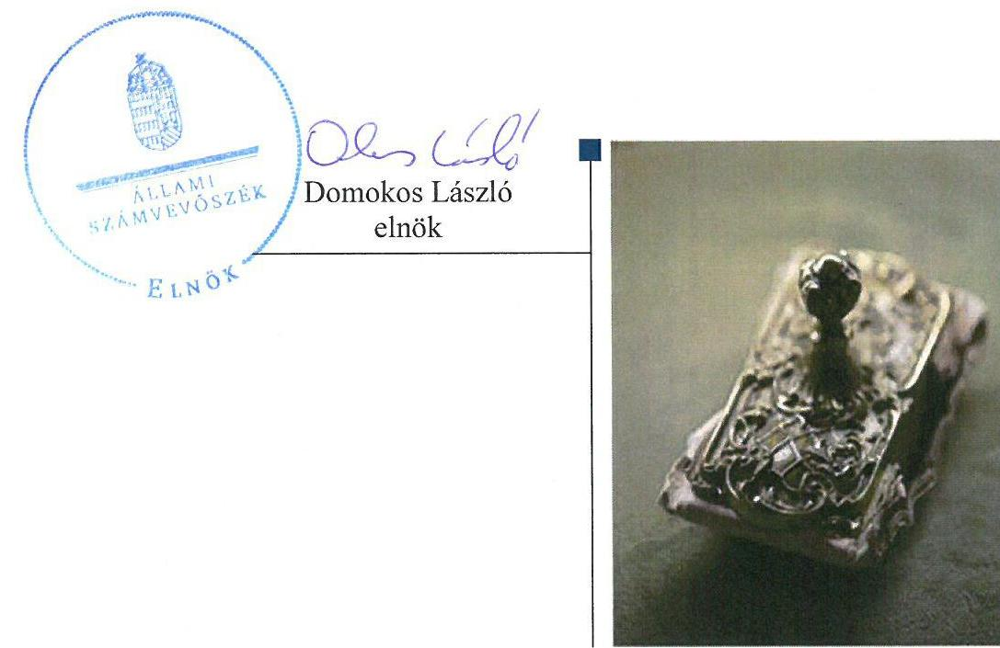
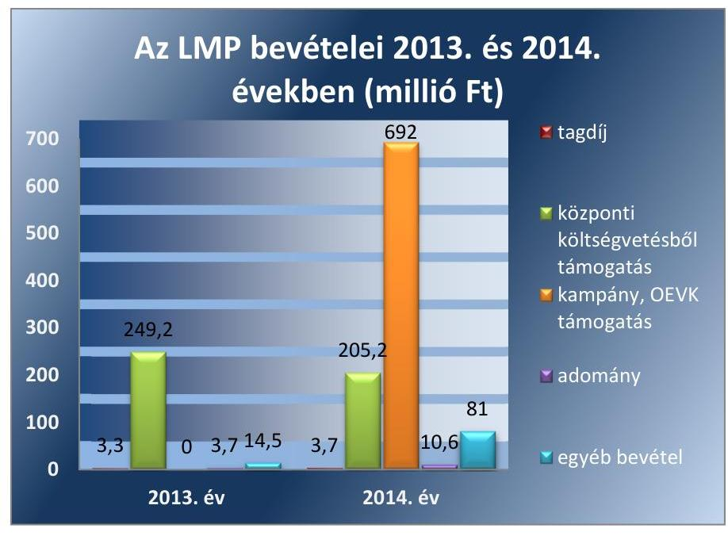
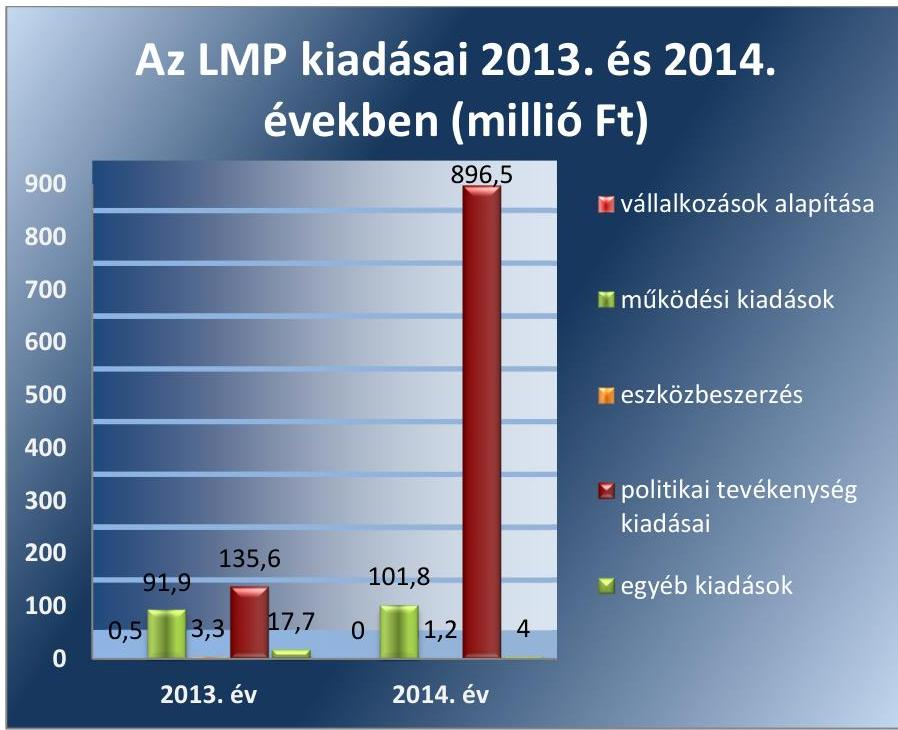
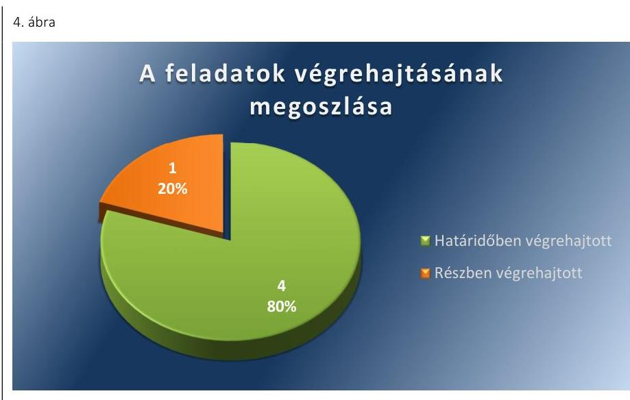
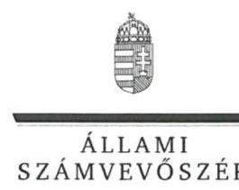
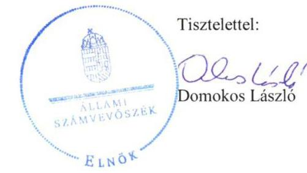
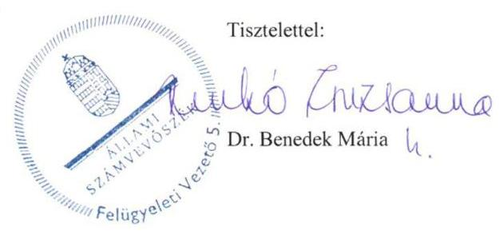

# Jelentés 

## Pártok gazdálkodása

A költségvetési támogatásban részesülő pártok 2013-2014. évi gazdálkodása törvényességének ellenőrzése a Lehet Más a Politika Pártnál
2016. 08. hó 22. nap

---

# Jelentés 

## Pártok gazdálkodása

A költségvetési támogatásban részesülő pártok 2013-2014. évi gazdálkodása törvényességének ellenőrzése a Lehet Más a Politika Pártnál
2016. 08. 22.

---

|   | AZ ELLENŐRZÉST FELÜGYELTE:  |
| --- | --- |
|   | DR. BENEDEK MÁRIA felügyeleti vezető  |
|   | AZ ELLENŐRZÉST VEZETTE ÉS A VÉGREHAJTÁSÁÉRT FELELŐS:  |
|   | DR. LÁNG ÁGNES KRISZTINA ellenőrzésvezető  |
|   | A PROGRAM ÖSSZEÁLLÍTÁSÁÉRT FELELŐS:  |
|   | JANIK JÓZSEF LÁSZLÓ osztályvezető  |
|   | A TÉMÁHOZ KAPCSOLÓDÓ KORÁBBI SZÁMVEVŐSZÉKI JELENTÉSEK:  |
|   | - címe: A Lehet Más a Politika 2009-2010. évi gazdálkodása törvényességének ellenőrzéséről  |
|   | - sorszáma: 1207  |
|  Jelentéseink az Országgyúlés számítógépes hálózatán és az Interneten a www.asz.hu címen is olvashatóak. | - címe: Az LMP gazdálkodása - A Lehet Más a Politika 2011-2012. évi gazdálkodása törvényességének ellenőrzéséről  |
|   | - sorszáma: 14008  |
|   | - címe: Kampánypénzek ellenőrzése - A 2014. évi országgyűlési képviselő választási kampányokra fordított pénzeszközök elszámolásának ellenőrzése a képviselethez jutott jelölő szervezeteknél  |
|   | - sorszáma: 15057  |
|   | IKTATÓSZÁM: V-0997-081/2016  |
|   | TÉMASZÁM: 33  |
|   | ELLENŐRZÉS-AZONOSÍTÓ SZÁM: V-074603  |

---

# TARTALOMJEGYZÉK 

■ ÖSSZEGZÉS ..... 5
■ AZ ELLENŐRZÉS CÉLJA ..... 7
■ AZ ELLENŐRZÉS TERÜLETE ..... 8
■ AZ ELLENŐRZÉS HÁTTERE, INDOKOLTSÁGA ..... 9
■ A JELENTÉS LÉNYEGES KÉRDÉSKÖREI ..... 10
■ ELLENŐRZÉS HATÓKÖRE ÉS MÓDSZEREI ..... 11
■ MEGÁLLAPÍTÁSOK ..... 14
■ JAVASLATOK ..... 28
■ MELLÉKLETEK ..... 31
I. Sz. melléklet: Értelmező szótár. ..... 31
II. Sz. melléklet: Az LMP 2013. évi közzétett beszámolója ..... 32
III. Sz. melléklet: Az LMP 2014. évi közzétett pénzügyi kimutatása ..... 33
■ FÜGGELÉK: ÉSZREVÉTELEK ..... 35
■ RÖVIDÍTÉSEK JEGYZÉKE ..... 45

---

.

---

# ÖSSZEGZÉS 

Az ÁSZ ${ }^{1}$ az LMP ${ }^{2}$ gazdálkodásának törvényességét ellenőrizte a 2013. január 1-jétől 2014. december 31-ig terjedő időszakra vonatkozóan. Megállapította, hogy az LMP 2013. évi beszámolója megfelelt, a 2014. évi pénzügyi kimutatása nem felelt meg a törvényi előírásoknak, mivel figyelmen kívül hagyták a Számv. tv. ${ }^{3}$-ben rögzített valódiság számviteli alapelvet. A beszámoló és a pénzügyi kimutatás adatai nem egyeztek meg teljes körűen a főkönyvi nyilvántartás adataival. Az LMP 2013-2014. évi könyvvezetése és gazdálkodása a szabályozási, könyvvezetési, leltározási hiányosságok és az ellenőrzési rendszer nem megfelelő kialakítása miatt nem volt szabályszerű. Az LMP a működéséhez a Párttörvény ${ }^{4}$ alapján igénybe vehető forrásokat használt fel. Az LMP az előző ÁSZ ellenőrzés javaslatainak hasznosítására nem intézkedett maradéktalanul.

## Az ellenőrzés társadalmi indokoltsága

A pártok az állampolgárok egyesülési szabadsága alapján létrehozott olyan szervezetek, amelyek szervezeti kereteket nyújtanak a népakarat kialakításához és kinyilvánításához, a politikai életben való állampolgári részvételhez. A pártoknak más társadalmi szervezetekhez képest különleges a viszonya a közhatalomhoz, ugyanis a pártok kifejezett célja és feladata, hogy képviselőik útján részt vállaljanak a közhatalomból, illetőleg politikai eszközökkel folyamatosan befolyásolják a közhatalom tevékenységét.

A politikai élet tisztasága érdekében törvény állapítja meg a pártok vagyonára és gazdálkodására vonatkozó szabályokat. Az egyesülési jog alapján létrejövő más szervezetekhez képest szűkebb körben határozza meg azt a gazdasági tevékenységet, amelyet a párt végezhet, biztosítja azonban a pártok részére azt a jogosultságot, hogy az állami költségvetésből támogatásban részesüljenek. A pártok gazdálkodását a politikai élet tisztasága érdekében rendszeresen indokolt ellenőrizni, ezért törvényi előírás alapján az ÁSZ a költségvetési támogatást kapott pártok gazdálkodását kétévente ellenőrzi.

Az ÁSZ tv. ${ }^{5}$ és a Párttörvény alapján a pártok gazdálkodása törvényességének ellenőrzésére az ÁSZ jogosult. Az ÁSZ kiemelt szerepet tölt be és felelősséget visel a pártok feletti társadalmi kontroll érvényesítése terén. A Párttörvényben előírt kétévenkénti ellenőrzési kötelezettségen túlmenően az ellenőrzést az a garanciális követelmény indokolja, hogy a pártok gazdálkodásának törvényességi ellenőrzése biztosított legyen, a törvényi rendelkezések megsértését szankciók követhessék.

A pártok működésével és gazdálkodásával kapcsolatos speciális előírásokat tartalmazó Párttörvény az ellenőrzött időszakban módosult. A főbb változások érintették a párt által elfogadható vagyoni hozzájárulásokra, a pártok beszámolására, valamint megszűnésére, felszámolására vonatkozó szabályokat.

## Főbb megállapítások, következtetések, javaslatok

Az LMP a Párttörvényben előírt szerkezetben elkészítette a 2013. évi beszámolóját és a 2014. évi pénzügyi kimutatását és gondoskodott azok közzétételéről, azonban a 2014. évi pénzügyi kimutatást a Párttörvényben meghatározott határidőn túl tette közzé a honlapján. A beszámoló, illetve a pénzügyi kimutatás összeállítása során sérült a Számv. tv.-ben előírt valódiság, valamint a tartalom elsődlegessége a formával szemben számviteli alapelv. A 2014. évi pénzügyi kimutatásban egy, a Párttörvény alapján nevesítésre kötelezett összegű adományt és az adományozót nem a valóságnak megfelelően tüntetettek fel. Az LMP számviteli rendszerének szabályozása - a számviteli politika ${ }^{6}$,

---

a számlarend ${ }^{7}$, a leltározási szabályzat ${ }^{8}$, a pénzkezelés szabályozásának hiányosságai miatt - nem felelt meg a jogszabályi előírásoknak. A könyvvezetés az ellenőrzött időszakban nem volt szabályszerű, mivel a könyvviteli elszámolást alátámasztó bizonylatok a Számv. tv.-ben meghatározott követelményeknek nem feleltek meg. A 2013-2014. években a Számv. tv.-ben foglaltak ellenére a mérleg alátámasztását szolgáló, teljes körű, szabályos leltárt nem állítottak össze. A leltározási szabályzatban foglaltaktól eltérően nem adtak ki leltározási utasítást, nem készítettek leltározási ütemtervet. A gazdálkodással összefüggő egyéb jogszabályi előírásokat az LMP nem tartotta be. Az Árt. ${ }^{9}$-ban előírt adó, valamint járulék-bevallási és fizetési kötelezettségének határidőn túl tett eleget. A kiküldetésben lévő munkavállalóknak napidíjat a 278/2005. (XII. 20.) Korm. rendelet ${ }^{10}$ előírásai ellenére nem fizettek. Az LMP ellenőrzési rendszerének kialakítása és működtetése nem felelt meg az előírásoknak, mivel a Ptk. ${ }^{11}$ előírásai ellenére a 2014. évben felügyelőbizottságot nem hoztak létre és az Alapszabály ${ }^{12}$ 9,10-ben a költségvetés végrehajtásáról szóló beszámoló elfogadását nem a kongresszus hatáskörébe utalták, az SZB ${ }^{13}$ a 2014. évi költségvetés végrehajtásáról szóló beszámolót nem véleményezte, az Országos Elnökség az intézkedési kötelezettségének nem tett eleget. Az LMP pénzügyi-számviteli feladatait megbízási szerződés alapján külső szolgáltató látta el, a Számv. tv. pénzügyi-számviteli informatikai rendszer működésére vonatkozó előírásai betartásáról gondoskodtak. Az LMP működéséhez szükséges források igénybevétele, valamint a vagyon használata szabályszerű volt, annak ellenére, hogy az Alapszabály 6-10 az elfogadható adományok körére vonatkozóan a Párttörvénnyel ellentétes szabályozást tartalmazott. Az LMP az előző ÁSZ ellenőrzés javaslata ellenére a központi pénzkezelési szabályzatban ${ }^{14}$ nem határozta meg a napi készpénz záró állomány maximális mértékét.

---

# AZ ELLENŐRZÉS CÉLJA 

Az ellenőrzés célja annak értékelése volt, hogy az LMP által közzétett 2013. évi beszámoló, illetve a 2014. évi pénzügyi kimutatás a törvényi előírásoknak megfelelt-e, a könyvvezetés és gazdálkodás során betartották-e a vonatkozó jogszabályi és belső előírásokat, továbbá az LMP a működéséhez szabályszerűen igénybe vehető forrásokat használt-e fel, az előző ÁSZ ellenőrzés során feltárt hiányosságok megszüntetéséről intézkedett-e.

---

# AZ ELLENŐRZÉS TERÜLETE

## Az LMP

A párt olyan egyesület, amely nyilvántartott tagsággal rendelkezik, és amely a nyilvántartásba vételét végző bíróság előtt kinyilvánítja, hogy a Párttörvény rendelkezéseit magára nézve kötelezőnek ismeri el a Párttörvény 1. §-a alapján.

Az ÁSZ tv. 5. § (11) bekezdés a) pontja alapján az ÁSZ – a Párttörvény rendelkezéseinek megfelelően – törvényességi szempontok szerint ellenőrzi a pártok gazdálkodását. A Párttörvény 10. § (1) bekezdése alapján a párt gazdálkodása törvényességének ellenőrzésére az ÁSZ jogosult. A Párttörvény 10. § (3) bekezdése alapján az ÁSZ kétévente ellenőrzi azoknak a pártoknak a gazdálkodását, amelyek rendszeres költségvetési támogatásban részesültek.

A pártok működésével és gazdálkodásával kapcsolatos speciális előírásokat tartalmazó Párttörvény az ellenőrzött időszakban módosult. A főbb változások érintették a párt által elfogadható vagyoni hozzájárulásokra, a pártok beszámolására, valamint megszűnésére, felszámolására vonatkozó szabályokat. A Párttörvény 9. § (1) bekezdése értelmében a pártok kötelesek minden év április 30-ig az előző évi gazdálkodásukról szóló beszámolót (zárszámadást) – a 2014. május 6-tól hatályos szabályozás szerint minden év május 31-ig a melléklet szerinti pénzügyi kimutatást – a Magyar Közlönyben, valamint internetes honlapjukon közzétenni.

Az LMP jogerős bírósági bejegyzésére 2009. április 1-jén került sor. Az LMP legfőbb döntéshozó szerve a kongresszus. Az LMP országos irányítását két kongresszus között az Országos Választmány (OV15, 2014. május 31-étől Országos Elnökség) látta el, melynek munkáját az Országos Politikai Tanács, az Etikai Bizottság és a Számvizsgáló Bizottság (SZB) segítette. Az LMP 33 területi szervezettel rendelkezett, amelyek önálló szervezeti és politikai egységek voltak.

Az LMP bevétele 2013-ban 270,8 millió Ft, 2014. évben 992,5 millió Ft volt, melynek a 2013. évben 92,0%-a, a 2014. évben 90,3%-a származott a központi költségvetésből. Az összes kiadás a 2013. évben 249,0 millió Ft, míg a 2014. évben – döntően az országgyűlési képviselői választásokkal kapcsolatos kiadások miatt – ennek négyszeresére, 1003,6 millió Ft-ra nőtt. Az LMP a forráshiány finanszírozása érdekében 2014. évben 80,0 millió Ft összegű, rövid lejáratú hitelt vett igénybe a számlavezető bankjától.

Az LMP a politikai kultúra fejlesztése érdekében a tudományos, ismeretterjesztő, kutatási és oktatási tevékenységének elősegítésére megalapította az Ökopolisz Alapítványt.

Az LMP az Országos Választmány 2012. december 12-i döntése alapján 2013. januárban alapította az egyszemélyes Lehetmás Kft.16-t 0,5 millió Ft törzstőkével.

---

# AZ ELLENŐRZÉS HÁTTERE, INDOKOLTSÁGA 

Az ÁSZ tv. és a Párttörvény alapján a pártok gazdálkodása törvényességének ellenőrzésére az ÁSZ jogosult. Az ÁSZ kiemelt szerepet tölt be és felelősséget visel a pártok feletti társadalmi kontroll érvényesítése terén. A Párttörvényben előírt kétévenkénti ellenőrzési kötelezettségen túlmenően az ellenőrzést az a garanciális követelmény indokolja, hogy a pártok gazdálkodásának törvényességi ellenőrzése biztosított legyen, a törvényi rendelkezések megsértését szankciók követhessék.

Az ÁSZ az LMP gazdálkodásának törvényességét legutóbb a 2014. évben ellenőrizte.

A gazdálkodás szabályszerűségének, a felhasznált közpénzek nagyságának bemutatásával a társadalom objektív képet alkothat a pártok működéséről. Az ellenőrzés megállapításai a gazdálkodás megfelelőségének bemutatásával elősegíthetik, hogy a törvényalkotók konkrét lépéseket tegyenek a pártok finanszírozására vonatkozó szabályozások átláthatóbbá, ellenőrizhetőbbé tétele irányába. Az ellenőrzés rámutat a pártok gazdálkodásával, valamint az állami költségvetésből származó források felhasználásával kapcsolatos jó gyakorlatokra és szabálytalanságokra. A hiányosságok, szabálytalanságok feltárása, az ennek kapcsán megfogalmazott megállapítások elősegíthetik a törvényi rendelkezések megsértésének szankcionálását. Ugyancsak az ellenőrzés hozadékát képezi az előző ÁSZ ellenőrzés felhívásai hasznosulásának értékelése.

---

# A JELENTÉS LÉNYEGES KÉRDÉSKÖREI 

1. Az LMP közzétett beszámolója, pénzügyi kimutatása megfelelt-e a törvényi előírásoknak?
2. Az LMP könyvvezetése és gazdálkodása megfelelt-e az előírásoknak?
3. Az LMP a működéséhez szabályszerűen
 igénybe vehető forrásokat használt-e fel?
4. Az LMP intézkedett-e az előző ÁSZ ellenőrzés során feltárt hiányosságok megszüntetéséről?

---

# ELLENŐRZÉS HATÓKÖRE ÉS MÓDSZEREI 

## Az ellenőrzés típusa

Szabályszerűségi ellenőrzés.

## Az ellenőrzött időszak

A 2013. január 1-jétől 2014. december 31-ig terjedő időszak.

## Az ellenőrzés tárgya

Az ellenőrzés tárgyát képezték a 2013. évi beszámoló és a 2014. évi pénzügyi kimutatás elkészítésére, közzétételére, az LMP könyvvezetésére, gazdálkodására, ennek keretében a számviteli szabályozás kialakítására, a bizonylati rend, bizonylati fegyelem betartására, egyéb gazdálkodási, ellenőrzési és pénzügyi-számviteli informatikai feladatok ellátására irányuló tevékenységek. Az ellenőrzés tárgya volt továbbá az előírt források fogadása, illetve a vagyon előírt hasznosítása és a korábbi ÁSZ ellenőrzés javaslatainak végrehajtása.

A 2014. évi országgyűlési képviselő-választási kampányra fordított pénzeszközök elszámolását az ÁSZ már ellenőrizte, a kampányra fordított bevételek és kiadások a jelen ellenőrzésnek nem képezték a részét.

Az ellenőrzés kiterjedt minden olyan körülményre és adatra, amely az ÁSZ jogszabályban meghatározott feladatainak teljesítéséhez, valamint a program végrehajtása folyamán felmerült újabb összefüggések feltárásához szükséges.

## Az ellenőrzött szervezet

A Lehet Más a Politika.

## Az ellenőrzés jogalapja

Az ellenőrzés jogszabályi alapját az ÁSZ tv. 5. § (11) bekezdés a) pontjában, 33. § (7) bekezdésében és a Párttörvény 10. § (1) és (3) bekezdéseiben foglalt előírások képezték.

---

# Az ellenőrzés módszerei 

Az ellenőrzést az ÁSZ az ellenőrzési program szempontjai, az ellenőrzött időszakban hatályos jogszabályok, az ellenőrzés szakmai szabályai, a jelen ellenőrzésre irányadó ÁSZ módszertan (Módszertan a pártok gazdálkodása törvényességének ellenőrzéséhez) és a nemzetközi standardok figyelembe vételével végezte. A gazdálkodás hibáinak kijavítására irányuló javaslatok kidolgozásakor a hatályos jogszabályok az irányadóak.

Az ellenőrzés ideje alatt az LMP-vel történő kapcsolattartást az ÁSZ az SZMSZ ${ }^{17}$-ének vonatkozó előírásai alapján biztosította.

Az ellenőrzési kérdések megválaszolásához szükséges bizonyítékok megszerzése a következő ellenőrzési eljárások alkalmazásával történt: tételes és mintavételen alapuló dokumentumellenőrzés, megerősítés, összehasonlító elemzés.

Az ellenőrzési bizonyítékként felhasználható adatforrások közé tartoztak egyrészt a szakmai program részletes szempontjainál felsorolt adatforrások, másrészt adatforrás lehetett minden egyéb - az ellenőrzés folyamán feltárt, az ellenőrzés szempontjából releváns információt tartalmazó - dokumentum.

Az ellenőrzés lefolytatásához az LMP a tanúsítványok elektronikus kitöltésével, valamint az ÁSZ által kért dokumentumok elektronikus megküldésével szolgáltatott adatokat. A rendelkezésre bocsátott adatok, információk kontrollja az ellenőrzés keretében történt.

Az ellenőrzésnél az átfogó lényegességi küszöb mértékét az ÁSZ az LMP által közzétett beszámoló, illetve pénzügyi kimutatás bevételi főösszegének 2%-ában határozta meg.

Az ellenőrzés során figyelembe kellett venni azt, hogy
$\longrightarrow$ a Párttörvényben előírt beszámoló/pénzügyi kimutatás formájában és tartalmában nem felel meg a Számv. tv. szerinti mérleg, valamint az eredmény-kimutatás követelményeinek,
$\longrightarrow$ a Párttörvényben előírt éves beszámoló/pénzügyi kimutatás nem illeszkedik a Számv. tv.-ben meghatározott éves beszámoló elkészítésére vonatkozó tételes szabályokhoz,
$\longrightarrow$ a beszámoló/pénzügyi kimutatás elkészítéséhez nem készült a Párttörvény 1. számú melléklete szerinti beszámoló-soronként kitöltési útmutató, nincsenek fogalmi meghatározások, így az éves beszámoló/pénzügyi kimutatás elkészítése pártonként eltérő felfogások érvényesítésére ad lehetőséget,
$\longrightarrow$ a Párttörvény 2014. január 1-jei módosítása érintette a pártok felszámolási és végelszámolási eljárásra vonatkozó rendelkezéseit is,
$\longrightarrow$ 2014. január 1-jétől a módosított Párttörvény megtiltja, hogy a pártok jogi személyektől, jogi személyiséggel nem rendelkező szervezettől, külföldi szervezettől és nem magyar állampolgár természetes személytől vagyoni hozzájárulást fogadjanak el.
A jelentésben használt fogalmak magyarázatát az I. számú melléklet, az LMP 2013. évi beszámolóját a II. számú melléklet, az LMP 2014. évi pénzügyi kimutatását a III. számú melléklet tartalmazza.

---

A 2013. évi beszámoló illetve a 2014. évi pénzügyi kimutatás könyvviteli nyilvántartással való egyezőségének, a könyvvezetés és gazdálkodás szabályszerűségének ellenőrzéséhez az ÁSZ tételes ellenőrzést és MUS${ }^{18}$ mintavételi eljárást is alkalmazott. Teljes körűen ellenőrzésre kerültek a központi költségvetésből származó támogatások, az adományok, hozzájárulások, továbbá az 1 millió Ft feletti kiadások. Mintavételi eljárás alapján ellenőrizte az ÁSZ a tagdíjbevételeket, az egyéb bevételeket, valamint az 1 millió Ft-ot el nem érő kiadásokat.

Az ÁSZ a beszámoló/pénzügyi kimutatás elkészítésének, a számviteli rendszer jogszabályi előírások szerinti kialakításának és működtetésének, valamint a források igénybevételének szabályszerűségét az erre irányuló ellenőrzési kérdésekre adott válaszok összesítése alapján, a lényegességi szempontok figyelembe vételével évenkénti bontásban minősítette. Megfelelőnek értékelte az ellenőrzött területet, amennyiben a szabályozás, illetve végrehajtás során a jogszabályi követelményeket maradéktalanul, vagy kisebb hiányosságok mellett érvényesítették, nem megfelelőnek értékelte, amennyiben a szabályozás hiányosságai nem biztosították a szabályszerű működés feltételeit, illetve a gazdálkodás folyamatában, a könyvvezetés során jelentkező hibák lényegesek, nagyszámúak, vagy rendszerszerűek voltak.

---

# 1. Az LMP közzétett beszámolója, pénzügyi kimutatása megfelel-e a törvényi előírásoknak?

## Összegző megállapítás

Az LMP közzétett 2013. évi beszámolója megfelelt, 2014. évi pénzügyi kimutatása nem felelt meg a törvényi előírásoknak.

### 1.1. számú megállapítás

A 2013. évi beszámoló elkészítése és közzététele megfelel, a 2014. évi pénzügyi kimutatás elkészítése és közzététele nem felelt meg a jogszabályi előírásoknak.

## AZ LMP A 2013-2014. ÉVEKBEN HATÁRIDŐBEN ELKÉSZÍTETTE

A 2013. évi gazdálkodásáról szóló beszámolót, illetve a 2014. évi pénzügyi kimutatást. Az LMP a 2013. évi beszámolóját kettő alkalommal, 2014. május 31-én és 2015. május 9-én módosította. Az LMP a beszámolót és módosításait, valamint a pénzügyi kimutatást határidőben közzétette a Magyar Közlöny mellékletét képező Hivatalos Értesítőben. Az LMP gondoskodott a 2013. évi beszámoló és annak első módosítása, továbbá a 2014. évi pénzügyi kimutatás honlapon történő közzétételéről.

A beszámoló és a pénzügyi kimutatás szerkezete megfelel az előírásoknak, a Párttörvény 1. számú mellékletében meghatározott beszámolósorokon mutatták ki a bevételeket és a kiadásokat. A beszámoló és a pénzügyi kimutatás összeállítása során azonban – az 1.2. pontban részletezettek szerint – a könyvviteli nyilvántartással való egyezőséget nem biztosították, a valódiság és a tartalom elsődlegessége a formával szemben számviteli alapelveket nem érvényesítették teljes körűen.

A pénzügyi kimutatás közzétételével kapcsolatos szabálytalanságot az 1. táblázat tartalmazza.

### 1. táblázat

|  A PÉNZÜGYI KIMUTATÁS KÖZZÉTÉTELÉVEL KAPCSOLATOS SZABÁLYTALANSÁG |  |   |
| --- | --- | --- |
|  Sorszám | Beszámoltatás | Megjegyzés  |
|  1. | A Párttörvény 9. § (1) bekezdésében foglaltak ellenére az LMP a honlapján a 2013. évi beszámoló második módosítását nem, a 2014. évi pénzügyi kimutatást az előírt határidőn túl, 162 nap késedelemmel, 2015. november 10-én tette közzé. |   |

---

### 1.2. számú megállapítás

A 2013. évi beszámoló és a 2014. évi pénzügyi kimutatás egyezősége a könyvviteli nyilvántartás adataival nem volt biztosított, azonban a feltárt hibák összege a lényegességi küszöb mértékét nem érte el.

AZ LMP A BEVÉTELEIT ÉS KIADÁSAIT a kettős könyvvitel rendszerében vette nyilvántartásba az ellenőrzött időszakban.

Az LMP 2013. évi beszámolójában és 2014. évi pénzügyi kimutatásában feltüntetett bevételei összetételét az 1. ábra szemlélteti:
1. ábra

Forrás: LMP 2013. évi beszámoló, 2014. évi pénzügyi kimutatás, ÁSZ szerkesztés
Az LMP-nek a 2013. évben 270,8 millió Ft, a 2014. évben 992,5 millió Ft bevétele volt, melynek 2013-ban 92,0%-a, 2014-ben 90,3%-a a központi költségvetésből származott.

A 2013. évi beszámolóban és a 2014. évi pénzügyi kimutatásban szerepeltetett „Központi költségvetésből származó támogatás" megegyezett a könyvviteli nyilvántartással, azon csak az előírt jogcímű, banki kivonattal alátámasztott összegek szerepeltek. Az LMP 2013. évben a 2013. évi költségvetési tv. ${ }^{19}$ 1. számú melléklete alapján 249,2 millió Ft összegű, a 2014. évben a 2014. évi költségvetési tv. ${ }^{20}$ 1. számú mellékletében meghatározott 249,2 millió Ft-ból az 1321/2014. (V.30.) Korm. határozat ${ }^{21}$ 2. számú melléklete szerinti 44,0 millió Ft elvonás miatt 205,2 millió Ft összegű támogatásban, továbbá 95,0 millió Ft összegű Országos Egyéni Választókerületi Képviselő támogatásban, valamint 597,0 millió Ft összegű kampány támogatásban részesült a központi költségvetésből.

Az LMP a tagdíjszabályzat ${ }_{1-3}$-ban ${ }^{22}$ rögzítette a tagdíjak fogalomkörét, a tagdíj összegét és a tagdíjbefizetés és a nyilvántartás részletes szabályait.

A 2013. évi beszámoló 3,3 millió Ft összegű „Tagdíj" bevételi sora, valamint a 3,7 millió Ft összegű „Egyéb hozzájárulások, adományok" bevételi sor - három tétel kivételével (összesen 36 ezer Ft) - megegyezett a könyvviteli nyilvántartással, azon csak az előírt jogcímű, bevételi pénztárbizonylattal vagy banki kivonattal alátámasztott összegek szerepeltek.

---

Az LMP-nek a 2014. évben tagdijból 3,7 millió Ft, egyéb hozzájárulásokból, adományokból 10,6 millió Ft összegű bevétele származott. A pénzügyi kimutatás „Tagdíj" sora négy tétel kivételével, az „Egyéb hozzájárulások, adományok" bevételi sora - egy nevesített adomány, négy tagdíj célú befizetés és egy bizonylattal alá nem támasztott adomány kivételével - megegyezett a könyvviteli nyilvántartással.

Az „Egyéb bevételek" beszámoló sor tartalma 2013. évben 14,5 millió Ft összegben pénzügyi műveletek bevételeiből, továbbszámlázott telefondijból és egyéb bevételekből, a 2014. évben 81,0 millió Ft összegben pénzügyi műveletek bevételeiből, továbbszámlázott telefondijból, egyéb bevételekből és 80,0 millió Ft összegű rövid lejáratú forint hitelből származott. A 2013. és a 2014. évben az „Egyéb bevétel" beszámolósor tartalma a Párttörvény és a Számv. tv. előírásainak megfelelően megegyezett a könyvviteli nyilvántartással, azon csak az előírt jogcímű, bizonylattal alátámasztott tételek szerepeltek.

Az ellenőrzött időszakban az LMP az általa alapított Ökopolisz Alapítvánnyal közös feladatot nem végzett, közös kiadványuk, közös rendezvényük nem volt, az LMP közvetlen, vagy közvetett formában nem fogadott el vagyoni hozzájárulást a pártalapítványtól.

Az LMP által 2013. januárban alapított egyszemélyes Lehetmás Kft. nyereségéből az LMP-nek az ellenőrzött időszakban nem származott bevétele. Az LMP 2013. évi beszámolójában és 2014. évi pénzügyi kimutatásában feltüntetett kiadásokat a 2. ábra mutatja be:
2. ábra

Forrás: LMP 2013. évi beszámoló, 2014. évi pénzügyi kimutatás, ÁSZ szerkesztés
Az LMP kiadásai a 2013. évi 249,0 millió Ft-ról 2014. évre négyszeresére, 1003,6 millió Ft-ra nőttek, döntően az országgyűlési képviselői választásokkal kapcsolatos kiadások miatt.

Az ellenőrzött időszakban a 2013. és 2014. évi főkönyvi kivonatok, a megküldött főkönyvi számlák és az ellenőrzött dokumentumok alapján az

---

LMP az országgyűlési csoportjának és egyéb szervezeteknek nem nyújtott támogatást.

A 2013. évben a „Vállalkozás alapítása" beszámolósor tartalma megegyezett a könyvviteli nyilvántartással, azon csak az előírt jogcímű, bizonylattal alátámasztott tétel szerepelt.

A „Működési kiadások" beszámolósor tartalma megegyezett a könyvviteli nyilvántartással, azon csak az előírt jogcímű tételek szerepeltek a 2013. évben 91,9 millió Ft, a 2014. évben 101,8 millió Ft összegben.

A 2013. és 2014. évben az „Eszközbeszerzés" beszámolósor tartalma megegyezett a könyvviteli nyilvántartással, azon csak az előírt jogcímű, bizonylattal alátámasztott összegek szerepeltek. Az LMP az eszközbeszerzés kiadási soron 2013. évben 3,3 millió Ft, 2014. évben 1,2 millió Ft összegben a különböző vásárolt üzemi gépek, irodai gépek berendezések értékét, a Számv. tv. alapján, egy összegben elszámolt költségét, valamint az elszámolt terv szerinti amortizációját tüntette fel.

Az LMP 2013. évi beszámolójában a 135,5 millió Ft összegű, illetve a 2014. évi pénzügyi kimutatásában a 896,5 millió Ft összegű „Politikai tevékenységek kiadásai" sor tartalma - egy 4,3 ezer Ft-os anyagköltség kivételével - megegyezett a könyvviteli nyilvántartással.

Az
 „Egyéb kiadások" között 2013. évben 17,7 millió Ft összegben a telefonköltség elszámolása, értékesített tárgyi eszközök könyv szerinti értéke, kerekítések és bankköltség, a 2014. évben 4,0 millió Ft összegben késedelmi kamat, hitelkamat, bírság, kerekítés szerepelt. A beszámoló, illetve a pénzügyi kimutatás sorok tartalma - a 2014. évi 4,7 ezer Ft összegű, hitelhez kapcsolódó kiadás kivételével - megegyezett a könyvviteli nyilvántartással, azon csak az előírt jogcímű, bizonylattal alátámasztott összegek szerepeltek.

Az LMP 2013. évi beszámolója és 2014. évi pénzügyi kimutatása bevételi és kiadási oldalán feltárt hibák a számviteli elszámolások szempontjából nem tekintendők lényegesnek, mert azok összege nem érte el a bevételi főösszegre vetített 2%-os lényegességi küszöb mértékét.

A könyvviteli nyilvántartással és a 2014. évi pénzügyi kimutatással kapcsolatos szabálytalanságokat a 2. táblázat tartalmazza.
2. táblázat

# A KÖNYVVITELI NYILVÁNTARTÁSSAL ÉS A 2014. ÉVI PÉNZÜGYI KIMUTATÁSSAL KAPCSOLATOS SZABÁLYTALANSÁGOK 

Sorszám Részmegállapítás
Megjegyzés

1. Az LMP a Számv. tv. 15. § (3) bekezdésében foglaltak ellenére a valódiság elvét nem érvényesítette teljes körűen, mivel a 2014. évi pénzügyi kimutatásban az „Egyéb kiadás" soron nem tüntette fel a rövid lejáratú hitellel összefüggő 4,7 ezer Ft összegű ráfordítást, valamint a „politikai tevékenységek kiadásai" sor nem tartalmazta az 51301 számú „Rendezvények, egyéb anyagok" főkönyvi számlán 4,3 ezer Ft összegben nyilvántartásba vett anyagköltséget.

---

| Sorszám | Részmegállapítás | Megjegyzés |
| :--: | :--: | :--: |
| 2. | Az LMP a Számv. tv. 15. § (3) bekezdésében foglaltak ellenére a valódiság elvét nem érvényesítette teljes körűen, mivel a 2014. évi pénzügyi kimutatásban a Párttörvény 9. § (2) bekezdése szerinti, az adományozók nevesítésére vonatkozó kötelezettségét nem a valós adatokkal teljesítette. A pénzügyi kimutatásban hozzájárulást adóként Kóbor Jánost tüntették fel, az egy naptári év alatt általa adott összeget pedig 775,0 ezer Ft-ban jelölték meg. Ezzel szemben a könyvviteli nyilvántartásban dr. Kóbor József szerepelt és az egy naptári évben adott hozzájárulásának összege 925,0 ezer Ft volt.   A valódiság elve számviteli alapelv sérülése a pénzügyi kimutatás bevételi főösszegét nem érintette, mivel a pénzügyi kimutatás „Egyéb hozzájárulások, adományok" sora a 150 ezer Ft különbözetet tartalmazta. |  |
| 3. | Az LMP a Számv. tv. 16. § (3) bekezdésében foglaltak ellenére nem a tényleges gazdasági eseménynek megfelelően mutatta be a bevételeit, mivel a 2013. évben 36 ezer Ft összegű adományt tagdíjként, valamint a 2014. évben 38 ezer Ft adományt tagdíjként és 4 ezer Ft összegű tagdíjat adományként vett nyilvántartásba, ezzel sérült a tartalom elsődlegessége a formával szemben számviteli alapelv. |  |
| 4. | A 2014. évben az LMP-nél a Számv. tv. 165. § (1) bekezdésében foglaltak ellenére úgy vettek nyilvántartásba egy 10 ezer Ft összegű tagdíjat, hogy a befizetésről nem állítottak ki bevételi pénztárbizonylatot. |  |

# 2. Az LMP könyvvezetése és gazdálkodása megfelelt-e az előírásoknak? 

Összegző megállapítás

Az LMP könyvvezetése és gazdálkodása nem felelt meg az előírásoknak.

### 2.1. számú megállapítás

Az LMP számviteli rendszerének szabályozottsága a 2013-2014. években nem felelt meg a Számv. tv. előírásainak.

Az LMP számviteli rendszere 2014. február 28-ától volt szabályozott. Az ellenőrzött időszakban az LMP a Számv. tv. előírásainak megfelelően 2014. február 28-ától rendelkezett az OV által elfogadott számviteli politikával és 2013. december 11-étől a számviteli politika keretében elkészítendő, az OV által jóváhagyott értékelési $^{23}$-, leltározási-, pénzkezelési (központi pénzkezelési- és területi szervezetek gazdálkodási szabályzata; $^{24}$) szabályzatokkal és számlarenddel. A számviteli politikát és az annak keretében elkészítendő szabályzatokat az OV jóváhagyó határozata alapján, az arra jogosult OV titkár kiadományozta és léptette hatályba.

A számviteli politika tartalmazta a Számv. tv. előírásainak megfelelően a könyvvezetés módját, az évközi és év végi zárások időpontját, a zárlati munkák feladatait és időpontját, a beszámoló elkészítésekor és a könyvvezetés során érvényesítendő számviteli alapelveket.

---

A pénzkezelés szabályait az LMP-nél a központi pénzkezelési- és a területi szervezetek gazdálkodásának szabályzatában $_{1,2}^{25}$ rögzítették. A központi pénzkezelési szabályzat és a területi szervezetek gazdálkodásának szabályzatai $_{1,2}$ a Számv. tv. előírásai szerint tartalmazták a pénzforgalom készpénzben, bankszámlán történő lebonyolításának rendjét, a pénzkezelés személyi feltételeit, a készpénzállományt érintő pénzmozgások jogcímeit és eljárási rendjét. A területi szervezetek gazdálkodásának szabályzata $_{1,2}$ a Számv. tv. előírásainak megfelelően tartalmazta a napi készpénz záró állomány maximális mértékét.

A leltározási, értékelési, pénzkezelési szabályzatokat és a számlarendet a 2014. évben törvényi változás miatt nem volt szükséges aktualizálni.

A számviteli politika és a számlarend nem felelt meg a jogszabályi előírásoknak. Az értékelési szabályzat megfelelte, a leltározási és pénzkezelési szabályzatok (központi pénzkezelési szabályzat és a területi szervezetek gazdálkodási szabályzat $_{2}$) kisebb hiányosságok mellett megfeleltek a Számv. tv.-ben foglalt előírásoknak.

A számviteli rendszer szabályozásával kapcsolatos szabálytalanságokat a 3. táblázat tartalmazza.
3. táblázat

# A SZÁMVITELI RENDSZER SZABÁLYOZÁSÁVAL KAPCSOLATOS SZABÁLYTALANSÁGOK 

| Sorszám | Részmegállapítás | Megjegyzés |
| :--: | :--: | :--: |
| 1. | Az LMP a Számv. tv. 14. § (3) bekezdésében foglalt előírások ellenére 2014. február 28-áig nem rendelkezett hatályos számviteli politikával, mert azt az OV - az Alapszabály $_{1-8}$ 22. §. 8. h3) pontjában rögzített hatásköre ellenére - nem hagyta jóvá. | Az LMP számviteli politikáját az OV 2014. február 28-án hagyta jóvá. |
| 2. | Az LMP a Számv. tv. 14. § (5) bekezdés a-b) és d) pontjában és a 161. § (1) bekezdésében foglalt előírások ellenére 2013. december 11-ig nem rendelkezett hatályos számlarenddel, leltározási-, értékelési- és pénzkezelési szabályzattal, mivel a szabályzatokat az OV - az Alapszabály $_{1-}$ 22. §. 8. h3) pontjában rögzített hatásköre ellenére - nem hagyta jóvá. | Az LMP számlarendjét, valamint a leltározási, az értékelési és a pénzkezelési szabályzatait az OV jóváhagyó határozata alapján az OV titkár 2013. december 11-étől léptette hatályba. |
| 3. | A számviteli politika keretében a Számv. tv. 14. § (4) bekezdésében foglalt előírások ellenére írásban nem rögzítették, hogy az értékelésnél mit tekintenek lényegesnek, jelentősnek, nem lényegesnek, nem jelentősnek. |  |
| 4. | A Számv. tv. 14. § (11) bekezdésében foglalt előírások ellenére a Párttörvény 2014. május 6-án hatályba lépett, a pénzügyi kimutatásra vonatkozó változásait, annak hatálybalépését követő 90 napon belül nem vezették át a számviteli politikán. |  |
| 5. | A leltározási szabályzatban a Számv. tv. 69. § (3) bekezdésében foglalt előírások ellenére nem határozták meg a mennyiségi felvétellel történő leltározás gyakoriságát. |  |
| 6. | A Számv. tv. 14. § (8) bekezdésében foglaltak ellenére nem határozták meg a központi pénzkezelési szabályzatban a napi készpénz záró állomány maximális mértékét, valamint a központi pénzkezelési és a területi szervezetek gazdálkodásának szabályzatai$_{1,2}$-ben a pénzkezelés tárgyi feltételeit. |  |
| 7. | A számlarend a Számv. tv. 161. § (2) bekezdés a-d) pontjaiban foglalt előírások ellenére nem tartalmazta minden alkalmazásra kijelölt számla számjelét és megnevezését, továbbá nem tartalmazta a számla értéke növekedésének, csökkenésének jogcímeit, a főkönyvi számla és az analitikus nyilvántartás kapcsolatát és a számlarendben foglaltakat alátámasztó bizonylati rendet. |  |

---

# 2.2. számú megállapítás 

Az LMP könyvvezetésének gyakorlata nem felelt meg a jogszabályi és belső szabályozási előírásoknak.

Az LMP könyvvezetését az ellenőrzött években megbízási szerződés alapján külső szolgáltatók látták el. Könyvviteli szolgáltató váltására egy alkalommal, 2013. május 10-től került sor. A könyvviteli szolgáltató váltás kapcsán az LMP könyvelési, munkaügyi és bérszámfejtési dokumentációjának átadás-átvételéről 2013. május 2-án jegyzőkönyvet vettek fel, melyben nem szerepelt utalás a dokumentáció hiányosságaira. Az LMP az átvett dokumentumok áttekintése alapján úgy ítélte meg, hogy a jegyzőkönyv alapján átvett könyvelési dokumentumok nem voltak teljes körűek, ezért polgári peres eljárást indított a volt szolgáltató ellen.

Az ellenőrzött időszakban az eszközök és források változásait a kettős könyvvitel rendszerében rögzítették. A Számv. tv.-ben a számviteli bizonylatokkal szemben támasztott alaki és tartalmi követelmények a könyvvezetés során összességében nem érvényesültek.

A Számv. tv. alapján a 2013. évi és a 2014. évi beszámoló elkészítését megelőzően főkönyvi kivonatot készítettek, azonban a mérleg tételeinek alátámasztásához teljes körű leltárfelvételt nem végeztek.

Az ellenőrzött időszakban, a 2013. évben egy területi szerv szűnt meg, a vagyonelszámolásról és a bizonylatok átadás-átvételéről szabályszerűen gondoskodtak.

A könyvvezetéssel és a leltározással kapcsolatos szabálytalanságokat a 4. táblázat tartalmazza.
4. táblázat

## A KÖNYVVEZETÉSSEL ÉS A LELTÁROZÁSSAL KAPCSOLATOS SZABÁLYTALANSÁGOK

| Sorszám | Részmegállapítás | Megjegyzés |
| :--: | :--: | :--: |
| 1. | A Számv. tv. 167. § (1) bekezdés c) pontjában foglalt előírások ellenére a 2013. és 2014. években az ellenőrzött kiadási bizonylatokon hiányzott az utalványozó aláírása. |  |
| 2. | A Számv. tv. 167. § (1) bekezdés h) pontjában foglalt előírások ellenére a 2013. és 2014. években az ellenőrzött bizonylatok nem tartalmazták teljes körűen az érintett könyvviteli számlákra hivatkozást, mivel csak az egyik főkönyvi számlát jelölték ki, az ellenszámlát nem. |  |
| 3. | A Számv. tv. 167. § (1) bekezdés i) pontjában foglalt előírások ellenére a 2013. és 2014. években a könyvviteli nyilvántartásban történt rögzítés időpontját és igazolását az ellenőrzött bizonylatok nem tartalmazták. |  |
| 4. | A 2013. év során 0,4 millió Ft értékben repülőjegy vásárlásra fordított utazási költség könyvviteli elszámolását alátámasztó bizonylat a Számv. tv. 167. § (1) bekezdés c) és g) pontjában foglaltak ellenére nem tartalmazta az utalványozó aláírását, valamint az összesítés alapjául szolgáló bizonylatok körének megjelölését. |  |
| 5. | A 2013. és a 2014. évben a könyvek üzleti év végi zárásához, a beszámoló elkészítéséhez, a mérleg tételeinek alátámasztásához a Számv. tv. 69. § (1) bekezdésében foglalt előírások ellenére nem állítottak össze olyan leltárt, amely tételesen és ellenőrizhető módon tartalmazta volna az LMP-nek a mérleg fordulónapján meglévő eszközeit és forrásait. |  |
| 6. | Az LMP-nél a 2013. és a 2014. években a leltározási szabályzat 4. pontjában foglaltak ellenére nem készítettek leltározási ütemtervet, nem jelölték ki a leltározás felelősét és ellenőrét, nem adtak ki leltározási utasítást. |  |
| 7. | A Számv. tv. 69. § (2) bekezdésében foglalt előírások ellenére a 2013. és a 2014. évben a leltár összeállítása keretében nem végezték el a főkönyvi könyvelés és az analitikus nyilvántartások adatai közötti egyeztetést az üzleti év mérlegforduló napjára vonatkozóan. |  |

---

# 2.3. számú megállapítás 

Az LMP a gazdálkodással összefüggő, egyéb jogszabályokban meghatározott előírásokat nem tartotta be.

A munkaerő foglalkoztatása az LMP-nél - egy eset kivételével - a Munka tv. $^{26}$-ben előírt munkaszerződés,
 valamint megbízási szerződés alapján történt az ellenőrzött években. Az LMP az Art.-ban foglalt bejelentési kötelezettségének eleget tett.

A munkabérek, megbízási díjak elszámolása az ellenőrzött személyi kifizetések alapján - a feltárt eseti hiányosságok kivételével - a szerződésekkel és a hatályos jogszabályokkal összhangban történt.

Az LMP 2013. december 11-jétől rendelkezett hatályos, az OV által jóváhagyott kiküldetési- ${ }^{27}$, valamint költségtérítési szabályzattal ${ }^{28}$ és 2014. február 28-ától a munkavállalókat megillető juttatásokat rögzítő cafeteria szabályzattal ${ }^{29}$.

Az LMP az ellenőrzött időszakban - a béren kívüli juttatások miatti kötelezettsége kivételével - az adó, valamint járulékbevallásra és -befizetésre vonatkozó kötelezettségének eleget tett.

Az LMP az ellenőrzött években cégautó adó fizetésére a 1991. évi LXXXII. törvény ${ }^{30}$ alapján nem volt kötelezett, mivel személygépkocsi tulajdonnal nem rendelkezett, személygépkocsi után költséget, ráfordítást, tételes költségelszámolással költséget, értékcsökkenési leírást nem számolt el, pénzügyi lízingbe, tartós bérletbe személygépkocsit nem vett.

Az LMP-nek az ellenőrzött években nem keletkezett a gazdálkodási tevékenységével összefüggésben Áfa ${ }^{31}$ bevallási és befizetési kötelezettsége, mivel nem végzett ellenérték elérésére irányuló üzletszerű, tartós, rendszeres jellegű gazdasági tevékenységet, termékértékesítést, szolgáltatásnyújtást.

Az LMP-nek a 2011. évi CXCI. tv. ${ }^{32}$ előírása alapján az ellenőrzött években nem keletkezett rehabilitációs hozzájárulás fizetési kötelezettsége, mivel a foglalkoztatottak átlagos statisztikai állományi létszáma nem érte el a 25 főt*.

Az elszámolt reprezentáció együttes értéke a 2013-2014. években nem haladta meg az Szja tv.-ben meghatározott adómentes határt, ezért az elszámolt reprezentáció után az LMP-nek adófizetési kötelezettsége nem keletkezett.

Az LMP az ellenőrzött években nem végzett pártalapítvánnyal közös feladatot.

A gazdálkodással kapcsolatos szabálytalanságokat az 5. táblázat tartalmazza.

[^0]
[^0]:    * Az LMP által foglalkoztatottak átlagos statisztikai létszáma a 2013. évben 12 fő, a 2014. évben 11 fő volt.

---

# A GAZDÁLKODÁSSAL KAPCSOLATOS SZABÁLYTALANSÁGOK 

| Sorszám | Részmegállapítás | Megjegyzés |
| :--: | :--: | :--: |
| 1. | A számfejtési bizonylat és a bankkivonat alapján a 2013. évben egy főnek a Munka tv. 42. § (1) bekezdésében és 44. §-ában előírt, írásba foglalt munkaszerződés hiányában fizettek ki 0,3 millió Ft összegben munkabért. |  |
| 2. | Az LMP a Számv. tv. 165. § (2) bekezdésében foglalt előírások ellenére a 2013-2014. években összesen 67 ezer Ft személyi juttatás készpénzben történő kifizetését - az ellenőrzés rendelkezésére bocsátott dokumentumok alapján - kiadási pénztárbizonylat nélkül jegyezte be a számviteli nyilvántartásába. |  |
| 3. | A 2013-2014. években 278/2005. (XII. 20.) Korm. rendelet 2. § (1) bekezdésében és a kiküldetési, valamint a költségtérítési szabályzat 2.1. pontjában foglalt előírások ellenére a kiküldetésben lévő munkavállalónak az élelmezéssel kapcsolatos többletköltségei fedezetére a kiküldetés tartamára élelmezési költségtérítést (napidíjat) az ellenőrzött dokumentumok alapján nem fizettek. |  |
| 4. | Az Art. 31. § (2) bekezdésében foglalt előírások ellenére az ellenőrzött időszakban az adó és járulékbevallásokat a határidőt követő 1-2 nappal később nyújtotta be az LMP. |  |
| 5. | Az Art. 2. számú melléklet I. 1. pontjában foglalt előírások ellenére az ellenőrzött 2013. és 2014. évi személyi jellegű kifizetések után keletkezett adó- és járulékbefizetési kötelezettséget az előírt határidőn túl teljesítették. |  |
| 6. | A 2013. és a 2014. évben az Szja. tv. ${ }^{33}$ 69. § (1)-(2), és (5) bekezdésében foglalt előírások ellenére a béren kívüli juttatásként megtérített helyi bérletvásárlások és a béren kívüli juttatásnak nem minősülő, az LMP által átvállalt magáncélú telefonhasználat után a fizetendő adót és járulékot a juttatás hónapja kötelezettségeként az Art. 31. § (2) bekezdésében és 35. § (1) bekezdésében előírtak ellenére határidőben nem vallotta be és nem fizette meg az LMP. | A LMP-nél az adó és járulékbevallásra vonatkozó kötelezettség elmulasztását észlelték, ezért 2015. március 12-én és 2015. december 18-án önellenőrzési jegyzőkönyvet vettek fel és gondoskodtak az önellenőrzési jegyzőkönyvben kimutatott adó és járulékok bevallásáról, valamint megfizetéséről. |

Forrás: ASZ

### 2.4. számú megállapítás

Az LMP ellenőrzési rendszerét nem az előírásoknak megfelelően alakították ki és működtették.

## AZ LMP DÖNTÉSHOZÓ, IRÁNYÍTÓ ÉS ELLENŐRZŐ

SZERVEIT, azok feladat- és hatáskörét az Alapszabály ${ }_{1-10}$-ben határozták meg.

Az Alapszabály ${ }_{1-10}$ értelmében az LMP legfőbb döntéshozó szerve a Kongresszus ${ }^{34}$, amelynek kizárólagos hatáskörébe tartozott többek között az alapszabály megállapítása és módosítása, a költségvetés és 2014. május 30-ig a költségvetés végrehajtásáról szóló beszámoló jóváhagyása. Ezt követően a költségvetés végrehajtásáról szóló beszámoló jóváhagyása az Országos Politikai Tanács hatáskörébe került. Az Országos Politikai Tanács két kongresszus között segíti és ellenőrzi az LMP politikájának végrehajtását, működését.

Az LMP országos irányítását két kongresszus között az OV, 2014. május 31-étől az Országos Elnökség látta el, amelynek hatáskörébe tartozott a szervezeti és működési szabályok megalkotása és a pénzügyi szabályzatok jóváhagyása.

---

Az LMP munkaszervezetének közvetlen irányítását a pártigazgató látta el.

Az SZB feladatkörébe tartozott az LMP gazdálkodásának, vagyonkezelésének ellenőrzése. Az Alapszabály ${ }_{1-8}$ rendelkezése szerint a Kongresszus az éves költségvetést, illetve az annak végrehajtásáról szóló beszámolót csak úgy hagyhatta jóvá, ha azokat az SZB előzetesen megvizsgálta és írásban véleményezte. Az SZB ezt a feladatát - a 2014. évi beszámoló vizsgálata és véleményezése kivételével - az ellenőrzött időszakban ellátta.

A 2013-2014. években az SZB tárgyalta az LMP belső szabályzatainak aktualizálását, az előző ÁSZ jelentés javaslataira tett intézkedéseket, szúrópróbaszerűen ellenőrizte a házipénztárak működését, a kifizetések indokoltságát, az országgyűlési választási kampány elszámolásait. A 2014. évben napirendre tűzte a területi szervezetek gazdálkodási, pénzügyi elszámolási, finanszírozási, számviteli fegyelem betartásával, utazási és foglalkoztatási költségtérítésekkel kapcsolatos kérdéseinek vizsgálatát, melyekkel kapcsolatban tapasztalt szabálytalanságok miatt javaslatot tett az Országos Elnökség számára a felelősségre vonásra. Az Országos Elnökség a javaslat hasznosítására az Alapszabály ${ }_{9,10}$-ben foglaltak ellenére az ellenőrzött időszakban nem intézkedett.

A folyamatba épített ellenőrzési feladatokat a központi pénzkezelési szabályzatban határozták meg, melyek felelőseként a pénztárost, a bérszámfejtőt, az utalványozót és a pénztárellenőrt jelölték ki. A szabályzatban rögzítették a pénztárellenőr, a helyettese, az érvényesítő és az utalványozó feladatait is.

A pénzügyi vezető ${ }_{1,2}{ }^{35}$ munkaszerződésében feladatként határozták meg - az Alapszabály ${ }_{1-10}$ rendelkezéseivel összhangban - a szabályzatok felülvizsgálatát, a költségvetés tervezetének elkészítését, a költségvetés végrehajtásának nyomon követését, a mérleg és beszámoló elkészítését és OV elé benyújtását, a pénztárak és a területi szervezetek pénzügyi működésének felügyeletét, az utalványozási jogkör gyakorlását, a gazdálkodás szabályszerűségért való felelősséget, a pénzeszközökkel történő gazdálkodást, a pénzügyi nyilvántartások elkészítéséért és átláthatóságáért való felelősséget.

A kiadási bizonylatok ellenőrzése alapján a kötelezettségvállalásokra az ellenőrzött időszakban a kötelezettségvállalási szabályzat ${ }^{36}$-ban foglaltaknak megfelelően került sor.

A központi pénzkezelési szabályzat és a területi szervezetek gazdálkodási szabályzata ${ }_{1,2}$ alapján az LMP valamennyi házipénztárában minden hónap utolsó munkanapján pénztárzárást kellett végezni, amelyről jelentést készült.

A 2014. évben az LMP a 2014. évi országgyűlési választásokkal kapcsolatos kettő kiemelt beszerzés belső szabályzatok szerinti lebonyolításának vizsgálatára megbízási szerződést kötött egy vállalkozással. A megbízott az ellenőrzés alapján javaslatot tett a beszerzési szabályzat módosítására, a szabályzatok Alapszabály9-el való összhangjának megteremtésére, valamint az Alapszabály9 és a szabályzatok területi szervezetekre történő kiterjesztésére. A javaslatok végrehajtására az ellenőrzött időszakban az LMP nem tett intézkedéseket.

Az ellenőrzési rendszer kialakításával és működésével kapcsolatos szabálytalanságokat a 6. táblázat tartalmazza.

---

6. táblázat

# AZ ELLENŐRZÉSI RENDSZER KIALAKÍTÁSÁVAL ÉS MŰKÖDÉSÉVEL KAPCSOLATOS SZABÁLYTALANSÁGOK 

| Sorszám | Részmegállapítás | Megjegyzés |
| :--: | :--: | :--: |
| 1. | A Ptké. ${ }^{17}$ 11. § (1) és (3) bekezdései szerinti előírás ellenére a 2014. május 31-től, illetve 2014. július 20-tól hatályos Alapszabály ${ }_{9.10}$ 28. § 11. k. pontjában foglalt szabályozás ellentétes volt a Ptk. 3:74. § e) pontjában foglaltakkal, mert a kongresszus helyett az Országos Politikai Tanács hatáskörébe utalta a költségvetés végrehajtásáról szóló beszámoló jóváhagyását. |  |
| 2. | Az LMP tagságának létszáma a 100 főt meghaladta és a létesítő okiratát a Ptk. hatályba lépését követően többször is módosította, azonban a Ptk. 3:82.§ (1) bekezdésében és a Ptké. 11. § (1) és (3) bekezdéseiben foglaltak ellenére az ellenőrzött időszak végéig nem hozott létre felügyelőbizottságot. |  |
| 3. | Az SZB a 2014. évi költségvetés végrehajtásáról szóló beszámolót az Alapszabály ${ }_{1-10}$ 26. § 1. b. pontja ellenére - nem vizsgálta és azt írásban nem véleményezte. |  |
| 4. | Az Országos Elnökség az Alapszabály 26. § (5) bekezdésében előírt, az SZB által feltárt szabálytalanságok kijavítására vonatkozó intézkedési kötelezettségének az SZB javaslata ellenére nem tett eleget. |  |

Forrás: ÁSZ
2.5. számú megállapítás

Az LMP pénzügyi-számviteli informatikai rendszerének működése megfelelt az előírásoknak.

A 2013-2014. években az LMP nem rendelkezett saját pénzügyi-számviteli informatikai szoftverrel, rendszerrel. Az LMP pénzügyi és számviteli feladatait megbízási szerződés alapján - a Számv. tv.-ben előírt követelményeknek megfelelő - könyvviteli szolgáltató látta el. A megbízási szerződésben a könyvviteli szolgáltató feladataként, felelősségeként rögzítették a számviteli szolgáltató tevékenység hatályos jogszabályok és szakmai szabályok szerinti ellátását.

A szolgáltató a könyvelést ügyviteli szoftvercsomag alkalmazásával látta el. Az alkalmazott informatikai rendszer biztosította a Számv. tv.-ben előírt megőrzési idő alatt a számviteli adatállományokból az adatok teljes körű előállíthatóságát.

## 3. Az LMP a működéséhez szabályszerűen igénybe vehető forrásokat használt-e fel?

Összegző megállapítás
Az LMP a működéséhez a Párttörvényben meghatározott forrásokat használt fel.

Az LMP működéséhez szükséges források - különösen a támogatás, vagyoni hozzájárulás, adomány - igénybevétele a Párttörvény előírásainak megfelelt.

A VAGYONRA ÉS A GAZDÁLKODÁSRA VONATKOZÓ RENDELKEZÉSEKET, a bankszámla feletti rendelkezésre jogosultak körét az LMP a 2013. évben az Alapszabály1-5-ben a Párt-

---

törvényben előírt korlátozásokkal összhangban határozta meg. A 2014. évben az Alapszabály6-10 az igénybe vehető források körét egy kivétellel a Párttörvényben foglaltakkal összhangban tartalmazta.

Az LMP bevételei az ellenőrzött években a tagok által fizetett tagdíjból, a központi költségvetésből juttatott támogatásból, vagyoni hozzájárulásokból és egyéb bevételekből (banki kamatjóváírás, telefondíj továbbszámlázás, rövid lejáratú hitelfelvétel) származtak.

A LMP a Párttörvény előírását betartva más államtól vagyoni hozzájárulást nem fogadott el.

Az LMP a Párttörvényben foglalt, 2014. január 1-jétől hatályos tiltásnak eleget téve jogi személytől, illetve jogi személyiséggel nem rendelkező szervezettől vagyoni hozzájárulást nem fogadott el. A 2014. évben két gazdasági társaságtól érkezett, összesen 300 ezer Ft vagyoni hozzájárulást még a tárgyévben visszautalta részükre.

Az LMP a Párttörvényben foglaltakat teljesítve külföldi szervezettől, illetve külföldi természetes személytől vagyoni hozzájárulást nem fogadott el és névtelen adományt sem fizettek be számára.

Az LMP a Párttörvényben meghatározott - a hozzájárulást adó megnevezésével és az összeg megjelölésével - nevesítésre kötelezett összegű hozzájárulásokat a 2013. évi beszámolóban, illetve a 2014. évi pénzügyi kimutatásában - az 1.2. pontban jelzett hibával - szerepeltette.

Az LMP-nek
 a nem pénzbeli vagyoni hozzájárulás tekintetében értékelési kötelezettsége nem keletkezett, mivel a 2013-2014. években nem szerzett a Párttörvényben meghatározott nem pénzbeli vagyoni hozzájárulást.

A beszámoló, a számviteli nyilvántartás és az azokat alátámasztó bizonylatok összevetése alapján az LMP részére az ellenőrzött években költségvetési szerv, állami vállalat, állami részvétellel működő gazdasági társaság, közvetlen költségvetési támogatásban vagy költségvetési szervi támogatásban részesülő alapítvány vagyoni hozzájárulást nem adott.

Az igénybe vehető források meghatározásával kapcsolatos szabálytalanságot a 7. táblázat tartalmazza.
7. táblázat

# AZ IGÉNYBE VEHETŐ FORRÁSOK MEGHATÁROZÁSÁVAL KAPCSOLATOS SZABÁLYTALANSÁG 

Sorszám
Részmegállapítás
Megjegyzés

1. Az Alapszabály ${ }_{5-10}$ 33.§. 1) pontjában foglalt rendelkezés ellentétes a Párttörvény 4.§ (2) bekezdésével, mert párt 2014. január 1-jétől jogi személytől, jogi személyiséggel nem rendelkező szervezettől vagyoni hozzájárulást nem fogadhat el.

Forrás: ÁSZ

### 3.2. számú megállapítás

Az LMP működése során a vagyon használata megfelelt a törvényi előírásoknak.

Az LMP az ellenőrzött években a Párttörvényben engedélyezett gazdálkodási tevékenységek közül kizárólag az egyszemélyes gazdasági társaság alapítására vonatkozó lehetőséggel élt. Az LMP 2013. január 24-én 500 ezer Ft törzstőkével megalapította az egyszemélyes Lehetmás Kft-ét, melynek ügyvezetőjeként az LMP mindenkori pénzügyi vezetőjét jelölte meg. A Lehetmás Kft. fő tevékenységi köre „összetett adminisztratív szolgáltatás", amely többek között kiadványterjesztést, rendezvényszervezést, hirdetés-

---

szervezést, közvélemény-kutatást, adatfeldolgozást, és egyéb adminisztratív szolgáltatást foglalt magába. A Lehetmás Kft. nyereségéből a 2013. évi beszámoló és a 2014. évi pénzügyi kimutatás szerint az LMP-nek bevétele nem keletkezett.

Az LMP a Párttörvényben foglalt előírásoknak eleget tett, nem szerzett részesedést más gazdasági társaságban. Az LMP szabad pénzeszközeit értékpapírba nem fektette.

Az LMP 2013-ban 10, 2014-ben 11 helyiséget bérelt gazdasági társaságoktól, magánszemélyektől és önkormányzatoktól, melyeket a rendeltetésüknek megfelelően használt. A fizetett bérleti díj összege a 2013. évi 9,3 millió Ft-ról a 2014. évben 12,3 millió Ft-ra emelkedett. Az LMP kedvezményes bérleti díjban nem részesült.

Az LMP az ellenőrzött időszakban saját tulajdonú ingatlannal nem rendelkezett.

# 4. Az LMP intézkedett-e az előző ÁSZ ellenőrzés során feltárt hiányosságok megszüntetéséről? 

## Összegző megállapítás

Az előző ÁSZ ellenőrzés javaslatai nem hasznosultak teljes körűen.

### 4.1. számú megállapítás

Az LMP határidőben megküldte intézkedési tervét az ÁSZ részére.
Az ÁSZ a Párttörvény alapján ellenőrizte az LMP 2011-2012. évi gazdálkodásának törvényességét. Az ÁSZ a 2014. január 9-én közzétett ÁSZ jelentésben ${ }^{38}$ - a Párttörvény 10. § (4) bekezdésében foglaltak alapján - két pontban, négy javaslattal - hívta fel az LMP képviseletére jogosult figyelmét a gazdálkodás törvényességének helyreállítására.

Az LMP a jelentésben foglalt megállapításokhoz az ÁSZ-hoz az ÁSZ tv.-ben foglaltaknak megfelelően a 30 napos határidőn belül megküldte az intézkedési tervét és ezt követően az ÁSZ felhívására az intézkedési terv kiegészítését.
4.2. számú megállapítás

Az LMP részben hajtotta végre az ÁSZ által elfogadott intézkedési tervet.

Az LMP ÁSZ által elfogadott intézkedési terve öt feladatot tartalmazott, melyből négyet határidőben végrehajtottak, egyet részben hajtottak végre.

Az intézkedési tervben meghatározott feladatok végrehajtásának megoszlását a 4. ábra mutatja be.

---

Forrás: ÁSZ
Az LMP a 2011. és a 2012. évek gazdasági eseményei újrakönyveléséről könyvviteli szolgáltató megbízása útján intézkedett. A szolgáltató a 2011. és 2012. év rendelkezésre álló adatállományai alapján az újrakönyvelést és a zárlati feladatokat elvégezte. Az LMP a 2011. és 2012. évek főkönyvi kivonatait az ÁSZ részére megküldte.

Az LMP a 2011. és 2012. évi beszámolókat módosította, a kongresszus a módosított beszámolókat elfogadta. A módosított beszámolóknak a Magyar Közlöny mellékletét képező Hivatalos Értesítőben, illetve az LMP honlapján történő közzétételéről gondoskodtak.

A társelnök az ÁSZ ellenőrzés során feltárt hiányosságokkal kapcsolatos felelősségre vonás lehetőségét megvizsgálta, arról jogi szakvéleményt készíttetett.

A pénzügyi vezető a számviteli politikát és az annak keretében elkészítendő szabályzatokat, valamint a számlarendet elkészítette, azokat az OV jóváhagyta.

Az intézkedési tervben foglaltak végrehajtásának hiányosságát a 8. táblázat mutatja be.
8. táblázat

# AZ INTÉZKEDÉSI TERVBEN FOGLALTAK VÉGREHAJTÁSÁNAK HIÁNYOSSÁGA 

| Sorszám | Részmegállapítás | Megjegyzés |
| :--: | :--: | :--: |
| 1. | Az intézkedési terv 5. pontjában foglaltakat a pénzügyi vezető részben hajtotta végre, mivel a 2009-2010. évi ÁSZ ellenőrzés során tett, a napi záró készpénzállomány meghatározására vonatkozó javaslat alapján a területi szervezetek gazdálkodási szabályzata ${ }_{1,2}$-ben meghatározta a napi készpénz záró állomány maximális mértékét, azonban a központi pénzkezelési szabályzat továbbra sem tartalmazta a javasolt rendelkezést. |  |

---

# JAVASLATOK 

Az ÁSZ tv. 33. § (1) bekezdésében foglaltak értelmében az ellenőrzött szervezet vezetője köteles a jelentésben foglalt megállapításokhoz kapcsolódó intézkedési tervet összeállítani és azt a jelentés kézhezvételétől számított 30 napon belül az ÁSZ részére megküldeni. Amennyiben az ellenőrzött szervezet vezetője nem küldi meg határidőben az intézkedési tervet, vagy továbbra sem elfogadható intézkedési tervet küld, az Állami Számvevőszék elnöke az ÁSZ tv. 33. § (3) bekezdése a) és b) pontjaiban foglaltakat érvényesítheti.

## LMP társelnökének

1. Intézkedjen az LMP gazdálkodása során a Számv tv.-ben foglalt előírások betartására, a tekintetben, hogy
a) a pénzügyi kimutatás készítése és a könyvvezetés során érvényesüljenek a valódiság, a tartalom elsődlegessége a formával szemben számviteli alapelvek;
(2. számú táblázat 1-3. sorszámú megállapításai alapján)
b) a számviteli politika tartalmazza, hogy az értékelés szempontjából az LMP mit tekint lényegesnek, illetve nem lényegesnek, jelentősnek, nem jelentősnek, továbbá a Párttörvény pénzügyi kimutatásra vonatkozó változásait;
(3. számú táblázat 3. és 4. sorszámú megállapítása alapján)
c) a leltározási szabályzat tartalmazza a mennyiségi felvétellel történő leltározás gyakoriságának meghatározását;
(3. számú táblázat 5. sorszámú megállapítása alapján)
d) a központi pénzkezelési szabályzat tartalmazza a napi a készpénz záró állomány maximális értékét, továbbá határozzák meg a központi pénzkezelési és a területi szervezetek gazdálkodásának szabályzatában a pénzkezelés tárgyi feltételeit;
(3. sz. táblázat 6. sorszámú és a 8. számú táblázat 1. sorszámú megállapításai alapján)
e) a számlarend tartalmazza minden alkalmazásra kijelölt számla számjelét és megnevezését, a számla értéke növekedésének, csökkenésének jogcímeit, a főkönyvi számla és az analitikus nyilvántartás kapcsolatát, továbbá a számlarendben foglaltakat alátámasztó bizonylati rendet;
(3. számú táblázat 7. sorszámú megállapítása alapján)

---

f) a könyvek üzleti év végi zárásához, a beszámoló elkészítéséhez, a mérleg tételeinek alátámasztásához olyan leltárt állítsanak, amely tételesen és ellenőrizhető módon tartalmazza a mérleg fordulónapján meglévő eszközöket és forrásokat, a leltárkészítési kötelezettség teljesítése keretében végezzék el a főkönyvi könyvelés és az analitikus nyilvántartások adatai közötti egyeztetést az üzleti év mérlegfordulónapjára vonatkozóan;
(4. számú táblázat 5. és 7. sorszámú megállapításai alapján)
g) a könyvvezetés során a bizonylati elv és a bizonylati fegyelem érvényesüljön;
(2. számú táblázat 4. sorszámú, az 5. számú táblázat 2. sorszámú megállapításai alapján)
h) a számviteli bizonylatokra vonatkozó előírások érvényesüljenek;
(4. számú táblázat 1-4. sorszámú megállapítása alapján)
2. Intézkedjen, hogy a jövőben a Párttörvényben meghatározott határidőn belül tegye közzé az LMP honlapján is a pénzügyi kimutatást és annak módosításait.
(1. számú táblázat 1. sorszámú megállapítása alapján)
3. Intézkedjen, hogy munkabér kifizetésére a Munka tv. előírásainak megfelelően csak írásba foglalt munkaszerződés alapján kerüljön sor.
(5. számú táblázat 1. sorszámú megállapítása alapján)
4. Intézkedjen, hogy a 437/2015. (XII. 28.) Korm. rendeletben, valamint a kiküldetési és a költségtérítési szabályzatban foglalt előírások alapján a belföldi hivatalos kiküldetésben lévő munkavállalónak többletköltségei fedezetére a kiküldetés tartamára költségtérítést (napidíjat) fizessenek.
(5. számú táblázat 3. sorszámú megállapítása alapján)
5. Intézkedjen, hogy az Art.-ban meghatározott adó- és járulék bevallási és befizetési kötelezettségnek határidőben tegyenek eleget.
(5. számú táblázat 4-5. sorszámú megállapításai alapján)
6. Intézkedjen az Alapszabály rendelkezései Ptk.-val való összhangjának megteremtésére, valamint a felügyelő bizottság Ptk.-ban meghatározott határidőig történő létrehozására.
(6. számú táblázat 1-2. sorszámú megállapításai alapján)

---

7. Intézkedjen, hogy az SZB az Alapszabályban meghatározott, a költségvetés végrehajtásáról szóló beszámoló felülvizsgálatára és véleményezésére vonatkozó feladatait lássa el.
(6. számú táblázat 3. sorszámú megállapítása alapján)
8. Intézkedjen, hogy az Országos Elnökség a hatályos Alapszabályban foglalt, az SZB által feltárt szabálytalanságra vonatkozó intézkedési kötelezettségének tegyen eleget.
(6. számú táblázat 4. sorszámú megállapítása alapján)
9. Intézkedjen az Alapszabály rendelkezései Párttörvénnyel való összhangjának megteremtésére.
(7. számú táblázat 1. sorszámú megállapítása alapján)
10. Intézkedjen, hogy a leltározásra a leltározási szabályzatban foglaltaknak megfelelően kerüljön sor.
(4. számú táblázat 6. sorszámú megállapítása alapján)

---

# MELLÉKLETEK 

- I. SZ. MELLÉKLET: ÉRTELMEZŐ SZÓTÁR
beszámoló
pénzügyi kimutatás
gazdálkodó tevékenység
költségvetési támogatás

MUS mintavétel
nem pénzbeli támogatás

A Párttörvény 9. § (1) bekezdésében meghatározott, a párt előző évi gazdálkodásáról szóló beszámoló (zárszámadás) (hatálytalan 2014. május 6-ától), amelyet a pártok kötelesek minden év április 30-áig a Magyar Közlönyben, valamint saját honlappal rendelkező pártok a honlapjukon is - e törvény 1. számú mellékletében meghatározott minta szerint - közzétenni.)
A Párttörvény 9. § (1) bekezdésében meghatározott, az 1. számú melléklet szerinti pénzügyi kimutatás (hatályos 2014. május 6-ától), amelyet a pártok kötelesek minden év május 31-ig a Magyar Közlönyben, valamint saját honlappal rendelkező pártok a honlapjukon is közzétenni
A párt a költségeinek fedezése és vagyonának gyarapítása érdekében a következő gazdasági-vállalkozási tevékenységeket folytathatja:

- politikai céljainak és tevékenységének megismertetése érdekében kiadványokat jelentethet meg és terjeszthet, a pártot szimbolizáló jelvényeket és más ilyen célú tárgyakat árusíthat, és pártrendezvényeket szervezhet;
- a tulajdonában álló ingatlanokat és ingókat dí ellenében hasznosíthatja és elidegenítheti.
(Forrás: Párttörvény 6. §)
Az államháztartás alrendszerei terhére nyújtott pénzbeli vagy nem pénzbeli juttatás, amelyet a támogató nem elsősorban ellenszolgáltatás ellenében, de konkrét program megvalósítása vagy meghatározott időszakban a támogatott szervezet működtetése érdekében nyújt.
(Forrás: Civil tv. ${ }^{39}$ 2. § 15. pont)
pénzegység alapú mintavétel
vagyoni értékkel rendelkező forgalomképes dolog, szellemi alkotás, illetve vagyoni értékű jog részben vagy egészében, véglegesen vagy ideiglenesen, teljesen vagy részben ingyenesen történő átruházása vagy átengedése, illetve szolgáltatás biztosítása
(Forrás: Civil tv. 2. § 25. pont)

---

# II. SZ. MELLÉKLET: AZ LMP 2013. ÉVI KÖZZÉTETT BESZÁMOLÓJA 

HIVATALOS ÉRTESÍTŐ - 2013. évi 25. szám ..... 2935
A Lehet Más a Politika 2013. évi módosított pénzügyi beszámolója a pártok működéséről és gazdálkodásáról szóló törvény szerint

Adatok ezer forintban
Bevételek

1. Tagdíjak ..... 3323
2. Központi költségvetésből származó támogatás ..... 249200
3. A párt országgyűlési képviselőcsoportjának nyújtott állami támogatás ..... -
4. Egyéb hozzájárulások, adományok ..... 3723
(az 500000 forint feletti hozzájárulás nevesítve)
Jakabfy Tamás ..... 797
5. A párt által alapított vállalat és korlátolt felelősségű társaság nyereségéből származó bevétel ..... -
6. Egyéb bevétel ..... 14544
Összes bevétel a gazdasági évben ..... 270790
Kiadások
7. Támogatás a párt országgyűlési képviselőcsoportja számára ..... -
8. Támogatás egyéb szervezeteknek ..... -
9. Vállalkozások alapítására fordított összegek ..... 500
10. Működési kiadások ..... 91927
11. Eszközbeszerzés ..... 3284
12. Politikai tevékenység kiadásai ..... 135583
13. Egyéb kiadások ..... 17685
Összes kiadás a gazdasági évben ..... 248979
Budapest, 2015. május 9.

---

# A Lehet Más a Politika 2014. évi pénzügyi beszámolója a pártok működéséről és gazdálkodásáról szóló törvény szerint 

Adatok ezer forintban
Bevételek

1. Tagdíjak ..... 3675
2. Központi költségvetésből származó támogatás ..... 205165
3.     - Egyéni választóterületi képviselőjelöltek által a párt javára felajánlott támogatás ..... 94995

- Országgyűlési képviselő választási kampányköltségeinek támogatása ..... 597000

4. Egyéb hozzájárulások,

 adományok ..... 10641
(az 500000 forint feletti hozzájárulás nevesítve)
Jakabfy Tamás ..... 893
dr. Kóbor János ..... 775
Fejes Ferenc ..... 2400
5. A párt által alapított vállalat és korlátolt felelősségű társaság nyereségéből származó bevétel ..... -
6. Egyéb bevétel (hitelfelvétel, bankkamat, továbbszámlázott szolgáltatás, egyéb) ..... 81050
Összes bevétel a gazdasági évben ..... 992526
Kiadások
7. Támogatás a párt országgyűlési képviselőcsoportja számára ..... -
8. Támogatás egyéb szervezeteknek ..... -
9. Vállalkozások alapítására fordított összegek ..... -
10. Működési kiadások ..... 101783
11. Eszközbeszerzés ..... 1220
12. Politikai tevékenység kiadásai:

- Egyéni jelöltek által a párt javára lemondott juttatások dologi kiadásokra fordított összege ..... 94995
- Országgyűlési képviselők választási kampányköltségeire fordított kiadások összege ..... 619612
- Politikai tevékenység kiadásai ..... 123783
- Önkormányzati választásra fordított kiadások ..... 58149

7. Egyéb kiadások ..... 4008
Összes kiadás a gazdasági évben ..... 1003550

Budapest, 2015. május 9.

---

.

---

# FÜGGELÉK: ÉSZREVÉTELEK 

A jelentéstervezetet a Számvevőszék 15 napos észrevételezésre megküldte az ellenőrzött szervezet vezetőjének az ÁSZ tv. 29. § ${ }^{\dagger}$ (1) bekezdése előírásának megfelelően.
A függelék tartalmazza az ellenőrzött észrevételeit, illetve az el nem fogadott észrevételek elutasításának indoklását.

[^0]
[^0]:    ${ }^{+} 29 . \S$ (1) Az Állami Számvevőszék az ellenőrzési megállapításait megküldi az ellenőrzött szervezet vezetőjének vagy az általa megbízott személynek, és annak, akinek személyes felelősségét állapította meg.
    (2) Az ellenőrzött szervezet vezetője és a felelősként megjelölt személy az ellenőrzés megállapításaira tizenöt napon belül írásban észrevételt tehet.
    (3) Az Állami Számvevőszék az észrevételre a beérkezésétől számított harminc napon belül írásban válaszol. A figyelembe nem vett észrevételeket köteles a jelentésben feltüntetni, és megindokolni, hogy azokat miért nem fogadta el.

---

ÁLLAMI SZÁMVEVŐSZÉK
1052 Bp. Apáczai Csere J. u. 10.

Domokos László elnök úr részére

Tisztelt Elnök Úr!
Kézhez kaptuk „A költségvetési támogatásban részesülő pártok 2013-2014. évi gazdálkodása törvényességének ellenőrzése a Lehet Más a Politika Pártnál" címú ellenőrzésről készített számvevőszéki jelentéstervezetet.

Mindenekelőtt szeretnénk jelezni, hogy a Lehet Más a Politika párt elkötelezett híve a közpénzek törvényes és átlátható elköltésének, és minden erőfeszítésünk arra irányul, hogy mind szervezetünk, mind más közpénzt felhasználó szervezetek ennek megfelelően működjenek.

Szeretnénk megköszönni az Állami Számvevőszék munkatársainak korrekt, szakszerű és tárgyilagos munkáját.
Az ellenőrzés során feltárt hibák, és hiányosságok kijavítása érdekében intézkedési tervben fogunk kötelezettséget vállalni.

A jelentéstervezetben leírtakkal kapcsolatban az alábbi észrevételeket tesszük:

# 2. táblázat 1. pont 

A Számviteli tv. 3.§ (6.) szerint a közzétett beszámoló eltérő adattartama vonatkozásában már nincs lehetőség javításra, azt a következő évi beszámolóban kell szerepeltetni, ezért a 4,7 eFt hitelként nyilvántartott összeget 2015 évben könyveltük pénzügyi ráfordításként, valamint a 4,3 eFt rendezvény költségét 2015 évi pénzügyi kimutatásban szerepeltettük.

## 2. táblázat 4. pont

Ellentmondást vélünk felfedezni az állításban, miszerint 10 ezer forintot úgy vettünk nyilvántartásba, hogy nem került kiállításra pénztárbizonylat. Az ellenőrzés során 1334. db dokumentumot töltöttünk fel az Állami Számvevőszék honlapjára, így előfordulhat, hogy az ellenőröknek nem sikerült a vonatkozó pénztárbizonylat másolatát megtalálni, esetleg nem került feltöltésre. Nyilvánvalóan állítottunk ki pénztárbizonylatot, miután a főkönyvi kivonaton fellelhető a tétel, illetve pénztár többletünk lett volna ezen okból, de pénztár különbözet nem volt. Szerencsés lenne, nem csak az összeg megjelölését, hanem pontosabb információt (főkönyvi hely) is kaphatnák a kifogásolt tételről a visszakereshetőség okán.

## 3. táblázat 1-2. pontok

Nem értünk egyet a számviteli rendszer szabályozatlanságára vonatkozó megállapítással. Szervezetünket 2010 és 2012 években is ellenőrizte az ÁSZ, amely ellenőrzések során sort kerítettek a szabályozási környezetre is, és azzal kapcsolatban nem volt észrevétel. A szabályzatok léteztek, és az LMP azok alapján működött, és ezek hiányát a korábbi ÁSZ ellenőrzések nem jelezték. Álláspontunk szerint 2013. december 11-én és 2014. február 28-án egy a már meglévő - de meglétét hatályba léptetéssel nem bizonyítható - szabályzatrendszer megerősítése történt.

## 5. táblázat 2. pont

Ellentmondást vélünk felfedezni az állításban, miszerint 67 ezer forintot úgy vettünk nyilvántartásba, hogy nem került kiállításra pénztárbizonylat. Az ellenőrzés során 1334. db dokumentumot töltöttünk fel az Állami Számvevőszék honlapjára, így előfordulhat, hogy az ellenőröknek nem sikerült a vonatkozó pénztárbizonylat másolatát megtalálni, esetleg nem került feltöltésre. Nyilvánvalóan állítottunk ki pénztárbizonylatot, miután a főkönyvi kivonaton (számviteli nyilvántartás) fellelhető a tétel, illetve pénztár többletünk lett volna ezen okból, de pénztár különbözet nem volt. Szerencsés lenne, nem csak az összeg megjelölését, hanem pontosabb információt (főkönyvi hely) is kaphatnák a kifogásolt tételről vagy tételekről a visszakereshetőség okán.

---

Lehet Más a Politika - Központi Iroda
1136 Budapest, Hegedüs Gyula utca 36. Fsz. 5.

# 6. táblázat 1. pont 

Hivatkozott Ptk 3:74 § e pontja álláspontunk szerint nem kógens, hanem diszpozitív szabályozás, így lehetséges más döntéshozó szerv hatáskörébe utalni a költségvetés végrehajtásáról szóló pénzügyi kimutatás elfogadását. Ezt alátámasztja az is, hogy a Fővárosi Törvényszékhez benyújtott - ezt tartalmazó -Alapszabály erre utaló részét a Fővárosi Törvényszék nem kifogásolta.

## 6. táblázat 2. pont

Hosszas előkészítés után az LMP 2016. 05. 07-én fogadta el új Alapszabályát. Ennek keretében már létrehozott felügyelő bizottságot. Az új alapszabály egy példányát jelen észrevételezésünkhöz csatoljuk.

## 6. táblázat 4. pont

A SZB által feltárt hiányosságokkal kapcsolatos határozat így szól:

## „Az 1. napirendi pontban tárgyalt témakörben az SZB két dolgot javasol:

- Az OV bízzon meg egy szakvizsgával rendelkező belső ellenőrt, hogy végezze el a kampányköltségek részletes és szakszerű ellenőrzését.
- Az általuk elvégzett előzetes vizsgálatok és a belső ellenőr által szolgáltatott jegyzőkönyv összedolgozását az SZB elvégzi. Azt követően javasoljuk, hogy az így elkészült részletes anyagot az OV egy későbbi pártkongresszuson fogadtassa el."

Az első pontban előírt vizsgálatot egy pályáztatás útján kiválasztott belső ellenőri társasággal 2014 júliusában elvégeztette az OV.
A második pontban előírt feladatok is időben eltolódva megvalósultak.
Elsőként 2015. 04. 01-én lépett hatályba azon új beszerzési szabályzat, amely a javasolt módosításokat már tartalmazza. Az új beszerzési szabályzat egy példányát jelen észrevételezésünkhöz csatoljuk.

A párt hosszas előkészítő és egyeztetési folyamat után 2016. 05. 07-i kongresszusán fogadta el azon új Alapszabályát, amelyben a vizsgálat által javasolt változtatásokat magába foglalja.

Végezetül jeleznénk, hogy örömmel vesszük tudomásul azt a tényt, hogy a felsorolt hibák és hiányosságok összessége leginkább adminisztratív jellegű, részben már kijavításra került, és közpénz hiányt, illetve közpénz jogosulatlan elköltését az ellenőrzés nem tárta fel, továbbá, hogy a feltárt hibák összege a lényegességi küszöb mértékét nem haladta meg!

Budapest 2016.08.12.
Tisztelettel

Szél Bernadett

LEHET MAS A POLITIKA társelnök
1136 Budapest
Hegedüs Gy. u. 36.
$18199260-1-41$

---

# Szél Bernadett úrhölgy 

társelnök
Lehet Más a Politika Párt

## Budapest

## Tisztelt Társelnök Úrhölgy!

Köszönettel megkaptam a 2016. augusztus 16. napján az Állami Számvevőszékhez érkezett "A költségvetési támogatásban részesülő pártok 2013-2014. évi gazdálkodása törvényességének ellenőrzése a Lehet Más a Politika Pártnál" címú számvevőszéki jelentéstervezetben foglalt megállapításokra tett észrevételeit.

Tájékoztatom Társelnök úrhölgyet, hogy az el nem fogadott észrevételeket - az Állami Számvevőszékről szóló 2011. évi LXVI. törvény 29. § (3) bekezdése alapján - a jelentésben szerepeltetjük az elutasítás indokainak feltüntetésével együtt.

Az Állami Számvevőszék észrevételekre vonatkozó álláspontjáról a felügyeleti vezető által készített részletes tájékoztatást csatoltan megküldöm.

Budapest, 2016. 05. 2. nap

Melléklet: Tájékoztatás az el nem fogadott észrevételekről, azok indokairól

---

# Tájékoztatás 

az el nem fogadott észrevételekről és azok indokairól

| 1. | Észrevétel: | A jelentéstervezet 2. táblázat 1. részmegállapítására tett észrevétel:   „A Számviteli tv. 3.§ (6.) szerint a közzétett beszámoló eltérő adattartama vonatkozásában már nincs lehetőség javításra, azt a következő évi beszámolóban kell szerepeltetni, ezért a 4,7 eFt hitelként nyilvántartott összeget 2015 évben könyveltük pénzügyi ráfordításként, valamint a 4,3 eFt rendezvény költségét 2015 évi pénzügyi kimutatásban szerepeltettük." |
| :--: | :--: | :--: |
|  | Válasz: | A jelentéstervezet 2. táblázat 1. részmegállapítására vonatkozó megjegyzés nem tekinthető észrevételnek, mert a jelentéstervezet megállapítását támasztja alá, azt nem vitatja. |
|  | Indokolás: | A megjegyzés tartalmánál fogva nem tekinthető szakmai észrevételnek, mert az ellenőrzött szervezet a jelentéstervezetben foglalt megállapítást nem vitatja, arról ad tájékoztatást, hogy a tárgyévet követő 2015. évben miként korrigálták a hibát. Így az ÁSZ a megállapítást továbbra is változatlan formában szerepelteti a jelentéstervezetben. |
| 2. | Észrevétel: | A jelentéstervezet 2. táblázat 4. részmegállapítására tett észrevétel:   „Ellentmondást vélünk felfedezni az állításban, miszerint 10 ezer forintot úgy vettünk nyilvántartásba, hogy nem került kiállításra pénztárbizonylat. Az ellenőrzés során 1334. db dokumentumot töltöttünk fel az Állami Számvevőszék honlapjára, így előfordulhat, hogy az ellenőröknek nem sikerült a vonatkozó pénztárbizonylat másolatát megtalálni, esetleg nem került feltöltésre. Nyilvánvalóan állítottunk ki pénztárbizonylatot, miután a főkönyvi kivonaton fellelhető a tétel, illetve pénztár többletünk lett volna ezen okból, de pénztár különbözet nem volt. Szerencsés lenne, nem csak |

---

|  |  | az összeg megjelölését, hanem pontosabb információt (főkönyvi hely) is kaphatnák a kifogásolt tételről a visszakereshetőség okán." |
| :--: | :--: | :--: |
|  | Válasz: | Az ÁSZ az észrevételt nem fogadja el. |
|  | Indokolás: | Az észrevétel nem megalapozott. Az ellenőrzéshez az ÁSZ rendelkezésére bocsátott dokumentumok körét rögzítő, 2016. március 10-én kelt teljességi és hitelességi nyilatkozat mellékletében felsorolt dokumentumok között nem található a hiányolt bevételi pénztárbizonylat, és azokat sem az ellenőrzés, sem jelen észrevételezés során az LMP nem bocsátotta az ÁSZ rendelkezésére. Ennek figyelembe vételével az ÁSZ fenntartja a jelentéstervezetben tett, erre vonatkozó megállapítását. |
|  | Észrevétel: | A jelentéstervezet 3. táblázat 1-2. részmegállapításaira tett észrevétel:   „Nem értünk egyet a számviteli rendszer szabályozatlanságára vonatkozó megállapítással. Szervezetünket 2010 és 2012 években is ellenőrizte az ÁSZ, amely ellenőrzések során sort kerítettek a szabályozási környezetre is, és azzal kapcsolatban nem volt észrevétel. A szabályzatok léteztek, és az LMP azok alapján működött, és ezek hiányát a korábbi ÁSZ ellenőrzések nem jelezték. Álláspontunk szerint 2013. december 11-én és 2014. február 28-án egy a már meglévő - de meglétét hatályba léptetéssel nem bizonyítható - szabályzatrendszer megerősítése történt." |
|  | Válasz: | Az ÁSZ az észrevételt nem fogadja el. |
| 3. | Indokolás: | Az észrevétel nem megalapozott. Az LMP Alapszabályának 22. §. 8 h 3 pontja értelmében a párt pénzügyi szabályzatait az Országos Választmány, 2014. május 31-től az Országos Elnökség hagyja jóvá. Az LMP a Számv. tv. 14. § (3) bekezdésében foglalt előírások ellenére 2014. február 28-áig nem rendelkezett hatályos számviteli politikával, mert azt az OV - az Alapszabály 22. §. 8. h3) pontjában rögzített hatásköre ellenére - nem hagyta jóvá. Az LMP a Számv. tv. 14. § (5) bekezdés a-b) és d) pontjában és a 161. § (1) bekezdésében foglalt előírások ellenére 2013. december 11-ig

 nem rendelkezett hatályos számlarenddel, leltározási-, értékelési- és pénzkezelési szabályzattal, mivel a szabályzatokat az OV - az Alapszabály 1-6 22. §. 8. h3) pontjában rögzített hatásköre ellenére - nem hagyta jóvá. Az LMP az észrevételében maga is elismeri, hogy a szabályzatok hatályosságához azok jóváhagyása is szükséges. Az ellenőrzés rendelkezésére bocsátott dokumentumok alapján a szabályzatok OV általi jóváhagyására, hatályba lépésére csak a fent leírt időpontokban került sor. Mindezek figyelembe vételével az |

---

|  |  | ÁSZ fenntartja a jelentéstervezetben tett, erre vonatkozó megállapítását. |
| :--: | :--: | :--: |
| 4. | Észrevétel: | A jelentéstervezet 5. táblázat 2. részmegállapítására tett észrevétel:   „Ellentmondást vélünk felfedezni az állásban, miszerint 67 ezer forintot úgy vettünk nyilvántartásba, hogy nem került kiállításra pénztárbizonylat. Az ellenőrzés során 1.334. db dokumentumot töltöttünk fel az Állami Számvevőszék honlapjára, így előfordulhat, hogy az ellenőröknek nem sikerült a vonatkozó pénztárbizonylat másolatot megtalálni, esetleg nem került feltöltésre. Nyilvánvalóan állítottunk ki pénztárbizonylatot, miután a főkönyvi kivonaton (számviteli nyilvántartás) fellelhető a tétel, illetve pénztártöbbletünk lett volna ezen okból, de pénztárkülönbözet nem volt. Szerencsés lenne, nem csak az összeg megjelölést, hanem pontosabb információt (főkönyvi hely) is kaphatnák a kifogásolt tételről vagy tételekről a visszakereshetőség okán. |
|  | Válasz: | Az ÁSZ az észrevételt nem fogadja el. |
|  | Indokolás: | Az észrevétel nem megalapozott. Az ellenőrzéshez az ÁSZ rendelkezésére bocsátott dokumentumok körét rögzítő, 2016. március 10-én kelt teljességi és hitelességi nyilatkozat mellékletében felsorolt dokumentumok között nem található a hiányolt személyi juttatáshoz kapcsolódó kiadási pénztárbizonylat, és azokat sem az ellenőrzés, sem jelen észrevételezés során az LMP nem bocsátotta az ÁSZ rendelkezésére. Ennek figyelembe vételével az ÁSZ fenntartja a jelentéstervezetben tett, erre vonatkozó megállapítását. |
| 5. | Észrevétel: | A jelentéstervezet 6. táblázat 1. részmegállapítására tett észrevétel:   „Hivatkozott Ptk. 3:74 § e pontja álláspontunk szerint nem kogens, hanem diszpozitív szabályozás, így lehetséges más döntéshozó szerv hatáskörébe utalni a költségvetés végrehajtásáról szóló pénzügyi kimutatás elfogadását. Ezt alátámasztja az is, hogy a Fővárosi Törvényszékhez benyújtott - ezt tartalmazó - Alapszabály erre utaló részét a Fővárosi Törvényszék nem kifogásolta." |
|  | Válasz: | Az ÁSZ az észrevételt nem fogadja el. |
|  | Indokolás: | Az észrevétel nem megalapozott. A 2013. március 23. 2014. május 30. között hatályos Alapszabály 3-8 20. § 4. c) pontja szerint a költségvetés végrehajtásáról szóló beszámoló elfogadása - összhangban a Polgári Törvénykönyvről szóló 1959. évi IV. törvény 63. § rendelkezéseivel - a Kongresszus hatáskörébe tartozott. Azonban a 2014. május 31-től, illetve 2014. július 20-tól hatályos Alapszabály 9,10 28. § |

---

|  |  | 11. k. pontjában foglalt szabályozás a Ptk. 11. § (1) és (3) bekezdései szerinti előírás ellenére ellentétes volt a Ptk. 3:74. § e) pontjában foglaltakkal, mert a kongresszus helyett az Országos Politikai Tanács hatáskörébe utalta a költségvetés végrehajtásáról szóló beszámoló jóváhagyását.   Mindezek figyelembe vételével az ÁSZ a jelentéstervezetben foglalt, fentiekre vonatkozó megállapítását fenntartja. |
| :--: | :--: | :--: |
| 6. | Észrevétel: | A jelentéstervezet 6. táblázat 2. részmegállapítására tett észrevétel:   "Hosszas előkészítés után az LMP 2016. 05. 07-én fogadta el új Alapszabályát. Ennek keretében már létrehozott felügyelő bizottságot. Az új alapszabály egy példányát a jelen észrevételezésünkhöz csatoljuk." |
|  | Válasz: | A jelentéstervezet 6. táblázat 2. részmegállapítására vonatkozó megjegyzés nem tekinthető észrevételnek, mert a jelentéstervezet megállapítását támasztja alá, azt nem vitatja. |
|  | Indokolás: | A megjegyzés tartalmánál fogva nem tekinthető szakmai észrevételnek, mert az ellenőrzött szervezet a jelentéstervezetben foglalt megállapítást nem vitatja, arról ad tájékoztatást, hogy 2016. évben módosították az Alapszabályt. Azonban a megállapítás az ellenőrzött időszakra vonatkozóan helytálló. Így az ÁSZ a megállapítást továbbra is változatlan formában szerepelteti a jelentéstervezetben. |
| 7. | Észrevétel: | A jelentéstervezet 6. táblázat 4. részmegállapítására tett észrevétel:   "Az SZB által feltárt hiányosságokkal kapcsolatos határozat így szól:   Az L. napirendipontban tárgyalt témakörben az SZB két dolgot javasol:   - Az OV bízzon meg egy szakvizsgával rendelkező belső ellenőrrel, hogy végezze el a kampányköltségek részletes és szakszerű ellenőrzését.   - Az általuk elvégzett előzetes vizsgálatok és a belső ellenőr által szolgáltatott jegyzőkönyv összedolgozását az SZB elvégzi.   Azt követően javasoljuk, hogy az így elkészült részletes anyagot az OV egy későbbi pártkongresszuson fogadtassa el."   Az első pontban előírt vizsgálatot egy pályáztatás útján kiválasztott belső ellenőri társasággal 2014. júliusában elvégeztette az OV. A második pontban előírt feladatok is időben eltolódva megvalósultak.   Elsőként 2015. 04. 01-én lépett hatályba azon új beszerzési szabályzat, amely a javasolt módosításokat már |

---

|  | tartalmazza. Az új beszerzési szabályzat egy példányát jelen észrevételezésünkhöz csatoljuk.   A párt hosszas előkészítő és egyeztetési folyamat után 2016. 05. 07-i kongresszusán fogadta el azon új Alapszabályát, amelyben a vizsgálat által javasolt változtatásokat magába foglalja." |
| :--: | :--: |
| Válasz: | Az ÁSZ az észrevételt nem fogadja el. |
| Indokolás: | Az észrevétel nem megalapozott. Az észrevételt a jelentéstervezet 6. táblázat 4. részmegállapítására tették, de a részmegállapítás a jelentéstervezet 23. oldal 3. bekezdésében foglaltakra vonatkozik, miszerint az SZB „a 2014. évben napirendre tűzte a területi szervezetek gazdálkodási, pénzügyi elszámolási, finanszírozási, számviteli fegyelem betartásával, utazási és foglalkoztatási költségtérítésekkel kapcsolatos kérdéseinek vizsgálatát, melyekkel kapcsolatban tapasztalt szabálytalanságok miatt javaslatot tett az Országos Elnökség számára a felelősségre vonásra. Az Országos Elnökség a javaslat hasznosítására az Alapszabályban foglaltak ellenére az ellenőrzött időszakban nem intézkedett." Azonban az észrevételben ismertetett információk a jelentéstervezet 23. oldal utolsó előtti bekezdéséhez kapcsolódnak „A 2014. évben az LMP a 2014. évi országgyűlési választásokkal kapcsolatos kettő kiemelt beszerzés belső szabályzatok szerinti lebonyolításának vizsgálatára megbizási szerződést kötött egy vállalkozással. A megbízott az ellenőrzés alapján javaslatot tett a beszerzési szabályzat módosítására, a szabályzatok Alapszabállyal való összhangjának megteremtésére, valamint az Alapszabály és a szabályzatok területi szervezetekre történő kiterjesztésére. A javaslatok végrehajtására az ellenőrzött időszakban az LMP nem tett intézkedéseket."   Az észrevételben ismertetett intézkedések az ellenőrzött időszakot követően történtek. Ennek figyelembe vételével az ÁSZ a jelentéstervezetben foglalt, fentiekre vonatkozó megállapítását fenntartja. |

Budapest, 2016. szeptember " 45 ".

---

.

---

# RÖVIDÍTÉSEK JEGYZÉKE 

${ }^{1}$ ÁSZ
${ }^{2}$ LMP
${ }^{3}$ Számv. tv.
${ }^{4}$ Párttörvény
${ }^{5}$ ÁSZ tv
${ }^{6}$ számviteli politika
${ }^{7}$ számlarend
${ }^{8}$ leltározási szabályzat
${ }^{9}$ Art.
${ }^{10}$ 278/2005. (XII. 20.) Korm. rendelet
${ }^{11}$ Ptk.
${ }^{12}$ Alapszabály ${ }_{1}$
Alapszabály ${ }_{2}$
Alapszabály ${ }_{3}$
Alapszabály ${ }_{4}$
Alapszabálys
Alapszabálys
Alapszabálys
Alapszabálys
Alapszabálys
Alapszabálys
Alapszabálys
${ }^{13}$ SZB
${ }^{14}$ központi pénzkezelési szabályzat
${ }^{15}$ OV
${ }^{16}$ Lehetmás Kft.
${ }^{17}$ ÁSZ SZMSZ
${ }^{18}$ MUS
${ }^{19}$ 2013. évi költségvetési tv.
${ }^{20}$ 2014. évi költségvetési tv.
${ }^{21}$ 1321/2014. (V.30.) Korm. határozat
${ }^{22}$ tagdíjszabályzat ${ }_{1}$

Állami Számvevőszék
Lehet Más a Politika Párt
a számvitelről szóló 2000. évi C. törvény
a pártok működéséről és gazdálkodásáról szóló 1989. évi XXXIII. törvény
az Állami Számvevőszékről szóló 2011. évi LXVI. törvény
LMP Számviteli politikája, amelyet az Országos Választmány a 20140228/1. számú határozatával fogadott el (hatályos 2014. február 28-ától)
LMP Számlarend, amelyet az Országos Választmány a 20131211/1. számú határozatával fogadott el (hatályos 2013. december 11-étől)
LMP Leltározási szabályzata, amelyet az Országos Választmány a 20131211/1. számú határozatával fogadott el (hatályos 2013. december 11-étől)
az adózás rendjéről szóló 2003. évi XCII. törvény
278/2005. (XII. 20.) Korm. rendelet a belföldi hivatalos kiküldetést teljesítő munkavállaló élelmezési költségtérítéséről
a Polgári Törvénykönyvről szóló 2013. évi V. törvény (hatályos: 2014. március 15-től)
LMP Alapszabálya (hatályos: 2012. június 9 - 2013. március 8.)
LMP Alapszabálya (hatályos: 2013. március 9 - 2013. március 22.)
LMP Alapszabálya (hatályos: 2013. március 23 - 2013. szeptember 28.)
LMP Alapszabálya (hatályos: 2013. szeptember 29 - 2013. november 29.)
LMP Alapszabálya (hatályos: 2013. november 30 - 2014. január 4.)
LMP Alapszabálya (hatályos: 2014. január 5 - 2014. január 25.)
LMP Alapszabálya (hatályos: 2014. január 26 - 2014.április 26.)
LMP Alapszabálya (hatályos: 2014. április 27 - 2014. május 30.)
LMP Alapszabálya (hatályos: 2014. május 31 - 2014. július 19.)
LMP Alapszabálya (hatályos: 2014. július 20 - 2014. december 31.)
Számvizsgáló Bizottság, az LMP legfőbb döntéshozó szerveként működő kongresszus állandó bizottsága
LMP Központi pénzkezelési szabályzata, amelyet az Országos Választmány a 20131211/1. számú határozatával fogadott el (hatályos 2013. december 11-étől) Az LMP Országos Választmánya, az LMP országos irányítását két kongresszus között ellátó testület. Elnevezése 2014. május 31-étől Országos Elnökség.
Lehetmás Szolgáltató Korlátolt Felelősségű Társaság
Állami Számvevőszék Szervezeti és Működési Szabályzata.
Monetary-Unit Sampling
Magyarország 2013. évi központi költségvetéséről szóló 2012. évi CCIV. törvény
Magyarország 2014. évi központi költségvetéséről szóló 2013. évi CCXXX. törvény a pártokat és a pártalapítványokat az országgyűlési képviselők 2014. évi általános választása eredményének megfelelően megillető támogatás mértékének meghatározásáról, valamint a támogatást szolgáló előirányzatok közötti átcsoportosításról szóló 1321/2014. (V. 30.) Korm. határozat
LMP Tagdíj szabályzata, amelyet az Országos Választmánya 20120627/12. számú határozatával fogadott el (hatályos: 2012. június 28-tól)

---

tagdíjszabályzat $_{2}$
tagdíjszabályzat $_{3}$
${ }^{23}$ értékelési szabályzat
${ }^{24}$ területi szervezetek gazdálkodási szabályzat ${ }_{3}$

LMP Tagdíj szabályzata, amelyet az Országos Választmánya 20131211/1. számú határozatával fogadott el (hatályos: 2013. december 11-től)
LMP Tagdíj szabályzata, amelyet az Országos Választmánya 20131218/17. számú határozatával fogadott el (hatályos: 2013. december 18-tól)
LMP Értékelési szabályzata, amelyet az Országos Választmány a 20131211/1. számú határozatával fogadott el (hatályos 2013. december 11-étől)
${ }^{24}$ területi szervezetek gazdálkodásának szabályzata, amelyet az Országos Választmány a 20131211/1. számú határozatával fogadott el (hatályos 2013. december 11-étől 2014. augusztus 8-áig)
${ }^{25}$ területi szervezetek gazdálkodási szabályzat ${ }_{2}$
LMP területi szervezetek gazdálkodásának szabályzata, amelyet az OE a 20140808/1 (e-szavazás) számú határozatával fogadott el (hatályos 2014. augusztus 8-ától)
${ }^{26}$ Munka tv.
a munka törvénykönyvéről szóló 2012. évi I. törvény
${ }^{27}$ kiküldetési szabályzat
LMP kiküldetéssel kapcsolatos szabályzata, amelyet az Országos Választmány a 20131211/1. számú határozatával fogadott el (hatályos 2013. december 11-étől)
${ }^{28}$ költségtérítési szabályzat
LMP munkavállalóinak, választott tisztségviselőinek járó költségtérítés szabályozása, amelyet az Országos Választmány a 20140228/1. számú határozatával fogadott el (hatályos 2014. február 28-ától)
${ }^{29}$ cafeteria szabályzat
LMP Cafeteria szabályzat, amelyet az Országos Választmány a 20140228/1. számú határozatával fogadott el (hatályos 2014. február 28-ától)
${ }^{30}$ 1991. évi LXXXII. törvény
${ }^{31}$ Áfa
a gépjárműadóról szóló 1991. évi LXXXII. törvény
általános forgalmi adó
${ }^{32}$ 2011. évi CXCI. törvény
${ }^{33}$ Szja tv.
a megváltozott munkaképességű személyek ellátásairól és egyes törvények módosításáról szóló 2011. évi CXCI. törvény
${ }^{34}$ Kongresszus
a személyi jövedelemadóról szóló 1995. évi CXVII. törvény
${ }^{35}$ pénzügyi vezető ${ }_{1,2}$
Az LMP Kongresszusa a tagok összessége, a párt legfőbb döntéshozó szerve pénzügyi vezető ${ }_{1}$ 2013. március 28

 -tól, pénzügyi vezető ${ }_{2}$ 2014. február 1-től
${ }^{36}$ kötelezettségvállalásra és utalványozásra vonatkozó szabályzata, amelyet az Országos Választmány a 20131211/1. számú határozatával fogadott el (hatályos 2013. december 11-étől)
${ }^{37}$ Ptk.
2013. évi CLXXVII. törvény a Polgári Törvénykönyvről szóló 2013. évi V. törvény hatálybalépésével összefüggő átmeneti és felhatalmazó rendelkezésekről a 14008 számú ÁSZ jelentés (közzétéve: 2014. január 9-én)
${ }^{38}$ ÁSZ jelentés
2011. évi CLXXV. törvény az egyesülési jogról, a közhasznú jogállásról, valamint a civil szervezetek működéséről és támogatásáról

---

# ÁLLAMI SZÁMVEVŐSZÉK 

1052 Budapest, Apáczai Csere János utca 10.
Levélcím: 1364 Budapest 4. Pf. 54
Telefon: +36 14849100 Telefax: +36 14849200
www.asz.hu
