# Jelenetés

## Szén-dioxid kvóta ellenőrzése

Szén-dioxid kvótákkal való gazdálkodás ellenőrzése
2016.

---

# Jelenetés

## Szén-dioxid kvóta ellenőrzése

Szén-dioxid kvótákkal való gazdálkodás ellenőrzése
2016. 03 hó 29 nap
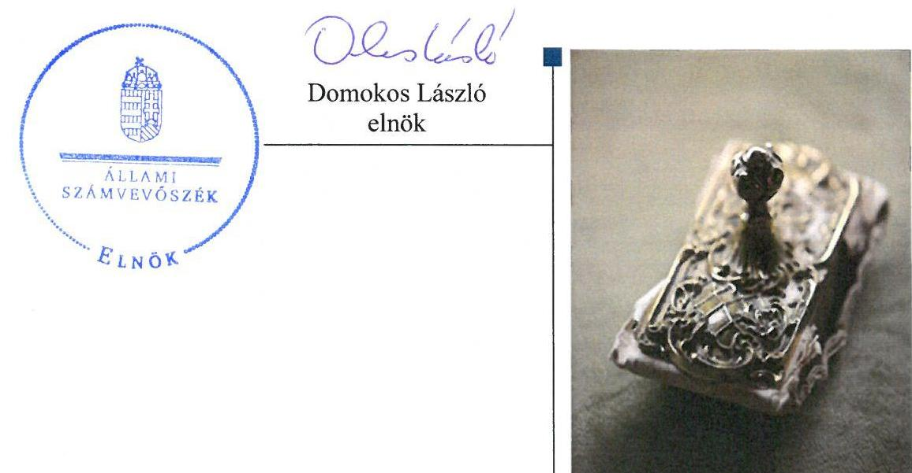

---

|   | AZ ELLENŐRZÉST FELÜGYELTE:  |
| --- | --- |
|   | DR. PULAY GYULA ZOLTÁN felügyeleti vezető  |
|   | AZ ELLENŐRZÉST VEZETTE ÉS A VÉGREHAJTÁSÁÉRT FELELŐS:  |
|   | SCHMIDT JÁNOS ellenőrzésvezető  |
|   | A PROGRAM ÖSSZEÁLLÍTÁSÁÉRT FELELŐS:  |
|   | JANIK JÓZSEF LÁSZLÓ osztályvezető  |
|   | A TÉMÁHOZ KAPCSOLÓDÓ KORÁBBI SZÁMVEVŐSZÉKI JELENTÉSEK:  |
|   | - címe: a légszennyezés ellen és a klímapolitika terén tett intézkedések hatásának ellenőrzéséről  |
|   | - sorszáma: 1119. ÁSZ jelentés  |
|  Jelentéseink az Országgyűlés számítógépes hálózatán és az Interneten a www.asz.hu címen is olvashatóak. | - címe: a légszennyezés ellen és a klímapolitika terén tett intézkedések hatásának utóellenőrzéséről  |
|   | - sorszáma: 15069. ÁSZ jelentés  |
|   | - címe: Magyarország 2012. évi központi költségvetése végrehajtásának ellenőrzéséről – 6. számú melléklete.  |
|   | - sorszáma: 13080. ÁSZ jelentés  |
|   | IKTATÓSZÁM: V-0903-199/2016  |
|   | TÉMASZÁM: 1937  |
|   | ELLENŐRZÉS-AZONOSÍTÓ SZÁM: V0735  |

---

# TARTALOMJEGYZÉK

■ ÖSSZEGZÉS ..... 5
■ AZ ELLENŐRZÉS CÉLJA ..... 7
■ AZ ELLENŐRZÉS TERÜLETE ..... 8
■ AZ ELLENŐRZÉS HÁTTERE, INDOKOLTSÁGA ..... 9
■ A JELENTÉS LÉNYEGES KÉRDÉSKÖREI ..... 13
■ ELLENŐRZÉS HATÓKÖRE ÉS MÓDSZEREI ..... 14
■ MEGÁLLAPÍTÁSOK ..... 16
■ JAVASLATOK ..... 43
■ MELLÉKLETEK ..... 45
I. Sz. melléklet: Értelmező szótár ..... 45
II. Sz. melléklet: $\mathrm{A} \mathrm{CO}_{2}$ kereskedelemben érintett szervek hatás- és feladatkör-ellátásának alakulása ..... 47
III. Sz. melléklet: $\mathrm{A} \mathrm{CO}_{2}$ kvótákkal kapcsolatos joggyakorlás alakulása ..... 48
IV. Sz. melléklet: a NIR jóváhagyásának és benyújtásának adatai ..... 49
V. Sz. melléklet: tájékoztatási kötelezettségek OKTF - NGM ..... 50
VI. Sz. melléklet: tájékoztatási kötelezettségek NFM - NGM ..... 51
■ FÜGGELÉK: ÉSZREVÉTELEK ..... 53
■ RÖVIDÍTÉSEK JEGYZÉKE ..... 71

---

.

---

# ÖSSZEGZÉS

Az Állami Számvevőszék a szén-dioxid kvótákkal való gazdálkodás szabályszerűségének ellenőrzését a 2013. január 1. és 2015. szeptember 30. közötti időszakra végezte el. A gazdálkodásban érintett, ellenőrzött szervezetek szabályozottsága megfelelt a jogszabályoknak. A jogszabályban előírt tájékoztatási és beszámolási kötelezettségek teljesítésére több esetben nem vagy csak késedelmesen került sor. A jóváhagyott kibocsátási egységekkel történő szabályszerű gazdálkodás elérte célját, csökkent a szén-dioxid kibocsátás, és az értékesített kvóták bevételeinek felhasználása is klímapolitikai célokat szolgált. Az ellenőrzött szervek a pályáztatási folyamatban igen, de a szén-dioxid kvótákkal való gazdálkodás teljes folyamatára vonatkozóan nem alakítottak ki gazdaságossági, hatékonysági és eredményességi követelményeket. Egyes részfolyamatok esetében gondoskodtak teljesítmény célok kialakításáról, és elérésük nyomon követéséről. A teljesítmény-ellenőrzés feltételei nem álltak fenn.

## Az ellenőrzés társadalmi indokoltsága

A klímaváltozás minden embert érintő probléma, a téma jelentősége indokolta a szén-dioxid kvótákkal való gazdálkodás ellenőrzését. Aktualitást adott az ellenőrzésnek, hogy 2014-ben és 2015-ben módosult a szén-dioxid kvóták kereskedelmének rendszere, jogszabályi és szervezeti feladatváltozások történtek. Elengedhetetlen stratégiai érdek a fenntartható gazdasági növekedés megvalósítása, a klímapolitikai vállalások teljesítését lehetővé tevő, munkahelyeket teremtő és megtartó, az innovációra és kutatásfejlesztésre építő nemzetgazdaság megteremtése. Az éghajlatváltozás sajátos jellegzetessége, hogy az üvegházhatású gázok kibocsátása, valamint ennek hatása, a társadalmi-gazdasági és természeti következmények átlépik az országhatárokat, így e komplex problémakör csak megfelelő nemzetközi együttműködéssel kezelhető eredményesen. A levegőbe kerülő káros anyagok és az éghajlatváltozásért felelős üvegházhatású gázok esetében globális és hazai problémáról egyaránt szó van.

## Főbb megállapítások, következtetések, javaslatok

A feladatellátásban érintett szervezetek tevékenységének szabályozottsága megfelelő volt, követte a jogszabályokban bekövetkezett változásokat. A szén-dioxid kvótákkal való gazdálkodás kontrolljait kialakították és működtették, aminek eredményeként, csökkent a klímaváltozást befolyásoló ÜHG kibocsátások összmennyisége, biztosítva ezzel a nemzetgazdasági, társadalmi és környezetvédelmi érdekek együttes érvényesülését. A gazdálkodásról szóló jelentések megküldésének ideje az Európai Bizottság felé, nem minden esetben felelt meg a jogszabályi előírásoknak. A szén-dioxid kvóta kereskedelemhez kapcsolódó intézményrendszert érintő átalakítások szabályszerűen történtek. Az érintett tárcák és szervezetek között fennálló tájékoztatási kötelezettség nem minden alkalommal a jogszabályi előírásoknak megfelelően valósult meg.

A jóváhagyott kibocsátási egységek kiosztása, visszaadása és törlése, és az egyéb emisszió-kereskedelmi feladatatok ellátása alapvetően szabályszerű volt. Az Országos Környezetvédelmi és Természetvédelmi Főfelügyelőségnél elmaradt az informatikai szabályzat szervezeti és jogszabályi változásokat tükröző módosítása, valamint az Európai Bizottság számára a derogációs jelentések határidőn túl kerültek benyújtásra. A szén-dioxid kvóták Magyar Állam általi értékesítése alapvetően szabályosan történt. A szén-dioxid kvóták értékesítéséből származó bevételek felhasználása a jogszabályi előírásoknak megfelelően történt, ugyanakkor nem használták ki teljes mértékben a pályáztatott forrásokat. A kibocsátási egységek értékesítéséből származó bevételi előirányzatokból támogatott beruházások összhangban voltak a Nemzeti Éghajlatváltozási Stratégiában megfogalmazott, klímapolitikai célkitűzésekkel. A Zöld Beruházási Rendszer fejezeti kezelésű előirányzatokból támogatott beruházások pályáztatása megfelelt, míg a Zöldgazdaság Finanszírozási Rendszer fejezeti kezelésű előirányzatokból támogatott beruházások pályáztatása csak részben felelt

---

meg a jogszabályi előírásoknak. Mindkét fejezeti kezelésű előirányzatból támogatott beruházások végrehajtása, a megvalósulás nyomon követése és pénzügyi elszámolása az előírásoknak megfelelt. A kvótaértékesítésből származó, nem pályázati úton történő felhasználások szabályszerűek voltak.

A 2013. január 1. és 2015. szeptember 30-a közötti időszakban az ellenőrzött tárcák közül a Földművelésügyi Minisztériumnál egyáltalán nem, míg a másik két érintett minisztériumnál csak a szén-dioxid kvótákkal való gazdálkodás egyes részfolyamataira alakítottak ki gazdaságossági, hatékonysági és eredményességi követelményeket.

---

# AZ ELLENŐRZÉS CÉLJA

AZ ELLENŐRZÉS CÉLJA annak értékelése volt, hogy a kibocsátási egységkereskedelem szabályainak kialakítása, a kibocsátási egységekkel, mint vagyoni értékű joggal való gazdálkodás szabályossága, megfelelősége biztosította-e a nemzetgazdasági, társadalmi és környezetvédelmi érdekek érvényesülését. A teljesítmény-ellenőrzés feltételeinek fennállása esetén az ellenőrzés célja annak értékelése is volt, hogy az ellenőrzéssel érintett intézmények a szén-dioxid kvóták értékesítésének rendszerével összefüggésben létrehozott célkitűzéseiket elérték-e.

---

# **AZ ELLENŐRZÉS TERÜLETE**

## **A szén-dioxid kvótákkal való gazdálkodás**

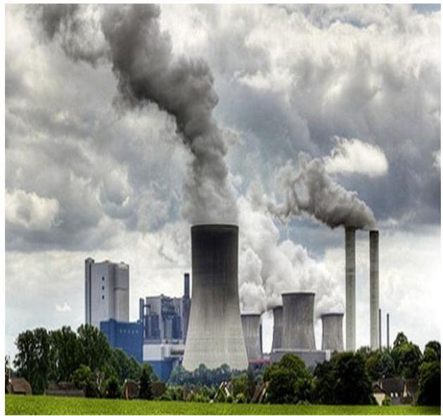

**AZ ELLENŐRZÉS KITERJEDT** az NGM ${ }^{1}$ uniós jogszabályok és a Kiotói Jegyzőkönyv ${ }^{5}$ szerinti kibocsátási jogosultságokkal kapcsolatos értékesítési, és az emisszió-kereskedelmi rendszer működtetésére vonatkozó feladataira, valamint az EU ${ }^{3}$ kibocsátás kereskedelmi rendszerének vonatkozásában az üvegházhatású gázok európai kibocsátási egységeinek kiosztásával, elszámolásával kapcsolatos tevékenységére. Ellenőrzésre került ugyanezen feladatok ellátása a 2014. évi kormányátalakítást követő feladatátadást megelőző időszakra vonatkoztatva a NFM ${ }^{4}$-re is, valamint az NFM – az energiapolitikáért való felelőssége keretében - az energiapolitikai, épületenergetikai és épület-energiatakarékossági programok kidolgozásában és végrehajtásában végzett tevékenysége. Az FM-nek ${ }^{5}$ - mint a környezetvédelemért felelős tárcának – a Nemzeti Nyilvántartási Rendszerrel és a Nemzeti Kibocsátási Leltárral kapcsolatos tevékenysége is ellenőrzésre került. Az ellenőrzés magába foglalta továbbá az FM irányítása alatt álló OKTF ${ }^{6}$ emisszió-kereskedelemmel kapcsolatos feladatkörére, az üvegházhatású gázok kibocsátásával kapcsolatos ellenőrzési, és a kibocsátási egység forgalmi jegyzék működtetési és kezelési feladatait. Az ÉMI NKft. ${ }^{7}$ pályázatkezelési, lebonyolítási, döntés-előkészítési és ellenőrzési feladatainak ellátása is az ellenőrzés részét képezte, amelynek folyamatos kontrollját az éghajlatvédelmi törvény is előírta. Az ellenőrzés kiterjedt még az FM irányítása alatt álló OMSZ-nak ${ }^{8}$ az üvegházhatású gázok kibocsátására vonatkozó adatok gyűjtésével, a kibocsátási leltár összeállításával és a kapcsolódó nemzeti jelentések előkészítésével kapcsolatos tevékenységére. A kvótaértékesítésekből származó kötött felhasználású bevételek alakulását az 1. táblázat mutatja be.

1.  táblázat

|  Év | Kiotói kvóta-értékesítésből származó maradvány M Ft. | NFM EU ETS ${ }^{4}$ kvótaértékesítésből származó bevétel M Ft. | NGM EU ETS kvótaértékesítésből származó bevétel M Ft. | Összes rendelkezésre álló forrás M Ft. | ZBR keretében felhasznált összeg M Ft. | ZFR keretében felhasznált összeg M Ft. | ZBR és ZFR keretében összesen felhasznált összeg M Ft.  |
| --- | --- | --- | --- | --- | --- | --- | --- |
|  2013. év | 25 956,5 | 7280,7 | - | 33 237,2 | 12 054,1 | 7275,7 | 19 329,8  |
|  2014. év | 13 908,2 | 6766,6 | 2017,6 | 22 692,4 | 2 699,4 | 6600,3 | 9299,7  |
|  2015. év | 11 213,4 | 4468,6 | 4468,6 | 20 150,6 | 6 452,6 | 711,8 | 7164,4  |

*Forrás: Az ellenőrzött szervezetek adatszolgáltatása alapján saját szerkesztés*

---

# AZ ELLENŐRZÉS HÁTTERE, INDOKOLTSÁGA

AZ 1992-BEN Rio de Janeiróban aláírt ENSZ ${ }^{10}$ Éghajlatváltozási Keretegyezmény ${ }^{11}$ nyújtja a legmagasabb szintű keretet és koordinálja a nemzetközi törekvéseket az éghajlat-politika terén. A Keretegyezményhez csatolt, 1997-ben elfogadott Kiotói Jegyzőkönyv az emberi tevékenység által a légkörbe juttatott szén-dioxid mennyiség világméretű csökkentését írta elő, a fejlett országok által a globális felmelegedésért felelős egyes, üvegházhatást okozó gázok kibocsátásának csökkentésére tett kötelezettségvállalásokat tartalmazta. A Kiotói Jegyzőkönyvben a 38 fejlett és átalakuló gazdaságú ország a 2008-2012. közötti időszakra vállalta kibocsátásaik átlagosan 5,2\%-kal történő csökkentését az 1990-es bázisévhez képest. A Kiotói Jegyzőkönyvben előírt átlagos kibocsátás-csökkentésnél nagyobb arányú károsanyag-kibocsátás visszaszorítás esetén a többlet tartalékolható, vagy más országnak, ún. kibocsátási egység kereskedelem keretében eladható. A Dohában 2012. november-decemberben tartott ENSZ Keretegyezmény konferencián megállapodás született a 2012. év végén lejáró Kiotói Jegyzőkönyv érvényességének 2020-ig történő meghosszabbításáról. A Kiotói Jegyzőkönyvet az Európai Unió 2002-ben ratifikálta, 2005-ben lépett hatályba, amelyben az Európai Unióhoz 2004 előtt csatlakozott tagállamok vállalták, hogy 2008 és 2012 között átlagosan 8\%-kal visszaszorítják kibocsátásaikat. A 2004 után csatlakozott országok közül Magyarország 6\%-os kibocsátás-csökkentést vállalt az 1985-1987-es bázis időszakhoz képest. A Kiotói Jegyzőkönyvet Magyarországon a 2007. évi IV. törvény ${ }^{12}$ hirdette ki.
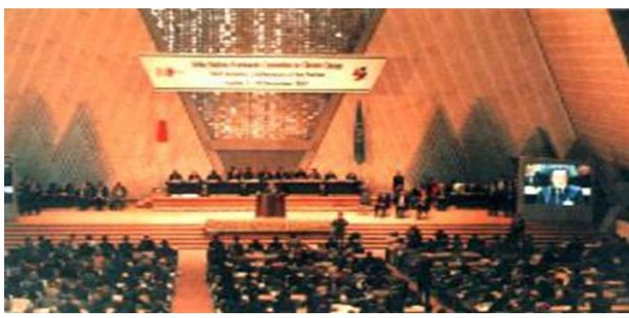

A kiotói Részes Felek konferenciája 1997.
A KIOTÓI JEGYZŐKÖNYVVEL párhuzamosan az Európai Unió 2000-ben elindította az első, 2005-ben a második Európai Éghajlatváltozási Programot, illetve az EU egy saját üvegházhatású gáz kibocsátás-kereskedelmi rendszert is létrehozott. Az EU-s emisszió-kereskedelmi rendszer olyan piaci alapú szabályozó eszköz, amely az EU-n belüli üvegházhatású gázok költséghatékony kibocsátás-csökkentését teszi lehetővé, ezzel segítve a Kiotói Jegyzőkönyvben az EU által vállalt 8\%-os kibocsátás-csökkentés elérését. Az uniós üvegház-kibocsátási egységek kereskedelmét az Európai Parlament és a Tanács 2003/87/EK Irányelve, határozta meg, amelynek megfelelő nemzeti szabályozást, Magyarország az uniós csatlakozás után, a 2005. évi XV. törvénnyel léptette életbe.

---

AZ ÜHG ${ }^{13}$ KIBOCSÁTÁS mérőszáma és egyben legfontosabb szabályozó eszköze a $\mathrm{CO}_{2}{ }^{14}$ kvóta, amely a nemzeti vagyon körébe tartozó elszámolási egység lett. A szén-dioxid kvóta kereskedelmének lényege, hogy a kibocsátási határérték alatt szennyező ország vagy vállalat eladhatja a ki nem használt emissziós jogát egy másik országnak vagy vállalatnak, amely a számára meghatározott határértéknél többet szennyez, és a káros anyag többletkibocsátást pótlólagos emissziós jogokkal kell lefednie. Ennek következtében a kiotói és EU ETS kibocsátási egységek átadás-átvétel tárgyává váltak, és a kvótafelesleggel rendelkezők bevételhez jutottak. A nemzetközi kvótakereskedelem 2008 óta - a kvótatöbblettel rendelkező országok számára - kedvezőtlenül alakult. Kanada kilépésével és azzal, hogy az USA nem ratifikálta a Kiotói Jegyzőkönyvet a kibocsátási adatok alapján világossá vált, hogy hatalmas többlet állt rendelkezésre a piacon. Ennek következtében a kiotói kvóták értéke töredékére esett vissza.

Nemzetközi előírás, hogy a kibocsátási egységek értékesítésének bevételei kizárólag az ÜHG kibocsátás csökkentésére fordíthatóak, míg az uniós kvótabevételnek felét kell előírás szerint zöldgazdaság-fejlesztési beruházásokra költeni. Magyarországon alapvetően két forrásból biztosított a klímavédelmi fejlesztések állami támogatása. Egyrészt a nemzetközi kvótaértékesítésből származó bevételek biztosítják a főként lakossági és lakóközösségi energiahatékonysági, épületenergetikai, energiatakarékossági beruházások ösztönzését, másrészt az EU költségvetéséből a hazai operatív programokon keresztül jut forrás a közösségi (állami, önkormányzati, egyházi és civil) és vállalkozói kezdeményezések támogatására.

2013-TÓL ÚJ EU ETS rendszer került kialakításra, amely szabályozás az addigiaknál nagyobb mértékben kívánt hozzájárulni az EU globális vállalásainak teljesítéséhez. Az új rendszert hazánkban, az ÜHG uniós kereskedelmi rendszerében és az erőfeszítés-megosztási határozat végrehajtásában történő részvételről szóló 2012. évi CCXVII. tv. léptette életbe. A törvény Preambuluma kimondja, hogy az OGY ${ }^{15}$-nek a törvény megalkotásával az a célja, hogy megteremtse annak lehetőségét, hogy Magyarország az üvegházhatású gázok tudományos alapon szükségesnek tartott csökkentésével mérsékelje az emberi tevékenység hatására bekövetkező éghajlatváltozást azáltal, hogy részt vesz az üvegházhatású gázok Európai Unióban alkalmazott kereskedelmi rendszerében.

A 2003/87/EK irányelv módosításával létrejött új szabályozás lényeges eleme, hogy bár egyre csökkenő mértékben fennmaradt a térítésmentes kiosztás, a kibocsátási egységek elsődleges forrásává az aukcionálás vált. Az egységek nagyobb részét, mely nem került térítésmentesen kiosztásra, a tagállamok túlnyomó többsége (közte Magyarország) egy közös aukciós platformon keresztül értékesíti, és az egységek nyilvántartása sem nemzeti szinten, hanem egy uniós szinten központosított, az Európai Bizottság által kezelt forgalmi jegyzékben vezetett számlákon történik. A térítésmentesen kiosztható kibocsátási egységek összmennyisége uniós szinten került maximálásra, az energiatermelő és ipari létesítményeknek térítésmentesen kiosztható egységek száma meghatározásának részletszabályait pedig a 2011/278/EU határozat, valamint az Európai Bizottság által összeállított tíz útmutató dokumentum rögzíti (a légijármú-üzembentartók részére történő térítésmentes kiosztásra ettől eltérő, de szintén uniós szinten egységesített szabályok vonatkoznak, a 2013-2016. közötti évek tekintetében a

---

421/2014/EU rendeletben megadva). A kiosztás eme harmonizált szabályok szerint működő rendszerében a tagállami szerveknek nincs mozgásterük az egyes létesítményeknek kiosztandó mennyiségek meghatározásában, a kiosztás csak az Európai Bizottság jóváhagyásának birtokában hajtható végre. A rendszer hatálya alá tartozó létesítményeknek és légijárműüzembentartóknak minden évben egy akkreditált hitelesítő által hitelesített kibocsátási jelentést kell tenniük, és az abban bejelentett kibocsátásnak megfelelő kibocsátási egység-mennyiséget vissza kell adniuk az állami szervek részére. Az új szabályok szerint harmonizálásra került a nyomon követés és hitelesítés rendszere, valamint harmonizált szabályok vonatkoznak az új belépőkre (beleértve a kapacitásukat jelentősen bővítő létesítményeket és tevékenységüket jelentősen bővítő légijármű-üzembentartókat), a bezáró, a működésüket részlegesen beszüntető vagy részleges beszüntetést követően újraindító, illetve a kapacitásukat jelentősen csökkentő vagy összeolvadó-szétváló létesítményekre, illetve a Kiotói Jegyzőkönyv szerinti bizonyos nemzetközi egységek EU ETS alatti felhasználhatóságára is. Az uniós szintű kötelezettségvállalás az EU ETS terén a kibocsátások 21\%-kal történő csökkentése 2020-ig 2005-höz képest.

További újdonság a 2013-2020-as időszak tekintetében, hogy az EU ETS hatálya alá nem tartozó ágazatok (pl. épületek, hulladékgazdálkodás, mezőgazdaság, közlekedés) területén az ÜHG-kibocsátás csökkentése érdekében uniós és tagállami célokat rögzítettek az ún. Erőfeszítés-megosztási Határozat (Effort Sharing Decision, ESD - a 2009/406/EU határozat) keretében, illetve korlátozott mennyiségben e területen is lehetővé tették a felesleggel rendelkező tagállamok számára a többletük értékesítését más tagállamok felé. Az uniós szintű kötelezettségvállalás ezen szektorok számára a kibocsátások 10\%-kal történő csökkentése 2020-ig 2005-höz képest. Hazánk e területen a többlettel rendelkező, a kereskedelemben erősen érdekelt tagállamok közé tartozik; azonban az ESD rendszerében a gyenge kereslet miatt a kereskedés még nem indult be a gyakorlatban.

A szén-dioxid kvótákkal való gazdálkodás alapvető célja, a klímaváltozást befolyásoló ÜHG kibocsátások összmennyiségének csökkentése, biztosítva ezzel a nemzetgazdasági, társadalmi és környezetvédelmi érdekek együttes érvényesülését.

A TÁRSADALMI IGÉNNYEL összhangban az Áht. ${ }^{16}$ is előírja a költségvetési szervek részére, hogy olyan szabályozásokat, eljárásokat, folyamatokat alakítsanak ki, amelyek biztosítják a működés, gazdálkodás, az erőforrások felhasználása során a gazdaságosság, hatékonyság és eredményesség érvényesülését. A szén-dioxid kvótákkal való eredményes gazdálkodáshoz szükség van a teljesítménymérés feltételeinek kialakítására, úgymint az egyértelmű és mérhető célokra, mutatószámokra és az ezekhez rendelt követelményekre. Az ÁSZ ${ }^{17}$ jelen ellenőrzéssel győződik meg arról, hogy a teljesítménycélokat, -mutatókat, -követelményeket a kialakítást követően alkalmazták-e, a kitűzött cél(ok) teljesült(ek)-e.

Az ellenőrzés megállapításaival támogathatja a szakpolitikai döntéshozók munkáját a jövőbeni klímavédelmi célú programokat illetően, továbbá az ÁSZ jelentése hozzájárul a társadalom informálásához a klímaváltozás jelentőségéről, az elérhető forrásokról és a lehetséges intézkedésekről. Az ellenőrzés támpontul szolgálhat a klímavédelmi célú támogatási rendszer korszerűsítéséhez, ezáltal az üvegházhatású gázok kibocsátásának csökkentéséhez.

---

AZ ELLENŐRZÉS HASZNOSULÁSAKÉNT képet kapunk arról, hogy a szén-dioxid kvótákkal való gazdálkodás, illetve a pályázati rendszer működtetése során biztosított-e a szabályszerű közpénzfelhasználás. További várható hozadékként az ellenőrzés rámutathat arra, hogy az ellenőrzött szervezeteknek mely területeken kell a szakmai együttműködést átalakítani, szorosabbá tenni, illetve az ellenőrzés megállapításai visszajelzést adhatnak arról a jogalkotók és az ellenőrzött szervezetek vezetői számára, hogy mely feladat-ellátási területek hordoznak kockázatokat. Az ÁSZ ellenőrzése továbbá rávilágíthat a szabályozásból eredő esetleges problémákra, ezáltal hozzájárulhat a szabályozások fejlesztéséhez, egységesítéséhez.

---

# A JELENTÉS LÉNYEGES KÉRDÉSKÖREI 

1.  A szén-dioxid kvótákkal való gazdálkodás szabályozottsága, az intézményrendszer és a kontrollok kialakítása és működtetése biztosított volt-e?
2.  A szén-dioxid kvótákkal való gazdálkodás a jogszabályi előírásoknak megfelelően történt-e?
3.  A szén-dioxid kvótákkal való gazdálkodásra vonatkozó gazdaságossági, hatékonysági és eredményességi követelmények kialakítása, és azok nyomon követése megtörtént-e?
4.  A szén-dioxid kvótákkal való gazdálkodásra vonatkozó gazdaságossági, hatékonysági és eredményességi célkitűzéseket elérték-e?

---

# ELLENŐRZÉS HATÓKÖRE ÉS MÓDSZEREI 

## Az ellenőrzés típusa

Megfelelőségi ellenőrzés az 1-3 lényeges kérdéskörök tekintetében, teljesítmény-ellenőrzés a 4. lényeges kérdéskör tekintetében.

## Az ellenőrzött időszak

2013. január 1. - 2015. szeptember 30.

## Az ellenőrzés tárgya

A szén-dioxid kvótákkal való gazdálkodás szabályozottsága, az intézményrendszer, a kontrollok kialakítása és működtetése. A szén-dioxid kvótákkal való gazdálkodás, a Magyar Állam általi értékesítés, és az értékesítésből származó bevételek felhasználásának szabályszerűsége. Továbbá az NGM, NFM és FM esetében az ellenőrzött közfeladatok ellátására vonatkozó teljesítmény-követelmények kialakítása és nyomon követése. A teljesítményellenőrzés feltételeinek fennállása esetén az ellenőrzés tárgya a kialakított teljesítmény-követelmények, célkitűzések elérése.

Az ellenőrzés kiterjedt minden olyan körülményre és adatra, amely az ÁSZ jogszabályban meghatározott feladatainak teljesítéséhez, valamint a program végrehajtása folyamán felmerült újabb összefüggések feltárásához szükséges.

## Az ellenőrzött szervezet

Nemzeti Fejlesztési Minisztérium, Nemzetgazdasági Minisztérium, Földművelésügyi Minisztérium, Országos Környezetvédelmi és Természetvédelmi Főfelügyelőség, Országos Meteorológiai Szolgálat, ÉMI Építésügyi Minőségellenőrző Innovációs Nonprofit Kft.

## Az ellenőrzés jogalapja

ÁSZ tv. 1. § (3) bekezdése, az 5. § (2)-(7) bekezdése, valamint az Áht. 61. § (2) bekezdésének előírásai.

---

# Az ellenőrzés módszerei 

Az ellenőrzést az ÁSZ az ellenőrzési program szempontjai, az ellenőrzött időszakban hatályos jogszabályok, az ellenőrzés szakmai szabályai, a nemzetközi standardokat irányadónak tekintve, az egyes ellenőrzési típusokhoz kapcsolódó ÁSZ módszertanok alapján végezte el. Az ellenőrzés ideje alatt az ellenőrzött szervezettel történő kapcsolattartás az ÁSZ SZMSZ ${ }^{\mathrm{TM}}$-ének vonatkozó előírásai alapján történt.

Az ellenőrzési kérdések megválaszolásához szükséges bizonyítékok megszerzése a következő ellenőrzési eljárások alkalmazásával történt: megfigyelés, szemle (szemrevételezés), kérdésfeltevés (információkérés), mintavételezés, valamint elemző eljárás. Az ellenőrzés a kérdésekre adott válaszok kiértékelésével, a tanúsítványok felhasználásával, továbbá az adott időszakban hatályos jogszabályok figyelembe vételével került lefolytatásra.

Az ellenőrzési bizonyítékként felhasználható adatforrások közé tartoztak egyrészt a szakmai program részletes szempontjainál felsorolt adatforrások, másrészt minden egyéb - az ellenőrzés folyamán feltárt, az ellenőrzés szempontjából információt tartalmazó - dokumentum. Az ellenőrzés lefolytatásához az ellenőrzött szervezet a tanúsítványok kitöltésével, valamint az ÁSZ által kért dokumentumok elektronikus megküldésével szolgáltatott adatokat, információkat. A rendelkezésre bocsátott adatok, információk kontrollja az ellenőrzés keretében megtörtént.

Mintavétellel ellenőriztük az NFM fejezeti kezelésű előirányzatai forrásainak terhére kiírt és kiválasztott 3 pályázat lebonyolításának szabályszerű működését. A minták alapján a sokaságra jellemző átlagos hibaarányt becsültük. "Megfelelőnek" értékeltük az ellenőrzött területet, amennyiben 95\%-os bizonyossággal a teljes sokaságban ez a hibaarány legfeljebb 10\%, "részben megfelelőnek" értékeltük, ha a hibaarány felsőhatára 10-30\% között volt, "nem megfelelőnek" pedig akkor, ha a mintavételi eredmények alapján a sokaságbeli hibaarány felső határa meghaladta a 30\%-ot.

---

# 1. A szén-dioxid kvótákkal való gazdálkodás szabályozottsága, az intézményrendszer és a kontrollok kialakítása és működtetése biztosított volt-e? 

Összegző megállapítás

1.1. számú megállapítás

A szén-dioxid kvótákkal való gazdálkodás szabályozottsága, az intézményrendszer és a kontrollok kialakítása és működtetése biztosított volt. Az érintett tárcák és a szervezetek közötti együttműködés nem minden esetben a jogszabályi előírásoknak megfelelően valósult meg.

A feladatellátásban érintett szervezetek tevékenységének szabályozottsága megfelelő volt, követte a jogszabályokban bekövetkezett változásokat.

A feladatellátásban érintett szervezetek (NFM; NGM; FM; OMSZ; OKTF; ÉMI Nkft.) tevékenységének szabályozottsága megfelelő volt, a belső szabályzataik aktualizálásáról rendszeresen gondoskodtak.

A hatályos jogszabályok előírásait követve szervezeti és működési szabályzatukban, belső ügyrendjeikben, egyéb szabályzatukban és - indokolt esetben - külön eljárásrendben alakították ki a feladatellátásukra vonatkozó belső szabályozásaikat.

AZ NFM SZERVEZETÉT ÉS MŰKÖDÉSÉT az ellenőrzött időszakban az NFM SZMSZ ${ }^{19}{ }_{1-3}$ szabályozta.

Az Ügkr. tv ${ }^{20}$ 2014. július 16-ától hatályos módosítása az emisszió kereskedelemmel kapcsolatos feladat- és hatásköröket az NFM-től az NGM-hez telepítette. A 33/2014. (X.10.) NFM utasítással kiadott új minisztériumi SZMSZ ${ }_{3}$ ugyan három hónapos késéssel követte a jogszabályváltozásokat, amelyben a KPF ${ }^{21}$ hatásköréből kivették a kvótaértékesítéssel és kvótakiosztással kapcsolatos feladatokat, de ez nem volt lényeges hatással a folyamat eredményességére. A klímapolitikával kapcsolatos kodifikációs és koordinatív funkció továbbra is az NFM KPF hatáskörében maradt.

AZ NGM 2014. július 16-ától vette át az emisszió kereskedelemmel és az NVI ${ }^{22}$-vel kapcsolatos feladatokat, az ESD ${ }^{23}$ és az ÜHG egységek feletti tulajdonosi joggyakorlás alapján, amelynek során átvették az NFM SZMSZ ${ }_{1-3}$-jából az emisszió kereskedelemre vonatkozó rendelkezéseket.

Ezt megelőzően az NGM SZMSZ ${ }^{24}{ }_{1-2}$-e szerint feladata volt a klímafinanszírozással kapcsolatos előirányzatok költségvetési tervezési, zárszámadási feladatatok, valamint az előirányzatok alakulásának figyelemmel kísérése.

AZ FM mint a környezetvédelemért felelős tárca, ebben a minőségében az OKIR ${ }^{25}$ informatikai rendszerének fejlesztését és üzemeltetését látta el,

---

és a környezetügyért felelős államtitkár feladatkörében gyakorolta az OMSZ és az OKTF felett a szakmai irányítási és felügyeleti jogköröket. Az FM szervezetét és működését az ellenőrzött időszakban az FM SZMSZ ${ }^{26}{ }_{1-4}$ szabályozta.

AZ OMSZ alapvető feladata az üvegházhatású gázok kibocsátási adatainak gyűjtésére, a kibocsátási leltár összeállítására és a nemzeti jelentések előkészítésére vonatkozott. Az OMSZ SZMSZ ${ }^{27}$-e alapján látta el a leltárjelentéssel összefüggő feladatokat, amelyeket az OMSZ Ügyrend ${ }^{28}$ részletezett. A kibocsátási leltárak készítését munkautasítások szabályozták.

AZ OKTF feladata kettős volt. Egyrészt, mint Jegyzékkezelő ${ }^{29}$ ellátta a forgalmi jegyzék kezelésére vonatkozó feladatokat, másrészt, mint környezetvédelmi hatóság gyakorolta a kibocsátási engedélyek kiadására, visszavonására a környezetvédelmi előírások betartásának ellenőrzésére vonatkozó hatósági jogkörét. Az OKTF szervezetét és működését az ellenőrzött időszakban az OKTF SZMSZ ${ }^{30}$ szabályozta.

Az OKTF SZMSZ mellett a jegyzékkezelői feladatokat az EU ETS ${ }^{31}$ Forgalmi Jegyzék Felhasználói Kézikönyvek angol nyelven támogatták. Derogációs kvótakiosztási feladatait Derogációs Szabályzat segítette. Fentieken kívül az OKTF közvetlenül alkalmazta 601/2012/EU/ rendeletet az ÜHG nyomon követéséről és jelentéséről.

A környezetvédelmi hatósági feladatok ellátását az SZMSZ mellett 2014-től az Ügyfélszolgálati Szabályzat, 2015-től pedig a Szakmai Konzultációs Szabályzat segítette.

AZ ÉMI NKFT. a ZBR ${ }^{32}$-rel és a ZFR ${ }^{33}$-el kapcsolatos pályázatkezelési, lebonyolítási, döntés előkészítési és ellenőrzési feladatokat látott el.

Az ÉMI NKft. szervezetét és működését az ellenőrzött időszakban az ÉMI NKft. SZMSZ ${ }^{34}$ szabályozta. A különféle támogatási programokra részletes eljárásrendeket dolgoztak ki és alkalmaztak.

A $\mathrm{CO}_{2}$ kereskedelemben érintett szervek hatás-, és feladatkör ellátásának alakulását a II. sz. melléklet tartalmazza. A szén-dioxid kvótákkal kapcsolatos joggyakorlás alakulását a III. sz. melléklet tartalmazza.

A kibocsátási egységek rendszere összetett, mert az Ügkr. tv. 12.§ (1) bekezdése szerint az ÜHG-egység (EUA ${ }^{35}$ és EUAA ${ }^{36}$ ) dematerializált, immateriális, forgalomképes, vagyoni értékű jog, míg az Éhvt. 8. §. (1) bekezdése szerint a kiotói egységek $\mathrm{AAU}^{37}, \mathrm{CER}^{38}, \mathrm{ERU}^{39}, \mathrm{RMU}^{40}$ a kincstári vagyonba tartozó, korlátozottan forgalomképes vagyoni értékű jogok. A kibocsátási egységek típusait a 2. táblázat foglalja össze.

---

2. táblázat

| KIBOCSÁTÁSI EGYSÉG TÍPUSOK: |  |
| :--: | :--: |
| Kibocsátási egység típusok: |  |
| Kiotói |  |
| AAU | Assigned Amount Unit - Kibocsátható mennyiségi egység |
| CER | Certified Emission Reduction - Igazolt kibocsátás-csökkentési egység |
| ERU | Emission Reduction Unit - Kibocsátás-csökkentési egység |
| RMU | ReMoval Unit - Eltávolítási egység |
| Európai (ETS) |  |
| EUA II és | European Union Allowance - Európai kibocsátási egység (2008-12 és 2013- |
| III | 20 időszak) |
| EUAA | European Union Aviation Allowance - Európai légiközlekedési kibocsátási egység |
| ESD | Effort Sharing Decision (2013-20 időszak) |

A kibocsátási kvóták immateriális jellege miatt azokkal kapcsolatban visszapótlási és karbantartási, valamint egyéb vagyonkezelői kötelezettségekről nem kellett rendelkezni.

# 1.2. számú megállapítás 

A szén-dioxid kvótákkal való gazdálkodás kontrolljai a NÉS, a NIR ${ }^{41}$, a NVI és az új belépők kérelme rendszere kialakításának, működésének eredményeként, az ÜHG kibocsátások folyamatosan csökkentek. A NIR-ről szóló jelentés a Keretegyezmény Titkársága és az Európai Bizottság felé történő megküldésekor nem teljesültek maradéktalanul a jogszabályi előírások.

Az NFM miniszter a jogszabályi előírásnak megfelelően készítette elő a NÉS ${ }_{1}{ }^{42}$ felülvizsgálatát, amelynek eredményeképpen létrejött a NÉS ${ }_{2}{ }^{43}$. A NÉS ${ }_{2}$-ről szóló előterjesztést a Kormány 2015. június 2-án benyújtotta az OGY-nek, ugyanakkor az OGY általi elfogadására a helyszíni ellenőrzés lezárásáig nem került sor.

A NÉS ${ }_{1}$-ben foglalt feladatokat a Kormány a NÉP ${ }^{44}$-ben részletezte, amelynek végrehajtásáról az NFM miniszter - az Éhvt-ben előírt 3 éves határidőnek megfelelően - a Kormány 2012.április 11-i ülésen számolt be. Az OGY előtti beszámoló a Kormány részéről NÉP-ről szóló, J/6926 számú jelentésben történt meg.

A szén-dioxid kvótákkal való gazdálkodás kontrolljainak kialakítása és működtetése egyrészt a vonatkozó jogszabályokban foglaltak betartásával, másrészt az OKIR-on belül a Nemzeti Nyilvántartási Rendszer folyamatos és szabályozott működtetésével, illetve a NVI, az új belépők kérelme, valamint a Nemzeti Kiosztási Tábla beterjesztendő dokumentumainak az érintett tárcák és az Európai Bizottság általi előzetes felülvizsgálatával, egyeztetésével és végül az Európai Bizottság általi jóváhagyásával valósult meg.

Az OMSZ elkészítette az üvegházhatású gázok emberi tevékenységből származó hazai kibocsátásának, illetve a nyelők általi eltávolításának figyelemmel kísérésére, adatok gyűjtésére, nyilvántartására az évenkénti leltárt (NIR) és azt határidőben benyújtotta a Keretegyezmény Titkárságának. Az OMSZ által követett gyakorlat nem volt összhangban 2013. január 1-jétől a 345/2009.(XII.30.) Korm. rendelet ${ }^{45}$ 2.§ (4) bekezdése, 2014. január 1-jétől az 528/2013. (XII.30.) Korm. rend. ${ }^{46}$ 2.§ (4) bekezdése, 2015. január 1-jétől a 278/2014. (XI.14.) Korm. rendelet ${ }^{47}$ 2.§ (4) bekezdésében foglalt azon

---

rendelkezésével, miszerint az FM miniszter ${ }^{48}$ jóváhagyásával kell benyújtani az ENSZ Keretegyezmény Titkárságának a NIR-t. A NIR hivatalos kibocsátási trendeket tartalmazó adatait az 1. ábra szemlélteti.

# 1. ábra 

NEMZETI KIBOCSÁTÁSI LELTÁR 1985 - 2013. (ÁGAZATI TRENDEK)
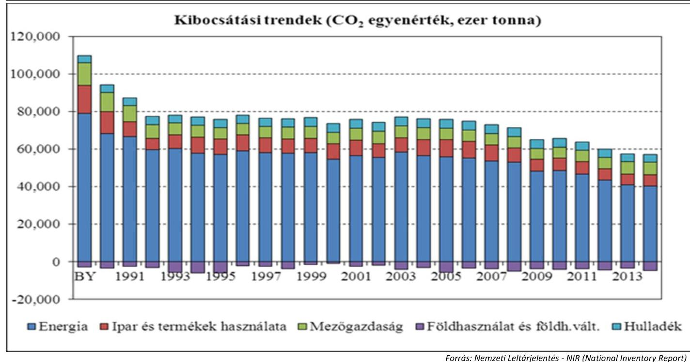

Tartalmában a jogszabályi előírásoknak megfelelően, de határidőn túl, 2013-ban a 345/2009.(XII.30.) Korm. rendelet 3. § (4) bekezdése előírása ellenére március 15-e helyett március 26-án, azaz 11 napos késéssel, 2014-ben március 15-e helyett március 21-én, azaz 6 napos késéssel teljesítette az NFM miniszter az üvegházhatású gázok kibocsátásával, illetve nyelőkkel történő eltávolításával, valamint az éghajlatváltozással kapcsolatos egyéb információra vonatkozó jelentéstételi kötelezettségét az Európai Bizottság felé. A végleges leltárjelentések benyújtására 2013-ban május 15-én, 2014-ben május 9-én került sor.

A NIR jóváhagyásának és benyújtásának adatait a IV. sz. Melléklet tartalmazza.

Az NVI-t 2011 közepe és 2014 januárja között az NFM készítette el. Az ingyenes kiosztásban részesülő létesítmények köre - tevékenységük alapján - a 2003/87/EK irányelvben és az azt átültető Ügkr. tv.-ben meghatározott volt, így kötelezően vettek részt az EU ETS rendszerben. Az érintett létesítmények üzemeltetői a 213/2006. (X.27.) Korm. rendelet 2/B. §-a értelmében nyújtották be az NFM részére, az EU ETS rendszerben 2013-tól kezdődő, III. kereskedési időszak ${ }^{49}$-ra vonatkozó, a 2011/278/EU bizottsági határozatban specifikált adataikat. A beküldött adatokat az Európai Bizottság ellenőrizte és az NFM közreműködésével az üzemeltetők elvégezték a szükséges korrekciót.

Az Európai Bizottság 2013. szeptember 5-én hozott 2013/448/EU határozatában állapította meg az EU-ban éves szinten kiosztásra kerülő kvóta összes mennyiségét a 2013. évre, és ehhez rendelte hozzá az éves arányos

---

csökkentést biztosító korrekciós tényezőt 2020-ig. A Bizottság által rendelkezésre bocsátott technikai leírás, informatikai eszköz és útmutatók alapján készült el az NVI végleges, beterjesztett változata, amely 2014. január 17-én az EU Bizottság által jóváhagyásra került. Az NVI-t, amelynek része a Nemzeti Kiosztási Tábla, a Kormány az Ügkr. tv. 15. § (4) bekezdése értelmében, az 1022/2014. (I.29.) Korm. határozattal hirdette ki.

A jogszabályi előírásoknak megfelelően készítette el az NFM miniszter a létesítményeknek évente térítésmentesen kiosztható kibocsátási egységmennyiséget tartalmazó NVI tervezetét. Az Európai Bizottság mindkét dokumentumot jóváhagyta és azokat a jóváhagyást követően közzétették.

Az új belépők kérelmét, a módosított nemzeti kiosztási táblát, valamint a nemzeti légiközlekedési kiosztási táblát, illetve annak módosítását az Ügkr. tv. és az Ügkr. tv. Vhr; vonatkozó rendelkezései alapján készítette el az NFM miniszter, 2014. július 16-tól az NGM miniszter ${ }^{50}$, és továbbította az Európai Bizottságnak, amelyek jóváhagyásra is kerültek.

Az NVI tervezése és következetes végrehajtása következtében, a NIR adatai alapján is megerősítésre került, hogy tovább csökkent Magyarországon a klímaváltozást befolyásoló ÜHG kibocsátások összmennyisége,

# 1.3. számú megállapítás 

## A szén-dioxid kvóta kereskedelemhez kapcsolódó intézményrendszert érintő átalakítások szabályszerűen történtek.

Az 1.1. pontban részletezett, az emisszió kereskedelemre vonatkozó jogszabályváltozás következtében 2014. július 16-tól az NFM és az NGM között feladat-átcsoportosításokra került sor. A fentiek végrehajtásának érdekében az NFM és az NGM megállapodást kötött 2014. július 17-én. A két minisztérium a megállapodásban rögzítette, hogy az egyes kibocsátási egységek értékesítéséből teljesült bevételek mely fejezeti kezelésű előirányzatot, milyen arányban illetik. A felek rendelkeztek továbbá arról is, hogy milyen álláshelyek kerülnek át az NFM személyi állományából az NGM személyi állományába.

A kvótaértékesítéshez, illetve az emisszió kereskedelmi rendszer működtetéséhez kapcsolódó feladatok 2014. augusztus 29-én, illetve 2014. szeptember 1-jén kelt átadás-átvételi jegyzőkönyv alapján az NFM-től átadásra kerültek az NGM-hez. Az átadás-átvételi jegyzőkönyv tartalmazta az átadandó feladatok szakmai leírását, a folyamatban lévő ügyek bemutatását, illetve az átadásra vonatkozó rendelkezéseket.

Az átadás-átvételi jegyzőkönyv a két minisztérium között, a Statútum rendelet 131. §-a és a 2. sz. melléklete alapján készült. A jegyzőkönyvben mind formai, mind tartalmi szempontból betartották a jogszabályi előírásokat.

Az NGM a derogációs feladatokat ${ }^{51}$ az Ügkr. tv. változása következtében, 2015. június 11-én aláírt jegyzőkönyv alapján visszaadta az NFM részére.

Az Éhvt. Vhr. ${ }^{52}$ alapján a forgalmi jegyzék kezelőjének biztosítani kellett az NFM miniszter, továbbá 2014. szeptember 5-től az NGM miniszter számára a forgalmi jegyzékhez való folyamatos hozzáférést, valamint azt, hogy szükség esetén módosítást tudjon végrehajtani a jegyzékben. Az OKTF a forgalmi jegyzékben található adatokról írásos megkeresés alapján, soron kívül adott tájékoztatást az illetékes miniszternek. Az OKTF telefonon elérhető, 24 órás állandó készültséget és internet hozzáférést tartott fenn, a

---

### 1.4. számú megállapítás

hozzáférés biztosítására. Bár az Éhvt. és az Éhvt. Vhr. nem írta elő az együttműködési megállapodás kötelezettségét, ennek ellenére az OKTF és az NFM 2013. évben és 2014. évben mégis elvi jellegű, részletekre nem kiterjedő szakmai együttműködési megállapodást kötött a folyamatos együttműködés tekintetében a közös feladatok minél hatékonyabb és határidőben történő elvégzése érdekében. Az OKTF és az NGM között nem jött létre külön együttműködési megállapodás. Az ellenőrzött időszakban sem az NFM miniszter, sem az NGM miniszter részéről nem merült fel igény a forgalmi rendszerhez való közvetlen hozzáférés tekintetében, mivel az együttműködés biztosította a rendszer működésével kapcsolatos igények teljesülését.

## Az érintett tárcák és a szervezetek közötti jogszabályban rögzített tájékoztatási kötelezettség nem minden esetben az előírásoknak megfelelően valósult meg.

Az OKTF az Ügkr. tv. előírásainak megfelelően eleget tett az NFM, illetve az NGM felé fennálló tájékoztatási kötelezettségének.

Ugyanakkor hiányosság volt, hogy a 2015. június 12-től hatályos Ügkr. tv. Vhr. 6. § (2) bekezdés ellenére az ÜHG-egységek adott üzemeltető és légi jármű üzembentartó részére történt ingyenes kiosztásáról nem az azt követő 15 napon belül, hanem több határozatot bevárva, tömbösítve történt a tájékoztatás az NGM miniszter és az NFM miniszter felé.

Az OKTF jogszabályban előírt tájékoztatási kötelezettségeit az NGM felé az V. sz. Melléklet tartalmazza.

Az NFM, majd a feladat átvételét követően (2014. július 16-tól) az NGM az Ügkr. tv. Vhr. 6.§ (1) bekezdésében előírt tájékoztatási kötelezettségnek - néhány kivételtől eltekintve - eleget tett az MNV Zrt. felé.

Az NFM az alábbi esetekben a jogszabályi előírásoktól eltérően tett eleget a tájékoztatási kötelezettségének:

- A 2013. január 1-jétől 2013. szeptember 14-ig hatályos Ügkr. tv. Vhr. 6. § (1) bekezdésében rögzített adatokról az NFM miniszter nem tájékoztatta az MNV Zrt.-t. Az állam által értékesíthető EUA és EUAA egységek közvetlenül, a 24 ország által Közös Közbeszerzési megállapodás révén kiválasztott, lipcsei székhelyű EEX ${ }^{54}$ kvótatőzsdére kerültek aukcionálás céljából az Európai Bizottság közös forgalmi jegyzékéből. Ebben az esetben - az Ügkr. tv. 13. (3) bekezdésének 2014-től hatályos előírása alapján - az értékesített kvóták, ÜHG-egységek esetében az Nvtv. értéknyilvántartásra, könyvvezetési és beszámoló készítési kötelezettségre vonatkozó rendelkezései nem alkalmazandók.
- A 2013. szeptember 15-től 2014. szeptember 4-ig hatályos Ügkr. tv. Vhr. 6. § (1) bekezdése rendelkezés értelmében, az NFM miniszter minden évben - az Európai Bizottság erre vonatkozó közlésétől számított 30 napon belül - köteles tájékoztatni az MNV Zrt.-t az adott évben a Magyar Állam által az 1031/2010/EU bizottsági rendeletben meghatározott módon értékesíthető ÜHG-egységek mennyiségéről. Az előírás ellenére a tájékoztatás nem történt meg. Az Ügkr. tv. 12. § (2) bekezdés értelmében, az NFM miniszter 2013. június 30-tól vagyonkezelő helyett tulajdonosi jogok gyakorlója lett

---

az állam tulajdonában lévő ÜHG egységek tekintetében Erre tekintettel az MNV Zrt. felé fennálló tájékoztatása kötelezettsége megszűnt.
Az NGM az alábbi esetben a jogszabályi előírásoktól eltérően tett eleget a tájékoztatási kötelezettségének:
A 2014. szeptember 5-től hatályos Ügkr. tv. Vhr. 6. § (1) bekezdése szerint az NGM miniszter minden évben - az Európai Bizottság erre vonatkozó közlésétől számított 30 napon belül - tájékoztatja az NFM minisztert és az MNV Zrt.-t az adott évben a Magyar Állam által az 1031/2010/EU bizottsági rendeletben meghatározott módon értékesíthető ÜHG-egységek mennyiségéről. A fenti jogszabályi előírás ellenére az NGM miniszter által az NFM miniszter és az MNV. Zrt. felé történő tájékoztatására 2014. évben nem került sor, annak ellenére, hogy az Európai Bizottság az értékesíthető ÜHG-egységek mennyiségét közölte. Ez veszteséget az állam számára nem jelentett.

- A 2015. június 11-ig hatályos Ügkr. tv. Vhr. 6. § (2) bekezdésében foglalt 30 napos tájékoztatási kötelezettség ellenére az NGM miniszter egy esetben nem tájékoztatta időben az MNV Zrt-t. Egy létesítmény esetében történő kiosztást az Európai Bizottság 2014. augusztus 6-án hagyott jóvá. A 2014. évi kvóták térítésmentes kiosztása csak 2014. november 28-án történt meg. Az NGM miniszter az MNV Zrt.-t a 2014. évi térítésmentes kiosztásról késve, csak a 2015. évi kiosztással egyidejűleg, azaz 2015. március 30-án tájékoztatta. Ez veszteséget az állam számára nem jelentett.
A jogszabályi előírásoknak megfelelően eleget tett 2014. szeptember 4-ig az NFM, ezt követően az NGM az ÜHG kvóták és a kiotói egységek értékesítésével kapcsolatos tájékoztatási kötelezettségének.

Az NFM miniszter a 2013. évben, valamint 2014. évben az Ügkr. tv. Vhr. előírásainak megfelelően az ÜHG egységek értékesítéseinek pénzügyi teljesítését követő 30 napon belül, határidőben, havonta tájékoztatta az NGM minisztert, és az MNV Zrt.-t, az európai kibocsátási egységek kereskedelmének második és harmadik időszakában a kvótaértékesítések tényéről (EUA II., EUA III) az értékesítésből származó bevételekről, mennyiségéről, az értékesítési árfolyamról.

A 2014. szeptember 5-től hatályos Ügkr. tv. Vhr. 7. § (1) bekezdésében foglalt tájékoztatási kötelezettségét az NGM miniszter nem teljesítette az NFM minisztert és az MNV Zrt-t felé. A hivatalos tájékoztatás csak 2015. év januárjától volt folyamatos. Az EEX által, Magyarország nevében értékesített EUA III egység és az EUAA légiközlekedési kibocsátási egységek pénzügyi teljesítését jellemző, előírások szerinti adatokról határidőben, havonta - a júliusi hónap kivételével - tájékoztatta az NGM miniszter az érintett szerveket. A 2015. év júliusában értékesítésre került EUA III és az EUAA egységekről előírt tájékoztatásra csak késve, 2015. december 30-án került sor. Emiatt az MNV Zrt. által vezetett kincstári nyilvántartás csak késéssel tartalmazta a valós adatokat.

Az NFM miniszter, illetve 2014. szeptember 5-től az NGM miniszter szükség szerint beszerezte a MEKH ${ }^{55}$ szakvéleményét a kiosztható mennyiségek meghatározását megelőzően a villamos energiáról szóló 2007. évi LXXXVI. törvény vagy a távhőszolgáltatásról szóló 2005. évi XVIII. törvény alapján termelői engedélyköteles tevékenységek tekintetében.

---

Az NFM és NGM jogszabályban előírt tájékoztatási kötelezettségeit a VI. sz. Melléklet tartalmazza.

# 2. A szén-dioxid kvótákkal való gazdálkodás a jogszabályi előírásoknak megfelelően történt-e? 

Összegző megállapítás

Az előzetesen jóváhagyott kibocsátási egységek kiosztása, visszaadása és törlése, és az egyéb emisszió-kereskedelmi feladatatok ellátása, valamint a szén-dioxid kvóták értékesítése alapvetően szabályszerű volt. A kvóták értékesítéséből származó bevételek felhasználása a jogszabályi előírásoknak megfelelően történt, ugyanakkor nem használták ki teljes mértékben a pályáztatott forrásokat.
2.1. számú megállapítás

A jóváhagyott kibocsátási egységek kiosztása, visszaadása és törlése, és az OKTF egyéb emisszió-kereskedelmi feladatainak ellátása alapvetően szabályszerű volt. Elmaradt az informatikai szabályzat módosítása, valamint az Európai Bizottság számára a derogációs jelentések határidőn túl kerültek benyújtásra.

Magyarország, mint a Keretegyezmény tagállama, nemzeti tisztviselőjeként az OKTF-et jelölte ki az Ügkr. tv. Vhr. által, ezzel eleget téve a 389/2013/EU Bizottsági rendeletben ${ }^{56}$ foglaltaknak. Az OKTF mint jegyzékkezelő, az EU ETS rendszerben vezette Magyarország saját számláit és végezte az uniós kibocsátásiegység-forgalmi jegyzékben található, saját joghatósága alá tartozó számlák kezelését, valamint egyben hazánk kiotói jegyzékének jegyzékkezelője is volt. Az OKTF a forgalmi jegyzék vezetését az EU ETS felhasználói kézikönyvben ${ }^{57}$, valamint az EU ETS adminisztrátori kézikönyvben ${ }^{58}$ foglaltak alapján végezte.

Az OKTF az emisszió-kereskedelemben kettős feladatot látott el, egyrészt jegyzékkezelőként vezette a forgalmi jegyzéket, másrészt környezetvédelmi hatóságként ellenőrzési, felügyeleti funkciót gyakorolt.

Jegyzékkezelői tevékenységbe tartozott többek között a kibocsátási egységek jóváírása - az 1.2. pontban részletezett - az Európai Bizottság által jóváhagyott NVI-ben szereplő kiosztási táblának megfelelően, az egységek nyilvántartása a forgalmi jegyzékben, valamint az egységek visszaadást követő, vagy egyéb ok miatti törlése.

Az OKTF tevékenységébe tartozott az emisszió-kereskedelemmel kapcsolatos hatósági határozatok meghozatala, a résztvevő üzemeltetők, üzembentartók ellenőrzése, felügyelete.

OKTF MINT JEGYZÉKKEZELŐ, a forgalmi jegyzékben az előírásoknak megfelelően osztotta ki, és tartotta nyilván a kibocsátási egységeket. Az OKTF az Éhvt. előírásainak megfelelően a kincstári vagyonba tartozó kiotói egységek nyilvántartásba vételét, kiadását, átruházását és törlését közhiteles és nyilvános forgalmi jegyzékben vezetett, az EU-s kvótáktól elkülönített külön számlákon végezte.

---

Az OKTF az Éhvt. Vhr. előírása alapján folyamatos rendelkezésre állással biztosította az NFM miniszter, valamint 2014. szeptember 5-től az NGM miniszter számára is a forgalmi jegyzékhez való folyamatos hozzáférést, valamint azt, hogy igény esetén a forgalmi jegyzéken lévő kvóták tekintetében rendelkezési jogát gyakorolhassa.

Az OKTF az Éhvt. előírása alapján a forgalmi jegyzékben nyilvántartott kibocsátható mennyiségi egységek esetében az ITL-en keresztül biztosította, hogy azok száma ne legyen kevesebb a Keretegyezmény, továbbá a Kiotói Jegyzőkönyv által előírt tartalék mennyiségnél. Az ITL alkalmazás specifikációja tartalmazta a CPR ${ }^{59}$ limit ellenőrzési funkcióját, így automatikusan az Éhvt. Vhr. előírásának megfelelően biztosította, hogy a kötelezettségvállalási időszakban egy kibocsátási jogosultság a forgalmi jegyzékben csak egy számlán szerepelhessen.

Az OKTF mint jegyzékkezelő, a forgalmi jegyzékből a hatályos jogszabályi előírásoknak megfelelően törölte a visszaadott, vagy egyéb okból törlendő kibocsátási egységeket. Az OKTF mint jegyzékkezelő, az egyéb jegyzékkezelői tevékenységeit a hatályos jogszabályi előírásoknak megfelelően látta el.

Az OKTF a forgalmi jegyzék informatikai rendszerét részben megfelelően működtette. A forgalmi jegyzék informatikai rendszerére vonatkozó külön szabályzatokat nem készített, arra az Európai Bizottság 2012. június 11-én kiadott adatvédelmi iránymutatását alkalmazta. Az OKTF főigazgatója az informatikai szabályzatot ${ }^{60}$ 2012. november 30-i hatállyal adta ki, amely tartalmazta az informatikai rendszerrel kapcsolatos feladatköröket, felelősségeket, a hálózat-biztonsági szabályait, valamint az informatikai adatok védelmét, ugyanakkor
$\longrightarrow$ a szervezeti változásokat, illetve a 2013. évi L. tv. ${ }^{61}$ 2013. július 1-jével történő hatályba lépését követően az informatikai szabályzatot nem módosította,
$\longrightarrow$ a 2011. évi CXII. tv. ${ }^{62}$ 24. § (2) bekezdés d) pontja előírása ellenére, belső adatvédelmi és adatbiztonsági szabályzatot külön nem készített.
Az OKTF a forgalmi jegyzék informatikai rendszerében bekövetkezett események nyilvántartását és a megtett válaszintézkedések dokumentációját az Európai Bizottság JIRA ${ }^{63}$ elnevezésű felületén végezte el. A kommunikáció valós idejű információcsere formájában történt, az OKTF az esetlegesen felmerülő hibákat a JIRA felületre juttatta el, és az arra érkező válaszokat is oda kapta. Az ellenőrzött időszakban a forgalmi jegyzékben rendkívüli esemény nem történt, a karbantartásokról az Európai Bizottság értesítést küldött.

# AZ OKTF, MINT KÖRNYEZETVÉDELMI HATÓSÁG 

ellenőrzési, felügyeleti jogkörét a jogszabályi előírásoknak megfelelően gyakorolta a szén-dioxid kvóta kereskedelem felett.

Az OKTF ellenőrzési, felügyeleti tevékenységét a HUNETDATA ${ }^{64}$ rendszer segítette, amely az Ügkr. tv. Vhr. előírásai alapján a kérelmek benyújtásának, elbírálásának, az engedélyek nyilvántartásának, módosításának, visszavonásának folyamatát kísérte figyelemmel és a 2014. évtől a jelentések és hitelesítői záradékok feltöltésére és kezelésére is alkalmassá vált.

---

Az OKTF az emisszió-kereskedelemhez kapcsolódó 2013., 2014. és 2015. évi hatósági ellenőrzési, felügyeleti tevékenysége során üvegházhatású gáz kibocsátással, derogációs kiosztással, felügyeleti díj és számlavezetési díj fizetésével kapcsolatos határozatokat hozott. Felügyeleti tevékenységéhez kapcsolódóan 2013. január 1. és 2015. szeptember 30. közötti időszakban összesen 663 db hatósági határozatot hozott, amelyek tárgyuk szerinti százalékos megoszlását az alábbi grafikon (2. ábra) szemlélteti.
2. ábra
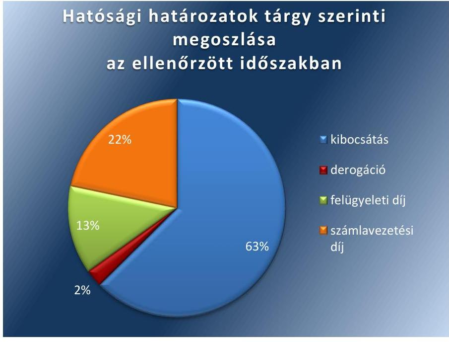

Forrás: az OKTF adatszolgáltatása alapján saját szerkesztés
Az OKTF az üzemeltetők kibocsátási engedélyével kapcsolatos, az Ügkr. tv. előírásának megfelelő rendszeres, de legalább ötévente ismétlődő felülvizsgálati kötelezettségének eleget tett. Az OKTF valamennyi üzemeltető esetében a jelentési, a hitelesítési és az ÜHG egységek visszaadására irányuló kötelezettség teljesítését minden évben ellenőrizte.

A légi jármű üzembentartók esetében a jelentési, a hitelesítési és az ÜHG egységek visszaadására irányuló kötelezettség teljesítésének ellenőrzése a 2012. év vonatkozásában 2013. évben, a 2014. év vonatkozásában 2015. évben történt meg. Az OKTF 2013. év vonatkozásában az ellenőrzést a 421/2014/EU rendelet ${ }^{65}$ 1. cikke által módosításra került, kiegészített 2003/87/EK irányelv ${ }^{66}$ 28a. cikkében foglaltak alapján 2015. évben végezte el. Az irányelvben foglaltak alapján a légi jármű üzembentartó 2013. évre vonatkozó hitelesített kibocsátási jelentési kötelezettségének teljesítési határideje az Ügkr. tv. 10. § (1) bekezdésben foglaltaktól eltérően 2015. március 31-re módosult.

Az OKTF 2013-ban a derogációs kiosztásra jogosult 11 villamosenergiatermelő fizetési kötelezettségének teljesítését ellenőrizte, amelynek alapján egy villamosenergia-termelőt az Ügkr. tv. 18/8. §-ban foglaltak szerint fizetés teljesítésére szólított fel. A teljesítés 2014. január 3-án megtörtént.

Az OKTF az egyéb ellenőrzési, felülvizsgálati tevékenysége keretében 2013. évben 2 db, 2014. évben 44 db és 2015. január 1. és szeptember 30.

---

között 47 db helyszíni ellenőrzést folytatott le. A 2013. évben az összes kibocsátási engedély felülvizsgálata és módosítása lekötötte a munkaerő kapacitását, azonban a 2014. és 2015. évben rendszeres, programozott ellenőrzést végzett.

Befejezett derogációs beruházás hiányában a MEKH-el nem került sor a Ügkr. tv. Vhr. 25. § (6) és 27. § (2) bekezdésben, valamint a 2013. évi XXII. tv. ${ }^{68}$ 5. § (1) bekezdésben előírt együttműködésre.

Az ellenőrzéssel érintett időszakban Magyarország két projekt számára nyújtott derogáció alapján állami támogatást az energiaszektor modernizálása céljából. A folyamatban lévő két derogációs beruházás esetében az OKTF a 341/2013. (IX. 25.) Korm. rendeletben foglalt jogosultsága alapján a támogatás folyósítása érdekében benyújtásra került számlák elszámolhatóságának tisztázása keretében az Ügkr. tv. előírásának megfelelően független könyvvizsgálói jelentéseket szerzett be, továbbá a beruházások megvalósításának műszaki ellenőrzésére megbízási szerződést kötött.

Az OKTF az ÜHG egységkereskedelmi rendszer működéséről szóló jelentések tervezetét elkészítette, amelyek a 2003/87/EK irányelv által előírt határidőben benyújtásra kerültek az Európai Bizottság részére. Az Európai Környezetvédelmi Ügynökség észrevételei alapján 2015. év őszén a 2013. és 2014. évi jelentés egyes adatai javításra kerültek. A jelentéseket az Európai Bizottság által összeállított kérdőív alapján készítették el.

Az OKTF a derogációs jelentéseket elkészítette, azonban határidőn túl kerültek benyújtásra az Európai Bizottság számára. A derogációs jelentéseket az Ügkr. tv. 18/F. § (1) bekezdésben előírtak szerint a derogációs kérelemben meghatározott beruházások megvalósításáról és a központi számlán rendelkezésre álló összeg felhasználásáról évente kellett elkészíteni.

# 2.2. számú megállapítás 

## A szén-dioxid kvóták Magyar Állam általi értékesítése alapvetően szabályosan történt.

A 2007. évi IV. törvény 7. cikke rögzíti, hogy a Keretegyezmény I. mellékletében szereplő felek meghatározott információkat tartalmazó Nemzeti közleményben kötelesek a kötelezettségeik teljesítéséről beszámolni. A kötelező információk egymást követő benyújtásának gyakoriságát, ütemezését a Részes Felek Konferenciája határozta meg döntések formájában.

A Részes Felek Konferenciájának döntése írta elő a tagországok részére négyévente teljes körű Nemzeti Közlemény ${ }^{69}$ benyújtását. Magyarország tartalmában az előírásoknak megfelelően, de késve számolt be kötelezettségei teljesítéséről. A Nemzeti Közlemény megküldése és feltöltése a Keretegyezmény Titkárság oldalára 7 napos késéssel 2014. január 1. helyett január 8-án történt.

A 2008-2012-es kötelezettségvállalási időszak 2012. december 31-én ért véget. A Kiotói Jegyzőkönyv következő, 2013-2020. közötti időszak elméletileg megkezdődött, azonban az ezen második kötelezettségvállalási időszakot létrehozó jogi keret, a Kiotói Jegyzőkönyv Dohai Módosítása a kellő számú ratifikáció hiányában még nem lépett hatályba. (A Kiotói Jegyzőkönyv második időszakának létrehozását az tette szükségessé, hogy az előzetes elképzelésekkel szemben a koppenhágai klímacsúcson nem sikerült létrehozni a minden országra kötelezően érvényes nemzetközi klímapolitikai megállapodást; az csak a 2015. decemberi párizsi klímakonferencián jött létre.) Ettől függetlenül a 2008-2012. közötti első kötelezettségvállalási időszak lezárása egy ún. kiegyenlítési időszak révén megtörtént, mely időszak 2015. november 18-ig tartott. Erre vonatkozóan a Részes Felek Konferenciája döntése alapján a tagállamoknak a kiotói egységeikre vonatkozóan ún. True-up jelentést ${ }^{70}$ kellett összeállítaniuk és megküldeniük a Keretegyezmény Titkársága részére legkésőbb a kiegészítő időszak lejártát követő 45. napig, azaz 2016. január 2-ig.

KIOTÓI EGYSÉG ÉRTÉKESÍTÉS nem történt az ellenőrzött időszakban.

Az emisszió-kereskedelmi piac rendkívül passzív helyzete és ennek következtében kialakult alacsony ár miatt 2012. év óta sem az NFM, majd a Statútum rendelet ${ }^{71}$ értelmében 2014. július 1. óta az NGM felé hivatalos érdemi megkeresés, a kiotói egység vételi szándékkal kapcsolatban nem történt.

A kibocsátható mennyiségi egységek korlátozás nélkül, a kibocsátáscsökkentési egységek, valamint az igazolt kibocsátás-csökkentési egységek az adott kötelezettségvállalási időszak kibocsátható mennyiségének 2,5%-áig a következő kötelezettségvállalási időszakba átvihetők. Magyarország élt a lehetőséggel, és az előírt leadásokon felül minden egységet átvitt a következő kötelezettségvállalási időszakra, ezáltal az értékesítés lehetősége továbbra is fenn áll.

Az NFM a 36/2012. (XII. 7.) NFM utasítás ${ }^{72}$ alapján piacelemzéssel kapcsolatos kötelezettségeinek eleget tett.

AZ EU ETS EGYSÉGEK ÉRTÉKESÍTÉSE a jogszabályi előírásoknak megfelelően történt, ESD egység értékesítés nem történt, mert az egységek kereskedelme még az Unióban nem kezdődött meg.

Az Európai Unióban az EU ETS piac működik. EUA II és EUA III, valamint a 2013. január 1. és 2014. közepéig tartó időszaktól eltekintve EUAA egységek eladása történt meg az EU ETS piacon. 2013. január 01-től az EU felfüggesztette az EU ETS légiközlekedésre vonatkozó alkalmazását. A rendszer az Unión belüli repülésekre korlátozott hatállyal a 2014. április 30-tól hatályos 421/2014/EU európai parlamenti és tanácsi rendelet révén indult újra.

Magyarország csatlakozott a Közös Közbeszerzési Megállapodáshoz ${ }^{73}$, amelynek alapján egy közös aukciós platformon keresztül történt a kibocsátási egységek kereskedelme. A Közös Közbeszerzési Megállapodáshoz szükséges nyilatkozat megküldésre került a Bizottság részére, a Megállapodást a NFM miniszter írta alá és 2011. november 9-én lépett hatályba. A közbeszerzési eljárásban az EEX nyert, így az bonyolította le az árveréseket.

A 1031/2010/EU bizottsági rendelet ${ }^{74} 22$. cikkének megfelelően az árverező kijelölése megtörtént. Az NFM 2012. október 26-án az Európai Bizottság, november 13-án az EEX részére küldte meg jelentkezését és kapcsolattartói kijelölését. A hivatalos befogadó nyilatkozat az EEX részéről 2012. november 26-án, Klíringháza ECC ${ }^{75)}$ részéről pedig november 23-án kelt. A megállapodás 2012. november 28-tól hatályos.

Az 1.1. pontban részletezett feladat- és hatáskörváltozások következtében, az átadás-átvétele során megegyezés született, hogy az NGM árverezőként való befogadásáig az NFM látta el az érvényben lévő kijelölése alapján az aukcionálói feladatokat. A 2015. január 22-én kelt a befogadó nyilatkozat nyomán, az NGM az aukcionáló hazánk részéről.

A kapcsolattartók kijelölése és azok esetleges változásának bejelentése szabályszerűen megtörtént.

Az állam által értékesíthető kibocsátási egységek éves mennyiségét az Európai Bizottság állapította meg úgy, hogy a minden tárgyévet megelőző év végén Primary Auction Calendar ${ }^{76}$ formájában közzétette a tagországok részére megítélt értékesíthető mennyiségeket.

Az aukciós naptárban előre meghatározásra kerültek a kereskedési napok és a tagországonként értékesítésre bocsátandó napi mennyiségek. Ennek a tervnek megfelelően a közös aukciós platformon heti három alkalommal kerültek eladásra a tagországok által értékesítésre bocsátott egységek.

Magyarország EUA II és EUA III egységeinek a III. kereskedési időszakban, uniós szinten szervezett árveréseken történt értékesítéseit a 3. ábra szemlélteti. Látható, hogy a kisebb értékesített mennyiségek ellenére a kedvezőbb árnak köszönhetően a bevételek nőttek.
3. ábra
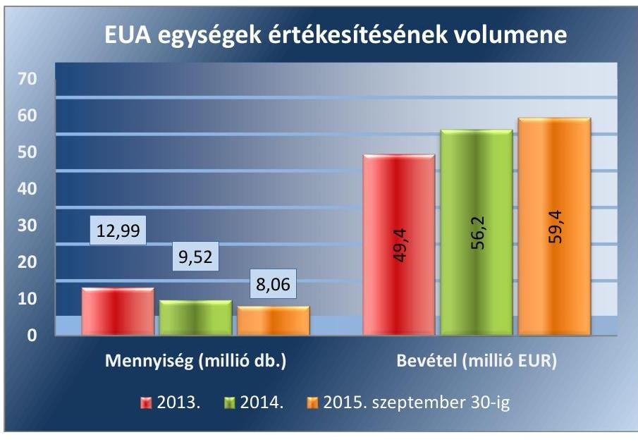

Forrás: az ellenőrzött szervezetek adatszolgáltatása alapján saját szerkesztés
Az EUAA egységek árverésen történt értékesítéseit a 4. ábra mutatja, amely jól szemlélteti a légközlekedési kibocsátási egységek nagyságrendileg kisebb forgalmát. Látható, hogy 2014 és 2015. szeptember 30. között mind az eladott mennyiség, mind az ár emelkedett, amely összességében a bevételek jelentős növekedését eredményezte 2015-ben.

---

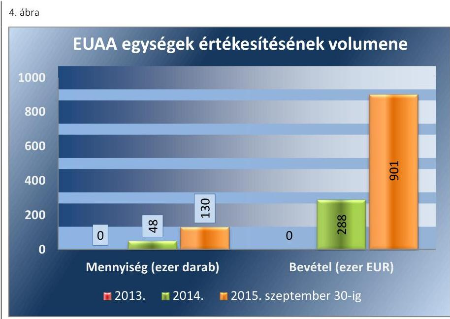

Forrás: az ellenőrzött szervezetek adatszolgáltatása alapján saját szerkesztés
Az EUA II. egységek értékesítése külön megállapodás keretében történt. Az EUA II egységek tervezett 2013. áprilisi értékesítése előtt az NFM szabályosan járt el, és az előírásoknak megfelelően ajánlatokat kért ismert piaci szereplőktől. A beérkezett érvényes ajánlatok alapján összehasonlító táblázatot és döntés előkészítő szakmai anyagot készített. Az értékesítés árverezések keretében 2013. április 23-án és 25-én történt az EEX közös platformon.

A fenti, II. kereskedési időszakról megmaradt 5174500 EUA II egység értékesítése során keletkezett, összesen 14773150 EUR bevételről az NFM miniszter 2013. május 24-én tájékoztatta az NGM minisztert és az MNV Zrt.-t.

A KVÓTAÉRTÉKESÍTÉSBŐL származó bevételek teljesülése 2013. évben terven felüli, 2014. évben - az EU kvóta piaci intézkedése miatt - terv alatti volt, míg 2015. év szeptember 30-ig a bevételek teljesülése időarányosan meghaladta a tervezettet. Kiotói és ESD egység értékesítés nem történt.

A bevételek tervezése a 2003/87/ EK ETS irányelv, az árfolyamtrendek és a szakmai terület számítása alapján történt, a bevételek pontos mértéke a piac mozgásától függött. Az értékesíthető mennyiséget az Európai Bizottság határozta meg aukciós naptár formájában tárgyév előtti év végén. Az értékesítési árakat a piac határozta meg.

Az EU ETS egységek értékesítéséből származó bevételek felhasználását a 2.3-as pont tárgyalja részletesen.

A költségvetési törvény ${ }^{77}$ 1-3 előírásainak megfelelően a kibocsátási egységek és légiközlekedési kibocsátási egységek értékesítéséből származó bevételek a XLIII. Az állami vagyonnal kapcsolatos bevételek és kiadások fejezet 1. cím, 1. alcím, 3. Kibocsátási egységek értékesítéséből származó bevételek jogcímcsoporton belül, külön jogcímként került elszámolásra.

A 2013. évre vonatkozó költségvetési törvény1 10 400,0 M Ft bevételt tervezett, ezzel szemben összesen 14 561,5 M Ft bevétel folyt be ténylegesen.

---

A 2014. évre vonatkozó költségvetési törvény ${ }^{78}$ a kibocsátási egységek értékesítéséből származó bevételeket 18 541,7 M Ft összegben tervezte, de ebben az évben egy Európai Uniós intézkedés következtében a tagországok értékesíthető kvótamennyiségét lecsökkentették, ezáltal az egységárak kismértékű emelkedésének ellenére is a tényleges bevétel elmaradt a tervezettől és 17 479,1 M Ft volt.

A 2015. évre vonatkozó költségvetési törvény ${ }^{79}$ a kibocsátási egységek és légiközlekedési kibocsátási egységek értékesítéséből származó bevételeket 19 306,8 M forintra tervezte.

A három ellenőrzött év tervezett és valós bevételeit az 3. táblázat szemlélteti. A 2015. év tényadata a minisztériumi kimutatás alapján csak az ellenőrzött időszak végéig, azaz szeptember 30-ig szól.
3. táblázat

KIBOCSÁTÁSI EGYSÉGEK ÉS LÉGI KIBOCSÁTÁSI EGYSÉGEK ÉRTÉKESÍTÉSÉBŐL SZÁRMAZÓ BEVÉTEL (M FT)

| Évszám | Tervezett bevétel | Tényleges bevétel |
| :-- | :--: | :--: |
| 2013. | 10400 | 14561 |
| 2014. | 18542 | 17479 |
| 2015. szept. 30-ig | 19307 | 17598 |

Forrás: az ellenőrzött szervezetek adatszolgáltatása alapján saját szerkesztés
Az 5. ábra úgy szemlélteti a bevételeket, hogy a tervezettek vonatkozásában, 2013-2015. között a teljes évet, 2015. évben pedig a tényleges bevételek tekintetében az ellenőrzött időszakra vonatkozó időarányos adatokat mutatja.
5. ábra

Kibocsátási és légi kibocsátási egységek értékesítéséből származó bevétel (M Ft)
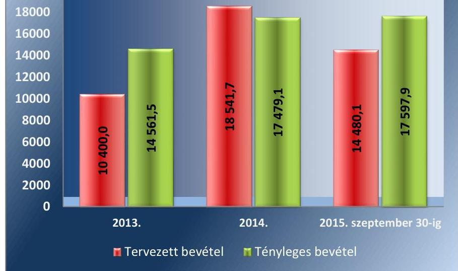

Forrás: az ellenőrzött szervezetek adatszolgáltatása alapján saját szerkesztés

---

### 2.3. számú megállapítás

A szén-dioxid kvóták értékesítéséből származó bevételek felhasználása a jogszabályi előírásoknak megfelelően történt, az ezekből támogatott beruházások összhangban voltak a NÉS1-ben megfogalmazott, klímapolitikai célkitűzésekkel. A ZBR előirányzatokból támogatott beruházások pályáztatása, valamint a ZBR, ZFR előirányzatokból támogatott beruházások végrehajtása, a megvalósulás nyomon követése, pénzügyi elszámolása és a nem pályázati úton történő felhasználások a jogszabályi előírásoknak megfeleltek. A ZFR előirányzatokból támogatott beruházások pályáztatása a jogszabályi előírásoknak csak részben felelt meg.

A KÉT KERESKEDELMI ALRENDSZERBEN értékesített szén-dioxid kvóták értékesítéséből származó bevételek felhasználását külön jogszabályi előírások határozták meg.

Az ellenőrzött időszakot megelőzően keletkezett, kiotói egységek átruházásából származó bevételeket, az Éhvt. 10. § (3) bekezdése alapján az üvegházhatású gázok hazai kibocsátásának csökkentését célzó tevékenységek, intézkedések támogatására, nyelők általi eltávolításának növelésére, az éghajlatváltozás hatásaihoz való alkalmazkodásra kellett fordítani.

A kiotói egységek értékesítésből származó, 2015. január 1-éig teljesült bevételek felhasználása kizárólagosan az NFM miniszter által működtetett ZBR keretében történt. Az Éhvt. 10. § (3) bekezdésével összhangban lévő, a ZBR keretében, pályázat útján támogatható célokat 2015. június 11-ig az Éhvt. 23. § (3) bekezdése, majd 2015. június 4-től NFM előirányzat rendelet280 1. számú melléklete rögzítette.

Az Európai Unió által alkalmazott ÜHG kereskedelmi rendszerében értékesített légiközlekedési és az Ügkr. tv. hatálya alá tartozó egyéb kibocsátási egységekből származó bevételek felhasználása a ZFR keretén belül történt.

Az ellenőrzött időszakban a ZBR előirányzat felhasználásainak alakulását a 4. táblázat mutatja be:
4. táblázat

ZBR ELŐIRÁNYZAT FELHASZNÁLÁSAINAK ALAKULÁSA

| Ellenőr-   zöld-   évek: | Előző évi   pályázati   maradvány   M Ft | ZBR ke-   retében   felhaszn-   nált ösz-   szeg   M Ft | A ZBR kerete-   ben felhaszn-   ált összegből   nem pályázat   útján felhaszn-   ált   M Ft | Ellenőrzött, a   CNG autóbusz   beszerzésre   lekötött ösz-   szeg   M Ft. | Ellenőrzött   homlokzati   nyílászáró   cserére lek-   kötött ösz-   szeg   M Ft. |
| :--: | :--: | :--: | :--: | :--: | :--: |
| 2013. | 25956,5 | 12054,1 | 324,2 | 1600,0 | 1098,8 |
| 2014. | 13908,2 | 2699,4 | 268,2 | 0,0 | 1,2 |
| 2015. | 11213,4 | 6452,6 | 141,7 | 0,0 | 0,0 |

Forrás: az ellenőrzött szervezetek adatszolgáltatása alapján saját szerkesztés

[^0]
[^0]:    * Az Éhvt. 23. § bekezdését, csak 2015. június 12-től hatálytalanították, a köztes időszakban párhuzamosan volt érvényes mindkét szabályozás, ellentmondás azonban nem volt a két szabályozás között.

---

Az ellenőrzött időszakban a ZFR előirányzat felhasználásának alakulását az 5. táblázat mutatja be:
5. táblázat

| ZFR ELŐIRÁNYZAT FELHASZNÁLÁSAINAK ALAKULÁSA |  |  |  |  |
| :--: | :--: | :--: | :--: | :--: |
| Ellenőrzött időszak | NFM teljesült bevétel M Ft | ZFR keretében felhasznált összeg M Ft | A ZFR keretében felhasznált összegből nem pályázat útján felhasznált M Ft | Ellenőrzött fűtéskorszerűsítésre, kazáncserére lekötött összeg M Ft |
| 2013. | 7280,7 | 7275,7 | 75,7 | 1000,0 |
| 2014. | 6766,5 | 6600,3 | 306,3 | 253,8 |
| 2015. I-XI. hónap | 4468,6 | 711,8 | 0,0 | 0 |

Forrás: az ellenőrzött szervezetek adatszolgáltatása alapján saját szerkesztés
Az ellenőrzési időszakban a ZBR előirányzat terhére két pályázati program, míg a ZFR előirányzat terhére egy pályázati program indult, amelyek támogatásáról az ellenőrzési időszak lezárásáig az NFM miniszter döntött. A ZBR és a ZFR terhére megvalósult további beruházások pályáztatása az ellenőrzött időszak előtt indult, vagy miniszteri döntés az ellenőrzött időszakon túl született. A pályázati programok pályázatkezeléssel kapcsolatos előkészítési, lebonyolítási tevékenységét az ÉMI NKft. végezte.

Az ellenőrzési időszakban indult három támogatási, pályázati program esetében történt szerződéskötés, kettő esetben került sor támogatási összeg kifizetésére is.

Az ellenőrzési időszakban indult támogatási, pályázati programok, konstrukciók:
$\longrightarrow$ közösségi közlekedésben üzemeltetett gázüzemű $\mathrm{CNG}^{1}$ autóbuszok beszerzése (a ZBR keretében indult, még nem történt kifizetés);
$\longrightarrow$ homlokzati nyílászárócsere (a ZBR keretében indult, történt kifizetés, a monitoring időszak folyamatban van);
$\longrightarrow$ fűtéskorszerűsítés - kazáncsere (a ZFR keretében indult, történt kifizetés, a monitoring időszak folyamatban van).
Az NGM-re jutó tervezett és tényleges kvótaértékesítésből származó GZR bevételek alakulását a 6. ábra szemlélteti. A GZR előirányzat terhére az NGM nem írt ki pályázatot az ellenőrzési időszakban.
6. ábra
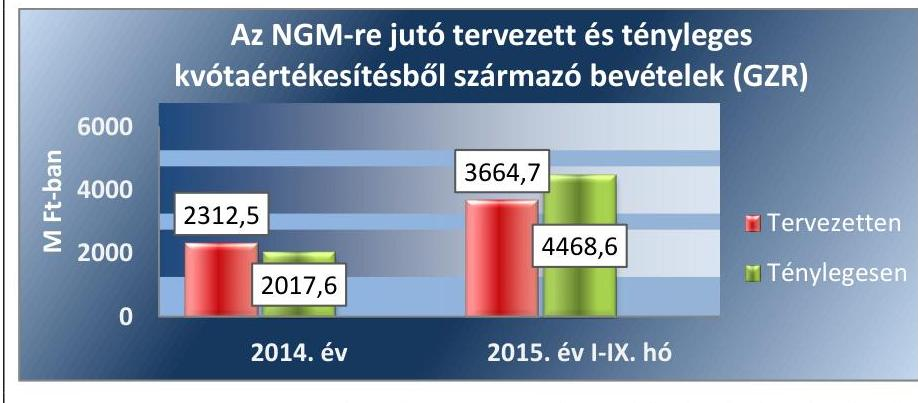

Forrás: az ellenőrzött szervezetek adatszolgáltatása alapján saját szerkesztés

---

A ZBR, ZFR FEJEZETI KEZELÉSŰ előirányzatokból megvalósuló illetve megvalósított pályázatok forrásának pénzügyi tervezésénél, valamint a pályázatok kiírásánál dokumentáltan figyelembe vették a klímapolitikai stratégiaként megfogalmazott üvegházhatású gázok kibocsátási, valamint energiafelhasználás csökkentési célokat.

A ZBR előirányzat terhére került kiírásra 2013-ban a közösségi közlekedést szolgáló CNG autóbuszok beszerzésére irányuló pályázat. A pályázatra közvetlen vagy közvetett állami vagy önkormányzati tulajdonú, közösségi közlekedést ellátó gazdasági társaságok jelentkezhettek, a pályázati összeg 1600,0 M Ft volt.

A kiírásra pályázat nem érkezett be, így 2014. évben ismételten meghirdetésre került a pályázat. A pályázati felhívásra összesen egy pályázó nyújtott be pályázatot, 1820,0 M Ft támogatási összegre. A pályázat keretében feltételes közbeszerzési eljárást kellett indítani, melynek nyertese 1820,0 M Ft összegű ajánlatot nyújtott be a beszerzendő buszok leszállítására. A pályázó ezen beruházási összeg mellett tudta vállalni a beszerzendő buszok 10 éves gazdaságos üzemeltetését.

Az Éhvt. Vhr. vonatkozó előírásai szerint a ZBR végrehajtásának feladatai fejezeti kezelésű előirányzat célelőirányzat felhasználása során, a támogatás nyújtásáról az NFM miniszter dönt. A 220 M Ft összegű többletigény a ZBR Panel II. Alprogramján meghiúsuló kötelezettségvállalások következtében felszabaduló forrásból fedezhető volt. A többlettámogatási igényt a Pályázó indoklása és a Szakértői Bizottság döntése alapján -a miniszter jóváhagyta.

A pályázóval az igényelt támogatási összeg erejéig támogatási szerződést kötöttek. A támogatott pályázat a pályázati kiírás követelményeinek-, így a klímapolitikai céloknak is megfelelt. A pályázat az ellenőrzési időszak lezárásáig nem valósult meg, pénzügyi kifizetés nem történt. A pályázati útmutató szerint nem volt támogatható a beruházás, amely révén legalább 5\%-os szén-dioxidos csökkentés nem érhető el. A benyújtott pályázat pályázatkezelői értékelése szerint a beruházás megvalósulásával, várhatóan 10,7\%-os szén-dioxid csökkentés érhető el.

A ZBR ÉS ZFR ELŐIRÁNYZATOK terhére került meghirdetésre 2014. évben, az Otthon Melege Program keretében, egyrészt a Homlokzati Nyílászárócsere Alprogram, 1100,0 M Ft ZBR keretösszeggel, másrészt a Fűtéskorszerűsítés, Kazáncsere Alprogram 1000,0 M Ft ZFR keretösszeggel. A támogatásokat kizárólag magánszemélyek igényelhették. A ZBR pályázati kiírás célja támogatás nyújtása a lakosság részére az energiatakarékosság fokozását és az üvegházhatású gáz kibocsátás csökkentését eredményező beruházásokra, míg a ZFR pályázat egyértelműen klímapolitikai célokat szolgált, a fosszilis-kibocsátás csökkentése révén.

A FENTI ZBR, ZFR pályázati kiírások, és a ZBR, ZFR fejezeti kezelésű előirányzatokból, a pályázatok értékelése keretében támogathatónak ítélt beruházások megfeleltek a NÉS1-ben meghatározott üvegházhatású gázok kibocsátás, valamint energiafelhasználás csökkentési klímapolitikai stratégiai céloknak.

A ZBR fejezeti előirányzatból megvalósult pályázati tevékenység lebonyolítása megfelelt, míg a ZFR fejezeti előirányzatból megvalósult pályázati

---

tevékenység lebonyolítása részben felelt meg a jogszabályok és a belső szabályzatok előírásainak.

A ZBR előirányzat terhére meghirdetett CNG autóbusz beszerzésével kapcsolatos pályázat pályázati felhívása és útmutatója együttesen tartalmazták a ZBR utasításban ${ }^{82}$ előírt elemeket. Az ÉMI NKft. a pályázati kiírás honlapján történő megjelentetéséről gondoskodott.

A ZBR előirányzat terhére nyújtott támogatásból megvalósuló, CNG autóbusz beszerzésre irányuló beruházás végrehajtásának ellenőrzése nem valósulhatott meg, mivel pénzügyi teljesítésre nem került sor az ellenőrzési időszak végéig.

A ZBR ELŐIRÁNYZAT TERHÉRE meghirdetett homlokzati nyílászárócsere program pályázati felhívása és útmutatója együttesen tartalmazta a ZBR utasításban előírt tartalmi és formai elemeket. Az NFM a pályázati kiírás saját, valamint az ÉMI NKft. honlapján történő megjelentetéséről gondoskodott.

A pályázatok benyújtása és feldolgozása elektronikusan történt, így biztosítva volt a benyújtott pályázatok egyidejű nyilvántartásba vétele.

Az NFM miniszter döntését a pályázat támogatásáról az Éhvt. Vhr. előírásainak megfelelően a pályázat hiánytalan benyújtásától számított 90 munkanapon belül hozta meg. A Szakmai Bizottság által támogathatónak ítélt pályázatok mindegyike támogatásban részesült. Az eredetileg tervezett 1100,0 M Ft pályázati forrásból ténylegesen azért csak 900,3 M Ft összegű támogatás kifizetésére vállalt az NFM kötelezettséget, mert a beérkezett pályázatok számához képest, a szerződött pályázatok mennyisége elmaradt. A miniszteri döntést megelőzően a ZBR utasítás előírásainak megfelelően az NFM, gondoskodott az érintett miniszterek véleményének kikéréséről. A kezelőszerv a miniszteri döntést követő 15 munkanapon belül értesítette a pályázót, egyidejűleg megküldte a Támogatói Okiratot.

A HOMLOKZATI NYÍLÁSZÁRÓ CSERE pályázat keretében finanszírozott beruházások megvalósulása, teljesülésének nyomon követése, pénzügyi elszámolása a vonatkozó szabályozásnak megfelelően történt.

A támogatásból megvalósított beruházások végrehajtása megfelelt a Támogatói Okiratban foglaltaknak, a kiutalások és az ellenőrzés során működtek a kontrollok.

A Támogatói Okiratban meghatározott célok teljesülését az elszámolás benyújtásával egyidejűleg, a ZBR utasítás előírásainak megfelelően ellenőrizték. Az ellenőrzési időszak befejezéséig 20 esetben történt meg az elszámolás. Az elszámolások a pályázati útmutatóban foglaltaknak megfelelően történtek.

A Támogatói Okirat a ZBR utasítás előírásainak megfelelő tartalommal rendelkezett.

A jogosulatlan pályázati támogatás igénybevétel feltárását elsősorban az utófinanszírozás rendszerével biztosították.

Az ellenőrzési időszak alatt helyszíni ellenőrzésre nem került sor.
Az NFM-re jutó tervezett és tényleges kvótaértékesítésből származó bevételek alakulását a 7. ábra szemlélteti:

---

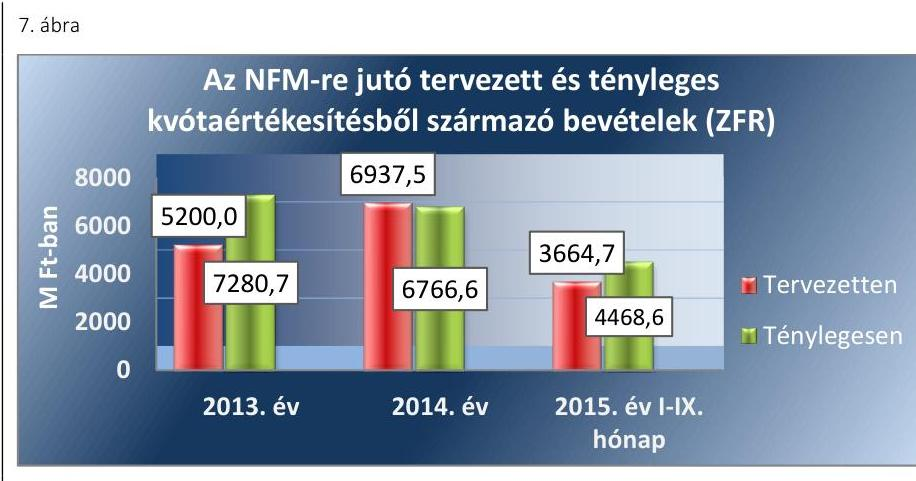

Forrás: az ellenőrzött szervezetek adatszolgáltatása alapján saját szerkesztés
A ZFR ELŐIRÁNYZATBÓL megvalósult, fűtéskorszerűsítés, kazáncsere program pályáztatása részben felelt meg a jogszabályok és a belső szabályzatok előírásainak. A pályázati kiírás a ZFR rendelet ${ }^{83}$ alapján az NFM honlapja mellett az ÉMI NKft., mint pályázatkezelő honlapján, valamint az NFM Támogató Hivatalos Értesítőjében is megjelent.

A pályázati kiírás a ZFR rendelet 7. § (2) bekezdése alapján a NFM honlapja mellett az ÉMI NKft. honlapján, valamint az NFM Hivatalos Értesítőjében is megjelent. Az NFM a NFM előirányzat rendelet; ${ }^{84} 3$. § (3) bekezdése szerinti országos napilapban történő megjelentetés tényét nem tudta igazolni. A lakosság tájékoztatása sajtótájékoztató keretében megtörtént. Az ÉMI NKft. a benyújtott pályázatokról a ZFR rendelet 9. § (3) bekezdésében meghatározott 30 nap helyett, 90-132 nap közötti időtartamon belül tájékoztatta a pályázókat azok befogadásáról.

A pályázatok benyújtása és feldolgozása elektronikusan történt, így a benyújtott pályázatok egyidejű nyilvántartásba vétele is megvalósult a ZFR rendelet előírásainak megfelelően.

A FŰTÉSKORSZERŰSÍTÉS, kazáncsere pályázat keretében finanszírozott beruházások megvalósulása, teljesülésének nyomon követése, pénzügyi elszámolása, a vonatkozó szabályozásnak megfelelően történt.

A támogatásból megvalósított beruházások végrehajtása megfelelt a Támogatói Okiratban foglaltaknak, a kiutalások és az ellenőrzés során működtek a kontrollok.

A benyújtott számlák mögötti teljesítés igazolását a pályázat benyújtása során bekért költségvetés, vállalkozói szerződés, a beruházás befejezését igazoló átadás-átvételi jegyzőkönyv alapján ellenőrizték.

A jogosulatlan pályázati támogatás-igénybevétel feltárását elsősorban utófinanszírozás keretében biztosították.

A Támogatói Okiratban a jogosulatlan pályázati támogatás igénybevétel kizárását célozta meg a Pályázati felhívásban és útmutatóban meghatározott 3 éves fenntartási időszakra vonatkozó elidegenítési tilalom, valamint a támogatás felhasználás ellenőrzésének rögzítése is.

Az ellenőrzési időszak alatt a pályázati konstrukciók keretében helyszíni ellenőrzésre nem került sor.

---

NEM PÁLYÁZATI ÚTON is lehetőség volt a kvótaértékesítésből származó bevételek felhasználására, amelyek a jogszabályban előírt mértéken belül maradtak.

A ZFR-ből nem pályázat útján történő kifizetések szabályszerűek voltak.
A ZFR rendelet 3. § (3) bekezdése szerint a ZFR kezelési költségeire a 2013. éven a ZFR legfeljebb 5\%-a volt fordítható. A ZFR rendelet 2014. április 1-jétől érvényes módosítása értelmében 2014. évtől már 7\% volt kezelésre fordítható keret.

A ZFR kezelési költségeinek alakulását az a 6. táblázat szemlélteti:
6. táblázat

| ZFR KEZELÉSI KÖLTSÉGEINEK ALAKULÁSA |  |  |  |  |
| :--: | :--: | :--: | :--: | :--: |
| Ellenőrzési időszak | Ténylegesen befolyt bevétel felhasználása (M Ft) | Jogszabályban meghatározott % mérték | A jogszabályban meghatározott maximum érték | Ténylegesen igazgatási, stb. költségekre felhasznált bevétel |
| 2013. | 7280,7 | $5 \%$ | 364,0 | 80,7 |
| 2014. | 6766,6 | $7 \%$ | 407,8* | 325,3 |
| 2015 I-IX. hó | 4468,6 | $7 \%$ | 312,8 | 0,0 |
| *a jogszabály év közbeni változása miatt. Forrás: az ellenőrzött szervezetek adatszolgáltatása alapján saját szerkesztés |  |  |  |  |

Az ellenőrzési időszakban a ZFR kezelési költségeire felhasznált bevételek nem lépték túl a ZFR rendeletben meghatározott mértéket.

A ZBR ÉS GZR előirányzatokon
 nem történtek az ellenőrzési időszakban nem pályázati úton történő kifizetések.

A CÉLHOZ KÖTÖTTSÉG szempontjából a kvótaértékesítésből befolyt bevételek felhasználása a jogszabályokban meghatározott mértékeknek megfelelően történt.

Az Ügkr. tv. hatálya alá tartozó légi közlekedési egységek értékesítéséből származó bevételek 100\%-a szintén kötött felhasználású volt. A költségvetési törvények ${ }^{2-3}$ alapján 2014. június 30-ig a bevételek kizárólag az NFM fejezetet illették meg, a módosított költségvetési törvény ${ }^{2}$ 9. § (5) bekezdése, valamint a költségvetési törvény ${ }^{3}$ 8. § (3) bekezdése alapján az 2014. július 1-jét követően teljesült a légiközlekedési kibocsátási egységek értékesítéséből származó bevétel 50\%-ára már az NGM fejezet volt jogosult.

A légiközlekedési egységekből származó bevételek megosztását az 7. táblázat szemlélteti:
7. táblázat

LÉGIKÖZLEKEDÉSI EGYSÉGEKBŐL SZÁRMAZÓ BEVÉTELEK MEGOSZTÁSA

| Ellenőrzési időszak: | Légi kibocsátási egységekből származó teljesült bevétel (M Ft) | NFM/NGM arány   (\%) | NFM-et megillető rész   (M Ft) | NGM-et megillető rész   (M Ft) |
| :--: | :--: | :--: | :--: | :--: |
| 2013. | 0,0 | 100,0\%/0,0\% | 0,0 | 0,0 |
| 2014. I. félév | 0,0 | 100,0\%/0,0\% | 0,0 | 0,0 |
| 2014. II. félév | 89,1 | 50,0\%/50,0\% | 44,6 | 44,6 |
| 2015. I-IX. hó | 276,6 | 50,0\%/50,0\% | 138,3 | 138,3 |

---

A kvótabevételek megosztása megfelelt a költségvetési törvényben ${ }^{1-3}$ előírtaknak.

Az Ügkr. tv. hatálya alá tartozó egyéb kibocsátási egységekből származó bevételek 50\%-a volt kötött felhasználású az ellenőrzési időszakban. A bevételek 50\%-ára 2014. június 30-áig a költségvetési törvény ${ }^{1}$ alapján az NFM volt jogosult, majd 2014. július 1-jét követően 25-25\%-ban osztozott a bevételen az NFM az NGM.

Az Ügkr. tv. szerinti egyéb kibocsátási egységekből származó bevételek megosztását a 8. táblázat szemlélteti:
8. táblázat

# AZ ÜGKR. TV. SZERINTI EGYÉB KIBOCSÁTÁSI EGYSÉGEKBŐL SZÁRMAZÓ BEVÉTELEK MEGOSZTÁSA 

| Ellenőrzési időszak | Egyéb kibocsátási egységekből származó teljesült bevételek   (M Ft) | NFM/NGM arány   (\%) | NFM-et megillető rész   (M Ft) | NGM-et megillető rész   (M Ft) |
| :--: | :--: | :--: | :--: | :--: |
| 2013. | 14561,4 | 50,0\%/0,0\% | 7280,7 | 0,0 |
| 2014. I. félév | 9497,0 | 50,0\%/0,0\% | 4749,0 | 0,0 |
| 2014. II. félév | 7892,0 | 25,0\%/25,0\% | 1973,0 | 1973,0 |
| 2015 I-IX. hó | 17321,3 | 25,0\%/25,0\% | 4330,3 | 4330,3 |

A kvótabevételek megosztása megfelelt a költségvetési törvényben ${ }^{1-3}$ előírtaknak.

---

# 3. A szén-dioxid kvótákkal való gazdálkodásra vonatkozó gazdaságossági, hatékonysági és eredményességi követelmények kialakítása, és azok nyomon követése megtörtént-e? 

Összegző megállapítás

Az ellenőrzött szervek részéről a szén-dioxid kvótákkal való gazdálkodás teljes folyamatára (a kvóták kiosztásától a kvóták értékesítéséből befolyó bevételek hasznosításáig) vonatkozóan nem alakítottak ki gazdaságossági, hatékonysági és eredményességi követelményeket, csak egyes részfolyamatok esetében gondoskodtak eredményességi célok kitűzéséről, és azok elérésének nyomon követéséről.
3.1. számú megállapítás

Az ellenőrzött időszakban a szén-dioxid kvótákkal való gazdálkodás folyamataira vonatkozóan az NGM és az FM nem alakított ki gazdaságossági, hatékonysági és eredményességi követelményeket. Az FM a teljesítményértékeléshez szükséges követelményeket az irányítása alá tartozó OMSZ és OKTF vonatkozásában sem dolgozta ki. Az NFM részéről kezdeményezések voltak, de a folyamat egészére nem alakította ki a teljesítményértékelés követelményeit.

AZ ÁHT. ELŐÍRÁSA ALAPJÁN az államháztartási kontrollok célja az államháztartás pénzeszközeivel és a nemzeti vagyonnal történő szabályszerű, gazdaságos, hatékony és eredményes gazdálkodás, a beszámolási és adatszolgáltatási kötelezettségek szabályszerű teljesítésének biztosítása. Az ellenőrzött időszakban a kvóták kiosztásával, értékesítésével és az értékesítésből befolyó bevételek hasznosításával kapcsolatos feladatokat az NFM és az NGM látta el. Az FM-nek a Nemzeti Nyilvántartási Rendszerrel és a Nemzeti Kibocsátási Leltárral kapcsolatos feladatköre volt.

A kvótaértékesítéssel összefüggő feladatmegosztás az Éhvt. és az Ügkr. tv. alapján 2014. július 16-ától jelentősen megváltozott. AZ Éhvt. előírása szerint az államháztartásért felelős miniszter az energiapolitikáért felelős miniszterrel együttműködésben gyakorolja a nemzeti vagyon részét képező kibocsátási jogosultságok tekintetében a tulajdonosi jogokat és kötelezettségeket. Az Éhvt. módosítása alapján a nemzetközi és európai kibocsátás-kereskedelem keretében az államháztartásért felelős miniszter az állam nevében kibocsátási jogosultságokat értékesíthet és vehet a törvény céljának hatékonyabb elérése céljából. Az Ügkr. tv. módosítása alapján az állam tulajdonában lévő ÜHG egységek ${ }^{85}$ tekintetében a tulajdonosi jogokat és kötelezettségeket a nemzeti fejlesztési minisztertől a nemzetgazdasági miniszterre ruházta át.
2013. január 1-jétől az EU ETS keretei között zajló térítésmentes kiosztás uniós szinten harmonizált rendszer szerint zajlott. A kiosztható mennyiségek meghatározásában nem volt lehetőség mérlegelésre, a kvótakiosztás módszertana nem engedélyezett a tagállamok részére semmilyen mozgásteret. Ezért e tevékenységre gazdaságossági, hatékonysági és eredményességi követelményeket az NFM, majd az NGM nem határozott meg.

---

AZ NFM kezdeményezéseket tett a szén-dioxid kvóták értékesítéséből befolyó összegek eredményes felhasználása rendszerének kialakítására, de a pályázati rendszer teljes folyamatára vonatkozóan nem határozott meg teljesítménycélokat, teljesítménymutatókat. Azok referencia értékeit megállapító belső utasításokkal, vezetői intézkedésekkel és egyéb dokumentumokkal nem rendelkezett (bővebben a 3.2. pont).

AZ NGM teljesítménycélokat- és követelményeket előíró belső dokumentummal a kvóták értékesítését és az értékesítés bevételeinek felhasználását illetően nem rendelkezett.

AZ FM NEM ALAKÍTOTT KI a szén-dioxid kvótákkal való gazdálkodás folyamataira, így az ÜHG kibocsátásával kapcsolatos adatgyűjtési, nyilvántartási és adatszolgáltatási tevékenységre gazdaságossági, hatékonysági és eredményességi követelményeket, sem a saját minisztériumi szervezeti egységei, sem az irányítása alá tartozó OMSZ és OKTF vonatkozásában. Ennek következtében a nyomon követhetőség nem értelmezhető. Az FM nem rendelkezett olyan belső utasítással, vezetői intézkedéssel, egyéb dokumentummal, amely teljesítménycélok meghatározását, teljesítmény követelmények és teljesítménymutatók kialakítását tartalmazta volna.

# 3.2. számú megállapítás 

Az NFM a pályázatok esetében meghatározta a szén-dioxid kibocsátásra vonatkozó követelményeket. Ugyanakkor nem használták ki teljes mértékben a pályáztatott forrásokat.

AZ NFM a pályázati programokkal kapcsolatban alakított ki gazdaságossági, hatékonysági és további eredményességi követelményeket. A szén-dioxid kvótaértékesítésből származó bevételek felhasználása során határozott meg mutatószámokat, indikátorokat. A pályázati programok fő célja olyan korszerű beruházások támogatása volt, melyek által csökkenhet az energiafelhasználás, valamint a szén-dioxid kibocsátás.

Az NFM az ellenőrzött időszakban nyomon követte a kvótaértékesítésből befolyt bevételek alakulását. A bevételek felhasználására vonatkozó teljesítmény-követelmények nyomon követésére a pályázati rendszerek működtetésén keresztül volt lehetőség. Az NFM a ZBR és ZFR szén-dioxid kibocsátás csökkentéshez kapcsolódó támogatási, pályázati programok során alkalmazott indikátorokat.

A CNG AUTÓBUSZOK beszerzéséhez kapcsolódó pályázat esetében 2015. szeptember 30-áig pénzügyi teljesítés nem volt, az autóbuszok beszerzése nem történt meg, így a pályázatban rögzített feltételek teljesülésének kontrolljára sem kerülhetett sor. Az ÉMI által jelentett adatok alapján új CNG autóbuszok beszerzésével a szén-dioxid megtakarítás 764,3 tonna lesz várhatóan évente.

A HOMLOKZATI NYÍLÁSZÁRÓCSERE pályázat esetében az ellenőrzéssel érintett időszak lezárásáig a pályázati konstrukció keretében nyújtott támogatások kifizetése, a pályázatok utófinanszírozása miatt

---

még folyamatban volt, nem történt meg teljes körűen. A pályázati programhoz kialakított mutatók, számszaki adatok alakulását, a 2015. szeptember 30-ai időpontra vonatkozóan a 9. táblázat szemlélteti:
9. táblázat

# A HOMLOKZATI NYÍLÁSZÁRÓCSERE PÁLYÁZATHOZ KIALAKÍTOTT MUTATÓK, SZÁMSZAKI ADATOK 

| Homlokzati nyílászárócsere Program |  | Tervezett | Tényleges | Változás   (\%) |
| :-- | :--: | :--: | :--: | :--: |
| Támogatás összege | M Ft | 1100 | 900,3 | 81,8 |
| Keretösszeg pályázónkénti maximális összege a pályázati kiírás alapján | ezer Ft | 520,0 | 404,8 | 77,8 |
| Pályázati keretösszeg háztartásonként | ezer Ft | 404,8 | 404,8 | 100,0 |
| Támogatott háztartások száma/szerződött   pályázatok száma | db | 2717 | 2224 | 81,9 |
| Beérkezett pályázatok száma | db | - | 2821 | - |
| Kizárt pályázók száma | db | - | 549 | - |
| Visszalépett pályázók | db | - | 14 | - |
| Elállások/visszavonások | db | - | 34 |  |
| CO2 megtakarítás a beérkezett pályázatok alapján | tonna/év | 2860,0 | - | - |
| CO2 megtakarítás a szerződött pályázatok alapján | tonna/év | 1964,8 | - | - |

Forrás: az ellenőrzött szervezetek adatszolgáltatása alapján saját szerkesztés
A pályázati útmutatóban meghirdetett keretösszeghez képest a ténylegesen támogatott pályázatok után a támogatási összeg 18,2\%-kal csökkent, melynek oka, hogy a beérkezett pályázatok számával szemben a szerződött pályázók száma 597-tel, 21,2\%-kal alacsonyabb volt, így a támogatási keretösszeg sem került teljes egészében felhasználásra. Az egy pályázóra jutó pályázati keretösszeg a tervezetthez képest 115,2 ezer Ft-tal, 22,2\%-kal csökkent. A támogatott háztartások száma 493 darabbal, 18,1\%-kal maradt el a tervezettől.

A pályázati programhoz kapcsolódóan a beérkezett és szerződött pályázatok alapján számított szén-dioxid megtakarítást a 8. ábra mutatja:
8. ábra
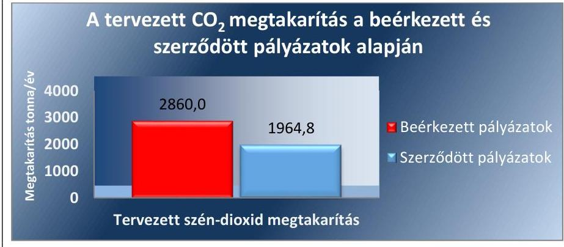

Forrás: az ellenőrzött szervezetek adatszolgáltatása alapján saját szerkesztés
A homlokzati nyílászárócsere pályázat esetében a beérkezett pályázat számhoz képest, az alacsonyabb számú szerződött pályázatoknak megfelelően, 31,3\%-kal (895,2 tonna/évvel) csökkent a tervezett szén-dioxid megtakarítás mértéke is.

---

A FŰTÉSKORSZERŰSÍTÉS-KAZÁNCSERE pályázat esetében az ellenőrzéssel érintett időszak lezárásáig a pályázati konstrukció keretében nyújtott támogatások kifizetése a pályázatok utófinanszírozása miatt még folyamatban volt, nem történt meg teljes körűen.

A pályázati programhoz kialakított mutatók, számszaki adatok alakulását, a 2015. szeptember 30-ai időpontra vonatkozóan a 10. táblázat szemlélteti:
10. táblázat

# A FŰTÉSKORSZERŰSÍTÉS-KAZÁNCSERE PÁLYÁZATHOZ KIALAKÍTOTT MUTATÓK, SZÁMSZAKI ADATOK 

| Fűtéskorszerűsítés - kazáncsere Program |  | Tervezett | Tényleges | Változás (\%) |
| :--: | :--: | :--: | :--: | :--: |
| Támogatás összege | M Ft | 1000,0 | 1250,6 | 125,1 |
| Keretösszeg pályázónkénti maximális összege a pályázati kiírás alapján | ezer Ft | 650,0 | 520,7 | 80,1 |
| Pályázati keretösszeg háztartásonként | ezer Ft | 562,3 | 520,7 | 92,6 |
| Támogatott háztartások száma | db | 1778 | 2402 | 135,1 |
| Beérkezett pályázatok száma | db | 2782 | - | - |
| Szerződött pályázatok száma | db | - | 2402 | - |
| Kizárt pályázók száma | db | - | 331 | - |
| Visszalépett pályázók száma | db | - | 42 | - |
| Elállások/visszavonások | db | - | 6 | - |
| $\mathrm{CO}_{2}$ megtakarítás a beérkezett pályázatok alapján | tonna/év | 5261,9 | - | - |
| $\mathrm{CO}_{2}$ megtakarítás a szerződött pályázatok alapján | tonna/év | 4669,4 | - | - |

Forrás: az ellenőrzött szervezetek adatszolgáltatása alapján saját szerkesztés
A pályázati útmutató szerinti keretösszeghez képest a ténylegesen támogatott pályázatok támogatási összege 25,1\%-kal nőtt. A támogatási összeg növekedésének oka, hogy a tervezett pályázatok számával szemben a szerződött pályázók száma 624-gyel, 35,1\%-kal magasabb volt, így a támogatási keret kiegészítésre került. Az egy pályázóra jutó pályázati keretösszeg a tervezetthez képest 41,6 ezer Ft-tal, 7,4%-kal csökkent. A szerződött pályázatok száma 380 darabbal, 13,7%-kal alul maradt a beérkezett pályázatokhoz képest.

A pályázati programhoz kapcsolódóan a beérkezett és szerződött pályázatok alapján számított szén-dioxid megtakarítást a 9. ábra mutatja:
9. ábra
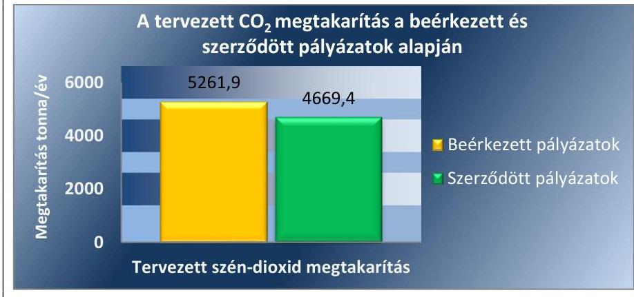

Forrás: az ellenőrzött szervezetek adatszolgáltatása alapján saját szerkesztés

---

A szerződött pályázatok alapján számított, tervezett szén-dioxid megtakarítás 592,5 tonna/évvel, 11,3%-kal maradt el a beérkezett pályázatok alapján számított szén-dioxid megtakarítás tervezett szintjétől.

A tényleges kibocsátás csökkenés kimutatása mindhárom pályázati konstrukció esetében a fenntarthatósági időszak végén lesz biztosított. Az ÉMI NKft. NFM felé teljesített heti jelentései szerint helyszíni ellenőrzésre egyik pályázati konstrukció esetében sem került sor.

Az Éhvt. Vhr. 35. § (1) bekezdésének 5) pontja előírta ${ }^{\dagger}$ a ZBR keretében nyújtott támogatások ellenőrzéséhez a teljes körű eredményességi, hatékonysági és célszerűségi elemzések készítését, azonban a 2013. január 1-jétől 2015. szeptember 30-áig tartó ellenőrzött időszakban meghirdetett pályázati konstrukciók lezárása még nem történt meg, a támogatások felhasználását záró teljes körű eredményességi, hatékonysági és célszerűségi elemzés nem készült el.

Az ellenőrzött időszakot megelőzően indított ZBR pályázati rendszerekhez kapcsolódóan az ÉMI NKft. készített éves és zárójelentéseket (2012., 2013., 2014. évekre). A 2014. évi ZBR zárójelentés tartalmazott a homlokzati nyílászárócsere és a CNG autóbuszok beszerzése pályázatok feldolgozottságának 2014. december 31-ei állapotára vonatkozó adatokat, információkat, azonban a szén-dioxid kibocsátás tényleges adatainak bemutatására nem volt mód, mivel a monitoring időszak még nem telt le, a CNG autóbuszok esetében el sem kezdődött. A pályázatkezelésre megkötött támogatási szerződés tartalmazta az ÉMI NKft. beszámolási és adatszolgáltatási kötelezettségeit az NFM felé, melyet heti, illetve a támogató igényének megfelelő gyakorisággal teljesített az ÉMI NKft.. A pályázatkezelésre megkötött támogatási szerződések tartalmazták továbbá azokat a monitoring feladatokat, amelyek a káros anyag kibocsátás csökkentésével kapcsolatos pályázati útmutatókban előírt időszakos adatszolgáltatáshoz, a monitoring feladat ellátásához szükséges adatszolgáltatáshoz, az adatszolgáltatás feldolgozásához, az NFM részére az adatszolgáltatás elemzéséhez és továbbításához kapcsolódtak.

# 4. A szén-dioxid kvótákkal való gazdálkodásra vonatkozó gazdaságossági, hatékonysági és eredményességi célkitűzéseket elérték-e? 

Összegző megállapítás

A szén-dioxid kvótákkal való gazdálkodás teljes folyamatára az ellenőrzött szervezetek gazdaságossági, hatékonysági és eredményességi követelményeket nem alakítottak ki. A teljesítmény-ellenőrzés feltételei nem álltak fenn, így az nem volt lefolytatható.

[^0]
[^0]:    ${ }^{\dagger}$ hatályos volt 2015. június 11-éig

---

# JAVASLATOK 

Az ÁSZ tv. 33. § (1) bekezdésében foglaltak értelmében az ellenőrzött szervezet vezetője köteles a jelentésben foglalt megállapításokhoz kapcsolódó intézkedési tervet összeállítani és azt a jelentés kézhezvételétől számított 30 napon belül az ÁSZ részére megküldeni. Amennyiben az ellenőrzött szervezet vezetője nem küldi meg határidőben az intézkedési tervet, vagy továbbra sem elfogadható intézkedési tervet küld, az Állami Számvevőszék elnöke az ÁSZ tv. 33. § (3) bekezdése a) és b) pontjaiban foglaltakat érvényesítheti.

## a nemzetgazdasági miniszternek:

1.  Intézkedjen, hogy a jövőben a Nemzetgazdasági Minisztérium a jogszabályban előírt határidőben tegyen eleget az értékesített ÜHG-egységek mennyiségéről az MNV Zrt. felé történő tájékoztatási kötelezettségének.
(1.4. sz. megállapítás 4. és a 6. bekezdései alapján)
2.  Gondoskodjon a szén-dioxid kvótákkal való gazdálkodás irányítási jogkörébe tartozó folyamataira vonatkozó gazdaságossági, hatékonysági és eredményességi követelmények kialakításáról és nyomon követéséről.
(3.1. sz. megállapítás 5. bekezdése alapján)

## a nemzeti fejlesztési miniszternek:

1.  Gondoskodjon a szén-dioxid kvóták értékesítéséből az NFM költségvetési fejezeti kezelési előirányzatára befolyó bevétel hasznosítására vonatkozó gazdaságossági, hatékonysági és eredményességi követelmények kialakításáról és nyomon követéséről.
(3.1. sz. megállapítás 4. bekezdése és a 3.2. sz. megállapítás alapján)

## a földművelésügyi miniszternek:

1.  Gondoskodjon a szén-dioxid kvótákkal való gazdálkodás irányítási jogkörébe tartozó folyamataira vonatkozó gazdaságossági, hatékonysági és eredményességi követelmények kialakításáról és nyomon követéséről.
(3.1. sz. megállapítás 6. bekezdése alapján)

---

.

---

# MELLÉKLETEK 

## I. SZ. MELLÉKLET: ÉRTELMEZŐ SZÓTÁR

adatvédelmi iránymutatás
aukcionálás
derogációs kiosztás
emisszió
eredményesség

ESD egység

EU direktíva

EU ETS Registry system User Guide
forgalmi jegyzék
indikátor
ITL
jegyzékkezelő
kibocsátási egység
kibocsátható mennyiség
kiotói egység
klímaváltozás
klímavédelem
légszennyezés
légszennyezettség
monitoring

Unió adatvédelmi együttműködési feltételei (Union Registry Terms of cooperation) nyilvános árverésre bocsátás
derogációs kérelem alapján kibocsátási egységek térítésmentes, illetve kedvezményes ár fizetése ellenében történő kiosztása
levegőterhelés, valamely anyag vagy energia levegőbe juttatása
(a levegő védelméről szóló (306/2010. (XII. 23.) Korm. rendelet)
az eredményesség elve a kitűzött célok és a szándékolt eredmények (hatások) elérését jelenti. A gazdálkodás, feladatellátás eredményességét mutatja a tényleges és a tervezett eredmények (hatások) összevetése
A 2009/406/EK európai parlamenti és tanácsi határozat 3. cikk (2) bekezdése és II. melléklete alapján, Magyarország számára a 2013-2020 közötti időszakra vonatkozóan évenként maximálisan engedélyezett, a 37. § (1) bekezdése szerinti üvegházhatású gázkibocsátás az állam tulajdonában álló vagyoni értékű jogosultság.
az Európa Tanács vagy az Európai Bizottság által kiadott irányelv, amely általában valamennyi tagország számára előír bizonyos kötelezettséget, a teljesítés módját azonban a tagországok belső jogi szabályozására bízza
Európai Unió Emisszió Kereskedelmi Rendszer - felhasználói kézikönyv
az OKTF, mint jegyzékkezelő által vezetett közhiteles nyilvántartás, amely tartalmazza a számlatulajdonosok (köztük a Magyar Állam) tulajdonában álló kibocsátási egységeket
mutató, jelző adat
Független/Nemzetközi Tranzakciós Jegyzék (International Transaction Log). A kiotói jegyzőkönyv szerinti valamennyi forgalmazható kvóta központosított adatbázisa, egy olyan alkalmazás, amely igazolja a nemzetközi ügyleteket és a kiotói szabályoknak és stratégiáknak való megfelelést
az OKTF
az Ügkr. tv. szerinti kötelezettségek teljesítésére felhasználható, egy tonna szén-dioxid-egyenérték meghatározott időn belül történő kibocsátását lehetővé tevő forgalomképes vagyoni értékű jog
az üvegházhatású gázok emberi tevékenységből származó, összesített kibocsátás mennyisége, szén-dioxid egyenértékben kifejezve egy meghatározott kötelezettségvállalási időszakra (Éhvt.)
a kibocsátható mennyiségi egység (AAU), a kibocsátás-csökkentési egység (ERU), az igazolt kibocsátás-csökkentési egység (CER) és az eltávolítási egység (RMU) (Éhvt.)
a Föld klímájának, éghajlatának tartós és jelentős mértékű megváltozása
a nemzetgazdaságokat átszövő energetikai, közlekedési infrastruktúra, illetve a termelési-termesztési rendszerek környezeti szempontú modernizálása
légszennyező anyag kibocsátási határértéket meghaladó mértékű levegőbe juttatása (a levegő védelméről szóló 306/2010. (XII. 23.) Korm. rendelet)
a levegő légszennyezettségi határértéket meghaladó levegőterheltségi szintje (a levegő védelméről szóló 306/2010. (XII. 23.) Korm. rendelet)
a természetes vagy mesterséges környezet állapotának nyomon követése rendszeres megfigyelő- és mérőhálózat alkalmazásával. A monitoring módszerei a környezet

---

nemzeti kiosztási tábla

Nemzeti Végrehajtási Intézkedés (NVI)

Otthon Melege Program
szén-dioxid-egyenérték
szén-dioxid kvóták
szénszivárgási lista
teljesítmény-ellenőrzés
új belépő

ÜHG egység
üvegházhatású gáz
fizikai és kémiai állapotjellemzőit vagy közvetlenül mérik, vagy pedig biológiai objektumok (indikátorszervezetek) jelenlétének, illetve állapotának (állapotváltozásának) értékelés segítségével közvetve adnak lehetőséget következtetések levonására az NVI alapján a miniszter elkészíti a nemzeti kiosztási táblát és jóváhagyásra megküldi azt az Európai Bizottságnak. Az Európai Bizottság által jóváhagyott nemzeti kiosztási tábla alapján a miniszter minden év február 28-ig a jegyzékkezelő útján gondoskodik a kibocsátási egységeknek az üzemeltetők forgalmi jegyzékben vezetett számláin történő jóváírásáról.
a létesítményeknek évente térítésmentesen kiosztható kibocsátásiegység-mennyiséget az NVI tartalmazza. Az NVI tervezetét a miniszter készíti el és nyújtja be jóváhagyásra az Európai Bizottságnak. Az NVI közzétételéről az Európai Bizottság jóváhagyását követően a Kormány gondoskodik.
NFM által meghirdetett program, amelynek célja a lakóépületek nyílászárócseréje és fűtéskorszerűsítése, állami támogatás biztosítása mellett
egy tonna szén-dioxid vagy azzal megegyező globális éghajlat-módosító potenciálnak megfelelő mennyiségű üvegházhatású gáz (Éhvt.)
az ENSZ Éghajlatváltozási Keretegyezménye keretében létrejött Kiotói jegyzőkönyv alá tartozó rendszerben értékesíthető kiotói egység, illetve az Európai Unió Emissziókereskedelmi Rendszerében értékesíthető ÜHG és ESD-egység
a CO2 kibocsátás-áthelyezés kockázatának jelentős mértékben kitett ágazatok és alágazatok listája
a számvevőszéki ellenőrzés azon típusa, amely annak megállapítására irányul, hogy a közpénzekkel és a nemzeti vagyonnal való gazdálkodás megfelel-e az eredményesség, hatékonyság, gazdaságosság elveinek, illetve vannak-e lehetőségek a teljesítmény javítására.
azon létesítmény, amely 2011. június 30. után kapott kibocsátási engedélyt, vagy 2011. június 30. után bekövetkezett jelentős kapacitásbővítés következtében kapott új kibocsátási engedélyt, vagy
az uniós rendszer egyoldalú kiterjesztése folytán került a törvény hatálya alá (Ügkr. tv)
a kibocsátási egységek és a légiközlekedési kibocsátási egységek együtt (Ügkr. tv) szén-dioxid $\left(\mathrm{CO}_{2}\right)$, metán $\left(\mathrm{CH}_{4}\right)$, dinitrogén-oxid $\left(\mathrm{N}_{2} \mathrm{O}\right)$, fluortartalmú üvegházhatású gázok

---

II. SZ. MELLÉKLET: A CO2 KERESKEDELEMBEN ÉRINTETT SZERVEK HATÁS- ÉS FELADATKÖR-ELLÁTÁSÁNAK ALAKULÁSA

| $\begin{aligned} & \text { Idő- } \\ & \text { szak } \end{aligned}$ | 2013. január 1-je és 2013. június 30-a között | 2013. július 1-je és 2014. június 16-a között | 2014. július 16-a után |
| :--: | :--: | :--: | :--: |
| NFM | Vagyonkezelői joggyakorlás. Kvótakiosztás, kvótaértékesítés.   Klímapolitika, energiapolitika.   NIR jóváhagyása, NÉS-NÉP menedzselése   NIR jóváhagyása, MNV ZRt. tájékoztatása kvótaértékesítésről. | Tulajdonosi joggyakorlás. Kvótakiosztás, kvótaértékesítés. Klímapolitika, energiapolitika.   NIR jóváhagyása, NÉS-NÉP menedzselése.   NIR jóváhagyása; MNV Zrt. tájékoztatása kvótaértékesítésről. | Klímapolitika, energiapolitika.   NIR jóváhagyása, NÉS-NÉP menedzselése; együttműködés NGM-mel. |
| NGM | Államháztartás, költségvetési politika   Együttműködés NFM-el. | Államháztartás, költségvetési politika   Együttműködés NFM-el. | Tulajdonosi joggyakorlás; Kvótakiosztás, kvóta értékesítés.   Államháztartás, költségvetési politika; GZR működtetése.   Együttműködés NFM-el , MNV ZRt. tájékoztatása kvótaértékesítésről. |
| FM | Nemzeti Nyilvántartási Rendszer működtetése.   Környezetvédelmi politika.   OKIR működtetése.   OKTF- OMSZ irányítása.   NIR jóváhagyása. Együttműködés NFM-el. |  |  |
| OMSZ | Emissziós adatgyűjtés, feldolgozás   NIR elkészítése és benyújtása ENSZ-nek (04.15-ig) és EU-nak (03.15-ig) |  |  |
| OKTF | Forgalmi Jegyzék vezetése (kvóták keletkeztetése, nyilvántartása, törlése)   Környezetvédelmi hatósági feladatok (kibocsátási engedély, bírság); MNV ZRt. tájékoztatása kvótakeletkeztetésről |  |  |
| $\begin{aligned} & \hline \text { ÉMI. } \\ & \text { Nkft. } \end{aligned}$ | ZBR-ZFR rendszer működtetése, közbeszerzések bonyolítása; pályázatkezelés, döntés előkészítés, ellenőrzés |  |  |

---

| Idő-   szak | $\begin{aligned} & 2013.01 .01- \\ & 2013.04 .11 . \end{aligned}$ | $\begin{aligned} & 2013.04 .11- \\ & 2013.04 .30 . \end{aligned}$ | $\begin{aligned} & 2013.04 .11- \\ & 2013.05 .31 . \end{aligned}$ | $\begin{aligned} & 2013.06 .01- \\ & 2013.06 .29 . \end{aligned}$ | $\begin{aligned} & 2013.06 .30- \\ & 2014.07 .15 . \end{aligned}$ | 2014. 07. 15- |
| :--: | :--: | :--: | :--: | :--: | :--: | :--: |
| NFM | Vagyonkezelői jog a törvény erejénél fogva (Ügkr.tv. 12.§ (2) bekezdés). | Vagyonkezelői joggyakorlás és értékesítési megbízás szerződés alapján. (Ügkr.tv. 12.§ (2) bekezdés; 109/2006. (V.5.) Korm. rend. 2.§ (1) bek.) | Vagyonkezelői joggyakorlás szerződés alapján. (Ügkr.tv. 12.§ (2) bekezdés; 109/2006. (V.5.) Korm. rend. 2.§ (1) bek.). | Vagyonkezelői jog a törvény erejénél fogva.   (Ügkr.tv. 12.§   (2) bekezdés). | Tulajdonosi jog a törvény erejénél fogva.   (Ügkr.tv. 12.§   (2) bekezdés). | - |
| NGM | - | - | - | - | - | Tulajdonosi jog a törvény erejénél fogva (Ügkr.tv. 12.§ (2) bekezdés). |
| MNV   Zrt. | Tulajdonosi joggyakorlás és kincstári vagyon nyilvántartása (Vtv ${ }^{86}$. 3.§ (1) bekezdés; 61. § (1) bekezdés; Éhtv. 9. § (8) bek). | Tulajdonosi joggyakorlás és kincstári vagyon nyilvántartása (Vtv. 3.§ (1) bekezdés) 61. § (1) bekezdés; Éhtv. 9. § (8) bek). | Tulajdonosi joggyakorlás és kincstári vagyon nyilvántartása (Vtv. 3.§ (1) bekezdés) 61. § (1) bekezdés; Éhtv. 9. § (8) bek). | Tulajdonosi joggyakorlás és kincstári vagyon nyilvántartása (Vtv. 3.§ (1) bekezdés); 61. § (1) bekezdés; Éhtv. 9. § (8) bek). | Kincstári vagyon nyilvántartása.   Vtv.   61. § (1) bekezdés; Éhtv.   9. § (8) bek). | Kincstári vagyon nyilvántartása Vtv. 61. § (1) bekezdés; Éhtv.   9. § (8) bek). |

---

| Évek | 2013. |  | 2014. |  | 2015. |  |
| :--: | :--: | :--: | :--: | :--: | :--: | :--: |
| Feltöltés OMSZ által (végleges) | UNFCCC   Titkársága | EU   Éghajlatpolitikai   Igazgatóság | UNFCCC   Titkársága | EU   Éghajlatpolitikai   Igazgatóság | UNFCCC   Titkársága | EU   Éghajlatpolitikai   Igazgatóság |
|  | 04.15. | 05.15. | 04.15. | 05.9. | 11.16. | 10.30. |
| FM-nek történő megküldés | 04.19 |  | 04.22. |  | 11.06. |  |
| NFM-nek történő megküldés | a 345/2009.(XII.30.) Korm. rend. 2.§ (4) bekezdése értelmében 2013-ban csak a VM miniszternek kellett megküldeni |  | 05.05. |  | 11.05. |  |
| Miniszteri jóváhagyás időpontja (FM) | 05.29. |  | 05.08. |  | 11. 26. |  |
| Miniszteri jóváhagyás időpontja (NFM-2014től) | a 345/2009.(XII.30.) Korm. rend. 2.§ (4) bekezdése értelmében 2013-ban csak a VM miniszternek kellett jóváhagynia |  | 05.06. |  | 11.19. |  |

---

# V. SZ. MELLÉKLET: TÁJÉKOZTATÁSI KÖTELEZETTSÉGEK OKTF - NGM

| Sorszám | Tájékoztatók | Jogszabályi ellátás | 2015. év |
| :--: | :--: | :--: | :--: |
| 1. | kibocsátási engedélyben végrehajtott módosításról, illetve az engedély visszavonásáról | Ügkr. tv. 4. § (3a) bekezdése 2014. december 31-től lépett hatályba | megtörtént |
| 2. | légi jármű üzembentartó bejelentéséről | Ügkr. tv 22. § (2) bekezdés 2014. december 31-től hatályos | nem történt meg külső ok miatt (az ellenőrzött időszakban az OKTF-hez nem érkezett bejelentés a légi jármű üzembentartótól) |
| 3. | légi jármű üzembentartó számlájának zárolásáról, ill. zárolás feloldásáról | Ügkr. tv. 1. 21/8. § (4) bekezdés 2015. június 12-től hatályos | nem történt meg külső ok miatt (a jogszabályhely hatályba lépését követően az OKTF-nél nem történt légi jármű üzembentartó számlájának zárolása, illetve a zárolás feloldása) |
| 4. | ingyenesen kiosztásra került ÜHG egységek pontos mennyiségéről | Ügkr. tv. Vhr. 6. § (2) bekezdés alapján 2015. június 12-től hatályos | megtörtént |
| 5. | kibocsátási egységek saját számlára átvezetéséről | Ügkr. tv. Vhr. 2015. június 12-től hatályos 12. § (8) bekezdés | nem történt meg külső ok miatt (nem történt saját nemzeti folyószámlára átvezetés a Ügkr. tv. Vhr. 12. § (8) bekezdés 2015. június 12-től hatályos időszakát követően ) |
| 6. | nemzetközi jóváírási jogosultság átváltás eredményéről | Ügkr. tv. Vhr. 15. § (3) bekezdés 2015. június 12-től hatályos | nem történt meg külső ok miatt (OKTF-nél nem történt átváltás) |
| 7. | tevékenységet nem folytatókról | Ügkr. tv. Vhr. 20. § (5) bekezdés az 2015. május 6 -tól hatályos | nem történt meg külső ok miatt (ellenőrzött időszakban nem volt olyan eset, hogy az OKTF megállapította volna, hogy az üzemeltető vagy a légi jármű üzembentartó a tárgyévben nem folytatott üvegházhatású gázkibocsátással járó tevékenységet) |

Forrás az ellenőrzött szervezetek adatszolgáltatása alapján saját szerkesztés

---

| Tájékoztatási kötelezettség |  |  |  |  |  |
| :--: | :--: | :--: | :--: | :--: | :--: |
|  |  |  | NFM |  | NGM |
| Sorszám | Tájékoztatók | Jogszabályi előírás | 2013. év | 2014. év | 2014. év | 2015. év |
| 1. | kibocsátható mennyiségi egységek kincstári vagyonkörbe való bekerüléséről, és onnan való törléséről szóló tájékoztatók | Éhvt. 9. § (7)   (8) bekezdése | nem történt meg külső ok miatt (az állam részéről kibocsátható mennyiségi egységek vétele, értékesítése nem történt ellenőrzött időszakban) | nem történt meg külső ok miatt (az állam részéről kibocsátható mennyiségi egységek vétele, értékesítése nem történt ellenőrzött időszakban) | nem történt meg külső ok miatt (az állam részéről kibocsátható mennyiségi egységek vétele, értékesítése nem történt ellenőrzött időszakban) | nem történt meg külső ok miatt (az állam részéről kibocsátható mennyiségi egységek vétele, értékesítése nem történt ellenőrzött időszakban) |
| 1.a. | Tájékoztatott felek |  | MNV. Zrt | NGM; MNV. Zrt | NFM; MNV. Zrt | NFM; MNV. Zrt |
| 2. | az állam által értékesíthető, és ingyenesen kiosztásra került ÜHG-egységek mennyiségéről szóló tájékoztatók | Ügkr. tv. Vhr.   6. § (1) (2) bekezdése | nem történtek meg az állam által értékesíthető és ingyenesen kiosztásra került ÜHG egységek mennyiségéről szóló tájékoztatások (külső ok) | az állam által értékesíthető ÜHG egységek mennyiségéről szóló tájékoztatások nem történtek meg (belső ok); a létesítmények számára ingyenesen kiosztható egységek mennyiségéről való tájékoztatás megtörtént; légijármű-üzemeltetők részére nem került sor térítésmentes egységek kiosztására vonatkozó tájékoztatás nem történt meg (külső ok) | nem történtek meg az állam által értékesíthető és ingyenesen kiosztásra került ÜHG-egységek mennyiségéről szóló tájékoztatások (belső ok) | nem történt meg az állam által értékesíthető ÜHG-egységek mennyiségéről szóló tájékoztatás; (külső ok lsd.1031/2010 EU rendelet 11. cikk (1) bekezdése) az ingyenesen kiosztásra került ÜHG-egységek mennyiségéről szóló tájékoztatás megtörtént) |
| 2.a. | Tájékoztatott felek |  | MNV. Zrt | MNV. Zrt | NFM; MNV. Zrt | NFM; MNV. Zrt |
| 3. | az ÜHG kvóták értékesítésével kapcsolatos tájékoztatók | Ügkr.tv.Vhr.   2013. 01. 01-   jétől hatályos   10. § (1) bekezdés;   Ügkr.tv.Vhr.   2013. 09. 15-től   hatályos   7. § (1) bekezdés és az   Ügkr.tv.Vhr.   2015. 06. 12-től   hatályos   7. § (1a) bekezdés | részben megtörtént | megtörtént | nem történt meg (belső ok) | megtörtént |
| 3.a. | Tájékoztatott felek |  | NGM; MNV Zrt. | NGM; MNV Zrt. | NFM; MNV Zrt. | NFM; MNV Zrt. |
| 4. | a kiotói egységek értékesítésével kapcsolatos tájékoztatók | Éhvt. Vhr.   21. § (3) bekezdése | nem történt meg külső ok miatt (a kiotói egységek értékesítése az ellenőrzött időszakban nem volt) | nem történt meg külső ok miatt (a kiotói egységek értékesítése az ellenőrzött időszakban nem volt) | nem történt meg külső ok miatt (a kiotói egységek értékesítése az ellenőrzött időszakban nem volt) | nem történt meg külső ok miatt (a kiotói egységek értékesítése az ellenőrzött időszakban nem volt) |
| 4.a. | Tájékoztatott felek |  | NGM | NGM | NFM | NFM |

Forrás: az ellenőrzött szervezetek adatszolgáltatósa alapján saját szerkesztés

---

.

---

# FÜGGELÉK: ÉSZREVÉTELEK

A jelentéstervezetet a Számvevőszék 15 napos észrevételezésre megküldte az ellenőrzött szervezetek vezetőinek az ÁSZ tv. 29. § (1) bekezdése előírásának megfelelően.
Az elfogadott észrevételek alapján a Számvevőszék módosította a jelentést.

A függelék tartalmazza az Országos Meteorológiai Szolgálat és a Nemzeti Fejlesztési Minisztérium által megküldött észrevételeket, az azokra adott válaszokat, illetve az el nem fogadott észrevételek elutasításának indoklását.

[^0]
[^0]:    ${ }^{2}$ 29. § (1) Az Állami Számvevőszék az ellenőrzési megállapításait megküldi az ellenőrzött szervezet vezetőjének vagy az általa megbízott személynek, és annak, akinek személyes felelősségét állapította meg.
    (2) Az ellenőrzött szervezet vezetője és a felelősként megjelölt személy az ellenőrzés megállapításaira tizenöt napon belül írásban észrevételt tehet.
    (3) Az Állami Számvevőszék az észrevételre a beérkezésétől számított harminc napon belül írásban válaszol. A figyelembe nem vett észrevételeket köteles a jelentésben feltüntetni, és megindokolni, hogy azokat miért nem fogadta el.

---

# Országos Meteorológiai Szolgálat

## Elnökség

Állami Számvevőszék
Domokos László
elnök

Budapest
Apáczai Csere János utca 10.
1052

Tárgy: jelentéstervezet véleményezése

## Tisztelt Elnök Úr!

Köszönettel megkaptuk a "Szén-dioxid kvóta ellenőrzése - szén-dioxid kvótákkal való gazdálkodás ellenőrzése" című számvevőszéki jelentés tervezetét, mellyel kapcsolatban az alábbi megjegyzéseket tesszük.

A tervezet II. számú mellékletében az Országos Meteorológiai Szolgálat (a továbbiakban: OMSZ) feladatköreként a Nemzeti Nyilvántartási Rendszer "működtetése" szerepel. Tájékoztatjuk, hogy jogszabály, vagyis a 2007. évi LX. törvény 4. § (1) pontja, valamint a 345/2009. (XII. 30.) Korm. rendelet, az 528/2013. (XII. 30.) Korm. rendelet, illetve a 278/2014. (XI. 14.) Korm. rendelet 2. § (1) pontja szerint a Rendszert a környezetvédelemért felelős miniszter működteti (más miniszterek közreműködésével), vagyis ezt a feladatkört célszerűbbnek látjuk a Földművelésügyi Minisztériumnál szerepeltetni. Az OMSZ - más szervezetekkel együtt - természetesen része, de nem működtetője a Rendszernek.

A tervezet 18. oldal utolsó bekezdésében helyesen szerepel, hogy az Európai Bizottság felé határidőn túl történt az adatszolgáltatás, ugyanakkor a felsorolt késedelmes napok számát túlzónak tartjuk. A jogszabály által előírt március 15-i határidőhöz képest 2013-ban a leltárt március 15-én, a kapcsolódó jelentést március 26-án nyújtotta be az OMSZ. 2014-ben a leltár feltöltésére március 17-én, a leltárjelentés benyújtására pedig március 21-én került sor. Mindez 2013-ban 0-11 napos, 2014-ben pedig 2-6 napos késést jelentett, szemben a tervezetben olvasható 61, illetve 55 napos késéssel. A félreértést az okozhatja, hogy májusban lehetőség van a jelentések újbóli benyújtására (pl. az uniós ellenőrzések során feltárt hibák javítása céljából), és ezzel a lehetőséggel mindkét évben éltünk is. Ez azonban álláspontunk szerint nem jelenti azt, hogy ezáltal az eredeti adatszolgáltatás további késedelmet szenvedett volna.

Kérjük észrevételeink szíves figyelembevételét a jelentés szövegének véglegesítése során.
Budapest, 2016. augusztus 26.
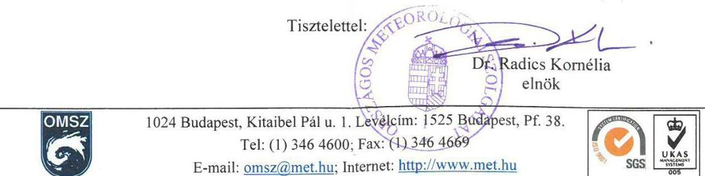

---

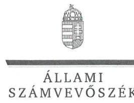

ELNÖK

Ikt. szám: V-0903-188/2016.

Dr. Radics Kornélia úrhölgy
elnök
Országos Meteorológiai Szolgálat

# Budapest

## Tisztelt Elnök Úrhölgy!

Köszönettel megkaptam a „Szén-dioxid kvóta ellenőrzése - szén-dioxid kvótákkal való gazdálkodás ellenőrzése" című jelentéstervezet megállapításaira tett, az ELN-54-6-2016. iktatószámú levelében küldött észrevételét.

Az ellenőrzési megállapításokra vonatkozó észrevételét az Állami Számvevőszékről szóló 2011. évi LXVI. törvény 29. § (2) bekezdésében meghatározott tizenöt napos határidőn belül küldte meg. Az Állami Számvevőszék észrevétellel kapcsolatos álláspontját a mellékletként csatolt, a felügyeleti vezető által készített indokolás tartalmazza.

Budapest, 2016. 09 hó 20 nap
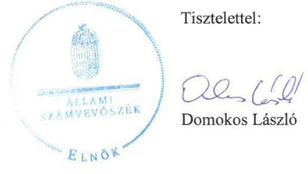

Melléklet: Észrevételre adott válasz

---

1. számú melléklet a V-0903-188/2016. számú levélhez

„Szén-dioxid kvóta ellenőrzése - szén-dioxid kvótákkal való gazdálkodás ellenőrzése" című jelentéstervezetre tett észrevételre adott válasz

|   | OMSZ észrevétel | Észrevétel elfogadása | Észrevételre adott válasz, indoklás | A jelentés módosított szövegrésze  |
| --- | --- | --- | --- | --- |
|  1. | A tervezet II. számú mellékletében az Országos Meteorológiai Szolgálat (a továbbiakban: OMSZ) feladatköreként a Nemzeti Nyilvántartási Rendszer "működtetése" szerepel. Tájékoztatjuk, hogy jogszabály, vagyis a 2007. évi LX. törvény 4. § (1) pontja, valamint a 345/2009. (XII. 30.) Korm. rendelet, az 528/2013. (XII. 30.) Korm. rendelet, illetve a 278/2014. (XI. 14.) Korm. rendelet 2. § (1) pontja szerint a Rendszert a környezetvédelemért felelős miniszter működteti (más miniszterek közreműködésével), vagyis ezt a feladatkört célszerűbbnek látjuk a Földművelésügyi Minisztériumnál szerepeltetni. Az OMSZ - más szervezetekkel együtt - természetesen része, de nem működtetője a Rendszernek. | Igen | Az észrevételt elfogadjuk, és a „Nemzeti Nyilvántartási Rendszer működtetésének" feladatát a jelentéstervezet II. számú mellékletében áttettük a Földművelésügyi Minisztérium feladatai közé, és ezzel egyidejűleg az OMSZ feladatai közül töröltük. | -  |

---

| 2. | A tervezet 18. oldal utolsó bekezdésében helyesen szerepel, hogy az Európai Bizottság felé határidőn túl történt az adatszolgáltatás, ugyanakkor a felsorolt késedelmes napok számát túlzónak tartjuk. A jogszabály által előírt március 15-i határidőhöz képest 2013-ban a leltárt március 15-én, a kapcsolódó jelentést március 26-án nyújtotta be az OMSZ. 2014-ben a leltár feltöltésére március 17-én, a leltárjelentés benyújtására pedig március 21-én került sor. Mindez 2013-ban 0-11 napos, 2014-ben pedig 2-6 napos késést jelentett, szemben a tervezetben olvasható 61, illetve 55 napos késéssel. A félreértést az okozhatja, hogy májusban lehetőség van a jelentések újbóli benyújtására (pl. az uniós ellenőrzések során feltárt hibák javítása céljából), és ezzel a lehetőséggel mindkét évben éltünk is. Ez azonban álláspontunk szerint nem jelenti azt, hogy ezáltal az eredeti adatszolgáltatás további késedelmet szenvedett volna. | Igen | Az észrevételt elfogadjuk, a jelentéstervezetet ennek megfelelően módosítjuk és kiegészítjük. | Tartalmában a jogszabályi előírásoknak megfelelően, de határidőn túl, 2013-ban a 345/2009.(XII.30.) Korm. rendelet 3. § (4) bekezdése előírása ellenére március 15-e helyett március 26-án, azaz 11 napos késéssel, 2014-ben március 15-e helyett március 21-én, azaz 6 napos késéssel teljesítette az NFM miniszter az üvegházhatású gázok kibocsátásával, illetve nyelőkkel történő eltávolításával, valamint az éghajlatváltozással kapcsolatos egyéb információra vonatkozó jelentéstételi kötelezettségét az Európai Bizottság felé. A végleges leltárjelentések benyújtására 2013-ban május 15-én, 2014-ben május 9-én került sor. |
| --- | --- | --- | --- | --- |
| Budapest, 2016. | 0.9 hőnap | 2.0 nap | Dr. Pulay Gyula felügyeleti vezető |  |

---

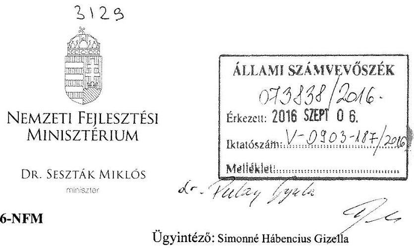

# Domokos László 

elnök
részére
Állami Számvevőszék

Budapest
Apáczai Csere János u. 10.
1052

Tárgy: Az Állami Számvevőszék szén-dioxid kvóták ellenőrzésével kapcsolatos jelentéstervezetének véleményezése

## Tisztelt Elnök Úr!

A „Szén-dioxid kvóta ellenőrzése - szén-dioxid kvótákkal való gazdálkodás ellenőrzése" címen megküldött számvevőszéki jelentéstervezet kapcsán az alábbi észrevételeket teszem:

1. Az NFM miniszter által a kibocsátási egységek terén gyakorolt vagyonkezelői jog és vagyonkezelői szerződés

Az 5. oldalon a Főbb megállapítások, következtetések, javaslatok című fejezet első bekezdése a következő állítást teszi: „A Nemzeti Fejlesztési Minisztérium a kibocsátási jogosultságok feletti, törvényben meghatározott vagyonkezelői jogát vagyonkezelési szerződés nélkül gyakorolta 2013 első negyedévében a jogszabályi előírások ellenére." A 15. oldalon az 1.1 számú megállapítás megismétli ezen állítást, majd a 16-17. oldalon részletezi annak mögöttes tartalmát. A tárgyban az alábbi észrevételt tesszük:

A nemzeti fejlesztési miniszter a jelzett időszakban hatályos, de tartalmilag elavult vagyonkezelői szerződés (1998. február 24-én kelt, a KVI és az IKIM Központi Igazgatás között határozatlan időre létrejött Vagyonkezelői Szerződés) alapján vett részt a

---

kereskedésben. A vagyonkezelői szerződés módosítása érdekében történt kezdeményezések 2013. április 11-ig nem vezettek eredményre, mivel az előkészített szerződést az NFM tartalmi és formai hiányosságok miatt nem írta alá. Az átmeneti időszakban az értékesítések jogi hátterét az MNV Zrt. igazgatósági határozatával biztosította az NFM, így azok a jogszabályoknak megfelelően teljesültek. A fentieket korábban maga az ÁSZ is megerősítette a V-0069-242/2013. számú Állami Számvevőszéki jelentésének 6. mellékletében, mely megállapította, hogy noha a 2011. évi CXCVI. törvény értelmében a vagyonkezelői szerződés szükséges a kvótakereskedelem terén, az NFM eljárása mégis jogszerűnek minősült az igazgatósági határozatoknak köszönhetően. Az NFM és az MNV Zrt. között létrejött új vagyonkezelői szerződés 2013. április 11-én lépett hatályba; az események ezt követő menetét illetően egyetértünk a jelentéstervezetben olvasható leírással.

Érveinket a KPF/4962-16/2016-NFM iktatószámú, 2016. március 11-én kelt nyilatkozatunkban részletesebben is bemutattuk.

Megjegyzendő ugyanakkor, hogy a jelentéstervezet ezen részében használt jogi hivatkozás hiányos, az Éhvt. (2007. évi LX. törvény) 9. § (2) bekezdése mellett, mely csak a Kiotói Jegyzőkönyv szerinti nemzetközi egységekre vonatkozik, szükséges az uniós ETS és ESD rendszerek egységeit szabályozó Ügkr. tv. (2012. évi CCXVII. törvény) 12. § (1) és 38. § (1) bekezdéseit is behivatkozni.

# 2. Gazdaságossági, hatékonysági és eredményességi követelmények 

A jelentéstervezet „3. A szén-dioxid kvótákkal való gazdálkodásra vonatkozó gazdaságossági, hatékonysági és eredményességi követelmények kialakítása, és azok nyomon követése megtörtént-e?" című fejezetben foglaltak során az alábbi megállapítás olvasható:
„Az NFM nem alakított ki gazdaságossági, hatékonysági és eredményességi követelményeket a szén-dioxid kvótákkal való gazdálkodásra vonatkozóan az ellenőrzött időszakban. A szén-dioxid kvóták értékesítésével kapcsolatban teljesítménycélokat, teljesítmény-mutatókat nem határozott meg, azok referencia értékeit megállapító belső utasításokkal, vezetői intézkedésekkel és egyéb dokumentumokkal nem rendelkezett. Egyéb belső utasításokban, illetve vezetői intézkedésekben sem rögzített további célokat, ezért teljesítmény-mutatók, illetve referencia-értékek felülvizsgálatát, módosítását alátámasztó dokumentumokkal sem rendelkezett."

Tájékoztatom, hogy a fentiekben foglalt megállapítással ellentétben az NFM nem kötelezettségmulasztás miatt nem alakította ki a nevezett követelményeket, hanem azok kialakítására szükségtelenség miatt nem került sor a következőkben részletezett indokok alapján:

Az EU ETS keretei között zajló térítésmentes kiosztás 2013. január 1. óta tartó III. kereskedési időszak kezdete óta uniós szinten harmonizált rendszer szerint zajlott.

---

Tárcánk a feladat kapcsán a hazai jogszabályok, valamint a vonatkozó Európai Uniós jogszabályok (2003/87/EK európai parlamenti és tanácsi irányelv, a 2011/278/EU bizottsági határozat), valamint az Európai Bizottság által összeállított tíz útmutató dokumentum és az ezen szervtől kapott további eljárásrendi útmutatások alapján járt el. A kiosztható mennyiségek meghatározásában nincs lehetőség mérlegelésre, a kvótakiosztás meghatározásának módszertana semmiféle mozgásteret nem engedélyez a tagállamok számára. A kiosztott egységek mennyisége meghatározásának helyességét az Európai Bizottság is ellenőrzi a jóváhagyatási eljárás során. Ezen oknál fogva teljesítmény vizsgálata nem releváns, nem kívánta meg teljesítményindikátor-rendszer kidolgozását.

Az előbbiekben foglaltakról az Állami Számvevőszék ellenőrzésvezetőjét a KPF/4962-11/2016-NFM iktatószámú levelünkben 2016. március 3-án tájékoztattuk.

# 3. Javaslat a nemzeti fejlesztési miniszter részére 

A jelentéstervezet 44. oldalán látható, hogy az ÁSZ az ellenőrzés alapján tárcánk számára a következő, egyetlen javaslatot teszi: „Gondoskodjon a szén-dioxid kvótákkal való gazdálkodásra vonatkozó gazdaságossági, hatékonysági és eredményességi követelmények kialakításáról és nyomon követéséről."

Ezen ajánlásnak eleget tenni nem áll módunkban, lévén, hogy 2014. nyara óta az NFM nem folytat klasszikus értelemben vett kvótagazdálkodást - a kvótaértékesítés és a kvóták térítésmentes kiosztása ugyanis immár a nemzetgazdasági miniszter illetékességébe tartozik. Kérjük, hogy szíveskedjenek pontosítani a javaslat szövegét.

## 4. Nemzeti Végrehajtási Intézkedések (NVI)

Az NVI összeállításának menetét a jelentéstervezet 19. oldala mutatja be. A 19. oldal 4. bekezdésének tartalmával nem értünk egyet, ahhoz a következő észrevételeket tesszük:

A helyhez kötött létesítmények részére történő térítésmentes kiosztást tartalmazó NVI valóban késve készült el, ez azonban az NFM-en kívülálló okok miatt történt így. Mint maga a jelentéstervezet is megállapítja, az ágazatközi korrekciós tényezőt meghatározó uniós jogszabályt (a 2013/448/EU határozatot) az Európai Bizottság csupán 2013. szeptember 5-én hozta meg. E tényező ismerete nélkül lehetetlen volt az NVI véglegesítése, így a késés az EU összes tagállamában elkerülhetetlen volt. E tényre a KPF/4962-12/2016-NFM iktatószámú, 2016. március 3-án kelt nyilatkozatunkban is utaltunk.
„Légiközlekedési NVI" című jogi dokumentum nem létezik. A légiközlekedést az Európai Unió egyoldalúan helyezte az emisszió-kereskedelmi rendszere (EU ETS) hatálya alá 2012-ben, amely jelentős nemzetközi felháborodást váltott ki. Ennek hatására az Európai Unió visszakozott, és a 377/2013/EU európai parlamenti és tanácsi határozat

---

révén 2013. január 1-től felfüggesztette az EU ETS szabályainak légiközlekedésre vonatkozó alkalmazását a vitás helyzet rendezéséig. A rendszer, immáron az Unión belüli repülésekre korlátozott hatállyal, a 421/2014/EU európai parlamenti és tanácsi rendelet révén indult újra a 2014. év közepén, 2013. január 1-ig visszamenőleges hatállyal. A légijármű-üzembentartók részére történő ingyenes kiosztás meghatározásával kapcsolatban, noha tárcánk tette meg az első lépést, az ügyintézés túlnyomó része már a feladat átadását követően a Nemzetgazdasági Minisztériumban történt meg, a 2013-tól kezdődő időszakra ez a tárca állapította meg a kiosztási mennyiségeket. Ezen bekezdésben bemutatott érveket a KPF/4962-8/2016-NFM iktatószámú, 2016. március 2-án kelt és a KPF/4962-12/2016-NFM iktatószámú, 2016. március 3-án kelt nyilatkozatunkban is bemutattuk.

# 5. Az Ügkr. Vhr. 6. § (1) bekezdés szerinti tájékoztatás az MNV Zrt. részére 

A jelentéstervezet 20. oldala alján és 21. oldal tetején olvasható bekezdései megemlítenek két pontot (egyetlen jogszabályi hely két különböző időben hatályos állapotát), ahol „az NFM a jogszabályi előírásoktól eltérően tett eleget a tájékoztatási kötelezettségének." Meglátásunk szerint a jelentéstervezet szövege maga is megadja annak magyarázatát, hogy ez miért nem jelentett problémát; amint azt a KPF/4962-17/2016-NFM iktatószámú, 2016. március 11-én kelt nyilatkozatunkban le is írtunk.

## 6. Piacelemzés elmaradása

A jelentéstervezet 26. oldalának közepén található két bekezdés szerint az NFM csak 2013. május 15-ig tett eleget a $36 / 2012$. NFM utasítás 5.§ (1) bekezdése szerinti kötelezettségének, azáltal, hogy a kétheti jelentés részeként elkészítette a kvótapiacról szóló piaci elemzést. Ehhez az állításhoz azt az észrevételt kívánjuk tenni, hogy a kétheti jelentések, melyeket az ÁSZ elektronikus rendszerébe a 9. pont alá egyesével feltöltöttünk, tartalmazzák a kért piacelemzést a kvótaértékesítési feladat Nemzetgazdasági Minisztériumnak történő átadásáig. A 2013. július 15-i kétheti jelentésig ez részletekbe menően látható (jellemzően a dokumentumok 3. mellékletében). A későbbiekben a kétheti jelentések az EUA és EUAA egységek helyzetét mutatják részletesen, illetve tartalmazzák az alábbi mondatot (vagy egy azzal tartalmilag megegyező mondatot): „Kvótaértékesítéssel kapcsolatosan a többi területet illetően a tárgyidőszakban új klímapolitikai esemény nem történt." Ez helyénvaló, hiszen az ESD alatt egyáltalán nem indult el a kereskedelem, és kiotói típusú kvótákra sincs érdemi kereslet évek óta.

---

# 7. Szakmai pontatlanságok az EU ETS rendszer leírásában 

Kérjük, hogy a jelentéstervezet 10. oldala utolsó, a 11. oldalára átlógó, „Az új szabályozás lényeges eleme..." kezdetű bekezdését szakmai pontosításaink miatt szíveskedjen az alábbi javított szövegre (két bekezdés) cserélni:
„A 2003/87/EK irányelv módosításával létrejött új szabályozás lényeges eleme, hogy bár egyre csökkenő mértékben fennmaradt a térítésmentes kiosztás, a kibocsátási egységek elsődleges forrásává az aukcionálás vált. Az egységek nagyobb részét, mely nem került térítésmentesen kiosztásra, a tagállamok túlnyomó többsége (közte Magyarország) egy közös aukciós platformon keresztül értékesíti, és az egységek nyilvántartása sem nemzeti szinten, hanem egy uniós szinten központosított, az Európai Bizottság által kezelt forgalmi jegyzékben vezetett számlákon történik. A térítésmentesen kiosztható kibocsátási egységek összmennyisége uniós szinten került maximálásra, az energiatermelő és ipari létesítményeknek térítésmentesen kiosztható egységek száma meghatározásának részletszabályait pedig a 2011/278/EU határozat, valamint az Európai Bizottság által összeállított tíz útmutató dokumentum rögzíti (a légijármű-üzembentartók részére történő térítésmentes kiosztásra ettől eltérő, de szintén uniós szinten egységesített szabályok vonatkoznak, a 2013-2016. közötti évek tekintetében a 421/2014/EU rendeletben megadva). A kiosztás e harmonizált szabályok szerint működő rendszerében a tagállami szerveknek nincs mozgásterük az egyes létesítményeknek kiosztandó mennyiségek meghatározásában, a kiosztás csak az Európai Bizottság jóváhagyásának birtokában hajtható végre. A rendszer hatálya alá tartozó létesítményeknek és légijárműüzembentartóknak minden évben egy akkreditált hitelesítő által hitelesített kibocsátási jelentést kell tenniük, és az abban bejelentett kibocsátásnak megfelelő kibocsátási egységmennyiséget vissza kell adniuk az állami szervek részére. Az új szabályok szerint harmonizálásra került a nyomon követés és hitelesítés rendszere, valamint harmonizált szabályok vonatkoznak az új belépőkre (beleértve a kapacitásukat jelentősen bővítő létesítményeket és tevékenységüket jelentősen bővítő légijármű-üzembentartókat), a bezáró, a működésüket részlegesen beszüntető vagy részleges beszüntetést követően újraindító, illetve a kapacitásukat jelentősen csökkentő vagy összeolvadó-szétváló létesítményekre, illetve a Kiotói Jegyzőkönyv szerinti bizonyos nemzetközi egységek EU ETS alatti felhasználhatóságára is. Az uniós szintű kötelezettségvállalás az EU ETS terén a kibocsátások 21\%-kal történő csökkentése 2020-ig 2005-höz képest.

További újdonság a 2013-2020-as időszak tekintetében, hogy az EU ETS hatálya alá nem tartozó ágazatok (pl. épületek, hulladékgazdálkodás, mezőgazdaság, közlekedés) területén az ÜHG-kibocsátás csökkentése érdekében uniós és tagállami célokat rögzítettek az ún. Erőfeszítés-megosztási Határozat (Effort Sharing Decision, ESD - a 2009/406/EU határozat) keretében, illetve korlátozott mennyiségben e területen is lehetővé tették a felesleggel rendelkező tagállamok számára a többletük értékesítését más tagállamok felé. Az uniós szintű kötelezettségvállalás ezen szektorok számára a kibocsátások 10\%-kal történő csökkentése 2020-ig 2005-höz képest. Hazánk e területen a többlettel rendelkező, a kereskedelemben erősen érdekelt tagállamok közé tartozik;

---

azonban az ESD rendszerében a gyenge kereslet miatt a kereskedés még nem indult be a gyakorlatban."

# 8. Szakmai pontatlanság az kiegyenlítő időszak (true-up period) leírásában 

Kérjük, hogy 26. oldal második bekezdésének 2. mondatát szakmai pontosításaink miatt szíveskedjenek az alábbi javított szövegre cserélni az első és a harmadik mondat változatlanul hagyása mellett:

A Kiotói Jegyzőkönyv következő, 2013-2020. közötti időszak elméletileg megkezdődött, azonban az ezen második kötelezettségvállalási időszakot létrehozó jogi keret, a Kiotói Jegyzőkönyv Dohai Módosítása a kellő számú ratifikáció hiányában még nem lépett hatályba. (A Kiotói Jegyzőkönyv második időszakának létrehozását az tette szükségessé, hogy az előzetes elképzelésekkel szemben a koppenhágai klímacsúcson nem sikerült létrehozni a minden országra kötelezően érvényes nemzetközi klímapolitikai megállapodást; az csak a 2015. decemberi párizsi klímakonferencián jött létre.) Ettől függetlenül a 2008-2012. közötti első kötelezettségvállalási időszak lezárása egy ún. kiegyenlítési időszak ${ }^{76}$ révén megtörtént, mely időszak 2015. november 18-ig tartott.

Kérjük észrevételeink szíves elfogadását!

Budapest, 2016. augusztus ...os.
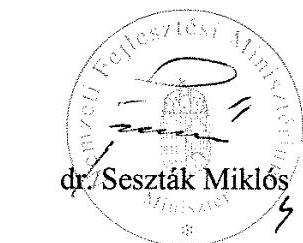

---

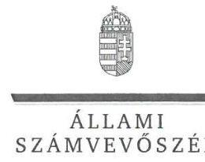

ELNÖK

Ikt. szám: V-0903-189/2016.

Dr. Seszták Miklós úr
miniszter
Nemzeti Fejlesztési Minisztérium

Budapest

# Tisztelt Miniszter Úr! 

Köszönettel megkaptam a „Szén-dioxid kvóta ellenőrzése - szén-dioxid kvótákkal való gazdálkodás ellenőrzése" című jelentéstervezet megállapításaira tett, az EFO/20383-1/2016NFM iktatószámú levelében küldött észrevételét.

Tájékoztatom Miniszter urat, hogy az Állami Számvevőszék észrevétellel kapcsolatos álláspontját a mellékletként csatolt, a felügyeleti vezető által készített indokolás tartalmazza.

Budapest, 2016. O 5 hó 20 nap
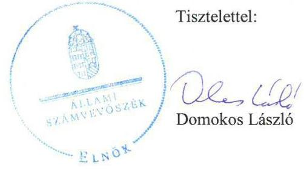

Melléklet: Észrevételre adott válasz

---

# Függelék: Észrevételek

1. számú melléklet a V-0903-189/2016. számú levélhez

"Szén-dioxid kvóta ellenőrzése - szén-dioxid kvótákkal való gazdálkodás ellenőrzése" című jelentéstervezetre tett észrevételre adott válasz

|   | NFM észrevétel | Észrevétel elfogadása | Észrevételre adott válasz, indoklás | A jelentés módosított szövegrésze  |
| --- | --- | --- | --- | --- |
|  1. | 1. Az NFM miniszter által a kibocsátási egységek terén gyakorolt vagyonkezelői jog és vagyonkezelői szerződés
Az 5. oldalon a Főbb megállapítások, következtetések, javaslatok című fejezet első bekezdése a következő állítást teszi: „A Nemzeti Fejlesztési Minisztérium a kibocsátási jogszabályok jelenti, törvényben meghatározott vagyonkezelői jogát vagyonkezelési szerződés nélkül gyakorolta 2013 első negyedévében a jogszabályi előírások ellenére. " A 15. oldalon az 1.1 számú megállapítás megismétli ezen állítást, majd a 16-17. oldalon részletezi annak mögöttes tartalmát. A tárgyban az alábbi észrevételt teszünk:
A nemzeti fejlesztési miniszter a jelzett időszakban hatályos, de tartalmilag elavult vagyonkezelői szerződés (1998. február 24-én kelt, a KVI és az IKIM Központi Igazgatás között határozatlan időre létrejött Vagyonkezelői Szerződés) alapján vett részt a kereskedésben. A vagyonkezelői szerződés módosítása érdekében történt kezdeményezések 2013. április 11-ig nem vezettek eredményre, mivel az előkészített szerződést az NFM tartalmi és formai hiányosságok miatt nem írta alá. Az átmeneti időszakban az értékesítések jogi hátterét az MNV Zrt. igazgatósági határozatával biztosította az NFM, így azok a jogszabályoknak megfelelően teljesültek. A fentieket korábban maga az ÁSZ is megerősítette a V-0069-242/2013. számú Állami Számvevőszéki jelentésének 6. mellékletében, mely megállapította, hogy noha a 2011. évi CXCVI. törvény értelmében a vagyonkezelői szerződés szükséges a kvótakereskedelem terén, az NFM eljárása mégis jogszerűnek minősült az igazgatósági határozatoknak köszönhetően. Az NFM és az MNV Zrt. között létrejött új vagyonkezelői szerződés 2013. április 11-én lépett hatályba; az események ezt követő menetét illetően egyetértünk a jelentéstervezetben olvasható leírással.
Érveinket a KPF/4962-16/2016-NFM iktatószámú, 2016. március 11-én kelt nyilatkozatunkban részletesebben is bemutattuk.
Megjegyzendő ugyanakkor, hogy a jelentéstervezet ezen részében használt jogi hivatkozás hiányos, az Éhvt. (2007. évi LX. törvény) 9. § (2) bekezdése mellett, mely csak a Kiotói Jegyzőkönyv szerinti nemzetközi egységekre vonatkozik, szükséges az uniós ETS és ESD rendszerek egységeit szabályozó Ügkr. tv. (2012. évi CCXVII. törvény) 12. § (1) és 38. § (1) bekezdéseit is behivatkozni. | Igen | Az észrevételben foglaltak alapján módosítjuk a jelentéstervezetet.
- Töröljük az 5. oldalon a Főbb megállapítások, következtetések, javaslatok rész második mondatát.
- Töröljük a 15. oldalon az 1.1. számú megállapítás második mondatát.
- Töröljük a 16-17. oldalon a 9-13. bekezdéseket.  |

---

## 2. Gazdaságossági, hatékonysági és eredményességi követelmények

A jelentéstervezet „3. A szén-dioxid kvótákkal való gazdálkodásra vonatkozó gazdaságossági, hatékonysági és eredményességi követelmények kialakítása, és azok nyomon követése megtörtént-e?" című fejezetben foglaltak során az alábbi megállapítás olvasható:
„Az NFM nem alakított ki gazdaságossági, hatékonysági és eredményességi követelményeket a szén-dioxid kvótákkal való gazdálkodásra vonatkozóan az ellenőrzött időszakban. A szén-dioxid kvóták értékesítésével kapcsolatban teljesítménycélokat, teljesítmény-mutatókat nem határozott meg, azok referencia értékeit megállapító belső utasításokkal, vezetői intézkedésekkel és egyéb dokumentumokkal nem rendelkezett. Egyéb belső utasításokban, illetve vezetői intézkedésekben sem rögzített továbbá célokat, ezért teljesítmény-mutatók, illetve referencia-értékek felülvizsgálatát, módosítását alátámasztó dokumentumokkal sem rendelkezett."

Tájékoztatom, hogy a fentiekben foglalt megállapítással ellentétben az NFM nem kötelezettségmulasztás miatt nem alakította ki a nevezett követelményeket, hanem azok kialakítására szükségtelenség miatt nem került sor a következőkben részletezett indokok alapján:

Az EU ETS keretei között zajló térítésmentes kiosztás 2013. január 1. óta tartó III. kereskedési időszak kezdete óta uniós szinten harmonizált rendszer szerint zajlott.

Tárcánk a feladat kapcsán a hazai jogszabályok, valamint a vonatkozó Európai Uniós jogszabályok (2003/87/EK európai parlamenti és tanácsi irányelv, a 2011/278/EU bizottsági határozat), valamint az Európai Bizottság által összeállított tíz útmutató dokumentum és az ezen szervtől kapott további eljárásrendi útmutatások alapján járt el. A kiosztható mennyiségek meghatározásában nincs lehetőség mérlegelésre, a kvótakiosztás meghatározásának módszertana semmiféle mozgásteret nem engedélyez a tagállamok számára. A kiosztott egységek mennyisége meghatározásának helyességét az Európai Bizottság is ellenőrzi a jóváhagyási eljárás során. Ezen oknál fogva teljesítmény vizsgálata nem releváns, nem kívánta meg teljesítményindikátor-rendszer kidolgozását.

Az előbbiekben foglaltakról az Állami Számvevőszék ellenőrzésvezetőjét a KPF/4962-11/2016-NFM iktatószámú levelünkben 2016. március 3-án tájékoztattuk.

A kvótaértékesítéssel összefüggő feladatmegosztás az Éhvt. és az Ügkr. tv. alapján 2014. július 16-ától jelentősen megváltozott. AZ Éhvt. előírása szerint az államháztartásért felelős miniszter az energiapolitikáért felelős miniszterrel együttműködésben gyakorolja a nemzeti vagyon részét képező kibocsátási jogosultságok tekintetében a tulajdonosi jogokat és kötelezettségeket. Az Éhvt. módosítása alapján a nemzetközi és európai kibocsátás-kereskedelem keretében az államháztartásért felelős miniszter az állam nevében kibocsátási jogosultságokat értékesíthet és vehet a törvény céljának hatékonyabb elérése céljából. Az Ügkr. tv. módosítása alapján az állam tulajdonában lévő ÜHG egységek tekintetében a tulajdonosi jogokat és kötelezettségeket a nemzeti fejlesztési minisztertől a nemzetgazdasági miniszterre ruházta át.
2013. január 1-jétől az EU ETS keretei között zajló térítésmentes kiosztás uniós szinten harmonizált rendszer szerint zajlott. A kiosztható mennyiségek meghatározásában nem volt lehetőség mérlegelésre, a kvótakiosztás módszertana nem engedélyezett a tagállamok részére semmilyen mozgásteret. Ezért e tevékenységre gazdaságossági, hatékonysági és eredményességi követelményeket az NFM, majd az NGM nem határozott meg.

Az NFM kezdeményezéseket tett a szén-dioxid kvóták értékesítéséből befolyó összegek eredményes felhasználása rendszerének kialakítására, de a pályázati rendszer teljes folyamatára vonatkozóan nem határozott meg teljesítménycélokat, teljesítmény-mutatókat. Azok referencia értékeit megállapító belső utasításokkal, vezetői intézkedésekkel és egyéb dokumentumokkal nem rendelkezett (bővebben a 3.2. pont).

---

|  3. | Javaslat a nemzeti fejlesztési miniszter részére
A jelentéstervezet 44. oldalán látható, hogy az ÁSZ az ellenőrzés alapján tárcánk számára a következő, egyetlen javaslatot teszi: „Gondoskodjon a szén-dioxid kvótákkal való gazdálkodásra vonatkozó gazdaságossági, hatékonysági és eredményességi követelmények kialakításáról és nyomon követéséről."

Ezen ajánlásnak eleget tenni nem áll módunkban, lévén, hogy 2014. nyara óta az NFM nem folytat klasszikus értelemben vett kvótagazdálkodást - a kvótaértékesítés és a kvóták térítésmentes kiosztása ugyanis immár a nemzetgazdasági miniszter illetékességébe tartozik. Kérjük, hogy szíveskedjenek pontosítani a javaslat szövegét. | Igen | Az észrevételt elfogadjuk, az alapján pontosítjuk a nemzeti fejlesztési miniszternek címzett javaslatot. | Gondoskodjon a szén-dioxid kvóták értékesítéséből az NFM költségvetési fejezeti kezelési előirányzatára befolyó bevétel hasznosítására vonatkozó gazdaságossági, hatékonysági és eredményességi követelmények kialakításáról és nyomon követéséről. |
| --- | --- | --- | --- | --- |
|  | 4. Nemzeti Végrehajtási Intézkedések (NVI)
Az NVI összeállításának menetét a jelentéstervezet 19. oldala mutatja be. A 19. oldal 4. bekezdésének tartalmával nem értünk egyet, ahhoz a következő észrevételeket tesszük:

A helyhez kötött létesítmények részére történő térítésmentes kiosztást tartalmazó NVI valóban késve készült el, ez azonban az NFM-en kívülálló okok miatt történt így. Mint maga a jelentéstervezet is megállapítja, az ágazatközi korrekciós tényezőt meghatározó uniós jogszabályt (a 2013/448/EU határozatot) az Európai Bizottság csupán 2013. szeptember 5-én hozta meg. E tényező ismerete nélkül lehetetlen volt az NVI véglegesítése, így a késés az EU összes tagállamában elkerülhetetlen volt. E tényre a KPF/4962-12/2016-NFM iktatószámú, 2016. március 3-án kelt nyilatkozatunkban is utaltunk.

„Légiközlekedési NVI" című jogi dokumentum nem létezik. A légiközlekedést az Európai Unió egyoldalúan helyezte az emisszió-kereskedelmi rendszere (EU ETS) hatálya alá 2012-ben, amely jelentős nemzetközi felháborodást váltott ki. Ennek hatására az Európai Unió visszakozott, és a 377/2013/EU európai parlamenti és tanácsi határozat révén 2013. január 1-től felfüggesztette az EU ETS szabályainak légiközlekedésre vonatkozó alkalmazását a vitás helyzet rendezéséig. A rendszer, immáron az Unión belüli repülésekre korlátozott hatállyal, a 421/2014/EU európai parlamenti és tanácsi rendelet révén indult újra a 2014. év közepén, 2013. január 1-ig visszamenőleges hatállyal. A légijármű-üzembentartók részére történő ingyenes kiosztás meghatározásával kapcsolatban, noha tárcánk tette meg az első lépést, az ügyintézés túlnyomó része már a feladat átadását követően a Nemzetgazdasági Minisztériumban történt meg, a 2013-tól kezdődő időszakra ez a tárca állapította meg a kiosztási mennyiségeket. Ezen bekezdésben bemutatott érveket a KPF/4962-8/2016-NFM iktatószámú, 2016. március 2-án kelt és a KPF/4962-12/2016-NFM iktatószámú, 2016. március 3-án kelt nyilatkozatunkban is bemutattuk. | Igen | Az észrevételt elfogadjuk, az abban foglaltaknak megfelelően módosítjuk a jelentéstervezet 19. oldal 4. bekezdését.

Töröljük a „Légiközlekedési NVI" dokumentumra történő hivatkozást. | A jogszabályi előírásoknak megfelelően készítette el az NFM miniszter a létesítményeknek évente térítésmentesen kiosztható kibocsátási egység-mennyiséget tartalmazó NVI tervezetét. |

---

|  5. | 5. Az Ügkr. Vkr. 6. § (1) bekezdés szerinti tájékoztatás az MNVZrt. részére
A jelentéstervezet 20. oldala alján és 21. oldal tetején olvasható bekezdései megemlítenek két pontot (egyetlen jogszabályi hely két különböző időben hatályos állapotát), ahol „az NFM a jogszabályi előírásoktól eltérően tett eleget a tájékoztatási kötelezettségének." Meglátásunk szerint a jelentéstervezet szövege maga is megadja annak magyarázatát, hogy ez miért nem jelentett problémát, amint azt a KPF/4962-17/2016-NFM iktatószámú, 2016. március 11-én kelt nyilatkozatunkban le is írtunk. | - | Az észrevétel nem tartalmaz a jelentéstervezet módosítására történő utalást. | -  |
| --- | --- | --- | --- | --- |
|  6. | 6. Piacelemzés elmaradása
A jelentéstervezet 26. oldalának közepén található két bekezdés szerint az NFM csak 2013. május 15-ig tett eleget a 36/2012. NFM utasítás 5.§ (1) bekezdése szerinti kötelezettségének, azáltal, hogy a kétheti jelentés részeként elkészítette a kvótapiacról szóló piaci elemzését. Ehhez az állításhoz azt az észrevételt kívánjuk tenni, hogy a kétheti jelentések, melyeket az ÁSZ elektronikus rendszerébe a 9. pont alá egyesével feltöltöttünk, tartalmazzák a kért piacelemzést a kvótaértékesítési feladat Nemzetgazdasági Minisztériumnak történő átadásáig. A 2013. július 15-i kétheti jelentésig ez részletekbe menően látható (jellemzően a dokumentumok 3. mellékletében). A későbbiekben a kétheti jelentések az EUA és EUAA egységek helyzetét mutatják részletesen, illetve tartalmazzák az alábbi mondatot (vagy egy azzal tartalmilag megegyező mondatot): „Kvótaértékesítéssel kapcsolatosan a többi területei illetően a tárgyidőszakban új klímapolitikai esemény nem történt." Ez helyénvaló, hiszen az ESD alatt egyáltalán nem indult el a kereskedelem, és kiotói típusú kvótákra sincs érdemi kereslet évek óta. | Igen | Az észrevételt elfogadjuk, módosítjuk ez alapján a jelentéstervezetét 26. oldalán 6. bekezdést, a 7. bekezdést pedig töröljük. | Az NFM a 36/2012. (XII. 7.) NFM utasítás alapján piacelemzéssel kapcsolatos kötelezettségeinek eleget tett.  |

---

#### 7. Szakmai pontatlanságok az EU ETS rendszer leírásában

Kérjük, hogy a jelentéstervezet 10. oldala utolsó, a 11. oldalára átlógó, "Az új szabályozás lényeges eleme..." kezdetű bekezdését szakmai pontosításaink miatt szíveskedjen az alábbi javított szövegre (két bekezdés) cserélni:

"A 2003/87/EK irányelv módosításával létrejött új szabályozás lényeges eleme, hogy bár egyre csökkenő mértékben fennmaradt a térítésmentes kiosztás, a kibocsátási egységek elsődleges forrásává az aukcionálás vált. Az egységek nagyobb részét, mely nem került térítésmentesen kiosztásra, a tagállamok túlnyomó többsége (közte Magyarország) egy közös aukciós platformon keresztül értékesíti, és az egységek nyilvántartása sem nemzeti szinten, hanem egy uniós szinten központosított, az Európai Bizottság által kezelt forgalmi jegyzékben vezetett számlákon történik. A térítésmentesen kiosztható kibocsátási egységek összmennyisége uniós szinten került maximálásra, az energiatermelő és ipari létesítményeknek térítésmentesen kiosztható egységek száma meghatározásának részletszabályait pedig a 2011/278/EU határozat, valamint az Európai Bizottság által összeállított tíz útmutató dokumentum rögzíti (a légijármű-üzembentartók részére történő térítésmentes kiosztásra attól eltérően, de szintén uniós szinten egységesített szabályok vonatkoznak, a 2013-2016. között évek tekintetében a 421/2014/EU rendeletben megadva). A kiosztás eme harmonizált szabályok szerint működő rendszerében a tagállami szerveknek nincs mozgásterük az egyes létesítményeknek kiosztandó mennyiségek meghatározásában, a kiosztás csak az Európai Bizottság jóváhagyásának birtokában hajtható végre. A rendszer hatálya alá tartozó létesítményeknek és légijármű-üzembentartóknak minden évben egy akkreditált hitelezőt által hitelezett kibocsátási jelentést kell tenniük, és az abban bejelentett kibocsátásnak megfelelő kibocsátási egységmennyiséget vissza kell adniuk az állami szervek részére. Az új szabályok szerint harmonizálásra került a nyomon követés és hitelezés rendszere, valamint harmonizált szabályok vonatkoznak az új belépőkre (beleértve a kapacitásukat jelentősen bővítő létesítményeket és tevékenységüket jelentősen bővítő légijármű-üzembentartókat), a bezáró, a működésüket részlegesen beszüntető vagy részleges beszüntetést követően újraindító, illetve a kapacitásukat jelentősen csökkentő vagy összeolvadó-szétváló létesítményekre, illetve a Kiotói Jegyzékönyv szerinti bizonyos nemzetközi egységek EU ETS alatti felhasználhatóságára is. Az uniós szintű kötelezettségvállalás az EU ETS terén a kibocsátások 21%-kal történő csökkentése 2020-ig 2005-höz képest.

További újdonság a 2013-2020-as időszak tekintetében, hogy az EU ETS hatálya alá nem tartozó ágazatok (pl. épületek, hulladékgazdálkodás, mezőgazdasági, közlekedés) területén az ÜHG-kibocsátás csökkentése érdekében uniós és tagállami célokat rögzítettek az ún. Erőfeszítés-megosztási Határozat (Effort Sharing Decision, ESD – a 2009/406/EU határozat) keretében, illetve korlátozott mennyiségben e területen is lehetővé tették a felesleggel rendelkező tagállamok számára a többletük értékesítését más tagállamok felé. Az uniós szintű kötelezettségvállalás ezen szektorok számára a kibocsátások 10%-kal történő csökkentése 2020-ig 2005-höz képest. Hazánk e területen a többlettel rendelkező, a kereskedelemben erősen érdekelt tagállamok közé tartozik; azonban az ESD rendszerében a gyenge kereslet miatt a kereskedés még nem indult be a gyakorlatban.

A 2003/87/EK irányelv módosításával létrejött új szabályozás lényeges eleme, hogy bár egyre csökkenő mértékben fennmaradt a térítésmentes kiosztás, a kibocsátási egységek elsődleges forrásává az aukcionálás vált. Az egységek nagyobb részét, mely nem került térítésmentesen kiosztásra, a tagállamok túlnyomó többsége (közte Magyarország) egy közös aukciós platformon keresztül értékesíti, és az egységek nyilvántartása sem nemzeti szinten, hanem egy uniós szinten központosított, az Európai Bizottság által kezelt forgalmi jegyzékben vezetett számlákon történik. A térítésmentesen kiosztható kibocsátási egységek összmennyisége uniós szinten került maximálásra, az energiatermelő és ipari létesítményeknek térítésmentesen kiosztható egységek száma meghatározásának részletszabályait pedig a 2011/278/EU határozat, valamint az Európai Bizottság által összeállított tíz útmutató dokumentum rögzíti (a légijármű-üzembentartók részére történő térítésmentes kiosztásra attól eltérően, de szintén uniós szinten egységesített szabályok vonatkoznak, a 2013-2016. között évek tekintetében a 421/2014/EU rendeletben megadva). A kiosztás eme harmonizált szabályok szerint működő rendszeriben a tagállami szerveknek nincs mozgásterük az egyes létesítményeknek kiosztandó mennyiségek meghatározásában, a kiosztás csak az Európai Bizottság jóváhagyásának birtokában hajtható végre. A rendszer hatálya alá tartozó létesítményeknek és légijármű-üzembentartóknak minden évben egy akkreditált hitelezőt által hitelezett kibocsátási jelentést kell tenniük, és az abban bejelentett kibocsátásnak megfelelő kibocsátási egységmennyiséget vissza kell adniuk az állami szervek részére. Az új szabályok szerint harmonizálásra került a nyomon követés és hitelezés rendszere, valamint harmonizált szabályok vonatkoznak az új belépőkre (beleértve a kapacitásukat jelentősen bővítő létesítményeket és tevékenységüket jelentősen bővítő légijármű-üzembentartókat), a bezáró, a működésüket részlegesen beszüntető vagy részleges beszüntetést követően újraindító, illetve a kapacitásukat jelentősen csökkentő vagy összeolvadó-szétváló létesítményekre, illetve a Kiotói Jegyzékönyv szerinti bizonyos nemzetközi egységek EU ETS alatti felhasználhatóságára is. Az uniós szintű kötelezettségvállalás az EU ETS terén a kibocsátások 21%-kal történő csökkentése 2020-ig 2005-höz képest.

További újdonság a 2013-2020-as időszak tekintetében, hogy az EU ETS hatálya alá nem tartozó ágazatok (pl. épületek, hulladékgazdálkodás, mezőgazdasági, közlekedés) területén az ÜHG-kibocsátás csökkentése érdekében uniós és tagállami célokat rögzítettek az ún. Erőfeszítés-megosztási Határozat (Effort Sharing Decision, ESD – a 2009/406/EU határozat) keretében, illetve korlátozott mennyiségben e területen is lehetővé tették a felesleggel rendelkező tagállamok számára a többlettel értékesítését más tagállamok felé. Az uniós szintű kötelezettségvállalás ezen szektorok számára a kibocsátások 10%-kal történő csökkentése 2020-ig 2005-höz képest. Hazánk e területen a többlettel rendelkező, a kereskedelemben erősen érdekelt tagállamok közé tartozik; azonban az ESD rendszerében a gyenge kereslet miatt a kereskedés még nem indult be a gyakorlatban.

---

| 8. | 8. Szakmai pontatlanság az kiegyenlítő időszak (true-up period) leírásában |  | Az észrevételt elfogadjuk, pontosítjuk ez alapján a jelentéstervezet 26. oldal második bekezdésének második mondatát. | Igen | Az észrevételt elfogadjuk, pontosítjuk ez alapján a jelentéstervezet 26. oldal második bekezdésének második mondatát. | A Kiotói Jegyzőkönyv következő, 2013-2020. közötti időszak elméletileg megkezdődött, azonban az ezen második kötelezettségvállalási időszakot létrehozó jogi keret, a Kiotói Jegyzőkönyv Dohai Módosítása a kellő számú ratifikáció hiányában még nem lépett hatályba. (A Kiotói Jegyzőkönyv második időszakának létrehozását az tette szükségessé, hogy az előzetes elképzelésekkel szemben a koppenhágai klimacsúcson nem sikerült létrehozni a minden országra kötelezően érvényes nemzetközi klimapolitikai megállapodást; az csak a 2015. decemberi párizsi klimakonferencián jött létre.) Ettől függetlenül a 2008-2012. közötti első kötelezettségvállalási időszak lezárása egy ún. kiegyenlítési időszak révén megtörtént, mely időszak 2015. november 18-ig tartott. |
| --- | --- | --- | --- | --- | --- | --- |
|  | A Kiotói Jegyzőkönyv következő, 2013-2020. közötti időszak elméletileg megkezdődött, azonban az ezen második kötelezettségvállalási időszakot létrehozó jogi keret, a Kiotói Jegyzőkönyv Dohai Módosítása a kellő számú ratifikáció hiányában még nem lépett hatályba. (A Kiotói Jegyzőkönyv második időszakának létrehozását az tette szükségessé, hogy az előzetes elképzelésekkel szemben a koppenhágai klimacsúcson nem sikerült létrehozni a minden országra kötelezően érvényes nemzetközi klimapolitikai megállapodást; az csak a 2015. decemberi párizsi klimakonferencián jött létre.) Ettől függetlenül a 2008-2012. közötti első kötelezettségvállalási időszak lezárása egy ún. kiegyenlítési időszak révén megtörtént, mely időszak 2015. november 18-ig tartott. |

Tájékoztatom Miniszter urat, hogy az Állami Számvevőszékről szóló 2011. évi LXVI. törvény 29. § (3) bekezdése alapján az Állami Számvevőszék a figyelembe nem vett észrevételeket köteles a jelentésben feltüntetni, és megindokolni, hogy azokat miért nem fogadta el.

Budapest, 2016. 03 hónap 26 nap

Dr. Pulay Gyula felügyeleti vezető

---

# RÖVIDÍTÉSEK JEGYZÉKE 

${ }^{1}$ NGM
${ }^{2}$ Kiotói jegyzőkönyv

${ }^{3}$ EU
${ }^{4}$ NFM
${ }^{5}$ FM
${ }^{6}$ OKTF
${ }^{7}$ ÉMI NKft.
${ }^{8}$ OMSZ
${ }^{9}$ EU ETS
${ }^{10}$ ENSZ
${ }^{11}$ Keretegyezmény
${ }^{12}$ 2007. évi IV. törvény
${ }^{13}$ ÜHG
${ }^{14} \mathrm{CO}_{2}$
${ }^{15}$ OGY
${ }^{16}$ Áht.
${ }^{17}$ ÁSZ
${ }^{18}$ ÁSZ SZMSZ
${ }^{19}$ NFM SZMSZ ${ }_{1}$
NFM SZMSZ ${ }_{2}$
NFM SZMSZ ${ }_{3}$
${ }^{20}$ Ügkr. tv.
${ }^{21}$ KPF
${ }^{22}$ NVI
${ }^{23}$ ESD
${ }^{24}$ NGM SZMSZ ${ }_{1}$
NGM SZMSZ ${ }_{2}$
NGM SZMSZ ${ }_{3}$
NGM SZMSZ ${ }_{4}$
${ }^{25}$ OKIR
${ }^{26}$ FM SZMSZ ${ }_{1}$
FM SZMSZ ${ }_{2}$

Nemzetgazdasági Minisztérium
a 1997. december 11-én 38 fejlett és átalakuló gazdaságú ország által elfogadott kiegészítő jegyzőkönyv, amely az emberi tevékenység által a légkörbe juttatott szén-dioxid mennyiség világméretű csökkentését írja elő, és a fejlett országok által a globális felmelegedésért felelős egyes, üvegházhatást okozó gázok kibocsátásának csökkentésére tett kötelezettségvállalásokat tartalmazza. Az UNFCCC tagállamok 3. konferenciája Kiotóban
Európai Unió
Nemzeti Fejlesztési Minisztérium
Földművelésügyi Minisztérium, Vidékfejlesztési Minisztérium (2014. június 5-éig)
Országos Környezetvédelmi és Természetvédelmi Főfelügyelőség
ÉMI Építésügyi Minőségellenőrző Innovációs Nonprofit Kft.
Országos Meteorológiai Szolgálat
az Európai Unió Emisszió Kereskedelmi Rendszere
Egyesült Nemzetek Szervezete
(UNFCCC) az 1992-ben Rio de Janeiróban aláírt ENSZ Éghajlatváltozási Keretegyezmény
2007. évi IV. törvény az ENSZ Éghajlatváltozási Keretegyezményben Részes Felek Konferenciájának 1997. évi harmadik ülésszakán elfogadott Kiotói Jegyzőkönyv kihirdetéséről
üvegházhatású gázok
szén-dioxid
Országgyűlés
2011. évi CXCV. törvény az államháztartásról

Állami Számvevőszék
Állami Számvevőszék Szervezeti és Működési Szabályzata
hatályos: 2012. szeptember 19-étől (kiadva: 25/2012. (IX.17.) NFM utasítással)
hatályos: 2013. július 13-ától (kiadva: 24/2013. (VII.12.) NFM utasítással)
hatályos: 2014. október 11-étől (kiadva: 33/2014. (X.10.) NFM utasítás
2012. évi CCXVII. törvény az üvegházhatású gázok közösségi kereskedelmi rendszerében és az erőfeszítés-megosztási határozat végrehajtásában történő részvételről (hatályos: 2013. január 1-jétől)
Klímapolitikai Főosztály
Nemzeti Végrehajtási Intézkedés
Effort Sharing Decision - Erőfeszítés megosztási Döntés (évente maximálisan engedélyezett, az állam tulajdonában álló, üvegházhatású gáz kibocsátási jogosultság)
hatályos: 2010. október 5-étől (kiadva: 4/2010. (X.5.) NGM utasítással) hatályos: 2013. június 4-étől (kiadva: 11/2013. (VI.3.) NGM utasítással hatályos:2014. augusztus 30-ától (kiadva: 22/2014.(VIII.29.)NGM utasítás hatályos: 2015. január 22-étől (kiadva: 1/2015. (I. 21.) NGM utasítással) Országos Környezetvédelmi Információs Rendszer
hatályos: 2012. április 22-étől (kiadva:7/2012. (IV.21.) VM utasítással) hatályos: 2013 június 19-étől (kiadva: 12/2013. (VI.18. ) VM utasítással)

---

FM SZMSZ3
FM SZMSZ4
${ }^{27}$ OMSZ SZMSZ1
${ }^{28}$ OMSZ Ügyrend ${ }_{1-2}$
OMSZ Ügyrend ${ }_{2}$
${ }^{29}$ Jegyzékkezelő
${ }^{30}$ OKTF SZMSZ1
OKTF SZMSZ2
OKTF SZMSZ3
OKTF SZMSZ4
${ }^{31}$ EU ETS
${ }^{32}$ ZBR
${ }^{33}$ ZFR
${ }^{34}$ ÉMI NKft. SZMSZ1
ÉMI NKft. SZMSZ2
ÉMI NKft. SZMSZ3
${ }^{35}$ EUA
${ }^{36}$ EUAA
${ }^{37}$ AAU
${ }^{38}$ CER
${ }^{39}$ ERU
${ }^{40}$ RMU
${ }^{41}$ NIR
${ }^{42}$ NÉS1
${ }^{43}$ NÉS2
${ }^{44}$ NÉP
${ }^{45}$ 345/2009. (XII.30.) Korm. rendelet
${ }^{46}$ 528/2013. (XII.30.) Korm. rend.
${ }^{47}$ 278/2014.. (XI.14.) Korm. rendelet
${ }^{48}$ FM miniszter
${ }^{49}$ III. kereskedési időszak
${ }^{50}$ NGM miniszter
${ }^{51}$ derogációs feladatok
${ }^{52}$ Éhvt. vhr.
hatályos: 2014. február 22-étől (kiadva: 2/2014. (II.21.) VM utasítással) hatályos: 2014. augusztus 2-ától (kiadva: 3/2014.(VIII.1.) FM utasítással) hatályos: 2011. július 8-ától (kiadva: 12/2011. (VII.8.) VM utasítással) az OMSZ 13/2012. (VIII. 22.) OMSZ utasítással kiadott ügyrendje i az OMSZ 5/ 2015. (V.19.) OMSZ utasítással kiadott ügyrendje a forgalmi jegyzék kezelője
hatályos: 2008. augusztus 1-jétől (kiadva: 7/2008. K.V.Ért.8.) KvVM. utasítással) hatályos: 2013. november 23-ától (kiadva: 26/2013. (XI. 22. ) VM utasítással) hatályos: 2014. november 14-étől (kiadva: 6/2014. XI.13.) FM utasítással) hatályos: 2015. február 5-étől (kiadva: 3/2015. (II.4.) FM utasítással) European Union Emission Trading Scheme - Európai Unió Emissziókereskedelmi Rendszere
Zöld Beruházási Rendszer
Zöldgazdaság Finanszírozási Rendszer
hatályos: 2012. április 3-ától (elfogadva: 3/2012 (IV. 3.) számú tulajdonosi határozattal
hatályos: 2013. október 3-ától (kiadva: 17/2013. (X.3.) Tulajdonosi határozattal) hatályos: 2015. május 29-étől (kiadva: 3/2015. (V.29.) Tulajdonosi határozattal European Union Allowance - Kibocsátási Egység (európai)
European Union Aviation Allowance - Légiközlekedési Kibocsátási Egység (európai)
Assigned Amount Unit - kibocsátható Mennyiségi Egység (kiotói)
Certified Emission Reduction -Hitelesített kibocsátás-csökkentési egység (kiotói)
Emission Reduction Unit-Kibocsátás Csökkentési Egység (kiotói)
ReMoval Unit - Eltávolítási egység (kiotói)
National Inventory Report - Nemzeti Leltárjelentés
Nemzeti Éghajlatváltozási Stratégia (2008-2025)
Nemzeti Éghajlatváltozási Stratégia (2014-2025, kitekintéssel 2050-re)
Nemzeti Éghajlatváltozási Program (2009-2010)
az üvegházhatású gázok kibocsátásával kapcsolatos adatszolgáltatásról (hatályos: 2014. április 30-áig)

528/2013. (XII.30.) Korm. rendelet az üvegházhatású gázokkal kapcsolatos nemzeti jelentéstételről (hatályos: 2014. január 1-jétől 2014. december 31-éig) az üvegházhatású gázok kibocsátásával, valamint az éghajlatváltozással kapcsolatos nemzeti jelentés tartalmáról és elkészítésének módjáról, az adatszolgáltatás rendjéről, illetve az adatszolgáltatási kötelezettség megszegése esetén fizetendő bírságról (hatályos: 2015. január 1-jétől)
a környezetvédelemért és erdőgazdálkodásért felelős miniszter az EU ETS rendszerben 2013 - 2020-ig tartó időszak
Nemzetgazdasági miniszter
villamosenergia-termelők részére átmenetileg biztosított ingyenes kiosztással kapcsolatos feladatok
323/2007. (XII. 11.) Korm. rendelet az ENSZ Éghajlatváltozási Keretegyezménye és annak Kiotói Jegyzőkönyve végrehajtási keretrendszeréről szóló 2007. évi LX. törvény végrehajtásának egyes szabályairól (hatályos: 2008. január 1-jétől)

---

${ }^{53}$ Ügkr. tv. Vhr ${ }_{1}$

54 EEX
${ }^{55}$ MEKH
${ }^{56} 389 / 2013 /$ EU Bizottsági rendelet
${ }^{57}$ EU ETS felhasználói kézikönyv
${ }^{58}$ EU ETS adminisztrátori kézikönyv
${ }^{59}$ CPR
${ }^{60}$ informatikai szabályzat
${ }^{61}$ 2013. évi L. tv.
${ }^{62}$ 2011. évi CXII. tv.
${ }^{63}$ JIRA
${ }^{64}$ HUNETDATA
${ }^{65} 421 / 2014 /$ EU rendelet
${ }^{66} 2003 / 87 /$ EK irányelv
${ }^{67}$ Ügkr. tv. Vhr ${ }_{2}$
${ }^{68}$ 2013. évi XXII. tv.
${ }^{69}$ Nemzeti Közlemény
${ }^{70}$ True-up jelentés
${ }^{71}$ Statútum rendelet
${ }^{72}$ NFM utasítás
${ }^{73}$ Közös Közbeszerzési Megállapodás
${ }^{74} 1031 / 2010 /$ EU bizottsági rendelet
410/2012. (XII.28.) Korm. rendelet az üvegházhatású gázok közösségi kereskedelmi rendszerében és az erőfeszítés-megosztási határozat végrehajtásában történő részvételről szóló 2012. évi CCXVII. törvény végrehajtásának egyes szabályairól (hatályos: 2013. január 1-jétől)
Közös Platform, European Energy Exchange, Európai Energiatőzsde Magyar Energetikai és Közmű-szabályozási Hivatal 389/2013/EU bizottsági rendelet a 2003/87/EK európai parlamenti és tanácsi irányelv, valamint a 280/2004/EK és a 406/2009/EK európai parlamenti és tanácsi határozat szerinti uniós kibocsátásiegység-forgalmi jegyzék létrehozásáról, továbbá a 920/2010/EU és az 1193/2011/EU bizottsági rendelet hatályon kívül helyezéséről
EU ETS felhasználói kézikönyv (EU ETS Registry system - User Guide)
EU ETS adminisztrátori kézikönyv (EU ETS Registry system - Administrator Guide)
Kötelezettségvállalási időszaki tartalék (Commitment Period Reserve)
I/10/2012. számú Főigazgatói utasítás az Országos Környezetvédelmi, Természetvédelmi és Vízügyi Főfelügyelőség Informatikai Szabályzatáról (hatályos 2012. november 30-tól)
2013. évi L. tv. az állami és önkormányzati szervek elektronikus információbiztonságáról (hatályos 2013. július 1-től)
2011. évi CXII. tv. az információs önrendelkezési jogról és az információszabadságról (hatályos 2011. július 27-től)
Az Atlassian által kifejlesztett szabadalmaztatott szoftver, az Uniós tagállamok jegyzékkezelői ezen keresztül tartják a kapcsolatot az EUTL-lel
A HUNETDATA adatszolgáltatási és hatósági munkát segítő rendszer, amely a https:\\www.hunetdata.hu URL cím alatt érhető
Az Európai Parlament és a Tanács 421/2014/EU rendelete az üvegházhatást okozó gázok kibocsátási egységei Közösségen belüli kereskedelmi rendszerének létrehozásáról szóló 2003/87/EK irányelvnek egy egységes globális piacalapú intézkedés nemzetközi légi közlekedésből származó kibocsátásokra való alkalmazásáról rendelkező nemzetközi megállapodás 2020-ig történő végrehajtására tekintettel történő módosításáról
Az Európai Parlament és a Tanács 2003. október 13-i 2003/87/EK Irányelve az üvegházhatást okozó gázok kibocsátási egységei Közösségen belüli kereskedelmi rendszerének létrehozásáról és a 96/61/EK tanácsi irányelv módosításáról 341/2013. (IX. 25.) Korm. rendelet a villamosenergia-termelők részére az üvegházhatású gázok közösségi kereskedelmi rendszerében és az erőfeszítésmegosztási határozat végrehajtásában történő részvételről szóló 2012. évi CCXVII. törvény alapján történő derogációs kiosztás végrehajtási szabályairól (hatályos 2013. október 26-tól)
2013. évi XXII. tv. a Magyar Energetikai és Közmű-szabályozási Hivatalról (hatályos 2013. április 4-től)
Full National Communication (NC)
True-up period, a 2008-2012. időszak folytatásáról szóló jelentés
a Kormány tagjainak feladat- és hatásköréről szóló 152/2014. (VI.6) Korm rendelet
36/2012. (XII. 7.) NFM utasítás az emisszió-kereskedelemmel kapcsolatos döntéselőkészítési és dokumentálási feladatokról (hatályos: 2015.01.30.-ig)
Joint Procurement
A Bizottság 1031/2010/EU Rendelete 2010. november 12-i az üvegházhatást okozó gázok kibocsátási egységei Közösségen belüli kereskedelmi rendszerének létrehozásáról szóló 2003/87/EK európai parlamenti és tanácsi irányelv alapján

---

${ }^{75}$ ECC
${ }^{76}$ Primary Auction Calendar
${ }^{77}$ költségvetési törvény:
${ }^{78}$ költségvetési törvény:
${ }^{79}$ költségvetési törvény:
${ }^{80}$ NFM előirányzat rendelet:
${ }^{81}$ CNG autóbuszok
${ }^{82}$ ZBR utasítás
${ }^{83}$ ZFR rendelet
${ }^{84}$ NFM előirányzat rendelet:
${ }^{85}$ ÜHG egységek
${ }^{86} \mathrm{Vtv}$.
az üvegházhatást okozó gázok kibocsátási egységei árverés útján történő értékesítésének időbeli ütemezéséről, lebonyolításáról és egyéb vonatkozásairól Klíringház, European Commodity Clearing AG
Aukciós naptár
2012. évi CCIV. törvény Magyarország 2013. évi központi költségvetéséről 2013. évi CCXXX. törvény Magyarország 2014. évi központi költségvetéséről 2014. évi C. törvény Magyarország 2015. évi központi költségvetéséről 28/2015. (VI. 3.) NFM rendelet a fejezeti kezelésű előirányzatok kezeléséről és felhasználásáról szabályairól (hatályos 2015. június 4-től)
Compressed Natural Gas, sűrített földgáz motoros autóbuszok
18/2011. (III. 29.) NFM utasítás a Zöld Beruházási Rendszer működtetésének, felhasználásának, nyilvántartásának és ellenőrzésének részletes szabályairól (hatályos 2011. március 30-tól 2015. július 28-ig)
69/2013. (XI. 28.) NFM rendelet a Zöldgazdaság Finanszírozási Rendszer fejezeti kezelésű előirányzat felhasználásáról (hatályos 2013. november 29-től 2015. június 3-ig)
7/2013. (VI. 12.) NFM rendelet a fejezeti kezelésű előirányzatok kezelésének és felhasználásának szabályairól
a kibocsátási egységek és a légiközlekedési kibocsátási egységek együtt Az állami vagyonról szóló 2007. évi CVI. törvény

---

ÁLLAMI SZÁMVEVŐSZÉK
1052 Budapest, Apáczai Csere János utca 10.
Levélcím: 1364 Budapest 4. Pf. 54
Telefon: +36 14849100 Telefax: +36 14849200
www.asz.hu