# Jelentés 

## Közös ellenőrzéssel a versenyképes tudás jobb hasznosulásáért

a diplomás pályakövetés jó gyakorlatainak feltárása
2016. 10. hó 06. nap
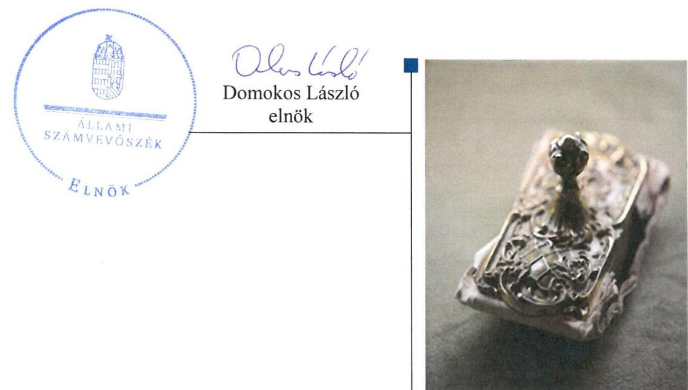

---

# AZ ELLENŐRZÉST FELÜGYELTE:

DR. PULAY GYULA ZOLTÁN felügyeleti vezető

## AZ ELLENŐRZÉST VEZETTE ÉS A VÉGREHAJTÁSÁÉRT FELELŐS:

- FÉSŰS NÓRA ellenőrzésvezető
- A PROGRAM ÖSSZEÁLLÍTÁSÁÉRT FELELŐS:
- JANIK JÓZSEF LÁSZLÓ osztályvezető

**IKTATÓSZÁM:** V-0962-429/2016.

**TÉMASZÁM:** 17.

**ELLENŐRZÉS-AZONOSÍTÓ SZÁM:** V0962

Jelentéseink az Országgyűlés számítógépes hálózatán és az Interneten a www.asz.hu címen is olvashatóak.

---

# TARTALOMJEGYZÉK 

■ ÖSSZEGZÉS ..... 5
■ AZ ELLENŐRZÉS CÉLJA ..... 6
■ AZ ELLENŐRZÉS TERÜLETE ..... 7
■ AZ ELLENŐRZÉS HÁTTERE, INDOKOLTSÁGA ..... 8
■ A JELENTÉS LÉNYEGES KÉRDÉSKÖREI ..... 10
■ ELLENŐRZÉS HATÓKÖRE ÉS MÓDSZEREI ..... 11
■ MEGÁLLAPÍTÁSOK ..... 13
■ MELLÉKLETEK ..... 35
I. sz. melléklet: DPR célok összefoglalása ..... 35
■ FÜGGELÉK: ÉSZREVÉTELEK ..... 37
■ RÖVIDÍTÉSEK JEGYZÉKE ..... 53

---

.

---

# ÖSSZEGZÉS 

Az Állami Számvevőszék a magyarországi diplomás pályakövetés fejlesztését és működését ellenőrizte a 2011. január 1. - 2015. október 31. közötti időszak vonatkozásában a rendszer eredményességét elősegítő tényezők, jó gyakorlatok feltárása érdekében. A Diplomás Pályakövető Rendszer fejlesztése és működtetése eredményes volt, a központi és felsőoktatási intézményi szintű tervezési és koordinációs mechanizmusok elősegítették a stratégiai célok teljesülését, a jó gyakorlatok hozzájárultak a fenntarthatósághoz.
A DPR összességében a pályaválasztás előtt állók döntéseit intézményi, ágazati szintű részletes információkkal segíti, az intézmények vezetősége felhasználja az adatokból készült beszámolókat stratégiai döntéseihez. A DPR adatok alapvetően hasznosulnak a szakpolitikai stratégiák készítése során.

## Az ellenőrzés társadalmi indokoltsága

A DPR az oktatáspolitikai döntéshozók számára döntéstámogató eszközként szolgál, valamint a felsőfokú képzést folytató intézmények számára visszajelzést ad a képzés minőségéről, hasznosulásáról, emellett orientálja a pályaválasztásra készülő fiatalokat is.

A pályakövetési és kapcsolódó információs rendszerek fejlesztésére jelentős összegű források álltak, állnak rendelkezésre. Az Európai Unió 2007-2013. közti költségvetési periódus programjai az átfogó célokhoz, a foglalkoztatás bővítéséhez és a tartós növekedéshez elsősorban a munkaerőpiac kínálati oldalára irányuló intézkedésekkel, az emberi erőforrások fejlesztésével járult hozzá. Az ellenőrzött támogatási konstrukciók központi és intézményi szintű fejlesztéseket és a diplomás pályakövetés működtetését támogatták.

## Főbb megállapítások, következtetések, javaslatok

A diplomás pályakövetési rendszer létrehozásában és működtetésben résztvevő szervezetek tervezési, koordinációs, fejlesztési, valamint monitoring mechanizmusait a kitűzött célokkal összhangban, eredményesen látták el. A tervezési és koordinációs mechanizmusok a DPR eredményességét növelték: a központi szintű tervezések, különösen a szakmai tervezés keretében kidolgozott módszertani iránymutatások, a központi és intézményi szintek közti aktív együttműködés a diplomás pályakövetés céljainak megvalósulását jelentősen elősegítették.

A diplomás pályakövetési rendszer által gyűjtött adatok feldolgozásának, elemzésének nyilvánosságra hozatala a célcsoportok adat- és információigényét összességében kielégítette. A pályaválasztás előtt állók döntéseit megfelelően segítette a rendszer, online alkalmazás használatával megismerkedhettek a felsőoktatási szakok karrierlehetőségeivel, az információk megfelelően támogatták döntéshozatalukat. Az intézmények felhasználták a DPR adatokat, amelyek egyfelől visszajelzések a képzések minőségéről, másfelől fejlesztési, stratégiai döntéshozatalt megalapozó eszközök. A DPR eredmények szakpolitikai döntéshozatalban történő hasznosulását, az információk felhasználásának eredményeit nem dokumentálták minden évben.

A DPR-t működtető szervezetek a rendszer fenntarthatóságával kapcsolatosan az uniós projektek keretében tett vállalásaikat teljesítették, a jó gyakorlatok támogatják, biztosítják a fenntarthatóságot. Az intézmények saját fejlesztései segítik az adatok megbízhatóságának növelését, az intézményi vezetőség információigények megfelelő kielégítését.

---

# AZ ELLENŐRZÉS CÉLJA 

rendszerek fejlesztése során.

A jó pályakövetési gyakorlatok feltárása, annak számbavétele, hogy milyen tényezők járultak hozzá a diplomás pályakövetési rendszer eredményességének növeléséhez, a rendszerfejlesztések fenntarthatóságát milyen tervezési, koordinációs és monitoring mechanizmusok, jogi, szakmai követelmények biztosítják, a pályakövetési információk többcélú felhasználása hogyan valósul meg, illetve, hogy a felmérések során a migráció nyomon követése miként jelenik meg. Cél továbbá a magyar tapasztalatok bemutatása abból a szempontból is, hogy azok milyen módon vehetők figyelembe az európai és tagállami pályakövetési

---

# **AZ ELLENŐRZÉS TERÜLETE**

## **Diplomás pályakövetés**

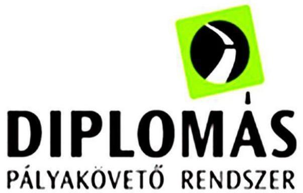

A diplomás pályakövetés Magyarországon a felsőoktatásról szóló 2005. évi CXXXIX. törvény rendelkezéseivel kezdődött. Azok szerint a felsőoktatási intézmények önkéntes adatszolgáltatással látták el a pályakövetés feladatait, a pályakövetési rendszer tapasztalatait pedig felhasználta a Kormány a felsőoktatási képzésbe belépők létszámkeretének meghatározásakor. A 2012-től hatályos nemzeti felsőoktatásról szóló 2011. évi CCIV. törvény szerint a felsőoktatási információs rendszernek része a végzett hallgatók pályakövetési rendszere, amelynek adatait az oktatásért felelős miniszter évente figyelembe veszi, amikor megállapítja, hogy mely, a felsőoktatási intézmények által folytatott szakos képzésen vehető igénybe magyar állami (rész)ösztöndíj.

### **A HAZAI DIPLOMÁS PÁLYAKÖVETÉSI RENDSZER**

kétszintű: intézményi szinten adatgyűjtés és adatszolgáltatás történik; központi szinten valósul meg az adatok országos gyűjtése, kezelése, kimutatások, elemzések készítése, stratégiai döntéshozatal támogatása, valamint az intézményi szintű szakmai feladatok koordinációja. Ez utóbbi feladatokat a szaktárca és az Oktatási Hivatal (mint az Educatio Kft. jogutódja) látják el. A kétszintű modellnek megfelelően a 2007-2013-as TÁMOP¹ kétféle projekt keretében – alprojektként – támogatta a DPR kialakítását és fejlesztését: felsőoktatási szolgáltatások központi, rendszerszintű fejlesztése, valamint hallgatói és intézményi szolgáltatásfejlesztések projektek részeként. Ellenőrzésünk a TÁMOP DPR² alprojektekre terjedt ki, amelyek pénzügyi jellemzőit az 1. táblázat, céljait pedig az I. sz. melléklet foglalja össze:

1. táblázat

|  FELSŐOKTATÁSI SZOLGÁLTATÁSFEJLESZTÉS TÁMOP PROJEKTJEI |  |  |   |
| --- | --- | --- | --- |
|   | Projekt kódja | Projekt címe | Rendelkezésre álló összeg
(forint)  |
|  Kiemelt, központi projektek: |  |  |   |
|  1 | TÁMOP-4.1.3/08/01 | A felsőoktatási szolgáltatások rendszer szintű fejlesztése 1. és 2. ütem | 2 097 783 850  |
|  2 | TÁMOP-4.1.3-11/1 |  | 1 232 000 200  |
|  Intézményi projektek: |  |  |   |
|  3 | TÁMOP-4.1.1/08/1. | Hallgatói és intézményi szolgáltatásfejlesztés a felsőoktatásban | 3 026 568 176  |
|  4 | TÁMOP-4.1.1-08/2/KMR³ |  | 999 999 984  |
|  5 | TÁMOP-4.1.1.A-10/1/KONV⁴ |  | 6 576 280 880  |
|  6 | TÁMOP-4.1.1.A-10/2/KMR |  | 2 872 942 280  |

*Forrás: Pályázati dokumentációk (felhívások)*

---

# AZ ELLENŐRZÉS HÁTTERE, INDOKOLTSÁGA 

A DPR az oktatáspolitikai döntéshozók számára döntéstámogató eszközként szolgál, valamint a felsőfokú képzést folytató intézmények számára visszajelzést ad a képzés minőségéről, hasznosulásáról, orientálja a pályaválasztásra készülő fiatalokat is. Az európai uniós tagállamok oktatási teljesítményének összehasonlíthatósága érdekében az EU⁵ egységes alapokon nyugvó, összevont statisztikák készítésére alkalmas pályakövetési rendszer létrehozását tűzte ki célul. Jelenleg az egyes országok pályakövetési módszerei meglehetősen heterogének: a skála a teljesen központosított, hivatalos rendszerektől az egyes egyetemek által külön-külön szervezett, eltérő módszerekkel végrehajtott vizsgálatok laza hálójáig terjed.

A pályakövetési és kapcsolódó információs rendszerek fejlesztésére jelentős összegű források álltak, állnak rendelkezésre. Magyarországon a törvényi előírások és a felhasznált támogatások ellenére több területen vontatottan halad a megbízható mérést megalapozó adatrendszerek fejlesztése.

Az elmúlt időszakban felerősödött a felzárkózó EU tagállamokból a fejlett tagországok felé irányuló szakember elvándorlás. A képzett munkaerő kivándorlása negatívan hathat az érintett ország gazdasági kilátásaira, illetve hosszútávon az uniós gazdaság egészére. A folyamatok pontosabb nyomon követése, a beavatkozási lehetőségek feltárása érdekében fontos a pályakövetés monitoring rendszereinek fejlesztése, harmonizációjának erősítése.

A TÁMOP, a 2007-2013. közti uniós költségvetési periódus operatív programja az átfogó célokhoz, a foglalkoztatás bővítéséhez és a tartós növekedéshez elsősorban a munkaerőpiac kínálati oldalára irányuló intézkedésekkel, az emberi erőforrások fejlesztésével járult hozzá. „A felsőoktatás tartalmi és szervezeti fejlesztése a tudásalapú gazdaság kiépítése érdekében" prioritási tengely fő feladata a felsőoktatáshoz kapcsolódó reformfolyamatok végrehajtásának támogatása és felgyorsítása volt, amely az EU Lisszaboni Stratégia átfogó célkitűzéseivel - ezáltal a tudásalapú gazdaság kiépítésével - volt összhangban. A TÁMOP-4.1.1. számú pályázati kiírásaira felsőoktatási intézmények pályázhattak. A TÁMOP-4.1.3. számú központi projekt feladatainak elvégzésére vonatkozó, a felsőoktatási szolgáltatások rendszerszintű fejlesztése tárgyában kiírt pályázat nyertese egy konzorcium lett, melynek vezetője az Educatio Kft. volt 2016. január 1-ig. A nyertes pályázó konzorciumnak több központi szolgáltatás kialakítását kellett elvégeznie, amelynek része volt a DPR is.

Az ellenőrzést nemzetközi koordinált ellenőrzés keretében hajtja végre az ÁSZ⁶. A nemzetközi együttműködés indokoltságát támasztja alá a téma nemzeti kereteken túlmutató jellege. Szükség van összehasonlító adatokra, ezek összegyűjtésének leginkább célszerű módja egy intenzívebb európai együttműködés kialakítása a különböző országok kutatói és intézményei között. A felsőoktatási intézmények összehasonlítását támogató európai pályakövetési megfigyelő rendszer felállítása időszerűvé vált. Egy ko-

---

ordinált nemzetközi ellenőrzés támogathatja a közös problémák megoldását, megkönnyítheti a tapasztalatcserét, továbbá a közös célok irányába mutató stratégiai munka végzésére ösztönözhet.

Az ÁSZ értékteremtő elemzéseivel, tanácsadó szerepét erősítve támogatja a szervezetek önértékelő, alkalmazkodó (öntanuló) tevékenységét, segíti a központi költségvetési szervek átlátható működését, a „jó gyakorlatok" elterjesztésével támogatja a „jó kormányzást".

---

# A JELENTÉS LÉNYEGES KÉRDÉSKÖREI 

1.     - A diplomás pályakövetési rendszer létrehozásában és működtetésben részt vevő szervezetek tervezési, koordinációs, fejlesztési tevékenységei, valamint monitoring mechanizmusai összességében a pályakövetési célok elérését szolgálták-e?
2.     - A diplomás pályakövetési rendszer által gyűjtött adatok feldolgozásának, elemzésének eredményei, azok nyilvánosságra hozatala a célcsoportok adat- és információigényét kielégítette-e?
3.     - A DPR fenntarthatóságát ágazati és intézményi szinten biztosították-e?

---

# ELLENŐRZÉS HATÓKÖRE ÉS MÓDSZEREI 

## Az ellenőrzés típusa

| Teljesítmény-ellenőrzés |

## Az ellenőrzött időszak

A 2011. január 1. - 2015. október 31. közötti időszak

## Az ellenőrzés tárgya

Annak megállapítása, hogy a DPR kialakításában és működtetésében részt vevő, a kiemelt projekt feladatait ellátó szervezet és az ellenőrzésre kiválasztott felsőoktatási intézmények a DPR-rel kapcsolatos feladataikat a kitűzött célokkal összhangban, eredményesen látták-e el, illetve annak megállapítása, hogy az ágazati döntéshozók a DPR eredményeit a felsőoktatási stratégia kialakítása során, a felsőoktatási ponthatárok kialakításakor és az ösztöndíjas támogatott képzések meghatározásakor eredményesen hasz-nosították-e.

## Az ellenőrzött szervezet

Az EMMI, az Oktatási Hivatal, mint az Educatio Kft. jogutódja (2016. január 1-től), valamint hat kiválasztott felsőoktatási intézmény. Ezek: Budapesti Corvinus Egyetem, Eötvös Loránd Tudományegyetem, Pécsi Tudományegyetem, Semmelweis Egyetem, Szent István Egyetem, Zsigmond Király Főiskola

## Az ellenőrzés jogalapja

Az Állami Számvevőszékről szóló 2011. évi LXVI. törvény 5. § (3) bekezdése

## Az ellenőrzés módszerei

Az ellenőrzést a számvevőszéki ellenőrzés szakmai szabályai szerint, a teljesítmény-ellenőrzés alapelveinek megfelelően végeztük el. Az ellenőrzés ideje alatt az ellenőrzött szervezettel történő kapcsolattartás az ÁSZ SZMSZ²ének vonatkozó előírásai alapján történt.

Az ellenőrzési kérdések megválaszolásához szükséges információk, dokumentumok értékelése a következő ellenőrzési eljárások alkalmazásával

---

történt: megfigyelés, kérdésfeltevés (információkérés), összehasonlítás, valamint elemző eljárás. Az ellenőrzést a kérdésekre adott válaszok kiértékelésével, a csatolt tanúsítványok adatainak felhasználásával, továbbá az adott időszakban hatályos jogszabályok figyelembe vételével folytattuk le.

Az ellenőrzési bizonyítékként felhasználható adatforrások közé tartoztak egyrészt a szakmai programban felsorolt adatforrások, másrészt bizonyíték lehetett még minden egyéb - az ellenőrzés folyamán feltárt, az ellenőrzés
 szempontjából információt tartalmazó dokumentum. Az ellenőrzés lefolytatásához az ellenőrzött szervezetek a tanúsítványok kitöltésével, valamint az ÁSZ által kért, a dokumentumbekérő levélben részletezett dokumentumok elektronikus megküldésével, illetve a helyszínen történő rendelkezésre bocsátásával szolgáltattak adatokat.

Az ellenőrzés során minden olyan körülményt és adatot ellenőriztünk, amely a program végrehajtása kapcsán felmerült újabb összefüggéseknek az ellenőrzés céljaival összhangban lévő feltárásához volt szükséges.

---

# MEGÁLLAPÍTÁSOK 

## 1. A diplomás pályakövetési rendszer létrehozásában és működtetésben részt vevő szervezetek tervezési, koordinációs, fejlesztési tevékenységei, valamint monitoring mechanizmusai összességében a pályakövetési célok elérését szolgálták-e?

Összegző megállapítás

### 1.1. számú megállapítás

2. táblázat

## KAPCSOLÓDÓ CÉLOK

## DPR alprojekt célja:

A felsőoktatási intézmények, a továbbtanulás előtt álló diákok és szüleik, továbbá az országos felsőoktatási és munkaerőpiaci stratégiakészítők világos képpel rendelkezzenek a felsőoktatásból kibocsátott szakképzett munkaerő életpályájának alakulásáról
A TÁMOP 4.1.3./1 „Felsőoktatási szolgáltatások rendszerszintű fejlesztése" c. kiemelt projekt eredményeinek bővítése, valamint integrált továbbfejlesztése és alkalmazása.

Forrás: I. sz. melléklet

A diplomás pályakövetési rendszer létrehozásában és működtetésében résztvevő szervezetek tervezési, koordinációs, fejlesztési, valamint monitoring tevékenységeiket a kitűzött célokkal összhangban, eredményesen látták el. A szakmai tervezési és koordinációs mechanizmusok a DPR eredményességét növelték.

A központi DPR tervezési-, koordinációs mechanizmusai a pályakövetési célokkal összhangban működtek, a DPR eredményességét növelték. A rendszer adatainak monitorozása és az informatikai fejlesztések a céloknak megfelelően megtörténtek.

A központi DPR továbbfejlesztését a TÁMOP 4.1.3./11/1 „A felsőoktatási szolgáltatások rendszer szintű fejlesztése 2. ütem" kiemelt projekten belül a DPR alprojekt támogatta. A tervezési, koordinációs, monitoring és fejlesztéssel kapcsolatos feladatokat alapvetően meghatározta, hogy a DPR rendszer a TÁMOP 4.1.3./08/1 kiemelt projekt keretén belül már bevezetésre került 2011. március 31-ig, így az ellenőrzött időszakban annak továbbfejlesztése volt az alapvető cél.

A 2. táblázatban foglalt célokkal összhangban, a központi projekten belül a DPR alprojekt megvalósításához kapcsolódó indikátor - „a központi DPR modellt alkalmazó intézmények száma" - a tervezett 15 intézményhez képest 30 intézményre teljesült 2011. március 31-ig. A központi projekt zárójelentése szerint az indikátorok értéke azért lett magasabb a vállaltnál, mert a központi és az intézményi projekt benyújtási határideje meghosszabbításra került, így több idő maradt a szakmai felkészülésre, az adatok feldolgozására és a kommunikációra. Az első szakasz öt éves fenntartási időszakában három intézmény csatlakozott a DPR-hez, így már 33 intézmény vesz részt a központi DPR-ben. Az első szakasz eredményeként megtörtént az intézmények első adatszolgáltatása az adattárba, a diplomás pályakövetési adatok elérhetőek lettek a www.felvi.hu/diplomantul csatornáján. Az ágazati adatintegráció megvalósult, az első eredmények kommunikációja megtörtént.

A TERVEZÉSI FELADATOKAT az Educatio Kft. a kitűzött céloknak (2. táblázat) megfelelően végezte el, a pályázati dokumentációkkal összhangban. A kiemelt projekt 2. ütem keretében megvalósításra kerülő

---

fejlesztések lebonyolítási ütemezése magában foglalta DPR alprojekt ütemezését. Előzetes igényfelmérésekre a 2010. évben lefolytatott intézményi monitoring kapcsán került sor. 2011-ig megtörtént a magyarországi felsőoktatási intézmények teljes körű igényfelmérése, az intézményi DPR modell kidolgozására. A 2. ütemben a modell továbbfejlesztésével és a DPR központi adattár kialakításával kapcsolatos tervezési feladatokat látták el.

A szakmai tervezés a DPR intézményi, központi és egységes folyamatainak kialakítását, módszertani alapjainak megteremtését jelentette, amelyet a DPR kézikönyvben foglaltak össze (főbb jellemzőket a 3. táblázat mutatja be). A DPR Kézikönyv központi szakmai iránymutatás, amely a felsőoktatási intézmények DPR-rel kapcsolatos feladatainak ellátásához, saját módszertanuk kialakításához nyújtott támogatást (főbb jellemzőket lásd 3. táblázat). Az Educatio Kft. emellett minden évben elkészítette a módszertani útmutatót és kiadta az ún. központi kérdéseket, amelyeket minden intézménynek szerepeltetnie kellett a kérdőívekben.

A KOORDINÁCIÓS TEVÉKENYSÉGEKET a pályázati dokumentációnak megfelelően, a kitűzött célokkal összhangban látta el az Educatio Kft. Ennek keretében rendszeresen kapcsolatot tartott DPR-t működtető intézményekkel, szakmai konzultációkat szervezett.

Az aktív koordinációs tevékenység eredménye, hogy a kiemelt projekt keretében, majd országosan, intézményi szinten is hasznosultak az egyes intézmények szaktudásai, tapasztalatai. A DPR Kézikönyv központi szakmai iránymutatások kidolgozásában aktív szerepet vállalt pl. a
$\longrightarrow$ ZsKF ${ }^{8}$ egyik tanára, a Főiskola DPR projektjének szakmai vezetője, aki részt vett a központi módszertanok kidolgozásában és megírásában
$\longrightarrow$ a $\mathrm{PTE}^{9}$ DPR projektjének szakmai és marketing vezetője, aki a központi iránymutatások marketing fejezetét dolgozta ki.
A DPR modell, módszertan, központi követelmények bemutatására és szakmai támogatására számos kiadványt készítettek és szakmai rendezvényt tartottak.

---

# 4. táblázat 

## KÖZPONTI FELMÉRÉSKÉSZÍTŐ RENDSZER

## Főbb jellemzők

online felméréskészítő alkalmazás az EvaSys szoftveren alapszik számos magyarországi és külföldi nagy egyetem végzett már eddig is gyors és hatékony kurzuskiértékelést ezzel a szoftverrel. 2010 márciusától a DPR projektben résztvevő intézmények számára elérhető. A szoftver átalakítása az intézményi DPR felmérések igényeihez folyamatosan zajlik. Használatával képzés keretében ismerkedhettek meg az intézmények képviselői. A szoftver a válaszadók könnyebb elérését teszi lehetővé, leegyszerűsítheti a vizsgálat és az értékelés folyamatát az intézmények számára. A teljes folyamat automatizálható, biztosítja a felmérések sokoldalú felhasználhatóságát is.

Forrás: felvi.hu információi alapján ÁSZ szerkesztés
3. táblázat

## SZAKMAI IRÁNYMUTATÁSOK - A DPR KÉZIKÖNYV FŐBB JELLEMZŐI

## A DPR kézikönyv publikálása, aktualizálása

1. A kiemelt projekt 1. üteme keretében, a DPR megvalósítása során adta ki az Educatio Kft. (2009.)
2. Szerzői és készítésében közreműködő szakértői közt felsőoktatási intézmények szakemberei
3. Központi iránymutatás, amely nem kötelező, a felsőoktatási intézményeknek ajánlásokat fogalmaz meg
4. Megelőző időszak tapasztalatai, támogatási szerződés alapján évenként iránymutatásokat adott ki az Educatio Kft.

## A DPR kézikönyv, mint iránymutatás

1. Tartalmazza a DPR kutatások lépéseit, részletes módszertanát
2. Bemutatja a munkaerő-piaci vizsgálatok jellemzőit
3. Kérdőívezés, kérdésalkotás lépéseit részletesen bemutatja
4. Kitér olyan témákra, mint a személyes adatok kezelése, jogszabályi háttér, válaszadói hajlandóság növelése
5. Külön fejezetben foglalkozik a nyilvánosság és kommunikáció szerepével, a célcsoportokkal, kommunikációs csatornákkal
6. Bemutat jó gyakorlatokat

A DPR kézikönyv, mint szervezeti, szabályozási környezet kialakítását támogató eszköz

1. Foglalkozik a szervezeti célokhoz rendeléssel
2. Támogatja olyan szervezeti és szervezési megoldások kialakítását, amelyek a DPR eredményes működését biztosíthatják
3. Bemutatja a DPR és a minőségbiztosítás kapcsolatát
4. Részletesen kitér az informatikai környezet kialakítására

Forrás: Diplomás pályakövetés - kézikönyv alapján ÁSZ szerkesztés

- A MONITORING RENDSZER keretében az Educatio Kft. két jelentést készített. A 2011. május 31-én készült jelentés a 2010-ben lezajlott intézményi monitoring tapasztalatait foglalta össze, aminek keretében értékelték, hogy mi valósult meg a központi DPR ajánlásaiból intézményi szinten, azonosították a projektek megvalósítása során jelentkező tipikus kockázati tényezőket, a vállalások teljesülési lehetőségeit, jó gyakorlatokat. Ez a jelentés a 2. ütem tervezése kapcsán hasznosult. A jelentés szerint a monitoring tevékenységnek nem volt célja szabályossági, elszámolhatósági problémák feltárása.
- 2014-ben, a központi projekt 2. ütemében az Educatio Kft. egy alkalommal vizsgálta meg az intézményi pályakövetési programok működésének körülményeit, azok szervezeti beépülését, kommunikációját. A tapasztalatokat összegző tanulmány a DPR monitoring kérdőívet kitöltő 32 intézmény válaszait foglalta össze, amely elérhető a www.felvi.hu honlapon.

INFORMATIKAI FEJLESZTÉSEKET 2011-től az Educatio Kft. nem tervezett, mert a fejlesztések a központi projekt 1. ütemében megtörténtek, a 2011 évet követően informatikai fejlesztés a DPR alprojektnél már nem történt.

A kérdőívezéshez szükséges informatikai hátteret központi és intézményi szinten 2009-2010. között kialakították, bevezetésre került az EvaSys

---

szoftver alapú online alkalmazás (főbb jellemzők lásd 4. táblázat), amit a TÁMOP DPR projektjében résztvevő intézmények térítésmentesen használhattak.

A kiemelt projekt 2. ütemében csupán statisztikai szoftvervásárlásra és a www.felvi.hu honlapon, továbbá azon belül elsősorban a „Diplomán túl" és a „Felsőoktatási Műhely" felületen megvalósult szolgáltatásfejlesztésekre került sor.

AZ ADATINTEGRÁCIÓVAL kapcsolatos fejlesztések a központi projekt második ütemében a pályázati dokumentációval és támogatási szerződéssel összhangban teljesültek. Az adatintegráció célja, hogy különböző állami adminisztratív adatállományok elemi szintű, anonim összekapcsolásával egy adott adattár (pl. DPR) másodlagos, statisztikai célú felhasználása is megvalósulhasson.

A diplomás pályakövetés esetében olyan adatbázisok összekapcsolása történt meg, amelyek a felsőoktatási tanulmányok mellett a végzettek munkaerő-piaci elhelyezkedésének információit is tartalmazzák. Az adatintegráció lebonyolításáért 2013-ban a NISZ Zrt. ${ }^{10}$ felelt a döntéselőkészítéshez szükséges adatok hozzáférhetőségének biztosításáról szóló 2007. évi Cl. törvény végrehajtásáról szóló 335/2007. (XII.13.) kormányrendelet alapján.

A DPR keretében az adatintegráció a következő adatbázisok összekapcsolását jelentette a 2009/2010-es tanévben diplomát szerzettek körére vonatkozóan:
$\longrightarrow$ Felsőoktatási Információs Rendszer (adatintegráció alapja);
$\longrightarrow$ Adó- és Pénzügyi Ellenőrzési Hivatal, illetve Nemzeti Adó- és Vámhivatal;
$\longrightarrow$ Országos Egészségbiztosítási Pénztár.
A 2014-ben indított és 2015-ben befejezett, a KIR ${ }^{11}$, FIR ${ }^{12}$ és ONYF ${ }^{13}$ adatait összekapcsoló adatintegráció is lezárult. A kiemelt projektet lebonyolító Educatio Kft. és a NISZ Zrt. közt létrejött szerződés szerint az adatok összekapcsolásával létrejött adatbázist a NISZ Zrt. 2015. január 30-án adta át az Educatio Kft-nek. Az adatintegráció eredményeit, tehát azokat a mutatókat, jellemzőket, amelyek a DPR és más adatbázis összekapcsolásából származnak és a 2009/2010-es, illetve a 2011/2012-es tanévben diplomát szerzettek körére vonatkoznak a „Diplomás Pályakövetési Adatok 2013 - Adminisztratív Adatbázisok Integrációja" című, a www.felvi.hu-n elérhető kiadvány tartalmazza részletesen.

---

### 1.2. számú megállapítás

Az intézmények tervezési, koordinációs, fejlesztési és monitoring tevékenységeiket a DPR célokkal összhangban, eredményesen látták el.

A DPR intézményi céljainak (2. táblázat) teljesüléséhez kapcsolódóan a következő indikátorokat, értékeket vállalták és teljesítették az ellenőrzött intézmények a pályázati dokumentációval és támogatási szerződéseikkel összhangban:
5. táblázat

| INTÉZMÉNYI DPR INDIKÁTOROK |  |  |
| :--: | :--: | :--: |
| Indikátor / intézmény | Indikátor értéke |  |
|  | vállalt | teljesített |
| Pályakövetési rendszer eredményeit az intézményben felhasználók száma (fő) |  |  |
| BCE ${ }^{14}$ | 40 | 60 |
| ELTE | 50 | 50 |
| PTE | 35 | 40 |
| SE | 12 | 23 |
| SZIE | 40 | 40 |
| ZSKF | 20 | 23 |

| Indikátor / Intézmény | Indikátor értéke |  |
| :--: | :--: | :--: |
|  | vállalt | teljesített |
| Pályakövetési rendszerekben az elérhető/megkeresett 2010-től diplomát szerző hallgatók aránya az összes 2010-től diplomát szerző hallgatóhoz képest (\%) |  |  |
| BCE | 90 | 100 |
| ELTE $^{15}$ | 90 | 90 |
| PTE | 90 | 99 |
| $\mathrm{SE}^{16}$ | 90 | 90 |
| SZIE $^{17}$ | 92 | 92 |
| ZsKF | 90 | 90 |

A fenti indikátorok alapján a kapcsolódó célokkal összhangban, eredményesen látták el feladataikat az ellenőrzésre kiválasztott felsőoktatási intézmények: a pályakövetési eredményeket igazoltan felhasználták az intézményekben és a végzett hallgatók legalább 90\%-át megkeresték a pályakövetési kérdőívekkel.

A TERVEZÉSI FELADATOKAT a DPR projektben résztvevő intézmények számára a pályázati dokumentáció részét képező, meghatározott tartalmi elemekkel készült megvalósíthatósági tanulmányok foglalták össze, amelyek a támogatási szerződés mellékletei voltak. Az ellenőrzött intézmények a projekt céljaival összhangban, a megvalósíthatósági tanulmányoknak megfelelően tervezték és ütemezték DPR feladataikat.

A szakmai feladatok tervezését jelentősen segítette, kiváltotta a kiemelt projekt keretében megjelent DPR Kézikönyv, amely iránymutatásokat adott az intézményi szintű DPR
 feladatok ellátásához (lásd 3. táblázat).

A DPR FELADATOK KOORDINÁCIÓJÁT intézményi szinten alapvetően a meglévő szervezeti és szabályozási keretek határozták meg. A feladatok ellátásához szükséges szervezeti felépítés, koordinációs

---

mechanizmusok tekintetében a támogatási szerződésben vállalták az intézmények külön szervezeti egység létrehozását és olyan DPR szabályozás kialakítását, amely összhangban áll, illetve része az intézményi szervezeti és működési szabályzatnak.

Az ellenőrzött felsőoktatási intézmények összességében a DPR szervezeti kereteit a vállalásokkal összhangban alakították ki, a projekt lebonyolítására nevesített szervezeti egységek feladatait az intézmények szabályzatai tartalmazták. Az ellenőrzött intézmények közül kettő (ZSKF, SE) nem hozott létre külön szervezeti egységet a DPR feladatok koordinálására, a feladatot meglévő szervezeti egység felelősségi körébe utalták.

A meglévő szervezeti és szervezési keretek, valamint a DPR szervezeti és szabályozási környezet összekapcsolásának módja hozzájárul az eredményesség növeléséhez. Azon intézmények esetében (pl. ELTE, SZIE, PTE), amelyeknél a szervezeti keretek és folyamatok szerves részévé válik a DPR feladatok tervezése, ellátása, jelentési kötelezettségek teljesítése, a célok megvalósítása folyamatos, nem kapcsolódik támogatási projektekhez, a fenntarthatóság is biztosított.

A szükséges informatikai hátteret a pályázati dokumentációk és a támogatási szerződések határozták meg. Az abban foglaltak szerint olyan informatikai alkalmazást kellett biztosítani, amely lehetővé tette az adatok különböző célú integrációját. A lekérdezések során lehetővé kellett tenni az online technológiák alkalmazását, amihez a szükséges szoftver a kiemelt projekt keretében térítésmentesen hozzáférhető volt a TÁMOP DPR kedvezményezettjei számára (lásd 5. táblázat).

Az intézmények megfeleltek az informatikai fejlesztésekkel kapcsolatos követelményeknek és többnyire a kiemelt projekt keretében biztosított EvaSys szoftvert használták. Az ellenőrzött hat intézményből kettő idővel másik szoftvert alkalmazott (a ZSKF és az ELTE egy évig használta az EvaSyst, 2011-től saját fejlesztésű szoftverrel alakították ki a kérdőívező felületet), egy (BCE) pedig a meglévő rendszerét fejlesztette úgy, hogy teljesítse a DPR informatikai rendszerére vonatkozó követelményeket. Az EvaSys rendszer előnye, hogy térítésmentesen hozzáférhető és nem igényel fejlesztést, ugyanakkor a saját rendszerek és saját fejlesztések lehetővé teszik az intézmény egyéni igényei szerinti alkalmazásokat, így pl. vezető összefoglalók, jelentések készítését, saját kérdőív blokkok kialakítását. A saját rendszerek további előnye, hogy alkalmazásukkal elkerülhetők az EvaSys rendszer adatszolgáltatási időszakban jellemző működési nehézségei (terheltség).

---

### 1.3. számú megállapítás

6. táblázat

## KAPCSOLÓDÓ CÉL

## DPR alprojekt célja:

Az országos felsőoktatási és munkaerőpiaci stratégiakészítők világos képpel rendelkezzenek a felsőoktatásból kibocsátott szakképzett munkaerő életpályájának alakulásáról

Forrás: I. sz. melléklet

## A DPR eredmények hasznosultak a szakpolitikai döntéshozatalban, ugyanakkor az adatok felhasználását nem dokumentálták minden évben.

A 6. táblázatban foglalt célokhoz kapcsolódóan az országos felsőoktatási és munkaerő-piaci stratégiakészítő, a szaktárca ${ }^{18}$ nem határozott meg rendszeres adatszolgáltatási, jelentési kötelezettséget és a stratégiai döntések előkészítéséhez, monitoringhoz szükséges speciális követelményeket az adatokra, információkra, elemezésekre vonatkozóan. A szaktárca eseti jelleggel kért adatokat, elemzéseket, amiket az Educatio Kft. rendelkezésükre bocsátott. A DPR kutatások eredményeit bemutató gyorsjelentések, elemzések, tanulmányok a www.felvi.hu oldalon elérhetőek voltak az ágazati vezetés számára is. Az eseti jelleggel kért, valamint az elérhető adatokat, információkat a szaktárca stratégiai tervezéshez felhasználta, azokon kívül stratégiát megalapozó elemzések, tanulmányok nem készültek.
„Fokozatváltás a felsőoktatásban - A teljesítményelvű felsőoktatás fejlesztésének irányvonalai" címet viseli az ellenőrzött időszakban hatályban lévő stratégiai dokumentum, amelyet a Kormány 2014. december 22-ei ülésén fogadott el. A stratégia két része hivatkozik a DPR adatok felhasználására: egyik pontja szerint „a szakok értékelése ma már releváns információk alapján történhet meg, hiszen a Diplomás Pályakövetési Rendszer kimutatásai alapján a bolognai rendszer bevezetésekor létesített szakokon végzettekről átfogó képpel rendelkezünk". A stratégia helyzetelemzése szerint „Az Eurostudent V. és a DPR adatai szerint a hallgatók fele már most sem közvetlenül érettségi után, hanem néhány éves munkából, önkéntes tevékenységből, vagy egyéb képzésből lép be az alapképzésbe."
7. táblázat

TÖRVÉNYI KÖTELEZETTSÉGEK

| Időszak | Jogszabály | Követelmény |
| :--: | :--: | :--: |
| 2012. szept. 1-   2012. dec. 31. | 2011. évi CCIV. törvény a nemzeti felsőoktatásról | A Kormány a felvétel időpontját megelőző évben határozattal állapítja meg a felvehető magyar állami (rész)ösztöndíjjal támogatott hallgatói létszámkeretet, és dönt ennek képzési szintek, képzési területek és képzési munkarendek közötti megosztásáról. A Kormány és a miniszter a fenti döntéseinek meghozatalakor figyelembe veszi a végzett hallgatók pályakövetési adatait. (46. §) |
| 2013. jan. 1- | 2011. évi CCIV. törvény a nemzeti felsőoktatásról | A miniszter évente határozattal állapítja meg azt, hogy mely, a felsőoktatási intézmények által folytatott szakos képzésen vehető igénybe magyar állami (rész)ösztöndíj. A képzésre a felvételhez szükséges minimális pontszámot a Kormány rendelete, az adott szak magyar állami (rész)ösztöndíjjal támogatott képzésére történő éves felvétel feltételeként teljesítendő minimális pontszámot a miniszter határozata állapítja meg. A miniszter a fenti döntések meghozatalakor figyelembe veszi a végzett hallgatók pályakövetési adatait. (46. §) |

Forrás: 2011. évi CCIV. törvény a nemzeti felsőoktatásról

---

Az EMMI a felsőoktatási ponthatárokkal, ösztöndíjas támogatott képzések keretszámaival kapcsolatos döntések meghozatalakor az alábbi esetekben vette figyelembe dokumentált módon a DPR kutatásainak eredményeit a 7. táblázatban bemutatott törvényi kötelezettségei teljesítése során:
a 2011-ben és 2012-ben a felsőoktatásba felvehető, államilag támogatott hallgatói létszámkeretről szóló Kormány előterjesztés elkészítésekor;
a 2015-ben az előző évhez képest jelentősen nőtt (16-ról 41-re) azon szakok száma, ahol előzetesen állapítja meg az EMMI a magyar állami ösztöndíjas képzéshez szükséges követelményt (ponthatárt). Az EMMI a szakokról szóló döntésének előkészítése során támaszkodott a DPR eredményeire;
a felsőoktatásban szerezhető képesítések jegyzékéről és új képesítések jegyzékbe történő felvételéről szóló 2015 áprilisi Kormány előterjesztésnél felhasználták az Educatio Kft. által készített „DPR - adminisztratív adatok integrációja 2014" című kiadványban szereplő adatokat, amelyek segítségével részletes képet kaphattak a végzettek két teljes évfolyamának felsőoktatási életútjáról és különféle munkaerő-piaci jellemzőiről.
A szaktárca a fentieken kívül konkrét fejlesztési, stratégiai dokumentumok készítéséhez dokumentáltan nem használta a DPR kutatások eredményeit, így nem bizonyított a törvényi előírások teljesítése a 2013 és 2014. években.

Az EMMI nyilatkozata szerint minden felvételi eljárás megindulása előtt a felsőoktatási intézmények által meghirdetni kívánt valamennyi képzést (annak tervezett minimális és maximális szakos kapacitását) elemzi egy munkabizottság, amelynek tagjai a területen dolgozó munkatársak mellett az illetékes felsővezetők (államtitkár, helyettes államtitkár, miniszteri biztos, főosztályvezető, főosztályvezető-helyettes). A munkabizottság feladata egy általános felsőoktatási felvételi eljárás esetében több ezer meghirdetett képzés adatainak ellenőrzése. Ennek keretében a korábbi évek jelentkezési, felvételi számainak figyelembevétele mellett, a DPR eredmények is alkalmazásra kerülnek: a túlképzést felmutató szakokon például az intézmény által kezdeményezett maximális kapacitás csökkentésére kerülhet sor. Így az adott szakra kevesebb hallgató kerülhet felvételre, azzal a megszorítással, hogy a vonalhúzás során van lehetőség a növelésre, amennyiben a felsőoktatási intézmény indokolni tudja szempontjait.

Az információk rendelkezésre állása hasznosult az Alapvető Jogok Biztosa „A Munka Méltósága" projektjének megvalósítása során is. A projektet a Biztos a munkavállalók jogainak védelme érdekében tartotta szükségesnek, célja, hogy egy egész éves, átfogó vizsgálattal tekintse át, hogy a foglalkoztatás területén hogyan jutnak érvényre az alapvető jogok, különböző társadalmi csoportoknak milyen lehetőségük van a munkaerő-piacon. A projekthez az EMMI a DPR-ből származó adatokat biztosított.

---

# 2. A diplomás pályakövetési rendszer által gyűjtött adatok feldolgozásának, elemzésének eredményei, azok nyilvánosságra hozatala a célcsoportok adat- és információigényét kielégítette-e? 

Összegző megállapítás

### 2.1. számú megállapítás

8. táblázat

## KAPCSOLÓDÓ CÉLOK

DPR célja, hogy
a felsőoktatási intézmények, a továbbtanulás előtt álló diákok és szüleik, továbbá az országos felsőoktatási és munkaerőpiaci stratégiakészítők világos képpel rendelkezzenek a felsőoktatásból kibocsátott szakképzett munkaerő életpályájának alakulásáról, és ezáltal módosítani, befolyásolni legyenek képesek a munkaerő-piaci, felsőoktatási stratégiákat.

Forrás: I. sz. melléklet

A diplomás pályakövetési rendszer által gyűjtött adatok feldolgozásának, elemzésének nyilvánosságra hozatala a célcsoportok adat- és információigényét összességében kielégítette.

## A felsőoktatási intézmények adatgyűjtései és a központi szintnek történő adatszolgáltatásai a DPR célokkal összhangban történtek.

Az intézmények a támogatási szerződésekben vállalták, hogy a központi kérdéseket tartalmazó kérdőíveket a pályázati dokumentációban meghatározott körnek kiküldik és a beérkezett adatokat továbbítják a kiemelt projekt végrehajtásáért felelős szervezetnek. A DPR Kézikönyv kiterjedt az adatok gyűjtésére és továbbítására, a kötelező kérdések alkalmazásával kapcsolatos részletekre.

A DPR három részvizsgálatot foglalt magába, ennek megfelelően készültek a kérdőívek is: 1. összes diplomát szerző hallgatónál végzés utáni évben kérdőíves vizsgálat, 2. végzés után 3-5 éven belül követéses vizsgálat, 3. az intézményekben diplomát szerző hallgatók körében legalább három évente személyes megkeresésen alapuló vagy telefonos standard kérdőíves vizsgálata.

A kérdőívek tartalmát, az ún. kérdőív blokkokat pályázati dokumentáció határozta meg, amely szerint a kiküldendő kérdőíveknek minden esetben legalább három egymástól elkülönülő kérdéssorból kellett állnia: 1. országos blokk: minden intézményben ugyanazon kérdések szerepelnek benne, a kérdéssort az Educatio Kft. állítja össze a kiemelt projekt keretében, 2. közös intézményi blokk: az intézmények minden karán lekérdezésre kerülő kérdéssor, 3. kar-képzési területi blokk: több karral rendelkező intézményen belül eltérő, de az adott képzési területhez tartozó karokkal megegyező kérdéssor.

Az ellenőrzött felsőoktatási intézmények a szerződéses kötelezettségeknek és a központi módszertannak megfelelően gyűjtötték az adatokat és továbbították a kiemelt projekt lebonyolítását végző szervezetnek. Az intézmények DPR kérdőívezésük alkalmával feltették a központi szint által meghatározott kötelező kérdéseket és megkerestek minden meghatározott hallgatói kört. Az intézmények adatszolgáltatásai beépültek az Educatio Kft. honlapján bemutatott kutatási eredményekbe és elemzésekbe.

A központi szintnek szolgáltatott intézményi adatok alkalmasak voltak a kapcsolódó DPR cél megvalósítására: azok összevonásával és nyilvánosságra hozatalával az Educatio Kft. biztosítani tudta, hogy a felsőoktatási intézmények, a továbbtanulás előtt álló diákok és szüleik, továbbá az országos felsőoktatási és munkaerő-piaci stratégiakészítők országos szinten világos képpel rendelkezzenek a felsőoktatásból kibocsátott szakképzett munkaerő életpályájának alakulásáról.

---

A megkérdezettek teljes körűségét jellemzően két adatbázis használata biztosította. Az aktív hallgatók megkérdezéséhez a felsőoktatási intézmények Neptun ${ }^{16}$ adatbázisa, a végzett hallgatók tekintetében az Alumni, végzett hallgatók intézményi adatbázisai szolgáltattak adatokat.

Jó gyakorlat a ZSKF által kifejlesztett, más intézmények által is alkalmazott Minta-tervező modell (mátrix), amely az adatok nyomon követését teszi lehetővé a kérdőívezés folyamatában. Főbb jellemzői:
— alkalmazásával a válaszadások száma folyamatosan nyomon követhető, a modellben számláló működik;
— eredmények excel felületen jelennek meg, összevetve a reprezentativitást biztosító célértékkel;
— online kitöltős kérdőívek esetén a reprezentativitás biztosítását támogatja;
— működéséhez a ZSKF külön kérdőív szerkesztő felületet fejlesztett ki MySurvey néven.

# 2.2. számú megállapítás 

9. táblázat

## KAPCSOLÓDÓ CÉLOK

DPR alprojekt célja:
A felsőoktatási intézmények, a továbbtanulás előtt álló diákok és szüleik, továbbá az országos felsőoktatási és munkaerő-piaci stratégiakészítők világos képpel rendelkezzenek a felsőoktatásból kibocsátott szakképzett munkaerő életpályájának alakulásáról, és ezáltal módosítani, befolyásolni legyenek képesek a munkaerő-piaci, felsőoktatási stratégiákat. A TÁMOP 4.1.3./1 „Felsőoktatási szolgáltatások rendszerszintű fejlesztése" c. kiemelt projekt eredményeinek bővítése, valamint integrált továbbfejlesztése és alkalmazása.

Forrás: I. sz. melléklet

## A beérkezett intézményi adatokat az Educatio Kft. a DPR céljaival összhangban összesítette,
 feldolgozta, elemezte és nyilvánosságra hozta.

Az adatok feldolgozására, elemzésére és nyilvánosságra hozatalával kapcsolatos részletes eljárásokat módszertani útmutatókban határozta meg az Educatio Kft. Ezek összhangban álltak a projekt kommunikációjára vonatkozó, a támogatási szerződésben vállalt kötelezettségekkel és a 9. táblázatban bemutatott célokkal. A saját módszertani útmutatók szerint készített kutatások, elemzések nyilvánosságra hozatalával az Educatio Kft. országos szinten megvalósította azt a célt, hogy felsőoktatási intézmények, a továbbtanulás előtt álló diákok és szüleik, továbbá az országos felsőoktatási és munkaerő-piaci stratégiakészítők világos képpel rendelkezzenek a felsőoktatásból kibocsátott szakképzett munkaerő életpályájának alakulásáról.

A „Diplomás pályakövetés - intézményi online kutatás, 20xx" című módszertani útmutató a Diplomás Pályakövető Rendszer 20xx-es tavaszi online kérdőíveinek központi blokkjához" című módszertani útmutató tartalmazta részletesen az adatok feldolgozásának, nyilvánosságra hozatalának folyamatát. Az útmutatóval összhangban az Educatio Kft. a www.felvi.hu/diplomantul honlapon nyilvánosságra hozta azon intézmények adatait, amelyeknél a válaszadási ráta elérte a 10%-ot. A válaszadási arány meghatározott szintjét el nem érő adatkörök esetében nem biztosították az eredmények megjelenését. Az adatok megjelenítése során igazoltan a tisztított, ám súlyozatlan intézményi adatbázisokra támaszkodtak. Az intézményi adatokat sorrendek, rangsorok megalkotására nem használták fel.

Az adatok megbízhatóságát befolyásolja a válaszadási ráta. Az alacsony válaszadási ráta miatt lehetséges torzításokat az Educatio Kft. súlyozási eljárásokkal csökkenti. Az évente kiadott „Diplomás pályakövetés - intézményi online kutatás" című módszertani útmutató szerint az intézményi szintű adatok aggregálásával az Educatio Kft. országos adatbázist hozott létre, amelynek néhány alapváltozóra vonatkoztatott reprezentativitását az alapsokaságra vonatkozó paraméterek alapján súlyozási eljárással biztosították. Az alapsokaság és a minta a súlyképző változók mentén tartalmazta a megoszlásokat. A súlyképző változók a képzési terület, a munkarend, a nemek és a végzés éve volt. A 2012. évben - egy ízben - kiegészült a képzési szinttel. A súlyozáshoz szükséges alapsokaságra vonatkozó statisztikai adatok 2013-tól származtak a Felsőoktatási Információs Rendszerből, azt megelőzően az intézmények állították össze, egységes adatsablon alapján. Az így létrejött tisztított és súlyozott adatbázis tette lehetővé a kutatási jelentések és tudományos elemzések készítését.

A 2011-2014. években végzett online kutatás adatait az 10. táblázat foglalja össze.
10. táblázat

ONLINE KÉRDŐÍVES MEGKERESÉSEK VÁLASZADÁSI ADATAI

| Alapadatok | 2011. | 2012. | 2013. | 2014. |
| :-- | --: | --: | --: | --: |
| DPR országos programjában résztvevő   felsőoktatási intézmények száma (db) | 31 | 32 | 32 | 33 |
| Résztvevő intézmények alapján számitott alapsokaság (fő) | 100785 | 163964 | 148548 | 176383 |
| Résztvevők aránya | na. | na. | $96,0 \%$ | $94,7 \%$ |
| Az adatbázis elemszáma (fő) | 20453 | 24890 | 24233 | 21164 |
| Az átlagos válaszadási ráta | $20,3 \%$ | $15,2 \%$ | $16,3 \%$ | $12,0 \%$ |

A 2010-2011. években 30-ból 28, 2012-2013. években 30-ból 27 felsőoktatási intézmény felelt meg a közlési limitnek. Ezen intézmények adatait alfabetikus sorrendben bemutatták az oldalon. A legutolsó közzétett adatok 2013. évre vonatkoznak a 11. táblázatban szereplő információkat tartalmazták.
11. táblázat

# NYILVÁNOSSÁGRA HOZOTT FŐBB INTÉZMÉNYI ADATOK 

## Felsőoktatási intézményenként (2013.)

Abszolutórium-szerzés után közvetlenül diplomát szerzők aránya
A felsőoktatásban jelenleg is részt vevő végzettek aránya
Végzettek nyelvismerete
A végzéskor főállásban dolgozók aránya
A végzéskor főállásban dolgozók aránya
Külföldi munkavállalás a végzettség megszerzése után
A válaszadáskor munkanélküliek aránya
A főállásban foglalkoztatott végzettek munkaviszonyának jellege.
Pályaelhagyók aránya
Felsőfokú végzettséget nem igénylő munkát végzők aránya
A végzettet foglalkoztató cég tulajdonviszonya
A részmunkaidőben dolgozók aránya
A munkakeresés átlagos időtartama
Havi nettó átlagjövedelem.
Elégedettség a munka egyes szempontjaival
Forrás: diplomantul.hu
Az évente elkészített „Frissdiplomások 20xx" Diplomás Pályakövetési Rendszer" című módszertani összefoglalóban ismertette az Educatio Kft. pályakövetés során alkalmazott eljárásait.

---

### 2.3. számú megállapítás

12. táblázat

## KAPCSOLÓDÓ CÉLOK

## intézményi projekt:

A DPR fejlesztés célja, hogy a felvételizők és a leendő hallgatók tájékozódni tudjanak arról, hogy az egyes intézmények képzéseinek elvégzésével milyen esélyekkel tudnak elhelyezkedni
Az intézmények pontos képpel rendelkezzenek a náluk végzettek karrierjének alakulásáról, így folyamatos visszajelzést kapjanak képzéseik minőségéről.

## Központi projekt:

A felsőoktatási intézmények, a továbbtanulás előtt álló diákok és szüleik, továbbá az országos felsőoktatási és munkaerőpiaci stratégiakészítők világos képpel rendelkezzenek a felsőoktatásból kibocsátott szakképzett munkaerő életpályájának alakulásáról, és ezáltal módosítani, befolyásolni legyenek képesek a munkaerő-piaci, felsőoktatási stratégiákat

Forrás: I. sz. melléklet

AZ EDUCATIO KFT. ORSZÁGOS ADATBÁZIST hozott létre az intézmények által szolgáltatott adatokból. Az intézményektől egységes szerkezetben érkező adatokat az Educatio Kft. egyesítette, tisztította és súlyozta az egységes adatbázis követelményei szerint.

Az országos adatbázisok az Educatio Kft. belső hálózatán álltak rendelkezésre. Az Educatio Kft-nek az adatbázis tekintetében közzétételi kötelezettsége nem volt.

A 87/2015. (IV. 9.) Korm. rendelet - a nemzeti felsőoktatásról szóló 2011. évi CCIV. törvény egyes rendelkezéseinek végrehajtásáról - 25. § (4) bekezdése (2015. április 17-étől hatályos) sem írja elő az adatbázis nyilvánossá tételét. A jogszabály szerint a pályakövetési vizsgálatok eredményeit rövidített összefoglaló és teljes tanulmány formájában kell - legalább évente - a felsőoktatási intézmény honlapján nyilvánosságra hozni (ezzel kapcsolatos megállapításunkat lásd következő pont).

Az Educatio Kft. az adatbázisokat kutatási és oktatási célból rendelkezésre bocsátja az érdeklődők (pl. főiskolai hallgatók, felsőoktatási intézmények kutatói) számára. Az Educatio Kft. által vezetett nyilvántartás szerint 73 esetben került sor intézményi DPR kutatási adatbázisok kutatási és oktatási célra történő kiadására, további hat esetben adatintegrációs adatkéréseknek tettek eleget 2012 és 2015 között.

Az országos és intézményi szintű adatok elérhetők voltak és a célcsoportok számára hasznosíthatók. A pályaválasztás előtt állók részletes információkat kaptak a felsőoktatási szakok karrierlehetőségeiről olyan formában és szűrési lehetőséggel, amely döntéshozatalukat megkönnyíti.

INTÉZMÉNYI SZINTEN a támogatási szerződés határozta meg a DPR eredmények kommunikációjával kapcsolatos követelményeket. Ezek szerint a DPR elemzések eredményeit tanulmány formájában az intézmény honlapján közzé kellett tenni és a pályakövetési eredményeket tartalmazó weboldalra a jelentkezők tájékoztatása érdekében fel kellett hívni a figyelmet.

Az ellenőrzött intézmények összességében teljesítették a szerződéses vállalásaikat, minden felsőoktatási intézmény honlapján elérhetők a DPR elemzések és tanulmányok, azonban a BCE honlapján a DPR elemzések nem teljes körűek. Az intézmények szerződésben vállalt kötelezettségeinek megfelelően a célcsoportokat elérhető módon, kereshető fórumokon (pl. internet oldalakon, karrier eseményeken, könyvtárakban) tájékoztatták. Adatbányászatot lehetővé tevő technika alkalmazását a pályázati dokumentációk és a támogatási szerződések nem írták elő intézményi szinten, így az intézmények honlapjain rendelkezésre álló információk kiadványokban érhetők el, különböző feltételek szerinti keresésre, lekérdezésekre, szűkítésekre nincs lehetőség.

A felsőoktatási intézmények vezetői a DPR eredményekről tájékoztatást kaptak, ami alapvetően visszajelzés volt a képzések minőségével kapcsolatban, fejlesztési irányok kijelölését segítette elő.

A KÖZPONTI SZINTŰ kutatási eredményeket, összefoglaló elemzéseket a 2.2. megállapításban foglaltak szerint tette közzé az Educatio Kft. Az elemzések alapjául szolgáló, az intézményi felmérések

---

adatai és az adatintegráció során nyert adatokból összeállított adatbázisok nem voltak nyilvánosak, azokat kizárólag oktatási, vagy kutatási célból kapott megkeresések esetén bocsátották rendelkezésre. Az adatbázisok alapján az Educatio Kft. olyan internetes felületet fejlesztett, amely az adatbázisok információit felhasználva keresési, lekérdezési lehetőséget biztosított az érdeklődők - elsősorban pályaválasztás előtt állók - számára.

AZ EDUCATIO KFT. FEJLESZTÉSE, hogy az államigazgatási adatintegráció alapján a www.felvi.hu/diplomantul csatornán infografikákkal szemléltették az egyes szakok és szakmák karrierlehetőségeit, amelyet az 1. ábra szemléltet:

1. ábra
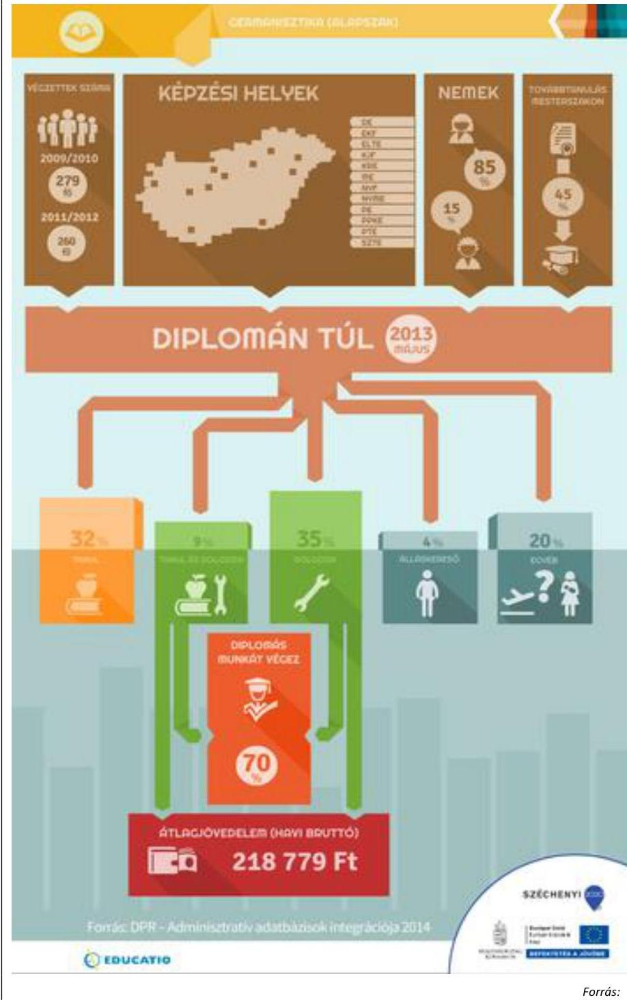

---

Az infografikus szolgáltatás segítségével részletesen megismerkedhet az érdeklődő a felsőoktatási alap- és osztatlan szakok karrierlehetőségeivel. A szolgáltató megmutatja az adott szakon végzettek számát, a nemek arányát, és a mesterszakon továbbtanulók arányát. A DPR adatai alapján a grafika feltünteti, hogy az adott képzés az ország mely egyetemein folyik. A Diplomántúl blokk bemutatja, hogy a szakirányú végzettek hány százaléka tanult, dolgozott, vagy keresett állást a felmérés időpontjában. Ugyancsak közli a kimutatás, hogy mennyi volt az átlagjövedelme a dolgozóknak, illetve hogy milyen arányban végeztek diplomát igénylő munkát. Ezek a szakok és szakmák szerint összesített adatok kellően részletesek és könnyen használhatók a pályaválasztási döntéshozatal során.

Az Educatio Kft. az éves felméréseiről minden évben elkészítette és nyilvánosságra hozta a kutatási zárótanulmányt „Diplomás pályakövetési adatok 20xx" címmel, amely a DPR intézményi adatfelvételeiből összeálló országos frissdiplomás és hallgatói adatbázis eredményeit mutatta be. Az ellenőrzött időszakban megvalósított adatintegráció eredményeit a „Diplomás pályakövetési adatok 2013 - Adminisztratív adatbázisok integrációja" című kiadvány és az „Adminisztratív adatbázisok integrációja - gyorsjelentés" foglalta össze. Ezen túl további kutatási eredmények, elemzések, jelentések jelentek meg elektronikusan és nyomtatott formában.

# 2.4. számú megállapítás 

## A DPR kutatások eredményeinek kommunikációja a kitűzött célokkal összhangban valósult meg.

A DPR eredmények kommunikációját a kiemelt projekt keretében szabályozták. A központi kommunikációs tevékenységeket a kiemelt projekt tervezési felhívás határozta meg, a feladatok általánosan a kiemelt projektre vonatkoztak, a DPR-rel is kapcsolatos főbb rendelkezéseket a 13. táblázat foglalja össze:
13. táblázat

## DPR KOMMUNIKÁCIÓ

| Szakaszok és célcsoportok | DPR-re értelmezhető általános (kiemelt projekt egészére vonatkozó) feladatok |
| :--: | :--: |
| 1. szakasz   egyetemek, hallgatók, munkaerő piaci szereplők részére | projekt hosszú távú eredményeinek bemutatása, együttműködések kialakítása, internetes felület létrehozása, amelyen folyamatos tájékoztatást nyújtanak a projekt céljairól, megvalósult és megvalósuló eredményeiről |
| 2. szakasz   intézmények, diákok, hallgatók részére | kiadványok, módszertani útmutatók, tájékoztató fórumok a rendszer alkalmazásáról, alkalmazási lehetőségekről, előnyökről |
| 3. szakasz   felsőoktatás különböző szereplői (jelentkezők, hallgatók, végzettek, intézményi vezetők, oktatók, munkaerő-piaci szereplők részére), ágazati minisztérium, közigazgatási szereplők | adatok feldolgozása után célzott kommunikációs kampányok megvalósítása |

Forrás: Tervezési felhívás TÁMOP 4.1.3/08/01
A fenti feladatok teljesítését, a kiemelt projekt eredményeit a „Diplomás pályakövetés a felsőoktatásban" című 2011 márciusában megjelent

---

zárókötet foglalta össze, amely elérhető a www.felvi.hu honlapon. Az Educatio Kft. alapvetően a DPR alprojekt saját portálján, a www.felvi.hu Diplomán túl és Felsőoktatási Műhely csatornákon keresztül biztosította a projekt során létrejött eredmények megismerését, illetve elérhetővé tettek minden olyan információt, amely a célcsoportok számára érdekes lehet. Elektronikus adatközlés mellett magyar és angol nyelvű nyomtatott kiadványokban is bemutatta a DPR eredményeket.

Az Educatio Kft. ezen túl számos saját rendezésű és egyéb rendezvényen vett részt, amelyen beszámolt a DPR eredményeiről.

Széles körű partnerhálózatuk (elsősorban felsőoktatási intézmények, háttérintézmények) honlapjaira, kiadványaiba, egyéb fórumaira is eljuttatták a projekt során létrejövő eredményeket.

A KIEMELT PROJEKT 2. ÜTEMÉHEZ kapcsolódóan az Educatio Kft. folytatta a kommunikációs feladatok ellátását. A megvalósított államigazgatási adatintegráció tapasztalatairól nyomtatásban is megjelent, illetve a www.felvi.hu honlapon is elérhető a „Diplomás pályakövetés 2014 - Adminisztratív adatbázisok integrációja" című kommunikációs anyag.

Kommunikációs szempontból jelentősek a DPR kutatási adatokat is felhasználó, a teljes kiemelt projekt keretében, az Educatio Kft. által közzétett, a DPR eredményeket bemutató elemzések. A 2014-ben végrehajtott államigazgatási adatintegráció során keletkezett adatbázis felhasználásával készítették el a „Pedagógusképzés frissdiplomásai", a „Nemzetiségi képzéseken végzettek munkaerő-piaci helyzete" és „A kommunikáció és médiatudomány (alapszak) végzettjeinek kimeneti mutatói" című elemzéseket.

Egyéb eseti jellegű kérésekre is készítettek háttéranyagokat az adatintegrációs és az intézményi
 DPR adatbázisra alapozva. A 2014. évi felmérés alapján készített anyag a „Milyen mértékben használja jelenlegi munkájában a tanulmányai során elsajátított tudást, megszerzett készségeket?” kérdésre adott válaszokat mutatta be. A „Gyógyszerész/gyógyszerésztudományi szakon abszolutóriumot szerzett végzettek” című elemzés részben a 2013-ban zajlott adatintegráció adatbázisára, részben a DPR 2011-es és 2012-es adatfelvételére támaszkodott. A „Frissdiplomások munkaerő-piaci helyzete 2013” címmel készített adatszolgáltatás szintén támaszkodik mindkét adatforrásra. A frissdiplomás jogászokra vonatkozó elemzés a DPR 2011-es és 2012-es adatfelvételére támaszkodott.

# 2.5. számú megállapítás 

## Az EUROSTUDENT felmérési rendszerhez történő csatlakozás során teljesültek a nemzetközi felmérésekkel kapcsolatos vállalások.

A DPR kiemelt projekt 2. ütemének projekt felhívása a DPR továbbfejlesztése tevékenységek közt sorolja fel a Nemzetközi együttműködési hálózatokhoz történő csatlakozást. Ezzel összhangban Magyarország 2012-ben csatlakozott az Európai Bizottság támogatásával működő EUROSTUDENT V felsőoktatás-kutatási programhoz, amely fókuszában a felsőoktatás „szociális dimenziója”, valamint a felsőoktatásban résztvevő hallgatók nemzetközi mobilitásának kutatása állt.

Az EUROSTUDENT fő célja a bolognai folyamattal összefüggő fontos, a hallgatókat érintő kérdések részletes vizsgálata. A program végrehajtásáért nemzetközi konzorcium felelt, amelynek feladata volt a programban résztvevők számára a minőségi adatgyűjtés szakmai hátterének biztosítása.

---

is. A program kutatásaihoz szükséges adatokat központilag meghatározott kérdőívek alapján kellett a résztvevőknek felvenni, gyűjteni. A módszertanok kidolgozása a résztvevők feladata volt, amelyhez ajánlásokat fogalmazott meg a központi konzorcium. A központi kérdőívek kötelező lekérdezése tette lehetővé az európai szintű összehasonlító táblák elkészítését. Az EUROSTUDENT programok eredményeit összefoglaló és ország-specifikus elemzések mutatják be.

A résztvevő intézmények által gyűjtött adatokat a programhoz csatlakozó országok aggregáltan küldték a konzorciumnak elemzések, összehasonlító táblák készítéséhez. A kutatás hazai koordinátora és az aggregált adatszolgáltatás felelőse, azaz az országos jelentés készítője az Educatio Kft. volt. A kutatáshoz használt online adatbázis további felhasználásra az Educatio Kft.-nél maradt, így saját elemzések készítésére is használható.

Az Educatio Kft. 25 felsőoktatási intézménnyel kötött együttműködési megállapodást az EUROSTUDENT V nemzetközi felmérés adatfelvételében való intézményi közreműködés érdekében. A 25 intézmény a hazai felsőoktatási hallgatói létszám (a csak hitéleti képzéseket folytató intézmények hallgatói nélkül) 85 százalékát képviselte. A felmérést a Diplomás Pályakövetés Hallgatói felméréséhez csatolva végezték el.

A vizsgálat eredményeként 2014-ben elkészült „A felsőoktatás szociális dimenziója: A Eurostudent V magyarországi eredményei” című elemzés angol és magyar nyelven, amely elérhető a www.felvi.hu oldalon is.

Az ellenőrzött intézmények csatlakoztak az EUROSTUDENT programhoz, és teljesítették az adatszolgáltatási kötelezettségeiket, a kötelező kérdőíveknek megfelelő kérdéseket feltették, a felvett adatokat továbbították az Educatio Kft.-nek.

Az EUROSTUDENT programban résztvevő országok, így Magyarország is közvetlen információkat kapott a nemzetközi módszerekről, elemzési eredményekről. Ezekkel összehasonlíthatta saját módszereit, tapasztalatokat szerezhetett. A program hasznosulására intézményi szinten találtunk példát ellenőrzésünk során: a BCE az EUROSTUDENT keretében készült anyagokat felhasználta saját módszertana, kérdőívezési eljárásai fejlesztése során.

# 2.6. számú megállapítás 

A külföldön munkát vállaló diplomások pályakövetésére konkrét DPR cél nem került megfogalmazásra, a DPR adatbázis tartalmaz migrációs adatokat, ugyanakkor ezek nem hasznosulnak a stratégiai döntéshozatalban.

A migrációs pályakövetés fejlesztése, működtetése sem a központi projekt, sem az intézményi szintű DPR célok között nem került nevesítésre, ezért migrációval kapcsolatos külön kutatást nem végzett az Educatio Kft. és a felsőoktatási intézmények számára sem biztosított speciális módszertanokat, háttéranyagokat.

A DPR-rel kapcsolatos kérdőívek, elemzések diplomás migrációra vonatkozó adatokat a pályakövetés általános keretein belül tartalmaznak. Az Educatio Kft. által kiadott éves kutatási zárótanulmányokban a külföldi munkavállalással kapcsolatos elemzések eredményei elérhetők.

A 2011. évi zárótanulmányban az elemzés a végzettség óta külföldön munkát vállalók körében arra irányult, hogy „Ez a munka/ezek a munkák kapcsolódtak-e a felsőfokú végzettségéhez?”. A 2012. évi zárótanulmány

---

elemzi a diplomázás után külföldi munkát vállalók arányát képzési területenként, a diplomázás utáni külföldi munkavégzés célországait és a külföldi munka szakterületi illeszkedését. A 2013. és 2014. évi zárótanulmányok foglalkoznak a diplomázás után külföldi munkát vállalók arányával képzési területenként, a külföldi munka szakterületi illeszkedésével, a végzettséghez kapcsolódó külföldi munkát végzők arányával képzési területenként és a következő 5 évben külföldi munkát tervezők arányával képzési területenként.

Az elemzéseket megalapozó kötelező kérdőívek minden évben tartalmaznak migrációra vonatkozó kérdéseket, amiket a 14. táblázat foglal össze:
14. táblázat

A KÖZPONTI KÉRDŐÍV MIGRÁCIÓVAL KAPCSOLATOS KÉRDÉSEI

| Kérdésblokkok |  | Kérdések |
| :--: | :--: | :--: |
| központi hallgatói kérdésblokk (2011-2014.) |  | Dolgozott Ön hosszabb-rövidebb ideig külföldön? |
| $\begin{aligned} & \text { végzett } \\ & \text { (2011-2014.) } \end{aligned}$ | hallgatók kérdésblokk | A kérdőív alapjául szolgáló felsőfokú végzettség megszerzését követően dolgozott-e hosszabb-rövidebb ideig külföldön? |
|  |  | Milyen településen él Ön jelenleg? |
|  |  | Ez a település külföldön van? |
| $\begin{aligned} & \text { végzett } \\ & \text { (2011-2012. és 2014.) } \end{aligned}$ | hallgatók kérdésblokk | Ön külföldön (nem Magyarországon) dolgozik? |
| doktori képzésen végzettek kérdésblokk (2014.) |  | Milyen településen él Ön jelenleg? |
|  |  | Ez a település külföldön van? |
|  |  | Ön külföldön (nem Magyarországon) dolgozik? |

Forrás: Központi kérdőívek
Az Educatio Kft. szakértői véleménye szerint két adatforrásból lehet diplomás foglalkoztatottsági adatokhoz jutni:

- a csaknem teljes lefedettséget biztosító integrált államigazgatási adminisztratív adatbázis, amely azonban épp a külföldi munkavállalásra vonatkozóan nem szolgáltat adatokat, valamint
- az intézményi pályakövetési kutatásokon alapuló országos DPR adatbázis, amely a diplomázás után 1-3-5 évvel tartalmazza a frissdiplomások foglalkoztatási adatait.
A DPR adatbázis online kérdőíves adatfelvétellel szerzi az adatokat, 15% körüli válaszadási rátával, kb. 20.000 fős mintanagysággal. Az alacsony válaszadási ráta miatt lehetséges torzításokat az Educatio Kft. súlyozási eljárásokkal próbálja csökkenteni. A nagy minta (20.000 válaszadó) lehetővé teszi kisebb létszámú csoportok vizsgálatát is, így a külföldön munkát vállaló diplomásokét is. Az Educatio Kft. 2014-es zárótanulmánya szerint „A felsőfokú tanulmányokat követően a lekérdezés idejéig a frissdiplomások átlagosan 6,9 százaléka dolgozott már külföldön és további 6,3 százalékuk a megkeresés időpontjában is külföldi munkavégzésről jelzett vissza. A külföldi munkavégzés leggyakoribb országa Németország, Ausztria és az Egyesült Királyság. A külföldi munkát végzők/végzettek aránya a sporttudományi, informatikai, természettudományi és műszaki képzési területek diplomásai között haladja meg az átlagot és igen csekély a jogi, közigazgatási és pedagógiai frissdiplomások között.”

---

Bár a DPR adatbázis alkalmas lehet a külföldön munkát vállalók csoportjának részletes vizsgálatára, kifejezetten a migrációra vonatkozó elemzés, kutatás a DPR zárótanulmányokon kívül nem készült.

Meghatározott cél, támogatott feladat, pályázati előírás hiányában a felsőoktatási intézmények sem helyeztek hangsúlyt a migrációs pályakövetésre, nem voltak törekedtek a migrációs adatelemzések eredményeinek javítására. A pályakövetés során az országos kérdésblokkban szerepelt kérdésekre érkezett válaszok továbbküldésén kívül migrációs pályakövetést nem végeztek. A migrációs adatok feldolgozásához kapcsolódó, az adatok megbízhatóságával összefüggő problémákat, az országos kérdésblokk által igényelteken felül, nem kezeltek.

# 3. A DPR fenntarthatóságát ágazati és intézményi szinten biztosították-e? 

Összegző megállapítás

A DPR-t működtető szervezetek a rendszer fenntarthatóságával kapcsolatosan a TÁMOP projektek keretében tett vállalásaikat teljesítették, a jó gyakorlatok támogatják, biztosítják a fenntarthatóságot.
3.1. számú megállapítás

A központi DPR projekt fenntarthatósága a kötelező öt éves fenntartási időszakban a vállalásokkal összhangban biztosított.

Az Educatio Kft. 2011-ben elkészítette a központi projekt (1. ütem) fenntarthatósági tervét, amely a 2015-ig tartó időszakra terjedt ki. A központi projekt keretében elért eredmények fenntarthatóságát alapvetően az biztosította, hogy 2012-ben kezdődött a központi projekt második üteme, amely 2015. január 31-én zárult.

## A ZÁRÁST KÖVETŐ ÖT ÉVES FENNTARTÁSI IDŐSZAKRA a pályázati dokumentáció a DPR kapcsolatban előírta, hogy a projektgazda a DPR működtetését és fenntartását a projekt befejezését követően legalább 5 évig biztosítja. Ennek keretében olyan feladatokat tervezett, vállalt az Educatio Kft., amelyek a DPR modell mindkét szintjén az elért eredmények fenntartását támogatják:
$\longrightarrow$ DPR adatintegráció területén: állami adatbázisok pályakövetési célú összekapcsolása Nftv.20 alapján, adatok elemzése, integráció informatikai támogatása.
$\longrightarrow$ Általánosan: felsőoktatási intézményi DPR adatok gyűjtése, egységes, aggregált adatbázis (DPR adattár) létrehozása, adatok elemzése.
Az újonnan bevont hallgatói csoportok vonatkozásában (felsőfokú és felsőoktatási szakképzés, szakirányú továbbképzés, PhD-képzés):
$\longrightarrow$ intézményi DPR-ek szakmai, módszertani támogatása,
$\longrightarrow$ online kérdőív frissítése, validálása, kapcsolódó technikai feladatok ellátása,
$\longrightarrow$ felmérések, tájékoztatások készítése, adatbázis aggregálása,
$\longrightarrow$ DPR kutatások adatainak elemzése, értékelése, kommunikáció.

---

A felsorolt feladatok nem tartalmazzák az intézményi DPR-ek szakmai, módszertani támogatását csak az újonnan bevont hallgatói csoportok vonatkozásában. Ellenőrzésünk tapasztalata szerint a folyamatos szakmai támogatás (szakmai koordináció, kapcsolattartás és DPR Kézikönyvhöz kapcsolódó évenkénti iránymutatások) a DPR eredményességét növelte.

A központi DPR fenntartásához szükséges források az ellenőrzött időszakban biztosítottak voltak. A TÁMOP projektek költségvetésén kívül a fenntarthatóság tervezésénél két pénzügyi forrást azonosított az Educatio Kft.: központi költségvetési támogatás, mert 2012-től az Nftv. kötelezően előír DPR-rel kapcsolatos adatszolgáltatási és adatbázis működtetési feladatokat, valamint DPR működtetéséből származó bevételek. Ezeket, mint lehetőségeket említi a fenntarthatósági terv, konkrét pénzügyi tervet nem készítettek. A lehetséges bevételek a DPR portál (www.felvi.hu) felület értékesítését (hirdetések, bannerek megjelenését) jelentik.

A központi projekt szervezeti és szakmai fenntartása az ellenőrzött időszakban biztosított volt. 2016. január 1-től az Educatio Kft. feladatait az OH látja el, ellenőrzésünk tapasztalata szerint a DPR fenntartásához szükséges szervezeti keretek adottak és az Educatio Kft. szakemberei jelenleg az OH-nál végzik munkájukat.

A DPR működtetéséhez szükséges technika és műszaki háttérrel az Educatio Kft. rendelkezett. A fenntarthatóságot biztosította a DPR és központi adatbázisok közti technikai kapcsolat (adatintegráció keretei) is. A központi projekt eredményeképp megvalósuló fejlesztések számos ponton kapcsolódtak az Educatio Kft. egyéb feladataival (felvételi tájékoztatás, intézményi rangsorok, intézményi adatbázisokkal történő együttműködések), ami szintén a fenntarthatóságot támogatta.

# 3.2. számú megállapítás 

A felsőoktatási intézmények teljesítették a diplomás pályakövetési rendszereinek fenntartásával kapcsolatos kötelezettségeiket, a jó gyakorlatok támogatják a hosszú távú fenntarthatóságot.

Az intézményi projektek öt éves fenntartási időszakára vonatkozó pénzügyi, személyi vállalásokat a megvalósíthatósági tanulmányok tartalmazták, ezzel az intézmények vállalták, hogy a pályakövetési rendszer működtetését a projektek befejezését követően legalább öt évig fenntartják. Az ellenőrzött intézmények a fenntartással kapcsolatos vállalásaikat teljesítették.

## AZ ÖNKÉNTES VÁLASZADÁSOK ÖSZTÖNZÉSE a

pályakövetési rendszer működésének és fenntarthatóságának egyik alapvető eleme. Az intézmények a kérdőíveket az aktív hallgatók esetében a Neptun, végzett hallgatók esetében pedig az intézményi Alumni adatbázisok adatait felhasználva küldik ki, ezzel biztosítva a megkeresések teljes körűségét. Mivel a válaszadás önkéntes, több tényező befolyásolja a visszaérkező, kitöltött kérdőívek arányát:
$\longrightarrow$ az online kérdőívek kitöltésének időigényével kapcsolatban több intézmény jelezte, hogy a kérdőívek hosszúak és ez a válaszadási hajlandóságot csökkentheti. A központi kérdőív 60-110 kérdést tartalmaz, attól függően, hogy egyes kérdésekre milyen választ ad a kitöltő;

---

$\longrightarrow$ a válaszadási hajlandóság ösztönzésére különböző eszközöket alkalmaznak az intézmények, úgy mint a DPR népszerűsítése nyomtatott és online eszközökkel, telefonos és személyes megkeresések, nyeremények sorsolása.

A DPR FENNTARTHATÓSÁGI MODELLT az Educatio Kft. külső vállalkozóval
 elkészíttette, a dokumentum 2013-ban jelent meg. A fenntarthatósági modell intézményi szinten sorra veszi azokat a területeket, amelyek befolyásolják a DPR fenntarthatóságát. A modell segítségével az intézmények úgy tudják ellátni és fejleszteni DPR tevékenységeiket, hogy a rendszerek hosszú távú fenntartása biztosított legyen.

Ellenőrzésünk eredményeképp, a kiválasztott intézmények rendszereit áttekintve olyan tényezőket azonosítottunk, amelyek az intézményi szintű DPR fenntarthatóságához jelentősen hozzájárulnak, az eredmények hosszú távú megtartását szolgálják, jó gyakorlatok:
$\longrightarrow$ DPR helye a szervezetben: azon intézmények esetében, amelyeknél a DPR nem csupán egy törvényi kötelezettség vagy egy TÁMOP projekt, a pályakövetési feladatok ellátása beépült az intézmény szervezetébe, működésébe, mindennapi folyamataiba. Ez leginkább azon intézmények szervezeti megoldásainál látszik, ahol olyan szervezeti egységhez rendelték a feladatok ellátását, koordinálását, amely szakmai munkájára támaszkodott a DPR, illetve amelynek szakmai munkáját támogatták a DPR adatok. Jellemzően ilyen szervezeti keretekkel működik a PTE, ahol a marketing részleg feladatai közt szerepel a DPR-rel kapcsolatos feladatellátás és koordináció. Az ELTE esetében jó gyakorlat, hogy a minőségbiztosítási rendszer része a DPR fejlesztése, működtetése, fenntartása, valamint az adatok felhasználása, beépülése az intézményi folyamatokba biztosított.
$\longrightarrow$ a www.felvi.hu portál és különböző csatornái, mint pl. a Diplomán túl jó gyakorlatnak számítanak az információk elérése, rendezettsége szempontjából. A portál jó gyakorlat, mert hozzájárul a társadalmi fenntarthatósághoz, ahhoz, hogy a hallgatók, pályaválasztás előtt állók, munkaerő-piaci szereplők bekapcsolódjanak a programba, illetve használják információit döntéshozataluk során.
$\longrightarrow$ az intézmények által kidolgozott saját fejlesztések, modellek az intézmény, a vezetőség elkötelezettségét is kifejezik és hozzájárulnak az eredményesség növeléséhez, a hosszú távú fenntarthatóság biztosításához. Ilyenek a saját fejlesztésű informatikai alkalmazások (ZSKF, ELTE, BCE saját fejlesztésű alkalmazásairól lásd 16. oldal), amelyek a lekérdezést, adatfeldolgozást és intézményen belüli, valamint a központi szintnek készülő adatszolgáltatást támogatják.
$\longrightarrow$ a SZIE által kidolgozott és alkalmazott intézményi DPR Fenntartási kézikönyv, amely nagyban segíti a vizsgálatban résztvevők munkáját. A kézikönyv az esetleges személyi változások esetén is iránymutatást ad a vizsgálat lebonyolításához, a feladatok ütemezésével és a feladatkörök részletezésével.
$\longrightarrow$ az adatok megbízhatóságának növelésére, ezzel a DPR információk megfelelőségének biztosítására több ellenőrzött intézménynél figyelmet fordítottak a válaszadás motiválásán keresztül. Az adatok minőségét abból a szempontból is igyekeztek növelni az ellenőrzött

---

intézmények, hogy azok a vezetőség számára minél jobb visszajelzést adjanak a képzések minőségéről és a végzettek munkaerő-piaci lehetőségeiről. Ennek érdekében minden intézmény saját kérdőíveket dolgozott ki és azokat a központi kérdésekkel együtt küldte el a válaszadóknak. A ZSKF jó gyakorlata, hogy a DPR kutatást kiterjesztette a munkáltatókra is, és a számukra is kidolgozott és elküldött kérdőívekkel őket is bevonta a felmérésekbe. A végzettek és a munkáltatók kérdőívein a központi kérdőívekhez képest a Főiskola a saját kérdései között sokkal több kompetencia kérdést tett fel, amely kérdések lényegesen jobban közvetítik a munkáltatói elvárásokat.

---

.

---

# MELLÉKLETEK 

I. SZ. MELLÉKLET: DPR CÉLOK ÖSSZEFOGLALÁSA

## FELSŐOKTATÁSI SZOLGÁLTATÁSOK RENDSZER SZINTŰ FEJLESZTÉSE KIEMELT PROJEKTEK

A felsőoktatási szolgáltatások rendszer szintű fejlesztése c. kiemelt projekt (TÁMOP 4.1.3./08/01)
Általános célok A felsőoktatási intézmények Európai Felsőoktatási Térségben való versenyképességének növelése: a konstrukció elő kívánja segíteni a felsőoktatás szerkezeti átalakításának folytatását és kiteljesedését, a képzés és szolgáltatások minőségi fejlesztését, illeszkedve a Bolognai folyamat elvárásaihoz.
A magyar felsőoktatás „modern szolgáltató egyetem" modelljének létrehozása és működtetése: az intézmények irányítását, stratégiáinak kialakítását és folyamatos nyomon követését támogató korszerű menedzsment rendszerek kiépítése és működtetése.
Az oktatás, kutatás és innováció hatékonyságának növelése valamint a TIOP és TÁMOP programokban fejlesztett felsőoktatási infrastruktúrák és szolgáltatások menedzsmentjének hatékonyabbá tétele: modern elektronikus információs szolgáltatások fejlesztése, hatékonyabb intézmény-oldali menedzsment, a hallgatók és oktatók térbeli és időbeli mobilitásának támogatása föderatív rendszerrel.
DPR alprojekt A DPR célja, hogy a felsőoktatási intézmények, a továbbtanulás előtt álló diákok és szüleik, továbbá az országos felsőoktatási és munkaerő-piaci stratégiakészítők világos képpel rendelkezzenek a felsőoktatásból kibocsátott szakképzett munkaerő életpályájának alakulásáról, és ezáltal módosítani, befolyásolni legyenek képesek a munkaerő-piaci, felsőoktatási stratégiákat.
A felsőoktatási szolgáltatások rendszerszintű fejlesztése 2. ütem c. kiemelt projekt (TÁMOP 4.1.3./11/1)
Általános célok A kapcsolódó intézményi fejlesztések fenntarthatóságának szakmai támogatása és nyomon követése, értékelése mellett a korábban már megkezdett ágazati szintű központi fejlesztések eredményeinek összehangolása révén az elkészült fejlesztések közvetlen hasznosítása a felsőoktatás szerkezeti átalakításának folytatásához kapcsolódóan. Ennek érdekében a már megkezdett központi szolgáltatások és keretrendszerek (diplomás pályakövető rendszer, adattár alapú vezetői információs rendszerek, ágazati nyilvántartások, Országos Képesítési Keretrendszer, előzetesen megszerzett tudás elismerése) és új fejlesztések összekapcsolása révén az integrált felsőoktatási információs bázis birtokában megalapozottabbá válik a döntéshozatal, hatékonyabbá válhat a felsőoktatási ágazat és az intézmények működése. A projekt a TÁMOP 4.1.3./1 „Felsőoktatási szolgáltatások rendszerszintű fejlesztése" c. kiemelt projekt eredményeire épül, ezek bővítése, valamint integrált továbbfejlesztése és alkalmazása.

---

# HALLGATÓI ÉS INTÉZMÉNYI SZOLGÁLTATÁSFEJLESZTÉS A FELSŐOKTATÁSBAN PROJEKTEK

|  Hallgatói és intézményi szolgáltatásfejlesztés a felsőoktatásban c. projektek (TÁMOP-4.1.1/08/1., TÁMOP- 4.1.1-08/2/KMR) |   |
| --- | --- |
|  Általános célok | A konstrukció célja a felsőoktatási intézményekben a 21. század követelményeinek megfelelő differenciált, komplex felsőoktatási szolgáltatások kiépítése. A konstrukció a felsőoktatás szervezeti fejlesztéséhez, valamint a képzések munkaerő-piaci relevanciájának fejlesztéséhez kíván hozzájárulni a legfontosabb intézmény-irányítási és hallgatói szolgáltatások támogatásával.  |
|  DPR fejlesztésének célja | A DPR fejlesztés célja, hogy
- a felvételizők és a leendő hallgatók tájékozódni tudjanak arról, hogy az egyes intézmények képzéseinek elvégzésével milyen esélyekkel tudnak elhelyezkedni,
- az ágazati stratégia alkotáshoz releváns információk legyenek az intézményekben végzettek elhelyezkedési és karrier lehetőségeiről
- az intézmények pontos képpel rendelkezzenek a náluk végzettek karrierjének alakulásáról, így folyamatos visszajelzést kapjanak képzéseik minőségéről.  |
|  Hallgatói és intézményi szolgáltatásfejlesztés a felsőoktatásban c. projektek (TÁMOP-4.1.1.A-10/1/KONV, TÁMOP-4.1.1.A-10/2/KMR) |   |
|  Általános célok | A konstrukció célja a felsőoktatási intézményekben a 21. század követelményeinek megfelelő differenciált, komplex felsőoktatási szolgáltatások kifejlesztése és működtetése. A konstrukció a felsőoktatás szervezetének, működésének, irányításának fejlesztéséhez, valamint a képzések munkaerő-piaci relevanciájának méréséhez, fejlesztéséhez kíván hozzájárulni a legfontosabb intézményirányítási és hallgatói szolgáltatások fejlesztésének támogatásával. A szolgáltatások fejlesztése hozzájárul a versenyképes, modern, szolgáltató egyetemek és főiskolák megteremtéséhez. A konstrukció célja, hogy az intézmények a fejlesztendő szolgáltatások teljes spektrumával rendelkezzenek.  |

Forrás: Pályázati Felhívások

---

# FÜGGELÉK: ÉSZREVÉTELEK 

A jelentéstervezetet a Számvevőszék 15 napos észrevételezésre megküldte az ellenőrzött szervezetek vezetőinek az ÁSZ tv. 29. §* (1) bekezdése előírásának megfelelően.
Az elfogadott észrevételek alapján a Számvevőszék módosította a jelentést.

A függelék tartalmazza a Budapesti Corvinus Egyetem, a Szent István Egyetem, az Emberi Erőforrások Minisztériuma és az Oktatási Hivatal által megküldött észrevételeket, az azokra adott válaszokat, illetve az el nem fogadott észrevételek elutasításának indoklását.

[^0]
[^0]:    * 29. § (1) Az Állami Számvevőszék az ellenőrzési megállapításait megküldi az ellenőrzött szervezet vezetőjének vagy az általa megbízott személynek, és annak, akinek személyes felelősségét állapította meg.
    (2) Az ellenőrzött szervezet vezetője és a felelősként megjelölt személy az ellenőrzés megállapításaira tizenöt napon belül írásban észrevételt tehet.
    (3) Az Állami Számvevőszék az észrevételre a beérkezésétől számított harminc napon belül írásban válaszol. A figyelembe nem vett észrevételeket köteles a jelentésben feltüntetni, és megindokolni, hogy azokat miért nem fogadta el.

---

Domokos László részére elnök

Állami Számvevőszék
1364 Budapest 4. Pf. 54

Tisztelt Elnök Úr!
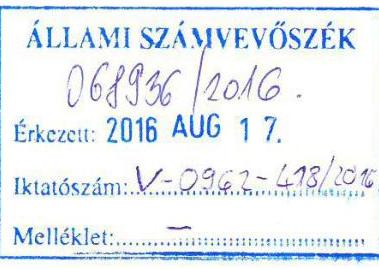

Megköszönve a "Közös ellenőrzéssel a versenyképes tudás jobb hasznosulásáért" címú jelentéstervezet megküldését, az alábbiak észrevételt szeretnénk tenni a Budapesti Corvinus Egyetemet érintő megállapítások kapcsán.

A tervezet 24. oldalán található megállapítás szerint a BCE honlapján nem érhetőek el a diplomás pályakövetési felmérések elemzései. Az Egyetemünkön a területért felelős szakmai vezető tájékoztatása szerint a meglévő, elkészült elemzések elérhetőek a www.alumni.unicorvinus.hu aloldalán (a http://alumni.uni-corvinus.hu/index.php?id=45496 oldalon), amelyet a helyszíni vizsgálat alkalmával át is tekintettek az ellenőrzést végző kollégával, sőt, az adathalászatot is az innen elérhető anyagokból próbáltak elvégezni, a linket pedig az ellenőrzést vezető kollégák részére biztosították.

A tavalyi lekérdezés tanulmányának elkészítése sajnos igencsak elhúzódott, így az (2015-ös év) és az idei, függőben lévő (2016-os) felmérés anyaga valóban nem érhetőek el, de természetesen ezt is pótolni fogjuk, amint lehetőségünk lesz arra.
Az ellenőrzés óta 3 további korábbi anyaggal is kiegészítették a listát.
A fentiek tekintetében tisztelettel javasoljuk, illetve kérjük a megállapítás cseréjét a következőkre, amennyiben Önök is egyetértenek azzal: a BCE honlapján a DPR elemzések nem érhetőek el teljes körűen.

Segítő együttműködésüket nagyon köszönjük!
Budapest, 2016. augusztus 15.

Tisztelettel:
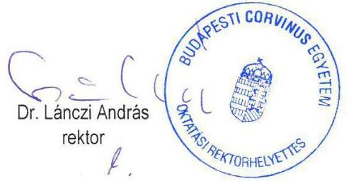

# Rektor 

1093 Budapest, Fővám tér 8.
Tel: 0614825124 Fax: 0612178883
rektor@uni-corvinus.hu
www.uni-corvinus.hu

---

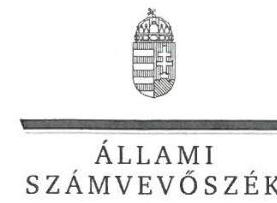

# Dr. Lánczi András úr 

rektor
Budapesti Corvinus Egyetem

## Budapest

## Tisztelt Rektor Úr!

Köszönettel megkaptam a „Közös ellenőrzéssel a versenyképes tudás jobb hasznosulásáért - a diplomás pályakövetés jó gyakorlatainak feltárása" című jelentéstervezet megállapításaira tett, R/626-20/2016. iktatószámú észrevételét.

Az ellenőrzési megállapításokra vonatkozó észrevételét az Állami Számvevőszékről szóló 2011. évi LXVI. törvény 29. § (2) bekezdésében meghatározott tizenöt napos határidőn belül küldte meg. Az Állami Számvevőszék észrevétellel kapcsolatos álláspontját a mellékletként csatolt, a felügyeleti vezető által készített indokolás tartalmazza.

Budapest, 2016. 03 hó 02 nap
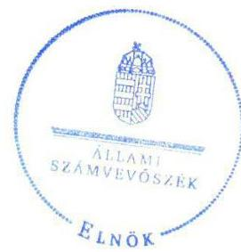

Tisztelettel:

Domokos László

Melléklet: Észrevételre adott válasz

---

# Függelék: Észrevételek

1. számú melléklet a V-0962-426/2016. számú levélhez

„Közös ellenőrzéssel a versenyképes tudás jobb hasznosulásáért – a diplomás pályakövetés jó gyakorlatainak feltárása” című jelentéstervezetre tett észrevételre adott válasz

|   | Budapesti Corvinus Egyetem észrevétele | Észrevétel elfogadása | Észrevételre adott válasz | A jelentés módosított szövegrésze  |
| --- | --- | --- | --- | --- |
|  1. | A tervezet 24. oldalán található megállapítás szerint a BCE honlapján nem érhetőek el a diplomás pályakövetési felmérések elemzései. Az Egyetemünkön a területért felelős szakmai vezető tájékoztatása szerint a meglévő, elkészült elemzések elérhetőek a www.sturmij.uni-corvinus.hu alakulát (a http://sturmij.uni-corvinus.hu/index.php?id=45456 oldalon), amelyet a helyszíni vizsgálat alkalmazniát is tekintettek az ellenőrzést végző kollégával, sőt, az adathalászatot is az innen elérhető anyagokból próbáltak elvégezni, a linket pedig az ellenőrzést vezető kollégák részére biztosították. A tavalyi lekerdezés tanulmányának elkészítése sajnos igencsak elhúzódott, így az (2015-ös év) és az idei, függőben lévő (2016-os) felmérés anyaga valóban nem érhetőek el, de természetesen ezt is pótolni fogjuk, amint lehetőségünk lesz arra. Az ellenőrzés óta 3 további korábbi anyaggal is kiegészítették a listát. A fentiek tekintetében tisztelettel javasoljuk, illetve kérjük a megállapítás cseréjét a következőkre, amennyiben Önök is egyetértenek azzal: a BCE honlapján a DPR elemzések nem érhetőek el teljes körűen. | Igen | Az észrevételt elfogadjuk, a jelentéster- vezet 24. oldalán található 2.3. megállapítás alatti 2. bekezdés első mondatát módosítjuk. | „Az ellenőrzött intézmények összességében teljesítették a szerződéses vállalásaikat, minden felsőoktatási intézmény honlapján elérhetők a DPR elemzések és tanulmányok, azonban a BCE honlapján a DPR elemzések nem teljes körűek.”  |

Tájékoztatom Rektor urat,
 hogy az Állami Számvevőszékről szóló 2011. évi LXVI. törvény 29. § (3) bekezdése alapján az Állami Számvevőszék a figyelembe nem vett észrevételeket köteles a jelentésben feltüntetni, és megindokolni, hogy azokat miért nem fogadta el.

Budapest, 2016. 03. hónap 02. nap

Dr. Pulay Gyula felügyeleti vezető

---

# Szent István Egyetem 

## 585

Dr. Tőzsér János rektor

Szent István Egyetem
Cím: 2100 Gödöllő, Péter Károly utca 1.
Tel.: +36-28-522-000/1002 mellék
E-mail: rector@szie.hu

Iktatószám: R/418-25/2016
Ügyintéző: Lajkó Istvánné

## Domokos László

elnök

Állami Számvevőszék
Budapest

ÁLLAMI SZÁMVEVÓSZÉK
06919612016
Eiközert: 2016 AUG 18
Iktatószám: V-0962-419/2016
Melléklet:

## Tisztelt Domokos László Elnök Úr!

Köszönettel megkaptuk az Állami Számvevőszékről szóló 2011. LXVI. törvény 29. § (1) bekezdésben foglaltak alapján a „Közös ellenőrzéssel a versenyképes tudás jobb hasznosulásáért - a diplomás pályakövetés jó gyakorlatainak feltárása" című jelentéstervezetet (V-0962-413/2016).

A jelentés tervezethez javasoljuk, hogy a DPR Fenntarthatósági modelljét részletező „jó gyakorlatok” részben (32. oldal) kerüljön említésre a Szent István Egyetemen alkalmazott jó gyakorlatnak minősülő Intézményi DPR Fenntartási kézikönyv, mint jó példa.
A Fenntartási kézikönyv a helyi, azaz intézményi sajátosságokat figyelembe véve - a központi DPR módszertani ajánlásokkal és az SZMSZ-ben valamint a Rektori utasításban foglaltakkal együtt - segíti a vizsgálatban résztvevő munkacsoportok és kollégák munkáját.
Kézikönyvünk személyi változás esetén is iránymutatást és fenntarthatósági modellt ad a vizsgálat lebonyolításhoz, a feladatok ütemezésével és a feladatkörök részletezésével.

A Számvevőszéki jelentéstervezetet összességében jónak találjuk, és az abban foglalt megállapításokat elfogadjuk.

Gödöllő, 2016.08.16.
Tisztelettel:
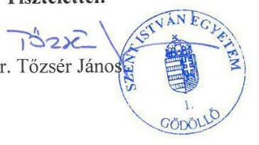

---

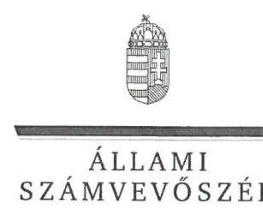

ELNÖK

Ikt. szám: V-0962-425/2016.

Dr. Tőzsér János úr
rektor
Szent István Egyetem

# Gödöllő 

## Tisztelt Rektor Úr!

Köszönettel megkaptam a „Közös ellenőrzéssel a versenyképes tudás jobb hasznosulásáért - a diplomás pályakövetés jó gyakorlatainak feltárása" című jelentéstervezet megállapításaira tett, R/418-25/2016. iktatószámú levelében megküldött észrevételét.

Az Állami Számvevőszék észrevétellel kapcsolatos álláspontját a mellékletként csatolt, a felügyeleti vezető által készített indokolás tartalmazza.

Budapest, 2016. 03. hó 02. nap
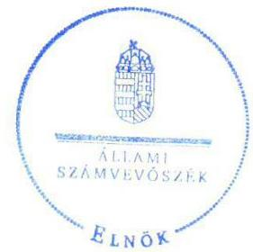

Tisztelettel:

Domokos László

Melléklet: Észrevételre adott válasz

---

# Függelék: Észrevételek

1. számú melléklet a V-0962-425/2016. számú levélhez

„Közös ellenőrzéssel a versenyképes tudás jobb hasznosulásáért – a diplomás pályakövetés jó gyakorlatainak feltárása” című jelentéstervezetre tett észrevételre adott válasz

|   | Szent István Egyetem észrevétele | Észrevétel elfogadása | Észrevételre adott válasz | A jelentés módosított szövegrésze  |
| --- | --- | --- | --- | --- |
|  1. | A jelentés tervezethez javasoljuk, hogy a DPR Fenntarthatósági modelljét részletező „jó gyakorlatok” részben (32. oldal) kerüljön említésre a Szent István Egyetemen alkalmazott jó gyakorlatnak minősülő intézményi DPR Fenntartási kézikönyv, mint jó példa.
A Fenntartási kézikönyv a helyi, azaz intézményi sajátosságokat figyelembe véve – a központi DPR módszertani ajánlásokkal és az SZMSZ-ben valamint a Rektori utasításban foglaltakkal együtt - segíti a vizsgálatban résztvevő munkacsoportok és kollégák munkáját.
Kézikönyvünk személyi változás esetén is iránymutatást és fenntarthatósági modellt ad a vizsgálat lebonyolításhoz, a feladatok ütemezésével és a feladatkörök részletezésével.
A Számvevőszéki jelentéstervezetet összességében jónak találjuk, és az abban foglalt megállapításokat elfogadjuk. | Igen | A kiegészítést elfogadjuk, a jelentéstervezet 32. oldalán található jó gyakorlatok felsorolásába beépítjük. | • „a SZIE által kidolgozott és alkalmazott intézményi DPR Fenntartási kézikönyv, amely nagyban segíti a vizsgálatban résztvevők munkáját. A kézikönyv az esetleges személyi változások esetén is iránymutatást ad a vizsgálat lebonyolításához, a feladatok ütemezésével és a feladatkörök részletezésével.” |

Tájékoztatom Rektor urat, hogy az Állami Számvevőszékről szóló 2011. évi LXVI. törvény 29. § (3) bekezdése alapján az Állami Számvevőszék a figyelembe nem vett észrevételeket köteles a jelentésben feltüntetni, és megindokolni, hogy azokat miért nem fogadta el.  |

Budapest, 2016. 03. hónap 02. nap

Dr. Pulay Gyula felügyeleti vezető

---

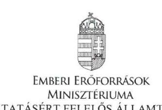

Iktatószám:44135-1/2016/INTFIN

Hiv. szám: V-0962-407/2016.
Ügyintéző: Dormány Dániel
Telefon: 061 795-7148
Melléklet: -

# Dr. Elek János részére 

főtitkár

Állami Számvevőszék
Budapest
Apáczai Csere János u. 10.
1052

Tárgy: „Közös ellenőrzéssel a versenyképes tudás jobb hasznosulásáért - a diplomás pályakövetés jó gyakorlatainak feltárása" című jelentéstervezet észrevételei

Tisztelt Főtitkár Úr!
Hivatkozva a V-0962-407/2016. számú, Balog Zoltán miniszter úr részére írt megkeresésre, küldöm a „Közös ellenőrzéssel a versenyképes tudás jobb hasznosulásáért - a diplomás pályakövetés jó gyakorlatainak feltárása" című jelentéstervezettel kapcsolatos észrevételeimet:
„A jelentéstervezet 20. oldalán a következő megállapítás olvasható: „A szaktárca a fentieken kívül konkrét fejlesztési, stratégiai dokumentumok készítéséhez dokumentáltan nem használta a DPR kutatások eredményeit, így nem bizonyított a törvényi előírások teljesítése a 2013 és 2014. években."

A jelentéstervezetben foglalt megállapítással nem értek egyet, ezért kérem annak törlését a jelentésből, továbbá a kapcsolódó 1.3 számú megállapítás módosítását.

A kérésem alátámasztásaként a következőt terjesztem elő:

- A 2016. április 25-én az Emberi Erőforrások Minisztériumában (továbbiakban: EMMI) zajlott személyes interjú során az Oktatásért Felelős Államtitkárság kollégái elmondták, hogy a felsőoktatási felvételi eljárás során a felsőoktatási intézmények által meghirdetett képzéseket, azok minimális és maximális kapacitásait az EMMI munkabizottsága áttekinti és többek között a DPR eredmények figyelembevételével hozza meg a szükséges esetleges korrekciós döntéseit. Ezt a megállapítást a jelentéstervezet is tartalmazza, ezért külön is érthetetlen számomra a fent már idézett megállapítás.

---

- A 2011. évi CCIV. törvény a nemzeti felsőoktatásról 46. § (4) és (5) bekezdése alapján a miniszter évente határozattal állapítja meg azt, hogy mely a felsőoktatási intézmények által folytatott szakos képzésen vehető igénybe magyar állami (rész)ösztöndíj. A képzésre a felvételhez szükséges minimális pontszámot a Kormány rendelete, az adott szak állami (rész)ösztöndíjjal támogatott képzésére történő éves felvétel feltételeként teljesítendő minimális pontszámot a miniszter határozata állapítja meg. A miniszter a fenti döntések meghozatalakor figyelembe veszi a végzett hallgatók pályakövetési adatait, amely meg is történt. A törvény nem ír elő az adatok felhasználásra vonatkozóan dokumentáltságot, mint követelményt.

Kérem, a fenti észrevételeim átvezetését a jelentéstervezetben.

Budapest, 2016. augusztus „ $\mathcal{N}$ „

Üdvözlettel:
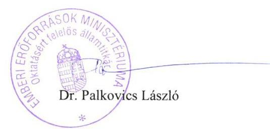

---

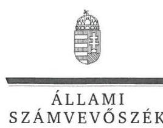

ELNÖK

Ikt. szám: V-0962-423/2016.

# Balog Zoltán úr 

miniszter
Emberi Erőforrások Minisztériuma

## Budapest

## Tisztelt Miniszter Úr!

Köszönettel megkaptam a „Közös ellenőrzéssel a versenyképes tudás jobb hasznosulásáért - a diplomás pályakövetés jó gyakorlatainak feltárása" című jelentéstervezet megállapításaira az oktatásért felelős államtitkár a 44135-1/2016/INTFIN. iktatószámú levelében küldött észrevételt.

Az Állami Számvevőszék észrevétellel kapcsolatos álláspontját a mellékletként csatolt, a felügyeleti vezető által készített indokolás tartalmazza.

Budapest, 2016. 02. hó 02. nap
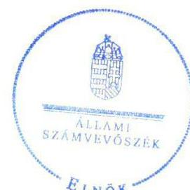

Tisztelettel:

## 02. 12

Domokos László

Melléklet: Észrevételre adott válasz

---

# 1. számú melléklet 

a V-0962-423/2016. számú levélhez
„Közös ellenőrzéssel a versenyképes tudás jobb hasznosulásáért - a diplomás pályakövetés jó gyakorlatainak feltárása" című jelentéstervezetre tett észrevételre adott válasz

|  | EMMI észrevétel | Észrevétel elfogadása | Észrevételre adott válasz, indoklás | A jelentés módosított szövegrésze |
| :--: | :--: | :--: | :--: | :--: |
| 1. | „A jelentéstervezet 20. oldalán a következő megállapítás olvasható: ,,A szaktárca a fentieken kívül konkrét fejlesztési, stratégiai dokumentumok készítéséhez dokumentáltan nem használta a DPR kutatások eredményeit, így nem bizonyított a törvényi előírások teljesítése a 2013 és 2014. években."   A jelentéstervezetben foglalt megállapítással nem értek egyet, ezért kérem annak törlését a jelentésből, továbbá a kapcsolódó 1.3 számú megállapítás módosítását.   A kérésem alátámasztásaként a következőt terjesztem elő:   - A 2016. április 25 -én az Emberi Erőforrások Minisztériumában (továbbiakban: EMMI) zajlott személyes interjú során az Oktatásért Felelős Államtitkárság kollégái elmondták, hogy a felsőoktatási felvételi eljárás során a felsőoktatási intézmények által meghirdetett képzéseket, azok minimális és maximális kapacitásait az EMMI munkabizottsága áttekinti és többek között a DPR eredmények figyelembevételével hozza meg a szükséges esetleges korrekciós döntéseit. Ezt a megállapítást a jelentéstervezet is tartalmazza, ezért külön is érthetetlen számomra a fent már idézett megállapítás.   - A 2011. évi CCIV. törvény a nemzeti felsőoktatásról 46. § (4) és (5) bekezdése alapján a miniszter évente határozattal állapítja meg azt, hogy mely felsőoktatási intézmények által folytatott szakos képzésen vehető igénybe magyar állami (rész)ösztöndíj. A képzésre a felvételhez szükséges minimális pontszámot a Kormány rendelete, az adott szak állami (rész)ösztöndíjjal támogatott képzésére történő éves felvétel feltételeként teljesítendő minimális pontszámot a miniszter határozata állapítja meg. A miniszter a fenti döntések meghozatalakor figyelembe veszi a végzett hallgatók pályakövetési adatait.   | Nem | A 2011. évi CCIV. törvény a nemzeti felsőoktatásról 46. § (4) és (5) bekezdésének értelmében a miniszter évente határozattal állapítja meg azt, hogy mely felsőoktatási intézmények által folytatott szakos képzésen vehető igénybe magyar állami (rész)ösztöndíj. A képzésre a felvételhez szükséges minimális pontszámot a Kormány rendelete, az adott szak állami (rész)ösztöndíjjal támogatott képzésére történő éves felvétel feltételeként teljesítendő minimális pontszámot a miniszter határozata állapítja meg. A miniszter a fenti döntések meghozatalakor figyelembe veszi a végzett hallgatók pályakövetési adatait.   A 2011-ben és 2012-ben a felsőoktatásba felvehető, államilag támogatott hallgatói létszámkeretről szóló Kormány előterjesztés elkészítésekor dokumentált módon figyelembe vették a DPR kutatásainak eredményeit. A 2013 és 2014 években azonban nem tudták igazolni a törvényi előírások betartását. Megítélésünk szerint a törvényi előírások végrehajtását anélkül is dokumentálnia kell a végrehajtásért felelős szervezetnek, hogy azt a törvény külön előírná. | - |  |

Tájékoztatom Miniszter urat, hogy az Állami Számvevőszékről szóló 2011. évi LXVI. törvény 29. § (3) bekezdése alapján az Állami Számvevőszék a figyelembe nem vett észrevételeket köteles a jelentésben feltüntetni, és megindokolni, hogy azokat miért nem fogadta el.

Budapest, 2016.
03. hónap 02. nap

Dr. Pulay Gyula felügyeleti vezető

---

# Oktatási Hivatal   Elnök 

## Domokos László   Elnök Úr részére

Állami Számvevőszék

Tárgy: válasz a V-0962-408/2016. számú megkeresésre

## Tisztelt Elnök Úr!

Mellékelten megküldöm a „Közös ellenőrzéssel a versenyképes tudás jobb hasznosulásáért a diplomás pályakövetés jó gyakorlatainak feltárása" ellenőrzés keretében készült jelentéstervezettel kapcsolatos észrevételeimet.

Tisztelettel,
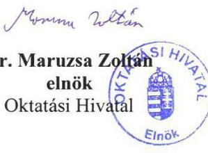

Kelt, Budapest, 2016. augusztus 12.

Melléklet: Észrevételek a jelentéstervezethez

---

# Észrevételek az ÁSZ jelentéstervezetével kapcsolatban: 

Összesen négy esetben javaslunk pontosítást a szövegben.

## 16. oldalon:

„Az Adatintegrációval" kezdetű rész esetében szerepel néhány pontatlanság. Összesen három adatintegráció valósult meg a TÁMOP 4.1.3. 2. ütem keretén belül, a szöveg alapvetően az elsőről, a 2013-ban lezártról szól, ezért két adat pontosítása szükséges:

A második bekezdés végén tévesen szerepel: „... a NISZ Zrt. 2015. január 30-án adta át az Educatio Nkft.-nek." Helyesen: „2013. novemberében" lenne.
2015. január 30-án ugyanis a 2014-ben indított és 2015-ben befejezett, a KIR, FIR és ONYF adatait összekapcsoló adatintegráció zárult le.

A harmadik bekezdés leírja az összekötött adatbázisokat, ezek között tévesen szerepel a Foglalkoztatási és Szociális Hivatal (FSZH). Az FSZH a 2010-11-ben megvalósított, a TÁMOP 4.1.3. 1. ütemből finanszírozott adatintegrációban vett részt.

## 17. oldalon:

Vélelmezhetően elírás a táblázatok alatti bekezdés utolsó előtti sorában: „... az aktív hallgatók legalább $90 \%$-át...". Az aktív szerintünk helytelen, helyette „végzett” -nek kellene szerepelnie.

## 20. oldalon:

A harmadik bekezdésében téves az az állítás, hogy: „a 2015-ben az előző évhez képest jelentősen nőtt (16-ról 41-re) azon szakok száma, amelyen magyar állami ösztöndíj vehető igénybe." Ténylegesen azon szakok száma emelkedett 16-ról
 41-re, ahol előzetesen állapítja meg az EMMI (a Miniszter) a magyar állami ösztöndíjas képzéshez szükséges követelményt (ponthatárt).
Más képzések is igénybe vehetők ösztöndíjas formában, de ott nem rögzített előzetesen, hogy milyen elért pontszám felett vehető igénybe az ösztöndíjas képzés.

---

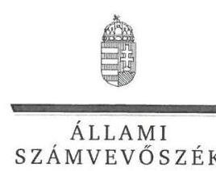

ELNÖK

Ikt. szám: V-0962-424/2016.

Dr. Maruzsa Zoltán Viktor úr
elnök
Oktatási Hivatal

# Budapest 

## Tisztelt Elnök Úr!

Köszönettel megkaptam a „Közös ellenőrzéssel a versenyképes tudás jobb hasznosulásáért - a diplomás pályakövetés jó gyakorlatainak feltárása" című jelentéstervezet megállapításaira tett, a FEF/4-8/2016. iktatószámú levelében megküldött észrevételét.

Az Állami Számvevőszék észrevétellel kapcsolatos álláspontját a mellékletként csatolt, a felügyeleti vezető által készített indokolás tartalmazza.

Budapest, 2016. 03 hó 02 nap
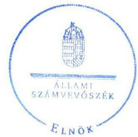

Tisztelettel:

Domokos László

Melléklet: Észrevételre adott válasz

---

# 1. számú melléklet

a V-0962-424/2016. számú levélhez

#### Abstract

„Közös ellenőrzéssel a versenyképes tudás jobb hasznosulásáért - a diplomás pályakövetés jó gyakorlatainak feltárása" című jelentéstervezetre tett észrevételekre adott válaszok

|   | Oktatási Hivatal észrevétele | Észrevétel elfogadása | Észrevételre adott válasz | A jelentés módosított szövegrésze  |
| --- | --- | --- | --- | --- |
|  1. | 16. oldalon:
„Az Adatintegrációval" kezdetű rész esetében szerepel néhány pontatlanság. Összesen három adatintegráció valósult meg a TÁMOP 4.1.3. 2. ütem keretén belül, a szöveg alapvetően az elsőről, a 2013-ban lezártról szól, ezért két adat pontosítása szükséges:
A második bekezdés végén tévesen szerepel: „... a NISZ Zrt. 2015. január 30-án adta át az Educatio Nkft.-nek." Helyesen: „2013 novemberében" lenne.
2015. január 30-án ugyanis a 2014-ben indított és 2015-ben befejezett, a KIR, FIR és ONYF adatait összekapcsoló adatintegráció zárult le.
A harmadik bekezdés leírja az összekötött adatbázisokat, ezek között tévesen szerepel a Foglalkoztatási és Szociális Hivatal (FSZH). Az FSZH a 2010-11-ben megvalósított, a TÁMOP 4.1.3. 1. ütemből finanszírozott adatintegrációban vett részt. | Igen | 1. Az észrevételt elfogadjuk, pontosítjuk a jelentéstervezet 16. oldalán az „Adatintegrációval.." kapcsolatos rész 2-4. bekezdését.
2. Az észrevételt elfogadjuk, a jelentéstervezet 16. oldalán töröljük az összekapcsolt adatbázisok felsorolásából a Foglalkoztatási és Szociális Hivatalt. | „A diplomás pályakövetés esetében olyan adatbázisok összekapcsolása történt meg, amelyek a felsőoktatási tanulmányok mellett a végzettek munkaerőpiaci elhelyezkedésének információit is tartalmazzák. Az adatintegráció lebonyolításáért 2013-ban a NISZ Zrt. felelt a döntés-előkészítéshez szükséges adatok hozzáférhetőségének biztosításáról szóló 2007. évi CL törvény végrehajtásáról szóló 335/2007. (XII.13.) kormányrendelet alapján.
A DPR keretében az adatintegráció a következő adatbázisok összekapcsolását jelentette a 2009/2010-es tanévben diplomát szerzettek körére vonatkozóan:
- Felsőoktatási Információs Rendszer (adatintegráció alapja);
- Adó- és Pénzügyi Ellenőrzési Hivatal, illetve Nemzeti Adó- és Vámhivatal;
- Országos Egészségbiztosítási Pénztár.
A 2014-ben indított és 2015-ben befejezett, a KIR, FIR és ONYF adatait összekapcsoló adatintegráció is lezárult. A kiemelt projektet lebonyolító Educatio Kft. és a NISZ Zrt. közt létrejött szerződés szerint az adatok összekapcsolásával létrejött adatbázist a NISZ Zrt. 2015. január 30-án adta át az Educatio Kft-nek. Az adatintegráció eredményeit, tehát azokat a mutatókat, jellemzőket, amelyek a DPR és más adatbázis összekapcsolásából származnak és a 2009/2010-es, illetve a 2011/2012-es tanévben diplomát szerzettek körére vonatkoznak a „Diplomás Pályakövetési Adatok 2013 - Adminisztratív Adatbázisok Integrációja című, a www.felvi.hu-n elérhető kiadvány tartalmazza részletesen."  |

---

| 2. | 17. oldalon:
Vélelmezhetően elírás a táblázatok alatti bekezdés utolsó előtti sorában: „... az aktív hallgatók legalább 90\%-át...". Az aktív szerintünk helytelen, helyette „végzett"-nek kellene szerepelnie. | Igen | Az észrevételt elfogadjuk, az elírást javítjuk a 17. oldal 5. táblázat alatti szövegrészben. | „A fenti indikátorok alapján a kapcsolódó célokkal összhangban, eredményesen látták el feladataikat az ellenőrzésre kiválasztott intézmények: a pályakövetési eredményeket igazoltan felhasználták az intézményekben és a végzett hallgatók legalább $90 \%$-át megkeresték a pályakövetési kérdőívekkel." |
| :--: | :--: | :--: | :--: | :--: |
| 3. | 20. oldalon:
A harmadik bekezdésében téves az az állítás, hogy: „a 2015-ben az előző évhez képest jelentősen nőtt (16-ról 41-re) azon szakok száma, amelyen magyar állami ösztöndíj vehető igénybe." Ténylegesen azon szakok száma emelkedett 16-ról 41-re, ahol előzetesen állapítja meg az EMMI (a Miniszter) a magyar állami ösztöndíjas képzéshez szükséges követelményt (ponthatárt).   Más képzések is igénybe vehetők ösztöndíjas formában, de ott nem rögzített előzetesen, hogy milyen elért pontszám felett vehető igénybe az ösztöndíjas képzés. | Igen | Az észrevételt elfogadjuk, az alapján a jelentéstervezet 20. oldal harmadik bekezdésében foglalt megállapítást módosítjuk. | „a 2015-ben az előző évhez képest jelentősen nőtt (16-ról 41-re) azon szakok száma, ahol előzetesen állapítja meg az EMMI a magyar állami ösztöndíjas képzéshez szükséges követelményt (ponthatárt)." |

Tájékoztatom Elnök urat, hogy az Állami Számvevőszékről szóló 2011. évi LXVI. törvény 29. § (3) bekezdése alapján az Állami Számvevőszék a figyelembe nem vett észrevételeket köteles a jelentésben feltüntetni, és megindokolni, hogy azokat miért nem fogadta el.

Budapest, 2016. 03. hónap 02. nap

Dr. Pulay Gyula
felügyeleti vezető

---

# RÖVIDÍTÉSEK JEGYZÉKE 

${ }^{1}$ TÁMOP
${ }^{2}$ DPR
${ }^{3}$ KMR
${ }^{4}$ KONV
${ }^{5}$ EU
${ }^{6}$ ÁSZ
${ }^{7}$ SZMSZ
${ }^{8}$ ZsKF
${ }^{9}$ PTE
${ }^{10}$ NISZ Zrt.
${ }^{11}$ KIR
${ }^{12}$ FIR
${ }^{13}$ ONYF
${ }^{14}$ BCE
${ }^{15}$ ELTE
${ }^{16} \mathrm{SE}$
${ }^{17}$ SZIE
${ }^{18}$ szaktárca
${ }^{19}$ Neptun
${ }^{20}$ Nftv.

Társadalmi Megújulás Operatív Program
Diplomás Pályakövető Rendszer
Közép-magyarországi Régió
Konvergencia régió
Európai Unió
Állami Számvevőszék
Szervezeti és Működési Szabályzat
Zsigmond Király Főiskola
Pécsi Tudományegyetem
Nemzeti Infokommunikációs Szolgáltató Zrt.
Köznevelési Információs Rendszer
Felsőoktatási Információs Rendszer
Országos Nyugdíjbiztosító Főigazgatóság
Budapesti Corvinus Egyetem
Eötvös Lóránd Tudományegyetem
Semmelweis Egyetem
Szent István Egyetem
Nemzeti Erőforrás Minisztérium, 2012. május 14-től Emberi Erőforrások Minisztériuma
a magyar felsőoktatási intézmények adminisztrációját, információs rendszerét ellátó szoftver
a nemzeti felsőoktatásról szóló 2011. évi CCIV. törvény

---

# ÁLLAMI SZÁMVEVŐSZÉK 

1052 Budapest, Apáczai Csere János utca 10.
Levélcím: 1364 Budapest 4. Pf. 54
Telefon: +36 14849100 Telefax: +36 14849200
www.asz.hu

