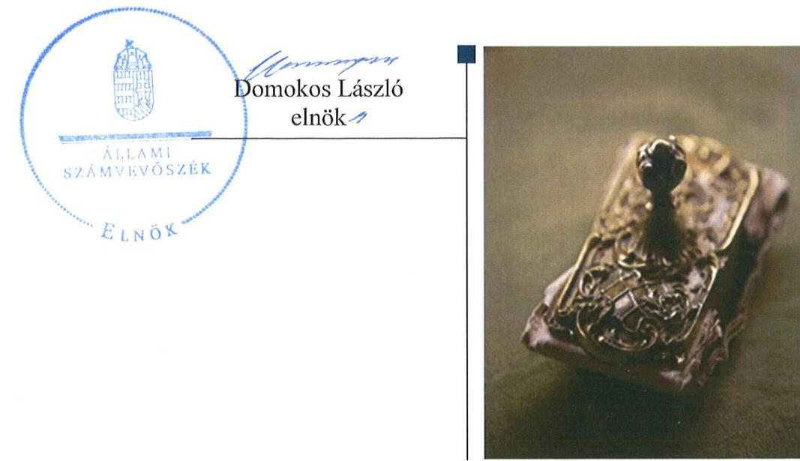
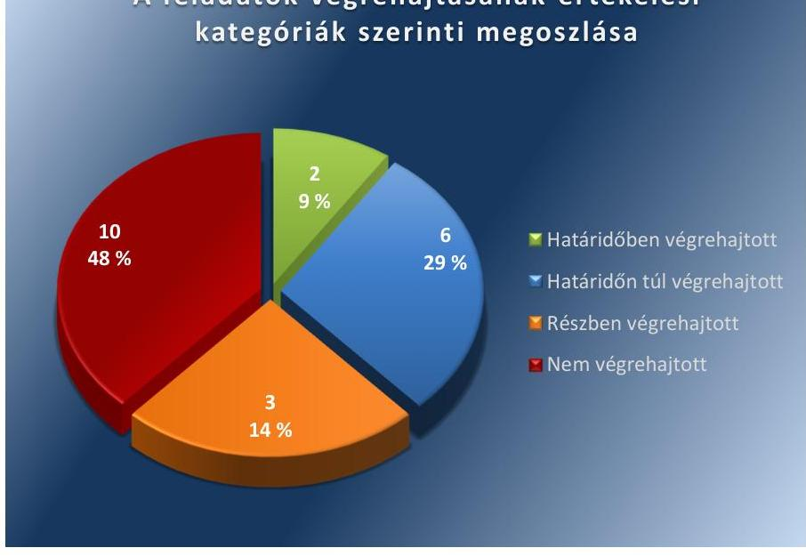
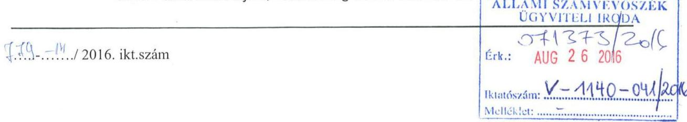
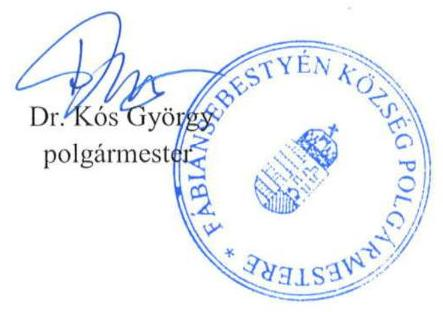
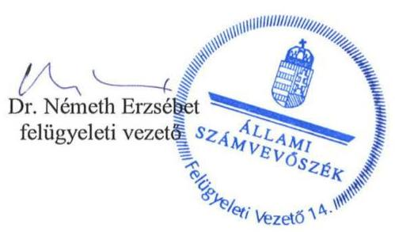

# Jelentés 

## Utóellenőrzések

Fábiánsebestyén Községi Önkormányzat belső kontrollrendszerének kialakítása, valamint egyes kontrolltevékenységek és a belső ellenőrzés működésének utóellenőrzése 2016.

---

# Jelentés 

## Utóellenőrzések

Fábiánsebestyén Községi Önkormányzat belső kontrollrendszerének kialakítása, valamint egyes kontrolltevékenységek és a belső ellenőrzés működésének utóellenőrzése
2016. október 5. nap

---

|  J | AZ ELLENŐRZÉST FELÜGYELTE:  |
| --- | --- |
|   | DR. NÉMETH ERZSÉBET felügyeleti vezető  |
|   | AZ ELLENŐRZÉST VEZETTE ÉS A VÉGREHAJTÁSÁÉRT FELELŐS:  |
|   | DR. PELLEI TAMÁS ellenőrzésvezető  |
|   | A PROGRAM ÖSSZEÁLLÍTÁSÁÉRT FELELŐS:  |
|   | JANIK JÓZSEF LÁSZLÓ osztályvezető  |
|   | A TÉMÁHOZ KAPCSOLÓDÓ KORÁBBI SZÁMVEVŐSZÉKI JELENTÉSEK:  |
|   | - címe: Jelentés Fábiánsebestyén Község Önkormányzata belső kontrollrendszerének kialakítása, valamint egyes kontrolltevékenységek és a belső ellenőrzés működése ellenőrzéséről  |
|  Jelentéseink az Országgyűlés számítógépes hálózatán és az Interneten a www.asz.hu címen is olvashatóak. | - sorszáma: 13044  |
|   | IKTATÓSZÁM: V-1140-045/2016.  |
|   | TÉMASZÁM: 2174  |
|   | ELLENŐRZÉS-AZONOSÍTÓ SZÁM: V075508  |

---

# TARTALOMJEGYZÉK 

■ ÖSSZEGZÉS ..... 5
■ AZ ELLENŐRZÉS CÉLJA ..... 6
■ AZ ELLENŐRZÉS TERÜLETE ..... 7
■ AZ ELLENŐRZÉS HÁTTERE, INDOKOLTSÁGA ..... 8
■ A JELENTÉS LÉNYEGES KÉRDÉSKÖREI ..... 9
■ ELLENŐRZÉS HATÓKÖRE ÉS MÓDSZEREI ..... 10
■ MEGÁLLAPÍTÁSOK ..... 13
■ MELLÉKLETEK ..... 17
I. Sz. melléklet: Az ÁSZ 13044 számú jelentéséhez kapcsolódó intézkedési terv végrehajtása ..... 17
■ FÜGGELÉK: ÉSZREVÉTELEK ..... 23
■ RÖVIDÍTÉSEK JEGYZÉKE ..... 31

---

.

---

# ÖSSZEGZÉS 

Az utóellenőrzés megállapította, hogy az intézkedési tervben foglalt feladatok jelentős részét az Önkormányzat ${ }^{1}$ nem hajtotta végre, így nem tett megfelelő lépéseket az ÁSZ ${ }^{2}$ által korábban feltárt, a belső kontrollrendszert és belső ellenőrzést érintő hiányosságok megszüntetésére. Mindez kockázatot hordoz az Önkormányzat szabályozásában, működésének szabályosságában és a felelős vezetői magatartásban.

## Az ellenőrzés társadalmi indokoltsága

Az ÁSZ stratégiájában célul tűzte ki a számvevőszéki munka hasznosulásának javítását. Ezzel összhangban ellenőrzi, hogy az ellenőrzött szervezetek megvalósították-e a korábbi ellenőrzései által feltárt hibák, hiányosságok és szabálytalanságok megszüntetése céljából elkészített intézkedési terveikben foglaltakat. A rendszeres utóellenőrzések hozzájárulnak a szükséges intézkedések tényleges végrehajtásához, ezáltal a közpénzügyek rendezettségének javulásához.

Az ÁSZ a 2013-ban nyilvánosságra hozott számvevőszéki jelentésében ${ }^{3}$ 21 javaslatot fogalmazott meg. Az Önkormányzat intézkedési tervében mindösszesen 21 feladatot határozott meg. A feladatok számossága indokolttá tette az utóellenőrzés elvégzését.

## Főbb megállapítások, következtetések

A polgármester ${ }^{4}$ az intézkedési tervet határidőben megküldte az ÁSZ részére. Az intézkedési tervben rögzített feladatok végrehajtásáról nem vezették a Bkr. ${ }^{5}$ előírásainak megfelelő nyilvántartást.

Az intézkedési tervben meghatározott 21 feladatból kettőt határidőben, hatot határidőn túl, hármat részben hajtottak végre, valamint tíz feladat végrehajtása nem történt meg.

A nem végrehajtott feladatok esetében több esetben hiányosság volt, hogy a belső szabályzatokat nem módosították, nem megfelelően alakították ki, nem gondoskodtak teljes körűen a pénzügyi folyamatokban kulcsszerepet betöltő kontrollokkal kapcsolatos tevékenységek szabályszerű ellátásáról, illetve a belső ellenőrzési jelentésekben foglalt javaslatokra nem készítettek intézkedési tervet és megfelelő nyilvántartást.

Bár a megtett intézkedések javították az Önkormányzat működésének szabályozottságát, az ÁSZ által korábban az Önkormányzat belső kontrollrendszerének kialakítása, valamint az egyes kontrolltevékenységek és a belső ellenőrzés működésének területén azonosított hiányosságok jelentős része továbbra is fennáll.

A részben végrehajtott, illetve a nem végrehajtott feladatok kockázatot jelentenek az Önkormányzat jogszabályoknak megfelelő szabályozásában, működésének szabályosságában, amelyek kezelése a vezetői felelősség körébe tartozik.

---

# AZ ELLENŐRZÉS CÉLJA

Az ellenőrzés célja annak értékelése volt, hogy a számvevőszéki jelentésben foglalt intézkedést igénylő megállapításokkal és javaslatokkal összhangban készített intézkedési tervben meghatározott feladatokat az ellenőrzött szervezet végrehajtotta-e.

---

# AZ ELLENŐRZÉS TERÜLETE 

## Az Önkormányzat

Fábiánsebestyén község Csongrád megyében, a Szentesi járás közigazgatási területén fekszik. 2015. január 1-jétől létrehozták Fábiánsebestyén község, valamint Eperjes község önkormányzatai részvételével a Fábiánsebestyéni Közös Önkormányzati Hivatal ${ }^{6}$-t. A lakónépességének száma a KSH által közzétett népességi adatok ${ }^{7}$ szerint 2015. január 1-jén 1970 fő volt. A polgármester 2010. évi önkormányzati választások óta tölti be tisztségét, a jegyző ${ }^{8}$ 2013. január 1-jétől látja el feladatait.

Az Önkormányzat a 2015. évi éves költségvetésének beszámolója szerint 592,5 millió Ft költségvetési bevételt ért el, valamint 573,6 millió Ft költségvetési kiadást teljesített. A 2015. december 31-ei könyvviteli mérleg szerint az Önkormányzat eszközei 1507,5 millió Ft-ot tettek ki.

Az ÁSZ a 2013. évben ellenőrizte az Önkormányzat belső kontrollrendszerének kialakítását, valamint egyes kontrolltevékenységek és a belső ellenőrzés működését, az erről szóló 13044. számú jelentését 2013. június 12-én tette közzé. Az ellenőrzés célja annak értékelése volt, hogy az Önkormányzat a jogszabályi előírásoknak megfelelően alakította-e ki a belső kontrollrendszert, megfelelően működtette-e a gazdálkodás folyamatában kulcsszerepet betöltő szakmai teljesítésigazolás és utalvány ellenjegyzés kontrollokat, biztosította-e a belső ellenőrzés szabályos és eredményes működését.

Az utóellenőrzés az ÁSZ jelentésben a polgármester és a jegyző részére megfogalmazott intézkedést igénylő megállapításokra és javaslatokra készített, az ÁSZ részére megküldött intézkedési tervben foglalt feladatok megvalósításának ellenőrzésére, illetve értékelésére fókuszált.

---

# AZ ELLENŐRZÉS HÁTTERE, INDOKOLTSÁGA 

Az ÁSZ tv. ${ }^{9}$ 33. § (1) bekezdése értelmében a számvevőszéki jelentések intézkedést igénylő megállapításaihoz és javaslataihoz kapcsolódóan az ellenőrzött szervezet vezetője intézkedési tervet köteles összeállítani, és az ÁSZ részére megküldeni. Az intézkedési tervben foglaltak megvalósítását az ÁSZ tv. 33. § (7) bekezdésében foglaltak alapján - az ÁSZ utóellenőrzés keretében - ellenőrizheti. Az intézkedések megvalósulásának értékelése során az ÁSZ figyelembe veszi az ellenőrzött szervezetek működési feltételeiben, valamint a jogszabályi előírásokban bekövetkezett változásokat.

Az intézkedési tervekben foglalt feladatok hiányos, illetve késedelmes végrehajtása, valamint megvalósításának elmaradása azt mutatja, hogy az ellenőrzések során feltárt hibák, hiányosságok és szabálytalanságok megszüntetése nem kapott kellő hangsúlyt. Ez a szabályszerű működés és a felelős vezetői magatartás vonatkozásában kockázatot hordoz. E kockázatok feltárásával az ÁSZ utóellenőrzési rendszere fokozza a fegyelmet, és igazolja, hogy a közpénzzel való szabályos gazdálkodás felelőssége elől nem lehet kitérni.

## AZ UTÓELLENŐRZÉS VÁRHATÓ HASZNOSULÁSA

Az utóellenőrzés négy szinten hasznosulhat:
$\longrightarrow$ A társadalom szintjén az utóellenőrzés jelzi, hogy a számvevőszéki ellenőrzés megállapításainak van következménye: a hiányosságok megszüntetésére az ellenőrzött szervezet által meghatározott intézkedések végrehajtását is számon kéri az ÁSZ.
$\longrightarrow$ Az ellenőrzött terület szintjén az utóellenőrzés tájékoztatást nyújt a terület döntéshozóinak a hiányosságok kiküszöbölésének jó gyakorlatairól, ezzel lehetőséget biztosítva arra, hogy az ÁSZ ellenőrzési megállapításai, javaslatai a terület nem ellenőrzött szervezeteinek a működése során is hasznosuljanak.
$\longrightarrow$ Az ellenőrzött szervezet szintjén az utóellenőrzés feltárja, hogy a szervezet az intézkedések végrehajtásával hasznosította-e a korábbi ellenőrzési jelentésben a hiányosságok megszüntetése, illetve a kockázatok kezelése érdekében megfogalmazott javaslatokat.
$\longrightarrow$ Az ÁSZ szintjén az utóellenőrzés visszacsatolást ad az ellenőrzési jelentések hasznosulásáról, az intézkedések elmaradása vagy részleges megvalósulása a további ellenőrzésekhez kockázati jelzésként szolgál.

---

# A JELENTÉS LÉNYEGES KÉRDÉSKÖREI 

Az Önkormányzat az intézkedési tervben foglaltakat az előírt határidőben végrehajtotta-e?

---

# ELLENŐRZÉS HATÓKÖRE ÉS MÓDSZEREI 

## Az ellenőrzés típusa

Megfelelőségi ellenőrzés

## Az ellenőrzött időszak

Az utóellenőrzés alapját képező ÁSZ jelentés közzétételének napjától (2013. június 12.) az ellenőrzésről szóló kiértesítő levél keltének napjáig (2016. április 29.) tartó időszak.

## Az ellenőrzés tárgya

A számvevőszéki jelentésben foglalt intézkedést igénylő megállapításokkal és javaslatokkal összhangban - az Önkormányzat által - készített intézkedési tervben foglaltak végrehajtásának ellenőrzése.

Az ellenőrzés kiterjed minden olyan körülményre és adatra, amely az ÁSZ jogszabályban meghatározott feladatainak teljesítéséhez, valamint a program végrehajtása folyamán felmerült újabb összefüggések feltárásához szükséges.

## Az ellenőrzött szervezet

Fábiánsebestyén Községi Önkormányzat

## Az ellenőrzés jogalapja

Az ÁSZ az Országgyűlés pénzügyi és gazdasági ellenőrző szerve. Az ÁSZ törvényben meghatározott feladatkörében ellenőrzi a központi költségvetés végrehajtását, az államháztartás gazdálkodását, az államháztartásból származó források felhasználását és a nemzeti vagyon kezelését.

Az ÁSZ tv. 1. § (3) bekezdése szerint az ÁSZ általános hatáskörrel végzi a közpénzekkel és az állami és önkormányzati vagyonnal való felelős gazdálkodás ellenőrzését.

Az ÁSZ tv. 33. § (7) bekezdése alapján az ÁSZ tv. 33. § (1)-(2) bekezdése szerinti intézkedési tervben foglaltak megvalósítását az ÁSZ utóellenőrzés keretében ellenőrizheti.

---

# Az ellenőrzés módszerei 

Az ÁSZ az ellenőrzést a nemzetközi standardokat irányadónak tekintve az ellenőrzési program ellenőrzési kérdései, az ellenőrzött időszakban hatályos jogszabályok, az ellenőrzés szakmai szabályok és módszertanok figyelembevételével, önállóan végezte.

Az ÁSZ az ellenőrzés ideje alatt az Önkormányzattal történő kapcsolattartást az ÁSZ SZMSZ ${ }^{10}$-ének vonatkozó előírásai alapján biztosította.

Az utóellenőrzés megállapításait elsősorban az ÁSZ rendelkezésére álló, valamint az ellenőrzött szervezetektől elektronikusan bekért dokumentumok alapozták meg.

Az ellenőrzési bizonyítékként felhasználható adatforrások közé tartoznak egyrészt a szakmai programban felsorolt adatforrások, másrészt minden - az ellenőrzés folyamán feltárt, az ellenőrzés szempontjából információt tartalmazó - dokumentum.

A pénzügyi folyamatokban kulcsszerepet betöltő kontrollokra vonatkozóan az intézkedési tervben foglalt feladatok végrehajtását az államháztartáson kívülre teljesített működési célú pénzeszközátadásoknál, az állományba nem tartozók megbízási díjainál, továbbá a külső szolgáltatók által végzett karbantartási, kisjavítási munkákkal kapcsolatos kifizetéseknél 10 elemű véletlen mintavétellel kiválasztott tételek alapján értékelte az ÁSZ. A kiválasztott tételek esetében azt ellenőrizte, hogy az Önkormányzat az intézkedési tervben meghatározott feladatok végrehajtása érdekében biztosította-e a jogszabályok és a belső szabályzatok előírásainak megfelelő működtetést.

Az intézkedési tervekben előírt feladatokat, azok végrehajthatósága, illetve végrehajtása szempontjából az alábbiak szerint értékelte az ÁSZ:
"határidőben végrehajtott" a feladat, ha a teljesítés dokumentáltan, az intézkedési tervben előírt határidőben és tartalommal megtörtént;
"határidőn túl végrehajtott" a feladat, ha annak teljesítése az intézkedési tervben meghatározott módon, de az előírt határidőn túl történt meg;
"részben végrehajtott" a feladat, ha végrehajtása teljes körűen az intézkedési tervben előírt módon nem történt meg;
"nem végrehajtott" a feladat, ha a végrehajtás nem történt meg, vagy amennyiben a teljesítést nem dokumentálták;
"okafogyottá vált" a feladat, ha végrehajtására - meghatározott esemény bekövetkezése, továbbá külső körülmény, a működést érintő feltétel változása miatt - már nincs szükség, illetve lehetőség, és egyértelműen megállapítható, hogy az intézkedést szükségessé tevő körülmény a jövőben nem fordulhat elő;
"nem időszerű" az a feladat, amelynek ellenőrzési időszakon belüli végrehajtására azért nem került (kerülhetett) sor, mert az intézkedés alapjául szolgáló esemény nem következett be, de annak jövőbeni előfordulása lehetséges, a végrehajtása nem volt esedékes, vagy a végrehajtás határideje még nem járt le.

---

Az ellenőrzés lefolytatásához az ellenőrzött szervezet a tanúsítványok elektronikus kitöltésével, valamint az ÁSZ által kért dokumentumok elektronikus megküldésével szolgáltatott adatokat, amelyek valódiságát és teljes körűségét az ellenőrzött szervezet vezetője által tett teljességi és hitelességi nyilatkozat igazolta. Az így rendelkezésre bocsátott adatok, információk kontrollja az ellenőrzés keretében történt.

---

# MEGÁLLAPÍTÁSOK 

## Az Önkormányzat az intézkedési tervben foglaltakat az előírt határidőben végrehajtotta-e?

Összegző megállapítás

Az Önkormányzat az intézkedési tervben meghatározott 21 feladatból kettőt határidőben, hatot határidőn túl, hármat részben és tízet nem hajtott végre.
 Az intézkedési tervben rögzített feladatok végrehajtásáról a Bkr. előírásainak megfelelő nyilvántartást nem vezettek.

Az ÁSZ a jelentésében a polgármester részére kettő, a jegyző részére 19 javaslatot fogalmazott meg. A polgármester és a jegyző az ÁSZ részére megküldött intézkedési tervben a hiányosságok, szabálytalanságok megszüntetésére 21 feladatot határozott meg, a feladatok elvégzésének felelőseként két esetben a polgármestert, 19 esetben pedig a jegyzőt jelölték meg.

Az ÁSZ javaslatai alapján készített intézkedési tervben rögzített feladatok végrehajtásáról a jegyző a Bkr. előírásainak megfelelő nyilvántartást nem vezetett.

Az intézkedési tervben meghatározott feladatokat, határidőket, a feladatok elvégzésének felelősét és a feladatok végrehajtását az I. számú melléklet mutatja be.

Az intézkedési tervben tervezett feladatok végrehajtásának értékelési kategóriák szerinti megoszlását az 1. ábra szemlélteti.
1. ábra

A feladatok végrehajtásának értékelési kategóriák szerinti megoszlása

Forrás: ÁSZ

---

# HATÁRIDŐBEN VÉGREHAJTOTT feladat: 

1. A jegyző a 2013. augusztus 1-jétől hatályos kockázatkezelési szabályzat ${ }^{11}$-ban kialakította, és a kockázati munkacsoport által működtette a polgármesteri hivatal kockázatkezelési rendszerét.
2. A jegyző gondoskodott az operatív gazdálkodás során arról, hogy az összeférhetetlenségi szabályok az Ávr.-ben foglaltaknak megfelelően érvényesüljenek.

## HATÁRIDŐN TÚL VÉGREHAJTOTT feladatok:

3. A jegyző az intézkedési tervben meghatározott 2013. július 31-ei határidőt követően, 2013. augusztus 26-án készítette elő a Htv. ${ }^{12}$ és az Mötv. ${ }^{13}$ előírásai alapján a gazdasági program ${ }^{14}$ tervezetét, és kezdeményezte a polgármesternél a gazdasági program tervezetének Képviselő-testület elé terjesztését.
4. A polgármester az intézkedési tervben megjelölt 2013. augusztus 28-ai határidőt követően, 2013. október 9-én terjesztette a Képviselő-testület elé a jegyző által előkészített gazdasági program tervezetét.
5. A jegyző az intézkedési tervben meghatározott 2013. augusztus 31-ei határidőt követően, 2014. január 1-jén gondoskodott az Ávr. ${ }^{15}$ és az Info tv. ${ }^{16}$ előírásai alapján elkészített közzétételi szabályzat ${ }^{17}$ hatályba léptetéséről.
6. A jegyző az adatvédelmi és adatbiztonsági szabályzatban ${ }^{18}$ rendelkezett a hozzáférési jogosultságok megállapításáról, betartásának ellenőrzéséről és nyilvántartásáról, továbbá az informatikai szabályzatban ${ }^{19}$ meghatározta a pénzügyi-számviteli szoftverváltozások ellenőrzésére, tesztelésére vonatkozó eljárásokat, és kijelölte a feldolgozott adatok mentésének felelőseit. A szabályzatokat az intézkedési tervben meghatározott 2013. szeptember 15-ei határidőt követően, 2014. január 1-jén léptette hatályba.
7. A jegyző intézkedett a belső ellenőrzés végzésére vonatkozó új megállapodás megkötéséről, azonban az önkormányzati belső ellenőrzési feladatok megbízásos jogviszonyban történő ellátására vonatkozó szerződés megkötésére az intézkedési tervben meghatározott 2013. augusztus 31-ei határidőt követően, 2013. szeptember 16-án került sor.
8. A jegyző gondoskodott arról, hogy az éves ellenőrzési tervek kockázatelemzésen alapuljanak, azonban a kockázatelemzéssel megalapozott 2013. évi éves ellenőrzési terv elkészítésére az intézkedési tervben előírt 2013. augusztus 31-ei határidőt követően, 2013. szeptember 21-én, annak Képviselő-testület által történő elfogadására 2013. október 10-én került sor.

## RÉSZBEN VÉGREHAJTOTT feladatok:

9. A jegyző a 2013. július 30-ától hatályos teljesítményértékelési szabályzatban ${ }^{20}$ a Kttv. ${ }^{21}$ előírásainak megfelelően alakította ki a teljesítményértékelésre vonatkozó szabályokat, azonban azok alkalmazásáról nem gondoskodott, teljesítményértékeléseket nem készített.

---

10. A jegyző intézkedett arról, hogy a tervezett ellenőrzéseket az ellenőrzési programok alapján hajtsák végre, azonban az ellenőrzési programok nem tartalmazták a Bkr.-ben előírt valamennyi tartalmi elemet.
11. A jegyző az intézkedési tervben meghatározott 2013. július 31-ei határidőt követően, a 2015. január 2-án elkészített hivatali SZMSZ ${ }^{22}$ -ben a Bkr. előírásainak megfelelően meghatározta a belső ellenőrzést végzők jogállását, azonban a polgármesternél az ellenőrzéssel érintett időszakban nem kezdeményezte a hivatali SZMSZ Képviselő-testület elé terjesztését.

# NEM VÉGREHAJTOTT feladatok: 

12. A jegyző a Bkr. előírása ellenére nem szabályozta a felelőségi körök meghatározásával a Hivatal tevékenységeire vonatkozó beszámolási eljárásokat.
13. A jegyző nem alakította ki és nem működtette a Bkr. előírásai ellenére a Hivatal tevékenységének, a célok megvalósításának nyomon követését biztosító rendszert, amelynek része az operatív tevékenységek keretében megvalósuló folyamatos és eseti nyomon követés is.
14. A polgármester az új Áht. ${ }^{23}$ és az Ávr. előírásainak ellenére nem intézkedett arról, hogy az Önkormányzat nevében történő kötelezettségvállalásra kizárólag pénzügyi ellenjegyzés után, a pénzügyi teljesítés esedékességét megelőzően kerüljön sor.
15. A jegyző nem gondoskodott a teljesítésigazolás szabályszerű elvégzéséről, mivel a teljesítéseket nem az Ávr.-ben foglalt módon igazolták.
16. A jegyző nem intézkedett az érvényesítés Ávr. szerinti szabályszerű végrehajtásáról, mivel az érvényesítést szabályszerű teljesítésigazolás hiányában végezték, továbbá az érvényesítő nem tett eleget az Ávr.-ben meghatározott ellenőrzési kötelezettségségnek.
17. A jegyző nem gondoskodott arról, hogy a kötelezettségvállalások nyilvántartását az Ávr.-ben és az Áhsz ${ }^{24}$-ben előírt módon vezessék, illetve az utalványrendeleten a kötelezettségvállalás nyilvántartásba vételi sorszámát az Ávr.-ben foglaltaknak megfelelően tüntessék fel.
18. A jegyző nem kezdeményezte, hogy az éves ellenőrzési tervek tartalmazzák a Bkr.-ben előírt tartalmi elemeket.
19. A jegyző nem kezdeményezte, hogy a belső ellenőrzési vezető feladatkörébe tartozó tevékenységek ellátásának módját a Bkr.-ben foglaltaknak megfelelően határozzák meg.
20. A jegyző a Bkr. előírása ellenére nem készített intézkedési tervet a belső ellenőrzési jelentésben megfogalmazott javaslatok végrehajtására.
21. A jegyző nem gondoskodott arról, hogy a belső ellenőrzési vezető a Bkr.-ben előírt módon és tartalommal tartsa nyilván és kövesse nyomon az ellenőrzési jelentések alapján megtett intézkedéseket, továbbá arról, hogy a Bkr. előírásai szerint vezesse az elvégzett belső ellenőrzésekre vonatkozó nyilvántartást.

---

.

---

# MELLÉKLETEK

- I. SZ. MELLÉKLET: AZ ÁSZ 13044 SZÁMÚ JELENTÉSÉHEZ KAPCSOLÓDÓ INTÉZKEDÉSI TERV VÉGREHAJTÁSA

|  Az intézkedési terv alapján elvégzendő feladat | Az intézkedési tervben meghatározott határidő | Az intézkedési tervben rögzített feladatok elvégzésének felelőse | A feladat végrehajtása  |
| --- | --- | --- | --- |
|  Határidőben végrehajtott feladatok |  |  |   |
|  1. Alakítsa ki és működtesse a Bkr. 3. § b) pontja szerinti kockázatkezelési rendszert. | 2013. augusztus 31. | jegyző | A jegyző 2013. augusztus 1-jén hatályba léptette a polgármesteri hivatal kockázatkezelési szabályzatát, amelyben meghatározta a kockázatkezelés elvi szabályait, a kapcsolódó fogalmakat és az elvégzendő feladatokat, valamint a kockázatkezelési rendszer működésének kereteit. A szabályzatban meghatározott kockázati munkacsoporton keresztül működtette a kockázatkezelési rendszert, amelynek keretében elvégezték a kockázatok feltárását, beazonosítását, értékelését, minősítését, azok nyilvántartásba vételét.  |
|  2. Gondoskodjon - a szakmai teljesítésigazolás és az utalványozás ellenjegyzése vonatkozásában feltárt hiányosságok megszüntetése, illetve az operatív gazdálkodás során a működésbeli hibák megelőzése, feltárása és kijavítása érdekében - arról, hogy az összeférhetetlenségi szabályok az Ávr. 60. § (1)(2) bekezdésében foglaltaknak megfelelően érvényesüljenek. | azonnali és azt követően folyamatos | jegyző | A jegyző gondoskodott az Ávr. 60. § (1)-(2) bekezdésében foglalt összeférhetetlenségi szabályok érvényesüléséről. A gazdálkodási jogkörökkel kapcsolatos kijelöléseknél, felhatalmazásoknál figyelembe vették az Ávr. előírásait, amelyek betartásáról az ellenőrzött dokumentumok alapján - az operatív gazdálkodás során gondoskodtak.  |
|  Határidőn túl végrehajtott feladatok |  |  |   |
|  3. Készítse elő a Htv. 140. § (1) bekezdés a) pontjában foglaltak alapján a gazdasági program tervezetét a Mótv. 116. § (3)-(4) bekezdéseiben foglalt tartalommal, és kezdeményezze a polgármesternél a Képviselő-testület elé terjesztését. | 2013. július 31. | jegyző | A jegyző a gazdasági program tervezetét 2013. augusztus 26-án készítette el a Htv. 140. § (1) bekezdés a) pontjában és az Mótv. 116. § (3)-(4) bekezdésében foglalt tartalommal, és ezt követően kezdeményezte a polgármesternél a gazdasági program Képviselő-testület elé terjesztését.  |
|  4. Terjessze a Képviselő-testület elé a gazdasági program jegyző által elkészített tervezetét a Mótv. 116. § (1) és (5) bekezdései alapján, a (3)-(4) bekezdésekben foglalt tartalommal. | 2013. augusztus 28. | polgármester | A polgármester a jegyző által az Mótv. 116. § (3)-(4) bekezdéseiben foglalt előírásoknak megfelelően elkészített gazdasági program tervezetét az intézkedési tervben megjelölt határidőt követően, 2013. október 9-én terjesztette a Képviselő-testület elé. A gazdasági programot a Képviselő-testület a 2013. október 10-én kelt, 146/2013. (X. 10.) Ö. számú határozatával fogadta el.  |

---

|  5. | Szabályozza az Ávr. 13. § (2) bekezdés h) pontja és az Info tv. 35. § (3) bekezdése alapján a közérdekű adatok közzétételének, nyilvánosságra hozatalának rendjét, valamint az Info tv. 30. § (6) bekezdése szerint a közérdekű adatok megismerésére irányuló igények teljesítésének rendjét. | 2013. augusztus 31. | jegyző | Az Önkormányzatra és intézményeire vonatkozó, a polgármester által kiadmányozott közzétételi szabályzat 2014. január 1-jén lépett hatályba, amely tartalmazta az Ávr. 13. § (2) bekezdés h) pontja és az Info tv. 35. § (3) bekezdésében, valamint az Info tv. 30. § (6) bekezdésében foglaltaknak megfelelően a közérdekű adatok közzétételének, nyilvánosságra hozatalának, valamint a közérdekű adatok megismerésére irányuló igények teljesítésének rendjét.  |
| --- | --- | --- | --- | --- |
|  6. | Biztosítsa az Info tv. 7. § (2)-(3) bekezdésének megfelelően az adatbiztonság érvényesülését, rendelkezzen a hozzáférési jogosultságok megállapításáról, betartásának ellenőrzéséről és nyilvántartásáról. Szabályozza a pénzügyi-számviteli szoftverváltozások ellenőrzésére, tesztelésére vonatkozó eljárásokat, és jelölje ki a feldolgozott adatok mentésének felelőseit. | 2013. szeptember 15. | jegyző | A jegyző által elkészített és 2014. január 1-jén hatályba léptetett adatvédelmi szabályzatban, valamint az informatikai szabályzatban az Info tv. 7. § (2)-(3) bekezdésének megfelelően biztosította az adatbiztonság érvényesülését, rendelkezett a hozzáférési jogosultságok megállapításáról, betartásának ellenőrzéséről és nyilvántartásáról. Szabályozta a pénzügyi-számviteli szoftverváltozások ellenőrzésére, tesztelésére vonatkozó eljárásokat, és kijelölte a feldolgozott adatok mentésének felelőseit.  |
|  7. | Kezdeményezze a belső ellenőrzés végzésére vonatkozó társulási megállapodás módosítását vagy új megállapodás megkötését annak érdekében, hogy az abban foglaltak a hatályos jogszabályi előírásokkal - különösen az Mótv. és a Bkr. vonatkozó rendelkezéseivel - összhangban legyenek. | 2013. augusztus 31., és azt követően folyamatos | jegyző | A belső ellenőrzési feladatokat ellátó Szentes Kistérség Belső Ellenőrzési Társulása 2013. június 30-ai hatállyal történő megszüntetését és az Önkormányzat belső ellenőrzési feladatainak 2013. július 1-jétől a Hivatalban foglalkoztatott belső ellenőr útján történő önálló ellátását a Képviselő-testület a 2013. május 28-án kelt, 68/2013. (V.28) Ö. számú határozatával jóváhagyta. Ugyanakkor az önkormányzati belső ellenőrzési feladatok ellátására vonatkozó megbízási szerződés megkötésére az intézkedési tervben rögzített határidőt követően, 2013. szeptember 16-án került sor.  |
|  8. | Intézkedjen arról, hogy az éves ellenőrzési terv a Bkr. 29. § (1) bekezdése alapján kockázatelemzésen alapuljon, valamint arról, hogy azt a belső ellenőrzési vezető a Bkr. 56. § (2) bekezdés előírásainak megfelelően a jegyző írásos véleményének figyelembevételével, a Bkr. 29. § (1) bekezdésében foglaltak szerint készítse el. | 2013. augusztus 31., és azt követően folyamatos | jegyző | A jegyző intézkedett arról, hogy a Képviselő-testület 141/2013. (X.10.) Ö. számú, 191/2013. (XII.12.) Ö. számú,

 178/2014. (XII.08.) Ö. számú, valamint a 247/2015. (XII.14.) Ö. számú határozataival jóváhagyott 2013-2015. évekre vonatkozó éves ellenőrzési tervek kockázatelemzésen alapuljanak. A 2013. évi éves ellenőrzési tervet és az annak alapjául szolgáló kockázatelemzést a belső ellenőrzési vezető az intézkedési tervben előírt határidőt követően, 2013. szeptember 21-én készítette el, amelyet a Képviselő-testület a 2013. október 10-én kelt, 141/2013. (X.10.) Ö. számú határozatával jóváhagyott. A Bkr. 56. § (2) bekezdésének előírásával kapcsolatos intézkedés okafogyottá vált, mert az önkormányzati belső ellenőrzési feladatok ellátása nem társulás formájában történik.  |

---

|  9. | Intézkedjen a Kttv. 130. § (1)-(6) bekezdéseiben előírtak szerint a teljesítményértékelésre vonatkozó szabályok kialakításáról és alkalmazásáról. | 2013. július 31. | jegyző | • Határidőben végrehajtott feladat: A jegyző kialakította a Kttv. 130. § (1)-(6) bekezdéseiben előírtak szerinti teljesítményértékelésekre vonatkozó szabályokat, amelyeket a 2013. július 30-án hatályba léptetett teljesítményértékelési szabályzatban rögzített.  |
| --- | --- | --- | --- | --- |
|  10. | Intézkedjen, hogy a tervezett ellenőrzéseket a Bkr. 33. § (2) bekezdésében foglaltaknak megfelelően a belső ellenőrzési vezető által jóváhagyott ellenőrzési programok alapján hajtsák végre. | 2013. augusztus 31., és azt követően folyamatos | jegyző | • Nem végrehajtott feladat: A jegyző a teljesítményértékelésre vonatkozó szabályok alkalmazását dokumentált módon nem igazolta, a teljesítményértékeléseket nem készítette el.  |
|  11. | Készítse elő a hivatali SZMSZ módosítását, és kezdeményezze a polgármesternél a módosítás Képviselő-testület elé terjesztését annak érdekében, hogy a Bkr. 15. § (2) bekezdésében foglaltak szerint a hivatali SZMSZ tartalmazza a belső ellenőrzést végzők jogállását. | 2013. július 31. | jegyző | • Határidőben végrehajtott feladat: A jegyző az intézkedési tervben meghatározott határidőt követően, a 2015. január 2-án elkészített hivatali SZMSZ-ben rögzítette a Bkr. 15. § (2) bekezdésében foglalt előírásának megfelelően a belső ellenőrzést végzők jogállását.  |

|  10. | Intézkedjen a Kttv. 130. § (1)-(6) bekezdéseiben előírtak szerint a teljesítményértékelésre vonatkozó szabályok kialakításáról és alkalmazásáról. | 2013. július 31. | jegyző | • Határidőben végrehajtott feladat: A jegyző a teljesítményértékelésre vonatkozó szabályokat, amelyeket a 2013. július 30-án hatályba léptetett teljesítményértékelési szabályzatban rögzített.  |
| --- | --- | --- | --- | --- |
|  11. | Intézkedjen, hogy a tervezett ellenőrzéseket a Bkr. 33. § (2) bekezdésében foglaltaknak megfelelően a belső ellenőrzési vezető által jóváhagyott ellenőrzési programok alapján hajtsák végre. | 2013. augusztus 31., és azt követően folyamatos | jegyző | • Határidőben végrehajtott feladat: A jegyző intézkedett arról, hogy a 2013-2015. évekre tervezett ellenőrzéseket a belső ellenőrzési vezető által jóváhagyott ellenőrzési programok alapján hajtsák végre, mivel az ellenőrzéseket a Képviselő-testület 141/2013. (X.10.) Ö. számú, 191/2013. (XII.12.) Ö. számú, 178/2014. (XII.08.) Ö. számú határozataival jóváhagyott éves ellenőrzési terveknek megfelelően elkészített és a belső ellenőrzési vezető által jóváhagyott ellenőrzési programok alapján hajtották végre. A 2013. november 14-én kelt, a 2013. december 5-én kelt, a 2013. december 10-én kelt, a 2013. december 17-én kelt, a 2013. december 30-án kelt, a 2014. december 15-én kelt, a 2014. december 17-én kelt, a 2014. december 19-én kelt, a 2014. december 23-án kelt, valamint a 2015. október 10-én kelt ellenőrzési programok tartalmazták a Bkr. 33. § (2) bekezdés b)-f) és h)-j) pontjaiban foglalt tartalmi elemeket.  |
|  12. | Készítse elő a hivatali SZMSZ módosítását, és kezdeményezze a polgármesternél a módosítás Képviselő-testület elé terjesztését annak érdekében, hogy a Bkr. 15. § (2) bekezdésében foglaltak szerint a hivatali SZMSZ tartalmazza a belső ellenőrzést végzők jogállását. | 2013. július 31. | jegyző | • Nem végrehajtott feladat: Az ellenőrzési programok nem tartalmazták a Bkr. 33. § (2) bekezdés a) és g) pontjaiban rögzített tartalmi elemeket, így az ellenőrzést végző szerv megnevezését és a megbízólevél számát.  |

---

|  12. | Szabályozza a Bkr. 8 § (4) bekezdés c) pontja alapján a Polgármesteri Hivatal tevékenységeire vonatkozó beszámolási eljárásokat. | 2013. augusztus 31. | jegyző | A jegyző a Bkr. 8 § (4) bekezdés c) pontjában foglalt előírás ellenére nem szabályozta a felelőségi körök meghatározásával a Hivatal tevékenységeire vonatkozó beszámolási eljárásokat, mivel - bár a 2013. augusztus 1-jétől hatályos belső kontroll szabályzat tartalmazta a felelőségi körök meghatározásával a Hivatal tevékenységeire vonatkozó beszámolási eljárásokat - a szabályzat hatálya az Önkormányzatra terjedt ki, és annak jóváhagyásáról a polgármester gondoskodott.  |
| --- | --- | --- | --- | --- |
|  13. | Alakítsa ki és működtesse a Bkr. 3 § e) pontjában és 10 §-ában előírtak alapján a Polgármesteri Hivatal tevékenységének, a célok megvalósításának nyomon követését biztosító rendszert, amelynek része az operatív tevékenységek keretében megvalósuló folyamatos és eseti nyomon követés is. | 2013. szeptember 15. | jegyző | A jegyző a Bkr. 3 § e) pontjában és 10 §-ában foglalt előírások ellenére nem alakította ki és nem működtette a Hivatal tevékenységének, a célok megvalósításának nyomon követését biztosító rendszert, amelynek része az operatív tevékenységek keretében megvalósuló folyamatos és eseti nyomon követés is, mivel - bár a 2013. augusztus 1-jétől hatályos belső kontroll szabályzat tartalmazta a monitoring rendszer elvi szabályozását - a szabályzat hatálya az Önkormányzatra terjedt ki, és annak jóváhagyásáról a polgármester gondoskodott.  |
|  14. | Intézkedjen arról, hogy az Önkormányzat nevében történő kötelezettségvállalásra az új Áht. 37 § (1) bekezdésében foglaltaknak megfelelően - Ávr. 53.§-ában meghatározott kivételeket figyelembe véve - kizárólag pénzügyi ellenjegyzés után, a pénzügyi teljesítés esedékességét megelőzően, írásban kerüljön sor. | azonnali és azt követően folyamatos | polgármester | A polgármester az ellenőrzött dokumentumok alapján nem gondoskodott arról, hogy az Önkormányzat kötelezettségvállalásainak pénzügyi ellenjegyzése az új Áht. 37. § (1) bekezdésének előírásainak megfelelően megtörténjen, mivel az önkormányzati kiadások előirányzatának terhére írásban történő kötelezettségvállalásokat nem előzte meg a pénzügyi ellenjegyzés.  |
|  15. | Gondoskodjon - a szakmai teljesítésigazolás és az utalványozás ellenjegyzése vonatkozásában feltárt hiányosságok megszüntetése, illetve az operatív gazdálkodás során a működésbeli hibák megelőzése, feltárása és kijavítása érdekében - arról, hogy: a teljesítés igazolására kijelölt személyek az Ávr. 57. §. (1) bekezdésében előírtaknak megfelelően a kiadások teljesítésének jogosságát, összegszerűségét, az ellenszolgáltatást is magában foglaló kötelezettségvállalás esetében annak teljesítését ellenőrizhető okmányok alapján ellenőrizzék, valamint az Ávr. 57. §. (3) bekezdése szerint tegyenek eleget igazolási kötelezettségüknek. | azonnali és azt követően folyamatos | jegyző | A jegyző az ellenőrzött dokumentumok alapján nem intézkedett annak érdekében, hogy az Ávr. 57. § (3) bekezdés előírásának megfelelően a teljesítést az igazolás dátumának és a teljesítés tényére történő utalás megjelölésével, az arra jogosult személy aláírásával igazolja, mivel a teljesítéseket nem a teljesítés tényére történő utalás megjelölésével igazolták. A teljesítésigazolási feladatot ellátó személy nem a teljesítésigazolási feladatokra felhatalmazó dokumentumban, valamint a gazdálkodási szabályzat ₂ mellékleteként vezetett aláírás-mintákat tartalmazó nyilvántartásban rögzített aláírással egyezően írta alá a bizonylatokat.  |

---

|  16 | Gondoskodjon - a szakmai teljesítésigazolás és az utalványozás ellenjegyzése vonatkozásában feltárt hiányosságok megszüntetése, illetve az operatív gazdálkodás során a működésbeli hibák megelőzése, feltárása és kijavítása érdekében - arról, hogy: a kifizetéseket megelőzően - az Ávr. 58. § (1) bekezdése szerint - a teljesítésigazolás alapján - az Ávr. 57. § (3) bekezdése szerinti esetben annak hiányában is - az összegszerűségnek, a fedezet meglétének és a megelőző ügymenetben az új Áht., az Áhsz., az Ávr. előírásai és a belső szabályzatokban foglaltak betartásának az ellenőrzése történjen meg. | azonnali és azt követően folyamatos | jegyző | A jegyző az ellenőrzött dokumentumok alapján nem intézkedett annak érdekében, hogy az érvényesítés megfeleljen az Ávr. 58. § (1) bekezdésében foglalt előírásoknak, mivel az érvényesítést szabályszerű teljesítésigazolás hiányában végezték. Továbbá az érvényesítő az Ávr. 58. § (1) bekezdésében foglalt ellenőrzési kötelezettségének nem tett eleget, mert nem jelezte, hogy az Ávr. és a gazdálkodási szabályzat ₁,₂ előírásait az operatív gazdálkodás során nem teljes körűen hajtották végre.  |
| --- | --- | --- | --- | --- |
|  17. | Gondoskodjon - a szakmai teljesítésigazolás és az utalványozás ellenjegyzése vonatkozásában feltárt hiányosságok megszüntetése, illetve az operatív gazdálkodás során a működésbeli hibák megelőzése, feltárása és kijavítása érdekében - arról, hogy: az Ávr. 56. §. (1) bekezdésében foglaltak szerint a kötelezettségvállalásokat nyilvántartásba vegyék, és az utalványrendeleteken az Ávr. 59. §. (3) bekezdés f.) pontjában foglaltaknak megfelelően a kötelezettségvállalás nyilvántartási számát tüntessék fel. | azonnali és azt követően folyamatos | jegyző | A kötelezettségvállalás nyilvántartása 2013. évben nem felelt meg az Ávr. 56. (1) bekezdésében foglaltaknak, mivel nem tartalmazta a kötelezettségvállalást tanúsító dokumentum megnevezését, iktatószámát, keltét, a kötelezettségvállaló nevét, a jogosult azonosító adatait, a kötelezettségvállalás évek és előirányzatok szerinti megoszlását. A 2014. évtől kezdődően a kötelezettségvállalás nyilvántartása nem felelt meg az Áhsz: 14. sz. melléklet 4. pontjában előírtaknak, mivel nem tartalmazta a kötelezettségvállalást tanúsító dokumentum megnevezését, keltét, a pénzügyi ellenjegyzésre vonatkozó adatokat, továbbá a c), e)-h) pontokban foglaltakat. Az utalványrendeletek az Ávr. 59. §. (3) bekezdés f.) pontjában előírt tartalmi követelményeknek nem feleltek meg, mert a bemutatott dokumentumokon nem tüntették fel a kötelezettségvállalás nyilvántartásba vételi sorszámát.  |
|  18. | Kezdeményezze, hogy az éves ellenőrzési tervek tartalmazzák a Bkr. 31. § (4) bekezdésében előírt tartalmi elemeket. | 2013. augusztus 31., és azt követően folyamatos | jegyző | A jegyző dokumentumokkal alátámasztott módon nem kezdeményezte, hogy az éves ellenőrzési tervek tartalmazzák a Bkr. 31. § (4) bekezdésében előírt tartalmi elemeket. A 2013. december 2-án kelt belső ellenőrzési kézikönyvben - a Bkr. 31. § (4) bekezdésében foglaltaknak megfelelően - rögzítette az éves ellenőrzési tervek tartalmi elemeire vonatkozó előírásokat, azonban a Bkr. 22. § (1) bekezdés a) pontja foglaltak ellenére a belső ellenőrzési kézikönyvet a belső ellenőrzési vezető helyett a jegyző készítette el, továbbá a belső ellenőrzési kézikönyv hatálya a Polgármesteri Hivatalra terjedt ki, és azt a polgármester hagyta jóvá. Mindezeken túl a 2013-2016. évekre vonatkozó éves ellenőrzési tervek nem tartalmazták a Bkr. 31. § (4) i)-l) pontjaiban meghatározott tartalmi elemeket.  |

---

|  1. |  | Az intézkedési terv alapján | Az intézkedési tervben | Az intézkedési tervben rögzített feladatok elvégzésének felelőse | A feladat végrehajtása  |
| --- |

 --- | --- | --- | --- | --- |
|  19. | Kezdeményezze, hogy a belső ellenőrzési vezető feladatkörébe tartozó tevékenységek ellátásának módját a Bkr. 16. § (4) bekezdésében foglaltaknak megfelelően határozzák meg. |  | 2013. augusztus 31., és azt követően folyamatos |  |   |
|  20. | Készítsen intézkedési tervet a belső ellenőrzési jelentésekben megfogalmazott javaslatok végrehajtására a Bkr. 45. § (2)-(3) bekezdéseiben foglaltaknak megfelelő tartalommal és határidőn belül, és kérje számon annak végrehajtását. |  | 2013. augusztus 31., és azt követően folyamatos |  |   |
|  21. | Kezdeményezze, hogy a belső ellenőrzési vezető a Bkr. 21. § (2) bekezdés d) pontjában és a 47. §-ban foglaltak szerint tartsa nyilván és kövesse nyomon az ellenőrzési jelentések alapján megtett intézkedéseket, és a Bkr. 22. § (2) bekezdés b) és e) pontja alapján, az 50. §-ban foglaltaknak megfelelően vezesse az elvégzett belső ellenőrzésekre vonatkozó nyilvántartást. |  | 2013. augusztus 31., és azt követően folyamatos |  |   |
|  22. | Készítsen intézkedési tervet a belső ellenőrzési jelentésekben megfogalmazott javaslatok végrehajtására a Bkr. 45. § (2)-(3) bekezdéseiben foglaltaknak megfelelő tartalommal és határidőn belül, és kérje számon annak végrehajtását. |  | 2013. augusztus 31., és azt követően folyamatos |  |   |
|  23. | Kezdeményezze, hogy a belső ellenőrzési vezető a Bkr. 21. § (2) bekezdés d) pontjában és a 47. §-ban foglaltak szerint tartsa nyilván és kövesse nyomon az ellenőrzési jelentések alapján megtett intézkedéseket, és a Bkr. 22. § (2) bekezdés b) és e) pontja alapján, az 50. §-ban foglaltaknak megfelelően vezesse az elvégzett belső ellenőrzésekre vonatkozó nyilvántartást. |  | 2013. augusztus 31., és azt követően folyamatos |  |   |

Forrás: ÁSZ által készített táblázat

---

# FÜGGELÉK: ÉSZREVÉTELEK 

A jelentéstervezetet a Számvevőszék 15 napos észrevételezésre megküldte az ellenőrzött szervezet vezetőjének az ÁSZ tv. 29. § (1) bekezdése előírásának megfelelően.
A polgármester, mint az ellenőrzött szervezet vezetője az ÁSZ tv. 29. § (2) bekezdésében foglalt észrevételezési jogával élt, az ellenőrzés megállapításaira észrevételt tett.

A függelék tartalmazza az Önkormányzat észrevételeit és az ÁSZ tv. 29. § (3) bekezdésében előírtaknak megfelelően a figyelembe nem vett észrevételeket és azok indokairól szóló tájékoztatást.

[^0]
[^0]:    * 29. § (1) Az Állami Számvevőszék az ellenőrzési megállapításait megküldi az ellenőrzött szervezet vezetőjének vagy az általa megbízott személynek, és annak, akinek személyes felelősségét állapította meg.
    (2) Az ellenőrzött szervezet vezetője és a felelősként megjelölt személy az ellenőrzés megállapításaira tizenöt napon belül írásban észrevételt tehet.
    (3) Az Állami Számvevőszék az észrevételre a beérkezésétől számított harminc napon belül írásban válaszol. A figyelembe nem vett észrevételeket köteles a jelentésben feltüntetni, és megindokolni, hogy azokat miért nem fogadta el.

---

# Fábiánsebestyén Községi Önkormányzat 

6625 Fábiánsebestyén, Szabadság tér. 2. Tel./fax: 63/366-555

Tárgy: észrevétel a V-1140-38/2016 ikt.számú jelentéstervezettel kapcsolatban

Állami Számvevőszék
Budapest 4.
Apáczai Csere János utca 10.
Pf.: 54
1364

## Tisztelt Számvevőszék!

A V-1140-38/2016. iktatószámú „Az önkormányzatok belső kontrollrendszere kialakításának, egyes kontrolltevékenységek és a belső ellenőrzés működésének utóellenőrzése - Fábiánsebestyén" című jelentéstervezethez az alábbi észrevételeket teszem:
1.) A 14. ponthoz kapcsolódóan: A polgármester intézkedett arról, hogy az önkormányzat nevében történő kötelezettségvállalásra kizárólag a pénzügyi ellenjegyzés után kerüljön sor. Az önkormányzatnál a pénzügyi ellenjegyzés után kerül sor a polgármester általi kötelezettségvállalásra. A polgármester képviselő-testülettel elfogadtatta a kötelezettségvállalás, ellenjegyzés, érvényesítés, utalványozás szabályzatát, ami megismerési záradékkal lett ellátva. A dolgozók tisztában vannak az aláírások sorrendjével.
2.) A 15. ponthoz kapcsolódóan: a 368/2011. (XII.31.) Korm. rendelet 57.§ (3) bek. „A teljesítést az igazolás dátumának és a teljesítés tényére történő utalás megjelölésével, az arra jogosult személy aláírásával kell igazolni." A szakmai teljesítés igazolását minden esetben az aláírásra jogosult írta alá, szignójával látta el.
3.) A 16. ponthoz kapcsolódóan: Mivel a szakmai teljesítést az arra jogosult írta alá, és dátumozta, így az érvényesítés is szabályszerű volt.
4.) A 17. ponthoz kapcsolódóan: Az Önkormányzat vásárolt EPER könyvelési programot használ nyilvántartásai vezetéséhez. A program tulajdonosa tájékoztatott arról, hogy a program kialakításakor egyeztetett az Állami Számvevőszékkel a kötelezettségvállalás

---

nyilvántartási számának feltüntetését illetően. Az utalványrendeleten a programban nyilvántartott kötelezettségvállalás sorszáma található.
5.) 9. ponthoz kapcsolódóan: A jegyző minden évben elkészítette a teljesítményértékeléseket, amik megtekinthetők a TÉR információs rendszerben. A kinyomtatott teljesítményértékelések a személyi anyag részét képezik.

Segítséget szeretnék kérni
1.) a 12. és 13. pontokban foglaltakban mire gondolnak konkrétan?

Kérem az észrevételeim a jelentés elkészítésekor figyelembe venni.

Fábiánsebestyén, 2016. augusztus 23.

Tisztelettel:

---

ELNÖK

Ikt.szám: V-1140-042/2016.

# Dr. Kós György úr 

polgármester

Fábiánsebestyén Községi Önkormányzat

## Fábiánsebestyén

## Tisztelt Polgármester Úr!

Köszönettel megkaptam "Fábiánsebestyén Községi Önkormányzat belső kontrollrendszerének kialakítása, valamint egyes kontrolltevékenységek és a belső ellenőrzés működésének utóellenőrzése 2016." című jelentéstervezetre tett észrevételeit, melyet az Állami Számvevőszékről szóló 2011. évi LXVI. törvény 29. § (2) bekezdésében meghatározott tizenöt napos határidőn belül megküldött.

Az Állami Számvevőszék az észrevételeivel kapcsolatos álláspontját kialakította, melyet a mellékletként csatolt, a felügyeleti vezető által készített válasz és indoklás tartalmazza.

Budapest, 2016. 09. hó 6. nap

Melléklet: Észrevételekre adott válasz

---

"Fábiánsebestyén Községi Önkormányzat belső kontrollrendszerének kialakítása, valamint egyes kontrolltevékenységek és a belső ellenőrzés működésének utóellenőrzése 2016." című jelentéstervezetre tett észrevételekre adott válaszok

| Észrevétel: | 14. számú megállapításhoz: (Kötelezettségvállalás)   A polgármester intézkedett arról, hogy az önkormányzat nevében történő kötelezettségvállalásra kizárólag a pénzügyi ellenjegyzés után kerüljön sor. Az önkormányzatnál a pénzügyi ellenjegyzés után kerül sor a polgármester általi kötelezettségvállalásra. A polgármester a képviselő testülettel elfogadtatta a kötelezettségvállalás, ellenjegyzés, érvényesítés, utalványozás szabályzatát, ami megismerési záradékkal lett ellátva. A dolgozók tisztában vannak az aláírások sorrendjével. |
| :--: | :--: |
| Válasz: | Az Állami Számvevőszék az észrevételt nem fogadja el. |
| Indoklás: | A pénzügyi folyamatokban kulcsszerepet betöltő kontrollokra vonatkozóan az intézkedési tervben foglalt feladatok végrehajtását 10 elemű véletlen mintavétellel kiválasztott tételek alapján értékelte az ÁSZ. A kiválasztott tételek esetében azt ellenőrizte, hogy az Önkormányzat az intézkedési tervben meghatározott feladatok végrehajtása érdekében biztosította-e a jogszabályok és a belső szabályzatok előírásainak megfelelő működtetést. Az ellenőrzött bizonylatok alapján az önkormányzati kiadások előirányzatának terhére írásban történő kötelezettségvállalásokat - az Áht. 37. § (1) bekezdésének előírásainak megfelelően - nem előzte meg az Ávr. 55. § (1) bekezdése szerinti pénzügyi ellenjegyzés a kötelezettségvállalás dokumentumain. |
| Észrevétel: | 15. számú megállapításhoz: (Teljesítés igazolás)   A 368/2011. (XII.31.) Korm. rendelet 57. § (3) bek. „A teljesítést az igazolás dátumának és a teljesítés tényére történő utalás megjelölésével, az arra jogosult személy aláírásával kell igazolni." A szakmai teljesítés igazolását minden esetben az aláírásra jogosult írta alá, szignójával látta el. |
| Válasz: | Az Állami Számvevőszék az észrevételt nem fogadja el. |
| Indoklás: | Az Állami Számvevőszék részére átadott dokumentumok alapján az operatív gazdálkodás során nem minden esetben gondoskodtak arról, hogy az Ávr. 57. § (3) bekezdés előírásának megfelelően a teljesítéseket a teljesítés tényére történő utalás megjelölésével igazolják, továbbá a teljesítést nem az aláírás mintáknak megfelelően írták alá, mint ahogy az észrevételében is írja, szignót használtak, így a teljesítésigazolást nem szabályszerűen végezték el. |
| Észrevétel: | 16. számú megállapításhoz: (Érvényesítés)   Mivel a szakmai teljesítést az arra jogosult írta alá és dátumozta, így az érvényesítés is szabályszerű volt. |
| Válasz: | Az Állami Számvevőszék az észrevételt nem fogadja el. |

---

| Indoklás: | Szabályszerű teljesítésigazolás hiányában az érvényesítő nem ellenőrizte, hogy a megelőző ügymenetben a jogszabályokban és a belső szabályzatokban foglaltakat megtartották-e, így az Ávr. 58. § (1) bekezdésében foglalt előírásokat nem teljes körűen hajtották végre. |
| :--: | :--: |
| Észrevétel: | 17. számú megállapításhoz: (Kötelezettségvállalás nyilvántartása)   Az Önkormányzat vásárolt EPER könyvelési programot használ nyilvántartásai vezetéséhez. A program tulajdonosa tájékoztatott arról, hogy a program kialakításakor egyeztetett az Állami Számvevőszékkel a kötelezettségvállalás nyilvántartási számának feltüntetését illetően. Az utalványrendeleten a programban nyilvántartott kötelezettségvállalás sorszáma található. |
| Válasz: | Az Állami Számvevőszék az észrevételt nem fogadja el. |
| Indoklás: | Az utalványrendeletek nem feleltek meg az Ávr. 59. §. (3) bekezdés f.) pontjában előírt tartalmi követelményeknek, mert a bemutatott dokumentumokon több esetben nem tüntették fel a kötelezettségvállalás nyilvántartásba vételi sorszámát. Az új könyvelési program által kiállított utalványlapok esetében is megfigyelhető, hogy azokon nem mindig a kötelezettségvállalás nyilvántartási sorszámot rögzítették, hanem vagy a kötelezettségvállalást alátámasztó szerződés számát, vagy a kiadási pénztárbizonylat számát. |
| Észrevétel: | 9. számú megállapításhoz: (Teljesítményértékelések)   A jegyző minden évben elkészítette a teljesítményértékeléseket, amik megtekinthetők a TÉR információs rendszerben. A kinyomtatott teljesítményértékelések a személyi anyag részét képezik. |
| Válasz: | Az Állami Számvevőszék az észrevételt nem fogadja el. |
| Indoklás: | Az ellenőrzés során az Állami Számvevőszék részére nem került átadásra olyan dokumentum, amely igazolja, hogy a jegyző a teljesítményértékeléseket elkészítette és a teljesítményértékelésre vonatkozó szabályok alkalmazását alátámasztotta. Az ÁSZ V-1140-006/2016. iktatószámú, újbóli adatbekérő levele 1. számú mellékletének 5. pontjában ismételten kérte a teljesítményértékelés alkalmazását alátámasztó dokumentum beküldését, melyet az Önkormányzat 2016. május 18-án átvett. |
| Észrevétel: | 12. és 13. számú megállapításhoz: (Beszámolási eljárások és monitoring)   A 12. és 13. pontokban foglaltakban mire gondolnak konkrétan? |
| Válasz: | Az intézkedési terv alapján elvégzendő feladatok szerint a jegyzőnek szabályoznia kell a Polgármesteri Hivatal tevékenységeire vonatkozó beszámolási eljárásokat, továbbá kialakítani és működtetni a Polgármesteri Hivatal tevékenységének, a célok megvalósításának nyomon követését biztosító rendszert. A 2013. augusztus 1-jétől hatályos Fábiánsebestyén Községi Önkormányzat Belső kontrollrendszeréről szóló szabályzatot a polgármester hagyta jóvá. A szabályzat elkészítésekor hatályos Bkr. 2. §-ának nd) pontja szerint a költségvetési szerv vezetője a települési önkormányzat és a helyi nemzetiségi önkormányzat esetén a jegyző, főjegyző, így a jegyzői szabályozás, kialakítás, működtetés dokumentáltan nem igazolt. |

---

Tájékoztatom Polgármester Urat, hogy az Állami Számvevőszékről szóló 2011. évi LXVI. törvény 29. § (3) bekezdése alapján az Állami Számvevőszék a figyelembe nem vett észrevételeket köteles a jelentésben feltüntetni, és megindokolni, hogy azokat miért nem fogadta el.

Budapest, 2016. szeptember 9. nap

---

.

---

# RÖVIDÍTÉSEK JEGYZÉKE 

${ }^{1}$ Önkormányzat
${ }^{2}$ ÁSZ
${ }^{3}$ számvevőszéki jelentés
${ }^{4}$ polgármester
${ }^{5}$ Bkr.
${ }^{6}$ Hivatal
${ }^{7}$ KSH által közzétett népességi adatok
${ }^{8}$ jegyző
${ }^{9}$ ÁSZ tv.
${ }^{10}$ SZMSZ
${ }^{11}$ kockázatkezelési szabályzat
${ }^{12} \mathrm{Htv}$.
${ }^{13}$ Mötv.
${ }^{14}$ gazdasági program
${ }^{15}$ Ávr.
${ }^{16}$ Info tv.
${ }^{17}$ közzétételi szabályzat
${ }^{18}$ adatvédelmi szabályzat
${ }^{19}$ informatikai szabályzat
${ }^{20}$ teljesítményértékelési szabályzat
${ }^{21}$ Kttv.
${ }^{22}$ hivatali SZMSZ
${ }^{23}$ új

 Áht.
${ }^{26}$ Áhsz

Fábiánsebestyén Községi Önkormányzat
Állami Számvevőszék
Az ÁSZ 13044. számú jelentése - Jelentés Fábiánsebestyén Község Önkormányzata belső kontrollrendszerének kialakítása, valamint egyes kontrolltevékenységek és a belső ellenőrzés működése ellenőrzéséről (elérhető a www.asz.hu honlapon)
Fábiánsebestyén Községi Önkormányzat polgármestere
370/2011. (XII.31.) Korm. rendelet a költségvetési szervek belső
kontrollrendszeréről és belső ellenőrzéséről (hatályos: 2012. január 1-jétől)
Fábiánsebestyén Községi Önkormányzati Hivatal
Központi Statisztikai Hivatal, Magyarország Közigazgatási Helységnévkönyvének 2015. január 1-jei adatai

Fábiánsebestyén Községi Önkormányzat jegyzője
Az Állami Számvevőszékről szóló 2011. évi LXVI. törvény (hatályos 2011. július 1-jétől)
Az Állami Számvevőszék elnökének 3/2015. (XII.30.) ÁSZ utasítása az Állami Számvevőszék Szervezeti és Működési Szabályzatáról (hatályos: 2016. január 1-jétől)
Fábiánsebestyén Község Önkormányzat polgármesteri Hivatal Kockázatkezelési Szabályzata (hatályos: 2013. augusztus 1-jétől)
1991. évi XX. törvény a helyi önkormányzatok és szerveik, a köztársasági megbízottak, valamint egyes centrális alárendeltségű szervek feladat- és hatásköreiről (hatályos: 2012. január 1-jétől)
2011. évi CLXXXIX. törvény Magyarország helyi önkormányzatairól (hatályos: 2012. január 1-jétől)
Fábiánsebestyén Községi Önkormányzat 2010-2014. évekre vonatkozó Gazdasági Programja
368/2011. (XII. 31.) Korm. rendelet az államháztartásról szóló törvény végrehajtásáról
Az információs önrendelkezési jogról és az információszabadságról szóló 2011. évi CXII. törvény (hatályos 2012. január 1-jétől)

Fábiánsebestyén Községi Önkormányzat és intézményei - Szabályzat a közérdekű adatok megismerésére irányuló kérelmek intézésének, továbbá a kötelezően közzéteendő adatok nyilvánosságra hozatalának rendjéről (hatályos: 2014. január 1-jétől, kiadta: polgármester)
Fábiánsebestyén Községi Önkormányzat és intézményei Adatvédelmi és Adatbiztonsági Szabályzata (hatályos: 2014. január 1-jétől, kiadta: jegyző)
Fábiánsebestyén Községi Önkormányzat és intézményei Informatikai szabályzat (hatályos: 2014. január 1-jétől, kiadta: jegyző)
Fábiánsebestyén Község Polgármesteri Hivatal Teljesítményértékelési Szabályzata (hatályos: 2013. július 30-ától)
2011. évi CXCIX. törvény a közszolgálati tisztségviselőkről

Fábiánsebestyén Községi Önkormányzati Hivatal Szervezeti és működési szabályzata 2011. évi CXCV. törvény az államháztartásról (hatályos 2012. január 1-jétől)

4/2013. (I.11.) Korm. rendelet az államháztartás számviteléről (hatályos 2014. január 1-jétől)

---

# ÁLLAMI SZÁMVEVŐSZÉK 

1052 Budapest, Apáczai Csere János utca 10.
Levélcím: 1364 Budapest 4. Pf. 54
Telefon: +36 14849100 Telefax: +36 14849200
www.asz.hu
