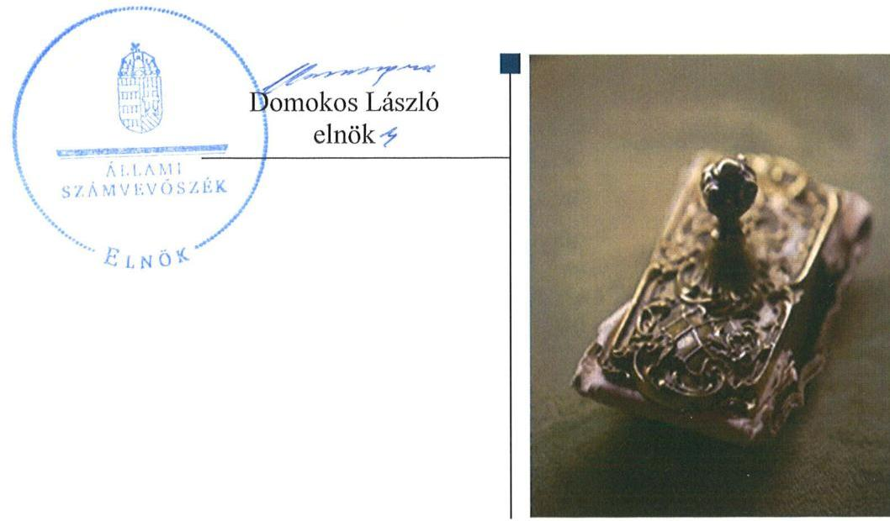
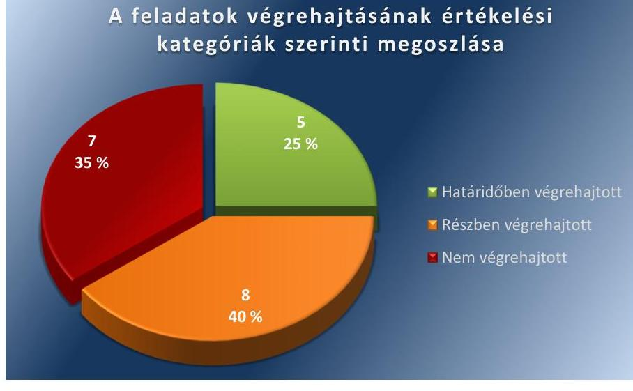
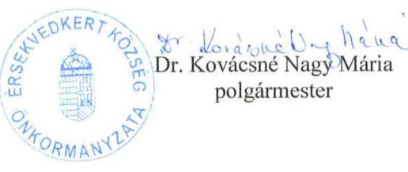
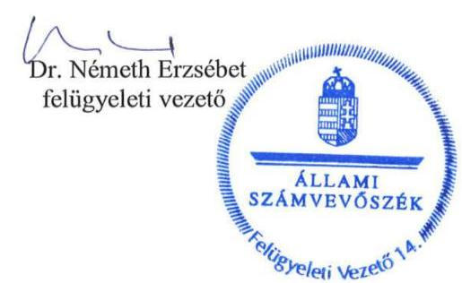

# Jelentés 

## Utóellenőrzések

Érsekvadkert Község Önkormányzata belső kontrollrendszerének kialakítása, valamint egyes kontrolltevékenységek és a belső ellenőrzés működésének utóellenőrzése 2016.

---

# Jelentés 

## Utóellenőrzések

Érsekvadkert Község Önkormányzata belső kontrollrendszerének kialakítása, valamint egyes kontrolltevékenységek és a belső ellenőrzés működésének utóellenőrzése
2016.  hó 5. nap

---

|  J | AZ ELLENŐRZÉST FELÜGYELTE:  |
| --- | --- |
|   | DR. NÉMETH ERZSÉBET felügyeleti vezető  |
|   | AZ ELLENŐRZÉST VEZETTE ÉS A VÉGREHAJTÁSÁÉRT FELELŐS:  |
|   | DR. PELLEI TAMÁS ellenőrzésvezető  |
|   | A PROGRAM ÖSSZEÁLLÍTÁSÁÉRT FELELŐS:  |
|   | JANIK JÓZSEF LÁSZLÓ osztályvezető  |
|   | A TÉMÁHOZ KAPCSOLÓDÓ KORÁBBI SZÁMVEVŐSZÉKI JELENTÉSEK:  |
|   | - címe: Jelentés Érsekvadkert Község Önkormányzata belső kontrollrendszerének kialakítása, valamint egyes kontrolltevékenységek és a belső ellenőrzés működése ellenőrzéséről  |
|  J | sorszáma: 13055  |
|   | IKTATÓSZÁM: V-1145-046/2016.  |
|   | TÉMASZÁM: 2179  |
|   | ELLENŐRZÉS-AZONOSÍTÓ SZÁM: V075507  |

---

# TARTALOMJEGYZÉK 

■ ÖSSZEGZÉS ..... 5
■ AZ ELLENŐRZÉS CÉLJA ..... 6
■ AZ ELLENŐRZÉS TERÜLETE ..... 7
■ AZ ELLENŐRZÉS HÁTTERE, INDOKOLTSÁGA ..... 8
■ A JELENTÉS LÉNYEGES KÉRDÉSKÖREI ..... 9
■ ELLENŐRZÉS HATÓKÖRE ÉS MÓDSZEREI ..... 10
■ MEGÁLLAPÍTÁSOK ..... 13
■ MELLÉKLETEK ..... 17
I. Sz. melléklet: Az ÁSZ 13055 számú jelentéséhez kapcsolódó intézkedési terv végrehajtása ..... 17
■ FÜGGELÉK: ÉSZREVÉTELEK ..... 23
■ RÖVIDÍTÉSEK JEGYZÉKE ..... 27

---

.

---

# ÖSSZEGZÉS 

Az utóellenőrzés megállapította, hogy az intézkedési tervben foglalt feladatok jelentős részét az Önkormányzat ${ }^{1}$ nem hajtotta végre, így nem tett megfelelő lépéseket az ÁSZ ${ }^{2}$ által korábban feltárt, a belső kontrollrendszert érintő hiányosságok megszüntetésére. Mindez kockázatot hordoz az Önkormányzat szabályozásában, működtetésének szabályosságában és a felelős vezetői magatartásban.

## Az ellenőrzés társadalmi indokoltsága

Az ÁSZ stratégiájában célul tűzte ki a számvevőszéki munka hasznosulásának javítását. Ezzel összhangban ellenőrzi, hogy az ellenőrzött szervezetek megvalósították-e a korábbi ellenőrzései által feltárt hibák, hiányosságok és szabálytalanságok megszüntetése céljából elkészített intézkedési terveikben foglaltakat. A rendszeres utóellenőrzések hozzájárulnak a szükséges intézkedések tényleges végrehajtásához, ezáltal a közpénzügyek rendezettségének javulásához.

Az ÁSZ a 2013-ban nyilvánosságra hozott számvevőszéki jelentésében ${ }^{3}$ 20 javaslatot fogalmazott meg. Ezzel összefüggésben az Önkormányzat intézkedési tervében mindösszesen 20 feladatot határozott meg. A feladatok számossága különösen indokolttá tette az utóellenőrzés elvégzését.

## Főbb megállapítások, következtetések

A polgármester ${ }^{4}$ az intézkedési tervet határidőben megküldte az ÁSZ részére. Az intézkedési tervben rögzített feladatok végrehajtásáról a Bkr. ${ }^{5}$-ben előírt nyilvántartást nem vezették.

Az intézkedési tervben meghatározott 20 feladatból ötöt határidőben, nyolcat részben hajtottak végre, valamint hét feladat végrehajtása nem történt meg. Több esetben a belső szabályzást nem készítették el, vagy hiányosan alakították ki, illetve a belső szabályozást kialakították, de a tevékenységet nem végezték el. Nem megfelelően működtették a pénzügyi folyamatokban kulcsszerepet betöltő kontrollokat, illetve nem gondoskodtak teljes körűen a kontrollok működésével összefüggő kijelölési és nyilvántartási tevékenységek ellátásáról.

Megállapítható, hogy az ÁSZ által az Önkormányzat belső kontrollrendszerének kialakítása, valamint az egyes kontrolltevékenységek és a belső ellenőrzés működésének területén korábban azonosított hiányosságok jelentős része továbbra is fennáll.

A részben végrehajtott, illetve a nem végrehajtott feladatok kockázatot jelentenek az Önkormányzat jogszabályoknak megfelelő szabályozásában, működésének szabályosságában, amelyek kezelése a vezetői felelősség körébe tartozik.

---

# AZ ELLENŐRZÉS CÉLJA

Az ellenőrzés célja annak értékelése volt, hogy a számvevőszéki jelentésben foglalt intézkedést igénylő megállapításokkal és javaslatokkal összhangban készített intézkedési tervben meghatározott feladatokat az ellenőrzött szervezet végrehajtotta-e.

---

# AZ ELLENŐRZÉS TERÜLETE 

## Az Önkormányzat

Érsekvadkert község Nógrád megyében, a Balassagyarmati járás közigazgatási területén fekszik. A lakónépességének száma a KSH által közzétett népességi adatok ${ }^{6}$ szerint 2015. január 1-jén 3461 fő volt. A polgármester 2006. október 1-jétől tölti be tisztségét. A jegyző személyében az ellenőrzött időszakban változás történt: a jegyző ${ }_{1}{ }^{7}$ 2005. május 1-jétől, a jegyző ${ }_{2}{ }^{8}$ 2015. október 10-étől látja el feladatait.

Az Önkormányzat a 2014. évi éves költségvetésének végrehajtásáról szóló beszámoló szerint 457,5 millió Ft költségvetési bevételt ért el, valamint 427,4 millió Ft költségvetési kiadást teljesített. A 2014. évi könyvviteli mérlegének főösszege 1398,6 millió Ft volt.

Az ÁSZ 2013-ban ellenőrizte az Önkormányzat belső kontrollrendszerének kialakítását, valamint egyes kontrolltevékenységek és a belső ellenőrzés működését, az erről szóló 13055. számú jelentését 2013. július 10-én tette közzé. Az ellenőrzés célja annak értékelése volt, hogy az Önkormányzat a jogszabályi előírásoknak megfelelően alakította-e ki a belső kontrollrendszert, megfelelően működtette-e a gazdálkodás folyamatában kulcsszerepet betöltő szakmai teljesítésigazolás és utalvány ellenjegyzés kontrollokat, biztosította-e a belső ellenőrzés szabályos és eredményes működését.

Az utóellenőrzés az ÁSZ jelentésben a polgármester és a jegyző részére megfogalmazott, intézkedést igénylő megállapításokra és javaslatokra készített, az ÁSZ részére megküldött intézkedési terv végrehajtására fókuszált.

---

# AZ ELLENŐRZÉS HÁTTERE, INDOKOLTSÁGA 

Az ÁSZ tv. ${ }^{9}$ 33. § (1) bekezdése értelmében a számvevőszéki jelentések intézkedést igénylő megállapításaihoz és javaslataihoz kapcsolódóan az ellenőrzött szervezet vezetője intézkedési tervet köteles összeállítani, és az ÁSZ részére megküldeni. Az intézkedési tervben foglaltak megvalósítását az ÁSZ tv. 33. § (7) bekezdésében foglaltak alapján - az ÁSZ utóellenőrzés keretében - ellenőrizheti. Az intézkedések megvalósulásának értékelése során az ÁSZ figyelembe veszi az ellenőrzött szervezetek működési feltételeiben, valamint a jogszabályi előírásokban bekövetkezett változásokat.

Az intézkedési tervekben foglalt feladatok hiányos, illetve késedelmes végrehajtása, valamint megvalósításának elmaradása azt mutatja, hogy az ellenőrzések során feltárt hibák, hiányosságok és szabálytalanságok megszüntetése nem kapott kellő hangsúlyt. Ez a szabályszerű működés és a felelős vezetői magatartás vonatkozásában kockázatot hordoz. E kockázatok feltárásával az ÁSZ utóellenőrzési rendszere fokozza a fegyelmet, és igazolja, hogy a közpénzzel való szabályos gazdálkodás felelőssége elől nem lehet kitérni.

## AZ UTÓELLENŐRZÉS VÁRHATÓ HASZNOSULÁSA

Az utóellenőrzés négy szinten hasznosulhat:
$\longrightarrow$ A társadalom szintjén az utóellenőrzés jelzi, hogy a számvevőszéki ellenőrzés megállapításainak van következménye: a hiányosságok megszüntetésére az ellenőrzött szervezet által meghatározott intézkedések végrehajtását is számon kéri az ÁSZ.
$\longrightarrow$ Az ellenőrzött terület szintjén az utóellenőrzés tájékoztatást nyújt a terület döntéshozóinak a hiányosságok kiküszöbölésének jó gyakorlatairól, ezzel lehetőséget biztosítva arra, hogy az ÁSZ ellenőrzési megállapításai, javaslatai a terület nem ellenőrzött szervezeteinek a működése során is hasznosuljanak.
$\longrightarrow$ Az ellenőrzött szervezet szintjén az utóellenőrzés feltárja, hogy a szervezet az intézkedések végrehajtásával hasznosította-e a korábbi ellenőrzési jelentésben a hiányosságok megszüntetése, illetve a kockázatok kezelése érdekében megfogalmazott javaslatokat.
$\longrightarrow$ Az ÁSZ szintjén az utóellenőrzés visszacsatolást ad az ellenőrzési jelentések hasznosulásáról, az intézkedések elmaradása vagy részleges megvalósulása a további ellenőrzésekhez kockázati jelzésként szolgál.

---

# A JELENTÉS LÉNYEGES KÉRDÉSKÖREI 

Az Önkormányzat az intézkedési tervben foglaltakat az előírt határidőben végrehajtotta-e?

---

# ELLENŐRZÉS HATÓKÖRE ÉS MÓDSZEREI 

## Az ellenőrzés típusa

Megfelelőségi ellenőrzés

## Az ellenőrzött időszak

Az utóellenőrzés alapját képező ÁSZ jelentés közzétételének napjától (2013. július 10.) az ellenőrzésről szóló kiértesítő levél keltének napjáig (2016. április 29.) tartó időszak.

## Az ellenőrzés tárgya

A számvevőszéki jelentésben foglalt intézkedést igénylő megállapításokkal és javaslatokkal összhangban - az Önkormányzat által - készített intézkedési tervben foglaltak végrehajtásának ellenőrzése.

Az ellenőrzés kiterjed minden olyan körülményre és adatra, amely az ÁSZ jogszabályban meghatározott feladatainak teljesítéséhez, valamint a program végrehajtása folyamán felmerült újabb összefüggések feltárásához szükséges.

## Az ellenőrzött szervezet

Érsekvadkert Község Önkormányzata

## Az ellenőrzés jogalapja

Az ÁSZ az Országgyűlés pénzügyi és gazdasági ellenőrző szerve. Az ÁSZ törvényben meghatározott feladatkörében ellenőrzi a központi költségvetés végrehajtását, az államháztartás gazdálkodását, az államháztartásból származó források felhasználását és a nemzeti vagyon kezelését.

Az ÁSZ tv. 1. § (3) bekezdése szerint az ÁSZ általános hatáskörrel végzi a közpénzekkel és az állami és önkormányzati vagyonnal való felelős gazdálkodás ellenőrzését.

Az ÁSZ tv. 33. § (7) bekezdése alapján az ÁSZ tv. 33. § (1)-(2) bekezdése szerinti intézkedési tervben foglaltak megvalósítását az ÁSZ utóellenőrzés keretében ellenőrizheti.

---

# Az ellenőrzés módszerei 

Az ÁSZ az ellenőrzést a nemzetközi standardokat irányadónak tekintve az ellenőrzési program ellenőrzési kérdései, az ellenőrzött időszakban hatályos jogszabályok, az ellenőrzés szakmai szabályok és módszertanok figyelembevételével, önállóan végezte.

Az ÁSZ az ellenőrzés ideje alatt az Önkormányzattal történő kapcsolattartást az ÁSZ SZMSZ ${ }^{10}$-ének vonatkozó előírásai alapján biztosította.

Az utóellenőrzés megállapításait elsősorban az ÁSZ rendelkezésére álló, valamint az ellenőrzött szervezetektől elektronikusan bekért dokumentumok alapozták meg.

Az ellenőrzési bizonyítékként felhasználható adatforrások közé tartoznak egyrészt az ellenőrzés szakmai programjában felsorolt adatforrások, másrészt minden - az ellenőrzés folyamán feltárt, az ellenőrzés szempontjából információt tartalmazó - dokumentum.

A pénzügyi folyamatokban kulcsszerepet betöltő kontrollokra vonatkozóan az intézkedési tervben foglalt feladatok végrehajtását az államháztartáson kívülre teljesített működési célú pénzeszközátadásoknál, az állományba nem tartozók megbízási díjainál, továbbá a külső szolgáltatók által végzett karbantartási, kisjavítási munkákkal kapcsolatos kifizetéseknél 10 elemű véletlen mintavétellel kiválasztott tételek alapján értékelte az ÁSZ. A kiválasztott tételek esetében azt ellenőrizte, hogy az Önkormányzat az intézkedési tervben meghatározott feladatok végrehajtása érdekében biztosította-e a jogszabályok és a belső szabályzatok előírásainak megfelelő működtetést.

Az intézkedési tervekben előírt feladatokat, azok végrehajthatósága, illetve végrehajtása szempontjából az alábbiak szerint értékelte az ÁSZ:
"határidőben végrehajtott" a feladat, ha a teljesítés dokumentáltan, az intézkedési tervben előírt határidőben és tartalommal megtörtént;
"határidőn túl végrehajtott" a feladat, ha annak teljesítése az intézkedési tervben meghatározott módon, de az előírt határidőn túl történt meg;
"részben végrehajtott" a feladat, ha végrehajtása teljes körűen az intézkedési tervben előírt módon nem történt meg;
"nem végrehajtott" a feladat, ha a végrehajtás nem történt meg, vagy amennyiben a teljesítést nem dokumentálták;
"okafogyottá vált" a feladat, ha végrehajtására - meghatározott esemény bekövetkezése, továbbá külső körülmény, a működést érintő feltétel változása miatt - már nincs szükség, illetve lehetőség, és egyértelműen megállapítható, hogy az intézkedést szükségessé tevő körülmény a jövőben nem fordulhat elő;
"nem időszerű" az a feladat, amelynek ellenőrzési időszakon belüli végrehajtására azért nem került (kerülhetett) sor, mert az intézkedés alapjául szolgáló esemény nem következett be, de annak jövőbeni előfordulása lehetséges, a végrehajtása nem volt esedékes, vagy a végrehajtás határideje még nem járt le.

---

Az ellenőrzés lefolytatásához az ellenőrzött szervezet a tanúsítványok elektronikus kitöltésével, valamint az ÁSZ által kért dokumentumok elektronikus megküldésével szolgáltatott adatokat, amelyek valódiságát és teljes körűségét az ellenőrzött szervezet vezetője által tett teljességi és hitelességi nyilatkozat igazolta. Az így rendelkezésre bocsátott adatok, információk kontrollja az ellenőrzés keretében történt.

---

# **MEGÁLLAPÍTÁSOK**

## **Az Önkormányzat az intézkedési tervben foglaltakat az előírt határidőben végrehajtotta-e?**

**Összegző megállapítás**

Az Önkormányzat az intézkedési tervben meghatározott 20 feladatból ötöt határidőben, nyolcat részben és hetet nem hajtott végre. Az intézkedési tervben rögzített feladatok végrehajtásáról a Bkr.-ben előírt nyilvántartást nem vezették.

Az ÁSZ a jelentésében a polgármester részére kettő, a jegyző részére 18 javaslatot fogalmazott meg. A polgármester és a jegyző az ÁSZ részére megküldött intézkedési tervben a hiányosságok, szabálytalanságok
 megszüntetésére 20 feladatot határozott meg, a feladatok elvégzésének felelőseként két esetben a polgármestert, 18 esetben pedig a jegyzőt jelölték meg.

Az ÁSZ javaslatai alapján készített intézkedési tervben rögzített feladatok végrehajtásáról a jegyző a Bkr.-ben előírt nyilvántartást nem vezette.

Az intézkedési tervben meghatározott feladatokat, határidőket, a feladatok elvégzésének felelősét és a feladatok végrehajtását az I. számú melléklet mutatja be.

Az intézkedési tervben tervezett feladatok végrehajtásának értékelési kategóriák szerinti megoszlását az 1. ábra szemlélteti.

1. ábra

*Forrás: ÁSZ*

### **HATÁRIDŐBEN VÉGREHAJTOTT** feladatok:

1. A polgármester intézkedett arról, hogy az Önkormányzat nevében történő kötelezettségvállalásra a pénzügyi ellenjegyzés után, a pénzügyi teljesítés esedékességét megelőzően, írásban kerüljön sor.

---

2. A polgármester az éves ellenőrzési jelentéseket a Bkr. előírásainak megfelelően a zárszámadási rendelettervezetekkel egyidejűleg a Képviselő-testület elé terjesztette.
3. A jegyző ${ }_{1,2}$ a gazdálkodási szabályzat ${ }_{1}{ }^{11}{ }_{2}{ }^{12}$-ban meghatározta az érvényesítés során ellátandó ellenőrzésének részletszabályait.
4. A jegyző ${ }_{1}$ a gazdálkodási szabályzat ${ }_{1}$-ban rögzítette az előzetes írásbeli kötelezettségvállalást nem igénylő kifizetések rendjét.
5. A jegyző ${ }_{1}$ intézkedett a leltár és a könyvviteli adatok egyeztetési módjának meghatározásáról.

# RÉSZBEN VÉGREHAJTOTT feladatok: 

6. A jegyző ${ }_{1}$ kidolgozta a Kttv. ${ }^{13}$-ban előírtak szerinti teljesítményértékelés alapját képező teljesítménykövetelményeket, azonban a teljesítményértékeléseket nem végezte el.
7. A jegyző ${ }_{1}$ a 2013. december 22-én elkészített és 2014. január 1-jén hatályba léptetett belső kontroll szabályzat ${ }^{14}$-ban kialakította a Bkr. előírása szerinti kockázatkezelési rendszert, azonban annak működtetéséről nem gondoskodott.
8. A jegyző ${ }_{1}$ az Ávr. ${ }^{15}$ és az Info tv. ${ }^{16}$ előírásainak megfelelően a 2012. december 15-én hatályba léptetett közzétételi szabályzat ${ }^{17}$-ban meghatározta a kötelezően közzéteendő adatok nyilvánosságra hozatalának és a közérdekű adatok megismerésére irányuló igények teljesítésének rendjét, azonban a közzétételi szabályzatban az adatfelelős az Info tv. előírása szerinti kötelezettség teljesítésének részletes szabályait nem rögzítette.
9. A jegyző ${ }_{1}$ a 2012. július 1-jétől hatályos adatvédelmi szabályzat ${ }^{18}$-ban és a 2012. december 1-jétől, illetve a 2015. július 13-ától hatályos informatikai szabályzat ${ }_{1}{ }^{19}{ }_{2}{ }^{20}$-ban rögzítette a Hivatal ${ }^{21}$ információs és kommunikációs rendszerével kapcsolatos adatbiztonsági elvárásokat, kötelezettségeket. Az informatikai környezet teljes körű szabályozásáról azonban nem gondoskodott, mivel a szabályzatokban - az Info tv.-ben előírtak ellenére - az alkalmazott technika megváltozásából fakadó hozzáférhetetlenné válás elleni védelmi intézkedéseket nem határozta meg, továbbá a pénzügyiszámviteli szoftverváltozások ellenőrzésére vonatkozó eljárásokat nem alakította ki.
10. A jegyző ${ }_{1,2}$ nem intézkedett arról, hogy az Ávr. előírásainak megfelelően kerüljenek kijelölésre a teljesítésigazolásra és az érvényesítésre jogosult személyek, mivel a teljesítésigazolásra jogosult személyek kijelöléséről 2015. december 31-éig kizárólag a polgármesteri Hivatal vonatkozásában gondoskodott, az Önkormányzat vonatkozásában nem. Továbbá 2015. december 31-éig nem jelölte ki az érvényesítésre jogosult személyeket.
11. A jegyző ${ }_{1,2}$ az Ávr.-ben és a gazdálkodási szabályzat1-ban meghatározottak szerint 2015. december 31-éig gondoskodott a kötelezettségvállalásra jogosult személyekről és aláírás-mintájuk naprakész nyilvántartásának vezetéséről. Az ellenjegyzésre, a teljesítésigazolásra, az érvényesítésre, utalványozásra jogosult személyekről és aláírás-mintájukról 2015. december 31-ig nem vezették az

---

Ávr. és a gazdálkodási szabályzat ${ }_{1}$ által előírt nyilvántartást. A jegyző ${ }_{2}$ 2016. január 1-jét követően nem gondoskodott a kötelezettségvállalásra, az ellenjegyzésre, a teljesítésigazolásra, az érvényesítésre, utalványozásra jogosult személyekről és aláírás-mintájuk naprakész nyilvántartásának vezetéséről, mivel a nyilvántartásokat nem az Ávr. és a gazdálkodási szabályzat ${ }_{2}$ előírásainak megfelelően vezették.
12. A jegyző ${ }_{1,2}$ nem gondoskodott arról, hogy a belső ellenőrzési programok tartalmazzák a Bkr.-ben előírt valamennyi tartalmi elemet, mivel azokban nem tüntették fel az ellenőrzött szerv, illetve szervezeti egység megnevezését.
13. A jegyző ${ }_{1}$ az intézkedési tervben rögzített 2013. november 30-ai határidőt követően, a 2014. január 1-jétől hatályba léptetett belső kontroll szabályzatban alakította ki a Hivatal tevékenységének, a célok megvalósításának nyomon követését biztosító rendszert, amelynek része az operatív tevékenységek keretében megvalósuló folyamatos és eseti nyomon követés is. A monitoring rendszer Bkr.-ben előírtak szerinti működtetéséről azonban a jegyző ${ }_{1}$ nem gondoskodott.

# NEM VÉGREHAJTOTT feladatok: 

14. A jegyző ${ }_{1}$ nem végezte el a hivatali SZMSZ ${ }^{22}$ Ávr. és Bkr. előírása szerinti módosítását.
15. A jegyző ${ }_{1,2}$ nem gondoskodott az Önkormányzat és intézményei számviteli rendjének Htv. ${ }^{23}$-ban előírtak szerinti kialakításáról.
16. A jegyző ${ }_{1}$ a Bkr. előírásai ellenére nem szabályozta a Hivatal tevékenységeire vonatkozó beszámolási eljárásokat a felelősségi körök meghatározásával.
17. A jegyző ${ }_{1}$ nem intézkedett arról, hogy a Hivatal kötelezettségvállalására kizárólag a pénzügyi ellenjegyzést követően, a pénzügyi teljesítés esedékességét megelőzően, írásban kerüljön sor, így a pénzügyi ellenjegyzés nem felelt meg az új Áht. ${ }^{24}$, valamint az Ávr. előírásainak.
18. A jegyző ${ }_{1,2}$ nem gondoskodott a teljesítésigazolás Ávr.-ben előírtak szerinti elvégzéséről, mivel a teljesítésigazolást nem a jegyző ${ }_{1}$ által kijelölt személy végezte, illetve a teljesítéseket az arra jogosult személy aláírásával nem igazolta.
19. A jegyző ${ }_{1,2}$ nem intézkedett az érvényesítés Ávr. szerinti szabályszerű végrehajtásáról, mivel az érvényesítést teljesítésigazolás hiányában végezték, továbbá az érvényesítő nem tett eleget az Ávr.-ben meghatározott ellenőrzési kötelezettségségnek.
20. A jegyző ${ }_{1,2}$ nem gondoskodott arról, hogy a kötelezettségvállalások nyilvántartását az Ávr.-ben és az Áhsz ${ }_{2}{ }^{25}$-ben előírt módon vezessék, és az utalványrendeleteken a kötelezettségvállalás nyilvántartásba vételi sorszámát az Ávr.-ben foglaltaknak megfelelően feltüntessék.

---

.

---

# MELLÉKLETEK

I. SZ. MELLÉKLET: AZ ÁSZ 13055 SZÁMÚ JELENTÉSÉHEZ KAPCSOLÓDÓ INTÉZKEDÉSI TERV VÉGREHAJTÁSA

|  ㅇ | Az intézkedési tervben
rögzített feladatok | Az intézkedési
tervben
meghatározott
határidő | Az intézkedési
tervben rögzít
ett feladatok
elvégzésének
felelése | A feladat végrehajtása  |
| --- | --- | --- | --- | --- |
|  Határidőben végrehajtott feladatok |  |  |  |   |
|  1. | „Az önkormányzat nevében történő kötelezettségvállalásra az új Áht. 37. § (1) bekezdésében foglaltaknak megfelelően - az Ávr. 56. §-ában meghatározott kivételekkel - kizárólag a pénzügyi ellenjegyzés után, a pénzügyi teljesítés esedékességét megelőzően mindig írásban kerül sor." | folyamatos | polgármester | Az ellenőrzött dokumentumok alapján a polgármester által az önkormányzati kiadások előirányzatának terhére írásban történő kötelezettségvállalásokra - az új Áht. 37. § (1) bekezdés előírásainak megfelelően - a pénzügyi ellenjegyzések után, a pénzügyi teljesítések esedékességét megelőzően, írásban került sor.  |
|  2. | „A Bkr. 56. § (8) bekezdésének megfelelően az éves ellenőrzési jelentés a zárszámadási rendelet-tervezettel egyidejűleg beterjesztésre került a KT elé." | értelemszerűen | polgármester | A polgármester a Bkr. 56. § (8) bekezdésében foglaltaknak megfelelően az éves ellenőrzési jelentéseket a zárszámadási rendelettervezetekkel egyidejűleg a Képviselő-testület elé terjesztette, amelyeket a Képviselő testület a 2013. május 30-án meghozott 23/2013. (IV.30.) számú határozatával, a 2014. április 29-én meghozott 22/2014. (IV.29.) számú határozatával, valamint a 2015. május 19-én meghozott 33/2015. (V.19.) számú határozatával jóváhagyott. A 2015. évre vonatkozó ellenőrzési jelentés Képviselő-testület elé terjesztése - az új Áht. 91. § (1). bekezdésének előírásai alapján - az ellenőrzéssel érintett időszakban nem volt esedékes.  |
|  3. | „Az Ávr. 13. § (2) bekezdés a) pontjában és az 58. § (1) bekezdésében előírtaknak megfelelően az államháztartási jogszabályokban (Áht., Ahsz., Ávr.) és a belső szabályzatokban foglaltak ellenőrzésének részletszabályai részben már kidolgozásra kerültek, a teljes szabályozás folyamatban van." | folyamatos | jegyző | A jegyző ${ }_{1,2}$ az Ávr. 13. § (2) bekezdés a) pontjában és az Ávr. 58. § (1) bekezdésében előírtaknak megfelelően a 2012. január 1-jétől, illetve a 2016. január 1-jétől hatályos gazdálkodási szabályzat ${ }_{1,2}$-ban rögzítette az érvényesítés során ellátandó ellenőrzésének részletszabályait.  |
|  4. | „Az Ávr. 53. § (2) bekezdésének megfelelően az előzetes írásbeli kötelezettségvállalást nem igénylő kifizetések rendje belső szabályzatban rögzítésre kerül." | 2013. augusztus 31. | jegyző | A jegyző ${ }_{1,2}$ az Ávr. 53. § (2) bekezdésében foglaltaknak megfelelően a 2012. január 1-jétől hatályos gazdálkodási szabályzat ${ }_{1}$-ban meghatározta az előzetes írásbeli kötelezettségvállalást nem igénylő kifizetések rendjét.  |

---

|  5. | Az intézkedési tervben
rögzített feladatok | Az intézkedési
tervben
meghatározott
határidő | Az intézkedési
tervben rögzített feladatok
elvégzésének
felelelőse | A feladat végrehajtása  |
| --- | --- | --- | --- | --- |
|  5. | "A leltár és a könyvviteli adatok egyeztetése módja az
Áhsz. 37. § (5) bekezdésében előírt rendelkezés szerint
szabályzatban rögzítése." | 2013. augusztus 31. | jegyző | A jegyző₁ az Áhsz.₁²⁸ 37. § (5) bekezdésében előírt rendelkezésnek megfelelően gondos-
kodott a leltár és a könyvviteli adatok egyeztetésének módjának meghatározásáról.  |
|   |  |  | Részben végrehajtott feladatok |   |
|  6. | "A Kttv. 130. § (1)-(3) bekezdéseiben előírtak szerinti
teljesítményértékelés alapját képező teljesítménykö-
vetelmények kidolgozása folyamatban van, a TÉR-in-
formatikai rendszeren keresztül. Ezen a központi web-
felületen - amely 2013 júliusától működik - kell elvé-
gezni a teljesítményértékelést évente két alkalom-
mal." | 2013. október 31. | jegyző | • Határidőben végrehajtott feladat:
A jegyző₁ a bemutatott dokumentumok alapján a Kttv. 130. § (1)-(3) bekezdéseiben elő-
írtak szerinti teljesítményértékelés alapját képező teljesítménykövetelményeket foglal-
koztatottanként, személyre szabva határozta meg.
• Nem végrehajtott feladat:
A teljesítménykövetelmények TÉR-informatikai rendszeren keresztül történő kidolgozá-
sát dokumentált módon nem igazolták, a teljesítményértékeléseket a Kttv. 130. § (1) be-
kezdésében foglalt előírás ellenére nem végezték el.  |
|  7. | "A Bkr. 3. § b) pontja és a 7. §-a szerinti kockázatkeze-
lési rendszer kialakításra és működtetésre kerül." | 2013. december 31. | jegyző | • Határidőben végrehajtott feladat:
A jegyző₁ a 2013. december 22-én elkészített és 2014. január 1-jén hatályba léptetett
belső kontroll szabályzatban rögzítette a kockázatkezelés elvi szabályait, a kapcsolódó fo-
galmakat és az elvégzendő feladatokat.
• Nem végrehajtott feladat:
A jegyző₁ a Bkr. 7. § (1) bekezdésében foglalt előírás ellenére nem működtette a kocká-
zatkezelési rendszert, ezáltal a kockázatok feltárása, beazonosítása, értékelése nem tör-
tént meg.  |
|  8. | "A leírt javaslatok megvalósításra kerültek. Az Info tv.
35. § (3) bek. és az Ávr. 13. § (2) bek. h) pontjának
megfelelően a kötelezően közzéteendő adatok nyilvá-
nosságra hozatalának rendje, valamint az
Info tv. 30. § (6) bekezdése és az Ávr. 13. § (2) bek. h)
pontja szerint a közérdekű adatok megismerésére irá-
nyuló igények teljesítésének rendje szabályozásra ke-
rült - az intézkedés megtörtént." | folyamatos | jegyző | • Határidőben végrehajtott feladat:
A jegyző₁ 2012. december 15-én hatályba léptette az Ávr. 13. § (2) bekezdés h) pontjá-
nak, illetve az Info tv. 30. § (6) bekezdései alapján elkészített közzétételi szabályzatot.
• Nem végrehajtott feladat:
A jegyző₁ által hatályba léptetett közzétételi szabályzat az Info tv. 35. § (3) bekezdés elő-
írásának ellenére nem
 tartalmazta az adatfelelős Infotv. 35. § (1) bekezdése szerinti kö-
telezettség teljesítésének részletes szabályait.  |
|  9. | "Az Infotv. 7. § (2)-(3) bekezdéseinek rendelkezései
alapján belső szabályzatban került rögzítésre és kiala-
kításra a szervezet információs és kommunikációs
rendszerével kapcsolatos adatbiztonsági elvárások és | folyamatos | jegyző | • Határidőben végrehajtott feladat:
A jegyző az adatvédelmi szabályzatban gondoskodott az információs és kommunikációs
rendszerrel kapcsolatos adatbiztonsági elvárások és kötelezettségek rögzítéséről, az  |

---

|  1. | Az intézkedési tervben
rögzített feladatok | Az intézkedési
tervben
meghatározott
határidő | Az intézkedési
tervben rögzített feladatok
elvégzésének
felelőse | A feladat végrehajtása  |
| --- | --- | --- | --- | --- |
|   | kötelezések, valamint az informatikai környezet teljes
körű leszabályozása az intézkedés megtörtént." |  |  | adatbiztonság érvényesüléséről, és a kapcsolódó eljárási szabályok kialakításáról, to-
vábbá az adatok védelméről törlés, megsemmisítés, véletlen megsemmisülés és sérülés
ellen. Az informatikai szabályzatban1,2 rögzítette a hozzáférési jogosultságok ellenőrzésé-
nek és nyilvántartásának eljárásrendjét, illetve a feldolgozott adatok mentésére vonat-
kozó eljárásokat.
• Nem végrehajtott feladat:
A jegyző1,2 az Infotv. 7. § (3) bekezdésében rögzítettek ellenére az alkalmazott technika
megváltozásából fakadó hozzáférhetetlenné válás elleni védelmi intézkedéseket nem ha-
tározta meg. Továbbá az informatikai környezet teljes körű szabályozásának keretében a
pénzügyi-számviteli szoftverváltozások ellenőrzésére vonatkozó eljárásokat nem alakí-
totta ki.  |
|  10. | "Az Ávr. 57. § (4) bek. és az 58. § (4) bekezdésének
megfelelően kijelölésre kerültek a teljesítésigazolásra,
valamint az érvényesítésre jogosult személyek - az in-
tézkedés megtörtént, annak alkalmazása folyama-
tos." | folyamatos | jegyző | • Határidőben végrehajtott feladat:
A jegyző az Ávr. 57. § (4) bekezdése alapján a munkaköri leírásokban gondoskodott a
polgármesteri Hivatal vonatkozásában a teljesítésigazolásra jogosult személyek kijelölé-
séről. A jegyző 2016. január 1-jét követően a gazdálkodási szabályzat3 8. számú mellék-
letben gondoskodott Ávr. 58. § (4) bekezdésében előírtak alapján a megfelelő végzettség-
gel rendelkező érvényesítésre jogosult személyek kijelöléséről.
• Nem végrehajtott feladat:
A jegyző1,2 az Ávr. 57. § (4) bekezdése alapján nem gondoskodott arról, hogy az Önkormányzat vonatkozásában a teljesítésigazolásra jogosult személyek kijelölésre kerüljenek.
A jegyző1,2 az Ávr. 58. § (4) bekezdésében előírtak ellenére 2015. december 31-éig nem
jelölte ki az érvényesítésre jogosult személyeket.  |
|  11. | "A kötelezettségvállalásra, az ellenjegyzésre, a teljesí-
tésigazolásra, az érvényesítésre és az utalványozásra
jogosult személyekről és az aláírás-mintájukról a nyil-
vántartás — az Ávr. 60. § (3) bekezdésében foglaltak-
nak megfelelően — naprakészen vezetjük, az intézke-
dés megtörtént." | folyamatos | jegyző | • Határidőben végrehajtott feladat:
A jegyző1,2 az Ávr. 60. § (3) bekezdésében és a gazdálkodási szabályzat3-ban foglaltak alap-
ján 2015. december 31-éig gondoskodott a kötelezettségvállalásra jogosult személyekről
és aláírás-mintájukról naprakész nyilvántartás vezetéséről.
• Nem végrehajtott feladat:
A jegyző1,2 az Ávr. 60. § (3) bekezdésének és gazdálkodási szabályzat3 előírásainak elle-
nére 2015. december 31-éig nem gondoskodott az ellenjegyzésre, a teljesítésigazolásra,
érvényesítésre és az utalványozásra jogosult személyekről és az aláírás-mintájukról nap-
rakész nyilvántartás vezetéséről, mert a nyilvántartást nem vezették. A jegyző 2016. ja-  |

---

|  11. | Az intézkedési tervben
rögzített feladatok | Az intézkedési
tervben
meghatározott
határidő | Az intézkedési
tervben rögzített feladatok
elvégzésének
felelőse | A feladat végrehajtása  |
| --- | --- | --- | --- | --- |
|   |  |  |  | nuár 1-jét követően nem gondoskodott a kötelezettségvállalásra, az ellenjegyzésre, a teljesítésigazolásra, érvényesítésre, utalványozásra jogosult személyekről és aláírás-mintájukról naprakész nyilvántartás vezetéséről, mivel a bemutatott nyilvántartásokat nem az az Ávr. 60. § (3) bekezdésében és a gazdálkodási szabályzatban foglaltaknak megfelelően vezették. A kötelezettségvállalásra jogosult személyekről és aláírás-mintájukról vezetett nyilvántartás nem felelt meg a gazdálkodási szabályzat 5. számú mellékleteként meghatározott nyilvántartásnak. Az ellenjegyzésre, a teljesítésigazolásra, érvényesítésre, utalványozásra jogosult személyekről és aláírás-mintájukról vezetett nyilvántartások – a szabályzat által előírtak ellenére – nem tartalmazták a jogosult beosztását, a jogosító ügyirat keltét és számát, valamint a jogosultság megszüntetését elrendelő ügyirat számát, annak időpontját.  |
|  12. | "Intézkedés történt az ügyben, hogy a belső ellenőrzési programok a további ellenőrzések alkalmával tartalmazzák a Bkr. 33. § (2) bekezdésében előírt tartalmi elemeket - intézkedés megtörtént." | folyamatos | jegyző | • Határidőben végrehajtott feladat:
A 2013. december 30-án kelt 350-69/2013. számú, a 2015. február 10-én kelt 292-71/2014. számú, a 2015. augusztus 28-án kelt 313-40/2015. számú és a 2016. február 12-én kelt 313-78/2015. számú ellenőrzési programok tartalmazták a Bkr. 33. § (2) bekezdés a), c)-j) pontjaiban felsorolt tartalmi elemeket.
• Nem végrehajtott feladat:
Az ellenőrzési programok nem tartalmazták a Bkr. 33. § (2) bekezdés b) pontjában rögzített tartalmi elemet, így az ellenőrzött szerv, illetve szervezeti egység megnevezését.  |
|  13. | "Kialakításra és működtetésre kerül a Bkr. 3. § e) pontjában és a 10. §-ában előírtak alapján a Polgármesteri Hivatal tevékenységének, a célok megvalósításának nyomon követését biztosító rendszer, valamint az operatív tevékenységek keretében megvalósuló folyamatos és eseti nyomon követés is." | 2013. november 30. | jegyző | • Határidőn túl végrehajtott feladat:
A jegyző a monitoring rendszer elvi szabályozását az intézkedési tervben előírt határidőt követően, a 2013. december 22-én elkészített és 2014. január 1-jétől hatályba léptetett belső kontroll szabályzatban rögzítette.
• Nem végrehajtott feladat:
A jegyző a Bkr. 3. § e) pontjában és a 10. §-ában előírtak ellenére nem gondoskodott a Hivatal tevékenységének, a célok megvalósításának nyomon követését biztosító, valamint az operatív tevékenységek keretében megvalósuló folyamatos és eseti nyomon követési rendszer működtetéséről. A monitoring rendszer tényleges működtetését dokumentált módon nem igazolta.  |

---

|  13. | Az intézkedési tervben rögzített feladatok | Az intézkedési tervben meghatározott határidő | Az intézkedési tervben rögzített feladatok elvégzésének felelőse | A feladat végrehajtása  |
| --- | --- | --- | --- | --- |
|  14. | „A Polgármesteri Hivatal SZMSZ-e módosításra kerül, mely tartalmazni fogja az Ávr. 13. § (1) bekezdés g) pontjában és a Bkr. 15. § (2) bekezdésében foglaltaknak megfelelően." | 2013. augusztus 31. | jegyző | A jegyző a Hivatal SZMSZ-ét nem módosította annak érdekében, hogy az tartalmazza az Ávr. 13. § (1) bekezdés g) pontjában és a Bkr. 15. § (2) bekezdésében foglaltakat, így a nevesített munkakörökhöz tartozó feladat- és hatásköröket, a hatáskörök gyakorlásának módját, a helyettesítés rendjét, az ezekhez kapcsolódó felelősségi szabályokat, továbbá a belső ellenőrzést végző személy vagy szervezet, vagy szervezeti egység feladatait.  |
|  15. | „Az Önkormányzat és intézményei számviteli rendje a Htv. 140. § (1) bekezdés c) pontjában előírtak alapján kialakításra kerül, előkészítése már folyamatban van." | 2013. augusztus 31. | jegyző | A jegyző1,2 nem gondoskodott az Önkormányzat és intézményei számviteli rendjének Htv. 140. § (1) bekezdés c) pontjában előírtak szerinti kialakításáról. A Számv. tv. 27 14. § (5) bekezdés a)-b) pontjai és az Áhsz. 8. § (4) a)-b) pontjai alapján elkészített és 2012. január 1-jétől hatályba léptetett Eszközök és a források leltározási és leltárkészítési szabályzata, továbbá az Eszközök és a források értékelési szabályzata hatályának az Önkormányzatra és annak intézményeire történő kiterjesztése dokumentumokkal megfelelően alátámasztott módon nem történt meg. A 2012. január 1-jétől hatályos, a Számv. tv. 14. § (3) bekezdése és az Áhsz. 8. § (3) alapján elkészített Számviteli politika, valamint a Számv. tv. 14. § (5) bekezdés c)-d) pontjai és az Áhsz. 8. § (4) c)-d) pontjai alapján elkészített Önköltségszámítási szabályzat és Pénzkezelési szabályzat hatálya kiterjed az Önkormányzatra, azonban azok hatályát az Önkormányzat intézményeire dokumentumokkal megfelelően alátámasztott módon nem terjesztették ki. A Számv. tv. 161. § (1) bekezdése és az Áhsz. 49. § (1) bekezdése alapján elkészített Számlarend hatályát nem terjesztették ki az Önkormányzatra és intézményeire. A jegyző által az intézkedési tervben meghatározott 2013. augusztus 31-ei határidőn túl, a 2016. január 1-jén hatályba léptetett Számlarend és Önköltségszámítási szabályzat hatálya kiterjesztésre került az Önkormányzatra és valamennyi intézményére, azonban az Eszközök és a források leltározási és leltárkészítési szabályzata és az Eszközök és a források értékelési szabályzata hatályának az Önkormányzatra és intézményeire, továbbá Számviteli politika és a Pénzkezelési szabályzat Önkormányzat intézményeire történő kiterjesztése 2016. január 1-jét követően nem történt meg.  |
|  16. | „Szabályozásra kerülnek a Bkr. 8. § (4) bekezdés c) pontjában foglaltaknak megfelelően a Polgármesteri Hivatal tevékenységeire vonatkozó beszámolási eljárások." | 2013. szeptember
30. | jegyző | A jegyző a Bkr. 8. § (4) bekezdés c) pontjában foglaltak ellenére nem szabályozta a felelőségi körök meghatározásával a Hivatal tevékenységeire vonatkozó beszámolási eljárásokat, mivel nem igazolta a szabályozás megtörténtének tényét.  |

---

|  17. | Az intézkedési tervben rögzített feladatok | Az intézkedési tervben meghatározott határidő | Az intézkedési tervben rögzített feladatok elvégzésének felelése | A feladat végrehajtása  |
| --- | --- | --- | --- | --- |
|  18. | „A kötelezettségvállalásokra az új Áht. 37. § (1) bekezdésében foglaltaknak megfelelően - az Ávr. 53. §-ában meghatározott kivételeket figyelembe véve - kizárólag a pénzügyi ellenjegyzés után, a pénzügyi teljesítés esedékességét megelőzően, írásban került sor - az intézkedés előírása megvalósult, teljesítése folyamatos." | folyamatos | jegyző | A jegyző az ellenőrzött dokumentumok alapján nem gondoskodott arról, hogy a Hivatal kötelezettségvállalásainak pénzügyi ellenjegyzése az új Áht. 37. § (1) bekezdésének előírásainak megfelelően megtörténjen, mert a kötelezettségvállalást nem előzte meg a pénzügyi ellenjegyzés.  |
|  19. | „A teljesítést - az Ávr. 57. § (3) bekezdésében foglalt előírásnak megfelelően - az arra kijelölt személyek igazolják - az intézkedés megtörtént, és folyamatosan a jogszabályi előírásoknak megfelelően történik." | folyamatos | jegyző | A jegyző1,2 az ellenőrzött dokumentumok alapján nem intézkedett annak érdekében, hogy az Ávr. 57. § (3) bekezdés előírásának megfelelően a teljesítést az arra kijelölt személyek igazolják, mivel a teljesítés igazolását nem a jegyző által kijelölt személy végezte, valamint a jegyző1,2 nem gondoskodott arról, hogy a kifizetéseket megelőzően a teljesítéseket az arra jogosult személy aláírásával igazolja.  |
|  20. | „A kifizetéseket megelőzően - a teljesítésigazolás alapján - az Ávr. 57. § (3) és 58. § (1) bek. szerint az összegszerűségnek, a fedezet meglétének és a megelőző ügymenetben az új Áht., az Áhsz., az Ávr. előírásai és a belső szabályzatokban foglaltak betartásának az ellenőrzése megtörténik - az előírásoknak eleget tettünk és teszünk folyamatosan." | folyamatos | jegyző | A jegyző1,2 az ellenőrzött dokumentumok alapján nem intézkedett annak érdekében, hogy az érvényesítés megfeleljen az Ávr. 58. § (1) bekezdésében foglalt előírásoknak, mivel az érvényesítést teljesítésigazolás hiányában végezték, továbbá az

 érvényesítő ellenőrzési kötelezettségének nem tett eleget, mert nem jelezte a teljesítésigazolás elmaradását.  |
|  21. | „A kötelezettségvállalások nyilvántartását az Ávr. 56. § (1) bekezdésében foglalt előírásnak megfelelően vezetjük, az utalványrendeleteken a kötelezettségvállalás nyilvántartási számát az Ávr. 59. § (3) bekezdés f) pontjában foglaltaknak megfelelően feltüntetjük, az intézkedés előírása megvalósult, teljesítése folyamatos." | folyamatos | jegyző | A kötelezettségvállalás nyilvántartása 2013. évben nem felelt meg az Ávr. 56. (1) bekezdésében foglaltaknak, mivel nem tartalmazta a kötelezettségvállalást tanúsító dokumentum megnevezését, iktatószámát, keltét, a kötelezettségvállaló nevét, a jogosult azonosító adatait, a kötelezettségvállalás évek és előirányzatok szerinti megoszlását, a kifizetési határidőket. A 2014. évtől kezdődően a kötelezettségvállalás nyilvántartása nem felelt meg az Áhsz2 14. sz. melléklet 4. pontjában előírtaknak, mivel nem tartalmazta a kötelezettségvállalást tanúsító dokumentum iktatószámát, keltét, a pénzügyi ellenjegyzésre vonatkozó adatokat, valamint a b), e)-f), illetve a h) pontokban meghatározott tartalmi elemeket. Az utalványrendeletek az Ávr. 59. §. (3) bekezdés f.) pontjában előírt tartalmi követelményeknek nem feleltek meg, mert a bemutatott dokumentumokon nem tüntették fel a kötelezettségvállalás nyilvántartásba vételi sorszámát.  |

Forrás: ÁSZ által készített táblázat

---

# FÜGGELÉK: ÉSZREVÉTELEK 

A jelentéstervezetet a Számvevőszék 15 napos észrevételezésre megküldte az ellenőrzött szervezet vezetőjének az ÁSZ tv. 29. § (1) bekezdése előírásának megfelelően.
A polgármester, mint az ellenőrzött szervezet vezetője az ÁSZ tv. 29. § (2) bekezdésében foglalt észrevételezési jogával élt, a tett észrevétel szakmai tartalmánál fogva a jelentéstervezet egyes megállapításait nem érintette.

[^0]
[^0]:    * 29. § (1) Az Állami Számvevőszék az ellenőrzési megállapításait megküldi az ellenőrzött szervezet vezetőjének vagy az általa megbízott személynek, és annak, akinek személyes felelősségét állapította meg.
    (2) Az ellenőrzött szervezet vezetője és a felelősként megjelölt személy az ellenőrzés megállapításaira tizenöt napon belül írásban észrevételt tehet.
    (3) Az Állami Számvevőszék az észrevételre a beérkezésétől számított harminc napon belül írásban válaszol. A figyelembe nem vett észrevételeket köteles a jelentésben feltüntetni, és megindokolni, hogy azokat miért nem fogadta el.

---

# Érsekvadkert Község Polgármesteré: 2659 Érsekvadkert Rákóczi út 91. szám, Pf. 18. Telefon: (35) 340-001 Telefax: (35) 340-200 E-mail: ersekvadkert@ersekvadkert.hu 

Állami Számvevőszék
Budapest
Apáczai Csere János utca 10.
1052

Dr. Németh Erzsébet felügyeleti vezető

Tisztelt Felügyeleti Vezető Asszony!
Köszönettel kézhez vettem a Számvevőszéki jelentésük tervezetét, amelyben foglaltakat elfogadom. A jövőben önkormányzatunk a jelentés megállapításait figyelembe véve fog eljárni.

A jelentés tervezetben foglaltakkal kapcsolatosan mindazonáltal jelezni kívánom, hogy Polgármesteri Hivatalunkba csak igen nehezen találunk, - főképp nyugdíjba vonuló kollégáink helyébe - szakképzett munkaerőt és sajnos hivatalunkat sem kerüli el az önkormányzati igazgatásra jellemző munkaerő elvándorlás.
Hivatalunk működését különösen hátrányosan érinti továbbá, hogy községünk jegyzője a tavalyi évben nyugdíjba vonult. Korábbi jegyzőnk hivatali idejének végén már nem tudott maradéktalanul hivatali feladatainak ellátására koncentrálni és az őt váltó - helyi tapasztalat híján, máshonnan érkező - kolléga, értelemszerűen csak hosszabb idő elmúltával szerzett megfelelő rálátást a napi feladatokra, amely miatt a feladatellenőrzés időlegesen háttérbe szorult. Noha a Hivatalt vezető új jegyző felkészültsége és hozzáállása megfelelő, a magas fluktuáció - főleg a pénzügy területén - miatt szükséges betanítások a Polgármester által megfogalmazott feladatok végrehajtását és azok ellenőrzését sajnos sokszor hátráltatják.

A vázolt nehézségek ellenére természetesen különös gondot fordítok arra, hogy Hivatalunk működése a jogszabályok rendelkezéseinek maximálisan megfeleljen.

Köszönettel és üdvözlettel:

Érsekvadkert, 2016. augusztus hó 25.

---

ELNÖK

Ikt.szám: V-1145-044/2016.

# Dr. Kovácsné Nagy Mária úrhölgy polgármester 

Érsekvadkert Község Önkormányzata

## Érsekvadkert

## Tisztelt Polgármester Úrhölgy!

"Az önkormányzatok belső kontrollrendszere kialakításának, egyes kontrolltevékenységek és a belső ellenőrzés működésének utóellenőrzése - Érsekvadkert" címủ jelentéstervezetre tett észrevételeit köszönettel megkaptam.

Az ellenőrzési megállapításokra vonatkozó észrevételét az Állami Számvevőszékről szóló 2011. évi LXVI. törvény 29. § (2) bekezdésében meghatározott tizenöt napos határidőn belül küldte meg. Az Állami Számvevőszék észrevétellel kapcsolatos álláspontját a mellékletként csatolt, a felügyeleti vezető által készített indokolás tartalmazza.

Budapest, 2016. 09. hó 13. nap

Tisztelettel:

Melléklet: Észrevételre adott válasz

Domokos László

---

"Az önkormányzatok belső kontrollrendszere kialakításának, egyes kontrolltevékenységek és a belső ellenőrzés működésének utóellenőrzése - Ersekvadkert" címủ jelentéstervezetre tett észrevételre adott válasz

Köszönettel vettem tájékoztatását, amelyben a számvevőszéki jelentés tervezetben foglaltakat elfogadta, továbbá bemutatta, hogy az Érsekvadkerti Polgármesteri Hivatal jegyzője és a pénzügy területén dolgozók személyében bekövetkezett váltások az ellenőrzött időszakban jelentős változásokat jelentettek az Önkormányzat számára, amelyekhez történő alkalmazkodás időt és energiát igényelt. Észrevétele a jelentéstervezet megállapításaiban foglaltakat nem vitatja, ezért a megállapításokat nem módosítja.

Budapest, 2016. szeptember hónap 13. nap

---

# RÖVIDÍTÉSEK JEGYZÉKE 

${ }^{1}$ Önkormányzat
${ }^{2}$ ÁSZ
${ }^{3}$ számvevőszéki jelentés
${ }^{4}$ polgármester
${ }^{5}$ Bkr.
${ }^{6}$ KSH által közzétett népességi adatok
${ }^{7}$ jegyző ${ }_{1}$
${ }^{8}$ jegyző ${ }_{2}$
${ }^{9}$ ÁSZ tv.
${ }^{10}$ SZMSZ
${ }^{11}$ gazdálkodási szabályzat ${ }_{1}$
${ }^{12}$ gazdálkodási szabályzat ${ }_{2}$
${ }^{13}$ Kttv.
${ }^{14}$ belső kontroll szabályzat
${ }^{15}$ Ávr.
${ }^{16}$ Info tv.
${ }^{17}$ közzétételi szabályzat
${ }^{18}$ adatvédelmi szabályzat
${ }^{19}$ informatikai szabályzat ${ }_{1}$
${ }^{20}$ informatikai szabályzat ${ }_{2}$
${ }^{21}$ Hivatal
${ }^{22}$ hivatali SZMSZ
${ }^{23} \mathrm{Htv}$.

Érsekvadkert Község Önkormányzata
Állami Számvevőszék
Az ÁSZ 13055. számú jelentése - Jelentés Érsekvadkert Község Önkormányzata belső kontrollrendszerének kialakítása, valamint egyes kontrolltevékenységek és a belső ellenőrzés működése ellenőrzéséről (elérhető a www.asz.hu honlapon)
Érsekvadkert Község Önkormányzatának polgármestere
370/2011. (XII.31.) Korm. rendelet a költségvetési szervek belső
kontrollrendszeréről és belső ellenőrzéséről (hatályos: 2012. január 1-jétől)
Központi Statisztikai Hivatal, Magyarország Közigazgatási Helységnévkönyvének 2015. január 1-jei adatai

Érsekvadkert Község Önkormányzatának jegyzője (2005. május 1-jétől 2015. október 9-éig)
Érsekvadkert Község Önkormányzatának jegyzője (2015. október 10-étől)
Az Állami Számvevőszékről szóló 2011. évi LXVI. törvény (hatályos: 2011. július 1-jétől)
Az Állami Számvevőszék elnökének 3/2015. (XII.30.) ÁSZ utasítása az Állami Számvevőszék Szervezeti és Működési Szabályzatáról (hatályos: 2016. január 1-jétől)
A kötelezettségvállalás, ellenjegyzés, érvényesítés, utalványozás rendjének szabályzata (hatályos: 2012. január 1-jétől 2015. december 31-éig)
Gazdálkodási Szabályzat a kötelezettségvállalás, pénzügyi ellenjegyzés, teljesítés igazolása, érvényesítés, utalványozás és adatszolgáltatás rendjéről (hatályos: 2016. január 1-jétől)

A közszolgálati tisztviselőkről szóló 2011. évi CXCIX. törvény (hatályos: 2012. március 1-jétől)
Belső Kontrollrendszer (hatályos: 2014. január 1-jétől)
368/2011. (XII.31.) Korm. rendelet az államháztartásról szóló törvényről (hatályos: 2012. január 1-jétől)
Az információs önrendelkezési jogról és az információszabadságról szóló 2011. évi CXII. törvény (hatályos: 2012. január 1-jétől)
Érsekvadkert Község Polgármesteri Hivatalának Szabályzata a közérdekű adatok megismerésére irányuló kérelmek intézésének, továbbá a kötelezően közzéteendő adatok nyilvánosságra hozatalának rendjéről (hatályos: 2012. december 15-étől)
Érsekvadkert Község Polgármesteri Hivatalának Adatvédelmi Szabályzata (hatályos: 2012. július 1-jétől)
Érsekvadkert Község Polgármesteri Hivatalának Informatikai Szabályzata (hatályos: 2012. december 1-jétől)
Érsekvadkert Község Polgármester Hivatal Informatikai Biztonsági Szabályzat (hatályos: 2015. július 13-ától)
Érsekvadkerti Polgármesteri Hivatal
Érsekvadkert Községi Önkormányzat Képviselő-testülete Polgármesteri Hivatalának Szervezeti és Működési Szabályzata (hatályos: 2011. január 1-jétől) 1991. évi XX. törvény a helyi önkormányzatok és szerveik, a köztársasági megbízottak, valamint egyes centrális alárendeltségű szervek feladat- és hatásköreiről (hatályos: 2012. január 1-jétől)

---

${ }^{24}$ új Áht.
${ }^{25}$ Áhsz $_{2}$
${ }^{26}$ Áhsz $_{1}$
${ }^{27}$ Számv. tv.

Az államháztartásról szóló 2011. évi CXCV. törvény (hatályos: 2012. január 1-jétől)
4/2013. (I.11.) Korm. rendelet az államháztartás számviteléről (hatályos 2014. január 1-jétől)
249/2000. (XII.24.) Korm. rendelet az államháztartás szervezeti beszámolási és könyvvezetési kötelezettségeinek sajátosságairól (hatálytalan: 2014. január 1-jétől)
A számvitelről szóló 2000. évi C. törvény

---

# ÁLLAMI SZÁMVEVŐSZÉK 

1052 Budapest, Apáczai Csere János utca 10.
Levélcím: 1364 Budapest 4. Pf. 54
Telefon: +36 14849100 Telefax: +36 14849200
www.asz.hu

