# Jelenetés 

## Nem állami humánszolgáltatók ellenőrzése

A humánszolgáltatást nyújtó államháztartáson kívüli szociális és köznevelési intézmények, szolgáltatók fenntartói központi költségvetésből kapott támogatásai felhasználásának ellenőrzése - Humán-Pszicho 2002 Oktató és Szolgáltató Nonprofit Kft.
2016.

---

# Jelentés 

## Nem állami humánszolgáltatók ellenőrzése

A humánszolgáltatást nyújtó államháztartáson kívüli szociális és köznevelési intézmények, szolgáltatók fenntartói központi költségvetésből kapott támogatásai felhasználásának ellenőrzése - Humán-Pszicho 2002 Oktató és Szolgáltató Nonprofit Kft.
2016. 10. hó 12. nap
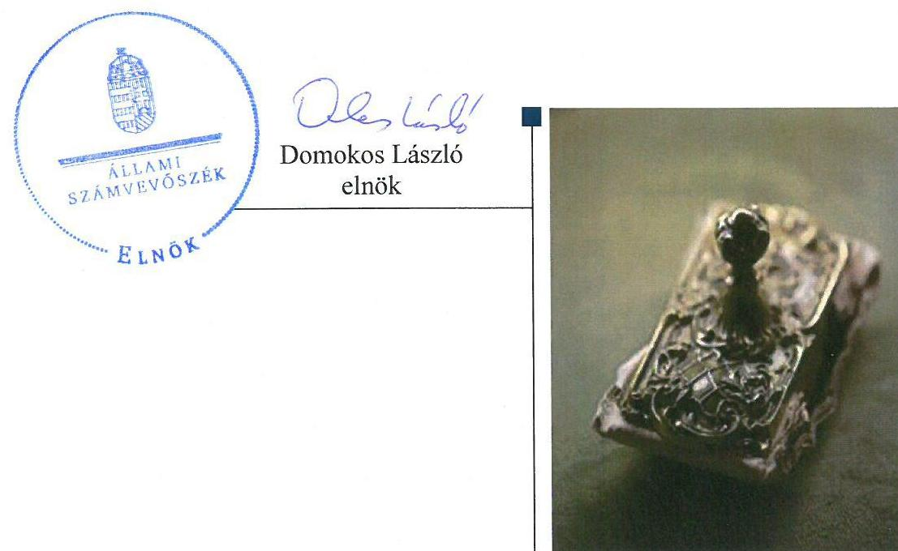

---

# AZ ELLENŐRZÉST FELÜGYELTE:

DR. BENEDEK MÁRIA felügyeleti vezető

## AZ ELLENŐRZÉST VEZETTE ÉS A VÉGREHAJTÁSÁÉRT FELELŐS:

MAROZSÁN LÁSZLÓNÉ ellenőrzésvezető

## A PROGRAM ÖSSZEÁLLÍTÁSÁÉRT FELELŐS:

JANIK JÓZSEF LÁSZLÓ osztályvezető

IKTATÓSZÁM: V-1059-070/2016

TÉMASZÁM: 11

ELLENŐRZÉS-AZONOSÍTÓ SZÁM: V-074402

Jelentéseink az Országgyűlés számítógépes hálózatán és az Interneten a www.asz.hu címen is olvashatóak.

---

# TARTALOMJEGYZÉK 

■ ÖSSZEGZÉS ..... 5
■ AZ ELLENŐRZÉS CÉLJA ..... 7
■ AZ ELLENŐRZÉS TERÜLETE ..... 8
■ AZ ELLENŐRZÉS HÁTTERE, INDOKOLTSÁGA ..... 10
■ A JELENTÉS LÉNYEGES KÉRDÉSKÖREI ..... 11
■ ELLENŐRZÉS HATÓKÖRE ÉS MÓDSZEREI ..... 12
■ MEGÁLLAPÍTÁSOK ..... 14
■ JAVASLATOK ..... 25
■ MELLÉKLETEK ..... 27
I. Sz. melléklet: Értelmező szótár ..... 27
■ FÜGGELÉK: ÉSZREVÉTELEK ..... 29
■ RÖVIDÍTÉSEK JEGYZÉKE ..... 35

---

.

---

# ÖSSZEGZÉS 

Az ÁSZ ${ }^{1}$ ellenőrizte a szakmai irányító szerv ${ }^{2}$ nem állami intézményfenntartókkal ${ }^{3}$ kapcsolatos feladatai ellátását, továbbá a Fenntartó 2011-2014. években a központi költségvetésből kapott támogatása ${ }^{5}$ igénylésének, elszámolásának és felhasználásának a szabályszerűségét. Az ellenőrzés során az ÁSZ megállapította, hogy a szakmai irányító szerv a nem állami intézményfenntartók köznevelési közfeladat-ellátásával kapcsolatos jogszabályban előírt szabályozási feladatait szabályszerűen ellátta. A Fenntartó a kapott támogatást összeségében a jogszabályi előírásoknak megfelelően igényelte és használta fel, valamint év végén szabályszerűen számolta el. A Fenntartó a támogatást az általa fenntartott Intézmény ${ }^{6}$ alapfeladatainak ellátására, működtetésére fordította, a jogszabályban előírt határidőben adta át a fenntartott Intézménye részére.

## Az ellenőrzés társadalmi indokoltsága

Az ÁSZ stratégiájában hangsúlyos szerepet szán annak, hogy szilárd szakmai alapon álló, értékteremtő ellenőrzéseivel előmozdítsa a közpénzügyek átláthatóságát, rendezettségét és javaslataival a közpénzek és a közvagyon szabályos, gazdaságos, hatékony és eredményes felhasználását segítse. Stratégiájában az ÁSZ célul tűzte ki, hogy az államháztartáson kívülre nyújtott költségvetési támogatások ellenőrzésével hozzájárul ahhoz, hogy a közpénzeket az államháztartáson kívüli szervezetek is átlátható módon használják fel a közfeladatok szerződésben vállalt ellátása érdekében. Tekintettel az elmúlt években a köznevelés finanszírozását és a köznevelési intézmények fenntartását érintően végbement változásokra, a társadalom fokozott érdeklődéssel figyeli a köznevelési feladatok ellátására fordított források felhasználását. Fontos ezért az ÁSZ-nak a közvéleményt biztosítani arról, hogy a közpénz államháztartáson kívüli felhasználása ezen a területen sem marad ellenőrizetlenül.

## Főbb megállapítások, következtetések, javaslatok

A szakmai irányító szerv a köznevelési intézmények működésének, az intézményfenntartók közfeladat-ellátásának szakmai szabályairól az ágazati jogszabályok által adott felhatalmazásoknak megfelelően az ellenőrzött időszakra vonatkozóan miniszteri rendeletek formájában rendelkezett. Az általános, valamennyi intézményfenntartót érintő szabályozásokon kívül egyes kérdések vonatkozásában a rendeletekben rögzítették a nem állami fenntartókra, azok intézményeire vonatkozó külön szabályokat is.

A 2011-2014. években a Fenntartó közfeladat-ellátásának megszervezése megfelelt a Gt. tv. ${ }^{7}$ és a Ptk. ${ }^{8}$ előírásainak, társasági szerződése alapján az illetékes bíróság nyilvántartásba vette, beszámolási kötelezettségének szabályszerűen eleget tett. A Fenntartó belső szabályozottságának kialakítása során nem tartotta be maradéktalanul a Számv. tv. ${ }^{9}$ előírását, mivel a számviteli politikán a törvény változásait az ellenőrzött időszakban nem vezette keresztül.

A Fenntartó támogatás igénylése összességében a Közokt. vhr. ${ }^{10}$ és az Nkt. vhr. ${ }^{11}$ előírásainak megfelelően történt. A támogatás igényléséhez előírt feltételeknek a Fenntartó és az Intézménye megfelelt. A támogatás igénylésének fenntartói adatait alátámasztó összesítő dokumentumok, nyilvántartások az ellenőrzött jogcímekre vonatkozóan a Fenntartónál rendelkezésre álltak. A Fenntartónál rendelkezésre álló támogatás igénylési dokumentumokból megállapítható volt, hogy a Kincstár ${ }^{12}$ határozatban döntött a Fenntartót megillető támogatás összegéről. A Fenntartó a számláján jóváírt támogatást a hatályos Kvtv. ${ }^{13}$ előírásának megfelelő határidőben adta át az Intézménye számára.

---

A támogatással a Fenntartó összességében szabályszerűen elszámolt, azonban a támogatás felhasználásának elkülönített nyilvántartását a 2013-2014. években nem az Nkt. vhr.-ben előírt tartalommal vezette, mivel az alapfeladatonkénti elkülönítést nem biztosította. A támogatás igénylése és elszámolása során egyes dokumentumok megőrzési kötelezettségének a 2011-2013. években a Fenntartó nem tett eleget.

A kapott támogatást a Fenntartó szabályszerűen használta fel, azt az Intézmény alapfeladataira, működtetésére fordította. A Fenntartó az Intézmény szabályos működéséhez biztosította a szervezeti és szabályozási kereteket a 2011-2014. években. Kiadta és módosította az Intézmény alapító okiratát ${ }^{14}$, kezdeményezte szükség esetén a működési engedélyének a módosítását. A pedagógiai munkához szükséges alapdokumentumokat ${ }^{15}$ jóváhagyta. A Közokt. tv.-ben és az Nkt.-ban rögzítetteknek megfelelően a személyi és tárgyi feltételeket biztosította, költségvetését megállapította.

A Fenntartó az operatív gazdálkodási jogkörök gyakorlásával folyamatosan ellenőrizte az Intézmény gazdálkodását, a működése törvényességét, a tanügyi dokumentumok vezetését. Az Intézmény szakmai munkájának eredményességét a Fenntartó a Közokt. tv. és az Nkt. előírásainak megfelelően minden évben értékelte.

A 2012-2014. években külső ellenőrzést az Intézmény feladatellátási helyein a Kincstár és az illetékes kormányhivatalok végeztek. A fenntartói dokumentumok ellenőrzése során az ÁSZ megállapította, hogy a Kincstár a támogatások igénylését és az elszámolását érintően több alkalommal ellenőrizte a Fenntartó Intézményének feladatellátási helyein az igénylési feltételek meglétét, illetve az igénylés és az elszámolás jogszerűségét, a mutatószámok megalapozottságát. Igénybevételi kamat megállapítására, a támogatás felfüggesztésére az ellenőrzött időszakban a Kincstár részéről nem került sor. Helyszíni ellenőrzéseik megállapításai alapján a Fenntartó felé a 2011.-2013. évekre vonatkozóan visszafizetési kötelezettséget írtak elő, melynek a Fenntartó határidőben eleget tett.

Az illetékes kormányhivatalok 2012-2014. között ellenőrizték a fenntartói tevékenység törvényességét és az Intézmény működésének a szabályszerűségét az Intézmény több feladatellátási helyén. Az ÁSZ a Fenntartónál ellenőrzött dokumentumokból megállapította, hogy a törvényességi ellenőrzések során esetenként megállapított szabálytalanságokat a Fenntartó az előírt határidőn belül megszüntette.

---

# AZ ELLENŐRZÉS CÉLJA 

AZ ELLENŐRZÉS CÉLJA annak értékelése volt, hogy a Fenntartó központi költségvetésből kapott támogatásainak felhasználása szabályszerű volt-e, a támogatások igénylése, évközi módosítása és év végi elszámolása megfelelt-e a jogszabályi előírásoknak.

Az ellenőrzés során az ÁSZ értékelte a szakmai irányító szerv jogszabályban előírt feladatainak ellátását is az államháztartáson kívüli humánszolgáltatók köznevelési köz-feladat-ellátásával kapcsolatban.

---

# AZ ELLENŐRZÉS TERÜLETE 

## A Fenntartó

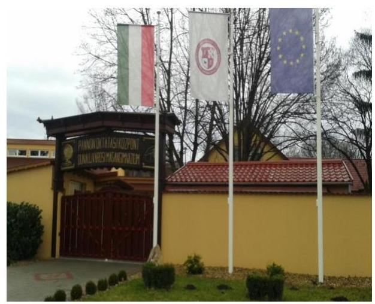

A Fenntartó átalakulással, három millió forint jegyzett tőkével jött létre 2009-ben, a 2002. szeptember 2-án bejegyzett Hu-mán-Pszicho 2002 Oktató és Szolgáltató Közhasznú Társaság jogutódjaként. A Fejér Megyei Bíróság 2009. március 26-án jegyezte be a cégnyilvántartásba kiemelten közhasznú társaságként. Tulajdonosa két magánszemély volt.

2013-ban a Fenntartó tulajdonosi szerkezetében változás következett be, egyszemélyes társaságként folytatta tevékenységét, székhelye Nagyvenyim. A társaság képviseletére a tulajdonos ügyvezető önállóan jogosult.

Az ellenőrzött időszakban a társaság ügyvezetőjének személye nem változott, 2011-ben alkalmazottja nem volt, 2014 év végén 4 fő állt vele foglalkoztatási jogviszonyban. A Fenntartó változásbejegyzési kérelme alapján a székhely szerint illetékes cégbíróság 2014. június 1-jétől a Civil. tv. ${ }^{16}$ megváltozott előírásaira tekintettel a Fenntartót „közhasznú”-ként vette nyilvántartásba.

A Fenntartó fő feladata a közoktatás, gyakorlati képzés, szakképzés szervezése, közoktatási intézmény alapítása, fenntartása, működtetése. Közoktatási, szakképzési feladatait a Fenntartó a Pannon Oktatási Központ Gimnázium, Szakképző Iskola és Általános Iskola fenntartásán és működtetésén keresztül látta el a 2011-2014. évek között. Az Intézmény a Közokt. tv és az Nkt. előírásai szerint jogi személy, önálló költségvetéssel rendelkezik, szakmai tekintetben önálló, szervezetére, működésével kapcsolatos ügyekben dönt, kivéve ha azt jogszabály nem utalja más hatáskörébe. Az Intézmény az ellenőrzött időszakban az alapító okirat alapján részben önállóan gazdálkodhatott, az előirányzatai felett részjogkörrel rendelkezett, bérgazdálkodás tekintetében önálló volt, pénzügyi-gazdasági feladatait a Fenntartó látta el.

Az Intézmény tanulóinak száma 2011-ben 2350 fő volt, ami 2014. évre 2716 főre nőtt.

Az Intézmény székhelyén és telephelyein az ellenőrzött időszakban általános iskolai nevelés-oktatást, illetve alapfokú oktatást, általános és szakmai középfokú oktatást folytatott nappali és esti munkarend szerint. A Fenntartó közoktatási tevékenységének egyik sajátos területe, hogy a fenntartott Intézményén keresztül az ország számos büntetés-végrehajtási intézetében biztosította a 2011-2014. években az elítéltek közoktatását.

A Fenntartó szakmai irányító szervi feladatait a Minisztérium ${ }^{17}$ látta el, aki ellenőrzési feladatait a kormányhivatalok útján végezte a 2011-2014. években.

A Fenntartó mérlegfőösszege 2011-ben 285743 ezer Ft volt, mely 2014. évre 559634 ezer Ft-ra nőtt. Saját tőkéje a 2011. évi 180931 ezer Ft-ról 2014-re 414566 ezer Ft-ra emelkedett. Adózott eredménye 2011ben 49127 ezer Ft, 2014-ben 181312 ezer Ft volt. Összes bevétele a 2011. évi 415003 ezer Ft-ról 2014-re több mint 90%-kal, 796440 ezer Ft-ra nőtt.

---

A 2012-2013. években a települési önkormányzatoktól évente közel 10000 ezer Ft működési támogatást kapott a Fenntartó.

A Fenntartó a közoktatási, köznevelési feladatellátására tekintettel Magyarország éves költségvetéséből támogatásra volt jogosult, mely alapján a 2011. évben 337460 ezer Ft központi költségvetési támogatást kapott, ami a 2014. évben meghaladta az 541000 ezer Ft-ot. Összes bevételének a 2011-2013. években évente mintegy 80%-át tette ki a központi költségvetési támogatás, amely 2014. évben a jelentős mértékű saját bevétel növekedése miatt több mint 10%-kal kisebb részarányt képviselt az összes bevételből.

---

# **AZ ELLENŐRZÉS HÁTTERE, INDOKOLTSÁGA**

A köznevelési feladatokat ellátó nem állami intézményfenntartók részére közfeladataik ellátására évente jelentős összegű pénzügyi támogatást biztosítottak a mindenkori költségvetési törvények a bennük megfogalmazott feltételek mellett.

A nem állami közoktatási/köznevelési intézmények fenntartói által felhasznált állami támogatás összege a 2011-2014. években együtt 570,2 Mrd Ft18 volt. A 2011. évben a Kormány19 felülvizsgálta a humánszolgáltatások tekintetében a hatályos szabályozást. Az Országgyűlés elfogadta a Nkt.20-t, amely jelentősen átalakította a korábbi finanszírozási rendszert 2013 októberétől.

Új feladatfinanszírozási forma (átlagbér-alapú támogatás) jelent meg, amely a nem állami intézményfenntartókra is vonatkozott. A normatív finanszírozás rendszerében bekövetkezett változások aktualitást adtak az ellenőrzésnek. Az ellenőrzés lefolytatását az is szükségessé tette, hogy az ÁSZ még nem ellenőrizte átfogóan ezt a területet.

Az ÁSZ stratégiájában foglaltak alapján is indokolt az ellenőrzés, amely a társadalom számára jelzi, hogy a közpénz államháztartáson kívüli felhasználása sem maradhat ellenőrizetlenül. Az államháztartáson kívülre nyújtott költségvetési támogatások ellenőrzésével az ÁSZ hozzájárul ahhoz, hogy a közpénzeket a nem állami fenntartók átlátható módon használják fel a közfeladatok ellátására kötött szerződésekben vállalt kötelezettségek teljesítése érdekében. Az ÁSZ az ellenőrzés javaslataival hozzájárulhat az említett rendszerek szabályszerű támogatás felhasználásához, javíthatja a társadalmi-gazdasági döntések megalapozottságát, amely a "jó kormányzás" feltétele.

---

# A JELENTÉS LÉNYEGES KÉRDÉSKÖREI 

1. A szakmai irányító szerv ellátta-e jogszabályban előírt feladatait az államháztartáson kívüli humánszolgáltatók közfeladatellátása kapcsán?
2. A Fenntartó a jogszabályi előírásoknak megfelelően igényelte-e, módosította-e, és év végén elszámolta-e a központi költségvetési támogatásokat?
3. A Fenntartó a központi költségvetésből kapott támogatásokat szabályszerűen használta-e fel?

---

# ELLENŐRZÉS HATÓKÖRE ÉS MÓDSZEREI 

## Az ellenőrzés típusa

Megfelelőségi (szabályszerűségi) ellenőrzés.

## Az ellenőrzött időszak

A 2011. január 1-je és
 2014. december 31-éig közötti évek, amelyben a Fenntartó közfeladat-ellátásra a központi költségvetésből támogatást kapott és használt fel. A 2011. év vonatkozásában a költségvetési támogatások 2011. évet megelőző időszakra eső igénylését, a 2014. év tekintetében annak 2015-ben történő elszámolását is ellenőrizte az ÁSZ.

## Az ellenőrzés tárgya

Az ellenőrzés a köznevelési közfeladatokat ellátó államháztartáson kívüli intézményfenntartó, központi költségvetésből kapott támogatásai felhasználására terjedt ki. Az alábbi jogcímek esetében azok igénylése, évközi módosítása, elszámolása és felhasználása szabályszerűségének értékelését foglalta magában:
$\longrightarrow$ az alap normatív- és átlagbér alapú költségvetési támogatások közül az általános iskolai oktatás/alapfokú nevelés, középfokú oktatás/nevelés,
$\longrightarrow$ a kiegészítő támogatások közül a tanulóétkeztetési és a tankönyvtámogatás.
Az ellenőrzés kiterjedt minden olyan körülményre és adatra, amely az ÁSZ jogszabályban meghatározott feladatainak teljesítéséhez, valamint a program végrehajtása folyamán felmerült újabb összefüggések feltárásához szükséges volt.

## Az ellenőrzött szervezet

Az ellenőrzött szervezet az Emberi Erőforrások Minisztériuma és a HumánPszicho 2002 Oktató és Szolgáltató Nonprofit Kft.

## Az ellenőrzés jogalapja

Az ellenőrzés jogszabályi alapját az ÁSZ tv. ${ }^{21} 1 . \S$ (3) bekezdése és az 5. § (2)-(3) bekezdéseiben foglalt előírások adták. Az ÁSZ az államháztartásból származó források felhasználásának keretében ellenőrzi az államháztartásból nyújtott támogatás vagy az államháztartásból

---

meghatározott célra ingyenesen juttatott vagyon felhasználását - többek között - az államháztartáson kívüli humánszolgáltatók fenntartóinál. Amennyiben a kedvezményezett szervezet az államháztartásból támogatásban vagy ingyenes vagyonjuttatásban részesül, gazdálkodási tevékenységének egésze ellenőrizhető.

# Az ellenőrzés módszerei 

Az ellenőrzést az ellenőrzési program kérdései, az adott időszakban hatályos jogszabályok, az ellenőrzés szakmai szabályok és módszertanok, valamint a nemzetközi standardok figyelembevételével végezte az ÁSZ.

A közpénzekkel való felelős gazdálkodás segítésére irányuló javaslatok kidolgozásakor a hatályos jogszabályok voltak az irányadóak.

Az ellenőrzés ideje alatt az ÁSZ a Fenntartóval történő kapcsolattartást az ÁSZ SZMSZ ${ }^{11}$-ének vonatkozó előírásai alapján biztosította.

Az ellenőrzési kérdések megválaszolásához szükséges bizonyítékok megszerzése az ellenőrzöttek által rendelkezésre bocsátott dokumentumokra, adatokra alapozva megfigyelés, szemle (szemrevételezés), kérdésfeltevés (információkérés), valamint elemző eljárással történt.

Az ellenőrzési bizonyítékként felhasznált adatforrások közé tartoztak egyrészt a szakmai program részletes szempontjainál felsorolt adatforrások, másrészt minden - az ellenőrzés folyamán feltárt, az ellenőrzés szempontjából információt tartalmazó - dokumentum.

Az ellenőrzés lefolytatásához a szakmai irányító szerv és a Fenntartó a kitöltött tanúsítványok, adatbekérő lap, valamint az ÁSZ által kért dokumentumok elektronikus úton való megküldésével szolgáltatott adatokat, információkat. Az így rendelkezésre bocsátott adatok, információk és a tanúsítványok adatai valódiságának kontrollja az ellenőrzés keretében történt.

Az ellenőrzést a támogatások igénylésével, módosításával, felhasználásával, elszámolásával kapcsolatos feladatokat ellátó Fenntartónál végezte az ÁSZ, a helyszíni szemlékre a fenntartott Intézmény egyes feladatellátási helyein került sor.

---

# 1. A szakmai irányító szerv ellátta-e jogszabályban előírt feladatait az államháztartáson kívüli humánszolgáltatók közfeladatellátása kapcsán? 

Összegző megállapítás

A szakmai irányító szerv a 2011-2014. években ellátta a jogszabályban előírt feladatait az államháztartáson kívüli humánszolgáltatók köznevelési közfeladat-ellátása kapcsán.

A KÖZOKTATÁSI, KÖZNEVELÉSI INTÉZMÉNYEK ÉS FENNTARTÓIK FELADATELLÁTÁSÁRA vonatkozóan a szakmai irányító szerv számára az ágazati jogszabályok (Közokt. tv. ${ }^{23}$., Nkt. Közokt. vhr., Nkt. vhr.) felhatalmazó és záró rendelkezései szabályozási feladatokat írtak elő. Ennek megfelelően a szakmai irányító szerv miniszteri rendeletekben rendelkezett az intézményfenntartók közfeladatellátásának és a fenntartott intézmények működésének szakmai szabályairól. Ezek a rendeletek fenntartótól független szabályozásokat tartalmaztak, egyes kérdések esetében kiegészítve a nem állami intézményfenntartókra és az általuk fenntartott intézményekre vonatkozó külön szabályokkal.

A nem állami intézmények fenntartói az önkormányzatokkal és az állammal közoktatási megállapodást, illetve köznevelési szerződést köthettek az ellenőrzött időszakban a közfeladat-ellátására. A Közokt. tv. és 2012-től az Nkt. teljes körűen rögzítette a közoktatási megállapodásra, köznevelési szerződés megkötésére vonatkozó előírásokat, további részletszabályok meghatározását a szakmai irányító szerv számára a jogszabályok a tárgykörre vonatkozóan nem írtak elő.

A nem állami fenntartású intézmények működésének megkezdéséhez működési engedélyre volt szükség, melynek kiadásához a kérelmet a fenntartónak kellett benyújtani az illetékes hatósághoz. A szakmai irányító szerv a nem állami fenntartású intézmények működési engedélye kiadásának részletes szabályaira - beleértve a fenntartó által benyújtott kérelmek kötelező tartalmi elemeit - és a működési engedélyek tartalmára vonatkozóan a 11/1994. (VI. 8.) MKM rendeletben ${ }^{24}$, illetve 2012. szeptember 1-től a 20/2012 (VIII. 31.) EMMI rendeletben ${ }^{25}$ határozott meg előírásokat.

Az intézményfenntartók feladatellátását finanszírozó költségvetési támogatás igénylését, elszámolását segítő jogi szabályozó eszközök az ellenőrzött időszakban rendelkezésre álltak. A köznevelési feladatok ellátásához nyújtott támogatásról a mindenkori költségvetési törvények tartalmaztak rendelkezéseket 2011-2014. között. Az egyes ágazati törvények előírásainak megfelelően a Kormány további részletszabályokat állapított meg az állami hozzájárulások és támogatások megállapítására, folyósítására, elszámolására, továbbá a szükséges adatszolgáltatásra vonatkozóan. A szakmai

---

irányító szerv a tankönyvtámogatási rendeletekben ${ }^{26}$ az iskolai tankönyvtámogatás rendjére vonatkozóan gondoskodott az állami támogatásokkal kapcsolatosan további szabályozásról.

A szakmai irányító szerv a Közokt. tv-ben, illetve az Nkt.-ban kapott felhatalmazása alapján a tanügyi nyilvántartásokról, azok formájáról, tartalmáról, kezelésének szabályozásáról a 11/1994. (VI. 8.) MKM rendeletben, illetve a 20/2012. (VIII.31.) EMMI rendeletben rendelkezett. A 20/2012. (VIII. 31.) EMMI rendeletben szabályozta a különböző oktatási statisztikai adatokat kezelő KIR ${ }^{27}$ részeként működtetett KIFIR ${ }^{28}$ szabályait is, a középfokú intézményekbe való felvételi eljárásra vonatkozóan.

Az intézményfenntartók és intézményeik ellenőrzését a szakmai irányító szerv elsősorban az OH${ }^{29}$-n és az illetékes kormányhivatalokon keresztül látta el a 2011-2014. években. Az általuk lefolytatott ellenőrzések szakmai, hatósági és törvényességi ellenőrzések voltak. A miniszter az országos pedagógiai-szakmai ellenőrzés működési rendjét és lebonyolítását, valamint a nem állami intézményfenntartók tevékenységének törvényességi ellenőrzését a 20/2012. (VIII. 31.) EMMI rendeletben és az egyes tanévek rendjéről kiadott rendeletekben szabályozta.

A miniszter ${ }^{30}$ a köznevelési feladatok megszervezéséhez szükséges döntései előkészítése céljából az OH által előkészített 2013-2018. évi köznevelési fejlesztési tervet 2013-ban elfogadta. A fejlesztési tervek megyei szintű bontásban készültek az Nkt.-ban előírtaknak megfelelően. A fejlesztési tervekben a köznevelési intézményrendszer főbb mutatói között megtalálhatók a nem állami köznevelési intézmények feladatellátását jellemző adatok is.

# 2. A Fenntartó a jogszabályi előírásoknak megfelelően igényelte-e, módosította-e, és év végén elszámolta-e a központi költségvetési támogatásokat? 

Összegző megállapítás

### 2.1. számú megállapítás

A Fenntartó összességében a jogszabályi előírásoknak megfelelően igényelte és számolta el év végén a támogatásokat.

A Fenntartó közfeladat-ellátásának megszervezése megfelelt, belső szabályozottsága a számviteli politika törvényi változásokat követő módosításának elmaradása miatt nem felelt meg teljes körűen a jogszabályi előírásoknak.
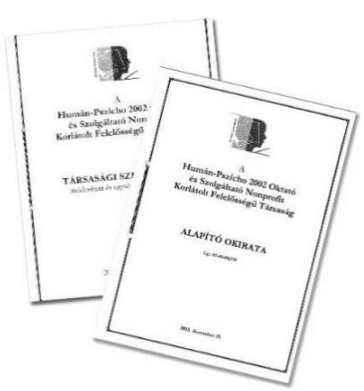

A FENNTARTÓ A KÖZFELADAT-ELLÁTÁS KERE-TEIT a Gt. tv. és a Ptk. előírásainak megfelelően kialakította, az ellenőrzött időszakban rendelkezett a Gt. tv. és a Ptk. előírásai alapján készített hatályos társasági szerződéssel, illetve - egyszemélyes társasággá alakulásáról - alapító okirattal. A Fenntartó társasági szerződése tartalmazta a tevékenységi körét, feladatait, többek között, a nevelés, oktatási feladatot. A Fejér Megyei Bíróság 2009. március 26-án jegyezte be a Fenntartót a cégnyilvántartásba kiemelten közhasznú társaságként. A Fenntartó a 2011-2014. években a közoktatási, köznevelési feladatok ellátására közoktatási megállapodást, köznevelési szerződést települési önkormányzattal, illetve az állammal nem kötött, arra vonatkozó kötelezettsége nem volt.

---

A Fenntartó a 2011-2014. években rendelkezett szervezeti felépítését és működését meghatározó szabályzattal, mely 2014. december 1-jéig az Intézményre vonatkozó adatokat, szabályokat is tartalmazott. A szabályzatban rögzítették a szervezeti felépítést, a működés rendjét, a felelősségi és hatásköröket, ezek gyakorlásának módját.

A Fenntartó a Számv. tv. előírásainak megfelelően a kettős könyvvitel rendszerében vezette a könyveit, működéséről, vagyoni, pénzügyi és jövedelmi helyzetéről a 2011-2014. években egyszerűsített éves beszámolót készített.

A Fenntartó részére a beszámoló könyvvizsgálóval történő felülvizsgálati kötelezettségét jogszabály nem írta elő. A társasági szerződés azonban rendelkezett a könyvvizsgálati kötelezettségről, amelynek a Fenntartó az ellenőrzött időszakban könyvvizsgáló megbízásával eleget tett. A könyvvizsgáló a Fenntartó 2011-2014. évi egyszerűsített éves beszámolóit minden évben korlátozás nélküli könyvvizsgálói záradékkal látta el.

A Fenntartó jóváhagyta a hatályos Közokt. tv. és az Nkt. előírásainak megfelelően az Intézmény alapdokumentumait a köznevelési feladatok szabályos kereteinek kialakítása során.

A FENNTARTÓ BELSŐ SZABÁLYOZOTTSÁGA nem felelt meg teljes körűen a Számv. tv. és az Eitv. ${ }^{31}$ előírásainak. Az ügyvezető kiadta a Fenntartó számviteli politikáját és a gazdálkodását meghatározó szabályzatokat (számlarend, selejtezési-, pénzkezelési-, leltározási-, értékelési szabályzat, illetve a bizonylati rend). A Fenntartó számviteli politikája 2011. január 1-jétől volt hatályos, azt az ellenőrzött időszakban nem módosította. A számviteli politika tartalma megfelelt a Számv. tv.-ben rögzített alapelveknek, illetve az értékelési előírásoknak, számlarendjében rendelkezett a Fenntartó a közfeladatokhoz rendelt költségvetési támogatások elkülönített nyilvántartásáról.

A Fenntartó az elektronikus közzététel szabályait 2011. augusztus 31-ig nem alakította ki, 2011. szeptember 1-jétől belső szabályzatban állapította meg az Eitv.-ben előírtaknak megfelelően a közzétételi kötelezettsége teljesítésének részletes szabályait és az ebben foglaltaknak megfelelően honlapján és a helyben szokásos módon - az Intézmény faliújságján - tett eleget közzétételi kötelezettségének.

A TÁMOGATÁSOK IGÉNYLÉSI RENDJÉT a Fenntartó a Pénzügyi szabályozás ${ }_{1-2}{ }^{32}$-ben rögzítette, melyet az Nkt., az Nkt. vhr. és a hatályos Kvtv. előírásainak megfelelően 2013-ban módosított. A szabályzatban összefoglalta az Intézmény számára a támogatások jogi szabályozóit, a támogatás megállapításának elveit, a nem állami intézményfenntartók költségvetési támogatásának igénylése, folyósítása, elszámolása és ellenőrzése jogszabályi előírásait. A Fenntartó meghatározta a felelősségi jogköröket, a költségvetési támogatások igénylésének és elszámolásának intézményi és fenntartói feladatait is.

---

A Fenntartó belső szabályozottsággal kapcsolatos szabálytalanságait a 1. táblázat szemlélteti.

# A FENNTARTÓ BELSŐ SZABÁLYOZOTTSÁGGAL KAPCSOLATOS SZABÁLYTALANSÁGAI 

| Sorszám | Részmegállapítás | Megjegyzés |
| :-- | :-- | :-- | :-- |
| 1. | A Fenntartó a Számv. tv. 14 § (11) bekezdésében előírtak   ellenére a 2011. január 1-jétől hatályos számviteli politi-   kán törvénymódosítás esetén a változásokat nem vezette   keresztül - 2012. december 1-jétől a napi készpénz záró   állományának számítása, 2013. január 1-jétől a jelentős   összegű hiba meghatározása - hatályba lépésüket követő   90 napon belül és az ellenőrzött időszakban azt követően   sem. | Az ellenőrzött időszakban nem került módosításra a Fenntartó   számviteli politikája. |
| 2. | A Fenntartó az Eitv. 4. § (3) bekezdésében foglaltak ellenére 2011. augusztus 31-ig nem állapította meg belső sza-   bályzatban a közzétételi listákon szereplő adatok közzété-   teli kötelezettsége teljesítésének részletes szabályait. | 2011. szeptember 1-től ügyrendben szabályozta a Fenntartó   képviselője a kötelezően közzéteendő adatok közzétételének   rendjét az Eitv., 2012. január 1-től az Info. tv. ${ }^{33}$-ben foglaltaknak   megfelelően. |

Forrás: ÁSZ

## 2.2. számú megállapítás

A támogatás Fenntartó általi igénylése, folyósítása összességében a jogszabályi előírásoknak megfelelően történt.

A FENNTARTÓ MEGFELELT a támogatás igénylésének alapját jelentő, jogszabályokban foglalt feltételeknek a 2011-2014. években. Átlátható szervezetnek minősült, továbbá az Áht. ${ }^{34}$-ben és az Áht. ${ }^{35}$-ben, valamint az 1/2012. (I.26.) NGM rendelet ${ }^{36}$-ben előírtak szerint rendezett munkaügyi
 kapcsolatokkal rendelkezett.

## A TÁMOGATÁS IGÉNYLÉS ALAPJÁT, FELTÉTELEIT JELENTŐ ÖSSZESÍTŐ DOKUMENTUMOK, nyilvántartások a Fenntartónál a Közokt. vhr. és az Nkt. vhr. előírásainak megfelelően a 2011-2014. években rendelkezésre álltak, az általa fenntartott Intézmény a KIR intézménytörzs nyilvántartásában szerepelt, OM azonosítóval ${ }^{37}$ rendelkezett. Az Intézmény hatályos működési engedélyében az igényjogosultságot megalapozó alapfeladatok szerepeltek.

Az Intézmény összességében és az egyes feladatellátási helyein a működési engedélyekben meghatározott tanuló létszámot nem lépte túl, mely létszámadatokat az 1. ábra szemlélteti.

## 1. ábra

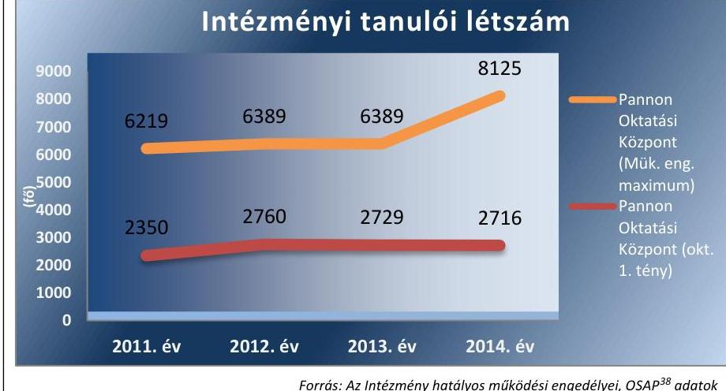

---

A Fenntartó az ellenőrzött jogcímek és az összesített adatok vonatkozásában rendelkezett a támogatások igénylését megalapozó tanulói összesítő nyilvántartásokkal, dokumentumokkal.

A Fenntartó az Intézményre vonatkozóan is megfelelt a támogatás igénylés feltételeinek. Az Intézménnyel tanulói és alkalmazotti jogviszonyban állók a Közokt. vhr. és az Nkt. vhr. előírásainak megfelelően OM azonosító számmal rendelkeztek, a KIR nyilvántartásban szerepeltek, a KIR intézménytörzs alapján készült kimutatások a Fenntartónál rendelkezésre álltak.

# A TÁMOGATÁS IGÉNYLÉSÉNEK FOLYAMATA egyes 

dokumentumok megőrzését érintő hiányosság kivételével szabályszerű volt, évközi módosítás a 2011-2014. évek között nem történt.

Az igénylési határidő elmulasztása jogvesztő volt. A Fenntartó támogatási igénylési dokumentációja alapján az ÁSZ megállapította, hogy
$\longrightarrow$ az ellenőrzött időszakban a Fenntartó a Közokt. vhr. és az Nkt. vhr előírásainak megfelelően feladatellátási helyenként intézményi szinten összesített formában nyújtotta be a támogatás iránti igényét a Kincstárhoz, az általa megküldött adatlapon,
$\longrightarrow$ a Fenntartó a támogatás igénylési adatlaphoz csatolta az előírt nyilatkozatokat, kimutatásokat,
$\longrightarrow$ a Kincstár hiánypótlásra, adategyeztetésre a Fenntartót az ellenőrzött időszakban nem szólította fel,
$\longrightarrow$ az igénylési dokumentációt a 2011. és 2013. évi adatlapok benyújtását igazoló dokumentum kivételével a Fenntartó az irattárban megőrizte,
$\longrightarrow$ a Fenntartó a támogatás igénylési adatlap Kincstár felé történő benyújtásakor szükség esetén eleget tett a Közokt. vhr. és az Nkt. vhr.-ben előírt változás bejelentési kötelezettségének, csatolta a nyilatkozatokat a nem működő telephelyekről, a módosult létszámadatokról.
A Fenntartó által kapott kincstári határozatokban megállapított támogatási összegeket az ellenőrzött jogcímekre vonatkozóan a 2. ábra szemlélteti.
2. ábra
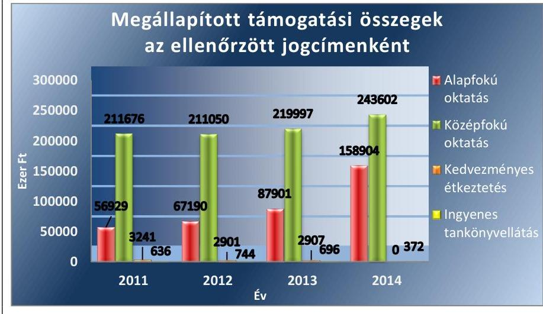

* nem tartalmazza 2013-2014-ben a nevelő-oktató munkát segítő bértámogatását Forrás: A kincstári határozatok

---

A támogatás összege 2011-ben az ellenőrzött jogcímeken 272282 ezer Ft volt, mely 2014-re 48%-kal 402878 ezer Ft-ra nőtt. A növekedés egyrészt a tanulók számának megközelítőleg 400 fős emelkedésével és a 2013. október 1-jétől megváltozott feladatfinanszírozási forma számítási módszerével és az egyes jogcímek tartalmi változásával magyarázható.

A TÁMOGATÁSOK FOLYÓSÍTÁSA az ellenőrzött időszakban szabályszerű volt. A Fenntartó számára a Kincstár által megküldött határozatok alapján került sor a jóváhagyott támogatás Fenntartó számláján történő jóváírására a finanszírozást lebonyolító Kincstár részéről.

A Fenntartó a támogatás teljes összegét a hatályos Kvtv.-ben előírt 15 napos határidőn belül utalta tovább az Intézmény számlájára. A Fenntartó főkönyvi nyilvántartása, banki bizonylatai a támogatás Intézmény részére történt átadásának szabályszerűségét alátámasztotta.

A támogatás Fenntartó általi igénylésével kapcsolatos szabálytalanságot a 2. táblázat tartalmazza.
2. táblázat

# A TÁMOGATÁS IGÉNYLÉSÉVEL KAPCSOLATOS SZABÁLYTALANSÁG 

| Sorszám | Részmegállapítás | Megjegyzés |
| :--: | :--: | :--: |
| 1. | A Fenntartó a 335/2005. (XII.29.) Korm. rendelet ${ }^{16}$ 6. § (a) pontjában és az Iratkezelési Szabályzata 3.3. pontjában előírtak ellenére nem biztosította a 2011. évi és 2013. évi igénylési adatlapok útjának követhetőségét, visszakereshetőségét, mert az adatlapok benyújtását igazoló dokumentumokat nem őrizte meg. | 2012. és 2014. években a Fenntartó a jogszabályban és az Iratkezelési szabályzatában foglaltaknak megfelelően a támogatás igénylések Kincstár felé történő benyújtását igazoló dokumentumok irattárba helyezésével biztosította az igénylési dokumentumok útjának követhetőségét, visszakereshetőségét, iratmegőrzési kötelezettségének eleget tett. |

Forrás: ÁSZ
2.3. számú megállapítás

A támogatások Fenntartó általi elszámolása - egyes dokumentumok 2011-2013. évi megőrzési kötelezettségének be nem tartása kivételével - megfelelt a jogszabályi előírásnak. A támogatások felhasználását a Fenntartó 2013-2014. években nem a jogszabályi előírásoknak megfelelően tartotta nyilván.

A TÁMOGATÁSOK ELKÜLÖNÍTETT NYILVÁNTARTÁSA a 2011-2012. években a Fenntartónál a Közokt. vhr. előírásának megfelelt, 2013-2014-ben azonban nem vezették azokat szabályszerűen, mert az Intézmény részére átadott támogatások elkülönített elszámolását feladatellátási helyenként biztosították. A fenntartói összesített feladatmutatókat az ellenőrzött időszakban a pénzügyi és szakmai nyilvántartások megfelelően alátámasztották. A főkönyvi nyilvántartásokból, a fenntartói és intézményi beszámolókból megállapítható volt a támogatások átadásának a határnapja, továbbá a támogatások felhasználásának célja. A nyilvántartás vezetése naprakész volt.

AZ ÉVES ELSZÁMOLÁSOK MUTATÓSZÁMAIT alátámasztották az Intézmény adatait tartalmazó fenntartói kimutatások, nyilvántartások.

Az ellenőrzött jogcímek fenntartói összesített mutatószámait alátámasztó, a jogszabályok által előírt dokumentumok, köznevelési statisztikai adattartalmak, kimutatások a Fenntartónál rendelkezésre álltak.

---

A Fenntartó a támogatásokkal a 2011-2014. években a Közokt. vhr.-ben és az Nkt. vhr.-ben, valamint az adott évben hatályos Kvtv.-ben meghatározott, a tanulókról és a foglalkoztatottakról vezetett nyilvántartások alapján számolt el: a tanulók oktatási azonosító számairól vezetett nyilvántartások, az ingyenes tankönyv ellátásra jogosult tanulók létszámáról vezetett nyilvántartások, a tanulóétkeztetésben résztvevők számáról készített kimutatás, valamint a pedagógusok és a nevelő-, oktató munkát közvetlenül segítő munkakörben foglalkoztatottak oktatási azonosító számairól vezetett nyilvántartás és az illetmények és járulékaik megfizetését alátámasztó (főkönyvi szintű) pénzügyi dokumentáció.

A FENNTARTÓ ELSZÁMOLT az ellenőrzött időszakban az Intézmény által felhasznált támogatásokkal az előírt nyilvántartások, tényadatok alapján a Közokt. vhr.-ben, az Nkt. vhr.-ben és a 2014. évi Kvtv.-ben foglalt határidőig.

A Fenntartó a 2011-2014. években a támogatás éves elszámolásához a Közokt. vhr. és az Nkt. vhr. hatályos előírásainak megfelelően mellékelte a tanulók és pedagógusok nyilvántartását fenntartói szinten összesítve, valamint intézményi szintű és feladatellátási helyenkénti bontásban. A tankönyvtámogatás elszámolása a tankönyvtámogatásban részesült tanulólétszám, tanulóétkeztetéshez nyújtott támogatás esetében az adott költségvetési évben hatályban lévő éves Kvtv.-ben meghatározott, elszámolható létszám alapján, fenntartói szinten összesítve történt. A 2014. évben az Intézményben tanulóétkeztetés nem volt. Az elszámolás adatait a Fenntartónál rendelkezésre állt kincstári határozatok és az elszámoló adatlapok irattári dokumentációja alátámasztotta, az elszámoláshoz csatolt egyes nyilatkozatokat és a benyújtását igazoló dokumentumot a 2014. év kivételével azonban a Fenntartó nem őrizte meg hiánytalanul.

A Fenntartó által kapott kincstári határozatokban elfogadott, elszámolt támogatások összegeit az ellenőrzött jogcímekre vonatkozóan a 3. ábra szemlélteti.
3. ábra
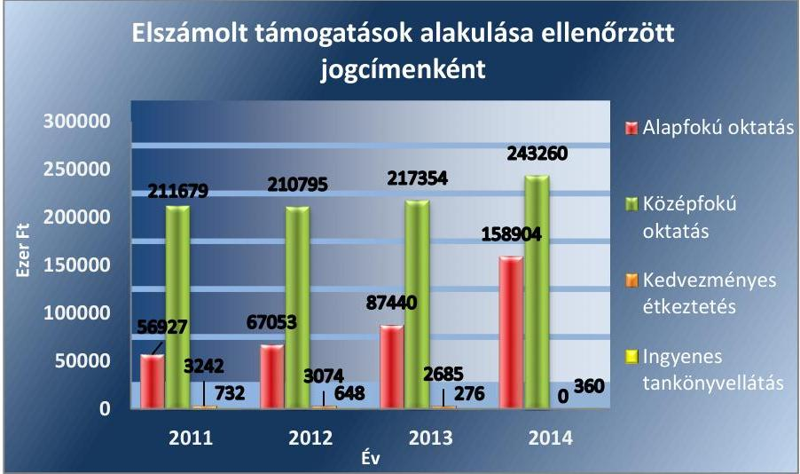

* nem tartalmazza 2013-2014-ben a nevelő-oktató munkát segítő bértámogatását Forrás: A Kincstár határozatai és a kapcsolódó fenntartói adatlapok
A Fenntartó határozatban értesült az általa megküldött elszámolás kincstári felülvizsgálatát követően jóváhagyott éves elszámolásokról, me-

---

lyek tartalmazták a kiutalt és a Fenntartót ténylegesen megillető támogatás közötti különbözetet, továbbá a különbözet pénzügyi rendezésére vonatkozó előírásokat. A Fenntartónak az ellenőrzött időszakban 2011. év kivételével a Kincstár felé visszafizetési kötelezettsége volt, melynek minden évben határidőben eleget tett.

A támogatások nyilvántartásával és elszámolásával kapcsolatos szabálytalanságokat a 3. táblázat mutatja be.
3. táblázat

# A TÁMOGATÁSOK NYILVÁNTARTÁSÁVAL ÉS ELSZÁMOLÁSÁVAL KAPCSOLATOS SZABÁLYTALANSÁGOK 

| Sorszám | Részmegállapítás | Megjegyzés |
| :-- | :-- | :-- |

1. A Fenntartó a Közokt. vhr. 17. § (8) bekezdésében és 2013. október 5-től az Nkt. vhr. 37/G § (1) bekezdésében előírtak ellenére a támogatások felhasználását 2013-2014. években nem alapfeladatonként, hanem feladatellátási helyenként tartotta nyilván.
2. A Fenntartó a 335/2005. (XII.29.) Korm. rendelet 6. § (a) pontjában előírtak ellenére a 2011-2013. években nem tett eleget teljes körűen a keletkezett iratok követhetőségére, ellenőrizhetőségére és visszakereshetőségére vonatkozó követelménynek a 2012-2013. évekre vonatkozó elszámolási adatlapok benyújtását igazoló dokumentumok és egyes nyilatkozatok (2011.-ben egyéb fenntartói nyilatkozatok és 2013. évre vonatkozó illetmények és járulékaik megfizetéséről szóló nyilatkozat) esetében, mert azokat nem őrizte meg.

A 2014. évre vonatkozóan a Fenntartó a jogszabályban és az Iratkezelési szabályzatában foglaltaknak megfelelően, a Kincstár felé benyújtott elszámolás dokumentumainak irattárba helyezésével biztosította a dokumentumok útjának követhetőségét, visszakereshetőségét, ellenőrizhetőségét, iratmegőrzési kötelezettségének eleget tett.

## 3. A Fenntartó a központi költségvetésből kapott támogatásokat szabályszerűen használta-e fel?

## Összegző megállapítás

### 3.1. számú megállapítás

## A Fenntartó a támogatásokat szabályszerűen használta fel.

A Fenntartó biztosította az Intézmény működtetését, a közfeladatellátását.

## A FENNTARTÓ AZ INTÉZMÉNY ALAPÍTÓ OKIRATÁBAN meghatározta az általa ellátandó alapfeladatokat. Az alapító okirat tartalma a Közokt. tv.,és az Nkt. előírásainak megfelelt.

Az ellenőrzött időszakban a Fenntartó az illetékes hatóságok felé terjesztette elő az alapító okirat, illetve módosításai alapján a Közokt. tv., illetve az Nkt. előírásainak megfelelően az Intézmény működési engedélyének módosítására vonatkozó kérelmét. A kérelemhez a Fenntartó csatolta a jogszabály által előírt dokumentumokat, nyilatkozatokat.

Az Intézmény az előírásnak megfelelően szerepelt az OH intézménytörzs nyilvántartásában.

Az Intézmény a Közokt. tv., ill. az Nkt. előírásainak megfelelően az alapító okiratával összhangban kiadott működési engedély alapján látta el köznevelési feladatait valamennyi feladatellátási helyén. A Fenntartó az In-

---

tézmény működési engedélyének módosítására irányuló kérelmét az előírásoknak megfelelő formában és tartalommal terjesztette be az illetékes hatóság felé. A kérelemhez az előírt mellékleteket csatolta.

A FENNTARTÓI FELADATELLÁTÁS az Intézmény működtetésének megalapozása tekintetében az ellenőrzött időszakban szabályszerű volt.

Az Intézmény pénzügyi-gazdasági feladatait az ellenőrzött időszakban a Fenntartó látta el. Az intézményi gazdálkodással összefüggő hatásköröket, valamint az intézményvezető helyettesítési rendjét a fenntartói SZMSZ-ben ${ }^{40}$ és a közöttük 2009. június 1-jével létrejött együttműködési megállapodásban ${ }^{41}$, valamint az intézményi SZMSZ ${ }^{42}$-ben rögzítették. Az Intézmény köznevelési feladatainak szabályszerű gyakorlásához a Fenntartó az intézményi alapdokumentumokat jóváhagyta, valamint kinevezte az Intézmény vezetőjét.

Az Intézmény vezetője az ellenőrzött időszakban a Közokt. tv. előírásának megfelelően a házirendben meghatározta az iskolai munkarendet és az iskolai élettel kapcsolatos egyéb szabályokat, az SZMSZ-ben az Intézmény működésének rendjét, kérhető térítési díj és tandíj megállapításának szabályait.

A FENNTARTÓ A KAPOTT TÁMOGATÁST az Intézmény alapfeladatai ellátására és működtetésére fordította.

Az Intézmény fenntartási és működési költségeit az ellenőrzött időszakban a Fenntartó elsősorban a támogatásból és a saját egyéb bevételeiből finanszírozta, az Intézmény költségvetését évente megállapította.

A Fenntartó a 2011-2014. években a Közokt. tv., illetve az Nkt. előírásainak megfelelően biztosította az Intézmény alapfeladatai ellátásának személyi és tárgyi feltételeit, az Intézmény működését. Ennek keretében az Intézmény alaptevékenységének ellátásához a jogszabályban előírt, szükséges alkalmazotti létszámot határozatlan időre szóló munkaviszonyban foglalkoztatta.

A Fenntartó az oktatási helyiségeket egyrészt az Intézmény használatába adott saját tulajdonú ingatlanokkal, másrészt a tagintézményekkel és a telephelyeken oktatási helyiségeket biztosító szervezetekkel kötött együttműködési megállapodásokkal biztosította.

Az ÁSZ az ellenőrzés során helyszíni szemle keretében győződött meg arról, hogy a székhely és a telephely szerint illetékes kormányhivatalok által kiadott működési engedélyekben szereplő címeken megtalálhatók azok az épületek, amelyeket a Fenntartó köznevelési feladatellátási helyként megjelölt. Az ÁSZ a helyszíni szemle időpontjától és az érintett Intézmény oktatási munkarendjétől (nappali vagy esti oktatás, mindennapos vagy heti foglalkozások) függően a Fenntartó által az adott épületben használt helyiségeket is megtekintette. A helyszíni szemlékre azokon a telephelyeken került sor, amelyek a Fenntartó kérelmére az illetékes kormányhivatalok által kiadott működési engedélyek alapján 2011-2014. között is közoktatási, köznevelési tevékenységet folytattak.

A Fenntartó az Intézmény éves beszámolási kötelezettségének egyes feltételeit számviteli politikájában határozta meg, melynek rendelkezéseit az Intézményére is kiterjesztette. Az
 ügyvezető évente tájékoztatta az Intézmény vezetőjét a szükséges intézményi adatszolgáltatás benyújtási határidejéről. Az Intézmény az ellenőrzött időszakban a tárgyévet követő év május 31-ig a Számv. tv. előírásainak megfelelően egyszerűsített éves beszámolót állított össze.

Az Intézmény a 2011-2014. években a bevételek elszámolását és a támogatásokat a Számv. tv.-ben, a számviteli politikában és a számlarendben meghatározottak szerint elkülönítetten kezelte, a Számv. tv.-ben előírtaknak megfelelően az egyéb bevételek között számolta el.

## A Fenntartó ellenőrzési és értékelési feladatait az ellenőrzött időszakban szabályszerűen látta el.

## A FENNTARTÓ ELLENŐRZÉSI, ÉRTÉKELÉSI FEL-

ADATAIT a Közokt. tv.-ben és az Nkt.-ban előírtak szerint végezte az Intézmény működésével kapcsolatosan.

Az Intézmény gazdálkodását a Fenntartó az operatív gazdálkodási jogkörök gyakorlásával az együttműködési megállapodásban meghatározottak szerint folyamatosan ellenőrizte. A költségvetés végrehajtásának ellenőrzését a Fenntartó az Intézmény éves beszámolójának fenntartói elfogadása keretében ellenőrizte.

A Fenntartó az intézményi működés törvényességét a tanügyi dokumentumok vezetésén keresztül a 2014. évben 16 telephelyen ellenőrizte. A Fenntartó az intézményi működés törvényességének biztosítása érdekében az Nkt. alapján ellenőrizte továbbá a házirendet, a szervezeti és működési szabályzatot és a pedagógiai programot, valamint az elfogadásuk eljárási rendjének szabályosságát.

A támogatások felhasználására irányuló ellenőrzés keretében a Fenntartó a 2013. és a 2014. évben a tanügyi nyilvántartások vezetését négy alkalommal ellenőrizte az Intézmény egy-egy kiválasztott telephelyén. Az ellenőrzésekről jegyzőkönyvek és összefoglaló jelentés készült. A feltárt hiányosságokat az ellenőrzést követően megszüntették, ezért további fenntartói intézkedésre nem volt szükség. A Fenntartó ügyvezetője az Intézményben folyó szakmai munka eredményességét a 2014. évben óralátogatás keretében is ellenőrizte. A Fenntartónál és az Intézménynél a támogatás felhasználását a Felügyelő Bizottság az ellenőrzött időszakban nem ellenőrizte, erre vonatkozó jogszabályi és belső szabályzatban előírt kötelezettsége nem volt.

A szakmai munka eredményességét a Fenntartó az ellenőrzött időszakban az ágazati jogszabályok előírásának megfelelően évente értékelte, az Intézmény munkájával összefüggő értékelését honlapján nyilvánosságra hozta.

A Fenntartó és irányítása alá tartozó Intézmény belső ellenőrzésének kialakításáról az együttműködési megállapodás rendelkezett. A Fenntartó belső ellenőr megbízásáról 2013. évtől gondoskodott.

## A Fenntartónál és Intézményénél a közfeladat-ellátásukkal kapcsolatban a 2012-2014. években történt külső ellenőrzés.

KÜLSŐ ELLENŐRZÉST a Fenntartónál és az Intézményénél a közfeladat-ellátásukkal kapcsolatban a Kincstár és az illetékes kormányhivatalok végeztek 2012-2014. között. Ezen kívül független könyvvizsgáló az

---

ellenőrzött időszak minden évében elkészítette a beszámoló értékeléséről a jelentését.

Az illetékes kormányhivatalok a fenntartói tevékenységre irányulóan végeztek törvényességi ellenőrzést több feladatellátási helyet érintően a 2012-2014. években. Az ellenőrzések során megállapított szabálytalanságra vonatkozóan az illetékes kormányhivatal felhívó végzést küldött a Fenntartónak, aki a szabálytalanságot határidőben megszüntette, ezáltal a külső ellenőrzés észrevételei, javaslatai hasznosultak.

Az ellenőrzés során az ÁSZ a Fenntartó által rendelkezésre bocsátott dokumentumok alapján megállapította, hogy a Kincstár a Közokt. vhr. és az Nkt. vhr. előírásai szerint eljárva 2012-2014. években (2011-2013. évekre vonatkozóan) az Intézmény több telephelyén jogszerűségi felülvizsgálatot végzett a Fenntartó által megküldött igénylési és elszámolási adatlapokon rögzített mutatószámok megalapozottságára vonatkozóan, melynek megállapításairól jegyzőkönyvet készített. Az elszámolások esetében a helyszíni ellenőrzések tárgya a támogatás elszámolásának alapjául szolgáló intézményi nyilvántartások, tanügyi dokumentumok megléte, vezetésének szabályszerűsége és ezek alapján az elszámolás megalapozottsága volt. A fenntartói dokumentumok szerint a kincstári ellenőrzések alapján igénybevételi kamat megállapítására, a támogatás felfüggesztésére az ellenőrzött időszakban nem került sor. A támogatások elszámolásának kincstári hatósági ellenőrzéseiről készült határozatok a jelen ellenőrzés tárgyát képező jogcímre vonatkozóan a 2011. évre 2232 ezer Ft, 2012-re 298 ezer Ft, 2013-ra 1275 ezer Ft finanszírozási különbözet visszafizetését írta elő a Fenntartónak. Visszafizetési kötelezettségének a Fenntartó minden esetben határidőben eleget tett.

---

# JAVASLATOK 

Az ÁSZ tv. 33. § (1) bekezdésében foglaltak értelmében az ellenőrzött szervezet vezetője köteles a jelentésben foglalt megállapításokhoz kapcsolódó intézkedési tervet összeállítani és azt a jelentés kézhezvételétől számított 30 napon belül az ÁSZ részére megküldeni. Amennyiben az ellenőrzött szervezet vezetője nem küldi meg határidőben az intézkedési tervet, vagy továbbra sem elfogadható intézkedési tervet küld, az Állami Számvevőszék elnöke az ÁSZ tv. 33. § (3) bekezdése a) és b) pontjaiban foglaltakat érvényesítheti.

## A Humán-Pszicho 2002 Oktató és Szolgáltató Nonprofit Kft. ügyvezetőjének

1. Intézkedjen annak érdekében, hogy a Számv. tv. változásait - az ott előírt határidőn belül - a számviteli politikán vezessék keresztül.
(1. táblázat 1. részmegállapítása alapján)
2. Intézkedjen a támogatások felhasználásának az Nkt. vhr.-ben előírtaknak megfelelő alapfeladatonkénti nyilvántartásáról.
(3. táblázat 1. részmegállapítása alapján)

---

.

---

# MELLÉKLETEK 

- I. SZ. MELLÉKLET: ÉRTELMEZŐ SZÓTÁR
átlagbéralapú támogatás Az átlagbér alapú támogatás alapja a pedagógus-munkakörben, valamint nevelő-, oktató munkát közvetlenül segítő munkakörben foglalkoztatottak után kifizetett személyi juttatás és járulék. (2013. évi CCXXX. törvény Magyarország 2014. évi központi költségvetéséről 33. § (4) bekezdés)
feladatellátási hely Az a cím, ahol a köznevelési intézmény alapító okiratában, szakmai alapdokumentumában foglalt feladatellátása történik. (Nkt. 4. § (7) pont)
feladatfinanszírozás A közfeladat államháztartáson kívüli szervezet által történő ellátásához közvetlenül kapcsolódó, arányos működési költségeket finanszírozó költségvetési támogatás. (2011. évi CLXXV. törvény az egyesülési jogról, a közhasznú jogállásról, valamint a civil szervezetek működéséről és támogatásáról 2. § (8) bekezdés)
intézményfenntartó Az a természetes vagy jogi személy, aki vagy amely a köznevelési feladatellátására való jogosultságot megszerezte vagy azzal rendelkezik, és - e törvényben foglalt esetben a működtetővel közösen - a köznevelési intézmény működéséhez szükséges feltételekről gondoskodik. (Nkt. 4. § 9. pont)
humánszolgáltatás Szociális, gyermekjóléti, gyermekvédelmi, közoktatási, felsőoktatási, kulturális közfeladatok. (2011. évi Kvtv. és a 2012. évi Kvtv.)
köznevelési alapfeladat A köznevelési intézmény alapító okiratában foglalt feladat: óvodai nevelés, nemzetiséghez tartozók óvodai nevelése, általános iskolai nevelés-oktatás, nemzetiséghez tartozók általános iskolai nevelése-oktatása, kollégiumi ellátás, nemzetiségi kollégiumi ellátás, gimnáziumi nevelés-oktatás, szakközépiskolai nevelés-oktatás, szakiskolai nevelés-oktatás, nemzetiség gimnáziumi nevelés-oktatása, nemzetiség szakközépiskolai nevelés-oktatása, nemzetiség szakiskolai nevelés-oktatása, Köznevelési Hídprogramok keretében folyó nevelés-oktatás, felnőttoktatás, alapfokú művészetoktatás, fejlesztő nevelés, fejlesztő nevelés-oktatás, pedagógiai szakszolgálati feladat, a többi gyermekkel, tanulóval együtt nevelhető, oktatható sajátos nevelési igényű gyermekek, tanulók óvodai nevelése és iskolai nevelése-oktatása, azoknak a sajátos nevelési igényű gyermekeknek, tanulóknak az óvodai, iskolai, kollégiumi ellátása, akik a többi gyermekkel, tanulóval nem foglalkoztathatók együtt, a gyermekgyógyüdülőkben, egészségügyi intézményekben, rehabilitációs intézményekben tartós gyógykezelés alatt álló gyermekek tankötelezettségének teljesítéséhez szükséges oktatás, pedagógiai-szakmai szolgáltatás. .(2011. évi CXC. törvény a nemzeti köznevelésről 4. § 1. pont)
köznevelési intézmény A köznevelési intézmény a törvényben meghatározott köznevelési feladatok ellátására létesített intézmény. A köznevelési intézmény a fenntartójától elkülönült, önálló költségvetéssel rendelkező jogi személy, amely a nyilvántartásba való bejegyzéssel, a bejegyzés napján jön létre. (Nkt. 21. § (1) bekezdés)
közoktatási információs A KIR a közoktatás feladataiban közreműködők által szolgáltatott adatokra épülő, országos, elektronikus nyilvántartási és adatszolgáltatási rendszer. (20/1997. (II. 13.) Korm. rendelet 11. § (1) bekezdése)
rendszer (KIR) nem az állam és nem az önkormányzat által fenntartott egyházi és magán köznevelési
nem állami fenntartású köznevelési intézmények
intézmények

---

.

---

# FÜGGELÉK: ÉSZREVÉTELEK 

A jelentéstervezetet a Számvevőszék 15 napos észrevételezésre megküldte az ellenőrzött szervezet vezetőjének az ÁSZ tv. 29. §* (1) bekezdése előírásának megfelelően.
A függelék tartalmazza az ellenőrzött észrevételét, illetve az el nem fogadott észrevétel elutasításának indoklását.

[^0]
[^0]:    * 29. § (1) Az Állami Számvevőszék az ellenőrzési megállapításait megküldi az ellenőrzött szervezet vezetőjének vagy az általa megbízott személynek, és annak, akinek személyes felelősségét állapította meg.
    (2) Az ellenőrzött szervezet vezetője és a felelősként megjelölt személy az ellenőrzés megállapításaira tizenöt napon belül írásban észrevételt tehet.
    (3) Az Állami Számvevőszék az észrevételre a beérkezésétől számított harminc napon belül írásban válaszol. A figyelembe nem vett észrevételeket köteles a jelentésben feltüntetni, és megindokolni, hogy azokat miért nem fogadta el.

---

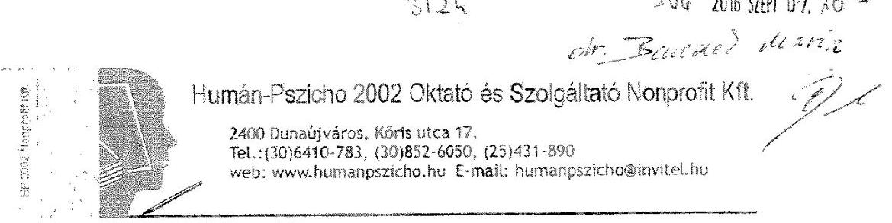

Domokos László
Állami Számvevőszék
Elnök
Budapest 4.
Pf. 54.
1364

Tisztelt Elnök Úr!
Tisztelt Ellenőrző Hatóság!

Tárgy: jelentéstervezet észrevételezése
Ikt.sz.: K / 177 / 2016
Ügyintéző: Kiss Enikő
ÁLLAMISZÁMVEVŐSZÉK
01385612016
Érkezési időpont: 2016. szeptember 6.
Iktatószám: 01-4023-014/646
Melléklet: 46

A Humán-Pszicho 2002 Oktató és Szolgáltató Nonprofit Kft., mint ellenőrzött szervezet vezetőjeként ezúton jelzem Önöknek, hogy „A humánszolgáltatást nyújtó államháztartáson kívüli szociális és köznevelési intézmények, szolgáltatók fenntartói központi költségvetésből kapott támogatásai felhasználásának ellenőrzése - A Humán-Pszicho 2002 Oktató és Szolgáltató Nonprofit Kft." című ellenőrzésről készített, V-1059-035/2016. iktatószámú számvevőszéki jelentéstervezetet köszönettel megkaptam.

A jelentéstervezet 25. oldalán szereplő, 1. sz. megállapítás kapcsán, az Állami Számvevőszékről szóló 2011. évi LXVI. törvény 29. §-ban biztosított jogszabályi lehetőséggel élve, az alábbi

# észrevételt 

kívánom tenni.

A Humán-Pszicho 2002 Oktató és Szolgáltató Nonprofit Kft. (mint intézmény-fenntartó) a Számviteli tv. előírásai szerint átvezette a törvény változásait a számviteli politikáján.
Minden évben az Egzatik Kft-től megrendelt számviteli szabályzatok állnak rendelkezésünkre nyomtatott és CD formában is (ezek megrendelését a mellékelt számlamásolatok támasztják alá).
A helyszíni ellenőrzés során bemutatásra került a 2011-2014. évekre készült számviteli szabályzatok összessége, azonban az elektronikus felületre a 2012-2014. évek szabályzatai az idő rövidsége és az anyag mennyisége miatt - nem kerültek feltöltésre.

Tisztelettel kérem az Önök szakmai iránymutatását abban, hogy a számviteli politika, valamint a további szabályzatok ezen frissítése megfelel-e a jelentéstervezetben kért intézkedés teljesítésének, vagy intézmény-fenntartóként ezen felül további intézkedések meghatározása szükséges?

---

Egyúttal ez úton is szeretném megköszönni a Számvevőszék munkatársainak, valamint az ellenőrzést megvalósító számvevőknek az eljárás során tapasztalt korrekt hozzáállást, mellyel munkájukat végezték.

Államháztartáson kívüli intézmény fenntartójaként korábban hasonló átfogó és mélységű ellenőrzésben még nem volt részünk, ugyanakkor rendkívül fontosnak tartom, hogy intézmény-fenntartóként az ellenőrzés tapasztalataival még inkább segítsem a fenntartott iskola jogszerű működését, és hogy a feltárt hiányosságok mentén tökéletesítsem az intézményi működést.

Szakmai visszajelzésüket előre is köszönve.

Tisztelettel:
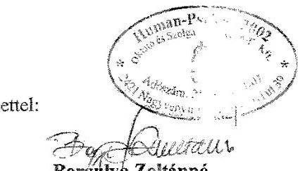

Borgulya Zoltánné
ügyvezető,
intézmény-fenntartó - ellenőrzött szervezet
képviseletében

Melléklet:

- 1K00450; DIJ-2012/000351; 14SPN010327; PF/0000058/2013 sorszámú számlák

---

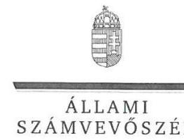

ELNÖK

Ikt.szám: V-1059-076/2016.

# Borgulya Zoltánné úrhölgy 

ügyvezető
Humán-Pszicho 2002 Oktató és Szolgáltató
Nonprofit Korlátolt Felelősségű Társaság

## Nagyvenyim

## Tisztelt Ügyvezető Úrhölgy!

Köszönettel megkaptam a 2016. szeptember 6. napján az Állami Számvevőszékhez érkezett "Nem állami humánszolgáltatók ellenőrzése A humánszolgáltatást nyújtó államháztartáson kívüli szociális és köznevelési intézmények, szolgáltatók fenntartói központi költségvetésből kapott támogatásai felhasználásának ellenőrzése - Humán-Pszicho 2002 Oktató és Szolgáltató Nonprofit Kft." című számvevőszéki jelentéstervezetben foglalt megállapításokra tett észrevételét.

Tájékoztatom Ügyvezető úrhölgyet, hogy az el nem fogadott észrevételt - az Állami Számvevőszékről szóló 2011. évi LXVI. törvény 29. § (3) bekezdése alapján - a jelentésben szerepeltetjük az elutasítás indokának feltüntetésével együtt.

Az Állami Számvevőszék észrevételre vonatkozó álláspontjáról a felügyeleti vezető által készített részletes tájékoztatást csatoltan megküldöm.

Budapest, 2016.
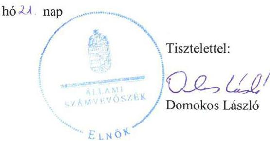

Melléklet: Tájékoztatás az el nem fogadott észrevételről, annak indokáról

---

# 1. számú melléklet 

a V-1059-076/2016. ikt. számú levélhez

## Tájékoztatás

az el nem fogadott észrevételről, annak indokáról

| 1. | Észrevétel: | Az észrevétel 1. oldalán szerepeltetett észrevétel szerint: „A jelentéstervezet 25. oldalán szereplő, 1. sz. megállapítás kapcsán, az Állami Számvevőszékről szóló 2011. évi LXVI. törvény 29. §-ban biztosított jogszabályi lehetőséggel élve, az alábbi észrevételt kívánom tenni.   A Humán-Pszicho 2002 Oktató és Szolgáltató Nonprofit Kft. (mint

 intézmény-fenntartó) a Számviteli tv. előírásai szerint átvezette a törvény változásait a számviteli politikáján. Minden évben az Egzatik Kft-től megrendelt számviteli szabályzatok állnak rendelkezésünkre nyomtatott és CD formában is (ezek megrendelését a mellékelt számlamásolatok támasztják alá).   A helyszíni ellenőrzés során bemutatásra került a 2011-2014. évekre készült számviteli szabályzatok összessége, azonban az elektronikus felületre a 2012-2014. évek szabályzatai - az idő rövidsége és az anyag mennyisége miatt - nem kerültek feltöltésre." |
| :--: | :--: | :--: |
|  | Válasz: | Az Állami Számvevőszék (ÁSZ) az észrevételt nem fogadja el. |
|  | Indokolás: | Az észrevétel nem megalapozott. Az ÁSZ az észrevételezett megállapítást az ellenőrzés részére rendelkezésre bocsátott dokumentumok alapján fogalmazta meg. Az ellenőrzött szervezet részére 2016. január 22-i keltezéssel megküldött adatbekérő levél 2. mellékletének (dokumentumjegyzék) 1. pontja tartalmazta a bekért szabályzatok beküldésének módját, amely szerint az ellenőrzött időszakban hatályos szabályzatok közül minden esetben be kell csatolni a szabályzat aláírt, jóváhagyott változatát a mellékletekkel, függelékekkel együtt, ha a szabályzat jóváhagyását külön dokumentum tartalmazza, úgy azt is. Az ellenőrzés részére elektronikus formában - az észrevételben szerepeltetett információval |

---

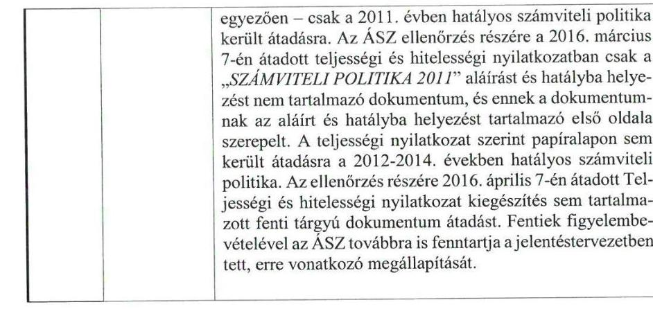

Budapest, 2016. szeptember 2.

Tisztelettel:
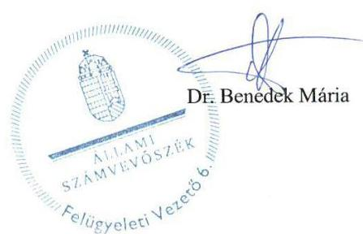

---

# RÖVIDÍTÉSEK JEGYZÉKE 

${ }^{1}$ ÁSZ
${ }^{2}$ szakmai irányító szerv
${ }^{3}$ nem állami intézményfenntartók
${ }^{4}$ Fenntartó
${ }^{5}$ támogatás
${ }^{6}$ Intézmény
${ }^{7}$ Gt. tv.
${ }^{8}$ Ptk.
${ }^{9}$ Számv. tv
${ }^{10}$ Közokt. vhr.
${ }^{11}$ Nkt. vhr.
${ }^{12}$ Kincstár
${ }^{13}$ Kvtv.
${ }^{14}$ alapító okirat
${ }^{15}$ alapdokumentumok
${ }^{16}$ Civil tv.
${ }^{17}$ Minisztérium
${ }^{18}$ Mrd Ft
${ }^{19}$ Kormány
${ }^{20} \mathrm{Nkt}$.
${ }^{21}$ ÁSZ tv.
${ }^{22}$ ÁSZ SZMSZ
${ }^{23}$ Közokt. tv.
${ }^{24}$ 11/1994. (VI. 8.) MKM rendelet
${ }^{25}$ 20/2012 (VIII. 31.) EMMI rendelet
${ }^{26}$ tankönyvtámogatási rendeletek

Állami Számvevőszék
Emberi Erőforrások Minisztériuma (2012. május 14-től)
Nemzeti Erőforrás Minisztériuma (2012. május 13-ig)
az államon és az önkormányzaton kívüli szervezetek (egyház, jogi személy vagy szervezet)
Humán-Pszicho 2002 Oktató és Szolgáltató Nonprofit Kft.
központi költségvetési támogatás
Pannon Oktatási Központ Gimnázium, Szakképző Iskola és Általános Iskola
2006. évi IV. törvény a gazdasági társaságokról
2013. évi V. törvény a Polgári Törvénykönyvről
2000. évi C. törvény a számvitelről

20/1997. (II.13.) Korm. rendelet a közoktatásról szóló 1993. évi LXXIX. törvény végrehajtásáról (hatálytalan 2013. október 5-től)
229/2012. (VIII. 28.) Korm. rendelet a nemzeti köznevelésről szóló törvény végrehajtásáról (hatályos 2012. szeptember 1-től)
Magyar Államkincstár
2010. évi CLXIX. törvény Magyarország 2011. évi költségvetéséről, 2011. évi CLXXXVIII. törvény Magyarország 2012. évi költségvetéséről, 2012. évi CCIV. törvény Magyarország 2013. évi költségvetéséről, 2013. évi CCXXX. törvény Magyarország 2014. évi költségvetéséről, 2014. évi C. törvény Magyarország 2015. évi költségvetéséről
az Intézmény ellenőrzött időszakban hatályos alapító okiratai
az oktatási-nevelési feladatokat ellátó intézmény szervezeti és működési szabályzata, házirendje, pedagógiai programja és az intézményi minőségirányítási programja; 2012. szeptember 1-jétől: az oktatási-nevelési feladatokat ellátó intézmény szervezeti és működési szabályzata, házirendje, pedagógiai programja 2011. évi CLXXV. törvény az egyesülési jogról, a közhasznú jogállásról, valamint a civil szervezetek működéséről és támogatásáról (hatályos 2011. december 22-étől)
Nemzeti Erőforrás Minisztériuma 2012. május 13-ig;
Emberi Erőforrások Minisztériuma 2012. május 14-től
milliárd forint
Magyarország Kormánya
2011. évi CXC. törvény a nemzeti köznevelésről
2011. évi LXVI. törvény az Állami Számvevőszékről (hatályos 2011. július 1-től)
az Állami Számvevőszék szervezeti és működési szabályzata
1993. évi LXXIX. törvény a közoktatásról

11/1994. (VI. 8.) MKM rendelet a nevelési-oktatási intézmények működéséről (hatálytalan 2012. szeptember 1-től)
20/2012. (VIII. 31.) EMMI rendelet a nevelési-oktatási intézmények működéséről és a köznevelési intézmények névhasználatáról (hatályos 2012. szeptember 1-től) 17/2014. (III. 12) EMMI rendelet; 16/2013. (II.28) EMMI rendelet; 23/2004. (VIII. 27.) OM rendelet

---

${ }^{27}$ KIR
${ }^{28}$ KIFIR
${ }^{29} \mathrm{OH}$
${ }^{30}$ miniszter
${ }^{31}$ Eitv.
${ }^{32}$ Pénzügyi szabályozás1-2
${ }^{33}$ Info tv.
${ }^{34}$ Áht. 1
${ }^{35}$ Áht. 2
${ }^{36}$ 1/2012. (I. 26). NGM rendelet
${ }^{37}$ OM azonosító
${ }^{38}$ OSAP
${ }^{39}$ 335/2005. (XII. 29) Korm. rendelet
${ }^{40}$ fenntartói SZMSZ
${ }^{41}$ együttműködési megállapodás
${ }^{42}$ SZMSZ

Közoktatási Információs Rendszer
(2012. október 1-jétől Köznevelési Információs Rendszer)
középfokú intézmények felvételi információs rendszere
Oktatási Hivatal
a szakmai irányító szervet vezető miniszter
2005. évi XC. törvény az elektronikus információszabadságról (hatálytalan 2012. 01. 01-től)

Pénzügyi szabályozás a költségvetési támogatások igényléséről és elszámolásáról (Pénzügyi szabályozás1: hatályos 2010. szeptember 1-jétől; Pénzügyi szabályozás2: hatályos 2013. október 1-jétől)
2011. évi CXII. törvény az információs önrendelkezési jogról és az információszabadságról
1992. évi XXXVIII. törvény az államháztartásról (hatálytalan 2012. január 1-től)
2011. évi CXCV. törvény az államháztartásról (hatályos 2012. január 1-jétől)
1/2012. (I. 26). NGM rendelet a rendezett munkaügyi kapcsolatok feltételeiről és igazolásának módjáról (hatályos 2012. január 27-től)
oktatási azonosító szám
Országos Statisztikai Adatgyűjtési Program
335/2005. (XII. 29) Korm. rendelet a közfeladatot ellátó szervek iratkezelésének általános követelményeiről
a fenntartó Szervezeti és Működési Szabályzata
(érvényes 2009. március 27-től 2014. november 30-ig)
Az intézmény és a fenntartó között létrejött együttműködési megállapodás „Az önállóan gazdálkodó és a részben önállóan gazdálkodó közoktatási intézmény egymás közötti munkamegosztási és felelősségvállalási rendjének szabályozása" (érvényes 2009. március 27-től)
Az Intézmény ellenőrzött időszakban hatályos Szervezeti és Működési Szabályzatai

---

# ÁLLAMI SZÁMVEVŐSZÉK 

1052 Budapest, Apáczai Csere János utca 10.
Levélcím: 1364 Budapest 4. Pf. 54
Telefon: +36 1 4849100 Telefax: +36 1 4849200
www.asz.hu

