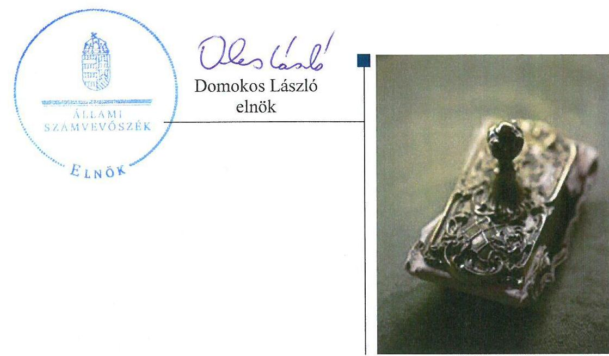
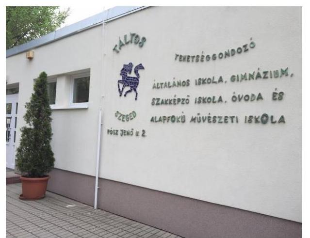
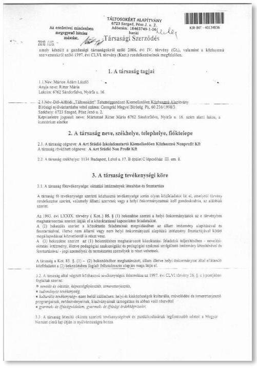
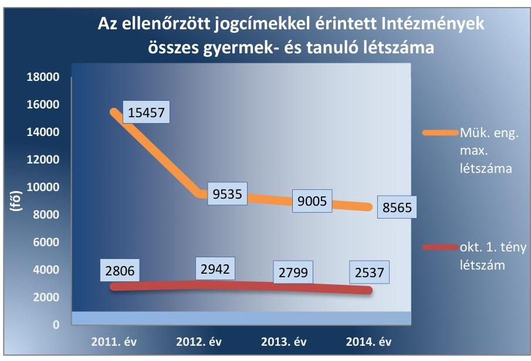
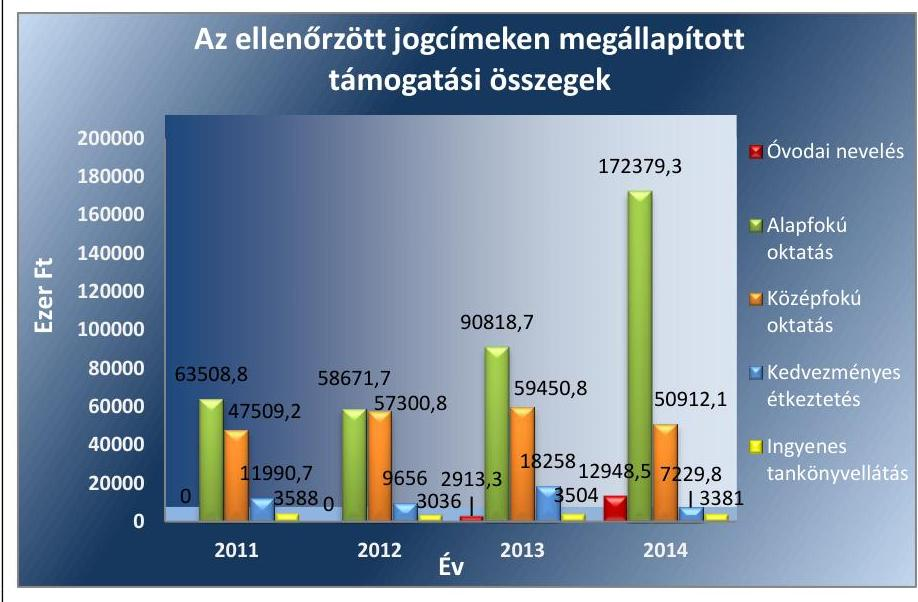
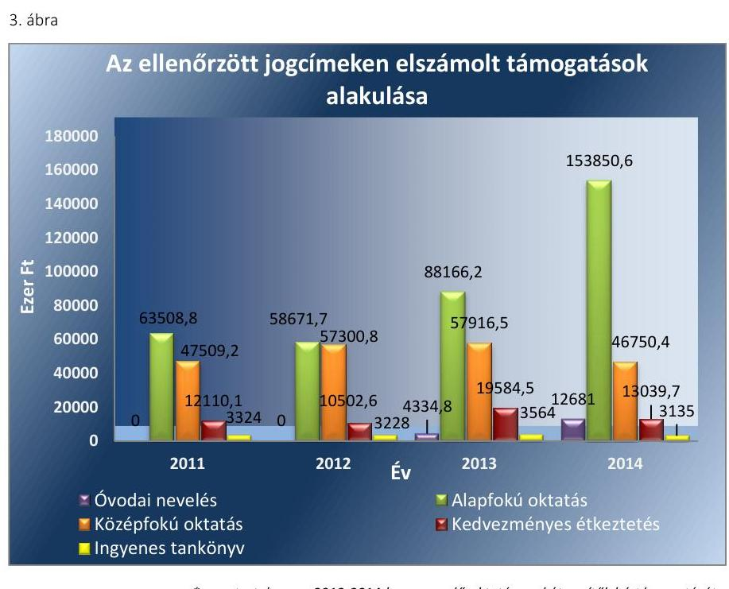

# Jelenetés 

## Nem állami humánszolgáltatók ellenőrzése

A humánszolgáltatást nyújtó államháztartáson kívüli szociális és köznevelési intézmények, szolgáltatók fenntartói központi költségvetésből kapott támogatásai felhasználásának ellenőrzése - A Art Stúdió Iskolafenntartó Közhasznú Nonprofit Kft.
2016. 10. hó 12. nap

---

# AZ ELLENŐRZÉST FELÜGYELTE: 

DR. BENEDEK MÁRIA felügyeleti vezető

## AZ ELLENŐRZÉST VEZETTE ÉS A VÉGREHAJTÁSÁÉRT FELELŐS:

MAROZSÁN LÁSZLÓNÉ ellenőrzésvezető

## A PROGRAM ÖSSZEÁLLÍTÁSÁÉRT FELELŐS:

JANIK JÓZSEF LÁSZLÓ osztályvezető

IKTATÓSZÁM: V-1046-253/2016
TÉMASZÁM: 11
ELLENŐRZÉS-AZONOSÍTÓ SZÁM: V-074401

---

# TARTALOMJEGYZÉK 

■ ÖSSZEGZÉS ..... 5
■ AZ ELLENŐRZÉS CÉLJA ..... 7
■ AZ ELLENŐRZÉS TERÜLETE ..... 8
■ AZ ELLENŐRZÉS HÁTTERE, INDOKOLTSÁGA ..... 10
■ A JELENTÉS LÉNYEGES KÉRDÉSKÖREI ..... 11
■ ELLENŐRZÉS HATÓKÖRE ÉS MÓDSZEREI ..... 12
■ MEGÁLLAPÍTÁSOK ..... 14
■ JAVASLATOK ..... 27
■ MELLÉKLETEK ..... 29
I. Sz. melléklet: Értelmező szótár ..... 29
■ FÜGGELÉK: ÉSZREVÉTELEK ..... 31
■ RÖVIDÍTÉSEK JEGYZÉKE ..... 33

---

.

---

# ÖSSZEGZÉS 

Az ÁSZ¹ ellenőrizte a szakmai irányító szerv² nem állami intézményfenntartókkal³ kapcsolatos feladatai ellátását, továbbá a Fenntartó 2011-2014. években a központi költségvetésből kapott támogatása⁵ igénylésének, elszámolásának és felhasználásának a szabályszerűségét. Az ellenőrzés során az ÁSZ megállapította, hogy a szakmai irányító szerv a nem állami intézményfenntartók köznevelési közfeladat-ellátásával kapcsolatos jogszabályban előírt szabályozási feladatait szabályszerűen ellátta. A Fenntartó a kapott támogatást összeségében a jogszabályi előírásoknak megfelelően igényelte, módosította és használta fel, valamint év végén szabályszerűen számolta el. A támogatást a Fenntartó összeségében az Intézmények⁶ alapfeladatainak ellátására, működtetésére fordította, azonban több esetben nem adta át a fenntartott Intézményei részére a jogszabályban előírt 15 napos határidőn belül. Ezen időszak alatt a támogatást a Fenntartó nem a fenntartott Intézmények köznevelési feladatainak az ellátására, illetve az Intézmények működtetésére használta fel.

## Az ellenőrzés társadalmi indokoltsága

Az ÁSZ stratégiájában hangsúlyos szerepet szán annak, hogy szilárd szakmai alapon álló, értékteremtő ellenőrzéseivel előmozdítsa a közpénzügyek átláthatóságát, rendezettségét és javaslataival a közpénzek és a közvagyon szabályos, gazdaságos, hatékony és eredményes felhasználását segítse. Stratégiájában az ÁSZ célul tűzte ki, hogy az államháztartáson kívülre nyújtott költségvetési támogatások ellenőrzésével hozzájárul ahhoz, hogy a közpénzeket az államháztartáson kívüli szervezetek is átlátható módon használják fel a közfeladatok szerződésben vállalt ellátása érdekében. Tekintettel az elmúlt években a köznevelés finanszírozását és a köznevelési intézmények fenntartását érintően végbement változásokra, a társadalom fokozott érdeklődéssel figyeli a köznevelési feladatok ellátására fordított források felhasználását. Fontos ezért az ÁSZ-nak a közvéleményt biztosítani arról, hogy a közpénz államháztartáson kívüli felhasználása ezen a területen sem marad ellenőrizetlenül.

## Főbb megállapítások, következtetések, javaslatok

A szakmai irányító szerv a köznevelési intézmények működésének, az intézményfenntartók közfeladat-ellátásának szakmai szabályairól az ágazati jogszabályok által adott felhatalmazásoknak megfelelően az ellenőrzött időszakra vonatkozóan miniszteri rendeletek formájában rendelkezett. Az általános, valamennyi intézményfenntartót érintő szabályozásokon kívül egyes kérdések vonatkozásában a rendeletekben rögzítették a nem állami intézményfenntartókra, azok intézményeire vonatkozó külön szabályokat is.

A Fenntartó közfeladat-ellátásának megszervezése a 2011-2014. években megfelelt a Gt. tv.⁷ és a Ptk.⁸ előírásainak, társasági szerződése tartalmazta a tevékenységi körét, a társaság képviseletét, ellátandó közfeladatait, az illetékes bíróság a Fenntartót nyilvántartásba vette, a Számv. tv.⁹-ben előírt beszámolási kötelezettségét teljesítette. A Fenntartó belső szabályozottságának kialakítása során az ügyvezető nem biztosította a naprakészséget, mivel a számviteli politikáján a törvényi változást nem vezette át, a nyilvános adatok közzétételével kapcsolatos szabályokat nem állapította meg.

A Fenntartó a támogatást összeségében a Közokt. vhr.¹⁰, illetve az Nkt. vhr.¹¹ előírásainak megfelelően igényelte, illetve módosította az ellenőrzött időszakban. A támogatás igényléséhez előírt feltételeknek a Fenntartó és az érintett Intézmények megfeleltek. A támogatás igénylésének fenntartói adatait alátámasztó dokumentumok, nyilvántartások az ellenőrzött jogcímekre vonatkozóan a Fenntartónál összeségében rendelkezésre álltak. A Fenntartónál rendelkezésre álló támogatás igénylési dokumentumokból megállapítható volt, hogy a finanszírozó Kincstár¹² határozatban döntött a Fenntartót megillető támogatás összegéről és azok alapján folyósította a támogatást. A Fenntartó a számláján jóváírt támogatást az ellenőrzött jogcímekkel érintett Intézmények részére több esetben az előírt határidőn túl adta át.

A támogatással a Fenntartó összeségében szabályszerűen elszámolt, a támogatás felhasználásának elkülönített nyilvántartása az előírásnak megfelelt. A támogatás igénylése és elszámolása során a Fenntartó egyes dokumentumok esetében az iratmegőrzési kötelezettségének nem tett eleget.

A kapott támogatást a Fenntartó összeségében szabályszerűen használta fel. A támogatást az Intézmények alapfeladataira, működtetésére fordította, a jogszabályban rögzítetteknek megfelelően a személyi és tárgyi feltételeket biztosította, a költségvetésüket megállapította. Az Intézmények működéséhez és köznevelési feladataik szabályszerű ellátásához a Fenntartó a szervezeti és a szabályozási kereteket biztosította. Az Intézmények működési engedélyének 2011-2014. között szükségessé vált módosításait a Fenntartó az illetékes hatóságoktól megkérte, kiadta az alapító okirataikat¹³, jóváhagyta az alapdokumentumaikat¹⁴.

A Fenntartó ellenőrzési feladatait szabályszerűen látta el, rendszeresen ellenőrizte az Intézmények gazdálkodását, törvényes működését, értékelte a pedagógiai-szakmai munka eredményességét.

A 2011-2014. években külső ellenőrzést az Intézmények feladatellátási helyein a Kincstár és az illetékes kormányhivatalok végeztek. Az ÁSZ a fenntartói dokumentumokból megállapította, hogy a kincstári ellenőrzések kiterjedtek a támogatás igénylésének és az elszámolásnak a jogszerűségére, a mutatószámok megalapozottságára. Helyszíni ellenőrzéseik megállapításai alapján a Fenntartó felé a 2012. év vonatkozásában visszafizetési kötelezettséget írtak elő, melynek a Fenntartó határidőn túl tett eleget. Az illetékes kormányhivatalok a fenntartói tevékenység törvényességét és az Intézmények működésének a szabályszerűségét ellenőrizték. Az ÁSZ a fenntartónál ellenőrzött dokumentumokból megállapította, hogy a kormányhivatalok ellenőrzései által megállapított szabálytalanságokat a Fenntartó határidőben megszüntette.

---

# AZ ELLENŐRZÉS CÉLJA 

AZ ELLENŐRZÉS CÉLJA annak értékelése volt, hogy a Fenntartó központi költségvetésből kapott támogatásainak felhasználása szabályszerű volt-e, a támogatások igénylése, évközi módosítása és év végi elszámolása megfelelt-e a jogszabályi előírásoknak.

Az ellenőrzés során az ÁSZ értékelte a szakmai irányító szerv jogszabályban előírt feladatainak ellátását is az államháztartáson kívüli humánszolgáltatók köznevelési köz-feladat-ellátásával kapcsolatban.

---

# AZ ELLENŐRZÉS TERÜLETE 

## A Fenntartó

A Fenntartó 2010. július 21-én alakult 500 ezer Ft jegyzett tőkével. Alapító tagja egy magánszemély és a Dél-Alföldi „Táltosokért" Tehetséggondozó Kiemelkedően Közhasznú Alapítvány volt. A Fenntartó tulajdonosi szerkezetében 2011. április 26-án változás következett be. Az egyik alapító átruházta üzletrészét a társaság magánszemély tagjára, melynek következtében azóta egyszemélyes társaságként működik a Kft. Jegyzett tőkéje tőkeemelést követően 3000 ezer forint lett. A társaság székhelye Szeged.

A Fenntartó székhelye szerint illetékes cégbíróság 2014. június 1-jével a Civil. tv.¹⁵ megváltozott előírásaira tekintettel törölte a Fenntartó „kiemelkedően közhasznú" jogállását, majd a Fenntartó képviselőjének beadványa alapján 2014. október 15-i hatállyal közhasznú minősítésűként vette nyilvántartásba.

A Fenntartó fő tevékenysége oktatási intézmények létesítése és fenntartása. Közhasznú tevékenysége során közfeladatot lát el, így nevelést és oktatást, tudományos és kulturális tevékenységet, valamint gyermek és ifjúságvédelmi feladatokat. A Fenntartó fő célja a tehetséggondozás ügyének a felkarolása.

A Fenntartó a közfeladat-ellátását az ellenőrzött időszakban három Táltos Tehetséggondozó Általános Iskola, Gimnázium, Szakképző Iskola, Óvoda és Alapfokú Művészeti Iskola; Táltika Alapfokú Művészeti Iskola és Szakképző Iskola; Nyitott Világ Alapfokú Művészeti Iskola - közoktatási, illetve köznevelési intézmény létesítésével és fenntartásával végezte az ország 8 megyéjében. A három köznevelési feladatot ellátó Intézmény a Közokt. tv.¹⁶ és az Nkt.¹⁷ előírásai szerint jogi személy, önálló költségvetéssel rendelkezik, azzal önállóan gazdálkodik. Az Intézmények szakmai tekintetben önállóak, szervezetükkel, működésükkel kapcsolatos ügyekben döntenek, kivéve ha azt jogszabály nem utalja más hatáskörébe.

Az Intézmények tanuló létszáma 2011-ben 3470 fő, 2014-ben 2886 fő volt.

Az Intézmények által ellátott alapfeladatok az ellenőrzött években: általános iskolai nevelés-oktatás, illetve alapfokú oktatás, általános és szakmai középfokú oktatás, alapfokú művészetoktatás, a 2013/2014-es nevelési évtől óvodai nevelés. A Fenntartó által igényelt és elszámolt támogatás ÁSZ által ellenőrzött jogcímeivel kapcsolatos alapfeladatokat a Táltos Tehetséggondozó Általános Iskola, Gimnázium, Szakképző Iskola, Óvoda és Alapfokú Művészeti Iskola és a Táltika Alapfokú Művészeti Iskola és Szakképző Iskola látta el a 2011-2014. években.

A Fenntartó szakmai irányító szervi feladatait a Minisztérium¹⁸ látta el, ellenőrzési feladatait a kormányhivatalok útján végezte a 2011-2014. években.

---

2010. szeptember 1-jétől a Dél-Alföldi „Táltosokért" Tehetséggondozó Kiemelkedően Közhasznú Alapítvány az Intézmények fenntartói jogát átadta a Fenntartónak, továbbá ingyenesen rendelkezésére bocsátott az Intézmények üzemeltetéséhez ingatlanokat.

A Fenntartó mérlegfőösszege 2011-ben 200085 ezer Ft volt, mely 2014. évre 372725 ezer Ft-ra nőtt. Saját tőkéje a 2011. évi 79477 ezer Ft-ról 2014-re 178%-kal 220748 ezer Ft-ra nőtt. Közhasznú eredménye 2011-ben 52862 ezer Ft, 2014-ben 62042 ezer Ft volt. A Fenntartó összes bevétele a 2011. évben 360679 ezer Ft-ról 2014-re több mint 50%-kal, 556841 ezer Ft-ra nőtt. A Fenntartó a központi költségvetésből kapott támogatáson kívül az ellenőrzött időszakban települési önkormányzatoktól és a Klebelsberg Intézményfenntartó Központtól kapott működési támogatást. Ezen kívül bevételének egy részét egyéb támogatások alkották.
2011. évben 2,5 fő statisztikai állományi létszámmal rendelkezett a Fenntartó, míg 2014. évben nem volt alkalmazottja.

A Fenntartó a közoktatási, köznevelési feladatellátására tekintettel Magyarország éves költségvetéséből támogatásra volt jogosult. A számára megállapított központi költségvetési támogatás összege 2011. évben 291106 ezer Ft volt, ami 2014. évben 479023 ezer Ft-ra nőtt. A Fenntartó éves bevételének mintegy 80%-át tette ki a központi költségvetési támogatás, kivéve a 2013. évet, amikor a Fenntartó éves bevételének több mint 93%-a származott központi költségvetési támogatásból.

---

# AZ ELLENŐRZÉS HÁTTERE, INDOKOLTSÁGA 

A köznevelési feladatokat ellátó nem állami intézményfenntartók részére közfeladataik ellátására évente jelentős összegű pénzügyi támogatást biztosítottak a mindenkori költségvetési törvények a bennük megfogalmazott feltételek mellett.

A nem állami közoktatási/köznevelési intézmények fenntartói által felhasznált állami támogatás összege a 2011-2014. években együtt 570,2 Mrd Ft¹⁹ volt. A 2011. évben a Kormány²⁰ felülvizsgálta a humánszolgáltatások tekintetében a hatályos szabályozást. Az Országgyűlés elfogadta a Nkt.-t, amely jelentősen átalakította a korábbi finanszírozási rendszert 2013. októberétől.

Új feladatfinanszírozási forma (átlagbér-alapú támogatás) jelent meg, amely a nem állami intézményfenntartókra is vonatkozott. A normatív finanszírozás rendszerében bekövetkezett változások aktualitást adtak az ellenőrzésnek. Az ellenőrzés lefolytatását az is szükségessé tette, hogy az ÁSZ még nem ellenőrizte átfogóan ezt a területet.

Az ÁSZ stratégiájában foglaltak alapján is indokolt az ellenőrzés, amely a társadalom számára jelzi, hogy a közpénz államháztartáson kívüli felhasználása sem maradhat ellenőrizetlenül. Az államháztartáson kívülre nyújtott költségvetési támogatások ellenőrzésével az ÁSZ hozzájárul ahhoz, hogy a közpénzeket a nem állami fenntartók átlátható módon használják fel a közfeladatok ellátására kötött szerződésekben vállalt kötelezettségek teljesítése érdekében. Az ÁSZ az ellenőrzés javaslataival hozzájárulhat az említett rendszerek szabályszerű támogatás-felhasználásához, javíthatja a társadalmi-gazdasági döntések megalapozottságát, amely a „jó kormányzás" feltétele.

---

# A JELENTÉS LÉNYEGES KÉRDÉSKÖREI 

1. A
 szakmai irányító szerv ellátta-e jogszabályban előírt feladatait az államháztartáson kívüli humánszolgáltatók közfeladatellátása kapcsán?
2. A Fenntartó a jogszabályi előírásoknak megfelelően igényelte-e, módosította-e, és év végén elszámolta-e a központi költségvetési támogatásokat?
3. A Fenntartó a központi költségvetésből kapott támogatásokat szabályszerűen használta-e fel?

---

# ELLENŐRZÉS HATÓKÖRE ÉS MÓDSZEREI 

## Az ellenőrzés típusa

Megfelelőségi (szabályszerűségi) ellenőrzés.

## Az ellenőrzött időszak

A 2011. január 1-je és 2014. december 31-e közötti évek, amelyben a Fenntartó közfeladat-ellátásra a központi költségvetésből támogatást kapott és használt fel. A 2011. év vonatkozásában a költségvetési támogatások 2011. évet megelőző időszakra eső igénylését, a 2014. év tekintetében annak 2015-ben történő elszámolását is ellenőrizte az ÁSZ.

## Az ellenőrzés tárgya

Az ellenőrzés a köznevelési közfeladatokat ellátó államháztartáson kívüli intézményfenntartó, központi költségvetésből kapott támogatásai felhasználására terjedt ki. Az alábbi jogcímek esetében azok igénylése, évközi módosítása, elszámolása és felhasználása szabályszerűségének értékelését foglalta magában:
$\longrightarrow$ az alap normatív- és átlagbér alapú költségvetési támogatások közül az óvodai nevelés, általános iskolai oktatás/alapfokú nevelés, középfokú oktatás/nevelés,
$\longrightarrow$ a kiegészítő támogatások közül a tanulóétkeztetési - és a tankönyvtámogatás.
Az ellenőrzés kiterjedt minden olyan körülményre és adatra, amely az ÁSZ jogszabályban meghatározott feladatainak teljesítéséhez, valamint a program végrehajtása folyamán felmerült újabb összefüggések feltárásához szükséges volt.

## Az ellenőrzött szervezet

Az ellenőrzött szervezet az Emberi Erőforrások Minisztériuma és az A Art Stúdió Iskolafenntartó Közhasznú Nonprofit Kft.

## Az ellenőrzés jogalapja

Az ellenőrzés jogszabályi alapját az ÁSZ tv. ${ }^{21}$ 1. § (3) bekezdése és az 5 § (2)-(3) bekezdéseiben foglalt előírások adták. Az ÁSZ az államháztartásból származó források felhasználásának keretében ellenőrzi az államháztartásból nyújtott támogatás vagy az államháztartásból

---

meghatározott célra ingyenesen juttatott vagyon felhasználását - többek között - az államháztartáson kívüli humánszolgáltatók fenntartóinál. Amennyiben a kedvezményezett szervezet az államháztartásból támogatásban vagy ingyenes vagyonjuttatásban részesül, gazdálkodási tevékenységének egésze ellenőrizhető.

# Az ellenőrzés módszerei 

Az ellenőrzést az ellenőrzési program kérdései, az adott időszakban hatályos jogszabályok, az ellenőrzés szakmai szabályok és módszertanok, valamint a nemzetközi standardok figyelembevételével végezte az ÁSZ.

A közpénzekkel való felelős gazdálkodás segítésére irányuló javaslatok kidolgozásakor a hatályos jogszabályok voltak az irányadóak.

Az ellenőrzés ideje alatt az ÁSZ a Fenntartóval történő kapcsolattartást az ÁSZ SZMSZ ${ }^{11}$-ének vonatkozó előírásai alapján biztosította.

Az ellenőrzési kérdések megválaszolásához szükséges bizonyítékok megszerzése az ellenőrzöttek által rendelkezésre bocsátott dokumentumokra, adatokra alapozva megfigyelés, szemle (szemrevételezés), kérdésfeltevés (információkérés), valamint elemző eljárással történt.

Az ellenőrzési bizonyítékként felhasznált adatforrások közé tartoztak egyrészt a szakmai program részletes szempontjainál felsorolt adatforrások, másrészt minden - az ellenőrzés folyamán feltárt, az ellenőrzés szempontjából információt tartalmazó - dokumentum.

Az ellenőrzés lefolytatásához a szakmai irányító szerv és a Fenntartó a kitöltött tanúsítványok, adatbekérő lap, valamint az ÁSZ által kért dokumentumok elektronikus úton való megküldésével szolgáltatott adatokat, információkat. Az így rendelkezésre bocsátott adatok, információk és a tanúsítványok adatai valódiságának kontrollja az ellenőrzés keretében történt.

Az ellenőrzést a támogatások igénylésével, módosításával, felhasználásával, elszámolásával kapcsolatos feladatokat ellátó Fenntartónál, annak székhelyén végezte az ÁSZ, a helyszíni szemlékre a fenntartott Intézmények egyes feladatellátási helyein került sor.

---

# MEGÁLLAPÍTÁSOK 

## 1. A szakmai irányító szerv ellátta-e jogszabályban előírt feladatait az államháztartáson kívüli humánszolgáltatók közfeladatellátása kapcsán?

Összegző megállapítás

A szakmai irányító szerv a 2011-2014. években ellátta a jogszabályban előírt feladatait az államháztartáson kívüli humánszolgáltatók köznevelési közfeladat-ellátása kapcsán.

A KÖZOKTATÁSI, KÖZNEVELÉSI INTÉZMÉNYEK ÉS FENNTARTÓIK FELADATELLÁTÁSÁRA vonatkozóan a szakmai irányító szerv számára az ágazati jogszabályok (Közokt. tv., Nkt., Közokt. vhr., Nkt. vhr.) felhatalmazó és záró rendelkezései szabályozási feladatokat írtak elő. Ennek megfelelően a szakmai irányító szerv miniszteri rendeletekben rendelkezett az intézményfenntartók közfeladat-ellátásának és a fenntartott intézmények működésének szakmai szabályairól. Ezek a rendeletek fenntartótól független szabályozásokat tartalmaztak, egyes kérdések esetében kiegészítve a nem állami intézményfenntartókra és az általuk fenntartott intézményekre vonatkozó külön szabályokkal.

A nem állami intézmények fenntartói az önkormányzatokkal és az állammal közoktatási megállapodást, illetve köznevelési szerződést köthettek az ellenőrzött időszakban a közfeladat-ellátására. A Közokt. tv. és 2012-től az Nkt. teljes körűen rögzítette a közoktatási megállapodásra, köznevelési szerződés megkötésére vonatkozó előírásokat, további részletszabályok meghatározását a szakmai irányító szerv számára a tárgykörre vonatkozóan a jogszabályok nem írtak elő.

A nem állami fenntartású intézmények működésének megkezdéséhez működési engedélyre volt szükség, melynek kiadásához a szükséges kérelmet a fenntartónak kellett benyújtani az illetékes hatósághoz. A szakmai irányító szerv a nem állami fenntartású intézmények működési engedélye kiadásának részletes szabályaira - beleértve a fenntartó által benyújtott kérelmek kötelező tartalmi elemeit - és a működési engedélyek tartalmára vonatkozóan a 11/1994. (VI. 8.) MKM rendeletben ${ }^{23}$, illetve 2012. szeptember 1-től a 20/2012 (VIII. 31.) EMMI rendeletben ${ }^{24}$ határozott meg előírásokat.

Az intézményfenntartók feladatellátását finanszírozó költségvetési támogatás igénylését, elszámolását segítő jogi szabályozó eszközök az ellenőrzött időszakban rendelkezésre álltak. A köznevelési feladatok ellátásához nyújtott támogatásról a mindenkori költségvetési törvények tartalmaztak rendelkezéseket 2011-2014. között. Az egyes ágazati törvények előírásainak megfelelően a Kormány további részletszabályokat állapított meg az állami hozzájárulások és támogatások megállapítására, folyósítására, elszámolására, továbbá a szükséges adatszolgáltatásra vonatkozóan. A szakmai

---

irányító szerv a tankönyvtámogatási rendeletekben ${ }^{25}$ az iskolai tankönyvtámogatás rendjére vonatkozóan gondoskodott az állami támogatásokkal kapcsolatosan további szabályozásról.

A szakmai irányító szerv a Közokt. tv-ben, illetve az Nkt.-ban kapott felhatalmazása alapján a tanügyi nyilvántartásokról, azok formájáról, tartalmáról, kezelésének szabályozásáról a 11/1994. (VI. 8.) MKM rendeletben, illetve a 20/2012. (VIII.31.) EMMI rendeletben rendelkezett. A 20/2012. (VIII. 31.) EMMI rendeletben szabályozta a különböző oktatási statisztikai adatokat kezelő KIR ${ }^{26}$ részeként működtetett KIFIR ${ }^{27}$ szabályait is, a középfokú intézményekbe való felvételi eljárásra vonatkozóan.

Az intézményfenntartók és intézményeik ellenőrzését a szakmai irányító szerv elsősorban az $\mathrm{OH}^{28}$-n és az illetékes kormányhivatalokon keresztül látta el a 2011-2014. években. Az általuk lefolytatott ellenőrzések szakmai, hatósági és törvényességi ellenőrzések voltak. A miniszter az országos pedagógiai-szakmai ellenőrzés működési rendjét és lebonyolítását, valamint a nem állami intézményfenntartók tevékenységének törvényességi ellenőrzését a 20/2012. (VIII. 31.) EMMI rendeletben és az egyes tanévek rendjéről kiadott rendeletekben szabályozta.

A miniszter ${ }^{29}$ a köznevelési feladatok megszervezéséhez szükséges döntései előkészítése céljából az OH által előkészített 2013-2018. évi köznevelési fejlesztési tervet 2013-ban elfogadta. A fejlesztési tervek megyei szintű bontásban készültek az Nkt.-ban előírtaknak megfelelően. A fejlesztési tervekben megtalálhatók a köznevelési intézményrendszer főbb mutatói között a nem állami köznevelési intézmények feladatellátását jellemző adatok is.

# 2. A Fenntartó a jogszabályi előírásoknak megfelelően igényelte-e, módosította-e, és év végén elszámolta-e a központi költségvetési támogatásokat? 

Összegző megállapítás

### 2.1. számú megállapítás

A Fenntartó a támogatásokat összességében a jogszabályi előírásoknak megfelelően igényelte, módosította és számolta el.

A Fenntartó közfeladat-ellátásának megszervezése a jogszabályban előírtaknak megfelelt. Belső szabályozottsága az adatok közzétételével kapcsolatos szabályzat hiánya, valamint a törvényi változás számviteli politikán való átvezetésének hiánya miatt nem felelt meg teljes körűen a jogszabályi előírásoknak.

A FENNTARTÓ A KÖZOKTATÁSI, KÖZNEVELÉSI KÖZFELADAT-ELLÁTÁS kereteit a Gt. tv. és a Ptk. előírásainak megfelelően alakította ki.

A Fővárosi Bíróság 2010. augusztus 24-én vette a Fenntartót a Kszt. ${ }^{30}$ ben foglaltaknak megfelelően nyilvántartásba. Társasági szerződésében rögzítették a társaság tevékenységi körét, képviseletét, szervezet felépítését, működésével kapcsolatos szabályokat, az ezekhez kapcsolódó, felelősségi- és hatásköröket, az ellátott alap- és gazdasági-vállalkozási tevékenység folytatására vonatkozó feltételeket. A Fenntartó társasági szerződése

---

szerint közhasznú tevékenységeket végzett, úgymint a nevelés, oktatás, képességfejlesztés, ismeretterjesztés, tudományos és kulturális tevékenység. A Fenntartó a 2011-2014. években a közoktatási, köznevelési feladatok ellátására közoktatási megállapodást, köznevelési szerződést települési önkormányzattal, illetve az állammal nem kötött, arra vonatkozó kötelezettsége nem volt.

A Fenntartó a Számv. tv.-ben foglaltaknak megfelelően a működéséről, vagyoni, pénzügyi és jövedelmi helyzetéről az üzleti év könyveinek zárását követően egyszerűsített éves beszámolót készített. A könyvviteli szolgáltatás körébe tartozó feladatok ellátásával, a beszámoló elkészítésével a Fenntartó számviteli szolgáltatást nyújtó gazdasági társaságot bízott meg a 2011-2014. évek között. A Fenntartónak nem volt jogszabályban előírt kötelezettsége a számviteli beszámolója könyvvizsgálóval történő felülvizsgálatára, azonban társasági szerződése rendelkezett a könyvvizsgálati kötelezettségről, melynek megfelelően a kiválasztott könyvvizsgálóval a Fenntartó vállalkozási szerződést kötött. A szerződésben előírt feladatai körében a könyvvizsgáló a Fenntartó 2011-2014. évi beszámolóit véleményezte, azokat hitelesítő záradékkal látta el, szakmai véleményét könyvvizsgálói jelentésben rögzítette.

A Fenntartó a közfeladat-ellátás szabályozási kereteinek kialakítása során az Intézmények alapító okiratait a Közokt. tv-ben és az Nkt.-ban előírt tartalommal kiadta, továbbá 2010. szeptember 1-jei hatállyal jóváhagyta az Intézmények működését szabályozó, az ellenőrzött időszakban hatályban lévő alapdokumentumait a Közokt. tv.-ben foglaltaknak megfelelően.

## A FENNTARTÓ BELSŐ SZABÁLYOZOTTSÁGA nem

felelt meg teljes körűen a Számv. tv., az Eitv. ${ }^{31}$ és az Info. tv. ${ }^{32}$ előírásainak.

A Fenntartó ügyvezetője az ellenőrzött időszakra vonatkozóan kialakította a gazdálkodással kapcsolatos szabályozás kereteit. Elkészítette a Számv. tv.-ben foglaltaknak megfelelően a számviteli politikát és annak részeként az eszközök és források leltárkészítési és leltározási szabályzatát, az eszközök és források értékelési szabályzatát, a pénzkezelési szabályzatot, valamint a számlarendet és a bizonylati rendet, bizonylati albumot. A szabályzatokat 2011. január 1-jei hatállyal az ügyvezető kiadta, azonban a törvényváltozást követően nem minden esetben módosította.

A számviteli politikájában a Fenntartó a Számv. tv-ben foglaltaknak megfelelően előírta a főkönyvi nyilvántartás analitikus nyilvántartásokkal való egyezőségének a kötelezettségét. A Fenntartó 2013. március 1-jei hatállyal módosította a számviteli politikát, amelyben a számviteli bizonylatok közé sorolta a normatíva igényléshez szükséges kimutatások, összegzések, az igénybevételt megalapozó számítások dokumentumait is. A Fenntartó a számviteli politikában és a Szabályzatban ${ }^{33}$ rendelkezett a költségvetési források, és egyéb mérlegtételek sajátos elszámolásáról.

Informatikai szabályzatának elkészítésével a hatályos jogszabályokban előírtaknak megfelelően a Fenntartó meghatározta az adatok biztonságának, védelmének érvényre juttatásához szükséges eljárási szabályokat. Közzétételi kötelezettségének teljesítéséről, továbbá a nyilvános adatok megtekinthetőségéről a Fenntartó a 2011-2014. években a helyben szokásos módon - az egyik fenntartott Intézménye honlapján és a titkárságán gondoskodott, azonban a kapcsolódó szabályokat nem állapította meg.

---

# A FENNTARTÓ SZABÁLYZATOT ÉS UTASÍTÁST${ }^{34}$ 

adott ki a támogatás szabályszerű igénylésének, a szükséges nyilvántartások megfelelő vezetésének biztosítása érdekében az Intézmények részére, amelyben meghatározta az egyes tanügyi és egyéb nyilvántartások vezetésével kapcsolatos fenntartói elvárásokat. Az Utasítás a jogszabályi előírások alapján további követelményeket fogalmazott meg a kiegészítő támogatási jogcímekre vonatkozó intézményi nyilvántartások vezetésére.

A Fenntartó belső szabályozottságával kapcsolatos szabálytalanságait az 1. táblázat mutatja be.

## A FENNTARTÓ BELSŐ SZABÁLYOZOTTSÁGÁVAL KAPCSOLATOS SZABÁLYTALANSÁGAI

| Sorszám | Részmegállapítás | Megjegyzés |
| :-- | :-- | :-- |

1. A Fenntartó a Számv. tv. 14. § (11) bekezdésében előírtak ellenére a számviteli politikán a törvénymódosítás esetén a változást - 2013. január 1-jétől a jelentős összegű hiba fogalma - hatályba lépését követő 90 napon belül és az ellenőrzött időszakban azt követően sem vezette keresztül.
2. A Fenntartó 2011. évben az Eitv. 4. § (3) bekezdésében, 2012-2014. években az Info. tv.
 35. § (3) bekezdésében előírtak ellenére nem állapította meg belső szabályzatban a közzétételi listákon szereplő adatok közzétételi kötelezettsége teljesítésének részletes szabályait.

Forrás: ÁSZ
2.2. számú megállapítás

A támogatás Fenntartó általi igénylése, módosítása - egyes bizonylatokra vonatkozó megőrzési kötelezettségének és az intézményi adatokban bekövetkezett változások bejelentésének kivételével - a jogszabályi előírásoknak megfelelt. A támogatást a Fenntartó több esetben nem a jogszabályban előírt határidőben folyósította az Intézmények részére.

A FENNTARTÓ A TÁMOGATÁS IGÉNYLÉS jogszabályban előírt feltételeinek a 2011-2014. években megfelelt. A Fenntartó 2011-ben az Áht. ${ }^{35}$-ben, a 2012-2014. években az Áht. ${ }^{36}$-ben és az 1/2012. (I.26.) NGM rendelet ${ }^{37}$-ben előírtak szerint a rendezett munkaügyi kapcsolatok követelményeinek megfelelt és átlátható szervezet volt.

## A TÁMOGATÁS IGÉNYLÉS ALAPJÁT, FELTÉTELEIT

jelentő dokumentumok, nyilvántartások - Közokt. vhr., valamint az Nkt. vhr. előírásainak megfelelően - összességében a Fenntartónál biztosítottak voltak. A Kincstár részére benyújtott támogatás igénylési dokumentáció és az OSAP ${ }^{38}$ statisztikai adatszolgáltatások a Fenntartó 2011-2014. évi igénylésének összesített adatait és azon belül az ellenőrzött jogcímek összesített adatait alátámasztották.

Az ellenőrzött jogcímekkel kapcsolatos köznevelési feladatot ellátó Intézmények rendelkeztek a támogatás igényléséhez szükséges feltételekkel: a Közokt. vhr. és az Nkt. vhr. előírásainak megfelelően szerepeltek az OH által működtetett KIR intézménytörzs nyilvántartásában, rendelkeztek OM azonosító számmal ${ }^{39}$, a működési engedélyük tartalmazta az igényjogosultságot jelentő alapfeladatokat. Működési engedélyükben meghatározott maximális gyermek- és tanulólétszámot nem lépték túl sem az igénylések, sem az elszámolások során, amely létszámadatokat az alábbi 1. ábra szemlélteti.

1. ábra

Forrás: Intézmények működési engedélyei és az OSAP statisztikák
Az Intézmények megfeleltek a támogatás igényléséhez szükséges további feltételeknek is: az Intézményekkel jogviszonyban álló gyermekek, tanulók, valamint az alkalmazottak a Közokt. vhr. és az Nkt. vhr. előírásainak megfelelően rendelkeztek OM azonosító számmal, jogviszonyuk a KIR adatbázisban szerepelt.

A Fenntartó felé történt intézményi adatszolgáltatás alapját jelentő, tanügyi dokumentumok, a kiegészítő támogatási jogcímekkel kapcsolatosan általa előírt nyilvántartások megfelelő vezetését a Fenntartó évente négy alkalommal ellenőrizte az Intézményeknél, ezáltal meggyőződött az Intézmények által szolgáltatott adatok valódiságáról, megalapozottságáról.

# A TÁMOGATÁS IGÉNYLÉSÉNEK, ÉVKÖZI MÓDOSÍTÁSÁNAK FOLYAMATA összességében az ellenőrzött időszakban szabályszerű volt. Az igénylési kérelem formája és adattartalma a Közökt. vhr. és 2013. október 5-től az Nkt. vhr. előírásainak megfelel. A Fenntartó támogatási igénylési dokumentációja alapján az ÁSZ megállapította, hogy
$\longrightarrow$ az igénylési kérelmek a kincstári adatlapokon kerültek benyújtásra,
$\longrightarrow$ a kérelmek mellékletei egyes esetekben hiányosak voltak, melyre vonatkozóan a Kincstár hiánypótlásra, illetve nyilatkozattételre szólította fel a Fenntartót,
$\longrightarrow$ a hiányzó dokumentumokat a Fenntartó pótolta, azonban ezeket az irattári dokumentumai között nem őrizte meg hiánytalanul,
$\longrightarrow$ a Fenntartó támogatás igénylését a Kincstár határozatban fogadta el.

---

A Fenntartó által kapott kincstári határozatokban megállapított támogatási összegeket az ellenőrzött jogcímekre vonatkozóan a 2. ábra szemlélteti.
2. ábra

* nem tartalmazza 2013-2014-ben a nevelő-oktató munkát segítők bértámogatását Forrás: A Kincstári határozatok

Az ellenőrzött jogcímeken biztosított támogatási összegek a Fenntartó esetében a 2011. évi 126 596,6 ezer Ft-ról 2014-re közel 100%-kal nőttek és meghaladták a 246 000 ezer Ft-ot. A támogatás 2014-évre történt jelentős nagyságú növekedését elsősorban az Nkt. vhr. módosítását követően az átlagbér alapú támogatás számítási módszere, valamint az egyes jogcímek összevonásából adódó tartalmi változás okozta. A növekedéshez hozzájárult az is, hogy 2013. szeptember 1-től két feladatellátási helyen óvodai nevelés is folyt, mely feladatellátásra vonatkozóan a Fenntartó átlagbéralapú támogatást vett igénybe.

Az Intézmények adataiban a 2011-2014. években bekövetkezett változásokról a Fenntartó a Kincstárt közvetlenül nem tájékoztatta, a Fenntartónál rendelkezésre álló dokumentumok szerint megállapítható volt, hogy azokról a Kincstár az illetékes kormányhivataltól értesült.

A TÁMOGATÁSOK FOLYÓSÍTÁSA az ellenőrzött időszakban nem volt minden hónapban szabályszerű. A Fenntartó rendelkezett a megítélt támogatás kincstári folyósítását igazoló dokumentumokkal, valamint a Fenntartó részéről a támogatás Intézményeknek való átadását igazoló dokumentumokkal. A Fenntartó számára a Kincstár által megküldött határozatok alapján került sor a jóváhagyott támogatás Fenntartó számláján történő jóváírására a finanszírozást lebonyolító Kincstár részéről.

A Fenntartó ügyvezetője minden esetben egyedi írásbeli utasításban rendelkezett a Kincstár által folyósított támogatás továbbutalásáról, megjelölve a kedvezményezett intézményt, a bankszámla számát, valamint a támogatás összegét. A kapott támogatást az ellenőrzött jogcímekkel érintett Intézményeknek a Fenntartó több alkalommal az előírt határidőn túl adta át, mely időszak alatt a támogatást a Fenntartó nem a fenntartott Intézmények köznevelési feladatainak az ellátására, illetve azok működtetésére használta fel. A támogatás átadása a Fenntartó főkönyvi és analitikus nyilvántartásaiban intézményenként került elkülönítésre.

A támogatás igénylésével, módosításával és folyósításával kapcsolatos szabálytalanságokat a 2. táblázat szemlélteti.
2. táblázat

# A TÁMOGATÁS IGÉNYLÉSÉVEL, MÓDOSÍTÁSÁVAL ÉS FOLYÓSÍTÁSÁVAL KAPCSOLATOS SZABÁLYTALANSÁGOK 

## Sorszám

1. 

A Fenntartó a 335/2005. (XII.29.) Korm. rendelet ${ }^{40}$ 6. § (a) pontjában és az Iratkezelési szabályzat ${ }^{41}$ 1. §-ában és a mellékletében előírtak ellenére nem biztosította teljes mértékben a 2011-2012. években az igénylési kérelmekkel kapcsolatosan a Kincstár felé benyújtott dokumentumok útjának követhetőségét, visszakereshetőségét, ellenőrizhetőségét, mert egyes dokumentumokat - hiánypótlási, nyilatkozattételi, egyes 2011. évi KIR táblázatok - nem őrizte meg. Továbbá a Fenntartó a kiegészítő támogatási jogcímekkel kapcsolatos 2011-2014. évi összesítő kimutatásokra vonatkozóan 2013. március 1-jétől a Számv. tv. 169.§ (2) bekezdésében és a hatályos számviteli politika részét képező bizonylati album, bizonylati fegyelem I.3.1. és az I.9. pontjában előírt bizonylat megőrzési kötelezettségének sem felelt meg, mert azokat az irattári dokumentumok között nem őrizte meg.
2. A Fenntartó a 2011-2014. években a Közokt. vhr. 14. § (5) bekezdésében, 2013. október 5-től az Nkt. vhr. 37/H. § (1) bekezdésében foglalt előírások ellenére az Intézményekkel kapcsolatosan nyilvántartott adatokban bekövetkezett változás esetében nem küldött változás-bejelentést a Kincstár felé.
3. A Fenntartó 2011-ben a 2011. évi Kvtv. ${ }^{42}$ 42. § (1) bekezdés h) pontjában, 2012-ben a 2012. évi Kvtv. ${ }^{43}$ 38. § (1) bekezdés h) pontjában, 2013. évben a 2012. évi Kvtv. 38. § (1) bekezdés h) pontjában és a 2013. évi Kvtv. ${ }^{44}$ 35/E § (7) bekezdésében, 2014. évben a 2012. évi Kvtv. 38. § (1) bekezdés h) pontjában és a 2014. évi Kvtv. ${ }^{45}$ 33. § (25) bekezdésében előírtak ellenére több esetben az előírt határidőn túl adta át az Intézményeknek a támogatást.

Forrás: ÁSZ

### 2.3. számú megállapítás

Az ellenőrzött támogatások Fenntartó általi elszámolása a jogszabályi előírásoknak - egyes bizonylatokra vonatkozó megőrzési kötelezettség be nem tartása kivételével - megfelelt.

## A TÁMOGATÁS ELKÜLÖNÍTETT NYILVÁNTARTÁSA, kezelése a Közokt. vhr. és az Nkt. vhr. előírásainak a Fenntartónál

megfelelt.

A Fenntartó analitikus nyilvántartásaiban a támogatások beérkezését naprakészen, alaptevékenység szerinti, alapfeladatonkénti bontásban elkülönítetten tartotta nyilván. Az analitikus nyilvántartások és az intézményi igénybejelentő lapok a Közokt. vhr. és az Nkt. vhr. vonatkozó előírásainak

---

megfelelően biztosították az alaptevékenység, alapfeladatok és támogatási jogcímek szerinti bontásban való naprakész elkülönítést.

A Fenntartó a támogatások továbbutalására vonatkozóan naprakész főkönyvi és analitikus nyilvántartás vezetésével biztosította, hogy megállapítható legyen a támogatások Intézmények felé történő átadásának határnapja. A támogatások cél szerinti felhasználására vonatkozóan az Intézmények számára Szabályzatot adott ki a Fenntartó.

# A MUTATÓSZÁMOKAT ÉS FELADATMUTATÓKAT 

ALÁTÁMASZTOTTÁK a Közokt. vhr. és az Nkt. vhr. előírásainak megfelelő fenntartói nyilvántartások, dokumentumok.

A Fenntartónál rendelkezésre álltak az Intézményekre vonatkozó adatokat tartalmazó, a Közokt. vhr. és az Nkt. vhr. által előírt kimutatások, dokumentumok, nyilvántartások, melyek a támogatás elszámolásának fenntartói összesített adatait az ellenőrzött időszakban alátámasztották: a KIR személyi nyilvántartásán keresztül a gyermekek, tanulók és a pedagógusok oktatási azonosító számairól vezetett nyilvántartás, OSAP statisztikai adatszolgáltatások, intézményi adatlapok. Az ingyenes tankönyv ellátást igénybe vevő tanulók ténylétszámáról vezetett nyilvántartások részben álltak rendelkezésre a Fenntartónál, az elszámolást ezen jogcím és a tanulóétkezésre vonatkozó támogatás elszámolása esetében az intézményi adatlapok támasztották alá.

A FENNTARTÓ ELSZÁMOLT a Közokt. vhr., az Nkt. vhr. és a 2014. évi Kvtv. által előírt határidőig a központi költségvetésből kapott és felhasznált támogatással az előző évi ténylétszámok alapján.

A Fenntartó a Kincstár által közzétett adatlapokon nyújtotta be az elszámolását a Közokt. vhr. és az Nkt. vhr. hatályos előírásainak megfelelően intézményenként, feladatellátási helyenként, székhelyenként és telephelyenként megbontva és fenntartói szinten összesítve.

A Fenntartó a 2013-2014. évi elszámolásaihoz csatolta a hatályos Nkt. vhr. előírásainak megfelelően, az alkalmazottak illetményei és járulékai megfizetéséről szóló fenntartói nyilatkozatát, továbbá az elszámolásában szereplő gyermekek, tanulók OM azonosító számait tartalmazó kimutatást az előírt formában. A Fenntartó határozatban értesült az általa megküldött elszámolás kincstári felülvizsgálatát követően a jóváhagyott éves elszámolásokról, mely tartalmazta a kiutalt és a Fenntartót ténylegesen megillető támogatás közötti különbözetet, továbbá a különbözet pénzügyi rendezésére vonatkozó előírást.

A Fenntartó által kapott kincstári határozatokban elfogadott elszámolt támogatások összegeit az ellenőrzött jogcímekre vonatkozóan a 3. ábra szemlélteti.

---

* nem tartalmazza 2013-2014-ben a nevelő-oktató munkát segítők bértámogatását Forrás: A Kincstár határozatai és a kapcsolódó fenntartói analitikák

A Fenntartó számára kiutalt és őt ténylegesen megillető - az ellenőrzött jogcímekre vonatkozó - támogatások között jelentős összegű eltérés a 2014. évi elszámolás során mutatkozott (17 394,0 ezer Ft visszafizetendő támogatás), melyet alapvetően a Fenntartó 2014. október 31-ei igénylésének módosítása - részbeni lemondás - okozott. A Fenntartó az egyes években számára előírt visszafizetési kötelezettségnek határidőben eleget tett.

A támogatás Fenntartó általi elszámolásával kapcsolatos szabálytalanságot a 3. táblázat szemlélteti.
3. táblázat

# A TÁMOGATÁS FENNTARTÓ ÁLTALI ELSZÁMOLÁSÁVAL KAPCSOLATOS SZABÁLYTALANSÁG 

## Sorszám Részmegállapítás

Megjegyzés

1. A Fenntartó a 335/2005. (XII.29.) Korm. rendelet ${ }^{46}$ 6. § (a) pontjában és az Iratkezelési szabályzat ${ }^{47}$ 1. §-ában és a mellékletében előírtak ellenére nem biztosította teljes mértékben a 2011 és 2013. évi támogatás elszámolásával kapcsolatosan a Kincstár felé benyújtott egyes dokumentumok útjának követhetőségét, visszakereshetőségét, ellenőrizhetőségét, mert egyes dokumentumokat - 2011. évre vonatkozó hiánypótlási, nyilatkozattételi dokumentumok, egy 2013. évi adatlap, 2013. évi fellebbezési dokumentumok - nem őrizte meg. Továbbá a Fenntartó a tankönyvtámogatással kapcsolatos egyes összesítő nyilvántartásra vonatkozóan 2013. március 1-jétől a Számv. tv. 169.§ (2) bekezdésében és a hatályos számviteli politika részét képező bizonylati album, bizonylati fegyelem I.3.1. és az I.9. pontjában előírt bizonylat megőrzési kötelezettségének sem felelt meg, mert azokat az irattári dokumentumok között nem őrizte meg.

Az ÁSZ az ellenőrzött fenntartói dokumentumok alapján megállapította a 2012-2014. évek vonatkozásában, hogy a Kincstár hiánypótlás, nyilatkozattételre való felhívás nélkül elfogadta a benyújtott elszámolást. A 2014. évi támogatás elszámolásával kapcsolatosan a jogszabálynak és az Iratkezelési szabályzatnak megfelelően a Kincstár felé benyújtott dokumentumok fenntartói példányai az irattárában rendelkezésre álltak, a dokumentumok visszakereshetősége, ellenőrizhetősége biztosított volt, azonban a tankönyvtámogatással kapcsolatos egyes összesítő nyilvántartásokkal 2014-ben sem rendelkezett a Fenntartó.

---

# 3. A Fenntartó a központi költségvetésből kapott támogatásokat szabályszerűen használta-e fel? 

Összegző megállapítás

A Fenntartó a központi költségvetésből kapott támogatásokat összességében szabályszerűen használta fel.

### 3.1. számú megállapítás

A Fenntartó biztosította
 az Intézmények működtetését, a közfeladat-ellátását.

A FENNTARTÓ MEGHATÁROZTA 2011-2014. között a nevelési-oktatási Intézmények alapfeladatait az alapító okirataikban. Szükség esetén azokat a Fenntartó módosította, biztosítva az Intézmények szabályos közfeladat-ellátását. Az alapító okiratok módosítására az ellenőrzött időszakban elsősorban a tagintézmények, telephelyek címének és számának változása, valamint egy esetben az intézmény székhelyének módosítása és az alapfeladat bővülése miatt került sor.

A Fenntartó által kiadott alapító okiratok megfeleltek a hatályos Közokt. tv. és az Nkt. által előírt tartalmi követelményeknek. A Fenntartó az alapító okiratokban rendelkezett a felvehető maximális tanulólétszámon és az alapfeladatán, alaptevékenységén kívül az egyes Intézmények feladatellátását szolgáló vagyonról, a vagyon feletti rendelkezési jogukról, a gazdálkodással összefüggő hatáskörükről.

Az Intézmények az Nkt. vhr. előírásának megfelelően szerepeltek az OH intézménytörzs nyilvántartásában.

Az ellenőrzött időszakban a Fenntartó az alapító okiratok, illetve azok módosításai alapján a Közokt. tv., illetve az Nkt. előírásainak megfelelő határidőben és tartalommal terjesztette elő az Intézmények működési engedélyeinek módosítására vonatkozó kérelmeit az illetékes hatóságok felé. A kérelmekhez a Fenntartó csatolta a jogszabály által előírt dokumentumokat, nyilatkozatokat, amelyekből megállapítható volt, hogy az Intézményekben a feladataik ellátásához szükséges feltételek rendelkezésre álltak.

Az Intézmények 2011-2014. években érvényes működési engedélyek birtokában végezték tevékenységüket, az illetékes kormányhivatalok az Intézményeket nyilvántartásba vették.

A FENNTARTÓ FELADATELLÁTÁSA az Intézmények működtetése tekintetében összességében szabályszerű volt.

A Fenntartó 2010. szeptember 1-jén a hatályos Közokt. tv.-ben foglaltaknak megfelelően jóváhagyta az Intézmények szabályos működéséhez szükséges, az ellenőrzés idején hatályos alapdokumentumokat.

A szervezeti és működési szabályzatukban az Intézmények vezetői a 11/1994. (VI. 8.) MKM rendeletben foglaltaknak megfelelően meghatározták a szervezeteik felépítését, működési rendjét, a vezetői hatásköröket és azok gyakorlásának módját, valamint a helyettesítés rendjét.

Az Intézmények házirendjei tartalmazták többek között az intézményi szolgáltatásokért kérhető térítési díjakat, az ehhez kapcsolódó kedvezményeket, és a kedvezmények elbírálásának rendjét.

---

A Közokt. tv.-nek megfelelően az intézményvezetők elkészítették az Intézmények minőségirányítási programját, melyeket a fenntartói jóváhagyás előtt az iskolai szervezetek véleményeztek.

A Fenntartó a Közokt. tv. és az Nkt. előírásainak megfelelően döntött az Intézmények vezetőjének kinevezéséről.

# A TÁMOGATÁST A FENNTARTÓ AZ INTÉZMÉNYEK ALAPFELADATAINAK ellátására és működtetésére fordította. Az Intézmények fenntartási és működési költségeit a Fenntartó az évente összeállított költségvetés tervezetben állapította meg. Az Intézmények működéséhez és fenntartásához szükséges költségeket a Fenntartó elsősorban a központi költségvetésből kapott támogatásból finanszírozta. 

A Fenntartó az Intézmények székhelyét saját tulajdonú ingatlanban biztosította, mely megfelelt a Közokt. tv., illetve az Nkt. előírásainak. Az Intézmények valamennyi feladatellátási helye rendelkezett működési engedéllyel, amelyek szerint a Fenntartó a jogszabályoknak megfelelően biztosította az oktatáshoz a szükséges helyiségeket, felszereléseket, eszközöket.

Az ÁSZ az ellenőrzés során helyszíni szemle keretében győződött meg arról, hogy a székhely és a telephely szerint illetékes kormányhivatalok által kiadott működési engedélyekben szereplő címeken megtalálhatók azok az épületek, amelyeket a Fenntartó köznevelési feladatellátási helyként megjelölt. Az ÁSZ a helyszíni szemle időpontjától és az érintett Intézmény oktatási munkarendjétől (nappali vagy esti oktatás, mindennapos vagy heti foglalkozások) függően a Fenntartó által az adott épületben használt helyiségeket is megtekintette. A helyszíni szemlékre azokon a telephelyeken került sor, amelyek a Fenntartó kérelmére az illetékes kormányhivatalok által kiadott működési engedélyek alapján 2011-2014. között is közoktatási, köznevelési tevékenységet folytattak. Az egyes helyszínek kiválasztása véletlenszerű mintavétellel történt.

A Közokt. tv-ben illetve az Nkt.-ban előírt állandó saját alkalmazotti létszámot a Fenntartó az Intézmények működéséhez biztosította.

Az Intézmények számviteli nyilvántartásaiban a bevételek és ráfordítások elkülönítése szabályszerűen történt, a személyi kiadásokat, a bér jellegű költségeket és az anyagjellegű ráfordításokat támogatás felhasználása során a Számv. tv.-ben előírtaknak megfelelően rögzítették.

Az Intézmények összeállították az ellenőrzött időszakban a Számv. tv. előírásainak megfelelően az egyszerűsített éves beszámolójukat, amelyet megküldtek a Fenntartónak, aki a benyújtott intézményi beszámolókat minden évben elfogadta. Az intézményi beszámolók alapján nyomon követhető volt, hogy az állami támogatások rendeltetésüknek megfelelően kerültek felhasználásra.

### 3.2. számú megállapítás

A Fenntartó ellenőrzési, értékelési feladatait szabályszerűen látta el.

A FENNTARTÓ ELLENŐRIZTE ÉS ÉRTÉKELTE 2011-2014. években a Közokt. tv.-ben, és az Nkt.-ban rögzítetteknek megfelelően az Intézmények működését, gazdálkodását, tevékenységét.

A Fenntartó a költségvetési támogatás igényléséhez és elszámolásához kapcsolódóan rendszeresen ellenőrizte az azokat alátámasztó tanügyi dokumentumok vezetését.

---

A Fenntartó FB48-je 2012. évben és 2014. évben az Intézményeknél ellenőrizte a támogatás felhasználását, valamint a feladatellátásukat. A Fenntartónál a támogatás felhasználására nem terjedt ki az FB ellenőrzése, erre vonatkozó jogszabályi és belső szabályzatban előírt kötelezettsége nem volt. Az FB ellenőrzésének megállapításait az ügyvezető által, az érintett tanév fenntartói ellenőrzéséről készített dokumentum tartalmazta. A Fenntartó belső ellenőrt az ellenőrzött időszakban nem alkalmazott, erre jogszabály, illetve belső szabályzat nem kötelezte.

A Fenntartó az Intézményekben a támogatás igénylés és elszámolás során végzett rendszeres ellenőrzéseken kívül ellenőrizte a belső szabályzatok meglétét és betartását, az alkalmazottak munkaszerződéseit, egészségügyi alkalmasságát, az intézményi adminisztrációt és az intézményi gazdálkodást, a leltártevékenységet, a szakmai munka eredményességét és az intézményvezető tevékenységét, a működés törvényességét.

Az Intézmények munkájával összefüggő értékelését a Fenntartó az ellenőrzött időszakban a honlapján hozta nyilvánosságra.

A Fenntartó által végzett ellenőrzések - beleértve az FB által végzett ellenőrzést is - támogatták a közfeladat-ellátás szabályszerűségét.

# 3.3. számú megállapítás 

A Fenntartónál és az Intézményeknél a közfeladat-ellátásukkal kapcsolatban a 2011-2014. években több alkalommal történt külső ellenőrzés.

## A FENNTARTÓNÁL ÉS INTÉZMÉNYEINÉL KÜLSŐ

ELLENŐRZÉST a Kincstár és az illetékes kormányhivatalok végeztek 2011-2014. között.

Az illetékes kormányhivatal a 2011-2014. években több alkalommal ellenőrizte a fenntartói tevékenység törvényességét, az Intézmények szabályos működését. Egy-egy ellenőrzés általában a Fenntartó több feladatellátási helyét is érintette. Az illetékes kormányhivatalok törvényességi ellenőrzései többek között: az intézményi alapdokumentumok meglétére, a személyi feltételek biztosítására, a működési feltételeinek meglétére terjedtek ki. Az illetékes kormányhivatalok ellenőrzései által megállapított szabálytalanságokat a Fenntartó határidőben megszüntette, a feltárt hiányosságot pótolta, ezáltal a külső ellenőrzés észrevételei, javaslatai hasznosultak.

Az ellenőrzés során az ÁSZ a Fenntartó által rendelkezésre bocsátott dokumentumok alapján megállapította, hogy a Kincstár a támogatások igénylésének, elszámolásának jogszerűségét, az igénybevételi jogosultság feltételeinek a teljesülését és a Fenntartó által közölt adatok, mutatószámok megalapozottságát 2013. és 2014. években - a 2012. és 2013. évekre vonatkozóan - helyszíni ellenőrzések keretében ellenőrizte az Intézmények több feladatellátási helyén. Két esetben az igénylés létszámadatai és a KIR-ben nyilvántartott adatok között eltérést állapított meg a Kincstár, a Fenntartónak a megállapított eltérés miatt intézkedési kötelezettsége nem volt, ellenőrzései megállapításairól a Kincstár jegyzőkönyveket készített, majd határozattal korrigálta a Fenntartó által benyújtott igénylés adatait. A támogatás elszámolásának kincstári hatósági ellenőrzéséről a Fenntartónál rendelkezésre álló határozat a jelen ellenőrzés tárgyát képező jogcímek közül a középfokú oktatás tekintetében a 2012. évre vonatkozóan 176 ezer

---

Ft (fenntartói szinten összesen 12 jogcím tekintetében 537 ezer Ft) visszafizetési kötelezettséget írt elő a Fenntartó részére, melyet az határidőn túl teljesített. A 2013. évi elszámolás ellenőrzési eljárását a fenntartói dokumentumok szerint a Kincstár felfüggesztette - a Fenntartó által benyújtott fellebbezés miatt - az eljárás az ellenőrzött időszak végéig nem zárult le.

A külső ellenőrzésekhez kapcsolódó fenntartói szabálytalanságot a 4. táblázat mutatja.
4. táblázat

# A KÜLSŐ ELLENŐRZÉSHEZ KAPCSOLÓDÓ FENNTARTÓI SZABÁLYTALANSÁG 

Sorszám Részmegállapítás
Megjegyzés

1. A Fenntartó az Nkt. vhr. 37/N § (2) bekezdésében előírtak ellenére a Kincstár által a 2013. évben lefolytatott helyszíni ellenőrzése alapján hozott határozat jogerőre emelkedésétől számított 8 napos határidőn túl teljesítette a számára megállapított visszafizetési kötelezettségét.

---

# JAVASLATOK 

Az ÁSZ tv. 33. § (1) bekezdésében foglaltak értelmében az ellenőrzött szervezet vezetője köteles a jelentésben foglalt megállapításokhoz kapcsolódó intézkedési tervet összeállítani és azt a jelentés kézhezvételétől számított 30 napon belül az ÁSZ részére megküldeni. Amennyiben az ellenőrzött szervezet vezetője nem küldi meg határidőben az intézkedési tervet, vagy továbbra sem elfogadható intézkedési tervet küld, az Állami Számvevőszék elnöke az ÁSZ tv. 33. § (3) bekezdése a) és b) pontjaiban foglaltakat érvényesítheti.

## Az A Art Stúdió Iskolafenntartó Közhasznú Nonprofit Kft. ügyvezetőjének

1. Intézkedjen, annak érdekében, hogy a Számv. tv. változásait - az ott előírt határidőn belül - vezessék keresztül a számviteli politikán.
(1. táblázat 1. részmegállapítása alapján)
2. Intézkedjen az Info tv.-ben foglalt előírásnak megfelelően a közzétételi listákon szereplő adatok pontos, naprakész és folyamatos közzététele, az adatközlőnek való megküldési kötelezettség teljesítésének belső szabályzatban történő részletes szabályai megállapításáról.
(1. táblázat 2. részmegállapítása alapján)
3. Intézkedjen a Számv. tv.-ben és a belső szabályzatokban előírtaknak megfelelően a támogatás igényléséhez kapcsolódó kiegészítő támogatási jogcímekkel kapcsolatos összesítő kimutatások, valamint a tankönyvtámogatással kapcsolatos elszámolások összesítő nyilvántartásai olvasható formában, visszakereshető módon történő megőrzéséről.
(2. táblázat 1. részmegállapítása, 3. táblázat 1. részmegállapítása)
4. Intézkedjen az Nkt. vhr.-ben előírtaknak megfelelően az Intézményekről nyilvántartott adatokban bekövetkezett változás esetén a Kincstár felé a változás-bejelentés megküldéséről.
(2. táblázat 2. részmegállapítása alapján)
5. Intézkedjen, hogy a támogatás a hatályos költségvetési törvényben előírt határidőben kerüljön átadásra az Intézmények részére.
(2. táblázat 3. részmegállapítása alapján)

---

.

---

# MELLÉKLETEK 

- I. SZ. MELLÉKLET: ÉRTELMEZŐ SZÓTÁR
átlagbéralapú támogatás Az átlagbér alapú támogatás alapja a pedagógus-munkakörben, valamint nevelő-, oktató munkát közvetlenül segítő munkakörben foglalkoztatottak után kifizetett személyi juttatás és járulék. (2013. évi CCXXX. törvény Magyarország 2014. évi központi költségvetéséről 33. § (4) bekezdés)
feladatellátási hely Az a cím, ahol a köznevelési intézmény alapító okiratában, szakmai alapdokumentumában foglalt feladat ellátása történik. (Nkt. 4. § (7) pont)
feladatfinanszírozás A közfeladat államháztartáson kívüli szervezet által történő ellátásához közvetlenül kapcsolódó, arányos működési költségeket finanszírozó költségvetési támogatás. (az egyesülési jogról, a közhasznú jogállásról, valamint a civil szervezetek működéséről és támogatásáról szóló 2011. évi CLXXV. törvény 2. § (8) bekezdés)
humánszolgáltatás Szociális, gyermekjóléti, gyermekvédelmi, közoktatási, felsőoktatási, kulturális közfeladatok. (2011. évi Kvtv. és a 2012. évi Kvtv.)
intézményfenntartó
Az a természetes vagy jogi személy, aki vagy amely a köznevelési feladat ellátására való jogosultságot megszerezte vagy azzal rendelkezik, és - e törvényben foglalt esetben a működtetővel közösen - a köznevelési intézmény működéséhez szükséges feltételekről gondoskodik. (Nkt. 4. § 9. pont)
köznevelési alapfeladat A köznevelési intézmény alapító okiratában foglalt feladat: óvodai nevelés, nemzetiséghez tartozók óvodai nevelése, általános iskolai nevelés-oktatás, nemzetiséghez tartozók általános iskolai nevelése-oktatása, kollégiumi ellátás, nemzetiségi kollégiumi ellátás, gimnáziumi nevelés-oktatás, szakközépiskolai nevelés-oktatás, szakiskolai nevelés-oktatás, nemzetiség gimnáziumi nevelés-oktatása, nemzetiség szakközépiskolai nevelés-oktatása, nemzetiség szakiskolai nevelés-oktatása, Köznevelési Hídprogramok keretében folyó nevelés-oktatás, felnőttoktatás, alapfokú művészetoktatás, fejlesztő nevelés, fejlesztő nevelés-oktatás, pedagógiai szakszolgálati feladat, a többi gyermekkel, tanulóval együtt nevelhető, oktatható sajátos nevelési igényű gyermekek, tanulók óvodai nevelése és iskolai nevelése-oktatása, azoknak a sajátos nevelési igényű gyermekeknek, tanulóknak az óvodai, iskolai, kollégiumi ellátása, akik a többi gyermekkel, tanulóval nem foglalkoztathatók együtt, a gyermekgyógyüdülőkben, egészségügyi intézményekben, rehabilitációs intézményekben tartós gyógykezelés alatt álló gyermekek tankötelezettségének teljesítéséhez szükséges oktatás, pedagógiai-szakmai szolgáltatás.(Nkt. 4. § 1. pont)
köznevelési intézmény A köznevelési intézmény a törvényben meghatározott köznevelési feladatok ellátására létesített intézmény. A köznevelési

 intézmény a fenntartójától elkülönült, önálló költségvetéssel rendelkező jogi személy, amely a nyilvántartásba való bejegyzéssel, a bejegyzés napján jön létre. (Nkt. 21. § (1) bekezdés)
közoktatási információs A KIR a közoktatás feladataiban közreműködők által szolgáltatott adatokra épülő, országos, elektronikus nyilvántartási és adatszolgáltatási rendszer. (20/1997. (II. 13.) Korm. rendelet 11. § (1) bekezdése)
rendszer (KIR)
nem állami fenntartású
nem az állam és nem az önkormányzat által fenntartott egyházi és magán köznevelési intézmények

---

.

---

# FÜGGELÉK: ÉSZREVÉTELEK 

A jelentéstervezetet a Számvevőszék 15 napos észrevételezésre megküldte az ellenőrzött szervezetek vezetőinek az ÁSZ tv. 29. § (1) bekezdése előírásának megfelelően.
Az ellenőrzött szervezetek vezetői az ÁSZ tv. 29. § (2) bekezdésében foglalt észrevételezési jogukkal nem éltek, a jelentéstervezetre észrevételt nem tettek.

[^0]
[^0]:    * 29. § (1) Az Állami Számvevőszék az ellenőrzési megállapításait megküldi az ellenőrzött szervezet vezetőjének vagy az általa megbízott személynek, és annak, akinek személyes felelősségét állapította meg.
    (2) Az ellenőrzött szervezet vezetője és a felelősként megjelölt személy az ellenőrzés megállapításaira tizenöt napon belül írásban észrevételt tehet.
    (3) Az Állami Számvevőszék az észrevételre a beérkezésétől számított harminc napon belül írásban válaszol. A figyelembe nem vett észrevételeket köteles a jelentésben feltüntetni, és megindokolni, hogy azokat miért nem fogadta el.

---

.

---

# RÖVIDÍTÉSEK JEGYZÉKE 

${ }^{1}$ ÁSZ
${ }^{2}$ szakmai irányító szerv
${ }^{3}$ nem állami intézményfenntartók
${ }^{4}$ Fenntartó
${ }^{5}$ támogatás
${ }^{6}$ Intézmények
${ }^{7}$ Gt. tv.
${ }^{8}$ Ptk.
${ }^{9}$ Számv. tv.
${ }^{10}$ Közokt. vhr.
${ }^{11}$ Nkt. vhr.
${ }^{12}$ Kincstár
${ }^{13}$ alapító okirat
${ }^{14}$ alapdokumentumok
${ }^{15}$ Civil tv.
${ }^{16}$ Közokt. tv.
${ }^{17}$ Nkt.
${ }^{18}$ Minisztérium
${ }^{19}$ Mrd Ft
${ }^{20}$ Kormány
${ }^{21}$ ÁSZ tv.
${ }^{22}$ ÁSZ SZMSZ
${ }^{23}$ 11/1994. (VI. 8.) MKM rendelet
${ }^{24}$ 20/2012 (VIII. 31.) EMMI rendelet
${ }^{25}$ tankönyvtámogatási rendeletek
${ }^{26}$ KIR
${ }^{27}$ KIFIR

Állami Számvevőszék
Emberi Erőforrások Minisztériuma (2012. május 14-től)
Nemzeti Erőforrás Minisztériuma (2012. május 13-ig)
intézményeket fenntartó államon és az önkormányzaton kívüli szervezetek (egyház, jogi személy vagy szervezet)
A Art Stúdió Iskolafenntartó Közhasznú Nonprofit Kft.
központi költségvetési támogatás
Táltos Tehetséggondozó Általános Iskola, Gimnázium, Szakképző Iskola, Óvoda és Alapfokú Művészeti Iskola; Táltika Alapfokú Művészeti Iskola és Szakképző Iskola; Nyitott Világ Alapfokú Művészeti Iskola
2006. évi IV. törvény a gazdasági társaságokról
2013. évi V. törvény a Polgári Törvénykönyvről
2000. évi C. törvény a számvitelről

20/1997. (II. 13.) Korm. rendelet a közoktatásról szóló 1993. évi LXXIX. törvény végrehajtásáról
229/2012. (VIII. 28.) Korm. rendelet a nemzeti köznevelésről szóló törvény végrehajtásáról (hatályos 2012. szeptember 1-től)
Magyar Államkincstár
Az Intézmények ellenőrzött időszakban hatályos alapító okiratai az oktatási-nevelési feladatokat ellátó intézmény szervezeti és működési szabályzata, házirendje, pedagógiai programja és az intézményi minőségirányítási programja; 2012. szeptember 1-jétől: az oktatási-nevelési feladatokat ellátó intézmény szervezeti és működési szabályzata, házirendje, pedagógiai programja 2011. évi CLXXV. törvény az egyesülési jogról, a közhasznú jogállásról, valamint a civil szervezetek működéséről és támogatásáról (hatályos 2011. december 22-től)
1993. évi LXXIX. törvény a közoktatásról
2011. évi CXC. törvény a nemzeti köznevelésről

Nemzeti Erőforrás Minisztériuma 2012. május 13-ig;
Emberi Erőforrások Minisztériuma 2012. május 14-től
milliárd forint
Magyarország Kormánya
2011. évi LXVI. törvény az Állami Számvevőszékről (hatályos 2011. július 1-től)
az Állami Számvevőszék szervezeti és működési szabályzata
11/1994. (VI. 8.) MKM rendelet a nevelési-oktatási intézmények működéséről (hatálytalan 2012. szeptember 1-től)
20/2012. (VIII. 31.) EMMI rendelet a nevelési-oktatási intézmények működéséről és a köznevelési intézmények névhasználatáról (hatályos 2012. szeptember 1-től) 17/2014. (III. 12) EMMI rendelet; 16/2013. (II.28) EMMI rendelet; 23/2004. (VIII. 27.) OM rendelet
Közoktatási Információs Rendszer
(2012. október 1-jétől Köznevelési Információs Rendszer)
középfokú intézmények felvételi információs rendszere

---

${ }^{28} \mathrm{OH}$
${ }^{29}$ miniszter
${ }^{30}$ Kszt.
${ }^{31}$ Eitv.
${ }^{32}$ Info. tv
${ }^{33}$ Szabályzat
${ }^{34}$ Utasítás
${ }^{35}$ Áht. 1
${ }^{36}$ Áht. 2
${ }^{37}$ 1/2012. (I. 26). NGM rendelet
${ }^{38}$ OSAP
${ }^{39}$ OM azonosító szám
${ }^{40}$ 335/2005. (XII. 29) Korm. rendelet
${ }^{41}$ Iratkezelési szabályzat
${ }^{42}$ 2011. évi Kvtv.
${ }^{43}$ 2012. évi Kvtv.
${ }^{44}$ 2013. évi Kvtv.
${ }^{45}$ 2014. évi Kvtv.
${ }^{46}$ 335/2005. (XII. 29) Korm. rendelet
${ }^{47}$ Iratkezelési szabályzat
${ }^{48} \mathrm{FB}$

Oktatási Hivatal
a szakmai irányító szervet vezető miniszter
1997. évi CLVI. törvény a közhasznú szervezetekről
2005. évi XC. törvény az elektronikus információszabadságról (hatálytalan 2012. január 1-jétől)
2011. évi CXII. törvény az információs önrendelkezési jogról és az információszabadságról
„A költségvetési források és egyéb mérlegtételek sajátos elszámolásokról szóló szabályozás" (hatályos 2010. szeptember 1-től)
„Fenntartói utasítás az intézmények szabályzatokban nem nevesített törvényi előírások betartására és kötelező nyilvántartások vezetésére" című utasítás (hatályos 2010. szeptember 1-től)
1992. évi XXXVIII. törvény az államháztartásról (hatálytalan 2012. január 1-jétől) 2011. évi CXCV. törvény az államháztartásról (hatályos 2012. január 1-jétől)
1/2012. (I. 26). NGM rendelet a rendezett munkaügyi kapcsolatok feltételeiről és igazolásának módjáról (hatályos 2012. január 27-től)
Országos Statisztikai Adatgyűjtési Program
oktatási azonosító szám
335/2005. (XII. 29) Korm. rendelet a közfeladatot ellátó szervek iratkezelésének általános követelményeiről
az A Art Stúdió Iskolafenntartó Közhasznú Nonprofit Kft. iratkezelési szabályzata (hatályos 2010. szeptember 1-től)
2010. évi CLXIX. törvény Magyarország 2011. évi költségvetéséről
2011. évi CLXXXVIII. törvény Magyarország 2012. évi költségvetéséről
2012. évi CCIV. törvény Magyarország 2013. évi költségvetéséről
2013. évi CCXXX. törvény Magyarország 2014. évi költségvetéséről

335/2005. (XII. 29) Korm. rendelet a közfeladatot ellátó szervek iratkezelésének általános követelményeiről
az A Art Stúdió Iskolafenntartó Közhasznú Nonprofit Kft. iratkezelési szabályzata (hatályos 2010. szeptember 1-től)
A Fenntartó felügyelő bizottsága

---

# ÁLLAMI SZÁMVEVŐSZÉK 

1052 Budapest, Apáczai Csere János utca 10.
Levélcím: 1364 Budapest 4. Pf. 54
Telefon: +36 14849100 Telefax: +36 14849200
www.asz.hu
