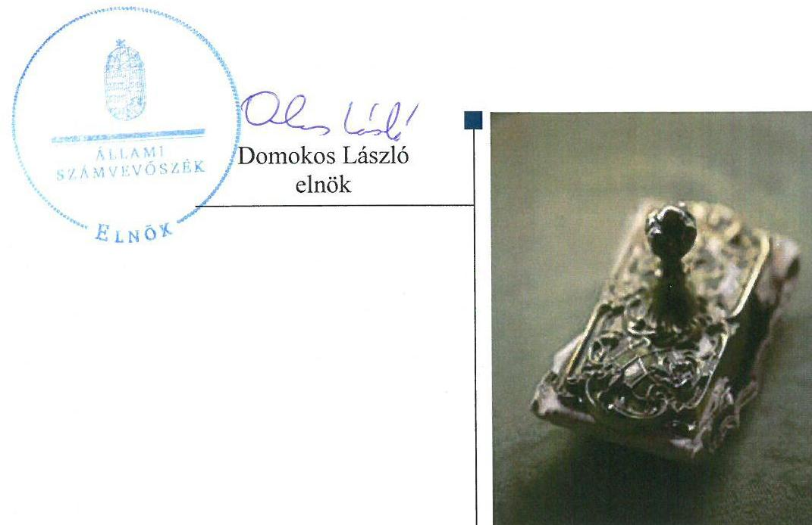
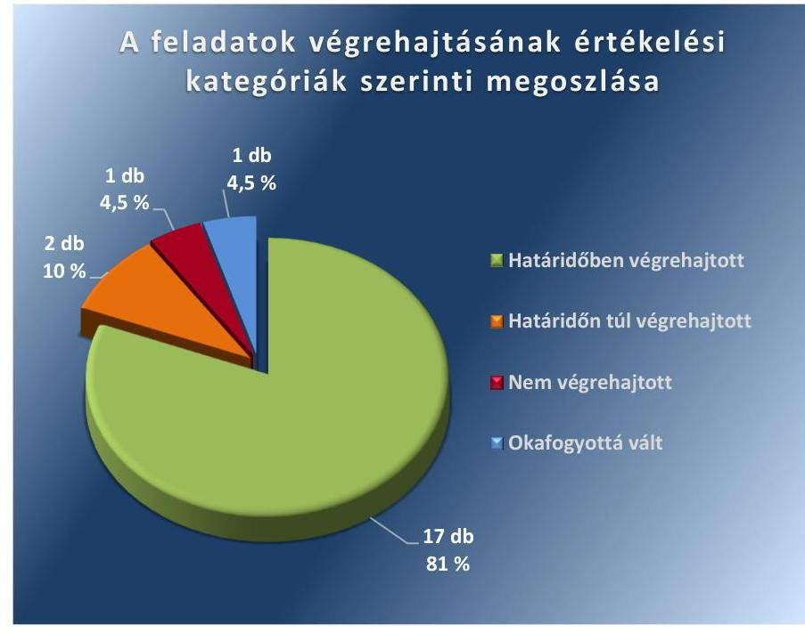

ÁLLAMI
SZÁMVEVŐSZÉK

# Jelentés 

## Utóellenőrzések

Kőröshegy Község Önkormányzata belső kontrollrendszere kialakításának, egyes kontrolltevékenységek és a belső ellenőrzés működésének utóellenőrzése 2016.

---

# Jelentés 

## Utóellenőrzések

Kőröshegy Község Önkormányzata belső kontrollrendszere kialakításának, egyes kontrolltevékenységek és a belső ellenőrzés működésének utóellenőrzése 2016. 03. hó 28. nap

---

# AZ ELLENŐRZÉST FELÜGYELTE:

DR. BENEDEK MÁRIA felügyeleti vezető

## AZ ELLENŐRZÉST VEZETTE ÉS A VÉGREHAJTÁSÁÉRT FELELŐS:

KAKAS SÁNDOR ellenőrzésvezető

## A PROGRAM ÖSSZEÁLLÍTÁSÁÉRT FELELŐS:

JANIK JÓZSEF LÁSZLÓ osztályvezető

## A TÉMÁHOZ KAPCSOLÓDÓ KORÁBBI SZÁMVEVŐSZÉKI JELENTÉSEK:

|  címe: | Jelentés Kőröshegy Község Önkormányzata belső kontrollrendszerének kialakítása, valamint egyes kontrolltevékenységek és a belső ellenőrzés működése ellenőrzéséről  |
| --- | --- |
|  sorszáma: | 13015  |

IKTATÓSZÁM: V-1148-040/2016.

TÉMASZÁM: 2182

ELLENŐRZÉS-AZONOSÍTÓ SZÁM: V-075502

---

# TARTALOMJEGYZÉK 

■ ÖSSZEGZÉS ..... 5
■ AZ ELLENŐRZÉS CÉLJA ..... 6
■ AZ ELLENŐRZÉS TERÜLETE ..... 7
■ AZ ELLENŐRZÉS HÁTTERE, INDOKOLTSÁGA ..... 8
■ A JELENTÉS LÉNYEGES KÉRDÉSKÖREI ..... 9
■ ELLENŐRZÉS HATÓKÖRE ÉS MÓDSZEREI ..... 10
■ MEGÁLLAPÍTÁSOK ..... 13
■ MELLÉKLETEK ..... 17
I. Sz. melléklet: Az ÁSZ 13015 számú jelentéséhez kapcsolódó intézkedési terv végrehajtása ..... 17
■ FÜGGELÉK: ÉSZREVÉTELEK ..... 23
■ RÖVIDÍTÉSEK JEGYZÉKE ..... 25

---

.

---

# ÖSSZEGZÉS 

Az ÁSZ ${ }^{1}$ az Önkormányzat² ${ }^{2}$ belső kontrollrendszerének kialakítása, valamint egyes kontrolltevékenységek és a belső ellenőrzés müködésének utóellenőrzését 2013. március 13. és 2016. április 18. közötti időszakra végezte el. Megállapította, hogy az intézkedési tervben foglalt feladatokat az Önkormányzat egy kivételével végrehajtotta, így jelentős intézkedéseket tett az ÁSZ által korábban feltárt, a belső kontrollrendszert érintő hiányosságok megszüntetésére.

## Az ellenőrzés társadalmi indokoltsága

Az ÁSZ stratégiájában célul tűzte ki a számvevőszéki munka hasznosulásának javítását. Ezzel összhangban ellenőrzi, hogy az ellenőrzött szervezetek megvalósították-e a korábbi ellenőrzései által feltárt hibák, hiányosságok és szabálytalanságok megszüntetése céljából elkészített intézkedési terveikben foglaltakat. A rendszeres utóellenőrzések hozzájárulnak a szükséges intézkedések tényleges végrehajtáshoz, ezáltal a közpénzügyek rendezettségének javulásához.

## Főbb megállapítások, következtetések

A polgármester ${ }^{3}$ az intézkedési tervet ${ }^{4}$ az ÁSZ tv. ${ }^{5}$-ben rögzített határidőben küldte meg az ÁSZ részére.
Az intézkedési tervben meghatározott 21 feladatból 17-et határidőben, kettőt határidőn túl, egyet pedig nem hajtottak végre, egy feladat végrehajtása okafogyottá vált. Így az Önkormányzat az ÁSZ által korábban a belső kontrollrendszerének kialakítása, valamint az egyes kontrolltevékenységek és a belső ellenőrzés müködésének területén azonosított hiányosságok megszüntetésére jelentős intézkedéseket tett, a müködésében rejlő kockázatokat csökkentette.

Az intézkedési tervben rögzített feladatok végrehajtásáról a Bkr. ${ }^{6}$ által előírt nyilvántartást vezették.

---

# AZ ELLENŐRZÉS CÉLJA 

Az ellenőrzés célja annak értékelése volt, hogy a számvevőszéki jelentésben ${ }^{7}$ foglalt intézkedést igénylő megállapításokkal és javaslatokkal összhangban készített intézkedési tervben meghatározott feladatokat az ellenőrzött szervezet végrehajtotta-e.

---

# AZ ELLENŐRZÉS TERÜLETE 

## Az Önkormányzat

Köröshegy község Somogy-megyében, a Siófoki járásban fekszik, állandó lakosainak száma a $\mathrm{KSH}^{8}$ által közzétett népességi adatok szerint 2015. január 1-jén 1330 fő volt. Az utóellenőrzés idején hivatalban lévő polgármester a 2006. évi önkormányzati választások óta tölti be tisztségét, a jegyző ${ }^{9}$ 2013. március 1-jétől látja el közszolgálati feladatait. A településen 2013. március 1-jétől Közös Hivatal ${ }^{10}$ működik.

Az Önkormányzat a 2014. évi éves költségvetési beszámoló szerint 164,8 millió Ft költségvetési bevételt ért el, valamint 131,1 millió Ft költségvetési kiadást teljesített. Az eszközvagyon értéke 2014. december 31-én 910,3 millió Ft volt.

Az ÁSZ a 2013. évben ellenőrizte az Önkormányzat belső kontrollrendszerének kialakítását, valamint egyes kontrolltevékenységek és a belső ellenőrzés múködését a 2009-2011. közötti időszakra vonatkozóan, az erről szóló 13015. számú jelentését 2013. március 13-án tette közzé. Az ellenőrzés célja annak értékelése volt, hogy az Önkormányzat a jogszabályi előírásoknak megfelelően alakította-e ki a belső kontrollrendszert, megfelelően múködtette-e a gazdálkodás folyamatában kulcsszerepet betöltő szakmai teljesítésigazolás és utalvány ellenjegyzés kontrollokat, biztosította-e a belső ellenőrzés szabályos és eredményes múködését.

Az utóellenőrzés - a 2013. március 13-tól a 2016. április 18-ig végrehajtott intézkedéseket figyelembe véve - a polgármester és a jegyző részére megfogalmazott javaslatok hasznosulása céljából készített intézkedési terv végrehajtásának ellenőrzésére, illetve értékelésére terjedt ki.

---

# AZ ELLENŐRZÉS HÁTTERE, INDOKOLTSÁGA 

Az ÁSZ tv. 33. § (1) bekezdése értelmében a számvevőszéki jelentések intézkedést igénylő megállapításaihoz és javaslataihoz kapcsolódóan az ellenőrzött szervezet vezetője intézkedési tervet köteles összeállítani, és az ÁSZ részére megküldeni. Az intézkedési tervben foglaltak megvalósítását az ÁSZ tv. 33. § (7) bekezdésében foglaltak alapján - az ÁSZ utóellenőrzés keretében ellenőrizheti. Az intézkedések megvalósulásának értékelése során az ÁSZ figyelembe veszi az ellenőrzött szervezetek működési feltételeiben, valamint a jogszabályi előírásokban bekövetkezett változásokat.

Az intézkedési tervekben foglalt feladatok hiányos, illetve késedelmes végrehajtása, valamint megvalósításának elmaradása azt mutatja, hogy az ellenőrzések során feltárt hibák, hiányosságok és szabálytalanságok megszüntetése nem kapott kellő hangsúlyt. Ez a szabályszerű működés és a felelős vezetői magatartás vonatkozásában kockázatot hordoz. E kockázatok feltárásával az ÁSZ utóellenőrzési rendszere fokozza a fegyelmet, és igazolja, hogy a közpénzzel való szabályos gazdálkodás felelőssége elől nem lehet kitérni.

## AZ UTÓELLENŐRZÉS VÁRHATÓ HASZNOSULÁSA

Az utóellenőrzés négy szinten hasznosulhat:

- A társadalom szintjén az utóellenőrzés jelzi, hogy a számvevőszéki ellenőrzés megállapításainak van következménye: a hiányosságok megszüntetésére az ellenőrzött szervezet által meghatározott intézkedések végrehajtását is számon kéri az ÁSZ.
- Az ellenőrzött terület szintjén az utóellenőrzés tájékoztatást nyújt a terület döntéshozóinak a hiányosságok kiküszöbölésének jó gyakorlatairól, ezzel lehetőséget biztosítva arra, hogy az ÁSZ ellenőrzési megállapításai, javaslatai a terület nem ellenőrzött szervezeteinek a működése során is hasznosuljanak.
- Az ellenőrzött szervezet szintjén az utóellenőrzés feltárja, hogy a szervezet az intézkedések végrehajtásával hasznosította-e a korábbi ellenőrzési jelentésben a hiányosságok megszüntetése, illetve a kockázatok kezelése érdekében megfogalmazott javaslatokat.
- Az ÁSZ szintjén az utóellenőrzés visszacsatolást ad az ellenőrzési jelentések hasznosulásáról, az intézkedések elmaradása vagy részleges megvalósulása a további ellenőrzésekhez kockázati jelzésként szolgál.

---

# A JELENTÉS LÉNYEGES KÉRDÉSKÖREI 

Az Önkormányzat az intézkedési tervben foglaltakat az elöirt határidőben végrehajtotta-e?

---

# ELLENŐRZÉS HATÓKÖRE ÉS MÓDSZEREI 

## Az ellenőrzés típusa

Megfelelőségi ellenőrzés

## Az ellenőrzött időszak

Az utóellenőrzés alapját képező ÁSZ jelentés közzétételének napjától (2013. március 13.) az ellenőrzésről szóló kiértesítő levél keltének napjáig (2016. április 18.) tartó időszak.

## Az ellenőrzés tárgya

Az ÁSZ tv. 2011. július 1-jei hatálybalépését követően a számvevőszéki jelentésben foglalt intézkedést igénylő megállapításokkal és javaslatokkal összhangban - az Önkormányzat által - készített intézkedési tervben foglaltak végrehajtásának ellenőrzése.

Az ellenőrzés kiterjedt minden olyan körülményre és adatra, amely az ÁSZ jogszabályban meghatározott feladatainak teljesítéséhez, valamint a program végrehajtása folyamán felmerült újabb összefüggések feltárásához szükséges.

## Az ellenőrzött szervezet

Köröshegy Község Önkormányzata

## Az ellenőrzés jogalapja

Az ÁSZ törvényben meghatározott feladatkörében ellenőrzi a központi költségvetés végrehajtását, az államháztartás gazdálkodását, az államháztartásból származó források felhasználását és a nemzeti vagyon kezelését.

Az ÁSZ tv. 1. § (3) bekezdése szerint az ÁSZ általános hatáskörrel végzi a közpénzekkel és az állami és önkormányzati vagyonnal való felelős gazdálkodás ellenőrzését.

Az ÁSZ tv. 33. § (7) bekezdése alapján az ÁSZ tv. 33. § (1)-(2) bekezdése szerinti intézkedési tervben foglaltak megvalósítását az ÁSZ utóellenőrzés keretében ellenőrizheti.

---

# Az ellenőrzés módszerei 

Az ÁSZ az ellenőrzést a nemzetközi standardokat irányadónak tekintve az ellenőrzési program ellenőrzési kérdései, az ellenőrzött időszakban hatályos jogszabályok, az ellenőrzés szakmai szabályok és módszertanok figyelembevételével, önállóan végezte.

Az ÁSZ az ellenőrzés ideje alatt az Önkormányzattal történő kapcsolattartást az ÁSZ SZMSZ ${ }^{11}$-ének vonatkozó előírásai alapján biztosította.

Az utóellenőrzés megállapításait elsősorban az ÁSZ rendelkezésére álló, valamint az Önkormányzattól elektronikusan bekért dokumentumok alapozták meg.

Az ellenőrzési bizonyítékként felhasználható adatforrások közé tartoznak egyrészt a szakmai programban felsorolt adatforrások, másrészt minden - az ellenőrzés folyamán feltárt, az ellenőrzés szempontjából információt tartalmazó - dokumentum.

A pénzügyi folyamatokban kulcsszerepet betöltő kontrollokra vonatkozóan az intézkedési tervben foglalt feladatok végrehajtását az államháztartáson kívülre teljesített múködési és felhalmozási célú pénzeszközátadásoknál, az állományba nem tartozók megbízási díjainál, továbbá a külső szolgáltatók által végzett karbantartási, kisjavítási munkákkal kapcsolatos kifizetéseknél 10 elemú véletlen mintavétellel kiválasztott tételek alapján értékelte az ÁSZ. A kiválasztott tételek esetében azt ellenőrizte, hogy az Önkormányzat az intézkedési tervben meghatározott feladatok végrehajtása érdekében biztosította-e a jogszabályok és a belső szabályzatok előírásainak megfelelő múködtetést.

Az intézkedési tervekben előírt feladatok értékelését, azok végrehajthatósága, illetve végrehajtása szempontjából az alábbiak szerint végezte az ÁSZ:
$\longrightarrow$ „határidőben végrehajtott" a feladat, ha a teljesítés dokumentáltan, az intézkedési tervben előírt határidőben és tartalommal megtörtént;
$\longrightarrow$ „határidőn túl végrehajtott" a feladat, ha annak teljesítése az intézkedési tervben meghatározott módon, de az előírt határidőn túl történt meg;
$\longrightarrow$ „részben végrehajtott" a feladat, ha végrehajtása teljes körűen az intézkedési tervben előírt módon nem történt meg;
$\longrightarrow$ „nem végrehajtott" a feladat, ha a végrehajtás nem történt meg, vagy amennyiben a teljesítést nem dokumentálták;
$\longrightarrow$ „okafogyottá vált" a feladat, ha végrehajtására - meghatározott esemény bekövetkezése, továbbá külső körülmény, a múködést érintő feltétel változása miatt - már nincs szükség, illetve lehetőség, és egyértelmúen megállapítható, hogy az intézkedést szükségessé tevő körülmény a jövőben nem fordulhat elő;
$\longrightarrow$ „nem időszerü" az a feladat, amelynek ellenőrzési időszakon belüli végrehajtására azért nem került (kerülhetett) sor, mert az intézkedés alapjául szolgáló esemény nem következett be, de annak jövőbeni előfordulása lehetséges, a végrehajtása nem volt esedékes, vagy a végrehajtás határideje még nem járt le.

---

Az ellenőrzés lefolytatásához az Önkormányzat a tanúsítványok elektronikus kitöltésével, valamint az ÁSZ által kért dokumentumok elektronikus megküldésével szolgáltatott adatokat, amelyek valódiságát és teljes körűségét a polgármester által tett teljességi és hitelességi nyilatkozat igazolta. Az így rendelkezésre bocsátott adatok, információk kontrollja az ellenőrzés keretében történt.

---

# MEGÁLLAPÍTÁSOK 

## Az Önkormányzat az intézkedési tervben foglaltakat az előírt határidőben végrehajtotta-e?

Összegző megállapítás

Az Önkormányzat az intézkedési tervben meghatározott 21 feladatból 17-et határidőben, kettőt határidőn túl, egyet pedig nem hajtott végre, egy feladat végrehajtása okafogyottá vált. Az intézkedési tervben rögzített feladatok végrehajtásáról a Bkr. által előírt nyilvántartást vezették.

Az intézkedési tervben meghatározott feladatokat, határidőket, az ÁSZ jelentés javaslatainak címzettjét és a feladatok végrehajtását az I. számú melléklet mutatja be.

Az ÁSZ a jelentésében a polgármester részére kettő, a jegyző részére 18 javaslatot fogalmazott meg. A polgármester által összeállított és az ÁSZ részére megküldött intézkedési tervben a hiányosságok, szabálytalanságok megszüntetésére 21 feladatot határoztak meg. A feladatok elvégzésének felelőseként három esetben a polgármestert, 17 esetben a jegyzőt, egy esetben pedig a belső ellenőrzési vezetőt jelölték meg.

Az intézkedési tervben tervezett feladatok végrehajtásának értékelési kategóriák szerinti megoszlását az 1. ábra szemlélteti.

1. ábra

Fonás: ÁSZ

---

# HATÁRIDŐBEN VÉGREHAJTOTT feladatok: 

1. A polgármester a Gazdasági programot ${ }^{12}$ az intézkedési tervben megjelölt 2013. december 31-i határidőn belül felülvizsgálta és a Mötv. ${ }^{13}$-nek megfelelő tartalommal - 2012. szeptember 24-én tartott testületi ülésen - a Képviselő-testület ${ }^{14}$ elé terjesztette.
2. Az ellenőrzött dokumentumok alapján a polgármester az intézkedési tervben meghatározott 2013. július 1-jei határidőtől kezdve folyamatosan biztosította, hogy a kötelezettségvállalásra az Áht. ${ }^{15}$ előírásainak megfelelően pénzügyi ellenjegyzés után kerüljön sor.
3. A jegyző a Gazdasági programot az intézkedési tervben rögzített 2013. október 30-ai határidőn belül - 2011. március 21-ei dátummal - a Mötv.-ben foglaltaknak megfelelő tartalommal elkészítette, és kezdeményezte a polgármesternél a Képviselő-testület elé terjesztését.
4. A jegyző az intézkedési tervben meghatározott 2013. június 30-ai határidőn belül, a Képviselő-testület 2013. május 29-i testületi ülésére elkészítette és előterjesztette az Önkormányzat vagyonrendeletének ${ }^{16}$ módosítását, amely tartalmazta az Áhsz. ${ }^{17}$ alapján a kétévenkénti leltározási kötelezettséget.
5. A jegyző az intézkedési tervben előírt 2013. június 30-ai határidőn belül, 2013. június 28-án a Bkr. alapján meghatározta a Közös Hivatal belső szabályzataiban a Közös Hivatal tevékenységeire vonatkozó beszámolási eljárásokat.
6. A jegyző az intézkedési tervben meghatározott 2013. június 30-ai határidőn belül, 2013. május 28-i dátummal elkészítette és 2013. június 1-jétől hatályba léptette az új adatvédelmi és informatikai biztonsági szabályzatot ${ }^{18}$, amely az Info tv. ${ }^{19}$-nek megfelelően tartalmazta a személyes adatok biztonságára vonatkozó szabályokat.
7. A jegyző a 2013. június 28-tól hatályos belső kontrollrendszer szabályzatban ${ }^{20}$ - a Bkr.-ben előírtak alapján - kialakította az operatív tevékenységek keretében megvalósuló folyamatos és eseti nyomonkövetésből álló, az Önkormányzat tevékenységének, a célok megvalósításának nyomon követését biztosító rendszert, valamint az ellenőrzött dokumentumok alapján gondoskodott annak folyamatos múködtetéséről.
8. A polgármester az intézkedési tervben foglalt 2013. június 30-ai határidőn belül, a 2013. március 5-től hatályba léptetett gazdálkodási szabályzatban ${ }^{21}$, valamint a 2013. június 28-tól hatályba léptetett belső kontrollrendszer szabályzatban gondoskodott a teljesítésigazolás kulcskontroll kiépítéséről. Továbbá az ellenőrzött dokumentumok alapján az operatív gazdálkodás során gondoskodott arról, hogy az Önkormányzat vonatkozásában teljesítés igazolására kijelölt személyek az Ávr. ${ }^{22}$ előírásainak megfelelően okmányok alapján ellenőrizzék a kiadások teljesítésének jogosságát, összegszerűségét, az ellenszolgáltatást is magában foglaló kötelezettségvállalás esetében a szerződés, a megrendelés teljesítését.
9. A jegyző az intézkedési tervben foglalt 2013. június 30-ai határidőn belül, a 2013. március 5-től hatályba léptetett gazdálkodási szabályzatban, valamint a 2013. június 28-tól hatályba léptetett belső

---

kontrollrendszer szabályzatban gondoskodott a teljesítésigazolás kulcskontroll kiépítéséről. Továbbá az ellenőrzött dokumentumok alapján az operatív gazdálkodás során gondoskodott arról, hogy a Közös Hivatal vonatkozásában teljesítés igazolására kijelölt személyek az Ávr. előírásainak megfelelően okmányok alapján ellenőrizzék a kiadások teljesítésének jogosságát, összegszerűségét, az ellenszolgáltatást is magában foglaló kötelezettségvállalás esetében a szerződés, a megrendelés teljesítését.
10. A jegyző az intézkedési tervben foglalt 2013. június 30-ai határidőn belül, a 2013. március 5-től hatályba léptetett gazdálkodási szabályzatban, valamint a 2013. június 28-tól hatályba léptetett belső kontrollrendszer szabályzatban gondoskodott a pénzügyi ellenjegyzés kulcskontroll kiépítéséről. Továbbá az ellenőrzött dokumentumok alapján az operatív gazdálkodás során gondoskodott arról, hogy a pénzügyi ellenjegyzést az Ávr. előírásainak megfelelően az arra jogosult, és előírt végzettséggel és képesítéssel rendelkező személy aláírásával igazolják.
11. A jegyző az intézkedési tervben foglalt 2013. június 30-ai határidőn belül, a 2013. március 5-től hatályba léptetett gazdálkodási szabályzatban, valamint a 2013. június 28-tól hatályba léptetett belső kontrollrendszer szabályzatban gondoskodott az érvényesítés kulcskontroll kiépítéséről. Továbbá az ellenőrzött dokumentumok alapján az operatív gazdálkodás során gondoskodott arról, hogy az érvényesítő személy az Ávr.-nek megfelelően a teljesítésigazolás alapján a kifizetést megelőzően ellenőrizze az összegszerűséget, a fedezet meglétét, valamint az Áht., az Áhsz., az Ávr. - gazdálkodási szabályokra, szabályszerű számlakijelölésre, teljesítésigazolás ellenőrzésére, előirányzat rendelkezésre állására - vonatkozó előírásainak és a belső szabályzatokban foglaltaknak a megelőző ügymenetben történt betartását.
12. A jegyző az ellenőrzött dokumentumok alapján az operatív gazdálkodás során biztosította - az Ávr.-ben foglaltak figyelembevételével - az összeférhetetlenségi szabályok érvényesülését.
13. A jegyző az ellenőrzött dokumentumok alapján az intézkedési tervben előírtaknak megfelelően az operatív gazdálkodás során gondoskodott arról, hogy a kötelezettségvállalásra az Áht. és az Ávr. előírásainak megfelelően (az Ávr.-ben meghatározott kivételekkel) pénzügyi ellenjegyzés után kerüljön sor.
14. A jegyző az ellenőrzött dokumentumok alapján az intézkedési tervben előírtaknak megfelelően az operatív gazdálkodás során gondoskodott arról, hogy a közműfejlesztési támogatások kifizetése a 262/2004. (IX. 23.) Korm. rendeletben ${ }^{29}$ foglaltaknak megfelelően a jogosultak részére történjen, illetve arról, hogy a víziközmű számlára történő átvezetéskor a jogosult írásbeli felhatalmazását mellékeljék.
15. A jegyző az intézkedési tervben meghatározott 2013. április 30-i határidőn belül, 2013. április 24-én kezdeményezte a polgármesternél a 2009-2011. évi belső ellenőrzési tervek Képviselő-testület elé terjesztését, valamint a 2014-2016. évekre vonatkozóan kez-

---

deményezte a belső ellenőrzési tervek Képviselő-testület elé terjesztését, annak érdekében, hogy azokat a Képviselő-testület az Mötv.-ben előírt határidőig jóváhagyja.
16. A belső ellenőrzési vezető az intézkedési tervben előírt 2013. december 31-ei határidőn belül, 2013. november 26-án a belső ellenőrzési terv összeállítása előtt kockázatelemzést készített, amelyet a belső ellenőrzési terv készítésénél figyelembe vett. A kockázatelemzéssel megalapozott belső ellenőrzési tervet a Bkr.-ben foglalt előírásnak megfelelően a Képviselő-testület jóváhagyta.
17. A jegyző az intézkedési tervnek megfelelően gondoskodott arról, hogy 2013. július 1-jét követően a belső ellenőrzésekről készült jelentésekben rögzített hiányosságok felszámolására a Bkr. előírásainak megfelelően intézkedési tervek készüljenek.

# HATÁRIDŐN TÚL VÉGREHAJTOTT feladatok: 

18. A jegyző az intézkedési tervben előírt 2013. augusztus 31-ei határidőn túl, 2013. december 23-án készítette el és 2014. január 1-jén léptette hatályba az új Hivatali SZMSZ ${ }^{24}$-t, amely az Ávr. szerint tartalmazta a Közös Hivatal engedélyezett létszámát.
19. A jegyző az intézkedési tervben előírt 2013. június 30-ai határidőt követően 2013. július 25-én készítette el a Közös Hivatalra vonatkozóan a kockázatelemzést, amely a Bkr. szerint tartalmazta a Közös Hivatal tevékenységében, gazdálkodásában rejlő kockázatok megállapítását.

## NEM VÉGREHAJTOTT feladat:

20. A jegyző az ellenőrzött dokumentumok alapján az operatív gazdálkodás során gondoskodott arról, hogy a külön írásbeli rendelkezésként kiállított utalvány tartalmazza az Ávr.-ben foglaltakat, azonban az utalvány használata során az Ávr.-ben előírt kötelező tartalmi elemek közül a kedvezményezett címét nem minden esetben tüntették fel.

## OKAFOGYOTTÁ VÁLT feladat:

21. Az intézkedési terv szerint az éves ellenőrzési tervet társult feladatellátás esetén a jegyző írásos véleményének figyelembevételével kellett volna összeállítani. Tekintettel arra, hogy az Önkormányzat a 2014. évtől a belső ellenőrzéssel kapcsolatos feladatokat már nem társulási formában, hanem önállóan látta el, ezért a társult feladatellátás megszűnése miatt a Bkr. önkormányzatok társulásaival kapcsolatos különös szabályai már nem vonatkoztak rá, így a feladat végrehajtása okafogyottá vált.

A jegyző az intézkedési tervben rögzített feladatok végrehajtásáról a Bkr. által előírt nyilvántartást vezette.

---

# MELLÉKLETEK

I. SZ. MELLÉKLET: AZ ÁSZ 13015 SZÁMÚ JELENTÉSÉHEZ KAPCSOLÓDÓ INTÉZKEDÉSI TERV VÉGREHAJTÁSA

|  1. | Intézkedési terv alapján elvégzendő feladat | Az intézkedési tervben meghatározott határidő | Az ÁSZ 13015ös számú jelentés javaslatának címzettje 3. | A feladat végrehajtása  |
| --- | --- | --- | --- | --- |
|   | 1. | 2. | 3. | 4.  |
|  Határidőben végrehajtott feladatok |  |  |  |   |
|  1. | A gazdasági program felülvizsgálata, az elkészített gazdasági programot a Képviselő-testület elé kell terjeszteni az Mótv. 116. § (3)-(4) bekezdéseiben foglaltaknak megfelelő tartalommal. | 2013. december 31. | polgármester | A polgármester a Gazdasági programot az intézkedési tervben megjelölt határidőn belül felülvizsgálta és a Mótv. 116. § (3)-(4) bekezdéseiben foglaltaknak megfelelő tartalommal - 2012. szeptember 24-én tartott testületi ülésen - a Képviselő-testület elé terjesztette. A Képviselő-testület az előterjesztést a 78/2012. (IX.24.) számú határozatával elfogadta.  |
|  2. | A kötelezettségvállalásra az Áht. 37. § (1) bekezdésében foglaltaknak megfelelően (az Ávr.ben meghatározott kivételekkel) pénzügyi ellenjegyzés után kerülhet sor. | 2013. július 1-jétől folyamatosan | polgármester | Az ellenőrzött dokumentumok alapján a polgármester biztosította, hogy az Önkormányzatnál kötelezettségvállalásra - az Áht. 37. § (1) bekezdésében foglaltaknak megfelelően (az Ávr.-ben meghatározott kivételekkel) - pénzügyi ellenjegyzés után kerüljön sor.  |
|  3. | A gazdasági program elkészítése a Htv. ${ }^{25} 140 . \S$ (1) bekezdés a) pontja előírása alapján az Mótv. 116. § (3)-(4) bekezdéseiben foglaltaknak megfelelően, s kezdeményezni a polgármesternél előterjesztését a Képviselő-testület részére. | 2013. október 31. | jegyző | A jegyző a Gazdasági programot az intézkedési tervben rögzített határidőn belül a Mótv. 116. § (3)-(4) bekezdéseiben foglaltaknak megfelelő tartalommal elkészítette, és kezdeményezte a polgármesternél a Képviselő-testület elé terjesztését.  |
|  4. | Az önkormányzat vagyonrendeltének módosítása az Áhsz. 37. §-ban foglaltaknak megfelelően | 2013. június 30. | jegyző | A jegyző az intézkedési tervben meghatározott 2013. június 30-ai határidőn belül, a Kép-viselő-testület 2013. május 29-i testületi ülésére elkészítette és előterjesztette az Önkormányzat vagyonrendeletének módosítását, amely tartalmazta az Áhsz. 37. §-ban foglaltak alapján a kétévenkénti leltározási kötelezettséget. A Képviselő-testület 6/2013. (V.29.) számú önkormányzati rendeletében a korábbi vagyonrendeletet módosította.  |
|  5. | A Közös Hivatal belső szabályzataiban meg kell határozni a tevékenységekre vonatkozó beszámolási eljárásokat a Bkr. 8. § (4) bekezdés c) pontja alapján. | 2013. június 30. | jegyző | A jegyző - a Bkr. 8. § (4) bekezdés c) pontjában foglalt előírás szerint - a Közös Hivatal tevékenységeire vonatkozó beszámolási eljárásokat a Közös Hivatal belső szabályzataiban az intézkedési tervben meghatározott határidőn belül meghatározta.  |

---

|  1. | 2. | 3. | 4.  |
| --- | --- | --- | --- |
|  6. | A Közös Hivatal Info tv. 24. § (3) bekezdése szerinti adatvédelmi és adatbiztonsági szabályzatának kiegészítése az Info tv. 7. § (1) bekezdésének megfelelően a személyes adatok biztonságára vonatkozóan. | 2013. június 30. | jegyző  |
|  7. | A Bkr. 10. §-a alapján az operatív tevékenységek keretében megvalósuló folyamatos és eseti nyomonkövetésből álló, az önkormányzat tevékenységének, a célok megvalósításának nyomon követését biztosító rendszer kialakítása és működtetése. | A monitoring rendszer kialakítása 2013. június 30-ig, működtetése ezt követően folyamatosan. | jegyző  |
|  8. | Gondoskodni, hogy az Ávr. 57. § (1) bekezdésében előírtaknak megfelelően a teljesítés igazolására kijelölt személyek okmányok alapján ellenőrizzék a kiadások teljesítésének jogosságát, összegszerűségét, az ellenszolgáltatást is magában foglaló kötelezettségvállalás esetében a szerződés, a megrendelés teljesítését az Önkormányzatra vonatkozóan. | Az Ávr. szabályainak alkalmazása azonnal és folyamatosan. A szakmai teljesítésigazolás kulcskontrolljának kiépítése 2013. június 30-ig, működtetése ezt követően folyamatosan. | polgármester  |
|  9. | Gondoskodni, hogy az Ávr. 57. § (1) bekezdésében előírtaknak megfelelően a teljesítés igazolására kijelölt személyek okmányok alapján ellenőrizzék a kiadások teljesítésének jogosságát, összegszerűségét, az ellenszolgáltatást is magában foglaló kötelezettségvállalás esetében a szerződés, a megrendelés teljesítését a Közös Hivatalra vonatkozóan. | Az Ávr. szabályainak alkalmazása azonnal és folyamatosan. A szakmai teljesítésigazolás kulcskontrolljának kiépítése 2013. június 30-ig, működtetése ezt követően folyamatosan. | jegyző  |

|  Az intézkedési tervben meghatározott határidő | Az ÁSZ 13015-ös számú jelentés javaslatának címzettje  |
| --- | --- |
|  2. | 3.  |
|  2013. június 30. | Jegyző  |

|  Jegyző | A jegyző az intézkedési tervben meghatározott határidőn belül, 2013. május 28-i dátummal az Info tv. 24. § (3) bekezdése szerint elkészítette és 2013. június 1-jétől hatályba léptette a Közös Hivatal új adatvédelmi és informatikai biztonsági szabályzatát, amely az Info tv. 7. § (1) bekezdésének megfelelően tartalmazta a személyes adatok biztonságára vonatkozó szabályokat.  |
| --- | --- |
|  jegyző | A jegyző a 2013. június 28-tól hatályos belső kontrollrendszer szabályzatban – a Bkr. 10. §-ában előírtak alapján – kialakította az operatív tevékenységek keretében megvalósuló folyamatos és eseti nyomonkövetésből álló, az Önkormányzat tevékenységének, a célok megvalósításának nyomon követését biztosító rendszert, valamint az ellenőrzött dokumentumok alapján gondoskodott annak folyamatos működtetéséről.  |
|  polgármester | A polgármester az intézkedési tervben foglalt határidőn belül, a 2013. március 5-től hatályba léptetett gazdálkodási szabályzatban, valamint a 2013. június 28-tól hatályba léptetett belső kontrollrendszer szabályzatban gondoskodott a teljesítésigazolás kulcskontroll kiépítéséről. Továbbá az ellenőrzött dokumentumok alapján az operatív gazdálkodás során gondoskodott arról, hogy az Önkormányzat vonatkozásában teljesítés igazolására kijelölt személyek – az Ávr. 57. § (1) bekezdésében előírtaknak megfelelően – okmányok alapján ellenőrizzék a kiadások teljesítésének jogosságát, összegszerűségét, az ellenszolgáltatást is magában foglaló kötelezettségvállalás esetében a szerződés, a megrendelés teljesítését.  |
|  jegyző | A jegyző az intézkedési tervben foglalt határidőn belül, a 2013. március 5-től hatályba léptetett gazdálkodási szabályzatban, valamint a 2013. június 28-tól hatályba léptetett belső kontrollrendszer szabályzatban gondoskodott a teljesítésigazolás kulcskontroll kiépítéséről. Továbbá az ellenőrzött dokumentumok alapján az operatív gazdálkodás során gondoskodott arról, hogy a Közös Hivatal vonatkozásában teljesítés igazolására kijelölt személyek – az Ávr. 57. § (1) bekezdésében előírtaknak megfelelően – okmányok alapján ellenőrizzék a kiadások teljesítésének jogosságát, összegszerűségét, az ellenszolgáltatást is magában foglaló kötelezettségvállalás esetében a szerződés, a megrendelés teljesítését.  |

---

|  1. | Intézkedési terv alapján elvégzendő feladat | Az intézkedési tervben meghatározott határidő | Az ÁSZ 13015ös számú jelentés javaslatának címzettje | A feladat végrehajtása  |
| --- | --- | --- | --- | --- |
|  1. |  | 2. | 3. | 4.  |
|  10. | Gondoskodni, hogy az Ávr. 55. § (1) és (3) bekezdésében előírtaknak megfelelően a pénzügyi ellenjegyzést az arra jogosult, az előírt végzettséggel és képesítéssel rendelkező személy aláírásával igazolják. | Az Ávr. szabályainak alkalmazása azonnal és folyamatosan. A pénzügyi ellenjegyzés kulcskontrolljának kiépítése 2013. június 30-ig, működtetése ezt követően folyamatosan. | jegyző | A jegyző az intézkedési tervben foglalt határidőn belül, a 2013. március 5-től hatályba léptetett gazdálkodási szabályzatban, valamint a 2013. június 28-tól hatályba léptetett belső kontrollrendszer szabályzatban gondoskodott a pénzügyi ellenjegyzés kulcskontroll kiépítéséről. Továbbá az ellenőrzött dokumentumok alapján az operatív gazdálkodás során gondoskodott arról, hogy a pénzügyi ellenjegyzést - az Ávr. 55. § (1) és (3) bekezdésében előírtaknak megfelelően - az arra jogosult, az előírt végzettséggel és képesítéssel rendelkező személy aláírásával igazolja.  |
|  11. | Gondoskodni, hogy az Ávr. 58. § (1) bekezdésének megfelelően az érvényesítő személy a kifizetést megelőzően a teljesítésigazolás alapján ellenőrizze az összegszerűséget, a fedezet meglétét és azt, hogy a megelőző ügymenetben az új Áht., az Áhsz., az Ávr. - gazdálkodási szabályokra, szabályszerű számlakijelölésre, teljesítésigazolás ellenőrzésére, előirányzat rendelkezésre állására vonatkozó - előírásait és a belső szabályzatokban foglaltakat betartották-e. | Az Áht., Ávr., Áhsz. szabályainak alkalmazása azonnal és folyamatosan. Az érvényesítés kulcskontrolljának kiépítése 2013. június 30-ig, működtetése ezt követően folyamatosan. | jegyző | A jegyző az intézkedési tervben foglalt határidőn belül, a 2013. március 5-től hatályba léptetett gazdálkodási szabályzatban, valamint a 2013. június 28-tól hatályba léptetett belső kontrollrendszer szabályzatban gondoskodott az érvényesítés kulcskontroll kiépítéséről. Továbbá az ellenőrzött dokumentumok alapján az operatív gazdálkodás során gondoskodott arról, hogy az érvényesítő személy - az Ávr. 58. § (1) bekezdésében előírtaknak megfelelően - a kifizetést megelőzően a teljesítésigazolás alapján ellenőrizze az összegszerűséget, a fedezet meglétét és azt, hogy a megelőző ügymenetben az Áht., az Áhsz., az Ávr. - gazdálkodási szabályokra, szabályszerű számlakijelölésre, teljesítésigazolás ellenőrzésére, előirányzat rendelkezésre állására vonatkozó - előírásait és a belső szabályzatokban foglaltakat betartották-e.  |
|  12. | Az Ávr. 60. § (1)-(2) bekezdésének figyelembevételével az összeférhetetlenségi szabályok érvényesülésének biztosítása. | Az Ávr. összeférhetetlenségre vonatkozó előírásainak alkalmazása azonnal és folyamatosan. | jegyző | A jegyző az ellenőrzött dokumentumok alapján biztosította - az Ávr. 60. § (1)-(2) bekezdésében foglaltak figyelembevételével - az összeférhetetlenségi szabályok érvényesülését.  |
|  13. | Gondoskodni, hogy kötelezettségvállalásra az új Áht. 37. § (1) bekezdésében, valamint az Ávr. 55. § (1) bekezdésében foglaltaknak megfelelően (az Ávr.-ben meghatározott kivételekkel) pénzügyi ellenjegyzés után kerüljön sor. | Az Áht., Ávr. kötelezettségvállalásra és pénzügyi ellenjegyzésre vonatkozó szabályainak alkalmazása azonnal és folyamatosan. | jegyző | A jegyző az ellenőrzött dokumentumok alapján gondoskodott arról, hogy a kötelezettségvállalásra - az Áht. 37. § (1) bekezdésében, valamint az Ávr. 55. § (1) bekezdésében foglaltaknak megfelelően (az Ávr.-ben meghatározott kivételekkel) - a pénzügyi ellenjegyzés után kerüljön sor.  |
|  14. | A közműfejlesztési támogatások kifizetése a 262/2004. (IX. 23.) Korm. rendelet 6. § (6) bekezdésében foglaltaknak megfelelően a jogosultak részére történjen, a víziközmű számlára történő átvezetéskor a jogosult írásbeli felhatalmazását mellékelni kell. | A 262/2004. (IX. 23.) Korm. rendelet szabályainak alkalmazása azonnal és folyamatosan. | jegyző | Az ellenőrzött dokumentumok alapján a közműfejlesztési támogatások kifizetése - a 262/2004. (IX. 23.) Korm. rendelet 6. § (6) bekezdésében foglaltaknak megfelelően - a jogosultak részére történt, illetve a víziközmű számlára történő átvezetés esetén a jogosult írásbeli felhatalmazását mellékelték.  |

---

|  1. | 2. | 3. | 4.  |
| --- | --- | --- | --- |
|  15. | A 2009-2011. évi belső ellenőrzési tervek Képviselő-testület elé terjesztésének kezdeményezése. Az éves ellenőrzési tervről szóló előterjesztés előkészítése és Képviselő-testület elé terjesztésének kezdeményezése a polgármesternél annak érdekében, hogy a Képviselő-testület az éves ellenőrzési tervet a Mótv. 119. § (5) bekezdésében előírt határidőig jóváhagyhassa. | 2013. április 30-át követően folyamatosan | jegyző  |
|  16. | Az éves ellenőrzési terv összeállítása előtt kockázatelemzés készítése, s ennek figyelembevétele az éves ellenőrzési terv készítésénél a Bkr. 31. § (2) bekezdése alapján. Az ellenőrzési terv jóváhagyása a jegyző által történjen a Bkr. 29. § (1) bekezdése alapján. | 2013. december 31. | belső ellenőrzési vezető az intézkedési tervben előírt határidőn belül 2013. november 26-án a belső ellenőrzési terv összeállítása előtt kockázatelemzést készített, amelyet az éves ellenőrzési terv készítésénél figyelembe vett. Az elkészített 2014. évi belső ellenőrzési tervet a Bkr. 32. § (4) bekezdésének megfelelően a Képviselő-testület jóváhagyta.  |
|  17. | A belső ellenőrzésekről készült jelentésekben rögzített hiányosságok felszámolására intézkedési terv készítése a Bkr. 45. § (1) bekezdésének előírása szerint. | 2013. július 1-jétől folyamatosan | jegyző  |
|  18. | A Közös Hivatal SZMSZ-ében szerepeltetni kell az engedélyezett létszámot az az Ávr. 13. § (1) bekezdés e) pontja alapján. | 2013. augusztus 31. | jegyző  |
|  19. | A Közös Hivatalra vonatkozó kockázatelemzés készítése a Bkr. 7. §-a alapján. | 2013. június 30. | jegyző  |
|  20. | A gazdálkodás során használt utalvány az Ávr. 59. § (3) bekezdése szerinti tartalommal kerüljön kiállításra. | Az Ávr. utalványra vonatkozó előírásának alkalmazása azonnal és folyamatosan. | jegyző  |

|  Az intézkedési tervben meghatározott határidő | Az ÁSZ 13015-ös számú jelentés javaslatának címzettje | A feladat végrehajtása  |
| --- | --- | --- |
|  2. | 3. | 4.  |
|  2013. április 30-át követően folyamatosan |  |   |
|  2013. december 31. | belső ellenőrzési vezető az intézkedési tervben előírt határidőn belül, 2013. november 26-án a belső ellenőrzési terv összeállítása előtt kockázatelemzést készített, amelyet az éves ellenőrzési terv készítésénél figyelembe vett. Az elkészített 2014. évi belső ellenőrzési tervet a Bkr. 32. § (4) bekezdésének megfelelően a Képviselő-testület jóváhagyta. |   |
|  2013. december 31. |  |   |
|  2013. július 1-jétől folyamatosan |  |   |
|  2013. július 30. | jegyző | A jegyző az intézkedési tervben előírt határidőn túl, 2013. december 23-án készítette el és 2014. január 1-jén léptette hatályba az új Hivatali SZMSZ-t, amely az Ávr. 13. § (1) bekezdés e) pontja szerint tartalmazta az engedélyezett létszámot.  |
|  2013. június 30. | jegyző | A jegyző az intézkedési tervben előírt határidőn túl, 2013. július 25-én készítette el a Közös Hivatalra vonatkozóan a kockázatelemzést, amely a Bkr. 7. § (2) bekezdése szerint tartalmazta a Közös Hivatal tevékenységében, gazdálkodásában rejlő kockázatok megállapítását.  |
|  Nem végrehajtott feladat |  |   |
|  Az Ávr. utalványra vonatkozó előírásának alkalmazása azonnal és folyamatosan. | jegyző | Az ellenőrzött dokumentumok alapján a gazdálkodás során a külön írásbeli rendelkezésként kiállított utalvány tartalmazta az Ávr. 59. § (3) bekezdésében foglaltakat, azonban az utalvány használata során az Ávr. 59. § (3) bekezdés c) pontjában előírt kötelező tartalmi elemek közül a kedvezményezett címét nem minden esetben tüntették fel.  |

---

|  1. | Intézkedési terv alapján elvégzendő feladat | Az intézkedési tervben meghatározott határidő | Az ÁSZ 13015ös számú jelentés javaslatának címzettje | A feladat végrehajtása  |
| --- | --- | --- | --- | --- |
|   | 1. | 2. | 3. | 4.  |
|   |  |  |  | **Okafogyottá vált feladat**  |
|  21. | Az éves ellenőrzési terv összeállítása a Bkr. 56. § (2) bekezdésében foglaltaknak megfelelően a jegyző írásos véleményének figyelembe vételével történjen. | 2013. december 31. | jegyző | Az Önkormányzat a belső ellenőrzési feladatokat 2013. június 30-án követően már nem társulási formában, hanem önállóan látta el, ezért a társult feladatellátás megszűnése miatt a Bkr. 56. § (2) bekezdésben foglalt előírás már nem vonatkozott rá. Ennek megfelelően a feladat végrehajtása okafogyottá vált.  |

*Forrás: ÁSZ által készített táblázat*

---

.

---

# FÜGGELÉK: ÉSZREVÉTELEK 

A jelentéstervezetet a Számvevőszék 15 napos észrevételezésre megküldte az ellenőrzött szervezet vezetőjének az ÁSZ tv. 29. §* (1) bekezdése előírásának megfelelően.

Az ellenőrzött szervezet vezetője az ÁSZ tv. 29. § (2) bekezdésében foglalt észrevételezési jogával nem élt, a jelentéstervezetre észrevételt nem tett.

[^0]
[^0]:    * 29. § (1) Az Állami Számvevőszék az ellenőrzési megállapításait megküldi az ellenőrzött szervezet vezetőjének vagy az általa megbízott személynek, és annak, akinek személyes felelősségét állapította meg.
    (2) Az ellenőrzött szervezet vezetője és a felelősként megjelölt személy az ellenőrzés megállapításaira tizenöt napon belül írásban észrevételt tehet.
    (3) Az Állami Számvevőszék az észrevételre a beérkezésétől számított harminc napon belül írásban válaszol. A figyelembe nem vett észrevételeket köteles a jelentésben feltüntetni, és megindokolni, hogy azokat miért nem fogadta el.

---

.

---

# RÖVIDÍTÉSEK JEGYZÉKE 

${ }^{1}$ ÁSZ
${ }^{2}$ Önkormányzat
${ }^{3}$ polgármester
${ }^{4}$ intézkedési terv
${ }^{5}$ ÁSZ tv.
${ }^{6}$ Bkr.
${ }^{7}$ számvevőszéki jelentés
${ }^{8} \mathrm{KSH}$
${ }^{9}$ jegyző
${ }^{10}$ Közös Hivatal
${ }^{11}$ ÁSZ SZMSZ
${ }^{12}$ Gazdasági program
${ }^{13}$ Mötv.
${ }^{14}$ Képviselő-testület
${ }^{15}$ Áht.
${ }^{16}$ vagyonrendelet
${ }^{17}$ Áhsz.
${ }^{18}$ adatvédelmi és informatikai szabályzat
${ }^{19}$ Info tv.
${ }^{20}$ belső kontrollrendszer szabályzat
${ }^{21}$ gazdálkodási szabályzat
${ }^{22}$ Ávr.
${ }^{23}$ 262/2004. (IX. 23.) Korm. rendelet
${ }^{24}$ Hivatali SZMSZ
${ }^{25} \mathrm{Htv}$.

Állami Számvevőszék
Kőröshegy Község Önkormányzata
Kőröshegy Község Önkormányzatának polgármestere
Kőröshegy Község Önkormányzata Képviselő-testületének 69/2013. (VI. 24.) határozatával elfogadott intézkedési terve
2011. évi LXVI. törvény az Állami Számvevőszékről (hatályos 2011. július 1-jétől) 370/2011. (XII. 31.) Korm. rendelet a költségvetési szervek belső kontrollrendszeréről és belső ellenőrzéséről (hatályos 2012. január 1-jétől) az ÁSZ 13015-ös számú jelentése (Elérhető a www.asz.hu honlapon.) Központi Statisztikai Hivatal
Kőröshegyi Közös Önkormányzati Hivatal jegyzője
Kőröshegyi Közös Önkormányzati Hivatal
Állami Számvevőszék Szervezeti és Működési Szabályzata
Kőröshegy Község Gazdasági Programja és Fejlesztési stratégiája 2011-2014
2011. évi CLXXXIX. törvény Magyarország helyi önkormányzatairól (hatályos
2012. január 1-jétől)

Kőröshegy Község Önkormányzatának Képviselő-testülete
2011. évi CXCV. törvény az államháztartásról (hatályos 2012. január 1-jétől)

Kőröshegy Község Önkormányzat Képviselő-testületének 3/2007. (II.26.) rendelete az Önkormányzat vagyonáról, a vagyongazdálkodás szabályairól, valamint a nem lakáscélú helyiségek bérletéről (hatályos 2007. március 1-jétől) 249/2000. (XII. 24.) Korm. rendelet az államháztartás szervezetei beszámolási és könyvvezetési kötelezettségének sajátosságairól (hatályos 2013. december 31-ig) Kőröshegyi Közös Önkormányzati Hivatal Adatvédelmi és Informatikai biztonsági Szabályzata (hatályos 2013. június 1-jétől)
2011. évi CXII. törvény az információs önrendelkezési jogról és az információszabadságról (hatályos 2011. július 27-től)
Kőröshegyi Közös Önkormányzati Hivatal Belső Kontrollrendszer Szabályzat (hatályos 2013. június 28-től)
Kőröshegyi Közös Önkormányzati Hivatal Gazdálkodási szabályzat (hatályos 2013. március 5-től 2014. február 28-ig)
368/2011. (XII. 31.) Korm. rendelet az államháztartásról szóló törvény végrehajtásáról (hatályos 2012. január 1-jétől)
262/2004. (IX. 23.) Korm. rendelet a magánszemélyek közműfejlesztési támogatásáról (hatályos 2004. október 8-tól)
Kőröshegy Közös Önkormányzati Hivatal Szervezeti és Müködési Szabályzata (hatályos 2014. január 1-jétől)
1991. évi XX. törvény a helyi önkormányzatok és szerveik, a köztársasági megbízottak, valamint egyes centrális alárendeltségű szervek feladat- és hatásköreiről (hatályos 1991. július 27-től)

---

# ÁLLAMI SZÁMVEVŐSZÉK 

1052 Budapest, Apáczai Csere János utca 10.
Levélcím: 1364 Budapest 4. Pf. 54
Telefon: +36 14849100 Telefax: +36 14849200
www.asz.hu