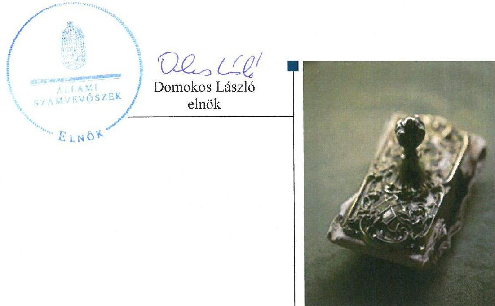
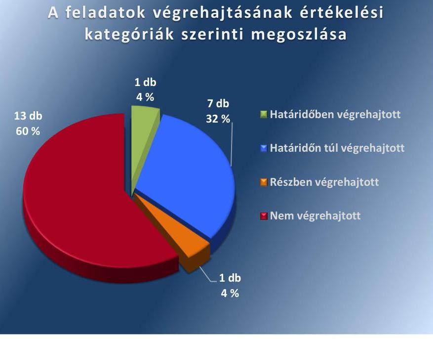

ÁLLAMI
SZÁMVEVŐSZÉK

# Jelentés 

## Utóellenőrzések

Hajdúbagos Község Önkormányzata belső kontrollrendszere kialakításának, egyes kontrolltevékenységek és a belső ellenőrzés múködésének utóellenőrzése 2016.

---

# Jelentés 

## Utóellenőrzések

Hajdúbagos Község Önkormányzata belső kontrollrendszere kialakításának, egyes kontrolltevékenységek és a belső ellenőrzés működésének utóellenőrzése 2016. O3. hó 28. nap

---

# AZ ELLENŐRZÉST FELÜGYELTE: 

DR. BENEDEK MÁRIA felügyeleti vezető

## AZ ELLENŐRZÉST VEZETTE ÉS A VÉGREHAJTÁSÁÉRT FELELŐS:

KAKAS SÁNDOR ellenőrzésvezető

## A PROGRAM ÖSSZEÁLLÍTÁSÁÉRT FELELŐS:

JANIK JÓZSEF LÁSZLÓ osztályvezető

## A TÉMÁHOZ KAPCSOLÓDÓ KORÁBBI SZÁMVEVŐSZÉKI JELENTÉSEK:

- címe: Jelentés Hajdúbagos Község Önkormányzata belső kontrollrendszerének kialakítása, valamint egyes kontrolltevékenységek és a belső ellenőrzés müködése ellenőrzéséről
- sorszáma: 13040

IKTATÓSZÁM: V-1147-037/2016.
TÉMASZÁM: 2181
ELLENŐRZÉS-AZONOSÍTÓ SZÁM: V-075501

---

# TARTALOMJEGYZÉK 

■ ÖSSZEGZÉS ..... 5
■ AZ ELLENŐRZÉS CÉLJA ..... 6
■ AZ ELLENŐRZÉS TERÜLETE ..... 7
■ AZ ELLENŐRZÉS HÁTTERE, INDOKOLTSÁGA ..... 8
■ A JELENTÉS LÉNYEGES KÉRDÉSKÖREI ..... 9
■ ELLENŐRZÉS HATÓKÖRE ÉS MÓDSZEREI ..... 10
■ MEGÁLLAPÍTÁSOK ..... 13
■ MELLÉKLETEK ..... 17
I. Sz. melléklet: Az ÁSZ 13040 számú jelentéséhez kapcsolódó intézkedési terv végrehajtása ..... 17
■ FÜGGELÉK: ÉSZREVÉTELEK ..... 23
■ RÖVIDÍTÉSEK JEGYZÉKE ..... 25

---

.

---

# ÖSSZEGZÉS 

Az ÁSZ ${ }^{1}$ az Önkormányzat² belső kontrollrendszerének kialakítása, valamint egyes kontrolltevékenységek és a belső ellenőrzés müködésének utóellenőrzését 2013. június 18. és 2016. április 18. közötti időszakra végezte el. Megállapította, hogy az intézkedési tervben foglalt feladatok jelentős részét az Önkormányzat nem hajtotta végre, így nem tett megfelelő lépéseket az ÁSZ által korábban feltárt, a belső kontrollrendszert érintő hiányosságok megszüntetésére, ami magas kockázatot hordoz az Önkormányzat szabályozásában, müködtetésének szabályosságában és a felelős vezetői magatartásban.

## Az ellenőrzés társadalmi indokoltsága

Az ÁSZ stratégiájában célul tűzte ki a számvevőszéki munka hasznosulásának javítását. Ezzel összhangban ellenőrzi, hogy az ellenőrzött szervezetek megvalósították-e a korábbi ellenőrzései által feltárt hibák, hiányosságok és szabálytalanságok megszüntetése céljából elkészített intézkedési terveikben foglaltakat. A rendszeres utóellenőrzések hozzájárulnak a szükséges intézkedések tényleges végrehajtáshoz, ezáltal a közpénzügyek rendezettségének javulásához.

## Főbb megállapítások, következtetések

A polgármester ${ }^{3}$ az intézkedési tervet ${ }^{4}$ az ÁSZ tv. ${ }^{5}$-ben rögzített határidőn túl küldte meg az ÁSZ részére.
Az intézkedési tervben meghatározott 22 feladatból egyet határidőben, hetet határidőn túl, egyet részben, 13-at pedig nem hajtottak végre. Így az ÁSZ által korábban az Önkormányzat belső kontrollrendszerének kialakítása, valamint az egyes kontrolltevékenységek és a belső ellenőrzés működésének területén azonosított hiányosságok jelentős része továbbra is fennáll.

Az intézkedési tervben rögzített feladatok végrehajtásáról a Bkr. ${ }^{6}$ által előírt nyilvántartást nem vezették.

---

# AZ ELLENŐRZÉS CÉLJA 

Az ellenőrzés célja annak értékelése volt, hogy a számvevőszéki jelentésben ${ }^{7}$ foglalt intézkedést igénylő megállapításokkal és javaslatokkal összhangban készített intézkedési tervben meghatározott feladatokat az ellenőrzött szervezet végrehajtotta-e.

---

# AZ ELLENŐRZÉS TERÜLETE 

## Az Önkormányzat

Hajdúbagos község Hajdú-Bihar megyében, a Derecskei járásban fekszik, állandó lakosainak száma a $\mathrm{KSH}^{\circledR}$ által közzétett népességi adatok szerint 2015. január 1-jén 1989 fő volt. Az utóellenőrzés idején hivatalban lévő polgármester a 2006. évi önkormányzati választások óta tölti be tisztségét, a jegyző ${ }^{\circledR} 2013$. augusztus 1-jétől látja el közszolgálati feladatait.

Az Önkormányzat a 2014. évi éves költségvetési beszámoló szerint 455,1 millió Ft költségvetési bevételt ért el, valamint 286,2 millió Ft költségvetési kiadást teljesített. Az eszközvagyon értéke 2014. december 31-én 695,7 millió Ft volt.

Az ÁSZ a 2013. évben ellenőrizte az Önkormányzat belső kontrollrendszerének kialakítását, valamint egyes kontrolltevékenységek és a belső ellenőrzés múködését a 2009-2011. közötti időszakra vonatkozóan, az erről szóló 13040. számú je-
lentését 2013. június 18-án tette közzé. Az ellenőrzés célja annak értékelése volt, hogy az Önkormányzat a jogszabályi előírásoknak megfelelően alakította-e ki a belső kontrollrendszert, megfelelően múködtette-e a gazdálkodás folyamatában kulcsszerepet betöltő szakmai teljesítésigazolás és utalvány ellenjegyzés kontrollokat, biztosította-e a belső ellenőrzés szabályos és eredményes múködését.

Az utóellenőrzés - a 2013. június 18-tól a 2016. április 18-ig végrehajtott intézkedéseket figyelembe véve - a polgármester és a jegyző részére megfogalmazott javaslatok hasznosulása céljából készített intézkedési terv végrehajtásának ellenőrzésére, illetve értékelésére terjedt ki.

---

# AZ ELLENŐRZÉS HÁTTERE, INDOKOLTSÁGA 

Az ÁSZ tv. 33. § (1) bekezdése értelmében a számvevőszéki jelentések intézkedést igénylő megállapításaihoz és javaslataihoz kapcsolódóan az ellenőrzött szervezet vezetője intézkedési tervet köteles összeállítani, és az ÁSZ részére megküldeni. Az intézkedési tervben foglaltak megvalósítását az ÁSZ tv. 33. § (7) bekezdésében foglaltak alapján - az ÁSZ utóellenőrzés keretében ellenőrizheti. Az intézkedések megvalósulásának értékelése során az ÁSZ figyelembe veszi az ellenőrzött szervezetek működési feltételeiben, valamint a jogszabályi előírásokban bekövetkezett változásokat.

Az intézkedési tervekben foglalt feladatok hiányos, illetve késedelmes végrehajtása, valamint megvalósításának elmaradása azt mutatja, hogy az ellenőrzések során feltárt hibák, hiányosságok és szabálytalanságok megszüntetése nem kapott kellő hangsúlyt. Ez a szabályszerű működés és a felelős vezetői magatartás vonatkozásában kockázatot hordoz. E kockázatok feltárásával az ÁSZ utóellenőrzési rendszere fokozza a fegyelmet, és igazolja, hogy a közpénzzel való szabályos gazdálkodás felelőssége elől nem lehet kitérni.

## AZ UTÓELLENŐRZÉS VÁRHATÓ HASZNOSULÁSA

Az utóellenőrzés négy szinten hasznosulhat:

- A társadalom szintjén az utóellenőrzés jelzi, hogy a számvevőszéki ellenőrzés megállapításainak van következménye: a hiányosságok megszüntetésére az ellenőrzött szervezet által meghatározott intézkedések végrehajtását is számon kéri az ÁSZ.
- Az ellenőrzött terület szintjén az utóellenőrzés tájékoztatást nyújt a terület döntéshozóinak a hiányosságok kiküszöbölésének jó gyakorlatairól, ezzel lehetőséget biztosítva arra, hogy az ÁSZ ellenőrzési megállapításai, javaslatai a terület nem ellenőrzött szervezeteinek a működése során is hasznosuljanak.
- Az ellenőrzött szervezet szintjén az utóellenőrzés feltárja, hogy a szervezet az intézkedések végrehajtásával hasznosította-e a korábbi ellenőrzési jelentésben a hiányosságok megszüntetése, illetve a kockázatok kezelése érdekében megfogalmazott javaslatokat.
- Az ÁSZ szintjén az utóellenőrzés visszacsatolást ad az ellenőrzési jelentések hasznosulásáról, az intézkedések elmaradása vagy részleges megvalósulása a további ellenőrzésekhez kockázati jelzésként szolgál.

---

# A JELENTÉS LÉNYEGES KÉRDÉSKÖREI 

Az Önkormányzat az intézkedési tervben foglaltakat az elöirt határidőben végrehajtotta-e?

---

# ELLENŐRZÉS HATÓKÖRE ÉS MÓDSZEREI 

## Az ellenőrzés típusa

Megfelelőségi ellenőrzés

## Az ellenőrzött időszak

Az utóellenőrzés alapját képező ÁSZ jelentés közzétételének napjától (2013. június 18.) az ellenőrzésről szóló kiértesítő levél keltének napjáig (2016. április 18.) tartó időszak.

## Az ellenőrzés tárgya

Az ÁSZ tv. 2011. július 1-jei hatálybalépését követően a számvevőszéki jelentésben foglalt intézkedést igénylő megállapításokkal és javaslatokkal összhangban - az Önkormányzat által - készített intézkedési tervben foglaltak végrehajtásának ellenőrzése.

Az ellenőrzés kiterjedt minden olyan körülményre és adatra, amely az ÁSZ jogszabályban meghatározott feladatainak teljesítéséhez, valamint a program végrehajtása folyamán felmerült újabb összefüggések feltárásához szükséges.

## Az ellenőrzött szervezet

Hajdúbagos Község Önkormányzata

## Az ellenőrzés jogalapja

Az ÁSZ törvényben meghatározott feladatkörében ellenőrzi a központi költségvetés végrehajtását, az államháztartás gazdálkodását, az államháztartásból származó források felhasználását és a nemzeti vagyon kezelését.

Az ÁSZ tv. 1. § (3) bekezdése szerint az ÁSZ általános hatáskörrel végzi a közpénzekkel és az állami és önkormányzati vagyonnal való felelős gazdálkodás ellenőrzését.

Az ÁSZ tv. 33. § (7) bekezdése alapján az ÁSZ tv. 33. § (1)-(2) bekezdése szerinti intézkedési tervben foglaltak megvalósítását az ÁSZ utóellenőrzés keretében ellenőrizheti.

---

# Az ellenőrzés módszerei 

Az ÁSZ az ellenőrzést a nemzetközi standardokat irányadónak tekintve az ellenőrzési program ellenőrzési kérdései, az ellenőrzött időszakban hatályos jogszabályok, az ellenőrzés szakmai szabályok és módszertanok figyelembevételével, önállóan végezte.

Az ÁSZ az ellenőrzés ideje alatt az Önkormányzattal történő kapcsolattartást az ÁSZ SZMSZ ${ }^{10}$-ének vonatkozó előírásai alapján biztosította.

Az utóellenőrzés megállapításait elsősorban az ÁSZ rendelkezésére álló, valamint az Önkormányzattól elektronikusan bekért dokumentumok alapozták meg.

Az ellenőrzési bizonyítékként felhasználható adatforrások közé tartoznak egyrészt a szakmai programban felsorolt adatforrások, másrészt minden - az ellenőrzés folyamán feltárt, az ellenőrzés szempontjából információt tartalmazó - dokumentum.

A pénzügyi folyamatokban kulcsszerepet betöltő kontrollokra vonatkozóan az intézkedési tervben foglalt feladatok végrehajtását az államháztartáson kívülre teljesített múködési és felhalmozási célú pénzeszközátadásoknál, az állományba nem tartozók megbízási díjainál, továbbá a külső szolgáltatók által végzett karbantartási, kisjavítási munkákkal kapcsolatos kifizetéseknél 10 elemú véletlen mintavétellel kiválasztott tételek alapján értékelte az ÁSZ. A kiválasztott tételek esetében azt ellenőrizte, hogy az Önkormányzat az intézkedési tervben meghatározott feladatok végrehajtása érdekében biztosította-e a jogszabályok és a belső szabályzatok előírásainak megfelelő múködtetést.

Az intézkedési tervekben előírt feladatok értékelését, azok végrehajthatósága, illetve végrehajtása szempontjából az alábbiak szerint végezte az ÁSZ:
"határidőben végrehajtott" a feladat, ha a teljesítés dokumentáltan, az intézkedési tervben előírt határidőben és tartalommal megtörtént;
"határidőn túl végrehajtott" a feladat, ha annak teljesítése az intézkedési tervben meghatározott módon, de az előírt határidőn túl történt meg;
"részben végrehajtott" a feladat, ha végrehajtása teljes körűen az intézkedési tervben előírt módon nem történt meg;
"nem végrehajtott" a feladat, ha a végrehajtás nem történt meg, vagy amennyiben a teljesítést nem dokumentálták;
"okafogyottá vált" a feladat, ha végrehajtására - meghatározott esemény bekövetkezése, továbbá külső körülmény, a múködést érintő feltétel változása miatt - már nincs szükség, illetve lehetőség, és egyértelmúen megállapítható, hogy az intézkedést szükségessé tevő körülmény a jövőben nem fordulhat elő;
"nem időszerü" az a feladat, amelynek ellenőrzési időszakon belüli végrehajtására azért nem került (kerülhetett) sor, mert az intézkedés alapjául szolgáló esemény nem következett be, de annak jövőbeni előfordulása lehetséges, a végrehajtása nem volt esedékes, vagy a végrehajtás határideje még nem járt le.

---

Az ellenőrzés lefolytatásához az Önkormányzat a tanúsítványok elektronikus kitöltésével, valamint az ÁSZ által kért dokumentumok elektronikus megküldésével szolgáltatott adatokat, amelyek valódiságát és teljes körűségét a polgármester által tett teljességi és hitelességi nyilatkozat igazolta. Az így rendelkezésre bocsátott adatok, információk kontrollja az ellenőrzés keretében történt.

---

# MEGÁLLAPÍTÁSOK 

## Az Önkormányzat az intézkedési tervben foglaltakat az előírt határidőben végrehajtotta-e?

Összegző megállapítás

Az Önkormányzat az intézkedési tervben meghatározott 22 feladatból egyet határidőben, hetet határidőn túl, egyet részben, 13-at pedig nem hajtott végre. Az intézkedési tervben rögzített feladatok végrehajtásáról a Bkr. által előírt nyilvántartást nem vezették.

Az intézkedési tervben meghatározott feladatokat, határidőket, az ÁSZ jelentés javaslatainak címzettjét és a feladatok végrehajtását az I. számú melléklet mutatja be.

Az ÁSZ a jelentésében a polgármester részére kettő, a jegyző részére 20 javaslatot fogalmazott meg. A polgármester által összeállított és az ÁSZ részére megküldött intézkedési tervben a hiányosságok, szabálytalanságok megszüntetésére 22 feladatot határoztak meg. A feladatok elvégzésének felelőseként két esetben a polgármestert, 20 esetben pedig a jegyzőt jelölték meg.

Az intézkedési tervben tervezett feladatok végrehajtásának értékelési kategóriák szerinti megoszlását az 1. ábra szemlélteti.

1. ábra

A feladatok végrehajtásának értékelési kategóriák szerinti megoszlása

Forrás: ÁSZ

---

# HATÁRIDŐBEN VÉGREHAJTOTT feladat: 

1. A jegyző - az intézkedési tervben előírt, 2013. december 15-i határidőn belül - intézkedett az éves ellenőrzési terv Képviselő-testület ${ }^{11}$ elé terjesztéséről annak érdekében, hogy azt a Képviselőtestület a Mötv. ${ }^{12}$-ben meghatározott határidőben jóváhagyja.

## HATÁRIDŐN TÚL VÉGREHAJTOTT feladatok:

2. A jegyző az intézkedési tervben meghatározott 2013. szeptember 30-ai határidőn túl, 2013. november 25-én új Hivatali SZMSZ ${ }^{13}$-t készített és kezdeményezte a polgármesternél a Képviselő-testület elé terjesztését. A Hivatali SZMSZ az Ávr.-nek megfelelően tartalmazta a szervezeti egységek engedélyezett létszámát, a nevesített valamennyi munkakörhöz tartozó feladat- és hatáskört, a hatáskörök gyakorlásának módját, a helyettesítés rendjét, valamint az ezekhez kapcsolódó felelősségi szabályokat.
3. A jegyző az intézkedési tervben meghatározott 2013. október 15ei határidőn túl, 2015. augusztus 27-én készítette el és 2015. szeptember 4-én léptette hatályba a Számv. tv. ${ }^{14}$ alapján az önköltség számítási szabályzatot ${ }^{15}$.
4. A jegyző az intézkedési tervben meghatározott 2013. szeptember 30-ai határidőn túl elkészítette és 2015. szeptember 4-én hatályba léptette a főkönyvi és az analitikus nyilvántartások egyeztetése dokumentálásának módjára vonatkozó előírásokat tartalmazó számlarendet ${ }^{16}$.
5. A jegyző az intézkedési tervben meghatározott 2013. szeptember 30-ai határidőn túl 2013. december 19-én kidolgozta a Kttv. ${ }^{17}$ alapján a teljesítményértékelés alapját képező teljesítménykövetelményeket.
6. A jegyző az intézkedési tervben meghatározott 2013. szeptember 30-ai határidőn túl, 2015. augusztus 27-én az Ávr. alapján kiegészítette a teljesítésigazolás, érvényesítés dokumentációs részletszabályaival a gazdálkodással kapcsolatos belső előírásokat. Az előírásokat tartalmazó Ávr. ${ }^{18}$ alapján kiegészített gazdálkodási szabályzat ${ }^{19} 2015$. szeptember 4-től volt hatályos.
7. A jegyző az intézkedési tervben meghatározott 2013. szeptember 30-ai határidőn túl, 2015. augusztus 27-én rögzítette az Ávr. alapján az előzetes írásbeli kötelezettségvállalást nem igénylő kifizetések rendjét a belső szabályozásban. Az előzetes írásbeli kötelezettségvállalást nem igénylő kifizetések rendjét tartalmazó gazdálkodási szabályzat 2015. szeptember 4-től volt hatályos.
8. A jegyző az intézkedési tervben előírt 2013. október 31-i határidőn túl 2015. augusztus 27-én az Info tv. ${ }^{20}$ alapján elkészítette a közérdekű adatok megismerésére irányuló igények teljesítésének rendjét rögzítő szabályzatot, amely 2015. szeptember 4-től volt hatályos, valamint ugyanebben a szabályzatban megállapította a kötelezően közzéteendő adatok nyilvánosságra hozatalának rendjét.

---

# RÉSZBEN VÉGREHAJTOTT feladat: 

9. A jegyző az adatbiztonság érvényesülésére vonatkozó feladatot részben hajtotta végre, mert az intézkedési tervben előírt 2013. október 31-i határidőt követően 2015. szeptember 4-ével szabályozta a közszolgálati nyilvántartást tartalmazó számítógépes rendszer technikai védelmét, illetve 2015. szeptember 15-én névre szólóan számítógép használati- és jogosultsági felhatalmazásokat adott ki. Ugyanakkor a Polgármesteri Hivatal ${ }^{21}$ egészére vonatkozóan nem biztosította az adatbiztonság érvényesülését, mert nem szabályozta a hozzáférési jogosultságok megállapítására és módosítására, azok ellenőrzésére vonatkozó eljárásrendet, a pénzügyi-számviteli szoftverváltozások ellenőrzésére, tesztelésére vonatkozó eljárásokat, a feldolgozott adatok mentési eljárásait, és nem jelölte ki a mentések felelőseit.

## NEM VÉGREHAJTOTT feladatok:

10. Az ellenőrzött dokumentumok alapján a polgármester nem intézkedett arról, hogy az Önkormányzat nevében történő kötelezettségvállalásra az Áht. ${ }^{22}$ szerint - kivéve az Ávr.-ben meghatározott eseteket - minden esetben kizárólag a pénzügyi ellenjegyzés után, a pénzügyi teljesítés esedékességét megelőzően, írásban kerüljön sor.
11. A polgármester - a továbbra is fennálló hiányosságok miatt - a Mötv. előírásának ellenére nem kísérte figyelemmel az Önkormányzat gazdálkodásának szabályszerűségét, valamint nem gondoskodott a belső kontrollrendszerre és a belső ellenőrzés múködésére vonatkozó jogszabályi rendelkezések be nem tartása, valamint a szakmai teljesítésigazolás, illetve az utalvány ellenjegyzés kontrollokkal összefüggésben feltárt hiányosságok, szabálytalanságok tekintetében az esetleges munkajogi felelősséggel kapcsolatos körülmények kivizsgálásáról.
12. A jegyző nem intézkedett arról, hogy a Polgármesteri Hivatalban a gazdasági szervezet vezetőjeként az Ávr.-ben előírt képesítéssel rendelkező személy kerüljön kinevezésre.
13. A jegyző nem alakította ki és nem múködtette a Bkr.-nek megfelelően a kockázatkezelési rendszert.
14. A jegyző a Bkr. előírásának ellenére nem biztosította a folyamatba épített, előzetes, utólagos és vezetői ellenőrzést.
15. A jegyző a Bkr. előírásának ellenére nem szabályozta a Polgármesteri Hivatal tevékenységeire vonatkozó beszámolási eljárásokat.
16. A jegyző nem alakította ki és nem múködtette a Bkr. előírásainak ellenére a Polgármesteri Hivatal tevékenységének, a célok megvalósításának nyomon követését biztosító rendszert, amelynek része az operatív tevékenységek keretében megvalósuló folyamatos és eseti nyomon követés is.
17. A jegyző az ellenőrzött dokumentumok alapján nem jelölt ki teljesítés igazolót az Ávr.-nek megfelelően, így nem intézkedett arról, hogy a teljesítésigazolásra - az Ávr. előírásai szerint - kijelölt személy az Ávr.-ben foglaltaknak megfelelően a kötelezettségvállalási

---

szabályzatban előírt módon, ellenőrizhető okmányok alapján ellenőrizze a kiadások teljesítésének jogosságát, összegszerűségét, ellenszolgáltatást is magában foglaló kötelezettségvállalás esetében a szerződés, megrendelés teljesítését, és azt az Ávr.-ben foglalt módon igazolja.
18. Az ellenőrzött dokumentumok alapján a jegyző nem intézkedett arról, hogy a kifizetéseket megelőzően az érvényesítő - az Ávr. szerint - a teljesítésigazolás alapján - az Ávr. szerinti esetben annak hiányában is - ellenőrizze az összegszerűségnek, a fedezet meglétének és a megelőző ügymenetben az Áht., az Áhsz. ${ }^{23}$ és Áhsz. ${ }^{24}$, az Ávr. előírásai és a belső szabályzatokban foglaltak betartását.
19. A jegyző az ellenőrzött dokumentumok alapján nem intézkedett arról, hogy az Ávr.-ben foglalt kötelezettségvállalási nyilvántartást naprakészen vezessék, és az utalványrendeleteken az Ávr.-ben foglaltaknak megfelelően tüntessék fel a kötelezettségvállalás nyilvántartási számát.
20. A jegyző nem gondoskodott a belső ellenőrzés kialakításáról és megfelelő működtetéséről. Az ellenőrzött időszakban a belső ellenőrzés megszervezésére vonatkozó megállapodást nem kötött, így az intézkedési tervben meghatározott feladatot - „intézkedik a Bkr.-ben foglaltaknak megfelelően arról, hogy a belső ellenőrzési tevékenység megszervezésére vonatkozó megállapodásban rendelkezzenek a Bkr.-ben foglalt tevékenységek és kötelezettségek el látásának módjáról" - nem hajtotta végre.
21. A jegyző nem gondoskodott a belső ellenőrzés kialakításáról és megfelelő működtetéséről. Az ellenőrzött időszakban belső ellenőrzési jelentések nem készültek, így a jegyző az intézkedési tervben meghatározott feladatot - „intézkedik, hogy a belső ellenőrzésekről készült jelentésekben rögzített hiányosságok felszámolására a Bkr.-nek megfelelő intézkedési tervek készüljenek" - nem hajtotta végre.
22. A jegyző nem gondoskodott a belső ellenőrzés kialakításáról és megfelelő működtetéséről. Az ellenőrzött időszakban belső ellenőrzési jelentések nem készültek, ennek következtében az elvégzett belső ellenőrzésekről a Bkr. szerinti nyilvántartást nem vezették, valamint a belső ellenőrzés nem követte nyomon a belső ellenőrzések alapján megtett intézkedéseket és nem vezetett nyilvántartást a belső ellenőrzési jelentésekben tett megállapításokról, javaslatokról, a vonatkozó intézkedési tervekről és azok végrehajtásáról. Továbbá nem vezettek nyilvántartást a Bkr. szerint a külső ellenőrzések javaslatai alapján készült intézkedési tervek végrehajtásáról.

A jegyző az intézkedési tervben rögzített feladatok végrehajtásáról a Bkr. által előírt nyilvántartást nem vezette.

---

# MELLÉKLETEK

I. SZ. MELLÉKLET: AZ ÁSZ 13040 SZÁMÚ JELENTÉSÉHEZ KAPCSOLÓDÓ INTÉZKEDÉSI TERV VÉGREHAJTÁSA

|  5. | Intézkedési terv alapján elvégzendő feladat | Az intézkedési tervben meghatározott határidő | Az ÁSZ 13040es számú jelentős javaslatának címzettje 3.  |
| --- | --- | --- | --- |
|   | 1. | 2. | 3.  |
|   |  | Határidőben végrehajtott feladat |   |
|  1. | A jegyző intézkedik az éves ellenőrzési terv Kép-viselő-testület elé terjesztéséről annak érdekében, hogy azt a Képviselő-testület az Mótv. 119. § (5) bekezdésében és a 8kr. 32. § (4) bekezdésében előírt határidőn belül hagyja jóvá. | 2013. december 15. | jegyző  |
|   |  |  | A jegyző a feladatot az intézkedési tervben előírt határidőn belül teljesítette azzal, hogy intézkedett az éves ellenőrzési terv Képviselő-testület elé terjesztéséről annak érdekében, hogy azt a Képviselő-testület az Mótv. 119. § (5) bekezdésében és a 8kr. 32. § (4) bekezdésében előírt tárgyévet megelőző év december 31-ig, határidőn belül hagyja jóvá. A Képviselő-testület az Önkormányzat 2014. évre vonatkozó belső ellenőrzési tervét a 187/2013.(XII.12.) számú határozatával a 2013. december 12-ei ülésén jóváhagyta.  |
|   |  | Határidőn túl végrehajtott feladatok |   |
|  2. | A jegyző módosítja a Hivatali SZMSZ-t, és kezdeményezi a polgármesternél a módosítás Kép-viselő-testület elé terjesztését annak érdekében, hogy az az Ávr. 13. § (1) bekezdés c), e) és g) pontjaiban foglaltaknak megfelelően tartalmazza az ellátandó alaptevékenységet szabályozó jogszabályok megjelölését, a szervezeti egységek engedélyezett létszámát, a nevesített valamennyi munkakörhöz tartozó feladat- és hatáskört, a hatáskörök gyakorlásának módját, a helyettesítés rendjét, valamint az ezekhez kapcsolódó felelősségi szabályokat. | 2013. szeptember 30. SZMSZ módosítás és annak Képviselő-testület által történő elfogadása | jegyző  |
|  3. | A jegyző elkészíti az Áhsz. 8. § (4) bekezdés c) pontjában foglaltak alapján az önköltségszámítás rendjére vonatkozó belső szabályzatot. | 2013. október 15. | jegyző  |
|   |  |  | A jegyző a feladatot az intézkedési tervben meghatározott határidőn túl hajtotta végre, mert 2013. november 25-én készítette el az új Hivatali SZMSZ-t és kezdeményezte a polgármesternél Képviselő-testület elé terjesztését. A Hivatali SZMSZ-t 2013. november 28-án fogadta el a Képviselő-testület. A Hivatali SZMSZ az Ávr.-nek megfelelően tartalmazta a szervezeti egységek engedélyezett létszámát, a nevesített valamennyi munkakörhöz tartozó feladat- és hatáskört, a hatáskörök gyakorlásának módját, a helyettesítés rendjét, valamint az ezekhez kapcsolódó felelősségi szabályokat. A Hivatali SZMSZ nem tartalmazta az alaptevékenységre vonatkozó jogszabályok megjelölését. Az intézkedési tervben rögzített feladat ezen részének végrehajtása okafogyottá vált, mert a 399/2014. (XII.21. Korm. rendelet 45.§ (1) bekezdés 2. pontja 2014. december 31-ei hatállyal módosította az Ávr. 13. § (1) bekezdését, és a "valamint az alaptevékenységet szabályozó jogszabályok" szövegrészt hatályon kívül helyezte.  |
|   |  |  | A jegyző a feladatot az intézkedési tervben meghatározott határidőn túl hajtotta végre, mert a Számv. tv. előírásai alapján az önköltségszámítás rendjére vonatkozó belső szabályzatot 2015. augusztus 27-én készítette el és 2015. szeptember 4-én léptette hatályba.  |

---

|  4. | A jegyző kiegészíti a Számv. tv. 161. § (1)-(3) bekezdéseiben és az Áhsz. 49. §-ában foglaltak alapján a számlarendet a főkönyv és az analitikus nyilvántartások egyeztetése dokumentálásának módjára vonatkozó előírásokkal. | 2013. szeptember 30. | jegyző | A jegyző a feladatot az intézkedési tervben meghatározott határidőn túl hajtotta végre, mert új számlarendet készített, amit 2015. szeptember 4-én léptetett hatályba. A számlarend tartalmazta a főkönyvi és analitikus nyilvántartások egyeztetése és dokumentálásának módjára vonatkozó előírásokat.  |
| --- | --- | --- | --- | --- |
|  5. | A jegyző kidolgozza a Kttv. 130. § (1)-(3) bekezdéseiben előírtak szerinti teljesítményértékelés alapját képező teljesítménykövetelményeket. | 2013. szeptember 30. | jegyző | A jegyző a feladatot az intézkedési tervben meghatározott határidőn túl hajtotta végre, mert a Kttv. 130. § (1)-(3) bekezdéseiben előírtak alapján a teljesítményértékelés alapját képező teljesítménykövetelményeket 2013. december 19-én dolgozta ki.  |
|  6. | A jegyző kiegészíti a gazdálkodással kapcsolatos belső előírásokat és feltételeket a teljesítésigazolás, érvényesítés dokumentációs részletszabályaival az Ávr. 13. § (2) bekezdés a) pontjának megfelelően. | 2013. szeptember 30. | jegyző | A jegyző a feladatot az intézkedési tervben meghatározott határidőn túl hajtotta végre, mert 2015. augusztus 27-én egészítette ki az Ávr. 13. § (2) bekezdés a) pontja alapján a teljesítésigazolás, érvényesítés dokumentációs részletszabályaival a gazdálkodással kapcsolatos belső előírásokat. A kiegészített gazdálkodási szabályzat 2015. szeptember 4-étől volt hatályos.  |
|  7. | A jegyző belső szabályzatban rögzíti az Ávr. 53. § (2) bekezdése alapján az előzetes írásbeli kötelezettségvállalást nem igénylő kifizetések rendjét. | 2013. szeptember 30. | jegyző | A jegyző a feladatot az intézkedési tervben meghatározott határidőn túl hajtotta végre, mert a gazdálkodási szabályzatban 2015. augusztus 27-én rögzítette az előzetes írásbeli kötelezettségvállalást nem igénylő kifizetések rendjét. A szabályzat 2015. szeptember 4-étől volt hatályos.  |
|  8. | A jegyző szabályzatban állapítja meg az Info tv. 35. § (3) bekezdésben előírtaknak megfelelően a kötelezően közzéteendő adatok nyilvánosságra hozatalának rendjét, és elkészíti az Info tv. 30. § (6) bekezdésében és az Ávr. 13. § (2) bekezdés h) pontjában foglaltak alapján a közérdekű adatok megismerésére irányuló igények teljesítésének rendjét rögzítő szabályzatot. | 2013. október 31. | jegyző | A jegyző az intézkedési tervben előírt 2013. október 31-i határidőn túl 2015. augusztus 27-én az Info tv. alapján elkészítette a közérdekű adatok megismerésére irányuló igények teljesítésének rendjét rögzítő szabályzatot, amely 2015. szeptember 4-től volt hatályos, valamint ugyanebben a szabályzatban megállapította a kötelezően közzéteendő adatok nyilvánosságra hozatalának rendjét.  |
|   |  |  | Részben végrehajtott feladat |   |
|  9. | A jegyző biztosítja az Info tv. 7. § (2)-(3) be-kezdéseinek megfelelően az adatbiztonság érvényesülését, szabályozza a hozzáférési jogosultságok megállapítására és módosítására, azok ellenőrzésére vonatkozó eljárásrendet, a pénz- | 2013. október 31. | jegyző | Határidőn túl végrehajtott feladat:  |
|   |  |  | A jegyző az intézkedési tervben előírt 2013. október 31-i határidőn túl 2015. szeptember 4-ével szabályozta a közszolgálati nyilvántartást tartalmazó számítógépes rendszer technikai védelmét, illetve 2015. szeptember 15-én névre szólóan számítógép használati- és jogosultsági felhatalmazásokat adott ki a betöltött munkakörökkel összefüggésben használható programok és számítógépes rendszerekre vonatkozóan. |   |

---

|  1. | Intézkedési terv alapján elvégzendő feladat | Az intézkedési tervben meghatározott határidő | Az ÁSZ 13040-es számú jelentés javaslatának címzettje | A feladat végrehajtása  |
| --- | --- | --- | --- | --- |
|   | 1. | 2. | 3. | 4.  |
|   | ügyi-számviteli szoftverváltozások ellenőrzésére, tesztelésére vonatkozó eljárásokat, a feldolgozott adatok mentési eljárásait, és kijelöli a mentések felelőseit. |  |  | Nem végrehajtott feladat:
A jegyző azonban a Polgármesteri Hivatal egészére vonatkozóan nem biztosította az adatbiztonság érvényesülését, mert nem szabályozta a hozzáférési jogosultságok megállapítására és módosítására, azok ellenőrzésére vonatkozó eljárásrendet, a pénzügyiszámviteli szoftverváltozások ellenőrzésére, tesztelésére vonatkozó eljárásokat, a feldolgozott adatok mentési eljárásait, és nem jelölte ki a mentések felelőseit.  |
|   |  |  | Nem végrehajtott feladatok |   |
|  10. | A polgármester intézkedik arról, hogy az Önkormányzat nevében történő kötelezettségvállalásra az új Áht. 37. § (1) bekezdésében foglaltaknak megfelelően - az Ávr. 53. §-ában meghatározott kivételekkel - kizárólag a pénzügyi ellenjegyzés után, a pénzügyi teljesítés esedékességét megelőzően, írásban kerüljön sor. | 2013. szeptember 30.
- majd ezt követően folyamatosan | polgármester | Az ellenőrzött dokumentumok alapján a polgármester nem hajtotta végre a feladatot, mert nem intézkedett arról, hogy az Önkormányzat nevében történő kötelezettségvállalásra az Áht. 37. § (1) bekezdésében foglaltaknak megfelelően - az Ávr. 53. §-ában meghatározott kivételekkel - kizárólag a pénzügyi ellenjegyzés után, a pénzügyi teljesítés esedékességét megelőzően, írásban kerüljön sor.  |
|  11. | A polgármester a Mótv. 115. § (1) bekezdésében foglaltak alapján figyelemmel kíséri az önkormányzat gazdálkodásának szabályszerűségét. A Mótv. 67. § f) pontja alapján gondoskodik a belső kontrollrendszerre és a belső ellenőrzés működésére vonatkozó jogszabályi rendelkezések be nem tartása, valamint a szakmai teljesítésigazolás, illetve az utalvány ellenjegyzés kontrollokkal összefüggésben feltárt hiányosságok, szabálytalanságok tekintetében az esetleges munkajogi felelősséggel kapcsolatos körülmények kivizsgálásáról, és a vizsgálat eredményének függvényében megteszi a szükséges munkajogi intézkedéseket. | 2013. szeptember 30. | polgármester | Az ellenőrzött dokumentumok alapján polgármester a Mótv. 115. § (1) bekezdésében foglalt előírásának ellenére nem kísérte figyelemmel az Önkormányzat gazdálkodásának szabályszerűségét. A belső kontrollrendszerre és a belső ellenőrzés működésére vonatkozó jogszabályi rendelkezések be nem tartása, valamint a szakmai teljesítésigazolás, illetve az utalvány ellenjegyzés kontrollokkal összefüggésben feltárt hiányosságok, szabálytalanságok tekintetében az esetleges munkajogi felelősséggel kapcsolatos körülmények kivizsgálásáról nem gondoskodott.  |
|  12. | A jegyző intézkedik arról, hogy a gazdasági szervezet vezetőjeként az Ávr. 12. § (1)-(2) bekezdéseiben előírt képesítéssel rendelkező személy kerüljön kinevezésre. | 2013. szeptember 15. | jegyző | A jegyző nem hajtotta végre a feladatot, mert nem intézkedett arról, hogy a Polgármesteri Hivatalban a gazdasági szervezet vezetőjeként az Ávr. 12. § (1)-(2) bekezdésében előírt képesítéssel rendelkező személy kerüljön kinevezésre.  |

---

|  1. | Intézkedési terv alapján elvégzendő feladat | Az intézkedési tervben meghatározott határidő | Az ÁSZ 13040-es számú jelentés javaslatának címzettje 3. | A feladat végrehajtása  |
| --- | --- | --- | --- | --- |
|  1. |  | 2. |  | 4.  |
|  13. | A jegyző kialakítja és működteti a Bkr. 3. § b) pontja és a 7. §-a szerinti kockázatkezelési rendszert. | 2013. október 31.
- majd ezt követően folyamatosan. | jegyző | A jegyző az intézkedési tervben előírt feladatot nem végezte el, mert nem alakította ki és nem is működtette a Bkr. 3. § b) pontja és a 7. §.-a szerinti kockázatkezelési rendszert.  |
|  14. | A jegyző biztosítja minden tevékenységre vonatkozóan a folyamatba épített, előzetes, utólagos és vezetői ellenőrzést a Bkr. 8. § (2) bekezdése alapján. | 2013. augusztus 15.
- majd ezt követően folyamatosan. | jegyző | A jegyző az intézkedési tervben rögzített feladatot nem hajtotta végre, mivel nem biztosította a folyamatba épített, előzetes, utólagos és vezetői ellenőrzést a Bkr. 8. § (2) bekezdése alapján.  |
|  15. | A jegyző szabályozza a Bkr. 8. § (4) bekezdés c) pontja alapján a Polgármesteri Hivatal tevékenységeire vonatkozó beszámolási eljárásokat. | 2013. október 15. | jegyző | A jegyző nem hajtotta végre a feladatot, mert a Polgármesteri Hivatal tevékenységeire vonatkozó beszámolási eljárásokat a Bkr. 8. § (4) bekezdés c) pontja alapján nem szabályozta.  |
|  16. | A jegyző kialakítja és működteti a Bkr. 3. § e) pontjában és a 10. §-ában előírtak alapján a Polgármesteri Hivatal tevékenységének, a célok megvalósításának nyomon követését biztosító rendszerét, amelynek része az operatív tevékenységek keretében megvalósuló folyamatos és eseti nyomon követés is. | 2013. november 30.
- majd ezt követően folyamatosan. | jegyző | A jegyző az intézkedési tervben rögzített feladatot nem hajtotta végre, mert nem alakította ki és nem működtette a Bkr. 3. § e) pontjában és a 10. §-ában előírtak ellenére a Polgármesteri Hivatal tevékenységének, a célok megvalósításának nyomon követését biztosító rendszerét, amelynek része az operatív tevékenységek keretében megvalósuló folyamatos és eseti nyomon követése is.  |
|  17. | A jegyző intézkedik, hogy a teljesítésigazolásra - az Ávr. 57. § (4) bekezdésében foglalt előírás szerint - kijelölt személyek az Ávr. 57. § (1) bekezdésében foglaltaknak megfelelően a kötelezettségvállalási szabályzatban előírt módon, ellenőrizhető okmányok alapján ellenőrizzék a kiadások teljesítésének jogosságát, összegszerűségét, ellenszolgáltatást is magában foglaló kötelezettségvállalás esetében a szerződés, megrendelés teljesítését, és azt az Ávr. 57. § (3) bekezdésében foglalt módon igazolják. | 2013. augusztus 15.
- majd ezt követően folyamatosan | jegyző | A jegyző az ellenőrzött dokumentumok alapján nem jelölt ki teljesítés igazolót az Ávr.nek megfelelően, így nem intézkedett arról, hogy a teljesítésigazolásra - az Ávr. előírásai szerint - kijelölt személy az Ávr.-ben foglaltaknak megfelelően a kötelezettségvállalási szabályzatban előírt módon, ellenőrizhető okmányok alapján ellenőrizze a kiadások teljesítésének jogosságát, összegszerűségét, ellenszolgáltatást is magában foglaló kötelezettségvállalás esetében a szerződés, megrendelés teljesítését, és azt az Ávr.-ben foglalt módon igazolja.  |

---

|  1. | Intézkedési terv alapján elvégzendő feladat | Az intézkedési tervben meghatározott határidő | Az ÁSZ 13040-es számú jelentés javaslatának címzettje 3. | A feladat végrehajtása  |
| --- | --- | --- | --- | --- |
|  1. |  | 2. |  | 4.  |
|  18. | A jegyző intézkedik, hogy a kifizetéseket megelőzően – az Ávr. 58. § (1) bekezdése szerint – a teljesítésigazolás alapján – az Ávr. 57. § (3) bekezdése szerinti esetben annak hiányában is – az összegszerűségnek, a fedezet meglétének és a megelőző ügymenetben az új Áht., az Áhsz. az Ávr. előírásai és a belső szabályzatokban foglaltak betartásának az ellenőrzése történjen meg. | 2013. augusztus 15. – majd ezt követően folyamatosan | jegyző | Az ellenőrzött dokumentumok alapján a jegyző nem intézkedett arról, hogy a kifizetéseket megelőzően az érvényesítő – az Ávr. szerint – a teljesítésigazolás alapján – az Ávr. szerinti esetben annak hiányában is – ellenőrizze az összegszerűségnek, a fedezet meglétének és a megelőző ügymenetben az Áht., az Áhsz., az Ávr. előírásai és a belső szabályzatokban foglaltak betartását.  |
|  19. | A jegyző intézkedik, hogy az Ávr. 56. § (1) bekezdésében foglalt kötelezettségvállalási nyilvántartást naprakészen vezessék, és az utalványrendeleteken az Ávr. 59. § (3) bekezdés f) pontjában foglaltaknak megfelelően tüntessék fel a kötelezettségvállalás nyilvántartási számát. | 2013. augusztus 15. – majd ezt követően folyamatosan | jegyző | Az ellenőrzött dokumentumok alapján a jegyző nem intézkedett arról, hogy az Ávr. 56. § (1) bekezdésében foglalt kötelezettségvállalási nyilvántartást naprakészen vezessék, és az utalványrendeleteken az Ávr. 59. § (3) bekezdés f) pontjában foglaltaknak megfelelően tüntessék fel a kötelezettségvállalás nyilvántartási számát.  |
|  20. | A jegyző intézkedik arról, hogy a Bkr. 16. § (4) bekezdésének megfelelően a belső ellenőrzési tevékenység megszervezésére vonatkozó megállapodásban rendelkezzenek a Bkr. 22. § (1)-(2) bekezdéseiben foglalt tevékenységek és kötelességek ellátásának módjáról. | 2013. december 15. | jegyző | A jegyző nem gondoskodott a belső ellenőrzés kialakításáról és megfelelő működtetéséről. Az ellenőrzött időszakban a belső ellenőrzés megszervezésére vonatkozó megállapodást nem kötött, így az intézkedési tervben meghatározott feladatot nem hajtotta végre.  |
|  21. | A jegyző intézkedik arról, hogy a belső ellenőrzésekről készült jelentésekben rögzített hiányosságok felszámolására a Bkr. 45. §-nak megfelelően készüljön intézkedési terv. | 2013. december 15. | jegyző | A jegyző nem gondoskodott a belső ellenőrzés kialakításáról és megfelelő működtetéséről. Az ellenőrzött időszakban belső ellenőrzési jelentések nem készültek, így a jegyző az intézkedési tervben meghatározott feladatot nem hajtotta végre.  |

---

|  1. | Intézkedési terv alapján elvégzendő feladat | Az intézkedési tervben meghatározott határidő | Az ÁSZ 13040-es számú jelentés javaslatának címzettje 3. | A feladat végrehajtása  |
| --- | --- | --- | --- | --- |
|  22. | A jegyző kezdeményezi, hogy a Bkr. 22. § (2) bekezdés b) és e) pontja, valamint az 50. § alapján vezessenek nyilvántartást az elvégzett belső ellenőrzésekről, továbbá a belső ellenőrzés a Bkr. 21. § (2) bekezdés d) pontjában foglaltak szerint nyomon követi a belső ellenőrzési jelentések alapján megtett intézkedéseket, és nyilvántartást vezet a Bkr. 14. § (1) bekezdése szerint a külső ellenőrzések javaslatai alapján készült intézkedési tervek végrehajtásáról, illetve a 47. §ban foglalt előírásokat figyelembe véve a belső ellenőrzési jelentésekben tett megállapításokról, javaslatokról, a vonatkozó intézkedési tervekről és azok végrehajtásáról. | 2013. december 15.
- majd ezt követően folyamatosan | jegyző | A jegyző nem gondoskodott a belső ellenőrzés kialakításáról és megfelelő működtetéséről. Az ellenőrzött időszakban belső ellenőrzési jelentések nem készültek, ennek következtében az elvégzett belső ellenőrzésekről a Bkr. szerinti nyilvántartást nem vezették, valamint a belső ellenőrzés nem követte nyomon a belső ellenőrzések alapján megtett intézkedéseket és nem vezetett nyilvántartást a belső ellenőrzési jelentésekben tett megállapításokról, javaslatokról, a vonatkozó intézkedési tervekről és azok végrehajtásáról. Továbbá nem vezettek nyilvántartást a Bkr. szerint a külső ellenőrzések javaslatai alapján készült intézkedési tervek végrehajtásáról.  |

---

# FÜGGELÉK: ÉSZREVÉTELEK 

A jelentéstervezetet a Számvevőszék 15 napos észrevételezésre megküldte az ellenőrzött szervezet vezetőjének az ÁSZ tv. 29. §* (1) bekezdése előírásának megfelelően.

Az ellenőrzött szervezet vezetője az ÁSZ tv. 29. § (2) bekezdésében foglalt észrevételezési jogával nem élt, a jelentéstervezetre észrevételt nem tett.

[^0]
[^0]:    * 29. § (1) Az Állami Számvevőszék az ellenőrzési megállapításait megküldi az ellenőrzött szervezet vezetőjének vagy az általa megbízott személynek, és annak, akinek személyes felelősségét állapította meg.
    (2) Az ellenőrzött szervezet vezetője és a felelősként megjelölt személy az ellenőrzés megállapításaira tizenöt napon belül írásban észrevételt tehet.
    (3) Az Állami Számvevőszék az észrevételre a beérkezésétől számított harminc napon belül írásban válaszol. A figyelembe nem vett észrevételeket köteles a jelentésben feltüntetni, és megindokolni, hogy azokat miért nem fogadta el.

---

.

---

# RÖVIDÍTÉSEK JEGYZÉKE 

${ }^{1}$ ÁSZ
${ }^{2}$ Önkormányzat
${ }^{3}$ polgármester
${ }^{4}$ intézkedési terv
${ }^{5}$ ÁSZ tv.
${ }^{6}$ Bkr.
${ }^{7}$ számvevőszéki jelentés
${ }^{8} \mathrm{KSH}$
${ }^{9}$ jegyző
${ }^{10}$ ÁSZ SZMSZ
${ }^{11}$ Képviselő-testület
${ }^{12}$ Mötv.
${ }^{13}$ Hivatali SZMSZ
${ }^{14}$ Számv. tv.
${ }^{15}$ önköltség számítási szabályzat
${ }^{16}$ számlarend
${ }^{17}$ Kttv.
${ }^{18}$ Ávr.
${ }^{19}$ gazdálkodási szabályzat
${ }^{20}$ Info tv.
${ }^{21}$ Polgármesteri Hivatal
${ }^{22}$ Áht.
${ }^{23}$ Áhsz. 1
${ }^{24}$ Áhsz. 2

Állami Számvevőszék
Hajdúbagos Község Önkormányzata
Hajdúbagos Község Önkormányzatának polgármestere
Hajdúbagos Község Önkormányzata Képviselő-testületének 91/2013. (VIII.15.) határozatával elfogadott intézkedési terve
2011. évi LXVI. törvény az Állami Számvevőszékről (hatályos 2011. július 1.-jétől) 370/2011. (XII.31.) Korm. rendelet a költségvetési szervek belső kontrollrendszeréről és belső ellenőrzéséről (hatályos 2012. január 1-jétől) az ÁSZ 13040-es számú jelentése (Elérhető a www.asz.hu honlapon.)
Központi Statisztikai Hivatal
Hajdúbagos Község Önkormányzatának jegyzője
Állami Számvevőszék Szervezeti és Működési Szabályzata
Hajdúbagos Község Önkormányzatának Képviselő-testülete
2011. évi CLXXXIX. törvény Magyarország helyi önkormányzatairól (hatályos 2012. január 1-jétől)

Hajdúbagosi Polgármesteri Hivatal Szervezeti és Működési Szabályzata (hatályos 2013. december 1-jétől)
2000. évi C. törvény a számvitelről (hatályos 2001. január 1-jétől)

Hajdúbagos Község Önkormányzata Polgármesteri hivatalának Önköltség számítási szabályzata (hatályos 2015. szeptember 4-étől)
Hajdúbagos Község Önkormányzata Számlarendje (hatályos 2015. szeptember 4-étől)
2011. évi CXCIX. törvény a közszolgálati tisztviselőkről (hatályos 2012. március 1-jétől)
368/2011. (XII.31.) Korm. rendelet az államháztartásról szóló törvény végrehajtásáról (hatályos 2012. január 1-jétől)
Hajdúbagos Község Önkormányzata Gazdálkodási szabályzata (hatályos 2015. szeptember 4-étől)
2011. évi CXII. törvény az információs önrendelkezési jogról és az információ szabadságról (hatályos 2011. január 1-jétől)
Hajdúbagos Község Önkormányzatának Polgármesteri Hivatala
2011. évi CXCV. törvény az államháztartásról (hatályos 2012. január 1-jétől)

249/2000. (XII.24.) Korm. rendelet az államháztartás szervezetei beszámolási és könyvvezetési kötelezettségének sajátosságairól (hatályos 2013. december 31-ig) 4/2013. (I.11.) Korm. rendelet az államháztartás számviteléről (hatályos 2014. január 1-jétől)

---

# ÁLLAMI SZÁMVEVŐSZÉK 

1052 Budapest, Apáczai Csere János utca 10.
Levélcím: 1364 Budapest 4. Pf. 54
Telefon: +36 14849100 Telefax: +36 14849200
www.asz.hu