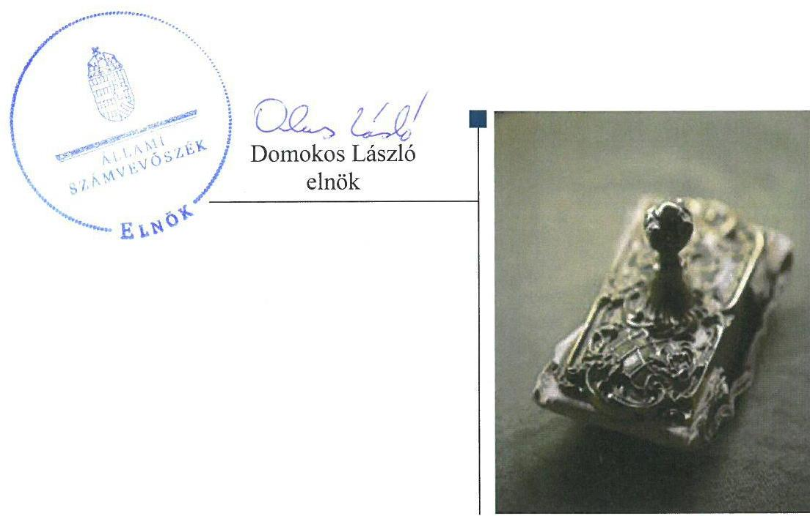
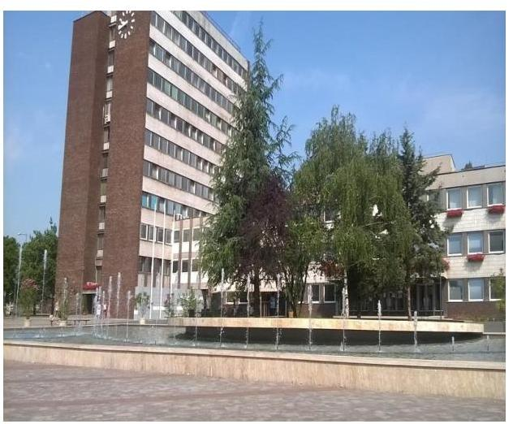
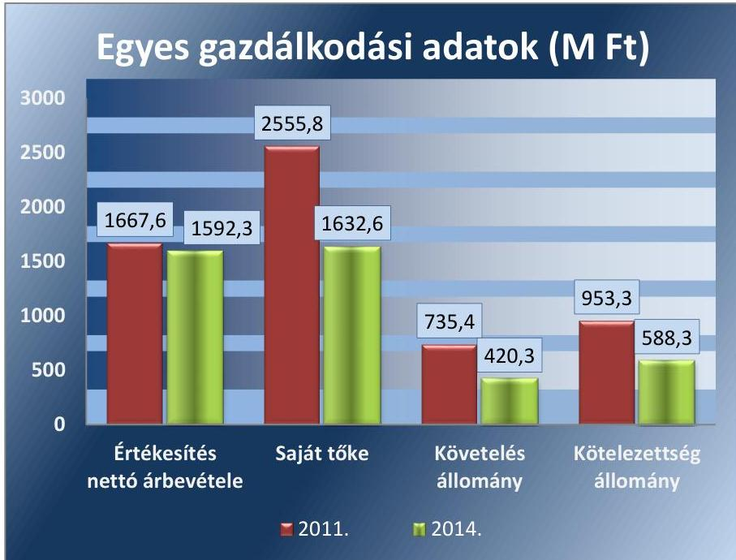
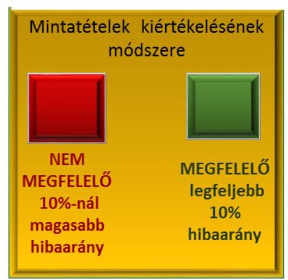

# Jelentés 

## Az önkormányzatok gazdasági társaságai

Az önkormányzatok többségi tulajdonában lévő gazdasági társaságok gazdálkodásának ellenőrzése - DVG Dunaújvárosi Vagyonkezelő Zrt.
2016.

---

# Jelentés 

## Az önkormányzatok gazdasági társaságai

Az önkormányzatok többségi
tulajdonában lévő gazdasági társaságok gazdálkodásának ellenőrzése - DVG Dunaújvárosi Vagyonkezelő Zrt.
2016. október hó 7 nap

---

# AZ ELLENŐRZÉST FELÜGYELTE:

## MAKKAI MÁRIA felügyeleti vezető

## AZ ELLENŐRZÉST VEZETTE ÉS A VÉGREHAJTÁSÁÉRT FELELŐS:

## NEMESVÁRI-HORTHY ESZTER ellenőrzésvezető

## A PROGRAM ÖSSZEÁLLÍTÁSÁÉRT FELELŐS:

## JANIK JÓZSEF LÁSZLÓ osztályvezető

IKTATÓSZÁM: V-1101-205/2016.

TÉMASZÁM: 2135

ELLENŐRZÉS-AZONOSÍTÓ SZÁM: V070764

Jelentéseink az Országgyűlés számítógépes hálózatán és az Interneta a www.asz.hu címen is olvashatóak.

---

# TARTALOMJEGYZÉK 

ÖSSZEGZÉS ..... 5
AZ ELLENŐRZÉS CÉLJA ..... 7
AZ ELLENŐRZÉS TERÜLETE ..... 8
AZ ELLENŐRZÉS HÁTTERE, INDOKOLTSÁGA ..... 10
A JELENTÉS LÉNYEGES KÉRDÉSKÖREI ..... 11
ELLENŐRZÉS HATÓKÖRE ÉS MÓDSZEREI ..... 12
MEGÁLLAPÍTÁSOK ..... 14
JAVASLATOK ..... 23
MELLÉKLETEK ..... 25
I. Sz. melléklet: Értelmező szótár. ..... 25
II. Sz. melléklet: A DVG Zrt. településüzemeltetési feladatai 2011-2014. ..... 27
III. Sz. melléklet: A DVG Zrt. eredményének alakulása 2011-2014. ..... 28
FÜGGELÉK: ÉSZREVÉTELEK ..... 29
RÖVIDÍTÉSEK JEGYZÉKE ..... 31

---

.

---

# ÖSSZEGZÉS 

Az Állami Számvevőszék befejezte a DVG Dunaújvárosi Vagyonkezelő Zrt. 20112014. évekre kiterjedő megfelelőségi ellenőrzését. Dunaújváros Megyei Jogú Város Önkormányzata a településüzemeltetési feladat ellátását szabályszerűen szervezte meg, tulajdonosi joggyakorlása megfelelő volt. A DVG Dunaújvárosi Vagyonkezelő Zrt. vagyongazdálkodása szabályozott és szabályszerű volt, kötelezettségei összességében nem jelentettek kockázatot a müködésére. A településüzemeltetési közfeladatok körében a bevételeit és ráfordításait megfelelően számolta el.

## Az ellenőrzés társadalmi indokoltsága

Az Állami Számvevőszék kiemelt célja, hogy a helyi önkormányzatok gazdálkodásában rejlő pénzügyi kockázatok feltárásával, az államháztartáson kívülre nyújtott költségvetési támogatások és ingyenes vagyonjuttatások, valamint az államháztartáson kívül múködő feladat-ellátó rendszerek ellenőrzéseivel hozzájáruljon ahhoz, hogy a közpénzeket az államháztartáson kívül múködő szervezetek is átlátható, rendezett módon használják fel.

Magyarországon az intézmény-centrikus közfeladat-ellátás jellemző, de egyre jelentősebb a költségvetésen kívüli feladatellátás térnyerése. Ennek legfontosabb szereplői - a nonprofit szervezetek mellett - az önkormányzati tulajdonú gazdasági társaságok. Az önkormányzatok szervezetalakítási szabadságának következménye, hogy a korábban is vállalati formában múködő közszolgáltatások mellett, mind a kötelező, mind az önként vállalt feladatok ellátásában a gazdasági társaságok kiemelt fontosságú szerephez jutottak.

## Főbb megállapítások, következtetések, javaslatok

Az Önkormányzat 2011-2014. években nem rendelkezett az Ötv.-ben és Mötv.-ben előírt gazdasági programmal. A 2013-2018. évekre elkészítette vagyongazdálkodási tervét. A településüzemeltetési közfeladatokat a 100\%-os tulajdonában lévő DVG Zrt.-n keresztül látta el, a feladatok megszervezéséről az ellenőrzött időszakot megelőzően döntött. A településüzemeltetési feladatok ellátására évente két alkalommal kötött keretszerződést a DVG Zrt.-vel.

A tulajdonosi jogok gyakorlását a Közgyűlés Vagyongazdálkodási rendeletben meghatározta. A tulajdonosi jogokat a rendelet előírásaival összhangban lévő alapító okirat alapján az arra jogosultak gyakorolták. A tulajdonosi joggyakorlási jogosítványok átadására nem került sor. Az igazgatóság az alapító okiratban foglaltaknak megfelelően évente egyszer az éves beszámolóhoz kapcsolódóan jelentés készítési kötelezettségének eleget tett. A felügyelőbizottság ügyrendjét ugyan nem határozta meg, azonban az alapító okiratnak megfelelően a DVG Zrt. éves beszámolóját megtárgyalta, arról a 2011. évi éves beszámoló kivételével írásbeli jelentést készített, az adózott eredmény felhasználására a Közgyűlésnek javaslatot tett.

A DVG Zrt. vagyongazdálkodása szabályozott és szabályszerű volt, rendelkezett a Számv. tv.-ben előírt szabályzatokkal. A számviteli politikát rendszeresen felülvizsgálták, a Számv. tv. módosításait átvezették. A leltározási szabályzatban a Számv. tv. előírásai ellenére nem határozták meg, hogy a leltározást milyen időszakonként hajtják végre. A beszámolók mérlegsorainak értékét a főkönyvi könyvelés és analitikus nyilvántartások adatai alátámasztották, a mérleget leltárral támasztották alá.

A kötelezettségek állománya összességében nem jelentett kockázatot a közfeladat ellátására, múködésére, azonban a rövid lejáratú kötelezettségek határidőben történő teljesítése nem volt biztosított.

A településüzemeltetési feladatok bevételeinek és ráfordításainak egyértelmú elhatárolásához szükséges előírásokat meghatározták. Az önköltségszámítás gyakorlata megfelelt az előírásoknak. Az értékesítés nettó árbevételének, az anyagjellegú ráfordításoknak, a beruházási és felújítási kiadásoknak és az értékcsökkenési leírásnak az elszámolása

---

megfelelő volt. Az eszközök pótlása az elszámolt értékcsökkenésből képzett forrásoknak megfelelő mértékben valósult meg.

---

# AZ ELLENŐRZÉS CÉLJA 

Az ellenőrzés célja annak értékelése volt, hogy: az önkormányzat vagyongazdálkodási tevékenysége során szabályszerűen gyakorolta-e tulajdonosi jogait; a gazdasági társaság szabályozottsága, gazdálkodása és vagyongazdálkodási tevékenysége, bevételeinek és ráfordításainak elszámolása megfelelt-e a jogszabályi és tulajdonosi előírásoknak; a gazdasági társaság kötelezettségállománya jelent-e kockázatot a múködésre, valamint a gazdálkodás átláthatósága és elszámoltathatósága érdekében biztosítva volt-e a szolgáltatás dijának megalapozottsága szabályszerű önköltségszámítással.

---

# **AZ ELLENŐRZÉS TERÜLETE**

### **Dunaújváros Megyei Jogú Város Önkormányzata és a DVG Dunaújvárosi Vagyonkezelő Zrt.**

**A DVG ZRT.**1 jogutódlás mellett 1992. január 1-jén alakult a Dunaújvárosi Ingatlankezelő és Városgazdálkodási Vállalat átalakulásával, amelybe a 2000. évben beolvadt a DUNAQUATHERM Rt, mely beolvadó társaságnak az átvevő DVG Zrt. általános jogutódja lett. A DVG Zrt. az ellenőrzött időszakban az Önkormányzat2 100%-os tulajdonában áll.

A DVG Zrt. főtevékenysége a vagyonkezelés. Az Ötv3 8. § (1) bekezdésében és az Mötv.4 13. § 2. pontjában meghatározott helyi közszolgáltatásokat, illetve településüzemeltetési közfeladatokat látott el az Önkormányzattal megkötött keretszerződések alapján. A DVG Zrt. keretszerződésekben meghatározott 2011-2014. években végzett településüzemeltetési feladatait a II. melléklet mutatja be. Munkavállalóinak létszáma 2011. évi 101 főről 2014. évi 227 főre növekedett, elsősorban a közfoglalkoztatottak számának növekedése miatt.

A DVG Zrt. feladatait saját vagyonával látta el, az Önkormányzattól vagyonkezelésbe, illetve használatba vett vagyonnal nem rendelkezett. A DVG Zrt. gazdálkodásának főbb adatait az 1. ábra mutatja be:

*A DVG Zrt. a tevékenységét – a 2013. év kivételével – pozitív eredménynyel zárta. A DVG. Zrt. 2014. december 31-én egy gazdasági társaságban*

---

minősített többséget biztosító részesedéssel (Duna-Park Kft.), két gazdasági társaságban többségi befolyást biztosító részesedéssel (Dunaújvárosi Víz-, Csatorna-Hőszolgáltató Kft.,"DVG Biztonságtechnikai" Kft. "f.a.") rendelkezett. Egy gazdasági társasággal társult vállalati viszonyban állt (M8Dunahíd Nonprofit Kft. "v.a."), egyéb részesedési viszonyt megtestesítő befektetéssel két gazdasági társaságban rendelkezett (Első Hazai Energiaportfólió Nyrt., Alfa-Nova Kft.).

A főtevékenysége és a településüzemeltetési közfeladatok díjainak árainak meghatározása kapcsán jogszabály nem írt elő árképzési, díj-megállapítási kötelezettséget.

Dunaújváros népessége 2011-ben 47357 fő, 2014-ben 46320 fő volt*. Területe 5267 hektár (52,7 négyzetkilométer), a városi utak hossza 120,3 km, területe $707286 \mathrm{~m}^{2}$, városi járdák hossza 140,7 km, területe 308930 $\mathrm{m}^{2}$, a városi parkok területe $1636910 \mathrm{~m}^{2}$, az erdők területe $3463000 \mathrm{~m}^{2}$ volt**.

A DVG Zrt.-nél az öt-tagú Igazgatóság ${ }^{5}$ személyi összetételében 3 alkalommal történt változás, a vezérigazgató személye két alkalommal változott, a jelenlegi vezérigazgató 2012. június 1-je óta tölti be tisztségét. Az Önkormányzat polgármestere személyében nem, a jegyző személyében egy alkalommal, 2014. április 10-től volt változás. A polgármester a 2010. évi önkormányzati választásoktól tölti be tisztségét.

A DVG Zrt. nem minősült az Áht. ${ }^{6}$ 2. § I) pontja, valamint a 479/2009/EK rendelet ${ }^{7}$ szerint nevesített kormányzati szektorba sorolt egyéb szervezetnek, ezért adatszolgáltatási kötelezettség az ellenőrzött időszakban nem terhelte.

[^0]
[^0]:    *Központi Statisztikai Hivatal adatai
    **Az Önkormányzat honlapjának tájékoztató adatai szerint (2016.).

---

# AZ ELLENŐRZÉS HÁTTERE, INDOKOLTSÁGA 

AZ ÖNKORMÁNYZATI TULAJDONÚ GAZDASÁGI TÁRSASÁGOK ellenőrzése kiemelten fontos a vagyon megőrzése, megóvása érdekében, valamint a kormányzati szektor elszámolásaiban megjelenő önkormányzati tulajdonú gazdálkodó szervezetek esetében, amelyekkel szemben alapvető követelmény, hogy gazdálkodásuk, működésük szabályszerű, az általuk szolgáltatott adatok minél megbízhatóbbak legyenek. A feladat/közfeladat-ellátás költségeinek, ráfordításainak alakulása, színvonala hatással van a lakosság elégedettségére.

A TÖRVÉNYALKOTÁS SZÁMÁRA - az észlelt problémák, szabálytalanságok, vagy egyéb nem kívánatos jelenségek felszínre kerülésével - az ellenőrzés megállapításai segítséget nyújthatnak az államháztartáson kívüli feladat/közfeladat-ellátás értékeléséhez, jogszabályi keretei pontosításához, átláthatóságot biztosító szabályozásához. Meghatározhatóvá válnak az önkormányzati feladatellátásban részt vevő államháztartáson kívüli szervezeteknek - az önkormányzat költségvetését, pénzügyi helyzetét is befolyásoló - kockázatai, lehetővé válik ezen kockázatok csökkentése. Ellenőrzéseink feltárhatják, hogy az önkormányzat feladat-ellátási kötelezettségének szabályszerűen tett-e eleget, a feladatellátáshoz rendelt vagyonkezelésbe vett és saját vagyon működtetését az elvárható gondossággal, szabályszerűen szervezte-e meg és a tulajdonosi felügyelete hozzájárult-e a feladatellátásához. Az ellenőrzés rávilágíthat arra, hogy a gazdasági társaság a feladat-ellátási, közszolgáltatási szerződésben foglaltak betartásával, a vagyon használatával biztosította-e a szolgáltatás folytatásának feltételeit, a feladat ellátását. Ezzel az ellenőrzöttek és a helyi döntéshozók számára visszajelzést ad feladatszervezési, feladat-ellátási kockázataikról, alapot ad a meglévő hibák megszüntetéséhez, a jobb feladatellátás biztosításához. Fokozza a fegyelmet, igazolja, hogy lejárt a következmények nélküli ellenőrzések időszaka. Az ÁSZ értékteremtő rend kialakításához és megőrzéséhez hozzájáruló tevékenysége pozitív hatással van a szervezetről kialakított összkép formálására.

---

# A JELENTÉS LÉNYEGES KÉRDÉSKÖREI 

1. Az önkormányzat közfeladat megszervezéséről szóló döntése, valamint tulajdonosi joggyakorlása szabályszerű volt-e?
2. A gazdasági társaság vagyongazdálkodása szabályszerű volt-e, kötelezettségállománya jelent-e kockázatot a müködésre, illetve a közfeladat ellátására?
3. A gazdasági társaságnál az ellátott közfeladat bevételei és ráfordításai elszámolása, valamint az önköltségszámítás szabályszerű volt-e?

---

# ELLENŐRZÉS HATÓKÖRE ÉS MÓDSZEREI 

## Az ellenőrzés típusa

megfelelőségi ellenőrzés

## Az ellenőrzött időszak

2011. január 1-jétől 2014. december 31-ig terjedő időszak

## Az ellenőrzés tárgya

A gazdasági társaság feletti tulajdonosi joggyakorlás, valamint a gazdasági társaság gazdálkodásának szabályozottsága és szabályszerűsége.

Az ellenőrzés kiterjedt minden olyan körülményre és adatra, amely az ÁSZ jogszabályban meghatározott feladatainak teljesítéséhez, valamint a program végrehajtása folyamán felmerült újabb összefüggések feltárásához szükséges.

## Az ellenőrzött szervezet

Dunaújváros Megyei Jogú Város Önkormányzata és a DVG Dunaújvárosi Vagyonkezelő Zrt.

## Az ellenőrzés jogalapja

Az ellenőrzés jogszabályi alapját az ÁSZ tv. 1. § (3) bekezdése és 5. § (3)(4)-(5) bekezdései képezték.

## Az ellenőrzés módszerei

Az ellenőrzést a nemzetközi standardokat irányadónak tekintve az ellenőrzési program ellenőrzési kérdései, az ellenőrzött időszakban hatályos jogszabályok, az ellenőrzés szakmai szabályok és módszertanok figyelembe vételével végezzük.

Az ellenőrzés ideje alatt az ellenőrzött szervezettel történő kapcsolattartást az ÁSZ Szervezeti és Múködési Szabályzatának vonatkozó előírásai alapján biztosítjuk.

Az ellenőrzési kérdések megválaszolásához szükséges bizonyítékok megszerzése a következő ellenőrzési eljárások alkalmazásával történt: megfigyelés, kérdésfeltevés (információkérés), összehasonlítás, valamint

---

2. ábra

elemző eljárás. Az ellenőrzési bizonyítékként felhasználható adatforrások közé tartoznak egyrészt a szakmai programban felsorolt adatforrások, másrészt adatforrás lehet még minden - az ellenőrzés folyamán - feltárt, az ellenőrzés szempontjából információkat tartalmazó dokumentum.

Az ellenőrzést a kérdésekre adott válaszok kiértékelésével, valamint a megjelölt adatforrások, a csatolt tanúsítványok felhasználásával, továbbá az adott időszakban hatályos jogszabályok figyelembe vételével folytattuk le.

A DVG Zrt. bevételei, ráfordításai és az értékcsökkenés elszámolása szabályszerűségét a településüzemeltetési közfeladat körében keletkezett bevételek és ráfordítások főkönyvi adatbázisaiból kiválasztott mintatételek alapján értékeltük. A DVG Zrt. által ellátott településüzemeltetési közfeladatokról a II. melléklet tartalmaz kimutatást.

A bevételek és ráfordítások elszámolása a szabályszerű működést véletlen mintavétellel ellenőriztük. A mintavétellel ellenőrzött területek esetében minden egyes tétel vonatkozásában a szabályszerűségre vonatkozó kérdéseket tettünk fel, amelyek eredménye összesítésre került. ,Megfelelőnek" értékeltünk egy ellenőrzött területet, amennyiben 95\%-os bizonyossággal a teljes sokaságban a hibaarány legfeljebb 10\%, nem megfelelőnek, amennyiben 10\%-nál magasabb arányt képviselt. A beruházási, felújítási kiadásokat tételesen ellenőriztük.

---

# 1. Az önkormányzat közfeladat megszervezéséről szóló döntése, valamint tulajdonosi joggyakorlása szabályszerű volt-e? 

Összegző megállapítás

Az Önkormányzat a közfeladat-ellátás megszervezéséről és módjáról szóló döntését az ellenőrzött időszakot megelőzően hozta, amely az ellenőrzött időszak végig hatályban volt. A tulajdonosi jogok gyakorlása szabályszerű volt.
1.1. számú megállapítás

Az Önkormányzat a közfeladat-ellátás megszervezéséről és módjáról szóló döntését az ellenőrzött időszakot megelőzően hozta, amely az ellenőrzött időszakban végig hatályban volt.

GAZDASÁGI PROGRAMMAL az Önkormányzat 2011-2014. években nem rendelkezett az Ötv. 91. § (1) és az Mötv. 116. § (1) bekezdésében előírtak ellenére.

KÖZÉP- ÉS HOSSZÚ TÁVÚ VAGYONGAZDÁLKODÁSI TERVET az Önkormányzat az Nvtv. ${ }^{8}$ 2012. január 1-jétől hatályba lépő 9. § (1) bekezdésében előírtak szerint 2013-2018. évekre vonatkozóan elkészítette, amelyet a Közgyűlés ${ }^{9}$ határozatával elfogadott.

## A TELEPÜLÉSÜZEMELTETÉSI KÖZFELADATOKAT

az Önkormányzat a DVG Zrt.-n keresztül látta el. A feladatellátás kereteit, a DVG Zrt. ellátandó feladatait a DVG Zrt. és az Önkormányzat között évente két alkalommal megkötött közszolgáltatási keretszerződésben ${ }^{10}$ rögzítették. A közszolgáltatási keretszerződésben rögzített feladatokra a szerződésben meghatározott keretösszeg terhére egyedi munkamegrendelések történtek a keretösszeg kimerítési kötelezettsége nélkül. A keretszerződés mellékletei tartalmazták az ellátandó feladatok mennyiségét, azok egységárait. A közszolgáltatási keretszerződésekben a meghatározott és a DVG Zrt. által ellátott közfeladatokról a II. melléklet tartalmaz kimutatást.

AZ ALAPÍTÓ OKIRAT ${ }^{11}$ a Gt. ${ }^{12} 12 . \S$ (1) bekezdés c) pontjának, a $\mathrm{Ptk}_{1}{ }^{13} 54$ § (1), (2) bekezdésének, valamint a $\mathrm{Ptk}_{2}{ }^{14} 3: 5$. §-ban előírtaknak megfelelően tartalmazta a DVG Zrt. fő tevékenységét és valamennyi tevékenységét (Gt.), tevékenységi körét (Ptk. ${ }_{1}$ ), fő tevékenységét (Ptk. ${ }_{2}$ ). Az Alapító Okirat a Gt. 19. § és a $\mathrm{Ptk}_{2}$ 3.109. §-ának megfelelően döntési jogosultságokat határozott meg. Az igazgatóság feladatai között határozta meg többek között - a mérleg, a vagyonkimutatás elkészítését, a nyereség felosztására javaslat tételét, évente egyszer jelentés készítését a társaság vagyoni helyzetéről, üzletpolitikájáról.

---

# 1.2. számú megállapítás 

## A tulajdonosi jogok gyakorlása szabályszerű volt.

## A TULAJDONOSI JOGOK GYAKORLÁSÁRA VO-

NATKOZÓ ELŐÍRÁSOKAT a Közgyűlés az Ötv. 80. § (1) bekezdésében és az Mótv. 107. § -ában kapott felhatalmazás alapján a Vagyongazdálkodási rendeletében ${ }^{15}$ határozta meg. A Vagyongazdálkodási rendeletben meghatározták a Közgyűlés kizárólagos hatáskörébe tartozó, az önkormányzat egyszemélyes illetőleg 50\%-ot meghaladó tulajdoni részesedéssel rendelkező gazdasági társaságai esetében hatáskörébe tartozó jogait. A Közgyűlés kizárólagos joga volt jogi személy, jogi személyiség nélküli szervezet létrehozására, létesítő okiratának módosítására vonatkozó döntés. A Közgyűlés az önkormányzat egyszemélyes, illetőleg 50\%-ot meghaladó tulajdoni részesedéssel rendelkező gazdasági társaságai esetében többek között - jogosult volt dönteni az alapító okirat megállapításáról, módosításáról, az alaptőke (törzstőke) leszállításáról, felemeléséről, a társaság vezető tisztségviselői kinevezéséről, megválasztásáról, felmentéséről, visszahívásáról. A nem nevesített döntési hatáskörök gyakorlására a polgármester volt jogosult a 22. § (3) bekezdésében meghatározott bizottság véleményének kikérése mellett. A tulajdonosi jogokat a Vagyongazdálkodási rendelet előírásaival összhangban lévő alapító okirat alapján az arra jogosultak gyakorolták. A tulajdonosi joggyakorlási jogosítványok átadására a 2011-2014. években nem került sor.

A Közgyűlés az Önkormányzat gazdasági társaságaiban meglévő többségi üzletrészének védelme érdekében az Nvtv. 5. § (2) bekezdés b) pontja alapján 34/2012. (VI.08.) önkormányzati rendeletével módosította Vagyongazdálkodási rendeletét, amellyel az Önkormányzat tulajdonában álló nemzeti vagyonból nemzetgazdasági szempontból kiemelt jelentőségű forgalomképtelen törzsvagyon elemnek, vagyis forgalomképtelen törzsvagyonnak minősítette gazdasági társaságaiban meglévő többségi üzletrészét.

AZ IGAZGATÓSÁG az Alapító Okiratban foglaltaknak megfelelően évente egyszer az éves beszámolóhoz kapcsolódóan jelentés készítési kötelezettségének eleget tett, továbbá időszakosan is készített jelentéseket a Felügyelőbizottság ${ }^{16}$ részére.

A FELÜGYELŐBIZOTTSÁG a Gt. 34. § (1) bekezdésében, valamint a Ptk.: 3:121. § (1) bekezdésében előírtaknak megfelelően három tagból állt. Ügyrendjét a Gt. 34. § (4) bekezdésében, illetve a Ptk.: 3:122. § (3) bekezdésében foglaltak ellenére nem állapította meg. A Felügyelőbizottság 2011-2014. között öt alkalommal ülésezett és az Alapító Okiratnak megfelelően a DVG Zrt. éves beszámolóját megtárgyalta, arról a 2011.évi beszámoló kivételével írásbeli jelentést készített, az adózott eredmény felhasználására a Közgyűlésnek javaslatot tett.

JAVADALMAZÁSI SZABÁLYZATTAL ${ }^{17}$ a DVG Zrt. az ellenőrzött időszakban rendelkezett a Taktv. ${ }^{18} 5 . \S$ (3) bekezdésben foglaltaknak megfelelően. A Javadalmazási szabályzatban meghatározták a vezérigazgatóra és a tisztségviselőkre vonatkozó javadalmazási elveket és szabályokat, a vezérigazgató és a vezetőállású munkavállalók jogviszonyának

---

megszűntetése esetén járó juttatásokat, a prémiumfizetés és a költségtérítések szabályait. A Javadalmazási szabályzatot a Közgyűlés határozatával elfogadta.

AZ ÁRKÉPZÉS meghatározására a településüzemeltetési közfeladatok kapcsán jogszabály nem írt elő kötelezettséget. A díjak megállapításához a DVG Zrt. évente nyújtott be feladatterveket, a feladatokhoz tartozó egységárakkal együtt. A II. melléklet szerinti közszolgáltatások elvégzésére a rendelkezésre álló keretösszegeket a közszolgáltatási keretszerződésekben határozták meg.

ELLENŐRZÉS lehetőségével - amelyet az Ötv. 92. § (11) bekezdés b) pontja, 2012-től az Áht. 70. § (1) bekezdés d) pontja biztosított - az Önkormányzat egy alkalommal élt a DVG Zrt.-nél. Az ellenőrzés tárgya egy személyautó 2011. évi éves használatának szabályszerűségi, pénzügyi ellenőrzése volt.

A DVG Zrt. a Számv. tv. ${ }^{19}$ szerint elkészített éves beszámoló Közgyűlés elé terjesztésével számolt be feladatai ellátásáról. Egyéb beszámolási kötelezettséget a DVG Zrt. részére a Közgyűlés sem a Vagyongazdálkodási rendeletben, sem az Alapító Okiratban nem írt elő.

Osztalék kifizetésére nem került sor. A Közgyűlés határozataiban döntött az éves beszámolók elfogadásakor a DVG Zrt. eredményének eredménytartalékba helyezéséről, illetve a veszteség rendezéséről. Garancia és kezesség-vállalására nem került sor a tulajdonosi joggyakorló részéről.

# 2. A gazdasági társaság vagyongazdálkodása szabályszerű volt-e, kötelezettségállománya jelent-e kockázatot a múködésre, illetve a közfeladat ellátására? 

Összegző megállapítás

A DVG Zrt. vagyongazdálkodása szabályszerű volt. Kötelezettségállománya összességében nem jelentett kockázatot a múködésre, közfeladata ellátására.
2.1. számú megállapítás

A DVG Zrt. rendelkezett a Számv. tv.-ben előírt szabályzatokkal, azonban a leltározási szabályzata nem teljes körűen felelt meg a Számv. tv. előírásainak.

AZ ÜZLETI TERVEKET a DVG Zrt. az ellenőrzött időszakra vonatkozóan készített, amelyeket a Közgyűlés elé terjesztett. Az éves üzleti tervek a tárgyévi feladatok, források részletezésén túl tartalmazták a tervezett árbevételeket tevékenységenként, valamint a ráfordításokat költség nemenként. A Közgyűlés az üzleti terveket határozatával elfogadta.

A SZÁMVITELI POLITIKÁT ${ }^{20}$ elkészítették a Számv. tv. 14. § (4) bekezdése szerint, valamint elkészítették a 14. § (5) bekezdés a)-d) pontjai szerint a számviteli politika keretében a leltározási szabályzatot ${ }^{21}$, az értékelési szabályzatot ${ }^{22}$, az önköltség-számítási szabályzatot ${ }^{23}$, valamint a pénzkezelési szabályzatot ${ }^{24}$. A DVG Zrt. rendelkezett a

---

### 2.2. számú megállapítás

Számv. tv. 161. § (1) bekezdésében előírt számlarenddel ${ }^{25}$. A számlarendben foglaltakat alátámasztó - a Számv. tv. 161. § (2) bekezdés d) pontja szerinti - bizonylati rendet külön szabályzatban, úgynevezett bizonylati szabályzatban ${ }^{26}$ rögzítették.

A Számviteli politikát évente felülvizsgálták és szükség szerint módosították. A DVG Zrt. 2012. januártól számviteli politikájában rögzítette a Számv. tv. 69. § (3) bekezdés szerinti, a leltározás gyakoriságára vonatkozó előírásokat, miszerint a folyamatos mennyiségi nyilvántartás mellett három évenként leltározást kell végezni. A leltározási szabályzatban évenkénti leltározási kötelezettséget írtak elő, amely megfelelt a Számv. tv, előírásainak. A számviteli politika és a leltározási szabályzat leltározás gyakoriságára vonatkozó előírásai egymással nem álltak összhangban.

## A DVG Zrt. vagyongazdálkodása a jogszabályi rendelkezéseknek és a belső előírásoknak megfelelt.

## A VAGYONELEMEK ELKÜLÖNÍTETT NYILVÁNTARTÁSÁT, a vagyonváltozások kimutatását az analitikus és a főkönyvi nyilvántartási rendszer biztosította. A beszámolók mérlegsorainak értékét a főkönyvi könyvelés és analitikus nyilvántartások adatai alátámasztották. Leltárral alátámasztották az ellenőrzött időszak alatt készített éves beszámolókat, az eszközök és készletek mennyiségi, értékbeni felvételét biztosították. A készleteket és a bérbe adott eszközöket évenként tételes, mennyiségi felvétellel leltározták, a befektetett eszközökről egyeztetéssel készítettek leltárt.

A leltározási szabályzat 1.-es pontjában meghatározott alábbi alaki követelményeknek nem feleltek meg a leltárak 2011-2014. években, mert esetenként
$\longrightarrow$ nem tartalmazták a bizonylati sorszámokat, a leltár megkezdésének, befejezésének pontos időpontját, a leltározás végrehajtásáért felelős személy, a leltár ellenőrzésével megbízott személy aláírását.
A DVG Zrt. főbb mérlegadatait az 1. táblázat mutatja be.

1. táblázat

A DVG ZRt. FŐBB MÉRLEGADATAI (MFt)

| Megnevezés | 2011.01 .01 | 2011.12 .31 | 2012.12 .31 | 2013.12 .31 | 2014.12 .31 |
| :--: | :--: | :--: | :--: | :--: | :--: |
| I.Befektetett eszközök | 3070,1 | 2911,5 | 2949,7 | 1658,0 | 1662,5 |
| -ebből: Tárgyi eszközök | 2326,5 | 2295,8 | 2335,1 | 1182,5 | 1204,1 |
| II.Forgó eszközök | 1108,8 | 754,2 | 368,6 | 461,6 | 510,4 |
| -ebből követelések | 1098,4 | 735,4 | 330,1 | 332,2 | 420,3 |
| IV.Aktív időbeli elhatárolások | 2,4 | 0,4 | 11,0 | 6,8 | 67,1 |
| Eszközök összesen | 4181,3 | 3666,1 | 3329,3 | 2126,4 | 2240,0 |
| IV. Saját tőke | 2523,2 | 2555,8 | 2572,5 | 1461,7 | 1632,6 |
| - ebből jegyzett tőke | 2271,7 | 2271,7 | 2271,7 | 2271,7 | 1104,6 |
| ebből Mérleg szerinti eredmény | 49,5 | 32,6 | 16,7 | $-1110,8$ | 144,7 |
| V. Céltartalékok | 4,1 | 15,0 | 1,4 | 0,2 | 11,0 |
| VI. Kötelezettségek | 1382,0 | 953,3 | 676,8 | 657,0 | 588,4 |
| VII. Passzív időbeli elhatárolások | 272,0 | 142,0 | 78,6 | 7,5 | 8,0 |
| Források összesen | 4181,3 | 3666,1 | 3329,3 | 2126,4 | 2240,0 |

---

Az eszközérték 2011. január 1. és 2014. december 31-e közötti 1 941,3 M Ft-tal (46,43 \%-kal) csökkent. Ezt a befektetett eszközök 1 407,6 M Ftos (45,85 \%-os), a forgóeszközök 598,4 M Ft-os (53,97 \%-os) - ezen belül a követelések 678,1 M Ft-os (61,74 \%-os) - csökkenése okozta, az aktív időbeli elhatárolások 64,7 M Ft-os emelkedése mellett. A befektetett eszközökön belül a tárgyi eszközök értéke 1 122,4 M Ft-tal (48,24 \%-kal) csökkent, melyet a víziközművek Vksztv. ${ }^{27}$ szerinti 2013-as térítés nélküli átadása magyaráz (1 187,3 M Ft értékben). Ezen kívül az ellenőrzött időszakban az elszámolt értékcsökkenés értékével közel azonos összegű pótló beruházások, felújítások valósultak meg.

A DVG Zrt. forrásainak 1 941,3 M Ft-os (46,43 \%-os) összérték csökkenésén belül, a saját tőke értéke 890,6 M Ft-tal (35,30 \%-kal) csökkent a céltartalékok 6,9 M Ft-os (168,29, \%-os) növekedése és a kötelezettségek 793,6 M Ft-os (57,42 \%-os) csökkenése mellett. A saját tőke értékének csökkenését legnagyobb mértékben a 2014-es, összességében 1 167,1 M Ft jegyzett tőke leszállítás okozta, mely a 2013. évi kiugró mértékű negatív mérleg szerinti eredmény miatt vált szükségessé. Ezt mérsékelte a mérleg szerinti eredmény 95,2 M Ft-os és eredménytartalék 166,0 M Ft-os növekedése. A passzív időbeli elhatárolások 264,0 M Ft (97,06 \%-os) állománycsökkenését a halasztott bevételként kimutatott közmű fejlesztési támogatás és a jutalmakkal kapcsolatos kötelezettségek feloldása okozta.

AZ ESZKÖZÖK PÓTLÁSA az elszámolt értékcsökkenésből képzett forrásoknak megfelelő mértékben valósult meg a DVG Zrt-nél. A beruházások aktiválásának értéke minden ellenőrzött évben meghaladta az elszámolt értékcsökkenés értékét, az eszközök folyamatos pótlását biztosították. A 2011-2014. évek között az elszámolt értékcsökkenésen (920,2 M Ft) felüli összegben történtek eszközbeszerzések (1 108,1 M Ft). Az épületek használhatósági foka a 2011. évi 85,0\%-ról 2014. évre 77,5\%ra csökkent, a termelőgépek, berendezések és gyártóeszközök esetében ugyanez az érték 29,4\%-ról 19,5\%-ra csökkent. Az eszközök használhatósági fokának csökkenéséhez hozzájárult a jó állapotú víziközmű vagyon 2013. évi kivezetése.

A KÖVETELÉSÁLLOMÁNY CSÖKKENTÉSÉRE a DVG Zrt.-nél vagy a tulajdonos Önkormányzatnál nem határoztak meg intézkedéseket. A DVG Zrt.-nél vezetett nyilvántartások szerint a határidőre ki nem fizetett követelések összege a 2011. évi 199,0 M Ft-ról 2013. évre 65,0 M Ft-ra csökkent, majd 2014. évben 91,0 M Ft-ra nőtt. A 2011. évben a 181-360 nap közötti kintlévőségek legnagyobb részét az Önkormányzat kintlévősége tette ki (65,0 M Ft), továbbá az éven túli kintlévőségek között szerepelt az Önkormányzattal szemben fennálló 9,0 M Ft-os lejárt követelés. A teljes állományt tekintve a 180 napon túli követelések a teljes követelésállomány 20\%-át (2011.), 32\%-át (2012.), 26\%-át (2013.) valamint 14\%-át (2014.) tették ki. Az ellenőrzött időszakban követelések behajtásra történő átadására nem került sor. A cégek az ügyvédi felszólítások hatására teljesítették fizetési kötelezettségeiket. Az értékvesztés állomány aránya a követelés állományhoz viszonyítva az ellenőrzött években $0,9 \%$ és 3,65\% között mozgott.

---

# 2.3. számú megállapítás 

A kötelezettségek állománya összességében nem jelentett kockázatot a DVG Zrt. közfeladat-ellátására, múködésére.

A KÖTELEZETTSÉGÁLLOMÁNY jelentősen, mintegy 57,4\%kal csökkent, a mérlegfőösszeghez viszonyított aránya, a 2011. január 1-jei 33,05\%-ról 26,26\%-ra csökkent. A DVG Zrt. likviditása nem volt stabil, a rövid lejáratú kötelezettségei jellemzően meghaladták a pénzeszközök és likvid, rövid lejáratú követeléseinek az összegét. A DVG Zrt. tulajdonosa figyelemmel kísérte a napi gazdálkodást, fizetési hajlandóságát is figyelembe véve tőkeemeléssel, rövid lejáratú kölcsönnel, likviditási, támogatási előleggel biztosítva a közfeladat ellátáshoz kapcsolódó forrásokat. A DVG Zrt. fizetőképessége az ellenőrzött időszak folyamán javult. A kötelezettségek alakulását a 2. táblázat mutatja be.
2. táblázat

A DVG ZRT. KÖTELEZETTSÉGEINEK ALAKULÁSA (M Ft)

| Megnevezés | 2011. | 2011. | 2012. | 2013. | 2014. |
| :-- | :--: | :--: | :--: | :--: | :--: |
|  | 01.01. | 12.31. | 12.31. | 12.31. | 12.31. |
| Hosszú lejáratú kötelezettségek | 40,8 | 20,3 | 3,8 | 7,2 | 6,3 |
| Rövid lejáratú kötelezettségek | 1341,2 | 933,0 | 673,0 | 649,8 | 582,0 |
| Kötelezettségek a mérlegfőósz-   szeg arányában | $33,05 \%$ | $26,0 \%$ | $20,33 \%$ | $30,90 \%$ | $26,26 \%$ |

Forrás: ÁsZ ellenőrzés
AZ ELADÓSODÁS MÉRTÉKÉT jellemző mutatók szerint a DVG Zrt. feladat/közfeladat-ellátása, gazdálkodása nem volt kockázatos. Minden mutató alapján kedvező volt a gazdálkodása, az egyes mutatók évenkénti változása szerint a DVG Zrt. gazdálkodása javult. Az eladósodottsági mutató a 2011-2014-es évek egyikében sem haladta meg a 0,6-es értéket, 0,2 és 0,33 értékek között volt. Az adósságfedezeti mutató minden évben 3 fölött volt, amely szintén kedvező. A nettó eladósodottságot jellemző mutató is kedvezően alakult ( 0,11 és 0,22 között), a legmagasabb értéket 2013-ban érte el, elsősorban a víziközmű vagyon átadása miatt keletkezett tárgyévi veszteség elszámolása miatt. A kötelezettség állományát a saját tőke a 2011-2014. években fedezte, aránya tartósan 1 alatt volt az ellenőrzött években. Az árbevételre vetített eladósodottság 0,3 alatt volt, 2014-ben 0,05-öt mutatott, amely a jellemzően és tartósan 1 alatti általános határértékhez képest stabilitást jelzett.

A HOSSZÚ LEJÁRATÚ KÖTELEZETTSÉGKÉNT banki kölcsönt, lízingkötelezettség, lombardhitelt mutattak ki a mérlegben, amelyeknek esedékes törlesztő részleteit a DVG Zrt. határidőben teljesítette. A 2011. évben a CIB Bank Zrt. felszámolási eljárást kezdeményezett a DVG Zrt. ellen, miután az esedékes folyószámlahitelt a DVG Zrt. nem tudta kiegyenlíteni. A Közgyűlés határozataiban - a DVG Zrt. felszámolását megelőzendő - az átütemezett teljesítést átvállalta, 2013-ban a teljes hiteltartozást az Önkormányzat törlesztette. A DVG Zrt. finanszírozása az ellenőrzött időszak fennmaradó részében az önkormányzati tartozások mellett önkormányzati rövid lejáratú kölcsön, likviditási, támogatási előleg nyújtása mellett történt, valamint a Közgyűlés a likviditási helyzet javítása érdekében két alkalommal összesen 120 M Ft összegű tőkejuttatásról határozott.

---

A RÖVID LEJÁRATÚ KÖTELEZETTSÉGEIT - amelyek jellemzően banki és önkormányzati kölcsönök, hitelek, lízingkötelezettségek, adók és munkavállalókkal szembeni tételek, valamint szállító kötelezettségek voltak - a DVG Zrt. nem fizette határidőre. A 2011. évben a rövid lejáratú kötelezettségek 42\%-át 60 napon túl, 30\%-át pedig 180 napon túl teljesítette. Ezzel szemben a 2014. évben a késedelem nélkül, illetve 30 napnál nem nagyobb késedelemmel fizetett számlák az összes kifizetések mintegy 80\%-át érték el, amely jelentős javulás. A jogszabályon alapuló kötelezettségeinek (jellemzően adótételek) a 2011. és a 2014. évben késedelem nélkül, az előírásoknak megfelelő határidőkkel, a 2012. évben részletfizetési könnyítéssel, a 2013. évben a részletfizetési könnyítés mellett késedelmesen kerültek teljesítésre.

# 2.4. számú megállapítás 

A DVG Zrt. a beszámolási, adatszolgáltatási kötelezettségét teljesítette.

BESZÁMOLÓ KÉSZÍTÉSI KÖTELEZETTSÉGÉNEK a DVG Zrt. a Számv. tv. 9. § (1) bekezdés szerint a 2011-2014. évekre eleget tett. A Számv. tv. 19. § (1) bekezdése szerint az éves beszámolót, mérleget, eredménykimutatást, valamint üzleti jelentését a DVG Zrt. elkészítette. Az éves beszámolót és az üzleti jelentést a Közgyűlés megtárgyalta és elfogadta. A 2011. évi beszámolót a Közgyűlés a Gt. 35. § (3) bekezdése ellenére - a Felügyelőbizottság írásos jelentése nélkül hagyta jóvá.

A Gt.40. § (1) bekezdésében és a Ptk.3:129. § (11) bekezdésében előírtaknak megfelelően a választott könyvvizsgáló a könyvvizsgálatot minden ellenőrzött évre elvégezte és a beszámolókat 2011-2013. évekre korlátozó, 2014-re hitelesítő záradékkal látta el. A korlátozó záradékot 2011-ben egyrészt a vezetői prémiumok ( 38 M Ft ) nyilvántartásokból való kihagyása, másrészt a DVG Zrt. 2003. évi elszámolásait és nyilvántartásait érintően hűtlen kezelés miatt folyamatban volt büntető eljárással és 2001-2003. évekre adóhatósági ellenőrzéssel indokolta a könyvvizsgáló. Az utóbbi, akkor még folyamatban lévő büntető eljárás és annak esetlegesen várható negatív hatásai miatt a 2012-es és a 2013-as könyvvizsgálói jelentések is korlátozó záradékot tartalmaztak. A 2014. évi éves beszámolót a könyvvizsgáló hitelesítő záradékkal látta el. Figyelemfelhívásra két alkalommal került sor, 2011-ben a CIB Bank Zrt. által kezdeményezett, de felfüggesztett státuszú felszámolási eljárás miatt, amely a DVG Zrt. tulajdonosával kötött megállapodással került rendezésre. 2013-ban a könyvvizsgáló a saját tőkében bekövetkezett jelentős csökkenésre hívta fel a figyelmet (a víziközmű szolgáltatás eszközeinek térítés nélküli átadásához kapcsolódóan). A könyvvizsgáló nem tett olyan megállapítást nem állapított meg olyan tényt, ami az igazgatóság vagy a felügyelőbizottság tagjainak a felelősségét vonta volna maga után, vagy az Önkormányzat, illetve a Közgyűlés összehívását szükségessé tette volna.

A beszámolók letétbe helyezéséről és a közzétételéről a Számv. tv. 153. (1) és 154. § (7) bekezdéseinek megfelelően, határidőben gondoskodtak. A DVG Zrt. felügyelőbizottsága a 2011-2014. években nem kezdeményezte a legfőbb döntést hozó szerv összehívását, nem tett javaslatot, észrevételt a DVG Zrt. vagyongazdálkodásával kapcsolatban.

ADATVÉDELMI-ADATBIZTONSÁGI SZABÁLYZATTAL ${ }^{28}$ az Info tv. ${ }^{29}$ 24. § (3) bekezdése szerint a DVG Zrt. 2014. év március

---

20-tól rendelkezett. Az adatvédelmi-adatbiztonsági szabályzatban az ingatlan bérleti szerződés, személyügyi nyilvántartások, kamerafigyelés, beléptetés, vagyonvédelmi őrzés, valamint a hátralékkezelés során keletkező adatok kezelésével kapcsolatos előírásokat rögzítették. A DVG Zrt. a közérdekű adatok megismerésére irányuló igények teljesítésének rendjét rögzítő szabályzatot az Avtv. 20.§ (8) bekezdése és az Info tv. 30. § (6) bekezdései ellenére 2012. június 30-ig nem adta ki. A közérdekű adatok szabályzatot ${ }^{30}$ - összhangban az Info tv. 30. § (6) bekezdésével - a DVG Zrt. 2012. július 1-jétől hatályba helyezte.

A KÖZÉRDEKŰ ADATOK nyilvánosságra hozatalával kapcsolatos kötelezettségének a DVG Zrt. 2011-ben az Eisztv. ${ }^{31}$ 6. § (1) bekezdésében, 2012-2014. években az Info tv. 33. § (3) bekezdésben előírtak szerint eleget tett, szervezeti, személyi adatait, a tevékenységére, múködésére vonatkozó, és gazdálkodási adatait honlapján közzé tette.

# 3. A gazdasági társaságnál az ellátott közfeladat bevételei és ráfordításai elszámolása, valamint az önköltségszámítás szabályszerű volt-e? 

Összegző megállapítás

A településüzemeltetési közfeladat bevételeinek és ráfordításainak elszámolása szabályszerű volt, az önköltségszámítás gyakorlata megfelelt az előírásoknak.
3.1. számú megállapítás

A bevételek és ráfordítások elszámolása szabályszerű volt.

A TELEPÜLÉSÜZEMELTETÉS KÖZFELADAT BEVÉTELEI ÉS RÁFORDÍTÁSAI egyértelmű elhatárolásához szükséges előírásokat meghatározták a DVG Zrt.-nél a Számv. tv. 161/A. § (1) bekezdésének megfelelően. A Számlarendben előírták, hogy az egyes tevékenységek eredményének megállapítása az eredményszámlákon rögzítésre kerülő munkaszámok segítségével történik, továbbá a bevételek elszámolására tevékenységenként különböző főkönyvi számlaszámokat határoztak meg.

AZ ÉRTÉKESÍTÉS NETTÓ ÁRBEVÉTELE ELSZÁMOLÁSA megfelelő volt. A városüzemeltetéssel kapcsolatos feladatokat az Önkormányzat megrendelésére, a megkötött közszolgáltatási keretszerződések alapján végezte a DVG Zrt. A számlát alátámasztó teljesítés igazolások tételesen tartalmazták az elvégzett munkák mennyiségét, egységárát és az előfordulás gyakoriságát és az ebből kiszámított, kiszámlázott összeg értékét. A bevételeket - a számlarendben foglaltaknak megfelelően - elkülönítetten könyvelték, a megfelelő főkönyvi számlákra számolták el.

AZ ANYAGJELLEGŰ RÁFORDÍTÁSOK ELSZÁMOLÁSA megfelelő volt. A DVG Zrt. településüzemeltetési közfeladataihoz kapcsolódó ráfordításokat elkülönítetten könyvelték a megfelelő főkönyvi számlák, illetve munkaszámok alkalmazásával. A költségelszámolást megalapozó szerződések, illetve megrendelések rendelkezésre álltak.

---

# A BERUHÁZÁSI ÉS FELÚJÍTÁSI KIADÁSOK ÉS AZ 

ÉRTÉKCSÖKKENÉSI LEÍRÁS ELSZÁMOLÁSA a Számv. tv. 52. § (1)-(7) bekezdéseiben és a Számviteli politikában foglaltaknak megfelelően történt. A beruházások esetében az üzembe helyezést a Számv. tv. 52. § (2) bekezdésében foglaltakkal összhangban - hitelt érdemlő módon - dokumentálták. Az állományba vétel, az eszközök besorolása, a bekerülési érték meghatározása és az értékcsökkenés elszámolása megfelelt a Számv. tv. és a számviteli politika előírásainak. A költségelszámolást megalapozó szerződés, illetve megrendelés rendelkezésre állt, az eszközök megtalálhatóak voltak a tárgyévi leltárban. Az ellenőrzött időszakra vonatkozó éves beszámolók kiegészítő melléklete részletesen tartalmazta az elszámolt értékcsökkenési leírást valamint a jelentősebb öszszegű terven felüli értékcsökkenést.

### 3.2. számú megállapítás

Az önköltségszámítás a jogszabályoknak és belső előírásoknak megfelelő volt.

AZ ÖNKÖLTSÉG-SZÁMÍTÁSI SZABÁLYZAT 2.1 pontja értelmében a közvetlen és közvetett költségek elkülönítése munkaszámrendszer segítségével valósult meg, az 5. számlaosztályban történő könyveléssel egyidejűleg a munkaszám is rögzítésre került. A 6-ossal kezdődő munkaszámok a közvetlen költségeket jelölték, míg a 7-essel kezdődő munkaszámok a közvetett költségekre vonatkoztak. Az önköltség-számítási szabályzat időszaki kalkuláció számítást határozott meg, az utókalkulációs időszak hossza 1 negyedév volt. A vetítési alapok tekintetében vegyes kalkulációt határozott meg az önköltség-számítási szabályzat, azaz többféle vetítési alapot használtak. A közvetett költségeket negyedévente osztották fel költségviselőkre. Az üzemi általános költség vetítési alapja negyedévente a közvetlen önköltség volt, míg az igazgatási költségek tevékenységenkénti megbontásának vetítési alapja a tevékenységek szűkített önköltsége. A szabályzat értelmében pótlékoló kalkulációt alkalmaztak. A közvetett költségek felosztása a vetítési alapra tényleges pótlékkulcs alapján történt.

## A TELEPÜLÉSÜZEMELTETÉSI KÖZFELADATOK

ÖNKÖLTSÉGÉT utókalkulációval készített önköltség számítás alapján minden ellenőrzött évben negyedévente határozta meg a DVG Zrt. pótlékoló kalkuláció módszerével, az önköltség-számítási szabályzattal összhangban. Az önköltség-számítási szabályzatának megfelelően a DVG Zrt. az üzemi általános költségek vetítési alapjaként negyedévente a közvetlen önköltséget, míg az igazgatási költségek tevékenységenkénti megbontásának vetítési alapjaként a tevékenységek szűkített önköltségét vette alapul. A felosztás ágazatonként és azon belül munkaszámonként történt.

## A TELEPÜLÉSÜZEMELTETÉSI KÖZFELADATOK

ÁRAINAK meghatározása összhangban volt az 1990. évi LXXXVII. tv. ${ }^{32}$ 2. §-ával. A bevételeket a DVG Zrt. az Önkormányzattal kötött, hatályos közszolgáltatási keretszerződésekben rögzítettek szerint számlázta.

---

# JAVASLATOK 

Az ÁSZ tv. 33. § (1) bekezdésében foglaltak értelmében az ellenőrzött szervezet vezetője köteles a jelentésben foglalt megállapításokhoz kapcsolódó intézkedési tervet összeállítani és azt a jelentés kézhezvételétől számított 30 napon belül az ÁSZ részére megküldeni. Amennyiben az ellenőrzött szervezet vezetője nem küldi meg határidőben az intézkedési tervet, vagy továbbra sem elfogadható intézkedési tervet küld, az Állami Számvevőszék elnöke az ÁSZ tv. 33. § (3) bekezdése a) és b) pontjaiban foglaltakat érvényesítheti.

## Dunaújváros Megyei Jogú Város polgármesterének

1. Kezdeményezze, hogy a DVG Zrt. Felügyelőbizottsága feladatainak és tevékenységének ellátásához állapítsa meg az ügyrendjét, és intézkedjen az ügyrend Közgyülés elé terjesztéséről.
(1.2. sz. megállapítás 4. bekezdése alapján)

## A DVG Zrt. elnök-vezérigazgatójának

1. Intézkedjen annak érdekében, hogy a leltározás gyakoriságának a Számv. tv. előírásainak megfelelő szabályozása egységes legyen a Leltározási szabályzatban és a Számviteli politikában.
(2.1. sz. megállapítás 3. bekezdése alapján)

---

.

---

# MELLÉKLETEK 

- I. SZ. MELLÉKLET: ÉRTELMEZŐ SZÓTÁR
eladósodottságot jellemző mutatók
eladósodottsági mutató (tőkeáttétel): idegen tőke/összes forrás.
Egészségesnek mondható egy olyan mértékű áttétel, amelyet az üzleti tervek szerint és az elmúlt időszak tapasztalatai alapján a társaság megfelelő biztonsággal ki tud termelni. Nagy eszközberuházás-igényű iparágakban értéke magasabb, azaz magasabb eladósodottság is elfogadható, de 75-85\%-ot meghaladó értéknél már itt is erős, sőt túlzott külső finanszírozottságról beszélhetünk. Általánosságban véve kedvező, ha értéke kisebb, mint 0,6 .
eladósodottság mértéke: kötelezettségek / saját tőke.
Fontos szerepet játszik ez a mutató egy vállalat megítélésében. Azt mutatja, hogy a saját források a kötelezettségek hány százalékát fedezik. Törekedni kell, hogy a mutató tartósan (jelentősen) 1 alatti értéket érjen el.
nettó eladósodottság: (kötelezettségek-követelések) / saját tőke.
Azt mutatja, hogy a kintlévőségekkel csökkentett kötelezettségeket milyen mértékben fedezi a saját forrás. Ez feltételezi, hogy a követelések pénzügyileg előbb realizálódnak, mint ahogy a kötelezettségeket teljesíteni kell. A mutató minél kisebb, csökkenő értéke a kedvező.
adósságfedezeti mutató I.: (befektetett eszközök+forgó eszközök) / idegen forrás. Azt mutatja, hogy 1 Ft adósságra hány Ft vagyon jut. Általánosságban véve kedvező, ha értéke 2 körül van, de nagy eszközberuházás-igényű iparágakban értéke kisebb is lehet.
adósságfedezeti mutató II.: működési cash flow / hosszú lejáratú kötelezettségek. A mutató azt jelzi, hogy az adott gazdálkodási időszak működési pénzáramainak eredményeként realizált cash flow révén a vállalkozás mennyiben lenne képes valamennyi hosszú lejáratú kötelezettségének eleget tenni. Ennek vizsgálatára viszonylag ritkán kerül sor, az elsősorban a veszélyhelyzetbe került vállalkozások esetében lehet érdekes. Általánosságban véve kedvező, ha a múködési cash flow minél nagyobb arányban nyújt fedezetet a hosszú lejáratú kötelezettségre (értéke nagyobb, mint 1, nő az ellenőrzött időszakban).
árbevételre vetített eladósodottság: (kötelezettségek - forgóeszközök) / értékesítés nettó árbevétele.
Az árbevételre vetített eladósodottság azt mutatja, hogy az árbevétel mekkora fedezetet nyújt a kötelezettségeknek a forgóeszközökkel csökkentett részére. Általánosságban véve kedvező, ha az árbevétel minél nagyobb arányban nyújt fedezetet a forgóeszközökkel csökkentett kötelezettségekre (értéke kisebb, mint 1, csökken az ellenőrzött időszakban).
gazdasági társaság
gazdálkodó szervezet
Ptk.2. 3.88. § (1) bekezdése szerint „a gazdasági társaságok üzletszerű közös gazdasági tevékenység folytatására, a tagok vagyoni hozzájárulásával létrehozott, jogi személyiséggel rendelkező vállalkozások, amelyekben a tagok a nyereségből közösen részesednek, és a veszteséget közösen viselik".
A Ptk. 1 685. § c) pontja szerint gazdálkodó szervezet:
„az állami vállalat, az egyéb állami gazdálkodó szerv, a szövetkezet, a lakásszövetkezet, az európai szövetkezet, a gazdasági társaság, az európai részvénytársaság, az egyesülés, az európai gazdasági egyesülés, az európai területi együttműködési cso-

---

## kezesség

közszolgáltatás
meghatározó befolyás
minősített többséget biztosító részesedés
nemzeti vagyon
portosulás, az egyes jogi személyek vállalata, a leányvállalat, a vízgazdálkodási társulat, az erdő birtokossági társulat, a végrehajtói iroda, az egyéni cég, továbbá az egyéni vállalkozó." (2014. 03.15-ig hatályos)
A kezességre vonatkozó előírásokat a Ptk. 2 6:416-430. §-ai tartalmazzák. Kezességi szerződéssel a kezes kötelezettséget vállal a jogosulttal szemben, hogyha a kötelezett nem teljesít, maga fog helyette a jogosultnak teljesíteni. Kezesség egy vagy több, fennálló vagy jövőbeli, feltétlen vagy feltételes, meghatározott vagy meghatározható összegű pénzkövetelés vagy pénzben kifejezhető értékkel rendelkező egyéb kötelezettség biztosítására vállalható. A Ptk. 2 szerint kezességet csak írásban lehet vállalni. A kezes kötelezettsége ahhoz a kötelezettséghez igazodik, amelyért kezességet vállalt. A kezes kötelezettsége nem válhat terhesebbé, mint amilyen elvállalásakor volt, kiterjed azonban a kötelezett szerződésszegésének jogkövetkezményeire és a kezesség elvállalása után esedékessé váló mellékkövetelésekre is. A Ptk.1. 272.§ (1) szerint Kezességi szerződéssel a kezes arra vállal kötelezettséget, hogy amennyiben a kötelezett nem teljesít, maga fog helyette a jogosultnak teljesíteni. A Ptk.1. 272.§ (2) szerint kezességet csak írásban lehet érvényesen vállalni. Az Ebktv. ${ }^{33} 3 . \S$ d) pontja a következőképpen határozza meg a közszolgáltatást: „szerződéskötési kötelezettség alapján a lakosság alapvető szükségleteinek ellátására irányuló szolgáltatás, így különösen a villamos energia-, gáz-, hő-, víz-, szenny-víz- és hulladékkezelési, köztisztasági, postai és távközlési szolgáltatás, továbbá a menetrend alapján közlekedő járművekkel végzett közforgalmú személyszállítás". A Ptk. 2 8:2. § (2) bekezdése szerint „A befolyással rendelkező akkor rendelkezik egy jogi személyben meghatározó befolyással, ha annak tagja vagy részvényese, és a) jogosult e jogi személy vezető tisztségviselői vagy felügyelőbizottsága tagjai többségének megválasztására, illetve visszahívására; vagy
b) a jogi személy más tagjai, illetve részvényesei a befolyással rendelkezővel kötött megállapodás alapján a befolyással rendelkezővel azonos tartalommal szavaznak, vagy a befolyással rendelkezőn keresztül gyakorolják szavazati jogukat, feltéve, hogy együtt a szavazatok több mint felével rendelkeznek."
A minősített befolyásszerző az ellenőrzött társaságban a szavazatok legalább hetvenöt százalékával rendelkezik. (Ptk.2. 3:324. §) A Gt. 52. § (2) szerint minősített többséget biztosító befolyásnak számít, ha a minősített befolyásszerző az ellenőrzött társaságban - közvetlenül vagy közvetve - a szavazatok legalább hetvenöt százalékával rendelkezik. A közvetett befolyást a Ptk. 685/B. § (3) bekezdése szerint kell megállapítani.
Nvtv. 1. § (2) bekezdése szerint többek között:
„az állam vagy a helyi önkormányzat kizárólagos tulajdonában álló dolgok, az a) pont hatálya alá nem tartozó, állam vagy a helyi önkormányzat tulajdonában lévő dolog, az állam vagy a helyi önkormányzat tulajdonában lévő pénzügyi eszközök, továbbá az államot vagy a helyi önkormányzatot megillető társasági részesedések,az államot vagy a helyi önkormányzatot megillető bármely vagyoni értékkel rendelkező jogosultság, amelyet jogszabály vagyoni értékű jogként nevesít."

---

# II. SZ. MELLÉKLET: A DVG ZRT, TELEPÜLÉSÜZEMELTETÉSI FELADATAI 2011-2014.

## KIMUTATÁS A DVG ZRT. ÁLTAL - DMJV ÖNKORMÁNYZATÁVAL MEGKÖTÖTT KERETSZERZŐDÉSEI ALAPJÁN - ELLÁTOTT TELEPÜLÉSÜZEMELTETÉSI KÖZFELADATOKRÓL A 2011-2014. ÉVEKBEN

|  2011. | 2012. | 2013. | 2014.  |
| --- | --- | --- | --- |
|  Erdőfenntartás, erdészeti munkák | Erdőfenntartás, erdészeti munkák | Erdőfenntartás, erdészeti munkák | Erdőfenntartás, erdészeti munkák  |
|  Parkfenntartás, városi parkok zöldterületek fenntarása | Parkfenntartás, városi parkok zöldterületek fenntarása | Parkfenntartás, városi parkok zöldterületek fenntarása | Parkfenntartás, városi parkok zöldterületek fenntarása  |
|  Hó és síkosításmentesítés | Hó és síkosításmentesítés | Hó és síkosításmentesítés | Hó és síkosításmentesítés  |
|  Közterületek tisztán tartása kézi út és járdatisztítás | Közterületek tisztán tartása kézi út és járdatisztítás | Közterületek tisztán tartása kézi út és járdatisztítás | Közterületek tisztán tartása kézi út és járdatisztítás  |
|  Parkok és zöldterületek tisztítása, szemétszedés | Parkok és zöldterületek tisztítása, szemétszedés | Parkok és zöldterületek tisztítása, szemétszedés | Parkok és zöldterületek tisztítása, szemétszedés  |
|  Erdőterületek és közutak melletti területek tisztítása | Erdőterületek és közutak melletti területek tisztítása | Erdőterületek és közutak melletti területek tisztítása | Erdőterületek és közutak melletti területek tisztítása  |
|  Köztéri hulladékgyűjtőedények karbantartása, pótlása | Köztéri hulladékgyűjtő edények karbantartása, pótlása | Köztéri hulladékgyűjtő edények karbantartása, pótlása | Köztéri hulladékgyűjtőedények karbantartása, pótlása  |
|  Egyéb köztiszt. Feladatok, illegális hulladékok elszállítása | Egyéb köztiszt. Feladatok, illegális hulladékok elszállítása | Egyéb köztiszt. Feladatok, illegális hulladékok elszállítása | Egyéb köztiszt. Feladatok, illegális hulladékok elszállítása  |
|  Köztéri hulladékgyűjtő edények, kosarak ürítése | Köztéri hulladékgyűjtő edények, kosarak ürítése | Köztéri hulladékgyűjtő edények, kosarak ürítése | Úttisztítási tevékenység - autóbusz megállók takarítása  |
|  Úttisztítási tevékenység - autóbusz megállók takarítása | Úttisztítási tevékenység - autóbusz megállók takarítása | Úttisztítási tevékenység - autóbusz megállók takarítása | Köztéri műtárgyak és berendezések karbantartása  |
|  Út és járdaburkolat pormenetesítése, locsolása | Köztéri műtárgyak és berendezések karbantartása | Köztéri műtárgyak és berendezések karbantartása | Köztéri játszóeszközök karbantartása  |
|  Köztéri műtárgyak és berendezések karbantartása | Köztéri játszóeszközök karbantartása | Köztéri játszóeszközök karbantartása | Köztéri nyilvános illemhelyek üzemeltetése  |
|  Köztéri játszóeszközök karbantartása | Köztéri nyilvános illemhelyek üzemeltetése | Köztéri nyilvános illemhelyek üzemeltetése | Ünnepi zászlózás  |
|  Köztéri nyilvános illemhelyek üzemeltetése | Ünnepi zászlózás | Ünnepi zászlózás | Út és járdaburkolatok felületi javítása, karbantartása  |
|  Ünnepi zászlózás | Út és járdaburkolatok felületi javítása, karbantartása | Út és járdaburkolatok felületi javítása, karbantartása | Közuti tartozékok karbantartása  |
|  Út és járdaburkolatok felületi javítása, karbantartása | Közúti tartozékok karbantartása | Közuti tartozékok karbantartása | Hidak karbantartása (buszmegálló üvegezés)  |
|  Közuti tartozékok karbantartása | Hidak karbantartása (buszmegálló üvegezés) | Hidak karbantartása (buszmegálló üvegezés) | Közkifolyók üzemeltetése  |
|  Hidak karbantartása (buszmegálló üvegezés) | Közkifolyók üzemeltetése | Közkifolyók üzemeltetése | Piac, használt cikk piac üzemeltetése  |
|  Közkifolyók üzemeltetése | Piac, használt cikk piac üzemeltetése | Piac, használt cikk piac üzemeltetése | Övárok tisztítása  |
|  Piac, használt cikk piac üzemeltetése | Övárok tisztítása | Övárok tisztítása | Utak pormentesítése  |
|  Övárok tisztítása |  | Érdesítőanyag gépi takarítása | Érdesítőanyag gépi takarítása  |
|   |  | Dr. Molnár László emlékpark fenntartási munkái |   |
|   |  | Közuti baleset utáni takarítás |   |

---

III. SZ. MELLÉKLET: A DVG ZRT. EREDMÉNYÉNEK ALAKULÁSA 2011-2014.

# A DVG ZRT. ÉVES BESZÁMOLÓINAK EREDMÉNYKIMUTATÁS ADATAI 2011-2014. ÉVEKBEN (ADATOK M FT)

|  Megnevezés | 2011. | 2012. | 2013. | 2014.  |
| --- | --- | --- | --- | --- |
|  I. Értékesítés nettó árbevétele | 1667,6 | 1101,7 | 1002,7 | 1592,3  |
|  II. Aktivált saját teljesítmények értéke | 9,0 | 12,2 | 17,2 | 4,1  |
|  III. Egyéb bevételek | 1007,2 | 507,4 | 161,6 | 181,1  |
|  IV. Anyagjellegú ráfordítások | 977,9 | 488,2 | 445,3 | 916,5  |
|  V. Személyi jellegú ráfordítások | 401,1 | 504,3 | 462,3 | 543,9  |
|  VI. Értékcsökkenési leírás | 276,9 | 236,7 | 197,4 | 209,2  |
|  VII. Egyéb ráfordítások | 893,8 | 362,8 | 53,9 | 49,1  |
|  A. Üzemi (üzleti) tevékenység eredménye | 134,0 | 29,4 | 22,4 | 58,9  |
|  VIII. Pénzügyi műveletek bevételei | 49,9 | 10,3 | 0,7 | 117,8  |
|  IX. Pénzügyi műveletek ráfordításai | 156,8 | 22,6 | 5,5 | 5,4  |
|  B. Pénzügyi műveletek eredménye | $-106,9$ | $-12,3$ | $-4,9$ | 112,4  |
|  C. Szokásos Vállalkozási eredmény | 27,2 | 17,2 | 17,5 | 171,3  |
|  X. Rendkívüli bevételek | 43,5 | 5,7 | 78,4 | 0,5  |
|  XI. Rendkívüli ráfordítások | 32,9 | 3,1 | 1204,4 | 20,3  |
|  D. Rendkívüli eredmény | 10,6 | 2,6 | $-1126,0$ | $-19,8$  |
|  E. Adózás előtti eredmény | 37,8 | 19,8 | $-1108,5$ | 151,5  |
|  XII. Adófizetési kötelezettség | 5,2 | 3,1 | 2,3 | 6,8  |
|  F. Adózott eredmény | 32,6 | 16,7 | $-1110,8$ | 144,7  |
|  Eredménytartalék igénybevétel osztalékra | - | - | - | -  |
|  Jóváhagyott osztalék, részesedés | - | - | - | -  |
|  G. Mérleg szerinti eredmény | 32,6 | 16,7 | $-1110,8$ | 144,7  |

Forrás: ellenőrzés

---

# FÜGGELÉK: ÉSZREVÉTELEK 

A jelentéstervezetet a Számvevőszék 15 napos észrevételezésre megküldte az ellenőrzött szervezetek vezetőinek az ÁSZ tv. 29. §* (1) bekezdése előírásának megfelelően.

Az ÁSZ a jelentéstervezetet észrevételezésre megküldte Dunaújváros Megyei Jogú Város polgármesterének és a DVG Dunaújvárosi Vagyonkezelő Zrt. elnök-vezérigazgatójának. Dunaújváros Megyei Jogú Város polgármestere és a DVG Dunaújvárosi Vagyonkezelő Zrt. elnök-vezérigazgatója az ÁSZ tv. 29. § (2) bekezdésében foglalt észrevételezési jogával nem élt, a törvényes határidőn belül észrevételt nem tett.

[^0]
[^0]:    * 29. § (1) Az Állami Számvevőszék az ellenőrzési megállapításait megküldi az ellenőrzött szervezet vezetőjének vagy az általa megbízott személynek, és annak, akinek személyes felelősségét állapította meg.
    (2) Az ellenőrzött szervezet vezetője és a felelősként megjelölt személy az ellenőrzés megállapításaira tizenöt napon belül írásban észrevételt tehet.
    (3) Az Állami Számvevőszék az észrevételre a beérkezésétől számított harminc napon belül írásban válaszol. A figyelembe nem vett észrevételeket köteles a jelentésben feltüntetni, és megindokolni, hogy azokat miért nem fogadta el.

---

.

---

# RÖVIDÍTÉSEK JEGYZÉKE 

[^0]DVG Dunaújvárosi Vagyonkezelő Zrt.
Dunaújváros Megyei Jogú Város Önkormányzata
a helyi önkormányzatokról szóló 1990. évi LXV. törvény, hatályos 2014.10.11-éig. Magyarország helyi önkormányzatairól szóló 2011. évi CLXXXIX. törvény hatályos 2012.01.01-jétől

A DVG Zrt. Igazgatósága
az államháztartásról szóló 2011. évi CXCV. törvény, hatályos 2012.01.01-jétől. a TANÁCS 2009. május 25-1 479/2009/EK RENDELETE az Európai Közösséget létrehozó szerződéshez csatolt, a túlzott hiány esetén követendő eljárásról szóló jegyzőkönyv alkalmazásáról
A nemzeti vagyonról szóló 2011. évi CXCVI törvény (hatályos 2011. december 31től, kivéve a 20. § (2) bekezdésében meghatározott paragrafusok, amelyek 2012. január 1-jétől, a (3) bekezdésében meghatározott paragrafus 2013. január 1jétől, a (4) bekezdésében meghatározott paragrafus 2012. március 2-ától léptek hatályba.)
Dunaújváros Megyei Jogú Város Közgyűlése
Dunaújváros Megyei Jogú Város Önkormányzata és a DVG Zrt. között megkötött és módosított közszolgáltatási keretszerződés (az ellenőrzött időszakban megkötött keretszerződések: 2011. január 2-a, 2011.március 12., 2012.január 3a, 2012. április 12-e, 2013. január 3-a, április 12-e, 2014. január 3-a, április 12-e) DVG Zrt. ellenőrzött időszakban hatályos alapító okirata
a gazdasági társaságokról szóló 2006. évi IV. törvény (hatálytalan 2014.03.15-től a Polgári Törvénykönyvről szóló 1959. évi IV. törvény hatálytalan 2014.03.15-től a Polgári Törvénykönyvről szóló 2013. évi V. törvény hatályos 2014.03.15-től Dunaújváros Megyei Jogú Város Közgyűlése 1/2008. (I. 18.) KR. sz. rendelete az önkormányzat gazdálkodásának rendjéről
A DVG Zrt. Felügyelő Bizottsága
DVG Zrt. 2011. december 16-ától hatályos javadalmazási szabályzata
a köztulajdonban álló gazdasági társaságok takarékosabb müködéséről szóló 2009. évi CXXII. törvény, hatályos 2009.12.04-étől
2000. évi C. törvény a számvitelről
A DVG Zrt. ellenőrzött időszakban hatályos, többször módosított számviteli politikája, hatályos: 2001. január 1-jétől
A DVG. Zrt. ellenőrzött időszakban hatályos eszközök és források leltározási és leltárkészítési szabályzat, hatályos: 2001. január 1-jétől
A DVG Zrt. ellenőrzött időszakban hatályos eszközök és források értékelési szabályzata, hatályos: 2001. január 1-jétől
A DVG Zrt. ellenőrzött időszakban hatályos az önköltségszámítás rendjére vonatkozó belső szabályzata, hatályos: 2005. július 1-jétől és 2012. június 1-jétől A DVG Zrt. ellenőrzött időszakban hatályos, módosított pénzkezelési szabályzata, hatályos: 2007. január 1-jétől
DVG Zrt. ellenőrzött időszakban hatályos számlarendje, hatályos 2001. január 1jétől
DVG Zrt. ellenőrzött időszakban hatályos bizonylati rendje, hatályos: 2001. január 1-jétől és 2013. február 24-étől

[^0]:    ${ }^{1}$ DVG Zrt.
    ${ }^{2}$ Önkormányzat
    ${ }^{3}$ Ötv.
    ${ }^{4}$ Mötv.
    ${ }^{5}$ Igazgatóság
    ${ }^{6}$ Áht $_{2}$
    ${ }^{7}$ 479/2009/EK rendelet
    ${ }^{8}$ Nvtv.

---

${ }^{27}$ Vksztv.
${ }^{28}$ adatvédelmi-adatbiztonsági szabályzat
${ }^{29}$ Info tv.
${ }^{30}$ közérdekú adatok szabályzat
${ }^{31}$ Eisztv.
${ }^{32}$ 1990. évi LXXXVII. tv.
${ }^{33}$ Ebktv.
a víziközmű-szolgáltatásról szóló 2011. évi CCIX törvény, hatályos 2011. XII: 31től,
DVG Zrt. adatvédelmi-adatbiztonsági szabályzata, hatályos: 2014.03.20-ától az információs önrendelkezési jogról és az információszabadságról szóló 2011. évi CXII. törvény (hatályos 2011.07.27-étől)
Szabályzat a közérdekú adat megismerése iránti igényről a DVG (hatályos 2012.07.01-jétől)
az elektronikus információszabadságról szóló 2005. évi XC. törvény (hatályos 2011.12.31-éig)
az árak megállapításáról szóló 1990. évi LXXXVII. tv.
egyenlő bánásmódról és az esélyegyenlőség előmozdításáról szóló 2003. évi CXXV. törvény hatályos 2004.01.27-étől.

---

ÁLLAMI SZÁMVEVŐSZÉK
1052 Budapest, Apáczai Csere János utca 10.
Levélcím: 1364 Budapest 4. Pf. 54
Telefon: +36 14849100 Telefax: +36 14849200
www.asz.hu