# Jelentés 

## Duna Palota Kulturális Kiemelkedően Közhasznú Nonprofit Kft.

Az állami tulajdonban (résztulajdonban) lévő gazdálkodó szervezetek vagyonmegőrzési és gazdálkodási tevékenységének ellenőrzése 2016.

16162
www.asz.hu

---

# Jelentés 

## Duna Palota Kulturális Kiemelkedően Közhasznú Nonprofit Kft.

Az állami tulajdonban (résztulajdonban) lévő gazdálkodó szervezetek vagyonmegőrzési és gazdálkodási tevékenységének ellenőrzése
2016. október hó 04. nap
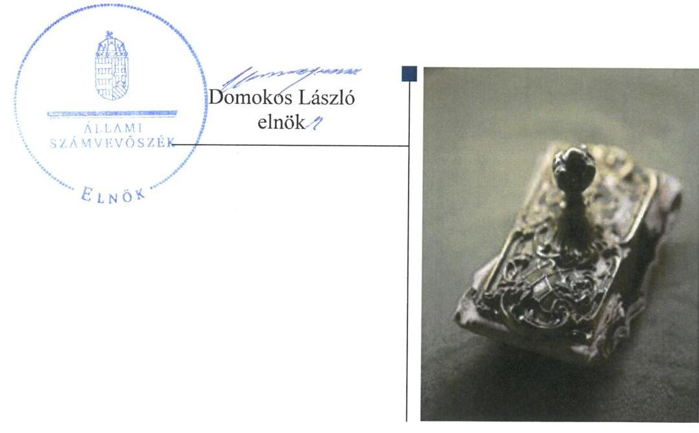

---

# AZ ELLENŐRZÉST FELÜGYELTE:

- BÖRÖCZ IMRE felügyeleti vezető
- AZ ELLENŐRZÉST VEZETTE ÉS A VÉGREHAJTÁSÁÉRT FELELŐS:
  - VIDA KATALIN ellenőrzésvezető
  - A PROGRAM ÖSSZEÁLLÍTÁSÁÉRT FELELŐS:
    - JANIK JÓZSEF LÁSZLÓ osztályvezető

**IKTATÓSZÁM:** V-1035-356/2016

**TÉMASZÁM:** 2069

**ELLENŐRZÉS-AZONOSÍTÓ SZÁM:** V070928

Jelentéseink az Országgyűlés számítógépes hálózatán és az Interneten a www.asz.hu címen is olvashatóak.

---

# TARTALOMJEGYZÉK 

■ ÖSSZEGZÉS ..... 5
■ AZ ELLENŐRZÉS CÉLJA ..... 7
■ AZ ELLENŐRZÉS TERÜLETE ..... 8
■ AZ ELLENŐRZÉS HÁTTERE, INDOKOLTSÁGA ..... 9
■ A JELENTÉS LÉNYEGES KÉRDÉSKÖREI ..... 10
■ ELLENŐRZÉS HATÓKÖRE ÉS MÓDSZEREI ..... 11
■ MEGÁLLAPÍTÁSOK ..... 13
■ JAVASLATOK ..... 22
■ MELLÉKLETEK ..... 23
I. sz. melléklet: Értelmező szótár ..... 23
II. sz. melléklet: Az eszközök elhasználódási szintjének alakulása 2011-2014. években (\%). ..... 30
III. sz. melléklet: Az eszközök átlagos életkorának alakulása (év) ..... 31
IV. sz. melléklet: Az eszközök és források állományának alakulása (M Ft) ..... 32
V. sz. melléklet: A vagyon összetételének változása 2011. és 2014. évek között (\%) ..... 33
■ FÜGGELÉK: ÉSZREVÉTELEK ..... 35
■ RÖVIDÍTÉSEK JEGYZÉKE ..... 43

---

.

---

# ÖSSZEGZÉS 

A Duna Palota Kulturális Kiemelkedően Közhasznú Nonprofit Kft. a vagyonmegőrzési és gazdálkodási tevékenységének feltételeit szabályszerüen, a tulajdonosi jogok gyakorlói a vagyonnal való gazdálkodás feltételeit szabályszerüen alakították ki, hozzájárultak a vagyon értékének megőrzéséhez. A Duna Palota NKft.-nél a vagyongazdálkodás feltételeit meghatározó belső szabályozó rendszer kialakítása megfelelő volt. A beszámolási kötelezettségeit megfelelően teljesítette. Az adatszolgáltatási feladatait összességében megfelelően teljesítette, az információs rendszer kialakítása és müködtetése hiányos volt. A bevételek és a ráfordítások elszámolása szabályszerü volt.

## Az ellenőrzés társadalmi indokoltsága

Magyarországon az intézmény-centrikus közfeladat-ellátás, közvagyon gazdálkodás jellemző a költségvetésen kívüli feladatellátás térnyerése mellett. Ennek szereplői a nonprofit szervezetek, az önkormányzati tulajdonú gazdasági társaságok és az állami tulajdonú gazdálkodó szervezetek is.

Az Áht2 2. § I) pontja, az Európai Közösséget létrehozó szerződéshez csatolt, a túlzott hiány esetén követendő eljárásról szóló jegyzőkönyv alkalmazásáról szóló 2009. május 25-i 479/2009/EK rendelet szerint, illetve az ESA95 statisztikai módszertana alapján a kormányzati szektorba tartoznak a „központi kormányzat alszektorba besorolt társaságok és egyéb szervezetek" is, amelyekkel szemben alapvető követelmény, hogy a gazdálkodásuk, a müködésük szabályszerű, az általuk szolgáltatott adatok megbízhatóak legyenek.

Az állami tulajdonú gazdálkodó szervezetek a nemzeti vagyon részét képezik. A nemzetgazdasági szempontból kiemelt jelentőségű nemzeti vagyonban tartandó állami tulajdonban álló társaság részesedését a nemzeti vagyonról szóló törvény határozza meg.

Az Állami Számvevőszék a korábban ellenőrizetlen területek, szervezetek - az úgynevezett fehér foltok - körébe tartozó társaságnál végzett ellenőrzést. A számvevőszéki ellenőrzés hozzájárul a közpénzek szabályos, átlátható, elszámoltatható és eredményes felhasználásához, a rend pedig értéket teremt. Ezt figyelembe véve az Állami Számvevőszék Stratégiájával összhangban került sor a Duna Palota NKft. ellenőrzésére.

## Főbb megállapítások, következtetések, javaslatok

A társasági részesedés feletti Tulajdonosi joggyakorló ${ }_{1,2}{ }^{1}$ a Duna Palota Nkft. tulajdonában, illetve bérleti szerződéssel a használatában lévő vagyonnal való gazdálkodás feltételeit szabályszerűen alakította ki, az állami vagyon értékmegőrzésére, gyarapítására vonatkozó előírásokat, valamint a felelős gazdálkodáshoz szükséges követelményeket meghatározta.

A Duna Palota NKft. ${ }^{2}$-nél az állami vagyon értékének megőrzését, gyarapítását szolgáló vagyongazdálkodás szabályozása kisebb hiányosság ellenére összességében megfelelő volt. Vagyonnyilvántartását megfelelően szabályozta és annak alapján megfelelően vezette.

Az ellátott közhasznú tevékenység bevételeinek és ráfordításainak elszámolása és szabályozása megfelelő volt. Önköltségszámítás rendjére vonatkozó szabályzattal nem rendelkezett, mert az elkészítésére jogszabályi kötelezettsége nem állt fenn. A Számlarend ${ }_{1,2}$ alapján végzett önköltségszámítást.

A Duna Palota NKft.-nél a vagyonváltozást eredményező döntések megfeleltek a jogszabályi és a belső előírásoknak. A vagyongazdálkodási tevékenysége a tulajdonosi előírásoknak összességében megfelelt.

---

A Duna Palota NKft. az adatszolgáltatási és a beszámolási kötelezettségét teljesítette, kivéve a 2012. év I-III. negyedévi adatszolgáltatásokat. A szervezet az információs rendszert kiépítette és - a 2014. évet kivéve - előíásszerűen működtette. Ennek keretében az Iratkezelési szabályzat módosítását 2014. évben elkészítették, kiadmányozására 2014. december 31-ig nem került sor, annak ellenére, hogy az OL ${ }^{3}$ előírta számára. A közérdekű adatok megismerésére irányuló igények teljesítését nem szabályozta. Adatvédelmi és adatbiztonsági szabályzattal nem rendelkeztek az ellenőrzött időszakban.

A Duna Palota NKft.-nek, mint kormányzati szektorba sorolt egyéb szervezetnek adósságot keletkeztető ügylete nem volt az ellenőrzött években, a kormányzati szektor hiányára befolyást gyakorló bevételeket és ráfordításokat szabályszerűen számolta el. Az ellenőrzött időszakban képzett nyereséget nem osztotta fel, azt a közhasznú tevékenységére fordította, kapcsolt vállalkozással nem rendelkezett.

Az ÁSZ a Duna Palota NKft. ügyvezetőjének fogalmazott meg javaslatokat, amelyek alapján köteles intézkedési tervet összeállítani és azt a jelentés kézhezvételétől számított 30 napon belül az ÁSZ részére megküldeni.

---

# AZ ELLENŐRZÉS CÉLJA 

Az ellenőrzés célja annak értékelése volt, hogy a tulajdonosi jogok gyakorlása szabályszerű volt-e; a gazdálkodó szervezet által ellátott feladatok bevételei, ráfordításai elszámolásának és vagyongazdálkodási tevékenységének szabályozása megfelelt-e a jogszabályi és a tulajdonosi előírásoknak, és azok végrehajtása szabályszerű volt-e; biztosítva volt-e a közfeladatok átláthatósága és elszámoltathatósága érdekében a közszolgáltatás dijának megalapozottsága szabályszerű önköltségszámítással; a vagyonváltozást eredményező döntések esetében a tulajdonosi jogok gyakorlója és a gazdálkodó szervezet szabályszerűen jártak-e el; a gazdálkodó szervezet épített-e ki és működtetett-e információs rendszert a szabályszerű vagyongazdálkodás érdekében.

Az ellenőrzés célja annak értékelése is volt, hogy a kormányzati szektorba sorolt egyéb szervezetek gazdálkodásának a kormányzati szektor hiányára és az államadósságra befolyással bíró elemei a jogszabályi előírásoknak megfeleltek-e.

---

# **AZ ELLENŐRZÉS TERÜLETE**

### **Duna Palota Kulturális Kiemelkedően Közhasznú Nonprofit Korlátolt Felelősségű Társaság**

A Duna Palota NKft. kormányzati szektorba sorolt, egyéb szervezetnek minősülő 100%-ban állami tulajdonban lévő egyszemélyes társaság. A tulajdonos 8 M Ft jegyzett tőkével alapította, közhasznú tevékenységként oktatási, ismeretterjesztési, valamint kulturális tevékenységek ellátására.

Feladatai közé tartozott a Duna Művészegyüttes és a Duna Szimfonikus Zenekar működtetése, továbbá képzőművészeti kiállítások, koncertek, színházi előadások és könyvbemutatók szervezése.

A Duna Palota NKft. közhasznú feladatainak ellátását közhasznú szerződés alapján, támogatás formájában biztosította a Tulajdonosi joggyakorló.

A Duna Palota NKft. bérbeadás útján hasznosította a Duna Palota épületét.

Az ügyvezető és a gazdasági vezető személyében változás nem történt az ellenőrzött időszakban.

Az állami vagyon kezelését ellátó MNV Zrt4. a működéséhez szükséges Duna Palota NKft. épületét az ellenőrzött években bérleti szerződés alapján biztosította, havi nettó 500 ezer Ft bérleti díj ellenében. Vagyonkezelt eszközzel nem rendelkezett a Duna Palota NKft. A 2014. évben a mérlegfőösszege 137,4 millió Ft volt.

Az állami tulajdonú társasági részesedés felett a tulajdonosi jogokat az MNV Zrt.-vel kötött megállapodás alapján 2011. április 6-ánál a Közigazgatási és Igazságügyi Minisztérium, majd 2011. április 26-ánól a Belügyminisztérium gyakorolta.

---

# AZ ELLENŐRZÉS HÁTTERE, INDOKOLTSÁGA 

Az ÁSZ ${ }^{6}$ alapvető célkitűzése, hogy az államháztartáson kívülre nyújtott költségvetési támogatások és ingyenes vagyonjuttatások ellenőrzésével járuljon hozzá ahhoz, hogy a közpénzeket az államháztartáson kívül működő szervezetek is átlátható módon használják fel a közfeladatok szerződésben vállalt ellátása érdekében. Az államháztartásról szóló törvény (a továbbiakban Áht. ${ }^{6}$ ) értelmében a közfeladatok ellátása elsősorban költségvetési szervek alapításával és működtetésével történik. Az államháztartáson kívüli szervezetek a közfeladatok ellátásában - jogszabályban meghatározott feltételekkel - közreműködhetnek.

Az ellenőrzés feladata a közvagyonnal biztosított közfeladat-ellátással kapcsolatban a közpénzek átláthatósága, nyilvánossága érdekében a jogszabályokban, belső szabályzatokban megfogalmazott előírások érvényesülésének az állami tulajdonban (résztulajdonban) lévő gazdálkodó szervezetek vagyonérték megőrzési és gazdálkodási tevékenységének értékelése. A Vtv. ${ }^{7}$ 3. § (1) bekezdése alapján, a 2013. június 27 -éig hatályos szabályozása értelmében a tulajdonosi jogok és kötelezettségek összességét az állami vagyon tekintetében az állami vagyon felügyeletéért felelős miniszter gyakorolta, aki a feladatát az MNV Zrt., illetve egyéb jogszabályban rögzített egyéb tulajdonosi joggyakorlók útján látta el. 2014. július 15 -éig tulajdonosi joggyakorlóként, mivel törvény vagy miniszteri rendelet eltérően nem rendelkezett, az MNV Zrt. járt el. A 2014. július 15 -ét követően a rábízott vagyon felett az államot megillető tulajdonosi jogok és kötelezettségek összességét tulajdonosi joggyakorlóként - ha törvény vagy miniszteri rendelet eltérően nem rendelkezett - az MNV Zrt. gyakorolta. Az ellenőrzött időszakban a Duna Palota NKft.-ben lévő részesedéssel kapcsolatban a tulajdonosi joggyakorlói feladatokat az MNV Zrt. és az MNV Zrt.-vel kötött szerződés alapján 2011. április 6 -áig a KIM $^{8}$, majd 2011. április 26 -ától a $B M^{9}$ látta el.

Az ellenőrzés várható hasznosulásaként az ellenőrzés megállapításai a jogalkotás számára segítséget nyújthatnak az államháztartáson kívüli köz-feladat-ellátás, közvagyonnal való gazdálkodás értékeléséhez, jogszabályi keretei pontosításához, az átláthatóságot biztosító szabályozáshoz. Az ellenőrzöttek számára visszajelzést ad a gazdálkodási tevékenységgel, az állami vagyon felhasználásával, a közszolgáltatási árképzés megalapozottságával és az éves elszámolással kapcsolatos szabálytalanságokról és kockázatokról. Az ellenőrzés tapasztalatai segítik és erősítik az Állami Számvevőszék hozzáadott értéket teremtő elemző tevékenységét és tanácsadó szerepét. A kormányzati szektorba sorolt, költségvetési tervezésbe is bevont gazdálkodó szervezetek ellenőrzése fokozza a legfőbb ellenőrző szerv iránti figyelmet és közbizalmat.

---

# A JELENTÉS LÉNYEGES KÉRDÉSKÖREI 

1.     - A tulajdonosi joggyakorló a Duna Palota NKft. vagyonnal való gazdálkodásának feltételeit szabályszerűen alakította-e ki?
2.     - A Duna Palota NKft. vagyongazdálkodási tevékenységének kialakítása, szabályozása, illetve a vagyon nyilvántartása megfelel-e az elöírásoknak?
3.     - Az ellátott közhasznú tevékenység bevételeinek és ráfordításainak elszámolása és szabályozása, valamint az önköltségszámítás szabályszerű volt-e?
4. A vagyonnal való gazdálkodás, valamint a vagyonváltozást eredményező döntések megfeleltek-e a jogszabályi és a belső elöírásoknak?
5.     - A szabályszerű vagyongazdálkodás érdekében az adatszolgáltatási és beszámolási kötelezettséget teljesítette-e, épített-e ki és müködtetett-e információs rendszert?
6.     - A kormányzati szektor hiányára és az államadósságra befolyást gyakorló elemek a jogszabályi elöírásoknak megfeleltek-e?

---

# ELLENŐRZÉS HATÓKÖRE ÉS MÓDSZEREI 

## Az ellenőrzés típusa

Szabályszerúségi ellenőrzés

## Az ellenőrzött időszak

2011. január 1-jétől 2014. december 31-ig.

## Az ellenőrzés tárgya

A Duna Palota NKft. vagyonmegőrzési és gazdálkodási tevékenysége és a kormányzati szektor hiányára, adósságállományára hatást gyakorló elemek ellenőrzése.

## Az ellenőrzött szervezet

A Duna Palota NKft., Belügyminisztérium, MNV Zrt.

## Az ellenőrzés jogalapja

Az Állami Számvevőszékről szóló 2011. évi LXVI. törvény 5. § (3)-(5) bekezdése, valamint az állami vagyonról szóló 2007. évi CVI. törvény 3. § (4) bekezdése.

## Az ellenőrzés módszerei

A számvevőszéki ellenőrzés szakmai szabályai szerint, a szabályszerűségi ellenőrzés módszerével, és a vonatkozó nemzetközi standardok figyelembevételével végeztük el az ellenőrzést.

Tanúsítványok kitöltésével és az ÁSZ által kért dokumentumok megküldésével szolgáltatott adatokat az ellenőrzés lefolytatásához a Duna Palota NKft. és a tulajdonos joggyakorló2. A rendelkezésre bocsátott adatok, információk kontrollja és a munkalapok kitöltése a helyszíni ellenőrzés keretében történt.

A bevételek és a ráfordítások elszámolását és a vagyonnyilvántartás terén a szabályszerű múködést véletlenszerű mintavétellel ellenőriztük. Az ellenőrzöttnél, mint a kormányzati szektorba sorolt gazdálkodó szervezetnél a személyi jellegú ráfordítások elszámolása mellett, az egyéb ráfordítások, a pénzügyi műveletek ráfordításai, a rendkívüli ráfordítások, illetve az

---

egyéb bevételek, a pénzügyi műveletek bevételei, a rendkívüli bevételek elszámolásának szabályszerűségét szintén mintatételek alapján ellenőriztük. A mintavétellel ellenőrzött területek esetében minden egyes tétel vonatkozásában a szabályszerűségre vonatkozó kérdéseket tettük fel, amelyek eredménye összesítésre került.

A jogszabályoknak és a belső előírásoknak megfelelőnek tekintettük az adott területet, amennyiben a minta ellenőrzése alapján 95\%-os bizonyossággal a teljes sokaságban a hibaarány kisebb volt, mint 10\%, nem megfelelőnek értékeltük, ha a hibaarány a 10\%-ot meghaladta. Kockázatot, illetve magas kockázatot jeleztünk, amennyiben egy adott terület vonatkozásában a minta alapján a teljes sokaságban nem volt egyértelműen biztosított a jogszabályoknak és a belső szabályzatoknak megfelelő működés. A ráfordítások elszámolására és a vagyonnyilvántartásra vonatkozó véletlen mintavételt kockázati alapú kiválasztással egészítettük ki, amelynek során évente a három legnagyobb összegű tételt választottuk ki.

---

# 1. A tulajdonosi joggyakorló a Duna Palota NKft. vagyonnal való gazdálkodásának feltételeit szabályszerűen alakította-e ki? 

Összegző megállapítás

Az MNV Zrt. és a Tulajdonosi joggyakorló1,2 összességében szabályszerűen alakította ki és gyakorolta a Duna Palota NKft. vagyonnal való gazdálkodásának feltételeit. Az Alapító Okirat ${ }_{1,2,3}$-ban ${ }^{10}$ meghatározták a tulajdonos számára fenntartott vagyongazdálkodásra vonatkozó jogokat.

A 100\%-os állami tulajdonban lévő Duna Palota NKft. részére a működéséhez szükséges vagyont bérleti szerződéssel biztosította az MNV Zrt. havi nettó 500 ezer Ft bérleti díj ellenében, vagyonkezelt eszközzel nem rendelkezett.

Az állami vagyon felett a tulajdonosi jogokat az MNV Zrt. és a vele kötött megállapodás alapján 2011. április 6 -áig a Tulajdonosi joggyakorló; gyakorolta. A társasági részesedés feletti jogok és kötelezettségek gyakorlását az MNV Zrt. 2011. április 26-án átadta a Tulajdonosi joggyakorló;-nek. Az Nvtv. új szabályozására tekintettel 2013. április 17-én az MNV Zrt. megbízási szerződést kötött a Tulajdonosi joggyakorló;-vel.

Az MNV Zrt. az állami vagyon értékének megőrzésére, gyarapítására vonatkozó előírásokat, valamint a felelős gazdálkodáshoz szükséges követelményeket meghatározta.

A közhasznú feladatai támogatása céljából a Tulajdonosi joggyakorló; és a Duna Palota NKft. a 2011. évre a közhasznú tevékenység ellátására vonatkozóan, míg a 2012-2014. évekre a múködés fedezete biztosítása céljából támogatási szerződést kötött.

A Duna Palota épületének hasznosítására a Tulajdonosi joggyakorló; által, az ellenőrzött időszakot megelőzően kötött bérleti szerződés ${ }_{1}^{11}$ volt érvényben, majd az MNV Zrt. és a Duna Palota NKft. 2011. április 11-én az ingatlanra és a szerződésben felsorolt ingóságokra megkötötte a bérleti szerződés; ${ }^{12}$-t.

A Duna Palota NKft., mint 100 \%-os állami tulajdonban lévő gazdasági társaság, átlátható szervezetnek minősült, ezért megfelelt az Nvtv. ${ }^{13} 11 . \S$ (10) bekezdésében meghatározott, az állami vagyon hasznosítására vonatkozó feltételeknek.

A Duna Palota NKft. az épületben kialakított étterem és büfé múködtetésére 2011. június 29-én egy gazdasági társasággal kötött szerződést, amely az MNV Zrt.-vel megkötött bérleti szerződés;-ben foglalt felhatalmazáson alapult. Ennek keretében a bérlő összesen 37,1 M Ft értéknövelő beruházást - kávézó, kápolna, söröző kialakítása - valósított meg az épületen.

A Duna Palota NKft. Alapító Okirat ${ }_{1,2,3}$ tartalmazza a Tulajdonosi joggyakorló; számára fenntartott vagyongazdálkodásra vonatkozó tulajdonosi

---

jogköröket. Az állami vagyon feletti tulajdonosi ellenőrzés biztosítása érdekében a Tulajdonosi joggyakorló ${ }_{1,2}$ döntött az ügyvezető, a könyvvizsgáló személyéről és $\mathrm{FB}^{14}$ működtetéséről.

# 2. A Duna Palota NKft. vagyongazdálkodási tevékenységének kialakítása, szabályozása, illetve a vagyon nyilvántartása megfelel-e az elöírásoknak? 

Összegző megállapítás

A Duna Palota NKft. az állami vagyon értéke megőrzését és gyarapítását biztosító vagyongazdálkodási tevékenységének szabályozása összességében megfelelő volt. Vagyonnyilvántartását megfelelően múködtette.

### 2.1. számú megállapítás

A Duna Palota NKft. az állami vagyon értékének megőrzését, gyarapítását szolgáló vagyongazdálkodás feltételeit összességében megfelelően alakította ki és szabályozta.

A Duna Palota NKft. a tárgyévi kitűzött vagyongazdálkodási célokat az éves üzleti terveiben mutatta be. A vagyongazdálkodás szabályozását a Számviteli politika ${ }_{1,2,3}{ }^{15}$, az Értékelési szabályzat ${ }_{1,2}{ }^{16}$, a Számlarend ${ }_{1,2}{ }^{17}$, a Leltározási szabályzat ${ }_{1,2}{ }^{18}$, a Pénzkezelési szabályzat ${ }_{1,2}{ }^{19}$ és az SZMSZ ${ }_{1,2,3}{ }^{20}$ tartalmazta. A dokumentumokban foglaltak szerint a vagyongazdálkodás átfogó irányítása az ügyvezető, míg a műszaki-technikai feladatok meghatározása és a végrehajtás irányítása a műszaki vezető feladatkörébe tartozott. A gazdasági vezető feladatai közé tartozott a pénzügyi fegyelem biztosítása, a számviteli és beszámoltatási kötelezettségek, a leltározás, a belső szabályzatok betartása és betartatása.

A Pénzkezelési szabályzat ${ }_{1,2}$ nem tartalmazta a külföldi valuta kezelésére, nyilvántartására és bizonylatolására vonatkozó szabályokat. Ezzel a Duna Palota NKft. a Számv. tv. ${ }^{21}$ 14. § (8) bekezdésében foglalt előírásokat nem tartotta be.

A Duna Palota NKft. önköltségszámítási szabályzat készítésére a Számv. tv. 14. § (5) bekezdés c) pontja és a (6)-(7) bekezdései alapján nem volt kötelezett.

### 2.2. számú megállapítás

A Duna Palota NKft. a saját és a bérleti szerződéssel bérbe vett eszközöket az előírások szerint tartotta nyilván.

A bérleti szerződés-vel bérbe vett eszközöket a Duna Palota NKft. menynyiségben és értékben elkülönítve, szabályosan tartotta nyilván. Az állami vagyon nyilvántartása, az értékcsökkenési leírás és a beruházási kiadások elszámolása az ellenőrzött esetekben szabályszerűen történt. A Duna Palota NKft. az MNV Zrt.-nek évenként megküldte a tárolási nyilatkozatot, amelynek a melléklete tételes listát tartalmazott a használatra átvett eszközökről. Eltérésre vonatkozó visszajelzés az MNV Zrt. részéről nem történt.

Befektetett pénzügyi eszközökkel - a dolgozóknak adott lakásépítési kölcsön kivételével - Duna Palota NKft. nem rendelkezett.

---

A beszámolójában és a számviteli nyilvántartásaiban lévő vagyontárgyak állományát leltárral támasztották alá. A leltározást a Számv. tv. előírásait figyelembe véve és a Leltározási szabályzat ${ }_{1,2}$ alapján végezték el. A Leltározási szabályzat ${ }_{1,2}$ szerint az ingatlanokat kétévente, az egyéb tárgyi eszközöket és azok tartozékait, valamint a készleteket évente, a tárgyévet követő január 1-je és 31-e között mennyiségi felvétellel leltározták, míg az egyéb eszközök és források leltározása egyeztetéssel történt.

# 3. Az ellátott közhasznú tevékenység bevételeinek és ráfordításainak elszámolása és szabályozása, valamint az önköltségszámítás szabályszerű volt-e? 

Összegző megállapítás

## 3.1. számú megállapítás

A Duna Palota NKft. az ellenőrzött időszakban a közhasznú tevékenységek ráfordításainak és bevételeinek elkülönítését összességében megfelelően biztosította.

A Duna Palota NKft. az ellátott közhasznú tevékenységének bevételeit és ráfordításait elkülönítetten tartotta nyilván, a feltárt kisebb hiányosságok ellenére azt megfelelően vezette.

A gazdálkodó szervezet meghatározta a közhasznú tevékenység ráfordításainak és bevételeinek egyértelmű elhatárolásához szükséges előírásokat.

A költségek, ráfordítások, bevételek elszámolása a személyi jellegú ráfordítások esetében - a tapasztalt kisebb súlyú hiányosságok kivételével megfelelő volt.

A személyi juttatásban részesült közhasznú tevékenységet végző dolgozók rendelkeztek munkaszerződésekkel, azonban párhuzamosan nem kapták meg a munkavégzésükkel kapcsolatos az $\mathrm{MT}_{1}{ }^{22} 76 . \S$ (5) bekezdése, illetve az $\mathrm{Mt}_{2}{ }^{23} 46 . \S$ (1) bekezdése szerinti írásbeli tájékoztatást.

Az előadóművészek személyi jellegű ráfordításai a Számv. tv. 79. §-a alapján kerültek elszámolásra. Az általuk vezetett jelenléti ívek nem tartalmazták egyértelműen a ténylegesen ledolgozott órák számát, az érkezés, távozás időpontját sem tüntették fel azon egyértelműen. A Duna Palota NKft. nem rendelkezett az Előadó-művészeti tv. ${ }^{24}$ szerinti fellépések számát, a próbákra fordítható időkeretet, illetve az otthoni felkészülésként figyelembe vehető idő beszámításra vonatkozó dokumentummal.

A munkavállalókat terhelő járulékok és adó levonások szabályszerűek voltak.

A béren kívüli juttatások elszámolása megfelelő volt.
Egyéb bevételként, szabályszerűen számolta el a Duna Palota NKft. a támogatásokat és pályázat során nyert pénzösszegeket, eleget téve a Számv. tv. előírásainak.

Az anyagjellegú ráfordítások elszámolása bizonylatokkal alátámasztott volt, azt a megfelelő költséghelyre könyvelték, a bevételek előírása és kiszámlázása szintén szabályszerűen történt.

---

2. táblázat

|  |   |   |   |   |
| --- | --- | --- | --- | --- |
|  2. táblázat |  |  |  |   |
|  VEVŐTARTOZÁSOK (M FT) |  |  |  |   |
|  Év | Vevő tartozás |  |  |   |
|  2011. | 16,1 |  |  |   |
|  2012. | 22,4 |  |  |   |
|  2013. | 13,6 |  |  |   |
|  2014. | 19,0 |  |  |   |
|  Forrás: A Duna Palota NKft. 2011-2014. évi beszámolói |  |  |  |   |

Az értékcsökkenési leírás elszámolása a belső szabályozás szerint szabályszerű volt, a Számviteli Politika ${ }_{1,2,3}$ keretében kialakított Értékelési szabályzat ${ }_{1,2}$-ben meghatározott, és a Számv. tv. előírásaihoz igazodó eszközcsoportonkénti leírási kulcsokat alkalmazták.

A Duna Palota NKft. tárgyi eszközei három fő csoportjában (bérelt ingatlanon végzett építés, műszaki berendezések, egyéb berendezések) elszámolt értékcsökkenési leírás mértékét valamennyi évben meghaladta az eszközök pótlása céljából elvégzett beruházások összértéke. Az elszámolt értékcsökkenés és a kapcsolódó beruházások mérőszámait - amely nem tartalmazza a Beruházás mérlegsoron szereplő kávézó, kápolna, söröző 37,1 M Ft összegű értékét - az 1. táblázat mutatja be.

1. táblázat

|  ESZKÖZÖK PÓTLÁSA A HÁROM FŐ ESZKÖZCSOPORTBAN (E FT) |  |  |  |  |   |
| --- | --- | --- | --- | --- | --- |
|   | Megnevezés | 2011. | 2012. | 2013. | 2014.  |
|  1. | Beruházás | 8432,6 | 11864,7 | 13730,9 | 11727,6  |
|  2. | Értékcsökkenés | 6196,8 | 6018,4 | 7895,8 | 8649,1  |
|  3. | Pótlás többlet (1-2) | 2235,8 | 5846,3 | 5835,1 | 3078,5  |
|   |  |  | Forrás: A Duna Palota NKft. 2011-2014. évi beszámolói |  |   |

Az eszközök elhasználódási szintjét és az átlagos életkor mértékét a három eszközfőcsoport vonatkozásában a II. és III. sz. mellékletek mutatják be.

A követelésállomány nyilvántartása a Duna Palota NKft. Értékelési szabályzat ${ }_{1,2} 1.2$. pontja alapján történt. A közhasznú szolgáltatás és a vállalkozási tevékenység lejárt követelései egyedi nyilvántartáson elkülönítve voltak kimutatva, az éves beszámolók kiegészítő mellékletében szabályosan bemutatásra kerültek.

A vevőállomány mértéke növekedett, ugyanakkor a határidőn túli vevőtartozások mértéke csökkent, amelyet kedvezően befolyásolt a vevők fizetési hajlandósága. A vevőállomány alakulását a 2. táblázat mutatja be.

## A Duna Palota NKft. önköltségszámítási szabályzat készítésére nem volt kötelezett, de kialakította az önköltségszámítás feltételeit.

Önköltségszámítási szabályzat készítésére a Duna Palota NKft. a Számv. tv. szerint nem volt kötelezett.

A Számlarend ${ }_{1,2}$ előírásai szerint a közhasznú tevékenységek és a vállalkozási tevékenységek költségeit szervezeti egység kódok és a gazdasági események rögzítésekor alkalmazott munkaszámok alapján, költséghelyek szerint különítették el. A közvetett költségek felosztását nem szabályozták, az ágazati előírások így nem jelenhettek meg.

A közvetlen költségek alapján végzett, a költséghelyeken kimutatott önköltségszámítás alapján nem mutatható ki a kalkulációs egységek - egyes előadások - önköltsége. A közvetett költségek - ideértve az értékcsökkenést is - a szabályozás hiánya ellenére a bevételek arányában felosztásra kerültek. A megállapított közvetlen és közvetett költségek összegét vette figyelembe a Duna Palota NKft. a díjképzés során, amelyet a piaci viszonyok is jelentősen befolyásoltak.

---

# 4. A vagyonnal való gazdálkodás, valamint a vagyonváltozást eredményező döntések megfeleltek-e a jogszabályi és a belső előírásoknak? 

Összegző megállapítás
4.1. számú megállapítás
3. táblázat

## BERUHÁZÁSOK (M FT)

| Év | Összeg |
| :-- | :--: |
| 2011. | 8,4 |
| 2012. | 11,9 |
| 2013. | 13,7 |
| 2014. | 11,7 |
| Összesen | 45,7 |
| Forrás: A Duna Palota NKft. 2011-2014. évi beszámolói |  |

4. táblázat

## KARBANTARTÁSI KÖLTSÉGEK (M FT)

| Év | Összeg |
| :-- | :--: |
| 2011. | 4,7 |
| 2012. | 4,6 |
| 2013. | 3,1 |
| 2014. | 3,8 |
| Összesen | 16,2 |
| Forrás: A Duna Palota NKft. 2011-2014. évi beszámolói |  |

A Duna Palota NKft. vagyonváltozást eredményező döntései szabályszerűek voltak. A vagyongazdálkodási tevékenysége a jogszabályi és a tulajdonosi előírásoknak összességében megfelelt.

Összességében a jogszabályi rendelkezéseknek megfelelően végezte a Duna Palota NKft. a vagyongazdálkodási tevékenységét, vagyona növekedett, az elszámolt értékcsökkenést meghaladó beruházást végzett.

A Duna Palota NKft. vagyona növekedett, szerkezetében jelentős átrendeződés történt, melyet a IV. sz. melléklet mutat be.

A vagyon 41,3 M Ft mértékben, 43,0\%-kal növekedett. A növekedést döntő részben a Befektetett eszközök állományának 38,9 M Ft mértékű emelkedése eredményezte, melyre hatással volt a 45,7 M Ft értékű beruházás, amit a 3. táblázat szemléltet.

A vagyon szerkezetében jelentős változás történt a Befektetett eszközök javára, a Forgóeszközök arányának egyidejű csökkenése mellett, amelyet az V. sz. melléklet mutat be.

A Duna Palota NKft. állapotfelmérést végzett a bérleti szerződés; megkötését követően a bérbe vett eszközállományon. Az állapot felmérési jegyzőkönyv ${ }^{25}$ tartalmazta az elvégzendő feladatokat, azonban időbeli ütemezést, prioritásokat, rangsort a dokumentum nem tartalmazott, és abban várható költségvonzat sem került meghatározásra. Az üzleti tervekben szereplő karbantartási költségek végrehajtásának - melyek mértéke 16,2 M Ft volt - ellenőrzését a műszaki vezető elvégezte. A karbantartási költségek éves mértékét a 4. táblázat tartalmazza. Az üzleti jelentések beszámoltak a karbantartási tevékenységről.

A Duna Palota NKft.-nél a beruházások mértéke meghaladta az értékcsökkenési leírás mértékét.

Az államháztartás körébe tartozó vagyon elidegenítésére és megterhelésére nem került sor.

---

A saját tőke/jegyzett tőke arányának alakulását az 1. ábra mutatja be.
1. ábra
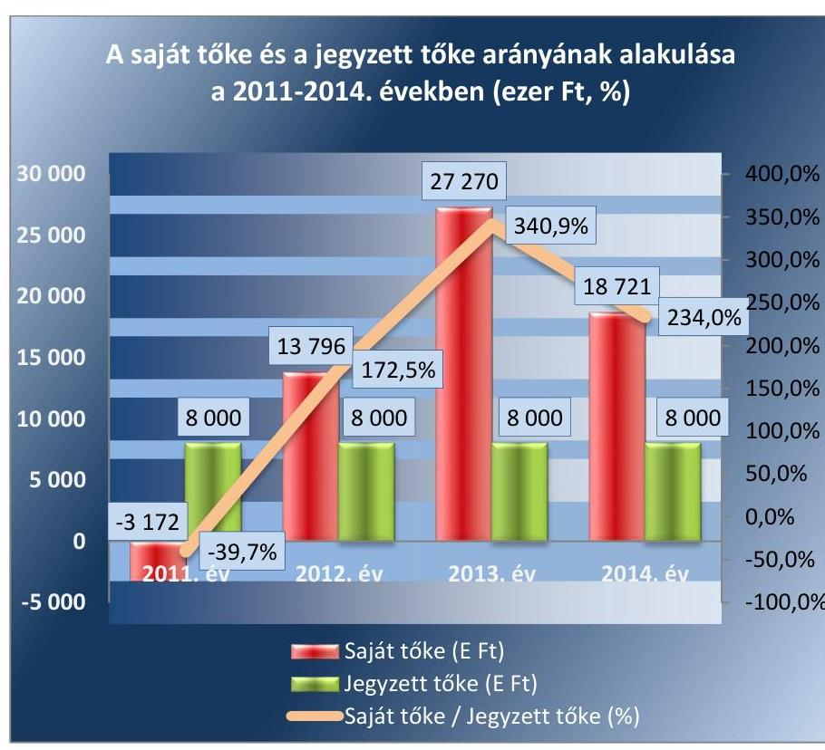

Forrás: A Duna Palota NKft. 2011-2014. évi beszámolói
A saját tőke értékét növelte, hogy a 2012. évi 17,0 M Ft és a 2013. évi 13,5 M Ft mértékú pozitív mérleg szerinti eredményt az eredménytartalékba helyezték.

A Duna Palota NKft. vagyongazdálkodási tevékenysége megfelelő volt.
A vagyonváltozást eredményező döntések előkészítése és megalapozása során betartották a jogszabályi és a belső előírásokat.

A bérleti szerződés ${ }_{1,2}$ alapján használt állami vagyonnal kapcsolatosan a Tulajdonosi joggyakorló ${ }_{1,2}$ az alapítói okirat ${ }_{1-3}$ V. 13.1 f) pontja szerint előírta meghatározott értékú szerződés megkötéséhez az MNV Zrt. jóváhagyását. Az ellenőrzés időszakában a Duna Palota NKft. által elvégzett épület felújítások és épületjavítások szerződésenkénti összege nem haladta meg az előírt értéket, ezért nem volt szükség a Tulajdonosi joggyakorló ${ }_{1,2}$ írásbeli engedélyére.

# 4.2. számú megállapítás 

Vagyonváltozással összefüggő tulajdonosi döntés nem volt az ellenőrzött időszakban. Az MNV Zrt. egy ellenőrzést hajtott végre.

Az állami vagyon változását eredményező döntések előkészítésére vonatkozó szabályozási kötelezettséget a bérbeadó és a bérlő részére jogszabály nem írta elő. A Tulajdonosi joggyakorló2 az Alapító Okirat ${ }_{1,2,3}$-ban rögzítette, hogy kizárólagos hatáskörébe tartozik olyan szerződés megkötésének a jóváhagyása, amelynek összege a törzstőke értékének $500 \%$-át meghaladja. A Tulajdonosi joggyakorló ${ }_{1,2}$ nem hozott döntést a vagyon átruházására vonatkozóan.

Tulajdonosi ellenőrzést az ellenőrzött időszakban az MNV Zrt. egy esetben végzett.

---

# 5. A szabályszerű vagyongazdálkodás érdekében az adatszolgáltatási és beszámolási kötelezettséget teljesítette-e, épített-e ki és múködtetett-e információs rendszert? 

Összegző megállapítás

A Duna Palota NKft. a szabályszerű vagyongazdálkodás érdekében a beszámolási, adatszolgáltatási kötelezettségét - a 2012. évben három negyedévi adatszolgáltatási kötelezettsége kivételével - teljesítette. A Tulajdonosi joggyakorló ${ }_{1,2}$-vel való kapcsolattartást, az információs rendszerét - a belső ellenőrzési rendszer kivételével - megfelelően alakította ki és múködtette.

A Duna Palota NKft. a beszámolási kötelezettségét szabályszerűen teljesítette. Az adatszolgáltatási kötelezettségét 2012. évben - egy negyedévi adatszolgáltatás kivételével - nem teljesítette. A vagyongazdálkodást illetően az FB szabályszerűen látta el a feladatait.

Az éves beszámolókat a Duna Palota NKft. a Számv. tv. előírásainak megfelelően elkészítette, az éves beszámolókra (mérleg, eredménykimutatás, kiegészítő melléklet, cash-flow kimutatás és a könyvvizsgálói jelentés), valamint a költségvetési kapcsolatokra (támogatások és befizetések pénzforgalmi szemléletben való számbavétele) vonatkozó adatszolgáltatási kötelezettségeket az előírások szerinti tartalommal és határidőre teljesítette. A könyvvizsgáló a beszámolókat korlátozás nélkül záradékolta. Az FB a beszámolókat megtárgyalta és határozatokat hozott azok elfogadásáról. A Tulajdonosi joggyakorló ${ }_{2}$ Alapítói határozatokat ${ }^{26}$ hozott az FB véleményének figyelembevételével a beszámolók elfogadásáról. A beszámolókat a Számv. tv. által előírt határidőben letétbe helyezték.

Az FB a beszámolókat, a könyvvizsgálói záradék elkészítését követően fogadta el. Az éves beszámoló megtárgyalása alkalmával a könyvvizsgáló is jelen volt.

A Duna Palota NKft. 2011. évi beszámolója szerint a saját tőke mértéke -3,2 M Ft-ra csökkent. A saját tőke csökkenéséről az FB javaslatára az MNV Zrt. tájékoztatást kapott, ezt követően a Duna Palota NKft. a 2012. évi üzleti tervét átdolgozta, melyet az FB elfogadott.

Az Áht. ${ }^{27}$ 107. § (1) bekezdése szerinti adatszolgáltatási kötelezettségeinek 2013. és 2014. években eleget tett, azonban 2012. évben csak egy negyedévi adatszolgáltatást teljesített.

## 5.2. számú megállapítás

A Duna Palota NKft. vagyongazdálkodására vonatkozóan a belső ellenőrzési kötelezettségek kivételével megfelelően alakította ki és múködtette a belső, és a Tulajdonosi joggyakorló ${ }_{1,2}$-höz kapcsolódó információs rendszert.

A vagyongazdálkodásra vonatkozóan a Közhasznú szerződés előírta, hogy a kapott támogatás felhasználásáról pénzügyi és szakmai beszámolót és közhasznúsági jelentést kell készíteni.

---

A 2012-2014. években hatályban lévő Támogatási szerződésnek ${ }^{28}$ megfelelően az előírt közzétételi kötelezettségének a Duna Palota NKft. eleget tett.

Az információs rendszer keretében a Duna Palota NKft. a támogatási szerződésben hozzájárult ahhoz, hogy a MÁK ${ }^{29}$ által működtetett monitoring rendszerben nyilvántartott adataihoz a Tulajdonosi joggyakorló2, az ÁSZ, a KEH ${ }^{30}$, és az állami adóhatóság hozzáférjen, és az Info tv. ${ }^{31}$ alapján, a támogatási szerződések adatai nyilvánosak legyenek.

A belső információs rendszer kialakítása keretében az Iratkezelési szabályzatát a Duna Palota NKft. a 2014. évben elkészítette, de kiadmányozása nem történt meg, annak ellenére, hogy az OL által végzett ellenőrzés előírta azt.

A Takarékossági tv. ${ }^{32}$ előírásainak megfelelően a Duna Palota NKft. honlapján közzétette a vezető tisztségviselők és az FB tagok díjazását, a közhasznúsági jelentéseket és az éves beszámolókat, valamint a TAO $^{33}$ kedvezményre jogosító támogatásokat.

Adatszolgáltatási kötelezettségét, amely a központi költségvetésről szóló törvény elkészítését támogatta a Duna Palota NKft. az üzleti tervek elkészítésével és a Tulajdonosi joggyakorló1,2 részére történő megküldésével teljesítette.

A Duna Palota NKft. SZMSZ ${ }_{1,2,3}$-ében meghatározták, a munkafolyamatba épített és a vezetői ellenőrzés követelményeit, a beszámolási, adatszolgáltatási kötelezettségeket.

A Társaság azonban a 2011. évben az Avtv. ${ }^{34}$ 31/A. § (3) bekezdésében, a 2012-2014. években az Info tv. ${ }^{35}$ 24. § (3) bekezdésében előírtakat figyelmen kívül hagyva, adatvédelmi és adatbiztonsági szabályzattal, a 2011. évben az Avtv. 20. § (8) bekezdésében, a 2012-2014. években az Info tv. 30. § (6) bekezdésében foglaltak ellenére közérdekú adatok megismerésére irányuló igények teljesítésének rendjét rögzítő szabályzattal nem rendelkezett.

A Számviteli Politikában ${ }_{1,2,3}$, a Belső Kontroll Kézikönyvben, az Alapító Okirat ${ }_{1,2,3}$, és az SZMSZ ${ }_{1,2,3}$ rendelkezései szerint meghatározták a beszámoló közzétételére vonatkozó előírásokat.

A Bkr. ${ }^{36}$ hatálya 2014. évtől, a Duna Palota NKft.-re is kiterjedt, ezért elkészítették és hatályba léptették a Belső kontroll kézikönyvet, amelyben a belső kontrollrendszer öt pillérét - köztük az információs és kommunikációs rendszert is - szabályozták, továbbá létrehozták az ellenőrzési nyomvonalat és a FEUVE ${ }^{37}$ szabályzatot.

Belső ellenőrzést a Duna Palota NKft. nem múködtetett, így a 2014. évben megsértették a Bkr. 10. §-ában foglalt előírást, amely a Duna Palota NKft.-re - mint kormányzati szektorba sorolt egyéb szervezetre - a Bkr. 54/A. §-a alapján 2014. január 1-jétől vonatkozott.

---

# 6. A kormányzati szektor hiányára és az államadósságra befolyást gyakorló elemek a jogszabályi előírásoknak megfelel-tek-e? 

Összegző megállapítás

A Duna Palota NKft.-nél - mint kormányzati szektorba sorolt egyéb szervezetnél - adósságot keletkeztető ügylet nem volt az ellenőrzött időszakban. A kormányzati szektor hiányára befolyást gyakorló bevételek és ráfordítások elszámolása megfelelő volt, osztalékfizetésről szóló döntés nem született.
6.1. számú megállapítás

A Duna Palota NKft. adósságot keletkeztető ügyletet nem kötött.
A Stabilitás tv. ${ }^{38}$ 3. § (1) bekezdése szerinti adósságot keletkeztető ügyletet nem kötött, nem volt a Stabilitás tv. 9. § (1) bekezdés és a 353/2011. (XII.30.) Korm. rendelet 11. § szerinti kérelem benyújtási kötelezettsége.
6.2. számú megállapítás

A kormányzati szektor hiányára befolyást gyakorló bevételek és ráfordítások elszámolása megfelelő volt. Osztalékfizetésre nem került sor.

A kormányzati szektor hiányára befolyást gyakorló bevételeket és ráfordításokat a Duna Palota NKft. szabályszerűen számolta el.

Az ellenőrzött időszakban osztalékot nem fizetett, a képzett nyereséget nem osztotta fel, azt a közhasznú tevékenységére fordította.

Kapcsolt vállalkozással nem rendelkezett.

---

# JAVASLATOK 

Az ÁSZ tv. ${ }^{39}$ 33. § (1) bekezdésében foglaltak értelmében az ellenőrzött szervezet vezetője köteles a jelentésben foglalt megállapításokhoz kapcsolódó intézkedési tervet összeállítani és azt a jelentés kézhezvételétől számított 30 napon belül az ÁSZ részére megküldeni. Amennyiben az intézkedési tervet határidőre nem küldi meg a szervezet, vagy amennyiben az nem elfogadható, az ÁSZ elnöke az ÁSZ tv. 33. § (3) bekezdés a)-b) pontjaiban foglaltakat érvényesítheti.

## Duna Palota NKft. ügyvezetőjének

1. Intézkedjen a pénzkezelési szabályzat módosítására, hogy az az idegen pénzeszközök vonatkozásában is tartalmazza valamennyi, a jogszabályban elöirt tartalmi elemet.
(2.1. sz. megállapítás 2. bekezdése alapján)
2. Intézkedjen a közérdekü adatok megismerésére irányuló igények teljesitésének rendjéről szóló szabályzat, valamint adatvédelmi és adatbiztonsági szabályzat készitésére a jogszabályi elöirásnak megfelelően.
(5.2. sz. megállapítás 8. bekezdése alapján)
3. Müködtessen a szervezet tevékenységének, a célok megvalósitásának nyomon követését biztositó rendszer keretében belső ellenőrzést a jogszabályi elöirásnak megfelelően.
(5.2. sz. megállapítás 11. bekezdése alapján)

---

# MELLÉKLETEK 

- I. SZ. MELLÉKLET: ÉRTELMEZŐ SZÓTÁR

Állami vagyon

Állami vagyon hasznosítása

Állami vagyon hasznosítása

Állami vagyon használója

2010. június 17-től
a) Az állam tulajdonában lévő dolog, valamint a dolog módjára hasznosítható természeti erő,
b) az a) pont hatálya alá nem tartozó mindazon vagyon, amely vonatkozásában törvény az állam kizárólagos tulajdonjogát nevesíti,
c) az állam tulajdonában lévő tagsági jogviszonyt megtestesítő értékpapír, illetve az államot megillető egyéb társasági részesedés,
d) az államot megillető olyan immateriális, vagyoni értékkel rendelkező jogosultság, amelyet jogszabály vagyoni értékű jogként nevesít.
Forrás: Vtv. 1. § (2) bekezdése
2012. november 10-től az állami vagyon fogalma kiegészül a következő ponttal:
e) az állam tulajdonában lévő pénzügyi eszközök

Forrás: Vtv. 1. § (2) bekezdése
2011. december 31-ig:

Az állami vagyont az MNV Zrt. maga kezeli, vagy szerződés - így különösen bérlet, haszonbérlet, szerződésen alapuló haszonélvezet, vagyonkezelés, megbízás - alapján központi költségvetési szervnek, természetes vagy jogi személynek, vagy jogi személyiséggel nem rendelkező gazdálkodó szervezetnek hasznosításra átengedi.
Forrás: Vtv. 23. § (1) bekezdése
2012. január 1-jétől:

Az állami vagyont az MNV Zrt. maga kezeli, vagy szerződés - így különösen bérlet, haszonbérlet, megbízás - alapján központi költségvetési szervnek, természetes vagy jogi személynek, vagy jogi személyiséggel nem rendelkező gazdálkodó szervezetnek hasznosításra átengedi.
Forrás: Vtv. 23. § (1) bekezdése
2013. június 28-ától:

Az állami vagyonnal az MNV Zrt. maga gazdálkodik, vagy szerződés - így különösen bérlet, haszonbérlet, megbízás - alapján központi költségvetési szervnek, természetes vagy jogi személynek, vagy jogi személyiséggel nem rendelkező gazdálkodó szervezetnek hasznosításra átengedi, illetőleg vagyonkezelésbe, haszonélvezetbe adja.
Forrás: Vtv. 23. § (1) bekezdése
Az állami vagyon hasznosítására kötött szerződések elsődleges célja az állami vagyon hatékony működtetése, állagának védelme, értékének megőrzése, illetve gyarapítása, az állami és közfeladatok ellátásának elősegítése.
Forrás: Vtv. 23. § (2) bekezdése
2011. január 1 - 2011. december 31-ig:

Az a természetes személy, jogi személy, illetve jogi személyiséggel nem rendelkező szervezet, amely, illetve aki törvény vagy szerződés alapján, bármely jogcímen (pl. bérlet, haszonbérlet, vagyonkezelési szerződés, használat stb.) állami vagyont birtokol, használ, szedi annak hasznait, hasznosít,
ide nem értve a tulajdonosi jogok gyakorlóját.
Forrás: Vhr ${ }^{40}$. 1. § (7) a. pontja

---

Állami vagyon kezelője /vagyonkezelő

Állami vagyon értékesítése

Gazdálkodó szervezet

2012. január 1-jétől:

Az a természetes vagy jogi személy, jogi személyiséggel nem rendelkező szervezet, aki, vagy amely törvény vagy szerződés alapján, bármely jogcímen (bérlet, haszonbérlet, használat stb.) állami vagyont birtokol, használ, szedi annak hasznait, hasznosít,
ide nem értve a haszonélvezőt, a vagyonkezelőt és a tulajdonosi jogok gyakorlóját. Forrás: Vhr. 1. § (7) a. pontja
2010. január 01 - 2011. december 31. között:

Az állami vagyont az MNV Zrt. maga kezeli, vagy szerződés - így különösen bérlet, haszonbérlet, szerződésen alapuló haszonélvezet, vagyonkezelés, megbízás - alapján központi költségvetési szervnek, természetes vagy jogi személynek, illetőleg jogi személyiséggel nem rendelkező gazdasági társaságnak hasznosításra átengedi. Vtv. 23. § (1) bekezdése
2012. január 1-jétől:

Az állami vagyont az MNV Zrt. maga kezeli, vagy szerződés - így különösen bérlet, haszonbérlet, megbízás - alapján központi költségvetési szervnek, természetes vagy jogi személynek, vagy jogi személyiséggel nem rendelkező gazdálkodó szervezetnek hasznosításra átengedi.
Az állami vagyonra vonatkozóan az MNV Zrt. kizárólag az Nvtv-ben meghatározott személyekkel köthet vagyonkezelési szerződést.
Forrás: Vtv. 23. § (1), 27. § (1)
2013. június 28-ától:

Az állami vagyonnal az MNV Zrt. maga gazdálkodik, vagy szerződés - így különösen bérlet, haszonbérlet, megbízás - alapján központi költségvetési szervnek, természetes vagy jogi személynek, vagy jogi személyiséggel nem rendelkező gazdálkodó szervezetnek hasznosításra átengedi, illetőleg vagyonkezelésbe, haszonélvezetbe adja.
Az állami vagyonra vonatkozóan az MNV Zrt. kizárólag az Nvtv-ben meghatározott személyekkel köthet vagyonkezelési szerződést.
Forrás: Vtv. 23. § (1), 27. § (1)
Állami vagyon tulajdonjogának bármely jogcímen történő, visszterhes átruházása. Forrás: Vhr. 1. § (7) d) pont)
2013. június 30-ig gazdálkodó szervezet:

Az állami vállalat, az egyéb állami gazdálkodó szerv, a szövetkezet, a lakásszövetkezet, az európai szövetkezet, a gazdasági társaság, az európai részvény-társaság, az egyesülés, az európai gazdasági egyesülés, az európai területi együttmúködési csoportosulás, az egyes jogi személyek vállalata, a leányvállalat, a vízgazdálkodási társulat, az erdőbirtokossági társulat, a végrehajtói iroda, az egyéni cég, továbbá az egyéni vállalkozó.
Forrás: $\mathrm{Ptk}_{1}{ }^{41} .685 . \S$ c) pontja
2013. július 1-jétől gazdálkodó szervezet:

Az állami vállalat, az egyéb állami gazdálkodó szerv, a szövetkezet, a lakásszövetkezet, az európai szövetkezet, a gazdasági társaság, az európai részvénytársaság, az egyesülés, az európai gazdasági egyesülés, az európai területi együttmúködési csoportosulás, az egyes jogi személyek vállalata, a leányvállalat, a vízgazdálkodási társulat, az erdőbirtokossági társulat, a végrehajtói iroda, az egyéni cég, továbbá az egyéni vállalkozó. Az állam, a helyi önkormányzat, a költségvetési szerv, az egyesület, a köztestület, valamint az alapítvány gazdálkodó tevékenységével ösz-

---

Kormányzati szektorba sorolt egyéb szervezet

Közszolgáltatás

Meghatározó befolyás
szefüggő polgári jogi kapcsolataira is a gazdálkodó szervezetre vonatkozó rendelkezéseket kell alkalmazni, kivéve, ha a törvény e jogi személyekre eltérő rendelkezést tartalmaz; a 292/A-292/B. §, 301/A-301/B. §, 405. § (1) bekezdés, valamint a 407/A. § (1) bekezdés tekintetében nem minősül gazdálkodó szervezetnek az, aki a közbeszerzésekről szóló törvény értelmében ajánlatkérő (szerződő hatóság). Forrás: $\mathrm{Ptk}_{1} .685 . \S$ c) pontja
2014. március 15-től gazdálkodó szervezet:

A gazdasági társaság, az európai részvénytársaság, az egyesülés, az európai gazdasági egyesülés, az európai területi együttműködési csoportosulás, a szövetkezet, a lakásszövetkezet, az európai szövetkezet, a vízgazdálkodási társulat, az erdőbirtokossági társulat, az állami vállalat, az egyéb állami gazdálkodó szerv, az egyes jogi személyek vállalata, a közös vállalat, a végrehajtói iroda, a közjegyzői iroda, az ügyvédi iroda, a szabadalmi ügyvivői iroda, az önkéntes kölcsönös biztosító pénztár, a magánnyugdíjpénztár, az egyéni cég, továbbá az egyéni vállalkozó. Az állam, a helyi önkormányzat, a költségvetési szerv, az egyesület, a köztestület, valamint az alapítvány gazdálkodó tevékenységével összefüggő polgári jogi kapcsolataira is a gazdálkodó szervezetre vonatkozó rendelkezéseket kell alkalmazni. Forrás: Pp. ${ }^{42}$ 396. §
Az a szervezet, amely az Áht. alapján nem része az államháztartásnak, azonban az Európai Közösséget létrehozó szerződéshez csatolt, a túlzott hiány esetén követendő eljárásról szóló jegyzőkönyv alkalmazásáról szóló 2009. május 25-i 479/2009/EK rendelet szerint a kormányzati szektorba tartozik. A nemzetgazdasági miniszter 2013. június 26-án megjelent Közleményben tette közé ezen szervezetek listáját.

1. Közcélú, illetőleg közérdekű szolgáltatást jelent, amely egy nagyobb közösség (állam, település) minden tagjára nézve megközelítőleg azonos feltételek mellett vehető igénybe, ezért valamilyen mértékig közösségi megszervezést, illetve szabályozást, ellenőrzést igényel.
Forrás: Közszolgáltatások szervezése és igazgatása című tankönyv 158. oldal. Kiadó: Kormányzati Személyügyi Szolgáltató és Közigazgatási Képzési Központ, Budapest, 2007.
2. Szerződéskötési kötelezettség alapján a lakosság alapvető szükségleteinek ellátására irányuló szolgáltatás, így különösen a villamos energia-, gáz-, hő-, víz-, szennyvíz- és hulladékkezelési, köztisztasági, postai és távközlési szolgáltatás, továbbá a menetrend alapján közlekedő járművekkel végzett közforgalmú személyszállítás.
Forrás: Ebtv. ${ }^{43}$ 3. § d) pontja
2014. március 14-ig: A befolyással rendelkező akkor rendelkezik egy jogi személyben meghatározó befolyással, ha annak tagja, illetve részvényese és
a) jogosult e jogi személy vezető tisztségviselői vagy felügyelőbizottsága tagjai többségének megválasztására, illetve visszahívására, vagy
b) a jogi személy más tagjaival, illetve részvényeseivel kötött megállapodás alapján egyedül rendelkezik a szavazatok több mint ötven százalékával.
A meghatározó befolyás akkor is fennáll, ha a befolyással rendelkező számára az előzőek szerinti jogosultságok közvetett módon biztosítottak. A befolyással rendelkezőnek egy jogi személyben a szavazatok több mint ötven százalékával közvetett módon való rendelkezése vagy egy jogi személyben közvetetten fennálló meghatározó befolyása megállapítása során a jogi személyben szavazati joggal rendelkező más jogi személyt (köztes vállalkozást) megillető szavazatokat meg kell szorozni a befolyással rendelkezőnek a köztes vállalkozásban, illetve vállalkozásokban

---

fennálló szavazatával. Ha a köztes vállalkozásban fennálló szavazatok mértéke az ötven százalékot meghaladja, akkor azt egy egészként kell figyelembe venni.
Forrás: $\mathrm{Ptk}_{1}$. 685/B. § (2)-(3) bekezdések
2014. március 15-től:

A befolyással rendelkező akkor rendelkezik egy jogi személyben meghatározó befolyással, ha annak tagja vagy részvényese, és
a) jogosult e jogi személy vezető tisztségviselői vagy felügyelőbizottsága tagjai többségének megválasztására, illetve visszahívására; vagy
b) a jogi személy más tagjai, illetve részvényesei a befolyással rendelkezővel kötött megállapodás alapján a befolyással rendelkezővel azonos tartalommal szavaznak, vagy a befolyással rendelkezőn keresztül gyakorolják szavazati jogukat, feltéve, hogy együtt a szavazatok több mint felével rendelkeznek.
Forrás: $\mathrm{Ptk}_{2}{ }^{44}$. 8:2. § (2) bekezdés
MFB Zrt.
Az MNV Zrt. melletti másik tulajdonosi joggyakorló szervezet az állami vagyon vonatkozásában, amely 2010. június 17-től gyakorol ilyen jogokat a rábízott állami tulajdonú társasági részesedések tekintetében.
Minősített többséget biztosító részesedés

MNV Zrt.

Nemzetgazdasági szempontból kiemelt jelentőségű nemzeti vagyon körébe tartozó társaságok Nemzeti vagyon

A minősített befolyásszerző az ellenőrzött társaságban a szavazatok legalább háromnegyedével rendelkezik.
Forrás: 2014. március 14-ig: Gt ${ }^{45}$. 52. § (2)
2014. március 15-től: $\mathrm{Ptk}_{2}$. 3:324. § (1) bekezdés

Az állami vagyon felett, a Magyar Államot megillető tulajdonosi jogok és kötelezettségek összességét - a hatályos szabályozás szerint - az állami vagyon felügyeletéért felelős miniszter (jelenleg a nemzeti fejlesztési miniszter) gyakorolja. A miniszter feladatát nagy részben az MNV Zrt., mint tulajdonosi joggyakorló szervezet útján látja el.
Az ÁSZ ellenőrzés szempontjából az Nvtv. 2. sz. mellékletében felsorolt társasági részesedések.
2012. január 1-jétől, g. pont módosult 2012. június 30-tól nemzeti vagyon:
a) az állam vagy a helyi önkormányzat kizárólagos tulajdonában álló dolgok,
b) az a) pont hatálya alá nem tartozó, állam vagy a helyi önkormányzat tulajdonában lévő dolog,
c) az állam vagy a helyi önkormányzatot tulajdonában lévő pénzügyi eszközök, továbbá az államot vagy a helyi önkormányzatot megillető társasági részesedések,
d) az államot vagy a helyi önkormányzatot megillető bármely vagyoni értékkel rendelkező jogosultság, amelyet jogszabály vagyoni értékű jogként nevesít,
e) Magyarország határa által körbezárt terület feletti légtér,
f) az üvegházhatású gázok kibocsátási egységeinek kereskedelméről szóló törvény szerint kibocsátási egység és légközlekedési kibocsátási egység, valamint az ENSZ Éghajlatváltozási Keretegyezménye és annak Kiotói Jegyzőkönyve végrehajtási keretrendszeréről szóló törvény szerinti kiotói egység,
g) állami vagy helyi önkormányzati fenntartású közgyűjtemény (muzeális intézmény, levéltár, közgyűjteményként működő kép- és hangarchívum, valamint könyvtár) saját gyűjteményében nyilvántartott kulturális javak körébe tartozó dolog,

---

h) a régészeti lelet,
i) a nemzeti adatvagyon körébe tartozó állami nyilvántartások fokozottabb védelméről szóló törvény szerinti nemzeti adatvagyon.
Forrás: Nvtv. 1. § (2)
2010. június 17-től

Egyrészt minden a Vtv. alkalmazásában állami vagyonnak minősülő vagyon, amit az MNV Zrt. kezel és nyilvántart.
Másrészt az a vagyon, amely felett az MFB tv. ${ }^{46}$ erejénél fogva a Magyar Állam nevében az MFB Zrt. gyakorolja a tulajdonosi jogokat.
Forrás: MFB tv. 3. § (9)
A rábízott vagyon a tulajdonosi jogokat gyakorló szervezetek saját vagyonától elkülönítendő.
Forrás: Vtv. 22. § (6)
A tulajdonosi joggyakorló rábízott vagyonába tartozó állami tulajdonú társasági részesedések.
2014. március 14-ig: Többségi befolyás: az olyan kapcsolat, amelynek révén természetes személy, jogi személy vagy jogi személyiség nélküli gazdasági társaság (a továbbiakban együtt: befolyással rendelkező) egy jogi személyben a szavazatok több mint ötven százalékával vagy meghatározó befolyással rendelkezik.
Forrás: Ptk ${ }_{1} 685 /$ B. § (1)
2014. március 15-től: Többségi befolyás az olyan kapcsolat, amelynek révén természetes személy vagy jogi személy (befolyással rendelkező) egy jogi személyben a szavazatok több mint felével vagy meghatározó befolyással rendelkezik.
Forrás: Ptk ${ }_{2} 8: 2$. § (1)
2010. június 17-től:

Az MNV Zrt. „rendszeresen ellenőrzi a vele szerződéses jogviszonyban lévő személyek, szervezetek vagy más használók állami vagyonnal való gazdálkodását, megállapításairól az MNV Zrt. Felügyelő Bizottságát, az ellenőrzött szervet, szükség esetén a minisztert és az Állami Számvevőszéket tájékoztatja".
Forrás: Vtv. 17. § d.
A Vhr. alapján „a tulajdonosi ellenőrzés célja az állami vagyonnal való gazdálkodás vizsgálata, ennek keretében a rendeltetésellenes, jogszerűtlen, szerződésellenes, vagy a tulajdonos érdekeit sértő, illetve a központi költségvetést hátrányosan érintő vagyongazdálkodási intézkedések feltárása és a jogszerú állapot helyreállítása, továbbá a vagyonnyilvántartás hitelességének, teljességének és helyességének biztosítása". Forrás: Vhr. 20. § (2)
2011. december 31-ig

Az állami vagyon kezelőjét, használóját megillető jogok gyakorlását, annak szabályszerűségét, célszerűségét az MNV Zrt. - szükség szerint területi szervei útján - ellenőrzi.
Forrás: Vhr. 20. § (1)
2012. január 1-jétől:

Az állami vagyon kezelőjét, haszonélvezőjét, használóját megillető jogok gyakorlását, annak szabályszerűségét, célszerűségét az MNV Zrt. - szükség szerint területi szervei útján - ellenőrzi.
Forrás: Vhr. 20. § (1)

---

Tulajdonosi jogok gyakor- 2010. június 17-től:lója

A tulajdonosi joggyakorlás és a vagyongazdálkodás feladata

Vagyonkezelői jog

Az állami vagyon felett a Magyar Államot megillető tulajdonosi jogok és kötelezettségek összességét - ha törvény eltérően nem rendelkezik - az állami vagyon felügyeletéért felelős miniszter (a továbbiakban: miniszter) gyakorolja, aki e feladatát a Magyar Nemzeti Vagyonkezelő Zártkörűen Működő Részvénytársaság (a továbbiakban: MNV Zrt.), a Magyar Fejlesztési Bank, illetve a tulajdonosi joggyakorló szervezet útján látja el. A miniszter miniszteri rendeletben, a törvényben meghatározott állami vagyoni kör tekintetében, meghatározott időtartamra, a joggyakorlás egyes szabályainak meghatározásával - az őt megillető tulajdonosi jogok és kötelezettségek összességének, illetve azok meghatározott részének gyakorlóját az Áht. szerinti központi költségvetési szervek, ezek intézménye, továbbá a 100\%-ban állami tulajdonban álló gazdasági társaságok közül kijelölheti.
Forrás: Vtv. 3. § (1) és (2)
2013. június 28-ától:

A rábízott állami vagyon felett az államot megillető tulajdonosi jogok és kötelezettségek összességét tulajdonosi joggyakorlóként:
a) ha törvény vagy miniszteri rendelet eltérően nem rendelkezik, a Magyar Nemzeti Vagyonkezelő Zártkörűen Működő Részvénytársaság (a továbbiakban: MNV Zrt.),
b) törvényben kijelölt személy vagy
c) az állami vagyon felügyeletéért felelős miniszter (a továbbiakban: miniszter) által rendeletben kijelölt személy gyakorolja.
[...] A miniszter e törvény felhatalmazása alapján - a meghatározott célok hatékonyabb elérése érdekében, miniszteri rendeletben, az ott meghatározott állami vagyoni kör tekintetében, meghatározott időtartamra - e törvény keretei között, a joggyakorlás egyes szabályainak meghatározásával - az államot megillető tulajdonosi jogok és kötelezettségek összességének, illetve azok meghatározott részének gyakorlóját az Áht. szerinti központi költségvetési szervek, ezek intézménye, továbbá a 100\%-ban állami tulajdonban álló gazdasági társaságok közül kijelölheti.
Forrás: Vtv. 3. § (1) és (2)
2010. június 17-től:

Az állami vagyon rendeltetésének megfelelő - az állami feladatok ellátásához, a társadalmi szükségletek kielégítéséhez, valamint a Kormány gazdaságpolitikája megvalósításának elősegítéséhez szükséges, egységes elveken alapuló, önálló ágazatként megjelenő - hatékony, költségtakarékos, értékmegőrző értéknövelő felhasználásának biztosítása (közvetlen felhasználás), illetve közvetett hasznosítása (beleértve a vagyoni kör változását eredményező értékesítést), valamint az állami vagyon gyarapítása (ideértve a vagyoni kör bővítését is).
Forrás: Vtv. 2. § (1)
2011. december 31-ig:

A vagyonkezelési szerződés alapján a vagyonkezelő jogosult meghatározott állami tulajdonba tartozó dolog birtoklására, használatára és hasznai szedésére. A vagyonkezelő köteles a vagyontárgy értékét megőrizni, állagának megóvásáról, jó karban tartásáról, működtetéséről gondoskodni, továbbá - a központi költségvetési szervek kivételével - díjat fizetni vagy a szerződésben előírt más kötelezettséget teljesíteni. A vagyonkezelői jog az erre irányuló szerződéssel - kivételesen törvény alapján - jön létre.
Forrás: Vtv. 27. § (2) és (4)

---

2012. január 1-jétől:

A vagyonkezelő köteles a vagyontárgy értékét megőrizni, állagának megóvásáról, jó karban tartásáról, működtetéséről gondoskodni, továbbá - a központi költségvetési szervek kivételével - díjat fizetni vagy a szerződésben előírt más kötelezettséget teljesíteni.
Forrás: Vtv. 27. § (2)
2013. június 28-ától:

A vagyonkezelő köteles a vagyontárgy állagának megóvásáról, jó karbantartásáról, működtetéséről gondoskodni, továbbá - a központi költségvetési szervek kivételével - díjat fizetni, jogszabályban és szerződésben előírt más kötelezettségét teljesíteni, valamint a vagyontárgyat jogszabályban vagy szerződésben meghatározott célnak megfelelően használni. Amennyiben a vagyonkezelő ezen kötelezettségének nem tesz eleget, a tulajdonosi joggyakorló jogosult a szerződést azonnali hatállyal felmondani.
Forrás: Vtv. 27. § (2)

---

II. SZ. MELLÉKLET: AZ ESZKÖZÖK ELHASZNÁLÓDÁSI SZINTJÉNEK ALAKULÁSA 2011-2014. ÉVEKBEN (\%)
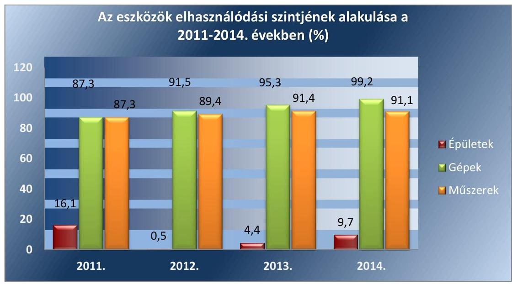

Forrás: A Duna Palata NKft. 2011-2014. évi beszámolói

---

III. SZ. MELLÉKLET: AZ ESZKÖZÖK ÁTLAGOS ÉLETKORÁNAK ALAKULÁSA (ÉV)
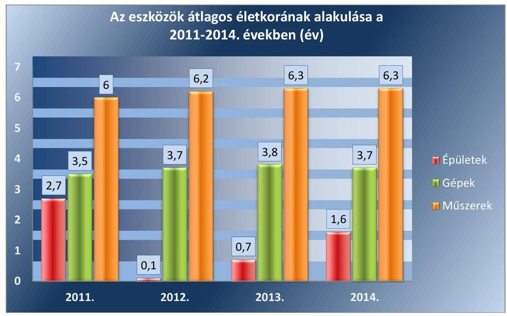

Forrás: A Duna Palota NKft. 2011-2014. évi beszámolói

---

| ESZKÖZÖK ÉS FORRÁSOK ÁLLOMÁNYÁNAK ALAKULÁSA (M FT) |  |  |  |  |
| :--: | :--: | :--: | :--: | :--: |
| Mégnevezés | 2011. év | 2012. év | 2013. év | 2014. év |
| Befektetett eszközök | 29,9 | 59,8 | 68,1 | 68,8 |
| Forgóeszközök | 61,7 | 60,4 | 69,4 | 64,4 |
| Aktív időbeli elhatárolások | 4,5 | 8,7 | 6,4 | 4,2 |
| ESZKÖZÖK ÖSSZESEN | 96,1 | 128,9 | 143,9 | 137,4 |
| Saját tőke | $-3,1$ | 13,8 | 27,3 | 18,7 |
| Céltartalék | 0,0 | 0,0 | 0,0 | 0,0 |
| Kötelezettségek | 67,3 | 94,6 | 92,4 | 87,5 |
| Passzív időbeli elhatárolások | 31,9 | 20,5 | 24,2 | 31,2 |
| FORRÁSOK ÖSSZESEN | 96,1 | 128,9 | 143,9 | 137,4 |

---

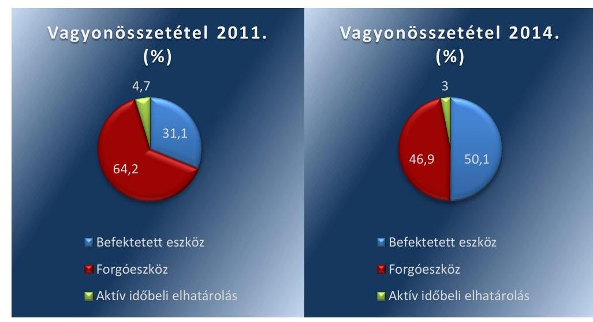

*Forrás: A Duna Palata NKJ1. 2011-2014. évi beszámolói*

---

.

---

# FÜGGELÉK: ÉSZREVÉTELEK 

A jelentéstervezetet a Számvevőszék 15 napos észrevételezésre megküldte az ellenőrzött szervezet vezetőjének az ÁSZ tv. 29. §* (1) bekezdése előírásának megfelelően.
Az elfogadott észrevételek alapján a Számvevőszék módosította a jelentést.

A függelék tartalmazza az ellenőrzött észrevételeit, illetve az el nem fogadott észrevételek elutasításának indoklását.

- A Duna Palota NKft. ügyvezetőjének írásban tett észrevétele
- Tájékoztatás a Duna Palota NKft. ügyvezetője részére az észrevétel kezeléséről
- A belügyminiszter írásban tett észrevétele
- Tájékoztatás a belügyminiszter részére az észrevétel kezeléséről
- Az MNV Zrt. levele

[^0]
[^0]:    * 29. § (1) Az Állami Számvevőszék az ellenőrzési megállapításait megküldi az ellenőrzött szervezet vezetőjének vagy az általa megbízott személynek, és annak, akinek személyes felelősségét állapította meg.
    (2) Az ellenőrzött szervezet vezetője és a felelősként megjelölt személy az ellenőrzés megállapításaira tizenöt napon belül írásban észrevételt tehet.
    (3) Az Állami Számvevőszék az észrevételre a beérkezésétől számított harminc napon belül írásban válaszol. A figyelembe nem vett észrevételeket köteles a jelentésben feltüntetni, és megindokolni, hogy azokat miért nem fogadta el.

---

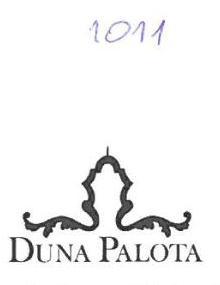

# Állami Számvevőszék   Domokos László Elnök Úr   Böröcz Imre Felügyeleti Vezető Úr részére 

Budapest 4.
Pf. 54
1364
Hivatkozási szám: V-1035-342/2016.

## Tisztelt Elnök Úr! Tisztelt Felügyeleti Vezető Úr!

„Az állami tulajdonban (résztulajdonban) lévő gazdálkodó szervezetek vagyonmegőrzési és gazdálkodási tevékenységének ellenőrzése keretében a Duna Palota Kulturális Közhasznú Nonprofit Kft." címmel készített számvevőszéki jelentéstervezetet áttanulmányoztuk. Megköszönjük az ellenőrök áldozatos munkáját. A jelentéstervezet megállapításait egy kivétellel elfogadjuk.

Javasoljuk, hogy az 5.2. számú megállapítást (20. oldal utolsó bekezdése) a következőképpen módosítani szíveskedjenek. „Belső ellenőrzést a Duna Palota NKft. részben müködtetett."

Indokaink:
Az operatív ellenőrzési tevékenységet dokumentált módon teljesítette az ellenőrzött időszakban az ügyvezetés. Az ellenőrök a helyszíni ellenőrzés során nem kérték be az operatív ellenőrzést igazoló dokumentumokat. 2016. február 15-től belső ellenőrt foglalkoztatunk. Sajnos korábban (így az ellenőrzött időszakban) az anyagi lehetőségeink nem tették ezt lehetővé.

Budapest, 2016. augusztus 19.

Tisztelettel:
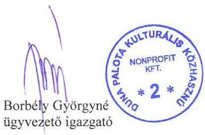

Duna Palota Nonprofit Kft.

---

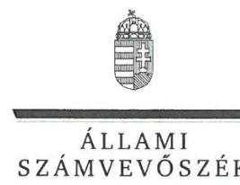

ELNÖK

Ikt.szám: V-1035-351/2016.

# Borbély Györgyné úrhölgy 

ügyvezető
Duna Palota Kulturális Közhasznú Nonprofit Kft.

## Budapest

## Tisztelt Ügyvezető Úrhölgy!

A „Duna Palota Kulturális Kiemelkedően Közhasznú Nonprofit Kft. - Az állami tulajdonban (résztulajdonban) lévő gazdálkodó szervezetek vagyonmegőrzési és gazdálkodási tevékenységének ellenőrzése " címmel készített számvevőszéki jelentéstervezetre tett észrevételeit köszönettel megkaptam.
Az Állami Számvevőszék észrevételekre vonatkozó álláspontjáról a felügyeleti vezető által készített részletes tájékoztatást mellékelten megküldöm.
Tájékoztatom Ügyvezető úrhölgyet, hogy a számvevőszéki jelentésben - az Állami Számvevőszékről szóló 2011. évi LXVI. törvény 29. § (3) bekezdése alapján - a figyelembe nem vett észrevételeket szerepeltetjük az elutasítás indokának feltüntetésével.

Budapest, 2016. cseppentzer hó 15 . nap
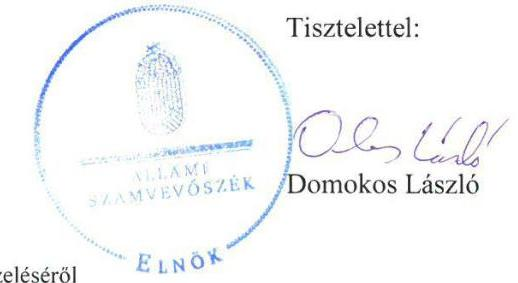

Melléklet: Tájékoztatás az észrevétel kezeléséről

---

# Tájékoztatás   az észrevétel kezeléséről 

A „Duna Palota Kulturális Kiemelkedően Közhasznú Nonprofit Kft. - Az állami tulajdonban (résztulajdonban) lévő gazdálkodó szervezetek vagyonmegőrzési és gazdálkodási tevékenységének ellenörzése" címủ jelentéstervezetre 2016. augusztus 22-én tett (az Állami Számvevőszékhez 2016. augusztus 25 -én érkezett) észrevételét áttekintettük, ami alapján a következő tájékoztatást adom.
Az 5.2. számú megállapításhoz (20. oldal utolsó bekezdése) tett észrevétel az operatív ellenőrzési tevékenység dokumentált módon történt teljesítését jelzi az ellenőrzött időszakban, azonban a jelentéstervezet megállapítása kizárólag a belső ellenőrzés müködtetésének 2014. évi elmaradására vonatkozott. A belső ellenőrzésnek a költségvetési szervek belső kontrollrendszeréről és belső ellenőrzéséről szóló 370/2011. (XII. 31.) Korm. rendelet 10. §-ában előírtak szerint az operatív tevékenységektől függetlenül kell müködnie, ezért a jelentéstervezet módosítása nem indokolt.
Köszönettel vettük tájékoztatását a belső ellenőr 2016. február 15-től történő foglalkoztatásáról, azonban a jelentéstervezetben csak az ellenőrzött időszakra vonatkozó megállapításokat szerepeltetjük.
Tájékoztatom, hogy a számvevőszéki jelentés függelékeként szerepeltetjük a jelentéstervezethez tett észrevételét, valamint az arra adott válaszunkat.

Budapest, 2016. 03. hó 16. nap

Böröcz Imre
felügyeleti vezető

---

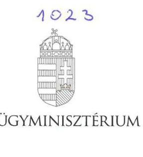

Iktatószám:BM/13059-2/2016

# DOMOKOS LÁSZLÓ elnök úrnak, 

Állami Számvevőszék

## Budapest

Tisztelt Elnök Úr!

A „Duna Palota Kulturális Kiemelkedően Közhasznú Nonprofit Kft. - Az állami tulajdonban (résztulajdonban) lévő gazdálkodó szervezetek vagyonmegőrzési és gazdálkodási tevékenységének ellenőrzése" tárgyban készített számvevőszéki jelentéstervezetet megismertem, arra vonatkozóan az alábbi észrevételt teszem.

A jelentéstervezet 19. oldal 4.2. pont megállapításának utolsó mondata szerint a „Tulajdonosi joggyakorló nem ellenőrizte a Duna NKft.-t a Vhr. 20. § (1) bekezdésének előírása ellenére".

Kérem a fenti megállapítás törölni vagy pontosítani szíveskedjen az alábbiakra tekintettel.
Tulajdonosi ellenőrzést a Belügyminisztérium, mint tulajdonosi joggyakorló a Felügyelőbizottságon keresztül folyamatosan végezte, amely kiterjedt az állami vagyon kezelésével összefüggő feladatokra, azok szabályszerűségére és a kötelezettségek teljesítésére is. A jelentéstervezetben hivatkozott Vhr. 20. § (1) bekezdése álláspontom szerint a Duna Palota NKft. és az MNV Zrt. között létrejött vagyonkezelési szerződéssel összefüggésben értelmezhető.

Budapest, 2016. augusztus „ $\underline{2}$."

Üdvözlettel:
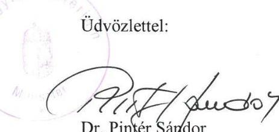

1051 Budapest, József Attila utca 2-4. Telefon: (06 1) 4411717 Fax: (06 1) 4411720 E-mail: miniszter@bm.gov.hu

---

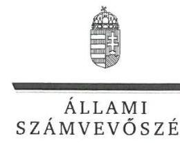

# Dr. Pintér Sándor úr 

belügyminiszter
Belügyminisztérium

## Budapest

## Tisztelt Miniszter Úr!

A „Duna Palota Kulturális Kiemelkedően Közhasznú Nonprofit Kft. - Az állami tulajdonban (résztulajdonban) lévő gazdálkodó szervezetek vagyonmegőrzési és gazdálkodási tevékenységének ellenőrzése " címmel készített számvevőszéki jelentéstervezetre tett észrevételét köszönettel megkaptam.
Az Állami Számvevőszék észrevételre vonatkozó álláspontjáról a felügyeleti vezető által készített részletes tájékoztatást mellékelten megküldöm.

Budapest, 2016. megecseter hó 15 nap
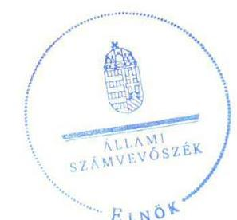

Tisztelettel:

Domokos László

Melléklet: Tájékoztatás az észrevétel kezeléséről

---

# Tájékoztatás   az észrevétel kezeléséről 

A „Duna Palota Kulturális Kiemelkedően Közhasznú Nonprofit Kft. - Az állami tulajdonban (résztulajdonban) lévő gazdálkodó szervezetek vagyonmegőrzési és gazdálkodási tevékenységének ellenörzése" címú jelentéstervezetre tett észrevételét áttekintettük, ami alapján a következő tájékoztatást adom.
A 4.2. számú megállapítás utolsó mondatához tett észrevétel alapján a jelentéstervezetből törlésre kerül a jelzett - a tulajdonosi joggyakorló ellenőrzésének hiányára vonatkozó - mondat, valamint azzal összefüggésben a Főbb megállapítások, következtetések, javaslatok rész 2. bekezdése, továbbá a 4.2. számú megállapítás második mondatának második tagmondata.
Tájékoztatom, hogy a számvevőszéki jelentés függelékeként szerepeltetjük a jelentéstervezethez tett észrevételét, valamint az arra adott válaszunkat.

Budapest, 2016. 09. hó 15. nap

Böröcz Imre
felügyeleti vezető

---

# 1013 

## MNV   Magyar Nemzet   VAGYONKEZELÓ ZRT   VEZÉRIGAZGATÓ

Állami Számvevőszék

## Domokos László

elnök

1052 Budapest
Apáczai Cs. J. u. 10.

Ikt. sz.: MNV/01/4531/ /2016.
Hiv. sz.: V-1035-343/2016.

Tisztelt Elnök Úr!
Szeretném tájékoztatni, hogy a 2016. augusztus 11. napján a „Duna Palota Kulturális Kiemelkedően Közhasznú Nonprofit Kft. - Az állami tulajdonban (résztulajdonban) lévő gazdálkodó szervezetek vagyonmegőrzési és gazdálkodási tevékenységének ellenőrzése" tárgyában kézhez vett, V-1035-343/2016. ikt. sz. Jelentés-tervezetre nem kívánunk észrevételt tenni.

Budapest, 2016. augusztus „, 24 ,"
Üdvözlettel:
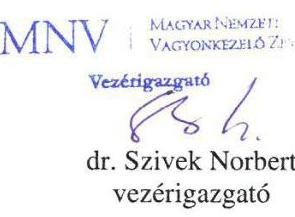

---

# RÖVIDÍTÉSEK JEGYZÉKE 

${ }^{1}$ Tulajdonosi joggyakorló 1,2 ,
${ }^{2}$ Duna Palota NKft.
${ }^{3} \mathrm{OL}$
${ }^{4}$ MNV Zrt.
${ }^{5}$ ÁSZ
${ }^{6}$ Áht. 2
${ }^{7}$ Vtv.
${ }^{8}$ KIM
${ }^{9}$ BM
${ }^{10}$ Alapító Okirat ${ }_{1,2,3}$
${ }^{11}$ Bérleti szerződés ${ }_{1}$
${ }^{12}$ Bérleti szerződés ${ }_{2}$
${ }^{13} \mathrm{Nvtv}$.
${ }^{14} \mathrm{FB}$
${ }^{15}$ Számviteli Politika ${ }_{1,2,3}$
${ }^{16}$ Értékelési szabályzat ${ }_{1,2}$
${ }^{17}$ Számlarend ${ }_{1,2}$
${ }^{18}$ Leltározási szabályzat ${ }_{1,2}$
${ }^{19}$ Pénzkezelési szabályzat ${ }_{1,2}$
${ }^{20}$ SZMSZ ${ }_{1,2,3}$
${ }^{21}$ Számv. tv.
${ }^{22} \mathrm{MT}_{1}$
${ }^{23} \mathrm{MT}_{2}$
${ }^{24}$ Előadó-művészeti tv.

Tulajdonosi joggyakorló ${ }_{1}$ Közigazgatási és Igazságügyi Minisztérium
Tulajdonosi joggyakorló ${ }_{2}$ Belügyminisztérium
Duna Palota Kulturális Kiemelkedően Közhasznú Nonprofit Korlátolt Felelősségű Társaság
Országos Levéltár
Magyar Nemzeti Vagyonkezelő Zártkörűen Működő Részvénytársaság
Állami Számvevőszék
Az Államháztartásról szóló 2011. évi CXCV. törvény (hatályos 2012. január 1-jétől)
Az állami vagyonról szóló 2007. évi CVI. törvény (Hatályba lépett: 2008. január 1.)
Közigazgatási és Igazságügyi Minisztérium
Belügyminisztérium
A Duna Palota NKft. 2011. január 31. 2012. december 19. és 2013. november 25-én kelt Alapító Okiratai
A Tulajdonosi joggyakorló ${ }_{2}$ jogelődje és a Duna Palota NKft. jogelődje által 2007. szeptember 20-án megkötött bérleti szerződés
Az MNV Zrt. és a Duna Palota NKft. által 2011. április 11-én megkötött bérleti szerződés
A nemzeti vagyonról szóló 2011. évi CXCVI. törvény (Hatályba lépett: 2011. december 31.)
Felügyelő Bizottság
Duna Palota Kulturális Kiemelkedően Közhasznú NKft. Számviteli Politikája (hatályos Számviteli Politika ${ }_{1}$ 2011. január 1-jétől 2012. január 1-jéig, Számviteli Politika ${ }_{2}$ 2012. január 1-jétől 2013. január1-jéig, Számviteli Politika ${ }_{3}$ 2013. január 1-jétől)
Duna Palota Kulturális Kiemelkedően Közhasznú NKft. Értékelési szabályzata (Hatályos: Értékelési szabályzat ${ }_{1}$ 2011. január 1-jétől 2013. január 1-jéig, Értékelési szabályzat ${ }_{2}$ 2013. január 1-jétől)
Duna Palota Kulturális Kiemelkedően Közhasznú NKft. Számlarendje (Hatályos: Számlarend ${ }_{1}$ 2011. január 1-jétől 2013. január 1-jéig, Számlarend ${ }_{2}$ 2013. január 1-jétől)
Duna Palota Kulturális Kiemelkedően Közhasznú NKft. Leltározási szabályzata (Hatályos: Leltározási szabályzat ${ }_{1}$ 2011. január 1-jétől 2013. január 1-jéig, Leltározási szabályzat ${ }_{2}$ 2013. január 1-jétől)
Duna Palota Kulturális Kiemelkedően Közhasznú NKft. Pénzkezelési szabályzata (Hatályos: Pénzkezelési szabályzat ${ }_{1}$ 2011. január 1-jétől 2013. január 1-jéig, Pénzkezelési szabályzat ${ }_{2}$ 2013. január 1-jétől)
A 2010. január 21-én, a 2012. január 15-én és a 2013. január 15-én hatályba léptetett Szervezeti Működési Szabályzat
A számvitelről szóló 2000. évi C. törvény (Hatályba lépett 2001. január 1.)
A Munka törvénykönyvéről szóló 1992. évi XXII. törvény (Hatályos: 2012. június 30-ig)
A Munka törvénykönyvéről szóló 2012. évi I. törvény (Hatályos: 2012. július 1-től)
A 2008. évi XCIX. törvény az előadó-művészeti szervezetek támogatásáról és sajátos foglalkoztatási szabályairól

---

${ }^{25}$ Állapotfelmérés jegyzőkönyv
${ }^{26}$ Alapítói határozatok
${ }^{27}$ Áht.
${ }^{28}$ Támogatási szerződés
${ }^{29}$ MÁK
${ }^{30} \mathrm{KEHI}$
${ }^{31}$ Info tv.
${ }^{32}$ Takarékossági tv.
${ }^{33} \mathrm{TAO}$
${ }^{34}$ Avtv.
${ }^{35}$ Info tv.
${ }^{36} \mathrm{Bkr}$.
${ }^{37}$ FEUVE
${ }^{38}$ Stabilitási tv.
${ }^{39}$ ÁSZ tv.
${ }^{40} \mathrm{Vhr}$.
${ }^{41} \mathrm{Ptk}_{1}$
${ }^{42} \mathrm{Pp}$.
${ }^{43}$ Ebtv.
${ }^{44} \mathrm{Ptk}_{2}$
${ }^{45} \mathrm{Gt}$.
${ }^{46} \mathrm{MFB} \mathrm{tv}$.

A 2011. május 30-án felvett MNV/01/1841/45/2011. és a 2011. október 4-én felvett MNV/01/184/67/2011. számú jegyzőkönyvek
1/2012. (V. 31.) Alapítói határozat, 3/2013. (V.30.) Alapítói határozat, 3/2014. (IV.30. Alapítói határozat), 1/2015. (V. 28.) Alapítói határozat

Az államháztartásról szóló 2011. évi CXCV. törvény
A 2012. február 10-én a Tulajdonosi joggyakorló; és a Duna Palota NKft. között megkötött 650-3/2012. számú szerződés
Magyar Államkincstár
Kormányzati Ellenőrzési Hivatal
Az információs önrendelkezési jogról és az információszabadságról szóló 2011. évi CXII. törvény

A köztulajdonban álló gazdasági társaságok takarékosabb múködéséről szóló 2009. évi CXXII. törvény (Hatályba lépett: 2009. december 4.)
A társasági adóról és az osztalékadóról szóló 1996. évi LXXXI. törvény (Hatályba lépett: 1997. január 1.)
A személyes adatok védelméről és a közérdekú adatok nyilvánosságáról szóló 1992. évi LXIII. törvény

Az információs önrendelkezési jogról és az információ szabadságról szóló 2011. évi CXII. törvény
A költségvetési szervek belső kontrollrendszeréről és belső ellenőrzéséről szóló 370/2011. (XII. 31.) Korm. rendelet (Hatályba lépett: 2012. január 1.)
Folyamatba épített, előzetes, utólagos és vezetői ellenőrzés
Magyarország gazdasági stabilitásáról szóló 2011. évi CXCIV. törvény (Hatályba lépett: 2011. december 31.)
Az Állami Számvevőszékről szóló 2011. évi LXVI. törvény
Az állami vagyonnal való gazdálkodásról szóló 254/2007. (X.4.) Korm. rendelet
A Polgári Törvénykönyvről szóló 1959. évi IV. törvény
A polgári perrendtartásról szóló 1952. évi III. törvény
Az egyenlő bánásmódról és az esélyegyenlőség előmozdításáról szóló 2003. évi CXXV. törvény
A Polgári Törvénykönyvről szóló 2013. évi V. törvény
A gazdasági társaságokról szóló 2006. évi IV. törvény
A 2001. évi XX. törvény a Magyar Fejlesztési Bank Részvénytársaságról

---

ÁLLAMI SZÁMVEVŐSZÉK
1052 Budapest, Apáczai Csere János utca 10.
Levélcím: 1364 Budapest 4. Pf. 54
Telefon: +36 14849100 Telefax: +36 14849200
www.asz.hu