# Jelentés 

## 2015. évi zárszámadás

Magyarország 2015. évi központi költségvetése végrehajtásának ellenőrzése
2016.

---

# Jelenetés 

## 2015. évi   zárszámadás

Magyarország 2015. évi központi költségvetése végrehajtásának ellenőrzése
2016. 09. hó 30. nap
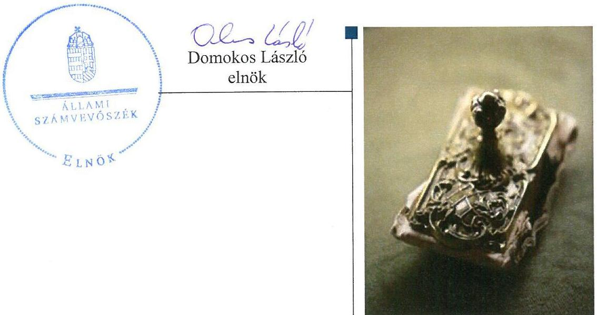

---

|   | AZ ELLENŐRZÉST FELÜGYELTE:  |
| --- | --- |
|   | HOLMAN MAGDOLNA JULIANNA felügyeleti vezető  |
|   | AZ ELLENŐRZÉST VEZETTE ÉS A VÉGREHAJTÁSÁÉRT FELELŐS:  |
|   | DORMÁN ISTVÁN ZOLTÁN ellenőrzésvezető  |
|   | A PROGRAM ÖSSZEÁLLÍTÁSÁÉRT FELELŐS:  |
|   | JANIK JÓZSEF LÁSZLÓ osztályvezető  |
|   | A TÉMÁHOZ KAPCSOLÓDÓ KORÁBBI SZÁMVEVŐSZÉKI JELENTÉSEK:  |
|   | - címe: Jelentés Magyarország 2014. évi központi költségvetése végrehajtásának ellenőrzéséről  |
|   | - sorszáma: 15167  |
|  Jelentéseink az Országgyúlés számítógépes hálózatán és az Interneten a www.asz.hu címen is olvashatóak. | - címe: Jelentés a 2013. évi zárszámadásról - Magyarország 2013. évi költségvetése végrehajtásának ellenőrzéséről  |
|   | - sorszáma: 14207  |
|   | IKTATÓSZÁM: V-1015-6364/2016.  |
|   | TÉMASZÁM: 2049  |
|   | ELLENŐRZÉS-AZONOSÍTÓ SZÁM: V0751  |

---

# TARTALOMJEGYZÉK 

ELNÖKI ELŐSZÓ ..... 5
ÖSSZEGZÉS ..... 7
AZ ELLENŐRZÉS CÉLJA ..... 9
AZ ELLENŐRZÉS TERÜLETE ..... 10
AZ ELLENŐRZÉS HÁTTERE, INDOKOLTSÁGA ..... 12
A JELENTÉS LÉNYEGES KÉRDÉSKÖREI ..... 13
ELLENŐRZÉS HATÓKÖRE ÉS MÓDSZEREI ..... 14
MEGÁLLAPÍTÁSOK ..... 17
MELLÉKLETEK ..... 39
I. Sz. melléklet: Értelmező szótár. ..... 39
II. Sz. melléklet: A kontrollkörnyezet minősítése és a belső kontrollrendszer értékelése ..... 43
III. Sz. melléklet: A zárszámadási törvényjavaslat összeállítását támogató informatikai rendszer ..... 48
IV. Sz. melléklet: Az integritás szemlélet érvényesítése értékelésének összegzése ..... 49
V. Sz. melléklet: Pénzügyi számvitellel készített beszámolórészek ellenőrzésének eredményei ..... 50
VI. Sz. melléklet: A helyszíni ellenőrzésbe bevont fejezetek és szervezetek listája ..... 51
VII. Sz. melléklet: Az ellenőrzésben résztvevők listája ..... 53
FÜGGELÉK: ÉSZREVÉTELEK ..... 57
I. Sz. függelék: Az ellenőrzött szervezetek ÁSZ által el nem fogadott észrevételei ..... 58
II. Sz. függelék: Az Országgyűlés felé beszámolásra kötelezett intézmények ellenőrzésének eredményéről készített rövid összefoglaló értékelés és azokra tett ÁSZ által el nem fogadott észrevételek ..... 68
RÖVIDÍTÉSEK JEGYZÉKE ..... 75

---

.

---

# ELNÖKI ELŐSZÓ 

Tisztelt Országgyúlési Képviselő!
Tisztelt Olvasó!
Az Állami Számvevőszék a törvényi előírások alapján évente ellenőrzi a központi költségvetés végrehajtását (zárszámadást). A Számvevőszékről szóló törvény alapján az ellenőrzés kiterjed a társadalombiztositás pénzügyi alapjai költségvetésének végrehajtásáról készített zárszámadásra és a társadalombiztositás pénzügyi alapjainak pénzügyi beszámolójára, valamint az elkülönített állami pénzalapok költségvetésének
végrehajtásról készített zárszámadásra.
Az államháztartásról szóló törvény előirja, hogy a Kormány a zárszámadásról szóló törvényjavaslatot az Országgyülés elé terjeszti, illetve azt előzetesen a Számvevőszéknek megküldi. A Számvevőszék a zárszámadás ellenőrzéséről készített jelentését minden évben az Országgyülés elé terjeszti. A zárszámadásról szóló törvényjavaslatot az Országgyülés jelentésünkkel együtt tárgyalja meg.
Magyarország 2017. évi központi költségvetésének megalapozásáról szóló 2016. évi LXVII. törvény alapján 2016. június 18-án hatályba lépett az államháztartásról szóló törvény módosítása. Az államháztartásról szóló törvény módosításával a zárszámadási törvényjavaslat Országgyülés elé terjesztésének határideje augusztus 31-ről szeptember 30-ra módosult.
A Számvevőszék ellenőrizte a 2015. évi zárszámadási törvényjavaslat összeállitásának folyamatát, az NGM által 2016. június 30-án megküldött törvényjavaslat megfelelőségét és az abban szereplő adatok megbizhatóságát. Az összegyüjtött ellenőrzési bizonyitékok alapján a mellékelt számvevőszéki jelentésben számolunk be megállapitásainkról.
A zárszámadási törvényjavaslatról, az abban szereplő adatok megbizhatóságáról a mellékelt jelentésben adott véleményünkkel célunk, hogy támogassuk az Országgyülést a törvényjavaslat elfogadhatóságával kapcsolatos döntéshozatalban és erősitsük az átláthatóság, az elszámoltathatóság biztositását a közpénzekkel való gazdálkodásban.
A 2015. évi zárszámadás ellenőrzéséről szóló jelentésünket új formátumban készítettük el. A közérthető, felhasználóbarát jelentéssel azt kivánjuk elérni, hogy eredményesebben hasznosithatóak legyenek a számvevőszéki jelentésben bemutatott ellenőrzési megállapitások.

---

.

---

# ÖSSZEGZÉS 

Az államháztartás központi alrendszere 2015. évi törvényi előirányzatainak teljesitése megfelelt a jogszabályi előirásoknak. A központi alrendszer bevételei 17 497,1 Mrd Ft-ra, kiadásai 18 734,3 Mrd Ft-ra teljesültek, amelynek eredményeként a központi alrendszer pénzforgalmi hiánya 1237,2 Mrd Ft összegben alakult. A Stabilitási törvény szerinti 2015. évi államadósság 25 134,9 Mrd Ft volt, a GDP 73,9\%-a. A kormányzati szektor uniós módszertan szerinti hiánya 533,9 Mrd Ft, a GDP 1,6\%-a, adóssága 25 402,3 Mrd Ft volt, ami a GDP 74,7\%-a. A hiány és államadósság alakulása megfelelt a törvényi előirásoknak, illetve az uniós feltételeknek. A központi alrendszer részét képező központi költségvetés, a társadalombiztosítás pénzügyi alapjai és az elkülönített állami pénzalapok bevétel- és kiadás-teljesitési adatai megbizhatóak. A bevételi és kiadási előirányzatok teljesitése során összességében betartották a jogszabályi előirásokat. A törvényjavaslat a beszámolók adatainak megfelelően, valósághűen mutatja be a költségvetés végrehajtására vonatkozó pénzügyi adatokat, információkat.

## Az ellenőrzés társadalmi indokoltsága

Az Alaptörvény szerint az Országgyűlés joga és feladata, hogy elfogadja a központi költségvetésről szóló törvényt és jóváhagyja a költségvetés végrehajtását a zárszámadásról szóló törvény elfogadásával. Az ÁSZ ${ }^{1}$ a törvényi előírások alapján évente ellenőrzi a zárszámadást. Az ÁSZ célja, hogy ellenőrzései mind jobban segítsék az átláthatóságot, az elszámoltathatóságot és az elszámoltatást a közpénzekkel való gazdálkodásban. Stratégiájában foglaltakkal összhangban a következetes elszámoltatás tekintetében a zárszámadás ellenőrzésének kiemelt szerepe van. Az Országgyűlés zárszámadási törvény elfogadásával kapcsolatos megalapozott döntéshozatalának támogatása érdekében az ÁSZ elvégzi a zárszámadási törvényjavaslat egésze megbízhatóságának értékelését.

## Főbb megállapítások

Az Országgyűlés Magyarország 2015. évi központi költségvetéséről szóló törvényben az államháztartás központi alrendszerének bevételi főösszegét 16 312,9 Mrd Ft²-ban, kiadási főösszegét 17 190,3 Mrd Ft-ban, hiányát 877,4 Mrd Ft-ban állapította meg. A Kvtv. ${ }^{3}$ módosításáról szóló törvények 2015. évben a központi alrendszer bevételi főösszegét 16 451,6 Mrd Ft-ra, a kiadási főösszeget 17 344,0 Mrd Ft-ra, a hiányt 892,4 Mrd Ft-ra módosították. 2015. évben a központi alrendszer bevételei 17 497,1 Mrd Ft-ra, kiadásai 18 734,3 Mrd Ft-ra teljesültek, amelynek eredményeként a pénzforgalmi hiány 1237,2 Mrd Ft összegben alakult, ami a GDP ${ }^{4} 3,6 \%$-a. A kormányzati szektor uniós módszertan szerinti hiánya 533,9 Mrd Ft, a GDP 1,6\%-a volt. Az Alaptörvény ${ }^{5}$ és a Stabilitási törvény ${ }^{6}$ államadósságra vonatkozó előírásai érvényesültek, mivel a Stabilitási tv. szerinti államadósság teljes hazai össztermékhez viszonyított aránya csökkent a 2014. évről a 2015. évre. Az államadósság a 2014. évben a GDP 76,0\%-a (24 624,9 Mrd Ft), a 2015. évben a GDP 73,9\%-a (25 134,9 Mrd Ft) volt. Az uniós kritériumok szerinti adósságcsökkentési követelményt Magyarország teljesítette, a kormányzati szektor uniós módszertan szerinti adóssága 2015 végén a GDP 74,7\%-a volt (25 402,3 Mrd Ft) a 2014. évi 75,7 \%-hoz képest.

A központi alrendszer részét képező központi költségvetés bevételeinek teljesítése 11 975,8 Mrd Ft, a központi költségvetés kiadásainak teljesítése 13 189,7 Mrd Ft volt. A TB Alapok ${ }^{7}$ bevételei 5010,3 Mrd Ft-ban, kiadásai 5035,8 Mrd Ft-ban, az ELKA ${ }^{8}$ bevételei 511,0 Mrd Ft-ban, kiadásai 508,8 Mrd Ft összegben teljesültek. A központi költségvetés bevételi és kiadási adataiban előforduló megbízhatósági hibák összértéke nem éri el a lényegességi szintet, a bevételi és kiadási adatok megbízhatóak. Az ellenőrzés a központi költségvetés bevételi, illetve kiadási adataiban - az NCSSZA ${ }^{9}$ előirányzatai terhére történő ellátások, támogatások folyósítása területén, az Országgyűlés felé

---

beszámolásra kötelezett intézmények kiadásainál, valamint a központi költségvetés egyéb intézményei bevételeinél és kiadásainál - állapított meg megbízhatósági hibákat. A TB Alapok bevételeinél és kiadásainál, valamint az ELKA bevételeinél és kiadásainál az ellenőrzés nem tárt fel megbízhatósági hibát, a TB Alapok és az ELKA bevételi és a kiadási adatai megbízhatóak. A fő ellenőrzési területek bevételi és kiadási előirányzatainak teljesítési adatait és azok megbízhatóságát az 1. ábra mutatja be.

1. ábra
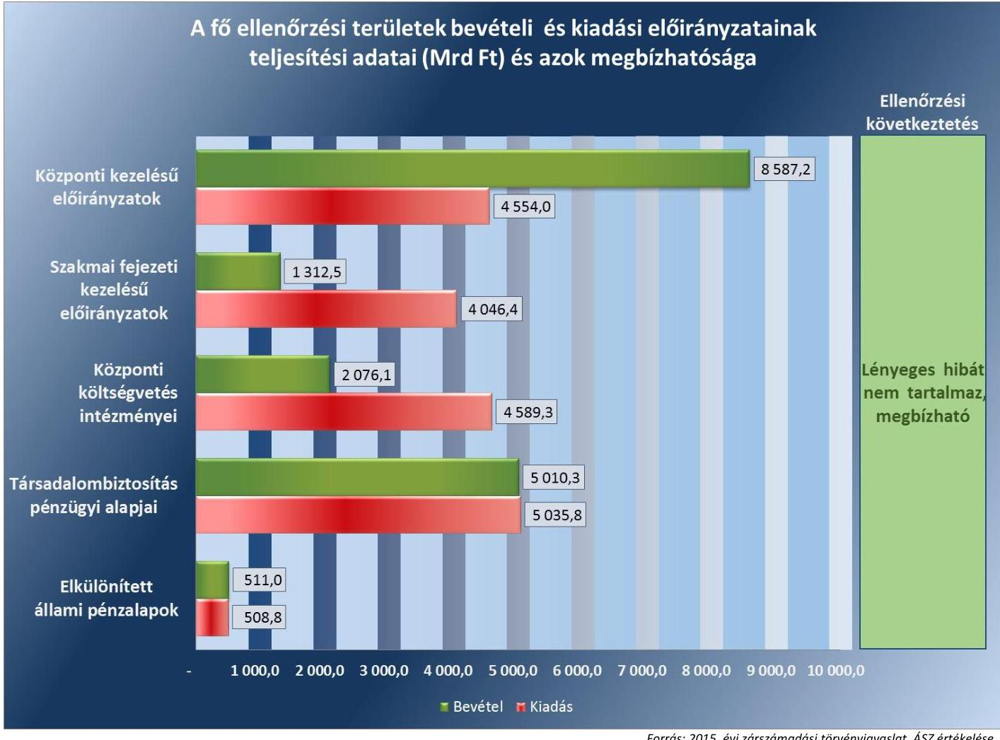

A központi költségvetés, a TB Alapok és az ELKA bevételi és kiadási előirányzatainak teljesítése, az előirányzat módosítás, a maradvány megállapítása és a beszámolók összeállítása során összességében betartották a jogszabályi előírásokat. Az ellenőrzés szabályszerűségi hibákat a IX. Helyi önkormányzatok támogatásai fejezet és a XX. EMMI ${ }^{10}$ fejezet Települési és területi nemzetiségi önkormányzatok támogatása cím kiadásainál, az NCSSZA előirányzatai terhére történt kiutalásoknál, az állam által vállalt kezesség és viszontgarancia érvényesítésével összefüggő kiadásoknál, a szakmai fejezeti kezelésű előirányzatok bevételeinél és kiadásainál, az intézmények bevételeinél és kiadásainál, a TB Alapok kiadásainál, illetve a NEFA ${ }^{11}$, az NKFIA ${ }^{12}$ és a SZHIA ${ }^{13}$ kiadásainál tárt fel. A szabálytalanságok megszüntetésére - az észrevételeket részletesen bemutatva -, levélben szólítottuk fel az érintetteket.

Az NGM ${ }^{14}$ 2016. június 30-án a Számvevőszék részére megküldte a törvényjavaslatot Magyarország 2015. évi központi költségvetéséről szóló 2014. évi C. törvény végrehajtásáról. A 2015. évi zárszámadási törvényjavaslat összeállítása során az NGM a jogszabályi előírásokat betartotta, a törvényjavaslat tartalma, szerkezete megfelel a vonatkozó jogszabályok előírásainak. A zárszámadási törvényjavaslat összeállítását támogató informatikai rendszerek kialakítása és müködtetése tekintetében az ellenőrzés kockázatokat tárt fel, azonban azok a törvényjavaslat adatainak megbízhatóságát nem befolyásolták. A törvényjavaslat a beszámolóknak megfelelően, valósághűen mutatja be a költségvetés végrehajtására vonatkozó pénzügyi adatokat, információkat.

A törvényjavaslatban szereplő adatokat a lezárt kincstári beszámolók adatai alátámasztják.

---

# AZ ELLENŐRZÉS CÉLJA 

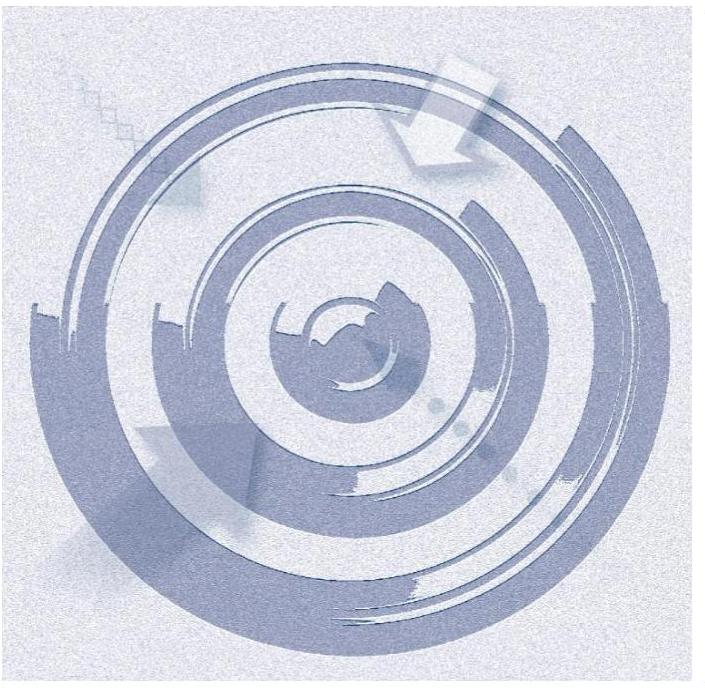

Az ellenőrzés célja, hogy az ÁSZ ésszerű bizonyosságot szerezzen arról, hogy a zárszámadási törvényjavaslat tartalma, szerkezete megfelel-e a jogszabályi előírásoknak; az Alaptörvény és a Stabilitási törvény államadósságra vonatkozó előírásai érvényesültek-e, az államháztartás központi alrendszerében, a hiány alakulása megfelelt-e a Kvtv. előírásainak; az államháztartás bevételeit a Kvtv.ben rögzítettekkel összhangban, a közpénzekkel való gazdálkodás jogszabályi követelményeinek megfelelően használták-e fel, a törvényjavaslat valósághűen mutatja-e be a költségvetés végrehajtására vonatkozó pénzügyi adatokat, információkat; a központi költségvetés bevételi és kiadási előirányzatainak teljesítése megfelelt-e a jogszabályi előírásoknak és tartalmaz-e lényeges hibát; a költségvetés végrehajtásában jog- és hatáskörrel rendelkezők a 2015. évi költségvetésben meghatározott pénzügyi keretek között szabályszerűen gazdálkodtak-e a közpénzekkel.

---

# AZ ELLENŐRZÉS TERÜLETE 

## 2015. évi zárszámadás - Magyarország 2015. évi központi költségvetése végrehajtásának ellenőrzése

A zárszámadás ellenőrzése során az ellenőrzési területek az alábbiak:
$\longrightarrow$ Törvényjavaslat Magyarország 2015. évi központi költségvetéséről szóló 2014. évi C. törvény végrehajtásáról.
$\longrightarrow$ A központi költségvetés, a TB Alapok és az ELKA bevételei és kiadásai, ezen belül:
$\qquad$ 1.Központi kezelésű előirányzatok:

A költségvetés közvetlen bevételei: XLII. A költségvetés közvetlen bevételei és kiadásai fejezet 1. Vállalkozások költségvetési befizetései, 2. Fogyasztáshoz kapcsolt adók, 3. Lakosság költségvetési befizetései, 4. Egyéb költségvetési bevételek, 5. Költségvetési befizetések címek előirányzatai.

Helyi önkormányzatok támogatása, települési és területi nemzetiségi önkormányzatok támogatása: IX. Helyi önkormányzatok támogatásai, XX. EMMI fejezet 22. Települési és területi nemzetiségi önkormányzatok támogatása cím, XLII. A költségvetés közvetlen bevételei és kiadásai fejezet 38. A települési önkormányzatok adósságkonszolidációjához kapcsolódó állami támogatások cím.

Adósságszolgálattal kapcsolatos bevételek és kiadások: XLI. fejezet az adósságszolgálattal kapcsolatos bevételek és kiadások az adósság-átvállalásokkal együtt; XLII. fejezet A költségvetés közvetlen bevételei és kiadásai 8. Tőkekövetelések visszatérülése és 41. Követeléskezelés költségei címek; a központi költségvetés finanszírozása (KESZ ${ }^{15}$ ).
XX. EMMI fejezet 21. Nemzeti Család- és Szociálpolitikai Alap cím.

XLIII. Az állami vagyonnal kapcsolatos bevételek és kiadások beleértve az infrastruktúra koncessziókból származó díjakat ( $\mathrm{NMHH}^{16}$ ), illetve a XLIV. A nemzeti földalappal kapcsolatos bevételek és kiadások és az egyes költségvetési fejezeteken belüli tulajdonosi joggyakorlással kapcsolatos előirányzatok.

Az állam által vállalt kezesség és viszontgarancia érvényesítése XLII. fejezet 33. cím; a MEHIB ${ }^{17}$ és az Eximbank ${ }^{18}$ behajtási jutaléka XLII. fejezet 32/1/19 jogcímcsoport; Kezesség visszatérülés XLII. fejezet 4/1/9 jogcímcsoport.

A költségvetés közvetlen kiadási előirányzatai: I. fejezet 8. Pártok támogatása cím, 9. Pártalapítványok támogatása cím, 10. Közszolgálati médiaszolgáltatás támogatása cím, XIV. BM ${ }^{19}$ fejezet 21. K600 hírrendszer müködtetése cím, XVII. NFM ${ }^{20}$ fejezet 21. Vállalkozások folyó támogatása cím, 25. Peres ügyek cím, XLII. A költségvetés közvetlen bevételei és kiadásai fejezet 28. Diákhitel 2 konstrukció kamattámogatása cím, 29. Lakástámogatások cím, 30. Vállalkozások folyó támogatása cím, 31. Szociálpolitikai

---

menetdíj támogatása cím, 32. Egyéb költségvetési kiadások cím, 34. Kormányzati rendkívüli kiadások cím, 35. Garancia és hozzájárulás a társadalombiztosítási ellátásokhoz cím, 36. Nemzetközi elszámolások kiadásai cím.

A központi költségvetés központi tartalékai XI. fejezet 32., 33. és 34. cím.
2. Szakmai fejezeti kezelésű előirányzatok:

Az I. OGY ${ }^{21}$, II. KE ${ }^{22}$, III. $A B^{23}$, IV. AJBH ${ }^{24}$, VI. BIR ${ }^{25}$, VIII. ÜGYÉSZSÉG, X. $\mathrm{IM}^{26}$, XI. $\mathrm{ME}^{27}$, XII. $\mathrm{FM}^{28}$, XIII. $\mathrm{HM}^{29}$, XIV. BM, XV. NGM, XVII. NFM, XVIII. $\mathrm{KKM}^{30}$, XX. EMMI, XXX. GVH ${ }^{31}$, XXXI. KSH ${ }^{32}$, XXXIII. MTA ${ }^{33}$, XXXIV. MMA ${ }^{34}$ fejezetek fejezeti kezelésű előirányzatai. A XIX. Uniós fejlesztések fejezetben megjelenő európai uniós támogatások.
3. A központi költségvetés intézményei:

1. Országgyúlés felé beszámolásra kötelezett intézmények: $\mathrm{KH}^{35}$, $\mathrm{NAIH}^{36}, \mathrm{NVI}^{37}, \mathrm{NÉBIH}^{38}, \mathrm{GVH}, \mathrm{KSH}, \mathrm{MTA}$ Igazgatása, MMA Titkárság Igazgatása; 2. Alkotmányos fejezetek intézményei: $\mathrm{OGYH}^{39}, \mathrm{KEH}^{40}, \mathrm{AB}, \mathrm{AJBH}$, Bíróságok (26 intézmény), Kúria, Ügyészségek; 3. A központi költségvetés 67 egyéb intézménye (a VI. számú mellékletben felsoroltak szerint).
4. A Társadalombiztosítás pénzügyi alapjai:

LXXI. Nyugdíjbiztosítási Alap és LXXII. Egészségbiztosítási Alap.
5. Az Elkülönített állami pénzalapok:

LXII. NKFIA, LXIII. NEFA, LXIV. SZHIA, LXV. BGA ${ }^{41}$, LXVI. KNPA ${ }^{42}$, LXVII. NKA ${ }^{43}$, LXVIII. WMA ${ }^{44}$.

---

# **AZ ELLENŐRZÉS HÁTTERE, INDOKOLTSÁGA**

Az Alaptörvény szerint a központi költségvetés végrehajtásának ellenőrzését az ÁSZ végzi el. Az Állami Számvevőszékről szóló 2011. évi LXVI. törvény (ÁSZ tv.) előírásainak megfelelően a zárszámadási ellenőrzés végrehajtása az ÁSZ éves gyakorisággal elvégzendő feladata. Az ÁSZ törvényi kötelezettségének teljesítésével hozzájárul ahhoz, hogy az Országgyűlés a zárszámadási törvény elfogadásával kapcsolatban megalapozott döntést hozzon. Az ellenőrzés célja teljes és objektív képet adni a 2015 évi zárszámadási törvényjavaslatban szereplő adatok megbízhatóságáról, a megállapításokkal elősegíteni az ellenőrzöttek közpénzekkel való felelős gazdálkodását. Az ÁSZ az ellenőrzéssel hozzájárul az értékteremtő rend kialakításához és megőrzéséhez.

---

# A JELENTÉS LÉNYEGES KÉRDÉSKÖREI 

1. Érvényesültek-e az Alaptörvény és a Stabilitási törvény államadósságra vonatkozó előírásai, az államháztartás központi alrendszerében a hiány alakulása megfelelte a törvényi elöírásoknak? A zárszámadási törvényjavaslat tartalma, szerkezete megfelelte a jogszabályi elöírásoknak?
2. A törvényjavaslat a beszámolóknak megfelelően, valósághüen mutatja-e be a költségvetés végrehajtására vonatkozó pénzügyi adatokat, információkat? A központi költségvetés, a TB Alapok és az ELKA bevételi és kiadási elöirányzatainak teljesitési adatai megbizhatóak-e?
3. A központi költségvetés, a TB Alapok és az ELKA bevételi és kiadási elöirányzatainak teljesitése, az elöirányzat módosítás, a maradvány megállapítása és a beszámolók összeállítása során betartották-e a jogszabályi elöírásokat?

---

# ELLENŐRZÉS HATÓKÖRE ÉS MÓDSZEREI 

## Az ellenőrzés típusa

Megfelelőségi ellenőrzés.

## Az ellenőrzött időszak

2015. január 1-jétől 2015. december 31-ig, a-zárszámadási törvényjavaslat összeállítása tekintetében 2016. augusztus 31-ig tartó időszak.

## Az ellenőrzés tárgya

A zárszámadási ellenőrzés során az ÁSZ a zárszámadási törvényjavaslat megfelelőségét és az abban szereplő adatok megbízhatóságát ellenőrizte. A Számvevőszék a fő ellenőrzési területeken (központi kezelésű előirányzatok; szakmai fejezeti kezelésű előirányzatok, központi költségvetési szervek; társadalombiztosítás pénzügyi alapjai; elkülönített állami pénzalapok) a bevételi és kiadási előirányzatok teljesítési adatainak megbízhatóságát, az előirányzatok teljesítésének, az előirányzat módosítás, a maradvány megállapítása és a beszámolók összeállításának szabályszerűségét ellenőrizte. Az ellenőrzés kiterjedt minden olyan körülményre és adatra, amely az ÁSZ jogszabályban meghatározott feladatainak teljesítéséhez, valamint a program végrehajtása folyamán felmerült újabb összefüggések feltárásához szükséges volt.

## Az ellenőrzött szervezet

Az NGM46, Kincstár, NAV47, ÁKK Zrt.48, központi kezelésű előirányzatok, a kockázatelemzéssel kiválasztott szakmai fejezeti kezelésű előirányzatok és kezelő szerveik. Az OGY részére beszámolásra kötelezett intézmények (NAIH, NVI, KH, NÉBIH, GVH, KSH, MTA Igazgatása, MMA Titkárság Igazgatása), az alkotmányos fejezetek intézményei (KEH; AB; AJBH; Bíróságok; Ügyészség, az OGY fejezeten belül az OGYH), továbbá a központi költségvetés kockázatelemzéssel kiválasztott egyéb intézményei. A TB Alapok (Nyugdíjbiztosítás Alap, Egészségbiztosítási Alap) és az ELKA kezelő szervei, a VI. számú mellékletben foglaltak szerint.

## Az ellenőrzés jogalapja

Az ellenőrzés lefolytatásának jogalapját az Állami Számvevőszékről szóló 2011. évi LXVI. törvény 5. § (7) bekezdése képezte.

---

# Az ellenőrzés módszerei 

Az ellenőrzést az Állami Számvevőszék A számvevőszéki ellenőrzés általános alapelveiben (számvevőszéki ellenőrzési standardokban), A megfelelőségi ellenőrzés alapelveiben, valamint az arra épülő, a zárszámadás ellenőrzésre vonatkozó, 2015. évben kiadott Módszertani Útmutatóban foglalt, a költségvetés végrehajtásának ellenőrzéséhez speciálisan kialakított módszertani elvekkel és szabályokkal összhangban folytatta le.

Az ellenőrzés ideje alatt az ellenőrzött szervezettel történő kapcsolattartás az ÁSZ SZMSZ ${ }^{49}$-ének vonatkozó előírásai alapján történt.

Az ellenőrzési bizonyítékként felhasználható adatforrások közé tartoztak egyrészt a szakmai program részletes szempontjainál felsorolt adatforrások, másrészt adatforrás lehetett még - az ellenőrzés folyamán - feltárt, az ellenőrzés szempontjából információt tartalmazó dokumentum. Az ellenőrzési kérdések megválaszolásához szükséges bizonyítékok megszerzése az ellenőrzött által rendelkezésre bocsátott dokumentumokra, adatokra alapozva megfigyelés, szemle (szemrevételezés), kérdésfeltevés (információkérés), mintavételezés, valamint elemző eljárás útján történt.

A zárszámadási törvényjavaslat megfelelőségének ellenőrzése, a zárszámadási törvényjavaslat összeállítását támogató informatikai rendszerek kialakításának és múködtetésének, valamint a Kincstárnál az Áhsz. ${ }^{50}$-ben előírt összevont (konszolidált) beszámolók elkészítésének ellenőrzése a vonatkozó jogszabályi előírások alapján történt.

A költségvetés végrehajtásának ellenőrzését a pénzforgalmi szemléletű költségvetési számvitel által szolgáltatott adatok, a költségvetési számvitel alapján készülő beszámoló-részek ellenőrzésével végezte a Számvevőszék. A Számvevőszék a fő ellenőrzési területeken a bevételi és kiadási előirányzatok teljesítési adatainak megbízhatóságát, az előirányzatok teljesítésének, az előirányzat módosítás, a maradvány megállapítása és a beszámolók összeállításának szabályszerűségét ellenőrizte.

A Számvevőszék az ellenőrzés során feltárt hibákat két fő csoportba sorolta: szabályszerűségi hibák - jogszabályi előírásoknak való meg nem felelés esetei, illetve megbízhatósági hibák - a pénzforgalom és a zárszámadási törvényjavaslat adatainak megbízhatóságát befolyásoló hibák.

A Számvevőszék értékelte az ellenőrzés során azonosított megbízhatósági hibákat abból a szempontból, hogy azok önmagukban vagy együttesen lényegesek, és meghatározta, hogy milyen hatást gyakorolhatnak a zárszámadási törvényjavaslat egészének megbízhatóságára. Ehhez mérlegelte a hibák jellegét és összegét a zárszámadási törvényjavaslat egésze vonatkozásában, valamint az előfordulásuk körülményeit. A zárszámadási törvényjavaslatról szóló véleménye kialakításához - az ellenőrzés eredményeinek kiértékelése és a hibák teljes sokaságra történt kivetítése alapján - a Számvevőszék a zárszámadási törvényjavaslat megbízhatóságát befolyásoló összes hiba összegét viszonyította a lényegességi küszöbértékhez. A lényegességi küszöbértéket a Számvevőszék a központi költségvetés kiadási, illetve a bevételi főösszegének (teljesítési adat) 2\%-ában határozta meg. A Számvevőszék ennek alapján alkotott véleményt a törvényjavaslatban szereplő adatok összességének megbízhatóságáról.

---

A Számvevőszék további specifikus lényegességi küszöbértékeket is meghatározott az egyes részterületek tekintetében. A specifikus lényegességi küszöbértéket az adott részterület kiadási, bevételi összegei teljesítési adatainak 2\%-ában határozta meg. A 2015. évi zárszámadás statisztikai mintavételi módszer (pénzegység alapú mintavételi eljárás (MUS)) alkalmazásával ellenőrzött területeinek adatait a Számvevőszék „megbizható"nak értékelte, amennyiben az ellenőrzés eredményeinek kiértékelése alapján azt állapította meg, hogy a teljes alapsokaságban (azaz az ellenőrzött terület adatainak összességében) előforduló megbízhatósági hibák összértéke 95\%-os megbízhatósággal nem haladja meg a 2\%-os lényegességi szintet. Ellenkező esetben a Számvevőszék az adott terület adataira vonatkozóan „nem megbizható" értékelést adott.

A kontrollkörnyezet, illetve a belső kontrollrendszer megfelelőségének minősítése (II. számú melléklet) során a minősítési kategóriák a következők voltak: ha az ellenőrzés eredményeképpen a megfelelőség százalékosan elérte legalább a 85\%-os mértéket a kontrollkörnyezet, illetve a teljes belső kontrollrendszer minősítése „megfelelő" lett; ha az ellenőrzés eredményeképpen a megfelelőség százalékosan $61 \%$ és $84 \%$ közötti volt a minősítés „részben megfelelő"lett; ha az ellenőrzés eredményeképpen a megfelelőség százalékosan nem érte el legalább a 61\%-ot a kontrollkörnyezet, illetve a teljes belső kontrollrendszer minősítése „nem megfelelő" lett. (A megfelelőségi százalékokat egész számra kerekítve történt a minősítés.)

Az integritás szemlélet érvényesülésének felmérése (IV. számú melléklet) az intézmények által kitöltött kérdőívek alapján történt. Azon intézmények, amelyek az elmúlt két évben nem vettek részt integritás felmérésben a bővített integritás kérdőívet, azon intézmények, amelyek részt vettek integritás felmérésben, szűkített integritási kérdőívet töltöttek ki. A kérdőívek értékelése alapján az intézmények integritása „kiváló", „megfelelő", vagy „fejlesztendő" minősítést kaphatott. „Kiváló", illetve „megfelelő" minősítést azon intézmények kaphattak, amelyek képesek kezelni a kockázatokat. „Fejlesztendő" minősítést azon intézmények kaptak, amelyek esetében a kontrollok jelenlegi szintje nem képes megfelelően kezelni a kockázatokat.

Az eredményszemléletű államháztartási számvitel előmozdításának és megbízhatóságának növelése érdekében elvégzett, az eredményszemléletű pénzügyi számvitellel készített beszámolórészek ellenőrzésével (V. számú melléklet) kapcsolatos számvevőszéki megállapítások a zárszámadási törvényjavaslat adatai megbízhatóságának minősítését nem érintik.

---

# MEGÁLLAPÍTÁSOK 

## 1. Érvényesültek-e az Alaptörvény és a Stabilitási törvény államadósságra vonatkozó előírásai, az államháztartás központi alrendszerében a hiány alakulása megfelelt-e a törvényi előírásoknak? A zárszámadási törvényjavaslat tartalma, szerkezete meg-felelt-e a jogszabályi előírásoknak?

Összegző megállapítás

Az alaptörvény és a Stabilitási törvény államadósságra vonatkozó előírásai érvényesültek. Az államháztartás központi alrendszerében a hiány alakulása megfelelt a törvényi előírásoknak. A 2015. évi zárszámadási törvényjavaslat tartalma, szerkezete megfelelt a jogszabályi előírásoknak.
1.1. számú megállapítás

Az államháztartás központi alrendszerében a pénzforgalmi, illetve uniós módszertan szerinti hiány alakulása megfelelt az államháztartásról szóló törvény és a költségvetési törvény előírásainak. Az uniós módszertan szerint számított hiány és államadósság alakulása megfelelt az uniós feltételeknek. Az államháztartás központi alrendszere 2015. évi törvényi előirányzatainak teljesítése megfelelt a jogszabályi előírásoknak. A 2015. évi zárszámadási törvényjavaslat összeállítása során az NGM a jogszabályi előírásokat betartotta.

Az államháztartás központi alrendszere 2015. évi bevételeinek és kiadásainak megoszlását, a pénzforgalmi hiány alakulását a 2. ábra mutatja be.
2. ábra
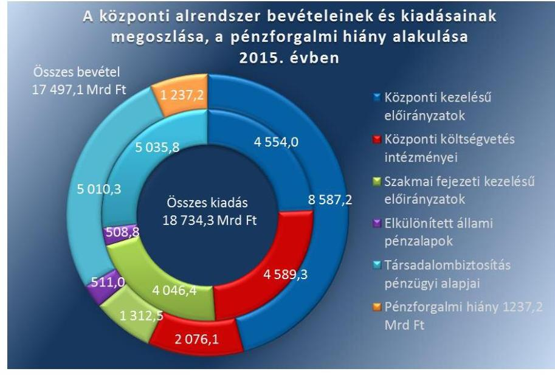

Forrás: 2015. évi zárszámadási törvényjavaslat, ASZ saját szerkesztés

---

AZ ORSZÁGGYŰLÉS a Kvtv.-ben az államháztartás központi alrendszerének bevételi főösszegét 16 312,9 Mrd Ft-ban, kiadási főösszegét 17 190,3 Mrd Ft-ban, hiányát 877,4 Mrd Ft-ban állapította meg. A Kvtv. módosításáról szóló törvények 2015. évben a központi alrendszer bevételi főösszegét 16 451,6 Mrd Ft-ra, a kiadási főösszeget 17 344,0 Mrd Ft-ra, a hiányt 892,4 Mrd Ft-ra módosították. 2015. évben a központi alrendszer bevételei 17 497,1 Mrd Ft-ra, a kiadások 18 734,3 Mrd Ft-ra teljesültek.

A KÖZPONTI ALRENDSZER BEVÉTELE 1045,6 Mrd Fttal (6,4\%-kal) haladta meg a törvényi módosított előirányzatot. A bevételi előirányzat magasabb szintű teljesüléséhez a központi költségvetés 488,4 Mrd Ft-tal, a költségvetési szervek 897,7 Mrd Ft-tal, az ELKA 19,5 Mrd Ft-tal, a TB Alapok közül az Ny. Alap ${ }^{51}$ 59,7 Mrd Ft-tal, az E. Alap ${ }^{52}$ 15,2 Mrd Ft-tal járult hozzá. A szakmai fejezeti kezelésű előirányzatok bevételei 434,7 Mrd Ft-tal maradtak el a törvényi módosított előirányzattól. A központi alrendszer bevételi főösszegének alakulását 2014-2015. években a 3. ábra mutatja.
3. ábra
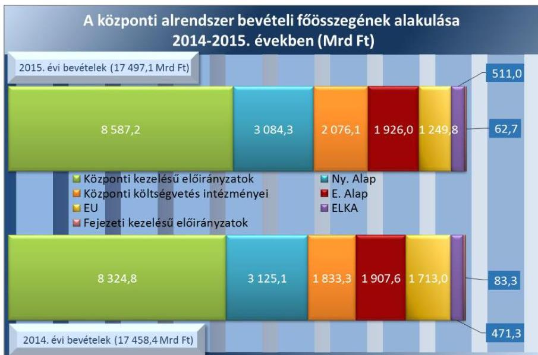

Forrás: 2015. évi zárszámadási törvényjavaslat, ÁSZ saját szerkesztés
A KÖZPONTI ALRENDSZER KIADÁSA 1390,3 M Ft ${ }^{53}$-tal (8,0\%-kal) magasabb szinten teljesült a törvényi módosított előirányzathoz képest, amelyhez a központi költségvetés 1329,3 M Ft-tal, a TB Alapok 94,6 M Ft-tal járult hozzá. Az ELKA kiadásai 33,6 M Ft-tal maradtak el a törvényi módosított előirányzattól. A központi alrendszer kiadásainak legnagyobb hányadát, 26,9\%-át a TB Alapok kiadásai jelentették. A központi alrendszer összes kiadásából a költségvetési szervek kiadásai 24,5\%-ot, a központi kezelésű előirányzatok kiadásai 24,3\%-ot tettek ki. A szakmai fejezeti kezelésű előirányzatok 21,6\%-ot, az ELKA kiadásai 2,7\%-ot képviselnek. A központi alrendszer kiadási főösszegének alakulását 2014-2015. években a 4. ábra mutatja.

---

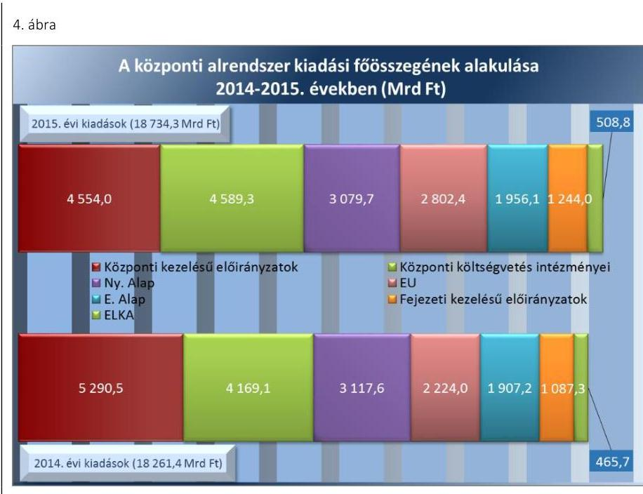

Forrás: 2015. évi zárszámodási törvényjavaslat, ÁSZ saját szerkesztés

# AZ ÁLLAMHÁZTARTÁS KÖZPONTI ALRENDSZERÉNEK HIÁNYA folyó áron, pénzforgalmi szemléletben 

1237,2 Mrd Ft-ra, a Kvtv.-ben meghatározottnál 344,8 Mrd Ft-tal (38,6\%kal) magasabb szinten teljesült. Az Áht. ${ }^{54}$ előírásai szerint a költségvetési kiadások - a központi költségvetés előirányzat-módosítási kötelezettség nélkül túlteljesíthető költségvetési kiadásai nélkül - a módosított előirányzatok mértékéig teljesíthetők. A hiány törvényi módosított előirányzatot meghaladó teljesülése eleget tesz az Áht. előírásainak. A központi költségvetés azon előirányzatainál, melyek teljesülése módosítás nélkül eltérhet az előirányzattól, a kiadások 371,1 Mrd Ft-tal haladták meg az előirányzatot, amelynek meghatározó részét az uniós támogatásokhoz kapcsolódó kiadások (XIX. UF fejezet) képezték. A központi alrendszer hiányát a központi költségvetés 1213,8 Mrd Ft összegű és a TB Alapok 25,5 Mrd Ft öszszegű hiánya és az ELKA 2,2 Mrd Ft összegű többlete eredményezte.

## A KORMÁNYZATI SZEKTOR UNIÓS MÓDSZERTAN

SZERINTI HIÁNYA 533,9 Mrd Ft, a GDP 1,6\%-a volt, alacsonyabb az uniós kritériumnál (GDP 3\%-a). Az uniós módszertan szerinti hiány pénzforgalmi hiányhoz mért 2,0 százalékpontos javulását - a 2016. szeptemberi EDP jelentés adatai szerint - az eredményszemléletesítés (2,7\%), az államháztartáson kívüli szervezetek egyenlege ( $0,3 \%$ ), a pénzügyi tranzakciók kiiktatása ( $-0,5 \%$ ), illetve az egyéb korrekciók ( $-0,5 \%$ ) eredményezte.

Az uniós módszertan szerinti GDP arányos hiány a tervezett 2,4\%-nál alacsonyabb lett. A kétféle módszerrel számított hiány közötti eltérés legfőbb oka a törvényjavaslat indokolásában foglaltak szerint az volt, hogy 500 Mrd Ft uniós támogatás 2015. évben nem folyt be a hazai költségvetésbe. A támogatás elszámolása eredményszemléletben javította a költségvetés egyenlegét.

A kormányzati szektor uniós módszertan szerinti hiányát és adósságát az 5. ábra mutatja be.

---

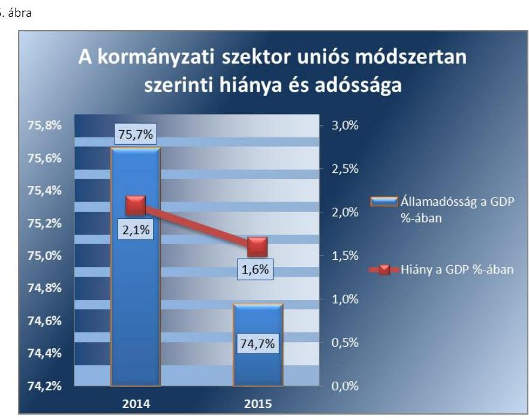

*Forrás: 2015. évi zárszámadási törvényjavaslat, ÁSZ saját szerkesztés*

**AZ ÁLLAMADÓSSÁG** Kvtv.-ben meghatározott mértéke megfelelt az Alaptörvényben foglalt, az államadósság teljes hazai össztermékhez viszonyított arányának csökkentését előíró szabályozásnak.

A Kormány a féléves adatok alapján felülvizsgálta az adósság-szabály érvényesülését, melynek eredményéről tájékoztatta az Országgyűlés illetékes bizottságát és a Költségvetési Tanácsot, ezzel eleget tett a Stabilitási tv. előírásainak. A felülvizsgálat idején a Kormány 2015. évre a reál GDP 3,1%-os növekedésével, valamint az uniós módszertan szerinti hiány 3,0% alatti teljesülésével számolt, a hiánycél (2,4%) változatlansága mellett.

Az államadósság alakulása megfelelt az Alaptörvény és a Stabilitási tv. államadósságra vonatkozó előírásainak. A 2014. évi államadósság a GDP 76,0%-a volt, a Stabilitási tv. szerinti 2015. évi államadósság 25 134,9 Mrd Ft volt, amely a GDP (33 999,0 Mrd Ft) 73,9%-a. Az államadósság GDP arányos csökkenése 2,6 százalékpont. Az államadósság alacsonyabb szintjéhez a devizaadósság jelentős csökkenése, valamint az év végi előtörlesztések, adósság-visszavásárlások járultak hozzá.

A 2015. évben a hazai költségvetésbe be nem folyt uniós támogatások összegét a Stabilitási tv. szerinti államadósság számításánál nem kell figyelembe venni.

# **A KORMÁNYZATI SZEKTOR UNIÓS MÓDSZERTAN SZERINTI ADÓSSÁGA** a 2014. évi 75,7%-ról (adósság 24 514,2 Mrd Ft, GDP 32 400,1 Mrd Ft) 2015. évre 74,7%-ra (adósság 25 402,3 Mrd Ft, GDP 33 999,0 Mrd Ft) csökkent. A kormányzati szektor az uniós kritériumok szerinti adósságcsökkentési követelményt teljesítette.

# **A KÖZPONTI ALRENDSZER FINANSZÍROZÁSI IGÉNYÉNEK ÉS ADÓSSÁGÁNAK** kezelését az ÁKK Zrt. a Stabilitási tv. előírásainak megfelelően végezte. Ennek keretében elkészítette a központi költségvetés 2015. évi előzetes finanszírozási tervét, amelyet év

---

# 1.2. számú megállapítás 

közben az adatszolgáltatóktól (NGM és Kincstár) érkező információk alapján módosítottak. Az ÁKK Zrt. a finanszírozási terv végrehajtása során gondoskodott a központi költségvetés fizetőképességének fenntartásáról, valamint az állam átmenetileg szabad pénzeszközeinek kezeléséről. A KESZ likvidítása a 2015. évben biztosított volt. A letéti számlavezetés és az analitikus nyilvántartás megfelelt az Ávr. ${ }^{55}$-ben előírtaknak.

ADÓSSÁGÁTVÁLLALÁS 2015. évben 122,8 Mrd Ft összegben történt. A MÁV Zrt. ${ }^{56}$-től 23,4 Mrd Ft adósságátvállalásra, a BKV Zrt. ${ }^{57}$-től 52,3 Mrd Ft, az MTVA ${ }^{58}$-tól 47,1 Mrd Ft hiteladósság-átvállalásra került sor. Az adósságátvállalás a Kvtv.-ben engedélyezett adósságelemekhez, járulékokhoz kapcsolódott, az átvállalt adósságelemek és a lebonyolítási határidők megfeleltek a törvényi előírásoknak A BKV Zrt. nem része a kormányzati szektornak, így a BKV Zrt.-től történt adósságátvállalás növelte az uniós módszertan szerint számított államadósságot. A MÁV Zrt. és az MTVA szervezetek az államháztartás részét képezik így az átvállalt adósságuk nem növelte a fentiek szerinti államadósságot.

## A 2015. évi zárszámadási törvényjavaslat tartalma, szerkezete meg-

felelt a jogszabályi előírásoknak.

## A ZÁRSZÁMADÁSI TÖRVÉNYJAVASLAT TARTALMA, SZERKEZETE megfelel az Áht. előírásainak. A törvényjavaslat az Áht. előírásainak megfelelően az elfogadott költségvetéssel öszszehasonlítható módon került összeállításra. A törvényjavaslat tartalmazza az Áht.-ban előírt költségvetési mérlegeket alrendszerenként és összevontan, közgazdasági és funkcionális tagolásban. A törvényjavaslat összeállításánál az NGM betartotta a vonatkozó belső szabályzatok előírásait.

Az Áht. előírásaival összhangban a törvényjavaslat indokolása és melléklete bemutatja a kormányzati szektor uniós módszertan szerint számított egyenlegét (hiányát) és adósságát. A törvényjavaslat normaszövege rögzíti az Alaptörvény és a Stabilitási törvény szerinti adósságmutató 2015. év végi alakulását, illetve csökkenését, tartalmazza a költségvetési hiány finanszírozásának módját. Az államháztartás pénzforgalmi hiányát és az elsődleges egyenleg alakulását a törvényjavaslat indokolásának melléklete tartalmazza. Az indokolás melléklete tartalmazza a költségvetési mérleget alrendszerenként és összevontan, közgazdasági és funkcionális tagolásban. Tájékoztatást ad az adóbevételekben érvényesülő közvetett támogatásokról (adónemenként az adóelengedésekről, adókedvezményekröl). Bemutatja az állam által vállalt kezességek, garanciák és viszontgaranciák állományát és az állam tulajdonában álló gazdálkodó szervezetek müködéséből származó kötelezettségek, a részesedések alakulását.

Az Áht. előírásainak megfelelően a költségvetési tervezés során figyelembe vett makrogazdasági és költségvetési folyamatok alakulásának értékelését, az eltérések okait alrendszerenként a törvényjavaslat indokolása tartalmazza. A helyi önkormányzatok tulajdonában álló gazdálkodó szervezetek müködéséből származó kötelezettségek, a részesedések alakulását, valamint a helyi önkormányzatok által kibocsátott garanciák és kezességek állományát a törvényjavaslat indokolásának melléklete bemutatja. Az államháztartás központi alrendszerében és önkormányzati alrendszerében, valamint a kormányzati szektorba sorolt egyéb szervezeteknél a nem telje-

---

sítő hitelkövetelések állományát a törvényjavaslat indokolásának melléklete tartalmazza. A 2015. évi zárszámadási törvényjavaslat fejezeti indokolásai (a fejezeti kötetek) az Áht. előírásainak megfelelően tartalmazzák a fejezetek közötti átcsoportosítást, valamint a címrend és a címrend alá rendezett alcímek, jogcímcsoportok, jogcímek változását.

# A ZÁRSZÁMADÁSI TÖRVÉNYJAVASLAT ÖSSZE- 

ÁLLÍTÁSI FOLYAMATÁRA vonatkozó Szabályzattal ${ }^{59}$ az NGM rendelkezett, amelyet 2015 februárjában adtak ki. A szabályzat tartalmazta a módszertani elveket és szempontokat, az adatok egyeztetésének, a szöveges elemzések készítésének, valamint a törvényjavaslat véglegesítésének szabályait, meghatározta a feladatok ütemezését, továbbá a törvényjavaslat összeállítási folyamatának kontrolljait. A szabályzat előírásait az NGM SzMSz-ében ${ }^{60}$, a törvényjavaslat összeállításában közreműködő szervezeti egységek ügyrendjében és ellenőrzési nyomvonalában foglaltakkal összhangban alakították ki. Az NGM SzMSz-e és a zárszámadási törvényjavaslat előkészítésében részt vevő egyes szakfőosztályok ügyrendjei tartalmazzák a törvényjavaslat elkészítéséért felelős szervezeti egységek zárszámadási dokumentumok előkészítésével és összeállításával kapcsolatos feladatait.

AZ NGM ÚTMUTATÓ61 az Áht. és az Ávr. előírásaival összhangban tartalmazta a zárszámadási törvényjavaslat összeállítását megalapozó módszertani elveket, a feladatokat, azok ütemezését és felelőseit, valamint az NGM és az adatszolgáltató szervezetek (a NAV, a Kincstár, az ÁKK Zrt., a fejezetek, az alapkezelők) közötti, illetve az NGM szervezetén belüli adatátadásra, adategyeztetésre vonatkozó iránymutatásokat. Emellett meghatározta a zárszámadási törvényjavaslat tartalmával, szerkezetével összefüggő követelményeket.

## A ZÁRSZÁMADÁSI TÖRVÉNYJAVASLAT ÖSSZEÁLLÍTÁSÁT TÁMOGATÓ INFORMATIKAI RENDSZEREK kialakítása és múködtetése tekintetében az ellenőrzés kockázatokat tárt fel, azonban azok a törvényjavaslat adatainak megbízhatóságát nem befolyásolták. Az Áhsz. előírásai ellenére a kötelező egyezőségeket biztosító szabályok érvényesítésére kialakított informatikai kontrollok a $\mathrm{KGR}^{62}$ K11-ben nem az összes beszámoló készítésre kötelezett szervezet esetében múködtek. A rendszerbe feltöltött és elfogadott éves költségvetési beszámolók és a főkönyvi kivonatok adatai egyezőségére vonatkozóan a Kincstár által elvégzett ellenőrzés az Áhsz. előírásai ellenére nem terjedt ki valamennyi éves költségvetési beszámolóra. Informatikai kontrollokkal nem, de manuális kontrolokkal biztosították az NGM KAR rendszerében végrehajtott adatmódosítások átvezetését az adatszolgáltatók módosítással érintett beszámolóiban és a beszámoló adatokat tartalmazó kincstári KGR K11 rendszerben.

---

# 2. A törvényjavaslat a beszámolóknak megfelelően, valósághűen mutatja-e be a költségvetés végrehajtására vonatkozó pénzügyi adatokat, információkat? A központi költségvetés, a TB Alapok és az ELKA bevételi és kiadási előirányzatainak teljesítési adatai megbízhatóak-e? 

Összegző megállapítás

A törvényjavaslat a beszámolók adatainak megfelelően, valósághűen mutatja be a költségvetés végrehajtására vonatkozó pénzügyi adatokat, információkat. A központi költségvetés, a TB Alapok és az ELKA bevételi és kiadási előirányzatainak teljesítési adatai megbízhatóak.

A KINCSTÁR KGR K11 rendszerében az Ávr. előírásainak megfelelően, a 2015. év zárását követően az államháztartás központi alrendszerében a központi kezelésű előirányzatok, fejezeti kezelésű előirányzatok, a költségvetési szervek, a TB Alapok és az ELKA kezelő szervei elkészítették éves költségvetési beszámolóikat.

A Kincstár az Áhsz.-ben előírt az éves költségvetési beszámolók adataiból az államháztartás központi alrendszeréről, önkormányzati alrendszeréről és az államháztartás egészéről összevont (konszolidált) beszámolókat az ellenőrzés lezárásáig nem készítette el. Azok összeállításához az Áhsz.ben előírtakkal összhangban a helyi önkormányzat, nemzetiségi önkormányzat, társulás összevont (konszolidált) beszámolóját a Kincstár az Áhsz. szerinti határidőre elkészítette és megküldte a helyi önkormányzat, nemzetiségi önkormányzat, társulás részére.

AZ NGM az Áhsz. előírásainak megfelelően az éves költségvetési beszámolók adatai alapján elkészítette a zárszámadási törvényjavaslatot. Az Áhsz. 33. § (3) bekezdése értelmében a tulajdonosi joggyakorló szervezetek éves költségvetési beszámolóikat a költségvetési évet követő június 30ig készítették el, illetve töltötték fel a Kincstár által múködtetett adatszolgáltató rendszerbe, ezért a 2016. június 30-i törvényjavaslatban az állami vagyonnal kapcsolatos teljesítési és tájékoztató adatok előzetes adatoknak minősültek.

A KÖZPONTI KÖLTSÉGVETÉS (központi kezelésű előirányzatok, szakmai fejezeti kezelésű előirányzatok, központi költségvetési intézmények előirányzatai) bevételeinek teljesítése 11 975,8 Mrd Ft, a központi költségvetés kiadásainak teljesítése 13 189,7 Mrd Ft volt. A központi költségvetés bevételi és kiadási adataiban előforduló megbízhatósági hibák összértéke nem éri el a lényegességi szintet, a bevételi és kiadási adatok megbízhatóak. Az ellenőrzés a központi költségvetés bevételi, illetve kiadási adataiban - az NCSSZA előirányzatai terhére a Kincstár és a Kormányhivatalok által megállapított és folyósított ellátások és támogatások területén, az Országgyűlés felé beszámolásra kötelezett intézmények kiadásainál, valamint a központi költségvetés egyéb intézményei bevételeinél és kiadásainál - állapított meg megbízhatósági hibákat.

---

# 2.1. számú megállapítás 

A központi költségvetés részét képező központi kezelésű bevételi és kiadási előirányzatok teljesítési adatai megbízhatóak.

A KÖZPONTI KEZELÉSÚ ELÓIRÁNYZATOK bevételeinek 8099 130,2 M Ft törvényi módosított előirányzata 8587 253,8 M Ftra teljesült, amely 6,0\%-kal (488 123,6 M Ft) haladta meg a módosított előirányzatot. A központi kezelésű előirányzatok kiadásainak együttes teljesítése 4554 006,6 M Ft volt. A költségvetés központi kezelésű bevételi és kiadási adatai megbízhatóak. A központi kezelésű előirányzatok bevételeit és kiadásait a 6. ábra mutatja be.
6. ábra
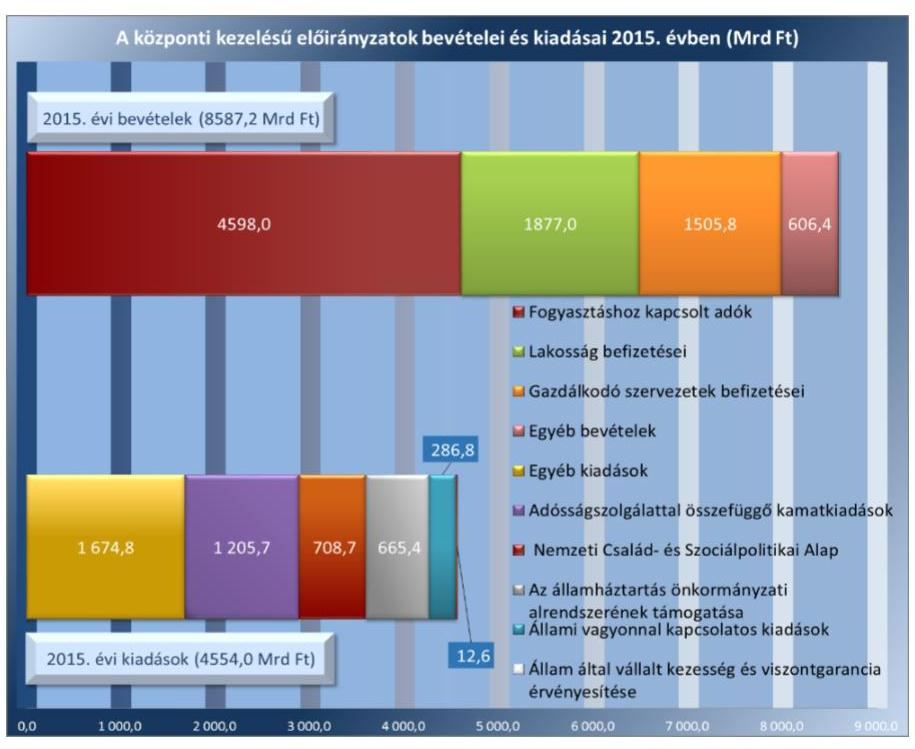

Forrás: 2015. évi zárszámadási törvényjavaslat, ÁSZ saját szerkesztés

AZ ADÓBEVÉTELEK részeként a fogyasztáshoz kapcsolt adók 4597 968,5 M Ft, a lakosság befizetései 1877 006,6 M Ft és a gazdálkodó szervezetek befizetései 1505 819,5 M Ft összegben teljesültek. A fogyasztáshoz kapcsolt adók 2,6\%-kal (115 283,5 M Ft), a lakosság befizetései 3,9\%-kal (70 406,6 M Ft), a gazdálkodó szervezetek befizetései 15,3\%-kal (199 867,1 M Ft) haladták meg törvényi módosított előirányzataikat. Az adóbevételeknél az ellenőrzés megbízhatósági hibát nem tárt fel, a bevételi adatok megbízhatóak.

AZ ÖNKORMÁNYZATOK TÁMOGATÁSAI vonatkozásában összevontan került sor a IX. Helyi önkormányzatok támogatásai fejezet és a XX. EMMI fejezet 22. Települési és területi nemzetiségi önkormányzatok támogatása cím ellenőrzésére. A 2015. évi kiadás teljesítése a helyi önkormányzatok tekintetében 665 385,1 M Ft, (törvényi módosított előirányzat $656044,6 \mathrm{M} \mathrm{Ft}$ ), a nemzetiségi önkormányzatok vonatkozásában - a törvényi módosított előirányzattal egyezően - 2333,4 M Ft volt. A IX. Helyi önkormányzatok támogatásai fejezet és a XX. EMMI fejezet Telepü-

---

lési és területi nemzetiségi önkormányzatok támogatása cím kiutalt támogatásainál az ellenőrzés megbízhatósági hibát nem tárt fel, a kiadási adatok megbízhatóak.

AZ ADÓSSÁGSZOLGÁLATTAL kapcsolatos kamatbevételek (232 497,2 M Ft) a központi kezelésű előirányzatok bevételeinek 2,7\%-át, az adósságszolgálattal kapcsolatos kamatkiadások (1 205 719,3 M Ft) a központi kezelésű előirányzatok kiadásainak 26,5\%-át képezték. Az adósságszolgálattal kapcsolatos bevételek és kiadások a Kvtv.-ben jóváhagyott összegeket meghaladó mértékben teljesültek. A kamatbevételek tervezettet meghaladó összege a tervekhez képest megemelt összegű államköt-vény-értékesítésre, és az év során bekövetkezett jelentős hozamcsökkenés miatti árfolyamnyereségre vezethető vissza. A kiadások szintén a tervezettet meghaladó mértéke pedig a tervezettnél nagyobb nettó finanszírozási igény miatt az év során magasabb állam-adósság állománynak, az év során a devizaárfolyam tervektől kedvezőtlenebb alakulásának és a kedvező piaci helyzetben a tervezettnél nagyobb összegekben megvalósított államköt-vény-visszavásárlásoknak tudható be. A nettó kamatkiadások mindezek következtében jelentősen elmaradtak a tervekben szereplő összegtől. A kiadások teljesítésénél betartották a Kvtv. előírásait, amely szerint a kiadások teljesítése eltérhet az előirányzattól annak módosítása nélkül. Az ellenőrzés a bevételek és kiadások tekintetében megbízhatósági hibát nem tárt fel, a bevételi és a kiadási adatok megbízhatóak. Az ÁKK Zrt. az Áht. és az Ávr. vonatkozó előírásainak megfelelően eleget tett az adósságszolgálattal kapcsolatos bevételekkel és kiadásokkal összefüggő, a Kincstár könyvvezetéséhez és beszámolási kötelezettségéhez kapcsolódó adatszolgáltatási és beszámolási kötelezettségének.

A XX. EMMI FEJEZET NCSSZA cím a központi kezelésű előirányzatok kiadás teljesítésének 15,6\%-át képezte. A címen eredeti bevételi előirányzat nem szerepelt a Kvtv.-ben. Az év közben keletkezett 1274,7 M Ft bevétel a jogosulatlanul igénybevett ellátások visszafizetéséből származott. Az előirányzaton a kiadások a törvényi módosított előirányzat szerint, 708 741,4 M Ft összegben teljesültek. Az NCSSZA előirányzatai terhére történő ellátások, támogatások folyósítása területén előforduló megbízhatósági hibák összértéke meghaladja a lényegességi szintet, a kiadási adatok nem megbízhatóak. Az NCSSZA Családi támogatások címéről teljesített kiadásoknál előforduló megbízhatósági hiba volt, hogy a Számv. tv. ${ }^{63}$ előírásai ellenére a folyósított ellátások elszámolásának bizonylatai (kifizetést alátámasztó határozat, szakvélemény, kérelem) nem álltak rendelkezésre.

# AZ ÁLLAMI VAGYONNAL, NFA ${ }^{64}$-VAL ÉS A TULAJ- 

DONOSI JOGGYAKORLÁSSAL kapcsolatos bevételek (170 095,4 M Ft) a központi kezelésű előirányzatok bevételeinek 2,0\%-át, a kiadások (286 839,7 M Ft) a központi kezelésű előirányzatok kiadásainak 6,3\%-át tették ki. A bevételek teljesülése 75 773,4 M Ft-tal maradt el a törvényi módosított előirányzattól. A teljesített kiadások összege 286 839,7 M Ft volt, amely a törvényi módosított előirányzatot 24,6\%-kal haladta meg (230 139,0 M Ft). A bevételek és a kiadások tekintetében az ellenőrzés megbízhatósági hibát nem tárt fel, az állami vagyonnal, NFA-val

---

és a tulajdonosi joggyakorlással kapcsolatos bevételi és kiadási adatok megbízhatóak.

A KEZESSÉG-visszatérülés mértéke 3431,6 M Ft volt. Az állam által vállalt kezesség és viszontgarancia érvényesítésével összefüggő kiadások összege 12 583,9 M Ft volt, amely a központi kezelésű előirányzatok kiadásainak 0,3\%-a. Az állam által vállalt kezességek, garanciák, viszontgarancia érvényesítéséből eredő kiadások a törvényi módosított előirányzat 46,6\%ában teljesültek. Az ellenőrzés a kezesség-visszatérülés előirányzattal öszszefüggő bevételek és kiadások tekintetében megbízhatósági hibákat nem tárt fel, a bevételi és a kiadási adatok megbízhatóak.

# A TOVÁBBI KÖZPONTI KEZELÉSÚ ELŐIRÁNYZATOK kiadásai valamennyi központi kezelésű előirányzat kiadásainak 36,8\%-át alkotják, 1674 737,2 M Ft összegben teljesültek. Az ellenőrzés megbízhatósági hibát nem tárt fel, a kiadási adatok megbízhatóak. 

A TARTALÉKOK (RKI ${ }^{65}$, OVA ${ }^{66}$, céltartalékok) törvényi módosított előirányzata 345 700,0 M Ft volt, amelyből 345 650,0 M Ft összegű felhasználásról a Kormány határozatokban döntött. Az RKI eredeti előirányzata 100 000,0 M Ft volt, amely törvényi hatáskörben 60000 M Ft-tal, törvényi felhatalmazás alapján kormányhatáskörben 9159,7 M Ft-tal növekedett. A Kvtv.-ben képzett RKI előirányzat, illetve az előirányzat növelésének mértéke megfelelt az Áht. előírásainak, a központi költségvetés kiadási főösszegének 0,5\%-a és 2\%-a között maradt. A felhasználás 169 109,9 M Ft (az előirányzat 99,97\%-a), a fel nem használt rész 49,8 M Ft volt. Az OVA előirányzat a törvényi módosított előirányzattal egyező, 30 000,0 M Ft öszszegben teljesült. A Kvtv. előírásainak megfelelően, a hiánycél várható teljesülését figyelembe véve, az előirányzatról 2015. október 13-i Korm. határozat alapján történt 25 800,9 M Ft összegű átcsoportosítás hét fejezet részére, illetve 2015. december 11-i Korm. határozat alapján 4199,1 M Ft átcsoportosítás öt fejezet részére. A céltartalékok 155 700,0 M Ft összegű törvényi módosított előirányzatából a felhasználás 155 699,8 M Ft volt.

## 2.2. számú megállapítás

A központi költségvetés részét képező szakmai fejezeti kezelésű bevételi és kiadási előirányzatok teljesítési adatai megbízhatóak.

## A SZAKMAI FEJEZETI KEZELÉSÚ ELŐIRÁNYZATOK 2015. évi teljesített bevételi főösszege 1312 452,7 M Ft volt, amely

24,9\%-kal elmaradt a 1747 181,2 M Ft összegű törvényi módosított előirányzattól. Ezen belül a szakmai fejezeti kezelésű előirányzatok saját bevételei 62 674,7 M Ft-ra, a szakmai fejezeti kezelésű előirányzatok EU támogatása 1249 778,0 M Ft-ra teljesült. A szakmai fejezeti kezelésű előirányzatok kiadásai 4046 393,6 M Ft összegben, a 3728 514,2 M Ft öszszegű törvényi módosított előirányzat 108,5\%-ában teljesültek. Ezen belül az egyéb szakmai fejezeti kezelésű előirányzatok kiadásai 1243 949,6 M Ft-ot, az Uniós programok kiadásai 2802 444,0 M Ft-ot tettek ki. A szakmai fejezeti kezelésű előirányzatok bevételeinek és kiadásainak összetevőit a 7. ábra mutatja be.

---

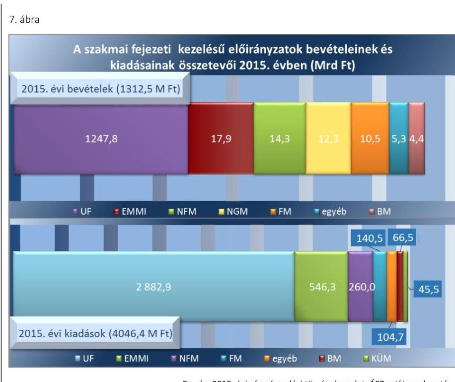

A szakmai fejezeti kezelésű előirányzatok bevételeinél és kiadásainál az ellenőrzés nem tárt fel megbízhatósági hibát, a bevételi és kiadási adatok megbízhatóak.

A XIX. UF67 FEJEZET bevételei 1247771,0 M Ft összegben, a (1 724 435,3 M Ft összegű) törvényi módosított előirányzat 72,4\%-ában teljesültek. A XIX. ME fejezet kiadás teljesítése 2882 908,0 M Ft, 12,5\%-kal meghaladta a 2562238,4 M Ft-os törvényi módosított előirányzatot. A XIX. UF fejezet uniós fejlesztési előirányzatok közötti, irányító hatósági hatáskörben végrehajtható átcsoportosítási lehetőségek kimerülését követően, az államháztartásért felelős miniszter engedélyével az NSRK ${ }^{68}$ OP ${ }^{69}$ 30\%-kal, továbbá törvényi felhatalmazás alapján kormányhatáskörben 200 000,0 M Ft és 50 000,0 M Ft összeggel megemelésre került.

Az NFA a TÁMOP ${ }^{70}$ hazai társfinanszírozása céljából a Kvtv.-ben rögzítetteknek megfelelően teljes egészében átadta az erre biztosított 11 064,6 M Ft összegű forrást az EMMI, mint forráskezelő részére.

Az európai uniós támogatások kiadásainál az ellenőrzés nem tárt fel megbízhatósági hibát, a kiadási adatok megbízhatóak.

# 2.3. számú megállapítás 

A központi költségvetés intézményei bevételi és kiadási előirányzatainak teljesítési adatai megbízhatóak.

A KÖZPONTI KÖLTSÉGVETÉS INTÉZMÉNYEI bevételi előirányzatának teljesítése 2076 130,9 M Ft volt, amely a törvényi módosított előirányzatot 76,2\%-kal haladta meg. A kiadási előirányzatok 4589 255,7 M Ft-ban, a törvényi módosított előirányzat 136,5\%-ában teljesültek. A központi költségvetési intézmények bevételi és kiadási adataiban előforduló megbízhatósági hibák összértéke nem éri el a lényegességi szintet, a bevételi és a kiadási adatok megbízhatóak. A központi költségvetés intézményeinek bevételeit és kiadásait intézmény-csoportonként a 8. ábra mutatja.

---

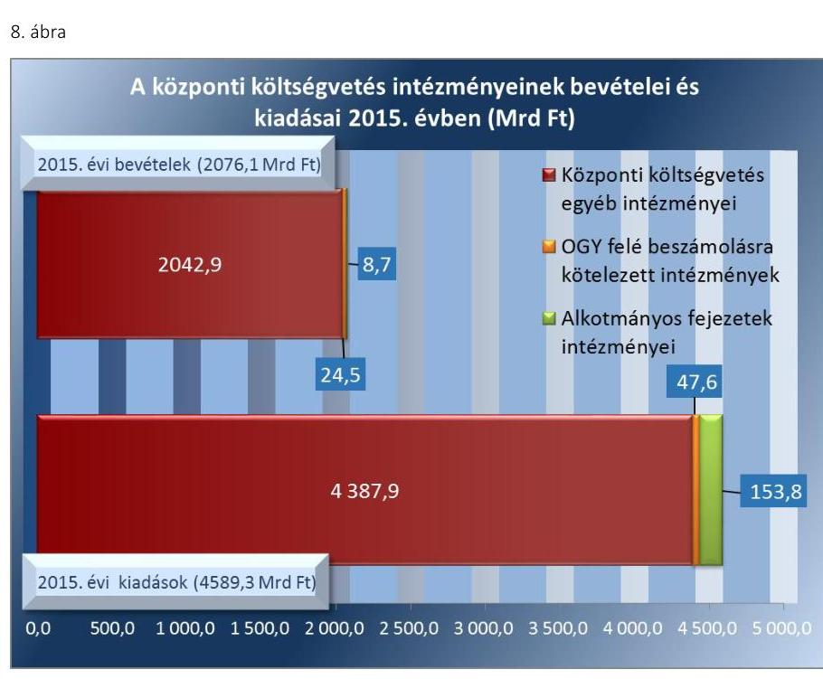

Forrás: 2015. évi zárszámadási törvényjavaslat, ÁSZ saját szerkesztés

# AZ OGY FELÉ BESZÁMOLÁSRA KÖTELEZETT IN- 

TÉZMÉNYEK bevételi előirányzatának teljesítése 24 502,3 M Ft volt, amely a törvényi módosított előirányzatot 31,4\%-kal haladta meg. A kiadási előirányzatok 47 630,6 M Ft-ban teljesültek, amely 16,6\%-kal haladta meg a törvényi módosított előirányzatot.

Az Országgyűlés felé beszámolásra kötelezett intézmények bevételeinél az ellenőrzés megbízhatósági hibát nem tárt fel, a bevételi adatok megbízhatóak. A kiadási előirányzatok teljesítésénél az ellenőrzés az MTA Igazgatásánál tárt fel megbízhatósági hibákat. Az MTA Igazgatása a Számv. tv. előírásai ellenére nem rendelkezett a könyvviteli elszámolást közvetlenül és közvetetten alátámasztó számviteli bizonylatokkal. A kiadási adatokban előforduló megbízhatósági hibák összértéke nem éri el a lényegességi szintet, a kiadási adatok megbízhatóak.

## AZ ALKOTMÁNYOS FEJEZETEK INTÉZMÉNYEI-

NEK bevételi előirányzata 8712,5 M Ft-ban teljesült, amely a törvényi módosított előirányzatot 198,4\%-kal haladta meg. Az alkotmányos fejezetek intézményeinek kiadási előirányzata 153 763,1 M Ft-ban teljesült, amely 6,7\%-kal haladta meg a törvényi módosított előirányzatot.

Az alkotmányos fejezetek intézményeinek bevételeinél és kiadásainál az ellenőrzés megbízhatósági hibát nem tárt fel, a bevételi és a kiadási adatok megbízhatóak.

## A KÖZPONTI KÖLTSÉGVETÉS EGYÉB INTÉZMÉ-

NYEI bevételei 2042 916,2 M Ft összegben teljesültek, amely 76,6\%kal haladta meg a törvényi módosított előirányzatot (1 156 817,5 M Ft). A központi költségvetés egyéb intézményeinek kiadási előirányzata 4387 862,0 M Ft-ban teljesült, amely 38,1\%-kal haladta meg a törvényi módosított előirányzatot.

---

A központi költségvetés egyéb intézményeinek bevételi adataiban előforduló megbízhatósági hibák összértéke nem éri el a lényegességi szintet, a bevételi adatok megbízhatóak. A központi költségvetés egyéb intézményeinek kiadási adataiban előforduló megbízhatósági hibák összértéke nem éri el a lényegességi szintet, a kiadási adatok megbízhatóak. A bevételeknél és a kiadásoknál az alábbi típusú megbízhatósági hibák fordultak elő: az elszámolások a Számv. tv. és az Áhsz. előírásai ellenére nem minden esetben voltak alátámasztva hiteles, megbízható számviteli bizonylattal, illetve az Ávr. előírásai ellenére a kötelezettségvállalás dokumentumai nem minden esetben álltak rendelkezésre (HMBVI ${ }^{71}$, KKM Igazgatás ${ }^{72}$, KLIK $^{73}$, $\mathrm{OE}^{74}$, AEEK $^{75}$, BAZMKEOK ${ }^{76}$, BFK ${ }^{77}$, EMMIKGYAISZ ${ }^{78}$, MFOKR ${ }^{79}$ ). A KLIK bevételeinél és kiadásainál előforduló megbízhatósági hibák összértéke meghaladja a lényegességi szintet, a KLIK bevételi és kiadási adatai nem megbízhatóak.

# 2.4. számú megállapítás 

## A TB Alapok bevételi és kiadási előirányzatainak teljesítési adatai megbízhatóak.

A TB ALAPOK 5010 318,1 M Ft együttes teljesített bevétele és 5035 841,0 M Ft kiadása meghaladta a törvényi módosított előirányzatot. A TB Alapok bevételi előirányzatának teljesítése az összes előirányzat módosítást figyelembe véve 1,5\%-kal meghaladta az előirányzatot, a kiadások 0,5\%-kal elmaradtak az előirányzattól. A TB Alapok bevételeinek és kiadásainak összetevőit a 9. ábra mutatja be.
9. ábra
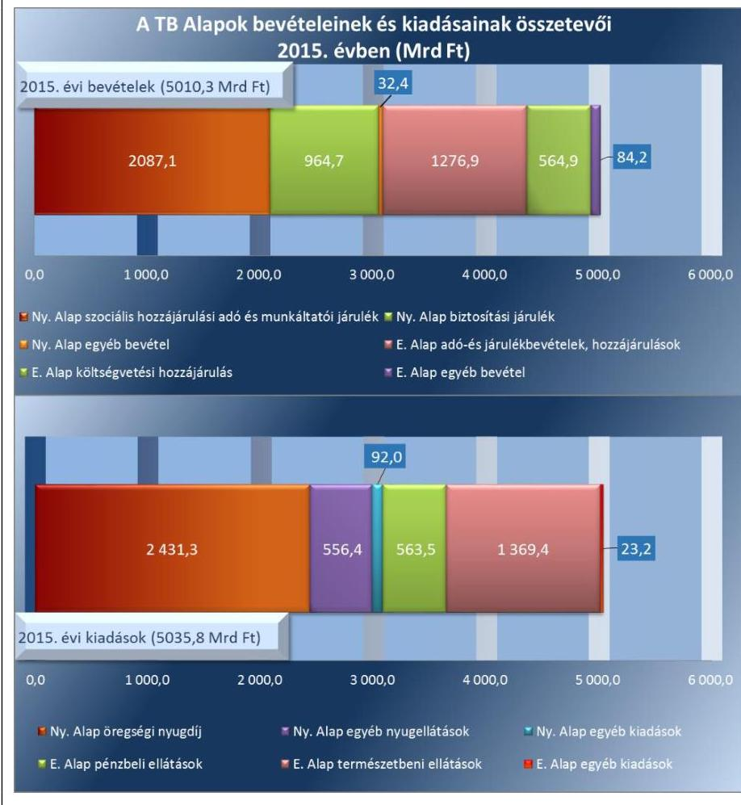

Fonrás: 2015. évi zárszámadási törvényjavaslat, ÁSZ saját szerkesztés

---

AZ NY. ALAP bevételi előirányzata 3084 260,2 M Ft-ban teljesült, amely a törvényi módosított előirányzatot 2,0 \%-kal haladta meg. Az ellátással összefüggésben 3080 884,5 M Ft, a múködéshez kapcsolódóan 3375,7 M Ft bevétel teljesült. Az Ny. Alap kiadási előirányzata 3079 700,1 M Ft-ra teljesült, amely 2,0 \%-kal haladta meg a törvényi módosított előirányzatot. A teljesített kiadásokból 3067 821,9 M Ft az ellátáshoz, 11 878,2 M Ft a múködéshez kapcsolódott. Az Ny. Alap költségvetése - 74 848,0 M Ft költségvetési befizetés mellett - 4560,1 M Ft többlettel teljesült.

AZ E. ALAP bevételi előirányzata 1926 057,9 M Ft-ban teljesült, amely a törvényi módosított előirányzatot 15 217,8 M Ft-tal haladta meg. Az ellátással összefüggésben 1924 061,6 M Ft, a múködéshez kapcsolódóan 1996,3 M Ft bevétel teljesült. Az E. Alap teljesített kiadása 1956 140,9 M Ft volt, amely a törvényi módosított előirányzatot 45 300,8 M Ft-tal haladta meg. A teljesített kiadásokból 1946 039,4 M Ft az ellátáshoz, 10 101,5 M Ft az E. Alapot kezelő OEP ${ }^{80}$ múködéséhez kapcsolódott. Az E. Alap költségvetése 30 083,0 M Ft hiánnyal zárta a 2015. évet.

A TB Alapok bevételeinél és kiadásainál az ellenőrzés nem tárt fel megbízhatósági hibát, a bevételi és a kiadási adatok megbízhatóak.

# 2.5. számú megállapítás 

Az ELKA bevételi és kiadási előirányzatainak teljesítési adatai megbízhatóak.

AZ ELKA 2015. évi teljesített bevételi főösszege 510 972,9 M Ft volt, amely a törvényi módosított előirányzatot 3,9\%-kal haladta meg. Az ELKA törvényi módosított kiadási előirányzata 542 381,5 M Ft, a teljesítés 508 801,3 M Ft volt. Az ELKA 2171,6 M Ft többlettel zárta az évet. Az ELKA bevételeit és kiadásait Alaponként a 10. ábra mutatja be.
10. ábra
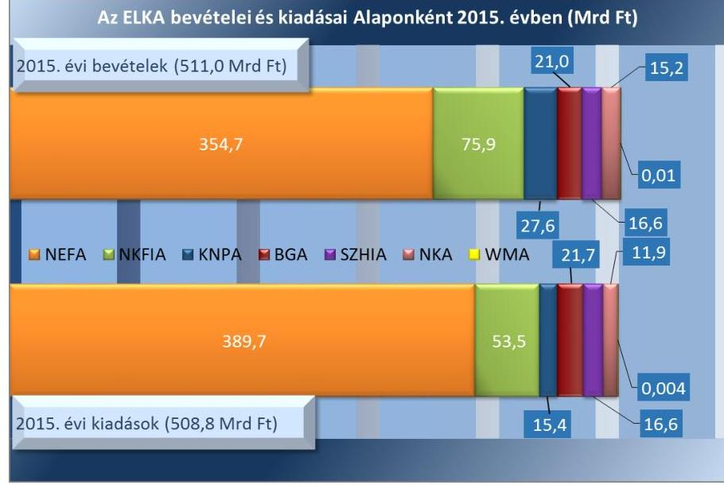

Forrás: 2015. évi zárszámadási törvényjavaslat, ÁSZ saját szerkesztés
Az ELKA kiadásainál az ellenőrzés nem tárt fel megbízhatósági hibát, a kiadási adatok megbízhatóak.

---

# 3. A központi költségvetés, a TB Alapok és az ELKA bevételi és kiadási előirányzatainak teljesítése, az előirányzat módosítás, a maradvány megállapítása és a beszámolók összeállítása során betartották-e a jogszabályi előírásokat? 

Összegző megállapítás

A központi költségvetés, a TB Alapok és az ELKA bevételi és kiadási előirányzatainak teljesítése, az előirányzat módosítás, a maradvány megállapítása és a beszámolók összeállítása során összességében betartották a jogszabályi előírásokat.
3.1. számú megállapítás

A központi költségvetés részét képező központi kezelésű bevételi és kiadási előirányzatok teljesítése során összességében betartották a jogszabályi előírásokat.

A KÖLTSÉGVETÉS KÖZPONTI KEZELÉSŰ bevételi előirányzatai tekintetében az ellenőrzés a IX. Helyi önkormányzatok támogatásai fejezet és a XX. EMMI fejezet Települési és területi nemzetiségi önkormányzatok támogatása cím kiadásainál tárt fel szabályszerűségi hibákat. Az Áht.-ban és az Ávr.-ben foglaltak ellenére a támogatási szerződések, támogatói okiratok pénzügyi ellenjegyzést nem tartalmaztak, valamint az utalványozást megelőzően nem történt meg a teljesítésigazolás. A 2015. évben végrehajtott előirányzat-módosítások megfeleltek a jogszabályi előírásoknak.

Az adósságszolgálattal kapcsolatos bevételek és kiadások kezelése szabályszerűen történt. Az ÁKK Zrt. az Áht. és az Ávr. vonatkozó előírásainak megfelelően eleget tett az adósságszolgálattal kapcsolatos bevételekkel és kiadásokkal összefüggő, a Kincstár könyvvezetéséhez és beszámolási kötelezettségéhez kapcsolódó adatszolgáltatási és beszámolási kötelezettségének.

A XX. EMMI fejezet NCSSZA cím előirányzatai terhére történt kiutalások tekintetében az ellenőrzés szabályszerűségi hibákat tárt fel. Az Áht. és a $\mathrm{Bkr}^{81}$. előírásai ellenére nem szabályozták a gyermekek születésével kapcsolatos szabadság megtérítése, elszámolása, a fogyatékossági támogatás és a vakok személyi járadéka, valamint a megváltozott munkaképességűek kereset-kiegészítése jogcímcsoporthoz kapcsolódó kifizetések eljárásrendjét, a finanszírozási terv készítési, valamint az adatszolgáltatási és könyvelési feladatokat. A 350/2014. (XII. 29.) Korm. rendeletben foglaltak ellenére a kifizetést megelőző jogszerűség és elszámolás ellenőrzése nem volt biztosítva, valamint a Cst. ${ }^{82}$ rendelkezéseivel ellentétesen a családi pótlék igényelbírálásához szükséges írásbeli kérelem nem minden esetben állt rendelkezésre.

Az állami vagyonnal, NFA-val és a tulajdonosi joggyakorlással kapcsolatos bevételekkel és a kiadásokkal összefüggő előirányzat módosítások, teljesítések az Áht., az Ávr., a Vtv. ${ }^{83}$ és az egyéb vonatkozó jogszabályok előírásaival összhangban történtek. A szerződéskötések, a lebonyolított ügyletek elszámolásai szabályszerűek voltak, az ellenőrzés szabályszerűségi hibát nem tárt fel.

---

Az állam által vállalt kezesség és viszontgarancia érvényesítésével öszszefüggő kiadások tekintetében feltárt szabályszerűségi hibák a NAV által kezelt lakáscélú hitelekhez, agrárgazdasági kezességekhez kapcsolódó állami kezességvállalással összefüggő szerződések tartalma esetében a 110/2006. (V. 5.) Korm. rendelet ${ }^{84}$ előírásai be nem tartásához, illetve az állami viszontgarancia összegének Kincstár részéről a garantőr szervezet felé való késedelmes utalásához kapcsolódtak. Az állam által vállalt kezességek, garanciák, viszontgaranciák és nyújtott hitelek állományának felső határára vonatkozó Kvtv. előírásokat a garantőr szervezetek betartották. Az ügyletek állományi adatait tartalmazó főkönyvi és analitikus nyilvántartásaik megfeleltek az Áht., az Áhsz., a Számv. tv. és az egyéb vonatkozó jogszabályok előírásainak.

A Magán- és egyéb jogi személyek kártérítése jogcímcsoport esetében feltárt szabályszerűségi hibák a 2004/1994. (I. 21.) Korm. határozat ${ }^{85}$ alapján végzett kártérítés, a Nemzetközi elszámolások kiadása címen teljesített kiutalásoknál az Áht., és az Ávr. érvényesítésre és az utalványozásra vonatkozó előírásainak be nem tartásához kapcsolódtak.

A tartalékok (RKI, OVA, céltartalékok) képzése a jogszabályi előírásoknak megfelelt, felhasználásuk az Áht., az Ávr., a Kvtv. és a vonatkozó Korm. határozatok előírásainak megfelelően történt.
3.2. számú megállapítás

A központi költségvetés részét képező szakmai fejezeti kezelésű bevételi és kiadási előirányzatok teljesítése, az előirányzat módosítás, a maradvány megállapítása és a beszámolók összeállítása során összességében betartották a jogszabályi előírásokat.

# A SZAKMAI FEJEZETI KEZELÉSŰ ELŐIRÁNYZATOKNÁL a kontrollkörnyezet kialakítása 18 fejezet tekintetében megfelelő, az EMMI esetében a Számv. tv. számviteli szabályzatokra és az Ávr. múködéshez kapcsolódó belső szabályzatok készítésére vonatkozó előírásainak megsértése miatt részben megfelelő volt. 

A szakmai fejezeti kezelésű előirányzatoknál az ellenőrzés az alábbi szabályszerűségi hibákat tárta fel:

A szakmai fejezeti kezelésű előirányzatok bevételeinél az érvényesítés és az utalványozás nem felelt meg az Ávr. előírásainak (KKM), illetve az Ávr., valamint a gazdálkodásához kapcsolódó kötelezettségek vállalási rendjéről szóló belső utasítás 2015. május 26 -áig hatályban lévő előírásával ellentétben a bevétel teljesítés igazolását nem hajtották végre (KSH).

A támogatási célú előirányzatoknál az Ávr. előírásai ellenére a támogatási döntés nyilvános adatairól a döntés meghozatalát követő hét napon belül nem minden esetben szolgáltattak adatot a Kincstárnak (NFM). Az Ávr. előírásai ellenére a kötelezettségvállalás dokumentumán a pénzügyi ellenjegyzés dátumát nem jelölték meg (NGM, EMMI). Az Ávr. előírásai ellenére elmaradt a kötelezettségvállalás pénzügyi ellenjegyzésére feljogosított személy írásbeli kijelölése, továbbá az Ávr.-ben előírt teljesítésigazolást, érvényesítési feladatokat, utalványozást nem hajtották végre (EMMI).

A kötelezettségvállalás, annak pénzügyi ellenjegyzése, illetve az érvényesítés során nem tartották be az Áht. (EMMI) és az Ávr. vonatkozó előírásait (BIR, FM).

---

A Beruházási Alapból teljesített kifizetéseknél feltárt szabályszerűségi hibák az Áht. előirányzatokkal kapcsolatos kötelezettségvállalásokra vonatkozó előírásainak be nem tartásához (BIR) kapcsolódtak, illetve az Ávr. előírásai ellenére nem minden esetben történt meg a kedvezményezett írásban, határidő kitűzésével való felszólítása a beszámoló készítési kötelezettsége teljesítésére (NFM).

A szakmai fejezeti kezelésű előirányzatok maradványának alátámasztása megfelelt a jogszabályi előírásoknak. Három fejezet (NGM, NFM, EMMI) az Ávr. előírásai ellenére a maradvány elszámolást a tárgyévet követő év április 15-i határidőre nem készítette el és nem nyújtotta be az államháztartásért felelős miniszternek.

A szakmai fejezeti kezelésű előirányzatokra vonatkozó éves beszámolók összeállítása megfelelt a jogszabályi előírásoknak. Hat fejezet (FM, NGM, NFM, EMMI, MTA, MMA) az Áhsz. szerinti, az éves költségvetési beszámoló adatainak a Kincstár által működtetett elektronikus adatszolgáltató rendszerbe történő feltöltésére előírt határidőt nem tartotta be.

Az előirányzatokkal való gazdálkodással kapcsolatos feladatokat hét fejezet (IM, ME, FM, NGM, NFM, KKM, EMMI) fejezeti kezelésű előirányzatainál összesen 20 külső kezelő szerv látta el jogszabályi kijelölés illetve megállapodás alapján. Az irányító szervek és a külső kezelő szervek közötti szerződésekben, megállapodásokban foglaltakat betartották.

# AZ EURÓPAI UNIÓS TÁMOGATÁSOKHOZ KAPCSOLÓDÓ ELŐIRÁNYZATOKAT kezelő fejezetek, szervezetek kontrollkörnyezetének kialakítása összességében megfelelt a jogszabályi előírásoknak. 

Az európai uniós támogatások felhasználása összességében megfelelt a Kvtv., az Áht., az Ávr. és az Áhsz., valamint a végrehajtási rendeletek előírásainak az alábbiak szerint.

A 2007-2013 közötti uniós programozási periódusra vonatkozó pénzügyi források igénybevétele az NSRK OP-jai és az ÚMVP ${ }^{\text {th }}$ vonatkozásában a Kvtv.-ben meghatározott mértékben valósult meg.

A kumulált adatok alapján az NSRK OP-jai esetében 2015. december 31ig a 2007-2013. évi 9081534 M Ft (29 285,8 M EUR) összegű keret 112,7\%-át kötötték le támogatási döntéssel. 10446 329,6 M Ft összegű -EU-s és hazai részt is magában foglaló - támogatás kifizetése történt meg a kedvezményezettek részére. Az NSRK esetében a kedvezményezettek kifizetési kérelmei alapján, 2015. december 31-ig - a 2007-2015. évi kumulált adatok szerint- az EU Bizottság felé benyújtott időközi átutalási igény 94,6\%-ának a kiutalása történt meg. A Magyar Állam részére átutalt összeg az EU-s rész 77,6\%-át, az összes kifizetés 64,5\%-át jelentette, azaz 10624 M EUR összegű támogatás (az EU-s rész megelőlegezése, valamint a 15\%-os hazai rész) a 2007-2015. évi éves központi költségvetések terhére került kifizetésre.

Az ÚMVP esetében kifizetésekre az 5210,5 M EUR keret-előirányzatot 1,8\%-kal meghaladó összegben került sor. A kedvezményezettek kifizetési kérelmei alapján 2015. december 31-ig az EU Bizottság felé 2015. évben 597 M EUR euró összegben benyújtott támogatási igények 66,8\%-ban teljesültek.

---

A HOP hazai költségvetési forrást is tartalmazó 46,6 M EUR keretösszegéhez képest a kifizetések a Kvtv.-ben meghatározottnál 12\%-kal alacsonyabb szinten, 41,0 M EUR összegben teljesültek. Az Európai Halászati Alapról szóló 1198/2006/EU rendelet 2016. június 30-ig tette lehetővé a kedvezményezettek felé történő kifizetések teljesítését.
2015. évben a Belügyi Alapok ${ }^{87}$ esetében a Kvtv.-ben előirányzottakkal szemben uniós bevételt és támogatást nem használtak fel, kiadást nem teljesítettek. A Belügyi Alapokra vonatkozó Nemzeti Programokat az EU Bizottság 2015. év márciusában, illetve augusztusában fogadta el. A pályázati kiírások közzétételére 2015. június 30-án, illetve 2015. szeptember 30-án került sor.

A 2009-2014. időszakra vonatkozó $\mathrm{EGT}^{88}$ és Norvég Alaphoz ${ }^{89}$ kapcsolódó pénzügyi források igénybevétele nem érte el a Kvtv.-ben meghatározott mértéket. A Finanszírozási Mechanizmus Bizottság, mint döntéshozó szerv 2014. május 9-én felfüggesztette a kifizetéseket, melyet 2015. december 9-én oldott fel a donor fél. Finanszírozás a 2015. évben még nem indult újra, támogatás a donorok részéről nem történt.

A 2014-2020 közötti uniós költségvetési időszakra vonatkozó időarányos forráslekötés 2015. évben nem valósult meg. A Kohéziós politikai programok vonatkozásában a Kvtv.-ben biztosított kötelezettségvállalási keret előirányzatának 3,2\%-át kötötték le támogatási döntéssel (a GINOP ${ }^{90}$, a VEKOP ${ }^{91}$, a KEHOP ${ }^{92}$ és az EFOP ${ }^{93}$ esetében). A támogatási döntések alapján szerződéskötésre és kifizetésre a GINOP és a KEHOP esetében került sor. A Vidékfejlesztési és halászati programok esetében a Kvtv.ben biztosított kötelezettségvállalási keret-előirányzat terhére kötelezettséget nem vállaltak.

Az ellenőrzés az NSRK OP-jainál tárt fel szabályszerűségi hibát, egyes projektek nyilvántartása nem az Áhsz. 15. melléklete szerinti, egységes rovatrend előírásának megfelelő nyilvántartási számlákon történt.
3.3. számú megállapítás

A központi költségvetés intézményei bevételi és kiadási előirányzatainak teljesítése, az előirányzat módosítás, a maradvány megállapítása és a beszámolók összeállítása során összességében betartották a jogszabályi előírásokat.

A KÖZPONTI KÖLTSÉGVETÉS INTÉZMÉNYEI közül az Országgyűlés felé beszámolásra kötelezett intézmények belső kontrollrendszerének kialakítása és múködtetése megfelelt az Áht. és a Bkr. előírásainak. Az alkotmányos fejezetek intézményei kontrollkörnyezetének kialakítása 23 intézmény esetében megfelelt, kilenc intézménynél részben felelt meg a Bkr. előírásainak. A központi költségvetés 67 egyéb intézménye közül 38 intézmény esetében a kontrollkörnyezet kialakítása megfelelő, 23-nál részben megfelelő volt, hat intézmény kontrollkörnyezete nem felelt meg a Bkr.-ben foglalt előírásoknak.

AZ ORSZÁGGYŰLÉS FELÉ BESZÁMOLÁSRA KÖTELEZETT INTÉZMÉNYEK bevételei beszedésénél az ellenőrzés szabályszerűségi hibákat a NAIH és a KSH esetében állapított meg. A NAIH-nál az érvényesítés és az utalványozás nem felelt meg az Ávr. előírá-

---

sainak. A KSH a 2015. május 27-ét megelőzően elvégzett teljesítésigazolásoknál és érvényesítéseknél nem tartotta be az Ávr.-ben előírt követelményeket.

A kiadási előirányzatok felhasználása során a GVH, az NVI és a KSH betartotta a jogszabályok és a belső szabályzatok előírásait. Szabályszerűségi hibákat az ellenőrzés a KH, a NAIH, a NÉBIH, az MTA Igazgatása és az MMA Titkárság Igazgatása kiadásainál állapított meg.

A szabályszerűségi hibák az Áht. kötelezettségvállalásra (MMA Titkárság Igazgatása), az Ávr. pénzügyi ellenjegyzésre (KH, MMA Titkárság Igazgatása, MTA Igazgatása), teljesítésigazolásra (MMA Titkárság Igazgatása, MTA Igazgatása), érvényesítésre (KH, NAIH, MMA Titkárság Igazgatása, MTA Igazgatása), utalványozásra (NAIH, MTA Igazgatása), valamint a szerződés tartalmára vonatkozó előírásainak (NÉBIH, KH) be nem tartásához kapcsolódtak.

Az alkotmányos fejezetek intézményei betartották a Kbt.1,2,3-ben előírt közbeszerzési szabályokat.

Az előirányzatok módosítása és átcsoportosítása az MTA Igazgatása kivétellel megfelelt az Áht., az Ávr. és az Áhsz. követelményeinek. Az MTA Igazgatása az Ávr. előirányzat-módosításra és átcsoportosításra vonatkozó előírásokat részben tartotta be.

A maradvány-kimutatást az OGY felé beszámolásra kötelezett intézmények az Áht.-ban foglaltakkal összhangban, az Ávr. és az Áhsz. előírásai szerinti formában készítették el. A kötelezettségvállalással terhelt és a szabad maradványösszeg megállapítása megfelelt Ávr.-ben foglalt előírásoknak.

Az éves költségvetési beszámolók összeállítása megfelelt a jogszabályok és belső szabályzatok előírásainak. Az éves költségvetési beszámolókat az OGY felé beszámolásra kötelezett intézmények a könyvek zárását követően bizonylatokkal, szabályszerű könyvvezetéssel, az Áhsz. szabályai szerint folyamatosan vezetett részletező nyilvántartásokkal, a könyvviteli zárlat során készített főkönyvi kivonattal, valamint leltárral alátámasztottan elkészítették. Az Áhsz. kötelező egyezőségekre vonatkozó 17. mellékletének előírásai szerint biztosították a kötelező egyezőséget, betartották az egyes nyilvántartási számlák egyenlegére vonatkozó előírásokat.

AZ ALKOTMÁNYOS FEJEZETEK INTÉZMÉNYEI bevételeinél feltárt szabályszerűségi hibák az Ávr. teljesítésigazolásra és érvényesítésre vonatkozó előírásainak (Debreceni Törvényszék, Gyulai Törvényszék, Kaposvári Törvényszék, Szolnoki Törvényszék), valamint az utalványozásra meghatározott szabályainak be nem tartásához kapcsolódtak (Fővárosi Törvényszék).

A kiadásoknál feltárt szabályszerűségi hibák az Áht. és az Ávr. teljesítésigazolásra vonatkozó előírásainak be nem tartásához (Ügyészség), valamint az Ávr. pénzügyi ellenjegyzésre és érvényesítésre (Debreceni, Gyulai, Miskolci és Veszprémi Törvényszék, Ügyészség) vonatkozó előírásainak be nem tartásához kapcsolódtak.

Az alkotmányos fejezetek intézményeinél az előirányzat módosítások és átcsoportosítások összhangban voltak az Áht. és az Ávr. rendelkezéseivel.

Az alkotmányos fejezetek intézményei a 2015. évi éves költségvetési beszámolókat - az annak részét képező, költségvetési számvitellel készült

---

költségvetési jelentéseket és maradvány-kimutatásokat - a jogszabályi előírásoknak megfelelően állították össze. Az Áhsz. kötelező egyezőségekre vonatkozó 17. mellékletének előírásai szerint biztosították a kötelező egyezőséget, betartották az egyes nyilvántartási számlák egyenlegére vonatkozó előírásokat.

# A KÖZPONTI KÖLTSÉGVETÉS EGYÉB INTÉZMÉ- 

NYEINÉL az ellenőrzés a bevételek és átvett pénzeszközök beszedése esetében tárt fel szabályszerűségi hibákat. Az intézmények belső szabályzataikban előírták a teljesítés igazolásának kötelezettségét, azonban a teljesítésigazolás (FETIVIZIG ${ }^{94}$, OE, FSZK ${ }^{95}$, BRFK ${ }^{96}$, BFK, KÖTIVIZIG ${ }^{97}$ ), illetve az utalványozás (BFK, BRFK, FETIVIZIG, FSZK, KÖTIVIZIG, OE) nem felelt meg az Áht., az Ávr. és a belső szabályzatok előírásainak.

A központi költségvetés egyéb intézményei a kiadások teljesítése során összességében betartották a jogszabályok, és a belső szabályzatok előírásait. Az ellenőrzés 40 intézménynél ( $\mathrm{BFKH}^{98}, \mathrm{BMKH}^{99}, \mathrm{VMK}^{100}$, MGYKSZI ${ }^{101}$, KRSZ ${ }^{102}$, HMBVI, KÖTIVIZIG, SZSZBMKI, ${ }^{103}$ FETIVIZIG, KEF ${ }^{104}$, KKM Igazgatás, MTACSFK ${ }^{105}$, MTAKIK ${ }^{106}$, SZIMAT ${ }^{107}$, LSKR ${ }^{108}$, MKR ${ }^{109}$, AEEK, FSZK, MFOKR, OORI ${ }^{110}$, SZPKRD ${ }^{111}$, ZMK ${ }^{112}$, ENYKK ${ }^{113}$, OE, SZIE ${ }^{114}$, KLIK, BAZMKEOK, FLIO ${ }^{115}$, HRIAGO ${ }^{116}$, PGYOAISSZKSSZ ${ }^{117}$, SZSZBMGYKM ${ }^{118}$, AO ${ }^{119}$, EFOCS ${ }^{120}$, KEFO ${ }^{121}$, NMGYKTGYSZ ${ }^{122}$, SZSZBMGYKB ${ }^{123}$, EMMIKGYAISZ, SZSZBGYKTD ${ }^{124}$, PAK ${ }^{125}$, PMSZ ${ }^{126}$ ) állapított meg szabályszerűségi hibákat, amelyek az Áht. és az Ávr. kötelezettségvállalásra, pénzügyi ellenjegyzésre, teljesítésigazolásra, érvényesítésre és utalványozásra vonatkozó előírásainak megsértésével függtek össze.

14 intézmény - közbeszerzési eljárás mellőzésével - megvalósított beszerzésekkel megsértette a Kbt. ${ }_{2}{ }^{127}$ 5. §-a alapján fennálló, a Kbt. ${ }_{3}$ 19., 119 §-aiban (AO, CSMRFK ${ }^{128}$, FETIVIZIG, FSZK, LSKR, MFOKR, PAK, PMSZ, SZPKRD, TMESZIK ${ }^{129}$, VMK, ZMK, BAZMKEOK, KKM Igazgatás), három intézmény a Kbt. ${ }_{2}{ }^{130} 240 . \S$ (1) bekezdésében (FSZK, MKR, ZMK), illetve egy intézmény a Kbt. ${ }_{1}{ }^{131}$ 2. § (1) bekezdésében (LSKR) előírt közbeszerzési eljárás lefolytatására vonatkozó kötelezettséget. A Közbeszerzési Döntőbizottság az AO, a BAZMKEOK, a CSMRFK, a FETIVIZIG, az FSZK, a KKM Igazgatás, az LSKR, az MFOKR, a PAK, a PMSZ, a TMESZIK, az SZPKRD, a VMK és a ZMK esetében a jogsértést megállapította, bírság kiszabásról rendelkezett.

A központi költségvetés egyéb intézményeinek összes maradványa 35 676,6 M Ft, melynek 96,0 \%-a 34 247,4 M Ft kötelezettségvállalással terhelt maradvány volt. A költségvetési maradvány-kimutatást 51 intézmény a jogszabályi előírásoknak megfelelően készítette el. A maradvány kimutatás összeállítása 13 intézmény esetében (BAZMKEOK, KEFO, KGY ${ }^{132}$, KÖTIVIZIG, KRSZ, LSKR, MTAKIK, NBU ${ }^{133}$, NSO ${ }^{134}$, PAK, SZSZBGYKM, SZSZBMGYKB, TMESZIK) részben, 3 intézmény (KLIK, ZMSZI és FSZK) esetében nem felelt meg az Áht., az Áhsz. és az Ávr. előírásainak. A maradványkimutatás adatait a kapcsolódó főkönyvi számlák, az analitikus nyilvántartások adatai nem támasztották alá, illetve az intézmények az előírt határidőben és tartalommal nem teljesítették az irányító szerv felé előírt adatszolgáltatási kötelezettségüket. Az Áht. és az Ávr. előírásai ellenére a KLIK kötelezettségvállalással terhelt előirányzat-maradvány analitikával nem rendelkezett.

---

Az ellenőrzés a központi költségvetés egyéb intézményeinél az éves költségvetési beszámoló összeállításához kapcsolódóan szabályszerűségi hibákat állapított meg.

14 intézmény (FLIO, FSZK, KLIK, LSKR, MFOKR, MKR, NMGYKTGYSZ, OORI, PGYOAISSZKSSZ, PMSZ, SZPKRD, SZSGSZK, ZMK, ZMSZI) esetében az Áhsz. 5. § (1) bekezdésében, valamint az Áhsz. kötelező egyezőségekre vonatkozó 17. sz. mellékletében foglaltak ellenére nem biztosította az éves költségvetési beszámoló megfelelő nyilvántartásokkal történő alátámasztottságát és az egyes nyilvántartási számlák egyenlegére vonatkozó előírásokat.

A KLIK az Áhsz. előírásaival ellentétben folyamatosan vezetett részletező nyilvántartással nem támasztotta alá a beszámolót.

33 intézmény (AEEK, BAZMKEOK, BGYAI ${ }^{135}$, DJGMSZI ${ }^{136}$, EFOCS, FLIO, FSZK, EMMIKGYAISZ, ENYKK, HMBVI, HRIAGO, KGY, KKM Igazgatás, KLIK, KRSZ, KÖTIVIZIG, LSKR, MGYKSZI, MTAKIK, NBU, NMGYKTGYSZ, NSO, OE, OORI, PGYOAISSZKSSZ, PMRFK ${ }^{137}$, PMSZ, SZSGSZK, ZMSZI, SZIE, SZPKRD, $\mathrm{TSO}^{138}$, ZEKR ${ }^{139}$ ) nem tartotta be az Áhsz.-ben a mérlegkészítésre előírt határidőt.

15 intézmény (AEEK, EFOCS, EMMIKGYAISZ, FLIO, KGY, KLIK, LSKR, NBU, NMGYKTGYSZ, NSO, OORI, PGYOAISSZKSSZ, PMSZ, SZSGSZK ${ }^{140}$, ZMSZI ${ }^{141}$ ) nem tartotta be az Áhsz.-ben az éves költségvetési beszámoló adatainak a Kincstár által működtetett elektronikus adatszolgáltató rendszerbe történő feltöltésére előírt határidőt.
3.4. számú megállapítás

A TB Alapok bevételi és kiadási előirányzatainak teljesítése, az előirányzat módosítás, a maradvány megállapítása és a beszámolók összeállítása során összességében betartották a jogszabályi előírásokat.

A TB ALAPOK kezelő szervei belső kontrollrendszerének kialakítása és működtetése megfelelt az Áht. és a Bkr. előírásainak.

Az Ny. Alap javára beszedett bevételek a jogszabályi előírások, belső szabályozások és felhatalmazások betartásával az adatszolgáltatásokkal egyezően teljesültek.

A kiadásoknál az ellenőrzés az Ávr. utalványozásra vonatkozó előírásainak be nem tartásához kapcsolódóan tárt fel szabályszerűségi hibát.

Az Ny. Alap ellátási és múködési szektorára vonatkozóan a költségvetési maradványt szabályszerűen mutatták ki.

Az Ny. Alapnál az előirányzat módosítások megfeleltek a jogszabályi előírásoknak.

Az éves költségvetési beszámoló költségvetési számvitellel készült beszámoló részeinek összeállítása az Ny. Alap ellátási tevékenységére és az ONYF ${ }^{142}$ múködésére vonatkozóan szabályszerűen, a vonatkozó jogszabályi előírások betartásával történt. Az éves költségvetési beszámolót határidőre megküldték a Kincstár részére.

Az E. Alap javára beszedett bevételek a jogszabályi előírások, belső szabályozások és felhatalmazások betartásával az adatszolgáltatásokkal egyezően teljesültek.

---

A kiadásoknál az ellenőrzés szabályszerűségi hibákat az egyes ellátásoknál az Ávr. pénzügyi ellenjegyzésre és érvényesítésre vonatkozó szabályainak be nem tartásához kapcsolódóan tárt fel.

Az E. Alapnál az előirányzat módosítások megfeleltek a jogszabályi előírásoknak.

Az E. Alap költségvetési maradványának megállapítása megfelelt a jogszabályi előírásoknak. A beszámolók előirányzat maradvány adatait a kapcsolódó főkönyvi számlák és az analitikus nyilvántartások adatai alátámasztották.

Az E. Alap ellátási és az OEP múködési tevékenységéről szóló éves költségvetési beszámoló költségvetési számvitellel készült beszámoló részeinek összeállítása szabályszerűen történt. Az előirányzatok pénzforgalmi teljesítési adatairól készült költségvetési jelentést a jogszabályoknak megfelelően állították össze. Az éves költségvetési beszámolót határidőre megküldték a Kincstár részére.
3.5. számú megállapítás

Az ELKA bevételi és kiadási előirányzatainak teljesítése, az előirányzat módosítás, a maradvány megállapítása és a beszámolók összeállítása során összességében betartották a jogszabályi előírásokat.

AZ ELKA kezelő szervei a jogszabályi előírásoknak megfelelően alakították ki az alapok múködését, gazdálkodását meghatározó kontrollkörnyezetet.

A NAV által beszedett, NKFIA-t, NEFA-t, NKA-t megillető adó és járulékbevételekről készített adatszolgáltatások a jogszabályi előírásoknak megfelelően, határidőre teljesültek az alapkezelők felé.

A NEFA, az NKFIA és a SZHIA kiadásainál feltárt szabályszerűségi hibák az Ávr. pénzügyi ellenjegyzésre, érvényesítésre, teljesítésigazolásra vonatkozó előírásainak be nem tartásához kapcsolódtak.

Az NKFIA és a NEFA kötelezettségvállalással terhelt maradványa összegének megállapítása során nem minden esetben tartották be az Áhsz. előírásait.

Az éves költségvetési beszámoló részét képező költségvetési számvitellel készült költségvetési jelentések az Áhsz. előírásainak megfelelően egységes rovatrend szerinti tagolásban tartalmazták az eredeti és módosított előirányzatokat, az azokra vonatkozó követeléseket, kötelezettségvállalásokat, más fizetési kötelezettségeket, valamint az előirányzatok teljesítését. Az éves költségvetési beszámoló költségvetési számvitellel készült beszámoló részeinek összeállítása megfelelt a jogszabályi előírásoknak.

Az éves beszámolók adatait a könyvviteli zárlat során készített főkönyvi kivonatok adatai alátámasztották. A kezelő szervek az éves költségvetési beszámolókat határidőben továbbították a Kincstárnak.

---

# MELLÉKLETEK 

- I. SZ. MELLÉKLET: ÉRTELMEZŐ SZÓTÁR
analitikus nyilvántartás

Államháztartási Adatbázis (AHAB)
állam által vállalt kezességek, garanciák és viszontgaranciák
államháztartás központi alrendszere
átcsoportosítás
belső kontrollrendszer

EDP Jelentés

Elkülönített Állami Pénzalapok (ELKA)

Az Áhsz. 5. § (1) bekezdésében és 39. § (3) bekezdésében meghatározott részletező nyilvántartás. A részletező nyilvántartások kötelező minimum tartalmát az Áhsz. 14. melléklete állapítja meg.
Az Államháztartási Adatbázis (AHAB) legfőbb feladata a költségvetési és zárszámadási törvényjavaslatok, törvények, illetve a kincstári és elemi visszatervezések, valamint az esetleges költségvetési törvénymódosítások, pótköltségvetések adatai (idősoros) tárolásának biztosítása. Az adatbázishoz kapcsolódó alkalmazások lehetővé teszik a kincstári beszámoló adatok rendszerbefoglalását, az adatszolgáltatókkal történő adatcserét, egyeztetéseket és ellenőrzéseket, valamint a zárszámadási törvényjavaslat részeinek előállítását. (Forrás: NGM Államháztartási Adatbázis leírása)
Az állam által vállalt kezességek, garanciák és viszontgaranciák célja többek között, hogy indirekt módon támogassa a gazdálkodókat a müködésükhöz, fejlesztésükhöz, a fiatalokat az otthonteremtéshez szükséges pénzpiaci forrásokhoz jutáshoz.
Az államháztartás központi és önkormányzati alrendszerből áll. Az államháztartás központi alrendszerébe tartozik az állam, a központi költségvetési szerv, a törvény által az államháztartás központi alrendszerébe sorolt köztestület, illetve az e köztestület által irányított köztestületi költségvetési szerv. (Forrás: Áht. 3. §)
Az átcsoportosítást végrehajtó költségvetésének kiadási előirányzatai főösszegének változatlansága mellett, a kiadási előirányzatok egyidejű csökkentésével és növelésével végrehajtott módosítás. (Forrás: Áht. 1. § 5. pont)
A kockázatok kezelése és tárgyilagos bizonyosság megszerzése érdekében kialakított folyamatrendszer, amely azt a célt szolgálja, hogy egy adott szervezet a müködés és a gazdálkodás során a tevékenységeket szabályszerűen, gazdaságosan, hatékonyan, eredményesen végezze, az elszámolási kötelezettségeket teljesítse, megvédje az erőforrásokat a veszteségektől, károktól és a nem rendeltetésszerű használattól. (Forrás: Áht. 69. §)
Az Európai Unió Túlzott Hiány Eljárása (Excessive Deficit Procedure = EDP) keretében a tagországok évente kétszer adatszolgáltatásban (EDP Jelentés) jelentik a kormányzati szektor két kiemelt mutatójának: a kormányzati szektor hiányának és adósságának alakulását. Annak érdekében, hogy az uniós konvergencia kritériumok által meghatározott mutatók és az államháztartási mutatók módszertani megkülönböztetése egyértelmű legyen, az Áht. a kormányzati szektor hiánya, illetve adóssága elnevezéseket használja. A Konvergencia Programban használatos mutatók módszertana megegyezik az EDP jelentésével. (Forrás: NGM honlap szerinti definíció)
Az ELKA a közfeladatok ellátása során az állam nevében beszedendő költségvetési bevételek és teljesítendő költségvetési kiadások alapszerű elszámolására szolgálnak. Elkülönített állami pénzalapot közfeladat részben vagy egészben államháztartáson kívüli forrásból történő ellátásának biztosítása céljából törvény hozhat létre. Ide tartozik a Nemzeti Foglalkoztatási Alap, a Bethlen Gábor Alap, a Központi Nukleáris Pénzügyi Alap, a Nemzeti Kulturális Alap, a Wesselényi Miklós Ár- és Belvízvédelmi Kártalanítási Alap, a Nemzeti Kutatási, Fejlesztési és Innovációs Alap és a Szövetkezeti Hitelintézetek Integrációs Alapja. (Forrás: Áht. 6/A. § (5) bek., Kvtv. 10. §)

---

előirányzat-módosítás
fejezeti kezelésű előirányzat
garantőr szervezet
integritás
irányító szerv
kezelő szerv
kockázatkezelési rendszer
kontrollkörnyezet
kontrolltevékenységek
kormányzati szektor

Költségvetési Adatcserélő Rendszer (KAR)

A megállapított bevételi előirányzat vagy a kiadási előirányzat növelése vagy csökkentése. (Forrás: Áht. 1. § 6. pont)
A fejezeti kezelésű előirányzatok a fejezetet irányító szerv sajátos szakmai, ágazati feladatai ellátása, vagy az államnak a fejezethez tartozó költségvetési szervek tevékenységével kapcsolatban felmerülő, illetve szakmailag ahhoz kapcsolódó sajátos kötelezettségei teljesítése során felmerülő költségvetési bevételek és költségvetési kiadások elszámolására szolgálnak. (Forrás: Áht. 6/A. § (3) bek.)
Az állami viszontgarancia alapján az állam által kifizetett összeg behajtása annak a jogi személynek a feladata, amely a viszontgarancia alapjául szolgáló kezességet, garanciát nyújtja. (Forrás: Áht. 93. § (2) bek.)
Az integritás az elvek, értékek, cselekvések, módszerek, intézkedések konzisztenciáját jelenti, vagyis olyan magatartásmódot, amely meghatározott értékeknek megfelel. (Forrás: NGM Magyarországi államháztartási belső kontroll standardok Útmutató 1.6.1. pont, 2012. december, ÁSZ integritás honlap)
A fejezetet irányító szerv látja el a központi kezelésű előirányzatokhoz, a fejezeti kezelésű előirányzatokhoz, az elkülönített állami pénzalapokhoz és a társadalombiztosítás pénzügyi alapjaihoz kapcsolódó tervezési, gazdálkodási, ellenőrzési, adatszolgáltatási és beszámolási feladatokat. A fejezetet irányító szerveket az Ávr. 1. melléklete határozza meg. (Forrás: Áht. 6/B. § (1) bek., Ávr. 6. §)

A központi kezelésű előirányzat, a fejezeti kezelésű előirányzat és az elkülönített állami pénzalapok előirányzata esetében jogszabály a fejezetet irányító szerv feladatai ellátására - a tervezéssel, az előirányzatok módosításával, átcsoportosításával és az éves költségvetési beszámoló jóváhagyásával kapcsolatos feladatok kivételével - kezelő szervet jelölhet ki. Ha az Áht. központi kezelésű előirányzat, fejezeti kezelésű előirányzat vagy elkülönített állami pénzalapok előirányzata kezelő szervéről rendelkezik, azon - kezelő szerv kijelölése hiányában - a fejezetet irányító szervet kell érteni. (Forrás: Áht. 6/B. § (3) bek.)
Olyan irányítási eszközök és módszerek összessége, melynek elemei a szervezeti célok elérését veszélyeztető tényezők (kockázatok) azonosítása, elemzése, csoportosítása, nyomon követése, valamint szükség esetén a kockázati kitettség mérséklése. (Forrás: Bkr. 2. § m) pont)
A kontrollkörnyezet elemei az átlátható szervezeti struktúra, az egyértelmű felelősségi, hatásköri viszonyok és feladatok, a szervezet minden szintjén meghatározott etikai elvárások, valamint az átlátható a humánerőforrás-kezelés. (Forrás: Bkr. 6. § (1) bek.)

Azok a szervezeten belüli tevékenységek, amelyek biztosítják a kockázatok kezelését, hozzájárulnak a szervezet céljainak eléréséhez. (Forrás: Bkr. 8. §)
Az uniós statisztika szerinti „kormányzati szektor" magában foglalja a "központi kormányzatot", a "tartományi kormányzatot", a "helyi önkormányzatot" és a "társadalombiztosítási alapokat". Magyarországon ebbe a körbe tartoznak azok a szervezetek is, amelyek az Áht. alapján nem részei az államháztartásnak, azonban az Európai Közösséget létrehozó szerződéshez csatolt, a túlzott hiány esetén követendő eljárásról szóló jegyzőkönyv alkalmazásáról szóló 2009. május 25-i 479/2009/EK rendelet szerint a kormányzati szektorba tartoznak. (Forrás: ESA95Kézikönyv a Kormányzati Hiányról és Adósságról)
A Költségvetési Adatcserélő Rendszer a költségvetési és zárszámadási törvényjavaslat összeállítása során szükséges adategyeztetési és adatszolgáltatási feladatok támogatására kifejlesztett, internetes felületen elérhető online alkalmazás, amely az aktuálisan előkészítés alatt álló törvényjavaslat adatait tartalmazza. A rendszer a zárszámadási törvényjavaslat törvényi és egyéb mellékletének összeállítását segíti elő. (Forrás: NGM KAR Rendszerleírás 2015. január 29.)

---

Költségvetés Gazdálkodási (KGR K11) Rendszer
költségvetési jelentés
költségvetési számvitel
költségvetési szerv
költségvetési támogatás
kötelezettségvállalás
központi kezelésű előirányzatok

A Kincstár Költségvetés Gazdálkodási Rendszerének moduljai támogatják a költségvetés végrehajtásának szigorú ellenőrizhetőségét, valamint adatokat szolgáltatnak, ezzel biztosítva a pénzügyi-költségvetési kontrolling érvényesülését a költségvetés teljes életciklusára. A K11 adatgyűjtő-beszámoló rendszer a Kincstár elemi költségvetés és elemi beszámoló készítést támogató web-es felületű rendszere.
A Kincstár KGR rendszer K11 modulja a beszámoló adatok előállítására, ellenőrzésére, kötelező egyezőségére vonatkozóan a rendszerbe beépített szabályokkal múködik. A szabályokat az NGM határozza meg az Áhsz. előírásai, valamint az NGM honlapján található útmutató alapján. Az Áhsz. 17. melléklete írja elő az éves költségvetési beszámolás során alkalmazandó kötelező egyezőségeket.
Az Áhsz. 6. § (2) bekezdés aa) pontja szerint a költségvetési jelentés az éves költségvetési beszámoló része. A költségvetési jelentés az egységes rovatrend szerinti tagolásban az eredeti és a módosított előirányzatokat, az azokra vonatkozó követeléseket, kötelezettségvállalásokat, más fizetési kötelezettségeket, valamint az előirányzatok teljesítését, továbbá a teljesített bevételek és kiadások kormányzati funkciók szerinti megoszlását, valamint azoknak a kormányzati funkciók rendjében meghatározott mutatószámait tartalmazza. (Forrás: Áhsz. 6. § (2) bek. aa) pontja és 8. § (1) bek.)
A bevételi és kiadási előirányzatok alakulásának, a követelések, kötelezettségvállalások, más fizetési kötelezettségek, és ezek teljesítésének, továbbá a központi költségvetésből kapott támogatások felhasználásának a valóságnak megfelelő, folyamatos, zárt rendszerú, áttekinthető nyilvántartását és az éves költségvetési beszámoló ezekre vonatkozó részei megbízható és valós összképet mutató elkészítését biztosítja. (Forrás: Áhsz. 3. § (2) bek.)
A költségvetési szerv jogszabályban vagy alapító okiratban meghatározott közfeladat ellátására létrejött jogi személy. A költségvetési szerv tevékenysége lehet alaptevékenység, amely a létrehozásáról rendelkező jogszabályban, alapító okiratában a szakmai alapfeladataként meghatározott, valamint a szakmai alapfeladatai ellátását elősegítő más, nem haszonszerzés céljából végzett tevékenység, vállalkozási tevékenység, amely haszonszerzés céljából, államháztartáson kívüli forrásból, nem kötelezően végzett termelő-, szolgáltató-, értékesítő tevékenység. (Forrás: Áht. 7. § (1)-(2) bek.)
A TB Alapok kivételével az államháztartás központi alrendszeréből ellenérték nélkül, pénzben nyújtott támogatások. (Forrás: Áht. 1. § 14. pont)
A kiadási előirányzatok terhére fizetési kötelezettség vállalásáról szóló - így különösen a foglalkoztatásra irányuló jogviszony létesítésére, szerződés megkötésére, költségvetési támogatás biztosítására irányuló - szabályszerűen megtett jognyilatkozat. (Forrás: Áht. 1. § 15. pont)
A központi költségvetésről szóló törvény szerint a következő előirányzatok: az Áht. 14. § (3) bekezdése szerinti fejezetbe tartozó központi kezelésű előirányzatok, az Áht. 14. § (4) bekezdés c) és d) pontja szerinti fejezetekbe tartozó központi kezelésű előirányzatok, I. fejezet 8-10. címébe tartozó központi kezelésű előirányzatok, XI. fejezet 32-34. címébe tartozó központi kezelésű előirányzatok, XIV. fejezet 21. címébe tartozó központi kezelésű előirányzatok, XVII. fejezet 21. és 25. címébe tartozó központi kezelésű előirányzatok, XX. fejezet 21. és 22. címébe tartozó központi kezelésű előirányzatok, XLIII. fejezet 1. cím 1. alcím 3. jogcímcsoportjába, 1. cím 2. alcím 4. jogcímcsoportjába és 2. cím 4. alcím 3. jogcímcsoportjába tartozó központi kezelésű előirányzatok. (Forrás: Áhsz. 1. melléklete)

---

maradvány

A költségvetési év során a bevételek és kiadások különbözete, amely az alaptevékenység bevételei és kiadásai tekintetében a költségvetési maradvány, a vállalkozási tevékenység bevételei és kiadásai tekintetében a vállalkozási maradvány. (Forrás: Áht. 1. § 17. pont)
megfelelőségi ellenőrzés

A megfelelőségi ellenőrzés a számvevőszéki ellenőrzések azon típusa, amely annak megállapítására irányul, hogy az ellenőrzés tárgyát képező tevékenység vagy múködés - pénzügyi múvelet, információ és adat - minden lényeges szempontból megfelel-e az ellenőrzött szervezetre vonatkozó szabályozásoknak és követelményeknek.
monitoring rendszer

A szervezet tevékenységének, a célok megvalósításának nyomon követését biztosító rendszer, amely az operatív tevékenységek keretében megvalósuló folyamatos és eseti nyomon követésből, valamint az operatív tevékenységektől független belső ellenőrzésből áll. (Forrás: Bkr. 10. §)
Nemzeti Család- és Szociálpolitikai Alap (NCSSZA)

Az NCSSZA-ból finanszírozza az állam az Ny. Alapból kikerült korhatár előtti ellátásokat, valamint a szociális ellátások egy meghatározott körét. A XX. EMMI fejezet 21. címen tervezett előirányzat nyújtott fedezetet a családi támogatásokra; a korhatár alatti ellátásokra; a jövedelempótló és jövedelemkiegészítő szociális támogatásokra; valamint a különféle jogcímen adott térítésekre.
pénzügyi számvitel

A vagyon és annak összetétele, a tevékenység eredménye valóságnak megfelelő, folyamatos, zárt rendszerú, áttekinthető nyilvántartását és az éves költségvetési beszámoló ezekre vonatkozó részei megbízható és valós összképet mutató elkészítését biztosítja. (Forrás: Áhsz. 3. § (3) bek.)
társadalombiztosítás pénzügyi alapjai (TB Alapok)

A TB Alapok a társadalombiztosítás rendszerének múködtetése során az állam nevében beszedendő költségvetési bevételek és teljesítendő költségvetési kiadások elszámolására szolgálnak. A TB Alapokhoz tartozik a Nyugdíjbiztosítási Alap és az Egészségbiztosítási Alap. Az Ny. Alap az öregségi nyugdíj - ideértve a társadalombiztosítási nyugellátásról szóló törvényben meghatározott szolgálatfüggő nyugellátást is -, a hozzátartozói nyugellátás és a törvényben meghatározott méltányossági kifizetések fedezetére szolgál. Az E. Alap a társadalombiztosítási ellátások közül az egészségbiztosítási (pénzbeli, természetbeni) ellátásokat finanszírozza.
uniós módszertan szerint számított egyenleg (hiány) és adósság

A Maastrichti Szerződés konvergencia-kritériumainak megfelelő hiány (3\%) és adósságráta (60\%) a GDP-hez viszonyítva.
Az uniós módszertan szerinti ESA (vagy EDP) hiánymutató eltér az Áht.-ben meghatározott hiánymutatótól. Az eltérés módszertani okokra vezethető vissza, jellemzően a szervezeti kör különbözőségére, illetve az eredményszemléletű számbavételre. Az uniós statisztikai szabványok szerint definiált kormányzati szektor nagyobb szervezeti kört foglal magában, mint az államháztartás. Mindazon szervezetek beletartoznak, amelyek tevékenységük során közjavakat állítanak elő, a nemzeti jövedelem és a nemzeti vagyon elosztásában vesznek részt, irányításukat a kormányzati szervek végzik, és tevékenységük ellenértékében 50\%-nál kisebb arányt képvisel az árbevétel.

---

# II. SZ. MELLÉKLET: A KONTROLLKÖRNYEZET MINŐSÍTÉSE ÉS A BELSŐ KONTROLLRENDSZER ÉRTÉKELÉSE 

A KONTROLLKÖRNYEZETET a zárszámadás ellenőrzése keretében a Számvevőszék a szakmai fejezeti kezelésű előirányzatok, az alkotmányos fejezetek intézményei, a központi költségvetés egyéb intézményei és az ELKA esetében minősítette.

A SZAKMAI FEJEZETI KEZELÉSÚ ELŐIRÁNYZATOKAT KEZELŐ fejezetek, szervezetek kontrollkörnyezetének kialakítása 18 fejezetnél „megfelelő" (AB, AJBH, Bíróságok, BM, FM, GVH, HM, IM, KEH, KKM, KSH, ME, MMA, MTA, NFM, NGM, OGY, Ügyészség) volt. A hatásköri viszonyok és feladatok egyértelműen meghatározottak voltak. A müködés szervezeti kereteinek kialakítása a Bkr.-ben foglaltakkal összhangban történt. Az EMMI kontrollkörnyezete részben felelt meg a Bkr. előírásainak. Az EMMI fejezetnél az Ávr. előírásai ellenére nem történt meg a müködéshez kapcsolódó, pénzügyi kihatással bíró, jogszabályban nem szabályozott kérdések belső szabályzatban rendezése, elmaradt a számviteli politika keretében elkészítendő szabályzatok Számv. tv.-ben előírt aktualizálása, továbbá a Számv. tv.-ben előírt, aktualizált számlarendet nem készítették el.

Az európai uniós támogatásokhoz kapcsolódó előirányzatokat kezelő fejezetek, szervezetek (ME, NFM, EMMI, NGM, BM, MVH) kontrollkörnyezetének kialakítása összességében megfelelt a jogszabályi előírásoknak. A hatásköri viszonyokat és feladatokat egyértelműen meghatározták. A müködés szervezeti kereteinek kialakítása a Bkr.-ben foglaltakkal összhangban történt. A hatásköri viszonyokat és feladatokat egyértelműen meghatározták. Az Ávr. előírásai ellenére az ÜMVP, a HOP, a VP és a MAHOP belső szabályzataiban nem rendezték az ellenjegyzés, teljesítésigazolás, érvényesítés szabályait, továbbá az NSRK programok esetében a gazdálkodási jogkörök gyakorlásának dokumentációs részletszabályait. A szakmai fejezeti kezelésű előirányzatokat kezelő szervezetek kontrollkörnyezete minősítésének eredményeit az alábbi ábra mutatja.
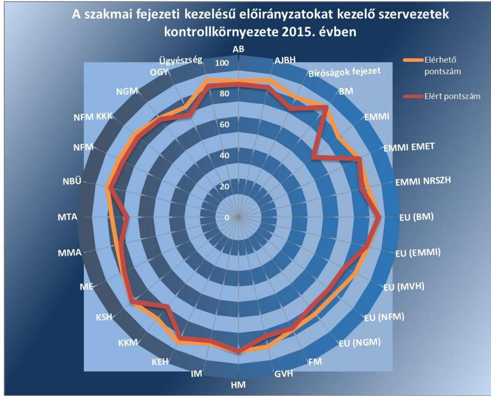

Forrás: ÁSZ adatgyűjtése

---

AZ ALKOTMÁNYOS FEJEZETEK INTÉZMÉNYEI kontrollkörnyezetének kialakítása és müködtetése az OGYH, a KEH, az AB, az AJBH és az Ügyészség, valamint a Bíróságok intézményei közül az OBH, a Kúria, négy ítélőtábla és 12 törvényszék esetében megfelelt a Bkr. előírásainak. A Bíróságok intézményei közül a Szegedi ítélőtábla és nyolc törvényszék (Budapest Környéki, Fővárosi, Kaposvári, Kecskeméti, Nyíregyházi, Pécsi, Szekszárdi, Szolnoki Törvényszék) kontrollkörnyezete „részben megfelelő" minősítést kapott. A kontrollkörnyezet hiányosságait alapvetően a gazdálkodási szabályzatok Számv. tv. és Áhsz. szerinti kialakításának és módosításának elmaradása - elsősorban a számviteli politika írásba foglalása (Pécsi Törvényszék), illetve aktualizálása (Szegedi ítélőtábla, Budapest Környéki, Fővárosi, Kaposvári, Kecskeméti, Nyíregyházi, Szekszárdi Törvényszék), valamint a számlarend hiánya (Szolnoki Törvényszék) - okozta. Az alkotmányos fejezetek intézményei kontrollkörnyezete minősítésének eredményeit az alábbi ábra mutatja.
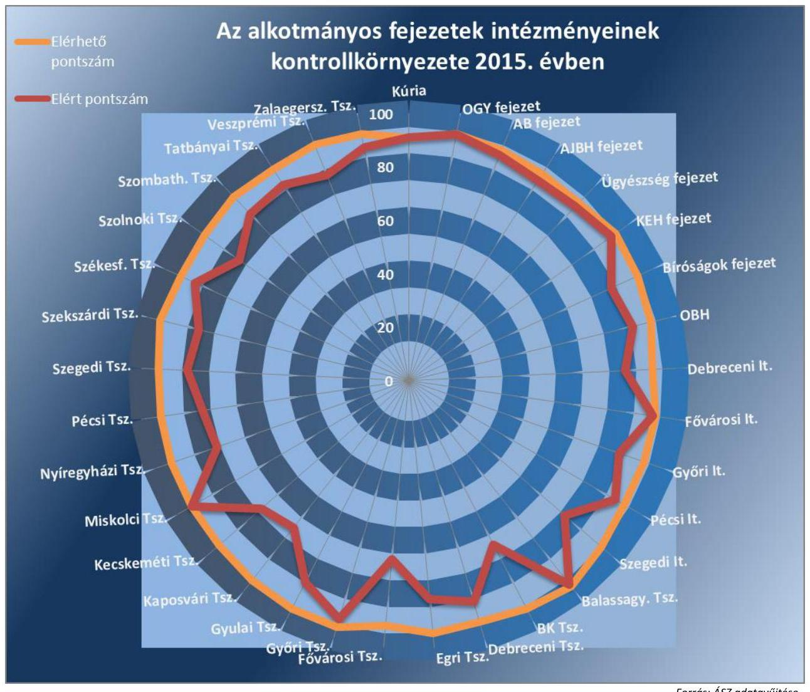

A KÖZPONTI KÖLTSÉGVETÉS EGYÉB INTÉZMÉNYEI kontrollkörnyezetének kialakítása 38 intézménynél „megfelelő" volt. 23 intézmény kontrollkörnyezete „részben megfelelő" (AEEK, AO, BGYAI, DJGMSZI, ENYKK, EMMIKGYAISZ, EFOCS, HRIAGO, MGYKSZI, MFOKR, MKR, MTAKIK, NSO, NMGYKTGYSZ, OE, OORI, PE ${ }^{143}$, PAK, SZSZBMGYKB, TBSZBK ${ }^{144}$, TMESZIK, TSO, ZMSZI) minősítést kapott a belső szabályozás hiányosságai, illetve a számviteli szabályzatok aktualizálásának elmaradása következtében. Hat intézmény (FLIO, KLIK, KGY, PMSZ, PGYOAISSZKSSZ, SZSZBGYKMSZ) kontrollkörnyezete nem felelt meg a Bkr.-ben foglalt előírásoknak. Az intézmények nem rendelkeztek a Számv. tv.-ben és az Áhsz.-ben előírt számviteli politikával és a számviteli politika keretében elkészítendő, a Számv. tv.-ben előírt szabályzatokkal, illetve az Áhsz. szerinti számlarenddel.

Négy intézmény (MGYKSZI, MKR, MTAKIK, TMESZIK) az Áht. előírása ellenére nem rendelkezett SzMSz-szel. A PMSZ az irányító szerv által jóváhagyott SzMSz-szel rendelkezett, az SzMSz azonban az Ávr. előírásai ellenére nem volt

---

összhangban a hatályos alapító okirattal. Az intézmények SzMSz-ei tekintetében megállapított szabályszerűségi hibák az Ávr. előírásainak be nem tartásához kapcsolódtak, nem írták elő a szervezeti egységek feladatait (BGYAI, DJGMSZI, KGY, KRSZI, KÖTIVIZIG, MGYKRI, MKR, MTAKIK, PMSZ, SZSZBMGYKTD, SZLMMSZIK ${ }^{145}$, TMESZIK), a nevesített munkakörhöz tartozó feladat- és hatásköröket (MGYKRI, MKR, MTAKIK, NFH, PMSZ, MÉSZIK), a hatáskörök gyakorlásának módját (DJGMSZ, MGYKRI, MKR, MTAKIK, PMSZ, TMESZIK), valamint az ezekhez kapcsolódó felelősségi szabályokat (CSMRFK, MGYKSZ, MKR, MTAKIK, NMGYKTGYSZ, PMSZ, SZSZBMGYKT, TMESZIK, ZMSZI) és a munkáltatói jogok gyakorlásának rendjét (AO, MGYKSZI, MKR, MTAKIK, PMSZ, TMESZIK, ZMSZI). A humánerőforrás-kezelés működtetésének szabályai nem feleltek meg a Kttv. ${ }^{146}$ előírásainak, a munkakör betöltésével kapcsolatos követelményeket a munkaköri leírások nem tartalmazták (FSZK, KLIK, KÖTIVIZIG, NFH, PGYOAISSZKSSZ, SZIMAT, SZSGSZK, TBSZBK). A Kttv. és az lkr. ${ }^{147}$ előírásai ellenére 25 intézmény (AO, BGYAI, BMSZGYKTGSZ ${ }^{148}$, BAZMKEOK, CSMRFK, DJGMSZI, EMMIKGYAISZ, FLIO, HRIAGO, KLIK, KGY, MFOKR, MKR, OE, OORI, PAK, PGYOAISSZKSSZ, SZSZBMGYKB, SZIMAT, SZIE, SZPKRD, SZSGSZK, SZLMMESZIK, TSO, ZMK) nem szabályozta a közszolgálati jogviszony megszűnése, valamint munkakör változása esetén a munkakör átadásának rendjét. Az 50/2013. (II. 25.) Korm. rendelet előírásai ellenére 18 intézmény (AEEK, EMMIKGYAISZ, EFOCS, FETIVIZIG, HRIAGO, HMBVI, KLIK, KGY, KRSZ, KÖTIVIZIG, KKM Igazgatás, NSO, PMSZ, PE, SZIE, SZSZBMGYKB, SZSGSZK, KEF) nem alakította ki a szervezet működésével összefüggő visszaélésekre, szabálytalanságokra, integritási és korrupciós kockázatokra vonatkozó bejelentések fogadásának és kivizsgálásának eljárás rendjét. A gazdálkodási jogkörök gyakorlásra jogosult személyek aláírás mintáit tartalmazó naprakész nyilvántartást az Ávr. előírásai ellenére 14 intézmény (AEEK, DJGYMRI, FSZK, KLIK, MFOKR, MKR, MTAKIK, OE, PAK, PMSZ, SZSZBMGYKT, SZSZBMGYKB, SZSZBMGYKM, SZPKRD) nem vezetett. A központi költségvetés egyéb intézményei kontrollkörnyezete minősítésének eredményeit az alábbi ábra mutatja.
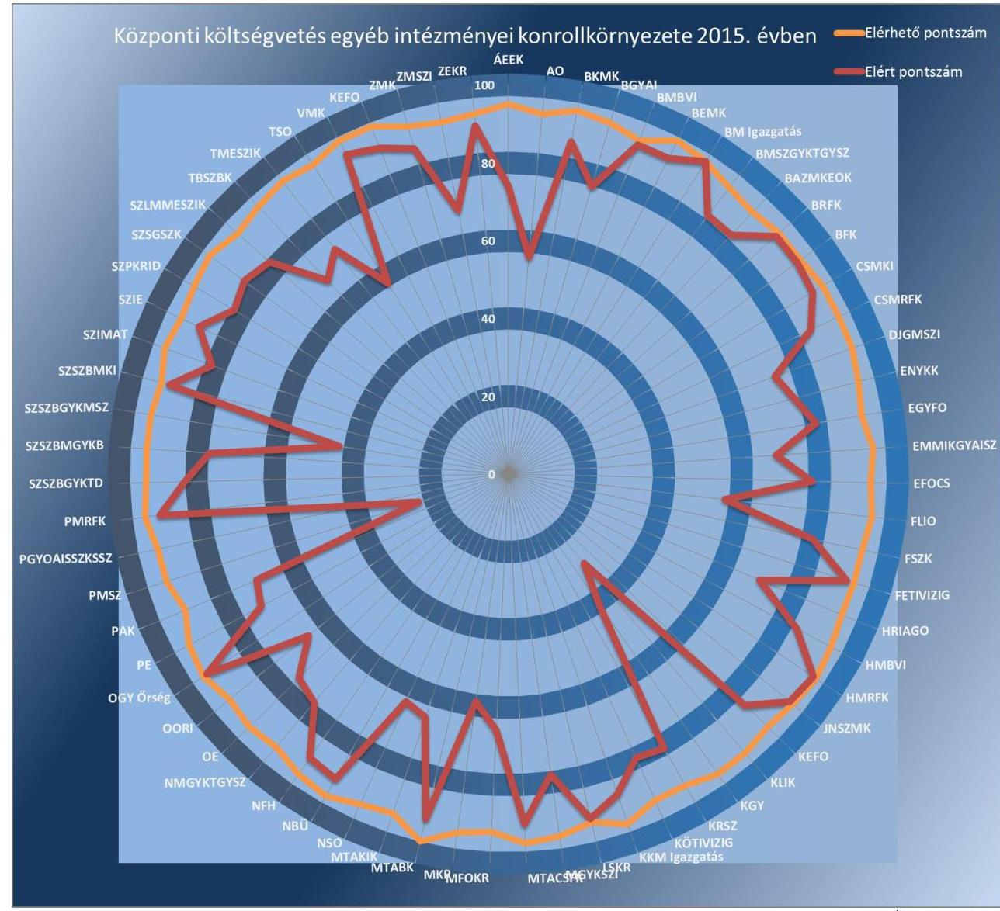

Forrás: ÁSZ adatgyüjtése

---

AZ ELKA kezelő szervei által kialakított, az alapok működését, gazdálkodását meghatározó kontrollkörnyezet kialakítása megfelelő volt. Az alapok és az alapokat kezelő szervek a szabályszerű gazdálkodást és működést meghatározó szabályzatokkal rendelkeztek. A feltárt hiányosságok az Ávr. kötelezettségvállalás, pénzügyi ellenjegyzés, teljesítésigazolás, érvényesítés, utalványozás (a NEFA-t kezelő NSZFH), teljesítés igazolás (NKA kezelő szerve) gyakorlásának módjára, valamint a gazdálkodási jogköröket gyakorló személyek kijelölésének rendjére vonatkozó szabályozás hiányához (NEFA-t kezelő NSZFH 2015 március 20 -áig, NKA kezelő szerve), az lkr.-ben a munkakör átadás szabályozására vonatkozó előírások be nem tartásához (NKA kezelő szerve), illetve a számviteli szabályzatok Számv. tv.-ben előírt határidőn túli elkészítéséhez (NKFIA) kapcsolódtak. Az ELKA kezelő szervei kontrollkörnyezete minősítésének eredményeit az alábbi ábra mutatja.
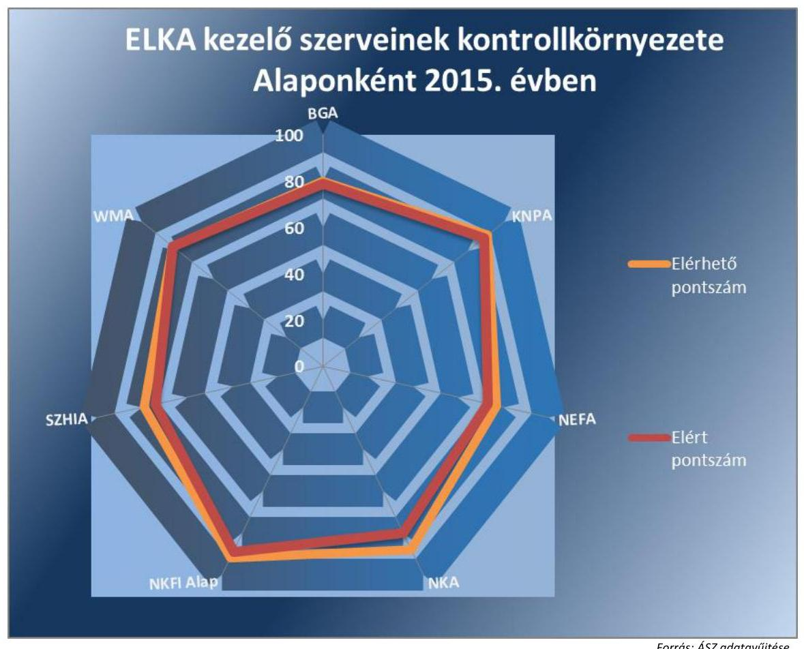

A BELSŐ KONTROLLRENDSZER értékelését az Országgyűlés felé beszámolásra kötelezett intézmények, valamint a TB Alapok kezelői szervei (ONYF, OEP) esetében végezte el a Számvevőszék.

AZ ORSZÁGGYŰLÉS FELÉ BESZÁMOLÁSRA KÖTELEZETT INTÉZMÉNYEK belső kontrollrendszerének kialakítása és működtetése megfelelt az Áht. és a Bkr. előírásainak. A kontrollkörnyezet, a kontrolltevékenységek, az információs és kommunikációs rendszer kialakítása és működtetése valamennyi intézmény esetében „megfelelő" minősítést kapott. A kockázatkezelési rendszer hat intézmény esetében „megfelelő" volt, két intézménynél (NAIH és az NVI) részben felelt meg a Bkr.-ben előírtaknak. A monitoring rendszer kialakítása és működtetése hat intézmény esetében „megfelelő" volt, két intézmény esetében (KH, NVI) részben felelt meg a Bkr. előírásainak.

A TB ALAPOK kezelő szervei (ONYF, OEP) belső kontrollrendszerének kialakítása és működtetése megfelelt az Áht. és a Bkr. előírásainak. A működés szervezeti kereteit, valamint a humánerőforrás kezelés feltételeit szabályszerűen alakították ki, a szervezet minden szintjén meghatározták az etikai elvárásokat.

---

Az ONYF és az OEP az Áht. és a Bkr. előírásaink megfelelően kialakította és múködtette kockázatkezelési rendszerét. Felmérték a szervezet tevékenységében rejlő kockázatokat, elvégezték azok elemzését, értékelését. Meghatározták az egyes kockázatok kezeléséhez szükséges intézkedéseket, a végrehajtás felelőseit, határidejét. Biztosították a kockázati tényezők, a kockázatok kezelésére kialakított módszerek és intézkedések nyilvántartását.

A kontrolltevékenység múködtetése - egyes gazdálkodási jogkörök gyakorlására adott felhatalmazások kivételével megfelelte az Áht.-ben és a Bkr.-ben foglalt jogszabályi előírásoknak. Az OEP-nél a kötelezettségvállalási szabályzat nem felelt meg az Ávr. előírásainak, a pénzügyi ellenjegyzőket és az érvényesítőket nem a gazdasági vezető jelölte ki a múködési szektorban 2015. augusztus 31. előtti időszakra, továbbá az ellátási szektorban a teljes ellenőrzött időszakra vonatkozóan.

Az információs és kommunikációs folyamatok keretében az Áht. és a Bkr. alapján kialakították a szervezeten belüli információáramlás rendszerét, előírták a beszámolás szintjeit, módjait és határidejét.

A monitoring rendszer kialakításához és múködtetéséhez szervezeti egységenként meghatározták a szervezeti célok elérését szolgáló feladatok és folyamatok megvalósulását mérő indikátorokat, előírták azok alakulásának nyomon követését, értékelését. A Bkr. előírásainak megfelelően a főigazgatók gondoskodtak a külső ellenőrzések koordinációjáról és nyilvántartásáról, biztosították a belső ellenőrzés közvetlen irányításuk alatt történő működtetését.

Az Országgyűlés felé beszámolásra kötelezett intézmények, valamint a TB Alapok kezelő szervei belső kontrollrendszerének értékeléséhez a megfelelőségi térképet az alábbi ábra mutatja be.
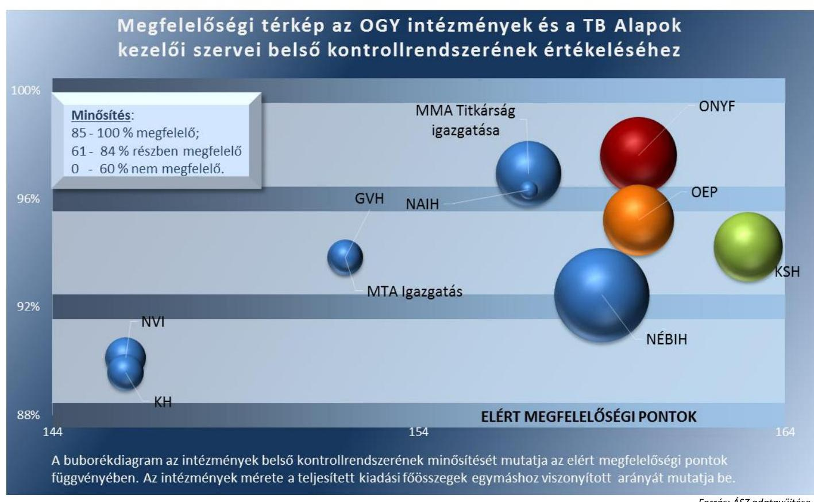

---

# A KGR RENDSZER K11 MODUL ÜZEMELTETÉSE, valamint az éves költségvetési beszámolók adatainak ellenőrzése 2015. évben a Kincstár feladata volt. A Kincstár az Áhsz. alapján meghatározta a 2015. évi éves költségvetési beszámolók felülvizsgálatának ellenőrzési szempontjait. Az Áhsz. 35. § előírásai ellenére a Kincstár a 2015. évi éves költségvetési beszámolók esetében azok elfogadását megelőzően nem győződött meg arról, hogy valamennyi beszámoló teljesíti az Áhsz.-ben előírt követelményeket. Az Áhsz. 17. melléklete írja elő az éves költségvetési beszámolás során alkalmazandó kötelező egyezőségeket. Az Áhsz. 17. melléklet 1. a), 1. b) és 4. a) pontjainak előírásai ellenére a kötelező egyezőségeket biztosító szabályok érvényesítésére kialakított informatikai kontrollok a KGR K11-ben a kórházak és a KLIK esetében nem működtek. A rendszerbe feltöltött és elfogadott éves költségvetési beszámolók és a főkönyvi kivonatok adatai egyezőségére vonatkozóan a Kincstár által elvégzett ellenőrzés az Áhsz. 35. § előírásai ellenére nem terjedt ki valamennyi éves költségvetési beszámolóra, a 2015. évi éves költségvetési beszámolók tekintetében 42 intézmény esetében ellenőrizték a főkönyvi kivonat és a 2015. évi beszámoló adatainak egyezőségét.

AZ NGM KAR RENDSZERÉBEN a zárszámadási törvényjavaslat összeállítása során végzett adatmódosítás esetén nem történt visszacsatolás a Kincstár KGR rendszere felé. Informatikai kontrollokkal nem volt biztosított az NGM KAR rendszerében végrehajtott adatmódosítások átvezetése az adatszolgáltatók módosítással érintett beszámolóiban és a beszámoló adatokat tartalmazó kincstári KGR K11 rendszerben.

---

A szervezeti integritás a szervezet pozitív, társadalmi elvárásokkal összhangban álló, szilárd értékrend alapján való működését jelenti, amely során a felmerülő kockázatok kezelésére megfelelő kontrollokat alkalmaz. A szervezeti integritás erősítése hozzájárul a korrupciós kockázatok mérsékléséhez, a korrupciós kockázat nem jelent egyben korrupciót. A zárszámadás ellenőrzés keretében a Számvevőszék az Országgyűlés felé beszámolásra kötelezett intézményeknél, az alkotmányos fejezetek intézményeinél, a központi költségvetés egyéb intézményeinél, valamint a TB Alapok kezelő szerveinél - a szervezetek által kitöltött kérdőívek alapján - mérte fel az integritás szemlélet érvényesülését.
AZ ORSZÁGGYŰLÉS FELÉ BESZÁMOLÁSRA KÖTELEZETT INTÉZMÉNYEK közül hat intézmény (GVH, KH, KSH, NAIH, NÉBIH, NVI) szűkített, két intézmény (MTA Igazgatása és MMA Titkárság Igazgatása) bővített integritás kérdőívet töltött ki. A szűkített integritás kérdőívet kitöltők közül három intézmény (GVH, KSH, NAIH) „kiváló", egy (NÉBIH) „megfelelt", egy (KH) „fejlesztendő" minősítést kapott. A szűkített kérdőívek értékelése alapján az intézmények (GVH, KH, KSH, NAIH, NÉBIH, NVI) integritásának minősítését rontotta az új munkatársak kiválasztására szolgáló eljárások alkalmazásának és a nemkívánatos dolgozói magatartással szembeni intézkedések, illetve azok érvényesülése értékelésének, az integritás erősítésének, tudatosításának, valamint a kockázatelemzések alkalmazása értékelésének hiánya. A bővített integritás kérdőívet kitöltők közül egy intézmény (MTA Igazgatása) a magas eredendő veszélyeztetettségi tényezők miatt „fejlesztendő", egy intézmény (MMA Titkárság Igazgatása) „kiváló" értékelést kapott. Az MTA Igazgatása „fejlesztendő" minősítése esetében magas eredendő veszélyeztetettségi tényezőt jelentett, hogy az intézmény jogalkotással közvetlenül összefüggő hatásköröket gyakorol, és hatósági jogkörrel rendelkezik, továbbá, hogy az intézményre vonatkozó szabályozási környezet bonyolult és ellentmondásos.
AZ ALKOTMÁNYOS FEJEZETEK INTÉZMÉNYEI szűkített integritás kérdőívet töltöttek ki Egy intézmény (AB) „fejlesztendő", négy (OGYH, KEH, AJBH, Ügyészség) „megfelelő" minősítést kapott. A Bíróságok intézményei közül négy intézmény (Pécsi Ítélőtábla, Balassagyarmati, Tatabányai, Veszprémi Törvényszék) „fejlesztendő", 15 intézmény (OBH, Debreceni, Fővárosi, Győri, Szegedi Ítélőtábla, Egri, Fővárosi, Győri, Kaposvári, Nyíregyházi, Pécsi, Székesfehérvári, Szolnoki, Szombathelyi, Zalaegerszegi Törvényszék) „megfelelő", nyolc intézmény (Kúria, Budapest Környéki, Debreceni, Gyulai, Kecskeméti, Miskolci, Szegedi, Szekszárdi Törvényszék) „kiváló" minősítést kapott. A „fejlesztendő" minősítést az okozta, hogy a humánerőforrás-gazdálkodás területén a humánpolitikai tevékenység nem volt szabályozott, valamint az új munkatársak kiválasztásakor az intézmények nem minden esetben írtak ki álláspályázatot.
A KÖZPONTI KÖLTSÉGVETÉS EGYÉB INTÉZMÉNYEI közül 13 intézmény (ÁEEK, AO, BGYAI, ENYKK, EGYFO, EMMIKGYAISZ, EFOCS, NSO, PMSZ, SZIMAT, KEF, ZMSZI, ZEKR) bővített kérdőívet, 54 intézmény szűkített kérdőívet töltött ki. Utóbbi 54 intézmény „fejlesztendő" minősítést kapott. A bővített kérdőívet kitöltő intézmények közül nyolc intézmény (BGYAI, ENYKK, EMMIKGYAISZ, NSO, PMSZ, KEF, ZMSZI, ZEKR) „kiváló", négy (ÁEEK, EGYFO, EFOCS, SZIMAT) „megfelelő" és egy intézmény (AO) „fejlesztendő" minősítést kapott. Az összesített értékelés alapján a humánerőforrás-gazdálkodás, valamint a nemkívánatos dolgozói magatartással szembeni intézkedések és azok érvényesülése minősült „fejlesztendő" területnek. Az integritás erősítésének, tudatosításának, valamint a kockázatelemzések alkalmazása 21 intézménynél (BAZMKEOK, BMSZGYKTGYSZ, DJGYMSZI, HRIAGO, HMRF ${ }^{149}$, FLIO, KRSZI, MFOKR, NFH, NMGYKTGYSZ, MGYKSZI, PGYOAISSZKSSZ, SZIE, SZSZBMGYKB, SZSZBMGYKM, SZSGSZIK, SZSZBMGYKT, SZSGSZIK, TBSZBKI, TSO, ZMK) „fejlesztendő" területnek minősült a korrupciós kockázatelemzés és az intézmény integritással kapcsolatos hiányosságai miatt.
A TB ALAPOK KEZELŐ SZERVEI közül az ONYF a szűkített integritás kérdőívet töltötte ki. Az ONYF értékelése összességében és részterületenként - az összeférhetetlenség és etikai elvárások, a humánerőforrás gazdálkodás, a szervezet vagyonára tett intézkedések, a nemkívánatos dolgozói magatartással szembeni intézkedések és azok érvényesülése valamint az integritás erősítése, annak tudatosítása, valamint a kockázatelemzések alkalmazása területén - „kiváló" volt. Az OEP a hosszú kérdőívet töltötte ki. Az OEP-nél összességében a kockázatok és kontrollok kiértékelése „megfelelő" volt, ezen belül az eredendő veszélyeztetettség tényező alacsony, a korrupciós veszélyeztetettséget növelő tényező magas, a kockázatokat mérséklő kontrollok tényező közepes értékelést kapott.

---

A Számvevőszék elvégezte az eredményszemléletű pénzügyi számvitellel készített beszámolórészek - mérleg, eredménykimutatás, kiegészítő melléklet - ellenőrzését az Országgyűlés felé beszámolásra kötelezett intézmények és a TB Alapok tekintetében. Az ezzel kapcsolatos számvevőszéki megállapítások a zárszámadási törvényjavaslat adatai megbízhatóságának minősítését nem érintik.

# AZ ORSZÁGGYŰLÉS FELÉ BESZÁMOLÁSRA KÖTELEZETT INTÉZMÉNYEKNÉL 

a vagyoni helyzet és az eredményszemléletű bevételek, költségek, ráfordítások alakulását, valamint a zárszámadás kiegészítő információinak elkészítését a pénzügyi számvitellel biztosító beszámoló részek összeállítása megfelelt a Számv. tv. és az Áhsz. előírásainak. Az ellenőrzés a mérleghez kapcsolódóan a KH-nál a kötelezettségek, az MTA Igazgatásánál a követelések tekintetében tárt fel megbízhatósági hibákat. A mérlegben előforduló megbízhatósági hibák összértéke nem éri el a lényegességi szintet, az adatok megbízhatóak.

A TB ALAPOK - az Ny. Alap és az E. Alap pénzügyi számvitellel készített beszámoló részeinek - a mérleg, az eredménykimutatás és a kiegészítő melléklet - összeállítása megfelelt a jogszabályi előírásoknak. A mérleget a jogszabályokban és a belső szabályzatokban foglalt előírásoknak megfelelően főkönyvi kivonattal, leltárral alátámasztották.

---

# VI. SZ. MELLÉKLET: A HELYSZÍNI ELLENŐRZÉSBE BEVONT FEJEZETEK ÉS SZERVEZETEK LISTÁJA 

| Központi kezelésú és az állami vagyonnal kapcsolatos beveteli és kiadási előirányzatok | Szakmai fejezeti kezelésú előirányzatok | TB Alapok | ELKA |
| :--: | :--: | :--: | :--: |
| Agrár-Vállalkozási Hitelgarancia Alapítvány | Alapvető Jogok Biztosának Hivatala | Egészségbiztosítási Alap (OEP) | Bethlen Gábor Alap (BG Alapkezelő Zrt.) |
| Államadósság Kezelő Központ Zrt. | Alkotmánybíróság | Nyugdijbiztosítási Alap (ONYF) | Központi Nukleáris Pénzügyi Alap (NFM) |
| Garantiqa Hitelgarancia Zrt. | Belügyminisztérium |  | Nemzeti Kutatási, Fejlesztési és Innovációs Alap (NKFIH) |
| KAVOSZ Vállalkozásfejlesztési Zrt. | Bíróságok |  | Nemzeti Foglalkoztatási Alap (NGM) |
| Magyar Államkincstár | Emberi Erőforrások Minisztériuma |  | Nemzeti Kulturális Alap (NKA Igazgatósága) |
| Magyar Bányászati és Földtani Hivatal | Gazdasági Versenyhivatal igazgatása |  | Szövetkezeti Hitelintézetek Integrációs Alapja (MFB Zrt.) |
| Magyar Exporthitel Biztosító Zrt. | Földmúvelésügyi Minisztérium |  | Wesselényi Miklós Ár-és Belvízvédelmi Kártalanítási Alap (Kincstár) |
| Magyar Export-Import Bank Zrt. | Honvédelmi Minisztérium |  |  |
| Magyar Fejlesztési Bank Zrt. | Igazságügyi Minisztérium |  |  |
| Magyar Nemzeti Vagyonkezelő Zrt. | Köztársasági Elnökség |  |  |
| Nemzetgazdasági Minisztérium | Központi Statisztikai Hivatal |  |  |
| Nemzeti Adó- és Vámhivatal | Külgazdasági és Külügyminisztérium |  |  |
| Nemzeti Útdijfizetési Szolgáltató Zrt. | Magyar Tudományos Akadémia |  |  |
| Országos Környezetvédelmi és Termé- Magyar Művészeti Akadémia szetvédelmi Főfelügyelet |  |  |  |
| Országos Nyugdijbiztosítási Főigazgatóság | Miniszterelnökség (XI. Miniszterelnökség és XIX. Uniós fejlesztések) |  |  |
| Emberi Erőforrások Minisztériuma (Nemzeti Család- és Szociálpolitikai Alap) | Nemzetgazdasági Minisztérium |  |  |
|  | Nemzeti Fejlesztési Minisztérium |  |  |
|  | Országgyúlés |  |  |
|  | Úgyészség |  |  |

| OGY felé beszámolásra kötelezett szervezetek | Alkotmányos fejezetek intézményei |  |
| :--: | :--: | :--: |
| Gazdasági Versenyhivatal Igazgatása | Alapvető Jogok Biztosának Hivatala | Kaposvári Törvényszék |
| Közbeszerzési Hatóság | Alkotmánybíróság | Kecskeméti Törvényszék |
| Központi Statisztikai Hivatal | Köztársasági Elnöki Hivatal | Miskolci Törvényszék |
| Nemzeti Adatvédelmi és Információszabadság Hatóság | Kúria | Nyíregyházi Törvényszék |
| Nemzeti Választási Iroda | Országgyúlés Hivatala | Országos Bírósági Hivatal |
| Nemzeti Elelmiszerláns-biztonsági Hivatal | Úgyészségek | Pécsi Itélőtábla |
| Magyar Tudományos Akadémia Igazgatása | Balassagyarmati Törvényszék | Pécsi Törvényszék |
| Magyar Múvészeti Akadémia Titkársága | Budapest Környéki Törvényszék | Szegedi Itélőtábla |
|  | Debreceni Itélőtábla | Szegedi Törvényszék |
|  | Debreceni Törvényszék | Székesfehérvári Törvényszék |
|  | Egri Törvényszék | Szekszárdi Törvényszék |
|  | Fővárosi Itélőtábla | Szolnoki Törvényszék |
|  | Fővárosi Törvényszék | Szombathelyi Törvényszék |
|  | Győri Itélőtábla | Tatabányai Törvényszék |
|  | Győri Törvényszék | Veszprémi Törvényszék |
|  | Gyulai Törvényszék | Zalaegerszegi Törvényszék |

---

| A központi költségvetés egyéb intézményei |  |  |
| :--: | :--: | :--: |
| Állami Egészségügyi Ellátó Központ | Heves Megyei Rendőr-főkapitányság | Pannon Egyetem |
| Aranysziget Otthon | Jász-Nagykun-Szolnok Megyei Kormányhivatal | Parádfürdői Állami Kórház |
| Bács-Kiskun Megyei Kormányhivatal | Kéthelyi Értelmi Fogyatékosok Otthona | Pest Megyei Rendőr-főkapitányság |
| Béke Gyermekotthon és Általános Iskola | Klebelsberg Intézményfenntartó Központ | Pesti Magyar Színház |
| Békés Megyei Büntetés-Végrehajtási Intézet | Komádi Gyermekotthon | Pilisi Gyermekotthon, Óvoda, Általános Iskola, Speciális Szakiskola, Készségfejlesztő Speciális Szakiskola |
| Békés Megyei Kormányhivatal | Körmendi Rendészeti Szakközépiskola | Szabolcs-Szatmár-Bereg Megyei Gyermekvédelmi Központ Baktalórántháza |
| Békés Megyei Szociális, Gyermekvédelmi Központ és Területi Gyermekvédelmi Szakszolgálat | Közbeszerzési és Ellátási Főigazgatóság | Szabolcs-Szatmár-Bereg Megyei Gyermekvédelmi Központ Mátészalka |
| Belügyminisztérium Igazgatása | Közép-Tisza-Vidéki Vízügyi Igazgatóság | Szabolcs-Szatmár-Bereg Megyei Gyermekvédelmi Központ Tiszadob |
| Borsod-Abaúj-Zemplén Megyei Kórház és Egyetemi Oktató Kórház | Külgazdasági és Külügyminisztérium Igazgatás | Szabolcs-Szatmár-Bereg Megyei Katasztrófa védelmi Igazgatóság |
| Budapest Főváros Kormányhivatala | Lumniczer Sándor Kórház-Rendelőintézet | Széchenyi Irodalmi és Művészeti Akadémia Titkársága |
| Budapesti Rendőr-főkapitányság | Magyar Gyula Kertészeti Szakképző Iskola | Szent István Egyetem |
| Csongrád Megyei Katasztrófavédelmi Igazgatóság | Markhot Ferenc Oktatókórház és Rendelőintézet | Szent Pantaleon Kórház Rendelőintézet Dunaújváros |
| Csongrád Megyei Rendőr-főkapitányság | Mezőtúri Kórház és Rendelőintézet | Szentannai Sámuel Gimnázium, Szakközépiskola és Kollégium |
| Damjanich János Gimnázium és Mezőgazdasági Szakképző Iskola | MTA Bölcsészettudományi Kutatóközpont | Szepsi Laczkó Máté Mezőgazdasági és Élelmiszeripari Szakképző Iskola és Kollégium |
| Egészségügyi Nyilvántartási és Képzési Központ | MTA Csillagászati és Földtudományi Kutatóközpont | Tokaji Borvidék Szőlészeti és Borászati Kutatóintézet |
| Egri Gyermekotthon és Fogyatékosok Otthona | MTA Könyvtár és Információs Központ | Toldi Miklós Élelmiszeripari Szakképző Iskola és Kollégium |
| Emberi Eröforrások Minisztériuma Kalocsai Gyermekotthon, Általános Iskola és Szakiskola | Napraforgó Speciális Otthon | Topház Speciális Otthon |
| Értelmi Fogyatékosok Otthona (Csákánydoroszló) | Nemzeti Befektetési Ügynökség | Vas Megyei Kormányhivatal |
| Fehér Liliom Idősek Otthona | Nemzeti Fogyasztóvédelmi Hatóság | Zala Megyei Kórház |
| Felső-Szabolcsi Kórház | Nógrád Megyei Gyermekvédelmi Központ és Területi Gyermekvédelmi Szakszolgálat | Zala Megyei Szocioterápiás Intézmény |
| Felső-Tisza-Vidéki Vízügyi Igazgatóság | Óbudai Egyetem | Zirci Erzsébet Kórház-Rendelőintézet |
| Harmónia Rehabilitációs Intézet és Ápoló Gondozó Otthon | Országos Orvosi Rehabilitációs Intézet |  |
| Heves Megyei Büntetés-Végrehajtási Intézet | Országgyűlési Őrség |  |

---

# - VII. SZ. MELLÉKLET: AZ ELLENŐRZÉSBEN RÉSZTVEVŐK LISTÁJA 

| A számvevőszéki jelentés összeállításában közreműködtek |  |  |
| :--: | :--: | :--: |
| Balázs Melinda   számvevő vezető főtanácsos | Balázsné Antoni Erika   számvevő | Bíró Csaba   számvevő |
| Bus András Péter   számvevő főtanácsos | Castro Hurtadoné Juhász Erika   számvevő főtanácsos | Federics Adrienn   számvevő főtanácsos |
| Gácsi Györgyi Ivett   számvevő főtanácsos | Gergely Tilda   számvevő | Hálóné Pelikán Veronika   számvevő |
| Horváthné Menyhárt Erika   számvevő főtanácsos | Jenei Zoltán Béláné   számvevő főtanácsos | Kántor Ilona   számvevő vezető főtanácsos |
| Koczor László   számvevő főtanácsos | Mészáros Ildikó Éva   számvevő tanácsos | Molcsánné Márta Tünde   számvevő főtanácsos |
| Nagy Erika   számvevő tanácsos | Nyikon Zsigmondné   számvevő vezető főtanácsos | Samu István   számvevő főtanácsos |
| Szabó Zsuzsanna   számvevő | Szabóné László Mária   számvevő főtanácsos | Szarka Péterné   számvevő vezető főtanácsos |
| Szarvas Szilárd   számvevő főtanácsos | Szikszainé Király Mária   számvevő tanácsos | Dr. Szöllősi Zsolt   számvevő tanácsos |
| Tóth Árpád   számvevő főtanácsos | Dr. Vass Gábor   számvevő főtanácsos | Velkei András Albert   számvevő |
| Vicze Klára   számvevő tanácsos | Zakar László   számvevő osztályvezető főtanácsos | Zaroba Szilvia   számvevő főtanácsos |
| Dr. Zsolnay András   számvevő |  |  |

| Az ellenőrzést végezték |  |  |
| :--: | :--: | :--: |
| Balázsné Antoni Erika   számvevő | Dr. Baloghné Sebestyén Éva   számvevő | Balogné Dakó Eszter   számvevő tanácsos |
| Baritsa Orsolya   számvevő | Bartolák Márta   számvevő főtanácsos | Belovai Sándorné   számvevő főtanácsos |
| Berecz Helga Erika   számvevő | Bíró Csaba   számvevő | Bodonyi Miklós   számvevő főtanácsos |
| Boldoczki János   számvevő | Botos István   számvevő | Bujnóczki Gergely   számvevő |
| Burenzsargal Narantuja   számvevő tanácsos | Bus András Péter   számvevő főtanácsos | Castro Hurtadoné Juhász Erika   számvevő főtanácsos |
| Dr. Csapó Anna   számvevő tanácsos | Csepreginé Tancsík Erzsébet   számvevő főtanácsos | Dr. Dargai Emőke   számvevő tanácsos |
| Dr. Ernst László   számvevő főtanácsos | Dr. Faragóné Tóth Mária   számvevő tanácsos | Farkas László   számvevő tanácsos |
| Fekete Anikó Gyöngyi   számvevő | Fekete Gábor   számvevő tanácsos | Fórián Erika Erzsébet   számvevő tanácsos |
| Gaálné Izsó Éva   számvevő tanácsos | Gere Csaba   számvevő | Gergely Tilda   számvevő |
| Gölöncsér Péter   számvevő | Gyalai Márta   számvevő | Gyulafalvi Enikő   számvevő |
| Hadházy Sándor György   számvevő tanácsos | Halmos Ádám   számvevő asszisztens | Hálóné Pelikán Veronika   számvevő |
| Hegyes Mária   számvevő tanácsos | Horváthné Menyhárt Erika   számvevő főtanácsos | Igar Tamás   számvevő főtanácsos |
| Illésné Borsik Andrea   számvevő | Dr. Izsák Iván Gyula   számvevő | Jakab Laura   számvevő tanácsos |

---

| Kalmár István | Kántor Ilona | Karnits Zita |
| :--: | :--: | :--: |
| számvevő tanácsos | számvevő vezető főtanácsos | számvevő tanácsos |
| Karsai Lászlóné | Dr. Kevés Judit | Klinger Zoltán |
| számvevő tanácsos | számvevő vezető főtanácsos | számvevő tanácsos |
| Koczor László | Kóródi Gábor | Kovács János |
| számvevő főtanácsos | számvevő tanácsos | számvevő tanácsos |
| Kovács Richárd | Kőrösi Viola | Krüzselyi Attila |
| számvevő | számvevő | számvevő tanácsos |
| Kúnosné Talián Márta | Kurucz Ádám | Lődiné Cser Zsuzsanna |
| számvevő | számvevő | számvevő főtanácsos |
| Dr. Lőrincz Zoltán | Luhály Matild | Mokánszkiné Mengyi Andrea |
| számvevő főtanácsos | számvevő | számvevő főtanácsos |
| Molcsánné Márta Tünde | Molnár Antal Lászlóné | Molnár Istvánné |
| számvevő főtanácsos | számvevő tanácsos | számvevő vezető főtanácsos |
| Dr. Naár Edit | Nagy Adrienn | Nagy Csilla Erzsébet |
| számvevő | számvevő főtanácsos | számvevő |
| Nagy Erika | Nagyné Lakhézi Éva | Nagyné Pásztor Györgyi |
| számvevő tanácsos | számvevő tanácsos | számvevő |
| Némethné Nagy Mária | Nyikon Zsigmondné | Oláh Viktor |
| számvevő | számvevő vezető főtanácsos | számvevő |
| Pálfiné Pusztai Magdolna | Pats Regina | Péntek László |
| számvevő tanácsos | számvevő | számvevő főtanácsos |
| Pénzes Gyula | Dr. Pernyei Katalin | Dr. Podonyi László |
| számvevő vezető főtanácsos | számvevő | számvevő főtanácsos |
| Pogány Kinga Beatrix | Puskás Balázs | Ritecz Tibor |
| számvevő | számvevő tanácsos | számvevő tanácsos |
| Robák Ferencné | dr. Schwarzzenberger Hanna | Sipos Attila |
| számvevő tanácsos | számvevő asszisztens | számvevő |
| Solymár Ágnes | Somlai Gábor | Szabó Zsuzsanna |
| számvevő főtanácsos | számvevő tanácsos | számvevő |
| Szabóné László Mária | Szalontai Miklós | Szarka Péterné |
| számvevő főtanácsos | számvevő tanácsos | számvevő vezető főtanácsos |
| Szarvas Szilárd | Dr. Szekeres Krisztina | Szepes Béla Bálint |
| számvevő főtanácsos | számvevő gyakornok | számvevő tanácsos |
| Szikszainé Király Mária | Szilágyi Zsuzsanna | Dr. Szöllősi Zsolt |
| számvevő tanácsos | számvevő tanácsos | számvevő tanácsos |
| Takácsné Gönczi Ildikó | Temesváry Miklós | Terleczkyné Dr. Eisele Edit |
| számvevő tanácsos | számvevő tanácsos | számvevő |
| Tótfalusi Zoltán | Tóth Árpád | Tóth Sándor |
| számvevő tanácsos | számvevő főtanácsos | számvevő főtanácsos |
| Turai Erzsébet | Dr. Türk Erika | Ujvári Józsefné |
| számvevő | számvevő | számvevő főtanácsos |
| Unger Ferenc | Varga Ágnes Klára | Varga József |
| számvevő | számvevő | számvevő tanácsos |
| Várkonyi Zsolt Kristóf | Dr. Vass Gábor | Velkei András Albert |
| számvevő tanácsos | számvevő főtanácsos | számvevő |
| Vicze Klára | Vida László | Villányi Antal |
| számvevő tanácsos | számvevő tanácsos | számvevő tanácsos |
| Vojcsekné Szabó Ágnes | Völgyesi Mátyás | Winter Zsuzsa |
| számvevő tanácsos | számvevő tanácsos | számvevő főtanácsos |
| Zaroba Szilvia |  |  |
| számvevő főtanácsos |  |  |

---

|  | Az ellenőrzés végrehajtását támogatták |  |
| :-- | :-- | :-- |
| Bagoly Brigitta | Dr. Bodánszky Nikolett | Dr. Dedics Zsigmond |
| számvevő | számvevő | számvevő |
| Dr. Felföldi Izabella | Luksander Alexandra | Madár Sándor |
| számvevő főtanácsos | számvevő | számvevő tanácsos |
| Dr. Markovics Natália | Mészáros Anna | Dr. Schreiber Judit |
| számvevő főtanácsos | számvevő tanácsos | számvevő |
| Dr. Székely Zsolt | Szobota Péter | Vértényi Gábor Jenő |
| számvevő vezető főtanácsos | számvevő tanácsos | számvevő főtanácsos |

---

.

---

# FÜGGELÉK: ÉSZREVÉTELEK 

A jelentéstervezetet a Számvevőszék 15 napos észrevételezésre megküldte az ellenőrzött szervezet vezetőjének az ÁSZ tv. 29. §* (1) bekezdése előírásának megfelelően.
Az elfogadott észrevételek alapján a Számvevőszék módosította a jelentést.

A függelék tartalmazza az ellenőrzött észrevételeit, illetve az el nem fogadott észrevételek elutasításának indoklását.

[^0]
[^0]:    * 29. § (1) Az Állami Számvevőszék az ellenőrzési megállapításait megküldi az ellenőrzött szervezet vezetőjének vagy az általa megbízott személynek, és annak, akinek személyes felelősségét állapította meg.
    (2) Az ellenőrzött szervezet vezetője és a felelősként megjelölt személy az ellenőrzés megállapításaira tizenöt napon belül írásban észrevételt tehet.
    (3) Az Állami Számvevőszék az észrevételre a beérkezésétől számított harminc napon belül írásban válaszol. A figyelembe nem vett észrevételeket köteles a jelentésben feltüntetni, és megindokolni, hogy azokat miért nem fogadta el.

---

# 1. ORSZÁGOS EGÉSZSÉGBIZTOSÍTÁSI PÉNZTÁR 

## Észrevétel

Jelentéstervezet 46. oldal II. mellékletére: „Az Egészségbiztosítási Alap (a továbbiakban: E. Alap) tekintetében az ellátási és múködési területre külön-külön készül kötelezettségvállalási szabályzat. Az ellátási terület szabályzata speciális a feladatellátásából fakadóan. Áttekintve az államháztartásról szóló törvény végrehajtásáról rendelkező 368/2011. Korm. rendelet (a továbbiakban: Ávr.) 55. § (2) bekezdés b) alpontját „a központi kezelésű előirányzat, fejezeti kezelésű előirányzat, elkülönített állami pénzalap, társadalombiztosítás pénzügyi alapja kezelő szerve esetén a 9. § (1), (6), (7) vagy (8) bekezdése szerinti szervezeti egység vezetője vagy az általa írásban kijelölt, a kötelezettséget vállaló szerv alkalmazásában álló személy" lehet a kötelezettségvállalás pénzügyi ellenjegyzője, valamint az érvényesítő. Az E. Alap tekintetében az Országos egészségbiztosítási Pénztárnak a főigazgatója az ellátási terület kötelezettségvállalási szabályzatában az Ellátási Pénzügyi és Számviteli Főosztály vezetőjét hatalmazta fel a pénzügyi ellenjegyzési és érvényesítői jogkörrel. E felhatalmazás alapján a főosztályvezető a további pénzügyi ellenjegyzői és érvényesítői jogkörrel történő megbízást a kijelölt kormánytisztviselő munkaköri elírásában rögzíti. Továbbá az E. Alap meghatározott előirányzatai felett a Kormányhivatalok rendelkeznek, ezért az ezzel összefüggő gazdálkodási feladatokat az Ávr. 9. § (8) bekezdése szerint a Kormányhivatalok látják el."

## El nem fogadott észrevétel indoklása

Az észrevételt nem fogadtuk el, mert - ahogy azt az észrevételében is jelezte -, az E. Alap tekintetében az Országos Egészségbiztosítási Pénztár főigazgatója jelölte ki a pénzügyi ellenjegyzésre és érvényesítésre jogosult személyt, amely nem felel meg az államháztartási törvény végrehajtásáról szóló 368/2011. Korm. rendelet (Ávr.) 55. § (2) bekezdés b) pontja, valamint az 58. § (4) bekezdésében foglaltaknak. A kötelezettségvállalás pénzügyi ellenjegyzésére, érvényesítésre és azok delegálására jogszabály alapján a gazdasági szervezet vezetője jogosult. Az OEP 32/2014. (IX. 15.) számú SZMSZ-e alapján az OEP gazdasági szervezetének vezetője a gazdálkodási feladatok ellátása tekintetében a közgazdasági főigazgató-helyettes.
A fővárosi és a megyei kormányhivatalokra tett észrevétele a számvevőszéki jelentés megállapításait nem módosítja, mivel az észrevételében foglaltakra a jelentéstervezet nem tartalmaz megállapítást.

## 2. BELÜGYMINISZTÉRIUM

## Észrevétel

„A jelentéstervezet 31. oldalán található 3.1. számú megállapítás pontosítását javasolom, mert az nem veszi figyelembe azt, hogy az Állami Számvevőszék a 2014. évi záiszámadás ellenőrzése során a Magyarország központi költségvetéséről szóló törvény IX. Helyi önkormányzatok támogatási fejezet vonatkozásában tett észrevételét követően a támogatási szerződések és támogatói okiratok már tartalmazzák a pénzügyi ellenjegyzést, valamint az utalványozást megelőzően megvalósult a teljesítésigazolás is. Jelzem továbbá, hogy az intézkedési tervben vállalt határidőig elkészült a Központi költségvetés IX. fejezetébe sorolt előirányzatokra vonatkozó kötelezettségvállalás, utalványozás, ellenjegyzés és érvényesítés rendjéről szóló 35/Ź015' (XII. 9.) BM utasítás, melyről a Belügyminisztérium értesítette az Állami Számvevőszéket is."

## El nem fogadott észrevétel indoklása

A jelentéstervezet 31. oldalán található 3.1. számú megállapításra tett észrevételét nem fogadtuk el. Az Állami Számvevőszék (ÁSZ) a 2015. évi központi költségvetése végrehajtásának ellenőrzése kapcsán a jelentéstervezetben foglalt ellenőrzési megállapításait az ellenőrzött időszak (2015. január 1. - 2015. december 31.) vonatkozásában, az ellenőrzött szervezet által rendelkezésre bocsátott dokumentumok alapján tette meg. A 35/2015. (XII. 9.) BM utasítás hatálybalépésére az ellenőrzött időszak végén került sor. Örömmel vettük tájékoztatását a 2014. évi záiszámadás

---

ellenőrzését követően tett intézkedésekről. Az észrevételében jelzett intézkedési tervben vállalt határidőig tejesített feladat végrehajtását az ÁSZ az Állami Számvevőszékről szóló 2011. évi LXVI. törvény (ÁSZ tv.) 33. § (7) bekezdés felhatalmazása alapján utóellenőrzés keretében ellenőrzi.

# Észrevétel 

„A jelentéstervezet 37. oldalán található 3.3. számú megállapításban megfogalmazottak alapján a Heves Megyei Büntetés-végrehajtási Intézet, a Pest Megyei Rendőr-főkapitányság, a Körmendi Rendészeti Szakközépiskola' valamint a Közép-Tisza Vidéki Vízügyi Igazgatóság nem tartották be az államháztartás számviteléről szóló 4/2013. (I. 11.) Korm. rendeletben (továbbiakban: Áhsz.) elöírt mérlegkészítési határidőt. Az érintett szervezetek az Áhsz-ben elöírt mérlegkészítési határidőt, azaz Z̈016. február 25-ig az Áhsz-ben foglaltak alapján könyveikben elszámolták a gazdasági események hatását, valamint az államháztartás szóló törvény végrehajtásáról szóló 368/2011 . (XII. 31.) Korm. rendelet 170. § (2) bekezdése alapján a Kincstár által müködtetett elektronikus adatszolgáltató rendszerbe az éves méregjelentést az éves költségvetési beszámoló benyújtásának határidejével megegyezően, azaz 2016. február 29. napjáig feltöltötték. Kérem erre való tekintettel az érintett intézményeket a megállapításból törölni szíveskedjenek."

## El nem fogadott észrevétel indoklása

A jelentéstervezet 37. oldalán található 3.3. számú megállapításra tett észrevételét részben fogadtuk el. Tájékoztatom, hogy a Heves Megyei Büntetés-Végrehajtási Intézet (HMBVI) által a költségvetési beszámoló elkészítésére vonatkozó megállapításra tett észrevételt az Állami Számvevőszék a felügyeleti vezető részletes indoklásával közvetlenül HMBVI vezetőjének megválaszolta az alábbiak szerint:
„A 3. számú észrevételét nem fogadtuk el. A jelentéstervezet megállapítása szerint az „...intézmény nem tartotta be az Áhsz.-ben a mérlegkészítésre elöírt határidőt". Az ellenőrzés nem bocsátottak rendelkezésre olyan dokumentumot, amelyből megállapítható, hogy a Heves Megyei Büntetés-Végrehajtási Intézet (HMBVI) által elkészített költségvetési beszámoló, és ezzel együtt, az annak részét képező 12/A számú űrlapon szereplő mérleg aláírása- az Áhsz. 30/A. § a) pontjában meghatározott, a költségvetési évet követő év február 25-ei mérlegkészítési, valamint az Áhsz. 32. § (1) bekezdés szerinti, a költségvetési évet követő február 28-ai költségvetési beszámoló Kincstár által működtetett elektronikus adatszolgáltató rendszerbe történő feltöltési - határidőben történt-e. A mérlegkészítési határidő betartását alátámasztó egyéb dokumentumot nem bocsátottak az ellenőrzés rendelkezésére, nem igazolták, hogy a mérleg az Áhsz. 30/A. § a) pontjában meghatározott, a költségvetési évet követő év február 25-ig elkészült. A mérleg határidőn túl történő elkészítésének indoklásaként a beszámoló - KGR rendszer által kiadott verzióváltások miatti - késedelmes feltöltése nem fogadható el, a rendszer hibája nem mentesíti az intézményt a jogszabályi előírások betartása alól."

## 3. ORSZÁGOS NYUGDÍJBIZTOSÍTÁSI FŐIGAZGATÓSÁG

## Észrevétel

„A 31. oldal 3.1. számú megállapítása tartalmazza, hogy az ellenőrzés szabályszerűségi hibát állapított meg, mert a fogyatékossági támogatás és vakok személyi járadéka jogcímcsoporthoz kapcsolódó kifizetések eljárásrendjének, a finanszírozási terv készítési, valamint adatszolgáltatási és könyvelési feladatoknak a szabályozása nem történt meg. Ezen ellátásokkal kapcsolatos feladatellátás 2015. április 1-jétől került át a Magyar Államkincstártól 1. fokon a fővárosi/megyei kormányhivatalokhoz, míg II. fokon az Országos Nyugdíjbiztosítási Föigazgatósághoz.
A fogyatékossági támogatással összefüggésben a Magyar Államkincstárnál 2014. december 30-án került kiadásra a 9/2014. számú Hálózatirányításért felelős Elnökhelyettesi Utasítás A fogyatékos személyek jogairól és esélyegyenlőségük biztosításáról szóló 1998. évi XXVI. törvény és a súlyos fogyatékosság minősítésének és felülvizsgálatának valamint a fogyatékossági támogatás folyósításának szabályairól szóló 141/2000. (VII].9. )Korm. rendelet végrehajtásának eljárásrendjéről. (A dokumentum az ellenőrzést végzők részére átadásra került.)
A 2015. április 1-jétől bekövetkezett feladat- és hatásköri változást követően sem volt akadálya annak, hogy az eljárásrendet a kormányhivatalokban továbbra is alkalmazzák.
Mindezek alapján kérjük a jelentéstervezet ezen megállapítást tartalmazó részének felülvizsgálatát és módosítását.

---

Szintén szabályszerűségi hibaként került megállapításra, hogy a családi pótlék igényelbírálásához szükséges írásbeli kérelem nem minden esetben állt rendelkezésre.
Ezen megállapítással összefüggésben utalunk a 2. 1. számú megállapításhoz írt észrevételünkre, melyet ezen vonatkozásban is fenntartunk.
Továbbá jelezzük azt is, hogy ezen számvevőszéki jelentés alapján 2016. szeptember hónapban 5 kormányhivatalnál témaellenőrzést végzünk többek között a családtámogatási ellátások folyósítását megalapozó dokumentumok teljes körűségéről és a családtámogatási ellátás összegének változása esetén követett eljárásokról. A témaellenőrzés a törvényességi és szakszerűségi feltételek teljesülésére irányul."

# El nem fogadott észrevétel indoklása 

A 2. pontban tett észrevételét nem fogadtuk el. Az észrevétel szerint nincs akadálya annak, hogy a kormányhivatalok 2015. április 1-jét, vagyis az NCSSZA-val összefüggő feladat és hatáskörök változását követően is alkalmazzák a Magyar Államkincstár 2014. december 30-án kiadott 9/2014. számú Hálózatirányításért felelős Elnökhelyettesi Utasítását, amely az 1998. évi XXVI. törvény és a 141/2000. (VIII. 9.) Korm. rendelet végrehajtásának rendjéről szól. Az utasítás azonban éppen a megváltozott feladat és hatáskörök miatt nem a kormányhivatalok NCSSZA-val összefüggő feladatainak és felelősségeinek meghatározása. Az nem felel meg a szervezetre vonatkozó belső szabályzatok, szabályozó eszközök kiadása szabályainak.

## 4. FÖLDMŰVELÉSÜGYI MINISZTÉRIUM

## Észrevétel

„A tervezet Megállapítások részének 3.2. pontjában, a 33. oldalon szerepel az a megállapítás, hogy hat fejezet, köztük az FM az éves költségvetési beszámoló adatainak a Magyar Államkincstár által müködtetett elektronikus adatszolgáltató rendszerbe történő feltöltésére előírt határidőt nem tartotta be. Ezzel kapcsolatban a tények teljes és valós bemutatása érdekében javaslom a megállapítás kiegészítését az alábbiak szerint:
„Az FM az Áhsz 54lA. (5) bekezdésében található rendelkezés alapján az éves költségvetési beszámolóra vonatkozóan az előírt határidőn belül hibajavítási kérelmet nyújtott be az államháztartásért felelős miniszter által irányított minisztérium felé, amelynek elfogadását követően az NGM és a Kincstár által kiadott útmutatóknak megfelelően járt el, s így a késedelemmel kapcsolatban szankció kiszabására sem került sor."

## El nem fogadott észrevétel indoklása

A kiegészítésre tett észrevételt nem fogadtuk el, mert az államháztartás számviteléről szóló 4/2013. (I. 11.) Korm. rendelet 32. § (3) bekezdésében, a fejezetet irányító szerv fejezeti kezelésű előirányzatai éves költségvetési beszámolóinak elkészítési és a Kincstár által működtetett elektronikus adatszolgáltató rendszerbe való feltöltési kötelezettségének március 20-ai határideje nem módosult, így azon a tényen alapuló, jelentéstervezetben tett megállapításunk, miszerint az FM az éves költségvetési beszámoló Kincstár által működtetett elektronikus adatszolgáltató rendszerbe történő feltöltésre előírt határidőt nem tartotta be, továbbra is fennáll.

## 5. MAGYAR ÁLLAMKINCSTÁR

## Észrevétel

A Jelentéstervezet 22. oldal 4. bekezdésére: „A tervezet megállapítja, hogy az Áhsz. 17. melléklet 4. a) pontjának előírása ellenére a kötelező egyezőségeket biztosító szabályok érvényesítésére kialakított informatikai kontrollok a KGR-K11-ben nem müködtek."
Annak biztosítása érdekében, hogy elemzésre és értékelésre, illetve a költségvetés végrehajtásának nyomon követésére és ellenőrzésére alkalmas minőségű adatok kerüljenek be a KGR-K11 rendszerbe, a szabályozó a nyomtatvány-

---

garnitúrában az űrlapok mintái mellett közreadja a kitöltés során a kitöltő által kötelezően alkalmazandó matematikai relációkat és egyezőségeket, illetve a jogszabályokon alapuló számviteli ás gazdálkodási szabályokat, összefüggéseket.
A matematikai összefüggések valamint a jogszabályokon alapuló számviteli és gazdálkodási szabályok közül azok, amelyek aritmetikai müveletekkel leírhatók, és adott adatszolgáltatói körre vonatkozóan egyértelmúen ás teljes körúen definiálhatók - vagyis algoritmizálhatók - a KGR-K11 rendszerben az adatszolgáltatás definíciókon szabályként rögzítésre kerülnek.
A 2015. évi zárszámadás - Magyarország 2015. évi központi költségvetése végrehajtásának ellenőrzése keretében a Magyar Államkincstárnál 2016. július 7-én folytatott megbeszélésről készült emlékeztetőben is rögzítésre került, hogy a KGR-K11 rendszerben kizárólag olyan szabály rögzíthető, amely minden adatszolgáltató számára egységesen alkalmazható.
Az Áhsz. 17. melléklet 4. a) pontjában meghatározott 32-33. számlacsoportban található pénzeszközök egyeztetése olyan - az adott könyvelésben elvégzendő - egyeztetés, amelyre egységes szabály a KGR-K11 rendszerben nem írható, ezért nem tartalmaz a KGR-11 rendszer ilyen egyeztetést."

# El nem fogadott észrevétel indoklása 

A 22. oldal 4. bekezdésében foglalt megállapításra tett első észrevételét nem fogadtuk el. A jelentéstervezet tényszerű megállapítása szerint az Áhsz. előírásai ellenére a kötelező egyezőségeket biztosító szabályok érvényesítésére kialakított informatikai kontrollok a KGR K11-ben nem az összes beszámoló készítésre kötelezett szervezet esetében múködtek. A teljes körűség hiányát az észrevételében is megerősíti.

## Észrevétel

A Jelentéstervezet 23. oldalára: „A Magyarország 2015. évi központi költségvetése végrehajtásának ellenőrzése keretében a Magyar Államkincstárnál 2016. június 30-án folytatott megbeszélésről készült emlékeztető alapján a Kincstár a konszolidálást a beszámolok teljes körú lezárásának hiánya miatt nem tudta megkezdeni. A Magyar Államkincstárra nézve az Áhsz. nem tartalmaz jogszabályi határidőt a konszolidálás elvégzésére."

## El nem fogadott észrevétel indoklása

A 23. oldalon megfogalmazott megállapítás kapcsán tett észrevételt nem fogadtuk el, mert az Áhsz. a konszolidált beszámoló elkészítésének kötelezettségét a Kincstár számára írja elő, a jelentéstervezet pedig tényszerű megállapítást tesz arra vonatkozóan, hogy a Kincstár nem készítette el az Áhsz szerinti konszolidált költségvetési beszámolót. A jelentéstervezet nem tesz megállapítást Áhsz, vagy más jogszabály által előírt határidőre, így annak betartását sem kifogásolja.

## Észrevétel

A Jelentéstervezet 24. oldalára: „A jelentéstervezet megállapítja, hogy az adóbevételek részeként a gazdálkodó szervezetek befizetései 1.505.819,5 M Ft összegben teljesültek. Azonban a XLII. fejezet 1. cím csoportosítása 1.199.188,5 M Ft-ot tesz ki, ennek törvényi soronkénti részletezése az alábbi:

| PIR | MEGNEVEZES | 8 - Teljesités (ezer forint) |
| :-- | :-- | --: |
| KK342762 | Korkedvezmény-biztosítási   járulék | 2204361 |
| KK250923 | Környezetterhelési dij | 5560258 |
| KK250912 | Energiaadó | 18055528 |
| KK282223 | Energiaellátók jövedelemadója | 41608026 |

---

| KK338395 | Közmüadó | 55906647 |
| :--: | :--: | :--: |
| KK007757 | Játékadó | 32794160 |
| KK244823 | Egyszerüsített vállalkozói adó | 89406102 |
| KK271623 | Hitelintézeti járadék | 10122069 |
| KK294302 | Pénzügyi szervezetek különadója | 149595720 |
| KK294735 | Rehabilitációs hozzájárulás | 66334008 |
| KK007768 | Egyéb befizetések | 22212053 |
| KK347706 | Reklámadó | 6083285 |
| KK3 34973 | Kisvállalati adó | 10977810 |
| KK282189 | Cégautó adó | 31543545 |
| KK007702 | Társasági adó | 548843260 |
| KK059493 | Bányajáradék | 34974895 |
| KK295924 | Egyes ágazatokat terhelő különadó | 285311 |
| KK329984 | Egyéb központosított bevételek | 18327178 |
| KK334962 | Kisadózók tételes adója | 54354259 |
|  | Összesen: | 1199188475 |

# El nem fogadott észrevétel indoklása 

A jelentéstervezet 24. oldalához tett észrevételét nem fogadtuk el, mert a jelentéstervezet egységesen a zárszámadási törvényjavaslat központi alrendszer mérlegének megfelelő terminológiáit és az abban szereplő adatokat alkalmazza.

## Észrevétel

A 31. oldalra: „A fogyatékossági támogatás és a vakok személyi járadéka, valamint a megváltozott munkaképességüek kereset-kiegészitése jogcímcsoportot a Kormányhivatalok folyósitják, az elszámolás és eljárásrendi szabályok a Miniszterelnökség és a Kormányhivatalok, illetve a szakmai irányitásban közremüködő Országos Nyugdijbiztosítási Föigazgatóság illetékessége. A családi pótlék és a többi családtámogatási elöirányzat folyósitása szintén a Kormányhivatalok illetékessége 2015. április 1-töl.
A Kincstár Illetmény-számfejtési szakterülete a családtámogatások 2015. I. negyedévi folyósitásában érintett. A kifizetést megelőző ellenőrzés biztositott volt a TÉBA rendszerben, a rendszer kialakításából adódóan minden esetben az utalási állomány előállítása a kizárólag felülvizsgáló ellenőr jóváhagyásával a megfelelő dokumentumok előállításával történhetett.
Az utalás teljesitésére kizárólag a szakmai teljesités igazolását követően, az utalásengedélyező lista alapján kerülhetett sor.

---

A gyermekek születésével kapcsolatos szabadság megtérítése jogcímcsoport folyósításáról, elszámolásáról a gyermek születése esetén az apát megillető pótszabadság költségei kifizetése és ellenőrzése lebonyolításának eljárásrendjéről szóló 22/2015. Elnöki Utasítás rendelkezik.
Az eljárásrend részletesen szabályozza az apákat megillető pótszabadság idejére járó távolléti díj es annak közterhei megtérítésére vonatkozó, hozzá benyújtott munkáltatói kérelmek elbírálásának, folyósításának, ellenőrzésének feladatait.
A szakterület - az erre a célra rendszeresített nyomtatványon beérkezett - kérelmeket formailag, tartalmilag ellenőrzi. Az ellenőrzés - a 350/2014. (XII.29.) Korm. rendeletben foglaltaknak megfelelően - a kifizetést megelőzően az erre a célra rendszeresített nyomtatványon szereplő adatok formai, tartalmi és összegszerű ellenőrzésére, továbbá szükség esetén a helyszínen, kifizetett költéstérítés tekintetében utólagos helyszíni ellenőrzésre terjed ki. Az igények feldolgozása a CSATAH programban történik. Az utalási állományokat a feldolgozott igények alapján a program állítja elő. Az utalás teljesítése az utalványrendelet alapján - 4 szem elvének érvényesítése mellett történik.
Az Állami Számvevőszék ellenőrzése során bekért dokumentumok - a mintavételként választott MOL NYRT. MÁV Zrt. vonatkozásában - a fenti szempontoknak megfelelttek."

# El nem fogadott észrevétel indoklása 

A Jelentéstervezet 31. oldal megállapítására tett észrevételét nem fogadtuk el. A jelentéstervezetben foglalt megállapítások a teljes ellenőrzött időszakot lefedik, az észrevételében foglaltak azonban csak az ellenőrzött időszak egy részére terjednek ki.

- A Kincstár feladatait jogutód szervezetként átvevő fővárosi és megyei kormányhivatalok és az Országos Nyugdíjbiztosítási Főigazgatóság illetékessége 2015. április 1-jétől hatályos.
- Az észrevételében hivatkozott, 2015. június 4-től hatályos, a gyermek születése esetén az apát megillető pótszabadság költségei kifizetése és ellenőrzése lebonyolításának eljárásrendjéről szóló 22/2015. Elnöki Utasítás hatálya szintén nem fedi le a teljes ellenőrzött időszakot, a megelőző időszakra érvényes 14/2005. sz. Elnöki Utasítás pedig nem volt összhangban a 2015. január 1-jétől hatályos a gyermek születése esetén az apát megillető pótszabadság igénybevételéről és a pótszabadsággal összefüggő költségek megtérítéséről szóló 350/2014. (XII.29.) Korm. rendeletben foglaltakkal.
- A családi támogatások eljárásrendjét 2015. március 31-ig a Kincstár a 13/2013. sz. Hálózatirányítási Elnökhelyettesi Utasítással szabályozta. Az ellenőrzési megállapítás a teljes időszakra vonatkozik, és tartalmazza a feladatok fővárosi és megyei kormányhivatalok szervezetébe való integrálódását követően való ellátását is. A Cst. rendelkezéseivel ellentétes, a családi pótlék igényelbírálásához szükséges írásbeli kérelem hiányára tett megállapítást a mintatételek ellenőrzéséhez, az ellenőrzött szervezet által rendelkezésre bocsátott dokumentumok alapján tettük.

## Észrevétel

A Jelentéstervezet 21-22. oldala 1.2. számú megállapításra és a 48. oldal III. sz. mellékletére: „Az Állami Számvevőszék 2016. június 24-i helyszíni ellenőrzése során elhangzott és az emlékeztetőben rögzítésre is került, hogy a beszámolók és a fókönyvi kivonatok egyeztetése nem rendszerbe építetten, hanem manuálisan történik. Tekintettel a több mint 700 intézményre es a 30 fejezet hasonló nagyságrendet képviselő fejezeti kezelésű előirányzatára, a Kincstár általi felülvizsgálat erőforrás hiányában csak részlegesen valósulhatott meg. A felülvizsgálatot ezen kívül a beszámolók javíttatásának elhúzódása is befolyásolta."

## El nem fogadott észrevétel indoklása

A jelentéstervezet 21-22. oldal 1.2. sz. megállapítás és a 48. oldal III. sz. melléklettel kapcsolatos második észrevételt nem fogadjuk el. Az Áhsz. 35. § (1) és (2) bekezdése értelmében a Kincstár a beszámolókat felülvizsgálja, amely során a Kincstár az intézmények éves beszámolóit csak akkor fogadja el, ha az teljesíti az Áhsz,-ben előírt alaki és tartalmi követelményeket. Az Áhsz. tartalmi követelményeinek részét képezik a kötelező egyezőségek is, így azok teljesülésének valamennyi intézményre vonatkozó ellenőrzését követően fogadhatók el a Kincstár részéről az intézmények beszámolói.

---

# 6. NEMZETI FEJLESZTÉSI MINISZTÉRIUM 

## Észrevétel

A Jelentéstervezet 32-33. oldal 3.2 számú megállapítására: „9. bekezdésben tett, az éves költségvetési beszámoló adatainak Kincstár által müködtetett elektronikus adatszolgáltató rendszerbe történő feltöltésére előírt határidő be nem tartására vonatkozó észrevételt kérjük azzal kiegészíteni, hogy a szaktárcák által jelzett - a feltöltést megakadályozó - programhiba javítása miatt a feltöltést a Kincstár felfüggesztette és az adatszolgáltatásra póthatáridőt tüzött ki, melyen belül az NFM az adatszolgáltatási kötelezettségének eleget tett."

## El nem fogadott észrevétel indoklása

A jelentéstervezet 3.2. számú megállapításának 9. bekezdésében foglaltakra tett észrevételét nem fogadtuk el, mert az államháztartás számviteléről szóló 4/2013. (I. 11.) Korm. rendelet 32. § (3) bekezdésében, a fejezetet irányító szerv fejezeti kezelésű előirányzatai éves költségvetési beszámolóinak elkészítési és a Kincstár által működtetett elektronikus adatszolgáltató rendszerbe való feltöltési kötelezettségének március 20-ai határideje nem módosult, így azon a tényen alapuló, jelentéstervezetben tett megállapításunk, miszerint az NFM az éves költségvetési beszámoló Kincstár által működtetett elektronikus adatszolgáltató rendszerbe történő feltöltésre előírt határidőt nem tartotta be, továbbra is fennáll.

## 7. HEVES MEGYEI BÜNTETÉS-VÉGREHAJTÁSI INTÉZET

## Észrevétel

A Jelentéstervezet 3.3. számú megállapítására: „Az ellenőrzés során rendelkezésükre bocsájtottuk a KGR-K11 adatszolgáltató modul státusztörténtének dokumentumát, melyből jól látható, hogy Intézetünk az előírt határidőben a program elégtelen müködéséből adódóan nem tudta a feltöltést elvégezni. Munkatársaim a központi előírás szerint a KGR-K11-es programon keresztül határidőben jelezték a fennálló hibát, így véleményem szerint a határidőben történt adatszolgáltatást a Magyar Államkincstár nem tett lehetővé (tudomásom szerint ez országos probléma volt). A határidőben történő feltöltésről, az NGM irányába történő kérelem benyújtásáról nyilatkozatot is készítettünk, melyet szintén megküldtünk Önök részére az ellenőrzés során."

## El nem fogadott észrevétel indoklása

A 3. számú észrevételét nem fogadtuk el. A jelentéstervezet megállapítása szerint az „...intézmény nem tartotta be az Áhsz.-ben a mérlegkészítésre előírt határidőt". Az ellenőrzés nem bocsátottak rendelkezésre olyan dokumentumot, amelyből megállapítható, hogy a Heves Megyei Büntetés-Végrehajtási Intézet (HMBVI) által elkészített költségvetési beszámoló, és ezzel együtt, az annak részét képező 12/A számú űrlapon szereplő mérleg aláírása- az Áhsz. 30/A. § a) pontjában meghatározott, a költségvetési évet követő év február 25-ei mérlegkészítési, valamint az Áhsz. 32. § (1) bekezdés szerinti, a költségvetési évet követő február 28-ai költségvetési beszámoló Kincstár által működtetett elektronikus adatszolgáltató rendszerbe történő feltöltési - határidőben történt-e. A mérlegkészítési határidő betartását alátámasztó egyéb dokumentumot nem bocsátottak az ellenőrzés rendelkezésére, nem igazolták, hogy a mérleg az Áhsz. 30/A. § a) pontjában meghatározott, a költségvetési évet követő év február 25-ig elkészült. A mérleg határidőn túl történő elkészítésének indoklásaként a beszámoló - KGR rendszer által kiadott verzióváltások miatti késedelmes feltöltése nem fogadható el, a rendszer hibája nem mentesíti az intézményt a jogszabályi előírások betartása alól.

---

# 8. MARKOTH FERENC OKTATÓKÓRHÁZ ÉS RENDELŐINTÉZET 

## Észrevétel

„A 45. oldalon szerepel, hogy a Kttv. és az lkr. előírásai ellenére 25 intézmény, köztük az MFOKR nem szabályozta a közszolgálati jogviszony megszünés eljárását. Ezzel szemben az észrevételünk az alábbi:
Intézményünk a közalkalmazottak jogállásáról szóló törvény alá tartozik, így nem vonatkozik rá a közszolgálati tisztviselőkről szóló 2011. évi CXCIX. törvény."

## El nem fogadott észrevétel indoklása

A 2. számú észrevételét nem fogadtuk el. A jelentéstervezet megállapítása összevontan kezeli a Kttv. és a közfeladatot ellátó szervek iratkezelésének általános követelményeiről szóló 335/2005. (XII. 29.) Korm. rendelet (Ikr.) hatálya alá tartozó szervezeteket a közszolgálati jogviszony megszűnése, valamint munkakör változása esetén a munkakör átadásának szabályozása vonatkozásában. Tekintettel arra, hogy az lkr. az MFOKR-re is hatályos, és az ellenőrzés rendelkezésére bocsátott dokumentumok között nem szerepelt olyan szabályzat, mely a közszolgálati jogviszony megszűnése, valamint munkakör változása esetén a munkakör átadásának rendjét szabályozta volna, a megállapítást a számvevőszéki jelentés készítésénél fenntartjuk.

## 9. MAGYAR GYULA KERTÉSZETI SZAKKÉPZŐ ISKOLA

## Észrevétel

A Jelentéstervezet 37. oldal 3.3. számú megállapítására: „Az Áhsz. 30/A. § A mérlegkészítés időpontja a) a költségvetési szerv és a fejezeti kezelésű előirányzatok esetén a költségvetési évet követő év február 25-e. Intézményünk önhibáján kívül nem tudta feladni, mert a KGR rendszer hibás volt. Csatoljuk a KGR rendszer által kiadott verzióváltásokat, melyben március 02 -át jelölték meg az új határidőnek. Ezért úgy gondoljuk, hogy az előírt határidőre feladtuk a beszámolókat."

## El nem fogadott észrevétel indoklása

Az 1. számú észrevételét nem fogadtuk el. A jelentéstervezet megállapítása szerint az „...intézmény nem tartotta be az Áhsz.-ben a mérlegkészítésre előírt határidőt". Az ellenőrzés rendelkezésére bocsátott dokumentumok alapján megállapítható, hogy a Magyar Gyula Kertészeti Szakképző Iskola (MGYSZKI) által elkészített költségvetési beszámoló, és ezzel együtt, az annak részét képező 12/A számú űrlapon szereplő mérleg aláírása - az Áhsz. 30/A. § a) pontjában meghatározott, a költségvetési évet követő év február 25-ei mérlegkészítési, valamint az Áhsz. 32. § (1) bekezdés szerinti, a költségvetési évet követő február 28 -ai költségvetési beszámoló Kincstár által működtetett elektronikus adatszolgáltató rendszerbe történő feltöltési - határidőt követően történt. A mérlegkészítési határidő betartásához más dokumentumot nem bocsátottak az ellenőrzés rendelkezésére, nem igazolták, hogy a mérleg az Áhsz. 30/A. § a) pontjában meghatározott, a költségvetési évet követő év február 25-ig elkészült. A mérleg határidőn túl történő elkészítésének indoklásaként a beszámoló - KGR rendszer által kiadott verzióváltások miatti - késedelmes feladása nem fogadható el, az nem mentesíti az intézményt a jogszabályi előírások betartása alól.
Egyben tájékoztatom, hogy az észrevételéhez csatolt dokumentumok alapján a KGR rendszer arról tájékoztat, hogy „a verzióváltásra tekintettel a 2015 Éves költségvetési beszámoló (központi alrendszer) adatszolgáltatás késedelmes benyújtása 2016. március 2. éjfélt követő feladása esetén szankcionálható bírsággal", mely nem új határidő megjelölését jelenti, csak a késedelmes benyújtás esetén alkalmazandó jogkövetkezmények alól mentesíti az intézményt az abban megjelölt időpontig.

---

# Észrevétel 

A Jelentéstervezet II. számú mellékletére: „A Magyar Gyula Kertészeti Szakképző Iskola rendelkezett SZMSZ-szel, melyet az Ász által megadott elektronikus rendszerbe feltöltöttünk. Ugyanakkor a 45. oldalon az SZMSZ-ekkel kapcsolatban szabályszerűségi hibákat sorol fel a jelentés.
Amennyiben a kifogás a fenntartó aláírásának hiányára vonatkozna, úgy a 2011. évi CXC. 25.§(1) és 25.§ (4) bekezdése rendelkezik a köznevelési intézmény müködésének rendjéről.
A fentiek figyelembevételével intézményünk rendelkezett érvényes SZMSZ-szel."

## El nem fogadott észrevétel indoklása

A 2. számú észrevételét nem fogadtuk el, mert az ellenőrzés rendelkezésére bocsátott dokumentumok között nem szerepelt az Áht. 9. § b) pontja szerinti az irányító szervi jóváhagyás. Ennek hiányában az intézmény nem rendelkezett az Áht. által előírt szervezeti és működési szabályzattal. Az észrevételében hivatkozott 2011. évi CXC. 24. § (1) és 25. § (4) bekezdésének a köznevelési intézmény működésének rendjéről szóló rendelkezése nem mentesíti az intézményt a szervezeti és működési szabályzat jogszabályi előírásoknak megfelelő elkészítése alól.

## 10. ORSZÁGOS ORVOSI REHABILITÁCIÓS INTÉZET

## Észrevétel

A Jelentéstervezet II. melléklet 45. oldalára:
a.) Az 1. a.) pontban kifejtetteket itt is fenntartjuk, miszerint az OORI a jelenleg hatályos alapító okirata értelmében önállóan müködő és gazdálkodó központi költségvetési szerv, melyre vonatkozóan nem a közszolgálati tisztviselőkről szóló 2011. évi CXCIX. törvény (Kttv.) előírása, hanem a közalkalmazottak jogállásáról szóló 1992. évi XXXIII. törvény (Kjt.) és annak háttérjogszabálya, a munka törvénykönyvéről szóló 2012. I. törvény (Mt.) előírásai vonatoznak.
b.) Az OORI rendelkezik munkakör átadás-átvétel rendjét szabályozó belső szabályzattal, mely 2014. 10.03. napjától hatályos, iktatószánra: Ig. 444I1/2014. A szabályzatot jelen észrevételünkhöz mellékelten megküldjük, a vizsgálat alatt feltöltésre azért nem került, mivel ilyen címen szabályzat kérés nem történt.
c.) A vizsgálattal érintett időszakban hatályos intézeti iratkezelési szabályzat az lkr. rendelkezéseivel összhangban tartalmaz előírást az intézet megszűnése, valamint az egyes munkavállalók jogviszonyának megszűnése, feladatkörének megváltozása esetén a kezelésükben lévő irattár anyaggal kapcsolatos követendő eljárásról (iratkezelési szabályzat IV. fejezet - Záró rendelkezések, 18-20. pontok)."

## El nem fogadott észrevétel indoklása

A 2. számú észrevételét nem fogadtuk el. A jelentéstervezet észrevételezett megállapítása együtt tartalmazza a Kttv. és a közfeladatot ellátó szervek iratkezelésének általános követelményeiről szóló 335/2005. (XII. 29.) Korm. rendelet (Ikr.) hatálya alá tartozó szervezeteket a közszolgálati jogviszony megszűnése, valamint munkakör változása esetén a munkakör átadásának szabályozása vonatkozásában. Az lkr. hatálya - ahogy azt észrevételében is jelezte - az OORIra is kiterjed. Ugyanakkor az észrevételében hivatkozott iratkezelési szabályzat - mely az lkr. rendelkezéseivel összhangban tartalmaz előírást az intézet megszűnése, az egyes munkavállalók jogviszonyának megszűnése, feladatkörének megváltozása esetén a kezelésükben lévő irattár anyaggal kapcsolatos követendő eljárásról - az ellenőrzés rendelkezésére bocsátott dokumentumok között nem szerepelt, a Teljességi és hitelességi nyilatkozat nem tartalmazza, ezért az abban rögzített szabályozást a számvevőszéki jelentés készítésénél nem tudjuk figyelembe venni.

## Észrevétel

A Jelentéstervezet 37. oldal 3.3. pontjára: „A megállapítás kapcsán megjegyezni kívánjuk, hogy a számviteli nyilvántartáshoz és feladatokhoz használt, a CompuTrend Kft. által üzemeltetett CT-Ecostat szoftver kialakításából, müködési mechanizmusából következően egyezőség nélkül a főkönyvet nem engedi lezárni. Vagyis eltérés esetén hibajelzést küld, továbblépni csak a szükséges javítások átvezetését követően lehet. A program ezen beállítása segíti elő a

---

számviteli törvény egyezőségre vonatkozó általános alapelvének érvényre jutását. Ezért, amennyiben mód és lehetőség van rá, kérjük szíves tájékoztatásukat arra vonatkozóan, hogy az eltérés pontosan miben nyilvánult meg, az mit takar."

# El nem fogadott észrevétel indoklása 

A 4. számú észrevételét részben fogadtuk el. A jelentéstervezetben szereplő, a nyilvántartási számlák egyenlegére vonatkozó megállapítást az ellenőrzött szervezet által rendelkezésre bocsátott dokumentumok alapján tettük. A dokumentumok alapján megállapítható, hogy a szervezet az Áhsz. 5. § (1) bekezdés ellenére nem biztosította az éves költségvetési beszámoló megfelelő alátámasztottságát, mert az éves költségvetési beszámolójának 01. Úrlapja adatait nem támasztották alá a főkönyvi nyilvántartás adatai, az egyezőség nem volt biztosított minden esetben. Ennek megfelelően a jelentéstervezet vonatkozó megállapítását megalapozó hiba továbbra is fennáll, ugyanakkor a számvevőszéki jelentés szövegezését a megállapítást alátámasztó jogszabályi hivatkozás tekintetében módosítjuk.

---

II. SZ. FÜGGELÉK: AZ ORSZÁGGYŰLÉS FELÉ BESZÁMOLÁSRA KÖTELEZETT INTÉZMÉNYEK ELLENŐRZÉSÉNEK EREDMÉNYÉRŐL KÉSZÍTETT RÖVID ÖSSZEFOGLALÓ ÉRTÉKELÉS ÉS AZOKRA TETT ÁSZ ÁLTAL EL NEM FOGADOTT ÉSZREVÉTELEK

A KÖZBESZERZÉSI HATÓSÁG (I. Országgyűlés fejezet, 5. cím) belső kontrollrendszerének kialakítása és működtetése összességében megfelel az Áht., az Ávr. és a Bkr. előírásainak. A kontrollkörnyezet, a kockázatkezelési rendszer, a kontrolltevékenységek, valamint az információs és kommunikációs rendszer kialakítása és működtetése megfelel, a monitoring rendszer kialakítása és működtetése részben felelt meg a Bkr. követelményeinek. Az ellenőrzés az alábbi hibákat, hiányosságokat tárta fel:

- A belső ellenőrzési kézikönyvet rendszeresen, de legalább kétévente nem vizsgálták felül a Bkr. 17. § (4) bekezdésében foglaltak ellenére.
- Nem tartották nyilván és nem követték nyomon a belső ellenőrzési jelentések alapján megtett intézkedéseket a Bkr. 21. § (2) bekezdés d) pontjában előírtakkal szemben.
- A Bkr. 14. § (1) bekezdésében előírtak ellenére nem vezettek nyilvántartást a külső ellenőrzési jelentésekben szereplő javaslatok alapján készült intézkedési tervek végrehajtásáról a 47. § (2) bekezdés szerinti tartalommal.

A KH betartotta az előirányzat-módosításra és átcsoportosításra vonatkozó Áht., Ávr., Áhsz. és belső szabályzatok előírásait.
A KH költségvetési jelentése a jogszabályok és belső szabályzatok előírásainak megfelelően tartalmazta a bevételi és kiadási előirányzatok teljesülését. A bevételeknél és a kiadásoknál az ellenőrzés megbízhatósági hibát nem tárt fel, a bevételi és a kiadási adatok megbízhatóak.
Az ellenőrzés a dologi kiadásoknál szabályszerűségi hibákat tárt fel. Az Ávr. 55. § (1) bekezdésében foglaltak ellenére a pénzügyi ellenjegyző aláírása mellett a pénzügyi ellenjegyzés tényére történő utalás megjelölése nem szerepelt a dokumentumon, illetve a kötelezettségvállalás (megkötött szerződés) az Ávr. 50. § (1) bekezdés b-c) pontjában foglaltak ellenére nem tartalmazta a kifizetés módját és feltételeit, valamint a kifizetés határidejét.
A KH a maradványt az Áht.-ban foglaltakkal összhangban, az Ávr., az Áhsz. és a belső szabályzatok előírásai szerinti formában és tartalommal mutatta ki.
Az ellenőrzés a mérleghez kapcsolódóan tárt fel megbízhatósági hibát. A kötelezettségek között 2016. évet terhelő havi díjat mutattak ki, ami nem felelt meg a Számv. tv. 42. § (1) és az Áhsz. 14. § (8) bekezdésében foglalt előírásoknak. A mérlegben előforduló megbízhatósági hiba összértéke nem éri el a lényegességi szintet, az adatok megbízhatóak. A KH pénzügyi számvitellel készített eredménykimutatása és kiegészítő melléklete megfelelt a Számv. tv. és az Áhsz. előírásainak.
A KH éves költségvetési beszámolójának összeállítása megfelelt a Számv. tv. és az Áhsz. előírásainak.

A NEMZETI ADATVÉDELMI ÉS INFORMÁCIÓSZABADSÁG HATÓSÁG (I. Országgyűlés fejezet, 21. cím) belső kontrollrendszerének kialakítása és működtetése megfelelt az Áht., az Ávr. és a Bkr. előírásainak. A kontrollkörnyezet, a kontrolltevékenységek, az információs és kommunikációs rendszer, továbbá a monitoring rendszer kialakítása és működtetése megfelelt, a kockázatkezelési rendszer kialakítása és működtetése részben felelt meg a Bkr. előírásainak. Az ellenőrzés az alábbi hiányosságokat tárta fel:

- A számviteli politika a Számv. tv. 14. § (4) bekezdésében előírtak ellenére nem tartalmazta, hogy mit tekintenek a számviteli elszámolás szempontjából nem lényegesnek.
- A kockázatkezelési rendszer a Bkr. 2. § m) pontjában foglaltak ellenére nem tartalmazta a kockázati kitettség mérséklését és a Bkr. 7. § (2) bekezdésében előírtakkal szemben az intézkedések teljesítésének nyomonkövetési módját.

A NAIH betartotta az előirányzat-módosításra és átcsoportosításra vonatkozó Áht., Ávr., Áhsz. és belső szabályzatok előírásait.
A NAIH költségvetési jelentése a jogszabályok és belső szabályzatok előírásainak megfelelően tartalmazta a bevételi és kiadási előirányzatok teljesülését. A bevételeknél és a kiadásoknál az ellenőrzés megbízhatósági hibát nem tárt fel, a bevételi és a kiadási adatok megbízhatóak.

---

Az ellenőrzés a kiadási előirányzatok terhére történt működési kiadások, felhalmozási kiadások és intézményi bevételek ellenőrzésénél szabályzzerűségi hibákat tárt fel. Az Ávr. 58. § (3) bekezdésében és a gazdálkodási szabályzatban előírtak ellenére az utalványrendelet nem tartalmazta az érvényesítésre utaló megjelölést és az érvényesítő keltezéssel ellátott aláírását. Továbbá az Ávr. 59. § (3) bekezdés g) pontjában és a gazdálkodási szabályzatban foglaltak ellenére az utalványrendeleten az utalványozó nem tüntette fel a keltezéssel ellátott aláírását.
A NAIH a maradványt az Áht.-ban foglaltakkal összhangban, az Ávr., az Áhsz. és a belső szabályzatok előírásai szerinti formában és tartalommal mutatta ki.
A NAIH pénzügyi számvitellel készített mérlege, eredménykimutatása és kiegészítő melléklete megfelelt a Számv. tv. és az Áhsz. előírásainak.
A NAIH éves költségvetési beszámolójának összeállítása megfelelt a Számv. tv. és az Áhsz. előírásainak.

A NEMZETI VÁLASZTÁSI IRODA (I. Országgyűlés fejezet, 21. cím) belső kontrollrendszerének kialakítása és múködtetése megfelelt az Áht., az Ávr. és a Bkr. előírásainak. A kontrollkörnyezet, a kontrolltevékenységek, az információs és kommunikációs rendszer kialakítása és működtetése megfelelt, a kockázatkezelési rendszer és a monitoring rendszer kialakítása és működtetése részben felelt meg a Bkr. követelményeinek. Az ellenőrzés az alábbi szabályozási hiányosságokat tárta fel:

- A Bkr. 3. § b) pontjában és a 7. §-ában foglaltaknak ellenére nem határozták meg az egyes kockázatokkal kapcsolatban szükséges intézkedéseket.
- A Bkr. 3. § e) pontjában és a 10. §-ában foglaltak ellenére az NVI vezetője részben alakította ki a szervezet tevékenységének, a célok megvalósításának nyomon követését biztosító rendszerét.
- A külső ellenőrzésekről vezetett nyilvántartás alapján a Bkr. 14. § (2) bekezdésében foglaltak ellenére a tárgyévet követő év január 31-ig nem számolt be a fejezetet irányító szerv belső ellenőrzési vezetőjének.

Az NVI betartotta az előirányzat-módosításra és átcsoportosításra vonatkozó Áht., Ávr., Áhsz. és belső szabályzatok előírásait.
Az NVI költségvetési jelentése a jogszabályok és belső szabályzatok előírásainak megfelelően tartalmazta a bevételi és kiadási előirányzatok teljesülését. A bevételeknél és a kiadásoknál az ellenőrzés megbízhatósági hibát nem tárt fel, a bevételi és a kiadási adatok megbízhatóak.
Az NVI a maradványt az Áht.-ban foglaltakkal összhangban, az Ávr, az Áhsz. és a belső szabályzatok előírásai szerinti formában és tartalommal mutatta ki.
Az NVI pénzügyi számvitellel készített mérlege, eredménykimutatása és kiegészítő melléklete megfelelt a Számv. tv. és az Áhsz. előírásainak.
Az NVI éves költségvetési beszámolójának összeállítása megfelelt a Számv. tv. és az Áhsz. előírásainak.

A NEMZETI ÉLELMISZERLÁNC-BIZTONSÁGI HIVATAL (XII. Földművelésügyi Minisztérium fejezet, 2. cím) belső kontrollrendszerének kialakítása és működtetése megfelelt az Áht., az Ávr. és a Bkr. előírásainak. A kontrollkörnyezet, a kockázatkezelési rendszer, a kontrolltevékenységek, az információs és kommunikációs rendszer, valamint a monitoring rendszer kialakítása és működtetése megfelelő volt.
A NÉBIH betartotta az előirányzat-módosításra és átcsoportosításra vonatkozó Áht., Ávr., Áhsz. és belső szabályzatok előírásait. Az Ávr. 167. § (4) bekezdésétől eltérően a NÉBIH a saját hatáskörben végrehajtott előirányzat-módosításokról, átcsoportosításokról az intézkedés meghozatalát követő öt napon túl tájékoztatta a Kincstárt.
A NÉBIH költségvetési jelentése a jogszabályok és belső szabályzatok előírásainak megfelelően tartalmazta a bevételi és kiadási előirányzatok teljesülését. A bevételeknél és a kiadásoknál az ellenőrzés megbízhatósági hibát nem tárt fel, a bevételi és a kiadási adatok megbízhatóak.
Az ellenőrzés szabályszerűségi hibaként tárta fel, hogy a kötelezettségvállalás alapjául szolgáló szerződések az Ávr. 50. § (1) bekezdés b) és c) pontjai előírása ellenére nem tartalmazták a kifizetés határidejét és a pénzügyi teljesítés módját, továbbá a dologi kiadásoknál az Áht. 37. § (1) bekezdésében és az Ávr. 52. § (1) bekezdésében foglaltakkal ellentétben nem állt rendelkezésre az írásba foglalt kötelezettségvállalás, a szerződés.
A NÉBIH a maradványt az Áht.-ban foglaltakkal összhangban, az Ávr., az Áhsz. és a belső szabályzatok előírásai szerinti formában és tartalommal mutatta ki.
A NÉBIH pénzügyi számvitellel készített mérlege, eredménykimutatása és kiegészítő melléklete megfelelt a Számv. tv. és az Áhsz. előírásainak.

---

A NÉBIH éves költségvetési beszámolójának összeállítása megfelelt a Számv. tv. és az Áhsz. előírásainak.
Az éves költségvetési beszámolót 2016. február 29-éig elkészítette a NÉBIH, a Kincstár által működtetett elektronikus adatszolgáltató rendszerbe feltöltötte és a belső kontrollrendszer működéséről szóló nyilatkozattal együtt az irányító szerv vezetőjének jóváhagyásra megküldte.

A GAZDASÁGI VERSENYHIVATAL (XXX. Gazdasági Versenyhivatal fejezet, 21. cím) belső kontrollrendszerének kialakítása és működtetése megfelelt az Áht., az Ávr. és a Bkr. előírásainak. A kontrollkörnyezet, a kockázatkezelési rendszer, a kontrolltevékenységek, az információs és kommunikációs rendszer, illetve a monitoring rendszer kialakítása és működtetése megfelelő volt. Az ellenőrzés az alábbi szabályozási hiányosságokat tárta fel:

- A GVH gazdasági szervezetének ellenőrzési nyomvonala 2015. október 2-áig nem felelt meg a Bkr. 6. § (3) bekezdés előírásainak, nem tartalmazta a gazdasági szervezet működési folyamatainak szöveges, táblázatokkal vagy folyamatábrákkal szemléltetett leírását.

A GVH betartotta az előirányzat-módosításra és átcsoportosításra vonatkozó Áht., Ávr., Áhsz. és belső szabályzatok előírásait.
A GVH költségvetési jelentése a jogszabályok és belső szabályzatok előírásainak megfelelően tartalmazta a bevételi és kiadási előirányzatok teljesülését. A bevételeknél és a kiadásoknál az ellenőrzés megbízhatósági hibát nem tárt fel, a bevételi és a kiadási adatok megbízhatóak.
A GVH a maradványt az Áht.-ban foglaltakkal összhangban, az Ávr., az Áhsz. és a belső szabályzatok előírásai szerinti formában és tartalommal mutatta ki.
A GVH pénzügyi számvitellel készített mérlege, eredménykimutatása és kiegészítő melléklete megfelelt a Számv. tv. és az Áhsz. előírásainak.
A GVH éves költségvetési beszámolójának összeállítása megfelelt a Számv. tv. és az Áhsz. előírásainak.

A KÖZPONTI STATISZTIKAI HIVATAL (XXXI. Központi Statisztikai Hivatal fejezet, 1. cím) belső kontrollrendszerének kialakítása és működtetése megfelelt az Áht., az Ávr. és a Bkr. előírásainak. A kontrollkörnyezet, a kockázatkezelési rendszer, a kontrolltevékenységek, az információs és kommunikációs rendszer, valamint a monitoring rendszer kialakítása és működtetése megfelelő volt.
A KSH betartotta az előirányzat-módosításra és átcsoportosításra vonatkozó Áht., Ávr., Áhsz. és belső szabályzatok előírásait.
A KSH költségvetési jelentése a jogszabályok és belső szabályzatok előírásainak megfelelően tartalmazta a bevételi és kiadási előirányzatok teljesülését. A bevételeknél és a kiadásoknál az ellenőrzés megbízhatósági hibát nem tárt fel, a bevételi és a kiadási adatok megbízhatóak.
Az ellenőrzés a bevételi előirányzatok tekintetében szabályszerűségi hibákat tárt fel. A bevételi előirányzatok javára 2015. május 26 -áig beszedett bevételek teljesítésigazolása nem felelt meg a KSH gazdálkodásához kapcsolódó kötelezettségek vállalási rendjéről szóló 14/2013. KSH utasítással módosított 19/2012. KSH elnöki utasítás 2. pontjában foglaltaknak. A KSH az Ávr. 57. § (2) bekezdésében foglaltakkal összhangban a hivatkozott szabályzatában előírta a kiadás teljesítésére és a bevétel beszedésére a teljesítés igazolásának a kötelezettségét. Az Ávr. 57. § (1) és (3) bekezdései szerinti teljesítésigazolás elmaradt. Ezen bevételek esetében az érvényesítés nem felelt meg az Ávr. 58. § (1) bekezdésében foglalt előírásnak, mert az érvényesítő nem ellenőrizte, hogy a megelőző ügymenetben az Áht., az államháztartási számviteli kormányrendelet és az Ávr. rendelet előírásait, továbbá a belső szabályzatokban foglaltakat betartották-e.
Egy esetben munkaviszony megszüntetése miatti lakáskölcsön visszafizetése szabálytalanul történt, a KSH által nyújtható lakáscélú munkáltatói kölcsönről szóló 23/2013. KSH elnöki utasítás 12. § (1) bekezdésében foglaltak ellenére a 30 napon túli visszafizetés esetén nem számlázták ki a kamatot.
A KSH a maradványt az Áht.-ban foglaltakkal összhangban, az Ávr., az Áhsz. és a belső szabályzatok előírásai szerinti formában és tartalommal mutatta ki.
A KSH pénzügyi számvitellel készített mérlege, eredménykimutatása és kiegészítő melléklete megfelelt a Számv. tv. és az Áhsz. előírásainak.
A KSH éves költségvetési beszámolójának összeállítása megfelelt a Számv. tv. és az Áhsz. előírásainak.

---

A MAGYAR TUDOMÁNYOS AKADÉMIA IGAZGATÁSA (XXXIII. Magyar Tudományos Akadémia fejezet, 1. cím) belső kontrollrendszerének kialakítása és múködtetése megfelelt az Áht., az Ávr. és a Bkr. előírásainak. A kontrollkörnyezet, a kockázatkezelési rendszer, a kontrolltevékenységek, az információs és kommunikációs rendszer, továbbá a monitoring rendszer kialakítása és múködtetése megfelelő volt. Az ellenőrzés az alábbi szabályozási hiányosságokat tárta fel:

- Az MTA Igazgatásának vezetője a Bkr. 6. § (1) bekezdés c) pontja előírásai ellenére az etikai elvárásokat a szervezet minden szintjén nem alakította ki.
- A pénzügyi, számviteli területen foglalkoztatott dolgozók munkaköri leírásaiban a Kttv. 75. § (1) bekezdés d) pont előírásai ellenére a munkakörük betöltésével kapcsolatos követelményeket (végzettség, szakképzettség, szakképesítés, tapasztalat, képességek) nem rögzítették.
- A számviteli politikában írásban nem rögzítették a Számv. tv. 14. § (4) bekezdése előírásai ellenére, hogy mit tekintenek a számviteli elszámolás, értékelés szempontjából lényegesnek, nem lényegesnek, továbbá hogy az alkalmazott gyakorlatot milyen okok miatt kell megváltoztatni.
- Az értékelési szabályzatban az Áhsz. 50. § (2) bekezdés b) pontjában foglalt előírások ellenére nem rögzítették követeléstípusonként a kis összegű követelések év végi meghatározásának elveit, dokumentálásának szabályait.
- A pénzkezelési szabályzatban a pénzkezelés ellenőrzési szintjeit rögzítették, azonban a készpénzállomány ellenőrzésének gyakoriságát a Számv. tv. 14. § (8) bekezdésében foglaltak ellenére nem határozták meg.
- A számlarendben az összesítő bizonylatok tartalmi és formai követelményeit az Áhsz. 51. § (3) bekezdésében előírtak ellenére nem határozták meg.

Az MTA Igazgatása részben tartotta be az előirányzat-módosításra és átcsoportosításra vonatkozó Áht., Ávr., Áhsz. és belső szabályzatok előírásait. Az Ávr. 167. § (4) bekezdésétől eltérően az MTA Igazgatás a saját hatáskörben végrehajtott előirányzat-módosításokról, átcsoportosításokról az intézkedés meghozatalát követő öt napon túl tájékoztatta a Kincstárt.
Az MTA Igazgatása költségvetési jelentése a jogszabályok és belső szabályzatok előírásainak megfelelően tartalmazta a bevételi és kiadási előirányzatok teljesülését. A bevételeknél az ellenőrzés megbízhatósági hibát nem tárt fel, a bevételi adatok megbízhatóak.
Az ellenőrzés a kiadási előirányzatok teljesítése során megbízhatósági hibát tárt fel. Az MTA Igazgatása megsértette az Számv. tv. 169. § (2) bekezdésében foglaltakat, a könyvviteli elszámolást közvetlenül és közvetetten alátámasztó számviteli bizonylatokat (ideértve a főkönyvi számlákat, az analitikus, illetve részletező nyilvántartásokat is), nem őrizte meg legalább 8 évig olvasható formában, a könyvelési feljegyzések hivatkozása alapján visszakereshető módon. A kiadási adatokban előforduló megbízhatósági hibák összértéke nem éri el a lényegességi szintet, a kiadási adatok megbízhatóak.
Az ellenőrzés által a kiadásoknál feltárt szabályszerűségi hiba volt, hogy az Ávr. 60. § (3) bekezdésében előírtak ellenére az MTA Igazgatása a teljesítés igazoló aláírás-mintájával nem rendelkezett, és az Ávr. 58. §-ában előírt érvényesítést nem hajtotta végre, továbbá az Ávr. 59. § (1) bekezdése előírásai ellenére az utalványozás nem az érvényesített okmány alapján történt. A személyi juttatások kifizetéseinél az Ávr. 55. § (1) bekezdésében foglalt előírások ellenére a kötelezettségvállalási dokumentumon a pénzügyi ellenjegyzés dátumát nem tüntették fel. A teljesítésigazolás során a teljesítésigazolás alapját képező jelenléti íveken az Ávr. 57. § (3) bekezdése előírásai ellenére a teljesítés tényére történő utalást nem jelölték meg, valamint az Ávr. 60. § (2) bekezdésében rögzített előírást figyelmen kívül hagyva a teljesítésigazoló saját maga javára látta el a teljesítésigazolást. Az ellenőrzés megállapította, hogy az érvényesítés nem felelt meg az Ávr. 58. § (1) bekezdésében foglalt előírásoknak, az érvényesítő nem ellenőrizte, hogy a megelőző ügymenetben az Áht., az Áhsz., és az Ávr. rendelet előírásait, továbbá a belső szabályzatokban foglaltakat betartot-ták-e.
Az MTA Igazgatása a maradványt az Áht.-ban foglaltakkal összhangban, az Ávr., az Áhsz. és a belső szabályzatok előírásai szerinti formában és tartalommal mutatta ki.
Az ellenőrzés a mérleg tekintetében az MTA Igazgatásnál tárt fel megbízhatósági hibát. A követelések között a számlavezető bank által küldött elszámoláson a záró tőke egyenleg eltért az analitikai nyilvántartásba szereplő összegtől. A mérlegben előforduló megbízhatósági hibák összértéke nem éri el a lényegességi szintet, az adatok megbízhatóak.

---

Az MTA Igazgatása pénzügyi számvitellel készített eredménykimutatása és kiegészítő melléklete megfelelt a Számv. tv. és az Áhsz. előírásainak.
Az MTA Igazgatása éves költségvetési beszámolójának összeállítása megfelelt a Számv. tv. és az Áhsz. előírásainak.

A MAGYAR MŰVÉSZETI AKADÉMIA TITKÁRSÁG IGAZGATÁSA (XXXIV. Magyar Művészeti Akadémia fejezet, 1. cím 1. alcím) belső kontrollrendszerének kialakítása és működtetése megfelelt az Áht., az Ávr. és a Bkr. előírásainak. A kontrollkörnyezet, a kockázatkezelési rendszer, a kontrolltevékenységek, az információs és kommunikációs rendszer, illetve a monitoring rendszer kialakítása és működtetése megfelelő volt. Az ellenőrzés az alábbi szabályozási hiányosságokat tárta fel:

- A számviteli politikában a Számv. tv. 14. § (4) bekezdésében foglaltak ellenére az alkalmazott gyakorlat megváltoztatásának okait nem rögzítették.
- Az eszközök és források értékelési szabályzatában az Áhsz. 50. § (2) bekezdés b) pontjában foglalt előírások ellenére nem rögzítették követeléstípusonként a kis összegű követelések év végi meghatározásának elveit, dokumentálásának szabályait.
- A számlarendben az Áhsz. 51. § (3) bekezdésében előírtak ellenére az összesítő bizonylatok tartalmi és formai követelményeit nem határozták meg.
- 2015. december 9-éig nem rendelkeztek az Ávr. 13. § (2) bekezdés b) pontja szerinti, a beszerzések lebonyolításának rendjével kapcsolatos eljárásrenddel.
- Az adatok biztonságának, védelmének érvényre juttatásához szükséges eljárási szabályok informatikai biztonsági szabályzatban történő meghatározására az Info. tv. ${ }^{150}$ 7. § (2)-(3) bekezdéseiben foglalt előírások ellenére a 2015. évben nem került sor.

Az MMA Titkárság Igazgatása betartotta az előirányzat-módosításra és átcsoportosításra vonatkozó Áht., Ávr., Áhsz. és belső szabályzatok előírásait.
Az MMA Titkárság Igazgatás költségvetési jelentése a jogszabályok és belső szabályzatok előírásainak megfelelően tartalmazta a bevételi és kiadási előirányzatok teljesülését. A bevételeknél és a kiadásoknál az ellenőrzés megbízhatósági hibát nem tárt fel, a bevételi és a kiadási adatok megbízhatóak.
Az ellenőrzés szabályszerűségi hibáként tárta fel a kiadásoknál, hogy az Ávr. 55. § (1) bekezdésében előírtak ellenére a kötelezettségvállalás dokumentumán a pénzügyi ellenjegyzés dátumát és a pénzügyi ellenjegyzés tényére történő utalás megjelölését, az arra jogosult személy aláírásával nem igazolta. Az érvényesítés nem felelt meg az Ávr. 58. § (1) bekezdésében foglalt előírásoknak, az érvényesítő nem ellenőrizte, hogy a megelőző ügymenetben az Áht., az Áhsz., és az Ávr. rendelet előírásait, továbbá a belső szabályzatokban foglaltakat betartották-e.
A teljesítést az Ávr. 57. § (3) bekezdésében előírtak ellenére nem az arra jogosult személy igazolta. Az Áht. 37. § (1) bekezdésében foglaltak ellenére a kötelezettségvállalásra a pénzügyi teljesítés esedékességét követően került sor, így az Ávr. 57. § (1) bekezdésében rögzítettekkel szemben a teljesítés igazolása során, ellenőrizhető okmányok alapján nem ellenőrizték és igazolták a kiadás teljesítésének jogosságát, összegszerűségét és teljesítését.
Az MMA Titkárság Igazgatása a maradványt az Áht.-ban foglaltakkal összhangban, az Ávr., az Áhsz. és a belső szabályzatok előírásai szerinti formában és tartalommal mutatta ki. Költségvetési maradványát is tartalmazó éves költségvetési beszámolóját az Ávr. 149. § (1) bekezdésében, valamint az Áhsz. 32. § (1) bekezdésében előírtak ellenére a február 28-ai határidőt követően küldte meg jóváhagyásra.
Az MMA Titkárság Igazgatása pénzügyi számvitellel készített mérlege, eredménykimutatása és kiegészítő melléklete megfelelt a Számv. tv. és az Áhsz. előírásainak.
Az MMA Titkárság Igazgatása éves költségvetési beszámolójának összeállítása megfelelt a Számv. tv. és az Áhsz. előírásainak.

---

# KÖZBESZERZÉSI HATÓSÁG 

## Észrevétel

„A Hatóság belső ellenőrzési feladatait a vizsgált időszakban és jelenleg is külső szolgáltató látta, illetve látja el. 2016 március végével a Hatóság szolgáltatót váltott, ezt követően a korábban a belső ellenőrzés területén tapasztalható hiányosságok fokozatosan megszüntetésre kerültek. Ennek keretében a belső ellenőrzési kézikönyv felülvizsgálata is megtörtént.
...
A belső ellenőrzési kézikönyvben foglaltaknak megfelelően a korábbi belső ellenőrzési jelentések alapján készített intézkedési tervek nyilvántartásba vétele megtörtént, az intézkedési tervek végrehajtásának ellenőrzésére a KH 2016. évi ellenőrzési terve szerint külön utóellenőrzés keretében kerül sor.
...
A Hatóságnál külső ellenőrzés a vizsgálat alá vont időszakban egyedül az ÁSZ zárszámadás ellenőrzése volt. Az erről készült nyilvántartás az utóellenőrzés keretében megküldésre került."

## El nem fogadott észrevétel indoklása

A belső kontrollrendszer keretében a belső ellenőrzés területén feltárt hibákkal, hiányosságokkal összefüggő megállapításokra tett észrevételét nem fogadtuk el. Az ellenőrzés a 2015. január 1-jétől december 31-ig tartó időszakra terjedt ki, így a 2016. évben bekövetkezett változások a megállapításokat nem módosítják.
Az ellenőrzés részére beérkezett dokumentumok újbóli áttekintését követően a belső ellenőrzésre vonatkozó megállapításainkat a következők szerint módosítottuk:

- A belső ellenőrzési kézikönyvet rendszeresen, de legalább kétévente nem vizsgálták felül a Bkr. 17. § (4) bekezdésében foglaltak ellenére.
- Nem tartották nyilván és nem követték nyomon a belső ellenőrzési jelentések alapján megtett intézkedéseket a Bkr. 21. § (2) bekezdés d) pontjában előírtakkal szemben.
- A Bkr. 14. § (1) bekezdésében előírtak ellenére nem vezettek nyilvántartást a külső ellenőrzési jelentésekben szereplő javaslatok alapján készült intézkedési tervek végrehajtásáról a 47. § (2) bekezdés szerinti tartalommal.

## Észrevétel

„A pénzügyi ellenjegyzés - a papír alapú aláírás mellett - a Hatóság által használt iratkezelő rendszerben, elektronikusan is megtörténik ahol bármikor visszakereshető módon rendelkezésre áll, hogy a pénzügyi ellenjegyzésre jogosult eleget tett az Ávr.-ben rögzített ellenőrzési kötelezettségének, illetve itt szerepel az Ávr 55. § (1) szerint a pénzügyi ellenjegyző aláírása mellett a pénzügyi ellenjegyzés tényére történő utalás megjelölése, valamint az Ávr. 50. § (1) bc. szerinti kifizetés módja és feltételei, valamint határideje."

## El nem fogadott észrevétel indoklása

A dologi kiadások előirányzatának felhasználása során feltárt szabályszerűségi hibákra tett észrevételeket nem fogadtuk el. Teljességi és hitelességi nyilatkozat lezárásával az ellenőrzés rendelkezésére bocsátott dokumentumok alapozzák meg a pénzügyi ellenjegyzés hiányára, illetve a megkötött visszterhes szerződés hiányosságaira vonatkozó megállapításokat.

## Észrevétel

„A Hatóság „A Nemzetgazdasági Minisztérium tájékoztatója a 2015. évi éves költségvetési beszámoló összeállításával kapcsolatos egyes kérdésekről" 2. Számlák év végi kezelése a) pontja alapján járt el.
Az Ávr. 46. § (1) bekezdése szerint a költségvetési szerv és a fejezeti kezelésű előirányzat költségvetési évi kiadási előirányzatai terhére abban az esetben vállalható kötelezettség, ha az abból származó valamennyi kifizetés a költségvetési évet követő év június 30 -áig megtörténik. Az ÁSZ megállapítás alapját képező számla egy olyan szerződés alapján került kiállításra, ami 1 év határozott idejű, 2015.03.01 - 2016.02.29-ig terjedő időszakra köttetett, így megfelel a fenti kritériumnak."

---

# El nem fogadott észrevétel indoklása 

A mérleghez kapcsolódóan feltárt, a 2015. évi kötelezettségek között tárgyévet követő évet terhelő havi díj kimutatásával összefüggő megbízhatósági hibára vonatkozó észrevételét nem fogadtuk el. Az észrevételben jelzett, a 2015. évi éves költségvetési beszámoló összeállításával kapcsolatos egyes kérdésekről szóló NGM tájékoztató 2. Számlák év végi kezelése a) pontja szerint: „A költségvetési szervek és a fejezeti kezelésű előirányzatok esetén az egyedi, határozott idejű, legkésőbb 2016. június 30-ig pénzügyileg lezáruló szerződések alapján kiállított számlákat az Ávr. 46. § (1) bekezdése szerint a költségvetési évben esedékes kötelezettségként 2015. évre fel kell venni, ha azok 2015. december 31-ig igazoltan elvégzett munkához, teljesítményhez kapcsolódnak.

## A MAGYAR MŰVÉSZETI AKADÉMIA TITKÁRSÁG IGAZGATÁSA

## Észrevétel

„A 6. bekezdésben található észrevételhez annyi kiegészítést tennénk, hogy az éves költségvetési beszámoló részét képező 08-09-es űrlapokhoz, 2014. évtől eltérően, a Magyar Államkincstár központi illetményszámfejtő hely határidőre nem biztosította a szükséges adatokat az eAdat-rendszeren keresztül. A hivatkozott űrlapok kitöltése nélkül a 2015. évi éves költségvetési beszámolót a KGR rendszerben nem lehetett feladni.
2016. április 5-i KGR felületen kapott értesítés szerint (ld. melléklet) a 2015. évi beszámoló tekintetében 2016. április 6-a éjfélig lehetett késedelem nélkül az adatszolgáltatást teljesíteni.
Véleményünk szerint az Állami Számvevőszék a 2016. február 28-i határidő be nem tartására vonatkozó megállapítását indokolt kiegészíteni azzal, hogy a határidő elmulasztása nem az ellenőrzött intézmény hibájából történt."

## El nem fogadott észrevétel indoklása

A kiegészítésre tett észrevételt nem fogadtuk el, mert az államháztartás számviteléről szóló 4/2013. (I. 11.) Korm. rendelet 32. § (1) bekezdésében, a költségvetési szerv az éves költségvetési beszámolója adatainak a Kincstár által működtetett elektronikus adatszolgáltató rendszerbe való feltöltési kötelezettségének február 28-ai határideje nem módosult. Így azon a tényen alapuló, jelentéstervezetben tett megállapításunk, miszerint az intézmény az éves költségvetési beszámoló Kincstár által működtetett elektronikus adatszolgáltató rendszerbe történő feltöltésre előírt határidőt nem tartotta be, továbbra is fennáll.

---

# RÖVIDÍTÉSEK JEGYZÉKE 

${ }^{1}$ ÁSZ, Számvevőszék
${ }^{2}$ Mrd Ft
${ }^{3}$ Kvtv.
${ }^{4}$ GDP
${ }^{5}$ Alaptörvény
${ }^{6}$ Stabilitási tv.
${ }^{7}$ TB Alapok
${ }^{8}$ ELKA
${ }^{9}$ NCSSZA
${ }^{10}$ EMMI
${ }^{11}$ NEFA
${ }^{12}$ NKFIA
${ }^{13}$ SZHIA
${ }^{14}$ NGM
${ }^{15}$ KESZ
${ }^{16}$ NMHH
${ }^{17}$ MEHIB
${ }^{18}$ Eximbank
${ }^{19}$ BM
${ }^{20}$ NFM
${ }^{21}$ OGY
${ }^{22}$ KE
${ }^{23} \mathrm{AB}$
${ }^{24}$ AJBH
${ }^{25}$ BIR
${ }^{26} \mathrm{IM}$
${ }^{27} \mathrm{ME}$
${ }^{28} \mathrm{FM}$
${ }^{29} \mathrm{HM}$
${ }^{30} \mathrm{KKM}$
${ }^{31}$ GVH
${ }^{32} \mathrm{KSH}$
${ }^{33}$ MTA
${ }^{34}$ MMA
${ }^{35} \mathrm{KH}$
${ }^{36}$ NAIH
${ }^{37}$ NVI
${ }^{38}$ NÉBIH
${ }^{39}$ OGYH
${ }^{40} \mathrm{KEH}$
${ }^{41}$ BGA

Állami Számvevőszék
milliárd forint
Magyarország 2015. évi központi költségvetéséről szóló 2014. évi C. törvény
bruttó hazai termék
Magyarország Alaptörvénye
Magyarország gazdasági stabilitásáról szóló 2011. évi CXCIV. törvény
Társadalombiztosítás pénzügyi alapjai
Elkülönített állami pénzalapok
Nemzeti Család- és Szociálpolitikai Alap
Emberi Eröforrások Minisztériuma
Nemzeti Foglalkoztatási Alap
Nemzeti Kutatási, Fejlesztési és Innovációs Alap
Szövetkezeti Hitelintézetek Integrációs Alapja
Nemzetgazdasági Minisztérium
Kincstári Egységes Számla
Nemzeti Média-és Hírközlési Hatóság
Magyar Exporthitel Biztosító Zrt.
Magyar Export-Import Bank Zrt.
Belügyminisztérium
Nemzeti Fejlesztési Minisztérium
Országgyúlés
Köztársasági Elnökség
Alkotmánybíróság
Alapvető jogok biztosának hivatala
Bíróságok
Igazságügyi Minisztérium
Miniszterelnökség
Földmúvelésügyi Minisztérium
Honvédelmi Minisztérium
Külgazdasági és Külügyminisztérium
Gazdasági Versenyhivatal
Központi Statisztikai Hivatal
Magyar Tudományos Akadémia
Magyar Művészeti Akadémia
Közbeszerzési Hatóság
Nemzeti Adatvédelmi és Információszabadság Hatóság
Nemzeti Választási Iroda
Nemzeti Élelmiszerlánc-biztonsági Hivatal
Országgyúlés Hivatala
Köztársaság Elnöki Hivatal
Bethlen Gábor Alap

---

| ${ }^{42}$ KNPA | Központi Nukleáris Pénzügyi Alap |
| :--: | :--: |
| ${ }^{43}$ NKA | Nemzeti Kulturális Alap |
| ${ }^{44}$ WMA | Wesselényi Miklós Ár- és Belvízvédelmi Kártalanítási Alap |
| ${ }^{45}$ ÁSZ. tv. | Állami Számvevőszékről szóló 2011. évi LXVI. törvény |
| ${ }^{46}$ NGM | Nemzetgazdasági minisztérium |
| ${ }^{47}$ NAV | Nemzeti Adó és Vámhivatal |
| ${ }^{48}$ ÁKK Zrt. | Államadósság Kezelő Központ Zártkörűen Működő Részvénytársaság |
| ${ }^{49}$ ÁSZ SZMSZ | Állami Számvevőszék Szervezeti és Müködési Szabályzata |
| ${ }^{50}$ Áhsz. | az államháztartás számviteléről szóló 4/2013. (I. 11.) Korm. rendelet |
| ${ }^{51}$ NY. Alap | Nyugdíjbiztosítási Alap |
| ${ }^{52}$ E. Alap | Egészségbiztosítási Alap |
| ${ }^{53} \mathrm{M} F \mathrm{~F}$ | millió forint |
| ${ }^{54}$ Áht. | az államháztartásról szóló 2011. évi CXCV. törvény |
| ${ }^{55}$ Ávr. | az államháztartásról szóló törvény végrehajtásáról szóló 368/2011. (XII. 31.) Korm. rendelet |
| ${ }^{56}$ MÁV Zrt. | Magyar Államvasutak Zrt. |
| ${ }^{57}$ BKV Zrt. | Budapesti Közlekedési Zrt. |
| ${ }^{58}$ MTVA | Médiaszolgáltatás-támogató és Vagyonkezelő Alap |
| ${ }^{59}$ Szabályzat | Szabályzat a zárszámadási törvényjavaslatok összeállítási folyamatához (NGM), 2015. február |
| ${ }^{60}$ SzMSz | Szervezeti és Müködési Szabályzat |
| ${ }^{61}$ Útmutató | Útmutató a Magyarország 2015. évi központi költségvetéséről szóló 2014. évi C. törvény végrehajtásáról szóló törvényjavaslat előkészítéséhez (NGM) |
| ${ }^{62}$ KGR | Költségvetés Gazdálkodási Rendszer |
| ${ }^{63}$ Számv. tv. | a számvitelről szóló 2000. évi C. törvény |
| ${ }^{64}$ NFA | Nemzeti Földalap |
| ${ }^{65}$ RKI | Rendkívüli kormányzati intézkedésekre szolgáló tartalék |
| ${ }^{66}$ OVA | Országvédelmi Alap |
| ${ }^{67}$ UF | Uniós Fejlesztések |
| ${ }^{68}$ NSRK | Nemzeti Stratégiai Referenciakeret |
| ${ }^{69}$ OP | Operatív Program |
| ${ }^{70}$ TÁMOP | Társadalmi Megújulás Operatív Program |
| ${ }^{71}$ HMBVI | Heves megyei Büntetés-végrehajtási Intézet |
| ${ }^{72}$ KKM Igazgatás | Külgazdasági és Külügyminisztérium Igazgatás |
| ${ }^{73}$ KLIK | Klebelsberg Intézményfenntartó Központ |
| ${ }^{74}$ OE | Öbudai Egyetem |
| ${ }^{75}$ AEEK | Állami Egészségügyi Ellátó Központ |
| ${ }^{76}$ BAZMKEOK | Borsod-Abaúj-Zemplén Megyei Kórház és Egyetemi Oktató Kórház |
| ${ }^{77}$ BFK | Budapest Főváros Kormányhivatala |
| ${ }^{78}$ EMMIKGYAISZ | Emberi Erőforrások Minisztériuma Kalocsai Gyermekotthon, Általános Iskola és Szakiskola |
| ${ }^{79}$ MFOKR | Markhot Ferenc Oktatókórház és Rendelőintézet |
| ${ }^{80}$ OEP | Országos Egészségbiztosítási Pénztár |
| ${ }^{81}$ Bkr. | a költségvetési szervek belső kontrollrendszeréről és belső ellenőrzéséről szóló 370/2011. (XII. 31.) Korm. rendelet |
| ${ }^{82}$ Cst. | a családok támogatásáról szóló 1998. évi LXXXIV. törvény |

---

${ }^{83}$ Vtv.
${ }^{84}$ 110/2006. (V. 5.) Korm. rendelet
${ }^{85}$ 2004/1994. (I. 21.) Korm. határozat
${ }^{86}$ ÚMVP
${ }^{87}$ Belügyi Alapok
${ }^{88}$ EGT
${ }^{89}$ Norvég Alap
${ }^{90}$ GINOP
${ }^{91}$ VEKOP
${ }^{92}$ KEHOP
${ }^{93}$ EFOP
${ }^{94}$ FETIVIZIG
${ }^{95}$ FSZK
${ }^{96}$ BRFK
${ }^{97}$ KÖTIVIZIG
${ }^{98}$ BFKH
${ }^{99}$ BMKH
${ }^{100}$ VMK
${ }^{101}$ MGYKSZI
${ }^{102}$ KRSZ
${ }^{103}$ SZSZBMKI
${ }^{104}$ KEF
${ }^{105}$ MTACSFK
${ }^{106}$ MTAKIK
${ }^{107}$ SZIMAT
${ }^{108}$ LSKR
${ }^{109}$ MKR
${ }^{110}$ OORI
${ }^{111}$ SZPKRD
${ }^{112}$ ZMK
${ }^{113}$ ENYKK
${ }^{114}$ SZIE
${ }^{115}$ FLIO
${ }^{116}$ HRIAGO
${ }^{117}$ PGYOAISSZKSSZ
${ }^{118}$ SZSZBMGYKM
${ }^{119}$ AO
${ }^{120}$ EFOCS
${ }^{121}$ KEFO
${ }^{122}$ NMGYKTGYSZ
${ }^{123}$ SZSZBMGYKB
az állami vagyonról szóló 2007. évi CVI. törvény
az állam által vállalt kezesség előkészítésének és a kezesség beváltásának eljárási rendjéről
az Európai Emberi Jogi Egyezmény hatálybalépése folytán szükséges egyes teendőkről
Új Magyarország Vidékfejlesztési Program (EU 2007-2013-ig tartó programozási időszakának EMVA-ból finanszírozott programja)
Schengeni alap a Belügyminisztérium fejezetben
Európai Gazdasági Térség
Pénzügyi alap, melyet 97\%-ban Norvégia finanszíroz
Gazdaságfejlesztési és Innovációs Operatív Program
Versenyképes Közép-Magyarország Operatív Program
Környezet- és Energetikai Hatékonysági Operatív program
Emberi Erőforrás Fejlesztési Operatív Program
Felső-Tisza-vidéki Vízügyi Igazgatóság
Felső-Szabolcsi Kórház
Budapesti Rendőr-főkapitányság
Közép-Tisza-vidéki Vízügyi Igazgatóság
Budapest Főváros Kormányhivatala
Békés Megyei Kormányhivatal
Vas Megyei Kormányhivatal
Magyar Gyula Kertészeti Szakképző Iskola
Körmendi Rendészeti Szakközépiskola
Szabolcs-Szatmár-Bereg Megyei Katasztrófavédelmi Igazgatóság
Közbeszerzési és Ellátási Főigazgatóság
MTA Csillagászati és Földtudományi Kutatóközpont
MTA Könyvtár és Információs Központ
Széchenyi Irodalmi és Művészeti Akadémia Titkársága
Lumniczer Sándor Kórház-Rendelőintézet
Mezőtúri Kórház és Rendelőintézet
Országos Orvosi Rehabilitációs Intézet
Szent Pantaleon Kórház Rendelőintézet Dunaújváros
Zala Megyei Kórház
Egészségügyi Nyilvántartási és Képzési Központ
Szent István Egyetem
Fehér Liliom Idősek Otthona
Harmónia Rehabilitációs Intézet és Ápoló Gondozó Otthon
Pilisi Gyermekotthon, Óvoda, Általános Iskola, Speciális Szakiskola, Készségfejlesztő Speciális Szakiskola
Szabolcs-Szatmár-Bereg Megyei Gyermekvédelmi Központ Mátészalka Aranysziget Otthon
Értelmi Fogyatékosok Otthona (Csákánydoroszló)
Kéthelyi Értelmi Fogyatékosok Otthona
Nógrád Megyei Gyermekvédelmi Központ és Területi Gyermekvédelmi Szakszolgálat
Szabolcs-Szatmár-Bereg Megyei Gyermekvédelmi Központ Baktalórántháza

---

| ${ }^{124}$ SZSZBGYKTD | Szabolcs-Szatmár-Bereg Megyei Gyermekvédelmi Központ Tiszadob |
| :--: | :--: |
| ${ }^{125}$ PAK | Parádfürdői Állami Kórház |
| ${ }^{126}$ PMSZ | Pesti Magyar Színház |
| ${ }^{127} \mathrm{Kbt} .3$ | a közbeszerzésekről szóló 2011. évi CVLIII. törvény (hatályos 2011. augusztus 21étől 2015. november 1-jéig) |
| ${ }^{128}$ CSMRFK | Csongrád Megyei Rendőr-főkapitányság |
| ${ }^{129}$ TMESZIK | Toldi Miklós Élelmiszeripari Szakképző Iskola és Kollégium |
| ${ }^{130} \mathrm{Kbt} .2$ | a közbeszerzésekről szóló 2003. évi CXXIX. törvény (hatályos: 2004. május 1-től 2011. december 31-éig) |
| ${ }^{131} \mathrm{Kbt} .1$ | a közbeszerzésekről szóló 1995. XL. törvény (hatálytalan: 2004. május 1-jétől) |
| ${ }^{132}$ KGY | Komádi Gyermekotthon |
| ${ }^{133}$ NBU | Nemzeti Befektetési Ügynökség |
| ${ }^{134}$ NSO | Napraforgó Speciális Otthon |
| ${ }^{135}$ BGYAI | Béke Gyermekotthon és Általános Iskola |
| ${ }^{136}$ DJGMSZI | Damjanich János Gimnázium és Mezőgazdasági Szakképző Iskola |
| ${ }^{137}$ PMRFK | Pest Megyei Rendőr-főkapitányság |
| ${ }^{138}$ TSO | Topház Speciális Otthon |
| ${ }^{139}$ ZEKR | Zirci Erzsébet Kórház Rendelőintézet |
| ${ }^{140}$ SZSGSZK | Szentannai Sámuel Gimnázium, Szakközépiskola és Kollégium |
| ${ }^{141}$ ZMSZI | Zala Megyei Szocioterápiás Intézmény |
| ${ }^{142}$ ONYF | Országos Nyugdíjbiztosítási Főigazgatóság |
| ${ }^{143}$ PE | Pannon Egyetem |
| ${ }^{144}$ TBSZBK | Tokaji Borvidék Szőlészeti és Borászati Kutatóintézet |
| ${ }^{145}$ SZLMMSZIK | Szepsi Laczkó Máté Mezőgazdasági és Élelmiszeripari Szakképző Iskola és Kollégium |
| ${ }^{146}$ Kttv. | 2011. évi CXCIX. törvény a közszolgálati tisztviselőkről |
| ${ }^{147}$ lkr. | 335/2005. (XII. 29.) Korm. rendelet a közfeladatot ellátó szervek iratkezelésének általános követelményeiről |
| ${ }^{148}$ BMSZGYKTGSZ | Békés Megyei Szociális, Gyermekvédelmi Központ és Területi Gyermekvédelmi Szakszolgálat |
| ${ }^{149}$ HMRF | Heves Megyei Rendőr-főkapitányság |
| ${ }^{150}$ Info. tv. | Az információs önrendelkezési jogról és az információszabadságról szóló 2011. évi CXII. törvény |

---

# ÁLLAMI SZÁMVEVŐSZÉK 

1052 Budapest, Apáczai Csere János utca 10.
Levélcím: 1364 Budapest 4. Pf. 54
Telefon: +36 14849100 Telefax: +36 14849200
www.asz.hu