# Jelenetés 

## Köztestületek ellenőrzése

Magyar Könyvvizsgálói Kamara 2016.

---

# Jelențtés 

## Köztestületek ellenőrzése

Magyar Könyvvizsgálói Kamara
2016. Aliberr hó 20. nap
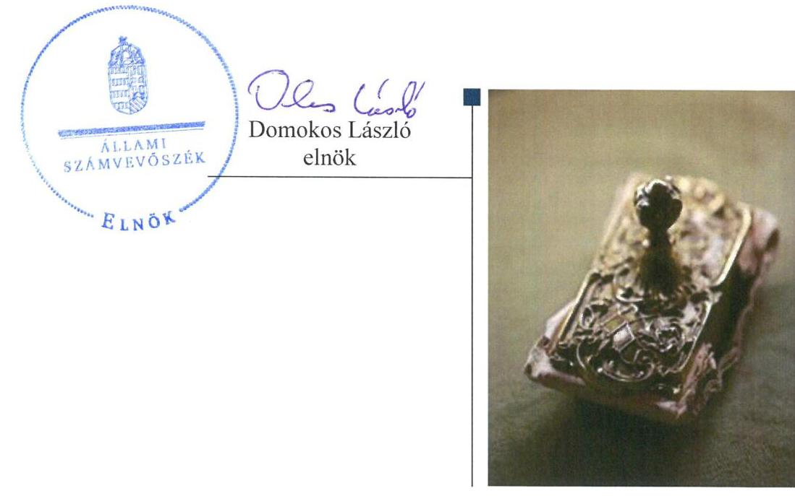

---

# AZ ELLENŐRZÉST FELÜGYELTE: 

PETŐ KRISZTINA felügyeleti vezető

## AZ ELLENŐRZÉST VEZETTE ÉS A VÉGREHAJTÁSÁÉRT FELELŐS:

NEMESVÁRI-HORTHY ESZTER ellenőrzésvezető

## A PROGRAM ÖSSZEÁLLÍTÁSÁÉRT FELELŐS:

JANIK JÓZSEF LÁSZLÓ osztályvezető

IKTATÓSZÁM: V-1014-355/2016.
TÉMASZÁM: 2048

## ELLENŐRZÉS-AZONOSÍTÓ SZÁM: V074202

Jelentéseink az Országgyúlés számítógépes hálózatán és az Interneten a www.asz.hu címen is olvashatóak.

---

# TARTALOMJEGYZÉK 

■ ÖSSZEGZÉS ..... 5
■ AZ ELLENŐRZÉS CÉLJA ..... 7
■ AZ ELLENŐRZÉS TERÜLETE ..... 8
■ AZ ELLENŐRZÉS HÁTTERE, INDOKOLTSÁGA ..... 10
■ A JELENTÉS LÉNYEGES KÉRDÉSKÖREI ..... 11
■ ELLENŐRZÉS HATÓKÖRE ÉS MÓDSZEREI ..... 12
■ MEGÁLLAPÍTÁSOK ..... 14
■ JAVASLATOK ..... 26
■ MELLÉKLETEK ..... 29
I. Sz. melléklet: Értelmező szótár. ..... 29
II. Sz. melléklet: A Magyar Könyvvizsgálói Kamara szervezeti ábrája ..... 30
III. Sz. melléklet: A Magyar Könyvvizsgálói Kamara eredménykimutatásának adatai (2012-2014.) ..... 31
IV. Sz. melléklet: A Magyar Könyvvizsgálói Kamara mérlegadatai (2012-2014.) ..... 32
■ FÜGGELÉK: ÉSZREVÉTELEK ..... 33
■ RÖVIDÍTÉSEK JEGYZÉKE ..... 53

---

.

---

# ÖSSZEGZÉS 

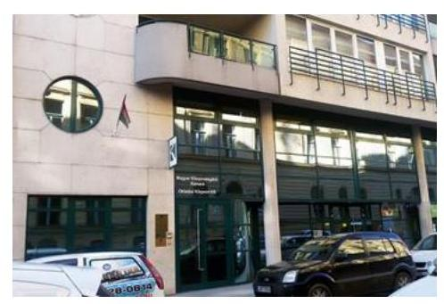

A Magyar Könyvvizsgálói Kamara gazdálkodása nem volt teljes körűen szabályozott, valamint gazdálkodása nem volt szabályszerű. A költségvetési támogatásokat a Kamara szabályszerűen használta fel és számolta el. A személyes adatok kezelése során nem érvényesültek a jogszabályi előírások, ezért a Kamara elnöke nem biztosította teljes körűen a személyes adatok védelmét. A gazdálkodás körébe tartozó közérdekü adatok közzétételére vonatkozó kötelezettségének a Kamara elnöke teljes körűen nem tett eleget, ezáltal az átláthatóság nem volt biztosított.

## Az ellenőrzés társadalmi indokoltsága

A köztestületek közfeladatot látnak el, amelyre fokozott közérdeklődés irányul. Társadalmi elvárás a közpénzek értékelvű, rendeltetésszerű felhasználása, a közpénzekből nyújtott támogatások átláthatóságának megteremtése, amelyhez az Állami Számvevőszék az államháztartásból nyújtott támogatások ellenőrzésével kíván hozzájárulni.

A közpénzek védelmét Magyarországon egy összehangolt, egymásra épülő ellenőrzési rendszer biztosítja. Ebben kiemelt szerepe van a gazdálkodás átláthatóságát biztosító független könyvvizsgálatnak, mivel a könyvvizsgáló elfogadó véleménye garantálja azt, hogy a beszámoló a gazdasági-pénzügyi helyzetről objektív képet, valós és megbízható információkat biztosít. A könyvvizsgáló felelős azért is, hogy kellő bizonyosságot szerezzen arról, hogy a pénzügyi kimutatások nem tartalmaznak akár csalásból, akár hibából eredő lényeges hibás állítást. A könyvvizsgálat minden társadalomban kulcsfontosságú szerepet tölt be az általános és a piaci bizalom, hitelesség megteremtésében, megőrzésében, esetenként helyreállításában. A könyvvizsgálókat tömörítő köztestület végzi a könyvvizsgálók munkájának minőségbiztosítását, kidolgozza a könyvvizsgálókra vonatkozó etikai szabályokat és őrködik ezen szabályok megtartása felett. A Magyar Könyvvizsgálói Kamara gazdálkodását az Állami Számvevőszék eddig még nem ellenőrizte.

## Főbb megállapítások, következtetések, javaslatok

A Magyar Könyvvizsgálói Kamara gazdálkodása nem volt teljes körűen szabályozott. A gazdálkodására vonatkozó alapvető belső szabályzatokat elkészítették ugyan, azonban a számviteli szabályzatok közül a számlarend nem tartalmazta az azt alátámasztó bizonylati rendet. A gazdálkodási jogkörök gyakorlásának belső szabályait kialakították, azonban ezen a területen a kiadott belső szabályzatok egymásnak ellentmondó előírásokat tartalmaztak.

A Magyar Könyvvizsgálói Kamara gazdálkodása nem volt szabályszerű. A 2013. évi beszámolóban nem a számviteli törvény előírásainak megfelelően szerepeltettek költségvetési támogatási összeget. A felújítási, beruházási ráfordítások elszámolása részben felelt meg a jogszabály, az Alapszabály és a belső szabályzatok rendelkezéseinek, mert a kötelezettségvállalások előzetes írásba foglalása nem történt meg, illetve az írásba foglalt kötelezettségvállalásoknál az ellenjegyzés elmaradt, továbbá a 200 E Ft-ot meghaladó készpénzes kifizetések vezetői engedély nélkül történtek. Az igénybe vett és egyéb szolgáltatások költségei, a személyi jellegű ráfordítások elszámolása nem felelt meg a számviteli törvény és a belső szabályzatok előírásainak, mert a Magyar Könyvvizsgálói Kamara nem saját nevére szóló bizonylatokat vett be könyveibe, amely ellentétes volt a számviteli politikában előírtaknak, továbbá a 2012-2014. években nem utalványoztak a kifizetések előtt. A Magyar Könyvvizsgálói Kamara tisztségviselői részére fizetett tiszteletdíjak meghatározása és elszámolása nem felelt meg a Magyar Könyvvizsgálói Kamarát létrehozó törvényben és a belső szabályzatokban foglalt előírásoknak.

---

A Magyar Könyvvizsgálói Kamara a költségvetési támogatásokat a meghatározott célra, a támogatási szerződésekben foglaltak szerint használta fel és számolta el.

A Magyar Könyvvizsgálói Kamara nem érvényesítette maradéktalanul az információs önrendelkezési jogról és az információszabadságról szóló törvény előírásaiban foglalt kötelezettségeit. A személyes adatok kezelése során a törvény előírásai ellenére nem jelöltek ki belső adatvédelmi felelőst és a személyes adatok kezelésének nyilvántartásba vételét sem kezdeményezték az adatvédelmi hatóságnál, így a Magyar Könyvvizsgálói Kamara elnöke nem biztosította teljes körűen a személyes adatok védelmét. A közérdekű adatok közzétételével kapcsolatos kötelezettségeket nem teljes körűen teljesítették, a részesedésével múködő Magyar Cégértékelő Nonprofit Kft. adatait nem tették közzé, ezáltal az átláthatóság nem volt biztosított.

---

# AZ ELLENŐRZÉS CÉLJA 

Az ellenőrzés célja annak megállapítása volt, hogy a Magyar Könyvvizsgálói Kamara gazdálkodása során betartotta-e a vonatkozó jogszabályi előírásokat, szabályszerűen használta-e fel a közfeladatai ellátására kapott állami támogatásokat, illetve az államháztartásból meghatározott célra ingyenesen juttatott vagyont, a szabályszerű működését biztosító ellenőrzési, monitoring és nyilvántartási rendszerek megfelelően múködtek-e.

---

# **AZ ELLENŐRZÉS TERÜLETE**

## **Magyar Könyvvizsgálói Kamara**

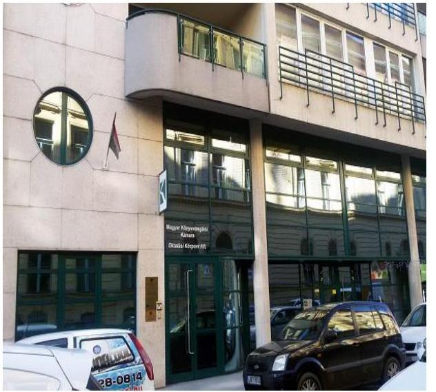

1. táblázat

|  A TAGLÉTSZÁM ALAKULÁSA ÉV VÉGÉN (Fő) |  |  |   |
| --- | --- | --- | --- |
|  Magnevezés | 2012. | 2013. | 2014.  |
|  Magánszemély | 5370 | 5258 | 5123  |
|  ebből szüneteltető | 2277 | 2280 | 2244  |
|  Társaság | 3119 | 3043 | 1853  |
|  Összesen | 8489 | 8301 | 6976  |
|   |  |  | Forrás: ÁSZ ellenőrzés  |

**A KÖNYVVIZSGÁLÓI KAMARA^{1}**, mint köztestület 1997-ben alakult, önkormányzattal és nyilvántartott tagsággal rendelkező szervezet, székhelye Budapest. Jogállását, feladatait és a működését az ellenőrzött időszakban a 2007. évi LXXV. törvény^{2} szabályozta.

**TEVÉKENYSÉGEI KÖRÉBEN** ellátta a természetes személy könyvvizsgálókhoz és a könyvvizsgálói tevékenységet végző gazdálkodó szervezetekhez, illetőleg az általuk végzett tevékenységhez kapcsolódó közfeladatokat, meghatározta az okleveles könyvvizsgálói szakképesítés szakmai és vizsgáztatási követelményeit, szervezte és felügyelte a könyvvizsgálók képzését, gondoskodott a feladatellátás minőségbiztosításáról. Érdekvédelmi feladatokat látott el és a könyvvizsgálókkal kapcsolatos fegyelmi ügyek elbírálását is végezte első és másodfokon. Hatósági eljárás keretében végezte – többek között – a minősített kamarai tag könyvvizsgálók, könyvvizsgáló cégek minősítésének megadását és visszavonását. A Könyvvizsgálói Kamara a minősített kamarai tag könyvvizsgálókról, könyvvizsgáló cégekről a minősítésnek megfelelő részletezésben külön nyilvántartást vezetett, amely 2013. július 1-jétől közhiteles hatósági nyilvántartásnak minősült. Közfelügyeleti díjjal a Közfelügyeleti rendszer működtetéséhez 2013. július 1-jétől járult hozzá a 2007. évi LXXV. törvény alapján. A kamarai taglétszám alakulását az 1. táblázat mutatja be. A Könyvvizsgálói Kamara munkavállalóinak átlagos állományi létszáma a 2012. évi 44 főről 2014. évre 40 főre változott.

**SZERVEZETI KERETEIT** illetően az országos hatáskörű jogi személy Könyvvizsgálói Kamara feladatainak ellátására jogi személyiséggel nem rendelkező központi szerveket és területi szervezeteket, 1 fővárosi és 19 megyei területi szervezetet hozott létre és működtetett. A Könyvvizsgálói Kamara szervezeti felépítését a II. mellékletben elhelyezett ábra mutatja be.

**MŰKÖDÉSÉT** döntő részben a természetes személy könyvvizsgálók tagdíjaiból és a könyvvizsgáló cégek hozzájárulási díjaiból finanszírozta. A tagdíjak és hozzájárulási díjbevételek a kamarai tagok létszámával arányosan évről évre csökkentek, a 2012. évi 659,7 M Ft-ról 2014. évre 594,7 M Ft-ra.

A Könyvvizsgálói Kamara bevételei a 2012. évi 925,2 M Ft-ról 2014. évre 756,7 M Ft-ra, kiadásai 956,8 M Ft-ról 751,6 M Ft-ra csökkentek. A mérlegfőösszeg a 2012. évi 1399,0 M Ft-ról 2014. évre 1374,6 M Ft-ra változott. A bevételek és kiadások 2012-2014. közötti alakulását, változását a III. melléklet, a mérleg eszközei és forrásai alakulását a IV. melléklet mutatja be részletesen.

---

# VÁLLALKOZÁSI TEVÉKENYSÉGET A KÖNYVVIZS- 

GÁLÓI KAMARA: oktatási és továbbképzési, szakkönyv értékesítési, konferencia- és rendezvény-szervezési, számviteli szolgáltatás, valamint bérbeadási tevékenység területén végzett. A Könyvvizsgálói Kamara éves beszámolóinak kiegészítő mellékletében szereplő adatok alapján vállalkozási tevékenységéből 2012-ben 68,5 M Ft, 2013-ban 45,4 M Ft, 2014ben 51,2 M Ft bevétele származott.

HÁROM GAZDASÁGI TÁRSASÁGBAN rendelkezett részesedéssel a Könyvvizsgálói Kamara, amelyek az ellenőrzött időszakot megelőzően alakultak. Tulajdoni részesedése az MKVK Oktatási Központ Kft. ${ }^{3}$ ben 100\%, az MKVK Alkusz Kft. ${ }^{4}$-ben 25\%, a Magyar Cégértékelő Nonprofit $\mathrm{Kft} .^{5}$-ben $50 \%$ volt.

ÁLLAMHÁZTARTÁSBÓL TÁMOGATÁST 2012-2014. években az NGM ${ }^{6}$ fejezeti kezelésú előirányzata terhére a könyvvizsgálói közfelügyeleti rendszer müködtetésére kapott a Könyvvizsgálói Kamara. A megkötött támogatási szerződések szerint a támogatás összege a három évre összesen 86,0 M Ft volt. Ebből az ellenőrzött időszakban összesen 48,4 M Ft volt az NGM által elfogadott, elszámolt költségvetési támogatás. A Könyvvizsgálói Kamara államháztartásból meghatározott célra ingyenes vagyonjuttatásban nem részesült.

---

# AZ ELLENŐRZÉS HÁTTERE, INDOKOLTSÁGA 

## AZ ÁSZ7 KÖZÉPTÁVRA SZÓLÓ STRATÉGIÁJÁBAN

megfogalmazta, hogy az államháztartáson kívülre nyújtott költségvetési támogatások és ingyenes vagyonjuttatások, valamint az államháztartáson kívül működő közfeladat-ellátó rendszerek ellenőrzéseivel hozzájárul ahhoz, hogy a közpénzeket az államháztartáson kívül működő szervezetek is átlátható, rendezett módon használják fel a közfeladatok szerződésben vállalt ellátása, továbbá a közvagyon szerződésben vállalt átlátható, hatékony, költségtakarékos működtetése, értékének megőrzése, állagának védelme, értéknövelő használata, hasznosítása és gyarapítása érdekében.

AZ ELLENŐRZÉS EREDMÉNYEKÉPP a törvényalkotás számára tapasztalatok állnak rendelkezésre a köztestületek szabályozásához. Az ellenőrzöttek számára visszajelzést adhat az ellenőrzés a közfeladataik ellátására kapott állami támogatások felhasználásának szabályosságáról, esetleges hiányosságairól, míg a társadalom számára információt szolgáltat a köztestület gazdálkodásáról és a közpénzek felhasználásáról. Az ÁSZ szervezetén belül lehetőség nyílik arra, hogy az intézmény erősítse hozzáadott értéket teremtő tevékenységét és tanácsadó szerepét.

---

# A JELENTÉS LÉNYEGES KÉRDÉSKÖREI 

1. A Könyvvizsgálói Kamara gazdálkodása szabályozott és szabályszerű volt-e?
2. Szabályszerű volt-e a költségvetési támogatások felhasználása és elszámolása?
3. Szabályszerű volt-e a Könyvvizsgálói Kamara adatszolgáltatási és közzétételi kötelezettségének teljesítése?

---

# ELLENŐRZÉS HATÓKÖRE ÉS MÓDSZEREI 

## Az ellenőrzés típusa

Megfelelőségi ellenőrzés

## Az ellenőrzött időszak

2012-2014. évek

## Az ellenőrzés tárgya

Az ellenőrzés tárgya a Könyvvizsgálói Kamaránál a belső szabályozás kialakítására és a szervek szabályszerű működésére, a pénzügyi gazdálkodási feladatok ellátására, a közfeladat ellátására kapott állami támogatás és az államháztartásból meghatározott célra ingyenesen juttatott vagyon szabályszerű felhasználására irányuló tevékenység. Az ellenőrzés kiterjedt továbbá a Könyvvizsgálói Kamara ellenőrzési, monitoring tevékenységére, az általa végzett vállalkozási tevékenységre, a nyilvántartásba történő bejelentkezési, az adatszolgáltatási és közzétételi kötelezettségének teljesítésére.

## Az ellenőrzött szervezet

Magyar Könyvvizsgálói Kamara

## Az ellenőrzés jogalapja

Az ellenőrzés elvégzésének jogszabályi alapját az ÁSZ tv. ${ }^{8}$ 5. § (3) bekezdése képezte.

## Az ellenőrzés módszerei

Az ellenőrzést az ellenőrzési program szempontjai, az ellenőrzött időszakban hatályos jogszabályok, az ellenőrzés szakmai szabályai, a jelen ellenőrzésre irányadó ÁSZ módszertan és a nemzetközi standardok figyelembevételével végeztük. A gazdálkodás hibáinak kijavítására irányuló javaslatok kidolgozásakor a hatályos jogszabályok voltak az irányadóak.

Az ellenőrzési kérdések megválaszolásához szükséges bizonyítékok megszerzése az ellenőrzött által rendelkezésre bocsátott dokumentu-

---

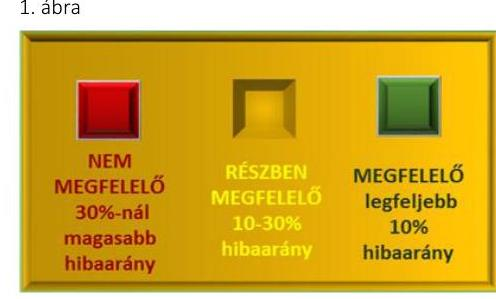
mokra, adatokra alapozva kérdésfeltevés (információkérés), mintavételezés, valamint elemző eljárás útján történt. Az ellenőrzési bizonyítékként felhasználható adatforrások közé tartoztak egyrészt a szakmai program részletes szempontjainál felsorolt adatforrások, másrészt minden egyéb az ellenőrzés folyamán feltárt, az ellenőrzés szempontjából információt tartalmazó - dokumentum.

Mintavétellel az alábbi területek szabályszerűségét ellenőriztük:

- immateriális javak, tárgyi eszközök, befektetett pénzügyi eszközök, követelések, és pénzeszközök mérlegtételek;
- felújítási, beruházási ráfordítások;
- igénybevett és egyéb szolgáltatások, a személyi jellegű ráfordítások;
- tagdíjhátralékok;
- tiszteletdíjak.

A minta alapján a sokaságban előforduló hibaarányt becsültük. "Megfelelőnek" értékeltük az ellenőrzött területet, amennyiben 95\%-os bizonyossággal a teljes sokaságban a hibaarány legfeljebb 10\%, "részben megfelelőnek" értékeltük, ha a hibaarány felső határa 10-30\% között volt, "nem megfelelőnek" pedig akkor, ha a mintavételi eredmények alapján a sokaságbeli hibaarány felső határa meghaladta a 30\%-ot.

A Könyvvizsgálói Kamara támogatásai felhasználásának és elszámolásának szabályszerűségét a már lejárt elszámolási határidejű szerződésekből egyszerű véletlen mintavétellel kiválasztott szerződésenkénti két-két kifizetési bizonylat alapján ítéltük meg.

A Könyvvizsgálói Kamara monitoring tevékenységét nem értékeltük, mert monitoring rendszert nem alakítottak ki.

---

# 1. A Könyvvizsgálói Kamara gazdálkodása szabályozott és szabályszerű volt-e? 

Összegző megállapítás

1.1. számú megállapítás

A Könyvvizsgálói Kamara gazdálkodása nem volt teljes körűen szabályozott, valamint gazdálkodása nem volt szabályszerű.

A gazdálkodási jogkörök gyakorlására vonatkozó belső szabályozás más belső szabályzat rendelkezéseivel ellentétes előírást tartalmazott. A számviteli politika aktualizálása 2013-ig elmaradt, a Könyvvizsgálói Kamara az ellenőrzött időszakban nem rendelkezett bizonylati renddel.

AZ ALAPSZABÁLYBAN - összhangban a 2007. évi LXXV. törvény 109. § (2) bekezdés f) pontjával - a gazdálkodásra vonatkozó szabályokat meghatározták. Az Alapszabály a gazdálkodás körében az éves pénzügyi terv Küldöttgyűlés ${ }^{9}$ általi elfogadására, annak a Könyvvizsgálói Kamara Főtitkári Hivatala ${ }^{10}$ általi előkészítésére, az Elnökségnek ${ }^{11}$ az éves előirányzatok felhasználásáról szóló beszámolási és a területi szervezetek gazdálkodás feltételeinek biztosítására vonatkozó kötelezettségeire, a területi szervek gazdálkodására, valamint az Ellenőrző Bizottság ${ }^{12}$ gazdálkodással kapcsolatos feladataira vonatkozó előírásokat tartalmazott. Az Alapszabály a Főtitkári Hivatal feladatkörébe utalta a gazdálkodással kapcsolatos feladatok ellátását. A gazdálkodási, számviteli szabályzatok kiadása a Könyvvizsgálói Kamara Alapszabályának 314. p) pontja alapján a Könyvvizsgálói Kamara elnökének hatáskörébe tartozott.

## A KÖZELEZETTSÉGVÁLLALÁSI, ELLENJEGYZÉSI

ÉS UTALVÁNYOZÁSI jogkör gyakorlására vonatkozó előírásokat az Alapszabályban, a kötelezettségvállalási és ellenjegyzési jogkörök gyakorlására meghatározott összeghatárokat az Alapszabály „Kötelezettségvállalási jogkörök a Magyar Könyvvizsgálói Kamarában" tárgyú mellékletben meghatározták. Ezen túlmenően a gazdálkodási jogkörök tartalmát, a gyakorlásának részletes rendjét a Kötelezettségvállalási szabályzat ${ }_{1,2}{ }^{13}$ tartalmazta. A Kötelezettségvállalási szabályzat ${ }_{2}$-ban 2014. február 1-jétől meghatározták az összeférhetetlenségre vonatkozó szabályokat.

A kötelezettségvállalási, ellenjegyzési, utalványozási jogkörök gyakorlásával kapcsolatos belső szabályzatok egyes előírásai nem álltak összhangban egymással, illetve az utalványozási jogkörök gyakorlásával kapcsolatos belső szabályzatok előírásait az utalványozásra jogosultak felhatalmazásánál nem alkalmazták megfelelően:
$\longrightarrow$ A Kötelezettségvállalási szabályzat ${ }_{2}$ 8. pontjában foglaltak szerint a gazdasági eseményenként 100,0 E Ft-ot el nem érő kötelezettségvállalás esetében nem volt szükséges előzetes írásbeli kötelezettség-

---

vállalásra, míg a Beszerzési szabályzat IV. fejezet 1.2. pontjában foglaltak szerint a beszerzés írásba foglalását vagy szerződés megkötését legalább bruttó 200,0 E Ft értékű beszerzéshez kötötte.

- Az utalványozási jogkör gyakorlására elnökségi tagok is kaptak felhatalmazást egyes területi szerveknél, amely ellentétes a Kötelezettségvállalási szabályzat 1 , 3.2. pontjával és a Kötelezettségvállalási szabályzat ${ }_{2} 17$. b pontjával, mivel utalványozásra a területi szerv elnöke, helyettesítésekor alelnöke jogosult. (Fővárosi, Győr-Moson Sopron, Baranya, Bács-Kiskun, Békés, Csongrád, Fejér, Heves, Nógrád, Sza-bolcs-Szatmár-Bereg, Veszprém és Zala megyei területi szervezet). (Az utalványozás gyakorlatánál feltárt hiányosságok az 1.4. pontban szerepelnek.)

A SZÁMVITELI POLITIKA ${ }_{1,2}{ }^{14}$ keretében - összhangban Számv. tv. ${ }^{15}$ 14. § (5) bekezdés a)-b) és d) pontjaival - elkészítették az Eszközök és források értékelési szabályzata ${ }_{1,2}$ - $t^{16}$, az Eszközök és források leltározási és leltárkészítési szabályzata ${ }_{1,2}$-t $t^{17}$, valamint a Pénzkezelési Szabályzat ${ }_{1,2}$-t ${ }^{18}$. Az Eszközök és források értékelési szabályzata ${ }_{1,2}$ tartalmazta az eszközök és források év végi értékelésének elveit, módszereit. Az Eszközök és források leltározási és leltárkészítési szabályzata ${ }_{1,2}$ rögzítette a leltározás módjának, előkészítésének, végrehajtásának, kiértékelésének, könyvviteli egyeztetésnek, valamint a leltáreltérések rendezésének szabályait, a leltárellenőrzési kötelezettséget. Önköltségszámítási szabályzat készítésére a Könyvvizsgálói Kamara a Számv. tv. 14. § (6) bekezdésében foglaltak alapján - mint egyszerűsített éves beszámolót készítő és a Számv. tv. 14. § (7) bekezdésben foglalt értékhatárt el nem érő gazdálkodó - nem volt kötelezett az ellenőrzött időszakban. A Könyvvizsgálói Kamara a Számviteli Politika ${ }_{1}$-et - ellentétben a Számv. tv. 14. § (11) bekezdésében és a Számviteli Politika ${ }_{1}$ 2.1.2. pontjában foglaltak ellenére - csak 2014. január 1jével aktualizálta. Ennek következtében a Számviteli Politika ${ }_{1}$ a Számviteli Politika ${ }_{2}$ 2014. január 1-jei hatályba helyezéséig tartalmazta, hogy mit kell tekinteni „a megbízható és valós képet befolyásoló lényeges hibának", amely a Számv. tv. 3. § (3) bekezdés 5. pontjában szereplő és 2013. január 1-jétől hatálytalan fogalom. A Könyvvizsgálói Kamara - összhangban a Számv. tv. 161. § (1) bekezdésével - rendelkezett számlarenddel. A Számlarend ${ }_{1,2}{ }^{19}$ a Számv. tv. 161. § (2) bekezdés a)-c) pontjaiban foglaltaknak megfelelően tartalmazta az alkalmazásra kijelölt számlák számjelét és megnevezését, a számla tartalmát, továbbá a számla értéke növekedésének, csökkenésének jogcímeit, a számlát érintő gazdasági eseményeket, azok más számlákkal való kapcsolatát, a főkönyvi számla és az analitikus nyilvántartás kapcsolatát. A Számlarend ${ }_{1,2}$ ugyanakkor - ellentétben a Számv. tv. 161. § (2) bekezdés d) pontjának rendelkezésével - nem tartalmazta a számlarendben foglaltakat alátámasztó bizonylati rendet.

---

### 1.2. számú megállapítás

A Könyvvizsgálói Kamara beszámoló készítési kötelezettségének eleget tett. A 2013. évben a Könyvvizsgálói Kamara egyszerűsített éves beszámolójában a támogatási összeget egyéb bevételként szerepeltette, amely nem felelt meg a Számv. tv. előírásainak. A mérlegtételek év végi értékelése az előírásoknak megfelelően történt.

BESZÁMOLÓ KÉSZÍTÉSI KÖTELEZETTSÉGÉNEK a Könyvvizsgálói Kamara - a Számv. tv., a 224/2000. (XII. 19.) Korm. rendelet ${ }^{20}$ és a Számviteli Politika ${ }_{1,2}$ elöírásaival összhangban - eleget tett. Az egyszerűsített éves beszámolót a Számv. tv. 4. §-ában, illetve a 224/2000. (XII. 19.) Korm. rendelet 6. § (1) és (4) bekezdés b) pontjában foglaltaknak megfelelően a 4. és 5. sz. melléklet szerinti tartalommal készítették el. Az egyszerűsített éves beszámolók összeállítása során a Számv. tv. 15. § (6) bekezdésében meghatározottaknak megfelelően érvényesült a folytonosság számviteli alapelve, az üzleti év nyitó adatai megegyeztek az előző üzleti év záró adataival. A Számv. tv. 165. § (4) bekezdésében foglaltaknak megfelelően a 2012-2014. években a főkönyvi könyvelés, az analitikus nyilvántartások és a bizonylatok adatai közötti egyeztetés és ellenőrzés lehetőségét logikailag zárt rendszer keretében biztosították. A Számviteli Politika ${ }_{1,2}$-ben előírt, a 224/2000. (XII. 19.) Korm. rendelet 19. § (3) bekezdésében foglaltak szerinti könyvvizsgálatot - bár a Könyvvizsgálói Kamara a 224/2000. (XII. 19.) Korm. rendelet 19. § (1) bekezdése alapján nem volt könyvvizsgálatra kötelezett - a 2012-2014. években az egyszerűsített éves beszámolóra vonatkozóan kamarai tagsággal rendelkező könyvvizsgálóval elvégeztették. A beszámoló közzétételénél betartották a 224/2000. (XII. 19.) Korm. rendelet. 20. § (2) bekezdésében előírt határidőt.

A 2013. évi egyszerűsített éves beszámoló összeállítása során támogatási összeg elszámolásánál nem érvényesült maradéktalanul a Számv. tv. 15. § (2)-(3) bekezdésében előírt teljesség és valódiság elve:
$\longrightarrow$ A központi költségvetésből igényelt (járó) támogatások között 2013ban a Számv. tv. 77 § (3) bekezdés b) pontjában foglalt előírás ellenére egyéb bevételként úgy szerepeltettek 610,0 E Ft-ot, hogy annak igénylésére a hivatkozott Számv. tv. előírás ellenére a Számviteli Politika ${ }_{1}$ 2.1.7. pontjában meghatározott mérlegkészítés időpontját követően 2014. március 25 -én került sor.

## AZ ESZKÖZÖK ÉS FORRÁSOK ÉV VÉGI ÉRTÉKE-

LÉSE az előírásoknak megfelelően történt. A tárgyi eszköz tételeket, a követeléseket és a kötelezettségeket a Számv. tv., a Számviteli Politika ${ }_{1,2,}$ valamint az Értékelési szabályzat ${ }_{1,2}$ előírásai szerint bekerülési értéken, illetve könyv szerinti értéken mutatták ki. A mérlegtételek tartalma, besorolása, értékelése megfelelt a Számv. tv. előírásainak. Minden gazdasági műveletről, eseményről, amely az eszközök, illetve az eszközök forrásainak állományát vagy összetételét megváltoztatta, bizonylatot állítottak ki és a számviteli nyilvántartásokba csak szabályszerűen kiállított bizonylat alapján jegyeztek be adatokat. Az Értékelési szabályzat ${ }_{1,2}$ előírásainak megfelelően a tárgyi eszközöknél visszaírást nem alkalmaztak. Egy 2011. évben beszerzett ingatlanra 2012. évben a Számv. tv. előírásainak megfelelően terven felüli értékcsökkenést számoltak el, amelyet a 2012. évi beszámolóban és annak kiegészítő mellékletében is szerepeltettek. Az egyszerűsített mér-

---

# 1.3. számú megállapítás 

3. ábra
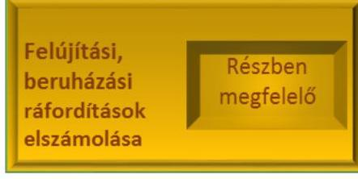
leget a Számv. tv. 107. §-a szerint leltárral alátámasztották. A mérlegtételek év végi leltározása során az analitikus nyilvántartásokat a Számv. tv. 69. § (2) bekezdése előírásainak megfelelően egyeztették.

## A felújítási, beruházási ráfordítások dokumentálása, elszámolása

részben volt megfelelő, mert nem tartották be a Könyvvizsgálói Kamara Alapszabályában és belső szabályzataiban foglalt előírásokat.

A FELÚJÍTÁSI, BERUHÁZÁSI RÁFORDÍTÁSOK dokumentálásánál és elszámolásánál az alábbiakban eseti jelleggel nem tartották be az Alapszabály és a belső szabályzatok előírásait:

- 2012-ben a bruttó 200,0 E Ft-ot meghaladó értékű beszerzést nem foglalták írásba, vagy nem kötöttek szerződést, amely nem felelt meg a Beszerzési szabályzat IV. fejezet 1.2. pontjában foglaltaknak;
- 2012-ben egy 5,0 M Ft értékű ingatlan megvásárlásakor nem kértek be három árajánlatot a Beszerzési szabályzat III. fejezet 1.3. és 1.4. pontjában foglaltak ellenére, a 2012. évi pénzügyi tervben nem szereplő ingatlan beszerzésre nem az Alapszabály mellékletében foglaltak szerint az elnök, hanem a területi szervezet elnöke vállalta a kötelezettséget (írta alá a szerződést), a kötelezettségvállalást az Alapszabály mellékletében foglaltak ellenére a Főtitkár nem ellenjegyezte;
- 2012-ben előfordult, hogy a főtitkár kötelezettségvállalását a főkönyvelő nem ellenjegyezte, amely nem felelt meg az Alapszabály mellékletében foglaltaknak;
- 2013-ban az elnök kötelezettségvállalását a főtitkár, a főtitkár kötelezettségvállalását pedig a főkönyvelő nem ellenjegyezte az Alapszabály mellékletében, illetve a Kötelezettségvállalási szabályzat 10 . pontjában foglaltak ellenére;
- 2012. 2013. és 2014. években 200,0 E Ft-ot meghaladó készpénzes kifizetéseknél nem tartották be az ügyintézők a Pénzkezelési szabályzat ${ }_{1}$ 4.3. pontjában, valamint a Pénzkezelési szabályzat ${ }_{2}$ 6.3. pontjában foglaltakat, miszerint a 200,0 E Ft feletti kifizetés csak külön vezetői, 2014. évben főtitkári engedéllyel történhetett,
- 2012-ben és 2013-ban számítógép konfiguráció részét képező operációs rendszereket, mint szoftvereket a beszerzésüket követően nem az immateriális javak között és azon belül is szellemi termékként vette állományba a Főtitkári Hivatal arra kijelölt ügyintézője a Számv. tv. 25.§ (1) és (7) bekezdéseiben, valamint a Számviteli Politika ${ }_{1}$ 3.1.2. pontjában foglaltak ellenére, hanem a tárgyi eszközök között;
- 2013-ban és 2014-ben esetenként a Kötelezettségvállalási szabályzat ${ }_{2} 4$. pontjában foglaltakkal ellentétben a bruttó 100,0 E Ft-ot meghaladó kötelezettségvállalásokat előzetesen az Alapszabály mellékletében foglaltak szerint arra jogosultak (elnök, főtitkár, területi szerv elnöke, helyettesítőként alelnöke) nem foglalták írásba.
A felújítási, beruházási ráfordítások dokumentálása, elszámolása során a kötelezettségvállalási jogkört (beruházásról való döntés) az Alapszabály melléklete szerint arra jogosult gyakorolta. A Beszerzési szabályzat, illetve a Kötelezettségvállalási szabályzat ${ }_{1,2}$ szerint írásbeli kötelezettségvállalást nem igénylő tételeknél a gazdasági esemény elszámolását számla, vagy

---

### 1.4. számú megállapítás

egyéb számviteli bizonylat megalapozta. Az eszközök bekerülési értékét, besorolását, az értékcsökkenés elszámolását a Számv. tv.-ben, a Számviteli Politika ${ }_{1,2}$-ben, az Eszközök és források értékelési szabályzat ${ }_{1,2}$-ben rögzítetteknek megfelelően határozták meg, illetve végezték el.

Az igénybe vett és egyéb szolgáltatások, a személyi jellegú ráfordítások elszámolása nem felelt meg a jogszabályok és a belső szabályzatok előírásainak. A tiszteletdíjak megállapítása és elszámolása nem volt megfelelő.

Az igénybe vett és egyéb szolgáltatások, a személyi jellegú ráfordítások elszámolása során az alábbi törvényi előírásokat és belső szabályzatok előírásait nem tartották be:
$\longrightarrow$ útiköltség elszámolásánál 2012-ben és 2013-ban a kiküldetési rendelvény nem tartalmazta a költségtérítés kiszámításához szükséges valamennyi adatot (gépjármú típusa, hengerúrtartalom) az Szja. tv. ${ }^{21}$ 3. § 83. pontjában foglaltakkal ellentétben;
$\longrightarrow$ 2012-ben és 2013-ban a területi szervezet elnöke esetében a belföldi kiküldetés indokoltságát a Belföldi kiküldetési szabályzat ${ }^{22}$ 3.4.1 pontjában foglaltakkal ellentétben a helyi szervezet alelnöke aláírásával nem igazolta;
$\longrightarrow$ 2014-ben az MKVK Oktatási Központ Kft. nevére szóló számlát számoltak el, amely nem felelt meg a Számviteli Politika ${ }_{2}$ 2.9. pontjában foglaltaknak, amely szerint a Könyvvizsgálói Kamara csak a saját nevére szóló bizonylatokat veszi fel a könyveibe;
$\longrightarrow$ 2012-ben a Könyvvizsgálói Kamara alkalmazottja részére kifizetett jutalmat megítélő döntésről a Munkaügyi szabályzat ${ }_{1}{ }^{23}$ 11.2. részében foglaltakkal ellentétben nem az ügyvezető igazgató (2012-ben főtitkár) döntött;
$\longrightarrow$ 2014-ben a Könyvvizsgálói Kamara területi szervénél foglalkoztatott munkavállaló jutalmának kifizetése előtt a Munkaügyi szabályzat ${ }_{2}{ }^{24}$ II.5. "Prémium, jutalom" részében rögzítettek ellenére a jutalom mértékéről nem a területi szerv elnöke döntött írásban, hanem a területi szerv elnöksége.
Az igénybe vett és egyéb szolgáltatások, a személyi jellegú ráfordítások elszámolása során a kötelezettségvállalás, az ellenjegyzés, utalványozás az alábbiakban nem volt megfelelő:
$\longrightarrow$ 2012-ben bizottsági elnök belföldi kiküldetését a Belföldi kiküldetési szabályzat 3.4.2 pontjában foglaltak ellenére nem a Könyvvizsgálói Kamara elnöke, vagy illetékes alelnöke, hanem az ügyfélszolgálati előadó írta alá, aki erre felhatalmazással nem rendelkezett;
$\longrightarrow$ 2012-2014-ben nem végezték el az utalványozást, a Számv. tv. 167. § (1) bekezdés c) pontjában, a Kötelezettségvállalási szabályzat ${ }_{1} 3$. pontjában, a Kötelezettségvállalási szabályzat ${ }_{2}$ 16-17. pontjaiban, a Pénzkezelési szabályzat ${ }_{1} 8$. pontjában, valamint a Pénzkezelési szabályzat ${ }_{2} 10$. pontjában foglaltak ellenére.
$\longrightarrow$ 2013-ban és 2014-ben előfordult, hogy az utalványozást nem az arra jogosult területi szervezet elnöke, hanem elnökségi tag végezte, ami nem felelt meg az Alapszabály 391. § f) pontjában, a Kötelezettség-

---

5. ábra
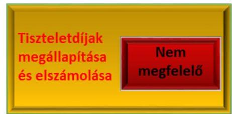
vállalási szabályzat ${ }_{1}$ 3. pontjában és a Kötelezettségvállalási szabályzat 2 17.b. pontjában foglaltaknak, miszerint a területi szervezet elnöke utalványozhat;
$\longrightarrow$ teljesítés (végrehajtás) igazolása 2012-ben a Számv. tv. 167. § (1) bekezdés c) pontjának és a Kötelezettségvállalási szabályzat ${ }_{1} 3$. pontjában foglaltak ellenére néhány esetben nem történt meg, mert nem igazolták a számla tartalmának szerződés szerinti teljesítését, illetve előfordult, hogy a Belföldi kiküldetési szabályzat 3.5. pontjában foglaltak ellenére a kiküldetés teljesítését a kiküldetési rendelvényen nem igazolták;
$\longrightarrow$ 2014-ben a Kötelezettségvállalási szabályzat 2 13-14. pontjaiban foglaltak ellenére a kiadások teljesítésének jogossága, összegszerűsége igazolásánál a teljesítést igazoló nem tüntette fel a dátumot, a teljesítés tényére való utalást;
előfordult 2012-ben, hogy a bizonylaton nem szerepelt az összeg átvevőjének aláírása, amely nem felelt meg a Számv. tv. 167. § (1) bekezdés c) pontjában foglaltaknak;
előfordult, hogy a Kötelezettségvállalási szabályzat 2 6. h. pontja szerinti kötelezettségvállalás dokumentumát (bruttó bér változásáról szóló munkaszerződés módosítás) - amelyet a 2007. évi LXXV. tv. 126. § (3) bekezdése, illetve az Alapszabály 323. §-a alapján a főtitkár írt alá - a területi szervezet elnöke ellenjegyzett, ami nem felelt meg az Alapszabály mellékletében, valamint a Kötelezettségvállalási szabályzat 2 12. pontjában foglaltaknak, miszerint a főtitkár kötelezettségvállalásait a főkönyvelő ellenjegyzi.

## A SZEMÉLYI JELLEGŰ RÁFORDÍTÁSOK KÖZÖTT

A TISZTELETDÍJAK meghatározása nem volt megfelelő. A Küldöttgyűlés az Alapszabályban - ellentétben a 2007. évi LXXV. törvény 111. § f) pontjában foglaltakkal - nem határozta meg a díjazásban részesíthető bizottsági elnököket és tagokat. A Küldöttgyűlés 2012-2014. évekre - ellentétben a 2007. évi LXXV. törvény 111. § f) pontjával - nem határozta meg az elnök, az alelnökök, az Elnökség további tagjai, a fegyelmi megbízott díját.

A TISZTELETDÍJAK kifizetése és elszámolása nem volt megfelelő, nem tartották be a belső szabályzatokban foglalt előírásokat:
$\longrightarrow$ 2012-ben nem történt meg a tiszteletdíjak kifizetését megelőzően az utalványozás a Kötelezettségvállalási szabályzat ${ }_{1} 3$. pontjában foglaltak ellenére;
$\longrightarrow$ 2012-2014. években a teljesítés igazolását a kamarai szervek vezetői, tisztségviselők akiknek a feladat-, hatáskörében az adott teljesítés felmerült - a Kötelezettségvállalási szabályzat ${ }_{1} 3$. pontjában és a Kötelezettségvállalási szabályzat 2 14. pontjában foglaltak ellenére nem végezték el.

---

### 1.5. számú megállapítás

A tagdíjak fizetésének rendje a Könyvvizsgálói Kamara Alapszabályában foglaltaknak megfelelő volt. A tagdíjak és a hozzájárulási díjak beszedése, a hátralékok behajtása iránt tett intézkedések öszszességében megfelelőek voltak. A közfelügyeleti díjat a Könyvvizsgálói Kamara a 2007. évi LXXV. törvény előírásainak megfelelően megfizette.

A TAGDÍJ, HOZZÁJÁRULÁSI DÍJ MÉRTÉKÉT a 2007. évi LXXV. tv. 111. § g) pontjában foglaltaknak megfelelően a Küldöttgyűlés határozta meg. A könyvvizsgálók által fizetendő tagdíjak és kiegészítő tagdíjak, továbbá a könyvvizsgáló cégek hozzájárulási díjának mértéke 20122014. években nem változott, mértékét a 2. táblázat mutatja be.
2. táblázat

TAGDÍJAK ÉS HOZZÁJÁRULÁSI DÍJAK 2012-2014. (Ft/Év, \%)

| Alap   (Ft/év) | Árbevétel után fizetendő kiegészítő (\%) | Tagdíj/Hozzájárulási díj |  |  | Cégek hozzájárulási díja árbevétel $\%$-a, de minimum 31000 (Ft/év) |
| :--: | :--: | :--: | :--: | :--: | :--: |
|  |  | Szüneteltető (Ft/év) | 70 éven felülílek (Ft/év) | Felvétel első két évében (Ft/év) |  |
| 45.000 | 0,7 | 31.000 | 31.000 | 31.000 | 0,7   Forrás: ÁSZ megállapítás |

A tagdíjak megfizetésének rendjét az Alapszabály 146. pontjában meghatározták. A kamarai tag könyvvizsgálóknak - összhangban az Alapszabály 146. pontjával - január 31-ig az előző évi tagdíj 50\%-ának megfelelő előleget, majd július 31-ig a tagdíjuk fennmaradó részét kellett megfizetniük.

A tagdíj és a hozzájárulási díj bevételeket a Könyvvizsgálói Kamara a 2007. évi LXXV. törvény 147. § (1) bekezdés a) pontja előírásai szerint működése finanszírozására fordította. Az Alapszabály 262. pontjában foglaltaknak megfelelően a Küldöttgyűlés döntött a tagdíjak és a hozzájárulási díjak éves szinten számított összegének megosztásáról a Könyvvizsgálói Kamara központi és a területi szervezetek pénzügyi tervei között.

## A TAGDÍJ ÉS A HOZZÁJÁRULÁSI DÍJ HÁTRALÉ-

KOK behajtási rendjének alapvető szabályait Eljárási rendben ${ }^{25}$ rögzítették. A hátralékok behajtására tett intézkedések körében az Eljárási rend 1. pontjával ellentétben 2014. évtől a fegyelmi megbízott helyett a Felvételi Bizottság ${ }^{26}$ intézkedett a Főtitkári Hivatal felszólítását követően fizetési kötelezettségüket nem teljesítőkkel szemben. A tagdíj és a hozzájárulási díj bevételek behajtására tett többi intézkedés megfelelő volt. A Főtitkári Hivatal az Eljárási rend 1. pontjában foglaltaknak megfelelően évente kétszer felszólítást küldött ki a tartozóknak. A felszólítást követően az Eljárási rend 1. pontjában foglaltaknak megfelelően a díjtartozók listája 2012. és 2013. években a fegyelmi megbízott részére átadásra került, aki intézkedett a felszólító levelek ismételt kiküldéséről. A 2007. évi LXXV. tv. 174. § (2) bekezdés a) pontja és 175. § (3) bekezdése alapján a tartozókkal szemben a fegyelmi eljárást lefolytatták. A Felvételi Bizottság a kamarai tagság, illetve engedély megszűnésének megállapítása iránti kamarai hatósági eljárást a 2007. évi LXXV. tv. 30. § (3) bekezdésének, illetve 41. § (2) bekezdésének

---

megfelelően megindította. A tagság vagy engedély megszűnésének megállapításáról szóló határozatában az Eljárási rend 2. pontjában foglaltaknak megfelelően a fennálló tartozások rendezésére a figyelmet felhívta.

KÖZFELÜGYELETI DÍJAT fizetett a Könyvvizsgálói Kamara a tagdíj és a hozzájárulási díj bevételeiből a közfelügyeleti rendszer múködtetéséhez 2013. július 1-jétől a 2007. évi LXXV. tv. 185. § (4) bekezdésében foglaltak szerint. A Könyvvizsgálói Kamara a 2007. évi LXXV. törvény 2013. július 1-jétől hatályos 185. § (4)-(7) bekezdéseivel összhangban közfelügyeleti díj fizetési kötelezettségének eleget tett.
1.6. számú megállapítás

A Könyvvizsgálói Kamara által végzett vállalkozási tevékenységei a célkitűzéseivel összhangban voltak. Részesedésével múködő gazdasági társaságokkal folytatott együttmúködést szerződésekben szabályozták.

A VÁLLALKOZÁSI TEVÉKENYSÉGEK esetében érvényesült a 2007. évi LXXV. tv. 147. § (1) bekezdés f) pontjában foglalt előírás, miszerint a vállalkozási tevékenység a Könyvvizsgálói Kamara célkitűzéseivel összhangban volt. A könyvekben - a Számviteli Politika ${ }_{1,2}$ előírásaival összhangban - a kamarai alaptevékenységtől elkülönítetten mutatták ki a vállalkozási tevékenységgel kapcsolatos bevételeket és közvetlen költségeket.

A GAZDASÁGI TÁRSASÁGOK, amelyekben a Könyvvizsgálói Kamara részesedéssel rendelkezett, a múködésük alapvető szabályait a létesítő okiratban (az egyszemélyes MKVK Oktatási Központ Kft. esetén alapító okiratban, a többi társaság esetén társasági szerződésben) meghatározta. A Könyvvizsgálói Kamara az MKVK Oktatási Központ Kft.-vel és az MKVK Biztosítási Alkusz Kft.-vel a Ptk. ${ }_{1,2}{ }^{27}$ szerinti szerződéseket kötött, az együttműködésének részleteit azokban foglalta össze. A Könyvvizsgálói Kamara 50\%-os részesedéssel rendelkezett a 2011. évben bejegyzett Magyar Cégértékelő Nonprofit Kft.-ben, azonban a társasági szerződés 7. pontjában előírtak ellenére törzsbetétet az ellenőrzött időszakban nem fizette meg.
1.7. számú megállapítás

A Könyvvizsgálói Kamara Ellenőrző Bizottsága a pénzügyi terv és beszámoló véleményezésre vonatkozó kötelezettségét ellátta, a gazdálkodás vitelére vonatkozóan ellenőrzéseket végzett, azonban az ellenőrzések eredményeként tett javaslatok nem hasznosultak maradéktalanul.

AZ ELLENŐRZŐ BIZOTTSÁG a 2007. évi LXXV. törvény 131. § (2) bekezdése, az Alapszabály 260. pontja alapján véleményezte az Elnökség éves beszámolóját, az éves pénzügyi beszámolót, a pénzügyi tervet, áttekintette a meghozott határozatainak végrehajtását, eredményét. Az Ellenőrző Bizottság tevékenységéről - közte a gazdálkodással kapcsolatos ellenőrzései eredményeiről - a 2007. évi LXXV. törvény 111. § c) pontjában és az Alapszabály 258. pontjában foglaltaknak megfelelően a Küldöttgyűlés részére beszámolt.

---

Az Ellenőrző Bizottság a szervezeti és múködési szabályzatában foglaltakkal összhangban munkatervében éves rendszeresen ismétlődő feladatain túl egyéb, a gazdálkodási tevékenység ellenőrzésére vonatkozó feladatokat is meghatározott.

Az Ellenőrző Bizottság egy 2012-2013. évekre elvégzett ellenőrzésének megállapításaira egy alkalommal a főtitkár készített intézkedési tervet, amelyet a Könyvvizsgálói Kamara Elnöksége a 77/2013. számú (06.07.) elnökségi határozattal jóváhagyta. Az intézkedési terv végrehajtását az Elnökség és az Ellenőrző Bizottság folyamatosan figyelemmel kísérte. A Küldöttgyűlésnek az intézkedések végrehajtásának állásáról 2014. január 11-i ülésen számolt be az Ellenőrző Bizottság. Az intézkedési tervben szereplő feladatok közül az intézkedési tervben előírt határidőkre, illetve azon túl a 2014. január 11-i küldöttgyűlési ülés időpontjáig nem hajtották végre a gépkocsi használat egységesítését és a telefonok magánhasználatának szabályozását. Az intézkedések elmaradásához a Küldöttgyűlés nem fűzött jogkövetkezményeket.

A Könyvvizsgálói Kamara tekintetében elvégzett külső ellenőrzések a gazdálkodására vonatkozó megállapításokat nem tettek, intézkedést igénylő javaslatokat nem fogalmaztak meg.

# 2. Szabályszerú volt-e a költségvetési támogatások felhasználása és elszámolása? 

## Összegző megállapítás

A Könyvvizsgálói Kamara a költségvetési támogatásokat szabályszerűen használta fel és számolta el.

A Könyvvizsgálói Kamara közfeladatai ellátására 2012-2014. évek között az NGM fejezeti kezelésű előirányzatából állami támogatásban részesült. A 2012-2014. évek között felhasznált támogatásokkal kapcsolatos adatokat a 3. táblázat mutatja be:
3. táblázat

## NGM-TŐL KAPOTT TÁMOGATÁS 2012-2014. ÉVEK (M Ft)

| Támogatási szerződés éve | Finanszírozás módja | Szerződés szerinti összeg | Elszámolt összeg | Elfogadotás összeg |
| :--: | :--: | :--: | :--: | :--: |
| 2011. évi (2012-ben elszámolt) | előfinanszírozás | 23,4 | 19,9 | 8,1 |
| 2012. évi | előfinanszírozás | 56,7 | 29,4 | 28,9 |
| 2013. I. félévi | utófinanszírozás | 22,3 | 19,2 | 19,2 |
| 2013. II. félévi | utófinanszírozás | 2,7 | 0,6 | 0,3 |
| 2014. évi (2015-ben elszámolt) | utófinanszírozás | 4,3 | - | - |

Forrás: ÁSZ megállapítás
Az NGM és a Könyvvizsgálói Kamara a támogatással kapcsolatban Támogatási szerződés ${ }_{1-5}{ }^{28}$-öt kötött. A Támogatási szerződés ${ }_{1-5}$-ben meghatározták az elszámolás módját, határidejét és az elszámolás alapjául szolgáló bizonylatok körét, a szakmai beszámolás és pénzügyi elszámolás rendjét, a költségvetési támogatás felhasználásának követelményrendszerét.

A Könyvvizsgálói Kamara - a Támogatási szerződés ${ }_{1-4}$-ben foglalt előírásokkal összhangban, figyelemmel a Számv tv. és a 224/2000. (XII. 19.)

---

Korm. rendelet előírásaira is - a könyvviteli nyilvántartási rendszerét oly módon tovább részletezte, hogy abból a költségvetési támogatások felhasználására vonatkozó adatok rendelkezésre álltak, a támogatást a nyilvántartásokban elkülönítetten kezelték, a támogatásokat az egyszerűsített éves beszámoló eredménykimutatásában, a beszámoló kiegészítő mellékletében elkülönítetten kimutatták. A támogatásokat az 1.2. pontban bemutatott, 2013. évi beszámolóval kapcsolatban feltárt hiányosság kivételével a Számv. tv. előírásaival összhangban mutatták ki a könyvekben.

A Könyvvizsgálói Kamara az ellenőrzött lejárt határidejű támogatási szerződések kifizetési bizonylatai alapján a Támogatási szerződés1-4-ben foglalt követelményekkel összhangban meghatározott célra, a könyvvizsgálói közfelügyeleti rendszer múködtetésére fordította a kapott költségvetési támogatásokat. A Támogatási szerződés1-4-ben rögzített formában és határidőben - a szakmai és pénzügyi beszámoló jelentés részeként elszámoltak a támogatással az NGM felél, az elszámolást a Számv. tv. 167. § (1) bekezdése szerinti, alaki-tartalmi követelményeknek megfelelő számviteli bizonylatokkal alátámasztották. A Támogatási szerződés1-4-ben az ellenőrzéssel megbízott minisztériumi főosztály vezetője által az elszámolások felülvizsgálatakor feltárt hiányosságokra vonatkozóan kiadott hiánypótlási felhívására a Könyvvizsgálói Kamara hiánypótlási kötelezettségeit határidőben teljesítette, az elszámolást alátámasztó dokumentumok, számviteli bizonylatok megőrzéséről a Számv. tv. 169. § (2) bekezdésének megfelelően gondoskodtak. A Könyvvizsgálói Kamara 2012-ben és 2013ban támogatás visszafizetési kötelezettségének a Támogatási szerződés1,2ben előírt határidőn belül eleget tett.

Az NGM az Áht. ${ }^{29}$ 28. § (1) bekezdésében foglalt, a fejezeti kezelésű előirányzatok kezelésével kapcsolatos szabályozást megállapította. A Könyvvizsgálói Kamara által készített szakmai és pénzügyi beszámolók felülvizsgálatáról a Támogatási szerződés1-4-ben foglaltak szerinti szervezeti egysége gondoskodott.

# 3. Szabályszerú volt-e a Könyvvizsgálói Kamara adatszolgáltatási és közzétételi kötelezettségének teljesítése? 

Összegző megállapítás

A Könyvvizsgálói Kamara nem érvényesítette maradéktalanul az Info tv. ${ }^{30}$-ben foglalt előírásokat. A közérdekú adatok közzétételével kapcsolatos kötelezettségeit hiányosságokkal, de teljesítette, egyéb adatszolgáltatási kötelezettségeinek teljesítéséről gondoskodott.

### 3.1. számú megállapítás

A Könyvvizsgálói Kamara adatvédelmi szabályzata nem állt összhangban az Info tv. előírásaival. A személyes adatok kezelése során nem érvényesítették maradéktalanul az Info tv.-ben előírt adatvédelmi szabályokat.

ADATVÉDELMI SZABÁLYZAT ${ }^{31}$-tal a Könyvvizsgálói Kamara rendelkezett, azonban az 2006. december 1-ei hatályba helyezése óta nem módosult, nem követte a szervezeti és jogszabályi változásokat. Ennek következtében az Adatvédelmi Szabályzat Preambulumában a 2012. január

---

1-jétől hatályon kívül helyezett 1992. évi LXIII. törvényre ${ }^{32}$ hivatkozott. Az Adatvédelmi Szabályzat a személyes adatok védelméért, az adatkezelés jogszerűségéért az ügyvezető igazgatót jelölte meg felelősként, amely pozíció a 2007. évi LXXV. törvényben és az Alapszabályban nem szerepelt. Az Adatvédelmi Szabályzat 6. és 8. pontja - ellentétben az Alapszabály 182. pontjával - nem tartalmazta a könyvvizsgálók számára az elektronikus adatszolgáltatás lehetőségét, csak a papír alapút.

A SZEMÉLYES ADATOK KEZELÉSE során nem érvényesültek az Info tv.-ben előírt adatvédelmi szabályok, mert az Info tv. 20. § (2) bekezdésével ellentétben a tagfelvétel és a könyvvizsgáló cégek nyilvántartásba vétele során a Könyvvizsgálói Kamara elnöke nem tett eleget előzetes adatkezelési tájékoztatási kötelezettségének. Az Info tv. 24. § (1) bekezdése a) pontjával ellentétben a Könyvvizsgálói Kamara elnöke közvetlenül a szerv vezetőjének felügyelete alá tartozó belső adatvédelmi felelőst nem jelölt ki annak ellenére, hogy a Könyvvizsgálói Kamaránál a 2007. évi LXXV. törvény 4. § (2) bekezdése szerint, mint országos hatáskörű jogi személynél, a törvény 5. §-ában felsorolt közigazgatási hatósági eljárások során keletkező országos hatósági adatállományt kezeltek. Az Info tv. 66. § (1) bekezdésének előírása ellenére a Könyvvizsgálói Kamara elnöke nem kérelmezte a személyes adatok kezelésének nyilvántartásba vételét a NAIH ${ }^{33}$ adatvédelmi nyilvántartásába, ezért a Könyvvizsgálói Kamara nem szerepelt az adatvédelmi nyilvántartásban az ellenőrzött időszakban annak ellenére, hogy tagjai adatain kívül a 2007. évi LXXV. törvény szerint a könyvvizsgáló cégekről nyilvántartás, a harmadik országbeli könyvvizsgálókról és könyvvizsgáló gazdálkodókról elkülönített jegyzék, a minősített könyvvizsgáló cégekről a minősítésnek megfelelő részletezésben külön nyilvántartás vezetésére volt kötelezett. A Könyvvizsgálói Kamara nem rendelkezett az IIR ${ }^{34}$-ben tárolt adatokhoz való hozzáférési jogosultságok szintjét, igénylésének, visszavonásának módját, eljárási szabályait meghatározó szabályzattal, ellentétben az Info tv. 7. § (2) bekezdésével, amely szerinti az adatkezelő köteles szervezetén belül kialakítani azokat az eljárási szabályokat, amelyek az adatvédelmi szabályok érvényre juttatásához szükségesek.
3.2. számú megállapítás

A Könyvvizsgálói Kamara a közérdekú adatok kérelemre történő szolgáltatásának feltételeit megteremtette, a gazdálkodására vonatkozóan a közzétételre vonatkozó kötelezettségeit nem teljes körüen teljesítette.

A KÖZZÉTÉTELI SZABÁLYZAT ${ }^{35}$ 2012. február 24-én lépett hatályba, 2012. január 1. és 2012. február 23. között a Kamara az Info tv. 35. § (3) bekezdésével ellentétben nem rendelkezett közzétételi szabályzattal. A 2012. február 24-étől hatályos Közzétételi Szabályzatban meghatározták a közérdekú adatok közzétételével kapcsolatos feladatok irányításáért, ellátásáért felelős munkaköröket, a közérdekú adatok megismerésének teljesítésére, valamint a honlap kialakítására és múködtetésére vonatkozó legfontosabb előírásokat.

Az Alapszabály 28. pontjának megfelelően a közérdekú adatok közzétételére vonatkozó kötelezettségét a Könyvvizsgálói Kamara központi internetes honlapján teljesítette.

---

A GAZDÁLKODÁS KÖRÉBE TARTOZÓ közérdekú adatok közzétételére vonatkozó kötelezettsége teljesítése során a Könyvvizsgálói Kamara elnöke 2012-2014. években:
— az Info tv. 37. § (1) bekezdése szerint az 1. melléklet III. 1. pontjában meghatározottak szerint az egyszerúsített éves beszámolóját közzétette;
— az Info tv. 37. § (1) bekezdésében hivatkozott 1. melléklet I. 7. pontja ellenére a Magyar Cégértékelő Nonprofit Kft. adatait nem tette közzé.
Egyéb adatszolgáltatási kötelezettségei körében a Könyvvizsgálói Kamara a 2007. évi LXXV. törvény 200. §-ában hivatkozott határozatait, Alapszabályát és egyéb önkormányzati szabályzatait a nemzetgazdasági miniszter részére megküldte.

KÖZÉRDEKŰ ADATIGÉNYLÉS az ellenőrzött időszakban a Könyvvizsgálói Kamarához nem érkezett.

---

# JAVASLATOK 

Az ÁSZ tv. 33. § (1) bekezdésében foglaltak értelmében az ellenőrzött szervezet vezetője köteles a jelentésben foglalt megállapításokhoz kapcsolódó intézkedési tervet összeállítani és azt a jelentés kézhezvételétől számított 30 napon belül az ÁSZ részére megküldeni. Amennyiben az ellenőrzött szervezet vezetője nem küldi meg határidőben az intézkedési tervet, vagy továbbra sem elfogadható intézkedési tervet küld, az Állami Számvevőszék elnöke az ÁSZ tv. 33. § (3) bekezdése a) és b) pontjaiban foglaltakat érvényesítheti.

## a Magyar Könyvvizsgálói Kamara elnökének

1. A Magyar Könyvvizsgálói Kamara gazdálkodásának szabályszerű kialakítása érdekében intézkedjen:
a) az előzetes kötelezettségvállalást nem igénylő kifizetések eltérő szabályozása megszüntetésére;
(1.1. sz. megállapítás 3. bekezdésének 1. francia bekezdése alapján)
b) a számlarend kiegészítésére a jogszabályi előirásoknak való megfelelés érdekében.
(1.1. sz. megállapítás 4. bekezdésének utolsó mondata alapján)
2. A személyi jellegű ráfordítások szabályszerű kifizetése érdekében kezdeményezze:
a) az alkalmazottak részére fizetendő jutalmak belső szabályzat szerinti megállapítását;
(1.4. sz. megállapítás 1. bekezdésének 5. francia bekezdése alapján)
b) a Küldöttgyülésnél a díjazásban részesíthető bizottsági elnökök és bizottsági tagok alapszabályban történő meghatározását;
(1.4. sz. megállapítás 3. bekezdésének 2. mondata alapján)
c) a Küldöttgyülésnél a díjazásban részesíthető személyek esetében a díjazások jogszabályi előirásoknak megfelelő meghatározását.
(1.4. sz. megállapítás 3. bekezdésének 3. mondata alapján)
3. Intézkedjen a Könyvvizsgálói Kamara kezelésében lévő személyes adatok szabályszerű kezelése érdekében.
(3.1. sz. megállapítás 2. bekezdése alapján)

---

# a Magyar Könyvvizsgálói Kamara főtitkárának 

1. A Magyar Könyvvizsgálói Kamara gazdálkodásának szabályszerű müködése érdekében intézkedjen:
a) a területi szerveknél a belső szabályozásnak megfelelő utalványozásra;
(1.1. sz. megállapítás 3. bekezdésének 2. francia bekezdése alapján)
b) a készpénzes kifizetéseket megelőzően a belső szabályozásnak megfelelő engedélyezésről;
(1.3. sz. megállapítás 1. bekezdésének 5. francia bekezdése alapján)
c) a bruttó 100 ezer Ft-ot meghaladó kötelezettségvállalások belső szabályozási előírásoknak megfelelő írásba foglalására;
(1.3. sz. megállapítás 1. bekezdésének 7. francia bekezdése alapján)
d) a Könyvvizsgáló Kamara nevére kiállított bizonylat rögzítésére a könyvekben;
(1.4. sz. megállapítás 1. bekezdésének 3. francia bekezdése alapján)
e) a jogszabályi és belső szabályozási előírásoknak megfelelő utalványozásra;
(1.4. sz. megállapítás 2. bekezdésének 2., 3. francia bekezdése alapján)
f) a belső szabályozási előírásoknak megfelelő teljesítésigazolásra;
(1.4. sz. megállapítás 2. bekezdésének 5. francia bekezdése,
1.4. sz. megállapítás 4. bekezdésének 2. francia bekezdése alapján)
g) az ellenjegyzési feladatok belső szabályzatban előirtaknak megfelelő teljesítésére a belső szabályozásokban előirt esetekben;
(1.4. sz. megállapítás 2. bekezdésének 7. francia bekezdése alapján)
h) a hátralékok belső szabályzatban előirtaknak megfelelő behajtására;
(1.5. sz. megállapítás 4. bekezdésének 2. mondata alapján)

---

i) az Ellenőrző Bizottság által a Könyvvizsgálói Kamra gazdálkodási tevékenysége ellenőrzése során tett javaslatai hasznosítására készített intézkedési tervben meghatározott feladatok határidőben történő megvalósítására.
(1.7. sz. megállapítás 3. bekezdésének 4. mondata alapján)

---

# MELLÉKLETEK 

- I. SZ. MELLÉKLET: ÉRTELMEZŐ SZÓTÁR
beruházás
ellenőrzött időszak
felújítás
közfeladat
köztestület
szabályszerű felhasználás

A tárgyi eszköz beszerzése, létesítése, saját vállalkozásban történő előállítása, a beszerzett tárgyi eszköz üzembe helyezése. A beruházás a meglévő tárgyi eszköz bővítését, rendeltetésének megváltoztatását, átalakítását, élettartamának, teljesítőképességének közvetlen növelését eredményező tevékenység. (Forrás: Számv. tv. 3. § (4) bekezdés 7. pontja)
A V-0914-052/2015. Iktatószámú a Köztestületek ellenőrzéséről készült Ellenőrzési Program szerint az ellenőrzött időszak a 2012-2014. közötti időszak azon naptári évei, amelyekben a köztestület az államháztartásból nyújtott támogatásban részesült és/vagy e forrásból támogatást használt fel és/vagy az államháztartásból meghatározott célra ingyenesen juttatott vagyont használt. A Könyvvizsgálói Kamara a 20122014. közötti időszak mindhárom évében részesült államháztartásból nyújtott támogatásban, így az ellenőrzött időszak a 2012-2014. évek.
Az elhasználódott tárgyi eszköz eredeti állaga (kapacitása, pontossága) helyreállítását szolgáló időszakonként visszatérő olyan tevékenység, melynek során az eszköz élettartama megnövekszik, minősége, használata jelentősen javul, így a pótlólagos ráfordításból a jövőben gazdasági előnyök származnak. (Forrás: Számv. tv. 3. § (4) bekezdés 8. pontja)
Jogszabályban meghatározott állami vagy önkormányzati feladat, amit az arra kötelezett közérdekből, jogszabályban meghatározott követelményeknek és feltételeknek megfelelve végez, ideértve a lakosság közszolgáltatásokkal való ellátását, továbbá az állam nemzetközi szerződésekben vállalt kötelezettségeiből adódó közérdekű feladatokat, valamint e feladatok ellátásához szükséges infrastruktúra biztosítását is. (Nvtv. 3. § (1) bekezdés 7. pontja)
A köztestület önkormányzattal és nyilvántartott tagsággal rendelkező szervezet, amelynek létrehozását törvény rendeli el. A köztestület a tagságához, illetőleg a tagsága által végzett tevékenységhez kapcsolódó közfeladatot lát el. A köztestület jogi személy. A szakmai kamarák köztestületként folytatják tevékenységüket (Ptk. 65. § (1) és (2) bekezdései alapján).
A jogszabályi előírásoknak és a támogatási szerződésekben foglalt előírásoknak megfelelően dokumentált és nyilvántartott felhasználás

---

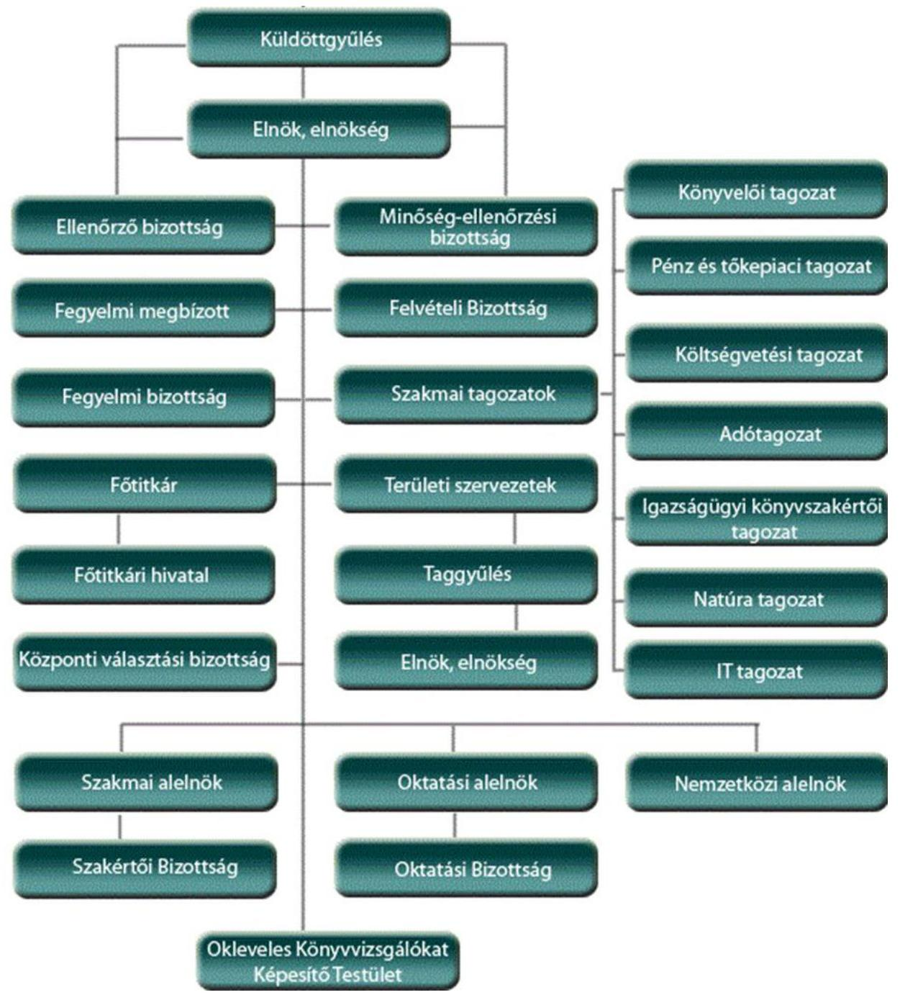

Forrás: A Magyar Könyvvizsgálói Kamara honlapja

---

|  ㅁ
2 | Megnevezés | 2012. év | 2013. év | 2014. év | 2013. év /
2012. év | 2014. év /
2013. év | 2014. év /
2012. év  |
| --- | --- | --- | --- | --- | --- | --- | --- |
|   |  |  |  |  | \% | \% | \%  |
|   | 1. | 2. | 3. | 4. | 5. | 6. | 7.  |
|   | BEVÉTELEK | 925,2 | 836,8 | 756,7 | 90,5 | 90,4 | 81,8  |
|  1. | Értékesítés nettó árbevétele | 87,9 | 88,5 | 93,0 | 100,7 | 105,1 | 105,8  |
|  2. | Aktivált saját teljesítmények értéke | $-2,3$ | 11,5 | 10,8 | $-500,0$ | 93,9 | $-469,6$  |
|  3. | Egyéb bevételek | 735,0 | 675,0 | 603,9 | 91,8 | 89,5 | 82,2  |
|   | Tagdíj | 659,7 | 616,5 | 594,7 | 93,5 | 96,5 | 90,1  |
|   | Támogatások | 56,7 | 21,2 |  | 37,4 | 0,0 | 0,0  |
|  4. | Pénzügyi műveletek bevételei | 104,5 | 61,8 | 49,0 | 59,1 | 79,2 | 46,8  |
|  5. | Rendkívüli bevételek | 0,1 | 0,0 |  | 43,9 | 0,0 | 0,0  |
|   | Alapitótól kapott támogatás |  |  |  | - | - | -  |
|   | Támogatások |  |  |  | - | - | -  |
|   | KIADÁSOK | 956,8 | 831,7 | 751,6 | 86,9 | 90,4 | 78,6  |
|  6. | Anyagjellegú ráfordítások | 320,3 | 308,3 | 292,1 | 96,3 | 94,7 | 91,2  |
|  7. | Személy jellegú ráfordítások, ebből | 524,4 | 463,0 | 433,3 | 88,3 | 93,6 | 82,6  |
|   | vezető tisztségviselők juttatásai | 45,6 | 45,6 | 41,2 | 100,0 | 90,4 | 90,4  |
|  8. | Értékcsökkenési leírás | 47,7 | 19,5 | 18,1 | 40,9 | 92,8 | 37,9  |
|  9. | Egyéb ráfordítások | 63,3 | 39,4 | 5,9 | 62,2 | 15,0 | 9,3  |
|  10. | Pénzügyi műveletek ráfordításai | 0,2 | 0,3 | 0,7 | 150,0 | 233,3 | 350,0  |
|  11. | Rendkívüli ráfordítások | 0,9 | 1,2 | 1,5 | 133,3 | 125,0 | 166,7  |

---

|  Sör-
Mém | Megnevezés | 2012. | Megoszlás \% | 2013. | Megoszlás \% | 2014. | Megoszlás \% | 2013/2012 \% | 2014/2013 \%  |
| --- | --- | --- | --- | --- | --- | --- | --- | --- | --- |
|   | 1. | 2. | 3. | 4. | 5. | 6. | 7. | 8. | 9.  |
|  1. | A. Befektetett eszközök | 536,0 | 38,3 | 531,5 | 38,2 | 529,6 | 38,5 | 99,2 | 99,6  |
|  2. | I. Immateriális javak | 12,9 |  | 8,7 |  | 9,8 |  | 67,4 | 112,6  |
|  3. | II. Tárgyi eszközök | 513,9 |  | 513,5 |  | 510,5 |  | 99,9 | 99,4  |
|  4. | III. Befektetett pénzügyi eszközközök | 9,2 |  | 9,3 |  | 9,3 |  | 100,1 | 100,0  |
|  5. | B. FORGÓESZKÖZÖK | 736,2 | 52,6 | 763,6 | 54,8 | 748,1 | 54,4 | 103,7 | 98,0  |
|  6. | I. Készletek | 18,1 |  | 20,8 |  | 20,8 |  | 114,9 | 100,0  |
|  7. | II. Követelések | 15,6 |  | 19,1 |  | 15,9 |  | 122,4 | 83,2  |
|  8. | III. Értékpapírok | 22,3 |  |  |  |  |  | 0,0 | -  |
|  9. | IV. Pénzeszközök | 680,2 |  | 723,7 |  | 711,4 |  | 106,4 | 98,3  |
|  10. | C. AKTÍV IDŐBELI ELHATÁROLÁSOK | 126,8 | 9,1 | 97,4 | 7,0 | 96,9 | 7,0 | 76,8 | 99,5  |
|  11. | ESZKÖZÖK ÖSSZESEN | 1399,0 |  | 1392,5 |  | 1374,6 |  | 99,5 | 98,7  |
|  12. | D. SAJÁT TŐKE | 1274,0 | 91,1 | 1279,1 | 91,9 | 1284,2 | 93,4 | 100,4 | 100,4  |
|  13. | I. Induló tőke/Jegyzett tőke | 43,1 |  | 43,1 |  | 43,1 |  | 100,0 | 100,0  |
|  14. | II. Tőkeváltozás/Éredmény | 1262,5 |  | 1230,9 |  | 1236,0 |  | 97,5 | 100,4  |
|  15. | III. Lekötött tartalék | 0 |  |  |  |  |  | - | -  |
|  16. | IV. Értékelési tartalék | 0 |  |  |  |  |  | - | -  |
|  17. | V. Tárgyévi eredmény alaptevékenységből | $-79,20$ |  | 5,3 |  | 0,6 |  | $-6,7$ | 11,3  |
|  18. | VI. Tárgyévi eredmény váll. tev.-ből | 47,6 |  | $-0,20$ |  | 4,5 |  | $-0,4$ | $-2250,0$  |
|  19. | E. Céltartalék | 28,6 | 2,0 | 0,0 | 0,0 | 0,0 | 0,0 | 0,0 | -  |
|  20. | F. Kötelezettségek | 82,1 | 5,9 | 103,0 | 7,4 | 83,4 | 6,1 | 125,5 | 81,0  |
|  21. | I. Hátrasorolt kötelezettségek |  |  |  |  |  |  | - | -  |
|  22. | II. Hosszú lejáratú kötelezettségek |  |  |  |  |  |  | - | -  |
|  23. | III. Rövid lejáratú kötelezettségek | 82,1 |  | 103,0 |  | 83,4 |  | 125,5 | 81,0  |
|  24. | G. PASSZÍV IDŐBELI ELHATÁROLÁSOK | 14,3 | 1,0 | 10,4 | 0,7 | 7,0 | 0,5 | 72,7 | 67,3  |
|  25. | FORRÁSOK ÖSSZESEN | 1399,0 |  | 1392,5 |  | 1374,6 |  | 99,5 | 98,7  |
|   |  |  |  |  |  |  |  |  | Forrás: ÁSZ ellenőrzés  |

---

# FÜGGELÉK: ÉSZREVÉTELEK 

A jelentéstervezetet a Számvevőszék 15 napos észrevételezésre megküldte az ellenőrzött szervezet vezetőjének az ÁSZ tv. 29. §* (1) bekezdése előírásának megfelelően.
A Magyar Könyvvizsgálói Kamara elnöke az ellenőrzés megállapításaira írásban észrevételt tett.
Az elfogadott észrevételek alapján az Állami Számvevőszék módosította a jelentést.
A függelék tartalmazza az ellenőrzött szervezet vezetőjének észrevételeit, illetve az el nem fogadott észrevételek elutasításának indoklását.

[^0]
[^0]:    * 29. § (1) Az Állami Számvevőszék az ellenőrzési megállapításait megküldi az ellenőrzött szervezet vezetőjének vagy az általa megbízott személynek, és annak, akinek személyes felelősségét állapította meg.
    (2) Az ellenőrzött szervezet vezetője és a felelősként megjelölt személy az ellenőrzés megállapításaira tizenöt napon belül írásban észrevételt tehet.
    (3) Az Állami Számvevőszék az észrevételre a beérkezésétől számított harminc napon belül írásban válaszol. A figyelembe nem vett észrevételeket köteles a jelentésben feltüntetni, és megindokolni, hogy azokat miért nem fogadta el.

---

# MAGYAR KÖNYVVIZSGÁLÓI KAMARA 

## ELNÖKE

Domokos László elnök

Hivatkozási szám: V-1014-334/2016
Iktatószám: EF/0190-49/2016

## Állami Számvevőszék Budapest

## Tisztelt Elnök Úr!

Köszönettel vettük kézhez az Állami Számvevőszékről szóló 2011. évi LXVI. törvény 29. § (1) bekezdése alapján észrevételezés céljából megküldött, a Magyar Könyvvizsgálói Kamarához (továbbiakban kamara) 2016. augusztus 18 -án érkezett „Köztestületek ellenőrzése - Magyar Könyvvizsgálói Kamara" címủ ellenőrzésről készült számvevőszéki jelentéstervezetet (továbbiakban jelentéstervezet), melyre a hivatkozott jogszabályi felhatalmazás alapján az alábbi észrevételeket tesszük:

## I. Előzmények

Az Állami Számvevőszékről szóló 2011. évi LXVI. törvény 5. § (3) bekezdésben foglaltak szerint az ÁSZ az államháztartásból származó források felhasználásának keretében ellenőrzi a központi költségvetésből gazdálkodó szervezeteket (intézményeket), valamint az államháztartásból nyújtott támogatás vagy az államháztartásból meghatározott célra ingyenesen juttatott vagyon felhasználását a helyi önkormányzatoknál, az országos és helyi kisebbségi önkormányzatoknál, a közalapítványoknál (ide értve a közalapítvány által alapított gazdasági társaságot is), a köztestületeknél, a közhasznú szervezeteknél, a gazdálkodó szervezeteknél, a társadalmi szervezeteknél, az alapítványoknál és az egyéb kedvezményezett szervezeteknél. Amennyiben a kedvezményezett szervezet az államháztartásból támogatásban - ide nem értve a személyi jövedelemadó meghatározott részének az adózó rendelkezése alapján történő átutalását - vagy ingyenes vagyonjuttatásban részesül, gazdálkodási tevékenységének egésze ellenőrizhető.

Az ellenőrzött időszakban a kamara mérlegfőösszegei, bevételei és azon belül az államháztartásból származó támogatási bevételei - ez utóbbiak képezik az ÁSZ vizsgálat jogalapját - a következők szerint alakult:

---

| Megnevezés | $\mathbf{2 0 1 2}$ | $\mathbf{2 0 1 3}$ | $\mathbf{2 0 1 4}$ |
| :-- | --: | --: | --: |
| Mérlegfőösszeg (e Ft) | 1415286 | 1392455 | 1374588 |
| Összes bevétel (e Ft) | 925230 | 836768 | 756675 |
| -ebből támogatás (e Ft) | 56723 | 19780 | 0 |

Az Állami Számvevőszék (továbbiakban ÁSZ) a „Köztestületek ellenőrzése" tárgyú értesítése 2015. november 24-én érkezett a kamarába, melynek alapján az ellenőrzés a kamara Főtitkári Hivatalára, a Fővárosi, a Vas megyei, a Győr-Moson-Sopron és a BorsodAbaúj -Zemplén megyei területi szervezetre terjedt ki. A vizsgálat 102 napon át tartott, melynek során a többszöri adatbekérés folyamán a kamara közel 4.000 fájlt készített és tett elérhetővé a számvevők részére. A 4.000 fájl fele 3-6 db dokumentumot tartalmazott, ami kb. 10.000-12.000 db egyedi dokumentum átadását jelentette. A helyszíni ellenőrzéseken az ÁSZ részéről összesen 10 fő vett részt. Az ÁSZ a helyszíni vizsgálatát 2016. március 5-én fejezte be, majd 2016. május 10 -én a korábban nem ellenőrzött 16 területi szervezet vonatkozásában a vizsgálatot további 104 napon át folytatta. A kamara a vizsgálat alatt 206 napon keresztül hozzávetőleg 6000 db fájlt, összesen kb. 30-40 000 db különféle dokumentumot bocsátott a számvevők rendelkezésére.

# II. Általános kamarai észrevételek 

Álláspontunk szerint a jelentéstervezet összegzésének azon kategorikus fordulata, mely szerint Kamara gazdálkodása nem volt szabályszerű, nincs összhangban a jelentéstervezet alábbi részmegállapításaival:

- „A kamara a beszámoló készitési kötelezettségének eleget tett."
- „A mérlegtételek év végi értékelése az elöírásoknak megfelelöen történt."
- „A felújítási, beruházási ráforditások dokumentálásának elszámolása részben volt megfelelő."
- „A tagdijak fizetésének rendje az alapszabálynak megfelelő volt, a beszedés, és a hátralékok behajtása iránti intézkedések összességének megfelelőek voltak."
- „A kamara vállalkozási tevékenységei a célkitüzésekkel összhangban voltak."
- „Az ellenőrző bizottság a pénzügyi terv és beszámoló véleményezésére vonatkozó kötelezettségét ellátta, a gazdálkodás vitelére vonatkozóan ellenőrzéseket végzett."

Megítélésünk szerint azon főbb megállapítás sem helytálló, mely szerint „a Magyar Könyvvizsgálói Kamara tisztségviselői részére fizetett tiszteletdijak meghatározása és elszámolása nem felelt meg a Magyar Könyvvizsgálói Kamarát létrehozó törvényben foglalt elöírásoknak".

Azzal az állítással sem tudunk egyetérteni, hogy „Az igénybevett vett és egyéb szolgáltatások költségei, a személyi jellegü ráforditások elszámolása nem felelt meg a számviteli törvény és a belső szabályzatok elöírásainak, mert a Magyar Könyvvizsgálói Kamara nem a saját nevére szóló bizonylatokat vett be könyveibe, mely ellentétes volt az áfa törvényben, valamint a számviteli politikában elöírtaknak, továbbá 2012-2014 években nem utalványoztak a kifizetések előtt." Ezzel szemben ténykérdés, hogy egyetlen esetben fordult elő olyan bizonylat befogadása, amely nem a kamara nevére szólt.

---

Megjegyezni kívánjuk, hogy a jelentéstervezet 1.3.-1.4. számú megállapításai részben példálózó felsorolást tartalmaznak, konkrétumok rögzítése nélkül (,,2012-ben a bruttó 200,0 E Ft-ot meghaladó értékü beszerzést nem foglaltak írásba", ,,2012-ben elöfordult, hogy a föttikár kötelezettségvállalását a fókönyvelő nem ellenjegyezte", ,2013-ban az elnök kötelezettségvállalását a föttikár, a föttikár kötelezettségvállalását pedig a fókönyvelő nem ellenjegyezte" ,2012. 2013. és 2014. években 200,0 E Ft-ot meghaladó készpénzes kifizetéseknél nem tartották be az ügyintézők a pénzkezelési szabályzatban foglaltakat, miszerint 200,0 E Ft feletti kifizetés csak külön vezetői, 2014. évben föttikári engedéllyel történhetett", 2013-ban és 2014-ben esetenként a bruttó 100,0 E Ft-it meghaladó kötelezettségvállalásokat elözetesen az arra jogosultak nem foglalták írásba", ,,2012-ben és 2013-ban a területi szervezet elnöke esetében a belföldi kiküldetés indokoltságát a területi szervezet alelnöke aláirásával nem igazolta", ,2012-ben a kamara alkalmazottia részére kifizetett jutalmat megítélő döntésről nem az ügyvezető igazgató/föttikár döntött.", ,2014ben a kamara területi szervénél foglalkoztatott munkavállaló jutalmának kifizetése előtt a jutalom mértékéről nem a területi szervezet elnöke, hanem elnöksége döntött", ,,2012-ben bizottsági elnök belföldi kiküldetését az ügyfélszolgálati előadó (és nem az elnök, illetékes alelnök) írta alá", ,2013-ban és 2014-ben elöfordult, hogy az utalványozást a területi szervezet elnöke helyett elnökségi tag végezte","Teljesítés igazolása 2012-ben néhány esetben nem történt meg, elöfordult, hogy a kiküldetés teljesitését a kiküldetési rendelvényen nem igazolták", ,2014-ben a kiadások teljesitésének jogossága, összegszerűsége igazolásánál a teljesítést igazoló nem tüntette fel a dátumot, a teljesités tényére való utalást", ,,Elöfordult 2012-ben, hogy a bizonylaton nem szerepelt az összeg átvevőjének aláírása", ,,Elöfordult, hogy a bruttó bér változásáról szóló munkaszerződés módosítást a területi szervezet elnöke ellenjegyezte").

A kifogásolt gazdasági események, felújítási, beruházási ráfordítások, igénybe vett és egyéb szolgáltatások, személyi jellegű ráfordítások beazonosíthatóságának hiánya az érdemi észrevételezést igen megnehezíti, a megállapításokból a kifogásolt ügyletek, tranzakciók darabszáma, pénzügyi/gazdasági kihatásuk mértéke sem derül ki.

# III. Részletes észrevételek 

1. számú fókuszkérdés (A Könyvvizsgálói Kamara gazdálkodása szabályozott és szabályszerű volt-e?)

### 1.1. számú megállapítás

„A gazdálkodási jogkörök gyakorlására vonatkozó belső szabályozás más belső szabályzat rendelkezéseivel ellentétes előírást tartalmazott. A számviteli politika aktualizálása 2013-ig elmaradt, a Könyvvizsgálói Kamara az ellenőrzött időszakban nem rendelkezett bizonylati renddel.

- Észrevételezett megállapítás
„A számlarend ugyanakkor - ellentétben a Számtv. 161. § (2) bekezdés d) pontjának rendelkezésével - nem tartalmazta a számlarendben foglaltakat alátámasztó bizonylati rendet.

---

# Kamarai észrevétel 

A kamara 2005. január 1-jén a számlarendjének 4. oldalán megfogalmazottak szerint bizonylati rend szabályzatot alkotott, mely az ellenőrzés alá vont időszakban is hatályos volt. A kamara az előzőek szerint rendelkezett bizonylati renddel, amely a vizsgálat során - a feltöltött dokumentumok előzményekben is részletezett mennyiségére figyelemmel adminisztrációs hiba folytán nem került átadásra.

### 1.2. számú megállapítás

„A Könyvvizsgálói Kamara beszámoló készitési kötelezettségének eleget tett. A 2013. évben a Könyvvizsgálói Kamara egyszerúsített éves beszámolójában a támogatási összeget egyéb bevételként szerepeltette, amely nem felelt meg a Számv. tv. előírásainak. A mérlegtételek év végi értékelése az előírásoknak megfelelően történt."

- Észrevételezett megállapítás
,, A központi költségvetésböl igényelt (járó) támogatások között 2013-ban a Számv. tv. 77. § (3) bekezdés b) pontjában foglalt elöirás ellenére egyéb bevételként úgy szerepeltettek 610.0 E Ft-ot, hogy annak igénylésére a hivatkozott Számv. tv. elöirás ellenére a Számviteli Politika 2.1.7. pontjában meghatározott mérlegkészités idöpontját követően 2014. március 25 -én került sor."

## Kamarai észrevétel

A 2013. évi beszámoló összeállításának lezárásakor, 2014. április 25-én már rendelkezésre állt a 610 ezer Ft összegủ támogatás elszámolásának dokumentuma. A bevétel elszámolása az összemérés elvének érvényesülését szolgálta, ugyanakkor az összeg a 2013. évi beszámoló egészét tekintve nem jelentős.

### 1.3. számú megállapítás

„A felújítási, beruházási ráfordítások dokumentálása, elszámolása részben volt megfelelő, mert nem tartották be a Kamara Alapszabályában és belső szabályzataiban foglalt előírásokat."

- Észrevételezett megállapítás
,,2012-ben egy 5,0 M Ft értékü ingatlan megvásárlásakor nem kértek be 3 árajánlatot a Beszerzéséi szabályzat III. fejezet 1.3. és 1.4. pontjában foglaltak ellenére, a 2012. évi pénzügyi tervben nem szereplő ingatlan beszerzése nem az Alapszabály mellékletében foglaltak szerint az elnök, hanem a területi szervezet elnöke vállalta a kötelezettséget (irta alá a szerződést), a kötelezettségvállalást az Alapszabály mellékletében foglaltak ellenére a Fötitkár nem ellenjegyezte."

## Kamarai észrevétel

Egy konkrét ingatlan megvásárlásának igénye esetén a beszerzési szabályzat szerinti legalább három árajánlat kérése a gyakorlatban nem, vagy nehezen kivitelezhető. Az irodavásárlást megalapozó fejlesztési koncepció szerint az MKVK Baranya Megyei Szervezete a megfelelő rendezvényszervezési lehetőség biztosítása érdekében kifejezetten a székhelyét képező ingatlanban keresett újabb helyiséget.

Ami a kötelezettségvállalást illeti: a vonatkozó adásvételi szerződés a szerződő felek adatainál, illetve a 7.1. pontban kifejezetten rögzíti, hogy a területi szervezet elnöke a kamara elnökének eseti meghatalmazása alapján köti meg a szerződést. Az eseti meghatalmazás

---

szerint a kamara elnöke meghatalmazza a területi szervezet elnökét azzal, hogy a szerződés tárgyát képező ingatlan adásvétele körében helyette és nevében önállóan és teljes jogkörrel eljárjon, a köztestületet közvetlenül kötelező és feljogosító jognyilatkozatokat tegyen, eladóval az ingatlan-adásvételi szerződést 5 millió forint vételár mellett megkösse és aláirja. Előzőek alapján a területi szervezet elnöke nem a saját nevében, hanem a kamara elnökének eseti meghatalmazása alapján, utóbbi nevében és képviseletében vállalt kötelezettséget (írta alá a szerződést), amelyet jogilag a kamara elnöke tett, a technikai kivitelezés (a megállapodás aláírása) hárult a területi szervezet elnökére.

A vonatkozó iratok (koncepció, meghatalmazás, adásvételi szerződés) az ÁSZ részére feltöltésre kerültek.

- Észrevételezett megállapítás
„A 2012. 2013. és 2014. években 200 E Ft-ot meghaladó készpénzes kifizetéseknél nem tartották be az ügyintézők a Pénzkezelési szabályzat 4.3. pontjában valamint a Pénzkezelési szabályzat 6.3. pontjában foglaltakat, miszerint 200,0 E Ft feletti kifizetés csak külön vezetői, 2014. évben fötitkári engedéllyel történhetett."

# Kamarai észrevétel 

A kamara fökönyvi adataiból megállapíthatóan az ellenőrzött időszakban teljesített készpénzkifizetések az alábbiak szerint alakultak:

| Megnevezés | 2012. év | 2013. év | 2014. év |
| :--: | :--: | :--: | :--: |
| Készpénzkifizetések száma | 2841 | 2206 | 1971 |
| ebből 100 E Ft feletti készpénzkifizetések száma | 39 | 22 | 8 |
| 200 E Ft feletti készpénzkifizetések száma | 9 | 1 | 0 |

Előző adatokból megállapíthatóan a jelentéstervezetben kifogásolt - ugyanakkor számszakilag és összegszerűséget illetően nem konkretizált - készpénzes tranzakciók a készpénzkifizetések darabszámát, illetve az ellenőrzött időszak éves beszámolóinak egészét tekintve nem jelentősek.

- Észrevételezett megállapítás
,,2012-ben és 2013-ban a számítógép konfiguráció részét képező operációs rendszereket, mint szoftvereket a beszerzésüket követően nem az immateriális javak között és azon belül is szellemi termékként vette állományba a Fötitkári Hivatal arra kijelölt ügyintézője, a Számv. tv. 25. § (1) és (7) bekezdéseiben, valamint a Számviteli politika 3.1.2. pontjában foglaltak ellenére, hanem a tárgyi eszköz között."

## Kamarai észrevétel

A rendelkezésre álló dokumentumok tanúsága szerint, amennyiben a számítástechnikai eszközök és az operációs rendszerek (szoftverek) a vonatkozó számlán külön tételként szerepeltek, úgy a számítástechnikai eszközök tárgyi eszközként, a szoftverek pedig szellemi termékként kerültek a nyilvántartásba. Amely számlákon viszont a bekerülési érték nincs megbontva és a számítógéppel együtt megvásárolt operációs rendszerek (pl. Windows) csak az adott géppel használhatók és másik gépre nem telepíthetők, a szoftverek nem minősülnek önálló eszköznek. Megítélésünk szerint utóbbi esetekben az operációs rendszerek tárgyi eszközök közötti állományba vétele szakmailag helyes.

---

# 1.4. számú megállapítás 

„Az igénybe vett és egyéb szolgáltatások a személyi jellegủ ráfordítások elszámolása nem felelt meg a jogszabályok és a belső szabályzatok előírásainak. A tiszteletdíjak megállapítása és elszámolása nem volt megfelelö."

- Észrevételezett megállapítás
,,2014-ben az MKVK Oktatási Központ Kft. nevére szóló számlát számoltak el, amely nem felelt meg a Számviteli Politika 2.9. pontjában foglaltaknak, amely szerint a Könyvvizsgálói Kamara csak a saját nevére szóló bizonylatokat veszi fel a könyveibe."

## Kamarai észrevétel

A befogadott számla értéke 27142 Ft volt. A megrendelésre interneten került sor, a kamara alkalmazottja a kamara nevére szólóan állította össze a megrendelő tételeit. Az ellenjegyzés és a kötelezettségvállalás ezen helyes adatokat tartalmazó dokumentum kinyomtatott változatán történt. A beérkezett számla összege megegyezett a megrendelőn szereplő összeggel, de a G Roby Netshop Kft. által kiállított 148013898 sz. számla a kamara Oktatási Központjának nevét tartalmazta. A számlán a szállító minden adatot helyesen szerepeltetett, (cím, adószám, megrendelés adatai) azonban elírta a vevő nevét, vélhetően az azonos cím és a hasonló név miatt. Az elírást nem vették észre a főtitkári hivatalban. A megrendelő és a felhasználás célja alapján egyértelmủ, hogy a szolgáltatást a Kamara vette igénybe. A hiba sem hatásában, sem tartalmában nem jelentős, a szállító utólag helyesbítette a számlát. A kamara nem jogosult Áfa visszaigénylésére.

- Észrevételezett megállapítás
,,2014-ben a Könyvvizsgálói Kamara területi szervénél foglalkoztatott munkavállaló jutalmának kifizetése előtt a Munkaügyi szabályzat II.5."Prémium, jutalom" részében rögzítettek ellenére a jutalom mértékéről nem a területi szervezet elnöke döntött írásban, hanem a területi szerv elnöksége.

## Kamarai észrevétel

Megjegyezni kívánjuk, hogy a területi szervezet elnökségének az elnök is a tagja, a jutalomra vonatkozó - elnök által aláirt - elnökségi határozat a hiányolt elnöki írásbeli döntést „kiváltja". Megítélésünk szerint nem feltétlenül róható fel, ha a megyei elnök a döntését a területi szervezet elnökségével megerősítteti.

- Észrevételezett megállapítás
,,2012-2014-ben nem végezték el az utalványozást, a Számv. tv. 167. § (1) bekezdés c) pontjában, a Kötelezettségvállalási szabályzat 3. pontjában, a Kötelezettségvállalási szabályzat 16-17 pontjaiban, a Pénzkezelési szabályzat 8. pontjában, valamint a Pénzkezelési szabályzat 10. pontjában foglaltak ellenére."

## Kamarai észrevétel

A munkabérek banki utalásainak összesítő listáján az utalványozás mindenkor megtörtént, nincs tudomásunk olyan előírásról, amely a tételenkénti utalványozást követelné meg.

- Észrevételezett megállapítás
,,2013-ban és 2014-ben elöfordult, hogy az utalványozást a területi szervezet elnöke helyett elnökségi tag végezte, ami nem felelt meg az Alapszabály 391. § f) pontjában, a

---

Kötelezettségvállalási szabályzat 3. pontjában és a Kötelezettségvállalási szabályzat 17. b. pontjában foglaltaknak, miszerint a területi szervezet elnöke utalványozhat.

# Kamarai észrevétel 

Rögzíthető, hogy a kamarai alapszabály 392. b) pontja szerint az alelnők - aki az elnökség tagja - az elnököt akadályoztatása esetén helyettesíti, valamint így jár el akkor is, ha a területi szervezetnek nincs elnöke. Amennyiben az utalványozásra az elnök akadályoztatása miatt, az elnök nevében és helyett a megyei alelnök részéről került sor, úgy az megítélésünk szerint nem kifogásolható.

- Észrevételezett megállapítás
„A személyi jellegü ráfordítások között a tiszteletdijak meghatározása nem volt megfelelö. A küldöttgyülés 2012-2013. évekre - ellentétben a 2007. évi LXXV. törvény 111. § f) pontjában foglaltakkal - nem határozta meg az elnök, az alelnökök, az elnökség további tagjai, a fegyelmi megbízott diját. A 2007. évi LXXV. törvény 2013. november 30-ától hatályos 111. § f) pontjában foglaltak ellenére nem határozta meg személyenként külön-külön az elnök, az alelnökök, az elnökség további tagjai, a területi szervezetek elnökei, a fegyelmi megbízott és a kamara alapszabálya szerint dijazásban részesíthető bizottsági elnökök és tagok dijazását, továbbá a fötitkár és a fötitkári hivatal fökönyvelöjének javadalmazását.

## Kamarai észrevétel

A küldöttgyülés 11/2004. (XII.04.) határozatával a tiszteletdijak összegét tisztségenként a pénzügyi terv 8. számú mellékletében részletezetten meghatározta. A tiszteletdijak az akkori ügyvezető 2004. január 20-ai jóváhagyása után kerültek utalásra. A fenti küldöttgyülési döntés 2012-2014. években is változatlanul irányadó volt azzal a módosítással, hogy a küldöttgyülés a 6/2014. (1.11.) Kgy. számú küldöttgyülési határozatával a kamarai tisztségviselők, testületi tagok tiszteletdiját 2014. január hó 1. napjától kezdődően $5 \%$-kal csökkentette. A tiszteletdijakat a küldöttgyülés által elfogadott éves pénzügyi tervek és teljesülésüket bemutató beszámolók is tartalmazták.

Megítélésünk szerint nem helytálló továbbá azon megállapítás, mely szerint a küldöttgyülés a Kkt. 2013. november 30-ától hatályos 111. § f) pontjában foglaltak ellenére nem határozta meg személyenként külön-külön az elnök, az alelnökök, az elnökség további tagjai, a területi szervezetek elnökei, a fegyelmi megbízott és a kamara alapszabálya szerint dijazásban részesíthető bizottsági elnökök és tagok díjazását, továbbá a főtitkár és a főtitkári hivatal főkönyvelőjének javadalmazását. A Kkt. 208/G. §-ának átmeneti rendelkezése értelmében a Kkt-nak az egyes adótörvények és azokkal összefüggő más törvények, valamint a Nemzeti Adó- és Vámhivatalról szóló 2010. évi CXXII. törvény módosításáról szóló 2013. évi CC. törvénnyel megállapított 111. § f) pontját a hatálybalépését követően megkötött szerződésekre, illetve kinevezésekre kell alkalmazni. A törvénymódosítás 2013. november 30-i hatálybalépését követő első központi kamarai választásokra a 2015. december 12-i küldöttgyűlésen került sor, melyen a küldöttgyűlés 57/2015. (12.12.) Kgy. számú határozatával a kamarai tiszteletdijak összegét személyenként meghatározta, a kamarát e körben mulasztás nem terheli. A törvénymódosítás hatálybalépése óta új főtitkári/főkönyvelői munkaszerződés megkötésére nem került sor.

- Észrevételezett megállapítás
,,2012-ben nem történt meg a tiszteletdijak kifizetését megelőzően az utalványozás a Kötelezettségvállalási szabályzat 3. pontjában foglaltak ellenére."

---

# Kamarai észrevétel 

A tiszteletdíjak banki utalásainak összesítő listáján az utalványozás mindenkor megtörtént, nincs tudomásunk olyan előírásról, amely a tételenkénti utalványozást követelné meg.

- Észrevételezett megállapítás
„2012-2014. években a teljesités igazolását a kamarai szervek vezetői, tisztségviselöi, akiknek a feladat-, hatáskörében az adott teljesités felmerült - a Kötelezettségvállalási szabályzat 3. pontjában és a Kötelezettségvállalási szabályzat 14. pontjában foglaltak ellenére - nem végezték el."

## Kamarai észrevétel

Álláspontunk szerint, a Kötelezettségvállalási szabályzat 6. pontjára is figyelemmel, a választott tisztségviselőket megillető tiszteletdíjak nem sorolhatók be azon tételek közé, amelyek kötelezettségvállalást és teljesítésigazolást igényelnek. A tisztségviselői jogviszony nem minősül munkaviszonynak, illetve a Kötelezettségvállalási szabályzat szerinti kötelmi jogviszonynak. Amíg egy tisztséget betölt egy személy, addig a megállapított díjazás megilleti.

### 1.5. számú megállapítás

„A tagdíjak fizetésének rendje a Könyvvizsgálói Kamara Alapszabályában foglaltaknak megfelelő volt. A tagdíjak és a hozzájárulási díjak beszedése, a hátralékok behajtása iránt tett intézkedések összességében megfelelőek voltak. A közfelügyeleti díjat a Könyvvizsgálói Kamara a 2007. évi LXXV. törvény előírásainak megfelelően megfizette."

- Észrevételezett megállapítás
„A hátralékok behajtására tett intézkedések körében az Eljárási rend 1. pontjával ellentétben 2014. évtől a fegyelmi megbízott helyett a Felvételi Bizottság intézkedett a Fötitkári Hivatal felszólítását követően fizetési kötelezettségüket nem teljesítőkkel szemben."

## Kamarai észrevétel

A kamara követelésbehajtási szabályzata 2015. június 1-jei hatállyal a 2014. évtől kialakított gyakorlatnak megfelelően módosult, a hatályos rendelkezések szerint „A főtitkári hivatal a megelőző fizetési felszólítás eredménytelensége esetén a tagdíj-, illetve hozzájárulási díjtartozást felhalmozó kamarai tag könyvvizsgálókkal/könyvvizsgáló cégek adatait továbbítja a kamara felvételi bizottsága részére, mely testület az érintettekkel szemben megindítja a kamarai tagsági viszony/könyvvizsgáló cég engedélye megszűnésének megállapítása iránti - a Magyar Könyvvizsgálói Kamaráról, a könyvvizsgálói tevékenységről, valamint a könyvvizsgálói közfelügyeletről szóló 2007. évi LXXV. törvény (továbbiakban: Kkt.) 30., illetve 41. §-ában rögzített - kamarai hatósági eljárást."

### 1.7. számú megállapítás

„A Könyvvizsgáló Kamara Ellenőrző Bizottsága a pénzügyi terv és beszámoló véleményezésére vonatkozó kötelezettségét ellátta, a gazdálkodás vitelére vonatkozóan ellenőrzéseket végzett, azonban az ellenőrzések eredményeként tett javaslatok nem hasznosultak maradéktalanul."

---

- Észrevételezett megállapítás
,,Az intézkedési tervben szereplő feladatok közül az intézkedési tervben elöirt határidőkre, illetve azon túl a 2014. január 11-i küldöttgyülési ülés időpontjáig nem hajtották végre a gépkocsi használat egységesitését, a telefonok magánhasználatának szabályozását, továbbá nem került sor a folyamatba épitett, elözetes és utólagos vezetői ellenörzés megerösitésére. Az intézkedések elmaradásához a Küldöttgyülés nem füzött jogkövetkezményeket."

# Kamarai észrevétel 

A 77/2013. számú (06.07.) elnökségi határozattal jóváhagyott intézkedési terv - melyben javasolt és nem előirt határidők szerepeltek - nem határozta meg feladatként a kamara szervezeti és müködési szabályzatának aktualizálását \{a kamara elnöksége a 106. számú (2009. 11. 20.) határozatával a kamara szervezeti és müködési szabályzatát hatályon kívül helyezte, a kamara ez időponttól SZMSZ-szel nem is rendelkezik\}, illetve „a folyamatba épített előzetes és utólagos vezetői ellenőrzés megerősítése"-t, így azok végrehajtásának elmaradására sem kerülhetett sor.

A telefonok magánhasználatának szabályozása a vezetékes és mobiltelefon használati szabályzat 2016. márciusi elfogadásával megtörtént.

A gépkocsi használat egységesítésére a Belföldi kiküldetési szabályzat és a Munkaügyi szabályzat keretében a vonatkozó jogszabályi előírások szerint sor került.
3. számú fókuszkérdés („Szabályszerü volt-e a kamara adatszolgáltatási és közzétételi kötelezettségének teljesitése?")

- Észrevételezett 3.1. számú megállapítás
,,A Könyvvizsgálói Kamara Adatvédelmi szabályzatra nem állt összhangban az Info tv. előirásaival. A személyes adatok kezelése során nem érvényesitették maradéktalanul az Info tv.-ben elöirt adatvédelmi szabályokat.

## Kamarai észrevétel

Az Info tv.-nek és a Kkt-nak minden szempontból megfelelő adatkezelési és adatvédelmi szabályzat 2016. július 4-én hatályba lépett - ezt megelőzően a kamara az ezzel összefüggően kialakított általános gyakorlatot követte. 2016. évtől az újonnan nyilvántartásba vett kamarai tagok és könyvvizsgáló cégek előzetes adatkezelési tájékoztatása megtörténik.

### 3.2. számú megállapítás

„A Könyvvizsgálói Kamara a közérdekú adatok kérelemre történő szolgáltatásának feltételeit megteremtette, a gazdálkodására vonatkozóan kötelezettségeit nem teljes körüen teljesitette."

- Észrevételezett megállapítás
,,A Könyvvizsgálói Kamara elnöke 2012.-2014. években az Info tv. 37. § (1) bekezdésében hivatkozott 1. számú melléklet 1.7. pontja ellenére a Magyar Cégértékelö Nonprofit Kft. adatait nem tette közzé."

---

# Kamarai észrevétel 

A Magyar Cégértékelő Nonprofit Kft. a cégnyilvántartás adatai és a letétbe helyezett beszámolók alapján tevékenységet egyáltalán nem végzett, sosem müködött, az értékesítés nettó árbevétele az alapítása óta 0 Ft volt. A Cégértékelő Nonprofit Kft. a 2011-2015. évi beszámolóit közzétette, ezek az adatok a kim.gov.hu weboldalon megtekinthetők. A fentiek alapján az átláthatóság nem volt korlátozva.

## IV. Javaslatok

## 1. Az összegzéshez tett javaslatok

Az előzőekben részletezett észrevételeink alapján az összegzésben és az 1. számú fókuszkérdés összegző megállapításában szereplő azon minősítést, amely szerint a Magyar Könyvvizsgálói Kamara gazdálkodása nem volt szabályszerű, a vizsgálat terjedelmére, a rendelkezésre bocsátott dokumentumok számára, a megállapítások tartalmára és súlyára való tekintettel nem fogadjuk el.

A kamara gazdálkodásának minősitéséhez az előfordult hibákat, kisebb eljárási szabálytalanságokat vagy nem megfelelően összehangolt szabályozásokat súlyozni szükséges aszerint, hogy azok a gazdálkodásban milyen arányt képviselnek, és mekkora hatással vannak a kamara gazdálkodási folyamataira.

A 3.2. számú megállapítás kapcsán tett részletes észrevételünk alapján fenntartjuk, hogy a közérdekủ adatok átláthatósága biztosított volt.

A fenti észrevételek alapján javasoljuk az „Összegzésben" az alábbi megfogalmazást szerepeltetni:
,, A Magyar Könyvvizsgálói Kamara gazdálkodása a 2012-2014 évek közötti időszakban nem volt teljes körüen szabályozott, gazdálkodása nem minden esetben felelt meg a saját belsö szabályzatainak. A költségvetési támogatásokat a Kamara szabályszerűen használta fel és számolta el. A személyes adatok kezelése során bizonyos tekintetben nem érvényesültek a vizsgált időszakban a jogszabályi elöírások, a Kamara elnöke nem biztositotta teljes körüen a személyes adatok védelmét. A gazdálkodás körébe tartozó közérdekü adatok közzétételére vonatkozó kötelezettségének a Kamara elnöke teljes körüen nem tett eleget, ugyanakkor az átláthatóság biztositott volt."

## 2. A „Főbb megállapítások, következtetések, javaslatok" cím szövegével kapcsolatos javaslatok

A „Főbb megállapítások, következtetések, javaslatok" cím vonatkozó megállapításait az alábbiakra kérjük módosítani:

- „A Magyar Könyvvizsgálói Kamara gazdálkodása nem minden esetben felelt meg a saját belsö szabályzatainak.,
- „A Magyar Könyvvizsgálói Kamara tisztségviselői részére fizetett tiszteletdijak meghatározása és elszámolása megfelelt a Magyar Könyvvizsgálói Kamarát létrehozó törvényben foglalt elöírásoknak."

---

- „Az igénybevett vett és egyéb szolgáltatások költségei, a személyi jellegü ráforditások elszámolása a számviteli törvény és a belső szabályzatok előirásainak megfelelı. A Magyar Könyvvizsgálói Kamara egy tétel kivételével a saját nevére szóló bizonylatokat vett be könyveibe."

# 3. Az összegző megállapítással kapcsolatos javaslatok 

Javasoljuk az 1. számú összegző megállapítás felülvizsgálatát és alábbiak szerinti kiegészítését: „A Könyvvizsgálói Kamara gazdálkodása nem volt teljes körüen szabályozott, valamint gazdálkodása nem minden esetben felelt meg teljesen a saját belsö szabályzatainak."

## 4. A részmegállapításokkal kapcsolatos javaslatok

Az 1.1. számú megállapítással kapcsolatos javaslatunk a következő: „A gazdálkodási jogkörök gyakorlására vonatkozó belső szabályozás más belső szabályzat rendelkezéseivel ellentétes elöirást tartalmazott. A számviteli politika aktualizálása 2013-ig elmaradt."

Az 1.4. számú megállapítással kapcsolatos javaslatunk a következő: „Az igénybevett vett és egyéb szolgáltatások költségei, a személyi jellegü ráforditások elszámolása a számviteli törvény és a belső szabályzatok elöirásainak megfelelı. A Kamara egy tétel kivételével a saját nevére szóló bizonylatokat vett be könyveibe. A tiszteletdijak meghatározása és elszámolása megfelelı a Magyar Könyvvizsgálói Kamarát létrehozó törvényben foglalt elöirásoknak"

Az 1.7. számú megállapítással kapcsolatos javaslatunk a következő: „A Könyvvizsgáló Kamara Ellenörzö Bizottsága a pénzügyi terv és beszámoló véleményezésére vonatkozó kötelezettségét ellátta, a gazdálkodás vitelére vonatkozóan ellenörzéseket végzett, az ellenörzések eredményeként tett javaslatok hasznosultak".

Amennyiben a fenti észrevételekkel kapcsolatosan további iratok beadását, egyeztetés lefolytatását tartják szükségesnek, úgy természetesen állunk szíves rendelkezésükre.

Kérjük, hogy az előzőekben megfogalmazott észrevételeinket megfontolni, javaslatainkat és a jelentés tervezetben lehetőség szerint átvezetni szíveskedjék.

Budapest, 2016. augusztus 29.

Tisztelettel:
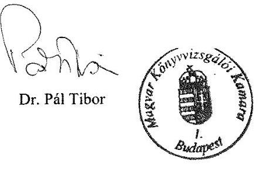

---

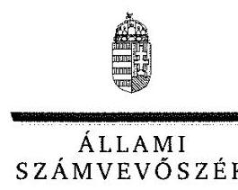

ELNÖK

# Dr. Pál Tibor úr 

elnök
Magyar Könyvvizsgálói Kamara

## Budapest

## Tisztelt Elnök Úr!

A „Kóztestületek ellenőrzése - Magyar Könyvvizsgálói Kamara" címmel készített számvevószéki jelentéstervezetre tett észrevételét köszönettel megkaptam.
Az Állami Számvevőszék észrevételre vonatkozó álláspontjáról a felügyeleti vezető által készített részletes tájékoztatást csatoltan megküldőm.
Tájékoztatom Elnök urat, hogy a számvevőszéki jelentésben - az Állami Számvevőszékről szóló 2011. évi LXVI. törvény 29. § (3) bekezdése alapján - a figyelembe nem vett észrevételeket szerepeltetjük az elutasítás indokának feltüntetésével.

Budapest, 2016. xepécelet hó $2 x$ nap
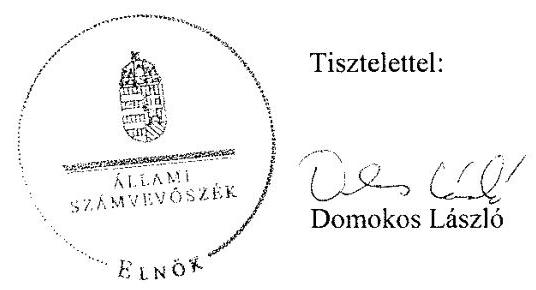

Melléklet: Tájékoztatás az elfogadott és az el nem fogadott észrevételekről

---

# Tájékoztatás az elfogadott és az el nem fogadott észrevételekról 

A „Köztestületek ellenörzése - Magyar Könyvvizsgálói Kamara" címü jelentéstervezetre az EF/0190-49/2016. iktatószámú levelében tett észrevételeit áttekintettük. Ezúton tájékoztatom, hogy az Állami Számvevőszékhez 2016. szeptember 6-án beérkezett észrevételéhez csatolt 2 db dokumentumot a számvevőszéki jelentés készítésekor már nem tudjuk figyelembe venni, tekintettel arra, hogy az adatszolgáltatás 2016. június 8 -án lezárult, továbbá a beküldött dokumentumok hitelességéről nem áll módunkban meggyőződni.
Észrevételeinek kezeléséről az alábbi tájékoztatást adom.

## I. Az előzmények ismertetése kapesán

Köszönettel vettem tájékoztatását a Magyar Könyvvizsgálói Kamara (továbbiakban: Kamara) ellenőrzésben tanúsított adatszolgáltatási kötelezettsége teljesítéséről. Az Állami Számvevőszékről szóló 2011. évi LXVI. törvény (továbbiakban: ÁSZ tv.) 5. § (3) bekezdésében foglaltak szerint az ÁSZ ellenőrzi az államháztartásból nyújtott támogatás felhasználását a köztestületeknél. Tájékoztatom, hogy a Kamara 2014. évben is realizált költségvetési támogatást, tekintettel arra, hogy a 2013. évre vonatkozó pénzügyi elszámolás keretében 2014. május 19-én a Nemzetgazdasági Minisztériumtól 287 ezer Ft költségvetési támogatást kapott.

## II. Az általános kamarai észrevételek kapesán

## Észrevétel 2. oldalának 3. bekezdése

Nem fogadtuk el a jelentéstervezet 5. oldal 1. bekezdésének 1. mondatára tett észrevételét, amely megállapítás nincs összhangban a jelentéstervezet részmegállapításaival. A Kamara gazdálkodását az ellenőrzött időszakban az ellenőrzési kérdésekre adott válaszok alapján értékeltük, amelyet „Az ellenörzés módszerei" című fejezet részletesen tartalmazza. Az ellenőrzés típusát tekintve megfelelőségi ellenőrzést végeztünk, amelynek keretében a Kamara gazdálkodását a jogszabályi előírások alapján értékeltük. A jelentéstervezet 14. oldal 1. fejezete tartalmazza, hogy mely jogszabályi rendelkezést nem tartotta be a Kamara. Észrevétele a megállapításokat nem cáfolja, ezért azokat nem módosítja.

## Észrevétel 2. oldalának 4. bekezdése

A jelentéstervezet 5. oldal „Föbb megállapítások, következtetések, javaslatok" fejezete 2. bekezdésének utolsó megállapítására tett észrevételét a dokumentumok ismételt áttekintését követően nem fogadjuk el. A Kamara tisztségviselői részére fizetett tiszteletdíjak meghatározása és elszámolása nem felelt meg a Magyar Könyvvizsgálói Kamaráról, a könyvvizsgálói tevékenységről, valamint a könyvvizsgálói közfelügyeletről szóló 2007. évi LXXV. törvényben (továbbiakban: 2007. évi LXXV. törvény), valamint a belső szabályzatokban foglalt előírásoknak.

---

# Észrevétel 2. oldalának 5. bekezdése és 3. oldalának 1-2. bekezdései 

Nem fogadjuk el a jelentéstervezet 5. oldal ,,Föbb megállapítások, következtetések, javaslatok" fejezet 2. bekezdésének 4. megállapítására, valamint az 1.3.-1.4. fejezeteiben rögzített megállapításokra tett észrevételeit. A felújítási, beruházási, az igénybe vett és egyéb szolgáltatások, a személyi jellegű ráfordítások tekintetében a dokumentálás és elszámolás szabályszerűségét mintavétellel kiválasztott mintatételek alapján értékeltük, amelynek sokaságra történő kivetítését a számvevőszéki jelentéstervezet „Az ellenörzés módszerei" című fejezet részletesen tartalmazza. A megállapításokat az Önök által az Állami Számvevőszék részére rendelkezésre bocsátott dokumentumok alapján ellenőriztük és ezen dokumentumokra alapozva állapítottuk meg, hogy nem tartották be az Alapszabály, a számvitelről szóló 2000 . évi C. törvény (továbbiakban: Számv. tv.) és a belső szabályzatok előírásait. Észrevétele ezért a megállapításokat nem módosítja.

## III. Részletes észrevételek kapcsán

### 1.1. számú megállapítás 4. bekezdésének utolsó megállapítására tett észrevétel kapcsán

Észrevételében arról tájékoztatott, hogy adminisztrációs hiba folytán a bizonylati szabályzat nem került az ellenőrzés részére átadásra. Az észrevételéhez csatolt dokumentumot a jelentéstervezet véglegezésekor nem tudjuk figyelembe venni, tekintettel arra, hogy az adatszolgáltatás 2016. június 8 -án lezárult, továbbá a beküldött dokumentum hitelességéről nem áll módunkban meggyőződni. Észrevétele ezért a megállapításokat nem módosítja.

### 1.2. számú megállapítás 2. bekezdésének 1. francia bekezdése megállapítására tett észrevétele kapcsán

A jelentéstervezet 16. oldal első francia bekezdése megállapítására tett észrevételét nem fogadjuk el. Észrevétele megerősíti a megállapításban foglaltakat, hogy a 2013. évi beszámolóban 2014. évben folyóslított támogatást szerepeltettek, amelynek igénylésére a mérlegkészítés időpontját követően került sor. Észrevétele ezért a megállapítást nem módosítja.

### 1.3. számú megállapítás 1. bekezdésének 2. francia bekezdése megállapítására tett észrevétel kapcsán

Észrevétele megerősíti a jelentéstervezet 17. oldal 1.3. számú megállapítás 1. bekezdésének 2. francia bekezdése azon megállapítását, hogy az ingatlanvásárlás előtt három árajánlat bekérésére nem került sor. Észrevétele nem cáfolja, hogy a szerződés aláírásakor hatályos Alapszabály mellékletében foglaltak ellenére nem az elnök, hanem a területi szervezet elnöke vállalta a kötelezettséget, továbbá, hogy a Fötitkár nem ellenjegyezte azt. Észrevétele ezért a megállapítást nem módosítja.

---

# 1.3. számú megállapítás 1 . bekezdésének 5 . francia bekezdése megállapítására tett észrevétel kapcsán 

Észrevétele nem vitatja a jelentéstervezet 17. oldal 1.3. számú megállapítás 1. bekezdésének 5. francia bekezdése megállapítását, hogy a 2012., 2013. és 2014. években 200,0 E Ft-ot meghaladó készpénzes kifizetéseknél nem tartották be az ügyintézők a megállapításban hivatkozott szabályzatok előírásait, amelyek szerint 200,0 E Ft feletti kifizetés csak külön vezetői, 2014. évben főtitkári engedéllyel történhetett. Észrevétele ezért a megállapítást nem módosítja.

### 1.3. számú megállapítás 1. bekezdésének 6. francia bekezdése megállapítására tett észrevétel kapcsán

A jelentéstervezet 17. oldal 1.3. számú megállapítás 1. bekezdésének 6. francia bekezdése megállapítására tett észrevételét nem fogadjuk el, mivel a Számv. tv. 25. § (1) és (7) bekezdésében szabályozottak nem teszik lehetővé az operációs rendszerek (szoftverek) tárgyi eszközök közötti állományba vételét. Észrevétele ezért a megállapítást nem módosítja.

### 1.4. számú megállapítás 1. bekezdésének 3. francia bekezdése megállapítására tett észrevétel kapcsán

Észrevétele a jelentéstervezet 18. oldal 1.4. számú megállapítás 1. bekezdésének 3. francia bekezdése megállapításában feltárt szabálytalanságot - hogy nevezetesen a 2014. évben az MKVK Oktatási Központ Kft. nevére szóló számlát számoltak el, amely nem felelt meg a Számviteli Politika; 2.9. pontjában foglaltaknak - nem vitatja. Észrevétele ezért a megállapítást nem módosítja.

### 1.4. számú megállapítás 1. bekezdésének 5. francia bekezdése megállapítására tett észrevétel kapcsán

A jelentéstervezet 18. oldal 1.4. számú megállapítás 1. bekezdésének 5. francia bekezdése megállapítására tett észrevételét a dokumentumok ismételt áttekintését követően nem fogadjuk el. A jutalom mértékéről a Munkaügyi szabályzatban foglaltak ellenére nem a területi szervezet elnöke döntött írásban, hanem a területi szerv elnöksége. Észrevétele ezért a megállapítást nem módosítja.

### 1.4. számú megállapítás 2. bekezdésének 2. francia bekezdése megállapítására tett észrevétel kapcsán

A jelentéstervezet 18. oldal 1.4. számú megállapítás 2. bekezdésének 2. francia bekezdése megállapítására tett észrevételét nem fogadjuk el. Az igénybe vett és egyéb szolgáltatások, a személyi jellegű ráfordítások tekintetében a dokumentálás és elszámolás szabályszerűségét mintavétellel kiválasztott mintatételek alapján értékeltük, amelynek sokaságra történő kivetítését a számvevőszéki jelentéstervezet „Az ellenőrzés módszerei" című fejezet részletesen tartalmazza. A megállapításokat az Önök által az Állami Számvevőszék részére rendelkezésre bocsátott dokumentumok alapján ellenőriztük és ezen dokumentumokra alapozva állapítottuk meg, hogy 2012-2014.

---

években nem végezték el az utalványozást, így nem tartották be a Számv. tv. és a belső szabályzatok előírásait. Észrevétele ezért a megállapításokat nem módosítja.

# 1.4. számú megállapítás 2. bekezdésének 3. francia bekezdése megállapítására tett észrevétel kapcsán 

A jelentéstervezet 18. oldal 1.4. számú megállapítás 2. bekezdés 3. francia bekezdése megállapítására tett észrevételét a dokumentumok ismételt áttekintését követően nem fogadjuk el, mert az Alapszabály 391. § f) pontjában foglaltak szerint a területi szervezet nevében, a területi szervezet pénzügyi előirányzatainak terhére a területi szervezet elnöke gyakorol utalványozási jogot, a Kötelezettségvállalási szabályzat ${ }_{1} 3$. pontjában és a Kötelezettségvállalási szabályzat ${ }_{2} 17 . \mathrm{b}$. pontja alapján meghatározottak szerint utalványozásra jogosult a helyi szervezet elnöke, alelnöke a helyi szervezet elnökének helyettesítésekor. Az áttekintett dokumentumok alapján nem a helyi szervezet elnöke és nem a helyi szervezet alelnöke utalványozott. A feltárt szabálytalanság arra vonatkozik, hogy elnökségi tag végezte az utalványozást, amely nem felelt meg jelen bekezdésben hivatkozott rendelkezések előírásainak, ezért észrevétele a megállapítást nem módosítja.

### 1.4. számú megállapítás 3. bekezdés megállapításaira tett észrevétel kapcsán

A jelentéstervezet 19. oldal 1.4. számú megállapítás harmadik bekezdés megállapításaira tett észrevételét a dokumentumok ismételt áttekintését követően részben fogadjuk el. Az ellenőrzés részére a tiszteletdíjak kifizetése jogszerűségét megalapozó dokumentumként csupán a 2003., 2004. és 2005. évi pénzügyi terveket és az azok elfogadásáról szóló küldöttgyülési határozatokat adták át. Az észrevételben hivatkozott 11/2014. (XII. 04.) küldöttgyülési határozattal a pénzügyi tervjavaslatot hagyták jóvá (bevétellel, folyó kiadással és fejlesztési kiadással) és nem határozták meg a jogszabályban írtak szerint a tisztségviselők tiszteletdíjait. Az ellenőrzés részére átadott az észrevételben hivatkozott - 8. számú melléklet a kiadást érintő változások hatásait mutatja be, amelynek 5. pontja csak a tiszteletdíjak növeléséről szól az elnökség tekintetében tiszteletdíjak és járulékok bontásban. Tekintettel arra, hogy a 2007. évi LXXV. törvény az előbbiekben hivatkozott küldöttgyülési határozatok meghozatala után 2008. január 1-jével lépett hatályba és a 111. § f) pontja rendelkezése szerint a küldöttgyülés határozza meg az elnök, az alelnökök, az elnökség további tagjai, a fegyelmi megbízott és a kamara alapszabálya szerint díjazásban részesíthető bizottsági elnökök és tagok díját, a tárgyban hozott küldöttgyülési határozatok hiányában megállapítható, hogy a küldöttgyülés nem tett eleget a hivatkozott jogszabályi rendelkezéseknek a 2012-2014. években.

A 2007. évi LXXV. törvény 2013. november 30-tól hatályos 111. § f) pontja kiegészült a tekintetben, hogy a küldöttgyülésnek személyenként külön-külön kell meghatároznia az előbb felsorolt tisztségeken túl a területi szervezetek elnökei díjazását, továbbá a főtitkár és a főtitkári hivatal főkönyvelőjének javadalmazását is. A törvény 208/G. §-ának átmeneti rendelkezése értelmében a 111. § f) pontját 2013. november 30 -át követően megkötött szerződésekre, illetve kinevezésekre kell alkalmazni. Ezen tények alapján a megállapítást pontosítjuk és a számvevőszéki jelentés készítésénél figyelembe vesszük.

---

# 1.4. számú megállapítás 4. bekezdésének 1. francia bekezdése megállapítására tett észrevétel kapcsán 

A jelentéstervezet 19. oldal 1.4. számú megállapítás 4. bekezdésének 1. francia bekezdése megállapítására tett észrevételét a dokumentumok ismételt áttekintését követően nem fogadjuk el, mert a pénzügyi teljesítés nem utalványozás alapján történt. Észrevétele ezért a megállapítást nem módosítja.

### 1.4. számú megállapítás 4. bekezdésének 2. francia bekezdése megállapítására tett észrevétel kapcsán

A teljesítésigazolás elmulasztásával kapcsolatban tett észrevételében kiemeli, hogy amíg egy tisztséget betölt egy személy addig a megállapított dijazás megilleti. A Kötelezettségvállalási szabályzat1 3. d) pontjában rögzítettek alapján a teljesítésigazoló igazolja kiemelten a kiadások teljesítésének jogosságát, annak összegszerűségét, amely a tiszteletdíjak esetében azt jelenti, hogy az adott személy a dijazással járó tisztséget betöltötte a dijazással érintett időszakban és részére a meghatározott összegủ díj kerül kifizetésre. Mindezekre tekintettel észrevételét, amely szerint a tiszteletdíjak kifizetése nem sorolhatók be azon tételek közé, amelyek kötelezettségvállalást és teljesítésigazolást igényelne nem fogadjuk el, ezért észrevétele a megállapítást nem módosítja.

### 1.5. számú megállapítás 4. bekezdésének 2. megállapítására tett észrevétele kapcsán

Köszönettel vettem tájékoztatását, hogy a hátralékok behajtásának rendjét a kialakult gyakorlatot figyelembe véve a 2015. július 1-jei hatállyal módosították. Észrevétele a megállapítást nem vitatja, ezért azt nem módosítja.

### 1.7. számú megállapítás 3 bekezdésének 4. és 5. megállapítására tett észrevétele kapcsán

Észrevételét a dokumentumok ismételt áttekintését követően - tekintettel arra, hogy az intézkedési terv nem tartalmazta a Kamara szervezeti és működési szabályzata aktualizálását és a folyamatba épített előzetes és utólagos vezetői ellenőrzés megerősítését - részben fogadjuk el, a számvevőszéki jelentés készítésénél figyelembe vesszük. Köszönettel vettem tájékoztatását, hogy a Kamara intézkedett a telefonok magánhasználatának szabályozása és a gépkocsi használat szabályozására 2016. évben. Észrevétele e tekintetben a megállapítást nem cáfolja, ezért azt nem módosítja.

### 3.1. számú megállapításra tett észrevétele kapcsán

Köszönettel vettem tájékoztatását, hogy a Kamara 2016. július 4-én hatályba léptette az új adatkezelési és adatvédelmi szabályzatát, valamint 2016. évtől az újonnan nyilvántartásba vett kamarai tagok és könyvvizsgáló cégek előzetes adatkezelési tájékoztatása megtörténik. Észrevétele a megállapítást nem cáfolja, ezért azt nem módosítja.

---

# 3.2. számú megállapítás 3. bekezdésének 2. francia bekezdése megállapítására tett észrevétele kapcsán 

A jelentéstervezet 25 . oldal 3.2 . számú megállapítás 3 . bekezdésének 2 . francia bekezdése megállapítására tett észrevétele nem vitatja, hogy a Kamara nem tette közzé az az információs önrendelkezési jogról és az információszabadságról szóló 2011. évi CXII. törvény 37. § (1) bekezdésében hivatkozott 1. melléklet 1. 7. pontja pontjában meghatározott adatokat a Magyar Cégértékelő Nonprofit Kft. adatai tekintetében. A közzéteendő adatok közé tartozik ,, a közfeladatot ellátó szerv többségi tulajdonában álló, illetve részvételével müködő gazdálkodó szervezet neve, székhelye, elérhetősége (postai címe, telefon- és telefaxszáma, elektronikus levélcíme), tevékenységi köre, képviselöjének neve, a közfeladatot ellátó szerv részesedésének mértéke". Észrevétele ezért a megállapítást nem módosítja.

## IV. Javaslatok

Az „Összegzés", a „Föbb megállapítások, következtetések, javaslatok" fejezetek szövegével kapcsolatos javaslatok, az 1. számú összegzö megállapítással kapcsolatos javaslatok, továbbá a részmegállapításokkal kapcsolatos javaslatok kapcsán
Az ellenőrzést az ellenőrzési program szempontjai, az ellenőrzött időszakban hatályos jogszabályok, az ellenőrzés szakmai szabályai, a jelen ellenőrzésre irányadó ÁSZ módszertan és a nemzetközi standardok figyelembevételével végeztük. Az ellenőrzési kérdések megválaszolásához szükséges bizonyítékok megszerzése a Kamara által rendelkezésre bocsátott dokumentumokra, adatokra alapozva kérdésfeltevés, mintavételezés, valamint elemző eljárás útján történt. Ezért szövegjavaslatait nem áll módunkban elfogadni.

Budapest, 2016. segetés her hó 21 nap
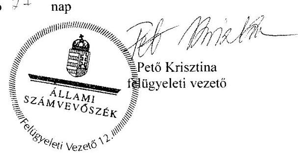

---

.

---

# RÖVIDÍTÉSEK JEGYZÉKE 

${ }^{1}$ Könyvvizsgálói Kamara
${ }^{2}$ 2007. évi LXXV. tv.
${ }^{3}$ MKVK Oktatási Központ Kft.
${ }^{4}$ MKVK Alkusz Kft.
${ }^{5}$ Magyar Cégértékelő Nonprofit Kft.
${ }^{6}$ NGM
${ }^{7}$ ÁSZ
${ }^{8}$ ÁSZ tv.
${ }^{9}$ Küldöttgyűlés
${ }^{10}$ Főtitkári Hivatal
${ }^{11}$ Elnökség
${ }^{12}$ Ellenőrző Bizottság
${ }^{13}$ Kötelezettségvállalási szabályzat ${ }_{1}$
Kötelezettségvállalási szabályzat ${ }_{2}$
${ }^{14}$ Számviteli Politika ${ }_{1}$
Számviteli Politika ${ }_{2}$
${ }^{15}$ Számv. tv.
${ }^{16}$ Eszközök és források
értékelési szabályzata ${ }_{1}$
Eszközök és források
értékelési szabályzata ${ }_{2}$
${ }^{17}$ Eszközök és források
leltározási és leltárkészítési szabályzata ${ }_{1}$
Eszközök és források
leltározási és leltárkészítési szabályzata ${ }_{2}$
${ }^{18}$ Pénzkezelési Szabályzat ${ }_{1}$

Pénzkezelési Szabályzat ${ }_{2}$

Magyar Könyvvizsgálói Kamara
2007. évi LXXV. törvény a Magyar Könyvvizsgálói Kamaráról, a könyvvizsgálói tevékenységről, valamint a könyvvizsgálói közfelügyeletről (hatályos: 2008. január 1-jétől)
a Magyar Könyvvizsgálói Kamara 100\%-os tulajdonában álló Magyar Könyvvizsgálói Kamara Oktatási Központ Korlátolt Felelősségű Társaság (alakulás dátuma: 1999. július 30., cégjegyzékszám: 0109 681727)
a Magyar Könyvvizsgálói Kamara 25\%-os és a Huntington Invest Vagyonkezelő Korlátolt Felelősségű Társaság 75\%-os tulajdonában álló Magyar Könyvvizsgálói Kamara Biztosítási Alkusz Korlátolt Felelősségű Társaság (alakulás dátuma: 2002. április 30., cégjegyzékszám: 0109 706421)
a Magyar Könyvvizsgálói Kamara 50\%-os és a Budapesti Kereskedelmi és Iparkamara 50\%-os tulajdonában álló Magyar Cégértékelő Nonprofit Korlátolt Felelősségű Társaság, (alakulás: 2010. október 1., cégjegyzékszám: 0109 956323)
Nemzetgazdasági Minisztérium
Állami Számvevőszék
az Állami Számvevőszékről szóló 2011. évi LXVI. törvény
Magyar Könyvvizsgálói Kamara Küldöttgyűlése
Magyar Könyvvizsgálói Kamara Főtitkári Hivatala
Magyar Könyvvizsgálói Kamara Elnöksége
Magyar Könyvvizsgálói Kamara Ellenőrző Bizottsága
Magyar Könyvvizsgálói Kamara kötelezettségvállalás és utalványozás rendjéről szóló szabályzata (hatályos: 2013. január 31-ig),
Magyar Könyvvizsgálói Kamara kötelezettségvállalási és utalványozási szabályzata (hatályos: 2013. február 1-jétől, módosítva 2014. január 31-én)
Magyar Könyvvizsgálói Kamara Számviteli politika (hatályos: 2013. december 31-ig)
Magyar Könyvvizsgálói Kamara Számviteli politika (hatályos: 2014. január 1-jétől) 2000. évi C. törvény a számvitelről (hatályos 2001. január 1-jétől)

Magyar Könyvvizsgáló Kamara Eszközök és források Értékelési Szabályzata (hatályos: 2013. december 31-ig.)

Magyar Könyvvizsgáló Kamara Eszközök és források értékelési szabályzata (hatályos: 2014. január 1-jétől)

Magyar Könyvvizsgálói Kamara Eszközök és források leltárkészítési és leltározási szabályzata (hatályos: 2013. december 31-ig)

Magyar Könyvvizsgálói Kamara Eszközök és források leltárkészítési és leltározási szabályzata (hatályos: 2014. január 1-jétől)
Magyar Könyvvizsgálói Kamara Pénzkezelési szabályzata (hatályos: 2013. december 31-ig);
Magyar Könyvvizsgálói Kamara Pénzkezelési szabályzata (hatályos:2014. jan. 1-jétől)

---

${ }^{19}$ Számlarend ${ }_{1}$,
Számlarend ${ }_{2}$
${ }^{20}$ 224/2000. Korm. rendelet
${ }^{21}$ Szja tv.
${ }^{22}$ Belföldi kiküldetési szabályzat
${ }^{23}$ Munkaügyi Szabályzat ${ }_{3}$
${ }^{24}$ Munkaügyi Szabályzat ${ }_{2}$
${ }^{25}$ Eljárási rend
${ }^{26}$ Felvételi Bizottság
${ }^{27}$ Ptk. 2
${ }^{28}$ Támogatási szerződés ${ }_{1}$

Támogatási szerződés2

Támogatási szerződés3,
Támogatási szerződés4,
Támogatási szerződés5
${ }^{29}$ Áht.
${ }^{30}$ Info tv.
${ }^{31}$ adatvédelmi szabályzat
${ }^{32}$ 1992. évi LXIII. törvény
${ }^{33}$ NAIH
${ }^{34}$ IIR
${ }^{35}$ közzétételi szabályzat

Magyar Könyvvizsgálói Kamara Számlarend (hatályos: 2013. dec.31ig)
Magyar Könyvvizsgálói Kamara Számlarend (hatályos: 2014. jan. 1. -jétől)
224/2000. (XII.19.) Korm. rendelet a számviteli törvény szerinti egyes egyéb szervezetek beszámolókészítési és könyvvezetési kötelezettségének sajátosságairól (hatályos: 2001. január 1-jétől)
1995. évi CXVII. törvény a személyi jövedelemadóról (hatályos: 1996. január 1-jétől)
Magyar Könyvvizsgálói Kamara a belföldi kiküldetések rendjéről szóló szabályzata (hatályos: 2007. november 1-jétől)
Magyar Könyvvizsgálói Kamara Munkaügyi Szabályzata (Hatályos: 2007. január 1-jétől)
Magyar Könyvvizsgálói Kamara Munkaügyi szabályzata (Hatályos: 2013. december 6-tól)
Magyar Könyvvizsgálói Kamara Eljárási rend a kamarai követelések rendezésére (hatályos: 2009. november 5-től)
A Magyar Könyvvizsgálói Kamara Felvételi Bizottsága
2013. évi V. törvény a Polgári Törvénykönyvről (hatályos: 2013. március 15-től)

Támogatási szerződés (2011. november 21.), száma: KZ110650, 009083/2011.12.02
Támogatási szerződés (2012. november), szerződés száma: NGM/SZERZ/80/1/2012
Támogatási szerződés (2013. június 17.), iktatószám: NGM-SZERZ/51/2013
Támogatási szerződés (2013. december), iktatószám: NGM/26125/2/20013
Támogatási szerződés (2014. július 22.), iktatószám: NGM-SZERZ/103/2014
2011. évi CXCV. törvény az államháztartásról (hatályos 2012. január 1-jétől)
2011. évi CXII. törvény az információs önrendelkezési jogról és az információszabadságról
A Magyar Könyvvizsgálói Kamara személyes adatvédelméről és a közérdekú adatok nyilvántartásáról szóló szabályzata
1992. évi LXIII. törvény a személyes adatok védelméről és a közérdekú adatok nyilvánosságáról (hatályos: 2011.december 31-ig)
Nemzeti Adatvédelmi és Információszabadság Hatóság
A Magyar Könyvvizsgálói Kamara Integrált Informatikai Rendszere
A Magyar Könyvvizsgálói Kamara közzétételi szabályzata (hatályos 2012. február 24-től)

---

# ÁLLAMI SZÁMVEVŐSZÉK 

1052 Budapest, Apáczai Csere János utca 10.
Levélcím: 1364 Budapest 4. Pf. 54
Telefon: +36 14849100 Telefax: +36 14849200
www.asz.hu