# Jelentés 

## A központi alrendszer egyes intézményei pénzügyi és vagyongazdálkodásának ellenőrzése

Viktor Speciális Otthon
2016. november hó 3. nap
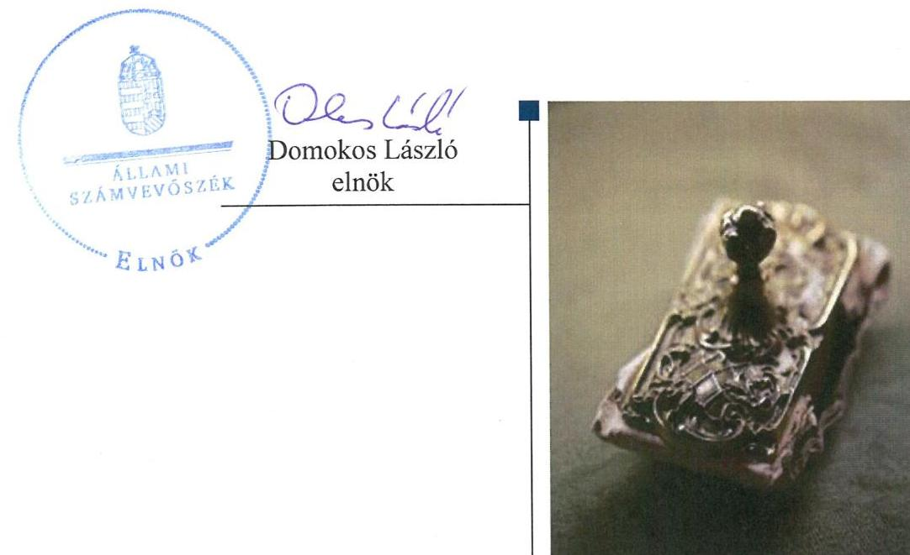

---

# AZ ELLENŐRZÉST FELÜGYELTE: 

PETŐ KRISZTINA felügyeleti vezető

## AZ ELLENŐRZÉST VEZETTE ÉS A VÉGREHAJTÁSÁÉRT FELELŐS:

KISGERGELY ISTVÁN ellenőrzésvezető
KORSÓSNÉ VIGH ANDREA ellenőrzésvezető

## A PROGRAM ÖSSZEÁLLÍTÁSÁÉRT FELELŐS:

JANIK JÓZSEF LÁSZLÓ osztályvezető

IKTATÓSZÁM: V-0939-182/2016.
TÉMASZÁM: 1771
ELLENŐRZÉS-AZONOSÍTÓ SZÁM: V071310

---

# TARTALOMJEGYZÉK 

■ ÖSSZEGZÉS ..... 5
■ AZ ELLENŐRZÉS CÉLJA ..... 7
■ AZ ELLENŐRZÉS TERÜLETE ..... 8
■ AZ ELLENŐRZÉS HÁTTERE, INDOKOLTSÁGA ..... 10
■ FÓKUSZKÉRDÉSEK ..... 12
■ ELLENŐRZÉS HATÓKÖRE ÉS MÓDSZEREI ..... 13
■ MEGÁLLAPÍTÁSOK ..... 17
■ JAVASLATOK ..... 38
■ MELLÉKLETEK ..... 43
I. Sz. melléklet: Értelmező szótár. ..... 43
II. Sz. melléklet: Az integritás érvényesítése érdekében kialakított és működtetett kontrollrendszer ..... 47
III. Sz. melléklet: Teljesítmény-ellenőrzési kiegészítő modul megállapításai ..... 48
■ FÜGGELÉK: ÉSZREVÉTELEK ..... 49
■ RÖVIDÍTÉSEK JEGYZÉKE ..... 67

---

.

---

# ÖSSZEGZÉS 

Az irányító szerveknek a Viktor Speciális Otthonra vonatkozó feladatellátása összességében nem volt szabályszerű. Az intézményvezető által kialakított irányítási rendszer nem biztosította a szabályszerű, átlátható és elszámoltatható közpénzfelhasználást. A Viktor Speciális Otthon pénzügyi és vagyongazdálkodása nem volt szabályszerű.

## Az ellenőrzés társadalmi indokoltsága

A közpénzek felhasználásában és az állami vagyonnal való gazdálkodásban a központi alrendszer egyes intézményei meghatározó súlyt képviselnek. E szervezetekkel szemben társadalmi igény, hogy tevékenységükről a döntéshozók és a nyilvánosság felé elszámoljanak. Ezzel a társadalmi igénnyel és az Állami Számvevőszék Stratégiájával összhangban, a közpénzügyek átláthatóságának előmozdítása, a közvagyon védelme érdekében került sor a Viktor Speciális Otthon pénzügyi- és vagyongazdálkodásának ellenőrzésére.

Az emberi jogok, a társadalmi igazságosság és az esélyegyenlőség alapvető elveire építve, mindenkor az érvényes jogszabályok betartásával a szociális állami feladatellátás biztosítja a rászorulók részére a kedvezőbb természetes és társadalmi életfeltételek megteremtését. Ezt a feladatot ellátó intézmények biztosítják, hogy az ott élők minden körülmények között megőrizhessék személyiségük autonómiáját és emberi méltóságukat.

## Főbb megállapítások, következtetések, javaslatok

Az irányító és középirányító szerveknek az Intézményre vonatkozó feladatellátása nem volt szabályszerű. Az Intézmény alapító okiratának a 2013. október 14-én működő új váci telephely miatt indokolt módosítása 2014. év végéig nem történt meg, valamint az alapító okirat és az SZMSZ összhangja a 2013-2014. években nem volt biztosított. További hiányosság volt, hogy az ellenőrzött időszakban az irányító szervek, valamint a 2013-2014. években a középirányító szerv nem érvényesített az Intézmény részére a közfeladat ellátására vonatkozó, a hatékony gazdálkodáshoz szükséges követelményeket. Az irányító szervek az Intézményre vonatkozó munkáltatói és beszámoltatási jogosultságaikat szabályszerűen gyakorolták.

Az intézményvezető által kialakított irányítási rendszer nem biztosította a szabályszerű, átlátható és elszámoltatható közpénzfelhasználást. Az együttműködési megállapodásokban előírt módon és tartalommal kiadott számviteli, gazdálkodási szabályzatokkal az Intézmény az ellenőrzött időszakban nem rendelkezett, mert az Intézmény gazdálkodási feladatait ellátó szervek számviteli, gazdálkodási szabályzatait az intézményvezető nem vette át és nem léptette hatályba. Az Intézmény gazdálkodási feladatait ellátó szervek nem biztosították a felelősségi körök érvényre jutását, mert a gazdálkodási jogkörök gyakorlóit nem teljes körűen és nem szabályszerűen jelölték ki az ellenőrzött időszakban. Ezáltal a kontrolltevékenységek működése sem volt szabályszerű. A kockázatkezelési rendszer kialakításáról az Intézmény vezetője gondoskodott, annak működése javult az ellenőrzött időszakban. Az Intézményvezető nem szabályozta a kötelezően közzéteendő adatok nyilvánosságra hozatalának rendjét, továbbá nem tett eleget a törvényben előírt elektronikus közzétételi kötelezettségének. A belső ellenőrzési rendszer kialakítása és működtetése a jogszabályi előírásoknak megfelelően történt.

Az intézményvezető által a belső kontrollrendszer értékeléséről tett 2012-2014. évi nyilatkozataiban foglaltak ellenére az Intézmény tevékenységében a hatékonyság, eredményesség és gazdaságosság követelményeinek érvényesítése nem volt biztosított. Az intézményvezető a 2011. évre vonatkozóan a belső kontrollrendszer működéséről nyilatkozatot nem tett.

A pénzügyi gazdálkodás nem volt szabályszerű, mert a bevételi előirányzatok teljesítése és a kiadási előirányzatok felhasználása nem a jogszabályi előírásoknak megfelelően történt. Az elemi költségvetés és az előirányzatok megállapítása során betartották a jogszabályi előírásokat és a belső szabályzatokban foglaltakat. Az eredményszemléletű számvitel bevezetésével kapcsolatos feladatok végrehajtása nem volt szabályszerű, a rendezőmérleg elkészítését

---

megelőző feladatok keretében előírt leltározás nem volt teljes körű, mert a rendezőmérlegben kimutatott források egyeztetéssel való leltározását, a leltár kiértékelését nem végezték el.

Az Intézmény vagyongazdálkodása nem volt szabályszerű, mert az Intézmény által használt, de vagyonkezelésébe nem tartozó vagyon az Intézmény 2012-2014. évi mérlegében szabálytalanul szerepelt. Az ellenőrzött időszakban az Intézmény a mennyiségi felvétellel történő leltározást szabályszerűen végrehajtotta, azonban az Intézmény gazdálkodási feladatait ellátó szervek az értékben kimutatott források egyeztetéssel történő leltározását nem végezték el.

Az ellenőrzött időszakban az Intézményt érintő szervezeti, szerkezeti átalakítás végrehajtása nem volt szabályszerű, mert a 2013. október 14-től 60 fő ellátottal üzemelő új váci telephely 2014. év végéig nem rendelkezett a szabályszerű működéshez szükséges alapító okirattal, törzskönyvi bejegyzéssel és működési engedéllyel, illetve nem szerepelt a szolgáltatói nyilvántartásban.

Az Intézmény az integritás szemlélet érvényesítése érdekében nem intézkedett.

---

# AZ ELLENŐRZÉS CÉLJA 

## Viktor Speciális Otthon pénzügyi és vagyongazdálkodásának ellenőrzése

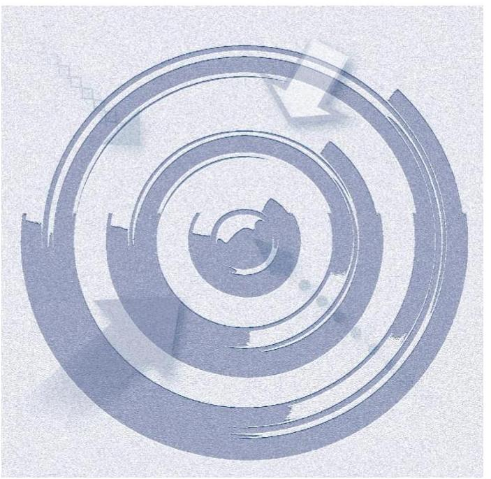

## A SZABÁLYSZERŰSÉGI ELLENŐRZÉS

célja annak megítélése volt, hogy az ellenőrzött Intézményre vonatkozó irányító szervi feladatellátás a jogszabályi előírások betartásával történt-e; az Intézménynél a belső kontrollrendszer kialakítása és működtetése szabályszerű volt-e; kialakították-e az erőforrásokkal való szabályszerű, gazdaságos, hatékony és eredményes gazdálkodáshoz szükséges követelményeket, megvalósították-e azok számon kérését, ellenőrzését; az Intézmény pénzügyi és vagyongazdálkodása megfelelt-e a jogszabályi előírásoknak és belső szabályzatainak; az Intézmény átalakításának vagy átszervezésének lebonyolítása szabályszerűen történt-e.

Az Intézmény korrupcióval szembeni veszélyeztetettségének csökkentése érdekében kért tanúsítványi adatszolgáltatás alapján az ÁSZ ${ }^{1}$ értékelte az integritás szemlélet érvényesülését a gazdálkodási folyamatokban.

A KIEGÉSZÍTŐ TELJESÍTMÉNY-ELLENŐRZÉSI MODUL célja annak értékelése volt, hogy a gazdálkodás folyamatában a gazdaságossági, hatékonysági és eredményességi követelmények kialakítása megtörtént-e, azokat működtették-e, a célkitűzéseket elérték-e; a pénzügyi és vagyongazdálkodás folyamataira vonatkozóan a költségvetési szerv belső kontrollrendszerének minőségéről kiadott vezetői nyilatkozatban a költségvetési szerv tevékenységében a hatékonyság, eredményesség, gazdaságosság követelményeinek érvényesítésére vonatkozó nyilatkozat helytálló volt-e.

---

# AZ ELLENŐRZÉS TERÜLETE 

## Viktor Speciális Otthon

Az Intézmény ${ }^{2}$ hatályos alapító okirat ${ }_{3-4}{ }^{3}$-ben meghatározott alaptevékenysége az ellenőrzött időszakban személyes gondoskodás nyújtó tartós bentlakásos szociális ellátás keretében, fogyatékos személyek teljes körű ápolása, gondozása volt.

Az Intézmény 2013. október 14-ig sződligeti székhelyén 110 férőhelyen értelmi fogyatékkal élő személyek ellátását biztosította. Az Intézmény szervezeti felépítése, tevékenysége 2013. október 14-től a leányfalui Panoráma Otthon és Duna Otthon gondozottainak átvétele miatt változott, új váci telephellyel bővült, ahol 60 férőhelyen időskorúak, pszichiátriai betegek, fogyatékkal élők ellátásáról gondoskodott. Az Intézmény tevékenységének ellátása a 2013. évi dunai árvíz idején veszélybe került, de a feladatellátás az ellátottak ideiglenes kitelepítése és a helyreállítási munkálatok mellett sem szakadt meg.

Az Intézmény alapító, irányító szerve 2011. december 31-ig Pest Megye Önkormányzata volt. 2012. január 1-jétől a 2011. évi CLIV. törvény ${ }^{4}$ alapján állami tulajdonba került, az alapítói és irányító szervi feladatokat a KIM ${ }^{5}$ vette át. A 419/2012. (XII. 29.) Korm. rendelet ${ }^{6}$ 2013. január 1-jétől a megyei intézményfenntartó központok feletti alapítói és irányítói jogokat az $\mathrm{EMMI}^{7}$ hatáskörébe helyezte.

A középirányító szervi feladatokat a 258/2011. (XII. 7.) Korm. rendelet ${ }^{8}$ alapján 2012. január 1-jétől 2013. március 31-ig a Pest Megyei Intézményfenntartó Központ, 2013. április 1-jétől a 419/2012. (XII. 29.) Korm. rendelet alapján a Szociális és Gyermekvédelmi Főigazgatóság látta el.

Az Intézmény működését meghatározó jogszabályok: 2000. évi C. törvény a számvitelről, 2011. évi CLIV. törvény a megyei önkormányzatok konszolidációjáról, a megyei önkormányzati intézmények és a Fővárosi Önkormányzat egyes egészségügyi intézményeinek átvételéről, 2007. évi CVI. törvény az állami vagyonról, 2011. évi CXCVI. törvény a nemzeti vagyonról, 2011. évi CXCV. törvény az államháztartásról, 2011. évi CVIII. törvény a közbeszerzésekről, 2011. évi CXII. törvény az információs önrendelkezési jogról és az információszabadságról, 368/2011. (XII. 31.) Korm. rendelet az államháztartásról szóló törvény végrehajtásáról, 292/2009. (XII. 19.) Korm. rendelet az államháztartás működési rendjéről, 193/2003. (XI. 26.) Korm. rendelet a költségvetési szervek belső ellenőrzéséről, 370/2011. (XII. 31.) Korm. rendelet a költségvetési szervek belső kontroll-rendszeréről és belső ellenőrzéséről, 4/2013. (I. 11.) Korm. rendelet az államháztartás számviteléről, valamint 36/2013. (IX. 13.) NGM rendelet az államháztartás számvitelének 2014. évi megváltozásával kapcsolatos feladatokról.

Az Intézmény az ellenőrzött időszakban önállóan működő költségvetési szerv volt. Pénzügyi, gazdálkodási feladatait a 2011. évben Pest Megye Önkormányzatának Hivatala, 2012. január 1. és 2013. március 31. között a Pest Megyei Intézményfenntartó Központ, 2013. április 1-jétől a Szociális és Gyermekvédelmi Főigazgatóság Kirendeltsége ${ }^{9}$ látta el.

---

Az intézményvezető ${ }^{10}$ személye egyszer változott. A foglalkoztatottak átlagos statisztikai állományi létszáma a szervezeti változás következtében a 2011. évi 64 főről a 2014. évben 94 főre módosult. Az Intézmény teljesített összes bevétele az ellenőrzött időszakban történt feladatváltozás következtében a 2011. évi 256,1 millió Ft-ról a 2014. évre 538,1 millió Ft-ra, 210,1%-kal, a teljesített kiadása a 2011. évi 256,7 millió Ft-ról a 2014. évre 459,5 millió Ft-ra, 179%-kal emelkedett. A költségvetések teljesítését és a létszám alakulását a 2011-2014. években az 1. ábra szemlélteti.
1. ábra
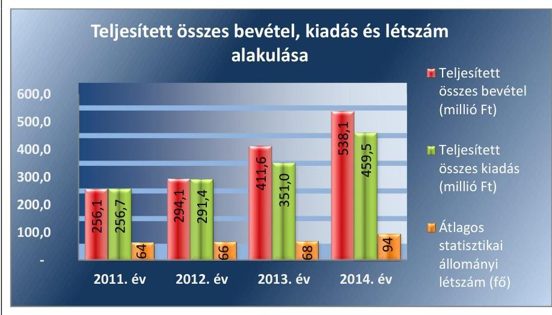

Forrás: 2011-2014. évi intézményi beszámolók

---

# AZ ELLENŐRZÉS HÁTTERE, INDOKOLTSÁGA 

Az Alaptörvény rendelkezése szerint a nemzeti vagyon megőrzésének, védelmének és a nemzeti vagyonnal való felelős gazdálkodásnak a követelményeit sarkalatos törvény, az Nvtv. ${ }^{11}$ rögzíti. A tulajdonosi joggyakorlás és vagyonkezelés általános és speciális szabályait, az állami vagyon nyilvántartására és elszámolására vonatkozó eljárásokat, a vagyonkezelési szerződés feltételrendszerét, valamint az éves beszámoló készítési és könyvvezetési kötelezettségeket kormányrendelet írja elő.

A központi alrendszer egyes intézményei közfeladat-ellátásának változásait, a közfeladatok átadásából és átvételéből adódó módosításait, előirányzat gazdálkodására ható tényezőit az Áht. ${ }^{12}$ 11. §-a és az Ávr. ${ }^{13}$ 14. §-a írja elő. A közfeladatok megszűnéséből, intézmény átszervezéséből, belső szerkezeti korszerűsítéséből, vagy más hasonló okból adódó módosításai miatt szerepeltetendő szerkezeti változásokat, valamint a szerkezeti változásként beépült közfeladatok szintre hozásként történő számításba vételét az Ávr. 15. § (2)-(3) bekezdései határozzák meg.

A társadalmi igénnyel összhangban az Áht. 1, 2, az Ámr. ${ }^{14}$ és a Bkr. ${ }^{15}$ is előírja a költségvetési szerv részére, hogy olyan követelményeket alakítson ki, amelyek biztosítják a működés, gazdálkodás, az erőforrások felhasználása során a gazdaságosság, hatékonyság és eredményesség érvényesülését. Az Ámr. és a Bkr. alapján az intézményvezetőnek évente nyilatkoznia is kell arról, hogy gondoskodott-e az Intézmény tevékenységében a gazdaságosság, hatékonyság és eredményesség követelményeinek érvényesítéséről. A gazdaságos, hatékony és eredményes gazdálkodáshoz szükség van a teljesítménymérés feltételeinek kialakítására, úgymint az egyértelmű és mérhető célokra, mutatószámokra és az ezekhez rendelt követelményekre. Az ÁSZ jelen ellenőrzéssel győződik meg arról, hogy az Intézménynél a teljesítménycélokat, -mutatókat, -követelményeket kialakították-e, azokat működtették-e, a kitűzött célok teljesültek-e.

AZ ELLENŐRZÉS EREDMÉNYEKÉPPEN nemcsak az ellenőrzött intézmények gazdálkodása javulhat, hanem
 átfogó képet kaphatunk a központi alrendszerbe tartozó költségvetési szervek gazdálkodásának hiányosságairól, de a jó gyakorlatokról is. Ellenőrzéseivel, javaslataival és megállapításaival az ÁSZ elősegítheti a költségvetési szervek pénzügyi és vagyongazdálkodása szabályozásának javítását és hozzájárulhat a jó kormányzáshoz. Az ellenőrzés az ellenőrzött számára visszajelzést ad a pénzügyi és vagyongazdálkodásában feltárt hiányosságokról, javaslataival hozzájárul azok kiküszöböléséhez, amely csökkentheti a későbbi ellenőrzések gyakoriságát. Az ellenőrzés megállapításait és javaslatait más szervezetek is hasznosíthatják a rendezett gazdálkodási keretek kialakításához.

## A TELJESÍTMÉNY-ELLENŐRZÉSI KIEGÉSZÍTŐ

MODUL alapján elvégzett ellenőrzés a törvényalkotás számára támogatást nyújt a nemzeti kulcsindikátorok rendszerének kialakításához. A döntéshozók, ellenőrzöttek, irányító szervek, a társadalom számára az összehasonlítási, összemérési lehetőségek kihasználásával objektív visszajelzést

---

ad a gazdálkodás területén végrehajtott szervezeti, szervezési, takarékossági és bürokráciacsökkentő intézkedések hatásairól, a közfeladat-ellátásnak keretet adó pénzügyi és vagyongazdálkodásban mérhető teljesítménykövetelmények kialakításáról, azok alkalmazásáról.

---

# FÓKUSZKÉRDÉSEK 

1.     - Az irányító szerv ellenőrzött intézményre vonatkozó feladatellátása szabályszerű volt-e?
2.     - A belső kontrollrendszer kialakítása és működtetése megfelelt-e a jogszabályi előírásoknak?
3.     - Az intézmény pénzügyi gazdálkodása szabályszerű volt-e?
4.     - Az intézmény vagyongazdálkodása szabályszerű volt-e?
5.     - Szabályszerűen hajtották-e végre az ellenőrzött időszakban az intézményt érintő szervezeti, szerkezeti átalakításokat?
6.     - Az intézmény intézkedett-e az integritás szemlélet érvényesítése érdekében?

---

# ELLENŐRZÉS HATÓKÖRE ÉS MÓDSZEREI 

## Az ellenőrzés típusa

Szabályszerűségi ellenőrzés, amelyet teljesítmény-ellenőrzési modul egészített ki.

## Az ellenőrzött időszak

Az ellenőrzött időszak 2011. január 1-jétől 2014. december 31-ig terjedő időszak volt.

## Az ellenőrzés tárgya

Az ellenőrzött szervezetre vonatkozó irányító szervi feladatok ellátása. Az Intézmény belső kontrollrendszerének kialakítása és működtetése, valamint pénzügyi és vagyongazdálkodása. Az erőforrásokkal való szabályszerű, gazdaságos, hatékony és eredményes gazdálkodáshoz szükséges követelmények kialakítása, a kialakított követelmények számonkérés, ellenőrzése. Az Intézmény átalakítása, átszervezése lebonyolításának szabályszerűsége.

A teljesítmény-ellenőrzési kiegészítő modul esetében az Intézmény gazdálkodás folyamatában a gazdaságossági, hatékonysági és eredményességi követelmények kialakítása és működtetése, a célkitűzések teljesítésének értékelése. Az Intézmény tevékenységében a hatékonyság, eredményesség, gazdaságosság követelményei érvényesítéséről kiadott nyilatkozat helytállósága. A teljesítmény-ellenőrzés fókuszkérdéseire a III. számú melléklet ad választ.

Az ellenőrzés kiterjedt minden olyan körülményre és adatra, amely az ÁSZ jogszabályban meghatározott feladatainak teljesítéséhez, valamint a programok végrehajtása folyamán felmerült újabb összefüggések feltárásához voltak szükségesek.

## Az ellenőrzött szervezet

Az ellenőrzésre a Viktor Speciális Otthonnál, Pest Megye Önkormányzatnál, az Emberi Erőforrások Minisztériumánál, és a középirányító szervnél a Szociális és Gyermekvédelmi Főigazgatóságnál került sor.

---

# Az ellenőrzés jogalapja 

Az ellenőrzés jogszabályi alapját az ÁSZ tv. ${ }^{16}$ 1. § (3) bekezdés, 5. § (2)-(7) bekezdései, valamint Áht. 2 61. § (2) bekezdésének előírásai képezték.

## Az ellenőrzés módszerei

Az ellenőrzést az ellenőrzési program szempontjai, az ellenőrzött időszakban hatályos jogszabályok, az ellenőrzés szakmai szabályai, az egyes ellenőrzési típusokhoz kapcsolódó ÁSZ módszertanok és nemzetközi standardok figyelembevételével végeztük. A gazdálkodás hibáinak kijavítására, a közpénzekkel való felelős gazdálkodás segítésére irányuló javaslatok kidolgozásakor a hatályos jogszabályok voltak az irányadóak.

Az ellenőrzési kérdések megválaszolásához szükséges bizonyítékok megszerzése a következő ellenőrzési eljárások alkalmazásával történt: kérdésfeltevés (információkérés), mintavételezés, valamint elemző eljárás. A minták kiválasztása során elsősorban reprezentativitást biztosító véletlen mintavételi eljárást alkalmaztunk.

Az ellenőrzési bizonyítékként felhasználható adatforrások közé tartoztak egyrészt a szakmai program részletes szempontjainál felsorolt adatforrások, másrészt adatforrás volt minden egyéb - az ellenőrzés folyamán feltárt, az ellenőrzés szempontjából releváns információt tartalmazó - dokumentum.

Az ellenőrzés lefolytatásához az Intézmény a tanúsítványok elektronikus kitöltésével, valamint az ÁSZ által kért dokumentumok elektronikus megküldésével szolgáltatott adatokat. A rendelkezésre bocsátott adatok, információk kontrollja az ellenőrzés keretében történt.

Az ellenőrzési kérdésekre adott válaszok alapján értékeltük, hogy az ellenőrzött időszakban az irányító szerv ${ }_{1-3}{ }^{17}$ és a középirányító szerv ${ }_{1,2}{ }^{18}$ az ellenőrzött Intézményre vonatkozó feladatainak szabályszerűen eleget tett-e, az Intézmény pénzügyi és vagyongazdálkodása megfelelt-e az előírásoknak, az Intézmény átalakításának vagy átszervezésének végrehajtása szabályszerű volt-e. Értékeltük, hogy az Intézménynél kialakították-e az erőforrásokkal való szabályszerű és hatékony gazdálkodáshoz szükséges követelményeket, megvalósították-e azok számonkérését, ellenőrzését.

Az Intézmény belső kontrollrendszere jogszabályi előírások szerinti kialakításának és működtetésének szabályszerűségét az erre irányuló ellenőrzési kérdésekre adott válaszok összesítése alapján, évente pillérenként (kontrollkörnyezet, kockázatkezelési rendszer, kontrolltevékenységek, információs és kommunikációs rendszer, monitoring rendszer) és összesítetten is minősítettük. Az Intézmény belső kontrollrendszere egyes pilléreinek kialakítását és működtetését „szabályszerű"-nek minősítettük, amennyiben az értékelt területen az elért és elérhető pontok százalékban kifejezett, egész számra kerekített hányadosa meghaladta a 84%-ot, „részben szabályszerű"-nek minősítettük, ha a 84%-ot nem haladta meg, de 60%-nál nagyobb volt, „nem szabályszerű"-nek minősítettük, ha nem haladta meg a 60%-ot. Az Intézmény belső kontrollrendszerének összesített értékelése megegyezik a pillérenként (kontrollterületenként) alkalmazott %-os értékelésekkel, a következő eltérésekkel. A kontrollrendszer egésze esetében

---

a „szabályszerű" értékelésnek a %-os értéken felül további feltétele volt, hogy egyik kontrollterület sem kaphatott „nem szabályszerű" értékelést, a „részben szabályszerű" értékelés további feltétele volt, hogy legfeljebb egy ellenőrzött kontrollterület lehetett „nem szabályszerű" értékelésű. Az összesített értékelés a %-os értéktől függetlenül „nem szabályszerű"-nek minősült, ha az ellenőrzött kontrollterületek közül több mint egy „nem szabályszerű" értékelést kapott.

A tárgyi eszközök nyilvántartásba vételének, a közbeszerzési eljárások lefolytatásának, az előirányzatok módosításának és az előirányzat-maradvány megállapításának szabályszerűségét, valamint a gazdálkodási jogkörök gyakorlásának szabályszerűségét mintavétellel ellenőriztük.

A tárgyi eszközök nyilvántartásba vétele és a közbeszerzési eljárások esetében az ellenőrzött mintatételek értékelését végeztük el.

A jogszabályoknak és a belső előírásoknak megfelelőnek tekintettük az előirányzatok módosítását és az előirányzat-maradvány megállapítását, amennyiben a minta ellenőrzésének eredménye alapján 95%-os bizonyossággal a teljes sokaságban a hibás tételek aránya kisebb volt, mint 10%, nem megfelelőnek értékeltük, ha a hibás tételek aránya a 10%-ot meghaladta. Kockázatot, illetve magas kockázatot jeleztünk, amennyiben egy adott terület vonatkozásában a minta alapján a teljes sokaságban nem volt egyértelműen biztosított a jogszabályoknak és a belső szabályzatoknak megfelelő működés.

A 2011. évet érintően a szakmai teljesítésigazolás és az utalvány ellenjegyzése kulcskontrollok, a 2012-2014. éveket érintően a teljesítésigazolás és az érvényesítés kulcskontrollok működését értékeltük. Megfelelőnek értékeltük a gazdálkodási jogkörök gyakorlását, amennyiben 95%-os bizonyossággal a teljes sokaságban a hibás tételek aránya legfeljebb 10% volt, részben megfelelőnek, ha a hibás tételek arányának felső határa legfeljebb 30% volt, nem megfelelőnek, ha a hibás tételek sokaságbeli arányának felső határa meghaladta a 30%-ot.

Az integritás szemlélet érvényesülésének értékelése az Intézmény által kitöltött tanúsítvány alapján történt.

Az alapprogram alapján ellenőriztük, hogy a költségvetési szerv vezetője megtette-e nyilatkozatát arról, hogy gondoskodott a költségvetési szerv tevékenységében a hatékonyság, eredményesség és a gazdaságosság követelményeinek érvényesítéséről. Ezt kiegészítve, a teljesítmény-ellenőrzési kiegészítő modul keretében - felhasználva az alapprogram szerinti ellenőrzés megállapításait - értékeltük, hogy a költségvetési szerv vezetője kialakította-e a gazdaságossági, hatékonysági és eredményességi követelményeket, és azokat működtette-e, a célkitűzéseket elérte-e.

A teljesítmény-ellenőrzési kiegészítő modul a gazdálkodási feladatokra terjedt ki, a szakmai feladatellátást nem értékelte.

A gazdálkodási feladatok értékelése az alábbi területekre terjedt ki:
pénzügyi gazdálkodási (nem szakmai, adminisztratív) feladatok: költségvetés-, beszámoló-készítés, könyvvezetés, adatszolgáltatások, előirányzat-gazdálkodás, kötelezettségvállalások nyilvántartása, kezelése, bevételkezelés, bér- és illetményszámfejtés;
vagyongazdálkodási (logisztikai) feladatok: közbeszerzések és közbeszerzési értékhatárt el nem érő beszerzések, készletgazdálkodás,

---

nyomtatók, fénymásolók üzemeltetése, épület- és ingatlanüzemeltetés, karbantartás, hibabejelentés, gépjármű és flottamenedzsment.

Az ellenőrzés során minden olyan körülményt és adatot is ellenőriztünk, amely a program végrehajtása kapcsán felmerült újabb összefüggéseknek az ellenőrzés céljaival összhangban lévő feltárásához szükséges. A teljesítmény-ellenőrzési kiegészítő programmodulban megfogalmazott ellenőrzési cél megválaszolásához az alapprogram végrehajtása során megfogalmazott megállapításokat is figyelembe vettük.

---

# 1. Az irányító szerv ellenőrzött intézményre vonatkozó feladatellátása szabályszerű volt-e? 

## Összegző megállapítás

Az irányító és a középirányító szervek feladatellátása összességében nem volt szabályszerű.
1.1. számú megállapítás

Az irányító szerv 1-3 az Intézményre vonatkozó alapítói jogosultságait szabályszerűen gyakorolta, a középirányító szerv ${ }_{2}$ kapcsolódó feladatellátása nem volt a jogszabályi előírásoknak megfelelő.

Az alapítói, fenntartói, irányítói/középirányítói jogkörgyakorlók változását az 1. táblázat mutatja be.

1. táblázat

## ALAPÍTÓI, FENNTARTÓI, IRÁNYÍTÓI/KÖZÉPIRÁNYÍTÓI JOGKÖRGYAKORLÓK

| Megnevezés | Alapító irányító felügyelet | Középirányító | Fenntartó ${ }^{10}$ |
| :--: | :--: | :--: | :--: |
| 2011. év | irányító szerv $_{1}$ : PMÖ ${ }^{20}$   Közgyülése | - | PMÖ |
| 2012. év | irányító szerv $_{2}$ : KIM | $\begin{gathered} \text { középirányító szerv }_{1} \text { : PMIK } \\ 2012.01 .01-2013.03 .31 . \end{gathered}$ |  |
| 2013- 2014. év | irányító szerv $_{3}$ : EMMI | $\begin{gathered} \text { középirányító szerv }_{3} \text { : SZGYF } \\ 2013.04 .01 \text {-től } \end{gathered}$ |  |

Az Intézmény az ellenőrzött időszakban rendelkezett alapító okirat $_{1-4}$ -gyel. Az irányító szerv $_{1,2}$ által szabályszerűen kiadott alapító okirat $_{1-3}$ tartalma a 2011. és a 2012. évben megfelelt a jogszabályi előírásoknak.

Az irányító szerv $_{3}$ 2013. január 1-jei hatállyal adta ki a módosításokkal egységes szerkezetbe foglalt alapító okirat $_{4}$-et a jogszabályi előírásoknak megfelelő tartalommal, melyet 2014. január 1-jei hatállyal kiegészített az az Intézmény alaptevékenységének kormányzati funkciók szerinti besorolásával.

Az Intézmény szervezetén belül 2013. október 14-től új váci telephely két új alaptevékenységgel (időskorúak, valamint pszichiátriai betegek tartós bentlakásos ellátása) - kezdte meg a működését, amelyeket az alapító okirat $_{4}$ az Ávr. 5. § (1) bekezdés a) és c) pontjaiban foglaltak ellenére nem tartalmazott, mivel a középirányító szerv $_{2}$ vezetője:
$\longrightarrow$ az Intézmény átszervezéséhez a Szoctv. ${ }^{21}$ 91. § (3) bekezdésben előírt miniszteri jóváhagyás érdekében a 316/2012. (XI. 13.) Korm. rendelet ${ }^{22} 4 . \S$ (3) bekezdés a) pontjában az átszervezés jóváhagyására vonatkozó felterjesztési hatáskörét késedelmesen, 2014. július 4-én gyakorolta, továbbá

---

$\longrightarrow$ az alapító okirat ${ }_{4}$ irányító szerv ${ }_{3}$ általi módosításához a 316/2012. (XI. 13.) Korm. rendelet 3. § (2) bekezdés e) pontjában meghatározott, az alapító okirat módosítás miniszteri jóváhagyásra felterjesztési hatáskörét az ellenőrzött időszak végéig nem gyakorolta.
Az Intézmény átszervezésének - az új telephez létrehozásának - a Szoctv. 91. § (3) bekezdés szerinti miniszteri jóváhagyása 2014. november 21-én megtörtént, azonban az alapító okirat ${ }_{4}$ irányító szerv ${ }_{3}$ általi módosítása az Áht. 2 9. § (1) bekezdés a) pontjában foglalt irányító szervi hatáskörben - annak jóváhagyásra felterjesztése hiányában - az ellenőrzött időszak végéig nem történt meg.

Az Intézmény az ellenőrzött időszakban rendelkezett az irányító szerv ${ }_{1}$, illetve a középirányító szerv $1_{1,2}$ által jóváhagyott SZMSZ ${ }_{1-3}$-mal ${ }^{23}$. Az SZMSZ ${ }_{1}$-et az irányító szerv ${ }_{1}$ az alapító okirat 2011. évi módosítását követően nem módosította. Az SZMSZ ${ }_{1}$ az Ámr. 20. § (2) bekezdés b) pontjában előírtak ellenére nem tartalmazta a költségvetési szerv törzskönyvi azonosító számát, alapító okiratának keltét, az alapító
 okirat számát, az alapítás időpontját. Nem felelt meg az Ámr. 20. § (2) bekezdés c) pontjában előírtaknak sem, mivel az alaptevékenységet szabályozó jogszabályok megjelölését nem tartalmazta.

A 2012. évben az irányító szervi változást követően az SZMSZ$_{2}$-t a középirányító szerv$_{1}$ 2012. december 1-jei hatállyal jóváhagyta, amely az alapító okirat$_{3}$-mal összhangban volt.

A 2013. évi irányító szervi változást és az alapító okirat$_{4}$ 2013. január 1-jei hatállyal történt kiadását követően az SZMSZ$_{3}$-t csak 2014. október 1-jei hatállyal hagyta jóvá a középirányító szerv$_{2}$. Az SZMSZ$_{2}$ így több mint másfél éven keresztül nem volt összhangban a hatályos alapító okirat$_{4}$-el annak adatai, valamint az alapító és a fenntartó szervek vonatkozásában.

Az irányító szerv$_{1}$, illetve a középirányító szerv$_{1,2}$ által jóváhagyott - az intézményvezető által elkészített - SZMSZ$_{1-3}$ nem tartalmazta:
$\longrightarrow$ az intézményvezető vagyonnyilatkozat-tételi kötelezettségét a Vnytv. $^{24}$ 4. § a) pontjában - a Vnytv. 3. § (1) bekezdés c) pontjára figyelemmel - foglalt előírás ellenére, továbbá
$\longrightarrow$ a belső ellenőrzés jogállását és feladatait a Ber. $^{25}$ 4. § (2) bekezdésében és a Bkr. 15. § (2) bekezdésében foglaltak ellenére.
1.2. számú megállapítás

Az ellenőrzött időszakban az irányító szerv$_{1-3}$, valamint a 2013-2014. években a középirányító szerv$_{2}$ az Intézmény közfeladat ellátására vonatkozó, az erőforrásokkal való szabályszerű és hatékony gazdálkodáshoz szükséges követelményeket nem érvényesített.

Az ellenőrzött időszakban az irányító szerv$_{1}$ a 2011. évben az Áht. 1 49. § (5) bekezdés f) pontjában, 2012-től az irányító szerv$_{2,3}$ az Áht. 2 9. § (1) bekezdés f) pontjában, továbbá a középirányító szerv$_{2}$ a 316/2012. (XI. 13.) Korm. rendelet 3. § (2) bekezdés g) pontjában foglalt előírásnak nem tettek eleget, mivel az Intézmény közfeladat ellátására vonatkozóan nem érvényesítették és nem kérték számon az erőforrásokkal való szabályszerű és hatékony gazdálkodáshoz szükséges követelményeket.

---

# 1.3. számú megállapítás 

Az Intézménnyel kapcsolatos egyéb ellenőrzési, irányítási jogosultságok gyakorlása szabályszerűen történt.

Az Intézmény a 2011-2014. évekre elkészítette a szakmai programjait. A szakmai program Szoctv. 92/B. § (1) bekezdés c) pontjában előírt jóváhagyási kötelezettség irányító szerv$_{1}$ által történt teljesítését dokumentum nem igazolta, a 2012-2014. évi szakmai beszámolók jóváhagyási kötelezettségének a középirányító szerv$_{1,2}$ vezetői eleget tettek. A szakmai feladatellátásról szóló éves beszámolóit az Intézmény az ellenőrzött időszakban elkészítette, azokat a jogszabályi előírásnak megfelelően a középirányító szerv$_{1,2}$ írásban értékelte és azt megküldte az Intézmény részére.

Az irányító szerv$_{1}$ és a középirányító szerv$_{1,2}$ - a jogszabályi előírásoknak megfelelően és az Együttműködési Megállapodás$_{1,2}$-ben$^{26}$ foglaltak szerint - rendszeresen figyelemmel kísérte az Intézmény bevételi és kiadási előirányzatokkal való gazdálkodását.

Az Intézmény vezetőjének a kinevezése az irányító szerv$_{1,3}$ által szabályosan történt.

A 2011. évben az irányító szerv$_{1}$ nem végzett ellenőrzést az Intézménynél. A középirányító szerv$_{1}$ a 2012. évet érintően egy szabályszerűségi ellenőrzést végzett, a középirányító szerv$_{2}$ 2013. április 1. - 2014. december 31. között ellenőrzést nem végzett.

## 2. A belső kontrollrendszer kialakítása és működtetése megfelel-e a jogszabályi előírásoknak?

## Összegző megállapítás

A belső kontrollrendszer kialakítása és működtetése a 2011-2014. években nem szabályszerű volt.

A belső kontrollrendszer öt elemének kialakítása és működtetése részletes értékelését a 2011-2014. évekre vonatkozóan a 2. táblázat mutatja be.
2. táblázat

A BELSŐ KONTROLLRENDSZER KIALAKÍTÁSÁNAK ÉS MŰKÖDTETÉSÉNEK ÉRTÉKELÉSE A 2011-2014. ÉVEKBEN

| Megnevezés | Kontroll-   környezet | Kockázatkezelés | Kontrolltevékenységek | Információ és kommunikáció | Monitoring | Összesen |
| :--: | :--: | :--: | :--: | :--: | :--: | :--: |
| 2011. | nem   szabályszerű | részben   szabályszerű | nem   szabályszerű | részben   szabályszerű | részben   szabályszerű | nem   szabályszerű |
| 2012. | nem   szabályszerű | részben   szabályszerű | nem   szabályszerű | szabályszerű | részben   szabályszerű | nem   szabályszerű |
| 2013. | nem   szabályszerű | szabályszerű | részben   szabályszerű | szabályszerű | részben   szabályszerű | nem   szabályszerű |
| 2014. | nem   szabályszerű | szabályszerű | részben   szabályszerű | szabályszerű | részben   szabályszerű | nem   szabályszerű |

Fonrás: ÁSZ ellenőrzés megállapításai

---

# 2.1. számú megállapítás 

## A kontrollkörnyezet kialakítása 2011-2014-ben nem szabályszerű volt.

Az Intézmény az ellenőrzött időszakban rendelkezett hatályos SZMSZ$_{1-3}$-mal, azonban azok nem voltak összhangban az alapító okiratokkal. Az eltéréseket és a tartalmi hiányosságokat az 1. számú megállapítás mutatja be.

A gazdálkodási feladatokat ellátó költségvetési szervekben bekövetkező változásokat a 3. táblázat szemlélteti.
3. táblázat

## A GAZDÁLKODÁSI FELADATOKAT ELLÁTÓ KÖLTSÉGVETÉSI SZERVEK

| időszak | Pórizőgy: gazdálkodási feladatokat ellátó   költségvetési szerv (szervezeti egység) |
| :--: | :--: |
| 2011. | gazdasági szervezet$_{1}$$^{27}$: PMÖH$^{28}$ |
| 2012.01.01- | gazdasági szervezet$_{2}$: PMIK |
| 2013.03.31 |  |
| 2013.04.01-től | gazdasági szervezet$_{3}$: SZGYF (Kirendeltség) |

Forrás: az Intézmény alapító okiratai

Az Intézmény az ellenőrzött időszakban rendelkezett a gazdálkodási feladatai ellátása tekintetében a munkamegosztás és felelősségvállalás rendjét rögzítő, az Ámr. 16. § (4) és az Ávr. 10. § (4) bekezdései alapján megkötött, érvényes Együttműködési Megállapodás$_{1,2}$-vel.

Az Együttműködési Megállapodás$_{2}$ megújítása, az Intézmény és a gazdasági szervezet$_{3}$ közötti új megállapodás megkötése az SZGYF 23/2013. (IX. 2.) számú főigazgatói utasítás$^{29}$ 4. § előírása ellenére - amely szerint az új megállapodás tervezet előkészítése, központi egyeztetésre, majd az irányító szerv$_{3}$ részére jóváhagyásra megküldése a gazdasági szervezet$_{3}$ feladata volt - az ellenőrzött időszak végéig nem történt meg.

Az Együttműködési Megállapodás$_{1,2}$ Szabályzatok fejezet 2. pontja szerint „az intézmény feladata elkészíteni a jogszabálynak megfelelő szabályzatait, gondoskodni azok folyamatos aktualizálásáról, ezt a feladatát az e fejezetben foglaltak szerint hajtja végre". E fejezet rögzítette, hogy az önállóan működő Intézménynek „az önállóan működő és gazdálkodó intézmény" mely szabályzatait kell változtatás nélkül, és melyeket az intézményi sajátosságokkal kiegészítve átvenni, meghatározta a kiadás módját (hatályba léptető záradékkal ellátás), továbbá hogy „az önállóan működő és gazdálkodó intézmény elkészíti a jogszabályokban előírt számviteli szabályzatokat".

Az intézményvezető az ellenőrzött időszakban az Együttműködési Megállapodás$_{1,2}$ Szabályzatok fejezetében foglalt előírásait nem érvényesítette, hatályba léptető záradékkal nem látta el, saját illetve keret szabályzataként nem adta ki a gazdasági szervezet$_{1-3}$ számviteli, gazdálkodási szabályzatait. Így az Intézmény az Együttműködési Megállapodás$_{1,2}$-ben előírt tartalommal és módon kiadott számviteli, gazdálkodási szabályzatokkal - számviteli politikával, számlarenddel, számlatükörrel, pénzkezelési, eszközök és források értékelési, leltározási, valamint pénzgazdálkodással kapcsolatos kötelezettségvállalás, ellenjegyzés, utalványozás, érvényesítés és teljesítésigazolás hatásköri rendjét rögzítő szabályzatokkal - 2011-2014 között nem rendelkezett.

---

Az intézményvezető az ellenőrzött időszakban az Együttműködési Megállapodás$_{1,2}$ Szabályzatok fejezetében foglaltak ellenére a gazdasági szervezet$_{1-3}$ számviteli szabályzataitól függetlenül készítette el és adta ki a számviteli politika$_{1,2}$-t$^{30}$, továbbá az eszközök és források értékelési szabályzatot$^{31}$, a pénzkezelési$^{32}$, valamint a leltározási és leltárkészítési szabályzat$_{1,2}$-t$^{33}$. A számviteli politika$_{2}$ 2014. évi, a gazdasági szervezet$_{3}$ szabályozásától független intézményvezetői elkészítése és kiadása nem felelt meg továbbá az Áhsz. 2 50. § (1) bekezdése - és az ott hivatkozott 31. § (1) bekezdés - előírásának, amely szerint a számviteli politika elkészítéséért, módosításáért „az éves költségvetési beszámolót készítő szerv vezetője", azaz a gazdasági szervezet$_{3}$ vezetője volt a felelős.

Az intézményvezető az Ámr. 20. § (3) bekezdés a) pont és az Ávr. 13. § (2) bekezdés a) pont előírásának megfelelően a pénzgazdálkodási jogkörök gyakorlói közül a kötelezettségvállalásra, az utalványozásra és a kiadások teljesítésének szakmai igazolására jogosultak körét kijelölte. Az Együttműködési Megállapodás$_{1,2}$ „Engedélyezési eljárás" fejezete a gazdálkodási jogkörök gyakorlásának keretszabályait rögzítette.

Az ellenőrzött időszakban a közbeszerzés rendjét az Intézmény feladataira is kiterjedően az Együttműködési Megállapodás$_{1,2}$ „Közbeszerzési eljárás" fejezetében szabályozták.

Az Intézmény a 2011-2014. években rendelkezett ellenőrzési nyomvonallal, amely tartalmazta a működési - külön a szakmai, külön a pénzgazdálkodással és vagyongazdálkodással kapcsolatos - folyamatainak a folyamatábrákkal szemléltetett, illetve táblázatos leírását, ennek részeként a felelősségi és információs szinteket és kapcsolatokat, irányítási és ellenőrzési folyamatokat. Az intézményvezető az ellenőrzési nyomvonal Bkr. 6. § (3) bekezdésében előírt rendszeres aktualizálási kötelezettségének nem tett eleget, mivel a pénzgazdálkodással és vagyongazdálkodással kapcsolatos folyamatok ellenőrzési nyomvonala tekintetében:
$\longrightarrow$ a 2012. évi fenntartó szervi, egyben gazdasági szervezeti változás, továbbá a hivatkozott (nem hatályos) jogszabályok változása miatt indokolt módosítások elmaradtak;
$\longrightarrow$ a 2013. évi fenntartó szervi, egyben gazdasági szervezeti változással összefüggésben az ellenőrzési nyomvonal módosítás megtörtént, a hivatkozott (nem hatályos) jogszabályok változása miatt indokolt 2013. és 2014. évi aktualizálás azonban elmaradt.

Szabálytalanságkezelési renddel az Intézmény az ellenőrzött időszakban a jogszabályi előírásoknak megfelelően rendelkezett.

# 2.2. számú megállapítás 

A kockázatkezelési rendszer kialakítása és működtetése 2011-2012-ben részben szabályszerű, 2013-2014-ben szabályszerű volt.

Az intézményvezető az ellenőrzött időszakban a kockázatkezelési rendszer Ámr. és Bkr. előírásai szerinti kialakításáról gondoskodott, az Intézmény kockázatkezelési szabályzat$_{1,2}$-vel$^{34}$ rendelkezett. A kockázatkezelési rendszer működtetése során az alábbi jogszabályi előírások nem érvényesültek:
$\longrightarrow$ 2011-2012-ben az intézményvezető az Ámr. 157. § (2) és az Bkr. 7. § (2) bekezdések előírása ellenére a kockázatelemzés részeként nem mérte fel és határozta meg a szervezet tevékenységében, gazdálkodásában rejlő kockázatokat;

---

2.3. számú megállapítás

### 2.4. számú megállapítás

2.5. számú megállapítás
a 2013. évben az intézményvezető végzett kockázatfelmérést, azonban az egyes kockázatokkal kapcsolatban a szükséges intézkedéseket a Bkr. 7. § (2) bekezdésben foglaltak ellenére a 2013-2014. években nem határozta meg.

## A kontrolltevékenység kialakítása és működtetése 2011-2012-ben nem szabályszerű, 2013-2014-ben részben szabályszerű volt.

Az Intézményvezető a 2011-2014. években belső szabályzatban nem határozta meg az engedélyezési és jóváhagyási eljárásokat, az információhoz való hozzáférés rendjét az Ámr. 158. § (2) bekezdés a) és b) pontjaiban, valamint a Bkr. 8. § (4) bekezdés a) és b) pontjaiban foglalt előírásokkal ellentétesen.

Az Intézménynél a gazdálkodási jogkörök gyakorlására jogosultak kijelölésére illetve a jogkörök szabályozására vonatkozó jogszabályi előírások nem érvényesültek a következő időszakokban és jogkörök tekintetében.
— A 2011. évben az kötelezettségvállalás ellenjegyzője, az utalvány ellenjegyzője és az érvényesítő kijelölése szabálytalan volt, mert az Ámr. 74. § (2) bekezdésében, az Ámr. 79. § (1) bekezdésében és az Ámr. 77. § (4) bekezdésében foglaltak ellenére a gazdasági szervezet vezetője helyett a jegyző jelölte ki a feladat ellátására jogosult személyeket.
— A 2012. évben, valamint a 2013. év első negyedévében a pénzügyi ellenjegyző és az érvényesítő kijelölése nem volt szabályszerű, mivel
 a kijelölést az Ávr. 55. § (2) bekezdésében, Ávr. 58. § (4) bekezdésében foglaltak ellenére a fenntartó; gazdasági szervezet vezetője helyett a fenntartó vezetője tette meg.

Az információs és kommunikációs folyamatok kialakítása 2011-ben részben szabályszerű, a 2012-2014. években szabályszerű volt.

A szervezeten kívülre történő információátadás rendszerét az Ámr. és a Bkr. alapján kialakították. A beszámolási szinteket, határidőket és módokat a fenntartók ${ }_{1-3}$ az Ámr. és a Bkr. alapján meghatározták. Az Intézmény az ellenőrzött időszakban az Együttműködési Megállapodás ${ }_{1,2}$ IX. és X. Fejezete alapján nem volt adatkezelő, adatbiztonsági szabályzattal nem rendelkezett. Az intézményvezető a kötelezően közzéteendő adatok nyilvánosságra hozatalának rendjét belső szabályzatban nem állapította meg az Ámr. 20. § (3) bekezdés i) pont, az Ávr. 13. § (2) bekezdés h) pont és az Info tv. ${ }^{35}$ 35. § (3) bekezdés előírása ellenére, továbbá az Eitv. ${ }^{36}$ 3. § (2) bekezdésében és az Info tv. 33. § (1) és (3) bekezdéseiben előírt közzétételi kötelezettségnek nem tett eleget. Az Intézmény a személyes adatok védelméről és a közérdekű adatok megismerésére vonatkozóan szabályzattal rendelkezett.

A monitoring rendszer működése a 2011-2014. években részben szabályszerű volt. A rendelkezésre álló források gazdaságos, hatékony és eredményes felhasználása követelmény érvényesítése nem volt biztosított.

Az Intézmény gazdálkodására vonatkozóan 2011-2014. között monitoring információk alapján jelentések, feljegyzések a döntések előkészítéséhez

---

nem készültek. Az operatív tevékenységek folyamatos és eseti nyomon követési rendszerének kialakítása és működtetése részben felelt meg az Ámr. 160. § (2) bekezdésében, valamint a Bkr. 3. § e) pontjában és a 10. §-ában foglaltaknak, mivel az intézményvezető intézményi szintű, az operatív tevékenységek teljes körét átfogó, szabályozott nyomon követési rendszert nem alakított ki és nem működtetett, azonban a szakmai tevékenységek egyes részfolyamatai tekintetében azt kialakította és működtette.

Az intézményvezető:
a 2011. évben az Áht. 1121. § (2) bekezdésében meghatározott felelősségi körében az Áht. 1121/A. § (1) bekezdés előírása ellenére nem adott ki olyan szabályzatokat, nem alakított ki és működtetett olyan folyamatokat a szervezeten belül, amelyek biztosítják a rendelkezésre álló források gazdaságos, hatékony és eredményes felhasználását, továbbá
a 2012-2014. években a Bkr. 3. §-ában meghatározott felelősségi körében nem alakított ki és működtetett a Bkr. 4. § a) pont előírása ellenére a belső kontrollrendszer részeként olyan elveket, eljárásokat és belső szabályzatokat (pl. mérhető, nyomon követhető mutatókat, célértékeket, indikátorokat), amelyek biztosítják, hogy a költségvetési szerv tevékenységei és céljai összhangban legyenek a gazdaságosság, hatékonyság és eredményesség követelményével.
Ezek hiányában nem volt biztosított az intézmény működésében és gazdálkodásában - az Áht. 194. § (1) bekezdés b) pontjában, az Áht. 261. § (1) bekezdésében és 69. § (1) bekezdés a) pontjában foglalt - a gazdaságosság, hatékonyság és eredményesség követelmények érvényesítése, ennek ellenére az intézményvezető a 2012-2014. években a Bkr. 11. § (1) bekezdés szerinti nyilatkozatban e követelmények érvényesítéséről nyilatkozott. Az intézményvezető a 2011. évre vonatkozóan, az Ámr. 21. sz. mellékletében lévő belső kontrollrendszer minősítéséről szóló nyilatkozatot - az Ámr. 217. § c) pontjában foglaltak ellenére - nem tett.

Az ellenőrzött időszakban az Intézmény Ber. és a Bkr. szerinti belső ellenőrzését az Együttműködési Megállapodás ${ }_{1,2}$ alapján a fenntartó ${ }_{1-3}$ látta el. Az ellenőrzött időszakban egy belső ellenőrzés volt az Intézménynél, amelyet a fenntartó 2012. évben folytatott le közérdekű bejelentés alapján. Az ellenőrzés nem szerepelt a fenntartó 2 éves ellenőrzési tervében. Az ellenőrzés a bejelentés jogosságát részben elfogadta és javasolta a jogszerűtlenség megszüntetését.

# 3. Az intézmény pénzügyi gazdálkodása szabályszerű volt-e? 

## Összegző megállapítás

Az Intézmény pénzügyi gazdálkodása nem volt szabályszerű.
3.1. számú megállapítás

Az elemi költségvetés és az előirányzatok megállapítása során betartották a jogszabályi előírásokat és a belső szabályzatokban foglaltakat.

Az Intézménynél az előirányzatok megállapítása az ellenőrzött időszakban az Áht. 1, 2 az Ávr. és az 5/2012. (III. 1.) NGM rendelet ${ }^{37}$, valamint a 10/2013. (III. 13.) NGM rendelet ${ }^{38}$, az

---

3.2. számú megállapítás
irányító szervek által kiadott tervezési szempontok és a belső szabályzatokban foglaltak alapján történt. A költségvetés tervezésével és végrehajtásával kapcsolatos előírásokról és feltételekről az Együttműködési Megállapodás ${ }_{1,2}$ rendelkezett, illetve azokat az ügyrendek ${ }^{39}$ is tartalmazták. Az SZMSZ ${ }_{1-3}$ - összhangban az Együttműködési Megállapodás ${ }_{1,2}$-vel - az Intézménynél az intézményvezető és a gazdasági egység feladataként határozta meg a költségvetési tervezéssel kapcsolatos feladatokat, amelyeket a munkaköri leírásokban is rögzítettek.

## A 2011-2014. ÉVEKBEN AZ INTÉZMÉNY AZ ÉVES KÖLTSÉGVETÉSI JAVASLATÁT az irányító szerv ${ }_{1-3}$ által megadott tervezési szempontok figyelembevételével készítette el. Az irányító szerv ${ }_{1-3}$ a költségvetési előirányzatok összeállításával kapcsolatos tájékoztatóban rögzítette a költségvetés összeállításának szempontjait. Az intézményi működési bevételeket az ellátottak száma, a térítési díjak alapján tervezték, a kiemelt kiadási előirányzatok tervezése az irányító szervek által a tervezési körlevelekben meghatározott irányok figyelembe vételével történt. A személyi juttatásokat a dolgozói létszám, a törvényi és a helyi szabályozás alapján járó kifizetések alapján, a dologi kiadásokat a hatályos szerződések figyelembe vételével tervezték meg. Az Intézmény a költségvetési javaslat elkészítése során az előirányzatok megállapításakor a feladatellátásból adódó szerkezeti változásokat az Ámr.-nek, az Ávr.-nek megfelelően figyelembe vette. A tervezésnél, a 2014. évben a 2013. évi szerkezeti változások hatásával is (szintre hozással) számoltak. A tervezés során az Intézmény az irányító szerv ${ }_{1-3}$ által kért adatszolgáltatásokat teljesítette.

## A bevételi és kiadási előirányzatok módosítását a jogszabályi előírásoknak és a belső szabályzatokban foglaltaknak részben megfelelően hajtották végre.

Az előirányzatok módosítása az előírásoknak részben megfelelően történt, kockázatos volt, mivel az intézményi saját hatáskörben végrehajtott előirányzat módosításról a 2012. évben a gazdasági szervezet ${ }_{2}$, 2013. évben a gazdasági szervezet ${ }_{3}$ nem minden esetben értesítette a Kincstárt ${ }^{40}$ az Ávr. 167. § (4) bekezdésében előírt határidőn belül.

A többletbevételek miatti előirányzat módosítások megfeleltek az Ámr. és az Ávr. előírásainak, az előirányzatok főkönyvi könyvelése az Áhsz. ${ }_{1,2}$ előírásainak. Az éves beszámoló 23. űrlapján, a 2014. évben az előirányzat nyilvántartásban szereplő előirányzat-módosítások megfeleltek a főkönyvi könyvelésben szereplőnek. Az előirányzat módosításokat hatáskörönként a 4. táblázat mutatja be.
4. táblázat

ELŐIRÁNYZATOK MÓDOSÍTÁSA HATÁSKÖRÖNKÉNT (MILLIÓ FT)

| Hatáskör | 2011. év | 2012. év | 2013. év | 2014. év |
| :--: | :--: | :--: | :--: | :--: |
| Országgyűlés | 0,0 | 0,0 | 0,0 | 0,0 |
| Kormány | 0,0 | 21,4 | 3,3 | 19,0 |
| Irányító szerv | 14,7 | 0,0 | 50,6 | 24,7 |
| Intézmény, saját | 0,0 | 15,2 | 83,7 | 61,5 |
| Összesen | 14,7 | 36,6 | 137,6 | 105,2 |

Forrás: 2011-2013 évi kincstári beszámoló és a 2014. évi előirányzat kimutatások

---

Országgyűlési hatáskörben végrehajtott előirányzat módosítás nem történt.

A KORMÁNY HATÁSKÖRBEN végrehajtott - a foglalkoztatottak 2012-2014. évi bérkompenzációjával összefüggő - előirányzat módosítások dokumentáltak, alátámasztottak voltak. A felhasználások elszámolása megtörtént.

Az irányítószeri hatáskörben végrehajtott előirányzat-módosítások a 2011-2014. években megfeleltek az Ámr.-ben, valamint az Ávr.-ben előírtaknak. Irányító szervi hatáskörben a 2011. évben összesen 14,7 millió Ft előirányzat módosítás történt, amelyből a legnagyobb 10,8 millió Ft működési többletbevétel, valamint a 352/2010. (XII. 30.) Korm. rendelet ${ }^{41}$ alapján a költségvetési szerveknél foglalkoztatottak 2011. évi bérkompenzációja volt. A 2012. évben irányítószervi hatáskörben előirányzat módosítás nem volt. Az EMMI által nyújtott - fejezetek közötti átcsoportosítással a BM${ }^{42}$-től átvett, majd a megállapodás szerint az Intézmény részére átadott - 76,3 millió Ft támogatással a fenntartó számolt el. A 2013. évi összesen 50,6 millió Ft előirányzat módosításból meghatározó az árvíz miatti 25,0 millió Ft, majd 21,0 millió Ft soron kívüli intézkedésekre - a gondozottak elszállítására, túlórákra, fertőtlenítésre - volt fordítható. A 2014. évre áthúzódó, kötelezettségvállalással terhelt maradvány 28,2 millió Ft, le nem kötött maradvány 6,9 millió Ft volt. A 2014. évben - a 2013. évi maradvánnyal együtt - szabályszerűen összesen 49,4 millió Ft előirányzat módosításból a személyi juttatások és járulékai többletfeladat miatti létszámnövekedésre, készletbeszerzésre, közterhekre, kommunális díjakra fordították, a gondozottak ellátása érdekében.

Az Intézmény saját hatáskörben a 2011. évben előirányzat-módosítást nem hajtott végre. A 2012-2014. években saját hatáskörben végrehajtott előirányzat módosítások meghatározott célhoz kötött támogatásértékű bevételekhez (illetmény kompenzáció, árvízvédelem és árvízi károk helyreállítását szolgáló bevétel), valamint a módszertani tevékenységből származó, az irányítószerv által engedélyezett többletbevétel felhasználásához kapcsolódtak. A kiemelt előirányzatokon belüli átcsoportosítás az előző évi előirányzat-maradvány felhasználása érdekében történt, továbbá az irányító szerv előirányzat felhasználás előrehozását engedélyezte.

# 3.3. számú megállapítás 

A bevételi előirányzatok teljesítése a 2011. évben, valamint a kiadási előirányzatok felhasználása a 2011-2014. években nem volt a jogszabályi előírásoknak megfelelő.

## A módosított költségvetési bevételi elő-

irányzatát az intézmény a 2011-2012-2013-2014. években 87,1-100,1-100,0-100,1% mértékben teljesítette.

- Az Intézménynél 2011-ben az Áht. 112. § (2) bekezdésében előírt bevételi előirányzatok nem teljesültek, mert az összes költségvetési bevétel a módosított előirányzathoz képest 37,9 millió Ft-tal (12,9%-kal) elmaradt. A bevételi elmaradás az irányítószervi támogatási bevételeknél mutatkozott.

---

A költségvetési kiadások teljesítése a módosított előirányzat 85,1-100%-a között változott, kiadási előirányzat túllépés az ellenőrzött időszakban nem volt. Az előirányzatok és teljesülések alakulását a 2. ábra szemlélteti.
2. ábra
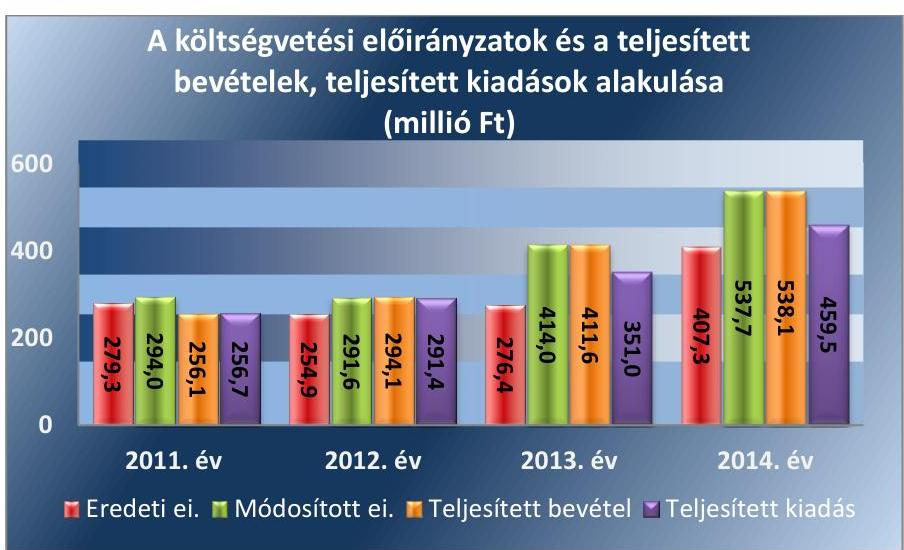

Forrás: az Intézmény éves beszámolói
(Megjegyzés: Az ábrában az ellenőrzött időszak egyes éveiben a teljesített kiadás és bevétel feltüntetett, amely a finanszírozási kiadásokkal, bevételekkel tér el a költségvetési bevételektől, kiadásoktól.)

Az Intézmény bevételeinek és kiadásainak összetétele az ellenőrzött időszakban nem mutatott jelentős változást. Az Intézmény kiadásainak mintegy 60%-át a személyi jellegű kiadások és azok közterhe tette ki. Az Intézmény engedélyezett létszámkerete az ellenőrzött időszak alatt a leányfalui Panoráma Otthon és Duna Otthon ellátottainak átvétele miatt 65 főről 105 főre növekedett. A dologi kiadások aránya az ellenőrzött időszak alatt 39%-ról 31%-ra csökkent, mivel az ellátottak megnövekedett számát csak a személyi kiadások növekedése kísérte. A beruházási kiadások a 2013. évben az összes kiadás 4%-át, a 2014. évben 8,7%-át tették ki, a 2011-2012. években nem teljesítettek beruházási kiadást. A költségvetési szerv által teljesített összes bevétel - az ellenőrzött időszakban történt feladatváltozásokkal összefüggő ellátotti létszámemelkedés következtében - a 2011. évi 256,1 millió Ft-ról a 2014. évre 538,1 millió Ft-ra, 210,1%-kal emelkedett. A kiadások teljesítése a 2011. évi 256,7 millió Ft-ról a 2014. évre 459,5 millió Ft-ra, 179%-kal emelkedett.

---

A kiadások teljesítéséhez kapcsolódó gazdálkodási jogköröket gyakorló személyek 2011-2014. évi változását az 5. táblázat mutatja be.
5. táblázat

| A GAZDÁLKODÁSI JOGKÖRÖK GYAKORLÓI A 2011-2014. ÉVEKBEN |  |  |  |
| :--: | :--: | :--: | :--: |
| Megnevezés | 2011. év | 2012.01.01-2013.03.31. | 2013.04.01-2014.12.31. |
| Kötelezettségvállaló |

 Intézményvezető és az általa felhatalmazott intézményi dolgozó |  |  |
| Kötelezettségvállalás ellenjegyző | gazdasági szervezet ${ }_{1}$ felhatalmazott dolgozója | - | - |
| Pénzügyi ellenjegyző | - | gazdasági szervezet ${ }_{2}$ felhatalmazott dolgozója | gazdasági szervezet ${ }_{3}$ felhatalmazott dolgozója |
| (Szakmai) teljesítést igazoló | Intézményvezető által felhatalmazott intézményi |  |  |
| Érvényesítő | gazdasági szervezet ${ }_{1}$ felhatalmazott dolgozója | gazdasági szervezet ${ }_{2}$ felhatalmazott dolgozója | gazdasági szervezet ${ }_{3}$ felhatalmazott dolgozója |
| Utalványozó | gazdasági szervezet ${ }_{1}$ felhatalmazott dolgozója | gazdasági szervezet ${ }_{2}$ felhatalmazott dolgozója | gazdasági szervezet ${ }_{3}$ felhatalmazott dolgozója |
|  | Intézményvezető és az általa felhatalmazott intézményi dolgozó | Intézményvezető és az általa felhatalmazott intézményi dolgozó | Intézményvezető és az általa felhatalmazott intézményi dolgozó |
| Utalvány ellenjegyző | gazdasági szervezet ${ }_{1}$ felhatalmazott dolgozója | - | - |

A KULCSKONTROLLOK
MŰKÖDTETÉSÉNEK ÖSSZESÍTETT ÉRTÉKELÉSE ÉVENKÉNT

| Évek | Minősítés |
| :--: | :--: |
| 2011. | nem megfelelő |
| 2012. | nem megfelelő |
| 2013. | nem megfelelő |
| 2014. | nem megfelelő |

A kiadáshoz kapcsolódó gazdálkodási jogkörök gyakorlása során a kulcskontrollok - a 2011. évben a szakmai teljesítés igazolása és az utalvány ellenjegyzése, a 2012-2014. években a teljesítés igazolása és az érvényesítés a személyi juttatások, a dologi és dologi jellegű, a felhalmozási kiadások és a pénzeszközátadások vonatkozásában - nem megfelelően működtek, melyek évenkénti értékelését az 6. táblázat szemlélteti.

A kulcskontrollok működésében feltárt hibák oka nagyrészt a belső szabályozás hiányossága volt: a pénzgazdálkodási jogkörök gyakorlóinak kijelölése az ellenőrzött időszakban nem volt a jogszabályi előírásoknak megfelelő.
A 2011. évben az kötelezettségvállalás ellenjegyzője, az utalvány ellenjegyzője és az érvényesítő kijelölése szabálytalan volt, mert az Ámr. 74. § (2) bekezdésében, az Ámr. 79. § (1) bekezdésében és az Ámr. 77. § (4) bekezdésében foglaltak ellenére a gazdasági szervezet ${ }_{1}$ vezetője helyett a jegyző jelölte ki a feladat ellátására jogosult személyeket.
—_Az Intézmény gazdasági szervezete 2012. január 1-jétől a PMIK lett. Az Intézmény és a gazdasági szervezet ${ }_{2}$ az Ávr. 10. § (4) bekezdése szerinti Együttműködési Megállapodás2-t 2012. november 30-án kötötte meg. A gazdálkodási jogkörök szabályszerű gyakorlása az aktualizált együttműködési megállapodás hiányában csak az intézményvezető és a felhatalmazott intézményi dolgozók által gyakorolható gazdálkodási jogosítványok tekintetében (kötelezettségvállalás, utalványozás, teljesítésigazolás) valósult meg 2012. január 1-jétől november 30-áig.
A 2012. évben, valamint a 2013. év első negyedévében az érvényesítési jogkörök gyakorlóinak kijelölése jogszerűtlen volt, mivel a joggyakorlókat nem a gazdasági szervezet ${ }_{2}$ gazdasági vezetője, hanem a gazdasági szervezet ${ }_{2}$ vezetője jelölte ki, ami ellentétes volt az Ávr 58. § (4) bekezdésével.

---

- A gazdasági szervezet3 gazdasági vezetője az Ávr. 55. § (2) bekezdés a) pontjától, valamint az Ávr. 58. § (4) bekezdésétől eltérően járt el, amikor hat dolgozója részére visszamenőleges hatállyal adott ellenjegyzési, illetve érvényesítési jogosultságot. Így a jogosultság 2013. április 1-jei kezdő időpontja és a felhatalmazást adó dokumentum 2013. június 25-i kelte, illetve annak két nappal későbbi átvétele közötti időszakban az érintett dolgozók írásbeli kijelölés nélkül gyakorolták a gazdálkodási jogköröket.
A kiadási előirányzatok felhasználása során a pénzgazdálkodási jogkörök gyakorlása - kiemelten a kulcskontrollok működése - tekintetében az ellenőrzés a következő további eseti hibákat tárta fel.
- A SZEMÉLYI JUTTATÁSOK körében teljesített kifizetéseknél a 2011-2014. években a megbízási szerződések esetében előforduló hiányosság volt, hogy azok az egységárat nem tartalmazták, a szerződésekben hivatkozott külön megállapodás csak az elszámoláskor készült el. Szerződésben nem szerepelt az Ávr. 50. § (1) bekezdés b) pontjában előírtaknak megfelelően a megbízási díj összege, ezért a teljesítést igazoló nem tudta az összegszerűséget, a kifizetés jogszerűségét szabályszerűen ellenőrizni. 2014. évben az érvényesítő az Ávr. 58. § (1) bekezdésében foglaltak szerinti összegszerűség ellenőrzését - az összegszerűség helyességét alátámasztó adat hiányában - nem tudta elvégezni, ezért az érvényesítés nem volt szabályszerű.
- A DOLOGI KIADÁSOK körében a 2011. évben előfordult, hogy nem volt írásos kötelezettségvállalás, a teljesítést igazoló dokumentum hiányában nem tudta szabályos módon végrehajtani a teljesítésigazolást, amely nem felelt meg az Ámr. 74. § (1) és 76. § (1) bekezdéseinek. Az érvényesítés, az utalványozás a pénztári kifizetés után történt, amely nem felelt meg az Ámr. 78. § (1) és a 79. § (2) bekezdéseinek. A számlán a teljesítésigazolás végrehajtásának dátuma korábbi volt, mint a számla kiállítása.
- A 2012. évben előfordult, hogy nem volt írásos kötelezettségvállalás, a teljesítést igazoló kötelezettségvállalási dokumentum hiányában igazolta a teljesítést, ez nem felelt meg az Ávr. 57. § (1) bekezdésének. Az érvényesítés, az utalványozás esetenként a pénztári kifizetés után történt, amely nem felelt meg az Ávr. 58. § (1)-(3) bekezdéseinek. Esetenként elmaradt a teljesítés igazolás végrehajtása, amely nem felelt meg az Ávr. 57. § (1) bekezdésében foglaltaknak.
- A 2013. évben előfordult, hogy a számlán szereplő teljesítés igazolása megelőzte a teljesítés idejét. Az Ávr. 57. § (1) bekezdésének előírása ellenére a teljesítés igazoló nem szabályszerűen látta el feladatát, mert a megrendeléshez megrendelő lap nem volt, így a szállító személye a kötelezettségvállalás alapján nem volt megállapítható. Az Ávr. 55. § (2) bekezdése előírásától eltérően esetenként a gazdálkodási jogkörök gyakorlásánál az érvényesítő, az ellenjegyző és az utalványozó még nem vette át a felhatalmazását a feladat ellátására így ezt jogosultság hiányában végezték.
- A 2014. évben előfordult, hogy a számla a szerződéssel ellentétben egy összegben lett kiállítva a foglalkoztatás egészségügyi vizsgálatáról. A megkötött szerződésben a díjtételek kategorizált Ft/fő/év összeg szerint, foglalkozás-egészségi osztályba sorolás alapján kerültek

---

meghatározásra. A számla alapján nem volt megállapítható, hogy hány fő, milyen kategóriába sorolt dolgozó vett részt a vizsgálaton. Így az összegszerűség nem volt ellenőrizhető, a teljesítésigazolás az Ávr. 57. § (1) bekezdése alapján nem volt megalapozott.

- A FELHALMOZÁSI KIADÁSOKNÁL a 2011-2012. években nem történt kiadás. A 2014. évben előfordult, hogy a teljesítésigazolás nem volt szabályszerű, mert a teljesítést igazoló az Ávr. 57. § (4) bekezdés előírása ellenére nem rendelkezett a feladat ellátására a kötelezettségvállaló írásbeli kijelölésével.
- Az érvényesítés a 2013-2014. években több alkalommal nem volt szabályszerű, mert az érvényesítő személy az érvényesítés elvégzésének időpontjában nem rendelkezett az Ávr. 58. § (4) bekezdésében a feladat ellátásához előírt érvényes kijelöléssel. 2013-ban előfordult, hogy az érvényesítés nem volt az Ávr. 58. § (2) előírásainak megfelelő, mert az érvényesítő az utalványozó felé nem jelezte a megelőző ügymenetben az Ávr. előírása megsértését, azt, hogy a pénzügyi ellenjegyzést kijelöléssel nem rendelkező személy jogosulatlanul végezte el. 2014-ben eseti hiba volt, hogy az utalványrendeleten hiányzott az érvényesítő aláírása, az Ávr. 58. § (3) bekezdés előírása ellenére.
- A PÉNZESZKÖZ ÁTADÁS körében a 2011. évben előfordult, hogy a szakmai teljesítés igazolása nem volt szabályszerű, mert az nem a kiadás utalványozását megelőzően, hanem azt követően történt az Ámr. 76. § (1) bekezdésében foglalt előírás ellenére.
- 2012-ben előfordult, hogy a letéti számlákra utalás, készpénz kifizetés nem utalványozás (kifizetés elrendelés) alapján történt az Áht. 2 38. § (1) bekezdés előírása ellenére, mivel az utalványozás dátuma a kifizetést követő és nem azt megelőző volt.
- 2013-ban eseti hiba volt, hogy az érvényesítő személy az érvényesítés elvégzésének időpontjában nem rendelkezett az Ávr. 58. § (4) bekezdésében a feladat ellátásához előírt érvényes kijelöléssel.
Az Intézmény a kiadási előirányzatok felhasználása során a Kbt. $1,2^{43}$ előírásait betartotta.

A 2013. évben a közbeszerzési értékhatárt meghaladta a 18,5 millió Ftból több ütemben megvalósított építés-helyreállítási munka, amely az árvízi károk helyreállítását szolgálta, azonban a Kbt. 2 120. § h) pont szerint a törvényt nem kellett alkalmazni vízkár, illetve vízminőségi kár közvetlen megelőzése, elhárítása, védekezési készültség vagy az azt közvetlenül követő helyreállítás érdekében történő beszerzésre.

# 3.4. számú megállapítás 

Az előirányzat maradvány megállapítása, felhasználása szabályszerű volt.

## A KÖTELEZETTSÉGVÁLLALÁSSAL TERHELT MARADVÁNY megállapítása és felhasználása megfelelt az Ámr.-ben, továbbá az Ávr.-ben foglalt előírásoknak.

Az Intézménynek nem volt a tárgyévet követő év június 30-áig pénzügyileg nem teljesült, továbbá meghiúsult kötelezettségvállalás miatt szabaddá váló előirányzat-maradványa, így annak felhasználhatósága érdekében sem állt fenn az Áht. 1-ben, illetve az Ávr.-ben erre az esetre előírt tájékoztatási kötelezettsége.

Az Intézmény költségvetési maradványának megállapítása az Ámr. és az Ávr. szerint az éves költségvetési beszámoló készítésekor az Áhsz.1,2 előírásának megfelelően történt és a beszámoló részeként az előírt tartalommal került benyújtásra az irányító szerv $1-3$ felé.

Az Intézménynél az ellenőrzött időszakban nem voltak az előirányzat felhasználáshoz kapcsolódó évközi korlátozó intézkedések (zárolás, maradványtartás).

Az Intézmény a költségvetési törvényben meghatározott befizetési kötelezettségét (térítési díjak) és személyi előirányzat visszatérítést szabályosan teljesítette.

Az irányító szerv3 a 2012. évi kötelezettségvállalással terhelt maradványt 2013. szeptemberben, a középirányító szerv ${ }_{2}$ a 2013. évi kötelezettségvállalással terhelt maradványt 2014. novemberben hagyta jóvá. Az Intézmény a kötelezettségvállalással terhelt maradványokat a tárgyévet követő év június 30-ig felhasználta.

Az ellenőrzött időszakban az éves költségvetési beszámolóban kimutatott költségvetési maradvány és a kapcsolódó főkönyvi számlák egyezősége biztosított volt.

# 3.5. számú megállapítás 

Az Intézmény zavartalan feladatellátása, a fizetőképesség folyamatos fennállása, a likviditás javítása érdekében intézkedtek.

A 2011. évben az önkormányzati költségvetési szervként működő Intézménynek havi előirányzat-felhasználási terv készítési, felülvizsgálati kötelezettsége nem volt. Az Intézmény gazdálkodási feladatait ellátó gazdasági szervezet ${ }_{2,3}$ a 2012-2014. években az Áht. 2 78. § (2) bekezdésben előírtak ellenére az Intézményre vonatkozó likviditási tervet nem készített.

## AZ INTÉZMÉNY A FOLYAMATOS FIZETŐKÉPESSÉG

fenntartása, a likviditás javítása érdekében folyamatosan takarékossági intézkedéseket tett. A 2013. június 5-ei árvíz miatti rendkívüli helyzet miatti, előre nem tervezett kiadások, továbbá a váci telephely 2013. október 14-től történő átvétele nagymértékben befolyásolták az Intézmény 2013. és 2014. évi költségvetését. Ebben az időszakban a költségvetés egyensúlyát alapvetően a kiegészítő támogatások biztosították.

Az Intézmény kötelezettségeinek állománya a 2011-2013. években jelentősen meghaladta a követelések állományát. A 2014. év végére azonban a tendencia megfordult, a kötelezettségek összege az előző évinek és a követeléseknek is mintegy felére csökkent. A 2014. év végére a 2011. évi 32,2 millió Ft összegű kötelezettség állomány 7,5 millió Ft-ra csökkent. A követelésállomány a 2011. évi 5,5 millió Ft-hoz viszonyítva a 2014. év végére 15,2 millió Ft-ra növekedett, amelynek behajtása érdekében intézkedéseket tett az Intézmény (felszólítás).

Az Intézmény a 2013. évben az árvízre és a telephellyel történt bővülésre tekintettel kért előirányzat-keret előrehozást.

---

# 3.6. számú megállapítás 

Az eredményszemléletű számvitel bevezetésével kapcsolatos feladatok végrehajtása nem volt szabályszerű.

Az Intézmény 2013. évi beszámoló mérlegében szereplő értékadatok módosítását a rendező mérleg elkészítését megelőzően
 rendező, technikai tételek elszámolásával az NGM rendeletben ${ }^{44}$ előírtak szerint végezték el.

A rendezőmérleg elkészítését megelőző feladatok keretében előírt leltározás végrehajtása nem volt az NGM rendelet 2. § (1) bekezdés előírásának megfelelő, mert a források egyeztetéssel való leltározását, a leltár kiértékelését az Intézmény gazdálkodási feladatait ellátó középirányító szerv ${ }_{2}$ dokumentáltan nem végezte el, ennek hiányában a leltározás nem volt teljes körű.

A leltárban a költségvetési évre és a költségvetési évet követő időszakra vonatkozóan szerepeltek a követelések, a kötelezettségek az NGM rendelet előírása szerint. A függő és átfutó kiadásokat azonosították, függő és átfutó bevétel nem volt.

A rendező mérleget az NGM rendelet előírásainak megfelelő határidőben, formátumban és tartalommal készítették el. A 2014. évi nyitó mérleg és rendező mérleg adatai egyezősége biztosított volt.

## 4. Az intézmény vagyongazdálkodása szabályszerű volt-e?

## Összegző megállapítás

### 4.1. számú megállapítás

Az Intézmény vagyongazdálkodása nem volt szabályszerű.

## A vagyonkezelési szerződés megfelelt a jogszabály előírásának.

Az Intézmény a 2011. évben az államháztartás önkormányzati alrendszerébe tartozott, felügyeletét, irányítását a PMÖ látta el, aki a tulajdonos, egyben a tulajdonosi joggyakorló volt. A vagyonkezelési szerződést a vagyongazdálkodási rendelet ${ }^{45}$ alapján szabályosan kötötték meg és látta el a vagyonkezelői feladatokat az Intézmény.

Az Intézmény 2012. évi állami tulajdonba kerülését követően az Intézmény által használt vagyonnal kapcsolatban, az MNV Zrt. (mint tulajdonosi joggyakorló, vagyonkezelésbe adó) és a PMIK (mint vagyonkezelésbe vevő) a Mök. tv. ${ }^{46}$ alapján az Nvtv. és a Vtv. ${ }^{47}$ előírásának megfelelő vagyonkezelési szerződést kötött. A vagyonkezelési szerződés az ellenőrzött időszakban hatályban maradt, nem módosult, a 2013. március 31-én megszűnt PMIK helyébe - mint vagyonkezelő - általános és egyetemleges jogutódja, az SZGYF lépett. Az Intézmény által használt vagyon kezelője a 258/2011. (XII. 7.) Korm. rendelet, valamint a 316/2012. (XI. 13.) Korm. ${ }^{48}$ rendelet révén jogutódlással változott, ezért a vagyonkezelési szerződést nem módosították.

Az Intézmény használatába került eszközök esetében betartották a jogszabályban előírtakat. Az Intézmény felhalmozási beszerzési tevékenység eredményeként beszerzett gépek, berendezések, felszerelések, árvizet követő helyreállító munkálatok értéke a Vtv. és az Nvtv. előírása szerint a vagyonkezelő PMIK, majd 2013. április 1-jétől az SZGYF által kezelt állami vagyont gyarapította.

---

# 4.2. számú megállapítás 

A mérlegben kimutatott eszközök és források nyilvántartása, értékelése és leltározása nem volt szabályszerű.

A mérlegben kimutatott ellenőrzött tárgyi eszközök bekerülési értékének megállapítása, üzembe helyezése, állományba vétele, év végi értékelése, az értékcsökkenés elszámolása az előírásoknak megfelelően történt.

A beruházások, felújítások, beszerzések esetében a nyilvántartási dokumentáció tartalmazott üzembe helyezési dokumentumot. A műszaki át-adás-átvételt követően az eszközök aktiválása, leltárba vétele helyes bekerülési értékkel, a Számv. tv. előírása szerint dokumentáltan megtörtént. Az ellenőrzött beruházások, felújítások, beszerzések egy kivétellel a leltárban fellelhetőek voltak.
2012. január 1-jétől az Intézmény által használt, azonban vagyonkezelésébe nem tartozó vagyon a 2012-2014. években szabálytalanul az Intézmény mérlegében szerepelt, a Számv. tv. ${ }^{49}$ 23. § (2) bekezdés, valamint az Áhsz. ${ }_{1}$ 20. § (2) bekezdés 2012-2013. években hatályos előírása ellenére. Az Intézmény vagyoni, pénzügyi és jövedelmi helyzetéről készült 2012-2014. évi beszámolók a Számv. tv. 18. §-a alapján nem mutattak megbízható és valós képet, továbbá nem érvényesült a Számv. tv. 15. § (3) bekezdése szerinti valódiság elve.

Az Intézmény 2011-2014. évi mérlegében kimutatott eszközök leltározása a mennyiségben és értékben kimutatott eszközöknél és a pénzeszközöknél szabályszerű volt, évente mennyiségi felvétellel történt, a leltári összesítőket és a kiértékeléseket elkészítették.

Az Intézmény 2011-2014. évi mérlegében kimutatott források egyeztetéssel történő leltározását nem végezték el, ami nem felelt meg a Számv. tv. 69.§ (2) bekezdésében foglaltaknak. A kötelezettségekről elkészült a mérleg fordulónapi összesítése, azonban a források - közte a kötelezettségek - tekintetében a főkönyv és az analitika egyezősége megállapítását tartalmazó dokumentumot az Intézmény gazdálkodási feladatait ellátó fenntartó nem készítette el. A források tekintetében a 2011-2014. években a leltár és kiértékelésének hiánya nem felelt meg a Számv. tv. 69. § (1) bekezdésében, 2011-2013. években az Áhsz. ${ }_{1}$ 37. § (1)-(2) bekezdéseiben foglaltaknak, továbbá az ellenőrzött időszakban az Együttműködési Megállapodás ${ }_{1,2}$ számviteli feladatokról és leltározásról szóló fejezetei előírásainak.

Az ellenőrzött időszakban az el nem ismert követeléseket átvezették a nullás számlaosztályba összhangban az Áhsz. ${ }_{1,2}$ mellékleteiben előírtakkal. Követelésről lemondás az Áht. ${ }_{1,2}$ előírásának megfelelően nem volt a 2011-2014. években. A kétes, illetve behajthatatlan követeléseket leírták, a nyilvántartásokból kivezették. A követelések beszedése és behajtása érdekében az Áht. ${ }_{1,2}$ által előírt intézkedéseket megtette az Intézmény. A követelések állományát rögzítő számlák vezetése, a negyedévenkénti összegző kimutatás elkészítése, főkönyvi feladása megfelelt az Áhsz. ${ }_{1,2}$ előírásainak.

A tárgyévet, illetve a tárgyévet követő évet terhelő szállítói kötelezettségek elkülönítése megfelelő volt.

A mérlegben az immateriális javakat és tárgyi eszközöket az elszámolt terv szerinti és terven felüli értékcsökkenéssel csökkentett bekerülési értéken mutatták ki.

Az Intézmény az ellenőrzött időszakban nem végzett selejtezést. Az Együttműködési Megállapodás ${ }_{1,2}$ Selejtezés - Leltározás fejezet 1. pontja

---

szerint az Intézmény a kis értékű tárgyi eszközei, berendezés/felszerelései selejtezését, leltározását, feleslegessé és selejtté vált tárgyak hasznosítását, értékesítését végezhette el. Az Intézmény a 2014. december 1-jén felvett selejtezési jegyzőkönyvben tárt fel - fokozott igénybevétel, elhasználódás okán - selejtezésre javasolt kis és nagy értékű immateriális javakat és tárgyi eszközöket, összesen 8,1 millió Ft bruttó értéken. A selejtezési jegyzőkönyv fenntartói jóváhagyásra történő felterjesztése, így a selejtezés jóváhagyása az ellenőrzött időszakban nem történt meg.

# 4.3. számú megállapítás 

Az Intézmény teljesítette az általa használt vagyontárgyak értékmegőrzési és állagmegóvási kötelezettségét.

Az Intézmény számára a 2011. évben a PMÖ vagyongazdálkodási rendelete határozott meg szabályokat, amely szerint a vagyon fenntartása, állagának megóvása volt feladata. A vagyongazdálkodási rendelet az értékmegőrzésre, állagmegóvásra részletes szabályokat nem tartalmazott.

Az Intézmény 2012. január 1-jétől a használatában álló vagyonnak vagyonkezelője nem volt. Erre tekintettel a Vtv. 2. § (1) bekezdés, a 23. § (1) bekezdés, és a 27. § (2) bekezdés, továbbá a Vtvr. ${ }^{50}$ 9. § (3) bekezdésben lévő, a vagyonkezelő számára előírt nyilvántartásai, adatszolgáltatási, elszámolási, ellenőrzési, értékmegőrző, értéknövelő, állagmegóvási, karbantartási feladatok ellátására vagyonkezelői szerződés alapján nem volt kötelezett, azonban az állagmegóvási és értékmegőrzési kötelezettségét teljesítette.

Az Intézmény - a 2013. évi árvíz során keletkezett kivédhetetlen károk kivételével - az éves költségvetésében rendelkezésre álló előirányzatok felhasználásával gondoskodott a vagyontárgyak állagának megóvásáról, jó karbantartásáról, működtetéséről, megfelelő használatáról. Az összes vagyon, valamint az egyes vagyonelemek összege - a 2012. év kivételével - emelkedett. A saját tőke 679,8 millió Ft-ról, 776,0 millió Ft-ra (14,2\%-kal), a mérleg főösszeg 713,8 millió Ft-ról 786,0 millió Ft-ra (10,1\%-kal) növekedett. A vagyon túlnyomó részét kitevő tárgyi eszközök értéke a 2011. évi 705,4 millió Ft-ról 685,0 millió Ft-ra csökkent a 2014. évre, a beruházások értéke 0 Ft-ról, 3,6 millió Ft-ra nőtt.

Az Intézmény vagyongazdálkodási helyzetét alapvetően befolyásolták és a 2011-2014. években az összevont költségvetési beszámoló mérlegsorainak 20\%-ot meghaladó változását az alábbiak okozták.
$\longrightarrow$ A tartalék a 2012. évről a következő évre 1,4 millió Ft-ról 61,9 millió Ft-ra növekedett, mert az árvízi védekezésre és az árvízkárok helyreállítási munkálataira kapott 76,3 millió Ft támogatás felhasználása és az elszámolás az év végén nem fejeződött be.
$\longrightarrow$ A beruházásokra, felújításokra a 2011. és 2012. években költségvetési előirányzat nem volt tervezve, erre a célra kiadást nem teljesítettek. A 2013. évi változást az árvízkárok miatti soron kívüli felújítási munkák, beszerzések okozták, ezért maradt folyamatban lévő felújítás 3,6 millió Ft értékben a 2014. év végén. A gépek, berendezések, felszerelések 2012. évi 5,1 millió Ft-os értéke 13,6 millió Ft-ra nőtt a 2013. évben, mert az árvíz miatt nagy teljesítményű takarító gép vásárlására és mosógépek pótlására volt szükség. A készletek a 2012. évi 1,2 millió Ft-ról a 2014. év végére 7,9 millió Ft-ra történt növekedésében meghatározó volt a megsemmisült ápolási textilek, gyógyászati fogyóeszközök, gyógyszerek beszerzése.

---

$\longrightarrow$ A kötelezettségek a 2011. évi 32,2 millió Ft-ról 15,0 millió Ft-ra csökkentek a 2012. évben, mert a Mök. tv. értelmében az intézményektől a PMÖ által átvett adósságot az állam átvállalta.
A használhatósági fok mutatója a 2011. évi 82,2\%-ról - kis mértékben - 2014-re 79\%-ra csökkent az ellenőrzött négy év alatt. A tárgyi eszközök elhasználódási szintje a 2011. évi 17,8\%-ról 2014-re 21\%-ra nőtt. A romló mutató azt mutatja, hogy nem volt képes az Intézmény eszközeinek pótlására a rendelkezésre álló költségvetési bevételek mellett. Az Intézmény vagyoni helyzetét jellemző mutatók alakulását az 7. táblázat szemlélteti.
7. táblázat

A VAGYONI HELYZET ELEMZÉSÉNEK MUTATÓI

| Mutató megnevezése | 2011. | 2012. | 2013. | 2014. |
| :-- | :--: | :--: | :--: | :--: |
| Befektetett eszközök aránya | $98,8 \%$ | $98,2 \%$ | $89,3 \%$ | $87,2 \%$ |
| Ingatlanok aránya | $98,2 \%$ | $99,2 \%$ | $98,0 \%$ | $98,2 \%$ |
| Használhatósági fok | $82,2 \%$ | $80,2 \%$ | $80,4 \%$ | $79,0 \%$ |
| Elhasználódási szint | $17,8 \%$ | $19,8 \%$ | $19,6 \%$ | $21,0 \%$ |
| Saját tőke aránya | $95,2 \%$ | $97,7 \%$ | $89,8 \%$ | $98,7 \%$ |

Forrás: az Intézmény 2011-2014. évi könyvviteli mérlegadataiból számított érték
Az Intézményre bízott állami tulajdonú eszközökön végzett beruházás, felújítás során betartották a Vtv. szabályait.

A felhalmozási kiadások esetében, a 2012-2014. években nem volt olyan beszerzés, amely a tulajdonosi joggyakorló írásbeli engedélyét tette volna szükségessé az Vtvr. 9. § (6) bekezdés a) pontja és a (7) bekezdés szerint. (Az árvízkár helyreállítása (2013-2014-ben) bekerülési költsége meghaladta a Vtvr. 9. § (6) bekezdés a) pontja, (7) bekezdésében előírt bejelentési kötelezettség mértékét, de a kiadások jellege nem értéknövelő, hanem helyreállító felhalmozás volt, így a bejelentés megtételére sem volt szükség.) A Kbt. ${ }_{2}$ előírásait betartották.

# 4.4. számú megállapítás 

A vagyonelemek elidegenítésére, hasznosítására az ellenőrzött években az Intézménynél nem került sor

Az ellenőrzött időszakban vagyonelemek elidegenítésére, hasznosítására az Intézménynél nem került sor.

---

# 5. Szabályszerűen hajtották-e végre az ellenőrzött időszakban az intézményt érintő szervezeti, szerkezeti átalakításokat? 

Összegző megállapítás

Az intézményt érintő szervezeti, szerkezeti változás végrehajtása nem volt szabályszerű.
5.1. számú megállapítás

Az Intézmény átszervezésével kapcsolatos középirányító szervi intézkedések nem feleltek meg a jogszabályi előírásoknak, nem biztosították az Intézmény szabályszerű működését.

Az ellenőrzött időszakban az Intézmény által ellátott feladat bővült. A változás előzménye volt, hogy a középirányító szerv2 2013. októberében döntött arról, hogy a jobb ellátási feltételek biztosítása érdekében a leányfalui Panoráma Otthon és Duna Otthonban ellátottakat Vácra - a 2011. évi CLIV. törvény alapján a Magyar Állam tulajdonába került ingatlanokba - költözteti. Az átköltöztetés 2013. október
 14-ével megtörtént, mely időponttól kezdődően a telephelyet az Intézmény működteti.

Az Intézmény váci telephelye 2013. október 14-től az ellenőrzött időszak végéig szabálytalanul működött.
— Az Intézmény 2014. november 21-ig nem rendelkezett a telephely létesítéshez a Szoctv. 91. § (3) bekezdés szerinti miniszteri jóváhagyással, mivel az alapítói döntésre felterjesztést a középirányító szerv $_{2}$ vezetője késedelmesen, 2014. július 7-én küldte meg az irányító szerv $_{3}$-nak.
— Az ellenőrzött időszak végéig nem rendelkezett a telephelyre vonatkozó alapító okirat módosítással, mivel a módosítás jóváhagyásra felterjesztés - 316/2012. (XI. 13.) Korm. rendelet 3. § (2) bekezdés e) pontjában meghatározott - hatáskörét a középirányító szerv $_{2}$ vezetője nem gyakorolta. Ennek hiányában az alapító okirat ${ }_{4}$ irányító szerv $_{3}$ általi módosításáról az Áht. 29. § (1) bekezdés a) pontjában foglalt irányító szervi hatáskörben az ellenőrzött időszak végéig nem született döntés. A váci telephely és az ott ellátott új alaptevékenységek tekintetében az alapító okirat hiánya nem felelt meg az 1/2000. (I. 7) SZCSM rendelet ${ }^{51}$ 5. § (1) bekezdés b) pont, valamint az Ávr. 5. § (1) bekezdés a) és c) pontok előírásainak.
— Az Intézmény váci telephelye 2013. október 14-től nem rendelkezett működési engedéllyel az 1/2000. (I. 7.) SZCSM rendelet 5. § (1) bekezdés a) pont, és 2013. november 30-ig a 321/2009. (XII. 29.) Korm. rendelet ${ }^{52}$ 3. § (1) bekezdés előírása ellenére, illetve 2013. december 1-jétől engedélyesként nem szerepelt szolgáltatói nyilvántartásban a 369/2013. (X. 24.) Korm. rendelet ${ }^{53}$ 6. § (1) bekezdésében foglaltak ellenére. Ennek hiányában az Intézmény váci telephelyének 2013. október 14-től megkezdett működése 2013. november 30-ig a Szoctv. 92/K. § (1) bekezdés b) pontjában, 2013. december 1. és 2014. december 31. között a Szoctv. 92/K. § (1) bekezdésében foglalt előírásoknak nem felelt meg. Nem felelt meg továbbá 2013. október 14-től 2013. november 30-ig a 321/2009. (XII. 29.) Korm. rendelet 6. § (8) bekezdés előírásának, miszerint szociális szolgáltató intézmény a működési engedélyt kiadó határozat jogerőre emelkedésétől működtethető, illetve a 2013. december 1-jétől 2014. december 31-ig a 369/2013. (X.24.) Korm. rendelet 8. § (1) bekezdésében foglaltaknak, miszerint az engedélyes - ha a működést engedélyező szerv későbbi időpontot nem állapít meg - a bejegyzés jogerőre emelkedésének időpontjától kezdődően működtethető. Ezen előírásokat figyelmen kívül hagyva a fenntartó3 2013. október 22-én adta be a működési engedély kiadása iránti - a 321/2009. (XII. 29.) Korm. rendelet 4. § (1) bekezdés szerinti - kérelmet. A Szoctv. 2013. december 1-jétől hatályos 140/U. § (4) bekezdése értelmében a 2013. november 30-án jogerősen le nem zárt, működési engedély kiadása iránti kérelmeket a szolgáltatói nyilvántartásba történő bejegyzés iránti kérelemként kell elbírálni. A kérelem jóváhagyásához szükséges dokumentumok (alapító okirat, törzskönyvi bejegyzés) benyújtása - azok rendelkezésre állása hiányában - 2013. évben a 321/2009. (XII. 29.) Korm. rendelet 5. § (1) bekezdésében és 2. melléklete 1.8. pontjában, 2014. évben a 369/2013. (X. 24.) Korm. rendelet 18. § (1) bekezdésében és 5. melléklete 1.1.3. pontjában foglaltak ellenére nem történt meg.

### 5.2. számú megállapítás

Az Intézmény az átszervezéshez kapcsolódó feladatait szabályszerűen látta el.

Az Intézmény az átszervezés során a középirányító szerv2 intézkedése alapján elvégezte az átköltöztetéssel és a férőhely kialakítással kapcsolatos teendőket és biztosította az ellátottak folyamatos szakmai ellátását. E feladatok ellátására az SZGYF főigazgatója az Intézményvezetőt teljes képviseleti, aláírási jogkörrel hatalmazta meg.

Ennek alapján az Intézmény 2013. október 2-14. közötti időszakban lebonyolította az átköltöztetést, amelynek során megoldották a korábbi iskolaépület funkcióváltás miatti átalakítását, az ellátottak biztonságos, a három különböző ellátási formának megfelelő elhelyezését, az ellátás és a telephely működtetés feltételeinek kialakítását. Mindezekkel párhuzamosan az Intézmény gondoskodott az ellátottaknak folyamatos szakmai ellátásáról.

Az átszervezés eredményeként az Intézmény egy telephellyel, valamint 60 férőhellyel (idősek otthona 30, fogyatékos személyek otthona 10, pszichiátriai betegek otthona 20 férőhely) bővült.

# 6. Az intézmény intézkedett-e az integritás szemlélet érvényesítése érdekében? 

## Összegző megállapítás

Az Intézmény az integritás szemlélet érvényesítése érdekében nem intézkedett.

Az Intézmény az ÁSZ Integritás Projektjében az ellenőrzést megelőzően nem vett részt. Az Intézmény által az ellenőrzés során, tanúsítványként kitöltött kérdőív kiértékelése alapján az Intézmény által az integritás érvényesítése érdekében kialakított és működtetett kontrollrendszer biztosította a megfelelő feltételeket a szervezet integritását veszélyeztető kockázatokkal szemben, a kontrollok szintje kiváló volt. A kérdőíves önértékelés

---

eredményét az ellenőrzés tapasztalatai nem támasztották alá, ezért az integritás szemlélet érvényesítése érdekében további intézkedések szükségesek. Az ellenőrzés részletes megállapításait a jelentéstervezet II. számú - „Az integritás érvényesítése érdekében kialakított és működtetett kontrollrendszer" című - melléklete tartalmazza.

---

# JAVASLATOK 

Az ÁSZ tv. 33. § (1) bekezdésében foglaltak értelmében az ellenőrzött szervezet vezetője köteles a jelentésben foglalt megállapításokhoz kapcsolódó intézkedési tervet összeállítani és azt a jelentés kézhezvételétől számított 30 napon belül az ÁSZ részére megküldeni. Amennyiben az intézkedési tervet határidőre nem küldi meg a szervezet, vagy amennyiben az nem elfogadható, az ÁSZ elnöke az ÁSZ tv. 33. § (3) bekezdés a)-b) pontjaiban foglaltakat érvényesítheti.

## az emberi erőforrások miniszterének

1. Intézkedjen az Intézmény módosított alapító okirata felterjesztését követően annak jóváhagyása érdekében.
(1.1. sz. megállapítás 5. bekezdése, 5.1. sz. megállapítás 2. bekezdés 2. francia bekezdésének 2. mondata alapján)
2. Intézkedjen a feltárt szabálytalanságok tekintetében a munkajogi felelősség tisztázására irányuló eljárás megindításáról, és ennek eredménye ismeretében tegye meg a szükséges intézkedéseket.
(3.3. sz. megállapítás 8. bekezdés 7. francia bekezdésének 1. mondata, 5.1. sz. megállapítás 2. bekezdésének 3. francia bekezdése alapján)

## a Szociális és Gyermekvédelmi Főigazgatóság főigazgatójának, mint az Intézmény középirányító szerve

1. Intézkedjen az Intézmény módosított alapító okirata miniszteri jóváhagyás céljából történő felterjesztésére.
(1.1. sz. megállapítás 4. bekezdésének 2. francia bekezdése, 5.1. sz. megállapítás 2. bekezdés 2. francia bekezdésének 1. mondata alapján)
2. Intézkedjen az Intézmény szervezeti és működési szabályzata jóváhagyása érdekében.
(1.1. sz. megállapítás 9. bekezdésének 1., 2. francia bekezdése alapján)

---

3. Intézkedjen az Intézmény tevékenységében a közfeladatok ellátására vonatkozó követelmények, valamint az erőforrásokkal való szabályszerű és hatékony gazdálkodás követelményei érvényesítésére és számonkérésére.
(1.2. sz. megállapítás 1. bekezdése alapján)
4. Intézkedjen az Intézmény váci telephelyének jogszabályi előírásoknak megfelelő működtetése érdekében.
(5.1. sz. megállapítás 2. bekezdésének 3. francia bekezdése alapján)
5. Tegyen intézkedéseket a feltárt szabálytalanságok tekintetében a felelősség tisztázása érdekében, és szükség szerint intézkedjen a felelősség érvényesítéséről
(3.3. sz. megállapítás 8. bekezdés 6. francia bekezdésének 2. mondata alapján)

# a Szociális és Gyermekvédelmi Főigazgatóság főigazgatójának, mint az Intézmény gazdálkodási feladatait ellátó szervezet vezetőjének 

1. Intézkedjen a belső előírásnak megfelelően az Intézménnyel kötendő új együttműködési megállapodás tervezet előkészítésére és egyeztetésére, jóváhagyására, valamint azt követően kösse meg az új együttműködési megállapodást az Intézménnyel.
(2.1. sz. megállapítás 4. bekezdése alapján)
2. Intézkedjen az intézményi hatáskörű előirányzat módosítás esetén a tájékoztatási kötelezettség jogszabályi előírásnak megfelelő teljesítésére.
(3.2. sz. megállapítás 1. bekezdése alapján)
3. Intézkedjen az érvényesítés jogszabályi előírásoknak megfelelő gyakorlására.
(3.3. sz. megállapítás 8. bekezdés 1. francia bekezdésének 3. mondata, 3.3. sz. megállapítás 8. bekezdés 7. francia bekezdésének 3. mondata alapján)

---

4. Intézkedjen az érvényesítő jogszabályi előírásnak megfelelő kijelölésére.
(3.3. sz. megállapítás 8. bekezdés 7. francia bekezdésének 1. mondata alapján)
5. Intézkedjen likviditási terv készítésére.
(3.5. sz. megállapítás 1. bekezdésének 2. mondata alapján)
6. Intézkedjen a jogszabályi előírásoknak megfelelő mérleg készítésére.
(4.2. sz. megállapítás 3. bekezdése alapján)
7. Intézkedjen a jogszabályi és belső szabályozási előírásoknak megfelelő leltár összeállítására.
(4.2. sz. megállapítás 5. bekezdésének 3. mondata alapján)
8. Intézkedjen a feltárt szabálytalanságok tekintetében a munkajogi felelősség tisztázására irányuló eljárás megindításáról, és ennek eredménye ismeretében tegye meg a szükséges intézkedéseket.
(3.3. sz. megállapítás 8. bekezdés 1. francia bekezdésének 3. mondata, 3.3. sz. megállapítás 8. bekezdés 7. francia bekezdésének 3. mondata, 4.2. sz. megállapítás 3. bekezdése, 4.2. sz. megállapítás 5. bekezdésének 3. mondata alapján)

# a Viktor Speciális Otthon intézményvezetőjének 

1. Intézkedjen a szervezeti és működési szabályzat jogszabályi előírásoknak megfelelő tartalmú módosítására és kezdeményezze annak jóváhagyását.
(1.1. sz. megállapítás 9. bekezdésének 1., 2. francia bekezdése alapján)
2. A belső kontrollrendszer szabályszerű kialakítása és működtetése érdekében intézkedjen:
a) az új együttműködési megállapodás egyeztetését és jóváhagyását követően az új együttműködési megállapodás megkötésére az SZGYF-fel;
(2.1. sz. megállapítás 4. bekezdése alapján)

---

b) az együttműködési megállapodásban nevesített és az abban előírt módon történő szabályzatok kiadására;
(2.1. sz. megállapítás 6., 7. bekezdése alapján)
c) az ellenőrzési nyomvonal aktualizálására annak érdekében, hogy hatályos jogszabályi hivatkozásokat tartalmazzon;
(2.1. sz. megállapítás 10. bekezdésének 2. francia bekezdése alapján)
d) az egyes kockázatokkal kapcsolatban szükséges intézkedések meghatározására;
(2.2. sz. megállapítás 1. bekezdésének 2. francia bekezdése alapján)
e) a felelősségi körök meghatározásával az engedélyezési, jóváhagyási eljárások és az információkhoz való hozzáférés szabályozására;
(2.3. sz. megállapítás 1. bekezdése alapján)
f) a kötelezően közzéteendő adatok nyilvánosságra hozatalának rendje szabályozására;
(2.4. sz. megállapítás 1. bekezdésének 4. mondata alapján)
g) az elektronikus közzétételi kötelezettség teljesítésére a jogszabályi előírásoknak megfelelően;
(2.4. sz. megállapítás 1. bekezdésének 4. mondata alapján)
h) az operatív tevékenységek keretében megvalósuló folyamatos és eseti nyomon követés jogszabályi előírásoknak megfelelő kialakítására és működtetésére;
(2.5. sz. megállapítás 1. bekezdésének 2. mondata alapján)
i) mindazon elvek, eljárások és belső szabályzatok kialakítására és működtetésére, amelyek biztosítják, hogy az Intézmény valamennyi tevékenysége és célja összhangban legyen a szabályszerűséggel, szabályozottsággal, valamint a gazdaságosság, hatékonyság és eredményesség követelményeivel.
(2.5. sz. megállapítás 2. bekezdésének 2. francia bekezdése alapján)

---

3. A szabályszerű pénzügyi gazdálkodás érdekében intézkedjen:
a) a jogszabályi előírásoknak megfelelő szerződés kötésére;
(3.3. sz. megállapítás 8. bekezdés 1. francia bekezdésének 2. mondata alapján)
b) a teljesítésigazolás jogszabályi előírásoknak megfelelő gyakorlására;
(3.3. sz. megállapítás 8. bekezdés 5. francia bekezdésének 4. mondata alapján)
c) teljesítésigazoló jogszabályi előírásoknak megfelelő kijelölésére.
(3.3. sz. megállapítás 8. bekezdés 6. francia bekezdésének 2. mondata alapján)
4. Tegyen intézkedéseket a feltárt szabálytalanságok tekintetében a felelősség tisztázása érdekében, és szükség szerint intézkedjen a felelősség érvényesítéséről.
(3.3. sz. megállapítás 8. bekezdés 5. francia bekezdésének 4. mondata alapján)

---

# MELLÉKLETEK 

- I. SZ. MELLÉKLET: ÉRTELMEZŐ SZÓTÁR
állami vagyon
állami vagyonnak minősül:
a) az állam tulajdonában lévő dolog, valamint a dolog módjára hasznosítható természeti erő,
b) az a) pont hatálya alá nem tartozó mindazon vagyon, amely vonatkozásában törvény az állam kizárólagos tulajdonjogát nevesíti,
c) az állam tulajdonában lévő tagsági jogviszonyt megtestesítő értékpapír, illetve az államot megillető egyéb társasági részesedés,
d) az államot megillető olyan immateriális, vagyoni értékkel rendelkező jogosultság, amelyet jogszabály vagyoni értékű jogként nevesít
(Forrás: Vtv. 1. § (2) bekezdése)
állami vagyon értékesítése
állami vagyon használója
állami vagyon hasznosítása
állami vagyon hasznosítása
A állami vagyonnak minősül:
a) az állam tulajdonában lévő dolog, valamint a dolog módjára hasznosítható természeti erő,
b) az a) pont hatálya alá nem tartozó mindazon vagyon, amely vonatkozásában törvény az állam kizárólagos tulajdonjogát nevesíti,
c) az állam tulajdonában lévő tagsági jogviszonyt megtestesítő értékpapír, illetve az államot megillető egyéb társasági részesedés,
d) az államot

 megillető olyan immateriális, vagyoni értékkel rendelkező jogosultság, amelyet jogszabály vagyoni értékű jogként nevesít
(Forrás: Vtv. 1. § (2) bekezdése)
Állami vagyon tulajdonjogának bármely jogcímen történő, visszterhes átruházása (Forrás: Vtvr. 1. § (7) bekezdés d) pontja)
Az a természetes személy, jogi személy, illetve jogi személyiséggel nem rendelkező szervezet, amely, illetve aki törvény vagy szerződés alapján, bármely jogcímen (pl. bérlet, haszonbérlet, vagyonkezelési szerződés, használat stb.) állami vagyont birtokol, használ, szedi annak hasznait, hasznosít, ide nem értve a tulajdonosi jogok gyakorlását.
(Forrás: Vtvr. 1. § (7) bekezdés a) pontja, hatályos 2011. január 1-jétől 2011. december 31-ig)
Az a természetes vagy jogi személy, jogi személyiséggel nem rendelkező szervezet, aki, vagy amely törvény vagy szerződés alapján, bármely jogcímen (bérlet, haszonbérlet, használat stb.) állami vagyont birtokol, használ, szedi annak hasznait, hasznosít, ide nem értve a haszonélvezőt, a vagyonkezelőt és a tulajdonosi jogok gyakorlóját.
(Forrás: Vtvr. 1. § (7) bekezdés a) pontja)
Az állami vagyont az MNV Zrt. maga kezeli, vagy szerződés - így különösen bérlet, haszonbérlet, szerződésen alapuló haszonélvezet, vagyonkezelés, megbízás - alapján központi költségvetési szervnek, természetes vagy jogi személynek, vagy jogi személyiséggel nem rendelkező gazdálkodó szervezetnek hasznosításra átengedi.
(Forrás: Vtv. 23. § (1) bekezdése, hatályos 2011. december 31-éig)
Az állami vagyont az MNV Zrt. maga kezeli, vagy szerződés - így különösen bérlet, haszonbérlet, megbízás - alapján központi költségvetési szervnek, természetes vagy jogi személynek, vagy jogi személyiséggel nem rendelkező gazdálkodó szervezetnek hasznosításra átengedi.
(Forrás: Vtv. 23. § (1) bekezdése, hatályos 2012. január 1-jétől)
Az állami vagyonnal a tulajdonosi joggyakorló maga gazdálkodik, vagy szerződés - így különösen bérlet, haszonbérlet, megbízás - alapján hasznosításra átengedi, illetőleg vagyonkezelésbe, haszonélvezetbe adja.
(Forrás: Vtv. 23. § (1) bekezdése, hatályos 2013. június 28-ától)
Az állami vagyon hasznosítására kötött szerződések elsődleges célja az állami vagyon hatékony működtetése, állagának védelme, értékének megőrzése, illetve gyarapítása, az állami és közfeladatok ellátásának elősegítése.
(Forrás: Vtv. 23. § (2) bekezdése)

---

állami vagyon kezelője /vagyonkezelő

ÁSZ Integritás Projekt
átalakítás
befektetett eszközök aránya
belső ellenőrzés
belső kontrollrendszer
belső kontrollrendszer területei
elhasználódási szint előirányzat-maradvány
felújítás

Az állami vagyont az MNV Zrt. maga kezeli, vagy szerződés - így különösen bérlet, haszonbérlet, szerződésen alapuló haszonélvezet, vagyonkezelés, megbízás - alapján központi költségvetési szervnek, természetes vagy jogi személynek, illetőleg jogi személyiséggel nem rendelkező gazdasági társaságnak hasznosításra átengedi (Forrás: Vtv. 23. § (1) bekezdése, hatályos 2010. január 01-2011. december 31-ig).
Az állami vagyont az MNV Zrt. maga kezeli, vagy szerződés - így különösen bérlet, haszonbérlet, megbízás - alapján központi költségvetési szervnek, természetes vagy jogi személynek, vagy jogi személyiséggel nem rendelkező gazdálkodó szervezetnek hasznosításra átengedi. Az állami vagyonra vonatkozóan az MNV Zrt. kizárólag az Nvtv-ben meghatározott személyekkel köthet vagyonkezelési szerződést.
(Forrás: Vtv. 27. § (1) bekezdése, hatályos 2012. január 1-jétől)
Az Állami Számvevőszék 2009-ben indította el a „Korrupciós kockázatok feltérképezése - Integritás alapú közigazgatási kultúra terjesztése" című, európai uniós forrásból megvalósított kiemelt projektjét (Integritás Projekt). Az Integritás Projekt célja, hogy felmérje a közszféra intézményei korrupciós kockázatoknak való kitettségét, illetőleg az azok mérséklésére hivatott kontrollok szintjét. Az Állami Számvevőszék a projekt révén az integritás szemlélet minél szélesebb körrel történő megismertetését, gyakorlatba ültetését kívánja elérni. Az integritás követelményeinek megfelelő szervezeti működést előnyben részesítő közigazgatási kultúra elterjesztését és a korrupció elleni fellépést az ÁSZ önmagára nézve is stratégiai jelentőségű célként fogalmazta meg. A projekt a felmérésben résztvevő intézmények számára helyzetükről egyfajta „tükörképet" mutat be, ami alapot teremt a jövőbeni pozitív irányú elmozduláshoz. (Forrás: a http://integritas.asz.hu honlapon közzétett, a 2013. évi Integritás felmérés eredményeiről készült összefoglaló tanulmány)
Az általános jogutódlással történő megszüntetés átalakítással történhet. Az átalakítás lehet egyesítés vagy különválás. Az egyesítés lehet beolvadás vagy összeolvadás. (Forrás: Áht. 195. §-a, Áht. 211. §-a)
Befektetett eszközök összesen/eszközök mindösszesen x 100
Független, tárgyilagos bizonyosságot adó és tanácsadó tevékenység, amelynek célja, hogy az ellenőrzött szervezet működését fejlessze és eredményességét növelje, az ellenőrzött szervezet céljai elérése érdekében rendszerszemléletű megközelítéssel és módszeresen értékeli, illetve fejleszti az ellenőrzött szervezet irányítási és belső kontrollrendszerének hatékonyságát. (Forrás: Bkr. 2. § b) pontja)
A belső kontrollrendszer a kockázatok kezelése és tárgyilagos bizonyosság megszerzése érdekében kialakított folyamatrendszer, amely azt a célt szolgálja, hogy a működés és gazdálkodás során a tevékenységeket szabályszerűen, gazdaságosan, hatékonyan, eredményesen hajtsák végre, az elszámolási kötelezettségeket teljesítsék, megvédjék az erőforrásokat a veszteségektől, károktól és nem rendeltetésszerű használattól. (Forrás: Áht. 269. § (1) bekezdése)
A kontrollkörnyezet, a kockázatkezelési rendszer, a kontrolltevékenységek, az információs és kommunikációs rendszer, valamint a nyomon követési (monitoring) rendszer. (Forrás: Bkr. 3. §-a)
100\% - használhatósági fok \%
Az államháztartás központi alrendszerébe tartozó költségvetési szerveknél a módosított bevételi és kiadási előirányzatok és azok teljesítésének a Kormány rendeletében meghatározott tételekkel korrigált különbözete az előirányzat-maradvány.
(Forrás: Áht. 22. § (1) bekezdés m) pontja).
Az elhasználódott tárgyi eszköz eredeti állaga (kapacitása, pontossága) helyreállítását szolgáló időszakonként visszatérő olyan tevékenység, melynek során az eszköz élettartama megnövekszik, minősége, használata jelentősen javul, így a pótlólagos

---

forgóeszközök aránya gazdasági szervezet
gazdálkodási jogkörök
használhatósági fok
hasznosítás
információs és kommunikációs rendszer
ingatlanok aránya
integritás
irányító szerv/felügyeleti szerv
kincstári költségvetés
kockázat
kockázatkezelési rendszer
kontrollkörnyezet
ráfordításból a jövőben gazdasági előnyök származnak. (Forrás: Számv. tv. 3. § (4) bekezdés 8. pontja)
Forgóeszközök összesen/eszközök mindösszesen x 100
A gazdasági szervezet a költségvetési szerv és a hozzá rendelt költségvetési szervek működtetéséért, a költségvetés tervezéséért, az előirányzatok módosításának, átcsoportosításának és felhasználásának végrehajtásáért, a finanszírozási, adatszolgáltatási, beszámolási és a vagyon használatával, védelmével összefüggő feladatok teljesítéséért, a pénzügyi, számviteli rend betartásáért felelős szervezeti egység. (Forrás: Ávr. 9. § (1) bekezdés)
a kötelezettségvállalási, a pénzügyi ellenjegyzési, a teljesítés igazolói, az utalványozási, az érvényesítési, jogkörök együttes elnevezése
A tárgyi eszközállomány állagának elemzéséhez használt mutató, amely megmutatja, hogy a le nem írt (nettó) érték milyen hányadát képezi az aktiválási (bekerülési) értéknek. Számításakor a tárgyi eszköz könyv szerinti nettó értékét viszonyítják a tárgyi eszköz bruttó (beszerzési/létesítési) értékéhez.
A nemzeti vagyon birtoklásának, használatának, hasznok szedése jogának bármely a tulajdonjog átruházását nem eredményező jogcímen történő átengedése, ide nem értve a vagyonkezelésbe adást, valamint a haszonélvezeti jog alapítását. (Forrás: Nvtv. 3. § (1) bekezdés 4. pontja)
A költségvetési szerv vezetője által kialakított és működtetett olyan rendszer, mely biztosítja, hogy a megfelelő információk a megfelelő időben eljutnak az illetékes szervezethez, szervezeti egységhez, illetve személyhez. (Forrás: Bkr. 9. § (1) bekezdés)
ingatlanok összesen/befektetett eszközök összesen x 100
Az integritás az elvek, értékek, cselekvések, módszerek, intézkedések konzisztenciáját jelenti, vagyis olyan magatartásmódot, amely meghatározott értékeknek megfelel.
(Forrás: Nemzetgazdasági Minisztérium: Magyarországi államháztartási belső kontroll standardok Útmutató 1.6.1. pontja, 2012. december)
A költségvetési szerv tekintetében az e törvényben meghatározott irányítási hatáskört gyakorló szerv. (Forrás: Áht. 11. § 9. pontja)
A központi költségvetésről szóló törvény elfogadását követően a fejezetet irányító szerv az államháztartás központi alrendszerébe tartozó költségvetési szerv és a fejezeti kezelésű előirányzat kiemelt előirányzatait, valamint az elkülönített állami pénzalapok és a társadalombiztosítás pénzügyi alapjai jogszabályi előírás szerinti bevételeit és kiadásait kincstári költségvetés kiadásával állapítja meg. (Forrás: Áht. 124. § (3) bekezdés, Áht. 228. § (2) bekezdés)

A kockázat annak a valószínűségét jelenti, hogy egy vagy több esemény vagy intézkedés nem kívánt módon befolyásolja a rendszer működését, céljainak megvalósulását. (Forrás: Javaslatok a korrupciós kockázatok kezelésére - Kockázatkezelési és ellenőrzési módszertan 35. oldal, ÁSZ)
Olyan irányítási eszközök és módszerek összessége, melynek elemei a szervezeti célok elérését veszélyeztető tényezők (kockázatok) azonosítása, elemzése, csoportosítása, nyomon követése, valamint szükség esetén a kockázati kitettség mérséklése. (Forrás: Bkr. 2. § m) pontja)
A költségvetési szerv vezetője által kialakított olyan elvek, eljárások, belső szabályzatok összessége, amelyben világos a szervezeti struktúra, egyértelműek a felelősségi, hatásköri viszonyok és feladatok, meghatározottak az etikai elvárások a szervezet minden szintjén, átlátható a humánerőforrás-kezelés. (Forrás: Bkr. 6. § (1) bekezdés)

---

kontrolltevékenységek

kommunikáció
korrupció
középirányító szerv/ fenntartó szerv
közfeladat
monitoring
saját tőke aránya

A költségvetési szerv vezetője által a szervezeten belül kialakított (kontroll) tevékenységek, melyek biztosítják a kockázatok kezelését, hozzájárulnak a szervezet céljainak eléréséhez. (Forrás: Bkr. 8. § (1) bekezdés)
Az a tevékenység, melynek során információ továbbítása valósul meg. A kommunikációs folyamat résztvevői között tájékoztatás történik, mely során tényeket, ezek magyarázatát közlik.
Azok a cselekmények, amelyek során a köz érdekében való eljárással megbízott és döntéshozatali felelősséggel felruházott személy a köz érdeke helyett önös vagy részérdekeket követve, mástól jogtalan vagy etikátlan előnyt elfogadva és őt jogtalan vagy etikátlan előnyhöz juttatva jár el, illetve amikor valaki a köz érdekében való eljárással megbízott és döntéshozatali felelősséggel felruházott személynek jogtalan vagy etikátlan előnyt nyújtva vagy felajánlva jogtalan vagy etikátlan előnyt kér. (Forrás: A Kormány korrupció megelőzési programja 2012-2014.)
A költségvetési szerv tekintetében törvény vagy kormányrendelet alapján meghatározott, átruházott irányítási hatásköröket gyakorló szerv. (Forrás: Áht. 29. § (4) bekezdés)
Jogszabályban meghatározott állami vagy önkormányzati feladat, amit az arra kötelezett közérdekből, a jogszabályban meghatározott követelményeknek és feltételeknek megfelelve végez, ideértve a lakosság közszolgáltatásokkal való ellátását, továbbá az állam nemzetközi szerződésekben vállalt kötelezettségeiből adódó közérdekű feladatokat, valamint e feladatok ellátásakor szükséges infrastruktúra biztosítását is.
(Forrás: Nvtv. 3. § (1) bekezdés 7. pontja)
A monitoring általánosságban a különböző szintű szervezeti célok megvalósításának folyamatát kíséri figyelemmel, melynek során a releváns eseményekről és tevékenységekről (együtt: folyamatokról) rendszeres jelleggel, strukturált, döntéstámogató információkhoz jutnak a szervezet vezetői. (Forrás: NGM Útmutató a költségvetési szervek monitoring rendszeréhez 2011. november)
Saját tőke összesen/források mindösszesen x 100

---

# II. SZ. MELLÉKLET: AZ INTEGRITÁS ÉRVÉNYESÍTÉSE ÉRDEKÉBEN KIALAKÍTOTT ÉS MŰKÖDTETETT KONTROLLRENDSZER 

Az Intézmény által kitöltött integritás tanúsítvány kiértékelése alapján az Intézmény integritása kiváló.
Az egyes indexértékek szintjének (alacsony, közepes, magas) meghatározásához viszonyítási pontként a 2014. évi Integritás felmérésben válaszadó szociális ellátó intézmények számított indexértékeinek számtani átlaga szolgált. Az Intézmény indexértékeit, illetve azok szintjét a 2014. évi Integritás felmérésben adatszolgáltató szociális ellátó intézményekre számolt átlagos mutatószámainak tükrében a következő táblázat szemlélteti.

| Index neve | Az intézmény által kitöltött   tanúsítvány alapján számított   indexértékek (\%-ban) | Az intézmény   indexértékeinek szintje   (alacsony, közepes, magas) |
| :-- | :--: | :--: |
| Eredendő Veszélyeztetettség Tényező (EVT) | 12,86 | közepes |
| Korrupciós veszélyeztetettséget növelő tényező (KVNT) | 16,89 | közepes |
| Kockázatokat Mérséklő Kontrollok Tényező (KMKT) | 69,64 | magas |

Az Intézmény indexértékei szintjének meghatározását követően külön-külön összevetésre került az eredendő veszélyeztetettségi, illetve a korrupciós veszélyeztetettséget növelő tényezők szintje a kockázatokat mérséklő kontrollok szintjével. A kockázati tényezők és kontrollok szintjének együttes értékelése alapján megállapítottuk, hogy a szervezetnél jelenlevő korrupciós kockázatok kezelésére kiépült kontrollok szintje kiváló, amelyet a következő táblázat szemléltet.

| Összevetett mutatószámok | A kockázati tényezők és a kiépült kontrollok szintjének együttes értékelése   (fejlesztendő, megfelelő, kiváló) |
| :--: | :--: |
| EVT - KMKT | KIVÁLÓ |
| KVNT - KMKT |
 | KIVÁLÓ |

A kérdőíves önértékelés eredményét az ellenőrzés tapasztalatai nem támasztották alá, ezért az integritás szemlélet érvényesítése érdekében további intézkedések szükségesek.

---

# III. SZ. MELLÉKLET: TELJESÍTMÉNY-ELLENŐRZÉSI KIEGÉSZÍTŐ MODUL MEGÁLLAPÍTÁSAI 

Gazdaságossági, hatékonysági és eredményességi követelményeket a pénzügyi és a vagyongazdálkodás folyamatában az Intézmény, illetve az irányító szerv 1-3 nem alakított ki. A teljesítmény-ellenőrzési kiegészítő modul ellenőrzése nem volt lefolytatható.

---

# FÜGGELÉK: ÉSZREVÉTELEK 

A jelentéstervezetet a Számvevőszék 15 napos észrevételezésre megküldte az ellenőrzött szervezetek vezetőinek az ÁSZ tv. 29. § (1) bekezdése előírásának megfelelően.

Az Emberi Erőforrások Minisztériuma részéről a miniszter, valamint a Szociális és Gyermekvédelmi Főigazgatóság főigazgatója az ellenőrzés megállapításaira írásban észrevételt tett. A Viktor Speciális Otthon intézményvezetője, valamint Pest Megye Önkormányzatának elnöke az ÁSZ tv. 29. § (2) bekezdésében foglalt észrevételezési jogával nem élt, a törvényes határidőn belül észrevételt nem tett.
Az elfogadott észrevételek alapján az Állami Számvevőszék módosította a jelentést.
A függelék tartalmazza az ellenőrzött szervezetek vezetőinek észrevételeit, illetve az el nem fogadott észrevételek elutasításának indoklását.

[^0]
[^0]:    * 29. § (1) Az Állami Számvevőszék az ellenőrzési megállapításait megküldi az ellenőrzött szervezet vezetőjének vagy az általa megbízott személynek, és annak, akinek személyes felelősségét állapította meg.
    (2) Az ellenőrzött szervezet vezetője és a felelősként megjelölt személy az ellenőrzés megállapításaira tizenöt napon belül írásban észrevételt tehet.
    (3) Az Állami Számvevőszék az észrevételre a beérkezésétől számított harminc napon belül írásban válaszol. A figyelembe nem vett észrevételeket köteles a jelentésben feltüntetni, és megindokolni, hogy azokat miért nem fogadta el.

---

# 1031 

## Pets K.

EMBERI ERŐFORRÁSOK MINISZTÉRIUMA
SZOCIÁLIS ÜGYEKÉRT ÉS TÁRSADALMI FELZÁRKÓZÁSÉRT FELELŐS ÁLLAMTITKÁR

Iktatószám:45080-2/ 2016/SZOCSTRAT

Domokos László
Elnök
Állami Számvevőszék
Budapest
Apáczai Csere János utca 10.
1052

Hiv. szám: V-0939-144/2016
Ügyintéző: Sipos Sándorné
Tel. szám: +36 (1) 795-5817
Melléklet: -
ÁLLAMI SZÁMVEVŐSZÉK
072507/2016
Érkeze: 2016. AUG. 3.
Iktatószám: 11-0939-154/2016
Melléklet:

Tárgy: A Viktor Speciális Otthon intézménynél az Állami Számvevőszék (a továbbiakban: ÁSZ) által ellenőrzött jelentéstervezetének észrevételezése

## Tisztelt Elnök Úr!

A „központi alrendszer egyes intézményei pénzügyi és gazdálkodása címü" ellenőrzés keretében készült Viktor Speciális Otthon számvevőszéki jelentéstervezetét köszönettel megkaptam, amellyel - az Emberi Erőforrások Minisztériumát (a továbbiakban: EMMI) érintő megállapításaival - kapcsolatban az alábbi észrevételt teszem.
3.3. számú megállapításában szerepel, hogy ,,a bevételi előirányzatok teljesítése a 2011. és 2013. években, valamint a kiadási előirányzatok felhasználása a 2011-2014. években nem volt a jogszabályi előírásoknak megfelelő".

## Észrevétel:

A jelentéstervezet 3.3. számú megállapítása szerint nem végezte el az intézmény 2013. évben a bevételi előirányzatoknak az Áht. 30. § (3) bekezdésében előírt csökkentését annak ellenére, hogy az összes költségvetési bevétel a módosított előirányzattól 2,4 millió forinttal elmaradó mértékben teljesült. Az elmaradás a felhalmozási célú pénzeszköz átvételnél mutatkozott. Az intézmény költségvetési bevétele 2013. évben a módosított előirányzathoz képest 120 ezer forint túlteljesítést mutat.

---

A jelentéstervezetben kimutatott 2,4 millió forint (2.374 ezer forint) elmaradás a tárgyévi bevételek összegében mutatkozik, amelynek része (az előirányzati oldalon meg nem jelenő) 2.494 ezer forint függő, átfutó, kiegyenlítő bevétel. Ezen eltérés a függő bevételek kincstári és költségvetési rendszerben történő eltérő kezeléséből (azaz rendszerbeli eltérésből) adódik, nem jelent bevétel elmaradást, ezért kérjük a megállapítás törlését a jelentéstervezetből.

Mindezekre tekintettel, tisztelettel kérem a jelentéstervezet módosítását.
Tájékoztatom Elnök Urat, hogy az EMMI Szervezeti és Működési Szabályzatáról szóló 33/2014. (IX.16) EMMI utasítás 146. § (12) bekezdés b) pontja alapján az emberi erőforrások minisztere által átruházott hatáskörben gyakorlom a kiadványozási jogot.

Budapest, 2016. augusztus 26.

# Üdvözlettel: 

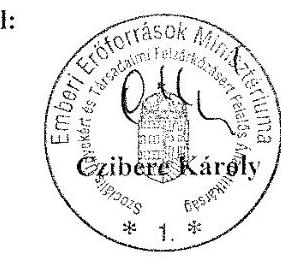

---

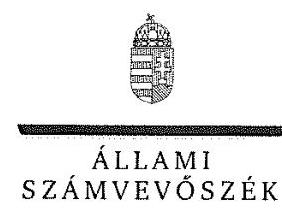

ELNÖK

Ikt.szám: V-0939-155/2016.

# Balog Zoltán úr 

miniszter
Emberi Erőforrások Minisztériuma

## Budapest

## Tisztelt Miniszter Úr!

„A központi alrendszer egyes intézményei pénzügyi és vagyongazdálkodásának ellenőrzése Viktor Speciális Otthon" címmel készített számvevőszéki jelentéstervezetre tett észrevételét köszönettel megkaptam.

Az Állami Számvevőszék észrevételre vonatkozó álláspontjáról a felügyeleti vezető által készített részletes tájékoztatást csatoltan megküldöm.

Budapest, 2016. szeptember hó 4. nap
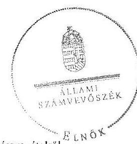

Tisztelettel:

D Domokos László

Melléklet: Tájékoztatás az elfogadott észrevételről

---

# Tájékoztatás az elfogadott észrevételről 

..A központi alrendszer egyes intézményei pénzügyi és vagyongazdálkodásának ellenőrzése Viktor Speciális Otthon" címủ jelentéstervezetre a 45080-2/2016/SZOCSTRAT iktatószámú levelében tett észrevételét áttekintettük, annak kezeléséről az alábbi tájékoztatást adom.

A jelentéstervezet 3.3. számú megállapítás ponthoz kapcsolódó megállapításra tett észrevétel

A jelentéstervezet 26. oldalán a 3.3. számú megállapítás első bekezdésének második francia bekezdésére tett észrevételét elfogadtuk, azt a számvevőszéki jelentés készítésekor figyelembe vesszük.

Budapest, 2016. szeptember hó
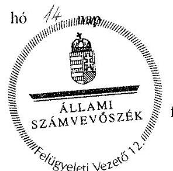

Pető Krisztina felügyeleti vezető

---

# Szociális és Gyermekvédelmi Főigazgatóság FŐIGAZGATÓ 

1132 Budapest, Visegrádi u. 49.
Telefon: (1) 769-1704, e-mail cím: batori.zsolt@szgyf.gov.hu

Iktatószám: SZGYF-IKT-9035- G/2016
Ügyintéző: dr. Rácz-Ujfalusi Edina
Telefon: +36 30/485-9465

## Állami Számvevőszék

Domokos László részére
elnök

## Budapest

Apáczai Csere János u. 10.
1052

Tárgy: válasz jelentéstervezetre
Hivatkozási szám: V-0939-143/2016.
Melléklet: -
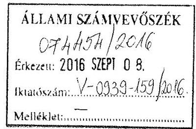

## Tisztelt Elnök Úr!

A fenti hivatkozási számon, „A központi alrendszer egyes intézményei pénzügyi és vagyongazdálkodási ellenőrzése - Viktor Speciális Otthon" címủ ellenőrzésről készült számvevőszéki jelentéstervezetükre - az Állami Számvevőszékről szóló 2011. évi LXVI. törvény 29. § (2) bekezdésében előírt törvényes határidőn belül - a Viktor Speciális Otthon (2133, Sződliget, Külterület; adószáma: 15395474-2-13; a továbbiakban: Intézmény) fenntartójaként, a Szociális és Gyermekvédelmi Főigazgatóság (a továbbiakban: SZGYF vagy fenntartó) nevében - a jelentéstervezet javaslatainak struktúráját követve - alábbi választ adom:

Észrevételeim megtétele előtt szeretném ismertetni T. Elnök Úrral a vizsgált intézmény váci telephelyének állami fenntartásába kerülésével kapcsolatos rendkívüli eseményeket, melyek érdemben meghatározták a fenntartói és intézményvezetői hatáskörben felmerülő intézkedések meghozatalát, valamint a jogszabályi előírásoknak való megfelelést.
2013. október 2-án a Szociális és Gyermekvédelmi Főigazgatóság akkori főigazgatója, Pintér Judit asszony tájékoztatta a Viktor Speciális Otthont a váci telephely megnyitásának szükségességéről. A leányfalui Ezüst Holdfény Egyesület fenntartásában működő Benefícium Szeretetszolgálat Duna Otthona (2016 Leányfalu, Boldogtanyái út 4) és Panoráma Otthona (2016 Leányfalu, Panoráma út 10) százmilliós nagyságrendű közüzemi tartozást halmozott fel, melynek kifizetése nem

---

történt meg fedezet hiányában. Emiatt a közüzemi szolgáltatók megszüntették az elektromos áram és földgázszolgáltatást, a gondozottak élelmezése, tisztálkodása nem volt megoldott, a fűtési szezon közeledtével azonnali beavatkozást igénylő rendkívüli helyzet állt elő: az intézményekben élő 79 fő gondozott ellátására kellett sürgős megoldást találni.
Az állam felelősséget vállalt az elesett, gondozásra szoruló emberek megsegítésére úgy, hogy a Vác, Naszály út 31. szám alatt álló épületet - melynek használója a Naszály-Galga Szakképzési és Szervezési Társaság volt - bentlakásos szociális intézményi ellátásra alkalmas épületté alakíttatta át az SZGYF.
2013. október 15-én Leányfaluról történt meg a gondozottak átköltöztetése.

A fenntartó és az intézmény elsődleges és legfontosabb célja a gondozottak biztonságos ellátásához szükséges személyi és tárgyi feltételek megteremtése volt. A rendkívüli körülmények között kellett az új telephely működésének kialakítását, szervezeti felépítését kialakítani, mely rendes körülmények között is időigényes folyamat és átgondolt, szervezett, előre megtervezett végrehajtást igényel.
Ezen rendkívüli körülmények között is mind a fenntartó, mind az intézmény kiemelt figyelmet fordított a szabályos működés megvalósításának és a jogszabályi előírásoknak való megfelelésnek.
A lakók ellátásának anyagi hátterét az SZGYF biztosította, és kijelenthetjük, hogy 2013. október 15. óta a lakók biztonságos ellátása folyamatosan, a jogszabályokban előírtaknak megfelelően történik.

Összefoglalva tehát elmondhatom, hogy a leányfalui Panoráma Otthon és a Duna Otthonban ellátottak Vácra költöztetése - a jelentéstervezet 5.1. számú megállapításától eltérően - nem elsősorban a középirányító előre tervezett, a végrehajtásra kellő időt hagyó döntése volt, hanem egy azonnali beavatkozást igénylő helyzet megoldása és az állami helytállási kötelezettség felvállalása.

# I. 

A Szociális és Gyermekvédelmi Főigazgatóságról szóló 316/2012. (XI.13.) Korm. rendelet (a továbbiakban: Statútum-rendelet) az alábbiak szerint rendelkezik:
„4. § (1) ${ }^{1}$ A Kormány a Főigazgatóságot jelöli ki
a) a megyei önkormányzatok konszolidációjáról, a megyei önkormányzati intézmények és a Fővárosi Önkormányzat egyes egészségügyi intézményeinek átvételéről szóló 2011. évi CLIV. törvény alapján átvett szociális és gyermekvédelmi intézményekkel, valamint a szociális és gyermekvédelmi tevékenységet végző alapítványokkal, közalapítványokkal, gazdasági társaságokkal kapcsolatos, 9. § (1) bekezdése szerinti,

[^0]
[^0]:    ${ }^{1}$ A 349/2012. (XII. 12.) Korm. rendelet 65. § szerinti szöveggel lép hatályba.

---

b) ${ }^{2}$ az egyes szakosított szociális és gyermekvédelmi szakellátási intézmények állami átvételéről és egyes törvények módosításáról szóló 2012. évi CXCII. törvény 2. § (3) bekezdése, a 9. § (1) bekezdése és a 9/A. § (2) bekezdése szerinti feladatok ellátására [az a) és b) pont szerinti intézmények a továbbiakban együtt: átvett intézmények].
(2) A szociális igazgatásról és szociális ellátásokról szóló 1993. évi III. törvény (a továbbiakban: Szt.) és a gyermekek védelméről és a gyámügyi igazgatásról szóló 1997. évi XXXI. törvény (a továbbiakban: Gyvt.) szerinti fenntartói feladatokat
a) a Főigazgatóság központi szerve látja el az 1. melléklet szerinti intézmények,
b) a kirendeltség látja el - az e rendelet szerint a Főigazgatóság központi szerve, illetve a főigazgató által ellátott feladatok kivételével - az átvett intézmények esetében.
6. § (2) ${ }^{3}$ A 4. § (2) bekezdése szerinti intézmények gazdálkodással összefüggő feladatait 2013. január 1-jétől a Főigazgatóság látja el. A 4. § (1) bekezdés a) pontja szerinti, önállóan működő átvett intézmény gazdálkodással összefüggő feladatait a megyei intézményfenntartó központ látja el."

Az idézett jogszabályok értelmében a Viktor Speciális Otthon a Statútum-rendelet 4. § (1) bek. a) pontja szerinti átvett intézmény. 2012. évben a Pest Megyei Intézményfenntartó Központ Pénzügyi, Gazdasági és Üzemeltetési Főosztály Pénzügyi és Számviteli Osztálya, 2013-2014. évben az SZGYF Pest Megyei Kirendeltségének Pénzügyi és Számviteli Osztálya látta el a könyvelési feladatokat.

# A jelentéstervezet SZGYF főigazgatójának mint az Intézmény középirányító szerve vezetőjének tett 3. számú javaslata: 

A fenntartó az általa fenntartott valamennyi intézmény tekintetében a közfeladat szabályszerű, hatékony és eredményes működtetése érdekében szabályzatokba foglalta a gazdálkodáshoz szükséges és nélkülözhetetlen követelményeket, intézményi mintaszabályzatok kiadásával segítette a szabályszerűséget és az intézményi sajátosságok figyelembevételével biztosította a belső szabályozók egységes állományát.
Az intézményi éves beszámolók adatainak éves elemzése után kerül megállapításra az egy ellátottra jutó, valamint az egy munkavállalóra jutó kiadások és támogatások összege, ezzel segítve országosan is az egységes költségvetési tervezés módszertanát. Az éves beszámoló adataiból, valamint az intézmények által küldött statisztikai adatokból az SZGYF Szakmai Irányítási Főosztálya az ágazatról összefoglaló jelentést készít, mely a szociális- és gyermekvédelmi ellátás átszervezését, esetleg újragondolását megalapozza.

[^0]
[^0]:    ${ }^{2}$ Módosította: 448/2013. (XI. 28.) Korm. rendelet 2. §.
    ${ }^{3}$ Megállapította: 419/2012. (XII. 29.) Korm. rendelet 6. § (1). Hatályos: 2012. XII. 31-től.

---

Az éves beszámolóhoz kapcsolódóan mind az SZGYF, mind az intézmények tekintetében évente elkészülnek és közzétételre kerülnek a szöveges beszámolók. A havi, negyedéves, éves költségvetési jelentésekből, valamint az CT-EcoSTAT gazdálkodási program központi hozzáféréséből adódóan a fenntartónak naprakész információi vannak az intézményi gazdálkodás aktuális állapotáról.

# II. Az SZGYF főigazgatójának mint az Intézmény gazdálkodási feladatait ellátó szervezet vezetőjének tett javaslatok: 

## 1. számú javaslat:

Az Intézmény 2010. május 7-ei dátummal kötött Együttműködési Megállapodást Pest Megye Önkormányzatának Hivatalával. Az Együttműködési Megállapodás XVI. Szabályzatok fejezet

 4. pontja részletesen felsorolja a módosítás nélkül alkalmazandó szabályzatokat. A jelentéstervezet 2.1. sz. megállapítás 4. bekezdése szerint az Intézmény nem rendelkezett gazdasági tárgyú szabályzatokkal, majd az 5. bekezdés szerint az intézményvezető a gazdasági szervezet számviteli szabályzataitól függetlenül készítette el a szabályzatait, mely megfelel az államháztartásról szóló 2011. évi CXCV. törvény (Áht.) 10. § (5) bekezdésének. Véleményem szerint az intézményvezető nem vétett a jogszabályok ellen, amikor intézménye tekintetében, az intézmény sajátosságait figyelembe véve kiadta a szabályzatokat.
A 2012. november 31-ei keltezésű Megállapodás, melyet az Intézmény a Pest Megyei Intézményfenntartó Központtal kötött, XVII. Szabályzatok pontja már lehetőséget ad a helyi sajátosságokkal való kiegészítésre a számviteli tárgyú szabályzatok esetében. Az SZGYF és az intézmény között kötött 2015. október 15-én létrejött Megállapodás 5. pontja az Intézményt érintő feladat és felelősség körében - az államháztartás számviteléről szóló 4/2013. (I.11.) Korm. rendeletben rögzítettek figyelembe vételével - rögzíti, hogy az Intézmény a helyi sajátosságoknak megfelelő szabályzatait elkészíti és jóváhagyásra megküldi az Intézményi Gazdálkodási Osztálynak.

## 2. számú javaslat:

A tájékoztatási kötelezettség kapcsán megjegyzi, hogy az Intézmény a saját hatáskörű előirányzat-módosításoknál nem minden esetben értesítette a jogszabályban előírt határidőn belül a Magyar Államkincstárt (a továbbiakban: MÁK). Ennek kapcsán tájékoztatom, hogy intézményi előirányzat-módosításra kizárólag a MÁK eAdat rendszerén keresztül, az EG03I bizonylatokon kerülhetett sor, így ez a megállapítás nem értelmezhető ebben az esetben, a tájékoztatási kötelezettség az elektronikus rendszer használatával garantált.

## 3.-4. számú javaslatok:

A javasolt intézkedések megtörténtek. A megbízási szerződéseket minden esetben jogi ellenjegyzéssel látjuk el a pénzügyi ellenjegyzés megtörténte előtt, utóbbi pedig megfelel az Áht. ellenjegyzésre, utalványozásra, érvényesítésre vonatkozó

---

jogszabályi rendelkezéseknek. Az érvényesítésre kiadott felhatalmazó leveleket a fenntartó tételesen felülvizsgálta, ahol nem volt meg a jogszabály által előírt iskolai végzettség, a felhatalmazó levelek visszavonásra kerültek.

# 5. számú javaslat: 

Az államháztartás központi alrendszerébe tartozó költségvetési szerveknek - az államháztartásról szóló törvény végrehajtásáról szóló 368/2011. (XII. 31.) Kormányrendelet (Ávr.) 122. § (1) bekezdése alapján - a bevételek beérkezésének és a kiadások teljesítésének ütemezéséről likviditási tervet kell készíteniük. A likviditási tervet a költségvetési év január 10-éig, majd ezt követően havonta, a tárgyhó ötödik napját megelőző munkanapig kell elkészíteni és a Kincstárnak megküldeni. Az űrlapot elektronikus formában, a MÁK internetes adattovábbítási rendszerén keresztül (rendkívüli esetben papír alapon, az illetékes szakmai főosztályhoz) kell benyújtani. Likviditási terv elkészítése esetében az Intézménynek csak adatszolgáltatási kötelezettsége volt először az Önkormányzat, majd a PMIK és az SZGYF gazdasági szervezete felé, likviditási tervet a gazdasági szervezet készített és továbbított.

## 6-7. számú javaslatok:

A jelentéstervezet szerint az Intézmény nem készítette el a mérlegben kimutatott források egyeztetéssel történő leltározását, valamint a leltár és a kiértékelések nem feleltek meg az Áhsz. 37. §-ában foglaltaknak. Tájékoztatom, hogy az SZGYF-hez tartozó valamennyi intézmény gazdasági eseményeit a CompuTREND Kft. által fejlesztett CT-EcoSTAT integrált ügyviteli program dolgozza fel. A program grafikus - Windows - felületen működik, amely kliens/szerver architektúrájú. A program MSSQL vagy ORACLE adatbázis-kezelőt használ. A programcsomag önálló ügyviteli szoftverként alkalmazható, olyan speciális interfészekkel rendelkezik, amelyek révén szervesen illeszthető bármilyen szakmai rendszerhez, így például a Magyarországon forgalomban lévő intézményi szakmai, önkormányzati vagy kórházi informatikai rendszerek legtöbbjéhez.
A fejlesztés során CompuTREND különös figyelmet fordított arra, hogy a program megfeleljen a költségvetési szervekkel szemben támasztott követelményeknek. A Pénzügyi és ÁFA Nyilvántartó Program, Tárgyi eszköz és Leltár modul a vonatkozó törvények és rendeletekben megfogalmazott szoftvertechnikai és pénzügy (adó-) technikai követelményeket kielégíti. A programrendszer jelenlegi verziója megfelel az államháztartás szervezetének sajátos beszámolási és könyvvezetési kötelezettségének, a főkönyvi kivonatot alátámasztó önálló modulok zárt rendszert alkotnak. A mérleg alátámasztásául szolgáló analitikák a modulokban megtalálhatóak, bármikor visszakereshetőek. A mérlegkészítési időszakban az egyeztetés megtörtént, a programból való nyomtatás maradt el, azok pótlására haladéktalanul intézkedtem.

---

# III. Egyéb megállapítások: 

## 1. 5. oldal. Főbb megállapítások, következtetések, javaslatok, 1. mondat:

Nem értünk egyet az általános megállapítással, mely összefoglalóan kijelenti, hogy „Az irányító és középirányító szerveknek az Intézményre vonatkozó feladatellátása nem volt szabályszerű.", ugyanis a „Megállapítások" rész több esetben tartalmaz a szabályszerű működésre és feladatellátásra vonatkozó megállapításokat, így a jelentés-tervezet több pontja egymásnak ellentmond.
Emellett nem veszi figyelembe, hogy az irányítószervi-, középirányító szervi szakmai ellenőrzések során hiányosságot nem tárt fel a vizsgálat, valamint az előirányzatok felhasználását az irányító szervek, középirányító szervek folyamatosan figyelemmel kísérték, az intézményre vonatkozó munkáltatói, és beszámoltatási jogosultságaikat szabályszerűen gyakorolták.
Ezért kérjük az első mondatot a következőképpen javítani: „Az irányító és középirányító szerveknek az Intézményre vonatkozó feladatellátása részben volt szabályszerű".
2. 5. oldal. Főbb megállapítások, következtetések, javaslatok, 2. bekezdés:

Ahogy a jelentéstervezet 21. oldalának 1. bekezdése is megerősíti, az Intézmény rendelkezett számviteli és gazdálkodási szabályzatokkal, amelyek alapján ellátta az intézményre vonatkozó feladatokat. A jelentés azonban nem szól ezek tartalmáról, egyéb, jogszabályi előírásoknak való tartalmi megfelelőségükről, holott a gyakorlat szempontjából ennek óriási jelentősége lenne. A 2012. évre vonatkozóan november 30-án került aláírásra az együttműködési megállapodás, melynek következtében az együttműködési megállapodásnak való megfelelésnek eleve nem is lehetett eleget tenni, viszont az intézmény vezetője gondoskodott megfelelő szabályzatok kialakításáról.
A bekezdés megállapítja, hogy - szabályszerű kijelölés hiányában - a gazdálkodást ellátó szervek nem biztosították a felelősségi körök érvényre juttatását. A jelentés azonban itt sem említi annak tényét, hogy a kijelölt személyek egyéb tekintetben megfeleltek a jogszabály által előírt képzettségi, végzettségi követelményeknek, valamint érvényesültek az összeférhetetlenségre vonatkozó szabályok. Kérjük ezek szerepeltetését a jelentésben.

## 3. 17. oldal. Összegző megállapítás:

Az 1.1. és 1.3. megállapítások számos pontban részletezik azokat a megállapításokat, amelyek a szabályos és hatékony működést támasztják alá. Ezért érthetetlen, hogy az összegző megállapítás miért „nem szabályszerű" minősítést ad a témakörre. Kérjük „Részben szabályszerű" minősítésre javítani.

---

# 4. 18. oldal. 1. 2. megállapítás: 

Az erőforrásokkal való szabályszerű és hatékony gazdálkodás már csak azáltal is megvalósult, hogy - a kötelezettségvállalási, beszerzési szabályzatokkal összhangban - a beszerzések esetében három árajánlat bekérése minden esetben megtörtént, emellett a közbeszerzési törvény előírásai is betartásra kerültek. A középirányító szervek a hatékonyság érdekében a beszerzések jelentős részét központosították vagy keret-megállapodások útján tették elérhetővé az intézmények részére, így olcsóbban tudtak az intézmények hozzájutni a szükséges eszközökhöz, anyagokhoz, szolgáltatásokhoz.

## 5. 23. oldal 2.5. megállapítás 2. francia bekezdés:

Az intézményrendszer működtetett olyan belső kontrollrendszert, amelynek keretében a felelősségi szintek kialakításra kerültek, azonban ezek nem feltétlenül az intézménynél jelentek meg, hanem a fenntartó szervezetnél.
6. 23. oldal 2.5. megállapítás utolsó előtti mondata a nem tervezett ellenőrzésről:
A bejelentés jogosságát csak részben fogadta el az ellenőrzés, ugyanis több bejelentésről bebizonyosodott, hogy alaptalan, rosszindulatú bejelentésről van szó (pl. humánpolitikával foglalkozó személy végzettsége, eltérő bérezés, stb.). Kérjük emiatt a „részben elfogadta" szóösszetétel alkalmazását.

## 7. 24. oldal 3.2. megállapítás:

Mivel a megállapítás hiányosságot nem tárt fel, ezért kérjük a minősítésből a „részben" szó törlését, azaz a „megfelelő" minősítés alkalmazását.

## 8. 25. oldal első, az előző oldalról áthúzódó mondata:

Az irányítószervi támogatás elmaradása nem róható fel az Intézménynek, annak elszenvedője, nem okozója volt ugyanis az Intézmény.

## 9. 31. oldal 4. 1. megállapítás 2. bekezdése:

A jelentéstervezet nem nevezi meg pontosan, hogy mikor került megkötésre a vagyonkezelési szerződés az MNV Zrt. és a PMIK között. Kérjük ennek kiegészítését, mivel a szerződés létrejöttének dátumára a PMIK-nek nem volt befolyása.

## 10. 34. oldal 5.1. bekezdés:

A tervezet nem szól arról a tényről, hogy a leányfalui otthonok átvételére rendkívüli körülmények között került sor, ahol a korábbi egyházi fenntartó jogszabálysértő határidővel és állapotban adta át az intézményeket, ezáltal az volt az elsődleges cél, hogy az ellátottak alapvető létfeltételei biztosítva legyenek. Mindezt megfelelő ingatlan és megfelelő szakmai és adminisztratív előzmények között kellett megtenni.

---

Az átvétel körülményeiről jelen levél első szakaszában adunk részletes tájékoztatást. Véleményünk szerint a jelentés-tervezet ezzel való kiegészítése indokolt.

Kérem Tisztelt Elnök Urat észrevételeink figyelembevételére, és a jelentéstervezet ennek megfelelő módosítására.

Budapest, 2016. 2017. 2.

Tisztelettel:
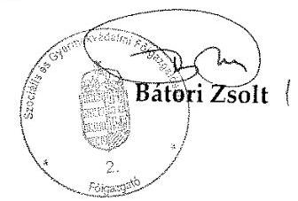

---

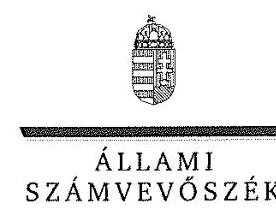

ELNÖK

# Bátori Zsolt úr 

főigazgató
Szociális és Gyermekvédelmi Főigazgatóság

## Budapest

## Tisztelt Főigazgató Úr!

„A központi alrendszer egyes intézményei pénzügyi és vagyongazdálkodásának ellenőrzése Viktor Speciális Otthon" címmel készített számvevőszéki jelentéstervezetre tett észrevételét köszönettel megkaptam.
Az Állami Számvevőszék észrevételre vonatkozó álláspontjáról a felügyeleti vezető által készített részletes tájékoztatást csatoltan megküldöm.
Tájékoztatom Főigazgató urat, hogy a számvevőszéki jelentésben - az Állami Számvevőszékről szóló 2011. évi LXVI. törvény 29. § (3) bekezdése alapján - a figyelembe nem vett észrevételeket szerepeltetjük az elutasítás indokának feltüntetésével.
Budapest, 2016. 24.10.2016. hó 28. nap
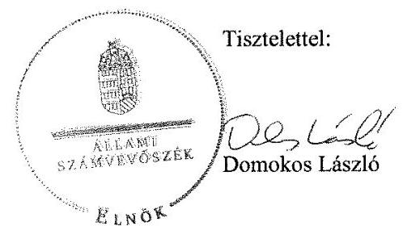

Melléklet: Tájékoztatás az elfogadott és az el nem fogadott észrevételekről

---

# Tájékoztatás az elfogadott és az el nem fogadott észrevételekról 

„A központi alrendszer egyes intézményei pénzügyi és vagyongazdálkodásának ellenőrzése Viktor Speciális Otthon" című jelentéstervezetre az SZGYF-IKT-9035-6/2016. iktatószámú levelében tett észrevételeit áttekintettük, annak kezeléséről az alábbi tájékoztatást adom.

## 1. A váci telephely működését ismertető általános észrevétele kapcsán

Köszönettel vettem a Viktor Speciális Otthon (továbbiakban: Intézmény) váci telephelye állami fenntartásba kerülésének rendkívüli körülményeit ismertető tájékoztatását. Tekintettel arra, hogy tájékoztatása a jelentéstervezet megállapításait nem cáfolta, így azokat nem módosítja.

## 2. Az I. pontban tett általános észrevétele kapcsán

Köszönettel vettem a jogszabályi rendelkezésekben foglaltakról szóló tájékoztatását, amely a jelentéstervezet megállapításaihoz kapcsolódó észrevételt nem fogalmaz meg, ezért azokat nem módosítja.

## 3. Az I. pontban, az SZGYF főigazgatójának, mint az Intézmény középirányító szerve vezetőjének tett 3. számú javaslata kapcsán

Köszönettel vettem tájékoztatását, hogy a Szociális és Gyermekvédelmi Főigazgatóság (a továbbiakban: SZGYF) mintaszabályzatok kiadásával segítette a szabályszerűséget és az intézményi sajátosságok figyelembe vételével biztosította a belső szabályozók egységes állományát. Kiemelte, hogy az intézmények éves beszámoló adatainak elemzése során mutatószámok számítanak, ezzel is segítve az egységes költségvetési tervezés módszertanát. Ismertette, hogy az éves beszámolók és az intézményi statisztikai adatszolgáltatások alapján készített összefoglaló jelentések hozzájárulnak a szociális- és gyermekvédelmi ellátás átszervezése újragondolásához, továbbá naprakész információval rendelkeznek az intézményi gazdálkodás aktuális állapotáról.
Észrevételében foglaltak nem feleltethetők meg a Szociális és Gyermekvédelmi Főigazgatóságról szóló 316/2012. (XI. 13.) Korm. rendelet 3. § (2) bekezdés g) pontjában foglalt előírásnak, az erőforrásokkal való szabályszerű és hatékony gazdálkodáshoz szükséges követelmények közfeladat-ellátásra vonatkozó érvényesítésének és számonkérésének, ezért nem fogadható el. Észrevétele a megállapítást nem módosítja.

## 4. A II. pontban, az SZGYF főigazgatójának, mint az Intézmény gazdálkodási feladatait ellátó szervezet vezetőjének tett észrevételei kapcsán

## 1. számú javaslat

Köszönettel vettem tájékoztatását, hogy az SZGYF és az Intézmény között 2015. október 15-én megkötésre került az új megállapodás. Észrevétele az ellenőrzött időszakban megállapított szabálytalanságot nem cáfolta, az az ellenőrzött időszakon túlmutat, ezért a megállapítást nem mó-

---

dosítja. Megjegyezni kívánom, hogy az ÁSZ nem kifogásolta megállapításában az államháztartásról szóló 2011.
 évi CXCV. törvény 10. § (5) bekezdés rendelkezéseinek való megfelelést. Észrevételét - a jelentéstervezet 2.1. sz. megállapítás 6. és 7. bekezdésében foglaltakra - nem fogadtuk el a dokumentumok ismételt áttekintését követően. A 2012. november 30-ai keltezésű Együttműködési Megállapodás „Szabályzatok" fejezetében foglalt előírások nem érvényesültek, a szabályzatok hatályba léptető záradékolása elmaradt, az együttműködési megállapodásban és az államháztartás számviteléről szóló 4/2013. (I. 11.) Korm. rendelet 50. § (1) bekezdésében foglaltaknak a szabályzatok tartalma és kiadása nem felelt meg. Észrevétele ezért a megállapításokat nem módosítja.

# 2. számú javaslat 

Észrevétele a jelentéstervezet 3.2. számú megállapítás 1. bekezdésének megállapítását, a Magyar Államkincstár határidőn túli tájékoztatását nem kifogásolta, ezért észrevétele a megállapítást nem módosítja.

## 3-4. számú javaslatok

A 3-4. számú javaslatban foglaltakkal kapcsolatos intézkedés végrehajtására vonatkozó tájékoztatását köszönöm. Észrevétele a megállapításokat nem cáfolta, az az ellenőrzött időszakon túlmutat, ezért a megállapításokat nem módosítja.

## 5. számú javaslat

A jelentéstervezet 3.5. számú megállapítás 1. bekezdésének második, a gazdálkodási feladatokat ellátó szervezet feladatellátását érintő megállapítására tett észrevételét a dokumentumok ismételt áttekintését követően nem fogadjuk el. A jogszabályi előírás szerinti, a gazdálkodási feladatokat ellátó szervezet által elkészített likviditási terv a 2012-2014. évre vonatkozóan nem állt rendelkezésre. Észrevétele ezért a megállapítást nem módosítja.

## 6-7. számú javaslatok

Jelezni kívánom, hogy a jelentéstervezetben az SZGYF főigazgatójának, mint az Intézmény gazdálkodási feladatait ellátó szervezet vezetőjének szóló 6. és 7. számú javaslat a jelentéstervezet 4.2. számú megállapítás 3. bekezdésére, továbbá a 4.2. számú megállapítás 5. bekezdésének 3. mondatára hivatkozik.

A jelentéstervezet 4.2. számú megállapítás 5. bekezdés megállapításaira tett észrevételét nem fogadjuk el. Észrevétele megerősíti a megállapításokban foglaltakat, hogy az Intézmény 2012-2014. évi mérlegében kimutatott források egyeztetéssel történő leltározását nem végezték el, a források tekintetében a leltár és annak kiértékelése nem készült el. Az alkalmazott szoftver által biztosított visszakereshetőség önmagában nem jelenti az egyeztetés elvégzését, az egyezőség megállapítását tartalmazó dokumentumnak az egyeztetés során történt elkészítését, a leltár és a kiértékelés jogszabályi és belső szabályzatok előírásainak való megfelelőségét. Észrevétele ezért a megállapításokat nem módosítja.

---

# 5. A III. pontban, az egyéb megállapításokhoz tett észrevételei kapcsán 

## 1. Az 5. oldal „Főbb megállapítások, következtetések, javaslatok" fejezet 1. mondatára tett észrevétele kapcsán

Észrevételét nem fogadjuk el. Az ellenőrzést az ellenőrzési program szempontjai, az ellenőrzött időszakban hatályos jogszabályok, az ellenőrzés szakmai szabályai, a jelen ellenőrzésre irányadó ÁSZ módszertan és a nemzetközi standardok figyelembevételével végeztük. Az ellenőrzési kérdések megválaszolásához szükséges bizonyítékok megszerzése az ellenőrzött szervezetek által rendelkezésre bocsátott dokumentumokra, adatokra alapozva kérdésfeltevés, mintavételezés, valamint elemző eljárás útján történt. Szövegjavaslatát erre tekintettel nem áll módunkban elfogadni.

## 2. Az 5. oldal „Főbb megállapítások, következtetések, javaslatok" fejezet" 2. bekezdésére tett észrevétele kapcsán

A jelentéstervezet „Főbb megállapítások, következtetések, javaslatok" fejezet 2. bekezdés megállapításaira tett észrevételét, hogy az intézményvezető gondoskodott a megfelelő szabályzatok kialakításáról - a dokumentumok ismételt felülvizsgálatát követően - nem fogadjuk el. Az együttműködési megállapodásokban előírt módon és tartalommal kiadott számviteli, gazdálkodási szabályzatokkal az Intézmény az ellenőrzött időszakban nem rendelkezett, mert az Intézmény gazdálkodási feladatait ellátó szervek számviteli, gazdálkodási szabályzatait az intézményvezető nem vette át és nem léptette hatályba. Továbbá a megállapítás kiegészítésére vonatkozó észrevételét a szabálytalanul kijelölt gazdálkodási jogkörgyakorlók képzettségi, végzettségi, valamint összeférhetetlenségi szabályoknak való megfelelőségével kapcsolatban nem fogadjuk el. Észrevétele a megállapításokat nem cáfolta ezért azokat nem módosítja.

## 3. A 17. oldal Összegző megállapítására tett észrevétele kapcsán

A jelentéstervezet 17. oldalán található összegző megállapítás, az észrevételében is leírtakra figyelemmel, jelenleg az „összességében nem volt szabályszerű" minősítést fogalmaz meg.
Az ellenőrzést az ellenőrzési program szempontjai, az ellenőrzött időszakban hatályos jogszabályok, az ellenőrzés szakmai szabályai, a jelen ellenőrzésre irányadó ÁSZ módszertan és a nemzetközi standardok figyelembevételével végeztük. Az ellenőrzési kérdések megválaszolásához szükséges bizonyítékok megszerzése az ellenőrzött szervezetek által rendelkezésre bocsátott dokumentumokra, adatokra alapozva kérdésfeltevés, mintavételezés, valamint elemző eljárás útján történt. Észrevétele megállapítást nem cáfol, ezért szövegjavaslatát nem áll módunkban elfogadni.

## 4. A 18. oldal. 1.2. megállapítására tett észrevétele kapcsán

Észrevételét a jelentéstervezet 1.2. számú megállapítására vonatkozóan nem fogadjuk el. Az észrevételben jelzettek a beszerzések esetében a három árajánlat bekérése, valamint a közbeszerzési törvény előírásai betartása, a beszerzések központosítása nem fedi le az erőforrásokkal való szabályszerű és hatékony gazdálkodáshoz szükséges követelmények közfeladat ellátására vonatkozó érvényesítését és számonkérését. Észrevétele ezért a megállapítást nem módosítja.

---

# 5. A 23. oldal 2.5. megállapítás 2. francia bekezdésére tett észrevétele kapcsán 

Észrevétele a jelentéstervezet 2.5. számú megállapítás 2. bekezdésének második francia bekezdésében tett megállapítást nem cáfolja, így azt nem módosítja.

## 6. A 23. oldal 2.5. megállapítás utolsóelőtti mondatára - a nem tervezett ellenőrzésről - tett észrevétele kapcsán

A dokumentumok ismételt áttekintését követően a jelentéstervezet 23. oldal 4. bekezdés negyedik megállapítására tett észrevételét elfogadom és a számvevőszéki jelentés készítésénél figyelembe vesszük.

## 7. A 24. oldal 3.2. megállapítására tett észrevétele kapcsán

Észrevételét a jelentéstervezet 3.2. számú megállapítására nem fogadjuk el. Észrevétele megállapítást nem cáfol, ezért szövegjavaslatát nem áll módunkban elfogadni.

## 8. A 25. oldal első, az előző oldalról áthúzódó mondatára tett észrevétele kapcsán

Jelezni kívánom, hogy észrevétele a 25. oldal utolsó francia bekezdésének megállapítását érinti. A jelentéstervezet 3.3. számú megállapítás első bekezdés első francia bekezdésének megállapításaira tett észrevételét elfogadom és a számvevőszéki jelentés készítésénél figyelembe vesszük.

## 9. A 31. oldal 4.1. megállapítás 2. bekezdésére tett észrevétele kapcsán

A jelentéstervezet 4.1. számú megállapítás 2. bekezdés első megállapítására tett észrevételét nem fogadjuk el. Észrevételében a megállapítás kiegészítését kérte a vagyonkezelési szerződés megkötésének időpontjával, amely információ a megállapítás tekintetében nem lényeges, megjelenítése nem indokolt, nem befolyásolja a megállapításban foglaltakat. Észrevétele ezért a megállapítást nem módosítja.

## 10. A 34. oldal 5.1. bekezdésére/fejezetére tett észrevétel kapcsán

A jelentéstervezet 5.1. számú fejezet megállapításaira vonatkozó, a leányfalui otthonok átvételének körülményeiről szóló tájékoztatását köszönettel vettem. Észrevétele az 5.1. számú fejezet megállapításait nem cáfolta, ezért a megállapításokat nem módosítja.

Budapest, 2016. leptcubet hó
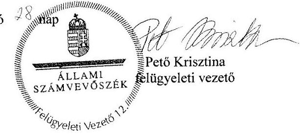

---

# RÖVIDÍTÉSEK JEGYZÉKE 

${ }^{1}$ ÁSZ
${ }^{2}$ Intézmény
${ }^{3}$ alapító okirat ${ }_{1}$
alapító okirat ${ }_{2}$
alapító okirat ${ }_{3}$
alapító okirat ${ }_{4}$
${ }^{4}$ 2011. évi CLIV. törvény
${ }^{5}$ KIM
${ }^{6}$ 419/2012. (XII. 29.) Korm. rendelet
${ }^{7}$ EMMI
${ }^{8}$ 258/2011. (XII. 7.) Korm. rendelet
${ }^{9}$ SZGYF Kirendeltsége
${ }^{10}$ intézményvezető
${ }^{11}$ Nvtv.
${ }^{12}$ Áht. ${ }_{1}$
Áht. ${ }_{2}$
${ }^{13}$ Ávr.
${ }^{14}$ Ámr.
${ }^{15}$ Bkr.
${ }^{16}$ ÁSZ tv.
${ }^{17}$ irányító szerv ${ }_{1}$
irányító szerv ${ }_{2}$
irányító szerv ${ }_{3}$
${ }^{18}$ középirányító szerv ${ }_{1}$
középirányító szerv ${ }_{2}$
${ }^{19}$ fenntartó ${ }_{1}$
fenntartó ${ }_{2}$
fenntartó ${ }_{3}$

Állami Számvevőszék
Viktor Speciális Otthon, Sződliget
Viktor Speciális Otthon Alapító Okirata (hatályos: 2011. április 28-ig)
Viktor Speciális Otthon Alapító Okirata (hatályos: 2011. április 29-től 2012. szeptember 13-ig)
Viktor Speciális Otthon Alapító Okirata (hatályos: 2012. szeptember 14-től 2013. június 30-ig)
Viktor Speciális Otthon Alapító Okirata (hatályos: 2013. január 1-jétől)
2011. évi CLIV. törvény a megyei önkormányzatok konszolidációjáról, a megyei önkormányzati intézmények és a Fővárosi Önkormányzat egyes egészségügyi intézményeinek átvételéről (hatályos: 2011. november 26-tól)
Közigazgatási és Igazságügyi Minisztérium
419/2012. (XII. 29.) Korm. rendelet a megyei intézményfenntartó központok működésével összefüggő egyes kormányrendeletek módosításáról (hatályos: 2012. december 31-től 2013. január 2-ig)
Emberi Erőforrások Minisztériuma
258/2011. (XII. 7.) Korm. rendelet a megyei intézményfenntartó központokról, valamint a megyei önkormányzatok konszolidációjával, a megyei önkormányzati intézmények és a Fővárosi Önkormányzat egészségügyi intézményeinek átvételével összefüggő egyes kormányrendeletek módosításáról (hatályos: 2011. december 8-tól)
Szociális és Gyermekvédelmi Főigazgatóság Pest Megyei Kirendeltsége
Viktor Speciális Otthon vezetője
2011. évi CXCVI. törvény a nemzeti vagyonról (hatályos: 2012. január 1-jétől)
1992. évi XXXVIII. törvény az államháztartásról (hatályos: 2011. december 31-ig)
2011. évi CXCV. törvény az államháztartásról (hatályos: 2012. január 1-jétől)
368/2011. (XII. 31.) Korm. rendelet az államháztartásról szóló törvény végrehajtásáról (hatályos: 2012. január 1-jétől)
292/2009. (XII. 19.) Korm. rendelet az államháztartás működési rendjéről (hatályos: 2011. december 31-ig)
370/2011. (XII. 31.) Korm. rendelet a költségvetési szervek belső kontrollrendszeréről és belső ellenőrzéséről (hatályos: 2012. január 1-jétől)
2011. évi LXVI. törvény az Állami Számvevőszékről (hatályos: 2011. július 1-jétől)
Pest Megye Önkormányzatának Közgyűlése (2011. december 31-ig)
Közigazgatási és Igazságügyi Minisztérium (2012. január 1-jétől 2012. december 31-ig)
Emberi Erőforrások Minisztériuma (2013. január 1-jétől)
Pest Megyei Intézményfenntartó Központ (2012. január 1-jétől 2013. március 31-ig)
Szociális és Gyermekvédelmi Főigazgatóság (2013. április 1-jétől)
Pest Megye Önkormányzata (2011. december 31-ig)
Pest Megyei Intézményfenntartó Központ (2012. január 1-jétől 2013. március 31-ig)
Szociális és Gyermekvédelmi Főigazgatóság (2013. április 1-jétől)

---

${ }^{20}$ PMÖ
${ }^{21}$ Szoctv.
${ }^{22}$ 316/2012. (XI. 13.) Korm. rendelet
${ }^{23}$ SZMSZ1
SZMSZ2
SZMSZ3
${ }^{24}$ Vnytv.
${ }^{25}$ Ber.
${ }^{26}$ Együttműködési Megállapodás ${ }_{1}$
Együttműködési Megállapodás ${ }_{2}$
${ }^{27}$ gazdasági szervezet ${ }_{1}$
gazdasági szervezet ${ }_{2}$
gazdasági szervezet ${ }_{3}$
${ }^{28}$ PMÖH
${ }^{29}$ SZGYF 23/2013. (IX. 2.) számú utasítása
${ }^{30}$ számviteli politika ${ }_{1}$
számviteli politika ${ }_{2}$
${ }^{31}$ eszközök és források értékelési szabályzat
${ }^{32}$ pénzkezelési szabályzat ${ }_{1}$
pénzkezelési szabályzat ${ }_{2}$
${ }^{33}$ leltározási szabályzat ${ }_{1}$
leltározási szabályzat ${ }_{2}$
${ }^{34}$ kockázatkezelési szabályzat ${ }_{1}$
kockázatkezelési szabályzat ${ }_{2}$
${ }^{35}$ Info tv.
${ }^{36}$ Eitv.
${ }^{37}$ 5/2012. (III. 1.) NGM rendelet
${ }^{38}$ 10/2013. (III. 13.) NGM rendelet
${ }^{39}$ Ügyrend ${ }_{1}$

Pest Megye Önkormányzata
1993. évi III. törvény a szociális igazgatásról és szociális ellátásokról
316/2012. (XI. 13.) Korm. rendelet a Szociális és Gyermekvédelmi Főigazgatóságról (hatályos: 2012. november 16-tól)
Viktor Speciális Otthon Szervezeti és Működési Szabályzata (hatályos: 2011. november 30-ig)
Viktor Speciális Otthon Szervezeti és Működési Szabályzata (hatályos: 2012. december 1-jétől 2014. szeptember 30-ig)
Viktor Speciális Otthon Szervezeti és Működési Szabályzata (hatályos: 2014. október 1-jétől)
2007. évi CLII. törvény az egyes vagyonnyilatkozat-tételi kötelezettségekről
193/2003. (XI. 26.) Korm. rendelet a költségvetési szervek belső ellenőrzéséről (hatályos: 2011. december 31-ig)
Együttműködési Megállapodás a Viktor Speciális Otthon és Pest Megye Önkormányzata között, kelt 2010. május 7-én
Együttműködési Megállapodás a Viktor Speciális Otthon és a Pest Megyei Intézményfenntartó Központ között, kelt 2012. november 30-án
Pest Megyei Önkormányzati Hivatal (a 2011. évben)
Pest Megyei Intézményfenntartó Központ (2012. január 1-jétől 2013. március 31-ig)
Szociális és Gyermekvédelmi Főigazgatóság Pest Megyei Kirendeltsége (2013. április 1-jétől)
Pest Megye Önkormányzatának Hivatala
Szociális és Gyermekvédelmi Főigazgatóság Gazdálkodási Szabályzata 2013.
Viktor Speciális Otthon számviteli politikája (hatályos: 2014. május 14-ig)
Viktor Speciális Otthon számviteli politikája (hatályos: 2014. május 15-től)
Viktor Speciális Otthon eszközök és források értékelési szabályzata (hatályos: 2012. december 15-től)

Viktor Speciális Otthon pénzkezelési szabályzata (hatályos: 2014. május 14-ig)
Viktor Speciális Otthon pénzkezelési szabályzata (hatályos: 2014. május 15-től)
Viktor Speciális Otthon leltározási és leltárkészítési szabályzata (hatályos: 2014. május 14-ig)
Viktor Speciális Otthon leltározási és leltárkészítési szabályzata (hatályos: 2014. május 15-től)

Viktor Speciális Otthon Kockázatkezelési Szabályzata (hatályos: 2012. január 15-ig)
Viktor Speciális Otthon Kockázatkezelési szabályzata (hatályos: 2012. január 16-tól)
2011. évi CXII. törvény az információs önrendelkezési jogról

 és az információszabadságról (hatályos: 2011. július 27-től)
2005. évi XC. törvény az elektronikus információszabadságról (hatályos: 2011. december 31-ig)
5/2012. (III. 1.) NGM rendelet az elemi költségvetésről (hatályos: 2012. március 2-től 2013. március 13-ig)
10/2013. (III. 13.) NGM rendelet az elemi költségvetésről (hatályos: 2013. március 14-től 2013. december 31-ig)
Viktor Speciális Otthon Gazdasági Szervezet Ügyrendje 2009., kiadta az intézményvezető (hatályos: 2014. május 14-ig)

---

| Ügyrend $_{2}$ | Viktor Speciális Otthon Ügyrend 2014., kiadta az intézményvezető (hatályos: 2014. május 15-től) |
| :--: | :--: |
| Ügyrend 3 | PMÖ hivatala és részben önálló költségvetési szerveinek Gazdasági Szervezet Ügyrendje 2008., |
| Ügyrend 4 | PMIK Pénzügyi, Gazdasági és Üzemeltetési Főosztály Ügyrendje 2012 |
| Ügyrend 5 | SZGYF Ügyrendje 2013 |
| ${ }^{40}$ Kincstár | Magyar Államkincstár |
| ${ }^{41}$ 352/2010. (XII.30.) számú Korm. rendelet | 352/2010. (XII. 30.) Korm. rendelet a költségvetési szerveknél foglalkoztatottak 2011. évi kompenzációjáról |
| ${ }^{42}$ BM | Belügyminisztérium |
| ${ }^{43} \mathrm{Kbt} .1$ | 2003. évi CXXIX. törvény a közbeszerzésekről (hatályos: 2011. december 31-ig) |
| Kbt. 2 | 2011. évi CVIII. törvény a közbeszerzésekről (hatályos: 2011. augusztus 21-től) |
| ${ }^{44}$ NGM rendelet | 36/2013. (IX. 13.) NGM rendelet az államháztartás számvitelének 2014. évi megváltozásával kapcsolatos feladatokról (hatályos: 2013. szeptember 14-től 2014. december 31-ig) |
| ${ }^{45}$ vagyonrendelet | 11/2003. (VI. 20.) Pm. sz. rendelete az önkormányzat vagyonáról, a vagyongazdálkodás szabályairól |
| ${ }^{46}$ Mök. tv. | 2011. évi CLIV. törvény a megyei önkormányzatok konszolidációjáról, a megyei önkormányzati intézmények és a Fővárosi Önkormányzat egyes egészségügyi intézményeinek átvételéről (hatályos: 2012. január 1-jétől) |
| ${ }^{47}$ Vtv. | 2007. évi CVI. törvény az állami vagyonról |
| ${ }^{48}$ Áhsz. 1 | 249/2000. (XII. 24.) Korm. rendelet az államháztartás szervezetei beszámolási és könyvvezetési kötelezettségének sajátosságairól (hatályos: 2013. december 31-ig) |
| Áhsz. 2 | 4/2013. (I. 11.) Korm. rendelet az államháztartás számviteléről (hatályos: 2014. január 1-jétől) |
| ${ }^{49}$ Számv. tv. | 2000. évi C. törvény a számvitelről |
| ${ }^{50}$ Vtvr. | 254/2007. (X. 4.) Korm. rendelet az állami vagyonról való gazdálkodásról |
| ${ }^{51}$ 1/2000. (I. 7.) SzCsM rendelet | 1/2000. (I. 7.) SzCsM rendelet a személyes gondoskodást nyújtó szociális intézmények szakmai feladatairól és működésük feltételeiről |
| ${ }^{52}$ 321/2009. (XII. 29.) Korm. rendelet | 321/2009. (XII. 29.) Korm. rendelet a szociális szolgáltatók és intézmények működési engedélyezéséről és ellenőrzéséről (hatályos: 2013. november 30-ig) |
| ${ }^{53} 369 / 2013$. (X. 24.) Korm. rendelet | 369/2013. (X. 24.) Korm. rendelet a szociális, gyermekjóléti és gyermekvédelmi szolgáltatók, intézmények és hálózatok hatósági nyilvántartásáról és ellenőrzéséről (hatályos: 2013. december 1-jétől) |

---

# ÁLLAMI SZÁMVEVŐSZÉK 

1052 Budapest, Apáczai Csere János utca 10.
Levélcím: 1364 Budapest 4. Pf. 54
Telefon: +36 14849100 Telefax: +36 14849200
www.asz.hu
