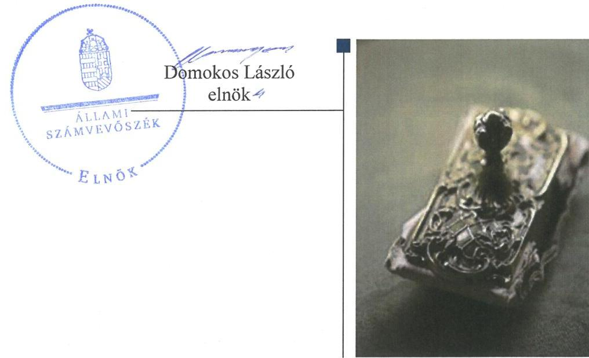

# Jelentés 

## A helyi nemzetiségi önkormányzatok gazdálkodása

A helyi nemzetiségi önkormányzatok gazdálkodása szabályszerűségének ellenőrzése - Rétság Város Cigány Nemzetiségi Önkormányzat 2016.

16166
www.asz.hu

---

# Jelentés 

## A helyi nemzetiségi önkormányzatok gazdálkodása

A helyi nemzetiségi önkormányzatok gazdálkodása szabályszerűségének ellenőrzése - Rétság Város Cigány
Nemzetiségi Önkormányzat
2016. 10. hó 19. nap

---

# AZ ELLENŐRZÉST FELÜGYELTE: 

RENKÓ ZSUZSANNA felügyeleti vezető

## AZ ELLENŐRZÉST VEZETTE ÉS A VÉGREHAJTÁSÁÉRT FELELŐS:

2015.10.21-ig BALKAY ATTILA ellenőrzésvezető
2016.05.18-ig BALÁS ELEMÉR ATTILA ellenőrzésvezető
2016.05.19-től KAKAS SÁNDOR ellenőrzésvezető

A PROGRAM ÖSSZEÁLLÍTÁSÁÉRT FELELŐS:
JANIK JÓZSEF LÁSZLÓ osztályvezető

IKTATÓSZÁM: V-0860-071/2016
TÉMASZÁM: 1894
ELLENŐRZÉS-AZONOSÍTÓ SZÁM: V071403

---

# TARTALOMJEGYZÉK 

■ ÖSSZEGZÉS ..... 5
■ AZ ELLENŐRZÉS CÉLJA ..... 7
■ AZ ELLENŐRZÉS TERÜLETE ..... 8
■ AZ ELLENŐRZÉS HÁTTERE, INDOKOLTSÁGA ..... 9
■ A JELENTÉS LÉNYEGES KÉRDÉSKÖREI ..... 10
■ ELLENŐRZÉS HATÓKÖRE ÉS MÓDSZEREI ..... 11
■ MEGÁLLAPÍTÁSOK ..... 13
■ JAVASLATOK ..... 20
■ MELLÉKLETEK ..... 23
I. sz. melléklet: Értelmező szótár ..... 23
II. sz. melléklet: Rétság Város Cigány Nemzetiségi Önkormányzat 2014. évi gazdálkodási adatai ..... 25
■ FÜGGELÉK: ÉSZREVÉTELEK ..... 27
■ RÖVIDÍTÉSEK JEGYZÉKE ..... 29

---

.

---

# ÖSSZEGZÉS 

Az Állami Számvevőszék Rétság Város Cigány Nemzetiségi Önkormányzat 2014. évi gazdálkodása szabályszerűségét ellenőrizte. A Települési Önkormányzattal ${ }^{1}$ kötött Együttműködési megállapodással ${ }^{2}$ rendelkezett, tartalma azonban hiányos volt és felülvizsgálatára nem került sor. A pénzügyi ellenjegyzési feladatok ellátására és a teljesítésigazolásra jogosult személyeket nem jelölték ki. Az operatív gazdálkodási jogkörök gyakorlása során a kulcsszerepet betöltő kontrollokat nem működtették. A Nemzetiségi Önkormányzat ${ }^{3}$ nem rendelkezett hatályos Szervezeti és Működési Szabályzattal. A belső ellenőrzés nem volt biztosított.

## Az ellenőrzés társadalmi indokoltsága

Az Állami Számvevőszék középtávra szóló stratégiájában megfogalmazta, hogy az államháztartás komplex folyamatainak átláthatósága érdekében rendszerszemléletű/holisztikus megközelítésű, egymásra épülő, a szinergiahatást kihasználó, összefoglaló értékelésre lehetőséget adó ellenőrzéseket végez. Az államháztartás önkormányzati alrendszerébe tartozó helyi nemzetiségi önkormányzatok ellenőrzése során az Állami Számvevőszék feltárja a működésükben rejlő kockázatokat előmozdítva a közpénzügyek átláthatóságát, rendezettségét.

Az Állami Számvevőszék a stratégiai céljával összhangban - az ÁSZ tv. ${ }^{4}$ felhatalmazása alapján - végzi a közpénzekkel és a nemzeti vagyonnal való felelős gazdálkodás, valamint a helyi önkormányzatok számviteli rendje betartásának és belső kontrollrendszere működésének ellenőrzését, továbbá segíti az integritás alapú, átlátható és elszámoltatható közpénzfelhasználás megteremtését.

## Főbb megállapítások, következtetések, javaslatok

A Nemzetiségi Önkormányzat működési feltételeinek és a gazdálkodással összefüggő végrehajtási feladatoknak a szabályozása nem felelt meg a jogszabályi előírásoknak. A Nemzetiségi Önkormányzat rendelkezett megállapodással a Települési Önkormányzattal történő együttműködésre. Az Együttműködési megállapodás tartalma a jogszabályban előírtakhoz képest hiányos volt, amelynek következtében sérült az önkormányzat gazdálkodási feltételeinek szabályszerű biztosítása. Az Együttműködési megállapodást sem 2014. január 31-ig, sem a 2014. évi választásokat követően nem vizsgálták felül. A Nemzetiségi Önkormányzat az ellenőrzött időszakban nem rendelkezett hatályos SZMSZ-el, amely miatt nem volt biztosított a szabályszerű működés. A Polgármesteri Hivatal SZMSZ5-ében nem rögzítették a Nemzetiségi Önkormányzat gazdálkodásával kapcsolatos szervezeti és működési szabályzatban nevesített munkakörökhöz tartozó feladat- és hatásköröket, a hatáskörök gyakorlásának módját, a helyettesítés rendjét, az ezekhez kapcsolódó felelősségi szabályokat.

A Polgármesteri Hivatal és a Nemzetiségi Önkormányzat nem tartotta be a jogszabályi előírásokat a nemzetiségi önkormányzat gazdálkodási feladatainak végrehajtása, ellátása során. A Nemzetiségi Önkormányzat gazdálkodásának szabályozottsága - a leltározási tevékenység, valamint az eszközök és források értékelése kivételével - nem felelt meg a jogszabályi előírásoknak. A jegyző ${ }^{6}$ nem készítette el a 2014. évre vonatkozó költségvetési koncepciót, az elnök ${ }^{7}$ a költségvetési határozattervezet Nemzetiségi Önkormányzat Képviselő-testület ${ }^{8}$ elé terjesztésekor nem mutatta be a költségvetési mérleget közgazdasági tagolásban és az előirányzat-felhasználási tervet. Az elnök a zárszámadási határozattervezetet nem terjesztette be a Nemzetiségi Önkormányzat Képviselő-testülete elé. A jegyző a Nemzetiségi Önkormányzatra vonatkozó államháztartási információs adatszolgáltatást több alkalommal késedelmesen teljesítette. A jogszabályi előírások ellenére a jegyző nem jelölt ki a pénzügyi ellenjegyzési feladatok ellátására jogosult személyt, az elnök nem jelölt ki teljesítésigazolásra jogosult személyt. Az operatív gazdálkodási jogkörök gyakorlása során a kulcsszerepet betöltő kontrollokat nem működtették.

---

A Nemzetiségi Önkormányzat belső ellenőrzése nem volt biztosított, mivel a Nemzetiségi Önkormányzat belső ellenőrzési feladatainak ellátásáról nem rendelkeztek.

Az integritás szemlélet érvényesítése érdekében a Nemzetiségi Önkormányzat működési és gazdálkodási kereteinek kialakításánál és működésénél további intézkedések megtétele szükséges.

A Nemzetiségi Önkormányzat gazdálkodási feladatainak ellátása során a kialakított szabályozás hiányos volt, a belső kontrolltevékenységek működtetése nem volt megfelelő, amelynek következtében nem volt biztosított, hogy a Nemzetiségi Önkormányzat valamennyi tevékenysége és célja összhangban legyen a szabályszerűséggel, szabályozottsággal.

---

# AZ ELLENŐRZÉS CÉLJA 

AZ ELLENŐRZÉS CÉLJA annak megállapítása, hogy a helyi nemzetiségi önkormányzatok működési és gazdálkodási kereteinek kialakítása, a gazdálkodással kapcsolatos feladatok ellátása megfelelt-e a jogszabályoknak, továbbá a helyi nemzetiségi önkormányzat működési és gazdálkodási kereteinek kialakítása és működése erősítette-e az integritás szemlélet érvényesülését.

---

# AZ ELLENŐRZÉS TERÜLETE

## Rétság Város Cigány Nemzetiségi Önkormányzat

Rétság Város Nógrád megye nyugati részén, a Börzsöny és a Cserhát határán fekszik. A város állandó lakosainak száma 2015. január 1-jén 2831 fő volt, a nemzetiségi választások eredménye alapján a településen cigány-, és szlovák nemzetiségi önkormányzat működik. Rétság Város Cigány Nemzetiségi Önkormányzata 1990-ben alakult, elnöke a 2014. évi nemzetiségi önkormányzati választások óta látja el feladatát.

A Nemzetiségi Önkormányzat háromtagú képviselő-testülete állandó bizottságot és költségvetési szervet nem hozott létre. A Nemzetiségi Önkormányzat működésével, gazdálkodásával kapcsolatos nyilvántartási, iratkezelési feladatokat a jegyző a Polgármesteri Hivatalon9 keresztül biztosította, amely elkülönített gazdasági szervezettel nem rendelkezett.

A Nemzetiségi Önkormányzat költségvetési beszámolója szerint a 2014. évben a módosított kiadási és bevételi előirányzat 1 481 ezer Ft volt. A teljesített bevétel 1 481 ezer Ft, a teljesített költségvetési kiadás 685 ezer Ft volt. A Nemzetiségi Önkormányzat a 2014. évben feladatalapú támogatásban nem részesült. A gazdálkodás részletes adatait a II. melléklet mutatja be. A könyvviteli mérleg szerinti vagyona az év végén 796 ezer Ft volt.

---

# AZ ELLENŐRZÉS HÁTTERE, INDOKOLTSÁGA 

A 2014. évben megtartott nemzetiségi önkormányzati választásokat követően 2143 települési, 60 területi és 13 országos nemzetiségi önkormányzat alakult meg. A nemzetiségek helyzete, támogatása mind hazai, mind Európai Uniós szinten kiemelt figyelmet kap napjainkban. A helyi nemzetiségi önkormányzatok ellenőrzéseit az ÁSZ önálló ellenőrzésként, vagy a települési önkormányzatoknál végzett ellenőrzéseihez kapcsolódóan, arra épülve folytatja le.

Az Alaptörvény ${ }^{10}$ Szabadság és felelősség rész, XXIX. cikk (1) bekezdése szerint a Magyarországon élő nemzetiségek államalkotó tényezők. Az országban élő nemzetiségek - Alaptörvényben biztosított - jogainak, valamint a helyi és országos önkormányzat létrehozási jogának általános intézményi kereteit sarkalatos törvényként a Nek tv. ${ }^{11}$ szabályozza. A nemzetiségi önkormányzatok jogi személyek és a Nek tv.-ben meghatározott önálló feladat- és hatáskörökkel rendelkeznek, az államháztartás részét, az önkormányzati alrendszer egyik elemét képezik. A Mötv. ${ }^{12}$ 13. § (1) bekezdés 16. pontja alapján a települési önkormányzatok által - a helyi közügyek, valamint a helyben biztosítható közfeladatok körében - ellátandó helyi önkormányzati feladat a nemzetiségi ügyek ellátása. A helyi nemzetiségi önkormányzatok gazdálkodási feladatait jogszabályi előírás alapján a székhely települési önkormányzat polgármesteri (önkormányzati/közös) hivatala látja el.

A „helyi nemzetiségi önkormányzatok" gyűjtőfogalom, magában foglalja mind a települési nemzetiségi önkormányzatok, mint pedig a területi nemzetiségi önkormányzatok teljes körét. Gazdálkodásukra és támogatási rendszerükre vonatkozó jogszabályok az utóbbi években jelentős változásokon mentek át.

Az ellenőrzés hasznosulása több szinten várható. Az ellenőrzött szervezet szintjén az ellenőrzés feltárja a nemzetiségi önkormányzat működésében, gazdálkodásában, belső kontrollrendszere működtetésében és a belső ellenőrzés biztosításában lévő hiányosságokat. Az ellenőrzés javaslataival ezen a területen is hozzájárul a közpénzek szabályos felhasználásához. Az ellenőrzött terület szintjén az ellenőrzés, tájékoztatást nyújt a döntéshozóknak a hiányosságokról, ezzel lehetőséget biztosítva arra, hogy az ÁSZ ellenőrzési megállapításai, javaslatai a nem ellenőrzött szervezeteknek a működése során is hasznosuljanak. A társadalom számára jelzi, hogy a jelentős számú nemzetiségi önkormányzat gazdálkodása, illetve működéséhez felhasznált közpénz nem maradhat ellenőrizetlenül.

---

# A JELENTÉS LÉNYEGES KÉRDÉSKÖREI 

1.     - A helyi nemzetiségi önkormányzat működési feltételeinek és a gazdálkodással összefüggő feladatoknak a szabályozása megfelel-e a jogszabályi előírásoknak?
2.     - A jegyző és a helyi nemzetiségi önkormányzat betartotta-e a jogszabályi előírásokat a helyi nemzetiségi önkormányzat gazdálkodási feladatainak ellátása során?
3.     - Szabályszerűen biztosított volt-e a helyi nemzetiségi önkormányzat gazdálkodásának belső ellenőrzése?
4.     - A helyi nemzetiségi önkormányzat működési és gazdálkodási kereteinek kialakítása és működése erősítette-e az integritás szemlélet érvényesülését?

---

# ELLENŐRZÉS HATÓKÖRE ÉS MÓDSZEREI 

## Az ellenőrzés típusa

Szabályszerűségi ellenőrzés.

## Az ellenőrzött időszak

A Nemzetiségi Önkormányzat működési feltételeinek kialakításával és a Polgármesteri Hivatal - Nemzetiségi Önkormányzat gazdálkodására vonatkozó - feladatellátásával kapcsolatos szabályozás megfelelőségét a 2014. évre vonatkozóan (a 2014. december 31-i állapotnak megfelelően) minősítettük. A Nemzetiségi Önkormányzat gazdálkodása szabályszerűségét, a működési feltételeknek, a pénzügyi folyamatokban kulcsszerepet betöltő teljesítésigazolás és érvényesítés belső kontrollok működésének megfelelőségét, valamint a belső ellenőrzés biztosítását a 2014. január 1. - december 31-e közötti időszakot figyelembe véve értékeltük.

## Az ellenőrzés tárgya

Rétság Város Cigány Nemzetiségi Önkormányzat működési kereteinek kialakítása, a működésével, gazdálkodásával kapcsolatos feladatok Rétság Városi Önkormányzat Polgármesteri Hivatala, valamint a Nemzetiségi Önkormányzat által történő ellátása.

Az ellenőrzés kiterjedt minden olyan körülményre és adatra, amely az ÁSZ jogszabályban meghatározott feladataiban, valamint a program végrehajtása folyamán felmerült újabb összefüggések feltárásához szükséges.

## Az ellenőrzött szervezet

Rétság Város Cigány Nemzetiségi Önkormányzat, valamint a Nemzetiségi Önkormányzat gazdálkodási feladatait ellátó Rétság Városi Önkormányzat Polgármesteri Hivatala.

## Az ellenőrzés jogalapja

Az ÁSZ tv. 1. § (3) bekezdésében foglaltak alapján az ÁSZ általános hatáskörrel végzi a közpénzekkel és az állami és önkormányzati vagyonnal való felelős gazdálkodás ellenőrzését, valamint az 5. § (2) bekezdése alapján a helyi nemzetiségi önkormányzatok gazdálkodásának és (6) bekezdése alapján a helyi nemzetiségi önkormányzatok számviteli rendje betartásának és belső kontrollrendszere működésének ellenőrzését.

---

# Az ellenőrzés módszerei 

Az ellenőrzést a nemzetközi standardokat irányadónak tekintve a program ellenőrzési kérdései, az ellenőrzött időszakban hatályos jogszabályok, az ellenőrzés szakmai szabályok és módszertanok figyelembe vételével végeztük el.

Az ellenőrzés ideje alatt az ellenőrzött szervezettel történő kapcsolattartást az ÁSZ Szervezeti és Működési Szabályzatának vonatkozó előírásai alapján biztosítottuk.

Az ellenőrzési kérdések megválaszolásához szükséges bizonyítékok megszerzése a következő ellenőrzési eljárások alkalmazásával történt: megfigyelés, szemle (szemrevételezés), kérdésfeltevés (információkérés), mintavételezés, valamint elemző eljárás.

A 2014. évben a Nemzetiségi Önkormányzatnál beruházási, felújítási kiadásokkal, ellátottak pénzbeli juttatásaival és egyéb felhalmozási kiadásokkal kapcsolatos kifizetések nem merültek fel, személyi juttatásokkal, dologi kiadásokkal és egyéb működési célú kiadásokkal kapcsolatos kifizetésekre került sor. A gazdálkodás folyamatában kulcsszerepet betöltő két kulcskontroll - teljesítésigazolás, érvényesítés - működésének megfelelőségét teljes körűen, azaz minden személyi, dologi és egyéb működési célú kiadásokkal kapcsolatos kifizetés esetében ellenőriztük. „Megfelelőnek" értékeltük a gazdálkodási jogkörök gyakorlását, amennyiben a hibaarány legfeljebb 10%, „részben megfelelőnek" értékeltük, ha a hibaarány 10-30% között volt,

 „nem megfelelőnek" pedig akkor, ha az eredmények alapján a hibaarány meghaladta a 30%-ot.

Az integritás szemlélet érvényesülésének értékelése a gazdálkodási feladatokat ellátó Polgármesteri Hivatal által kitöltött tanúsítvány alapján történt.

Az ellenőrzési bizonyítékok alapvetően dokumentum jellegűek voltak. Az ellenőrzési bizonyítékként felhasznált adatforrások közé tartoztak egyrészt a szakmai program részletes szempontjainál felsorolt adatforrások, másrészt adatforrás lehetett még minden egyéb - az ellenőrzés folyamán feltárt, az ellenőrzés szempontjából releváns információt tartalmazó - dokumentum.

Az ellenőrzés lefolytatásához a Polgármesteri Hivatal a tanúsítványok elektronikus kitöltésével, valamint az ÁSZ által kért dokumentumok elektronikus megküldésével szolgáltatott adatokat. A rendelkezésre bocsátott adatok, információk kontrollja az ellenőrzés keretében történt.

---

# 1. A helyi nemzetiségi önkormányzat működési feltételeinek és a gazdálkodással összefüggő feladatoknak a szabályozása megfelelt-e a jogszabályi előírásoknak? 

Összegző megállapítás

1.1. számú megállapítás

A Nemzetiségi Önkormányzat működési feltételeinek és a gazdálkodással összefüggő végrehajtási feladatoknak a szabályozása nem felelt meg a jogszabályi előírásoknak.

A Nemzetiségi Önkormányzat rendelkezett megállapodással a Települési Önkormányzattal történő együttműködésre. Az Együttműködési megállapodás tartalma a jogszabályban előírtakhoz képest hiányos volt. Az Együttműködési megállapodást sem 2014. január 31-ig, sem a 2014. évi választásokat követően nem vizsgálták felül.

A Nemzetiségi Önkormányzat rendelkezett a Települési Önkormányzattal 2012. évben megkötött Együttműködési megállapodással, amelyet - a Nek tv. 80. § (2) bekezdésében előírtak ellenére - 2014. január 31-éig, illetve a 2014. évi nemzetiségi önkormányzati választásokat követően, 2014. október 22-én megtartott alakuló ülést követő 30 napon belül nem vizsgáltak felül.

Az Együttműködési megállapodás - egy kivételtől eltekintve - a Nek tv.-ben foglaltaknak megfelelően tartalmazta a Nemzetiségi Önkormányzat működési feltételeit és az ezzel kapcsolatos végrehajtási feladatokat. Az Együttműködési megállapodásban nem tértek ki a Nek tv. 80. § (1) bekezdés f) pontjában előírt, a jelnyelv és a speciális kommunikációs rendszer használatának biztosítására.

A Nemzetiségi Önkormányzat gazdálkodásával kapcsolatos végrehajtási feladatokat, felelősöket és határidőket az Együttműködési megállapodásban a Nek tv előírásai ellenére hiányosan szabályozták, mert nem tartalmazta a Nek tv. 80. § (3) bekezdés a) pontjában előírt, a Nemzetiségi Önkormányzat részére önálló fizetési számla nyitásával, törzskönyvi nyilvántartásba vételével és adószám igénylésével kapcsolatos határidőket, együttműködési kötelezettséget és ezek felelőseinek konkrét kijelölését. Az Együttműködési megállapodásban a Nek tv. 80. § (3) bekezdés b) pontja előírásaival ellentétben nem rögzítették a szakmai teljesítés igazolásával kapcsolatos feladatokat, a felelősök konkrét kijelölését. Az Együttműködési megállapodás nem a Nek tv. 80. § (4) bekezdés előírásának megfelelően tartalmazta, hogy a jegyző vagy annak - a jegyzővel azonos képesítési előírásoknak megfelelő - megbízottja a Települési Önkormányzat megbízásából és képviseletében részt vesz a Nemzetiségi Önkormányzat testületi ülésein és jelzi, amennyiben törvénysértést észlel (az Együttműködési megállapodásban csak azt rögzítették, hogy a Nemzetiségi Önkormányzat "Képviselő-testületi ülésein, közmeghallgatását a jegyző, vagy annak megbízásából kijelölt köztisztviselő részt vesz").

---

Az Együttműködési megállapodás az Áht. ${ }^{13}$ előírásainak megfelelően tartalmazta a Nemzetiségi Önkormányzathoz kapcsolódó gazdálkodási és egyéb feladatellátás részletes szabályait, a bevételeivel és kiadásaival kapcsolatban a tervezési, gazdálkodási, finanszírozási, adatszolgáltatási és beszámolási feladatok ellátásának részletes szabályait.

# 1.2. számú megállapítás 

## A Nemzetiségi Önkormányzat az ellenőrzött időszakban nem rendelkezett hatályos SZMSZ-el.

A Nemzetiségi Önkormányzat a Nek tv. 88. § (1) bekezdésének előírása ellenére 2014. december 31-én nem rendelkezett hatályos SZMSZ-el. A Nemzetiségi Önkormányzat Képviselő-testülete alakuló ülésén - 2014. október 22-én - az SZMSZ-ét nem alkotta meg, erre az ellenőrzött időszak végéig nem került sor.

## A Polgármesteri Hivatal SZMSZ-ében nem rögzítették a Nemzetiségi Önkormányzat gazdálkodásával kapcsolatos munkakörökhöz tartozó feladat- és hatásköröket, a hatáskörök gyakorlásának módját, a helyettesítés rendjét, az ezekhez kapcsolódó felelősségi szabályokat.

A Polgármesteri Hivatal 2014. december 31-én hatályos SZMSZ-e - az Ávr. ${ }^{14}$ 13. § (1) bekezdés g) pontjában foglaltak ellenére - nem tartalmazta a szervezeti és működési szabályzatban nevesített munkakörökhöz tartozó - a Nemzetiségi Önkormányzat gazdálkodásával kapcsolatos - feladat- és hatáskörökre, a hatáskörök gyakorlásának módjára, a helyettesítés rendjére, az ezekhez kapcsolódó felelősségi szabályokra vonatkozó előírásokat.

A Nemzetiségi Önkormányzat gazdálkodásával kapcsolatos feladat- és hatáskörökre, a hatáskörök gyakorlásának módjára, a helyettesítés rendjére, az ezekhez kapcsolódó felelősségi szabályokra vonatkozó előírásokat a Gazdálkodási jogkörök szabályzatában ${ }^{15}$ rögzítették. Ebben a szabályzatban határozták meg a Nemzetiségi Önkormányzat gazdálkodásával kapcsolatosan - az Áht.-ben előírt, az Ávr. szerinti - a tervezéssel, gazdálkodással, így különösen a kötelezettségvállalás, ellenjegyzés, a teljesítés igazolása, az érvényesítés és az utalványozás gyakorlásának módjával, eljárási és dokumentációs részletszabályaival, valamint az ezeket végző személyek kijelölésének rendjével, és az ellenőrzési, adatszolgáltatási feladatok teljesítésével kapcsolatos belső előírásokat, feltételeket. A Polgármesteri Hivatalnál a Nemzetiségi Önkormányzat gazdálkodásával kapcsolatos feladatokat a feladatellátással érintett költségvetési ügyintézők munkaköri leírásai tartalmazták.

---

# 2. A jegyző és a helyi nemzetiségi önkormányzat betartotta-e a jogszabályi előírásokat a helyi nemzetiségi önkormányzat gazdálkodási feladatainak ellátása során? 

Összegző megállapítás

2.1. számú megállapítás

A Polgármesteri Hivatal és a Nemzetiségi Önkormányzat nem tartotta be a jogszabályi előírásokat a Nemzetiségi Önkormányzat gazdálkodási feladatainak végrehajtása, ellátása során.

A Nemzetiségi Önkormányzat gazdálkodásának szabályozottsága a leltározási tevékenység, valamint az eszközök és források értékelése kivételével - nem felelt meg a jogszabályi előírásoknak, az Együttműködési megállapodásban foglaltaknak.

A Nemzetiségi Önkormányzat gazdálkodásának szabályozottsága az ellenőrzött időszakban a leltározási tevékenység, valamint az eszközök és források értékelése kivételével - nem volt biztosított a Bkr. ${ }^{16} 6. § (2) bekezdésében foglalt előírások és az Együttműködési megállapodásban foglaltak ellenére, mivel a jegyző
$\longrightarrow$ a Számv. tv. ${ }^{17} 14. § (3)-(4) bekezdéseiben, valamint az Áhsz. ${ }^{18} 50. § (1) bekezdésében foglaltak ellenére sem a Nemzetiségi Önkormányzatra vonatkozó önálló számviteli politikát nem alakított ki, sem a Polgármesteri Hivatal számviteli politikájának hatályát nem terjesztette ki a Nemzetiségi Önkormányzatra;
$\longrightarrow$ a Számv. tv. 161. § (1) és (4) bekezdései és az Áhsz. 51. § (2) bekezdése ellenére sem önálló számlarendet nem készített el az egységes számlakeret alapján a Nemzetiségi Önkormányzatra vonatkozóan, sem a Polgármesteri Hivatal számlarendjének hatályát nem terjesztette ki a Nemzetiségi Önkormányzatra.
A Nemzetiségi Önkormányzat 2014. október 13-án pénzkezelési, valamint leltározási, és leltárkészítési szabályzatot adott ki, azonban ezeket a szabályzatokat a Polgármesteri Hivatalban ellátott tevékenységekre vonatkozóan a jegyző nem kiadmányozta, amely miatt a nevezett szabályzatok nem tekinthetők érvényes, hatályos szabályzatoknak. Ezzel a jegyző megsértette a Bkr. 6. § (1) bekezdés b) pontjában foglalt előírást, mivel a Nemzetiségi Önkormányzat pénzkezelése és leltározási tevékenysége vonatkozásában a Polgármesteri Hivatalban nem voltak egyértelműek a felelősségi, hatásköri viszonyok és feladatok.

A jegyző az eszközök és források leltározási szabályzatának ${ }^{19}$, illetve értékelési szabályzatának ${ }^{20}$ hatályát kiterjesztette a Nemzetiségi Önkormányzatra.

A Bkr. 6. § (3)-(4) bekezdésének előírása ellenére a jegyző nem készítette el a Nemzetiségi Önkormányzatra vonatkozó ellenőrzési nyomvonalat, a szabálytalanságok kezelésének eljárásrendjét nem szabályozta és a Bkr. 8. § (2)-(4) bekezdéseinek előírásai ellenére a FEUVE ${ }^{21}$-t nem biztosította.

---

### 2.2. számú megállapítás

A jegyző nem készítette el a 2014. évre vonatkozó költségvetési koncepciót, az elnök a költségvetési határozattervezet Képviselőtestület elé terjesztésekor nem mutatta be a költségvetési mérleget közgazdasági tagolásban és az előirányzat-felhasználási tervet.

A költségvetési határozattervezetet a Nemzetiségi Önkormányzat elnöke az Áht. alapján, az Áht.-ben előírt határidőben benyújtotta a Nemzetiségi Önkormányzat Képviselő-testület részére, mely azt a 1/2014 (I. 17.) számú határozatával, 211 ezer Ft főösszeggel elfogadta. A Nemzetiségi Önkormányzat elnöke - az Áht. 24. § (1) bekezdésében foglaltak ellenére - 2013. október 31-ig nem nyújtotta be a Nemzetiségi Önkormányzat Képviselőtestülete részére a költségvetési koncepciót, mert azt a jegyző nem készítette el a 2014. évre vonatkozóan.

Az elnök a költségvetési határozattervezet előterjesztésekor a Nemzetiségi Önkormányzat Képviselő-testület részére - az Áht. 24. § (4) bekezdés a) pontjában előírtaktól eltérően - tájékoztatásul nem mutatta be szöveges indoklással együtt a Nemzetiségi Önkormányzat költségvetési mérlegét közgazdasági tagolásban és az előirányzat felhasználási tervét, mivel a dokumentumokat a költségvetési határozattervezet beterjesztését megelőzően nem készítették el.

A Nemzetiségi Önkormányzat több éves kihatással járó döntést nem hozott, közvetett támogatásokat nem nyújtott és abban nem részesült.

A költségvetési határozat tartalma részben felelt meg a jogszabályi előírásoknak, mivel az Áht. 23. § (2) bekezdés a) és c) pontjaiban előírtak ellenére nem tartalmazta:
$\longrightarrow$ a költségvetési bevételeket és kiadásokat előirányzat-csoportok, kiemelt előirányzatok, és kötelező feladatok, önként vállalt feladatok és állami (államigazgatási) feladatok szerinti bontásban.
$\longrightarrow$ a költségvetési egyenleg összegét működési és felhalmozási cél szerinti bontásban.

### 2.3. számú megállapítás

Az elnök a zárszámadási határozattervezetet nem terjesztette be a Nemzetiségi Önkormányzat Képviselő-testülete elé.

A jegyző által az ellenőrzött évben, határidőben elkészített zárszámadási határozattervezetet a Nemzetiségi Önkormányzat elnöke Áht. 91. § (1) és (3) bekezdésben foglaltak ellenére április 30-ig nem terjesztette be a Nemzetiségi Önkormányzat Képviselő-testülete elé, emiatt a Nemzetiségi Önkormányzat Képviselő-testülete az előírt határidőig nem hagyta jóvá a jogszabályi előírásoknak megfelelő részletezettségben és tartalommal.

### 2.4. számú megállapítás

A jegyző a Nemzetiségi Önkormányzatra vonatkozó államháztartási információs adatszolgáltatást több alkalommal késedelmesen teljesítette.

A kincstári adatszolgáltatást a jegyző - az Együttműködési megállapodás II. 4. pontja ellenére - több esetben nem a jogszabályban előírt határidőben teljesítette:
$\longrightarrow$ Az Ávr. 33. § (1)-(2) bekezdései ellenére a 2014. évi elemi költségvetést a költségvetési határozattervezet képviselő-testületi előterjesztését követő 30 napot meghaladóan - 2014. április 7-én - küldte meg a Kincstár ${ }^{22}$ részére.

---

- Négy hónapban az időközi költségvetési jelentést az Ávr. 169. § (2) bekezdésében foglalt határidőkön túl (1 - 56 nap késéssel) küldte meg a Kincstárnak.
- Az időközi mérlegjelentések közül az első, valamint a harmadik negyedéves jelentést az Ávr. 170. § (5) bekezdése szerinti határidőn túl küldte meg a Kincstárnak (2014. április 25. és október 25. helyett május 28-án és október 27-én.).
2.5. számú megállapítás

A jogszabályi előírások ellenére a jegyző nem jelölt ki a pénzügyi ellenjegyzési feladatok ellátására jogosult személyt, az elnök nem jelölt ki teljesítésigazolásra jogosult személyt.

A Polgármesteri Hivatal gazdálkodási jogkörök szabályzata az Ávr.-ben előírtak szerint a Nemzetiségi Önkormányzat vonatkozásában meghatározta a kötelezettségvállalás, ellenjegyzés, teljesítés igazolása, érvényesítés, utalványozás gyakorlásának módját, eljárási és dokumentációs részletszabályait, valamint az ezeket végző személyek kijelölésének rendjét.

A Gazdálkodási jogkörök szabályzata és az Együttműködési megállapodás aktualizálása a 2014. évben elmaradt, így az Együttműködési megállapodás 2014. október 22-től nem a nemzetiségi önkormányzati választások utáni állapotnak megfelelően tartalmazta a kötelezettségvállalási és utalványozási jogkörök jogosultjait. A Gazdálkodási jogkörök szabályzata az elnök személyét a teljes ellenőrzött időszakban nem a tényleges helyzetnek megfelelően nevesítette. Az Együttműködési megállapodás az Ávr. 58. § (4) bekezdésében előírtakkal ellentétesen nem a jegyző, hanem a pénzügyi csoportvezető hatáskörében határozta meg az érvényesítésre történő kijelölést.

A Nemzetiségi Önkormányzatnál az Ávr.-ben foglaltaknak megfelelően éltek azzal a lehetőséggel, hogy a 100 ezer Ft-ot el nem érő kifizetések esetében nem szükséges az előzetes írásbeli
 kötelezettségvállalás. Ennek módja az Ávr.-ben foglaltaknak megfelelően a Gazdálkodási jogkörök szabályzatában rögzítésre került.

A jegyző a Nemzetiségi Önkormányzat kiadási előirányzatai terhére vállalt kötelezettség esetére - az Ávr. 55. § (2) bekezdés g) pontjában foglaltak ellenére - nem jelölt ki írásban a gazdasági szervezettel nem rendelkező Polgármesteri Hivatal állományába tartozó, előírt végzettséggel rendelkező köztisztviselőt a pénzügyi ellenjegyzés gyakorlására. Az érvényesítésre jogosult személy kijelölése a Gazdálkodási jogkörök szabályzatában az Ávr.-nek megfelelően, a jegyző által megtörtént.

A Nemzetiségi Önkormányzat elnöke a teljesítést igazoló személyt/személyeket írásban nem jelölte ki az Áht. 38. § (2) bekezdése és az Ávr. 57. § (4) bekezdésében foglaltak ellenére.

A pénzügyi jogkörök (érvényesítés, ellenjegyzés) tekintetében az Ávr. 60. § (3) bekezdésében előírtak ellenére 2014. október 14. napjáig a jogosult személyek aláírás-mintájáról nem vezettek naprakész nyilvántartást. Ezt követően a nyilvántartás megfelelő volt.

---

# 2.6. számú megállapítás 

Az operatív gazdálkodási jogkörök gyakorlása során a kulcsszerepet betöltő kontrollokat - teljesítésigazolás és érvényesítés - nem működtették.

A teljesítésigazolás és érvényesítés belső kontrollok működtetése - személyi, dologi, valamint egyéb működési kiadásaihoz kapcsolódó kifizetések teljesítése során - nem felelt meg a jogszabályi előírásoknak, mivel:
$\longrightarrow$ A teljesítésigazolást - az Ávr. 57. § (1) bekezdésében foglaltak ellenére - nem végezték el, így az ellenőrizhető okmányok alapján nem ellenőrizték és igazolták a kiadások teljesítésének jogosságát, összegszerűségét.
$\longrightarrow$ Az érvényesítést - az Ávr. 58. § (1) bekezdésében foglaltak ellenére - nem végezték el, így nem ellenőrizték az összegszerűséget, a fedezet meglétét és azt, hogy a megelőző ügymenetben az Áht., az Áhsz. és az Ávr. előírásait, továbbá a belső szabályzatokban foglaltakat megtartották-e.
Az ellenőrzés során feltárt további hibák:
$\longrightarrow$ A kifizetések elrendelésére az Áht. 38. § (1) bekezdésében foglaltak ellenére utalványozás hiányában került sor.

## 3. Szabályszerűen biztosított volt-e a helyi nemzetiségi önkormányzat gazdálkodásának belső ellenőrzése?

## Összegző megállapítás

A Nemzetiségi Önkormányzat belső ellenőrzése nem volt biztosított.

### 3.1. számú megállapítás

Az Együttműködési megállapodás nem tartalmazta a Nemzetiségi Önkormányzat belső ellenőrzési feladatainak ellátását.

Az Együttműködési megállapodás - az Áht. 2014. december 31-ig hatályos 27. § (2) bekezdésében* foglaltak ellenére - nem tartalmazta a Nemzetiségi Önkormányzat bevételeivel és kiadásaival kapcsolatban az ellenőrzési feladatok ellátásának részletes szabályait, azon belül a belső ellenőrzés ellátására vonatkozó rendelkezéseket. A jegyző a Nemzetiségi Önkormányzat belső ellenőrzési feladatainak ellátásáról más dokumentumban (belső szabályozás, külső szervezettel kötött megbízási szerződés) nem rendelkezett.

---

# 4. A helyi nemzetiségi önkormányzat működési és gazdálkodási kereteinek kialakítása és működése erősítette-e az integritás szemlélet érvényesülését? 

Összegző megállapítás Az integritás szemlélet érvényesüléséhez a Nemzetiségi Önkormányzatnál további intézkedések megtétele szükséges.

Az integritás szemlélet érvényesülésének értékeléséhez a Polgármesteri Hivatal az alapellenőrzés keretében szolgáltatott adatot.

A tanúsítványi adatszolgáltatás alapján az integritás kontrollrendszere megfelelő, azonban az ellenőrzés megállapításai a gazdálkodással kapcsolatos szabályozási hiányosságok, valamint a belső kontrollok működtetése tekintetében - kapcsolódó kockázatot vetettek fel. Az ellenőrzés által feltárt szabályozási és működésbeli hiányosságokra tekintettel az integritás szemlélet érvényesítéséhez további intézkedések szükségesek. A Nemzetiségi Önkormányzat működési és gazdálkodási kereteinek kialakításában, valamint a belső kontrollok működése során jelentkező hiányosságok gyengítették az integritás szemlélet érvényesülését.

---

# JAVASLATOK 

Az ÁSZ tv. 33. § (1) bekezdésében foglaltak értelmében az ellenőrzött szervezet vezetője köteles a jelentésben foglalt megállapításokhoz kapcsolódó intézkedési tervet összeállítani és azt a jelentés kézhezvételétől számított 30 napon belül az ÁSZ részére megküldeni. Amennyiben az ellenőrzött szervezet vezetője nem küldi meg határidőben az intézkedési tervet, vagy továbbra sem elfogadható intézkedési tervet küld, az Állami Számvevőszék elnöke az ÁSZ tv. 33. § (3) bekezdés a) és b) pontjaiban foglaltakat érvényesítheti.

## a jegyzőnek:

1. A Települési és a Nemzetiségi Önkormányzat együttműködésének szabályszerűsége érdekében intézkedjen
a) az Együttműködési megállapodás jogszabályi előírásnak megfelelő felülvizsgálatáról szóló előterjesztés elkészítéséről és a felülvizsgálat eredményeként módosított Együttműködési megállapodás Települési Önkormányzat Képviselő-testülete elé terjesztésének kezdeményezéséről;
(1.1 sz. megállapítás 1. bekezdése, 2. bekezdés 2. mondata és a 3. bekezdése; a 3.1 számú megállapítás 1. bekezdés 1. mondata alapján)
b) a jogszabályi előírásoknak megfelelően felülvizsgált és kiegészített Együttműködési megállapodás működési feltételeinek rögzítése céljából a Nemzetiségi Önkormányzat szervezeti és működési szabályzata előkészítéséről;
(1.2 sz. megállapítás 1. bekezdés alapján)
c) a Polgármesteri Hivatal SZMSZ-e jogszabályi előírásoknak megfelelő tartalmú kiegészítéséről.
(1.3. sz. megállapítás 1. bekezdés alapján)
2. A Nemzetiségi Önkormányzat gazdálkodásának szabályszerűsége érdekében intézkedjen:
a) a számviteli előírásokkal kapcsolatos szabályok meghatározása érdekében a hatályos jogszabályi előírásoknak megfelelő, a Nemzetiségi Önkormányzatra vonatkozó számviteli politika, a számlarend, és a pénzkezelési szabályzat elkészítéséről;
(2.1. sz. megállapítás 1. bekezdés 1-2. pontjai és a 2. bekezdése alapján)

---

b) a jogszabályi előírásoknak megfelelően a Nemzetiségi Önkormányzat gazdálkodási feladataira vonatkozó ellenőrzési nyomvonal elkészítéséről, a szabálytalanságok kezelése eljárásrendjének szabályozásáról és a FEUVE biztosításáról;
(2.1. sz. megállapítás 4. bekezdése alapján)
c) a költségvetési határozat-tervezet jogszabályi előírásoknak megfelelő elkészítéséről;
(2.2. sz. megállapítás 4. bekezdés 1-2 pontjai alapján)
d) a költségvetési határozat-tervezet előterjesztésekor bemutatásra kerülő mérleg és kimutatás jogszabályi előírásoknak megfelelő elkészítéséről;
(2.2. sz. megállapítás 2. bekezdés alapján)
e) a jogszabályi előírásoknak megfelelő határidőben az évközi és az éves államháztartási információs adatszolgáltatások teljesítéséről;
(2.4. sz. megállapítás 1. bekezdés 1-3 pontjai alapján)
f) a gazdálkodási jogkörök gyakorlásával kapcsolatos szabályok meghatározása érdekében az Együttműködési megállapodásban az érvényesítésre történő kijelölés jogszabályi előírásoknak megfelelő szabályozásáról, valamint a pénzügyi ellenjegyző kijelöléséről;
(2.5 sz. megállapítás 2. bekezdés 3. mondata és a 4. bekezdés 1. mondata alapján)
g) a Gazdálkodási jogkörök szabályzatának módosításáról annak érdekében, hogy a Nemzetiségi Önkormányzat elnöke személyét az aktuális állapot szerint tartalmazza;
(2.5 sz. megállapítás 2. bekezdés 2. mondata alapján)
h) a pénzügyi folyamatokban kulcsszerepet betöltő teljesítésigazolás és érvényesítés belső kontrollok jogszabályi előírásoknak megfelelő működtetéséről.
(2.6 sz. megállapítás 1. bekezdés 1-2 pontjai alapján)
3. Intézkedjen az Állami Számvevőszék ellenőrzése során feltárt hiányosságok és/vagy szabálytalanságok tekintetében a munkajogi felelősség tisztázására irányuló eljárás megindításáról, és ennek eredménye ismeretében tegye meg a szükséges intézkedéseket.
(2.6 sz. megállapítás 1. bekezdés 1-2 pontjai alapján)

---

# a Nemzetiségi Önkormányzat elnökének: 

1. A Települési és a Nemzetiségi Önkormányzat együttműködésének szabályszerűsége érdekében intézkedjen:
a) az Együttműködési megállapodás felülvizsgálatáról szóló előterjesztés és a felülvizsgálat eredményeként módosított, a jogszabályi előírásoknak megfelelő tartalmú Együttműködési megállapodás előkészítéséről szóló előterjesztés Nemzetiségi Önkormányzat Képviselő-testülete elé terjesztéséről.
(1.1 sz. megállapítás 1. bekezdése, a 2. bekezdés 2. mondata és a 3. bekezdése; a 3.1 számú megállapítás 1. bekezdése alapján)
b) a jogszabályi előírásoknak megfelelően felülvizsgált és kiegészített Együttműködési megállapodás működési feltételeinek rögzítése céljából a Nemzetiségi Önkormányzat szervezeti és működési szabályzatának Nemzetiségi Önkormányzat Képviselő-testülete elé terjesztéséről.
(1.2 sz. megállapítás 1. bekezdése alapján)
2. A Nemzetiségi Önkormányzat gazdálkodásának szabályszerűsége érdekében intézkedjen:
a) a jogszabályi előírásoknak megfelelő tartalmú költségvetési határozat-tervezet előterjesztéséről, valamint az előterjesztéssel együtt a jogszabályi előírásban meghatározott mérleg és kimutatás Nemzetiségi Önkormányzat Képviselő-testülete részére történő bemutatásáról;
(2.2. sz. megállapítás 2. bekezdése és a 4. bekezdés 1-2 pontjai alapján)
b) a jogszabályi előírásoknak megfelelően a jegyző által előkészített zárszámadási határozat-tervezet Nemzetiségi Önkormányzat Képviselő-testülete elé terjesztéséről;
(2.3. sz. megállapítás 1. bekezdés alapján)
c) a gazdálkodási jogkörök gyakorlásával kapcsolatos szabályok meghatározása érdekében a teljesítés igazolására jogosult személy kijelöléséről;
(2.5 sz. megállapítás 5. bekezdése alapján)
d) az utalványozás jogszabályi előírásoknak megfelelő gyakorlásáról.
(2.6 sz. megállapítás 2. bekezdés 1. pontja alapján)

---

# MELLÉKLETEK 

- I. SZ. MELLÉKLET: ÉRTELMEZŐ SZÓTÁR
belső ellenőrzés
belső kontrollrendszer
együttműködési megállapodás
integritás
kockázat
költségvetési szerv vezetője
kontrolltevékenységek
kulcskontrollok

Független, tárgyilagos bizonyosságot adó és tanácsadó tevékenység, amelynek célja, hogy az ellenőrzött szervezet működését fejlessze és eredményességét növelje, az ellenőrzött szervezet céljai elérése érdekében rendszerszemléletű megközelítéssel és módszeresen értékeli, illetve fejleszti az ellenőrzött szervezet irányítási és belső kontrollrendszerének hatékonyságát. (Forrás: Bkr. 2. § b) pontja)
A belső kontrollrendszer a kockázatok kezelése és tárgyilagos bizonyosság megszerzése érdekében kialakított folyamatrendszer, amely azt a célt szolgálja, hogy a működés és gazdálkodás során a tevékenységeket szabályszerűen, gazdaságosan, hatékonyan, eredményesen hajtsák végre, az elszámolási kötelezettségeket teljesítsék, megvédjék az erőforrásokat a veszteségektől, károktól és nem rendeltetésszerű használattól. (Forrás: Áht. 69. § (1) bekezdése)
Az Áht. 27. § (2) bekezdése és a Nek tv. 80. § (1) bekezdése értelmében a helyi önkormányzat a helyi nemzetiségi önkormányzat részére - annak székhelyén - biztosítja az önkormányzati működés személyi és tárgyi feltételeit, továbbá gondoskodik a működéssel kapcsolatos végrehajtási feladatok ellátásáról. Az önkormányzati működés feltételei és az ezzel kapcsolatos végrehajtási feladatok. A Nek tv. 80. § (2) bekezdés szerinti a fenti kötelezettségének teljesítése érdekében a helyi önkormányzat harminc napon belül biztosítja a rendeltetésszerű helyiséghasználatot, valamint a helyiséghasználatra, a további feltételek biztosítására és a feladatok ellátására vonatkozóan megállapodást köt a helyi nemzetiségi önkormányzattal. A megállapodást minden év január 31. napjáig, általános vagy időközi választás esetén az alakuló ülést követő harminc napon belül felül kell vizsgálni. A helyi önkormányzat és a nemzetiségi önkormányzat szervezeti és működési szabályzatában rögzíti a megállapodás szerinti működési feltételeket, a megállapodás megkötését, módosítását követő harminc napon belül. A Nek tv. 80. § (3) bekezdés írja elő a megállapodásban rögzítendőket.
Az „integritás" - egyik gyakran használt jelentése szerint - az elvek, értékek, cselekvések, módszerek, intézkedések konzisztenciáját jelenti, vagyis olyan magatartásmódot, amely meghatározott értékeknek megfelel. Integritás-irányítási rendszer bevezetése a szervezetben a szervezethez rendelt közfeladatok integritás szempontú ellátását, az érték alapú működéssel (integritással) összefüggő szervezeti követelmények következetes érvényesítését jelenti. (Forrás: „Magyarországi államháztartási belső kontroll standardok Útmutató", kiadta az NGM ${ }^{23}$ 2012. decemberében)
A kockázat annak a valószínűségét jelenti, hogy egy vagy több esemény vagy intézkedés nem kívánt módon befolyásolja a rendszer működését, céljainak megvalósulását. (Forrás: Javaslatok a korrupciós kockázatok kezelésére - Kockázatkezelési és ellenőrzési módszertan 35. oldal, ÁSZ)
A Bkr. 2. § nd) pont meghatározásában a települési/helyi önkormányzat, helyi nemzetiségi önkormányzat, illetve a fővárosi kerületi önkormányzat esetén a jegyző, körjegyző, főjegyző.
A kontrolltevékenységek azok a politikák és eljárások, amelyeket a kockázatok megoldására hoznak létre a szervezet céljainak teljesítése érdekében.
Az azonosított kockázatok mérséklése érdekében kialakított kontrollok közül azok, amelyek elégtelen működése esetén a szervezetet jelentős veszteség érheti, vagy a működésükben bekövetkező hiba/hiányosság más kontrollok eredményességét csökkenti. Ezek ellenőrzése, értékelése elegendő bizonyítékot szolgáltat adott területen a kontrollrendszer értékeléséhez. Az önkormányzatok kontrollrendszere kialakításának

---

|  | ellenőrzése során a pénzügyi folyamatokban kulcsszerepet betöltő belső kontrollok a teljesítésigazolás és az érvényesítés. |
| :--: | :--: |
| nemzetiség | A Nek tv. 1. § (1) bekezdése alapján nemzetiség minden olyan Magyarország területén legalább egy évszázada honos népcsoport, amely az állam lakossága körében számszerű kisebbségben van, tagjai magyar állampolgárok és a lakosság többi részétől saját nyelve és kultúrája, hagyományai különböztetik meg, egyben olyan összetartozás-tudatról tesz bizonyságot, amely mindezek megőrzésére, történelmileg kialakult közösségeik érdekeinek kifejezésére és védelmére irányul. |
| nemzetiségi önkormányzat | Az Nek tv. 2. § 2. pontja szerint törvényben meghatározott nemzetiségi közszolgáltatási feladatokat ellátó, testületi formában működő, jogi személyiséggel rendelkező, demokratikus választások útján

 e törvény alapján létrehozott szervezet, amely a nemzetiségi közösséget megillető jogosultságok érvényesítésére, a nemzetiségek érdekeinek védelmére és képviseletére, a feladat- és hatáskörébe tartozó nemzetiségi közügyek települési, területi vagy országos szinten történő önálló intézésére jön létre. |
| operatív gazdálkodási jogkör | kötelezettségvállalás; pénzügyi ellenjegyzés; utalványozás; érvényesítés; teljesítésigazolás jogkör |

---

II. SZ. MELLÉKLET: RÉTSÁG VÁROS CIGÁNY NEMZETISÉGI ÖNKORMÁNYZAT 2014. ÉVI GAZDÁLKODÁSI ADATAI

|   | Eredeti | Módosított | Teljesítés |   |
| --- | --- | --- | --- | --- |
|   | előirányzat (ezer Ft-ban) |  | ezer Ft-ban | %-ban  |
|  BEVÉTELEK |  |  |  |   |
|  Intézményi működési bevételek | 0,0 | 57,0 | 57,0 | 100,0  |
|  Általános működési támogatás | 211,0 | 1271,0 | 1271,0 | 100,0  |
|  Feladatalapú támogatás | 0,0 | 0,0 | 0,0 | 0,0  |
|  Települési Önkormányzat által nyújtott támogatás | 0,0 | 0,0 | 0,0 | 0,0  |
|  Működési bevételek összesen | 211,0 | 1328,0 | 1328,0 | 100,0  |
|  Felhalmozási bevétel | 0,0 | 0,0 | 0,0 | 0,0  |
|  Költségvetési bevételek összesen | 211,0 | 1328,0 | 1328,0 | 100,0  |
|  Előző évi pénzmaradvány felhasználása | 0,0 | 153,0 | 153,0 | 100,0  |
|  Tárgyévi bevételek összesen | 211,0 | 1481,0 | 1481,0 | 100,0  |
|  KIADÁSOK |  |  |  |   |
|  Személyi juttatások | 0,0 | 497,0 | 345,0 | 69,4  |
|  Munkaadókat terhelő járulékok és szociális hozzájárulási adó összesen | 0,0 | 92,0 | 92,0 | 100,0  |
|  Dologi kiadások | 156,0 | 847,0 | 203,0 | 23,9  |
|  Támogatásértékű működési kiadások | 0,0 | 0,0 | 0,0 | 0,0  |
|  Működési célú pénzeszközátadások államháztartáson kívülre (speciális célú pénzeszközátadás) | 55,0 | 45,0 | 45,0 | 100,0  |
|  Működési kiadások összesen | 211,0 | 1481,0 | 685,0 | 46,3  |
|  Felhalmozási kiadások | 0,0 | 0,0 | 0,0 | 0,0  |
|  Költségvetési kiadások összesen | 211,0 | 1481,0 | 685,0 | 46,3  |
|  Finanszírozási kiadások | 0,0 | 0,0 | 0,0 | 0,0  |
|  Tárgyévi kiadások összesen | 211,0 | 1481,0 | 685,0 | 46,3  |

Fonrás: Nemzetiségi Önkormányzat 2014. évi költségvetési beszámolója és adatszolgáltatása

---

.

---

# FÜGGELÉK: ÉSZREVÉTELEK 

A jelentéstervezetet a Számvevőszék 15 napos észrevételezésre megküldte az ellenőrzött szervezet vezetőjének az ÁSZ tv. 29. § ${ }^{+}$(1) bekezdése előírásának megfelelően.
A jegyző és a Nemzetiségi Önkormányzat elnöke az ÁSZ tv. 29. § (2) bekezdésében foglalt észrevételezési jogával nem élt.

[^0]
[^0]:    ${ }^{+}$29. § (1) Az Állami Számvevőszék az ellenőrzési megállapításait megküldi az ellenőrzött szervezet vezetőjének vagy az általa megbízott személynek, és annak, akinek személyes felelősségét állapította meg.
    (2) Az ellenőrzött szervezet vezetője és a felelősként megjelölt személy az ellenőrzés megállapításaira tizenöt napon belül írásban észrevételt tehet.
    (3) Az Állami Számvevőszék az észrevételre a beérkezésétől számított harminc napon belül írásban válaszol. A figyelembe nem vett észrevételeket köteles a jelentésben feltüntetni, és megindokolni, hogy azokat miért nem fogadta el.

---

.

---

# RÖVIDÍTÉSEK JEGYZÉKE 

${ }^{1}$ Települési Önkormányzat
${ }^{2}$ Együttműködési megállapodás
${ }^{3}$ Nemzetiségi Önkormányzat
${ }^{4}$ ÁSZ tv.
${ }^{5}$ Polgármesteri Hivatal SZMSZ
${ }^{6}$ jegyző
${ }^{7}$ elnök
${ }^{8}$ Nemzetiségi Önkormányzat Képviselő-testület
${ }^{9}$ Polgármesteri Hivatal
${ }^{10}$ Alaptörvény
${ }^{11}$ Nek tv.
${ }^{12}$ Mötv.
${ }^{13}$ Áht.
${ }^{14}$ Ávr.
${ }^{15}$ Gazdálkodási jogkörök szabályzata
${ }^{16}$ Bkr.
${ }^{17}$ Számv. tv.
${ }^{18}$ Áhsz.
${ }^{19}$ leltározási szabályzat
${ }^{20}$ értékelési szabályzat
${ }^{21}$ FEUVE
${ }^{22}$ Kincstár
${ }^{23}$ NGM

## Rétság Város Önkormányzata

a Nemzetiségi Önkormányzat Képviselő-testülete által a 4/2012. (VIII. 17.) számú határozattal és a Települési Önkormányzat Képviselő-testülete által a 177/2012. (VIII. 31.) számú határozattal hagyta jóváhagyott, a polgármester és a Nemzetiségi Önkormányzat elnöke által 2012. augusztus 23-án aláírt együttműködési megállapodás
Rétság Város Cigány Nemzetiségi Önkormányzat
2011. évi LXVI. törvény az Állami Számvevőszékről (hatályos 2011. július 1-jétől)
A Települési Önkormányzat Képviselő-testülete 12/2005. (III. 03.) számú határozatával jóváhagyott Polgármesteri Hivatal Szervezeti és Működési Szabályzata (hatályos: 2005. március 15-étől)
Rétság Város Önkormányzatának jegyzője
Nemzetiségi Önkormányzat elnöke
Rétság Város Cigány Nemzetiségi Önkormányzat Képviselő-testülete
Rétság Város Önkormányzatának Polgármesteri Hivatala
Magyarország Alaptörvénye
2011. CLXXIX. törvény a nemzetiségek jogairól (hatályos 2011. december 20-tól)
2011. évi CLXXXIX. törvény Magyarország helyi önkormányzatairól (hatályos 2012. január 1-jétől)
2011. évi CXCV. törvény az államháztartásról

368/2011. (XII. 31.) Korm. rendelet az államháztartásról szóló törvény végrehajtásáról (hatályos 2012. január 1-jétől)
a polgármester és a jegyző által kiadott „Gazdálkodási jogkörök, Kötelezettségvállalás, utalványozás, ellenjegyzés, érvényesítés rendjének szabályozása" (hatályos: 2011. szeptember 15-étől)
370/2011. (XII. 31.) Korm. rendelet a költségvetési szervek belső kontrollrendszeréről és belső ellenőrzéséről
2000. évi C. törvény a számvitelről (hatályos 2001. január 1-jétől)
4/2013. (I. 11.) Korm. rendelet az államháztartás számviteléről (hatályos 2014. január 1-jétől)

Rétság Város Önkormányzat Számviteli Politikájának keretében 2009. augusztus 1-től kiadott eszközök és források leltározási és leltárkészítési szabályzata
Rétság Város Önkormányzat Számviteli Politikájának keretében 2009. augusztus 1-től kiadott eszközök és források értékelési szabályzata
folyamatba épített, előzetes, utólagos és vezetői ellenőrzés
Magyar Államkincstár
Nemzetgazdasági Minisztérium

---

ÁLLAMI SZÁMVEVŐSZÉK
1052 Budapest, Apáczai Csere János utca 10.
Levélcím: 1364 Budapest 4. Pf. 54
Telefon: +36 14849100 Telefax: +36 14849200
www.asz.hu
