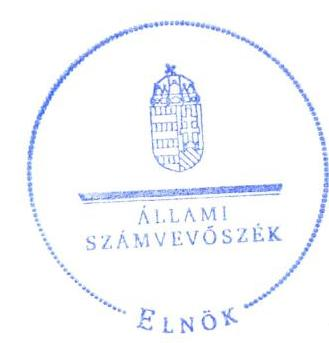
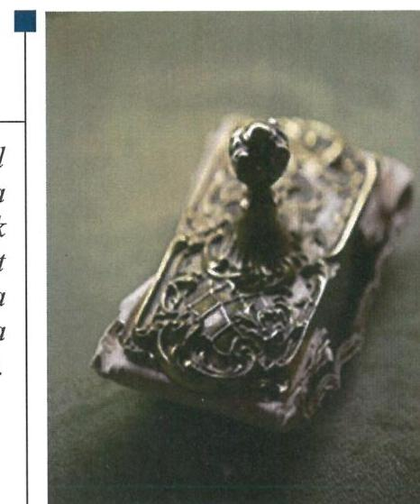
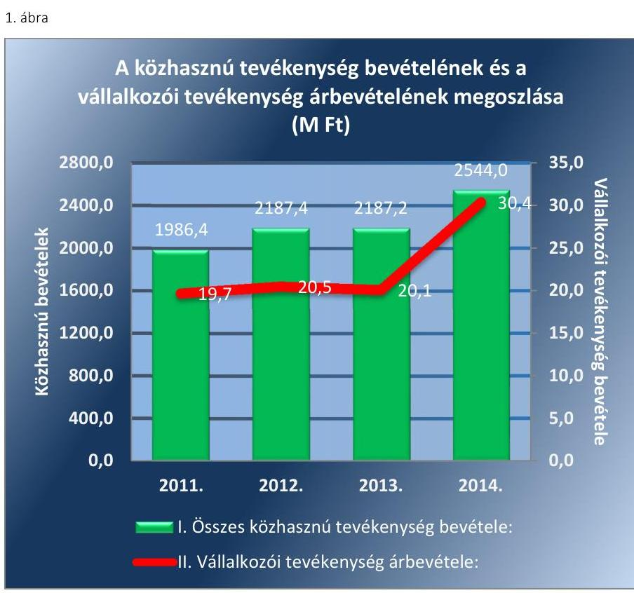
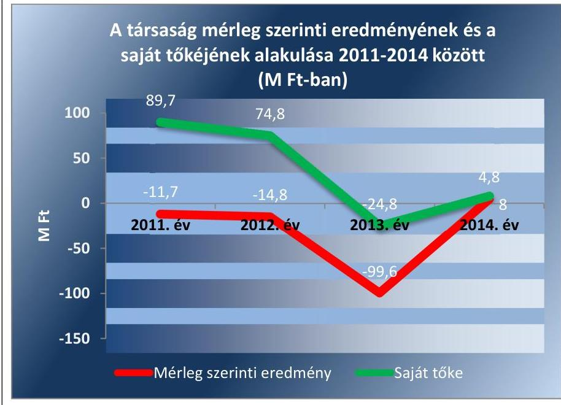

# Jelentés 

## Magyar Légimentő Nonprofit Kft.

Az állami tulajdonban (résztulajdonban) lévő gazdálkodó szervezetek vagyonmegőrzési és gazdálkodási tevékenységének ellenőrzése 2016.

Az ÁSZ ellenőrzéseivel hozzájárul ahhoz, hogy a közpénzeket a szervezetek átlátható, rendezett módon használják fel a közfeladatok ellátása érdekében.

---

# Jelentés 

## Magyar Légimentő Nonprofit Kft.

Az állami tulajdonban (résztulajdonban) lévő gazdálkodó szervezetek vagyonmegőrzési és gazdálkodási tevékenységének ellenőrzése
2016. október hó 13. nap

16168
www.asz.hu

Domokos László
elnök

Az ÁSZ ellenőrzéseivel hozzájárul ahhoz, hogy a közpénzeket a szervezetek átlátható, rendezett módon használják fel a közfeladatok ellátása érdekében.

---

# AZ ELLENŐRZÉST FELÜGYELTE:

DR. HORVÁTH MARGIT felügyeleti vezető

## AZ ELLENŐRZÉST VEZETTE ÉS A VÉGREHAJTÁSÁÉRT FELELŐS:

PENCZ MÁRIA ellenőrzésvezető

## A PROGRAM ÖSSZEÁLLÍTÁSÁÉRT FELELŐS:

JANIK JÓZSEF LÁSZLÓ osztályvezető

IKTATÓSZÁM: V-1031-124/2016.

TÉMASZÁM: 2065

ELLENŐRZÉS-AZONOSÍTÓ SZÁM: V070924

Jelentéseink az Országgyűlés számítógépes hálózatán és az Interneten a www.asz.hu címen is olvashatóak.

---

# TARTALOMJEGYZÉK 

■ ÖSSZEGZÉS ..... 5
■ AZ ELLENŐRZÉS CÉLJA ..... 7
■ AZ ELLENŐRZÉS TERÜLETE ..... 8
■ AZ ELLENŐRZÉS HÁTTERE, INDOKOLTSÁGA ..... 10
■ A JELENTÉS LÉNYEGES KÉRDÉSKÖREI ..... 11
■ ELLENŐRZÉS HATÓKÖRE ÉS MÓDSZEREI ..... 12
■ MEGÁLLAPÍTÁSOK ..... 14
■ JAVASLATOK ..... 28
■ MELLÉKLETEK ..... 29
I. sz. melléklet: Értelmező szótár ..... 29
II. sz. melléklet: Magyar Légimentő NKft. vagyonának változása 2011-2014. között (ezer Ft, %) ..... 33
III. sz. melléklet: Magyar Légimentő NKft. eredménykimutatása 2011-2014. között (ezer Ft, %) ..... 34
■ FÜGGELÉK: ÉSZREVÉTELEK ..... 35
■ RÖVIDÍTÉSEK JEGYZÉKE ..... 37

---

.

---

# ÖSSZEGZÉS 

Az Állami Számvevőszék a Magyar Légimentő Nonprofit Kft. 2011. január 1. és 2014. december 31. közötti vagyonmegőrzési és gazdálkodási tevékenysége szabályszerűségét ellenőrizte.

Az OMSZ szabályszerűen alakította ki a vagyonnal való gazdálkodás feltételeit. Az OMSZ és a gazdálkodó szervezet által meghozott vagyonváltozást eredményező döntések előkészítése és végrehajtása a jogszabályi előírásoknak megfelelt. A tulajdonosi jogokat összességében szabályszerűen gyakorolta. A vagyongazdálkodási tevékenységének szabályozása hiányos volt, mert önköltségszámítás rendjére vonatkozó szabályzattal nem rendelkezett. A vagyonnyilvántartása megfelelt a jogszabályi követelményeknek. Az önköltségszámítás gyakorlata a szolgáltatások díjának átláthatóságát biztosította. A Magyar Légimentő NKft. beszámolási és adatszolgáltatási kötelezettségének szabályszerűen eleget tett. A vagyongazdálkodás érdekében kialakított információs rendszer megfelelően működött.

## Az ellenőrzés társadalmi indokoltsága

Magyarországon az intézmény-centrikus közfeladat-ellátás, közvagyon-gazdálkodás jellemző a költségvetésen kívüli feladatellátás térnyerése mellett. Ennek szereplői az állami tulajdonú gazdálkodó szervezetek is.

Az Áht: 2. § I) pontja, az Európai Közösséget létrehozó szerződéshez csatolt, a túlzott hiány esetén követendő eljárásról szóló jegyzőkönyv alkalmazásáról szóló 2009. május 25-i 479/2009/EK rendelet szerint, illetve az ESA95 és ESA2010 statisztikai módszertana alapján a kormányzati szektorba tartoznak a "központi kormányzat alszektorba besorolt társaságok és egyéb szervezetek" is, amelyekkel szemben alapvető követelmény, hogy gazdálkodásuk, működésük szabályszerű, az általuk szolgáltatott adatok megbízhatóak legyenek. Az Áht: 2. § I) pontja alapján kiadott a kormányzat szektorba sorolt egyéb szervezetekről szóló NGM közlemény szerint mintegy másfélszáz szervezet mellett a központi kormányzat alszektorba besorolt szervezet a Magyar Légimentő NKft. is.

Az állami vagyonnal való gazdálkodás alapvető célja az állami vagyon átlátható, rendeltetésszerű és felelős felhasználásának biztosítása. Az állami tulajdonban álló gazdálkodó szervezetek államot megillető társasági részesedése a nemzeti vagyon részét képezi és legfőbb rendeltetése szerint a közfeladatok ellátását szolgálja.

Az Állami Számvevőszék középtávra szóló stratégiájában megfogalmazta, hogy az államháztartáson kívülre nyújtott költségvetési támogatások és ingyenes vagyonjuttatások, valamint az államháztartáson kívül működő közfeladatellátó rendszerek ellenőrzéseivel hozzájárul ahhoz, hogy a közpénzeket az államháztartáson kívül működő szervezetek is átlátható, rendezett módon használják fel a közfeladatok szerződésben vállalt ellátása érdekében.

## Főbb megállapítások, következtetések

Az OMSZ az állami vagyon értékének megőrzéséhez, gyarapításához, valamint a felelős gazdálkodáshoz szükséges követelményeket meghatározta. A tulajdonosi joggyakorlás kereteit megfelelően szabályozta, azok gyakorlása szabályszerűen történt.

A Magyar Légimentő NKft. a szabályszerű vagyongazdálkodás feltételeit hiányosan alakította ki, mivel önköltségszámítás rendjére vonatkozó szabályzatot nem készített, a Befektetési szabályzattal és Számlarenddel 2012. március 1-jétől rendelkezett.

A Magyar Légimentő NKft. vagyon-nyilvántartása az idegen tulajdonú eszközök kivételével szabályszerű volt.

---

A Magyar Légimentő NKft. bevételeit szabályszerűen számolta el. A költségek, ráfordítások elszámolása - az anyagjellegű ráfordítások elszámolása során feltárt hiányosságok miatt - nem teljes körűen felelt meg a jogszabályi és a belső szabályzatok előírásainak.

A Magyar Légimentő NKft.-nél az ellenőrzött időszakban az eszközállomány, különösen a bankbetétek miatt növekedett, a kötelezettségállománya a szállítói tartozások miatt emelkedett, saját tőke összege a veszteséges gazdálkodás következtében csökkent, amelyet tulajdonosi tőkeemeléssel kellett ellensúlyozni. Államegóvási, karbantartási kötelezettségét teljesítette.

Az OMSZ, illetve a Magyar Légimentő NKft. vagyonváltozást eredményező döntéseinek előkészítése, megalapozása és végrehajtása megfelelt a jogszabályi és a belső előírásoknak. A Magyar Légimentő NKft. a beszámolási és adatszolgáltatási kötelezettségét szabályszerűen teljesítette, ennek keretében az FB és a könyvvizsgáló is szabályszerűen hajtotta végre a feladatait. A Magyar Légimentő NKft. vagyongazdálkodását illetően kialakította és a szabályozás szerint működtette az információs rendszert.

Az Avtv., és az Info. tv. előírását figyelmen kívül hagyva a Magyar Légimentő NKft. nem készítette el a közérdekű adatok megismerésére irányuló igények teljesítésének rendjét rögzítő szabályzatot. A Magyar Légimentő NKft. elektronikus közzétételi kötelezettségét nem teljesítette, mivel hiányosan tette közzé az Info. tv. 1. melléklete II/1. fejezetében felsorolt dokumentumokat.

A Magyar Légimentő NKft. adósságot keletkeztető ügyletet nem kötött. A kormányzati szektor hiányára befolyást gyakorló bevételek elszámolása szabályszerűen történt, azonban a ráfordítások közül a személyi jellegű ráfordítások elszámolása nem volt megfelelő. A rendszeres és nem rendszeres személyi jellegű juttatások elszámolása során a bruttó bérek bérkartonon szereplő összege eltért a munkaszerződésben rögzített összegektől, munkaszerződéseket az Mt. előírásai ellenére nem módosították az alapbér emelésekor.

---

# AZ ELLENŐRZÉS CÉLJA 

Az ellenőrzés célja annak értékelése, hogy a tulajdonosi jogok gyakorlása szabályszerű volt-e; a gazdálkodó szervezet által ellátott feladat bevételei, ráfordításai elszámolásának, és vagyongazdálkodási tevékenységének szabályozása megfelelt-e a jogszabályi és a tulajdonosi előírásoknak és azok végrehajtása szabályszerű volt-e; biztosítva volt-e a közfeladatok átláthatósága és elszámoltathatósága érdekében a közszolgáltatás díjának megalapozottsága szabályszerű önköltségszámítással; a vagyonváltozást eredményező döntések esetében a tulajdonosi jogok gyakorlója és a gazdálkodó szervezet szabályszerűen jártak-e el; a gazdálkodó szervezet épített-e ki és működtetett-e információs rendszert a szabályszerű vagyongazdálkodás érdekében.

Az ellenőrzés további célja annak értékelése, hogy a kormányzati szektorba sorolt egyéb szervezetek gazdálkodásának a kormányzati szektor hiányára és az államadósságra befolyással bíró elemei a jogszabályi előírásoknak megfeleltek-e.

---

# **AZ ELLENŐRZÉS TERÜLETE**

## **Magyar Légimentő Nonprofit Kft.**

**A Magyar Légimentő NKft.** egy egyszemélyes közhasznú nonprofit korlátolt felelősségű társaságot a Magyar Állam képviseletében az OMSZ² alapította.

A Magyar Légimentő NKft. kizárólagos feladata közhasznú tevékenységként az EÜ. tv³-ben, valamint az EüM rendelet⁴-ben, továbbá az NM rendelet⁵-ben szabályozott mentési, betegszállítási közfeladat ellátása, a légi mentés megszervezése Magyarországon. Ehhez kapcsolódó feladata a szükséges tárgyi és személyi feltételek megteremtése, a mentőhelikopteres bázisokon az ügyeleti tevékenység biztosítása, légimentési szállítási, kutató, mentő feladatok ellátása, légi járműveinek üzemeltetése, karbantartása. A társaság a hatósági engedélyek birtokában egy személyben felelős a magyarországi légimentés biztosításáért. A helikopterek bevetését az OMSZ bevetés-irányítása alapján végzi.

A Magyar Légimentő NKft. az ellenőrzött időszakban hét mentőhelikopterrel végezte tevékenységét a társaság által üzemeltetett hét légimentő bázison: Budaörsön, Miskolcon, Debrecenben, Szentesen, Pécsett, Sármelléken és Balatonfüreden.

A Magyar Légimentő NKft. a bázisokon 5 db EC-135 és 2014. október 28-ig 2 db AS 350 típusú mentőhelikopterrel folytatott ügyeleti tevékenységet. Az 5 db helikoptert osztrák társaság biztosította 10 éves szolgáltatási szerződés keretében.

A Magyar Légimentő NKft. az ellenőrzött időszakban a tulajdonosi joggyakorlással megbízott OMSZ-szal 2006. január 9-én kelt, és 2013. szeptember 16-án aktualizált üzemeltetési szerződés alapján kettő, a Magyar Állam tulajdonában, valamint az OMSZ vagyonkezelésében lévő mentőhelikoptert üzemeltett az Alapító Okirat₁₆-ban megfogalmazott közfeladata ellátása érdekében.

A Magyar Légimentő NKft. társasági részesedése feletti tulajdonosi jogokat az OMSZ gyakorolta az MNV Zrt⁶-vel kötött szerződés alapján. A nemzetgazdasági miniszter által kiadott közlemény alapján a Magyar Légimentő NKft. a központi kormányzati alszektorba sorolt szervezetnek minősül. A Magyar Légimentő NKft. az ellenőrzött időszakban kezelt állami vagyonnal nem rendelkezett.

A Magyar Légimentő NKft. gazdálkodásának adatait a 2011. és a 2014. évek vonatkozásában az 1. táblázat szemlélteti:

---

1. táblázat

# A MAGYAR LÉGIMENTŐ NKFT. 2011-2014. ÉVI BESZÁMOLÓINAK FŐBB ADATAI (M FT, FŐ)

|  Főbb adatok | 2011. | 2012. | 2013. | 2014.  |
| --- | --- | --- | --- | --- |
|  Összes eszközvagyon: | 592,1 | 669,1 | 655,7 | 712,8  |
|  Saját tőke: | 89,7 | 74,8 | -24,8 | 8,0  |
|  Értékesítés nettó árbevétele (vállalkozási tevékenység bevétele): | 19,7 | 20,5 | 20,1 | 30,4  |
|  Anyagjellegű ráfordítások | 1494,2 | 1642,9 | 1686,0 | 1907,3  |
|  Mérleg szerinti eredmény: | -11,7 | -14,8 | -99,6 | 4,8  |
|  Közhasznú célra kapott működési támogatás | 1913,7 | 2096,2 | 2154,4 | 2514,5  |
|  - | ebből alapítói | 1910,6 | 0,0 | 0,0  |
|  - | ebből központi költségvetésből | 2,8 | 2096,0 | 2151,5  |
|  - | ebből egyéb | 0,3 | 0,2 | 2,9  |
|  Foglalkoztatottak átlagos létszáma (fő): | 79 | 76 | 79 | 79  |

Forrás: Magyar Légimentő NKft. 2011-2014. évi beszámolói

A Magyar Légimentő NKft. törzstőkéje az alapításkor 3,0 M Ft volt. Az alapító 2014. november 13-án a 2013. évi veszteség miatt negatívvá vált saját tőke (-24,8 MFt) rendezésére 28,0 MFt - pénzbeli hozzájárulás formájában történő - tőkeemelésről határozott, melynek fedezetét az 1591/2014. (X. 21.) Korm. határozat⁷-tal biztosították. A tőkeemelés eredményeként a jegyzett tőke 3,1 M Ft-ra változott.

A Magyar Légimentő NKft. mérlegfőösszege az ellenőrzött időszakban a 2011. évi 592,1 M Ft-ról 2012-re 669,1 M Ft-ra nőtt, míg 2013-ra 655,7 M Ft-ra csökkent. A vagyona 2014-ben 712,8 M Ft volt.

A mérleg szerinti eredmény a 2011-2013. években negatív, a 2014. évben pozitív volt, a saját tőke összege 2011. december 31-éről a 2014. év végére 91,1%-kal csökkent.

---

# AZ ELLENŐRZÉS HÁTTERE, INDOKOLTSÁGA 

## AZ ÁSZ⁸ KÖZÉPTÁVRA SZÓLÓ STRATÉGIÁJÁBAN

megfogalmazta, hogy az államháztartáson kívülre nyújtott költségvetési támogatások és ingyenes vagyonjuttatások, valamint az államháztartáson kívül működő közfeladat-ellátó rendszerek ellenőrzéseivel hozzájárul ahhoz, hogy a közpénzeket az államháztartáson kívül működő szervezetek is átlátható, rendezett módon használják fel a közfeladatok szerződésben vállalt ellátása, továbbá a közvagyon szerződésben vállalt átlátható, hatékony, költségtakarékos működtetése, értékének megőrzése, állagának védelme, értéknövelő használata, hasznosítása és gyarapítása érdekében.

Az ellenőrzés feladata a közvagyonnal biztosított közfeladat ellátással kapcsolatban a közpénzek átláthatósága, nyilvánossága érdekében a jogszabályokban, belső szabályzatokban megfogalmazott előírások érvényesülésének az állami tulajdonban (résztulajdonban) lévő gazdálkodó szervezetek vagyonérték-megőrzési és gazdálkodási tevékenységének értékelése.

AZ ELLENŐRZÉS EREDMÉNYEKÉPP a törvényalkotás számára tapasztalatok állnak rendelkezésre az állami vagyonnal való köz-feladat-ellátás, közvagyonnal való gazdálkodás értékeléséhez, az átláthatóságot
 biztosító szabályozáshoz. Az ellenőrzés tapasztalatai segítik és erősítik az ÁSZ hozzáadott értéket teremtő tevékenységét és tanácsadó szerepét.

---

# A JELENTÉS LÉNYEGES KÉRDÉSKÖREI 

1.     - A tulajdonosi joggyakorló a vagyonnal való gazdálkodás feltételeit szabályszerűen alakította-e ki?
2.     - A Magyar Légimentő NKft. vagyongazdálkodási tevékenységének szabályozottsága és a vagyon nyilvántartása megfelelt-e az előírásoknak?
3.     - A bevételek és ráfordítások elszámolása, valamint az önköltségszámítás szabályszerű volt-e?
4.     - A vagyonnal való gazdálkodás, valamint a vagyonváltozást eredményező döntések megfeleltek-e a jogszabályi és tulajdonosi előírásoknak?
5.     - A Magyar Légimentő NKft. a szabályszerű vagyongazdálkodás érdekében teljesítette-e beszámolási, adatszolgáltatási kötelezettségét, kiépített-e, illetve működtetett-e információs rendszert?
6. A Magyar Légimentő NKft. gazdálkodásának a kormányzati szektor hiányára és az államadósságra befolyást gyakorló elemei a jogszabályi előírásoknak megfeleltek-e?

---

# ELLENŐRZÉS HATÓKÖRE ÉS MÓDSZEREI 

## Az ellenőrzés típusa

Szabályszerűségi ellenőrzés

## Az ellenőrzött időszak

2011. január 1-jétől 2014. december 31-ig.

## Az ellenőrzés tárgya

Az állami tulajdonban (résztulajdonban) lévő gazdálkodó szervezetek vagyonmegőrzési és gazdálkodási tevékenysége és a kormányzati szektor hiányára és adósságállományára hatást gyakorló elemek ellenőrzése.

## Az ellenőrzött szervezet

A Magyar Légimentő Nonprofit Kft., Országos Mentőszolgálat.

## Az ellenőrzés jogalapja

Az ellenőrzés alapját az Állami Számvevőszékről szóló 2011. évi LXVI. törvény 5. § (3)-(5) bekezdése, valamint az állami vagyonról szóló 2007. évi CVI. törvény 3. § (4) bekezdése képezi.

## Az ellenőrzés módszerei

Az ellenőrzést az ellenőrzési program szempontjai, az ellenőrzött időszakban hatályos jogszabályok, az ellenőrzés szakmai szabályai, a jelen ellenőrzésre irányadó ÁSZ módszertan és a nemzetközi standardok figyelembevételével végeztük.

Az ellenőrzési kérdések megválaszolásához szükséges bizonyítékok megszerzése az ellenőrzött által rendelkezésre bocsátott dokumentumokra, adatokra alapozva kérdésfelvetés, mintavételezés, valamint elemző eljárás útján történt.

Az ellenőrzési bizonyítékként felhasználható adatforrások közé tartoztak egyrészt a szakmai program részletes szempontjainál felsorolt adatforrások, másrészt minden egyéb - az ellenőrzés folyamán feltárt, az ellenőrzés szempontjából információt tartalmazó - dokumentumok.

---

Az ellenőrzés lefolytatásához a gazdálkodó szervezet a tanúsítványok elektronikus kitöltésével, valamint az ÁSZ által kért dokumentumok megküldésével szolgáltatott adatokat.

A bevételek és ráfordítások elszámolása, valamint a vagyonnyilvántartás terén a szabályszerű működést mintavétellel ellenőriztük.

A kormányzati szektorba sorolt gazdálkodó szervezetnél a személyi jellegű ráfordítások elszámolása mellett az egyéb ráfordítások, pénzügyi műveletek ráfordításai, rendkívüli ráfordítások, illetve az egyéb bevételek, pénzügyi műveletek bevételei, rendkívüli bevételek elszámolásának szabályszerűségét szintén mintatételeken keresztül ellenőriztük.

A véletlen mintavétellel (évenkénti elemszámmal arányos rétegezéssel) ellenőrzött területek esetében minden egyes tétel vonatkozásában a szabályszerűségre vonatkozó kérdéseket tettünk fel, amelyek eredményét összesítettük. A jogszabályoknak és a belső előírásoknak megfelelőnek tekintettük az adott területet, amennyiben a minta ellenőrzésének eredménye alapján 95%-os bizonyossággal a teljes sokaságban a hibaarány kisebb volt, mint 10%, nem megfelelőnek értékeltük, ha a hibaarány a 10%-ot meghaladta. A ráfordítások elszámolására és a vagyon-nyilvántartásra vonatkozó véletlen mintavételt kockázati alapú kiválasztással egészítettük ki, amelynek során évente a három legnagyobb összegű tételt választottuk ki.

---

# 1. A tulajdonosi joggyakorló a vagyonnal való gazdálkodás feltételeit szabályszerűen alakította-e ki? 

Összegző megállapítás

Az OMSZ szabályszerűen alakította ki a vagyonnal való gazdálkodás feltételeit. A tulajdonosi jogokat összességében szabályszerűen gyakorolta.

### 1.1. számú megállapítás

Az OMSZ az állami vagyon értékének megőrzéséhez, gyarapításához, valamint a felelős gazdálkodáshoz szükséges követelményeket meghatározta. A tulajdonosi joggyakorlás kereteit megfelelően szabályozta, azok gyakorlása szabályszerűen történt.

A Magyar Légimentő NKft. az ellenőrzött időszakban az EÜ tv-ben, az EüM rendeletben, továbbá az NM rendeletben szabályozott mentési, betegszállítási feladatot látott el közhasznú tevékenységként.

A TULAJDONOSI JOGGYAKORLÁS keretében az OMSZ az Alapító Okirat 1-6⁹-ban meghatározta a kizárólagos hatáskörébe tartozó feladatokat, valamint a Magyar Légimentő NKft. vagyonához kapcsolódó tulajdonosi joggyakorló általi követelményeket.

A Magyar Légimentő NKft. társasági részesedése feletti tulajdonosi jogokat 2012. december 18-ig az OMSZ az MNV Zrt-vel kötött vagyonkezelési megállapodás ¹⁰ alapján, 2012. december 19-tól Megbízási szerződés ¹¹ alapján gyakorolta.

A vagyonkezelési megállapodás, illetve a Megbízási szerződés tartalmazta a vagyongazdálkodásra vonatkozó jogokat, és rögzítette a társasági részesedés értékének megőrzését, gyarapítását, valamint a felelős gazdálkodáshoz szükséges követelményeket.

A Megbízási szerződésben az MNV Zrt. meghatározta az OMSZ saját forrásaiból megvalósítandó, az MNV Zrt. nevében vállalt kötelezettségeket (tőkeemelés, támogatás nyújtása, pótbefizetés teljesítése).

Az Alapító Okirat ₁₋₆ tartalmazta a Magyar Légimentő NKft. felelős gazdálkodása érdekében hozott előírásokat, a tulajdonosi joggyakorló számára fenntartott jogok között a vagyongazdálkodáshoz kapcsolódó jogokat, az ügyvezetőre vonatkozó összeférhetetlenségi szabályokat, rendelkezett az ügyvezető felelősségét és a közérdek érvényesülését biztosító vagyongazdálkodásról. Tartalmazta továbbá az FB¹² feladatait, hatáskörét, előírta a könyvvizsgálati feladatokat.

Az Alapító Okirat ₁₋₆ előírása alapján az OMSZ kizárólagos hatáskörébe tartozott a Számv. tv. ¹³ szerinti beszámoló elfogadása, az ügyvezető megválasztása, az FB tagok megválasztása, az FB ügyrendjének jóváhagyása, az üzleti terv elfogadása. A szabályzatok közül - az Alapító Okirat ₁₋₆ előírásai alapján - az SZMSZ, a Javadalmazási Szabályzat ¹⁴ és az FB ügyrend¹⁵-jének elfogadása az OMSZ kizárólagos hatáskörébe tartozott.

---

Az OMSZ a hatáskörébe utalt jogait és kötelezettségeit az ellenőrzött időszakban szabályszerűen gyakorolta. A Magyar Légimentő NKft. éves beszámolóinak elfogadásához az FB határozatokat hozott, amelyek tartalmilag megfeleltek a Gt.-ben és Ptk.-ban előírt írásbeli jelentéseknek.

Az alapító által 2011. június 27-én elfogadott SZMSZ a vagyongazdálkodással kapcsolatosan rögzítette a Magyar Légimentő NKft. számára a feladat- és hatásköröket, a felelősségi viszonyokat. Az SZMSZ előírása alapján az ügyvezető döntési hatáskörébe tartozott a Magyar Légimentő NKft. tevékenységével elért bevételek, a megszerzett támogatás, a juttatások, az adományok felhasználásáról való döntés. Az SZMSZ szerint az FB feladatkörébe tartozott a Magyar Légimentő NKft. közhasznú működésének és gazdálkodásának ellenőrzése.

A tulajdonosi joggyakorló OMSZ a Magyar Légimentő NKft. 2013. évi negatív saját tőke rendezése érdekében - a Gt. előírásának megfelelően - 2014-ben Alapítói határozatban döntött 28,0 M Ft tőkeemelésről.

A közhasznú tevékenységének ellátását biztosító működési kiadásokat a 2011. évben az OMSZ biztosította a 2005. december 6-án kelt Közhasznúsági Megállapodás ¹⁶ alapján. A 2012-2014. években a Magyar Légimentő NKft. részére az OEP biztosította a mentési feladatok ellátását biztosító működési támogatást a 2012. február 15-én kelt Alapszerződés ¹⁷ szerint, az EMMI ¹⁸ biztosította - az osztrák társasággal 2006. március 10-én 10 évre kötött - légi jármű szolgáltatási szerződésből eredő dijkötelezettség teljesítésének forrását a Támogatási szerződés ₁₋₃¹⁹-ek alapján.

Az ellenőrzött időszakban a tulajdonosi joggyakorló OMSZ élt ellenőrzési jogával, 2012. évben ellenőrizte a Magyar Légimentő NKft. működésének törvényességét, hatékonyságát. Az ellenőrzést az OMSZ Belső Ellenőrzési Osztálya végezte ellenőrzési terv alapján. Az ellenőrzés megállapította a gazdálkodási szabályzatok esetében az aktualizálás elmaradását, illetve a beszerzések, a szerződéskötések, a kötelezettségvállalások rendjénél, a befektetések szabályrendszerénél és a felelősségi kérdéseknél azok kialakításának hiányát. A Magyar Légimentő NKft. a javaslatok alapján intézkedett, a hiányzó szabályzatokat elkészítették, illetve a meglévőket aktualizálták.

---

# 2. A Magyar Légimentő NKft. vagyongazdálkodási tevékenységének szabályozottsága és a vagyon nyilvántartása megfelelt-e az előírásoknak? 

Összegző megállapítás

2.1. számú megállapítás

A Magyar Légimentő NKft. vagyongazdálkodási tevékenységének szabályozása hiányos volt, a vagyonnyilvántartása az idegen eszközök kivételével megfelelt a jogszabályi követelményeknek.

A Magyar Légimentő NKft. a szabályszerű vagyongazdálkodás feltételeit hiányosan alakította ki, mivel az Önköltségszámítás rendjére vonatkozó szabályzatot nem készített, a Befektetési szabályzattal és Számlarenddel 2012. március 1-től rendelkezett.

A Magyar Légimentő NKft. szabályszerű működésének kereteit az Alapító Okirat ₁₋₆, az SZMSZ ²⁰, valamint az OMSZ-szal kötött, a légimentés támogatására irányuló közhasznúsági szerződés határozta meg.

A Magyar Légimentő NKft. rendelkezett az ellenőrzött időszakban Kötelezettségvállalási szabályzat ₁₋₃²¹-tal. Annak alapján kötelezettségvállalásra a Magyar Légimentő NKft. ügyvezetője, vagy az általa írásban meghatalmazott személy volt jogosult. További előírás volt, hogy a 100 ezer Ft-ot meghaladó kötelezettségvállalás csak írásban volt érvényes. A Kötelezettségvállalási szabályzat ₁₋₃ tartalmazta az érvényesítés, az utalványozás, a szakmai teljesítésigazolás, a pénzügyi ellenjegyzés rendjét, valamint a felelősök aláírásmintáit is.

A Magyar Légimentő NKft. az ellenőrzött időszakban rendelkezett a Számv. tv. előírásainak megfelelően Számviteli politiká ₁₋₅²²-val, Leltározási szabályzat ₁₋₄²³-tal, Pénzkezelési szabályzat ₁₋₅²⁴-tal, valamint 2012. március 1. és 2012. május 31. közötti időszakot kivéve Eszközök és források értékelési szabályzatá ₁₋₃²⁵-val. A Magyar Légimentő NKft. 2013-ban megalkotta a Közbeszerzési szabályzat²⁶-át.

A Magyar Légimentő NKft. 2012. március 2-től rendelkezett a Számv. tv. 161. § előírásának megfelelő Számlarenddel. A Számlarend²⁷-ben előírták a kapott támogatások (EMMI, OEP) külön főkönyvi számlán történő elkülönített nyilvántartását.

A Magyar Légimentő NKft. 2012. március 1-jét megelőzően - a Kszt. 17. §, valamint 2012. január 1-jétől az Ectv. 45. § előírásait figyelmen kívül hagyva - nem rendelkezett Befektetési szabályzat ₁,₂²⁸-tal.

A Magyar Légimentő NKft. a Számv. tv. 14. § (6) bekezdésében foglaltak alapján nem mentesült az önköltségszámítás rendjére vonatkozó szabályzat készítésének kötelezettsége alól. Ugyanakkor az Önköltségszámítás rendjére vonatkozó szabályzatot az ellenőrzött időszakban a Számv. tv. 14. § (5) bekezdés c) pontja előírásai ellenére nem készített. A Magyar Légimentő NKft. a Számv. tv. 14. § (7) bekezdés előírása szerint kötelezett volt szabályzat készítésére, mivel a költségnemek szerinti költségek együttes összege minden évben meghaladta az 500 millió Ft-ot.

A Magyar Légimentő NKft. számviteli szabályzataiban 2011. évre vonatkozóan a közvetett költségek kivételével meghatározta a Kszt.²⁹ 18. § (1)

---

bekezdésében előírt, a közhasznú tevékenységekből és a gazdasági-vállalkozási tevékenységekből származó bevételek és költségek, ráfordítások elkülönített nyilvántartási kötelezettségét.

Az értékcsökkenés elszámolásának módszerére az ellenőrzött időszakban kialakított szabályozás a lineáris leírási kulcsok alkalmazását írta elő. A szabályozásban ellentmondásos volt az elszámolás gyakorisága, amíg a Számviteli politika₁ szerint havonta, addig a Számviteli politika₂₋₅ szerint negyedévente kellett elszámolni az értékcsökkenést.

A Magyar Légimentő NKft. éves beszámoló készítésére volt kötelezett a Számv. tv. 9. § (1) bekezdése alapján, mert a Számv. tv. 9. § (2) bekezdés a) és c) pontjaiban megjelölt értékhatárt meghaladta.

# 2.2. számú megállapítás 

## A Magyar Légimentő NKft. vagyon-nyilvántartása az idegen tulajdonú eszközök kivételével szabályszerű volt.

A Magyar Légimentő NKft. az ellenőrzött időszakban állami vagyont nem kezelt, ehhez kapcsolódó elkülönítési kötelezettsége nem keletkezett.

A Magyar Légimentő NKft.-nél az ellenőrzött időszakban az immateriális javak leltározása a Leltározási szabályzat ₁₋₄ előírásainak megfelelően a főkönyvi könyvelés és az analitikus nyilvántartás egyeztetésével megtörtént.

A Leltározási szabályzat ₁₋₄ előírásainak megfelelően a tárgyi eszközöket évente mennyiségi felvétellel vették számba. Az egyedi eszközkartonokon nyomon követhetők voltak az eszközök bruttó értékében, értékcsökkenési leírásában bekövetkezett változások, melyek a főkönyvvel évente egyeztetésre kerültek a Leltározási szabályzat ₁₋₄ előírásának megfelelően. A tárgyi eszközök mennyiségi kimutatása a bázisleltárakból, az egészségügyi eszköz leltárakból, és a járműleltárakból állt. A
 létesítmények tárgyi eszközeiről az egyes bázisokon évente bázisleltár készült, melyben nem került felvezetésre - a Leltározási szabályzat ${ }_{2-4}$ V. 2 pontjában előírtaknak megfelelően - az eszköz tulajdonosának megnevezése, továbbá hiányosan rögzítették a leltári számokat, a gyári számokat, és a beszerzési árakat. Az idegen eszközök közül a megállapodás alapján üzemeltetett helikopterek - a Számv. tv. 69. § (4) bekezdés előírása ellenére - nem kerültek mennyiségi felvétellel leltározásra az ellenőrzött időszakban.

A mennyiségi felvétellel elvégzett leltárt követő leltárkiértékelésről készült jegyzőkönyvek leltárhiányt vagy többletet nem állapítottak meg, leltárkülönbözet elszámolására nem került sor.

---

# 3. A bevételek és ráfordítások elszámolása, valamint az önköltségszámítás szabályszerű volt-e? 

Összegző megállapítás

A Magyar Légimentő NKft.-nél a költségek, ráfordítások elszámolása összességében megfelelt, hibát az anyagjellegű elszámolások során tárt fel az ellenőrzés. Az önköltségszámítás gyakorlata a közvetett költségek elszámolását kivéve megfelelt a Számv. tv. előírásainak.
3.1. számú megállapítás

A Magyar Légimentő NKft. bevételeit szabályszerűen számolta el. A költségek, ráfordítások elszámolása - az anyagjellegű ráfordítások elszámolása során feltárt hiányosságok miatt - nem teljes körűen felelt meg a jogszabályi és a belső szabályzatok előírásainak.

A Magyar Légimentő NKft.-nél a bevételek és ráfordítások elszámolását és nyilvántartását a Számviteli politika ${ }_{1-5}$-ban, a Számlarendben, valamint a Számlakeret ${ }_{1-4}$-ben határozták meg. A Számlakeret ${ }_{1-4}$ megfelelő alábontásával kerültek meghatározásra a főkönyvi számlák a bevételek és a ráfordítások elszámolására.

Az ellenőrzött időszakban a Magyar Légimentő NKft. bevételeinek döntő részét ( $99 \%$-át) a mentési feladatok ellátását biztosító működési támogatás tette ki. Az OEP ${ }^{\circledR}$-pel kötött Alapszerződés a támogatás elkülönített kezelésére vonatkozó előírást nem tartalmazott. Az EMMI-vel kötött Támogatási szerződés ${ }_{1-3}$ előírása alapján a Magyar Légimentő NKft. köteles volt a támogatási összeget elkülönítetten kezelni, a támogatási összeg felhasználására vonatkozóan elkülönített számviteli nyilvántartást vezetni. Az előírásnak a Magyar Légimentő NKft. eleget tett, külön főkönyvi számlán tartotta nyilván a támogatás összegét, továbbá annak felhasználását igazoló közvetlen költségeket.

A Magyar Légimentő NKft.-nek az ellenőrzött időszak minden évében az alapfeladat ellátása mellett vállalkozási tevékenységből származó árbevétele is volt, melynek aránya az összes bevételen belül az ellenőrzött években $1 \%$ körüli volt. Vállalkozási jelleggel üzleti célú betegszállítást, rendezvényeken egészségügyi szolgáltatást biztosító mozgóőrséget, külső megrendelő számára helikopter-karbantartást, egészségügyi oktatást, kongresszusszervezést végzett.

---

Forrás: Magyar Légimentő Nonprofit Kft. 2011-2014 Közhasznú éves beszámoló eredménykimutatása
A Magyar Légimentő NKft. a költségek elszámolására a számviteli rendszerében az elsődleges költségnem elszámolást alkalmazta. Ennek keretében a költségeket, ráfordításokat költségnemek szerinti bontásban tartotta nyilván, de nem rendelkezett a költségelszámolás módszerére vonatkozó előírással, a gyakorlatban nem alakította ki a közvetett költségek felosztását alátámasztó könyvviteli rendszert. A szolgáltatásnyújtás önköltségének megállapítására nem alakították ki az utókalkuláció módszerét.

A költségelszámolások rögzítésekor a Magyar Légimentő NKft. a közvetlen költségeket - a szabályozás hiányától eltekintve - megfelelően osztotta meg a közhasznú, illetve a gazdasági-vállalkozási tevékenységek között, azonban a közvetett költségek (pl. bankköltség, postai díjak, telefon költségek, áramdíjak) megosztását nem végezték el, azokat a közhasznú tevékenység költségei között számolták el. A Magyar Légimentő NKft. gazdasági-vállalkozási tevékenysége díjait a vállalkozási szerződések, valamint az ellenőrzött időszakban érvényes Rendezvény szabályzat ${ }_{1-3}{ }^{31}$ alapján határozta meg, a Számv. tv. 14. § (7) bekezdésben előírt önköltségszámítást nem végzett.

A Magyar Légimentő NKft. a bevételek és ráfordítások közhasznú és vállalkozási tevékenységre történő elkülönítését rögzítő szabályzattal nem rendelkezett, azonban negyedéves bontásban külön nyilvántartást vezetett a vállalkozási tevékenység árbevételéről és annak közvetlenül felmerült költségeiről, ráfordításairól.

A Számviteli politika ${ }_{1}$-ben előírt havi értékcsökkenési leírás elszámolási kötelezettséget a Magyar Légimentő NKft. nem tartotta be, a könyvvitelben és a 2011. évi beszámoló kiegészítő mellékletében leírt számviteli módszereknél is negyedéves elszámolás szerepelt.

---

A BEVÉTELEK ELSZÁMOLÁSA SZABÁLYSZERŰ volt az ellenőrzött időszakban, a Számviteli politika ${ }_{1-5}$, a Számlarend, és a Számlakeret ${ }_{1-4}$ előírásainak megfelelően történt.

# AZ ANYAGJELLEGŰ KÖLTSÉGEK, RÁFORDÍTÁ-

SOK ELSZÁMOLÁSA a Magyar Légimentő NKft.-nél az ellenőrzött időszakban nem teljes körűen felelt meg a Számv. tv. 165. § (2) bekezdésében foglaltaknak, mert a költségelszámolást alátámasztó számviteli bizonylat több esetben hiányzott, illetve téves számlázás történt.

## A BERUHÁZÁSOK, FELÚJÍTÁSOK KÖLTSÉGEI, ÉS

AZ ÉRTÉKCSÖKKENÉSI LEÍRÁS elszámolása megfelelő volt. A beszerzett eszközök állományba vétele, üzembe helyezése megtörtént, a bekerülési érték meghatározása, az eszközök besorolása és nyilvántartása megfelelt a Számv. tv. előírásainak.

## A MAGYAR LÉGIMENTŐ NKFT. VEVŐKÖVETELÉSE az ellenőrzött időszakban kismértékben, a 2011. évi 0,4 M Ft-ról 2014-re 1,4 M Ft-ra emelkedett. Az ellenőrzött időszakban a Magyar Légimentő NKft. hátralékos állománya az analitikus nyilvántartások alapján megállapítható volt. A Magyar Légimentő NKft. a követelések érvényesítésére fizetési felszólításokat küldött, behajthatatlan követelése nem volt.

A Magyar Légimentő NKft. a Számv. tv. 55. §-ának megfelelően a Számviteli politika ${ }_{1-5}$-ban kialakította az értékvesztés elszámolásának szabályait. Az ellenőrzött időszakban a Magyar Légimentő NKft. egy alkalommal, a 2014. évet érintően számolt el 50\%-os értékvesztést a 360 napon túli, jelentős, a Szamaritánus Mentőszolgálat Kft.-vel szemben fennálló 828 e Ft összegű követelésére, amely megfelelt a Számviteli politika-5-ban előírt értékelési szabályoknak. A Magyar Légimentő NKft. a követelés eredeti, nyilvántartásba vételi értékét és az elszámolt értékvesztést a Számv. tv. 55. § (4) bekezdésének megfelelően a 2014. évi Beszámoló kiegészítő mellékletében bemutatta.

---

# 4. A vagyonnal való gazdálkodás, valamint a vagyonváltozást eredményező döntések megfeleltek-e a jogszabályi és tulajdonosi előírásoknak? 

Összegző megállapítás

A Magyar Légimentő NKft. kötelezettségállománya a feladatellátásra és a vagyonnal való gazdálkodásra nem jelentett kockázatot. Az OMSZ és a gazdálkodó szervezet által meghozott vagyonváltozást eredményező döntések előkészítése és végrehajtása a jogszabályi előírásoknak megfelelt.

## 4.1. számú megállapítás

A Magyar Légimentő NKft.-nél az ellenőrzött időszakban az eszközállomány különösen a bankbetétek miatt növekedett, a kötelezettségállománya a szállítói tartozások miatt emelkedett, saját tőke összege a veszteséges gazdálkodás következtében csökkent, amelyet tulajdonosi tőkeemeléssel kellett ellensúlyozni. Állagmegóvási, karbantartási kötelezettségét teljesítette.

A VAGYONGAZDÁLKODÁS során a Magyar Légimentő NKft. eszközeinek értéke 2011-hez képest 2014-re 20,4\%-kal, 592,1 M Ft-ról 712,8 M Ft-ra emelkedett.

Az ellenőrzött időszak eszköz változásait a 2. táblázat tartalmazza.
2. táblázat

AZ ESZKÖZÖK VÁLTOZÁSA 2011-2014 KÖZÖTT

| Eszközök | 2011. | 2012. | 2013. | 2014. | Változás   2014-2013 | Változás   $\%$ |
| :-- | --: | --: | --: | --: | --: | --: |
| Befektetett eszkö-   zök | 370,8 | 354,5 | 341,0 | 356,9 | -13,9 | -3,70 % |
| Forgóeszközök | 220.3 | 314,6 | 313,3 | 355,9 | 42,6 | 13,6 % |
| Aktív időbeli elha-   tárolások | 1,0 | 0 | 1.4 | 0 | -1,0 | -100 % |
| Eszközök | 592,1 | 669,1 | 655,7 | 712,8 | 57,1 | 9,6 % |

A befektetett eszközök nettó értéke a 2014. évben az előző évhez képest kismértékű, 4,7\%-os növekedést mutatott, melyet a 4,4 M Ft értékben helikopter karbantartáshoz szükséges program, valamint 16,5 M Ft értékű defibrillátor beszerzése eredményezte.

A Magyar Légimentő NKft. az ellenőrzött időszakban tárgyi eszközei és immateriális javai között a Számv. tv. előírásainak megfelelően a működése érdekében beszerzett, éven túli használatra szánt, saját tulajdonú eszközöket - jellemzően irodai berendezések és felszerelések, számítástechnikai eszközök, szoftverek, gépjárművek, illetve egészségügyi eszközök - tartott nyilván.

A forgóeszközökön belül jelentős volt a pénzeszközök növekedése, a 2011. évi 103,8 M Ft-ról a 2014. évre 313, 2 M Ft-ra emelkedett, melynek oka a bankbetétek állományának növekedése volt.

A forrásváltozást az ellenőrzött időszakban a 3. táblázat tartalmazza.

---

| A FORRÁSOK VÁLTOZÁSA 2011-2014 KÖZÖTT (M FT, \%) |  |  |  |  |  |  |
| :--: | :--: | :--: | :--: | :--: | :--: | :--: |
| Megnevezés | 2011. | 2012. | 2013. | 2014. | Változás | Változás \%   2014/2011 |
| Saját tőke | 89,7 | 74,8 | -24,8 | 8,0 | -81,7 | -91,1 % |
| Céltartalékok | 8,4 | 3,7 | 4,4 | 4,5 | -3,9 | -46,4 % |
| Kötelezettségek | 89,6 | 191,9 | 285,6 | 323,9 | 234,3 | 261,5 % |
| Passzív időbeli elhatárolások | 404,4 | 398,7 | 390,5 | 376,4 | -28,0 | -6,9 % |
| Források | 592,1 | 669,1 | 655,7 | 712,8 | 120,7 | 20,4 % |

A források 20,4\%-os növekedése az ellenőrzött időszakban elsősorban a kötelezettségek, jellemzően a szállítói tartozások 17,8 M Ft-ról 199,1 M Ft-ra történt növekedésével indokolható a saját tőke csökkenése mellett. A szállítói kötelezettségek növekedését az osztrák társasággal szemben fennálló - szolgáltatási szerződésből eredő - kötelezettségek növekedése okozta.

A saját tőke összege a veszteséges gazdálkodás következtében csökkent, és 2013-ra -24,8 M Ft lett. A 2014. évben elért 4,8 M Ft mérleg szerinti eredmény és a 28,0 M Ft tulajdonosi tőkeemelés hatására a saját tőke összege 7,9 M Ft-ra emelkedett.

Karbantartási tervet és kapcsolódó várható éves költségvetést az üzemben tartott helikopterekre írt elő az OMSZ, melynek a Magyar Légimentő NKft. minden évben eleget tett. A használatba kapott állami vagyon tekintetében a Magyar Légimentő NKft. megfelelt a Vtv., Vhr. és az Nvtv.-ben előírt, az állami vagyonra vonatkozó állagmegóvási, értékmegőrző és gyarapító használatra vonatkozó előírásoknak. A Magyar Légimentő NKft.-nek az OMSZ-szal kötött üzemeltetési szerződése a légi járművekre vonatkozóan évente karbantartási terv készítésének kötelezettségét írta elő, emellett a 100 órás karbantartásnál nagyobb mértékű munkákról az OMSZ előzetes tájékoztatását is előírta. Az ellenőrzött időszakban ilyen mértékű karbantartás, javítás nem történt.

A veszteséges gazdálkodás miatt a saját tőke/jegyzett tőke aránya folyamatosan csökkent, míg 2013-ra 100\% alá süllyedt, a saját tőke negatívvá vált. A saját tőke visszapótlására a Gt. előírásainak megfelelően - a könyvvizsgáló és az FB figyelemfelhívására és javaslatára - a 2014. évben került sor. A tőkeemelést 0,1 M Ft törzstőke emeléssel és véglegesen átadott pénzeszközként 27,9 M Ft tőketartalék-emeléssel valósították meg. A tőkeemelést az MNV Zrt. az 5/2014 (XI. 25.) számú TFŐIG I. számú határozata alapján, és az EMMI 36/2014. számú engedélye alapján az OMSZ 5/2014 (XI. 13.) Alapítói határozatával fogadták el. A 2014. évre a mérleg szerinti eredmény pozitívvá vált, a tőkeemelés miatt a Magyar Légimentő NKft. saját tőkéje a jegyzett tőke több mint kétszeresére nőtt. A Magyar Légimentő NKft. az ellenőrzött időszakban a Gt., valamint a Ctv. ${ }^{32}$ előírásainak megfelelően tevékenységéből származó nyereségét nem osztotta fel.

A saját tőke-jegyzett tőke arányát az ellenőrzött időszakban az 4. táblázat tartalmazza.

---

4. táblázat

A SAJÁT TŐKE/JEGYZETT TŐKE ARÁNYÁNAK VÁLTOZÁSA 2011-2014 KÖZÖTT (MILLIÓ FT-BAN)

|   | 2011. nyitó adatok | 2011. | 2012. | 2013. | Tőke emelés

 | 2014.  |
| --- | --- | --- | --- | --- | --- | --- |
|  Saját tőke | 101,3 | 89,7 | 74,8 | $-24,8$ | $+28,0$ | 7,9  |
|  Jegyzett tőke | 3,0 | 3,0 | 3,0 | 3,0 | $+0,1$ | 3,1  |
|  Tőketartalék | 0 | 0 | 0 | 0 | $+27,9$ | 27,9  |
|  Eredménytartalék | 141,7 | 98,3 | 86,7 | 71,8 |  | $-27,8$  |
|  Mérleg szerinti eredmény | $-43,3$ | $-11,7$ | $-14,8$ | $-99,6$ |  | 4,8  |
|  Saját tőke/Jegyzett tőke | $3377 \%$ | $2990 \%$ | $2493 \%$ | $-827 \%$ |  | $255 \%$  |

Forrás: Tanúsítványok A Magyar Légimentő NKft. gazdálkodásának eredményességét nagymértékben befolyásolta az OEP és az EMMI által nyújtott támogatás. A működési támogatások 2011-2013 között nem fedezték a költségeket, ráfordításokat. A Magyar Légimentő NKft. az üzleti jelentésekben a bevezetett takarékossági intézkedések ellenére a növekvő esetszámra és a tervezett működési költségek fedezeti hiányára vezette vissza a veszteséges gazdálkodást. A helikopter szolgáltatási díjak devizakitettsége jelentős árfolyam- és költségkockázatot jelentett minden évben. A 2014. évben a Magyar Légimentő NKft. nyereségessé vált, mely az EMMI támogatás kiegészítése mellett a növekvő vállalkozási bevételnek is köszönhető volt. A Magyar Légimentő NKft. feladatköre a helikopteres mozgóőrség mellett az OMSZ megbízásából végzett - emeltszintű légút-biztosítási eljáráshoz szükséges - telefonos orvosi konzultációs rendszer üzemeltetésével bővült. Ez a tevékenység a vállalkozási bevételek esetében - a 4,8 M Ft-os mérleg szerinti eredményhez képest jelentős összegű - 8,5 M Ft bevételnövekedést eredményezett.

# 4.2. számú megállapítás

Az OMSZ, illetve a Magyar Légimentő NKft. vagyonváltozást eredményező döntéseinek előkészítése, megalapozása és végrehajtása megfelelt a jogszabályi és a belső előírásoknak.

A Magyar Légimentő NKft. vagyonváltozást eredményező döntéseit, likviditási helyzetét az üzleti terveiben, és a Számv. tv.-nek megfelelően elkészített beszámolóiban mutatta be, melyeket az FB jóváhagyott.

Az SZMSZ 2.2 pont előírása alapján az ügyvezető döntött a Magyar Légimentő NKft. tevékenységével elért bevételek, megszerzett támogatás, juttatás, adomány felhasználásáról.

A Magyar Légimentő NKft. a Kbt. ${ }^{33}$ és Kbt. ${ }^{34}$ törvények hatálya alá tartozott, a 2013. előtti időszakban közbeszerzési értékhatárt elérő beszerzésük nem volt. A Magyar Légimentő NKft. a 2013. és 2014. években közbeszerzési tervet készítettek, melyek alapján a közbeszerzési eljárásokat lefolytatták. A legnagyobb értékű, uniós eljárásrend alapján lefolytatott beszerzés két légijármű szolgáltatási díja, 43500 Euro/hó/gép rendelkezésre állási díjjal, valamint 945 Euro/óra repülési óradíjjal. A szolgáltatást a szerződés értelmében az eljárásban nyertes osztrák társaság a Magyar Légimentő NKft. számára 2014. október 29-től biztosította.

---

Az ellenőrzött időszakban a tulajdonosi joggyakorló OMSZ vagyonváltozást eredményező döntése a tőkeemelésről hozott döntés volt.

Az OMSZ az 5/2014 (XI. 13.) számú alapítói határozatában döntött a tőkeemelésről. A Megbízási szerződés 4.5 d) pontjának megfelelően a tőkeemelés előzetes jóváhagyását kezdeményezte az MNV Zrt.-nél, melyre az MNV Zrt. a hozzájáruló nyilatkozatot megadta. Ezt követően az Áht ${ }_{2}{ }^{35}$ 45. § (2) bekezdésének megfelelően az OMSZ megkérte az állami vagyon felügyeletéért felelős miniszter előzetes engedélyét, az erre vonatkozó engedélyt a nemzeti fejlesztési miniszter megadta. A tőkeemelés pénzügyi teljesítése - az MNV Zrt. részére az 1591/2014. (X.21) Korm. határozattal átcsoportosított költségvetési előirányzat terhére - 28 M Ft összegben megtörtént.

# 5. A Magyar Légimentő NKft. a szabályszerű vagyongazdálkodás érdekében teljesítette-e beszámolási, adatszolgáltatási kötelezettségét, kiépített-e, illetve működtetett-e információs rendszert? 

Összegző megállapítás

A Magyar Légimentő NKft. beszámolási és adatszolgáltatási kötelezettségének szabályszerűen eleget tett, azonban a közérdekű adatok nyilvánosságra hozatalát nem teljes körűen biztosította. A vagyongazdálkodás érdekében kialakított információs rendszer megfelelően működött.
5.1. számú megállapítás

A Magyar Légimentő NKft. a beszámolási és adatszolgáltatási kötelezettségét szabályszerűen teljesítette, ennek keretében az FB és a könyvvizsgáló is szabályszerűen hajtotta végre a feladatait. A Magyar Légimentő NKft. vagyongazdálkodását illetően kialakította és a szabályozás szerint működtette az információs rendszert. Az elektronikus közzétételi kötelezettségét a Magyar Légimentő NKft. hiányosan teljesítette.

A Magyar Légimentő NKft. minden ellenőrzött évben a Számv. tv.-ben előírt éves beszámolóját határidőre elkészítette, a Számv. tv. szerinti letétbe helyezési kötelezettségét határidőben teljesítette. Az OMSZ az FB által elfogadásra javasolt, könyvvizsgálói jelentést is tartalmazó beszámolókat alapítói határozatokkal elfogadta.

A Magyar Légimentő NKft. a 2011. évben a Kszt. 9. § (3) bekezdésének megfelelő közhasznúsági jelentést, a 2012-2014. években az Ectv. 29. § (3) bekezdésének megfelelő közhasznúsági mellékletet készített, amelyek keretében az ellenőrzött időszak minden évére vonatkozóan elkészítette a közhasznú éves beszámoló eredménykimutatását.

Az FB határozatban elfogadta a Magyar Légimentő NKft. beszámolóit, amely tartalmilag megfelelt a Gt. 35. § (3) bekezdése, illetve a Ptk. ${ }^{36}$ 3:120. § (2) bekezdése előírásában az egyes beszámolókra vonatkozó írásbeli jelentéskészítési kötelezettségének.

---

A könyvvizsgáló a tevékenységét az Alapítói Okirat ${ }_{1-6}$ előírásainak megfelelően végezte, a számviteli beszámolókra a 2011., a 2012., és a 2014. években korlátozás nélküli véleményt, a 2013. évre korlátozás nélküli véleményt adott ki figyelemfelhívással. Ebben a Ptk. 2 3:129. § (1) bekezdésében foglaltaknak megfelelően felhívta az OMSZ figyelmét a Magyar Légimentő Kft.-nél saját tőke csökkenéséből eredő kockázatokra, egyben jelezte, hogy a veszteség folytán negatívvá vált saját tőkét a tulajdonosnak kell pótolnia.
2. ábra

Forrás: 2011-2014. évi beszámolók
Az MNV Zrt. az OMSZ részére kontrolling adatszolgáltatást írt elő a Magyar Légimentő NKft. főbb mérleg- és eredménykimutatás adataira, a tulajdonosi forrásjuttatásokra, illetve elvonásokra, a jegyzett tőke 20%-át meghaladó kötelezettségek részletezésére, munkaügyi, létszám és keresettömeg terv- és tényadataira vonatkozóan.

Az MNV Zrt. által a Megbízási szerződés 4. sz. mellékletében szabályozott adatszolgáltatásnak a Magyar Légimentő NKft.-re vonatkozóan az OMSZ határidőben eleget tett.

# A KÖZÉRDEKŰ ADATOK MEGISMERÉSÉRE IRÁNYULÓ IGÉNYEK teljesítésének rendjét rögzítő szabályzattal az Avtv. ${ }^{37}$ 20. § (8) és az Info. ${ }^{38}$ tv. 30. § (6) bekezdés előírásai ellenére a Magyar Légimentő NKft. nem rendelkezett.

## ELEKTRONIKUS KÖZZÉTÉTELI KÖTELEZETTSÉGÉNEK 2012-től az Infó. tv. 33. § (1) és a 37. § (1) bekezdésében foglaltak szerint nem tett eleget, mert nem tette közzé az Info. tv. 1. mellékletének II/1. pontjában meghatározottak közül a Magyar Légimentő NKft. szervezeti felépítését, a vonatkozó alapvető jogszabályokat, és a szervezeti és működési szabályzatot.

---

Az OMSZ a vagyongazdálkodást érintően előírta Magyar Légimentő NKft. számára az információs rendszer szabályozását és kialakítását.

A Magyar Légimentő NKft. kialakította a szabályszerű vagyongazdálkodás érdekében az információáramlási és monitoring rendszerét és azt a 2011-2014. években megfelelően működtette. A vagyongazdálkodással kapcsolatos adatszolgáltatási kötelezettségét az OMSZ által meghatározott módon teljesítette negyedévente, kontrolling jelentések formájában.

A Magyar Légimentő NKft. a 2014. évben eleget tett a 2014. január 1-jétől hatályos $8 \mathrm{kr}.{ }^{39} 54/A$. § alapján a 8 kr. 10. § rendelkezései által előírt belső ellenőrzési feladatok ellátási kötelezettségének. 2014. évben szabályszerűségi ellenőrzést folytatott le, amelynek eredményeként javaslatot tett az utazási költségtérítés folyamatának, eljárásrendjének javítására, dokumentálásra.

# 6. A Magyar Légimentő NKft. gazdálkodásának a kormányzati szektor hiányára és az államadósságra befolyást gyakorló elemei a jogszabályi előírásoknak megfeleltek-e? 

Összegző megállapítás

### 6.1. számú megállapítás

A Magyar Légimentő NKft. adósságot keletkeztető ügyletet nem kötött. A kormányzati szektor hiányára befolyást gyakorló ráfordítások közül a személyi jellegű ráfordítások elszámolása nem felelt meg, az egyéb bevételek és ráfordítások elszámolása megfelelő volt.

A Magyar Légimentő NKft. az ellenőrzött időszakban adósságot keletkeztető ügyletet nem kötött.

A Magyar Légimentő NKft. feladatellátásához használt 5 db helikopter bérleti díját euróban fizette, azonban a szolgáltatási szerződés a Stabilitási tv. ${ }^{40} 3. \S$ (1) bekezdése szerint nem minősül államadósságot keletkeztető ügyletnek. A Magyar Légimentő NKft.-nek nem volt a Stabilitási tv. 9. § (1) bekezdés és a 353/2011. Korm. rendelet ${ }^{41} 11. \S$ szerinti kérelem benyújtási kötelezettsége.

A kormányzati szektor hiányára befolyást gyakorló bevételek és ráfordítások közül a személyi jellegű ráfordítások elszámolása nem felelt meg, az egyéb bevételek és ráfordítások elszámolása megfelelő volt. Osztalék kifizetésére nem került sor.

A SZEMÉLYI JELLEGŰ RÁFORDÍTÁSOK elszámolása nem volt megfelelő. A rendszeres és nem rendszeres személyi jellegű juttatások elszámolása megfelelt a Számv. tv. 79. § (1)-(4) bekezdéseinek, azonban a bruttó munkabérek bérlapokon szereplő összege több esetben eltért a munkaszerződésben rögzített összegektől. A jogviszony létesítésekor a felek minden esetben munkaszerződés keretében állapodtak meg az alapbérről, azonban a 2005., 2006., és a 2007. évben kötött munkaszerződéseket - a bérkartonokon szereplő alapbérnek megfelelően - az Mt. ${ }^{42}$

---

82. § (1) és (3) bekezdéseinek, és az Mt. ${ }^{43}$ 58. § előírásai ellenére az alapbér emelésekor nem módosították.

Az OMSZ a Takarékos tv. ${ }^{44}$-ben foglaltaknak megfelelően megalkotta Javadalmazási Szabályzatot. A Magyar Légimentő NKft. a Javadalmazási Szabályzatban foglaltaknak megfelelően járt el.

Az egyéb, a pénzügyi műveletek, és a rendkívüli bevételek és ráfordítások kormányzati szektor hiányára befolyást gyakorló tételeinek elszámolása megfelelő volt. Az elszámolást megalapozó dokumentumok rendelkezésre álltak, a bevételeket, a költségeket és ráfordításokat a Számv. tv előírásainak megfelelően számolták el.

A Magyar Légimentő NKft. az ellenőrzött időszakban a Gt., valamint a Ctv. ${ }^{45}$ előírásainak megfelelően tevékenységéből származó nyereségét nem osztotta fel.

---

# JAVASLATOK 

Az ÁSZ tv. 33. § (1) bekezdésében foglaltak értelmében az ellenőrzött szervezet vezetője köteles a jelentésben foglalt megállapításokhoz kapcsolódó intézkedési tervet összeállítani és azt a jelentés kézhezvételétől számított 30 napon belül az ÁSZ részére megküldeni. Amennyiben az ellenőrzött szervezet vezetője nem küldi meg határidőben az intézkedési tervet, vagy továbbra sem elfogadható intézkedési tervet küld, az Állami Számvevőszék elnöke az ÁSZ tv. 33. § (3) bekezdése a) és b) pontjaiban foglaltakat érvényesítheti.

## A Magyar Légimentő Nonprofit Kft. ügyvezetőjének

1. A szabályozási hiányosságok pótlása érdekében:
a) Intézkedjen az önköltségszámítás rendjére vonatkozó belső szabályzat elkészítéséről, az utókalkuláció módszerének megállapításáról a Számv. tv. előírásainak megfelelően.
(2.1. sz. megállapítás 6. bekezdése alapján)
b) Intézkedjen az Info. tv. előírásainak megfelelően a közérdekű adatok megismerésére irányuló igények teljesítése rendjének szabályozásáról.
(5.1. sz. megállapítás 7. bekezdése alapján)
2. A gazdálkodás gyakorlatában feltárt hibák kijavítása érdekében:
a) Intézkedjen a tárgyi eszközök leltározásának belső szabályzat szerinti elvégzéséről, valamint a bérelt tárgyi eszközök mennyiségi leltározásáról.
(2.2. sz. megállapítás 3. bekezdése alapján)
b) Intézkedjen az anyagjellegű ráfordítások szabályszerű elszámolására.
(3.1. sz. megállapítás 9. bekezdése alapján)
c) Intézkedjen a közérdekű adatok elektronikus közzétételi kötelezettségének teljes körű teljesítéséről az Info. tv.-nek megfelelően.
(5.1. sz. megállapítás 8. bekezdése alapján)

---

# MELLÉKLETEK 

## I. SZ. MELLÉKLET: ÉRTELMEZŐ SZÓTÁR

Adósságot keletkeztető ügylet
„Adósságot keletkeztető ügylet és annak értéke:
a) hitel, kölcsön felvétele, átvállalása a folyósítás, átvállalás napjától a végtörlesztés napjáig, és annak aktuális tőketartozása,
b) a számvitelről szóló törvény szerinti hitelviszonyt

 megtestesítő értékpapír forgalomba hozatala a forgalomba hozatal napjától a beváltás napjáig, kamatozó értékpapír esetén annak névértéke, egyéb értékpapír esetén annak vételára,
c) váltó kibocsátása a kibocsátás napjától a beváltás napjáig, és annak a váltóval kiváltott kötelezettséggel megegyező, kamatot nem tartalmazó értéke,
d) az Szt. szerint pénzügyi lízing lízingbevevői félként történő megkötése a lízing futamideje alatt, és a lízingszerződésben kikötött tőkerész hátralévő összege,
e) a visszavásárlási kötelezettség kikötésével megkötött adásvételi szerződés eladói félként történő megkötése - ideértve az Szt. szerinti valódi penziós és óvadéki repóügyleteket is - a visszavásárlásig, és a kikötött visszavásárlási ár,
f) a szerződésben kapott, legalább háromszázhatvanöt nap időtartamú halasztott fizetés, részletfizetés, és a még ki nem fizetett ellenérték,
g) hitelintézetek által, származékos műveletek különbözeteként az Államadósság Kezelő Központ Zrt.-nél (a továbbiakban: ÁKK Zrt.) elhelyezett fedezeti betétek, és azok összege.
Forrás: Stabilitási tv. 3. § (1) bekezdése
2010. június 17-től
a) Az állam tulajdonában lévő dolog, valamint a dolog módjára hasznosítható természeti erő,
b) Az a) pont hatálya alá nem tartozó mindazon vagyon, amely vonatkozásában törvény az állam kizárólagos tulajdonjogát nevesíti,
c) az állam tulajdonában lévő tagsági jogviszonyt megtestesítő értékpapír, illetve az államot megillető egyéb társasági részesedés,
d) az államot megillető olyan immateriális, vagyoni értékkel rendelkező jogosultság, amelyet jogszabály vagyoni értékű jogként nevesít.
Forrás: Vtv. 1. § (2) bekezdése
2012. november 10-től az állami vagyon fogalma kiegészül a következő ponttal:
a) az állam tulajdonában lévő pénzügyi eszközök

Forrás: Vtv. 1. § (2) bekezdése
2010. január 01 - 2011. december 31. között:

Az állami vagyont az MNV Zrt. maga kezeli, vagy szerződés - így különösen bérlet, haszonbérlet, szerződésen alapuló haszonélvezet, vagyonkezelés, megbízás alapján központi költségvetési szervnek, természetes vagy jogi személynek, illetőleg jogi személyiséggel nem rendelkező gazdasági társaságnak hasznosításra átengedi.
Vtv. 23. § (1) bekezdése

## 2012. január 1-jétől:

Az állami vagyont az MNV Zrt. maga kezeli, vagy szerződés - így különösen bérlet, haszonbérlet, megbízás - alapján központi költségvetési szervnek, természetes vagy jogi személynek, vagy jogi személyiséggel nem rendelkező gazdálkodó szervezetnek hasznosításra átengedi. Az állami vagyonra vonatkozóan az MNV Zrt. kizárólag az Nvtv.-ben meghatározott személyekkel köthet vagyonkezelési szerződést.
Forrás: Vtv. 23. § (1), 27. § (1)

# 2013. június 28-ától: 

Az állami vagyonnal az MNV Zrt. maga gazdálkodik, vagy szerződés - így különösen bérlet, haszonbérlet, megbízás - alapján központi költségvetési szervnek, természetes vagy jogi személynek, vagy jogi személyiséggel nem rendelkező gazdálkodó szervezetnek hasznosításra átengedi, illetőleg vagyonkezelésbe, haszonélvezetbe adja. Az állami vagyonra vonatkozóan az MNV Zrt. kizárólag az Nvtv.-ben meghatározott személyekkel köthet vagyonkezelési szerződést.
Forrás: Vtv. 23. § (1), 27. § (1)
2013. június 30-ig gazdálkodó szervezet:

Az állami vállalat, az egyéb állami gazdálkodó szerv, a szövetkezet, a lakásszövetkezet, az európai szövetkezet, a gazdasági társaság, az európai részvény-társaság, az egyesülés, az európai gazdasági egyesülés, az európai területi együttműködési csoportosulás, az egyes jogi személyek vállalata, a leányvállalat, a vízgazdálkodási társulat, az erdőbirtokossági társulat, a végrehajtói iroda, az egyéni cég, továbbá az egyéni vállalkozó.
Forrás: Ptk.3. 685. § c) pontja
2013. július 1-jétől gazdálkodó szervezet:

Az állami vállalat, az egyéb állami gazdálkodó szerv, a szövetkezet, a lakásszövetkezet, az európai szövetkezet, a gazdasági társaság, az európai részvénytársaság, az egyesülés, az európai gazdasági egyesülés, az európai területi együttműködési csoportosulás, az egyes jogi személyek vállalata, a leányvállalat, a vízgazdálkodási társulat, az erdőbirtokossági társulat, a végrehajtói iroda, az egyéni cég, továbbá az egyéni vállalkozó. Az állam, a helyi önkormányzat, a költségvetési szerv, az egyesület, a köztestület, valamint az alapítvány gazdálkodó tevékenységével összefüggő polgári jogi kapcsolataira is a gazdálkodó szervezetre vonatkozó rendelkezéseket kell alkalmazni, kivéve, ha a törvény e jogi személyekre eltérő rendelkezést tartalmaz; a 292/A-292/B. §, 301/A-301/B. §, 405. § (1) bekezdés, valamint a 407/A. § (1) bekezdés tekintetében nem minősül gazdálkodó szervezetnek az, aki a közbeszerzésekről szóló törvény értelmében ajánlatkérő (szerződő hatóság).
Forrás: Ptk.3. 685. § c) pontja
2014. március 15-től gazdálkodó szervezet:

A gazdasági társaság, az európai részvénytársaság, az egyesülés, az európai gazdasági egyesülés, az európai területi együttműködési csoportosulás, a szövetkezet, a lakásszövetkezet, az európai szövetkezet, a vízgazdálkodási társulat, az erdőbirtokossági társulat, az állami vállalat, az egyéb állami gazdálkodó szerv, az egyes jogi személyek vállalata, a közös vállalat, a végrehajtói iroda, a közjegyzői iroda, az ügyvédi iroda, a szabadalmi ügyvivői iroda, az önkéntes kölcsönös biztosító pénztár, a magánnyugdípénztár, az egyéni cég, továbbá az egyéni vállalkozó. Az állam, a helyi önkormányzat, a költségvetési szerv, az egyesület, a köztestület, valamint az alapítvány gazdálkodó tevékenységével összefüggő polgári jogi kapcsolataira is a gazdálkodó szervezetre vonatkozó rendelkezéseket kell alkalmazni. Forrás: Ppt. 396. §
Kormányzati szektorba sorolt egyéb szervezet

Az a szervezet, amely az Áht. alapján nem része az államháztartásnak, azonban az Európai Közösséget létrehozó szerződéshez csatolt, a túlzott hiány esetén követendő eljárásról szóló jegyzőkönyv alkalmazásáról szóló 2009. május 25-i

---

Nemzetgazdasági szempontból kiemelt jelentőségű nemzeti vagyon körébe tartozó társaságok
Nemzeti vagyon

Tulajdonosi ellenőrzés

479/2009/EK rendelet szerint a kormányzati szektorba tartozik. A nemzetgazdasági miniszter 2013. június 26-án megjelent Közleményben tette közé ezen szervezetek listáját.
Az ÁSZ ellenőrzés szempontjából az Nvtv. 2. sz. mellékletében felsorolt társasági részesedések.
2012. január 1-jétől nemzeti vagyon:
a) az állam vagy a helyi önkormányzat kizárólagos tulajdonában álló dolgok,
b) az a) pont hatálya alá nem tartozó, állam vagy a helyi önkormányzat tulajdonában lévő dolog,
c) az állam vagy a helyi önkormányzat tulajdonában lévő pénzügyi eszközök, továbbá az államot vagy a helyi önkormányzatot megillető társasági részesedések,
d) az államot vagy a helyi önkormányzatot megillető bármely vagyoni értékkel rendelkező jogosultság, amelyet jogszabály vagyoni értékű jogként nevesít,
e) Magyarország határa által körbezárt terület feletti légtér,
f) az üvegházhatású gázok kibocsátási egységeinek kereskedelméről szóló törvény szerint kibocsátási egység és légiközlekedési kibocsátási egység, valamint az ENSZ Éghajlatváltozási Keretegyezménye és annak Kiotói Jegyzőkönyve végrehajtási keretrendszeréről szóló törvény szerinti kiotói egység,
g) állami vagy helyi önkormányzati fenntartású közgyűjtemény (muzeális intézmény, levéltár, közgyűjteményként működő kép- és hangarchívum, valamint könyvtár) saját gyűjteményében nyilvántartott kulturális javak körébe tartozó dolog,
h) a régészeti lelet,
i) a nemzeti adatvagyon körébe tartozó állami nyilvántartások fokozottabb védelméről szóló törvény szerinti nemzeti adatvagyon.
Forrás: Nvtv. 1. § (2)
2010. június 17-től:

Az MNV Zrt. „rendszeresen ellenőrzi a vele szerződéses jogviszonyban lévő személyek, szervezetek vagy más használók állami vagyonnal való gazdálkodását, megállapításairól az MNV Zrt. Felügyelő Bizottságát, az ellenőrzött szervet, szükség esetén a minisztert és az Állami Számvevőszéket tájékoztatja".
Forrás: Vtv. 17. § d.
A Vhr. alapján „a tulajdonosi ellenőrzés célja az állami vagyonnal való gazdálkodás vizsgálata, ennek keretében a rendeltetésellenes, jogszerűtlen, szerződésellenes, vagy a tulajdonos érdekeit sértő, illetve a központi költségvetést hátrányosan érintő vagyongazdálkodási intézkedések feltárása és a jogszerű állapot helyreállítása, továbbá a vagyonnyilvántartás hitelességének, teljességének és helyességének biztosítása". Forrás: Vhr. 20. § (2)

## 2011. december 31-ig

Az állami vagyon kezelőjét, használóját megillető jogok gyakorlását, annak szabályszerűségét, célszerűségét az MNV Zrt. - szükség szerint területi szervei útján - ellenőrzi.
Forrás: Vhr. 20. § (1)
2012. január 1-jétől:

---

Tulajdonosi jogok gyakorlója

Az állami vagyon kezelőjét, haszonélvezőjét, használóját megillető jogok gyakorlását, annak szabályszerűségét, célszerűségét az MNV Zrt. - szükség szerint területi szervei útján - ellenőrzi.
Forrás: Vhr. 20. § (1)
2010. június 17-től:

Az állami vagyon felett a Magyar Államot megillető tulajdonosi jogok és kötelezettségek összességét - ha törvény eltérően nem rendelkezik - az állami vagyon felügyeletéért felelős miniszter (a továbbiakban: miniszter) gyakorolja, aki e feladatát a Magyar Nemzeti Vagyonkezelő Zártkörűen Működő Részvénytársaság (a továbbiakban: MNV Zrt.), a Magyar Fejlesztési Bank, illetve a tulajdonosi joggyakorló szervezet útján látja el. A miniszter miniszteri rendeletben, a törvényben meghatározott állami vagyoni kör tekintetében, meghatározott időtartamra, a joggyakorlás egyes szabályainak meghatározásával - az őt megillető tulajdonosi jogok és kötelezettségek összességének, illetve azok meghatározott részének gyakorlóját az Áht. szerinti központi költségvetési szervek, ezek intézménye, továbbá a 100%-ban állami tulajdonban álló gazdasági társaságok közül kijelölheti.
Forrás: Vtv. 3. § (1) és (2)

# 2013. június 28-ától: 

A rábízott állami vagyon felett az államot megillető tulajdonosi jogok és kötelezettségek összességét tulajdonosi joggyakorlóként:
a) ha törvény vagy miniszteri rendelet eltérően nem rendelkezik, a Magyar Nemzeti Vagyonkezelő Zártkörűen Működő Részvénytársaság (a továbbiakban: MNV Zrt.),
b) törvényben kijelölt személy vagy
c) az állami vagyon felügyeletéért felelős miniszter (a továbbiakban: miniszter) által rendeletben kijelölt személy gyakorolja.
[...]A miniszter e törvény felhatalmazása alapján - a meghatározott célok hatékonyabb elérése érdekében, miniszteri rendeletben, az ott meghatározott állami vagyoni kör tekintetében, meghatározott időtartamra - e törvény keretei között, a joggyakorlás egyes szabályainak meghatározásával - az államot megillető tulajdonosi jogok és kötelezettségek összességének, illetve azok meghatározott részének gyakorlóját az Áht. szerinti központi költségvetési szervek, ezek intézménye, továbbá a 100%-ban állami tulajdonban álló gazdasági társaságok közül kijelölheti. Forrás: Vtv. 3. § (1) és (2)

---

II. SZ. MELLÉKLET: MAGYAR LÉGIMENTŐ NKFT. VAGYONÁNAK VÁLTOZÁSA 2011-2014 KÖZÖTT (EZER FT, \%)

|  Megnevezés | 2011. | 2012. | 2013. | 2014. | Változás 2014.12.31 / 2011.12.31. (6)  |
| --- | --- | --- | --- | --- | --- |
|  1. | 2. | 3. | 4. | 5. | 6.  |
|  A. Befektetett eszközök | 370780 | 354534 | 340972 | 356875 | $-3,8 \%$  |
|  I. IMMATERIÁLIS JAVAK | 7377 | 5017 | 2834 | 4975 | $-32,6 \%$  |
|  Vagyoni értékű jogok | 7377 | 5017 | 2834 | 4975 | $-32,6 \%$  |
|  II. TÁRGYI ESZKÖZÖK | 362438 | 348507 | 337128 | 350990 | $-3,2 \%$  |
|  Ingatlanok és a kapcsolódó vagyoni értékű jogok | 320351 | 316239 | 309373 | 303361 | $-5,3 \%$  |
|  Műszaki berendezések, gépek, járművek | 11203 | 8545 | 9266 | 22160 | $97,8 \%$  |
|  Egyéb berendezések, felszerelések, járművek | 25682 | 18521 | 12947 | 7707 | $-70,0 \%$  |
|  Beruházások, felújítások | 5202 | 5202 | 5542 | 17762 | 241,4\%  |
|  III. BEFEKTETETT PÉNZÜGYI ESZKÖZÖK | 965 | 1010 | 1010 | 910 | $-5,7 \%$  |
|  Egyéb tartósan adott kölcsön | 965 | 1010 | 1010 | 910 | $-5,7 \%$  |
|  B. Forgóeszközök | 220311 | 314551 | 313322 | 355888 | 61,5\%  |
|  I. KÉSZLETEK | 56559 | 50767 | 42202 | 39795 | $-29,6 \%$  |
|  Anyagok | 56559 | 50767 | 42202 | 39795 | $-29,6 \%$  |
|  II. KÖVETELÉSEK | 2260 | 127970 | 159528 | 2858 | 26,5\%  |
|

  Követelések áruszállításból és szolgáltatásból (vevők) | 405 | - | 828 | 1424 | 251,6\%  |
|  Egyéb követelések | 1855 | 127970 | 158700 | 1434 | -22,7\%  |
|  III. ÉRTÉKPAPÍROK | 57728 | 0 | 50979 | 0 | -100,0\%  |
|  Forgatási célú hitelviszonyt megtestesítő értékpapírok | 57728 | - | 50979 | - | -100,0\%  |
|  IV. PÉNZESZKÖZÖK | 103764 | 135814 | 60613 | 313235 | 201,9\%  |
|  Pénztár, csekkek | 214 | 173 | 377 | 863 | 303,3\%  |
|  Bankbetétek | 103550 | 135641 | 60236 | 312372 | 201,7\%  |
|  C. Aktív időbeli elhatárolások | 959 | 0 | 1430 | 0 | -100,0\%  |
|  Bevételek aktív időbeli elhatárolása | 959 | 0 | 1430 | - | -100,0\%  |
|  ESZKÖZÖK (AKTÍVÁK) ÖSSZESEN | 592050 | 669085 | 655724 | 712763 | 20,4\%  |
|  D. Saját tőke | 89654 | 74820 | -24786 | 7982 | -91,1\%  |
|  I. JEGYZETT TÖKE | 3000 | 3000 | 3000 | 3100 | 3,3\%  |
|  II. JEGYZETT, DE MÉG BE NEM FIZETETT TÖKE (-) | - | - | - | - | -  |
|  III. TÖKETARTALÉK | - | - | - | 27900 | -  |
|  IV. EREDMÉNYTARTALÉK | 98342 | 86654 | 71820 | -27786 | -128,3\%  |
|  V. LEKÖTÖTT TARTALÉK | - | - | - | - | -  |
|  VI. ÉRTÉKELÉSI TARTALÉK | - | - | - | - | -  |
|  VII. MÉRLEG SZERINTI EREDMÉNY | -11688 | -14834 | -99606 | 4768 | -140,8\%  |
|  E. Céltartalékok | 8390 | 3700 | 4424 | 4450 | -47,0\%  |
|  Céltartalék a várható kötelezettségekre | - | 3700 | 4424 | 4450 | -  |
|  Céltartalék a jövőbeni költségekre | 8390 | - | - | - | -100,0\%  |
|  Egyéb céltartalék | - | - | - | - | -  |
|  F. Kötelezettségek | 89596 | 191933 | 285592 | 323883 | 261,5\%  |
|  I. HÁTRASOROLT KÖTELEZETTSÉGEK | - | - | - | - | -  |
|  II. HOSSZÚ LEJÁRATÚ KÖTELEZETTSÉGEK | - | - | - | - | -  |
|  III. RÖVID LEJÁRATÚ KÖTELEZETTSÉGEK | 89596 | 191933 | 285592 | 323883 | 261,5\%  |
|  Kötelez. áruszállításból és szolgáltatásból (szállítók) | 17835 | 98859 | 176813 | 199056 | 1016,1\%  |
|  Egyéb rövid lejáratú kötelezettségek | 71761 | 93074 | 108779 | 124827 | 73,9\%  |
|  G. Passzív időbeli elhatárolások | 404410 | 398632 | 390494 | 376448 | -6,9\%  |
|  Költségek, ráfordítások passzív időbeli elhatárolása | 12456 | 1841 | 1841 | 1841 | -85,2\%  |
|  Halasztott bevételek | 391954 | 396791 | 388653 | 374607 | -4,4\%  |
|  FORRÁSOK (PASSZÍVÁK) ÖSSZESEN | 592050 | 669085 | 655724 | 712763 | 20,4\%  |

---

III. SZ. MELLÉKLET: MAGYAR LÉGIMENTŐ NKFT. EREDMÉNYKIMUTATÁSA 2011-2014.KÖZÖTT (EZER FT, \%)

|  Megnevezés | 2011.12.31. | 2012.12.31. | 2013.12.31. | 2014.12.31. | Változás 2014.12.31./ 2011.01.01. (S)  |
| --- | --- | --- | --- | --- | --- |
|  1. | 2. | 3. | 4. | 5. | 6.  |
|  Belföldi értékesítés nettó árbevétele | 18142 | 20508 | 20098 | 30370 | 67,4\%  |
|  Exportértékesítés nettó árbevétele | 1582 | 0 | 0 | 0 | -100,0\%  |
|  I. Értékesítés nettó árbevétele | 19724 | 20508 | 20098 | 30370 | 54,0\%  |
|  Saját termelésű készletek állományváltozása | 0 | 0 | 0 | 0 | -  |
|  Saját előállítású eszközök aktivált értéke | 0 | 0 | 0 | 0 | -  |
|  II. Aktivált saját teljesítmények értéke | - | - | - | - | -  |
|  III. Egyéb bevételek | 1958034 | 2144616 | 2160002 | 2519371 | 28,7\%  |
|  Anyagköltség | 216692 | 251980 | 193366 | 204387 | -5,7\%  |
|  Igénybe vett szolgáltatások értéke | 1248845 | 1367632 | 1476036 | 1667236 | 33,5\%  |
|  Egyéb szolgáltatások értéke | 23537 | 2326 | 16588 | 35659 | 51,5\%  |
|  Eladott áruk beszerzési értéke | 1966 | 0 | 0 | 0 | -100,0\%  |
|  Eladott (közvetített) szolgáltatások értéke | 3114 | 0 | 0 | 0 | -100,0\%  |
|  IV. Anyagjellegú ráfordítások | 1494154 | 1642872 | 1685990 | 1907282 | 27,6\%  |
|  Bérköltség | 345879 | 377271 | 385200 | 403305 | 16,6\%  |
|  Személyi jellegű egyéb kifizetések | 37388 | 40280 | 68169 | 75062 | 100,8\%  |
|  Bérjárulékok | 98613 | 120170 | 127870 | 136514 | 38,4\%  |
|  V. Személyi jellegú ráfordítások | 481850 | 537721 | 581239 | 614881 | 27,6\%  |
|  VI. Értékcsökkenési leírás | 25198 | 23199 | 22684 | 21301 | -15,5\%  |
|  VII. Egyéb ráfordítások | 2368 | 6788 | 6885 | 11032 | 365,9\%  |
|  Üzemi (üzleti) tevékenység eredménye | -25812 | -45456 | -116698 | -4755 | -81,6\%  |
|  Egyéb kapott (járó) kamatok és kamatjellegú bevételek | 2150 | 3707 | 1568 | 4226 | 96,6\%  |
|  Pénzügyi műveletek egyéb bevételei | 4499 | 15958 | 8366 | 3446 | -23,4\%  |
|  VIII. Pénzügyi műveletek bevételei | 6649 | 19665 | 9934 | 7672 | 15,4\%  |
|  Pénzügyi műveletek egyéb ráfordításai | 14222 | 12131 | 9257 | 15115 | 6,3\%  |
|  IX. Pénzügyi műveletek ráfordításai | 14222 | 12131 | 9257 | 15115 | 6,3\%  |
|  Pénzügyi műveletek eredménye | -7573 | 7534 | 677 | -7443 | -1,7\%  |
|  Szokásos vállalkozási eredmény | -33385 | -37922 | -116021 | -12198 | -63,5\%  |
|  X. Rendkívüli bevételek | 21697 | 23088 | 17265 | 16966 | -21,8\%  |
|  XI. Rendkívüli ráfordítások | - | - | 850 | - | -  |
|  Rendkívüli eredmény | 21697 | 23088 | 16415 | 16966 | -21,8\%  |
|  Adózás előtti eredmény | -11688 | -14834 | -99606 | 4768 | -140,8\%  |
|  XII. Adófizetési kötelezettség | - | - | - | - | -  |
|  Adózott eredmény | -11688 | -14834 | -99606 | 4768 | -140,8\%  |
|  Eredménytartalék igénybevétel osztalékra | - | - | - | - | -  |
|  Jóváhagyott osztalék, részesedés | - | - | - | - | -  |
|  Mérleg szerinti eredmény | -11688 | -14834 | -99606 | 4768 | -140,8\%  |

---

# FÜGGELÉK: ÉSZREVÉTELEK 

A jelentéstervezetet a Számvevőszék 15 napos észrevételezésre megküldte az ellenőrzött szervezet vezetőjének az ÁSZ tv. 29. § (1) bekezdése előírásának megfelelően.
Az Országos Mentőszolgálat főigazgatója és a Magyar Légimentő Nonprofit Kft. ügyvezetője észrevételezési lehetőségével nem élt.

[^0]
[^0]:    * 29. § (1) Az Állami Számvevőszék az ellenőrzési megállapításait megküldi az ellenőrzött szervezet vezetőjének vagy az általa megbízott személynek, és annak, akinek személyes felelősségét állapította meg.
    (2) Az ellenőrzött szervezet vezetője és a felelősként megjelölt személy az ellenőrzés megállapításaira tizenöt napon belül írásban észrevételt tehet.
    (3) Az Állami Számvevőszék az észrevételre a beérkezésétől számított harminc napon belül írásban válaszol. A figyelembe nem vett észrevételeket köteles a jelentésben feltüntetni, és megindokolni, hogy azokat miért nem fogadta el.

---

.

---

# RÖVIDÍTÉSEK JEGYZÉKE 

${ }^{1}$ Magyar Légimentő NKft.
${ }^{2}$ OMSZ
${ }^{3}$ Eü. tv.
${ }^{4}$ EüM. rendelet
${ }^{5}$ NM rendelet
${ }^{6}$ MNV Zrt.
${ }^{7}$ 1591/2014. (X. 21.) Korm. határozat
${ }^{8}$ ÁSZ
${ }^{9}$ Alapító Okirat
Alapító Okirat ${ }_{1}$

Alapító Okirat ${ }_{2}$
Alapító Okirat ${ }_{3}$

Alapító Okirat ${ }_{4}$

Alapító Okirat ${ }_{5}$

Alapító Okirat ${ }_{6}$

Alapító Okirat ${ }_{8}$

Alapító Okirat ${ }_{9}$

Alapító Okirat ${ }_{10}$
${ }^{10}$ Vagyonkezelési megállapodás
${ }^{11}$ Megbízási szerződés
${ }^{12} \mathrm{FB}$
${ }^{13}$ Számv. tv.
${ }^{14}$ Javadalmazási Szabályzat
${ }^{15}$ FB ügyrend
${ }^{16}$ Közhasznúsági megállapodás
${ }^{17}$ Alapszerződés
${ }^{18}$ EMMI
${ }^{19}$ Támogatási szerződés 1-3

Magyar Légimentő Nonprofit Kft.
Országos Mentőszolgálat
1997. évi CLIV. törvény, az egészségügyről
5/2006. (II. 7.) EüM rendelet, a mentésről
19/1998. (VI. 3.) NM rendelet, a betegszállításról
Magyar Nemzeti Vagyonkezelő Zártkörűen működő Részvénytársaság
1591/2014. (X. 21.) Korm. határozat a Magyar Légimentő Nonprofit Kft. törzstőke-emeléséhez és az ehhez kapcsolódó részesedések rendezéséhez szükséges fejezetek közötti előirányzat-átcsoportosításról
Állami Számvevőszék
A Magyar Légimentő Nonprofit Korlátolt Felelősségű társaság Alapító Okirata
Módosításokkal egységes szerkezetbe foglalt Alapító Okirat (hatályos 2010. június 30-tól)
Alapító Okirat módosítás (hatályos 2011. június 27-től)
Módosításokkal egységes szerkezetbe foglalt Alapító Okirat (hatályos 2011. december 29-től)
Módosításokkal egységes szerkezetbe foglalt Alapító Okirat (hatályos 2012. május 14-től)
Módosításokkal egységes szerkezetbe foglalt Alapító Okirat (hatályos 2014. augusztus 29-től)
Módosításokkal egységes szerkezetbe foglalt Alapító Okirat (hatályos 2014. november 13-tól)
Az MNV Zrt. és az OMSZ között 2008. április 30-án aláírt, SZT-27846 számú Megállapodás a társasági részesedés hasznosításának átengedéséről
Az MNV Zrt. és az OMSZ között 2012. december 19-én aláírt, SZT-38996 számú Megbízási szerződés a társasági részesedéshez kapcsolódó tulajdonosi jogok gyakorlására
Az Magyar Légimentő NKft. Felügyelőbizottsága
A számvitelről szóló 2000. évi C. törvény
A Magyar Légimentő Nonprofit Kft. Javadalmazási Szabályzata (hatályos 2011. június 27-től)
A Magyar Légimentő Nonprofit Kft. Felügyelőbizottságának Ügyrendje (hatályos 2010. augusztus 30-tól)

OMSZ és az OMSZ Légimentő Közhasznú Társaság (Magyar Légimentő Nonprofit Kft. jogelődje) között 2005. december 6-án
 kelt megállapodás
OEP és a Magyar Légimentő Nonprofit Kft. között egészségügyi szolgáltatások nyújtására és azok finanszírozására kötött 2012. február 15-én kelt szerződés
Emberi Erőforrások Minisztériuma
A Magyar Légimentő NKft. és a Nemzeti Erőforrás Minisztérium között 2012. január 30-án létrejött, 3970-1/2012-EGP számú Támogatási szerződés;
A Magyar Légimentő NKft. és az EMMI között 2013. február 27-én létrejött, 655-2/2013/EGP számú Támogatási szerződés;

---

${ }^{20}$ SZMSZ
${ }^{21}$ Kötelezettségvállalási szabályzat
${ }^{22}$ Számviteli politika $_{1-5}$
${ }^{23}$ Leltározási szabályzat ${ }_{1-4}$
${ }^{24}$ Pénzkezelési szabályzat ${ }_{1}$
${ }^{25}$ Eszközök és források értékelési szabályzata ${ }_{1-3}$
${ }^{26}$ Közbeszerzési szabályzat
${ }^{27}$ Számlarend
${ }^{28}$ Befektetési szabályzat
${ }^{29}$ Kszt.

A Magyar Légimentő NKft. és az EMMI között 2014. február 28-án létrejött, 7606-2/2014/IFF számú Támogatási szerződés?
A Magyar Légimentő Nonprofit Kft. szervezeti és működési szabályzata (hatályos 2011. június 27-től)

A Magyar Légimentő Nonprofit Kft. kötelezettségvállalási szabályzat1-a (hatályos 2012.06.01-2013.04.15-ig)
A Magyar Légimentő Nonprofit Kft. kötelezettségvállalási szabályzat2-a (hatályos (2013.04.16-2014.08.31-ig)
A Magyar Légimentő Nonprofit Kft. kötelezettségvállalási szabályzat3-a (hatályos 2014.09.01-től)

A Magyar Légimentő Nonprofit Kft. Számviteli politika1-ja (hatályos 2010.01.05-2012.02.29-ig)
A Magyar Légimentő Nonprofit Kft. Számviteli politika2-ja (hatályos 2012.03.01-2012.05.31-ig)

A Magyar Légimentő Nonprofit Kft. Számviteli politika1-ja (2012.06.01-2012.12.31-ig)

A Magyar Légimentő Nonprofit Kft. Számviteli politika1-ja (hatályos 2013.01.01-2013.12.31-ig)

A Magyar Légimentő Nonprofit Kft. Számviteli politika1-ja (hatályos 2014.01.01-től)
Eszközök és források leltárkészítési, leltározási és selejtezési szabályzat1-a (hatályos 2006.01.30-2012.05.31)
Eszközök és források leltárkészítési, leltározási és selejtezési szabályzat2-a (hatályos 2012.06.01-2012.12.31-ig)
Eszközök és források leltárkészítési, leltározási és selejtezési szabályzat3-a (hatályos 2013.01.01-2013.12.31-ig)
Eszközök és források leltárkészítési, leltározási és selejtezési szabályzat4-a (hatályos 2014.01.01-től)
Pénz és értékkezelési szabályzat1 (hatályos 2007.01.31-2012.02.29-ig)
Pénz és értékkezelési szabályzat2 (hatályos 2012.03.01-2012.12.31-ig)
Pénz és értékkezelési szabályzat3 (hatályos 2013.01.01-2013.12.31-ig)
Pénz és értékkezelési szabályzat4 (hatályos 2014.01.01-2014.07.31-ig)
Pénz és értékkezelési szabályzat5 (hatályos 2014.08.01-től)
A Magyar Légimentő Nonprofit Kft. Eszközök és források értékelési szabályzata1 (hatályos 2012.06.01-2012.12.31)
A Magyar Légimentő Nonprofit Kft. Eszközök és források értékelési szabályzata2 (hatályos 2012.06.01-2012.12.31)
A Magyar Légimentő Nonprofit Kft. közbeszerzési szabályzata (hatályos 2013. szeptember 1-jétől)
A Magyar Légimentő Nonprofit Kft. Számlarendje (hatályos 2012. március 1-jétől)
A Magyar Légimentő Nonprofit Kft. befektetési szabályzat1-a (hatályos 2012.03.01-2014.08.31)

A Magyar Légimentő Nonprofit Kft. befektetési szabályzat2-a (hatályos 2014.09.01-től)
1997. évi CLVI. törvény a közhasznú szervezetekről szóló (hatálytalan 2012.01.01-től)

---

${ }^{30}$ OEP
${ }^{31}$ Rendezvény szabályzat ${ }_{1-3}$
${ }^{32}$ Ctv.
${ }^{33}$ Kbt.1
${ }^{34}$ Kbt.2
${ }^{35}$ Áht. 2
${ }^{36}$ Ptk. 2
${ }^{37}$ Avtv.
${ }^{38}$ Info. tv.
${ }^{39}$ Bkr.
${ }^{40}$ Stabilitási tv.
${ }^{41}$ 353/2011.(XII.30) Korm. rendelet
${ }^{42}$ Mt. 1
${ }^{43}$ Mt. 2
${ }^{44}$ Takarékos tv.
${ }^{45}$ Ctv.

Országos Egészségbiztosítási Pénztár
A Magyar Légimentő Nonprofit Kft. Rendezvények/események egészségügyi biztosításának és külföldi betegszállítások lebonyolításának szabályzata ${ }_{1}$ (hatályos 2006. augusztus 1-jétől 2012. március 31-ig)
A Magyar Légimentő Nonprofit Kft. Rendezvények/események egészségügyi biztosításának és külföldi betegszállítások lebonyolításának szabályzata ${ }_{2}$ (hatályos 2012. április 1-jétől 2014. július 31-ig)

A Magyar Légimentő Nonprofit Kft. Rendezvények/események egészségügyi biztosításának és külföldi betegszállítások lebonyolításának szabályzata ${ }_{3}$ (hatályos 2014. augusztus 1-jétől)

A cégnyilvánosságról, a bírósági cégeljárásról és a végelszámolásról szóló 2006. évi V. törvény
a közbeszerzésekről szóló 2003. évi CXXIX. törvény (hatályos 2011. december 31-ig)
A közbeszerzésekről szóló 2011. évi CVIII. törvény
2011. évi CXCV. törvény az államháztartásról

A Polgári Törvénykönyvről szóló 2013. évi V. törvény
a személyes adatok védelméről és a közérdekű adatok nyilvánosságáról szóló 1992. évi LXIII. törvény

Az információs önrendelkezési jogról és az információszabadságról szóló 2011. évi CXII. törvény
A költségvetési szervek belső kontrollrendszeréről és belső ellenőrzéséről szóló 370/2011. (XII. 31.) Korm. rendelet (hatályos 2012. január 1-jétől)
Magyarország gazdasági stabilitásáról szóló 2011. évi CXCIV. törvény
Az adósságot keletkeztető ügyletekhez történő hozzájárulás részletes szabályairól szóló 353/2011. (XII. 30.) Korm. rendelet
A Munka Törvénykönyvéről szóló 1992. évi XXII. törvény
A Munka Törvénykönyvéről szóló 2012. évi I. törvény
A köztulajdonban álló gazdasági társaságok takarékosabb működéséről szóló 2009. évi CXXII. törvény

A cégnyilvánosságról, a bírósági cégeljárásról és a végelszámolásról szóló 2006. évi V. törvény

---

# ÁLLAMI SZÁMVEVŐSZÉK 

1052 Budapest, Apáczai Csere János utca 10.
Levélcím: 1364 Budapest 4. Pf. 54
Telefon: +36 14849100 Telefax: +36 14849200
www.asz.hu
