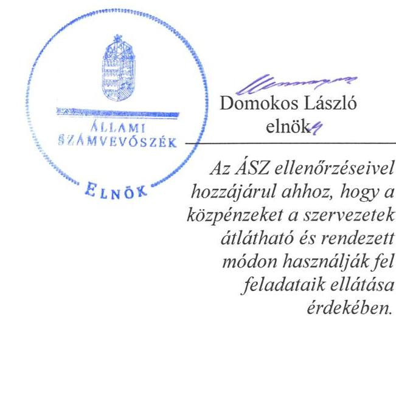
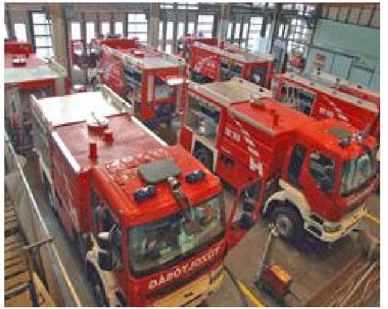
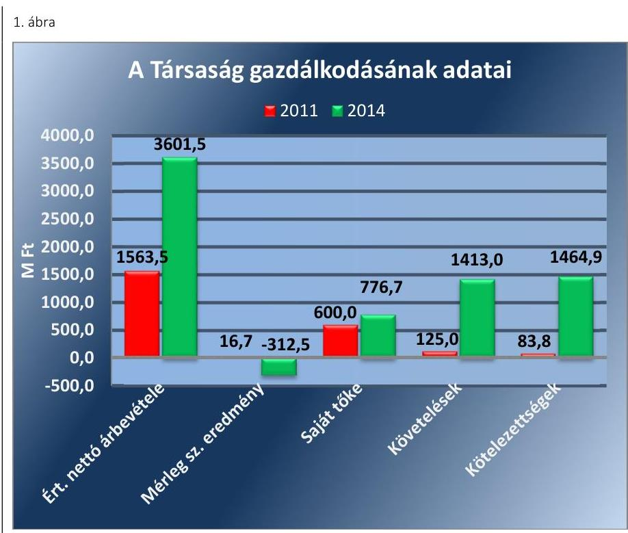
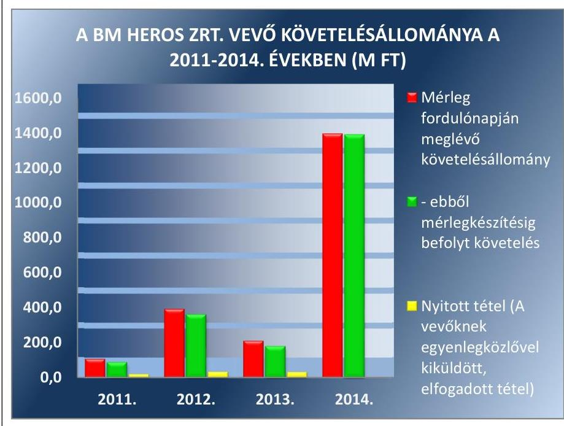
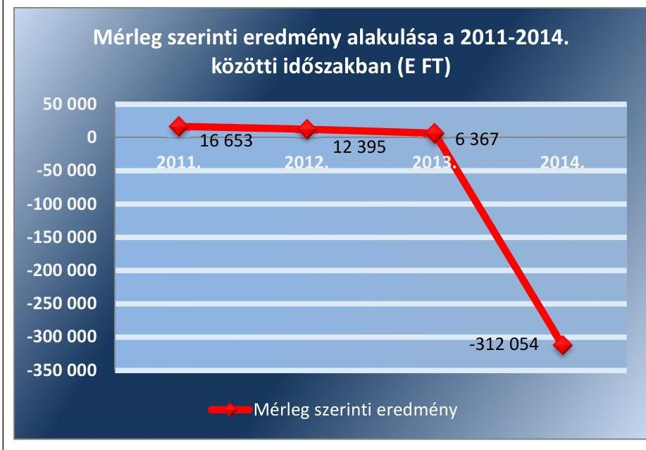

# Jelentés 

## Belügyminisztérium HEROS Javító, Gyártó, Szolgáltató és Kereskedelmi Zrt.

Az állami tulajdonban (résztulajdonban) lévő gazdálkodó szervezetek vagyonmegőrzési és gazdálkodási tevékenységének ellenőrzése 2016.

Az ÁSZ ellenőrzéseivel hozzájárul ahhoz, hogy a közpénzeket a szervezetek átlátható és rendezett módon használják fel feladataik ellátása érdekében.

---

# Jelentés 

## Belügyminisztérium HEROS Javító, Gyártó, Szolgáltató és Kereskedelmi Zrt.

Az állami tulajdonban (résztulajdonban) lévő gazdálkodó szervezetek vagyonmegőrzési és gazdálkodási tevékenységének ellenőrzése
2016. október hó 28. nap

---

# AZ ELLENŐRZÉST FELÜGYELTE:

DR. HORVÁTH MARGIT felügyeleti vezető

## AZ ELLENŐRZÉST VEZETTE ÉS A VÉGREHAJTÁSÁÉRT FELELŐS:

PENCZ MÁRIA ellenőrzésvezető

## A PROGRAM ÖSSZEÁLLÍTÁSÁÉRT FELELŐS:

JANIK JÓZSEF LÁSZLÓ osztályvezető

IKTATÓSZÁM: V-1029-148/2016.

TÉMASZÁM: 2063

ELLENŐRZÉS-AZONOSÍTÓ SZÁM: V070922

Jelentéseink az Országgyűlés számítógépes hálózatán és az Interneten a www.asz.hu címen is olvashatóak.

---

# TARTALOMJEGYZÉK 

■ ÖSSZEGZÉS ..... 5
■ AZ ELLENŐRZÉS CÉLJA ..... 7
■ AZ ELLENŐRZÉS TERÜLETE ..... 8
■ AZ ELLENŐRZÉS HÁTTERE, INDOKOLTSÁGA ..... 10
■ A JELENTÉS LÉNYEGES KÉRDÉSKÖREI ..... 11
■ ELLENŐRZÉS HATÓKÖRE ÉS MÓDSZEREI ..... 12
■ MEGÁLLAPÍTÁSOK ..... 14
■ JAVASLATOK ..... 27
■ MELLÉKLETEK ..... 29
I. sz. melléklet: Értelmező szótár ..... 29
II. sz. melléklet: BM HEROS Zrt. mérlegadatai és változásuk a 2011-2014. közötti években ..... 33
III. sz. melléklet: BM HEROS Zrt. eredményének alakulása a 2011-2014. közötti években ..... 35
■ FÜGGELÉK: ÉSZREVÉTELEK ..... 37
■ RÖVIDÍTÉSEK JEGYZÉKE ..... 39

---

.

---

# ÖSSZEGZÉS 

Az Állami Számvevőszék a BM HEROS Zrt. vagyonmegőrzési és gazdálkodási tevékenységét 2011. január 1. és 2014. december 31. közötti időszakra ellenőrizte. A tulajdonosi joggyakorlók a vagyonnal való gazdálkodás feltételeit összességében szabályszerűen alakították ki. A BM HEROS Zrt. vagyongazdálkodása összességében szabályszerű volt. A BM HEROS Zrt. a beszámoló készítési kötelezettségének szabályszerűen eleget tett. Vagyongazdálkodását érintő információs rendszerét kialakította és megfelelően működtette. A BM HEROS Zrt. az önköltségszámítás rendjét meghatározta. Hiányosságot az ellenőrzés a gazdálkodás gyakorlatában tárt fel.

## Az ellenőrzés társadalmi indokoltsága

Magyarországon az intézmény-centrikus közfeladat-ellátás, közvagyon-gazdálkodás jellemző a költségvetésen kívüli feladatellátás térnyerése mellett. Ennek szereplői az állami tulajdonú gazdálkodó szervezetek is.

Az Áht; 2. § I) pontja, az Európai Közösséget létrehozó szerződéshez csatolt, a túlzott hiány esetén követendő eljárásról szóló jegyzőkönyv alkalmazásáról szóló 2009. május 25-i 479/2009/EK rendelet szerint, illetve az ESA95 és ESA2010 statisztikai módszertana alapján a kormányzati szektorba tartoznak a "központi kormányzat alszektorba besorolt társaságok és egyéb szervezetek" is, amelyekkel szemben alapvető követelmény, hogy gazdálkodásuk, működésük szabályszerű, az általuk szolgáltatott adatok megbízhatóak legyenek.

Az állami vagyonnal való gazdálkodás alapvető célja az állami vagyon átlátható, rendeltetésszerű és felelős felhasználásának biztosítása. Az állami tulajdonban álló gazdálkodó szervezetek államot megillető társasági részesedése a nemzeti vagyon részét képezi és legfőbb rendeltetése szerint a közfeladatok ellátását szolgálja.

Az Állami Számvevőszék stratégiájában megfogalmazta, hogy az államháztartáson kívülre nyújtott költségvetési támogatások és ingyenes vagyonjuttatások, valamint az államháztartáson kívül működő közfeladat-ellátó rendszerek ellenőrzéseivel hozzájárul ahhoz, hogy a közpénzeket az államháztartáson kívül működő szervezetek is átlátható, rendezett módon használják fel a közfeladatok szerződésben vállalt ellátása érdekében.

## Főbb megállapítások, következtetések, javaslatok

A BM HEROS Zrt. tevékenységét saját, illetve bérelt eszközökkel látta el, kezelésbe vett vagyonnal az ellenőrzött időszakban nem rendelkezett.

A tulajdonosi joggyakorlók az állami vagyon értékének megőrzéséhez, gyarapításához, valamint a felelős gazdálkodáshoz szükséges követelményeket meghatározták és azokat összességében megfelelően alkalmazták. A BM OKF, illetve a BM HEROS Zrt. vagyonváltozást eredményező döntéseinek előkészítése és végrehajtása a jogszabályoknak megfelelt.

A BM HEROS Zrt. a vagyongazdálkodás feltételeit szabályszerűen alakította ki, a vagyongazdálkodás szabályozására vonatkozóan elkészítette belső szabályzatait. Vagyonnyilvántartását elkészítette, azonban az az ellenőrzött időszakban részben felelt meg a Számv. tv. előírásainak, mert a készletek mérlegértékének leltárral történő alátámasztását nem biztosította teljes körűen.

A BM HEROS Zrt bevételeinek és ráfordításainak elszámolása részben felelt meg a jogszabályi és belső szabályzatok előírásainak. A szabályszerű önköltségszámítás feltételeit kialakította, de a saját előállítású termékek, a végzett szolgáltatások önköltségét nem az önköltségszámítás rendjére vonatkozó belső szabályzat szerinti utókalkuláció módszerével állapította meg.

A BM HEROS Zrt. az információs rendszerét kialakította és megfelelően működtette.

---

A BM HEROS Zrt. összességében szabályszerűen teljesítette a beszámolási és adatszolgáltatási kötelezettségét. Ugyanakkor a közérdekű adatok nyilvánosságra hozatalát nem biztosította teljes körűen, hiányosan tette közzé az Info tv. szerinti adatokat.

---

# AZ ELLENŐRZÉS CÉLJA 

Az ellenőrzés célja annak értékelése, hogy a tulajdonosi jogok gyakorlása szabályszerű volt-e; a gazdálkodó szervezet által ellátott feladat bevételei, ráfordításai elszámolásának, és vagyongazdálkodási tevékenységének szabályozása megfelelt-e a jogszabályi és a tulajdonosi előírásoknak és azok végrehajtása szabályszerű volt-e; biztosítva volt-e a közfeladatok átláthatósága és elszámoltathatósága érdekében a közszolgáltatás díjának megalapozottsága szabályszerű önköltségszámítással; a vagyonváltozást eredményező döntések esetében a tulajdonosi jogok gyakorlója és a gazdálkodó szervezet szabályszerűen jártak-e el; a gazdálkodó szervezet épített-e ki és működtetett-e információs rendszert a szabályszerű vagyongazdálkodás érdekében.

Az ellenőrzés további célja annak értékelése, hogy a kormányzati szektorba sorolt egyéb szervezetek gazdálkodásának a kormányzati szektor hiányára és az államadósságra befolyással bíró elemei a jogszabályi előírásoknak megfelelnek-e.

---

# AZ ELLENŐRZÉS TERÜLETE

## Belügyminisztérium HEROS Javító, Gyártó, Szolgáltató és Kereskedelmi Zrt.

A BM HEROS Zrt.¹-t 2001. április 27-én, 100%-os állami tulajdonú társaságként alapította egyedüli részvényesként a Magyar Köztársaság Belügyminisztere a 9/2001 (V.11) BM rendelet²-ben foglaltak szerint, a korábban működő Belügyminisztérium Országos Katasztrófavédelmi Főigazgatóság Központi Javítóüzem költségvetési szerv megszüntetésével egyidejűleg. A feladatellátás szervezeti formájának megváltoztatásával az volt a cél, hogy a tűzoltóságok eszközellátásában nagyobb hangsúllyal játsszon szerepet a BM HEROS Zrt., erősödjön a hazai gyártói, beszállítói részarány, egységes, hatékony és rugalmas országos javítóhálózat jöjjön létre, növekedjen a katasztrófavédelmi szervezetek eszközparkjának üzembiztonsága.

A BM HEROS Zrt. fő tevékenysége a közúti gépjármű gyártási és javítási feladatok végzése, tűzoltógépjárművek és egyéb speciális gépjármű felépítmények gyártása, egyéb haszongépjárművek és tűzoltás-technikai eszközök szervizelése, valamint szakanyagok és szakfelszerelések forgalmazása. A korábban szinte teljesen megszűnt magyar tűzoltó eszközök gyártásának pótlására - a katasztrófavédelem új rendszerének kialakítása keretében -, a mentő tűzvédelemben az egységesítés megteremtése érdekében a HEROS Zrt.-nél megkezdődött a hazai tűzoltó járművek gyártása.

A Magyar Állam nevében a tulajdonosi jogokat 2008. január 1. és 2011. május 9. között az MNV Zrt.³ gyakorolta, 2011. május 10-től a 212/2010. (VII.1.) Korm. rendelet és a társasági részesedés feletti jogok és kötelezettségek gyakorlásának átadásáról szóló szerződés alapján a BM OKF⁴ lett a tulajdonosi joggyakorló.

Az Nvtv. előírásainak megfelelően 2013. január 30-tól a BM OKF a társasági részesedések feletti tulajdonosi joggyakorlásra vonatkozóan megbízási szerződést kötött az MNV Zrt-vel.

A BM HEROS Zrt. 340,0 M Ft alapításkori jegyzett tőkéje két lépcsőben 870,0 M Ft-ra emelkedett. A BM HEROS Zrt. az ellenőrzött időszakban saját tulajdonú és bérelt eszközökkel rendelkezett, kezelésbe átvett állami tulajdonban lévő eszközei nem voltak. A BM HEROS Zrt. ellenőrzött időszakbeli gazdálkodásának főbb adatait az 1. ábra szemlélteti:

---

Forrás: BM HEROS Zrt. 2011-2014. évek éves beszámolói
A BM HEROS Zrt. tevékenységét a BM OKF-fel kötött keretszerződés alapján végezte

A BM HEROS Zrt. árbevétele a 2011. évi 1563,5 M Ft-ról 2014. évre 3601,5 M Ft-ra nőtt, mely 130,3%-os növekedést eredményezett. A mérleg szerinti eredmény 2011-2013. években pozitív, a 2014. évben negatív volt. Átlagos statisztikai állományi létszáma a 2011. évi 100 főről 2014. évre 80 főre csökkent.

---

# AZ ELLENŐRZÉS HÁTTERE, INDOKOLTSÁGA 

## AZ ÁSZ ${ }^{5}$ KÖZÉPTÁVRA SZÓLÓ STRATÉGIÁJÁBAN

megfogalmazta, hogy az államháztartáson kívülre nyújtott költségvetési támogatások és ingyenes vagyonjuttatások, valamint az államháztartáson kívül működő közfeladat-ellátó rendszerek ellenőrzéseivel hozzájárul ahhoz, hogy a közpénzeket az államháztartáson kívül működő szervezetek is átlátható, rendezett módon használják fel a közfeladatok szerződésben vállalt ellátása, továbbá a közvagyon szerződésben vállalt átlátható, hatékony, költségtakarékos működtetése, értékének megőrzése, állagának védelme, értéknövelő használata, hasznosítása és gyarapítása érdekében. Az ellenőrzés feladata a közvagyonnal biztosított közfeladat-ellátással kapcsolatban a közpénzek átláthatósága, nyilvánossága érdekében a jogszabályokban, belső szabályzatokban megfogalmazott előírások érvényesülésének az állami tulajdonban (résztulajdonban) lévő gazdálkodó szervezetek vagyonérték-megőrzési és gazdálkodási tevékenységének értékelése.

AZ ELLENŐRZÉS EREDMÉNYEKÉPP a törvényalkotás számára tapasztalatok állnak rendelkezésre az állami vagyonnal való köz-feladat-ellátás, közvagyonnal való gazdálkodás értékeléséhez, az átláthatóságot biztosító szabályozáshoz. Az ellenőrzés tapasztalatai segítik és erősítik az ÁSZ hozzáadott értéket teremtő tevékenységét és tanácsadó szerepét.

---

# A JELENTÉS LÉNYEGES KÉRDÉSKÖREI 

1.     - A tulajdonosi joggyakorló a vagyonnal való gazdálkodás feltételeit szabályszerűen alakította-e ki?
2.     - A BM HEROS Zrt. vagyongazdálkodási tevékenységének szabályozottsága és a vagyon nyilvántartása megfelelt-e az előírásoknak?
3.     - A bevételek és ráfordítások elszámolása, valamint az önköltségszámítás szabályszerű volt-e?
4.     - A vagyonnal való gazdálkodás, valamint a vagyonváltozást eredményező döntések megfeleltek-e a jogszabályi és tulajdonosi előírásoknak?
5.     - A BM HEROS Zrt. a szabályszerű vagyongazdálkodás érdekében teljesítette-e beszámolási, adatszolgáltatási kötelezettségét, kiépített-e, illetve működtetett-e információs rendszert?
6.     - A kormányzati szektor hiányára és az államadósságra befolyást gyakorló elemek a jogszabályi előírásoknak megfeleltek-e?

---

# ELLENŐRZÉS HATÓKÖRE ÉS MÓDSZEREI 

## Az ellenőrzés típusa

Szabályszerűségi ellenőrzés

## Az ellenőrzött időszak

2011. január 1-jétől 2014. december 31-ig.

## Az ellenőrzés tárgya

Az állami tulajdonban (résztulajdonban) lévő gazdálkodó szervezetek vagyonmegőrzési és gazdálkodási tevékenysége és a kormányzati szektor hiányára és adósságállományára hatást gyakorló elemek ellenőrzése.

## Az ellenőrzött szervezet

Belügyminisztérium HEROS Javító, Gyártó, Szolgáltató és Kereskedelmi Zrt., Magyar Nemzeti Vagyonkezelő Zrt. és a Belügyminisztérium Országos Katasztrófavédelmi Főigazgatósága.

## Az ellenőrzés jogalapja

Az ellenőrzés alapját az Állami Számvevőszékről szóló 2011. évi LXVI. törvény 5. § (3)-(5) bekezdése, valamint az állami vagyonról szóló 2007. évi CVI. törvény 3. § (4) bekezdése képezi.

## Az ellenőrzés módszerei

Az ellenőrzést az ellenőrzési program szempontjai, az ellenőrzött időszakban hatályos jogszabályok, az ellenőrzés szakmai szabályai, a jelen ellenőrzésre irányadó ÁSZ módszertan és a nemzetközi standardok figyelembevételével végeztük.

Az ellenőrzési kérdések megválaszolásához szükséges bizonyítékok megszerzése az ellenőrzött által rendelkezésre bocsátott dokumentumokra, adatokra alapozva kérdésfelvetés, mintavételezés, valamint elemző eljárás útján történt.

---

Az ellenőrzési bizonyítékként felhasználható adatforrások közé tartoztak egyrészt a szakmai program részletes szempontjainál felsorolt adatforrások, másrészt minden egyéb - az ellenőrzés folyamán feltárt, az ellenőrzés szempontjából információt tartalmazó - dokumentum.

Az ellenőrzés lefolytatásához a gazdálkodó szervezet a tanúsítványok elektronikus kitöltésével, valamint az ÁSZ által kért dokumentumok megküldésével szolgáltatott adatokat.

A bevételek és ráfordítások elszámolása, valamint a vagyonnyilvántartás terén a szabályszerű működést mintavétellel ellenőriztük.

A kormányzati szektorba sorolt gazdálkodó szervezetnél a személyi jellegű ráfordítások elszámolása mellett az egyéb ráfordítások, pénzügyi műveletek ráfordításai, rendkívüli ráfordítások, illetve az egyéb bevételek, pénzügyi műveletek bevételei, rendkívüli bevételek elszámolásának szabályszerűségét szintén mintatételeken keresztül ellenőriztük.

A véletlen mintavétellel (évenkénti elemszámmal arányos rétegezéssel) ellenőrzött területek esetében minden egyes tétel vonatkozásában a szabályszerűségre vonatkozó kérdéseket tettünk fel, amelyek eredményét összesítettük. A jogszabályoknak és a belső előírásoknak megfelelőnek tekintettük az adott területet, amennyiben a minta ellenőrzésének eredménye alapján 95%-os bizonyossággal a teljes sokaságban a hiba-arány kisebb volt, mint
 10 %, nem megfelelőnek értékeltük, ha a hibaarány a 10 %-ot meghaladta. Kockázatot, illetve magas kockázatot jeleztünk, amennyiben egy adott terület vonatkozásában a minta alapján a teljes sokaságban nem volt egyértelműen biztosított a jogszabályoknak és a belső szabályzatoknak megfelelő működés. A ráfordítások elszámolására és a vagyonnyilvántartásra vonatkozó véletlen mintavételt kockázati alapú kiválasztással egészítettük ki, amelynek során évente a három legnagyobb összegű tételt választottuk ki.

---

# 1. A tulajdonosi joggyakorló a vagyonnal való gazdálkodás feltételeit szabályszerűen alakította-e ki? 

Összegző megállapítás

A tulajdonosi joggyakorlók a BM HEROS Zrt. vagyongazdálkodásának, valamint a tulajdonosi joggyakorlásnak a kereteit szabályszerűen alakították ki, és összességében szabályszerűen gyakorolták.

### 1.1. számú megállapítás

A tulajdonosi joggyakorlók az állami vagyon értékének megőrzéséhez, gyarapításához, valamint a felelős gazdálkodáshoz szükséges követelményeket meghatározták, és azokat a gyakorlatban összességében megfelelően alkalmazták.

Az ellenőrzött időszakban a társasági részesedések feletti tulajdonosi jogokat 2011. május 24-ig az MNV Zrt. gyakorolta. Ezt követően az SZT-36047 számú, a társasági részesedés feletti tulajdonosi jogok és kötelezettségek gyakorlásának átadásáról szóló szerződés alapján az MNV Zrt. a BM HEROS Zrt. társasági részesedése feletti tulajdonosi jogokat a 212/2010. (VII. 1.) Korm. rendelet $^{6}$ alapján átadta a BM OKF-nek.

A TULAJDONOSI JOGGYAKORLÁS keretében a tulajdonosi joggyakorlók az Alapító Okirat $^{7}$ $_{1-13}$-ban és alapítói határozatokon keresztül határozták meg, illetve biztosították a vagyonnal való rendelkezési jogokat. Az Alapító Okirat $_{1-13}$ 5-10. pontjai tartalmazták a vagyonnal való felelős gazdálkodáshoz szükséges követelményeket, többek között meghatározták az alapító, a vezérigazgató, az Igazgatóság, az FB és a könyvvizsgáló jogait, hatáskörét, feladatait, illetve a felelős gazdálkodáshoz való követelményeket. Az Alapító Okirat $_{8-13}$-ban értékhatárokhoz kötötten meghatározták a kötelezettségvállalásra jogosultak körét, továbbá az Alapító Okirat $_{1-13}$ 5. pontjában a Gt. $^{8}$ és a Ptk. $^{9}$ $_{2}$ rendelkezéseivel összhangban rögzítették az alapító döntési jogkörét.

Az Nvtv. $^{10}$ 8. § (7) bekezdés előírásának megfelelően - miszerint a társasági részesedés nem lehet vagyonkezelés tárgya - az MNV Zrt. a BM OKF vagyonkezelési jogát megszüntette, azonban a társasági részesedés tulajdonosi gyakorlására irányuló megbízási szerződés $^{11}$ megkötésére az Nvtv. 18. § (7) bekezdése előírásainak ellenére késedelmesen, 2013. január 30-án került sor.

A BM HEROS Zrt. Alapító Okirata jóval az ellenőrzött időszakot megelőzően, a 9/2001.(V.11.) BM rendelet 2.§-a értelmében, annak mellékleteként került kiadásra, és az ellenőrzött időszakban hatályos volt.

A Gt. $^{12}$ 19. § (5) bekezdésének, a Ptk. $^{13}$ 3: 268. § (1) bekezdésének valamint az Alapító Okirat $_{1-14}$ 5.3. pontjának megfelelően a BM HEROS Zrt.-nél

---

### 1.2. számú megállapítás

közgyűlés nem működött, a legfőbb szerv hatáskörében az egyedüli részvényes Magyar Állam képviselője írásban hozta meg a határozatait, amelyről a vezérigazgatót haladéktalanul értesítette.

A BM HEROS Zrt. székhelyének és telephelyének használatát az ellenőrzött időszak elején, mintegy másfél évig nem alapozta meg bérleti szerződés.

A BM HEROS Zrt. a feladatait saját és bérelt eszközökkel látta el az ellenőrzött időszakban, vagyonkezelésbe vett eszközzel nem rendelkezett.

A BM HEROS Zrt. vidéki és budapesti telephelyeit képező - állami vagyonnak minősülő - ingatlanok a megyei katasztrófavédelmi igazgatóságok, illetve a BM OKF vagyonkezelésében álltak és bérlet jogcímén kerültek használatba vételre. A budapesti telephely az ellenőrzött időszakban apportálásra került, a székhely használatára az MNV Zrt.-vel, mint az állami vagyon kezelőjével bérleti megállapodást kötöttek.

A BM HEROS Zrt. székhelyét 2011. január 1-jétől 2012. július 2-ig, a budapesti telephelyét 2011. január 1-jétől, 2012. augusztus 26-ig szabálytalanul, szerződés nélkül használta. A korábbi, az MNV Zrt. és a BM HEROS Zrt. között megkötött bérleti szerződések 2010. december 31-én lejártak. Az MNV Zrt. mintegy másfél évig nem tett intézkedéseket az állami vagyon állagának védelmére és megőrzésére, ezzel megsértette a Vtv. 23. § (1) és (2) bekezdésében foglalt előírásokat.

Az MNV Zrt. a budapesti telephelyként működő ingatlant a társaságba apportálta, a székhelyre vonatkozóan új bérleti szerződés megkötésére került sor az MNV Zrt. 331/2012 (VI.18.) számú határozata alapján. A Vtv. előírásaival összhangban a bérleti szerződésben rögzítették a BM HEROS Zrt. állagvédelmi és karbantartási kötelezettségét. A bérleti szerződés 3.17. pontja meghatározta a BM HEROS Zrt. beszámolási, nyilvántartási és adatszolgáltatási kötelezettségét. Az adatszolgáltatás részletes tartalmát, formáját, az MNV Zrt. a Vagyonnyilvántartási $^{14}$ szabályzatában rögzítették.

# 2. A BM HEROS Zrt. vagyongazdálkodási tevékenységének szabályozottsága és a vagyon nyilvántartása megfelelt-e az előírásoknak? 

Összegző megállapítás

### 2.1. számú megállapítás

A BM HEROS Zrt. vagyongazdálkodási tevékenységét a jogszabályi előírásokkal összhangban szabályozta, vagyonnyilvántartása a leltározás hiányosságai miatt részben felelt meg a jogszabályok és a belső szabályzatok előírásainak.

A BM HEROS Zrt. a vagyon értékének megőrzését, gyarapítását biztosító vagyongazdálkodás feltételeit szabályszerűen alakította ki.

A BM HEROS Zrt. vagyongazdálkodásának alapvető feltételeit az Alapító Okirat $^{14}$-ban az Alapító meghatározta. Ezen túlmenően a BM HEROS Zrt. a gazdálkodására vonatkozó elképzeléseit, a vállalati stratégia irányelveit,

---

a három évre szóló gazdálkodási kitekintést az éves üzleti terveiben fogalmazta meg. A 2011-2014. évekre vonatkozó üzleti terveket a tulajdonosi joggyakorló MNV Zrt. és BM OKF alapítói határozattal fogadta el.

ÜZLETI TERV elkészítéséhez a 2011. évre vonatkozóan a tulajdonosi joggyakorló MNV Zrt. tervezési irányelvek alkalmazását írta elő, amely tartalmazta az alkalmazandó makrogazdasági mutatókat, árfolyamokat, a nyereségre vonatkozó elvárásokat, illetve az üzleti tervet alátámasztó, likviditásra, eredményességre vonatkozó terveket, mellékleteket. A BM OKF - a 2011. május 25-ét követő időszakban - a korábbi tulajdonosi joggyakorló MNV Zrt. tervezési irányelveinek alkalmazását írta elő változatlan formában a BM HEROS Zrt. részére. Az üzleti tervek készítéséhez a BM HEROS Zrt. a tulajdonos által előírt tervezési irányelveket alkalmazta.

A BM HEROS Zrt. a tulajdonosi joggyakorló MNV Zrt. és BM OKF felé negyedévente kontrolling jelentéseket készített, melyek alapját a főkönyvi könyvelésben kimutatott vagyonváltozások képezték.

A BM HEROS Zrt. a gazdálkodása szabályozására vonatkozóan elkészítette belső szabályzatait. A Számviteli Politika $_{1-5}$ $^{15}$, a Leltározási Szabályzat $_{1-3}$ $^{16}$, és a Számlarend $_{1-3}$ $^{17}$ megfeleltek a Számv. tv $^{18}$. előírásainak. A Számv. tv előírásának megfelelően a Számviteli politika $_{1-5}$ részeként készítette el a BM HEROS Zrt. a Leltározási Szabályzat $_{1-3}$-ot, az Eszközök és Források Értékelési Szabályzat $^{19}$-át, az Önköltségszámítási Szabályzat $_{1-3}$ $^{20}$-át, és a Pénzkezelési Szabályzat $_{1-3}$ $^{21}$-át.

A BM HEROS Zrt. az ellenőrzött időszakban rendelkezett SZMSZ $_{1-4}$ $^{22}$-el, amely meghatározta a szervezeti felépítését, a vezetők feladatait, a hatásköröket, a szervezeti egységek feladatait, a kötelezettségvállalási jogosultságokat, a működés rendjét.
2.2. számú megállapítás

A BM HEROS Zrt. vagyonnyilvántartása részben felelt meg a jogszabályi előírásoknak és a belső szabályozásnak, mert a 2011-2014. évi beszámolók leltárral történő alátámasztását - a készletek nem megfelelő kimutatása miatt - nem teljes körűen biztosította.

A BM HEROS Zrt. az ellenőrzött időszakban állami vagyont nem kezelt, ehhez kapcsolódó elkülönítési kötelezettsége nem keletkezett.

## A VAGYONTÁRGYAK ÁLLOMÁNYÁNAK LELTÁRRAL történő alátámasztása részben felelt meg a Számv. tv. 15. § (3), a Számv. tv. 69. § (1) bekezdésében és a Leltározási Szabályzat $_{1-3}$-ban foglaltaknak, mert az ellenőrzött időszak éves beszámolóiban kimutatott készletek leltárral történő alátámasztása nem teljes körűen volt biztosított.

A 2011-2014. évekre vonatkozóan Összefoglaló leltár jegyzőkönyvek készültek, amelyek a készletek nyilvántartási és leltári értékét, valamint a leltár különbözeteket (többlet, hiány) raktáranként összesítve tartalmazták, de főkönyvi nyilvántartási számonként nem kerültek összesítésre. A 2011-2014. évi Összefoglaló leltár jegyzőkönyvekben kimutatott készletek értéke nem egyezett meg és nem támasztotta alá a 2011-2014. évi mérlegben és a záró főkönyvi kivonatban kimutatott értéket. A hiba nagysága nem érte el a Számv. tv. 3. § (3) bekezdés 3. pontja szerint a jelentős összegű hibahatárt.

---

# 3. A bevételek és ráfordítások elszámolása, valamint az önköltségszámítás szabályszerű volt-e? 

Összegző megállapítás

A bevételek és ráfordítások elszámolása a BM HEROS Zrt.-nél részben volt szabályszerű. Az önköltségszámítás rendjét meghatározták, a gyakorlatban azonban helytelenül alkalmazták.

### 3.1. számú megállapítás

A BM HEROS Zrt bevételeinek és ráfordításainak elszámolása - a feltárt hibák miatt - részben felelt meg a jogszabályi és belső szabályzatok előírásainak.

A BM HEROS Zrt.-nek a Vtv.-ben előírt visszapótlási kötelezettsége - vagyonkezelt eszközök hiányában - nem állt fenn.

AZ ÉRTÉKESÍTÉS NETTÓ ÁRBEVÉTELÉNEK elszámolása szabályszerű volt. BM HEROS Zrt. által végzett tevékenységekre alkalmazott óradíjak és fix szolgáltatások rendjét vezérigazgatói utasítás tartalmazta.

AZ ANYAGJELLEGŰ RÁFORDÍTÁSOK elszámolása esetében a könyvviteli elszámolást közvetlenül és közvetetten alátámasztó számviteli bizonylatokat nem minden esetben őrizték meg a könyvelési feljegyzések hivatkozása alapján visszakereshető módon legalább 8 évig, ezáltal nem tartották be teljes körűen a Számv. tv. 169. § (2) bekezdésében foglalt előírást.

A BERUHÁZÁSOK, FELÚJÍTÁSOK KIADÁSAI ÉS AZ ÉRTÉKCSÖKKENÉSI LEÍRÁS elszámolása a BM HEROS Zrt.-nél a Számv. tv. és a Számviteli Politika $_{1-5}$ előírásainak megfelelt. A kiadást megalapozó kötelezettségvállalás, a pénzügyi elszámolás, valamint az értékcsökkenések elszámolása a jogszabályi előírásoknak és a belső szabályozásnak megfelelően történt.

A KORMÁNYZATI SZEKTOR HIÁNYÁRA BEFOLYÁST GYAKORLÓ személyi jellegű ráfordítások elszámolása szabályszerűen, a Számv. tv.-ben foglaltak alapján történt. A bérköltségek elszámolásához a hatályos munkaszerződések és fizetési jegyzékek, rendelkezésre álltak, a munkavégzés idejét alátámasztották.

AZ EGYÉB RÁFORDÍTÁSOK elszámolása az ellenőrzött időszakban nem volt szabályszerű. Az egyéb ráfordítások 2014. évi beszámolóban kimutatott, előző évhez viszonyított, 313,5 %-os növekedését a 121,0 M Ft értékben elszámolt céltartalékképzés jelentősen befolyásolta. A mérlegben céltartalékok mérlegsoron kimutatott értéken belül a két legjelentősebb tételt nem megfelelő mérlegsoron mutatták ki, ugyanakkor eredményre gyakorolt hatását tekintve az elszámolás megfelelő volt. BM Heros Zrt. a céltartalékok mérlegértékének nem szabályszerű kimutatásával megsértette a Számv. tv. 15. § (3) bekezdésében foglalt valódiság elvét, valamint a Számv. tv. 16. § (4) bekezdésében előírt lényegesség elvét, továbbá a Számviteli politika $_{1-5}$ lényegességre vonatkozó szabályait.

---

- A 2014. év végén kiszámlázott és elszámolt nettó árbevételhez kapcsolódóan, a 2015. évben felmerülő költségek fedezetére 58,3 M Ft összegben céltartalékot képzett egyéb ráfordítások terhére. Eljárása ellentétes a Számv. tv. 16. § (2) bekezdésében foglalt időbeli elhatárolás elvével, mivel a mérlegben céltartalékként mutatták ki a várható költségek fedezetére elszámolt összeget, ellentétben a Számv. tv. 44. § (1) bekezdése b) pontjában foglaltakkal, amely alapján passzív időbeli elhatárolásként kellett volna kimutatni a mérleg fordulónapja előtti időszakot terhelő költségeket. A Számv. tv. 41. § (3) bekezdése alapján a BM HEROS Zrt. nem képezhetett volna céltartalékot a 2014. évben kiszámlázott szolgáltatások 2015. évben felmerült költségeire, mivel azok a szokásos üzleti tevékenységének rendszeresen és folyamatosan felmerülő költségei voltak.
- A készletek 2014. évi leltározása során a Leltározási szabályzat 5.2.2. pontjában rögzítettek ellenére nem tárták fel a feleslegessé vált készleteket, amelyekkel kapcsolatosan a
 2014. évi beszámolóban a várható veszteségek fedezetére 50,0 M Ft értékben céltartalékot képeztek egyéb ráfordítások terhére. A BM HEROS Zrt. eljárása nem felelt meg a Számv. tv. 56. § (2) bekezdésében foglalt előírásoknak, amely szerint értékvesztést kell elszámolni a készlet után, amennyiben eredeti rendeltetésének nem felel meg, ha megrongálódott, felhasználása, értékesítése kétségessé vált, feleslegessé vált. Nem felelt meg a céltartalék képzés elszámolás a Számv. tv. 15. § (3) bekezdésben foglalt valódiság elvének, mivel az üzleti év mérlegében kimutatott készletek értékét nem csökkentették az értékvesztés összegével, ezzel szemben céltartalékként mutatták ki a mérlegben a várható veszteségek fedezetére képzett összeget. A BM HEROS Zrt. szabálytalan eljárása sértette a Számviteli politika 1-5 értékvesztések elszámolására vonatkozó szabályait, valamint a Leltározási Szabályzat 1-3-ban foglalt előírásokat.

AZ EGYÉB BEVÉTELEK ELSZÁMOLÁSA nem volt megfelelő a BM HEROS Zrt.-nél az ellenőrzött időszakban, mivel a Számv. tv. 72. § (1) bekezdése előírásai ellenére értékesítés nettó árbevétele helyett egyéb bevételként számolták el a kiszámlázott, közvetített szolgáltatásokat (jellemzően bérleti díj, közüzemi költségek, közbeszerzési tender anyag költsége, telefonköltség és parkolási díj továbbszámlázása).

A KÖVETELÉS ÁLLOMÁNY csökkentéséről és a behajthatatlan követelések leírásáról a BM HEROS Zrt. a jogszabályi és a tulajdonosi joggyakorló MNV Zrt. és BM OKF által meghatározott előírások alapján intézkedett. A BM HEROS Zrt. a követelések összegét a Számv. tv. 29. § (1) és (2) bekezdései előírásainak és a Számviteli Politika 1-5-ben rögzített elvek és módszerek alapján az ott rögzített mértékeknek megfelelően vette nyilvántartásba.

---

A BM HEROS Zrt. követelésállományának alakulását az 2. ábra mutatja be.
2. ábra

Forrás: BM HEROS ZRT 2011-2014. évek éves beszámolói.

A BM HEROS Zrt. követelésállománya a 2011. évhez viszonyítva jelentősen növekedett, 2014. év végére elérte az 1 413,0 M Ft-ot.

A követeléseken belül a Követelések áruszállításból és szolgáltatásból (vevők) értéke volt meghatározó, 2014. évben 1 396,0 M Ft-ot tett ki, melyből a BM OKF felé fennálló követelés összege 1 246,3 M Ft. volt. A követelés esedékessége 2014.12.29 volt, azonban a BM OKF késedelmesen, a mérleg készítéséig rendezte azt. A BM HEROS Zrt. a követelésállomány csökkentése érdekében intézkedett. A költség-haszon elvre tekintettel hátralékos követeléseinek behajtására jogi intézkedéseket kezdeményezett, felszámolás esetén igénybejelentéssel élt, behajthatatlan követeléseit könyveiből kivezette.

# 3.2. számú megállapítás 

A BM HEROS Zrt. a szabályszerű önköltségszámítás feltételeit kialakította, de önköltségét nem az önköltségszámítás rendjére vonatkozó belső szabályzat szerinti utókalkuláció módszerével állapította meg.

A BM HEROS ZRT. ÁRKÉPZÉSÉT MEGALAPOZÓ, az önköltségszámítás rendjét tartalmazó Önköltségszámítási Szabályzat 1-3 összhangban volt a Számv. tv. 14. § (5) bekezdés c) pontjának, illetve (7) bekezdésének előírásaival és a tulajdonosi irányelvekkel, ugyanakkor az önköltségszámítás alkalmazott gyakorlata nem felelt meg a szabályozásnak.

A BM HEROS Zrt. a 2011-2014. években a saját előállítású termékek, a végzett szolgáltatások önköltségét nem az önköltségszámítás rendjére vonatkozó belső szabályzat 2.3.5 pontja szerinti utókalkuláció módszerével állapította meg. A költségnem számlákon elszámolt közvetlen költségeket

---

nem a megfelelő szolgáltatásra számolták el, a felosztandó közvetett költségeket nem osztották fel az Önköltségszámítási Szabályzat 1-3-ban meghatározott pótlékoló kalkulációval, az előírt vetítési alapok (közvetlen munkaórák) figyelembevételével.

A BM HEROS Zrt.-nél alkalmazott, szabálytalan önköltségszámítási gyakorlat miatt a 2011-2014. évi beszámolókban, a Befejezetlen termelés és félkésztermékek mérlegsoron kimutatott érték nem felelt meg a Számv. tv. 62. § (2) bekezdésében foglaltaknak, mivel azok bekerülési értéke (előállítási érték) nem a Számv. tv. 51. § szerinti, az Önköltségszámítási Szabályzatban meghatározott utókalkulációval megállapított közvetlen önköltség volt. A BM HEROS Zrt. szabálytalan eljárása sértette a Számviteli politika 1-5 2.5. pontjában előírt számviteli elveket, amely szerint a befejezetlen termelés értékét az Önköltségszámítási Szabályzat 1-3-ban foglaltak szerint kellett megállapítani.

# 4. A vagyonnal való gazdálkodás, valamint a vagyonváltozást eredményező döntések megfeleltek-e a jogszabályi és tulajdonosi előírásoknak? 

## Összegző megállapítás

A BM HEROS Zrt. vagyonnal való gazdálkodása, valamint a tulajdonosi jogok gyakorlói és a gazdálkodó szervezet által meghozott, vagyonváltozást eredményező döntések a jogszabályi és a tulajdonosi előírásoknak megfeleltek.

## 4.1. számú megállapítás

A BM HEROS Zrt. vagyongazdálkodási tevékenysége megfelelt a Számv. tv., valamint a Számviteli politika 1-5 előírásainak.

## BEFEKTETETT ESZKÖZEINEK könyv szerinti értéke a 2011.

évi értékhez képest az ellenőrzött időszak végére jelentősen, 6,8 szorosára növekedett a nagy értékű, 470,1 M Ft összegű ingatlan apport, valamint a jelentős értékű beruházások következtében. A BM HEROS Zrt.-nél a 2013. évben 171,8 M Ft összegben tárgyi eszköz beruházásra került sor az üzleti tervekben megfogalmazott cél, a tűzoltó gépjárművek és egyéb speciális gépjármű felépítmények gyártása, valamint egyéb haszongépjárművek és tűzoltás technikai eszközök szervizének fejlesztése, bővítése érdekében. Az apport értékét és az ellenőrzött időszak beruházásait az 1. táblázat szemlélteti.

1. táblázat

AZ APPORT ÉRTÉKE ÉS A BM HEROS ZRT. BERUHÁZÁSAI A 2011-2014. ÉVEKRE VONATKOZÓAN (M FT)

|  | 2011. | 2012. | 2013. | 2014. | Összesen |
| :-- | :--: | :--: | :--: | :--: | :--: |
| Beruházás | 39,2 | 87,4 | 171,8 | 23,7 | 322,1 |
| Apport | - | 470,0 | - | - | 470,0 |
| Összesen | 39,2 | 554,4 | 171,8 | 23,7 | 792,1 |

A BM HEROS Zrt. eszközeinek karbantartására elszámolt összegek a 2014. évre 73,5%-kal, 9,8 M Ft-ról 17,0 M Ft-ra növekedtek a 2011. évi értékhez viszonyítva.

---

A BM HEROS Zrt. árbevétele a 2011-2013. közötti időszakban növekedett, majd a 2014. évben 25,4%-os visszaesés következett be, amely döntően az előző évek termelési kapacitás bővítésének kihasználatlansága miatt következett be.

A BM HEROS Zrt. eszközeinek karbantartására elszámolt összegek a 2014. évre 73,5%-kal, 9,8 M Ft-ról 17,0 M Ft-ra növekedtek a 2011. évi értékhez viszonyítva.

A tárgyi eszközök elhasználódási szintje a 2011. évi 71,9%-ról a nagy értékű ingatlan apport és a folyamatos eszköz és gépjárműpótlás következtében a 2012-2013. években 33,1%-ra, illetve 31,8%-ra csökkent, majd 2014. évben kismértékű emelkedés volt tapasztalható, amit a 2. táblázat mutat be.
2. táblázat

# A BM HEROS ZRT. TÁRGYI ESZKÖZEINEK ELHASZNÁLÓDÁSI SZINTJE A 2011-2014. ÉVEKRE VONATKOZÓAN (M FT) 

| Ózleti év | Elszámolt halmozott értékcsökkenés | Bruttó érték összesen | Elhasználódási szint (%). ÉCS/Bruttó érték |
| :--: | :--: | :--: | :--: |
| 2011. | 262,4 | 365,1 | 71,9 |
| 2012. | 306,7 | 926,5 | 33,1 |
| 2013. | 347,4 | 1092,4 | 31,8 |
| 2014. | 382,0 | 1084,0 | 35,2 |

A BM HEROS Zrt. árbevétele a 2011-2013. közötti időszakban növekedett, majd a 2014. évben 25,4%-os visszaesés következett be, amely döntően az előző évek termelési kapacitás bővítésének kihasználatlansága miatt következett be.

A BM HEROS Zrt. mérleg szerinti eredményének alakulását az ellenőrzött időszakban a 3. ábra szemlélteti:
3. ábra

A BM HEROS Zrt. 2014. évben veszteségesen gazdálkodott. A 2014. évi mérleg szerinti eredmény 312,1 M Ft veszteség volt, amely a nagy összegű (121,0 M Ft) céltartalékképzés, az aktivált saját teljesítmények értékének csökkenése (237,7 M Ft), valamint a jelentős árbevétel csökkenés

---

(1 226 M Ft) miatt következett be. A BM HEROS Zrt.-nél az osztalékfizetés feltételei a 2011-2013. években fennálltak, azonban a tulajdonosi joggyakorló a 2011-2014. éves beszámolók elfogadása során hozott döntéseinek megfelelően a BM HEROS Zrt. osztalékot nem fizetett az ellenőrzött időszakban.

# 4.2. számú megállapítás 

A tulajdonosi joggyakorlók, illetve a BM HEROS Zrt. vagyonváltozást eredményező döntéseinek előkészítése és végrehajtása a jogszabályoknak megfelelt.

## A VAGYONVÁLTOZÁST EREDMÉNYEZŐ DÖNTÉ-

SEKET a tulajdonosi joggyakorló BM OKF az Alapítói határozatokon, üzleti terveken, valamint az éves beszámolóknak a jóváhagyásán keresztül hozta.

A tulajdonosi joggyakorló BM OKF szabályozta a BM HEROS Zrt. szervezetén belüli döntési, kötelezettségvállalási jogköröket. A szabályozás szerinti eljárási rendet és a szabályozásnak megfelelő működést az Igazgatóság, az FB, valamint a BM OKF folyamatosan kontrollálta.

A BM OKF Ellenőrzési Szolgálata folyamatosan ellenőrizte - éves ellenőrzési programja alapján - a BM HEROS Zrt. teljes működését és gazdálkodását.

A tulajdonosi joggyakorló BM OKF részére a BM HEROS Zrt. gazdálkodási, gyártási és szolgáltatási tevékenységének ellenőrzése, a problémák feltárása, és a beavatkozási lehetősége biztosított volt, az ehhez szükséges feltétel- és eszközrendszer rendelkezésre állt. A BM OKF egymásra épülő, rendszeres és eseti jelentési- és ellenőrzési rendszer kialakításával, és folyamatos működtetésével gondoskodott a BM HEROS Zrt. vagyonvédelméről és gazdálkodási fegyelmének ellenőrzéséről.

A vagyongazdálkodást érintő döntések előterjesztései tartalmi és formai szempontból megfeleltek a tulajdonosi joggyakorlók előírásainak. Az információ-szolgáltatás megfelelő alapot biztosított a döntések előkészítéséhez. A BM HEROS Zrt. a döntéshozatal során az Alapító Okirat 1-14 szerinti döntési jogköröket, jogosultsági szabályokat betartotta.
2012. augusztus 2-tól a tulajdonosi joggyakorló BM OKF a vagyonkezelésében lévő, feladatainak ellátását szolgáló járművek javítását, karbantartását, felújítását és a járműpark bővítését a Kbt²³₂ 9. § (1) bekezdés ka) pontja szerint kötött In-house megállapodás alapján a BM HEROS Zrt. végezte, ezáltal a Kbt₂ 6. § (1) bekezdés d) pontja szerinti valamennyi beszerzése tekintetében ajánlatkérőnek minősült. A BM HEROS Zrt. a Kbt 2 6. § (1) d) pontjának megfelelően és a Közbeszerzési szabályzat 1-2-ben meghatározottak szerint az ellenőrzött időszakban lefolytatta a közbeszerzési eljárásokat. A BM HEROS Zrt. a Kbt 2 30. § (1) bekezdésének megfelelően, mint ajánlatkérő hirdetményt tett közzé és a Kbt₂ 30. § (2) bekezdésének megfelelően a közbeszerzési eljárást hirdetmény közzétételével zárta.

---

# 5. A BM HEROS Zrt. a szabályszerű vagyongazdálkodás érdekében teljesítette-e beszámolási, adatszolgáltatási kötelezettségét, kiépített-e, illetve működtetett-e információs rendszert? 

Összegző megállapítás

A BM HEROS Zrt. beszámoló készítési kötelezettségének összességében szabályszerűen eleget tett. Vagyongazdálkodását érintően az információs rendszert kialakította és megfelelően működtette.

### 5.1. számú megállapítás

A BM HEROS Zrt. összességében szabályszerűen teljesítette a beszámolási és adatszolgáltatási kötelezettségét, ugyanakkor a közérdekű adatok nyilvánosságra hozatalát nem teljes körűen biztosította.

A BM HEROS Zrt. részére a tulajdonosi joggyakorló BM OKF az éves beszámoló elkészítésének kötelezettségén túl - az Alapító Okiratban 2012. májustól - havi gyorsjelentés készítésének kötelezettségét írta elő. A BM HEROS Zrt. az éves beszámoló elkészítését az SZMSZ 1-4-ben és a Számviteli Politika 1-5-ben szabályozta, a havi gyorsjelentésről a 16/2012 (VI.15.) számú vezérigazgatói utasítás rendelkezett.

A BM HEROS Zrt. a tulajdonosi joggyakorló MNV Zrt. és BM OKF által meghatározott tervezési útmutatóknak és az SZMSZ 1-4 előírásainak megfelelően rendszeresen, intézkedési terv alapján, havonta, negyedévente és évente írásban számolt be a tulajdonosi joggyakorlók felé gazdálkodásáról, működési tevékenységéről.

A BM HEROS Zrt. 2012. májustól minden hónapról elkészítette és határidőben megküldte a BM OKF részére a gyorsjelentéseket. A belső információs rendszer keretében minden negyedévről üzleti jelentés is készült, amely megküldésre került az FB és a BM OKF felé.

A BM HEROS Zrt. a Számv. tv. előírása alapján az ellenőrzött
 időszakban könyvvizsgálatra kötelezett volt. A Gt. és a $\mathrm{Ptk}_{2}$. előírásai alapján a tulajdonosi joggyakorló BM OKF a 12/2011 (06.30) számú alapítói határozatban döntött a könyvvizsgáló megválasztásáról, amely alapján a BM HEROS Zrt. vezérigazgatója megkötötte a könyvvizsgálói szerződést.

A KÖNYVVIZSGÁLÓ az ellenőrzött időszakban vizsgálta és véleményezte BM HEROS Zrt. éves beszámolóit, melynek alapján - a Számv. tv. 156. § (5) bekezdésének megfelelő tartalommal - elkészítette könyvvizsgálói jelentését. A könyvvizsgáló a BM HEROS Zrt. beszámolóit az ellenőrzött időszak minden évében a Számv. tv 3. § (13) bekezdés 1) pontja szerinti hitelesítő záradékkal látta el, és nem észrevételezte a készletek megfelelő leltári alátámasztásának hiányát, valamint a nem megfelelő céltartalék-képzésnek a 2011-2014. évi beszámolókra gyakorolt hatását.

A BM HEROS Zrt. a Számviteli Politika ${ }_{1-5}$ és a Számv. tv. előírásainak megfelelően éves beszámoló készítésére volt kötelezett. Az éves beszámolókat a BM HEROS Zrt. a Számv. tv. előírásai alapján elkészítette. Az FB a Gt. és a Ptk. ${ }_{2}$ előírásainak megfelelően az éves beszámolóról szóló írásbeli jelentést készített, és azt a tulajdonosi joggyakorlónak megküldte. A tulajdonosi joggyakorló az éves beszámolókat a Gt., valamint a Ptk. 2 előírásainak megfelelően, az FB és a könyvvizsgáló írásos jelentése birtokában fogadta el.

Az éves beszámolók letétbe helyezési és közzétételi kötelezettségének a BM HEROS Zrt. a Számv. tv. 153. § (1) és a 154. § (10) bekezdésében foglalt határidőhöz képest a 2011. évben 12 nap késéssel, a 2012-2014. években határidőben tett eleget. A BM HEROS Zrt. a Számviteli Politika ${ }_{1-5}$-ban a letétbe helyezési kötelezettség dátumaként a mérlegfordulónapot követő 150. napot határozta meg, amelyhez képest a 2011., 2012. és 2014. években késve tette közzé a beszámolóját, a 2013. évben határidőben teljesítette a közzétételi kötelezettséget.

Az éves beszámolók elkészítésével, jóváhagyásával és közzétételével kapcsolatos dátumokat a 3. táblázat szemlélteti:
3. táblázat

# AZ BM HEROS ZRT. ÉVES BESZÁMOLÓINAK ELKÉSZÍTÉSÉVEL, JÓVÁHAGYÁSÁVAL, KÖZZÉTÉTELÉVEL KAPCSOLATOS IDŐPONTOK 

| Megnevezés | 2011. | 2012. | 2013. | 2014. |
| :-- | :--: | :--: | :--: | :--: |
| Beszámoló aláírása | 2012.05.25. | 2013.05.28. | 2014.05.15. | 2015.04.30. |
| Alapítói döntés | 2012.05.30. | 2013.05.29. | 2014.05.28. | 2015.05.29. |
| Közzététel és letétbe he-   lyezés | 2012.06.12. | 2013.05.31. | 2014.05.30. | 2015.06.01. |
| Számv. tv. szerinti közzété-   teli és letétbe helyezési ha-   táridó | 2012.05.31. | 2013.05.31. | 2014.06.02. | 2015.06.01. |
| Számviteli Politika szerinti   közzétételi és letétbe he-   lyezési határidó | 2012.05.29. | 2013.05.30. | 2014.05.30. | 2015.05.30. |

Forrás: 2011-2014. évi beszámolók, benyújtás nyugtái, alapítói határozatok

## ELEKTRONIKUS KÖZZÉTÉTELI KÖTELEZETTSÉ-

GÉT nem az Avtv. 19. § (1)-(3) és az Info tv. 33. § (1) és 37. § (1) bekezdésében foglaltak szerint teljesítette, hiányosan tette közzé az Info tv. 1. számú melléklete I. részében felsorolt dokumentumokat, mert hiányoztak a társaság szervezeti felépítése, illetve a törvényességi felügyeletét ellátó szervre vonatkozó adatok. Nem tette közzé az Info tv. II. részében meghatározott, a tevékenységre, működésre vonatkozó adatokat, továbbá a III. részben felsorolt gazdálkodási adatokat.
5.2. számú megállapítás

A BM HEROS Zrt. az információs rendszert kialakította és megfelelően működtette.

## A VAGYONGAZDÁLKODÁST ÉRINTŐ INFORMÁ-

CIÓS RENDSZERT a BM HEROS Zrt.-nél az Alapító Okirat ${ }_{1-14}$-ban és az SZMSZ ${ }_{1-4}$-ben szabályozták az ellenőrzött időszakban. Az Alapító Okirat ${ }_{1-14}$ és az SZMSZ ${ }_{1-4}$ tartalmazta a tulajdonosi joggyakorló MNV Zrt. és BM OKF, az Igazgatóság, a vezérigazgató és az FB hatáskörét, döntési kompetenciáit, továbbá a testületi ülések gyakoriságát.

Az SZMSZ ${ }_{1-4}$-ben szabályozták a BM HEROS Zrt. szervezeti felépítését, a feladat- és hatásköröket, a kötelezettségvállalási és utalványozási jogosultságokat, valamint a döntési jogokat és hatásköröket, valamint az egyes döntési szintekhez kötött kötelezettségvállalási és döntési kompetenciákat.

A BM HEROS Zrt.-nél a vagyongazdálkodást szabályozó információs rendszer az előírásoknak megfelelően működött, az adatszolgáltatások, jelentések az előírt gyakorisággal benyújtásra kerültek a tulajdonosi joggyakorlók felé, az Alapító okiratban és az SZMSZ-ben meghatározott döntési és hatásköri kompetenciákat betartották.

BELSŐ ELLENŐRT a BM HEROS Zrt. nem foglalkoztatott, a 370/2011 (XII.31) Korm. rendelet szerinti kötelezettség nem terhelte, a tulajdonosi joggyakorló nem írta elő részére. A tulajdonosi joggyakorló MNV Zrt. nem végeztetett belső, illetve külső szakértői ellenőrzést, a BM OKF a vagyongazdálkodásra vonatkozóan négy ellenőrzést végzett a vizsgált időszakban. Az ellenőrzésekről jelentés készült, a feltárt hiányosságok, szabálytalanságok megszüntetésére a BM HEROS Zrt. minden esetben intézkedési tervet készített, amelyeket megküldött a tulajdonosi joggyakorló BM OKF-nek elfogadásra. Az intézkedési tervekben foglaltakat végrehajtották, amelyről a BM OKF-et tájékoztatták.

# 6. A kormányzati szektor hiányára és az államadósságra befolyást gyakorló elemek a jogszabályi előírásoknak megfeleltek-e? 

Összegző megállapítás

A kormányzati szektorba sorolt egyéb szervezetek részére előírt többletkötelezettségek a BM HEROS Zrt.-t nem terhelték, az adósságot keletkeztető ügyletek megkötése és számviteli elszámolása szabályszerű volt.
6.1. számú megállapítás

A 2012-2014. években vállalt, adósságot keletkeztető ügyletek megkötése, nyilvántartása és elszámolása a Számv. tv. előírásainak megfelelően történt.

A BM HEROS Zrt. 2015. évben visszamenőlegesen, 2010-től kezdődően került besorolásra a kormányzati szektorba, így a korábbi időszak adósságot keletkeztető ügyleteinek megkötéséhez nem volt szükség - a Stabilitási tv. ${ }^{24}$ 9. §-ában és a 353/2011. (XII.30.) Korm. rendelet 11. §-ában előírtak szerint - az államháztartásért felelős miniszter előzetes hozzájárulására. A BM HEROS Zrt.-t nem terhelte a kormányzati szektorba sorolt egyéb szervezet részére előírt adatszolgáltatással kapcsolatos többletkötelezettség teljesítése az ellenőrzött időszakban.

A BM HEROS Zrt. a 2012-2014. években, három esetben kötött folyószámla-hitelkeretszerződést, éven belüli lejáratra, forint alapon; illetve tizenkét esetben két éves futamidejű, zárt végű pénzügyi lízing ügyletet. Az ellenőrzött időszakban kötött hitelszerződéseket az 4. táblázat mutatja be.

4. táblázat

# A BM HEROS ZRT. HITELSZERZŐDÉSEI A 2011-2014. ÉVEKBEN (M FT) 

| Megnevezés | 1.hitel | 2.hitel | 3.hitel |
| :-- | :--: | :--: | :--: |
| Hitelkeret összege | $70,0 \mathrm{MFt}$ | $70,0 \mathrm{MFt}$ | 150 MFt |
| Szerződéskötés időpontja | 2012.05.08. | 2013.05.23. | 2014.04.29. |
| Lejárat időpontja | 2013.05.07. | 2014.05.06. | 2015.05.05. |

A BM HEROS ZRT. PÉNZÜGYI LÍZINGSZERZŐDÉSEI A 2011-2014. ÉVEKBEN (M FT)

| Sorszám | Szerződéskötés időpontja | Lízingösszeg (M Ft) | Futamidő |
| :--: | :--: | :--: | :--: |
| 1. | 2012.03.06. | 3,6 | 24 hónap |
| 2. | 2012.03.06. | 3,6 | 24 hónap |
| 3. | 2012.03.06. | 3,6 | 24 hónap |
| 4. | 2012.03.06. | 3,6 | 24 hónap |
| 5. | 2012.03.05. | 3,6 | 24 hónap |
| 6. | 2012.03.06. | 3,6 | 24 hónap |
| 7. | 2012.03.06. | 3,6 | 24 hónap |
| 8. | 2012.03.06. | 3,6 | 24 hónap |
| 9. | 2012.03.06. | 3,6 | 24 hónap |
| 10. | 2012.03.06. | 3,6 | 24 hónap |
| 11. | 2012.03.06. | 3,6 | 24 hónap |
| 12. | 2012.05.22. | 4,8 | 24 hónap |

A BM HEROS Zrt.-nél a 2012-2014. években az adósságot keletkeztető ügyletek számviteli elszámolása, nyilvántartása és értékelése szabályosan, a Számv. tv. előírásainak megfelelően történt. Az éven belüli folyószámlahiteleket a Számv. tv. előírásainak megfelelően rövid lejáratú kötelezettségként számolták el. A pénzügyi lízing ügyletekből eredő tartozásokat a Számv. tv. előírása alapján egyéb hosszú lejáratú kötelezettségként tartották nyilván, amelyekből az éven belül esedékes törlesztő részleteket a Számv. tv. rendelkezéseinek megfelelően az éves beszámolóban a rövid lejáratú kötelezettségek között mutatták ki. A lízing kötelezettségek mérlegben kimutatott értékét a Számv. tv. előírásainak megfelelően szerepeltették. A BM HEROS Zrt. a lízingszerződésekben és a folyószámlahitelkeretszerződésekben foglalt fizetési kötelezettségeit határidőben teljesítette.

# JAVASLATOK 

Az ÁSZ tv. 33. § (1) bekezdésében foglaltak értelmében az ellenőrzött szervezet vezetője köteles a jelentésben foglalt megállapításokhoz kapcsolódó intézkedési tervet összeállítani és azt a jelentés kézhezvételétől számított 30 napon belül az ÁSZ részére megküldeni. Amennyiben az ellenőrzött szervezet vezetője nem küldi meg határidőben az intézkedési tervet, vagy továbbra sem elfogadható intézkedési tervet küld, az Állami Számvevőszék elnöke az ÁSZ tv. 33. § (3) bekezdése a) és b) pontjaiban foglaltakat érvényesítheti.

## A BM HEROS Zrt. vezérigazgatójának

1. A gazdálkodás gyakorlatában feltárt hibák kijavítása érdekében:
a) Gondoskodjon az éves beszámolókban kimutatott készletek leltárral történő alátámasztásáról, valamint az értékvesztés elszámolásáról.
(3.1. sz. megállapítás 6. bekezdés 2. francia bekezdése alapján)
b) Intézkedjen az anyagjellegű ráfordítások könyvviteli elszámolását közvetlenül és közvetetten alátámasztó számviteli bizonylatok olvasható formában, a könyvelési feljegyzések hivatkozása alapján nyolc évig visszakereshető módon történő megőrzésére.
(3.1. sz. megállapítás 3. bekezdése alapján)
c) Intézkedjen a 2014. évi mérlegben a Céltartalékok mérlegsoron tévesen kimutatott tételeknek a megfelelő mérlegsorra történő átvezetése érdekében.
(3.1. sz. megállapítás 1. francia bekezdése alapján)
d) Intézkedjen az önköltségszámítás rendjére vonatkozó szabályzat előírásainak végrehajtására.
(3.2. sz. megállapítás 2-3. bekezdései alapján)
e) Intézkedjen az önköltségszámítás rendjére vonatkozó szabályzat előírásainak végrehajtására.
(5.1. sz. megállapítás 9. bekezdése alapján)

# MELLÉKLETEK 

I. SZ. MELLÉKLET: ÉRTELMEZŐ SZÓTÁR

| Adósságot keletkeztető ügylet | „Adósságot keletkeztető ügylet és annak értéke:   a) hitel, kölcsön felvétele, átvállalása a folyósítás, átvállalás napjától a végtörlesztés napjáig, és annak aktuális tőketartozása,   b) a számvitelről szóló törvény szerinti hitelviszonyt megtestesítő értékpapír forgalomba hozatala a forgalomba hozatal napjától a beváltás napjáig, kamatozó értékpapír esetén annak névértéke, egyéb értékpapír esetén annak vételára,   c) váltó kibocsátása a kibocsátás napjától a beváltás napjáig, és annak a váltóval kiváltott kötelezettséggel megegyező, kamatot nem tartalmazó értéke,   d) az Szt. szerint pénzügyi lízing lízingbevevői félként történő megkötése a lízing futamideje alatt, és a lízingszerződésben kikötött tőkerész hátralévő összege,   e) a visszavásárlási kötelezettség kikötésével megkötött adásvételi szerződés eladói félként történő megkötése - ideértve az Szt. szerinti valódi penziós és óvadéki repóügyleteket is - a visszavásárlásig, és a kikötött visszavásárlási ár,   f) a szerződésben kapott, legalább háromszázhatvanöt nap időtartamú halasztott fizetés, részletfizetés, és a még ki nem fizetett ellenérték,   g) hitelintézetek által, származékos műveletek különbözeteként az Államadósság Kezelő Központ Zrt.-nél (a továbbiakban: ÁKK Zrt.) elhelyezett fedezeti betétek, és azok összege.   Forrás: Stabilitási tv. 3. § (1) bekezdése |
| :--: | :--: |
| Állami vagyon | 2010. június 17-től   a) Az állam tulajdonában lévő dolog, valamint a dolog módjára hasznosítható természeti erő,   b)
 az a) pont hatálya alá nem tartozó mindazon vagyon, amely vonatkozásában törvény az állam kizárólagos tulajdonjogát nevesíti,   c) az állam tulajdonában lévő tagsági jogviszonyt megtestesítő értékpapír, illetve az államot megillető egyéb társasági részesedés,   d) az államot megillető olyan immateriális, vagyoni értékkel rendelkező jogosultság, amelyet jogszabály vagyoni értékű jogként nevesít.   Forrás: Vtv. 1. § (2) bekezdése   2012. november 10-től az állami vagyon fogalma kiegészül a következő ponttal:   e) az állam tulajdonában lévő pénzügyi eszközök   Forrás: Vtv. 1. § (2) bekezdése |
| Állami vagyon kezelője /vagyonkezelő | 2010. január 01 - 2011. december 31. között:   Az állami vagyont az MNV Zrt. maga kezeli, vagy szerződés - így különösen bérlet, haszonbérlet, szerződésen alapuló haszonélvezet, vagyonkezelés, megbízás alapján központi költségvetési szervnek, természetes vagy jogi személynek, illetőleg jogi személyiséggel nem rendelkező gazdasági társaságnak hasznosításra átengedi.   Vtv. 23. § (1) bekezdése   2012. január 1-jétől:   Az állami vagyont az MNV Zrt. maga kezeli, vagy szerződés - így különösen bérlet, haszonbérlet, megbízás - alapján központi költségvetési szervnek, természetes vagy jogi személynek, vagy jogi személyiséggel nem rendelkező gazdálkodó szervezetnek hasznosításra átengedi. Az állami vagyonra vonatkozóan az MNV Zrt. kizárólag az Nvtv-ben meghatározott személyekkel köthet vagyonkezelési szerződést.   Forrás: Vtv. 23. § (1), 27. § (1)   2013. június 28-ától:   Az állami vagyonnal az MNV Zrt. maga gazdálkodik, vagy szerződés - így különösen bérlet, haszonbérlet, megbízás - alapján központi költségvetési szervnek, természetes vagy jogi személynek, vagy jogi személyiséggel nem rendelkező gazdálkodó szervezetnek hasznosításra átengedi, illetőleg vagyonkezelésbe, haszonélvezetbe adja. Az állami vagyonra vonatkozóan az MNV Zrt. kizárólag az Nvtv-ben meghatározott személyekkel köthet vagyonkezelési szerződést.   Forrás: Vtv. 23. § (1), 27. § (1) |
| :--: | :--: |
| Állami vagyon értékesítése | Állami vagyon tulajdonjogának bármely jogcímen történő, visszterhes átruházása. Forrás: Vhr. 1. § (7) d) pont) |
| Gazdálkodó szervezet | 2013. június 30-ig gazdálkodó szervezet:   Az állami vállalat, az egyéb állami gazdálkodó szerv, a szövetkezet, a lakásszövetkezet, az európai szövetkezet, a gazdasági társaság, az európai részvény-társaság, az egyesülés, az európai gazdasági egyesülés, az európai területi együttműködési csoportosulás, az egyes jogi személyek vállalata, a leányvállalat, a vízgazdálkodási társulat, az erdőbirtokossági társulat, a végrehajtói iroda, az egyéni cég, továbbá az egyéni vállalkozó.   Forrás: Ptk1. 685. § c) pontja   2013. július 1-jétől gazdálkodó szervezet:   Az állami vállalat, az egyéb állami gazdálkodó szerv, a szövetkezet, a lakásszövetkezet, az európai szövetkezet, a gazdasági társaság, az európai részvénytársaság, az egyesülés, az európai gazdasági egyesülés, az európai területi együttműködési csoportosulás, az egyes jogi személyek vállalata, a leányvállalat, a vízgazdálkodási társulat, az erdőbirtokossági társulat, a végrehajtói iroda, az egyéni cég, továbbá az egyéni vállalkozó. Az állam, a helyi önkormányzat, a költségvetési szerv, az egyesület, a köztestület, valamint az alapítvány gazdálkodó tevékenységével összefüggő polgári jogi kapcsolataira is a gazdálkodó szervezetre vonatkozó rendelkezéseket kell alkalmazni, kivéve, ha a törvény e jogi személyekre eltérő rendelkezést tartalmaz; a 292/A-292/B. §, 301/A-301/B. §, 405. § (1) bekezdés, valamint a 407/A. § (1) bekezdés tekintetében nem minősül gazdálkodó szervezetnek az, aki a közbeszerzésekről szóló törvény értelmében ajánlatkérő (szerződő hatóság).   Forrás: Ptk1. 685. § c) pontja   2014. március 15-től gazdálkodó szervezet:   A gazdasági társaság, az európai részvénytársaság, az egyesülés, az európai gazdasági egyesülés, az európai területi együttműködési csoportosulás, a szövetkezet, a lakásszövetkezet, az európai szövetkezet, a vízgazdálkodási társulat, az erdőbirtokossági társulat, az állami vállalat, az egyéb állami gazdálkodó szerv, az egyes jogi személyek vállalata, a közös vállalat, a végrehajtói iroda, a közjegyzői iroda, az ügyvédi iroda, a szabadalmi ügyvivői iroda, az önkéntes kölcsönös biztosító pénztár, a magánnyugdíjpénztár, az egyéni cég, továbbá az egyéni vállalkozó. Az állam, a helyi önkormányzat, a költségvetési szerv, az egyesület, a köztestület, valamint az alapítvány gazdálkodó tevékenységével összefüggő polgári jogi kapcsolataira is a gazdálkodó szervezetre vonatkozó rendelkezéseket kell alkalmazni. Forrás: Ppt. 396. § |

---

| Kormányzati szektorba sorolt egyéb szervezet | Az a szervezet, amely az Áht. alapján nem része az államháztartásnak, azonban az Európai Közösséget létrehozó szerződéshez csatolt, a túlzott hiány esetén követendő eljárásról szóló jegyzőkönyv alkalmazásáról szóló 2009. május 25-i 479/2009/EK rendelet szerint a kormányzati szektorba tartozik. A nemzetgazdasági miniszter 2013. június 26-án megjelent Közleményben tette közé ezen szervezetek listáját. |
| :--: | :--: |
| Nemzetgazdasági szempontból kiemelt jelentőségű nemzeti vagyon körébe tartozó társaságok | Az ÁSZ ellenőrzés szempontjából az Nvtv. 2. sz. mellékletében felsorolt társasági részesedések. |
| Nemzeti vagyon | 2012. január 1-jétől nemzeti vagyon:   a) az állam vagy a helyi önkormányzat kizárólagos tulajdonában álló dolgok,   b) az a) pont hatálya alá nem tartozó, állam vagy a helyi önkormányzat tulajdonában lévő dolog,   c) az állam vagy a helyi önkormányzat tulajdonában lévő pénzügyi eszközök, továbbá az államot vagy a helyi önkormányzatot megillető társasági részesedések,   d) az államot vagy a helyi önkormányzatot megillető bármely vagyoni értékkel rendelkező jogosultság, amelyet jogszabály vagyoni értékű jogként nevesít,   e) Magyarország határa által körbezárt terület feletti légtér,   f) az üvegházhatású gázok kibocsátási egységeinek kereskedelméről szóló törvény szerint kibocsátási egység és légiközlekedési kibocsátási egység, valamint az ENSZ Éghajlatváltozási Keretegyezménye és annak Kiotói Jegyzőkönyve végrehajtási keretrendszeréről szóló törvény szerinti kiotói egység,   g) állami vagy helyi önkormányzati fenntartású közgyűjtemény (muzeális intézmény, levéltár, közgyűjteményként működő kép- és hangarchívum, valamint könyvtár) saját gyűjteményében nyilvántartott kulturális javak körébe tartozó dolog,   h) a régészeti lelet,   i) a nemzeti adatvagyon körébe tartozó állami nyilvántartások fokozottabb védelméről szóló törvény szerinti nemzeti adatvagyon.   Forrás: Nvtv. 1. § (2) |
| Tulajdonosi ellenőrzés | 2010. június 17-től:   Az MNV Zrt. „rendszeresen ellenőrzi a vele szerződéses jogviszonyban lévő személyek, szervezetek vagy más használók állami vagyonnal való gazdálkodását, megállapításairól az MNV Zrt. Felügyelő Bizottságát, az ellenőrzött szervet, szükség esetén a minisztert és az Állami Számvevőszéket tájékoztatja".   Forrás: Vtv. 17. § d.   A Vhr. alapján „a tulajdonosi ellenőrzés célja az állami vagyonnal való gazdálkodás vizsgálata, ennek keretében a rendeltetésellenes, jogszerűtlen, szerződésellenes, vagy a tulajdonos érdekeit sértő, illetve a központi költségvetést hátrányosan érintő vagyongazdálkodási intézkedések feltárása és a jogszerű állapot helyreállítása, továbbá a vagyonnyilvántartás hitelességének, teljességének és helyességének biztosítása". Forrás: Vhr. 20. § (2)   2011. december 31-ig   Az állami vagyon kezelőjét, használóját megillető jogok gyakorlását, annak szabályszerűségét, célszerűségét az MNV Zrt. - szükség szerint területi szervei útján - ellenőrzi.   Forrás: Vhr. 20. § (1) |

---

|  | 2012. január 1-jétől:   Az állami vagyon kezelőjét, haszonélvezőjét, használóját megillető jogok gyakorlását, annak szabályszerűségét, célszerűségét az MNV Zrt. - szükség szerint területi szervei útján - ellenőrzi.   Forrás: Vhr. 20. § (1) |
| :--: | :--: |
| Tulajdonosi jogok gyakorlója | 2010. június 17-től:   Az állami vagyon felett a Magyar Államot megillető tulajdonosi jogok és kötelezettségek összességét - ha törvény eltérően nem rendelkezik - az állami vagyon felügyeletéért felelős miniszter (a továbbiakban: miniszter) gyakorolja, aki e feladatát a Magyar Nemzeti Vagyonkezelő Zártkörűen Működő Részvénytársaság (a továbbiakban: MNV Zrt.), a Magyar Fejlesztési Bank, illetve a tulajdonosi joggyakorló szervezet útján látja el. A miniszter miniszteri rendeletben, a törvényben meghatározott állami vagyoni kör tekintetében, meghatározott időtartamra, a joggyakorlás egyes szabályainak meghatározásával - az őt megillető tulajdonosi jogok és kötelezettségek összességének, illetve azok meghatározott részének gyakorlóját az Áht. szerinti központi költségvetési szervek, ezek intézménye, továbbá a 100%-ban állami tulajdonban álló gazdasági társaságok közül kijelölheti.   Forrás: Vtv. 3. § (1) és (2)   2013. június 28-ától:   A rábízott állami vagyon felett az államot megillető tulajdonosi jogok és kötelezettségek összességét tulajdonosi joggyakorlóként:   a) ha törvény vagy miniszteri rendelet eltérően nem rendelkezik, a Magyar Nemzeti Vagyonkezelő Zártkörűen Működő Részvénytársaság (a továbbiakban: MNV Zrt.),   b) törvényben kijelölt személy vagy   c) az állami vagyon felügyeletéért felelős miniszter (a továbbiakban: miniszter) által rendeletben kijelölt személy gyakorolja.   [...] A miniszter e törvény felhatalmazása alapján - a meghatározott célok hatékonyabb elérése érdekében, miniszteri rendeletben, az ott meghatározott állami vagyoni kör tekintetében, meghatározott időtartamra - e törvény keretei között, a joggyakorlás egyes szabályainak meghatározásával - az államot megillető tulajdonosi jogok és kötelezettségek összességének, illetve azok meghatározott részének gyakorlóját az Áht. szerinti központi költségvetési szervek, ezek intézménye, továbbá a 100%-ban állami tulajdonban álló gazdasági társaságok közül kijelölheti. Forrás: Vtv. 3. § (1) és (2) |

---

II. SZ. MELLÉKLET: BM HEROS ZRT. MÉRLEGADATAI ÉS VÁLTOZÁSUK A 2011-2014. KÖZÖTTI ÉVEKBEN
(Adatok E Ft-ban, %-ban)

| Megnevezés | 2011.12.31. | 2012.12.31. | 2013.12.31. | 2014.12.31. | Változás 2014.12.31.- 2011.12.31. |
| :--: | :--: | :--: | :--: | :--: | :--: |
| A. BEFEKTETETT ESZKÖZÖK (2+10+18) | 102670 | 619834 | 744961 | 701997 | 583,7\% |
| I. IMMATERIÁLIS JAVAK (3-9) | 1962 | 15358 | 18622 | 22222 | 1032,6\% |
| Vagyoni értékű jogok | 1962 | 15358 | 18622 | 22222 | 1032,6\% |
| II. TÁRGYI ESZKÖZÖK (11-17) | 100708 | 604476 | 726339 | 679775 | 575,0\% |
| Ingatlanok és kapcsolódó vagyoni értékű jogok | 3768 | 472441 | 479847 | 478033 | 12586,7\% |
| Műszaki berendezések, gépek, járművek | 69887 | 88502 | 86301 | 70010 | 0,2\% |
| Egyéb berendezések, felszerelések, járművek | 27053 | 43533 | 160191 | 131732 | 386,9\% |
| III. BEFEKTETETT PÉNZÜGYI ESZKÖZÖK (19-25) |  |  |  |  |  |
| B. FORGÓESZKÖZÖK (27+34+40+45) | 598586 | 1393659 | 1096635 | 1856062 | 210,1\% |
| I. KÉSZLETEK (28-33) | 315473 | 814875 | 593279 | 326897 | 3,6\% |
| Anyagok | 139874 | 211931 | 190640 | 155127 | 10,9\% |
| Befejezetlen termelés és félkész termékek | 69513 | 552044 | 379472 | 147162 | 111,7\% |
| Növendék-, hízó- és egyéb állatok |  |  |  |  |  |
| Késztermékek | 97940 | 41767 | 17621 | 14211 | -85,5\% |
| Áruk | 8146 | 9133 | 5546 | 10397 | 27,6\% |
| II. KÖVETELÉSEK (35-39) | 125014 | 397908 | 291105 | 1413017 | 1030,3\% |
| Követelések áruszállításból és

 szolgáltatásból (vevők) | 110580 | 397504 | 214054 | 1396417 | 1162,8\% |
| Egyéb követelések | 14434 | 404 | 77051 | 16600 | 15,0\% |
| III. ÉRTÉKPAPÍROK (41-44) |  |  |  |  |  |
| IV. PÉNZESZKÖZÖK (46-47) | 158100 | 180876 | 212251 | 116148 | $-26,5 \%$ |
| Pénztár, csekk | 2162 | 1740 | 1770 | 2044 | $-5,5 \%$ |
| Bankbetétek | 155938 | 179136 | 210481 | 114104 | $-26,8 \%$ |
| C. AKTÍV IDŐBELI ELHATÁROLÁSOK (49-51) | 1013 | 2782 | 1863 | 11424 | 1027,7\% |
| Bevételek aktív időbeli elhatárolása | 107 | 2 |  | 8459 | 7805,6\% |
| Költségek, ráfordítások aktív időbeli elhatárolása | 906 | 2780 | 1863 | 2965 | 227,3\% |
| ESZKÖZÖK ÖSSZESEN (1+26+48) | 702270 | 2016275 | 1843459 | 2569483 | 265,9\% |
| D. SAJÁT TŐKE (54-56+57+58+59+60+61) | 599997 | 1082392 | 1088759 | 776704 | 29,5\% |
| I. JEGYZETT TÖKE | 400000 | 870000 | 870000 | 870000 | 117,5\% |
| II. JEGYZETT, DE MÉG BE NEM FIZETETT TÖKE (-) |  |  |  |  |  |
| III. TÖKETARTALÉK |  |  |  |  |  |
| IV. EREDMÉNYTARTALÉK | 183344 | 199997 | 212392 | 218758 | 19,3\% |
| V. LEKÖTÖTT TARTALÉK |  |  |  |  |  |
| VI. ÉRTÉKELÉSI TARTALÉK |  |  |  |  |  |
| VII. MÉRLEG SZERINTI EREDMÉNY | 16653 | 12395 | 6367 | $-312054$ | $-1973,9 \%$ |
| E. CÉLTARTALÉKOK (63-65) | 5188 | 5188 |  | 121006 | 2232,4\% |
| Céltartalék a várható kötelezettségekre |  | 5188 |  |  |  |
| Céltartalék a jövőbeni költségekre |  |  |  | 121006 |  |
| F. KÖTELEZETTSÉGEK (67+71+80) | 83776 | 907071 | 684273 | 1464889 | 1648,6\% |
| I. HÁTRASOROLT KÖTELEZETTSÉGEK (Alárendelt kölcsön-   tőke) (68-70) |  |  |  |  |  |
| II. HOSSZÚ LEJÁRATÚ KÖTELEZETTSÉGEK (72-79) |  | 23454 |  |  |  |
| Egyéb hosszúlejáratú kötelezettségek |  | 23454 |  |  |  |

---

|  III. RÖVID LEJÁRATÚ KÖTELEZETTSÉGEK (81-89) | 83776 | 883617 | 684273 | 1464889 | $1648,6 \%$  |
| --- | --- | --- | --- | --- | --- |
|  Vevőtől kapott előlegek | 414 |  |  |  | $-100,0 \%$  |
|  Kötelezettségek áruszállításból és szolgáltatásból (Szállítók) | 44510 | 827550 | 618520 | 1229796 | $2663,0 \%$  |
|  Egyéb rövid lejáratú kötelezettségek | 38852 | 56067 | 65753 | 235093 | $505,1 \%$  |
|  G. PASSZÍV IDŐBELI ELHATÁROLÁSOK (91-93) | 13309 | 21624 | 70427 | 179984 | $1252,3 \%$  |
|  Bevételek passzív időbeli elhatárolása |  |  | 34360 | 11641 |   |
|  Költségek, ráfordítások passzív időbeli elhatárolása | 10938 | 19253 | 25672 | 11641 | $6,4 \%$  |
|  Halasztott bevételek | 2371 | 2371 | 10395 | 15259 | $543,6 \%$  |
|  FORRÁSOK (PASSZÍVÁK) ÖSSZESEN (53+62+66+90) | 702270 | 2016275 | 1843459 | 2569483 | $265,9 \%$  |

---

III. SZ. MELLÉKLET: BM HEROS ZRT. EREDMÉNYÉNEK ALAKULÁSA A 2011-2014. KÖZÖTTI ÉVEKBEN
(Adatok E Ft-ban, \%-ban)

| Megnevezés | 2011.12.31. | 2012.12.31. | 2013.12.31. | 2014.12.31. | Változás 2014.12.31/ 2011.12.31. (\%) |
| :--: | :--: | :--: | :--: | :--: | :--: |
| 1. | 2. | 3. | 4. | 5. | 6. |
| Belföldi értékesítés nettó árbevétele | 1563481 | 2345002 | 4827624 | 3601454 | 130,3\% |
| Exportértékesítés nettó árbevétele | - | - | - | - | - |
| I. Értékesítés nettó árbevétele | 1563481 | 2345002 | 4827624 | 3601454 | 130,3\% |
| Saját termelésű készletek állományváltozása | 60272 | 426359 | 3715 | $-235721$ | $-491,1 \%$ |
| Saját előállítású eszközök aktivált értéke | - | 3646 | - | 1765 | - |
| II. Aktivált saját teljesítmények értéke | 60272 | 430005 | 3715 | $-233956$ | $-488,2 \%$ |
| III. Egyéb bevételek | 22068 | 11214 | 47081 | 27479 | 24,5\% |
| Anyagköltség | 1011866 | 1363000 | 1279911 | 1123825 | 11,1\% |
| Igénybe vett szolgáltatások értéke | 40416 | 292466 | 339356 | 390770 | 866,9\% |
| Egyéb szolgáltatások értéke | 12574 | 12808 | 31138 | 30315 | 141,1\% |
| Eladott áruk beszerzési értéke | 98114 | 34602 | 1081279 | 982264 | 901,1\% |
| Eladott (közvetített) szolgáltatások értéke | 67678 | 492255 | 1295637 | 226808 | 235,1\% |
| IV. Anyagjellegű ráfordítások | 1230648 | 2195131 | 4027321 | 2753982 | 123,8\% |
| Bérköltség | 233022 | 346471 | 503121 | 497703 | 113,6\% |
| Személyi jellegű egyéb kifizetések | 40639 | 50990 | 70267 | 64039 | 57,6\% |
| Bérjárulékok | 69673 | 98237 | 141707 | 142357 | 104,3\% |
| V. Személyi jellegű ráfordítások | 343334 | 495698 | 715095 | 704099 | 105,1\% |
| VI. Értékcsökkenési leírás | 31184 | 47297 | 49781 | 65094 | 108,7\% |
| VII. Egyéb ráfordítások | 19046 | 17075 | 56933 | 178496 | 837,2\% |
| Üzemi (üzleti) tevékenység eredménye | 21249 | 31020 | 29290 | $-306694$ | $-1543,3 \%$ |
| Egyéb kapott (járó) kamatok és kamatjellegű bevételek | 2417 | 939 | 1728 | - | - |
| Pénzügyi műveletek egyéb bevételei | 21886 | 5310 | 1708 | 1944 | $-91,1 \%$ |
| VIII. Pénzügyi műveletek bevételei | 24303 | 6249 | 3436 | 1944 | $-92,0 \%$ |
| Fizetendő kamatok, és kamatjellegű ráfordítások | 3368 | 4934 | 2089 | 3920 | 16,4\% |
| Pénzügyi műveletek egyéb ráfordításai | 24497 | 14849 | 23453 | 3384 | $-86,2 \%$ |
| IX. Pénzügyi műveletek ráfordításai | 27865 | 19783 | 25542 | 7304 | $-73,8 \%$ |
| Pénzügyi műveletek eredménye | $-3562$ | $-13534$ | $-22106$ | $-5360$ | 50,5\% |
| Szokásos vállalkozási eredmény | 17687 | 17486 | 7184 | $-312054$ | $-1864,3 \%$ |
| X. Rendkívüli bevételek | - | - | - | - | - |
| XI. Rendkívüli ráfordítások | 50 | 3713 | - | - | - |
| Rendkívüli eredmény | $-50$ | $-3713$ | - | - | - |
| Adózás előtti eredmény | 17637 | 13773 | 7184 | $-312504$ | $-1871,9 \%$ |
| XII. Adófizetési kötelezettség | 984 | 1377 | 817 | - | - |
| Adózott eredmény | 16653 | 12395 | 6367 | $-312504$ | $-1976,6 \%$ |
| Eredménytartalék igénybevétel osztalékra | - | - | - | - | - |
| Jóváhagyott osztalék, részesedés | - | - | - | - | - |
| Mérleg szerinti eredmény | 16653 | 12395 | 6367 | $-312504$ | $-1976,6 \%$ |

Forrás: 2012-2014. időszak beszámolói

---

.

---

# FÜGGELÉK: ÉSZREVÉTELEK 

A jelentéstervezetet a Számvevőszék 15 napos észrevételezésre megküldte az ellenőrzött szervezetek vezetőinek az ÁSZ tv. 29. § (1) bekezdése előírásának megfelelően.
Az ellenőrzött szervezetek észrevételt nem tettek.

[^0]
[^0]:    * 29. § (1) Az Állami Számvevőszék az ellenőrzési megállapításait megküldi az ellenőrzött szervezet vezetőjének vagy az általa megbízott személynek, és annak, akinek személyes felelősségét állapította meg.
    (2) Az ellenőrzött szervezet vezetője és a felelősként megjelölt személy az ellenőrzés megállapításaira tizenöt napon belül írásban észrevételt tehet.
    (3) Az Állami Számvevőszék az észrevételre a beérkezésétől számított harminc napon belül írásban válaszol. A figyelembe nem vett észrevételeket köteles a jelentésben feltüntetni, és megindokolni, hogy azokat miért nem fogadta el.

---

.

---

# RÖVIDÍTÉSEK JEGYZÉKE 

${ }^{1}$ BM HEROS Zrt.
${ }^{2}$ 9/2001. (V.11.) BM rendelet
${ }^{3}$ MNV Zrt.
${ }^{4}$ BM OKF
${ }^{5}$ ÁSZ
${ }^{6}$ 2012/2010. (VII.1.) Korm. rendelet
${ }^{7}$ Alapító okirat
Alapító okirat ${ }_{1}$
Alapító okirat2
Alapító okirat3
Alapító okirat4
Alapító okirat5
Alapító okirat6
Alapító okirat7
Alapító okirat8
Alapító okirat9
Alapító okirat10
Alapító okirat11
Alapító okirat12
Alapító okirat13
Alapító okirat14
${ }^{8} \mathrm{Gt}$.
${ }^{9}$ Ptk2
${ }^{10}$ Nvtv.
${ }^{11}$ Megbízási szerződés
${ }^{12}$ Gt.
${ }^{13}$ Ptk2
${ }^{14}$ Vagyon-nyilvántartási szabályzat
${ }^{15}$ Számviteli Politika1-5
Számviteli Politika1
Számviteli Politika2
Számviteli Politika3
Számviteli Politika4
Számviteli Politika5

BM HEROS Zrt. Belügyminisztérium HEROS Javító, Gyártó, Szolgáltató és Kereskedelmi Zrt.
A Belügyminisztérium Országos Katasztrófavédelmi Főigazgatóság Központi Javítóüzem költségvetési szerv megszüntetéséről
Magyar Nemzeti Vagyonkezelő
Belügyminisztérium Országos Katasztrófavédelmi Főigazgatósága
Állami Számvevőszék
Az egyes miniszterek, valamint a Miniszterelnökséget vezető államtitkár feladat- és hatásköréről szóló 212/2010. (VII.1.) Korm. rendelet
A 9/2001. (V.11.) BM rendelet melléklete a BM HEROS Zrt. Alapító Okirata A BM Heros Zrt. Alapító Okirata, hatályos 2010. február 3-tól A BM Heros Zrt. Alapító Okirata, hatályos 2011. január 31-től A BM Heros Zrt. Alapító Okirata, hatályos 2011. május 25-től A BM Heros Zrt. Alapító Okirata, hatályos 2011. június 1-től A BM Heros Zrt. Alapító Okirata, hatályos 2011. június 30-tól A BM Heros Zrt. Alapító Okirata, hatályos 2012. február 14-től A BM Heros Zrt. Alapító Okirata, hatályos 2012. február 29-től A BM Heros Zrt. Alapító Okirata, hatályos 2012. május 9-től A BM Heros Zrt. Alapító Okirata, hatályos 2012. augusztus 26-tól A BM Heros Zrt. Alapító Okirata, hatályos 2013. január 30-tól A BM Heros Zrt. Alapító Okirata, hatályos 2013. november 11-től A BM Heros Zrt. Alapító Okirata, hatályos 2013. december 10-től A BM Heros Zrt. Alapító Okirata, hatályos 2014. május 2-től A BM Heros Zrt. Alapító Okirata, hatályos 2014. május 9-től A gazdasági társaságokról szóló 2006. évi IV. törvény A Polgári Törvénykönyvről szóló 2013. évi V. törvény A nemzeti vagyonról szóló 2011. évi CXCVI. törvény SZT-39176 számú Megbízási Szerződés társasági részesedéshez kapcsolódó tulajdonosi jogok gyakorlására
A gazdasági társaságokról szóló 2006. évi IV. törvény
A Polgári Törvénykönyvről szóló 2013. évi V. törvény
Az MNV Zrt. Vagyon-nyilvántartási szabályzata

A BM HEROS Zrt. Számviteli Politikája, hatályos 2011. január 1-től 2011. december 20-ig
A BM HEROS Zrt. Számviteli Politikája, hatályos 2011. december 20-tól 2012. március 27-ig
A BM HEROS Zrt. Számviteli Politikája, hatályos 2012.
 március 28-tól 2013. március 31-ig
A BM HEROS Zrt. Számviteli Politikája, hatályos 2013. április 1-től 2014. március 26-ig
A BM HEROS Zrt. Számviteli Politikája, hatályos 2014. március 27-től

---

${ }^{16}$ Leltározási Szabályzat ${ }_{1-3}$
Leltározási Szabályzat ${ }_{1}$

Leltározási Szabályzat ${ }_{2}$

Leltározási Szabályzat ${ }_{3}$
${ }^{17}$ Számlarend ${ }_{1-3}$
Számlarend $_{1}$

Számlarend $_{2}$

Számlarend $_{3}$
${ }^{18}$ Számv. tv.
${ }^{19}$ Eszközök és Források Értékelési Szabályzata
${ }^{20}$ Önköltségszámítási Szabályzat
Önköltségszámítási Szabályzat ${ }_{1}$
Önköltségszámítási Szabályzat ${ }_{2}$
Önköltségszámítási Szabályzat ${ }_{3}$
${ }^{21}$ Pénzkezelési Szabályzat
Pénzkezelési Szabályzat ${ }_{1}$
Pénzkezelési Szabályzat ${ }_{2}$
Pénzkezelési Szabályzat ${ }_{3}$
${ }^{22}$ SZMSZ ${ }_{1-4}$
SZMSZ $_{1}$
SZMSZ $_{2}$
SZMSZ $_{3}$
SZMSZ $_{4}$
${ }^{23}$ Kbt $_{1}$

Kbt $_{2}$
${ }^{24}$ Stabilitási tv.

A BM HEROS ZRT. Eszközök és Források Leltárkészítési és Leltározási Szabályzata, hatályos 2011. december 20-ig
A BM HEROS ZRT. Eszközök és Források Leltárkészítési és Leltározási Szabályzata, hatályos 2011. december 20-tól 2014. március 30-ig
A BM HEROS ZRT. Eszközök és Források Leltárkészítési és Leltározási Szabályzata, hatályos 2014. március 30-tól

A BM HEROS Zrt. Számlarendje, hatályos 2011. január 1-től 2011. december 20-ig
A BM HEROS Zrt. Számlarendje, hatályos 2011. december 21-től 2012. március 27-ig
A BM HEROS Zrt. Számlarendje, hatályos 2012. március 28-tól 2013. március 31-ig
Számvitelről szóló 2000. évi C. törvény
A BM HEROS Zrt. Eszközök és Források Értékelési Szabályzata, hatályos 2011. november 20-tól

A BM HEROS Zrt. Önköltségszámítási Szabályzata, hatályos 2011. december 20-ig
A BM HEROS Zrt. Önköltségszámítási Szabályzata, hatályos 2011. december 20-tól 2014. január 10-ig
A BM HEROS Zrt. Önköltségszámítási Szabályzata, hatályos 2014. január 10-től

A BM HEROS Zrt. Pénzkezelési Szabályzata, hatályos 2011. december 20-ig
A BM HEROS Zrt. Pénzkezelési Szabályzata, hatályos 2011. december 20-tól 2014. március 30-ig
A BM HEROS Zrt. Pénzkezelési Szabályzata, hatályos 2014. március 30-tól

A BM HEROS Zrt. Szervezeti és Működési Szabályzata, hatályos 2011. január 1-től 2011. december 20-ig
A BM HEROS Zrt. Szervezeti és Működési Szabályzata, hatályos 2011. december 21-től 2013. március 3-ig
A BM HEROS Zrt. Szervezeti és Működési Szabályzata, hatályos 2013. március 4-től 2013. október 24-ig
A BM HEROS Zrt. Szervezeti és Működési Szabályzata, hatályos 2013. március 4-től
A közbeszerzésekről szóló 2003. évi CXXIX. törvény, hatálytalan 2012.01.01-től

A közbeszerzésekről szóló 2011. évi CVIII. törvény
Magyarország gazdasági stabilitásáról szóló 2011. évi CXCIV. törvény

---

# ÁLLAMI SZÁMVEVŐSZÉK 

1052 Budapest, Apáczai Csere János utca 10.
Levélcím: 1364 Budapest 4. Pf. 54
Telefon: +36 14849100 Telefax: +36 14849200
www.asz.hu
