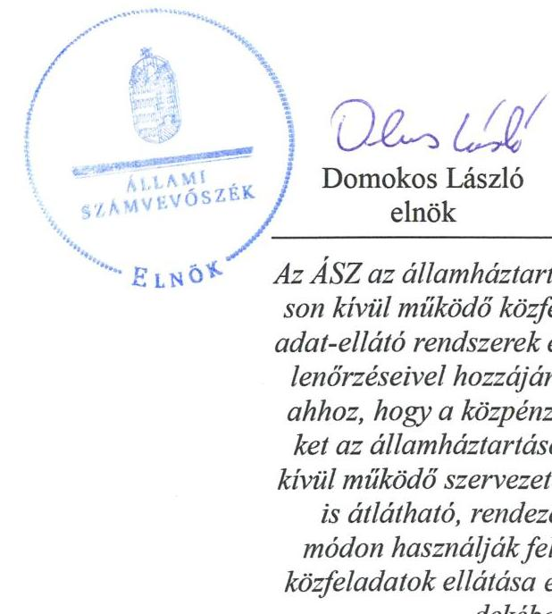
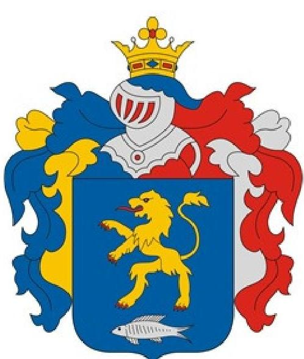
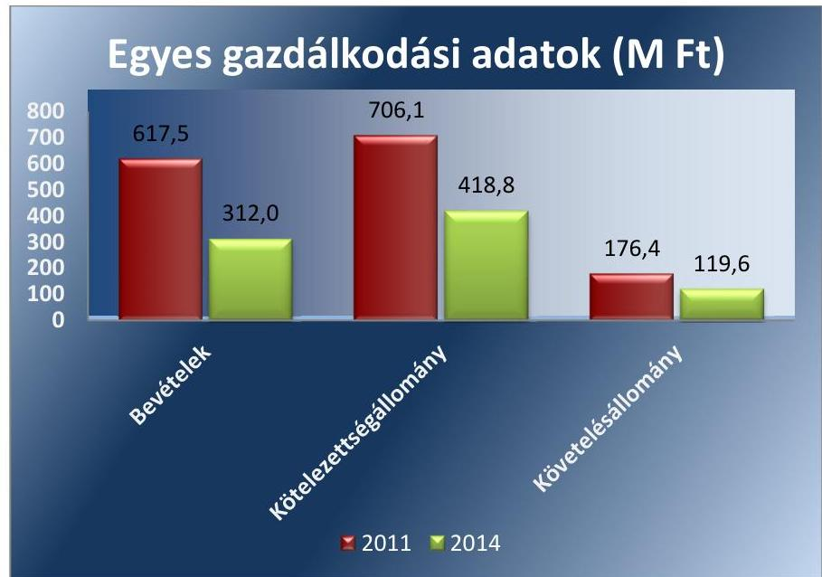
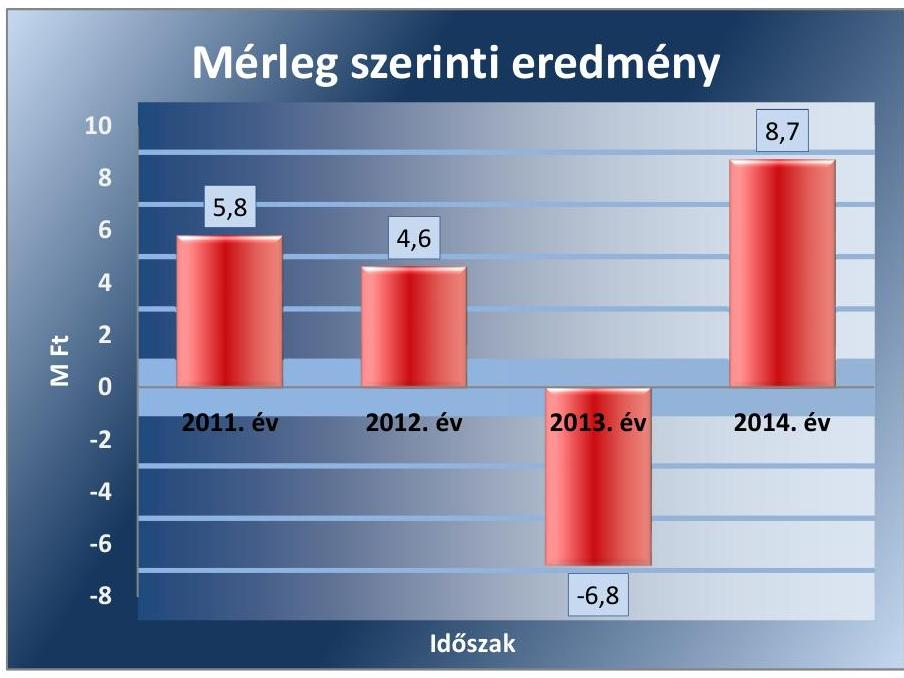
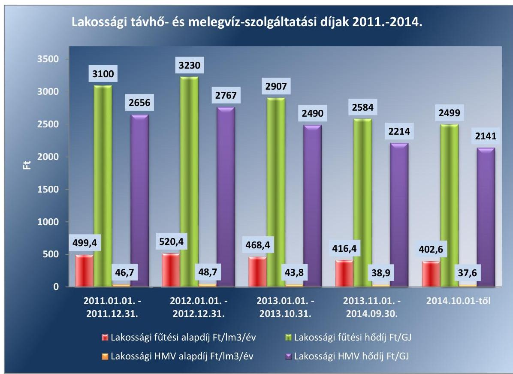
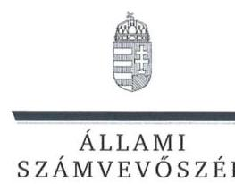
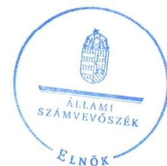

# Jelentés 

## Az önkormányzatok gazdasági társaságai

Az önkormányzatok többségi tulajdonában lévő gazdasági társaságok közfeladat ellátását érintő gazdálkodási tevékenysége szabályszerűségének ellenőrzése - Herpály-Team Építőipari és Szolgáltató Kft.
2016.

Az ÁSZ az államháztartáson kívül működő közfeladat-ellátó rendszerek ellenőrzéseivel hozzájárul ahhoz, hogy a közpénzeket az államháztartáson kívül működő szervezetek is átlátható, rendezett módon használják fel a közfeladatok ellátása érdekében.

---

# Jelentés 

## Az önkormányzatok gazdasági társaságai

Az önkormányzatok többségi tulajdonában lévő gazdasági társaságok közfeladat ellátását érintő gazdálkodási tevékenysége szabályszerűségének ellenőrzése - Herpály-Team Építőipari és Szolgáltató Kft.
2016. október hó 25. nap

---

# AZ ELLENŐRZÉST FELÜGYELTE:

DR. HORVÁTH MARGIT felügyeleti vezető

## AZ ELLENŐRZÉST VEZETTE ÉS A VÉGREHAJTÁSÁÉRT FELELŐS:

SALAMIN VIKTOR ellenőrzésvezető

## A PROGRAM ÖSSZEÁLLÍTÁSÁÉRT FELELŐS:

JANIK JÓZSEF LÁSZLÓ osztályvezető

IKTATÓSZÁM: V-1069-121/2016.

TÉMASZÁM: 2051

ELLENŐRZÉS-AZONOSÍTÓ SZÁM: V-070741

Jelentéseink az Országgyűlés számítógépes hálózatán és az Interneten a www.asz.hu címen is olvashatóak.

---

# TARTALOMJEGYZÉK 

■ ÖSSZEGZÉS ..... 5
■ AZ ELLENŐRZÉS CÉLJA ..... 7
■ AZ ELLENŐRZÉS TERÜLETE ..... 8
■ AZ ELLENŐRZÉS HÁTTERE, INDOKOLTSÁGA ..... 10
■ A JELENTÉS LÉNYEGES KÉRDÉSKÖREI ..... 11
■ ELLENŐRZÉS HATÓKÖRE ÉS MÓDSZEREI ..... 12
■ MEGÁLLAPÍTÁSOK ..... 14
■ JAVASLATOK ..... 25
■ MELLÉKLETEK ..... 27
I. sz. melléklet: Értelmező szótár ..... 27
II. sz. melléklet: Működési adatok ..... 29
III. sz. melléklet: Hődíjak alakulása ..... 30
■ FÜGGELÉK: ÉSZREVÉTELEK ..... 31
■ RÖVIDÍTÉSEK JEGYZÉKE ..... 37

---

.

---

# ÖSSZEGZÉS 

Az Állami Számvevőszék a távhőszolgáltatás közfeladatát ellátó, önkormányzati tulajdonú Herpály-Team Kft. gazdálkodásának szabályszerűségét értékelte 2011-2014. évekre vonatkozóan. Berettyóújfalu Város Önkormányzata a közfeladat ellátását szabályszerűen biztosította, a tulajdonosi joggyakorlás szabályozása és gyakorlata összességében megfelelt a jogszabályi előírásoknak. A Társaság vagyongazdálkodása szabályszerű volt, kötelezettségállománya nem jelentett kockázatot a működésre. Az ellátott közfeladat bevételei és ráfordításai elszámolása, valamint az önköltségszámítás és árképzés szabályszerű volt.

## Az ellenőrzés társadalmi indokoltsága

Az Állami Számvevőszék stratégiájában megfogalmazta, hogy a helyi önkormányzatok gazdálkodásában rejlő pénzügyi kockázatok feltárásával, az államháztartáson kívülre nyújtott költségvetési támogatások és ingyenes vagyonjuttatások, valamint az államháztartáson kívül működő közfeladat-ellátó rendszerek ellenőrzéseivel hozzájárul ahhoz, hogy a közpénzeket az államháztartáson kívül működő szervezetek is átlátható, rendezett módon használják fel a közfeladatok szerződésben vállalt ellátása érdekében.

Magyarországon az intézmény-centrikus közfeladat-ellátás jellemző, de egyre jelentősebb a költségvetésen kívüli feladatellátás térnyerése. Ennek legfontosabb szereplői - a nonprofit szervezetek mellett - az önkormányzati tulajdonú gazdasági társaságok. Az önkormányzatok szervezetalakítási szabadságának következménye, hogy a korábban is vállalati formában működő közszolgáltatások mellett, mind a kötelező, mind az önként vállalt feladatok ellátásában a gazdasági társaságok kiemelt fontosságú szerephez jutottak.

## Főbb megállapítások, következtetések, javaslatok

Az Önkormányzat a távhőszolgáltatás közfeladatának megszervezéséről a jogszabályi előírásoknak megfelelően döntött, annak ellátásáról a kizárólagos tulajdonában lévő gazdasági társasága útján gondoskodott. A szükséges eszközöket apport formájában a Társaság rendelkezésére bocsátotta, a távhőszolgáltatási tevékenységhez vagyonkezelésre eszközt nem adott át. A feladatellátás keretszabályait rögzítő szerződésben részletesen meghatározták az ellátandó feladatokat, valamint előírták az üzleti terv készítésének kötelezettségét is.

Az Önkormányzat a távhőszolgáltatással összefüggő rendeletalkotási kötelezettségének eleget tett, azonban a távhőszolgáltatási rendelet aktualizálás hiányában nem tartalmazott minden, a Tszt.-ben előírt tartalmi elemet. Az Önkormányzat a távhőszolgáltatás díjrendeletét annak ellenére nem módosította, hogy a hatósági ár bevezetésével az Önkormányzat ármegállapítási jogköre - a csatlakozási díj kivételével - 2011. április 15. napjával megszűnt.

Az FB működése szabályos volt, azonban ügyrendjét a Képviselő-testület helyett a polgármester hagyta jóvá. Az ellenőrzött időszakban az Önkormányzat a Társaságnál nem élt a belső ellenőrzés lehetőségével, így nem támogatta a szabályszerű működés kontrollját.

A közfeladat-ellátást szolgáló vagyonnal való gazdálkodás, annak nyilvántartása szabályszerű volt, a Társaság rendelkezett a Számv. tv. előírásainak megfelelő számviteli szabályzatokkal, amelyek elősegítették a szabályszerű működést. Az üzletszabályzat a Tszt.-ben előírtak közül nem tartalmazta a fogyasztóvédelmi hatósággal és a felhasználók társadalmi érdekképviseleti szervezeteivel való együttműködés szabályait. A Társaság likviditási helyzete javult az ellenőrzött időszakban, kötelezettségállománya a távhőszolgáltatás közfeladatának ellátására nem jelentett kockázatot. A Társaság hatékonyan kezelte követelésállományát, a megtett intézkedések és a távhőszolgáltatási díjak csökkentésének együttes hatására a lakossági díjhátralék csökkent. A Társaság távhőtermelő és távhőszolgáltató üzletágból származó eredménye 2012-ben 1,9 M Ft veszteség, 2013-ban 2,8 M Ft, 2014-ben 2,2 M Ft nyereség volt.

---

A Társaság az üzleti tervek teljesítéséről, a gazdálkodásról és a közszolgáltatási tevékenységről évente beszámolt. Az éves beszámolók elfogadásáról a Képviselő-testület az FB írásbeli véleményének és a könyvvizsgáló jelentésének birtokában döntött. Az Info tv. 2012. január 1-jétől hatályos rendelkezéseivel ellentétben adatvédelmi és adatbiztonsági szabályzat készítési és belső adatvédelmi felelős kinevezési kötelezettségének a Társaság késedelemmel tett eleget. A Társaság jogszabályi kötelezettségének eleget téve a közérdekű adatait honlapján közzétette. A távhőszolgáltatás bevételeinek, ráfordításainak, a beruházások kiadásainak és az értékcsökkenési leírásnak az elszámolása megfelelt a jogszabályi és belső szabályozás előírásainak. Az önköltségszámítás szabályait meghatározták, a díjképzés a távhőszolgáltatás díjrendeletben foglaltaknak, 2011. április 15-től a jogszabályi előírásnak megfelelt.

---

# AZ ELLENŐRZÉS CÉLJA 

Az ellenőrzés célja annak értékelése, hogy az önkormányzat a jogszabályi előírások figyelembevételével döntött-e az ellenőrzésre kerülő közfeladat megszervezéséről; az önkormányzat/tulajdonosi joggyakorló szabályszerűen gyakorolta-e a tulajdonosi jogokat.

Ellenőriztük, hogy a gazdasági társaság közfeladat-ellátása bevételeinek, ráfordításainak elszámolása, és vagyongazdálkodási tevékenysége megfelelt-e a jogszabályi, illetve a közszolgáltatási/vagyonkezelési szerződésben foglalt tulajdonosi előírásoknak, azok végrehajtása szabályszerű volt-e.

Értékeltük továbbá, hogy a gazdasági társaság kötelezettségállománya jelentett-e kockázatot a működésre, illetve a közfeladat ellátására; valamint, hogy a közfeladatok átláthatósága és elszámoltathatósága érdekében biztosítva volt-e a közszolgáltatás díjának megalapozottsága szabályszerű önköltségszámítással.

---

# **AZ ELLENŐRZÉS TERÜLETE**

## **Berettyóújfalu Város Önkormányzata és a kizárólagos tulajdonában lévő Herpály–Team Korlátolt Felelősségű Társaság**

### **BERETTYÓÚJFALU VÁROS ÖNKORMÁNYZATA**

BERETTYÓÚJFALU VÁROS ÖNKORMÁNYZATA a Herpály-Team Korlátolt Felelősségű Társaságot az 1991. július 29-én kelt Alapítói Okirattal¹ hozta létre. Az Önkormányzat² a távhővagyont alapításkor apportba adta, kezelésre vagyont a távhőszolgáltatással kapcsolatosan nem adott át.

### **A HERPÁLY-TEAM KORLÁTOLT FELELŐSSÉGŰ TÁRSASÁG**

A HERPÁLY-TEAM KORLÁTOLT FELELŐSSÉGŰ TÁRSASÁG feladata volt Berettyóújfalu Város közigazgatási területén a távhőszolgáltatás biztosítása. A kizárólagos önkormányzati tulajdonban lévő Társaság³ fő tevékenységei közé tartozott továbbá az uszoda-, strand és piacüzemeltetés, intézmény karbantartás, 2013-ig az ivóvíz- és szennyvízszolgáltatás, 2013-tól az önkormányzati tulajdonú ingatlanok kezelése.

Berettyóújfalu Város lakosainak száma 2014. január 1-jén meghaladta a 15 ezer főt, a nyilvántartott lakóingatlanok száma 2462 db, ebből távfűtött lakások száma 632 db volt. Ezen túl még 57 db intézmény és közület távfűtés és meleg víz szolgáltatását biztosította 3 fűtőmű üzemeltetésével. Az ügyvezető 1999. december 3-től tölti be tisztségét.

A Társaság gazdálkodásának egyes adatait a 2011. és 2014. évek vonatkozásában az 1. ábra szemlélteti.

1. ábra

*Forrás: 2011., 2014. évi beszámoló*

---

Az értékesítés nettó árbevételének nagyságára alapvetően a Társaság által ellátott tevékenységi körök változása volt hatással. A 2014. évi nettó árbevétel - az ivóvízellátás és szennyvízszolgáltatás tevékenységének 2013. évi megszűnése miatt - jelentősen elmaradt az előző évek realizált árbevételétől. A Társaság követelés és kötelezettségállománya a 2011. évről a 2014. évre egyaránt csökkent. A követelések állományának csökkenésében szerepe volt a kintlévőségek behajtására tett intézkedéseknek. A Társaság működésének főbb jellemzőit a 2. számú melléklet mutatja be.

A Társaság mérleg szerinti eredménye a 2013. év kivételével pozitív volt. A Képviselő-testület határozataiban a 2011-2012. évek és a 2014. év nyereségének eredménytartalékba helyezéséről döntött, osztalék kifizetésére nem került sor. A 2013. évi 6,8 M Ft veszteség a Társaság saját tőkéjét csökkentette.

A mérleg szerinti eredmény összegét a 2. ábra mutatja be.
2. ábra

Forrás: a Társaság beszámolói

A Társaság távhőtermelő és távhőszolgáltató üzletágból származó vesztesége 2012-ben 1,9 M Ft volt. 2013-ban 2,8 M Ft, és 2014-ben 2,2 M Ft nyereséget termelt.

Az ellenőrzött időszakban a polgármester ${ }^{4}$ és a jegyző ${ }^{5}$ személye nem változott. A polgármester a 2010. évi önkormányzati választások óta tölti be tisztségét, a helyszíni ellenőrzés időszakában munkakört betöltő jegyző 1991. január 1-jétől látta el feladatait.

---

# AZ ELLENŐRZÉS HÁTTERE, INDOKOLTSÁGA 

AZ ÁSZ STRATÉGIÁJÁBAN megfogalmazta, hogy a helyi önkormányzatok gazdálkodásában rejlő pénzügyi kockázatok feltárásával, az államháztartáson kívülre nyújtott költségvetési támogatások és ingyenes vagyonjuttatások, valamint az államháztartáson kívül működő közfeladat-ellátó rendszerek ellenőrzéseivel hozzájárul ahhoz, hogy a közpénzeket az államháztartáson kívül működő szervezetek is átlátható, rendezett módon használják fel a közfeladatok szerződésben vállalt ellátása érdekében.

Az Áht. ${ }^{6}$ 1. § (3) bekezdése értelmében az államháztartáson kívüli szervezetek a közfeladatok ellátásában - jogszabályban meghatározott feltételekkel - közreműködhetnek. Az önkormányzati tulajdonú gazdasági társaságok teljes körű ellenőrzésének lehetőségét az Állami Számvevőszékről szóló 1989. évi XXXVIII. törvény 2011. január 1-jétől hatályos módosítása teremtette meg. A gazdasági társaságok közfeladat ellátását érintő gazdálkodási tevékenysége szabályszerűségére irányuló ellenőrzéseket erre tekintettel a 2011. évtől végezzük.

## AZ ELLENŐRZÉS VÁRHATÓ HASZNOSULÁSA-

KÉNT az ÁSZ ${ }^{7}$ a megállapításaival segítséget nyújthat az államháztartáson kívüli közfeladat-ellátás értékeléséhez, jogszabályi keretei pontosításához, átláthatóságot biztosító szabályozásához. Meghatározhatóvá válnak a közfeladat ellátásban részt vevő államháztartáson kívüli szervezeteknek az önkormányzat költségvetését, pénzügyi helyzetét is befolyásoló - kockázatai, lehetővé válik ezen kockázatok csökkentése.

Értékelhetővé válik, hogy a feladatot ellátó gazdasági társaság a közszolgáltatási szerződésben foglaltak betartásával, a közvagyon használatával biztosította-e a szolgáltatás folytatásának feltételeit. Ezzel az ellenőrzöttek és a helyi döntéshozók számára az ÁSZ visszajelzést ad feladatszervezési, feladat-ellátási kockázataikról, alapot ad a meglévő hibák megszüntetéséhez, a jobb közfeladat-ellátás biztosításához. Mindezeken keresztül az ÁSZ hozzájárul Magyarország közpénzügyi helyzetének javításához, a közpénzek mérhető módon történő, a döntéshozók által meghatározott célok szerinti felhasználásához.

---

# A JELENTÉS LÉNYEGES KÉRDÉSKÖREI 

1. Az önkormányzat közfeladat megszervezéséről szóló döntése, valamint tulajdonosi joggyakorlása szabályszerű volt-e?
2. A gazdasági társaság vagyongazdálkodása szabályszerű volt-e, kötelezettségállománya jelentett-e kockázatot a működésre, illetve a közfeladat ellátására?
3. A gazdasági társaságnál az ellátott közfeladat bevételei és ráfordításai elszámolása, valamint az önköltségszámítás és árképzés szabályszerű volt-e?

---

# ELLENŐRZÉS HATÓKÖRE ÉS MÓDSZEREI 

## Az ellenőrzés típusa

Megfelelőségi ellenőrzés.

## Az ellenőrzött időszak

2011. január 1-jétől 2014. december 31-ig tart.

## Az ellenőrzés tárgya

A közfeladatot gazdasági társaságokkal ellátó önkormányzatok tulajdonosi joggyakorlása, valamint gazdasági társaságok pénz- és vagyongazdálkodásának szabályozottsága és szabályszerűsége.

Az ellenőrzés kiterjed minden olyan körülményre és adatra, amely az ÁSZ jogszabályban meghatározott feladatainak teljesítéséhez, valamint a program végrehajtása folyamán felmerült újabb összefüggések feltárásához szükséges.

## Az ellenőrzött szervezet

Az ellenőrzött szervezetek:
$\longrightarrow$ Berettyóújfalu Város Önkormányzata,
$\longrightarrow$ Herpály-Team Kft.

## Az ellenőrzés jogalapja

Az ellenőrzés jogszabályi alapját az ÁSZ tv. 5. § (3)-(4)-(5) bekezdései képezik. Ennek értelmében az ÁSZ ellenőrzi az államháztartásból nyújtott támogatás vagy az államháztartásból meghatározott célra ingyenesen juttatott vagyon felhasználását a gazdasági társaságoknál. Az önkormányzati vagyon kezelésének ellenőrzése keretében ellenőrzi a vagyon kezelését, a vagyonnal való gazdálkodást, a többségi önkormányzati tulajdonban lévő gazdasági társaságok vagyonérték-megőrző és vagyongyarapító tevékenységét, az államháztartás körébe tartozó vagyon elidegenítésére, illetve megterhelésére vonatkozó szabályok betartását; ellenőrizheti a többségi önkormányzati tulajdonban lévő gazdasági társaságok vagyongazdálkodását.

---

# Az ellenőrzés módszerei 

Az ellenőrzést a nemzetközi standardokat irányadónak tekintve az ellenőrzési program ellenőrzési kérdései, az ellenőrzött időszakban hatályos jogszabályok, az ellenőrzés szakmai szabályok

 és módszertanok figyelembe vételével végezzük.

Az ellenőrzés ideje alatt az ellenőrzött szervezettel történő kapcsolattartást az ÁSZ Szervezeti és Működési Szabályzatának vonatkozó előírásai alapján biztosítjuk.

Az ellenőrzés a kiválasztott, többségi tulajdonosi jogokat gyakorló önkormányzatra, illetve az ellenőrzésre kijelölt közfeladatot ellátó gazdasági társaság felett tulajdonosi jogokat gyakorló szervezetre és az ellenőrzött közfeladatot ellátó gazdasági társaságra terjed ki. Amennyiben a gazdasági társaságban több önkormányzat együttesen többségi tulajdonos, úgy az ellenőrzést a többségi tulajdonosi jogokat gyakorló önkormányzatnál kell lefolytatni. Az ellenőrzött gazdasági társaságnál, amennyiben az több közfeladatot is ellát, akkor az ellenőrzésre kiválasztott közfeladat-ellátást ellenőrizzük.

Az ellenőrzést a kérdésekre adott válaszok kiértékelésével, valamint a megjelölt adatforrások, tanúsítványok felhasználásával, továbbá az adott időszakban hatályos jogszabályok figyelembe vételével kell lefolytatni. Az ellenőrzési kérdések megválaszolásához szükséges bizonyítékok megszerzése a következő ellenőrzési eljárások alkalmazásával történik: megfigyelés, kérdésfeltevés (információkérés), összehasonlítás, valamint elemző eljárás.

A bevételek és ráfordítások elszámolása, valamint a vagyonnyilvántartás terén a szabályszerű működést véletlen mintavétellel ellenőriztük. A mintavétellel ellenőrzött területek esetében minden egyes tétel vonatkozásában a szabályszerűségre vonatkozó kérdéseket tettünk fel, amelyek eredménye összesítésre került. A jogszabályoknak és a belső előírásoknak megfelelőnek tekintettük az adott területet, amennyiben a minta ellenőrzésének eredménye alapján 95%-os bizonyossággal a teljes sokaságban a hibaarány kisebb volt, mint 10%, nem megfelelőnek, ha a hibaarány a 10%-ot meghaladta. Részben megfelelő minősítést adtunk, amennyiben egy adott terület vonatkozásában a minta alapján a teljes sokaságban nem volt egyértelműen biztosított a jogszabályoknak és a belső szabályzatoknak megfelelő működés.

A ráfordítások elszámolására és a vagyonnyilvántartásra vonatkozó véletlen mintavételt kockázati alapú kiválasztással egészítettük ki, amelynek során évente a három legnagyobb összegű tételt választottuk ki.

---

# 1. Az önkormányzat közfeladat megszervezéséről szóló döntése, valamint tulajdonosi joggyakorlása szabályszerű volt-e? 

Összegző megállapítás

Az Önkormányzat a távhőszolgáltatási közfeladat-ellátást szabályszerűen szervezte meg, a tulajdonosi jogok gyakorlása azonban nem felelt meg teljes körűen a jogszabályi előírásoknak.
1.1. számú megállapítás

Az Önkormányzat távhőszolgáltatási közfeladat-ellátásának megszervezése szabályszerű volt, a távhőszolgáltatásra vonatkozó rendeletalkotási kötelezettségének eleget tett, azonban a rendelet aktualizálásának elmaradása miatt a jogszabályi előírásokkal való összhangja nem volt biztosított.

Az Ötv. ${ }^{8}$ 91. § (6) bekezdése, 2013. január 1-jétől az Mötv. ${ }^{9}$ 116. § (3)-(4) bekezdései szerint az önkormányzatnak a gazdasági programjában kell meghatároznia azokat a célkitűzéseket, amelyek az általa ellátott feladatok biztosítását, fejlesztését szolgálják. A Képviselő-testület ${ }^{10}$ által a 2011-2014. évekre elfogadott gazdasági program célkitűzésként a távfűtési hálózat korszerűsítését fogalmazta meg.

A távhőszolgáltatással ellátott létesítmények távhőellátásának távhőszolgáltatásra engedéllyel rendelkezők útján történő biztosítása a Tszt ${ }^{11}$. 6. § (1) bekezdése értelmében a területileg illetékes települési önkormányzat kötelező feladata. Ennek a kötelezettségének az Önkormányzat a kizárólagos tulajdonában lévő Társaság alapításával tett eleget, amely a távhőszolgáltatás közfeladatát 2013. június 1-jétől a főtevékenységeként látta el. A működéséhez szükséges eszközöket az Önkormányzat apport formájában bocsátotta a Társaság rendelkezésére, kezelésre vagyont nem adott át.

A feladatellátás keretszabályait az Önkormányzat és a Társaság között létrejött Közfeladat-ellátási szerződésben ${ }^{12}$ rögzítették, amelyben meghatározták a szerződő felek jogait és kötelezettségeit, a közfeladatok körében meghatározott részfeladatokat, valamint az éves feladatterv készítési kötelezettséget. A távhőellátás biztosításának és a távhődíjak megállapításának szabályait a távhőszolgáltatási rendelet ${ }^{13}$ előírásai határozták meg.

A Távhőszolgáltatási rendelet-et a Tszt. hatályba lépését követően az Önkormányzat nem aktualizálta, így az nem tartalmazta a Tszt. 6. § (2) bekezdés a) pontjában előírt, a távhőszolgáltató és a felhasználó közötti jogviszony részletes szabályait. A távhőszolgáltatási rendeletben meghatározták a távhőszolgáltatási díj összetételét és tartalmát, alkalmazásának és fizetésének szabályait, a fogyasztói korlátozás és szüneteltetés sorrendjét. A távhőszolgáltatás díjrendeletében ${ }^{14}$ került meghatározásra az alapdíjak és a hődíjak mértéke.

---

A Tszt. 57/D. § 2011. április 15-i beiktatását követően a távhőszolgáltatási rendeletet annak ellenére nem módosították, hogy a hatósági ár bevezetésre került, az Önkormányzat ár megállapítási jogköre - a csatlakozási díj kivételével - megszűnt. A távhőszolgáltatási rendeletben az Önkormányzat ármegállapítására vonatkozó jogkör rögzítése ellentétes volt egy magasabb rendű jogszabály, a Tszt. 57/D. § (1) bekezdése előírásaival.

# 1.2. számú megállapítás 

A tulajdonosi joggyakorlás rendjének kialakításakor nem feleltek meg teljes körűen a jogszabályi előírásoknak, a vagyonrendelet ${ }_{1,2,3}$ és az Alapító Okirat előírásai közötti összhangot nem biztosították. Az FB ügyrendjét a jogszabályi előírások ellenére a Képviselő-testület nem hagyta jóvá. A közfeladat ellátással kapcsolatos belső ellenőrzést az Önkormányzat nem végzett.

A tulajdonosi jogok gyakorlásának rendjét a vagyonrendelet ${ }_{1}{ }^{15}{ }_{2}{ }^{16}{ }_{3}{ }^{17}$-ben írták elő. A Képviselő-testület hatáskörébe tartozott a Gt. ${ }^{18}$ 141. § (2) bekezdésben előírtakkal összhangban az Önkormányzat kizárólagos tulajdonában lévő gazdasági társaságok beszámolóinak jóváhagyása és az adózott eredmény felhasználására vonatkozó döntés meghozatala; a törzstőke felemelése és leszállítása; az üzletrész felosztása és bevonása; a társaság ügyvezetőjének megválasztása és visszahívása; az FB tagjainak megválasztása, visszahívása, díjazásának megállapítása; az FB tagok elleni kártérítési igény érvényesítése; a társaság jogutód nélküli megszűnésének, átalakulásának elhatározása; a társasági szerződés módosítása. Ezen túl a Képviselő-testület volt jogosult dönteni más gazdasági társaság alapításáról, valamint a 25 M Ft-ot meghaladó vagyonátruházási és vállalkozási szerződések jóváhagyásáról. A polgármester hozzájárulására volt szükség a gazdasági társaságok 25 M Ft-ot meg nem haladó vagyonátruházási és vállalkozási szerződéseinek megkötéséhez. Az egyéb - fel nem sorolt - esetekben a polgármester a Pénzügyi Bizottság ${ }^{19}$ egyetértése mellett gyakorolta a döntéshozó jogokat.

A vagyonrendelet ${ }_{1,2,3}$ egyes előírásai nem feleltek meg a Gt. 141. § (2) bekezdésében, valamint - a 2014. március 15-től hatályos - Ptk. 3:109. § (2),(3) bekezdésében foglaltaknak.

Az Alapító Okiratban rögzítettek szerint az alapító kizárólagos hatáskörébe tartoznak mindazok a kérdések, amelyeket a törvény a taggyűlés (jelen esetben Képviselő-testület) kizárólagos hatáskörébe utal. Az Alapító Okirat jogszabály szerinti tulajdonosi joggyakorlást írt elő, így nem volt összhangban a vagyonrendelet ${ }_{1,2,3}$ vonatkozó előírásaival.

Az Alapító Okirat rögzítette a hatáskör átruházás feltételeit a szerződések jóváhagyása vonatkozásában. Az 1 M Ft-ot meghaladó adásvételi (vagyonátruházási) és a 10 M Ft-ot meghaladó vállalkozási szerződések megkötéséhez képviselő-testületi, az adott értékhatárok alatti szerződések esetében polgármesteri jóváhagyás volt szükséges, kivéve a Társaság működéséhez szükséges anyag és eszközbeszerzésekre vonatkozó szerződéseket. Az Alapító Okirat 2014. december 1-jei módosítását követően a szerződések értékhatárait - a vagyonrendelet ${ }_{3}$ előírásaival összhangban - szabályozta, a képviselő-testületi jóváhagyás kötelezettségét a 25 M Ft-ot meghaladó szerződések esetében írta elő, egyéb esetekben a polgármester jóváhagyása volt szükséges. A Társaság Alapító Okiratát 2011-2014.

---

években többször módosították a Társaság telephelye, a törzstőke csökkentése, az ügyvezetői jogviszony ideje, a Társaság főtevékenysége, az FB${ }^{20}$ tagok személye, a tulajdonosi engedélyt igénylő szerződések körének meghatározása, a nyereség felosztására, az üzletrészek átruházására és felosztására, valamint a felmondási időre és a végkielégítésre vonatkozó szabályok változása miatt.

Az FB az ellenőrzött időszakban az Alapító Okiratban előírtak alapján a Gt. 34. § (1) bekezdésével, valamint a Ptk ${ }^{21}$. 3:121. § (1) bekezdésével összhangban - három tagból állt. Az FB elkészítette az ügyrendjét, melyet a Pénzügyi Bizottság határozatának birtokában a polgármester hagyott jóvá. Ez a gyakorlat ellentétes a - jóváhagyáskor hatályos - Gt. 34. § (4) bekezdésében előírtakkal, mely szerint a felügyelő bizottság ügyrendjét a társaság legfőbb szerve hagyja jóvá. Nem tartották be az Alapító Okirat előírásait sem, amely a jogszabály szerinti tulajdonosi joggyakorlást írta elő. Az FB teljesítette az ügyrendben előírt kötelezettségeit, a 2011-2014. évi beszámolókról a Gt. 35. § (3) bekezdése, valamint a Ptk. 3:120. § (2) bekezdése szerinti írásbeli jelentését elkészítette.

A Társaság a közfeladat ellátási szerződésben előírt éves feladatterv készítési kötelezettségének üzleti tervek elkészítésével tett eleget, melyeket a polgármester a Pénzügyi Bizottság egyetértő határozata mellett jóváhagyott.

Az anyagi ösztönzési rendszert a Taktv. ${ }^{22}$ 5. § (3) bekezdésében foglaltaknak megfelelően képviselő-testületi határozattal elfogadott javadalmazási szabályzatban ${ }^{23}$ rögzítették. A javadalmazási szabályzat előírása szerint az ügyvezető igazgató prémiumfeladatait a polgármester előterjesztésére a Képviselő-testület határozta meg az FB előzetes véleményének birtokában. Az ügyvezető igazgató prémiumának megállapítása során teljesítménykövetelményként előírták az üzleti terv fő számainak teljesítését.

Az árkalkuláció szabályait, az alapdíj és a hődíj számításának módszerét a távhőszolgáltatási rendeletben határozta meg az Önkormányzat. A rendeletben rögzítették, hogy a távhőszolgáltatásba belépő új fogyasztóknak csatlakozási díjat nem kell fizetni. Az alapdíj számítását a távhőszolgáltatás bázis évi költségei, ráfordításai, valamint a tervezett infláció mértékének figyelembevételével írták elő.

A beszámoltatási rendszert az Önkormányzat működtette, a Társaságot évente beszámoltatta annak gazdálkodásáról, közszolgáltatási tevékenységéről. A Társaság 2011-2014. üzleti éveiről készített éves beszámolóit a Képviselő-testület - az FB írásbeli jelentésének birtokában - megtárgyalta és jóváhagyta.

Az Önkormányzat az ellenőrzött időszak alatt nem élt az Ötv. 92. § (11) bekezdés b) pontjában valamint az Áht. 70. § (1) bekezdés d) pontjában meghatározott lehetőségével, mivel a közfeladat ellátásával kapcsolatos belső ellenőrzést nem végzett a Társaságnál.

A saját tőke minden ellenőrzött évben meghaladta a jegyzett tőkét, ezért a Gt. 143. § (2) bekezdés a) pontja, illetve a Ptk. 3:189. § (1) bekezdés a) pontja miatti intézkedés megtétele nem vált szükségessé.

---

Az Önkormányzat a Társaság által felvett rövid lejáratú (likviditási) hitelekhez vállalt készfizető kezességet, tagi kölcsönt nem nyújtott, a távhőszolgáltatás feladatellátásához önkormányzati támogatást nem folyósított. Az ellenőrzött időszakban a kezesség beváltásra nem került sor. A Stabilitási tv ${ }^{24}$. 10. § (3) bekezdés b) pontja szerint a kezességvállaláshoz nem volt szükség a Kormány hozzájárulására.

# 2. A gazdasági társaság vagyongazdálkodása szabályszerű volt-e, kötelezettségállománya jelentett-e kockázatot a működésre, illetve a közfeladat ellátására? 

Összegző megállapítás

A Társaság vagyongazdálkodása szabályszerű volt, a kötelezettségek állománya nem jelentett kockázatot a működésre, közfeladat ellátásra.
2.1. számú megállapítás

A Társaság rendelkezett gazdálkodási szabályzatokkal, azok a jogszabályi változásokat követték.

Az üzleti terveket az ügyvezető készítette el és terjesztette a tulajdonos elé a Közfeladat-ellátási szerződésben előírt kötelezettsége alapján. Az üzleti tervek tartalmi és formai követelményeit nem határozták meg, azok a bevételi-kiadási terveket, beruházási, fejlesztési terveket tartalmazták, melyekben bemutatták a tervezési irányokat, a várható eredményt, valamint a tervezett beruházások forrásait, azok felhasználását. Az üzleti tervekben megfogalmazott főbb irányelveket, az egyes tevékenységek eredményét, valamint az előző és tárgyévi adatok értékelését az éves beszámolók kiegészítő mellékletei tartalmazták.

A Társaság rendelkezett a Számv. tv. ${ }^{25}$ 14. § (3) bekezdésében előírt számviteli politika ${ }_{1}{ }^{26}{ }_{2}{ }^{27}$-val és a Számv. tv. 14. § (5) bekezdés a), b), d) pontjaiban előírtaknak megfelelően eszközök és források leltárkészítési és leltározási szabályzat ${ }_{1}{ }^{28}{ }_{2}{ }^{29}$-ával, eszközök és források értékelési szabályzat ${ }_{1}{ }^{30}{ }_{2}{ }^{31}$-tal, és pénzkezelési szabályzat ${ }_{3}{ }^{32}{ }_{2}{ }^{33}$-tal, továbbá a Számv. tv. 161. § (1)-(2) bekezdéseiben előírt
 számlarend ${ }_{1}{ }^{34}{ }_{2}{ }^{35}$-del.

A SZÁMVITELI POLITIKA ${ }_{1,2}$ a Számv. tv. 14. § (4) bekezdése előírásainak megfelelően tartalmazta - többek között - a Társaságra jellemző szabályokat, előírásokat, módszereket a számviteli elszámolás, értékelés szempontjából lényeges, jelentős kritériumainak meghatározására, valamint azt, hogy a törvényben biztosított választási, minősítési lehetőségek közül melyiket alkalmazzák. A Tszt. 2012. január 1-jétől hatályos 18/A. § (2) bekezdésében előírt számviteli szétválasztás a főkönyvi számlák kialakított rendszerével biztosított volt.

A Társaság elkészítette a Számlarend ${ }_{1,2}$-t, amelyek tartalmát tekintve megfelelt a Számv. tv. 161. § (1) és (2) bekezdéseiben foglaltaknak. A leltározási és leltárkészítési szabályzat ${ }_{1,2}$ a Számv. tv. 69. § (3) bekezdés előírásainak megfelelve évenkénti gyakorisággal írta elő az eszközök mennyiségi leltározásának kötelezettségét. A Társaság eszközeiről folyamatos mennyiségi nyilvántartást vezetett. Az eszközök és források értékelési szabályzat ${ }_{1,2}$-ban meghatározták az eszközök és források értékelésére vonatkozó szabályokat, a készletek és követelések minősítésére és értékvesztésére vonatkozó előírásokat. A pénzkezelési szabályzat ${ }_{1,2}$-ban a Számv. tv. 14. § (8) bekezdésében előírtaknak megfelelően - többek között - rendelkeztek a pénzforgalom lebonyolításának rendjéről, a készpénzben és a bankszámlán tartott pénzeszközök közötti forgalomról, a bankkártya használat rendjéről, a készpénzállomány ellenőrzésekor követendő eljárásról, az ellenőrzés gyakoriságáról.

A Társaság a Számv. tv. 14. § (5) bekezdés c) pontjában előírt önköltségszámítás rendjére vonatkozó belső szabályzatát elkészítette. Az árképzési szabályzat ${ }_{1}{ }^{36}{ }_{2}{ }^{37}$ mellékletét képező költségszámítási, számlázási szabályzatban meghatározták a kalkulációs egységeket, a költségek utalványozásának, elszámolásának és felosztásának bizonylati rendjét, az önköltségszámítás készítésének időpontját, a kalkulációs időszakokat. A szabályzatban rögzítették a költségszámítás és a könyvvitel adatainak egyeztetési kötelezettségét.

AZ ÜZLETSZABÁLYZATÁT a Társaság az ellenőrzött időszak előtt - 1997. szeptember 12-én - léptette hatályba, azt az ellenőrzött időszak végéig nem módosították. Aktualizálás hiányában az üzletszabályzat 2014. december 31-ig nem tartalmazta a Tszt. 3. § v) pont előírtak közül a fogyasztóvédelmi hatósággal és a felhasználók társadalmi érdekképviseleti szervezeteivel való együttműködés szabályait.

# 2.2. számú megállapítás 

A Társaság a tulajdonában lévő vagyonával a jogszabályi és belső rendelkezéseknek megfelelően gazdálkodott.

## AZ ANALITIKUS ÉS A FŐKÖNYVI NYILVÁNTARTÁSI RENDSZER a Társaság vagyonának, és annak változásainak nyilvántartására alkalmas volt, a Számv. tv. előírásainak megfelelt.

A Társaság a távhőszolgáltatás közfeladatát saját eszközeivel látta el, üzemeltetésre átvett, illetve vagyonkezelésbe vett vagyona a feladattal kapcsolatban nem volt. Az éves beszámolók adatait leltárral támasztották alá, a főkönyvi könyvelés és analitikus nyilvántartások közötti egyeztetést a mérleg fordulónapjára vonatkozóan a Számv. tv. 69. § (2) bekezdésében előírtaknak eleget téve elvégezték.

A tárgyi eszközök Számv. tv. 69. § (3) bekezdése szerinti, mennyiségi felvétellel történő leltározását az eszközök és források leltározási és leltárkészítési szabályzat ${ }_{1,2}$-ben előírtaknak megfelelően évente elvégezték.

## 1. táblázat

HERPÁLY-TEAM KFT FŐBB MÉRLEG ADATAI (M FT)

| Megnevezés | $\mathbf{2 0 1 1 .}$   $\mathbf{01.01}$ | $\mathbf{2 0 1 1 .}$   $\mathbf{12.31.}$ | $\mathbf{2 0 1 2 .}$   $\mathbf{12.31.}$ | $\mathbf{2 0 1 3 .}$   $\mathbf{12.31.}$ | $\mathbf{2 0 1 4 .}$   $\mathbf{12.31.}$ |
| :-- | --: | --: | --: | --: | --: |
| I. Befektetett eszközök | 954,4 | 1053,3 | 900,9 | 647,7 | 624,4 |
| - ebből: Tárgyi eszközök | 954,4 | 1053,3 | 900,9 | 647,7 | 623,9 |
| II. Forgó eszközök | 158,1 | 190,9 | 240,3 | 165,4 | 128,1 |
| - ebből: Követelések | 148,8 | 176,4 | 222,2 | 151,1 | 119,6 |
| III. Aktív időbeli elhatárolások | 49,6 | 71,7 | 33,4 | 23,4 | 29,2 |
| Eszközök összesen | 1162,1 | 1315,9 | 1174,6 | 836,5 | 781,7 |

---

| Megnevezés | 2011-   $\mathbf{01.01}$ | 2011-   $\mathbf{12.31}$ | 2012-   $\mathbf{12.31}$ | 2013-   $\mathbf{12.31}$ | 2014-   $\mathbf{12.31}$ |
| :-- | --: | --: | --: | --: | --: |
| IV. Saját tőke | 443,8 | 449,6 | 454,2 | 246,1 | 255,6 |
| - ebből: Jegyzett tőke | 343,1 | 343,1 | 343,1 | 188,4 | 188,4 |
| - ebből: Mérleg szerinti eredmény | 3,9 | 5,8 | 4,6 | $-6,8$ | 8,7 |
| V. Céltartalékok | 0 | 0 | 4,7 | 1,8 | 0 |
| VI. Kötelezettségek | 658,7 | 706,1 | 567,1 | 472,1 | 418,8 |
| VII. Passzív időbeli elhatárolások | 59,6 | 160,2 | 148,7 | 116,5 | 107,3 |
| Források összesen | 1162,1 | 1315,9 | 1174,6 | 836,5 | 781,7 |

AZ ESZKÖZÉRTÉK 380,4 M Ft-os csökkenését alapvetően a befektetett eszközök, ezen belül a tárgyi eszközök értékének jelentős, 32,7%-os csökkenése eredményezte. A tárgyi eszközök nettó értékének 2013. évi 253,2 M Ft-os csökkenését alapvetően a vízi-közmű vagyon Önkormányzat részére történő - jogszabályon alapuló - ingyenes átadása, valamint az elszámolt értékcsökkenésnél alacsonyabb értékben megvalósított beruházások, felújítások eredményezték. A forgóeszköz értékének növekedéséhez 2011-2012. években a követelések állományának emelkedése járult hozzá. A követelések mérlegértéke a 2012. év végéig tartó növekedést követően 2013. évtől csökkent, alakulására alapvetően a megszűnt ágazat vevőkövetelés állományának könyvekből történő kivezetése volt hatással. A források mérleg értékére alapvetően a saját tőke és a kötelezettségek értékének alakulása volt hatással. A saját tőke és a jegyzett tőke 2013. évi állomány csökkenését a vízi közmű vagyon átadáshoz kapcsolódó tőkekivonással együtt megvalósuló tőkeleszállítás okozta. A kötelezettségek állománya az ellenőrzött időszakban 239,9 M Ft-tal, 36,4%-kal csökkent. A rövid lejáratú kötelezettségek 204,6 M Ft-tal csökkentek, mivel a strand beruházáshoz kapcsolódó szállítói kötelezettségek kiegyenlítésre kerültek, a rövid lejáratú hiteleket törlesztették. A passzív időbeli elhatárolások állomány változását - a távhőszolgáltatást nem érintő - halasztott bevételek elszámolása eredményezte.

# 2.3. számú megállapítás 

## A kötelezettségek állománya nem jelentett kockázatot a közfeladat ellátására, illetve a működésre.

A Társaság kötelezettségeinek 58,3-83,3%-át a hosszúlejáratú kötelezettségek alkották, amelyek alapvetően a strand beruházáshoz kapcsolódó fejlesztési hitelek igénybevétele, valamint a tulajdonossal szemben, a távhő közfeladat ellátásához nem kapcsolódó vagyonkezelésbe átvett eszközök miatt állt fenn. A rövid lejáratú kötelezettségeket jellemzően a szállítói tartozások és a rövid lejáratú hitelek záró állománya alkotta. A szállítói kötelezettségek mérlegértéke a 2011. évi nyitó 200,9 M Ft-ról 2014 végére 47,1 M Ft-ra csökkent. A rövid lejáratú hitelek állománya az ellenőrzött időszak végére - a 2011. évi növekedést követően - 20,0 M Ft-ra csökkent.

Az eladósodottságot jelző mutatók értékei a 2. táblázatban foglaltak szerint alakultak a 2011-2014. években.

---

2. táblázat

A TÁRSASÁG PÉNZÜGYI MUTATÓSZÁMAI 2011-2014. ÉVEKBEN

| Megnevezés | 2011. | 2012. | 2013. | 2014. |
| :-- | :--: | :--: | :--: | :--: |
| Eladósodottsági mutató   idegen tőke/összes forrás | 0,54 | 0,48 | 0,56 | 0,54 |
| Eladósodottság mértéke   kötelezettségek*/saját tőke | 0,74 | 0,68 | 0,87 | 0,63 |
| Nettó eladósodottság   (kötelezettségek*-követelések)/saját tőke | 0,35 | 0,19 | 0,26 | 0,16 |
| Adósságfedezeti mutató   (befektetett eszközök+forgóeszközök)/idegen forrás | 1,76 | 2,01 | 1,72 | 1,80 |
| * A mutató számítása során nem vettük figyelembe a fizetési kötelezettséggel nem járó,   vagyonkezelésbe vett eszközök számviteli elszámolásához kapcsolódó kötelezettségek értékéét. |  |  |  |  |

A KÖTELEZETTSÉGEK mérlegértéke folyamatosan csökkent. A visszafizetési kötelezettséggel járó kötelezettségek összege az ellenőrzött időszak végén mintegy fele ( $161,1 \mathrm{M} \mathrm{Ft}$ ) volt a 2011 végén fennálló tartozásnak (332,3 M Ft). Az eladósodottság mutató értéke az ellenőrzött időszakban egyik évben sem érte el a kritikus 0,6-os értéket. Az eladósodottság mértéke 2011-2014. években a kedvező 1,0 érték alatt volt, a saját tőke fedezetet nyújtott a kötelezettségek teljesítésére. A mutató értéke 2013-ban volt a legmagasabb, elsősorban a jegyzett tőke leszállítása miatt. A nettó eladósodottság mutató értéke 2014-ben volt a legkedvezőbb elsősorban a kötelezettségállomány csökkenése miatt. Az adósságfedezeti mutató csak 2012-ben érte el a 2-es küszöbértéket, a többi évben alatta maradt.

A Társaság likviditási helyzete javult, csökkenő kötelezettségállománya a távhőszolgáltatás közfeladatának ellátására nem jelentett kockázatot.
2.4. számú megállapítás

A Társaság az FB és a könyvvizsgáló által véleményezett éves beszámolóit a tulajdonos elé terjesztette, határidőben letétbe helyezte.

AZ ÉVES BESZÁMOLÓKAT a Társaság a Számv. tv. 19. § (1) bekezdésében előírt tartalommal elkészítette, azokat az ügyvezető a Képviselő-testület elé terjesztette. Az éves beszámolók letétbe helyezése a Számv. tv. 153. § (1) bekezdésben előírt határidőben megtörtént.

A Társaság a 2012. évi beszámolóját a MEKH ${ }^{38}$ TAFO-95/1/2013-02 ügyiratszámú eljárás megindító levelére hivatkozva 2013. augusztus 13-án ismételten közzétette. A Társaság ügyvezetője az ismételt közzétételt a dokumentumok hiányos feltöltésével indokolta. A MEKH a 2012. évi beszámoló törvényben meghatározott szempontok szerinti ismételt közzététele után az eljárást megszüntette.

Az éves beszámolók elfogadásáról a Képviselő-testület minden évben az FB határozatának és a könyvvizsgáló írásos jelentésének birtokában döntött. Az ügyvezető által készített üzleti jelentés tartalmazta a tényadatok üzleti tervben szereplő tervszámoktól való eltérésének részletes indoklását.

---

A KÖNYVVIZSGÁLÓ a Tszt. 18/B. § (1) bekezdésének előírásával ellentétben, nem az éves beszámolóhoz kiadott független könyvvizsgálói jelentésében igazolta, hanem a 2012-2014. évek éves beszámolóhoz önálló dokumentum formájában kiadott könyvvizsgálói igazolás tartalmazta, hogy a Társaság által kidolgozott és alkalmazott szétválasztási szabályok, valamint az egyes tranzakciók árazása biztosítja a vállalkozás tevékenységei közötti keresztfinanszírozás-mentességet. A könyvvizsgáló az ellenőrzött években hitelesítő záradékkal látta el a Társaság éves beszámolóját.

Az FB és a könyvvizsgáló a közvagyon védelme, illetve más okból a Képviselő-testület összehívását nem kezdeményezte.

A Társaság az Info tv ${ }^{39}$ 2012. január 1-jétől hatályos 24. § (3) bekezdésben foglaltak ellenére csak 2014. szeptember 10-től rendelkezett adatvédelmi és adatbiztonsági szabályzattal, melyben az Info tv. 24. § (1) bekezdés c) pontjában foglalt kötelezettségnek eleget téve megnevezték a Társaság belső adatvédelmi felelősét, akinek kinevezése már 2012. október elsejével megtörtént.

A Társaság 2011-ben az Eisztv ${ }^{40}$ 6. § (1) bekezdésében, 2012-2014. években az Info tv. 33. § (3) bekezdésben előírt kötelezettségének eleget téve szervezeti, személyi adatait, a tevékenységére, működésére vonatkozó, és gazdálkodási adatait honlapján közzétette.

# 3. A gazdasági társaságnál az ellátott közfeladat bevételei és ráfordításai elszámolása, valamint az önköltségszámítás és árképzés szabályszerű volt-e? 

Összegző megállapítás

### 3.1. számú megállapítás

A távhőszolgáltatás közfeladat bevételeinek és ráfordításainak, valamint
 a beruházások, felújítások elszámolása megfelelő volt. Az önköltségszámítás és az árképzés szabályszerű volt, a távhőszolgáltatás hatósági árát a jogszabályi előírásoknak megfelelően állapították meg.

A közfeladat bevételeinek, ráfordításainak, a beruházások, felújítások kiadásainak és az értékcsökkenési leírásnak az elszámolása megfelelő volt.

A Társaságnál - mivel a távhőszolgáltatási közfeladat mellett egyéb feladatokat is ellátott - a közfeladat átláthatósága és a keresztfinanszírozás kizárása érdekében fennállt a Tszt. 2012. január 1-jétől hatályos 18/A. § (3) bekezdés c) pontjában foglalt előírás szerint a bevételek és ráfordítások elkülönítésének kötelezettsége. A bevételek tevékenységenkénti elkülönítését az alkalmazott főkönyvi számok biztosították. A költséghelyenként és költségnemenként könyvelt ráfordításokat tevékenységenként elkülönítették.

AZ ÉRTÉKESÍTÉS NETTÓ ÁRBEVÉTELÉNEK ELSZÁMOLÁSA megfelelő volt. A bevételek előírása és kiszámlázása a belső szabályozásnak megfelelően történt, a bevételeket a megfelelő

számlacsoportban, közfeladatonként elkülönítve számolták el. Az alkalmazott díjak megfeleltek a távhőszolgáltatás díjrendeletében rögzítetteknek, illetve 2011. április 15-ét követően a Tszt. 57/D. § (1) bekezdése, az 50/2011. (IX. 30.) NFM rendelet ${ }^{41}$ 4. § -a, valamint a Rezsi tv. ${ }^{42}$ 3. § (1) bekezdése hatályos előírásainak.

# AZ ANYAGJELLEGŰ RÁFORDÍTÁSOK ELSZÁMOLÁSA 

megfelelő volt. A távhőszolgáltatás ellátásával kapcsolatban elszámolt költségeket és ráfordításokat a megfelelő közfeladatra és költségnemre számolták el. A költségelszámolást megalapozó dokumentumok rendelkezésre álltak. A számviteli elszámolás bizonylatai a Számv. tv. 165-167. §-aiban rögzített alaki és tartalmi követelményeknek megfeleltek.

## A BERUHÁZÁSOK, FELÚJÍTÁSOK KIADÁSAI ÉS AZ ÉRTÉKCSÖKKENÉSI LEÍRÁS ELSZÁMOLÁSA

megfelelő volt, mivel a kiadásokat a megfelelő főkönyvi számlákra számolták el. Az üzembe helyezés, állományba vétel minden esetben megtörtént, a bekerülési értékeket a Számv. tv. 47-51. §-ban és a számviteli politikák${ }_{1,2}$ban előírtak alapján állapították meg. Az értékcsökkenés elszámolása szabályos volt, számviteli politikák${ }_{1,2}$-ban meghatározott leírási kulcsokat alkalmazta a Társaság. Az aktivált eszközöket a tárgyévi eszköz analitika és a leltár tartalmazta a Számv. tv. 69. § (4) bekezdése és az eszközök és források leltárkészítési és leltározási szabályzat${ }_{1,2}$-ban előírtaknak megfelelően.

A tárgyi eszközök terv szerinti értékcsökkenését negyedévente számolták el, terven felüli értékcsökkenés elszámolására 2011. és 2013. évben a Számv. tv. 53. § (1) bekezdésében foglalt előírását betartva került sor. A 2011-2014. évek éves beszámolóinak kiegészítő mellékletében a Számv. tv. 92. § (1) bekezdésében előírt részletezettséggel mutatták be az immateriális javak és tárgyi eszközök bruttó értékének, értékcsökkenésének és nettó értékének az alakulását. A Társaság távhő ágazatának vagyona után elszámolt értékcsökkenés összegét nem haladta meg az eszközpótlásra fordított kiadás 2011-2013. években. 2014. évben jelentősen magasabb volt a pótló beruházások, felújítások összege (7,2 M Ft), mint az elszámolt értékcsökkenés (3,6 M Ft).

KÖVETELÉS ÁLLOMÁNYÁT kezelte a Társaság, az értékvesztés elszámolása évente, a számviteli politika előírása szerint történt. A 360 napon túl fennálló, kisösszegű követelésekre az elszámolt értékvesztés mértéke 100 % volt.

A távhőszolgáltatás vevőköveteléseinek alakulását a 3. táblázat mutatja be:
3. táblázat

A TÁVHŐSZOLGÁLTATÁSHOZ KAPCSOLÓDÓ VEVŐKÖVETELÉSEK ALAKULÁSA (M FT)

|  | 2011. év | 2012. év | 2013. év | 2014. év |
| :-- | --: | --: | --: | --: |
| Lakossági | 37,5 | 44,3 | 35,8 | 31,8 |
| Nem lakossági | 76,5 | 88,9 | 92,6 | 81,0 |
| Összesen: | 114,0 | 133,2 | 128,1 | 112,8 |

Forrás: A Társaság adatszolgáltatása

A távhőszolgáltatást igénybevevőkkel szemben fennálló követelések döntő részét (66,7 %-72,1 %) a közületek részére kiszámlázott díjak követelései alkották. A Társaság az ellenőrzött években felszólító levelek küldésével, fizetési meghagyások kezdeményezésével, illetve bírósági végrehajtás útján intézkedett a távhődíj kintlévőségei csökkentésére. A lakossággal szembeni követelések állománya az ellenőrzött időszak végére a rezsicsökkentési előírások végrehajtása, valamint a megtett intézkedések együttes hatására csökkent.

A Társaság távhőtermelő és távhőszolgáltató üzletágából származó vesztesége 2012-ben 1,9 M Ft volt. 2013-ban 2,8 M Ft, és 2014-ben 2,2 M Ft nyereséget termelt. A Társaság a 2012-2014. években a Tszt. 18/C. §-ában, illetve az 50/2011. (IX. 30.) NFM rendelet 5. § (2) bekezdés c) pontjában előírt nyereségkorlátot nem lépte túl. A távhőszolgáltatás adózás előtti eredmény nem haladta meg a nyereségkorlát számításánál figyelembe vehető eszközérték 2 %-át. Az 51/2011. (IX. 30.) NFM rendelet ${ }^{43}$ 1. § a) pontjában rögzítettek alapján a 2012-2014. években 125,5 M Ft távhőszolgáltatási támogatásban részesült.

# 3.2. számú megállapítás 

A Társaság a közfeladat ellátás és az egyéb tevékenységek tényleges költségeit a számviteli szabályozás előírásai szerint határozta meg, az árképzés a jogszabályoknak megfelelt.

A Társaság a költségek elszámolására és felosztására vonatkozó árképzési szabályzat${ }_{1,2}$ mellékletét képező költségszámítási, számlázási szabályzatban írta elő tevékenységenkénti önköltség megállapításának szabályait, melyet a gyakorlatban a szabályozás szerint alkalmazott. A Társaság a távhőszolgáltatás mellett egyéb feladatokat is ellátott, ezért az egyes tevékenységek közvetlen költségeinek elkülönítését kalkulációs egységek alkalmazásával biztosították, illetve meghatározták a közvetett költségek felosztásának szabályait. Az éves beszámolók kiegészítő mellékleteiben bemutatták az utókalkulált, tevékenységenkénti eredményt.

## A TÁVHŐSZOLGÁLTATÁS ÁRMEGÁLLAPÍTÁSI

JOGA 2011. április 14-ig önkormányzati hatáskörben volt. A távhőszolgáltatás árát az előírásokkal összhangban határozták meg. A Társaság az 50/2011. (IX. 30.) NFM rendelet hatályos 3. § (2) bekezdése, a Tszt. 57/E. § (2) bekezdése és a Rezsi tv. 3. § (1) bekezdésében foglaltaknak eleget téve 2013-2014. években végrehajtotta a rezsicsökkentést. A Társaság lakossági fogyasztókra vonatkozó alapdíjat és hődíjat - fajlagos díjtételekkel - időszaki bontásban a 3. számú melléklet mutatja be.

A távhőszolgáltatás díját 2011. április 15-től a Tszt. 57/D. § (1) bekezdése alapján, mint legmagasabb hatósági árat, azok szerkezetét és alkalmazási feltételeit - a MEKH javaslatának figyelembevételével - a nemzeti fejlesztési miniszter rendeletben állapítja meg. A lakossági távhő díjakat 2011. április 15-től - a 2011. március 31-én alkalmazott díjakon - befagyasztották, majd 2012. január 1-jétől az 50/2011. (IX. 30.) NFM rendelet hatályos 4. §-a alapján 4,2 %-kal megemelték. A 2013. évben két lépcsőben - 2013. január 1-jével az előző évihez képest 10,0 %-os, majd 2013. november 1-jétől további 11,1 %-os mértékben - csökkentették a Rezsi tv. 3. § (1) bekezdésének, valamint az 50/2011. (IX. 30.) NFM rendelet 3. § (2)

bekezdésének megfelelően. A Rezsi tv. 3. § (1) bekezdése a távhőszolgáltatás díjának további 3,3 %-kal történő csökkentését írta elő 2014. október 1-jétől.

# JAVASLATOK 

Az ÁSZ tv. 33. § (1) bekezdésében foglaltak értelmében az ellenőrzött szervezet vezetője köteles a jelentésben foglalt megállapításokhoz kapcsolódó intézkedési tervet összeállítani és azt a jelentés kézhezvételétől számított 30 napon belül az ÁSZ részére megküldeni. Amennyiben az intézkedési tervet határidőre nem küldi meg a szervezet, vagy amennyiben az nem elfogadható, az ÁSZ elnöke az ÁSZ tv. 33. § (3) bekezdés a)-b) pontjaiban foglaltakat érvényesítheti.

## Javaslataink célja az Önkormányzat szabályszerű működésének elősegítése, továbbá az önkormányzati tulajdonosi joggyakorlás kontrolljainak erősítése.

## Berettyóújfalu Város Önkormányzata Polgármesterének

1. Gondoskodjon a hatályos jogszabályi környezetnek megfelelően aktualizált távhőszolgáltatási rendelet módosításáról szóló előterjesztés Képviselő-testület elé terjesztéséről.
(1.1. sz. megállapítás 5. bekezdése alapján)

## Berettyóújfalu Város Önkormányzata Jegyzőjének

1. Intézkedjen a hatályos jogszabályi környezetnek megfelelően aktualizált távhőszolgáltatási rendelet kihirdetéséről és a rendeletnek az Önkormányzat honlapján való közzététele érdekében.
(1.1. sz. megállapítás 5. bekezdése alapján)
2. Fordítson kiemelt figyelmet arra, hogy az Önkormányzat belső ellenőrzése az ellenőrzéseivel a távhőszolgáltatás, mint közfeladat-ellátás szabályszerű teljesítéséhez járuljon hozzá.
(1.2. sz. megállapítás 10. bekezdése alapján)

# MELLÉKLETEK 

- I. SZ. MELLÉKLET: ÉRTELMEZŐ SZÓTÁR
adósságfedezeti mutató
eladósodottság mértéke
eladósodottsági mutató (tőkeáttétel)
garancia
gazdasági társaság
kezesség
közfeladat
(befektetett eszközök+forgó eszközök)/idegen forrás
Azt mutatja, hogy 1 Ft adósságra hány Ft vagyon jut. Általánosságban véve kedvező, ha értéke 2 körül van, de nagy eszközberuházás-igényű iparágakban értéke kisebb is lehet.
Kötelezettségek / saját tőke
Fontos szerepet játszik ez a mutató egy vállalat megítélésében. Azt mutatja, hogy a saját források a kötelezettségek hány százalékát fedezik. Törekedni kell, hogy a mutató tartósan (jelentősen) 1 alatti értéket érjen el.
idegen tőke / összes forrás
Egészségesnek mondható egy olyan mértékű áttétel, amelyet az üzleti tervek szerint és az elmúlt időszak tapasztalatai alapján a társaság megfelelő biztonsággal ki tud termelni. Nagy eszközberuházás-igényű iparágakban értéke magasabb, azaz magasabb eladósodottság is elfogadható, de 75-85 %-ot meghaladó értéknél már itt is erős, sőt túlzott külső finanszírozottságról beszélhetünk. Általánosságban véve kedvező, ha értéke kisebb, mint 0.
A garancia olyan önálló, az önkormányzat nevében vállalt kötelezettség, amely alapján az önkormányzat az önkormányzati költségvetés terhére szerződésben meghatározott feltételek szerint, a kötelezett nem teljesítése esetén a jogosultnak fizetést teljesít az előzetesen rögzített összeghatárig.
A gazdasági társaságok üzletszerű közös gazdasági tevékenység folytatására, a tagok vagyoni hozzájárulásával létrehozott, jogi személyiséggel rendelkező vállalkozások, amelyekben a tagok a nyereségből közösen részesednek, és a veszteséget közösen viselik (Ptk. 3:88. § (1) bekezdése).
A kezességre vonatkozó előírásokat a Ptk. 6:416-430. §-ai tartalmazzák. Kezességi szerződéssel a kezes kötelezettséget vállal a jogosulttal szemben, hogyha a kötelezett nem teljesít, maga fog helyette a jogosultnak teljesíteni. Kezesség egy vagy több, fennálló vagy jövőbeli, feltétlen vagy feltételes, meghatározott vagy meghatározható összegű pénzkövetelés vagy pénzben kifejezhető értékkel rendelkező egyéb kötelezettség biztosítására vállalható. A Ptk. szerint kezességet csak írásban lehet vállalni. A kezes kötelezettsége ahhoz a kötelezettséghez igazodik, amelyért kezességet vállalt. A kezes kötelezettsége nem válhat terhesebbé, mint amilyen elvállalásakor volt, kiterjed azonban a kötelezett szerződésszegésének jogkövetkezményeire és a kezesség elvállalása után esedékessé váló mellékkövetelésekre is.
Jogszabályban meghatározott állami vagy önkormányzati feladat, amit az arra kötelezett közérdekből, jogszabályban meghatározott követelményeknek és feltételeknek megfelelve végez, ideértve a lakosság közszolgáltatásokkal való ellátását, továbbá az állam nemzetközi szerződésekben vállalt kötelezettségeiből adódó közérdekű feladatokat, valamint e feladatok ellátásához szükséges infrastruktúra biztosítását is (Nvtv. ${ }^{48}$ 3. § (1) bekezdés 7. pont).

közszolgáltatás
meghatározó befolyás
nemzeti vagyon
nettó eladósodottság
többségi befolyás
tulajdonosi joggyakorló

A közszolgáltatás: „közcélú, illetőleg közérdekű szolgáltatást jelent, amely egy nagyobb közösség (állam, település) minden tagjára nézve megközelítőleg azonos feltételek mellett vehető igénybe, ezért valamilyen mértékig közösségi megszervezést, illetve szabályozást, ellenőrzést igényel." Az Ebktv. ${ }^{45}$ 3. § d) pontja a következőképpen határozza meg a közszolgáltatást: „szerződéskötési kötelezettség alapján a lakosság alapvető szükségleteinek ellátására irányuló szolgáltatás, így különösen a villamos energia-, gáz-, hő-, víz-, szennyvíz- és hulladékkezelési, köztisztasági, postai és távközlési szolgáltatás, továbbá a menetrend alapján közlekedő járművekkel végzett közforgalmú személyszállítás".
A Ptk. 8:2. § (2) bekezdése szerint „A befolyással rendelkező akkor rendelkezik egy jogi személyben meghatározó befolyással, ha annak tagja vagy részvényese, és
a) jogosult e jogi személy vezető tisztségviselői vagy felügyelőbizottsága tagjainak többségének megválasztására, illetve visszahívásra; vagy
b) a jogi személy más tagjai, illetve részvényesei a befolyással rendelkezővel kötött megállapodás alapján a befolyással rendelkezővel azonos tartalommal szavaznak, vagy a befolyással rendelkezőn keresztül gyakorolják szavazati jogukat, feltéve, hogy együtt a szavazatok több mint felével rendelkeznek."
Az Nvtv. 1.
 § (2) bekezdés c) pontja szerint „az állam vagy a helyi önkormányzat tulajdonában lévő pénzügyi eszközök, továbbá az államot vagy a helyi önkormányzatot megillető társasági részesedések"
(kötelezettségek-követelések)/saját tőke
Azt mutatja, hogy a kintlévőségekkel csökkentett kötelezettségeket milyen mértékben fedezi a saját forrás. Ez feltételezi, hogy a követelések pénzügyileg előbb realizálódnak, mint ahogy a kötelezettségeket teljesíteni kell. A mutató minél kisebb, csökkenő értéke a kedvező.
A Ptk. 8:2. § (1) bekezdése szerint „többségi befolyás az olyan kapcsolat, amelynek révén természetes személy vagy jogi személy (befolyással rendelkező) egy jogi személyben a szavazatok több mint felével vagy meghatározó befolyással rendelkezik."
Aki a nemzeti vagyon felett az államot vagy a helyi önkormányzatot megillető tulajdonosi jogok és kötelezettségek összességének gyakorlására jogosult (Nvtv. 3. § (1) bekezdés 17. pont).

---

# II. SZ. MELLÉKLET: MŰKÖDÉSI ADATOK 

## HERPÁLY-TEAM ÉPÍTŐIPARI ÉS SZOLGÁLTATÓ KFT MŰKÖDÉSÉNEK FŐBB JELLEMZŐI

| Sorszám | Megnevezés |  | 2011. | 2012. | 2013. | 2014. |
| :--: | :--: | :--: | :--: | :--: | :--: | :--: |
| 1. | A gazdasági társaság tulajdonosi összetétele: |  |  |  |  |  |
| 2. | Önkormányzat megnevezése: |  |  | Berettyóújfalu Város Önkormányzata |  |  |
| 3. | Önkormányzat tulajdoni részesedésének aránya | \% | 100 | 100 | 100 | 100 |
| 4. | Önkormányzat tulajdoni részesedésének összege | ezer Ft | 343100 | 343100 | 188430 | 188430 |
| 5. | A gazdasági társaságnál a vizsgált évek során működése megszűnt-e? (IGEN/NEM) |  |  | nem |  |  |
| 6. | A tárgyévben a gazdasági társaság saját vagyona után elszámolt értékcsökkenés összege | ezer Ft | 50160 | 48977 | 33264 | 31206 |
| 7. | A tárgyévben a saját tulajdonú eszközök pótlására (karbantartás) elszámolt költség | ezer Ft | 151420 | 9421 | 2980 | 12405 |
| 8. | Értékesítés nettó árbevétele | ezer Ft | 617457 | 650897 | 352982 | 312012 |
| 9. | Működési cash flow | $\operatorname{ezer} F t$ | 5905 | 57589 | 5416 | 57182 |

---

Forrás: A Társaság adatszolgáltatása

---

# FÜGGELÉK: ÉSZREVÉTELEK 

A jelentéstervezetet a Számvevőszék 15 napos észrevételezésre megküldte az ellenőrzött szervezet vezetőjének az ÁSZ tv. 29. § (1) bekezdése előírásának megfelelően.
A jelentésterveztre Berettyóújfalu Város Önkormányzata polgármesterétől észrevétel nem érkezett, a HerpályTeam Kft. ügyvezető igazgatója élt észrevételezési lehetőségével.
Az elfogadott észrevételek alapján a Számvevőszék módosította a jelentést.
A függelék tartalmazza az ellenőrzött észrevételeit, illetve az el nem fogadott észrevételek elutasításának indoklását.

[^0]
[^0]:    * 29. § (1) Az Állami Számvevőszék az ellenőrzési megállapításait megküldi az ellenőrzött szervezet vezetőjének vagy az általa megbízott személynek, és annak, akinek személyes felelősségét állapította meg.
    (2) Az ellenőrzött szervezet vezetője és a felelősként megjelölt személy az ellenőrzés megállapításaira tizenöt napon belül írásban észrevételt tehet.
    (3) Az Állami Számvevőszék az észrevételre a beérkezésétől számított harminc napon belül írásban válaszol. A figyelembe nem vett észrevételeket köteles a jelentésben feltüntetni, és megindokolni, hogy azokat miért nem fogadta el.

---

# 1234 

## Horváth M.

## HerpályTeam Építőipari és Szolgáltató Kft.

## 53 Berettyóújfalu, József Attila u. 35. Pf. 80.   ㅇ Tel: 54/402-436 Fax:54/402-438

Állami Számvevőszék Domokos László Elnök Úr

Budapest 4.
Pf. 54.
1364

Tárgy: Észrevétel jelentéstervezetre.

Hiv.sz.: V-1069-109/2016.
Ikt.sz.: 47-9/1/2016.
Ú.i.: Buzás Lászlóné

## ÁLLAMI SZÁMVEVŐSZÉK 049722/2016

Érkezési időpont: 2016. szeptember 23.
Iktatószám: V-1069-109/2016
Melléklet:

Az Állami Számvevőszék Berettyóújfalu város többségi tulajdonában lévő gazdasági társaságok közfeladat ellátását érintő gazdálkodási tevékenységének szabályszerűségéről szóló jelentéstervezetét megkaptuk, melyre az alábbi észrevételt szeretnénk tenni:

A jelentéstervezet szerint (2.1.sz. megállapítás 6. bekezdése) a társaság az ellenőrzött időszak előtti „Üzletszabályzattal" rendelkezett, az ellenőrzött időszak végéig nem került módosításra.

Szeretnénk megjegyezni, hogy az új egységes szerkezetbe foglalt „Üzletszabályzat" elkészítése az ellenőrzött időszakot megelőzően már folyamatban volt.

Az előkészített üzletszabályzat tervezetünket előzetesen 2016. 03. 31-én küldtük át a tulajdonosi Berettyóújfalu Város önkormányzat Polgármesteri Hivatal jegyzőjének, melyet Jegyző Úr észrevételezett. 2016.04.28-án Jegyző Úr pontosításokat kért az üzletszabályzattal kapcsolatban, ezt követően 2016.04.29-én befogadta a társaság üzletszabályzatát.

Jegyző Úr az üzletszabályzatot a Tszt. 7. § (1) bekezdés a) és b) pontjai alapján megküldte a fogyasztóvédelmi hatóságnak véleményezésre. A Kormányhivatal fogyasztóvédelmi hatóságának észrevétele 2016. május 12. napján érkezett meg, melynek figyelembevételével a szükséges javításokat, módosításokat megtettük.

---

A fogyasztóvédelmi hatóság véleményezése alapján javított üzletszabályzatot 2016. május 27. napján küldtük meg ismételten a Jegyző Úrnak.

A Berettyóújfalu Város Jegyzője által 2016.06.02-án 2955/2016. ügyszámon az Üzletszabályzat jóváhagyásra került.

Az új, az önkormányzat jegyzője által jóváhagyott üzletszabályzat a társaság honlapján 2016.06.08-án került közzétételre.

A jelentéstervezet összegzés 6. oldal egyes bekezdésében „az Info tv. 2012. január 1-jétől hatályos rendelkezéseivel ellentétben adatvédelmi - adatbiztonsági szabályzat készítési és belső adatvédelmi felelős kinevezési kötelezettségének 2014. december 1-jét megelőzően a Társaság nem tett eleget."

Szeretnénk megjegyezni, hogy a 2011. évi CXII. törvény hatályba lépésétől „adatvédelmi nyilvántartásba vételi" kötelezettségének a társaság eleget tett, az adatvédelmi nyilvántartásba történő bejelentkezése 2012. 08. 01. nappal megtörtént. Az adatvédelmi feladatok ellátása, az adatok feldolgozásával kapcsolatos adatvédelmi feladatok ellátásával az éppen jogi képesítést szerző, munkaviszony keretében foglalkoztatott Vincze Marianna került megbízásra, aki számára mindez munkaköre feladataként került meghatározásra 2012.10.01. naptól.

A törvény végrehajtásából eredő többlet feladatok közül a napi munka mennyiség mellett, szabad kapacitás hiányában, csak az alkalmazandó nyomtatványok bevezetése került elvégzésre, ezért 2014. 01. 20-án külső céget kerestünk meg a törvényi kötelezettség teljesítése - az adatvédelmi-adatbiztonsági szabályzat elkészítése - érdekében.

A szabályzat elkészítése, véglegesítése a szerződéses partner által több hónapos folyamat volt, mely időtartam alatt a külső cég folyamatosan tartotta a kapcsolatot társaságunk jogi képviselőjével és a társaságunk adatvédelmi felelősével. Az előkészítési folyamat után a véglegesített szabályzat 2014. 09. 10-ével kerülhetett dátumozásra és elfogadásra.

---

# Függelék: Észrevételek

Kérem Elnök Úr részéről az észrevétel elfogadását.

Berettyóújfalu, 2016.09.20.

Tisztelettel:

**HERPÁLY-TEAM**

*Építőipari és Szolgáltató Kft.*

4100 Berettyóújfalu, József A. út 35.

Adószám: 10388589-2-09, Cg.: 09-09-001011

OTP: 11738046-20027629

Bondár Sándor

ügyvezető igazgató

---

ELNÖK

Ikt.szám: V-1069-114/2016

# Bondár Sándor úr 

ügyvezető
Herpály-Team Építőipari és Szolgáltató Kft.

## Berettyóújfalu

## Tisztelt Ügyvezető Úr!

Köszönettel vettem a Herpály-Team Építőipari és Szolgáltató Kft. ellenőrzéséről készített számvevőszéki jelentéstervezetre tett észrevételeit.

Az Állami Számvevőszék Ügyvezető úr észrevételére vonatkozó álláspontját a felügyeleti vezető által készített melléklet tartalmazza.

Tájékoztatom Ügyvezető urat, hogy az Állami Számvevőszék a figyelembe nem vett észrevételeket az Állami Számvevőszékről szóló 2011. évi LXVI. törvény 29. § (3) bekezdésében előírtak szerint köteles a jelentésében feltüntetni és megindokolni, hogy azokat miért nem fogadta el.

Budapest, 2016. október 21.

Tisztelettel:

Domokos László

Melléklet: Tájékoztatás az észrevételek kezeléséről

---

# Tájékoztatás az észrevételek kezeléséről 

„Az önkormányzatok gazdasági társaságai - Az önkormányzatok többségi tulajdonában lévő gazdasági társaságok közfeladat-ellátását érintő gazdálkodási tevékenysége szabályszerűségének ellenőrzése - Herpály-Team Építőipari és Szolgáltató Kft." címmel készített jelentéstervezetre Ügyvezető igazgató úr által tett észrevételeket köszönöm. Az észrevételek kezeléséről azok sorrendjében az alábbi tájékoztatást adom:

1. A jelentéstervezet 2.1. számú megállapítása 6. bekezdésével kapcsolatosan tett észrevételében jelzi, hogy a Társaság Üzletszabályzatát az ellenőrzött időszakot követően már módosították. Tájékoztatását tudomásul veszem, az azonban nem érinti a jelentéstervezet intézkedést igénylő megállapítása alapján Önnek megfogalmazott javaslatot, mivel az Üzletszabályzat aktualizálása a 2014. december 31-ével záruló ellenőrzési időszakot követően történt. Ugyanakkor a jelentéstervezetben az észrevételével érintett bekezdést a következőképpen pontosítottam:
„Az ÜZLETSZABÁLYZATÁT a Társaság az ellenőrzött időszak előtt - 1997. szeptember 12-én léptette hatályba, azóta módosítására az ellenőrzött időszak végéig nem került sor. Aktualizálás hiányában az üzletszabályzat 2014. december 31-ig nem tartalmazta a Tszt. 3. § vj pont előírtak közül a fogyasztóvédelmi hatósággal és a felhasználók társadalmi érdekképviseleti szervezeteivel való együttműködés szabályait."
2. A jelentéstervezet 2.4. számú megállapítása 6. bekezdésével és a jelentéstervezet „Főbb megállapítások, következtetések, javaslatok" részének utolsó bekezdésével kapcsolatosan tett észrevételében jelzi, hogy a Társaságnak 2012. október 1-jétől volt megbízott adatvédelmi felelőse, illetőleg már 2014. szeptember 10-étől rendelkezett Adatvédelmi-adatbiztonsági szabályzattal. Az észrevételében jelzettek alapján a jelentéstervezet érintett részeit pontosítottam az alábbiak szerint:
A jelentéstervezet „Főbb megállapítások, következtetések, javaslatok" címû rész utolsó bekezdésének harmadik mondatát:
„Az Info tv. 2012. január 1-jétől hatályos rendelkezéseivel ellentétben adatvédelmi és adatbiztonsági szabályzat készítési és belső adatvédelmi felelős kinevezési kötelezettségének 2014. december 1-jét megelőzően a Társaság késedelemmel nem tett eleget."

A jelentéstervezet 2.4. számú megállapítása 6. bekezdés utolsó bekezdésének harmadik mondatát:
„A Társaság az Info tv. 2012. január 1-jétől hatályos 24. § (3) bekezdésben foglaltak ellenére csak 2014. szeptember 10-étől rendelkezett adatvédelmi és adatbiztonsági szabályzattal, melyben az Info tv. 24. § (1) bekezdés c) pontjában foglalt kötelezettségnek eleget téve kinevezték a Társaság belső adatvédelmi felelősét, akinek kinevezése már 2012. október elsejével megtörtént."

Budapest, 2016. október 21.

Dr. Horváth Margit
felügyeleti vezető

---

# RÖVIDÍTÉSEK JEGYZÉKE 

${ }^{1}$ Alapító Okirat
${ }^{2}$ Önkormányzat
${ }^{3}$ Társaság
${ }^{4}$ polgármester
${ }^{5}$ jegyző
${ }^{6}$ Áht.
${ }^{7}$ ÁSZ
${ }^{8}$ Ötv.
${ }^{9}$ Mötv.
${ }^{10}$ Képviselő-testület
${ }^{11}$ Tszt.
${ }^{12}$ Közfeladat-ellátási szerződés
${ }^{13}$ távhőszolgáltatási rendelet
${ }^{14}$ távhőszolgáltatás díjrendelete
${ }^{15}$ vagyonrendelet ${ }_{1}$
${ }^{16}$ vagyonrendelet ${ }_{2}$
${ }^{17}$ vagyonrendelet ${ }_{3}$
${ }^{18} \mathrm{Gt}$.
${ }^{19}$ Pénzügyi Bizottság
${ }^{20} \mathrm{FB}$
${ }^{21}$ Ptk.
${ }^{22}$ Taktv.
${ }^{23}$ javadalmazási szabályzat
${ }^{24}$ Stabilitási tv.
${ }^{25}$ Számv. tv.
${ }^{26}$ számviteli politika ${ }_{1}$
a Herpály-Team Építőipari és Szolgáltató Kft. Alapító Okirata és annak módosításai
Berettyóújfalu Város Önkormányzata
Herpály-Team Építőipari és Szolgáltató Kft.
Berettyóújfalu Város Önkormányzatának polgármestere
Berettyóújfalu Város Önkormányzatának jegyzője
az államháztartásról szóló 2011. évi CXCV. törvény (hatályos: 2011. december 31-étől)
Állami Számvevőszék
a helyi önkormányzatokról szóló 1990. évi LXV. törvény (hatálytalan: a 2014. október 12-től)
Magyarország helyi önkormányzatairól szóló 2011. évi CLXXXIX. törvény (hatályos: 2012. január 1-jétől)
Berettyóújfalu Város Önkormányzatának Képviselő-testülete
a távhőszolgáltatásról szóló 2005. évi XVIII. törvény
Berettyóújfalu Város Önkormányzata és a Herpály-Team Építőipari és Szolgáltató Kft. által 2008. július 7-én kötött, közfeladat-ellátási szerződés
Berettyóújfalu Város Önkormányzatának 2/2004. (I. 30.) számú rendelete a távhőszolgáltatásról (hatályos: 2004. február 1-jétől)
Berettyóújfalu Város Önkormányzatának 28/2010. (XII. 17.) számú rendelete a távhőszolgáltatás legmagasabb hatósági díjáról (hatályos: 2011. január 1-jétől)
Berettyóújfalu Város Önkormányzatának 4/2007. (II. 23.) számú rendelete az Önkormányzat vagyonáról (hatályos: 2012. április 30-ig)
Berettyóújfalu Város Önkormányzatának 24/2012. (IV. 27.) számú rendelete az Önkormányzat vagyonáról (hatályos: 2013. október 31-ig)
Berettyóújfalu Város Önkormányzatának 26/2013. (XI. 01.) számú rendelete az Önkormányzat vagyonáról (hatályos: 2013. november 1-jétől)
a gazdasági társaságokról szóló 2006. évi IV. törvény (hatályos: 2014. március 14-ig)
Berettyóújfalu Város Önkormányzat Képviselő-testületének Pénzügyi Bizottsága
a Herpály-Team Építőipari és Szolgáltató Kft. Felügyelőbizottsága
a Polgári Törvénykönyvről szóló 2013. évi V. törvény (hatályos: 2014. március 15-től)
a köztulajdonban álló gazdasági társaságok takarékosabb működéséről szóló 2009. évi CXXII. törvény
a Herpály-Team Építőipari és Szolgáltató Kft. javadalmazási szabályzata (hatályos: 2010. április 29-től)
Magyarország gazdasági stabilitásáról szóló 2011. évi CXCIV. törvény (hatályos: 2012. január 1-jétől)
a számvitelről szóló 2000. évi C. törvény
 törvény
a Herpály-Team Építőipari és Szolgáltató Kft. számviteli politikája (hatályos: 2012. december 31-ig)

---

${ }^{27}$ számviteli politika
${ }^{28}$ leltárkészítési és leltározási szabályzat ${ }_{1}$
${ }^{29}$ leltárkészítési és leltározási szabályzat ${ }_{2}$
${ }^{30}$ eszközök és források értékelési szabályzata ${ }_{1}$
${ }^{31}$ eszközök és források értékelési szabályzata ${ }_{2}$
${ }^{32}$ pénzkezelési szabályzat ${ }_{1}$
${ }^{33}$ pénzkezelési szabályzat ${ }_{2}$
${ }^{34}$ számlarend $_{1}$
${ }^{35}$ számlarend $_{2}$
${ }^{36}$ árképzési szabályzat ${ }_{1}$
${ }^{37}$ árképzési szabályzat ${ }_{2}$
${ }^{38}$ MEKH
${ }^{39}$ Info tv
${ }^{40}$ E-szabályzat
${ }^{41}$ 50/2011. (IX. 30.) NFM rendelet
${ }^{42}$ Rezsi tv.
${ }^{43}$ 51/2011. (IX. 30.) NFM rendelet
${ }^{44}$ Nvtv.
${ }^{45}$ Ebktv.
a Herpály-Team Építőipari és Szolgáltató Kft. számviteli politikája (hatályos: 2013. január 1-jétől)
a Herpály-Team Építőipari és Szolgáltató Kft. leltározási, leltárkészítési szabályzata (hatályos: 2012. december 31-ig)
a Herpály-Team Építőipari és Szolgáltató Kft. leltározási, leltárkészítési szabályzata (hatályos: 2013. január 1-jétől)
a Herpály-Team Építőipari és Szolgáltató Kft. eszközök és források értékelési szabályzata (hatályos: 2012. december 31-ig)
a Herpály-Team Építőipari és Szolgáltató Kft. eszközök és források értékelési szabályzata (hatályos: 2013. január 1-jétől)
a Herpály-Team Építőipari és Szolgáltató Kft. pénzkezelési szabályzata egységes szerkezetben a házipénztári pénzkezelési szabályzattal (hatályos: 2012. december 31-ig)
a Herpály-Team Építőipari és Szolgáltató Kft. pénzkezelési szabályzata egységes szerkezetben (hatályos: 2013. január 1-jétől)
a Herpály-Team Építőipari és Szolgáltató Kft. vállalkozási számlarendje (hatályos 2012. december 31-ig)
a Herpály-Team Építőipari és Szolgáltató Kft. vállalkozási számlarendje (hatályos 2013. január 1-jétől)
a Herpály-Team Építőipari és Szolgáltató Kft. árképzési, számlázási szabályzata (hatályos 2012. december 31-ig)
a Herpály-Team Építőipari és Szolgáltató Kft. árképzési, számlázási szabályzata (hatályos 2013. január 1-jétől)
Magyar Energetikai és Közmű-szabályozási Hivatal, a Magyar Energetikai Hivatal (MEH) jogutódja, a 2013. évi XXII. törvénnyel létrehozva (hatályos: 2013. április 4-től)
az információs önrendelkezési jogról és az információszabadságról szóló 2011. évi CXII. törvény (hatályos: 2011. július 27-től)
az elektronikus információszabadságról szóló 2005. évi XC. törvény (hatályos: 2011. december 31-ig)
a távhőszolgáltatónak értékesített távhő árának, valamint a lakosság felhasználónak és a külön kezelt intézménynek nyújtott távhőszolgáltatás díjának megállapításáról szóló 50/2011. (IX. 30.) NFM rendelet (hatályos: 2011. október 1-jétől)
a rezsicsökkentések végrehajtásáról szóló 2013. évi LIV. törvény
a távhőszolgáltatási támogatásról szóló 51/2011. (IX. 30.) NFM rendelet (hatályos: 2011. október 1-jétől)
a nemzeti vagyonról szóló 2011. évi CXCVI. törvény (hatályos: 2011. december 31-től)
az egyenlő bánásmódról és az esélyegyenlőség előmozdításáról szóló 2003. évi CXXV. törvény (hatályos: 2004. január 27-től)

---

# ÁLLAMI SZÁMVEVŐSZÉK 

1052 Budapest, Apáczai Csere János utca 10.
Levélcím: 1364 Budapest 4. Pf. 54
Telefon: +36 14849100 Telefax: +36 14849200
www.asz.hu
