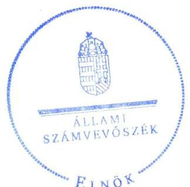
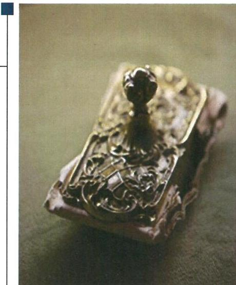
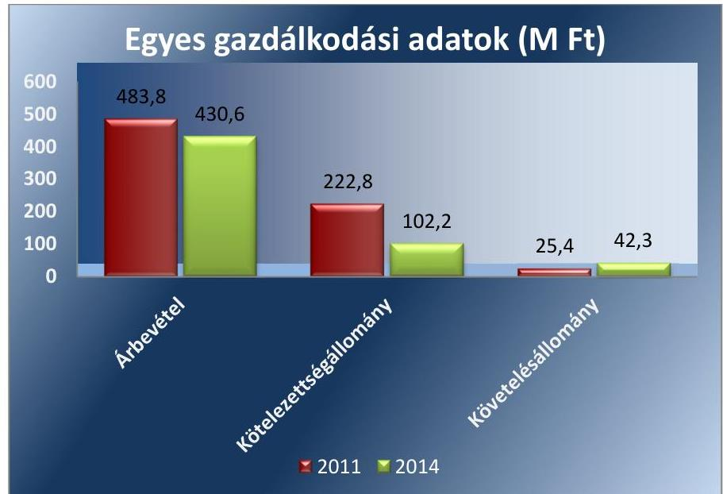
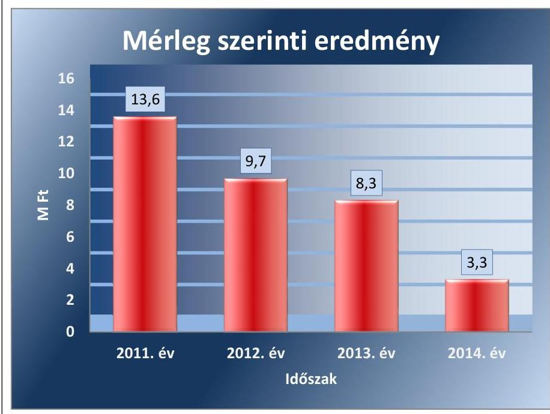
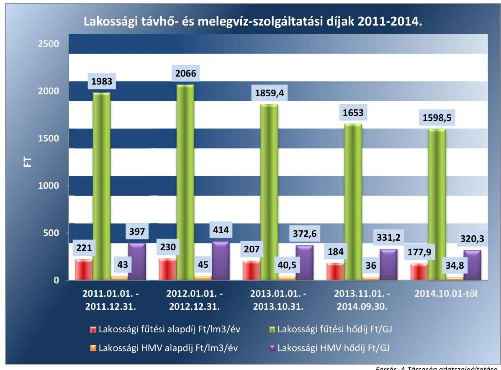

# Jelentés 

## Az önkormányzatok gazdasági társaságai

Az önkormányzatok többségi tulajdonában lévő gazdasági társaságok közfeladat ellátását érintő gazdálkodási tevékenysége szabályszerűségének ellenőrzése - Szentes Városi Szolgáltató Kft.

2016.

Az ÁSZ az államháztartáson kívül müködő közfel-adat-ellátó rendszerek ellenőrzéseivel hozzájárul ahhoz, hogy a közpénzeket az államháztartáson kívül müködő szervezetek is átlátható, rendezett módon használják fel a közfeladatok ellátása érdekében.

---

# Jelentés 

## Az önkormányzatok gazdasági társaságai

Az önkormányzatok többségi tulajdonában lévő gazdasági társaságok közfeladat ellátását érintő gazdálkodási tevékenysége szabályszerűségének ellenőrzése - Szentes Városi Szolgáltató Kft.
2016. oktáber hó 25. nap

16171
www.asz.hu

## Dlesté

Domokos László elnök

Az ÁSZ az államháztartáson kivïl müködő közfel-adat-ellátó rendszerek ellenörzéseivel hozzájárul ahhoz, hogy a közpénzeket az államháztartáson kivül müködő szervezetek is átlátható, rendezett módon használják fel a közfeladatok ellátása érdekében.

---

# AZ ELLENŐRZÉST FELÜGYELTE:

DR. HORVÁTH MARGIT felügyeleti vezető

## AZ ELLENŐRZÉST VEZETTE ÉS A VÉGREHAJTÁSÁÉRT FELELŐS:

SALAMIN VIKTOR ellenőrzésvezető

A PROGRAM ÖSSZEÁLLÍTÁSÁÉRT FELELŐS:

JANIK JÓZSEF LÁSZLÓ osztályvezető

IKTATÓSZÁM: V-1070-146/2016.

TÉMASZÁM: 2051

ELLENŐRZÉS-AZONOSÍTÓ SZÁM: V-070742

Jelentéseink az Országgyűlés számítógépes hálózatán és az Interneta a www.asz.hu címen is olvashatóak.

---

# TARTALOMJEGYZÉK 

■ ÖSSZEGZÉS ..... 5
■ AZ ELLENŐRZÉS CÉLJA ..... 7
■ AZ ELLENŐRZÉS TERÜLETE ..... 8
■ AZ ELLENŐRZÉS HÁTTERE, INDOKOLTSÁGA ..... 10
■ A JELENTÉS LÉNYEGES KÉRDÉSKÖREI ..... 11
■ ELLENŐRZÉS HATÓKÖRE ÉS MÓDSZEREI ..... 12
■ MEGÁLLAPÍTÁSOK ..... 14
■ JAVASLATOK ..... 25
■ MELLÉKLETEK ..... 27
I. sz. melléklet: Értelmező szótár ..... 27
II. sz. melléklet: Múködési adatok ..... 29
III. sz. melléklet: Hődíjak alakulása ..... 30
■ FÜGGELÉK: ÉSZREVÉTELEK ..... 31
■ RÖVIDÍTÉSEK JEGYZÉKE ..... 33

---

.

---

# ÖSSZEGZÉS 

Az Állami Számvevőszék a távhőszolgáltatás közfeladatát ellátó, önkormányzati tulajdonú Szentes Városi Szolgáltató Kft. gazdálkodásának szabályszerűségét értékelte 2011-2014. évekre vonatkozóan. Szentes Város Önkormányzata a közfeladat ellátását szabályszerűen biztosította, a tulajdonosi joggyakorlás megfelelt a jogszabályi előírásoknak. A Társaság vagyongazdálkodása, a közfeladat-ellátással kapcsolatos elszámolások, valamint az önköltségszámítás és árképzés összességében szabályszerűek voltak, a Társaság kötelezettségállománya nem jelentett kockázatot a müködésre.

## Az ellenőrzés társadalmi indokoltsága

Az Állami Számvevőszék stratégiájában megfogalmazta, hogy a helyi önkormányzatok gazdálkodásában rejlő pénzügyi kockázatok feltárásával, az államháztartáson kívülre nyújtott költségvetési támogatások és ingyenes vagyonjuttatások, valamint az államháztartáson kívül működő közfeladat-ellátó rendszerek ellenőrzéseivel hozzájárul ahhoz, hogy a közpénzeket az államháztartáson kívül működő szervezetek is átlátható, rendezett módon használják fel a közfeladatok szerződésben vállalt ellátása érdekében.

Magyarországon az intézmény-centrikus közfeladat-ellátás jellemző, de egyre jelentősebb a költségvetésen kívüli feladatellátás térnyerése. Ennek legfontosabb szereplői - a nonprofit szervezetek mellett - az önkormányzati tulajdonú gazdasági társaságok. Az önkormányzatok szervezetalakítási szabadságának következménye, hogy a korábban is vállalati formában működő közszolgáltatások mellett, mind a kötelező, mind az önként vállalt feladatok ellátásában a gazdasági társaságok kiemelt fontosságú szerephez jutottak.

## Főbb megállapítások, következtetések, javaslatok

Az Önkormányzat a távhőszolgáltatás közfeladatának megszervezéséről a jogszabályi előírásoknak megfelelően döntött, annak ellátásáról a kizárólagos tulajdonában lévő gazdasági társasága útján gondoskodott. A szükséges eszközöket apport formájában a Társaság rendelkezésére bocsátotta, a távhőszolgáltatás működtetéséhez vagyonkezelésre eszközt nem adott át. Az Önkormányzat 2011-2014. évekre szóló gazdasági programja tartalmazta a távhőszolgáltatással összefüggő fejlesztési terveket.

Az Önkormányzat a távhőszolgáltatással összefüggő rendeletalkotási kötelezettségének eleget tett, a távhőszolgáltatási rendelet megfelelt a Tszt.-ben előírt tartalmi követelményeknek. A rendeletet annak ellenére nem módosította a Képviselő-testület, hogy a hatósági ár bevezetésével az Önkormányzat ármegállapítási jogköre - a csatlakozási díj kivételével - megszűnt.

A Képviselő-testület a vagyongazdálkodási rendelet ${ }_{1,2}$-ben és az Alapító Okiratban a jogszabályi előírásokkal összhangban határozta meg a tulajdonosi joggyakorlás szabályait, amelyet az előírásoknak megfelelően, szabályszerűen gyakorolt. Az Önkormányzat által végzett belső ellenőrzések a közfeladat ellátás szabályszerűségét vizsgálták, támogatva ezzel a szabályszerű működés kontrollját.

A közfeladat-ellátást szolgáló vagyonnal való gazdálkodás, annak nyilvántartása szabályszerű volt. A Társaság rendelkezett a Számv. tv. előírásainak megfelelő számviteli szabályzatokkal, amelyek elősegítették a szabályszerű működést. A számlarend azonban nem tartalmazott minden, a Számv. tv.-ben előírt tartalmi elemet. A tárgyi eszközök mennyiségi felvétellel történő leltározását a leltározási és leltárkészítési szabályzatban évenkénti gyakorisággal írták elő, ugyanakkor két évente végezték el. Az üzletszabályzatot a Tszt. előírásainak megfelelően a jegyző jóváhagyást követően véleményezésre megküldte a fogyasztóvédelmi hatóságnak. A Társaság vagyona 2011. január 1-je és 2014. december 31. között minimálisan (18,0 M Ft-tal) nőtt, elsősorban az üzletrész vásárlás és a nyújtott tagi kölcsön miatt. A tárgyi eszközök értékének alakulására az értékcsökkenés elszámolásán túl a távhőrendszer 2011. évi felújítása

---

is hatással volt. A Társaság likviditási helyzete javult az ellenőrzött időszakban, kötelezettségállománya a távhőszolgáltatás közfeladatának ellátására nem jelentett kockázatot. A Társaság kezelte követelésállományát, felszólító levelek küldésével, fizetési meghagyások kezdeményezésével, illetve bírósági végrehajtás útján intézkedett a távhődíj tartozások csökkentésére. A megtett intézkedések ellenére az éven túli lakossági díjtartozások állománya nőtt az ellenőrzött időszakban, 2014 végén 13,1 M Ft volt. A Társaság eredményesen gazdálkodott az ellenőrzött években, a távhőtermelő és távhőszolgáltató üzletágból származó nyeresége 2012-ben 3,6 M Ft, 2013-ban 9,4 M Ft, 2014-ben 7,6 M Ft volt.

A Társaság az üzleti tervek teljesítéséről, a gazdálkodásról és a közszolgáltatási tevékenységről évente beszámolt az Önkormányzatnak. Az éves beszámolók elfogadásáról a Képviselő-testület az FB írásbeli véleményének és a könyvvizsgáló jelentésének birtokában döntött. A szétválasztási szabályok kidolgozását és alkalmazását a könyvvizsgáló a Tszt. előírásainak megfelelően a 2012-2014. évi beszámolóhoz kiadott könyvvizsgálói jelentésben igazolta. Az Info tv.-ben előírt adatvédelmi és adatbiztonsági szabályzatot 2012. január 1-jén hatályba léptették, illetve kinevezték a belső adatvédelmi felelőst. A Társaság jogszabályi kötelezettségének eleget téve a közérdekű adatait honlapján közzétette. A távhőszolgáltatás bevételeinek, költségeinek és ráfordításainak elszámolása megfelelt a jogszabályok és belső szabályozás előírásainak. Az önköltségszámítás szabályait meghatározták, a díjképzés a távhőszolgáltatás díjrendeletben foglaltaknak, 2011. április 15-től a jogszabályi előírásnak megfelelt.

---

# AZ ELLENŐRZÉS CÉLJA 

Az ellenőrzés célja annak értékelése, hogy az önkormányzat a jogszabályi előírások figyelembevételével döntött-e az ellenőrzésre kerülő közfeladat megszervezéséről; az önkormányzat/tulajdonosi joggyakorló szabályszerűen gyakorolta-e a tulajdonosi jogokat; a gazdasági társaság közfeladat-ellátása bevételeinek,ráfordításainak elszámolása, és vagyongazdálkodási tevékenysége megfelelt-e a jogszabályi, illetve a közszolgáltatási/vagyonkezelési szerződésben foglalt tulajdonosi előírásoknak, azok végrehajtása szabályszerű volt-e; a gazdasági társaság kötelezettségállománya jelent-e kockázatot a múködésre, illetve a
közfeladat ellátására; a közfeladatok átláthatósága és elszámoltathatósága érdekében biztosítva volt-e a közszolgáltatás dijának megalapozottsága szabályszerű önköltségszámítással.

---

# **AZ ELLENŐRZÉS TERÜLETE**

## **Szentes Város Önkormányzata és a kizárólagos tulajdonában lévő Szentes Városi Szolgáltató Korlátolt Felelősségű Társaság**

**SZENTES VÁROS ÖNKORMÁNYZATA** a Szentes Városi Szolgáltató Kft.-t 1992. december 18-án a Szentesi Városgazdálkodási Vállalat jogutódjaként hozta lére. Az Önkormányzat¹ a távhővagyont alapításkor apportba adta, kezelésre vagyont a távhőszolgáltatással kapcsolatosan nem adott át.

**A SZENTES VÁROSI SZOLGÁLTATÓ KFT.** alaptevékenysége Szentes Város közigazgatási területén a távhőszolgáltatás biztosítása volt. A kizárólagos önkormányzati tulajdonban lévő Társaság² a távhőszolgáltatás mellett városfejlesztési feladatokat, kéményseprő-ipari tevékenységet, ingatlankezelést, nyomdaipari tevékenységet is ellátott az ellenőrzött időszakban.

Szentes Város lakosainak száma 2014. december 31-én meghaladta a 28 ezer főt. A Társaság 3 db fűtőmű, 2 db hőközpont, valamint 2 db termálkút működtetésével biztosította a fűtést 1403 lakossági (ebből 1400 melegvízzel ellátott), 13 intézményi és egyéb felhasználó (óvoda, iskola, egészségügyi intézmény), valamint 92 kisközületi fogyasztó részére. A hőenergia előállítása 98 %-ban termálenergia, 2 %-ban gázenergia felhasználásával történt. Az ügyvezető 2007. június 1-jétől tölti be tisztségét. A Társaság gazdálkodásának egyes adatait a 2011. és 2014. évek vonatkozásában az 1. ábra szemlélteti.

1. ábra

*Forrás: 2011., 2014. évi beszámoló*

---

Az ellenőrzött időszakban az értékesítés nettó árbevétele társasági szinten $11 \%$-kal csökkent, amelynek alapvető oka a hatósági árak bevezetése volt. A lakossági díjcsökkenés valamint a behajtási intézkedések ellenére a követelés állomány és azon belül a hátralékos követelések állománya nőtt. A 2014 év végi kötelezettségállomány kevesebb, mint fele volt a 2011. évinek.

A Társaság mérleg szerinti eredménye az ellenőrzött időszakban pozitív volt. A Képviselő-testület határozataiban a 2011-2014. évek mérleg szerinti eredményének eredménytartalékba helyezéséről döntött, osztalék kifizetésére nem került sor.

A mérleg szerinti eredmény összegét a 2. ábra mutatja be.
2. ábra

Forrás: a Társaság beszámolói
Az Önkormányzat a 2007-2013 programozási időszakban az Európai Regionális Fejlesztési Alapból, az Európai Szociális Alapból és a Kohéziós Alapból származó támogatások felhasználásának rendjéről szóló 4/2011. (I. 28.) Kormányrendelet 33. § (1) bekezdés c) pontja alapján kezességet vállalt a KEOP-4.2.0/B/11-2011-0003. számú „Geotermikus távhőrendszer bővítése" projekt támogatás összegének ( $63,4 \mathrm{M} F \mathrm{~F}$ ) erejéig.

Az ellenőrzött időszakban a polgármester ${ }^{3}$ és a jegyző ${ }^{4}$ személye nem változott. A polgármester az 1994. évi önkormányzati választások óta tölti be tisztségét, a helyszíni ellenőrzés időszakában a munkakört betöltő jegyző 1995. április 1-jétől látta el feladatait.

---

# AZ ELLENŐRZÉS HÁTTERE, INDOKOLTSÁGA 

AZ ÁSZ STRATÉGIÁJÁBAN megfogalmazta, hogy a helyi önkormányzatok gazdálkodásában rejlő pénzügyi kockázatok feltárásával, az államháztartáson kívülre nyújtott költségvetési támogatások és ingyenes vagyonjuttatások, valamint az államháztartáson kívül múködő közfeladatellátó rendszerek ellenőrzéseivel hozzájárul ahhoz, hogy a közpénzeket az államháztartáson kívül múködő szervezetek is átlátható, rendezett módon használják fel a közfeladatok szerződésben vállalt ellátása érdekében. Az Áht. ${ }^{5}$ 1. § (3) bekezdése értelmében az államháztartáson kívüli szervezetek a közfeladatok ellátásában - jogszabályban meghatározott feltételekkel közremúködhetnek. Az önkormányzati tulajdonú gazdasági társaságok teljes körű ellenőrzésének lehetőségét az Állami Számvevőszékről szóló 1989. évi XXXVIII. törvény 2011. január 1-jétől hatályos módosítása teremtette meg. A gazdasági társaságok közfeladat ellátását érintő gazdálkodási tevékenysége szabályszerűségére irányuló ellenőrzéseket erre tekintettel a 2011. évtől végezzük.

## AZ ELLENŐRZÉS VÁRHATÓ HASZNOSULÁSA-

KÉNT az ÁSZ ${ }^{6}$ a megállapításaival segítséget nyújthat az államháztartáson kívüli közfeladat-ellátás értékeléséhez, jogszabályi keretei pontosításához, átláthatóságot biztosító szabályozásához. Meghatározhatóvá válnak a közfeladat ellátásban részt vevő államháztartáson kívüli szervezeteknek az önkormányzat költségvetését, pénzügyi helyzetét is befolyásoló - kockázatai, lehetővé válik ezen kockázatok csökkentése. Értékelhetővé válik, hogy a feladatot ellátó gazdasági társaság a közszolgáltatási szerződésben foglaltak betartásával, a közvagyon használatával biztosította-e a szolgáltatás folytatásának feltételeit. Ezzel az ellenőrzöttek és a helyi döntéshozók számára az ÁSZ visszajelzést ad feladatszervezési, feladat-ellátási kockázataikról, alapot ad a meglévő hibák megszüntetéséhez, a jobb közfel-adat-ellátás biztosításához. Mindezeken keresztül az ÁSZ hozzájárul Magyarország közpénzügyi helyzetének javításához, a közpénzek mérhető módon történő, a döntéshozók által meghatározott célok szerinti felhasználásához.

---

# A JELENTÉS LÉNYEGES KÉRDÉSKÖREI 

1. Az önkormányzat közfeladat megszervezéséről szóló döntése, valamint tulajdonosi joggyakorlása szabályszerű volt-e?
2. A gazdasági társaság vagyongazdálkodása szabályszerű volt-e, kötelezettségállománya jelentett-e kockázatot a müködésre, illetve a közfeladat ellátására?
3. A gazdasági társaságnál az ellátott közfeladat bevételei és ráfordításai elszámolása, valamint az önköltségszámítás és árképzés szabályszerű volt-e?

---

# ELLENŐRZÉS HATÓKÖRE ÉS MÓDSZEREI 

## Az ellenőrzés típusa

Megfelelőségi ellenőrzés.

## Az ellenőrzött időszak

2011. január 1-jétől 2014. december 31-ig tart.

## Az ellenőrzés tárgya

A közfeladatot gazdasági társaságokkal ellátó önkormányzatok tulajdonosi joggyakorlása, valamint gazdasági társaságok pénz- és vagyongazdálkodásának szabályozottsága és szabályszerűsége.

Az ellenőrzés kiterjed minden olyan körülményre és adatra, amely az ÁSZ jogszabályban meghatározott feladatainak teljesítéséhez, valamint a program végrehajtása folyamán felmerült újabb összefüggések feltárásához szükséges.

## Az ellenőrzött szervezet

Az ellenőrzött szervezetek:
Szentes Város Önkormányzata,
Szentes Városi Szolgáltató Kft.

## Az ellenőrzés jogalapja

Az ellenőrzés jogszabályi alapját az ÁSZ tv. 5. § (3)-(4)-(5) bekezdései képezik. Ennek értelmében az ÁSZ ellenőrzi az államháztartásból nyújtott támogatás vagy az államháztartásból meghatározott célra ingyenesen juttatott vagyon felhasználását a gazdasági társaságoknál. Az önkor-mányzati vagyon kezelésének ellenőrzése keretében ellenőrzi a vagyon kezelését, a vagyonnal való gazdálkodást, a többségi önkormányzati tu-lajdonban lévő gazdasági társaságok vagyonérték-megőrző és vagyon-gyarapító tevékenységét, az államháztartás körébe tartozó vagyon el-idegenítésére, illetve megterhelésére vonatkozó szabályok betartását; el-lenőrizheti a többségi önkormányzati tulajdonban lévő gazdasági társa-ságok vagyongazdálkodását.

---

# Az ellenőrzés módszerei 

Az ellenőrzést a nemzetközi standardokat irányadónak tekintve az ellenőrzési program ellenőrzési kérdései, az ellenőrzött időszakban hatályos jogszabályok, az ellenőrzés szakmai szabályok és módszertanok figyelembe vételével végezzük.

Az ellenőrzés ideje alatt az ellenőrzött szervezettel történő kapcsolattartást az ÁSZ Szervezeti és Múködési Szabályzatának vonatkozó előírásai alapján biztosítjuk.

Az ellenőrzés a kiválasztott, többségi tulajdonosi jogokat gyakorló önkormányzatra, illetve az ellenőrzésre kijelölt közfeladatot ellátó gazdasági társaság felett tulajdonosi jogokat gyakorló szervezetre és az ellenőrzött közfeladatot ellátó gazdasági társaságra terjed ki. Amennyiben a gazdasági társaságban több önkormányzat együttesen többségi tulajdonos, úgy az ellenőrzést a többségi tulajdonosi jogokat gyakorló önkormányzatnál kell lefolytatni. Az ellenőrzött gazdasági társaságnál, amennyiben az több közfeladatot is ellát, akkor az ellenőrzésre kiválasztott közfeladat-ellátást ellenőrizzük.

Az ellenőrzést a kérdésekre adott válaszok kiértékelésével, valamint a megjelölt adatforrások, tanúsítványok felhasználásával, továbbá az adott időszakban hatályos jogszabályok figyelembe vételével kell lefolytatni. Az ellenőrzési kérdések megválaszolásához szükséges bizonyítékok megszerzése a következő ellenőrzési eljárások alkalmazásával történik: megfigyelés, kérdésfeltevés (információkérés), összehasonlítás, valamint elemző eljárás.

A bevételek és ráfordítások elszámolása, valamint a vagyonnyilvántartás terén a szabályszerű múködést véletlen mintavétellel ellenőriztük. A mintavétellel ellenőrzött területek esetében minden egyes tétel vonatkozásában a szabályszerűségre vonatkozó kérdéseket tettünk fel, amelyek eredménye összesítésre került. A jogszabályoknak és a belső előírásoknak megfelelőnek tekintettük az adott területet, amennyiben a minta ellenőrzésének eredménye alapján 95\%-os bizonyossággal a teljes sokaságban a hibaarány kisebb volt, mint 10\%, nem megfelelőnek, ha a hibaarány a 10\%ot meghaladta. Részben megfelelő minősítést adtunk, amennyiben egy adott terület vonatkozásában a minta alapján a teljes sokaságban nem volt egyértelmúen biztosított a jogszabályoknak és a belső szabályzatoknak megfelelő múködés.

A ráfordítások elszámolására és a vagyonnyilvántartásra vonatkozó véletlen mintavételt kockázati alapú kiválasztással egészítettük ki, amelynek során évente a három legnagyobb összegű tételt választottuk ki.

---

# 1. Az önkormányzat közfeladat megszervezéséről szóló döntése, valamint tulajdonosi joggyakorlása szabályszerű volt-e? 

Összegző megállapítás

Az Önkormányzat a távhőszolgáltatási közfeladat-ellátását a jogszabályi előírásoknak megfelelően szervezte meg, a tulajdonosi jogokat összességében a jogszabályi előírásokon alapuló belső szabályozásban előírtaknak megfelelően gyakorolta.
1.1. számú megállapítás

Az Önkormányzat távhőszolgáltatási közfeladat-ellátásának megszervezése szabályszerű volt, a távhőszolgáltatásra vonatkozó rendeletalkotási kötelezettségének eleget tett, azonban a rendelet aktualizálásának elmaradása miatt a jogszabályi előírásokkal való összhangja nem volt teljes körűen biztosított.

Az Ötv. ${ }^{7}$ 91. § (6) bekezdése, 2013. január 1-jétől az Mötv. ${ }^{8}$ 116. § (3)-(4) bekezdései szerint az önkormányzatnak a gazdasági programjában kell meghatároznia azokat a célkitűzéseket, amelyek az általa ellátott feladatok biztosítását, fejlesztését szolgálják. A Képviselő-testület ${ }^{9}$ által a 2011-2014. évekre elfogadott gazdasági program tartalmazta a távhő tevékenységre vonatkozó fejlesztési terveket, a város természeti kincsének, a termálvíz fűtési energiájának hasznosítását.

A távhőszolgáltatással ellátott létesítmények távhőellátásának távhőszolgáltatásra engedéllyel rendelkezők útján történő biztosítása a Tszt ${ }^{10}$. 6. § (1) bekezdése értelmében a területileg illetékes települési önkormányzat kötelező feladata. Ezen kötelezettségének az Önkormányzat a 100 \%os tulajdonában lévő Társasága alapításával tett eleget. A müködéséhez szükséges eszközöket az Önkormányzat apport formájában bocsátotta a Társaság rendelkezésére, kezelésre vagyont nem adott át.

A feladatellátás keretszabályait Társaság Alapító Okiratában ${ }^{11}$ és az üzletszabályzat ${ }^{12}$-ban, a távhőellátás biztosításának és a távhődíjak megállapításának szabályait a távhőszolgáltatási rendelet ${ }^{13}$-ben határozták meg. Az Önkormányzat és a Társaság között a közfeladat-ellátására szerződés nem jött létre, arra a feleket jogszabályi előírás nem kötelezte.

A TÁVHŐSZOLGÁLTATÁSI RENDELET megalkotásával az Önkormányzat a Tszt. 6. § (2) bekezdésében előírt kötelezettségének eleget tett. A távhőszolgáltatási rendeletben meghatározták a távhőszolgáltató és a felhasználó közötti jogviszony részletes szabályait, a közfeladat-ellátásának területét, a távhőszolgáltatási díjak (alapdíj, hődíj,) alkalmazásának és fizetésének szabályait, a díjak mértékét, a korlátozási és szüneteltetési sorrendet, valamint a fejlesztésre kijelölt területeket.

---

A Tszt. 57/D. § 2011. április 15-i beiktatását követően a távhőszolgáltatási rendeletet annak ellenére nem módosították, hogy a hatósági ár bevezetésre került, az Önkormányzat ár megállapítási jogköre - a csatlakozási dí kivételével - a gyakorlatban megszűnt, a távhőszolgáltatás diját ettől kezdve a nemzeti fejlesztési miniszter határozta meg. Ezáltal a távhőszolgáltatási rendeletben az Önkormányzat ármegállapítására vonatkozó jogkörének megtartása ütközött a magasabb rendú jogszabály, a Tszt. 57/D. § (1) bekezdése előírásaival, ugyanakkor az Önkormányzat a gyakorlatban a távhőszolgáltatási rendeletének 17. §-ában megtartott hatósági ármegállapítási jogkörének alkalmazásával nem élt 2011 áprilisát követően.

# 1.2. számú megállapítás 

## A tulajdonosi jogok gyakorlása szabályszerű volt.

A TULAJ DONOSI JOGOK gyakorlásának rendjét a vagyongazdálkodási rendelet ${ }_{1,2}$-ben, írták elő. A szabályozás a Képviselő-testület, mint egyszemélyes gazdasági társaság taggyűlésének kizárólagos hatáskörébe tartozó jogok Gt. szerinti gyakorlását írta elő. Az Alapító Okirat előírásai szerint az Önkormányzatot megillető tulajdonosi jogok gyakorlásával kapcsolatos feladatok és jogosultságok a Képviselő-testületet illették meg, tulajdonosi jogkör átruházásra nem került sor. A Gt. 141. § (2) bekezdésében és a vagyongazdálkodási rendelet ${ }_{1,2}$-ben előírtakkal összhangban a Képviselő-testület hatáskörébe sorolta az Alapító Okirat a beszámoló jóváhagyását és az adózott eredmény felhasználásáról szóló döntés meghozatalát. A törzstőke felemelését és leszállítását, az üzletrész felosztását és bevonását. Az ügyvezető és az FB tagok megválasztását, a társaság jogutód nélküli megszűnésének, átalakulásának elhatározását. Ezeken túl a szokásos üzletmeneten kívüli, 5 M Ft-ot meghaladó értékű szerződések megkötésének jóváhagyása is a Képviselő-testület hatáskörébe tartozott.

AZ FB az ellenőrzött időszakban az Alapító Okiratban előírtak alapján a Gt. 34. § (1) bekezdésével, valamint a Ptk. 3:121. § (1) bekezdésével összhangban - három tagból állt. A Gt. 34. § (4) bekezdésében előírtaknak eleget téve az FB elkészítette az ügyrendjét, melyet a Képviselő-testület jóváhagyott. Az FB feladatai közé tartozott javaslat készítése a Társaság számviteli beszámolójának elfogadásához, osztalékelőleg kifizetéséhez, könyvvizsgáló személyének megválasztásához.

AZ ANYAGI ÖSZTÖNZÉSI RENDSZERT a Taktv. ${ }^{14}$ 5. § (3) bekezdésében foglaltaknak megfelelően a Képviselő-testület által elfogadott javadalmazási szabályzatban rögzítették. A javadalmazási szabályzat előírása szerint az ügyvezető igazgató prémiumfeladatait a Képvi-selő-testület határozza meg az FB előzetes véleményének birtokában. Az ügyvezető igazgató prémiumának megállapítása során teljesítménykövetelményként előírták az üzleti terv fő számainak teljesítését.

AZ ÁRKÉPZÉS SZABÁLYAIT az alapdíj és a hődíj számításának vonatkozásában a távhőszolgáltatási rendeletben határozta meg az Önkormányzat. Az alapdíj számítását a közfeladat üzemeltetési és fenntartási költségeinek figyelembevételével, a hődíjak meghatározását a felhasznált gáz-, villamos-, termálenergia költségeinek figyelembevételével írták

---

elő. A díjak mértékét a távhőszolgáltatási rendelet 2. számú melléklete tartalmazta, amelynek utolsó módosítására 2008. november 1 -jén került sor.

A BESZÁMOLTATÁSI RENDSZERT az Önkormányzat megfelelően működtette, a Társaságot évente beszámoltatta annak gazdálkodásáról, közszolgáltatási tevékenységéről. A Társaság 2011-2014. üzleti éveiről készített éves beszámolóit és üzleti terveit a Képviselő-testület megtárgyalta és jóváhagyta. A Képviselő-testület a beszámolók elfogadásáról a Gt. 35. § (3) bekezdésének és a Ptk. 3:120. § (2) bekezdésének előírásait betartva az FB írásos jelentésének birtokában döntött.

A TÁRSASÁG BELSŐ ELLENŐRZÉSÉT az Önkormányzat a Szentes Kistérség Belső Ellenőrzési Társulása útján végezte, a Ber. ${ }^{15}$ 21. § (2) bekezdése illetve a Bkr. ${ }^{16}$ 22. § (1) bekezdés b) pontjában előírt, kockázatelemzésen alapuló éves ellenőrzési terv alapján. A 2011. és 2012. évben lefolytatott ellenőrzések témája a díjak megállapításának és az önköltségszámítás gyakorlatának szabályszerűsége volt. A két ellenőrzési jelentés azonos megállapításra jutott, eszerint a Társaság alkalmazta a távhőszolgáltatási rendeletben meghatározott alapdíjat és hődíjat, valamint az üzemi általános költségek felosztása az önköltségszámítási szabályzatban meghatározott költségfelosztási alapelvek szerint történt. Az ellenőrök intézkedést igénylő megállapítást nem tettek.

Az Önkormányzat a 2007-2013 programozási időszakban az Európai Regionális Fejlesztési Alapból, az Európai Szociális Alapból és a Kohéziós Alapból származó támogatások felhasználásának rendjéről szóló 4/2011. (I. 28.) Kormányrendelet 33. § (1) bekezdés c) pontja alapján kezességet vállalt a KEOP-4.2.0/B/11-2011-0003. számú „Geotermikus távhőrendszer bővítése" projekt támogatás összegének (63,4 M Ft) erejéig. Az Önkormányzatnak az ellenőrzött időszak végéig nem kellett a kezességvállalását beváltania, a kötelezettségvállalás szabályszerű volt, megfelelt a Stabilitási tv ${ }^{17}$. 10.§ (2) bekezdés a) pontjának. Az Önkormányzat a Társaság feladatellátásához múködési és fejlesztési támogatást, tagi kölcsönt nem nyújtott.

---

# 2. A gazdasági társaság vagyongazdálkodása szabályszerű volt-e, kötelezettségállománya jelentett-e kockázatot a múködésre, illetve a közfeladat ellátására? 

Összegző megállapítás

A Társaság vagyongazdálkodása szabályszerű volt, a kötelezettségek állománya nem jelentett kockázatot a távhőszolgáltatás közfeladatának ellátására, a múködésre.
2.1. számú megállapítás

A Társaság a jogszabályok által előírt gazdálkodási szabályzatokkal rendelkezett, azonban a számlarend nem tartalmazott minden, a Számv. tv.-ben előírt elemet. A távhőszolgáltatás közfeladat-ellátás bevételeinek és ráfordításainak elkülönítését biztosító szétválasztási szabályokat meghatározta.

ÜZLETI TERV készítésére vonatkozó kötelezettséget az Önkormányzat illetve a Társaság belső szabályzatai nem írtak elő. Az ellenőrzött időszakban a Társaság minden évben készített üzleti tervet és az FB véleményének figyelembevételével, a Képviselő-testület határozattal elfogadta. Az üzleti tervek tartalmazták a tervezett bevételeket és költségeket tevékenységenként, meghatározták a Társaság múködési feltételeit, ágazati sajátosságait, a célkitúzéseket, valamint a kintlévőségek kezelését.

A Társaság rendelkezett a Számv. tv. ${ }^{18}$ 14. § (3) bekezdésében előírt számviteli politikával ${ }^{19}$ és a Számv. tv. 14. § (5) bekezdés a), b), d) pontjaiban előírtaknak megfelelően leltárkészítési és leltározási szabályzat ${ }^{20}$-tal, eszközök és források értékelési szabályzat ${ }^{21}$-tal és pénzkezelési szabály-zat ${ }^{22}$-tal, továbbá a Számv. tv. 161. § (1) bekezdésében előírt számla-rend ${ }^{23}$-del.

A SZÁMVITELI POLITIKA a Számv. tv. 14. § (4) bekezdése előírásainak megfelelően tartalmazta - többek között - a Társaságra jellemző szabályokat, előírásokat, módszereket a számviteli elszámolás, értékelés szempontjából lényeges, jelentős kritériumainak meghatározására, valamint azt, hogy a törvényben biztosított választási, minősítési lehetőségek közül melyiket alkalmazzák.

A Társaság a Számv. tv. 161. § (1) bekezdése alapján elkészítette a számlarendet, azonban az az ellenőrzött időszakban nem felelt meg a Számv. tv. 161. § (2) bekezdés b) és c) pontjában foglaltaknak. Nem tartalmazta teljes körűen a számlák tartalmát (az a számla megnevezéséből egyértelműen nem minden esetben következik), értéke növekedéseinek, csökkenéseinek jogcímeit, a számlát érintő gazdasági eseményeket, azok más számlákkal való kapcsolatát, a főkönyvi számla és az analitikus nyilvántartás kapcsolatát.

A számlarendet 2012. május 2-i módosítása során kiegészítették a Tszt. 18/A. § (2) bekezdésében előírt számviteli szétválasztási szabályokkal. A számlarend kiegészítésével biztosították a tevékenységek közvetlen és közvetett költségeinek elkülönítését, illetve meghatározták a kapcsolódó főkönyvi számlák tartalmát. Az eszközök és források értékelési szabályzat tartalmazta az eszközök és források értékelésére vonatkozó előírásokat. A lel-

---

tározási és leltárkészítési szabályzat a Számv. tv. 69. § (3) bekezdés előírásait betartva évenkénti gyakorisággal írta elő a folyamatosan mennyiségben nyilvántartott tárgyi eszközök és készletek mennyiségi leltározásának kötelezettségét. A pénzkezelési szabályzatban a Számv. tv. 14. § (8) bekezdésében előírtaknak megfelelően - többek között - rendelkeztek a pénzforgalom lebonyolításának rendjéről, a készpénzben és a bankszámlán tartott pénzeszközök közötti forgalomról, a bankkártya használat rendjéről, a készpénzállomány ellenőrzésekor követendő eljárásról, az ellenőrzés gyakoriságáról.

A Társaság a Számv. tv. 14. § (5) bekezdés c) pontja alapján elkészítette önköltségszámítás szabályzatát. A szabályzat tartalmazta az önköltségszámítás tárgyát, a kalkulációs egységet, a költségek utalványozásának, elszámolásának bizonylati rendjét, az önköltségszámítás készítésének időpontját, a kalkulációs időszakokat. A szabályzatban rögzítették az önköltségszámítás (utókalkuláció) és a könyvvitel nyilvántartás adatainak folyamatos egyeztetési kötelezettségét. A Társaság a jogszabályi előírásoknak megfelelő belső előírásokkal biztosította a közfeladat-ellátást szolgáló vagyon, valamint a bevételek és ráfordítások tevékenységenként elkülönített nyilvántartását.

ÜZLETSZABÁLYZATÁT Tszt. 3. § v) pontja szerinti tartalommal elkészítette és még az ellenőrzött időszak előtt hatályba léptette a Társaság. A jegyző az üzletszabályzatot jóváhagyta, a Tszt. 7. § (1) bekezdés a) pontjában előírtak szerint megküldte véleményezésre a fogyasztóvédelmi hatóságnak.

# 2.2. számú megállapítás 

A Társaság a tulajdonában lévő vagyonával összességében a jogszabályi és belső rendelkezéseknek megfelelően gazdálkodott.

AZ ANALITIKUS ÉS A FŐKÖNYVI NYILVÁNTARTÁSI RENDSZER a Társaság vagyonának, és annak változásának nyilvántartására alkalmas volt, a Számv. tv. előírásainak és a számlarendben rögzített szétválasztási szabályoknak megfelelt.

Az éves beszámolók adatait leltárral támasztotta alá, a főkönyvi könyvelés és analitikus nyilvántartások közötti egyeztetést a mérleg fordulónapjára vonatkozóan szabályszerűen elvégezte.

A Társaság a leltározási és leltárkészítési szabályzatában előírt kötelezettségének a készletek vonatozásában eleget tett, a mennyiségi leltározást évente elvégezték.

A tárgyi eszközök mennyiségi felvétellel történő leltározására két évente (2011-ben és 2013-ban) került sor. Erre a Számv. tv. 69. § (3) bekezdése lehetőséget ad, a gyakorlat azonban ellentmond a leltározási és leltárkészítési szabályzat 3. pontjában szereplő előírásnak, amely évenkénti mennyiségi számbavételt írt elő.

---

| A TÁRSASÁG FŐBB MÉRLEG ADATAI (M FT) |  |  |  |  |  |
| :--: | :--: | :--: | :--: | :--: | :--: |
| Megnevezés | $\begin{gathered} 2011 . \\ 01 .01 . \end{gathered}$ | $\begin{gathered} 2011 . \\ 12.31 . \end{gathered}$ | $\begin{gathered} 2012 . \\ 12.31 . \end{gathered}$ | $\begin{gathered} 2013 . \\ 12.31 . \end{gathered}$ | $\begin{gathered} 2014 . \\ 12.31 . \end{gathered}$ |
| I. Befektetett eszközök | 379,3 | 537,1 | 492,5 | 431,4 | 413,4 |
| - ebből: Tárgyi eszközök | 377,9 | 536,2 | 491,6 | 430,5 | 343,4 |
| - ebből: Befektetett pénzügyi eszközök | 26,0 | 7 | 0 | 0 | 68,4 |
| II. Forgó eszközök | 125,9 | 80,2 | 136,9 | 144,6 | 109,8 |
| - ebből: Követelések | 23,7 | 25,4 | 32,8 | 26,5 | 42,3 |
| III. Aktív időbeli elhatárolások | 3,0 | 1,9 | 4,9 | 2,6 | 3,0 |
| Eszközök összesen | 508,2 | 619,2 | 634,3 | 578,6 | 526,2 |
| IV. Saját tőke | 202,9 | 216,5 | 226,2 | 234,5 | 237,8 |
| - ebből: Jegyzett tőke | 23,0 | 23,0 | 23,0 | 23,0 | 23,0 |
| - ebből: Mérleg szerinti eredmény | 9,2 | 13,6 | 9,7 | 8,3 | 3,3 |
| V. Céltartalékok |  |  |  |  |  |
| VI. Kötelezettségek | 98,3 | 222,8 | 140,1 | 110,2 | 102,2 |
| VII. Passzív időbeli elhatárolások | 207,0 | 179,9 | 268,0 | 233,9 | 186,2 |
| Források összesen | 508,2 | 619,2 | 634,3 | 578,6 | 526,2 |

A Z ESZKÖZÉRTÉK alakulását alapvetően a befektetett eszközök mérlegértékének alakulása befolyásolta. A Társaság 2014. évben megvásárolta a Szentesi Üdülőközpont Nonprofit Kft. 24,0 \%-os üzletrészét és törzstőke emelést hajtott végre, így az üzletrész értéke 26,4 M Ft-ra emelkedett, valamint 42,0 M Ft-os tagi kölcsönt nyújtott a Szentesi Üdülőközpont Nonprofit Kft.-nek. A tárgyi eszköz állomány 2011. évi 41,6 \% növekedését alapvetően a távhőrendszer felújításának számviteli elszámolása eredményezte. A forgó eszközök mérlegértéke 16,1 M Ft-tal csökkent, ugyanakkor a követelések értéke 18,6 M Ft-tal nőtt az ellenőrzött időszakban.

A források mérlegértékét a mérleg szerinti eredmény elszámolásán túl alapvetően a kötelezettségek értéke befolyásolta. A Társaság saját tőkéje az eredményes gazdálkodás miatt 17,2 \%-kal (34,9 M Ft-tal) emelkedett. A kötelezettségek 2011. évi jelentős növekedését eredményezte a Szentesi III. termálkút beruházásához kapott 120,0 M Ft kölcsön számviteli elszámolása.
2.3. számú megállapítás

A kötelezettségek állománya nem jelentett kockázatot a távhőszolgáltatási közfeladat-ellátására, illetve a Társaság múködésére.

A Társaság hosszú lejáratú kötelezettségeit a Szentesi Ilonapart Kft. és a Társaság közötti kölcsönszerződés alapján a Szentesi III. termálkút beruházáshoz nyújtott hosszú lejáratú kölcsön képezte. A Társaság kötelezettségeinek 48,4\% - 98,5 \%-át a rövid lejáratú kötelezettségek alkották az ellenőrzött időszak alatt. A rövid lejáratú kötelezettségek között - a szállítókkal szembeni kötelezettségeken túl - került elszámolásra a hosszú lejáratú kölcsön tárgyévet terhelő összege, egyéb (hatósággal, dolgozókkal szembeni) éven belüli tartozások.

Az eladósodottságot jelző mutatók értékei a 2. táblázatban foglaltak szerint alakult a 2011-2014. években

---

| A TÁRSASÁG PÉNZÜGYI MUTATÓSZÁMAI 2011-2014 |  |  |  |  |
| :--: | :--: | :--: | :--: | :--: |
| Megnevezés | 2011. év | 2012. év | 2013. év | 2014. év |
| Eladósodottsági mutató   idegen tőke/összes forrás | 0,36 | 0,22 | 0,19 | 0,19 |
| Eladósodottság mértéke   kötelezettségek/saját tőke | 1,03 | 0,62 | 0,47 | 0,43 |
| Nettó eladósodottság   (kötelezettségek-követelések)/saját tőke | 0,91 | 0,47 | 0,36 | 0,25 |
| Adósságfedezeti mutató   (befektetett eszközözök+forgóeszközök)/idegen forrás | 2,77 | 4,49 | 5,23 | 5,12 |

Forrás: a Társaság adatszolgáltatása
AZ ELADÓSODOTTSÁG mértéke és szerkezete nem jelentett kockázatot a közfeladat-ellátására az ellenőrzött időszakban. Az eladósodottsági mutató értéke kedvezően alakult, a Társaság működésébe bevont idegen tőke összes forráson belüli aránya egyik évben sem érte el a kritikus 0,6-es értéket. A kötelezettségek és a saját tőke arányát jelző eladósodottság mértéke - 2011. év kivételével - hasonlóan kedvező helyzetet mutatott, az évvégén fennálló kötelezettségek a saját tőke egyre kisebb hányadát kötötték le. A mutató 2011. évben meghaladta az 1-es értéket, de 2012. évtől a hosszú lejáratú kölcsön összegének csökkenése miatt kedvező tendenciát mutat. A nettó eladósodottság mutató értéke alapján a követelések nem teljes mértékben fedezték a kötelezettségeket, de arra a saját tőke fedezetet nyújtott. Az adósságfedezeti mutató értéke, tendenciája szintén kedvező volt, mivel 2011-ben 1 Ft adósságra 2,77 Ft az ellenőrzött időszak végén 5,12 Ft vagyon jutott.

A Társaság 2011-2014. években a jegyzett tőkét többszörösen meghaladó összegű saját tőkével rendelkezett, így nem volt szükség a Gt. 143. § (3) bekezdése szerinti pótbefizetés teljesítésére.

A hosszú lejáratú kötelezettségek esedékes törlesztő részleteit határidőben teljesítették. A Társaságnak az ellenőrzött időszakban - 2012. év kivételével - nem volt 30 napon túl lejárt rövid lejáratú kötelezettsége. A rövid lejáratú kötelezettségeken belül a szállítói állomány aránya 11,9 \% és $26,8 \%$ között volt.

# 2.4. számú megállapítás 

A Társaság az FB és a könyvvizsgáló által véleményezett éves beszámolóit határidőben letétbe helyezte.

AZ ÉVES BESZÁMOLÓKAT a Társaság a Számv. tv. 19. § (1) bekezdésében előírt tartalommal elkészítette, azokat az ügyvezető a Kép-viselő-testület elé terjesztette. Az éves beszámolók letétbe helyezése a Számv. tv. 153. § (1) bekezdésben előírt határidőben megtörtént.

Az éves beszámolók elfogadásáról a Képviselő-testület minden évben az FB határozatának és a könyvvizsgáló írásos jelentésének birtokában döntött. Az ügyvezető által készített üzleti jelentés tartalmazta a tényadatok üzleti tervben szereplő tervszámoktól való eltérésének részletes indoklását.

---

A KÖNYVVIZSGÁLÓ a Tszt. 18/B. § (1) bekezdésében rögzített kötelezettségének eleget tett, a 2012-2014. évek éves beszámolóihoz kiadott könyvvizsgálói jelentésében igazolta, hogy a Társaság által kidolgozott és alkalmazott szétválasztási szabályok, valamint az egyes tranzakciók árazása biztosítja a vállalkozás tevékenységei közötti keresztfinanszírozásmentességet. A könyvvizsgáló az ellenőrzött időszak minden évében hitelesítő záradékkal látta el a Társaság éves beszámolóját.

Az FB és a könyvvizsgáló a közvagyon védelme, illetve más okból a Kép-viselő-testület összehívását nem kezdeményezte.

Az Info tv. 24. § (1) bekezdés c) pontjában foglalt kötelezettségnek eleget téve kinevezték a Társaság belső adatvédelmi felelősét, és 2012. január 1-jén hatályba helyezték az Info tv. 24. § (3) bekezdésben előírt adatvédelmi és adatbiztonsági szabályzatot.

A Társaság 2011-ben az Eisztv ${ }^{24}$. 6. § (1) bekezdésében, 2012-2014. években az Info tv. 33. § (3) bekezdésben előírt kötelezettségének eleget téve szervezeti, személyi adatait, a tevékenységére, múködésére vonatkozó, és gazdálkodási adatait honlapján közzétette.

# 3. A gazdasági társaságnál az ellátott közfeladat bevételei és ráfordításai elszámolása, valamint az önköltségszámítás és árképzés szabályszerű volt-e? 

Összegző megállapítás

## 3.1. számú megállapítás

A távhőszolgáltatási közfeladat-ellátással kapcsolatos bevételek, költségek és a ráfordítások elszámolása szabályszerű volt, az önköltségszámítás és árképzés a jogszabályi és a belső szabályzat előírásainak megfelelt.

A távhőszolgáltatási közfeladat bevételeinek, ráfordításainak, a beruházások és felújítások kiadásainak és az értékcsökkenési leírásnak az elszámolása szabályszerű volt.

A Társaságnál - mivel a távhőszolgáltatási feladat mellett egyéb feladatokat is ellátott - a közfeladat átláthatósága és a keresztfinanszírozás kizárása érdekében fenn állt a Tszt. 2012. január 1-jétől hatályos 18/A. § (3) bekezdés c) pontjában foglalt előírás szerint a bevételek és ráfordítások elkülönítésének kötelezettsége. A számlarend és önköltségszámítási szabályzat biztosította a szétválasztást. A bevételek tevékenységenkénti elkülönítését az alkalmazott főkönyvi számok biztosították. A költséghelyenként és költségnemenként könyvelt ráfordításokat tevékenységenként elkülönítették.

AZ ÉRTÉKESÍTÉS NETTÓ ÁRBEVÉTELÉNEK ELSZÁMOLÁSA megfelelő volt. A bevételek előírása és kiszámlázása a belső szabályozásnak megfelelően történt, a bevételeket a megfelelő számlacsoportban, közfeladatonként elkülönítve számolták el. Az alkalmazott díjak megfeleltek a távhőszolgáltatási rendeletben rögzítetteknek, illetve 2011. április 15 -ét követően a Tszt.57/D. § (1) bekezdése, az

---

50/2011. (IX. 30.) NFM rendelet ${ }^{25}$ 4. §-a, valamint a Rezsi tv. ${ }^{26}$ 3. § (1) bekezdése hatályos előírásainak.

# AZ ANYAGJELLEGŰ RÁFORDÍTÁSOK ELSZÁMOLÁSA 

megfelelő volt. A közfeladattal kapcsolatban elszámolt költségeket és ráfordításokat a megfelelő közfeladatra és költségnemre számolták el. A költségelszámolást megalapozó dokumentumok rendelkezésre álltak. A számviteli elszámolás bizonylatai a Számv. tv. 165-167. §-aiban rögzített alaki és tartalmi követelményeknek megfeleltek.

## A BERUHÁZÁSOK, FELÚJÍTÁSOK KIADÁSAI ÉS AZ ÉRTÉKCSÖKKENÉSI LEÍRÁS ELSZÁMOLÁSA

megfelelő volt, mivel a kiadásokat a megfelelő főkönyvi számlákra számolták el. Az üzembe helyezés, állományba vétel minden esetben megtörtént, a bekerülési értékeket a Számv. tv. 47-51. §-aiban és az eszközök és források értékelési szabályzatában előírtak alapján állapították meg. Az értékcsökkenés elszámolása szabályos volt, a számviteli politika ${ }_{1,2}$-ben meghatározott leírási kulcsokat alkalmazta a Társaság. Az aktivált eszközöket a tárgyévi eszköz analitika és a leltár tartalmazta.

A tárgyi eszközök terv szerinti értékcsökkenését negyedévente számolták el, terven felüli értékcsökkenés elszámolására nem került sor. A 20112014. évek éves beszámolóinak kiegészítő mellékletében a Számv. tv. 92. § (1) bekezdésében előírt részletezettséggel mutatták be az immateriális javak és tárgyi eszközök bruttó értékének, értékcsökkenésének és nettó értékének az alakulását. A Társaságnál - a teljes eszközállomány vonatkozásában - 2011. évben jelentősen magasabb volt a pótló beruházások, felújítások összege (234,9 M Ft) mint az elszámolt értékcsökkenés (67,2 M Ft). A távhőszolgáltatás eszközpótlása 2012-2014. években 21,6\% - 71,9 \% -a volt az elszámolt értékcsökkenésének. A 2011.évben üzembe helyezett beruházások miatt - az ellenőrzött időszakban - az elszámolt értékcsökkenés négyszeresének megfelelő összeget fordítottak eszközpótlásra.

KÖVETELÉS ÁLLOMÁNYÁT kezelte a Társaság, az értékvesztés elszámolása évente, a számviteli politika ${ }_{1,2}$ előírásai szerint történt. A határidőn túli követelésekre egyedi értékelés, elbírálás után értékvesztést számoltak el. A Társaság a fizetési határidőn túli követelés állományának hatékony kezelése és behajtása érdekében az ellenőrzött években felszólító levelek küldésével, fizetési meghagyások kezdeményezésével, illetve bírósági végrehajtás útján intézkedett a távhődíj kintlévőségei csökkentésére.

A mérlegben kimutatott követelések közül az éven túli hátralékos állomány a lakossági fogyasztókkal szemben állt fenn. Az összes követelés az ellenőrzött időszakban kismértékben növekedett. Az éven túli kintlévőségek állományának jelentős növekedését a lakossági hátralék átstrukturálódása okozta, melynek során a 2010. és 2011.évi éven belüli hátralékokból 2012-re az éven túli kategóriába kerültek át a kintlévőségek.

---

A vevő követelés állomány korosságát a 3. táblázat mutatja be:
3. táblázat

A VEVŐ HÁTRALÉKOK ALAKULÁSA (M FT)

|  | 2011. év | 2012. év | 2013. év | 2014. év |
| :-- | --: | --: | --: | --: |
| 360 napon túli | 4,2 | 12,3 | 12,4 | 13,1 |
| 180-360 nap | 3,6 | 4,1 | 3,3 | 1,0 |
| 90-180 nap | 2,6 | 2,1 | 1,7 | 1,4 |
| 90 napon belül | 20,2 | 15,1 | 9,7 | 15,3 |
| Összesen: | 30,6 | 33,6 | 27,1 | 30,8 |

A Társaság távhőtermelő és távhőszolgáltató üzletágából származó nyeresége 2012-ben 3,6 M Ft, 2013-ban 9,4 M Ft, és 2014-ben 7,6 M Ft volt. A Társaság a 2012-2014. években a Tszt. 18/C. §-ában, illetve az 50/2011. (IX. 30.) NFM rendelet 5. § (2) bekezdés c) pontjában előírt nyereségkorlátot nem lépte túl. Az adózás előtti eredmény nem haladta meg a nyereségkorlát számításánál figyelembe vehető eszközérték $2 \%$-át. Az 51/2011. (IX. 30.) NFM rendelet ${ }^{27}$ 1. § a) pontjában rögzítettek alapján 2013-2014. években - kiegészítő mellékletek adatai szerint - 50,1 M Ft távhőszolgáltatási támogatásban részesültek.
3.2. számú megállapítás

A Társaság az önköltségszámítási szabályzatban foglaltak és a jogszabályi előírások szerint meghatározta a távhőszolgáltatási közfel-adat-ellátás és az egyéb tevékenységek elszámolható költségeit, a miniszteri hatáskörben megállapított hatósági árakat alkalmazták.

A Társaság az ellenőrzött időszak alatt rendelkezett önköltségszámítási szabályzattal, amely tartalmazta a költségek fajtáit, elszámolásának jellemzőit, az elő- és utókalkuláció rendjét, a kalkulációs egységeket, a kalkulációs sémát, meghatározta a közvetlen költségek elszámolását, illetve az általános költségek felosztásának a módját, a felosztandó költségek vetítési alapjait.

A 2012-2014. éves beszámolók kiegészítő mellékleteiben a Társaság tevékenységenkénti eredményét bemutatták, a közfeladat-ellátás költségeinek elszámolása megfelelt az önköltségszámítási szabályzatban foglaltaknak.

## A TÁVHŐSZOLGÁLTATÁS ÁRMEGÁLLAPÍTÁSI

JOGA 2011. április 14-ig önkormányzati hatáskörben volt. A 2011. január 1-je és 2011. április 14. közötti hatályos alapdíjakat és hődíjakat a távhőszolgáltatási rendelet 2. számú melléklete alapján, az előírásokkal összhangban határozták meg. A lakossági fogyasztókra vonatkozó alapdíjat és hődíjat - fajlagos díjtételekkel - időszaki bontásban a 3. számú melléklet mutatja be.

A távhőszolgáltatás díját 2011. április 15-től a Tszt. 57/D. § (1) bekezdése alapján, mint legmagasabb hatósági árat, azok szerkezetét és alkalmazási feltételeit - a MEKH ${ }^{28}$ javaslatának figyelembevételével - a nemzeti fejlesztési miniszter rendeletben állapította meg. A lakossági távhő díjakat 2011. április 15-től - a 2011. március 31-én alkalmazott díjakon - befagyasztották, majd 2012. január 1-jétől az 50/2011. (IX. 30.) NFM rendelet hatályos 4. §-a alapján 4,2 \%-kal megemelték. A 2013. évben két lépcsőben - 2013. január 1-jével az előző évihez képest 10,0 \%-os, majd 2013. november 1-jétől további 11,1 \%-os mértékben - csökkentették a Rezsi tv.

---

3. § (1) bekezdésének, valamint az 50/2011. (IX. 30.) NFM rendelet 3. § (2) bekezdésének megfelelően. A Rezsi tv. 3. § (1) bekezdése az távhőszolgáltatás díjának további 3,3 \%-kal történő csökkentését írta elő 2014. október 1-jétől. A Társaság a jogszabályi rendelkezéseknek megfelelően az alapdíj és hődíj 2012. évi 4,2 \%-os emelését, a 2013. évi két lépcsőben történő, valamint 2014. évi - előírt mértékű - csökkentését végrehajtotta.

---

# JAVASLATOK 

Az ÁSZ tv. 33. § (1) bekezdésében foglaltak értelmében az ellenőrzött szervezet vezetője köteles a jelentésben foglalt megállapításokhoz kapcsolódó intézkedési tervet összeállítani és azt a jelentés kézhezvételétől számított 30 napon belül az ÁSZ részére megküldeni. Amennyiben az intézkedési tervet határidőre nem küldi meg a szervezet, vagy amennyiben az nem elfogadható, az ÁSZ elnöke az ÁSZ tv. 33. § (3) bekezdés a)-b) pontjaiban foglaltakat érvényesítheti.

Javaslataink célja a Szentes Városi Szolgáltató Kft. gazdálkodása szabályozottságának javítása annak érdekében, hogy a szabályozási környezet és a gazdálkodási gyakorlat megfelelően tudja támogatni az átlátható múködést.

## A Szentes Városi Szolgáltató Kft. ügyvezetőjének

1. Gondoskodjon a számlarend kiegészítéséről annak érdekében, hogy az teljes körűen tartalmazza a Számv. tv.-ben rögzítetteket, így a számla tartalmát, ha az a számla megnevezéséből egyértelmüen nem következik, továbbá a számla értéke növekedésének, csökkenésének jogcímeit, a számlát érintő gazdasági eseményeket, azok más számlákkal való kapcsolatát és a fökönyvi számla és az analitikus nyilvántartás kapcsolatát.
(2.1. sz. megállapítás 4. bekezdése alapján)
2. Intézkedjen arról, hogy a tárgyi eszközök mennyiségi felvétellel történő leltározásának gyakorisága megfeleljen a leltározási és leltárkészittési szabályzat előirásainak.
(2.2. sz. megállapítás 5. bekezdése alapján)

---

# Javaslataink célja az Önkormányzat szabályszerű múködésének elősegítése. 

## Szentes Város Önkormányzata Polgármesterének

1. Gondoskodjon a hatályos jogszabályi környezetnek megfelelően aktualizált távhőszolgáltatási rendelet módosításáról szóló előterjesztés Képviselő-testület elé terjesztéséről.
(1.1. sz. megállapítás 5. bekezdése alapján)

## Szentes Város Önkormányzata Jegyzőjének

1. Intézkedjen a hatályos jogszabályi környezetnek megfelelően aktualizált távhőszolgáltatási rendelet kihirdetéséről és a rendeletnek az Önkormányzat honlapján való közzététele érdekében.
(1.1. sz. megállapítás 5. bekezdése alapján)

---

# MELLÉKLETEK 

- I. SZ. MELLÉKLET: ÉRTELMEZŐ SZÓTÁR
adósságfedezeti mutató
eladósodottság mértéke
eladósodottsági mutató (tőkeáttétel)
garancia
gazdasági társaság
kezesség
közfeladat
(befektetett eszközök+forgó eszközök)/idegen forrás
Azt mutatja, hogy 1 Ft adósságra hány Ft vagyon jut. Általánosságban véve kedvező, ha értéke 2 körül van, de nagy eszközberuházás-igényű iparágakban értéke kisebb is lehet.
Kötelezettségek / saját tőke
Fontos szerepet játszik ez a mutató egy vállalat megítélésében. Azt mutatja, hogy a saját források a kötelezettségek hány százalékát fedezik. Törekedni kell, hogy a mutató tartósan (jelentősen) 1 alatti értéket érjen el.
idegen tőke / összes forrás
Egészségesnek mondható egy olyan mértékű áttétel, amelyet az üzleti tervek szerint és az elmúlt időszak tapasztalatai alapján a társaság megfelelő biztonsággal ki tud termelni. Nagy eszközberuházás-igényű iparágakban értéke magasabb, azaz magasabb eladósodottság is elfogadható, de 75-85 \%-ot meghaladó értéknél már itt is erős, sőt túlzott külső finanszírozottságról beszélhetünk. Általánosságban véve kedvező, ha értéke kisebb, mint 0.
A garancia olyan önálló, az önkormányzat nevében vállalt kötelezettség, amely alapján az önkormányzat az önkormányzati költségvetés terhére szerződésben meghatározott feltételek szerint, a kötelezett nem teljesítése esetén a jogosultnak fizetést teljesít az előzetesen rögzített összeghatárig.
A gazdasági társaságok üzletszerű közös gazdasági tevékenység folytatására, a tagok vagyoni hozzájárulásával létrehozott, jogi személyiséggel rendelkező vállalkozások, amelyekben a tagok a nyereségből közösen részesednek, és a veszteséget közösen viselik (Ptk. 3:88. § (1) bekezdése)
A kezességre vonatkozó előírásokat a Ptk. 6:416-430. §-ai tartalmazzák. Kezességi szerződéssel a kezes kötelezettséget vállal a jogosulttal szemben, hogyha a kötelezett nem teljesít, maga fog helyette a jogosultnak teljesíteni. Kezesség egy vagy több, fennálló vagy jövőbeli, feltétlen vagy feltételes, meghatározott vagy meghatározható összegű pénzkövetelés vagy pénzben kifejezhető értékkel rendelkező egyéb kötelezettség biztosítására vállalható. A Ptk. szerint kezességet csak írásban lehet vállalni. A kezes kötelezettsége ahhoz a kötelezettséghez igazodik, amelyért kezességet vállalt. A kezes kötelezettsége nem válhat terhesebbé, mint amilyen elvállalásakor volt, kiterjed azonban a kötelezett szerződésszegésének jogkövetkezményeire és a kezesség elvállalása után esedékessé váló mellékkövetelésekre is.
Jogszabályban meghatározott állami vagy önkormányzati feladat, amit az arra kötelezett közérdekből, jogszabályban meghatározott követelményeknek és feltételeknek megfelelve végez, ideértve a lakosság közszolgáltatásokkal való ellátását, továbbá az állam nemzetközi szerződésekben vállalt kötelezettségeiből adódó közérdekű feladatokat, valamint e feladatok ellátásához szükséges infrastruktúra biztosítását is (Nvtv. ${ }^{29}$ 3. § (1) bekezdés 7. pont).

---

közszolgáltatás

A közszolgáltatás: „közcélú, illetőleg közérdekü szolgáltatást jelent, amely egy nagyobb közösség (állam, település) minden tagjára nézve megközelítőleg azonos feltételek mellett vehető igénybe, ezért valamilyen mértékig közösségi megszervezést, illetve szabályozást, ellenőrzést igényel." Az Ebktv. ${ }^{30}$ 3. § d) pontja a következőképpen határozza meg a közszolgáltatást: „szerződéskötési kötelezettség alapján a lakosság alapvető szükségleteinek ellátására irányuló szolgáltatás, így különösen a villamos energia-, gáz-, hő-, víz-, szennyvíz- és hulladékkezelési, köztisztasági, postai és távközlési szolgáltatás, továbbá a menetrend alapján közlekedő jármúvekkel végzett közforgalmú személyszállitás"
meghatározó befolyás

A Ptk. 8:2. § (2) bekezdése szerint „A befolyással rendelkező akkor rendelkezik egy jogi személyben meghatározó befolyással, ha annak tagja vagy részvényese, és
a) jogosult e jogi személy vezető tisztségviselői vagy felügyelőbizottsága tagjai többségének megválasztására, illetve visszahívásra; vagy
b) a jogi személy más tagjai, illetve részvényesei a befolyással rendelkezővel kötött megállapodás alapján a befolyással rendelkezővel azonos tartalommal szavaznak, vagy a befolyással rendelkezőn keresztül gyakorolják szavazati jogukat, feltéve, hogy együtt a szavazatok több mint felével rendelkeznek."
nemzeti vagyon
nettó eladósodottság
többségi befolyás
tulajdonosi joggyakorló

Az Nvtv. 1. § (2) bekezdés c) pontja szerint „az állam vagy a helyi önkormányzatot tulajdonában lévő pénzügyi eszközök, továbbá az államot vagy a helyi önkormányzatot megillető társasági részesedések"
(kötelezettségek-követelések)/saját tőke
Azt mutatja, hogy a kintlévőségekkel csökkentett kötelezettségeket milyen mértékben fedezi a saját forrás. Ez feltételezi, hogy a követelések pénzügyileg előbb realizálódnak, mint ahogy a kötelezettségeket teljesíteni kell. A mutató minél kisebb, csökkenő értéke a kedvező.
A Ptk. 8:2. § (1) bekezdése szerint „többségi befolyás az olyan kapcsolat, amelynek révén természetes személy vagy jogi személy (befolyással rendelkező) egy jogi személyben a szavazatok több mint felével vagy meghatározó befolyással rendelkezik."
Aki a nemzeti vagyon felett az államot vagy a helyi önkormányzatot megillető tulajdonosi jogok és kötelezettségek összességének gyakorlására jogosult (Nvtv. 3. § (1) bekezdés 17. pont).

---

# II. SZ. MELLÉKLET: MŰKÖDÉSI ADATOK 

## SZENTES VÁROSI SZOLGÁLTATÓ KFT MŰKÖDÉSÉNEK FŐBB JELLEMZŐI

| Sorszám | Megnevezés |  | 2011. | 2012. | 2013. | 2014. |
| :--: | :--: | :--: | :--: | :--: | :--: | :--: |
| 1. | A gazdasági társaság tulajdonosi összetétele: |  |  |  |  |  |
| 2. | Önkormányzat megnevezése: |  |  | Szentes Város Önkormányzata |  |  |
| 3. | Önkormányzat tulajdoni részesedésének aránya | \% | 100 | 100 | 100 | 100 |
| 4. | Önkormányzat tulajdoni részesedésének összege | ezer Ft | 23000 | 23000 | 23000 | 23000 |
| 5. | A gazdasági társaságnál a vizsgált évek során múködése megszűnt-e? (IGEN/NEM) |  |  | nem |  |  |
| 6. | A tárgyévben a gazdasági társaság saját vagyona után elszámolt értékcsökkenés összege | $\operatorname{ezer} \mathrm{Ft}$ | 67211 | 81630 | 80250 | 76697 |
| 7. | A tárgyévben a saját tulajdonú eszközök pótlására (karbantartás) elszámolt költség | $\operatorname{ezer} \mathrm{Ft}$ | 234899 | 39776 | 27106 | 54001 |
| 8. | Értékesítés nettó árbevétele | $\operatorname{ezer} \mathrm{Ft}$ | 483761 | 510896 | 468079 | 430617 |
| 9. | Múködési cash flow | $\operatorname{ezer} \mathrm{Ft}$ | 77561 | 108846 | 54772 | 33040 |

---

- Lakossági távhó- és melegvíz-szolgáltatási díjak 2011-2014.

---

# FÜGGELÉK: ÉSZREVÉTELEK 

A jelentéstervezetet a Számvevőszék 15 napos észrevételezésre megküldte az ellenőrzött szervezetek vezetőinek az ÁSZ tv. 29. §* (1) bekezdése előírásának megfelelően.
Az ellenőrzött szervezetek észrevételezési lehetőségükkel nem éltek.

[^0]
[^0]:    * 29. § (1) Az Állami Számvevőszék az ellenőrzési megállapításait megküldi az ellenőrzött szervezet vezetőjének vagy az általa megbízott személynek, és annak, akinek személyes felelősségét állapította meg.
    (2) Az ellenőrzött szervezet vezetője és a felelősként megjelölt személy az ellenőrzés megállapításaira tizenöt napon belül írásban észrevételt tehet.
    (3) Az Állami Számvevőszék az észrevételre a beérkezésétől számított harminc napon belül írásban válaszol. A figyelembe nem vett észrevételeket köteles a jelentésben feltüntetni, és megindokolni, hogy azokat miért nem fogadta el.

---

.

---

# RÖVIDÍTÉSEK JEGYZÉKE 

${ }^{1}$ Önkormányzat
${ }^{2}$ Társaság
${ }^{3}$ polgármester
${ }^{4}$ jegyző
${ }^{5}$ Áht.
${ }^{6}$ ÁSZ
${ }^{7}$ Ötv.
${ }^{8}$ Mótv.
${ }^{9}$ Képviselő-testület
${ }^{10}$ Tszt.
${ }^{11}$ Alapító Okirat
${ }^{12}$ üzletszabályzat
${ }^{13}$ távhőszolgáltatási rendelet
${ }^{14}$ Taktv.
${ }^{15}$ Ber.
${ }^{16}$ Bkr.
${ }^{17}$ Stabilitási tv.
${ }^{18}$ Számv. tv.
${ }^{19}$ számviteli politika
${ }^{20}$ leltárkészítési és leltározási szabályzat
${ }^{21}$ eszközök és források értékelési szabályzata
${ }^{22}$ pénzkezelési szabályzat
${ }^{23}$ számlarend
${ }^{24}$ Eisztv.
${ }^{25}$ 50/2011. (IX.30) NFM rendelet
${ }^{26}$ Rezsi tv.
${ }^{27}$ 51/2011. (IX. 30.) NFM rendelet

Szentes Város Önkormányzata
Szentes Városi Szolgáltató Kft.
Szentes Város Önkormányzatának polgármestere
Szentes Város Önkormányzatának jegyzője
az államháztartásról szóló 2011. évi CXCV. törvény (hatályos: 2011. december 31-étől)
Állami Számvevőszék
a helyi önkormányzatokról szóló 1990. évi LXV. törvény (hatálytalan: a 2014. október 12-től)
Magyarország helyi önkormányzatairól szóló 2011. évi CLXXXIX. törvény (hatályos: 2012. január 1-jétől)
Szentes Város Önkormányzatának Képviselő-testülete
a távhőszolgáltatásról szóló 2005. évi XVIII. törvény
Szentes Városi Szolgáltató Kft. Alapító Okirata
Szentes Városi Szolgáltató Kft. üzletszabályzata (hatályos: 2005. december 20tól)
Szentes Város Önkormányzatának többször módosított 38/2005. (XII.31.) számú rendelete a távhőszolgáltatásról
a köztulajdonban álló gazdasági társaságok takarékosabb múködéséről szóló 2009. évi CXXII. törvény
a költségvetési szervek belső ellenőrzéséről szóló 193/2003. (XI. 26.) Korm. rendelet (hatályos: 2011. december 31-ig)
a költségvetési szervek belső kontrollrendszeréről és belső ellenőrzéséről szóló 370/2011. (XII. 31.) Korm. rendelet (hatályos: 2012. január 1-jétől)
Magyarország gazdasági stabilitásáról szóló 2011. évi CXCIV. törvény
a számvitelről szóló 2000. évi C. törvény
Szentes Városi Szolgáltató Kft. számviteli politikája (hatályos: 2010.01.01-től)
Szentes Városi Szolgáltató Kft. leltározási, leltárkészítési szabályzata (hatályos: 2001. március 26-tól)

Szentes Városi Szolgáltató Kft. eszközök és források értékelési szabályzata (hatályos: 2007. január 1-jétől)
Szentes Városi Szolgáltató Kft. pénzkezelési szabályzata (hatályos: 2010. március 1-jétől)
Szentes Városi Szolgáltató Kft. számlarendje (hatályos 2010. január 1-jétől)
az elektronikus információszabadságról szóló 2005. évi XC. törvény (hatályos: 2011. december 31-ig)
a távhőszolgáltatónak értékesített távhő árának, valamint a lakosság felhasználónak és a külön kezelt intézménynek nyújtott távhőszolgáltatás díjának megállapításáról szóló 50/2011. (IX. 30.) NFM rendelet (hatályos: 2011. október 1-jétől)
a rezsicsökkentések végrehajtásáról szóló 2013. évi LIV. törvény
a távhőszolgáltatási támogatásról szóló 51/2011. (IX. 30.) NFM rendelet (hatályos: 2011. október 1-jétől)

---

${ }^{28}$ MEKH
${ }^{29} \mathrm{Nvtv}$.
${ }^{30}$ Ebktv.

Magyar Energetikai és Közmű-szabályozási Hivatal a Magyar Energetikai Hivatal (MEH) jogutódja a 2013.évi XXII. törvénnyel létrehozva (hatályos: 2013. április 04-től)
a nemzeti vagyonról szóló 2011. évi CXCVI. törvény (hatályos: 2011. december 31-től)
egyenlő bánásmódról és az esélyegyenlőség előmozdításáról szóló 2003.évi CXXV. törvény (hatályos: 2004. január 27-től)

---

# ÁLLAMI SZÁMVEVŐSZÉK 

1052 Budapest, Apáczai Csere János utca 10.
Levélcím: 1364 Budapest 4. Pf. 54
Telefon: +36 14849100 Telefax: +36 14849200
www.asz.hu