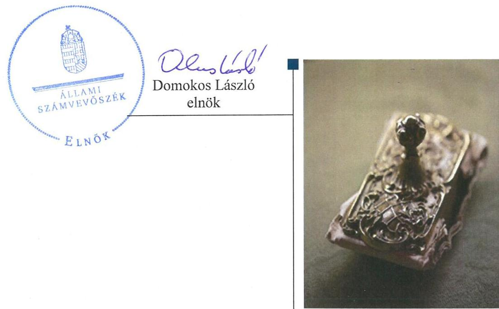
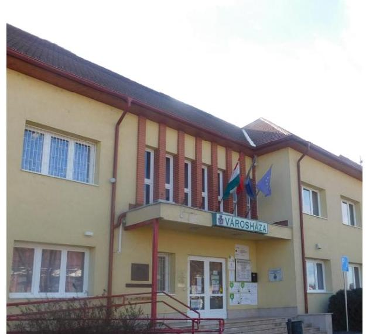
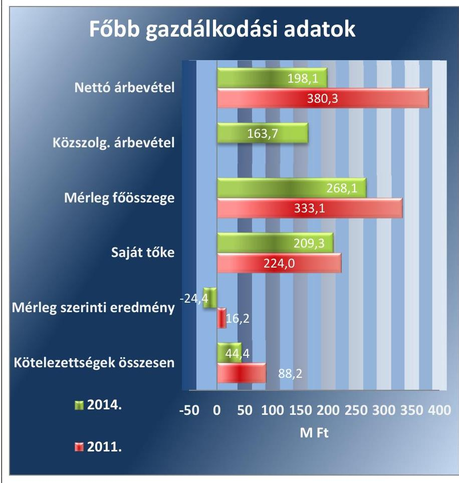
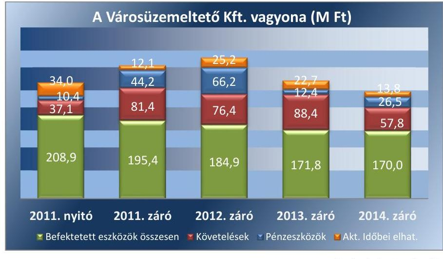

# Jelentés 

## Az önkormányzatok gazdasági társaságai

Az önkormányzatok többségi tulajdonában lévő gazdasági társaságok közfeladat ellátását érintő gazdálkodási tevékenysége szabályszerűségének ellenőrzése - Jászapáti Városüzemeltető Nonprofit Kft.

2016.

---

# Jelentés 

## Az önkormányzatok gazdasági társaságai

Az önkormányzatok többségi tulajdonában lévő gazdasági társaságok közfeladat ellátását érintő gazdálkodási tevékenysége szabályszerűségének ellenőrzése - Jászapáti Városüzemeltető Nonprofit Kft.
2016. október hó 25. nap

---

# AZ ELLENŐRZÉST FELÜGYELTE:

DR. HORVÁTH MARGIT felügyeleti vezető

## AZ ELLENŐRZÉST VEZETTE ÉS A VÉGREHAJTÁSÁÉRT FELELŐS:

IMRE ZSUZSANNA ellenőrzésvezető

## A PROGRAM ÖSSZEÁLLÍTÁSÁÉRT FELELŐS:

JANIK JÓZSEF LÁSZLÓ osztályvezető

IKTATÓSZÁM: V-1067-151/2016

TÉMASZÁM: 2101

ELLENŐRZÉS-AZONOSÍTÓ SZÁM: V-070737

Jelentéseink az Országgyűlés számítógépes hálózatán és az Interneta a www.asz.hu címen is olvashatóak.

---

# TARTALOMJEGYZÉK 

■ ÖSSZEGZÉS ..... 5
■ AZ ELLENŐRZÉS CÉLJA ..... 7
■ AZ ELLENŐRZÉS TERÜLETE ..... 8
■ AZ ELLENŐRZÉS HÁTTERE, INDOKOLTSÁGA ..... 10
■ A JELENTÉS LÉNYEGES KÉRDÉSKÖREI ..... 11
■ ELLENŐRZÉS HATÓKÖRE ÉS MÓDSZEREI ..... 12
■ MEGÁLLAPÍTÁSOK ..... 14
■ JAVASLATOK ..... 29
■ MELLÉKLETEK ..... 31
I. sz. melléklet: Értelmező szótár ..... 31
II. sz. melléklet: A Városüzemeltető Kft. mérlegadatai (ezer Ft) ..... 34
III. sz. melléklet: A Városüzemeltető Kft. eredménykimutatásai (ezer Ft) ..... 35
■ FÜGGELÉK: ÉSZREVÉTELEK ..... 37
■ RÖVIDÍTÉSEK JEGYZÉKE ..... 39

---

.

---

# ÖSSZEGZÉS 

Az Állami Számvevőszék a Jászapáti Városüzemeltető Nonprofit Kft. hulladékgazdálkodás közszolgáltatást érintő gazdálkodási tevékenysége 2011-2014. évek közötti szabályszerűségét ellenőrizte. Az Önkormányzat a hulladékgazdálkodást összességében szabályszerűen szervezte meg. A tulajdonosi jogok gyakorlása nem teljes körüen volt szabályszerű. A Jászapáti Városüzemeltető Kft. vagyongazdálkodása összességében nem volt szabályszerű, a kötelezettségállománya a hulladékgazdálkodásra és a müködésre nem jelentett kockázatot A hulladékgazdálkodási közfeladat-ellátásához kapcsolódó tevékenysége bevételeinek és ráfordításainak elszámolása nem volt szabályszerű, az árképzés gyakorlata összességében szabályszerű volt.

## Az ellenőrzés társadalmi indokoltsága

Az Állami Számvevőszék stratégiájában megfogalmazta, hogy a helyi önkormányzatok gazdálkodásában rejlő pénzügyi kockázatok feltárásával, az államháztartáson kívülre nyújtott költségvetési támogatások és ingyenes vagyonjuttatások, valamint az államháztartáson kívül múködő közfeladat-ellátó rendszerek ellenőrzéseivel hozzájárul ahhoz, hogy a közpénzeket az államháztartáson kívül múködő szervezetek is átlátható, rendezett módon használják fel a közfeladatok szerződésben vállalt ellátása érdekében.

Magyarországon az intézmény-centrikus közfeladat-ellátás jellemző, de egyre jelentősebb a költségvetésen kívüli feladatellátás térnyerése. Ennek legfontosabb szereplői - a nonprofit szervezetek mellett - az önkormányzati tulajdonú gazdasági társaságok. Az önkormányzatok szervezetalakítási szabadságának következménye, hogy a korábban is vállalati formában múködő közszolgáltatások mellett, mind a kötelező, mind az önként vállalt feladatok ellátásában a gazdasági társaságok kiemelt fontosságú szerephez jutottak.

## Főbb megállapítások, következtetések, javaslatok

Az Önkormányzat a hulladékgazdálkodás közfeladatának megszervezéséről a jogszabályi előírásoknak megfelelően döntött, annak ellátásáról a kizárólagos tulajdonában lévő gazdasági társasága útján gondoskodott. A hulladékgazdálkodási közfeladat ellátására közszolgáltatási szerződést kötött, mely 2011-2013. években nem teljes körűen felelt meg a 224/2004.(VII.22). és a 317/2013.(VIII.28). Korm. rendeletekben foglaltaknak. A hulladékgazdálkodással öszszefüggő rendeletalkotási kötelezettségének a Hgt. és a Ht. előírásainak eleget téve megalkotta a hulladékgazdálkodási rendeletét. A tulajdonosi jogok gyakorlása a Városüzemeltető Kft.-nél nem teljes körűen volt szabályszerű. A tulajdonosi jogok gyakorlásának rendjét az Önkormányzat a Városüzemeltető Kft. alapító okiratában meghatározták. Az Önkormányzat az Nvtv előírásaival ellentétben a Városüzemeltető Kft. folyószámlahitelének biztosítékaként a törzsvagyonába tartozó, korlátozottan forgalomképes vagyonelemet terhelt meg jelzálogjog bejegyzéshez történt hozzájárulásával.

A Városüzemeltető Kft. vagyongazdálkodása a jogszabályi rendelkezéseknek összességében nem felelt meg, a szabályozási, beszámolási és adatszolgáltatási hiányosságok, valamint a mennyiségi leltárfelvétel elmulasztása miatt. A Városüzemeltető Kft. szabályzatai a jogszabályi előírásoknak teljes körűen nem feleltek meg. A számviteli politikában nem rögzítették az értékcsökkenés elszámolásának módszerét, a leltározási szabályzatban nem rendelkeztek a menynyiségi leltárfelvétel gyakoriságáról. A közfeladat ellátásával kapcsolatos elkülönített nyilvántartási kötelezettséget a 2014. év kivételével - nem szabályozták. Az eszközeiket az ellenőrzött időszakban mennyiségi leltárfelvétel módszerével nem leltározták, mellyel megsértették Számv. tv. szerinti valódiság elvét, nem biztosították, hogy a beszámolóban szereplő tételek bizonyíthatók, kívülállók számára is megállapíthatók legyenek. A Városüzemeltető Kft. a közfeladata ellátását saját eszközeivel végezte, vagyonkezelésbe vett állami vagyonelemmel nem rendelkezett. Saját

---

vagyona az ellenőrzött időszakban nem gyarapodott. A kötelezettségek állománya nem jelentett kockázatot a közfeladat ellátására, valamint a múködésre. Az előírt beszámolási és adatszolgáltatási kötelezettségüknek nem teljes körűen tettek eleget. A 2011-2012. években a közszolgáltatási tevékenységről nem készítettek és az Önkormányzat részére nem nyújtottak be részletes költségelszámolást. A 2013. évi éves beszámoló kiegészítő mellékletében nem mutatták be a közszolgáltatási tevékenység elkülönített mérlegét és eredmény kimutatását. A könyvvizsgáló a könyvvizsgálatot valamennyi éves beszámolóra vonatkozóan elvégezte és a beszámolókat korlátozás nélküli hitelesítő záradékkal látta el annak ellenére, hogy a Városüzemeltető Kft. a Hgt.-ben, majd a 2013. évben a Ht.-ben előírt tevékenységenkénti elkülönített nyilvántartását nem szabályozta, és 2013. évben nem tett eleget a Ht. szerinti kötelezettségének, és tárgyi eszközeiket a mennyiségi leltárfelvétel módszerével nem leltározták. Az adatok védelmére, a közérdekú adatok nyilvánosságra hozatalára vonatkozó szabályozási és közzétételi feladataikat nem látták el teljes körűen.

A hulladékgazdálkodáshoz kapcsolódó közszolgáltatás bevételeinek és ráfordításainak elszámolása nem volt szabályszerű. 2011-2013. években a közszolgáltatási tevékenységhez kapcsolódó árbevételt és költségeket nem különítették el. A beruházások, felújítások nyilvántartása és az értékcsökkenés elszámolása során is hiányosságokat tárt fel az ellenőrzés. A követelésállomány kezelése során a 2013-2014. években nem tartották be a Ht. rendelkezéseit, mivel a díjhátralék behajtását 45 nap elteltével nem kezdeményezték a NAV¹-nál. A hulladékszállító eszközök avulása és átlagos életkorának növekedése hosszú távon kockázatot jelent a közfeladat folyamatos ellátására. Az árképzés szabályait meghatározták, közszolgáltatási díjak meghatározása a feltárt hiányosságok mellett - összességében szabályszerű volt.

---

# AZ ELLENŐRZÉS CÉLJA

Az ellenőrzés célja annak értékelése, hogy az önkormányzat a jogszabályi előírások figyelembe vételével döntött-e az ellenőrzésre kerülő közfeladat megszervezéséről, az önkormányzat/tulajdonosi joggyakorló szabályszerűen gyakorolta-e a tulajdonosi jogokat. A gazdasági társaság közfeladat-ellátása bevételeinek, ráfordításainak elszámolása, és vagyongazdálkodási tevékenysége megfelelt-e a jogszabályi, illetve a közszolgáltatási/vagyonkezelési szerződésben foglalt tulajdonosi előírásoknak, azok végrehajtása szabályszerű volt-e, a gazdasági társaság kötelezettségállománya jelent-e kockázatot a működésre, illetve a közfeladat ellátására, a közfeladatok átláthatósága és elszámoltathatósága érdekében biztosítva volt-e a közszolgáltatás díjának megalapozottsága szabályszerű önköltségszámítással.

---

# AZ ELLENŐRZÉS TERÜLETE 

## Jászapáti Városi Önkormányzat és Jászapáti Városüzemeltető Nonprofit Kft.

Jászapáti Város Önkormányzata három gazdasági társasággal rendelkezik. Az Önkormányzat² az 1996. óta múködő Jászapáti Városüzemeltető Kft. után a 2011. évben a Jászapáti Gazdaságfejlesztési Kft.-t, majd - a termál- és napenergia felhasználásának bővítésére - a J-Erg. Kft-t hozta létre.

Az Önkormányzat a Városüzemeltető Kft. ${ }^{3}$-t a Jász-Nagy-kun-Szolnok Megyei Víz- és Csatornaművek Rt. szétválását követően, 1995. december 15-én alapította. A Városüzemeltető Kft. 100\%-os önkormányzati tulajdonban volt az ellenőrzött időszakban. 2014. június 1-jétől a Városüzemeltető Kft. nonprofit gazdasági társaságként működik. A jegyzett tőke az alapításkor 16,5 M Ft volt, amelyet az Önkormányzat a 2011. évben 10,0 M Ft-tal megemelt 26,5 M Ft-ra. Ezt követően a jegyzett tőke a 2014. év végéig nem változott.

Az Önkormányzat az ellenőrzött időszakot megelőzően és 2011. év első felében a hulladékgazdálkodási közfeladatot a Társulás ${ }^{4}$ tagjaként, 2011. július 1-jétől a Városüzemeltető Kft-vel kötött közszolgáltatási szerződés keretében látta el. A Városüzemeltető Kft. fő tevékenysége a kommunális hulladék gyűjtése, kezelése, ártalmatlanítása, illetve újrahasznosítása mellett a víztermelés, - kezelés és - ellátás volt. A 2014. évtől a tevékenységi köre a nem veszélyes hulladék gyűjtésével bővült.

A 2011-2014. évben a Városüzemeltető Kft. a 8585 lakosú Jászapáti Város területén 3749 háztartásból szállította el a hulladékot, amelynek menynyisége évente átlagosan 2900 tonnát tett ki. E feladatát közszolgáltatásként, az Önkormányzat megbízásából látta el. Emellett a 2013. évtől a Regio-Kom Térségi Hulladékszállítási Szolgáltató Kft.-vel kötött vállalkozási szerződés alapján további 11 településen nyújtott hulladékgazdálkodási szolgáltatást. A Városüzemeltető Kft. feladatait az Önkormányzat 2011-2014. évi gazdasági programja alapján kibővítették a helyi piac üzemeltetésével, a strand és a kemping fenntartásával.

---

A Városüzemeltető Kft. gazdálkodásának főbb adatait az 1. ábra szemlélteti.
1. ábra

Forrás: Az éves beszámolók

A Városüzemeltető Kft. 2014. év kivételével nyereségesen gazdálkodott, az ellenőrzött időszakban a saját tőke összege a mérleg szerinti eredmény eredménytartalékba helyezésével 11,4 M Ft-tal növekedett. Az eszközállományban bekövetkezett csökkenés tárgyi eszközállomány csökkenésének eredménye. A Városüzemeltető Kft. a 2011. évben 44 fő, a 2014. évben 42 fő foglalkoztatásával látta el tevékenységét. Az ügyvezető személye az ellenőrzött időszakban egy alkalommal, a 2011. évben változott.

Az ellenőrzött időszakban mind a polgármester ${ }^{5}$, mind a jegyző ${ }^{6}$ személye egy alkalommal változott. Az Önkormányzat polgármestere a 2014. évi önkormányzati választások óta, a jegyző a 2011. év óta látja el feladatait.

---

# AZ ELLENŐRZÉS HÁTTERE, INDOKOLTSÁGA 

Az önkormányzati tulajdonú gazdasági társaságok teljes körű ellenőrzésének lehetőségét az ÁSZ. tv. 2011. január 1-jétől hatályos módosítása teremtette meg. A közfeladatot ellátó gazdasági társaságok ellenőrzése kiemelten fontos a vagyon megőrzése, megóvása érdekében, valamint a kormányzati szektor elszámolásaiban megjelenő önkormányzati tulajdonú gazdálkodó szervezetek esetében, amelyekkel szemben alapvető követelmény, hogy gazdálkodásuk, működésük szabályszerű, az általuk szolgáltatott adatok minél megbízhatóbbak legyenek. A közfeladat ellátás költségeinek, ráfordításainak alakulása, színvonala hatással van a lakosság elégedettségére.

## AZ ELLENŐRZÉS VÁRHATÓ HASZNOSULÁSA-

KÉNT az ÁSZ ${ }^{7}$ a megállapításaival segítséget nyújthat az államháztartáson kívüli közfeladat-ellátás értékeléséhez, jogszabályi keretei pontosításához, átláthatóságot biztosító szabályozásához. Meghatározhatóvá válnak a közfeladat ellátásban részt vevő államháztartáson kívüli szervezeteknek az önkormányzat költségvetését, pénzügyi helyzetét is befolyásoló - kockázatai, lehetővé válik ezen kockázatok csökkentése. Ellenőrzéseink feltárhatják, hogy az önkormányzat közfeladat ellátási kötelezettségének szabályszerűen tett-e eleget, a feladatellátáshoz rendelt közvagyon működtetését a tulajdonostól elvárható gondossággal, szabályszerűen szervezte-e meg és a tulajdonosi felügyelete hozzájárult-e a közfeladat szabályszerű ellátásához. Értékelhetővé válik, hogy a feladatot ellátó gazdasági társaság a közszolgáltatási szerződésben foglaltak betartásával, a közvagyon használatával biztosította-e a szolgáltatás folytatásának feltételeit. Ezzel az ellenőrzöttek és a helyi döntéshozók számára az ÁSZ visszajelzést ad feladatszervezési, feladat-ellátási kockázataikról, alapot ad a meglévő hibák megszüntetéséhez, a jobb közfeladat-ellátás biztosításához. Mindezeken keresztül az ÁSZ hozzájárul Magyarország közpénzügyi helyzetének javításához, a közpénzek mérhető módon történő, a döntéshozók által meghatározott célok szerinti felhasználásához.

---

# A JELENTÉS LÉNYEGES KÉRDÉSKÖREI 

1. Az önkormányzat közfeladat megszervezéséről szóló döntése, valamint tulajdonosi joggyakorlása szabályszerű volt-e?
2. A gazdasági társaság vagyongazdálkodása szabályszerű volt-e, kötelezettségállománya jelentett-e kockázatot a müködésre, illetve a közfeladat ellátásra?
3. A gazdasági társaságnál az ellátott közfeladat bevételei és ráfordításai elszámolása, valamint az önköltségszámítás és árképzés szabályszerű volt-e?

---

# ELLENŐRZÉS HATÓKÖRE ÉS MÓDSZEREI 

## Az ellenőrzés típusa

Megfelelőségi ellenőrzés

## Az ellenőrzött időszak

2011. január 1-jétől 2014. december 31-ig tartó időszak

## Az ellenőrzés tárgya

A közfeladatot gazdasági társaságokkal ellátó önkormányzatok tulajdonosi joggyakorlása, valamint gazdasági társaságok pénz- és vagyongazdálkodásának szabályozottsága és szabályszerűsége. Az ellenőrzés kiterjed minden olyan körülményre és adatra, amely az ÁSZ jogszabályban meghatározott feladatainak teljesítéséhez, valamint a program végrehajtása folyamán felmerült újabb összefüggések feltárásához szükséges.

## Az ellenőrzött szervezet

Az ellenőrzött szervezetek:
Jászapáti Városi Önkormányzat
Jászapáti Városüzemeltető NKft.

## Az ellenőrzés jogalapja

Az ellenőrzés jogszabályi alapját az Állami Számvevőszékről szóló 2011. évi LXVI. törvény 5. § (3)-(4)-(5) bekezdése képezte.

## Az ellenőrzés módszerei

Az ellenőrzést a nemzetközi standardokat irányadónak tekintve az ellenőrzési program ellenőrzési kérdései, az ellenőrzött időszakban hatályos jogszabályok, az ellenőrzés szakmai szabályok és módszertanok figyelembe vételével végezzük.

Az ellenőrzés ideje alatt az ellenőrzött szervezettel történő kapcsolattartást az ÁSZ Szervezeti és Müködési Szabályzatának vonatkozó előírásai alapján biztosítjuk.

---

Az ellenőrzés a kiválasztott, többségi tulajdonosi jogokat gyakorló önkormányzatra, illetve az ellenőrzésre kijelölt közfeladatot ellátó gazdasági társaság felett tulajdonosi jogokat gyakorló szervezetre és az ellenőrzött közfeladatot ellátó gazdasági társaságra terjed ki. Amennyiben a gazdasági társaságban több önkormányzat együttesen többségi tulajdonos, úgy az ellenőrzést a többségi tulajdonosi jogokat gyakorló önkormányzatnál kell lefolytatni. Az ellenőrzött gazdasági társaságnál, amennyiben az több közfeladatot is ellát, akkor az ellenőrzésre kiválasztott közfeladat-ellátást ellenőrizzük.

Az ellenőrzést a kérdésekre adott válaszok kiértékelésével, valamint a megjelölt adatforrások, a csatolt tanúsítványok felhasználásával, továbbá az adott időszakban hatályos jogszabályok figyelembe vételével kell lefolytatni. Az ellenőrzési kérdések megválaszolásához szükséges bizonyítékok megszerzése a következő ellenőrzési eljárások alkalmazásával történik: megfigyelés, kérdésfeltevés (információkérés), összehasonlítás, valamint elemző eljárás.

A bevételek és ráfordítások elszámolása, valamint a vagyonnyilvántartás terén a szabályszerű működést véletlen mintavétellel ellenőriztük. A mintavétellel ellenőrzött területek esetében minden egyes tétel vonatkozásában a szabályszerűségre vonatkozó kérdéseket tettünk fel, amelyek eredménye összesítésre került. „Megfelelőnek" értékeltünk egy ellenőrzött területet, amennyiben 95\%-os bizonyossággal a teljes sokaságban a hibaarány legfeljebb 10\%, nem megfelelőnek, amennyiben 10\%-nál magasabb arányt képviselt. Abban az esetben, ha a teljes sokaság tekintetében a 10\%os hibaarányhoz való viszony megítélésnek megbízhatósága nem érte el a 95\%-ot, annak elérése érdekében értékelésünket további szempontokkal egészítettük ki, és figyelembe vettük a feltárt hibák típusát és súlyát.

A ráfordítások elszámolására és a vagyonnyilvántartásra vonatkozó véletlen mintavételt kockázati alapú kiválasztással egészítettük ki, amelynek során évente a három legnagyobb összegű tételt választottuk ki.

---

# 1. Az önkormányzat közfeladat megszervezéséről szóló döntése, valamint tulajdonosi joggyakorlása szabályszerű volt-e? 

Összegző megállapítás

Az Önkormányzat közfeladat megszervezéséről szóló döntése összességében szabályszerű volt, a tulajdonosi jogok gyakorlása nem teljes körűen volt szabályszerű.
1.1. számú megállapítás

A közfeladat ellátására vonatkozó döntés és annak előkészítése összességében szabályszerű volt.

GAZDASÁGI PROGRAMJÁT ${ }^{a}$ az Önkormányzat az Ötv. ${ }^{9}$ rendelkezésének megfelelően meghatározta. A gazdasági program a Képvi-selő-testület ${ }^{10}$ megbízatásának időtartamára, a 2010-2014. évekre szólt; és tartalmazta az Ötv., valamint a Mötv. ${ }^{11}$ előírásainak megfelelően a településre vonatkozó legfontosabb helyi szintű célkitűzéseket, különös tekintettel a településfejlesztésre, munkahelyteremtésre, valamint a közfeladatok ellátására. A gazdasági programban a célok között meghatározták a háztól elvihető szelektív hulladékgyűjtés megvalósítását, és ennek keretén belül hulladékátrakó és -válogató egységek kialakítását.

Az Nvtv. ${ }^{12}$ 9. § (1) bekezdésének előírása ellenére az Önkormányzat kö-zép- és hosszú távú vagyongazdálkodási tervet az ellenőrzött időszakban nem készített.

HULLADÉKGAZDÁLKODÁSI TERV készítésére vonatkozó kötelezettséget 2011-2012 évekre vonatkozóan a Hgt. ${ }^{13}$ írt elő a helyi önkormányzatok számára. Az Önkormányzat Társulás ${ }^{14}$ tagjaként, 32 társult településsel közösen rendelkezett az ellenőrzött időszakot megelőzően készített hulladékgazdálkodási tervvel.

A 2013. évtől a Ht. ${ }^{15}$ rendelkezésének értelmében a hulladékgazdálkodási terv elkészítése a közszolgáltató kötelezettsége volt. A Városüzemeltető Kft. a 2013-2016. közötti időszakra szóló közszolgáltatói hulladékgazdálkodási tervet ${ }^{16}$ a Ht. és a 438/2012. Korm. rendelet ${ }^{17}$ előírásainak figyelembe vételével készítette el. A közszolgáltatói hulladékgazdálkodási terv részletes cselekvési programot tartalmazott határidők és felelősök megjelölésével. A tervek között célként került megfogalmazásra az elkülönített hulladékgyűjtésre történő ösztönzés, illetve a lakosság tájékoztatása, szemléletformálása a biológiailag lebomló hulladék nagyobb arányú gyűjtésének és hasznosításának vonatkozásában.

A KÖZFELADAT-ELLÁTÁS MEGSZERVEZÉSÉRE vonatkozóan az SZMSZ ${ }_{1-3}{ }^{18}$. meghatározta, hogy a közfeladatot az Önkormányzat gazdasági társasága útján látja el. A közfeladatot ellátó Városüzemeltető Kft. megalapítása az ellenőrzött időszakot megelőzően történt.

---

A KÖZSZOLGÁLTATÁSI SZERZŐDÉS 1-4 ${ }^{19}$ keretében határozta meg az Önkormányzat a hulladékgazdálkodással kapcsolatos feladatok kereteit.

Az Önkormányzat a Hgt. előírása alapján a Városüzemeltető Kft.-vel az ellenőrzött időszakot megelőzően, 2001. évben kötötte meg 10 évre szóló hatállyal a közszolgáltatási szerződés ${ }_{1}$-t, amely tartalmazta a közszolgáltatás dijának meghatározására és beszedésére vonatkozó módszereket, a közszolgáltatásra alkalmazható legmagasabb díjat, illetve az igazolt díjhátralék kiegyenlítésére vonatkozó eljárást.

A közszolgáltatási szerződés ${ }_{1-3}$ a 224/2004. Korm. rendelet ${ }^{20}$, illetve a 317/2013. Korm. rendelet ${ }^{21}$ előírásainak nem felelt meg teljes körűen, mivel nem tartalmazta többek között a közszolgáltatás minőségi ismérveit, a finanszírozásának elveit és módszereit, a folyamatos és biztonságos teljesítéséhez szükséges fejlesztések és karbantartások elvégzését. Nem tartalmazta továbbá a közszolgáltatás teljesítésével összefüggő adatszolgáltatás teljesítését, a nyilvántartási rendszer, az ügyfélszolgálat és a tájékoztatási rendszer múködtetését, valamint a fogyasztói kifogások és észrevételek elintézési rendjét.

A 2014. július 1-jétől hatályba lépett közszolgáltatási szerződés4 összességében megfelelt a 317/2013. Korm. rendeletben előírtaknak, azonban a 4. § (1) bekezdés e) pontjának rendelkezése ellenére nem határozta meg azokat a feltételeket, amelyek mellett a közszolgáltató a közszolgáltatás teljesítésére alvállalkozót vehet igénybe.

RENDELETALKOTÁSI KÖTELEZETTSÉGÉNEK az Önkormányzat eleget tett. A hulladékgazdálkodási rendelet ${ }^{22}$ - amelyet az ellenőrzési időszak előtt, 2003. évben fogadtak el - a Hgt.-ben előírt követelményeknek eleget tett, az ott előírt kötelező elemeket tartalmazta. Módosítására a Ht. hatályba lépését követően sem volt szükség, mert annak tartalmi követelményeit is kielégítette. A hulladékgazdálkodási rendelet tartalmazta a közszolgáltatás ellátásának és igénybevételének szabályait, az elkülönített hulladékgyűjtésre és a közterület tisztántartására vonatkozó részletes szabályokat, illetve a hulladékgazdálkodási díjra vonatkozó, miniszteri rendeletben nem szabályozott díjalkalmazási és díjfizetési feltételeket.

Az Önkormányzat az ellenőrzött időszakban megalkotta a vagyongazdálkodási rendeletet ${ }_{1-3}{ }^{23}$, amelyben az Ötv., majd az Mötv. előírásainak megfelelően meghatározták az önkormányzati feladatellátást biztosító törzsvagyon körét, azon belül a korlátozottan forgalomképes és forgalomképtelen vagyonelemeket, valamint a forgalomképes vagyoni körbe tartozó vagyontárgyakat. Az Önkormányzat a közfeladat ellátásához nem adott át közvagyont vagyonkezelésbe a Városüzemeltető Kft.-nek.
1.2. számú megállapítás

A tulajdonosi jogok gyakorlása a Városüzemeltető Kft.-nél nem teljes körűen volt szabályszerű, mivel az Önkormányzat a törzsvagyonába tartozó vagyonelem jelzáloggal való megterheléséhez járult hozzá.

# A TULAJDONOSI JOGOK GYAKORLÁSÁNAK 

RENDJÉT az Önkormányzat a Városüzemeltető Kft. alapító okiratában ${ }^{24}$ és a vagyongazdálkodási rendelet ${ }_{1-3}$-ben meghatározta, a legfőbb

---

szerv jogosítványait a Képviselő-testület gyakorolta. A tulajdonosi jogok gyakorlása - az alapító okiratban meghatározott kivételekkel - a Képviselőtestület hatáskörébe tartozott. A Képviselő-testület a jogszabályi és helyi szabályozásnak megfelelően gyakorolta tulajdonosi jogköreit, a polgármester a Városüzemeltető Kft.-re vonatkozóan a rá átruházott hatáskörben döntést nem hozott. A Képviselő-testület a Gt.-ben, valamint a Ptk.-ban foglalt tulajdonosi feladatainak az ellenőrzött időszakban eleget tett, az éves beszámolót a FB írásbeli jelentésének, valamint a könyvvizsgáló hitelesítő záradékának birtokában, határozattal fogadta el.

AZ ALAPÍTÓ OKIRAT a Gt. ${ }^{25}$, illetve 2014-től a Ptk. ${ }^{26}$ előírásainak megfelelően tartalmazta a tulajdonos, az ügyvezető, az $\mathrm{FB}^{27}$, valamint a könyvvizsgáló személyét, jogait és kötelezettségeit. Az alapító okiratban rögzítették a Képviselő-testület által a polgármesterre átruházott döntési hatáskört, valamint munkáltatói joggyakorlásának hatókörét.

A KÖNYVVIZSGÁLATOT 2010. június 1-jétől a Gt. előírásaival összhangban - öt évre szóló megbízással - a Képviselő-testület által az ellenőrzött időszak előtt megválasztott könyvvizsgáló ${ }^{28}$ végezte.

A Gt. 44. § (1) és a Ptk. 3:131 § (2) bekezdésének előírása ellenére a Képviselő-testület a könyvvizsgálót az éves beszámolót ${ }^{29}$ elfogadó ülésére nem hívta meg, és a könyvvizsgáló a beszámolókat elfogadó üléseken nem vett részt.

Az ügyvezető ${ }^{30}$ határozatlan időre történt megbízása 2011. március 15-től 2013. november 7-ig nem felelt meg az alapító okirat - határozott időre szóló megbízásra vonatkozó - rendelkezésének. Az alapító okirat 2013. november 7-i módosításakor az ügyvezető határozatlan időre való megbízásáról rendelkeztek.

A FB TAGJAIT a Képviselő-testület megválasztotta, létszámát a Tak. tv. ${ }^{31}$ előírásainak megfelelően három főben határozta meg. A FB a Gt. előírásának megfelelően meghatározta az ügyrendjét ${ }^{32}$, amelyet a tulajdonosi joggyakorló Önkormányzat Képviselő-testülete az ellenőrzött időszakot megelőzően jóváhagyott. Az FB az éves beszámolókról a Gt., illetve a Ptk. rendelkezéseiben meghatározott jelentését elkészítette.

JAVADALMAZÁSI SZABÁLYZATTAL ${ }^{33}$ a Tak. tv. előírásainak megfelelően az ellenőrzött időszakban rendelkeztek, azt a Képviselőtestület jóváhagyta. A javadalmazási szabályzat tartalmazta az ügyvezető jogviszonyának létesítésére, díjazására, éves prémiumára és a költségtérítésekre vonatkozó szabályokat, az FB tagok és a könyvvizsgáló díjának megállapítására, valamint a vezető állású munkavállalók jogviszonyának megszűnése esetére biztosított juttatásokra vonatkozó rendelkezéseket. A javadalmazási szabályzat értelmében az ügyvezető prémiumának megállapítása a Képviselő-testület joga volt. Prémiumfeladatok kitűzésére és prémiumfizetésre az ellenőrzött időszakban nem került sor. A Képviselő-testület az FB javaslata alapján az ügyvezető részére a 2012., 2013. és 2014. években jutalom kifizetéséről döntött.

ÜZLETI TERV készítésére vonatkozó kötelezettséget az Önkormányzat nem írt elő, és a Városüzemeltető Kft. 2011-2014 között üzleti terveket nem készített.

---

BESZÁMOLÁSI KÖTELEZETTSÉGET az Önkormányzat a Számv. tv. ${ }^{34}$ szerinti éves beszámoló elkészítésén túlmenően nem írt elő. A közszolgáltatási szerződés ${ }_{1-4}$-ben az Önkormányzat részére a közszolgáltatás teljesítésével összefüggő adatszolgáltatást, valamint a díjhátralék állományáról történő tájékoztatást írták elő. Az ügyvezető igazgató az éves beszámoló elkészítésével egy időben a Városüzemeltető Kft. tevékenységéről, a hulladékgazdálkodási közfeladat ellátásáról az ellenőrzött időszak minden évében írásban beszámolt. A Városüzemeltető Kft. az ellenőrzött időszakban a gazdálkodásáról fél- és háromnegyed éves beszámolókat is készített, amelyeket a Képviselő-testület megtárgyalt és határozattal elfogadott.

OSZTALÉKFIZETÉSRE az ellenőrzött időszakban nem került sor. Az alapító okirat 2013. december 1-jétől hatályos módosítása, a nonprofit társasággá történt átalakulás értelmében a Ctv. ${ }^{35}$ alapján a Városüzemeltető Kft. tevékenységéből származó nyereség ezt követően nem volt felosztható, az a Városüzemeltető Kft. saját tőkéjét gyarapította.

BELSŐ ELLENŐRZÉST az ellenőrzött időszakban a Városüzemeltető Kft.-nél - az Áht. ${ }^{36}$ 70. § (1) bekezdésének d) pontjában biztosított lehetőség ellenére - nem végeztek. Az Önkormányzat belső ellenőrzése a Városüzemeltető Kft. pénzügyi és vagyongazdálkodása tekintetében az Önkormányzat joggyakorlásában és belső kontrollrendszerében rejlő kockázatokra vonatkozóan a Ber. ${ }^{37}$ 2. §-ának I) pontja szerinti kockázatelemzést nem készített.

KEZESSÉGET vállalt az Önkormányzat 2011. évben a Városüzemeltető Kft. folyószámla hitelszerződéséhez 12,0 M Ft értékben. A kezességvállalás az Áht. ${ }^{38}$ rendelkezésével összhangban, szabályszerűen történt. Az ellenőrzött időszakban a szerződésben vállalt kezességgel kapcsolatos teljesítés, kifizetés nem történt.

A 2012. évben a folyószámlahitel összegét 20,0 M Ft-ra emelték. Biztosítékul az Önkormányzat hozzájárult, hogy a tulajdonában álló ingatlanra 25,0 M Ft erejéig egy éves időtartamra jelzálogjogot jegyezzenek be. A jelzálogjog bejegyzésére vonatkozó hozzájárulást a Képviselő-testület a 2013. évben egy évvel, a 2014. évben 2016. december 31-ig meghosszabbította. Az Önkormányzat nem tartotta be - az Nvtv. 5. (2) bekezdésében foglaltakra tekintettel - az Nvtv. 6. § (1) bekezdésének rendelkezését, mert a megterhelt ingatlan az Önkormányzat vagyonrendelete szerint az Önkormányzat törzsvagyonába tartozó, korlátozottan forgalomképes vagyonelem volt.

---

# 2. A gazdasági társaság vagyongazdálkodása szabályszerű volt-e, kötelezettségállománya jelentett-e kockázatot a múködésre, illetve a közfeladat ellátásra? 

Összegző megállapítás

A Városüzemeltető Kft. vagyongazdálkodása összességében nem volt szabályszerű. A kötelezettségállománya nem jelentett kockázatot a múködésére, valamint a közfeladat-ellátására.
2.1. számú megállapítás

A Városüzemeltető Kft. szabályzatai a jogszabályi előírásoknak teljes körűen nem feleltek meg. A közfeladat ellátásával kapcsolatos elkülönített nyilvántartási kötelezettséget - a 2014. év kivételével - nem szabályozták.

A GAZDÁLKODÁS SZABÁLYOZÁSI KERETEIT a számviteli politika és az annak keretében elkészített szabályzatok, illetve az alapító okirat előírásai határozták meg a Városüzemeltető Kft. esetében. Megalkották a számviteli politika ${ }^{39}{ }_{1,2}$-t, s annak keretében a leltározási szabályzatot, az értékelési szabályzatot, és a pénzkezelési szabályzatot, valamint a számlarend ${ }^{40}{ }_{1,2}$-t, és az azt alátámasztó bizonylati rendet. Önköltség-számítási szabályzat készítésére a Számv. tv. értelmében nem voltak kötelezettek, mivel az abban meghatározott értékhatárokat nem érték el. A Városüzemeltető Kft. a számviteli politika; és a számlarend; szabályzatokat 2012. és 2013. évben módosította, aktualizálta. A leltározási, értékelési és a pénzkezelési szabályzatokat, valamint a bizonylati rendet minden ellenőrzött évben felülvizsgálta és aktualizálta.

A számviteli politika ${ }_{1,2}$ tartalma alapvetően megfelelt a Számv. tv.-ben előírtaknak.

A Számv. tv. 88. § (4) bekezdésében foglaltak ellenére nem rögzítették a számviteli politikában az értékcsökkenési leírás elszámolásának választott módszerét.

A leltározási szabályzatban ${ }^{41}$ meghatározták a leltárkészítés folyamatát, bizonylatait, a leltározás végrehajtását, a leltárkülönbözet megállapításának módját, a munkavállalók felelősségét.

A leltározási szabályzatban azonban nem írták elő a mennyiségi leltár felvételének gyakoriságát, figyelmen kívül hagyva a Számv. tv. 69 § (3) bekezdésének rendelkezését.

Az értékelési szabályzat ${ }_{1,2}$ a Számv. tv. 46-57. § rendelkezéseinek megfelelően tartalmazta az eszközök és források értékelésére vonatkozó szabályokat, így többek között a bekerülési érték megállapításának, nyilvántartásának szabályait, a mérleg szerinti érték megállapításának módját.

A pénzkezelési szabályzat ${ }^{42}{ }_{1,2}$ megfelelt a Számv. tv. 14. § (8) bekezdés előírásainak, mivel rendelkezett a pénzforgalom készpénzben, illetve bankszámlán történő lebonyolításának rendjéről, a készpénzállományt érintő pénzmozgások jogcímeiről és eljárási rendjéről, a napi készpénz záró állomány maximális mértékéről, a készpénzállomány ellenőrzéséről, és a pénzforgalommal kapcsolatos nyilvántartási szabályokról.

---

A számlarend ${ }_{1,2}$ a Számv. tv.-ben foglaltaknak megfelelően tartalmazta az alkalmazásra kijelölt főkönyvi számlákat, az egyes számlák leírását, a számlák kapcsolatát más számlákkal és az analitikus nyilvántartásokkal, a számla értéke növekedésének és - csökkenésének jogcímeit, valamint a számlát érintő gazdasági eseményeket.

A bizonylati rend ${ }^{43}$ a Számv. tv. előírásának megfelelően alátámasztotta a számlarendben foglaltakat, meghatározta a bizonylati fegyelemre, a bizonylatok tartalmi és alaki kellékeire, feldolgozására, ellenőrzésére és őrzésére vonatkozó szabályokat.

A számviteli politika ${ }_{1}$, a leltározási szabályzat, az értékelési szabályzat ${ }_{1}$, a pénzkezelési szabályzat és a számlarend ${ }_{1}$, valamint a bizonylati rend 2011. március 25-i dátummal készült, a Városüzemeltető Kft. 2011. január 1-je és március 25-e között a Számv. tv. 14. § (11) bekezdésének előírása ellenére ezekkel a szabályzatokkal nem rendelkezett.

AZ ELKÜLÖNÍTETT NYILVÁNTARTÁSRÓL a közfeladatok ellátásával kapcsolatos elszámolások esetében sem a számviteli politika $_{1,2}$-keretében, sem más belső szabályzatban nem rendelkeztek, megsértve ezzel a Számv. tv. 161/A. § (1) és (2) bekezdéseiben foglaltakat.

A számlarend ${ }_{1}$ kialakításánál a 2011.-2012. évben nem vették figyelembe a Hgt. 29. § (3) bekezdésében foglaltakat, mert a számlarend ${ }_{1}$ a közszolgáltatás kereteibe nem tartozó, vállalkozási tevékenység keretében végzett hulladékkezelési szolgáltatás bevételének, költségének elkülönített elszámolását biztosító főkönyvi számlákat a Számv. tv. 161. § (2) bekezdés a)-c) pontjának ellenére nem tartalmazta.

A 2013. évben megsértették a Számv. tv. 161/A. § (2) bekezdésének előírását, mivel sem a számviteli politika ${ }_{1,2}$-ben, sem egyéb belső szabályzataikban nem határozták meg a Ht. 50. § (3) bekezdése szerinti önálló mérleg és eredmény-kimutatás alátámasztásául szolgáló, a Ht. 50. § (2) bekezdése szerinti elkülönült nyilvántartás vezetés részletes szabályait.

A számviteli politika ${ }_{2}$-ben a Ht. rendelkezésének megfelelően meghatározták a közszolgáltatási tevékenység eszközeinek, forrásainak, bevételeinek és költségeinek a különválasztási kötelezettségét. A számviteli politika ${ }_{2}$ az éves beszámoló kiegészítő mellékletére vonatkozóan a Számv. tv. előírásának megfelelő követelményként meghatározta, hogy a kiegészítő mellékletnek minden olyan adatot, információt tartalmazni kell, amelyet a közszolgáltató sajátos tevékenységét szabályozó más jogszabály előír.

A számlarend ${ }_{2}$-ben nem jelölték ki teljes körűen a hulladékgazdálkodási közszolgáltatás elkülönített nyilvántartását biztosító főkönyvi számlákat. Így nem határozták meg a Ht. 50. § (2) bekezdése szerinti elkülönített nyilvántartás vezetésére alkalmas főkönyvi számlákat a befektetett eszközök, az egyéb követelések és a pénzeszközök vonatkozásában. Nem jelölték ki az elkülönített nyilvántartás vezetésére alkalmas főkönyvi számlákat a négyes (források), a nyolcas (ráfordítások) és a kilences (Bevételek) számlaosztályon belül a 91. számlacsoport kivételével. Nem rendelkeztek az el nem különíthető bevételek és költségek arányosítással való megosztásáról.

---

# 2.2. számú megállapítás 

A vagyongazdálkodás a jogszabályi rendelkezéseknek összességében nem felelt meg, a mennyiségi leltárfelvétel elmulasztása miatt.

A VAGYONNYILVÁNTARTÁST a Számv. tv. előírásainak megfelelően vezették. A Városüzemeltető Kft. az ellenőrzött időszakban csak saját vagyonnal rendelkezett, közvagyont nem kezelt. A tulajdonos Önkormányzat a vagyon nyilvántartására vonatkozó igényeket, feladatokat közszolgáltatási szerződésben, alapító okiratban vagy önkormányzati határozatban nem fogalmazott meg. A Városüzemeltető Kft. biztosította a vagyonváltozás folyamatos, zárt rendszerú nyilvántartását a Számv. tv. előírásainak megfelelően.

A Számv. tv. 69. §-ban előírja, hogy a beszámoló elkészítéséhez, a mérleg tételeinek alátámasztásához olyan leltárt kell összeállítani és a Számv. tv. előírásai szerint megőrizni, amely a mérleg fordulónapján tételesen, ellenőrizhető módon mennyiségben és értékben tartalmazza a Társaság meglévő eszközeit és forrásait, továbbá azt is rögzíti a Számv. tv., hogy a leltárba bekerülő adatok valódiságáról leltározással kell meggyőződni, amelyet legalább háromévente mennyiségi felvétellel kell elvégezni. Mennyiségi leltárfelvételt a Társaságnál az ellenőrzött időszak négy évében nem végeztek, ezzel nem tartották be a Számv. tv. 69. § (3) bekezdését.

Az ellenőrzött időszak éves beszámolóinak felülvizsgálatát a könyvvizsgáló elvégezte, de nem hívta fel a tulajdonos Önkormányzat figyelmét a háromévente esedékes mennyiségi leltárfelvétel elmulasztására, a beszámolók nem megfelelő alátámasztására. A beszámolókat a Számv. tv. 156. § (4) bekezdésének megfelelően elkészített könyvvizsgálói jelentésében minősítés nélküli, hitelesítő záradékkal látta el. Nyilatkozott továbbá arról, hogy az éves beszámolók megbízható és valós képet adtak a Társaság üzleti év végén fennálló vagyoni és pénzügyi helyzetéről, valamint jövedelmi helyzetéről. A könyvvizsgáló a 2011-2014. évi beszámolók felülvizsgálata alapján készült jelentéseiben figyelemfelhívással nem élt, vezetői levél kibocsátására nem került sor.

A VÁROSÚZEMELTETŐ KFT. VAGYONA nem gyarapodott az ellenőrzött időszakban. Az eszközök és források értéke 22,3 M Fttal csökkent a 2014. év végére a 2011. év elejéhez képest. A vagyon alakulását a 2. ábra mutatja be, a részletes adatok a II. számú mellékletben találhatók.
2. ábra

---

A befektetett eszközök között meghatározó tárgyi eszközök nettó értéke 38,7, M Ft-tal (18,6\%-kal) csökkent a 2011. évi nyitó értékhez képest az elszámolt értékcsökkenésnél alacsonyabb értékben történt fejlesztések, beruházások következtében. A követelések értéke az időszak során másfélszeresére, a pénzeszközök állománya két és félszeresére növekedett. A közszolgáltatáshoz kapcsolódó eszközállomány összetételét és értékét 2014. évben az 1. táblázat szemlélteti.

1. táblázat

# AZ ESZKÖZÖK MEGOSZLÁSA 2014-BEN (M FT) 

|  | Köszzolgáltatás | Egyéb tevékenység | Összesen |
| :-- | --: | --: | --: |
| Befektetett eszközök | 11,1 | 158,9 | 170,0 |
| Forgóeszközök | 38,8 | 45,5 | 84,3 |
| Aktív időbeli elhatárolások | 4,6 | 9,2 | 13,8 |
| Eszközök összesen | 54,5 | 213,6 | 268,1 |
|  |  | Forrás: Az éves beszámolók |  |

A közfeladat ellátását szolgáló eszközök értéke az összes eszközállomány egyötödét tette ki a 2014. évben.
2.3. számú megállapítás

A kötelezettségek állománya nem jelentett kockázatot a közfeladat ellátására, valamint a múködésre.

A KÖTELEZETTSÉGEK aránya a forrásokon belül az ellenőrzött időszak alatt 26,5\%-ról 15,6\%-ra csökkent. A kötelezettségek állományának összetételét és változását az 2. táblázat szemlélteti.
2. táblázat

## A KÖTELEZETTSÉGEK ALAKULÁSA (M FT)

| Megnevezés a hulladékgazdálkodási terv | 2011. | 2012. | 2013. | 2014. |
| :-- | --: | --: | --: | --: |
| Hosszú lejáratú kötelezettségek összesen | 43,8 | 36,1 | 29,2 | 23,6 |
| Rövid lejáratú kötelezettségek | 44,4 | 59,7 | 22,4 | 20,7 |
| Kötelezettség összesen | 88,2 | 95,8 | 51,5 | 44,4 |

A Városüzemeltető Kft.-nek hosszú lejáratú kötelezettsége a 2010. évben felvett 50,0 M Ft beruházási hitellel kapcsolatosan keletkezett, amely nem a hulladékgazdálkodási közfeladathoz kapcsolódott. A kedvezményes kamatozású beruházási hitel után fizetett kamat 2011-2014. évben összesen 7,2 M Ft-ot tett ki. A beruházási hitel biztosítékaként az Önkormányzat készfizető kezességet vállalt, amelynek beváltására nem került sor. A törlesztési kötelezettségének a Városüzemeltető Kft. határidőben eleget tett.

A Városüzemeltető Kft. rövidlejáratú kötelezettségeinek összetételét és változását a 3. táblázat mutatja be.
3. táblázat

A RÖVID LEJÁRATÚ KÖTELEZETTSÉGEK ÖSSZETÉTELE (M FT)

| Megnevezés | 2011. | 2012. | 2013. | 2014. |
| :-- | --: | --: | --: | --: |
| Rövid lejáratú kötelezettség összesen | 44,4 | 59,7 | 22,4 | 20,7 |
| Szállítók | 22,9 | 27,0 | 7,2 | 3,5 |
| Adók | 5,8 | 7,9 | 3,4 | 3,3 |
| Egyéb | 15,7 | 24,8 | 11,7 | 14,0 |

Forrás: Az éves beszámolók, egyeztető leltárok a követelésekröl

---

A rövid lejáratú kötelezettségeken belül a szállítói tartozás 51,6\%-os aránya 16,9\%-ra csökkent a négy év alatt. A szerződésen és jogszabályon alapuló rövid lejáratú kötelezettségek határidőben történő fizetése nem minden esetben volt biztosított. A Városüzemeltető Kft. az ellenőrzött évekre 12,0 M Ft folyószámla hitelkeretre kötött szerződést, amelyet időszakosan vettek igénybe. Az igénybevett folyószámlahitel maximális öszszege a 2011. évben 2,3 M Ft, a 2014. évben 3,3 M Ft volt. A Városüzemeltető Kft. a 2011. évben szerződést kötött a Jászközmű Kft.-vel, amelyben közvetített szolgáltatásként csatornadíj kiszámlázását vállalta. A fogyasztók késedelmes teljesítése miatt a Városüzemeltető Kft.-nek a 2011. év végéig 11,6 M Ft, a 2012. év végéig 22,6 M Ft határidőn túli szállítói tartozása keletkezett a Jászközmű Kft.-vel szemben. A 2013. január 24-én kötött megállapodás alapján a Városüzemeltető Kft. kötelezettségeinek egy részét 16,3 M Ft összegű követelése Jászközmű Kft.-re történt engedményezésével rendezte, ami a szállítói kötelezettségek jelentős csökkenését eredményezte. A kötelezettségek állománya az ellenőrzött időszakban nem jelentett kockázatot sem a közfeladat-ellátására, sem a müködésre.

A SAJÁT TÖKE összege az ellenőrzött években a jegyzett tőke értékének mintegy a nyolcszorosát tette ki, értéke összességében sem csökkent, így tőkeszerkezete folyamatosan megfelelt a Gt. majd a Ptk. előírásainak. A saját tőke alakulását a 4. táblázat mutatja be.
4. táblázat

| A SAJÁT TŐKE ALAKULÁSA (M FT) |  |  |  |  |  |
| :--: | :--: | :--: | :--: | :--: | :--: |
| Megnevezés | 2011. nyitó | 2011. záró | 2012. záró | 2013. záró | 2014. záró |
| Mérleg szerinti |  |  |  |  |  |
| eredmény | 8,3 | 16,2 | 7,3 | 2,4 | $-24,4$ |
| Jegyzett tőke | 16,5 | 26,5 | 26,5 | 26,5 | 26,5 |
| Töketartalék | 176,6 | 176,6 | 176,6 | 176,6 | 176,6 |
| Eredménytartalék | $-3,5$ | 4,8 | 20,9 | 28,2 | 30,6 |
| Saját tőke | 197,9 | 224,1 | 231,3 | 233,7 | 209,3 |

Az Önkormányzat a 2011. évben 10,0 M Ft összegű, készpénzben teljesített tőkeemelést hajtott végre a strandfürdő üzemeltetése és karbantartása, valamint a Városüzemeltető Kft. likviditásának javítása céljából. A tőkeemelést az Önkormányzat Képviselő-testülete határozatban fogadta el.

A Városüzemeltető Kft. gazdálkodása 2011-2014. között összességében 11,4 M Ft nyereséget mutatott. A 2011-2013. években a gazdálkodás nyereséges volt, a Képviselő-testület határozataiban a tárgyévi mérleg szerinti eredmény eredménytartalékba helyezéséről döntött. A 2014. évben keletkezett, az előző három év halmozott nyereségével közel azonos összegű (24,4 M Ft) veszteség oka az árbevételnek - az előző évhez képest - bekövetkezett 33\%-os, 99,1 M Ft összegű csökkenése volt.

A kötelezettség-állományhoz kapcsolódó mutatók alapján az eladósodottság a négy év alatt nem volt jelentős, és mértéke javuló tendenciát mutatott. Az ellenőrzött időszakban az eladósodottság mértéke és összetétele nem jelentett kockázatot a közfeladat ellátására, a Városüzemeltető Kft. müködésére. Az eladósodottságot jelző mutatókat az 5. táblázat tartalmazza.

---

| 5. táblázat |  |  |  |  |
| :--: | :--: | :--: | :--: | :--: |
| ELADÓSODOTTSÁGOT JELZŐ MUTATÓK |  |  |  |  |
| Megnevezés | 2011. | 2012. | 2013. | 2014. |
| eladósodottsági mutató | 0,33 | 0,33 | 0,21 | 0,22 |
| eladósodottság mértéke | 0,39 | 0,41 | 0,22 | 0,21 |
| nettó eladósodottság | 0,03 | 0,08 | $-0,16$ | $-0,06$ |
| adósságfedezeti mutató I. | 2,95 | 2,79 | 4,43 | 4,43 |
|  |  |  | Forrás: Az éves beszámolók |  |

Az eladósodottsági mutató kedvező értéke jelzi, hogy a Városüzemeltető Kft. által igénybevett idegen források összege csökkent, és folyamatosan a saját források értéke alatt volt.

A Városüzemeltető Kft. saját forrásai fedezetet nyújtottak a kötelezettségekre, a saját tőkével való ellátottsága megfelelő volt az eladósodottság mértékére számított mutató alapján.

A nettó eladósodottság mutató kiemelkedően kedvező értéke jelzi, hogy a követelések állománya fedezetet nyújtott a kötelezettségekre.

Az adósságfedezeti I. mutató értéke kiemelkedően kedvező volt, mivel az értéke 2011-2014. között jelentősen javult, a befektetett eszközök és forgóeszközök értéke az igénybe vett külső forrásokat többszörösen meghaladta.

# 2.4. számú megállapítás 

A Városüzemeltető Kft. az előírt beszámolási és adatszolgáltatási kötelezettségének nem teljes körűen tett eleget.

BESZÁMOLÁSI KÖTELEZETTSÉGÉT a Városüzemeltető Kft. a 2011-2014. évi egyszerűsített éves beszámolóinak a Számv. tv. szerinti határidőben történt elkészítésével és annak a tulajdonosi jogokat gyakorló Önkormányzat részére történt átadásával teljesítette. Az éves beszámoló jóváhagyásakor a könyvvizsgáló és a FB jelentése rendelkezésre állt, a könyvvizsgáló a beszámolókat minősítés nélküli záradékkal látta el. Az éves beszámolókat a Képviselő-testület határozattal fogadta el.

Az egyszerűsített éves beszámolók mellett a Városüzemeltető Kft. az ellenőrzött időszak minden évében készített fél- és háromnegyed éves beszámolót a gazdálkodásáról, amelyeket a Képviselő-testület megtárgyalt és határozataiban elfogadott. Az ügyvezető igazgató az éves beszámoló elkészítésével egy időben a Városüzemeltető Kft. tevékenységéről, ezen belül a hulladékgazdálkodási közfeladat ellátásáról beszámolt.

A Városüzemeltető Kft. a 2011-2012. években a Hgt. 29. § (1) bekezdésében foglaltakat nem tartotta be, a közszolgáltatói tevékenységéről nem készített és nem nyújtott be az Önkormányzatnak részletes költségelszámolást.

A 2013. évi éves beszámoló kiegészítő mellékletében a Ht. 50. § (3) bekezdésében foglaltak ellenére nem mutatták be a közszolgáltatási tevékenység önálló mérlegét és eredmény kimutatását.

A könyvvizsgáló a könyvvizsgálatot valamennyi éves beszámolóra vonatkozóan elvégezte és a beszámolókat a Számv. tv. 158. § (1) bekezdése szerint korlátozás nélküli hitelesítő záradékkal látta el, annak ellenére, hogy a Társaság a 2012. évben a Hgt. 29. § (3) bekezdésében, majd a 2013-2014. években a Ht. 50. § (2) bekezdésében előírt tevékenységenkénti elkülöní-

---

tést a Számv. tv. 161/A § (2), továbbá a 14. § (3) bekezdése alapján a nyilvántartásaiban nem szabályozta, és a 2013. évben nem tett eleget a Ht. 50. § (3) bekezdése szerinti kötelezettségének.

AZ ADATOK VÉDELMÉRE, az adatkezelésre, a közérdekú adatok nyilvánosságra hozatalára vonatkozó feladatokat a Városüzemeltető Kft.-nél nem látták el teljes körűen. A Városüzemeltető Kft., mint az Önkormányzat tulajdonában lévő gazdasági társaság köztulajdonban lévőnek, a hulladékgazdálkodási tevékenysége miatt közfeladatot ellátó szervnek minősült, emiatt vonatkoztak rá az Avtv., illetve az Info. tv. közzétételre, valamint adatkezelésre és adatvédelemre vonatkozó előírásai.

A 2011. évben az Avtv. ${ }^{44}$ 31/A. § (1) bekezdésének c) pontjában, illetve 2012-2014. években az Info. tv. ${ }^{45} 24$. § (1) bekezdésének c) pontjában foglaltak ellenére belső adatvédelmi felelőst az ellenőrzött időszakban nem neveztek ki, vagy bíztak meg.

Az Avtv., illetve az Info. tv. végrehajtása érdekében a 2011. évben az Avtv. 31/A. § (3) bekezdésének rendelkezése, a 2012-2014. évben az Info. tv. 24. § (3) bekezdésében előírtak ellenére nem készítettek adatvédelmi és adatbiztonsági szabályzatot.

A Városüzemeltető Kft. az Avtv. 20. § (8), valamint az Info. tv. 30. § (6) bekezdésben foglaltak ellenére nem rendelkezett a közérdekú adatok megismerésére irányuló igények teljesítésének rendjét rögzítő szabályzattal.

A Városüzemeltető Kft. nem készítette el a közérdekú adatok közzétételére vonatkozó szabályzatát, mely hiányossággal megsértették az Info. tv. 35. § (3) bekezdésében foglaltakat.

A Városüzemeltető Kft. teljes körűen nem tett eleget az Eisztv. ${ }^{46}$ 6. § (1) bekzdésében hivatkozott, az Eisztv. mellékletében meghatározott, illetve az Info. tv. 33 § (3) bekezdése alapján, a 37. § (1) bekezdésében foglaltakra hivatkozással, az Info. tv. 1. melléklete szerinti általános közzétételi listában meghatározott adatokra vonatkozó közzétételi kötelezettségének. Nem tették közzé az Info. tv. 1. melléklete I. Szervezeti, személyzeti adatok 2-4. pontja szerint a közfeladatot ellátó szervezet felépítésére, vezetőinek nevére, elérhetőségére, az ügyfélkapcsolati vezető nevére és elérhetőségére vonatkozó adatokat. Elmulasztották az Info. tv. 1. melléklete III. Gazdálkodási adatok tekintetében a 2. pontjában előírt, a foglalkoztatottak létszámára, a személyi juttatásokra, így a vezető tisztségviselők illetményére, költségtérítésére vonatkozó összesített adatok közzétételét.

---

# 3. A gazdasági társaságnál az ellátott közfeladat bevételei és ráfordításai elszámolása, valamint az önköltségszámítás és árképzés szabályszerű volt-e? 

Összegző megállapítás

### 3.1. számú megállapítás

6. táblázat

## NETTÓ ÁRBEVÉTEL (M FT)

|  | 2011 | 2014 |
| :-- | --: | --: |
| Közszolgáltatás | 126,0 | 53,0 |
| Egyéb   tevékenység | 254,3 | 145,1 |
| Összesen | 380,3 | 198,1 |

A Városüzemeltető Kft.-nél a közszolgáltatás bevételeinek és ráfordításainak elszámolása nem volt szabályszerű, az árképzése összességében megfelelt a jogszabályi előírásoknak.

Az ellátott közszolgáltatás bevételeinek és ráfordításainak elszámolása nem volt szabályszerű. Az eszközök avulása és átlagos életkorának növekedése hosszú távon kockázatot jelent a közfeladat folyamatos ellátására.

AZ ÉRTÉKESÍTÉS NETTÓ ÁRBEVÉTELÉNEK elszámolása nem volt megfelelő. A nettó árbevétel elszámolása a 2011-2012. években nem felelt meg a Hgt. 29. § (3) bekezdésében, illetve a 2013. évben a Ht. 50. § (2) bekezdésében foglaltaknak, mert a közszolgáltatás körébe nem tartozó egyéb hulladékkezelési szolgáltatás diját szigorúan nem különítették el. A vállalkozási szerződés alapján végzett hulladékszállításból származó árbevételt a 912. Szemétszállítás árbevétele főkönyvi számlára könyvelték, amelyen a hulladékszállítási közszolgáltatás árbevételét is nyilvántartották. A közszolgáltatásból és egyéb tevékenységekből származó árbevétel alakulását az 6. táblázat mutatja be.

A 2014. évben a közszolgáltatás keretében teljesített hulladékszállításból származó árbevételt több alkalommal a 91212. Hulladékszállítás bevétel közszolgáltatás főkönyvi számla helyett a 9121. Hulladékszállítás bevétele főkönyvi számlára számolták el a számlarend; 9. számlaosztály számláinak vezetésére vonatkozó előírása ellenére.

A KÖLTSÉGEK ÉS A RÁFORDÍTÁSOK elszámolása a 2011-2014. években nem volt megfelelő. A 2011-2012. években a Hgt. 29. § (3) bekezdés, a 2013. évben a Ht. 50. § (2) bekezdés rendelkezésének nem tettek eleget, mert a közszolgáltatás körébe tartozó költségeket és ráfordításokat nem elkülönítetten tartották nyilván. További hiányosságok kerültek megállapításra:
$\longrightarrow$ A 2011. évben megsértették a számlarend; 52. Igénybe vett szolgáltatások költségei elszámolására vonatkozó előírását, mivel a hulladékszállítás költségét az 5292. Egyéb igénybevett szolgáltatás főkönyvi számla helyett az 5222 Bérleti díj számlára könyvelték.
$\longrightarrow$ A 2012. évben nem tartották be a Számv. tv. 47. § (1) bekezdés, a számviteli politika; és az értékelési szabályzat előírását, mert a programozó által nyújtott szolgáltatást nem a szoftver értékét növelő beruházásként, hanem az 5292. Egyéb igénybevett szolgáltatás főkönyvi számlán, költségként számolták el.
$\longrightarrow$ A 2013. évben a vagyonszerzési illetéket a Számv. tv. 47. § (2) a) pontjában foglaltak ellenére nem a bekerülési értéket növelő tételként, hanem hatósági díjként számolták el.

---

# A BERUHÁZÁSOK ÉS FELÚJÍTÁSOKÉS AZ ÉRTÉK- 

CSÖKKENÉS elszámolása során szabálytalanságok voltak. A 2013. évben a kis értékű (100 ezer Ft alatti) jármű értékét a Számv. tv. 80. '§ (2) bekezdésére alapozott, a számviteli politika; 17.3 pontjának előírása szerinti, értékcsökkenésként való egyösszegű elszámolás helyett a 123. Épületek főkönyvi számlán aktiválták és lineáris elszámolási módot alkalmaztak. A 2011-2014. évek során a tárgyévben beszerzett tárgyi eszközök a tárgyévi leltárban nem minden esetben voltak azonosíthatók. Az ellenőrzött években a beszámoló alátámasztásához elkészített leltárak leltári azonosító számot, vagy más egyedi nyilvántartási számot nem tartalmaztak, ezért a Számv. tv. 69. § (1) bekezdésének előírása ellenére nem voltak alkalmasak a tárgyi eszközök tételes, ellenőrizhető módon való beazonosítására.

A Városüzemeltető Kft. egészére vonatkozóan a befektetett eszközök állományának nettó értéke az induló 208,9 M Ft-ról 38,9 M Ft-tal (18,6\%$\mathrm{kal}) 170,0 \mathrm{M}$ Ft-ra csökkent. Ezen belül a meghatározó tárgyi eszközök állománya 38,7 M Ft-tal csökkent. A tárgyi eszközökre elszámolt értékcsökkenés a négy év alatt 71,2 M Ft volt, a tárgyi eszközök és az immateriális javak bruttó értéke 37,6 M Ft-tal nőtt. A Városüzemeltető Kft. egésze vonatkozásában a tárgyi eszközök és immateriális javak nettó értéke a négy év alatt 25,4 M Ft-tal csökkent.

Az eszközök pótlását és felújítását a közfeladat-ellátás során használt hulladékszállító járművekre vonatkozóan az 7. táblázat mutatja be:
7. táblázat

| A HULLADÉKSZÁLLÍTÓ JÁRMŰVEK ELHASZNÁLÓDÁSA (M FT) |  |  |  |  |  |  |
| :--: | :--: | :--: | :--: | :--: | :--: | :--: |
| Megnevezés | 2011.   nyitó | 2011.   záró | 2012.   záró | 2013.   záró | 2014.   záró | 2011-   14 ösz-   szesen |
| eszközök bruttó értéke | 15,4 | 15,4 | 18,5 | 18,6 | 18,6 |  |
| eszközök elszámolt ér-   tékcsökkenés | 10,3 | 11,3 | 13,5 | 14,2 | 15,7 |  |
| eszközök nettó értéke | 5,1 | 4,1 | 5,0 | 4,4 | 2,9 |  |
| értékcsökkenés adott   időszakban | 0 | 1,1 | 1,2 | 1,6 | 1,5 | 5,4 |
| tárgyi eszköz beszerzés,   felújítás |  |  |  |  |  | 3,1 |
| használhatósági fok | 0,33 | 0,26 | 0,27 | 0,24 | 0,15 |  |
| átlagos életkor |  | 10,77 | 10,82 | 8,94 | 10,40 |  |
| elhasználódási szint | 0,67 | 0,74 | 0,73 | 0,76 | 0,85 |  |

A hulladékszállító tárgyi eszközök használhatósági foka folyamatosan romló tendenciát mutatott, miközben az elhasználódási szint emelkedett. Az ellenőrzött időszakban összesen 5,4 M Ft értékcsökkenést számoltak el, beruházásra, eszközpótlásra ugyanakkor 3,1 M Ft-ot fordítottak. A Városüzemeltető Kft.-nél a beruházások értéke nem érte el az elszámolt értékcsökkenési leírás összegét, így a tárgyi eszközök pótlása teljes körűen nem valósult meg. A vizsgált eszközök fokozódó avulása és átlagos életkorának növekedése hosszú távon kockázatot jelent a közfeladat folyamatos ellátására.

---

A KÖVETELÉSÁLLOMÁNY kezelésére és a hátralékos állomány csökkentésére a Városüzemeltető Kft.-nél nem határoztak meg eljárási szabályokat, de intézkedtek azok beszedésére. A lakossággal szembeni hátralékos követelés állomány az ellenőrzött időszakban csökkenő tendenciát mutatott, az üdülőterületen lényegében változatlan volt, a közületekkel szembeni kintlévőségek állománya közel kétszeresére nőtt. A lejárt vevőkövetelések állományának alakulását az 8. táblázat szemlélteti.
8. táblázat

A HÁTRALÉKOS KÖVETELÉSÁLLOMÁNY ALAKULÁSA (M FT)

| Megnevezés | 2011. | 2012. | 2013. | 2014. | 2015. |
| :-- | --: | --: | --: | --: | --: |
| Lakossági vevők | 37,8 | 23,1 | 30,2 | 19,9 |  |
| Közületi vevők | 6,5 | 8,4 | 9,5 | 11,8 |  |
| Üdülőterület | 2,2 | 2,4 | 2,9 | 2,3 |  |
| Összes kintlévőség | 46,4 | 33,9 | 42,1 | 34,0 |  |

A 2014. évben a lakossággal szemben fennálló hátralékos követelésállomány összege 2014. december 31-én bruttó 19,9 M Ft, nettó 15,6 M Ft volt, amely a közfeladat ellátásból származó nettó árbevétel 45,6\%-át tette ki.

A behajtással megbízott jogi képviselő negyedévente felszólította a lejárt tartozásokkal rendelkezőket. A felszólításra ki nem egyenlített hátralékot 2011-2012. években a Hgt. rendelkezésének megfelelően a keletkezést követő 90. naptól átadták az önkormányzatok jegyzőinek.

A Városüzemeltető Kft. a 2013-2014. években a Ht. 52. § (3) bekezdésében foglalt előírás ellenére a díjhátralék adók módjára történő behajtását a díjhátralék megfizetésének esedékességét követő 45. nap elteltével a NAV-nál nem kezdeményezte.

# 3.2. számú megállapítás 

Az árképzés szabályait meghatározták, közszolgáltatási díjak meghatározása a feltárt hiányosságok mellett - összességében szabályszerű volt.

AZ ÁRKÉPZÉS SZABÁLYAIT a Városüzemeltető Kft. 2011. március 25 -től a szolgáltatási díjszabályzatban határozta meg a 64/2008. Korm. rendeletben foglaltak figyelembe vételével. A szolgáltatási díjszabályzatban meghatározták a kalkulációs sémát és a kalkulációs séma elemeinek tartalmát, valamint a közvetlenül el nem számolható költségek felosztásának módszerét. A díjszabályzat és az abban alkalmazott séma megfelelt a díjrendeletben ${ }^{47}$ megfogalmazott egytényezős közszolgáltatási díjnak és a díjmegállapítás általános szabályainak. A szolgáltatási díjszabályzat szerint a közszolgáltatás díját a szabályzatban meghatározott kalkulációs séma alapján, az előző évi közszolgáltatási adatok ismeretében, legalább egy éves időtartamra kellett meghatározni. A díj változtatásának lehetséges indokairól, mértékéről a szolgáltatási díjszabályzat nem rendelkezett.

A DÍJKALKULÁCIÓ KÉSZÍTÉSEKOR 2011. és 2012. években a Városüzemeltető Kft. eljárása nem felelt meg a 64/2008. Korm. rendelet 5. §-ában meghatározott követelményeknek, mert a közszolgáltatás körébe nem tartozó tevékenység költségeit a költségtervben nem különítette el, emiatt a díjkalkuláció nem a közszolgáltatásra, hanem a hulladékszállítási tevékenység egészére vonatkozó adatok alapján készült.

---

2012. január 1-jétől kezdődően a Városüzemeltető Kft. betartotta a hatósági árbefagyasztással kapcsolatosan a Hgt. 2012. január 1-je és 2012. április 14-e között hatályos rendelkezését. A 2011. évre meghatározott díjat - 11.250.- Ft/év/ ingatlan -2012. évben is változatlanul alkalmazták.

A 2013. évben megsértették a Ht. 91. § (2) bekezdésének 2013. január 1-jétől 2013. június 30-ig hatályos rendelkezését, mert a 35/2012. (XII. 14.) számú önkormányzati rendelettel kihirdetett díjakban a 2012. december 31-én alkalmazott díjhoz képest nem 4,2\%-os, hanem 17,2\%-os díjemelést hajtottak végre. Így 2013. január 1. és 2013. június 30. között a 2012. december 31-én érvényes 11521 Ft/év/ingatlan díj alapján számítható 4,2\% díjemeléssel érvényesíthető 12 004,-Ft/év/ingatlan helyett 13 504,Ft/év/ingatlan díjat alkalmaztak.
2013. július 1-jétől betartották a Rezsi tv. ${ }^{48}$ és a Ht. hatályos szabályozását, amely szerint a díj a 2012. április 14-i díj legfeljebb 4,2\%-kal megemelt összegének 90\%-a lehet. A Városüzemeltető Kft. 2013. július 1-jétől a Ht. rendelkezésével összhangban csökkentette a közszolgáltatás díját, s határozta meg 10.804,- FT/év/ingatlan összegben, amely 2014. évben sem változott.

Az ellenőrzött időszakban folyamatosan hoztak intézkedéseket az önköltség csökkentése érdekében. 2012. január 1-jétől a hulladékgazdálkodás területén a számlázást külső vállalkozásnak adták át és további, az ügyvitel költségeit csökkentő intézkedéseket vezettek be.

---

# JAVASLATOK 

Az ÁSZ tv. 33. § (1) bekezdésében foglaltak értelmében az ellenőrzött szervezet vezetője köteles a jelentésben foglalt megállapításokhoz kapcsolódó intézkedési tervet összeállítani és azt a jelentés kézhezvételétől számított 30 napon belül az ÁSZ részére megküldeni. Amennyiben az intézkedési tervet határidőre nem küldi meg a szervezet, vagy amennyiben az nem elfogadható, az ÁSZ elnöke az ÁSZ tv. 33. § (3) bekezdés a)-b) pontjaiban foglaltakat érvényesítheti.

Javaslataink célja a Jászapáti Városüzemeltető Nonprofit Kft. gazdálkodása szabályozottságának helyreállítása annak érdekében, hogy a szabályozási környezet és a gazdálkodási gyakorlat megfelelően tudja támogatni az átlátható múködést.

## A Jászapáti Városüzemeltető Nonprofit Kft. Ügyvezetőjének

1. Intézkedjen a jogszabályi előírásoknak megfelelő leltározási tevékenység ellátására és a leltárak jogszabályi előírásoknak megfelelő elkészítésére.
(2.2. sz. megállapítás 2. bekezdése és a 3.1. sz. megállapítás 4. bekezdése alapján)
2. Intézkedjen a jogszabályi előírásoknak megfelelően
a) belső adatvédelmi felelős kinevezésére vagy megbízására,
b) a belső adatvédelmi és adatbiztonsági szabályozat elkészitésre,
c) a közérdekü adatok megismerésére irányuló igények teljesitésének rendjéről szóló szabályzat elkészitésére,
d) a közérdekü adatok közzétételére vonatkozó szabályzat elkészitésére,
e) a közérdekü közzétételi listában meghatározott adatok teljes körü közzétételére.
(2.4. sz. megállapítás 7-11. bekezdései alapján)
3. Gondoskodjon arról, hogy a költségeket és ráfordításokat a jogszabályoknak megfelelően számolják el és könyveljék.
(3.1. sz. megállapítás 3. bekezdése alapján)
4. Intézkedjen arról, hogy a dijhátralékosok felszólításának eredménytelensége esetén a dijhátralék megfizetésének esedékességét követő 45. nap elteltével megtörténjen a dijhátralék adók módjára történő behajtásának kezdeményezése a társaság részéről a NAV-nál.
(3.1. sz. megállapítás 11. bekezdése alapján)

---

# Javaslataink célja az Önkormányzat szabályszerű müködésének elősegítése, továbbá az önkormányzati tulajdonosi joggyakorlás kontrolljainak erősítése. 

## Jászapáti Városi Önkormányzat Polgármesterének

1. Intézkedjen a jogszabályi előírásoknak megfelelően a közép- és hosszú távú vagyongazdálkodási terv elkészitésére.
(1.1. sz. megállapítás 2. bekezdése alapján)
2. Intézkedjen a hulladékgazdálkodási közszolgáltatási szerződésben azon feltételek meghatározására, amelyek mellett a közszolgáltató a közszolgáltatás teljesitésére alvállalkozót vehet igénybe.
(1.1. sz. megállapítás 9. bekezdése alapján)
3. Intézkedjen a könyvvizsgáló az éves beszámolót elfogadó képviselői testületi ülésre történő meghívására.
(1.2. sz. megállapítás 4. bekezdése alapján)

## Jászapáti Városi Önkormányzat Jegyzőjének

1. Fordítson kiemelt figyelmet arra, hogy a belső ellenőrzés az ellenőrzéseivel támogassa a közfeladat-ellátás szabályszerű teljesítését.
(1.2. sz. megállapítás 11. bekezdése alapján)

---

# MELLÉKLETEK 

## I. SZ. MELLÉKLET: ÉRTELMEZŐ SZÓTÁR

eladósodottságot jellemző mutatók
eladósodottsági mutató (tőkeáttétel): idegen tőke/összes forrás.
Egészségesnek mondható egy olyan mértékű áttétel, amelyet az üzleti tervek szerint és az elmúlt időszak tapasztalatai alapján a társaság megfelelő biztonsággal ki tud termelni. Nagy eszközberuházás-igényű iparágakban értéke magasabb, azaz magasabb eladósodottság is elfogadható, de 75-85\%-ot meghaladó értéknél már itt is erős, sőt túlzott külső finanszírozottságról beszélhetünk. Általánosságban véve kedvező, ha értéke kisebb, mint 0,6 .
eladósodottság mértéke: kötelezettségek / saját tőke.
Fontos szerepet játszik ez a mutató egy vállalat megítélésében. Azt mutatja, hogy a saját források a kötelezettségek hány százalékát fedezik. Törekedni kell, hogy a mutató tartósan (jelentősen) 1 alatti értéket érjen el.
nettó eladósodottság: (kötelezettségek-követelések) / saját tőke.
Azt mutatja, hogy a kintlévőségekkel csökkentett kötelezettségeket milyen mértékben fedezi a saját forrás. Ez feltételezi, hogy a követelések pénzügyileg előbb realizálódnak, mint ahogy a kötelezettségeket teljesíteni kell. A mutató minél kisebb, csökkenő értéke a kedvező.
adósságfedezeti mutató I.: (befektetett eszközök+forgó eszközök) / idegen forrás.
Azt mutatja, hogy 1 Ft adósságra hány Ft vagyon jut. Általánosságban véve kedvező, ha értéke 2 körül van, de nagy eszközberuházás-igényű iparágakban értéke kisebb is lehet.
adósságfedezeti mutató II.: működési cash flow / hosszú lejáratú kötelezettségek.
A mutató azt jelzi, hogy az adott gazdálkodási időszak működési pénzáramainak eredményeként realizált cash flow révén a vállalkozás mennyiben lenne képes valamenynyi hosszú lejáratú kötelezettségének eleget tenni. Ennek vizsgálatára viszonylag ritkán kerül sor, az elsősorban a veszélyhelyzetbe került vállalkozások esetében lehet érdekes. Általánosságban véve kedvező, ha a működési cash flow minél nagyobb arányban nyújt fedezetet a hosszú lejáratú kötelezettségre (értéke nagyobb, mint 1, nő az ellenőrzött időszakban).
árbevételre vetített eladósodottság: (kötelezettségek - forgóeszközök) / értékesítés nettó árbevétele.
Az árbevételre vetített eladósodottság azt mutatja, hogy az árbevétel mekkora fedezetet nyújt a kötelezettségeknek a forgóeszközökkel csökkentett részére. Általánosságban véve kedvező, ha az árbevétel minél nagyobb arányban nyújt fedezetet a forgóeszközökkel csökkentett kötelezettségekre (értéke kisebb, mint 1, csökken az ellenőrzött időszakban).
garancia
gazdasági társaság

A garancia olyan önálló, az önkormányzat nevében vállalt kötelezettség, amely alapján az önkormányzat az önkormányzati költségvetés terhére szerződésben meghatározott feltételek szerint, a kötelezett nem teljesítése esetén a jogosultnak fizetést teljesít az előzetesen rögzített összeghatárig.
Ptk2. 3.88. § (1) bekezdése szerint „a gazdasági társaságok üzletszerű közös gazdasági tevékenység folytatására, a tagok vagyoni hozzájárulásával létrehozott, jogi személyiséggel rendelkező vállalkozások, amelyekben a tagok a nyereségből közösen részesednek, és a veszteséget közösen viselik".

---

gazdálkodó szervezet
„az állami vállalat, az egyéb állami gazdálkodó szerv, a szövetkezet, a lakásszövetkezet, az európai szövetkezet, a gazdasági társaság, az európai részvénytársaság, az egyesülés, az európai gazdasági egyesülés, az európai területi együttmüködési csoportosulás, az egyes jogi személyek vállalata, a leányvállalat, a vízgazdálkodási társulat, az erdő birtokossági társulat, a végrehajtói iroda, az egyéni cég, továbbá az egyéni vállalkozó." (2014. 03.15-ig hatályos)
keresztfinanszírozás tilalma
holding
kezesség
közszolgáltatás
meghatározó befolyás
minősített többséget biztosító részesedés
nemzeti vagyon

A Ptk. 685. § c) pontja szerint gazdálkodó szervezet: „az állami vállalat, az egyéb állami gazdálkodó szerv, a szövetkezet, a lakásszövetkezet, az európai szövetkezet, a gazdasági társaság, az európai részvénytársaság, az egyesülés, az európai gazdasági egyesülés, az európai területi együttmüködési csoportosulás, az egyes jogi személyek vállalata, a leányvállalat, a vízgazdálkodási társulat, az erdő birtokossági társulat, a végrehajtói iroda, az egyéni cég, továbbá az egyéni vállalkozó." (2014. 03.15-ig hatályos)
A közszolgáltatás díját úgy kell megállapítani, hogy az maradéktalanul fedezetet nyújtson a közszolgáltatás indokolt költségeire és ráfordításaira, valamint a közszolgáltató e tevékenységével kapcsolatos ésszerű nyereségére; az ésszerű nyereség nem tartalmazhatja a közszolgáltatáson kívül eső egyéb gazdasági tevékenységei költségeinek, ráfordításainak fedezetét.
A holding olyan gazdasági társaság, amely tartós részesedéssel rendelkezik egy vagy több jogilag önálló társaságban.
A kezességre vonatkozó előírásokat a Ptk. 2 6:416-430. §-ai tartalmazzák. Kezességi szerződéssel a kezes kötelezettséget vállal a jogosulttal szemben, hogyha a kötelezett nem teljesít, maga fog helyette a jogosultnak teljesíteni. Kezesség egy vagy több, fennálló vagy jövőbeli, feltétlen vagy feltételes, meghatározott vagy meghatározható összegű pénzkövetelés vagy pénzben kifejezhető értékkel rendelkező egyéb kötelezettség biztosítására vállalható.
A Ptk. szerint kezességet csak írásban lehet vállalni. A kezes kötelezettsége ahhoz a kötelezettséghez igazodik, amelyért kezességet vállalt. A kezes kötelezettsége nem válhat terhesebbé, mint amilyen elvállalásakor volt, kiterjed azonban a kötelezett szerződésszegésének jogkövetkezményeire és a kezesség elvállalása után esedékessé váló mellékkövetelésekre is.
A közszolgáltatás: „közcélú, illetőleg közérdekű szolgáltatást jelent, amely egy nagyobb közösség (állam, település) minden tagjára nézve megközelítőleg azonos feltételek mellett vehető igénybe, ezért valamilyen mértékig közösségi megszervezést, illetve szabályozást, ellenőrzést igényel." Az Ebktv. 3. § d) pontja a következőképpen határozza meg a közszolgáltatást: „szerződéskötési kötelezettség alapján a lakosság alapvető szükségleteinek ellátására irányuló szolgáltatás, így különösen a villamos energia-, gáz-, hő-, víz-, szennyvíz- és hulladékkezelési, köztisztasági, postai és távközlési szolgáltatás, továbbá a menetrend alapján közlekedő járművekkel végzett közforgalmú személyszállítás".
A Ptk. 2 8:2. § (2) bekezdése szerint „A befolyással rendelkező akkor rendelkezik egy jogi személyben meghatározó befolyással, ha annak tagja vagy részvényese, és
a) jogosult e jogi személy vezető tisztségviselői vagy felügyelőbizottsága tagjai többségének megválasztására, illetve visszahívására; vagy
b) a jogi személy más tagjai, illetve részvényesei a befolyással rendelkezővel kötött megállapodás alapján a befolyással rendelkezővel azonos tartalommal szavaznak, vagy a befolyással rendelkezőn keresztül gyakorolják szavazati jogukat, feltéve, hogy együtt a szavazatok több mint felével rendelkeznek."
A minősített befolyásszerző az ellenőrzött társaságban a szavazatok legalább hetvenöt százalékával rendelkezik. (Ptk.2. 3:324. §)
Nvtv. 1. § (2) bekezdése szerint:
„az állam vagy a helyi önkormányzat kizárólagos tulajdonában álló dolgok, az a) pont hatálya alá nem tartozó, állam vagy a helyi önkormányzat tulajdonában lévő dolog,
az állam vagy a helyi önkormányzatot tulajdonában lévő pénzügyi eszközök, továbbá az államot vagy a helyi önkormányzatot megillető társasági részesedések,

---

az államot vagy a helyi önkormányzatot megillető bármely vagyoni értékkel rendelkező jogosultság, amelyet jogszabály vagyoni értékű jogként nevesít, Magyarország határa által körbezárt terület feletti légtér, az üvegházhatású gázok kibocsátási egységeinek kereskedelméről szóló törvény szerint kibocsátási egység és légiközlekedési kibocsátási egység, valamint az ENSZ Éghajlat változási Keretegyezménye és annak Kiotói Jegyzőkönyv végrehajtási keretrendszeréről szóló törvény szerinti kiotói egység,
állami vagy helyi önkormányzati fenntartású közgyűjtemény (muzeális intézmény, levéltár, közgyűjteményként működő kép- és hangarchívum, valamint könyvtár) saját gyűjteményében nyilvántartott kulturális javak körébe tartozó dolog, a régészeti lelet, a nemzeti adatvagyon körébe tartozó állami nyilvántartások fokozottabb védelméről szóló törvény szerinti nemzeti adatvagyon." (hatályos 2012. január 1-jétől, g) pont módosult 2012. június 30-tól)
nonprofit gazdasági társaság
többségi befolyást biztosító részesedés

Ctv. 9/F. § (2) bekezdése szerint „az a gazdasági társaság minősül nonprofit gazdasági társaságnak és cégnevében az a gazdasági társaság tüntetheti fel a nonprofit jelleget, amelynek létesítő okirata tartalmazza, hogy a gazdasági társaság tevékenységéből származó nyereség a tagok között nem osztható fel, hanem az a gazdasági társaság vagyonát gyarapítja." (hatályos 2014. március 15-től)
A Ptk. 2 8:2. § (1) bekezdése szerint „többségi befolyás az olyan kapcsolat, amelynek révén természetes személy vagy jogi személy (befolyással rendelkező) egy jogi személyben a szavazatok több mint felével vagy meghatározó befolyással rendelkezik."

---

II. SZ. MELLÉKLET: A VÁROSÜZEMELTETŐ KFT. MÉRLEGADATAI (EZER FT)

|  Megnevezés | 2011. nyitó | 2011. záró | 2012. záró | 2013. záró | 2014. záró  |
| --- | --- | --- | --- | --- | --- |
|  Befektetett eszközök | 208906 | 195391 | 184922 | 171826 | 170010  |
|  IMMATERIÁLIS JAVAK | 532 | 447 | 297 | 606 | 319  |
|  TÁRGYI ESZKÖZÖK | 208374 | 194944 | 184625 | 171220 | 169691  |
|  BEFEKTETETT PÉNZÜGYI ESZKÖZÖK | 0 | 0 | 0 | 0 | 0  |
|  Forgóeszközök | 47498 | 125661 | 136636 | 100781 | 84314  |
|  KÉSZLETEK | 0 | 0 | 0 | 0 | 0  |
|  KÖVETELÉSEK | 37060 | 81427 | 76415 | 88378 | 57800  |
|  ÉRTÉKPAPÍROK | 0 | 0 | 0 | 0 | 0  |
|  PÉNZESZKÖZÖK | 10438 | 44234 | 60221 | 12403 | 26514  |
|  Aktív időbeli elhatárolások | 34039 | 12054 | 25235 | 22705 | 13797  |
|  ESZKÖZÖK ÖSSZESEN | 290443 | 333106 | 346793 | 295312 | 268121  |
|  Saját tőke | 197912 | 224077 | 231343 | 233774 | 209340  |
|  JEGYZETT TÖKE | 16500 | 26500 | 26500 | 26500 | 26500  |
|  TÖKETARTALÉK | 176635 | 176635 | 176635 | 176635 | 176635  |
|  EREDMÉNYTARTALÉK | $-3491$ | 4777 | 20942 | 28208 | 30639  |
|  LEKÖTÖTT TARTALÉK | 0 | 0 | 0 | 0 | 0  |
|  ÉRTÉKELÉSI TARTALÉK | 0 | 0 | 0 | 0 | 0  |
|  MÉRLEG SZERINTI EREDMÉNY | 8268 | 16165 | 7266 | 2431 | $-24434$  |
|  Céltartalékok | 0 | 0 | 0 | 0 | 0  |
|  Kötelezettségek | 75973 | 88234 | 95815 | 51538 | 44370  |
|  HÁTRASOROLT KÖTELEZETTSÉGEK | 0 | 0 | 0 | 0 | 0  |
|  HOSSZÚ LEJÁRATÚ KÖTELEZETTSÉGEK | 47810 | 43848 | 36120 | 29180 | 23628  |
|  RÖVID LEJÁRATÚ KÖTELEZETTSÉGEK | 28163 | 44386 | 59695 | 22358 | 20742  |
|  Passzív időbeli elhatárolások | 16558 | 20795 | 19635 | 10000 | 14411  |
|  FORRÁSOK ÖSSZESEN | 290443 | 333106 | 346793 | 295312 | 268121  |

---

| Megnevezés | 2010. | 2011. | 2012. | 2013. | 2014. |
| :--: | :--: | :--: | :--: | :--: | :--: |
| Értékesítés nettó árbevétele | 294108 | 380341 | 440287 | 297155 | 198136 |
| Aktivált saját teljesítmények értéke | 0 | 0 | 1281 | 0 | 0 |
| Egyéb Bevételek | 6060 | 7514 | 7446 | 10550 | 18949 |
| Anyagjellegú ráfordítások | 170317 | 236175 | 272442 | 147887 | 117759 |
| Személyi jellegú ráfordítások | 88861 | 93736 | 113829 | 104999 | 95494 |
| Értékcsökkenési leírás | 16634 | 19225 | 19006 | 20770 | 12167 |
| Egyéb ráfordítások | 12817 | 18033 | 29489 | 29840 | 15441 |
| ÜZEMI (ÜZLETI) TEVÉKENYSÉG EREDMÉNYE | 11539 | 20686 | 14248 | 4209 | $-23776$ |
| Pénzügyi múveletek bevételei | 828 | 420 | 1914 | 34 | 18 |
| Pénzügyi műveletek ráfordításai | 2571 | 3674 | 7744 | 1489 | 1298 |
| PÉNZÜGYI MÚVELETEK EREDMÉNYE | $-1743$ | $-3254$ | $-5830$ | $-1455$ | $-1280$ |
| SZOKÁSOS VÁLLALKOZÁSI EREDMÉNY | 9796 | 17432 | 8418 | $-1455$ | $-25056$ |
| Rendkívüli bevételek | 0 | 0 | 0 | 0 | 622 |
| Rendkívüli ráfordítások | 493 | 0 | 0 | 144 | 0 |
| RENDKÍVÜLI EREDMÉNY | $-493$ | 0 | 0 | $-144$ | 622 |
| ADÓZÁS ELŐTTI EREDMÉNY | 9303 | 17432 | 8418 | 2610 | $-24434$ |
| Adófizetési kötelezettség | 1035 | 1267 | 1152 | 179 | 0 |
| ADÓZOTT EREDMÉNY | 8268 | 16165 | 7266 | 2431 | $-24434$ |
| MÉRLEG SZERINTI EREDMÉNY | 8268 | 16165 | 7266 | 2431 | $-24434$ |

---

.

---

# FÜGGELÉK: ÉSZREVÉTELEK 

A jelentéstervezetet a Számvevőszék 15 napos észrevételezésre megküldte az ellenőrzött szervezet vezetőjének az ÁSZ tv. 29. §* (1) bekezdése előírásának megfelelően.
Az ellenőrzött szervezetek észrevételt nem tettek.

[^0]
[^0]:    * 29. § (1) Az Állami Számvevőszék az ellenőrzési megállapításait megküldi az ellenőrzött szervezet vezetőjének vagy az általa megbízott személynek, és annak, akinek személyes felelősségét állapította meg.
    (2) Az ellenőrzött szervezet vezetője és a felelősként megjelölt személy az ellenőrzés megállapításaira tizenöt napon belül írásban észrevételt tehet.
    (3) Az Állami Számvevőszék az észrevételre a beérkezésétől számított harminc napon belül írásban válaszol. A figyelembe nem vett észrevételeket köteles a jelentésben feltüntetni, és megindokolni, hogy azokat miért nem fogadta el.

---

.

---

# RÖVIDÍTÉSEK JEGYZÉKE 

${ }^{1}$ NAV
${ }^{2}$ Önkormányzat
${ }^{3}$ Városüzemeltető Kft.
${ }^{4}$ Társulás
${ }^{5}$ polgármester
${ }^{6}$ jegyző
${ }^{7}$ ÁSZ
${ }^{8}$ gazdasági program
${ }^{9}$ Ötv.
${ }^{10}$ Képviselő-testület
${ }^{11}$ Mötv.
${ }^{12}$ Nvtv.
${ }^{13} \mathrm{Hgt}$.
${ }^{14}$ Társulás
${ }^{15} \mathrm{Ht}$.
${ }^{16}$ közszolgáltatói hulladékgazdálkodási terv
${ }^{17} 438 / 2012$. számú Korm. rendelet
${ }^{18} \mathrm{SZMSZ}_{1-3}$
${ }^{19}$ közszolgáltatási szerződés ${ }_{1-4}$

Nemzeti Adó- és Vámhivatal
Jászapáti Város Önkormányzata
Jászapáti Városüzemeltető Kft.
Regio-kom Térségi Kommunális Szolgáltató Társulás
Jászapáti Város Önkormányzatának polgármestere
Jászapáti Város Polgármesteri hivatalának jegyzője
Állami Számvevőszék
Jászapáti Város Önkormányzata 98/2010. (XII. 16.) számú határozatában elfogadott gazdasági programja
a helyi önkormányzatokról szóló 1990. évi LXV. törvény
Jászapáti Város Önkormányzata Képviselő-testülete
a Magyarország helyi önkormányzatairól szóló 2011. évi CLXXXIX. törvény
a nemzeti vagyonról szóló 2011. évi CXCVI. törvény
a hulladékgazdálkodásról szóló 2000. évi XLIII. törvény
Regio-kom Térségi Kommunális Szolgáltató Társulás
a hulladékról szóló 2012. évi CLXXXV. törvény
A Jászapáti Városüzemeltető Kft. közszolgáltatói hulladékgazdálkodási terve, 2013-2016.
438/2012 (XII.29.) számú kormányrendelet a közszolgáltató hulladékgazdálkodási tevékenységéről és a hulladékgazdálkodási tervről
SZMSZ1: Jászapáti Város Önkormányzata 26/2006. (XII. 14.) számú rendeletében elfogadott Szervezeti és Müködési Szabályzata (módosította az 5/2011. (II. .8.) számú rendelet)
SZMSZ2: Jászapáti Város Önkormányzata 12/2011. (VI. 1.) számú rendeletében elfogadott Szervezeti és Müködési Szabályzata (módosította a 28/2011. (XII. 1.); a 14/2012. (IV. 1.); a 25/2012. (IX. 13.); a 32/2012. (X. 19.) és a 2/2013. (I. 31.) számú rendelet)
SZMSZ3: Jászapáti Város Önkormányzata 16/2014. (X. 29.) számú rendeletében elfogadott Szervezeti és Müködési Szabályzata
közszolgáltatási szerződés1: Jászapáti Város Önkormányzatának a Jászapáti Városüzemeltető Nonprofit Kft.-vel, valamint a Regio-Kom Térségi Kommunális Szolgáltató Kft.-vel 2001. évben kötött, a Képviselő-testület 14/2001. (VII. 1.) számú határozatával elfogadott közszolgáltatási szerződése (módosítva 2005. augusztus 22-én)
közszolgáltatási szerződés2: Jászapáti Város Önkormányzatának a Jászapáti Városüzemeltető Nonprofit Kft.-vel 2011. június 30-án kötött, a Képviselőtestület 134/2011. (VI. 30.) számú határozatával elfogadott hulladékkezelési közszolgáltatási szerződése
közszolgáltatási szerződés3: Jászapáti Város Önkormányzatának a Jászapáti Városüzemeltető Nonprofit Kft.-vel 2014. május 16-án kötött hulladékkezelési közszolgáltatási szerződés
közszolgáltatási szerződés4: Jászapáti Város Önkormányzatának a Jászapáti Városüzemeltető Nonprofit Kft.-vel 2014. június 30-án kötött
hulladékgazdálkodási közszolgáltatási szerződése

---

20 224/2004. Korm. rendelet
${ }^{21}$ 317/2013. Korm. rendelet
${ }^{22}$ hulladékgazdálkodási rendelet
${ }^{23}$ vagyongazdálkodási rendelet ${ }_{1-3}$
${ }^{24}$ alapító okirat
${ }^{25} \mathrm{Gt}$.
${ }^{26} \mathrm{Ptk}$.
${ }^{27} \mathrm{FB}$
${ }^{28}$ könyvvizsgáló
${ }^{29}$ éves beszámoló
${ }^{30}$ ügyvezető
${ }^{31}$ Tak. tv.
${ }^{32}$ FB ügyrendje
${ }^{33}$ javadalmazási szabályzat
${ }^{34}$ Számv. tv.
${ }^{35}$ Ctv.
${ }^{36}$ Áht. 2
${ }^{37}$ Ber.
${ }^{38}$ Áht. 1
${ }^{39}$ számviteli politika ${ }_{1,2}$
${ }^{40}$ számlarend $_{1,2}$

224/2004. (VII. 22.) Korm. rendelet a hulladékkezelési közszolgáltató kiválasztásáról és a közszolgáltatási szerződésről (hatályon kívül: 2013. szeptember 5-től)
317/2013. (VIII. 28.) Korm. rendelet a közszolgáltató kiválasztásáról és a hulladékgazdálkodási közszolgáltatási szerződésről (hatályos: 2013 szeptember 5-től)
Jászapáti Város Önkormányzata Képviselőtestülete 23/2003. (XI. 27.) számú rendelete a közterületek tisztántartásáról, a települési szilárd és folyékony hulladékkal kapcsolatos közszolgáltatásról (módosította a 31/2011. (XII. 19.) számú, valamint a 35/2012. (XII. 24.) és a 6/2013. (III. 23.) számú rendelet)
vagyongazdálkodási rendelet1: Jászapáti Város Önkormányzat Képviselőtestületének 22/2004. (XI. 25.) számú rendelete az Önkormányzat vagyonáról és vagyongazdálkodásának szabályozásáról
vagyongazdálkodási rendelet2: Jászapáti Város Önkormányzat Képviselőtestületének 29/2012. (IX. 14.) számú rendelete az Önkormányzat vagyonáról és vagyongazdálkodásának szabályozásáról
vagyongazdálkodási rendelet3: Jászapáti Város Önkormányzat Képviselőtestületének 7/2013. (III. 23.) számú rendelete az Önkormányzat vagyonáról és vagyongazdálkodásának szabályozásáról szóló 29/2012. (IX. 14.) számú rendelet módosításáról
a Jászapáti Városüzemeltető Kft. alapító okirata
a gazdasági társaságokról szóló 2006. évi IV. törvény (hatálytalan: 2014. március 15-től
a Polgári Törvénykönyvről szóló 2013. évi V. törvény (hatályos: 2014. március 15-től)
a Jászapáti Városüzemeltető Kft. Felügyelő Bizottsága
Jászapáti Városüzemeltető Kft. könyvvizsgálója
Jászapáti Városüzemeltető Kft. egyszerűsített éves beszámolója 2011., 2012., 2013., 2014.

Jászapáti Városüzemeltető Kft. ügyvezető igazgatója
a köztulajdonban lévő gazdasági társaságok takarékosabb múködéséről szóló 2009. évi CXXII. törvény (hatályos:2009. december 4-től)
a Jászapáti Városüzemeltető Kft. Felügyelő Bizottságának ügyrendje, amelyet a Képviselő-testület a 71/2007. (X. 25.) számú határozatával hagyott jóvá
Szabályzat a Jászapáti Városüzemeltető Kft. ügyvezetője, felügyelő bizottsági tagjai, könyvvizsgálója, vezető állású munkavállalói javadalmazása módjának, mértékének főbb elveiről, amelyet a Képviselő-testület a 81/2010. (XI. 25.) számú határozatával fogadott el
a számvitelről szóló 2000. évi C. törvény
a cégnyilvánosságról, a bírósági cégeljárásról és a végelszámolásról szóló 2006. évi V. törvény
2011. évi CXCV. törvény az államháztartásról
a költségvetési szervek belső kontrollrendszeréről és belső ellenőrzéséről szóló 370/2011. (XII. 31.) Korm. rendelet
az államháztartásról szóló 1992. évi XXXVIII. törvény (hatálytalan: 2012. január 1-jétől)
Számviteli Politika ${ }_{1}$ (hatályos: 2011. március 25 től 2013. december 31-ig)
Számviteli Politika ${ }_{2}$ (hatályos: 2014. január 1-jétől)
Számlarend ${ }_{1}$ (hatályos: 2011. március 25-től 2014. március 26-ig
Számlarend ${ }_{2}$ (hatályos: 2014. március 27-től)

---

${ }^{41}$ leltározási szabályzat
${ }^{42}$ pénzkezelési szabályzat
${ }^{43}$ bizonylati rend
${ }^{44}$ Avtv.
${ }^{45}$ Info. tv.
${ }^{46}$ Eisztv.
${ }^{47}$ Díjrendelet
${ }^{48}$ Rezsi tv.

Leltározási szabályzat (hatályos: 2011. március 25-től, módosítva 2012. március 28-án, 2013. március 22-én és 2014. március 26-án)
Pénzkezelési szabályzat Hatályos: 2011.03.25.-től a módosításokkal
Pénzkezelési szabályzat 2013. évi módosításai.
a Jászapáti Városüzemeltető Kft. Bizonylati rend szabályzata (hatályos: 2011. március 25 -től)
Bizonylati Rend módosítása 2012. március 28.
Bizonylati Rend módosítása 2013. március 22.
Bizonylati Rend módosítása 2014. március 26.
a személyes adatok védelméről és a közérdekú adatok nyilvánosságáról szóló 1992. évi LXIII. törvény (hatályos: 2011. december 31-ig)
az információs és az önrendelkezési jogról és az információs szabadságról szóló 2011. évi CXII. törvény (hatályos: 2012. január 1-jétől)
2005. évi XC. törvény az elektronikus információszabadságról (hatályon kívül: 2012. január 1-jétől)
a települési hulladékkezelési közszolgáltatási díj megállapításának részletes szakmai szabályairól szóló 64/2008. (III. 28.) Korm. rendelet
a rezsicsökkentések végrehajtásáról szóló 2013. évi LIV. törvény (hatályos: 2013. május 10-től)

---

# ÁLLAMI SZÁMVEVŐSZÉK 

1052 Budapest, Apáczai Csere János utca 10.
Levélcím: 1364 Budapest 4. Pf. 54
Telefon: +36 14849100 Telefax: +36 14849200
www.asz.hu