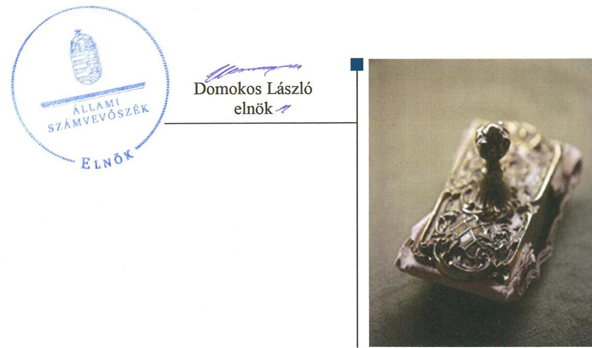
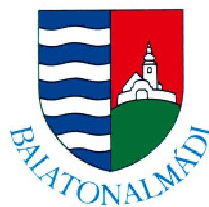
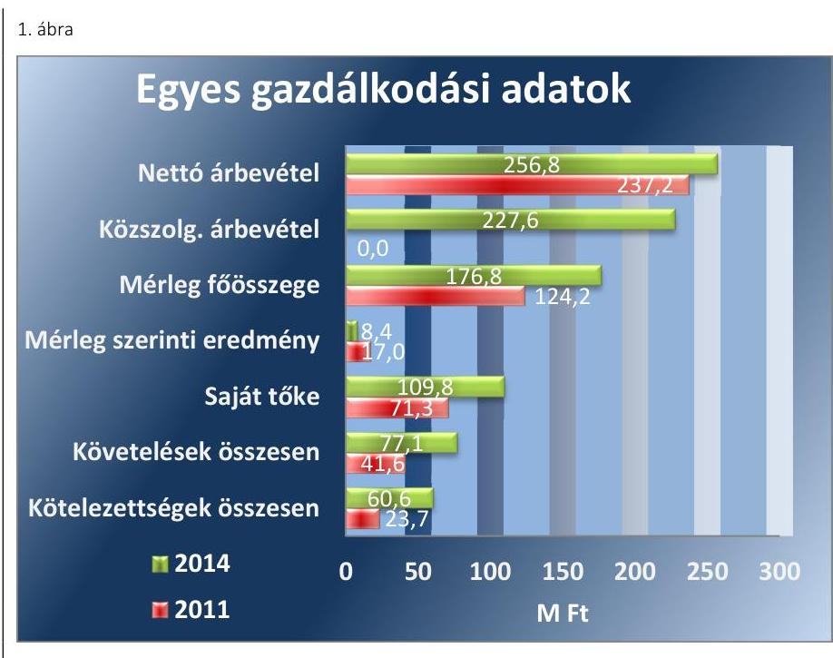
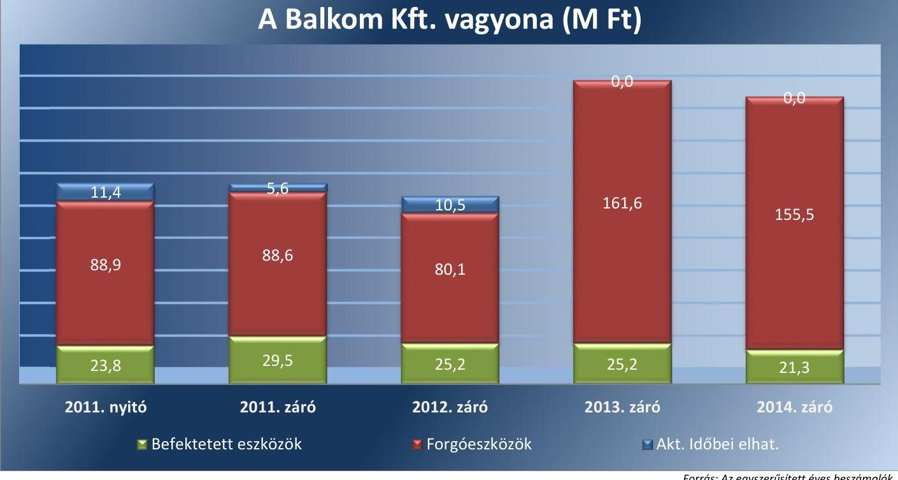
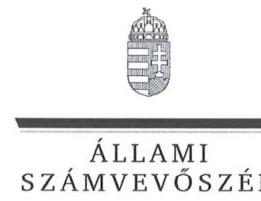
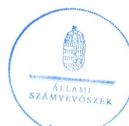
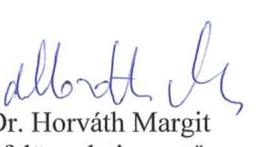

# Jelentés 

## Az önkormányzatok gazdasági társaságai

Az önkormányzatok többségi tulajdonában lévő gazdasági társaságok közfeladat ellátását érintő gazdálkodási tevékenysége szabályszerűségének ellenőrzése - Balatonalmádi Kommunális és Szolgáltató Nonprofit Kft.
2016. október hó 25. nap

---

# Jelentés 

## Az önkormányzatok gazdasági társaságai

Az önkormányzatok többségi tulajdonában lévő gazdasági társaságok közfeladat ellátását érintő gazdálkodási tevékenysége szabályszerűségének ellenőrzése - Balatonalmádi Kommunális és Szolgáltató Nonprofit Kft.
2016. október hó 25. nap

---

# AZ ELLENŐRZÉST FELÜGYELTE:

DR. HORVÁTH MARGIT felügyeleti vezető

## AZ ELLENŐRZÉST VEZETTE ÉS A VÉGREHAJTÁSÁÉRT FELELŐS:

IMRE ZSUZSANNA ellenőrzésvezető

## A PROGRAM ÖSSZEÁLLÍTÁSÁÉRT FELELŐS:

JANIK JÓZSEF LÁSZLÓ osztályvezető

IKTATÓSZÁM: V-1068-153/2016

TÉMASZÁM: 2102

ELLENŐRZÉS-AZONOSÍTÓ SZÁM: V-070738

Jelentéseink az Országgyűlés számítógépes hálózatán és az Interneten a www.asz.hu címen is olvashatóak.

---

# TARTALOMJEGYZÉK 

■ ÖSSZEGZÉS ..... 5
■ AZ ELLENŐRZÉS CÉLJA ..... 7
■ AZ ELLENŐRZÉS TERÜLETE ..... 8
■ AZ ELLENŐRZÉS HÁTTERE, INDOKOLTSÁGA ..... 10
■ A JELENTÉS LÉNYEGES KÉRDÉSKÖREI ..... 11
■ ELLENŐRZÉS HATÓKÖRE ÉS MÓDSZEREI ..... 12
■ MEGÁLLAPÍTÁSOK ..... 14
■ JAVASLATOK ..... 29
■ MELLÉKLETEK ..... 31
I. Sz. melléklet: Értelmező szótár. ..... 31
II. Sz. melléklet: A Balkom Kft. mérlegadatai (ezer Ft) ..... 34
III. Sz. melléklet: A Balkom Kft. eredménykimutatásai (ezer Ft) ..... 35
■ FÜGGELÉK: ÉSZREVÉTELEK ..... 37
■ RÖVIDÍTÉSEK JEGYZÉKE ..... 43

---

.

---

# ÖSSZEGZÉS 

Az Állami Számvevőszék a Balatonalmádi Kommunális és Szolgáltató Nonprofit Kft. hulladékgazdálkodás közszolgáltatást érintő gazdálkodási tevékenysége 2011-2014. évek közötti szabályszerűségét ellenőrizte. A hulladékgazdálkodási közfeladat-ellátás önkormányzat általi megszervezése, valamint a tulajdonosi jogok gyakorlása összességében szabályszerű volt. A Balkom Kft. vagyongazdálkodása összességében szabályszerű volt, a kötelezettségállománya a hulladékgazdálkodásra és a működésre nem jelentett kockázatot. A Balkom Kft.-nél a közfeladat-ellátás bevételeinek és ráfordításainak elszámolása összességében megfelelő, a közszolgáltatói feladattal kapcsolatos árképzési gyakorlata szabályszerű volt, a díjcsökkenést végrehajtotta.

## Az ellenőrzés társadalmi indokoltsága

Az Állami Számvevőszék stratégiájában megfogalmazta, hogy a helyi önkormányzatok gazdálkodásában rejlő pénzügyi kockázatok feltárásával, az államháztartáson kívülre nyújtott költségvetési támogatások és ingyenes vagyonjuttatások, valamint az államháztartáson kívül működő közfeladat-ellátó rendszerek ellenőrzéseivel hozzájárul ahhoz, hogy a közpénzeket az államháztartáson kívül működő szervezetek is átlátható, rendezett módon használják fel a közfeladatok szerződésben vállalt ellátása érdekében.

Magyarországon az intézmény-centrikus közfeladat-ellátás jellemző, de egyre jelentősebb a költségvetésen kívüli feladatellátás térnyerése. Ennek legfontosabb szereplői - a nonprofit szervezetek mellett - az önkormányzati tulajdonú gazdasági társaságok. Az önkormányzatok szervezetalakítási szabadságának következménye, hogy a korábban is vállalati formában működő közszolgáltatások mellett, mind a kötelező, mind az önként vállalt feladatok ellátásában a gazdasági társaságok kiemelt fontosságú szerephez jutottak.

## Főbb megállapítások, következtetések, javaslatok

A közfeladat-ellátás - melyet az önkormányzat társulás keretében oldott meg - megszervezésére vonatkozó önkormányzati döntés és annak előkészítése szabályszerű volt. Az önkormányzat az ellenőrzött időszakot megelőzően döntött a hulladékkezelési közfeladat gazdasági társaság útján történő ellátásáról, s megalapította a Balkom Kft.-t. Közép és hosszú távú vagyongazdálkodási terveket készítettek, valamint rendelkeztek munka- és gazdasági programmal. A hulladékgazdálkodással kapcsolatos rendeletalkotási kötelezettségének az önkormányzat eleget tett. Az önkormányzat, mint a tulajdonosi jogok gyakorlója a Balkom Kft. közfeladat-ellátásának felügyelete során összességében szabályszerűen járt el, és érvényesítette tulajdonosi jogait. A tulajdonosi jogok gyakorlásának rendjét a vagyongazdálkodási rendeletben és az SZMSZ-ben meghatározták. A képviselő-testület évente megtárgyalta és a taggyűlésnek elfogadásra javasolta a Balkom Kft. üzleti tervét, az éves számviteli és a közszolgáltatási tevékenységéről szóló beszámolóit. A taggyűlés az éves beszámolók elfogadásáról határozatokat hozott, ugyanakkor a Tak. tv. előírásai ellenére az ellenőrzött időszakban nem alkotott javadalmazási szabályzatot. Az önkormányzat az ellenőrzött időszakban nem élt az Ötv. és Mötv. által biztosított belső ellenőrzés lehetőségével. A FB ügyrendjét taggyűlés nem hagyta jóvá.

A Balkom Kft. üzleti tervei összhangban voltak az önkormányzat célkitűzéseivel. Szabályzatai a jogszabályoknak nem feleltek meg teljes körűen, mert nem rendelkeztek a közszolgáltatás körébe nem tartozó tevékenységek bevételeinek és ráfordításainak elkülönített nyilvántartásáról.

A Balkom Kft.-nél a közfeladat ellátását szolgáló vagyon nyilvántartása, a vagyonnal való gazdálkodás a jogszabályi előírásoknak megfelelt, a vagyon értékének megőrzése megvalósult.

A kötelezettségek állománya a Balkom Kft. működésére, valamint a közfeladat ellátásra kockázatot nem jelentett.

---

Az ellenőrzött időszakban a Balkom Kft. az előírt beszámolási és adatszolgáltatási kötelezettségét teljesítette, azonban éves beszámolóik részét képező mérlegében szerepeltetett követelések, pénzeszközök, valamint a források összegét leltárral nem támasztotta alá. Adatvédelmi és közzétételi kötelezettségének nem teljes körűen tett eleget. A közfeladat-ellátással kapcsolatos üzleti adatok védelmét a 2011-2013. években nem szabályozták, adatvédelmi felelőst nem jelöltek ki. Nem teljesítették a köztulajdonban álló gazdasági társaságok számára előírt közzétételi kötelezettséget, mivel elmulasztották a vezető tisztségviselők, a felügyelő bizottság tagjai és a vezető állású munkavállalók adatainak közzétételét. A honlapjukon nem tették közzé a szervezeti, a személyi, a tevékenységre és a működésre, valamint a gazdálkodásra vonatkozó adatokat.

A Balkom Kft.-nél az ellátott közfeladat bevételeinek elszámolása szabályszerű volt. A közfeladat ráfordításainak elszámolása elkülönítetten történt, azonban az elszámolás a belső szabályozás hiánya miatt nem volt megfelelő. A beruházások, felújítások, valamint az értékcsökkenés elszámolása szabályszerű volt. A követelésállomány nyilvántartása, a díjhátralékok kezelése során a jogszabályi előírásokat betartották.

Az önköltségszámítás és az árképzés a jogszabályoknak és a belső előírásoknak megfelelő volt.

---

# AZ ELLENŐRZÉS CÉLJA

Az ellenőrzés célja annak értékelése, hogy az önkormányzat a jogszabályi előírások figyelembe vételével döntött-e az ellenőrzésre kerülő közfeladat megszervezéséről, az önkormányzat/tulajdonosi joggyakorló szabályszerűen gyakorolta-e a tulajdonosi jogokat. A gazdasági társaság közfeladat-ellátása bevételeinek, ráfordításainak elszámolása, és vagyongazdálkodási tevékenysége megfelelt-e a jogszabályi, illetve a közszolgáltatási/vagyonkezelési szerződésben foglalt tulajdonosi előírásoknak, azok végrehajtása szabályszerű volt-e, a gazdasági társaság kötelezettségállománya jelent-e kockázatot a működésre, illetve a közfeladat ellátására, a közfeladatok átláthatósága és elszámoltathatósága érdekében biztosítva volt-e a közszolgáltatás díjának megalapozottsága szabályszerű önköltségszámítással.

---

# **AZ ELLENŐRZÉS TERÜLETE**

## **Balatonalmádi Város Önkormányzata és a többségi tulajdonában lévő Balatonalmádi Kommunális és Szolgáltató Kft.**

Balatonalmádi Város Önkormányzata 2005. november 10-én csatlakozott az Észak-Balatoni Térség Regionális Települési Szilárdhulladék-kezelési Önkormányzati Társuláshoz. A Társulás1 az Európai Unió Kohéziós Alapjából kapott támogatással egy uniós normáknak megfelelő, integrált hulladékhasznosítási és szilárdhulladék kezelési rendszert hozott létre.

Az Önkormányzat2 egy többségi tulajdonában álló gazdasági társasággal, a Balkom Kft.3-vel rendelkezik, amelyet 2001. október 10-én a hulladékgazdálkodási közfeladat ellátására hoztak létre.

A Balkom Kft.-ben az Önkormányzat 51%-os üzletréssel rendelkezik. A VKSZ Veszprémi Közüzemi Szolgáltató Kft.4 és a Vertikál Építőipari és Kommunális Zrt.5 egyaránt 24,5% üzletrészt birtokolnak. A Balkom Kft. jegyzett tőkéje és a tulajdonosi részesedések aránya a megalakulás óta nem változott. A Balkom Kft. alaptevékenysége a települési szilárd hulladék kezelése, a közterületen, vagy ingatlanon összegyűjtött hulladék rendszeres elszállítása, a begyűjtő helyek, előkezelő telepek és az ártalmatlanítást szolgáló létesítmények működtetése.

A 2011-2014. évek között a Balkom Kft. Balatonalmádi Város és a környező településeken – Alsóörs, Lovas, Királyszentistván, Balatonfűzfő területén – látta el a hulladékgazdálkodás feladatát. Az öt településen 15 871 fő állandó lakos és évente mintegy 30 000 fő nyaraló számára nyújtott hulladékszállítási szolgáltatást. A hulladékszállításba bevont ingatlanok száma 11 265 db, ezen belül az üdülőingatlanok száma 6476 volt.

A Balkom Kft. 2014. július 1-jével nonprofit gazdasági társasággá alakult át. Ezt követően a közfeladat-ellátásba nem tartozó, egyéb tevékenységeket – a konténeres hulladékszállítást, a szelektív hulladékgyűjtésre szolgáló edényzet bérbeadását, a hasznosítható hulladék begyűjtését ipari vállalkozóktól és a hulladékválogatás feladatát – a 2013. novemberben alapított, a Balkom Kft. 100%-os tulajdonában lévő a Balatonalmádi Hulladékgazdálkodási Kft. látta el.

A Balkom Kft. gazdálkodására vonatkozó főbb adatok változását a 2011. és a 2014. év között az 1. ábra szemlélteti.

---

Forrás: Az éves beszámolók
A Balkom Kft. az ellenőrzött időszakban - 2012. év kivételével - nyereségesen gazdálkodott, a saját tőkét 38,8 M Ft-tal növelte. A Balkom Kft.-nél foglalkoztatottak száma 2011. december 31-én 24 fő, 2014. december 31-én 22 fő volt. Az ellenőrzött időszakban az ügyvezető igazgató személye egy alkalommal, a 2012. évben változott.

Az önkormányzatnál a polgármester személye nem változott, tisztségét a 2006. évi önkormányzati választások óta tölti be. A jegyző személye az ellenőrzött időszak alatt két alkalommal változott. A helyszíni ellenőrzés időszakában a munkakört betöltő jegyző 2013. október 1-jétől látja el feladatait.

---

# AZ ELLENŐRZÉS HÁTTERE, INDOKOLTSÁGA 

Objektív kép kialakítása Balatonalmádi Város Önkormányzata hulladékgazdálkodással kapcsolatos közfeladatának megszervezéséről, tulajdonosi joggyakorlásáról, valamint a többségi tulajdonában lévő Balatonalmádi Kommunális és Szolgáltató Kft. közfeladat-ellátását érintő gazdálkodási tevékenységének szabályszerűségéről.

## A gazdasági társaságok a közfeladatok ellátásában kiemelt fontosságú szerephez jutottak.

Az önkormányzati tulajdonú gazdasági társaságok teljes körű ellenőrzésének lehetőségét az ÁSZ. tv. 2011. január 1-jétől hatályos módosítása teremtette meg. A közfeladatot ellátó gazdasági társaságok ellenőrzése kiemelten fontos a vagyon megőrzése, megóvása érdekében, valamint a kormányzati szektor elszámolásaiban megjelenő önkormányzati tulajdonú gazdálkodó szervezetek esetében, amelyekkel szemben alapvető követelmény, hogy gazdálkodásuk, működésük szabályszerű, az általuk szolgáltatott adatok minél megbízhatóbbak legyenek. A közfeladat ellátás költségeinek, ráfordításainak alakulása, színvonala hatással van a lakosság elégedettségére.

## AZ ELLENŐRZÉS VÁRHATÓ HASZNOSULÁSA-

KÉNT az ÁSZ ${ }^{6}$ a megállapításaival segítséget nyújthat az államháztartáson kívüli közfeladat-ellátás értékeléséhez, jogszabályi keretei pontosításához, átláthatóságot biztosító szabályozásához. Meghatározhatóvá válnak a közfeladat ellátásban részt vevő államháztartáson kívüli szervezeteknek az önkormányzat költségvetését, pénzügyi helyzetét is befolyásoló kockázatai, lehetővé válik ezen kockázatok csökkentése. Ellenőrzéseink feltárhatják, hogy az önkormányzat közfeladat ellátási kötelezettségének szabályszerűen tett-e eleget, a feladatellátáshoz rendelt közvagyon működtetését a tulajdonostól elvárható gondossággal, szabályszerűen szervezte-e meg és a tulajdonosi felügyelete hozzájárult-e a közfeladat szabályszerű ellátásához. Értékelhetővé válik, hogy a feladatot ellátó gazdasági társaság a közszolgáltatási szerződésben foglaltak betartásával, a közvagyon használatával biztosította-e a szolgáltatás folytatásának feltételeit. Ezzel az ellenőrzöttek és a helyi döntéshozók számára az ÁSZ visszajelzést ad feladatszervezési, feladat-ellátási kockázataikról, alapot ad a meglévő hibák megszüntetéséhez, a jobb közfeladat-ellátás biztosításához. Mindezeken keresztül az ÁSZ hozzájárul Magyarország közpénzügyi helyzetének javításához, a közpénzek mérhető módon történő, a döntéshozók által meghatározott célok szerinti felhasználásához.

---

# A JELENTÉS LÉNYEGES KÉRDÉSKÖREI 

1. Az önkormányzat közfeladat megszervezéséről szóló döntése, valamint tulajdonosi joggyakorlása szabályszerű volt-e?
2. A gazdasági társaság vagyongazdálkodása szabályszerű volt-e, kötelezettségállománya jelentett-e kockázatot a működésre, illetve a közfeladat ellátásra?
3. A gazdasági társaságnál az ellátott közfeladat bevételei és ráfordításai elszámolása, valamint az önköltségszámítás és árképzés szabályszerű volt-e?

---

# ELLENŐRZÉS HATÓKÖRE ÉS MÓDSZEREI 

## Az ellenőrzés típusa

Megfelelőségi ellenőrzés

## Az ellenőrzött időszak

2011. január 1-jétől 2014. december 31-ig tartó időszak

## Az ellenőrzés tárgya

A közfeladatot gazdasági társaságokkal ellátó önkormányzatok tulajdonosi joggyakorlása, valamint gazdasági társaságok pénz- és vagyongazdálkodásának szabályozottsága és szabályszerűsége. Az ellenőrzés kiterjed minden olyan körülményre és adatra, amely az ÁSZ jogszabályban meghatározott feladatainak teljesítéséhez, valamint a program végrehajtása folyamán felmerült újabb összefüggések feltárásához szükséges.

## Az ellenőrzött szervezet

Az ellenőrzött szervezetek:
— Balatonalmádi Város Önkormányzata
— Balatonalmádi Kommunális és Szolgáltató Nonprofit Kft.

## Az ellenőrzés jogalapja

Az ellenőrzés jogszabályi alapját az Állami Számvevőszékről szóló 2011. évi LXVI. törvény 5. § (3)-(4)-(5) bekezdése képezte.

## Az ellenőrzés módszerei

Az ellenőrzést a nemzetközi standardokat irányadónak tekintve az ellenőrzési program ellenőrzési kérdései, az
 ellenőrzött időszakban hatályos jogszabályok, az ellenőrzés szakmai szabályok és módszertanok figyelembe vételével végezzük.

Az ellenőrzés ideje alatt az ellenőrzött szervezettel történő kapcsolattartást az ÁSZ Szervezeti és Működési Szabályzatának vonatkozó előírásai alapján biztosítjuk.

Az ellenőrzés a kiválasztott, többségi tulajdonosi jogokat gyakorló önkormányzatra, illetve az ellenőrzésre kijelölt közfeladatot ellátó gazdasági

---

társaság felett tulajdonosi jogokat gyakorló szervezetre és az ellenőrzött közfeladatot ellátó gazdasági társaságra terjed ki. Amennyiben a gazdasági társaságban több önkormányzat együttesen többségi tulajdonos, úgy az ellenőrzést a többségi tulajdonosi jogokat gyakorló önkormányzatnál kell lefolytatni. Az ellenőrzött gazdasági társaságnál, amennyiben az több közfeladatot is ellát, akkor az ellenőrzésre kiválasztott közfeladat-ellátást ellenőrizzük.

Az ellenőrzést a kérdésekre adott válaszok kiértékelésével, valamint a megjelölt adatforrások, a csatolt tanúsítványok felhasználásával, továbbá az adott időszakban hatályos jogszabályok figyelembe vételével kell lefolytatni. Az ellenőrzési kérdések megválaszolásához szükséges bizonyítékok megszerzése a következő ellenőrzési eljárások alkalmazásával történik: megfigyelés, kérdésfeltevés (információkérés), összehasonlítás, valamint elemző eljárás.

A bevételek és ráfordítások elszámolása, valamint a vagyonnyilvántartás terén a szabályszerű működést véletlen mintavétellel ellenőriztük. A mintavétellel ellenőrzött területek esetében minden egyes tétel vonatkozásában a szabályszerűségre vonatkozó kérdéseket tettünk fel, amelyek eredménye összesítésre került. „Megfelelőnek" értékeltünk egy ellenőrzött területet, amennyiben 95%-os bizonyossággal a teljes sokaságban a hibaarány legfeljebb 10%, nem megfelelőnek, amennyiben 10%-nál magasabb arányt képviselt. Abban az esetben, ha a teljes sokaság tekintetében a 10%-os hibaarányhoz való viszony megítélésének megbízhatósága nem érte el a 95%-ot, annak elérése érdekében értékelésünket további szempontokkal egészítettük ki, és figyelembe vettük a feltárt hibák típusát és súlyát.

A ráfordítások elszámolására és a vagyonnyilvántartásra vonatkozó véletlen mintavételt kockázati alapú kiválasztással egészítettük ki, amelynek során évente a három legnagyobb összegű tételt választottuk ki.

---

# 1. Az önkormányzat közfeladat megszervezéséről szóló döntése, valamint tulajdonosi joggyakorlása szabályszerű volt-e? 

Összegző megállapítás

A közfeladat megszervezésére vonatkozó önkormányzati döntés és a tulajdonosi joggyakorlás összességében szabályszerű volt.

### 1.1. számú megállapítás

A közfeladat-ellátás megszervezésére vonatkozó önkormányzati döntés és annak előkészítése szabályszerű volt.

KÖZÉP ÉS HOSSZÚ TÁVÚ VAGYONGAZDÁLKODÁSI TERVÉT a Képviselő-testület ${ }^{7}$ az Nvtv. ${ }^{8}$ rendelkezéseinek figyelembe vételével a 2013-2018. évekre, illetve a 2013-2023. évekre meghatározta. Ezekben rögzítették a vagyongazdálkodási irányelveket, az önkormányzati vagyon hasznosításának módját, a vagyongazdálkodás feladatát. A vagyongazdálkodási tervekben a hulladékgazdálkodási közfeladathoz kapcsolódóan a használaton kívüli hulladékgazdálkodási létesítmények fenntartásának, rekultivációjának feladatait fogalmazták meg.

GAZDASÁGI PROGRAMOT ${ }^{9}$ 2011-2014. évekre az Ötv. ${ }^{10}$-ben előírtaknak megfelelően készítettek. A gazdasági program a hulladékgazdálkodásra vonatkozóan konkrét fejlesztési terveket nem tartalmazott, de megfogalmazták benne, hogy az Önkormányzat a Balkom Kft.-vel együttműködve kiterjeszti a szelektív és a zöldhulladék-gyűjtést.

A KÖZFELADAT-ELLÁTÁSÁRÓL az Önkormányzat az ellenőrzött időszakot megelőzően, a 2001. évben határozattal döntött, mely szerint a hulladékkezelési tevékenységet gazdasági társasága útján látta el. E célból alapította meg 2001. október 10-én, a Gt. ${ }^{11}$ rendelkezéseivel összhangban, a VKSZ Kft. és a Vertikál Zrt. részvételével a Balkom Kft.-t. A társasági szerződésben ${ }^{12}$ fő tevékenységként a szennyvíz- és hulladékkezelést, köztisztasági szolgáltatás nyújtását határozták meg az alapítók. 2014. július 1-jével a Ht. ${ }^{13}$ rendelkezésének megfelelően a Balkom Kft.-t nonprofit gazdasági társasággá alakították át.

A KÖZSZOLGÁLTATÁSI SZERZŐDÉST ${ }^{14}$ a Társulás – amelynek az Önkormányzat 2005. november 10. óta volt tagja – kötötte meg a Hulladékkezelési Konzorciummal ${ }^{15}$, amelynek a Balkom Kft. is tagja volt. A hulladékgazdálkodási közfeladat társulási formában való ellátása megfelelt az Ötv. 41. § (1) bekezdésében foglalt, az önkormányzati feladatok hatékonyabb, célszerűbb megoldására irányuló célkitűzésének. A közszolgáltatási szerződés tartalmazta az ellátandó feladatok körét, azok számon kérhető követelményeit, amellyel megfelelt a Hgt., valamint a 241/2000. ${ }^{16}$ és a 224/2004. ${ }^{17}$ Korm. rendeletek előírásainak. A közszolgál-

---

tatási szerződésben a Ht., valamint a 317/2013. Korm. rendelet ${ }^{18}$ rendelkezéseinek megfelelően meghatározták a közszolgáltató kötelezettségeit, a hulladékgazdálkodási feladatok körét, a közszolgáltatás dijának megállapításához kapcsolódó feladatokat, és rendelkeztek a feladatellátásra vonatkozó beszámoltatásról.

A hulladékgazdálkodási közszolgáltatási szerződést határozott időre, 2030. december 31-ig kötötték meg, amelyet változatlanul hagytak annak 2014. július 1-jei módosításakor. A módosítás a jogszabályi változások okán, a hatályos jogszabályi rendelkezésekből fakadó követelményeknek való megfelelés érdekében, így különösen a Ht.-ben foglaltakra tekintettel történt. Az eredeti és a módosított közszolgáltatási szerződés III. fejezetének 1.3. alpontjában 2030-ig terjedő hatálya azonban nem felelt meg sem a Hgt. 28. § (3) bekezdés, sem a Ht. 34. § (7) bekezdés előírásának, amely szerint a hulladékgazdálkodási közszolgáltatási szerződés a közszolgáltatóval legfeljebb 10 évre köthető meg.

Az Önkormányzat a közfeladat ellátását az Ötv. és a Mötv. ${ }^{19}$ rendelkezéseinek megfelelően az SZMSZ ${ }^{20}_{1,2}$-ben szabályozta. Az SZMSZ ${ }_{1}$-ben az Ötv. 8. § (2) bekezdésének előírásával ellentétben nem határozták meg a közfeladat ellátásának módját. Az SZMSZ ${ }_{2}$ a közfeladatok ellátásával kapcsolatos rendelkezéseket az Mötv. előírásainak megfelelően tartalmazta.

RENDELETALKOTÁSI KÖTELEZETTSÉGÉT a hulladékgazdálkodással kapcsolatosan az Ötv. és az Mötv. előírásainak megfelelően az Önkormányzat teljesítette. A hulladékgazdálkodási rendelet ${ }^{21}$ tartalma megfelelt a Hgt. ${ }^{22}$ és a Ht. rendelkezéseinek, abban meghatározták a közszolgáltatás helyi szabályait, a közfeladat ellátásának és igénybe vételének rendjét, az ingatlantulajdonos és a közszolgáltató jogait és kötelezettségeit, a közszolgáltatási díj fizetésének szabályait. A hulladékgazdálkodási rendelettel a közszolgáltatási szerződés ${ }_{1,2}$ összhangban volt.

A közfeladat-ellátás során bekövetkezett – a hulladék szállításával, a szelektív és a zöldhulladék-gyűjtéssel kapcsolatos – változások és a díjváltozás miatt a hulladékgazdálkodási rendeletet az ellenőrzött időszakban többször módosították. A közszolgáltatás díját az Önkormányzat a 2011. és 2012. években a Hgt. előírásainak megfelelően állapította meg. A 2012. évben alkalmazott díj nem haladta meg a Képviselő-testület által a 2011. évre meghatározott díj összegét.

Az Önkormányzat rendeletet alkotott a 2011-2012. évekre készített hulladékgazdálkodási terv ${ }^{23}_{1}$-ről, illetve a helyi hulladékgazdálkodási terv ${ }^{24}_{1}$-ről, amelyek megfeleltek a Hgt. előírásainak. A 2013-2015. évekre a Ht. rendelkezése alapján a közszolgáltató Balkom Kft. készítette el – a 438/2012. számú Korm. rendeletben ${ }^{25}$ meghatározott tartalmi követelményeknek megfelelve – a közszolgáltatói hulladékgazdálkodási tervet ${ }^{26}_{3}$, amelyet a Környezetvédelmi Főfelügyelőség ${ }^{27}$ hagyott jóvá.

KÖZVAGYONT NEM ADOTT ÁT az Önkormányzat a hulladékgazdálkodási közfeladat ellátásához, a Balkom Kft. alapításakor a jegyzett tőkét készpénzben bocsátották rendelkezésre.

---

### 1.2. számú megállapítás

Az Önkormányzat, mint a tulajdonosi jogok gyakorlója a Balkom Kft. közfeladat-ellátásának felügyelete során összességében szabályszerűen járt el, és érvényesítette tulajdonosi jogait. Az FB ügyrendjét a Taggyűlés nem hagyta jóvá.

A TULAJDONOSI JOGOK gyakorlásának rendjét a Gt. és a Ptk. ${ }^{28}$ rendelkezéseinek megfelelően a társasági szerződésben, továbbá az Ötv. és a Mötv. előírásaival összhangban a vagyongazdálkodási rendelet ${ }_{1,2}$-ben és az SZMSZ ${ }_{1,2}$-ben határozták meg. Az Önkormányzatnál a vagyongazdálkodási rendelet ${ }_{1,2}$ szerint az Önkormányzatot megillető, az átalakulással, elidegenítéssel, az alaptőke felemelésével és csökkentésével, az elővásárlási jog gyakorlásával kapcsolatos tulajdonosi jogokat a Képviselő-testület gyakorolta. A polgármester ${ }^{29}$ a vagyongazdálkodási rendelet ${ }_{1,2}$ és az SZMSZ ${ }_{1,2}$ rendelkezése szerint a Gt.-ben meghatározott egyéb tulajdonosi jogok gyakorlására volt jogosult.

A TÁRSASÁGI SZERZŐDÉSBEN rendelkeztek a taggyűlés ${ }^{30}$ hatásköréről, meghatározták a tagok jogait és kötelezettségeit, a választott könyvvizsgálót és az FB ${ }^{31}$ tagjait. A Gt. és a Ptk. rendelkezéseivel összhangban meghatározták a taggyűlés kizárólagos hatáskörébe tartozó jogosultságokat, többek között a társasági szerződés módosítására, az adózott eredmény felosztására, a mérleg megállapítására vonatkozó, illetve a Társaság megszűnésével kapcsolatos rendelkezéseket. A társasági szerződésben megjelölték a taggyűlésben az egyes tagok képviseletére jogosult természetes személyeket. Az Önkormányzatot a vagyongazdálkodási rende-let ${ }_{1,2}$-ben meghatározott felhatalmazás alapján, átruházott jogkörében eljárva a polgármester képviselte.

A TAGGYŰLÉS az ellenőrzött időszakot megelőzően döntött a könyvvizsgáló, valamint az FB tagjainak megválasztásáról. A 2011-2014. években a taggyűlés a Gt. és a Ptk. rendelkezéseinek és a belső szabályozásnak megfelelően határozattal döntött a Balkom Kft. éves beszámolójának elfogadásáról, az adózott eredmény felosztásáról, a vezető tisztségviselők díjazásáról. A taggyűlésekről a Gt. és a Ptk. rendelkezéseinek megfelelően jegyzőkönyv készült.

AZ FB ELLENŐRIZTE a Balkom Kft. működését. Az FB a Tak. tv. előírásainak megfelelően három tagból állt.

Az ellenőrzés rendelkezésére bocsátott FB ügyrend ${ }^{32}$ sem keltezést, sem hitelesítő aláírást, sem a Balkom Kft. legfőbb szervének jóváhagyását nem tartalmazta. Ezzel nem tartották be a Gt. 34. § (4) bekezdésében, illetve a Ptk. 3:122. § (3) bekezdésében és a társasági szerződés 10. pontjában foglaltakat, az FB nem állapította meg az ügyrendjét.

Az FB a Gt, illetve a Ptk. által meghatározott kötelezettségeinek megfelelve az éves beszámolókat ülésein megtárgyalta, majd határozatot hozott az éves beszámoló elfogadásáról. Íly módon a taggyűlés az FB írásbeli határozata alapján döntött az éves beszámolók elfogadásáról.

A Képviselő-testület éves munkatervében határozta meg a közszolgáltató Balkom Kft. beszámoltatásának időpontját. A Képviselő-testület elé az SZMSZ ${ }_{1,2}$-ben előírtaknak megfelelő tartalommal és formában készült előterjesztések kerültek. A Képviselő-testület minden évben a polgármester

---

előterjesztése alapján tárgyalta meg és fogadta el az éves beszámolót, illetve az üzleti terv teljesítéséről szóló beszámolót. A közszolgáltatásról szóló beszámolóban a Balkom Kft. bemutatta az árbevételét tevékenységenként, a kommunális szolgáltatást, a hulladékkezelést és szállítást, a hulladék elhelyezését.

ÜZLETI TERVET ${ }^{33}$ a Balkom Kft. a 2011-2014. években készített. Az üzleti tervek összhangban voltak az Önkormányzat gazdasági programjával, tartalmazták a hulladékgazdálkodással kapcsolatosan megfogalmazott célokat, így a szelektív és a zöldhulladék-gyűjtés kiterjesztését. Megfeleltek az Önkormányzat hulladékgazdálkodási terv ${ }_{1,2}$-nek, mivel tartalmazták az adott évre a közfeladat ellátás mennyiségére és minőségére vonatkozó célkitűzéseket, a szervezeti és működési tervet, a tervezett bevételeket és ráfordításokat, a tervezett eredményt. Az üzleti terveket a taggyűlés megvitatta és határozataival elfogadta.

JAVADALMAZÁSI SZABÁLYZATTAL ${ }^{34}$ a 2011-2013. években a Tak.tv. ${ }^{35}$ 5. § (3) bekezdés előírása ellenére a Balkom Kft. nem rendelkezett. A taggyűlés nem alkotott szabályzatot a vezető tisztségviselők, a FB tagjai, valamint az Mt. ${ }^{36}$ 188. § (1) bekezdése és a 188/A § (1) bekezdése, illetve az Mt. ${ }^{37}$ 208. §-ának hatálya alá eső, vezető állású munkavállalók javadalmazásáról, a jogviszony megszűnése esetére biztosított juttatások módjának, mértékének elveiről, annak rendszeréről.

A Balkom Kft. – ügyvezetője ${ }^{38}$ által 2014-ben kiadott – javadalmazási szabályzatát a Balkom Kft. legfőbb szerve, a taggyűlés a Taktv. 5. § (3) bekezdésében előírtak ellenére nem alkotott, azon azonban 2014. január 1-i dátummal az ügyvezető aláírása szerepelt. A javadalmazási szabályzat hatályba léptető rendelkezést nem tartalmazott. Mindezek következtében a Balkom Kft. 2014. évtől sem rendelkezett javadalmazási szabályzattal, a Taktv. 5. § (3) bekezdés előírása ellenére.

A taggyűlés az ügyvezető és az FB tagjainak javadalmazása módjáról, mértékéről az éves beszámolót elfogadó taggyűlésen határozott. Érdekeltségi rendszert az Önkormányzat nem
 működtetett, az ügyvezető részére prémiumot nem tűztek és nem fizettek ki.

AZ ÁRKÉPZÉS SZABÁLYAIT a Balkom Kft. részére az Önkormányzat - első alkalommal a 28/1995. számú - hulladékgazdálkodási rendeletben határozta meg. A 2011. és 2012. évekre vonatkozóan a hulladékgazdálkodási rendeletben rögzítették a díjmegállapítás során követendő eljárást, meghatározták a közszolgáltatási díj tartalmát, annak megfizetésére és a díjhátralék behajtására vonatkozó szabályokat. A hulladékszállítási, gyűjtési és kezelési díjat a hulladékgazdálkodási rendelet 1. számú melléklete a díjrendelet ${ }^{39}$ előírásainak megfelelően tartalmazta.

A közszolgáltatási díj megállapításának alapelveit, módszerét, a díjképzési folyamat szabályait a közszolgáltatási szerződés ${ }_{1,2}$-ben határozták meg. A közszolgáltató részletes költségelemzését és javaslatát figyelembe véve az Önkormányzat az FB véleménye alapján, a tárgyévet megelőző év november 30-ig terjesztette a Képviselő-testület elé javaslatát. A Képviselő-testület a hulladékgazdálkodási rendeletnek megfelelően minden évben december hónapban állapította meg a következő évi szolgáltatási díjat.

---

AZ ÖNKORMÁNYZAT SZÁMON KÉRTE a közszolgáltatási szerződésben meghatározott követelmények betartását, és beszámoltatta a Balkom Kft.-t a közfeladat-ellátásról. A közszolgáltatási szerződés ${ }_{1,2}$-ben előírták, hogy a közszolgáltató köteles a megrendelő részére, annak kérésére az általa végzett közszolgáltatással és a közszolgáltatás gazdasági adataival kapcsolatos információkat, adatokat, számviteli és egyéb analitikus nyilvántartásaival megegyező tartalommal, írásban megadni.

A Balkom Kft. a közszolgáltatás teljesítéséről - a közszolgáltatási szerződés ${ }_{1,2}$ előírásainak megfelelve - az egyes üzleti évekre vonatkozóan elkészített beszámolókban adott számot. A beszámolók tartalmazták az egyes szolgáltatásokhoz kapcsolódó árbevételt, a kommunális szolgáltatást, a hulladékkezelést és szállítást, a hulladék elhelyezését. E beszámolókat a Számv. tv. ${ }^{40}$ rendelkezései alapján elkészített, és a könyvvizsgáló ${ }^{41}$ által hitelesítő záradékkal ellátott éves számviteli beszámolóval együtt terjesztették a Képviselő-testület elé. A közszolgáltatásról szóló beszámolókat a Képviselő-testület az éves számviteli beszámolóval egy időben, határozattal hagyta jóvá.

A BELSŐ ELLENŐRZÉS az Ötv. 92. § (11) bekezdés b) pontjában, valamint az Áht. ${ }^{42}$ 70. § (1) bekezdésének d) pontjában biztosított lehetőség ellenére nem végzett ellenőrzést a Balkom Kft.-nél. Az Önkormányzat rendelkezett a 2011-2014. évekre vonatkozó, kockázatelemzésen alapuló éves ellenőrzési tervekkel. A kockázatelemzésben az önkormányzati vagyongazdálkodás területét a 2012. évre vonatkozóan magas, egyébként közepes kockázatúnak minősítették. A kockázatelemzés az önkormányzati tulajdonú gazdasági társaságokra nem terjedt ki. A közfeladat-ellátást biztosító vagyongazdálkodást, illetve a közszolgáltatási szerződés teljesítését az ellenőrzött időszakban a belső ellenőrzés nem vizsgálta. Az ellenőrzés elmaradása kockázatot jelentetett a közfeladat-ellátást biztosító vagyongazdálkodás, a közfeladat-ellátás nyomon követése tekintetében, mivel hiányzott az a kontroll, ami a feladatellátásból eredő esetleges hiányosságokat, hibákat időben feltárta volna.

Külső szakértői ellenőrzésre a 2011-2014. években nem került sor. Az adókötelezettségek teljesítésére irányuló ellenőrzést a 2013. és a 2014. évben a NAV ${ }^{43}$ hajtott végre. A 2014. évben feltárt szabálytalanság megszüntetésére intézkedtek.

# AZ ADÓZOTT EREDMÉNY FELHASZNÁLÁSÁRÓL

szóló döntés a Balkom Kft. társasági szerződése szerint, a Gt. és a Ptk. rendelkezéseinek megfelelően a taggyűlés kizárólagos hatáskörébe tartozott. A társasági szerződés alapján a nyereségfelosztás a tagok között a Számv. tv. szerinti beszámolóval érintett tárgyév utolsó napján érvényes tagjegyzék szerinti törzsbetétek alapján oszlott meg. A taggyűlés döntése szerint a Számv. tv. rendelkezéseit betartva az adózott eredményt az eredménytartalékba helyezték. Kivételt jelentett a 2013. évi eredmény felhasználása, amikor - a tagjegyzék szerinti törzsbetétek arányában - 15,0 M Ft osztalék kifizetéséről döntöttek.

A Balkom Kft. esetében a saját tőke előírt szintjének biztosítása érdekében tulajdonosi intézkedésre nem volt szükség, mivel a 2011-2014. években a saját tőke szintje nem csökkent a jegyzett tőke összege alá.

---

# 2. A gazdasági társaság vagyongazdálkodása szabályszerű volt-e, kötelezettségállománya jelentett-e kockázatot a működésre, illetve a közfeladat ellátásra?

Összegző megállapítás

A Balkom Kft. vagyongazdálkodása összességében szabályszerű volt, kötelezettségállománya nem jelentett kockázatot a működésre, illetve a közfeladat-ellátásra.
2.1. számú megállapítás

A Balkom Kft. üzleti tervei összhangban voltak az Önkormányzat célkitűzéseivel. Szabályzatai a jogszabályoknak nem teljes körűen feleltek meg, mert nem rögzítették a közszolgáltatás körébe nem tartozó tevékenységek bevételeinek és ráfordításainak elkülönített nyilvántartására vonatkozó szabályokat.

A BALKOM KFT. BELSŐ SZABÁLYZATAIT a Számv. tv. előírásainak megfelelően elkészítette, rendelkezett számviteli politikával ${ }^{44}{ }_{1,2}$, számlarenddel ${ }^{45}$, leltározási szabályzattal ${ }^{46}$, értékelési szabályzattal ${ }^{47}{ }_{1,2}$ és pénzkezelési szabályzattal ${ }^{48}{ }_{1,2}$. A számviteli politika ${ }_{1,2}$ a Számv. tv.-ben foglaltaknak megfelelően rögzítette a Balkom Kft.-re jellemző szabályokat, előírásokat, módszereket. Meghatározták, hogy mit tekintenek a számviteli elszámolás, az értékelés szempontjából lényegesnek, jelentősnek, illetve azt, hogy a törvényben biztosított választási, minősítési lehetőségek közül melyeket alkalmazták.

A 2011-2012. évek tekintetében a Számv. tv. 161/A § (2) bekezdésében foglaltakat nem tartották be, mivel sem a számviteli politika ${ }_{1,2}$ keretében, sem más belső szabályzatban nem rendelkeztek a Hgt. 29. § (3) bekezdésének megfelelően a kötelezően ellátandó közszolgáltatás kereteibe nem tartozó más hulladékkezelési szolgáltatás bevételeinek, költségeinek és ráfordításainak szigorú elkülönítéséről. A 2013-2014. években nem tartották be a Számv. tv. 161/A § (1) bekezdésében foglaltakat, mivel sem a számviteli politika ${ }_{1,2}$-ban, sem egyéb belső szabályzatban nem határozták meg a kiegészítő mellékletben bemutatandó, a Ht. 50. § (3) bekezdése szerinti önálló mérleg és eredmény-kimutatás alátámasztásául szolgáló, a Ht. 50. § (2) bekezdése szerinti elkülönült nyilvántartás vezetésének részletes szabályait.

A számlarend a Számv. tv. rendelkezéseinek megfelelően meghatározta a főkönyvi számlák tartalmát, a számlák értéke növekedésének, csökkenésének jogcímeit.

Az egyes tevékenységek bevételeinek és ráfordításainak elkülönítése érdekében munkaszám szerinti nyilvántartást vezettek, azonban az egyes főkönyvi számlák és a munkaszám szerinti analitikus nyilvántartás kapcsolatát a Számv. tv. 161. § (2) bekezdés c) pontjának rendelkezése ellenére a számlarendben nem szabályozták.

A leltározási szabályzatban rögzítették a nyilvántartások folyamatos vezetésének módját, a kizárólag mennyiségben nyilvántartott eszközökre vonatkozóan a mennyiségi leltárfelvétel gyakoriságát, a megállapított eltérések esetén a felelősség érvényesítését.

Az értékelési szabályzat ${ }_{1,2}$ a Számv. tv. rendelkezéseinek megfelelően tartalmazta az eszközök és források értékelésére vonatkozó szabályokat,

---

így - többek között - a bekerülési érték megállapításának, nyilvántartásának szabályait, a mérleg szerinti érték, illetve az eszközök állományból történő kivezetés időpontjára vonatkozó értéke megállapításának módját.

A pénzkezelési szabályzat ${ }_{1,2}$ megfelelt a Számv. tv. előírásainak, rendelkezett valamennyi, a jogszabályban meghatározott területről, meghatározta a pénzkezelés rendjének megsértése esetén alkalmazandó eljárást.

# 2.2. számú megállapítás

A Balkom Kft.-nél a közfeladat ellátását szolgáló vagyon nyilvántartása, a vagyonnal való gazdálkodása a jogszabályi előírásoknak megfelelt, a vagyon értékének megőrzése megvalósult.

A KÖZFELADAT ELLÁTÁSÁT a Balkom Kft. az Önkormányzattól bérelt ingatlanon, a saját vagyonába tartozó eszközökkel teljesítette, közvagyont nem kezelt. A Balkom Kft.-nél a vagyon változásának, a beruházások és felújítások aktiválásának könyvviteli nyilvántartását a Számv. tv. és a számviteli politika ${ }_{1,2}$ előírásainak megfelelően, a számlarendben meghatározott módon végezték. Az értékcsökkenés elszámolása a Számv. tv. rendelkezésének megfelelően történt. A számviteli nyilvántartásokban szereplő immateriális javak és tárgyi eszközök állományát a leltározási szabályzatban foglaltaknak megfelelően évente leltározták.

A Balkom Kft. a 2013-2014. években a Ht. rendelkezéseinek megfelelően az egyszerűsített éves beszámolója kiegészítő mellékletében bemutatta a hulladékgazdálkodási közszolgáltatásra vonatkozó önálló mérleget és eredmény-kimutatást.

A BALKOM KFT. VAGYONGAZDÁLKODÁSÁNAK eredményeként a vagyon értéke az ellenőrzött időszakban növekedett. A vagyon összetételét és alakulását a 2. ábra szemlélteti.
2. ábra

## A Balkom Kft. vagyona (M Ft)

---

A mérlegben szereplő vagyonelemek összességükben a hulladékgazdálkodást szolgálták, 2014. évi mérlegben kimutatott eszközök és források kizárólag a Balkom Kft. hulladékgazdálkodási közszolgáltatási tevékenységéhez kapcsolódtak. A 2011. január 1-jéről a 2014. év végére a Balkom Kft. vagyonának értéke 42,4%-kal (52,7 M Ft-tal) gyarapodott, amelynek oka alapvetően a követelések állományának 85,3%-os és a pénzeszközök állományának 66,4%-os növekedése volt.

A Balkom Kft. tárgyi eszközeinek állománya a 2014. évben 41,7%-a volt a 2011. évi nyitó értéknek a - Balkom Kft. 100%-os tulajdonában lévő Balatonalmádi Hulladékgazdálkodási Kft. részére, apportként történt tárgyi eszközátadás miatt, miközben a befektetett pénzügyi eszközök állománya a részesedés értékével növekedett. A befektetett eszközök értéke összességében 10,5%-kal (23,8 M Ft-ról 21,3 M Ft-ra) csökkent az ellenőrzött időszakban.

A Balkom Kft. követelésállománya csaknem a kétszeresére növekedett, amit a közületi követelések összegének növekedése (29,4 M Ft) eredményezett. A követelésállomány alakulását az 1. táblázat mutatja be.

1. táblázat

| A BALKOM KFT. KÖVETELÉSEI (M FT) |  |  |  |  |
| :--: | :--: | :--: | :--: | :--: |
| Megnevezés | 2011. záró | 2012. záró | 2013. záró | 2014. záró |
| Közületi vevők | 11,2 | 12,2 | 41,5 | 42,3 |
| Lakossági vevők | 48,9 | 63,1 | 63,1 | 48,9 |
| Közületi vevők értékvesztés |  |  | $-7,6$ | $-1,7$ |
| Lakossági vevők értékvesztés | $-28,5$ | $-38,8$ |  |  |
| Egyéb követelések | 7,4 | 4,9 | 13,5 | 10,1 |
| Követelések összesen | 39,0 | 42,2 | 79,0 | 77,1 |

A Balkom Kft. követelésállományán belül a közületi követelések összege a 2013. év végére megháromszorozódott, ami a 2013. évtől nyújtott szelektív hulladékgyűjtési szolgáltatás eredménye volt. A vevőkövetelésekre elszámolt értékvesztés összege az ellenőrzött időszakban 18,3%-kal nőtt, az értékvesztés vevőkövetelésekre vetített aránya a 2011. évben 47,4%, a 2014. évben 26,5% volt.

A Balkom Kft. gazdálkodásával kapcsolatosan az Önkormányzat garanciát vagy kezességet nem vállalt.
2.3. számú megállapítás

A kötelezettségek állománya a Balkom Kft. működésére, valamint a közfeladat ellátásra kockázatot nem jelentett.

A KÖTELEZETTSÉG-ÁLLOMÁNY MÉRTÉKE nem jelentett kockázatot a közfeladat ellátására, valamint a Balkom Kft. működésére, amit a 2. táblázat szerinti mutatók is alátámasztanak.
2. táblázat

ELADÓSODOTTSÁGOT JELZŐ MUTATÓK

|  | 2011. | 2012. | 2013. | 2014. |
| :-- | --: | --: | --: | --: |
| eladósodottság mértéke | 0,145 | 0,214 | 0,855 | 0,552 |
| adósságfedezeti mutató I. | 7,94 | 5,42 | 2,25 | 2,92 |

A kötelezettségek állománya a Balkom Kft. működésére, valamint a közfeladat ellátásra kockázatot nem jelentett.

Forrás: Az egyszerűsített éves beszámolók

---

5. táblázat

| KÖTELEZETTSÉGEK (M FT) |  |  |  |
| :--: | :--: | :--: | :--: |
|  | 2011 | 2014 |  |
| lakossági | 2,5 | 1,6 |  |
| közületi | 1,3 | 0,4 |  |
| egyéb | 10,3 | 58,5 |  |
| Összesen | 14,1 | 60,6 |  |

Forrás: Az egyszerűsített éves beszámolók

Az eladósodottság mértékre vonatkozó mutató kedvező értéke jelzi, hogy a Balkom Kft. által igénybevett idegen források összege - bár növekedett -, de folyamatosan a saját források értéke alatt volt. Az adósságfedezeti mutató I. kiemelkedően kedvező értéke szemlélteti, hogy a befektetett és forgóeszközök értéke többszörösen fedezetet nyújtott a fennálló kötelezettségek összegére.

A Balkom Kft. az ellenőrzött időszakban hitelt nem vett igénybe. Hosszú lejáratú kötelezettsége a 2012-2014. években nem volt,
 a 2011. évben fennálló, lízingdíjból származó $0,8 \mathrm{M} \mathrm{Ft}$ kötelezettségének teljesítése biztosított volt.

A kötelezettségek - azon belül a rövid lejáratú kötelezettségek - állományának jelentős növekedését a 3. táblázat mutatja be.
3. táblázat

| A KÖTELEZETTSÉGEK ALAKULÁSA (M FT) |  |  |  |  |
| :--: | :--: | :--: | :--: | :--: |
|  | 2011 | 2012 | 2013 | 2014 |
| Hosszú lejáratú kötelezettségek összesen | 0,8 | 0 | 0 | 0 |
| Rövid lejáratú kötelezettségek | 14,1 | 19,4 | 83,1 | 60,6 |
| Kötelezettségek összesen | 14,9 | 19,4 | 83,1 | 60,6 |

A Balkom Kft. rövid lejáratú kötelezettségeinek összetételét, közte a 2013. évben bekövetkezett növekedésének elemeit a 4., a lakossági és közületi kötelezettségeket az 5. táblázat szemlélteti:
4. táblázat

| A RÖVID LEJÁRATÚ KÖTELEZETTSÉGEK ÖSSZETÉTELE (M FT) |  |  |  |  |
| :--: | :--: | :--: | :--: | :--: |
| Megnevezés | 2011. záró | 2012. záró | 2013. záró | 2014. záró |
| Rövid lejáratú kötelezettség összesen | 14,1 | 19,4 | 83,1 | 60,6 |
| Szállítók | 3,7 | 9,0 | 45,0 | 38,9 |
| Adók | 1,7 | 3,1 | 17,6 | 16,0 |
| Osztalék | 0,0 | 0,0 | 15,0 | 0,0 |
| Egyéb | 8,6 | 7,3 | 5,5 | 5,7 |

A rövid lejáratú kötelezettségek állománya 2011-2014. között több, mint a négyszeresére ( $46,5 \mathrm{M}$ Ft-tal) növekedett. A Balkom Kft. rövid lejáratú kötelezettségein belül a 2013. évben az előző évhez képest a szállítói tartozások értéke az ötszörösére, 36,0 M Ft-tal nőtt. A növekedés oka elsősorban a 2013. évben megkezdett szelektív hulladékgyűjtéssel összefüggően keletkezett szállítókkal szemben fennálló kötelezettségállomány volt. A rövid lejáratú kötelezettségek összegét a 2013. év után kifizetett 15,0 M Ft osztalék összege növelte. A Balkom Kft.-nek határidőn túli rövid lejáratú kötelezettsége nem volt a 2011-2014. években.

A SAJÁT TÖKE ÖSSZEGE a Balkom Kft.-nél tartósan meghaladta a jegyzett tőke összegét, amely a társasági szerződésnek megfelelően 44,0 M Ft volt, értéke nem változott. A saját tőke elemeinek alakulását az 6. táblázat szemlélteti:

---

| A SAJÁT TŐKE ALAKULÁSA (M FT) |  |  |  |  |
| :--: | :--: | :--: | :--: | :--: |
| Megnevezés | 2011. záró | 2012. záró | 2013. záró | 2014. záró |
| Mérleg szerinti eredmény | 17,0 | $-12,2$ | 6,6 | 8,3 |
| Jegyzett tőke | 44,0 | 44,0 | 44,0 | 44,0 |
| Tőketartalék | 0,0 | 0,0 | 0,0 | 0,0 |
| Eredménytartalék | 32,6 | 52,1 | 40,4 | 48,5 |
| Lekötött tartalék | 9,2 | 6,7 | 6,2 | 8,9 |
| Saját tőke | 102,8 | 90,6 | 97,2 | 109,8 |

A Balkom Kft. a 2011-2014. évek során összességében nyereségesen gazdálkodott, a 2012. évben realizált veszteségét a 2011., 2013. és 2014. évek nyeresége meghaladta, így 19,7 M Ft pozitív eredmény keletkezett az ellenőrzött időszakban.

A saját tőke összege 2011-2014. között a jegyzett tőke kétszeresét folyamatosan meghaladta annak eredményeként, hogy - a 2013. évi osztalékfizetéstől eltekintve - az adózott eredmény teljes összegét az eredménytartalékba helyezték.

# 2.4. számú megállapítás 

A Balkom Kft. az előírt beszámolási és adatszolgáltatási kötelezettségét teljesítette, azonban az éves beszámolóit leltárral nem teljes körűen támasztotta alá. Adatvédelmi és közzétételi kötelezettségének nem teljes körűen tett eleget.

BESZÁMOLÁSI KÖTELEZETTSÉGÉT az Önkormányzat felé a Balkom Kft. teljesítette: a 2011-2012. években a Hgt. rendelkezésének megfelelően benyújtotta az Önkormányzatnak a részletes költségelszámolást, a 2013. és a 2014. években pedig a Ht. rendelkezésének megfelelően a közszolgáltatási tevékenységéről készített éves beszámolót. A Képviselő-testület az éves beszámolókkal ${ }^{49}$ együtt tárgyalta és fogadta el az üzleti terv teljesítéséről készített beszámolókat.

A Balkom Kft. a 2013. és a 2014. évben a Ht. és a 440/2012. Korm. rendelet ${ }^{50}$ által előírt nyilvántartásai alapján a MEKH felé teljesítette adatszolgáltatását a kezelt hulladék típusáról, mennyiségéről, mozgatásának időpontjáról.

AZ ÉVES BESZÁMOLÓKAT a Balkom Kft. taggyűlése a Számv. tv.-ben meghatározott határidőben, a társasági szerződésnek megfelelően, határozattal fogadta el. A beszámolók jóváhagyásakor a felügyelő bizottság írásbeli határozatai ${ }^{51}$ és a könyvvizsgálói jelentések ${ }^{52}$ rendelkezésre álltak. A könyvvizsgáló a Számv. tv. szerinti beszámolókat elfogadó taggyűléseken részt vett, a 2011-2014. évi egyszerűsített éves beszámolókat hitelesítő záradékkal látta el.

A Balkom Kft. a 2011-2014. évi egyszerűsített éves beszámolók részét képező mérlegében szerepeltetett követelések, pénzeszközök, valamint a források összegének alátámasztásához nem készített olyan leltárt, amely a mérleg fordulónapján meglévő követeléseit, pénzeszközeit és forrásait tételesen, ellenőrizhető módon tartalmazta volna, ezzel megsértette a Számv. tv. 69.§ (1) bekezdésében foglaltakat. Megsértette továbbá a Számv. tv. 15. § (3) bekezdésében meghatározott valódiság elvét, mivel a

---

leltárak hiányában nem állapítható meg a könyvekben rögzített és a beszámolókban szerepeltetett tételek megléte.

Az ellenőrzött időszak éves beszámolóinak felülvizsgálatát a könyvvizsgáló elvégezte, de nem hívta fel a tulajdonos Önkormányzat figyelmét a leltárkészítés hiányosságára, a beszámolók nem megfelelő alátámasztására. A beszámolókat a Számv. tv. 156. § (4) bekezdésének megfelelően elkészített könyvvizsgálói jelentésében minősítés nélküli, hitelesítő záradékkal látta el. Nyilatkozott továbbá arról, hogy az éves beszámolók megbízható és valós képet adtak a Társaság üzleti év végén fennálló vagyoni és pénzügyi helyzetéről, valamint jövedelmi helyzetéről. A könyvvizsgáló a 2011-2014. évi beszámolók felülvizsgálata alapján készült jelentéseiben figyelemfelhívással nem élt, vezetői levél kibocsátására nem került sor.

ADATVÉDELMI ÉS KÖZZÉTÉTELI kötelezettségének nem tett teljes körűen eleget a Balkom Kft.

A közfeladat-ellátással kapcsolatos üzleti adatok védelmét a 2011. évben az Avtv. ${ }^{53} 31/A$ § (3) bekezdésében, a 2012-2013. évben az Infotv. ${ }^{54}$ 24. § (3) bekezdésében előírtak ellenére nem szabályozták, adatvédelmi felelőst nem jelöltek ki.

A 2014. június hónapban hatályba léptetett adatvédelmi szabályzat ${ }^{55}$ tartalma az Info tv. előírásainak megfelelő volt. Az adatok kezeléséért, védelméért felelős személyt az adatvédelmi szabályzatban kijelölték.

A Balkom Kft. éves beszámolóit megküldte a céginformációs szolgálatnak ${ }^{56}$, amellyel a Számv. tv. rendelkezése szerinti közzétételi kötelezettségét határidőben teljesítette.

A Balkom Kft. az Önkormányzat 51%-os tulajdonosi részesedése miatt köztulajdonban álló gazdasági társaságnak minősült. A Tak. tv. 2. § (1) bekezdésének rendelkezése ellenére az ellenőrzött időszakban nem teljesítette a köztulajdonban álló gazdasági társaságok számára előírt közzétételi kötelezettséget, mivel elmulasztotta a vezető tisztségviselők, a felügyelő bizottság tagjai és a vezető állású munkavállalók jogszabályban előírt adatainak közzétételét.

A Balkom Kft. a hulladékgazdálkodási tevékenysége miatt közfeladatot ellátó szervnek minősült. Ennek ellenére nem tett eleget az Eisztv ${ }^{57}$. 6. § (1) bekezdésében hivatkozottak alapján az Eisztv. mellékletében, illetve az Infotv. 2012. január 1-jétől hatályos, 37. § (1) bekezdésében foglaltakra hivatkozással, az Infotv. 1. melléklete szerinti általános közzétételi listában meghatározott adatokra vonatkozó közzétételi kötelezettségének.

A Balkom Kft. a honlapján nem tette közzé a szervezeti, a személyi, a tevékenységre és a működésre, valamint a gazdálkodásra vonatkozó adatokat.

A Balkom Kft. az Avtv. 20. § (8), illetve az Infotv. 30. § (6) bekezdésének előírása ellenére nem rendelkezett a közérdekű adatok megismerésére irányuló igények teljesítésének rendjét rögzítő szabályzattal.

---

# 3. A gazdasági társaságnál az ellátott közfeladat bevételei és ráfordításai elszámolása, valamint az önköltségszámítás és árképzés szabályszerű volt-e? 

Összegző megállapítás
3.1. számú megállapítás
7. táblázat

NETTÓ ÁRBEVÉTEL (M FT)

|  | 2011 | 2014 |
| :-- | --: | --: |
| Lakossági   hulladék | 131,5 | 140,0 |
| Közületi   hulladék | 35,9 | 31,7 |
| Egyéb hulla-   dék gazd. | 69,5 | 79,4 |
| Egyéb tev.   Nettó árbev.   összesen | 0,3 | 5,7 |

A Balkom Kft.-nél az ellátott közfeladat bevételeinek elszámolása szabályszerű volt. A közfeladat ráfordításainak elszámolása elkülönítetten történt, azonban az elszámolás a belső szabályozás hiánya miatt nem volt megfelelő. A beruházások, felújítások, valamint az értékcsökkenés elszámolása szabályszerű volt. A követelésállomány nyilvántartása, a díjhátralékok kezelése során a jogszabályi előírásokat betartották.

AZ ÉRTÉKESÍTÉS NETTÓ ÁRBEVÉTELÉNEK elszámolása szabályszerű volt a Balkom Kft.-nél, az a Számv. tv., a Hgt. és a Ht., továbbá a számviteli politika ${ }_{1,2}$, és a számlarend előírásainak megfelelően történt. A hulladékkezelési szolgáltatás számlázása a 2011-2012. években a hulladékgazdálkodási rendeletben megállapított ár alkalmazásával, a 2013-2014. évben a Ht. és a Rezsi tv. ${ }^{58}$ rendelkezésével összhangban történt, az árbevételt a megfelelő főkönyvi számlákon számolták el. Az árbevétel 2011-2014. közötti alakulását, ezen belül a lakossági és közületi felhasználók és egyéb tevékenységek szerinti megoszlását a 7. táblázat mutatja be.

A közfeladat bevételeinek elszámolása megfelelő volt. A Balkom Kft. főkönyvi könyvelésében a 911-es számlaosztályon belül elkülönítve tartották nyilván a hulladékkezelési szolgáltatás - a lakossági és közületi hulladék kezelése, a konténerszállítás és a szelektív hulladékkezelés - árbevételét, az anyag és edényzet értékesítést. A 91-92-es számlacsoporton belül az egyéb hulladékkezelés és a bérbeadás árbevételét vezették

AZ ANYAGJELLEGŰ RÁFORDÍTÁSOK elszámolása nem volt megfelelő, mivel nem rögzítették a közszolgáltatás körébe nem tartozó tevékenységek ráfordításainak elkülönített nyilvántartására vonatkozó szabályokat. Így a 2011-2012. években a Számv. tv. 161/A § (2), a 2013-2014. években a Számv. tv. 161/A. § (1) bekezdésében foglalt előírásoknak megfelelő nyilvántartás kialakítását nem szabályozták.

Az anyagjellegű ráfordítások tekintetében az ellenőrzés további hiányosságokat nem tárt fel, azok elszámolása a számviteli politika ${ }_{1,2}$, a számlarend és az önköltség-számítási szabályzatban foglaltak alapján történt. A nyilvántartásokat bizonylatokkal alátámasztották, a ráfordításokat a megfelelő költség nemek, költséghelyek szerint könyvelték.

A közfeladat és a vállalkozási tevékenység bevételeihez kapcsolódó anyagjellegű ráfordításokat a 2011-2013. évben az 5-ös számlaosztályban tartották nyilván az önköltség-számítási szabályzatban meghatározott

---

munkaszámok hozzárendelésével. A 2014. évben a költséghelyek, költségviselők elkülönítésére 6-os és 7-es számlaosztályban megnyitott főkönyvi számlákat alkalmazták.

A BERUHÁZÁSOK, FELÚJÍTÁSOK elszámolása megfelelő volt. A beruházások és felújítások bekerülési értékét az értékelési szabályzat rendelkezéseinek megfelelően határozták meg. Az aktiválás elszámolása megfelelt a Számv. tv. előírásainak. A tárgyi eszközök év végi leltározása, tételes kimutatása a Számv. tv. előírásainak és a leltározási szabályzatnak megfelelően történt.

AZ ÉRTÉKCSÖKKENÉS ELSZÁMOLÁSA a Számv. tv. előírásának megfelelően, a számviteli politika ${ }_{1,2}$ és az értékelési szabályzat ${ }_{1,2}$ rendelkezéseivel összhangban történt. A Balkom Kft. számviteli politikája általánosságban tartalmazott előírásokat az általa használt eszközök terv szerinti és terven felüli értékcsökkenési leírási módjára, az értékcsökkenés elszámolásának szabályait az értékelési szabályzat ${ }_{1,2}$-ban határozták meg. Az értékcsökkenés kulcsainak meghatározása a hasznos élettartam figyelembe vételével történt. A Balkom Kft. az értékcsökkenést az ellenőrzött időszakban az értékelési szabályzat ${ }_{1,2}$-ban előírtak szerint 100 ezer Ft
 értékig az állományba vételkor egy összegben, a 100 ezer Ft-ot meghaladó értékű eszközök esetében negyedévente számolta el. Az értékcsökkenési leírás módszere az ellenőrzött időszakban nem változott. Az eszközök állományba vételét és besorolását a Számv. tv. rendelkezései szerint hajtották végre. A tárgyi eszközök pótlásáról a 2011-2014. években nem gondoskodtak. Az eszközpótlás elmaradásának mértékét a 8. táblázat szemlélteti.
8. táblázat

# A BALKOM KFT. TÁRGYI ESZKÖZEINEK PÓTLÁSA (M FT) 

| Megnevezés | 2011. záró | 2012. záró | 2013. záró | 2014. záró |
| :-- | --: | --: | --: | --: |
| Bruttó érték | 83,8 | 86,8 | 87,2 | 43,3 |
| Beruházás | 0,4 | 4,9 | 4,2 | 3,9 |
| Tárgyévi tervszerinti   értékcsökkenés | 7,7 | 9,1 | 6,4 | 4,8 |
| Eszközök pótlása   (-)hiány/(+)többlet | $-7,3$ | $-4,2$ | $-2,2$ | $-0,8$ |

A Balkom Kft.-nél a 2011-2014. években az eszközök használhatósági foka évről évre csökkent, az elhasználódási szint emelkedett, az eszközök átlagos életkora 4,8 évről 6,2 évre nőtt. A tárgyi eszközök esetében az elhasználódás főbb mutatói alapján megállapítható, hogy elhasználódás ütemének növekedése a jövőben kockázatot jelenthet a működésre és a közfeladat ellátásra. A tárgyi eszközök elhasználódását a 9. táblázat szemlélteti.

---

9. táblázat

# A BALKOM KFT. TÁRGYI ESZKÖZEINEK ELHASZNÁLÓDÁSA (M FT) 

| Megnevezés | 2011. záró | 2012. záró | 2013. záró | 2014. záró |
| :-- | --: | --: | --: | --: |
| Bruttó érték | 83,9 | 86,8 | 87,2 | 43,3 |
| Elszámolt halmozott   értékcsökkenés | 57,2 | 64,3 | 67,4 | 34,0 |
| Nettó érték | 26,7 | 22,6 | 19,8 | 9,3 |
| Elhasználódási szint (\%) | 68,2 | 74,0 | 77,3 | 78,6 |
| Átlagos életkor (év) | 4,8 | 5,3 | 5,7 | 6,2 |

A követelés-állományt a 2011-2014. években az egyszerűsített éves beszámoló kiegészítő mellékletében bemutatták. A Balkom Kft. a Számv. tv. előírásait betartva, az értékelési szabályzat ${ }_{1,2}$nak megfelelően a lejárt követelésekről analitikus nyilvántartást vezetett, amelyben a kintlévőségeket a késedelmes napok száma szerint tartották nyilván. Egyedi nyilvántartó lapot vezettek a díjfizetőkről, amely tartalmazta a díjfizető azonosításához és a lejárt határidejű követelések behajtásához szükséges adatokat.

A követeléseket és a behajthatatlan követelések miatt elszámolt értékvesztés összegét a 10. táblázat szemlélteti.
10. táblázat

A BALKOM KFT. KÖVETELÉSEI ÉS AZ ELSZÁMOLT ÉRTÉKVESZTÉS (M FT)

| Megnevezés | 2011.   nyitó | 2011.   záró | 2012.   záró | 2013.   záró | 2014.   záró |
| :-- | :--: | :--: | :--: | :--: | :--: |
| Összes követelés | 41,6 | 39,0 | 42,2 | 79,0 | 77,1 |
| Lakossági követelés | 37,9 | 48,9 | 63,1 | 63,1 | 48,9 |
| Lakossági követelés   változása (\%) |  | 28,9 | 29,1 | 0 | $-22,5$ |
| Értékvesztés, lakossági   követelésre | 17,6 | 21,9 | 30,9 | 31,5 | 22,4 |
| Lakossági követelésre   jutó értékvesztés \% | 46,4 | 44,8 | 49,0 | 50,0 | 45,9 |

A hátralékos követelések állományának csökkentése érdekében intézkedtek. A 30 napon túli követelések esetében a vevőket felszólították tartozásuk rendezésére. A fizetési felszólításokról és a követelések behajtásáról nyilvántartást vezettek.

A 2011. és 2012. évben a hulladékgazdálkodással kapcsolatos díjhátralék adók módjára történő behajtására vonatkozóan alapvetően a Hgt. rendelkezésének megfelelően jártak el. 2011. május 16-ig a lejárt követelések közül - a Hgt. 26. § (3) előírása ellenére - csak az üdülőtulajdonosok, ezt követően, 2012. december 31-ig valamennyi vevő lejárt tartozásainak behajtását kezdeményezték a jegyzőjénél. A 2013. évtől kezdődően a lejárt követeléseket a Ht. rendelkezésének megfelelően a NAV-nak adták át beszedésre. A követelés-állomány csökkentésére tett intézkedések nem vezettek eredményre, a lakossággal szembeni követelések állománya csak a Rezsi tv. előírásainak végrehajtása következtében csökkent a 2014. évben.

---

# 3.2. számú megállapítás 

Az önköltség-számítás és az árképzés a jogszabályoknak és a belső előírásoknak megfelelő volt.

## A KÖZFELADAT ELLÁTÁSHOZ KAPCSOLÓDÓ DÍJ-

TÉTELEK megállapításának alátámasztására a Balkom Kft. önköltségszámítást végzett az önköltség-számítási szabályzatban rögzítetteknek megfelelően. A Balkom Kft. önköltség-számítási szabályzat készítésére a Számv. tv. előírásai szerint nem volt kötelezett. Az önköltség-számítási szabályzat a Számv. tv. előírásának megfelelően részletesen tartalmazta az önköltségszámítás folyamatát, a szolgáltatások önköltségének meghatározását és számítását.

Meghatározták a lakossági és közötti hulladékkezelés anyagi és személyi jellegű ráfordításai összetételét, a közvetlen önköltség, a szűkített költség elemeit. Az önköltség-számítási szabályzatban rendelkeztek az általános költségek felosztásának módjáról, számításáról. Előírták a lakossági közszolgáltatásra jutó gyűjtési tevékenység - szállítás, előkezelés, ártalmatlanítás - elkülönítését és annak alapján az általános költségek felosztását, számítási módját.

Az önköltségszámítás során a közfeladat önköltségét a szabályzatban előírtak szerint határozták meg. Az önköltségszámítás megalapozta az árképzéshez szükséges utókalkulációt, a közszolgáltatási díj megállapítását. Az utókalkulációt 2012. április 14-ig a tervezés részeként, a szükséges erőforrások összetételének, tervezett volumenének, a bruttó fedezetnek és a nyereségnek a megtervezéséhez, az árképzéshez használták fel.

Az ellenőrzött időszakban a Balkom Kft. külön tartotta nyilván az alaptevékenység és az ahhoz kapcsolódó kiegészítő tevékenység, valamint a saját vállalkozásban végzett tevékenységek közvetlenül elszámolható, ténylegesen felmerült költségeit. Ennek érdekében az egyes tevékenységekhez munkaszámokat, kódokat rendeltek, amelyek alkalmazásával a vállalkozási tevékenység önköltsége megállapítható volt. Az alkalmazott önköltségszámítás biztosította a tevékenységek önköltségének elkülönítését, a közszolgáltatási díjat megalapozó önköltségszámítás megfelelt a belső szabályzatoknak.

A közszolgáltatás díját az Önkormányzat a 2011. évben az önköltségszámítás alapján kéttényezős díjként, a Hgt. és a díjrendelet előírásait figyelembe véve állapította meg. A 2012. évben a díjat csökkentették, így az a Hgt. rendelkezésével összhangban az nem haladta meg a 2011. évre meghatározott díj összegét. Az így megállapított díjakat az Önkormányzat rendeletben elfogadta. A 2013. évben a Ht. rendelkezésének megfelelően a január 1-jétől alkalmazott díj nem haladta meg a 2012. december 31-én alkalmazott díj 4,2%-kal megemelt összegét. 2013. július 1-jétől 2014. december 31-ig a Rezsi tv. és a Ht. előírásának megfelelően az alkalmazott díj nem haladta meg a 2012. április 14-én alkalmazott díj 4,2%-kal megemelt összegének 90%-át. A Balkom Kft.-nél a rezsicsökkentési intézkedéssel párhuzamosan nem tettek intézkedéseket az önköltség csökkentésére.

---

# JAVASLATOK 

Az ÁSZ tv. 33. § (1) bekezdésében foglaltak értelmében az ellenőrzött szervezet vezetője köteles a jelentésben foglalt megállapításokhoz kapcsolódó intézkedési tervet összeállítani és azt a jelentés kézhezvételétől számított 30 napon belül az ÁSZ részére megküldeni. Amennyiben az ellenőrzött szervezet vezetője nem küldi meg határidőben az intézkedési tervet, vagy továbbra sem elfogadható intézkedési tervet küld, az Állami Számvevőszék elnöke az ÁSZ tv. 33. § (3) bekezdése a) és b) pontjaiban foglaltakat érvényesítheti.

Javaslataink célja Balatonalmádi Kommunális és Szolgáltató Nonprofit Kft. gazdálkodása szabályozottságának javítása annak érdekében, hogy a szabályozási környezet és a gazdálkodási gyakorlat megfelelően tudja támogatni az átlátható működést.

## A Balkom Kft. Ügyvezetőjének

1. Gondoskodjon a szabályozási hiányosságok megszüntetéséről, ezen belül
a) intézkedjen a hulladékgazdálkodási közszolgáltatás körébe és az abba nem tartozó egyes tevékenységek bevételeinek, költségeinek és ráfordításainak tevékenységeitől való elkülönült nyilvántartása vezetésének szabályozásáról,
b) intézkedjen a kiegészítő mellékletben bemutatandó önálló mérleg és eredmény-kimutatás alátámasztásául szolgáló elkülönített nyilvántartás vezetésének szabályozásáról.
(2.1. sz. megállapítás 2. bekezdése alapján)
2. Intézkedjen, hogy a Számlarend a jogszabályi előírásoknak megfelelően tartalmazza az egyes tevékenységek bevételeinek és ráfordításainak elkülönítése érdekében használt főkönyvi számlák és a munkaszám szerinti analitikus nyilvántartás kapcsolatának szabályait.
(2.1. sz. megállapítás 4. bekezdése alapján)
3. Intézkedjen a jogszabályi előírásoknak megfelelő leltár elkészítéséről.
(2.4. sz. megállapítás 4. bekezdése alapján)
4. Intézkedjen a jogszabályi előírásoknak megfelelően
a) a közérdekű adatok megismerésére irányuló igények teljesítésének rendjét rögzítő szabályzat elkészítéséről,
b) a közérdekű adatokra vonatkozó közzétételi kötelezettség teljesítéséről,
c) a vezető tisztségviselők, a felügyelőbizottság tagjai és a vezető állású munkavállalók jogszabályban előírt adatainak közzétételéről.
(2.4. sz. megállapítás 10-13. bekezdései alapján)

---

# Javaslataink célja az Önkormányzat szabályszerű működésének elősegítése, továbbá az önkormányzati tulajdonosi joggyakorlás kontrolljainak erősítése. 

## Balatonalmádi Város Önkormányzata Polgármesterének

1. Intézkedjen a hulladékgazdálkodási közszolgáltatási szerződés hatályának módosításáról.
(1.1. sz. megállapítás 5. bekezdése alapján)
2. Hívja fel a Balkom Kft. taggyűlésének/legfőbb szervének figyelmét az FB ügyrend elkészítésének előmozdítására, továbbá az FB ügyrend legfőbb szerv által történő jóváhagyásának szükségességére.
(1.2. sz. megállapítás 5. bekezdése alapján)
3. Kezdeményezze a Balkom Kft. javadalmazási szabályzatának a Társaság legfőbb szerve, a taggyűlése által történő megalkotását.
(1.2. sz. megállapítás 9. bekezdése alapján)

## Balatonalmádi Város Önkormányzata Jegyzőjének

1. Fordítson kiemelt figyelmet arra, hogy a belső ellenőrzés az ellenőrzéseivel a közfeladat-ellátás szabályszerű teljesítéséhez járuljon hozzá.
(1.2. sz. megállapítás 16. bekezdése alapján)

---

# MELLÉKLETEK 

## I. SZ. MELLÉKLET: ÉRTELMEZŐ SZÓTÁR

eladósodottságot jellemző mutatók
eladósodottsági mutató (tőkeáttétel): idegen tőke/összes forrás.
Egészségesnek mondható egy olyan mértékű áttétel, amelyet az üzleti tervek szerint és az elmúlt időszak tapasztalatai alapján a társaság megfelelő biztonsággal ki tud termelni. Nagy eszközberuházás-igényű iparágakban értéke magasabb, azaz magasabb eladósodottság is elfogadható, de 75-85%-ot meghaladó értéknél már itt is erős, sőt túlzott külső finanszírozottságról beszélhetünk. Általánosságban véve kedvező, ha értéke kisebb, mint 0,6 .
eladósodottság mértéke: kötelezettségek / saját tőke.
Fontos szerepet játszik ez a mutató egy vállalat megítélésében. Azt mutatja, hogy a saját források a kötelezettségek hány százalékát fedezik. Törekedni kell, hogy a mutató tartósan (jelentősen) 1 alatti értéket érjen el.
nettó eladósodottság: (kötelezettségek-követelések) / saját tőke.
Azt mutatja, hogy a kintlévőségekkel csökkentett kötelezettségeket milyen mértékben fedezi a saját forrás. Ez feltételezi, hogy a követelések pénzügyileg előbb realizálódnak, mint ahogy a kötelezettségeket teljesíteni kell. A mutató minél kisebb, csökkenő értéke a kedvező.
adósságfedezeti mutató I.: (befektetett eszközök+forgó eszközök) / idegen forrás.
Azt mutatja, hogy 1 Ft adósságra hány Ft vagyon jut. Általánosságban véve kedvező, ha értéke 2 körül van, de nagy eszközberuházás-igényű iparágakban értéke kisebb is lehet.
adósságfedezeti mutató II.: működési cash flow / hosszú lejáratú kötelezettségek.
A mutató azt jelzi, hogy az adott gazdálkodási időszak működési pénzáramainak eredményeként realizált cash flow révén a vállalkozás mennyiben lenne képes valamennyi hosszú lejáratú kötelezettségének eleget tenni. Ennek vizsgálatára viszonylag ritkán kerül sor, az elsősorban a veszélyhelyzetbe került vállalkozások esetében lehet érdekes. Általánosságban véve kedvező, ha a működési cash flow minél nagyobb arányban nyújt fedezetet a hosszú lejáratú kötelezettségre (értéke nagyobb, mint 1, nő az ellenőrzött időszakban).
árbevételre vetített eladósodottság: (kötelezettségek - forgóeszközök) / értékesítés nettó árbevétele.
Az árbevételre vetített eladósodottság azt mutatja, hogy az árbevétel mekkora fedezetet nyújt a kötelezettségeknek a forgóeszközökkel csökkentett részére. Általánosságban véve kedvező, ha az árbevétel minél nagyobb arányban nyújt fedezetet a forgóeszközökkel csökkentett kötelezettségekre (értéke kisebb, mint 1, csökken az ellenőrzött időszakban).
garancia
gazdasági társaság

A garancia olyan önálló, az önkormányzat nevében vállalt kötelezettség, amely alapján az önkormányzat az önkormányzati költségvetés
 terhére szerződésben meghatározott feltételek szerint, a kötelezett nem teljesítése esetén a jogosultnak fizetést teljesít az előzetesen rögzített összeghatárig.
Ptk. 2. 3. 88. § (1) bekezdése szerint „a gazdasági társaságok üzletszerű közös gazdasági tevékenység folytatására, a tagok vagyoni hozzájárulásával létrehozott, jogi személyiséggel rendelkező vállalkozások, amelyekben a tagok a nyereségből közösen részesednek, és a veszteséget közösen viselik”.

---

gazdálkodó szervezet
„az állami vállalat, az egyéb állami gazdálkodó szerv, a szövetkezet, a lakásszövetkezet, az európai szövetkezet, a gazdasági társaság, az európai részvénytársaság, az egyesülés, az európai gazdasági egyesülés, az európai területi együttműködési csoportosulás, az egyes jogi személyek vállalata, a leányvállalat, a vízgazdálkodási társulat, az erdő birtokossági társulat, a végrehajtói iroda, az egyéni cég, továbbá az egyéni vállalkozó.” (2014. 03. 15-ig hatályos)
keresztfinanszírozás tilalma
holding
kezesség
közszolgáltatás
meghatározó befolyás
minősített többséget biztosító részesedés
nemzeti vagyon

A Ptk. 685. § c) pontja szerint gazdálkodó szervezet: „az állami vállalat, az egyéb állami gazdálkodó szerv, a szövetkezet, a lakásszövetkezet, az európai szövetkezet, a gazdasági társaság, az európai részvénytársaság, az egyesülés, az európai gazdasági egyesülés, az európai területi együttműködési csoportosulás, az egyes jogi személyek vállalata, a leányvállalat, a vízgazdálkodási társulat, az erdő birtokossági társulat, a végrehajtói iroda, az egyéni cég, továbbá az egyéni vállalkozó.” (2014. 03. 15-ig hatályos)
A közszolgáltatás díját úgy kell megállapítani, hogy az maradéktalanul fedezetet nyújtson a közszolgáltatás indokolt költségeire és ráfordításaira, valamint a közszolgáltató e tevékenységével kapcsolatos ésszerű nyereségére; az ésszerű nyereség nem tartalmazhatja a közszolgáltatáson kívül eső egyéb gazdasági tevékenységei költségeinek, ráfordításainak fedezetét.
A holding olyan gazdasági társaság, amely tartós részesedéssel rendelkezik egy vagy több jogilag önálló társaságban.
A kezességre vonatkozó előírásokat a Ptk. 2. 6:416-430. §-ai tartalmazzák. Kezességi szerződéssel a kezes kötelezettséget vállal a jogosulttal szemben, hogyha a kötelezett nem teljesít, maga fog helyette a jogosultnak teljesíteni. Kezesség egy vagy több, fennálló vagy jövőbeli, feltétlen vagy feltételes, meghatározott vagy meghatározható összegű pénzkövetelés vagy pénzben kifejezhető értékkel rendelkező egyéb kötelezettség biztosítására vállalható.
A Ptk. szerint kezességet csak írásban lehet vállalni. A kezes kötelezettsége ahhoz a kötelezettséghez igazodik, amelyért kezességet vállalt. A kezes kötelezettsége nem válhat terhesebbé, mint amilyen elvállalásakor volt, kiterjed azonban a kötelezett szerződésszegésének jogkövetkezményeire és a kezesség elvállalása után esedékessé váló mellékkövetelésekre is.
A közszolgáltatás: „közcélú, illetőleg közérdekű szolgáltatást jelent, amely egy nagyobb közösség (állam, település) minden tagjára nézve megközelítőleg azonos feltételek mellett vehető igénybe, ezért valamilyen mértékig közösségi megszervezést, illetve szabályozást, ellenőrzést igényel.” Az Ebktv. 3. § d) pontja a következőképpen határozza meg a közszolgáltatást: „szerződéskötési kötelezettség alapján a lakosság alapvető szükségleteinek ellátására irányuló szolgáltatás, így különösen a villamos energia-, gáz-, hő-, víz-, szennyvíz- és hulladékkezelési, köztisztasági, postai és távközlési szolgáltatás, továbbá a menetrend alapján közlekedő járművekkel végzett közforgalmú személyszállítás”.
A Ptk. 2. 8:2. § (2) bekezdése szerint „A befolyással rendelkező akkor rendelkezik egy jogi személyben meghatározó befolyással, ha annak tagja vagy részvényese, és
a) jogosult e jogi személy vezető tisztségviselői vagy felügyelőbizottsága tagjainak többségének megválasztására, illetve visszahívására; vagy
b) a jogi személy más tagjai, illetve részvényesei a befolyással rendelkezővel kötött megállapodás alapján a befolyással rendelkezővel azonos tartalommal szavaznak, vagy a befolyással rendelkezőn keresztül gyakorolják szavazati jogukat, feltéve, hogy együtt a szavazatok több mint felével rendelkeznek.”
A minősített befolyásszerző az ellenőrzött társaságban a szavazatok legalább hetvenöt százalékával rendelkezik. (Ptk. 2. 3:324. §)
Nvt. 1. § (2) bekezdése szerint:
„az állam vagy a helyi önkormányzat kizárólagos tulajdonában álló dolgok, az a) pont hatálya alá nem tartozó, állam vagy a helyi önkormányzat tulajdonában lévő dolog,
az állam vagy a helyi önkormányzat tulajdonában lévő pénzügyi eszközök, továbbá az államot vagy a helyi önkormányzatot megillető társasági részesedések,

---

az államot vagy a helyi önkormányzatot megillető bármely vagyoni értékkel rendelkező jogosultság, amelyet jogszabály vagyoni értékű jogként nevesít, Magyarország határa által körbezárt terület feletti légtér, az üvegházhatású gázok kibocsátási egységeinek kereskedelméről szóló törvény szerint kibocsátási egység és légiközlekedési kibocsátási egység, valamint az ENSZ Éghajlatváltozási Keretegyezménye és annak Kiotói Jegyzőkönyvének végrehajtási keretrendszeréről szóló törvény szerinti kiotói egység,
állami vagy helyi önkormányzati fenntartású közgyűjtemény (muzeális intézmény, levéltár, közgyűjteményként működő kép- és hangarchívum, valamint könyvtár) saját gyűjteményében nyilvántartott kulturális javak körébe tartozó dolog, a régészeti lelet,
a nemzeti adatvagyon körébe tartozó állami nyilvántartások fokozottabb védelméről szóló törvény szerinti nemzeti adatvagyon.” (hatályos 2012. január 1-jétől, g) pont módosult 2012. június 30-tól)
nonprofit gazdasági társaság
többségi befolyást biztosító részesedés

Ctv. 9/F. § (2) bekezdése szerint „az a gazdasági társaság minősül nonprofit gazdasági társaságnak és cégnevében az a gazdasági társaság tüntetheti fel a nonprofit jelleget, amelynek létesítő okirata tartalmazza, hogy a gazdasági társaság tevékenységéből származó nyereség a tagok között nem osztható fel, hanem az a gazdasági társaság vagyonát gyarapítja.” (hatályos 2014. március 15-től)
A Ptk. 2. 8:2. § (1) bekezdése szerint „többségi befolyás az olyan kapcsolat, amelynek révén természetes személy vagy jogi személy (befolyással rendelkező) egy jogi személyben a szavazatok több mint felével vagy meghatározó befolyással rendelkezik.”

---

II. SZ. MELLÉKLET: A BALKOM KFT. MÉRLEGADATAI (EZER FT)

|  Megnevezés | 2011. nyitó | 2011. záró | 2012. záró | 2013. záró | 2014. záró  |
|---|---|---|---|---|---|
|  Befektetett eszközök | 23819 | 29521 | 25115 | 25198 | 21301  |
|  Immateriális javak | 2 | 1239 | 954 | 806 | 326  |
|  Tárgyi eszközök | 22214 | 26683 | 22561 | 19792 | 9270  |
|  Befektetett pénzügyi eszközök | 1600 | 1600 | 1600 | 4600 | 11705  |
|  Forgóeszközök | 88869 | 88579 | 80116 | 161585 | 155533  |
|  Készletek | 1527 | 2339 | 3192 | 3872 | 2273  |
|  Követelések | 41570 | 39027 | 42235 | 78974 | 77069  |
|  Értékpapírok | 0 | 0 | 0 | 0 | 0  |
|  Pénzeszközök | 45799 | 47213 | 34689 | 78739 | 76191  |
|  Aktív időbeli elhatárolások | 11451 | 5566 | 10535 | 42 | 0  |
|  Eszközök összesen | 124166 | 123666 | 115766 | 186825 | 176834  |
|  Saját tőke | 71323 | 102776 | 90620 | 97207 | 109778  |
|  Jegyzett tőke | 44000 | 44000 | 44000 | 44000 | 44000  |
|  Tőketartalék | 0 | 0 | 0 | 0 | 0  |
|  Eredménytartalék | 12501 | 32621 | 52054 | 40422 | 48464  |
|  Lekötött tartalék | 9289 | 9180 | 6721 | 6198 | 8963  |
|  Értékelési tartalék | 0 | 0 | 0 | 0 | 0  |
|  Mérleg szerinti eredmény | 5533 | 16975 | -12155 | 6587 | 8351  |
|  Céltartalékok | 1508 | 0 | 2623 | 0 | 0  |
|  Kötelezettségek | 23685 | 14875 | 19428 | 83081 | 60562  |
|  Hátrasorolt kötelezettségek | 0 | 0 | 0 | 0 | 0  |
|  Hosszú lejáratú kötelezettségek | 1630 | 808 | 0 | 0 | 0  |
|  Rövid lejáratú kötelezettségek | 22055 | 14067 | 19428 | 83081 | 60562  |
|  Passzív időbeli elhatárolások | 27650 | 6015 | 3095 | 6537 | 6494  |
|  Források összesen | 124166 | 123666 | 115766 | 186825 | 176834  |

---

|  Megnevezés | 2010. | 2011. | 2012. | 2013. | 2014.  |
|---|---|---|---|---|---|
|  Értékesítés nettó árbevétele | 197074 | 237228 | 260047 | 269052 | 256805  |
|  Aktivált saját teljesítmények értéke | 0 | 0 | 0 | 0 | 0  |
|  Egyéb bevételek | 2861 | 3839 | 568 | 4938 | 8674  |
|  Anyagjellegű ráfordítások | 109824 | 130645 | 170003 | 154281 | 164639  |
|  Személyi jellegű ráfordítások | 60915 | 64252 | 75100 | 70325 | 74569  |
|  Értékcsökkenési leírás | 9715 | 7730 | 9093 | 6411 | 4789  |
|  Egyéb ráfordítások | 12368 | 18606 | 18739 | 10416 | 7230  |
|  Üzemi (üzleti) tevékenység eredménye | 7113 | 19834 | -12320 | 32557 | 14252  |
|  Pénzügyi műveletek bevételei | 843 | 1592 | 720 | 431 | 4  |
|  Pénzügyi műveletek ráfordításai | 864 | 2180 | 232 | 39 | 0  |
|  Pénzügyi műveletek eredménye | -21 | -588 | 488 | 392 | 4  |
|  Szokásos vállalkozási eredmény | 7092 | 19246 | -11832 | 32949 | 14252  |
|  Rendkívüli bevételek | 0 | 0 | 0 | 53 | 7126  |
|  Rendkívüli ráfordítások | 174 | 500 | 0 | 69 | 7875  |
|  Rendkívüli eredmény | -174 | -500 | 0 | -16 | -749  |
|  Adózás előtti eredmény | 6918 | 18746 | -11832 | 32933 | 13507  |
|  Adófizetési kötelezettség | 1385 | 1771 | 323 | 11346 | 5156  |
|  Adózott eredmény | 5533 | 16975 | -12155 | 21587 | 8351  |
|  Mérleg szerinti eredmény | 5533 | 16975 | -12155 | 6587 | 8351  |

---

.

---

# FÜGGELÉK: ÉSZREVÉTELEK 

A jelentéstervezetet a Számvevőszék 15 napos észrevételezésre megküldte az ellenőrzött szervezetek vezetőinek az ÁSZ tv. 29. § (1) bekezdése előírásának megfelelően.

A Balatonalmádi Kommunális és Szolgáltató Nonprofit Kft. ügyvezetőjétől érkezett észrevételeket és azok kezeléséről szóló válaszlevelet a jelentés függeléke tartalmazza. Balatonalmádi Város Önkormányzatának polgármestere nem kívánt észrevételt tenni.

[^0]
[^0]:    * 29. § (1) Az Állami Számvevőszék az ellenőrzési megállapításait megküldi az ellenőrzött szervezet vezetőjének vagy az általa megbízott személynek, és annak, akinek személyes felelősségét állapította meg.
    (2) Az ellenőrzött szervezet vezetője és a felelősként megjelölt személy az ellenőrzés megállapításaira tizenöt napon belül írásban észrevételt tehet.
    (3) Az Állami Számvevőszék az észrevételre a beérkezésétől számított harminc napon belül írásban válaszol. A figyelembe nem vett észrevételeket köteles a jelentésben feltüntetni,

 és megindokolni, hogy azokat miért nem fogadta el.

---

# Balatonalmádi Kommunális és Szolgáltató Nonprofit Kft. 

Nyilvántartó cégbíróság: Veszprém Megyei Bíróság Cg: 19-09-506117/26
Adószám: 12756652-2-19
Számlavezető Bank: OTP Bank Sert.
Bankszámlaszám: 11748083-20020983
Tel.: 88/438-688 Fax: 88/438-883
E-mail: tikkarag@balkom.hu
8220 Balatonalmádi, Rákóczi u. 43.

Domokos László
elnök

Állami Számvevőszék

Iktatószámunk: 16230 ...../2016
Ügyintéző: Csordás Katalin Hedvig
Iktatószámuk: V-1068-144/2016

## Székhelyén

## Tisztelt Elnök Úr!

Alulírott, Rákos András, mint a Balatonalmádi Kommunális és Szolgáltató Nonprofit Korlátolt Felelősségű Társaság (8220 Balatonalmádi, Rákóczi u. 43.) ügyvezetője a számvevőszéki jelentéstervezettel kapcsolatban a rendelkezésünkre álló tizenöt napos határidőn belül az alábbi észrevételeket teszem:
1.2. számú megállapítás 5. bekezdéséhez

Az FB ügyrendjét a taggyűlés nem hagyta jóvá.
A taggyűlés 6/2015. (V.29.) számú határozatával hagyta jóvá a Felügyelő Bizottság ügyrendjét.
A megállapítással a fenti ténnyel kiegészítve értünk egyet.
1.2. számú megállapítás 9. bekezdéséhez

Javadalmazási szabályzatát a Társaság 2014. július 1-jei hatálybalépéssel elkészítette.
A taggyűlés 1/2015 (XI.17.) számú határozatával hagyta jóvá.
A megállapítással a fenti ténnyel kiegészítve értünk egyet.
2.1. számú megállapítás 2. bekezdéséhez

A szétválasztás szabályait tartalmazó kormányrendelet nem jelent meg, az elkülönítést alátámasztó szabályzat kötelező elkészítését nem foglalták egyértelműen törvénybe. A Számviteli törvény és a Hulladékgazdálkodásról szóló törvény ilyen rendelkezést nem tartalmazott.

2013-2014. években a szétválasztás alapján a Társaság a kiegészítő mellékletben bemutatta a hulladékkezelési közszolgáltatás önálló mérlegét és eredmény-kimutatását.

A Számviteli politikában 2014. január 1-jei hatálybalépéssel rögzítettük:
„6.2 A hulladékgazdálkodási közszolgáltatás körébe nem tartozó tevékenység elhatárolása
A hulladékgazdálkodási közszolgáltatás körébe nem tartozó tevékenységről a Balatonalmádi Kommunális és Szolgáltató Kft. olyan elkülönült nyilvántartást vezet, amely biztosítja az egyes tevékenységek átláthatóságát, valamint kizárja a keresztfinanszírozást."

A Számviteli politikában 2014. július 1-jei hatálybalépéssel a következők szerint szabályoztuk:
„6.2 A hulladékgazdálkodási közszolgáltatás körébe nem tartozó tevékenység elhatárolása

---

A 2014. július 1. napjától hatályos profiltisztítás következtében a Balatonalmádi Kommunális és Szolgáltató Nonprofit Kft. nem végez a közszolgáltatás körébe nem tartozó olyan tevékenységet, amellyel kapcsolatban költsége, ráfordítása merül fel.
Amennyiben olyan tevékenységet végez, amellyel összefüggésben költsége, ráfordítása merül fel, a hulladékgazdálkodási közszolgáltatás körébe nem tartozó tevékenységről a Balatonalmádi Kommunális és Szolgáltató Nonprofit Kft. olyan elkülönült nyilvántartást vezet, amely biztosítja az egyes tevékenységek átláthatóságát, valamint kizárja a keresztfinanszírozást."

Az elkülönített nyilvántartás vezetése szabályozott.
A részletes szabályok formailag nem kerültek rögzítésre a számlarendben, ugyanakkor a gyakorlatban az egzakt módon történő szigorú elkülönítés biztosított volt.

A megállapítással fentiek miatt nem értünk egyet, kérjük korrekcióját.
2.4. számú megállapítás 4. bekezdéséhez
„A Balkom Kft. az előírt beszámolási és adatszolgáltatási kötelezettségét teljesítette, azonban az éves beszámolóit leltárral nem teljes körűen támasztotta alá. A jelentés szerint 2011-2014. évi beszámolókhoz nem készített a társaság a pénzeszközökről, követelésekről és a források mérlegsorairól leltárt, mely miatt nem érvényesül a mérlegvalódiság elve."

A megállapítással nem értünk egyet.
A jogszabályi előírásoknak megfelelő leltár a Társaságnál elkészült.
A vizsgálat idején az immateriális javak és tárgyi eszközök, a készlet leltárak és a szállító analitika dokumentumait feltöltötte a Társaság, azonban sem az ellenőrzés folyamán, sem a 2016. március 10. napján kelt levelük mellékletében az eszközök és források mérlegsorainak leltári alátámasztására vonatkozóan hiánypótlási felhívást nem kaptunk.

Az alábbiakban felsorolt, Önök által a jelentéstervezetben hiányolt további leltárak, analitikák támasztották alá a beszámolókat, melyeket az adott év mérlegmellékleteként a Társaság irattárában megőrzésre kerültek és igényük esetén szíves rendelkezésükre bocsátjuk:

1. Vevőkövetelések:
$\checkmark$ Vevőanalitikák főkönyvi számonként
$\checkmark$ Túlfizetők tételes analitikája az egyéb kötelezettségekbe átsoroláshoz
$\checkmark$ Közületi vevők egyenlegegyeztetői, illetve mérlegkészítésig történő kiegyenlítések
$\checkmark$ Értékvesztés analitikája, behajthatatlanságra vonatkozó anyagok
2. Egyéb követeléseket alátámasztó leltárak, illetve egyeztetésének bizonylata
3. Pénzeszközök:
$\checkmark$ Pénztárjelentések, pénztárleltárak
$\checkmark$ Banki bizonylatok, banki egyenlegegyeztetők
4. Saját tőke:
$\checkmark$ Aktuális cégkivonatok
$\checkmark$ Lekötött tartalék, eredménytartalék analitika,
$\checkmark$ Egyeztető mozgástáblák
5. Hosszú lejáratú kötelezettségek
$\checkmark$ Lízingszerződés, törlesztőtáblával
$\checkmark$ Egyeztető tábla

---

6. Rövid lejáratú kötelezettségek
$\checkmark$ Szállító analitika (átadásra került minden évről!)
$\checkmark$ Egyenlegegyeztetők, banki kiegyenlítések
$\checkmark$ Egyéb kötelezettségek alátámasztó leltárai
7. Passzív időbeli elhatárolások
$\checkmark$ Elhatárolással érintett tételek bizonylatai

A felsorolásban szereplő valamennyi dokumentáció (leltárak, analitikák) a Társaságnál rendelkezésre állt, a könyvvizsgáló minden évben felülvizsgálta, a mérlegvalódiság elve érvényesült.

Fentiek alapján kérjük, hogy a végleges jelentésükből a 2.4. számú megállapítás leltárra vonatkozó részét és a 2011-2014. évi a mérlegvalódiság elvének érvényesülése hiányosságára vonatkozó 4. bekezdését, valamint a javaslatok a Társaság ügyvezetőjének 3. pontját fenti indokaink alapján törölni szíveskedjenek.

Kérjük, hogy a jelentésük véglegesítése során az általunk jelen észrevételben előadottakat szíveskedjenek figyelembe venni.

Megjegyezzük, hogy a Társaság bejegyzett neve Balatonalmádi Kommunális és Szolgáltató Nonprofit Korlátolt Felelősségű Társaság, rövidített névvel nem rendelkezik.

A jelentéstervezetben szereplő többi megállapítást tudomásul vesszük és javaslataikat további munkánk során hasznosítjuk.

Munkájukat és együttműködésüket köszönjük.

Balatonalmádi, 2016. szeptember 30.

Tisztelettel:
Balatonalmádi Kommunális
és Szolgáltató Nonprofit Kft.
8220 Balatonalmádi, Rákóczi u. 43.
Rákos András
ügyvezető

---

ELNÖK

Ikt.szám: V-1068-151/2016

# Rákos András úr 

ügyvezető
Balatonalmádi Kommunális és Szolgáltató Nonprofit Kft.

## Balatonalmádi

## Tisztelt Ügyvezető Úr!

Köszönettel vettem a Balatonalmádi Kommunális és Szolgáltató Nonprofit Kft. ellenőrzéséről készített számvevőszéki jelentéstervezetre tett észrevételeit.

Az Állami Számvevőszék észrevételekre vonatkozó álláspontjáról a felügyeleti vezető által készített részletes tájékoztatásban kap választ, amelyet levelemhez mellékeltem.

Tájékoztatom Ügyvezető urat, hogy az Állami Számvevőszék a figyelembe nem vett észrevételeket az Állami Számvevőszékről szóló 2011. évi LXVI. törvény 29. § (3) bekezdésében előírtak szerint köteles a jelentésében feltüntetni és megindokolni, hogy azokat miért nem fogadta el.

Budapest, 2016. október 4. nap

Tisztelettel:

## Domokos László

Melléklet: Tájékoztatás az észrevételek kezeléséről

---

# Tájékoztatás az észrevételek kezeléséről 

„Az önkormányzatok többségi tulajdonában lévő gazdasági társaságok közfeladat ellátását érintő gazdálkodási tevékenysége szabályszerűségének ellenőrzése - Balatonalmádi Kommunális és Szolgáltató Nonprofit Kft." címmel készített jelentéstervezetre Ügyvezető úr észrevételeit megköszönöm. Az észrevételek kezeléséről - azok sorrendjében - az alábbi tájékoztatást adom.

Az 1.2. számú megállapításunk 5. és 9. bekezdéséhez tett észrevétele szerint a felügyelő bizottság ügyrendjét, továbbá a javadalmazási szabályzatot a taggyűlés 2015-ben két határozatával jóváhagyta. Tájékoztatását tudomásul veszem, ugyanakkor nem áll módomban a jelentéstervezetben a vonatkozó részek módosítása, mivel az ellenőrzött időszak 2014. december 31-ig tartott, a hiányosságok 2014-ben is fennálltak. Az azt követő időszak folyamatait pedig nem értékeltük.

A 2.1. számú megállapítás 2. bekezdéséhez tett észrevétele nem megalapozott, ugyanis a kormányrendelet kiadásától függetlenül 2011-2012-ben az akkor hatályos Hgt. 29.§ (3) bekezdése szabályozta, ez alapján „A kötelezően ellátandó közszolgáltatás kereteibe nem tartozó más hulladékkezelési szolgáltatás költségeit, elszámolását és díját szigorúan el kell különíteni, és e költségeket a közszolgáltatás díjából nem lehet finanszírozni." Ebbe az irányba mutat egyébként a Számv. tv. 161/A. § (1) és (2) bekezdése is. „A gazdálkodónak a könyvvezetésre, a bizonylatolásra vonatkozó részletes belső szabályait úgy kell kialakítania, hogy az a mérleg és az eredménykimutatás alátámasztásán túlmenően a kiegészítő melléklet adatainak közvetlen alátámasztására is alkalmas legyen. A közpénzek felhasználásának és a köztulajdon használatának nyilvánossága és ellenőrizhetősége érdekében a gazdálkodó nyilvántartási (könyvvezetési) rendszerét köteles oly módon továbbrészletezni, hogy abból a vonatkozó külön jogszabályban meghatározott adatok rendelkezésre álljanak." Észrevételét nem áll módomban elfogadni, a jelentéstervezet megállapítása nem változik.

A 2.4. számú megállapítás 4. bekezdéséhez tett észrevétele a beszámolók leltárral való alátámasztására vonatkozik a pénzeszközök, követelések és források tekintetében. Észrevételét nem áll módomban elfogadni. A dokumentumok ismételt áttekintése alapján megállapítható, hogy az analitikák, egyenlegközlők, cégkivonatok alkalmasak arra, hogy az egyeztetéssel elvégzendő leltározási munka alapját képezzék, - aminek eredményeként kell elkészíteni a mérleg egyes tételeinek alátámasztásául szolgáló leltárt, ami tételesen, ellenőrizhető módon tartalmazza az adott mérlegsorban szereplő eszközöket/forrásokat tételesen, mennyiségben, értékben, - de nem minősülnek leltárnak. Mivel a leltár a mérleget támasztja alá, úgy a leltárral szemben is követelmény, hogy az tartalmazza az időpontot, melyre vonatkozik, a leltár megnevezését, valamint ami a legfontosabb, a gazdálkodó szervezet vezetője/általa meghatalmazott hiteles aláírását.

Azon formai megjegyzését, hogy a társaság rövidített névvel nem rendelkezik, tudomásul veszem, ugyanakkor a jelentéstervezetben a rövidítések jegyzéke alapján alkalmazzuk a könnyebb áttekinthetőség érdekében a Balkom Kft./Társaság rövidítéseket.

Budapest, 2016. október 18. nap

Dr. Horváth Margit felügyeleti vezető

---

# RÖVIDÍTÉSEK JEGYZÉKE 

${ }^{1}$ Társulás
${ }^{2}$ Önkormányzat
${ }^{3}$ Balkom Kft. / Társaság
${ }^{4}$ VKSZ
${ }^{5}$ Vertikál Zrt.
${ }^{6}$ ÁSZ
${ }^{7}$ Képviselő-testület
${ }^{8}$ Nvtv.
${ }^{9}$ gazdasági program
${ }^{10}$ Ötv.
${ }^{11}$ Gt.
${ }^{12}$ társasági szerződés
${ }^{13}$ Ht.
${ }^{14}$ közszolgáltatási szerződés
${ }^{15}$ Hulladékkezelési Konzorcium
${ }^{16}$ 241/2000. Korm. rendelet
${ }^{17}$ 224/2004. Korm. rendelet
${ }^{18}$ 317/2013. Korm. rendelet
${ }^{19}$ Mötv.
${ }^{20}$ SZMSZ$_{1,2}$
${ }^{21}$ hulladékgazdálkodási rendelet

Észak-Balatoni Térség Regionális Települési Szilárdhulladék-kezelési Önkormányzati Társulás
Balatonalmádi Város Önkormányzata
Balatonalmádi Kommunális és Szolgáltató Kft., 2014. május 31-től Balatonalmádi Kommunális és Szolgáltató Nonprofit Kft.
Veszprémi Közüzemi Szolgáltató Kft.
Vertikál Építőipari és Kommunális Zrt.
Állami Számvevőszék
Balatonalmádi Város Önkormányzatának Képviselő-testülete
a nemzeti vagyonról szóló 2011. évi CXCVI. törvény
Balatonalmádi Város Önkormányzata Képviselő-testületének munka- és gazdasági programja, valamint a 2010-2014. évekre szóló ciklusterve
a helyi önkormányzatokról szóló 1990. évi LXV. törvény (hatályon kívül: 2012. január 1-jétől)
a gazdasági társaságokról szóló 2006. évi IV. törvény (hatályon kívül: 2014. március 15-től)
a Balkom Kft. társasági szerződése (bejegyzés dátuma: 2001. december 12.)
a hulladékról szóló 2012. évi CLXXXV. törvény (hatályos: 2013. január 1-től)
Hulladékgazdálkodási közszolgáltatási szerződés, amely létrejött egyrészről az
Észak-Balatoni Térség Regionális Települési Szilárdhulladék Kezelési
Önkormányzati Társulás, másrészről az Észak-Balatoni Hulladékkezelési
Konzorcium között 2009. november 12-én (módosítva 2014. július 1-jén)
Észak-Balatoni Hulladékkezelési Konzorcium
a hulladékkezelési közszolgáltató kiválasztásáról és a közszolgáltatási szerződésről szóló 241/2000. (XII. 23.) Korm. rendelet (hatályos: 2004. július 29-ig)
a hulladékkezelési közszolgáltató kiválasztásáról és a közszolgáltatási szerződésről szóló 224/2004. (VII. 22.) Korm. rendelet (hatályos: 2013. szeptember 4-ig)
a közszolgáltató kiválasztásáról és a hulladékgazdálkodási közszolgáltatói szerződésről szóló 317/2013. (VIII. 28.) Korm. rendelet (hatályos: 2013. augusztus 28-tól)
Magyarország helyi önkormányzatairól szóló 2011. évi CLXXXIX. törvény (hatályos: 2012. január 1-jétől)
SZMSZ1: Balatonalmádi Város Önkormányzata 21/2008. (XI. 14.) számú önkormányzati rendelettel elfogadott Szervezeti és Működési Szabályzata (módosítás: 16/2011. (VI. 29.), 24/2013. (I. 31.) önkormányzati rendeletekkel) SZMSZ2: Balatonalmádi Város Önkormányzatának 2/2013. (I. 31.) számú önkormányzati rendelettel elfogadott Szervezeti és Működési Szabályzata egységes szerkezetben (módosítás: 9/2014. (II. 8.) számú önkormányzati rendelettel)
Balatonalmádi Város Önkormányzata 28/1995 (XI. 30.) sz. rendelete a települési szilárd hulladék gyűjtésére és elszállítására vonatkozó szervezett közszolgáltatás kötelező igénybevételéről. Módosítások: 22/2011. (XII. 20.), 11/2012. (III. 30.), 19/2012. (V. 31.), 27/2012. (VI. 29.), 28/2012. (VII. 31), 37/2012. (XII. 28.), 11/2013. (II. 28.), 21/2013. (VIII. 30.) számú önkormányzati rendeletek szerint.

---

${ }^{22}$ Hgt.
${ }^{23}$ hulladékgazdálkodási terv$_{1}$
${ }^{24}$ hulladékgazdálkodási terv$_{2}$
${ }^{25}$ 438/2012. Korm. rendelet
${ }^{26}$ hulladékgazdálkodási terv$_{3}$
${ }^{27}$ Környezetvédelmi Főfelügyelőség
${ }^{28}$ Ptk.
${ }^{29}$ polgármester
${ }^{30}$ taggyűlés
${ }^{31}$ FB
${ }^{32}$ FB ügyrend
${ }^{33}$ üzleti terv
${ }^{34}$ javadalmazási szabályzat
${ }^{35}$ Tak. tv.
${ }^{36}$ Mt.
${ }^{37}$ Mt.
${ }^{38}$ ügyvezető
${ }^{39}$ díjrendelet
${ }^{40}$ Számv. tv.
${ }^{41}$ könyvvizsgáló
${ }^{42}$ Áht.
${ }^{43}$ NAV
${ }^{44}$ számviteli politika$_{1,2}$
${ }^{45}$ számlarend
${ }^{46}$ leltározási szabályzat
${ }^{47}$ értékelési szabályzat$_{1,2}$
${ }^{48}$ önköltség-számítási szabályzat
${ }^{49}$ éves beszámolók
a hulladékgazdálkodásról szóló 2000. évi XLIII. törvény (hatályos: 2012. december 31-ig)
Balatonalmádi Város Önkormányzata Képviselő-testületének 23/2004. (XI. 10.) számú rendeletével jóváhagyott hulladékgazdálkodási terve (hatályon kívül 2012. június 30-tól)
Balatonalmádi Város Önkormányzata Képviselő-testületének 26/2012. (VI.
 29.) számú rendeletével jóváhagyott helyi hulladékgazdálkodási terve
a közszolgáltató hulladékgazdálkodási tevékenységéről és a hulladékgazdálkodási közszolgáltatás végzésének feltételeiről szóló 438/2012. (XII. 29.) Korm. rendelet
Közszolgáltatói Hulladékgazdálkodási Terv a 2013. és 2015. közötti időszakra (2013. április 5.)

Országos Környezetvédelmi, Természetvédelmi és Vízügyi Főfelügyelőség
a Polgári Törvénykönyvről szóló 2013. évi V. törvény (hatályos: 2014. március 15-től)
Balatonalmádi Város Önkormányzatának polgármestere
a Balkom Kft. taggyűlése
a Balkom Kft. felügyelő bizottsága
Balatonalmádi Kommunális és Szolgáltató Korlátolt Felelősségű Társaság Felügyelő Bizottságának Ügyrendje
Üzleti terv a Balatonalmádi Kommunális és Szolgáltató Kft. 2011./2012./2013./2014. évi gazdálkodási tevékenységére
Javadalmazási szabályzat (hatályos: nem állapítható meg)
a köztulajdonban álló gazdasági társaságok takarékosabb működéséről szóló 2009. évi CXXII. törvény (hatályos: 2009. december 4-től)
a Munka Törvénykönyvéről szóló 1992. évi XXII. törvény (hatályon kívül: 2012. július 1-jétől)
a Munka Törvénykönyvéről szóló 2012. évi I. törvény (hatályos: 2012. július 1-jétől)
a Balkom Kft. ügyvezetője
64/2008. (III. 28.) Korm. rendelet a települési hulladékkezelési közszolgáltatási díj megállapításának részletes szakmai szabályairól
a számvitelről szóló 2000. évi C. törvény
a Balkom Kft. könyvvizsgálója
2011. évi CXCV. törvény az államháztartásról, hatályos 2011. december 31-től, illetve 2012. január 1-jétől;
Nemzeti Adó és Vámhivatal
Számviteli politika1 (hatályos: 2007. január 1.-jétől 2014. június 30-ig),
Számviteli politika2 (hatályos: 2014. július 1-jétől)
Számviteli politika - Számlarend (2007. január 1.)
Számviteli politika - Eszközök és források leltárkészítési és leltározási szabályzata (hatályos: 2007. január 1-jétől)
Értékelési szabályzat ${ }_{1}$: Eszközök és források értékelési szabályzata (2007. január 1.),

Értékelési szabályzat2: Eszközök és források értékelési szabályzata (2011. év), módosítás: 2014. január 1.
Számviteli politika - Önköltség-számítás rendje (2007. január 1.)
a Balkom Kft. egyszerűsített éves beszámolói a 2011., 2012., 2013., 2014. évről

---

${ }^{50}$ 440/2012. Korm. rendelet
${ }^{51}$ felügyelő bizottság határozatai
${ }^{52}$ könyvvizsgálói jelentés
${ }^{53}$ Avtv.
${ }^{54}$ Infotv.
${ }^{55}$ adatvédelmi szabályzat
${ }^{56}$ céginformációs szolgálat
${ }^{57}$ Eisztv.
${ }^{58}$ Rezsi tv.
a hulladékkal kapcsolatos nyilvántartási és adatszolgáltatási kötelezettségekről szóló 440/2012. (XII. 29.) Korm. rendelet (hatályos: 2013. január 1-től 2014. december 31-ig)
a Balkom Kft. felügyelő bizottságának az éves beszámolók elfogadásáról hozott határozatai: 1/2012. (V. 21.), 1/2013. (V. 28.), 3/2014. (V. 19.), 1/2015. (V. 22.) számú határozatok
Független könyvvizsgálói jelentés a 2011., 2012., 2013., 2014. évi számviteli beszámolókhoz
a személyes adatok védelméről és a közérdekű adatok nyilvánosságáról szóló 1992. évi LXIII. törvény (hatályos: 2011. december 31-ig)

Az információs és az önrendelkezési jogról és az információs szabadságról szóló 2011. évi CXII. törvény (hatályos: 2012. január 1-jétől)
a Balatonalmádi Kommunális és Szolgáltató Kft. szabályzata a Kft. közszolgálati adatainak védelméről (hatályos: 2014. június 24-től)
IM Céginformációs és az Elektronikus Cégeljárásban Közreműködő Szolgálat az elektronikus információszabadságról szóló 2005. évi XC. törvény (hatálytalan: 2012. január 1-jétől)
a rezsicsökkentések végrehajtásáról szóló 2013. évi LIV. törvény (hatályos: 2013. május 10-től)

---

# ÁLLAMI SZÁMVEVŐSZÉK 

1052 Budapest, Apáczai Csere János utca 10.
Levélcím: 1364 Budapest 4. Pf. 54
Telefon: +36 14849100 Telefax: +36 14849200
www.asz.hu
