# Jelentés 

## Az önkormányzatok gazdasági társaságai

Az önkormányzatok többségi tulajdonában lévő gazdasági társaságok közfeladat ellátását érintő gazdálkodási tevékenysége szabályszerűségének ellenőrzése - Kisújszállási Városgazdálkodási Nonprofit Kft.

2016.

Az ÁSZ az államháztartáson kívül müködő közfel-adat-ellátó rendszerek ellenőrzéseivel hozzájárul ahhoz, hogy a közpénzeket az államháztartáson kívül müködő szervezetek is átlátható, rendezett módon használják fel a közfeladatok ellátása érdekében.

---

# Jelentés 

## Az önkormányzatok gazdasági társaságai

Az önkormányzatok többségi tulajdonában lévő gazdasági társaságok közfeladat ellátását érintő gazdálkodási tevékenysége szabályszerűségének ellenőrzése - Kisújszállási Városgazdálkodási Nonprofit Kft.
2016. decembor hó 6. nap
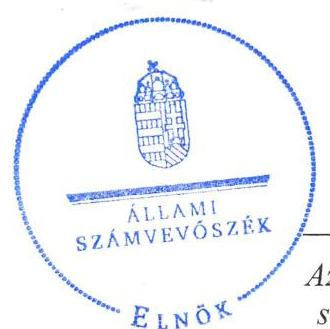

16174
www.asz.hu

---

# AZ ELLENŐRZÉST FELÜGYELTE:

DR. HORVÁTH MARGIT felügyeleti vezető

## AZ ELLENŐRZÉST VEZETTE ÉS A VÉGREHAJTÁSÁÉRT FELELŐS:

- KLINGA LÁSZLÓ ellenőrzésvezető
- A PROGRAM ÖSSZEÁLLÍTÁSÁÉRT FELELŐS:
- JANIK JÓZSEF osztályvezető

|  IKTATÓSZÁM: V-1018-127/2016. | |
| --- | --- |
|  TÉMASZÁM: 2052 | |
|  ELLENŐRZÉS-AZONOSÍTÓ SZÁM: V-070730 | |

Jelentéseink az Országgyűlés számítógépes hálózatán és az Interneta a www.asz.hu címen is olvashatóak.

---

# TARTALOMJEGYZÉK 

■ ÖSSZEGZÉS ..... 5
■ AZ ELLENŐRZÉS CÉLJA ..... 7
■ AZ ELLENŐRZÉS TERÜLETE ..... 8
■ AZ ELLENŐRZÉS HÁTTERE, INDOKOLTSÁGA ..... 10
■ A JELENTÉS LÉNYEGES KÉRDÉSKÖREI ..... 11
■ ELLENŐRZÉS HATÓKÖRE ÉS MÓDSZEREI ..... 12
■ MEGÁLLAPÍTÁSOK ..... 14
■ JAVASLATOK ..... 27
■ MELLÉKLETEK ..... 29
I. Sz. melléklet: Értelmező szótár ..... 29
II. Sz. melléklet: Múködési adatok ..... 32
III. Sz. melléklet: A lakossági hulladékgazdálkodási díj alakulása 2011-2014 között ..... 33
IV. Sz. melléklet: Mintavételi eljárások ellenőrzési területenként ..... 34
■ FÜGGELÉK: ÉSZREVÉTELEK ..... 35
■ RÖVIDÍTÉSEK JEGYZÉKE ..... 43

---

.

---

# ÖSSZEGZÉS 

Az Állami Számvevőszék a kizárólagos önkormányzati tulajdonú Kisújszállási Városgazdálkodási Nonprofit Kft.-nél a hulladékgazdálkodási közfeladat ellátását érintő gazdálkodási tevékenység 2011-2014 közötti szabályszerűségét ellenőrizte. Megállapította, hogy a közfel-adat-ellátás önkormányzati megszervezése és a tulajdonosi jogok gyakorlása szabályosan történt. A szabályszerű vagyongazdálkodás biztosítása mellett a hulladékgazdálkodás közfeladata bevételeinek és ráfordításainak elszámolása megfelelő volt. A hátralékos követelésállomány kezelése során nem érvényesültek a behajtásra vonatkozó jogszabályok előírásai. A megnövekedett kötelezettségállomány a müködésre és a közfeladat-ellátásra kockázatot jelentett. Az önköltségszámítás szabályait meghatározták, az árképzés szabályszerűen történt.

## Az ellenőrzés társadalmi indokoltsága

Az Állami Számvevőszék stratégiájában megfogalmazta, hogy a helyi önkormányzatok gazdálkodásában rejlő pénzügyi kockázatok feltárásával, az államháztartáson kívülre nyújtott költségvetési támogatások és ingyenes vagyonjuttatások, valamint az államháztartáson kívül működő közfeladat-ellátó rendszerek ellenőrzéseivel hozzájárul ahhoz, hogy a közpénzeket az államháztartáson kívül működő szervezetek is átlátható, rendezett módon használják fel a közfeladatok szerződésben vállalt ellátása érdekében.

Magyarországon az intézmény-centrikus közfeladat-ellátás jellemző, de egyre jelentősebb a költségvetésen kívüli feladatellátás térnyerése. Ennek legfontosabb szereplői - a nonprofit szervezetek mellett - az önkormányzati tulajdonú gazdasági társaságok. Az önkormányzatok szervezetalakítási szabadságának következménye, hogy a korábban is vállalati formában működő közszolgáltatások mellett, mind a kötelező, mind az önként vállalt feladatok ellátásában a gazdasági társaságok kiemelt fontosságú szerephez jutottak.

## Főbb megállapítások, következtetések, javaslatok

Az Önkormányzat a hulladékgazdálkodás közfeladatának megszervezéséről a jogszabályi előírásoknak megfelelően döntött, annak ellátásáról a kizárólagos tulajdonában lévő gazdasági társasága útján gondoskodott. Az Önkormányzat a Hgt. ${ }_{1,2}$ szerinti hulladékgazdálkodással összefüggő rendeletalkotási kötelezettségének eleget tett, annak tartalma megfelelt az előírásoknak. Az Önkormányzat a hulladékgazdálkodási közszolgáltatás ellátására az ellenőrzött időszakban Közszolgáltatási szerződés ${ }_{1,2}$-t kötött. A Közszolgáltatási szerződés ${ }_{1}$ nem tartalmazta a díj megállapítására vonatkozó módszer leírását, a Közszolgáltatási szerződés a behajtás NAV-nál történő kezdeményezését nem kötelezettségként, hanem lehetőségként fogalmazta meg. Az Önkormányzat a Hgt. ${ }_{1}$ előírása ellenére hulladékgazdálkodási tervet a 2011-2012. évekre nem dolgozott ki, 2013-tól a közszolgáltató feladata volt a hulladékgazdálkodási terv készítésének kötelezettsége, amelynek eleget tett.

A Képviselő-testület a vagyongazdálkodási rendelet ${ }_{1,2}$-ben, valamint az Alapító Okiratban egymással összhangban meghatározta a tulajdonosi joggyakorlás szabályait, amelyet az előírásoknak megfelelően, szabályszerűen gyakorolt. Az Önkormányzat a feladatellátáshoz szükséges vagyont az ellenőrzött időszakot megelőzően apportként és üzemeltetési szerződés útján bocsátotta a Kisújszállási Városgazdálkodási NKft. rendelkezésére. A tulajdonosi joggyakorló Képviselő-testület a beszámoltatási kötelezettségét megfelelően, szabályszerűen gyakorolta.

A közfeladat-ellátását szolgáló vagyonnal való gazdálkodás, annak nyilvántartása szabályszerű volt, a Társaság rendelkezett a Számv. tv. előírásainak megfelelő számviteli szabályzatokkal, amelyek elősegítették a szabályszerű működést. Hiányosság volt, hogy a számlarend ${ }_{3}$ nem tartalmazta a számlák értéke változásainak jogcímeit, a számlákat

---

érintő gazdaság eseményeket, azok más számlákkal való kapcsolatát, a számviteli politika ${ }_{1-4}$ nem tartalmazta az értékcsökkenési leírás módjának, mértékének, és az elszámolás gyakoriságának meghatározását, továbbá a leltározási szabályzatban nem írták elő a tárgyi eszközök mennyiségi leltárfelvételének gyakoriságát. A Társaság vagyona 2011. január 1-jéről 2014. év végére 1105,0 millió Ft-ra, több mint 15-szeresére nőtt a belvíz- és csapadékvíz elvezető rendszer vagyonkezelésbe vétele miatt. Ennek következtében a hosszú lejáratú kötelezettségek összege 996,3 millió Fttal növekedett, ami a Társaság likviditási helyzetét nem befolyásolta, de a tőkeszerkezetére, így közvetetten a múködésre és a közfeladat-ellátásra kockázatot jelentett. A Társaság a 2011-2013. években nyereségesen gazdálkodott, a 2014. évben 6,3 millió Ft veszteséget mutatott ki. A vagyonkezelésbe átvett eszközök után elszámolt értékcsökkenés összege az eredményre negatív hatással volt. Az ellenőrzött időszakban a tárgyi eszközöket egyeztetéssel leltározták, a Számv. tv.-ben előírtak ellenére mennyiségi leltározást nem végeztek. A Kisújszállási Városgazdálkodási NKft. a 2011-2012. években, figyelmen kívül hagyva a Hgt. ${ }_{1,2}$-ben előírt kötelezettségét, közszolgáltatási díjhátralékos ügyet nem adott át az Önkormányzat jegyzőjének, a 2013-2014. években pedig a NAV-nak behajtásra. A lejárt kintlévőségek behajtására a Társaság szabálytalanul három behajtó céggel kötött határozatlan idejű szerződést. Egyes közbeszerzési eljárásokat a jogszabályi előírások ellenére nem folytattak le.

A Kisújszállási Városgazdálkodási NKft. az üzleti tervek teljesítéséről, az éves gazdálkodásról, azon belül a hulladékgazdálkodás közfeladatáról az éves beszámolók keretében számolt be a tulajdonos felé a Számv. tv.-ben és a Közszolgáltatási szerződés ${ }_{1,2}$-ben előírtaknak megfelelően. A Társaság az Avtv.-ben, illetve 2012-től az Info tv.-ben előírtak ellenére adatvédelmi és adatbiztonsági szabályzatot nem készített, adatvédelmi felelőst nem nevezett ki. A közérdekú adatok közzétételére vonatkozó adatokat nem teljes körűen tette közzé, annak rendjét rögzítő szabályzattal nem rendelkezett. A Társaságnál a bevételek, költségek és ráfordítások elszámolása megfelelő volt, figyelembe vették a jogszabályok és a belső szabályozás előírásait. Az önköltségszámítás szabályozása megfelelő az előírásoknak, amely alapján az alkalmazott módszer biztosította a közszolgáltatás dijának megalapozottságát és a szabályszerű árképzést.

---

# AZ ELLENŐRZÉS CÉLJA 

Az ellenőrzés célja annak értékelése, hogy az Önkormányzat a jogszabályi előírások figyelembevételével döntött-e az ellenőrzésre kerülő közfeladat megszervezéséről; az önkormányzat/tulajdonosi joggyakorló szabályszerűen gyakorolta-e a tulajdonosi jogokat.

Ellenőriztük, hogy a gazdasági társaság közfeladat-ellátása bevételeinek, ráfordításainak elszámolása, és vagyongazdálkodási tevékenysége megfelelt-e a jog-szabályi, illetve a közszolgáltatási/vagyonkezelési szerződésben foglalt tulajdonosi előírásoknak, azok végrehajtása szabályszerű volt-e.

Értékeltük továbbá, hogy a gazdasági társaság kötelezettségállománya jelent-e kockázatot a múködésre, illetve a közfeladat ellátására; valamint hogy a közfeladatok átláthatósága és elszámoltathatósága érdekében biztosítva volt-e a közszolgáltatás dijának megalapozottsága szabályszerű önköltségszámítással.

---

# AZ ELLENŐRZÉS TERÜLETE 

## Kisújszállás Város Önkormányzata és a kizárólagos tulajdonában lévő Kisújszállási Városgazdálkodási Nonprofit Kft.

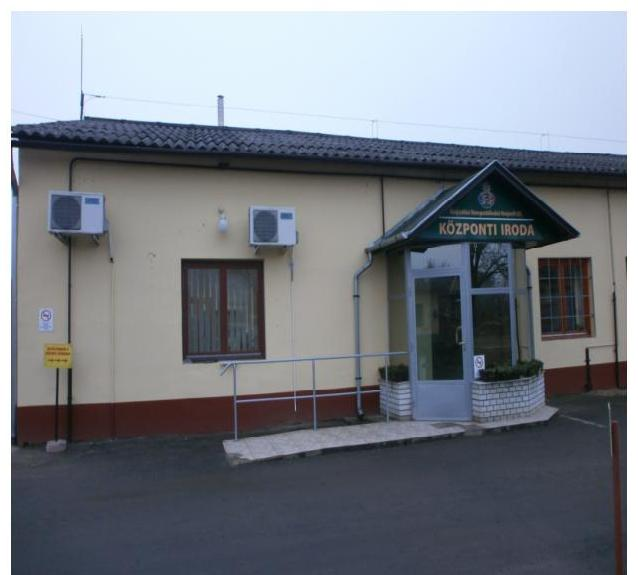

## KISÚJSZÁLLÁS VÁROS ÖNKORMÁNY-

ZATA a 100 \%-os tulajdonában lévő Kisújszállási Városgazdálkodási Kft.-t 2003-ban hozta létre, amelynek jogelődje a Városgazdálkodási Vállalat volt. A Képviselő-testület a 2013. november 20-án kelt határozatával döntött a Kisújszállási Városgazdálkodási Kft. nonprofit társasággá történő átalakításáról, így annak elnevezése Kisújszállási Városgazdálkodási Nonprofit Kft.-re változott. A Kisújszállási Városgazdálkodási Nonprofit Kft. jegyzett tőkéje 2011. december 31-én 27,4 millió Ft majd a 2014. évben nonprofit gazdasági társasággá történő átalakulással végrehajtott tulajdonosi tőkeemelést követően, 2014. december 31-én 39,8 millió Ft volt. Az Önkormányzat a hulladékgazdálkodási közfeladat ellátásához vagyonkezelésbe nem adott át eszközöket a Társaság részére.

## A KISÚJSZÁLLÁSI VÁROSGAZDÁLKO-

DÁSI NONPROFIT KFT. főtevékenysége a nem veszélyes hulladék, azon belül a lakossági kommunális hulladék gyűjtése, szállítása, kezelése, ártalmatlanítása volt. A Kisújszállási Városgazdálkodási Nonprofit Kft. a hulladékgazdálkodási közszolgáltatást a 2014. január 1-jén 11383 fő lakosságszámú Kisújszállás város, továbbá Kenderes város közigazgatási területén végezte az ellenőrzött időszakban. A Társaság a hulladékgazdálkodási közfeladaton kívül más feladatokat is ellátott, így önkormányzati ingatlanok bérbeadását, kezelését, társasházkezelést, építőipari tevékenységet, park- és köztisztasági, gyepmesteri feladatokat, hó- és síkosság mentesítést, piaccsarnok és piactér üzemeltetést. Feladatát képezte 2013. január 15-étől a városi bel- és csapadékvíz elvezetési hálózat kezelése és üzemeltetése, amelyre az Önkormányzattal vagyonkezelési szerződést kötöttek.

A Kisújszállási Városgazdálkodási Nonprofit Kft. által a közszolgáltatással érintett lakások száma 2014-ben Kisújszálláson 4091 db, Kenderesen 1565 db, a közszolgáltatással érintett közületek száma Kisújszálláson 231 db, Kenderesen 65 db volt. A begyűjtött hulladék mennyisége az ellenőrzött időszakban Kisújszálláson 8924200 kg , Kenderes településen 2704600 kg volt. A Társaság más gazdasági társaságban tulajdoni hányaddal nem rendelkezett, átlagos statisztikai létszáma 2011. december 31-én 30 fő, 2014. december 31-én 34 fő volt.

A Kisújszállási Városgazdálkodási Nonprofit Kft. gazdálkodásának egyes adatait 2011. és 2014. évek vonatkozásában az 1. ábra szemlélteti.

---

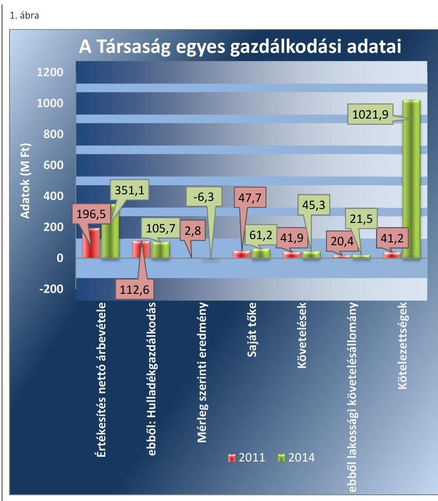

Forrás: A Társaság 2011.és 2014. évi beszámolói, tanúsítványok
A Társaság mérlegfőösszege 2011-ben 71,5 millió Ft, 2014-ben 1105,0 millió Ft volt, több mint 15 -szeresére növekedett a vagyonkezelésbe vett eszközök nyilvántartásba vételét követően. A Társaság éves nettó árbevétele az ellenőrzött időszakban 78,7\%-al emelkedett, a hulladékgazdálkodás nettó árbevétele 6,1\%-al csökkent. A 2011-2013. években a mérleg szerinti eredmény pozitív, a 2014. évben negatív volt. A saját tőke az ellenőrzött időszakban 28,3\%-al, a lakossági követelésállomány pedig 5,4\%-al növekedett. A kötelezettségállomány értéke 2014 végére közel 1 milliárd Ft-tal emelkedett a 2013. évben elkészült bel- és csapadékvíz elvezetési hálózat vagyonkezelésbe vételét követően. A Kisújszállási Városgazdálkodási Nonprofit Kft. múködésének főbb jellemzőit a 2. számú melléklet mutatja be.

Az ellenőrzött időszakban a polgármester és a jegyző személye nem változott, a polgármester a 2006. évi önkormányzati választások óta tölti be tisztségét, a jegyző 2011. szeptember 1-jétől látja el feladatait. Az ellenőrzött időszakban az ügyvezető személye két alkalommal változott, az ügyvezető 2011. április 1-jétől tölti be tisztségét.

---

# AZ ELLENŐRZÉS HÁTTERE, INDOKOLTSÁGA 

Az önkormányzatok közfeladat-ellátásában egyre jelentősebb a gazdasági társaságok útján történő feladatellátás térnyerése.

AZ ÖNKORMÁNYZATI TULAJDONÚ GAZDASÁGI TÁRSASÁGOK teljes körű ellenőrzésének lehetőségét az Állami Számvevőszékről szóló 1989. évi XXXVIII. törvény 2011. január 1-jétől hatályos módosítása teremtette meg. A gazdasági társaságok közfeladat ellátását érintő gazdálkodási tevékenysége szabályszerűségére irányuló ellenőrzéseket erre tekintettel a 2011. évtől végezzük. A közfeladatot ellátó gazdasági társaságok ellenőrzése kiemelten fontos a vagyon megőrzése, megóvása érdekében, valamint a kormányzati szektor elszámolásaiban megjelenő önkormányzati tulajdonú gazdálkodó szervezetek esetében, amelyekkel szemben alapvető követelmény, hogy gazdálkodásuk, működésük szabályszerű, az általuk szolgáltatott adatok minél megbízhatóbbak legyenek. A közfeladat ellátás költségeinek, ráfordításainak alakulása, színvonala hatással van a lakosság elégedettségére.

## AZ ELLENŐRZÉS VÁRHATÓ HASZNOSULÁSA-

KÉNT az ÁSZ ${ }^{1}$ a megállapításaival segítséget nyújthat az államháztartáson kívüli közfeladat-ellátás értékeléséhez, jogszabályi keretei pontosításához, átláthatóságot biztosító szabályozásához. Meghatározhatóvá válnak a közfeladat ellátásban részt vevő államháztartáson kívüli szervezeteknek az önkormányzat költségvetését, pénzügyi helyzetét is befolyásoló - kockázatai, lehetővé válik ezen kockázatok csökkentése. Ellenőrzéseink feltárhatják, hogy az önkormányzat közfeladat ellátási kötelezettségének szabályszerűen tett-e eleget, a feladatellátáshoz rendelt közvagyon működtetését a tulajdonostól elvárható gondossággal, szabályszerűen szervezte-e meg és a tulajdonosi felügyelete hozzájárult-e a közfeladat szabályszerű ellátásához. Értékelhetővé válik, hogy a feladatot ellátó gazdasági társaság a közszolgáltatási szerződésben foglaltak betartásával, a közvagyon használatával biztosította-e a szolgáltatás folytatásának feltételeit. Ezzel az ellenőrzöttek és a helyi döntéshozók számára az ÁSZ visszajelzést ad feladatszervezési, feladat-ellátási kockázataikról, alapot ad a meglévő hibák megszüntetéséhez, a jobb közfeladat-ellátás biztosításához. Mindezeken keresztül az ÁSZ hozzájárul Magyarország közpénzügyi helyzetének javításához, a közpénzek mérhető módon történő, a döntéshozók által meghatározott célok szerinti felhasználásához.

---

# A JELENTÉS LÉNYEGES KÉRDÉSKÖREI 

1. Az önkormányzat közfeladat megszervezéséről szóló döntése, valamint tulajdonosi joggyakorlása szabályszerű volt-e?
2. A gazdasági társaság vagyongazdálkodása szabályszerű volt-e, kötelezettségállománya jelentett-e kockázatot a müködésre, illetve a közfeladat ellátásra?
3. A gazdasági társaságnál az ellátott közfeladat bevételei és ráfordításai elszámolása, valamint az önköltségszámítás és árképzés szabályszerű volt-e?

---

# ELLENŐRZÉS HATÓKÖRE ÉS MÓDSZEREI 

## Az ellenőrzés típusa

Megfelelőségi ellenőrzés

## Az ellenőrzött időszak

A 2011. január 1-jétől 2014. december 31-éig terjedő időszak.

## Az ellenőrzés tárgya

A közfeladatot gazdasági társaságokkal ellátó önkormányzatok tulajdonosi joggyakorlása, valamint gazdasági társaságok pénz- és vagyongazdálkodásának szabályozottsága és szabályszerűsége.

Az ellenőrzés kiterjed minden olyan körülményre és adatra, amely az ÁSZ jogszabályban meghatározott feladatainak teljesítéséhez, valamint a program végrehajtása folyamán felmerült újabb összefüggések feltárásához szükséges.

## Az ellenőrzött szervezet

Kisújszállás Város Önkormányzata és a Kisújszállási Városgazdálkodási Nonprofit Korlátolt Felelősségű Társaság

## Az ellenőrzés jogalapja

Az ellenőrzés végrehajtásának jogszabályi alapját az Állami Számvevőszékről szóló 2011. évi LXVI. törvény 5. § (3)-(4)-(5) bekezdései képezték.

## Az ellenőrzés módszerei

Az ellenőrzést a nemzetközi standardokat irányadónak tekintve az ellenőrzési program ellenőrzési kérdései, az ellenőrzött időszakban hatályos jogszabályok, az ellenőrzés szakmai szabályok és módszertanok figyelembe vételével végeztük.

Az ellenőrzés ideje alatt az ellenőrzött szervezettel történő kapcsolattartást az ÁSZ Szervezeti és Müködési Szabályzatának vonatkozó előírásai alapján biztosítottuk.

---

Az ellenőrzés a kiválasztott, többségi tulajdonosi jogokat gyakorló önkormányzatra, illetve az ellenőrzött közfeladatot ellátó gazdasági társaságra terjedt ki. Az ellenőrzött gazdasági társaságnál, amennyiben az több közfeladatot is ellát, akkor az ellenőrzésre kiválasztott közfeladat-ellátást ellenőriztük.

Az ellenőrzést a kérdésekre adott válaszok kiértékelésével, valamint a megjelölt adatforrások, a csatolt tanúsítványok felhasználásával, továbbá az adott időszakban hatályos jogszabályok figyelembe vételével folytattuk le. Az ellenőrzési kérdések megválaszolásához szükséges bizonyítékok megszerzése a következő ellenőrzési eljárások alkalmazásával történt: megfigyelés, kérdésfeltevés (információkérés), összehasonlítás, valamint elemző eljárás.

A bevételek és ráfordítások elszámolását véletlen mintavétellel, a vagyonnyilvántartás terén a beruházások és felújítások elszámolását teljes körűen ellenőriztük. A mintavétellel ellenőrzött területek esetében minden egyes tétel vonatkozásában a szabályszerűségre vonatkozó kérdéseket tettünk fel, amelyek eredménye összesítésre került. Megfelelőnek értékeltünk egy ellenőrzött területet, amennyiben 95\%-os bizonyossággal a teljes sokaságban a hibaarány legfeljebb 10\%, nem megfelelőnek, amenynyiben 10\%-nál magasabb arányt képviselt. Abban az esetben, ha a teljes sokaság tekintetében a 10\%-os hibaarányhoz való viszony megítélésnek megbízhatósága nem érte el a 95\%-ot, annak elérése érdekében értékelésünket további szempontokkal egészítettük ki, és figyelembe vettük a feltárt hibák típusát és súlyát. A ráfordítások elszámolására vonatkozó véletlen mintavételt kockázati alapú kiválasztással egészítettük ki, amelynek során évente a három legnagyobb összegű tételt választottuk ki. A mintavételi eljárások ellenőrzési területenként történő bemutatását a IV. számú melléklet tartalmazza.

---

# 1. Az önkormányzat közfeladat megszervezéséről szóló döntése, valamint tulajdonosi joggyakorlása szabályszerű volt-e? 

Összegző megállapítás

Az Önkormányzat a jogszabályok és a helyi szabályok betartásával szervezte meg a hulladékgazdálkodást, a tulajdonosi jogait szabályszerűen gyakorolta.

### 1.1. számú megállapítás

A közfeladat-ellátást az Önkormányzat szabályszerűen szervezte meg, a hulladékgazdálkodással összefüggő rendeletalkotási kötelezettségének eleget tett. A 2011-2012. években az Önkormányzat hulladékgazdálkodási tervvel nem rendelkezett.

Az Önkormányzat² megalkotta az Ötv³. 91. § (1) bekezdésében, majd 2013. január 1-től az Mötv4. 116. § (1) bekezdésében előírt, a 2010-2014. évekre szóló Gazdasági Programját. Az Önkormányzat a Gazdasági Programban az Ötv. 91. § (6) bekezdésében és az Mötv. 116. § (3)-(4) bekezdésében előírtak alapján meghatározta mindazokat a célkitűzéseket, amelyek az ellátott feladat biztosítását, színvonalának javítását szolgálják. A Gazdasági Program a hulladékgazdálkodással összefüggésben - többek között - tartalmazta a hulladéklerakók rekultivációját, a hulladéklerakó inert hulladéklerakóként és komposztálóként történő működését, kijelölték a szelektív hulladéklerakókat, a szelektív hulladékgyűjtő szigeteket, szabályozták a hulladékudvar üzemeltetését, és döntöttek az illegális hulladéklerakók felszámolásáról.

Az Önkormányzat a 2011-2012. évekre a Hgt. ${ }_{1}{ }^{5}$ 35. §. (1) bekezdésében előírtak ellenére hulladékgazdálkodási tervvel nem rendelkezett. A jegyző ${ }^{6}$ a hulladékgazdálkodási terv hiányára a Képviselő-testület figyelmét nem hívta fel a 2011-2012. években.

A Hgt. ${ }_{2}{ }^{7}$ 78. § (1) bekezdésében foglaltak alapján - 2013. január 1-jétől - a hulladékgazdálkodási tervet a közszolgáltatónak kellett elkészíteni. A Társaság ${ }^{8}$ a 2013-2015. évekre vonatkozóan elkészítette a hulladékgazdálkodási tervet, amelyet az Országos Környezetvédelmi, Természetvédelmi és Vízügyi Felügyelőség - 2013. június 27-én - határozatával jóváhagyott.

Az Önkormányzat az Nvtv ${ }^{9}$. 9. § (1) bekezdésének megfelelően elkészítette a közép- és hosszú távú vagyongazdálkodási tervét, amelyben meghatározta, hogy a közszolgáltatások ellátására kiemelt figyelmet fordít.

Az ellátandó feladatok körének, a közfeladat-ellátás követelményeinek meghatározása az Alapító Okiratban ${ }^{10}$, a Közszolgáltatási szerződésben ${ }_{1}{ }^{11} \_^{12}$ és a 2011-2012. években a gazdasági társaságok működésének szabályozását érintő követelményrendszer kidolgozásával történt.

Az Önkormányzat a 2011-2012. években a tulajdonában álló gazdasági társaságokra a működés szabályozására vonatkozó követelményrendszert

---

állított fel, amelyben előírta - többek között - az évente egyszeri beszámolási kötelezettséget, az üzleti terv készítési kötelezettséget, a bértömeg meghatározását.

A KÖZSZOLGÁLTATÁSI SZERZŐDÉS ${ }_{1,2}$ tartalmazta a hulladékgazdálkodási közfeladat ellátásának feltételeit. A Közszolgáltatási szerződés ${ }_{1}$ a 224/2004. (VII. 22.) Korm. rendelet ${ }^{13}$ 11-16. §. előírásainak részben felelt meg. A Közszolgáltatási szerződés ${ }_{1}$ nem tartalmazta a díj megállapítására vonatkozó módszer leírását a 224/2004. (VII. 22.) Korm. rendelet 13. § (3) bekezdésének előírása ellenére. A Közszolgáltatási szerződés ${ }_{2}$ megfelelt a 317/2013. (VIII. 28.) Korm. rendelet ${ }^{14} 4 . \S$ (1)-(3) bekezdésében foglaltaknak.

A Közszolgáltatási szerződés ${ }_{2}$ követelés behajtásra vonatkozó előírása nem felelt meg a Hgt. 2 52. § (3) bekezdésében előírtaknak, mivel az a behajtás NAV -nál történő kezdeményezését nem kötelezettségként, hanem lehetőségként írta elő a Társaság részére.

# A HULLADÉKGAZDÁLKODÁSI RENDELE- 

$\mathbf{T E T}_{1}{ }^{15}, \mathbf{2}^{16}$ az Önkormányzat a Hgt. ${ }_{1}$ 23. §-ban és a Hgt. ${ }_{2}$ 35. §-ban előírtak szerint szabályszerűen megalkotta, abban rendelkezett a jogszabályi változásoknak megfelelően a hulladékgazdálkodási közszolgáltatás végrehajtásáról. A hulladékgazdálkodási rendeletet ${ }_{1}$ három alkalommal a dijváltozásoknak megfelelően, a hulladékgazdálkodási rendeletet ${ }_{2}$ szintén három alkalommal, a közfeladat ellátásban történő változásoknak (ellátási területek gyűjtőjárat szerinti besorolásának változása, Kisújszállási Városgazdálkodási NKft. ${ }^{17}$ nonprofit átalakulása miatti cégnév-változás, a lomtalanítás gyakoriságának változása) megfelelően módosították.

A Társaság által üzemeltetett hulladékudvar az Önkormányzat tulajdonát képezte. Az üzemeltetési szerződés alapján az Önkormányzat az ellenőrzött időszakban évente hozzájárult a hulladékudvar üzemeltetési költségeihez, a hozzájárulás összege a 2011-2014. években 2,8 millió $\mathrm{Ft}+\mathrm{ÁFA}^{18}$ volt. Az üzemeltetésbe átvett további eszközök után, amelyek szintén az Önkormányzat tulajdonában voltak, a Kisújszállási Városgazdálkodási NKft. az Önkormányzattal kötött üzemeltetési szerződés alapján a 2011. évben 3,0 millió Ft, a 2012. évben 5,0 millió Ft eszközhasználati díjat fizetett. Az üzemeltetési szerződésben nem írtak elő az üzemeltetett vagyonra vonatkozóan leltározási, adatszolgáltatási kötelezettséget, ennek ellenére az Önkormányzat és a Társaság között a leltáregyeztetéseket minden évben elvégezték.

## 1.2. számú megállapítás

A tulajdonosi jogok gyakorlása szabályszerű volt. Az FB rendelkezett ügyrenddel, a javadalmazással összefüggő szabályokat meghatározták.

A TULAJ DONOSI JOGOK gyakorlásának rendjét a vagyongazdálkodási rendelettel ${ }_{1}{ }^{19}{ }_{2}{ }^{20}$ összhangban az Alapító Okiratban rögzítették.

Az Alapító Okirat tartalmazta a Gt. ${ }^{21}$ 168. § (1) bekezdésének, illetve a $\mathrm{Ptk}^{22}$; 3:188. § (2) bekezdésének figyelembe vételével az alapító Önkormányzat kizárólagos jogköreit. Így az Önkormányzat döntési jogkörébe tartozott az éves egyszerűsített beszámoló jóváhagyása, a nyereség felosztásáról való döntés, az ügyvezető, az FB tagok, és a könyvvizsgáló megválasz-

---

tása, kinevezése, díjazásuk megállapítása. Az ügyvezető feladatkörébe tartozott az Alapító Okirat, a Gt. 149. §-a és a Ptk: 3:196. §-a alapján mindazon feladat elvégzése, amelyek nem az Önkormányzat kizárólagos hatáskörébe tartozott. A Kisújszállási Városgazdálkodási NKft. Alapító Okirata összhangban volt a vagyongazdálkodási rendeletben ${ }_{1,2}$ előírtakkal.

AZ FB a Gt. 34. § (1) bekezdésében, valamint a Ptk. 3 :121. § (1) bekezdésében előírtakat figyelembe véve három tagból állt. Az FB feladatát képezte az Alapító Okirat alapján a Gt. 33. § (1), és a 35. § (3), illetve a Ptk: 3:120. § (1)- (2) bekezdéseinek figyelembe vételével valamennyi üzletpolitikai jelentés, előterjesztés (pl. üzleti tervek, egyszerűsített éves beszámolók) felülvizsgálata. Az FB a Gt. 35. § (3) bekezdésének, illetve a Ptk. 3 :120. § (2) bekezdésének megfelelően minden évben írásbeli jelentést készített a Társaság számviteli beszámolójáról. Az FB a 2011-2014. években a Gt. 34. § (4) bekezdésében, illetve a Ptk. 3 :122. § (3) bekezdésében foglaltak szerint rendelkezett ügyrenddel.

# AZ ANYAGI ÖSZTÖNZÉSI, ÉRDEKELTSÉGI RENDSZERT a Taktv. ${ }^{23}$ 5. § (3) bekezdésében foglaltaknak megfelelően a Kép-viselő-testület által elfogadott Javadalmazási szabályzat ${ }_{1}{ }^{24} 3^{25}$-ban rögzítették. A Javadalmazási szabályzat ${ }_{1,2}$ tartalmazta az ügyvezető és az FB tagok javadalmazási érdekeltségi rendszerét a Taktv. 6. § (2)-(3) bekezdéseiben előírtak figyelembe vételével. 

AZ ÁRKÉPZÉS SZABÁLYAINAK az Önkormányzat csak részben tett eleget a 2011-2012. években, mivel a 64/2008. (III.28) Korm. rendelet ${ }^{26}$ 2. § (3) bekezdésében foglaltakat figyelmen kívül hagyva a díjszámítás módszertanát és a díjképlet elemeit részletesen nem határozták meg és nem tették közzé. A közszolgáltatás díjai a 64/2008. (III. 2.) Korm. rendelet 3. § és 4. §-aiban foglaltaknak megfeleltek, és a Hgt. ${ }_{1}$ 57. §-ában, illetve a Hgt. 2 91. §-ában meghatározott maximális mértéket nem haladták meg. 2013. január 1-jétől a hulladékgazdálkodási díjat a MEKH ${ }^{27}$ javaslatának figyelembe vételével a miniszter* rendeletben állapítja meg. Az Önkormányzat ármegállapító jogköre 2013. január 1-jétől megszűnt.

A BESZÁMOLTATÁSI RENDSZER keretében a Közszolgáltatási szerződés ${ }_{1,2}$ és a 2011-2012. évi múködés szabályozására vonatkozó követelményrendszer előírta a Kisújszállási Városgazdálkodási NKft. évente egyszeri, a közszolgáltatási szerződés teljesítéséről szóló beszámolási kötelezettséget. A Társaság 2011-2014. évi éves szakmai és számviteli beszámolóit - az FB előzetes írásbeli véleményezését követően - a Képviselőtestület a Gt. 35. § (3) bekezdésének, illetve a Ptk. 2 3:120. § (2) bekezdésében előírtaknak megfelelően elfogadta. Az Önkormányzat üzleti terv készítési kötelezettséget a Társaság részére a 2011-2012. években írt elő, azonban a Társaság minden évben elkészítette üzleti terveit, amelyek elfogadásáról a Képviselő-testület minden évben döntött.

[^0]
[^0]:    * Nemzeti Fejlesztési Miniszter

---

A TÁRSASÁG ELLENŐRZÉSÉT az Önkormányzat belső ellenőrzése végezte. Az ellenőrzött időszakban az Önkormányzat egy alkalommal, a 2011. évben végeztetett soron kívüli belső ellenőrzést a Kisújszállási Városgazdálkodási NKft. gazdálkodásának szabályossága tekintetében. Az ellenőrzés tárgya a Társaság 2008-2010. évi pénzügyi-gazdasági tevékenységének értékelése volt. Az ellenőrzés által megállapított hiányosságok megszüntetése érdekében javaslatot tett - többek között - az ellátott feladatok eredményességének áttekinthetősége, a szabályzatok aktualizálása, a menetlevelek vezetése, a pénzügyi helyzet javítására vonatkozó intézkedések hiánya tekintetében. A Társaság a feltárt hiányosságok megszüntetése érdekében intézkedési tervet készített, amit a Képviselő-testület elfogadott. A hiányosságok felszámolásával kapcsolatos intézkedések nyomon követése az Önkormányzat részéről a Kisújszállási Városgazdálkodási NKft. éves beszámolásakor megvalósult.

A saját tőke, a jegyzett tőke, valamint a mérleg szerinti eredmény alakulását a 2. ábra mutatja be.
2. ábra
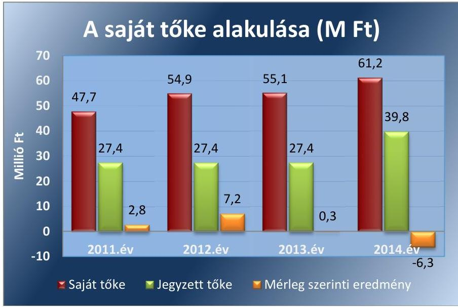

Forrás: 3. számú tanúsítvány, egyszerúsített éves beszámolók
A Kisújszállási Városgazdálkodási NKft. mérleg szerinti eredménye a 2011-2013. években pozitív volt, a 2014. évben veszteséget realizáltak. Az eredmény eredménytartalékba történő helyezéséről a 2011-2013. években a Képviselő-testület döntött. A saját tőke minden ellenőrzött évben meghaladta a jegyzett tőkét, ezért a Gt. 143. § (2) bekezdés a) pontja, illetve a Ptk. 3 :189. § (2) bekezdése szerinti intézkedés megtétele nem vált szükségessé. A saját tőke jegyzett tőke aránya a 2011. évről a 2014. évre 174,12\%-ról 153,87\%-ra csökkent.

Az ellenőrzött időszakban a közfeladat ellátásához kapcsolódóan az Önkormányzat részéről garancia vagy kezességvállalás nem történt a Kisújszállási Városgazdálkodási NKft. részére. Az Önkormányzatnak a Társasággal kapcsolatos mérlegen kívüli kötelezettsége nem volt.

---

# 2. A gazdasági társaság vagyongazdálkodása szabályszerű volt-e, kötelezettségállománya jelentett-e kockázatot a múködésre, illetve a közfeladat ellátásra? 

Összegző megállapítás

A Társaság vagyongazdálkodása szabályszerű volt. A kötelezettségek állománya a Társaság likviditási helyzetét nem befolyásolta, de kockázatot jelentett a tőkeszerkezetére, így közvetetten a múködésére és a közfeladat ellátására is.
2.1. számú megállapítás

A Társaság az előírt számviteli szabályzatokkal rendelkezett, azonban azokban nem rögzítették a közfeladat ellátás elkülönített nyilvántartásának szabályait.

ÜZLETI TERV KÉSZÍTÉSI kötelezettséget, annak elkészítése határidejének megjelölésével - ami a gazdasági év március 31. napja volt - az Önkormányzat a 2011-2012. évekre vonatkozóan fogalmazott meg. A 2013-2014. évekre üzleti terv készítési kötelezettséget az Önkormányzat nem írt elő. A Kisújszállási Városgazdálkodási NKft. az ellenőrzött időszakban az éves üzleti terveket elkészítette. Az üzleti terveket az FB javaslata alapján a Képviselő-testület jóváhagyta.

A Kisújszállási Városgazdálkodási NKft. rendelkezett a Számv. tv. ${ }^{28} 14$. § (3) bekezdésében előírt számviteli politikával, valamint a Számv. tv. 14. § (5) bekezdés a)-d) pontjában foglaltaknak megfelelően az eszközök és források leltárkészítési és leltározási szabályzatával, az eszközök és források értékelési szabályzatával, önköltségszámítási szabályzattal, valamint pénzkezelési szabályzattal. Rendelkezett továbbá selejtezési szabályzattal.

A Kisújszállási Városgazdálkodási NKft. 2011. január 1-jétől 2011. június 30 -áig a Számv. tv. 161. § (1) bekezdésében előírtak ellenére nem rendelkezett számlarenddel ${ }^{29}$. A számlarend ${ }_{1}$ nem tartalmazta a Számv. tv 161. § (2) bekezdés b)-c) pontjaiban előírtakat.

A számlarend ${ }_{3}$ nem tartalmazta a Számv. tv. 161. § (2) bekezdés b) pontjában előírtak ellenére a számlák értéke növekedésének, csökkenésének jogcímeit, a számlákat érintő gazdasági eseményeket, azok más számlákkal való kapcsolatát.

A Társaság az ellenőrzött időszakban rendelkezett bizonylati szabály-zat ${ }_{1-4}{ }^{30}$-tal, amely megfelelt a Számv. tv. 161. § (2) bekezdés d) pontjában előírtaknak.

A SZÁMVITELI POLITIKA ${ }_{1-4}{ }^{31}$ a Számv. tv 14. § (4) bekezdésben előírtak ellenére nem tartalmazta az értékcsökkenési leírás mértékének, gyakoriságának és módjának meghatározását, így a törvényben biztosított választási, minősítési lehetőségek közül nem határozták meg, hogy melyeket, milyen feltételek fennállása esetén alkalmaznak.

A számviteli politika ${ }_{1-4}$ tartalmazta a számviteli elszámolás, az értékelés szempontjából lényegesnek, jelentősnek, nem lényegesnek, nem jelentősnek minősülő tételek meghatározását.

---

# 2.2. számú megállapítás 

A LELTÁROZÁSI SZABÁLYZAT ${ }_{1-4}{ }^{32}$-ban előírták a tárgyi eszközök évente egyeztetéssel, illetve a készletek évente mennyiségi felvétellel történő leltározási kötelezettségét. A leltározási szabályzat ${ }_{1-4}$-ban nem írták elő a tárgyi eszközök mennyiségi leltárfelvételének gyakoriságát. A Számv. tv. 69. § (3) bekezdés 2012. január 1-jétől hatályos előírása alapján a leltározást legalább háromévente mennyiségi felvétellel kell elvégezni, amennyiben az eszközökről folyamatos mennyiségi nyilvántartást vezet a gazdálkodó.

## AZ ESZKÖZÖK ÉS FORRÁSOK ÉRTÉKELÉSI SZABÁLYZATA ${ }_{1-4}{ }^{33}$ megfelelt a Számv. tv. előírásainak, az abban rögzítettek alapján alakították ki az eszközök és források értékelésére vonatkozó értékelési elveket.

AZ ÖNKÖLTSÉGSZÁMÍTÁSI SZABÁLYZAT készítésére a Számv. tv. 14. § (6) bekezdése értelmében nem volt kötelezett a Társaság, ennek ellenére az ellenőrzött időszakban rendelkezett önköltségszámítási szabályzattal ${ }_{1-4}{ }^{34}$, amelyben szabályozták a közvetlen és közvetett költségek elkülönítését, továbbá meghatározták a felosztandó költségek vetítési alapját.

A PÉNZKEZELÉSI SZABÁLYZAT ${ }_{1-4}{ }^{35}$ a Számv. tv. 14. § (8) bekezdésében előírt tartalmi követelményeknek megfelelt, rendelkezett - többek között - a pénzforgalom lebonyolításának rendjéről, a pénzkezelés személyi és tárgyi feltételeiről, felelősségi szabályairól, a készpénzállomány ellenőrzésekor követendő eljárásról, az ellenőrzés gyakoriságáról.

A Társaság a 2013-2014. években a Számv. tv. 161/A. § (1) bekezdésében előírtakat figyelmen kívül hagyva belső szabályzatait nem úgy alakította ki, hogy azok a mérleg és az eredménykimutatás alátámasztásán túlmenően a kiegészítő melléklet adatainak közvetlen alátámasztására is alkalmasak legyenek.

A Társaság vagyonnyilvántartása a jogszabályi előírásoknak megfelelt, a tulajdonában lévő vagyonnal a jogszabályi és belső előírásoknak megfelelően gazdálkodott.

A Kisújszállási Városgazdálkodási NKft. a hulladékgazdálkodási közfeladat ellátásához az Önkormányzattól vagyonkezelésbe nem vett át vagyont, azt saját eszközeivel és az Önkormányzattal kötött üzemeltetési szerződés keretében átvett eszközökkel látta el.

A Társaság a Számv. tv. 159. §-ában előírtaknak megfelelően olyan nyilvántartást vezetett, amely az eszközökben és forrásokban bekövetkezett változásokat a valóságnak megfelelően, folyamatosan, zárt rendszerben, áttekinthetően mutatta.

Az Önkormányzat a közfeladat-ellátáshoz szükséges vagyont egyrészről az alapításkor, illetve az átalakuláskor apport formájában, valamint üzemeltetési szerződések (eszközök, gépjárművek, hulladékudvar) alapján, továbbá az üzemeltetési szerződések lejártát követően térítésmentes eszközátadással (2 db gépjármú) bocsátotta a Kisújszállási Városgazdálkodási NKft. rendelkezésére.

---

Az üzemeltetésre átvett eszközöket a Számv. tv. 23. § (1) bekezdésének megfelelően a tulajdonos Önkormányzat tartotta nyilván. Az üzemeltetésre átvett eszközök állományát az Önkormányzat a Társasággal az ellenőrzött időszakban évente, az adott év mérleg fordulónapján leltározta, az ellenőrzött időszakban eltérést nem mutattak ki.

A Kisújszállási Városgazdálkodási NKft. a tulajdonában lévő vagyontárgyak állományát évente a Számv tv. 69. § (1) bekezdésében előírtaknak megfelelően leltárral alátámasztotta. A készletek esetében a leltározási szabályzatban1-4 előírtaknak megfelelően évente mennyiségi felvétellel történt a leltározás. Az ellenőrzött időszakban a tárgyi eszközöket évente egyeztetéssel leltározták, a Számv. tv. 69. § (3) bekezdésében előírtakkal ellentétben mennyiségi leltárfelvétel nem volt.

A Közszolgáltatási szerződés1,2-ben a vagyon megőrzésére, gyarapítására vonatkozóan rögzítették a beruházások, karbantartások, fejlesztések megvalósítására vonatkozó kötelezettséget. A Társaság az ellenőrzött időszakban az elszámolt amortizáció értékét meghaladó összegben hajtott végre eszközpótlást, növelve ezzel eszközei értékét.

A Társaság éves beszámolóinak főbb mérlegadatait az 1. táblázat szemlélteti.

1. táblázat

| A KISÚJSZÁLLÁSI VÁROSGAZDÁLKODÁSI NKFT. FŐBB MÉRLEG ADATAI (MILLIÓ FT) |  |  |  |  |  |
| :--: | :--: | :--: | :--: | :--: | :--: |
| Megnevezés | 2011.01.01. | 2011.12.31. | 2012.12.31. | 2013.12.31. | 2014.12.31. |
| Befektetett eszközök | 32,4 | 39,2 | 35,2 | 1013,8 | 1022,1 |
| - ebből: Tárgyi eszközök | 32,1 | 39,1 | 35,1 | 1011,5 | 1020,3 |
| Forgóeszközök | 37,3 | 56,5 | 55,0 | 62,9 | 73,5 |
| - ebből: Követelések | 33,5 | 41,9 | 38,7 | 46,2 | 45,3 |
| Aktív időbeli elhatárolások | 1,8 | 0,5 | 2,8 | 10,2 | 9,4 |
| ESZKÖZÖK ÖSSZESEN | 71,5 | 96,2 | 93,0 | 1086,9 | 1105,0 |
| Saját tőke | 34,9 | 47,7 | 54,9 | 55,1 | 61,2 |
| - ebből Jegyzett tőke | 17,4 | 27,4 | 27,4 | 27,4 | 39,8 |
| - ebből: Mérleg szerinti eredmény | $-11,2$ | 2,7 | 7,2 | 0,3 | $-6,3$ |
| Céltartalékok | 0 | 0 | 1,0 | 2,2 | 5,2 |
| Kötelezettségek | 35,1 | 41,2 | 30,7 | 1024,3 | 1021,9 |
| Passzív időbeli elhatárolások | 1,5 | 7,3 | 6,4 | 5,3 | 16,7 |
| FORRÁSOK ÖSSZESEN | 71,5 | 96,2 | 93,0 | 1086,9 | 1105,0 |

A2 ESZKÖZÉRTÉK 2011. január 1-jéről 2014. december 31-ére 71,5 millió Ft-ról 1105,0 millió Ft-ra, több mint 15-szeresére nőtt. Az összes eszközön belül a tárgyi eszközök állományának értéke 2011. január 1-jéről 2014. december 31-ére 32,1 millió Ft-ról 1020,3 millió Ft-ra, több mint 31szeresére változott. A növekedés oka, hogy az önkormányzati tulajdonú belvíz és csapadékvíz elvezető rendszerek a 2013. évben vagyonkezelési szerződés alapján a Társasághoz kerültek. A megnövekedett eszközállományra elszámolt amortizáció jelentősen hozzájárult a 2014. évi 6,3 millió Ft veszteség kialakulásához.

---

### 2.3. számú megállapítás

A kötelezettségek állománya a Társaság likviditási helyzetét nem befolyásolta, de kockázatot jelentett a tőkeszerkezetére, így közvetetten a múködésére és a közfeladat ellátására is. A vagyonkezelésbe vett eszközök után elszámolt értékcsökkenés az eredményt negatívan befolyásolta.

A KÖTELEZETTSÉGEK ÁLLOMÁNYA 2011. január 1-jéről 2014. december 31-ére 35,1 millió Ft-ról 1021,9 millió Ft-ra, közel harminc szorosára növekedett, amelynek oka a hosszú lejáratú kötelezettségek változása volt. A hosszú lejáratú kötelezettségek 2011. január 1-jétől 2014. december 31-ére 6,3 millió Ft-ról 996,6 millió Ft-ra nőttek, a rövid kötelezettségek ugyanebben az időszakban 28,8 millió Ft-ról 25,4 millió Ft-ra csökkentek. A hosszú lejáratú kötelezettségek növekedésének oka az Önkormányzattól a 996,3 millió Ft értékű belvíz és csapadék vízelvezető rendszer 2013. évi vagyonkezelésbe történő átvétele volt, amelyet a Társaság a Számv. tv. 23. § (2) bekezdésében és a 42. § (1) és (5) bekezdéseiben előírtaknak megfelelően a befektetett eszközei és a hosszúlejáratú kötelezettségei között könyvelt.

AZ ELADÓSODOTTSÁGI MUTATÓ a 2011-2012. években kedvezően alakult. A vagyonkezelés miatt állományba vett hosszú lejáratú kötelezettség az ellenőrzött időszakban nem jelentett pénzforgalommal járó kötelezettséget, a likviditási helyzetet nem befolyásolta, azonban az eladósodottsági mutatót jelentősen rontotta a 2013-2014. években. A vagyonkezelésbe átvett eszközérték után elszámolt amortizáció a Társaság tőkeszerkezetére is hatással volt, illetve a mérleg szerinti eredmény és ezen keresztül a saját tőke alakulását is befolyásolta. A vagyonkezelésbe vett eszközök után elszámolt értékcsökkenés az eredményt a 2013. évben 18,3 millió Ft-tal, a 2014. évben 19,9 millió Ft-tal csökkentette, amelynek következményeként a Társaság a 2014. évben veszteséget mutatott ki.

A 2011-2012. években az idegen tőke összes forráson belüli aránya a kedvező 0,6-os érték alatt volt, azonban a 2013-2014. évekre a hosszú lejáratú kötelezettségek növekedése miatt jelentősen romlott. A 2011-2012. években a saját tőke teljes mértékben fedezetet nyújtott a kötelezettségekre, a mutató nem érte el az 1-es értéket, azonban a 2013-2014. években a kötelezettségek jelentősen meghaladták a saját tőke értékét. A saját tőke $1 \%$-át, illetve $15 \%$-át fedte le a kintlévőségekkel csökkentett kötelezettség állomány a 2011-2012. években, a mutató nagyon kedvező értéket mutatott, azonban a 2013-2014. évekre a saját tőke a kintlévőségekkel csökkentett kötelezettségekre sem nyújtott fedezetet. Az adósságfedezeti mutató I. arról nyújt információt, hogy 1,0 Ft adósságra hány Ft vagyon jut. Az adósságfedezeti mutató I. az ellenőrzött időszakban kedvezően alakult, tekintve, hogy a hosszú lejáratú kötelezettség növekedésével a befektetett eszközök (tárgyi eszközök) állománya is megnövekedett a vagyonkezelésbe átvett eszközök értékével. A 2011. és a 2012. években az árbevétel 8\%-át illetve 11\%-át tette ki a forgóeszközökkel csökkentett kötelezettségek állománya, a mutató kedvező értéket mutatott, a forgóeszközök meghaladták a kötelezettségek állományát. Az árbevételre vetített eladósodottság mutatója a 2013-2014. években kedvezőtlenül alakult a kötelezettségek növekedése miatt.

---

A saját tőke az ellenőrzött időszakban nem csökkent a jegyzett tőke alá. A Társaság az ellenőrzött időszakban rendelkezett a társasági formájára kötelezően előírt jegyzett tőkének megfelelő összegű saját tőkével.

# A PÉNZFORGALOMMAL JÁRÓ HOSSZÚLEJÁRATÚ 

KÖTELEZETTSÉGEINEK (konténeres szállító tehergépjármú lízingdíj tartozása, szippantó autó felépítménye elkészítésének kölcsöne) a Kisújszállási Városgazdálkodási NKft. időben eleget tudott tenni, az esedékes törlesztő részletek határidőben teljesítette.

A RÖVID LEJÁRATÚ KÖTELEZETTSÉGEK állománya a költségvetési kapcsolatokból, a hosszúlejáratú kölcsön és hitel éven belüli esedékes részletéből, és a szállítói tartozásokból tevődött össze, teljesítésük szintén biztosított volt az ellenőrzött időszakban. A határidőn túli szállítói tartozások összege a 2011-2014. évre 8,6 millió Ft-ról 6,9 millió Ft-ra, (19,8 \%-kal) csökkent, kiegyenlítésük a késések ellenére megtörtént. A szállítói kötelezettségek teljesítésénél a Társaság a 2011. évben átlagosan 24 napot, a 2014. évben átlagosan 39 napot késett.
2.4. számú megállapítás

A Társaság az előírt beszámolási és adatszolgáltatási kötelezettségét teljesítette, azonban a gazdálkodására vonatkozó közérdekú adatokat nem tette közzé. A közérdekú adatok megismerésére és az adatvédelemre, adatbiztonságra vonatkozó szabályzattal nem rendelkeztek, adatvédelmi felelőst nem jelöltek ki.

AZ EGYSZERŰSÍTETT ÉVES BESZÁMOLÓKAT a Kisújszállási Városgazdálkodási NKft. a Számv. tv. 19. § (1) bekezdésében előírt tartalommal elkészítette, azokat a Számv. tv. 153. § (1) bekezdésében, valamint 154. § (1) bekezdésében foglaltak szerint letétbe helyezte, illetve közzétette.

Az éves beszámolók elfogadásáról a Képviselő-testület a könyvvizsgáló és az FB írásbeli jelentésének birtokában határozott. A könyvvizsgáló az éves beszámolókat hitelesítő záradékkal látta el. Az FB és a könyvvizsgáló a közvagyon védelme, illetve más okból a Képviselő-testület összehívását nem kezdeményezte.

A 2013. és a 2014. évi éves beszámoló kiegészítő melléklete a hulladékgazdálkodási közfeladatra vonatkozóan - annak szabályozásának elmaradása ellenére - tartalmazta a Hgt. 2 50. § (3) bekezdésében előírt önálló mérleget és eredménykimutatást.

A Kisújszállási Városgazdálkodási NKft. a 2011-2014. években nem nevezett ki belső adatvédelmi felelőst, megsértve ezzel az Avtv. ${ }^{36}$ 31/A. § (1) bekezdés c) pontjában és az Info. tv. ${ }^{37}$ 24. § (1) bekezdés c) pontjában foglaltakat.

Az Avtv. 31/A. § (3) bekezdésében, illetve az Info. tv. 24. § (3) bekezdésében előírt adatvédelmi és adatbiztonsági szabályzatkészítési kötelezettségének a Társaság nem tett eleget.

A Társaság 2011-ben az Avtv. 20. § (8) bekezdésében, 2012-2014-ben az Info tv. 30. § (6) bekezdésében előírtakkal ellentétben a közérdekú adatok megismerésére irányuló igények teljesítésének rendjét rögzítő szabályzattal nem rendelkezett.

---

A Kisújszállási Városgazdálkodási NKft. saját honlap hiányában az Önkormányzat honlapján tett közzé közérdekú adatokat az Info tv. 34. § (1) bekezdésében előírtak alapján. Az Önkormányzat honlapján a Taktv. 2. § (1) bekezdése által meghatározottak szerinti adatok voltak elérhetők (ügyvezető, vezető tisztségviselők, FB tagok neve, javadalmazás, felmondási idő, végkielégítés). A közzététel során hiányoztak a 2012. január 1-től hatályos Info tv. 37. §-ában előírt és az 1. mellékletében felsorolt információk közül a Társaságra vonatkozóan a szervezeti egységek, azok vezetőinek adatai, valamint a tevékenységre, múködésre és a gazdálkodásra vonatkozó adatok.

A Kisújszállási Városgazdálkodási NKft. nem minősült kormányzati alszektorba besorolt társaságnak, illetve egyéb szervezetnek, így az Ávr. ${ }^{38}$ 7. számú melléklete 29. pontjában előírt bejelentési és adatszolgáltatási kötelezettsége nem keletkezett.

# 3. A gazdasági társaságnál az ellátott közfeladat bevételei és ráfordításai elszámolása, valamint az önköltségszámítás és árképzés szabályszerű volt-e? 

Összegző megállapítás

A hulladékgazdálkodási közszolgáltatás bevételeinek és ráfordításainak elszámolása szabályszerű volt. Az önköltségszámítás szabályait meghatározták, az árképzés szabályszerűen történt.

### 3.1. számú megállapítás

A bevételek és ráfordítások elszámolása során érvényesültek a jogszabályok és a belső szabályozás előírásai. A követelésállomány kezelése során a hátralékosok adók módjára behajtandó köztartozásainál nem érvényesültek a behajtásra vonatkozó jogszabályok előírásai. Egyes közbeszerzési eljárásokat a jogszabályi előírások ellenére nem folytattak le.

A Kisújszállási Városgazdálkodási NKft. a hulladékgazdálkodási közfeladat mellett egyéb feladatokat is ellátott, így 2011. január 1-jétől a Hgt.: 29. § (3) bekezdése, 2013. január 1-jétől a Hgt.: 50. § (2) bekezdése alapján fennállt a bevételeinek, költségeinek és ráfordításainak elkülönített nyilvántartási kötelezettsége. A belső szabályozás hiánya ellenére a hulladékgazdálkodáshoz kapcsolódó közvetlen költségek és bevételek elkülönítése - a számvitelben alkalmazott 7-es és 9-es főkönyvi számlák alábontásával - a 64/2008. (III. 28.) Korm. rendelet 5. §-ának, a Hgt.: 29. § (3) bekezdésének és a Hgt.: 50. § (2)-(3) bekezdéseiben előírtak betartása érdekében megtörtént.

A hulladékgazdálkodás tervezett és tényleges nettó árbevételeit, a megvalósulás arányát, és a hulladékgazdálkodás árbevételének összes árbevételhez viszonyított arányát a 2. táblázat mutatja be.

---

2. táblázat

# A HULLADÉKGAZDÁLKODÁS TERVEZETT ÉS TÉNYLEGES NETTÓ ÁRBEVÉTELEINEK ALAKULÁSA (MILLIÓ FT) 

| Megnevezés | 2011. | 2012. | 2013. | 2014. |
| :--: | :--: | :--: | :--: | :--: |
| Hulladékgazdálkodás nettó árbevétele (tény) | 112,6 | 124,2 | 122,5 | 105,7 |
| Értékesítés nettó árbevétele (tény) | 196,5 | 213,5 | 279,9 | 351,1 |
| Hulladékgazdálkodás árbevételének aránya az értékesítés nettó árbevételéhez képest \%-ban (tény) | $57,3 \%$ | $58,2 \%$ | $43,8 \%$ | $30,1 \%$ |
| Hulladékgazdálkodási közszolgáltatás eredménye* |  |  | 10,5 | $-15,8$ |

A hulladékgazdálkodásból származó árbevétel 2011-ről 2014-re 6,13\%kal csökkent, aránya az összes árbevételhez képest az ellenőrzött időszakban $57,3 \%$-ról $30,1 \%$-ra csökkent. A hulladékgazdálkodás a 2013. évben 10,5 millió Ft nyereséget a 2014. évben 15,8 millió Ft veszteséget mutatott.

## AZ ÉRTÉKESÍTÉS NETTÓ ÁRBEVÉTELE ELSZÁ-

MOLÁSÁNAK szabályszerűsége megfelelő volt. A bevételek közfeladatra történő elkülönítése az ellenőrzött időszakban megtörtént. A kiszámlázott díjtételek a 2011. és 2012. években a Képviselő-testület által elfogadott díjtételekkel megegyeztek.

## AZ ANYAGJELLEGŰ RÁFORDÍTÁSOK ELSZÁMOL

LÁSÁNAK szabályszerűsége megfelelő volt. A költségeket a Számv. tv. 78. §-nak megfelelő költségnemre számolták el, illetve a megfelelő közfeladatra könyvelték.

A Kisújszállási Városgazdálkodási NKft. a szállított hulladék elhelyezésére és befogadására kötött - az ellenőrzött időszakban hatályban lévő határozatlan idejű Szolgáltatási szerződés esetében a Kbt. ${ }^{39} 38 . \S$ (1) bekezdés b) pontja, illetve a Kbt. ${ }_{1} 240 . \S$ (1) bekezdésének figyelembe vételével megsértette a Kbt. ${ }_{1} 2 . \S$ (1) bekezdésében előírt közbeszerzési eljárás lefolytatásának kötelezettségét.

## A BERUHÁZÁSOK, FELÚJÍTÁSOK KIADÁSAI ÉS

AZ ÉRTÉKCSÖKKENÉS ELSZÁMOLÁSÁNAK szabályszerűsége megfelelő volt. A kiadások elszámolása, az eszközök bekerülési értékének megállapítása, az eszközök aktiválása megfelelt a Számv. tv. 47. §-ban foglalt előírásoknak.

A Társaság a 2014. márciusában beszerzett hídmérlegek esetében nem bonyolított le közbeszerzést, amellyel megsértette a - Kbt. ${ }_{2}^{40}$ 18. §-ában előírt egybeszámítási kötelezettségre tekintettel - a Kbt. ${ }_{2}$ 5. §-a alapján fennálló, a Kbt. 2 19. § (1) bekezdésében előírt közbeszerzési eljárás lefolytatásának kötelezettségét.

[^0]
[^0]:    * A közszolgáltatónak a hulladékgazdálkodási közszolgáltatás nyújtása érdekében végzett tevékenységét 2013-től kellett éves beszámolója kiegészítő mellékletében oly módon bemutatni, mintha önálló tevékenység keretében végezte volna.

---

AZ AMORTIZÁCIÓ ELSZÁMOLÁSA az ellenőrzött időszakban a Számv. tv. 52. §-ában előírtaknak megfelelően történt. A Számv. tv. 92. § (1) bekezdésében foglaltaknak megfelelően az immateriális javak, tárgyi eszközök, valamint a halmozott értékcsökkenés nyitó és záró bruttó értékét, a tárgyévi értékcsökkenési leírás összegét mérlegtételek szerinti bontásban az éves beszámolók kiegészítő mellékleteiben bemutatták.

Az értékcsökkenés visszapótlása a beruházásokon keresztül az ellenőrzött időszakban 25,5-328,1\%-os arányban megtörtént. A saját vagyonra elszámolt amortizáció összege az ellenőrzött időszakban összesen 25,4 millió Ft, a saját vagyonra fordított eszközpótlás értéke összesen 50,9 millió Ft volt. A beruházásokat főleg a termelő berendezések esetében hajtották végre, így azok használhatósági foka 2011-ről 2014-re 57,4\%-ról 78,2\%-ra emelkedett.

# A KINTLÉVŐSÉGEK KEZELÉSÉNEK SZABÁLYAIT 

az ügyvezető igazgatói utasításban ${ }^{41}$ írta elő. Az igazgatói utasítás tartalmazta a hátralékok esetén az ügyfél felszólítását, majd három havi tartozás esetén a hátralékok behajtó cég részére történő átadását, továbbá a behajtó cég által sikertelennek minősített, a Társaság részére visszaadott tartozások Önkormányzat részére történő átadását és adók módjára történő behajtását. Az igazgatói utasítás kiadásakor nem vették figyelembe a Hgt. ${ }_{1} 26$. § (3) bekezdésében előírtakat, miszerint a hulladékkezelési közszolgáltatás igénybevételéért az ingatlanhasználót terhelő díjhátralék és az azzal összefüggésben megállapított késedelmi kamat, valamint a behajtás egyéb költségei adók módjára behajtandó köztartozásnak minősülnek.

A Kisújszállási Városgazdálkodási NKft. a 2011-2012. években a díjhátralék keletkezését követő 90 napot követően díjhátralékos ügyet nem adott át az Önkormányzat jegyzőjének, ezzel megsértette a Hgt. ${ }_{1} 26$. § (3) bekezdésében előírtakat. A 2013-2014. években az esedékességet követő 45. nap elteltével a Hgt. ${ }_{2} 52$. § (3) bekezdés előírása ellenére a díjhátralékot nem adta át a NAV-nak behajtásra. A Társaság a követelések behajtása érdekében három behajtó céggel kötött határozatlan idejű szerződést. A behajtó cégek közül kettőnek csak a 2011. évet érintően történt átadásra behajtásra váró követelés, míg egy céggel az együttmúködés 2011-2014 között fennállt. Az ellenőrzött időszakban a behajtó cégeknek 1,6 millió Ft behajtási díjat fizetett ki a Társaság.

A Társaság a 2013. évben átadta az Önkormányzat részére a 2007. január 1. és 2012. augusztus 31. közötti időszakban keletkezett, meg nem térült követelések 11,1 millió Ft összegű állományát, adók módjára történő behajtás céljából. A követelésállomány Önkormányzatnak történő átadása nem felelt meg a Hgt. ${ }_{2} 52$. § (3) bekezdésében előírtaknak, mivel 2013. január 1-től a követelések adók módjára történő behajtását a NAV-nál kellett kezdeményezni.

A hulladékgazdálkodási közfeladathoz kapcsolódó követelésállomány 2011-2014. között 5,5 \%-kal, míg az elszámolt követelésállomány 11,4\%-al növekedett az ellenőrzött időszakban. A lakossági követelésállomány a 2011. évről 2014. évre 20,4 millió Ft-ról 21,5 millió Ft-ra, 5,4\%-al növekedett. A behajthatatlan követelések állománya 2011-2014-ig 57,9\%-al csökkent.

Az ellenőrzött időszakban a behajthatatlannak nyilvánított, 5 éven túli, elévült követelések kerültek leírásra a Számv. tv. 3. § (4) bekezdés 10. g)

---

pontjában előírtaknak megfelelően. A 2011-2012. években Hgt. ${ }_{1}$ 26. § (6) bekezdésében előírtak alapján a behajthatatlan díjhátralék esetében annak tényéről és okáról a jegyzőnek, a 2013-2014. években a Hgt. ${ }_{2}$ 52. § (6) bekezdése alapján a NAV-nak volt feladata igazolás kiadása a követelés jogosultjának. Mivel az ellenőrzött időszakban sem az Önkormányzat, sem a NAV felé nem történt átadásra követelésállomány, így a behajthatatlanság igazolása a behajtó cégeken keresztül történt, ellentétben a Hgt. ${ }_{1}$ 26. § (6) és a Hgt. ${ }_{2}$ 52. § (6) bekezdésében előírtakkal.

# 3.2. számú megállapítás 

Az önköltségszámítás szabályait meghatározták, az árképzés szabályszerű volt.

AZ ÖNKÖLTSÉGSZÁMÍTÁSI SZABÁLYZAT készítésének kötelezettsége alól a Kisújszállási Városgazdálkodási NKft. a Számv. tv. 14. § (6) bekezdése alapján mentesült és a tulajdonos sem írta elő önköltségszámítás készítésének kötelezettségét. Ennek ellenére a Társaság az ellenőrzött időszakban önköltségszámítási szabályzattal rendelkezett.

Az önköltségszámítási szabályzat ${ }_{1-4}$ kiterjedt minden felosztandó költségre, tartalmazta a kalkulációs módszerek leírását, továbbá meghatározta a felosztandó költségek vetítési alapját.

A 64/2008. (III. 28.) Korm. rendelet 5. §-a szerint a közszolgáltató köteles volt a közszolgáltatási díj megállapítása érdekében díjkalkulációt készíteni. A Kisújszállási Városgazdálkodási NKft. a 2011. és 2012. évi közszolgáltatási díjakat önköltségszámítással alátámasztotta. A Társaság a 20132014. években a közszolgáltatási díj tekintetében önköltségszámítást a szabályozással ellentétben nem végzett, tekintettel arra, hogy a Hgt. 2 47/A. § (1) bekezdése alapján a közszolgáltatás díját 2013. január 1-jétől a MEKH ${ }^{42}$ javaslatának figyelembe vételével a miniszter ${ }^{3}$ rendeletben állapítja meg.

A 2011-2012. években alkalmazott közszolgáltatási díjat a Hgt. ${ }_{1}$ 25. § (4) bekezdés előírásának megfelelően az Önkormányzat a hulladékgazdálkodási rendelet ${ }_{1}$-ben állapította meg. A Társaság a kéttényezős közszolgáltatási díjakat (ürítési díj, alapdíj) az előírásoknak megfelelően alkalmazta. A lakossági szilárd hulladék gyűjtésének, szállításának és elhelyezésének számított díja 120 literes gyűjtőedényre számolva 2011. január 1. és 2012. április 14. között nettó $284 \mathrm{Ft} /$ ürítés volt. 2012. április 15-étől 2012. december 15-éig 340 Ft/ürítés összeget alkalmaztak. 2013. január 1-jétől 2013. június 30 -áig $354 \mathrm{Ft} /$ hó volt a díj, majd azt követően 2014. év végéig 266 Ft/ürítés díjat alkalmaztak. A Társaság által a lakossági 120 literes gyűjtőedényzetre vetített díjak alakulását a 2011-2014. években a 3. számú melléklet tartalmazza.

A Társaság a Rezsi. tv. 12. §-ának és a Hgt. 2 91. § (1) és (2) bekezdéseinek megfelelően végrehajtott rezsicsökkentési intézkedésekkel egyidejűleg önköltség csökkentési intézkedéseket is tett. A Társaság a gyűjtőnapok számát heti 5-ről 4-re csökkentette az ellátott terület megtartása mellett, a telephelyen és az inert hulladéklerakón az őrzést elektronikus vagyonvédelmi rendszerre cserélte, a központi telephely kihasználatlan területét bérbe adta, továbbá a telephely fűtéskorszerűsítését is végrehajtotta a fűtésdíj csökkentése érdekében.

[^0]
[^0]:    ${ }^{3}$ Nemzeti Fejlesztési Miniszter

---

# JAVASLATOK 

Az ÁSZ tv. 33. § (1) bekezdésében foglaltak értelmében az ellenőrzött szervezet vezetője köteles a jelentésben foglalt megállapításokhoz kapcsolódó intézkedési tervet összeállítani és azt a jelentés kézhezvételétől számított 30 napon belül az ÁSZ részére megküldeni. Amennyiben az ellenőrzött szervezet vezetője nem küldi meg határidőben az intézkedési tervet, vagy továbbra sem elfogadható intézkedési tervet küld, az Állami Számvevőszék elnöke az ÁSZ tv. 33. § (3) bekezdése a) és b) pontjaiban foglaltakat érvényesítheti.

Javaslataink célja a Kisújszállási Városgazdálkodási Nonprofit Kft. gazdálkodása szabályszerűségének és gyakorlatának javítása annak érdekében, hogy a szabályozási környezet és az alkalmazott gyakorlat megfelelően tudja támogatni az átlátható müködést.

## A Kisújszállási Városgazdálkodási Nonprofit Kft. Ügyvezetőjének

1. Intézkedjen a számlarend,-ban a számlák értéke növekedésének, csökkenésének, jogcímeinek a számlákat érintő gazdasági eseményeknek, azok más számlákkal való kapcsolatának szabályaival történő kiegészítéséről.
(2.1. sz. megállapítás 4. bekezdése alapján)
2. Intézkedjen a leltározási és leltárkészittési szabályzat módosításáról, abban a tárgyi eszközök legalább három évenkénti mennyiségi felvétellel történő leltározási kötelezettségének előírásáról.
(2.1. sz. megállapítás 8. bekezdése alapján)
3. Intézkedjen a számviteli politika módosításáról, abban az értékcsökkenési leírás mértékének, gyakoriságának és módjának szabályaival történő kiegészítéséről.
(2.1. sz. megállapítás 6. bekezdése alapján)
4. Intézkedjen a belső adatvédelmi felelős kijelöléséről.
(2.4. sz. megállapítás 4. bekezdése alapján)
5. Intézkedjen az adatvédelmi és adatbiztonsági szabályzat elkészítéséről.
(2.4. sz. megállapítás 5. bekezdése alapján)

---

6. Intézkedjen a közérdekü adatok megismerésére irányuló igények teljesitésének rendjét rögzítő szabályzat elkészítéséről.
(2.4. sz. megállapítás 6. bekezdése alapján)
7. Intézkedjen a közzétételi kötelezettség teljesítése kapcsán a Társaságra vonatkozóan a szervezeti egységek, azok vezetői adatainak, valamint a tevékenységre és a gazdálkodásra vonatkozó információk közzétételéről.
(2.4. sz. megállapítás 7. bekezdése alapján)
8. Intézkedjen a közbeszerzési értékhatárt meghaladó beszerzések esetében a mindenkor hatályos Közbeszerzési törvény elöírásainak betartásáról, a közbeszerzési eljárás szabályszerű végrehajtásáról.
(3.1. sz. megállapítás 6. és 8. bekezdése alapján)
9. Intézkedjen arról, hogy a közszolgáltatási díjhátralékos vevők felszólításának eredménytelensége esetén a díjhátralék megfizetésének esedékességét követő 45. nap elteltével megtörténjen a díjhátralék adók módjára történő behajtásának kezdeményezése a NAV-nál.
(3.1. sz. megállapítás 12. és 13. bekezdése alapján)

Javaslataink célja az Önkormányzat szabályszerű müködésének elősegítése, továbbá az önkormányzati tulajdonosi joggyakorlás kontrolljainak erősítése.

# Kisújszállás Város Önkormányzata Polgármesterének 

1. Intézkedjen a közbeszerzési értékhatárt meghaladó beszerzések során feltárt szabálytalanságok tekintetében a felelősség tisztására, és szükség szerint intézkedjen a felelősség érvényesítéséről.
(3.1. sz. megállapítás 6. és 8. bekezdése alapján)
2. Intézkedjen a hátralékos követelések behajtása során feltárt szabálytalanságok tekintetében a felelősség tisztására, és szükség szerint intézkedjen a felelősség érvényesítéséről.
(3.1. sz. megállapítás 12. és 13. bekezdése alapján)

---

# MELLÉKLETEK 

## I. SZ. MELLÉKLET: ÉRTELMEZŐ SZÓTÁR

eladósodottságot jellemző
mutatók
egészségesnek mondható egy olyan mértékű áttétel, amelyet az üzleti tervek szerint és az elmúlt időszak tapasztalatai alapján a társaság megfelelő biztonsággal ki tud termelni. Nagy eszközberuházás-igényű iparágakban értéke magasabb, azaz magasabb eladósodottság is elfogadható, de 75-85\%-ot meghaladó értéknél már itt is erős, sőt túlzott külső finanszírozottságról beszélhetünk. Általánosságban véve kedvező, ha értéke kisebb, mint 0,6 .
eladósodottság mértéke: kötelezettségek / saját tőke.
Fontos szerepet játszik ez a mutató egy vállalat megítélésében. Azt mutatja, hogy a saját források a kötelezettségek hány százalékát fedezik. Törekedni kell, hogy a mutató tartósan (jelentősen) 1 alatti értéket érjen el.
nettó eladósodottság: (kötelezettségek-követelések) / saját tőke.
Azt mutatja, hogy a kintlévőségekkel csökkentett kötelezettségeket milyen mértékben fedezi a saját forrás. Ez feltételezi, hogy a követelések pénzügyileg előbb realizálódnak, mint ahogy a kötelezettségeket teljesíteni kell. A mutató minél kisebb, csökkenő értéke a kedvező.
adósságfedezeti mutató I.: (befektetett eszközök+forgó eszközök) / idegen forrás.
Azt mutatja, hogy 1 Ft adósságra hány Ft vagyon jut. Általánosságban véve kedvező, ha értéke 2 körül van, de nagy eszközberuházás-igényű iparágakban értéke kisebb is lehet.
adósságfedezeti mutató II.: működési cash flow / hosszú lejáratú kötelezettségek.
A mutató azt jelzi, hogy az adott gazdálkodási időszak működési pénzáramainak eredményeként realizált cash flow révén a vállalkozás mennyiben lenne képes valamenynyi hosszú lejáratú kötelezettségének eleget tenni. Ennek vizsgálatára viszonylag ritkán kerül sor, az elsősorban a veszélyhelyzetbe került vállalkozások esetében lehet érdekes. Általánosságban véve kedvező, ha a működési cash flow minél nagyobb arányban nyújt fedezetet a hosszú lejáratú kötelezettségre (értéke nagyobb, mint 1, nő az ellenőrzött időszakban).
árbevételre vetített eladósodottság: (kötelezettségek - forgóeszközök) / értékesítés nettó árbevétele.
Az árbevételre vetített eladósodottság azt mutatja, hogy az árbevétel mekkora fedezetet nyújt a kötelezettségeknek a forgóeszközökkel csökkentett részére. Általánosságban véve kedvező, ha az árbevétel minél nagyobb arányban nyújt fedezetet a forgóeszközökkel csökkentett kötelezettségekre (értéke kisebb, mint 1, csökken az ellenőrzött időszakban).
garancia
gazdasági társaság

A garancia olyan önálló, az önkormányzat nevében vállalt kötelezettség, amely alapján az önkormányzat az önkormányzati költségvetés terhére szerződésben meghatározott feltételek szerint, a kötelezett nem teljesítése esetén a jogosultnak fizetést teljesít az előzetesen rögzített összeghatárig.
Ptk. 2 3.88. § (1) bekezdése szerint „a gazdasági társaságok üzletszerű közös gazdasági tevékenység folytatására, a tagok vagyoni hozzájárulásával létrehozott, jogi személyiséggel rendelkező vállalkozások, amelyekben a tagok a nyereségből közösen részesednek, és a veszteséget közösen viselik".

---

gazdálkodó szervezet
hulladékgazdálkodás
hulladékgazdálkodási közszolgáltatás
kezesség
közfeladat

A Ptk. ${ }^{43}$ 685. § c) pontja szerint gazdálkodó szervezet: „az állami vállalat, az egyéb állami gazdálkodó szerv, a szövetkezet, a lakásszövetkezet, az európai szövetkezet, a gazdasági társaság, az európai részvénytársaság, az egyesülés, az európai gazdasági egyesülés, az európai területi együttműködési csoportosulás, az egyes jogi személyek vállalata, a leányvállalat, a vízgazdálkodási társulat, az erdő birtokossági társulat, a végrehajtói iroda, az egyéni cég, továbbá az egyéni vállalkozó." (hatályos: 2014. március 15-éig) A Hgt. 2 2. § (1) bekezdés 15. pontja szerint „a polgári perrendtartásról szóló törvényben meghatározott gazdálkodó szervezet, ide nem értve azt a költségvetési szervet, amelyet az államháztartásról szóló törvény szerint közfeladat ellátására hoztak létre." (hatályos: 2014. március 15-étől)
a Hgt. 1 3. § h) pontja szerint „a hulladékkal összefüggő tevékenységek rendszere, beleértve a hulladék keletkezésének megelőzését, mennyiségének és veszélyességének csökkenését, kezelését, ezek tervezését és ellenőrzését, a kezelő berendezések és létesítmények üzemeltetését, bezárását, utógondozását, a működés felhagyását követő vizsgálatokat, valamint az ezekhez kapcsolódó szaktanácsadást és oktatást." (hatályos: 2012. december 31-éig) A Hgt. 2 2. § (1) bekezdés 26. pontja szerint „a hulladék gyűjtése, szállítása, kezelése, az ilyen műveletek felügyelete, a kereskedőként, közvetítőként vagy közvetítő szervezetként végzett tevékenység, a hulladékgazdálkodási létesítmények és berendezések üzemeltetése, valamint a hulladékkezelő létesítmények utógondozása." (hatályos: 2013. január 1-jétől)
A Hgt. 2 2. § (1) bekezdés 27. pontja szerint: „a közszolgáltatás körébe tartozó hulladék átvételét, gyűjtését, elszállítását, kezelését, valamint a hulladékgazdálkodási közszolgáltatással érintett hulladékgazdálkodási létesítmény fenntartását, üzemeltetését biztosító, kötelező jelleggel igénybe veendő szolgáltatás." (hatályos: 2013. január 1-jétől)
A kezességre vonatkozó előírásokat a Ptk. 2 6:416-430. §-ai tartalmazzák. Kezességi szerződéssel a kezes kötelezettséget vállal a jogosulttal szemben, hogyha a kötelezett nem teljesít, maga fog helyette a jogosultnak teljesíteni. Kezesség egy vagy több, fennálló vagy jövőbeli, feltétlen vagy feltételes, meghatározott vagy meghatározható összegű pénzkövetelés vagy pénzben kifejezhető értékkel rendelkező egyéb kötelezettség biztosítására vállalható.
A Ptk. 1 szerint kezességet csak írásban lehet vállalni. A kezes kötelezettsége ahhoz a kötelezettséghez igazodik, amelyért kezességet vállalt. A kezes kötelezettsége nem válhat terhesebbé, mint amilyen elvállalásakor volt, kiterjed azonban a kötelezett szerződésszegésének jogkövetkezményeire és a kezesség elvállalása után esedékessé váló mellékkövetelésekre is.
Jogszabályban meghatározott állami vagy önkormányzati feladat, amit az arra kötelezett közérdekből, jogszabályban meghatározott követelményeknek és feltételeknek megfelelve végez, ideértve a lakosság közszolgáltatásokkal való ellátását, továbbá az állam nemzetközi szerződésekben vállalt kötelezettségeiből adódó közérdekű feladatokat, valamint e feladatok ellátásához szükséges infrastruktúra biztosítását is (Nvtv. 3. § (1) bekezdés 7. pont).

---

közszolgáltatás

A közszolgáltatás: „közcélú, illetőleg közérdekű szolgáltatást jelent, amely egy nagyobb közösség (állam, település) minden tagjára nézve megközelítőleg azonos feltételek mellett vehető igénybe, ezért valamilyen mértékig közösségi megszervezést, illetve szabályozást, ellenőrzést igényel." Az Ebktv. ${ }^{44}$ 3. § d) pontja a következőképpen határozza meg a közszolgáltatást: „szerződéskötési kötelezettség alapján a lakosság alapvető szükségleteinek ellátására irányuló szolgáltatás, így különösen a villamos energia-, gáz-, hő-, víz-, szennyvíz- és hulladékkezelési, köztisztasági, postai és távközlési szolgáltatás, továbbá a menetrend alapján közlekedő járművekkel végzett közforgalmú személyszállítás".
A Hgt. 2 2. § (1) bekezdés 37. pont szerint: „az a hulladékgazdálkodási közszolgáltatási engedéllyel rendelkező és a hulladékgazdálkodási közszolgáltatási tevékenység minősítéséről szóló törvény szerint minősített nonprofit gazdasági társaság, amely a települési önkormányzattal kötött hulladékgazdálkodási közszolgáltatási szerződés alapján hulladékgazdálkodási közszolgáltatást lát el." (hatályos: 2014. január 1-jétől)
nemzeti vagyon
Nvtv. 1. § (2) bekezdése szerint:
„az állam vagy a helyi önkormányzat kizárólagos tulajdonában álló dolgok, az a) pont hatálya alá nem tartozó, állam vagy a helyi önkormányzat tulajdonában lévő dolog,
az állam vagy a helyi önkormányzatot tulajdonában lévő pénzügyi eszközök, továbbá az államot vagy a helyi önkormányzatot megillető társasági részesedések,
az államot vagy a helyi önkormányzatot megillető bármely vagyoni értékkel rendelkező jogosultság, amelyet jogszabály vagyoni értékű jogként nevesít,
Magyarország határa által körbezárt terület feletti légtér,
az üvegházhatású gázok kibocsátási egységeinek kereskedelméről szóló törvény szerint kibocsátási egység és légiközlekedési kibocsátási egység, valamint az ENSZ Éghajlat változási Keretegyezménye és annak Kiotói Jegyzőkönyve végrehajtási keretrendszeréről szóló törvény szerinti kiotói egység,
állami vagy helyi önkormányzati fenntartású közgyűjtemény (muzeális intézmény, levéltár, közgyűjteményként működő kép- és hangarchívum, valamint könyvtár) saját gyűjteményében nyilvántartott kulturális javak körébe tartozó dolog,
a régészeti lelet,
a nemzeti adatvagyon körébe tartozó állami nyilvántartások fokozottabb védelméről szóló törvény szerinti nemzeti adatvagyon." (hatályos 2012. január 1-jétől, g) pont módosult 2012. június 30-ától)
nonprofit gazdasági társaság Ctv. ${ }^{45}$ 9/F. § (2) bekezdése szerint „az a gazdasági társaság minősül nonprofit gazdasági társaságnak és cégnevében az a gazdasági társaság tüntetheti fel a nonprofit jelleget, amelynek létesítő okirata tartalmazza, hogy a gazdasági társaság tevékenységéből származó nyereség a tagok között nem osztható fel, hanem az a gazdasági társaság vagyonát gyarapítja." (hatályos 2014. március 15-étől)
tulajdonosi joggyakorló Aki a nemzeti vagyon felett az államot vagy a helyi önkormányzatot megillető tulajdonosi jogok és kötelezettségek összességének gyakorlására jogosult. (Nvtv. 3. § (1) bekezdés 17. pont).

---

II. SZ. MELLÉKLET: MŰKÖDÉSI ADATOK

| A KISÚJSZÁLLÁSI VÁROSGAZDÁLKODÁSI NKFT. MŰKÖDÉSÉNEK FŐBB JELLEMZŐI (EZER FT / \%) |  |  |  |  |  |  |
| :--: | :--: | :--: | :--: | :--: | :--: | :--: |
| Sorszám | Megnevezés |  | 2011. | 2012. | 2013. | 2014. |
| 1. | A gazdasági társaság tulajdonosi összetétele: |  | Kisújszállás város Önkormányzata |  |  |  |
| 3. | Önkormányzat tulajdoni részesedésének aránya | \% |  | 100,0 |  |  |
| 4. | Önkormányzat vagyoni hozzájárulásának összege | EFt | 27380 | 27380 | 27380 | 39780 |
| 5. | A tárgyévben a gazdasági társaság saját vagyona után elszámolt értékcsökkenés összege | EFt | 4621 | 5434 | 6214 | 9164 |
| 6. | A tárgyévben a saját tulajdonú eszközök pótlására (karbantartás, felújítás, beruházás) elszámolt költség | EFt | 12292 | 1388 | 7152 | 30065 |
| 7. | Értékesítés nettó árbevétele | EFt | 196470 | 213502 | 279968 | 351077 |

---

#### **III. SZ. MELLÉKLET: A LAKOSSÁGI HULLADÉKGAZDÁLKODÁSI DÍJ ALAKULÁSA 2011-2014 KÖZÖTT**

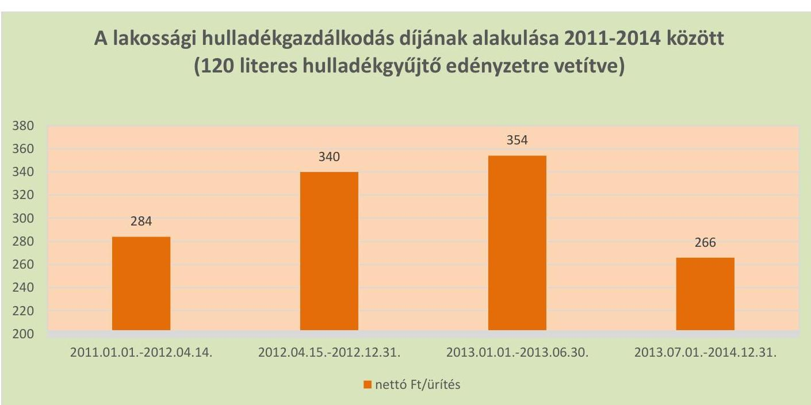

---

| Ssz. | Mintavétellel ellenőrzendő területek | Főbb kérdés | Ellenőrzési kérdések | Adatforrások | Alapsokaság | Mintavételi eljárás |
| :--: | :--: | :--: | :--: | :--: | :--: | :--: |
|  | 1. | 2. | 3. | 4. | 5. | 6. |
| 1. | Az ellátott közfeladat ráfordításainak elkülönített, szabályszerű elszámolása területén |  |  |  |  |  |
| 2. | Anyagjellegú ráfordítások | Az anyagjellegú ráfordítások elszámolása során betartották-e a belső szabályzatokban és a jogszabályokban foglaltakat és azokat a közfeladat-ellátással kapcsolatosan elkülönítették-e? | - a számlázott anyagjellegú ráfordításokra kötött szerződésnél betartották-e a Számv.tv. előírását, a költségelszámolást megalapozó dokumentum (szerződés, megrendelés) rendelkezésre áll?   - a beszerzett anyagok nyilvántartásba vétele megtörtént-e, azokat a közfeladat-ellátással kapcsolatosan elkülönítették-e a szabályozásnak megfelelően?   - a készlet bekerülési értékét a Számv.tv., a számviteli politika, illetve az értékelési szabályzat előírásai szerint vették-e számításba, azokat a közfeladat-ellátással kapcsolatosan elkülönítették-e?   - az anyagjellegú ráfordításokat a megfelelő költségnemre, illetve közfeladatra számol-ták-e el? | Az anyagjellegú ráfordítások közül az 51-53. főkönyi számlacsoportokból vett minta esetében - a költségelszámolást megalapozó dokumentumok (szerződések, megrendelések, stb.), költségelszámoláshoz benyújtott számlák, teljesítés megtörténtét alátámasztó egyéb dokumentumok,   - analitikus nyilvántartások, anyagok nyilvántartásba vételét igazoló dokumentumok, ha a számviteli politika szerint nyilvántartásba kell venni azokat. | Éves bontásban a főkönyvi adatbázisból az 5153. Anyagjellegú ráfordítások számlacsoportba a tartozó ráfordítások, kivéve az ELÁBÉ és az eladott közvetített szolgáltatások értéke. | A mintavételt megelőzően a sokaságból ki kell emelni - tételes ellenőrzésre évente a 3-3 legnagyobb összegű tételt.   Véletlen mintavétel évenként elemszámmal arányos rétegzéssel. |
| 3. | Beruházások, felújítások aktiválása és értékcsökkenési leírás | A közfeladatellátást szolgáló közvagyon állományba vételi, nyilvántartási és elszámolási kötelezettségének teljesítése kapcsán a felújítások, beruházások kiadások aktiválása és az értékcsökkenési leírás elszámolása megfelelit-e az elöírásoknak? | - A költségelszámolást megalapozó dokumentum (szerződés, megrendelés, stb.) megfelelit-e az elöírásoknak, továbbá be lett kérve a tulajdonosi jogok gyakorlójának előzetes, írásbeli engedélye - amennyiben előírták - az önkormányzati tulajdonban lévő eszközön elszámolt beruházáshoz/felújításhoz?   - a beruházások, felújítások állományba vétele, besorolása, a bekerülési érték meghatározása, az üzembehelyezések (aktiválások) dokumentálása megfelelit-e az Sztv., a számviteli politika, illetve az értékelési szabályzat előírásainak?   - az ellenőrzésre kiválasztott immateriális javak és tárgyi eszközök szerepelnek a mérleget alátámasztó leltárban?   - az értékcsökkenés elszámolása a jogszabályban és a számviteli politikában meghatározott szabályozásnak megfelelit-e? | A kiválasztott beruházásra vagy felújításra: szerződések, számlák, a befejezetlen beruházások, felújítások analitikus nyilvántartása, immateriális javak, tárgyi eszközök analitikus nyilvántartása, a beszerzett eszköz üzembehelyezési okmánya, állományba vételi bizonylata, egyedi eszköznylvántartó kartonja - az értékcsökkenés elszámolása az egyedi eszköznylvántartó kartonja, illetve analitikus nyilvántartása | Éves bontásban az immateriális javak, a tárgyi eszközök állománynövekedési tételei, amelyek összegének meg kell egyeznie a kiegészítő mérlegben az immateriális javak, a tárgyi eszközök növekedéseként bemutatott értékkel | A mintavételt megelőzően a sokaságból ki kell emelni - tételes ellenőrzésre évente a 3-3 legnagyobb összegű tételt.   Véletlen mintavétel évenkénti, elemszámmal arányos rétegzéssel. Kiválasztott tételek eszközkartonjának tételes ellenőrzése, különös figyelemmel az értékcsökkenés elszámolására. |
| 4. | Az ellátott közfeladat bevételeinek elkülönített, szabályszerű elszámolása területén |  |  |  |  |  |
| 5. | Értékesítés nettó árbevétel | Az értékesítés nettó árbevétele elszámolása során betartották-e a belső szabályzatokban és a jogszabályokban foglaltakat és azokat a közfeladat-ellátással kapcsolatosan elkülönítették-e? | - a bevétel kiszámlázása a belső szabályozásnak megfelelően történt-e?   - a befolyt bevétel nyilvántartásba vétele (analitika, főkönyv) megtörtént-e, azokat a közfeladat-ellátással kapcsolatosan elkülönítették-e?   - a bevételek beszedése, elszámolása során betartották-e a szabályozásban foglaltakat és a megfelelő számlacsoportba számolták el a bevételt?   - a tulajdonosi követelményeknek, belső szabályozásnak megfelelő árat alkalmaz-ták-e? | A kiválasztott értékesítés nettó árbevétel jogcímen befolyt bevételre:   - az egyes bevételek dijmegállapítása,   - a kibocsátott számla, befolyt bevétel analitikus nyilvántartása, behajtásra tett intézkedések dokumentumai,   - kapcsolódó főkönyvi számla tételes forgalma,   - bevétel beérkezését igazoló banki kivonat(rész). | Éves bontásban a főkönyvi adatbázisból a 91-94. számlacsoportok bevételei | Véletlen mintavétel évenkénti, elemszámmal arányos rétegzéssel. |

---

# FÜGGELÉK: ÉSZREVÉTELEK 

A jelentéstervezetet a Számvevőszék 15 napos észrevételezésre megküldte az ellenőrzött szervezetek vezetőinek az ÁSZ tv. 29. §§ (1) bekezdése előírásának megfelelően.

A Kisújszállási Városgazdálkodási Nonprofit Kft. ügyvezetőjétől és Kisújszállás Város Önkormányzatának polgármesterétől érkezett észrevételeket és az azok kezeléséről szóló válaszleveleket a jelentés függeléke tartalmazza.
Az elfogadott észrevételek alapján a Számvevőszék módosította a jelentést.

[^0]
[^0]:    § 29. § (1) Az Állami Számvevőszék az ellenőrzési megállapításait megküldi az ellenőrzött szervezet vezetőjének vagy az általa megbízott személynek, és annak, akinek személyes felelősségét állapította meg.
    (2) Az ellenőrzött szervezet vezetője és a felelősként megjelölt személy az ellenőrzés megállapításaira tizenöt napon belül írásban észrevételt tehet.
    (3) Az Állami Számvevőszék az észrevételre a beérkezésétől számított harminc napon belül írásban válaszol. A figyelembe nem vett észrevételeket köteles a jelentésben feltüntetni, és megindokolni, hogy azokat miért nem fogadta el.

---

Kisújszállási Városgazdálkodási Nonprofit Kft.
5310 Kisújszállás, Kossuth L. u. 74. sz.
59/520-210, 59/520-219 E-mail: varosgazdalkodas@kjvgkft.hu
CJ. szám: 16-09-007489, Adószám: 13122186-2-16,
OTP Bank Rt. 11745080-20205740-00000000
K&H Bank Nyrt. 10404522-50485551-53491003

239....../2016.

Állami Számvevőszék
Domokos László úrnak

Tisztelt Domokos László úr!

Megköszönve a Kisújszállási Városgazdálkodási Nonprofit Kft. jogszerű és hatékony működése érdekében tett erőfeszítésüket, köszönettel visszaigazoljuk, hogy az elkészült jelentés tervezetét V-1018-109/2016 iktató számon 2016. szeptember 26-án kézhez kaptuk.

„Az önkormányzatok gazdasági társaságai” Kisújszállási Városgazdálkodási Nonprofit Kft.
ellenőrzésének jelentéstervezetével kapcsolatban az alábbi észrevételeket tesszük:

- A Megállapítások 3.1 pont 6. bekezdésében foglaltakkal kapcsolatban meg kívánja jegyezni, hogy a Kft.. az alapító 373/2016 (XII.20) számú önkormányzati határozatát hajtotta végre, miszerint
„2.) A kommunális szilárd hulladékok elhelyezését és ártalmatlanítását más fennmaradó hulladékkezelési rendszeren belül kívánja megvalósítani, ezért 2007. július 1-től csatlakozik a Karcag Város Önkormányzatának tulajdonában lévő, a karcagi Városgondnokság által üzemeltett karcagi kommunális hulladékkezelési rendszerhez, ezáltal segítve a karcagi lerakó kistérségi szinten történő erősítését.”

- A Megállapítások 3.1. pontja 12-15 bekezdésekben a hivatkozott törvény tekintetében véleményünk szerint elírás szerepel Hgt. 52. § tekintetében, ahol helyesen Ht. 52. § kell, hogy szerepeljen.

- A Megállapítások 3.1 pontja 12. bekezdésében miszerint „A 2013-2014 években az esedékességet követő 45. nap elteltével a Ht. 52. § (3) bekezdés előírása ellenére a dijhátralékot nem adta át a NAV-nak behajtásra” ezzel kapcsolatban meg kívánjuk jegyezni, hogy a számvitelről szóló 2000. évi C. törvény alapelveinek megfelelő költségkímélő megoldásra törekedtünk, (sikerdíjas behajtás), mivel a számításaink szerint a követelések NAV részére történő átadása után a behajtással kapcsolatosan felmerülő költségek nincsenek arányban a megtérülés várható összegével. A követelések elévülési idején belül vagyunk, a jelenleg hatályban lévő törvények, jogszabályoknak megfelelően fogunk eljárni.

- A Megállapítások 3.1 pontja 13. bekezdésben hivatkozott „2013. január 1-től követelések adók módjára történő behajtását a NAV-nál kellett kezdeményezni” Véleményünk szerint ez csak a 2013. január 1. után keletkezett követelésekre vonatkozik tekintettel a jogalkotásról szóló 2010. évi CXXX. törvény 15. §-ára.

- A Megállapítások 3.1 pontja 15. bekezdésekben foglaltakra reagálva az ellenőrzött időszak tételeire behajthatatlanság ténye még megállapításra nem került, az elévülési idő le nem telte miatt. Ezen időszakokra a követelésekre csak értékvesztés lett képezve. Az igaz, hogy a NAV-nak átadás nem történt, viszont a 2011-2012 évek kintlévőségei a jegyző részére 2013. évben átadásra kerültek.

Kisújszállás, 2016. október 5.

Tisztelettel:

Tóth Zoltán
ügyvezető

36

---

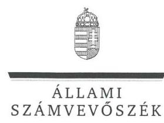

ELNÖK

Ikt.szám: V-1018-114/2016

# Tóth Zoltán úr 

ügyvezető
Kisújszállási Városgazdálkodási Nonprofit Kft.

## Kisújszállás

## Tisztelt Ügyvezető Úr!

Köszönettel vettem a Kisújszállási Városgazdálkodási Nonprofit Kft. ellenőrzéséről készített számvevőszéki jelentéstervezetre tett észrevételeit.

Az Állami Számvevőszéknek (a továbbiakban: ÁSZ) az észrevételekre vonatkozó álláspontjáról a felügyeleti vezető által készített részletes tájékoztatásból kap választ, melyet levelemhez mellékeltem.

Jelzem Ügyvezető úrnak, hogy az Állami Számvevőszékről szóló 2011. évi LXVI. tv. 29. § (3) bekezdése alapján az ÁSZ a figyelembe nem vett észrevételeket köteles a jelentésben feltüntetni, és megindokolni, hogy azokat miért nem fogadta el.

Budapest, 2016. okutútver- hó 26. nap
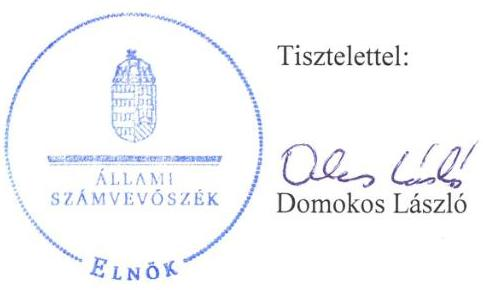

Melléklet: Tájékoztatás az észrevételekről

---

# Tájékoztatás az észrevételekről 

„Az önkormányzatok gazdasági társaságai - Az önkormányzatok többségi tulajdonában lévő gazdasági társaságok közfeladat ellátását érintő gazdálkodási tevékenysége szabályszerűségének ellenőrzése - Kisújszállási Városgazdálkodási Nonprofit Kft." címmel készített jelentéstervezetre Ügyvezető úr észrevételeit megköszönöm. Az észrevételek kezeléséről az alábbi tájékoztatást adom.

A 3.1. számú megállapítás 6 . bekezdésére tett észrevételét nem áll módomban elfogadni, mivel az Ön által megnevezett határozat 2016-ban született, az ellenőrzött időszak viszont 2014. december 31-ig tartott, a hiányosságok 2014. évben is fennálltak. Az azt követő időszak folyamait pedig nem értékeltük.

A 3.1. számú megállapítás 12-15. bekezdéseire tett észrevételét nem fogadom el. A hivatkozott törvény nem „elírás", mivel a bekezdésben Hgt. ${ }_{2}$-ként hivatkozott törvény a rövidítés jegyzék szerint a hulladékokról szóló 2012. évi CLXXXV. törvényt jelenti.

A 3.1. számú megállapítás 12. bekezdésére tett észrevételét nem fogadom el, a megállapítást változatlanul fenntartom. A hulladékokról szóló 2012. évi CLXXXV. törvény 52. § (3) bekezdése alapján a követelés jogosultja a felszólítás eredménytelensége esetén a díjhátralék megfizetésének esedékességét követő 45 . nap elteltével kell, hogy kezdeményezze a díjhátralék adók módjára történő behajtását a Nemzeti Adó és Vámhivatalnál (NAV). Önmagában helyes a költségkímélő megoldásra törekvés, ugyanakkor nem a követelés behajtó cégekkel kötött megállapodások, hanem éppen a NAV részére történő átadás biztosítja ezt a megoldást, mivel a 49/2012. (XII.28.) NGM rendelet 3. § (1) bekezdése alapján az adóhatóságot a végrehajtás foganatosításáért 5000 forint költségátalány illeti meg.

A 3.1. számú megállapítás 13. és 15. bekezdéseire tett észrevételét nem áll módomban elfogadni, a megállapítást változatlanul fenntartom. A megállapítás szerint a Társaság a 2013. évben átadta az Önkormányzat részére a 2007. január 1. és 2012. augusztus 31. közötti időszakban keletkezett, meg nem térült követelések állományát, adók módjára történő behajtás céljából. Azonban a követelésállomány Önkormányzatnak történő átadása nem felelt meg a hulladékokról szóló 2012. évi CLXXXV. törvény 52. § (3) bekezdésében előírtaknak, mivel 2013. január 1-től a felszólítás eredménytelensége esetén a díjhátralék megfizetésének esedékességét követő 45 . nap elteltével a követelés jogosultja a díjhátralék adók módjára történő behajtását a NAV-nál kell, hogy kezdeményezze. Az észrevételében hivatkozott a jogalkotásról szóló 2010. évi CXXX. tv. 15. §-a is azt támasztja alá, hogy a jelentéstervezetben megfogalmazott megállapítás helytálló, mivel 2013. évtől a követelés jogosultja a díjhátralék adók módjára történő behajtását a NAV-nál kell, hogy kezdeményezze. Továbbá a 2011. és 2012. évi kintlévőségek tekintetében észrevételében Ön is elismeri, hogy 2013. évben a kintlévőségek nem kerültek átadásra a NAV részére.

Budapest, 2016. október hó 36. nap

Dr. Horváth Margit felügyeleti vezető

---

# 1343 

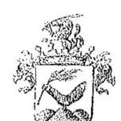

Kisújszállás Város Polgármestere
5310 Kisújszállás, Szabadság tér 1. szám
Tel.: 59/ 520-240 Fax: 59/520-229
e-mail: polgarmester@kisujszallas.hu

## Domokos László úrnak

Állami Számvevőszék
Budapest
Apáczai Csere János utca 10.
1052
Levéicím: 1364 Budapest 4. Pf 54

## Tisztelt Domokos László úr!

Megköszönve a Kisújszállási Városgazdálkodási Nonprofit Kft. jogszerủ és hatékony müködése érdekében tett erőfeszítésüket, köszönettel visszaigazoljuk, hogy az elkészült jelentés tervezetét kézhez kaptuk.
„Az önkormányzatok többség tulajdonában lévő gazdasági társaságok közfeladat ellátását érintő gazdaságis tevékenysége szabályszerűségének ellenőrzése - Kisújszállási Városgazdálkodási Nonprofit Kft. jelentéstervezetével kapcsolatban az alábbi észrevételt teszem:

A jelentéstervezet javasolja, hogy az önkormányzat kezdeményezze a Közszolgáltatási szerződés módosítását a követelés behajtás NAV-nál történő kezdeményezésének kötelezettségként való előírása tekintetében. (1.1. sz. megállapítás 8. bekezdése alapján)

Sajnos a javaslat teljesítésére a közszolgáltató finanszírozásának sérelme nélkül nincs mód, mert amennyiben az előírás bekerülne a hatályos közszolgáltatási szerződésben, az nem kapná meg a megfelelőségi nyilatkozatot a koordináló szervezettől, így a közszolgáltató az elvégzett közszolgáltatás után nem kaphatna díjat.

Kisújszállás, 2016. október 10.
Tisztelettel:
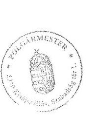

Kecze István
polgármester

---

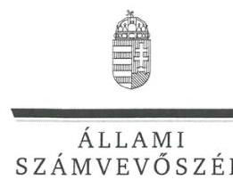

ELNÖK

Ikt.szám: V-1018-115/2016

# Kecze István úr 

polgármester
Kisújszállás Város Önkormányzata

## Kisújszállás

## Tisztelt Polgármester Úr!

Köszönettel vettem a Kisújszállási Városgazdálkodási Nonprofit Kft. ellenőrzéséről készített számvevőszéki jelentéstervezetre tett észrevételeit.

Az Állami Számvevőszéknek (a továbbiakban: ÁSZ) az észrevételekre vonatkozó álláspontjáról a felügyeleti vezető által készített részletes tájékoztatásból kap választ, melyet levelemhez mellékeltem.

Jelzem Polgármester úrnak, hogy az Állami Számvevőszékről szóló 2011. évi LXVI. tv. 29. § (3) bekezdése alapján az ÁSZ a figyelembe nem vett észrevételeket köteles a jelentésben feltüntetni, és megindokolni, hogy azokat miért nem fogadta el.

Budapest, 2016. ơutóber hó 26 nap

Melléklet: Tájékoztatás az észrevételekról
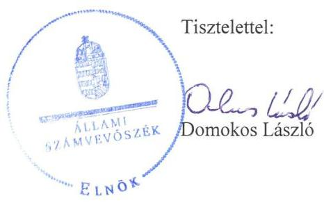

---

# Tájékoztatás az észrevételekről 

„Az önkormányzatok gazdasági társaságai - Az önkormányzatok többségi tulajdonában lévő gazdasági társaságok közfeladat ellátását érintő gazdálkodási tevékenysége szabályszerűségének ellenőrzése - Kisújszállási Városgazdálkodási Nonprofit Kft." címmel készített jelentéstervezetre Polgármester úr észrevételét megköszönöm. Az észrevétel kezeléséről az alábbi tájékoztatást adom.

Az 1.1. számú megállapítás 8. bekezdéséhez tett észrevétele alapján áttekintettem a jelentéstervezet javaslatait. Megállapítottam, a Társaság ügyvezetőjének felelőssége a behajtási tevékenység tekintetében a NAV-nál történő kezdeményezés előírásának betartása. A Jelentéstervezetben az Ügyvezetőnek tett 9. számú javaslatként szerepel is. Így a polgármesteri kezdeményezés okafogyottá válik, a polgármesternek címzett javaslat (,Kezdeményezze a Köszzolgáltatási szerzödés; módositását a követelés behajtás NAV-nál történő kezdeményezésének kötelezettségként való elöirása tekintetében.") törlésre kerül.

Budapest, 2016. október hó 26. nap

Dr. Horváth Margit
felügyeleti vezető

---

.

---

# RÖVIDÍTÉSEK JEGYZÉKE 

${ }^{1}$ ÁSZ
${ }^{2}$ Önkormányzat
${ }^{3}$ Ötv.
${ }^{4}$ Mötv.
${ }^{5} \mathrm{Hgt} .1$
${ }^{6}$ jegyző
${ }^{7} \mathrm{Hgt} .2$
${ }^{8}$ Társaság
${ }^{9}$ Nvtv.
${ }^{10}$ Alapító Okirat
${ }^{11}$ Közszolgáltatási szerződés
${ }^{12}$ Közszolgáltatási szerződés
${ }^{13}$ 224/2004. (VII.22.) Korm. rendelet
${ }^{14}$ 317/2013. (VIII.28.) Korm. rendelet
${ }^{15}$ hulladékgazdálkodási rendelet ${ }_{1}$
${ }^{16}$ hulladékgazdálkodási rendelet ${ }_{2}$
${ }^{17}$ Kisújszállási Városgazdálkodási NKft.
${ }^{18}$ ÁFA
${ }^{19}$ vagyongazdálkodási rendelet ${ }_{1}$
${ }^{20}$ vagyongazdálkodási rendelet ${ }_{2}$
${ }^{21} \mathrm{Gt}$.
${ }^{22} \mathrm{Ptk}_{2}$
${ }^{23}$ Taktv.
${ }^{24}$ Javadalmazási szabályzat ${ }_{1-2}$
${ }^{25}$ Javadalmazási szabályzat ${ }_{2}$

Állami Számvevőszék
Kisújszállás Város Önkormányzata
a helyi önkormányzatokról szóló 1990. évi LXV. törvény
Magyarország helyi önkormányzatairól szóló 2011. évi CLXXXIX. törvény
a hulladékgazdálkodásról szóló 2000. évi XLIII. törvény (hatálytalan: 2013. január 1-jétől)
Kisújszállás Város Önkormányzatának jegyzője
a hulladékról szóló 2012. évi CLXXXV. törvény (hatályos: 2013. január 1jétől)
Kisújszállási Városgazdálkodási Nonprofit Kft.
a nemzeti vagyonról szóló 2011. évi CXCVI. törvény (hatályos: 2011. december 31-től)
a Kisújszállási Városgazdálkodási NKft. Alapító Okirata és módosításai
a Kisújszállási Városgazdálkodási NKft. és az Önkormányzat között, a hulladékgazdálkodási közfeladat ellátásra 2003. június 30-án megkötött szerződés (hatályos 2013. december 31-éig)
a Kisújszállási Városgazdálkodási NKft. és az Önkormányzat között, a hulladékgazdálkodási közfeladat ellátásra 2013. november 28-án megkötött szerződés (hatályos 2014. január 1-jétől)
a hulladékkezelési közszolgáltató kiválasztásáról és a közszolgáltatási szerződésről (hatálytalan: 2013. szeptember 5-től)
a közszolgáltató kiválasztásáról és a hulladékgazdálkodási közszolgáltatási szerződésről (hatályos: 2013. szeptember 5-től)
a hulladékgazdálkodásról szóló 21/2003. (V. 30.) számú önkormányzati rendelet
a hulladékgazdálkodásról szóló 9/2013. (III. 27.) számú önkormányzati rendelet
Kisújszállási Városgazdálkodási Nonprofit Kft.
általános forgalmi adó
az önkormányzat vagyonáról és a vagyongazdálkodás szabályairól szóló 21/2004. (IV. 20.) önkormányzati rendelet
az önkormányzat vagyonáról és a vagyongazdálkodás szabályairól szóló 28/2012. (V.30.) önkormányzati rendelet
a gazdasági társaságokról szóló 2006. évi IV. törvény (hatálytalan: 2014. március 15-étől)
a Polgári Törvénykönyvről szóló 2013. évi V. törvény (hatályos: 2014. március 15 -től)
a köztulajdonban álló gazdasági társaságok takarékosabb müködéséről szóló 2009. évi CXXII. törvény
az Önkormányzat által alapított gazdasági társaságok vezető tisztségviselői, felügyelőbizottsági tagjai és az Mt. 188. § (1) bekezdése hatálya alá eső munkavállalók javadalmazásáról, jogviszony megszűnése esetére biztosított juttatásokról szóló szabályzat
a Kisújszállás Város Önkormányzata alapításában működő gazdasági társaságok vezető tisztségviselőinek, felügyelőbizottsági tagjainak,

---

${ }^{26}$ 64/2008. (III.2.) Korm. rendelet
${ }^{27}$ MEKH
${ }^{28}$ Számv. tv.
${ }^{29}$ számlarend $_{1-3}$
${ }^{30}$ bizonylati szabályzat ${ }_{1-4}$
${ }^{31}$ számviteli politika $_{1-4}$
${ }^{32}$ leltározási szabályzat ${ }_{1-4}$
${ }^{33}$ eszközök és források értékelési szabályzata ${ }_{1-4}$
${ }^{34}$ önköltségszámítási szabályzat ${ }_{1-4}$
${ }^{35}$ pénzkezelési szabályzat ${ }_{1-4}$
${ }^{36}$ Avtv.
${ }^{37}$ Info. tv.
valamint az Mt. 208. §-ának hatálya alá eső munkavállalóinak javadalmazásáról, valamint a jogviszony megszűnése esetére biztosított juttatások módjának, mértékének elveiről, annak rendszeréről szóló szabályzat
a települési hulladékkezelési közszolgáltatási díj megállapításának részletes szakmai szabályairól (hatályos: 2008. április 1-től)
Magyar Energetikai és Közmű-szabályozási Hivatal
a számvitelről szóló 2000. évi C. törvény
a Társaság számlarendje
számlarend ${ }_{1}$ hatályos: 2011. július 1 - 2013. szeptember 30.
számlarend ${ }_{2}$ hatályos: 2013. október 1-től - 2013. december 31.
számlarend ${ }_{3}$ hatályos: 2014. január 1-től
a Társaság bizonylati szabályzata
bizonylati szabályzat ${ }_{1}$ hatályos: 2003. november 14-2011. június 30.
bizonylati szabályzat ${ }_{2}$ hatályos: 2011. július 1-2013. március 30.
bizonylati szabályzat ${ }_{3}$ hatályos: 2013. április 1-2013. december 31.
bizonylati szabályzat ${ }_{4}$ hatályos: 2014. január 1-től
a Társaság számviteli politikája
számviteli politika ${ }_{1}$ hatályos: 2003. november 14-2011. június 30.
számviteli politika2 hatályos: 2011. július 1-2013. március 31.
számviteli politika3 hatályos: 2013. április 1-2013. december 31.
számviteli politika4 hatályos: 2014. január 1-2014. december 31.
a Társaság leltározási szabályzata
leltározási szabályzat ${ }_{1}$ hatályos: 2003. november 14-2011. június 30.
leltározási szabályzat ${ }_{2}$ hatályos: 2011. július 1-2013. március 30.
leltározási szabályzat ${ }_{3}$ hatályos: 2013. április 1-2013. december 31.
leltározási szabályzat ${ }_{1}$ hatályos: 2014. január 1-től
a Társaság eszközök és források értékelési szabályzata
eszközök és források értékelési szabályzata ${ }_{1}$ hatályos: 2003. november 142011. június 30.
eszközök és források értékelési szabályzata2 hatályos: 2011. július 1-2013. március 31.
eszközök és források értékelési szabályzata3 hatályos: 2013.április 1-2013. december 31.
eszközök és források értékelési szabályzata4 hatályos: 2014. január 1-től
a Társaság önköltségszámítási szabályzata
önköltségszámítási szabályzat ${ }_{1}$ hatályos 2003. november 14-2011. június 30.
önköltségszámítási szabályzat2 hatályos: 2011. július 1-2013. március 31.
önköltségszámítási szabályzat ${ }_{3}$ hatályos 2013. április 1-2013. december 31.
önköltségszámítási szabályzat ${ }_{4}$ hatályos: 2014. január 1-től-
a Társaság pénzkezelési szabályzata
pénzkezelési szabályzat ${ }_{1}$ hatályos: 2003. november 14-2011. október 31.
pénzkezelési szabályzat2 hatályos: 2011. november 1-2013. március 31.
pénzkezelési szabályzat3 hatályos: 2013. április 1.-2013. december 31.
pénzkezelési szabályzat ${ }_{4}$ hatályos: 2014. január 1-től
a személyes adatok védelméről és közérdekú adatok nyilvánosságáról szóló 1992. évi LXIII. törvény
az információs önrendelkezési jogról és az információ szabadságáról szóló 2011. CXII. törvény (hatályos: 2011. július 27-től)

---

${ }^{38}$ Ávr.
${ }^{39} \mathrm{Kbt} .{ }_{1}$
${ }^{40} \mathrm{Kbt} .2$
${ }^{41}$ igazgatói utasítás
${ }^{42}$ MEKH
${ }^{43}$ Ptk. 1
${ }^{44}$ Ebktv.
${ }^{45} \mathrm{Ctv}$.
az államháztartási törvény végrehajtásáról szóló 368/2011. (XII. 31.) Korm. rendelet (hatályos: 2012. január 1-jétől)
a közbeszerzésekről szóló 2003. évi CXXIX. törvény (hatálytalan: 2012. január 1-től)
a közbeszerzésekről szóló 2011. évi CVIII. törvény (hatályos: 2012. január 1-től)
a 2011. július 8-án kiadott 17. számú igazgatói utasítás a hulladékgazdálkodási közszolgáltatási és önkormányzati ingatlankezelésből adódó hátralékkezelésről
Magyar Energetikai és Közmű-szabályozási Hivatal
a Polgári Törvénykönyvről szóló 1959. évi IV. törvény (hatálytalan: 2014. március 15-től)
az egyenlő bánásmódról és az esélyegyenlőség előmozdításáról szóló 2003. évi CXXV. törvény
az egyesülési jogról, a közhasznú jogállásról, valamint a civil szervezetek múködéséről és támogatásáról szóló 2011. évi CLXXV. törvény (hatályos: 2011. december 22-től)

---

# ÁLLAMI SZÁMVEVŐSZÉK 

1052 Budapest, Apáczai Csere János utca 10.
Levélcím: 1364 Budapest 4. Pf. 54
Telefon: +36 14849100 Telefax: +36 14849200
www.asz.hu