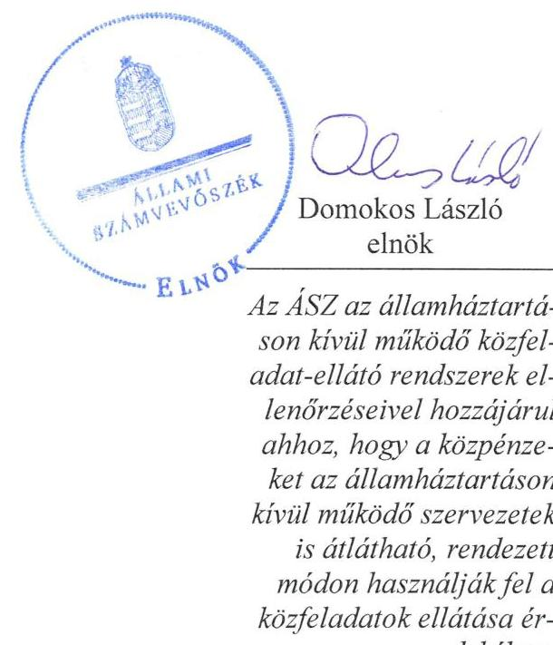
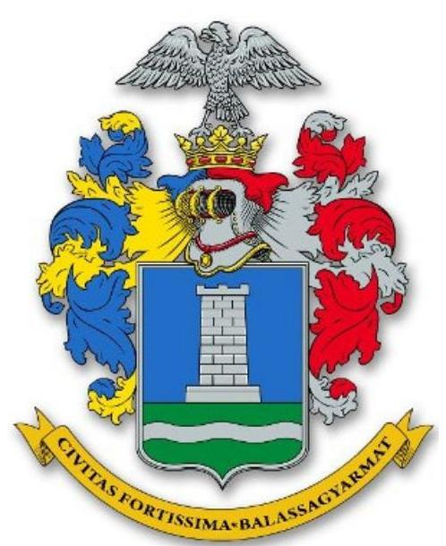
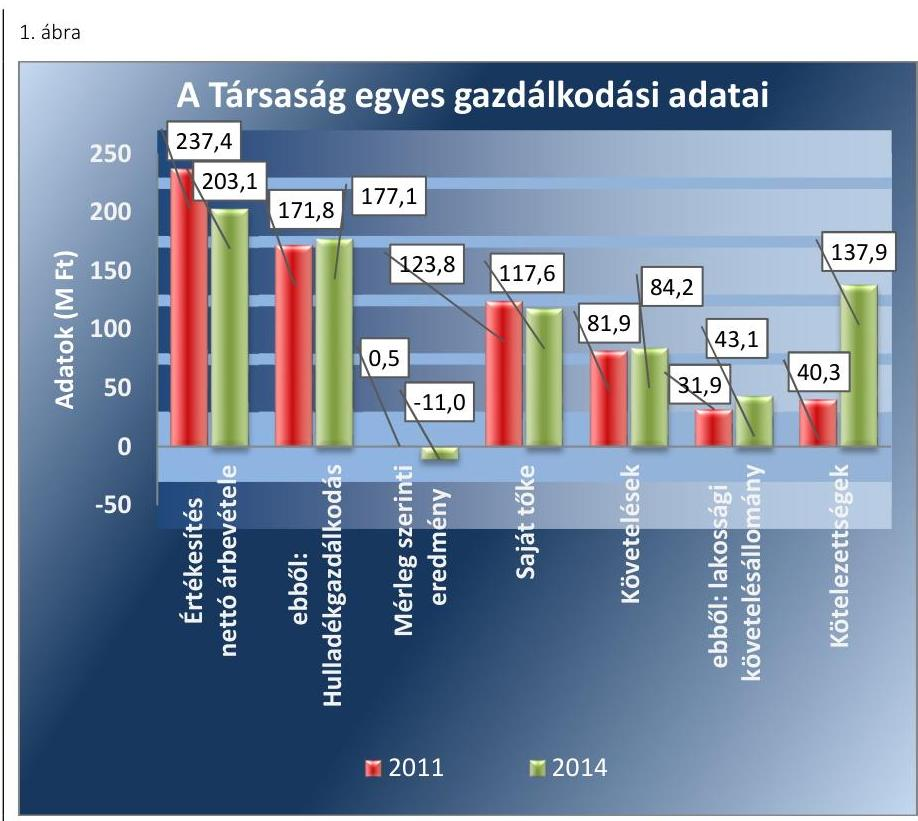
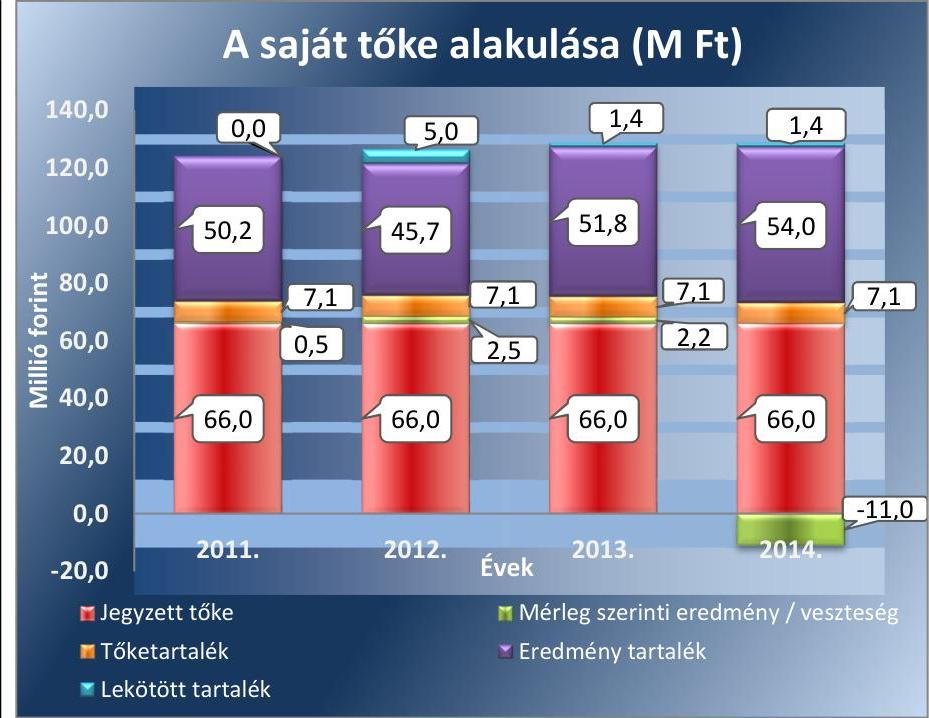
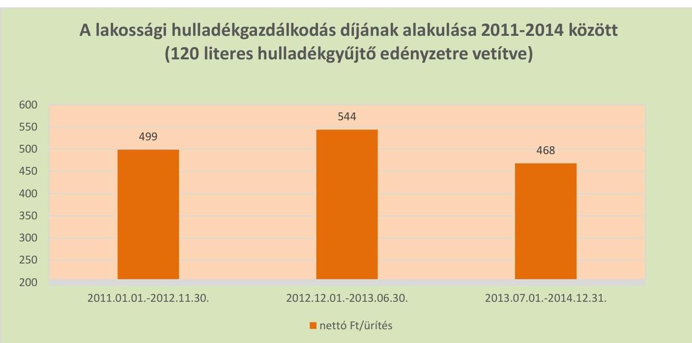

# Jelentés 

## Az önkormányzatok gazdasági társaságai

Az önkormányzatok többségi tulajdonában lévő gazdasági társaságok közfeladat ellátását érintő gazdálkodási tevékenysége szabályszerűségének ellenőrzése - Balassagyarmati Városüzemeltetési Nonprofit Kft.
2016.

Az ÁSZ az államháztartáson kívül működő közfeladat-ellátó rendszerek ellenőrzéseivel hozzájárul ahhoz, hogy a közpénzeket az államháztartáson kívül működő szervezetek is átlátható, rendezett módon használják fel a közfeladatok ellátása érdekében.

---

# Jelentés 

## Az önkormányzatok gazdasági társaságai

Az önkormányzatok többségi tulajdonában lévő gazdasági társaságok közfeladat ellátását érintő gazdálkodási tevékenysége szabályszerűségének ellenőrzése - Balassagyarmati Városüzemeltetési Nonprofit Kft.
2016. november 29. nap

---

# AZ ELLENŐRZÉST FELÜGYELTE:

DR. HORVÁTH MARGIT felügyeleti vezető

## AZ ELLENŐRZÉST VEZETTE ÉS A VÉGREHAJTÁSÁÉRT FELELŐS:

- KLINGA LÁSZLÓ ellenőrzésvezető
- A PROGRAM ÖSSZEÁLLÍTÁSÁÉRT FELELŐS:
- JANIK JÓZSEF osztályvezető

|  IKTATÓSZÁM: V-1019-140/2016. | |
| --- | --- |
|  TÉMASZÁM: 2053 | |
|  ELLENŐRZÉS-AZONOSÍTÓ SZÁM: V-070731 | |

Jelentéseink az Országgyűlés számítógépes hálózatán és az Interneten a www.asz.hu címen is olvashatóak.

---

# TARTALOMJEGYZÉK 

■ ÖSSZEGZÉS ..... 5
■ AZ ELLENŐRZÉS CÉLJA ..... 7
■ AZ ELLENŐRZÉS TERÜLETE ..... 8
■ AZ ELLENŐRZÉS HÁTTERE, INDOKOLTSÁGA ..... 10
■ A JELENTÉS LÉNYEGES KÉRDÉSKÖREI ..... 11
■ ELLENŐRZÉS HATÓKÖRE ÉS MÓDSZEREI ..... 12
■ MEGÁLLAPÍTÁSOK ..... 14
■ JAVASLATOK ..... 29
■ MELLÉKLETEK ..... 31
I. Sz. melléklet: Értelmező szótár ..... 31
II. Sz. melléklet: Működési adatok ..... 34
III. Sz. melléklet: Lakossági hulladékgazdálkodási díjak alakulása 2011-2014 között ..... 35
IV. Sz. melléklet: Mintavételi eljárások ellenőrzési területenként ..... 36
■ FÜGGELÉK: ÉSZREVÉTELEK ..... 37
■ RÖVIDÍTÉSEK JEGYZÉKE ..... 39

---

.

---

# ÖSSZEGZÉS 

Az Állami Számvevőszék a 2013. év végéig kizárólagos, majd 2014-től többségi önkormányzati tulajdonú Balassagyarmat Városüzemeltetési Nonprofit Kft.-nél a hulladékgazdálkodási közfeladat ellátását érintő gazdálkodási tevékenység 2011-2014 közötti szabályszerűségét ellenőrizte. Megállapította, hogy a közfeladat-ellátás önkormányzati megszervezése és a tulajdonosi jogok gyakorlása szabályosan történt. A szabályszerű vagyongazdálkodás biztosítása mellett a hulladékgazdálkodás közfeladata bevételeinek és ráfordításainak elszámolása megfelelő volt. Az ellenőrzött időszakban a kötelezettségek állománya a működésre, a közfeladat ellátására veszélyt jelentett. Az önköltségszámítás szabályait meghatározták, az árképzés szabályszerűen történt.

## Az ellenőrzés társadalmi indokoltsága

Az Állami Számvevőszék stratégiájában megfogalmazta, hogy a helyi önkormányzatok gazdálkodásában rejlő pénzügyi kockázatok feltárásával, az államháztartáson kívülre nyújtott költségvetési támogatások és ingyenes vagyonjuttatások, valamint az államháztartáson kívül működő közfeladat-ellátó rendszerek ellenőrzéseivel hozzájárul ahhoz, hogy a közpénzeket az államháztartáson kívül működő szervezetek is átlátható, rendezett módon használják fel a közfeladatok szerződésben vállalt ellátása érdekében.

Magyarországon az intézmény-centrikus közfeladat-ellátás jellemző, de egyre jelentősebb a költségvetésen kívüli feladatellátás térnyerése. Ennek legfontosabb szereplői - a nonprofit szervezetek mellett - az önkormányzati tulajdonú gazdasági társaságok. Az önkormányzatok szervezetalakítási szabadságának következménye, hogy a korábban is vállalati formában működő közszolgáltatások mellett, mind a kötelező, mind az önként vállalt feladatok ellátásában a gazdasági társaságok kiemelt fontosságú szerephez jutottak.

## Főbb megállapítások, következtetések, javaslatok

Az Önkormányzat a hulladékgazdálkodás közfeladatának megszervezéséről a jogszabályi előírásoknak megfelelően döntött, annak ellátásáról a 2013. év végéig kizárólagos, majd azt követően minősített többségi tulajdonában lévő gazdasági társasága útján gondoskodott. Az Önkormányzat a Hgt.1,2 szerinti hulladékgazdálkodással összefüggő rendeletalkotási kötelezettségének eleget tett, annak tartalma megfelelt az előírásoknak. Az Önkormányzat a hulladékgazdálkodási közszolgáltatás ellátására Közszolgáltatási szerződés1,2-t kötött, amelyek tartalma megfelelt az előírásoknak. Az Önkormányzat a Hgt.1-ben foglaltak ellenére a 2011-2012. években nem rendelkezett hulladékgazdálkodási tervvel, 2013-tól a közszolgáltató feladata volt a hulladékgazdálkodási terv készítésének kötelezettsége, amelynek eleget tett.

A Képviselő-testület a vagyongazdálkodási rendelet$_{1,2}$-ben, az SZMSZ$_{1,2}$-ben, az Alapító Okiratban, valamint a Társasági szerződésben egymással összhangban meghatározta a tulajdonosi joggyakorlás szabályait, amelyet szabályszerűen gyakorolt. Az Önkormányzat vagyonkezelésbe nem adott át vagyont a Társaság részére. A Képviselő-testület a társasági működés felügyeletét, a tulajdonosi ellenőrzési, beszámoltatási kötelezettségét az FB-n keresztül az előírásoknak megfelelően, szabályszerűen gyakorolta, azonban az FB a taggyűlés által jóváhagyott ügyrenddel nem rendelkezett. A Javadalmazási szabályzatot elkészítették, azonban annak tartalma nem teljes körűen felelt meg a Taktv.ben előírtaknak.

A közfeladat-ellátását szolgáló vagyonnal való gazdálkodás, annak nyilvántartása szabályszerű volt, a Társaság rendelkezett a Számv. tv. előírásainak megfelelő számviteli szabályzatokkal, amelyek elősegítették a szabályszerű működést. Szabálytalan volt, hogy a leltározási szabályzatban a tárgyi eszközök mennyiségi felvétellel történő leltározási kötelezettséget 2012-től nem megfelelő gyakorisággal határozták meg, továbbá a pénzkezelési szabályzatban nem

---

írták elő a készpénzállomány ellenőrzésekor követendő eljárásról, az ellenőrzés gyakoriságáról és a felelősségi szabályokról szóló, a Számv. tv.-ben előírt tartalmi elemeket. A Balassagyarmati Városüzemeltetési NKft. vagyona 2011. január 1-jéről 2014. év végére 179,4 millió Ft-tal nőtt, amit legjelentősebben a tárgyi eszközök állományának növekedése befolyásolt. A Társaság rövid lejáratú kötelezettségeinek döntő részben határidőben eleget tudott tenni. A Társaság a Hgt.1,2-ben előírtak figyelembe vételével kezdeményezte a hulladékgazdálkodással összefüggő követelések adók módjára történő behajtását. A Társaság a mérleg szerinti eredménye alapján a 2011-2013. években nyereségesen gazdálkodott, 2014-ben 11,0 millió Ft veszteséget mutatott ki.

A Balassagyarmati Városüzemeltetési NKft. az üzleti tervek teljesítéséről, az éves gazdálkodásról az éves beszámolók keretében számolt be a tulajdonos felé a Számv. tv.-ben előírtaknak megfelelően. A Társaság az Eisztv.-ben, illetve 2011 júliustól az Info tv.-ben előírtak ellenére honlapján az éves beszámolóit nem tette közzé. A Társaságnál a bevételek, költségek és ráfordítások elszámolása megfelelő volt, figyelembe véve a jogszabályok és a belső szabályozás előírásait. A beruházások, felújítások kiadásainak elszámolása csak részben volt megfelelő egyes gazdasági események szabálytalan könyvelése miatt. Az önköltségszámítás szabályozása megfelelt az előírásoknak, amely alapján az alkalmazott módszer biztosította a közszolgáltatás díjának megalapozottságát és a szabályszerű árképzést.

---

# AZ ELLENŐRZÉS CÉLJA 

Az ellenőrzés célja annak értékelése, hogy az Önkormányzat a jogszabályi előírások figyelembevételével döntött-e az ellenőrzésre kerülő közfeladat megszervezéséről; az önkormányzat/tulajdonosi joggyakorló szabályszerűen gyakorolta-e a tulajdonosi jogokat.

Ellenőriztük, hogy a gazdasági társaság közfeladat-ellátása bevételeinek, ráfordításainak elszámolása, és vagyongazdálkodási tevékenysége megfelelt-e a jogszabályi, illetve a közszolgáltatási/vagyonkezelési szerződésben foglalt tulajdonosi előírásoknak, azok végrehajtása szabályszerű volt-e.

Értékeltük továbbá, hogy a gazdasági társaság kötelezettségállománya jelent-e kockázatot a működésre, illetve a közfeladat ellátására; valamint hogy a közfeladatok átláthatósága és elszámoltathatósága érdekében biztosítva volt-e a közszolgáltatás díjának megalapozottsága szabályszerű önköltségszámítással.

---

# **AZ ELLENŐRZÉS TERÜLETE**

## **Balassagyarmat Város Önkormányzata és a többségi tulajdonában lévő Balassagyarmati Városüzemeltetési Nonprofit Kft.**

### **BALASSAGYARMAT VÁROS ÖNKORMÁNYZATA**

1995. július 1-jén, a Balassagyarmati Városgazdálkodási Vállalat jogutódjaként hozta létre a Balassagyarmati Városüzemeltetési Korlátolt Felelősségű Társaságot. A Képviselő-testület a 2013. november 28-án kelt határozatával döntött a Társaság nonprofit társasággá történő alakításáról, így annak elnevezése Balassagyarmati Városüzemeltetési Nonprofit Kft.-re változott. A Társaság törzstőkéje alapításkor 46,0 millió Ft nem pénzbeli betétből (apportból) állt, amit az Önkormányzat 2007. február 28-án 66,0 millió Ft-ra felemelt, annak összege az ellenőrzött időszak alatt nem változott. Az Önkormányzat vagyonkezelésbe nem adott át eszközöket a Társaság részére.

A Társaság 2013. december 30-áig 100%-os, ezt követően 99,7%-os minősített többségi befolyással az Önkormányzat tulajdonában volt. 2013. december 31-étől 0,15%-0,15%-os tulajdoni hányaddal (0,1-0,1 millió Ft-tal) Patvarc Község és Dejtár Község Önkormányzatai rendelkeztek.

### **A BALASSAGYARMATI VÁROSÜZEMELTETÉSI NONPROFIT KFT.**

alaptevékenysége a 2014. január 1-jén 15 570 fő lakosságszámú Balassagyarmat Város közigazgatási területén a nem veszélyes hulladék gyűjtése volt. Emellett a Társaság ellátta a nem veszélyes hulladék gyűjtését Csitár, Ilíny, Dejtár és Patvarc községek közigazgatási területén is, közszolgáltatási szerződések alapján.

A hulladékszállításra kötött szerződések száma a 2014. évben Balassagyarmaton 3 946 db lakossági, 276 db közületi és vállalkozási, továbbá a feladatellátással érintett településeken 825 db volt. A Társaság a hulladékkezelési közfeladat-ellátása során a háztartásokból, intézményektől, gazdálkodó szervezetektől, valamint a közterületi gyűjtő edényekből a települési szilárd hulladékot rendszeresen begyűjtötte és elszállította, továbbá megszervezte a lakosság által a lomtalanítás során összegyűjtött hulladék begyűjtését, szelektív hulladékgyűjtő szigeteket üzemeltetett.

A Társaság más gazdasági társaságban tulajdoni hányaddal nem rendelkezett, átlagos statisztikai állományi létszáma 2011-ben 26 fő, 2014-ben 21 fő volt.

A Társaság gazdálkodásának egyes adatait a 2011. és a 2014. évek vonatkozásában az 1. ábra szemlélteti.

---

Forrás: A Társaság 2011.és 2014. évi beszámolói
A Társaság mérlegfőösszege 2011-ben 164,2 millió Ft, 2014-ben 350,7 millió Ft volt. Az értékesítés nettó árbevétele a 2011. és a 2014. év vége között 14,5%-kal (34,3 millió Ft-tal) csökkent, a közfeladat nettó árbevétele azonban 3,1%-kal (5,3 millió Ft-tal) nőtt. A mérleg szerinti eredmény a 2011-2013. években pozitív, a 2014. évben veszteség volt. A saját tőke összege 2011. december 31-éről a 2014. év végére 5,0%-kal (6,2 millió Ft-tal) csökkent. A követelések 2,8%-kal (2,3 millió Ft-tal) emelkedtek, ezen belül a lakossági követelésállomány 35,1%-kal (11,2 millió Ft-tal) nőtt.

A Társaság működésének főbb jellemzőit a 2. számú melléklet mutatja be.

Az ellenőrzött időszakban a polgármester$^1$ és az ügyvezető személye nem, a jegyző személye változott. A polgármester a 2006. évi önkormányzati választások óta, az ügyvezető 1995. július 1-jétől, a jegyző 2013. április 1-jétől látja el feladatait.

---

# AZ ELLENŐRZÉS HÁTTERE, INDOKOLTSÁGA 

Az önkormányzatok közfeladat-ellátásában egyre jelentősebb a gazdasági társaságok útján történő feladatellátás térnyerése.

AZ ÖNKORMÁNYZATI TULAJDONÚ GAZDASÁGI TÁRSASÁGOK teljes körű ellenőrzésének lehetőségét az Állami Számvevőszékről szóló 1989. évi XXXVIII. törvény 2011. január 1-jétől hatályos módosítása teremtette meg. A gazdasági társaságok közfeladat ellátását érintő gazdálkodási tevékenysége szabályszerűségére irányuló ellenőrzéseket erre tekintettel a 2011. évtől végezzük. A közfeladatot ellátó gazdasági társaságok ellenőrzése kiemelten fontos a vagyon megőrzése, megóvása érdekében, valamint a kormányzati szektor elszámolásaiban megjelenő önkormányzati tulajdonú gazdálkodó szervezetek esetében, amelyekkel szemben alapvető követelmény, hogy gazdálkodásuk, működésük szabályszerű, az általuk szolgáltatott adatok minél megbízhatóbbak legyenek. A közfeladat ellátás költségeinek, ráfordításainak alakulása, színvonala hatással van a lakosság elégedettségére.

## AZ ELLENŐRZÉS VÁRHATÓ HASZNOSULÁSA-

KÉNT az ÁSZ$^2$ a megállapításaival segítséget nyújthat az államháztartáson kívüli közfeladat-ellátás értékeléséhez, jogszabályi keretei pontosításához, átláthatóságot biztosító szabályozásához. Meghatározhatóvá válnak a közfeladat ellátásban részt vevő államháztartáson kívüli szervezeteknek az önkormányzat költségvetését, pénzügyi helyzetét is befolyásoló - kockázatai, lehetővé válik ezen kockázatok csökkentése. Ellenőrzéseink feltárhatják, hogy az önkormányzat közfeladat ellátási kötelezettségének szabályszerűen tett-e eleget, a feladatellátáshoz rendelt közvagyon működtetését a tulajdonostól elvárható gondossággal, szabályszerűen szervezte-e meg és a tulajdonosi felügyelete hozzájárult-e a közfeladat szabályszerű ellátásához. Értékelhetővé válik, hogy a feladatot ellátó gazdasági társaság a közszolgáltatási szerződésben foglaltak betartásával, a közvagyon használatával biztosította-e a szolgáltatás folytatásának feltételeit. Ezzel az ellenőrzöttek és a helyi döntéshozók számára az ÁSZ visszajelzést ad feladatszervezési, feladat-ellátási kockázataikról, alapot ad a meglévő hibák megszüntetéséhez, a jobb közfeladat-ellátás biztosításához. Mindezeken keresztül az ÁSZ hozzájárul Magyarország közpénzügyi helyzetének javításához, a közpénzek mérhető módon történő, a döntéshozók által meghatározott célok szerinti felhasználásához.

---

# A JELENTÉS LÉNYEGES KÉRDÉSKÖREI 

1. Az önkormányzat közfeladat megszervezéséről szóló döntése, valamint tulajdonosi joggyakorlása szabályszerű volt-e?
2. A gazdasági társaság vagyongazdálkodása szabályszerű volt-e, kötelezettségállománya jelentett-e kockázatot a működésre, illetve a közfeladat ellátásra?
3. A gazdasági társaságnál az ellátott közfeladat bevételei és ráfordításai elszámolása, valamint az önköltségszámítás és árképzés szabályszerű volt-e?

---

# ELLENŐRZÉS
 HATÓKÖRE ÉS MÓDSZEREI 

## Az ellenőrzés típusa

Megfelelőségi ellenőrzés

## Az ellenőrzött időszak

A 2011. január 1-jétől 2014. december 31-éig terjedő időszak.

## Az ellenőrzés tárgya

A közfeladatot gazdasági társaságokkal ellátó önkormányzatok tulajdonosi joggyakorlása, valamint gazdasági társaságok pénz- és vagyongazdálkodásának szabályozottsága és szabályszerűsége.

Az ellenőrzés kiterjed minden olyan körülményre és adatra, amely az ÁSZ jogszabályban meghatározott feladatainak teljesítéséhez, valamint a program végrehajtása folyamán felmerült újabb összefüggések feltárásához szükséges.

## Az ellenőrzött szervezet

Balassagyarmat Város Önkormányzata és a Balassagyarmati Városüzemeltetési Nonprofit Korlátolt Felelősségű Társaság

## Az ellenőrzés jogalapja

Az ellenőrzés végrehajtásának jogszabályi alapját az Állami Számvevőszékről szóló 2011. évi LXVI. törvény 5. § (3)-(4)-(5) bekezdései képezték.

## Az ellenőrzés módszerei

Az ellenőrzést a nemzetközi standardokat irányadónak tekintve az ellenőrzési program ellenőrzési kérdései, az ellenőrzött időszakban hatályos jogszabályok, az ellenőrzés szakmai szabályok és módszertanok figyelembe vételével végeztük.

Az ellenőrzés ideje alatt az ellenőrzött szervezettel történő kapcsolattartást az ÁSZ Szervezeti és Működési Szabályzatának vonatkozó előírásai alapján biztosítottuk.

---

Az ellenőrzés a kiválasztott, többségi tulajdonosi jogokat gyakorló önkormányzatra, illetve az ellenőrzött közfeladatot ellátó gazdasági társaságra terjedt ki. Az ellenőrzött gazdasági társaságnál, amennyiben az több közfeladatot is ellát, akkor az ellenőrzésre kiválasztott közfeladat-ellátást ellenőriztük.

Az ellenőrzést a kérdésekre adott válaszok kiértékelésével, valamint a megjelölt adatforrások, a csatolt tanúsítványok felhasználásával, továbbá az adott időszakban hatályos jogszabályok figyelembe vételével folytattuk le. Az ellenőrzési kérdések megválaszolásához szükséges bizonyítékok megszerzése a következő ellenőrzési eljárások alkalmazásával történt: megfigyelés, kérdésfeltevés (információkérés), összehasonlítás, valamint elemző eljárás.

A bevételek és ráfordítások elszámolása, valamint a vagyonnyilvántartás terén a szabályszerű működést véletlen mintavétellel ellenőriztük. A mintavétellel ellenőrzött területek esetében minden egyes tétel vonatkozásában a szabályszerűségre vonatkozó kérdéseket tettünk fel, amelyek eredménye összesítésre került. Megfelelőnek értékeltünk egy ellenőrzött területet, amennyiben 95%-os bizonyossággal a teljes sokaságban a hibaarány legfeljebb 10%, nem megfelelőnek, amennyiben 10%-nál magasabb arányt képviselt. Részben megfelelő minősítést adtunk, amennyiben egy adott terület vonatkozásában a minta alapján a teljes sokaságban nem volt egyértelműen biztosított a jogszabályoknak és a belső szabályzatoknak megfelelő működés. A ráfordítások elszámolására és a vagyonnyilvántartásra vonatkozó véletlen mintavételt kockázati alapú kiválasztással egészítettük ki, amelynek során évente a három legnagyobb összegű tételt választottuk ki. A mintavételi eljárások ellenőrzési területenként történő bemutatását IV. számú melléklet tartalmazza.

---

# 1. Az önkormányzat közfeladat megszervezéséről szóló döntése, valamint tulajdonosi joggyakorlása szabályszerű volt-e? 

Összegző megállapítás

Az Önkormányzat a jogszabályok és a helyi szabályozás betartásával szervezte meg a hulladékgazdálkodást, a tulajdonosi jogait szabályszerűen gyakorolta.

### 1.1. számú megállapítás

A közfeladat-ellátást az Önkormányzat szabályszerűen szervezte meg, a hulladékgazdálkodással összefüggő rendeletalkotási kötelezettségének a vonatkozó jogszabályi előírásoknak megfelelően eleget tett. Hulladékgazdálkodási tervvel a 2011-2012. években nem rendelkeztek.

Az Ötv. 91. § (6) bekezdésében és 2013. január 1-jétől az Mötv. 116. § (3)-(4) bekezdéseiben előírtak alapján az Önkormányzat  a gazdasági programjában határozta meg mindazokat a célkitűzéseket, amelyek az általa ellátott feladatok biztosítását, fejlesztését szolgálták. Az Ötv. 91. § (7) bekezdésében* előírt határidőt betartva a Képviselő-testület által a 2010-2014. évekre elfogadott gazdasági program a hulladékgazdálkodási közfeladattal kapcsolatban kitért az illegális szemétlerakó felderítésére, felmérésére és felszámolására, a szelektív hulladékgyűjtés elterjesztésére, továbbá a szemétszállítás tekintetében a fajlagos költségek egységesítésére.

A Képviselő-testület az Nvtv. 9. § (1) bekezdésben előírtak alapján 2013. február 28-án elfogadta a vagyongazdálkodási tervet, amely a hulladékgazdálkodással összefüggő célokat nem tartalmazott.

Az Önkormányzat a 2011-2012. évekre a Hgt. 35. §. (1) bekezdésében előírtak ellenére hulladékgazdálkodási tervvel nem rendelkezett, A jegyző a hulladékgazdálkodási terv hiányára a Képviselő-testület figyelmét nem hívta fel a 2011-2012. években.

A Hgt. 78. § (1) bekezdésében foglaltak alapján - 2013. január 1-jétől - a hulladékgazdálkodási tervet a közszolgáltatónak kellett elkészíteni. A Társaság 2013. márciusában elkészítette a hulladékgazdálkodási tervet, amelyet az Országos Környezetvédelmi, Természetvédelmi és Vízügyi Felügyelőség - 2013. júliusában - határozatával jóváhagyott.

## A KÖZTISZTASÁG ÉS A TELEPÜLÉSTISZTASÁG

BIZTOSÍTÁSA az Ötv. 8. § (1) bekezdése  alapján az Önkormányzat törvényi kötelezettsége. A Képviselő-testület az SZMSZ-ben előírta a

[^0]
[^0]:    * 2013. január 1-jétől az Mötv. 116. § (5) bekezdése szabályozza a határidőt.
    ⁺A helyi közügyek, valamint a helyben biztosítható közfeladatok körében ellátandó helyi önkormányzati feladatként a hulladékgazdálkodást 2013. január 1-jétől az Mötv. 13. § (1) bekezdés 19. pontja írja elő.

---

közszolgáltatások körének kötelező feladatait, így a köztisztasági és településtisztasági feladatok ellátásának kötelezettségét. Az SZMSZ 2012. március 1-jétől hatályos módosítását követően, annak 6. számú mellékletében nevesítették a települési hulladékkezelést az ellátandó közfeladatok között.

Az Önkormányzat a közfeladat ellátási kötelezettségének 2011. január 1. és 2013. december 30. között a 100%-os tulajdonában lévő Balassagyarmati Városüzemeltetési NKft.-én, majd 0,2 millió Ft névértékű üzletrészének értékesítését követően a többségi tulajdonában lévő Társaságon keresztül tett eleget. A közfeladat-ellátás választott módjáról az Önkormányzat az ellenőrzött időszak előtt döntött. A Hgt. 90. § (8) bekezdése alapján a Társaságot nonprofit gazdasági társasággá alakították át, amely megfelelt a Ctv. 9/F. § (2) és (3) bekezdésében rögzített előírásoknak.

Az ellenőrzött időszakban a Balassagyarmati Városüzemeltetési NKft. feladatellátásának kereteit az Alapító Okiratban, 2013. december 30-ától a Társasági szerződésben, továbbá a közfeladat biztosításának és a díjak megállapításának szabályait a hulladékgazdálkodási rendeletben a Képviselő-testület meghatározta.

A KÖZSZOLGÁLTATÁSI SZERZŐDÉST az Önkormányzat 2002. januárjában 10 éves időtartamra kötötte a Társasággal a „települési szilárd hulladék szállítására" a Hgt. 28. § (1) előírása alapján. A Közszolgáltatási szerződés a 224/2004. (VIII. 22.) Korm. rendelet 11. § (2) bekezdésében előírtaknak ellenére nem tartalmazta a közszolgáltatás megkezdésének időpontját, továbbá a 12. § (2) bekezdés e) pontjában foglaltak ellenére abban nem határozták meg az Önkormányzat kötelességeként a közszolgáltató kizárólagos közszolgáltatási jogának biztosítását. A Közszolgáltatási szerződés 2008. júliusában a szelektíven gyűjtött hulladékok gyűjtési és elszállítási kötelezettségével módosították.

Az Önkormányzat a Közszolgáltatási szerződést 5 éves - 2012. január 1-je és 2016. december 31-e közötti - időtartamra kötötte, ami megfelelt a Hgt. 28. § (3) bekezdésében előírtaknak. A Közszolgáltatási szerződést 2013. december 30-án módosították a Társaság nonprofittá történt átalakulásával összefüggésben. Módosult a közszolgáltatás időtartama is, amely 2014. január 1-jétől 2021. december 31-re változott. A Közszolgáltatási szerződés a Hgt. 34. § (5) bekezdés a)-d) pontjai előírásainak, továbbá a 317/2013. (VIII. 28.) Korm. rendelet 4. § (1)-(3) bekezdéseiben előírtaknak megfelelt.

A Közszolgáltatási szerződés tartalmazta a Társaság kötelezettségeit a 224/2004. (VII. 22.) Korm. rendelet 12. § (1) bekezdése, illetve a 317/2013. (VIII. 28.) Korm. rendelet 4. § (2) bekezdésének előírásai alapján. Rögzítették az ártalmatlanításra kijelölt helyet (Nógrádmarcal hulladéklerakó), valamint az évente legalább egyszeri Képviselő-testület felé történő tájékoztatási-, költség elszámolási feladatot.

A HULLADÉKGAZDÁLKODÁSI RENDELET tartalma a Hgt. 23. § a)-h) pontjaiban, valamint a Hgt. 35. § a)-g) pontjaiban foglaltaknak megfelelt. A hulladékgazdálkodási rendelet célja azoknak a helyi szabályoknak a megállapítása volt, amelyek biztosították - az Ötv. 8. § (1) bekezdése, valamint az Mötv. 13. § (1) bekezdés 19. pontja alapján -

---

Balassagyarmat Város közigazgatási területén a köztisztasággal, a települési szilárd hulladék kezelésével összefüggő feladatok eredményes végrehajtását, a hulladékgazdálkodási közszolgáltatás ellátásának és igénybevételének rendjét.

A hulladékgazdálkodási rendeletben - többek között - meghatározták a helyi közszolgáltatás tartalmát, ellátásának rendjét és módját, a közszolgáltató és az ingatlantulajdonos ezzel összefüggő jogait és kötelezettségeit, valamint a közszolgáltatási díj fizetésének szabályait. Előírták továbbá a közszolgáltatás szüneteltetésére, a szabálysértésekre vonatkozó rendelkezéseket.

A hulladékgazdálkodási rendeletet az ellenőrzött időszakban négyszer módosították, 2011. május 1-jétől a hulladéklerakót üzemeltető közszolgáltatóban bekövetkezett változás miatt, 2012. december 1-jétől a közszolgáltatási-, illetve ürítési díjak változása, valamint 2013. január 1-jétől a díjmegállapítás tartalma miatt.

A Társaság részére - a 2003-2013. évekre szóló - tartós bérleti szerződés keretében az Önkormányzat kizárólagos tulajdonában lévő szelektív hulladékgyűjtés célját szolgáló tehergépkocsit bérbe adták. E tehergépkocsit a 2014. évben az Önkormányzat a Társaság tulajdonába adta térítésmentesen, a vagyongazdálkodási rendelet 28. § (2) bekezdésében előírtaknak megfelelően. A 2006-2016. évekre ugyancsak tartós bérleti szerződés keretében az Önkormányzat bérbe adta a kizárólagos tulajdonában lévő szelektív hulladékgyűjtési célt szolgáló tehergépkocsit.

# 1.2. számú megállapítás 

## A tulajdonosi jogok gyakorlása szabályszerű volt. Az FB ügyrendjét a Társaság legfőbb szerve nem hagyta jóvá.

A TULAJDONOSI JOGOK gyakorlásának rendjét az Önkormányzat a vagyongazdálkodási rendeletben és az SZMSZ-ben határozta meg. Az Önkormányzatot megillető tulajdonosi jogok gyakorlásával kapcsolatos feladatok és jogosultságok a Képviselő-testületet illették meg, amelyeket a vagyongazdálkodási rendeletben meghatározott esetekben az FB-re ruházott, szabálytalan hatáskör-delegálás nem volt. A Társaság feletti alapítói döntést igénylő kérdésekben a Képviselő-testület döntött.

AZ FB a Gt. 34. § (1) bekezdésében, valamint a Ptk. 3:121. § (1) bekezdésében előírtakat figyelembe véve 2012. február 1-jéig öt tagból, ezt követően három tagból állt. Az FB a Gt. 35. § (3) bekezdésének, illetve a Ptk. 3:120. § (2) bekezdésének megfelelően minden évben írásbeli jelentést készített a Társaság Számv. tv. 4. § (1) bekezdése szerint összeállított számviteli beszámolójáról.

Az FB a Gt. 34. § (4) bekezdésében, illetve a Ptk. 3:122. § (3) bekezdésében foglaltakkal ellentétben a Társaság legfőbb szerve által jóváhagyott ügyrenddel nem rendelkezett.

[^0]
[^0]:  ¹ 2011. május 1-én a Tárnics Környezetvédelmi és Hulladékgazdálkodási Kft. helyébe a Zöld Híd Régió Környezetvédelmi és Hulladékgazdálkodási Kft. lépett.

---

AZ ANYAGI ÖSZTÖNZÉSI RENDSZERT a Taktv. 5. § (3) bekezdésében foglaltaknak megfelelően a Képviselő-testület által elfogadott Javadalmazási szabályzatban rögzítették. Az ellenőrzött időszakban az ügyvezető részére prémium feladatokat nem határoztak meg, az ügyvezető prémiumot, jutalmat nem kapott. Az FB tagok tevékenységükért díjazásban nem részesültek.

A Javadalmazási szabályzat kiterjedt a vezető tisztségviselők, FB tagok javadalmazására, díjazására, azonban a Taktv. 5. § (3) bekezdésének előírása ellenére nem tartalmazta a jogviszony megszűnése esetére biztosított juttatások módjának, mértékének elveit és annak rendszerét.

AZ ÁRKÉPZÉS SZABÁLYAIT a 2012. év végéig a hulladékgazdálkodási rendeletben határozta meg az Önkormányzat. A Hgt. 25. § (4) bekezdésében előírt, a közszolgáltatás díját meghatározó hulladékgazdálkodási rendelet elfogadását megelőző, a Társaság által elkészített részletes költségelemzést, díjkalkulációs javaslatot a jegyző beterjesztette a Képviselő-testület elé. A hulladékgazdálkodási rendelet 2. számú melléklete tartalmazta az ármegállapítás szabályaira vonatkozó rendelkezéseket, a
 64/2008. (III. 28.) Korm. rendelet 7. § (1) bekezdésében előírtaknak megfelelően az egytényezős közszolgáltatási díj, ezen belül az egységnyi díjtétel megállapítására.

A közszolgáltatási díját 2011. január 1-je és 2012. november 30-a között nem módosították. A 2012. december 1-jétől érvényes díjak megfeleltek a Hgt. ${ }_{1}$ 57. § (1) bekezdésében előírt mértékeknek, melyek a 120 liter méretű tárolóedény esetében a nettó 650 Ft-ot nem haladták meg.
2013. január 1-jétől a hulladékgazdálkodási díjat a MEKH ${ }^{35}$ javaslatának figyelembe vételével a miniszter ${ }^{5}$ rendeletben állapította meg a Hgt. ${ }^{2}$ 91. § (1)-(3) bekezdései alapján. A jogszabályi változás kapcsán a hulladékgazdálkodási rendelet ${ }_{1}$ díjmegállapítást tartalmazó 3. számú mellékletét a Képviselő-testület hatályon kívül helyezte.

A BESZÁMOLTATÁSI RENDSZER keretében az Önkormányzat a Társaság ügyvezetőjét évente beszámoltatta a közszolgáltatási tevékenységéről, az üzleti tervben megfogalmazottak alakulásáról. A 2013. évtől, megfelelve a Hgt. ${ }_{2}$ 50. § (3) bekezdés, valamint a Közszolgáltatási szerződés ${ }^{2}$ 8. pontjában előírtaknak, a Társaság az éves beszámolók kiegészítő mellékletében bemutatta a hulladékgazdálkodási közszolgáltatói tevékenységet oly módon, mintha azt önálló vállalkozási tevékenységként végezte volna.

A Balassagyarmati Városüzemeltetési NKft. a 2011-2014. évi éves szakmai és számviteli beszámolóit - az FB és a könyvvizsgáló előzetes írásbeli véleményezését követően - a taggyűlés ${ }^{36}$ a Gt. 35. § (3) bekezdésének, illetve a Ptk. ${ }^{2}$ 3:120. § (2) bekezdésében előírtaknak megfelelően fogadta el.

A TÁRSASÁGNÁL BELSŐ ELLENŐRZÉST az Önkormányzat 2011. január 1. és 2013. június 1. között nem végzett. Az Önkormányzat 2013. június 1-jétől határozatlan időre vállalkozóval kötött meg-

[^0]
[^0]:    ${ }^{5}$ Nemzeti Fejlesztési Miniszter

---

bízási szerződést, amelynek alapján a 2013. év végén belső ellenőrzést végzett a Társaságnál. Az ellenőrzött időszak 2012. január 1-jétől 2013. június 30-áig terjedt, a Társaság működésére, gazdálkodására, szabályozottságára, valamint a közszolgáltatás ellátásának minősítésére vonatkozott.

Az ellenőrzési jelentés a belső szabályzatok módosítására, a Közszolgáltatási szerződés ${ }_{2}$-re, valamint a hulladéklerakót működtető társasággal kötött megállapodás díjtételeket érintő módosítására fogalmazott meg javaslatot. Az ellenőrzési jelentésben foglaltakra intézkedési terv készítési kötelezettséget nem írtak elő.

Az ellenőrzött időszak alatt a Társaságnál végzett külső ellenőrzések az OHU${ }^{37}$ által a környezetvédelmi termékdíj, a havi jelentési kötelezettség, a minősítési osztályba sorolás megfelelésének az ellenőrzésére terjedtek ki. A Közép-Duna völgyi Környezetvédelmi és Természetvédelmi Felügyelőség hatósági ellenőrzései a 2013. évben tartalmaztak javaslatot a közfeladat ellátásához kapcsolódóan, amelyre a Társaság intézkedett. További külső ellenőrzést a NAV ${ }^{38}$ a környezetvédelmi termékdíj kapcsán, a Nógrád Megyei Katasztrófavédelmi Igazgatóság a hulladékszállítás kapcsán, a Nyugdíjbiztosítási Igazgatóság bérellenőrzés témában végzett.

# A TÁRSASÁG MÉRLEG SZERINTI EREDMÉNYE a 

2011-2013. években pozitív, a 2014. évben negatív volt. A Társaság legfőbb szerve az ellenőrzött időszakban osztalék kifizetéséről nem döntött, a 2011-2013. évek mérleg szerinti eredménye az eredménytartalékba került.

A saját tőke minden ellenőrzött évben jelentősen - közel duplájával - meghaladta a jegyzett tőkét, ezért a Gt. 143. § (2) bekezdés a) pontja, illetve a Ptk. ${ }^{2}$ 3:189. § (2) bekezdése szerinti intézkedés megtétele nem vált szükségessé.

A saját tőke alakulását a 2. ábra mutatja be.
2. ábra

Forrás: 2011-2014. év beszámoló

---

Az Önkormányzat a Társaság részére garanciát nem nyújtott, kezességet nem vállalt a 2011-2014. években.

# 2. A gazdasági társaság vagyongazdálkodása szabályszerű volt-e, kötelezettségállománya jelentett-e kockázatot a működésre, illetve a közfeladat ellátásra? 

Összegző megállapítás

### 2.1. számú megállapítás

A Társaság vagyongazdálkodása szabályszerű volt, kötelezettségállománya a működésre, a közfeladat ellátásra veszélyt jelentett. A közérdekű adatok megismerésére irányuló igények teljesítésének rendjét rögzítő szabályzatot nem készítették el.

Az előírt szabályzatokkal rendelkeztek, azok - a leltározási szabályzat és a pénzkezelési szabályzat néhány hiányossága kivételével - megfeleltek a vonatkozó jogszabályokban foglaltaknak, tartalmazták a közfeladat ellátás elkülönített nyilvántartásának szabályait.

A Balassagyarmati Városüzemeltetési NKft. vagyongazdálkodási tevékenysége, illetve annak végrehajtása a jogszabályi előírásoknak, illetve a Közszolgáltatási szerződés ${ }_{1,2}$-ben foglalt tulajdonosi előírásoknak megfelelt.

AZ ÜZLETI TERVEKET az ügyvezető terjesztette a Képviselőtestület elé a Társaság SZMSZ1-3-ében ${ }^{39}$ előírt kötelezettsége alapján. Az üzleti tervek tartalmazták a Társaság tevékenységének aktuális helyzetének bemutatását, a tervezett bevételeket és ráfordításokat, valamint a jövőbeni fejlesztési elképzeléseket és lehetőségeket, összhangban a gazdasági programban foglaltakkal. Az üzleti terveket az FB minden évben megtárgyalta, azokat a Képviselő-testület jóváhagyta. A 2013-2014. években figyelembe vették a Közszolgáltatási szerződés ${ }_{2}$ szerinti feladatok és személyi feltételek kialakításának elveit és a rezsicsökkentés miatti bevételkiesést.

A Társaság rendelkezett a Számv. tv. 14. § (3) bekezdésében előírt számviteli politikával, valamint a Számv. tv. 14. § (5) bekezdés a)-b) és d) pontjaiban foglaltaknak megfelelően eszközök és források leltárkészítési és leltározási, valamint értékelési szabályzatával, továbbá pénzkezelési szabályzattal. A Társaság a Számv. tv. 14. § (6) bekezdése alapján önköltségszámítási szabályzat készítésére nem volt kötelezett. A Társaság saját döntése alapján 2014. január 1-jével életbe léptette az önköltségszámítás rendjére vonatkozó szabályzatát. A Társaság a Számv. tv. 161. § (1) bekezdésében előírt kötelezettségének eleget tett, mert az ellenőrzött időszakban elkészítette a számlarendjét.

A SZÁMVITELI POLITIKA ${ }_{1-4}{ }^{40}$ a Számv. tv. 14. § (4) bekezdése előírásainak megfelelően tartalmazta - többek között - azokat a Társaságra jellemző szabályokat, előírásokat, módszereket, amelyekkel meghatározták, hogy mit tekintenek a számviteli elszámolás, értékelés szempontjából lényegesnek, jelentősnek, valamint azt, hogy a törvényben biztosított választási, minősítési lehetőségek közül melyeket alkalmazzák.

---

# AZ ESZKÖZÖK ÉS FORRÁSOK LELTÁRKÉSZÍTÉSI 

ÉS LELTÁROZÁSI SZABÁLYZATA ${ }^{1.3}{ }^{41}$ tartalmazta a leltározás előkészítésének feladatait, a leltározásért felelős személyeket, a leltározás módját, fordulónapját. A leltározási szabályzat ${ }_{2-3}$-ban az ingatlanok, gépek, berendezések esetében előírt 5 évenkénti leltározási kötelezettség előírása nem felelt meg a Számv. tv. 69. § (3) bekezdés 2012. január 1-jétől hatályos előírásának, amely szerint a leltározást legalább háromévente mennyiségi felvétellel kell elvégezni, amennyiben az eszközökről folyamatos mennyiségi nyilvántartást vezet.

AZ ÉRTÉKELÉSI SZABÁLYZAT ${ }^{1.3}{ }^{42}$-ban a Számv. tv.-ben rögzítettek alapján alakították ki az eszközök és források értékelésére vonatkozó értékelési elveket. A Társaság a Számv. tv. 15. § (3) bekezdésében megfogalmazott valódiság elvének érvényesülése érdekében szabályozta a mérlegtételek értékelésére, a bekerülési érték meghatározására, az értékvesztésre vonatkozó szabályokat. A szabályozás a vagyon megőrzését, védelmét biztosította.

A PÉNZKEZELÉSI SZABÁLYZAT ${ }^{1.3}{ }^{43}$ a Számv. tv. 14. § (8) bekezdés előírásainak maradéktalanul nem felelt meg, mivel nem tartalmazta a pénzkezelés felelősségi szabályairól, a készpénzállomány ellenőrzésekor követendő eljárásról és az ellenőrzés gyakoriságáról szóló, a pénzkezelési szabályzatban kötelezően rögzítendő elemeket.

A SZÁMLAREND ${ }^{1.3}{ }^{44}$ tartalma megfelelt a Számv. tv. 161. § (2) bekezdésében előírtaknak. A Társaság a számlarend ${ }_{1-3}$ mellékletét képező számlatükröt is elkészítette, és úgy alakította ki, hogy a köztulajdon és az ellátott közfeladat bevételei ellenőrizhetőek, elkülönített nyilvántartásuk biztosított legyen.

ÖNKÖLTSÉGSZÁMÍTÁSI SZABÁLYZATÁT ${ }^{45}$ a Társaság saját döntése alapján 2014. január 1-jével léptette hatályba, a gazdálkodás hatékonyabbá tétele céljából. Az önköltségszámítási szabályzat tartalmazta a kalkulációs módszerek leírását, a kalkulációs egységeket (témaszám jelezte az egyes kalkulációs egységeket), a kalkulációs sémát. A Társaság a 2/2011. számú Igazgatói utasításban szabályozta a több tevékenységre közvetlenül el nem számolható költségeknek, ráfordításoknak a felosztási szabályait.

A 2011-2012. években a Hgt. ${ }_{1}$ 29. § (3) bekezdése előírásainak megfelelően biztosított volt a kötelezően ellátandó közszolgáltatás kereteibe nem tartozó más hulladékkezelési szolgáltatás költségeinek, elszámolásának és díjának elkülönítése, a keresztfinanszírozás kizárása.
2013. január 1-jétől a Hgt. ${ }_{2}$ 50. § (2) bekezdésében előírt, az egyes tevékenységek átláthatóságának, valamint a keresztfinanszírozás kizárásának biztosítását a Főkönyvelői utasítás, a Számlarend ${ }_{2-3}$ megteremtette. Az elkülönített nyilvántartás biztosította a Hgt. ${ }_{2}$ 50. § (3) bekezdésében foglaltakkal összhangban - a 2013-2014. évi éves beszámolók vonatkozásában - a közfeladat önálló mérleg és eredmény-kimutatás készítésének lehetőségét.

---

# 2.2. számú megállapítás 

## SAJÁTOS NYILVÁNTARTÁSI ÉS ELSZÁMOLÁSI

ELŐÍRÁSOKAT a Főkönyvelői utasítás ${ }^{46}$ tartalmazott, amelyben rendelkeztek a beérkező számlák, a költségek, ráfordítások költséghely és témaszámok szerinti további bontásáról. Kódokat határoztak meg a különböző tevékenységekre - szemétgyűjtés, szemétszállítás, lomtalanítás, szelektív hulladékgyűjtés, út- és járdatisztítás -, településekre, gépjárművekre.

A Társaság a tulajdonában lévő vagyonával a jogszabályi és a belső rendelkezéseknek megfelelően gazdálkodott.

A Társaság a hulladékgazdálkodási közfeladat ellátásához az Önkormányzattól vagyonkezelésbe nem vett át vagyont, azt saját eszközeivel látta el.

## AZ ANALITIKUS ÉS FŐKÖNYVI NYILVÁNTARTÁSI RENDSZER a Társaság vagyonának átlátható, naprakész nyilvántartását biztosította. A vagyonnyilvántartásokban a vagyonváltozás kimutatása folyamatos volt. A Számv. tv. 69. § (5) bekezdésében előírtaknak és a leltározási szabályzat ${ }_{1-3}$-nak megfelelően a készleteknél évente tényleges mennyiségi leltárfelvétellel történt a leltározás. A tárgyi eszközöknél mennyiségi leltárfelvétel a 2012. évben volt.

Az éves beszámolók adatait leltárral támasztották alá, a főkönyvi könyvelés és analitikus nyilvántartások közötti egyeztetést a mérleg fordulónapjára vonatkozóan szabályszerűen elvégezték.

A Társaság éves beszámolóinak főbb mérlegadatait az 1. táblázat szemlélteti.

1. táblázat

| A BALASSAGYARMATI VÁROSÜZEMELTETÉSI NKFT. FŐBB MÉRLEG ADATAI (MILLIÓ FORINT) |  |  |  |  |  |
| :--: | :--: | :--: | :--: | :--: | :--: |
| Megnevezés | 2011.01.01. | 2011.12.31. | 2012.12.31. | 2013.12.31. | 2014.12.31. |
| Befektetett eszközök | 50,2 | 55,1 | 51,4 | 243,7 | 240,0 |
| - ebből: Tárgyi eszközök | 50,2 | 55,1 | 51,4 | 243,7 | 240,0 |
| Forgóeszközök | 114,2 | 106,9 | 111,1 | 125,3 | 110,6 |
| - ebből: Követelések | 93,3 | 81,9 | 81,9 | 91,4 | 84,2 |
| Aktív időbeli elhatárolások | 6,9 | 2,2 | 0,1 | 0,2 | 0,1 |
| ESZKÖZÖK ÖSSZESEN | 171,3 | 164,2 | 162,6 | 369,2 | 350,7 |
| Saját tőke | 123,4 | 123,8 | 126,4 | 128,6 | 117,6 |
| - ebből Jegyzett tőke | 66,0 | 66,0 | 66,0 | 66,0 | 66,0 |
| - ebből: Mérleg szerinti eredmény | 4,2 | 0,5 | 2,5 | 2,2 | -11,0 |
| Céltartalékok | 2,0 | - | - | 2,0 | 2,0 |
| Kötelezettségek | 45,5 | 40,3 | 26,4 | 149,6 | 137,9 |
| Passzív időbeli elhatárolások | 0,4 | 0,1 | 9,8 | 89,0 | 93,2 |
| FORRÁSOK ÖSSZESEN | 171,3 | 164,2 | 162,6 | 369,2 | 350,7 |

AZ ESZKÖZÉRTÉK 2011. január 1-jéről 2014. december 31-ére több mint duplájára (179,4 millió Ft-tal) emelkedett, a tárgyi eszközök növekedése, ezen belül a 2013. évben történt beruházások hatására. A forgóeszközök értéke 3,2%-kal (3,6 millió Ft-tal), ezen belül a követelések állománya 9,8%-kal (9,1 millió Ft-tal) csökkent. A források növekedését - jellemzően - a kötelezettségek állományának növekedése eredményezte, amely háromszorosára emelkedett. A Társaság saját tőkéje az ellenőrzött

---

időszak első három évében csekély mértékben, de emelkedett a
 nyereséges gazdálkodás eredményeként. A 2014. évben a saját tőke az előző évhez viszonyítva 8,6%-kal (11,0 millió Ft-tal) csökkent, amely az éves veszteség hatása volt. A saját tőke aránya a mérlegfőösszeghez képest a 2011. év eleji 72,0%-ról 2014. év végére 33,5%-ra csökkent a kötelezettségek és a passzív időbeli elhatárolások növekedése miatt.

A saját tőke a befektetett eszközök finanszírozását az első két évben teljes mértékben, a 2013. évtől csak külső forrás - tulajdonosi kölcsön bevonásával - fedezte.

A Társaságnál vagyonértékesítés a 2011-2012. években történt, amelyről saját hatáskörben döntöttek az Alapító Okiratban rögzített felhatalmazás alapján. A hulladékgazdálkodással nem összefüggő gépeket és járműveket értékesítettek 0,9 millió Ft összegben.

A 2013. évben a Képviselő-testület határozatában engedélyezte a városközponti beruházás vonatkozásában jelzálogjog bejegyzését a Társaság tulajdonában lévő ingatlanra azzal, hogy csak másodlagos biztosítékként vehető figyelembe.

# 2.3. számú megállapítás 

## A kötelezettségek állománya a működésre, a közfeladat ellátására veszélyt jelentett.

A Balassagyarmati Városüzemeltetési NKft. likviditási helyzete a 2011-2012. években kiegyensúlyozott volt, azonban a 2013-2014. években a növekvő eszközállomány finanszírozását tulajdonosi kölcsönnel és fizetési kötelezettségeinek határidőn túli teljesítésével tudta biztosítani, amely a szállítói kötelezettségek állományának növekedéséhez vezetett. A Társaság kötelezettségeinek állománya 2011. január 1. és 2012. december 31. között folyamatosan csökkent, majd - az előző évhez képest - 2013. év végére több mint ötszörösére (123,1 millió Ft-tal) növekedett, 2014. év végére pedig 7,8%-kal (11,6 millió Ft-tal) csökkent. Az Önkormányzat a 2013. évben 81,6 millió Ft összegben nyújtott tulajdonosi kölcsönt a Társaságnak a „Városközpont funkcióbővítő rehabilitációja I. üteme (ÉMOP-3.1.2/A-2f-2010-0006)" elnevezésű pályázathoz kapcsolódó szállítói tartozások kiegyenlítésére.

Az adósságfedezeti mutató értéke minden évben kedvező volt, meghaladta az elvárt 2 körüli értéket. A 2012. évi 52,7%-os növekedést a szállítói tartozások eszközökhöz viszonyított csökkenése eredményezte. A 2013-2014. évek mutatóinak alakulását a kötelezettségek - eszközökhöz viszonyítva - nagyobb arányú növekedése befolyásolta. Ez azt jelentette, hogy a Társaság 1 Ft adósságának - tulajdonosi kölcsön, szállítói állomány - fedezete csökkent, így a 2014. évben 2,54 Ft vagyon nyújtott fedezetet 1 Ft kötelezettségre. A nettó eladósodottsági mutató a 2011-2012. években negatív volt, míg a 2013-2014. években a mutató értéke pozitívra változott. A 2011-2012. években a negatív érték azt jelentette, hogy a kintlévőségek összege meghaladta a kötelezettségek összegét. A 2013-2014. években a kintlévőségekkel csökkentett kötelezettségeket a saját források közel azonos mértékben fedezték, a nettó eladósodottsági mutató értéke kedvező volt.

[^0]
[^0]:    **Visszafizetési kötelezettség a 2014. évtől keletkezett.

---

Az eladósodottság mértéke a 2011-2012. években kedvezően alakult (a 2012. évben csökkent az előző évhez viszonyítva), és az idegen tőke összes forráson belüli aránya egyik évben sem érte el a kritikus 0,6-os értéket. Ez azt mutatta, hogy a Társaság az eszközeinek döntő többségét saját forrásból finanszírozta ezekben az években. A 2013-2014. években az idegen tőke aránya az összes forráshoz viszonyítva a kritikus érték közel duplájára emelkedett, a kötelezettségek meghaladták a saját tőke összegét. A 2013-2014. években a Társaság az eszközök egy részét már külső forrás - tulajdonosi kölcsön - bevonásával is finanszírozta. A tőkeáttételi mutató értéke változóan alakult, a Társaság idegen tőkéjének (szállítók, kötelezettségek) aránya az összes forráshoz viszonyítva 16,0 és 41,0% között volt az ellenőrzött időszakban. A mutató értéke a 2013. évben volt a legmagasabb (0,41). A külső finanszírozás a Társaság gazdálkodásában az ellenőrzött időszakban a 2013. évtől számottevő volt.

Az árbevételre vetített eladósodottság mértéke a 2011-2012. években kedvező alakulását biztosította, hogy az árbevétel és a forgóeszközök állománya magasabb értékben emelkedett a kötelezettségek állományánál. A 2013-2014. években a kötelezettségek állománya több volt, mint a forgóeszközök állománya, az árbevétel teljesülése csökkent, ezért az árbevételre vetített eladósodottság növekedett.

Hosszú lejáratú kötelezettsége a 2013. év végén 86,1 millió Ft összegben volt a Társaságnak, tulajdonosi kölcsön jogcímen. A 2014. év végén a kötelezettség 76,6 millió Ft-ra csökkent, az esedékes következő évi törlesztő részlet rövidlejáratú kötelezettségek közé történő átsorolása következtében. A hosszú lejáratú kötelezettség mérlegfőösszeghez viszonyított aránya a 2013. évben 23,3%, a 2014. évben 21,8% volt.

A rövid lejáratú kötelezettség a 2012. évre 34,3%-kal (13,8 millió Ft-tal) kevesebb volt a 2011. évi 40,3 millió Ft-nál, a 2013. évben az előző évhez viszonyítva 140%-kal (37,0 millió Ft-tal) nőtt, a szállítói kötelezettségek változása miatt. A 2014. évi rövid lejáratú kötelezettség állomány a 2013. évivel közel azonos összegű - 63,5 millió Ft és 61,4 millió Ft - volt. A 2013. évi magas szállítói állomány oka volt a városközpont funkcióbővítő rehabilitációjához kapcsolódó ki nem egyenlített szállítói tartozás, amely tartozás a támogatás 2014. évi folyósítását követően kiegyenlítésre került. A Társaság rövid lejáratú kötelezettsége a mérlegfőösszeghez viszonyítva 2011. évben 24,5%, 2012. évben 16,3%, 2013. évben 17,2%, és 2014. évben 17,5% volt. Az ellenőrzött időszakban határidőn túli fizetési kötelezettség teljesítése miatt összességében 1,5 millió Ft késedelmi kamat, bírság fizetési kötelezettség keletkezett.

# 2.4. számú megállapítás 

A Társaság az előírt beszámolási, adatszolgáltatási kötelezettséget teljesítette, azonban az éves beszámolókat honlapján nem tette közzé.

Az éves beszámolókat a Társaság a Számv. tv. 19. § (1) bekezdésében előírt tartalommal, valamint a Számv. tv. 153. § (1) bekezdésének megfelelően határidőben elkészítette, azokat a Számv. tv. 153. § (1) bekezdésében, valamint 154. § (1) bekezdésében foglaltak szerint letétbe helyezte, illetve a céginformációs szolgálatnak a kormányzati portál útján - közzétételi kötelezettsége teljesítésére - megküldte.

A Társaság választott könyvvizsgálója az ellenőrzött időszak éveinek éves beszámolóit auditálta, a Gt. 40. § (1) bekezdése, valamint a Ptk. 2:3:129. § előírásai szerint. A könyvvizsgáló a Társaság éves beszámolóiról korlátozás nélküli záradékot adott ki. Az FB és a könyvvizsgáló a közvagyon védelme, illetve más okból a Társaság legfőbb szerve rendkívüli összehívását nem kezdeményezte.

A 2013. és a 2014. évi éves beszámoló kiegészítő melléklete a hulladékgazdálkodási közfeladatra vonatkozóan tartalmazta a Hgt. 2:50. § (3) bekezdésében előírt önálló mérleget és eredménykimutatást.

A Balassagyarmati Városüzemeltetési NKft. 2011. január 1. és 2011. december 31. között az Eisztv. $^{47}$ 6. § (1) bekezdésében, valamint 2012. január 1-jétől az Info tv. $^{48}$ 37. § (1) bekezdésében előírt közzétételi kötelezettségének - saját honlapján - eleget tett, a szervezet tevékenységére, működésére, gazdálkodására vonatkozó adatokat közzétette, kivéve az Info tv. 1. melléklete III. Gazdálkodási adatok 1. pontjában meghatározott Számv. tv. szerinti, az ellenőrzési időszakot érintő 2011-2014. évek beszámolóit.

A 2011. évben a hatályban lévő Avtv. $^{49}$ 31/A. § (1) bekezdés c) pontjában, valamint a 2012. január 1-jétől hatályos Info tv. 24. § (1) bekezdés c) pontjában foglaltak szerint a Társaságnál belső adatvédelmi felelősnek a szervezet vezetőjének a közvetlen felügyelete alá tartozó személyt nevezték ki. A belső adatvédelmi felelős az Avtv. 31/A. § (2) bekezdés e) pontjában, illetve az Info tv. 24. § (2) bekezdés e) pontjában előírt belső adatvédelmi nyilvántartást folyamatosan vezette.

Az Avtv. 31/A. § (2) bekezdés d) pontjában, illetve az Info tv. 24. § (3) bekezdésében előírt adatvédelmi és adatbiztonsági szabályzatkészítés kötelezettségének a Társaság a 2011-2014. években eleget tett.

A Társaság az Info tv. 30. § (6) bekezdése szerinti, a közfeladatot ellátó szerveknek a „közérdekű adatok megismerésére irányuló igények teljesítésének rendjét rögzítő" szabályzatot 2014. január 1-jével kialakította.

A Társaság nem minősült a kormányzati alszektorba besorolt társaságnak, illetve egyéb szervezetnek, így az Ávr. $^{50}$ 7. számú melléklete 29. pontjában előírt bejelentési és adatszolgáltatási kötelezettsége nem keletkezett.

---

# 3. A gazdasági társaságnál az ellátott közfeladat bevételei és ráfordításai elszámolása, valamint az önköltségszámítás és árképzés szabályszerű volt-e? 

Összegző megállapítás

A hulladékgazdálkodási közszolgáltatás bevételei, valamint az anyagjellegű ráfordítások elszámolása megfelelő volt, a beruházások és felújítások kiadásai elszámolása részben megfelelő volt. Az önköltségszámítás szabályait meghatározták, az árképzés szabályszerűen történt.

### 3.1. számú megállapítás

A bevételek és ráfordítások elszámolása során teljes körűen, a beruházások, felújítások kiadásainál részben érvényesültek a jogszabályok és a belső szabályozás előírásai. A lakossági hulladékgazdálkodási díj hátralék annak ellenére emelkedett, hogy a követelésállományt kezelte a Társaság.

## A BALASSAGYARMATI VÁROSÜZEMELTETÉSI

NKFT. a hulladékgazdálkodási közfeladat mellett egyéb feladatokat - települési síkosság-mentesítés és hóeltakarítás, társasházfűtés - is ellátott, így 2011. január 1-jétől a Hgt. 29. § (3) bekezdése, 2013. január 1-jétől a Hgt. 50. § (2) bekezdése alapján fennállt a bevételeinek, költségeinek és ráfordításainak elkülönített nyilvántartási kötelezettsége. Az elkülönített nyilvántartás megvalósulása érdekében kialakította a beérkező számlákhoz kapcsolódóan - a költségnem könyvelésen belül - a költséghely és témaszám kódokat, a Főkönyvelői utasításban szabályozottak szerint. A Társaság a költségeket, ráfordításokat a felmerülésükkor az 5. számlaosztályban könyvelte. Az általános költségek felosztását a 2/2011. számú Igazgatói utasításban szabályozták, amely szerint a gépjárművek tényleges igénybevétele arányában kellett az el nem különített költségeket a felmerült gépóra alapján a kalkulációs egységekre ráosztani. A központi irányítás általános költségeit, valamint az egyéb, pénzügyi, rendkívüli tételeket a tevékenység árbevétele arányában vették figyelembe. A Társaság értékesítés nettó árbevételének tervezett és tényleges adatait, a közfeladat árbevételét és eredményét a 3. táblázat mutatja be.
3. táblázat

A TÁRSASÁG ÁRBEVÉTELÉNEK ÉS EREDMÉNYÉNEK ALAKULÁSA (MILLIÓ FORINT)

| Megnevezés | 2011. | 2012. | 2013. | 2014. |
| :-- | :--: | :--: | :--: | :--: |
| Értékesítés nettó árbevétele (terv) | 246,9 | 234,7 | 225,9 | 205,7 |
| Értékesítés nettó árbevétele (tény) | 237,4 | 209,7 | 211,9 | 203,1 |
| Ebből: hulladékgazdálkodási közszolgáltatás nettó árbevétele | 171,8 | 173,2 | 175,6 | 177,1 |
| Hulladékgazdálkodási közszolgáltatás eredménye | - | - | 0,9 | -10,7 |

Forrás: A 2011-2014. évek üzleti tervei és beszámolói

[^0]
[^0]:    **A közszolgáltatónak a hulladékgazdálkodási közszolgáltatás nyújtása érdekében végzett tevékenységét 2013-tól kellett éves beszámolója kiegészítő mellékletében oly módon bemutatni, mintha önálló tevékenység keretében végezte volna.

---

A 2011-2014. évi értékesítés nettó árbevétele a tervezett adatoktól az évek sorrendjében 3,8-10,7-6,2-1,3%-kal maradt el. Az értékesítés nettó árbevételén belül a közfeladat értékesítésének nettó árbevétele a 2011. évben 72,4%-os, a 2012. évben 82,6%-os, a 2013. évben 82,9%-os és a 2014. évben 87,2%-os arányt képviselt. A hulladékgazdálkodási közszolgáltatás üzemi (üzleti) tevékenységének eredménye 0,9 millió Ft nyereséget, illetve 10,7 millió Ft veszteséget mutatott a 2013., illetve a 2014. évben.

A Társaság hulladékgazdálkodási közfeladat-ellátása bevételeinek, ráfordításainak elszámolása a jogszabályi előírásoknak megfelelt.

# AZ ÉRTÉKESÍTÉS NETTÓ ÁRBEVÉTELÉNEK ELSZÁMOLÁSA 

megfelelő volt. A bevételek előírása és kiszámlázása során a hulladékgazdálkodási rendelet által előírt, valamint a Hgt. 2:91. § (2) bekezdése előírásainak megfelelő árat alkalmazták és számlázták a szolgáltatást igénybevevők felé. A bevételeket a
 megfelelő számlacsoportban számolták el. Az alkalmazott szolgáltatási díjak a belső szabályozásnak és a tulajdonosi követelményeknek, illetve a hatósági árképzésnek megfeleltek.

## AZ ANYAGJELLEGŰ RÁFORDÍTÁSOK ELSZÁMOLÁSA

megfelelő volt. A költségeket a Számv. tv. 78. §-ában foglaltaknak és a Számlarend ${ }_{1-3}$ előírásai alapján, valamint a költséghely és témaszám kódok alkalmazásával szabályszerűen, elkülönítetten könyvelték a közfeladat és egyéb tevékenységekre.

## A BERUHÁZÁSOK, FELÚJÍTÁSOK KIADÁSAI ELSZÁMOLÁSA

részben megfelelő volt. Előfordult, hogy a Számv. tv. 47. § (2) bekezdésének a) pontjában előírtak ellenére a gépjármű vagyonszerzési illetéket nem az adott eszköz beszerzési értékének növeléseként, hanem befejezetlen beruházásként számolták el. Az immateriális javak beszerzése elszámolásakor a Számv. tv. 25. § (1) bekezdésének előírása ellenére a beszerzést befejezetlen beruházásként mutatták ki.

A kiadást megalapozó kötelezettségvállalás, az értékcsökkenések elszámolása, valamint a pénzügyi elszámolás és kontírozás a Számv. tv. 26. §-ában és az 52. §-ában foglalt előírásoknak és a számviteli politika ${ }_{1-4}$-nak megfelelően történt.

AZ AMORTIZÁCIÓ ELSZÁMOLÁSÁVAL kapcsolatos eljárásrendet a számviteli politika ${ }_{1-4}$-ban és a számlarend ${ }_{1-3}$-ben rögzítették. Az amortizációt a rendeltetésszerű használatbavételtől, az üzembe helyezéstől kezdődően lineárisan számolták el, havi gyakorisággal. A Számv. tv. 92. § (1) bekezdésében foglaltaknak megfelelően az immateriális javak, tárgyi eszközök, valamint a halmozott értékcsökkenés nyitó és záró bruttó értékét, a tárgyévi értékcsökkenési leírás összegét mérlegtételek szerinti bontásban az éves beszámolók kiegészítő mellékleteiben bemutatták.

A terven felüli értékcsökkenés elszámolása az ellenőrzött időszakban nem történt, elszámolására okot adó esemény nem volt.

A Társaság saját vagyona után elszámolt értékcsökkenés összege a 2011-2014. években 32,4 millió Ft volt. Az eszközpótlásra az elszámolt értékcsökkenés közel dupláját (78,0 millió Ft) fordították.

A legjellemzőbb tárgyi eszközök használhatósági foka két eszközcsoportban - termelésben szereplő célgépek és járművek - kis mértékben

---

emelkedett (25,21%-ról 28,32%-ra, illetve 7,88%-ról 8,23%-ra), a termelő gépek és berendezéseknél kis mértékben csökkent (0,8%-ról 0,74%-ra). A használhatósági fok mindhárom eszközcsoportban alacsony volt. Az átlagos életkor az ellenőrzött időszak alatt mindegyik eszközcsoportban azonos szinten maradt.

# ADÓK MÓDJÁRA BEHAJTANDÓ KÖZTARTOZÁS-

NAK minősülnek a Hgt. 126. § (1) bekezdése, 2013. január 1-jétől a Hgt. 2 52. § (1) bekezdése értelmében a hulladékkezelési közszolgáltatás igénybevételéért az ingatlanhasználót terhelő díjhátralék és az azzal összefüggésben megállapított késedelmi kamat, valamint a behajtás egyéb költségei.

Követelés állományát kezelte a Társaság, az értékvesztés elszámolását évente végezte. Az ellenőrzött időszakban a Társaság szabályosan, a számviteli politika ${ }_{1-4}$-ben és számlarend ${ }_{1-3}$-ban meghatározottak szerint, megfelelve a Számv. tv. 55. § (1)-(2) bekezdésekben foglaltaknak, számolta el az értékvesztést.

A hátralékos ügyfelek részére - a hátralék keletkezését követő 30 napon belül - fizetési felszólítást küldött a Társaság. 2012. december 31-éig a Hgt. 126. § (3) bekezdésének megfelelően a lakossági és intézményi ügyfelek 90 napot meghaladó díjtartozásait, a felszólítás igazolása mellett évente egyszer átadta adók módjára történő behajtásra az illetékes önkormányzatoknak. A Társaság a 2011-2012. években 303-343 ügyet, összesen 7,2 millió Ft értékben adott át behajtás céljából, melyből összesen 5,4 millió Ft bevétel keletkezett. A Társaság 2013. január 1-jét követően a Hgt. 2 52. § (3) bekezdésének megfelelően, a 45 napon túli díjtartozások esetében a NAV-nál kezdeményezte az adók módjára történő behajtást. A NAV sikeres behajtás esetén gondoskodott a behajtott összeg átutalásáról. A behajtásra átadott ügyek száma 2013-2014. között 1545, illetve 994 db volt. Az átadott számlaérték 11,1 millió Ft-ot, illetve 8,8 millió Ft-ot tett ki, a behajtásból 7,8 millió Ft, illetve 6,4 millió Ft bevételt realizáltak.

Az ellenőrzött időszakban a behajtásra tett intézkedések ellenére, a vevő követelésállomány 64,0 millió Ft-ról 73,9 millió Ft-ra, 15,5%-kal növekedett. Ennél nagyobb mértékben (47,4%-kal) emelkedett a lejárt követelések állománya, valamint a lejárt lakossági követelések értéke, amelynek 2014. december 31-i értéke több mint duplája (235,5%-a) volt a 2011. december 31-i értéknek.

A lejárt határidejű lakossági követelések után elszámolt értékvesztés alakulását a 4. táblázat mutatja be.
4. táblázat

LAKOSSÁGI KINTLÉVŐSÉGEK ÉS AZ ELSZÁMOLT ÉRTÉKVESZTÉS (MILLIÓ FORINT)

| Megnevezés | 2011. | 2012. | 2013. | 2014. |
| :--: | :--: | :--: | :--: | :--: |
| Lakossági kintlévőségek összege | 31,9 | 32,9 | 35,2 | 43,1 |
| Előző években elszámolt értékvesztés összege | 5,6 | 6,5 | 3,7 | 4,4 |
| Adott évi értékvesztés visszaírás összege | 0,7 | 1,5 | 3,7 | 4,4 |
| Adott évi elszámolt értékvesztés | 1,6 | 3,7 | 5,3 | 6,1 |
| Elszámolt értékvesztés záró értéke | 6,5 | 8,7 | 10,3 | 11,9 |
| Behajthatatlan követelésként leírt összeg | 0,5 | 2,8 | 0,0 | 0,009 |

Forrás: A 2011-2014. éveik beszámolói

---

A Társaság a 2011-2014. években összesen 3,3 millió Ft értékben írt le behajthatatlannak minősített követelést. A lakossági kintlévőségek összege a rezsicsökkentés végrehajtása ellenére összességében növekvő tendenciát mutatott.

# 3.2. számú megállapítás 

Az önköltségszámítás szabályait meghatározták, az árképzés szabályszerű volt.

A 2011-2013. években évente határozták meg a közfeladat önköltségét, a költségek költségnemen belüli költséghely és témaszám bontása, valamint az általános költségek felosztását szabályozó Igazgatói utasítás előírásai, továbbá a hulladékgazdálkodási rendelet ${ }_{1}$ kalkulációs sémája alapján. A 2014. évben a közfeladat önköltségét az önköltségszámítási szabályzatban előírtak szerint határozták meg.

A 2011. január 1-jétől 2012. november 30-ig érvényben lévő díjakat a Hgt. ${ }_{1}$ 25. § (4) bekezdése alapján szabályosan, a Társaság által készített részletes költségelemzés, díjkalkulációs javaslat alapján a Képviselő-testület a hulladékgazdálkodási rendelet ${ }_{1}$-ben határozta meg. A 2012. évben a Hgt. ${ }_{1}$ 57. § (1) bekezdés b) pontja alapján a 120 literes hulladékgyűjtő edény ürítési díja a nettó 650,0 Ft-ot nem haladhatta meg, mely előírásnak eleget tettek.

A 2012. december 1-jétől a Társaság 9%-os mértékű díjemelésről döntött - a Hgt. ${ }_{1}$ 25. § (4) bekezdése alapján -, amely érvényben maradt 2013. június 30-áig.

A Hgt. ${ }_{2}$ 47. §-ában előírtak alapján 2013. január 1-jétől a díjmegállapítás miniszteri hatáskör lett. A Hgt. ${ }_{2}$ 91. § (1)-(3) bekezdései alapján, 2013. január 1. - június 30. között a közszolgáltatási díj legmagasabb mértéke a 2012. december 31-ei bruttó díjhoz képest 4,2%-kal megemelt díj lehetett. 2013. január 1-ével a Társaság nem emelte díjait 4,2%-kal, mivel egy hónappal előtte emelte meg azokat.

A Hgt. ${ }_{2}$ 91. §-ának 2013. május 10-étől hatályos módosítása szerint 2013. július 1-jétől a 2012. április 14-én alkalmazott díjhoz képest legfeljebb 4,2%-kal megemelt összeg 90%-a lehetett a maximum díj. Az intézményi ügyfelek esetében a 2012. december 31-én meghatározott díj 4,2%-kal emelt összegét kellett alkalmazni. A 2013. július 1-étől előírt díjcsökkentést a Társaság szabályosan végrehajtotta.

A Társaság által a lakossági 120 literes gyűjtő-edényekre vetített díjak alakulását a 2011-2014. években a 3. számú melléklet tartalmazza.

A rezsicsökkentési intézkedésekkel párhuzamosan a Társaság számos intézkedést tett árbevétel-kiesésének kompenzálására 2013. január 1-jét követően. Több lépcsős intézkedést vezettek be a lerakásra kerülő hulladéksúlyok mérsékléséhez, így elsőként a komposztáló edények számának növelését határozták meg. Üzemanyag felhasználás csökkentése érdekében GPS-el szerelték fel a járműveket, saját kézbesítéssel a postai díjak költségeinek megtakarítását célozták meg.

---

# JAVASLATOK 

Az ÁSZ tv. 33. § (1) bekezdésében foglaltak értelmében az ellenőrzött szervezet vezetője köteles a jelentésben foglalt megállapításokhoz kapcsolódó intézkedési tervet összeállítani és azt a jelentés kézhezvételétől számított 30 napon belül az ÁSZ részére megküldeni. Amennyiben az ellenőrzött szervezet vezetője nem küldi meg határidőben az intézkedési tervet, vagy továbbra sem elfogadható intézkedési tervet küld, az Állami Számvevőszék elnöke az ÁSZ tv. 33. § (3) bekezdés a) és b) pontjaiban foglaltakat érvényesítheti.
Javaslataink célja a Balassagyarmati Városüzemeltetési Nonprofit Kft. gazdálkodása szabályszerűségének és gyakorlatának javítása annak érdekében, hogy a szabályozási környezet és az alkalmazott gyakorlat megfelelően tudja támogatni az átlátható működést.

## A Balassagyarmati Városüzemeltetési Nonprofit Kft. Ügyvezetőjének

1. Intézkedjen a pénzkezelési szabályzatnak a pénzkezelés felelősségi szabályaival, a készpénzállomány ellenőrzésekor követendő eljárással és az ellenőrzés gyakoriságával történő kiegészítéséről.
(2.1. sz. megállapítás 7. bekezdése alapján)
2. Intézkedjen a leltározási és leltárkészítési szabályzat módosításáról, a tárgyi eszközök legalább három évenkénti mennyiségi felvétellel történő leltározási kötelezettségének előírásáról.
(2.1. sz. megállapítás 5. bekezdése alapján)
3. Intézkedjen az Info. tv.ben meghatározottak szerint az éves beszámolók közzétételéről.
(2.4. sz. megállapítás 4. bekezdése alapján)
4. Intézkedjen a beruházások, felújítások kiadásai elszámolása során az eszköz bekerülési értékének a Számv. tv. előírásainak megfelelő elszámolásáról.
(3.1. sz. megállapítás 6. bekezdés 2. mondata alapján)
5. Intézkedjen arról, hogy az immateriális javak beszerzésekor az eszköz állományba vétele a Számv. tv. előírásainak megfelelően kerüljön végrehajtásra.
(3.1. sz. megállapítás 6. bekezdés 3. mondata alapján)

---

# Javaslataink célja Balassagyarmat Város Önkormányzata szabályszerű működésének elősegítése, továbbá az önkormányzati tulajdonosi joggyakorlás kontrolljainak erősítése. 

## Balassagyarmat Város Önkormányzata Polgármesterének

1. Hívja fel a felügyelő bizottság elnökének figyelmét az ügyrend elkészítésére és a jóváhagyás érdekében a Társaság legfőbb szerve/Taggyűlés ülésére történő előterjesztésre.
(1.2. sz. megállapítás 3. bekezdése alapján)
2. Kezdeményezze a Társaság legfőbb szerve/Taggyűlés ülésén a javadalmazási szabályzat kiegészítését a jogviszony megszünése esetére biztosított juttatások módjának, mértékének elvei és annak rendszere tekintetében.
(1.2. sz. megállapítás 5. bekezdése alapján)

---

# MELLÉKLETEK 

## I. SZ. MELLÉKLET: ÉRTELMEZŐ SZÓTÁR

eladósodottságot jellemző
mutatók
egészségesnek mondható egy olyan mértékű áttétel, amelyet az üzleti tervek szerint és az elmúlt időszak tapasztalatai alapján a társaság megfelelő biztonsággal ki tud termelni. Nagy eszközberuházás-igényű iparágakban értéke magasabb, azaz magasabb eladósodottság is elfogadható, de 75-85%-ot meghaladó értéknél már itt is erős, sőt túlzott külső finanszírozottságról beszélhetünk. Általánosságban véve kedvező, ha értéke kisebb, mint 0,6.
eladósodottság mértéke: kötelezettségek / saját tőke.
Fontos szerepet játszik ez a mutató egy vállalat megítélésében. Azt mutatja, hogy a saját források a kötelezettségek hány százalékát fedezik. Törekedni kell, hogy a mutató tartósan (jelentősen) 1 alatti értéket érjen el.
nettó eladósodottság: (kötelezettségek-követelések) / saját tőke.
Azt mutatja, hogy a kintlévőségekkel csökkentett kötelezettségeket milyen mértékben fedezi a saját forrás. Ez feltételezi, hogy a követelések pénzügyileg előbb realizálódnak, mint ahogy a kötelezettségeket teljesíteni kell. A mutató minél kisebb, csökkenő értéke a kedvező.
adósságfedezeti mutató I.: (befektetett eszközök+forgó eszközök) / idegen forrás.
Azt mutatja, hogy 1 Ft adósságra hány Ft vagyon jut. Általánosságban véve kedvező, ha értéke 2 körül van, de nagy eszközberuházás-igényű iparágakban értéke kisebb is lehet.
adósságfedezeti mutató II.: működési cash flow / hosszú lejáratú kötelezettségek.
A mutató azt jelzi, hogy az adott gazdálkodási időszak működési pénzáramainak eredményeként realizált cash flow révén a vállalkozás mennyiben lenne képes valamennyi hosszú lejáratú kötelezettségének eleget tenni. Ennek vizsgálatára viszonylag ritkán kerül sor, az elsősorban a veszélyhelyzetbe került vállalkozások esetében lehet érdekes. Általánosságban véve kedvező, ha a működési cash flow minél
 nagyobb arányban nyújt fedezetet a hosszú lejáratú kötelezettségre (értéke nagyobb, mint 1, nő az ellenőrzött időszakban).
árbevételre vetített eladósodottság: (kötelezettségek - forgóeszközök) / értékesítés nettó árbevétele.
Az árbevételre vetített eladósodottság azt mutatja, hogy az árbevétel mekkora fedezetet nyújt a kötelezettségeknek a forgóeszközökkel csökkentett részére. Általánosságban véve kedvező, ha az árbevétel minél nagyobb arányban nyújt fedezetet a forgóeszközökkel csökkentett kötelezettségekre (értéke kisebb, mint 1, csökken az ellenőrzött időszakban).
garancia
gazdasági társaság

A garancia olyan önálló, az önkormányzat nevében vállalt kötelezettség, amely alapján az önkormányzat az önkormányzati költségvetés terhére szerződésben meghatározott feltételek szerint, a kötelezett nem teljesítése esetén a jogosultnak fizetést teljesít az előzetesen rögzített összeghatárig.
Ptk. 2 3.88. § (1) bekezdése szerint „a gazdasági társaságok üzletszerű közös gazdasági tevékenység folytatására, a tagok vagyoni hozzájárulásával létrehozott, jogi személyiséggel rendelkező vállalkozások, amelyekben a tagok a nyereségből közösen részesednek, és a veszteséget közösen viselik”.

---

gazdálkodó szervezet
hulladékgazdálkodás
hulladékgazdálkodási közszolgáltatás
kezesség
közfeladat
A Ptk. ${ }^{51}$ 685. § c) pontja szerint gazdálkodó szervezet: „az állami vállalat, az egyéb állami gazdálkodó szerv, a szövetkezet, a lakásszövetkezet, az európai szövetkezet, a gazdasági társaság, az európai részvénytársaság, az egyesülés, az európai gazdasági egyesülés, az európai területi együttműködési csoportosulás, az egyes jogi személyek vállalata, a leányvállalat, a vízgazdálkodási társulat, az erdőbirtokossági társulat, a végrehajtói iroda, az egyéni cég, továbbá az egyéni vállalkozó.” (hatályos: 2014. március 15-éig) A Hgt. 2 2. § (1) bekezdés 15. pontja szerint „a polgári perrendtartásról szóló törvényben meghatározott gazdálkodó szervezet, ide nem értve azt a költségvetési szervet, amelyet az államháztartásról szóló törvény szerint közfeladat ellátására hoztak létre.” (hatályos: 2014. március 15-étől)
a Hgt. 1 3. § h) pontja szerint „a hulladékkal összefüggő tevékenységek rendszere, beleértve a hulladék keletkezésének megelőzését, mennyiségének és veszélyességének csökkenését, kezelését, ezek tervezését és ellenőrzését, a kezelő berendezések és létesítmények üzemeltetését, bezárását, utógondozását, a működés felhagyását követő vizsgálatokat, valamint az ezekhez kapcsolódó szaktanácsadást és oktatást.” (hatályos: 2012. december 31-éig) A Hgt. 2 2. § (1) bekezdés 26. pontja szerint „a hulladék gyűjtése, szállítása, kezelése, az ilyen műveletek felügyelete, a kereskedőként, közvetítőként vagy közvetítő szervezetként végzett tevékenység, a hulladékgazdálkodási létesítmények és berendezések üzemeltetése, valamint a hulladékkezelő létesítmények utógondozása.” (hatályos: 2013. január 1-jétől)
A Hgt. 2 2. § (1) bekezdés 27. pontja szerint: „a közszolgáltatás körébe tartozó hulladék átvételét, gyűjtését, elszállítását, kezelését, valamint a hulladékgazdálkodási közszolgáltatással érintett hulladékgazdálkodási létesítmény fenntartását, üzemeltetését biztosító, kötelező jelleggel igénybe veendő szolgáltatás.” (hatályos: 2013. január 1-jétől)
A kezességre vonatkozó előírásokat a Ptk. 2 6:416-430. §-ai tartalmazzák. Kezességi szerződéssel a kezes kötelezettséget vállal a jogosulttal szemben, hogyha a kötelezett nem teljesít, maga fog helyette a jogosultnak teljesíteni. Kezesség egy vagy több, fennálló vagy jövőbeli, feltétlen vagy feltételes, meghatározott vagy meghatározható összegű pénzkövetelés vagy pénzben kifejezhető értékkel rendelkező egyéb kötelezettség biztosítására vállalható.
A Ptk. 1 szerint kezességet csak írásban lehet vállalni. A kezes kötelezettsége ahhoz a kötelezettséghez igazodik, amelyért kezességet vállalt. A kezes kötelezettsége nem válhat terhesebbé, mint amilyen elvállalásakor volt, kiterjed azonban a kötelezett szerződésszegésének jogkövetkezményeire és a kezesség elvállalása után esedékessé váló mellékkövetelésekre is.
Jogszabályban meghatározott állami vagy önkormányzati feladat, amit az arra kötelezett közérdekből, jogszabályban meghatározott követelményeknek és feltételeknek megfelelve végez, ideértve a lakosság közszolgáltatásokkal való ellátását, továbbá az állam nemzetközi szerződésekben vállalt kötelezettségeiből adódó közérdekű feladatokat, valamint e feladatok ellátásához szükséges infrastruktúra biztosítását is (Nvtv. 3. § (1) bekezdés 7. pont).

---

közszolgáltatás

A közszolgáltatás: „közcélú, illetőleg közérdekű szolgáltatást jelent, amely egy nagyobb közösség (állam, település) minden tagjára nézve megközelítőleg azonos feltételek mellett vehető igénybe, ezért valamilyen mértékig közösségi megszervezést, illetve szabályozást, ellenőrzést igényel.” Az Ebktv. ${ }^{52}$ 3. § d) pontja a következőképpen határozza meg a közszolgáltatást: „szerződéskötési kötelezettség alapján a lakosság alapvető szükségleteinek ellátására irányuló szolgáltatás, így különösen a villamos energia-, gáz-, hő-, víz-, szennyvíz- és hulladékkezelési, köztisztasági, postai és távközlési szolgáltatás, továbbá a menetrend alapján közlekedő járművekkel végzett közforgalmú személyszállítás”.
A Hgt. 2 2. § (1) bekezdés 37. pont szerint: „az a hulladékgazdálkodási közszolgáltatási engedéllyel rendelkező és a hulladékgazdálkodási közszolgáltatási tevékenység minősítéséről szóló törvény szerint minősített nonprofit gazdasági társaság, amely a települési önkormányzattal kötött hulladékgazdálkodási közszolgáltatási szerződés alapján hulladékgazdálkodási közszolgáltatást lát el.” (hatályos: 2014. január 1-jétől)
nemzeti vagyon
Nvtv. 1. § (2) bekezdése szerint:
„az állam vagy a helyi önkormányzat kizárólagos tulajdonában álló dolgok, az a) pont hatálya alá nem tartozó, állam vagy a helyi önkormányzat tulajdonában lévő dolog,
az állam vagy a helyi önkormányzat tulajdonában lévő pénzügyi eszközök, továbbá az államot vagy a helyi önkormányzatot megillető társasági részesedések,
az államot vagy a helyi önkormányzatot megillető bármely vagyoni értékkel rendelkező jogosultság, amelyet jogszabály vagyoni értékű jogként nevesít,
Magyarország határa által körbezárt terület feletti légtér,
az üvegházhatású gázok kibocsátási egységeinek kereskedelméről szóló törvény szerint kibocsátási egység és légiközlekedési kibocsátási egység, valamint az ENSZ Éghajlatváltozási Keretegyezménye és annak Kiotói Jegyzőkönyve végrehajtási keretrendszeréről szóló törvény szerinti kiotói egység,
állami vagy helyi önkormányzati fenntartású közgyűjtemény (muzeális intézmény, levéltár, közgyűjteményként működő kép- és hangarchívum, valamint könyvtár) saját gyűjteményében nyilvántartott kulturális javak körébe tartozó dolog,
a régészeti lelet,
a nemzeti adatvagyon körébe tartozó állami nyilvántartások fokozottabb védelméről szóló törvény szerinti nemzeti adatvagyon.” (hatályos 2012. január 1-jétől, g) pont módosult 2012. június 30-ától)
nonprofit gazdasági társaság Ctv. 9/F. § (2) bekezdése szerint „az a gazdasági társaság minősül nonprofit gazdasági társaságnak és cégnevében az a gazdasági társaság tüntetheti fel a nonprofit jelleget, amelynek létesítő okirata tartalmazza, hogy a gazdasági társaság tevékenységéből származó nyereség a tagok között nem osztható fel, hanem az a gazdasági társaság vagyonát gyarapítja.” (hatályos 2014. március 15-étől)
többségi befolyást biztosító részesedés
tulajdonosi joggyakorló

A Ptk. 2 8:2. § (1) bekezdése szerint „többségi befolyás az olyan kapcsolat, amelynek révén természetes személy vagy jogi személy (befolyással rendelkező) egy jogi személyben a szavazatok több mint felével vagy meghatározó befolyással rendelkezik.”
Aki a nemzeti vagyon felett az államot vagy a helyi önkormányzatot megillető tulajdonosi jogok és kötelezettségek összességének gyakorlására jogosult. (Nvtv. 3. § (1) bekezdés 17. pont).

---

II. SZ. MELLÉKLET: MŰKÖDÉSI ADATOK

| A TÁRSASÁG MŰKÖDÉSÉNEK FŐBB JELLEMZŐI (EZER FT / \%) |  |  |  |  |  |
| :--: | :--: | :--: | :--: | :--: | :--: |
| Sorszám | Megnevezés |  | 2011. | 2012. | 2013. | 2014. |
| 1. | A gazdasági társaság tulajdonosi összetétele: |  |  |  |  |  |
| 2. | Önkormányzat megnevezése: |  | Balassagyarmat Város Önkormányzata |  |  |  |
| 3. | Önkormányzat tulajdoni részesedésének aránya | $\%$ | 100,0 |  | 99,7 |  |
| 4. | Önkormányzat tulajdoni részesedésének összege | ezer Ft | 66 000,0 |  | 65 800,0 |  |
| 5. | Más önkormányzat tulajdoni részesedésének aránya (Patvarc és Dejtár községek önkormányzatai 0,15-0,15%-ban) | \% | - |  | 0,3 |  |
| 6. | Más önkormányzat tulajdoni részesedésének összege   (Patvarc és Dejtár községek önkormányzatai 100,0-100,0 ezer Ft-ban) | ezer Ft | - |  | 200,0 |  |
| 7. | A gazdasági társaság működése a vizsgált évek során megszűnt-e? (IGEN/NEM) |  | NEM |  |  |  |
| 8. | A tárgyévben a gazdasági társaság saját vagyona után elszámolt értékcsökkenés összege | ezer Ft | 8647,0 | 7569,0 | 6669,0 | 9461,0 |
| 9. | A tárgyévben a saját tulajdonú eszközök pótlására (karbantartás, felújítás, beruházás) elszámolt költség | ezer Ft | 14854,0 | 8806,0 | 203 514,0 | 7969,0 |
| 10. | Értékesítés nettó árbevétele | ezer Ft | 237411,0 | 209672,0 | 211818,0 | 203 062,0 |
| 11. | Működési cash flow | ezer Ft | 8249,0 | $-2909,0$ | 115 489,0 | 8766,0 |

---

### **III. SZ. MELLÉKLET: LAKOSSÁGI HULLADÉKGAZDÁLKODÁSI DÍJAK ALAKULÁSA 2011-2014 KÖZÖTT**

---

| Ssz. | Mintavétellel ellenőrzendő területek | Főbb kérdés | Ellenőrzési kérdések | Adatforrások | Alapsokaság | Mintavételi eljárás |
| :--: | :--: | :--: | :--: | :--: | :--: | :--: |
|  | 1. | 2. | 3. | 4. | 5. | 6. |
| 1. | Az ellátott közfeladat ráfordításainak elkülönített, szabályszerű elszámolása területén |  |  |  |  |  |
| 2. | Anyagjellegű ráfordítások | Az anyagjellegű ráfordítások elszámolása során betartották-e a belső szabályzatokban és a jogszabályokban foglaltakat és azokat a közfeladat-ellátással kapcsolatosan elkülönítették-e? | - a számlázott anyagjellegű ráfordításokra kötött szerződésnél betartották-e a Számv.tv. előírását, a költségelszámolást megalapozó dokumentum (szerződés, megrendelés) rendelkezésre áll?   - a beszerzett anyagok nyilvántartásba vétele megtörtént-e, azokat a közfeladat-ellátással kapcsolatosan elkülönítették-e a szabályozásnak megfelelően?   - a készlet bekerülési értékét a Számv.tv., a számviteli politika, illetve az értékelési szabályzat előírásai szerint vették-e számításba, azokat a közfeladat-ellátással kapcsolatosan elkülönítették-e?   - az anyagjellegű ráfordításokat a megfelelő költségnemre, illetve közfeladatra számolták-e el? | Az anyagjellegű ráfordítások közül az 51-53. főkönyvi számlacsoportokból vett minta esetében   - a költségelszámolást megalapozó dokumentumok (szerződések, megrendelések, stb.), költségelszámoláshoz benyújtott számlák, teljesítés megtörténtét alátámasztó egyéb dokumentumok, - analitikus nyilvántartások, anyagok nyilvántartásba vételét igazoló dokumentumok, ha a számviteli politika szerint nyilvántartásba kell venni azokat. | Éves bontásban a   főkönyvi adatbázisból az 51-53.   Anyagjellegű ráfordítások számla-   csoportba tartozó ráfordítások,   kivéve az ELÁBÉ és   az eladott közvetített szolgáltatások   értéke. | A mintavételt megelőzően a sokaságból ki kell emelni - tételes ellenőrzésre évente a 3-3 legnagyobb összegű tételt.   Véletlen mintavétel évenként elemszámmal arányos rétegzéssel. |
| 3. | Beruházások, felújítások aktiválása és értékcsökkenési leírás | A   közfeladatellátást   szolgáló közvagyon   állományba vételi,   nyilvántartási és   elszámolási   kötelezettségének   teljesítése kapcsán   a felújítások, beru-   házások kiadások   aktiválása és az ér-   tékcsökkenési le-   írás elszámolása   megfelel-e az elő-   írásoknak? | - A költségelszámolást megalapozó dokumentum (szerződés, megrendelés, stb.) megfelelte az előírásoknak, továbbá be lett kérve a tulajdonosi jogok gyakorlójának előzetes, írásbeli engedélye - amennyiben előírták - az önkormányzati tulajdonban lévő eszközön elszámolt beruházáshoz/felújításhoz?   - a beruházások, felújítások állományba vétele, besorolása, a bekerülési érték meghatározása, az üzembehelyezések (aktiválások) dokumentálása megfelelte az Sztv., a számviteli politika, illetve az értékelési szabályzat előírásainak?   - az ellenőrzésre kiválasztott immateriális javak és tárgyi eszközök szerepelnek
 a mérleget alátámasztó leltárban?   - az értékcsökkenés elszámolása a jogszabályban és a számviteli politikában meghatározott szabályozásnak megfelelt? | A kiválasztott beruházásra vagy felújításra: szerződések, számlák, a befejezetlen beruházások, felújítások analitikus nyilvántartása, immateriális javak, tárgyi eszközök analitikus nyilvántartása, a beszerzett eszköz üzembehelyezési okmánya, állományba vételi bizonylata, egyedi eszköznyilvántartó kartonja - az értékcsökkenés elszámolása az egyedi eszköznyilvántartó kartonja, illetve analitikus nyilvántartása | Éves bontásban az immateriális javak, a tárgyi eszközök állománynövekedési tételei, amelyek összegének meg kell egyeznie a kiegészítő mérlegben az immateriális javak, a tárgyi eszközök növekedéseként bemutatott értékkel | A mintavételt megelőzően a sokaságból ki kell emelni - tételes ellenőrzésre -   évente a 3-3 legnagyobb összegű tételt.   Véletlen mintavétel évenkénti, elemszámmal arányos rétegzéssel. Kiválasztott tételek eszközkartonjának tételes ellenőrzése, különös figyelemmel az értékcsökkenés elszámolására. |
| 4. | Az ellátott közfeladat bevételeinek elkülönített, szabályszerű elszámolása területén |  |  |  |  |  |
| 5. | Értékesítés nettó árbevétel | Az értékesítés nettó árbevételének elszámolása során betartották-e a belső szabályzatokban és a jogszabályokban foglaltakat és azokat a közfeladat-ellátással kapcsolatosan elkülönítették-e? | - a bevétel kiszámlázása a belső szabályozásnak megfelelően történt-e?   - a befolyt bevétel nyilvántartásba vétele (analitika, főkönyv) megtörtént-e, azokat a közfeladat-ellátással kapcsolatosan elkülönítették-e?   - a bevételek beszedése, elszámolása során betartották-e a szabályozásban foglaltakat és a megfelelő számlacsoportba számolták el a bevételt?   - a tulajdonosi követelményeknek, belső szabályozásnak megfelelő árat alkalmazták-e? | A kiválasztott értékesítés nettó árbevétel jogcímen befolyt bevételre:   - az egyes bevételek díjmegállapítása,   - a kibocsátott számla, befolyt bevétel analitikus nyilvántartása, behajtásra tett intézkedések dokumentumai,   - kapcsolódó főkönyvi számla tételes forgalma,   - bevétel beérkezését igazoló banki kivonat(rész). | Éves bontásban a   főkönyvi adatbázisból a 91-94.   számlacsoportok bevételei | Véletlen mintavétel évenkénti, elemszámmal arányos rétegzéssel. |

---

# FÜGGELÉK: ÉSZREVÉTELEK 

A jelentéstervezetet a Számvevőszék 15 napos észrevételezésre megküldte az ellenőrzött szervezet vezetőjének az ÁSZ tv. 29. § (1) bekezdése előírásának megfelelően.
Az ellenőrzött szervezetek észrevételt nem tettek.

${ }^{22}$ 29. § (1) Az Állami Számvevőszék az ellenőrzési megállapításait megküldi az ellenőrzött szervezet vezetőjének vagy az általa megbízott személynek, és annak, akinek személyes felelősségét állapította meg.
(2) Az ellenőrzött szervezet vezetője és a felelősként megjelölt személy az ellenőrzés megállapításaira tizenöt napon belül írásban észrevételt tehet.
(3) Az Állami Számvevőszék az észrevételre a beérkezésétől számított harminc napon belül írásban válaszol. A figyelembe nem vett észrevételeket köteles a jelentésben feltüntetni, és megindokolni, hogy azokat miért nem fogadta el.

---

.

---

# RÖVIDÍTÉSEK JEGYZÉKE 

${ }^{1}$ polgármester
${ }^{2}$ ÁSZ
${ }^{3}$ Ötv.
${ }^{4}$ Mötv.
${ }^{5}$ Önkormányzat
${ }^{6}$ gazdasági program
${ }^{7}$ Képviselő-testület
${ }^{8} \mathrm{Nvtv}$.
${ }^{9}$ vagyongazdálkodási terv
${ }^{10} \mathrm{Hgt} .1$
${ }^{11}$ jegyző
${ }^{12} \mathrm{Hgt} .2$
${ }^{13}$ Társaság
${ }^{14}$ hulladékgazdálkodási terv
${ }^{15}$ SZMSZ ${ }_{1}$

## ${ }^{16}$ Balassagyarmati Városüzemeltetési NKft. ${ }^{17}$ Ctv.

${ }^{18}$ Alapító Okirat
${ }^{19}$ Társasági szerződés
${ }^{20}$ hulladékgazdálkodási rendelet ${ }_{1}$
${ }^{21}$ hulladékgazdálkodási rendelet ${ }_{2}$
${ }^{22}$ Közszolgáltatási szerződés ${ }_{1}$

Balassagyarmat Város Önkormányzatának polgármestere
Állami Számvevőszék
a helyi önkormányzatokról szóló 1990. évi LXV. törvény (hatálytalan: 2014. október 12-től)

Magyarország helyi önkormányzatairól szóló 2011. évi CLXXXIX. törvény (hatályos: 2012. január 1-jétől)
Balassagyarmat Város Önkormányzata
Balassagyarmat Város Önkormányzata Képviselő-testületének 33/2011. (II. 31.) számú határozata a Balassagyarmat Város Önkormányzatának 2010-2014. évi ciklusra vonatkozó gazdasági programjának elfogadásáról
Balassagyarmat Város Önkormányzatának Képviselő-testülete
a nemzeti vagyonról szóló 2011. évi CXCVI. törvény (hatályos: 2011. december 31-től)
Balassagyarmat Város Önkormányzata Képviselő-testületének 23/2013. (II. 28.) számú határozata a Balassagyarmat Város Önkormányzata Vagyongazdálkodási tervének elfogadásáról
a hulladékgazdálkodásról szóló 2000. évi XLIII. törvény (hatálytalan: 2013. január 1-jétől)
Balassagyarmat Város Önkormányzatának jegyzője
a hulladékról szóló 2012. évi CLXXXV. törvény (hatályos: 2013. január 1-jétől)
Balassagyarmati Városüzemeltetési Nkft.
Balassagyarmati Városüzemeltetési Kft. Közszolgáltatói Hulladékgazdálkodási terve (2013. március)
Balassagyarmat Város Önkormányzatának 7/2003. (II. 28.) számú rendelete a Balassagyarmat Város Önkormányzata és Szerveinek Szervezeti és Működési Szabályzatáról és annak módosításai (hatályos: 2003. március 1-jétől 2011. április 1-jéig)
Balassagyarmati Városüzemeltetési Nonprofit Korlátolt Felelősségű Társaság az egyesülési jogról, a közhasznú jogállásról, valamint a civil szervezetek működéséről és támogatásáról szóló 2011. évi CLXXV. törvény (hatályos: 2011. december 22-étől)
Balassagyarmati Városüzemeltetési Korlátolt Felelősségű Társaság Alapító Okirata és annak módosításai
Balassagyarmati Városüzemeltetési Nonprofit Korlátolt Felelősségű Társaság társasági szerződése (hatályos 2013. december 30-ától)
Balassagyarmat Város Önkormányzatának 18/2001. (IV. 20.) számú rendelete a Helyi hulladékgazdálkodásról, és annak módosításai (hatályos: 2001. május 1-jétől 2013. november 6-áig)
Balassagyarmat Város Önkormányzata Képviselő-testületének 35/2013. (XI. 05.) számú rendelete a helyi hulladékgazdálkodásról és a nem közművel összegyűjtött háztartási szennyvíz kezelésének kötelező közszolgáltatásáról (hatályos: 2013. november 6-ától)
Balassagyarmat Város Önkormányzata és a Balassagyarmati Városüzemeltetési Kft. között létrejött, a 2002-2011. évekre szóló, a települési szilárd hulladék

---

${ }^{23}$ 224/2004. (VII. 22.) Korm. rendelet
${ }^{24}$ Közszolgáltatási szerződés2
${ }^{25} 317 / 2013$. (VIII. 28.) Korm. rendelet
${ }^{26}$ vagyongazdálkodási rendelet2
${ }^{27}$ vagyongazdálkodási rendelet1
${ }^{28} \mathrm{FB}$
${ }^{29} \mathrm{Gt}$.
${ }^{30}$ Ptk. 2
${ }^{31}$ Számv. tv.
${ }^{32}$ Taktv.
${ }^{33}$ ügyvezető
${ }^{34}$ Javadalmazási szabályzat
${ }^{35}$ MEKH
${ }^{36}$ Társaság taggyúlése
${ }^{37}$ OHÜ
${ }^{38}$ NAV
${ }^{39}$ Társaság SZMSZ1-e

Társaság SZMSZ2-e

Társaság SZMSZ3-e
${ }^{40}$ számviteli politika1
számviteli politika2
számviteli politika3
számviteli politika4
${ }^{41}$ leltározási szabályzat ${ }_{1}$
szállítására vonatkozó közszolgáltatási szerződés és annak módosítása (hatályos: 2002 januárjától).
a hulladékkezelési közszolgáltató kiválasztásáról és a közszolgáltatási szerződésről szóló 224/2004. (VII. 22.) Korm. rendelet (hatálytalan: 2013. szeptember 5-étől)
Balassagyarmat Város Önkormányzata és a Balassagyarmati Városüzemeltetési Kft. között létrejött, a 2012-2016. évekre szóló, a települési szilárd hulladék szállítására vonatkozó közszolgáltatási szerződés és annak módosítása (hatályos: 2012 januárjától).
a közszolgáltató kiválasztásáról és a hulladékgazdálkodási közszolgáltatási szerződésről szóló 317/2013. (VIII. 28.) Korm. rendelet (hatályos: 2013. szeptember 5-étől)
Balassagyarmat Város Önkormányzata Képviselő-testületének a 16/2013. (VI. 03.) önkormányzati rendelete az önkormányzat vagyonáról és vagyongazdálkodási rendjéről (hatályos: 2013. június 1-jétől)
Balassagyarmat Város Önkormányzata Képviselő-testületének a 15/2007. (IV. 27.) rendelete az önkormányzat vagyonáról és vagyongazdálkodási rendjéről (hatályos: 2007. május 1-jétől)
Felügyelő Bizottság
a gazdasági társaságokról szóló 2006. évi IV. törvény (hatálytalan 2014. március 15-től)
a Polgári Törvénykönyvről szóló 2013. évi V. törvény (hatályos: 2014. március 15-től)
a számvitelről szóló 2000. évi C. törvény
a köztulajdonban álló gazdasági társaságok takarékosabb működéséről szóló 2009. évi CXXII. törvény (hatályos 2009. december 4-től)
a Balassagyarmati Városüzemeltetési Nonprofit Kft. ügyvezetője
a Képviselő-testület a 218/2006. (XI. 29.) számú határozatával elfogadott Javadalmazási szabályzat
Magyar Energetikai és Közmű-szabályozási Hivatal
a Balassagyarmati Városüzemeltetési Nonprofit Kft. legfőbb szerve, 2011-2013 között Képviselő-testület, 2014-től taggyűlés
Országos Hulladékgazdálkodási Ügynökség Nonprofit Kft.
Nemzeti Adó- és Vámhivatal
a Balassagyarmati Városüzemeltetési Kft. Szervezeti és Működési Szabályzata (hatályos:2007. december 3. és 2011. július 1. között)
a Balassagyarmati Városüzemeltetési Kft. Szervezeti és Működési Szabályzata (hatályos:2011. július 1. és 2014. január 1. között)
a Balassagyarmati Városüzemeltetési Kft. Szervezeti és Működési Szabályzata (hatályos:2014. január 1-jétől)
a Balassagyarmati Városüzemeltetési Kft. számviteli politikája (hatályos: 2007. április 3-tól 2011. január 5-ig)
a Balassagyarmati Városüzemeltetési Kft. számviteli politikája (hatályos: 2011. január 5-től 2013. január 1-jéig)
a Balassagyarmati Városüzemeltetési Kft. számviteli politikája (hatályos: 2013. január 1-jétől 2014. január 1-jéig)
a Balassagyarmati Városüzemeltetési Nonprofit Kft. számviteli politikája (hatályos: 2014. január 1-jétől)
a Balassagyarmati Városüzemeltetési Kft. eszközök és források leltárkészítési és leltározási szabályzata (hatályos: 2004. április 10-től 2011. december 08-ig)

---

| leltározási szabályzat; | a Balassagyarmati Városüzemeltetési Kft. eszközök és források leltárkészítési és leltározási szabályzata (hatályos: 2011. december 8-tól 2014. január 1-ig) |
| :--: | :--: |
| leltározási szabályzat; | a Balassagyarmati Városüzemeltetési Nonprofit Kft. eszközök és források leltárkészítési és leltározási szabályzata (hatályos: 2014. január 1-jétől) |
| ${ }^{42}$ értékelési szabályzat; | a Balassagyarmati Városüzemeltetési Kft. eszközök és források értékelési szabályzata (hatályos: 2007. április 10-től 2013. január 1-jéig) |
| értékelési szabályzat; | a Balassagyarmati Városüzemeltetési Kft. eszközök és források értékelési szabályzata (hatályos: 2013. január 1-jétől 2014. január 1-jéig) |
| értékelési szabályzat; | a Balassagyarmati Városüzemeltetési Nonprofit Kft. eszközök és források értékelési szabályzata (hatályos: 2014. január 1-jétől) |
| ${ }^{43}$ pénzkezelési szabályzat; | a Balassagyarmati Városüzemeltetési Kft. pénzkezelési szabályzata (hatályos: 2010. szeptember 1-jétől 2013. január 1-éig) |
| pénzkezelési szabályzat; | a Balassagyarmati Városüzemeltetési Kft. pénzkezelési szabályzata (hatályos: 2013. január 1-jétől 2014. január 1-jéig) |
| pénzkezelési szabályzat; | a Balassagyarmati Városüzemeltetési Nonprofit Kft. pénzkezelési szabályzata (hatályos: 2014. január 1-jétől) |
| ${ }^{44}$ számlarend; | a Balassagyarmati Városüzemeltetési Kft. számlarendje (hatályos: 2011. január 5-től 2013. január 5-ig) |
| számlarend; | a Balassagyarmati Városüzemeltetési Kft. számlarendje (hatályos: 2013. január 5-től 2014. január 1-jéig) |
| számlarend; | a Balassagyarmati Városüzemeltetési Nonprofit Kft. számlarendje (hatályos: 2014. január 1-jétől) |
| ${ }^{45}$ önköltségszámítási szabályzat | a Balassagyarmati Városüzemeltetési Nonprofit Kft. önköltségszámítási szabályzata (hatályos: 2014. január 1-jétől) |
| ${ }^{46}$ Főkönyvelői utasítás | a Balassagyarmati Városüzemeltetési Kft. Főkönyvelői utasítása a költséghelyekről és a témaszámokról (hatályos: 2007. január 3-ától) |
| ${ }^{47}$ Eisztv. | az elektronikus információszabadságról szóló 2005. évi XC. törvény (hatálytalan: 2012. január 1-jétől) |
| ${ }^{48}$ Info tv. | az információs önrendelkezési jogról és az információszabadságról szóló 2011. évi CXII. törvény (hatályos: 2011. július 27-étől) |
| ${ }^{49}$ Avtv. | a személyes adatok védelméről és a közérdekű adatok nyilvánosságáról szóló 1992. évi LXIII. törvény (hatályos: 2011. december 31-éig) |
| ${ }^{50}$ Ávr. | az államháztartási törvény végrehajtásáról szóló 368/2011. (XII. 31.) Korm. rendelet (hatályos: 2012. január 1-jétől) |
| ${ }^{51}$ Ptk.; | a Polgári Törvénykönyvről szóló 1959. évi IV. törvény (hatálytalan: 2014. március 15-étől) |
| ${ }^{52}$ Ebktv. | az egyenlő bánásmódról és az esélyegyenlőség előmozdításáról szóló 2003. évi CXXV. törvény (hatályos: 2004. január 27-étől) |

---

# ÁLLAMI SZÁMVEVŐSZÉK 

1052 Budapest, Apáczai Csere János utca 10.
Levélcím: 1364 Budapest 4. Pf. 54
Telefon: +36 14849100 Telefax: +36 14849200
www.asz.hu

