# Jelentés 

## Bihari Szociális   Szolgáltató Nonprofit Kft.

Az állami tulajdonban (résztulajdonban) lévő gazdálkodó szervezetek vagyonmegőrzési és gazdálkodási tevékenységének ellenőrzése 2016.

16176
www.asz.hu

---

# Jelentés 

## Bihari Szociális   Szolgáltató Nonprofit Kft.

Az állami tulajdonban (résztulajdonban) lévő gazdálkodó szervezetek vagyonmegőrzési és gazdálkodási tevékenységének ellenőrzése
2016. november hó 03. nap
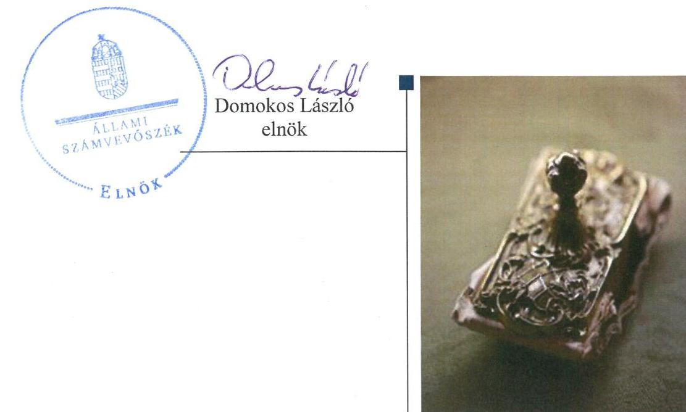

---

# AZ ELLENŐRZÉST FELÜGYELTE:

- BÖRÖCZ IMRE felügyeleti vezető
- AZ ELLENŐRZÉST VEZETTE ÉS A VÉGREHAJTÁSÁÉRT FELELŐS:
  - SALI SÁNDORNÉ ellenőrzésvezető
  - A PROGRAM ÖSSZEÁLLÍTÁSÁÉRT FELELŐS:
    - JANIK JÓZSEF LÁSZLÓ osztályvezető

**IKTATÓSZÁM:** V-1030-193/2016

**TÉMASZÁM:** 2064

**ELLENŐRZÉS-AZONOSÍTÓ SZÁM:** V070923

Jelentéseink az Országgyűlés számítógépes hálózatán és az Interneta a www.asz.hu címen is olvashatóak.

---

# TARTALOMJEGYZÉK 

■ ÖSSZEGZÉS ..... 5
■ AZ ELLENŐRZÉS CÉLJA ..... 7
■ AZ ELLENŐRZÉS TERÜLETE ..... 8
■ AZ ELLENŐRZÉS HÁTTERE, INDOKOLTSÁGA ..... 9
■ A JELENTÉS LÉNYEGES KÉRDÉSKÖREI ..... 10
■ ELLENŐRZÉS HATÓKÖRE ÉS MÓDSZEREI ..... 11
■ MEGÁLLAPÍTÁSOK ..... 13
■ JAVASLATOK ..... 24
■ MELLÉKLETEK ..... 27
I. Sz. melléklet: Értelmező szótár ..... 27
■ FÜGGELÉK: ÉSZREVÉTELEK ..... 31
■ RÖVIDÍTÉSEK JEGYZÉKE ..... 43

---

.

---

# ÖSSZEGZÉS 

Az Állami Számvevőszék a Bihari Szociális Szolgáltató Nonprofit Kft. vagyonmegőrzési és gazdálkodási tevékenységének szabályszerűségét ellenőrizte a 2012-2014. évek közötti időszakra. Az Magyar Nemzeti Vagyonkezelő Zrt. tulajdonosi joggyakorlása szabályszerű volt. A Társaságnál a Számviteli Politika, a Leltározási Szabályzat és az Értékelési Szabályzat hiányossága miatt a vagyongazdálkodási feltételek kialakítása nem volt szabályos. A vagyonnyilvántartás megfelelt a jogszabályi előírásoknak. Az ingyenesen használatra átvett tárgyi eszközök után értékcsökkenést a jogszabályi előírásnak megfelelően nem számolhatott volna el, ezen túlmenően a bevételek, költségek és a ráfordítások elszámolása megfelelt az előírásoknak. Az önköltségszámítás nem volt szabályszerű a szabályozási és a költségfelosztási hiányosságok miatt. Az adatok közzététele során az ügyvezető nem biztositotta a jogszabálynak megfelelően a Társaság müködésének átláthatóságát.

## Az ellenőrzés társadalmi indokoltsága

Magyarországon az intézmény-centrikus közfeladat-ellátás, közvagyon gazdálkodás jellemző a költségvetésen kívüli feladatellátás térnyerése mellett. Ennek szereplői a nonprofit szervezetek, az önkormányzati tulajdonú gazdasági társaságok és az állami tulajdonú gazdálkodó szervezetek is.

Az Áht. 2. § (1) bekezdésének I) pontja, az Európai Közösséget létrehozó szerződéshez csatolt, a túlzott hiány esetén követendő eljárásról szóló jegyzőkönyv alkalmazásáról szóló 2009. május 25-i 479/2009/EK rendelet szerint, illetve az ESA95 statisztikai módszertana alapján a kormányzati szektorba tartoznak „központi kormányzat szektorba besorolt társaságok és egyéb szervezetek", amelyekkel szemben alapvető követelmény, hogy gazdálkodásuk, működésük szabályszerű, az általuk szolgáltatott adatok megbízhatóak legyenek.

Az állami tulajdonú gazdálkodó szervezetek a nemzeti vagyon részét képezik. Az állami vagyonnal való gazdálkodást illetően a tulajdonosi joggyakorlás és a vagyongazdálkodás feladata az állami vagyon átlátható, rendeltetésszerű és felelős felhasználásának biztosítása. Az állam meghatározza az ellátandó közszolgáltatással kapcsolatos feladatokat, amelyhez a vagyonnal kapcsolatos döntéseknek igazodniuk kell. A nemzetgazdasági szempontból kiemelt jelentőségű, nemzeti vagyonban tartandó, állami tulajdonban álló társasági részesedést a nemzeti vagyonról szóló törvény határozza meg.

Minden közpénzt, közvagyont használó szervezettel szemben társadalmi igény, hogy tevékenységükről elszámoljanak. Ezt figyelembe véve és az Állami Számvevőszék stratégiájával összhangban került sor a BSZSZ NKft. ellenőrzésére.

## Főbb megállapítások, következtetések, javaslatok

A tulajdonosi joggyakorló MNV Zrt. a jogszabályi előírásoknak megfelelően alakította ki a vagyongazdálkodás feltételeit, tevékenysége szabályos volt. A BSZSZ NKft. saját tulajdonú, valamint a részére ingyenesen átadott tárgyi eszközökkel látta el feladatait.

A BSZSZ NKft. a vagyongazdálkodás feltételeit nem a jogszabályi előírások szerint alakította ki. A Számviteli Politika ${ }_{1,2}$ nem volt összhangban az előírásokkal, mert nem tartalmazta, hogy mit tekintenek a számviteli elszámolás, illetve az értékelés szempontjából lényegesnek, nem lényegesnek, illetve jelentősnek, nem jelentősnek, és nem törölték a megbízható és valós képet lényegesen befolyásoló hiba meghatározását a jogszabályi változásnak megfelelően. Továbbá az értékvesztés elszámolását helytelenül lehetőségként határozták meg, azonban azt bizonyos felté-

---

telek teljesülése esetén kötelezettségként kell előírni. Az ingatlanok leltározásának gyakoriságát a jogszabályi előírással ellentétesen határozta meg a Leltározási Szabályzat ${ }_{1,2}$-ban. Az év végi árfolyam-különbözet minősítésének előírásait nem hozta összhangba a jogszabályi változással az Értékelési Szabályzat ${ }_{1,2}$-ben.

A vagyon nyilvántartása megfelelt a jogszabályi előírásoknak. A bevételek, költségek és ráfordítások szabályozása és elszámolása szabályos volt, annak ellenére, hogy az ingyenesen használatra kapott tárgyi eszközök után nem számolhatott volna el értékcsökkenést, mert jogszerűen azt az eszközök tulajdonosa számolhatja el. A tulajdonában nem szereplő tárgyi eszközök után ugyanakkor az anyagjellegú ráfordítások között, a rendkívüli bevételekkel szemben értékcsökkenést számolt el. A hiba a mérleg szerinti eredményre és annak megbízhatóságára nem volt hatással. A saját vagyonhoz kapcsolódó bevételek és ráfordítások elszámolása szabályos volt. Az Önköltségszámítási Szabályzat ${ }_{1,2}$ nem határozta meg a szociális ellátási feladatok közvetlen önköltségének körét és a kalkulációs módszerét. Mindemellett a költségfelosztás sem volt szabályszerű, mivel a közös költségeket szolgáltatási intézmények száma alapján osztotta fel a jogszabályi és a belső szabályozási előírás ellenére.

A Társaság vagyongazdálkodási tevékenysége megfelelt a jogszabályi előírásoknak. A vagyonváltozást eredményező döntések szabályosak voltak. A BSZSZ NKft. teljesítette beszámolási kötelezettségét, a tulajdonosi joggyakorló jóváhagyta az éves beszámolókat, a könyvvizsgálói vélemény rendelkezésre állt.

A közérdekű adatszolgáltatásra vonatkozó belső szabályzattal nem rendelkezett a Társaság, amely ellentétes az Info tv.-ben foglaltakkal. A szabályozási hiányosság következtében az adatokat hiányosan tette közzé honlapján, ami nem volt összhangban a jogszabályban előírtakkal. Az adatfelelős a jogszabályi előírás ellenére nem alakította ki belső szabályzatban a részére előírt kötelezettség teljesítésének részletes szabályait. A BSZSZ NKft. kialakított és múködtetett információs rendszert. Kormányzati szektorba sorolt egyéb szervezetként adatszolgáltatási kötelezettségét késedelmesen teljesítette, továbbá, mint ilyen szervezetként 2014. évtől a Bkr. hatálya alá tartozott, független belső ellenőrzést ennek ellenére nem alakított ki.

A BSZSZ NKft. gazdálkodásának a kormányzati szektor hiányára befolyást gyakorló elemei szabályszerűek voltak.
Az ÁSZ a Társaság ügyvezetőjének és az MNV Zrt. vezérigazgatójának fogalmazott meg javaslatokat, amelyek alapján kötelesek intézkedési tervet összeállítani és azt a jelentés kézhezvételétől számított 30 napon belül az ÁSZ részére megküldeni.

---

# AZ ELLENŐRZÉS CÉLJA 

Az ellenőrzés célja annak értékelése volt, hogy a tulajdonosi jogok gyakorlása szabályszerű volt-e;
a gazdálkodó szervezet által ellátott feladat bevételei, ráfordításai elszámolásának, és vagyongazdálkodási tevékenységének szabályozása megfelelt-e a jogszabályi és a tulajdonosi előírásoknak és azok végrehajtása szabályszerű volt-e;
biztosítva volt-e a közfeladatok átláthatósága és elszámoltathatósága érdekében a közszolgáltatás dijának megalapozottsága szabályszerű önköltségszámítással;
a vagyonváltozást eredményező döntések esetében a tulajdonosi jogok gyakorlója és a gazdálkodó szervezet szabályszerűen jártak-e el;
a gazdálkodó szervezet épített-e ki és működtetett-e információs rendszert a szabályszerű vagyongazdálkodás érdekében.

Az ellenőrzés célja volt annak értékelése is, hogy a kormányzati szektorba sorolt egyéb szervezetek gazdálkodásának a kormányzati szektor hiányára és az államadósságra befolyással bíró elemei a jogszabályi előírásoknak megfeleltek-e.

---

# AZ ELLENŐRZÉS TERÜLETE

## A BSZSZ NKft.

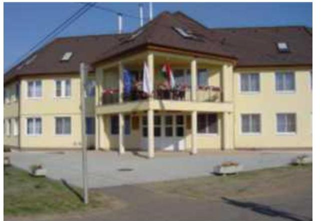

A megyei önkormányzatok konszolidációjáról, a megyei önkormányzati intézmények és a Fővárosi Önkormányzat egyes egészségügyi intézményeinek átvételéről szóló 2011. évi CLIV. törvény alapján többek között a megyei önkormányzatok tulajdonában lévő, jogi személyiséggel rendelkező társaságok, ennek megfelelően a BSZSZ NKft.1 is 2012. január 1-jén állami tulajdonba került. A BSZSZ NKft. jogelőd intézményét, a Dermák Derecskei Mentálhigiénés és Ápolási Központ Közhasznú Társaságot 1996. november 15-én alapította az akkori tulajdonos, a MIK2. A Társaság 1998. január 1-től kiemelten közhasznú tevékenységet folytatott. A korlátolt felelősségű társaság 2009. március 27-től nonprofit korlátolt felelősségű társaságként működött, neve BSZSZ NKft-re változott. A Társaság jogállása 2012. január 1-jével közhasznúra módosult.

A Társaság 2012. január 1-jével került állami tulajdonba, az MNV Zrt.3 tulajdonosi joggyakorlása alá és ezzel egy időben a Társaság részesedése – az MNV Zrt. és a MIK közötti szerződés alapján – a MIK vagyonkezelésébe került. A Társaság részesedése 2013. március 29-től – a vagyonkezelői jogviszony felbontásával – került az MNV Zrt. közvetlen kezelésébe.

Az ellenőrzött időszakban a Társaság fő tevékenysége az idősek és fogyatékosok bentlakásos ellátása volt. Alapító Okirata alapján a főtevékenység mellett egyéb közhasznú és üzletszerű gazdasági tevékenységet is végezhetett. Az ellenőrzött időszakban az ügyvezető és a gazdasági vezető személye változatlan volt.

A különböző szociális ellátási feladatokra a Társaság (értelmi fogyatékosok, pszichiátriai betegek, időskorúak, szenvedélybetegek ápoló-gondozó, rehabilitációs, illetve átmeneti ellátására) 2012. január 1-jén a MIK-kel ellátási szerződést4 kötött, mely a teljes ellenőrzött időszakban hatályba volt. A szerződésben szereplő feladatok tárgyi feltételeinek biztosítása érdekében a MIK öt, az állami vagyon körébe tartozó ingatlant, valamint egyéb tárgyi eszközöket adott át a Társaságnak ingyenesen használatra. A Társaság a MIK-kel – az állami tulajdonban lévő 4029 Debrecen Monti Ezredes utca 7. szám alatt található ingatlanra – 2013. február 25-én ingyenes használati megállapodást kötött. Ez az ingatlan lett 2013. március 1-től a Társaság székhelye.

Mérlegében a 2014. év végén szereplő összes eszközvagyon könyv szerinti értéke 554,8 M Ft5 volt, vagyonkezelésbe nem vett át vagyont. A saját tőke összege a 2014. év végén 29,1 M Ft, a jegyzett tőke 3,3 M Ft, a kötelezettségek összege 189,0 M Ft, az értékesítés nettó árbevétele 579,3 M Ft, továbbá a mérleg szerinti eredménye 27,2 M Ft volt.

A BSZSZ NKft. a 2013. és a 2014. években kormányzati szektorba sorolt egyéb szervezet volt.

---

# AZ ELLENŐRZÉS HÁTTERE, INDOKOLTSÁGA 

Az ÁSZ ${ }^{6}$ alapvető célkitűzése, hogy az államháztartáson kívülre nyújtott költségvetési támogatások és ingyenes vagyon juttatások ellenőrzésével hozzájáruljon ahhoz, hogy a közpénzeket az államháztartáson kívül múködő szervezetek is átlátható módon használják fel a közfeladatok szerződésben vállalt ellátása érdekében. Az államháztartásról szóló törvény értelmében a közfeladatok ellátása elsősorban költségvetési szervek alapításával és működtetésével történik. Az államháztartáson kívüli szervezetek a közfeladatok ellátásában, jogszabályban meghatározott feltételekkel, közreműködhetnek.

Az Áht. ${ }^{7}$ nevesíti a kormányzati szektorba sorolt egyéb szervezet fogalmát. E körbe tartoznak azok a szervezetek, amelyek nem részei az államháztartásnak, azonban az Európai Közösséget létrehozó szerződéshez csatolt, a túlzott hiány esetén követendő eljárásról szóló jegyzőkönyv alkalmazásáról szóló 2009. május 25-i 479/2009/EK rendelet szerint a kormányzati szektorba tartoznak. A nemzeti számlák nemzetközi és hazai statisztikai módszertana és szabványai elveket határoznak meg a statisztikai értelemben vett kormányzati szektorba tartozó szervezetek körére és besorolásuk módjára. A szervezetek megnevezését a nemzetgazdasági miniszter teszi közzé.

A kormányzati szektorba sorolt egyéb szervezet többek között köteles adatszolgáltatást teljesíteni a központi költségvetésről szóló törvény elkészítéséhez, továbbá adósságot keletkeztető ügyletet csak az államháztartásért felelős miniszter előzetes egyetértésével köthet.

Az ellenőrzés várható hasznosulásaként az ellenőrzés megállapításai a jogalkotás számára segítséget nyújthatnak az államháztartáson kívüli köz-feladat-ellátás, közvagyonnal való gazdálkodás értékeléséhez, jogszabályi keretei pontosításához, az átláthatóságot biztosító szabályozáshoz. Az ellenőrzöttek számára visszajelzést ad a gazdálkodási tevékenységgel, az állami vagyon felhasználásával, a közszolgáltatási árképzés megalapozottságával és az éves elszámolással kapcsolatos szabálytalanságokról és kockázatokról. Az ellenőrzés tapasztalatai segítik és erősítik az ÁSZ hozzáadott értéket teremtő elemző tevékenységét és tanácsadó szerepét. A kormányzati szektorba sorolt, költségvetési tervezésbe is bevont gazdálkodó szervezetek ellenőrzése fokozza a legfőbb ellenőrző szerv iránti figyelmet és közbizalmat.

---

# A JELENTÉS LÉNYEGES KÉRDÉSKÖREI 

1.     - A tulajdonosi joggyakorló a vagyonnal való gazdálkodás feltételeit szabályszerűen alakította-e ki?
2.     - A Társaság vagyongazdálkodási tevékenységének szabályozása, kialakítása, a vagyon nyilvántartása megfelelt-e az előírásoknak?
3.     - A bevételek és ráfordítások elszámolásának szabályozása és végrehajtása, valamint az önköltségszámitás szabályszerű volt-e?
4.     - A vagyonnal való gazdálkodás, valamint a változást eredményező döntések megfeleltek-e a jogszabályi és a belső előírásoknak?
5.     - A gazdálkodó szervezet a szabályszerű vagyongazdálkodás érdekében teljesítette-e beszámolási kötelezettségét, kiépített-e és müködtetett-e információs rendszert?
6.     - A Társaság gazdálkodásának a kormányzati szektor hiányára és az államadósságra befolyást gyakorló elemei a jogszabályi előírásoknak megfeleltek-e?

---

# ELLENŐRZÉS HATÓKÖRE ÉS MÓDSZEREI 

## Az ellenőrzés típusa

Szabályszerúségi ellenőrzés

## Az ellenőrzött időszak

2012. január 1-jétől 2014. december 31-ig.

## Az ellenőrzés tárgya

Állami tulajdonban (résztulajdonban) lévő gazdálkodó szervezetek vagyonmegőrzési és gazdálkodási tevékenységének ellenőrzése, valamint a kormányzati szektor hiányára és adósságállományára hatást gyakorló elemek ellenőrzése.

## Az ellenőrzött szervezet

BSZSZ NKft., MNV Zrt.

## Az ellenőrzés jogalapja

Az Állami Számvevőszékről szóló 2011. évi LXVI. törvény 5. § (3)-(5) bekezdése, valamint az állami vagyonról szóló 2007. évi CVI. törvény 3. § (4) bekezdése képezi.

## Az ellenőrzés módszerei

Az ellenőrzést a számvevőszéki ellenőrzés szakmai szabályai szerint, a szabályszerűségi ellenőrzés módszerével, a vonatkozó nemzetközi standardok és az adott időszakban hatályos jogszabályok figyelembevételével végeztük.

Az ellenőrzés lefolytatásához a BSZSZ NKft. tanúsítványok kitöltésével, valamint az ÁSZ által kért dokumentumok megküldésével szolgáltatott adatokat. A rendelkezésre bocsátott adatok, információk kontrollja és a munkalapok kitöltése a helyszíni ellenőrzés keretében történt.

Mintavétellel ellenőriztük az értékesítés nettó árbevétel, az egyéb bevételek, pénzügyi műveletek bevételei, rendkívüli bevételek, az anyagjellegű ráfordítások, a személyi jellegű ráfordítások, a beruházások, felújítá-

---

sok aktiválása, az értékcsökkenési leírás, az egyéb ráfordítások és a pénzügyi művelet ráfordításai, továbbá a rendkívüli ráfordítások elszámolásának szabályszerűségét, valamint a vagyonnyilvántartás területén a szabályszerű működést. A mintavétellel ellenőrzött területek esetében minden egyes tétel vonatkozásában a szabályszerűségre vonatkozó kérdéseket tettünk fel, amelyek eredménye összesítésre került. A jogszabályoknak és a belső előírásoknak megfelelőnek tekintettük az adott területet, amennyiben a minta ellenőrzésének eredménye alapján 95\%-os bizonyossággal a teljes sokaságban a hibaarány kisebb volt, mint 10\%, nem megfelelőnek, ha a 10\%-ot meghaladta. A ráfordítások elszámolására és a vagyonnyilvántartásra vonatkozó véletlen mintavételt kockázati alapú kiválasztással egészítettük ki, amelynek során évente a három legnagyobb összegű tételt választottuk ki.

---

# 1. A tulajdonosi joggyakorló a vagyonnal való gazdálkodás feltételeit szabályszerűen alakította-e ki? 

Összegző megállapítás

A tulajdonosi joggyakorló szabályosan alakította ki a vagyongazdálkodás feltételeit. A vagyonnal való gazdálkodás követelményeit az Alapító Okirat és annak módosításai tartalmazták. Az ingyenesen használatra átvett vagyonnal kapcsolatban az ellátási szerződés rögzítette az előírásokat.
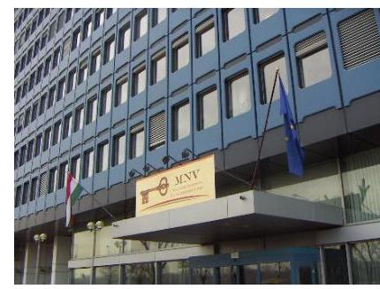

A BSZSZ NKft. 2012. január 1-jén került az MNV Zrt. tulajdonosi joggyakorlása alá és ezzel egy időben - az MNV Zrt. és a MIK közötti szerződés alapján - a BSZSZ NKft. társasági részesedése a MIK vagyonkezelésébe került. A MIK 2013. március 28-ig volt a társasági részesedés vagyonkezelője a szerződés szerint.

A TULAJDONOSI JOGGYAKORLÓ MNV Zrt. a vagyonkezelési szerződésben rögzítette a részesedés feletti vagyonkezelés módját, a felek jogait és kötelezettségeit. Meghatározta továbbá a részesedés értékének megőrzését, gyarapítását, a felelős gazdálkodáshoz szükséges követelményeket, a részesedés nyilvántartását, az adatszolgáltatási kötelezettséget, a vagyonnal történő elszámolást, valamint az MNV Zrt. tulajdonosi ellenőrzési jogát. A szerződés a felek közös megegyezésével, a 2013. március 29-én kelt megállapodással megszűnt az Nvtv. ${ }^{8}$ 8. § (7) bekezdésének - 2012. június 30-án hatályba lépett - módosítása miatt, mely szerint a gazdasági társaságban fennálló állami tulajdonban lévő társasági részesedés nem lehetett vagyonkezelés tárgya. A BSZSZ NKft. részesedése 2013. március 29-től az MNV Zrt. közvetlen kezelésébe került.

Az ellenőrzött időszakban a Társaság szabályszerűen látta el közhasznú feladatait, amely részben saját tulajdonú vagyonnal, részben az ellátási szerződés alapján, a MIK által ingyenesen használatba adott tárgyi eszközökkel történt.

AZ ALAPÍTÓ OKIRATBAN az MNV Zrt. meghatározta a tulajdonos számára fenntartott, vagyongazdálkodásra vonatkozó jogokat a Gt. ${ }^{9}$, illetve a $\mathrm{Ptk}_{1}{ }^{10}$ előírásainak megfelelően. A Társaság tevékenységének kereteit - a jogszabályi előírások mellett - elsősorban az Alapító Okirat határozta meg, amely rögzítette a BSZSZ NKft. legfőbb szervére, ügyvezetőjére, könyvvizsgálójára és az $\mathrm{FB}^{11}$-re vonatkozó legfontosabb előírásokat. A Társaság - tulajdonosi joggyakorló általi - alapítói szabályozása az Alapító Okiratban és az Alapítói határozatokon keresztül történt.

Az ellenőrzött időszakban hatályos Alapító Okirat tartalmazott minden, a Gt. 12. § (1) bekezdésében, a Gt. 113. § (1) bekezdésében, a Ptk ${ }^{12}$ 54. §ban, illetve a Ptk ${ }_{2}$ 3:5. §-ban előírt tartalmi elemet. A hatályos Alapító Ok-

---

irat meghatározta a tulajdonosi joggyakorló kizárólagos hatáskörébe tartozó jogokat. Rögzítette továbbá, hogy a törvény által az alapító kizárólagos hatáskörébe utalt kérdéseken túl, az alapító kizárólagos hatáskörébe tartozott az éves üzleti terv elfogadása, a közhasznúsági jelentés elfogadása, valamint bármilyen összegű és típusú hitelfelvétel engedélyezése is.

# 2. A Társaság vagyongazdálkodási tevékenységének szabályozása, kialakítása, a vagyon nyilvántartása megfelelt-e az előírásoknak? 

Összegző megállapítás

A vagyongazdálkodási tevékenység szabályozásának kialakítása nem felelt meg az előírásoknak, a vagyonnyilvántartás szabályos volt.

### 2.1. számú megállapítás

## A Társaságnál nem volt megfelelő a vagyongazdálkodás feltételeinek szabályozása.

A Társaság éves Üzleti tervei tartalmazták az adott év gazdálkodására vonatkozó elképzeléseket, amelyeket az alapító szabályosan, alapítói határozatokban fogadott el.

SZÁMVITELI POLITIKA ${ }_{1,2}{ }^{1314}$-vel az ellenőrzött időszakban rendelkezett a Társaság, azonban az nem felelt meg a Számv. tv. ${ }^{15}$ 14. § (4) bekezdésében előírtaknak, mert nem tartalmazta, hogy mit tekintenek a számviteli elszámolás, illetve értékelés szempontjából lényegesnek, illetve jelentősnek, valamint nem lényegesnek és nem jelentősnek. A Számviteli Politika ${ }_{1,2}$ értékvesztéssel foglalkozó 10.4. pontja lehetőségként határozta meg az értékvesztés elszámolását, amely nem volt összhangban a Számv. tv. 54. § (1) bekezdésének, az 55. § (1) bekezdésének és az 56. § (1) bekezdésének előírásaival, melyek szerint - bizonyos feltételek teljesülése esetén - az értékvesztés elszámolása kötelezettség. Az ellenőrzött időszakban értékvesztés elszámolása nem volt szükséges, ezért a szabályozási hiányosság a gyakorlatban nem jelentett problémát.

A Számv. tv. 14. § (5) bekezdése alapján a Társaság a Számviteli Politika ${ }_{1}$ részeként elkészítette Leltározási Szabályzat ${ }_{1}{ }^{16}$-et, Értékelési Szabályzat ${ }_{1}{ }^{17}$ et, Önköltségszámítási Szabályzat ${ }_{1}{ }^{18}$-et és Pénzkezelési Szabályzat ${ }_{1}{ }^{19}$-et. Az ellenőrzött időszakban a Számv. tv. Számviteli Politika ${ }_{1}$-et is érintő előírása változott. Szabályzatait a Számviteli Politika ${ }_{1}$ módosításával egyidejűleg, 2013. március 26 -ai hatálybalépéssel aktualizálta.

A Társaság nem törölte az ellenőrzött időszak végéig a Számviteli Poli-tika ${ }_{2}$-ből - a Számv. tv. 3. § (3) bekezdése 5. pontjának 2013. január 1-jétől történő hatályon kívül helyezése miatt, a változást követő 90 napon belül - a megbízható és valós képet lényegesen befolyásoló hiba meghatározását. A módosítás elmaradása ellentétes volt a Számv. tv. 14. § (11) bekezdésében előírtakkal.

A LELTÁROZÁSI SZABÁLYZAT ${ }_{1,2}{ }^{20}$ 5.1. pontja nem felel meg a Számv. tv. 69. § (3) bekezdésében foglaltaknak, amely szerint legalább háromévente mennyiségi leltározást kell végezni. Ezzel ellentétesen

---

a Leltározási Szabályzat ${ }_{1,2}$ az ingatlanok ötévente, mennyiségi felvétellel történő leltározását írta elő a Társaság részére. A Társaság az ellenőrzött időszakban a számviteli alapelveknek megfelelő folyamatos mennyiségi nyilvántartást vezetett.

ÉRTÉKELÉSI SZABÁLYZAT ${ }_{1,2}{ }^{21}$-vel a Társaság a Számv. tv. 14. § (5) bekezdés b) pontjában előírtaknak megfelelően rendelkezett. Az Értékelési Szabályzat ${ }_{1,2}$ 2.3.2., 2.3.4. és 3.2. pontja alapján a devizás eszközök és kötelezettségek év végi, nem realizált árfolyam-különbözetét minősíteni kellett. Amennyiben a különbözet jelentős volt, azt a tárgyévi eredmény terhére vagy javára el kellett számolni. Az év végi árfolyam-különbözet ilyen minősítését a Számv. tv. 60. § (2) bekezdése 2011-től már nem tette lehetővé, mert ezt követően ezeket a mérleg fordulónapjára vonatkozó devizaárfolyamon átszámított forintértéken kellett kimutatni. Az ellenőrzött időszakban a Társaság Értékelési Szabályzat ${ }_{1,2}$ nem volt összhangban a Számv. tv. 60. § (2) bekezdésében foglaltakkal.

Az ellenőrzött időszakban árfolyam különbözet elszámolása nem vált szükségessé, ezért a szabályozási hiányosság a gyakorlatban nem okozott problémát.

A PÉNZKEZELÉSI SZABÁLYZAT ${ }_{1,2}{ }^{22}$ megfelelt a Számv. tv. 14. § (8)-(9) bekezdéseinek, többek között tartalmazta a pénzforgalom rendjét, a pénzkezelés tárgyi és személyi feltételeit, a pénzszállítás rendjét és a maximális pénztárállomány meghatározását.

# SELEJTEZÉSI SZABÁLYZAT ${ }_{1,2}{ }^{2324}$-vel ÉS VAGYON- 

VÉDELMI SZABÁLYZAT ${ }_{1,2}{ }^{2526}$-vel folyamatosan rendelkezett a BSZSZ NKft. A Vagyonvédelmi Szabályzat ${ }_{1,2}$ rögzítette a vagyonvédelmi tevékenység céljait és feladatait, a vagyon megőrzését és védelmét biztosító intézkedéseket. Elkészítették a Javadalmazási Szabályzatot ${ }^{27}$ is.

A BSZSZ NKft. egyes szabályzatai (Leltározási Szabályzat ${ }_{1,2}$, Pénzkezelési Szabályzat ${ }_{1,2}$ ), valamint az ügyvezetőre vonatkozóan az Alapító Okirat tartalmaztak az adott szabályozás tekintetében a feladat- és hatáskörökre, illetve a felelősségi viszonyokra vonatkozó előírásokat. Nem határozták meg azonban a Társaság szervezetének egészére vonatkozó feladat- és hatásköröket, a felelősségi viszonyokat, valamint a szervezet vezetését és egységeit, a munkavégzés főbb szabályait, az egyes munkakörökre vonatkozó szabályokat, továbbá a Társaság működésének és tevékenységének rendjét.

SZÁMLAREND ${ }_{1,2}{ }^{2829}$-vel a Számv. tv. 161. § (1) bekezdésének megfelelően rendelkezett az ellenőrzött időszakban a BSZSZ NKft. A Számlarend $_{1,2}$ tartalma megfelelt a jogszabályi előírásoknak.

### 2.2. számú megállapítás

A vagyon nyilvántartása szabályos volt.
A Társaság vagyonnyilvántartása és elszámolása összhangban volt a számviteli előírásokkal. A vagyonváltozás kimutatása folyamatos volt.

Az éves beszámolókban és a számviteli nyilvántartásokban megjelent, saját vagyonra vonatkozó leltárt a Társaság a Leltározási Szabályzat ${ }_{1,2}$-ben foglaltak alapján készítette el. Az Értékelési Szabályzat ${ }_{1,2}$ alapján a saját va-

---

gyonra vonatkozó leltározást mennyiségi felvétellel, a csak értékben kimutatott eszközöknél és kötelezettségeknél egyeztetéssel végezte el évente, a leltár összeállítását megelőzően. Az eljárás megfelelt a Számv. tv. 69. § (3) bekezdésében foglaltaknak.

RÉSZESEDÉSE a BSZSZ NKft-nek egy NKft ${ }^{30}$-ben volt, 0,1 M Ft öszszeggel. Az NKft. jegyzett tőkéje az ellenőrzött időszak minden évében 3,5 M Ft volt. Az NKft. folyamatosan nyereséges volt (2012-ben és 2013ban is $0,1 \mathrm{MFt}$, 2014-ben 9,1 M Ft volt a mérleg szerinti eredménye). A saját tőkéjének összege (2012-ben 4,1 M Ft, 2013-ban 4,2 M Ft, 2014-ben 13,6 M Ft) minden évben meghaladta a jegyzett tőke összegét. Az egyéb tartós részesedés után értékvesztés elszámolására nem volt szükség, a Számv. tv. 54. §-ában rögzített feltételek az NKft. vonatkozásában nem álltak fenn.

# 3. A bevételek és ráfordítások elszámolásának szabályozása és végrehajtása, valamint az önköltségszámítás szabályszerű volt-e? 

Összegző megállapítás

A bevételek, költségek és ráfordítások szabályozása és elszámolása szabályos volt. Az ingyenesen használatra kapott tárgyi eszközök után a Társaság nem számolhatott el értékcsökkenést, annak elszámolása szabálytalan volt. Az önköltségszámítás nem volt szabályos.
3.1. számú megállapítás

1. ábra

| Az ellenőrzés megállapítása |  |
| :-- | :-- |
| A anyagirlegi ráfordítások | MISZTÉSZ |
| Beszközvek aktivitása,   ellentévésemélkezés   elszámolása | MISZTÉSZ |
| Értékesítés nettó átbevétele | MISZTÉSZ |
| Egyéb ráfordítások, pénzügyi   műveletén ráfordítások,   rendkésőt ráfordítások | MISZTÉSZ |
| Egyéb bevételek, pénzügyi   műveletén bevételek, rendkésőt   felvételok | MISZTÉSZ |
| Személyi jellegú ráfordítások | MISZTÉSZ |

A bevételeket, költségeket és ráfordításokat szabályszerűen számolták el. Az ingyenesen átvett tárgyi eszközök értékcsökkenésének elszámolása nem volt szabályos.

Az ellenőrzött időszakban a közfeladatok bevételeit, költségeit és ráfordításait a BSZSZ NKft. szabályosan számolta el. A mintavétellel ellenőrzött területek értékelését az 1. ábra tartalmazza.

A BEVÉTELEK elszámolása szabályosan történt. Az anyagjellegú ráfordítások esetében a költségek elszámolásának dokumentumai (számlák és szerződések) rendelkezésre álltak. A számlák a formai és tartalmi követelményeknek megfeleltek. A közhasznú, valamint a vállalkozási tevékenység bevételeit, ráfordításait és eredményét minden évben szabályosan bemutatták az éves közhasznúsági jelentésekben és mellékletekben. A közhasznú bevételek az ellenőrzött időszakban 17\%-kal növekedtek. A vállalkozási tevékenységből származó bevétel az összbevételéhez képest nem volt jelentős (2012-ben 0,6\%, 2013-ban 1,4\%, 2014-ben 1,6\%). A ráfordítások kisebb mértékben ( $12,7 \%$-kal) növekedtek, mint a bevételek. Ennek eredményeként a veszteség a 2014. évre nyereségre változott.

A KÖLTSÉGEK ÉS RÁFORDÍTÁSOK elszámolása - az ingyenesen használatra kapott tárgyi eszközök értékcsökkenése kivételével a jogszabályi előírásoknak megfelelően történt. A saját tulajdonú eszközök

---

értékcsökkenésének meghatározása és elszámolása megfelelt a Számv. tv. 52. §-ában és a Számviteli Politiká ${ }_{1,2}$-ban előírtaknak, szabályos volt.

A NYILVÁNTARTÁSBAN NEM SZEREPLŐ, ingyenesen használatra kapott tárgyi eszközök után a Társaság az értékcsökkenést nem számolhatta volna el, ennek elszámolása szabálytalan volt. Az anyagjellegú ráfordítások között, a rendkívüli bevételekkel szemben számoltak el a tulajdonukban nem szereplő tárgyi eszközök után, az ellenőrzött időszakban összesen 120,7 M Ft értékű értékcsökkenést. A Társaság mérlegében nem szereplő tárgyi eszközök értékcsökkenésének elszámolása nem felelt meg a Számv. tv. 78. § (1)-(5), a 86. § (3)-(5) bekezdéseknek, amelyek tartalmazták, hogy mely tételek számolhatók el anyagjellegú ráfordításként, rendkívüli bevételként és ezek között az értékcsökkenés nem szerepelt. A helytelen elszámolás a bevételek és a költségek között halmozódást okozott, azonban a mérlegszerinti eredményt és annak megbízhatóságát nem befolyásolta.

A VEVŐKÖVETELÉSEK állománya az ellenőrzött időszakban 19,8\%-kal nőtt, meghaladva a térítési díjbevételek növekedését. Ebből a gondozottakkal szembeni vevőkövetelés 2012-ben 80,5\%-ot, 2013-ban 83,9\%-ot és 2014-ben 82,9\%-ot tett ki. A gondozottak tényleges tartozása a mérlegben szereplő értéknél 2012-ben magasabb volt, mivel a gondozottak túlfizetései nem kerültek átcsoportosításra a kötelezettségek közé. Így a mérlegfőösszeget 2012-ben 4,2 M Ft-tal alacsonyabb összegben mutatták ki. A BSZSZ NKft. 2012-ben megsértette a Számv. tv. 15. § (9) bekezdésében foglaltakat, mely szerint a követelések és kötelezettségek egymással szemben nem számolhatók el. A hiba a mérlegfőösszeg 0,8\%-a volt, így nem minősült lényeges hibának, a mérleg valódiságát nem befolyásolta. A hibás elszámolás a 2013-2014. évi beszámolókban már nem fordult elő.

Az intézkedésre átadott követelések összes tartozáshoz viszonyított aránya a 2012. évi 38,9\%-ról 2014-re 47,6\%ra nőtt. Az eredményes behajtási arány ezzel szemben a 2012. évi 94,6\%-ról 2014-re 76,3\%-ra csökkent.

A követeléskezelés rendjét a Pénzkezelési Szabályzat ${ }_{1,2}$ rögzítette. A behajtás alatt lévő, hátralékos díjbevételekről a BSZSZ NKft.-nek külön nyilvántartása volt, amelyben szerepeltek a megtett behajtási, végrehajtási intézkedések is.
3.2. számú megállapítás

Az önköltségszámítás szabályozása és végrehajtása nem felelt meg a jogszabályi előírásoknak.

ÖNKÖLTSÉGSZÁMÍTÁSI SZABÁLYZAT ${ }_{1,2}{ }^{31}$-vel a Társaság - a Számv. tv. 14. (5) bekezdés c) pontjában előírtaknak megfelelően az ellenőrzött időszakban rendelkezett, amelynek azonban több hiányossága volt.

Az Önköltségszámítási Szabályzat ${ }_{1,2}$ nem határozta meg, hogy melyek azok a költségek, amelyeket a szociális ellátási feladatok közvetlen önköltségének körébe sorolnak. Ez ellentétes a Számv. tv. 82. § (1)-(2) bekezdéseivel, amelyek meghatározták, hogy mely költségek képezik az eszközök, illetve szolgáltatások bekerülési (előállítási) értékének a részét.

A Társaság nem írta elő a szociális ellátási feladatok közvetlen önköltségének kalkulációs módszerét és utókalkulációt sem készített. Ezen eljárás ellentétes a Számv. tv. 14. § (7) bekezdésének előírásával, amely szerint,

---

ha a költségnemek szerinti költségek együttes összege valamely üzleti évben az 500 M Ft-ot meghaladta - ami a Társaság esetében fenn állt - a szolgáltatások önköltségét az önköltségszámítás rendjére vonatkozó belső szabályzat szerinti utókalkuláció módszerével kell megállapítani.

Nem szabályozták a könyvviteli rendszerrel való egyeztetést sem, ami ellentétes az Önköltségszámítási Szabályzat ${ }_{1,2}$ II. fejezetének i) pontjában előírtakkal.

Az egyes tevékenységekkel kapcsolatos kiadások (közvetlen, közvetett) elszámolási, nyilvántartási rendjének - az Önköltségszámítási Szabályzat ${ }_{1,2}$ VII. fejezetében foglaltak szerinti - a Társaság Számlarend ${ }_{1,2}$-ben történő szabályozása nem valósult meg.

Az önköltséget az ellenőrzött időszakban a bázis időszakbeli tényadatokat figyelembe véve, az előkalkuláció során alakították ki, intézményenkénti bontásban. Az alkalmazott módszerrel az intézmény szintű költség kalkuláció követelménye teljesült.

A közös költségek felosztásakor a BSZSZ NKft. azokat a szolgáltatási intézmények száma alapján osztotta fel. Ez nem volt összhangban a Szoc. tv. ${ }^{32}$ 115. § (1) bekezdésében és az Önköltségszámítási Szabályzat ${ }_{1,2}$ II. pontjában foglaltakkal, melyek szerint az intézményi térítési díjat integrált intézmény esetében is szolgáltatásonként kell meghatározni, a közös költségelemek szolgáltatásonkénti közvetlen költségeinek arányában történő megosztásával.

# 4. A vagyonnal való gazdálkodás, valamint a változást eredményező döntések megfeleltek-e a jogszabályi és a belső előírásoknak? 

Összegző megállapítás

## 4.1. számú megállapítás

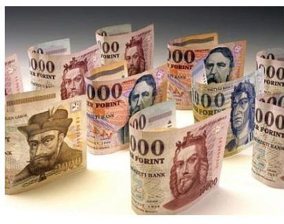

A Társaság vagyongazdálkodása, valamint a vagyonváltozást eredményező döntések a jogszabályi és belső előírásoknak megfeleltek.

A Társaság vagyongazdálkodása szabályszerű volt.
A VAGYON összegében és szerkezetében az ellenőrzött időszakban jelentősebb változások nem következtek be. Az összes vagyon a 20122014. közötti időszakban 0,6\%-kal nőtt, 2014. december 31-én 554,8 M Ft volt.

AZ ESZKÖZÖK között a tartós eszközök domináltak. A forgóeszközök és az aktív időbeli elhatárolások aránya csak a 2014. évben haladta meg valamelyest a 20\%-ot. A befektetett eszközök jellemzően (közel 98\%-ban) az ingatlanok értékét foglalták magukba. Ezen belül egy saját tulajdonú épület (derecskei tagintézmény) mérlegértéke (2014. évben 429,3 M Ft) volt a meghatározó.

---

Az eszközök összetételének változását a 2. ábra mutatja.
2. ábra

Az eszközök összetételének alakulása

| 1200 | 523,9 | 521,2 | 554,8 |
| :--: | :--: | :--: | :--: |
| 1000 |  |  |  |
| 800 |  |  |  |
| 600 |  |  |  |
| 400 |  |  |  |
| 200 |  |  |  |
| 0 | 2012. | 2013. | 2014. |
| - Befektetett eszközök | 460,7 | 448,6 | 438,4 |
| - Immateriális javak | 0,3 | 0,0 | 0,0 |
| - Tárgyi eszközök | 460,3 | 448,5 | 438,3 |
| - Forgóeszközök | 60,6 | 64,1 | 105,6 |
| - Készletek | 7,5 | 6,6 | 9,0 |
| - Követelések | 37,4 | 40,5 | 44,8 |
| - Pénzeszközök | 15,7 | 17,0 | 51,9 |
| - Aktív időbeli elhatárolások | 2,6 | 8,5 | 10,8 |

Forrás: a Társaság éves beszámolói
A befektetett eszközök értéke az ellenőrzött időszakban folyamatosan csökkent, a 2014. év végén 4,8\%-kal volt kevesebb a 2012. évinél, ami a beruházásoknál nagyobb összegű éves amortizációval függött össze.

A forgóeszközök szerkezetében egy jelentősebb változás következett be. Az ellenőrzött időszakban a pénzeszközök állománya több mint 3-szorosára nőtt, egy - a 2014. év végén, a költségek ellentételezésére kapott támogatás eredményeként.

A Társaság a saját tulajdonú vagyontárgyak esetében új tárgyi eszközök beszerzésére a 2012. évben 5,5 M Ft-ot, 2013-ban 4,4 M Ft-ot, a 2014. évben pedig 6,7 M Ft-ot fordított. Ez az összeg a 2012. évi amortizációnál (16,4 M Ft) 10,9 M Ft-tal, a 2013. évi amortizációnál (15,1 M Ft) 10,7 M Fttal, a 2014. évi amortizációnál (16,9 M Ft) pedig 10,2 M Ft-tal volt kevesebb. Az amortizáció fejlesztési forrásként történő felhasználását korlátozta, hogy a Társaságnak a 2012. évben 40,5 M Ft, 2013-ban 15,0 M Ft mérleg szerinti vesztesége volt. A 2014. évi nyereség (27,2 M Ft) már lehetővé tette, hogy a múködésből fejlesztési források képződjenek.

A SAJÁT TÖKE összege (1,9 M Ft) a 2012. és 2013. évi veszteség következtében 2013. december 31-én a jegyzett tőke értékénél (3,3 M Ft) alacsonyabb volt. A saját tőke/jegyzett tőkemutató nagysága 5,1-ről 0,6-ra csökkent a veszteség hatására.

---

A saját tőke alakulását a 3. ábra mutatja.
3. ábra
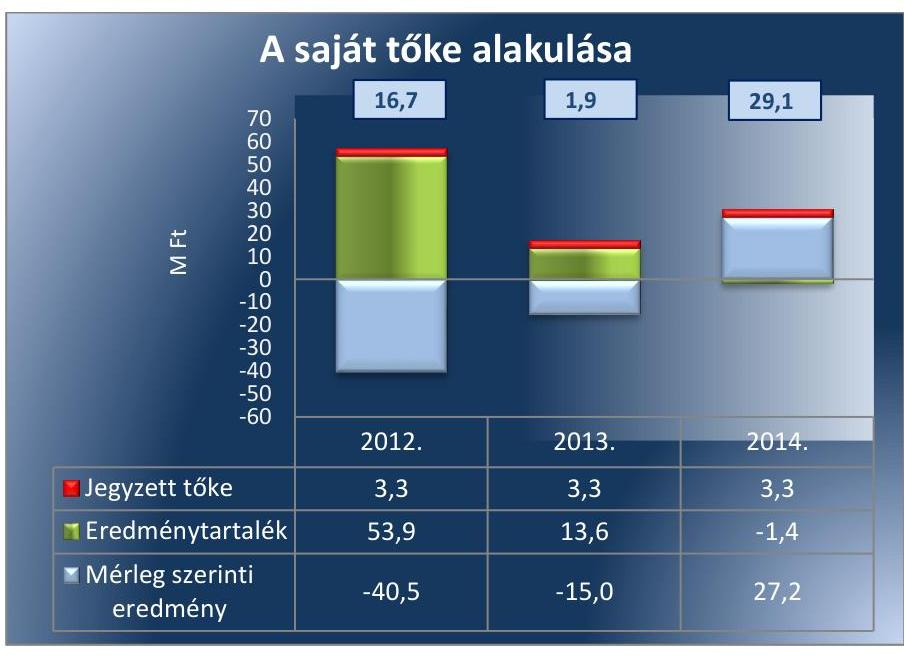

Ferrás: a Társaság éves beszámolói
A 2014. évi nyereség hatására változatlan jegyzett tőke mellett a saját tőke értéke 29,1 M Ft-ra nőtt, így a mutató értéke 8,8-ra emelkedett. A saját tőke törzstőkéhez viszonyított aránya az ellenőrzött időszak első két évében romlott, de a kritikus saját tőkeérték nem alakult ki.

Karbantartási terv, illetve felmérés az eszközök műszaki állapotáról nem készült, erre a BSZSZ NKft-nek jogszabály vagy tulajdonosi joggyakorló által előírt kötelezettsége, kezelt vagyon hiányában, nem volt. A saját tulajdonú és a használatra átvett eszközök fenntartási (üzemeltetési és karbantartási) költségeit és ráfordításait a Társaság éves üzleti tervei tartalmazták, amelyet a tulajdonosi joggyakorló valamennyi üzleti évben elfogadott.

A használatba vett állami vagyon tekintetében egy alkalommal került sor felújításra. A 2013. évben a derecskei Morgó tanya egyik épületének tetőszerkezetét kellett kicserélni. A nem tervezett munkálatokat a Társaság saját forrásból végeztette el, összege 0,2 M Ft volt. A munkálatok megkezdése előtti engedélyezési kötelezettséget a tulajdonos sem az Alapító Okiratban, sem az ellátási szerződésben nem írt elő a Társaság számára, így a Társaság nem kért a felújításhoz előzetes tulajdonosi hozzájárulást.

A KÖZBESZERZÉSI ELJÁRÁSOK lefolytatása a Társaságnál szabályszerű volt. Az eljárások során Kbt. ${ }^{33}$ előírásait figyelembe vették. A társaság Közbeszerzési Szabályzat ${ }_{1,2}{ }^{3435}$-vel rendelkezett, minden évre vonatkozóan közbeszerzési tervet készített, amelyet weboldalán közzétett. A közbeszerzések lebonyolítására közbeszerzői tanácsadót vett igénybe, a tanácsadóval megbízási szerződést kötött. Az ellenőrzött időszakban négy (2012-ben kettő, 2013. és 2014. években egy-egy) közbeszerzési eljárást folytattak le. Ezen belül az árubeszerzésre (élelmiszer) és szolgáltatások igénybevételére (takarítás) vonatkozó eljárások domináltak, a beszerzéseket minden esetben az ügyvezető hagyta jóvá.

---

# 4.2. számú megállapítás 

A tulajdonosi joggyakorló döntései megfeleltek az előírásoknak.

A Társaság az ellenőrzött időszakban az Alapító Okiratban foglaltak alapján terjesztette az Alapító elé az éves üzleti terveket, az éves beszámolókat, a közhasznúsági mellékleteket, továbbá az ügyvezető díjazásának megállapítására vonatkozó javaslatokat. A döntés-előkészítés fázisában az FB az előterjesztéseket megtárgyalta és azokat az Alapító számára határozatban minden esetben elfogadásra javasolta.

Az ügyvezető bérjuttatásairól készített előterjesztéseket az FB minden alkalommal megtárgyalta, határozatában elfogadta és az előterjesztést az Alapító számára is elfogadásra javasolta.

A Társaság az ellenőrzött időszakban három alkalommal vett igénybe éven belüli lejárattal - forgóeszköz-hitelt. Az alapító határozatokban döntött a hitelfelvételek engedélyezéséről.

A MIK ingyenesen használatba adott vagyont (ingatlanok és ingóságok) az ellátási szerződés alapján a Társaság feladatellátásához. Az ingyenes használatba adás öt ingatlan (Derecske, Hajdúszoboszló, Báránd, SzerepHosszúhát, Komádi), valamint a leltárban szereplő tárgyi eszközök átadását jelentette.

## 5. A gazdálkodó szervezet a szabályszerű vagyongazdálkodás érdekében teljesítette-e beszámolási kötelezettségét, kiépített-e és múködtetett-e információs rendszert?

Összegző megállapítás

### 5.1. számú megállapítás

A Társaság teljesítette beszámolási kötelezettségét, kiépítette és múködtette az információs rendszert, azonban a közzététel és az adatszolgáltatás nem volt szabályszerű és a belső ellenőrzést nem alakította ki és nem múködtette.

A BSZSZ NKft. teljesítette beszámoló készítési kötelezettségét, azonban a közzététel és az adatszolgáltatás teljesítése nem volt minden esetben szabályos.

A Társaság a Számv. tv. 17. § (1) bekezdésében előírtaknak megfelelően elkészítette éves beszámolóit és azzal egyidejűleg üzleti jelentéseit is a Számv. tv. 19. § (1) bekezdésével összhangban. A 2012-2014. üzleti évekre vonatkozó közhasznúsági mellékleteket is elkészítette.

AZ ÉVES BESZÁMOLÓKAT a tulajdonosi joggyakorló minden évre vonatkozóan jóváhagyta, a könyvvizsgálói jelentések és az FB határozatok rendelkezésre álltak. A könyvvizsgálói jelentések megfeleltek a Számv. tv. 156. § (5) bekezdésében foglaltaknak. Az éves beszámolók letétbe helyezése és közzététele határidőben megtörtént.

A KÖZÉRDEKŰ ADATOK megismerésére irányuló igények teljesítésének rendjét rögzítő szabályzatot a Társaság az ellenőrzött időszakban nem készített, amely ellentétes az Info tv. ${ }^{36}$ 30. § (6) bekezdésében foglaltakkal.

---

A Társaság ügyvezetője - az adatfelelős szerv vezetőjeként - az Info tv. 35. § (3) bekezdésében előírtak ellenére nem gondoskodott az adatfelelős jogszabály által előírt kötelezettsége részletes szabályainak belső szabályzatban történő megállapításáról.

A BSZSZ NKft. rendelkezett Adatvédelmi és Adatkezelési Szabályzat ${ }_{1,2}{ }^{3738}$-vel az Info tv. 24. § (3) bekezdésében előírt tartalomnak megfelelően, annak ellenére, hogy nem a jogszabálynak megfelelően történt a megnevezése (Adatvédelmi és Adatbiztonsági Szabályzat készítését rögzíti a törvény).

A Társaság az előírt adatokat azonban hiányosan tette közzé a honlapján, amely nem felelt meg az Info tv. 37. § (1) bekezdésében előírtaknak. Nem jelent meg a honlapon többek között a Társaság szervezeti felépítése, a közfeladatot ellátó szerv által közzétett hirdetmények és közlemények, az Adatvédelmi és Adatkezelési Szabályzat ${ }_{1,2}$, valamint a 2014. évi beszámolója.

A BSZSZ NKft. határidőben megküldte az ellenőrzési időszakot érintő számviteli beszámolóját, kiegészítő mellékletét, könyvvizsgálói jelentését a tulajdonosi joggyakorló részére.

A Társaság, mint kormányzati szektorba sorolt egyéb szervezet, a 2013. és a 2014. évekre vonatkozóan nem tett eleget határidőben az Ávr. ${ }^{39}$ 7. számú melléklet 28. pontjában előírt, az államháztartásért felelős miniszter felé történő, bejelentési és adatszolgáltatási kötelezettségének. Az adatszolgáltatásnak az üzleti év mérleg fordulónapját követő 180 napon belül meg kellett volna történnie.

# 5.2. számú megállapítás 

A Társaság kialakított és múködtetett információs rendszert, azonban független belső ellenőrzést nem alakított ki.

Az MNV Zrt. a 2013. december 19-én elkészült Társasági Monitoring Szabályzatban ${ }^{40}$ meghatározta a tulajdonosi joggyakorlása alá tartozó gazdasági társaságok monitoring, valamint adatszolgáltatási tevékenységét és annak kereteit. A tulajdonosi joggyakorló és a BSZSZ NKft. közötti adatszolgáltatás és a tájékoztatás postai és elektronikus úton valósult meg.

FÜGGETLEN BELSŐ ELLENŐRZÉST a Társaságnál nem alakítottak ki és nem működtettek 2014. január 1-jétől, annak ellenére, hogy a Bkr. ${ }^{41}$ 1. § (2) bekezdés e) pontjában foglaltak alapján a rendelet hatálya kiterjedt a kormányzati szektorba sorolt egyéb szervezetekre is, így a Társaságra is. 2013. december 31-ig a Társaságnak ilyen kötelezettsége nem volt. A kormányzati szektorba sorolt egyéb szervezetekre - a Bkr. 54/A. §-ban előírtak szerint - alkalmazni kell a vonatkozó rendelet 1-10. § rendelkezéseit, oly módon, hogy a költségvetési szerv vezetőjén a kormányzati szektorba sorolt egyéb szervezet vezetőjét kell érteni. A BSZSZ NKft. ügyvezetője a Bkr. 3. § e) pontja alapján felelős a megfelelő nyomon követési rendszer (monitoring) kialakításáért, működtetéséért és fejlesztéséért; a Bkr. 10. §-a alapján pedig köteles kialakítani a szervezet tevékenységének, a célok megvalósításának nyomon követését biztosító rendszert, amely az operatív tevékenységek keretében megvalósuló folyamatos és eseti nyomon követésből, valamint az operatív tevékenységektől függetlenül működő belső ellenőrzésből áll.

---

A gazdálkodó szervezet és a tulajdonosi joggyakorló nem végzett, illetve nem végeztetett - a vagyongazdálkodás szabályozottságával, szabályszerűségével és a vagyonnyilvántartással kapcsolatban - belső ellenőrzést, illetve külső szakértő általi ellenőrzéseket.

# 6. A Társaság gazdálkodásának a kormányzati szektor hiányára és az államadósságra befolyást gyakorló elemei a jogszabályi előírásoknak megfeleltek-e? 

## Összegző megállapítás

A BSZSZ NKft. gazdálkodásának a kormányzati szektor hiányára befolyást gyakorló elemei szabályszerűek voltak.

A Társaság 2013. június 28-tól jelent meg a kormányzati szektorba sorolt egyéb szervezetek között a 32/2013. és a 60/2013. Hivatalos Értesítőben ${ }^{42}$ az Áht. 109. § (8) bekezdése alapján.

A BSZSZ NKft.-nek, mint a kormányzati szektorba sorolt egyéb szervezetnek nem volt a Stabilitási tv. ${ }^{43}$ által szabályozott, a kormányzati szektor hiányára és az államadósságra befolyást gyakorló, az államháztartásért felelős miniszter előzetes hozzájárulásával megkötött adósságot keletkeztető ügylete az ellenőrzött időszakban.

---

# JAVASLATOK 

Az ÁSZ tv. 33. § (1) bekezdésében foglaltak értelmében az ellenőrzött szervezet vezetője köteles a jelentésben foglalt megállapításokhoz kapcsolódó intézkedési tervet összeállítani és azt a jelentés kézhezvételétől számított 30 napon belül az ÁSZ részére megküldeni. Amennyiben az ellenőrzött szervezet vezetője nem küldi meg határidőben az intézkedési tervet, vagy továbbra sem elfogadható intézkedési tervet küld, az Állami Számvevőszék elnöke az ÁSZ tv. 33. § (3) bekezdése a) és b) pontjaiban foglaltakat érvényesítheti.

## BSZSZ NKft. ügyvezetőjének

1. Intézkedjen a számviteli politika módosítására, hogy annak tartalma megfeleljen a Számv. tv. elöírásainak.
(2.1. sz. megállapítás 2. és 4. bekezdései alapján)
2. Intézkedjen a leltározási szabályzat módosítására a Számv. tv.-nek a leltározás gyakoriságával kapcsolatos elöírásával való összhang megteremtése érdekében.
(2.1. sz. megállapítás 6. bekezdése alapján)
3. Intézkedjen az értékelési szabályzat módosítására a Számv. tv.-nek az árfolyam különbözet elszámolásával kapcsolatos elöírásával való összhang megteremtése érdekében.
(2.1. sz. megállapítás 7. bekezdése alapján)
4. Intézkedjen az értékcsökkenési leírás jogszabályi elöírásoknak megfelelő elszámolására.
(3.1. sz. megállapítás 4. bekezdése alapján)
5. Intézkedjen az önköltségszámítási szabályzat utókalkuláció módszerével történő kiegészítésére a Számv. tv. elöírásának megfelelően.
(3.2. sz. megállapítás 3. bekezdése alapján)
6. Intézkedjen a számlarend kiegészitésére az önköltségszámítási szabályzatban elöírt szabályozási követelmény teljesítése érdekében.
(3.2. sz. megállapítás 5. bekezdése alapján)

---

7. Intézkedjen a közös költségek Szoc. tv. és az önköltségszámitási szabályzat szerinti szolgáltatásonkénti felosztása érdekében.
(3.2. sz. megállapítás 7. bekezdése alapján)
8. Intézkedjen a közérdekü adatok megismerésére irányuló igények teljesitésének rendjét rögzitő szabályzat elkészitéséről a jogszabályi előírásnak megfelelően.
(5.1. sz. megállapítás 3. bekezdése alapján)
9. Intézkedjen arról, hogy az adatfelelős a jogszabályban részére előirt kötelezettség teljesitésének részletes szabályait belső szabályzatban állapítsa meg.
(5.1. sz. megállapítás 4. bekezdése alapján)
10. Intézkedjen, hogy a Társaságnál a jogszabályi előírásnak megfelelően a közzéteendő adatok elektronikus közzétételi kötelezettsége teljes körüen teljesüljön.
(5.1. megállapítás 6. bekezdése alapján)
11. Alakítson ki és müködtessen a szervezet tevékenységének, a célok megvalósitásának nyomon követését biztositó rendszer keretében belső ellenőrzést a jogszabályi előírásnak megfelelően.
(5.2. megállapítás 2. bekezdése alapján)

# Az MNV Zrt. vezérigazgatójának 

1. Intézkedjen a - Társaság ingyenes használatában lévő tárgyi eszközök értékcsökkenésének elszámolásával, a közérdekü adatok nyilvánosságával és a belső ellenőrzés kialakításával, müködtetésével kapcsolat-ban-feltárt szabálytalanságok tekintetében a felelősség tisztázása érdekében, és szükség szerint intézkedjen a felelősség érvényesitéséről.
(3.1. sz. megállapítás 4. bekezdése, 5.1. sz. megállapítás 3-4. bekezdései, 5.1. sz. megállapítás 7. bekezdése, 5.2. sz. megállapítás 2. bekezdése alapján)

---

.

---

# MELLÉKLETEK 

I. SZ. MELLÉKLET: ÉRTELMEZŐ SZÓTÁR

| Állami vagyon | 2010. június 17-től   a) Az állam tulajdonában lévő dolog, valamint a dolog módjára hasznosítható természeti erő,   b) az a) pont hatálya alá nem tartozó mindazon vagyon, amely vonatkozásában törvény az állam kizárólagos tulajdonjogát nevesíti,   c) az állam tulajdonában lévő tagsági jogviszonyt megtestesítő értékpapír, illetve az államot megillető egyéb társasági részesedés,   d) az államot megillető olyan immateriális, vagyoni értékkel rendelkező jogosultság, amelyet jogszabály vagyoni értékű jogként nevesít.   Forrás: Vtv. ${ }^{44}$ 1. § (2) bekezdése   2012. november 10-től az állami vagyon fogalma kiegészül a következő ponttal: e) az állam tulajdonában lévő pénzügyi eszközök   Forrás: Vtv. 1. § (2) bekezdése |
| :--: | :--: |
| Állami vagyon használója | 2011. január 1 - 2011. december 31-ig:   Az a természetes személy, jogi személy, illetve jogi személyiséggel nem rendelkező szervezet, amely, illetve aki törvény vagy szerződés alapján, bármely jogcímen (pl. bérlet, haszonbérlet, vagyonkezelési szerződés, használat stb.) állami vagyont birtokol, használ, szedi annak hasznait, hasznosít, ide nem értve a tulajdonosi jogok gyakorlóját. Forrás: Vhr. ${ }^{45}$ 1. § (7) bekezdés a) pontja   2012. január 1-jétől:   Az a természetes vagy jogi személy, jogi személyiséggel nem rendelkező szervezet, aki, vagy amely törvény vagy szerződés alapján, bármely jogcímen (bérlet, haszonbérlet, használat stb.) állami vagyont birtokol, használ, szedi annak hasznait, hasznosít, ide nem értve a haszonélvezőt, a vagyonkezelőt és a tulajdonosi jogok gyakorlóját.   Forrás: Vhr. 1. § (7) bekezdés a) pontja |
| Állami vagyon hasznosítása | 2011. december 31-ig:   Az állami vagyont az MNV Zrt. maga kezeli, vagy szerződés - így különösen bérlet, haszonbérlet, szerződésen alapuló haszonélvezet, vagyonkezelés, megbízás - alapján központi költségvetési szervnek, természetes vagy jogi személynek, vagy jogi személyiséggel nem rendelkező gazdálkodó szervezetnek hasznosításra átengedi.   Forrás: Vtv. 23. § (1) bekezdése   2012. január 1-jétől:   Az állami vagyont az MNV Zrt. maga kezeli, vagy szerződés - így különösen bérlet, haszonbérlet, megbízás - alapján központi költségvetési szervnek, természetes vagy jogi személynek, vagy jogi személyiséggel nem rendelkező gazdálkodó szervezetnek hasznosításra átengedi. Forrás: Vtv. 23. § (1) bekezdése   2013. június 28-ától:   Az állami vagyonnal az MNV Zrt. maga gazdálkodik, vagy szerződés - így különösen bérlet, haszonbérlet, megbízás - alapján központi költségvetési szervnek, természetes vagy jogi személynek, vagy jogi személyiséggel nem rendelkező gazdálkodó szervezetnek hasznosításra átengedi, illetőleg vagyonkezelésbe, haszonélvezetbe adja. Forrás: Vtv. 23. § (1) bekezdése |
| Állami vagyon hasznosítására kötött szerződés | Az állami vagyonnal az MNV Zrt. maga gazdálkodik, vagy szerződés - így különösen bérlet, haszonbérlet, megbízás - alapján központi költségvetési szervnek, természetes vagy jogi személynek, vagy jogi személyiséggel nem rendelkező gazdálkodó szervezetnek hasznosításra átengedi, illetőleg vagyonkezelésbe, haszonélvezetbe adja. Forrás: Vtv. 23. § (1) bekezdése |

---

|  | Az állami vagyon hasznosítására kötött szerződések elsődleges célja az állami vagyon hatékony múködtetése, állagának védelme, értékének megőrzése, illetve gyarapítása, az állami és közfeladatok ellátásának elősegítése. Forrás: Vtv. 23. § (2) bekezdése |
| :--: | :--: |
| Gazdálkodó szervezet | 2013. június 30-ig gazdálkodó szervezet:   Az állami vállalat, az egyéb állami gazdálkodó szerv, a szövetkezet, a lakásszövetkezet, az európai szövetkezet, a gazdasági társaság, az európai részvénytársaság, az egyesülés, az európai gazdasági egyesülés, az európai területi együttmüködési csoportosulás, az egyes jogi személyek vállalata, a leány-vállalat, a vízgazdálkodási társulat, az erdő birtokossági társulat, a végrehajtói iroda, az egyéni cég, továbbá az egyéni vállalkozó. Forrás: Ptk1 685. § c) pontja   2013. július 1-jétől gazdálkodó szervezet:   Az állami vállalat, az egyéb állami gazdálkodó szerv, a szövetkezet, a lakásszövetkezet, az európai szövetkezet, a gazdasági társaság, az európai részvénytársaság, az egyesülés, az európai gazdasági egyesülés, az európai területi együttmüködési csoportosulás, az egyes jogi személyek vállalata, a leányvállalat, a vízgazdálkodási társulat, az erdő birtokossági társulat, a végrehajtói iroda, az egyéni cég, továbbá az egyéni vállalkozó. Az állam, a helyi önkormányzat, a költségvetési szerv, az egyesület, a köztestület, valamint az alapítvány gazdálkodó tevékenységével összefüggő polgári jogi kapcsolataira is a gazdálkodó szervezetre vonatkozó rendelkezéseket kell alkalmazni, kivéve, ha a törvény e jogi személyekre eltérő rendelkezést tartalmaz; a 292/A292/B. §, 301/A-301/B. §, 405. § (1) bekezdés, valamint a 407/A. § (1) bekezdés tekintetében nem minősül gazdálkodó szervezetnek az, aki a közbeszerzésekről szóló törvény értelmében ajánlatkérő (szerződő hatóság). Forrás: Ptkı. 685. § c) pontja   2014. március 15 -től gazdálkodó szervezet:   A gazdasági társaság, az európai részvénytársaság, az egyesülés, az európai gazdasági egyesülés, az európai területi együttműködési csoportosulás, a szövetkezet, a lakásszövetkezet, az európai szövetkezet, a vízgazdálkodási társulat, az erdő birtokossági társulat, az állami vállalat, az egyéb állami gazdálkodó szerv, az egyes jogi személyek vállalata, a közös vállalat, a végrehajtói iroda, a közjegyzői iroda, az ügyvédi iroda, a szabadalmi ügyvivői iroda, az önkéntes kölcsönös biztosító pénztár, a magánnyugdíjpénztár, az egyéni cég, továbbá az egyéni vállalkozó. Az állam, a helyi önkormányzat, a költségvetési szerv, az egyesület, a köztestület, valamint az alapítvány gazdálkodó tevékenységével összefüggő polgári jogi kapcsolataira is a gazdálkodó szervezetre vonatkozó rendelkezéseket kell alkalmazni. Forrás: Ppt. ${ }^{46}$ 396. § |
|  | Kormányzati szektorba sorolt egyéb szervezet |
|  | Az a szervezet, amely az Áht. alapján nem része az államháztartásnak, azonban az Európai Közösséget létrehozó szerződéshez csatolt, a túlzott hiány esetén követendő eljárásról szóló jegyzőkönyv alkalmazásáról szóló 2009. május 25-i 479/2009/EK rendelet szerint a kormányzati szektorba tartozik. A nemzet-gazdasági miniszter 2013. június 26 -án megjelent Közleményben tette közé ezen szervezetek listáját. |
| MNV Zrt. | Az állami vagyon felett, a Magyar Államok megillető tulajdonosi jogok és kötelezettségek összességét - a hatályos szabályozás szerint - az állami vagyon felügyeletéért felelős miniszter (jelenleg a nemzeti fejlesztési miniszter) gyakorolja. A miniszter feladatát nagy részben az MNV Zrt., mint tulajdonosi joggyakorló szervezet útján látja el. |
| Nemzetgazdasági szempontból kiemelt jelentőségű nemzeti vagyon körébe tartozó társaságok | Az ÁSZ ellenőrzés szempontjából az Nvtv. 2. sz. mellékletében felsorolt társasági részesedések. |
| Nemzeti vagyon | 2012. január 1-jétől, g) pont módosult 2012. június 30-tól nemzeti vagyon:   a) az állam vagy a helyi önkormányzat kizárólagos tulajdonában álló dolgok,   b) az a) pont hatálya alá nem tartozó, állam vagy a helyi önkormányzat tulajdonában lévő dolog,   c) az állam vagy a helyi önkormányzatot tulajdonában lévő pénzügyi eszközök, továbbá az államot vagy a helyi önkormányzatot megillető tár-sasági részesedések, |

---

|  | d) az államot vagy a helyi önkormányzatot megillető bármely vagyoni értékkel rendelkező jogosultság, amelyet jogszabály vagyoni értékű jogként nevesít,   e) Magyarország határa által körbezárt terület feletti légtér,   f) az üvegházhatású gázok kibocsátási egységeinek kereskedelméről szóló törvény szerint kibocsátási egység és légiközlekedési kibocsátási egység, valamint az ENSZ Éghajlatváltozási Keretegyezménye és annak Kiotói Jegyzőkönyve végrehajtási keretrendszeréről szóló törvény szerinti kiotói egység,   g) állami vagy helyi önkormányzati fenntartású közgyűjtemény (muzeális intézmény, levéltár, közgyűjteményként müködő kép- és hangarchívum, valamint könyvtár) saját gyűjteményében nyilvántartott kulturális javak körébe tartozó dolog,   h) a régészeti lelet,   i) a nemzeti adatvagyon körébe tartozó állami nyilvántartások fokozottabb védelméről szóló törvény szerinti nemzeti adatvagyon.   Forrás: Nvtv. 1. § (2) bekezdés |
| :--: | :--: |
| Tulajdonosi ellenőrzés | 2010. június 17-től:   Az MNV Zrt. „rendszeresen ellenőrzi a vele szerződéses jogviszonyban lévő személyek, szervezetek vagy más használók állami vagyonnal való gazdálkodását, megállapításairól az MNV Zrt. Felügyelő Bizottságát, az ellenőrzött szervet, szükség esetén a minisztert és az Állami Számvevőszéket tájékoztatja". Forrás: Vtv. 17. § d) pont   A Vhr. alapján „a tulajdonosi ellenőrzés célja az állami vagyonnal való gazdálkodás vizsgálata, ennek keretében a rendeltetésellenes, jogszerűtlen, szerződésellenes, vagy a tulajdonos érdekeit sértő, illetve a központi költségvetést hátrányosan érintő vagyon-gazdálkodási intézkedések feltárása és a jogszerű állapot helyreállítása, továbbá a vagyonnyilvántartás hitelességének, teljességének és helyességének biztosítása". Forrás: Vhr. 20. § (2) bekezdés   2011. december 31-ig   Az állami vagyon kezelőjét, használóját megillető jogok gyakorlását, annak szabályszerűségét, célszerűségét az MNV Zrt. - szükség szerint területi szervei útján - ellenőrzi.   Forrás: Vhr. 20. § (1) bekezdés   2012. január 1-jétől:   Az állami vagyon kezelőjét, haszonélvezőjét, használóját megillető jogok gyakorlását, annak szabály-szerűségét, célszerűségét az MNV Zrt. - szükség szerint területi szervei útján - ellenőrzi. Forrás: Vhr. 20. § (1) bekezdés |
| Tulajdonosi jogok gyakorlója | 2010. június 17-től:   Az állami vagyon felett a Magyar Államot megillető tulajdonosi jogok és kötelezettségek összességét - ha törvény eltérően nem rendelkezik - az állami vagyon felügyeletéért felelős miniszter (a továbbiakban: miniszter) gyakorolja, aki e feladatát a Magyar Nemzeti Vagyonkezelő Zártkörűen Müködő Részvénytársaság (a továbbiakban: MNV Zrt.), a Magyar Fejlesztési Bank, illetve a tulajdonosi joggyakorló szervezet útján látja el. A miniszter miniszteri rendeletben, a törvényben meghatározott állami vagyoni kör tekintetében, meghatározott időtartamra, a jog-gyakorlás egyes szabályainak meghatározásával - az őt megillető tulajdonosi jogok és kötelezettségek összességének, illetve azok meghatározott részének gyakorlóját az Áht. szerinti központi költségvetési szervek, ezek intézménye, továbbá a 100\%-ban állami tulajdonban álló gazdasági társaságok közül kijelölheti.   Forrás: Vtv. 3. § (1) bekezdés és (2) bekezdés   2013. június 28-ától:   A rábízott állami vagyon felett az államot megillető tulajdonosi jogok és kötelezettségek összességét tulajdonosi joggyakorlóként:   a) ha törvény vagy miniszteri rendelet eltérően nem rendelkezik, a Magyar Nemzeti Vagyonkezelő Zártkörűen Müködő Részvénytársaság (a továbbiakban: MNV Zrt.),   b) törvényben kijelölt személy vagy |

---

|  | c) az állami vagyon felügyeletéért felelős miniszter (a továbbiakban: miniszter) által rendeletben kijelölt személy gyakorolja.   [...] A miniszter e törvény felhatalmazása alapján - a meghatározott célok hatékonyabb elérése érdekében, miniszteri rendeletben, az ott meghatározott állami vagyoni kör tekintetében, meghatározott időtartamra - e törvény keretei között, a joggyakorlás egyes szabályainak meghatározásával - az államot megillető tulajdonosi jogok és kötelezettségek összességének, illetve azok meghatározott részének gyakorlóját az Áht. szerinti központi költségvetési szervek, ezek intézménye, továbbá a 100\%-ban állami tulajdonban álló gazdasági társaságok közül kijelölheti.   Forrás: Vtv. 3. § (1) bekezdés és (2) bekezdés |
| :--: | :--: |
| A tulajdonosi joggyakorlás és a vagyongazdálkodás feladata | 2010. június 17-től:   Az állami vagyon rendeltetésének megfelelő - az állami feladatok ellátásához, a társadalmi szükségletek kielégítéséhez, valamint a Kormány gazdaságpolitikája megvalósításának elősegítéséhez szükséges, egységes elveken alapuló, önálló ágazatként megjelenő - hatékony, költségtakarékos, értékmegőrző értéknövelő felhasználásának biztosítása (közvetlen felhasználás), illetve közvetett hasznosítása (beleértve a vagyoni kör változását eredményező értékesítést), valamint az állami vagyon gyarapítása (ideértve a vagyoni kör bővítését is). Forrás: Vtv. 2. § (1) bekezdés |

---

# FÜGGELÉK: ÉSZREVÉTELEK 

A jelentéstervezetet a Számvevőszék 15 napos észrevételezésre megküldte az ellenőrzött szervezet vezetőjének az ÁSZ tv. 29. §* (1) bekezdése előírásának megfelelően.
Az elfogadott észrevételek alapján a Számvevőszék módosította a jelentést.

A függelék tartalmazza az ellenőrzött észrevételeit, illetve az el nem fogadott észrevételek elutasításának indoklását.

- A Társaság ügyvezetőjének írásban tett észrevétele
- Tájékoztatás a Társaság ügyvezetőjének az észrevételek kezeléséről
- Az MNV Zrt. vezérigazgatójának írásban tett észrevétele
- Tájékoztatás az MNV Zrt. vezérigazgatójának az észrevétel kezeléséről

[^0]
[^0]:    * 29. § (1) Az Állami Számvevőszék az ellenőrzési megállapításait megküldi az ellenőrzött szervezet vezetőjének vagy az általa megbízott személynek, és annak, akinek személyes felelősségét állapította meg.
    (2) Az ellenőrzött szervezet vezetője és a felelősként megjelölt személy az ellenőrzés megállapításaira tizenöt napon belül írásban észrevételt tehet.
    (3) Az Állami Számvevőszék az észrevételre a beérkezésétől számított harminc napon belül írásban válaszol. A figyelembe nem vett észrevételeket köteles a jelentésben feltüntetni, és megindokolni, hogy azokat miért nem fogadta el.

---

# Bihari Szociális Szolgáltató 

Nonprofit Korlátolt Felelősségü Társaság
4029 Debrecen, Monti ezredes u. 7.
Cégjegyzék szám: 09-09-016888
Adószám: 18549861-2-09
e-mail: bihari.szocialiskft@gmail.com

Tárgy: észrevételek megtétele
Melléklet:

## ÁLLAMI SZÁMVEVŐSZÉK   DOMOKOS LÁSZLÓ ÚR RÉSZÉRE

BUDAPEST
Pf. 54
1052

ÁLLAMI SZÁMVEVŐSZÉK
07234612016
Érkezen: 2016 SZEP1 19
Iktatószám V-4210 - 415/1-16
Melléklet:

Tisztelt Uram!
Az Állami Számvevőszék a V-1030-180/2016. iktatószámú levele alapján megküldött „Az állami tulajdonban (résztulajdonban) lévő gazdálkodó szervezetek vagyonmegőrzés és gazdálkodási tevékenységének ellenőrzése" címú ellenőrzéséről készült számvevőszéki jelentéstervezetben foglaltakra az alábbi észrevételeket kívánom tenni.

A nyilvántartásban nem szereplő, ingyenes használatra kapott tárgyi eszközök értékcsökkenését a Kft. a korábbi évek gyakorlatának megfelelően számolta el. A Társaság a vizsgált időszakban rendelkezett könyvvizsgálóval, aki a számvitelről szóló törvény szerint elkészített éves beszámolót (mely tartalmazza a mérleget, az eredménykimutatást és a kiegészítő mellékletet) felülvizsgálta abból a szempontból, hogy az megfelel-e a jogszabályoknak és a Kft. létesítő okiratának, A könyvvizsgálat során az ingyenes használatra kapott tárgyi eszközök értékcsökkenésének elszámolása ellen kifogással nem élt.

Önköltségszámítási szabályzat tartalma a 1993. évi III. törvény a szociális igazgatásról és szociális ellátásokról szóló törvény alapján került kialakításra. Az önköltség elemeit a Kft. a ráfordítások teljes körét figyelembe véve határozhatta meg, pl. az intézmény felújítására, beruházásokra fordított költségek is kalkulálhatók az önköltségbe, így a főkönyvi kivonatban az 5. és 8. számlaosztályban feltüntetett költségek figyelembe vehetőek.

Az éves beszámoló elfogadására minden esetben egy Felügyelő Bizottsági ülésen kerül sor, melyen az FB-tagokon kívül részt vesz a Kft. ügyvezetője, gazdaságvezetője, jogi képviselője, a tulajdonosi jogokat gyakorló szerv megbízottja és a könyvvizsgáló. Ezekről a megbeszélésekről jegyzőkönyv készül, melynek melléklete a jelenléti ív. A vizsgált időszakban a Társaság beszámolóját tárgyaló ülésen a könyvvizsgáló minden esetben részt vett.

Debrecen, 2016. szeptember 13.
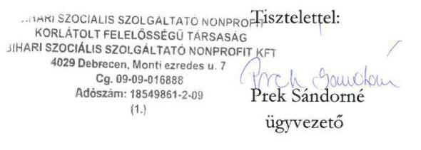

---

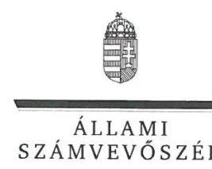

ELNÖK

Ikt.szám: V-1030-189//2016.

# Prek Sándorné úrhölgy 

ügyvezető
Bihari Szociális Szolgáltató Nonprofit Kft.

## Debrecen

## Tisztelt Ügyvezető Úrhölgy!

A „Bihari Szociális Szolgáltató NKft. - Az állami tulajdonban (résztulajdonban) lévő gazdálkodó szervezetek vagyonmegőrzési és gazdálkodási tevékenységének ellenőrzése" címmel készített számvevőszéki jelentéstervezetre tett észrevételeit köszönettel megkaptam.
Az Állami Számvevőszék észrevételekre vonatkozó álláspontjáról a felügyeleti vezető által készített részletes tájékoztatást mellékelten megküldőm.
Tájékoztatom Ügyvezető úrhölgyet, hogy a számvevőszéki jelentésben - az Állami Számvevőszékről szóló 2011. évi LXVI. törvény 29. § (3) bekezdése alapján - a figyelembe nem vett észrevételeket szerepeltetjük az elutasítás indokának feltüntetésével.

Budapest, 2016.
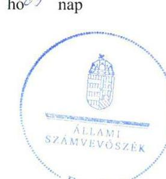

Tisztelettel:

Domokos László

Melléklet: Tájékoztatás az észrevételek kezeléséről

---

# Tájékoztatás   az észrevételek kezeléséről 

A „Bihari Szociális Szolgáltató NKft. - Az állami tulajdonban (résztulajdonban) lévö gazdálkodó szervezetek vagyonmegörzési és gazdálkodási tevékenységének ellenörzése" címü jelentéstervezetre 2016. szeptember 13-án tett (az Állami Számvevőszékhez 2016. szeptember 19-én érkezett) észrevételeit áttekintettük, azok kezelésével kapcsolatban a következő tájékoztatást adom.

## 1. A nyilvántartásban nem szereplő, ingyenes használatra kapott tárgyi eszközök értékcsökkenése elszámolásához kapcsolódóan tett észrevételhez

Az észrevétel szerint a nyilvántartásban nem szereplő, ingyenes használatra kapott tárgyi eszközök értékcsökkenését a Kft. a korábbi évek gyakorlatának megfelelően számolta el, a könyvvizsgálat az elszámolás ellen kifogással nem élt. A könyvvizsgálói vélemény önmagában nem garancia minden gazdasági esemény szabályos számviteli elszámolására. A jelentéstervezetben szereplő megállapítás az Állami Számvevőszék jogszabályi előírásokon alapuló független véleménye, amelyet a mintavételezés során kiválasztott mintatételeket (értékcsökkenés elszámolása, 2012., 2013., 2014. évek) alátámasztó, az ellenőrzött által rendelkezésre bocsátott dokumentumok ellenőrzése alapján fogalmazott meg. Rendszerhiba, hogy az ingyenesen használatba kapott, de más tulajdonában álló eszközök után értékcsökkenés gazdasági eseményt értelmeztek és dokumentáltak, annak összegét pedig az anyagjellegủ ráfordítások között számolták el.
Az előzőekben kifejtettek alapján a jelentéstervezetnek az értékcsökkenés elszámolásával kapcsolatos megállapításai helytállóak, azok módosítása nem indokolt.

## 2. Az Önköltségszámítási szabályzat tartalmával kapcsolatban tett észrevételhez

Az észrevétel az Önköltségszámítási szabályzat tartalmával kapcsolatban kiegészítő információkat ad, amelyek nem befolyásolják a számvitelről szóló törvény, valamint a szociális igazgatásról és szociális ellátásokról szóló törvény előírásai együttes figyelembe vétele alapján az önköltségszámítás szabályozásával és végrehajtásával kapcsolatos megállapításokat, javaslatokat.
A jelentéstervezetnek az önköltségszámítás szabályozására és végrehajtására vonatkozó megállapításai helytállóak, azok módosítása nem indokolt.

## 3. Az éves beszámoló elfogadásával kapcsolatban tett észrevételhez

Az észrevétel az éves beszámoló elfogadásával kapcsolatban a Felügyelő Bizottság ülésén résztvevőket sorolja fel és külön kiemeli a könyvvizsgáló részvételét. A jelentéstervezet nem a Felügyelő Bizottság, hanem a társaság legfőbb szerve döntésével kapcsolatban tett megállapítást a könyvvizsgáló meghívásával összefüggésben.
Jelzem, hogy a témában a tulajdonosi joggyakorló tett észrevételt, amelyet az Állami Számvevőszék figyelembe vesz. A jelentés véglegezésekor a Főbb megállapítások, következtetések és a Megállapítások fejezetekből a könyvvizsgálónak a társaság éves beszámolóját tárgyaló ülésre

---

történő meghívása elmaradásáról szóló megállapítás, valamint a Javaslatok fejezetből az ügyvezetőnek címzett kapcsolódó javaslat és az MNV Zrt. vezérigazgatójának címzett javaslat kapcsolódó eleme is törlésre kerül.

Tájékoztatom, hogy a számvevőszéki jelentés függelékeként szerepeltetjük a jelentéstervezethez tett észrevételeit, valamint az azokra adott válaszunkat.

Budapest, 2016. 10. hó 06 nap

Böröcz Imre
felügyeleti vezető

---

# Állami Számvevőszék 

## Domokos László

elnök

1052 Budapest
Apáczai Cs. J. u. 10.

Ikt. sz.: MNV/01/11557/ 7 /2016.
Hiv. sz.: V-1030-179/2016.

Tisztelt Elnök Úr!
A 2016. augusztus 29. napján a „Bihari Szociális Szolgáltató NKft. - Az állami tulajdonban (résztulajdonban) lévő gazdálkodó szervezetek vagyonmegőrzési és gazdálkodási tevékenységének ellenőrzése" tárgyában kézhez vett, V-1030-179/2016. ikt. sz. Jelentés-tervezetre az alábbi észrevételeket tesszük:

Összegzés / 6.old. Főbb megállapítások, következtetések harmadik bekezdés; Megállapítások / 16-17. old. 3.1. számú megállapítás első és negyedik bekezdés; Javaslatok / 26. old. Az MNV Zrt. vezérigazgatójának megfogalmazott javaslat:

A Jelentés-tervezetben szereplő megállapítás szerint a Bihari Szociális Szolgáltató NKft. (a továbbiakban: Társaság) nyilvántartásában nem szereplő, ingyenes használatba kapott eszközök után a Társaság szabálytalanul értékcsökkenést számolt el az anyagjellegủ ráfordítások között a rendkívüli bevételekkel szemben, annak ellenére, hogy a szóban forgó eszközök nem képezték a Társaság tulajdonát.

Álláspontunk szerint a Társaság az ellenőrzött időszakra vonatkozóan közzétett éves beszámolóinak tartalmából nem vonható le ilyen értelmű következtetés. Az éves beszámolók Kiegészítő mellékleteiben foglaltak szerint a Rendkívüli bevételek között elszámolt „Önkormányzattól ingyenesen kapott ingatlanhasználat elszámolt költsége" a Számviteli törvény (2000. évi C. tv.) 86. § (3) bekezdés j) pontja előírásának megfelelően a térítés nélkül kapott (igénybe vett) szolgáltatás piaci értéke. Az anyagjellegủ ráfordítások (igénybevett szolgáltatások) értékét az éves beszámolók Kiegészítő mellékletei nem részletezik, azonban semmi nem ad okot arra a következtetésre, hogy az anyagjellegủ ráfordítások között értékcsökkenés került volna elszámolásra.

A fentiek alapján kérjük törölni a Jelentés-tervezet érintett megállapításait mind az „Összegzés" című fejezetből, mind a „Megállapítások" elnevezésű fejezetből, valamint az MNV Zrt. vezérigazgatójának megfogalmazott, vonatkozó javaslatot.

---

Összegzés / 6. old. Főbb megállapítások, következtetések negyedik bekezdés, Megállapítások / 21. old. 5.1. számú megállapítás harmadik bekezdés, Javaslatok / 26. old. BSZSZ NKft. ügyvezetőjének megfogalmazott 8. számú javaslat, valamint Az MNV Zrt. vezérigazgatójának megfogalmazott javaslat:

A Jelentés-tervezet kifogásolja, hogy a könyvvizsgálót nem hívták meg a Társaság legfőbb szervének a Társaság beszámolóját tárgyaló üléseire, ami ellentétes volt a Gt. 44. § (1) és a Ptk. 3:131. § (2) bekezdésében foglaltakkal.

Az új Ptk. hatálybalépése előtt a gazdasági társaságokról szóló 2006. évi IV. törvény, azaz a Gt. 19-20. §ai tartalmazták a gazdasági társaságok legfőbb szerveivel kapcsolatos általános szabályokat. A Gt. 19. § (1) bekezdése alapján a gazdasági társaság legfőbb szerve a korlátolt felelősségủ társaságnál a taggyülés, a 19. § (5) bekezdés ugyanakkor kimondta, hogy egyszemélyes korlátolt felelősségủ társaságnál taggyülés nem müködik, és a gazdasági társaság legfőbb szervének hatáskörében az egyedüli tag írásban határoz. A Gt. 44. § (1) bekezdése azt írta elő, hogy a gazdasági társaság könyvvizsgálóját a társaság legfőbb szervének a társaság számviteli törvény szerinti beszámolóját tárgyaló ülésére kell meghívni.

A Ptk. lényegében a Gt. szabályait ismétli meg. A Ptk. 3:109. § (1) bekezdése szerint a gazdasági társaság tagjainak döntéshozó szerve a legfőbb szerv. Ugyanezen szakasz (4) bekezdése kimondja, hogy egyszemélyes társaságnál a legfőbb szerv hatáskörét az egyedüli tag gyakorolja, a legfőbb szerv hatáskörébe tartozó kérdésekben az egyedüli tag írásban határoz, a döntés az ügyvezetéssel való közléssel válik hatályossá. A Ptk. 3:131. § (2) bekezdése szerint az állandó könyvvizsgálót a társaság legfőbb szervének a társaság beszámolóját tárgyaló ülésére kell meghívni.

Az állam - mint egyedüli tag - kizárólagos tulajdonában álló Bihari Szociális Szolgáltató NKft. esetében a vizsgált időszakban nem került sor legfőbb szervi ülések megtartására, így a könyvvizsgáló meghívására sem volt lehetőség. Az éves beszámolók elfogadására alapítói határozathozatallal, főigazgatói hatáskörben került sor. Erre tekintettel kérjük törölni a Jelentés-tervezetből a könyvvizsgáló legfőbb szervi ülésen történő részvétele hiányával kapcsolatos megállapításokat mind az „Összegzés" című fejezetből, mind a „Megállapítások" elnevezésű fejezetből, továbbá az ezzel kapcsolatos, BSZSZ Nkft. ügyvezetőjének és az MNV Zrt. vezérigazgatójának megfogalmazott javaslatokat.

Javaslatok / 26. old. Az MNV Zrt. vezérigazgatójának megfogalmazott javaslat:
Az MNV Zrt. vezérigazgatójának megfogalmazott javaslattal összefüggésben jelezzük, hogy a Bihari Szociális Nkft. állami tulajdonú társasági részesedése feletti tulajdonosi jogokat az MNV Zrt.-vel megkötött SZT-104364 számú Megbízási Szerződés alapján, 2015. május 5. napjától kezdődően a Szociális és Gyermekvédelmi Főigazgatóság gyakorolja, ennek megfelelően a Társasággal kapcsolatos, tulajdonosi hatáskörbe tartozó intézkedések megtételére a Szociális és Gyermekvédelmi Főigazgatóság jogosult.

---

# MNV   MAGYAR NEMZETI   VAGYONKEZELÓ ZKt. 

Megjegyezzük továbbá, hogy a Jelentés-tervezetben foglaltak áttanulmányozása alapján nem tartjuk indokoltnak a tulajdonosi jogok gyakorlója részére megfogalmazott intézkedési javaslatot, tekintettel arra, hogy a Társaság ügyvezetőjének előírni tervezett intézkedési javaslatok, a tulajdonosi joggyakorló felügyelete mellett - megítélésünk szerint -, megfelelően szolgálják a feltárt hiányosságok, problémák kezelését.

Kérem Elnök Urat, hogy a Jelentés véglegesítése során jelen észrevételeinket szíveskedjenek figyelembe venni.

Budapest, 2016. szeptember , 43 "
Üdvözlettel:
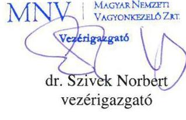

---

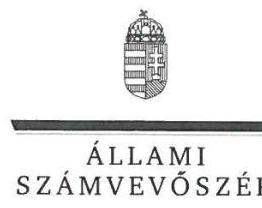

ELNÖK

Ikt.szám: V-1030-188/2016.

# Dr. Szívek Norbert úr 

vezérigazgató
Magyar Nemzeti Vagyonkezelő Zrt.

## Budapest

## Tisztelt Vezérigazgató Úr!

A „Bihari Szociális Szolgáltató NKft. - Az állami tulajdonban (résztulajdonban) lévő gazdálkodó szervezetek vagyonmegőrzési és gazdálkodási tevékenységének ellenőrzése" címmel készített számvevőszéki jelentéstervezetre tett észrevételeit köszönettel megkaptam.
Az Állami Számvevőszék észrevételekre vonatkozó álláspontjáról a felügyeleti vezető által készített részletes tájékoztatást mellékelten megküldőm.
Tájékoztatom Vezérigazgató urat, hogy a számvevőszéki jelentésben - az Állami Számvevőszékről szóló 2011. évi LXVI. törvény 29. § (3) bekezdése alapján - a figyelembe nem vett észrevételeket szerepeltetjük az elutasítás indokának feltüntetésével.

Budapest, 2016.
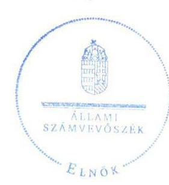

Tisztelettel:

## Domokos László*

Melléklet: Tájékoztatás az észrevételek kezeléséről

---

# Tájékoztatás   az észrevételek kezeléséről 

A „Bihari Szociális Szolgáltató NKft. - Az állami tulajdonban (résztulajdonban) lévő gazdálkodó szervezetek vagyonmegőrzési és gazdálkodási tevékenységének ellenőrzése" címü jelentéstervezetre 2016. szeptember 13-án tett (az Állami Számvevőszékhez 2016. szeptember 14-én érkezett) észrevételeit áttekintettük, azok kezelésével kapcsolatban a következő tájékoztatást adom.

1. A jelentéstervezet Összegzés/6. old. Főbb megállapítások, következtetések harmadik bekezdés; Megállapítások/16-17. old. 3.1. számú megállapítás első és negyedik bekezdés; Javaslatok/26. old. az MNV Zrt. vezérigazgatójának megfogalmazott javaslat részeihez kapcsolódóan tett észrevételhez
Az észrevétel szerint - amellett, hogy az éves beszámolók kiegészítő mellékletei az anyagjellegủ ráfordítások értékét nem részletezik - semmi nem ad okot arra a következtetésre, hogy az anyagjellegủ ráfordítások között elszámolták az ingyenesen használatba kapott eszközök értékcsökkenését, az éves beszámolók tartalmából nem vonható le ilyen értelmủ következtetés. A jelentéstervezet erre irányuló megállapítását az Állami Számvevőszék az anyagjellegủ ráfordítások mintavétellel történő ellenőrzése alapján tette. A mintavételezés során kiválasztott mintatételeket (értékcsökkenés elszámolása, 2012., 2013., 2014. évek) alátámasztó bizonylatok (főkönyvi kartonok) alapján - amelyeket az ellenőrzött bocsátott rendelkezésre - került megállapításra az a rendszerhiba, hogy az anyagjellegủ ráfordítások között az ingyenesen használatba kapott eszközök után értékcsökkenést számoltak el. Az ellenőrzéshez teljességi nyilatkozattal rendelkezésre bocsátott adatok köréből a vonatkozó dokumentumok, számviteli bizonylatok, nyilvántartások tehát nem a térítés nélkül kapott és igénybe vett szolgáltatás gazdasági eseményét - és így annak piaci értéke elszámolását -, hanem az értékcsökkenés elszámolását dokumentálták. A jelentéstervezetre tett ügyvezetői észrevétel is megerősítette a gazdasági esemény tartalmát, mert azt jelezte, hogy ,, a nyilvántartásban nem szereplő, ingyenes használatra kapott tárgyi eszközök értékcsökkenését a Kft. a korábbi évek gyakorlatának megfelelően számolta el"'.
Az előzőekben kifejtettek alapján a jelentéstervezetnek az értékcsökkenés elszámolásával kapcsolatos megállapításai helytállóak, azok módosítása nem indokolt.
2. A jelentéstervezet Összegzés/6. old. Főbb megállapítások, következtetések negyedik bekezdés; Megállapítások/21. old. 5.1. számú megállapítás harmadik bekezdés, Javaslatok/26. old. BSZSZ NKft. ügyvezetőjének megfogalmazott 8. javaslat, valamint az MNV Zrt. vezérigazgatójának megfogalmazott javaslat részeihez tett észrevételhez
Az észrevétel szerint a Bihari Szociális Szolgáltató NKft-re (BSZSZ NKft.) nem vonatkozik a könyvvizsgáló meghívásának kötelezettsége a társaság éves beszámolóját tárgyaló ülésére. Ennek indokolásaként a törvényi előírásokra való hivatkozásokkal részletesen kifejti, hogy a társaság legfőbb szerve hatáskörét az egyedüli tag gyakorolja és a vonatkozó döntéséről írásbeli határozatot hoz, ez esetben nincs az éves beszámolót tárgyaló ülés. A vonatkozó rendelkezésre álló dokumentumok és körülmények ismételt áttekintése megtörtént, amely alapján az Állami Számvevőszék az észrevételt figyelembe veszi.

---

A jelentés véglegezésekor a Főbb megállapítások, következtetések és a Megállapítások fejezetekből a könyvvizsgálónak a társaság éves beszámolóját tárgyaló ülésre történő meghívása elmaradásáról szóló megállapítás, valamint a Javaslatok fejezetből az ügyvezetőnek címzett kapcsolódó javaslat és a Magyar Nemzeti Vagyonkezelő Zrt. (MNV Zrt.) vezérigazgatójának címzett javaslat kapcsolódó eleme is törlésre kerül.

# 3. A jelentéstervezet Javaslatok/26. old. az MNV Zrt. vezérigazgatójának megfogalmazott javaslatához tett észrevételhez 

Köszönjük tájékoztatását arról, hogy a BSZSZ NKft. állami tulajdonú társasági részesedése feletti tulajdonosi jogokat 2015. május 5. napjától kezdődően a Szociális és Gyermekvédelmi Főigazgatóság gyakorolja. Az észrevétel alapján a jelentéstervezet módosítása nem indokolt, mert az Állami Számvevőszék az ellenőrzési programnak megfelelően a BSZSZ NKft. vagyonmegőrzési és gazdálkodási tevékenységét a 2012. január 1. és 2014. december 31. közötti időszakra vonatkozóan ellenőrizte a BSZSZ NKft-nél és az MNV Zrt-nél, mint ellenőrzött szervezeteknél. Az Állami számvevőszékről szóló 2011. évi LXVI. törvény 33. § (1) bekezdése szerint az ellenőrzött szervezet vezetője köteles a jelentésben foglalt megállapításokhoz kapcsolódó intézkedési tervet összeállítani, és azt a jelentés kézhezvételétől számított harminc napon belül az Állami Számvevőszék részére megküldeni. A kötelezettség teljesítése érdekében az előkészítő folyamat során természetesen szükséges lehet a tulajdonosi jog gyakorlására vonatkozó, de az ellenőrzött időszak után megkötött szerződés (az észrevételben hivatkozott SZT-104364 számú Megbízási Szerződés) kapcsolódó előírásainak figyelembe vétele, vagy a tulajdonosi jog gyakorlására vonatkozó szabályainak kiegészítése.
Az észrevételeket tartalmazó levél utolsó előtti bekezdésében szereplő megjegyzés szerint nem indokolt a tulajdonosi jogok gyakorlója (MNV Zrt. vezérigazgatója) részére megfogalmazott intézkedési javaslat. A feltárt szabálytalanságok miatt az Állami Számvevőszék a javaslatát fenntartja. A felelősség tisztázása éppen annak a feltételét biztosítja, hogy a tulajdonosi joggyakorló minden körülmény alapos mérlegelésével döntsön a felelősség érvényesítése kérdésében.
Tájékoztatom, hogy a számvevőszéki jelentés függelékeként szerepeltetjük a jelentéstervezethez tett észrevételeit, valamint az azokra adott válaszunkat.

Budapest, 2016. 40. hó 05 nap

Böröcz Imre
felügyeleti vezető

---

.

---

# RÖVIDÍTÉSEK JEGYZÉKE 

${ }^{1}$ BSZSZ NKft./Társaság
${ }^{2}$ MIK
${ }^{3}$ MNV Zrt.
${ }^{4}$ ellátási szerződés
${ }^{5} \mathrm{M} \mathrm{Ft}$
${ }^{6}$ ÁSZ
${ }^{7}$ Áht.
${ }^{8}$ Nvtv.
${ }^{9}$ Gt.
${ }^{10} \mathrm{Ptk}_{2}$
${ }^{11} \mathrm{FB}$
${ }^{12} \mathrm{Ptk}_{1}$
${ }^{13}$ Számviteli Politika ${ }_{1}$
${ }^{14}$ Számviteli Politika ${ }_{2}$
${ }^{15}$ Számv. tv.
${ }^{16}$ Leltározási Szabályzat ${ }_{1}$
${ }^{17}$ Értékelési Szabályzat ${ }_{1}$
${ }^{18}$ Önköltségszámítási Szabályzat ${ }_{1}$
${ }^{19}$ Pénzkezelési Szabályzat ${ }_{1}$
${ }^{20}$ Leltározási Szabályzat ${ }_{2}$
${ }^{21}$ Értékelési Szabályzat ${ }_{2}$
${ }^{22}$ Pénzkezelési Szabályzat ${ }_{2}$
${ }^{23}$ Selejtezési Szabályzat ${ }_{1}$
${ }^{24}$ Selejtezési Szabályzat ${ }_{2}$
${ }^{25}$ Vagyonvédelmi Szabályzat ${ }_{1}$
${ }^{26}$ Vagyonvédelmi Szabályzat ${ }_{2}$
${ }^{27}$ Javadalmazási Szabályzat
${ }^{28}$ Számlarend ${ }_{1}$

Bihari Szociális Szolgáltató Nonprofit Kft.
Hajdú-Bihar Megyei Intézményfenntartó Központ
Magyar Nemzeti Vagyonkezelő Zrt.
a Bihari Szociális Szolgáltató Nonprofit Kft. és a Hajdú-Bihar Megyei Intézményfenntartó Központ között 2012. január 1-jén megkötött ellátási szerződés
millió forint
Állami Számvevőszék
2011. év CXCV. törvény az államháztartásról (hatályos 2012. január 1-jétől)
2011. évi CXCVI. törvény a nemzeti vagyonról (hatályos 2011. december 31-től)
2006. évi IV. törvény a gazdasági társaságokról
2013. évi V. törvény a Polgári Törvénykönyvről (hatályos 2014. március 15-től)

Felügyelő Bizottság
1959. évi IV. törvény a Polgári Törvénykönyvről (hatálytalan 2014. március 15-től)

Bihari Szociális Szolgáltató Nonprofit Kft. Számviteli Politikája (hatályos 2009. július 26 -tól)
Bihari Szociális Szolgáltató Nonprofit Kft. Számviteli Politikája (hatályos 2013. március 26 -tól)
2000. évi C. törvény a számvitelről

Bihari Szociális Szolgáltató Nonprofit Kft. Eszközök és Források Leltározási és Leltárkészítési Szabályzata (hatályos 2009. július 26 -tól)
Bihari Szociális Szolgáltató Nonprofit Kft. Eszközök és Források Értékelési Szabályzata (hatályos 2009. augusztus 1-jétől)
Bihari Szociális Szolgáltató Nonprofit Kft. Önköltségszámítási Szabályzata (hatályos 2010. május 1-jétől)

Bihari Szociális Szolgáltató Nonprofit Kft. Házipénztár Pénzkezelési Szabályzata (hatályos 2009. július 28 -tól)
Bihari Szociális Szolgáltató Nonprofit Kft. Eszközök és Források Leltározási és Leltárkészítési Szabályzata (hatályos 2013. március 26-tól)
Bihari Szociális Szolgáltató Nonprofit Kft. Eszközök és Források Értékelési Szabályzata (hatályos 2013. március 26-tól)
Bihari Szociális Szolgáltató Nonprofit Kft. Selejtezési Szabályzata (hatályos 2009. július 26 -tól)
Bihari Szociális Szolgáltató Nonprofit Kft. Selejtezési Szabályzata (hatályos 2013 március 26 -tól)
Bihari Szociális Szolgáltató Nonprofit Kft. Vagyonvédelmi Szabályzata (hatályos 2009. augusztus 1-jétől)

Bihari Szociális Szolgáltató Nonprofit Kft. Vagyonvédelmi Szabályzata (hatályos 2013 március 26 -tól)
Szabályzat a Hajdú-Bihar Megyei Önkormányzat tulajdonában álló gazdasági társaságok müködéséről (hatályos 2010. február 12-től)
Bihari Szociális Szolgáltató Nonprofit Kft. Számlarendje (hatályos 2009. július 28tól)

---

${ }^{29}$ Számlarend ${ }_{2}$
${ }^{30}$ NKft.
${ }^{31}$ Önköltségszámítási Szabályzat ${ }_{2}$
${ }^{32}$ Szoc. tv.
${ }^{33} \mathrm{Kbt}$.
${ }^{34}$ Közbeszerzési Szabályzat ${ }_{1}$
${ }^{35}$ Közbeszerzési Szabályzat ${ }_{2}$
${ }^{36}$ Info tv.
${ }^{37}$ Adatvédelmi és Adatkezelési Szabályzat ${ }_{1}$
${ }^{38}$ Adatvédelmi és Adatkezelési Szabályzat ${ }_{2}$
${ }^{39}$ Ávr.
${ }^{40}$ Társasági Monitoring Szabályzat
${ }^{41} \mathrm{Bkr}$.
${ }^{42}$ NGM közlemény
${ }^{43}$ Stabilitási tv.
${ }^{44} \mathrm{Vtv}$.
${ }^{45} \mathrm{Vhr}$.
${ }^{46} \mathrm{Ppt}$.

Bihari Szociális Szolgáltató Nonprofit Kft. Számlarendje (hatályos 2013. március 26-tól)
Derecske és Térsége Vidékfejlesztési Nonprofit Kft.
Bihari Szociális Szolgáltató Nonprofit Kft. Önköltségszámítási Szabályzata (hatályos 2013. március 26-tól)
1993. évi III. törvény a szociális igazgatásról és szociális ellátásokról
2011. évi CVIII. törvény a közbeszerzésekről (hatályos 2011. augusztus 21-étől)

Bihari Szociális Szolgáltató Nonprofit Kft. Közbeszerzési Szabályzat (hatályos 2009. szeptember 1-jétől)
Bihari Szociális Szolgáltató Nonprofit Kft. Közbeszerzési Eljárási Szabályzata (hatályos 2013. március 26-tól)
2011. évi CXII. törvény az információs önrendelkezési jogról és az információszabadságról (hatályos 2011. július 27-étől)
Bihari Szociális Szolgáltató Nonprofit Kft. Adatvédelmi és Adatkezelési Szabályzata (hatályos 2010. június 1-jétől)
Bihari Szociális Szolgáltató Nonprofit Kft. Adatvédelmi és Adatkezelési Szabályzata (hatályos 2013. március 26-tól)
368/2011. (XII. 31.) Korm. rendelet az államháztartásról szóló törvény végrehajtásáról
az MNV Zrt. 51/2013. számú vezérigazgatói utasítása a Társasági Monitoring Szabályzatról (hatályos 2013. december 19-től)
370/2011. (XII. 31.) Korm. rendelet a költségvetési szervek belső kontrollrendszeréről és belső ellenőrzéséről
A 32/2013. számú Hivatalos Értesítőben megjelent NGM közlemény hatályos 2013.VI.28-tól, a 60/2013. számú Hivatalos Értesítőben megjelent NGM közlemény hatályos 2013. december 16-tól
2011. évi CXCIV. törvény Magyarország gazdasági stabilitásáról
2007. évi CVI. törvény az állami vagyonról

254/2007. (X. 4.) Korm. rendelet az állami vagyonnal való gazdálkodásról
1952. évi III. törvény a polgári perrendtartásról

---

# ÁLLAMI SZÁMVEVŐSZÉK 

1052 Budapest, Apáczai Csere János utca 10.
Levélcím: 1364 Budapest 4. Pf. 54
Telefon: +36 14849100 Telefax: +36 14849200
www.asz.hu