# Jelentés 

## Hajdúsági Szociális Szolgáltató Nonprofit Kft.

Az állami tulajdonban (résztulajdonban) lévő gazdálkodó szervezetek vagyonmegőrzési és gazdálkodási tevékenységének ellenőrzése 2016.

16177
www.asz.hu

---

# Jelentés 

## Hajdúsági Szociális Szolgáltató Nonprofit Kft.

Az állami tulajdonban (résztulajdonban) lévő gazdálkodó szervezetek vagyonmegőrzési és gazdálkodási tevékenységének ellenőrzése
2016. november hó 03. nap
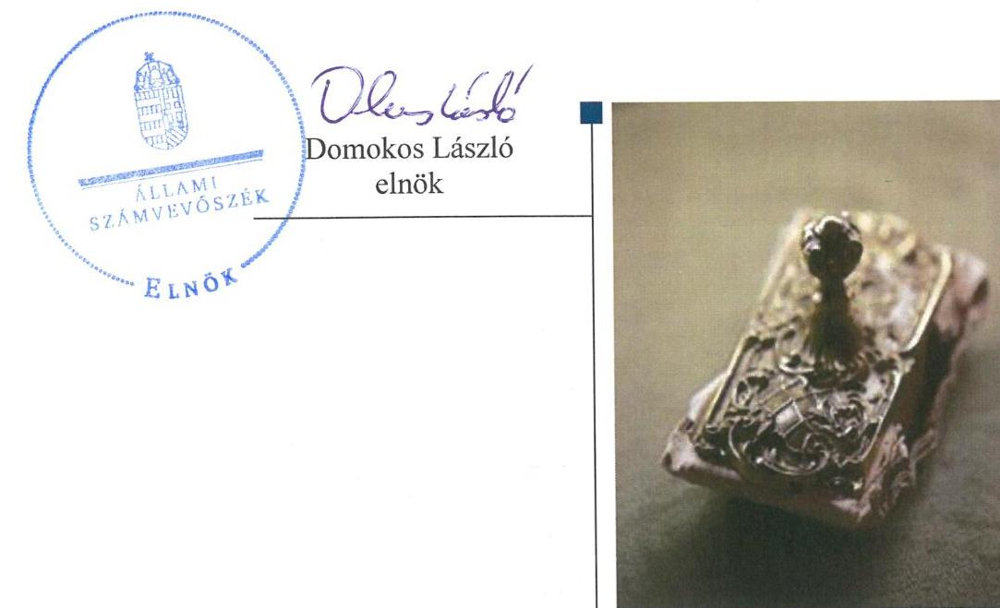

---

# AZ ELLENŐRZÉST FELÜGYELTE:

- BÖRÖCZ IMRE felügyeleti vezető

- AZ ELLENŐRZÉST VEZETTE ÉS A VÉGREHAJTÁSÁÉRT FELELŐS:
  - SALI SÁNDORNÉ ellenőrzésvezető
  - A PROGRAM ÖSSZEÁLLÍTÁSÁÉRT FELELŐS:
    - JANIK JÓZSEF LÁSZLÓ osztályvezető

- IKTATÓSZÁM: V-1028-168/2016
- TÉMASZÁM: 2062
- ELLENŐRZÉS-AZONOSÍTÓ SZÁM: V070921

Jelentéseink az Országgyűlés számítógépes hálózatán és az Interneta a www.asz.hu címen is olvashatóak.

---

# TARTALOMJEGYZÉK 

■ ÖSSZEGZÉS ..... 5
■ AZ ELLENŐRZÉS CÉLJA ..... 7
■ AZ ELLENŐRZÉS TERÜLETE ..... 8
■ AZ ELLENŐRZÉS HÁTTERE, INDOKOLTSÁGA ..... 9
■ A JELENTÉS LÉNYEGES KÉRDÉSKÖREI ..... 10
■ ELLENŐRZÉS HATÓKÖRE ÉS MÓDSZEREI ..... 11
■ MEGÁLLAPÍTÁSOK ..... 13
■ JAVASLATOK ..... 23
■ MELLÉKLETEK ..... 25
I. Sz. melléklet: Értelmező szótár ..... 25
■ FÜGGELÉK: ÉSZREVÉTELEK ..... 29
■ RÖVIDÍTÉSEK JEGYZÉKE ..... 39

---

.

---

# ÖSSZEGZÉS 

Az Állami Számvevőszék a Hajdúsági Szociális Szolgáltató Nonprofit Kft. vagyonmegőrzési és gazdálkodási tevékenységének szabályszerűségét ellenőrizte a 2012-2014. évek közötti időszakra. A tulajdonosi joggyakorló tevékenysége szabályszerű volt. A vagyongazdálkodási feltételek kialakítása a Társaságnál a Számviteli Politika és a Leltározási Szabályzat hiányossága miatt nem volt szabályos. A vagyonnyilvántartás megfelelt a jogszabályi előirásoknak. Az ingyenesen használatra átvett tárgyi eszközök után értékcsökkenést a jogszabályi előírásnak megfelelően nem számolhatott volna el, ezen túlmenően a bevételek, költségek és a ráfordítások elszámolása megfelelt az előírásoknak. Az önköltségszámitás szabályszerű volt. Az adatok közzététele során az ügyvezető nem biztositotta a jogszabálynak megfelelően a müködés átláthatóságát.

## Az ellenőrzés társadalmi indokoltsága

Magyarországon az intézmény-centrikus közfeladat-ellátás, közvagyon gazdálkodás jellemző a költségvetésen kívüli feladatellátás térnyerése mellett. Ennek szereplői a nonprofit szervezetek, az önkormányzati tulajdonú gazdasági társaságok és az állami tulajdonú gazdálkodó szervezetek is.

Az Áht 2. § (1) bekezdésének I) pontja, az Európai Közösséget létrehozó szerződéshez csatolt, a túlzott hiány esetén követendő eljárásról szóló jegyzőkönyv alkalmazásáról szóló 2009. május 25-i 479/2009/EK rendelet szerint, illetve az ESA95 statisztikai módszertana alapján a kormányzati szektorba tartoznak "központi kormányzat szektorba besorolt társaságok és egyéb szervezetek", amelyekkel szemben alapvető követelmény, hogy gazdálkodásuk, müködésük szabályszerű, az általuk szolgáltatott adatok megbízhatóak legyenek.

Az állami tulajdonú gazdálkodó szervezetek a nemzeti vagyon részét képezik. Az állami vagyonnal való gazdálkodást illetően a tulajdonosi joggyakorlás és a vagyongazdálkodás feladata az állami vagyon átlátható, rendeltetésszerű és felelős felhasználásának biztosítása. Az állam meghatározza az ellátandó közszolgáltatással kapcsolatos feladatokat, amelyhez a vagyonnal kapcsolatos döntéseknek igazodniuk kell. A nemzetgazdasági szempontból kiemelt jelentőségű, nemzeti vagyonban tartandó, állami tulajdonban álló társasági részesedést a nemzeti vagyonról szóló törvény határozza meg.

Minden közpénzt, közvagyont használó szervezettel szemben társadalmi igény, hogy tevékenységükről elszámoljanak. Ezt figyelembe véve és az Állami Számvevőszék stratégiájával összhangban került sor a HSZSZ NKft. ellenőrzésére.

## Főbb megállapítások, következtetések, javaslatok

A HSZSZ NKft. feladatait saját tulajdonában lévő, valamint a részére ingyenesen átadott eszközökkel látta el. A tulajdonosi jogokat gyakorló MNV Zrt. a jogszabályi előírásoknak megfelelően alakította ki a vagyonnal való gazdálkodás feltételeit, tevékenysége szabályos volt.

A Társaság a vagyongazdálkodási tevékenységének feltételeit nem az előírások szerint alakította ki. A Számviteli Politika ${ }_{1,2}$ nem volt összhangban a jogszabályi előírásokkal, mert nem tartalmazta, hogy mit tekintenek a számviteli elszámolás, illetve az értékelés szempontjából lényegesnek, nem lényegesnek, illetve jelentősnek, nem jelentősnek és nem törölték a megbízható és valós képet lényegesen befolyásoló hiba meghatározását a jogszabályi változásnak megfelelően. Továbbá az értékvesztés elszámolását helytelenül lehetőségként rögzítették, azonban azt bizonyos feltételek teljesülése esetén kötelezettségként kell előírni. A Leltározási Szabályzat ${ }_{1,2}$ az ingatlanok leltározásának gyakorisága miatt nem felelt meg a jogszabályi előírásnak.

---

A vagyon nyilvántartása megfelelt a jogszabályi előírásoknak. A leltárt alátámasztó dokumentumoknál formai hiányosságok voltak a javítások, illetve az aláírások tekintetében, azonban a leltárak valódiságát a hibák nem befolyásolták.

A saját vagyonhoz kapcsolódó bevételek és ráfordítások elszámolása, valamint az önköltségszámítás szabályszerű volt. Az ingyenesen használatba átvett tárgyi eszközök után nem számolhatott volna el értékcsökkenést, mert jogszerűen azt az eszközök tulajdonosa számolhatja el. A tulajdonában nem szereplő tárgyi eszközök után ugyanakkor az anyagjellegű ráfordítások között, a rendkívüli bevételekkel szemben értékcsökkenést számolt el. A hiba a mérleg szerinti eredményre és annak megbízhatóságára nem volt hatással.

A Társaság vagyongazdálkodása során teljesítette az előírásokat. A vagyonváltozást eredményező döntések megfeleltek a szabályoknak. A HSZSZ NKft. beszámolási kötelezettségének eleget tett, a tulajdonosi joggyakorló az éves beszámolókat jóváhagyta.

A közérdekű adatszolgáltatás nem felelt meg az Info tv.-ben foglaltaknak. A szabályozási hiányosságra visszavezethetően az ügyvezető az adatokat nem tette, illetve hiányosan tette közzé a honlapon, ezzel nem biztosította a Társaság működésének jogszerű átláthatóságát. Az adatfelelős a jogszabályi előírás ellenére nem alakította ki belső szabályzatban a részére előírt kötelezettség teljesítésének részletes szabályait. A HSZSZ NKft. kialakított és működtetett információs rendszert. Kormányzati szektorba sorolt egyéb szervezetként határidőben nem tett eleget adatszolgáltatási kötelezettségének, továbbá a 2014. évtől a Bkr. hatálya alá tartozott, de belső ellenőrzést nem működtetett.

A HSZSZ NKft. gazdálkodásának a kormányzati szektor hiányára befolyást gyakorló elemei szabályszerűek voltak.
Az ÁSZ a Társaság ügyvezetőjének és az MNV Zrt. vezérigazgatójának fogalmazott meg javaslatokat, amelyek alapján kötelesek intézkedési tervet összeállítani és azt a jelentés kézhezvételétől számított 30 napon belül az ÁSZ részére megküldeni.

---

# AZ ELLENŐRZÉS CÉLJA 

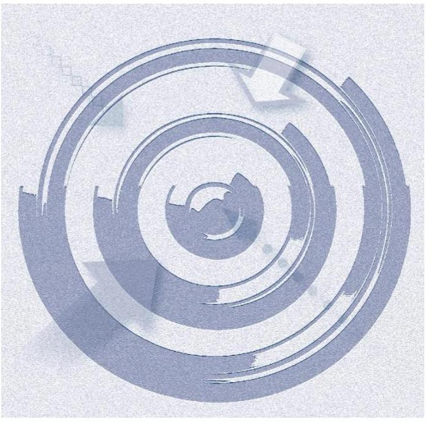

Az ellenőrzés célja annak értékelése volt, hogy a tulajdonosi jogok gyakorlása szabályszerű volt-e;
a gazdálkodó szervezet által ellátott feladat bevételei, ráfordításai elszámolásának, és vagyongazdálkodási tevékenységének szabályozása megfelelt-e a jogszabályi és a tulajdonosi előírásoknak és azok végrehajtása szabályszerű volt-e;
biztosítva volt-e a közfeladatok átláthatósága és elszámoltathatósága érdekében a közszolgáltatás dijának megalapozottsága szabályszerű önköltségszámítással;
a vagyonváltozást eredményező döntések esetében a tulajdonosi jogok gyakorlója és a gazdálkodó szervezet szabályszerűen jártak-e el;
a gazdálkodó szervezet épített-e ki és működtetett-e információs rendszert a szabályszerű vagyongazdálkodás érdekében.

Az ellenőrzés célja volt annak értékelése is, hogy a kormányzati szektorba sorolt egyéb szervezetek gazdálkodásának a kormányzati szektor hiányára és az államadósságra befolyással bíró elemei a jogszabályi előírásoknak megfeleltek-e.

---

# AZ ELLENŐRZÉS TERÜLETE 

## A HSZSZ NKft.

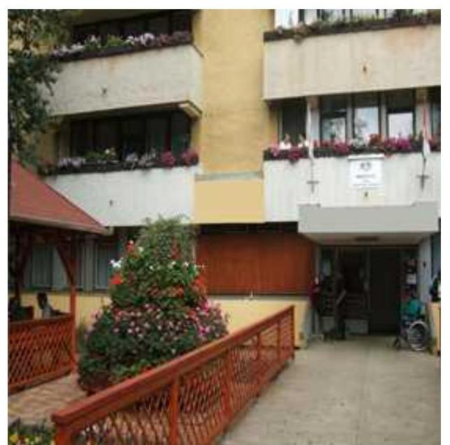

A megyei önkormányzatok konszolidációjáról, a megyei önkormányzati intézmények és a Fővárosi Önkormányzat egyes egészségügyi intézményeinek átvételéről szóló 2011. évi CLIV. törvény alapján többek között a megyei önkormányzatok tulajdonában lévő, jogi személyiséggel rendelkező társaságok, ennek megfelelően a HSZSZ NKft. ${ }^{1}$ is 2012. január 1-jén állami tulajdonba került. A HSZSZ NKft. a Magyar Állam 100\%-os tulajdonában lévő, közhasznú tevékenységet ellátó társaság. Fő tevékenysége az idősek, fogyatékosok bentlakásos ellátása. Emellett egyéb közhasznú tevékenységeket, például növénytermesztést, vegyes gazdálkodást, szőnyeggyártást, valamint egyéb üzletszerű gazdasági tevékenységet, például étkeztetést, személyszállítást is végzett. Az Alapító Okirat alapján a Hajdú-Bihar Megyei Önkormányzat Közgyűlése, mint alapító 1996. november 15-én létre hozta a Hajdúnánási Humán Szolgáltató Otthon Közhasznú Társaságot. A Társaság 2009. március 27 -ét követően kiemelkedően közhasznú NKft.-ként müködött. Az egyszemélyes NKft. cégneve 2010. december 28-i hatállyal HSZSZ NKft. lett. Hajdú-Bihar megyében négy bentlakásos szociális intézmény fenntartását végezte kiemelten közhasznú tevékenység keretében, ellátási szerződés ${ }^{2}$ alapján. A fenntartásában működő intézmények integrált intézményként működtek. Az intézményi ellátás tekintetében a szolgáltatás az ország teljes területére kiterjedt. Az ellenőrzött időszakban az ügyvezető és a gazdasági vezető személye változatlan volt.

A Társaság 2012. január 1-jével került állami tulajdonba, az MNV Zrt. ${ }^{3}$ tulajdonosi joggyakorlása alá és ezzel egy időben a Társaság részesedése az MNV Zrt. és a MIK ${ }^{4}$ közötti szerződés alapján - a MIK vagyonkezelésébe került. A Társaság részesedése 2013. március 29-től - a vagyonkezelői jogviszony felbontásával - került az MNV Zrt. közvetlen kezelésébe.

A különböző szociális ellátási feladatokra a Társaság (értelmi fogyatékosok, pszichiátriai betegek, időskorúak, szenvedélybetegek ápoló-gondozó, rehabilitációs, illetve átmeneti ellátására) 2012. január 1-jén a MIK-kel ellátási szerződést ${ }^{5}$ kötött, mely a teljes ellenőrzött időszakban hatályba volt.

A Társaság mérlegében a 2014. év végén szereplő összes eszközvagyon könyv szerinti értéke $301,2 \mathrm{M} \mathrm{Ft}^{6}$ volt, vagyonkezelésbe nem vett át vagyont. A saját tőkéje a 2014. év végén 55,3 M Ft, a jegyzett tőke 3,1 M Ft, a kötelezettség állománya 145,3 M Ft, az értékesítés nettó árbevétele 595,5 M Ft, a mérleg szerinti eredménye 6,8 M Ft veszteség volt.

A HSZSZ NKft. a 2013. és a 2014. években kormányzati szektorba sorolt egyéb szervezet volt.

---

# AZ ELLENŐRZÉS HÁTTERE, INDOKOLTSÁGA 

Az ÁSZ ${ }^{7}$ alapvető célkitűzése, hogy az államháztartáson kívülre nyújtott költségvetési támogatások és ingyenes vagyon juttatások ellenőrzésével hozzájáruljon ahhoz, hogy a közpénzeket az államháztartáson kívül múködő szervezetek is átlátható módon használják fel a közfeladatok szerződésben vállalt ellátása érdekében. Az államháztartásról szóló törvény értelmében a közfeladatok ellátása elsősorban költségvetési szervek alapításával és működtetésével történik. Az államháztartáson kívüli szervezetek a közfeladatok ellátásában, jogszabályban meghatározott feltételekkel, közreműködhetnek.

Az Áht. ${ }^{8}$ nevesíti a kormányzati szektorba sorolt egyéb szervezet fogalmát. E körbe tartoznak azok a szervezetek, amelyek nem részei az államháztartásnak, azonban az Európai Közösséget létrehozó szerződéshez csatolt, a túlzott hiány esetén követendő eljárásról szóló jegyzőkönyv alkalmazásáról szóló 2009. május 25-i 479/2009/EK rendelet szerint a kormányzati szektorba tartoznak. A nemzeti számlák nemzetközi és hazai statisztikai módszertana és szabványai elveket határoznak meg a statisztikai értelemben vett kormányzati szektorba tartozó szervezetek körére és besorolásuk módjára. A szervezetek megnevezését a nemzetgazdasági miniszter teszi közzé.

A kormányzati szektorba sorolt egyéb szervezet többek között köteles adatszolgáltatást teljesíteni a központi költségvetésről szóló törvény elkészítéséhez, továbbá adósságot keletkeztető ügyletet csak az államháztartásért felelős miniszter előzetes egyetértésével köthet.

Az ellenőrzés várható hasznosulásaként az ellenőrzés megállapításai a jogalkotás számára segítséget nyújthatnak az államháztartáson kívüli köz-feladat-ellátás, közvagyonnal való gazdálkodás értékeléséhez, jogszabályi keretei pontosításához, az átláthatóságot biztosító szabályozáshoz. Az ellenőrzöttek számára visszajelzést ad a gazdálkodási tevékenységgel, az állami vagyon felhasználásával, a közszolgáltatási árképzés megalapozottságával és az éves elszámolással kapcsolatos szabálytalanságokról és kockázatokról. Az ellenőrzés tapasztalatai segítik és erősítik az ÁSZ hozzáadott értéket teremtő elemző tevékenységét és tanácsadó szerepét. A kormányzati szektorba sorolt, költségvetési tervezésbe is bevont gazdálkodó szervezetek ellenőrzése fokozza a legfőbb ellenőrző szerv iránti figyelmet és közbizalmat.

---

# A JELENTÉS LÉNYEGES KÉRDÉSKÖREI 

1.     - A tulajdonosi joggyakorló a vagyonnal való gazdálkodás feltételeit szabályszerűen alakította-e ki?
2.     - A Társaság vagyongazdálkodási tevékenységének szabályozása, kialakítása, a vagyon nyilvántartása megfelelt-e az előírásoknak?
3.     - A bevételek és ráfordítások elszámolásának szabályozása és végrehajtása, valamint az önköltségszámitás szabályszerű volt-e?
4.     - A vagyonnal való gazdálkodás, valamint a változást eredményező döntések megfeleltek-e a jogszabályi és a belső előírásoknak?
5.     - A gazdálkodó szervezet a szabályszerű vagyongazdálkodás érdekében teljesítette-e beszámolási kötelezettségét, kiépített-e és müködtetett-e információs rendszert?
6.     - A Társaság gazdálkodásának a kormányzati szektor hiányára és az államadósságra befolyást gyakorló elemek a jogszabályi előírásoknak megfeleltek-e?

---

# ELLENŐRZÉS HATÓKÖRE ÉS MÓDSZEREI 

## Az ellenőrzés típusa

Szabályszerúségi ellenőrzés

## Az ellenőrzött időszak

2012. január 1-jétől 2014. december 31-ig.

## Az ellenőrzés tárgya

Állami tulajdonban (résztulajdonban) lévő gazdálkodó szervezetek vagyonmegőrzési és gazdálkodási tevékenységének ellenőrzése, valamint a kormányzati szektor hiányára és adósságállományára hatást gyakorló elemek ellenőrzése.

## Az ellenőrzött szervezet

HSZSZ NKft., MNV Zrt.

## Az ellenőrzés jogalapja

Az Állami Számvevőszékről szóló 2011. évi LXVI. törvény 5. § (3)-(5) bekezdése, valamint az állami vagyonról szóló 2007. évi CVI. törvény 3. § (4) bekezdése képezi.

## Az ellenőrzés módszerei

Az ellenőrzést a számvevőszéki ellenőrzés szakmai szabályai szerint, a szabályszerűségi ellenőrzés módszerével, a vonatkozó nemzetközi standardok és az adott időszakban hatályos jogszabályok figyelembevételével végeztük.

Az ellenőrzés lefolytatásához a HSZSZ NKft. tanúsítványok kitöltésével, valamint az ÁSZ által kért dokumentumok megküldésével szolgáltatott adatokat. A rendelkezésre bocsátott adatok, információk kontrollja és a munkalapok kitöltése a helyszíni ellenőrzés keretében történt.

Mintavétellel ellenőriztük az értékesítés nettó árbevétel, az egyéb bevételek, pénzügyi műveletek bevételei, rendkívüli bevételek, az anyagjellegű ráfordítások, a személyi jellegű ráfordítások, a beruházások, felújítá-

---

sok aktiválása, az értékcsökkenési leírás, az egyéb ráfordítások és a pénzügyi művelet ráfordításai, továbbá a rendkívüli ráfordítások elszámolásának szabályszerűségét, valamint a vagyonnyilvántartás területén a szabályszerű működést. A mintavétellel ellenőrzött területek esetében minden egyes tétel vonatkozásában a szabályszerűségre vonatkozó kérdéseket tettünk fel, amelyek eredménye összesítésre került. A jogszabályoknak és a belső előírásoknak megfelelőnek tekintettük az adott területet, amennyiben a minta ellenőrzésének eredménye alapján 95\%-os bizonyossággal a teljes sokaságban a hibaarány kisebb volt, mint 10\%, nem megfelelőnek, ha a 10\%-ot meghaladta. A ráfordítások elszámolására és a vagyonnyilvántartásra vonatkozó véletlen mintavételt kockázati alapú kiválasztással egészítettük ki, amelynek során évente a három legnagyobb összegű tételt választottuk ki.

---

# 1. A tulajdonosi joggyakorló a vagyonnal való gazdálkodás feltételeit szabályszerűen alakította-e ki? 

Összegző megállapítás

A tulajdonosi joggyakorló a vagyonnal való gazdálkodás feltételeit szabályszerűen alakította ki. Az Alapító Okiratban és annak módosításaiban határozta meg a saját vagyonnal való gazdálkodáshoz szükséges kritériumrendszert. A használatra átvett állami vagyonnal kapcsolatban az ellátási szerződés fogalmazott meg előírásokat.
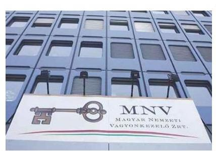

A Társaság 2012. január 1-jével került az MNV Zrt. tulajdonosi joggyakorlása alá és ezzel egy időben - az MNV Zrt. és a MIK közötti szerződés alapján - a HSZSZ NKft. társasági részesedése a MIK vagyonkezelésébe került. A MIK volt a szerződés szerint a társasági részesedés vagyonkezelője 2013. március 28 -ig.

AZ MNV ZRT. a MIK-kel kötött szerződésben meghatározta a részesedés feletti vagyonkezelés módját, a felek jogait és kötelezettségeit. Rögzítették a szerződésben a felek a részesedés értékének megőrzését, gyarapítását, a felelős gazdálkodáshoz szükséges követelményeket, a részesedés nyilvántartását, az adatszolgáltatási kötelezettséget, valamint a vagyonnal történő elszámolást, továbbá az MNV Zrt. tulajdonosi ellenőrzési jogát. A szerződést a felek közös megegyezéssel a 2013. március 29-én kelt megállapodással megszüntették az Nvtv. ${ }^{9}$ 8. § (7) bekezdésének - 2012. június 30-án hatályba lépett - módosítása miatt, mely szerint a gazdasági társaságban fennálló állami tulajdonban lévő társasági részesedés nem lehetett vagyonkezelés tárgya. A HSZSZ NKft. részesedése 2013. március 29-től az MNV Zrt. közvetlen kezelésébe került.

Az ellenőrzött időszakban a Társaság közhasznú feladatait részben saját tulajdonú vagyonnal, részben az ellátási szerződés 11. pontja alapján a MIK által ingyenesen használatba adott vagyonnal (ingatlanok és ingóságok) szabályszerűen látta el.

AZ ALAPÍTÓ OKIRATBAN az MNV Zrt. szabályozta a tulajdonos számára fenntartott, vagyongazdálkodásra vonatkozó jogokat, amely megfelelt a Gt. ${ }^{10}$-ben, illetve a $\mathrm{Ptk}_{2}{ }^{11}$-ben foglaltaknak. A Társaság tevékenységének kereteit - a jogszabályi előírásokon kívül - elsősorban az Alapító Okirat határozta meg, amely tartalmazta a HSZSZ NKft. legfőbb szervére, ügyvezetőjére, könyvvizsgálójára és az $\mathrm{FB}^{12}$-re vonatkozó legfontosabb előírásokat.

Az ellenőrzött időszakban hatályos Alapító Okirat tartalmazott minden olyan tartalmi elemet, amelyet a Gt. 12. § (1) bekezdés, Gt. 113. § (1) bekezdés, $\mathrm{Ptk}_{1}{ }^{13} 54 . \S$, illetve a $\mathrm{Ptk}_{2}$ 3:5. § előírt. A hatályos Alapító Okirat ha-

---

tározta meg a tulajdonosi joggyakorló kizárólagos hatáskörébe tartozó jogokat. Rögzítette, hogy a törvény által az alapító kizárólagos hatáskörébe utalt kérdéseken túl, az alapító kizárólagos hatáskörébe tartozott az éves üzleti terv elfogadása, a közhasznúsági jelentés elfogadása, valamint bármilyen összegű és típusú hitelfelvétel engedélyezése is. A Társaság - tulajdonosi joggyakorló általi - alapítói szabályozása az Alapító Okiratban és az Alapítói határozatokon keresztül valósult meg.

# 2. A Társaság vagyongazdálkodási tevékenységének szabályozása, kialakítása, a vagyon nyilvántartása megfelelt-e az előírásoknak? 

Összegző megállapítás

## 2.1. számú megállapítás

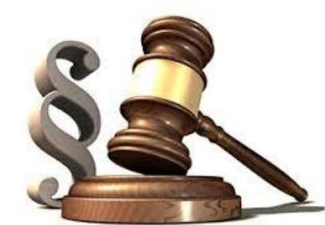

A vagyongazdálkodási tevékenység szabályozásának kialakítása nem felelt meg az előírásoknak, a vagyonnyilvántartás szabályos volt.

A vagyongazdálkodás feltételeinek kialakítása, szabályozása nem volt megfelelő.

A Társaság az adott év gazdálkodására vonatkozó elképzeléseit az éves Üzleti tervekben fogalmazta meg. Az éves Üzleti tervek elfogadásáról az alapító szabályosan, Alapítói határozatokban döntött.

A Társaság szabályzatai (Leltározási Szabályzat ${ }_{1,2}{ }^{14}{ }^{15}$, Pénzkezelési Szabályzat ${ }_{1,2}{ }^{1617}$ ) és az Alapító Okirat (az ügyvezetőre vonatkozóan) tartalmazták az adott szabályozás vonatkozásában a feladat- és hatáskörök, felelősségi viszonyok meghatározását. Nem szabályozták azonban a Társaság szervezetének egészére vonatkozóan a feladat- és hatásköröket, a felelősségi viszonyokat. Ennek keretében nem határozták meg többek között a szervezet vezetését és egységeit, a munkavégzés főbb szabályait, az egyes munkakörökre vonatkozó szabályokat, továbbá a Társaság múködésének és tevékenységének rendjét.

SZÁMVITELI POLITIKA ${ }_{1,2}{ }^{1819}$-vel az ellenőrzött időszakban rendelkezett a Társaság, azonban az nem volt összhangban a Számv. tv. ${ }^{20}$ 14. § (4) bekezdésének előírásával, mert nem tartalmazta, hogy mit tekintenek a számviteli elszámolás, illetve az értékelés szempontjából lényegesnek, nem lényegesnek, illetve jelentősnek, nem jelentősnek. A Számviteli Politika ${ }_{1,2}$ 10.4. értékvesztéssel foglalkozó pontja - amely lehetőségként kezelte az értékvesztés elszámolását - ellentétes volt a Számv. tv. 54. § (1) bekezdése, az 55. § (1) bekezdése és az 56. § (1) bekezdése előírásaival, melyek szerint az értékvesztés elszámolása - bizonyos feltételek teljesülése esetén - kötelezettség.

A szabályozási hiányosság a gyakorlatban nem jelentett problémát, mert értékvesztés elszámolása nem vált szükségessé a 2012-2014. közötti időszakban. Az ellenőrzött időszakban a Számv. tv. Számviteli Politika ${ }_{1}$-et is érintő előírása változott.

A Számv. tv. 14. § (5) bekezdése alapján a Társaság a Számviteli Politika ${ }_{1}$ részeként elkészítette a Leltározási Szabályzat ${ }_{1}$-et, az Értékelési Szabály-

---

zat ${ }_{1}{ }^{21}$-et, az Önköltségszámítási Szabályzat ${ }_{1}{ }^{22}$-et és a Pénzkezelési Szabály-zat ${ }_{1}$-et. Szabályzatait a Számviteli Politika ${ }_{1}$ módosításával egyidejúleg, 2013. március 28 -ai hatálybalépéssel aktualizálta.

A Társaság nem törölte az ellenőrzött időszak végéig a Számviteli Poli-tika ${ }_{2}$-ből - a Számv. tv. 3. § (3) bekezdése 5. pontjának 2013. január 1-jétől történő hatályon kívül helyezésére tekintettel a változást követő 90 napon belül - a megbízható és valós képet lényegesen befolyásoló hiba meghatározását. A módosítás elmaradása sértette a Számv. tv. 14. § (11) bekezdésében foglaltakat.

SZÁMLARENDJE a HSZSZ NKft.-nek a 2012. január 1.-2013. március 27. közötti időszakban nem volt, ezzel megsértette a Számv. tv. 161. § (1) bekezdésében foglaltakat, ezt követően rendelkezett szabályszerű Számlarend ${ }^{23}$-del.

A 2012. január 1.-2013. március 27. közötti időszakban, számlarend hiányában, a Számviteli Politika ${ }_{1}$ 2. sz. mellékletét képező számlatükör tartalmazta a Számv. tv. 161. § (2) bekezdés a) pontjában előírtakat, azaz minden alkalmazásra kijelölt számla számjelét és megnevezését. Ebben az időszakban nem volt olyan dokumentum, amely bemutatta az egyes alkalmazásra kijelölt számlák tartalmát, a számlák értéke növekedésének, csökkenésének jogcímeit, a számlákat érintő gazdasági eseményeket, azok más számlákkal való kapcsolatát, amely nem felelt meg a Számv. tv. 161. § (2) bekezdés b) pontjában előírtaknak.

A LELTÁROZÁSI SZABÁLYZAT ${ }_{2}$ 5.1. pontja 2013. március 28-tól előírta a Társaságnak az ingatlanok öt évente mennyiségi felvétellel történő leltározását. Ez a rendelkezés nem volt összhangban a Számv. tv. 69. § (3) bekezdésével, amely szerint legalább háromévente mennyiségi leltározást kell végezni. A Társaság az ellenőrzött időszakban a számviteli alapelveknek megfelelő folyamatos mennyiségi nyilvántartást vezetett.

A Leltározási Szabályzat ${ }_{1,2}$ tartalmazta többek között a leltározásban részt vevők feladatait, a leltározás lebonyolításának folyamatát, illetve az alkalmazandó nyomtatványokat, a leltározás gyakoriságát.

A PÉNZKEZELÉSI SZABÁLYZAT ${ }_{1,2}$ megfelelt a Számv. tv. 14. § (8)-(9) bekezdéseinek, tartalmazta többek között a pénzforgalom rendjét, a pénzkezelés tárgyi és személyi feltételeit, a pénzszállítás rendjét és a maximális pénztárállomány meghatározását.

A Számviteli Politika ${ }_{1,2}$ 11. Amortizációs politika fejezete tartalmazta az értékcsökkenés előírásait a Számv. tv. 52. § előírásainak megfelelően.

# 2.2. számú megállapítás 

A HSZSZ NKft. szabályszerűen tartotta nyilván a saját vagyonát.
A HSZSZ NKft. saját vagyon nyilvántartásának vezetése és elszámolása a számviteli előírásoknak megfelelt, a vagyonváltozás kimutatása folyamatosan történt.

Az éves beszámolóiban és a számviteli nyilvántartásaiban lévő, saját vagyonra vonatkozó leltárt a Társaság a Leltározási Szabályzat ${ }_{1,2}$-ben foglaltak alapján elkészítette. A HSZSZ NKft. az Értékelési Szabályzat ${ }_{1,2}{ }^{24}$ alapján a leltározást a saját vagyon tekintetében mennyiségi felvétellel, a csak értékben kimutatott eszközöknél és kötelezettségeknél egyeztetéssel, minden évben a leltár összeállítását megelőzően elvégezte, amely megfelelt a

---

Számv. tv. 69. § (3) bekezdésében foglaltaknak. A Társaság befektetésekkel, részesedésekkel, befektetett pénzügyi eszközökkel nem rendelkezett az ellenőrzött időszakban.

# A LELTÁRT ALÁTÁMASZTÓ DOKUMENTUMOK- 

BAN formai hiányosságok (aláírás hiánya, illetve nem beazonosíthatósága, javítás aláírásának hiánya) voltak a 2012. és 2013. években, amelyek ellentétesek a Számv. tv. 166. § (2) bekezdésének a bizonylatok alaki és tartalmi követelményeire vonatkozó előírásaival, illetve a 167. § (1) bekezdésének b) pontjában foglaltakkal. Nem felelt meg továbbá a Társaság 2013. március 27-ig hatályos Leltározási Szabályzat; 2.7. pontjában foglalt leltárral szemben támasztott tartalmi és alaki követelményeknek, valamint a 2013. március 28 -tól hatályos, Leltározási Szabályzat; 3. pontjában szereplő a leltározás bizonylatai előírásainak. A Leltározási Szabályzat ${ }_{1,2}$ előírta, hogy a javítás tényét a javítás készítője köteles feltüntetni és aláírásával igazolni, illetve alaki követelményként a leltározók és leltárellenőrök aláírásának szükségességét. Az eljárás nem felelt meg a Számlarend 5. bizonylatok kiállítása, helyesbítése pontjában előírtaknak sem. A formai hiányosság a leltár megbízhatóságát nem befolyásolta.

## 3. A bevételek és ráfordítások elszámolásának szabályozása és végrehajtása, valamint az önköltségszámítás szabályszerű volt-e?

## Összegző megállapítás

3.1. számú megállapítás

1. ábra

| Az ellenőrzés megállapítása |  |
| :-- | :-- |
| Annotatlant ráfordítnok | MEGYELÉG |
| Továbbírok aktivitása,   erakciósztávolításá,   eltalambása | MEGYELÉG |
| Értékesítés nettó átvevétele | MEGYELÉG |
| Egzerszerülemszék, lehetszpi   minőszerülemlészé,   rendkívóit ráfordítnok | MEGYELÉG |
| Egzerszévevéltek, jeltrégé   minőszerülemlészé, rendkívóit   beveteltek | MEGYELÉG |
| Személyi jellegú ráfordítnok | MEGYELÉG |

A bevételek, költségek és ráfordítások, valamint az önköltségszámítás szabályszerű volt. Az ingyenesen használatra kapott tárgyi eszközök után nem számolhatott volna el értékcsökkenést, ennek elszámolása szabálytalan volt.

A bevételeket, költségeket és ráfordításokat elkülönítetten, szabályszerűen számolták el. Az ingyenesen átvett tárgyi eszközök értékcsökkenését elszámolták, annak ellenére, hogy az eszközök nem a Társaság tulajdonát képezték.

A HSZSZ NKft. által ellátott közfeladatok bevételeinek, költségeinek és ráfordításainak elszámolása a 2012-2014. években megfelelt a jogszabályi előírásoknak. A mintavétellel ellenőrzött területek értékelését az 1. ábra összefoglalóan mutatja.

A BEVÉTELEK elszámolása és kiszámlázása a Számviteli Politiká ${ }_{1,2}$ ben és a Számviteli Politika ${ }_{1}$ 2. sz. mellékletét képező számlatükörben előírtaknak megfelelően történt, a bevételeket a megfelelő számlacsoportban számolták el. Az anyagjellegú ráfordítások esetében a költségek elszámolását megalapozó dokumentumok, számlák és szerződések rendelkezésre álltak. A befogadott számlák a formai és tartalmi követelményeknek megfeleltek, szerződéssel alátámasztottak voltak. A közhasznú, valamint a vállalkozási tevékenység bevételét, ráfordításait és eredményét minden évben szabályosan az éves közhasznúsági jelentésekben és mellékleteiben

---

bemutatták. A közhasznú bevételek az ellenőrzött időszakban kismértékben ( $15,9 \%$-kal), de évről évre növekedtek. A vállalkozási tevékenységből származó bevétel az összbevételéhez képest nem volt jelentős (1\%). A ráfordítások kisebb mértékben ( $11,2 \%$-kal) növekedtek, mint a bevételek. Ennek következtében jelentősen, 86,6\%-kal csökkent a veszteség az ellenőrzött időszakban.

A költségek és ráfordítások elszámolása - az ingyenes használatra kapott tárgyi eszközök értékcsökkenése kivételével - megfelelt a jogszabályi előírásoknak. A saját tulajdonú eszközök értékcsökkenésének meghatározása és elszámolása szabályszerűen történt, megfelelt a Számv. tv. 52. §ában és a Számviteli Politika ${ }_{1,2}$-ben előírtaknak.

A NYILVÁNTARTÁSBAN NEM SZEREPLŐ, ingyenesen használatra kapott tárgyi eszközök értékcsökkenését a Társaság nem számolhatta volna el, ennek elszámolása szabálytalan volt. Az anyagjellegú ráfordítások között, a rendkívüli bevételekkel szemben könyveltek a MIK tulajdonában lévő tárgyi eszközök után az ellenőrzött időszakban összesen 46,0 M Ft értékű értékcsökkenést. A Társaság mérlegében nem szereplő tárgyi eszközök értékcsökkenésének elszámolása nem felelt meg a Számv. tv. 78. § (1)-(5) és a 86. § (3)-(5) bekezdéseinek, amelyek meghatározzák, hogy mely tételek számolhatók el rendkívüli bevételként és anyagjellegú ráfordításként és ezek között az értékcsökkenés nem szerepelt. A helytelen elszámolás halmozódást jelentett a bevételek és a költségek között, azonban a mérlegszerinti eredményt és annak megbízhatóságát nem befolyásolta.

Az ellenőrzött időszakban a vevőkövetelések állománya 28\%-kal nőtt, meghaladva a térítési díj bevételek növekedését. A lejárt követelések állománya folyamatos csökkenést mutatott. A követeléskezelés rendjét a Pénzkezelési Szabályzat ${ }_{1,2}$-ben határozták meg. A HSZSZ NKft. a behajtás alatt lévő, hátralékos dijbevételekről külön nyilvántartással rendelkezett, melyben szerepeltek a megtett behajtási, végrehajtási intézkedések is.

# 3.2. számú megállapítás 

## A gazdálkodó szervezet kialakította az önköltségszámítás feltételeit és azt megfelelően alkalmazta.

A HSZSZ NKft. a Számv. tv. 14. § (5) bekezdés c) pontja alapján - az ellenőrzött időszakra vonatkozóan - elkészítette az Önköltségszámítási Szabály-zat ${ }_{1,2}{ }^{25}$-őt. Az Önköltségszámítási Szabályzat ${ }_{1,2}$ meghatározta az önköltségszámítás alapfogalmait, a közvetlen és a közvetett költség fogalmát és elkülönítését, a felosztandó költségeket és azok vetítési alapját, valamint a kalkulációs módszer leírását. Meghatározták az árképzéshez szükséges önköltségszámítás során alkalmazandó utókalkuláció tartalmát és időszakát. Az ellenőrzött időszakban a HSZSZ NKft. szabályszerűen számolta el és mutatta ki az önköltséget.

---

# 4. A vagyonnal való gazdálkodás, valamint a változást eredményező döntések megfeleltek-e a jogszabályi és a belső előírásoknak? 

Összegző megállapítás

## 4.1. számú megállapítás

A Társaság vagyongazdálkodása, valamint a vagyonváltozást eredményező döntések szabályosak voltak.

A Társaság vagyongazdálkodási tevékenysége szabályszerű volt.
Az ellenőrzött időszakban a HSZSZ NKft. saját és a közhasznú tevékenység bevételeiből biztosította működését. A vállalkozási tevékenységből származó bevétel (a bevételek 1\%-a) minimális kiegészítést jelentett. A bevételek között jelentek meg a közhasznú célra kapott működési és fejlesztési célú támogatások, valamint a pályázatok alapján kapott támogatások is.

A Társaság vagyona az ellenőrzött időszakban nem jelentősen (1,7\%kal), de növekedett.

Az eszközök összetételének változását a 2. ábra mutatja.
2. ábra
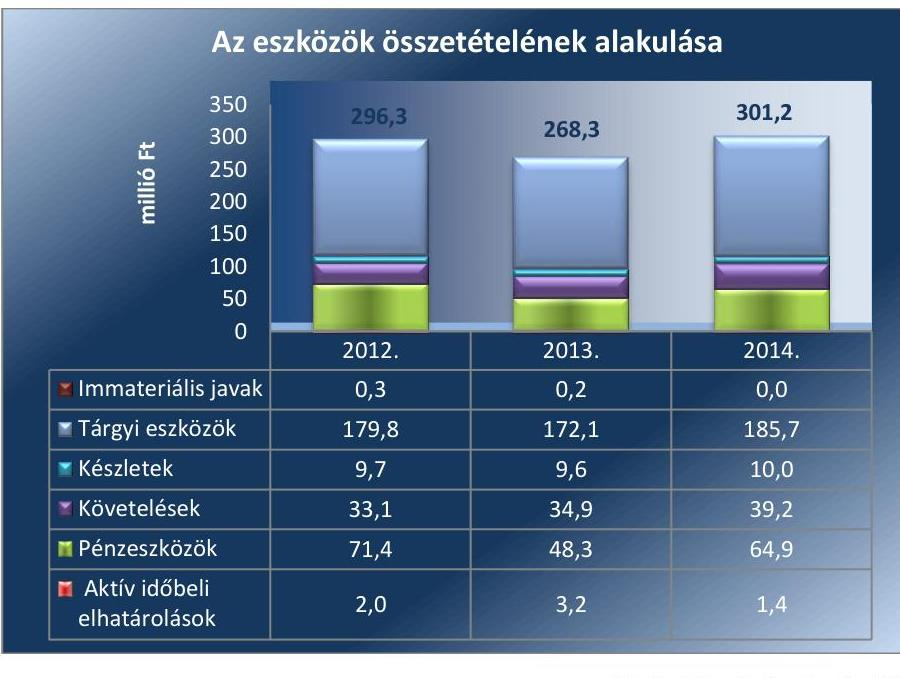

A BERUHÁZÁSOK az ellenőrzött időszakban közel 12-szeresére nőttek. A növekedés a balmazújvárosi KEOP beruházás (épületenergetikai fejlesztés) eredménye. Az ellenőrzött időszakban jellemzően ingatlanon végzett beruházásokra került sor. A 2012. évben (Nyíradony, Mikepércs) 3,3 M Ft, a 2013. évben (Nyíradony, Hajdúnánás) 9,0 M Ft és a 2014. évben (Nyíradony, Balmazújváros) 38,2 M Ft összegben.

Az ellenőrzött időszakban a saját vagyon után elszámolt értékcsökkenés összege összesen 48,5 M Ft volt. A mérleg szerinti eredménye az ellenőrzött időszakban folyamatosan negatív volt, ami a HSZSZ NKft. által ellátott tevékenységgel függött össze. A veszteség az ellenőrzött időszakban 86,6\%-kal csökkent, 2014-ben 6,8 M Ft volt az összege.

---

A SAJÁT TÖKE az ellenőrzött időszakban közel felére (44,3\%-kal) csökkent, a jegyzett tőke összege változatlan ( $3,1 \mathrm{M} \mathrm{Ft}$ ) volt. A saját tőke jegyzett tőke arány csökkent. Az eredménytartalék - a veszteséges gazdálkodással összefüggésben - 61,3\%-kal csökkent az ellenőrzött időszakban. A tőketartalék változatlan összegű ( $3,3 \mathrm{M} \mathrm{Ft}$ ) volt.

A saját tőke összetételének változását a 3. ábra mutatja.
3. ábra
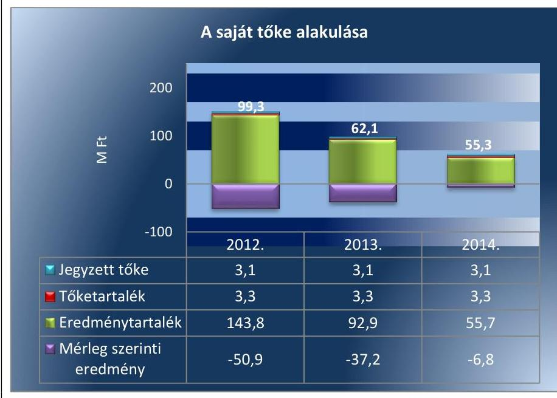

A kötelezettségek az ellenőrzött időszakban kizárólag rövid lejáratúak voltak. Összegük 2012-2014 között 37,9\%-kal (105,4 M Ft-ról 145,3 M Ftra) nőtt. A kötelezettségeken belül a szállítókkal szembeni kötelezettségek aránya csökkent (2012-ben 45,2\%, 2014-ben 42,9\% volt). Ezzel összefüggésben az egyéb rövid lejáratú kötelezettségek aránya nőtt.

Karbantartási, állagmegóvási tervek nem készültek, erre a HSZSZ NKft.nek jogszabály vagy tulajdonosi joggyakorló által előírt kötelezettsége, kezelt vagyon hiányában, nem volt. Állapot felmérés a KEOP pályázat esetében történt a balmazújvárosi intézményre vonatkozóan.

A vagyongazdálkodási döntések esetében a vagyon védelme, értékének megőrzése érdekében, a döntéshozatal során az Alapító Okirat alapján jártak el.

A Kbt. ${ }^{26}$ által előírt esetekben a közbeszerzési eljárást lefolytatta a jogszabály által előírtaknak megfelelően. A közbeszerzések az ellenőrzött időszakban elsősorban élelmiszer beszerzésekre vonatkoztak, de közbeszerzési eljárás útján került sor a villamosenergia-szolgáltatás, a takarítás és a KEOP pályázattal összefüggő, balmazújvárosi épületenergetikai fejlesztés megvalósítására.

# 4.2. számú megállapítás 

A tulajdonosi joggyakorló döntései megfeleltek az előírásoknak.
A tulajdonosi joggyakorló Alapítói határozatokban hozott döntéseken keresztül gyakorolta a tulajdonosi jogait. Az Alapító Okiratban meghatározott vagyongazdálkodásra vonatkozó jogokat a tulajdonosi joggyakorló szabályszerűen gyakorolta.

---

Az Alapító az előterjesztett éves üzleti terveket, éves beszámolókat, közhasznúsági jelentéseket, illetőleg az ügyvezető díjazásának megállapítására vonatkozó javaslatokat minden esetben elfogadta, a döntéshozatal során a jogosultsági szabályokat betartották.

A MIK ingyenesen használatba adott vagyont (ingatlanok és ingóságok) az ellátási szerződés alapján a Társaság feladatellátásához. Az ingyenes használatba adáskor hat ingatlan, valamint a leltárban szereplő tárgyi eszközök (Hajdúnánás kettő, Nyíradony egy, Balmazújváros kettő, Mikepércs egy) kerültek átadásra.

# 5. A gazdálkodó szervezet a szabályszerű vagyongazdálkodás érdekében teljesítette-e beszámolási kötelezettségét, kiépített-e és múködtetett-e információs rendszert? 

Összegző megállapítás

A Társaság a beszámolási kötelezettségét teljesítette, továbbá az információs rendszert kiépítette és múködtetette, azonban a közzététel és az adatszolgáltatás nem volt szabályszerű és a belső ellenőrzést nem alakította ki.

### 5.1. számú megállapítás

A HSZSZ NKft. eleget tett a Számv. tv. szerinti beszámoló készítési kötelezettségének, azonban a közzététel és az adatszolgáltatás teljesítése nem volt minden esetben szabályszerű.

A Társaság az éves beszámolóit a Számv. tv. 17. § (1) bekezdésében foglaltaknak megfelelően és határidőben készítette el. Az éves beszámolóval egyidejűleg elkészítették az üzleti jelentést is a Számv. tv. 19. § (1) bekezdésével összhangban, továbbá a 2012-2014. üzleti évekre a közhasznúsági mellékletet is.

AZ ÉVES BESZÁMOLÓK tulajdonosi joggyakorló általi jóváhagyásakor az éves beszámolókra vonatkozó könyvvizsgálói jelentések és az FB határozatok rendelkezésre álltak. A könyvvizsgálói jelentések megfeleltek a Számv. tv. 156. § (5) bekezdésében foglaltaknak. Az éves beszámolókat a legfőbb döntést hozó szerv jóváhagyta és azok letétbe helyezése határidőben megtörtént.

A Társaság a 2012. évi beszámolóját nem tette közzé a jogszabályi előírásokban meghatározott határidőig. A beszámolót 2013. május 31-én közzétételi szándékkal elektronikusan feltöltötték, azonban a beszámoló hibás volt. A közzététel emiatt meghiúsult, ami ellentétes a Számv. tv. 154. § (1) bekezdésében előírtakkal. A Társaság 2014. április 7-én tett eleget a 2012. évi beszámoló közzétételi kötelezettségének.

A KÖZÉRDEKŰ ADATOK megismerésére irányuló igények teljesítésének rendjét rögzítő szabályzattal a Társaság nem rendelkezett, amely nem felelt meg az Info tv. ${ }^{27}$ 30. § (6) bekezdésében foglaltaknak.

A Társaság ügyvezetője - az adatfelelős szerv vezetőjeként - az Info tv. 35. § (3) bekezdésében előírtak ellenére nem gondoskodott az adatfelelős jogszabály által előírt kötelezettsége részletes szabályainak belső szabályzatban történő megállapításáról.

---

A Társaság honlapján közzétett adatok köre hiányos volt, nem felelt meg az Info tv. 37. § (1) bekezdésében előírtaknak. A honlapon nem kerültek közzétételre többek között a Társaság szervezeti felépítése, a közfeladatot ellátó szerv által közzétett hirdetmények és közlemények, az Adatvédelmi és Adatkezelési Szabályzat ${ }_{1,2}{ }^{28} 29$, valamint a 2014. évi éves beszámolója.

Adatvédelmi és Adatkezelési Szabályzat ${ }_{1,2}$-vel - az Info tv. 24. § (3) bekezdésében foglaltaknak megfelelően - a Társaság rendelkezett, annak ellenére, hogy nem a jogszabálynak megfelelően történt a megnevezése (Adatvédelmi és Adatbiztonsági Szabályzat készítését rögzítette a törvény).

A HSZSZ NKft. az ellenőrzési időszakot érintően számviteli beszámolóját, kiegészítő mellékletét, könyvvizsgálói jelentését a tulajdonosi joggyakorló részére határidőben megküldte.

A Társaság, mint kormányzati szektorba sorolt egyéb szervezet, a 2013. és a 2014. évekre vonatkozóan nem tett eleget határidőben az Ávr. ${ }^{30}$ 7. számú melléklet 28. pontjában előírt, az államháztartásért felelős miniszter felé történő, bejelentési és adatszolgáltatási kötelezettségének. Az adatszolgáltatás határideje az üzleti év mérleg fordulónapját követő 180 napon belül van.

# 5.2. számú megállapítás 

Kialakította és múködtette az információs rendszert, azonban független belső ellenőrzést nem alakított ki.

A tulajdonosi joggyakorló és a HSZSZ NKft. között postai és elektronikus úton történt meg az adatszolgáltatás és a tájékoztatás. A tulajdonosi joggyakorló 2013. december 19-én készítette el a Társasági Monitoring Sza-bályzat ${ }^{31}$-át, amelyben az MNV Zrt. meghatározta a tulajdonosi joggyakorlása alá tartozó gazdasági társaságok monitoring, valamint adatszolgáltatási tevékenységét és kereteit.

FÜGGETLEN BELSŐ ELLENŐRZÉST a Társaságnál nem alakítottak ki és nem múködtettek 2014. január 1-jétől, annak ellenére, hogy a Bkr. ${ }^{32}$ 1. § (2) bekezdés e) pontjában foglaltak alapján a rendelet hatálya kiterjed a kormányzati szektorba sorolt egyéb szervezetekre is, így a Társaságra is. A kormányzati szektorba sorolt egyéb szervezetek vonatkozásában a Bkr. 54/A. §-ban előírtak szerint a vonatkozó rendelet 1-10. § rendelkezéseit alkalmazni kell azzal a kitétellel, hogy a költségvetési szerv vezetőjén a kormányzati szektorba sorolt egyéb szervezet vezetőjét kell érteni. Ennek megfelelően a HSZSZ NKft. ügyvezetője a Bkr. 3. § e) pontja alapján felelős a megfelelő nyomon követési rendszer (monitoring) kialakításáért, működtetéséért és fejlesztéséért; a Bkr. 10. §-a alapján pedig köteles kialakítani a szervezet tevékenységének, a célok megvalósításának nyomon követését biztosító rendszert, mely az operatív tevékenységek keretében megvalósuló folyamatos és eseti nyomon követésből, valamint az operatív tevékenységektől függetlenül működő belső ellenőrzésből áll. 2013. december 31-ig a Társaságnak ilyen kötelezettsége nem volt.

A vagyongazdálkodás szabályozottságával, szabályszerűségével, a vagyonnyilvántartással kapcsolatban a gazdálkodó szervezet és a tulajdonosi joggyakorló nem végzett, illetve nem végeztetett belső ellenőrzést, valamint külső szakértő által történő ellenőrzéseket.

---

# 6. A Társaság gazdálkodásának a kormányzati szektor hiányára és az államadósságra befolyást gyakorló elemek a jogszabályi előírásoknak megfeleltek-e? 

## Összegző megállapítás

A HSZSZ NKft. gazdálkodásának a kormányzati szektor hiányára befolyást gyakorló elemei szabályszerűek voltak.

A Társaság az Áht. 109. § (8) bekezdése alapján a 32/2013. és a 60/2013. Hivatalos Értesítőben a kormányzati szektorba sorolt egyéb szervezetek között 2013. június 28 -tól szerepelt ${ }^{33}$.

A HSZSZ NKft.-nek, mint a kormányzati szektorba sorolt egyéb szervezetnek az ellenőrzött időszak alatt nem volt a Stabilitási tv. ${ }^{34}$ által szabályozott, a kormányzati szektor hiányára és az államadósságra befolyással bíró, az államháztartásért felelős miniszter előzetes hozzájárulásával megkötött adósságot keletkeztető ügylete.

---

# JAVASLATOK 

Az ÁSZ tv. ${ }^{35}$ 33. § (1) bekezdésében foglaltak értelmében az ellenőrzött szervezet vezetője köteles a jelentésben foglalt megállapításokhoz kapcsolódó intézkedési tervet összeállítani és azt a jelentés kézhezvételétől számított 30 napon belül az ÁSZ részére megküldeni. Amennyiben az ellenőrzött szervezet vezetője nem küldi meg határidőben az intézkedési tervet, vagy továbbra sem elfogadható intézkedési tervet küld, az Állami Számvevőszék elnöke az ÁSZ tv. 33. § (3) bekezdése a) és b) pontjaiban foglaltakat érvényesítheti.

## HSZSZ NKft. ügyvezetőjének

1. Intézkedjen a számviteli politika módosítására, hogy annak tartalma megfeleljen a Számv. tv. elöírásainak.
(2.1. sz. megállapítás 3. és 6. bekezdései alapján)
2. Intézkedjen a leltározási szabályzat módosítására a Számv. tv.-nek a leltározás gyakoriságával kapcsolatos előírásával való összhang megteremtése érdekében.
(2.1. sz. megállapítás 9. bekezdése alapján)
3. Intézkedjen az értékcsökkenési leírás jogszabályi előírásoknak megfelelő elszámolására.
(3.1. sz. megállapítás 4. bekezdése alapján)
4. Intézkedjen a közérdekü adatok megismerésére irányuló igények teljesitésének rendjét rögzítő szabályzat elkészítéséről a jogszabályi előírásnak megfelelően.
(5.1. sz. megállapítás 4. bekezdése alapján)
5. Intézkedjen arról, hogy az adatfelelős a jogszabályban részére elöírt kötelezettség teljesitésének részletes szabályait belső szabályzatban állapítsa meg.
(5.1. sz. megállapítás 5. bekezdése alapján)
6. Intézkedjen a Társaság által közzéteendő adatok elektronikus közzétételi kötelezettsége jogszabályi előírásnak megfelelő, teljes körü teljesitésére.
(5.1. megállapítás 6. bekezdése alapján)

---

7. Alakítson ki és müködtessen a szervezet tevékenységének, a célok megvalósitásának nyomon követését biztositó rendszer keretében belső ellenörzést a jogszabályi elöirásnak megfelelöen.
(5.2. megállapítás 2. bekezdése alapján)

# Az MNV Zrt. vezérigazgatójának 

1. Intézkedjen a - Társaság ingyenes használatában lévő tárgyi eszközök értékcsökkenésének elszámolásával, a közérdekü adatok nyilvánosságával és a belső ellenörzés kialakításával, müködtetésével kapcsolatban - feltárt szabálytalanságok tekintetében a felelősség tisztázása érdekében, és szükség szerint intézkedjen a felelősség érvényesitéséröl.
(3.1. sz. megállapítás 4. bekezdése,
5.1. sz. megállapítás 3-6. bekezdései,
5.2. sz. megállapítás 2. bekezdése alapján)

---

# MELLÉKLETEK 

I. SZ. MELLÉKLET: ÉRTELMEZŐ SZÓTÁR

| Állami vagyon | 2010. június 17-től   a) Az állam tulajdonában lévő dolog, valamint a dolog módjára hasznosítható természeti erő,   b) az a) pont hatálya alá nem tartozó mindazon vagyon, amely vonatkozásában törvény az állam kizárólagos tulajdonjogát nevesíti,   c) az állam tulajdonában lévő tagsági jogviszonyt megtestesítő értékpapír, illetve az államot megillető egyéb társasági részesedés,   d) az államot megillető olyan immateriális, vagyoni értékkel rendelkező jogosultság, amelyet jogszabály vagyoni értékű jogként nevesít.   Forrás: Vtv. ${ }^{36}$ 1. § (2) bekezdése   2012. november 10-től az állami vagyon fogalma kiegészül a következő ponttal: e) az állam tulajdonában lévő pénzügyi eszközök   Forrás: Vtv. 1. § (2) bekezdése |
| :--: | :--: |
| Állami vagyon használója | 2011. január 1 - 2011. december 31-ig:   Az a természetes személy, jogi személy, illetve jogi személyiséggel nem rendelkező szervezet, amely, illetve aki törvény vagy szerződés alapján, bármely jogcímen (pl. bérlet, haszonbérlet, vagyonkezelési szerződés, használat stb.) állami vagyont birtokol, használ, szedi annak használt, hasznosít, ide nem értve a tulajdonosi jogok gyakorlóját. Forrás: Vhr. ${ }^{37}$ 1. § (7) bekezdés a) pontja   2012. január 1-jétől:   Az a természetes vagy jogi személy, jogi személyiséggel nem rendelkező szervezet, aki, vagy amely törvény vagy szerződés alapján, bármely jogcímen (bérlet, haszonbérlet, használat stb.) állami vagyont birtokol, használ, szedi annak használt, hasznosít, ide nem értve a haszonélvezőt, a vagyonkezelőt és a tulajdonosi jogok gyakorlóját.   Forrás: Vhr. 1. § (7) bekezdés a) pontja |
| Állami vagyon hasznosítása | 2011. december 31-ig:   Az állami vagyont az MNV Zrt. maga kezeli, vagy szerződés - így különösen bérlet, haszonbérlet, szerződésen alapuló haszonélvezet, vagyonkezelés, megbízás - alapján központi költségvetési szervnek, természetes vagy jogi személynek, vagy jogi személyiséggel nem rendelkező gazdálkodó szervezetnek hasznosításra átengedi.   Forrás: Vtv. 23. § (1) bekezdése   2012. január 1-jétől:   Az állami vagyont az MNV Zrt. maga kezeli, vagy szerződés - így különösen bérlet, haszonbérlet, meg-bízás - alapján központi költségvetési szervnek, természetes vagy jogi személynek, vagy jogi személyiséggel nem rendelkező gazdálkodó szervezetnek hasznosításra átengedi. Forrás: Vtv. 23. § (1) bekezdése   2013. június 28-ától:   Az állami vagyonnal az MNV Zrt. maga gazdálkodik, vagy szerződés - így különösen bérlet, haszon-bérlet, megbízás - alapján központi költségvetési szervnek, természetes vagy jogi személynek, vagy jogi személyiséggel nem rendelkező gazdálkodó szervezetnek hasznosításra átengedi, illetőleg vagyonkezelésbe, haszonélvezetbe adja. Forrás: Vtv. 23. § (1) bekezdése |
| Állami vagyon hasznosítására kötött szerződés | Az állami vagyonnal az MNV Zrt. maga gazdálkodik, vagy szerződés - így különösen bérlet, haszonbérlet, megbízás - alapján központi költségvetési szervnek, természetes vagy jogi személynek, vagy jogi személyiséggel nem rendelkező gazdálkodó szervezetnek hasznosításra átengedi, illetőleg vagyonkezelésbe, haszonélvezetbe adja. |

---

|  | Forrás: Vtv. 23. § (1) bekezdése   Az állami vagyon hasznosítására kötött szerződések elsődleges célja az állami vagyon hatékony múködtetése, állagának védelme, értékének megőrzése, illetve gyarapítása, az állami és közfeladatok ellátásának elősegítése. Forrás: Vtv. 23. § (2) bekezdése |
| :--: | :--: |
| Gazdálkodó szervezet | 2013. június 30-ig gazdálkodó szervezet:   Az állami vállalat, az egyéb állami gazdálkodó szerv, a szövetkezet, a lakásszövetkezet, az európai szövetkezet, a gazdasági társaság, az európai részvénytársaság, az egyesülés, az európai gazdasági egyesülés, az európai területi együttmúködési csoportosulás, az egyes jogi személyek vállalata, a leányvállalat, a vízgazdálkodási társulat, az erdő birtokossági társulat, a végrehajtói iroda, az egyéni cég, továbbá az egyéni vállalkozó. Forrás: Ptk: 685. § c) pontja   2013. július 1-jétől gazdálkodó szervezet:   Az állami vállalat, az egyéb állami gazdálkodó szerv, a szövetkezet, a lakásszövetkezet, az európai szövetkezet, a gazdasági társaság, az európai rész-vénytársaság, az egyesülés, az európai gazdasági egyesülés, az európai területi együttmüködési csoportosulás, az egyes jogi személyek vállalata, a leány-vállalat, a vízgazdálkodási társulat, az erdő birtokossági társulat, a végrehajtói iroda, az egyéni cég, továbbá az egyéni vállalkozó. Az állam, a helyi önkormányzat, a költségvetési szerv, az egyesület, a köztestület, valamint az alapítvány gazdálkodó tevékenységével összefüggő polgári jogi kapcsolataira is a gazdálkodó szervezetre vonatkozó rendelkezéseket kell alkalmazni, kivéve, ha a törvény e jogi személyekre eltérő rendelkezést tartalmaz; a 292/A-292/B. §, 301/A-301/B. §, 405. § (1) bekezdés, valamint a 407/A. § (1) bekezdés tekintetében nem minősül gazdálkodó szervezetnek az, aki a közbeszerzésekről szóló törvény értelmében ajánlat-kérő (szerződő hatóság). Forrás: Ptk: 685. § c) pontja   2014. március 15-től gazdálkodó szervezet:   A gazdasági társaság, az európai részvénytársaság, az egyesülés, az európai gazdasági egyesülés, az európai területi együttműködési csoportosulás, a szövetkezet, a lakásszövetkezet, az európai szövetkezet, a vízgazdálkodási társulat, az erdő birtokossági társulat, az állami vállalat, az egyéb állami gazdálkodó szerv, az egyes jogi személyek vállalata, a közös vállalat, a végrehajtói iroda, a közjegyzői iroda, az ügyvédi iroda, a szabadalmi ügyvivői iroda, az önkéntes kölcsönös biztosító pénztár, a magánnyugdíjpénztár, az egyéni cég, továbbá az egyéni vállalkozó. Az állam, a helyi önkormányzat, a költségvetési szerv, az egyesület, a köztestület, valamint az alapítvány gazdálkodó tevékenységével összefüggő polgári jogi kapcsolataira is a gazdálkodó szervezetre vonatkozó rendelkezéseket kell alkalmazni. Forrás: Ppt. ${ }^{38} 396 . \S$ |
| Kormányzati szektorba sorolt egyéb szervezet | Az a szervezet, amely az Áht. alapján nem része az államháztartásnak, azonban az Európai Közösséget létrehozó szerződéshez csatolt, a túlzott hiány esetén követendő eljárásról szóló jegyzőkönyv alkalmazásáról szóló 2009. május 25-i 479/2009/EK rendelet szerint a kormányzati szektorba tartozik. A nemzet-gazdasági miniszter 2013. június 26-án megjelent Közleményben tette közé ezen szervezetek listáját. |
| MNV Zrt. | Az állami vagyon felett, a Magyar Államot megillető tulajdonosi jogok és kötelezettségek összességét - a hatályos szabályozás szerint - az állami vagyon felügyeletéért felelős miniszter (jelenleg a nemzeti fejlesztési miniszter) gyakorolja. A miniszter feladatát nagy részben az MNV Zrt., mint tulajdonosi joggyakorló szervezet útján látja el. |
| Nemzetgazdasági szempontból kiemelt jelentőségű nemzeti vagyon körébe tartozó társaságok | Az ÁSZ ellenőrzés szempontjából az Nvtv. 2. sz. mellékletében felsorolt társasági részesedések. |
| Nemzeti vagyon | 2012. január 1-jétől, g. pont módosult 2012. június 30-tól nemzeti vagyon:   a) az állam vagy a helyi önkormányzat kizárólagos tulajdonában álló dolgok,   b) az a) pont hatálya alá nem tartozó, állam vagy a helyi önkormányzat tulajdonában lévő dolog, |

---

c) az állam vagy a helyi önkormányzatot tulajdonában lévő pénzügyi eszközök, továbbá az államot vagy a helyi önkormányzatot megillető tár-sasági részesedések,
d) az államot vagy a helyi önkormányzatot megillető bármely vagyoni értékkel rendelkező jogosultság, amelyet jogszabály vagyoni értékű jogként nevesít,
e) Magyarország határa által körbezárt terület feletti légtér,
f) az üvegházhatású gázok kibocsátási egységeinek kereskedelméről szóló törvény szerint kibocsátási egység és légiközlekedési kibocsátási egység, valamint az ENSZ Éghajlatváltozási Keretegyezménye és annak Kiotói Jegyzőkönyve végrehajtási keretrendszeréről szóló törvény szerinti kiotói egység,
g) állami vagy helyi önkormányzati fenntartású közgyűjtemény (muzeális intézmény, levéltár, közgyűjteményként müködő kép- és hangarchívum, valamint könyvtár) saját gyüjteményében nyilvántartott kulturális javak körébe tartozó dolog,
h) a régészeti lelet,
i) a nemzeti adatvagyon körébe tartozó állami nyilvántartások fokozottabb védelméről szóló törvény szerinti nemzeti adatvagyon.
Forrás: Nvtv. 1. § (2) bekezdés
Tulajdonosi ellenőrzés
2010. június 17-től:

Az MNV Zrt. „rendszeresen ellenőrzi a vele szerződéses jogviszonyban lévő személyek, szervezetek vagy más használók állami vagyonnal való gazdálkodását, megállapításairól az MNV Zrt. Felügyelő Bizottságát, az ellenőrzött szervet, szükség esetén a minisztert és az Állami Számvevőszéket tájékoztatja". Forrás: Vtv. 17. § d) pont
A Vhr. alapján „a tulajdonosi ellenőrzés célja az állami vagyonnal való gazdálkodás vizsgálata, ennek keretében a rendeltetésellenes, jogszerűtlen, szerződésellenes, vagy a tulajdonos érdekeit sértő, illetve a központi költségvetést hátrányosan érintő vagyon-gazdálkodási intézkedések feltárása és a jogszerű állapot helyreállítása, továbbá a vagyonnyilvántartás hitelességének, teljességének és helyességének biztosítása". Forrás: Vhr. 20. § (2) bekezdés
2011. december 31-ig

Az állami vagyon kezelőjét, használóját megillető jogok gyakorlását, annak szabályszerűségét, célszerűségét az MNV Zrt. - szükség szerint területi szervei útján - ellenőrzi.
Forrás: Vhr. 20. § (1) bekezdés
2012. január 1-jétől:

Az állami vagyon kezelőjét, haszonélvezőjét, használóját megillető jogok gyakorlását, annak szabályszerűségét, célszerűségét az MNV Zrt. - szükség szerint területi szervei útján - ellenőrzi. Forrás: Vhr. 20. § (1) bekezdés
Tulajdonosi jogok gyakorlója
2010. június 17-től:

Az állami vagyon felett a Magyar Államot megillető tulajdonosi jogok és kötelezettségek összességét - ha törvény eltérően nem rendelkezik - az állami vagyon felügyeletéért felelős miniszter (a továbbiakban: miniszter) gyakorolja, aki e feladatát a Magyar Nemzeti Vagyonkezelő Zártkörűen Müködő Részvénytársaság (a továbbiakban: MNV Zrt.), a Magyar Fejlesztési Bank, illetve a tulajdonosi joggyakorló szervezet útján látja el. A miniszter miniszteri rendeletben, a törvényben meghatározott állami vagyoni kör tekintetében, meghatározott időtartamra, a joggyakorlás egyes szabályainak meghatározásával - az őt megillető tulajdonosi jogok és kötelezettségek összességének, illetve azok meghatározott részének gyakorlóját az Áht. szerinti központi költségvetési szervek, ezek intézménye, továbbá a 100\%-ban állami tulajdonban álló gazdasági társaságok közül kijelölheti.
Forrás: Vtv. 3. § (1) bekezdés és (2) bekezdés
2013. június 28-ától:

A rábízott állami vagyon felett az államot megillető tulajdonosi jogok és kötelezettségek összességét tulajdonosi joggyakorlóként:
a) ha törvény vagy miniszteri rendelet eltérően nem rendelkezik, a Magyar Nemzeti Vagyonkezelő Zártkörűen Müködő Részvénytársaság (a továbbiakban: MNV Zrt.),

---

|  | b) törvényben kijelölt személy vagy   c) az állami vagyon felügyeletéért felelős miniszter (a továbbiakban: miniszter) által rendeletben kijelölt személy gyakorolja.   [...] A miniszter e törvény felhatalmazása alapján - a meghatározott célok hatékonyabb elérése érdekében, miniszteri rendeletben, az ott meghatározott állami vagyoni kör tekintetében, meghatározott időtartamra - e törvény keretei között, a joggyakorlás egyes szabályainak meghatározásával - az államot megillető tulajdonosi jogok és kötelezettségek összességének, illetve azok meghatározott részének gyakorlóját az Áht. szerinti központi költségvetési szervek, ezek intézménye, továbbá a 100\%-ban állami tulajdonban álló gazdasági társaságok közül kijelölheti.   Forrás: Vtv. 3. § (1) bekezdés és (2) bekezdés |
| :--: | :--: |
| A tulajdonosi joggyakorlás és a vagyongazdálkodás feladata | 2010. június 17-től:   Az állami vagyon rendeltetésének megfelelő - az állami feladatok ellátásához, a társadalmi szükségletek kielégítéséhez, valamint a Kormány gazdaságpolitikája megvalósításának elősegítéséhez szükséges, egységes elveken alapuló, önálló ágazatként megjelenő - hatékony, költségtakarékos, értékmegőrző értéknövelő felhasználásának biztosítása (közvetlen felhasználás), illetve közvetett hasznosítása (beleértve a vagyoni kör változását eredményező értékesítést), valamint az állami vagyon gyarapítása (ideértve a vagyoni kör bővítését is). Forrás: Vtv. 2. § (1) bekezdés |

---

# FÜGGELÉK: ÉSZREVÉTELEK 

A jelentéstervezetet a Számvevőszék 15 napos észrevételezésre megküldte az ellenőrzött szervezet vezetőjének az ÁSZ tv. 29. §* (1) bekezdése előírásának megfelelően.
Az elfogadott észrevételek alapján a Számvevőszék módosította a jelentést.

A függelék tartalmazza az ellenőrzött észrevételeit, illetve az el nem fogadott észrevételek elutasításának indoklását.

- A Társaság ügyvezetőjének írásban tett észrevétele
- Tájékoztatás a Társaság ügyvezetőjének az észrevételek kezeléséről
- Az MNV Zrt. vezérigazgatójának írásban tett észrevétele
- Tájékoztatás az MNV Zrt. vezérigazgatójának az észrevétel kezeléséről

[^0]
[^0]:    * 29. § (1) Az Állami Számvevőszék az ellenőrzési megállapításait megküldi az ellenőrzött szervezet vezetőjének vagy az általa megbízott személynek, és annak, akinek személyes felelősségét állapította meg.
    (2) Az ellenőrzött szervezet vezetője és a felelősként megjelölt személy az ellenőrzés megállapításaira tizenöt napon belül írásban észrevételt tehet.
    (3) Az Állami Számvevőszék az észrevételre a beérkezésétől számított harminc napon belül írásban válaszol. A figyelembe nem vett észrevételeket köteles a jelentésben feltüntetni, és megindokolni, hogy azokat miért nem fogadta el.

---

# Hajdúsági Szociális Szolgáltató Nonprofit Korlátolt Felelősségű Társaság 

4029 Debrecen Monti ezredes utca 7.
e-mail: hszukft@gmuil.com
www.hajdusaginkft.hu
Adószám: 18549878-2-09
Számlaszám: 10034002-00315108-00000017
Tárgy: észrevételek megtétele
Ikt.sz: 10-675-2/2016
Hiv.sz: V-1028-153/201
Ül: Andróczki Angelika
ÁLLAMI SZÁMVEVÓSZÉK
DOMOKOS LÁSZLÓ ÚR RÉSZÉRE

## BUDAPEST

Pf. 54
1052

## ÁLLAMI SZÁMVEVÓSZÉK

0433451006
Érkece: 2016 SZPI 19
Iktatószám:V-1528-162/2016
Melléklet:

## Tisztelt Uram!

Az Állami Számvevőszék a V-1028-153/2016. iktatószámú levele alapján megküldött „Az állami tulajdonban (résztulajdonban) lévő gazdálkodó szervezetek vagyonmegőrzés és gazdálkodási tevékenységének ellenőrzése" című ellenőrzéséről készült számvevőszéki jelentéstervezetben foglaltakra az alábbi észrevételeket kívánom tenni.

A nyilvántartásban nem szereplő, ingyenes használatra kapott tárgyi eszközök értékcsökkenését a Kft. a korábbi évek gyakorlatának megfelelően számolta el. A Társaság a vizsgált időszakban rendelkezett könyvvizsgálóval, aki a számvitelről szóló törvény szerint elkészített éves beszámolót (mely tartalmazza a mérleget, az eredménykimutatást és a kiegészítő mellékletet) felülvizsgálta abból a szempontból, hogy az megfelel-e a jogszabályoknak és a Kft. létesítő okiratának, A könyvvizsgálat során az ingyenes használatra kapott tárgyi eszközök értékcsökkenésének elszámolása ellen kifogással nem élt.

Az éves beszámoló elfogadása minden esetben egy Felügyelő Bizottsági ülésen kerül sor, melyen az FBtagokon kívül részt vesz a Kft. ügyvezetője, gazdaságvezetője, jogi képviselője, a tulajdonosi jogokat gyakorló szerv megbízottja és a könyvvizsgáló. Ezekről a megbeszélésekről jegyzőkönyv készül, melynek melléklete a jelenléti ív. A vizsgált időszakban a Társaság beszámolóját tárgyaló ülésen a könyvvizsgáló minden esetben részt vett.

Debrecen, 2016. szeptember 13.

Tisztelettel:

Hajdúsági Szociális Nonprofit Kft.
4029 Debrecen, Monti ezredes ut?
Adószám: 18549878-2-09
Cégjegyzék-szám: 03-05-016936
Prek Sándorné
ügyvezető

---

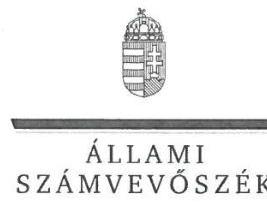

ELNÖK

Ikt.szám: V-1028-165/2016.

# Prek Sándorné úrhölgy 

ügyvezető
Hajdúsági Szociális Szolgáltató Nonprofit Kft.

## Debrecen

## Tisztelt Ügyvezető Úrhölgy!

A „Hajdúsági Szociális Szolgáltató NKft. - Az állami tulajdonban (résztulajdonban) lévő gazdálkodó szervezetek vagyonmegőrzési és gazdálkodási tevékenységének ellenőrzése" címmel készített számvevőszéki jelentéstervezetre tett észrevételeit köszönettel megkaptam.
Az Állami Számvevőszék észrevételekre vonatkozó álláspontjáról a felügyeleti vezető által készített részletes tájékoztatást mellékelten megküldőm.
Tájékoztatom Ügyvezető úrhölgyet, hogy a számvevőszéki jelentésben - az Állami Számvevőszékről szóló 2011. évi LXVI. törvény 29. § (3) bekezdése alapján - a figyelembe nem vett észrevételeket szerepeltetjük az elutasítás indokának feltüntetésével.

Budapest, 2016. 14 hó 6 nap
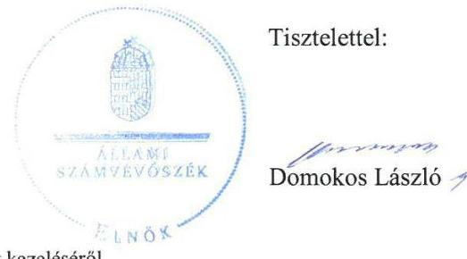

Melléklet: Tájékoztatás az észrevételek kezeléséről

---

# Tájékoztatás   az észrevételek kezeléséről 

A „Hajdúsági Szociális Szolgáltató NKft. - Az állami tulajdonban (résztulajdonban) lévő gazdálkodó szervezetek vagyonmegőrzési és gazdálkodási tevékenységének ellenörzése" címü jelentéstervezetre 2016. szeptember 13-án tett (az Állami Számvevőszékhez 2016. szeptember 19-én érkezett) észrevételeit áttekintettük, azok kezelésével kapcsolatban a következő tájékoztatást adom.

## 1. A nyilvántartásban nem szereplő, ingyenes használatra kapott tárgyi eszközök értékcsökkenése elszámolásához kapcsolódóan tett észrevételhez

Az észrevétel szerint a nyilvántartásban nem szereplő, ingyenes használatra kapott tárgyi eszközök értékcsökkenését a Kft. a korábbi évek gyakorlatának megfelelően számolta el, a könyvvizsgálat az elszámolás ellen kifogással nem élt. A könyvvizsgálói vélemény önmagában nem garancia minden gazdasági esemény szabályos számviteli elszámolására. A jelentéstervezetben szereplő megállapítás az Állami Számvevőszék jogszabályi előírásokon alapuló független véleménye, amelyet a mintavételezés során kiválasztott mintatételeket (értékcsökkenés elszámolása, 2013. év) alátámasztó, az ellenőrzött által rendelkezésre bocsátott dokumentumok ellenőrzése alapján fogalmazott meg. Rendszerhiba, hogy az ingyenesen használatba kapott, de más tulajdonában álló eszközök után értékcsökkenés gazdasági eseményt értelmeztek és dokumentáltak, annak összegét pedig az anyagjellegủ ráfordítások között számolták el.
Az előzőekben kifejtettek alapján a jelentéstervezetnek az értékcsökkenés elszámolásával kapcsolatos megállapításai helytállóak, azok módosítása nem indokolt.

## 2. Az éves beszámoló elfogadásával kapcsolatban tett észrevételhez

Az észrevétel az éves beszámoló elfogadásával kapcsolatban a Felügyelő Bizottság ülésén résztvevőket sorolja fel és külön kiemeli a könyvvizsgáló részvételét. A jelentéstervezet nem a Felügyelő Bizottság, hanem a társaság legfőbb szerve döntésével kapcsolatban tett megállapítást a könyvvizsgáló meghívásával összefüggésben.
Jelzem, hogy a témában a tulajdonosi joggyakorló tett észrevételt, amelyet az Állami Számvevőszék figyelembe vesz. A jelentés véglegezésekor a Főbb megállapítások, következtetések és a Megállapítások fejezetekből a könyvvizsgálónak a társaság éves beszámolóját tárgyaló ülésre történő meghívása elmaradásáról szóló megállapítás, valamint a Javaslatok fejezetből az ügyvezetőnek címzett kapcsolódó javaslat és az MNV Zrt. vezérigazgatójának címzett javaslat kapcsolódó eleme is törlésre kerül.

Tájékoztatom, hogy a számvevőszéki jelentés függelékeként szerepeltetjük a jelentéstervezethez tett észrevételeit, valamint az azokra adott válaszunkat.

Budapest, 2016. 10. hó 05 nap

Böröcz Imre
felügyeleti vezető

---

# Állami Számvevőszék 

## Domokos László   elnök

1052 Budapest
Apáczai Cs. J. u. 10.

Ikt. sz.: MNV/01/6945/ 5 /2016.
Hiv. sz.: V-1028-154/2016.

Tisztelt Elnök Úr!
A 2016. augusztus 29. napján a „Hajdúsági Szociális Szolgáltató NKft. - Az állami tulajdonban (résztulajdonban) lévő gazdálkodó szervezetek vagyonmegőrzési és gazdálkodási tevékenységének ellenörzése" tárgyában kézhez vett, V-1028-154/2016. ikt. sz. Jelentés-tervezetre az alábbi észrevételeket tesszük:

Összegzés / 6.old. Föbb megállapítások, következtetések negyedik bekezdés; Megállapítások / 16-17. old. 3.1. számú megállapítás első és negyedik bekezdés; Javaslatok / 24. old. Az MNV Zrt. vezérigazgatójának megfogalmazott javaslat:

A Jelentés-tervezetben szereplő megállapítás szerint a Hajdúsági Szociális Szolgáltató NKft. (a továbbiakban: Társaság) nyilvántartásában nem szereplő, ingyenes használatba kapott eszközök után a Társaság szabálytalanul értékcsökkenést számolt el az anyagjellegủ ráfordítások között a rendkívüli bevételekkel szemben, annak ellenére, hogy a szóban forgó eszközök nem képezték a Társaság tulajdonát.

Álláspontunk szerint a Társaság az ellenőrzött időszakra vonatkozóan közzétett éves beszámolóinak tartalmából nem vonható le ilyen értelmű következtetés. Az éves beszámolók Kiegészítő mellékleteiben foglaltak szerint a Rendkívüli bevételek között elszámolt „Önkormányzattól ingyenesen kapott ingatlanhasználat elszámolt költsége" a Számviteli törvény (2000. évi C. tv.) 86. § (3) bekezdés j) pontja előírásának megfelelően a térítés nélkül kapott (igénybe vett) szolgáltatás piaci értéke. Az anyagjellegủ ráfordítások (igénybevett szolgáltatások) értékét az éves beszámolók Kiegészítő mellékletei nem részletezik, azonban semmi nem ad okot arra a következtetésre, hogy az anyagjellegủ ráfordítások között értékcsökkenés került volna elszámolásra.

A fentiek alapján kérjük törölni a Jelentés-tervezet érintett megállapításait mind az „Összegzés" címủ fejezetből, mind a „Megállapítások" elnevezésű fejezetből, valamint az MNV Zrt. vezérigazgatójának megfogalmazott, vonatkozó javaslatot.

---

Összegzés / 6. old. Főbb megállapítások, következtetések ötödik bekezdés, Megállapítások / 20. old. 5.1. számú megállapítás negyedik bekezdés, Javaslatok / 23-24. old. HSZSZ NKft. ügyvezetőjének megfogalmazott 4. számú javaslat, valamint Az MNV Zrt. vezérigazgatójának megfogalmazott javaslat:

A Jelentés-tervezet kifogásolja, hogy a könyvvizsgálót nem hívták meg a Társaság legfőbb szervének a Társaság beszámolóját tárgyaló üléseire, ami ellentétes volt a Gt. 44. § (1) és a Ptk. 3:131. § (2) bekezdésében foglaltakkal.

Az új Ptk. hatálybalépése előtt a gazdasági társaságokról szóló 2006. évi IV. törvény, azaz a Gt. 19-20. §ai tartalmazták a gazdasági társaságok legfőbb szerveivel kapcsolatos általános szabályokat. A Gt. 19. § (1) bekezdése alapján a gazdasági társaság legfőbb szerve a korlátolt felelősségủ társaságnál a taggyülés, a 19. § (5) bekezdés ugyanakkor kimondta, hogy egyszemélyes korlátolt felelősségủ társaságnál taggyülés nem múködik, és a gazdasági társaság legfőbb szervének hatáskörében az egyedüli tag írásban határoz. A Gt. 44. § (1) bekezdése azt írta elő, hogy a gazdasági társaság könyvvizsgálóját a társaság legfőbb szervének a társaság számviteli törvény szerinti beszámolóját tárgyaló ülésére kell meghívni.

A Ptk. lényegében a Gt. szabályait ismétli meg. A Ptk. 3:109. § (1) bekezdése szerint a gazdasági társaság tagjainak döntéshozó szerve a legfőbb szerv. Ugyanezen szakasz (4) bekezdése kimondja, hogy egyszemélyes társaságnál a legfőbb szerv hatáskörét az egyedüli tag gyakorolja, a legfőbb szerv hatáskörébe tartozó kérdésekben az egyedüli tag írásban határoz, a döntés az ügyvezetéssel való közléssel válik hatályossá. A Ptk. 3:131. § (2) bekezdése szerint az állandó könyvvizsgálót a társaság legfőbb szervének a társaság beszámolóját tárgyaló ülésére kell meghívni.

Az állam - mint egyedüli tag - kizárólagos tulajdonában álló Hajdúsági Szociális Szolgáltató NKft. esetében a vizsgált időszakban nem került sor legfőbb szervi ülések megtartására, így a könyvvizsgáló meghívására sem volt lehetőség. Az éves beszámolók elfogadására alapítói határozathozatallal, főigazgatói hatáskörben került sor. Erre tekintettel kérjük törölni a Jelentés-tervezetből a könyvvizsgáló legfőbb szervi ülésen történő részvétele hiányával kapcsolatos megállapításokat mind az „Összegzés" című fejezetből, mind a „Megállapítások" elnevezésű fejezetből, továbbá az ezzel kapcsolatos, HSZSZ Nkft. ügyvezetőjének és az MNV Zrt. vezérigazgatójának megfogalmazott javaslatokat.

Javaslatok / 24. old. Az MNV Zrt. vezérigazgatójának megfogalmazott javaslat:
Az MNV Zrt. vezérigazgatójának megfogalmazott javaslattal összefüggésben jelezzük, hogy a Hajdúsági Szociális Nkft. állami tulajdonú társasági részesedése feletti tulajdonosi jogokat az MNV Zrt.-vel megkötött SZT-104364 számú Megbízási Szerződés alapján, 2015. május 5. napjától kezdődően a Szociális és Gyermekvédelmi Főigazgatóság gyakorolja, ennek megfelelően a Társasággal kapcsolatos, tulajdonosi hatáskörbe tartozó intézkedések megtételére a Szociális és Gyermekvédelmi Főigazgatóság jogosult.

---

Megjegyezzük továbbá, hogy a Jelentés-tervezetben foglaltak áttanulmányozása alapján nem tartjuk indokoltnak a tulajdonosi jogok gyakorlója részére megfogalmazott intézkedési javaslatot, tekintettel arra, hogy a Társaság ügyvezetőjének előími tervezett intézkedési javaslatok, a tulajdonosi joggyakorló felügyelete mellett - megítélésünk szerint -, megfelelően szolgálják a feltárt hiányosságok, problémák kezelését.

Kérem Elnök Urat, hogy a Jelentés véglegesítése során jelen észrevételeinket szíveskedjenek figyelembe venni.

Budapest, 2016. szeptember , 13 "
Üdvözlettel:
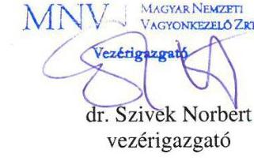

---

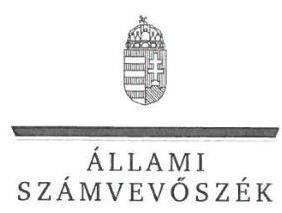

ELNÖK

Ikt.szám: V-1028-164/2016.

# Dr. Szívek Norbert úr 

vezérigazgató
Magyar Nemzeti Vagyonkezelő Zrt.

## Budapest

## Tisztelt Vezérigazgató Úr!

A „Hajdúsági Szociális Szolgáltató NKft. - Az állami tulajdonban (résztulajdonban) lévő gazdálkodó szervezetek vagyonmegőrzési és gazdálkodási tevékenységének ellenőrzése" címmel készített számvevőszéki jelentéstervezetre tett észrevételeit köszönettel megkaptam.
Az Állami Számvevőszék észrevételekre vonatkozó álláspontjáról a felügyeleti vezető által készített részletes tájékoztatást mellékelten megküldőm.
Tájékoztatom Vezérigazgató urat, hogy a számvevőszéki jelentésben - az Állami Számvevőszékről szóló 2011. évi LXVI. törvény 29. § (3) bekezdése alapján - a figyelembe nem vett észrevételeket szerepeltetjük az elutasítás indokának feltüntetésével.

Budapest, 2016. 40 hó 1 nap
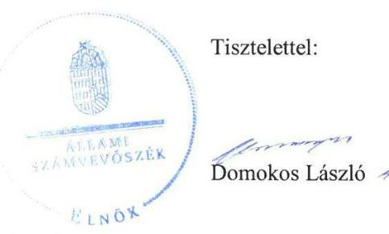

Melléklet: Tájékoztatás az észrevételek kezeléséről

---

# Tájékoztatás   az észrevételek kezeléséről 

A „Hajdúsági Szociális Szolgáltató NKft. - Az állami tulajdonban (résztulajdonban) lévő gazdálkodó szervezetek vagyonmegőrzési és gazdálkodási tevékenységének ellenőrzése" címü jelentéstervezetre 2016. szeptember 13-án tett (az Állami Számvevőszékhez 2016. szeptember 14-én érkezett) észrevételeit áttekintettük, azok kezelésével kapcsolatban a következő tájékoztatást adom.

1. A jelentéstervezet Összegzés/6. old. Főbb megállapítások, következtetések negyedik bekezdés; Megállapítások/16-17. old. 3.1. számú megállapítás első és negyedik bekezdés; Javaslatok/24. old. az MNV Zrt. vezérigazgatójának megfogalmazott javaslat részeihez kapcsolódóan tett észrevételhez
Az észrevétel szerint - amellett, hogy az éves beszámolók kiegészítő mellékletei az anyagjellegủ ráfordítások értékét nem részletezik - semmi nem ad okot arra a következtetésre, hogy az anyagjellegủ ráfordítások között elszámolták az ingyenesen használatba kapott eszközök értékcsökkenését, az éves beszámolók tartalmából nem vonható le ilyen értelmủ következtetés. A jelentéstervezet erre irányuló megállapítását az Állami Számvevőszék az anyagjellegủ ráfordítások mintavétellel történő ellenőrzése alapján tette. A mintavételezés során kiválasztott mintatételt (értékcsökkenés elszámolása, 2013. év) alátámasztó bizonylat (fökönyvi karton) alapján - amelyet az ellenőrzött bocsátott rendelkezésre - került megállapításra, hogy az anyagjellegủ ráfordítások között történt meg az ingyenesen használatba kapott eszközök után az értékcsökkenés elszámolása.
Az előzőekben kifejtettek alapján a jelentéstervezetnek az értékcsökkenés elszámolásával kapcsolatos megállapításai helytállóak, azok módosítása nem indokolt.
2. A jelentéstervezet Összegzés/6. old. Főbb megállapítások, következtetések ötödik bekezdés; Megállapítások/20. old. 5.1. számú megállapítás negyedik bekezdés, Javaslatok/23-24. old. HSZSZ NKft. ügyvezetőjének megfogalmazott 4. számú javaslat, valamint az MNV Zrt. vezérigazgatójának megfogalmazott javaslat részeihez tett észrevételhez
Az észrevétel szerint a Hajdúsági Szociális Szolgáltató NKft-re (HSZSZ NKft.) nem vonatkozik a könyvvizsgáló meghívásának kötelezettsége a társaság éves beszámolóját tárgyaló ülésére. Ennek indokolásaként a törvényi előírásokra való hivatkozásokkal részletesen kifejti, hogy a társaság legfőbb szerve hatáskörét az egyedüli tag gyakorolja és a vonatkozó döntéséről írásbeli határozatot hoz, ez esetben nincs az éves beszámolót tárgyaló ülés. A vonatkozó rendelkezésre álló dokumentumok és körülmények ismételt áttekintése megtörtént, amely alapján az Állami Számvevőszék az észrevételt figyelembe veszi.
A jelentés véglegezésekor a Főbb megállapítások, következtetések és a Megállapítások fejezetekből a könyvvizsgálónak a társaság éves beszámolóját tárgyaló ülésre történő meghívása elmaradásáról szóló megállapítás, valamint a Javaslatok fejezetből az ügyvezetőnek címzett kapcsolódó javaslat és a Magyar Nemzeti Vagyonkezelő Zrt. (MNV Zrt.) vezérigazgatójának címzett javaslat kapcsolódó eleme is törlésre kerül.

---

# 3. A jelentéstervezet Javaslatok/24. old. az MNV Zrt. vezérigazgatójának megfogalmazott javaslatához tett észrevételhez 

Köszönjük tájékoztatását arról, hogy a HSZSZ NKft. állami tulajdonú társasági részesedése feletti tulajdonosi jogokat 2015. május 5. napjától kezdődően a Szociális és Gyermekvédelmi Föigazgatóság gyakorolja. Az észrevétel alapján a jelentéstervezet módosítása nem indokolt, mert az Állami Számvevőszék az ellenőrzési programnak megfelelően a HSZSZ NKft. vagyonmegőrzési és gazdálkodási tevékenységét a 2012. január 1. és 2014. december 31. közötti időszakra szólóan ellenőrizte a HSZSZ NKft. és az MN Zrt. mint ellenőrzött szervezetek vonatkozásában. Az Állami számvevőszékről szóló 2011. évi LXVI. törvény 33. § (1) bekezdése szerint az ellenőrzött szervezet vezetője köteles a jelentésben foglalt megállapításokhoz kapcsolódó intézkedési tervet összeállítani, és azt a jelentés kézhezvételétől számított harminc napon belül az Állami Számvevőszék részére megküldeni.
Az észrevételeket tartalmazó levél utolsó előtti bekezdésében szereplő megjegyzés szerint nem indokolt a tulajdonosi jogok gyakorlója (MNV Zrt. vezérigazgatója) részére megfogalmazott intézkedési javaslat. A feltárt szabálytalanságok miatt az Állami Számvevőszék a javaslatát fenntartja. A felelősség tisztázása éppen annak a feltételét biztosítja, hogy a tulajdonosi joggyakorló minden körülmény alapos mérlegelésével döntsön a felelősség érvényesítése kérdésében.
Tájékoztatom, hogy a számvevőszéki jelentés függelékeként szerepeltetjük a jelentéstervezethez tett észrevételeit, valamint az azokra adott válaszunkat.

Budapest, 2016. JO. hó 05. nap

Böröcz Imre felügyeleti vezető

---

# RÖVIDÍTÉSEK JEGYZÉKE 

${ }^{1}$ HSZSZ NKft./Társaság
${ }^{2}$ ellátási szerződés
${ }^{3}$ MNV Zrt.
${ }^{4}$ MIK
${ }^{5}$ ellátási szerződés
${ }^{6} \mathrm{M} \mathrm{Ft}$
${ }^{7}$ ÁSZ
${ }^{8}$ Áht.
${ }^{9}$ Nvtv.
${ }^{10}$ Gt.
${ }^{11}$ Ptk $_{2}$
${ }^{12} \mathrm{FB}$
${ }^{13}$ Ptk $_{1}$
${ }^{14}$ Leltározási Szabályzat ${ }_{1}$
${ }^{15}$ Leltározási Szabályzat ${ }_{2}$
${ }^{16}$ Pénzkezelési Szabályzat ${ }_{1}$
${ }^{17}$ Pénzkezelési Szabályzat ${ }_{2}$
${ }^{18}$ Számviteli Politika ${ }_{1}$
${ }^{19}$ Számviteli Politika ${ }_{2}$
${ }^{20}$ Számv. tv.
${ }^{21}$ Értékelési Szabályzat ${ }_{1}$
${ }^{22}$ Önköltségszámítási Szabályzat ${ }_{1}$
${ }^{23}$ Számlarend
${ }^{24}$ Értékelési Szabályzat ${ }_{2}$
${ }^{25}$ Önköltségszámítási Szabályzat ${ }_{2}$
${ }^{26} \mathrm{Kbt}$.

Hajdúsági Szociális Szolgáltató Nonprofit Kft.
Hajdúsági Szociális Szolgáltató Nonprofit Kft. és a Hajdú-Bihar Megyei Intézményfenntartó Központ között 2012. 03. 23-án megkötött 2012. 01. 01-jétől hatályos ellátási szerződés
Magyar Nemzeti Vagyonkezelő Zrt.
Hajdú-Bihar Megyei Intézményfenntartó Központ
a Bihari Szociális Szolgáltató Nonprofit Kft. és a Hajdú-Bihar Megyei Intézményfenntartó Központ között 2012. január 1-jén megkötött ellátási szerződés
millió forint
Állami Számvevőszék
2011. év CXCV. törvény az államháztartásról (hatályos 2012. január 1-jétől)
2011. évi CXCVI. törvény a nemzeti vagyonról (hatályos 2011. XII. 31-től)
2006. évi IV. törvény a gazdasági társaságokról
2013. évi V. törvény a Polgári Törvénykönyvről (hatályos 2014. III. 15-től)

Felügyelő Bizottság
1959. évi IV. törvény a Polgári Törvénykönyvről (hatálytalan 2014. III. 15-től)

Hajdúnánási Szociális Szolgáltató Nonprofit Korlátolt Felelősségű Társaság fenntartásában működő intézmények Eszközök és Források Leltározási és Leltárkészítési Szabályzata (hatályos 2009. június 1-jétől)
Hajdúsági Szociális Szolgáltató Nonprofit Kft. Leltározási és Leltárkészítési Szabályzata (hatályos 2013. március 28-tól)
Hajdúsági Szociális Szolgáltató Nonprofit Korlátolt Felelősségű Társaság fenntartásában működő intézmények Házipénztár- és Pénzkezelési Szabályzata (hatályos 2009. június 1-jétől)
Hajdúsági Szociális Szolgáltató Nonprofit Kft. Házipénztár Pénzkezelési Szabályzat (hatályos 2013. március 28-tól)
Hajdúsági Szociális Szolgáltató Nonprofit Korlátolt Felelősségű Társaság Számviteli Politika (hatályos 2008. január 1-jétől)
Hajdúsági Szociális Szolgáltató Nonprofit Kft. Számviteli Politikája (hatályos 2013. március 28-tól)
2000. évi C. törvény a számvitelről

Hajdúsági Szociális Szolgáltató Nonprofit Kft. Eszközök és Források Értékelési Szabályzata (hatályos 2009. augusztus 1-jétől)
Hajdúsági Szociális Szolgáltató Nonprofit Korlátolt Felelősségű Társaság Önköltségszámítási Szabályzata (hatályos 2009. június 1-jétől)
Hajdúsági Szociális Szolgáltató Nonprofit Kft. Számlarendje (hatályos 2013. március 28-tól)
Hajdúsági Szociális Szolgáltató Nonprofit Kft. Eszközök és Források Értékelési Szabályzata (hatályos 2013. március 28-tól)
Hajdúsági Szociális Szolgáltató Nonprofit Kft. Önköltségszámítási Szabályzata (hatályos 2013. március 28-tól)
2011. évi CVIII. törvény a közbeszerzésekről (hatályos 2011. augusztus 21-től)

---

${ }^{27}$ Info tv.
${ }^{28}$ Adatvédelmi és Adatkezelési Szabályzat ${ }_{1}$
${ }^{29}$ Adatvédelmi és Adatkezelési Szabályzat ${ }_{2}$
${ }^{30}$ Ávr.
${ }^{31}$ Társasági Monitoring Szabályzat
${ }^{32}$ Bkr.
${ }^{33}$ NGM közlemény
${ }^{34}$ Stabilitási tv.
${ }^{35}$ ÁSZ tv.
${ }^{36} \mathrm{Vtv}$.
${ }^{37} \mathrm{Vhr}$.
${ }^{38} \mathrm{Ppt}$.
2011. évi CXII. törvény az információs önrendelkezési jogról és az információszabadságról (hatályos 2011. július 27-től)
Hajdúsági Szociális Szolgáltató Nonprofit Korlátolt Felelősségű Társaság Adatvédelmi és Adatkezelési Szabályzata (hatályos 2011. február 1-jétől)
Hajdúsági Szociális Szolgáltató Nonprofit Kft. Adatvédelmi és Adatkezelési Szabályzata (hatályos 2013. március 28-tól)
368/2011. (XII. 31.) Korm. rendelet az államháztartásról szóló törvény végrehajtásáról
az MNV Zrt. 51/2013. számú vezérigazgatói utasítása a Társasági Monitoring Szabályzatról (hatályos 2013. december 19-től)
370/2011. (XII. 31.) Korm. rendelet a költségvetési szervek belső kontrollrendszeréről és belső ellenőrzéséről
A 32/2013. számú Hivatalos Értesítőben megjelent NGM közlemény hatályos 2013. június 28-tól, a 60/2013. számú Hivatalos Értesítőben megjelent NGM közlemény hatályos 2013. december 16-tól
2011. évi CXCIV. törvény Magyarország gazdasági stabilitásáról
2011. évi LXVI. törvény az Állami Számvevőszékről
2007. évi CVI. törvény az állami vagyonról

254/2007. (X. 4.) Korm. rendelet az állami vagyonnal való gazdálkodásról
1952. évi III. törvény a polgári perrendtartásról

---

# ÁLLAMI SZÁMVEVŐSZÉK 

1052 Budapest, Apáczai Csere János utca 10.
Levélcím: 1364 Budapest 4. Pf. 54
Telefon: +36 14849100 Telefax: +36 14849200
www.asz.hu