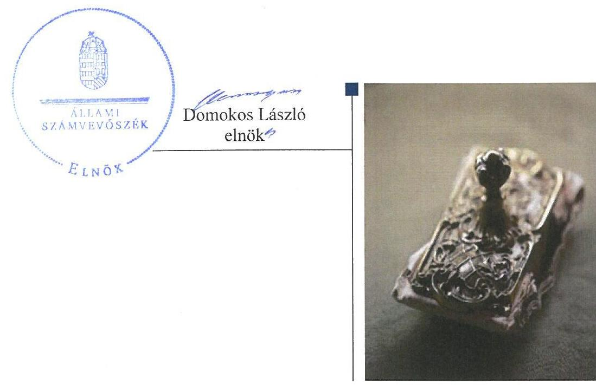
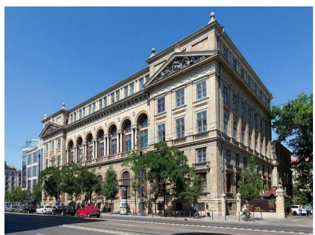
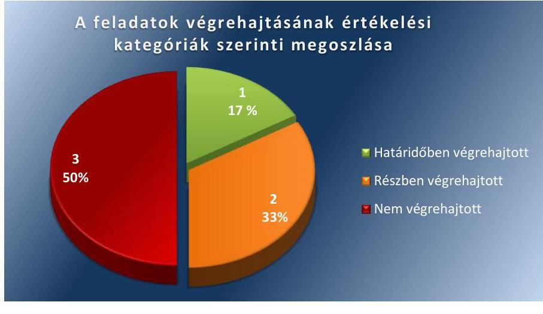
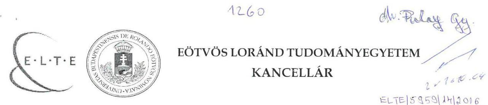
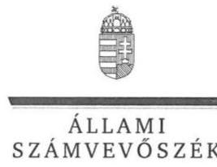
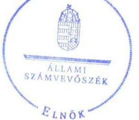

# Jelentés 

## Utóellenőrzések

Az állami felsőoktatási intézmények gazdálkodásának, múködésének ellenőrzéséről készült jelentések utóellenőrzése - Eötvös Loránd Tudományegyetem
2016.

---

# Jelentés 

## Utóellenőrzések

Az állami felsőoktatási intézmények gazdálkodásának, múködésének ellenőrzéséről készült jelentések utóellenőrzése - Eötvös Loránd Tudományegyetem
2016. M. hó 15. nap

---

# AZ ELLENŐRZÉST FELÜGYELTE: 

DR. PULAY GYULA ZOLTÁN felügyeleti vezető

## AZ ELLENŐRZÉST VEZETTE ÉS A VÉGREHAJTÁSÁÉRT FELELŐS:

RÁCZKEVI KATALIN ellenőrzésvezető

## A PROGRAM ÖSSZEÁLLÍTÁSÁÉRT FELELŐS:

JANIK JÓZSEF osztályvezető

## A TÉMÁHOZ KAPCSOLÓDÓ KORÁBBI SZÁMVEVŐSZÉKI JELENTÉSEK:

- címe: Jelentés az Eötvös Loránd Tudományegyetem Az állami felsőoktatási intézmények gazdálkodásának, működésének ellenőrzéséről
- sorszáma: 15072

IKTATÓSZÁM: V-1153-059/2016.
TÉMASZÁM: 2187
ELLENŐRZÉS-AZONOSÍTÓ SZÁM: V075504

---

# TARTALOMJEGYZÉK 

■ ÖSSZEGZÉS ..... 5
■ AZ ELLENŐRZÉS CÉLJA ..... 6
■ AZ ELLENŐRZÉS TERÜLETE ..... 7
■ AZ ELLENŐRZÉS HÁTTERE, INDOKOLTSÁGA ..... 8
■ A JELENTÉS LÉNYEGES KÉRDÉSKÖREI ..... 9
■ ELLENŐRZÉS HATÓKÖRE ÉS MÓDSZEREI ..... 10
■ MEGÁLLAPÍTÁSOK ..... 13
■ MELLÉKLETEK ..... 15
I. Sz. melléklet: Az ÁSZ 15072 számú jelentéséhez kapcsolódó intézkedési terv végrehajtása ..... 15
■ FÜGGELÉK: ÉSZREVÉTELEK ..... 19
■ RÖVIDÍTÉSEK JEGYZÉKE ..... 35

---

.

---

# ÖSSZEGZÉS 

Az Állami Számvevőszék az Eötvös Loránd Tudományegyetem utóellenőrzését 2015. április 29. és 2016. május 23. közötti időszakra végezte el. Az utóellenőrzés megállapította, hogy a korábbi számvevőszéki jelentés javaslatai alapján az Egyetem rektora és kancellárja által meghatározott intézkedési tervben szereplő feladatok jelentős részét nem hajtották végre, így az ÁSZ által korábban azonosított hiányosságok egy része továbbra is fennáll. A feladatok végrehajtásáról

az elöirt nyilvántartást vezették.

## Az ellenőrzés társadalmi indokoltsága

Az ÁSZ ${ }^{1}$ stratégiájában célul tűzte ki a számvevőszéki munka hasznosulásának javítását. Ezzel összhangban ellenőrzi, hogy az ellenőrzött szervezetek megvalósították-e a korábbi ellenőrzései által feltárt hibák, hiányosságok és szabálytalanságok megszüntetése céljából elkészített intézkedési terveikben foglaltakat. A rendszeres utóellenőrzések hozzájárulnak a szükséges intézkedések tényleges végrehajtáshoz, ezáltal a közpénzügyek rendezettségének javulásához.

## Főbb megállapítások, következtetések

Az Egyetem² az intézkedési tervben rögzített feladatok végrehajtásáról a Bkr. ${ }^{3}$ előírásainak megfelelő nyilvántartást vezetett.

Az intézkedési tervben meghatározott hat feladatból, egy feladatot határidőben, kettő feladatot részben hajtottak végre, valamint három feladat végrehajtása nem történt meg.

A kancellár ${ }^{4}$ nem intézkedett a korábban feltárt szabálytalanságok vonatkozásában a munkajogi felelősség kivizsgálására irányuló eljárás megindításáról és a vizsgálat eredményének ismeretében a szükséges intézkedések megtételéről. A kancellár nem gondoskodott a követelések nyilvántartásokban való szabályszerű kimutatásáról. A vagyonhasznosítás terén a kancellár nem gondoskodott a versenyeztetés szabályainak betartásáról és a bérleti díjak önkölt-ség-számításon alapuló meghatározásáról.

A megtett intézkedések javították az Egyetem működésének szabályozottságát, azonban az ÁSZ által korábban az Egyetem vagyongazdálkodása, vagyon hasznosítása területén azonosított hiányosságok egy része továbbra is fennáll.

---

# AZ ELLENŐRZÉS CÉLJA 

Az ellenőrzés célja annak értékelése volt, hogy a számvevőszéki jelentésben foglalt intézkedést igénylő megállapításokkal és javaslatokkal összhangban készített intézkedési tervben meghatározott feladatokat az ellenőrzött szervezet végrehajtotta-e.

---

# AZ ELLENŐRZÉS TERÜLETE 

## Eötvös Loránd Tudományegyetem

Az Egyetem jogelődjét 1635-ben alapította Pázmány Péter esztergomi érsek. Az intézmény folyamatos bővülését és fejlődését követően 1950-ben vette fel az Eötvös Lóránd Tudományegyetem nevet. Az Egyetem jelenleg nyolc karral működik, egykori hallgatói között több híres tudós és művész, négy Nobeldíjas tudós található. Az Egyetemen 2015-ben összesen 25811 fő hallgató tanult. A rektor ${ }^{5}$ 2010. augusztus 1-je óta tölti be tisztségét, a kancellár 2015. január 1-jétől látja el feladatait.

Az Egyetem a 2014. évi éves költségvetésének beszámolója szerint 8640,6 millió Ft költségvetési bevételt, 23 945,7 millió Ft finanszírozási bevételt ért el, valamint 26437 millió Ft költségvetési kiadást teljesített. A 2014. december 31-ei könyvviteli mérleg szerint az Egyetem eszközei 48 147,8 millió Ft-ot tettek ki.

Az Egyetem gazdálkodásának és működésének ellenőrzését az ÁSZ 2014. évben a 2009-2013. közötti időszakra végezte el, az erről szóló 15072. számú jelentését ${ }^{6}$ 2015. április 29-én tette közzé. Az ellenőrzés célja annak értékelése volt, hogy szabályos volt-e az Egyetem pénzügyi és vagyongazdálkodása, biztosított volt-e a vagyonnal való gazdálkodás követelményének érvényesülése, a jogszabályi előírásoknak megfelelően mű-ködött-e a belső kontrollrendszer, az irányító szerv tevékenysége a jogszabályoknak megfelelő volt-e.

Az utóellenőrzés az ÁSZ jelentésben a rektor részére megfogalmazott intézkedést igénylő megállapításokra és javaslatokra készített, az ÁSZ részére megküldött intézkedési tervben foglalt feladatok megvalósításának ellenőrzésére, illetve értékelésére fókuszált.

---

# AZ ELLENŐRZÉS HÁTTERE, INDOKOLTSÁGA 

Az ÁSZ tv. ${ }^{7}$ 33. § (1) bekezdése értelmében a számvevőszéki jelentések intézkedést igénylő megállapításaihoz és javaslataihoz kapcsolódóan az ellenőrzött szervezet vezetője intézkedési tervet köteles összeállítani, és az ÁSZ részére megküldeni. Az intézkedési tervben foglaltak megvalósítását az ÁSZ tv. 33. § (7) bekezdésében foglaltak alapján - az ÁSZ utóellenőrzés keretében ellenőrizheti. Az intézkedések megvalósulásának értékelése során az ÁSZ figyelembe veszi az ellenőrzött szervezetek működési feltételeiben, valamint a jogszabályi előírásokban bekövetkezett változásokat.

Az intézkedési tervekben foglalt feladatok hiányos, illetve késedelmes végrehajtása, valamint megvalósításának elmaradása azt mutatja, hogy az ellenőrzések során feltárt hibák, hiányosságok és szabálytalanságok megszüntetése nem kapott kellő hangsúlyt. Ez a szabályszerű működés és a felelős vezetői magatartás vonatkozásában kockázatot hordoz. E kockázatok feltárásával az ÁSZ utóellenőrzési rendszere fokozza a fegyelmet, és igazolja, hogy a közpénzzel való szabályos gazdálkodás felelőssége elől nem lehet kitérni.

## AZ UTÓELLENŐRZÉS VÁRHATÓ HASZNOSULÁSA

Az utóellenőrzés négy szinten hasznosulhat:
$\longrightarrow$ A társadalom szintjén az utóellenőrzés jelzi, hogy a számvevőszéki ellenőrzés megállapításainak van következménye: a hiányosságok megszüntetésére az ellenőrzött szervezet által meghatározott intézkedések végrehajtását is számon kéri az ÁSZ.
$\longrightarrow$ Az ellenőrzött terület szintjén az utóellenőrzés tájékoztatást nyújt a terület döntéshozóinak a hiányosságok kiküszöbölésének jó gyakorlatairól, ezzel lehetőséget biztosítva arra, hogy az ÁSZ ellenőrzési megállapításai, javaslatai a terület nem ellenőrzött szervezeteinek a működése során is hasznosuljanak.
$\longrightarrow$ Az ellenőrzött szervezet szintjén az utóellenőrzés feltárja, hogy a szervezet az intézkedések végrehajtásával hasznosította-e a korábbi ellenőrzési jelentésben a hiányosságok megszüntetése, illetve a kockázatok kezelése érdekében megfogalmazott javaslatokat.
$\longrightarrow$ Az ÁSZ szintjén az utóellenőrzés visszacsatolást ad az ellenőrzési jelentések hasznosulásáról, az intézkedések elmaradása vagy részleges megvalósulása a további ellenőrzésekhez kockázati jelzésként szolgál.

---

# A JELENTÉS LÉNYEGES KÉRDÉSKÖREI 

1. Az Egyetem az intézkedési tervben foglaltakat az elöirt határidőben végrehajtotta-e?

---

# ELLENŐRZÉS HATÓKÖRE ÉS MÓDSZEREI 

## Az ellenőrzés típusa

Megfelelőségi ellenőrzés

## Az ellenőrzött időszak

Az utóellenőrzés alapját képező ÁSZ jelentés közzétételének napjától (2015. április 29.) az ellenőrzésről szóló kiértesítő levél keltének napjáig (2016. május 23.) tartó időszak.

## Az ellenőrzés tárgya

A számvevőszéki jelentésben foglalt intézkedést igénylő megállapításokkal és javaslatokkal összhangban - az Egyetem által - készített intézkedési tervben foglaltak végrehajtásának ellenőrzése.

Az ellenőrzés kiterjed minden olyan körülményre és adatra, amely az ÁSZ jogszabályban meghatározott feladatainak teljesítéséhez, valamint a program végrehajtása folyamán felmerült újabb összefüggések feltárásához szükséges.

## Az ellenőrzött szervezet

Eötvös Loránd Tudományegyetem

## Az ellenőrzés jogalapja

Az ÁSZ az Országgyűlés pénzügyi és gazdasági ellenőrző szerve. Az ÁSZ törvényben meghatározott feladatkörében ellenőrzi a központi költségvetés végrehajtását, az államháztartás gazdálkodását, az államháztartásból származó források felhasználását és a nemzeti vagyon kezelését.

Az ÁSZ tv. 1. § (3) bekezdése szerint az ÁSZ általános hatáskörrel végzi a közpénzekkel és az állami és önkormányzati vagyonnal való felelős gazdálkodás ellenőrzését.

Az ÁSZ tv. 33. § (7) bekezdése alapján az ÁSZ tv. 33. § (1)-(2) bekezdése szerinti intézkedési tervben foglaltak megvalósítását az ÁSZ utóellenőrzés keretében ellenőrizheti.

---

# Az ellenőrzés módszerei 

Az ÁSZ az ellenőrzést a nemzetközi standardokat irányadónak tekintve az ellenőrzési program ellenőrzési kérdései, az ellenőrzött időszakban hatályos jogszabályok, az ellenőrzés szakmai szabályok és módszertanok figyelembevételével, önállóan végezte.

Az ÁSZ az ellenőrzés ideje alatt az Egyetemmel történő kapcsolattartást az ÁSZ SZMSZ ${ }^{\text {® }}$-ének vonatkozó előírásai alapján biztosította.

Az utóellenőrzés megállapításait elsősorban az ÁSZ rendelkezésére álló, valamint az ellenőrzött szervezetektől elektronikusan bekért dokumentumok alapozták meg.

Az ellenőrzési bizonyítékként felhasználható adatforrások közé tartoznak egyrészt a szakmai programban felsorolt adatforrások, másrészt minden - az ellenőrzés folyamán feltárt, az ellenőrzés szempontjából információt tartalmazó - dokumentum.

A pénzügyi folyamatokban kulcsszerepet betöltő kontrollokra vonatkozóan az intézkedési tervben foglalt feladatok végrehajtását a dologi kiadásokkal kapcsolatos kifizetéseknél és a vagyongazdálkodás szabályszerűségét érintően a követelések állományából 10-10 elemú véletlen mintavétellel kiválasztott tétel alapján értékelte az ÁSZ. A kiválasztott tételek esetében azt ellenőrizte, hogy az Egyetem az intézkedési tervben meghatározott feladatok végrehajtása során biztosította-e a jogszabályok és a belső szabályzatok előírásainak megfelelő múködtetést.

Az intézkedési tervekben előírt feladatokat, azok végrehajthatósága, illetve végrehajtása szempontjából az alábbiak szerint értékelte az ÁSZ:
"határidőben végrehajtott" a feladat, ha a teljesítés dokumentáltan, az intézkedési tervben előírt határidőben és tartalommal megtörtént;
"határidőn túl végrehajtott" a feladat, ha annak teljesítése az intézkedési tervben meghatározott módon, de az előírt határidőn túl történt meg;
"részben végrehajtott" a feladat, ha végrehajtása teljes körűen az intézkedési tervben előírt módon nem történt meg;
"nem végrehajtott" a feladat, ha a végrehajtás nem történt meg, vagy amennyiben a teljesítést nem dokumentálták;
"okafogyottá vált" a feladat, ha végrehajtására - meghatározott esemény bekövetkezése, továbbá külső körülmény, a múködést érintő feltétel változása miatt - már nincs szükség, illetve lehetőség, és egyértelmúen megállapítható, hogy az intézkedést szükségessé tevő körülmény a jövőben nem fordulhat elő;
"nem időszerü" az a feladat, amelynek ellenőrzési időszakon belüli végrehajtására azért nem került (kerülhetett) sor, mert az intézkedés alapjául szolgáló esemény nem következett be, de annak jövőbeni előfordulása lehetséges, a végrehajtása nem volt esedékes, vagy a végrehajtás határideje még nem járt le.
Az ellenőrzés lefolytatásához az ellenőrzött szervezet a tanúsítványok elektronikus kitöltésével, valamint az ÁSZ által kért dokumentumok elektronikus megküldésével szolgáltatott adatokat, amelyek valódiságát és tel-

---

jes körűségét az ellenőrzött szervezet vezetője által tett teljességi és hitelességi nyilatkozat igazolta. Az így rendelkezésre bocsátott adatok, információk kontrollja az ellenőrzés keretében történt.

---

# MEGÁLLAPÍTÁSOK 

## 1. Az Egyetem az intézkedési tervben foglaltakat az előírt határidőben végrehajtotta-e?

Összegző megállapítás

Az Egyetem az intézkedési tervben meghatározott hat feladatból egyet határidőben, kettőt részben valamint három feladatot nem hajtott végre. Az intézkedési tervben rögzített feladatok végrehajtásáról a Bkr. előírásainak megfelelő nyilvántartást vezettek.

Az ÁSZ a jelentésében a rektor részére hat javaslatot fogalmazott meg. A rektor és a kancellár által összeállított és az ÁSZ részére megküldött intézkedési tervben a hiányosságok, szabálytalanságok megszüntetésére hat feladatot határoztak meg. A feladatok elvégzésének felelőseként mind a hat esetben a kancellárt jelölték meg.

Az ÁSZ javaslatai alapján készített intézkedési tervben rögzített feladatok végrehajtásáról a Bkr. előírásainak megfelelő nyilvántartást vezettek.

Az intézkedési tervben meghatározott feladatokat, határidőket, a feladatok végrehajtásáért felelős személyt és a feladatok végrehajtását az I. számú melléklet mutatja be.

Az intézkedési tervben tervezett feladatok végrehajtásának értékelési kategóriák szerinti megoszlását az 1. ábra szemlélteti.
1. ábra

HATÁRIDŐBEN VÉGREHAJTOTT feladat:

1. A kancellár intézkedett az Ávr ${ }^{9}$-ben előírtaknak megfelelően a kötelezettségvállalók írásban történő kijelöléséről.

---

# RÉSZBEN VÉGREHAJTOTT feladatok: 

2. A kancellár az intézkedési tervben vállalt határidőn belül, az Ávr. előírásainak megfelelően intézkedett a gazdálkodási jogkörök szabályszerű gyakorlásának érvényesítéséről, az érvényesítésre jogosult személyekről és aláírás mintájukról naprakész nyilvántartást vezettek. A kancellár nem intézkedett a gazdálkodási jogkörökkel kapcsolatos szabálytalanságok vonatkozásában a munkajogi felelősség kivizsgálására irányuló eljárás megindításáról, és a vizsgálat eredményeinek ismeretében a szükséges intézkedések megtételéről.
3. A kancellár gondoskodott arról, hogy a gazdálkodás során a Kbt. 2 illetve a mindenkor hatályos közbeszerzésekre vonatkozó jogszabályok előírásait betartsák, azonban a kancellár az intézkedési tervben vállalt határidőn túl, 2016. április 28-án intézkedett a 8/2016. (IV. 28.) számú Kancellári utasításban a Kbt3. előírásainak megfelelő közbeszerzési szabályzat kiadásáról. A kancellár nem intézkedett közbeszerzési eljárás mellőzésével kapcsolatosan feltárt szabálytalanság esetében a munkajogi felelősség kivizsgálására irányuló eljárás megindításáról.

## NEM VÉGREHAJTOTT feladatok:

4. Az Egyetem 2015. évi és költségvetését a Szenátus 2015. május 18án fogadta el, a 2016. évi költségvetés elfogadására 2016. április 25-én került sor, azonban az Nftv. ${ }^{10}$ 74. § (3) bekezdésében előírtak szerint a Szenátus által elfogadott intézményi költségvetést a fenntartó részére nem küldték meg.
5. A kancellár nem intézkedett a követelések nyilvántartásokban való szabályszerű kimutatása, a Számv. tv. ${ }^{11}$ és az Eszközök és Források értékelési Szabályzatában előírtaknak megfelelő értékelése, az értékvesztés elszámolásának jogszerűsége érdekében, mivel több ellenőrzött mintatétel esetében azt állapítottuk meg, hogy a követelés egyedi értékelésére, és az értékvesztés ezzel összhangban lévő elszámolására nem került sor.
6. A kancellár nem intézkedett a versenyeztetés szabályainak betartásáról, a bérleti szerződések ellenőrzött dokumentumai alapján az Egyetem a Vtv ${ }^{12}$. 24. §.-ában, valamint a Vagyonkezelési szabályzatban foglaltaknak megfelelően lefolytatott versenyeztetési eljárást több esetben dokumentáltan nem igazolták. A bérleti díjak összegének megállapításakor az Ávr. 63. § (1) bekezdése és az 2014. szeptember 1-től hatályos Önköltség-számítási Szabályzatának előírásai ellenére nem végezték el a bérleti szerződésekhez kapcsolódó előkalkulációs önköltség-számítást.

---

# MELLÉKLETEK

- I. SZ. MELLÉKLET: AZ ÁSZ 15072 SZÁMÚ JELENTÉSÉHEZ KAPCSOLÓDÓ INTÉZKEDÉSI TERV VÉGREHAJTÁSA

|  Sorszám | Az intézkedési terv alapján elvégzendő feladat
1. | Az intézkedési tervben meghatározott határidő
2. | A feladatok elvégzésének felelőse
3. | A feladat végrehajtása
4.  |
| --- | --- | --- | --- | --- |
|  1. | „Intézkedjen a kötelezettségvállaló írásban történő kijelöléséről." | 2015.06.30. | kancellár | Az Egyetem által 2015. május 18-án kiadott Gazdálkodási és Vagyongazdálkodási Szabályzat ${ }^{13}$, valamint a kötelezettségvállalásról, ellenjegyzésről és más a pénzügyi jogkörök gyakorlásáról szóló 18/2015 (VI.11.) számú kancellári utasítás megfelelő az Ávr-ben előírtaknak.
A kötelezettségvállalók írásban történő kijelöléséről a dologi kiadások terén ellenőrzött mintatételek dokumentumai alapján az Ávr. 52. §. (1) bekezdésében foglaltaknak megfelelően intézkedtek.  |
|  2. | „Intézkedjen a gazdálkodási jogkörök szabályszerű gyakorlásának érvényesítéséről.
Intézkedjen a gazdálkodási jogkörökkel kapcsolatos szabálytalanságok vonatkozásában a munkajogi felelősség kivizsgálására irányuló eljárás megindításáról, és a vizsgálat eredményeinek ismeretében tegye meg a szükséges intézkedéseket." | 2015.06.30. | kancellár | Határidőben végrehajtott feladat:
A kancellár az intézkedési tervben vállalt határidőn belül, az Ávr. előírásainak megfelelően intézkedett a gazdálkodási jogkörök szabályszerű gyakorlásának érvényesítéséről. A kancellár a kötelezettségvállalásról, ellenjegyzésről és más a pénzügyi jogkörök gyakorlásáról szóló 18/2015 (VI.11.) számú kancellári utasítás szabályozta a gazdálkodási jogköröket. Az ellenőrzött dokumentumok alapján az Ávr. 57. § (4) bekezdésének megfelelően rendelkezésre állt az írásos kijelölés a teljesítésigazolásra jogosultakról, az utalványozás időpontja az Ávr. 59. § (1) bekezdésnek megfelelően nem előzte meg az érvényesítés időpontját. 2016. június 1-jétől a pénzügyi jogkörök gyakorlóiról naprakész nyilvántartást vezettek, az ellenőrzött dokumentumok alapján az érvényesítésre jogosult személyek aláírás mintájával rendelkeztek.
Nem végrehajtott feladat:
A kancellár az Nftv. 13/A. § (2) e) pontja alapján nem intézkedett a gazdálkodási jogkörökkel kapcsolatos szabálytalanságok vonatkozásában a munkajogi  |

---

|  3. | „Intézkedjen, hogy a gazdálkodás során a Kbt. ${ }^{14}$ illetve a mindenkor hatályos közbeszerzésekre vonatkozó jogszabályok előírásait tartsák be.
Intézkedjen a közbeszerzési eljárás mellőzésével kapcsolatosan feltárt szabálytalanság esetében a munkajogi felelősség kivizsgálására irányuló eljárás megindításáról, és a vizsgálat eredményének ismeretében tegye meg a szükséges intézkedéseket." | 2015.12.31. | kancellár | felelősség kivizsgálására irányuló eljárás megindításáról, és a vizsgálat eredményeinek ismeretében a szükséges intézkedések megtételéről.  |
| --- | --- | --- | --- | --- |
|   |  |  |  | Határidőn túl végrehajtott feladat:
A Kancellár az intézkedési tervben vállalt határidőn túl, 2016. április 28-án adta ki a 8/2016. (IV. 28.) számú Kancellári utasítást az Eötvös Loránd Tudományegyetem közbeszerzési szabályzatáról. A szabályzat a Kbt. ${ }^{15}$ alapján készült, tartalmazza a közbeszerzési eljárások előkészítésére, az eljárások megindítására, a szerződéskötésre és módosításra vonatkozó előírásokat, valamint az összeférhetetlenségi és titoktartási szabályokat. Az ellenőrzött kiadási mintatételek dokumentumai alapján lefolytattak közbeszerzési eljárást, melynek során az eljárásban betartották a közbeszerzésekre vonatkozó jogszabályok előírásait. Az ELTE földgázkereskedő kiválasztására 2016. május 9-én kiírt ajánlattételi felhívásának előkészítése során betartották a Kbt. ${ }_{3}$, illetve az Egyetem Közbeszerzési Szabályzatában foglalt előírásokat.
Nem végrehajtott feladat:
A kancellár Nftv. 13/A. § (2) e) pontja alapján nem intézkedett a közbeszerzési eljárás mellőzésével kapcsolatosan feltárt szabálytalanság esetében a munkajogi felelősség kivizsgálására irányuló eljárás megindításáról, és a vizsgálat eredményének ismeretében szükséges intézkedések megtételéről.  |
|  4 | „Intézkedjen a jövőben az intézmény költségvetésének a fenntartó részére a jogszabályban előírt módon történő megküldéséről." | 2015.06.30. | kancellár | Az Egyetem 2015. évi és költségvetését a Szenátus 2015. május 18-án fogadta el, a 2016. évi költségvetés elfogadására 2016. április 25-én került sor, azonban az Nftv 74. § (3) bekezdésében előírtak szerint a Szenátus által elfogadott intézményi költségvetést a fenntartó részére nem küldték meg  |
|  5. | „Intézkedjen a követelések nyilvántartásokban való szabályszerű kimutatása, jogszabályoknak megfelelő értékelése, az értékvesztés elszámolásának jogszerűsége érdekében." | 2015.12.31. | kancellár | A kancellár nem intézkedett a követelések nyilvántartásokban való szabályszerű kimutatása, jogszabályoknak megfelelő értékelése, az értékvesztés elszámolásának jogszerűsége érdekében, mert a követelések terén ellenőrzött mintatételek dokumentumai közül több követelés egyedi értékelése, értékvesztésének elszámolása a Számv tv. és a 15/2014. (XII.19.) számú Kancellári utasítással kiadott Eszközök és Források értékelési Szabályzatában előírtaknak  |

---

|  Sorszám | Az intézkedési terv alapján elvégzendő feladat
1. | Az intézkedési tervben meghatározott határidő
2. | A feladatok elvégzésének felülése
3. | A feladat végrehajtása
4.  |
| --- | --- | --- | --- | --- |
|   |  |  |  | megfelelően dokumentáltan nem történt meg. Az év végén fennálló vevő követelésállománnyal kapcsolatosan folyószámla egyeztetést dokumentáltan nem igazoltak, így nem volt megállapítható, hogy a követelésállomány mely része elismert követelés.  |
|  6. | Intézkedjen a jövőben a versenyeztetés szabályainak betartásáról, valamint a bérleti díj összegének önköltség-számitáson alapuló meghatározásáról. | 2015.12.31. | kancellár | A kancellár az ellenőrzött dokumentumok alapján nem intézkedett a versenyeztetés szabályainak Vtv. 24. §.-ában előírtak, valamint az Egyetem Vagyonkezelési Szabályzatában foglaltak betartásáról, valamint az Egyetem a vagyon hasznosítása során a bérleti díjak összegének megállapításakor az Ávr. 63. § (1) bekezdése és az 2014. szeptember 1-től hatályos Önköltség-számitási Szabályzatának előírásai ellenére nem végzett a bérleti szerződésekhez kapcsolódó előkalkulációs önköltség-számitást.  |

*Forrás: ÁSZ által készített táblázat*

---

.

---

# FÜGGELÉK: ÉSZREVÉTELEK 

A jelentéstervezetet a Számvevőszék 15 napos észrevételezésre megküldte az ellenőrzött szervezet vezetőjének az ÁSZ tv. 29. §* (1) bekezdése előírásának megfelelően.
A kancellár, mint az ellenőrzött szervezet vezetője az ÁSZ tv. 29. § (2) bekezdésében foglalt észrevételezési jogával élt, az ellenőrzés megállapításaira észrevételt tett.
A függelék tartalmazza az Egyetem észrevételeit és az ÁSZ tv. 29. § (3) bekezdésében előírtaknak megfelelően a figyelembe nem vett észrevételeket és azok elutasításának indokairól szóló tájékoztatást.

[^0]
[^0]:    * 29. § (1) Az Állami Számvevőszék az ellenőrzési megállapításait megküldi az ellenőrzött szervezet vezetőjének vagy az általa megbízott személynek, és annak, akinek személyes felelősségét állapította meg.
    (2) Az ellenőrzött szervezet vezetője és a felelősként megjelölt személy az ellenőrzés megállapításaira tizenöt napon belül írásban észrevételt tehet.
    (3) Az Állami Számvevőszék az észrevételre a beérkezésétől számított harminc napon belül írásban válaszol. A figyelembe nem vett észrevételeket köteles a jelentésben feltüntetni, és megindokolni, hogy azokat miért nem fogadta el.

---

Domokos László
elnök

Állami Számvevőszék

Budapest

ÁLLAMI SZÁMVEVŐSZÉK
081487/2016.
Érkezeir: 2016 OKT 03.
Iktatószáim: 4-1153-053/48
Melléklet:

Tisztelt Elnök Úr!

Az „Eötvös Loránd Tudományegyetem gazdálkodásának ellenőrzéséről - Az állami
felsőoktatási intézmények működésének és gazdálkodásának ellenőrzéséről” készült
15072. számú jelentéshez kapcsolódó utóellenőrzéséről a V-1153-048/2016. számon
megküldött figyelemfelhívó levelet 2016. szeptember 16-án vettük kézhez.

Az utóellenőrzés során megállapított, intézkedési tervben előírt feladatok
teljesülésének minősítése, értékelése kapcsán a csatolt melléldet szerinti észrevételeket
teszem, illetve tájékoztatom a megtett intézkedésekről.

Budapest, 2016. szeptember 30.

Üdvözlettel:
dr. Scheuer Gyula

Melléklet: Észrevétel a 15072. számú jelentéshez kapcsolódó utóellenőrzés
jelentéstervezetére

1056 Budapest, Szerb u. 21-23. * Telefon: 460-4446 * Fax: 411-6760 *
E-mail: kancellar@elte.hu

48

---

# Észrevétel a 15072. számú jelentéshez kapcsolódó utóellenőrzés jelentéstervezetére 

## Az 1. pontban megfogalmazottakhoz:

„A 2. surszámú intézkedés 2. részv nem teljesült, mivel a kancellár nem intézkedett a gazdálkodási jogkörökkel kapcsolatos szabálytalanságok vonatkozásában a munkajogi felelősség kivezzsgálására irányuló eljárás megindításáról, és a vizsgálat eredményeinek ismeretében a szükséges intézkedések megtételéröl"

## Az intézkedés az alábbiak szerint teljesült:

A kancellár a gazdálkodási jogkörök szabályszerű gyakorlása szabályainak megalkotásáról a szenátus számára elfogadásra benyújtott és 2015. június 15 -én kiadott új szabályrendszer kidolgozása útján intézkedett. Az új szabályrendszer kidolgozása során figyelembe vette az akkor már ismert számvevőszéki javaslatokat, ajánlásokat. A végleges jelentésre készített intézkedési terv végrehajtására vonatkozóan a kancellár utasítást adott ki a szervezet egységei számára.

Az intézkedési terv végrehajtása körében - kancellári utasításra - vizsgálták meg a munkatársak, hogy fennállnak-e a feltételei a munkajogi felelősségre vonásnak.

1. Azok a hibák, amelyekre az ÁSZ rámutatott a korábban hatályos szabályozással, a gazdasági szervezet akkori működésével álltak összefüggésben, a hiba eseti jelleggel merült fel. Az egyedi utalványozási jogot szabálytalanul gyakorló személy közalkalmazotti jogviszonya - az ÁSZ jelentésre készített intézkedési terv elfogadásakor - már megszűnt. A gazdasági szervezet korábbi vezetőjének jogviszonya 2015. tavaszán szintén megszűnt.
2. A közalkalmazotti jogviszonyra is alkalmazni kell a munka törvénykönyvéről szóló 2012. évi I. törvény (Mt.) munkavállalóra irányadó felelősségi szabályait:

Mt. 179. § (1) A munkavállaló a munkaviszonyból származó kötelezettségének megszegésével okozott kárt köteles megtéríteni, ha nem úgy járt el, ahogy az adott helyzetben általában elvárható.
(2) Az (1) bekezdésben foglalt feltételek fennállását, a kárt, valamint az okozati összefüggést a munkáltatónak kell bizonyítania.
(3) A kártérítés mértéke nem haladhatja meg a munkavállaló négyhavi távolléti díjának - összegét. Szándékos vagy súlyosan gondatlan károkozás esetén a teljes kárt kell megtéríteni.
(4) Nem kell megtéríteni azt a kárt, amelynek bekövetkezése a károkozás idején nem volt előrelátható, vagy amelyet a munkáltató

---

vétkes magatartása okozott, vagy amely abból származott, hogy a munkáltató kárenyhítési kötelezettségének nem tett eleget.
3. A szabálytalansággal összefüggésben kár nem keletkezett az intézménynél, ennek következtében a munkajogi felelősségre vonás objektív feltétele is hiányzik.
4. A munkajogi felelősségre vonás során a felróhatóságot is bizonyítani lenne szükséges, amely a vizsgálati időszakban hatályos szabályok és függelmi viszonyok összetettsége és az eltelt idő miatt is aránytalan nehézségekbe ütközne.
5. A szabálytalan utalványozás tekintetében érintett személyi kör továbbá oktatókutató munkakört betöltő, akik felett a kancellár munkáltatói jogkört nem gyakorol.
6. A korábban kiadott gazdálkodási jogkör gyakorlási felhatalmazásokat a kancellár visszavonta és újakat adott ki a jogosult felelősségi szabályainak rögzítésével.

A fenti vizsgálat és annak eredménye alapján adta a kancellár a „nyilatkozatot az Állami Számvevőszék V-1153-016/2016. sz. dokumentumbekérőhöz" 2016. június 23-án, annak I. pontjában.

Mindezek áttekintése után egyértelmű, hogy munkajogi felelősségre vonás szempontjából szóba jöhető személyek foglalkoztatási jogviszonyának - az intézkedési terv elfogadását megelőző időpontban történő - megszűnése miatt, továbbá bekövetkezett kár hiányában, a munkajogi felelősségre vonás feltételei hiányoznak. Ezért munkajogi felelősség további vizsgálatára nem tettem javaslatot. Az intézkedés 1. részének teljesülésével a jövőre nézve a szabálytalanság további lehetőségét kizárta a gazdálkodási szabályzat és annak alapján kiadott kancellári utasítás.

# A 2. pontban megfogalmazottakhoz: 

„A 3. sorszámú intézkedés második, részv nem teljesült, mivel a kancellár nem intézkedett a közbeszerzési eljárás mellőzésével kapcsolatosan feltárt szabálytalanság esetében a munkajogi felelösség kivéggálására irányuló eljárás megindításáról, és a vizsgálat credményének ismeretében szükséges intézkedések megtételéről"

## Az intézkedés az alábbiak szerint teljesült:

Az intézkedési terv végrehajtása körében - kancellári utasításra - vizsgálták meg a munkatársak, hogy fennállnak-e a feltételei a munkajogi felelősségre vonásnak.

Az új szervezeti rendben a közbeszerzési szakterület és felelősség önálló szervezeti egységként a szakmai szervezeti egységektől elkülönülve került kialakításra.

---

A korábban megalkotott közbeszerzési szabályzatot mindaddig nem volt szükséges felülvizsgálni, amíg az új közbeszerzési törvény el nem készült és hatályba nem lépett. Az új közbeszerzési szabályzat 2016. április 28-án lépett hatályba. A jogszabályokban és belső szabályzatban foglaltak betartását a közbeszerzési szakterület felügyeli, és az egyes beszerzési területekre vonatkozóan kancellári körlevelek útján támogatja.

A végleges ÁSZ-jelentésre készített intézkedési terv végrehajtására - benne a földgázbeszerzésért felelős munkajogi felelősségének megállapítására - vonatkozóan a kancellár utasítást adott ki a szervezet egységei számára.

A földgáz beszerzése a műszaki főigazgatóság feladatkörébe tartozott. A közbeszerzési törvény megsértésével fenntartott egyetemes földgáz-szolgáltatási szerződés a műszaki főigazgató-helyettes felelőssége volt. A műszaki főigazgató-helyettes esetében a munkavállalói felelősségre vonás feltételei vizsgálhatóak lennének, azonban a műszaki főigazgató-helyettes jogviszonya 2015. július 1-jei hatállyal megszűnt (a felmentéséhez kapcsolódóan 2015. február 28. napjától nem látta el a feladatait).

A fenti vizsgálat és annak eredménye alapján adta a kapcellár a „nyilatkozatot az Állami Számvevőszék V-1153-016/2016. sz. dokumentumbekérőhöz" 2016. június 23-án, annak II. pontjában.

A földgáz beszerzésre közbeszerzési szabályok megsértésével kötött szerződés miatt a munkajogi felelősségre vonás akadályát képezi, hogy a felelős foglalkoztatási jogviszonya 2015. július 1. napján megszűnt. Ezért munkajogi felelősség további vizsgálatára nem tettem javaslatot.

# A 3. pontban megfogalmazottakhoz: 

„A 4. sorszámú intézkedés nem teljesült, mivel a Szenätus által elfogadott intézményi költségvetéseket a fenntartó részére nem küldték meg."

A költségvetés szenátusi elfogadását követően haladéktalanul megküldtük a fenntartónak az általa előírt szerkezeti rendben az intézményi költségvetés adatait (ún. EVSZA adatszolgáltatás).
A Szenátus által elfogadott költségvetést teljes terjedelmében 2016. 09. 29-én pótlólag - megküldtük a fenntartónak.

## A 4. pontban megfogalmazottakhoz:

„Az 5. sz. intézkedést nem bajtották végre, mivel a követelések terén ellenérzött mintatételek alapján azt állapituttuk meg, bogy több követelés egyedi értékekése, illetve értékvesztésének elszámolása elmaradt."

Az intézkedés az alábbiak szerint teljesült:

---

A követeléseket egyedileg értékeljük, de a fennálló követelések értékét nem csökkentjük. Amennyiben behajthatatlannak minősül a követelés, ezt elszámoljuk ráfordításként A kétesnek minősülő követeléseinket átvezetjük a nyilvántartási számlákra, rendezésükig.

A követelések között külön kezeljük a hallgatói követeléseket.

A hallgató jogviszonyával - beleértve az intézmény felé fennálló mindenféle fizetési kötelezettségét - a hallgatói követelményrendszer rögzíti. Ennek alapvető szabálya, hogy:

HKR 126. § (1) E fejezet rendelkezéseit valamennyi hallgatói (illetve vendéghallgatói vagy felnőttképzési) jogviszonyban álló hallgatóra alkalmazni kell, amennyiben az Egyetem részére fizetési kötelezettséget teljesít.
(2) Fizetési kötelezettség a költségtérítés/önköltség, a térítési díj, a szolgáltatási díj és a kollégiumi térítési díj.
(3) A hallgatót az első évre érvényes valamennyi fizetési kötelezettségéről amennyiben ez korábban nem történt meg - a beiratkozáskor írásos formában (beleértve az Elektronikus Tanulmányi Rendszeren keresztül történőt is) tájékoztatni kell.

A hallgatók fizetési kötelezettségének szabályzatban előírt határideje:
HKR 131. § (1) A költségtérítés/önköltség összegét a hallgató október 15-ig (illetve március 15 -ig) köteles befizetni. A költségtérítések/önköltségek befizetésének ütemezését a Különös rész tartalmazza.
(2) Az (1) bekezdés alapján megállapított határidő egyben az Rendelet 36. § (1) bekezdésében meghatározottak szerinti mentesség kérelmezésének jogvesztő határideje.

Ha a hallgató nem fizeti meg előírt kötelezettségét, arra az esetre a Szabályzat rendelkezése:

HKR 131. § (6) A költségtérítés/önköltség be nem fizetése esetén a kar vezetője a hallgatót elmaradásának az eredeti határidőtől számított egy hónapon belüli rendezésére felszólítja.
(7) A költségtérítés-/önköltség-fizetési kötelezettségének a felszólítás ellenére eleget nem tevő hallgató - amennyiben nem kapott fizetési haladékot - jogviszonya megszüntetésre kerül [jelen Szabályzat 51. § (4) bekezdés b) pont], valamint e határozat végrehajthatóvá válásáig a félév végi vizsgákra nem jelentkezhet, a vizsgákat nem kezdheti meg, következő félévre nem regisztrálhat, illetve záróvizsgáját nem kezdheti meg.

---

A hallgatói tartozás tehát automatikusan a hallgatói jogviszonyra hat, végső soron annak megszüntetésével jár. A hallgatói jogviszonyban, a hallgató terhére érvényesített jogkövetkezmény ellen a hallgató jogorvoslattal élhet.

Nftv. 57. § (3) A hallgató a felsőoktatási intézmény döntése vagy intézkedése, illetve intézkedésének elmulasztása (a továbbiakban együtt: döntés) ellen - a közléstől, ennek hiányában a tudomására jutásától számított tizenöt napon belül jogorvoslattal élhet, kivéve a tanulmányok értékelésével kapcsolatos döntést.

HKR 138. § (1) Hallgatói úgy minden olyan ügy, amelyben a hallgatói jogviszonnyal összefüggésben, a hallgató jogait, illetve kötelességeit érintő kérdésben a jelen Szabályzat 139. § (1) bekezdésben meghatározott személy, illetve testület jár el (intézkedik, dönt).

A jogorvoslatnak tárgya lehet akár fizetési kötelezettség kivetése, akár a nemfizetésre tekintettel alkalmazott hátrány. Ha tehát a hallgató a kivetett fizetési kötelezettségét vitatja, jogorvoslati eljárást indít. Ennek hiányában azonban a hallgató tartozását elismertnek kell tekinteni.

A jogorvoslati eljárások kb. egy hónap alatt zárulnak le, és ennek alapján - szükség szerint - a nyilvántartásból azonnal törölhető a tévesen kivetett fizetési kötelezettség. Bírósági eljárási szakban nincs ( és korábban sem volt ) olyan jogorvoslati úgy, melyben a hallgató a rá kivetett fizetési kötelezettségét vitatta volna.

Erre tekintettel a hallgatói tartozásokra vonatkozó speciális szabályok miatt, a tartozással összefüggésben keletkező egyéb joghátrány miatt, az intézménynek a hallgatóval szemben fennálló valamennyi követelését elismert követelésnek kell tekinteni. Ennek következtében a hallgatói követelések körében a követelés értékelése nem értelmezhető, illetve értékvesztés elszámolására nem kerülhet sor.

# Az 5. pontban megfogalmazottakhoz: 

,A 6. sz. intézkedést nem bajtották végre, mivel a kancellár nem intézkedett a versenyeztetés szabályainak a Vtv. 24. §ában foglaltak, valamint az egyetem Vagyonkezelése szabályzatában foglaltak betartásáról továbbá az egyetem a vagyon basznositása során a bérleti dijak öszsegének megállapításakor az Avr. 63.§ (1) bekezdése és az Önköltségszámítási szabályzat elölirásai ellenére nem végeztek a bérleti szerzödésekhez kapcsolódó elökalkulációs önköltségszámitást."

Az intézkedés az alábbiak szerint teljesült:

A versenyeztetés szabályait az ellenőrzési időszakban hatályos egyetemi szabályozásban foglaltak szerint alkalmaztuk.

Több egyetemi ingatlan-csoportra vonatkozóan vannak hatályban - az előző években készült és több alkalommal felülvizsgált és értékük szerint újraszámított - belső

---

szabályok, melyek az ingatlan-hasznosítás során irányadó minimális díjakat határozzák meg.

Az egyetem hatályos Gazdálkodási és Vagyonkezelési Szabályzatában foglaltak szerint a bérleti/ hasznosítási szerződések megkötésével kapcsolatos részletes szabályozást kancellári utasításban kell kiadni. Az utasítás tervezete elkészült, hamarosan kiadásra kerül. Ezen utasítás melléklete tartalmazza a díjmegállapításhoz kapcsolódó előkalkulációs sémát is, amely a jövőben a megkötendő szerződések kötelező mellékletét képezi majd.

---

ELNÖK

Ikt. szám: V-1153-056/2016.

# Dr. Scheuer Gyula úr 

kancellár
Eötvös Loránd Tudományegyetem

## Budapest

## Tisztelt Kancellár Úr!

Köszönettel megkaptam a „Az állami felsőoktatási intézmények müködésének és gazdálkodásának ellenőrzéséről készült jelentések utóellenőrzése - Eötvös Loránd Tudományegyetem" címủ jelentéstervezet megállapításaira tett, az ELTE/5959/14/2016. iktatószámú levelében küldött észrevételét, amelyben egyúttal tájékoztatást adott a figyelemfelhívó levelemben szereplő megállapításokra tett intézkedéseiről.

Az Állami Számvevőszéknek a jelentéstervezet megállapításaira vonatkozó észrevételeivel kapcsolatos álláspontját a mellékletként csatolt, a felügyeleti vezető által készített indokolás tartalmazza.

Budapest, 2016. 10. hó 24. nap

Tisztelettel:

Domokos László

Melléklet: Észrevételre adott válasz

---

# Függelék: Észrevételek

1. számú melléklet a V-1153-056/2016. számú levélhez

"Az állami felsőoktatási intézmények működésének és gazdálkodásának ellenőrzéséről készült jelentések utóellenőrzése – Eötvös Loránd Tudományegyetem" című jelentéstervezetre tett észrevételre adott válasz

|   | ELTE észrevétel | Észrevétel elfogadása | Észrevételre adott válasz, indoklás | A jelentés módosított szövegrésze  |
| --- | --- | --- | --- | --- |
|  1. | Az 1. pontban megfogalmazottakhoz: "A 2. sorszámú intézkedés 2. részv nem teljesült, mivel a kancellár nem intézkedett a gazdálkodási jogkörökkel kapcsolatos szabálytalanságok vonatkozásában a munkajogi felelősség kivizsgálására irányuló eljárás megindításáról, és a vizsgálat eredményeinek ismeretében a szükséges intézkedések megtételéről" | Nem | A 2015. június 03-án kelt intézkedési tervben az ELTE által vállalt feladat az alábbi volt: "Intézkedjen a gazdálkodási jogkörökkel kapcsolatos szabálytalanságok vonatkozásában a munkajogi felelősség kivizsgálására irányuló eljárás megindításáról, és a vizsgálat eredményeinek ismeretében tegye meg a szükséges intézkedéseket." |   |
|   | Az intézkedés az alábbiak szerint teljesült: A kancellár a gazdálkodási jogkörök szabályszerű gyakorlása szabályainak megalkotásáról a szentétus számára elfogadásra benyújtott és 2015. június 15-én kiadott új szabályrendszer kidolgozása útján intézkedett. Az új szabályrendszer kidolgozása során figyelembe vette az akkor már ismert számverőszéki javaslatokat, ajánlásokat. A végleges jelentésre készített intézkedési terv végrehajtására vonatkozóan a kancellár utasítást adott ki a szervezet egységei számára. |  | A munkajogi felelősség kivizsgálására irányuló eljárás megindítását, vagy az ezzel kapcsolatos bármely döntést – ebbe beleértve a kivizsgálás, az eljárás megindításának mellőzéséről szóló döntést, és az azt megalapozó döntés-előkészítési iratot – sem az ellenőrzés sem az észrevételezés során dokumentumokkal nem igazolták. A fentiek alapján a jelentéstervezetet nem módosítjuk. |   |
|   | Az intézkedési terv végrehajtása körében – kancellári utasításra – vizsgálták meg a munkatársak, hogy fennállnak-e a feltételei a munkajogi felelősségre vonásnak. |  |  |   |
|   | 1. Azok a hibák, amelyekre az ÁSZ rámutatott a korábban hatályos szabályozással, a gazdasági szervezet akkori működésével álltak összefüggésben, a hiba eseti jelleggel merült fel. Az egyedi utalványozási jogot szabálytalanul gyakorló személy közalkalmazott jogviszonya – az ÁSZ jelentésre készített intézkedési terv elfogadásakor – már megszűnt. A gazdasági szervezet korábbi vezetőjének jogviszonya 2015. tavaszán szintén megszűnt. |  |  |   |

---

2. A közalkalmazottí jogviszonyra is alkalmazni kell a munka törvénykönyvéről szóló 2012. évi I. törvény (Mt.) munkavállalóra irányadó felelősségi szabályait:

Mt. 179. § (1) A munkavállaló a munkaviszonyból származó kötelezettségének megszegésével okozott kárt köteles megtéríteni, ha nem úgy járt el, ahogy az adott helyzetben általában elvárható.
(2) Az (1) bekezdésben foglalt feltételek fennállását, a kárt, valamint az okozati összefüggést a munkáltatónak kell bizonyítania.
(3) A kártérítés mértéke nem haladhatja meg a munkavállaló négybavi rávollén díjának összegét. Szándékos vagy súlyosan gondatlan károkozás esetén a teljes kárt kell megtéríteni.
(4) Nem kell megtéríteni azt a kárt, amelynek bekövetkezése a károkozás idején nem volt előrelátható, vagy amelyet a munkáltató vétkes magatartása okozott, vagy amely abból származott, hogy a munkáltató kárenyhítési kötelezettségének nem tett eleget.
3. A szabálytalansággal összefüggésben kár nem keletkezett az intézménynél, ennek következtében a munkajogi felelősségre vonás objektív feltétele is hiányzik.
4. A munkajogi felelősségre vonás során a felzéhatóságot is bizonyítani lenne szükséges, amely a vizsgálati időszakban hatályos szabályok és függelmi viszonyok összetettsége és az eltelt idő miatt is aránytalan nehézségekbe ütközne.
5. A szabálytalan utalványozás tekintetében érintett személyi köz továbbá oktatókurató munkaközt betöltő, akik felett a kancellár munkáltatói jogkört nem gyakorol.
6. A korábban kiadott gazdálkodási jogkör gyakorlási felhatalmazásokat a kancellár visszavonta és újakat adott ki a jogosult felelősségi szabályainak rögzítésével.

A fenti vizsgálat és annak eredménye alapján adta a kancellár a „nyilatkozatot az Állami Számvevőszék V-1153-016/2016. sz. dokumentumbelzésöhöz" 2016. június 23-án, annak I. pontjában.

Mindezek áttekintése után egyértelmű, hogy munkajogi felelősségre vonás szempontjából szóba jöhetö személyek foglalkoztatási jogviszonyának - az intézkedési terv elfogadását megelőző időpontban történő - megszűnése miatt, továbbá bekövetkezett kár hiányában, a munkajogi felelősségre vonás feltételei hiányoznak. Ezért munkajogi felelősség további vizsgálatára nem tettem javaslatot. Az intézkedés 1. részének teljesülésével a jövőre nézve a szabálytalanság további lehetőségét kizárta a gazdálkodási szabályzat és annak alapján kiadott kancellári utasítás.

---

## A 2. pontban megfogalmazottakhoz:

„A 3. szerzejáme intézkedés második részv nem teljesüü, mivel a kancellár nem intézkedett a kó́zbeszerzési eljárás mellőzéssel kapcsolatosan feltárt szabálytalanság esetében a munkajogi felelősség kivizsgálására irányuló eljárás meginditásáról, és a vizsgálat eredményének ismeretében szükséges intézkedések megúttárolt"

Az intézkedés az alábbiak szerint teljesült:
Az intézkedési terv végrehajtása körében - kancellári utasitásra - vizsgálták meg a munkatársak, hogy fennállnak-e a feltételei a munkajogi felelősségre vonásnak.

Az új szervezeti rendben a közbeszerzési szakterület és felelősség önálló szervezeti egységként a szakmai szervezeti egységektől elkülönülve került kialakításra.

A korábban megalkotott közbeszerzési szabályzatot mindaddig nem volt szükséges felülvizsgálni, amíg az új közbeszerzési törvény el nem készült és hatályba nem lépett. Az új közbeszerzési szabályzat 2016. április 28-án lépett hatályba. A jogszabályokban és belső szabályzatban foglaltak betartását a közbeszerzési szakterület felügyeli, és az egyes beszerzési területekre vonatkozóan kancellári körlevelek útján támogatja.

A végleges ÁSZ-jelentésre készített intézkedési terv végrehajtására - benne a földgázbeszerzésért felelős munkajogi felelősségének megállapítására - vonatkozóan a kancellár utasitást adott ki a szervezet egységei számára.

A földgáz beszerzése a műszaki főigazgatóság feladarkörébe tartozott. A közbeszerzési törvény megsértésével fenntartott egyetemes földgáz-szolgáltatási szerződés a műszaki főigazgató-helyettes felelőssége volt. A műszaki főigazgató-helyettes esetében a munkavállalói felelősségre vonás feltételei vizsgálhatóak lennének, azonban a műszaki főigazgató-helyettes jogviszonya 2015. július 1-jei hatállyal megszűnt (a felmentéséhez kapcsolódóan 2015. február 28. napjától nem látta el a feladatait).

A fenti vizsgálat és annak eredménye alapján adta a kancellár a „nyilatkozatot az Állami Számvevőszék V-1153-016/2016. sz. dokumentumbekérőhöz" 2016. június 23-án, annak II. pontjában.

A földgáz beszerzésre közbeszerzési szabályok megsértésével kötött szerződés miatt a munkajogi felelősségre vonás akadályát képezi, hogy a felelős foglalkoztatási jogviszonya 2015. július 1. napján megszűnt. Ezért munkajogi felelősség további vizsgálatára nem tettem javaslatot.

A 2015. június 03-án kelt intézkedési tervben az ELTE által vállalt feladat az alábbi volt:
„Intézkedjen a közbeszerzési eljárás mellőzésével kapcsolatosan feltárt szabálytalanság esetében a munkajogi felelősség kivizsgálására irányuló eljárás megindításáról, és a vizsgálat eredményének ismeretében tegye meg a szükséges intézkedéseket."

A munkajogi felelősség kivizsgálására irányuló eljárás megindításáról, és a vizsgálat eredményének ismeretében megtett esetlegesen szükséges intézkedésekről - ebbe beleértve az eljárás meginditásának mellőzéséről szóló döntést is - dokumentumot nem csatoltak sem az ellenőrzés sem az észrevételezés során. A fentiek alapján a jelentéstervezetet nem módosítjuk.

Miután a munkajogi felelősség kivizsgálására irányuló eljárást az Egyetem nem indította meg, az sem állítható, hogy a közbeszerzési törvény megsértéséért a műszaki főigazgató-helyettes volt az egyedüli felelős.

---

|  3. | A 3. pontban megfogalmazottakhoz:
„A 4. sorozámú intézkedés nem teljesült, mivel a Szynätus által elfogadott intézményi költségvetéseket a fenntartó részére nem küldték meg."
A költségvetés szenátusi elfogadását követően haladéktalanul megküldtük a fenntartónak az általa előírt szerkezeti rendben az intézményi költségvetés adatait (ún. EVSZA adatszolgáltatás).
A Szenátus által elfogadott költségvetést teljes terjedelmében 2016. 09. 29-én -pótlólag - megküldtük a fenntartónak. | Nem | Tájékoztatását köszönjük, ez alapján a jelentéstervezetet nem módosítjuk, mivel az elfogadott költségvetés megküldésére az ellenőrzési időszakon túl került sor. | -  |
| --- | --- | --- | --- | --- |
|  4. | A 4. pontban megfogalmazottakhoz:
„Az 5. sz. intézkedést nem bejéttük nézve, mivel a követelések terén ellenőrzött mintatételek alapján azt állapítottuk meg, hogy több követelés egyedi értékelése, illetve értékvesztésének elszámolása elmaradt."
Az intézkedés az alábbiak szerint teljesült: |  | Részletes tájékoztatását köszönjük, azonban ezeket nem tudjuk figyelembe venni, mert az utóellenőrzés során ellenőrzött mintatételek dokumentumai alapján a következőket állapítottuk meg:
- egy esetben jogi személyt érintő vevőköveteléssel kapcsolatos értékvesztés könyvelésének alátámasztó dokumentumai hiányosak voltak;
- több hallgatói költségtérítésből eredő követelés esetében az egyedi értékelést alátámasztó dokumentumokat nem bocsátottak az ellenőrzés rendelkezésére.
A 15/2014. (XII. 19.) számú rektori utasítás 1. számú mellékletét képező Eszközök és Források értékelési szabályzatában foglaltak alapján az intézménynél nem alkalmazzák az egyszerűsített értékelést, minden követelést egyedileg értékelnek. Ezzel szemben az egyedi értékelésre vonatkozó dokumentumot, és ez alapján az értékvesztés elszámolását dokumentumokkal nem igazolták. |   |

---

A követelőseket egyedileg értékeljük, de a fennálló követelősek értékét nem csökkentjük. Amennyiben behejthetatlannak minősül a követelés, ezt elszámoljuk ašfordításként. A kéresnek minősülő követeléseinket átvezetjük a nyilvántartási számúben, rendezésidag.

A követelősek között külön kezeljük a hallgatói követelőseket.

A hallgató jogviszonyával - beleértve az intézmény felé fennálló mindenféle fizetési kötelezettségét - a hallgatói követelményrendszer rögzíti. Ennek alapvető szabálys, hogy:

HKR 126. § (1) E fejezet rendelkezését valamennyi hallgatói (illeme vendéghallgatói vagy felnőttképezési) jogviszonyban álló hallgatóra alkalmazni kell, amennyiben az Egyetem részére fizetési kötelezettséget teljesít.
(2) Fizetési kötelezettség a költségtérítés/önköltség, a térítési díj, a szolgáltatási díj és a kollégiumi térítési díj.
(3) A hallgatót az első évre érvényes valamennyi fizetési kötelezettségéről amennyiben ez korábban nem történt meg - a beiratkozáskor írásos formában (beleértve az Elektronikus Támdmányi Rendszeren keresztül történőt is) tájékoztatni kell.

A hallgatói fizetési kötelezettségének szabályzatban előírt határidője:
HKR 131. § (1) A költségtérítés/önköltség összegét a hallgató október 15-ig (illetve mértéke 15 -ig) köteles befizetni. A költségtérítések/önköltségek beffizetésének üremezését a Különös séss tartalmazza.
(2) Az (1) bekezdés alapján megállapított határidő egyben az Rendelet 36. § (1) bekezdésében meghatározottak szerinti monszség kérelmezésének jogvesztő határidője.

Ha a hallgató nem fizeti meg előírt kötelezettségét, arra az esetre a Szabályzat rendelkezése:

HKR 131. § (6) A költségtérítés/önköltség be nem fizetése esetén a kar vezetője a hallgatói elmaradásának az eredeti határidőről számított egy hónapon belüli rendezésére feltartálítja.
(7) A költségtérítés-/önköltség fizetési kötelezettségének a felszólítás ellenére eleget nem tevő hallgató - amennyiben nem kapott fizetési haladékot - jogviszonya megszüntetésre kerül [jelen Szabályzat 51. § (4) bekezdési h) pont], valamint e határozat végrehajtásévé váláság a félév végi vizsgálata nem jelentkezhet, a vizsgákat nem kezdheti meg, következỏ félévre nem segítszállhat, illetve záróvizsgáját nem kezdheti meg.

---

A hallgatói tartozás tehát automatikusan a hallgatói jogviszonyra hat, végső soron annak megszüntetésével jár. A hallgatói jogviszonyban, a hallgató terhére érvényesített jogkövetkezmény ellen a hallgató jogorvoslattal élhet.

Nítr. 57. § (3) A hallgató a felsőoktatási intézmény döntése vagy intézkedése, illetve intézkedésének elmulasztása (a továbbiakban együtt: döntés) ellen - a közléstől, ennek hiányában a tudomására jutásától számított tizenöt napon belül jogorvoslattal élhet, kivéve a tanulmányok értékelésével kapcsolatos döntést.

HKR 138. § (1) Hallgatói úgy minden olyan úgy, amelyben a hallgatói jogviszonnyal összefüggésben, a hallgató jogait, illetve kötelességeit érintő kérdésben a jelen Szabályzat 139. § (1) bekezdésben meghatározott személy, illetve testület jár el (intézkedik, dönt).

A jogorvoslatnak tárgya lehet akár fizetési kötelezettség kivetése, akár a nemfizetésre tekintettel alkalmazott hátrány. Ha tehát a hallgató a kivetett fizetési kötelezettségét vitatja, jogorvoslati eljárást indít. Ennek hiányában azonban a hallgató tartozását elismernek kell tekinteni.

A jogorvoslati eljárások kb. egy hónap alatt zárulnak le, és ennek alapján - szükség szerint - a nyilvántartásból azonnal törülhető a tévesen kivetett fizetési kötelezettség. Bírósági eljárási szakban nincs ( és korábban sem volt ) olyan jogorvoslati úgy, melyben a hallgató a rá kivetett fizetési kötelezettségét vitatta volna.

Erre tekintettel a hallgatói tartozásokra vonatkozó speciális szabályok miatt, a tartozással összefüggésben keletkező egyéb joghátrány miatt, az intézménynek a hallgatóval szemben fennálló valamennyi követelését elismert követelésnek kell tekinteni. Ennek következtében a hallgatói követelések körében a követelés értékelése nem értelmezhető, illetve értékvesztés elszámolására nem kerülhet sor.

---

# Függelék: Észrevételek

## Az 5. pontban megfogalmazottakhoz:

A 6. sz. intézkedést nem hajtották végre, mivel a kancellár nem intézkedett a versenyeztetés szabályainak a Vtv. 24. § ában foglaltak, valamint az egyetem Vagyonkezelési szabályzatában foglaltak betartásáról továbbá az egyetem a vagyon hasznosítása során a bérleti díjak összegének megállapításakor az Áer. 63.§ (1) bekezdése és az Önköltségszámítási szabályzat előírásai ellenére nem végeztek a bérleti szerződésekhez kapcsolódó előkalkulációs önkültségszámítást.

Az intézkedés az alábbiak szerint teljesült:

A versenyeztetés szabályait az ellenőrzési időszakban hatályos egyetemi szabályozásban foglaltak szerint alkalmaznak.

Több egyetemi ingatlan-csoportra vonatkozóan vannak hatályban – az előző években készült és több alkalommal felülvizsgált és értékük szerint újraszámított – belső szabályok, melyek az ingatlan-hasznosítás során irányadó minimális díjakat határozzák meg.

Az egyetem hatályos Gazdálkodási és Vagyonkezelési Szabályzatában foglaltak szerint a bérleti/hasznosítási szerződések megkötésével kapcsolatos részletes szabályozást kancellári utasításban kell kiadni. Az utasítás tervezete elkészült, hamarosan kiadásra kerül. Ezen utasítás melléklete tartalmazza a díjmegállapításhoz kapcsolódó előkalkulációs sémát is, amely a jövőben a megkötendő szerződések kötelező mellékletét képezi majd.

## Nem

Az utóellenőrzés során tételesen ellenőrzött ingatlan bérleti szerződések megküldött dokumentumai alapján megállapítottuk, hogy:

1. 4 db szerződés határozott idejű, és 2 db határozatlan idejű szerződés esetében a Vtv. 24. § (1) és (4) bekezdéseiben előírtak szerinti versenyeztetés szabályai nem érvényesültek, dokumentumokkal nem támasztották alá;

2. 2 db határozatlan idejű szerződés esetében a versenyeztetés nélküli eljárást a szerződésben a Vtv. 24. § (2) bekezdés c) pontjára való hivatkozással indokolják, mely alapján a versenyeztetési eljárást mellőzték, azonban dokumentumokkal ezt nem támasztották alá.

Tájékoztatását köszönjük arról, hogy a bérleti/hasznosítási szerződések megkötésével kapcsolatos kancellári utasítás tervezete elkészült, mely hamarosan kiadásra kerül. Ez alapján a jelentéstervezet módosítása nem szükséges, mivel erre már az ellenőrzési időszakot követően kerül sor.

Tájékoztatom Kancellár urat, hogy az Állami Számvevőszékről szóló 2011. évi LXVI. törvény 29. § (3) bekezdése alapján az Állami Számvevőszék a figyelembe nem vett észrevételeket köteles a jelentésben feltüntetni, és megindokolni, hogy azokat miért nem fogadta el.

Budapest, 2016. 10. hónap 24. nap

Dr. Pulay Gyula
felügyeleti vezető

---

# RÖVIDÍTÉSEK JEGYZÉKE 

${ }^{1}$ ÁSZ
${ }^{2}$ Egyetem
${ }^{3} \mathrm{Bkr}$.
${ }^{4}$ kancellár
${ }^{5}$ rektor
${ }^{6}$ 15072. számú jelentés
${ }^{7}$ ÁSZ tv.
${ }^{8}$ SZMSZ
${ }^{9}$ Ávr.
${ }^{10}$ Nftv.
${ }^{11}$ Számv. tv.
${ }^{12}$ Vtv.
${ }^{13}$ Gazdálkodási és Vagyongazdálkodási Szabályzat
${ }^{14} \mathrm{kbt}_{2}$
${ }^{15} \mathrm{kbt}_{3}$

Állami Számvevőszék
Eötvös Loránd Tudományegyetem
370/2011. (XII.31.) Korm. rendelet a költségvetési szervek belső
kontrollrendszeréről és belső ellenőrzéséről (hatályos: 2012. január 1-jétől)
az Eötvös Loránd Tudományegyetem kancellárja
az Eötvös Loránd Tudományegyetem rektora
Jelentés az Eötvös Loránd Tudományegyetem ellenőrzéséről - az állami felsőoktatási intézmények gazdálkodásának, működésének ellenőrzése
Az Állami Számvevőszékről szóló 2011. évi LXVI. törvény (hatályos 2011. július 1.jétől)
Az Állami Számvevőszék elnökének 3/2015. (XII.30.) ÁSZ utasítása az Állami Számvevőszék Szervezeti és Működési Szabályzatáról (hatályos: 2016. január 1jétől)
368/2011. (XII.31.) Korm. rendelet az államháztartásról szóló törvény végrehajtásáról
2011. évi CCIV. törvény a nemzeti felsőoktatásról
2000. évi C. törvény a számvitelről

Állami vagyonról szóló 2007. évi CVI. törvény

Gazdálkodási és Vagyongazdálkodási Szabályzat (hatályos 2015.június 1-jétől) 2011. évi CVIII. törvény a közbeszerzésekről (hatályos 2015. október 31-ig) 2015. évi CXLIII. törvény a közbeszerzésekről (hatályos 2015. november 1-jétől)

---

# ÁLLAMI SZÁMVEVŐSZÉK 

1052 Budapest, Apáczai Csere János utca 10.
Levélcím: 1364 Budapest 4. Pf. 54
Telefon: +36 14849100 Telefax: +36 14849200
www.asz.hu