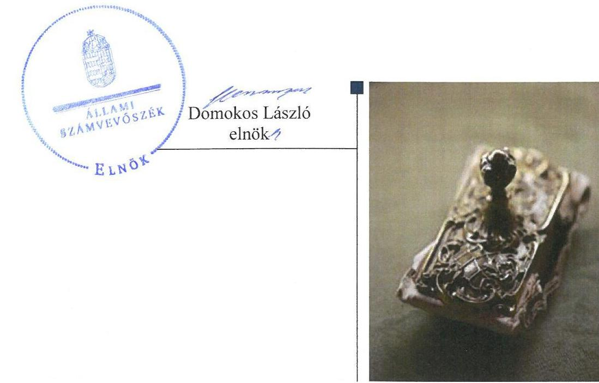
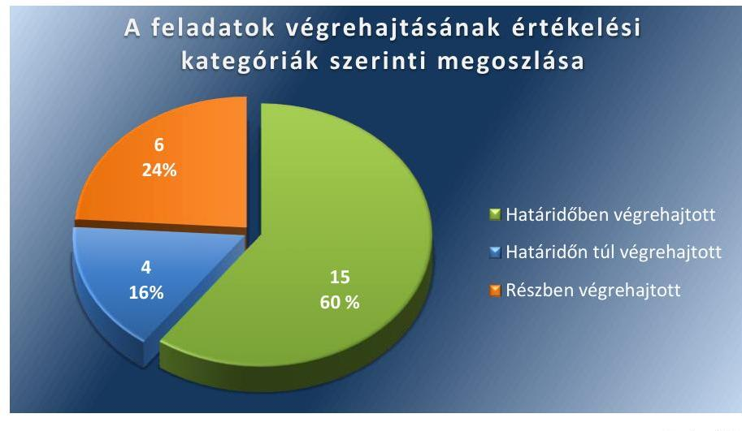
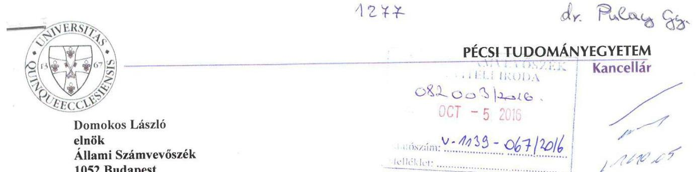
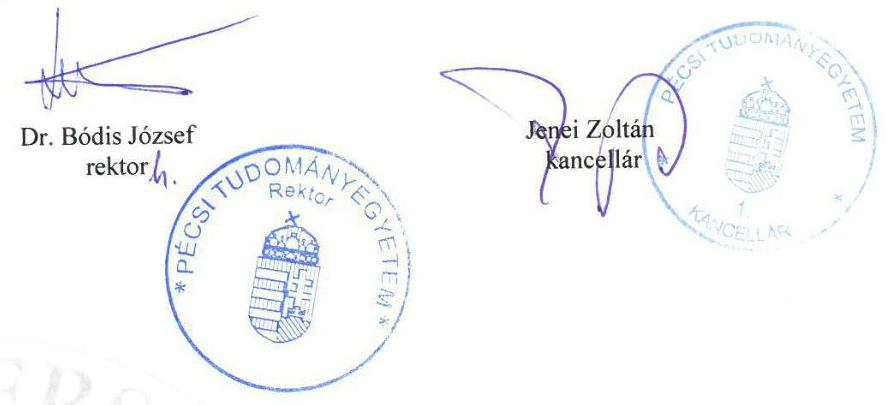
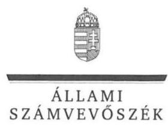
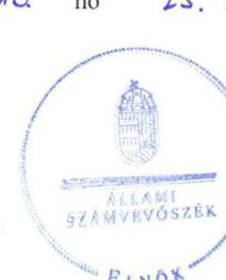
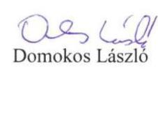

# Jelentés 

## Utóellenőrzések

Az állami felsőoktatási intézmények gazdálkodásának, működésének ellenőrzéséről készült jelentések utóellenőrzése - Pécsi Tudományegyetem 2016.

---

# Jelentés 

## Utóellenőrzések

Az állami felsőoktatási intézmények gazdálkodásának, működésének ellenőrzéséről készült jelentések utóellenőrzése - Pécsi Tudományegyetem 2016. 11. hó 15. nap

---

# AZ ELLENŐRZÉST FELÜGYELTE: 

DR. PULAY GYULA ZOLTÁN felügyeleti vezető

## AZ ELLENŐRZÉST VEZETTE ÉS A VÉGREHAJTÁSÁÉRT FELELŐS:

RÁCZKEVI KATALIN ellenőrzésvezető

## A PROGRAM ÖSSZEÁLLÍTÁSÁÉRT FELELŐS:

JANIK JÓZSEF osztályvezető

## A TÉMÁHOZ KAPCSOLÓDÓ KORÁBBI SZÁMVEVŐSZÉKI JELENTÉSEK:

- címe: Jelentés a Pécsi Tudományegyetem - Az állami felsőoktatási intézmények gazdálkodásának, müködésének ellenőrzéséről
- sorszáma: 15063

IKTATÓSZÁM: V-1139-073/2016.
TÉMASZÁM: 2173
ELLENŐRZÉS-AZONOSÍTÓ SZÁM: V075505

---

# TARTALOMJEGYZÉK 

■ ÖSSZEGZÉS ..... 5
■ AZ ELLENŐRZÉS CÉLJA ..... 6
■ AZ ELLENŐRZÉS TERÜLETE ..... 7
■ AZ ELLENŐRZÉS HÁTTERE, INDOKOLTSÁGA ..... 8
■ A JELENTÉS LÉNYEGES KÉRDÉSKÖREI ..... 9
■ ELLENŐRZÉS HATÓKÖRE ÉS MÓDSZEREI ..... 10
■ MEGÁLLAPÍTÁSOK ..... 13
■ MELLÉKLETEK ..... 19
I. Sz. melléklet: Az ÁSZ 15063 számú jelentéséhez kapcsolódó Egyetem intézkedési terv végrehajtása ..... 19
II. Sz. melléklet: Az ÁSZ 15063 számú jelentéséhez kapcsolódó EMMI intézkedési terv végrehajtása ..... 31
■ FÜGGELÉK: ÉSZREVÉTELEK ..... 33
■ RÖVIDÍTÉSEK JEGYZÉKE ..... 45

---

.

---

# ÖSSZEGZÉS 

Az Állami Számvevőszék a Pécsi Tudományegyetem utóellenőrzését 2015. április 29. és 2016. május 23. közötti időszakra végezte el. Az utóellenőrzés megállapította, hogy a korábbi számvevőszéki jelentés javaslatai alapján az Egyetem rektora és kancellárja által meghatározott intézkedési tervben szereplő 25 feladat jelentős részének

végrehajtása javította az Egyetem müködésének szabályozottságát, de a gazdálkodási jogkörök gyakorlása területén az ÁSZ által korábban azonosított hiányosságok egy része továbbra is fennáll. Az Emberi Erőforrások Minisztériuma - mint a fenntartói jogkör gyakorlója - az intézkedési tervében foglalt feladatot végrehajtotta.

## Az ellenőrzés társadalmi indokoltsága

Az ÁSZ ${ }^{1}$ stratégiájában célul tűzte ki a számvevőszéki munka hasznosulásának javítását. Ezzel összhangban ellenőrzi, hogy az ellenőrzött szervezetek megvalósították-e a korábbi ellenőrzései által feltárt hibák, hiányosságok és szabálytalanságok megszüntetése céljából elkészített intézkedési terveikben foglaltakat. A rendszeres utóellenőrzések hozzájárulnak a szükséges intézkedések tényleges végrehajtáshoz, ezáltal a közpénzügyek rendezettségének javulásához.

## Főbb megállapítások, következtetések, javaslatok

Az Egyetem ${ }^{2}$ az intézkedési tervben rögzített feladatok végrehajtásáról a $\mathrm{Bkr}^{3}$. előírásainak megfelelő nyilvántartást vezetett.

Az Egyetem az intézkedési tervében meghatározott 25 feladatból 15 feladatot határidőben, négy feladatot határidőn túl, hatot részben hajtott végre. Elmaradt egyes belső szabályzatok módosítása, a belső kontrolltevékenységek felülvizsgálata során nem történt meg a folyamatba épített előzetes és utólagos vezetői ellenőrzés szervezeti egységekre vonatkozó szabályozása, a pénzügyi folyamatokban kulcsszerepet betöltő kontrollokkal kapcsolatos tevékenységek ellátása több esetben nem volt szabályszerű.

Az EMMI ${ }^{4}$ az intézkedési tervében meghatározott feladatot végrehajtotta.

---

# AZ ELLENŐRZÉS CÉLJA 

Az ellenőrzés célja annak értékelése volt, hogy a számvevőszéki jelentésben ${ }^{5}$ foglalt intézkedést igénylő megállapításokkal és javaslatokkal összhangban készített intézkedési tervben meghatározott feladatokat az ellenőrzött szervezet végrehajtotta-e.

---

# AZ ELLENŐRZÉS TERÜLETE 

## Pécsi Tudományegyetem

Az 1367-es alapítású Pécsi Tudományegyetem az ország egyik legnagyobb, regionális vezető szereppel bíró egyeteme, ahol tíz karon és 24 klinikán, a felsőoktatás teljes spektrumán folyik képzés. Az Egyetem az ország meghatározó kutatóegyeteme, jelentős szakmai kutatóbázissal. Az egyetemi karokon 21 doktori iskola múködik, amelyek a tudomány és a múvészetek széles spektrumát ölelik fel. Az Egyetemen 2015-ben összesen 19799 fő tanult.

Az Egyetem 2014. évi költségvetési beszámolója szerint 47 887,7 millió Ft költségvetési bevételt, 11 692,0 millió Ft finanszírozási bevételt ért el, valamint 59 579,7 millió Ft költségvetési kiadást teljesített. A 2014. december 31-i könyvviteli mérleg szerint az Egyetem eszközei 70 651,3 millió Ft-ot tettek ki.

Az Egyetem gazdálkodásának és múködésének ellenőrzését az ÁSZ a 2009-2013. közötti időszakra végezte el, az erről szóló 15063. számú jelentést 2015. április 29-én tette közzé. Az ellenőrzés célja annak értékelése volt, hogy szabályos volt-e az Egyetem pénzügyi és vagyongazdálkodása, biztosított volt-e a vagyonnal való gazdálkodás követelményének érvényesülése, a jogszabályi előírásoknak megfelelően múködött-e a belső kontrollrendszer, az irányító szerv tevékenysége a jogszabályoknak megfelelő volt-e.

Az Emberi Erőforrások Minisztériuma az állami felsőoktatási intézmények, így az Egyetem fenntartói jogkörének gyakorlója.

Az utóellenőrzés az ÁSZ jelentésben a rektor ${ }^{6}$ és a miniszter ${ }^{7}$ részére megfogalmazott intézkedést igénylő megállapításokra és javaslatokra készített, az ÁSZ részére megküldött intézkedési tervben foglalt feladatok megvalósításának ellenőrzésére, illetve értékelésére fókuszált.

---

# AZ ELLENŐRZÉS HÁTTERE, INDOKOLTSÁGA 

Az ÁSZ tv ${ }^{8}$. 33. § (1) bekezdése értelmében a számvevőszéki jelentések intézkedést igénylő megállapításaihoz és javaslataihoz kapcsolódóan az ellenőrzött szervezet vezetője intézkedési tervet köteles összeállítani, és az ÁSZ részére megküldeni. Az intézkedési tervben foglaltak megvalósítását az ÁSZ tv. 33. § (7) bekezdésében foglaltak alapján - az ÁSZ utóellenőrzés keretében ellenőrizheti. Az intézkedések megvalósulásának értékelése során az ÁSZ figyelembe veszi az ellenőrzött szervezetek működési feltételeiben, valamint a jogszabályi előírásokban bekövetkezett változásokat.

Az intézkedési tervekben foglalt feladatok hiányos, illetve késedelmes végrehajtása, valamint megvalósításának elmaradása azt mutatja, hogy az ellenőrzések során feltárt hibák, hiányosságok és szabálytalanságok megszüntetése nem kapott kellő hangsúlyt. Ez a szabályszerű működés és a felelős vezetői magatartás vonatkozásában kockázatot hordoz. E kockázatok feltárásával az ÁSZ utóellenőrzési rendszere fokozza a fegyelmet, és igazolja, hogy a közpénzzel való szabályos gazdálkodás felelőssége elől nem lehet kitérni.

## AZ UTÓELLENŐRZÉS VÁRHATÓ HASZNOSULÁSA

Az utóellenőrzés négy szinten hasznosulhat:
$\longrightarrow$ A társadalom szintjén az utóellenőrzés jelzi, hogy a számvevőszéki ellenőrzés megállapításainak van következménye: a hiányosságok megszüntetésére az ellenőrzött szervezet által meghatározott intézkedések végrehajtását is számon kéri az ÁSZ.
$\longrightarrow$ Az ellenőrzött terület szintjén az utóellenőrzés tájékoztatást nyújt a terület döntéshozóinak a hiányosságok kiküszöbölésének jó gyakorlatairól, ezzel lehetőséget biztosítva arra, hogy az ÁSZ ellenőrzési megállapításai, javaslatai a terület nem ellenőrzött szervezeteinek a működése során is hasznosuljanak.
$\longrightarrow$ Az ellenőrzött szervezet szintjén az utóellenőrzés feltárja, hogy a szervezet az intézkedések végrehajtásával hasznosította-e a korábbi ellenőrzési jelentésben a hiányosságok megszüntetése, illetve a kockázatok kezelése érdekében megfogalmazott javaslatokat.
$\longrightarrow$ Az ÁSZ szintjén az utóellenőrzés visszacsatolást ad az ellenőrzési jelentések hasznosulásáról, az intézkedések elmaradása vagy részleges megvalósulása a további ellenőrzésekhez kockázati jelzésként szolgál.

---

# A JELENTÉS LÉNYEGES KÉRDÉSKÖREI 

1. Az ellenőrzött szervezetek az intézkedési tervben foglaltakat az előírt határidőben végrehajtották-e?

---

# ELLENŐRZÉS HATÓKÖRE ÉS MÓDSZEREI 

## Az ellenőrzés típusa

Megfelelőségi ellenőrzés

## Az ellenőrzött időszak

Az utóellenőrzés alapját képező ÁSZ jelentés közzétételének napjától (2015. április 29.) az ellenőrzésről szóló kiértesítő levél keltének napjáig (2016. május 23.) tartó időszak.

## Az ellenőrzés tárgya

A számvevőszéki jelentésben foglalt intézkedést igénylő megállapításokkal és javaslatokkal összhangban - az Egyetem és az EMMI által - készített intézkedési tervben foglaltak végrehajtásának ellenőrzése.

Az ellenőrzés kiterjed minden olyan körülményre és adatra, amely az ÁSZ jogszabályban meghatározott feladatainak teljesítéséhez, valamint a program végrehajtása folyamán felmerült újabb összefüggések feltárásához szükséges.

## Az ellenőrzött szervezet

Pécsi Tudományegyetem és Emberi Erőforrások Minisztériuma

## Az ellenőrzés jogalapja

Az ÁSZ az Országgyűlés pénzügyi és gazdasági ellenőrző szerve. Az ÁSZ törvényben meghatározott feladatkörében ellenőrzi a központi költségvetés végrehajtását, az államháztartás gazdálkodását, az államháztartásból származó források felhasználását és a nemzeti vagyon kezelését.

Az ÁSZ tv. 1. § (3) bekezdése szerint az ÁSZ általános hatáskörrel végzi a közpénzekkel és az állami és önkormányzati vagyonnal való felelős gazdálkodás ellenőrzését.

Az ÁSZ tv. 33. § (7) bekezdése alapján az ÁSZ tv. 33. § (1)-(2) bekezdése szerinti intézkedési tervben foglaltak megvalósítását az ÁSZ utóellenőrzés keretében ellenőrizheti.

---

# Az ellenőrzés módszerei 

Az ÁSZ az ellenőrzést a nemzetközi standardokat irányadónak tekintve az ellenőrzési program ellenőrzési kérdései, az ellenőrzött időszakban hatályos jogszabályok, az ellenőrzés szakmai szabályok és módszertanok figyelembevételével, önállóan végezte.

Az ÁSZ az ellenőrzés ideje alatt az Egyetemmel és az EMMI-vel történő kapcsolattartást az ÁSZ SZMSZ ${ }^{9}$-ének vonatkozó előírásai alapján biztosította.

Az utóellenőrzés megállapításait elsősorban az ÁSZ rendelkezésére álló, valamint az ellenőrzött szervezetektől elektronikusan bekért dokumentumok alapozták meg.

Az ellenőrzési bizonyítékként felhasználható adatforrások közé tartoznak egyrészt a szakmai programban felsorolt adatforrások, másrészt minden - az ellenőrzés folyamán feltárt, az ellenőrzés szempontjából információt tartalmazó - dokumentum.

A pénzügyi folyamatokban kulcsszerepet betöltő kontrollokra vonatkozóan az intézkedési tervben foglalt feladatok végrehajtását a dologi kiadások állományából és a személyi jellegű kifizetésekből, valamint a követelések állományából 10-10 véletlen mintavétellel kiválasztott tétel alapján értékelte az ÁSZ. A kiválasztott tételek esetében azt ellenőrizte, hogy az Egyetem az intézkedési tervben meghatározott feladatok végrehajtása során biztosította-e a jogszabályok és a belső szabályzatok előírásainak megfelelő működtetést.

Az intézkedési tervekben előírt feladatokat, azok végrehajthatósága, illetve végrehajtása szempontjából az alábbiak szerint értékelte az ÁSZ:
"határidőben végrehajtott" a feladat, ha a teljesítés dokumentáltan, az intézkedési tervben előírt határidőben és tartalommal megtörtént;
"határidőn túl végrehajtott" a feladat, ha annak teljesítése az intézkedési tervben meghatározott módon, de az előírt határidőn túl történt meg;
"részben végrehajtott" a feladat, ha végrehajtása teljes körűen az intézkedési tervben előírt módon nem történt meg;
"nem végrehajtott" a feladat, ha a végrehajtás nem történt meg, vagy amennyiben a teljesítést nem dokumentálták;
"okafogyottá vált" a feladat, ha végrehajtására - meghatározott esemény bekövetkezése, továbbá külső körülmény, a működést érintő feltétel változása miatt - már nincs szükség, illetve lehetőség, és egyértelműen megállapítható, hogy az intézkedést szükségessé tevő körülmény a jövőben nem fordulhat elő;
"nem időszerű" az a feladat, amelynek ellenőrzési időszakon belüli végrehajtására azért nem került (kerülhetett) sor, mert az intézkedés alapjául szolgáló esemény nem következett be, de annak jövőbeni előfordulása lehetséges, a végrehajtása nem volt esedékes, vagy a végrehajtás határideje még nem járt le.
Az ellenőrzés lefolytatásához az ellenőrzött szervezetek a tanúsítványok elektronikus kitöltésével, valamint az ÁSZ által kért dokumentumok elektronikus megküldésével szolgáltattak adatokat, amelyek valódiságát és

---

teljes körűségét az ellenőrzött szervezet vezetője által tett teljességi és hitelességi nyilatkozat igazolta. Az így rendelkezésre bocsátott adatok, információk kontrollja az ellenőrzés keretében történt.

---

# MEGÁLLAPÍTÁSOK 

## 1. Az ellenőrzött szervezetek az intézkedési tervben foglaltakat az előírt határidőben végrehajtották-e?

Összegző megállapítás

Az Egyetem az intézkedési tervben meghatározott 25 feladatból 15 feladatot határidőben, négy feladatot határidőn túl, hat feladatot részben hajtott végre. Az intézkedési tervben rögzített feladatok végrehajtásáról a Bkr. előírásainak megfelelő nyilvántartást vezették. Az EMMI az intézkedési tervben meghatározott egy feladatot határidőben végrehajtotta.

Az ÁSZ a jelentésében a rektor részére három, a miniszter részére egy javaslatot fogalmazott meg.

Az Egyetem által összeállított és az ÁSZ részére megküldött intézkedési terv a hiányosságok, szabálytalanságok megszüntetésére 25 feladatot határozott meg. A feladatok elvégzésének felelőseit megjelölték.

Az ÁSZ javaslatai alapján készített intézkedési tervben rögzített feladatok végrehajtásáról az Egyetem a Bkr. előírásainak megfelelő nyilvántartást vezette.

Az intézkedési tervben meghatározott feladatokat, határidőket, a feladatok végrehajtásáért felelős személyt és a feladatok végrehajtását az I. és a II. számú melléklet mutatja be.

Az Egyetem intézkedési tervében tervezett feladatok végrehajtásának értékelési kategóriák szerinti megoszlását az 1. ábra szemlélteti.
1. ábra

Fonós: ÁSZ

## HATÁRIDŐBEN VÉGREHAJTOTT feladatok:

- (1/15) A Kancellári Hivatal vezetője intézkedett a szervezeti egységek 2015. évi engedélyezett létszámadatainak az intézmény számára

---

adott évre engedélyezett létszám felosztása alapján az SZMSZ ${ }_{1}{ }^{10}$ részét képező foglalkoztatási követelményrendszer mellékleteként történő megjelenítéséről. Szenátusi döntés alapján 2016. március 17-től a foglalkoztatási követelményrendszert hatályon kívül helyezték. A Szenátus intézkedésére az Ávr. ${ }^{11}$ 13. § (1) bekezdésének módosítása miatt került sor.
(2/15) A Szenátus 186/2015. (X. 01.) számú határozatával módosította, és 2015. október 1-jén hatályba helyezte a Magatartási és Kommunikációs Kézikönyv2-t, amelyben rögzítették az etikai követelményeket, normákat, és az etikai felelősségre vonatkozó rendelkezéseket.
(3/15) A kancellár ${ }^{12}$ intézkedett az Egyetem ellenőrzési nyomvonalainak és a működtetéséhez szükséges szabályozó és monitoring rendszernek a teljes körű felülvizsgálata és módosítása érdekében, mivel a Szenátus 2015. december 17-én elfogadta és hatályba helyezte a Belső Kontroll Kézikönyv ${ }_{2}{ }^{13}$-t.
(4/15) A rektor-helyettes a 2015. október 13-én kelt levelében intézkedett az Egyetem szervezeti egységeinek vezetői felé, amelyben előírta, hogy a szervezeti egységek a kockázatkezelési rendszer áttekintésére készítsenek intézkedési tervet. A szervezeti egységek 2015. december 31-i határidőre elkészítették az intézkedési terveiket.
(8/15) A közérdekű adatok nyilvánosságra hozataláról és a közérdekű adatok megismerésére irányuló igények teljesítésének rendjéről szóló szabályzatot a Szenátus 2015. december 17-én a 245/2015. (12. 17.) számú határozatával fogadta el. A közérdekú adatokat az Egyetem honlapján feltüntették.
(9/15) A rektor intézkedett az Egyetem 2015/2016-os tanévre vonatkozó Képzési Programjának összeállítására és a Szenátus elé terjesztése érdekében, melyet a Szenátus 2015. június 25 -ei ülésén a 162/2015. (06.25.) számú határozatával fogadott el.
(15/15) A kancellár 2015. július 24-én kiadta „a PTE immateriális javainak és tárgyi eszközeinek leltározásáról" szóló 10/2015. számú Kancellári utasítást. A teljes leltározás végrehajtásának határidejét a Kancellári utasítás alapján 2016. december 31-ében, a helyszíni leltárfelvétel végrehajtásának határidejét 2016. augusztus 31-ében határozta meg.
(1/10) A Szenátus 2015. március 26-án a 22/2015. (03.26.) számú határozatával elfogadta az Egyetem SZMSZ ${ }_{1}$-et, amely már nem tartalmazott a Gazdasági Tanácsra vonatkozó rendelkezéseket.
(2/10) A HPI ${ }^{14}$ igazgatója intézkedett a jelenléti ívek hiányával kapcsolatban azzal, hogy 2015. április 14-i levelében a jelenléti ívek kapcsán felhívta az önállóan gazdálkodó egységek vezetőinek figyelmét a számfejtési bizonylatok megőrzésének szabályaira, valamint elkészítette a munkaidő ellenőrzési ütemtervet a szervezeti egységeknél vezetett jelenléti ívek ellenőrzésére. Az ügyeleti és túlóra díjak ellenjegyzése és teljesítésigazolása kapcsán 2015. március 23-i levélben hívták fel a szervezeti egységek vezetőinek figyelmét a pótlékjelentések számfejtéséhez szükséges igazolásokra, így a pénzügyi ellenjegyzés, a kötelezettségvállaló, illetve a kancellár aláírására. A mintavételes eljárással végzett tételes dokumentum ellenőrzés 2015.

---

május hónaptól kezdődően került bevezetésre. A Személyi Juttatások Osztály osztályvezetője a jelenléti ívek kapcsán a bizonylatok megőrzését, az ügyeleti és túlóra díjak ellenjegyzését, teljesítésigazolását ellenőrizte.
(3/10) A humánpolitikai igazgató intézkedett a külső személyi juttatások előirányzat terhére megkötött megbízási szerződések ellenjegyzésével kapcsolatban a HPI-on belüli felülvizsgálatról, a használatban lévő nyomtatványok áttekintéséről. A külső személyi juttatások kifizetése kapcsán vezetői kontrolltevékenység keretében mintavételes eljárással dokumentum ellenőrzést végeztek.
(5/10) A rektor által 2014. július 22-én kiadott és a kiadás napján hatályba lépett Eszközök és források értékelési szabályzata; ${ }^{15}$, valamint a Szenátus 209/2015. (XI. 12.) számú határozatával kiadott Eszközök és források értékelési szabályzata; ${ }^{16}$ tartalmazza a követelések minősítését, érvényesítését, a behajthatatlan követelések leírásának szabályait, az érintett szervezeti egységek közötti munkamegosztást és a felelősségi szabályokat. A rektor soron kívüli belső ellenőrzést rendelt el, amelyről a jelentés 2015. május 15-én, a „Hallgatói fizetési kötelezettségek előírásának és beszedésének működtetett rendszere a Pécsi Tudományegyetemen" címmel elkészült, amit a rektor 2015. május 21-én elfogadott és intézkedési terv készítését írta elő.
(7/10) A Közgazdasági és Kontrolling Igazgatóság az Áhsz. ${ }^{17}$ előírásainak megfelelően intézkedett a több évet érintő kötelezettségvállalások 2014. évi beszámolóban való megbontásáról.
(8/10) A rektor 2014. november 11-én ad hoc belső ellenőrzési vizsgálatot rendelt el „A közbeszerzési Döntőbizottság által - az ÁSZ kezdeményezésére - hivatalból lefolytatott jogorvoslati eljárásokban hozott, Pécsi Tudományegyetemet elmarasztaló határozatokért való felelősség kérdésének tisztázásához szükséges tények vizsgálata" tárgyban. A lefolytatott belső ellenőrzésről készült jelentés BE/276/2015. számon 2015. október 1-jén készült el, mely alapján a rektor 2015. október 8-án az ellenőrzésben érintett szervezeti egységek számára intézkedési tervkészítési kötelezettséget írt elő. A 2014. évi belső ellenőrzési terv is tartalmazott a közbeszerzés közbeszerzési kötelezettség teljesítése érdekében kialakított rendszer ellenőrzése tárgyában ellenőrzést, ez alapján készült a BE/15-6/2015. számú ellenőrzési jelentés, amelyet a kancellár 2015. április 7-én elfogadott és intézkedési terv készítését írta elő az ellenőrzésben érintett szervezeti egységek számára. A szervezeti egységek 2015. május hónapban az intézkedési terveiket elkészítették, azokat a kancellár 2015. május 12-én és 2015. május 14-én jóváhagyta. A Szenátus a 24/2015. (III. 26.) számú határozatával megalkotta az SZMSZ 32. számú mellékletét, amellyel létrehozta a Közbeszerzési Igazgatóságot, valamint a Közbeszerzési Osztályt.
(9/10) A Szenátus a 106/2014. (06. 26.) számú határozatában értékelte a rektor vezetői tevékenységét, továbbá meghatározta a rektor vezetői megbízásához kapcsolódó juttatást.
(10/10) A rektor intézkedett a kincstári bankkártya használatával kapcsolatban a kincstári kártya használatára jogosultak körének meghatározásáról a Pénztári és Pénzkezelési Szabályzat; ${ }^{18}$ 36. §. (6)

---

bekezdés a-c) bekezdésekben foglaltak alapján. A kártya használatára jogosultak körét felülvizsgálták, melyet a 2015. november 12től hatályos Pénztári és pénzkezelési Szabályzat: ${ }^{19} 34 . \S$ (3) bekezdésében rögzítettek.

# HATÁRIDŐN TÚL VÉGREHAJTOTT feladatok: 

-(6/15) A kancellár az intézkedési tervben vállalt 2015. június 30-i határidőn túl intézkedett a Közbeszerzési Szabályzat ${ }^{20}$ és a Közbeszerzési eljárás nélkül lebonyolított beszerzési eljárások szabályzat ${ }^{21}$ létrehozásáról. A Szenátus a 189/2015. (X. 1.) és a 190/2015. (X. 1.) számú határozataival 2015. október 1-jével fogadta el és léptette hatályba az egymástól elkülönült szabályzatokat, +melyekkel a két beszerzési módszer szabályozásának összhangja megvalósult. A szabályozás módosításával meghatározásra került a közbeszerzések részletes eljárásrendje, az értékelő bizottság határozatképességének feltételei és felelősei, határidők az eljárási cselekmények vonatkozásában, a szerződéskötésre jogosultak meghatározása és a döntéshozó személyek meghatározása.
-(13/15) A Közgazdasági és Kontrolling Igazgatóság az intézkedési tervben vállalt 2015. október 31-i határidőn túl, 2015. december 17én intézkedett az Önköltség-számítási szabályzat elfogadása érdekében, mivel a Szenátus a 244/2015. (XII. 17.) számú határozatával fogadta el és léptette hatályba az Önköltség-számítási szabályzatot ${ }^{22}$.
-(14/15) A 2015. évi vagyongazdálkodási tervet a Szenátus a 254/2015. (12. 17.) számú határozatával az intézkedési tervben vállalt 2015. szeptember 30-i határidőt követően 2015. december 17én fogadta el.
-(6/10) A Közgazdasági és Kontrolling Igazgatóság az intézkedési tervben vállalt 2014. szeptember 1-jei határidőn túl 2015. október 21én intézkedett a kötelezettségekhez és a kifizetésekhez tartozó utalványrendelet és számlakísérő szétválasztása érdekében.

## RÉSZBEN VÉGREHAJTOTT feladatok:

-(5/15) A Közgazdasági és Kontrolling Igazgatóság intézkedett az Egyetem belső gazdálkodással összefüggő szabályozásainak 2015. évi felülvizsgálatáról, azonban a Szerződéskötési és kötelezettségvállalás rendjéről szóló szabályzat az Ávr.-ben szabályozott összeférhetetlenség eseteit nem tartalmazta teljes körűen. A Számv. tv .-ben rögzített bizonylati renddel az Egyetem nem rendelkezett, mivel egységes bizonylati szabályozást nem alakítottak ki, és ennek hiányában az egyes szabályzatokban sem biztosították a bizonylatkezelési követelmények teljes körű megfelelőségét.
-(7/15) A Közgazdasági és Kontrolling Igazgatóság a belső kontrolltevékenységek 2015. évi felülvizsgálata során a Belső Kontroll Kézikönyv2 alapján az intézkedési tervben vállalt 2015. november 30-ai határidőn túl, 2015. december 17-én intézkedett az ellenőrzési nyomvonalak felülvizsgálatáról. A szervezeti egységekre vonatkozóan folyamatba épített előzetes és utólagos vezetői ellenőrzési feladatok meghatározása, kancellári utasításokban való szabályozása csak részlegesen valósult meg.

---

- (10/15) A Kancellária Humánpolitikai Igazgatóság igazgatója 2015. június 17-i intézkedése során elküldte minden önállóan gazdálkodó szervezeti egységnek a kötelezettségvállalások ellenjegyzésére és dokumentum hiányának megszüntetésére, továbbá a többletfeladatokhoz kapcsolódó kereset-kiegészítés teljesítés igazolás hiányára vonatkozó figyelemfelhívó levelet. A kancellár 2015. június 4-én kiadta a "7/2015. számú kancellári utasítás a kereset-kiegészítést megállapító többletfeladatos megállapodások teljesítésének igazolásáról" szóló utasítást, amely utasítás 2-5. §-aiban a Kancellár meghatározta minden szervezeti egységre vonatkozóan a többletfeladatokhoz kapcsolódó kereset-kiegészítés teljesítésigazolásának a kötelezettségét. A többletfeladatos megállapodások dokumentumainak felülvizsgálata, a szabályozásokon való átvezetése, valamint a Kjt. ${ }^{23}$ 77.§ szerinti kereset-kiegészítés nyújtásának jogszabályoknak megfelelő kialakítása megtörtént. A rendszeres és nem rendszeres személyi juttatások kifizetése kapcsán ellenőrzött mintatételek egy részénél a kötelezettségvállalások pénzügyi ellenjegyzését nem végezték el az Ávr.-ben foglaltak ellenére, valamint a Számv. tv. és az Ávr.ben előírtak ellenére nem állt rendelkezésre a bérelszámolást alátámasztó jelenléti ív, illetve a jelenléti íven a teljesítésigazoló aláírása nem szerepelt. A többletfeladatokhoz kapcsolódó kereset-kiegészítés kifizetését megelőzően a teljesítésigazolást nem az Ávr. - ben és a belső szabályozásnak megfelelően végezték el, mert a kötelezettségvállaló írásban nem jelölte ki a teljesítés igazolására jogosult személyt.
- (11/15) A humánpolitikai igazgató intézkedésében írásban felhívta az önállóan gazdálkodó egységek vezetőinek a figyelmét a megbízási szerződések mennyiségi és minőségi követelményeinek részletes, pontos és szakszerű meghatározására, azonban a külső személyi juttatások előirányzata terhére megkötött megbízási szerződések kapcsán ellenőrzött mintatétel dokumentumai alapján a teljesítésigazolást az Ávr.-ben előírtak ellenére nem a kötelezettségvállaló által írásban kijelölt személy végezte el.
- (12/15) A Közgazdasági és Kontrolling Igazgatóság az intézkedési tervben meghatározott 2015. szeptember 30-i határidőn túl 2015. október 21-én intézkedett a kötelezettségekhez és kifizetésekhez tartozó utalványrendelet és számlakísérő szétválasztása és az újonnan bevezetésre kerülő gazdasági informatikai rendszerben a számla work-flow kialakítására és szabályozására. A beérkező számlák kezelését szabályozták. A dologi beszerzésekhez kapcsolódó mintatételek dokumentumainak ellenőrzése alapján a teljesítést igazoló személy írásban történő kijelölése hiányában a teljesítésigazolás elmaradt, amely nem felel meg az Ávr.-ben foglaltaknak.
- (4/10) Az oktatási igazgató határidőben intézkedett arra vonatkozóan, hogy minden kifizetéshez utalványrendelet kerüljön kiállításra. A rendszeres, nem rendszeres és külső személyi juttatások kifizetéséhez kapcsolódó mintatételek dokumentumainak ellenőrzése alapján a kifizetésekhez kapcsolódó utalványrendelet az Ávr.-ben előírtakkal ellentétesen nem minden esetben tartalmazott teljesítésigazolást, valamint a teljesítésigazolás nem az Ávr.-ben előírtaknak megfelelően történt, mert a teljesítésigazolást nem a kötelezettségvállaló által írásban kijelölt személy végezte.

---

# HATÁRIDŐBEN VÉGREHAJTOTT feladat: 

1. Az EMMI az intézkedési tervben vállalt 2015. december 31-i határidőn belül intézkedett, mert a Belső Ellenőrzési Főosztály 2015. július 10-én elkészítette az „Ellenőrzési jelentés a Pécsi Tudományegyetem gazdálkodásának, múködésének ellenőrzéséről szóló 15063 számú ÁSZ jelentésben az emberi erőforrások miniszterének címzett javaslat alapján lefolytatott soron kívüli ellenőrzésről" szóló ellenőrzési jelentést.

---

# MELLÉKLETEK

- I. SZ. MELLÉKLET: AZ ÁSZ 15063 SZÁMÚ JELENTÉSÉHEZ KAPCSOLÓDÓ EGYETEM INTÉZKEDÉSI TERV VÉGREHAJTÁSA

|  Sorszám | Az intézkedési tervben rögzített feladat | Az intézkedési tervben meghatározott határidő | A feladatok elvégzésének felelőse | A feladat végrehajtása  |
| --- | --- | --- | --- | --- |
|   | 1. | 2.
Határidőben végrehajtott feladatok | 3. | 4.  |
|  1/15. | „A szervezeti egységek engedélyezett létszámadatait az intézmény számára adott évre engedélyezett létszám felosztása alapján a szervezeti és müködési szabályzat részét képező foglalkoztatási követelményrendszer mellékleteként kell a jövőben megjeleníteni. A szervezeti egységek engedélyezett létszámadatait tartalmazó mellékletet minden évben a gazdasági terv részeként kell elfogadtatni és a foglalkoztatási követelményrendszerben módosítani." | 2015.06.30. majd évente | Kancellári Hivatal hivatalvezető, PTE
Szenátusának titkára | A Kancellári Hivatal vezetője intézkedett a szervezeti egységek engedélyezett létszámadatainak az intézmény számára adott évre engedélyezett létszám felosztása alapján az SZMSZ részét képező foglalkoztatási követelményrendszer mellékletként történő megjelenítésére, mert az Egyetem 2015. június 25-től meghatározta az SZMSZ ${ }_{1}$ 4. számú mellékletében „A PTE foglalkoztatási követelményrendszere", 9. számú mellékletében a „PTE szervezeti egységek engedélyezett létszámadatai"-t.
Az Ávr. 13. §. (1) bekezdés e) pontjának 2015. január 1-i módosítása alapján a szervezeti egységek engedélyezett létszámadatai vonatkozásában az SZMSZ ${ }_{1-2}{ }^{24}-1^{25}-x^{26}-x^{27}-x^{28}$ foglalkoztatási követelményrendszerét Szenátusi döntés alapján 2016. március 17-től módosították a 9. számú melléklet hatályon kívül helyezésével.  |
|  2/15. | „A Pécsi Tudományegyetem 2014. október 02-án elfogadott Magatartási és Kommunikációs Kézikönyvét ki kell egészíteni az etikai normákra és etikai felelősségre vonatkozó rendelkezésekkel." | 2015. 1031. | Kancellári Hivatal Jogi Főosztályvezető, PTE Szenátusának titkára | A Szenátus a 2014. október 2-án elfogadott Magatartási és Kommunikációs Kézikönyvet ${ }_{1}{ }^{29}$ a 186/2015. (X. 01.) számú határozatával módosította és 2015. október 1-jén hatályba helyezte. A módosítást követően a Magatartási és Kommunikációs Kézikönyv ${ }_{2}{ }^{30}$ 9.1-9.7. pontjai rögzítették az etikai követelményeket/normákat, a 9.8-9.9. pontok pedig az etikai felelősségre vonatkozó rendelkezéseket.  |
|  3/15. | „A Kancellária ellenőrzési nyomvonalainak és a müködtetéséhez szükséges szabályozó rendszernek és monitoring rendszernek a teljes körü felülvizsgálata, módosítások elvégzése." | 2015.12.31. | Kancellári Hivatal hivatalvezető | A Kancellári Hivatal vezetője intézkedett a Kancellária ellenőrzési nyomvonalainak és a müködtetéséhez szükséges szabályozó és monitoring rendszer a teljes körü felülvizsgálata és módosítása érdekében, mivel a Szenátus 2015. december 17-én elfogadta és hatályba helyezte az Egyetem a Belső Kontroll Kézikönyv ${ }_{2}$-t. A kézikönyv 45. § (1) bekezdése a szervezeti egységek számára 2016. március 31-ei határidővel előírta az ellenőrzési nyomvonalai  |

---

|  4/15. | Az intézkedési tervben rögzített feladat | Az intézkedési tervben meghatározott határidő | A feladatok elvégzésének felelőse | A feladat végrehajtása  |
| --- | --- | --- | --- | --- |
|   | 1. | 2. | 3. | 4.  |
|   |  |  |  | kiegészítését, a (2) bekezdés pedig 2016. június 30-ai határidővel az ellenőrzési nyomvonalak felülvizsgálatát. Az előírás az Egyetemen belül 32 szervezeti egységet érintett, amelyből az ellenőrzött dokumentumok szerint 2016. június 21-re már 28 szervezeti egység a feladatot teljesítette.  |
|  4/15. | „A kockázatkezelési rendszer áttekintése, szükséges módosítások elvégzése." | 2015. 12.31. | rektor, kancellár | A rektor-helyettes a PTE/606632-1/2015. számú, 2015. október 13-én kelt levelében intézkedett az Egyetem szervezeti egységek vezetői felé, amelyben előírta, hogy 2015. október 22-re a szervezeti egységeknek el kell készíteni a kockázatkezelési rendszer áttekintésére vonatkozó intézkedési terveiket. A szervezeti egységek a levélben meghatározott határidőre, illetve az intézkedési tervben meghatározott 2015. december 31-i határidőre elkészítették az intézkedési terveiket, feladataikat.
Az Egyetem Belső Kontroll Kézikönyv ${ }_{1}{ }^{31}$, és Belső Kontroll Kézikönyv ${ }_{2}$ a 13. § (2) pontjában előírta a Bkr. 7. § (2) bekezdésének megfelelően, hogy fel kell mérni és meg kell állapítani a költségvetési szerv tevékenységében, gazdálkodásában rejlő kockázatokat, meg kell határozni az egyes kockázatokkal kapcsolatban szükséges intézkedéseket, valamint azok teljesítésének folyamatos nyomon követésének módját.  |
|  8/15. | „Az információs önrendelkezési jogról szóló törvény alapján ki kell alakítani a közérdekű adatok teljes körére vonatkozó adatbázist, el kell készíteni a közérdekü adatokra vonatkozó egyetemi szabályzatot, az egyetemi honlapon gondoskodni kell a közérdekü adatok naprakész feltüntetéséről." | 2015.12.31. | Kancellári Hivatal hivatalvezető | A Kancellári Hivatal vezetője intézkedésére 2015. december 17-re elkészítették "A közérdekü adatok nyilvánosságra hozataláról és a közérdekü adatok megismerésére irányuló igények teljesítésének rendjéről" szóló szabályzatot, amelyet a Szenátus a 245/2015. (12. 17.) számú határozatával fogadott el. A szabályzat 10. § (2) bekezdése szerinti a 2. számú mellékletbe tartozó - az Info tv. ${ }^{32}$ 37. § (1) bekezdés alapján az Info tv. 1. számú mellékletében felsorolt különös közzétételi lista adatokat - a közzétételi listában felsoroltakat, mint „az egyetem alapító okirata", „a hallgatók felvételi eljárására vonatkozó szabályok", és a „Konzorcium tagjainak neve és szakmai önéletrajza" adatok teljes körű meghatározását a Kancellári Hivatalnak 2016. február 28-áig kellett elvégeznie.  |
|  9/15. | „A PTE Képzési Programjának összeállítása és mielőbbi felterjesztése a Szenátus ülésére, lehetőleg már a 2015. június 25-i ülésre." | 2015.06.30. | Oktatási igazgatóság - oktatási igazgató | Az oktatási igazgató intézkedett az Egyetem Képzési Programjának összeállítására és a Szenátus ülésére való előterjesztésre, mert az Egyetem a 2015/2016os tanévre vonatkozó Képzési Programot az Nftv ${ }^{33}$. 15. § (1) bekezdésben foglaltaknak megfelelően összeállította. A Képzési Programot az  |

---

|  15/15. | „A PTE Leltározási és Leltárkészítési Szabályzatának megfelelően 2015. decemberig ütemterv kiadásával végre kell hajtani a feladatot." | 2015. 12.31. | 2015. 12.31. | Közgazdasági és Kontrolling Igazgatóság - közgazdasági és kontrolling igazgató  |
| --- | --- | --- | --- | --- |
|  1/10. | „A Pécsi Tudományegyetem 2015. március 26. napján elfogadott és 2015. április 01. napjától hatályos szervezeti és müködési szabályzata már nem tartalmaz Gazdasági Tanácsra vonatkozó rendelkezéseket." | 2015. 03.26. | 2015. 03.26. | Rektori Hivatal - hivatalvezető  |
|  2/10. | „A Kancellária Humánpolitikai Igazgatóság (HPI) megbízott vezetőjének a vizsgálatot követően hozott azonnali intézkedései:
1./ Intézkedés a jelenléti ív hiányára: Az Önállóan gazdálkodó egységek vezetőinek figyelmét a HPI felhívta a bi- | 1./2015. 04. 15.
2./ 2015. 03.25.
3./ 2015. 04.15. | 1./ 2015. 04.15. | Humánpolitikai Igazgatóság - igazgató  |

---

|  3/10. | Az intézkedési tervben rögzített feladat | Az intézkedési tervben meghatározott határidő | A feladatok elvégzésének felelőse | A feladat végrehajtása  |
| --- | --- | --- | --- | --- |
|   | 1. | 2. | 3. | 4.  |
|   | zonylatok megőrzésének szabályaira. Továbbá a HPI ellenőrzési ütemtervet készített az egységeknél található jelenléti ívek vizsgálatára.
2./ Intézkedés az ügyeleti és túlóra díjak ellenjegyzéséről, teljesítésigazolásáról: Az Önállóan gazdálkodó egységek vezetőinek figyelmét a HPI felhívta a pótlékjelentések számfejtéséhez szükséges aláírásokra.
3./ A HPI-n bevezetésre került mintavételes eljárással végzett tételes dokumentumellenőrzés, mint vezetői (Személyi Juttatások Osztály osztályvezető) kontrolltevékenység." |  |  | vántartásának és lejelentésének rendjéről" szóló 3/2014. számú gazdasági főigazgatói utasítást, amely 2014. május 6-tól volt hatályban. Továbbá a HPI elkészítette a munkaidő ellenőrzési ütemtervet a szervezeti egységeknél vezetett jelenléti ívek ellenőrzésére.
2./ Az Egyetem Gazdasági Főigazgatóság Humán Szolgáltató Iroda megbízott irodavezetője határidőben intézkedett az ügyeleti és túlóra díjak ellenjegyzése és teljesítésigazolása kapcsán azzal, hogy a 2015. március 23-i levelében felhívta a szervezeti egységek vezetőinek figyelmét a pótlékjelentések számfejtéshez szükséges igazolásokra, így a pénzügyi ellenjegyzés, a kötelezettségvállaló, illetve a kancellár aláírására.
3./ A HPI-n határidőben intézkedtek a mintavételes eljárással végzett tételes dokumentum ellenőrzésre, mint a Személyi Juttatások Osztály osztályvezetői kontrolltevékenység bevezetésére, mivel a felelős 2015. május hónaptól havonta végezte a mintavételes eljárással a tételes dokumentum ellenőrzést, amelyben a jelenléti ívek kapcsán a bizonylatok megőrzését, az ügyeleti és túlóra díjak ellenjegyzését, teljesítésigazolását a 2015. április havi kifizetéstől kezdve ellenőrizte.  |
|  3/10. | „Részteljesítés történt. A Kancellária Humánpolitikai Igazgatóság (HPI) megbízott vezetőjének a vizsgálatot követően hozott azonnali intézkedései:
1./ A megbízási szerződések ellenjegyzésével kapcsolatosan megállapítás miatt az Igazgatóságon belüli felülvizsgálat, a jelenleg használatos nyomtatványok átvizsgálása.
2./ A HPI-n bevezetésre került mintavételes eljárással végzett tételes dokumentumellenőrzés, mint vezetői (Személyi Juttatások Osztály osztályvezető) kontrolltevékenység." | 2015.05.15. | Humánpolitikai Igazgatóság - igazgató | 1./ A HPI igazgatójának 2016. május 12-i Feljegyzése szerint a HPI igazgatója intézkedett a külső személyi juttatások előirányzat terhére megkötött megbízási szerződések ellenjegyzésével kapcsolatban a HPI-n belüli felülvizsgálatról, a használatban lévő nyomtatványok áttekintéséről. A becsatolt dokumentumok alapján megállapítható, hogy 2015. május 15-ig megtörtént a nyomtatványok átvizsgálása, új nyomtatványok kialakítása.
2./ A HPI-n intézkedtek a külső személyi juttatások kifizetése kapcsán a mintavételes eljárással végzett tételes dokumentumok ellenőrzésére, mint a Személyi Juttatások Osztály osztályvezetői kontrolltevékenység bevezetésére, azonban a kötelezettségvállalás, az ellenjegyzés, a teljesítésigazolás, valamint az adónyilatkozatok meglétére vonatkozóan a tételes dokumentum ellenőrzést határidőn túl, 2015. május 21-én teljesítették és 2016. március hónapig havonta folyamatosan végeztek ilyen ellenőrzéseket.  |

---

|  5/10. | Az intézkedési tervben rögzített feladat | Az intézkedési tervben meghatározott határidő | A feladatok elvégzésének felelőse | 4.  |
| --- | --- | --- | --- | --- |
|  5/10. | „1./ Új értékelési szabályzat került elfogadásra, amely szabályzatban a kintlévőségek minősítésének, érvényesítésének, behajthatatlan követelések leírásának folyamat- és felelősségi rendje, az érintett szervezeti egységek közötti munkamegosztás kialakításra került. 2./ A hallgatói költségtérítések és hallgatói kintlévőségek vonatkozásában már az ÁSZ ellenőrzés alatt a Rektor soron kívüli belső ellenőrzési vizsgálatot rendelt el, amely ellenőrzés végrehajtásra is került." | 1./ 2014.07.22.
2. /2015.05.21. | Közgazdasági és
Kontrolling Igazgatóság - igazgató,
Oktatási Igazgatóság - oktatási igazgató, belső ellenőrzési vezető | 1. A rektor által 2014. július 22-én kiadott és a kiadás napján hatályba lépett Eszközök és források értékelési szabályzata ${ }_{1}$, valamint a Szenátus 209/2015. (XI. 12.) számú határozatával kiadott Eszközök és források értékelési szabályzata ${ }_{1}$ tartalmazza a követelések minősítését, érvényesítését, a behajthatatlan követelések leírásának szabályait, a munkamegosztást és a felelősségi szabályokat.
2. A rektor által soron kívül elrendelt belső ellenőrzésről a jelentés 2015. május 15-én, a „Hallgatói fizetési kötelezettségek előírásának és beszedésének müködtetett rendszere a Pécsi Tudományegyetemen" címmel elkészült, amit a rektor 2015. május 21-én elfogadott és intézkedési terv készítését írta elő.  |
|  7/10. | „A Kancellária Közgazdasági és Kontrolling Igazgatóság igazgató azonnali intézkedését követően 2014. évtől már megbontásra kerültek a több évet érintő kötelezettségvállalások a költségvetési évben és költségvetési évet követő években esedékes részekre." | 2014.12.31. | Közgazdasági és
Kontrolling Igazgatóság - Közgazdasági és kontrolling igazgató | Az Egyetem az Áhsz 2 32. § (1) bekezdés alapján elkészített 2014. évi kincstári beszámolójában a több évet érintő kötelezettségvállalások költségvetési évben és költségvetési évet követő években esedékes részleteit megbontva mutatta ki.
Az Egyetem a 2014.július 22-től hatályos Számlarendről szóló Szabályzata tartalmazta a kötelezettségek megbontására vonatkozó Áhsz 2 46. § (2) bekezdés szerinti előírásokat.  |
|  8/10. | „Közbeszerzési eljárások szabálytalan mellőzésével végzett beszerzések okán a közalkalmazottakkal szembeni munkavállalói kártérítési felelősségre vonás jogalapja jelenleg nem áll fenn, mivel ezen szabálytalanságok megállapításával Összefüggésben kezdeményezett eljárások során a PTE-nek kártérítési kötelezettsége nem merült föl, bírság, eljárási- vagy perköltség, kártérítés fizetésére nem kötelezték, egyéb vagyoni hátrány nem érte. Egyéb munkajogi felelősség megállapítása és jogkövetkezmény (figyelmeztetés, vezető megbízás visszavonása, felmentés) alkalmazása nem releváns, mivel a Kbt.-nek nem megfelelő döntések és azok végrehajtása egyrészt nem köthető konkrét személyekhez, másrészt elévültek, har- | 2015.04.01. | Kancellária Jogi Főosztály, Közbeszerzési Igazgatóság | A rektor az ellenőrzött dokumentumok alapján az intézkedési tervben vállalt határidő előtt intézkedett, mivel:
- 2014. november 11-én ad hoc belső ellenőrzési vizsgálatot rendelt el „A közbeszerzési Döntőbizottság által - az ÁSZ kezdeményezésére - hivatalból lefolytatott jogorvoslati eljárásokban hozott, Pécsi Tudományegyetemet elmarasztaló határozatokért való felelősség kérdésének tisztázásához szükséges tények vizsgálata" tárgyban. A belső ellenőrzési vezető 2015. július 15-én a lefolytatott ellenőrzésről a rektornak jelentéstervezetet készített, melynek tartalmát a rektor 2015. szeptember 24-én megismerte és döntött, mely szerint a további ellenőrzést nem tartotta indokoltnak és szükségesnek. A belső ellenőri jelentés BE/27-6/2015. számon 2015. október 1-jén készült el, mely alapján a rektor 2015. október 8-án az ellenőrzésben érintett szervezeti egységek számára intézkedési tervkészítési kötelezettséget írt elő.  |

---

|  9/10. | Az intézkedési tervben rögzített feladat | Az intézkedési tervben meghatározott határidő | A feladatok elvégzésének felelőse | A feladat végrehajtása  |
| --- | --- | --- | --- | --- |
|   | 1. | 2. | 3. | 4.  |
|   | madrészt az általános vezetői felelősség vizsgálata okafogyott, mivel a szabálytalanul végzett beszerzések idejében volt szervezeti egység vezetők (gazdasági főigazgató, közbeszerzési és logisztikai igazgató, osztályvezető) már nem dolgoznak az Egyetemnél, vagy más munkakörbe kerültek. Az ASZ ellenőrzés időszaka alatt a Rektor ad-hoc ellenőrzést rendelt el, a szabálytalanságot előidéző okok feltárása megtörtént a belső ellenőrzés rendszer ellenőrzése kapcsán, melyhez kapcsolódóan az érintett szervezeti egységek 2015. májusában intézkedési tervet készítettek. A törvényes állapot helyreállítása és a jövőbeni szabálytalanságok megelőzése érdekében a Kancellár által új szervezeti struktúra került kialakításra, létrejött a Közbeszerzési Igazgatóság új vezető megbízásával (2015. április 1.) Az új egyetemi beszerzési és közbeszerzési rendszer kialakítása érdekében az új szabályzatok kiadása folyamatban van." |  |  | - A 2014. évi ellenőrzési terv szerint készült, a közbeszerzési kötelezettség teljesítse érdekében kialakított rendszer ellenőrzése tárgyú, a BE/156/2015. számú belső ellenőrzési jelentés alapján szervezeti egységek 2015. május hónapban az intézkedési terveiket elkészítették, azokat a kancellár 2015. május 12-én és 2015. május 14-én jóváhagyta.
Új szervezeti struktúra került kialakításra, a Szenátus a 24/2015. (III. 26.) számú határozatával megalkotta az SZMSZ 32. számú mellékletét, az Egyetem igazgatásának szervezetére vonatkozó szabályzatot, amelynek 40-41. §-aiban létrehozta a Közbeszerzési Igazgatóságot új vezető megbízásával, valamint a Közbeszerzési Osztályt. Az új szabályzat 2015. április 1-jével lépett hatályba.  |
|  9/10. | „A Szenátus 2014. június 26-ai ülésén értékelte a rektor vezetői tevékenységét, a vezetői tevékenység értékelése alapján fogadta el a rektor minősítését és határozta meg a rektor vezetői megbízásához kapcsolódó juttatást. A 2015. évben a Szenátus június 25-ei ülésének napirendjén szerepel az előterjesztés." | 2014.06.26., majd évente | Rektori Hivatal - Hivatalvezető, mint a Szenátus titkára | A rektor a bemutatott dokumentumok alapján határidőben intézkedett, mivel a Szenátus a 106/2014. (06. 26.) számú határozatában értékelte a rektor vezetői tevékenységét, továbbá a rektor illetménykiegészítését magasabb vezetői fokozatba emelte.  |
|  10/10. | „A kincstári bankkártya használatával felvett összeg szabálytalan elszámolásához kapcsolódóan a munkajogi felelősség érvényesítésének jogi alapja két okból sem lehetséges, egyrészt mivel az igény érvényesítésére nyitva álló objektív határidő már eltelt, másrészt a szabálytalanságot elkövető dolgozó már nem áll jogviszonyban a PTEvel, mint munkáltatóval (a PTE-t vagyoni hátrány nem érte, munkavállalói kártérítési felelősség nem áll fenn). A belső kontrollrendszer teljes körű rendezését tartalmazó, | 2012.12.13. | Kancellári Hivatal Jogi Főosztály | A rektor intézkedett a kincstári bankkártya használatával kapcsolatban a kincstári kártya használatára jogosultak körének meghatározásáról a Pénztári és Pénzkezelési Szabályzat 36. §. (6) bekezdés a-c) bekezdésekben foglaltak alapján.
A kártya használatára jogosultak körét felülvizsgálták, melyet a 2015. november 12-től hatályos Pénztári és pénzkezelési Szabályzat ${ }_{2}$ 34. § (3) bekezdésében rögzítettek.  |

---

|  Sorszám | Az intézkedési tervben rögzített feladat | Az intézkedési tervben meghatározott határidő | A feladatok elvégzésének felelőse | A feladat végrehajtása  |
| --- | --- | --- | --- | --- |
|   | 1. | 2. | 3. | 4.  |
|   | Szenátus által elfogadott Belső Kontroll Kézikönyv előírásainak megfelelően az eljárás belső kontrollját az eset óta megfelelően rendezte az Egyetem, a kártyahasználat jogosulti körét felülvizsgálta és ezzel a hasonló esetek előfordulásának a lehetőségét a jövőre nézve kizárta, (de legalább is) a kockázatát minimalizálta." |  |  |   |
|  Határidőn túl végrehajtott feladatok |  |  |  |   |
|  6/15. | „Új Közbeszerzési Szabályzat kidolgozása, amely megköveteli a közbeszerzési jogszabályok betartását, valamint elkülönül a szintén kidolgozásra kerülő beszerzési szabályzattól, de a két szabályzat egymással összhangban szabályozza az egyetem beszerzéseit. Az új Közbeszerzési Szabályzatban kidolgozásra kerülnek a következők is: a közbeszerzések részletes eljárásrendje, az értékelő bizottság határozatképességének feltételei és felelősei, határidők az eljárási cselekmények vonatkozásában, a szerződéskötésre jogosultak meghatározása és a döntéshozó személyek meghatározása." | 2015.06.30. |  | Közbeszerzési Igazgatóság - közbeszerzési igazgató  |

---

|  13/15. | Az intézkedési tervben rögzített feladat | Az intézkedési tervben meghatározott határidő | A feladatok elvégzésének felelőse | A feladat végrehajtása  |
| --- | --- | --- | --- | --- |
|   | 1. | 2. | 3. | 4.  |
|  14/15. | „Önköltség számítás szabályzat validalása." | 2015.10.31. | Közgazdasági és
Kontrolling Igazgatóság - közgazdasági és kontrolling igazgató, Oktatási Igazgatóság - oktatási igazgató | A kancellár az intézkedési tervben vállalt határidőn túl, 2015. december 17-én intézkedett az Önköltség-számítási szabályzat elfogadása érdekében, mivel a Szenátus a 244/2015. (XII. 17.) számú határozatával fogadta el és léptette hatályba az Önköltség-számítási szabályzatot.  |
|  14/15. | „Vagyongazdálkodási terv 2015. évi, majd ezt követően évente történő elkészítése". | 2015.09.30. | Műszaki Szolgáltatási Igazgatóság műszaki szolgáltatási Igazgató | A kancellár intézkedett a 2015. évi vagyongazdálkodási terv elkészítéséről, amelyet a Szenátus az Nftv. 12. § (3) bekezdés gb) pontjában előírtaknak megfelelően elfogadott a 254/2015. (12. 17.) számú határozatával, viszont a Szenátusi döntésre az intézkedési tervben vállalt határidőn túl, 2015. december 17-én került sor.
Az Egyetem a 2016. évi vagyongazdálkodási tervét elkészítette 2016. május 26-án, viszont a vonatkozó jogszabályi előírásoknak megfelelő Szenátusi döntésre az utóellenőrzés (helyszíni) befejezéséig nem került sor, mert a becsatolt 2016. április 11-i EMMI tájékoztató levél szerint a jogszabályi változások miatt az EMMI Vagyongazdálkodási és Közbeszerzési Főosztálya még az eljárásrend kialakításán dolgozott.  |
|  6/10. | „Részteljesítés történt az alábbiak szerint: a Kancellária Közgazdasági és Kontrolling Igazgatóság igazgató azonnali intézkedése értelmében a kötelezettségekhez és a kifizetésekhez tartozó utalványrendelet és számlakísérő szétválasztásra került." | 2014.09.01. | Közgazdasági és
Kontrolling Igazgatóság - közgazdasági és kontrolling igazgató | A kancellár a vállalt határidőn túl, 2015. október 21-én intézkedett a kötelezettségekhez és a kifizetésekhez tartozó utalványrendelet és számlakísérő szétválasztása érdekében.  |

---

|  5/15. | Az intézkedési tervben rögzített feladat | Az intézkedési tervben meghatározott határidő | A feladatok elvégzésének felelőse  |
| --- | --- | --- | --- |
|   | 1. | 2. | 3.  |
|   |  | Részben végrehajtott feladatok |   |
|   |  | 2015.09.30. | Közgazdasági és Kontrolling Igazgatóság - közgazdasági és kontrolling igazgató  |
|   |  |  | Hátáridőben végrehajtott feladat:  |
|   |  |  | A kancellár intézkedett az Egyetem belső gazdálkodással összefüggő szabályozásainak 2015. évi felülvizsgálatáról, ezen belül a Pénztári és pénzkezelési szabályzat, az Eszközök és források értékelési szabályzata, a Számviteli politika, az Önköltség-számítási Szabályzat, a Szerződéskötési és kötelezettségvállalási Szabályzat, a Gazdálkodási Szabályzat, a Térítési és juttatási szabályzat felülvizsgálatáról.  |
|   |  |  | Nem végrehajtott feladat:  |
|   |  |  | A gazdálkodási jogkörök gyakorlását végzők összeférhetetlenségi eseteit tartalmazó, a Szenátus által a 26/2015. (03. 26.) számú határozattal elfogadott és 2015. április 1-jétől hatályos, az Egyetem Szerződéskötési és kötelezettségvállalás rendjéről szóló szabályzat, az Ávr. 13. § (2) bekezdés a) pontja alapján az Ávr. 60. § (1) bekezdésében szabályozott összeférhetetlenség eseteit nem tartalmazta teljes körűen.  |
|   |  |  | A Számv. tv 161. §. (2) bekezdés d) pontjában meghatározott bizonylati renddel az Egyetem nem rendelkezett, mivel egységes bizonylati szabályozást nem alakítottak ki, és ennek hiányában az egyes szabályzatokban sem biztosították a bizonylatkezelési követelmények teljes körű megfelelőségét. Az egyes gazdálkodási szabályzatokban meghatározták a kapcsolódó bizonylatok fajtáit, mintáját, az ügyrendi szabályokat, a bizonylatokkal szemben támasztott követelményeket, azonban a Belföldi és külföldi kiküldetési szabályzat, a Hasznosítási, selejtezési szabályzat és a Térítési és juttatási szabályzat nem tartalmazták teljes körűen a bizonylatkezelési követelményeket, úgymint a bizonylat felelősére és a bizonylat nyilvántartására vonatkozó rendelkezéseket.  |
|   |  |  | Az iratkezelési szabályzat, valamint a Hasznosítási és selejtezési szabályzat felülvizsgálatát dokumentáltan nem igazolták.  |

---

|  10/15. | Az intézkedési tervben rögzített feladat | Az intézkedési tervben meghatározott határidő | A feladatok elvégzésének felelőse | A feladat végrehajtása  |
| --- | --- | --- | --- | --- |
|   | 1. | 2. | 3. | 4.  |
|  7/15. | „A belső kontrolltevékenységeket a 2015. évben felül kell vizsgálni. Ennek során megtörténik az ellenőrzési nyomvonalak felülvizsgálata, és a folyamatba épített és vezetői ellenőrzések meghatározásra kerülnek. Müködtetésüket kancellári utasítások szabályozzák, betartásuk ellenőrzése a vezetői beszámoltatás része." | 2015.11.30. | Közgazdasági és
Kontrolling Igazgatóság - közgazdasági és kontrolling igazgató. Műszaki Szolgáltatási Igazgatóság - műszaki szolgáltatási igazgató | Határidőn túl végrehajtott feladat:
A kancellár intézkedett a belső kontrolltevékenységek 2015. évi felülvizsgálatáról, az ellenőrzési nyomvonalak felülvizsgálatáról a Szenátus által 2015. december 17-én elfogadott és hatályba lépett Belső Kontroll Kézikönyv kiadásával.  |
|   |  |  |  | Részben végrehajtott feladat
A Belső Kontroll Kézikönyv 28-30.§-ai tartalmazták a Bkr. 8. § (2) bekezdés szerinti folyamatok felsorolását, valamint azt, hogy a 29. §. (2) bekezdésében foglaltak alapján az Egyetem a FEUVE ${ }^{\text {NL-t }}$ táblázatos formában alakítja ki a 4. számú melléklet szerinti formában. A 4. számú melléklet az ellenőrzési nyomvonalak kialakítására vonatkozott és nem tartalmazta a szervezeti egységekre vonatkozó folyamatba épített előzetes utólagos és vezetői ellenőrzési feladatok meghatározását. A FEUVE kancellári utasításokban való szabályozása csak részlegesen valósult meg.  |
|  10/15. | „1./ A kötelezettségvállalások ellenjegyzésének és dokumentum hiányának megszüntetésére, továbbá a többletfeladatokhoz kapcsolódó kereset-kiegészítés teljesítés igazolás hiányára vonatkozó figyelemfelhívó leveleket 2015. június hónapban ki kell küldeni."
„2./ Kancellári utasítás kiadása a kereset-kiegészítés kifizetésének teljesítésigazoláshoz kötéséről."
„3./ A többletfeladatos megállapodások dokumentumainak felülvizsgálata, a PTE szabályozásainak szükséges módosítása. A Kjt. 77.§ szerinti kereset-kiegészítés nyújtásának jogszabályoknak megfelelő kialakítása." | 1./ 2015.06.30.
2./ 2015.08.31.
3./ 2015. 11.30. | Humánpolitikai Igazgatóság - Igazgató | Részben végrehajtott feladat:
1./ A HPI igazgatója 2015. június 17-én elküldte minden önállóan gazdálkodó szervezeti egységnek a kötelezettségvállalások ellenjegyzésére és dokumentum hiányának megszüntetésére, továbbá a többletfeladatokhoz kapcsolódó kereset-kiegészítés teljesítés igazolás hiányára vonatkozó figyelemfelhívó levelet.
A rendszeres és nem rendszeres személyi juttatások kifizetései kapcsán ellenőrzött mintatételek dokumentumainál több esetben a kötelezettségvállalások pénzügyi ellenjegyzését nem végezték el az Ávr. 55. § (1) bekezdésben és a figyelemfelhívó levélben előírtak ellenére, valamint több mintatételnél a Számv. tv. 169. § (1) bekezdés és az Ávr. 57. § (1) bekezdésében előírtak ellenére nem állt rendelkezésre a bérelszámolást alátámasztó jelenléti ív, illetve a jelenléti íven a teljesítésigazoló aláírása nem szerepelt.  |
|   |  |  |  | Részben végrehajtott feladat:
2./ A Kancellár 2015. június 4-én kiadta a "7/2015. számú kancellári utasítás a kereset-kiegészítést megállapító többletfeladatos megállapodások teljesítésé-  |

---

|  11/15. | Az intézkedési tervben rögzített feladat | Az intézkedési tervben meghatározott határidő | A feladatok elvégzésének felelőse | A feladat végrehajtása  |
| --- | --- | --- | --- | --- |
|   | 1. | 2. | 3. | 4.  |
|   |  |  |  | nek igazolásáról" szóló utasítást, amely utasítás 2-5. §-aiban a Kancellár meghatározta minden szervezeti egységre vonatkozóan a többletfeladatokhoz kapcsolódó kereset-kiegészítés teljesítésigazolásának a kötelezettségét.
A rendszeres és nem rendszeres személyi juttatások kifizetések kapcsán ellenőrzött mintatétel dokumentumainál a többletfeladatokhoz kapcsolódó kereset-kiegészítés kifizetését megelőzően a teljesítésigazolást nem a 7/2015. számú kancellári utasításban és az Ávr. 57. § (4) bekezdésben előírtaknak megfelelően végezték el, mert a kötelezettségvállaló írásban nem jelölte ki a teljesítés igazolására jogosult személyt, ezért a teljesítésigazolást nem a belső szabályzatban és a jogszabályi előírásnak megfelelően hajtották végre.
Határidőben végrehajtott feladat:
3./ A kancellár 2015. október 7-én intézkedett a többletfeladatos megállapodások dokumentumainak felülvizsgálatáról, az intézkedés keretében a kancellár a "7/2015. számú Kancellári utasítás a kereset-kiegészítést megállapító többletfeladatos megállapodások teljesítésének igazolásáról" szóló utasítást módosította, és 2015. október 7-én kiadta a Kjt. 77. §-a szerinti „11/2015. számú Kancellári utasítás kereset-kiegészítés megállapításáról" szóló utasítást, amely utasítás 2015. december 1-jétől lépett hatályba.
Az utasítás a 2. §-ában a meghatározott munkateljesítmény elérés, többletfeladat kitűzés rendjét, míg a 3. és 4. §-aiban a kereset-kiegészítések kifizetésének rendjét szabályozta.  |
|  11/15. | „A megbízási szerződések mennyiségi és minőségi követelményeinek részletes, pontos és szakszerű meghatározására vonatkozóan az önállóan gazdálkodó egységek vezetőinek figyelmét írásban felhívni". | 2015.06.15. | Humánpolitikai Igazgatóság - Igazgató | Határidőben végrehajtott feladat:
A humánpolitikai igazgató intézkedésében írásban felhívta az önállóan gazdálkodó egységek vezetőinek a figyelmét, a korábbi, visszatérő hibára és felhívta a megbízási szerződések mennyiségi és minőségi követelményeinek részletes, pontos és szakszerű meghatározására.
Nem végrehajtott feladat:
A külső személyi juttatások előirányzata terhére megkötött megbízási szerződések kapcsán ellenőrzött mintatétel dokumentumainál teljesítésigazolást az Ávr. 57. § (4) bekezdésben előírtak ellenére nem a kötelezettségvállaló által írásban kijelölt személy végezte el.  |

---

|  4/10. | Az intézkedési tervben rögzített feladat | Az intézkedési tervben meghatározott határidő | A feladatok elvégzésének felelőse | 4.  |
| --- | --- | --- | --- | --- |
|   | 1. | 2. | 3. | 4.  |
|  4/10. | „Az ÁSZ helyszíni ellenőrzést követően azonnali intézkedésként bevezetésre került, hogy minden kifizetéshez utalványrendelet kell tartozzon, melyhez csatolni szükséges a készítője és a teljesítés igazolója által aláírt jogcimenként és pénzügyi központonként bontott kifizetendő összegek listáját" | 2014.12.31 | Oktatási Igazgatóság - oktatási igazgató | Határidőben végrehajtott feladat:
Az oktatási igazgató 2014. december 5-i "Feljegyzés a Pécsi Tudományegyetemen (PTE) az Állami Számvevőszék (ÁSZ) által folytatott ellenőrzéssel kapcsolatban" megnevezésű feljegyzése alapján határidőben intézkedett arra vonatkozóan, hogy minden kifizetéshez utalványrendeletet kellett kiállítani, mert a Feljegyzés szerint az ÁSZ helyszíni ellenőrzését követően bevezették azt.
Nem végrehajtott feladat
Az utóellenőrzés során ellenőrzött rendszeres, nem rendszeres és külső személyi juttatások kapcsán ellenőrzött mintatételek dokumentumainál minden kifizetéshez kapcsolódott utalványrendelet, azonban az utalványrendelethez csatolt jogcímenkénti és pénzügyi központonként megbontott kifizetendő öszszegek listája teljesítésigazolást az Ávr. 57. § (1) bekezdésében előírtak ellenére nem minden esetben tartalmazott. Továbbá a teljesítésigazolás nem az Ávr. 57. § (4) bekezdésében előírtaknak megfelelően történt, mert a teljesítésigazolást nem a kötelezettségvállaló által írásban kijelölt személy végezte.  |
|  12/15. | „A kötelezettségekhez és a kifizetésekhez tartozó utalványrendelet és számlakísérő 2014. szeptember 1-től szétválasztásra került. Az újonnan bevezetésre kerülő/bevezetés alatt álló gazdasági inf. rendszerben számla work-flow kerül kialakításra és szabályozásra. A beérkező számlák kezelésének részletes szabályait a kancellári utasításban szabályozza, kiemelten a teljesítésigazolás rendjét." | 2015.09.30 | Közgazdasági és
Kontrolling Igazgatóság - közgazdasági és kontrolling igazgató | Határidőn túl végrehajtott feladat
A kancellár az intézkedési tervben meghatározott 2015. szeptember 30-i határidőn túl 2015. október 21-én intézkedett a kötelezettségekhez és kifizetésekhez tartozó utalványrendelet és számlakísérő szétválasztása és az újonnan bevezetésre kerülő gazdasági informatikai rendszerben a számla work-flow kialakításáról és szabályozásáról.
A beérkező számlák kezelésének részletes szabályait a kancellár helyett a gazdasági vezető adta ki 2015. október 21-én a 3/2015. számú utasításával. A szabályzat 1. számú melléklete a teljesítésigazolás rendjét rögzítette.
Nem végrehajtott feladat
Az Egyetem által bemutatott dokumentumok alapján a dologi beszerzések terén ellenőrzött mintatételek dokumentumainál több esetben a teljesítést igazoló személy írásban történő kijelölése hiányában a teljesítés igazolás elmaradt, amely nem felel meg az Ávr. 57-59. §-ai és a 60. § (2)-(3) bekezdéseiben foglaltaknak.  |

---

# II. SZ. MELLÉKLET: AZ ÁSZ 15063 SZÁMÚ JELENTÉSÉHEZ KAPCSOLÓDÓ EMMI INTÉZKEDÉSI TERV VÉGREHAJTÁSA

|  SZ | Az intézkedési tervben rögzített feladat | Az intézkedési tervben meghatározott határidő | A feladatok elvégzésének felelőse | A feladat végrehajtása  |
| --- | --- | --- | --- | --- |
|   | 1. | 2. | 3. | 4.  |
|   | Határidőben végrehajtott feladatok |  |  |   |
|  1. | „A belső kontrollrendszer kialakításával és müködtetésével, a pénzügyi és vagyongazdálkodással, vagyonkimutatással öszszefüggésben feltárt szabálytalanságokhoz kapcsolódóan a munkajogi felelősség kivizsgálása, a szükséges intézkedések kezdeményezése". | 2015.12.31. | Belső Ellenőrzési Főosztály | Az EMMI miniszter határidőben intézkedett a munkáltatói jogkörében eljárva a belső kontrollrendszer kialakításával és müködtetésével, valamint a pénzügyi és vagyongazdálkodással összefüggésben feltárt szabálytalanságokhoz kapcsolódó munkajogi felelősség kivizsgálására, azzal hogy az EMMI Belső Ellenőrzési Főosztály 2015. július 10-én elkészítette az „Ellenőrzési jelentés a Pécsi Tudományegyetem gazdálkodásának, müködésének ellenőrzéséről szóló 15063 számú ÁSZ jelentésben az emberi erőforrások miniszterének címzett javaslat alapján lefolytatott soron kívüli ellenőrzésről" szóló 32142-9/2015/ELL iktatószámú ellenőrzési jelentést.
Az ellenőrzési jelentés megállapította és megnevezte a feltárt hiányosságokhoz kapcsolódó felelősöket, viszont a feltárt szabálytalanságokra az Nftv. 73. § (3) bekezdés e) pontjában foglalt fenntartói intézkedést, annak kezdeményezését nem tartalmazta.  |

Forrás: ÁSZ által készített táblázat

---

.

---

# FÜGGELÉK: ÉSZREVÉTELEK 

A jelentéstervezetet a Számvevőszék 15 napos észrevételezésre megküldte az ellenőrzött szervezet vezetőinek az ÁSZ tv. 29. §* (1) bekezdése előírásának megfelelően, melyre a Pécsi Tudományegyetem vezetői tettek észrevételt.
Az elfogadott észrevétel alapján a Számvevőszék

módosította a jelentést.
A függelék tartalmazza az Egyetem által megküldött észrevételeket, az azokra adott válaszokat, illetve az el nem fogadott észrevételek elutasításának indoklását.

[^0]
[^0]:    * 29. § (1) Az Állami Számvevőszék az ellenőrzési megállapításait megküldi az ellenőrzött szervezet vezetőjének vagy az általa megbízott személynek, és annak, akinek személyes felelősségét állapította meg.
    (2) Az ellenőrzött szervezet vezetője és a felelősként megjelölt személy az ellenőrzés megállapításaira tizenöt napon belül írásban észrevételt tehet.
    (3) Az Állami Számvevőszék az észrevételre a beérkezésétől számított harminc napon belül írásban válaszol. A figyelembe nem vett észrevételeket köteles a jelentésben feltüntetni, és megindokolni, hogy azokat miért nem fogadta el.

---

Tárgy: Észrevételek jelentéstervezethez
Ikt.szám: PTE-36935- 19/2016

# Tisztelt Elnök Úr! 

Köszönettel megkaptuk a „Pécsi Tudományegyetem ellenőrzéséről - Az állami felsőoktatási intézmények müködésének és gazdálkodásának ellenőrzéséről" készült 15063 számú jelentéstervezetet.

A jelentéstervezetre a mellékelt dokumentum szerinti észrevételeket tesszük.
Kérjük az észrevételek szíves elfogadását és azok figyelembevételét a jelentés véglegesítése során.
Az Állami Számvevőszék munkatársainak a Pécsi Tudományegyetem számára nyújtott jogszerủ, hatékony müködést segítő munkáját ezúton is köszönjük, a megállapításokat a belső szabályzatainkban, napi müködésünkben hasznosítjuk.

Pécs, 2016.09.30.

---

# A Pécsi Tudományegyetem észrevételei az Állami Számvevőszék „a Pécsi Tudományegyetem ellenőrzéséről - Az állami felsőoktatási intézmények müködésének és gazdálkodásának ellenőrzéséről" címmel készített 15063 számú jelentéstervezet megállapításaira 

## 1. megállapítás:

„(6/10) A Közgazdasági és Kontrolling Igazgatóság az intézkedési tervben vállalt 2014. szeptember 1-jei határidőn túl 2015. október 21-én intézkedett a kötelezettségekhez és a kifizetésekhez tartozó utalványrendelet és számlakísérő szétválasztása érdekében."

Észrevétel:
Az Egyetem gazdasági vezetése 2014 öszén végrehajtotta a leirt feladatot, emiatt jelentette azt 2015 májusában az Állami Számvevőszék elnökének megküldött intézkedési tervében már végrehajtott státusszal. Az utóellenörzés során végrehajtási dokumentumként megküldtük a Közgazdasági és Kontrolling Igazgatóság igazgatójának 2016.06.16-án kelt nyilatkozatát és az azt alátámasztó SAP képernyőképet, mely utóbbi a fejlesztő vállalkozás 15 napos késedelmét igazolja.

Kérjük, hogy a határidőn túl végrehajtott feladatok között szereplő intézkedés végrehajtási határidejét szíveskedjenek pontosítani, a jelentéstervezetben szereplő 2015. október 21. napja helyett 2014. szeptember 15. napra.

## 2. megállapítás:

„(5/15) A Közgazdasági és Kontrolling Igazgatóság intézkedett az Egyetem belső gazdálkodással összefüggő szabályozásainak 2015. évi felülvizsgálatáról, azonban a Szerződéskötési és kötelezettségvállalás rendjéről szóló szabályzat az Ávr.-ben szabályozott összeférhetetlenség eseteit nem tartalmazta teljes körűen. A Számv. tv.-ben rögzített bizonylati renddel az Egyetem nem rendelkezett, mivel egységes bizonylati szabályozást nem alakítottak ki, és ennek hiányában az egyes szabályzatokban sem biztosították a bizonylatkezelési követelmények teljes körű megfelelőségét."

Észrevétel:
Az összeférhetetlenségre vonatkozóan a PTE több szabályzatában is rendelkezik a részletszabályokról. A Pécsi Tudományegyetem foglalkoztatási követelmény-rendszere részletesen szabályozza a további munkavégzésre irányuló jogviszonyok esetén vizsgálandó összeférhetetlenséget, a vezetői összeférhetetlenséget, és az összeférhetetlenség esetén alkalmazandó eljárásrendet. A Gazdálkodási szabályzat pedig tételesen szabályozza a gazdasági összeférhetetlenség eseteit, és eljárásrendjét.
Az utalványozóra és az érvényesitőre vonatkozó részletszabályokat a pénztári és pénzkezelési szabályzatunk tartalmazza. A kötelezettségvállalókra és az ellenjegyzökre vonatkozó részletszabályokat a kötelezettségvállalási szabályzat rögziti.
Megjegyezzük, hogy a hivatkozott Ávr.13.§ (2) bekezdése kizárólag a jogszabályban nem szabályozott kérdéseket rendeli belső szabályzatban rendezni, és az Ávr.60.§ kimeritően szabályozza a kötelezettség vállalóra, teljesités igazolóra, érvényesitőre, utalványozóra vonatkozó szabályokat, amely szabályok az Egyetem számára ismertek és amelyeket az Egyetem érvényesit.

A fenti indoklás alapján álláspontunk szerint több szabályzatot együttesen vizsgálva az elöírások szerinti összeférhetetlenségi szabályok hiánytalanul rögzitésre kerültek és érvényesülésük is biztositott, igy az Ávr.ben rögzített összeférhetetlenségi szabályokat nem szükséges a kötelezettségvállalási szabályzatban rögzíteni.

Kérjük, hogy a jelentéstervezet 1. számú mellékletének 20. sorszámú 2. megállapításából az első bekezdést az összeférhetetlenség eseteinek szabályozására vonatkozóan a nem végrehajtott feladat megállapítás helyett a végrehajtott feladat megállapításra módosítsák.

---

# 3. megállapítás: 

„(7/15) A Közgazdasági és Kontrolling Igazgatóság a belső kontrolltevékenységek 2015. évi felülvizsgálata során a Belső Kontroll Kézikönyv alapján az intézkedési tervben vállalt 2015. november 30 -ai határidőn túl, 2015. december 17 -én intézkedett az ellenőrzési nyomvonalak felülvizsgálatáról. A szervezeti egységekre vonatkozóan folyamatba épített előzetes és utólagos vezetői ellenőrzési feladatok meghatározását, kancellári utasításban való szabályozását dokumentáltan nem igazolták."

## Észrevétel:

A Pécsi Tudományegyetem az Intézkedési tervében rögzitett feladatot nem egy konkrét kancellári utasitás kiadásával vállalta végrehajtani, hanem témakörök szerint kiadott tematikus kancellári utasitásokon keresztül valósul meg.
Úgyrendjeinket, szabályozásainkat folyamatosan alakittjuk és aktualizáljuk a müködési gyakorlat és törvényi megfelelösség szempontjából, igy több, a FEUVE-t is tartalmazó Kancellári illetve Kancellári- Rektori együttes és Gazdasági Vezetői utasitás is megjelent, ezek a PTE honlapjának adminisztráció/ szabályzatok, utasitások menüpontjából elérhetőek:

- 1/2016 számú rektori és kancellári együttes utasitás a munkáltatói jogok gyakorlásáról: a munkáltatói jogkör gyakorlásának területeit szabályozza, ezzel az Egyetem költséghatékony müködését biztositja.
- 11/2015számú kancellári utasitás: többletfeladat kitüző lap és a teljesitésigazolás. A nyomtatványon szerepel a teljesités igazolásra jogosult neve, a vezetői ellenörzés a nyomtatványon dokumentált.
- 1/2016. számú kancellári utasitás: HR gazdálkodáshoz kapcsolódó egyetértési jogok gyakorlásáról: a személyi juttatás keretek havi ellenörzését írja elő a gazdálkodó egységek számára.
- 7/2016. számú kancellári utasitás: felesleges vagyontárgyak kezelése: vagyontárgy selejtezése csak a Közgazdasági és Kontrolling Igazgatóság által történő beazonositást követöen lehetséges.
- 4/2015. számú gazdasági vezetői utasitás: a pénzügyi ellenjegyzés területeinek és a pénzügyi ellenjegyzésre jogosultak körének pontos meghatározásával valósitja meg a vezetői ellenörzést.
- 3/2015. számú gazdasági vezetői utasitás a szállitói számla feldolgozásról: a számlakezelés folyamatát szabályozott keretek között tartja és meghatározott értékhatárhoz vagy témához kötött automatikus ellenörzési pontokat jelöl ki.

Kérjük, hogy a jelentéstervezet 1. számú mellékletének 21. sorszámú 2. megállapítását, a FEUVE-re vonatkozóan, a nem végrehajtott feladat megállapitás helyett a részben végrehajtott feladat megállapitásra módositsák.

## 4. megállapítás:

„(10/15) A Kancellária Humánpolitikai Igazgatóság igazgatója 2015. június 17-i intézkedése során elküldte minden önállóan gazdálkodó szervezeti egységnek a kötelezettségvállalások ellenjegyzésére és dokumentum hiányának megszüntetésére, továbbá a többletfeladatokhoz kapcsolódó kereset-kiegészités teljesités igazolás hiányára vonatkozó figyelemfelhívó levelet. A kancellár 2015. június 4 -én kiadta a „7/2015. számú kancellári utasítás a kereset-kiegészitést megállapító többletfeladatos megállapodások teljesitésének igazolásáról" szóló utasítást, amely utasítás 2-5.§-aiban a Kancellár meghatározta minden szervezeti egységre vonatkozóan a többletfeladatokhoz kapcsolódó kereset-kiegészités teljesitésigazolásának a kötelezettségét. A többletfeladatos megállapodások dokumentumainak felülvizsgálata, a szabályozásokon való átvezetése, valamint a Kjt. 77.§ szerinti kereset-kiegészités nyújtásának jogszabályoknak megfelelő kialakítása megtörtént. A rendszeres és nem rendszeres személyi juttatások kifizetése kapcsán ellenőrzött mintatételek egy részénél a kötelezettségvállalások pénzügyi ellenjegyzését nem végezték el az Ávr.-ben foglaltak ellenére, valamint a Számv. tv. és az Ávr.-ben előírtak ellenére nem állt rendelkezésre a bérelszámolást alátámasztó jelenléti ív. A többletfeladatokhoz kapcsolódó kereset-kiegészités kifizetését megelőzően a teljesítésigazolást nem az Ávr.ben és a belső szabályozásnak megfelelően végezték el, mert a kötelezettségvállaló írásban nem jelölte ki a teljesités igazolására jogosult személyt. „,

---

# Észrevétel: 

A mintatételek közül valamennyi mintához megadtuk a jelenléti ivet, amely esetben az releváns volt. A kötetlen munkarendben dolgozó munkatársunk illetményéhez, a jutalom, a többletfeladat és a kompenzáció kifizetéséhez értelemszerüen nem kapcsolódik jelenléti iv, mert a kifizetés nem kapcsolódik a munkahelyi jelenléthez. A megbizási dij esetében a jelenléti iv nem értelmezhető.
Kérjük a megállapitás törlését.

## Észrevétel:

A többletfeladathoz kapcsolódó keresetkiegészités kapcsán a teljesités igazolója a kötelezettségvállaló által kijelölésre került: „Teljesitésigazolásra a szakmai ellenjegyzö jogosult. " A szerződések szakmai ellenjegyzöje igazolta a teljesitést.
Kérjük a megállapitás törlését.

## 5. megállapítás:

„(4/10) Az oktatási igazgató határidőben intézkedett arra vonatkozóan, hogy minden kifizetéshez utalványrendelet kerüljön kiállításra. A rendszeres, nem rendszeres és külső személyi juttatások kifizetéséhez kapcsolódó mintatételek dokumentumainak ellenörzése alapján a kifizetésekhez kapcsolódó utalványrendelet az Ávr.-ben elöirtakkal ellentétesen nem minden esetben tartalmazott teljesítésigazolást, valamint a teljesítésigazolás nem az Ávr.-ben elöirtaknak megfelelően történt, mert a teljesítésigazolást nem a kötelezettségvállaló által írásban kijelölt személy végezte."

## Észrevétel:

A 2014-ben lefolytatott ÁSZ ellenörzés során az ellátotti juttatások kapcsán állapította meg azt, hogy az intézmény nem tartotta be a belsö szabályzatokban és a jogszabályban foglaltakat. Elöirták a gazdálkodási jogkörök szabályszerü gyakorlásának érvényesitését.
Az ellenörzést követően az Oktatási Igazgató azonnali intézkedésként bevezette, hogy minden kifizetéshez utalványrendelet kell tartozzon, amelyhez csatolni szükséges a készitője és a teljesités igazolója által aláirt jogcímenként és pénzügyi központonként bontott kifizetendő összegek listáját.

Az utóellenörzéshez bekért dokumentumok megküldésével a feladat elvégzését igazoltuk.
Az Egyetem Oktatási Igazgatója a hallgatói pénzügyek, ellátotti juttatások vonatkozásában kompetens vezető, ezért a rendszeres, nem rendszeres és külső személyi juttatások kifizetésének bekért mintatételei vonatkozásában tett megállapításaik nem hozhatóak összefüggésbe a 4/10. sorszámon nyilvántartott intézkedéssel.
A bekért mintatételek között nem volt ellátotti juttatás kifizetéséhez kapcsolódó minta, igy abból nem lehetett levonni azt a következtetést, hogy a feladatot nem hajtottuk végre.

Fentiek alapján kérjük, hogy az utóellenörzésröl készült jelentéstervezet 1. számú mellékletében a 24-es sorszámon szereplő feladatot szíveskedjenek teljes egészében határidőben végrehajtott feladatként feltüntetni, és a feladatra vonatkozó alábbi megállapítást törölni szíveskedjenek:
„Nem végrehajtott feladat: Az utóellenörzés során ellenörzött rendszeres, nem rendszeres és külső személyi juttatások kapcsán ellenörzött mintatételek dokumentumainál minden kifizetéshez kacsolódott utalványrendelet, azonban az utalványrendelethez csatolt jogcimenként és pénzügyi központonként megbontott kifizetendő összegek listája teljesitésigazolást az Ávr. 57. § (1) bekezdésében elöirtak ellenére nem minden esetben tartalmazott. Továbbá a teljesitésigazolás nem az Ávr. 57. § (4) bekezdésében elöirtaknak megfelelöen történt, mert a teljesitésigazolást nem a kötelezettségvállaló által írásban kijelölt személy végezte. "

---

ELNÖK

Ikt. szám: V-1139-070/2016.

# Jenei Zoltán úr 

kancellár
Pécsi Tudományegyetem

## Pécs

## Tisztelt Kancellár Úr!

Köszönettel megkaptam a ...Az állami felsőoktatási intézmények müködésének és gazdálkodásának ellenőrzéséről készült jelentések utóellenőrzése - Pécsi Tudományegyetem" című jelentéstervezet megállapításaira tett, az PTE-36935-19/2016. iktatószámú levelében küldött észrevételét.

Az Állami Számvevőszék észrevétellel kapcsolatos álláspontját a mellékletként csatolt, a felügyeleti vezető által készített indokolás tartalmazza.

Egyúttal megköszönöm Kancellár úrnak, hogy megküldte a V-1139-061/2016. számú elnöki figyelemfelhívó levélben szereplő megállapításokra tett intézkedési tervét.

Budapest, 2016.

Tisztelettel:

Tisztelettel:
Domokos László

---

# Függelék: Észrevételek

1. számú melléklet a V-1139-070/2016. számú levélhez

"Az állami felsőoktatási intézmények működésének és gazdálkodásának ellenőrzéséről készült jelentések utóellenőrzése – Pécsi Tudományegyetem" című jelentéstervezetre tett észrevételre adott válasz

|   | PTE észrevétel | Észrevétel elfogadása | Észrevételre adott válasz, indoklás | A jelentés módosított szövegrésze  |
| --- | --- | --- | --- | --- |
|  1. | 1. megállapítás:
"(6/10) A Közgazdasági és Kontrolling Igazgatóság az intézkedési tervben vállalt 2014. szeptember 1-jei határidőn túl 2015. október 21-én intézkedett a kötelezettségekhez és a kifizetésekhez tartozó utalványrendelet és számlakísérő szétválasztása érdekében."
Észrevétel:
Az Egyetem gazdasági vezetése 2014 őszén végrehajtotta a leírt feladatait, emiatt jelentette azt 2015 májusában az Állami Számvevőszék eltelékének meghaláltát intézkedési tervében már végrehajtott státuszsol. Az utóellenőrzés során végrehajtási dokumentumként meghalálták a Közgazdasági és Kontrolling Igazgatóság igazgatójának 2016.06.16-án kelt nyilatkozatát és az azt alátámasztó SAP képernyőképet, mely utóbbi a fejlesztő vállalkozás 13 napos késedelmét igazolja.
Kérjük, hogy a határidőn túl végrehajtott feladataik között szereplő intézkedés végrehajtási határidépit szíveskedjenek pontosítani, a jelentéstervezetben szereplő 2015. október 21. napja helyett 2014. szeptember 15. napra. | Nem | Köszönjük észrevételét, azonban ez alapján a jelentéstervezetben szereplő (6/10) megállapításhoz kapcsolódó intézkedés végrehajtási időpontját (2015. október 21.) nem módosítjuk az alábbiak miatt:
- A Közgazdasági és Kontrolling Igazgatóság igazgatójának nyilatkozata alapján a kötelezettségekhez és a kifizetésekhez tartozó utalványrendelet és számlakísérő az SAP-ban 2015. 09. 15-től került szétválasztásra;
- a szállítói számlafeldolgozásról szóló 3/2015. számú gazdasági vezetői utasítást tekintjük tényleges teljesítésnek, amelyben a fejlesztés eredményeképpen elkészült P2-es nyomtatvány használatát elrendelték. Ennek időpontja pedig 2015. október 21. |   |

---

# Függelék: Észrevételek

## 2. megállapítás:

"5/15) A Közgazdasági és Kontrolling Igazgatóság intézkedett az Egyetem belső gazdálkodással összefüggő szabályozásainak 2015. évi feltévejesként, azonban a Szerződéskötési és kötelezettségvállalás rendjéről szóló szabályzat az Ávr.-ben szabályozott összeférhetetlenség esetén sem tartalmazza teljes körűen. A Számv. tv.-ben rögzített bizonylati renddel az Egyetem nem rendelkezett, mivel egységes bizonylati szabályozást nem alakítottak ki, és ennek bűnyében az egyes szabályzatokban sem biztosították a bizonylatkezelési követelmények teljes körű megfelelőségét."

### Észrevétel:

Az összeférhetetlenségre vonatkozóan a **PTE több szabályzatában** is rendelkezik a részletszabályokról. A Pécsi Tudományegyetem foglalkoztatási követelmény-rendszere részletesen szabályozza a további munkavégzésre irányuló jogviszonyok esetén vizsgálandó összeférhetetlenséget, a vezetői összeférhetetlenséget, és az összeférhetetlenség esetén alkalmazandó eljárásnendet. A Gazdálkodási szabályzat pedig töteleken szabályozza a gazdasági összeférhetetlenség esetén, és eljárásrendjét.

Az utalványosóra és az érvényesítőre vonatkozó részletszabályokat a pénztári és pénzkezelési szabályzatunk tartalmazza. A kötelezettségvállalásra és az ellenjegyzélet vonatkozó részletszabályokat a kötelezettségvállalási szabályzat rögzíti.

Megjegyezzük, hogy a következő Ávr. 13. § (2) bekezdése kizárólag a jogszabályban nem szabályozott kérdéseket rendelt belső szabályzatban rendezni, és az Ávr. 60. § kimerülten szabályozza a kötelezettség vállalóra, teljesítés igazolóra, érvényesítőre, utalványosóra vonatkozó szabályokat, amely szabályok az Egyetem számára ismertek és amelyeket az Egyetem érvényesít.

A fenti indoklás alapján álláspontunk szerint több szabályzatot együttesen vizsgálva az előírások szerinti összeférhetetlenségi szabályok hiánytalanul rögzítésre kerültek és érvényesítettek is biztosított, így az Ávr.-ben rögzített összeférhetetlenségi szabályokat nem szükséges a kötelezettségvállalási szabályzatban rögzíteni.

Kérjük, hogy a jelentéstervezet 1. számú mellékletének 20. sorszámú 2. megállapításából az első bekezdést az összeférhetetlenség esetének szabályozására vonatkozóan a nem végrehajtott feladat megállapítás helyett a végrehajtott feladat megállapításra módosítsák.

**Nem**

Köszönjük észrevételét, azonban az összeférhetetlenségre vonatkozó megállapításunkat fenntartjuk, a jelentéstervezetet nem módosítjuk, mert az Egyetem Pénztári és pénzkezelési szabályzata tartalmazza ugyan az érvényesítőre vonatkozó összeférhetetlenség egyes esetét, de azt nem teljes körűen, nem az Ávr. 60. (1) bekezdésében előírtaknak megfelelően.

---

# Függelék: Észrevételek 

3. megállapítás:
„(7/15) A Közgazdasági és Kontrolling Igazgatóság a belső kontrolltevékenységek 2015. évi felülvizsgálata során a Belső Kontroll Közlkönyv alapján az intézkedési tervben vállalt 2015. november 30 -ai határidőn túl, 2015. december 17-én intézkedett az ellenőrzési nyomvonalak felülvizsgálatáról. A szervezeti egységekre vonatkozóan folyamatha épített előzetes és utólagos vezetői ellenőrzési feladatok meghatározását, kancellári utasításban való szabályozását dokumentálhat nem igazolták."

Észrevétel:
A Pécsi Tudományegyetem az Intézkedési tervében régzitett feladatot nem egy konkrét kancellári utasitás kiadásával vállalta végrehajtani, hanem témakörök szerint kiadott tematikus kancellári utasitásokon keresztül valósul meg.
Ögyrendjeinket, szabályozásainkat folyamatosan alakítjuk és akkudtżáljuk a mikkidesi gyakorlat és törvényi megfeleléséig szempontjából, igy több, a FEUVE-t is tartalmazó kancellári illetve kancellári- Rektori együttes és Gazdasági Fszetői utasitás is megjelent, ezek a PTE honlapjának adminisztrációi szabályzatok, utasitások nemüpontjából elérhetöek:

- 1/2016. számú rektori és kancellári együttes utasitás a munkáltatói jogok gyakorlásáról: a munkáltatói jogkör gyakorlásának területén szabályozza, ezzel az Egyetem költséghatékony mikkidesét biztosítja.
- 11/2015számú kancellári utasitás: többletfeladat kitűző lap és a teljesitésigazolás. A nyomtatványon szerepel a teljesités igazolásra jogosult neve, a vezetői ellenörzés a nyomtatványon dokumentált.
- 1/2016. számú kancellári utasitás: HR gazdálkodáshoz kapcsolódó egyetértési jogok gyakorlásáról: a személyi juttatás kereteh havi ellenörzését írja elö a gazdálkodó egységek számára.
- 7/2016. számú kancellári utasitás: felesleges vagyontárgyak kezelése: vagyontárgy selejtestése csak a Közgazdasági és Kontrolling Igazgatóság által történő beazonosítást követően lehetéges.
- 4/2015. számú gazdasági vezetői utasitás: a pénzügyi ellenjegyzés területének és a pénzügyi ellenjegyzésre jogosultak körének pontos meghatározásával valósítja meg a vezetői ellenörzési.
- 5/2015. számú gazdasági vezetői utasitás a szállitói számla feldolgozáeröl: a számlakeselés folyamatát szabályozott kereteh között tartja és meghatározott értékhatárhoz vagy témához kötött automatikus ellenörzési pontokat jelöl ki.

Kérjük, hogy a jelentéstervezet 1. számú mellékletének 21. sorszámú 2. megállapítását, a FEUVE-re vonatkozóan, a nem végrehajtott feladat megállapítás helyett a részben végrehajtott feladat megállapításra módosítjuk.

16. oldal: „A szervezeti egységekre vonatkozóan folyamatba épített előzetes és utólagos vezetői ellenőrzési feladatok meghatározása, kancellári utasításokban való szabályozása csak részlegesen valósult meg."
17. oldal: „A FEUVE kancellári utasításokban való szabályozása csak részlegesen valósult meg."

---

# Függelék: Észrevételek 

4. 

## 4. megállapítás:

„(10/15) A Kancellária Homáspolitikai Igazgatóság igazgatója 2015. június 17-i intézkedése során elküldte minden fraklióan gazdálkodó szervezeti egységnek a kötelezettségvállalások ellenjegyzésére és dokumentum hiányának megszüntetésére, továbbá a többletfeladatokhoz kapcsolódó kereszt-kiegészítés teljesítés igazolás hiányára vonatkozó figyelemfelhívó levelet. A kancellár 2015. június 4-én kiadta a „7/2015. száma kancellári utasítás a kereszt-kiegészítést megállapító többletfeladatos megállapodások teljesítésének igazolásáról" szóló utasítást, amely utasítás 2-5.§-aihen a Kancellár meghatározta minden szervezeti egységre vonatkozóan a többletfeladatokhoz kapcsolódó kereszt-kiegészítés teljesítésigazolásának a kötelezettségét. A többletfeladatos megállapodások dokumentumainak felülvizsgálata, a szabályozásokon való átvezetése, valamint a Kjt. 77.§ szerinti kereszt-kiegészítés nyújtásának jogszabályoknak megfelelő kialakítása megtörtént. A rendszeres és nem rendszeres személyi juttatások kifizetése kapcsán ellenőrzött mintatételek egy részénél a kötelezettségvállalások pénzügyi ellenjegyzését nem végezték el az Ávr.-ben foglaltak ellenére, valamint a Számv. tv. és az Ávr.-ben előírtak ellenére nem állt rendelkezésre a bérelszámolást alátámasztó jelenléti ív. A többletfeladatokhoz kapcsolódó kereszt-kiegészítés kifizetését megelőzően a teljesitésigazolást nem az Ávrben és a belső szabályozásnak megfelelően végezték el, mert a kötelezettségvállaló írásban nem jelölte ki a teljesités igazolására jogosult személyt. „

Észrevétel:
A mintatételek közül valamennyi minnához megadtak a jelenléti ívet, amely esetben az releváns volt. A kötelén munkarendben dolgozó munkatársunk illetményehez, a jutalom, a többletfeladat és a komponáció kifizetéséhez értelmezetlen nem kapcsolódik jelenléti ív, mert a kifizetés nem kapcsolódik a munkahelyi jelenléthez. A megbízási díj esetében a jelenléti ív nem értelmezhető.
Kérjük a megállapítás törlését.
Észrevétel:
A többletfeladathoz kapcsolódó keresztkiegészités kapcsán a teljesités igazolója a kötelezettségvállaló által kijelölésre kerül: „Teljesitésigazolásra a szakmai ellenjegyzö jogosult." A szerződések szakmai ellenjegyzöje igazolta a teljesitést.
Kérjük a megállapítás törlését.

Észrevételét köszönjük, azonban nem tudjuk figyelembe venni, mert az utóellenőrzés során ellenőrzött 10 elemủ mintatétel dokumentumai alapján a következőket állapítottuk meg:

- egy esetben hiányzott a bérelszámolást alátámasztó jelenléti ív (teljes munkaidős, kinevezett közalkalmazott, havi illetménye);
- két esetben a bérelszámolást alátámasztó jelenléti ív nem volt leigazolva.

Nem

A fentiek miatt írtuk a jelentéstervezetben, hogy a rendszeres és nem rendszeres személyi juttatások kifizetése kapcsán ellenőrzött mintatételek egy részénél nem állt rendelkezésre a jelenléti ív. A jelentéstervezet 17. oldal (10/15) megállapítás 4. mondatát és a 28. oldal (10/15) feladat „Részben végrehajtott feladat" részének 1. pontját kiegészítjük azzal, hogy a jelenléti íven a teljesitésigazoló aláírása nem szerepelt.

Második észrevételét sem tudjuk elfogadni és figyelembe venni, mert a teljesitésigazolók listáját, aláírás mintájukat, személyre szóló kijelölésüket az egyetem dokumentumokkal nem igazolta, nem bocsátotta azokat az utóellenőrzés rendelkezésére.
„A rendszeres és nem rendszeres személyi juttatások kifizetése kapcsán ellenőrzött mintatételek egy részénél a kötelezettségvállalások pénzügyi ellenjegyzését nem végezték el az Ávr.-ben foglaltak ellenére, valamint a Számv. tv. és az Ávr.-ben előírtak ellenére nem állt rendelkezésre a bérelszámolást alátámasztó jelentési ív, illetve a jelenléti íven a teljesítésigazoló aláírása nem szerepelt."

---

# Függelék: Észrevételek

## 5. megállapítás:

"A 2014-ben lefolytatott ÁSZ ellenőrzés során az ellátotti juttatások kapcsán állapította meg azt, hogy az intézmény nem tartotta be a belső szabályzatokban és a jogszabályban foglaltakat. Előirják a gazdálkodási jogkörök szabályszerű gyakorlásának érvényesítését.

Az ellenőrzést követően az Oktatási Igazgató azonnali intézkedésként bevezette, hogy minden kifizetéshez utalványrendelet kell tartozson, amelyhez csatolni szükséges a készítője és a teljesítés igazolója által aláírt jogcímenként és pénzügyi központonként bontott kifizetendő összegek listáját."

## 5. meglőlapítás:

A 2014-ben lefolytatott ÁSZ ellenőrzés során az ellátotti juttatások kapcsán állapította meg azt, hogy az intézmény nem tartotta be a belső szabályzatokban és a jogszabályban foglaltakat. Előirják a gazdálkodási jogkörök szabályszerű gyakorlásának érvényesítését.

Az utóellenőrzéshez beként dokumentumok megküldésével a feladat elvégzését igazoltuk.

Az Egyetem Oktatási Igazgatója a hallgatói pénzügyek, ellátotti juttatások vonatkozásában kompetens vezető, ezért a rendszeres, nem rendszeres és külső személyi juttatások kifizetésének beként mintatételei vonatkozásában tett megállapításain nem hozhatóak összefüggésbe a 670. sorszámon nyilvántartott intézkedéssel.

A beként mintatételek között nem volt ellátotti juttatás kifizetéséhez kapcsolódó minta, így abból nem lehetett levonni azt a következtetést, hogy a feladatot nem hajtottuk végre.

Fentiek alapján kérjük, hogy az utóellenőrzésről készült jelentéstervezet 1. számú mellékletében a 24-es sorszámon szereplő feladatot szíveskedjenek teljes egészében határidőben végrehajtott feladatoként feltüntetni, és a feladatra vonatkozó alábbis megállapítást törölni szíveskedjenek:

"Nem végrehajtott feladat: Az utóellenőrzés során ellenőrzött rendszeres, nem rendszeres és külső személyi juttatások kapcsán ellenőrzött mintatételek dokumentumainál minden kifizetéshez kapcsolódott utalványrendelet, azonban az utalványrendeléshez csatolt jogcímenként és pénzügyi központonként meghontott kifizetendő összegek listája teljesítésigazolást az érv. 57. § (1) bekezdésében elölírtak ellenére nem minden esetben tartalmazott. Továbbá a teljesítésigazolás nem az érv. 57. § (4) bekezdésében elölírtaknak megfelelően törölni, mert a teljesítésigazolást nem a kötelezettségvállaló által írásban kijelölt személy végezte."

## 5. meglőlapítás:

"A 2014-ben lefolytatott ÁSZ ellenőrzés során az ellátotti juttatások kapcsán állapította meg azt, hogy az intézmény nem tartotta be a belső szabályzatokban és a jogszabályban foglaltakat. Előirják a gazdálkodási jogkörök szabályszerű gyakorlásának érvényesítését.

Az utóellenőrzéshez beként dokumentumok megküldésével a feladat elvégzését igazoltuk.

Az Egyetem Oktatási Igazgatója a hallgatói pénzügyek, ellátotti juttatások vonatkozásában kompetens vezető, ezért a rendszeres, nem rendszeres és külső személyi juttatások kifizetésének beként mintatételei vonatkozásában tett megállapításain nem hozhatóak összefüggésbe a 670. sorszámon nyilvántartott intézkedéssel.

A beként mintatételek között nem volt ellátotti juttatás kifizetéséhez kapcsolódó minta, így abból nem lehetett levonni azt a következtetést, hogy a feladatot nem hajtottuk végre.

Fentiek alapján kérjük, hogy az utóellenőrzésről készült jelentéstervezet 1. számú mellékletében a 24-es sorszámon szereplő feladatot szíveskedjenek teljes egészében határidőben végrehajtott feladatoként feltüntetni, és a feladatra vonatkozó alábbis megállapítást törölni szíveskedjenek:

"Nem végrehajtott feladat: Az utóellenőrzés során ellenőrzött rendszeres, nem rendszeres és külső személyi juttatások kapcsán ellenőrzött mintatételek dokumentumainál minden kifizetéshez kapcsolódott utalványrendelet, azonban az utalványrendeléshez csatolt jogcímenként és pénzügyi központonként meghontott kifizetendő összegek listája teljesítésigazolást az érv. 57. § (1) bekezdésében elölírtak ellenére nem minden esetben tartalmazott. Továbbá a teljesítésigazolás nem az érv. 57. § (4) bekezdésében elölírtaknak megfelelően törölni, mert a teljesítésigazolást nem a kötelezettségvállaló által írásban kijelölt személy végezte."

## 5. meglőlapítás:

"Az 2014-ben lefolytatott ÁSZ ellenőrzés során az ellátotti juttatások kapcsán állapította meg azt, hogy az intézmény nem tartotta be a belső szabályzatokban és a jogszabályban foglaltakat. Előirják a gazdálkodási jogkörök szabályszerű gyakorlásának érvényesítését.

Az utóellenőrzéshez beként dokumentumok megküldésével a feladat elvégzését igazoltuk.

Az Egyetem Oktatási Igazgatója a hallgatói pénzügyek, ellátotti juttatások vonatkozásában kompetens vezető, ezért a rendszeres, nem rendszeres és külső személyi juttatások kifizetésének beként mintatételei vonatkozásában tett megállapításain nem hozhatóak összefüggésbe a 670. sorszámon nyilvántartott intézkedéssel.

A beként mintatételek között nem volt ellátotti juttatás kifizetéséhez kapcsolódó minta, így abból nem lehetett levonni azt a következtetést, hogy a feladatot nem hajtottuk végre.

Fentiek alapján kérjük, hogy az utóellenőrzésről készült jelentéstervezet 1. számú mellékletében a 24-es sorszámon szereplő feladatot szíveskedjenek teljes egészében határidőben végrehajtott feladatoként feltüntetni, és a feladatra vonatkozó alábbis megállapítást törölni szíveskedjenek:

"Nem végrehajtott feladat: Az utóellenőrzés során ellenőrzött rendszeres, nem rendszeres és külső személyi juttatások kapcsán ellenőrzött mintatételek dokumentumainál minden kifizetéshez kapcsolódott utalványrendelet, azonban az utalványrendeléshez csatolt jogcímenként és pénzügyi központonként meghontott kifizetendő összegek listája teljesítésigazolást az érv. 57. § (1) bekezdésében elölírtak ellenére nem minden esetben tartalmazott. Továbbá a teljesítésigazolás nem az érv. 57. § (4) bekezdésében elölírtaknak megfelelően törölni, mert a teljesítésigazolást nem a kötelezettségvállaló által írásban kijelölt személy végezte."

## 5. meglőlapítás:

"Az 2014-ben lefolytatott ÁSZ ellenőrzés során az ellátotti juttatások kapcsán állapította meg azt, hogy az intézmény nem tartotta be a belső szabályzatokban és a jogszabályban foglaltakat. Előirják a gazdálkodási jogkörök szabályszerű gyakorlásának érvényesítését.

Az utóellenőrzéshez beként dokumentumok megküldésével a feladat elvégzését igazoltuk.

Az Egyetem Oktatási Igazgatója a hallgatói pénzügyek, ellátotti juttatások vonatkozásában kompetens vezető, ezért a rendszeres, nem rendszeres és külső személyi juttatások kifizetésének beként mintatételei vonatkozásában tett megállapításain nem hozhatóak összefüggésbe a 670. sorszámon nyilvántartott intézkedéssel.

A beként mintatételek között nem volt ellátotti juttatás kifizetéséhez kapcsolódó minta, így abból nem lehetett levonni azt a következtetést, hogy a feladatot nem hajtottuk végre.

Fentiek alapján kérjük, hogy az utóellenőrzésről készült jelentéstervezet 1. számú mellékletében a 24-es sorszámon szereplő feladatot szíveskedjenek teljes egészében határidőben végrehajtott feladatoként feltüntetni, és a feladatra vonatkozó alábbis megállapítást törölni szíveskedjenek:

"Nem végrehajtott feladat: Az utóellenőrzés során ellenőrzött rendszeres, nem rendszeres és külső személyi juttatások kapcsán ellenőrzött mintatételek dokumentumainál minden kifizetéshez kapcsolódott utalványrendelet, azonban az utalványrendeléshez csatolt jogcímenként és pénzügyi központonként meghontott kifizetendő összegek listája teljesítésigazolást az érv. 57. § (1) bekezdésében elölírtak ellenére nem minden esetben tartalmazott. Továbbá a teljesítésigazolás nem az érv. 57. § (4) bekezdésében elölírtaknak megfelelően törölni, mert a teljesítésigazolást nem a kötelezettségvállaló által írásban kijelölt személy végezte."

## 5. meglőlapítás:

"Az 2014-ben lefolytatott ÁSZ ellenőrzés során ellenőrzött rendszeres, nem rendszeres és külső személyi juttatások kapcsán ellenőrzött mintatételek dokumentumainál minden kifizetéshez kapcsolódott utalványrendelet, azonban az utalványrendeléshez csatolt jogcímenként és pénzügyi központonként meghontott kifizetendő összegek listája teljesítésigazolást az érv. 57. § (1) bekezdésében elölírtak ellenére nem minden esetben tartalmazott. Továbbá a teljesítésigazolás nem az érv. 57. § (4) bekezdésében elölírtaknak megfelelően törölni, mert a teljesítésigazolást nem a kötelezettségvállaló által írásban kijelölt személy végezte."

## 5. meglőlapítás:

"Az 2014-ben lefolytatott ÁSZ ellenőrzés során ellenőrzött rendszeres, nem rendszeres és külső személyi juttatások kapcsán ellenőrzött mintatételek dokumentumainál minden kifizetéshez kapcsolódott utalványrendelet, azonban az utalványrendeléshez csatolt jogcímenként és pénzügyi központonként meghontott kifizetendő összegek listája teljesítésigazolást az érv. 57. § (1) bekezdésében elölírtak ellenére nem minden esetben tartalmazott. Továbbá a teljesítésigazolás nem az érv. 57. § (4) bekezdésében elölírtaknak megfelelően törölni, mert a teljesítésigazolást nem a kötelezettségvállaló által írásban kijelölt személy végezte."

---

.

---

# RÖVIDÍTÉSEK JEGYZÉKE 

${ }^{1}$ ÁSZ
${ }^{2}$ Egyetem
${ }^{3}$ Bkr.
${ }^{4}$ EMMI
${ }^{5}$ számvevőszéki jelentés
${ }^{6}$ rektor
${ }^{7}$ miniszter
${ }^{8}$ ÁSZ tv.
${ }^{9}$ ÁSZ SZMSZ
${ }^{10} \mathrm{SZMSZ}_{1}$
${ }^{11}$ Ávr.
${ }^{12}$ kencellár
${ }^{13}$ Belső Kontroll Kézikönyv ${ }_{2}$
${ }^{14} \mathrm{HPI}$
${ }^{15}$ Eszközök és Források értékelési Szabályzata ${ }_{1}$
${ }^{16}$ Eszközök és Források értékelési Szabályzata ${ }_{2}$
${ }^{17}$ Áhsz.
${ }^{18}$ Pénztári és Pénzkezelési Szabályzat ${ }_{1}$
${ }^{19}$ Pénztári és Pénzkezelési Szabályzat ${ }_{2}$
${ }^{20}$ Közbeszerzési Szabályzat
${ }^{21}$ Közbeszerzési eljárás nélkül lebonyolított beszerzési eljárások szabályzat
${ }^{22}$ Önköltség-számítási Szabályzat
${ }^{23}$ Kjt.
${ }^{24} \mathrm{SZMSZ}_{2}$
${ }^{25} \mathrm{SZMSZ}_{3}$
${ }^{26} \mathrm{SZMSZ}_{4}$

Állami Számvevőszék
Pécsi Tudományegyetem
a költségvetési szervek belső kontrollrendszeréről és belső ellenőrzéséről szóló 370/2011. (XII. 31.) Korm. rendelet
Emberi Erőforrások Minisztériuma
a 15063. számú jelentés a Pécsi Tudományegyetem ellenőrzéséről - Az állami felsőoktatási intézmények gazdálkodásának, működésének ellenőrzése
Pécsi Tudományegyetem rektora
az Emberi Erőforrások Minisztériumának minisztere
2011. évi LXVI. törvény az Állami Számvevőszékről (hatályos 2011. július 1-jétől)
az Állami Számvevőszék Szervezeti és Múködési Szabályzata
a Pécsi Tudományegyetem Szervezeti és Múködési Szabályzata (hatályos 2015.04.01-től)
368/2011. (XII. 31.) Korm. rendelet az államháztartásról szóló törvény végrehajtásáról (hatályos 2012. január 1-jétől)
a Pécsi Tudományegyetem kancellárja
az Egyetem Belső Kontroll Kézikönyve (hatályos 2015.12.17-től
a Pécsi Tudományegyetem Humánpolitikai Igazgatósága
a Pécsi Tudományegyetem Eszközök és Források értékelési Szabályzata (hatályos 2014. július 22-től 2015. november11-ig)
a Pécsi Tudományegyetem Eszközök és Források értékelési Szabályzata (hatályos 2015. november 12-től)
4/2013. (I.11) Kormányrendelet az államháztartás számviteléről
a Pécsi Tudományegyetem Pénztári és Pénzkezelési Szabályzata (hatályos 2012. november 15-től 2015. november 11-ig)
a Pécsi Tudományegyetem Pénztári és Pénzkezelési Szabályzata (hatályos 2015. november 12-től)
a Pécsi Tudományegyetem Közbeszerzési szabályzata (hatályos 2015. október 1-től)
a Pécsi Tudományegyetem Közbeszerzési eljárás nélkül lebonyolított beszerzési eljárások szabályzata (hatályos 2015. október 1-től)
a Pécsi Tudományegyetem Önköltség-számítási Szabályzata (hatályos 2015.december 17-től)
1992. évi XXXIII. törvény a közalkalmazottak jogállásáról
a Pécsi Tudományegyetem Szervezeti és Múködési szabályzata (hatályos 2015. június 25-től)
a Pécsi Tudományegyetem Szervezeti és Múködési Szabályzata (hatályos 2015. szeptember 1-től)
a Pécsi Tudományegyetem Szervezeti és Múködési Szabályzata (hatályos 2015. október 1-től)

---

${ }^{27}$ SZMSZ ${ }_{6}$
${ }^{28}$ SZMSZ ${ }_{6}$
${ }^{29}$ Magatartási és
Kommunikációs Kézikönyv ${ }_{1}$
${ }^{30}$ Magatartási és
Kommunikációs Kézikönyv ${ }_{2}$
${ }^{31}$ Belső Kontroll Kézikönyv ${ }_{1}$
${ }^{32}$ Info tv.
${ }^{33} \mathrm{Nftv}$.
${ }^{34}$ Leltározási és leltárkészítési Szabályzat ${ }_{1}$
${ }^{35}$ Leltározási és leltárkészítési Szabályzat ${ }_{2}$
${ }^{36}$ FEUVE
a Pécsi Tudományegyetem Szervezeti és Múködési Szabályzata (hatályos 2015. december 17-től)
a Pécsi Tudományegyetem Szervezeti és Múködési Szabályzata (hatályos 2016. február 11-től)

Magatartási és Kommunikációs Kézikönyv (hatályos 2015. 09.30-ig)

Magatartási és Kommunikációs Kézikönyv (hatályos 2015.10.01-től)
az Egyetem Belső Kontroll Kézikönyve (hatályos 2012.12.13-tól 2015.12.17-ig)
az információs önrendelkezési jogról és az információszabadságról szóló 2011évi CXII. törvény (hatályos 2012. január 1-jétől)
a nemzeti felsőoktatásról szóló 2011. évi CCIV. törvény
a Pécsi Tudományegyetem leltározási és leltárkészítési Szabályzata (hatályos 2014. április 29-től 2015. december 31-ig)
a Pécsi Tudományegyetem leltározási és leltárkészítési Szabályzata (hatályos 2016. január 1-től)
folyamatba épített, előzetes és utólagos vezetői ellenőrzés

---

# ÁLLAMI SZÁMVEVŐSZÉK 

1052 Budapest, Apáczai Csere János utca 10.
Levélcím: 1364 Budapest 4. Pf. 54
Telefon: +36 14849100 Telefax: +36 14849200
www.asz.hu