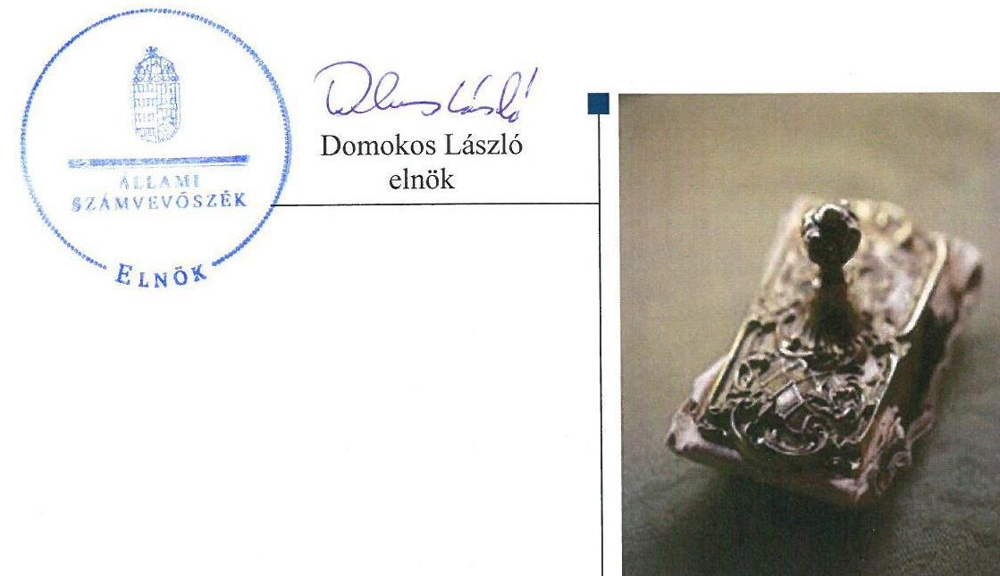
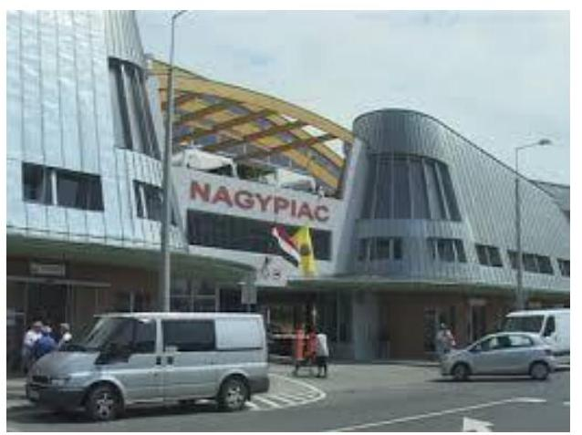
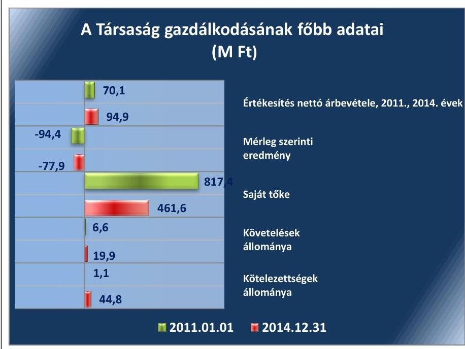
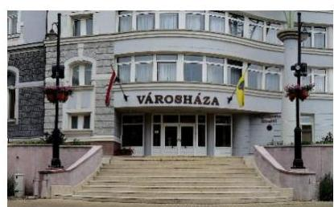
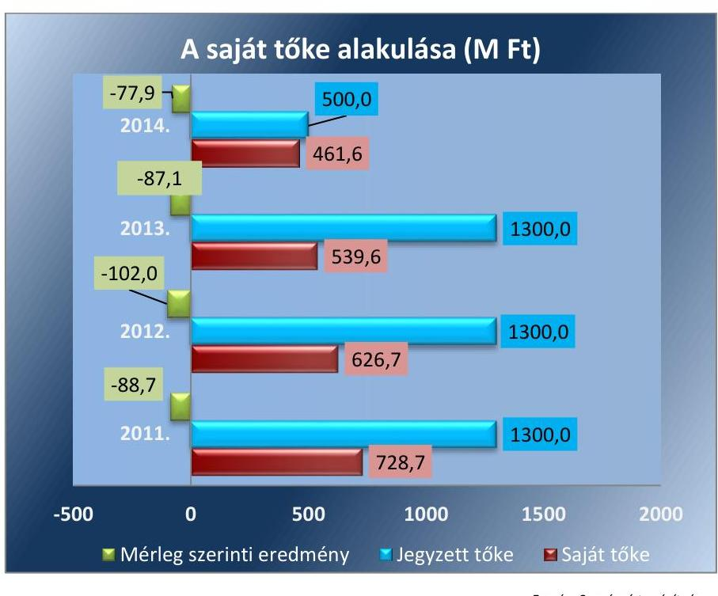
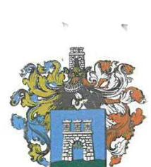
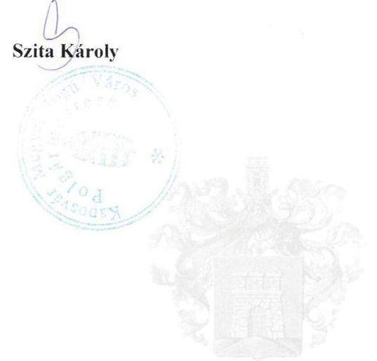
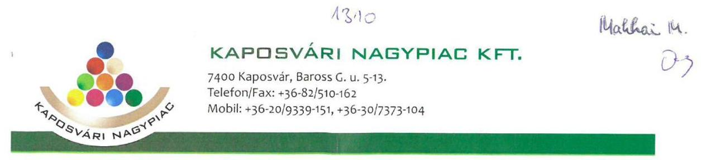
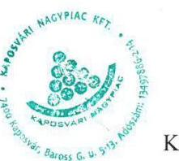

# Jelentés 

## Az önkormányzatok gazdasági társaságai

Az önkormányzatok többségi tulajdonában lévő gazdasági társaságok gazdálkodásának ellenőrzése - Kaposvári Nagypiac Kft.
2016.

---

# Jelenetés 

## Az önkormányzatok gazdasági társaságai

Az önkormányzatok többségi tulajdonában lévő gazdasági társaságok gazdálkodásának ellenőrzése - Kaposvári Nagypiac Kft.
2016. 11. hó 10. nap

---

# AZ ELLENŐRZÉST FELÜGYELTE: 

MAKKAI MÁRIA felügyeleti vezető

## AZ ELLENŐRZÉST VEZETTE ÉS A VÉGREHAJTÁSÁÉRT FELELŐS:

SALI SÁNDORNÉ ellenőrzésvezető

## A PROGRAM ÖSSZEÁLLÍTÁSÁÉRT FELELŐS:

JANIK JÓZSEF osztályvezető

## A TÉMÁHOZ KAPCSOLÓDÓ KORÁBBI SZÁMVEVŐSZÉKI JELENTÉSEK:

- címe: Jelentés Az önkormányzatok gazdasági társaságai Az önkormányzatok többségi tulajdonában lévő gazdasági társaságok közfeladat ellátását érintő gazdálkodási tevékenysége szabályszerűségének ellenőrzése - Kaposvári Önkormányzati Vagyonkezelő és Szolgáltató Zrt.
- sorszáma: 15066

IKTATÓSZÁM: V-1105-116/2016.
TÉMASZÁM: 2139
ELLENŐRZÉS-AZONOSÍTÓ SZÁM: V070769

---

# TARTALOMJEGYZÉK 

■ ÖSSZEGZÉS ..... 5
■ AZ ELLENŐRZÉS CÉLJA ..... 7
■ AZ ELLENŐRZÉS TERÜLETE ..... 8
■ AZ ELLENŐRZÉS HÁTTERE, INDOKOLTSÁGA ..... 10
■ A JELENTÉS LÉNYEGES KÉRDÉSKÖREI ..... 11
■ ELLENŐRZÉS HATÓKÖRE ÉS MÓDSZEREI ..... 12
■ MEGÁLLAPÍTÁSOK ..... 14
■ JAVASLATOK ..... 26
■ MELLÉKLETEK ..... 27
I. Sz. melléklet: Értelmező szótár ..... 27
II. Sz. melléklet: A múködés főbb jellemzői. ..... 30
■ FÜGGELÉK: ÉSZREVÉTELEK ..... 31
■ RÖVIDÍTÉSEK JEGYZÉKE ..... 35

---

.

---

# ÖSSZEGZÉS 

A 2011-2014. évek közötti időszakban a tulajdonosi joggyakorlók a gazdálkodás feltételeit szabályszerűen biztosították. A Társaság vagyongazdálkodása megfelelt a jogszabályi előírásoknak, a kötelezettségállomány nem veszélyeztette a gazdálkodást. A bevételek és ráfordítások elszámolása összességében megfelelő volt. Az adatok közzététele során a 20122014. évek között nem volt biztosított a Társaság müködésének jogszabályoknak megfelelő átláthatósága.

## Az ellenőrzés társadalmi indokoltsága

Az Állami Számvevőszék középtávra szóló stratégiájában megfogalmazta, hogy a helyi önkormányzatok gazdálkodásában rejlő pénzügyi kockázatok feltárásával, az államháztartáson kívülre nyújtott költségvetési támogatások és ingyenes vagyonjuttatások, valamint az államháztartáson kívül múködő közfeladat-ellátó rendszerek ellenőrzéseivel hozzájárul ahhoz, hogy a közpénzeket az államháztartáson kívül múködő szervezetek is átlátható, rendezett módon használják fel a közfeladatok szerződésben vállalt ellátása érdekében.

Magyarországon az intézmény-centrikus közfeladat-ellátás jellemző, de egyre jelentősebb a költségvetésen kívüli feladatellátás térnyerése. Ennek legfontosabb szereplői - a nonprofit szervezetek mellett - az önkormányzati tulajdonú gazdasági társaságok. Az önkormányzatok szervezetalakítási szabadságának következménye, hogy a korábban is vállalati formában múködő közszolgáltatások mellett, mind a kötelező, mind az önként vállalt feladatok ellátásában a gazdasági társaságok kiemelt fontosságú szerephez jutottak.

## Főbb megállapítások, következtetések, javaslatok

Az Önkormányzat az ellenőrzött időszakban a Társaság számára a feladat és közfeladat-ellátásának feltételeit biztosította. Az Önkormányzat 2011. évi és a Holding ezt követő tulajdonosi joggyakorlása szabályszerű volt. Az Önkormányzat az önként vállalt feladatellátásához, illetve 2013-tól a közfeladat ellátásának biztosításához rendeletalkotási kötelezettségének a jogszabályi előírásoknak megfelelően eleget tett. A 2011. évben az Önkormányzat a többségi tulajdonában lévő gazdasági társaságával az önként vállalt feladatának ellátása érdekében bérleti szerződést kötött. Az FB feladatát ellátta, de az FB ülését az elnök legalább negyedévente nem hívta össze az Alapító Okiratban előírt gyakoriság szerint. A beszámoltatási rendszert a tulajdonosi joggyakorlók szabályszerűen múködtették.

A Társaság vagyongazdálkodása szabályszerű volt. A gazdálkodásra vonatkozó szabályzatokkal a törvényi előírásnak megfelelően rendelkeztek. A szabályzatok megfeleltek a jogszabályban foglalt előírásoknak. A Társaság a vagyonát, annak értékét és változásait szabályszerűen tartotta nyilván. Az eladósodottsági mutató mértéke az ellenőrzött időszakban kedvezően alakult. Hosszú lejáratú kötelezettsége nem volt, a rövid lejáratú kötelezettségek állománya az ellenőrzött időszakban folyamatosan nőtt, amit a Holding által üzemeltetett Cash-pool rendszer finanszírozott.

A Társaság beszámolási és adatszolgáltatási kötelezettségének szabályszerűen eleget tett, azonban a beszámolók kiegészítő mellékletei nem feleltek meg a Számv. tv. előírásainak. A 2011-2012. évi beszámolók kiegészítő mellékleteiben nem szerepelt az immateriális javak és tárgyi eszközök bruttó és nettó értékének, valamint az elszámolt értékcsökkenésének a bemutatása. Az éves beszámolók kiegészítő mellékletei a cash-flow kimutatást az ellenőrzött időszakban nem tartalmazták.

Az adatok közzétételi kötelezettsége nem volt szabályszerű, mert a Társaság a kötelezően közzéteendő közérdekű adatokat internetes honlapon, valamint a Holding honlapján digitális formában, bárki számára, korlátozástól mentesen nem teljes körűen tette közzé az Infotv. előírásaival ellentétesen.

---

A Társaság a bevételeinek és ráfordításainak elszámolását szabályszerűen végezte. Az önként vállalt feladatellátás okozta a veszteséget, mely döntően az élményfürdő bérbeadásához kapcsolódott. Meghatározó szerepe volt a veszteség kialakulásában a bérbe adott tárgyi eszközök után elszámolt értékcsökkenésnek, mivel a beszedett bérleti díj bevétel az amortizációnak mindösszesen 38\%-át fedezte az ellenőrzött időszakban. Ennek következtében a tulajdonosnak a jegyzett tőkét jelentősen le kellett szállítania a 2014. évben. A folyamatos veszteséges gazdálkodás veszélyeztette a Társaság múködését. Az Önkormányzat 2013. augusztusáig szabályszerűen határozta meg a piacüzemeltetéssel kapcsolatos díjakat, ezt követően az árak meghatározása a Társaság hatáskörébe tartozott.

---

# AZ ELLENŐRZÉS CÉLJA 

Az ellenőrzés célja annak értékelése volt, hogy az önkormányzat vagyongazdálkodási tevékenysége során szabályszerűen gyakorolta-e tulajdonosi jogait; a gazdasági társaság szabályozottsága, gazdálkodása és vagyongazdálkodási tevékenysége, bevételeinek és ráfordításainak elszámolása megfelel-e a jogszabályi és tulajdonosi előírásoknak; a gazdasági társaság kötelezettségállománya jelentett-e kockázatot a múködésre, valamint a gazdálkodás átláthatósága és elszámoltathatósága érdekében biztosítva volt-e a szolgáltatás dijának megalapozottsága szabályszerű önköltségszámítással.

---

# AZ ELLENŐRZÉS TERÜLETE 

## Kaposvár Megyei Jogú Város Önkormányzata, a Kapos Holding Közszolgáltató Zrt. és a többségi tulajdonban lévő Kaposvári Nagypiac Kft.

KAPOSVÁR MEGYEI JOGÚ VÁROS ÖNKORMÁNYZATA 100\%-os tulajdoni arányban 2010. június 15-én megalapította a Kaposvári Nagypiac Kft.-t a Kapos Fürdő Kft. jogutódjaként.

Az Önkormányzat ${ }^{1}$ 2010. december 9-ével 100\%-os tulajdoni arányban megalapította a Kaposvári Közszolgáltató Holding Zrt.-t az önkormányzati tulajdonú gazdasági társaságok egységes irányításának megszervezése céljából. Ennek érdekében kilenc gazdasági társaság - többek között a Kaposvári Nagypiac Kft. - üzletrészei, részvényei a Holding²-ba apportálásra kerültek, melynek következtében a társaságok feletti tulajdonosi jogokat 2011. március 23-tól a Holding gyakorolta.

Az alapításkor a Társaság ${ }^{3}$ jegyzett tőkéje $1300,0 \mathrm{M} \mathrm{Ft}^{4}$ volt, amely a 2013. évben a veszteség rendezése miatt 500,0 M Ft-ra csökkent. Az Önkormányzat vagyonkezelésre nem adott át eszközöket a Társaság részére.

Az Önkormányzat 2014. január 1-jén összesen négy gazdasági társaságban rendelkezett többségi tulajdoni hányaddal. Az Önkormányzat 100\%-os tulajdonában lévő Holding 2014. január 1-jén összesen tizennégy gazdasági társaságban rendelkezett többségi tulajdoni hányaddal.

A KAPOSVÁRI NAGYPIAC KFT. alaptevékenysége az ellenőrzött időszakban az önkormányzati tulajdonú piac és vásárcsarnok üzemeltetése (beleértve az árusítóhelyek, üzletek, fedett valamint szabadtéri asztalok bérbeadását, a piac területén lévő parkolóház üzemeltetését is), illetve a tulajdonában lévő fürdő ingatlanok bérbe adása volt. Emellett a tevékenységei közé tartozott még 2011. július hónaptól a Kaposvári Áruk Boltjának üzemeltetése. Az ellenőrzött időszakban az Önkormányzat önként vállalt feladata volt a fürdő üzemeltetése, valamint a 20112012. években a piac üzemeltetése, melyet a Társaság útján a fürdő és a piac ingatlanok bérbe adásával látott el. A 2013. évtől a Mötv. hatálybalépését követően a piac és vásárcsarnok üzemeltetését a helyben biztosítandó közfeladatok körébe sorolta.

A Társaság más gazdasági társaságban tulajdoni hányaddal nem rendelkezett, átlagos statisztikai állományi létszáma 2011-ben 13 fő, 2014-ben 10 fő volt.

---

A Társaság. gazdálkodásának egyes adatait az 1. ábra szemlélteti.
1. ábra

Forrás: A Társaság 2011. és 2014. évi beszámolói
A Társaság mérlegfőösszege 2011. január 1-jén 818,5 M Ft, 2014. december 31-én 568,7 M Ft volt. Az értékesítés nettó árbevétele a 2011. évről a 2014. évre 35,4\%-kal növekedett. A mérleg szerinti eredmény minden évben negatív volt, a veszteség következtében a jegyzett tőke összegét leszállították a 2013. évi 1300,0 M Ft-ról a 2014. évre 500,0 M Ft-ra. A saját tőke összege 2011. január 1-jéről 2014. december 31-re 43,5\%-kal csökkent. Az ellenőrzött időszakban a kötelezettségek állománya jelentősen, a követeléseké pedig mintegy háromszorosára emelkedett.

A múködésének főbb jellemzőit a II. számú melléklet mutatja be.
Az ellenőrzött időszakban a polgármester és a jegyző személye nem, az ügyvezető igazgató személye két alkalommal változott. A polgármester az 1994. évi, a jegyző az 1990. évi önkormányzati választások óta látja el feladatait. A jelenlegi ügyvezető igazgató 2013. szeptember 18-ától tölti be tisztségét.

A Társaság az ellenőrzött időszakban a 479/2009/EK rendelet ${ }^{5}$ alapján 2011. évben, az Áht. ${ }^{6}$ 109. § (8) bekezdése szerint a 2012-2014. években nem minősült a kormányzati alszektorba sorolt társaságnak.

---

# AZ ELLENŐRZÉS HÁTTERE, INDOKOLTSÁGA 

Az önkormányzatok közfeladat-ellátásában egyre jelentősebb a gazdasági társaságok útján történő feladatellátás térnyerése.

AZ ÖNKORMÁNYZATI TULAJDONÚ GAZDASÁGI TÁRSASÁGOK ellenőrzése kiemelten fontos a vagyon megőrzése, megóvása érdekében, amelyekkel szemben alapvető követelmény, hogy gazdálkodásuk, müködésük szabályszerű, az általuk szolgáltatott adatok minél megbízhatóbbak legyenek. A közfeladat, illetve a feladatellátás költségeinek, ráfordításainak alakulása, színvonala hatással van a lakosság elégedettségére.

## AZ ELLENŐRZÉS VÁRHATÓ HASZNOSULÁSA-

KÉNT az ÁSZ ${ }^{7}$ a megállapításaival segítséget nyújthat az államháztartáson kívüli közfeladat-ellátás értékeléséhez, jogszabályi keretei pontosításához, átláthatóságot biztosító szabályozásához. Meghatározhatóvá válnak az önkormányzati feladatellátásban részt vevő államháztartáson kívüli szervezeteknek - az önkormányzat költségvetését, pénzügyi helyzetét is befolyásoló - kockázatai, lehetővé válik ezen kockázatok csökkentése. Ellenőrzéseink feltárhatják, hogy az önkormányzat feladat-ellátási kötelezettségének szabályszerűen tett-e eleget, a feladatellátáshoz rendelt vagyonkezelésbe vett és saját vagyon múködtetését az elvárható gondossággal, szabályszerűen szervezte-e meg és a tulajdonosi felügyelete hozzájárult-e a feladatellátásához. Az ellenőrzés rávilágíthat arra, hogy a gazdasági társaság a feladat-ellátási, közszolgáltatási szerződésben foglaltak betartásával, a vagyon használatával biztosította-e a szolgáltatás folytatásának feltételeit, a feladat ellátását. Ezzel az ellenőrzöttek és a helyi döntéshozók számára visszajelzést ad feladatszervezési, feladat-ellátási kockázataikról, alapot ad a meglévő hibák megszüntetéséhez, a jobb feladatellátás biztosításához. Fokozza a fegyelmet, igazolja, hogy lejárt a következmények nélküli ellenőrzések időszaka. Az ÁSZ értékteremtő rend kialakításához és megőrzéséhez hozzájáruló tevékenysége pozitív hatással van a szervezetről kialakított összkép formálására.

---

# A JELENTÉS LÉNYEGES KÉRDÉSKÖREI 

1. Az önkormányzat feladat és közfeladat megszervezéséről szóló döntése, valamint a tulajdonosi joggyakorlás szabályszerű volt-e?
2. A gazdasági társaság vagyongazdálkodása szabályszerű volt-e, kötelezettségállománya jelentett-e kockázatot a müködésre, illetve a feladat és közfeladat ellátásra?
3. A gazdasági társaságnál az ellátott feladat és közfeladat bevételei és ráfordításai elszámolása, valamint az önköltségszámitás és árképzés szabályszerű volt-e?

---

# ELLENŐRZÉS HATÓKÖRE ÉS MÓDSZEREI 

## Az ellenőrzés típusa

Megfelelőségi ellenőrzés

## Az ellenőrzött időszak

A 2011. január 1-jétől 2014. december 31-éig terjedő időszak.

## Az ellenőrzés tárgya

A gazdasági társaság feletti tulajdonosi joggyakorlás, valamint gazdasági társaság gazdálkodásának szabályozottsága és szabályszerűsége.

Az ellenőrzés kiterjed minden olyan körülményre és adatra, amely az ÁSZ jogszabályban meghatározott feladatainak teljesítéséhez, valamint a program végrehajtása folyamán felmerült újabb összefüggések feltárásához szükséges.

## Az ellenőrzött szervezet

Kaposvár Megyei Jogú Város Önkormányzata és a Kaposvári Közszolgáltató Holding Zrt., továbbá a Kaposvári Nagypiac Kft.

## Az ellenőrzés jogalapja

Az ellenőrzés végrehajtásának jogszabályi alapját az Állami Számvevőszékről szóló 2011. évi LXVI. törvény 1. § (3) és a (5. § (3)-(4)-(5) bekezdései képezték.

## Az ellenőrzés módszerei

Az ellenőrzést a nemzetközi standardokat irányadónak tekintve az ellenőrzési program ellenőrzési kérdései, az ellenőrzött időszakban hatályos jogszabályok, az ellenőrzés szakmai szabályok és módszertanok figyelembe vételével végeztük.

Az ellenőrzés ideje alatt az ellenőrzött szervezettel történő kapcsolattartást az ÁSZ Szervezeti és Müködési Szabályzatának vonatkozó előírásai alapján biztosítottuk.

Az ellenőrzés a többségi tulajdonosi jogokat gyakorló Kaposvár Megyei Jogú Város Önkormányzatára, a Kaposvári Közszolgáltató Holding Zrt.-re,

---

illetve az ellenőrzött közfeladatot ellátó Kaposvári Nagypiac Kft.-re terjedt ki.

Az ellenőrzési kérdések megválaszolásához szükséges bizonyítékok megszerzése a következő ellenőrzési eljárások alkalmazásával történt: megfigyelés, kérdésfeltevés (információkérés), összehasonlítás, valamint elemző eljárás. Az ellenőrzési bizonyítékként felhasználható adatforrások közé tartoztak egyrészt a szakmai programban felsorolt adatforrások, másrészt az ellenőrzés folyamán feltárt, az ellenőrzés szempontjából információkat tartalmazó dokumentumok.

Az ellenőrzést a kérdésekre adott válaszok kiértékelésével, valamint a megjelölt adatforrások, a csatolt tanúsítványok felhasználásával, továbbá az adott időszakban hatályos jogszabályok figyelembevételével folytattuk le.

A bevételek és ráfordítások elszámolása, valamint a vagyonnyilvántartás terén az egyes területek szabályszerű működését mintavétellel és irányított kiválasztással ellenőriztük, és egyrészt a sokaságokban előforduló hibás tételek arányát becsültük a mintatételek értékelése alapján, másrészt az irányítottan kiválasztott tételeket értékeltük. A jogszabályoknak és a belső előírásoknak megfelelőnek, azaz szabályszerűnek tekintettük a mintavétellel kiválasztott bevételek és ráfordítások elszámolását, a vagyonnyilvántartást, amennyiben a minta ellenőrzésének eredménye alapján 95\%-os bizonyossággal a teljes sokaságban a hibaarány kisebb volt, mint $10 \%$, nem megfelelőnek értékeltük, ha a hibás tételek aránya a 10\%ot meghaladta.

---

# 1. Az önkormányzat feladat és közfeladat megszervezéséről szóló döntése, valamint a tulajdonosi joggyakorlás szabályszerű volt-e? 

Összegző megállapítás

Az Önkormányzat az ellenőrzött időszakban a Társaság számára a feladat- és közfeladat-ellátásának feltételeit biztosította. Az Önkormányzat és a Holding tulajdonosi joggyakorlása szabályszerű volt.

### 1.1. számú megállapítás

Az Önkormányzat a Társaság számára biztosította a szabályszerű gazdálkodási feltételeket, rendeletalkotási kötelezettségének az ellenőrzött időszakban a jogszabályi előírásoknak megfelelően eleget tett.

Az Önkormányzat az Ötv. ${ }^{8}$, majd a jogszabályi változásoknak megfelelően 2013. január 1-jétől a Mötv. ${ }^{9}$ - 13. § (1) bekezdés 14. pontjában foglaltak alapján az Önkormányzat közgyűlése ${ }^{10}$ által elfogadott gazdasági program ${ }_{1}^{11}{ }_{2}{ }^{12}$-ben meghatározta mindazokat a célkitűzéseket és feladatokat, amelyek az általa ellátott feladatok biztosítását, fejlesztését szolgálták.

A gazdasági program ${ }_{1}$-ben meghatározásra került a helyben termelt, illetve a Kaposváron előállított élelmiszerek közvetlen értékesítésének biztonságos és gazdaságos feltételeinek a megteremtése, ezzel kapcsolatban a kaposvári nagypiac átalakítása. A gazdasági program ${ }_{2}$ a kaposvári nagypiac tekintetében további fejlesztéseket tartalmazott, mely fejlesztésekkel a helyi identitás erősítésének elősegítését, illetve lakossági ellátás és a turizmus lehetőségeinek bővítését célozták meg.

Az Önkormányzat az ellenőrzött időszakot megelőzően döntött önként vállalt feladatként a piac- és vásárcsarnok üzemeltetéséről. A Társaság 2011 májusától üzemelteti a piacot az Önkormányzattal 2011. április 15én kötött határozatlan idejű bérleti szerződés alapján. A bérleti szerződésben meghatározták a bérlő jogait és teljesítendő kötelezettségeket, a tulajdonosnak fenntartott jogokat és kötelezettségeket, az ellátási területet, az indokolt költségek, ráfordítások megjelölését, a szerződés felmondásának, módosításának szabályait. A bérleti szerződés 1. számú melléklete tartalmazta a vásárcsarnok területén érvényesíthető induló bérleti díjakat. A 2013. évtől az Mötv. 13. § (1) bekezdésének 14.) pontja alapján az Önkormányzatnak a kistermelők, őstermelők számára jogszabályban meghatározott termékek értékesítési lehetőségeinek biztosítása, azaz a piac üzemeltetése jogszabály által meghatározott közfeladata volt. Az ellenőrzött időszakban a Társaság feladata volt a tulajdonában lévő fürdő ingatlanok bérbeadása.

---

### 1.2. számú megállapítás

Az Önkormányzat az ellenőrzött időszakban eleget tett rendeletalkotási kötelezettségének, megalkotta a hatályos vagyongazdálkodási rendelet ${ }^{13}{ }_{1,2,3}$-at, valamint a 2013. évben elkészítette és az Önkormányzat közgyűlése elfogadta a vagyongazdálkodási koncepcióját, és a közép- és hoszszú távú vagyongazdálkodási tervét.

Az Önkormányzat szabályszerűen meghatározta a Társaság Alapító Okirat ${ }^{14} 7 / A$. pontjában az ügyvezető hatáskörét.

## Az Önkormányzat és a Holding tulajdonosi joggyakorlása szabályszerű volt.

A TULAJ DONOSI JOGOK gyakorlásának rendjéről a tulajdonosi joggyakorló ${ }_{1}{ }^{15}$ az ellenőrzött időszakban a Gt. ${ }^{16}$, valamint az Ötv. betartásával az SZMSZ rendelet ${ }^{17}{ }_{1,2}$-ben, a Társaság Alapító Okiratában és a vagyongazdálkodási rendelet ${ }_{1,2,3}$-ben rendelkezett. Az Önkormányzatot megillető tulajdonosi jogokat az Önkormányzat közgyűlése, átruházott hatáskörben a Pénzügyi és Vagyongazdálkodási Bizottság, valamint a polgármester gyakorolta a vagyongazdálkodási rendelet ${ }_{1}$ értelmében. Az Önkormányzat közgyűlése a 2010. évben megalapította a Holdingot, majd döntött többek között a Társaság Holdingba történő apportálásáról. A döntés értelmében a Társaság feletti tulajdonosi jogokat 2011. március 23-ától a tulajdonosi joggyakorló ${ }_{2}{ }^{18}$ gyakorolta a Holdingot képviselő elnök-vezérigazgató útján. A tulajdonosi joggyakorló ${ }_{1,2}$ joggyakorlása az ellenőrzött időszakban szabályszerű volt.

AZ FB ${ }^{19}$ feladatait és beszámolási kötelezettségét a Társaság Alapító Okiratában, valamint az FB ügyrend ${ }^{20}$-jében írta elő. Az FB az ellenőrzött időszakban határozatot az év végi beszámolók és a javadalmazási szabályzat elfogadásáról hozott.

Az FB elnöke az ellenőrzött időszakban az FB-nek, az Alapító Okirat 11/A. 4. pontjában előírtak ellenére, legalább negyedévente történő öszszehívásáról nem intézkedett.

AZ ANYAGI ÖSZTÖNZÉSI RENDSZERT a Taktv. ${ }^{21}$-ben foglaltaknak megfelelően a tulajdonosi joggyakorló ${ }_{1,2}$ által elfogadott javadalmazási szabályzat ${ }_{1,2}$-ben ${ }^{22}$ rögzítették.

AZ ÁRKÉPZÉS SZABÁLYAIT jogszabály nem írta elő, az Önkormányzatnak nem kellett rendelkeznie a piac használatára vonatkozó dijkoncepcióval, mivel az nem tartozott a hatósági áras szolgáltatások körébe. Az Önkormányzat és a Társaság által megkötött bérleti szerződés 8. pontja alapján az üzemeltetési díjakat 2013. augusztus 15-ig az Önkormányzat határozta meg. A bérleti szerződés 2013. augusztus 15-i hatályú módosításának értelmében a piacüzemeltetési díjak mértékét és fajtáját már a Társaság határozta meg. Az Önkormányzat a vagyongazdálkodási rendelet ${ }_{1,2}$ ben a piacüzemeltetéssel kapcsolatban rögzítette, hogy a bérlők az üzemeltetőnek az üzemeltetési költséget az általuk használt terület arányában kötelesek fizetni.

A BESZÁMOLTATÁSI RENDSZER keretében a tulajdonosi joggyakorló ${ }_{1,2}$ az ügyvezetőt évente beszámoltatta a gazdálkodásról, vala-

---

mint a tevékenységéről. Az ellenőrzött időszakban a Társaság éves beszámolóit - az FB előzetes írásbeli véleményezését követően - a tulajdonosi joggyakorló1,2 a Gt., illetve a Ptk. ${ }^{23}$-ben előírtaknak megfelelően elfogadta, a beszámolókkal kapcsolatban elkészített független könyvvizsgálói jelentések rendelkezésre álltak. A Holding a 2012. évi 2. számú elnök-vezérigazgatói utasításban és az 1. számú gazdasági igazgatói utasításban szabályozta monitoring tevékenységét, amelynek keretében a Társaság a 2012. év áprilisától havi kontrolling jelentést, a 2012. év első negyedévétől évközi negyedéves beszámolót készített.

A Társaság részére a tulajdonosi joggyakorló1,2 garanciát nem nyújtott, kezességet nem vállalt a 2011-2014. években.

# 2. A gazdasági társaság vagyongazdálkodása szabályszerű volt-e, kötelezettségállománya jelentett-e kockázatot a múködésre, illetve a feladat és közfeladat ellátásra? 

Összegző megállapítás

A Társaság vagyongazdálkodása szabályszerű volt. A kötelezettségállománya nem jelentett kockázatot a múködésre, illetve a feladat és közfeladat ellátására.

A Társaság az ellenőrzött időszakban a gazdálkodásra vonatkozó szabályzatokkal a törvényi előírásnak megfelelően rendelkezett, a számlarend ${ }_{1,2}$ azonban nem teljes körűen felelt meg a Számv. tv. előírásainak.

A Társaság vagyongazdálkodási tevékenysége, annak végrehajtása a jogszabályi előírásoknak, illetve a bérleti szerződésben foglalt tulajdonosi előírásnak megfelelt.

AZ ÜZLETI TERVEK elkészítésének kötelezettségét a Társaság számára az ellenőrzött időszakban az Alapító Okirat írta elő. A Holding a 2012-2014. évekre vonatkozóan meghatározta az üzleti tervek tartalmi elemeit is. Az üzleti tervek elkészítése az Alapító Okirat alapján a Társaság ügyvezetőjének a feladata. A Társaság elkészítette, a tulajdonosi joggyakorló1,2 részére benyújtotta az ellenőrzött időszakra vonatkozóan az üzleti terveket. A tulajdonosi joggyakorló1 a 2011. évi üzleti tervet nem hagyta jóvá az Alapító Okiratban foglaltak ellenére, a további években a tulajdonosi joggyakorló ${ }_{2}$ üzleti terv jóváhagyási kötelezettségének eleget tett. Az üzleti tervek bevételi-kiadási terveket, beruházási, fejlesztési terveket tartalmaztak.

A SZÁMVITELI POLITIKA készítési kötelezettségének a Társaság az ellenőrzött időszakban eleget tett. A számviteli politika ${ }^{24} \cdot{ }^{25}$-ben a Számv. tv.-ben foglaltak szerint rögzítésre kerültek a Társaságra vonatkozó számviteli alapelvek, számviteli elszámolások, a lényegesség kritériumai, az értékcsökkentés elszámolásának gyakorisága, az értékelés szempontjai. A Társaság a Számv. tv. előírásainak megfelelően a számviteli politika ${ }_{1,2}$ keretében elkészítette az eszközök és források leltárkészítési és leltározási szabályzatát, a pénzkezelési szabályzatát.

---

# A LELTÁROZÁSI ÉS SELEJTEZÉSI SZABÁLY- 

$\mathrm{ZAT}_{1}{ }^{26}{ }_{2}{ }^{27}$-ben rögzítésre került a leltározásba bevonható eszközök és források köre, a leltározás általános szabályai, a leltározás előkészítése, végrehajtása, értékelése és ellenőrzése során elvégzendő feladatok köre, a leltáreltérések megállapításával, rendezésével, azok könyvviteli elszámolásával, illetve az esetleges felelősségre vonással összefüggő feladatok. A leltározási és selejtezési szabályzat ${ }_{1,2}$-ben Számv. tv-el összhangban meghatározták az évenkénti leltározási kötelezettséget az eszközök és források vonatkozásában.

## AZ ESZKÖZÖK ÉS FORRÁSOK ÉRTÉKELÉSI SZABÁLYAIT a 2011.01-01-2013.07.31 időszakban a Társaság a számviteli politika ${ }_{1}$-ben rögzítette, míg 2013.08.01-jétől az értékelési szabályzat ${ }^{28}$ tartalmazta. Az eszközök és források értékelésének szabályai az ellenőrzött időszakban a Számv. tv. előírásainak megfelelően biztosították a vagyon értékének meghatározását, a követelések minősítésének és az értékvesztés elszámolásának szabályait.

A PÉNZKEZELÉSI SZABÁLYZAT ${ }_{1}{ }^{29}{ }_{2}{ }^{30}$ a Számv. tv. előírásaival és a számviteli politika ${ }_{1,2}$-vel összhangban tartalmazta a pénzforgalom rendjét, a pénzkezelés személyi és tárgyi feltételeit, a felelősségi szabályokat, a készpénzben és a bankszámlán tartott pénzeszközök közötti forgalmat, a pénzmozgások eljárási rendjét, a napi készpénz záró állomány maximális mértékét, a pénzszállítás feltételeit, a pénzkezeléssel kapcsolatos bizonylatok rendjét, a készpénzállomány ellenőrzésekor követendő eljárásokat és a pénzforgalommal kapcsolatos nyilvántartási szabályokat.

A SZÁMLAREND ${ }_{1}{ }^{31}{ }_{2}{ }^{32}$ a Számv. tv. 161. § (2) bekezdés d) pontjában előírtak ellenére nem tartalmazta a számlarendben foglaltakat alátámasztó bizonylati rendet. A Társaság 2013. augusztus 1-jétől a számviteli politika2-ben szabályozta a bizonylatokkal kapcsolatos eljárásrendet. Ezen túl a számlarend ${ }_{1,2}$ tartalma szabályszerű volt.

A Társaság a kontrolling rendszerében a Holding kezdeményezésére a 2014. évben kialakította a közvetlen és általános költségek tartalmát és a költségfelosztás elveit.

MŰKÖDÉSI REND ${ }_{1}{ }^{33}{ }_{2}{ }^{34}$-vel az ellenőrzött időszakban a Társaság, mint piac üzemeltető a piac rendelet ${ }^{35} 6 . \S$ (1) bekezdése alapján rendelkezett. A múködési rend ${ }_{1,2}$ a piac rendelettel összhangban tartalmazta a piac múködési kereteit, szabályozta a piacon árusításra jogosultak körét, a piacon folytatható kereskedelmi tevékenységeket, a helyhasználat feltételeit és a helyhasználó kötelezettségeit, a piac nyitvatartási rendjét, valamint a piac területén alkalmazható díjakat.

A JAVADALMAZÁSI SZABÁLYZAT ${ }_{1}$-et az Önkormányzat a Társaság jogelőd szervezetére vonatkozóan az ellenőrzött időszak előtt megalkotta az ügyvezetőre és a tulajdonos által választandó tisztségviselökre, mely a 2011. évre is érvényben volt. A 2012. évben a Holding jóváhagyta 1/2012. (X. 17.) számú alapítói határozatával a Társaság vezető tisztségviselőjére és az FB tagjaira vonatkozó javadalmazás módjának, mér-

---

tékének, főbb elveinek szabályozását magába foglaló javadalmazási szabályzat ${ }_{2}$-ot. Az alapító az ellenőrzött időszakban, a 2013. évben hagyott jóvá az ügyvezető részére jutalom kifizetését, melynek mértéke a javadalmazási szabályzat ${ }_{2}$-ben meghatározottak szerint került megállapításra.

# 2.2. számú megállapítás 

A Társaság vagyongazdálkodása a jogszabályi rendelkezéseknek és a belső előírásoknak megfelelően történt.

A Társaság saját tulajdonú vagyonát, annak értékét és változásait a Számv. tv. 161. § (1) bekezdés előírásának megfelelően tartotta nyilván. A főkönyvi nyilvántartások a Társaság számlarend ${ }_{1,2}$-jének megfelelően kerültek kialakításra A beszámolókban és a számviteli nyilvántartásokban lévő vagyontárgyak állományát szabályszerűen - a leltározási szabályzatban foglaltak alapján - elkészített leltárral alátámasztották, amely tételesen, ellenőrizhető módon tartalmazta a Társaság mérlegforduló napján meglévő eszközök, források mennyiségét és értékét, ami megfelelt a Számv. tv.-ben előírtaknak.

A Társaság éves beszámolóinak főbb mérlegadatait az 1. táblázat szemlélteti.

1. táblázat

| A TÁRSASÁG FŐBB MÉRLEG ADATAI (M FT) |  |  |  |  |  |
| :--: | :--: | :--: | :--: | :--: | :--: |
| Megnevezés | 2011.01.01. | 2011.12.31. | 2012.12.31. | 2013.12.31. | 2014.12.31. |
| Befektetett eszközök | 810,2 | 722,6 | 638,0 | 564,2 | 547,3 |
| - ebből: Tárgyi eszközök | 810,2 | 722,6 | 638,0 | 564,2 | 547,3 |
| Forgóeszközök | 7,9 | 35,1 | 25,8 | 20,1 | 21,3 |
| - ebből: Követelések | 6,6 | 18,6 | 21,9 | 18,3 | 19,9 |
| Aktív időbeli elhatárolások | 0,4 | 0,5 | 0,0 | 0,0 | 0,1 |
| ESZKÖZÖK ÖSSZESEN | 818,5 | 758,2 | 663,8 | 584,3 | 568,7 |
| Saját tőke | 817,4 | 728,7 | 626,7 | 539,6 | 461,6 |
| - ebből: legyzett tőke | 1300,0 | 1300,0 | 1300,0 | 1300,0 | 500,0 |
| - ebből: Mérleg szerinti eredmény | $-94,4$ | $-88,7$ | $-102,0$ | $-87,1$ | $-77,9$ |
| Céltartalékok | 0,0 | 0,0 | 0,0 | 0,0 | 0,0 |
| Kötelezettségek (rövid lejáratú) | 1,1 | 29,5 | 37,1 | 44,7 | 44,8 |
| Passzív időbeli elhatárolások | 0,0 | 0,0 | 0,0 | 0,0 | 62,3 |
| FORRÁSOK ÖSSZESEN | 818,5 | 758,2 | 663,8 | 584,3 | 568,7 |

AZ ESZKÖZÖK értéke 2011. január 1-jéről 2014. december 31-ére 249,8 M Ft-tal, 30,5\%-kal csökkent, melyet a tárgyi eszközök, a pénzeszközök, a követelések, valamint az aktív időbeli elhatárolások állomány változásai okoztak. A Társaság vagyoni struktúrája az ellenőrzött időszakban jelentősen nem változott, a 2014. évben az eszközeinek 96,2\%-át a befektetett eszközök és 3,8\%-át a forgóeszközök képezték. Az ellenőrzött időszakban a legnagyobb mértékben a tárgyi eszközök nettó értéke csökkent, 262,9 M Ft-tal, 32,4\%-kal, amely a gyógyfürdő eszközeinek folyamatos értékcsökkenéséből adódott. A 2014. évben zárult le a védjegy és termékbolt kialakítás pályázata, melynek során a Társaság a beruházást követően 2014. december 4-én 62,3 M Ft értékű idegen ingatlanon történt beruházást aktivált. Ebből jelentős nagyságrendet, 46,7 M Ft-ot képviselt a KEOP-6.2.0/B/11-2011-0028. számú Helyi termék és védjegy termékek boltjának kialakítása projekt. A Társaság tárgyi eszközeinek átlagos életkora folyama-

---

tosan nőtt. A könyvvizsgáló a 2014. évi könyvvizsgálói jelentésében figyelemfelhívással élt arra vonatkozóan, hogy a Társaság tárgyi eszközeinek pénzkiadással nem járó - értékcsökkenési leírásának összege nem térült meg a bevételeiben.

A FORRÁSOK alakulását jelentősen befolyásolta az ellenőrzött időszakban a jegyzett tőke csökkenése. A Társaság tulajdonosa a jegyzett tőkét a Gt. előírásainak megfelelően, a 2013. évi 1 300,0 M Ft-ról 2014. évre 500,0 M Ft-ra leszállította az ellenőrzött időszakban a mérleg szerinti eredmény folyamatos vesztesége következtében. A kötelezettségek állománya 43,7 M Ft-tal nőtt az ellenőrzött időszak végére, mely kizárólag a rövid lejáratú kötelezettségből állt. A rövid lejáratú kötelezettségek között jelentős nagyságrendet képviseltek a szállítói tartozások.

A saját tőke összetételének alakulását a 2. ábra mutatja be.
2. ábra

Forrás: 3. számú tanúsítvány
2.3. számú megállapítás

A Társaságnál az eladósodás mértéke, szerkezete nem jelentett kockázatot a feladat, illetve közfeladat ellátására, valamint a Társaság múködésére az ellenőrzött időszakban.

AZ ELADÓSODOTTSÁGI MUTATÓ értéke az ellenőrzött időszakban kedvezően alakult, mivel az értéke tartósan 1 alatt volt, a 2011. évben 0,03 , a 2012. évben 0,05 , a 2013. évben 0,08 , a 2014. évben 0,08 . Az ellenőrzött időszakban a Társaság nettó eladósodottságának értéke 0,01-0,05 között mozgott, azonban évről évre növekedést mutatott.

A Társaságnál az eladósodás mértéke, szerkezete nem jelentett kockázatot a Társaság múködésére, illetve a feladat és közfeladat ellátására az ellenőrzött időszakban. Mindemellett a Társaság folyamatos veszteséges gazdálkodása kockázatot jelentett a piacüzemeltetési közfeladatra, illetve

---

a Társaság további múködésére. A veszteséges gazdálkodás miatt vagyonvesztés következett be, ezért a rendelkezésre bocsátott jegyzett tőke 800 M Ft-tal leszállításra került.

# A RÖVID LEJÁRATÚ KÖTELEZETTSÉGEK ÁLLO- 

MÁNYA az ellenőrzött időszakban folyamatosan nőtt. Összességében a kötelezettség állomány az ellenőrzött időszakban 2011. január 1-jéhez képest 2014. december 31-re 43,7 M Ft-tal növekedett. A Társaság az üzleti éveket a ki nem fizetett, lejárt szállítói tartozásokkal zárta. A rövid lejáratú kötelezettségeken belül 2011. évben 90,4\%, 2012. évben 83,2\%, 2013. évben 18,4\%, 2014. évben 65,7\%-át tették ki a szállítói kötelezettségek. A Holding 2011. február 16-án az OTP Bank Zrt.-vel Cash-pool szolgáltatási szerződést kötött a 100\%-os tulajdonú gazdasági társaságai részére együttes likviditáskezelése céljából, amely szerződés hatálya a Társaságra is kiterjedt. A Társaság 2014. évi folyószámla-hitel állománya 11,7 M Ft. A Holding gazdasági társaságokra vonatkozó folyószámla-hitel keretösszege 2014. évben 550,0 M Ft volt.

## 2.4. számú megállapítás

A Társaság beszámolási és adatszolgáltatási kötelezettsége szabályszerű volt a beszámolók kiegészítő mellékletének kivételével. Az adatok közzétételi kötelezettségét a jogszabályi előírásokban meghatározottak szerint nem teljes körűen teljesítették.

Az ellenőrzött időszakban a Társaság beszámolási, adatszolgáltatási és egyéb tájékoztatási kötelezettsége az Alapító Okiratban, a Holding által kiadott utasításokban és a számviteli politika1,2-ben került rögzítésre.

AZ ÉVES BESZÁMOLÓKAT a Társaság elkészítette, az alapító határidőben elfogadta, továbbá a Számv. tv. 153. § (1), valamint a 154. § (1) bekezdéseiben foglaltak szerint letétbe helyezési, illetve közzétételi kötelezettségének eleget tett.

A Társaság a 2011-2012. években a Számv. tv. 92. § (1)-(2) bekezdés előírásának ellenére a beszámolók kiegészítő mellékleteiben nem mutatta be az immateriális javak és a tárgyi eszközök nyitó bruttó értékét, annak növekedését, csökkenését, záró bruttó értékét, továbbá a halmozott értékcsökkenés nyitó értékét, tárgyévi növekedését, csökkenését, záró értékét. A tárgyévi értékcsökkenési leírás összegét legalább mérlegtételek szerinti bontásban.

Az ellenőrzött időszakban a beszámoló kiegészítő mellékletei nem tartalmaztak cash-flow kimutatást, mely nem felelt meg a Számv. tv. 88. § (6) bekezdésében foglaltaknak.

A Társaság Alapító Okirata az ügyvezető feladataként írta elő haladéktalan tájékoztatási kötelezettségként, ha a Társaság veszteséges gazdálkodása esetén a törzstőke legalább egyharmadára vagy a saját tőkéje veszteség folytán a törzstőke felére csökkenne. A Társaság saját tőkéje a veszteség folytán 2012. évben a jegyzett tőke felére csökkent, melynek következtében a 2013. évben a Holding a Gt. előírásai szerint a Társaság veszteségének rendezése érdekében tőkecsökkentésről határozott.

Az Alapító Okiratban előírtak szerint az ügyvezető feladatához tartozott az ellenőrzött időszakban, hogy negyedévente tájékoztatást készítsen az FB részére, valamint évente egyszer az alapító számára az ügyvezetésről, a

---

társaság vagyoni helyzetéről és üzletpolitikájáról. A tulajdonosi joggyakorló ${ }_{1,2}$ minden évben az éves számviteli beszámolóval együtt elfogadta az ügyvezető beszámolóját. A Holding által 2012. január hónaptól előírt 2011. évre nem volt előírás - adatszolgáltatási kötelezettséget a Társaság az ellenőrzött időszakban teljesítette.

A Társaság a Mötv. alapján a 2013. évtől látott el közfeladatot, ennek megfelelően az Infotv ${ }^{36}$. 30. § (6) bekezdése alapján 2013. augusztus 1-től az adatbiztonság érdekében létrehozta és meghatározta a közérdekú adatok megismerésére irányuló igények elbírálása során irányadó eljárási szabályokat, feladatokat. A szabályozás kiterjedt a Társaság teljes múködési területére és a Társaság valamennyi munkavállalójára, valamint szervezeti egységénél folytatott valamennyi személyes adatokat tartalmazó adatkezelésre.

A Társaság a kötelezően közzéteendő közérdekű adatokat internetes honlapján, illetve a Holding honlapján digitális formában, bárki számára, korlátozástól mentesen nem teljes körűen tette közzé, amely ellentétes az Infotv. 33. § (1) és a (3), valamint a 37. § (1) bekezdéseiben, valamint az 1. számú mellékletében foglaltakkal. A Társaság a 2013-2014. években az alábbi adatokat nem tette közzé:
1.mell. I. 2 pontjában előírtakat (a közfeladatot ellátó szerv szervezeti felépítése szervezeti egységek megjelölésével, az egyes szervezeti egységek feladatai),
1.mell. I. 11 pontjában előírtakat (A közfeladatot ellátó szerv felettes, illetve felügyeleti szervének, hatósági döntései tekintetében a fellebbezés elbírálására jogosult szervnek, ennek hiányában a közfeladatot ellátó szerv felett törvényességi ellenőrzést gyakorló szervnek adatai),
1.mell. II. 1 pontjában előírtakat (adatvédelmi és adatbiztonsági szabályzat hatályos és teljes szövege),
1.mell. III. 1 pontjában előírtakat (a közfeladatot ellátó szerv számviteli törvény szerinti beszámolója),
1.mell. III. 7 pontjában előírtakat (az Európai Unió támogatásával megvalósuló fejlesztések leírására, az azokra vonatkozó szerződések, legalább 1 évig archívumban tartásával).

---

# 3. A gazdasági társaságnál az ellátott feladat és közfeladat bevételei és ráfordításai elszámolása, valamint az önköltségszámítás és árképzés szabályszerű volt-e? 

Összegző megállapítás

### 3.1. számú megállapítás

3. ábra

## Az ellenőrzés megállapítása

A gazdasági társaság ráfordításainak szabályszerű elszámolása területen

- Anyagadlugú ráfordítások
- Beruházások, felújítások
- Értékesítékonás
- Bizottszáoló

A gazdasági társaság bevételeinek szabályszerű elszámolása területén

- Értékesítés nettó árbevétele
- MEGFELEIÓ

A Társaság az ellátott feladat, illetve közfeladat bevételeinek és ráfordításainak elszámolását összességében szabályszerűen végezte. A piacüzemeltetéssel kapcsolatos díjtételeket szabályszerűen alkalmazta.

A bevételek és a ráfordítások elszámolása megfelelt a jogszabályi előírásoknak.

A Társaság az ellenőrzött időszakban a közfeladatok bevételeit, költségeit és ráfordításait szabályosan számolta el. A mintavétellel ellenőrzött területek értékelését a 3. ábra mutatja.

A Társaság fő tevékenysége az ellenőrzött időszakban az Alapító Okirat szerint saját tulajdonú, bérelt ingatlan bérbeadása, üzemeltetése volt. A Társaság az ellenőrzött időszakban az Önkormányzat közgyűlésének döntése, illetve az Önkormányzattal megkötött bérleti szerződés alapján ellátta a piacüzemeltetésével kapcsolatos feladatokat, mely a 2013. évtől a Mötv. szerint az Önkormányzat közfeladat-ellátásába tartozott. A Társaság a piacüzemeltetésen kívül egyéb feladatellátás keretében az ellenőrzött időszakban üzemeltetésre bérbe adta a tulajdonában lévő élményfürdőt.

A Társaságnak az elkülönített nyilvántartásra vonatkozóan jogszabályi kötelezettsége az ellenőrzött időszakban nem volt. Ugyanakkor a könyvelési rendszerét tovább részletezte, az ellenőrzött időszakban a 6-os és 7-es számlaosztályt alkalmazta. Bevételeit feladatainak megfelelően megbontotta. Az ellenőrzött időszakban a bevételek között nemcsak a piacüzemeltetéssel kapcsolatos bevételek szerepeltek, hanem ingatlan bérbeadásával kapcsolatos bevételek is. A Társaság a tulajdonában lévő fürdő üzemeltetésére szerződést kötött a Kaposvári Élmény és Gyógyfürdő Nonprofit Kft.vel. A 9-es számlaosztályon belül külön került könyvelésre a helyjegyek, asztalbérletek, üzlethelyiségek, ruhaudvar, területhasználati, raktárhelyiségek bérleti díja, a parkoló bevétele, valamint a fürdő bérleti díja.

AZ ÉRTÉKESÍTÉS NETTÓ ÁRBEVÉTELÉNEK ELSZÁMOLÁSA megfelelő volt. Előfordult, hogy a szerződés hiánya miatt nem volt megállapítható a Számv. tv. 72. § (2) bekezdés a) pontjában meghatározott szerződés szerinti teljesítési érték. Az értékesítés nettó árbevételének elszámolása a számviteli politika ${ }_{1,2}$-ben és a számlarend ${ }_{1,2}$-ben meghatározottak szerint történt.

AZ ANYAGJELLEGŰ RÁFORDÍTÁSOK elszámolásának szabályszerűsége megfelelő volt. A költségek elszámolása a számviteli politika ${ }_{1,2}$-ben és a számlarend ${ }_{1,2}$-ben meghatározottak szerint a megfelelő főkönyvi számlára történt.

---

A BERUHÁZÁSOK, FELÚJÍTÁSOK elszámolása megfelelt a Számv. tv-ben foglaltaknak. Előfordult azonban, hogy kisösszegű immateriális javakat tévesen a gépek berendezések között mutatták ki, azonban ezeket a Számv. tv. előírásaival összhangban, egy összegben azonnali értékcsökkenésként elszámolták, így nincs hatással a beszámolóban kimutatott eszköz értékre.

AZ ÉRTÉKCSÖKKENÉSI LEÍRÁS elszámolása a Számv. tvben, a számviteli politika ${ }_{1,2}$-ben és a számlarend ${ }_{1,2}$-ben, valamint az eszközök és források értékelési szabályzatában meghatározottak szerint történt.

A Társaság tárgyi eszközeinek bruttó értékét a 2011-2013. években 100\%-ban, a 2014. évben 94\%-ban az élményfürdő ingatlanai képezték. Az ellenőrzött időszakban az elszámolt értékcsökkenés 99\%-a, 327,0 M Ft az élményfürdő eszközeivel kapcsolatban merült fel. A Kaposvári Élményfürdő Nonprofit Kft. által az ingatlanok és a földterület használatáért fizetett bérleti díjból az ellenőrzött időszakban 123,1 M Ft térült meg, ezért önmagában az értékcsökkenés elszámolása mintegy 203,9 M Ft veszteséget eredményezett. Mindemellett a Társaság az Önkormányzattal az élményfürdő földterületei után megkötött bérleti szerződés alapján az ellenőrzött időszakban 115,1 M Ft bérleti díjat számolt el az anyag jellegű ráfordítások között, mely hozzájárult a veszteség további növekedéséhez. Ennek következtében a veszteség 355,7 M Ft volt az ellenőrzött időszakban.

A Társaság tárgyi eszközeinek bruttó értéke a 2011. évről a 2014. évre 1229,5 M Ft-ról 1292,0 M Ft-ra, 5,1\%-kal nőtt az időszakban megvalósult fejlesztések miatt, azonban az elszámolt értékcsökkenés hatására a mérlegben szereplő nettó érték 32,4\%-kal csökkent. A Társaság az ellenőrzött időszakban nem gondoskodott teljes mértékben a tárgyi eszközök értékének szinten tartásáról, illetve fejlesztéséről, az eszközök utánpótlása nem történt meg. Az ellenőrzött időszak minden évében a Társaság veszteséges volt. A tulajdonosi joggyakorló az éves üzleti tervekben nem döntött kellő mértékben a fejlesztésekről, nem segítette elő maradéktalanul a vagyon értékének megőrzését.

A KÖVETELÉSÁLLOMÁNNYAL kapcsolatos kintlévőségek kezelésének rendjét a Társaság a 2014. évtől szabályozta, a kintlévőségek kezelésére vonatkozó szabályzat-készítési kötelezettsége a Társaságnak az ellenőrzött időszakban nem volt. A szabályzat hatályba lépéséig a kintlévőségek kezelését a Társaság gazdasági ügyintézője végezte. A kintlévőség vizsgálata 15 naponként történt, a lejárt követeléssel rendelkező adósok részére először fizetési emlékeztetőt, majd ezt követően fizetési felszólítást küldtek. A fizetési felszólítás határidejének lejárata után a követeléskezelés a Holdinghoz került.

A 2014. október 20-ától hatályos Kinnlevőség kezelési szabályzat meghatározta a követeléskezelés fogalmát, a behajthatatlan követelések ismérveit, a követeléskezelésben részt vevő szervezeti egységeket és az eljárás menetét. A kinnlevőségek kezelőjeként a Holding Követeléskezelési csoportját és Jogi osztályát határozták meg. Az alkalmazandó eljárásról (fizetési felszólítás, fizetési meghagyás és végrehajtás, peres eljárás, felszámolási eljárás, bérleti szerződés felmondása) a Társaság ügyvezetője döntött.

---

A követelések, azon belül a vevőkkel kapcsolatos, illetve a lejárt követelésállomány alakulását a 2. táblázat mutatja be:
2. táblázat

A KÖVETELÉS ÁLLOMÁNY ALAKULÁSA 2011.01.01-2014.12.31.

| Megnevezés | 2011.01.01. | 2011.12.31. | 2012.12.31. | 2013.12.31. | 2014.12.31. |
| :--: | :--: | :--: | :--: | :--: | :--: |
| követelések állománya | 6,6 M Ft | 18,6 M Ft | 21,9 M Ft | 18,3 M Ft | 19,9 M Ft |
| ebből vevő követelések | 0,9 M Ft | 13,2 M Ft | 4,9 M Ft | 7,7 M Ft | 8,7 M Ft |
| a követeléseken belül a vevő követelések aránya | $13,6 \%$ | 71,0\% | 22,4\% | 42,1\% | 43,7\% |
| ebből lejárt vevő követelések | 0,0 M Ft | 5,9 M Ft | 4,6 M Ft | 7,4 M Ft | 8,7 M Ft |
| a követeléseken belül a lejárt vevőkövetelések aránya | $0,0 \%$ | $31,7 \%$ | $21,0 \%$ | $40,4 \%$ | $43,7 \%$ |
| a vevőköveteléseken belül a lejárt vevőkövetelések aránya | $0,0 \%$ | $44,7 \%$ | $93,9 \%$ | $96,1 \%$ | $100 \%$ |

A LEJÁRT VEVŐKÖVETELÉSEK ÁLLOMÁNYA a 2011. évi 5,9 M Ft-ról 2014. évre 8,7 M Ft-ra, a vevőköveteléshez viszonyított arány 44,7\%-ról 100\%-ra emelkedett. A Társaságnak az ellenőrzött időszakban a lejárt vevőkövetelései a piac üzleteit és más területeit bérlő vállalkozókkal szemben állt fenn. A lejárt követelésekkel kapcsolatban jogi eljárást 1,8 M Ft összegre (a lejárt követelés 20\%-ára) indítottak az ellenőrzött időszakban.

Behajthatatlan követelés leírására a 2012. évben (183 e Ft ${ }^{37}$ összegben), és a 2013. évben (204 e Ft) került sor, mely megfelelte a Számv. tv. előírásainak.
3.2. számú megállapítás

A Társaság által alkalmazandó piacüzemeltetéssel kapcsolatos díjtételeket 2013. augusztus az Önkormányzat, azt követően a Társaság határozta meg.

ÖNKÖLTSÉG-SZÁMÍTÁSI SZABÁLYZAT KÉSZÍTÉ-
SÉRE Társaság az ellenőrzött időszakban a Számv. tv. 14. § (6) és (7) bekezdései alapján nem volt kötelezett, mivel a nettó árbevétel az 1000 M Ftot, illetve a költségnemek szerinti költségek együttes összege az 500 M Ftot nem érte el.

Az Önkormányzat és a Társaság által 2011. április 15-én megkötött bérleti szerződés 8. pontja alapján az üzemeltetési díjakat 2013. augusztus 15ig az Önkormányzat határozta meg. A vagyongazdálkodási rendelet; 49/A. § (4) bekezdése, illetve a vagyongazdálkodási rendelet; 50. § (4) bekezdése alapján a piac- és vásárcsarnok bérlői az üzemeltetőnek az üzemeltetési költséget az általuk használt terület arányában kötelesek megfizetni. A bérleti szerződés módosításának eredményeként ezt követően az üzemeltetési díjak meghatározása a Társaság feladatkörébe tartozott. A 2014. évtől hatályos társasági működési rend; tartalmazta a díjak megállapításának szabályait.

A Társaság által alkalmazandó, piac üzemeltetéssel kapcsolatos díjakat (földhasználati díj, üzlethelyiségek bérleti díja, raktárhelyiségek bérleti díja, üzemeltetési díjak, helyjegyek díja, parkoló díjak, egyéb díjak) a 2011. évben az Önkormányzat közgyűlése határozta meg oly módon, hogy az előző évi díjtételek mértékét az inflációval (4,9\%) megemelte. A 2012. évre alkalmazandó díjak mértéke az előző évhez képest nem változott. A 2012. évben az I-VIII. havi adatok alapján utókalkulációt készített a Társaság az ál-

---

tala végzett különböző feladatok önköltségének megállapítására. Az utókalkuláció képezte a 2013. évi közfeladathoz köthető árak megállapításának alapját. A 2013. évtől a tulajdonosi joggyakorló, illetve Társaság arra törekedett, hogy a közfeladathoz kapcsolódó díjak fedezzék az üzemeltetés költségeit. Ennek érdekében 2013. évben különböző mértékű áremelést valósítottak meg az egyes üzemeltetési díj kategóriákban. A 2014. évi ármeghatározás fő szempontja az volt, hogy a Társaság kiadásaira a bevételek fedezetet nyújtsanak, emiatt az egyes üzemeltetési díjak 24-30\% között emelkedtek.

A díjakat a múködési rend ${ }_{1,2}$-ben a Társaság nyilvánosságra hozta.

---

# JAVASLATOK 

Az ÁSZ tv. 33. § (1) bekezdésében foglaltak értelmében az ellenőrzött szervezet vezetője köteles a jelentésben foglalt megállapításokhoz kapcsolódó intézkedési tervet összeállítani és azt a jelentés kézhezvételétől számított 30 napon belül az ÁSZ részére megküldeni. Amennyiben az ellenőrzött szervezet vezetője nem küldi meg határidőben az intézkedési tervet, vagy továbbra sem elfogadható intézkedési tervet küld, az Állami Számvevőszék elnöke az ÁSZ tv. 33. § (3) bekezdése a) és b) pontjaiban foglaltakat érvényesítheti.

## A KAPOS HOLDING Közszolgáltató Zrt. elnökvezérigazgatójának

1. Kezdeményezze, hogy a Kaposvári Nagypiac Kft. Felügyelőbizottságának elnöke az Alapitó Okiratban rögzítetteknek megfelelő gyakorisággal hívja össze a Felügyelőbizottságot.
(1.2. sz. megállapítás 3. bekezdése alapján)

## A Kaposvári Nagypiac Kft. ügyvezetőjének

1. Intézkedjen, hogy az éves beszámolók kiegészítő melléklete a cash-flow kimutatást tartalmazza a Számv. tv. előírásainak megfelelően.
(2.4. sz. megállapítás 4. bekezdése alapján)
2. Intézkedjen a kötelezően közzéteendő adatok Infotv. előírásainak megfelelő, teljes körű közzétételéről.
(2.4. sz. megállapítás 8. bekezdése alapján)

---

# MELLÉKLETEK 

- I. SZ. MELLÉKLET: ÉRTELMEZŐ SZÓTÁR
eladósodottságot jellemző mutatók
garancia
gazdasági társaság
eladósodottsági mutató (tőkeáttétel): idegen tőke/összes forrás.
Egészségesnek mondható egy olyan mértékű áttétel, amelyet az üzleti tervek szerint és az elmúlt időszak tapasztalatai alapján a társaság megfelelő biztonsággal ki tud termelni. Nagy eszközberuházás-igényű iparágakban értéke magasabb, azaz magasabb eladósodottság is elfogadható, de 75-85\%-ot meghaladó értéknél már itt is erős, sőt túlzott külső finanszírozottságról beszélhetünk. Általánosságban véve kedvező, ha értéke kisebb, mint 0,6.
eladósodottság mértéke: kötelezettségek / saját tőke.
Fontos szerepet játszik ez a mutató egy vállalat megítélésében. Azt mutatja, hogy a saját források a kötelezettségek hány százalékát fedezik. Törekedni kell, hogy a mutató tartósan (jelentősen) 1 alatti értéket érjen el.
nettó eladósodottság: (kötelezettségek-követelések) / saját tőke.
Azt mutatja, hogy a kintlévőségekkel csökkentett kötelezettségeket milyen mértékben fedezi a saját forrás. Ez feltételezi, hogy a követelések pénzügyileg előbb realizálódnak, mint ahogy a kötelezettségeket teljesíteni kell. A mutató minél kisebb, csökkenő értéke a kedvező.
adósságfedezeti mutató I.: (befektetett eszközök+forgó eszközök) / idegen forrás.
Azt mutatja, hogy 1 Ft adósságra hány Ft vagyon jut. Általánosságban véve kedvező, ha értéke 2 körül van, de nagy eszközberuházás-igényű iparágakban értéke kisebb is lehet.
adósságfedezeti mutató II.: működési cash flow / hosszú lejáratú kötelezettségek.
A mutató azt jelzi, hogy az adott gazdálkodási időszak múködési pénzáramainak eredményeként realizált cash flow révén a vállalkozás mennyiben lenne képes valamenynyi hosszú lejáratú kötelezettségének eleget tenni. Ennek vizsgálatára viszonylag ritkán kerül sor, az elsősorban a veszélyhelyzetbe került vállalkozások esetében lehet érdekes. Általánosságban véve kedvező, ha a múködési cash flow minél nagyobb arányban nyújt fedezetet a hosszú lejáratú kötelezettségre (értéke nagyobb, mint 1, nő az ellenőrzött időszakban).
árbevételre vetített eladósodottság: (kötelezettségek - forgóeszközök) / értékesítés nettó árbevétele.
Az árbevételre vetített eladósodottság azt mutatja, hogy az árbevétel mekkora fedezetet nyújt a kötelezettségeknek a forgóeszközökkel csökkentett részére. Általánosságban véve kedvező, ha az árbevétel minél nagyobb arányban nyújt fedezetet a forgóeszközökkel csökkentett kötelezettségekre (értéke kisebb, mint 1, csökken az ellenőrzött időszakban).
A garancia olyan önálló, az önkormányzat nevében vállalt kötelezettség, amely alapján az önkormányzat az önkormányzati költségvetés terhére szerződésben meghatározott feltételek szerint, a kötelezett nem teljesítése esetén a jogosultnak fizetést teljesít az előzetesen rögzített összeghatárig.
Ptk. 3.88. § (1) bekezdése szerint „a gazdasági társaságok üzletszerű közös gazdasági tevékenység folytatására, a tagok vagyoni hozzájárulásával létrehozott, jogi személyiséggel rendelkező vállalkozások, amelyekben a tagok a nyereségből közösen részesednek, és a veszteséget közösen viselik".

---

gazdálkodó szervezet
kezesség
közfeladat
közszolgáltatás
nemzeti vagyon

A Ptk. ${ }^{38}$ 685. § c) pontja szerint gazdálkodó szervezet: „az állami vállalat, az egyéb állami gazdálkodó szerv, a szövetkezet, a lakásszövetkezet, az európai szövetkezet, a gazdasági társaság, az európai részvénytársaság, az egyesülés, az európai gazdasági egyesülés, az európai területi együttműködési csoportosulás, az egyes jogi személyek vállalata, a leányvállalat, a vízgazdálkodási társulat, az erdő birtokossági társulat, a végrehajtói iroda, az egyéni cég, továbbá az egyéni vállalkozó." (hatályos: 2014. március 15-éig) A Hgt. 2 2. § (1) bekezdés 15. pontja szerint „a polgári perrendtartásról szóló törvényben meghatározott gazdálkodó szervezet, ide nem értve azt a költségvetési szervet, amelyet az államháztartásról szóló törvény szerint közfeladat ellátására hoztak létre." (hatályos: 2014. március 15-től)
A kezességre vonatkozó előírásokat a Ptk. 2 6:416-430. §-ai tartalmazzák. Kezességi szerződéssel a kezes kötelezettséget vállal a jogosulttal szemben, hogyha a kötelezett nem teljesít, maga fog helyette a jogosultnak teljesíteni. Kezesség egy vagy több, fennálló vagy jövőbeli, feltétlen vagy feltételes, meghatározott vagy meghatározható összegű pénzkövetelés vagy pénzben kifejezhető értékkel rendelkező egyéb kötelezettség biztosítására vállalható.
A Ptk. 1 szerint kezességet csak írásban lehet vállalni. A kezes kötelezettsége ahhoz a kötelezettséghez igazodik, amelyért kezességet vállalt. A kezes kötelezettsége nem válhat terhesebbé, mint amilyen elvállalásakor volt, kiterjed azonban a kötelezett szerződésszegésének jogkövetkezményeire és a kezesség elvállalása után esedékessé váló mellékkövetelésekre is.
Jogszabályban meghatározott állami vagy önkormányzati feladat, amit az arra kötelezett közérdekből, jogszabályban meghatározott követelményeknek és feltételeknek megfelelve végez, ideértve a lakosság közszolgáltatásokkal való ellátását, továbbá az állam nemzetközi szerződésekben vállalt kötelezettségeiből adódó közérdekű feladatokat, valamint e feladatok ellátásához szükséges infrastruktúra biztosítását is (Nvtv. ${ }^{39}$ 3. § (1) bekezdés 7. pont).
A közszolgáltatás: „közcélú, illetőleg közérdekű szolgáltatást jelent, amely egy nagyobb közösség (állam, település) minden tagjára nézve megközelítőleg azonos feltételek mellett vehető igénybe, ezért valamilyen mértékig közösségi megszervezést, illetve szabályozást, ellenőrzést igényel." Az Ebktv. ${ }^{40}$ 3. § d) pontja a következőképpen határozza meg a közszolgáltatást: „szerződéskötési kötelezettség alapján a lakosság alapvető szükségleteinek ellátására irányuló szolgáltatás, így különösen a villamos energia-, gáz-, hő-, víz-, szennyvíz- és hulladékkezelési, köztisztasági, postai és távközlési szolgáltatás, továbbá a menetrend alapján közlekedő járművekkel végzett közforgalmú személyszállítás".
Nvtv. 1. § (2) bekezdése szerint:
„az állam vagy a helyi önkormányzat kizárólagos tulajdonában álló dolgok, az a) pont hatálya alá nem tartozó, állam vagy a helyi önkormányzat tulajdonában lévő dolog,
az állam vagy a helyi önkormányzatot tulajdonában lévő pénzügyi eszközök, továbbá az államot vagy a helyi önkormányzatot megillető társasági részesedések,
az államot vagy a helyi önkormányzatot megillető bármely vagyoni értékkel rendelkező jogosultság, amelyet jogszabály vagyoni értékű jogként nevesít,
Magyarország határa által körbezárt terület feletti légtér,
az üvegházhatású gázok kibocsátási egységeinek kereskedelméről szóló törvény szerint kibocsátási egység és légiközlekedési kibocsátási egység, valamint az ENSZ Éghajlat változási Keretegyezménye és annak Kiotói Jegyzőkönyve végrehajtási keretrendszeréről szóló törvény szerinti kiotói egység,

---

többségi befolyást biztosító részesedés
tulajdonosi joggyakorló
állami vagy helyi önkormányzati fenntartású közgyűjtemény (muzeális intézmény, levéltár, közgyűjteményként működő kép- és hangarchívum, valamint könyvtár) saját gyűjteményében nyilvántartott kulturális javak körébe tartozó dolog, a régészeti lelet,
a nemzeti adatvagyon körébe tartozó állami nyilvántartások fokozottabb védelméről szóló törvény szerinti nemzeti adatvagyon." (hatályos 2012. január 1-jétől, g) pont módosult 2012. június 30-ától)
A Ptk. 2 8:2. § (1) bekezdése szerint „többségi befolyás az olyan kapcsolat, amelynek révén természetes személy vagy jogi személy (befolyással rendelkező) egy jogi személyben a szavazatok több mint felével vagy meghatározó befolyással rendelkezik."
Aki a nemzeti vagyon felett az államot vagy a helyi önkormányzatot megillető tulajdonosi jogok és kötelezettségek összességének gyakorlására jogosult. (Nvtv. 3. § (1) bekezdés 17. pont).

---

II. SZ. MELLÉKLET: A MŰKÖDÉS FŐBB JELLEMZŐI

| A TÁRSASÁG MŰKÖDÉSÉNEK FŐBB JELLEMZŐI (M Ft, \%) |  |  |  |  |  |  |
| :--: | :--: | :--: | :--: | :--: | :--: | :--: |
| Sorszám | Megnevezés |  | 2011. | 2012. | 2013. | 2014. |
| . | A gazdasági társaság tulajdonosi összetétele: |  |  |  |  |  |
| 1. | Gazdasági társaság neve |  |  | Kapos Holding Közszolgáltató Zrt. |  |  |
| 2. | Gazdasági társaság tulajdoni részesedésének aránya | $\%$ |  | 100,0 |  |  |
| 3. | Gazdasági társaság tulajdoni részesedésének összege | M Ft | 1300,0 | 1300,0 | 1300,0 | 500,0 |
| 4. | A tárgyévben a gazdasági társaság saját vagyona után elszámolt értékcsökkenés összege | M Ft | 88,4 | 85,0 | 79,3 | 74,0 |
| 5. | A tárgyévben a saját tulajdonú eszközök pótlására (karbantartás, felújítás, beruházás) elszámolt költség | M Ft | 0,8 | 0,5 | 0,2 | 62,5 |
| 6. | Értékesítés nettó árbevétele | M Ft | 70,1 | 88,3 | 95,6 | 94,9 |

Forrás: 2. számú tanúsítvány és a 2011-2014. évi beszámolók

---

# FÜGGELÉK: ÉSZREVÉTELEK 

A jelentéstervezetet a Számvevőszék 15 napos észrevételezésre megküldte az ellenőrzött szervezetek vezetőjének az ÁSZ tv. 29. §* (1) bekezdése előírásának megfelelően.

Az ÁSZ a jelentéstervezetet észrevételezésre megküldte Kaposvár Megyei Jogú Város polgármesterének, a Kapos Holding Közszolgáltató Zrt. elnök-vezérigazgatójának és a Kaposvári Nagypiac Kft. ügyvezetőjének.
Kaposvár Megyei Jogú Város polgármesterének és a Kaposvári Nagypiac Kft. ügyvezetőjének nemleges észrevételét a függelék alább tartalmazza. A Kapos Holding Közszolgáltató Zrt. elnök-vezérigazgatója az ÁSZ tv. 29. § (2) bekezdésében foglalt észrevételezési jogával nem élt, a törvényes határidőn belül észrevételt nem tett.

[^0]
[^0]:    * 29. § (1) Az Állami Számvevőszék az ellenőrzési megállapításait megküldi az ellenőrzött szervezet vezetőjének vagy az általa megbízott személynek, és annak, akinek személyes felelősségét állapította meg.
    (2) Az ellenőrzött szervezet vezetője és a felelősként megjelölt személy az ellenőrzés megállapításaira tizenöt napon belül írásban észrevételt tehet.
    (3) Az Állami Számvevőszék az észrevételre a beérkezésétől számított harminc napon belül írásban válaszol. A figyelembe nem vett észrevételeket köteles a jelentésben feltüntetni, és megindokolni, hogy azokat miért nem fogadta el.

---

# Kaposvár Megyei Jogú Város Polgármestere 

■ 7400 Kaposvár, Kossuth tér 1. Telefon: (36) 82/501-501, 501-503 Fax: (36) 82/501-500 E-mail: polgarmester@kaposvar.hu
ügyiratszám: G/196-13/16.

Állami Számvevőszék
Domokos László
elnök

Budapest 4.
Pf. 54
1364

## Tisztelt Elnök Úr!

A V-1105-110/2016. iktatószámú levelében megküldött, ,,Az önkormányzatok gazdasági társaságai - Az önkormányzatok többségi tulajdonában lévő gazdasági társaságok gazdálkodásának ellenőrzése - Kaposvári Nagypiue Kft" címmel készített számvevőszéki jelentéstervezetet megkaptam. Arra észrevételt nem kívánok tenni.

Engedje meg, hogy ezúton is megköszönjem számvevő munkatársainak az ellenőrzés során végzett alapos és lelkiismeretes munkáját.

Kaposvár, 2016. október 5.

Tisztelettel:

---

Állami Számvevőszék
Domokos László Elnök Úr részére

Tisztelt Elnök Úr!

A V-1105-108/2016. iktatószámú levelében megkaptam „Az önkormányzatok gazdasági társaságai - Az önkormányzatok többségi tulajdonában lévő gazdasági társaságok gazdálkodásának ellenőrzése - Kaposvári Nagypiac Kft." címmel készített számvevőszéki jelentés tervezetét.

Megköszönöm Elnök Úrnak és munkatársainak a vizsgálat szakszerű lefolytatását.
A vizsgálat során szerzett tapasztalatok hozzájárulnak a jövőbeni még eredményesebb, szabályosabb gazdálkodáshoz, müködéshez.

Kaposvár, 2016.10.04.

Frank József ügyvezető Kaposvári Nagypiac Kft.

---

.

---

# RÖVIDÍTÉSEK JEGYZÉKE 

${ }^{1}$ Önkormányzat
${ }^{2}$ Holding
${ }^{3}$ Társaság
${ }^{4} \mathrm{M} \mathrm{Ft}$
${ }^{5} 479 / 2009 /$ EK rendelet
${ }^{6}$ Áht.
${ }^{7}$ ÁSZ
${ }^{8}$ Ötv.
${ }^{9}$ Mötv.
${ }^{10}$ Önkormányzat közgyűlése
${ }^{11}$ gazdasági program ${ }_{1}$
${ }^{12}$ gazdasági program ${ }_{2}$
${ }^{13}$ vagyongazdálkodási rendelet
${ }^{14}$ Alapító Okirat
${ }^{15}$ tulajdonosi joggyakorló:
${ }^{16} \mathrm{Gt}$.
${ }^{17}$ SZMSZ rendelet
${ }^{18}$ tulajdonosi joggyakorló:
${ }^{19} \mathrm{FB}$
${ }^{20} \mathrm{FB}$ ügyrend

Kaposvár Megyei Jogú Város Önkormányzata
2011. december 15-ig Kaposvári Közszolgáltató Holding Zártkörűen Működő Részvénytársaság
2011.12.15-től KAPOS HOLDING Közszolgáltató Zártkörűen Múködő Részvénytársaság
Kaposvári Nagypiac Kft.
millió forint
az Európai Közösséget létrehozó szerződéshez csatolt, a túlzott hiány esetén követendő eljárásról szóló jegyzőkönyv alkalmazásáról szóló 479/2009/EK rendelet
az államháztartásról szóló 2011. évi CXCV. törvény (hatályos: 2011. december 31től)
Állami Számvevőszék
a helyi önkormányzatokról szóló 1990. évi LXV. törvény
Magyarország helyi önkormányzatairól szóló 2011. évi CLXXXIX. törvény
Kaposvár Megyei Jogú Város Önkormányzatának Közgyűlése
2011-2014. évekre szóló „Kaposvár a legfontosabb" nevet viselő gazdasági programjában
„Hiszünk egymásban a kaposváriak programja - 2014." nevet viselő várospolitikai célokat megfogalmazó programot, amelyet az Önkormányzat közgyűlés a 213/2014. (X. 30.) önkormányzati határozatával jóváhagyott.
vagyongazdálkodási rendelet1: Kaposvár Megyei Jogú Város Önkormányzatának többször módosított 34/2005. (VI. 24.) számú rendelete az önkormányzat vagyonáról, a vagyongazdálkodás szabályairól, valamint a nem lakáscélú helyiségek bérletéről (hatályos: 2011. február 28-áig)
vagyongazdálkodási rendelet2: Kaposvár Megyei Jogú Város Önkormányzatának többször módosított 9/2011. (II. 25.) számú rendelete az önkormányzat vagyonáról, a vagyongazdálkodás szabályairól, valamint a nem lakáscélú helyiségek bérletéről (hatályos: 2011. március 1-jétől 2012. október 14-éig)
vagyongazdálkodási rendelet3: Kaposvár Megyei Jogú Város Önkormányzatának többször módosított 59/2012. (X. 03.) számú rendelete az önkormányzati vagyongazdálkodásról (hatályos: 2012. október 15-től)
Kaposvári Nagypiac Kft. alapításáról szóló Alapító okirat és annak módosításai
Kaposvár Megyei Jogú Város Önkormányzata (2011. január 1-től 2011. március 22-ig)
a gazdasági társaságokról szóló 2006. évi IV. törvény
SZMSZ rendelet1: Kaposvár Megyei Jogú Város Önkormányzatának többször módosított 4/1997. (I. 21.) számú rendelete a Közgyűlés és Szervei Szervezeti és Múködési Szabályzatáról (hatályos: 2012. december 31-éig)
SZMSZ rendelet2: Kaposvár Megyei Jogú Város Önkormányzatának többször módosított 85/2012. (XII. 17.) számú rendelete a Közgyűlés és Szervei Szervezeti és Múködési Szabályzatáról (hatályos: 2013. január 1-jétől)
Holding (2011. március 23-tól)
Kaposvári Nagypiac Kft felügyelő bizottsága
Kaposvári Nagypiac Kft felügyelő bizottságának ügyrendje

---

${ }^{21}$ Taktv.
${ }^{22}$ javadalmazási szabályzat
${ }^{23}$ Ptk. 2
${ }^{24}$ számviteli politika 1
${ }^{25}$ számviteli politika 2
${ }^{26}$ leltározási és selejtezési szabályzat ${ }_{1}$
${ }^{27}$ leltározási és selejtezési szabályzat ${ }_{2}$
${ }^{28}$ értékelési szabályzat
${ }^{29}$ pénzkezelési szabályzat ${ }_{1}$
${ }^{30}$ pénzkezelési szabályzat ${ }_{2}$
${ }^{31}$ számlarend $_{1}$
${ }^{32}$ számlarend $_{2}$
${ }^{33}$ múködési rend $_{1}$
${ }^{34}$ múködési rend $_{2}$
${ }^{35}$ piac rendelet
${ }^{36}$ Infotv.
${ }^{37} \mathrm{e} \mathrm{Ft}$
${ }^{38}$ Ptk. 1
${ }^{39}$ Nvtv.
${ }^{40}$ Ebktv.
a köztulajdonban álló gazdasági társaságok takarékosabb múködéséről szóló 2009. évi CXXII. törvény (hatályos: 2009. december 4-től)
javadalmazási szabályzat1: A Kaposvári Nagypiac Kft Javadalmazási szabályzata (hatályos 2012. október 16-ig)
javadalmazási szabályzat2: A Kaposvári Nagypiac Kft Javadalmazási szabályzata, melyet a Holding 1/2012. (X. 17.) sz. alapítói határozatával hagyta jóvá (hatályos: 2012. október 17-től)
a Polgári Törvénykönyvről szóló 2013. évi V. törvény
A Kaposvári Nagypiac Kft számviteli politikája (hatályos 2013. július 31-ig)
A Kaposvári Nagypiac Kft számviteli politikája (hatályos 2013.augusztus 1-jétől)
A Kaposvári Nagypiac Kft leltározási és selejtezési szabályzata (hatályos 2013. július 31-ig)
A Kaposvári Nagypiac Kft leltározási és selejtezési szabályzata (hatályos 2013.augusztus 1-jétől)

A Kaposvári Nagypiac Kft eszközök és források értékelési szabályzata (hatályos 2013. augusztus 1-jétől)

A Kaposvári Nagypiac Kft pénzkezelési szabályzata (hatályos: 2014. január 31-ig)
A Kaposvári Nagypiac Kft pénzkezelési szabályzata (hatályos 2014. február 1-től)
A Kaposvári Nagypiac Kft számlarendje (hatályos 2013.július 31-ig)
A Kaposvári Nagypiac Kft számlarendje (számvitel politika 1. számú melléklete) (hatályos 2013.augusztus 1-től)
A Kaposvári Nagypiac házi és múködési rendje (hatályos: 2011.08.16-2013.12.31 között), módosítása: 2014.01.01.)
A Kaposvári Nagypiac házi és múködési rendje (hatályos: 2014.január 1-től)
az 55/2009. (III. 13.) a vásárokról, a piacokról és a bevásárlóközpontokról szóló Kormányrendelet
az információs önrendelkezési jogról és az információszabadságról szóló 2011. évi CXII. törvény (hatályos: 2011. július 27-étől)
ezer forint
a Polgári Törvénykönyvről szóló 1959. évi IV. törvény (hatálytalan: 2014. március 15-étől)
a nemzeti vagyonról szóló 2011. évi CXCVI. törvény hatályos: 2011. december 31-étől)
az egyenlő bánásmódról és az esélyegyenlőség előmozdításáról szóló 2003. évi CXXV. törvény

---

# ÁLLAMI SZÁMVEVŐSZÉK 

1052 Budapest, Apáczai Csere János utca 10.
Levélcím: 1364 Budapest 4. Pf. 54
Telefon: +36 14849100 Telefax: +36 14849200
www.asz.hu