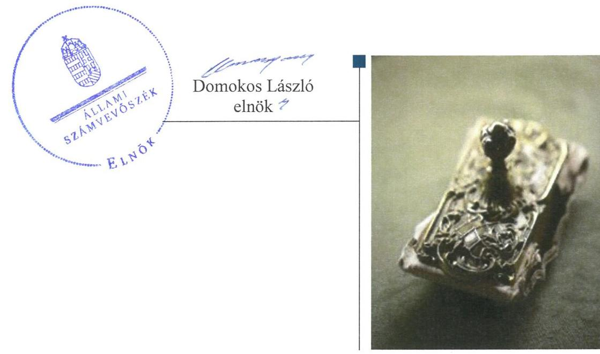
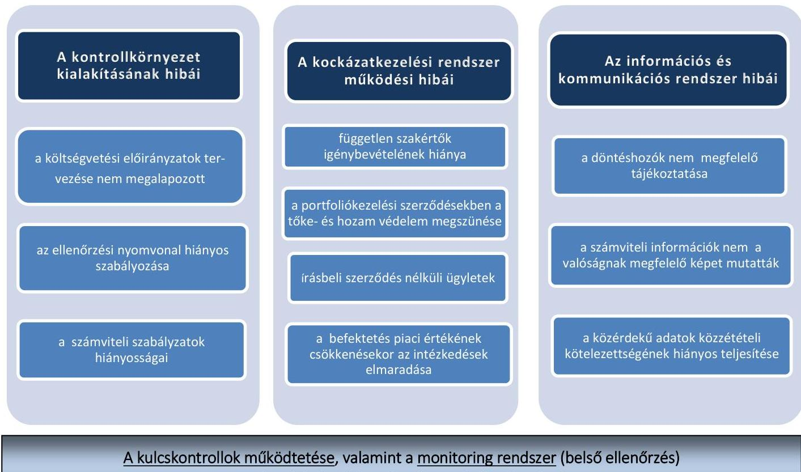
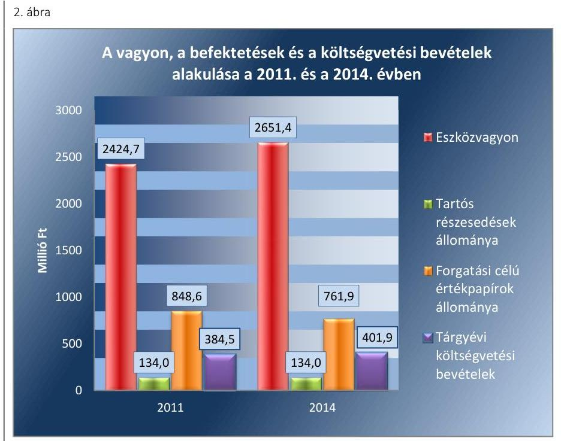
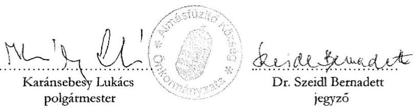
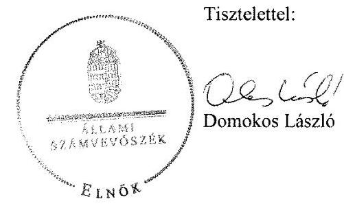

# Jelenetés 

## Önkormányzatok belső kontrollrendszere

Az önkormányzatok belső kontrollrendszere kialakításának és működtetésének ellenőrzése - Almásfüzitő
2016.

---

# Jelenetés 

## Önkormányzatok belső kontrollrendszere

Az önkormányzatok belső kontrollrendszere kialakításának és működtetésének ellenőrzése - Almásfüzitő
2016. 12. hó 04. nap

---

# AZ ELLENŐRZÉST FELÜGYELTE: 

RENKŐ ZSUZSANNA felügyeleti vezető

## AZ ELLENŐRZÉST VEZETTE ÉS A VÉGREHAJTÁSÁÉRT FELELŐS:

PÁNCSICS JUDIT ellenőrzésvezető

## A PROGRAM ÖSSZEÁLLÍTÁSÁÉRT FELELŐS:

JANIK JÓZSEF osztályvezető

IKTATÓSZÁM: V-0907-125/2016.
TÉMASZÁM: 1941

## ELLENŐRZÉS-AZONOSÍTÓ SZÁM: V07181

Jelentéseink az Országgyűlés számítógépes hálózatán és az Interneten a www.asz.hu címen is olvashatóak.

---

# TARTALOMJEGYZÉK 

■ ÖSSZEGZÉS ..... 5
■ AZ ELLENŐRZÉS CÉLJA ..... 8
■ AZ ELLENŐRZÉS TERÜLETE ..... 9
■ AZ ELLENŐRZÉS HÁTTERE, INDOKOLTSÁGA ..... 11
■ A JELENTÉS LÉNYEGES KÉRDÉSKÖREI ..... 14
■ ELLENŐRZÉS HATÓKÖRE ÉS MÓDSZEREI ..... 15
■ MEGÁLLAPÍTÁSOK ..... 18
■ JAVASLATOK ..... 45
■ MELLÉKLETEK ..... 47
I. sz. melléklet: Értelmező szótár ..... 47
II. sz. melléklet: Az integritás érvényesítése érdekében kialakított és működtetett kontrollrendszer ..... 51
■ FÜGGELÉK: ÉSZREVÉTELEK ..... 53
■ RÖVIDÍTÉSEK JEGYZÉKE ..... 63

---

.

---

# ÖSSZEGZÉS 

Az Állami Számvevőszék Almásfüzitő Község Önkormányzata belső kontrollrendszere kialakításának és működtetésének szabályszerűségét 2014. január 1-jétől 2015. április 30-ig terjedő időszakra vonatkozóan ellenőrizte és értékelte. A belső kontrollrendszer kialakítása és működtetése a pillérek összesített értékelése alapján - a feltárt hiányosságok miatt - nem volt szabályszerű.
Az Állami Számvevőszék 2011. január 1-jétől 2015. április 30-ig terjedő időszakban ellenőrizte Almásfüzitő Község Önkormányzata egyes befektetési döntéseinek, a döntések végrehajtásának, elszámolásának a szabályszerűségét. A belső kontrollrendszer egyes pillérei az ellenőrzés által feltárt hibák és hiányosságok alapján - 2011. január 1. és 2015. április 30. között nem támogatták a befektetési tevékenység szabályszerű végzését. Az értékpapír vásárlásokkal és a portfoliókezelési szerződésekkel kapcsolatos döntések előkészítése nem alapozta meg a kockázatokat minimalizáló, felelős gazdálkodást. A korlátlan pénzügyi kockázatvállalással megkötött portfoliókezelési szerződések veszélyeztették a vagyon megóvását. A befektetési tevékenységek elszámolása során feltárt jelentős összegű számviteli hibák miatt az éves költségvetési beszámolók a vagyoni és a pénzügyi helyzetet nem a valóságnak megfelelően mutatták be, ezáltal nem biztosították az átláthatóságot.

## Az ellenőrzés társadalmi indokoltsága

A demokratikus társadalmakban alapvető igény, hogy a közpénzeket, a közvagyont használók tevékenységükről elszámoljanak, ahhoz egyértelmű és érvényesíthető felelősségi szabályok társuljanak. Ennek a jogos igénynek az érvényesítéséhez meg kell teremteni azokat a folyamatokat, rendszereket, amelyek nélkülözhetetlenek az elszámoltatáshoz. Az elszámoltatás eredményes működtetéséhez szükség van a megfelelő információs-, kontroll-, értékelési és beszámolási rendszerek kialakítására. A belső kontrollok kiépítettsége hozzájárul az integritási szemlélet kialakításához és érvényesüléséhez. A belső kontrollrendszer kialakítása és működtetése nélkül nem valósítható meg a közpénzek, a közvagyon szabályos, gazdaságos, hatékony és eredményes felhasználása. A kockázatok alapján fennáll a lehetősége annak, hogy az önkormányzatok befektetési döntései, továbbá a döntések végrehajtása és számviteli elszámolása nem voltak teljes mértékben szabályszerűek, és a kapcsolódó külső és belső kontrollrendszerek sem működtek minden esetben megfelelően.

## Főbb megállapítások, következtetések, javaslatok

A belső kontrollrendszer kialakítása és működtetése 2014. január 1. és 2015. április 30. között a pillérek összesített értékelése alapján nem volt szabályszerű. A feltárt hiányosságok alapján a kontrollkörnyezetet, az információs és kommunikációs rendszert, valamint a monitoring rendszert részben szabályszerűen, a kockázatkezelési rendszert és a kontrolltevékenységeket nem szabályszerűen alakították ki és működtették. A pénzügyi folyamatokban kulcsszerepet betöltő teljesítésigazolás és érvényesítés belső kontrollok működése nem volt megfelelő, ezért azok nem biztosították a közpénzfelhasználás szabályosságát, nem járultak hozzá a hibák, szabálytalanságok megelőzéséhez, feltárásához.

Az ellenőrzés tárgyát képező befektetések könyv szerinti értéke az Önkormányzat¹ 2014. évi költségvetési beszámolója alapján 761,9 millió Ft volt, amelyből 500 millió Ft-ot portfoliókezelési szerződésekkel kötöttek le. Üzleti vagyonba tartozó ingatlanokat, kulturális javakat és egyéb értéktárgyakat befektetési céllal, visszterhes ügylettel

---

2011. január 1. és 2015. április 30. között nem szereztek be, az átmenetileg szabad pénzeszközöket betétben nem kötöttek le.

A belső kontrollrendszer egyes pilléreiben, kiemelten a kontrollkörnyezet kialakításában, a kockázatkezelési rendszer kialakításában és működtetésében, valamint az információs és kommunikációs rendszerben 2011. január 1. és 2015. április 30. között hiányosságok voltak, ezáltal a belső kontrollrendszer nem támogatta a befektetési tevékenység szabályszerű, átlátható, elszámoltatható, kockázatokat minimalizáló végzését. A befektetési döntések előkészítése során nem alapozták meg a körültekintő, kockázatokat mérlegelő döntéshozatalt. A korlátlan pénzügyi kockázatvállalással megkötött portfoliókezelési szerződések veszélyeztették az Önkormányzat hosszú távú pénzügyi stabilitását, vagyonának megóvását. A portfoliókezelési szerződésekben a hozam mellett a befektetett tőke védelme sem volt garantált, sőt egyes határidős ügyletek kockázata miatt keletkező veszteség a befektetés összegét is meghaladhatta. A befektetések számviteli elszámolásában, nyilvántartásában az ellenőrzés jelentős összegű hibát tárt fel, ezáltal a 2011-2014. évi költségvetési beszámolók az Önkormányzat vagyonát és a pénzügyi helyzetét nem a valóságnak megfelelően mutatták be. A számviteli rendszer nem biztosította az átláthatóság követelményének való megfelelést.

A belső ellenőrzés nem azonosította kockázatként az önkormányzati vagyon jelentős nagyságrendjét képező befektetés egy befektetési szolgáltatónál, portfoliókezelési szerződéssel való elhelyezését. A belső ellenőrzés nem tárta fel a pénzügyi folyamatokban kulcsszerepet betöltő teljesítésigazolás és érvényesítés kontrollok működési hibáit, a befektetési döntések előkészítésében és végrehajtásában, a számviteli elszámolásában elkövetett szabálytalanságokat, hiányosságokat. A befektetési tevékenységeket külső ellenőrző szervezet nem ellenőrizte.

Az Önkormányzat befektetési tevékenységével kapcsolatos főbb szabálytalanságait az 1. ábra foglalja össze.

1. ábra

A BEFEKTETÉSI TEVÉKENYSÉG KONTROLLRENDSZERÉVEL KAPCSOLATBAN FELTÁRT HIBÁK

A kulcskontrollok működtetése, valamint a monitoring rendszer (belső ellenőrzés)
nem tárta fel a kockázatokat és a szabálytalanságokat.

A belső kontrollrendszer nem biztosította a szabályszerű, átlátható, elszámoltatható,
a kockázatokat minimalizáló vagyongazdálkodást.

---

Az Önkormányzatnál az erőforrásokkal való szabályszerű gazdálkodás követelményeit részben meghatározták, hatékonysági követelményeket nem írtak elő. Ezáltal az Önkormányzat irányítása alá tartozó költségvetési szerveknél a hatékony gazdálkodás érvényesítésének lehetősége nem volt biztosított.

Az ÁSZ² Integritás Projektjében az Önkormányzat a 2014. évben önként vett részt. A szolgáltatott adatok kiértékelése alapján a kockázatok és kontrollok szintje között nem volt egyensúly, a szervezetnél a kiépült kontrollok összességében nem képesek hatékonyan kezelni a kockázatokat és támogatni a szervezet feladatellátását. A belső kontrollrendszer kialakítása és működtetése nem támogatta az integritás szemlélet érvényesülését, a korrupciós kockázatok megfelelő kezelését. Az ellenőrzés során feltárt szabályozási és működési hiányosságok miatt az integritás szemlélet érvényesítésében még jelentős fejlődést kell elérniük.

---

# AZ ELLENŐRZÉS CÉLJA 

Az ellenőrzés célja annak megállapítása volt, hogy az önkormányzat belső kontrollrendszerének kialakítása, továbbá egyes elemeinek működtetése biztosította-e az önkormányzatnál a közpénzfelhasználás szabályosságát. Az erőforrásokkal való szabályszerű és hatékony gazdálkodáshoz szükséges követelmények érvényesítése, számonkérése, ellenőrzése megtörtént-e az önkormányzatnál. A belső kontrollrendszer kialakítása és működtetése támogatta-e az integritás szemlélet érvényesülését. Az ellenőrzés során értékeltük a belső kontrollrendszer kialakításának és működtetésének szabályszerűségét. Bemutattuk azokat a lényeges szabályozási hiányosságokat, amelyek miatt az ellenőrzött kulcskontrollok nem nyújtottak elegendő védelmet a lehetséges hibákkal szemben. Rámutattunk arra, ha a kulcskontrollok valamely hibát nem előztek meg, nem tártak fel vagy nem javítottak ki, valamint minősítjük működésük megfelelőségét.

Ellenőriztük, hogy az önkormányzat egyes befektetési döntései és azok végrehajtása, elszámolása megfelelt-e a vonatkozó jogszabályoknak és belső szabályozásoknak, a kialakított kontrollrendszer támogatta-e a befektetési tevékenység szabályszerűségét.

---

# **AZ ELLENŐRZÉS TERÜLETE**

## **Almásfüzitő Község Önkormányzata**

A Komárom-Esztergom megyében fekvő Almásfüzitő község állandó lakosainak száma 2015. január 1-jén 2047 fő volt.

A helyi önkormányzati képviselők és polgármesterek 2014. évi általános választásáig, és azt követően is a hat tagú Képviselő-testület3 munkáját két állandó bizottság segítette. A településen helyi nemzetiségi önkormányzat nem működött.

Az Önkormányzat a Hivatalon4 kívül négy intézménnyel, valamint egy kisebbségi (49%-os) tulajdoni részesedésű távhőszolgáltató gazdasági társasággal látta el a feladatait.

A polgármester5 a 2002. évi önkormányzati választások óta tölti be tisztségét. A jegyző6 2011. március 1-jétől látja el feladatait. A Hivatal szervezeti egységekre nem tagolódott, elkülönített gazdasági szervezettel nem rendelkezett. A gazdasági szervezet feladatait az egységes Hivatal látta el. A Hivatalban foglalkoztatott köztisztviselők száma a 2014. év végén kilenc fő volt, amelyben 2014. január 1-jétől szervezeti változás nem történt.

Az Önkormányzat a 2014. évi éves költségvetési beszámoló szerint 401,9 millió Ft költségvetési bevételt ért el, valamint 507,3 millió Ft költségvetési kiadást teljesített. A hiányt az előző évi 5,6 millió Ft maradvány felhasználásából, továbbá finanszírozási műveletek – az értékpapír eladások és vásárlások különbözetéből származó – 99,8 millió Ft-os bevételi többletéből fedezték. A pénzeszközök értéke 2014. december 31-én 36,4 millió Ft-ot tett ki. Az üzleti vagyonba tartozó ingatlanok értéke 2015. április 30-án 326,5 millió Ft volt.

A 2014. évben a forrásokon belül a költségvetési évben esedékes kötelezettség állomány 24,0 millió Ft-ot, a költségvetési évet követően esedékes kötelezettség állomány 14,4 millió Ft-ot tett ki. Pénzintézettel szembeni kötelezettségük nem volt.

Adósságkonszolidációs támogatásban nem részesültek.

Az Önkormányzat vagyonának, befektetéseinek és a költségvetési bevételeinek alakulását a 2011. évben és a 2014. évben a 2. ábra mutatja be:

---

Adatok forrása: a 2011. és a 2014. évi éves költségvetési beszámolók

---

# AZ ELLENŐRZÉS HÁTTERE, INDOKOLTSÁGA 

Az ÁSZ tv. ${ }^{7}$ szerint az ÁSZ feladata a jól irányított állam kiépítésének elősegítése. Az ÁSZ Stratégiájában ezért hangsúlyos szerepet szánt annak, hogy szilárd szakmai alapon álló, értékteremtő ellenőrzéseivel előmozdítsa a közpénzügyek átláthatóságát, rendezettségét. A számvevőszéki ellenőrzés nemzetközi alapelvei is rögzítik, hogy a megfelelő belső kontrollrendszer minimálisra csökkenti a hibák és szabálytalanságok kockázatát.

A belső kontrollrendszer azt a célt szolgálja, hogy a költségvetési szervek működésük és gazdálkodásuk során a tevékenységeket szabályszerűen, gazdaságosan, hatékonyan, eredményesen hajtsák végre, teljesítsék elszámolási kötelezettségeiket és megvédjék az erőforrásokat a veszteségektől, a károktól és a nem rendeltetésszerű használattól. A belső kontrollrendszer magában foglalja mindazon szabályokat, eljárásokat, gyakorlati módszereket és szervezeti struktúrákat, kockázatkezelési technikákat, kontrolltevékenységeket, amelyek segítséget nyújtanak a szervezetnek céljai eléréséhez. A belső kontrollrendszer szabályozása háromszintű, a törvényi előírásokat az Áht. és az Mötv., a rendeleti szintű szabályozást az Ávr. és a Bkr. tartalmazza, amelyeket útmutatói szinten az NGM által kiadott standardok és kézikönyvek támogatnak.

Az ellenőrzött időszak meghatározása lehetőséget teremt a 2014. október 12-i önkormányzati választásokat megelőző és követő ciklus belső kontrollrendszere működésének elkülönült értékelésére, valamint a változások nyomon követésére.

A BELSŐ KONTROLLRENDSZER kialakításának és működtetésének általános értékelése mellett a teljesítésigazolás és érvényesítés kontrollok kiemelt ellenőrzésének szükségességét alátámasztja, hogy 2012-től a pénzügyi folyamatokban kulcsszerepet betöltő belső kontrollok rendszere módosult és azok működtetésében az önkormányzatoknál hiányosságok mutatkoztak a 2012. óta elvégzett ÁSZ ellenőrzések alapján.

Az önkormányzatok belső kontrollrendszerének ellenőrzése az ÁSZ "jó kormányzással" kapcsolatos stratégiai céljainak megvalósítását is szolgálja. Az ÁSZ célja, hogy javuljon az ellenőrzött önkormányzatok belső kontrollrendszerének szabályozottsága, működésének megfelelősége, hozzájárulva ezzel az egyensúlyi helyzet fenntarthatóságának biztosításához, azaz az adósság újratermelődésének megakadályozásához. Az ÁSZ ellenőrzési tapasztalatai nem csupán a közvetlenül ellenőrzött önkormányzatokat segíthetik, hanem a ,,jó gyakorlat" elterjesztésével azok az önkormányzatok is átvehetik a pozitív példákat, ahol nem végez ellenőrzést az ÁSZ.

Az MNB három befektetési szolgáltató tevékenységi engedélyét 2015. első felében visszavonta és kezdeményezte
 a vállalkozások felszámolását a működéssel kapcsolatos szabálytalanságok, hiányosságok miatt. A korábbi évek ellenőrzési tapasztalatai alapján fennáll a lehetősége annak, hogy az önkormányzatok befektetési döntései, továbbá a döntések végrehajtása és számviteli elszámolása nem voltak teljes mértékben szabályszerűek, és a kapcsolódó külső ellenőrzések és a belső kontrollrendszer sem működtek minden esetben megfelelően.

---

Magyarország Alaptörvénye az önkormányzatoktól, mint az államháztartás alanyaitól elvárja a kiegyensúlyozott, átlátható és fenntartható költségvetési gazdálkodás elvének érvényesítését. A nemzeti vagyonról szóló törvény szerint a nemzeti vagyonnal felelős módon, rendeltetésszerűen kell gazdálkodni. A nemzeti vagyongazdálkodás feladata a nemzeti vagyon rendeltetésének megfelelő, átlátható, hatékony és költségtakarékos működtetése, ugyanakkor értékének megőrzését, értéknövelő használatát, hasznosítását, gyarapítását is elvárja.

# AZ ÖNKORMÁNYZATOK ÁTMENETILEG SZABAD PÉNZESZKÖZEINEK BEFEKTETÉSÉT jogszabály nem 

tiltja, a pénzpiaci szolgáltatók közül az önkormányzatok a kínált szolgáltatás és annak költségei alapján szabadon választhatnak, a veszteséges gazdálkodás kockázatai és következményei azonban az önkormányzatokat terhelik. A szabad pénzeszközök felelős hasznosítása összhangban áll az önkormányzati gazdálkodás alapelveivel.

A közintézmények integritás alapú kultúrájának kialakítása, megerősítése és működése szorosan összefügg a belső kontrollrendszer működésével, ezért az ellenőrzés kiterjed annak értékelésére is, hogy a belső kontrollrendszer kialakítása és működtetése hogyan hatott az integritás szemlélet érvényesülésére.

Az államháztartás önkormányzati alrendszerében a 2014. év elején összesen 3177 települési önkormányzat működött: a 23 kerülettel rendelkező főváros, 345 város, 2691 község és 117 nagyközség volt. A belső kontrollrendszer kialakítása és működtetése ellenőrzését az ÁSZ által lefolytatott, kisebb településeket is érintő ellenőrzéseinek tapasztalatai, valamint a közérdekű bejelentések kockázati szempontú értékelése alapozták meg. Ezek a községek, nagyközségek gazdálkodásának, belső kontrollrendszere kialakításának és működésének hiányosságaira mutattak rá. Az ellenőrzések helyszíneinek kiválasztása során az ÁSZ célzott adatfeldolgozáson alapuló kockázatelemző rendszerére támaszkodik. Ez elősegíti, hogy azokon a területeken végezzen ellenőrzéseket, összpontosítva erőforrásait, ahol a valódi kockázatok, az aktuális problémák vannak.

## AZ ELLENŐRZÉS VÁRHATÓ HASZNOSULÁSA NÉGY SZINTEN valósul meg.

A törvényalkotás számára összegzett tapasztalatok állnak rendelkezésre a belső kontrollrendszer önkormányzati területen való kialakításáról, működtetéséről és hatásairól. Az ÁSZ az ellenőrzéseivel hozzájárul ahhoz, hogy az egyes önkormányzati befektetésekkel kapcsolatos kockázatok a szabályozási és kontroll mechanizmusok fejlesztésével mérsékelhetők legyenek.

Az ellenőrzés az ellenőrzött számára visszajelzést ad a belső kontrollrendszer kialakításában és működésében lévő hiányosságokról, javaslataival hozzájárul azok kiküszöböléséhez. Feltárja az önkormányzati befektetési tevékenységet meghatározó szabályozások összhangjának hiányosságait, a szabályozással nem érintett gazdálkodási területeket, valamint az egyes befektetési tevékenységek esetleges szabálytalanságait.

Az ellenőrzés megállapításait és javaslatait más szervezetek is hasznosíthatják a rendezett gazdálkodási keretek kialakításához.

---

A társadalom számára jelzi, hogy közpénz nem maradhat ellenőrizetlenül, az ÁSZ értékteremtő rend kialakításához és megőrzéséhez hozzájáruló tevékenysége pozitív hatással lesz a szervezetről kialakított összkép formálásában.

---

# A JELENTÉS LÉNYEGES KÉRDÉSKÖREI 

1.     - Az Önkormányzat belső kontrollrendszerének kialakítása és működtetése szabályszerű volt-e 2014. január 1. és 2015. április 30. között, valamint a belső kontrollrendszer egyes pillérei támogatták-e a befektetési tevékenység szabályszerű végzését 2011. január 1. és 2015. április 30. között?
2.     - Az egyes befektetésekkel kapcsolatos döntéshozatal és a döntések végrehajtása szabályszerű volt-e?
3.     - Az egyes befektetések számviteli elszámolása, nyilvántartása szabályszerű volt-e?
4.     - Az erőforrásokkal való szabályszerű és hatékony gazdálkodáshoz szükséges követelmények érvényesítése, számonkérés, ellenőrzése megtörtént-e az önkormányzatnál?
5.     - Az Önkormányzat belső kontrollrendszerének kialakítása és működtetése támogatta-e az integritás szemlélet érvényesülését?

---

# ELLENŐRZÉS HATÓKÖRE ÉS MÓDSZEREI 

## Az ellenőrzés típusa

Megfelelőségi ellenőrzés, a befektetési tevékenység esetében szabályszerűségi ellenőrzés.

## Az ellenőrzött időszak

A belső kontrollrendszer kialakításának és működtetésének ellenőrzése a 2014. január 1. és 2015. április 30. közötti időszakra terjedt ki. Ezen belül a belső kontrollrendszer kialakításának és működtetésének megfelelőségét a 2014. január 1. és október 12., valamint a 2014. október 13. és 2015. április 30. közötti időszakra vonatkozóan külön-külön értékeltük. Az önkormányzatok egyes befektetési tevékenységeinek ellenőrzése tekintetében az ellenőrzött időszak a 2011. január 1. - 2015. április 30. közötti időszak. Ezen felül az önkormányzat befektetésekkel kapcsolatos döntés-előkészítésének és döntéshozatalának szabályszerűségét a 2011. január 1. előtti időszakra visszanyúlóan is ellenőriztük, amennyiben a 2014. június 30-án, illetve 2015. április 30-án meglévő értékpapír-befektetéseire 2011. január 1-je előtt került sor. Az integritás szemlélet érvényesülését a 2014. évre vonatkozó adatszolgáltatás alapján értékeltük.

## Az ellenőrzés tárgya

A helyi önkormányzatnak, mint éves költségvetési beszámoló készítésére kötelezett szervezetnek és polgármesteri hivatalának belső kontrollrendszere. Az önkormányzat 2014. június 30-án, illetve 2015. április 30-án meglévő értékpapírokban megtestesülő befektetései, lekötött betétei, valamint az önkormányzat üzleti vagyonába tartozó ingatlanok, kulturális javak (műtárgyak, műalkotások, stb.), illetve a feladatellátást nem szolgáló egyéb értéktárgyak (pl. ékszerek, befektetési nemesfém). Az erőforrásokkal való szabályszerű és hatékony gazdálkodáshoz szükséges követelmények érvényesítése, számonkérés, ellenőrzése. Az integritás szemlélet érvényesülése.

## Az ellenőrzött szervezet

Almásfüzítő Község Önkormányzata és az önkormányzati működéshez kapcsolódó feladatokat ellátó Hivatal.

---

# Az ellenőrzés jogalapja 

Az ÁSZ tv. 1. § (3) bekezdésében foglaltak alapján az ÁSZ általános hatáskörrel végzi a közpénzekkel és az állami és önkormányzati vagyonnal való felelős gazdálkodás ellenőrzését. Az ÁSZ tv. 5. § (2) bekezdése alapján az államháztartás gazdálkodásának ellenőrzése keretében az ÁSZ ellenőrzi a helyi önkormányzatok gazdálkodását, valamint az ÁSZ tv. 5. § (6) bekezdése alapján ellenőrzése során értékeli az államháztartás számviteli rendjének betartását és a belső kontrollrendszer működését.

## Az ellenőrzés módszerei

Az ellenőrzést a nemzetközi standardokat irányadónak tekintve az ellenőrzési program ellenőrzési kérdései, az ellenőrzött időszakban hatályos jogszabályok, az ellenőrzés szakmai szabályok és módszertanok figyelembe vételével végeztük.

Az ellenőrzés lefolytatásához az Önkormányzat a tanúsítványok kitöltésével, valamint az ÁSZ által kért dokumentumok elektronikus megküldésével szolgáltatott adatokat. A rendelkezésre bocsátott adatok, információk kontrollja és a munkalapok kitöltése az ellenőrzés keretében történt. A jelentésben használt fogalmak magyarázatát az I. számú melléklet, az integritás érvényesítése érdekében kialakított és működtetett kontrollrendszer minősítését a II. számú melléklet tartalmazza.

A belső kontrollrendszer jogszabályi előírások szerinti kialakításának és működtetésének szabályszerűségét az erre irányuló ellenőrzési kérdésekre adott válaszok összesítése alapján külön-külön értékeltük a 2014. január 1. és október 12., valamint a 2014. október 13. és 2015. április 30. közötti időszakra. A belső kontrollrendszert egy-egy ellenőrzött időszakra pillérenként (kontrollkörnyezet, kockázatkezelési rendszer, kontrolltevékenységek, információs és kommunikációs rendszer, monitoring rendszer) és összesítetten is értékeltük.

## A BELSŐ KONTROLLRENDSZER EGYES PILLÉRE-

INEK KIALAKÍTÁSA ÉS MŰKÖDTETÉSE „szabályszerű volt", amennyiben az értékelt területen az elért és elérhető pontok százalékban kifejezett, egész számra kerekített hányadosa meghaladta a 84%-ot, „részben szabályszerű volt", ha 61-84% közé esett, „nem szabályszerű volt", ha nem haladta meg a 60%-ot. A belső kontrollrendszer összesített értékelése megegyezett a pillérenként (kontrollterületenként) alkalmazott százalékos értékelésekkel, a következő eltérésekkel. A kontrollrendszer egésze esetében a „szabályszerű" értékelésnek a százalékos értéken felül további feltétele volt, hogy egyik kontrollterület sem kaphat „nem szabályszerű" értékelést, a „részben szabályszerű" értékelés további feltétele volt, hogy legfeljebb egy ellenőrzött kontrollterület lehet „nem szabályszerű" értékelésű. Az összesített értékelés a százalékos értéktől függetlenül „nem szabályszerű volt", ha az ellenőrzött kontrollterületek közül több mint egynek „nem szabályszerű volt" az értékelése.

---

# A GAZDÁLKODÁS FOLYAMATÁBAN A KÉT 

KULCSKONTROLL - teljesítésigazolás, érvényesítés - működésének megfelelőségét a személyi juttatásokkal, a dologi kiadásokkal, a beruházási, felújítási kiadásokkal, az ellátottak pénzbeli juttatásaival és az egyéb működési, felhalmozási célú, valamint a finanszírozási kiadásokkal kapcsolatos kifizetések esetében mintavétellel ellenőriztük. A mintavétel során külön értékeltük a 2014. január 1. és 2014. október 12. közötti időszakban és a 2014. október 13. és 2015. április 30. közötti időszakban teljesített kifizetéseket. „Megfelelőnek" értékeltük a gazdálkodási jogkörök gyakorlását, amennyiben 95%-os bizonyossággal a teljes sokaságban a hibaarány legfeljebb 10%, ,,részben megfelelőnek" értékeltük, ha a hibaarány felső határa 10-30% között volt, ,,nem megfelelőnek" pedig akkor, ha a mintavételi eredmények alapján a sokaságbeli hibaarány felső határa meghaladta a 30%-ot.

Az integritás szemlélet érvényesülésének értékelése az önkormányzat által kitöltött tanúsítvány alapján történt.

---

# MEGÁLLAPÍTÁSOK

## 1. Az Önkormányzat belső kontrollrendszerének kialakítása és működtetése szabályszerű volt-e 2014. január 1. és 2015. április 30. között, valamint a belső kontrollrendszer egyes pillérei támogatták-e a befektetési tevékenység szabályszerű végzését 2011. január 1. és 2015. április 30. között?

Összegző megállapítás

A belső kontrollrendszer kialakítása és működtetése az összesített értékelés alapján 2014. január 1. és 2015. április 30. között nem volt szabályszerű. A feltárt hiányosságok alapján a belső kontrollrendszer egyes pilléreinek kialakítása és működtetése 2011. január 1. és 2015. április 30. között nem támogatta a befektetési tevékenység szabályszerű, kockázatokat minimalizáló, átlátható, elszámoltatható végzését.

A belső kontrollrendszer kialakításának és működtetésének összesített értékelését az 1. táblázat mutatja be:

1. táblázat

|  A BELSŐ KONTROLLRENDSZER KIALAKÍTÁSÁNAK ÉS MŰKÖDTETÉSÉNEK ÖSSZESÍTETT ÉRTÉKELÉSE |  |  |  |   |
| --- | --- | --- | --- | --- |
|  Megnevezés | A gazdálkodás egészét érintően: |  | A befektetési tevékenységet érintően: |   |
|   | 2014. január 1-től | 2014. október 13-től | 2011-2013. években | 2014. január 1-től 2015.  |
|   | 2014. október 12-ig | 2015. április 30-ig |  | április 30-ig  |
|  Kontrollkörnyezet | részben szabályszerű |  |  |   |
|  Kockázatkezelési rendszer | nem szabályszerű |  |  |   |
|  Kontrolltevékenységek | nem szabályszerű |  |  |   |
|  Információs és kommunikációs rendszer | részben szabályszerű |  |  | nem támogatta  |
|  Monitoring rendszer | részben szabályszerű |  |  |   |
|  BELSŐ KONTROLLRENDSZER | NEM SZABÁLYSZERŰ |  |  | NEM TÁMOGATTA  |

1.1. számú megállapítás

A kontrollkörnyezet kialakítása 2014. január 1. és 2015. április 30. között részben volt szabályszerű, mivel a feladat- és hatáskörök rendszere és a belső szabályzatok nem feleltek meg teljes körűen a jogszabályi előírásoknak. A kontrollkörnyezet a feltárt hiányosságok miatt 2011. január 1. és 2015. április 30. között az egyes befektetési tevékenységek szabályszerű végzését nem támogatta.

A SZERVEZETI ÉS SZABÁLYOZÁSI KERETEKET a Képviselő-testület 2011. január 1. és 2015. április 30. között kialakította, ezen belül: az önkormányzati SZMSZ-ben⁸ meghatározta a szervezeti kereteit, a

---

működési rendjét, a feladat- és hatáskörét, a polgármesterre és bizottságokra átruházott egyes jogköröket;
—_ a vagyongazdálkodási rendeletben¹,²⁹ rögzítette a vagyongazdálkodás általános szabályait, meghatározta az önkormányzati vagyon értékesítésének, hasznosításának szabályait, a nyilvános versenyeztetés értékhatárát;
—_ jóváhagyta a 101/2012. (X. 18.) számú határozatával az Önkormányzat közép- és hosszú távú vagyongazdálkodási tervét;
—_ a 2011-2014. évekre szóló gazdasági programot¹⁰

 }^{10}$ - az Ötv.-ben ${ }^{11}$ előírt határidőn belül, a 2015-2019. évekre vonatkozó gazdasági programot ${ }^{12}$ az Ötv. ${ }^{13} 116 . \S$ (5) bekezdésében előírtak ellenére az alakuló ülést követő hat hónapon belül nem hagyta jóvá;
—_ a 2011-2012. évi költségvetési rendeletekben ${ }^{14}$ a költségvetési hiány finanszírozásához meghatározott összegű értékpapír eladására adott felhatalmazást a polgármesternek, a 2013-2015. évi költségvetési rendeletekben ${ }^{15}$ - a befektetési és forgatási célú hitelviszonyt megtestesítő értékpapírok vételi és eladási, az átmenetileg szabad pénzeszközök betétként történő elhelyezési és visszavonási - hatásköreit a polgármesterre ruházta át. A Képviselő-testület nem élt az Ötv. 9. § (3) bekezdésében, illetve az Ötv. 41. § (4) bekezdésében kapott jogával, és nem adott külön utasítást az átruházott hatáskör gyakorlásának szabályaira, valamint nem írt elő beszámolási kötelezettséget sem;
—_ az Áht. ${ }_{1,2}$-ben ${ }^{16}$ előírtaknak megfelelően elfogadta a Hivatal alapító okiratait és a hivatali SZMSZ-t ${ }^{17}$ és annak módosítását.

A HIVATAL BELSŐ SZABÁLYOZÁSÁT a jegyző 2011. és 2015. április 30. között kialakította, ezen belül:
—_ a hivatali SZMSZ az Ámr.-ben ${ }^{18}$, illetve az Ávr.-ben ${ }^{19}$ előírtaknak megfelelően tartalmazta a nevesített munkakörökhöz tartozó feladat- és hatásköröket, a helyettesítés rendjét, valamint a hozzárendelt költségvetési szervek felsorolását. A Hivatal önálló gazdasági szervezettel nem rendelkezett, a pénzügyi-gazdasági területen dolgozók a jegyző közvetlen felügyelete mellett - munkaköri leírás alapján - végezték a munkájukat;
—_ a gazdálkodási jogkörök szabályozását - így a befektetésekre is kiterjedően - az Ámr. és az Ávr. előírásainak megfelelően készítette el. A gazdálkodási szabályzat ${ }_{1,2}$-ben ${ }^{20}$ határozták meg a gazdálkodási jogkörök gyakorlásának módjával, eljárási és dokumentációs részletszabályaival, valamint az ezeket végző személyek kijelölésének rendjével kapcsolatos feltételeket. A szabályozás kiterjedt az Önkormányzatra, a Hivatalra és az intézményekre is (Óvoda ${ }^{21}$, Konyha ${ }^{22}$, ASZAI ${ }^{23}$, PSKSzK ${ }^{24}$ );
—_ a jogszabályi előírásoknak megfelelően kiadmányozta a számviteli politika ${ }_{1-3}$-at ${ }^{25}$, a házipénztár-kezelési szabályzat ${ }_{1-4}$-et $^{26}$, a bankszámla-pénz-kezelési szabályzat ${ }_{1,2}$-őt $^{27}$, a pénzkezelési szabályzatot ${ }^{28}$, a leltározási és leltárkészítési szabályzat ${ }_{1,2}$-t $^{29}$, az eszközök és források értékelési szabályzat ${ }_{1,2}$-t $^{30}$, valamint a bizonylati rend ${ }_{1}$-et $^{31}$.

---

$\longrightarrow$ a szabálytalanságkezelési eljárásrend ${ }_{1-2}$-ben $^{32}$ 2012. júniusától a helyi sajátosságokat figyelembe véve bemutatta a lehetséges szabálytalanságok eseteit és azok kezelését. Az Önkormányzatnál rendelkeztek az előírásoknak megfelelő tűzvédelmi szabályzat ${ }_{1,2}$-vel ${ }^{33}$ és munkavédelmi szabályzattal ${ }^{34}$.

# A KONTROLLKÖRNYEZET KIALAKÍTÁSÁBAN a következő hiányosságok fordultak elő a 2011-2013. évek között:
$\longrightarrow$ a jegyzői utasítások, mint közjogi szervezetszabályozó eszközök megnevezése - a KIM rendelet ${ }^{35}$ 14. § (1) bekezdés b)-e) pontjaiban előírtak ellenére - nem tartalmazta a normatív utasítás sorszámát, a közzététel évét, hónapját és napját;
—2011. január 1-jétől az Ámr. 80. § (3) bekezdésében, 2012. január 1-jétől 2013. március 31-ig az Ávr. 60. § (3) bekezdésben előírtak ellenére a kötelezettségvállalásra, pénzügyi ellenjegyzésre, teljesítés igazolására, érvényesítésre, utalványozásra jogosult személyek aláírás-mintájáról nem vezettek nyilvántartást;
— a jegyző az Áhsz. ${ }_{1}$ 49. § (6) bekezdésében előírt kötelezettsége ellenére nem biztosította, hogy a számlarend ${ }_{1}{ }^{36}$ a Számv. tv. 161. § (2) bekezdés a) pontjában előírtaknak megfelelően tartalmazza az alkalmazásra kijelölt számlák számjelét és megnevezését, valamint a Számv. tv. 161. § (2) bekezdés c) pontjában előírtak szerint a portfolióban lévő vagyon főkönyvi és analitikus nyilvántartásának kapcsolatát;
— a jegyző az ellenőrzési nyomvonal ${ }_{1}$-ben $^{37}$ - az Ámr. 156. § (2) bekezdésével, illetve 2012. január 1-jétől a Bkr. ${ }^{38}$ 6. § (3) bekezdésével ellentétben - nem mutatta be a működési folyamatok közül a pénzügyi vagy más vagyoni döntésekkel kapcsolatos felelősségi és információs szinteket, kapcsolatokat, valamint az irányítási és ellenőrzési folyamatokat. 2013-ban az ellenőrzési nyomvonal ${ }_{1}$-et - az Ávr. 13. § (3a) bekezdése a) pontjában előírtak ellenére - nem terjesztette ki az önkormányzat sajátos beszámolási (önálló beszámoló készítésével érintett) feladataira;
— a jegyző a szabálytalanságkezelési eljárásrendet - 2011-ben az Ámr. 156. § (3) bekezdésében, illetve 2012. január 1-jétől a Bkr. 6. § (4) bekezdésében előírtak ellenére - 2012. május 31-ig nem határozta meg.
A kontrollkörnyezet kialakítása 2011. január 1. és 2013. december 31., valamint 2014. január 1. és 2015. április 30. közötti időszakokban a befektetési tevékenységek szabályszerű végzését nem támogatta.

A kontrollkörnyezet kialakítása - 2014. január 1. és október 12., valamint 2014. október 13. és 2015. április 30. közötti időszakban - külön-külön értékelve a 2. táblázat részletezett hiányosságok miatt részben volt szabályszerű.

---

# A KONTROLLKÖRNYEZET KIALAKÍTÁSÁNAK HIÁNYOSSÁGAI 

## Sorszám

## Részmegállapítás

1. Az éves költségvetési rendeletekben nem terveztek befektetési tevékenységből (diszkontkincstárjegyek, befektetési jegyek utáni kamat és részvény utáni osztalékból) származó, várható kamat- és hozam bevételt, ezáltal nem biztosították - az Áht. 2 12. § (1) bekezdésében, 2015. január 1-jétől az Áht. 2 4. § (2) bekezdésében előírtak ellenére - a költségvetési bevételek közgazdasági megalapozottságát.
2. A jegyző a Számv. tv. 14. § (11) bekezdésében és az Áhsz. ${ }^{39}$ 50. § (1) bekezdésében előírtak ellenére a 2015. január 1-jei jogszabályi változást követő 90 napon belül nem gondoskodott a számviteli politika ${ }_{1}$ - azon belül a 3.a) pont (az eszközök általános besorolási szabályai) és a 4. pont (a mérlegben értékkel nem szereplő eszközök köre) - aktualizálásáról.
3. A jegyző a Számv. tv. 161. § (4)-(5) bekezdéseiben előírtak ellenére a 2015. január 1-jei jogszabályi változást követő 90 napon belül nem gondoskodott - az egységes számlatükör alapján - a számlarend ${ }_{2}$ és a számlarend ${ }_{2}$-t alátámasztó bizonylati rend ${ }_{2}$ aktualizálásáról.
4. A jegyző a számlarend ${ }_{2}$-ben - az Áhsz. 2 51. § (3) bekezdésében előírtak ellenére - nem határozta meg és az egységes rovatrend rovataihoz kapcsolódóan vezetett nyilvántartási számlák adataiból a pénzügyi könyvvezetéshez készült összesítő bizonylatok (feladások) elkészítésének rendjét, valamint az összesítő bizonylat tartalmi és formai követelményeit.
5. A jegyző a Bkr. 6. § (3) bekezdésében előírtak ellenére nem gondoskodott arról, hogy az ellenőrzési nyomvonal ${ }_{2}{ }^{40}$ a kötelező tartalmi elemek közül a felelősségi és az információs szinteket és kapcsolatokat, valamint az irányítási és ellenőrzési folyamatokat egyértelműen mutassa be, továbbá az ellenőrzési nyomvonal ${ }_{2}$ a működési folyamatok közül az értékpapír vásárlás, illetve a befektetési szolgáltató megbízásának folyamatát nem tartalmazta.
6. A jegyző a közszolgálati egyéni teljesítményértékelésről szóló 10/2013. (I. 21.) Korm. rendelet 9. § (1) és (3) bekezdéseiben foglaltak ellenére nem határozta meg belső szabályzatban a köztisztviselők teljesítményértékelésének ajánlott elemeit annak ellenére, hogy azokat az egyéni teljesítményértékeléseknél alkalmazta.

Forrás: ÁSZ
1.2. számú megállapítás

A kockázatkezelési rendszer kialakítása és működtetése 2014. január 1. és 2015. április 30. között nem volt szabályszerű. Kockázatkezelés hiányában 2011. január 1. és 2015. április 30. között az egyes befektetési tevékenységek szabályszerű végzését a kockázatkezelési rendszer nem támogatta, a befektetések pénzügyi kockázatainak minimalizálását, a közvagyon védelmét nem biztosította.

A KOCKÁZATKEZELÉSI RENDSZERT a jegyző 2011. január 1-jétől 2012. február 29-ig - az Ámr. 157. §-a, illetve a Bkr. 3. § b) pontja és 7. §-a ellenére - nem alakította ki.

A kockázatkezelési szabályzat ${ }_{1,2}{ }^{41}$ a Bkr.-ben előírtaknak megfelelően 2012. márciusától tartalmazta a kockázatok azonosításával, elemzésével, csoportosításával, illetve a kockázati kitettség csökkentésével kapcsolatos szabályokat.

A kockázatkezelési szabályzat ${ }_{1,2}$ a Bkr. 7. § (2) bekezdésében előírtak ellenére nem határozta meg a kockázatok kezelése érdekében szükséges intézkedések végrehajtásának folyamatos nyomon követési módját.

A kockázatkezelési szabályzat ${ }_{1}$ hatálya 2013-ban a Bkr. 3. § b) pontjában előírtak ellenére nem terjedt ki az Önkormányzat önálló beszámolóval érintett feladataira, így a befektetési tevékenységekre sem. A kockázatkezelési szabályzat ${ }_{2}$ hatályát a jegyző 2014. április 30-tól az Önkormányzatra és az intézményekre is kiterjesztette.

---

# A KOCKÁZATKEZELÉSI RENDSZER MŰKÖDTETÉSÉRŐL 2011. január 1. - 2015. április 30. között a jegyző az Ámr. 157. § (1) bekezdésében és a Bkr. 7. § (1) bekezdésében előírtak ellenére nem gondoskodott. A gazdálkodással kapcsolatos külső és belső kockázatokat az Ámr. 157. § (2)-(3) bekezdésében és a Bkr. 7. § (2) bekezdésében előírtak ellenére nem mérték fel, a szükséges intézkedések megtétele, illetve azok teljesítésének nyomon követése nem valósult meg. Értékpapír vásárlással, eladással összefüggő befektetési kockázatok felmérését, értékelését, nyilvántartását és nyomon követését dokumentáltan nem végezték el.

## A VAGYONNYILATKOZAT-TÉTELRE KÖTELEZETTEK körét a 2014-2015. években az Önkormányzatnál nem teljes körűen határozták meg. Az önkormányzati SZMSZ a Vnytv. ${ }^{42} 4 . \S$ d) pontjában foglaltak ellenére nem tartalmazta az önkormányzati bizottságok nem képviselő tagjainak vagyonnyilatkozat-tételi kötelezettségét. A 2014. év január 1-jétől számított 30 napon belül esedékes vagyonnyilatkozat-tételi kötelezettségről szóló tájékoztatást a jegyző a Vnytv. 8. § (4)-(5) bekezdéseiben foglaltak ellenére írásban nem dokumentálta. A jegyző a Képviselőtestület 2014 októberi alakuló ülésén tájékoztatást adott a képviselőknek, illetve a nem képviselő bizottsági tagoknak az alakuló ülést követően esedékes, valamint a 2015. január 1-jétől fennálló vagyonnyilatkozat-tételi kötelezettségükről. Az önkormányzati képviselők vagyonnyilatkozatának vizsgálatát a Pénzügyi Bizottság ${ }^{43}$ végezte. Valamennyi önkormányzati képviselő és nem képviselő bizottsági tag vagyonnyilatkozatát a 2014-2015. évben az előírt határidőre leadta.

A hivatali SZMSZ-ben meghatározták a köztisztviselők vagyonnyilatkozat-tételi kötelezettséggel járó munkaköreit, a jegyző tájékoztatta az érintett dolgozókat a vagyonnyilatkozat-tételi kötelezettség esedékességéről. A jegyző a köztisztviselők vagyonnyilatkozatairól nyilvántartást vezetett.

A kockázatkezelési rendszer 2011. január 1. és 2013. december 31., valamint 2014. január 1. és 2015. április 30. közötti időszakokban a befektetési kockázatok felmérésében, kezelésében tapasztalt hiányosság miatt a befektetési tevékenységek szabályszerű végzését nem támogatta.

A kockázatkezelési rendszer kialakítása és működtetése a 2014. január 1. - 2014. október 12. közötti, valamint a 2014. október 13. - 2015. április 30. közötti időszakban a 3. táblázatban részletezett hiányosságok miatt nem volt szabályszerű.

---

# A KOCKÁZATKEZELÉSI RENDSZER KIALAKÍTÁSÁNAK ÉS MŰKÖDTETÉSÉNEK HIÁNYOSSÁGAI 

## Sorszám

1. A jegyző - a Bkr. 7. § (2) bekezdésében foglaltak ellenére - nem mérte fel a gazdálkodással kapcsolatos kockázatokat, nem határozta meg a szükséges intézkedéseket, azok teljesítésének folyamatos nyomon követési módját.
2. Az önkormányzati SZMSZ a Vnytv. 4. § d) pontjában foglaltak ellenére nem tartalmazta az önkormányzati bizottságok nem képviselő tagjainak vagyonnyilatkozat-tételre vonatkozó kötelezettségét.
3. A jegyző - mint a vagyonnyilatkozatok őrzésének felelőse - a Vnytv. 11. § (6) bekezdésében foglaltak ellenére nem állapította meg belső szabályzatban a vagyonnyilatkozat átadására, nyilvántartására, a vagyonnyilatkozatban foglalt személyes adatok védelmére vonatkozó további szabályokat a Hivatal köztisztviselői és a nem képviselő bizottsági tagjai esetében.
4. A Pénzügyi Bizottság
 az MÖtv. 39. § (3) bekezdésében és az 57. § (2) bekezdésében előírtak ellenére nem dokumentálta a benyújtott képviselői vagyonnyilatkozatok nyilvántartásba vételét.

Forrás: ÁSZ

### 1.3. számú megállapítás

A pénzügyi folyamatokban kulcsszerepet betöltő teljesítésigazolás és érvényesítés kontrollok működtetése nem felelt meg a jogszabályokban és a belső szabályzatokban foglaltaknak. A kulcskontrollok nem biztosították a közpénzfelhasználás szabályosságát, nem járultak hozzá a hibák megelőzéséhez és feltárásához.

A KONTROLLTEVÉKENYSÉGEK KIALAKÍTÁSA során a FEUVE ${ }^{44}$ rendszert a jegyző 2011. január 1. és 2015. április 30. között az Ámr.-ben, illetve a Bkr.-ben előírtak szerint szabályozta. A FEUVE kiterjedt a pénzügyi döntések dokumentumainak (kötelezettségvállalások, szerződések, kifizetések) elkészítésére, az előzetes pénzügyi kontrollra és a gazdasági események könyvelésére. 2014. áprilistól a belső kontroll szabályzat ${ }^{45}$ VI. fejezetében a kontrolltevékenységek között rögzítették a FEUVE-val kapcsolatos rendelkezéseket. A FEUVE szabályszerű működtetése 2011-től 2015. április végéig a jelen ellenőrzés során feltárt - a 4., a 8. és a 11. táblázatokban összesített - hibák miatt részben valósult meg.

Az ellenőrzési nyomvonal ${ }_{1,2}$ a költségvetés tervezése, a beszerzések lebonyolítása, valamint a támogatások elszámolása folyamatainak végrehajtását támogatta, azonban a vagyonhasznosítási tevékenység egészére vonatkozó ellenőrzési nyomvonal az Ámr. 156. § (2) bekezdésében, illetve a Bkr. 6. § (3) bekezdésében előírtak ellenére nem készült. 2014-től az ellenőrzési nyomvonal ${ }_{2}$ a szerződéskötésekre kialakított nyomvonallal részben támogatta a vagyonhasznosítási döntések előkészítési folyamatát.

Az engedélyezési, jóváhagyási és kontroll eljárásokat az ellenőrzési nyomvonal ${ }_{2}$, a pénzügyi jogkörök - a kötelezettségvállalás, ellenjegyzés, teljesítésigazolás, érvényesítés és utalványozás - gyakorlásának eljárásrendjét a gazdálkodási szabályzat ${ }_{1,2}$ tartalmazta. A beszámolási eljárásokat alapvetően a hivatali SZMSZ és a számviteli politika2,3,4 határozta meg. A polgármester az Áht. ${ }_{1,2}$-ben előírt határidőben, írásban tájékoztatta a Képviselő-testületet az Önkormányzat gazdálkodásának első félévi helyzetéről.

A közszolgálati jogviszony megszűnése esetén a munkakör átadás-átvételi rendjét az iratkezelési szabályzat ${ }_{1,2}$-ben ${ }^{46}$ meghatározták. A gazdasági terület vezetését ellátó jegyző és a gazdasági feladatokat ellátó alkalmazottak helyettesítésének rendjét a hivatali SZMSZ szabályozta. A gazdálkodási szabályzat ${ }_{1,2}$-ben - amely tartalmazta a 100 ezer Ft alatti kifizetésekkel

---

összefüggő kötelezettségvállalás eljárásrendjét is - rögzítették a gazdálkodási jogkörökkel kapcsolatos felhatalmazásokat az Önkormányzatra, a Hivatalra, valamint az intézményekre is. A pénzügyi ellenjegyzői és az érvényesítési jogkört gyakorlók rendelkeztek a jogszabályban előírt végzettséggel, pénzügyi-számviteli képesítéssel.

A KULCSKONTROLLOK (teljesítésigazolás, érvényesítés) működtetése 2014. január 1. és 2014. október 12. között, valamint 2014. október 13. és 2015. április 30. között nem volt megfelelő, a jogszabályokban és a belső szabályozásban meghatározott követelményeknek nem tettek eleget. A személyi juttatásokkal, a dologi kiadásokkal, a beruházási, felújítási kiadásokkal, az ellátottak pénzbeli juttatásaival és az egyéb működési, felhalmozási célú kiadásokkal, valamint a finanszírozási kiadásokkal kapcsolatos kifizetéseknél nem működtették megfelelően a teljesítésigazolás és az érvényesítés kulcskontrollokat. Az összeférhetetlenségi szabályokat a személyi juttatások teljesítésigazolása során a jegyző 2014. október 13. és 2015. április 30. között nem tartotta be. A kulcskontrollok hibás működtetése nem a szabályozottság hiányára vagy hiányosságára vezethető vissza, hanem a teljesítésigazolás és érvényesítés végzése során kialakított helytelen gyakorlatra, az Áht.2, az Ávr. és a gazdálkodási szabályzat ${ }_{1,2}$ előírásainak figyelmen kívül hagyására.

A pénzügyi folyamatokban kulcsszerepet betöltő teljesítésigazolás és érvényesítés belső kontrollok működésének ellenőrzése során feltárt hiányosságok 2014. január 1. és 2014. október 12., valamint 2014. október 13. és 2015. április 30. között összességében a következők voltak:

# A TELJESÍTÉSIGAZOLÓ: 

a dologi kiadások és az OTP tőkegarantált befektetési jegyek vásárlása esetében - az Ávr. 57. § (3) bekezdésében foglaltaknak ellenére - nem végezte el a teljesítésigazolást. Emiatt - az Ávr. 57. § (1) bekezdésében rögzítettek ellenére - elmaradt a kiadások teljesítése jogosságának, összegszerűségének, valamint az ellenszolgáltatást is magában foglaló kötelezettségvállalás esetében annak teljesítésének ellenőrzése és igazolása;
$\longrightarrow$ a személyi juttatásokkal és a dologi kiadásokkal kapcsolatos kifizetések esetében - az Ávr. 57. § (4) bekezdésében előírt írásbeli kijelölés hiányában - nem az arra jogosult személy végezte el a teljesítésigazolást;
$\longrightarrow$ a személyi juttatások, a dologi kiadások, a beruházási, felújítási kiadások, az ellátottak pénzbeli juttatásai és az egyéb működési és felhalmozási célú kiadások esetében nem a gazdálkodási szabályzat ${ }_{1,2}$ 5. § 3. pontjában foglaltaknak megfelelően végezte el a teljesítésigazolást, mivel nem az előírt, a könyvelési program által biztosított utalványt, hanem úgynevezett kifizetési utasítást használt;
$\longrightarrow$ (a jegyző) a 2014. október 13. és 2015. április 30. közötti időszakban a személyi juttatásokkal kapcsolatos kifizetéseknél az ellenőrzési feladatot - a teljesítésigazolást az Ávr. 60. § (2) bekezdésében előírt összeférhetetlenségi szabályokat figyelmen kívül hagyva - a saját maga javára végezte el.

---

# AZ ÉRVÉNYESÍTŐ: 

- nem végezte el az érvényesítést az Ávr. 58. § (3) bekezdésében előírtak ellenére a személyi juttatásokkal, a beruházási, felújítási kiadásokkal, az ellátottak pénzbeli juttatásaival és az egyéb működési és felhalmozási célú pénzeszközátadásokkal, illetve a finanszírozási célú kiadásokkal (OTP tőkegarantált befektetési jegyek vásárlásával) kapcsolatban. Emiatt a kifizetést megelőzően - az Ávr. 58. § (1) bekezdésében előírtak ellenére - elmaradt a kiadások összegszerűségének, a fedezet meglétének, továbbá annak ellenőrzése, hogy a megelőző ügymenetben az Áht.2, az Ávr., az Áhsz. ${ }_{2}$ előírásait és a belső szabályzatokban foglaltakat betartották-e;
- aláírása a személyi juttatások, a dologi kiadások, a beruházási, felújítási kiadások, illetve az ellátottak pénzbeli juttatásai és az egyéb működési és felhalmozási célú pénzeszközátadások kifizetési utalványain nem volt beazonosítható - az Ávr. 60. § (3) bekezdésében foglaltaknak megfelelően vezetett - érvényesítésre kijelölt személyek aláírás-mintájával;
- a személyi juttatásoknál, az ellátottak pénzbeli juttatásainál és az egyéb működési és felhalmozási célú kiadások kifizetését megelőzően az Ávr. 58. § (1) bekezdésében előírtaknak nem tett eleget, mivel nem ellenőrizte, hogy a megelőző ügymenetben a belső szabályzatokban foglaltakat maradéktalanul betartották-e. Az érvényesítő az Ávr. 58. § (2) bekezdésében előírtak ellenére nem hívta fel az utalványozó figyelmét arra, hogy a teljesítésigazolás nem felelt meg a gazdálkodási szabályzat ${ }_{1,2}$ 5. § 3. pontjában foglaltaknak. Nem jelezte, hogy az alkalmazott kifizetési utasítások tartalmilag nem feleltek meg az Ávr. 59. § (3) bekezdésében foglaltaknak, mivel nem tartalmazták az „utalvány” szót, a kötelezettségvállalás nyilvántartási számát, az Áhsz. ${ }_{2}$ szerinti könyvviteli számla számát és megnevezését.
A kulcskontrollok 2014. január 1. és 2015. április 30. közötti időszakban a finanszírozási célú kiadások esetében feltárt szabálytalanságok miatt nem támogatták a befektetési tevékenység szabályszerű végzését.

A kulcskontrollok működtetésének ellenőrzése során 2014. január 1. és 2015. április 30. között megállapított hibái a 4. táblázatban kerültek összesítésre:
4. táblázat

## A KULCSKONTROLLOK MŰKÖDTETÉSÉNEK HIÁNYOSSÁGAI

## Sorszám

## Részmegállapítás

1. Teljesítésigazolás

A teljesítésigazolást a kifizetést megelőzően - az Ávr. 57. § (1) és (4) bekezdéseiben, valamint a gazdálkodási szabályzat ${ }_{2}$-ben foglaltak ellenére - nem, illetve nem szabályszerűen végezték el, továbbá írásos kijelölés hiányában nem az arra jogosult végezte el.
A teljesítésigazoló - az Ávr. 60. § (2) bekezdésében foglaltak ellenére - az összeférhetetlenségi szabályokat figyelmen kívül hagyta.
2. Érvényesítés

Az érvényesítést a kifizetést megelőzően - az Ávr. 58. § (1) és (3) bekezdéseiben előírtak, valamint a gazdálkodási szabályzat ${ }_{2}$-ben foglaltak ellenére - nem, illetve nem szabályszerűen végezték el.
Az érvényesítő nem észrevételezte és az Ávr. 58. § (2) bekezdésében foglaltak ellenére nem jelezte az utalványozónak, hogy a megelőző ügymenetben az Áht.2., az Ávr., az Áhsz. ${ }_{2}$ előírásait, valamint a gazdálkodási szabályzat ${ }_{2}$-ben foglaltakat nem tartották be.

---

### 1.4. számú megállapítás

Az információs és kommunikációs rendszer kialakítása és működtetése 2014. január 1. és 2015. április 30. között részben volt szabályszerű, mivel a jegyző a közérdekű adatok közzétételét hiányosan teljesítette, a nyilvánosság tájékoztatásáról és a gazdálkodás átláthatóságáról nem gondoskodott. Az információs és kommunikációs rendszer - a feltárt hiányosság miatt - az egyes befektetési tevékenységek szabályszerű végzését 2011. január 1. és 2015. április 30. között nem támogatta.

## AZ INFORMÁCIÓS- ÉS KOMMUNIKÁCIÓS RENDSZER kialakítása és működtetése - a 2011-2013. években - az alábbi hiányosságok miatt nem támogatta a befektetési tevékenységek szabályszerű végzését:

- az éves költségvetési rendeletekben, valamint a hivatali SZMSZ-ben határoztak meg beszámolási szinteket, határidőket, módokat, de az Ámr. 159. § (1) bekezdésében és a Bkr. 9. § (1) bekezdésében előírtak ellenére a jegyző nem alakított ki olyan rendszereket, melyek biztosították volna, hogy a megfelelő információk a megfelelő időben eljussanak az illetékes szervezethez, szervezeti egységhez, illetve személyhez, mivel nem rendelkeztek arról, hogy a befektetési döntésekről a polgármester év közben beszámoljon, valamint az éves beszámoló készítésekor részletes értékelést készítsen;
- a Hivatalban a közérdekű adatok megismerésére irányuló kérelmek intézésének, továbbá a kötelezően közzéteendő adatok nyilvánosságra hozatalának rendjét - az Ámr. 20. § (3) bekezdés i) pontjában, illetve az Ávr. 13. § (2) bekezdés h) pontjában előírtak ellenére 2012. május 31-ig a jegyző nem határozta meg;
- a közzétételi szabályzat ${ }_{1}$-ben ${ }^{47}$ nem határozták meg az előírt adatok közzétételéért felelős jegyző és az adatkezelő közötti adatátadás rendjét az Ávr. 13. § (2) bekezdés h) pontjában előírtak ellenére;
- nem tették közzé - az Eisztv. ${ }^{48}$ 6. § (1) bekezdésében és a Melléklet II.13. pontjában, illetve az Info tv. ${ }^{49}$ 37. § (1) bekezdésében és az 1. melléklet II.13. pontjában előírtak ellenére - az Önkormányzat honlapján a közérdekű adatok megismerésére irányuló igények intézésének rendjét, az illetékes szervezeti egység nevét, elérhetőségét, valamint az Info tv. 1. mellékletének III./4. pontjában előírtak ellenére a pénzügyi szolgáltatási szerződések - az értékpapír vásárlások vagy értékesítések, illetve a portfoliókezelési szerződések - adatait.
A 2014-2015. években szabályozták a szervezeten belüli és a külső feleknek történő információk átadásának rendszerét, beleértve a beszámolási szinteket, határidőket és módokat is. A szervezeten belüli és kívüli információáramlást a hivatali SZMSZ mellett a belső kontroll szabályzat VII. fejezetében is rögzítették.

## A KÖZÉRDEKŰ ADATOKKAL KAPCSOLATOS SZABÁLYOZÁSI KÖTELEZETTSÉGÉNEK a jegyző eleget tett.

Az eljárásrend tartalmazta a kötelezően közzéteendő adatok nyilvánosságra hozatalának és a közérdekű adatok megismerésére irányuló igények teljesítésének rendjét. 2014. április 30-tól hatályos közzétételi szabályzat ${ }_{2}$-ben ${ }^{50}$ nem határozták meg az Info tv.-ben előírt közérdekű adatok közzétételéért felelős jegyző és az adatkezelő közötti adatátadás rendjét az Ávr.

---

13. § (2) bekezdés h) pontjában előírtak ellenére. Az Önkormányzat 2014-től sem tett teljes körűen eleget a közérdekű adatok elektronikus közzétételi kötelezettségének, mivel a befektetési tevékenységgel kapcsolatos szerződések adatait az Info tv. 1. mellékletének III./4. pontjában előírtak ellenére nem tette közzé a honlapján.

Az iratkezelési szabályzat ${ }_{1,2}{ }^{51}$ a Komárom-Esztergom Megyei Önkormányzat Levéltára egyetértésével és a Kormányhivatal ${ }^{52}$ vezetőjének jóváhagyásával
 készült. Az iratkezelési szabályzat az iratkezelés minden fázisát lefedte, és a hatálya kiterjedt az Önkormányzat sajátos beszámolási (önálló beszámoló készítéssel érintett) feladataival kapcsolatos iratkezelésre is.

Az információs és kommunikációs rendszer a hiányosságok miatt 2011. január 1. és 2015. április 30. nem támogatta a befektetési tevékenység szabályszerű végzését.

Az információs és kommunikációs rendszer kialakítása és működtetése a 2014. január 1. - 2014. október 12. közötti, valamint a 2014. október 13. - 2015. április 30. közötti időszakban az 5. táblázatban részletezett hiányosságok miatt részben volt szabályszerű.
5. táblázat

# AZ INFORMÁCIÓS ÉS KOMMUNIKÁCIÓS RENDSZER KIALAKÍTÁSA ÉS MŰKÖDTETÉSE HIÁNYOSSÁGAI 

## Sorszám

## Részmegállapítás

1. Az Info. tv. 7. § (2)-(3) bekezdéseiben foglaltak ellenére az adatvédelmi szabályzatban nem rögzítették az adatok biztonságának, védelmének érvényre juttatásához szükséges eljárásokat.
A jegyző a közzétételi szabályzat ${ }_{2}$-ben, mint az előírt adatok közzétételéért felelős nem határozta meg - az Ávr. 13. § (2) bekezdés h) pontjában előírtak ellenére - közte és az adatkezelő közötti adatátadás rendjét.
2. Az Ikr. ${ }^{53}$ 8. § (2) bekezdésében foglaltak ellenére belső szabályzatban nem kerültek rögzítésre az üzemeltetés és adatbiztonság feladatai, a kapcsolódó hatáskörök.
3. A jegyző az Info tv. 37. § (1) bekezdésében és az 1. melléklet III./4. pontjában előírtak ellenére nem tette közzé az államháztartáshoz tartozó vagyonnal történő gazdálkodással összefüggő, ötmillió forintot elérő vagy azt meghaladó értékű pénzügyi szolgáltatásra vonatkozó - egyes befektetési - szerződései adatát, azaz a szerződések megnevezését (típusa), tárgyát, a szerződést kötő felek nevét, a szerződés értékét, határozott időre kötött szerződés esetében annak időtartamát, valamint az említett adatok változásait.

Fonós: Ász
1.5. számú megállapítás

A monitoring-rendszer kialakítása és működtetése 2014. január 1. és 2015. április 30. között részben volt szabályszerű. A 2011. évtől 2015. április 30-ig végzett belső és külső ellenőrzések nem támogatták a szabályszerű, átlátható, elszámoltatható befektetési tevékenység végzését, mivel a belső ellenőrzés nem tárta fel, a külső ellenőrzés nem érintette a befektetési tevékenységeket.

A MONITORING-RENDSZER KIALAKÍTÁSA a szervezeti tevékenységek és célok elérésének folyamatos és eseti nyomon követésére - a belső kontroll szabályzatban - 2014. április 30-ával történt meg. 2014. április végéig a jegyző az Ámr. 160. §-ában, illetve a Bkr. 10. §-ában előírtak ellenére monitoring rendszert nem alakított ki. A befektetési tevékenységekkel -az értékpapírok vásárlással, illetve értékesítéssel - összefüggésben monitoring rendszert nem működtettek, érdemi információ nem támogatta az értékpapír ügyletek döntéshozóit. Az Önkormányzatnál a működés egészét átfogó minőségirányítási rendszert nem működtettek.

---

A jegyző az Önkormányzat belső kontrollrendszerének értékeléséről szóló nyilatkozatát a Bkr. 11. § (2) bekezdésében előírtak ellenére nem az éves beszámolók elkészítésekor, hanem a 2011-2013. évekre összevontan 2015 augusztusában, a 2014. évi értékelésről szóló nyilatkozatát 2015 októberében tette meg. A nyilatkozatok szerint - a jelen ellenőrzés során feltárt hibák ellenére - a jogszabályi előírásoknak megfelelően gondoskodott a belső kontrollrendszer kialakításáról és működtetéséről.

A BELSŐ ELLENŐRZÉS KIALAKÍTÁSÁRÓL - a Hivatal és a hozzárendelt intézmények esetében - a jegyző a 2011. január 1. és 2015. április 30. között a Társulás ${ }^{54}$ által megbízott, a szakmai névjegyzékbe bejegyzett külső szolgáltató útján gondoskodott. A 2011-2013. években a Ber. 5. § (1) bekezdésében, illetve a Bkr. 56. § (7) bekezdésében előírtak ellenére belső ellenőrzési kézikönyvvel nem rendelkeztek. A 2014-2015. években a belső ellenőrzési tevékenységét a Bkr.-ben előírtak szerinti, a Társulás által rendszeresen felülvizsgált, aktualizált Belső Ellenőrzési Kézikönyv ${ }_{1,2}{ }^{55}$ alapján végezték.

A BELSŐ ELLENŐRZÉSI STRATÉGIAI TERV és az azt megalapozó kockázatelemzés 2011. január 1. és 2015. április 30. között a Ber. 18. §-ában, illetve a Bkr. 29. § (1) bekezdésben előírtak ellenére nem készült. A 2014. évi és a 2015. évi ellenőrzési terveket a Bkr. 56. § (2) bekezdésének megfelelően a jegyző írásos véleményének figyelembevételével, de nem stratégiai ellenőrzési tervek alapján állították össze. Az éves terveket a Képviselő-testület elfogadta.

A 2014. évi és a 2015. évi ellenőrzési tervekben foglalt ellenőrzéseket végrehajtották, büntető, szabálysértési, kártérítési, illetve fegyelmi eljárás megindítására okot adó cselekmény, mulasztás vagy hiányosság gyanúja nem merült fel. A belső ellenőrzési jelentésekben tett megállapításokról, javaslatokról, intézkedési tervekről és azok végrehajtásáról nyilvántartást vezettek. Az intézkedési terv tartalma - egy selejtezési eljárás esetében a megsemmisítés dokumentálása - nem felelt meg a Bkr. 28. § c) pontjában és a 45. § (1) - (3) bekezdéseiben foglalt előírásoknak, ezért a belső ellenőr ismételt intézkedési terv készítését kezdeményezte.

A belső ellenőrzés a Bkr.-ben előírtaknak megfelelően az éves (összefoglaló) ellenőrzési jelentést elkészítette és azt határidőben megküldte a jegyzőnek. A belső kontrollrendszer működését a belső ellenőrzés az egyes témacsoportok keretén belül ellenőrizte, de az öt pillér értékelésére bizonyosságot adó ellenőrzés keretében - ideértve a belső kontrollrendszer szabályszerűségének, gazdaságosságának, hatékonyságának és eredményességének növelése, javítása érdekében tett fontosabb javaslatok megtételét is - a Bkr. 21. § (2) bekezdés a) és c) pontjában előírtak ellenére nem került sor.

A belső ellenőrzések közül kettő közvetetten érintette az értékpapír befektetésekkel kapcsolatos szabályozási környezetet. A belső ellenőr megfontolásra javasolta a vagyongazdálkodási rendelet kiegészítését a versenyeztetési értékhatár pontosításával, valamint a vagyonkezelésbe adás szabályaival, melyek nem hasznosultak. A számviteli szabályzatok aktualizálására tett javaslatot a jegyző hasznosította.

A belső ellenőrzések a 2011-2015. években nem tárták fel a befektetési tevékenység kockázatait (a megtakarítások jelentős része egy befektetési

---

szolgáltatónál, magas kockázatú portfolióban volt), és hibáit (a befektetési tevékenység döntés-előkészítésének, kockázatkezelésének, illetve az arról való beszámoltatásnak a hiányát, a számviteli elszámolások hiányosságait). A belső ellenőrzés az egyes befektetési tevékenységek szabályszerűségét nem támogatta.

KÜLSŐ ELLENŐRZÉST az ellenőrzött időszakban a Kormányhivatal és a Kincstár ${ }^{56}$ végzett, azonban ezek nem érintették a befektetési tevékenység döntéshozatali eljárásának jogszerűségét, valamint a döntések végrehajtásának szabályszerűségét.

A Képviselő-testület az ellenőrzött időszakban a költségvetési beszámoló felülvizsgálatára nem bízott meg könyvvizsgálót. Az Önkormányzatnak az Ötv. 92/A. § (3) bekezdésében előírt feltételek alapján nem kellett könyvvizsgálót megbíznia, mivel a 2011-2012. években nem rendelkezett hitelállománnyal.

A monitoring rendszer 2011. január 1. és 2015. április 30. közötti időszakban a jelen ellenőrzés során feltárt szabálytalanságokat nem észlelte, emiatt nem támogatta a befektetési tevékenység szabályszerű végzését.

A monitoring-rendszer kialakítása és működtetése a 2014. január 1. - 2014. október 12. közötti, valamint a 2014. október 13. - 2015. április 30. közötti időszakban a 6. táblázatban részletezett hiányosságok miatt részben volt szabályszerű.
6. táblázat

# A MONITORING-RENDSZER KIALAKÍTÁSA ÉS MŰKÖDTETÉSE HIÁNYOSSÁGAI 

## Sorszám

## Részmegállapítás

1. A jegyző a 2011-2014. évek vonatkozásában - a Bkr. 1. számú melléklete szerinti - a belső kontrollrendszerre vonatkozó nyilatkozattételi kötelezettségének az éves költségvetési beszámolók elkészítéséig a Bkr. 11. § (2) bekezdésében előírtak ellenére nem tett eleget.
2. Az Önkormányzat 2015. április 30-ig - a Bkr. 22. § (1) bekezdés b) pontjában, a 29. § (1) bekezdésében, a 30. § (1) bekezdésében, és az 56. § (3) bekezdés a) pontjában foglaltak ellenére - nem rendelkezett a belső ellenőrzési vezető által készített és a Képviselő-testület által elfogadott stratégiai ellenőrzési tervvel.

---

# 2. Az egyes befektetésekkel kapcsolatos döntéshozatal és a döntések végrehajtása szabályszerű volt-e? 

Összegző megállapítás

2.1. számú megállapítás

A befektetési döntések előkészítésében feltárt szabálytalanságok alapján nem biztosították a körültekintő, kockázatokat mérlegelő döntéshozatalt. A döntések végrehajtása során a korlátlan pénzügyi kockázatvállalással megkötött portfoliókezelési szerződések veszélyeztették az önkormányzat pénzügyi stabilitását, a közvagyon védelmét, megóvását.

A döntéseket megalapozó írásbeli előterjesztések nem mutatták be a befektetések kockázatait, a kockázatok mérséklésének eszközeit. A Képviselő-testület kockázatos befektetési döntéseivel, korlátlan kockázatvállalással veszélyeztette az Önkormányzat gazdasági célkitűzéseinek megvalósítását, a gazdálkodás biztonságát.

AZ ÁTMENETILEG SZABAD PÉNZESZKÖZÖKET az Önkormányzat fizetési számláját vezető OTP Banknál - értékpapírszámlán, tőkegarantált pénzpiaci befektetési jegy adásvételével hasznosították. Az átmenetileg szabad pénzeszközöket betétben nem kötöttek le, valamint befektetési célból üzleti vagyoni körbe tartozó ingatlanokat, kulturális javakat, egyéb értéktárgyakat 2011. január 1. és 2015. április 30. között nem vásároltak. Az Önkormányzatnak - az OTP Banknál vásárolt tőkegarantált pénzpiaci befektetési jegyen kívül - meglévő forgatási célú értékpapírjai a volt állami tulajdonban lévő vállalatok átalakulásakor az önkormányzati tulajdonban lévő belterületi föld értéke után kapott részvények befektetéséből származtak, melyeket befektetési szolgáltatóknál portfoliókezelési és értékpapírszámlán forgattak.

A FORGATÁSI CÉLÚ ÉRTÉKPAPÍR ADÁSVÉTELLEL ÉS A PORTFOLIÓKEZELÉSSEL kapcsolatos döntések 2013. májusáig a következők voltak:

- A Képviselő-testület a 115/2010. számú határozatában a 2011. évre a portfolió összetételét 70%-ban „kockázatmentes" befektetési politikát követő Adventum arbitrázs befektetési jegyben, 30%-ban alacsony kockázatú állampapírban és tőzsdei befektetésben határozta meg. A Cashline Értékpapír Zrt., mint megbízott befektetési szolgáltató a tőke- és hozamvédelemre nem vállalt garanciát.
- A Cashline Értékpapír Zrt. 2011. márciusában értesítette az Önkormányzatot a befektetési szolgáltatási tevékenységének március 25-től történő megszüntetéséről. Az ügyfélállomány átvételére - a befektető eltérő rendelkezése hiányában - a PSZÁF a BUDACASH Brókerház Zrt.-t jelölte ki. A Képviselő-testület 2011. márciusában úgy nyilatkozott, hogy a BUDA-CASH Brókerház Zrt. ügyfele kíván lenni, kérte az értékpapír állomány átruházását és az ügyfélszámla egyenlegének átutalását. A Képviselő-testület a 21/2011. (III.23.) számú határozatával a portfoliókezelési szerződés megszüntetésekor a Cashline Értékpapír Zrt.-től kérte, hogy minden nyitott pozíciót zárjon le és az átruházásra kerülő értékpapírok csak

---

Adventum arbitrázs befektetési jegyből, valamint diszkontkincstárjegyekből állhatnak. A polgármester az előterjesztés szóbeli kiegészítésekor jelezte, hogy a BUDA-CASH Brókerház Zrt.-vel értékpapír- és ügyfélszámla vezetésre történő megbízás negyedéves időtartamra szól, az alatt kiválaszthatják a legmegfelelőbb szolgáltatót. A polgármester 2011-2012-ben a Képviselő-testület elé nem terjesztett javaslatot új szolgáltató kiválasztásra.

A BEFEKTETÉSI TEVÉKENYSÉGÉT a Képviselő-testület 2013. júniusától - a magasabb hozam reményében - megváltoztatta, de a portfoliókezelés befektetési kockázatait körültekintően nem mérlegelte:

- A Pénzügyi Bizottság és a Képviselő-testület a döntések meghozatalakor egyoldalúan csak a brókercég által ígért magasabb hozam (15%-os nettó hozam) elérését vette figyelembe, a tőkevesztés kockázatával nem számolt. A döntéseket megalapozó írásbeli előterjesztések nem feleltek meg teljes körűen az önkormányzati SZMSZ 11. § (3) bekezdésében meghatározott tartalmi követelményeknek, mert hiányosan tüntették fel bennük azokat a körülményeket, összefüggéseket és tényszerű információkat, amelyek a döntést megalapozták. A 2013. évben a három TREND egyedi portfoliókezelési szerződés előterjesztésében nem emelték ki, hogy a hozam mellett a befektetett tőke védelme sem garantált, sőt egyes határidős ügyletek magas kockázata miatt a rendelkezésre bocsátott fedezetet is meghaladhatja a keletkező veszteség mértéke. A portfoliókezelési szerződések 2014. júniusi meghosszabbításakor az írásbeli előterjesztésben nem tájékoztatták egyértelműen a Pénzügyi Bizottság és a Képviselő-testület tagjait arról, hogy a portfolióban lévő értékpapírok hozama negatív irányba fordult, a portfolió piaci értéke a bekerülési értékhez képest a döntést megelőző időszakban veszteség jellegű különbözetet mutatott, azaz a kockázati befektetés piaci értéke a bekerülési érték alá csökkent.
- 2013-ban a kockázati
 alapú portfoliókezelést a Képviselő-testület a befektetési vállalkozásra bízta azzal, hogy az Önkormányzat nevében és helyette a saját belátása szerint, korlátozás nélkül eljárjon az értékpapír-műveletek során. A Pénzügyi Bizottság, majd a Képviselőtestület 2014-ben a szerződés meghosszabbítása mellett döntött, független szakértőt nem vett igénybe a döntéshez. A képviselő-testületi döntésben rögzítették, hogy a nyitott pozíciók nem kerülnek lezárásra, ezért a BUDA-CASH Brókerház Zrt.-nek a portfoliókezelés lezárására vonatkozó elszámolást nem kellett elkészítenie, ezáltal nem realizálódott az egyenlegközlő elszámoláson kimutatott veszteség jellegű különbözet.
- A Képviselő-testület korlátlan kockázatvállalása - akár teljes tőke elvesztésével - veszélyeztette a gazdasági program tartalékvagyon-növelésére irányuló célkitűzésének teljesítését, továbbá a tervezett közműberuházás megvalósításához szükséges pénzeszközök rendelkezésre állását. A Képviselő-testület a döntéshozatalakor figyelmen kívül hagyta az Mötv. 115. § (1) bekezdésében előírtakat, mely szerint az Önkormányzat gazdálkodásának biztonságáért a képviselőtestület a felelős.

---

A Képviselő-testület a 79/2013. (VI. 20.) számú határozatával három darab, összesen 500,0 millió Ft értékű, magas kockázatú, a vagyonvesztés lehetőségét is magában hordozó, egy éves időtartamra szóló portfoliókezelési szerződés megkötését hagyta jóvá. A három TREND portfoliókezelési szerződést 2014. június 24-én további 12 hónapra képviselő-testületi döntéssel hosszabbították meg.

A rendelkezésre álló önkormányzati források hatékony és eredményes felhasználásának biztosítása érdekében - az Mötv. 119. § (3) bekezdésében előírtak ellenére - a Hivatalban nem gondoskodtak a belső kontrollrendszer megfelelő működtetéséről.
$\longrightarrow$ A kockázatok kezelésére, mérséklésére vonatkozóan - a Bkr. 7. § (2) bekezdésében, valamint a Bkr. 8. § (1) bekezdésében rögzítettek ellenére - nem dolgoztak ki intézkedéseket. A magas kockázatú portfoliókezelési szerződés megkötését megelőzően a kockázatokat, illetve más befektetési lehetőségeket előzetesen független szakértő bevonásával nem vizsgáltak, az objektív döntéshozatal feltétele nem volt biztosított.
$\longrightarrow$ A pénzügyi kihatású döntések megalapozottságát a Bkr. 8. § (2) bekezdés b) pontjában foglaltak ellenére célszerűségi, gazdaságossági, hatékonysági és eredményességi szempontból a FEUVE keretében nem ellenőrizték.
A BUDA-CASH Brókerház Zrt.-vel kötött szerződések aláírását megelőzően a Hivatal nem kért nyilatkozatot arról, hogy az önkormányzati vagyon hasznosításával feljogosított Zrt. átlátható szervezetnek minősül-e annak ellenére, hogy az Alaptörvény ${ }^{57}$ 38. cikk (4) bekezdése alapján a nemzeti vagyon átruházására vagy hasznosítására vonatkozó szerződés csak olyan szervezettel köthető, amelynek a tulajdonosi szerkezete, felépítése, valamint az átruházott vagy hasznosításra átengedett nemzeti vagyon kezelésére vonatkozó tevékenysége átlátható.

Az egyes befektetésekkel kapcsolatos döntés-előkészítés és döntéshozatal hiányosságait a 7. táblázat tartalmazza:
7. táblázat

# EGYES BEFEKTETÉSEKKEL KAPCSOLATOS DÖNTÉS-ELŐKÉSZÍTÉS ÉS DÖNTÉSHOZATAL HIÁNYOSSÁGAI 

## Sorszám

## Részmegállapítások

1. Kockázatok kezelése

A befektetéssel kapcsolatos kockázatokat a döntéseket megelőzően nem mérték fel, a pénzügyi kihatású döntések megalapozottságát a Bkr. 8. § (2) bekezdés b) pontjában foglaltak ellenére célszerűségi, gazdaságossági, hatékonysági és eredményességi szempontból a FEUVE keretében nem ellenőrizték. A Bkr. 7. § (2) bekezdésében, valamint a Bkr. 8. § (1) bekezdésében rögzítettek ellenére nem dolgoztak ki intézkedéseket a befektetésekkel kapcsolatos kockázatok kezelésére.

---

### 2.2. számú megállapítás

Az Önkormányzatnál a 2011-2012. évi költségvetési rendeletek előírását figyelmen kívül hagyva - képviselő-testületi felhatalmazás nélkül - rendelkeztek értékpapírok adásvételéről. A 2012-2013. években a diszkontkincstárjegyek adásvételére vonatkozó írásbeli kötelezettségvállalást nem tettek. A portfoliókezeléssel befektetett vagyon piaci értékének csökkenésekor a Képviselőtestület - megfelelő tartalmú információ hiányában - nem hozott intézkedéseket az esetleges vagyonvesztés megakadályozására.

A Képviselő-testület felhatalmazása nélkül rendelkeztek prompt adásvételi ügyletek formájában értékpapír-eladásokról és vásárlásokról:

- a 2011. évi költségvetési rendelet 2. § (3) bekezdésében előírtakat figyelmen kívül hagyva a hiány finanszírozására jóváhagyott 464,1 millió Ft értéket meghaladóan kötöttek értékpapír adásvételi szerződéseket. A 2011. évben a BUDA-CASH Brókerház Zrt.-nél vezetett értékpapír- és ügyfélszámláról 115,0 millió Ft-ot, az OTP-nél vezetett számláról 63,3 millió Ft-ot vontak ki a költségvetés hiányának finanszírozásához. A hiány finanszírozásán felül 1380,0 millió Ft összegben rendelkeztek a BUDA-CASH Brókerház Zrt.-nél diszkontkincstárjegy, és 328,0 millió Ft összegben az OTP Nyrt.-nél tőkegarantált befektetési jegy vételéről, illetve eladásáról. Az értékpapírok adásvételi szerződéseit a 2011. évben az Ámr. 74. § (1) bekezdésben foglaltak ellenére pénzügyi ellenjegyzés nélkül kötötték meg;
- A 2012. évi költségvetési rendelet 1. § (2) bekezdésében jóváhagyott 270,8 millió Ft hiány finanszírozásához a BUDA-CASH Brókerház Zrt.-nél vezetett értékpapír-számláról 170,0 millió Ft-ot vontak ki. A Képviselő-testület felhatalmazása nélkül - a hiány összegén felül 1175,9 millió Ft összegben rendelkeztek diszkontkincstárjegyek adásvételéről, valamint 388,0 millió Ft-ért vettek, és 356,9 millió Ft-ért adtak el az OTP Nyrt.-nél tőkegarantált befektetési jegyet.
A 2013. évben az Önkormányzat a BUDA-CASH Brókerház Zrt.-nél lévő befektetéséből 70,0 millió Ft-ot vont ki. Évközben a lejárt diszkontkincstárjegyek bevételéből - a Képviselő-testület által a 2013. évi költségvetési rendeletben adott felhatalmazással élve - új kincstárjegyeket vásároltak 472,4 millió Ft összegben.

A diszkontkincstárjegyek 2012-2013. évi adásvételére vonatkozó, a gazdasági eseményeket megalapozó szerződésekkel az Önkormányzat az Áht.; 37. § (1) bekezdésében előírtak ellenére nem rendelkezett, mivel a BUDACASH Brókerház Zrt.-vel a kötelezettségvállalást írásban nem rögzítették. A 2014. évben a BUDA-CASH Brókerház Zrt. által kezelt értékpapír- és ügyfélszámláról az Önkormányzat pénzeszközt nem vont ki.

A Cashline Értékpapír Zrt.-vel 2011. március 23-ig fennállt, továbbá a 2013. június 25., 26. és 27-én a BUDA-CASH Brókerház Zrt.-vel kötött három portfoliókezelési szerződés a Bszt.-ben ${ }^{58}$ rögzített tartalmi követelményeknek - a költségek elszámolási módját kivéve - megfelelt. A Bszt. 53. § e) pontjában rögzítettek ellenére a költségek elszámolási módját a portfoliókezelési szerződésekben részletesen nem határozták meg. A szerződésekből nem derült ki, hogy a költségek elszámolásáról milyen formában értesül a megbízó. A BUDA-CASH Brókerház Zrt.-nek a portfoliókezelésről adott időszaki egyenlegközlői nem nyújtottak információt a felszámított jutalékokról, díjakról, egyéb költségekről. A megbízó részére havi rendszerességgel adott értékpapír- és ügyfélszámla-kivonatok elégséges információt tartalmaztak a gazdasági eseményekről.

A pénzkivonás érdekében eladott értékpapírok ellenértékét az értékpapír- és ügyfélszámla-szerződésnek megfelelően a befektetési vállalkozás a 2011-2013. években általában egy napon belül az Önkormányzat fizetési számlájára utalta. A pénzkiutalás egy alkalommal - a 2015. januárban lejárt 23,5 millió Ft értékű diszkontkincstárjegy február havi igénylésekor - maradt el, ezt az összeget az Önkormányzat a kérése ellenére a befektetési szolgáltatótól már nem kapta meg.

Az értékpapír-vagyon állomány alakulásáról a polgármester az éves zárszámadási rendeletek keretében tájékoztatta a Képviselő-testületet, de az írásbeli előterjesztés az éves forgalomról, a realizált hozamokról részletes értékelést nem tartalmazott.

# A BEFEKTETÉSEK FIGYELEMMEL KISÉRÉSÉNEK HIÁNYOSSÁGAI: 

- a szerződéskötésekhez, illetve a szerződésmódosításokhoz kapcsolódó írásbeli előterjesztésekben a Pénzügyi Bizottság és a Képviselőtestület rövid tájékoztatást kapott. Az írásbeli előterjesztésekben nem mutatták be részletesen a befektetések tárgyidőszaki alakulását, a realizált, illetve várható hozamot, a portfoliók piaci értékének 2014. évi kedvezőtlen irányú változását. Az Önkormányzat 2014-ben pénzeszközt nem vont ki a BUDA-CASH Brókerház Zrt. által kezelt értékpapír- és ügyfélszámláról, ennek ellenére a befektetések piaci értéke az év eleji 812,3 millió Ft nyitó értékhez képest 739,6 millió Ft-ra csökkent, amely 72,7 millió Ft veszteség jellegű különbözetet mutatott;
- a Képviselő-testületet az átruházott hatáskörben végzett befektetési tevékenységről nem tájékoztatták annak helyi rendeletben való szabályozása hiányában, valamint nem biztosították az információáramlást a Bkr. 9. § (1)-(2) bekezdésében előírtak ellenére. A részletes eljárási szabályok meghatározásának és a rendszeres beszámoltatásnak a hiánya kockázatot jelentett az Önkormányzat gazdálkodásában, nem biztosította az átláthatóságot és az elszámoltathatóságot.

## A PÉNZÜGYI BIZOTTSÁG

nem kísérte figyelemmel az Ötv. 92. § (13) bekezdés b) pontjában és az Mötv. 120. § (1) bekezdés b) pontjában rögzítettek ellenére az értékpapírokban tartott vagyon változásának alakulását, illetve nem értékelte a változást előidéző okokat;
nem észrevételezte a zárszámadási rendeletek tárgyalásakor, hogy a 2011. évi zárszámadási rendelet S/A. számú és a 2012. évi zárszámadási rendelet 4. számú mellékletében az értékpapír-állományi értéke - 2011-ben +335,7 millió Ft, 2012-ben +58,9 millió Ft - eltérést mutatott a mérlegben kimutatott értékhez képest. Az eltéréseket az okozta, hogy a zárszámadásban az értékpapírok állományi értékét piaci értéken és nem az Áhsz. 1 7. § (6) bekezdésében meghatározott tartalmú összevont költségvetési beszámoló adatai alapján, az Áhsz. 1 32. § (1) bekezdése szerinti bekerülési értéken mutatták ki, továbbá

---

2011-ben a zárszámadási rendeletben tévesen, 332,8 millió Ft értékben a 2012. évben vásárolt diszkontkincstárjegyet is kimutatták.
Az Önkormányzat a tulajdonában levő dematerializált értékpapírok KELER Zrt.-nél ${ }^{59}$ történő nyilvántartása céljából nem igényelte a befektetési vállalkozó főszámlájához tartozó külön alszámla megnyitását.

Az egyes befektetésekkel kapcsolatos döntések végrehajtásának hiányosságait a 8. táblázat mutatja be:
8. táblázat

# EGYES BEFEKTETÉSEKKEL KAPCSOLATOS DÖNTÉSEK VÉGREHAJTÁSÁNAK HIÁNYOSSÁGAI 

## Sorszám

1. Kötelezettségvállalás

A 2011. évi költségvetési rendelet 2. § (3) bekezdésében, valamint a 2012. évi költségvetési rendelet 1. § (2) bekezdésében előírtakat figyelmen kívül hagyva a hiány finanszírozását meghaladóan - képviselő-testületi felhatalmazás nélkül - rendelkeztek értékpapír-eladásokról és vásárlásokról, prompt adásvételi ügyletek formájában.
A BUDA-CASH Brókerház Zrt.-vel a 2012-2013. években a diszkontkincstárjegyek adásvételére vonatkozó írásbeli kötelezettségvállalást nem tettek az Áht. 2 37. § (1) bekezdésében előírtak ellenére, emiatt a gazdasági események nyilvántartásához és elszámolásához, átláthatóságához szükséges szerződéseket nem biztosították.
2. Szerződések

A Bszt. 53. § e) pontjában előírt költségek elszámolási módját részletesen a portfoliókezelési szerződésekben nem határozták meg.

Forrás: ÁSZ

## 3. Az egyes befektetések számviteli elszámolása, nyilvántartása szabályszerű volt-e?

Összegző megállapítás

### 3.1. számú megállapítás

Az egyes befektetések számviteli besorolása, bekerülési értékének meghatározása, analitikus nyilvántartása, elszámolása, leltározása, év végi értékelése nem volt szabályszerű. A szabálytalanságok miatt az éves költségvetési beszámolókban a vagyont és a pénzügyi helyzetet nem a valóságnak és a teljesség követelményének megfelelően mutatták be.

Egyes befektetett pénzügyi eszközöket és a forgatási célú értékpapírokat nem a rendeltetésüknek és a valódiságnak megfelelően tartották nyilván. A hiányosan vezetett analitikus nyilvántartások nem biztosították az átlátható és elszámoltatható vagyongazdálkodás feltételeit.

Az átmenetileg szabad pénzeszközöket - az OTP Bank Nyrt.-nél vezetett értékpapírszámlán - tőkegarantált befektetési jegy adásvételével hasznosították. A Hivatalban a befektetési jegyek értékesítéséről és vásárlásáról analitikus nyilvántartást vezettek, a főkönyvi számlákon a kapcsolódó gazdasági eseményeket elszámolták. Az OTP tőkegarantált befektetési jegyek év végi állománya a 2011-2014. években az évek sorrendjében 38,9 millió Ft, 62,1 millió Ft, 101,3 millió Ft, 0,8 millió Ft volt, 2015. április 30-án a befektetés bekerülési értéken 52,9 millió Ft-ot tett ki. Az értékpapírok vásárlásáról és eladásáról a szerződések rendelkezésre álltak. A Hivatal a vételeket és eladásokat a számviteli nyilvántartásokban szabályszerűen, finanszírozási célú bevételként és kiadásként elszámolta, a beváltáskor jelentkező, realizált hozamokat a könyvekben kimutatta.

# A TARTÓS BEFEKTETÉSI CÉLLAL, OSZTALÉK BEVÉTEL ÉRDEKÉBEN VÁSÁROLT OTP TÖRZSRÉSZVÉNYEKET nem a befektetett pénzügyi eszközként, hanem helytelenül a forgatási célú értékpapírok között mutatták ki. A diszkontkincstárjegyeket, a vásárolt egyedi portfoliókat a Számv. tv., illetve az Áhsz.1-ben ${ }^{60}$, valamint az Áhsz.2-ben foglaltaknak megfelelően a forgatási célú értékpapírok között mutatták ki.

A diszkontkincstárjegyeket
 és az egyedi portfoliókat a főkönyvi könyvelésben és a mérlegben nem a számviteli politikában meghatározottak szerinti - az Áhsz. 1 29. § (2) bekezdésében és a 32. § (1) bekezdésében, illetve az Áhsz. 2 21. § (4) bekezdésében foglaltakat figyelembe véve - bekerülési (beszerzési) értéken, hanem piaci értéken mutatták ki. A főkönyvi nyilvántartásban az értékpapírok bekerülési értéke analitikus nyilvántartás hiányában a Számv. tv. 161. § (3) bekezdésében előírtak ellenére nem volt egyeztethető, illetve bizonyítható, a kívülállók által is megállapítható, ezért nem érvényesült a Számv. tv. 15. § (3) bekezdésében előírt valódiság számviteli alapelv.

A diszkontkincstárjegyek esetében - az értékpapír- és ügyfélszámla kivonatok hiányában - nem volt megállapítható a forgatási célú értékpapírok beváltásakor a tőke és a kapott hozam összege. Az ellenőrzött időszakban a főkönyvi nyilvántartásokban nem volt követhető a kivont befektetések bekerülési értéke és hozama, valamint a lejárt diszkontkincstárjegyek esetében elmaradt a realizált hozam elszámolása a Számv. tv. 165. § (1) bekezdésében előírtak ellenére.

A Cashline Értékpapír Zrt.-vel kötött portfoliókezelési szerződés 2011. márciusi megszüntetésekor a pénzforgalom nélkül jelentkező bevételeket, illetve az értékpapír vásárlás ezzel szemben jelentkező kiadását az Áhsz. 1 9. számú melléklete 2. ch) pontjában előírtak ellenére a beszámításos ügyletek elszámolására szolgáló főkönyvi számla közbeiktatásával az Önkormányzat könyvviteli nyilvántartásában nem számolták el, így a realizált hozamot sem mutatták ki, továbbá nem vezették ki a portfolió bekerülési értékét. Ezzel egyidejűleg a BUDA-CASH Brókerház Zrt.-nél történő számlanyitáskor nem vették ismételten, új bekerülési értéken analitikus és főkönyvi nyilvántartásba az átadott-átvett értékpapírokat.

Az egyes befektetések számviteli elszámolásával kapcsolatos hiányosságokat a 9. táblázat tartalmazza:

---

# AZ EGYES BEFEKTETÉSEK SZÁMVITELI ELSZÁMOLÁSÁVAL KAPCSOLATOS HIÁNYOSSÁGOK 

## Sorszám

1. Számviteli besorolás, bekerülési érték

Az osztalékhozam elérése érdekében tartós befektetés célból vásárolt OTP törzsrészvényeket a Számv. tv. 27. § (4) bekezdésében, az Áhsz. ₁ 19. § (2)-(3) bekezdésében és 9. számú melléklet 1.h) pontjában, illetve az Áhsz. 2 11. § (9) bekezdésében foglaltak ellenére nem befektetett pénzügyi eszközként mutatták ki.
A forgatási célú értékpapírok között nyilvántartott diszkontkincstárjegyet és egyedi portfoliókat - az Áhsz. ₁ 29. § (2) bekezdésében és a 32. § (1) bekezdésében, illetve az Áhsz. 2 21. § (4) bekezdésében foglaltak ellenére - a főkönyvi könyvelésben és a mérlegben nem a bekerülési értéken mutatták ki.
2. Analitikus (részletező) nyilvántartás

Az Önkormányzatnál az értékpapírok vonatkozásában - az OTP tőkegarantált befektetési jegy kivételével - nem érvényesült a Számv. tv. 165. § (4) bekezdésében, Áhsz. ₁ 51. § (1) bekezdés b) pontjában, illetve az Áhsz. 2 52. §-ában előírt bizonylati elv és bizonylati fegyelem, mert nem volt biztosított a főkönyvi és analitikus nyilvántartások közötti egyeztetési, ellenőrzési lehetőség és a számviteli elszámolások logikailag zárt rendszere nem működött.
Az Önkormányzat saját hatáskörben - a számlarend1-ben - az Áhsz. ₁ 49. § (3) bekezdésében, illetve az Áhsz. 2 51. § (3) bekezdésében előírtak ellenére részletesen nem határozta meg az értékpapírok analitikus nyilvántartásának formáját, tartalmát és vezetésének módját. Az értékpapírok főkönyvi számláihoz analitikus nyilvántartást - az OTP tőkegarantált befektetési jegy kivételével - az Áhsz. 1 9. számú melléklet 1. k) pontjában, illetve az Áhsz. 2 39. § (3) bekezdésében, a 45. § (3) bekezdésében és a 14. melléklet VIII./1. alpontjában foglaltak ellenére nem vezettek.

Forrás: ÁSZ

## 3.2. számú megállapítás

A befektetésekkel kapcsolatos gazdasági események elszámolásának hiányában a vagyonban bekövetkezett változásokat az éves költségvetési beszámolókban nem a teljesség és a valódiság elvének megfelelően mutatták be.

A SZÁMVITELI NYILVÁNTARTÁSOKBAN a Cashline Értékpapír Zrt. és a BUDA-CASH Brókerház Zrt. által vezetett ügyfélszámlákon lebonyolított forgalom gazdasági eseményeinek teljes körű könyvelését elmulasztották, ezáltal megsértették a Számv. tv. 15. § (2) bekezdésében foglalt teljesség számviteli alapelvet:

- Nem kerültek egyedileg rögzítésre azon értékpapír vásárlások és eladások, illetve a lejáratkori beváltások, amely ügyletekből az ügyfélszámlára befolyt összegeket visszaforgatták értékpapír vásárlásba.
- Nem számolták el pénzügyi szolgáltatási díjként a Cashline Értékpapír Zrt. és a BUDA-CASH Brókerház Zrt. értékpapír- és ügyfélszámla számlakivonataiban feltüntetett költségeket. A jelentkező költségek 2011-ben a Cashline Értékpapír Zrt.-nél és a BUDA-CASH Brókerház Zrt.-nél 1000,0 ezer Ft-ot, 2012-ben 30,0 ezer Ft-ot, 2013-ban 13,0 ezer Ft-ot tettek ki a rendelkezésre álló bizonylatok alapján. A befektetési vállalkozás 2014-ben a számlavezetésért költséget nem számolt fel.
- A 2011-2014. években beváltott diszkontkincstárjegyek - a befektetésből kivont összegekben realizált - hozamát az Áhsz. 1 9. számú melléklet 2.d) pontjában, illetve az Áhsz. 2 27. § (3) bekezdésében foglaltak ellenére nem számolták el. Emiatt az Önkormányzat beszámolóiban kimutatott hozambevételek a 2011-2014. években nem a tényleges értéket mutatták. Az ellenőrzés rendelkezésére bocsátott

---

bizonylatokból (számlakivonatok, egyenlegközlők) levezethető volt, hogy a BUDA-CASH Brókerház Zrt. által vezetett értékpapír- és ügyfélszámlán a lejárt diszkontkincstárjegyek beváltásából realizált hozam 2011-ben 14,8 millió Ft-ot, 2012-ben 22,3 millió Ft-ot, 2013-ban 67,9 millió Ft-ot, 2014-ben 47,6 millió Ft-ot tett ki.

# A SZÁMVITELI ELSZÁMOLÁSOKAT ALÁTÁ- 

MASZTÓ BIZONYLATOK közül a Számv. tv. 169. § (2) bekezdésében rögzített előírás ellenére nem álltak rendelkezésre az alábbiak:
$\longrightarrow$ a BUDA-CASH Brókerház Zrt.-nél vezetett az értékpapír- és ügyfélszámla 2011. március 26-i nyitó értékéről, valamint 2011. március-júliusi forgalmáról készült számlakivonatok;
$\longrightarrow$ a 2012-2013. évben a BUDA-CASH Brókerház Zrt.-nél vásárolt és értékesített diszkontkincstárjegyek adásvételére vonatkozó szerződések.

## AZ ÉRTÉKPAPÍR- ÉS ÜGYFÉLSZÁMLA FORGALOM

KÖNYVELÉSÉNEK ELMULASZTÁSA miatt az éves költségvetési beszámolók, illetve a költségvetési jelentések adatai nem a valós értéket mutatták, mivel a kamatbevételek és a számlavezetési költségek nem jelentek meg a költségvetési bevételek, illetve kiadások között. Ennek következtében a 2011-2013. években a pénzmaradvány, illetve a 2014. évben a maradvány és az eredmény összegét nem a tényleges értékben tartalmazták. A számításaink szerint a maradvány 2011-ben 13,8 millió Ft-tal, 2012-ben 22,3 millió Ft-tal 2013-ban 67,9 millió Ft-tal, 2014-ben 47,6 millió Ft-tal haladta meg az éves beszámolóban kimutatott értéket. A pénzeszköz kivonásokhoz kapcsolódó gazdasági eseményeket - a 2011-2013. években beváltott 355,0 millió Ft értékű értékpapírt - egyedileg elszámolták, azonban ezeknél a gazdasági eseményeknél sem tüntették fel az értékpapír beváltásakor realizált hozamot.

A 2014-2015. években megsértették a Számv. tv. 15. § (9) bekezdésében foglalt bruttó elszámolás számviteli alapelvet azzal, hogy a diszkontkincstárjegyek lejáratakor és azok helyett újak vásárlásakor a finanszírozási bevételeket és kiadásokat nem számolták el. A beváltás és vásárlás összevont egyenlegét nettó módon - és nem megfelelő összegben - szerepeltették a főkönyvi elszámolásokban.

Az egyes befektetések számviteli elszámolásával kapcsolatos hiányosságokat a 10. táblázat tartalmazza:

## AZ EGYES BEFEKTETÉSEK SZÁMVITELI ELSZÁMOLÁSÁVAL KAPCSOLATOS HIÁNYOSSÁGOK

## Sorszám

## Részmegállapítás

1. Számviteli elszámolás

A Cashline értékpapír Zrt.-nél és a BUDA-CASH Brókerház Zrt.-nél vezetett értékpapír- és ügyfélszámlák forgalmához kapcsolódó gazdasági események teljes körű könyvelésének elmulasztásával az Önkormányzat megsértette a Számv. tv. 15. § (2) bekezdésében foglalt teljesség és a 15. § (9) bekezdésében foglalt bruttó elszámolás számviteli alapelvét.

---

# Sorszám 

## Részmegállapítás

2. Bizonylati fegyelem

Bizonylatok hiányában a Hivatal az értékpapír-számlavezető megváltozásával kapcsolatos 2011. évi gazdasági eseményeket (a portfolió pozíció zárás és nyitás tételeit) - az Áhsz. 47. § (1) bekezdésében, 9. számú melléklete 5. pontjában és 38. § (8) bekezdésében előírtak ellenére - a főkönyvi és az analitikus nyilvántartásokban nem rögzítette.
A diszkontkincstárjegyek 2012-2013. évi adásvételére vonatkozó szerződéseket az Önkormányzat nem tudta az ellenőrzés rendelkezésére bocsátani, ezzel megsértette a Számv. tv. 169. § (2) bekezdésében rögzített, a könyvviteli elszámolásokat közvetlenül és közvetetten alátámasztó bizonylatok őrzésére vonatkozó előírást.

Forrás: ÁSZ
3.3. számú megállapítás

Az egyes befektetések év végi leltározása nem felelt meg a jogszabályoknak és a belső szabályozásnak, az év végi értékelésben feltárt szabálytalanságok miatt az éves költségvetési beszámolók adatai a vagyont és a pénzügyi helyzetet nem a valóságnak és a teljesség követelményének megfelelően mutatták be.

A mérlegben kimutatott értékpapírokat az ellenőrzött években - a Számv. tv. és az Áhsz.1,2-ben előírtak ellenére - nem egyeztetéssel készített leltárral támasztották alá.

AZ ÉRTÉKPAPÍROK LELTÁRÁBAN kimutatott összegek nem egyeztek meg a főkönyvi nyilvántartásban és a mérlegben kimutatott értékekkel, ezért azok a Számv. tv. 69. § (1) bekezdésében, az Áhsz. 1 37. § (1)-(2) és (3) bekezdéseiben, illetve az Áhsz. 5. § (1) bekezdésében és a 22. § (1) bekezdésében a mérleg alátámasztására nem voltak alkalmasak. A Számv. tv. 69. § (2) bekezdésében előírtak ellenére az egyeztetést analitikus nyilvántartás hiányában a főkönyvi könyvelés adataival nem végezték el.

A MÉRLEGBEN KIMUTATOTT pénzügyi eszközök és azok forrásai év végi értékelése nem a Számv. tv. 46. §-ában, az Áhsz. 1 32-36. §-aiban, illetve az Áhsz. 2 20-21.§-aiban foglalt előírásoknak megfelelően történt. A főkönyvi könyvelésben és a mérlegben a pénzügyi eszközöket nem értékvesztéssel csökkentett bekerülési értéken mutatták ki.

Az OTP törzsrészvények piaci értéke az ellenőrzött időszakban a bekerülési értéknek mintegy felét tette ki, azonban az Áhsz. 1 31. § (1) bekezdésében, illetve az Áhsz. 2 18. § (2) és 27. § (7) bekezdéseiben, valamint 15-16. mellékleteiben előírtak ellenére az értékvesztést nem számolták el. A számviteli politika ₁,₂ IV. fejezet 3. (1) pontjában rögzítetteknek megfelelően az értékvesztés tartósan fennállt és nagyságrendje a 2011-2012. évben meghaladta a számviteli politika ₁,₂ IV. fejezet 3. (2) pontjában meghatározott 30%-ot, 2014-ben az értékelési szabályzat₃-ban meghatározott 10%-ot. A 2011. évben 28,0 millió Ft értékvesztés elszámolását, 2012-ben 4,7 millió Ft értékvesztés visszaírását, 2013-ban 0,3 millió Ft, 2014-ben 1,4 millió Ft értékvesztés számviteli elszámolását mulasztotta el a Hivatal.

A 2011-2013. években az Áhsz. 1 29. § (2) bekezdésében előírtak ellenére a mérlegben kimutatott forgatási célú értékpapírok értéke nem egyezett meg a tényleges bekerülési értékkel, mert a diszkontkincstárjegyek évközi adásvételét (cseréjét) a főkönyvi könyvelésben nem számolták el. 2013-ban a portfolióban lévő befektetést nem az 500,0 millió Ft-os bekerülési értéken, hanem piaci értéken mutatták ki.

---

A 2014. évi mérlegben a diszkontkincstárjegyeket nem a tényleges bekerülési értéken mutatták ki, hanem a befektetési vállalkozás által kimutatott névértéken vették nyilvántartásba. A portfolióban elhelyezett 500,0 millió Ft-os befektetés értékét 2014-ben bekerülési (beszerzési) értéken mutatták ki.

Az OTP tőkegarantált befektetési jegy esetében a teljes ellenőrzött időszakban biztosított volt a bekerülési értéken történő értékelés, illetve nyilvántartás.

A 2011-2013. években a diszkontkincstárjegyek, az Adventum arbitrázs befektetési jegy, valamint a portfoliók piaci értéke a befektetési vállalkozásoktól kapott számlakivonatok szerint növekedett. A 2014. évben a portfolióban lévő értékpapírok piaci értékében csökkenés jelentkezett a befektetés könyv szerinti értékéhez képest. A 2014. évben a 2014. április 30-ától hatályos értékelési szabályzat₃ 3. pontjában rögzítettek alapján az értékvesztést a portfoliókezelésben lévő eszközöknél nem kellett elszámolni, mivel annak mértéke nem érte el a szabályzatban megállapított jelentős összeget,
 azaz a bekerülési érték 10%-át.

A BUDA-CASH Brókerház Zrt. által vezetett értékpapír- és ügyfélszámlán jelentkező gazdasági események elszámolásának elmulasztása miatt az Önkormányzat beszámolójában, illetve mérlegében az Áhsz. 1 5. § 8. pontjában és az Áhsz. 2 1. § (1) bekezdés 3. pontjában meghatározott mértéket meghaladó eltérés miatt jelentős összegű hiba jelentkezett. Az ellenőrzés során a 2011-2013. éveket érintően feltárt hibák a saját tőkét és a tartalékokat növelő-csökkentő értékének együttes (előjeltől független) összege meghaladta a mérlegfőösszeg 2%-át, annak közel 2-3-szorosa volt. A maradványt és a saját tőkét befolyásoló hibák összege 2011-ben 81,9 millió Ft, 2012-ben 115,9 millió Ft, 2013-ban 148,8 millió Ft volt.

A 2014. évben megállapított hibák előjeltől független, együttes összege 70,8 millió Ft volt, amely meghaladta a költségvetési év mérlegfőösszegének 2%-át, annak közel 3%-a volt. A hibákat a kamatelszámolás 47,6 millió Ft értékű elmaradása, valamint 23,2 millió Ft összegben az értékpapírok helytelen bekerülési értéken történő kimutatása okozta.

# AZ ÜZLETI CÉLÚ INGATLANOK ÉV VÉGI SZÁMVITELI FELADATAIT (a leltározást és az értékelést) a 2011. január 1. és 2015. április 30. közötti időszakban nem végezték el. 

A leltározási szabályzat ${ }_{1}$ a 2011-2013. években anélkül tartalmazta a tárgyi eszközök (így üzleti célú ingatlanok) a kétévenkénti mennyiségi felvétellel történő leltározását, hogy ezt a lehetőséget a Képviselő-testület az Áhsz. 1 37. § (7) bekezdésében előírtaknak megfelelően rendeletben biztosította volna. A leltározási szabályzat ${ }_{2}$ a 2014. évtől előírta, hogy „az ingatlanokat mennyiségi felvétellel évenként kell leltározni". A jegyző az üzleti célú ingatlanok esetében a 2011-2013. években az Áhsz. 1 37. § (2) bekezdésében, illetve a 2014. évben az Áhsz. 2 2. § (1) bekezdésében előírtak ellenére a mérleg alátámasztásához nem végeztette el az üzleti célú ingatlanok mennyiségi felvétellel történt leltározását.

Az ingatlanvagyon-kataszter megfelelő adatainak a Kormányhivatal Földhivatala által vezetett ingatlan-nyilvántartás azonos tartalmú adataival való egyezőségét a 147/1992. (XI. 6.) Korm. rendelet ${ }^{61}$ 1. § (2) bekezdésében előírtak ellenére a 2011-2014. évben nem dokumentálták, az adatok egyeztetése nem történt meg. A 147/1992. (XI. 6.) Korm. rendelet 1. §

---

(3) bekezdésében foglaltak ellenére a 2011-2014. években az ingatlanvagyon-kataszter bruttó érték adatainak az ingatlanok számviteli nyilvántartás szerinti bruttó érték adataival való egyezőség fennállását nem ellenőrizték.

Az Önkormányzatnál - a 2011-2013. évben az Áhsz. 1 44/A. § (1) bekezdésében, valamint a 2014. évben az Áhsz. 2 30. § (1) bekezdésében foglaltak ellenére - nem csatolták a zárszámadási rendeletekhez a vagyonkimutatást, amely az Önkormányzat és az általa irányított költségvetési szervek vagyonának (eszközeinek és kötelezettségeinek) adatait forgalomképesség szerint mutatja be.

Az egyes befektetések leltározása és értékelése során a 11. táblázatban jelzett hiányosságok kerültek megállapításra:
11. táblázat

# AZ EGYES BEFEKTETÉSEK ÉV VÉGI LELTÁROZÁSA ÉS ÉRTÉKELÉSE SORÁN MEGÁLLAPÍTOTT HIÁNYOSSÁGOK 

## Sorszám

## Részmegállapítás

1. Leltározás

A 2011-2013., illetve a 2014. évi könyvviteli mérleg tételeinek alátámasztásához a Számv. tv. 69. § (1) bekezdésében, az Áhsz. 1 37. § (1)-(2) és (3) bekezdéseiben, illetve az Áhsz. 2 5. § (1) bekezdésében és a 22. § (1) bekezdésében meghatározottak ellenére

- az értékpapírok értékét nem egyeztetéssel készített leltárral támasztották alá;
- az üzleti célú ingatlanokat nem mennyiségi felvétellel leltározták.

A BUDA-CASH Brókerház Zrt.-nél elhelyezett értékpapír- és portfolió befektetések esetében a Számv. tv. 69. § (2) bekezdésében foglaltak ellenére a főkönyvi könyvelés és analitikus nyilvántartások adatai közötti egyeztetési kötelezettségnek - analitikus nyilvántartásának hiányában - nem tettek eleget.
2. Értékelés

A 2011-2013. években az Áhsz. 1 29. § (2) bekezdésében, a 2014. évben az Áhsz. 2 16. § (6) bekezdésében foglaltakat megsértve a mérlegben kimutatott eszközérték nem egyezett meg az értékpapírok esetében a tényleges bekerülési értékkel.
Az ellenőrzött időszakban a tulajdoni részesedést jelentő OTP törzsrészvény esetében az Áhsz. 1 31. § (1) bekezdésében, illetve az Áhsz. 2 18. § (2) bekezdésében és a 27. § (7) bekezdésében, valamint 15-16. mellékletében előírtak ellenére az értékvesztést nem számolták el.
3. Jelentős összegű hiba

Az értékpapír- és ügyfélszámlán jelentkező gazdasági események elszámolásának elmulasztása miatt az Önkormányzat beszámolójában, illetve mérlegében az Áhsz. 1 5. § 8. pontjában és az Áhsz. 2 1. § (1) bekezdés 3. pontjában meghatározott mértéket meghaladó eltérés miatt jelentős összegű hiba jelentkezett.

---

# 4. Az erőforrásokkal való szabályszerű és hatékony gazdálkodáshoz szükséges követelmények érvényesítése, számonkérése, ellenőrzése megtörtént-e az önkormányzatnál? 

Összegző megállapítás

Az Önkormányzat irányítása alá tartozó költségvetési szerveknél az erőforrásokkal való szabályszerű gazdálkodáshoz szükséges követelményeket hiányosan határozták meg, a követelmények számonkérése nem volt biztosított. A hatékony gazdálkodáshoz szükséges követelményeket nem írták elő. Az erőforrásokkal való hatékony gazdálkodást nem ellenőrizték.
4.1. számú megállapítás

Az erőforrásokkal való szabályszerű gazdálkodáshoz szükséges követelményeket részben határozták meg, emiatt az elszámoltathatóság érvényesíthetőségének lehetősége korlátozott volt.

Az Önkormányzat fenntartásában lévő intézmények alapító okiratait, a Hivatal, az ASZAI és a PSKSzK szervezeti és működési szabályzatait az Áht. 1.2-ben előírtak szerint a Képviselő-testület hagyta jóvá. Az Önkormányzat irányítása alá tartozó intézmények vezetőit a Képviselő-testület nevezte ki. Az önkormányzati intézmények önálló gazdasági szervezettel nem rendelkeztek, pénzügyi-gazdálkodási feladataikat a Hivatal látta el.

A Képviselő-testület a 2011-2014. évekre szóló gazdasági programot a 92/2010. (XI. 25.) számú határozattal fogadta el. A gazdasági programban meghatározta a település főbb fejlesztési elképzeléseit, pénzügyi lehetőségeit.

Az Önkormányzatnál az Nvtv.-ben ${ }^{62}$ előírt közép- és hosszú távú vagyongazdálkodási tervet elkészítették, amely tartalmazta az önkormányzati vagyon hasznosításának, használatba adásának alapelveit. Az Önkormányzatnál a szociális szolgáltatás-tervezési koncepciókban meghatározták a szolgáltatások működtetési, finanszírozási és fejlesztési feladatait a Szociális tv. ${ }^{63}$ előírtaknak megfelelően.

A 2014. és a 2015. évi költségvetési rendeletek előterjesztésekor az Áht. 2 szerint elkészítették és a Képviselő-testület részére bemutatták az Önkormányzat előirányzat-felhasználási tervét.

A Képviselő-testület az irányítása alá tartozó intézményeknek a 2014. évi munkatervében a gazdálkodásra vonatkozó beszámolási kötelezettséget az Áht. 2 9. § (1) bekezdés i) pontja szerint nem írta elő. A 2015. évben - az Áht. 2 9/A. § (1) bekezdése alapján - a polgármester, mint az irányító szerv vezetője - az Áht. 2 9. § i) pontja szerinti - jelentéstételre vagy beszámolóra nem kötelezte a költségvetési szerveket. A Képviselő-testület - a Konyha kivételével - az intézményeket a szakmai munkájukról beszámoltatta, amelyeket határozattal elfogadott. A Képviselő-testület a költségvetési szerveit az ellenőrzött időszakban soron kívül jelentéstételre vagy beszámolóra nem kötelezte.

Az erőforrásokkal való szabályszerű gazdálkodás követelményeinek ellenőrzése során a 12. táblázatban jelzett hiányosságok kerültek megállapításra:

---

12. táblázat

# AZ ERŐFORRÁSOKKAL VALÓ SZABÁLYSZERŰ GAZDÁLKODÁS KÖVETELMÉNYEINEK HIÁNYOSSÁGAI 

Sorszám Részmegállapítás
Megjegyzés

1. Az Önkormányzatnál a Konyha az Áht. 9. § (1) bekezdése a) pontjában 2015. január 1-jétől az előírtak ellenére nem rendelkezett a Képviselő-testület által jóváhagyott Áht. 2 9. § b) pontja és a SZMSZ-szel. 9/A. § 1) bekezdése szerint a jogkör gyakorlója az irányító szerv vezetője.
2. Az Önkormányzat a környezetvédelmi tv. ${ }^{64}$ 48/E. §-ban előírtaknak megfelelő környezetvédelmi programmal nem rendelkezett.

A környezetvédelmi programról szóló 16/2003. (X. 6.) számú rendelet időbeli hatálya a 2003-2008. évekre terjedt ki.
3. A belső ellenőrzés 2014. január 1. és 2015. április 30. közötti időszakban a Bkr. 21. § (2) bekezdés a) - b) pontjaiban előírtak ellenére nem elemezte, vizsgálta, értékelte a belső kontrollrendszer kiépítésének, működésének jogszabályoknak és a belső szabályzatoknak való megfelelését, valamint - a vagyonnal való gazdálkodás szabályszerűségének ellenőrzése kivételével - a rendelkezésre álló erőforrásokkal való gazdálkodást.
4. A Pénzügyi Bizottság a költségvetési bevételek alakulását figyelemmel kísérte, de azok értékelésére az Mötv. 120. § (1) bekezdés b) pontjában előírtak ellenére nem került sor.

Forrás: ÁSZ

### 4.2. számú megállapítás

Az Önkormányzatnál az erőforrásokkal való hatékony gazdálkodáshoz követelményeket nem írták elő, az erőforrásokkal való hatékony gazdálkodást nem ellenőrizték.

A Képviselő-testület a költségvetési szervek részére a közfeladataik ellátására vonatkozó hatékonysági követelményeket - 2014-ben az Áht. 2 9. § (1) bekezdés f) pontjában, 2015. január 1-jétől április 30-ig az Áht. 2 9. § eb) pontjában előírtak ellenére - nem határozott meg.

A Pénzügyi Bizottság a Mötv. előírása alapján véleményezte a költségvetési javaslatokat és a költségvetés végrehajtásáról szóló féléves és éves beszámoló-tervezeteket, amelyekről határozatban döntött.

---

# 5. Az Önkormányzat belső kontrollrendszerének kialakítása és működtetése támogatta-e az integritás szemlélet érvényesülését? 

Összegző megállapítás

A belső kontrollrendszer nem szabályszerű kialakítása és működtetése az integritás szemlélet érvényesülését nem támogatta.
5.1. számú megállapítás

Az Önkormányzatnál az eredendő kockázatok, valamint a korrupciós veszélyeztetettség szintje a kockázatokat mérséklő kontrollok szintjével nincs összhangban, a belső kontrollrendszer kialakítása és működtetése az integritás szemlélet érvényesülését nem támogatta.

AZ ÁSZ INTEGRITÁS PROJEKTJÉBEN az Önkormányzat a 2014. évben önként részt vett. Jelen ellenőrzésben az integritás értékeléséhez a II. számú mellékletben bemutatott szempontoknak megfelelően szolgáltattak adatokat. Az adatok kiértékelése alapján a kockázatok és kontrollok szintje között nincs egyensúly, a szervezetnél a kiépült kontrollok összességében nem képesek hatékonyan kezelni a kockázatokat és támogatni a szervezet feladatellátását.
$\longrightarrow$ Az összeférhetetlenség és az etikai elvárások rendje nem támogatta az integritás szemlélet erősítését, mivel nem szabályozták az összeférhetetlenség kérdéskörét (ide nem értve a pénzügyi jogkörök gyakorlásával összefüggő összeférhetetlenség eseteit), a különféle ajándékok, meghívások, utaztatás elfogadásának feltételeit.
$\longrightarrow$ A humánerőforrás-gazdálkodás keretében nem szabályozták a humánpolitikai tevékenységet. Ugyanakkor a Hivatal minden alkalmazottja rendelkezett munkaköri leírással, az új munkatársak kiválasztásakor pályázatot írtak ki, a kiválasztásra standard eljárást alkalmaztak.
$\longrightarrow$ A vagyon védelmére tett intézkedések keretében rögzítették a Hivatal tulajdonában lévő eszközök használatára vonatkozó szabályokat. A készpénz tárolására szolgáló páncélszekrények kulcsainak őrzése biztonságos, a pénztár védelme megfelelő. Az adatokhoz való hozzáférés szabályozott.
$\longrightarrow$ A nemkívánatos dolgozói magatartással szembeni intézkedések és azok érvényesülése fejlesztendő, mivel nem szabályozták a nemkívánatos magatartás kezelése, valamint a szervezeten belülről érkező közérdekű bejelentések eljárásrendjét. Nem működtettek a kívülről érkező panaszok és közérdekű bejelentések kezelését szolgáló rendszert.
Az integritás erősítése, annak tudatosítása, valamint a kockázatelemzések alkalmazása fejlesztendő, mivel nem tettek az integritással kapcsolatos intézkedést 2014-ben, továbbá nem végeztek a belső ellenőrzési tervek megalapozásához rendszeres korrupciós kockázatelemzést.

---

# JAVASLATOK 

Az ÁSZ tv. 33. § (1) bekezdésében foglaltak értelmében az ellenőrzött szervezet vezetője köteles a jelentésben foglalt megállapításokhoz kapcsolódó intézkedési tervet összeállítani és azt a jelentés kézhezvételétől számított 30 napon belül az ÁSZ részére megküldeni. Amennyiben az ellenőrzött szervezet vezetője nem küldi meg határidőben az intézkedési tervet, vagy továbbra sem elfogadható intézkedési tervet küld, az Állami Számvevőszék elnöke az ÁSZ tv. 33. § (3) bekezdés a) és b) pontjaiban foglaltakat érvényesítheti.

## a polgármesternek:

1. Intézkedjen olyan képviselő-testületi szervezeti és működési szabályzat-tervezet Képviselő-testület elé terjesztéséről, amely tartalmazza az önkormányzati bizottságok nem képviselő tagok vagyonnyilatkozat-tételi kötelezettségét.
(3. táblázat 2. sora alapján)
2. Intézkedjen a befektetésekkel kapcsolatos döntések meghozatala során a Képviselő-testület által meghatározott szabályok betartásáról.
(8. táblázat 1. sor 1. mondata alapján)
3.

 Intézkedjen a jogszabályi előírásoknak megfelelő környezetvédelmi programtervezet Képviselő-testület elé terjesztéséről.
(12. táblázat 2. sora alapján)
4. Intézkedjen az Állami Számvevőszék ellenőrzése során feltárt hiányosságok tekintetében a munkajogi felelősség tisztázására irányuló eljárás megindításáról, és ennek eredménye ismeretében tegye meg a szükséges intézkedéseket.
(2. táblázat 1-6. sorai, 3. táblázat 1. és 3. sorai, 4. táblázat 1. sor 2. mondata, 5. táblázat 1-3. sorai alapján)

## a jegyzőnek:

1. Intézkedjen a belső kontrollrendszer egyes elemei jogszabályi előírásoknak megfelelő kialakítására és működtetésére, valamint a gazdálkodási jogkörök gyakorlása során a jogszabályi előírások és a belső szabályozás betartására.
(2. táblázat 1-6. sorai, 3. táblázat 1., 3. sorai, 4. táblázat 1-2. sorai, 5. táblázat 1-3. sorai, 6. táblázat 1-2. sorai, 12. táblázat 3. sora alapján)

---

2. Intézkedjen olyan képviselő-testületi szervezeti és működési szabályzat-tervezet elkészítéséről, amely tartalmazza az önkormányzati bizottságok nem képviselő tagok vagyonnyilatkozat-tételi kötelezettségét.
(3. táblázat 2. sora alapján)
3. Intézkedjen a befektetésekkel kapcsolatos gazdasági események jogszabályi előírásoknak megfelelő bizonylatokkal történő alátámasztásáról, valamint rögzítéséről és elszámolásáról a számviteli (főkönyvi és részletező) nyilvántartásokban.
(9. táblázat 1-2. sorai, 10. táblázat 1-2. sorai alapján)
4. Intézkedjen az éves költségvetési beszámoló mérlegében kimutatott értékpapírok jogszabályi előírásoknak megfelelő értékeléséről.
(11. táblázat 2. sora alapján)
5. Intézkedjen az éves költségvetési beszámoló mérlegében kimutatott értékpapírok és üzleti célú ingatlanok jogszabályi előírásoknak megfelelő leltározásáról.
(11. táblázat 1. sora alapján)
6. Intézkedjen a jogszabályi előírásoknak megfelelő környezetvédelmi program tervezet elkészítéséről.
(12. táblázat 2. sora alapján)
7. Intézkedjen az Állami Számvevőszék ellenőrzése során feltárt hiányosságok és/vagy szabálytalanságok tekintetében a munkajogi felelősség tisztázására irányuló eljárás megindításáról, és ennek eredménye ismeretében tegye meg a szükséges intézkedéseket.
(4. táblázat 1-2. sorai, 9. táblázat 1-2. sorai, 10. táblázat 1-2. sorai, 11. táblázat 1-2. sorai alapján)

---

# MELLÉKLETEK 

- I. SZ. MELLÉKLET: ÉRTELMEZŐ SZÓTÁR
állampapír
ÁSZ Integritás Projekt
befektetési szolgáltatási tevékenység
befektetési vállalkozás
belső ellenőrzés
belső kontrollrendszer
belső kontrollrendszer pillérei, kontrollterületei
betét
a magyar vagy külföldi állam, az MNB, az Európai Központi Bank vagy az Európai Unió más tagállamának jegybankja által kibocsátott, hitelviszonyt megtestesítő értékpapír (Tpt. 5. § (1) bekezdés 6. pont).
Az Állami Számvevőszék 2009-ben indította el a „Korrupciós kockázatok feltérképezése - Integritás alapú közigazgatási kultúra terjesztése" című, európai uniós forrásból megvalósított kiemelt projektjét (Integritás Projekt). Az Integritás Projekt célja, hogy felmérje a közszféra intézményei korrupciós kockázatoknak való kitettségét, illetőleg az azok mérséklésére hivatott kontrollok szintjét. Az Állami Számvevőszék a projekt révén az integritás szemlélet minél szélesebb körrel történő megismertetését, gyakorlatba ültetését kívánja elérni. Az integritás követelményeinek megfelelő szervezeti működést előnyben részesítő közigazgatási kultúra elterjesztését és a korrupció elleni fellépést az ÁSZ önmagára nézve is stratégiai jelentőségű célként fogalmazta meg. A projekt a felmérésben résztvevő intézmények számára helyzetükről egyfajta „tükörképet" mutat be, ami alapot teremt a jövőbeni pozitív irányú elmozduláshoz.
(Forrás: a http://integritas.asz.hu honlapon közzétett, a 2013. évi Integritás felmérés eredményeiről készült összefoglaló tanulmány)
rendszeres gazdasági tevékenység keretében, pénzügyi eszközre vonatkozóan végzett megbízás felvétele és továbbítása, megbízás végrehajtása az ügyfél javára, sajátszámlás kereskedés, portfolió-kezelés, befektetési tanácsadás, pénzügyi eszköz elhelyezése az eszköz (értékpapír vagy egyéb pénzügyi eszköz) vételére vonatkozó kötelezettségvállalással (jegyzési garanciavállalás), pénzügyi eszköz elhelyezése az eszköz (pénzügyi eszköz) vételére vonatkozó kötelezettségvállalás nélkül, és multilaterális kereskedési rendszer működtetése (Bszt. 5. § (1) bekezdés)
a Bszt. szerinti, tevékenység végzésére jogosító engedély alapján, harmadik személy részére, ellenérték fejében, rendszeres gazdasági tevékenysége keretében befektetési szolgáltatást nyújt vagy befektetési tevékenységet végez, ide nem értve a 3. §-ban meghatározottakat (Bszt. 4. § (2) bekezdés 10. pont)
Független, tárgyilagos bizonyosságot adó és tanácsadó tevékenység, amelynek célja, hogy az ellenőrzött szervezet működését fejlessze és eredményességét növelje, az ellenőrzött szervezet céljai elérése érdekében rendszerszemléletű megközelítéssel és módszeresen értékeli, illetve fejleszti az ellenőrzött szervezet irányítási és belső kontrollrendszerének hatékonyságát. (Bkr. 2. § b) pontja)
A belső kontrollrendszer a kockázatok kezelése és tárgyilagos bizonyosság megszerzése érdekében kialakított folyamatrendszer, amely azt a célt szolgálja, hogy a működés és gazdálkodás során a tevékenységeket szabályszerűen, gazdaságosan, hatékonyan, eredményesen hajtsák végre, az elszámolási kötelezettségeket teljesítsék, megvédjék az erőforrásokat a veszteségektől, károktól és nem rendeltetésszerű használattól. (Áht. 69. § (1) bekezdése)
A kontrollkörnyezet, a kockázatkezelési rendszer, a kontrolltevékenységek, az információs és kommunikációs rendszer, valamint a nyomon követési (monitoring) rendszer. (Bkr. 3. §-a)
a Ptk. szerinti betétszerződés vagy a takarékbetétről szóló 1989. évi 2. törvényerejű rendelet szerinti takarékbetét-szerződés alapján fennálló tartozás, ideértve a hitelintézetnél a fizetésiszámla-szerződés alapján fennálló pozitív számlaegyenleget is (Hpt. 6. § (1) bekezdés 8. pont).

---

betétszerződés
dematerializált értékpapír
diszkont értékpapír
értékpapírszámla
finanszírozási kiadások és bevételek
fizetésiszámla-szerződés
forgatási célú értékpapír
hitelviszonyt megtestesítő értékpapír
információs és kommunikációs rendszer
integritás
irányító szerv és annak vezetője
betétszerződés alapján a betétes jogosult a bank számára meghatározott pénzösszeget fizetni, a bank köteles a betétes által felajánlott pénzösszeget elfogadni, ugyanakkora pénzösszeget későbbi időpontban visszafizetni, valamint kamatot fizetni (Ptk. 6:390. § (1) bekezdés);
a Tpt.-ben és külön jogszabályban meghatározott módon, elektronikus úton létrehozott, rögzített, továbbított és nyilvántartott, az értékpapír tartalmi kellékeit azonosítható módon tartalmazó adatösszesség (Tpt. 5. § (1) bekezdés 29. pont)
olyan hitelviszonyt megtestesítő, nem kamatozó értékpapír, amelyet névérték alatt bocsátottak ki, és a lejáratkor névértéken váltanak be (Számv. tv. 3. § (6) bekezdés 4. pont)
a dematerializált értékpapírról és a hozzá kapcsolódó jogokról az értékpapír-tulajdonos javára vezetett nyilvántartás (Tpt. 5. § (1) bekezdés 46. pont)
a Magyarország gazdasági stabilitásáról szóló 2011. évi CXCIV. törvény 3. § (1) bekezdés a)-e) pontja szerinti ügyletből származó bevételek és kiadások, továbbá a hitelviszonyt megtestesítő értékpapírok vásárlásából, értékesítéséből, beváltásából származó bevételek és kiadások, a szabad pénzeszközök betétként való elhelyezése és visszavonása, az államháztartás önkormányzati alrendszerében irányító szervi támogatásként folyósított támogatás kiutalása és fizetési számlán történő jóváírása, finanszírozási bevétel a költségvetési maradvány, vállalkozási maradvány. (Áht. 6. § (7) bekezdés a) pont)
olyan szerződés, amely alapján a számlavezető a számlatulajdonos számára, pénzforgalmának lebonyolítása érdekében folyószámla nyitására és vezetésére, a számlatulajdonos díj fizetésére köteles (Ptk. 6:394. § (1) bekezdés)
azok az értékpapírok, amelyeket forgatási célból, kamatbevétel, illetve árfolyamnyereség elérése érdekében szereztek be, továbbá azokat, amelyek a tárgyévet követő üzleti évben lejárnak (Számv. tv. 30. § (5) bekezdés)
minden olyan értékpapír, illetve törvény által értékpapírnak minősített, jogot megtestesítő okirat, amelyben a kibocsátó (adós) meghatározott pénzösszeg rendelkezésére bocsátását elismerve arra kötelezi magát, hogy a pénz (kölcsön) összegét, valamint annak meghatározott módon számított kamatát vagy egyéb hozamát, és az általa esetleg vállalt egyéb szolgáltatásokat az értékpapír birtokosának (a hitelezőnek) a megjelölt időben és módon megfizeti, illetve teljesíti. Ide tartozik különösen: a kötvény, a kincstárjegy, a letéti jegy, a pénztárjegy, a célrészjegy, a takaréklevél, a jelzáloglevél, a hajóraklevél, a közraktárjegy, az árujegy, a zálogjegy, a kárpótlási jegy, a határozott idejű befektetési alap által kibocsátott befektetési jegy (Számv. tv. 3. § (6) bekezdés 2. pont)

A költségvetési szerv vezetője által kialakított és működtetett olyan rendszer, mely biztosítja, hogy a megfelelő információk a megfelelő időben eljutnak az illetékes szervezethez, szervezeti egységhez, illetve személyhez. (Bkr. 9. § (1) bekezdés)
Az integritás elvek, értékek, cselekvések, módszerek, intézkedések konzisztenciáját jelenti: olyan magatartásmódot, amely meghatározott értékeknek felel meg. Az integritás a közszféra esetében a társadalom által elvárt nyilvánossági, átláthatósági, illetve jogi/etikai normáknak történő megfelelést jelenti.
(Forrás: a http://integritas.asz.hu honlapon közzétett „A 2012. évi integritás felmérés eredményeinek összefoglalója" című dokumentum 3. oldal 1. bekezdése)
A közös önkormányzati hivatal kivételével a helyi önkormányzat által irányított költségvetési szerv esetén a képviselő-testület, közgyűlés és a polgármester, főpolgármester, megyei közgyűlés elnöke. A közös önkormányzati hivatal esetén a közös önkormányzati hivatal székhelye szerinti helyi önkormányzat képviselő-testülete és annak polgármestere. (Áht. 2. § (1) bekezdés i), ia) és ib) pontja)

---

kamat az adós által a kölcsönnyújtónak (betételhelyezőnek) az elfogadott betét vagy az igénybe vett kölcsön használatáért, kockázatáért fizetendő, a betét- vagy kölcsönöszszeg százalékában meghatározott, időarányosan térítendő (elszámolandó) pénzösszeg vagy egyéb hozadék (Hpt. 6. § (1) bekezdés 52. pont)
kockázat A kockázat annak a valószínűségét jelenti, hogy egy vagy több esemény vagy intézkedés nem kívánt módon befolyásolja a rendszer működését, céljainak megvalósulását. (Forrás: Javaslatok a korrupciós kockázatok kezelésére - Kockázatkezelési és ellenőrzési módszertan 35. oldal, ÁSZ)
kockázatkezelési rendszer Olyan irányítási eszközök és módszerek összessége, melynek elemei a szervezeti célok elérését veszélyeztető tényezők (kockázatok) azonosítása, elemzése, csoportosítása, nyomon követése, valamint szükség esetén a kockázati kitettség mérséklése. (Bkr. 2. § m) pontja)
kontrollkörnyezet A költségvetési szerv vezetője által kialakított olyan elvek, eljárások, belső szabályzatok összessége, amelyben világos a szervezeti struktúra, egyértelműek a felelősségi, hatásköri viszonyok és feladatok, meghatározottak az etikai elvárások a szervezet minden szintjén, átlátható a humánerőforrás-kezelés. (Bkr. 6. § (1) bekezdés)
kontrolltevékenységek A költségvetési szerv vezetője által a szervezeten belül kialakított (kontroll) tevékenységek, melyek biztosítják a kockázatok kezelését, hozzájárulnak a szervezet céljainak eléréséhez. (Bkr. 8. § (1) bekezdés)
korrupció Azok a cselekmények, amelyek során a köz érdekében való eljárással megbízott és döntéshozatali felelősséggel felruházott személy a köz érdeke helyett önös vagy részérdekeket követve, mástól jogtalan vagy etikátlan előnyt elfogadva és őt jogtalan vagy etikátlan előnyhöz juttatva jár el, illetve amikor valaki a köz érdekében való eljárással megbízott és döntéshozatali felelősséggel felruházott személynek jogtalan vagy etikátlan előnyt nyújtva vagy felajánlva jogtalan vagy etikátlan előnyt kér. (Forrás: A Kormány korrupció megelőzési programja 2012-2014.)
kötvény névre szóló, hitelviszonyt megtestesítő értékpapír, amely lejárat nélküli vagy - jogszabály által megszabott keretek között - lejárattal rendelkezik. A kötvényben a kibocsátó (az adós) arra kötelezi magát, hogy az ott megjelölt pénzösszegnek az előre meghatározott kamatát vagy egyéb jutalékait, valamint az általa vállalt esetleges egyéb szolgáltatásokat (a továbbiakban együtt: kamat), továbbá a pénzösszeget a kötvény mindenkori tulajdonosának, illetve jogosultjának (a hitelezőnek) a megjelölt időben és módon megfizeti és teljesíti (Tpt. 12/B. § (1) bekezdés)
kulturális javak az élettelen és élő természet keletkezésének, fejlődésének, az emberiség, a magyar nemzet, Magyarország történelmének kiemelkedő és jellemző tárgyi, képi, hangrögzített, írásos emlékei és egyéb bizonyítékai - az ingatlanok kivételével -, valamint a művészeti alkotások (a kulturális örökség védelméről szóló 2001. évi LXIV. törvény)
megbízás végrehajtása az
pénzügyi eszköz vételére vagy eladására vonatkozó megállapodás megkötésére irányuló tevékenység végzése az ügyfél javára (Bszt. 4. § (2) bekezdés 46. pont)
monitoring
pénzügyi eszköz vételére vagy eladására vonatkozó megállapodás megkötésére irányuló tevékenység végzése az ügyfél javára (Bszt. 4. § (2) bekezdés 46. pont)
A monitoring a különböző szintű szervezeti célok megvalósításának folyamatát kíséri figyelemmel, melynek során a releváns eseményekről és tevékenységekről (együtt: folyamatokról) rendszeres jelleggel, strukturált, döntéstámogató információkhoz jutnak a szervezet vezetői. (Forrás: NGM útmutató a költségvetési szervek monitoring rendszeréhez 3. oldal, 2011. november)

---

| portfólió | a portfólió-kezelési tevékenységet végző számára átadott eszközök, illetőleg |
 ezen eszközökből a portfólió-kezelési tevékenységet végző által összeállított, többféle vagyonelemet tartalmazó eszközök összessége (Tpt. 5. § (1) bekezdés 105. pont) a kibocsátó részvénytársaságban gyakorolható tagsági jogokat megtestesítő, névre szóló, névértékkel rendelkező, forgalomképes értékpapír (Ptk. 3:213. § (1) bekezdés) tartós hitelviszonyt megtestesítő értékpapír

ügyfélszámla | tartós hitelviszonyt megtestesítő értékpapírként azokat a befektetési céllal beszerzett értékpapírokat kell kimutatni, amelyek lejárata, beváltása a tárgyévet követő üzleti évben még nem esedékes, és a vállalkozó azokat a tárgyévet követő üzleti évben nem szándékozik értékesíteni (Számv. tv. 27. § (7) bekezdés) az ügyfél pénzeszközeinek nyilvántartására szolgáló, befektetési vállalkozás, hitelintézet, árutőzsdei szolgáltató, befektetési alapkezelő által vezetett számla (Tpt. 5. § (1) bekezdés 130. pont) a nemzeti vagyon azon része, amely nem tartozik az önkormányzati vagyon esetén a törzsvagyonba (Nvtv. 3. § (1) bekezdés 18. pontja) a nemzeti vagyongazdálkodás feladata a nemzeti vagyon rendeltetésének megfelelő, az állam, az önkormányzat mindenkori teherbíró képességéhez igazodó, elsődlegesen a közfeladatok ellátásához és a mindenkori társadalmi szükségletek kielégítéséhez szükséges, egységes elveken alapuló, átlátható, hatékony és költségtakarékos működtetése, értékének megőrzése, állagának védelme, értéknövelő használata, hasznosítása, gyarapítása, továbbá az állam vagy a helyi önkormányzat feladatának ellátása szempontjából feleslegessé váló vagyontárgyak elidegenítése (Nvtv. 7. § (2) bekezdése) |
| :--: | :--: | :--: |

---

# - II. SZ. MELLÉKLET: AZ INTEGRITÁS ÉRVÉNYESÍTÉSE ÉRDEKÉBEN KIALAKÍTOTT ÉS MŰKÖDTETETT KONTROLLRENDSZER 

Almásfüzitő Község Önkormányzata 2014. évre vonatkozó önkéntes adatszolgáltatása alapján az integritási szemlélet érvényesülésének értékeléséhez öt értékelési szempont meghatározására került sor. Ezek a következők voltak:

Az Összeférhetetlenség és etikai elvárások értékelése, amely az összeférhetetlenség és annak fennállása esetén a követendő eljárás szabályozására, a munkavégzésre vonatkozó etikai elvárások meghatározására, kötelezettségszegés esetén etikai eljárás megindítására, valamint a különféle ajándékok, meghívások, utaztatás elfogadása feltételeinek szabályozására kérdezett rá.

A Humánerőforrás-gazdálkodás értékelése, amely a humánpolitikai tevékenység szabályozására, a munkaköri leírások meglétére, valamint az új munkatársak kiválasztásának objektív megítélését lehetővé tevő, általánosan elfogadott módszerek alkalmazására kérdezett rá.

A Szervezet vagyonának megvédésére tett intézkedések értékelése, amely egyes eszközök használatának szabályozására, dokumentumok, pénzeszközök, kulcsok biztonságos tárolására, az információ biztonsága érdekében tett intézkedésekre, a külső személyekkel való kapcsolattartás szabályozására, valamint a „négy szem elvének" alkalmazására kérdezett rá.

A nemkívánatos dolgozói magatartással szembeni intézkedések és azok érvényesülésének értékelése, amely a nemkívánatos magatartás kezelésére, fegyelmi vagy büntető ügy indítására, a közérdekű bejelentések eljárásrendjének meghatározására, a bejelentést tevők megfelelő védelmének biztosítására, valamint a szervezeten kívülről érkező panaszok és közérdekű bejelentések kezelését ellátó rendszer működtetésére kérdezett rá.

Az integritás erősítésének, annak tudatosításának, valamint a kockázatelemzések alkalmazásának értékelése, amely az integritással kapcsolatos intézkedésekre, a mindennapi tevékenység során az integritás fontosságának hangsúlyozására, a korrupciós szempontból veszélyeztetett beosztásokban dolgozók figyelmének felhívására, a belső ellenőrzési tervek megalapozásához a kockázatelemzések elvégzésére, valamint a rendszeres korrupciós kockázatelemzés végrehajtására kérdezett rá.

Az Önkormányzatnál jelenlévő korrupciós kockázatok, valamint azok kezelésére kiépült kontrollok szintje között nem volt egyensúly. Így a kiépült kontrollok nem képesek hatékonyan kezelni a kockázatokat és támogatni a szervezet feladatellátását.

---

.

---

# FÜGGELÉK: ÉSZREVÉTELEK 

A jelentéstervezetet a Számvevőszék 15 napos észrevételezésre megküldte az ellenőrzött szervezet vezetőjének az ÁSZ tv. 29. § (1) bekezdése előírásának megfelelően.
Az elfogadott észrevételek alapján a Számvevőszék módosította a jelentést.

A függelék tartalmazza az ellenőrzött észrevételeit, illetve az el nem fogadott észrevételek elutasításának indoklását.

[^0]
[^0]:    * 29. § (1) Az Állami Számvevőszék az ellenőrzési megállapításait megküldi az ellenőrzött szervezet vezetőjének vagy az általa megbízott személynek, és annak, akinek személyes felelősségét állapította meg.
    (2) Az ellenőrzött szervezet vezetője és a felelősként megjelölt személy az ellenőrzés megállapításaira tizenöt napon belül írásban észrevételt tehet.
    (3) Az Állami Számvevőszék az észrevételre a beérkezésétől számított harminc napon belül írásban válaszol. A figyelembe nem vett észrevételeket köteles a jelentésben feltüntetni, és megindokolni, hogy azokat miért nem fogadta el.

---

# Almásfüzitő Község Önkormányzata 2932 Almásfüzitő Petőfi tér 7. Tel.: 34/348-251 

$421-14 / 2016$

Állami Számvevőszék Budapest 4. Pf. 54 .

1364

Tárgy: Észrevételek megtétele az „Almásfüzitő Község Önkormányzata belső kontrollrendszere - Az önkormányzatok belső kontrollrendszere kialakításának és működtetésének ellenőrzése" címú jelentéstervezet tárgyában.

## Tisztelt Állami Számvevőszék!

Az „Önkormányzatok belső kontrollrendszere - Az önkormányzatok belső kontrollrendszere kialakításának és működtetésének ellenőrzése - Almásfüzitő" címú Jelentéstervezetet 2016. szeptember 23-án megkaptuk. A Jelentéstervezetben foglalt megállapításokkal kapcsolatban a következő észrevételeket tesszük:

1. Megállapítás: A 2. számú táblázat 4. pont utolsó mondata: A számlarendben nem rögzítette olyan nyilvántartás (analitika) vezetését, amely biztosítja a mérlegben kimutatott értékpapíroknak és a portfolióban kezelt vagyonnak a Számv. tv. 69. § (3) bekezdésében előírt egyeztetési lehetőségét.

Észrevétel:
A jegyző által 2015. április 30-án kiadott számlarend 3. fejezet (A részletező (analitikus) nyilvántartások köre és a főkönyvi könyvelés kapcsolata) h/1. pontja tartalmazza az értékpapírok analitikus nyilvántartásának tartalmát.
2. Megállapítás: 4. számú táblázat 1. pont utolsó mondata: Az Ávr. 57. § (4) bekezdésében előírt írásos kijelölés hiányában a teljesítés igazolása nem történt meg.

Észrevétel:
A jegyző által kiadott, a 2014-2015. években hatályos gazdálkodási szabályzat 6. számú melléklete tételesen tartalmazza a teljesítés igazolására kijelölt személyeket név, beosztás, ellátandó terület szerinti részletezésben. Ezen túlmenően a Jelentéstervezet 24. oldal második alcíme (A KULCSKONTROLLOK) utolsó mondatának első része szerint: „A kulcskontrollok hibás működtetése nem a szabályozottság hiányára, vagy hiányosságára vezethető vissza".
3. Megállapítás: 6. táblázat 3. pont: Az éves belső ellenőrzési jelentés a Bkr. 48. § b) pontjának ba) alpontjában előírtak ellenére - az ellenőrzési tapasztalatok alapján - a belső kontrollrendszer szabályszerűségének, gazdaságosságának, hatékonyságának és eredményességének növelése, javítása érdekében tett javaslatokat nem tartalmazott.

Észrevétel: Amint a Jelentéstervezet 28. oldal második alcím (A BELSŐ ELLENŐRZÉSI STRATÉGIAI TERV) harmadik bekezdésének 2. mondatában is bemutatásra került, a belső ellenőrzés a belső kontrollrendszer működését önálló ellenőrzési témaként nem

---

vizsgálta, így erre vonatkozó javaslatok megtételére nem volt mód. A területi vizsgálatok alkalmával, az adott témákhoz kapcsolódóan a belső ellenőr értékelte a belső kontrollrendszer kialakítását, működtetését, felhívta a figyelmet annak fontosságára és indokolt esetben megtette a szükséges javaslatokat (az ellenőrzések megállapításait, illetve a javaslatokat az éves ellenőrzési jelentés II. fejezete tartalmazza).
4. Megállapítás: 6. táblázat 4. pont: Az éves belső ellenőrzési jelentésben a Bkr. 48. § b) pontjának bb) alpontjában foglaltak ellenére a belső kontrollrendszer öt eleme működtetésének értékelésére nem került sor.

Észrevétel: A belső kontrollrendszer öt eleme működtetésének értékelését az éves belső ellenőrzési jelentés 5. fejezete tartalmazza.
5. Megállapítás: 9. táblázat 2. pont 1. bekezdés: Az Önkormányzatnál nem érvényesült a bizonylati elv és bizonylati fegyelem, mert nem volt biztosított a főkönyvi és analitikus nyilvántartások közötti egyeztetési, ellenőrzési lehetőség és a számviteli elszámolások zárt rendszere nem működött.

Észrevétel: Az előző oldalon bemutatott hiányosságokból (a tartós befektetési céllal vásárolt OTP törzsrészvényeket nem befektetett eszközként mutatták ki, illetve a diszkontkincstárjegyeket és az egyedi portfoliókat a főkönyvi könyvelésben és a mérlegben nem a számviteli politikában meghatározottak szerinti bekerülési értéken mutatták ki) nem vonható le az a következtetés, hogy az Önkormányzatnál ne lett volna biztosított a bizonylati elv és a bizonylati fegyelem, nem volt biztosított a főkönyvi és az analitikus nyilvántartások közötti egyeztetési lehetőség, illetve a számviteli elszámolások zárt rendszere ne működött volna. Kérjük annak pontosítását, hogy a megállapítás a tevékenység egy jól meghatározott részterületére vonatkozik.
6. Megállapítás: 9. táblázat 2. pont 2. bekezdés: Az Önkormányzat saját hatáskörben a számlarendben nem határozta meg az értékpapírok analitikus nyilvántartásának formáját, tartalmát, vezetésének módját (a 2. táblázat 4. pontjának utolsó mondatához hasonló megállapítás).

Észrevétel: A jegyző által 2015. április 30-án kiadott számlarend 3. fejezet (A részletező (analitikus) nyilvántartások köre és a főkönyvi könyvelés kapcsolata) h/1. pontja tartalmazza az értékpapírok analitikus nyilvántartásának tartalmát.
7. Megállapítás: 12. táblázat 3. pont. A jegyző a 2014-2015. években a Htv. 140. § (1) bekezdés e) pontja, valamint az Mótv. 119. § (4) bekezdésében előírtak ellenére nem gondoskodott a felügyelt költségvetési szervek pénzügyi-gazdasági ellenőrzéséről.

Észrevétel: A Htv. 140. § (1) bekezdés e) pontja szerint a jegyző ellátja az önkormányzat által alapított és fenntartott költségvetési szervek pénzügyi-gazdasági ellenőrzését, az Mótv. 119. § (4) bekezdése szerint a helyi önkormányzat belső ellenőrzése keretében gondoskodni kell a felügyelt költségvetési szervek ellenőrzéséről is. Az ellenőrzés gyakoriságát egyik jogszabály sem rögzíti. Az Önkormányzatnál a 2013. évben került sor az étkeztetési feladatok ellenőrzésére (ezen belül a Konyha pénzügyi-gazdasági ellenőrzésére), a 2016. évben a belső ellenőr elvégezte a Petőfi Sándor Kulturális Szabadidő Központ gazdálkodásának átfogó (pénzügyi-gazdasági) ellenőrzését.

---

8. Megállapítás: 12. táblázat 4. bekezdés befejező mondatrésze: A belső ellenőrzés a 2014. január 1. és 2015. április 30. időszakban nem elemezte, vizsgálta, értékelte a rendelkezésre álló erőforrásokkal való gazdálkodást.

Észrevétel: A belső ellenőrzés a 2014. június 19-30. időszakban elvégezte az Önkormányzat vagyonnal való gazdálkodásának ellenőrzését.
9. Megállapítás: 5.1. számú megállapítás, Jelentéstervezet 44. oldal utolsó mondat: Nem végeztek a belső ellenőrzési tervek megalapozásához rendszeres kockázatelemzést.

Észrevétel: A belső ellenőrzési terveket megalapozásához a kockázatelemzést a 2014., 2015. és 2016. években elvégeztük. Az észrevételeinket megalapozó dokumentumokat nem mellékeltük, tekintettel arra, hogy azokat az ellenőrzés idején az ÁSZ részére megküldtük, illetve az ellenőrzés során rendelkezésre bocsátottuk.

Tisztelt Állami Számvevőszék!
Megköszönve az Állami Számvevőszék feltáró, támogató, segítő jellegű vizsgálatát, a Jelentéstervezet tételes megállapításaihoz tett észrevételeink mellett a következő, általános jellegű észrevételt tesszük:

Az ellenőrzés központi kérdése nyilvánvalóan a befektetési tevékenység volt (a Jelentéstervezet 14. oldalán - A jelentés lényeges kérdéskörei - alapvető kérdésként került megfogalmazásra, hogy „a belső kontrollrendszer egyes pillérei támogatták-e a befektetési tevékenység szabályszerű végzését").

Önkormányzatunkat (és további számos befektetőt - önkormányzatokat, magánszemélyeket) a befektetési portfoliót kezelő Buda-Cash Brókerház Zrt. felszámolása következtében jelentős pénzügyi veszteségek érték. A felszámolást (csődöt) megelőzően senkinek nem volt tudomása a bekövetkező eseményekről, így megelőző intézkedések megtételére nem volt lehetőség. Az Önkormányzatnak a befektetési portfolió visszaszerzésére irányuló erőfeszítései nem voltak eredményesek.

Annak ellenére, hogy az Állami Számvevőszék vizsgálata több szabálytalanságot tárt fel Önkormányzatunk belső kontrollrendszere működésében - amelyek felszámolására, illetve az Állami Számvevőszék javaslatainak hasznosítására a szükséges intézkedéseket megtesszük - nem gondoljuk, hogy a portfoliókezelő csődje, illetve az Önkormányzat belső kontrollrendszerének működése között ok-okozati összefüggés lenne. Nem gondoljuk, hogy az Önkormányzat belső kontrollrendszerének hibátlan működése a portfoliókezelő csődjét megakadályozhatta volna. Szeretnénk megemlíteni, hogy a befektetési tevékenységgel összefüggésben különösebb kérdések, problémák, kockázatra utaló jelenségek a portfoliókezelés során nem merültek fel, ebből is következően a külső ellenőrző szervek (Kormányhivatal, Magyar Államkincstár) az Önkormányzat tevékenységének ellenőrzése alkalmával a befektetési tevékenységet nem ítélték kockázatosnak, illetve azt nem kezelték kiemelt prioritásként. Az Önkormányzat pénzügyi eszközeinek a portfoliókezelőnél történő elhelyezésével kapcsolatban sem a külső ellenőrző szervek, sem a szakmai felügyelet nem tett észrevételt.
 (a Jelentéstervezet 30. oldal utolsó bekezdés 2. mondata szerint a PSZÁF a portfolióátruházást a BUDA-CASH Brókerház Zrt. részére engedélyezte).

---

A jelentés tervezetben szó szerint ez szerepel: „Az ügyfélállomány átvételére - a befektető eltérő rendelkezésének hiányában - a PSZÁF a BUDA-CASH Brókerház Zrt.-t jelölte ki”.

A felügyeleti szervektől (PSZÁF, MNB, KELER) soha semmilyen jelzés nem érkezett a befektetési társaság működési hiányosságairól, pedig napi jelentéseket kaptak, mint minden pénzpiaci szereplőtől.

Hangsúlyozni szeretnénk, hogy a befektetéseink alapja az 1990. évi LXXII. tv. és az 1991. évi XXXIII. tv. alapján vállalatoktól kapott részvények voltak, nem az Önkormányzat saját bevételei és nem állami normatív támogatásból származnak.

Ismételten megköszönve az Állami Számvevőszék feltáró, támogató, segítő jellegű vizsgálatát, a végleges Számvevőszéki Jelentés kézhezvételét követően a megállapított hiányosságok felszámolására, az Állami Számvevőszék javaslatainak hasznosítására, a belső kontrollrendszer szabályszerű működésének biztosítására a szükséges intézkedéseket megtesszük, az előírt határidőn belül intézkedési tervet készítünk és az abban foglalt feladatokat folyamatosan nyomon követjük.

A Számvevőszéki Jelentés véglegesítése során kérjük, szíveskedjenek észrevételeinket figyelembe venni.

Almásfüzitő, 2016. október 06.

Tisztelettel:

---

# Karánsebesy Lukács Pál úr 

polgármester

Almásfüzitő Község Önkormányzata

## Almásfüzitő

## Tisztelt Polgármester Úr!

Köszönettel megkaptam ,,Almásfüzitő Község Önkormányzata belső kontrollrendszere - Az önkormányzatok belső kontrollrendszere kialakításának és működtetésének ellenőrzése" című jelentéstervezet megállapításaira tett észrevételét.

Az ellenőrzési megállapításokra vonatkozó észrevételét az Állami Számvevőszékről szóló 2011. évi LXVI. törvény 29. § (2) bekezdésében meghatározott tizenöt napos határidőn belül küldte meg. Az Állami Számvevőszék észrevétellel kapcsolatos álláspontját a mellékletként csatolt, a felügyeleti vezető által készített indokolás tartalmazza.

Budapest, 2016. 10. hónap 24. nap

Melléklet: Észrevételre adott válasz

---

„Almásfüzitő Község Önkormányzata belső kontrollrendszere - Az önkormányzatok belső kontrollrendszere kialakításának és működtetésének ellenőrzése" című jelentéstervezetre tett észrevételekre adott válasz

| Észrevétel: | 2. számú táblázat 4. pont utolsó mondata   Megállapítás: Nem rögzítették olyan nyilvántartás (analitika) vezetését, amely biztosítja a mérlegben kimutatott értékpapíroknak és a portfolióban kezelt vagyonnak a Számv. tv. 69. § (3) bekezdésében előírt egyeztetési lehetőségét.   Észrevétel: A jegyző által 2015. április 30 -án kiadott számlarend 3. fejezet $\mathrm{h} / 1$. pontja tartalmazza az értékpapírok analitikus nyilvántartásának tartalmát. |
| :--: | :--: |
| Válasz: | Az Állami Számvevőszék az észrevételt elfogadja. |
| Indoklás: | A jegyző által 2014. április 30 -án kiadott számlarend tartalmazta az értékpapírok analitikus nyilvántartásának tartalmát, vezetésének módját, így a mondatot töröltük. |
| Észrevétel: | 4. táblázat 1. pont utolsó mondata   Megállapítás: A teljesítésigazolást a kifizetést megelőzően nem, illetve nem szabályszerűen végezték el, továbbá írásos kijelölés hiányában nem az arra jogosult végezte el. A teljesítésigazoló az összeférhetetlenségi szabályokat figyelmen kívül hagyta.   Észrevétel: A jegyző által kiadott, a 2014-2015. években hatályos gazdálkodási szabályzat melléklete tételesen tartalmazza a teljesítés igazolására kijelölt személyeket név, beosztás, ellátandó terület szerinti részletezésben. |
| Válasz: | Az Állami Számvevőszék az észrevételt nem fogadja el. |
| Indoklás: | A teljesítésigazoló kijelölésének szabályszerűségét az ellenőrzés nem kifogásolta. A megállapításban éppen az szerepel, hogy a teljesítés igazolását olyan személy végezte el, aki nem rendelkezett írásos kijelöléssel. |
| Észrevétel: | 6. táblázat 3. pont   Megállapítás: Az éves belső ellenőrzési jelentés az ellenőrzési tapasztalatok alapján a belső kontrollrendszer szabályszerűségének, gazdaságosságának, hatékonyságának és eredményességének növelése, javítása érdekében tett javaslatokat nem tartalmazott.   Észrevétel: A belső ellenőrzés a belső kontrollrendszer működését önálló ellenőrzési témaként nem vizsgálta, így erre vonatkozó javaslatok megtételére nem volt mód. A témavizsgálatok alkalmával, az adott témákhoz kapcsolódóan a belső ellenőr értékelése a belső kontrollrendszer kialakítását, működtetését, felhívta a figyelmet annak fontosságára és indokolt esetben megtette a szükséges javaslatokat. |
| Válasz: | Az Állami Számvevőszék az észrevételt elfogadja. |
| Indoklás: | A 2014. évi éves ellenőrzési jelentés tartalmazta az ellenőrzési tapasztalatok alapján a belső kontrollrendszer szabályszerűségének növelése, javítása érdekében tett fontosabb javaslatokat. Az ellenőrzések a belső kontrollrendszer gazdaságosságának, |

---

|  | hatékonyságának és eredményességének növelése, javítása érdekében nem tettek javaslatokat, így azok nem is szerepelhettek az éves ellenőrzési jelentésben. A megállapítást töröltük. |
| :--: | :--: |
| Észrevétel: | 6. táblázat 4. pont   Megállapítás: Az éves belső ellenőrzési jelentésben a belső kontrollrendszer öt eleme működtetésének értékelésére nem került sor.   Észrevétel: A belső kontrollrendszer öt eleme működtetésének értékelését az éves belső ellenőrzési jelentés tartalmazza. |
| Válasz: | Az Állami Számvevőszék az észrevételt elfogadja. |
| Indoklás: | A 2014. évi éves ellenőrzési jelentés tartalmazta a belső kontrollrendszer öt elemének értékelését, így a megállapítást töröltük. |
| Észrevétel: | 9. táblázat 2. pont 1. bekezdés   Megállapítás: Az Önkormányzatnál nem érvényesült a bizonylati elv és bizonylati fegyelem, mert nem volt biztosított a főkönyvi és analitikus nyilvántartások közötti egyeztetési, ellenőrzési lehetőség és a számviteli elszámolások logikailag zárt rendszere nem működött.   Észrevétel: A bemutatott hiányosságokból nem vonható le az a következtetés, hogy az Önkormányzatnál ne lett volna biztosított a bizonylati elv és a bizonylati fegyelem, nem volt biztosított a főkönyvi és az analitikus nyilvántartások közötti egyeztetési lehetőség, illetve a számviteli elszámolások zárt rendszere ne működött volna. |
| Válasz: | Az Állami Számvevőszék az észrevételt elfogadja. |
| Indoklás: | Az észrevétel felülvizsgálata során megállapítást nyert, hogy a megállapítás kizárólag az értékpapírokra vonatkozik, így a megállapítást ezzel kiegészítettük. |
| Észrevétel: | 9. táblázat 2. pont 2. bekezdés   Megállapítás: Az Önkormányzat saját hatáskörben részletesen nem határozta meg az értékpapírok analitikus nyilvántartásának formáját, tartalmát és vezetésének módját. Az értékpapírok főkönyvi számláihoz analitikus nyilvántartást - az OTP tőkegarantált befektetési jegy kivételével - nem vezettek.   Észrevétel: A jegyző által 2015. április 30 -án kiadott számlarend 3. fejezete $\mathrm{h} / 1$. pontja tartalmazza az értékpapírok analitikus nyilvántartásának tartalmát. |
| Válasz: | Az Állami Számvevőszék az észrevételt elfogadja. |
| Indoklás: | A jegyző által 2014. április 30 -án kiadott számlarend tartalmazta az értékpapírok analitikus nyilvántartásának tartalmát, vezetésének módját, így a negatív megállapítást csak a 2014. április 30 -ig hatályos számlarenddel kapcsolatban tesszük meg. |
| Észrevétel: | 12. táblázat 3. pont   Megállapítás: A jegyző a 2014-2015. években nem gondoskodott a felügyelt költségvetési szervek pénzügyi-gazdasági ellenőrzéséről. |

---

|  | Észrevétel: A jogszabály szerint a jegyző ellátja az önkormányzat által alapított és fenntartott költségvetési szervek pénzügyi-gazdasági ellenőrzését, és belső ellenőrzése keretében gondoskodni kell a felügyelt költségvetési szervek ellenőrzéséről is. Az ellenőrzés gyakoriságát egyik jogszabály sem rögzíti. Az Önkormányzatnál a 2013. évben és a 2016. évben is sor került intézményi ellenőrzésre. |
| :--: | :--: |
| Válasz: | Az Állami Számvevőszék az észrevételt elfogadja. |
| Indoklás: | A belső ellenőrzés kialakításáról - a Polgármesteri Hivatal és a hozzárendelt intézmények esetében - külső szolgáltató megbízása útján gondoskodtak, így a megállapítást töröltük. |
| Észrevétel: | 12. táblázat 4. bekezdés befejező mondatrésze   Megállapítás: A belső ellenőrzés 2014. január 1. és 2015. április 30. közötti időszakban nem elemezte, vizsgálta, értékelte a rendelkezésre álló erőforrásokkal való gazdálkodást.   Észrevétel: A belső ellenőrzés a 2014. június 19-30. közötti időszakban elvégezte az Önkormányzat vagyonnal való gazdálkodásának ellenőrzését. |
| Válasz: | Az Állami Számvevőszék az észrevételt elfogadja. |
| Indoklás: | Az észrevétel felülvizsgálata során megállapítást nyert, hogy 2014-ben az Önkormányzat vagyonnal való gazdálkodása szabályszerűségének belső ellenőrzése megtörtént, így a megállapítást pontosítottuk. |
| Észrevétel: | 5.1. számú megállapítás, Jelentéstervezet 44. oldal utolsó mondata   Megállapítás: nem végeztek a belső ellenőrzési tervek megalapozásához rendszeres kockázatelemzést   Észrevétel: A belső ellenőrzési terveket megalapozásához a kockázatelemzést a 2014., 2015. és 2016. években elvégeztük. Az észrevételeinket megalapozó dokumentumokat nem mellékeltük, tekintettel arra, hogy azokat az ellenőrzés idején az ÁSZ részére megküldtük, illetve az ellenőrzés során rendelkezésre bocsátottuk. |
| Válasz: | Az Állami Számvevőszék az észrevételt elfogadja. |
| Indoklás: | A 2014. és 2015. évi ellenőrzési tervekben bemutatták a kockázatelemzés alapján felállított prioritásokat, a kockázati érték mértékének meghatározását, így a kockázatelemzés hiányáról szóló megállapítás-részt töröltük. |

Tájékoztatom Polgármester Urat, hogy az Állami Számvevőszékről szóló 2011. évi LXVI. törvény 29. § (3) bekezdése alapján az Állami Számvevőszék a figyelembe nem vett észrevételeket köteles a jelentésben feltüntetni, és megindokolni, hogy azokat miért nem fogadta el.

Budapest, 2016.
10. hónap 24. nap
Renkó Zsuzsanna
felügyeleti vezető

---

.

---

# RÖVIDÍTÉSEK JEGYZÉKE 

${ }^{1}$ Önkormányzat
${ }^{2}$ ÁSZ
${ }^{3}$ Képviselő-testület
${ }^{4}$ Hivatal
${ }^{5}$ polgármester
${ }^{6}$ jegyző
${ }^{7}$ ÁSZ tv.
${ }^{8}$ önkormányzati SZMSZ
${ }^{9}$ vagyongazdálkodási rendelet ${ }_{1,2}$
${ }^{10}$ 2011-2014. évek gazdasági programja
${ }^{11}$ Ötv.
${ }^{12}$ 2015-2019. évek gazdasági programja
${ }^{13}$ Mötv.
${ }^{14}$ 2011-2012. évi költségvetési rendeletek
${ }^{15}$ 2013-2015. évi költségvetési rendeletek
${ }^{16}$ Áht. ${ }_{1,2}$
${ }^{17}$ hivatali SZMSZ
${ }^{18}$ Ámr.
${ }^{19}$ Ávr.

Almásfüzitő Község Önkormányzata
Állami Számvevőszék
Almásfüzitő Község Képviselő-testülete
Almásfüzitő Község Önkormányzatának Polgármesteri Hivatala
Almásfüzitő Község Önkormányzatának Polgármestere
Almásfüzitő Község Önkormányzatának Jegyzője
az Állami Számvevőszékről szóló 2011. évi LXVI. törvény
Almásfüzitő Község Önkormányzat Képviselő-testületének a Szervezeti és Működési Szabályzatáról szóló 13 /2010. (XI. 29.) rendelete
Almásfüzitő Község Önkormányzatának 8/1993. (IV. 30.) rendelete (hatálytalan 2012. november 1-jétől)
Almásfüzitő Község Önkormányzata 20/2012. (XI. 01.) önkormányzati rendelete az önkormányzat vagyonáról, a vagyonnal való rendelkezés szabályairól (hatályos 2012. november 1-jétől)

Almásfüzitő Község Önkormányzat 2011-2014. évekre vonatkozó gazdasági programja, melyet a Képviselő-testület a 12/2010. (XI. 25.) számú határozattal hagyott jóvá
a helyi önkormányzatokról szóló 1990. évi LXV. törvény (hatálytalan 2014. október 12-től)
Almásfüzitő Község Önkormányzat 2015-2019. évekre vonatkozó gazdasági programja, melyet a Képviselő-testület az 50/2015. (V. 21.) számú határozattal hagyott jóvá
Magyarország helyi önkormányzatairól szóló 2011. évi CLXXXIX. törvény
Almásfüzitő Község Önkormányzata Képviselő-testületének 3/2011. (II. 16.) számú rendelete a 2011. évi költségvetéséről
Almásfüzitő Község Önkormányzata Képviselő-testületének 2/2012. (II. 10.) számú rendelete a 2012. évi költségvetésről
Almásfüzitő Község Önkormányzat Képviselő-testületének 1/2013. (II. 15.) számú rendelete Almásfüzitő Község Önkormányzatának 2013. évi költségvetéséről
Almásfüzitő Község Önkormányzat Képviselő-testületének 1/2014. (II. 16.) számú rendelete Almásfüzitő Község Önkormányzatának 2014. évi költségvetéséről
Almásfüzitő Község Önkormányzat Képviselő-testületének 1/2015. (II. 19.) számú rendelete Almásfüzitő Község Önkormányzatának 2015. évi költségvetéséről
az államháztartásról szóló 1992. évi XXXVIII. törvény (hatálytalan 2011. december 31-től)
az államháztartásról szóló 2011. évi CXCV. törvény (hatályos 2012. január 1-jétől)
Almásfüzitő Község Önkormányzata Polgármesteri Hivatalának Szervezeti és Működési Szabályzata, melyet a Képviselő-testület a 125/2010. (XII.16.) számú határozattal hagyott jóvá és a 15/2013. (II.14.) számú határozattal módosított
az államháztartás működési rendjéről szóló 292/2009. (XII. 19.) Korm. rendelet (hatálytalan 2012. január 1-jétől)
az államháztartásról szóló törvény végrehajtásáról szóló 368/2011. (XII. 31.) Korm. rendelet (hatályos 2012. január 1-jétől)

---

${ }^{20}$ gazdálkodási szabályzat ${ }_{1,2}$
a polgármester és a jegyző által kiadott gazdálkodási szabályzat a kötelezettségvállalás, utalványozás, pénzügyi ellenjegyzés, érvényesítés és teljesítésigazolás rendjéről (hatálytalan 2014. április 30-tól)
a polgármester és a jegyző által kiadott szabályzat a
 kötelezettségvállalás, utalványozás, pénzügyi ellenjegyzés, érvényesítés és teljesítésigazolás rendjéről (hatályos 2014. április 30-tól)
21 Óvoda
22 Konyha
${ }^{23}$ ASZAI
${ }^{24}$ PSKSzK
${ }^{25}$ számviteli politika $1-4$
${ }^{26}$ házipénztár kezelési szabályzat ${ }_{1,2,3,4}$
${ }^{27}$ bankszámlapénz-kezelési szabályzat ${ }_{1,2}$
${ }^{28}$ pénzkezelési szabályzat
${ }^{29}$ leltározási és leltárkészítési szabályzat ${ }_{1,2}$
${ }^{30}$ értékelési szabályzat ${ }_{1,2}$
${ }^{31}$ bizonylati rend $_{1,2}$
${ }^{32}$ szabálytalanságkezelési eljárásrend ${ }_{1,2}$
${ }^{33}$ tűzvédelmi szabályzat ${ }_{1,2}$
a polgármester és a jegyző által kiadott gazdálkodási szabályzat a kötelezettségvállalás, utalványozás, pénzügyi ellenjegyzés, érvényesítés és teljesítésigazolás rendjéről (hatályos 2014. április 30-tól)
Almásfüzitői Sún Balázs Óvoda
Almásfüzitői Intézmények Konyhája
Almásfüzitői Szociális Alapellátási Intézmény
Petőfi Sándor Kulturális Szabadidő Központ és Könyvtár
Számviteli politika (hatálytalan 2012. június 15-től)
Számviteli politika (hatálytalan 2013. december 1-jétől)
Almásfüzitő Község Polgármesteri Hivatal Számviteli politika (hatályos 2013. december 1-jétől 2014. április 30-ig)

Almásfüzitő Község Önkormányzata Polgármesteri Hivatal Számviteli politika (hatályos 2014. április 30-tól)
Almásfüzitő Községi Polgármesteri Hivatal Házipénztár kezelési szabályzata (hatályos: 2011. május 1-jétől 2012. január 1-jéig)
Almásfüzitő Községi Polgármesteri Hivatal Házipénztár kezelési szabályzata (hatályos 2012. január 1-jétől 2013. január 1-jéig)
Almásfüzitő Községi Polgármesteri Hivatal Házipénztár kezelési szabályzata (hatályos 2013. január 1-jétől 2013. szeptember 1-jéig)
Almásfüzitő Községi Polgármesteri Hivatal Házipénztár kezelési szabályzata (hatályos 2013. szeptember 1-jétől 2014. április 30-ig)
Bankszámlapénz-kezelési szabályzat (hatályos 2011. március 1-jétől 2012. január 1-jéig)
Bankszámlapénz-kezelési szabályzat (hatályos 2012. január 1-jétől 2014. április 30-ig)
Almásfüzitő Község Önkormányzata és Almásfüzitői Polgármesteri Hivatal Pénzkezelési szabályzata (hatályos 2014. április 30-tól)
Almásfüzitő Község Önkormányzata Leltározási szabályzat (hatályos 2011. június 30-tól 2014. április 30-ig)
Almásfüzitő Község Önkormányzata és Almásfüzitői Polgármesteri Hivatal Eszközök és források Leltározási és leltárkészítési szabályzata (hatályos 2014. április 30-tól)

Almásfüzitő Községi Polgármesteri Hivatal Eszközök és források értékelési szabályzata (hatályos 2012. március 1-jétől 2014. április 30-ig)
Almásfüzitő Község Önkormányzata és Almásfüzitői Polgármesteri Hivatal Eszközök és források értékelési szabályzat (hatályos 2014. április 30-tól)
Almásfüzitő Község Önkormányzata és Almásfüzitői Polgármesteri Hivatal Bizonylati szabályzat (hatályos 2011. január 1-jétől 2014. április 30-ig)
Almásfüzitő Község Önkormányzata és Almásfüzitői Polgármesteri Hivatal Bizonylati szabályzat (hatályos 2014. április 30-tól)
Almásfüzitői Község Polgármesteri Hivatal szabálytalanságkezelési eljárásrendje (hatályos 2012. június 1-jétől 2014. április 30-ig)
Almásfüzitői Község Polgármesteri Hivatal szabálytalanságkezelési eljárásrendje (hatályos 2014. április 30-tól)
Almásfüzitői Polgármesteri Hivatal Tűzvédelmi szabályzat (hatályos 2011. október 1-jétől 2014. március 6-ig)

---

${ }^{34}$ munkavédelmi szabályzat
${ }^{35}$ KIM rendelet
${ }^{36}$ számlarend ${ }_{1,2}$
${ }^{37}$ ellenőrzési nyomvonal ${ }_{1}$
${ }^{38}$ Bkr.
${ }^{39}$ Áhsz. 2
${ }^{40}$ ellenőrzési nyomvonal ${ }_{2}$
${ }^{41}$ kockázatkezelési szabályzat ${ }_{1,2}$
${ }^{42}$ Vnytv.
${ }^{43}$ Pénzügyi Bizottság
${ }^{44}$ FEUVE
${ }^{45}$ belső kontroll szabályzat
${ }^{46}$ iratkezelési szabályzat ${ }_{1,2}$
${ }^{47}$ közzétételi szabályzat ${ }_{1}$
${ }^{48}$ Eisztv.
${ }^{49}$ Info tv.
${ }^{50}$ közzétételi szabályzat ${ }_{2}$
${ }^{51}$ iratkezelési szabályzat
${ }^{52}$ Kormányhivatal
${ }^{53}$ lkr.
${ }^{54}$ Társulás

Almásfüzitői Polgármesteri Hivatal Tűzvédelmi szabályzat (hatályos 2014. március 6-tól)
Almásfüzitői Polgármesteri Hivatal Munkavédelmi szabályzat (hatályos 2014. január 1-jétől)
a Magyar Közlöny kiadásáról, valamint a jogszabály kihirdetése során történő és a közjogi szervezetszabályozó eszköz közzététele során történő megjelöléséről szóló 32/2010. (XII. 31.) KIM rendelet
Számlarend (hatályos 2011. március 1-jétől 2014. április 30-ig)
Számlarend (hatályos 2014. április 30-ától)
hivatali SZMSZ 7. számú melléklete: Almásfüzitő Község Polgármesteri hivatalának ellenőrzési nyomvonala (hatályos 2012. június 1-jétől 2014. január 1-jéig)
a költségvetési szervek belső kontrollrendszeréről és belső ellenőrzéséről szóló 370/2011. (XII. 31.) Korm. rendelet (hatályos 2012. január 1-jétől)
az államháztartási számvitelről szóló 4/2013. (I. 11) Korm. rendelet (hatályos 2014. január 1-jétől)

Almásfüzitő Község Önkormányzata Belső Kontrollrendszer Szabályzatának III. fejezete (hatályos 2014. január 1-jétől)

Almásfüzitő Polgármesteri Hivatalának Kockázatkezelési szabályzata 2012. (hatályos 2012. március 1-jétől 2014. április 30-ig)
Almásfüzitő Polgármesteri Hivatalának Kockázatkezelési szabályzata 2014. (hatályos 2014. április 30-tól)
az egyes vagyonnyilatkozat-tételi kötelezettségekről szóló 2007. évi CLII. törvény
Pénzügyi Műszaki és Szociális Bizottság
Folyamatba épített, előzetes, utólagos és vezetői ellenőrzés
Almásfüzitő Község Önkormányzata Belső Kontrollrendszer Szabályzata (hatályos 2014. április 30-tól)

Almásfüzitő Polgármesteri Hivatalának Iratkezelési szabályzata (hatálytalan 2014. április 12-től)
Almásfüzitői Polgármesteri Hivatal Iratkezelési szabályzata (hatályos 2014. április 12-től)
A közérdekű adatok megismerésére irányuló kérelmek intézésének, a kötelezően közzéteendő adatok nyilvánosságra hozatalának rendje (hatályos 2012. június 1-jétől 2014. április 30-ig)
2005. évi XC. törvény az elektronikus információszabadságról (hatályos 2006. január 1-jétől 2011. december 31-ig)
az információs önrendelkezési jogról és az információszabadságról szóló 2011. évi CXII. törvény (hatályos 2012. január 1-jétől)
A közérdekű adatok megismerésére irányuló kérelmek intézésének, a kötelezően közzéteendő adatok nyilvánosságra hozatalának rendje (hatályos 2014. április 30-tól)
Almásfüzitő Polgármesteri Hivatalának Iratkezelési szabályzata (hatálytalan 2014. április 12-től)

Almásfüzitői Polgármesteri Hivatal Iratkezelési szabályzata (hatályos 2014. április 12-től)
Komárom-Esztergom Megyei Kormányhivatal
A közfeladatot ellátó szervek iratkezelésének általános követelményeiről szóló 335/2005. (XII. 29) Korm. rendelet (hatályos 2006. január 1-jétől)
Komárom-Bábolna Többcélú Kistérségi Társulás (2013. június 30-ig)
Komárom és környéke Önkormányzati társulás (2013. július 1-jétől)

---

${ }^{55}$ Belső Ellenőrzési Kézikönyv L2

56 Kincstár
${ }^{57}$ Alaptörvény
${ }^{58}$ Bszt.
${ }^{59}$ KELER Zrt.
${ }^{60}$ Áhsz. 1
${ }^{61}$ 147/1992. (XI. 6.) Korm. rendelet
${ }^{62}$ Nvtv.
${ }^{63}$ Szociális tv.
${ }^{64}$ környezetvédelmi tv.

Komárom és környéke Önkormányzati társulás Belső Ellenőrzési Kézikönyv (hatálytalan 2015. február 9-től)
Komárom és környéke Önkormányzati társulás Belső Ellenőrzési Kézikönyv (hatályos 2015. február 9-től)
Magyar Államkincstár
Magyarország Alaptörvénye, kihirdetve 2011. április 25-én
a befektetési vállalkozásokról és árutőzsdei szolgáltatókról, valamint az általuk végezhető tevékenységek szabályairól szóló 2007. évi CXXXVIII. törvény
Központi Elszámolóház és Értéktár Zártkörűen Működő Részvénytársaság
az államháztartás szervezetei beszámolási és könyvvezetési kötelezettségének sajátosságairól szóló 249/2000. (XII. 24.) Korm. rendelet (hatálytalan 2014. január 1-jétől)
az önkormányzatok tulajdonában lévő ingatlanvagyon nyilvántartási és adatszolgáltatási rendjéről szóló 147/1992. (XI. 6.) Korm. rendelet
a nemzeti vagyonról szóló 2011. évi CXCVI. törvény
a szociális igazgatásról és szociális ellátásokról szóló 1993. évi III. törvény
a környezet védelmének általános szabályairól szóló 1995. évi LIII. törvény

---

# ÁLLAMI SZÁMVEVŐSZÉK 

1052 Budapest, Apáczai Csere János utca 10.
Levélcím: 1364 Budapest 4. Pf. 54
Telefon: +36 14849100 Telefax: +36 14849200
www.asz.hu
