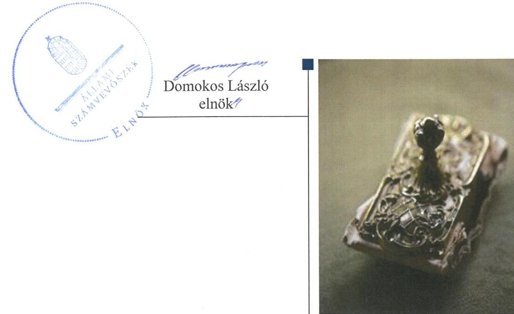
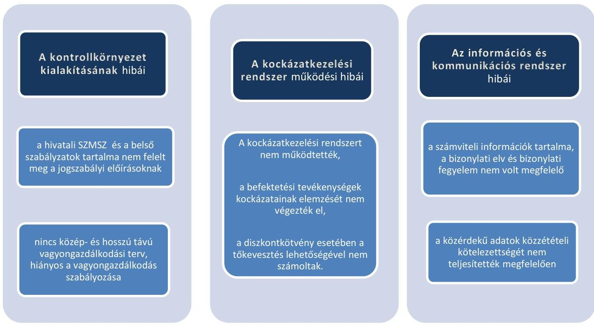
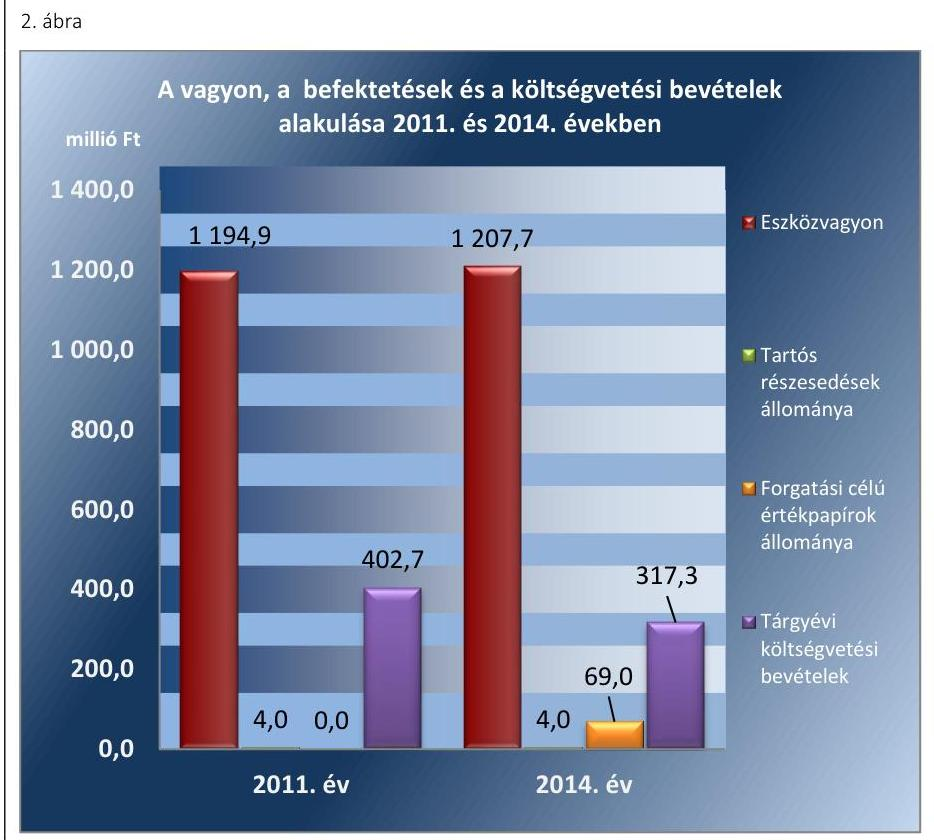

# Jelenetés 

## Önkormányzatok belsó kontrollrendszere

Az önkormányzatok belső kontrollrendszere kialakításának és múködtetésének ellenőrzése - Dunaszeg
2016.

---

# Jelentés 

## Önkormányzatok belsó kontrollrendszere

Az önkormányzatok belső kontrollrendszere kialakításának és múködtetésének ellenőrzése - Dunaszeg
2016. 12. hó 01. nap

---

# AZ ELLENŐRZÉST FELÜGYELTE:

- RENKŐ ZSUZSANNA felügyeleti vezető
- AZ ELLENŐRZÉST VEZETTE ÉS A VÉGREHAJTÁSÁÉRT FELELŐS:
  - PÁNCSICS JUDIT ellenőrzésvezető
  - A PROGRAM ÖSSZEÁLLÍTÁSÁÉRT FELELŐS:
    - JANIK JÓZSEF osztályvezető

- IKTATÓSZÁM: V-0992-091/2016
- TÉMASZÁM: 2026
- ELLENŐRZÉS-AZONOSÍTÓ SZÁM: V078110

Jelentéseink az Országgyűlés számítógépes hálózatán és az Interneta a www.asz.hu címen is olvashatóak.

---

# TARTALOMJEGYZÉK 

■ ÖSSZEGZÉS ..... 5
■ AZ ELLENŐRZÉS CÉLJA ..... 8
■ AZ ELLENŐRZÉS TERÜLETE ..... 9
■ AZ ELLENŐRZÉS HÁTTERE, INDOKOLTSÁGA ..... 11
■ A JELENTÉS LÉNYEGES KÉRDÉSKÖREI ..... 14
■ ELLENŐRZÉS HATÓKÖRE ÉS MÓDSZEREI ..... 15
■ MEGÁLLAPÍTÁSOK ..... 18
■ JAVASLATOK ..... 40
■ MELLÉKLETEK ..... 43
I. Sz. melléklet: Értelmező szótár ..... 43
II. Sz. melléklet: Az integritás érvényesítése érdekében kialakított és múködtetett kontrollrendszer ..... 47
■ FÜGGELÉK: ÉSZREVÉTELEK ..... 49
■ RÖVIDÍTÉSEK JEGYZÉKE ..... 51

---

.

---

# ÖSSZEGZÉS 

Az Állami Számvevőszék Dunaszeg Község Önkormányzata belső kontrollrendszere kialakításának és müködtetésének szabályszerűségét 2014. január 1-jétől 2015. április 30-ig terjedő időszakra vonatkozóan ellenőrizte és értékelte. A belső kontrollrendszer kialakítása és müködtetése a pillérek összesített értékelése alapján - a feltárt hiányosságok miatt - nem volt szabályszerű.
Az Állami Számvevőszék Dunaszeg Község Önkormányzata egyes befektetési döntéseinek, a döntések végrehajtásának, elszámolásának szabályszerűségét 2011. január 1-jétől 2015. április 30-ig terjedő időszakban ellenőrizte. Az ellenőrzés megállapításai alapján a szabályzási környezetben, a kockázatkezelésben, a kulcskontrollok müködésében meglévő hiányosságok alapján a belső kontrollrendszer egyes pillérei a befektetési tevékenységek szabályszerű végzését nem támogatták. A feltárt hibák, hiányosságok következtében a befektetési tevékenység átláthatósága, elszámoltathatósága, a kockázatokat mérlegelő, felelős vagyongazdálkodás nem volt biztosított.

## Az ellenőrzés társadalmi indokoltsága

A demokratikus társadalmakban alapvető igény, hogy a közpénzeket, a közvagyont használók tevékenységükről elszámoljanak, ahhoz egyértelmű és érvényesíthető felelősségi szabályok társuljanak. Ennek a jogos igénynek az érvényesítéséhez meg kell teremteni azokat a folyamatokat, rendszereket, amelyek nélkülözhetetlenek az elszámoltatáshoz. Az elszámoltatás eredményes működtetéséhez szükség van a megfelelő információs-, kontroll-, értékelési és beszámolási rendszerek kialakítására. A belső kontrollok kiépítettsége hozzájárul az integritási szemlélet kialakításához és érvényesüléséhez. A belső kontrollrendszer kialakítása és működtetése nélkül nem valósítható meg a közpénzek, a közvagyon szabályos, gazdaságos, hatékony és eredményes felhasználása. A kockázatok alapján fennáll a lehetősége annak, hogy az önkormányzatok befektetési döntései, továbbá a döntések végrehajtása és számviteli elszámolása nem voltak teljes mértékben szabályszerűek, és a kapcsolódó külső és belső kontrollrendszerek sem működtek minden esetben megfelelően.

## Főbb megállapítások, következtetések, javaslatok

A belső kontrollrendszer kialakítása és működtetése 2014. január 1. és 2015. április 30. között a pillérek összesített értékelése alapján - az ellenőrzés során feltárt hiányosságok miatt - nem volt szabályszerű. A kontrollkörnyezet kialakítása, az információs és kommunikációs rendszer, valamint a monitoring rendszer kialakítása és működtetése kisebb hiányosságok mellett szabályszerű volt. A kockázatkezelési rendszer és a kontrolltevékenységek kialakítása és működtetése a feltárt szabályozásbeli és működtetési hiányosságok miatt nem volt szabályszerű. A pénzügyi folyamatokban kulcsszerepet betöltő teljesítésigazolás és érvényesítés belső kontrollok működése nem volt megfelelő, ezért azok nem biztosították a hibák megelőzését, feltárását, nem segítették a közpénz felhasználás szabályosságát.

Az ellenőrzés tárgyát képező értékpapírok könyv szerinti értéke a 2014. évi költségvetési beszámoló alapján 69,0 millió Ft volt, amelyből 19,0 millió Ft-ot a fizetési számlát vezető hitelintézetnél vásárolt tőkegarantált befektetési jegyben, 50,0 millió Ft-ot egy befektetési szolgáltatónál vásárolt forgatási célú vállalati diszkontkötvényben fektettek be, lekötött betétjük nem volt. Üzleti vagyonba tartozó ingatlanokat, kulturális javakat és egyéb értéktárgyakat befektetési céllal, visszterhes ügylettel 2011. január 1. és 2015. április 30. között nem szereztek be.

A belső kontrollrendszer egyes pilléreiben - a kontrollkörnyezet kialakításában a kockázatkezelési rendszer kialakításában és működtetésében, a kontrolltevékenységekben - 2011. január 1. és 2015. április 30. között hiányosságok,

---

hibák voltak, ezáltal a belső kontrollrendszer nem támogatta a befektetési tevékenység szabályszerű végzését. Az információs és kommunikációs rendszer működtetésében feltárt kisebb súlyú hiányosság miatt nem volt biztosított az önkormányzati vagyonnal való átlátható gazdálkodás. A befektetési döntések előkészítésében és a döntések végrehajtásában, a gazdasági események számviteli elszámolásában szabálytalanságok, hibák fordultak elő. Az egyes befektetési tevékenységek nem megfelelő szabályozásából, a kockázatok reális felmérésének hiányából eredően nem voltak biztosítottak a vagyonérték megőrzéséhez, növeléshez szükséges feltételek.

A belső ellenőrzés nem tárta fel az egyes befektetési döntések előkészítésének és végrehajtásának hiányosságait.
A befektetési tevékenységet külső ellenőrző szervezet nem ellenőrizte.
Az Önkormányzat befektetési tevékenységével kapcsolatos főbb szabálytalanságokat az 1. ábra foglalja össze.
1. ábra

# A BEFEKTETÉSI TEVÉKENYSÉG KONTROLLRENDSZERÉVEL KAPCSOLATBAN FELTÁRT HIBÁK 

A kulcskontrollok múködtetése nem szabályszerű, a monitoring rendszer (belső ellenőrzés) nem tárta fel a kockázatokat és a szabálytalanságokat.

A belső kontrollrendszer nem biztosította a szabályszerű, átlátható, elszámoltatható, a kockázatokat minimalizáló vagyongazdálkodást.

A Képviselő-testület ${ }^{1}$ az erőforrásokkal való szabályszerű gazdálkodás követelményeit részben határozta meg, az erőforrásokkal való hatékony gazdálkodás követelményeit nem írta elő. Az Önkormányzat² irányítása alá tartozó költségvetési szerveknél az elszámoltathatóság, a hatékony gazdálkodás érvényesítésének lehetősége nem volt biztosított.

---

Az Önkormányzat 2014-ben részt vett az ÁSZ ${ }^{3}$ integritás felmérésében. A kockázatok és kontrollok szintje között nem volt egyensúly, mivel a szervezetnél a kiépült kontrollok összességében nem voltak képesek kezelni a kockázatokat és támogatni a szervezet feladatellátását. A belső kontrollrendszer kialakítása és múködtetése nem támogatta az integritás szemlélet érvényesülését, az ellenőrzés során feltárt szabályozási és múködési hiányosságok miatt az integritás szemlélet érvényesítésében még fejlődést kell elérniük.

---

# AZ ELLENŐRZÉS CÉLJA 

Az ellenőrzés célja annak megállapítása volt, hogy az önkormányzat belső kontrollrendszerének kialakítása, továbbá egyes elemeinek működtetése biztosította-e az önkormányzatnál a közpénzfelhasználás szabályosságát. Az erőforrásokkal való szabályszerű és hatékony gazdálkodáshoz szükséges követelmények érvényesítése, számonkérése, ellenőrzése megtörtént-e az önkormányzatnál. A belső kontrollrendszer kialakítása és működtetése támogatta-e az integritás szemlélet érvényesülését. Az ellenőrzés során értékeltük a belső kontrollrendszer kialakításának és működtetésének szabályszerűségét. Bemutatjuk azokat a lényeges szabályozási hiányosságokat, amelyek miatt az ellenőrzött kulcskontrollok nem nyújtottak elegendő védelmet a lehetséges hibákkal szemben. Rámutattunk arra, ha a kulcskontrollok valamely hibát nem előztek meg, nem tártak fel vagy nem javítottak ki, valamint minősítjük múködésük megfelelőségét.

Ellenőriztük, hogy az önkormányzat egyes befektetési döntései és azok végrehajtása, elszámolása megfelelt-e a vonatkozó jogszabályoknak és belső szabályozásoknak, a kialakított kontrollrendszer támogatta-e a befektetési tevékenység szabályszerűségét.

---

# **A2 ELLENŐRZÉS TERÜLETE**

## **Dunaszeg Község Önkormányzata**

A Győr-Moson-Sopron megyében fekvő Dunaszeg község állandó lakosainak száma 2015. január 1-jén 2058 fő volt.

Az Önkormányzat héttagú Képviselő-testületének munkáját két állandó bizottság segítette. A településen sem a helyi önkormányzati képviselők és polgármesterek 2014. évi általános választásáig, sem azt követően helyi nemzetiségi önkormányzat nem működött.

Az Önkormányzat a Hivatalon4 kívül egy intézménnyel látta el feladatait, többségi tulajdoni részesedésű gazdasági társasággal nem rendelkezett.

A polgármester5 az 1990. évi önkormányzati választások óta tölti be tisztségét. A jelenlegi jegyző6 2013. június 1-je óta látja el feladatait.

A Hivatal szervezeti egységekre nem tagolódott, elkülönített gazdasági szervezettel nem rendelkezett. A Hivatalban foglalkoztatott köztisztviselők száma 2014. év végén 11 fő volt. A Hivatal látta el Dunaszeg Község Önkormányzata és költségvetési szerve mellett Dunaszentpál és Kunsziget községek önkormányzatainak és költségvetési szerveinek pénzügyi-gazdasági feladatait. A Hivatalban 2014. január 1-jétől szervezeti változás nem volt.

Az Önkormányzat a 2014. évi éves költségvetési beszámoló szerint 317,3 millió Ft költségvetési bevételt ért el, valamint 286,7 millió Ft költségvetési kiadást teljesített. A költségvetési többletet értékpapír vásárlással hasznosították. A pénzeszközök értéke 2014. december 31-én 20,6 millió Ft-ot tett ki. Az üzleti vagyonba tartozó ingatlanok értéke 2015. április 30-án 59,1 millió Ft volt.

A 2014. évben a forrásokon belül a költségvetési évben esedékes kötelezettségállomány nem volt, a költségvetési évet követően esedékes kötelezettségállomány 5,2 millió Ft-ot tett ki, pénzintézettel szembeni kötelezettségük nem volt.

Adósságkonszolidációs támogatásban nem részesültek.

Az Önkormányzat vagyonának, befektetéseinek és a költségvetési bevételeinek alakulását a 2011. évben és a 2014. évben a 2. ábra mutatja be:

---

Adatok forrása: a 2011. és a 2014. évi éves költségvetési beszámolók

---

# AZ ELLENŐRZÉS HÁTTERE, INDOKOLTSÁGA 

Az ÁSZ tv. ${ }^{7}$ szerint az ÁSZ feladata a jól irányított állam kiépítésének elősegítése. Az ÁSZ Stratégiájában ezért hangsúlyos szerepet szánt annak, hogy szilárd szakmai alapon álló, értékteremtő ellenőrzéseivel előmozdítsa a közpénzügyek átláthatóságát, rendezettségét. A számvevőszéki ellenőrzés nemzetközi alapelvei is rögzítik, hogy a megfelelő belső kontrollrendszer minimálisra csökkenti a hibák és szabálytalanságok kockázatát.

A belső kontrollrendszer azt a célt szolgálja, hogy a költségvetési szervek működésük és gazdálkodásuk során a tevékenységeket szabályszerűen, gazdaságosan, hatékonyan, eredményesen hajtsák végre, teljesítsék elszámolási kötelezettségeiket és megvédjék az erőforrásokat a veszteségektől, a károktól és a nem rendeltetésszerű használattól. A belső kontrollrendszer magában foglalja mindazon szabályokat, eljárásokat, gyakorlati módszereket és szervezeti struktúrákat, kockázatkezelési technikákat, kontrolltevékenységeket, amelyek segítséget nyújtanak a szervezetnek céljai eléréséhez. A belső kontrollrendszer szabályozása háromszintű, a törvényi előírásokat az Áht. és az Mötv., a rendeleti szintű szabályozást az Ávr. és a Bkr. tartalmazza, amelyeket útmutatói szinten az NGM által kiadott standardok és kézikönyvek támogatnak.

Az ellenőrzött időszak meghatározása lehetőséget teremt a 2014. október 12-i önkormányzati választásokat megelőző és követő ciklus belső kontrollrendszere működésének elkülönült értékelésére, valamint a változások nyomon követésére.

A BELSŐ KONTROLLRENDSZER kialakításának és működtetésének általános értékelése mellett a teljesítésigazolás és érvényesítés kontrollok kiemelt ellenőrzésének szükségességét alátámasztja, hogy 2012-től a pénzügyi folyamatokban kulcsszerepet betöltő belső kontrollok rendszere módosult és azok működtetésében az önkormányzatoknál hiányosságok mutatkoztak a 2012. óta elvégzett ÁSZ ellenőrzések alapján.

Az önkormányzatok belső kontrollrendszerének ellenőrzése az ÁSZ „jó kormányzással" kapcsolatos stratégiai céljainak megvalósítását is szolgálja. Az ÁSZ célja, hogy javuljon az ellenőrzött önkormányzatok belső kontrollrendszerének szabályozottsága, működésének megfelelősége, hozzájárulva ezzel az egyensúlyi helyzet fenntarthatóságának biztosításához, azaz az adósság újratermelődésének megakadályozásához. Az ÁSZ ellenőrzési tapasztalatai nem csupán a közvetlenül ellenőrzött önkormányzatokat segíthetik, hanem a „jó gyakorlat" elterjesztésével azok az önkormányzatok is átvehetik a pozitív példákat, ahol nem végez ellenőrzést az ÁSZ.

Az MNB három befektetési szolgáltató tevékenységi engedélyét 2015. első felében visszavonta és kezdeményezte a vállalkozások felszámolását a működéssel kapcsolatos szabálytalanságok, hiányosságok miatt. A korábbi évek ellenőrzési tapasztalatai alapján fennáll a lehetősége annak, hogy az önkormányzatok befektetési döntései, továbbá a döntések végrehajtása és számviteli elszámolása nem voltak teljes mértékben szabályszerűek, és a kapcsolódó külső ellenőrzések és a belső kontrollrendszer sem működtek minden esetben megfelelően.

---

Magyarország Alaptörvénye az önkormányzatoktól, mint az államháztartás alanyaitól elvárja a kiegyensúlyozott, átlátható és fenntartható költségvetési gazdálkodás elvének érvényesítését. A nemzeti vagyonról szóló törvény szerint a nemzeti vagyonnal felelős módon, rendeltetésszerűen kell gazdálkodni. A nemzeti vagyongazdálkodás feladata a nemzeti vagyon rendeltetésének megfelelő, átlátható, hatékony és költségtakarékos működtetése, ugyanakkor értékének megőrzését, értéknövelő használatát, hasznosítását, gyarapítását is elvárja.

# AZ ÖNKORMÁNYZATOK ÁTMENETILEG SZABAD PÉNZESZKÖZEINEK BEFEKTETÉSÉT jogszabály nem 

tiltja, a pénzpiaci szolgáltatók közül az önkormányzatok a kínált szolgáltatás és annak költségei alapján, szabadon választhatnak, a veszteséges gazdálkodás kockázatai és következményei azonban az önkormányzatokat terhelik. A szabad pénzeszközök felelős hasznosítása összhangban áll az önkormányzati gazdálkodás alapelveivel.

A közintézmények integritás alapú kultúrájának kialakítása, megerősítése és működése szorosan összefügg a belső kontrollrendszer működésével, ezért az ellenőrzés kiterjed annak értékelésére is, hogy a belső kontrollrendszer kialakítása és működtetése hogyan hatott az integritás szemlélet érvényesülésére.

Az államháztartás önkormányzati alrendszerében a 2014. év elején öszszesen 3177 települési önkormányzat működött: a 23 kerülettel rendelkező főváros, 345 város, 2691 község és 117 nagyközség volt. A belső kontrollrendszer kialakítása és működtetése ellenőrzését az ÁSZ által lefolytatott, kisebb településeket is érintő ellenőrzéseinek tapasztalatai, valamint a közérdekű bejelentések kockázati szempontú értékelése alapozták meg. Ezek a községek, nagyközségek gazdálkodásának, belső kontrollrendszere kialakításának és működésének hiányosságaira mutattak rá. Az ellenőrzések helyszíneinek kiválasztása során az ÁSZ célzott adatfeldolgozáson alapuló kockázatelemző rendszerére támaszkodik. Ez elősegíti, hogy azokon a területeken végezzen ellenőrzéseket, összpontosítva erőforrásait, ahol a valódi kockázatok, az aktuális problémák vannak.

## AZ ELLENŐRZÉS VÁRHATÓ HASZNOSULÁSA NÉGY SZINTEN valósul meg.

A törvényalkotás számára összegzett tapasztalatok állnak rendelkezésre a belső kontrollrendszer önkormányzati területen való kialakításáról, működtetéséről és hatásairól. Az ÁSZ az ellenőrzéseivel hozzájárul ahhoz, hogy az egyes önkormányzati befektetésekkel kapcsolatos kockázatok a szabályozási és kontroll mechanizmusok fejlesztésével mérsékelhetők legyenek.

Az ellenőrzés az ellenőrzött számára visszajelzést ad a belső kontrollrendszer kialakításában és működésében lévő hiányosságokról, javaslataival hozzájárul azok kiküszöböléséhez. Feltárja az önkormányzati befektetési tevékenységet meghatározó szabályozások összhangjának hiányosságait, a szabályozással nem érintett gazdálkodási területeket, valamint az egyes befektetési tevékenységek esetleges szabálytalanságait.

Az ellenőrzés megállapításait és javaslatait más szervezetek is hasznosíthatják a rendezett gazdálkodási keretek kialakításához.

---

A társadalom számára jelzi, hogy közpénz nem maradhat ellenőrizetlenül, az ÁSZ értékteremtő rend kialakításához és megőrzéséhez hozzájáruló tevékenysége pozitív hatással lesz a szervezetről kialakított összkép formálásában.

---

# A JELENTÉS LÉNYEGES KÉRDÉSKÖREI 

1.     - Az önkormányzat belső kontrollrendszerének kialakítása és müködtetése szabályszerű volt-e 2014. január 1. és 2015. április 30. között, valamint a belső kontrollrendszer egyes pillérei támogatták-e a befektetési tevékenység szabályszerű végzését 2011. január 1. és 2015. április 30. között?
2.     - Az egyes befektetésekkel kapcsolatos döntéshozatal és a döntések végrehajtása szabályszerű volt-e?
3.     - Az egyes befektetések számviteli elszámolása, nyilvántartása szabályszerű volt-e?
4.     - Az erőforrásokkal való szabályszerű és hatékony gazdálkodáshoz szükséges követelmények érvényesítése, számonkérése, ellenőrzése megtörtént-e az önkormányzatnál?
5.     - Az önkormányzat belső kontrollrendszerének kialakítása és müködtetése támogatta-e az integritás szemlélet érvényesülését?

---

# ELLENŐRZÉS HATÓKÖRE ÉS MÓDSZEREI 

## Az ellenőrzés típusa

Megfelelőségi ellenőrzés, a befektetési tevékenység esetében szabályszerűségi ellenőrzés.

## Az ellenőrzött időszak

A belső kontrollrendszer kialakításának és működtetésének ellenőrzése a 2014. január 1. és 2015. április 30. közötti időszakra terjedt ki. Ezen belül a belső kontrollrendszer kialakításának és működtetésének megfelelőségét a 2014. január 1. és október 12., valamint a 2014. október 13. és 2015. április 30. közötti időszakra vonatkozóan külön-külön értékeltük. Az önkormányzatok egyes befektetési tevékenységeinek ellenőrzése tekintetében az ellenőrzött időszak a 2011. január 1. - 2015. április 30. közötti időszak. Ezen felül az önkormányzat befektetésekkel kapcsolatos döntés-előkészítésének és döntéshozatalának szabályszerűségét a 2011. január 1. előtti időszakra visszanyúlóan is ellenőriztük, amennyiben a 2014. június 30-án, illetve 2015. április 30-án meglévő értékpapír-befektetéseire 2011. január 1-je előtt került sor. Az integritás szemlélet érvényesülését a 2014. évre vonatkozó adatszolgáltatás alapján értékeltük.

## Az ellenőrzés tárgya

A helyi önkormányzatnak, mint éves költségvetési beszámoló készítésére kötelezett szervezetnek és polgármesteri hivatalának belső kontrollrendszere. Az önkormányzat 2014. június 30-án, illetve 2015. április 30-án meglévő értékpapírokban megtestesülő befektetései, lekötött betétei, valamint az önkormányzat üzleti vagyonába tartozó ingatlanok, kulturális javak (műtárgyak, műalkotások, stb.), illetve a feladatellátást nem szolgáló egyéb értéktárgyak (pl. ékszerek, befektetési nemesfém). Az erőforrásokkal való szabályszerű és hatékony gazdálkodáshoz szükséges követelmények érvényesítése, számonkérése, ellenőrzése. Az integritás szemlélet érvényesülése.

## Az ellenőrzött szervezet

Dunaszeg Község Önkormányzata és az önkormányzati müködéshez kapcsolódó feladatokat ellátó Hivatal.

---

# Az ellenőrzés jogalapja 

Az ÁSZ tv. 1. § (3) bekezdésében foglaltak alapján az ÁSZ általános hatáskörrel végzi a közpénzekkel és az állami és önkormányzati vagyonnal való felelős gazdálkodás ellenőrzését. Az ÁSZ tv. 5. § (2) bekezdése alapján az államháztartás gazdálkodásának ellenőrzése keretében az ÁSZ ellenőrzi a helyi önkormányzatok gazdálkodását, valamint az ÁSZ tv. 5. § (6) bekezdése alapján ellenőrzése során értékeli az államháztartás számviteli rendjének betartását és a belső kontrollrendszer múködését.

## Az ellenőrzés módszerei

Az ellenőrzést a nemzetközi standardokat irányadónak tekintve az ellenőrzési program ellenőrzési kérdései, az ellenőrzött időszakban hatályos jogszabályok, az ellenőrzés szakmai szabályok és módszertanok figyelembe vételével végeztük.

Az ellenőrzés lefolytatásához az Önkormányzat a tanúsítványok kitöltésével, valamint az ÁSZ által kért dokumentumok elektronikus megküldésével szolgáltatott adatokat. A rendelkezésre bocsátott adatok, információk kontrollja és a munkalapok kitöltése az ellenőrzés keretében történt. A jelentésben használt fogalmak magyarázatát az I. számú melléklet, az integritás érvényesítése érdekében kialakított és múködtetett kontrollrendszer minősítését a II. számú melléklet tartalmazza.

A belső kontrollrendszer jogszabályi előírások szerinti kialakításának és múködtetésének szabályszerűségét az erre irányuló ellenőrzési kérdésekre adott válaszok összesítése alapján külön-külön értékeltük a 2014. január 1. és október 12., valamint a 2014. október 13. és 2015. április 30. közötti időszakra. A belső kontrollrendszert egy-egy ellenőrzött időszakra pillérenként (kontrollkörnyezet, kockázatkezelési rendszer, kontrolltevékenységek, információs és kommunikációs rendszer, monitoring rendszer) és öszszesítetten is értékeltük.

## A BELSŐ KONTROLLRENDSZER EGYES PILLÉRE-

INEK KIALAKÍTÁSA ÉS MÚKÖDTETÉSE „szabályszerü volt", amennyiben az értékelt területen az elért és elérhető pontok százalékban kifejezett, egész számra kerekített hányadosa meghaladta a 84\%ot, „részben szabályszerű volt", ha 61-84\% közé esett, „nem szabályszerű volt", ha nem haladta meg a 60\%-ot. A belső kontrollrendszer összesített értékelése megegyezett a pillérenként (kontrollterületenként) alkalmazott százalékos értékelésekkel, a következő eltérésekkel. A kontrollrendszer egésze esetében a „szabályszerü" értékelésnek a százalékos értéken felül további feltétele volt, hogy egyik kontrollterület sem kaphat „nem szabályszerű" értékelést, a „részben szabályszerű" értékelés további feltétele volt, hogy legfeljebb egy ellenőrzött kontrollterület lehet „nem szabályszerű" értékelésú. Az összesített értékelés a százalékos értéktől függetlenül „nem szabályszerű volt", ha az ellenőrzött kontrollterületek közül több mint egynek „nem szabályszerű volt" az értékelése.

---

# A GAZDÁLKODÁS FOLYAMATÁBAN A KÉT 

KULCSKONTROLL - teljesítésigazolás, érvényesítés - múködésének megfelelőségét a személyi juttatásokkal, a dologi kiadásokkal, a beruházási, felújítási kiadásokkal, az ellátottak pénzbeli juttatásaival és az egyéb múködési, felhalmozási célú, valamint a finanszírozási kiadásokkal kapcsolatos kifizetések esetében mintavétellel ellenőriztük. A mintavétel során külön értékeltük a 2014. január 1. és 2014. október 12. közötti időszakban és a 2014. október 13. és 2015. április 30. közötti időszakban teljesített kifizetéseket. „Megfelelőnek" értékeltük a gazdálkodási jogkörök gyakorlását, amennyiben 95\%-os bizonyossággal a teljes sokaságban a hibaarány legfeljebb 10\%, ,,részben megfelelőnek" értékeltük, ha a hibaarány felső határa 10-30\% között volt, ,nem megfelelőnek" pedig akkor, ha a mintavételi eredmények alapján a sokaságbeli hibaarány felső határa meghaladta a $30 \%$-ot.

Az integritás szemlélet érvényesülésének értékelése az önkormányzat által kitöltött tanúsítvány alapján történt.

---

# MEGÁLLAPÍTÁSOK

## 1. Az önkormányzat belső kontrollrendszerének kialakítása és működtetése szabályszerű volt-e 2014. január 1. és 2015. április 30. között, valamint a belső kontrollrendszer egyes pillérei támogatták-e a befektetési tevékenység szabályszerű végzését 2011. január 1. és 2015. április 30. között?

Összegző megállapítás

A belső kontrollrendszer kialakítása és működtetése az összesített értékelés alapján 2014. január 1. és 2015. április 30. között nem volt szabályszerű. A feltárt hiányosságok alapján a belső kontrollrendszer egyes pilléreinek kialakítása és működtetése 2011. január 1. és 2015. április 30. között nem támogatta a befektetési tevékenység szabályszerű, kockázatokat minimalizáló, átlátható, elszámoltatható végzését.

A belső kontrollrendszer kialakításának és működtetésének összesített értékelését az 1. táblázat mutatja be:

1. táblázat

|  A BELSŐ KONTROLLRENDSZER KIALAKÍTÁSÁNAK ÉS MŰKÖDTETÉSÉNEK ÖSSZESÍTETT ÉRTÉKELÉSE |  |  |  |   |
| --- | --- | --- | --- | --- |
|  Megnevezés | A gazdálkodás egészét érintően: |  | A befektetési tevékenységét érintően: |   |
|   | 2014. január 1-tól | 2014. október 13-tól | 2011-2013. években | 2014. január 1-tól  |
|   | 2014. október 12-ig | 2015. április 30-ig |  | 2015. április 30-ig  |
|  Kontrollkörnyezet | szabályszerű |  |  |   |
|  Kockázatkezelési rendszer | nem szabályszerű |  |  |   |
|  Kontrolltevékenységek | nem szabályszerű |  |  |   |
|  Információs és kommunikációs rendszer | szabályszerű |  |  | nem támogatta  |
|  Monitoring rendszer | szabályszerű |  |  |   |
|  BELSŐ KONTROLLRENDSZER | NEM SZABÁLYSZERŐ |  | NEM TÁMOGATTA |   |
|   |  |  |  | Forrás: ÁSZ  |

1.1. számú megállapítás

A kontrollkörnyezet kialakítása 2014. január 1. és 2015. április 30. között - a szervezeti és szabályozási keretekben, a feladat- és hatáskörök rendszerében - feltárt hiányosságok mellett szabályszerű volt. A kontrollkörnyezet a befektetési tevékenység szabályszerű végzését 2011. január 1. és 2015. április 30. között nem támogatta, mert a közvagyonnal való szabályszerű, elszámoltatható gazdálkodási feltételeket nem teljes körűen alakították ki.

A SZERVEZETI ÉS A SZABÁLYOZÁSI KERETEKET a Képviselő-testület 2011. január 1. és 2015. április 30. között az alábbiak szerint alakította ki:

---

- Az önkormányzati SZMSZ ${ }_{1-4}$-ben ${ }^{8}$ meghatározta a szervezeti és a szabályozási kereteket, a múködés rendjét, valamint a feladat- és hatásköröket, azonban az SZMSZ ${ }_{1,2}$ 2011. január 1. és 2013. november 28. között az Ötv. ${ }^{9} 9 . \S$ (1) és (3) bekezdéseiben, illetve 2013-tól az Mötv. ${ }^{10}$ 53. § (1) bekezdés b) pontjában előírtak ellenére nem tartalmazta a Képviselő-testület átruházott hatásköreinek felsorolását.
- A vagyongazdálkodási rendelet ${ }_{1-3}$-ban ${ }^{11}$ az önkormányzati tulajdonban lévő vagyonelemeket az Ötv., illetve az Nvtv. ${ }^{12}$ előírásaival összhangban besorolta a törzsvagyonba és az üzleti vagyonba, elkülönítette a forgalomképtelen és a korlátozottan forgalomképes vagyonelemeket, az egyes vagyonelemek feletti rendelkezési jogokat szabályozta.
- Jóváhagyta az Ötv.-ben előírtaknak megfelelően a 2011-2014. évekre szóló gazdasági programot ${ }^{13}$, illetve az Mötv.-ben foglaltaknak megfelelően a 2015-2019. évekre szóló gazdasági programot ${ }^{14}$.
- A 2011-2015. évi költségvetési rendeleteket ${ }^{15}$ az Áht. ${ }_{1,2}$-ben előírt tartalommal, mellékszámításokkal megalapozottan fogadta el. A hu-mánerőforrás-gazdálkodás kereteihez meghatározta a Hivatal engedélyezett létszámát. A 2011-2012. évi költségvetési rendeletek szerint a polgármester az átmenetileg szabad pénzeszközöket forgatási célú, államilag garantált hitelviszonyt megtestesítő értékpapír vásárlással, illetve a számlavezető pénzintézetnél betétlekötés útján hasznosíthatta. E jogkört a polgármester 2011-ben 15 millió Ft értékhatárig, 2012-ben értékhatártól függetlenül gyakorolhatta utólagos beszámolási kötelezettséggel. A 2013. évi költségvetési rendeletben a Képviselő-testület a finanszírozási bevételekkel és kiadásokkal kapcsolatos hatásköröket utólagos beszámolási kötelezettség mellett, összeghatárra való tekintet nélkül ruházta át a polgármesterre. A 2014-2015. évi költségvetési rendeletekben a Képviselő-testület a finanszírozási bevételekkel és kiadásokkal kapcsolatos hatáskörök gyakorlási jogát a saját maga részére fenntartotta.
- Jóváhagyta a Hivatal alapító okiratát és a szervezeti és múködési szabályzatát.

A HIVATAL BELSŐ SZABÁLYOZÁSÁT a jegyző a 2011. január 1. és 2015. április 30. között az alábbiak szerint alakította ki:

- A hivatali SZMSZ ${ }_{1-4}{ }^{16}$ tartalmazta a szervezeti felépítést, a múködési rendet, a nevesített munkakörökhöz tartozó feladat- és hatásköröket, a hatáskörök gyakorlásának módját, a helyettesítés rendjét és az ezekhez kapcsolódó felelősségi szabályokat.
- A gazdálkodási jogkörök szabályozását - a befektetésekre is kiterjedően - az Ámr. ${ }^{17}$ és az Ávr. ${ }^{18}$ előírásainak megfelelően készítették el a Hivatal és az Önkormányzat önálló beszámolóval érintett feladataira. A gazdálkodási szabályzat ${ }_{1,2}{ }^{19}$ az Áht. ${ }_{1,2}{ }^{20}$, az Ámr. és az Ávr. előírásainak megfelelően tartalmazta a gazdálkodási jogkörök gyakorlásának módjával, eljárási és dokumentációs részletszabályaival, valamint az ezeket végző személyek kijelölésének rendjével kapcsolatos belső előírásokat.
- A számviteli politika ${ }_{1,2}{ }^{21}$ és az ehhez kapcsolódó leltározási szabály$z^{22}{ }_{1,2}{ }^{22}$, értékelési szabályzat ${ }_{1,2}{ }^{23}$, selejtezési szabályzat ${ }_{1,2}{ }^{24}$, pénzke-

---

zelési szabályzat ${ }_{1,2}{ }^{25}$, valamint a számlarend ${ }_{1,2}$ hatálya kiterjedt a Hivatalra, valamint az Önkormányzat önálló beszámolóval érintett feladataira.
— Kiadta a szabálytalanságok kezelése eljárásrend ${ }_{1,2}$-t $^{26}$.

# A KONTROLLKÖRNYEZET KIALAKÍTÁSÁBAN a 

2011. január 1. és 2015. április 30. között a következő hiányosságok fordultak elő:
— A vagyongazdálkodási rendelet ${ }_{1-3}$-ban nem szabályozták az Áht. ${ }_{1}$ 108. § (2) bekezdésében, illetve az Áht. ${ }_{2}$ 97. § (2) bekezdésében előírtak ellenére a követelésről való lemondás eseteit és módját.
— A Képviselő-testület - előterjesztés hiányában - nem fogadott el kö-zép- és hosszú távú vagyongazdálkodási tervet, mivel az Önkormányzatnál az Nvtv. 9. § (1) bekezdésében előírtak ellenére azt nem készítették el.
— A jegyzői utasítások, mint közjogi szervezetszabályozó eszközök - a 32/2010. (XII.31.) KIM rendelet ${ }^{27}$ 14. § (1) bekezdésében előírtak ellenére - nem tartalmazták a normatív utasítás sorszámát és a közzététel pontos dátumát.
—_ hivatali SZMSZ ${ }_{1-4}$ az Ámr. 20. § (2) bekezdés e) pontjában, illetve az Ávr. 13. § (1) bekezdés e) pontjában előírtak ellenére nem tartalmazta a Hivatal szervezeti ábráját.
— A számviteli politika1-et és annak keretében készítendő leltározási-, pénzkezelési szabályzatokat, valamint a számlarend ${ }_{1}$-et a Számv. tv. ${ }^{28}$ 14. § (11) bekezdésében előírtak ellenére 2006 és 2013 között nem aktualizálták annak ellenére, hogy a szervezeti változások (a körjegyzőség közös hivatallá történt átalakulása, a közfeladatellátás átszervezése) és a jogszabályi változások miatt az indokolt lett volna.
— A gazdálkodási jogkörök gyakorlásának rendjét, az egyes jogkörök gyakorlására jogosultak körét a gazdálkodási szabályzat ${ }_{1}$-ben 2005. január 1-jét követően - a jogszabályi, a szervezeti és a személyi változások ellenére - 2013. december 31-ig nem aktualizálták.
— Az ellenőrzési nyomvonal ${ }_{1-4}{ }^{29}$ nem terjedtek ki a Hivatal valamennyi múködési folyamatára, így az egyes befektetési tevékenységekre sem. Az ellenőrzési nyomvonal ${ }_{1-3}$ tartalmi felülvizsgálatáról, aktualizálásáról a jegyző az Ámr. 156. § (2) bekezdésében, illetve a Bkr. ${ }^{30}$ 6. § (3) bekezdésében előírtak ellenére nem gondoskodott, azokban hatályon kívül helyezett jogszabályi hivatkozások fordultak elő.
— A szabálytalanságok kezelése eljárásrend ${ }_{1}$ aktualizálásáról 2005. és 2013. évek között a szervezeti változások és a szabálytalanságok kezelésébe bevont személyek változása ellenére nem gondoskodtak.
— A köztisztviselőkre vonatkozó hivatás etikai alapelvek részletes tartalmát és az etikai eljárás szabályait - a Kttv. ${ }^{31}$ 231. § (1) bekezdésében rögzítettek ellenére - a Képviselő-testület nem hagyta jóvá, azokat a jegyző utasításban határozta meg.
— A munkaköri leírások a Kttv. 75. § (1) bekezdés d) pontjában előírtak ellenére nem tartalmazták a munkakör betöltésével kapcsolatos (végzettség, szakképzettség, szakképesítés, tapasztalat, képességek) követelményeket.

---

A kontrollkörnyezet 2011. január 1. és 2013. december 31., valamint 2014. január 1. és 2015. április 30. közötti időszakokban nem támogatta az egyes befektetési tevékenységek szabályszerű végzését, mivel a Képviselőtestület a vagyongazdálkodást, a jegyző a gazdálkodással összefüggő belső szabályozást hiányosan alakította ki.

A kontrollkörnyezet kialakítása - 2014. január 1. és október 12., valamint 2014. október 13. és 2015. április 30. közötti időszakban - a feltárt hiányosságok mellett szabályszerű volt. Az ellenőrzött időszak végén fennálló hiányosságokat a 2. táblázat tartalmazza:
2. táblázat

# A KONTROLLKÖRNYEZET KIALAKÍTÁSÁNAK HIÁNYOSSÁGAI 

## Sorszám

1. A Képviselő-testület az Áht. 97. § (2) bekezdésében előírtak ellenére - előterjesztés hiányában -a vagyongazdálkodási rendelet ${ }_{3}$-ban, illetve más önkormányzati rendeletben sem szabályozta a követelésről való lemondás eseteit és módját.
2. Az Önkormányzatnál az Nvtv. 9. § (1) bekezdésében előírtak ellenére közép- és hosszú távú vagyongazdálkodási tervet nem készítettek, a Képviselő-testület - előterjesztés hiányában - az Önkormányzat vagyongazdálkodásának az Nvtv. 7. § (2) bekezdésében meghatározott rendeltetése biztosítása céljából közép- és hoszzú távú vagyongazdálkodási tervet nem fogadott el.
3. A köztisztviselőkre vonatkozó hivatásetikai alapelvek részletes tartalmát és az etikai eljárás szabályait a Kttv. 231. § (1) bekezdésében rögzítettek ellenére - előterjesztés hiányában a Képviselő-testület nem állapította meg, azt a jegyző hatáskör nélkül, jegyzői utasításban adta ki.
4. A Képviselő-testület által jóváhagyott hivatali SZMSZ.4 az Ávr. 13. § (1) bekezdés e) pontjában előírtak ellenére nem tartalmazta a Hivatal szervezeti ábráját.
5. A Hivatal ellenőrzési nyomvonala ${ }_{4}$ a Bkr. 6. § (3) bekezdésében előírtak ellenére nem terjedt ki valamennyi múködési folyamatra, így a befektetési folyamatokra sem.
6. A jegyzői utasítások, mint közjogi szervezetszabályozó eszközök - a 32/2010. (XII.31.) KIM rendelet 14. § (1) bekezdés b)-e) pontjában előírtak ellenére - nem tartalmazták a normatív utasítás sorszámát és a közzététel pontos dátumát (év, hó, nap).
7. A munkaköri leírásokban a Kttv. 75. § (1) bekezdés d) pontjában foglaltak ellenére nem rögzítették a munkakör betöltésével kapcsolatos (a végzettségre, a szakképzettségre, a szakképesítésre, a tapasztalatra, a képességekre vonatkozó) követelményeket.

Forrás: ÁSZ
1.2. számú megállapítás

A kockázatkezelési rendszer kialakítása és múködtetése 2014. január 1. és 2015. április 30. között nem volt szabályszerű. A kockázatkezelési rendszer 2011. január 1. és 2015. április 30. között a befektetési tevékenységek szabályszerű végzését a rendszer múködtetésének hiányában nem támogatta, a befektetések pénzügyi kockázatainak minimalizálását nem biztosította.

A KOCKÁZATKEZELÉSI RENDSZERT a jegyző a 20112013. években - az Ámr. 157. §-ában, illetve a Bkr. 3. § b) pontjában és a 7. §-ában előírtak ellenére - nem alakította ki.

A 2014. január 1. és 2015. április 30. közötti a jegyző a Hivatalra, valamint az Önkormányzat önálló beszámolóval érintett feladataira kiterjedő belső kontroll kézikönyvben ${ }^{32}$ meghatározta a kockázatkezelési rendszer kereteit. A kézikönyv a Bkr. előírásainak megfelelően meghatározta a kockázatok azonosításával, elemzésével, csoportosításával, nyomon követésével, illetve a kockázati kitettség csökkentésével kapcsolatos szabályokat, azonban a Bkr. 7. § (2) bekezdésében előírtak ellenére nem határozta meg

---

az egyes kockázatokkal kapcsolatban szükséges intézkedéseket, valamint azok teljesítésének folyamatos nyomon követési módját.

# A KOCKÁZATKEZELÉSI RENDSZER MŰKÖDTETÉ- 

SÉRŐL 2011. január 1. - 2015. április 30. között a jegyző az Ámr. 157. § (1) bekezdésében, illetve a Bkr. 7. § (1) bekezdésében előírtak ellenére nem gondoskodott. A gazdálkodással kapcsolatos kockázatokat - így az értékpapír vásárlással, eladással összefüggő befektetési kockázatokat - az Ámr. 157. § (2) és (3) bekezdéseiben, illetve a Bkr. 7. § (2) bekezdésében előírtak ellenére nem mérték fel, nem értékelték, a szükséges intézkedések megtétele, illetve azok teljesítésének nyomon követése nem valósult meg.

## A VAGYONNYILATKOZAT-TÉTELI KÖTELEZETTSÉGET és annak eljárási szabályait a köztisztviselők esetében a hivatali SZMSZ3,4-ben és a közszolgálati szabályzatban ${ }^{33}$ rögzítették. A Képviselőtestület a Vnytv. ${ }^{34}$ 4. § d) pontjában előírtak ellenére a nem képviselő bizottsági tagok vagyonnyilatkozat-tételi kötelezettségét az önkormányzati SZMSZ3,4-ben nem szabályozta. A szabályozási hiányosság nem okozott további szabálytalanságot, mivel mindkét bizottságnak 2014. január 1. és 2015. április 30. között csak önkormányzati képviselők voltak a tagjai.

Az önkormányzati képviselők vagyonnyilatkozatainak nyilvántartására és vizsgálatára a Képviselő-testület az önkormányzati SZMSZ3,4-ben a pénzügyi bizottságot ${ }^{35}$ jelölte ki. A pénzügyi bizottság a Vnytv. 11. § (6) bekezdésében foglaltak ellenére az önkormányzati képviselők esetében a vagyonnyilatkozatok átadására, nyilvántartására, a vagyonnyilatkozatba foglalt személyes adatok védelmére vonatkozóan külön szabályokat nem állapított meg. Valamennyi kötelezett az Mötv. és a Vnytv. előírásai szerint a vagyonnyilatkozat-tételi kötelezettségének az előírt határidőben eleget tett.

A kockázatkezelési rendszer kialakítása és múködtetése 2014. január 1. és 2014. október 12. között, valamint 2014. október 13. és 2015. április 30. között nem volt szabályszerű.

A kockázatkezelési rendszer 2011. január 1. és 2013. december 31., valamint 2014. január 1. és 2015. április 30. között a kockázatok felmérésében, kezelésében tapasztalt hiányosságok miatt az egyes befektetési tevékenységek szabályszerű végzését nem támogatta.

A kockázatkezelési rendszer kialakításának és múködtetésének a hiányosságait a 3. táblázat tartalmazza.
3. táblázat

## A KOCKÁZATKEZELÉSI RENDSZER KIALAKÍTÁSÁNAK ÉS MŰKÖDTETÉSÉNEK HIÁNYOSSÁGAI

Sorszám
Részmegállapítás

1. A jegyző - a Bkr. 7. § (1)-(2) bekezdésében előírtak ellenére - nem mérte fel és nem értékelte a Hivatal tevékenységében, gazdálkodásában rejlő - azon belül az egyes befektetésekkel és befektetési szolgáltatókkal kapcsolatos - kockázatokat. A jegyző a Bkr. 7. § (2) bekezdésében előírtak ellenére nem határozta meg az egyes kockázatokkal kapcsolatosan szükséges intézkedéseket, valamint azok teljesítésének folyamatos nyomon követésének módját.
2. A Képviselő-testület a Vnytv. 4. § d) pontjában előírtak ellenére a nem önkormányzati képviselő bizottsági tagok vagyonnyilatkozat-tételi kötelezettségét az önkormányzati SZMSZ3,4-ben nem írta elő.

---

# Sorszám 

## Részmegállapítás

3. A pénzügyi bizottság az Mótv. 39. § (3) bekezdésében és az 57. § (2) bekezdésében, valamint a Vnytv. 11. § (6) bekezdésében foglaltak ellenére az önkormányzati képviselők esetében a vagyonnyilatkozatok átadására, nyilvántartására, a vagyonnyilatkozatba foglalt személyes adatok védelmére vonatkozóan további szabályokat nem állapított meg.

Fonás: ÁsZ

### 1.3. számú megállapítás

A pénzügyi folyamatokban kulcsszerepet betöltő teljesítésigazolás és érvényesítés kontrollok múködtetése nem felelt meg a jogszabályokban és a belső szabályzatokban foglaltaknak. A kulcskontrollok nem biztosították a közpénzfelhasználás szabályosságát, nem járultak hozzá a hibák megelőzéséhez és feltárásához.

A KONTROLLTEVÉKENYSÉGEK KIALAKÍTÁSA során a jegyző kialakította a Hivatal FEUVE ${ }^{36}$ rendszerét. Az ellenőrzési nyomvonal ${ }_{1-4}$ 2011. január 1. és 2015. április 30. között támogatta a költségvetés tervezését, a beszámoló készítését és a beszerzések lebonyolítását, valamint az önkormányzatot megillető támogatások elszámolása folyamatainak végrehajtását, azonban az Önkormányzat által nyújtott támogatások elszámoltatására, a vagyonhasznosítási tevékenység egészére vonatkozó ellenőrzési nyomvonal az Ámr. 156. § (2) bekezdésében, illetve a Bkr. 6. § (3) bekezdésében előírtak ellenére nem készült. A hivatali SZMSZ1,2-ben, a hivatali ügyrend ${ }_{1-3}$-ben ${ }^{37}$, a gazdálkodási szabályzat ${ }_{1,2}$-ben, az iratkezelési szabályzatban ${ }^{38}$, valamint az informatikai biztonsági szabályzatban ${ }^{39}$ a felelősségi körök meghatározásával szabályozták az engedélyezési, jóváhagyási és kontrolleljárásokat, a dokumentumokhoz, információkhoz való hozzáférést és a beszámolási eljárásokat.

A jegyző a gazdálkodási jogkörök gyakorlásával kapcsolatos felhatalmazások és kijelölések rendjét az Ávr. előírásának megfelelően a gazdálkodási szabályzat ${ }_{1,2}$-ben határozta meg. A jegyző által írásban kijelölt pénzügyi ellenjegyzési és érvényesítési feladatot ellátó dolgozók rendelkeztek az előírt végzettséggel, valamint pénzügyi, számviteli képesítéssel.

A KULCSKONTROLLOK (teljesítésigazolás, érvényesítés) múködtetése a 2014. január 1. - 2014. október 12. közötti időszakban, valamint a 2014. október 13. - 2015. április 30. közötti időszakban nem felelt meg a jogszabályokban és a belső szabályozásban meghatározott követelményeknek. A személyi juttatásokkal, a dologi kiadásokkal, a beruházási, felújítási kiadásokkal, az ellátottak pénzbeli juttatásaival és az egyéb múködési, felhalmozási célú kiadásokkal, valamint a finanszírozási kiadásokkal kapcsolatos kifizetéseknél nem múködtették megfelelően a teljesítésigazolás és az érvényesítés kulcskontrollokat. A kulcskontrollok hibás múködtetése nem a szabályozottság hiányára vagy hiányosságára volt visszavezethető, hanem a teljesítésigazolás és érvényesítés végzése során kialakított helytelen gyakorlatra, az Áht. 2 , az Ávr., a gazdálkodási szabályzat ${ }_{2}$ a pénzkezelési szabályzat, valamint a 2014. és a 2015. évi költségvetési rendeletek előírásainak figyelmen kívül hagyására.

A pénzügyi folyamatokban kulcsszerepet betöltő teljesítésigazolás és érvényesítés belső kontrollok múködésének ellenőrzése során feltárt hiányosságok 2014. január 1. és 2014. október 12., valamint 2014. október 13. és 2015. április 30. között összességében a következők voltak:

---

# A TELJESÍTÉSIGAZOLÓ: 

- kifizetési utalványokon lévő aláírása nem egyezett meg, nem volt beazonosítható - az Ávr. 60. § (3) bekezdésében foglaltaknak megfelelően vezetett - a teljesítésigazolásra kijelölt személyek aláírás-mintájával. Emiatt a teljesítésigazolás megfelelőségét a személyi juttatások, a dologi kiadások, a beruházási és felújítási kiadások, az ellátottak pénzbeli juttatások és az egyéb múködési és felhalmozási célú kiadások, valamint a finanszírozási kiadások esetében nem lehetett értékelni.
- a dologi kiadások esetében a teljesítésigazolást - az Ávr. 57. § (3) bekezdésében előírtak ellenére - a kifizetést követően végezte el. Emiatt nem teljesültek az Áht. 3 38. § (1) bekezdésében, az Ávr. 57. § (1) bekezdésében és a gazdálkodási szabályzat IV. fejezetében foglalt előírások, mert a teljesítésigazoló a kifizetést megelőzően nem ellenőrizte és igazolta a kiadások teljesítésének jogosságát, összegszerűségét, ellenszolgáltatást is magában foglaló kötelezettségvállalás teljesítését.

## AZ ÉRVÉNYESÍTŐ:

- a személyi juttatásokhoz, a dologi kiadásokhoz, a beruházási és felújítási kiadásokhoz, az ellátottak pénzbeli juttatások és az egyéb múködési és felhalmozási célú kiadásokhoz, valamint a finanszírozási kiadásokhoz kapcsolódó kifizetési utalványokon lévő aláírása nem egyezett meg, nem volt beazonosítható - az Ávr. 60. § (3) bekezdésében foglaltaknak megfelelően vezetett - az érvényesítésre kijelölt személyek aláírás-mintájával, emiatt az érvényesítés megfelelőségét nem lehetett értékelni.
- a dologi kiadásoknál a kifizetési utalványon az érvényesítést - az Ávr. 58. § (3) bekezdésében előírtak ellenére - nem a kifizetést megelőzően végzete el. Emiatt nem teljesültek az Áht. 3 38. § (1) bekezdésében, az Ávr. 58. § (1) bekezdésében és a gazdálkodási szabályzat ${ }_{2}$ V. fejezetében foglalt előírások, mert az érvényesítő a kifizetést megelőzően nem ellenőrizte a kiadások összegszerűségét, a fedezet meglétét, valamint a megelőző ügymenet szabályszerűségét.
- a személyi juttatások, a dologi kiadások, a beruházási és felújítási kiadások, az ellátottak pénzbeli juttatások és az egyéb múködési és felhalmozási célú kiadások, valamint a finanszírozási kiadások esetében, az Ávr. 58. § (2) bekezdésében előírtak ellenére nem jelezte az utalványozónak, hogy a teljesítésigazolást végző aláírása - az Ávr. 60. § (3) bekezdésében foglaltaknak megfelelően vezetett - a teljesítésigazolásra kijelölt személyek aláírás-mintájával nem volt beazonosítható.
- a dologi kiadások esetében, az Ávr. 58. § (2) bekezdésében előírtak ellenére nem jelezte az utalványozónak, hogy a megelőző ügymenetben a jegyző részére kiállított belföldi kiküldetési rendelvényt a polgármester, mint elrendelő nem írta alá. Továbbá a beruházási és felújítási kiadások, az ellátottak pénzbeli juttatások és az egyéb múködési és felhalmozási célú kiadások, valamint a finanszírozási kiadások esetében nem jelezte az utalványozónak, hogy a kötelezettségvállalások dokumentumain, az Áht. 3 37. § (1) bekezdésben előírtak

---

ellenére a pénzügyi ellenjegyzés nem történt meg. Ezért az érvényesítések az Ávr. 58. § (1) bekezdésében előírtaknak nem feleltek meg, mivel elmaradt a megelőző ügymenetben annak ellenőrzése, hogy a kiküldetési szabályzat ${ }^{40}$ II. fejezet 2.1.1. pontjában, az Ávr. 55. § (1) bekezdésében és a gazdálkodási szabályzat ${ }_{2}$ III. és IV. fejezeteiben foglaltakat betartották-e.
$\longrightarrow$ az Ávr. 58. § (2) bekezdésében előírtak ellenére nem jelezte az utalványozónak, hogy a megelőző ügymenetben a szociális ellátásokról szóló rendelet ${ }^{41}$ 3. § (1) bekezdés b) pontjában és a 12. § -ában előírtakat nem tartották be, mivel a juttatás kifizetésére a polgármester határozata nélkül került sor.
$\longrightarrow$ az Ávr. 58. § (2) bekezdésében előírtak ellenére nem jelezte az utalványozónak, hogy a megelőző ügymenetben a befektetési jegyek vásárlása esetében a polgármester nem tartotta be a 2014. évi költségvetési rendelet 4. § (6) bekezdésében, a 2015. évi költségvetési rendelet 4. § (6) bekezdésében, valamint a pénzkezelési szabályzat II. fejezetében foglalt előírásokat, mivel a Képviselő-testület felhatalmazása nélkül vállalt kötelezettséget.
A kulcskontrollok 2014. január 1. és 2015. április 30. közötti időszakban a finanszírozási kiadások esetében feltárt szabálytalanságok miatt nem támogatták a befektetési tevékenység szabályszerű végzését.

A kulcskontrollok múködtetésének ellenőrzése során megállapított hiányosságokat a 4. táblázat tartalmazza:
4. táblázat

# A KULCSKONTROLLOK MŰKÖDTETÉSÉNEK HIÁNYOSSÁGAI 

## Sorszám

1. 

## Teljesítésigazolás

A teljesítésigazoló aláírása - az Ávr. 60. § (3) bekezdésében foglaltaknak megfelelően vezetett - a teljesítésigazolásra kijelölt személyek aláírás mintájával nem egyezett meg, nem volt beazonosítható, amely miatt a teljesítésigazolás megfelelőségét nem lehetett értékelni.
A teljesítésigazoló az Ávr. 57. § (3) bekezdésében előírt módon, de - az Áht. 2 38. § (1) bekezdésében előírtak ellenére - a teljesítésigazolást nem a kiadás elrendelését megelőzően, hanem a pénzügyi teljesítést követően, utólag végezte el.
2. Érvényesítés

Az érvényesítő aláírása nem egyezett meg, nem volt beazonosítható - az Ávr. 60. § (3) bekezdésében foglaltaknak megfelelően vezetett - az érvényesítésre kijelölt személyek aláírás-mintájával, emiatt az érvényesítés megfelelőségét nem lehetett értékelni.
Az érvényesítő - az Ávr. 58. § (3) bekezdésében előírt módon, de - az Áht. 2 38. § (1) bekezdésében előírtak ellenére - nem a kiadás elrendelését megelőzően, hanem a kifizetést követően, utólag végzete el kifizetési utalványon az érvényesítést.
Az érvényesítő - az Ávr. 58. § (2) bekezdésében előírtak ellenére - nem jelezte az utalványozónak, hogy a megelőző ügymenetben nem tartották be a jogszabályokban és a belső szabályzatban előírtakat: a teljesítésigazolást végző aláírása nem volt beazonosítható, a kötelezettségvállalások dokumentumán a pénzügyi ellenjegyzés nem történt meg, a befektetési jegyek vásárlásáról a Képviselő-testület felhatalmazása nélkül döntött a polgármester.

---

### 1.4. számú megállapítás

Az információs és kommunikációs rendszer kialakítása és múködtetése 2014. január 1. és 2015. április 30. között annak ellenére szabályos volt, hogy a közérdekú adatok teljes kőrú közzétételéről a jegyző nem gondoskodott. Az információs és kommunikációs rendszer a befektetési tevékenység átláthatóságát és nyilvánosságát 2011. január 1. és 2015. április 30. között nem biztosította.

AZ INFORMÁCIÓÁRAMLÁS RENDSZERÉT szervezeten belülre és külső felek részére az Ámr. és a Bkr. előírásaival összhangban 2011. január 1. és 2015. április 30. közötti időszakban kialakították. Meghatározták:
a számviteli politika ${ }_{1,2}$ keretében a mérlegkészítési határidőt;
az ellenőrzési nyomvonal ${ }_{1-4}$ keretében a költségvetés tervezése, a költségvetési beszámoló elkészítési határidejét;
a hivatali ügyrend ${ }_{1-3}$ keretében az ingatlanvagyon kataszteri nyilvántartás és adatszolgáltatás rendjét, a költségvetési rendelet megküldését a költségvetési szervek részére, az elemi költségvetés és a beszámoló megküldését a Kincstár részére;
a 2014. június 1-jétől az adatvédelmi szabályzat ${ }_{2}$ ben $^{42}$ az Info tv. ${ }^{43}$ előírásainak megfelelően a nyilvánosság biztosításának eszközeit, a nyilvánosságra hozatal módját, felelősét. Rendelkeztek az államháztartás pénzeszközei felhasználásával, az államháztartáshoz tartozó vagyonnal történő gazdálkodással összefüggő, ötmillió forintot elérő vagy azt meghaladó értékú árubeszerzésre, építési beruházásra, szolgáltatás megrendelésre, vagyonértékesítésre, vagyonhasznosításra, vagyon vagy vagyoni értékú jog átadására, valamint konceszszióba adásra vonatkozó szerződések adatainak, valamint az önkormányzat költségvetésének és zárszámadásának közzétételéről.

## AZ INFORMÁCIÓS- ÉS KOMMUNIKÁCIÓS RENDSZER kialakítása és múködtetése 2011. január 1. és 2015. április 30. között a közérdekú adatok közzétételének hiányossága miatt nem támogatta a befektetési tevékenység szabályszerű végzését:
— Az adatvédelmi szabályzat ${ }_{1}^{44}$ 2014. május 31-ig nem tartalmazta az Eisztv. ${ }^{45}$ és az Info tv. 1. melléklete szerinti közzétételi listán szereplő közérdekú adatok közzétételére vonatkozó eljárásrendet.
— A 2011. január 1. és 2015. április 30. közötti időszakban az Eisztv. 4. § (1) bekezdésében és a 6. § (1) bekezdésében, valamint az Info tv. 33. § (1) és (3) bekezdésében és az Info tv. 37. § (1) bekezdésében előírtak ellenére a jegyző nem tett eleget közzétételi kötelezettségének, mert az Info tv. 1. melléklete III. 4. sorában előírtak ellenére a nettó 5 millió Ft-ot elérő vagy meghaladó értékú szerződések adatait, az Info tv. 1. melléklete III. fejezet 8. sorában előírtak ellenére a közbeszerzések információit, valamint az Info tv. 1. melléklete II. fejezet 9. sorában előírtak ellenére a Képviselő-testület nyilvános üléseire benyújtott előterjesztéseket nem tette közzé.
A jegyző elkészítette az iratkezelési szabályzatot, de az Ltv. ${ }^{46}$ 10. § (1) bekezdés c) pontjában előírtak ellenére nem küldték meg a Magyar Nemzeti Levéltár és a Kormányhivatal ${ }^{47}$ részére, a kiadmányozása

---

nem az illetékes szervek egyetértésével történt. Az iratok iktatásával biztosították az ügyintézési folyamat nyomon követhetőségét, az iratok fellelhetőségét.

Az információs és kommunikációs rendszer kialakítása és működtetése 2014. január 1. és 2014. október 12. között, valamint 2014. október 13. és 2015. április 30. között az 5. táblázatban jelzett hiányosság mellett szabályszerű volt.
5. táblázat

# AZ INFORMÁCIÓS ÉS KOMMUNIKÁCIÓS RENDSZER KIALAKÍTÁSA ÉS MŰKÖDTETÉSE HIÁNYOSSÁGAI 

## Sorszám

## Részmegállapítások

1. A jegyző az Info tv. 37. § (1) bekezdésében és az 1. melléklet III./4. pontjában előírtak ellenére nem tette közzé az államháztartáshoz tartozó vagyonnal történő gazdálkodással összefüggő, ötmillió forintot elérő vagy azt meghaladó értékű pénzügyi szolgáltatásra vonatkozó - egyes befektetési - szerződései adatát, azaz a szerződések megnevezését (típusa), tárgyát, a szerződést kötő felek nevét, a szerződés értékét, határozott időre kötött szerződés esetében annak időtartamát, valamint az említett adatok változásait.
A jegyző nem tett eleget az Info tv. 37. § (1) bekezdésében és az 1. melléklet II. fejezet 9. sorában, illetve a III. fejezet 8. soraiban előírtak ellenére a Képviselő-testület nyilvános üléseire benyújtott előterjesztések, valamint a közbeszerzési információkra vonatkozó közzétételi kötelezettségének sem.
2. Az iratkezelési szabályzatot a jegyző az Ltv. 10. § (1) bekezdés c) pontjában előírtak ellenére a Magyar Nemzeti Levéltár és a Kormányhivatal egyetértése nélkül kiadmányozta.

Forrás: ÁSZ
1.5. számú megállapítás

A monitoring rendszer kialakítása és múködtetése 2014. január 1. és 2015. április 30. között szabályszerű volt. A 2011. január 1. és 2015. április 30. között végzett belső és külső ellenőrzések az egyes befektetési tevékenységek szabályszerű végzését nem támogatták, mivel sem belső, sem külső ellenőrzés nem érintette a befektetési tevékenységet.

A MONITORING RENDSZERT a szervezeti tevékenységek és célok elérésének folyamatos és eseti nyomon követésére a jegyző a Bkr.ben előírtaknak megfelelően a belső kontroll kézikönyvben szabályozta. A jegyző nyilatkozatban értékelte az önkormányzat belső kontrollrendszerének minőségét, azonban a 2013. évre vonatkozóan a Bkr. 11. § (4) bekezdésében előírtak ellenére nem mellékelte a saját nyilatkozatához az előző - a 2013. május 31-ig hivatalban álló - jegyző belső kontrollrendszer múködését értékelő nyilatkozatát.

Az Önkormányzat rendelkezett a Ber.-ben ${ }^{48}$ előírtaknak megfelelően a belső ellenőrzési vezető által készített és a jegyző által jóváhagyott ellenőrzési stratégiai terv ${ }_{1}$-vel ${ }^{49}$ a 2011-2014. éves időszakra, és a Bkr. rendelkezésének megfelelően a 2015-2018. évekre szóló, a Képviselő-testület által elfogadott ellenőrzési stratégiai terv ${ }_{2}$-vel ${ }^{50}$.

A BELSŐ ELLENŐRZÉSI FELADATOKAT a 2011. évtől a 2015. április 30-ig terjedő időszakban külső vállalkozó látta el. A 2014. év végéig a belső ellenőrzésről a Győri Többcélú Kistérségi Társulás útján gondoskodtak, amelynek megbízása alapján külső vállalkozó végezte el a feladatot, a 2015. évtől az Önkormányzat közvetlen megbízást adott a vállalkozónak a belső ellenőrzés ellátására. A Bkr. előírásának megfelelően mind

---

a Társulás, mind az Önkormányzat rendelkezett aktualizált belső ellenőrzési kézikönyvvel. A belső ellenőrzést végzők rendelkeztek a tevékenység folytatásához meghatározott engedéllyel és legalább ötéves szakmai gyakorlattal.

Az éves ellenőrzési terveket a Ber. és a Bkr. előírásainak megfelelően kockázatértékelés alapján állították össze. A 2015. évre szóló éves ellenőrzési terv a Bkr. 31. § (4) bekezdés a), f) és g) pontjában előírtak ellenére nem tartalmazta a kockázatelemzés eredményének összefoglaló bemutatását, az ellenőrzés típusát és az ellenőrzés tervezett ütemezését.

A belső ellenőrzési vezető a 2014. évi ellenőrzésekről készült éves ellenőrzési jelentést a Bkr. 49. § (2) bekezdés szerinti 2015. február 15-i határidőhöz képest késedelmesen, 2015. március 10-ével készítette el. A Képviselő-testület a 2014. évi belső ellenőrzésről az éves összefoglaló jelentést és a 2014. évi belső ellenőrzések intézkedési terveinek végrehajtását elfogadta.

A belső ellenőrzési vezető a Bkr. 47. § (1) bekezdésében előírtak ellenére nem vezetett éves bontásban nyilvántartást a belső ellenőrzési jelentésekben tett megállapítások, javaslatok, a vonatkozó intézkedési tervek és azok végrehajtása nyomon követése céljából.

Az Önkormányzatnál nem végeztek a befektetési tevékenységre vonatkozóan belső ellenőrzést, ezért nem tárták fel a döntés-előkészítés és döntéshozatal hibáit. A belső ellenőrzés 2011. január 1. és 2015. április 30. között az egyes befektetési tevékenységek szabályszerű végzését nem támogatta.

KÜLSŐ ELLENŐRZÉST a Kormányhivatal, illetve egyéb külső szervezet 2011. január 1. és 2015. április 30. között az egyes befektetésekkel kapcsolatban nem végzett az Önkormányzatnál. A Kormányhivatal 2014-ben felügyeleti ellenőrzést végzett az anyakönyvi, személyi adat- és lakcím-nyilvántartási tevékenységre, a Járási Hivatal ${ }^{51}$ pedig 2015-ben hatósági ellenőrzést folytatott az önkormányzati köztemetőre vonatkozóan. A jegyző a Bkr. 14. § (1) bekezdésében előírtak ellenére nem gondoskodott a külső ellenőrzések javaslatai alapján készített intézkedési tervek végrehajtásáról szóló nyilvántartás vezetéséről.

A könyvvizsgáló a 2011. és a 2012. évi könyvvizsgálói jelentéseiben az egyes befektetési tevékenységekkel kapcsolatban nem tett megállapítást.
2011. január 1. és 2015. április 30. között külső ellenőrzések az egyes befektetési tevékenységek szabályszerű végzését nem támogatták.

A monitoring rendszer kialakítása és múködtetése 2014. január 1. és 2014. október 12., valamint 2014. október 13. és 2015. április 30. között a 6. táblázatban részletezett hiányosságok mellett szabályszerű volt.
6. táblázat

# A MONITORING RENDSZER KIALAKÍTÁSÁNAK ÉS MŰKÖDTETÉSÉNEK HIÁNYOSSÁGAI 

## Sorszám

## Részmegállapítások

1. A belső ellenőrzési vezető által készített 2015. évre szóló éves ellenőrzési terv a Bkr. 31. § (4) bekezdés a), f) és g) pontjában előírtak ellenére nem tartalmazta a kockázat-elemzés eredményének összefoglaló bemutatását, az ellenőrzés típusát és az ellenőrzés tervezett ütemezését.
2. A belső ellenőrzési vezető a Bkr. 47. § (1) bekezdésében előírtak ellenére nem vezetett éves bontásban nyilvántartást a belső ellenőrzési jelentésekben tett megállapítások, javaslatok, a vonatkozó intézkedési tervek és azok végrehajtása nyomon követése céljából.

---

# 2. Az egyes befektetésekkel kapcsolatos döntéshozatal és a döntések végrehajtása szabályszerű volt-e? 

Összegző megállapítás

2.1. számú megállapítás

A betétlekötések és a tőkegarantált befektetési jegyek adásvétele esetében a döntéshozatalkor és a döntések végrehajtása során szabálytalanul jártak el. A vállalati diszkontkötvény vásárlás képviselő-testületi döntés előkészítésekor a magas pénzügyi kockázatokat nem elemezték és értékelték, ezáltal veszélyeztették az Önkormányzat gazdasági célkitűzéseinek megvalósítását.

A betétlekötésekkel és a tőkegarantált befektetési jegyek adásvételével kapcsolatos döntés-előkészítés és döntéshozatal során a polgármester szabálytalanul, nem a költségvetési rendeletekben előírtaknak megfelelően járt el. A Képviselő-testület a magas pénzügyi kockázatvállalással veszélyeztette az Önkormányzat gazdasági célkitűzéseinek megvalósítását, mert a vállalati diszkontkötvény vásárlás kockázatait, a kockázatok mérséklésének eszközeit a kép-viselő-testületi döntést megalapozó írásbeli előterjesztés hiányában nem mutatták be.

A 2010-2014. évi és a 2015-2019. évi gazdasági programok fő célkitűzése az Önkormányzat pénzügyi egyensúlyának biztosítása, a bevételek szinten tartása, a célszerű és hatékony vagyongazdálkodás volt.

AZ ÁTMENETILEG SZABAD PÉNZESZKÖZÖKET 2011. január 1. és a 2015. április 30. között - egy ügylet kivételével - az Önkormányzat fizetési számláját vezető OTP Bank Nyrt.-nél ${ }^{52}$ eseti betétlekötésekkel és értékpapírszámlán, tőkegarantált pénzpiaci befektetési jegy adásvételével hasznosították. A Képviselő-testület 2014 novemberi döntése alapján - a magasabb hozam reményében - 50980 ezer Ft névértékű, névre szóló diszkontkötvényt vásároltak a QUAESTOR Zrt.-vel ${ }^{53}$ megkötött adásvételi szerződéssel.

Az Önkormányzat 2014. június 30-án a fizetési számláját vezető banknál egy 35,0 millió Ft-os egy hónapos futamidőre lekötött betéttel rendelkezett. 2015. április 30-án az Önkormányzatnak nem volt lekötött betéte.

A polgármester ${ }^{54}$ a 2014. évben - havi rendszerességgel - a lekötött betétre vonatkozó döntését a 2014. évi költségvetési rendelet 4. § (6) bekezdésében előírtakat megsértve, jogosulatlanul, a Képviselő-testület által átruházott hatáskör nélkül hozta meg. A betétlekötésekre vonatkozó ajánlatok bekérését, összehasonlítását, a döntési javaslatot és a döntést írásban nem dokumentálták, emiatt a Bkr. 8. § (2) bekezdés b) pontjában előírtak ellenére a folyamatba épített, előzetes, utólagos és vezetői ellenőrzés

---

nem érvényesült a pénzügyi kihatású döntések célszerűségi, gazdaságossági, hatékonysági és eredményességi szempontú megalapozottsága vonatkozásában.

Az Önkormányzat fizetési számláját vezető OTP Bank Nyrt.-nél meglévő tőkegarantált pénzpiaci befektetési jegy állományának értéke 2014. június 30-án 25,0 millió Ft, 2015. április 30-án 46,0 millió Ft volt.

Az Önkormányzatnak 2015. április 30-án a tőkegarantált befektetési jegyeken felül a QUAESTOR Zrt.- nél 50,0 millió Ft bekerülési értékű névre szóló vállalati diszkontkötvénye volt.

# A BEFEKTETÉSI VÁLLALKOZÁS KIVÁLASZTÁSÁT 

- értékpapírszámla nyitását, az értékpapírügyletek megkötését - belső szabályozás hiányában sem a befektetési jegyek, sem a diszkontkötvény vásárlása esetében nem előzte meg írásbeli ajánlat kérés. A forgatási célú értékpapírokba történő befektetésekkel kapcsolatos kockázatokat nem mérték fel, és nem határozták meg a kockázatok kezelésével kapcsolatban szükséges intézkedéseket. A diszkontkötvény vásárlásakor nem biztosították a folyamatba épített, előzetes, utólagos és vezetői ellenőrzést a pénzügyi kihatású döntések célszerűségi, gazdaságossági, hatékonysági és eredményességi szempontú megalapozottsága vonatkozásában.

A TÖKEGARANTÁLT BEFEKTETÉSI JEGYEK adásvételéről a polgármester írásban rendelkezett, és a rendelkezéseknek megfelelő tartalommal kötötte meg az adásvételi szerződéseket az OTP Bank Nyrt.-vel. A 2011-2012. években, valamint a 2014-2015. években a befektetési jegyek adásvételekor azonban nem tartották be a 2011-2012. és a 2014-2015. évi költségvetési rendeletekben előírtakat az alábbiak miatt:
a 2011. évi költségvetési rendelet 19. § (1) bekezdésében, valamint a 2012. évi költségvetési rendelet 3. § (11) bekezdés b) pontjában rögzítettek szerint a polgármester csak államilag garantált hitelviszonyt megtestesítő értékpapír vásárlására kapott felhatalmazást a Képviselő-testülettől. A 2011. évi költségvetési rendelet 19. § (2) bekezdése alapján a polgármester a jogkörét 15 millió Ft-os összeghatárig gyakorolhatta. A befektetési jegy a Tpt. ${ }^{55}$ 5. § (1) bekezdés 6. pontjának előírása értelmében nem minősül államilag garantált értékpapírnak, továbbá a polgármester a 2011. évben négy esetben a 15 millió Ft-os értékhatárt sem tartotta be a befektetési jegyek adásvételekor, ugyanis két alkalommal 25,0 millió Ft összegben vett, illetve egyszer 25,0 millió Ft-ért és egyszer 17,0 millió Ft-ért adott el befektetési jegyeket;
a 2014. június 30-án, illetve 2015. április 30-án meglévő befektetési jegyek vásárlásáról és visszaváltásáról szóló döntéseket a polgármester jogosulatlanul a 2014. évi költségvetési rendelet 4. § (6) bekezdésében, továbbá a 2015. évi költségvetési rendelet 4. § (6) bekezdésében előírtakkal ellentétben hozta meg, mert a finanszírozási műveletekkel (így a befektetési jegyek adásvételével) kapcsolatos hatáskörök gyakorlásának jogát a Képviselő-testület a saját maga részére fenntartotta.
A 2013. évben a befektetési jegyek adásvételét a polgármester a 2013. évi költségvetési rendeletben előírtaknak megfelelően, - a Képviselő-testület által átruházott hatáskörben - szabályszerűen végezte.

---

A DISZKONTKÖTVÉNY VÁSÁRLÁSÁRÓL a Képviselőtestület a 2014. évi költségvetési rendeletben előírtaknak megfelelően határozattal döntött. A Képviselő-testület a döntéshozatal előkészítése keretében a befektetés kockázatait nem mérlegelte:
egyoldalúan csak a QUAESTOR Zrt. által ígért magasabb hozam (6,4\%-os hozam) elérését vették figyelembe, a tőkevesztés kockázatával, írásos kockázatelemzés hiányában nem számoltak. Az ülésről készített jegyzőkönyv tanúsága szerint a polgármester az önkormányzati SZMSZ 17. § (6) bekezdés ad) pontjában előírtak ellenére nem tájékoztatta a Képviselő-testületet a diszkontkötvény szokásostól eltérő kockázatáról, mint a döntést minősítő, befolyásoló összefüggésről;
a kockázatvállalás - akár teljes tőke elvesztésével - a kötelező feladatellátást nem, de a gazdasági program1,2-ben meghatározott fejlesztések megvalósításához szükséges pénzeszközök rendelkezésre állását veszélyeztette. A Képviselő-testület a döntéshozatalkor figyelmen kívül hagyta az Mötv. 115. § (1) bekezdésében előírtakat, mely szerint az Önkormányzat gazdálkodásának biztonságáért a kép-viselő-testület a felelős. 2015 márciusában a befektetési szolgáltató ellen indult felszámolási eljárás miatt a diszkontkötvény megtérülése bizonytalan.
A szerződések aláírását megelőzően nem vizsgálták, hogy a QUAESTOR Zrt., mint az önkormányzati vagyon hasznosítására feljogosított átlátható szervezetnek minősül-e annak ellenére, hogy az Alaptörvény ${ }^{56} 38$. cikk (4) bekezdése alapján a nemzeti vagyon átruházására vagy hasznosítására vonatkozó szerződés csak olyan szervezettel köthető, amelynek a tulajdonosi szerkezete, felépítése, valamint az átruházott vagy hasznosításra átengedett nemzeti vagyon kezelésére vonatkozó tevékenysége átlátható.

A pénzügyi bizottság az Ötv. 92. § (13) bekezdés b) pontjában és az Mötv. 120. § (1) bekezdés b) pontjában rögzítettek ellenére nem kísérte figyelemmel és nem értékelte a vagyon változását - azon belül az értékpapírvagyonnak és a lekötött betéteknek a változását - előidéző okokat, arra a 2011-2014. évi költségvetések végrehajtásáról szóló féléves és éves beszámolókban sem tértek ki. A befektetésekkel kapcsolatos döntések előkészítésének és meghozatalának hiányosságait a 7. táblázat mutatja be:
7. táblázat

# BEFEKTETÉSEKKEL KAPCSOLATOS DÖNTÉSEK ELŐKÉSZÍTÉSÉNEK HIÁNYOSSÁGAI 

## Sorszám

1. Kockázatok kezelése

A polgármester az önkormányzati SZMSZ 17. § (6) bekezdés ad) pontjában előírtak ellenére - kocká-zatfelmérés- és elemzés hiányában - nem tájékoztatta a Képviselő-testületet a diszkontkötvény szokásostól eltérő kockázatáról, a Képviselő-testület a diszkontkötvény vásárlásáról hozott döntése során figyelmen kívül hagyta az Mötv. 115. § (1) bekezdésében előírtakat, mely szerint az Önkormányzat gazdálkodásának biztonságáért a Képviselő-testület a felelős.
2. Kontrolltevékenységek

A jegyző a Bkr. 8. § (2) bekezdés b) pontjában foglaltak ellenére az ellenőrzött időszakban nem biztosította, hogy a FEUVE keretében ellenőrizzék a pénzügyi kihatású döntések (értékpapír vásárlások, betétlekötések) megalapozottságát célszerűségi, gazdaságossági, hatékonysági és eredményességi szempontból.

---

# Sorszám 

## 3. Kötelezettségvállalás

Az OTP Bank Nyrt. által forgalmazott tőkegarantált pénzpiaci befektetési jegyek vásárlásáról és visszaváltásáról meghozott polgármesteri döntések (rendelkezések) nem feleltek meg:

- a 2011. évi költségvetési rendelet 19. § (1) bekezdésében és a 2012. évi költségvetési rendelet 3. § (11) bekezdés b) pontjában előírtaknak, mert a polgármester csak államilag garantált hitelviszonyt megtestesítő értékpapír vásárlására, 15 millió Ft-os összeghatárig kapott felhatalmazást a Képviselő-testülettől, a befektetési jegy azonban a Tpt. 5. § (1) bekezdés 6. pontjában előírtak szerint nem minősül államilag garantált értékpapírnak.
- a 2014. évi költségvetési rendelet 4. § (6) bekezdésében, továbbá a 2015. évi költségvetési rendelet 4. § (6) bekezdésében előírtaknak, mivel a polgármester átruházott hatáskör nélkül, a Képviselő-testület helyett hozta meg a döntéseket.

4. A polgármester a 2014. évi költségvetési rendelet 4. § (6) bekezdésében előírtak ellenére, jogosulatlanul, a Képviselő-testület által átruházott hatáskör nélkül hozta meg az átmenetileg szabad pénzeszközök betétként való elhelyezésére vonatkozó döntéseit.

Forrás: ÁSZ

### 2.2. számú megállapítás

Az egyes befektetésekkel kapcsolatos döntések végrehajtása során a pénzügyi ellenjegyző és az érvényesítő a folyamatba épített ellenőrzési feladatát nem teljesítette, mivel nem jelezte a kötelezettségvállalással kapcsolatos szabálytalanságokat.

## A PÉNZÜGYI ELLENJEGYZÉS ÉS AZ ÉRVÉNYESÍTÉS KONTROLLJA 2011-2012-ben a befektetési jegyek, 2014ben a befektetési jegyek, a betétlekötések, valamint a kötvényvásárláshoz kapcsolódóan nem múködött.

## A PÉNZÜGYI ELLENJEGYZŐ:

- a befektetési jegyek vásárlásához kapcsolódó rendelkező levelek és az adásvételi szerződések pénzügyi ellenjegyzését nem szabályosan végezte el 2011-ben az Ámr. 74. § (1) bekezdésében, illetve 2012ben és 2014-ben az Áht. 2 37. § (1) bekezdésében előírtak ellenére, mivel nem ellenőrizte, hogy a kötelezettségvállalások megfeleltek-e 2011. és 2012. évi, illetve 2014. évi költségvetési rendeletben előírt szabályozásnak;
- a 2014. évben az átmenetileg szabad pénzeszközök betétként történt lekötésének pénzügyi ellenjegyzésekor - az Áht. 2 37. § (1) bekezdésében foglaltak ellenére - nem győződött meg arról, hogy a kötelezettségvállalás nem sérti-e a gazdálkodásra vonatkozó önkormányzati szabályokat. Az Önkormányzatnál az Áhsz. ${ }^{37}$ 41. § (1) bekezdés b) pontjában előírtak ellenére 2014 novemberéig a kötelezettségvállalás nyilvántartásában nem rögzítették a betétlekötési ügyleteket, az Áhsz. 2 14. melléklet I. fejezet 2. pontjában előírt tartalmú kötelezettségvállalás nyilvántartást nem vezették;
- a diszkontkötvény-vásárlás adásvételi szerződésén - az Ávr. 55. § (1) bekezdésében foglaltak ellenére - nem tüntette fel a pénzügyi ellenjegyzés dátumát.

## AZ ÉRVÉNYESÍTŐ:

- 2011-ben az Ámr. 77. § (1) bekezdésében, 2012-től az Ávr. 58. § (1) bekezdésében előírtak ellenére nem ellenőrizte, hogy a megelőző ügymenetben foglaltakat betartották-e. Nem győződött meg

---

az érvényesítő arról, hogy a kötelezettségvállalások megfelelnek-e az önkormányzati szabályozásnak, mivel nem kifogásolta, hogy a befektetési jegyek vásárlásakor a polgármester megsértette a 2011. évi költségvetési rendelet 19. § (1) bekezdésében, a 2012. évi költségvetési rendelet 3. § (11) bekezdés b) pontjában, valamint a 2014. évi és a 2015. évi költségvetési rendeletek 4. § (6) bekezdésében előírtakat;
2014-ben a betétlekötés pénzügyi teljesítését megelőzően az Ávr. 58. § (1) bekezdésének előírása ellenére nem ellenőrizte azt, hogy a megelőző ügymenetben az Áht.2, Áhsz. ${ }_{2}$ és az Ávr. előírásait, továbbá a belső szabályzatokban foglaltakat megtartották-e, mivel nem kifogásolta, hogy a 2014. évi költségvetési rendelet 4. § (6) bekezdésében előírtak ellenére a betétlekötésről a Képviselő-testület helyett a polgármester döntött.

AZ ÉRTÉKPAPÍRSZÁMLA-SZERZŐDÉST az OTP Bank Nyrt.-vel és a QUAESTOR Zrt.-vel kötött az Önkormányzat:

- Az OTP Bank Nyrt.-vel a befektetési és a kiegészítő befektetési szolgáltatási tevékenységhez kapcsolódó pénzforgalom lebonyolítására, az értékpapírok nyilvántartására kötött szerződés tartalmazta a szolgáltatások díjainak és költségeinek megfizetési kötelezettségét, a szerződés megszűnésének módját és feltételeit, valamint az elszámolás módját. Az OTP Bank Nyrt. a befektetési jegyek vásárlásáról és visszaváltásáról tranzakciónként megküldte a portfolió kimutatást, amely tartalmazta az adott értékpapír megnevezését, mennyiségét, névértékét és árfolyamértékét. A szerződés előírásának eleget téve az OTP Bank Nyrt. megküldte az értékpapírszámla-kivonatot az Önkormányzat részére.
- A QUAESTOR Zrt.-vel 2014 novemberében határozatlan időre megkötött értékpapírszámla-szerződés tartalmazta a megbízás tárgyát, a szerződés megszűnésének módját és feltételeit, valamint kikötötték, hogy a szolgáltatások díjtételei és költségei a társaság kondíciós listája szerint kerülnek meghatározásra, továbbá, hogy az Önkormányzat a társaság üzletszabályzatát megismerte. Rögzítették a megbízások elfogadásához és teljesítéséhez kapcsolódó jogokat és kötelezettségeket, az Önkormányzat befektetéseivel kapcsolatos rendelkezési jogkörét, valamint azt, hogy a szolgáltatónak számlakivonatot kell készíteni minden olyan munkanapon, amikor az ügyfélszámlán terhelés vagy jóváírás történik és azt a részére haladéktalanul továbbítani kell.
Az Önkormányzat a befektetési szolgáltatónál nem kifogásolta az érték-papírszámla-szerződés 10.10.2. pontjában előírt adatszolgáltatási kötelezettség elmaradását, a szerződésben foglaltakat nem érvényesítette. Ennek következtében nem rendelkezett a dematerializált értékpapírok jogosultságát igazoló, nyilvántartására szolgáló bizonylattal, értékpapírszámlakivonattal.

Az OTP Alapkezelő Zrt. ${ }^{58}$, mint a befektetési jegyek kibocsátója, a Bszt. ${ }^{59}$-ben foglalt tájékoztatási kötelezettségének eleget tett, portfoliójelentései tartalmazták a Tőkegarantált Pénzpiaci Alap aktuális piaci értékét, az adott időszakban realizált hozamot.

---

Az Önkormányzat a tulajdonában levő dematerializált értékpapírok KELER Zrt.-nél ${ }^{60}$ történő nyilvántartása céljából nem igényelte a befektetési vállalkozó főszámlájához tartozó külön alszámla megnyitását.

A befektetésekkel kapcsolatos döntések végrehajtásának hiányosságait a 8. táblázat mutatja be:
8. táblázat

# BEFEKTETÉSEKKEL KAPCSOLATOS DÖNTÉSEK VÉGREHAJTÁSÁNAK HIÁNYOSSÁGAI 

## Sorszám

## Részmegállapítás

1. Befektetési jegyek vásárlásának és a betétlekötéseknek a pénzügyi ellenjegyzése:

## A pénzügyi ellenjegyző

- a befektetési jegyek vásárlásához kapcsolódó rendelkező levelek és az adásvételi szerződések ellenjegyzését nem szabályosan végezte el 2011-ben az Ámr. 74. § (3) bekezdésében, illetve 2012-ben és 2014-ben az Áht. 2 37. § (1) bekezdésében előírtak ellenére, mivel nem győződött meg arról, hogy a kötelezettségvállalások megfeleltek-e a 2011. és a 2012. évi, illetve a 2014. évi költségvetési rendeletben előírtaknak. A pénzügyi ellenjegyző az Ámr. 74. § (5) bekezdésében, illetve az Ávr. 54. § (3) bekezdésében előírtak ellenére nem tájékoztatta írásban a kötelezettségvállalót arról, hogy a kötelezettségvállalás nem felelt meg a 2011. évi költségvetési rendelet 19. § (1) bekezdésében, a 2012. évi költségvetési rendelet 3. § (11) bekezdés b) pontjában, valamint a 2014. évi és a 2015. évi költségvetési rendeletek 4. § (6) bekezdésében előírtaknak;
- a 2014. évben az átmenetileg szabad pénzeszközök betétként történt lekötésének pénzügyi ellenjegyzésekor - az Áht. 2 37. § (1) bekezdésében foglaltak ellenére - nem győződött meg arról, hogy a kötelezettségvállalás nem sérti-e a gazdálkodásra vonatkozó önkormányzati szabályokat, az Ávr. 54. § (3) bekezdésében előírtak ellenére nem tájékoztatta írásban a kötelezettségvállalót arról, hogy a kötelezettségvállalás nem felelt meg a 2014. évi költségvetési rendelet 4. § (6) bekezdésében előírtaknak, mivel a betétlekötésről nem a Képviselő-testület döntött.
- a diszkontkötvény-vásárlás adásvételi szerződésén - az Ávr. 55. § (1) bekezdésében foglaltak ellenére - nem tüntette fel a pénzügyi ellenjegyzés dátumát.

2. Befektetési jegyek vásárlásának és a betétlekötéseknek az érvényesítése:

- A befektetési jegyek vásárlásához kapcsolódóan az érvényesítő 2011-ben az Ámr. 77. § (1) bekezdésében, illetve 2012-ben és 2014-ben az Ávr. 58. § (1) bekezdésében előírtak ellenére nem ellenőrizte, hogy a megelőző ügymenetben az Áht.1,2, az Áhsz.1 ${ }^{61}$ az Áhsz.2, az Ámr. és az Ávr., továbbá a belső szabályozás előírásait megtartották-e. Nem kifogásolta, nem jelezte az utalványozónak az Ámr. 77. § (2) bekezdésében, illetve az Ávr. 58. § (2) bekezdésében előírtak ellenére, hogy a polgármester a kötelezettségvállalás során nem tartotta be:

1. a 2011. évi költségvetési rendelet 19. § (1) bekezdésében, a 2012. évi költségvetési rendelet 3. § (11) bekezdés b) pontjában előírtakat, mert nem államilag garantált hitelviszonyt megtestesítő értékpapírt, hanem befektetési jegyet vásárolt.
2. a 2014. évi és 2015. évi költségvetési rendeletek 4. § (6) bekezdésében foglalt előírásokat, mert képviselő-testületi felhatalmazás nélkül döntött a befektetési jegyek adásvételéről.
A 2014. évben az eseti betétlekötés pénzügyi teljesítést megelőzően az érvényesítő az Ávr. 58. § (1) bekezdésében előírtak ellenére nem ellenőrizte azt, hogy a megelőző ügymenetben az Áht.2, az Áhsz. 2 és az Ávr. előírásait, továbbá a belső szabályzatokban foglaltakat betartották-e, mivel az Ávr. 58. § (2) bekezdésében előírtak ellenére nem jelezte az utalványozónak, hogy a 2014. évi költségvetési rendelet 4. § (6) bekezdésében előírtak ellenére a betétlekötésről nem a Képviselő-testület, hanem a polgármester döntött.

## 3. Szerződésben foglaltak érvényesítése

Az Önkormányzat 2014-ben a QUAESTOR Zrt.-vel megkötött értékpapírszámla-szerződés 10.10.2. pontjában előírt adatszolgáltatási kötelezettséget, azaz az értékpapírszámla-kivonat megküldésére vonatkozó előírást nem érvényesítette, emiatt nem rendelkezett a diszkontkötvény egyedi adásvételi szerződésében rögzített megbízás teljesítését igazoló - befektetési szolgáltató által kiállított - dokumentummal.

---

# 3. Az egyes befektetések számviteli elszámolása, nyilvántartása szabályszerű volt-e? 

## Összegző megállapítás

Az egyes befektetések az analitikus nyilvántartása a 2014. évtől nem felelt meg a jogszabályi előírásoknak. A diszkontkötvény bekerülési értékének megállapítása, és a 2014. évi leltározása nem volt szabályszerű.
3.1. számú megállapítás

Az egyes befektetések számviteli besorolása, a költségvetési bevételek és kiadások, valamint a finanszírozási bevételek és kiadások elszámolása, a forgatási célú értékpapírok bekerülési értékének meghatározása a diszkontkötvény kivételével szabályszerű volt, az analitikus nyilvántartások vezetése a 2014. évtől nem felelt meg a jogszabályi előírásoknak.
9. táblázat

## ÉRTÉKPAPÍROK ADATAI (MILLIÓ FORINT)

| Értékpapír | 2014. | 2015. | 2015. |
| :--: | :--: | :--: | :--: |
|  | 06.30. | 12.31. | 04.30. |
| Nyitó áll. jan. 1. | 0 | 0 | 69,0 |
| vétel | 38,0 | 145,0 | 27,0 |
| eladás | 13,0 | 76,0 | 0 |
| Záró áll. | 25,0 | 69,0 | 96,0 |

Forrás: 2014. évi éves költségvetési beszámoló, Önkormányzat adatszolgáltatása

Az értékpapírok és a lekötött betétek számviteli besorolása megfelelt a Számv. tv., az Áhsz.1,2 és a számviteli politika ${ }_{1,2}$ előírásainak. Az Önkormányzatnál a számviteli nyilvántartásokban a forgóeszközök és azon belül a forgatási célú hitelviszonyt megtestesítő értékpapírok között tartották nyilván a befektetési jegyekben és diszkontkötvényben lévő értékpapír állományt. Az Önkormányzat 2014. június 30-án, 2014. december 31-én és 2015. április 30-án meglévő forgatási célú értékpapírjainak állományi adatait a 9. számú táblázat mutatja be.

Az értékpapírok és a lekötött betétek bekerülési értékének meghatározása a Számv. tv., az Áhsz.1,2, valamint az értékelési szabályzat ${ }_{1,2}$ előírásainak megfelelően, beszerzési értéken történt a diszkontkötvény kivételével. A diszkontkötvényt az adásvételi szerződésben meghatározott 49993463 Ft-os bekerülési értéken vették analitikus nyilvántartásba, ezzel szemben a főkönyvben a kötvény értékét nem az Áhsz. 16. § (6) bekezdésében előírtaknak megfelelően - az egységes rovatrend K9121. Forgatási célú belföldi értékpapírok vásárlása rovathoz kapcsolódóan vezetett nyilvántartási számlán - végleges kötelezettségvállalásként, más fizetési kötelezettségként nyilvántartott 49993463 Ft-os vételáron mutatták ki, hanem a QUAESTOR Zrt.-nél vezetett ügyfélszámlára átutalt 50,0 millió Ft összegben.

Az értékpapírokról vezetett analitikus nyilvántartás adattartalma a 2011-2013. években megfelelt az Áhsz. ${ }_{1}$ előírásának, mivel tartalmazta az egyedi értékeléshez szükséges adatokat. Az analitikus (részletező) nyilvántartások 2014. január 1. és 2015. április 30. között nem tartalmazták az Áhsz. 2 39. § (3) bekezdésében és a 14. melléklet VIII. 1. pontjában foglaltak ellenére az értékpapírszámla számát, megnevezését, a számlavezető nevét, az értékpapír beszerzésének célját, számviteli besorolását, az értékpapír kibocsátásának idejét, módját, névértékét, futamidejét, a bekerülési érték megállapításának módját.

A BIZONYLATI ELV ÉS FEGYELEM az OTP tőkegarantált befektetési jegyek esetében érvényesült az értékpapírokról vezetett hiányos analitikus nyilvántartás ellenére, mert a Számv. tv.-ben előírtaknak megfelelően logikailag zárt rendszerrel biztosított volt a főkönyvi könyvelés, az analitikus nyilvántartások és a bizonylatok adatai közötti egyeztetés

---

és ellenőrzés lehetősége. A diszkontkötvény vásárlását a számviteli nyilvántartásokba értékpapír- és ügyfélszámla-kivonat hiányában a fizetésiszámla-kivonat és az adásvételi szerződés alapján jegyezték be.

A befektetési jegyek vásárlásához és visszaváltásához kapcsolódó kiadások és bevételek számviteli elszámolása megfelelt az Áhsz. 1 és az Áhsz. 2 előírásainak. A befektetési jegyek értékesítésekor a kapott kamatokat az Áhsz. ${ }_{1}$ elöírásainak megfelelően a 2013. év végéig a költségvetési bevételek között kamatbevételként, a 2014. évben az Áhsz.2-ben foglaltaknak megfelelően a pénzügyi műveletek eredményszemléletű bevételei között, kamatbevételként számolta el az Önkormányzat.

A befektetések számviteli elszámolási hiányosságait a 10. táblázat mutatja be:

# BEFEKTETÉSEKKEL SZÁMVITELI ELSZÁMOLÁSI HIÁNYOSSÁGAI 

## Sorszám

## Részmegállapítás

1. A diszkontkötvény bekerülési értékét a főkönyvi nyilvántartásban nem az Áhsz. 2 16. § (6) bekezdésében előírtaknak megfelelően állapították meg, mivel az adásvételi szerződésben meghatározott 49993463 Ft-os vételár helyett a fizetési számláról az ügyfélszámlára átutalt 50,0 millió Ft összegben mutatták ki.
2. A forgatási célú értékpapírok részletező nyilvántartása 2014-től - az Áhsz. 2 39. § (3) bekezdésében és az Áhsz. 2 14. melléklet VIII. 1. b)-d) pontjaiban foglaltak ellenére - nem tartalmazta az előírt tartalmi elemek közül az értékpapírszámla számát, megnevezését, a számlavezető nevét, az értékpapír beszerzésének célját, számviteli besorolását, az értékpapír kibocsátásának idejét, módját, névértékét, futamidejét, a bekerülési érték megállapításának módját.

Ferrás: ÁSZ
3.2. számú megállapítás

A diszkontkötvény 2014. év végi egyeztetéssel történő leltározása nem felelt meg a jogszabályoknak, mivel értékpapírszámla-kivonat hiányában az analitikus és a főkönyvi nyilvántartás, valamint az értékpapírok meglétét hitelt érdemlően igazoló bizonylatok adatai egyeztetési és ellenőrzési lehetősége nem volt biztosított.

## AZ ÉRTÉKPAPIROK ÉS A LEKÖTÖTT BETÉTEK

LELTÁROZÁSÁT a 2014. évben a Számv. tv.-ben az Áhsz.2-ben, valamint a leltározási szabályzat ${ }_{2}$-ben előírtaknak megfelelően egyeztetéssel végezték el a diszkontkötvény kivételével. A 2011-2013. években az Önkormányzatnak nem volt év végén forgatási célú értékpapírja. Az OTP tőkegarantált befektetési jegyek 2014. év végi leltározását a leltározási szabály-zat2-ben előírtaknak megfelelően az év végi értékpapírszámla-kivonat, az analitikus nyilvántartás, valamint a főkönyvi könyvelés adatainak egyeztetésével elvégezték. A diszkontkötvény 2014. év végi leltározását a Számv. tv. 69. § (3) bekezdésében előírtak ellenére nem végezték el, a főkönyvi könyvelés és az analitikus nyilvántartás közötti 6537,- Ft-os eltérést nem tárták fel. A diszkontkötvény vásárlásra megkötött adásvételi szerződés alapján vezetett analitikus nyilvántartás, a főkönyvi könyvelés és a bizonylatok adatai közötti egyeztetés és ellenőrzés lehetősége - logikailag zárt rendszerben - a Számv. tv. 165. § (4) bekezdésében előírtak ellenére az ér-tékpapír- és ügyfélszámla-kivonat hiányában nem volt biztosított.

Az értékpapírok 2014. év végi értékelését a Számv. tv., az Áhsz. 2 és az értékelési szabályzat ${ }_{2}$ előírásának megfelelően végezték el. Értékvesztés elszámolására okot adó gazdasági esemény 2014. év végén nem volt.

---

Az egyes befektetések év végi számviteli elszámolási hiányosságát a 11. táblázat tartalmazza:
11. táblázat

# AZ EGYES BEFEKTETÉSEK ÉV VÉGI SZÁMVITELI ELSZÁMOLÁSI HIÁNYOSSÁGA 

## Sorszám

1. 

A diszkontkötvényt 2014. év végén a Számv. tv. 69. § (3) bekezdésében előírtak ellenére egyeztetéssel nem leltározták. A főkönyvi könyvelés és az analitikus nyilvántartás értékadatai közötti 6537,- Ft-os eltérést nem tárták fel, az értékpapír- és ügyfélszámla-kivonat hiányában - a Számv. tv. 165. § (4) bekezdésében foglaltak ellenére - a főkönyvi könyvelés, az analitikus nyilvántartás, valamint a bizonylatok adatai közötti egyeztetés és ellenőrzés lehetőségét logikailag zárt rendszerrel nem biztosították.

Forrás: ÁSZ

## 4. Az erőforrásokkal való szabályszerű és hatékony gazdálkodáshoz szükséges követelmények érvényesítése, számonkérése, ellenőrzése megtörtént-e az önkormányzatnál?

Összegző megállapítás

## 4.1. számú megállapítás

Az Önkormányzat irányítása alá tartozó költségvetési szerveknél az erőforrásokkal való szabályszerű gazdálkodás követelményeit részben határozták meg, hatékony gazdálkodáshoz szükséges követelményeket nem írták elő, így azok érvényesítése, számonkérése, ellenőrzése sem valósult meg.

Az erőforrásokkal való szabályszerű gazdálkodás követelményeit a Képviselő-testület részben határozta meg.

Az erőforrásokkal való szabályszerű gazdálkodáshoz szükséges követelmények érvényesítéséhez a Képviselő-testület az Áht. 2 előírásának megfelelően jóváhagyta:
$\longrightarrow$ a költségvetési szervek alapító okiratát, a költségvetési szervek SZMSZ-eit, kinevezte a költségvetési szervek vezetőit;
$\longrightarrow$ a 2011-2014. évi és a 2015-2019. évi gazdasági programokban az Ötv.-nek, illetve az Mötv.-nek megfelelően, a költségvetési lehetőségekkel összhangban az egyes közszolgáltatások biztosítására, színvonalának javítására vonatkozó fejlesztési elképzeléseket;
$\longrightarrow$ elfogadta a 2014. és 2015. évi költségvetési rendeletek mellékleteként az előirányzat felhasználási tervet.
A Képviselő-testület nem szabályozta a településen élő szociálisan rászorult személyek részére biztosítandó szolgáltatási feladatokat, nem fogadott el közép- és hosszú távú vagyongazdálkodási tervet, valamint a település adottságaival, sajátosságaival és gazdasági lehetőségeivel összhangban lévő környezetvédelmi programot.

Az erőforrásokkal való szabályszerű gazdálkodás hiányosságait a 12. táblázat mutatja be:

---

# AZ ERŐFORRÁSOKKAL VALÓ SZABÁLYSZERŰ GAZDÁLKODÁS HIÁNYOSSÁGAI 

## Sorszám

## Részmegállapítás

1. A Képviselő-testület a Szociális tv. ${ }^{62}$ 92. § (3) és (4) bekezdésben előírtak ellenére nem határozta meg szociális szolgáltatástervezési koncepcióban a településen élő szociálisan rászorult személyek részére biztosítandó szolgáltatási feladatokat.
2. Az Önkormányzatnál nem dolgozták ki a Környv. tv. ${ }^{63}$ 46. § (1) bekezdés b) pontjában előírtak ellenére az önálló települési környezetvédelmi programot, ezért azt a Képviselő-testület előterjesztés hiányában nem hagyta jóvá.

Forrás: ÁSZ
4.2. számú megállapítás

Az Önkormányzatnál az erőforrásokkal való hatékony gazdálkodáshoz követelményeket nem írták elő, az erőforrásokkal való hatékony gazdálkodást nem ellenőrizték.

A Képviselő-testület 2014-ben az Áht. 9. § (1) bekezdés f) pontjában foglalt irányítási hatásköre gyakorlása keretében nem határozta meg a költségvetési szervei által ellátandó közfeladatok ellátására vonatkozó, és az erőforrásokkal való szabályszerű és hatékony gazdálkodáshoz szükséges követelmények érvényesítését, számonkérését, ellenőrzését.

A Képviselő-testület a munkaterveiben előírta a költségvetési szervei beszámolási kötelezettségét a gazdálkodásról és a szakmai feladatellátásról. A beszámolási kötelezettségüket a költségvetési szervek teljesítették.

A jegyző gondoskodott a belső ellenőrzés folyamatos ellátásáról. A belső ellenőrzés 2014-ben az éves ellenőrzési jelentésben, a 2015. évben az operatív gazdálkodás ellenőrzése keretében vizsgálta és értékelte a belső kontrollrendszerek kiépítésének, múködésének szabályosságát A jelentésekben a feladatellátás gazdaságosabb, hatékonyabb végrehajtására, a munka színvonalának javítására javaslatokat tett.

A pénzügyi bizottság az Mötv.-ben előírtaknak megfelelően véleményezte a 2014. és a 2015. évi költségvetési rendelet-tervezetet, a költségvetés végrehajtásáról szóló féléves és éves beszámoló tervezeteket.

## 5. Az önkormányzat belső kontrollrendszerének kialakítása és múködtetése támogatta-e az integritás szemlélet érvényesülését?

Összegző megállapítás

Az önkormányzat belső kontrollrendszerének kialakítása és múködtetése nem támogatta az integritás szemlélet érvényesülését.

### 5.1. számú megállapítás

A kockázatok és kontrollok szintje között nem volt egyensúly, mivel a szervezetnél a kiépült kontrollok összességében nem voltak képesek kezelni a kockázatokat és támogatni a szervezet feladatellátását.

AZ ÁSZ INTEGRITÁS PROJEKTJÉBEN az Önkormányzat a 2014. évben önként vett részt. Jelen ellenőrzésben az integritás értékeléséhez a II. számú mellékletben bemutatott szempontoknak megfelelően

---

szolgáltattak adatokat. Az adatok értékelése alapján a kockázatok és kontrollok szintje között nincs egyensúly, a szervezetnél a kiépült kontrollok összességében nem képesek hatékonyan kezelni a kockázatokat és támogatni a szervezet feladatellátását.

Az integritás szemlélet erősítését támogatta az összeférhetetlenség kezelésének és a humánerőforrás-gazdálkodásnak a szabályozása, valamint az integritás erősítésének tudatosítása.

Nem támogatták az integritás szemlélet érvényesülését:

- a vagyon védelmére tett intézkedések, mivel nem rögzítették a Hi vatal tulajdonában lévő eszközök magán célú használatára vonatkozó szabályokat és a külső személyekkel való kapcsolattartást,
- a nemkívánatos dolgozói magatartással szembeni intézkedések meghatározása, mivel nem szabályozták a szervezeten belülről érkező közérdekű bejelentések eljárásrendjét, nem működtettek a kívülről érkező panaszok és közérdekű bejelentések kezelését szolgáló rendszert.
A jelen ellenőrzés során feltárt szabályozási és működési hiányosságok miatt az integritás szemlélet érvényesítésében még további intézkedések szükségesek.

---

# JAVASLATOK 

Az ÁSZ tv. 33. § (1) bekezdésében foglaltak értelmében az ellenőrzött szervezet vezetője köteles a jelentésben foglalt megállapításokhoz kapcsolódó intézkedési tervet összeállítani és azt a jelentés kézhezvételétől számított 30 napon belül az ÁSZ részére megküldeni. Amennyiben az ellenőrzött szervezet vezetője nem küldi meg határidőben az intézkedési tervet, vagy továbbra sem elfogadható intézkedési tervet küld, az Állami Számvevőszék elnöke az ÁSZ tv. 33. § (3) bekezdése a) és b) pontjaiban foglaltakat érvényesítheti.

## a polgármesternek:

1. Intézkedjen a követelésről való lemondás eseteinek és módjának szabályait meghatározó rendelet-tervezet Képviselő-testület elé terjesztéséről.
(2. táblázat 1. sora alapján)
2. Intézkedjen a közép- és hosszú távú vagyongazdálkodási tervről szóló előterjesztés Képviselő-testület elé terjesztéséről.
(2. táblázat 2. sora alapján)
3. Intézkedjen a köztisztviselökre vonatkozó hivatásetikai alapelvek részletes tartalmát, valamint az etikai eljárás szabályait tartalmazó előterjesztés Képviselő-testület elé terjesztéséről.
(2. táblázat 3. sora alapján)
4. Intézkedjen a Hivatal szervezeti ábráját is tartalmazó hivatali SZMSZ jóváhagyásáról.
(2. táblázat 4. sora alapján)
5. Intézkedjen a nem önkormányzati képviselő bizottsági tagok vagyonnyilatkozat-tételi kötelezettségét is tartalmazó önkormányzati SZMSZtervezet Képviselő-testület elé terjesztéséről.
(3. táblázat 2. sora alapján)
6. Intézkedjen a befektetésekkel kapcsolatos döntések meghozatala során a Képviselő-testület által meghatározott szabályok betartásáról.
(7. táblázat 3-4. sorai alapján)

---

7. Intézkedjen a településen élő szociálisan rászorult személyek részére biztosítandó szolgáltatási feladatokat is meghatározó szociális szolgáltatástervezési koncepció-tervezet Képviselő-testület elé terjesztéséről.
(12. táblázat 1. sora alapján)
8. Intézkedjen a jogszabályi előírásoknak megfelelő környezetvédelmi program-tervezet Képviselő-testület elé terjesztéséről.
(12. táblázat 2. sora alapján)

# a jegyzőnek: 

1. Intézkedjen a belső kontrollrendszer egyes elemei jogszabályi előírásoknak megfelelő kialakítására és müködtetésére, valamint a befektetésekkel kapcsolatos döntések előkészítése és végrehajtása, illetve a gazdálkodási jogkörök gyakorlása során a jogszabályi előírások és a belső szabályozás betartására.
(2. táblázat 5-7. sorai, a 3. táblázat 1. sora; a 4. táblázat 1-2. sorai; az 5. táblázat 1-2. sorai; a 6. táblázat 1-3. sorai; a 7. táblázat 2. sora; a 8. táblázat 1-2. sorai alapján)
2. Intézkedjen a követelésről való lemondás eseteinek és módjának szabályait meghatározó rendelet-tervezet elkészítéséről.
(2. táblázat 1. sora alapján)
3. Intézkedjen a közép és hosszú távú vagyongazdálkodási tervet tartalmazó előterjesztés elkészítéséről.
(2. táblázat 2. sora alapján)
4. Intézkedjen a köztisztviselőkre vonatkozó hivatásetikai alapelvek részletes tartalmát, valamint az etikai eljárás szabályait tartalmazó előterjesztés elkészítéséről.
(2. táblázat 3. sora alapján)
5. Intézkedjen a Hivatal szervezeti ábráját is tartalmazó hivatali SZMSZtervezet elkészítéséről.
(2. táblázat 4. sora alapján)

---

6. Intézkedjen a nem önkormányzati képviselő bizottsági tagok vagyon-nyilatkozat-tételi kötelezettségét tartalmazó önkormányzati SZMSZtervezet elkészitéséről.
(3. táblázat 2. sora alapján)
7. Intézkedjen a befektetésekkel kapcsolatos gazdasági események jogszabályi előirásoknak megfelelő rögzitéséről és elszámolásáról a számviteli (főkönyvi és részletező) nyilvántartásokban.
(10. táblázat 1-2.sorai alapján)
8. Intézkedjen az éves költségvetési beszámoló mérlegében kimutatott értékpapír jogszabályi előírásoknak megfelelő leltárral történő alátámasztásáról, a fökönyvi könyvelés, az analitikus nyilvántartás, valamint a bizonylatok adatai közötti egyeztetés és ellenőrzés logikailag zárt rendszerrel történő biztosításáról.
(3.2. számú összegző megállapítás és a 11. táblázat 1. sora alapján)
9. Intézkedjen a településen élő szociálisan rászorult személyek részére biztosítandó szolgáltatási feladatokat is meghatározó szociális szolgáltatástervezési koncepció-tervezet elkészitéséről.
(12. táblázat 1. sora alapján)
10. Intézkedjen a jogszabályi előírásoknak megfelelő környezetvédelmi program-tervezet elkészitéséről.
(12. táblázat 2. sora alapján)
11. Intézkedjen az Állami Számvevőszék ellenőrzése során feltárt hiányosságok és/vagy szabálytalanságok tekintetében a munkajogi felelősség tisztázására irányuló eljárás megindításáról, és ennek eredménye ismeretében tegye meg a szükséges intézkedéseket.
(4. táblázat 1-2. sorai, 8. táblázat 1- 2. sorai alapján)

---

# MELLÉKLETEK 

- I. SZ. MELLÉKLET: ÉRTELMEZŐ SZÓTÁR
állampapír
ÁSZ Integritás Projekt
befektetési szolgáltatási tevékenység
befektetési vállalkozás
belső ellenőrzés
belső kontrollrendszer
belső kontrollrendszer pillérei, kontrollterületei
betét
a magyar vagy külföldi állam, az MNB, az Európai Központi Bank vagy az Európai Unió más tagállamának jegybankja által kibocsátott, hitelviszonyt megtestesítő értékpapír (Tpt. 5. § (1) bekezdés 6. pont).
Az Állami Számvevőszék 2009-ben indította el a „Korrupciós kockázatok feltérképezése - Integritás alapú közigazgatási kultúra terjesztése" című, európai uniós forrásból megvalósított kiemelt projektjét (Integritás Projekt). Az Integritás Projekt célja, hogy felmérje a közszféra intézményei korrupciós kockázatoknak való kitettségét, illetőleg az azok mérséklésére hivatott kontrollok szintjét. Az Állami Számvevőszék a projekt révén az integritás szemlélet minél szélesebb körrel történő megismertetését, gyakorlatba ültetését kívánja elérni. Az integritás követelményeinek megfelelő szervezeti működést előnyben részesítő közigazgatási kultúra elterjesztését és a korrupció elleni fellépést az ÁSZ önmagára nézve is stratégiai jelentőségű célként fogalmazta meg. A projekt a felmérésben résztvevő intézmények számára helyzetükről egyfajta „tükörképet" mutat be, ami alapot teremt a jövőbeni pozitív irányú elmozduláshoz.
(Forrás: a http://integritas.asz.hu honlapon közzétett, a 2013. évi Integritás felmérés eredményeiről készült összefoglaló tanulmány)
rendszeres gazdasági tevékenység keretében, pénzügyi eszközre vonatkozóan végzett megbízás felvétele és továbbítása, megbízás végrehajtása az ügyfél javára, sajátszámlás kereskedés, portfólió-kezelés, befektetési tanácsadás, pénzügyi eszköz elhelyezése az eszköz (értékpapír vagy egyéb pénzügyi eszköz) vételére vonatkozó kötelezettségvállalással (jegyzési garanciavállalás), pénzügyi eszköz elhelyezése az eszköz (pénzügyi eszköz) vételére vonatkozó kötelezettségvállalás nélkül, és multilaterális kereskedési rendszer működtetése (Bszt. 5. § (1) bekezdés)
a Bszt. szerinti, tevékenység végzésére jogosító engedély alapján, harmadik személy részére, ellenérték fejében, rendszeres gazdasági tevékenysége keretében befektetési szolgáltatást nyújt vagy befektetési tevékenységet végez, ide nem értve a 3. §-ban meghatározottakat (Bszt. 4. § (2) bekezdés 10. pont)
Független, tárgyilagos bizonyosságot adó és tanácsadó tevékenység, amelynek célja, hogy az ellenőrzött szervezet működését fejlessze és eredményességét növelje, az ellenőrzött szervezet céljai elérése érdekében rendszerszemléletű megközelítéssel és módszeresen értékeli, illetve fejleszti az ellenőrzött szervezet irányítási és belső kontrollrendszerének hatékonyságát. (Bkr. 2. § b) pontja)
A belső kontrollrendszer a kockázatok kezelése és tárgyilagos bizonyosság megszerzése érdekében kialakított folyamatrendszer, amely azt a célt szolgálja, hogy a múködés és gazdálkodás során a tevékenységeket szabályszerűen, gazdaságosan, hatékonyan, eredményesen hajtsák végre, az elszámolási kötelezettségeket teljesítsék, megvédjék az erőforrásokat a veszteségektől, károktól és nem rendeltetésszerű használattól. (Áht. 69. § (1) bekezdése)
A kontrollkörnyezet, a kockázatkezelési rendszer, a kontrolltevékenységek, az információs és kommunikációs rendszer, valamint a nyomon követési (monitoring) rendszer. (Bkr. 3. §-a)
a Ptk. szerinti betétszerződés vagy a takarékbetétről szóló 1989. évi 2. törvényerejű rendelet szerinti takarékbetét-szerződés alapján fennálló tartozás, ideértve a hitelintézetnél a fizetésiszámla-szerződés alapján fennálló pozitív számlaegyenleget is (Hpt. 6. § (1) bekezdés 8. pont).

---

betétszerződés
dematerializált értékpapír
diszkont értékpapír
értékpapírszámla
finanszírozási kiadások és bevételek
fizetésiszámla-szerződés
forgatási célú értékpapír
hitelviszonyt megtestesítő értékpapír
információs és kommunikációs rendszer
integritás
irányító szerv és annak vezetője
betétszerződés alapján a betétes jogosult a bank számára meghatározott pénzösszeget fizetni, a bank köteles a betétes által felajánlott pénzösszeget elfogadni, ugyanakkora pénzösszeget későbbi időpontban visszafizetni, valamint kamatot fizetni (Ptk. 6:390. § (1) bekezdés);
a Tpt.-ben és külön jogszabályban meghatározott módon, elektronikus úton létrehozott, rögzített, továbbított és nyilvántartott, az értékpapír tartalmi kellékeit azonosítható módon tartalmazó adatösszesség (Tpt. 5. § (1) bekezdés 29. pont)
olyan hitelviszonyt megtestesítő, nem kamatozó értékpapír, amelyet névérték alatt bocsátottak ki, és a lejáratkor névértéken váltanak be (Számv. tv. 3. § (6) bekezdés 4. pont)
a dematerializált értékpapírról és a hozzá kapcsolódó jogokról az értékpapír-tulajdonos javára vezetett nyilvántartás (Tpt. 5. § (1) bekezdés 46. pont)
a Magyarország gazdasági stabilitásáról szóló 2011. évi CXCIV. törvény 3. § (1) bekezdés a)-e) pontja szerinti ügyletből származó bevételek és kiadások, továbbá a hitelviszonyt megtestesítő értékpapírok vásárlásából, értékesítéséből, beváltásából származó bevételek és kiadások, a szabad pénzeszközök betétként való elhelyezése és visszavonása, az államháztartás önkormányzati alrendszerében irányító szervi támogatásként folyósított támogatás kiutalása és fizetési számlán történő jóváírása, finanszírozási bevétel a költségvetési maradvány, vállalkozási maradvány. (Áht. 6. § (7) bekezdés a) pont)
olyan szerződés, amely alapján a számlavezető a számlatulajdonos számára, pénzforgalmának lebonyolítása érdekében folyószámla nyitására és vezetésére, a számlatulajdonos díj fizetésére köteles (Ptk. 6:394. § (1) bekezdés)
azok az értékpapírok, amelyeket forgatási célból, kamatbevétel, illetve árfolyamnyereség elérése érdekében szereztek be, továbbá azokat, amelyek a tárgyévet követő üzleti évben lejárnak (Számv. tv. 30. § (5) bekezdés)
minden olyan értékpapír, illetve törvény által értékpapírnak minősített, jogot megtestesítő okirat, amelyben a kibocsátó (adós) meghatározott pénzösszeg rendelkezésére bocsátását elismerve arra kötelezi magát, hogy a pénz (kölcsön) összegét, valamint annak meghatározott módon számított kamatát vagy egyéb hozamát, és az általa esetleg vállalt egyéb szolgáltatásokat az értékpapír birtokosának (a hitelezőnek) a megjelölt időben és módon megfizeti, illetve teljesíti. Ide tartozik különösen: a kötvény, a kincstárjegy, a letéti jegy, a pénztárjegy, a célrészjegy, a takaréklevél, a jelzáloglevél, a hajóraklevél, a közraktárjegy, az árujegy, a zálogjegy, a kárpótlási jegy, a határozott idejű befektetési alap által kibocsátott befektetési jegy (Számv. tv. 3. § (6) bekezdés 2. pont)
A költségvetési szerv vezetője által kialakított és működtetett olyan rendszer, mely biztosítja, hogy a megfelelő információk a megfelelő időben eljutnak az illetékes szervezethez, szervezeti egységhez, illetve személyhez. (Bkr. 9. § (1) bekezdés)
Az integritás elvek, értékek, cselekvések, módszerek, intézkedések konzisztenciáját jelenti: olyan magatartásmódot, amely meghatározott értékeknek felel meg. Az integritás a közszféra esetében a társadalom által elvárt nyilvánossági, átláthatósági, illetve jogi/etikai normáknak történő megfelelést jelenti.
(Forrás: a http://integritas.asz.hu honlapon közzétett „A 2012. évi integritás felmérés eredményeinek összefoglalója" című dokumentum 3. oldal 1. bekezdése)
A közös önkormányzati hivatal kivételével a helyi önkormányzat által irányított költségvetési szerv esetén a képviselő-testület, közgyűlés és a polgármester, főpolgármester, megyei közgyűlés elnöke. A közös önkormányzati hivatal esetén a közös önkormányzati hivatal székhelye szerinti helyi önkormányzat képviselő-testülete és annak polgármestere. (Áht. 2. § (1) bekezdés i), ia) és ib) pontja)

---

kamat az adós által a kölcsönnyújtónak (betételhelyezőnek) az elfogadott betét vagy az igénybe vett kölcsön használatáért, kockázatáért fizetendő, a betét- vagy kölcsönöszszeg százalékában meghatározott, időarányosan térítendő (elszámolandó) pénzösszeg vagy egyéb hozadék (Hpt. 6. § (1) bekezdés 52. pont)
kockázat A kockázat annak a valószínűségét jelenti, hogy egy vagy több esemény vagy intézkedés nem kívánt módon befolyásolja a rendszer múködését, céljainak megvalósulását. (Forrás: Javaslatok a korrupciós kockázatok kezelésére - Kockázatkezelési és ellenőrzési módszertan 35. oldal, ÁSZ)
kockázatkezelési rendszer Olyan irányítási eszközök és módszerek összessége, melynek elemei a szervezeti célok elérését veszélyeztető tényezők (kockázatok) azonosítása, elemzése, csoportosítása, nyomon követése, valamint szükség esetén a kockázati kitettség mérséklése. (Bkr. 2. § m) pontja)
kontrollkörnyezet A költségvetési szerv vezetője által kialakított olyan elvek, eljárások, belső szabályzatok összessége, amelyben világos a szervezeti struktúra, egyértelmúek a felelősségi, hatásköri viszonyok és feladatok, meghatározottak az etikai elvárások a szervezet minden szintjén, átlátható a humánerőforrás-kezelés. (Bkr. 6. § (1) bekezdés)
kontrolltevékenységek A költségvetési szerv vezetője által a szervezeten belül kialakított (kontroll) tevékenységek, melyek biztosítják a kockázatok kezelését, hozzájárulnak a szervezet céljainak eléréséhez. (Bkr. 8. § (1) bekezdés)
korrupció Azok a cselekmények, amelyek során a köz érdekében való eljárással megbízott és döntéshozatali felelősséggel felruházott személy a köz érdeke helyett önös vagy részérdekeket követve, mástól jogtalan vagy etikátlan előnyt elfogadva és őt jogtalan vagy etikátlan előnyhöz juttatva jár el, illetve amikor valaki a köz érdekében való eljárással megbízott és döntéshozatali felelősséggel felruházott személynek jogtalan vagy etikátlan előnyt nyújtva vagy felajánlva jogtalan vagy etikátlan előnyt kér. (Forrás: A Kormány korrupció megelőzési programja 2012-2014.)
kötvény névre szóló, hitelviszonyt megtestesítő értékpapír, amely lejárat nélküli vagy - jogszabály által megszabott keretek között - lejárattal rendelkezik. A kötvényben a kibocsátó (az adós) arra kötelezi magát, hogy az ott megjelölt pénzösszegnek az előre meghatározott kamatát vagy egyéb jutalékait, valamint az általa vállalt esetleges egyéb szolgáltatásokat (a továbbiakban együtt: kamat), továbbá a pénzösszeget a kötvény mindenkori tulajdonosának, illetve jogosultjának (a hitelezőnek) a megjelölt időben és módon megfizeti és teljesíti (Tpt. 12/B. § (1) bekezdés)
kulturális javak az élettelen és élő természet keletkezésének, fejlődésének, az emberiség, a magyar nemzet, Magyarország történelmének kiemelkedő és jellemző tárgyi, képi, hangrögzített, írásos emlékei és egyéb bizonyítékai - az ingatlanok kivételével -, valamint a művészeti alkotások (a kulturális örökség védelméről szóló 2001. évi LXIV. törvény)
megbízás végrehajtása pénzügyi eszköz vételére vagy eladására vonatkozó megállapodás megkötésére irányuló tevékenység végzése az ügyfél javára (Bszt. 4. § (2) bekezdés 46. pont)
az ügyfél javára
monitoring
pénzügyi eszköz vételére vagy eladására vonatkozó megállapodás megkötésére irányuló tevékenység végzése az ügyfél javára (Bszt. 4. § (2) bekezdés 46. pont)
A monitoring a különböző szintű szervezeti célok megvalósításának folyamatát kíséri figyelemmel, melynek során a releváns eseményekről és tevékenységekről (együtt: folyamatokról) rendszeres jelleggel, strukturált, döntéstámogató információkhoz jutnak a szervezet vezetői. (Forrás: NGM útmutató a költségvetési szervek monitoring rendszeréhez 3. oldal, 2011. november)
az átruházható értékpapír, a kollektív befektetési forma által kibocsátott értékpapír, az értékpapírhoz, devizához, kamatlábhoz vagy hozamhoz kapcsolódó opció, határidős ügylet, csereügylet, határidős kamatláb-megállapodás, valamint bármely más származtatott ügylet, eszköz, pénzügyi index vagy intézkedés, amely fizikai leszállítással teljesíthető vagy pénzben kiegyenlíthető; az áruhoz kapcsolódó opció, határidős ügylet, csereügylet, határidős kamatláb-megállapodás, valamint bármely más szár-

---

| portfólió | a portfólió-kezelési tevékenységet végző számára átadott eszközök, illetőleg ezen eszközökből a portfólió-kezelési tevékenységet végző által összeállított, többféle vagyonelemet tartalmazó eszközök összessége (Tpt. 5. § (1) bekezdés 105. pont) a kibocsátó részvénytársaságban gyakorolható tagsági jogokat megtestesítő, névre szóló, névértékkel rendelkező, forgalomképes értékpapír (Ptk. 3:213. § (1) bekezdés) tartós hitelviszonyt megtestesítő értékpapír |  |
| :--: | :--: | :--: |
| ügyfélszámla | a nemzeti vagyon azon része, amely nem tartozik az önkormányzati vagyon esetén a törzsvagyonba (Nvtv. 3. § (1) bekezdés 18. pontja) |  |
| vagyongazdálkodás | a nemzeti vagyongazdálkodás feladata a nemzeti vagyon rendeltetésének megfelelő, az állam, az önkormányzat mindenkori teherbíró képességéhez igazodó, elsődlegesen a közfeladatok ellátásához és a mindenkori társadalmi szükségletek kielégítéséhez szükséges, egységes elveken alapuló, átlátható, hatékony és költségtakarékos múködtetése, értékének megőrzése, állagának védelme, értéknövelő használata, hasznosítása, gyarapítása, továbbá az állam vagy a helyi önkormányzat feladatának ellátása szempontjából feleslegessé váló vagyontárgyak elidegenítése (Nvtv. 7. § (2) bekezdése) |  |

---

Dunaszeg Község Önkormányzata 2014. évre vonatkozó önkéntes adatszolgáltatása alapján az integritási szemlélet érvényesülésének értékeléséhez öt értékelési szempont meghatározására került sor. Ezek a következők voltak:

Az Összeférhetetlenség és etikai elvárások értékelése, amely az összeférhetetlenség és annak fennállása esetén a követendő eljárás szabályozására, a munkavégzésre vonatkozó etikai elvárások meghatározására, kötelezettségszegés esetén etikai eljárás megindítására, valamint a különféle ajándékok, meghívások, utaztatás elfogadása feltételeinek szabályozására kérdezett rá.

A Humánerőforrás-gazdálkodás értékelése, amely a humánpolitikai tevékenység szabályozására, a munkaköri leírások meglétére, valamint az új munkatársak kiválasztásának objektív megítélését lehetővé tevő, általánosan elfogadott módszerek alkalmazására kérdezett rá.

A Szervezet vagyonának megvédésére tett intézkedések értékelése, amely egyes eszközök használatának szabályozására, dokumentumok, pénzeszközök, kulcsok biztonságos tárolására, az információ biztonsága érdekében tett intézkedésekre, a külső személyekkel való kapcsolattartás szabályozására, valamint a „négy szem elvének" alkalmazására kérdezett rá.

A nemkívánatos dolgozói magatartással szembeni intézkedések és azok érvényesülésének értékelése, amely a nemkívánatos magatartás kezelésére, fegyelmi vagy büntető ügy indítására, a közérdekű bejelentések eljárásrendjének meghatározására, a bejelentést tevők megfelelő védelmének biztosítására, valamint a szervezeten kívülről érkező panaszok és közérdekű bejelentések kezelését ellátó rendszer működtetésére kérdezett rá.

Az integritás erősítésének, annak tudatosításának, valamint a kockázatelemzések alkalmazásának értékelése, amely az integritással kapcsolatos intézkedésekre, a mindennapi tevékenység során az integritás fontosságának hangsúlyozására, a korrupciós szempontból veszélyeztetett beosztásokban dolgozók figyelmének felhívására, a belső ellenőrzési tervek megalapozásához a kockázatelemzések elvégzésére, valamint a rendszeres korrupciós kockázatelemzés végrehajtására kérdezett rá.

Az Önkormányzatnál jelenlévő korrupciós kockázatok, valamint azok kezelésére kiépült kontrollok szintje között nem volt egyensúly. Így a kiépült kontrollok nem képesek hatékonyan kezelni a kockázatokat és támogatni a szervezet feladatellátását.

---

.

---

# FÜGGELÉK: ÉSZREVÉTELEK 

A jelentéstervezetet a Számvevőszék 15 napos észrevételezésre megküldte az ellenőrzött szervezet vezetőjének az ÁSZ tv. 29. §* (1) bekezdése előírásának megfelelően.
A polgármester az ÁSZ tv. 29. § (2) bekezdésében foglalt észrevételezési jogával nem élt.

[^0]
[^0]:    * 29. § (1) Az Állami Számvevőszék az ellenőrzési megállapításait megküldi az ellenőrzött szervezet vezetőjének vagy az általa megbízott személynek, és annak, akinek személyes felelősségét állapította meg.
    (2) Az ellenőrzött szervezet vezetője és a felelősként megjelölt személy az ellenőrzés megállapításaira tizenöt napon belül írásban észrevételt tehet.
    (3) Az Állami Számvevőszék az észrevételre a beérkezésétől számított harminc napon belül írásban válaszol. A figyelembe nem vett észrevételeket köteles a jelentésben feltüntetni, és megindokolni, hogy azokat miért nem fogadta el.

---

.

---

# RÖVIDÍTÉSEK JEGYZÉKE 

${ }^{1}$ Képviselő-testület
${ }^{2}$ Önkormányzat
${ }^{3}$ ÁSZ
${ }^{4}$ Hivatal
${ }^{5}$ polgármester
${ }^{6}$ jegyző
${ }^{7}$ ÁSZ tv.
${ }^{8}$ önkormányzati SZMSZ ${ }_{1-4}$
${ }^{9}$ Ötv.
${ }^{10}$ Mötv.
${ }^{11}$ vagyongazdálkodási rendelet ${ }_{1-3}$
${ }^{12}$ Nvtv.
${ }^{13}$ 2010-2014. évi gazdasági program
${ }^{14}$ 2015-2019. évi gazdasági program
${ }^{15}$ 2011-2015. évi költségvetési rendeletek 2011. évi költségvetési rendelet

Dunaszeg Község Önkormányzatának Képviselő-testülete
Dunaszeg Község Önkormányzata
Állami Számvevőszék
Dunaszeg és Dunaszentpál Községek körjegyzősége (1999. május 1-jétől 2011. október 31-ig)
Dunaszeg-Dunaszentpál-Kunsziget Községek körjegyzősége (2011. november 1jétől 2013. február 28-ig)
Dunaszegi Közös Önkormányzati Hivatal (2013. március 1-jétől)
Dunaszeg Község Önkormányzatának polgármestere
Dunaszeg és Dunaszentpál Községek Körjegyzőségének Jegyzője (1999. május 1jétől 2011. október 31-ig)
Dunaszeg-Dunaszentpál-Kunsziget Községek Körjegyzőségének Jegyzője (2011. november 1 -jétől 2013. február 28-ig)
Dunaszegi Közös Önkormányzati Hivatal Jegyzője (2013. március 1-jétől)
az Állami Számvevőszékről szóló 2011. évi LXVI. törvény

1. Dunaszeg Község Önkormányzatának 5/2007. (III. 31.) számú rendelete a Képviselő-testület szervezeti és müködési szabályzatáról (hatályos: 2007. június 1 -jétől 2011. május 1-ig)
2. Dunaszeg Község Önkormányzatának 3/2011. (III. 31.) számú rendelete a Képviselő-testület szervezeti és müködési szabályzatáról (hatályos 2011. május 1jétől 2013. november 28-ig)
3. Dunaszeg Község Önkormányzatának 20/2013. (XI. 28.) számú rendelete a Képviselő-testület Szervezeti és Müködési Szabályzatáról (hatályos 2013. november 29-tól 2015. február 28-ig)
4. Dunaszeg Község Önkormányzatának 2/2015. (II. 18.) számú rendelete a Képviselő-testület Szervezeti és Müködési Szabályzatáról (hatályos 2015. március 1 -jétől)
a helyi önkormányzatokról szóló 1990. évi LXV. törvény (hatálytalan 2014. október 12-től)
Magyarország helyi önkormányzatairól szóló 2011. évi CLXXXIX. törvény
5. Dunaszeg Község Önkormányzata Képviselő-testületének 7/1995. (V.31.) számú rendelete az önkormányzat vagyonáról (hatálytalan 2012. március 7-től)
6. Dunaszeg Község Önkormányzata Képviselő-testületének 2/2012. (II.29.) számú rendelete az önkormányzat vagyonáról (hatálytalan 2014. július 7-től)
7. Dunaszeg Község Önkormányzata Képviselő-testületének 6/2014. (VII. 7.) számú rendelete az önkormányzat vagyonáról. (hatályos 2014. július 7.-től)
a nemzeti vagyonról szóló 2011. évi CXCVI. törvény
Dunaszeg Község Önkormányzat Képviselő-testületének 43/2011.(III. 28.) számú határozatával jóváhagyott Gazdasági programja a 2010-2014. évekre
Dunaszeg Község Önkormányzat Képviselő-testületének 41/2015.(III. 30.) számú határozatával jóváhagyott Gazdasági programja a 2015-2019. évekre.

Dunaszeg Község Önkormányzata Képviselő-testületének 1/2011. (II. 15.) számú rendelete az önkormányzat 2011. évi költségvetéséről

---

2012. évi költségvetési rendelet
2013. évi költségvetési rendelet
2014. évi költségvetési rendelet
2015. évi költségvetési rendelet
${ }^{16}$ hivatali SZMSZ ${ }_{1-4}$
${ }^{17}$ Ámr.
${ }^{18}$ Ávr.
${ }^{19}$ gazdálkodási szabályzat ${ }_{1,2}$
${ }^{20}$ Áht. $1,2$
${ }^{21}$ számviteli politika $1,2$
${ }^{22}$ leltározási szabályzat ${ }_{1,2}$

Dunaszeg Község Önkormányzata Képviselő-testületének 1/2012. (II. 23.) számú rendelete az önkormányzat 2012. évi költségvetésről
Dunaszeg Község Önkormányzata Képviselő-testületének 1/2013.(III. 6.) számú rendelete az önkormányzat 2013. évi költségvetésről
Dunaszeg Község Önkormányzata Képviselő-testületének 1/2014. (II. 17.) számú rendelete az önkormányzat 2014. évi költségvetéséről
Dunaszeg Község Önkormányzata Képviselő-testületének 3/2015. (II. 23.) számú rendelete az önkormányzat 2015. évi költségvetéséről

1. Dunaszeg Község Önkormányzata Képviselő-testületének szervezeti és működési szabályzatáról szóló 5/2007. (III. 31.) számú rendelete 3. számú függeléke (hatályos: 2007. június 1-jétől 2011. október 31-ig)
2. Dunaszeg-Dunaszentpál-Kunsziget Községek Körjegyzőségének Szervezeti és Müködési Szabályzata (hatályos 2011. november 1-jétől 2013. március 1-ig)
3. Dunaszegi Közös Önkormányzati Hivatalának szervezeti és müködési szabályzata (hatályos 2013. március 1-jétől 2015.január 31-ig)
4. Dunaszegi Közös Önkormányzati Hivatal szervezeti és müködési szabályzata (hatályos 2015. február 1-jétől)
az államháztartás működési rendjéről szóló 292/2009. (XII. 19.) Korm. rendelet (hatálytalan 2012. január 1-jétől)
az államháztartásról szóló törvény végrehajtásáról szóló 368/2011. (XII. 31.) Korm. rendelet (hatályos 2012. január 1-jétől)
5. Kötelezettségvállalás, utalványozás, ellenjegyzés, érvényesítés, szakmai teljesítés igazolási rendjének szabályzata (Dunaszeg Község Önkormányzata, Dunaszentpál Község Önkormányzata, Dunaszeg-Dunaszentpál Községek Körjegyzősége (hatályos 2005. január 1-jétől 2013. december 31-ig)
6. Kötelezettségvállalás, utalványozás, ellenjegyzés, érvényesítés, teljesítésigazolás rendjének szabályzata (Dunaszegi Közös Önkormányzati Hivatal, Dunaszeg, Dunaszentpál is Kunsziget Község önkormányzata és költségvetési szerveik, valamint a Dunaszegi Gyermekjóléti is Családsegítő Társulás is a Kunszigeti Gyermekellátó Társulás)(hatályos: 2014. január 1-jétől)
az államháztartásról szóló 1992. évi XXXVIII. törvény (hatálytalan 2012. január 1jétől)
az államháztartásról szóló 2011. évi CXCV. törvény (hatályos 2012. január 1-jétől)
7. Dunaszeg és Dunaszentpál Községek Önkormányzata, Dunaszeg-Dunaszentpál Községek Körjegyzőség számviteli politikája (hatályos 2005. január 1-jétől 2013. december 31-ig)
2 Számviteli politika (Dunaszegi Közös Önkormányzati Hivatal, Dunaszeg, Dunaszentpál és Kunsziget Község önkormányzatai és költségvetési szerveik, valamint a Dunaszegi Gyermekjóléti is Családsegítő Társulás is a Kunszigeti Gyermekellátó Társulás) (hatályos 2014. január 1-jétől)
8. Dunaszeg és Dunaszentpál Községek önkormányzata, Dunaszeg-Dunaszentpál Községek körjegyzősége leltárkészítési és leltározási szabályzata (hatályos 2005. január 1-jétől 2013. december 31-ig)
9. Dunaszegi Közös Önkormányzati Hivatal, Dunaszeg, Dunaszentpál és Kunsziget Község Önkormányzata és költségvetési szerveik, valamint a Dunaszegi Gyermekjóléti és Családsegítő Társulás és a Kunszigeti Gyermekellátó Társulás Leltározási és leltárkészítési szabályzata (hatályos 2014. január 1-jétől)
10. Dunaszeg és Dunaszentpál Községek önkormányzata, Dunaszeg-Dunaszentpál Községek körjegyzősége értékelési szabályzata (hatályos 2005. január 1-jétől 2013. december 31-ig)

---

24 selejtezési szabályzat ${ }_{1,2}$
${ }^{25}$ pénzkezelési szabályzat ${ }_{1,2}$
${ }^{26}$ szabálytalanságok kezelése ${ }_{1-2}$
${ }^{27}$ 32/2010. (XII. 31.) KIM rendelet
${ }^{28}$ Számv. tv.
${ }^{29}$ ellenőrzési nyomvonal ${ }_{1-4}$
${ }^{30}$ Bkr.
${ }^{31}$ Kttv.
${ }^{32}$ belső kontroll kézikönyv
${ }^{33}$ közszolgálati szabályzat
${ }^{34}$ Vnytv.
${ }^{35}$ pénzügyi bizottság
${ }^{36}$ FEUVE
${ }^{37}$ hivatali ügyrend ${ }_{1-3}$
2. Dunaszegi Közös Önkormányzati Hivatal, Dunaszeg, Dunaszentpál és Kunsziget Község Önkormányzata és költségvetési szerveik, valamint a Dunaszegi Gyermekjóléti és Családsegítő Társulás és a Kunszigeti Gyermekellátó Társulás Eszközök és források értékelési szabályzata (hatályos 2014. január 1-jétől)

1. Dunaszeg és Dunaszentpál Községek önkormányzata, Dunaszeg-Dunaszentpál Községek körjegyzősége felesleges vagyontárgyak hasznosításának, selejtezésének szabályzata (hatályos 2005. január 1-jétől 2013. december 31-ig)
2. Dunaszegi Közös Önkormányzati Hivatal Felesleges vagyontárgyak hasznosításának, selejtezésének szabályzata (hatályos 2014. január 1-jétől)
3. Dunaszeg és Dunaszentpál Községek önkormányzata, Dunaszeg-Dunaszentpál Községek körjegyzősége pénzkezelési szabályzata (hatályos 2005. január 1-jétől 2013. december 31-ig)
4. Dunaszegi Közös Önkormányzati Hivatal, Dunaszeg, Dunaszentpál és Kunsziget Község Önkormányzata és költségvetési szerveik, valamint a Dunaszegi Gyermekjóléti és Családsegítő Társulás és a Kunszigeti Gyermekellátó Társulás Pénzkelési szabályzata (hatályos 2014. január 1-jétől
5. Dunaszeg-Dunaszentpál Községek Körjegyzősége: A szabálytalanságok kezelésének szabályzata (hatályos 2005. január 1-jétől 2013. december 31-ig)
6. Belső kontroll kézikönyv VI. fejezet: A szabálytalanságok kezelésének rendje (hatályos: 2014. január 1-jétől)
a Magyar Közlöny kiadásáról, valamint a jogszabály kihirdetése során történő és a közjogi szervezetszabályozó eszköz közzététele során történő megjelöléséről szóló 32/2010. (XII. 31.) KIM rendelet
a számvitelről szóló 2000. évi C. törvény
7. Dunaszeg-Dunaszentpál Községek Körjegyzősége FEUVE Ellenőrzési nyomvonal (hatályos 2005. január 1-jétől 2011. október 31-ig)
8. Dunaszeg-Dunaszentpál-Kunsziget Községek Körjegyzősége Ellenőrzési nyomvonala (hatályos 2011. november 1-jétől 2011. december 31-ig)
9. Dunaszeg-Dunaszentpál-Kunsziget Községek Körjegyzősége Ellenőrzési nyomvonala (hatályos 2012. január 1-től 2013. december 31-ig)
10. Dunaszegi Közös Önkormányzati Hivatal ellenőrzési nyomvonala (hatályos 2014. január 1-jétől
370/2011. (XII. 31.) Korm. rendelet a költségvetési szervek belső kontrollrendszeréről és belső ellenőrzéséről (hatályos 2012. január 1-jétől) a közszolgálati tisztviselőkről szóló 2011. évi CXCIX. törvény (hatályos 2012. március 1-jétől)

Belső kontroll kézikönyv (Dunaszegi Közös Önkormányzati Hivatal, Dunaszeg, Dunaszentpál is Kunsziget Község önkormányzata és költségvetési szerveik, valamint a Dunaszegi Gyermekjóléti is Családsegítő Társulás is a Kunszigeti Gyermekellátó Társulás) (hatályos: 2014. január 1-jétől)
Dunaszegi Közös Önkormányzati Hivatal közszolgálati szabályzata (hatályos 2014. január 1-jétől)
Egyes vagyonnyilatkozat-tételi kötelezettségekről szóló 2007. évi CLII. törvény
Dunaszeg Község Önkormányzata Képviselő-testületének Pénzügyi Bizottsága
Folyamatba épített, előzetes és utólagos vezetői ellenőrzés

1. Dunaszeg-Dunaszentpál Községek Körjegyzőség Ügyrendje a Körjegyzőség gazdasági szervezetének gazdálkodással összefüggő feladataira (hatályos 2005. január 1-től 2011. december 31-ig)

---

38 iratkezelési szabályzat
${ }^{39}$ informatikai biztonsági szabályzat
${ }^{40}$ kiküldetési szabályzat
${ }^{41}$ szociális ellátások rendelete
${ }^{42}$ adatvédelmi szabályzat ${ }_{2}$
${ }^{43}$ Info tv.
${ }^{44}$ adatvédelmi szabályzat ${ }_{1}$
${ }^{45}$ Eisztv.
${ }^{46}$ Ltv.
${ }^{47}$ Kormányhivatal
${ }^{48}$ Ber.
${ }^{49}$ ellenőrzési stratégiai terv ${ }_{1}$
${ }^{50}$ ellenőrzési stratégiai terv ${ }_{2}$
${ }^{51}$ Járási Hivatal
${ }^{52}$ OTP Bank Nyrt.
${ }^{53}$ QUAESTOR Zrt.
${ }^{54}$ polgármester
${ }^{55} \mathrm{Tpt}$.
${ }^{56}$ Alaptörvény
${ }^{57}$ Áhsz. 2
${ }^{58}$ OTP Alapkezelő Zrt.
${ }^{59}$ Bszt.
${ }^{60}$ KELER Zrt.
2. Dunaszeg-Dunaszentpál-Kunsziget Községek Körjegyzősége, Dunaszeg Község Önkormányzat, Dunaszentpál Község Önkormányzat gazdasági szervezeti egységei ügyrendje (Hatályos 2012. január 1-től 2013. december 31-ig)
3. Dunaszegi Közös Önkormányzati Hivatal gazdálkodási feladataival összefüggő ügyrend (hatályos 2014. január 1-jétől)
Dunaszegi Közös Önkormányzati Hivatal és Dunaszeg, Dunaszentpál és Kunsziget Község Önkormányzata iratkezelési szabályzata (hatályos 2014. január 1-jétől)
Dunaszegi Közös Önkormányzati Hivatal adatvédelmi, számítástechnikai védelmi és informatika biztonsági szabályzat és közzétételi rend (hatályos 2014. július 1jétől)
Dunaszegi Közös Önkormányzati Hivatal, Dunaszeg, Dunaszentpál és Kunsziget Község Önkormányzata és költségvetési szerveik, valamint a Dunaszegi Gyermekjóléti és Családsegítő Társulás és a Kunszigeti Gyermekellátó Társulás Bel- és Külföldi Kiküldetések Szabályzata (hatályos 2014. január 1-jétől)
a Dunaszeg Község Önkormányzata Képviselő-testületének a szociális ellátások helyi szabályozásáról szóló 22/2013. (XII. 18.) számú rendelete
Dunaszegi Közös Önkormányzati Hivatal adatvédelmi, számítástechnikai védelmi és informatika biztonsági szabályzat; közzétételi rend (hatályos 2014. június 1jétől)
az információs önrendelkezési jogról és az információszabadságról szóló 2011. év CXII. törvény (hatályos 2012. január 1-jétől)
Dunaszeg-Dunaszentpál községek adatvédelmi és számítástechnikai szabályzata (Dunaszeg-Dunaszentpál községi Önkormányzatok körjegyzőjének 3/2005. sz. intézkedése az általános és a polgárok személyes adataival kapcsolatos eljárások rendjére vonatkozó adatvédelmi, valamint számítástechnikai védelmi szabályzat (hatályos 2006. január 1-jétől 2014. május 31-ig))
2005. évi XC. törvény az elektronikus információszabadságról (hatályos 2006. január 1-jétől 2011. december 31-ig)
1995. évi LXVI. törvény a köziratokról, a közlevéltárakról és a magánlevéltári anyag védelméről (hatályos: 1996. január 1-től)
Győr-Moson-Sopron Megyei Kormányhivatal
a költségvetési szervek belső ellenőrzéséről szóló 193/2003. (XI. 26.) Korm. rendelet (hatálytalan 2012. január 1-jétől)
Dunaszeg Községi Önkormányzata és költségvetési szervei ellenőrzési stratégiai terve 2011-2014.
Dunaszeg Község Önkormányzata belső ellenőrzési stratégiai terve 2015-2018.
Győr-Moson-Sopron Megyei Kormányhivatal Győri Járási Hivatal
Országos Takarékpénztár és Kereskedelmi Bank Nyrt.
QUAESTOR Értékpapír-kereskedelmi és Befektetési Zrt.
Dunaszeg Község Önkormányzatának polgármestere
a tőkepiacról szóló 2001. évi CXX. törvény
Magyarország Alaptörvénye, kihirdetve 2011. április 25-én
az államháztartási számvitelről szóló 4/2013. (I. 11) Korm. rendelet (hatályos 2014. január 1-jétől)

Országos Takarékpénztár Alapkezelő Zártkörűen Működő Részvénytársaság a befektetési vállalkozásokról és az árutőzsdei szolgáltatókról, valamint az általuk végezhető tevékenységek szabályairól szóló 2007. évi CXXXVIII. törvény Központi Elszámolóház és Értéktár Zártkörűen Múködő Részvénytársaság

---

${ }^{61}$ Áhsz. 1
${ }^{62}$ Szoc. tv.
${ }^{63}$ Környv. tv.
az államháztartás szervezetei beszámolási és könyvvezetési kötelezettségének sajátosságairól szóló 249/2000. (XII. 24.) Korm. rendelet (hatálytalan 2014. január 1-jétől)
a szociális igazgatásról és szociális ellátásokról szóló 1993. évi III. törvény a környezet védelmének általános szabályairól szóló 1995. évi LIII. törvény

---

# ÁLLAMI SZÁMVEVŐSZÉK 

1052 Budapest, Apáczai Csere János utca 10.
Levélcím: 1364 Budapest 4. Pf. 54
Telefon: +36 14849100 Telefax: +36 14849200
www.asz.hu