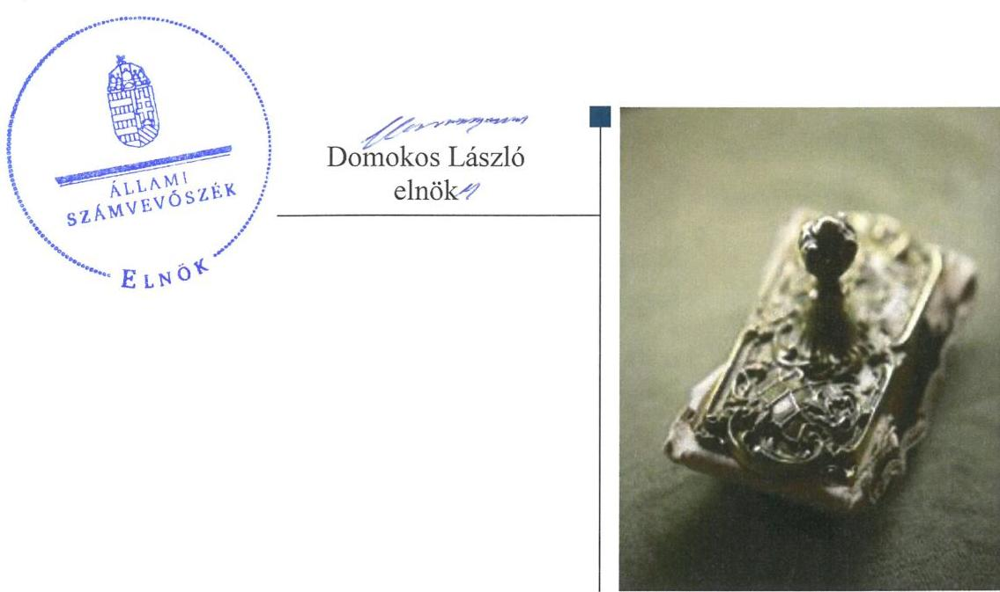
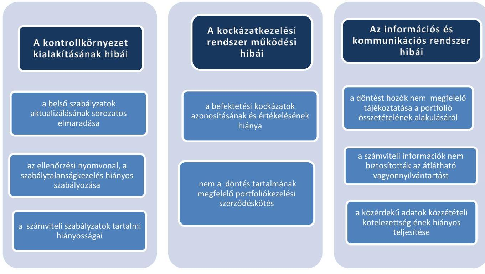
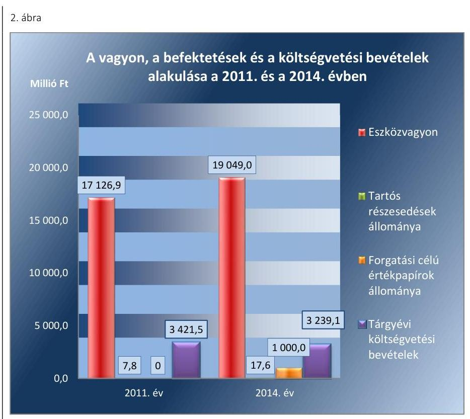
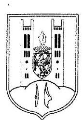
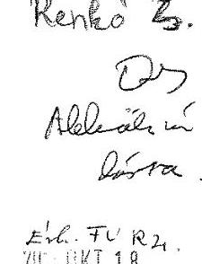
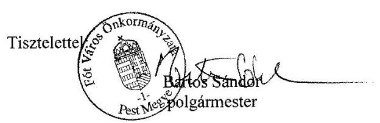
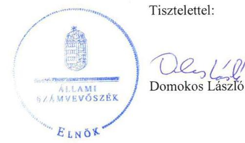

# Jelentés 

## Önkormányzatok belső kontrollrendszere

Az önkormányzatok belső
kontrollrendszere kialakításának és működtetésének ellenőrzése - Fót

---

# Jelentés 

## Önkormányzatok belső kontrollrendszere

Az önkormányzatok belső
kontrollrendszere kialakításának és működtetésének ellenőrzése - Fót
2016. 12. hó 01. nap

---

# AZ ELLENŐRZÉST FELÜGYELTE: 

RENKÓ ZSUZSANNA felügyeleti vezető

## AZ ELLENŐRZÉST VEZETTE ÉS A VÉGREHAJTÁSÁÉRT FELELŐS:

PÁNCSICS JUDIT ellenőrzésvezető

## A PROGRAM ÖSSZEÁLLÍTÁSÁÉRT FELELŐS:

JANIK JÓZSEF osztályvezető

IKTATÓSZÁM: V-0910-124/2016.
TÉMASZÁM: 1944

## ELLENŐRZÉS-AZONOSÍTÓ SZÁM: V07182

Jelentéseink az Országgyűlés számítógépes hálózatán és az Interneten a www.asz.hu címen is olvashatóak.

---

# TARTALOMJEGYZÉK 

■ ÖSSZEGZÉS ..... 5
■ AZ ELLENŐRZÉS CÉLJA ..... 8
■ AZ ELLENŐRZÉS TERÜLETE ..... 9
■ AZ ELLENŐRZÉS HÁTTERE, INDOKOLTSÁGA ..... 11
■ A JELENTÉS LÉNYEGES KÉRDÉSKÖREI ..... 14
■ ELLENŐRZÉS HATÓKÖRE ÉS MÓDSZEREI ..... 15
■ MEGÁLLAPÍTÁSOK ..... 18
■ JAVASLATOK ..... 43
■ MELLÉKLETEK ..... 45
I. sz. melléklet: Értelmező szótár ..... 45
II. sz. melléklet: Az integritás érvényesítése érdekében kialakított és működtetett kontrollrendszer ..... 49
■ FÜGGELÉK: ÉSZREVÉTELEK ..... 51
■ RÖVIDÍTÉSEK JEGYZÉKE ..... 61

---

.

---

# ÖSSZEGZÉS 

Az Állami Számvevőszék Fót Város Önkormányzata belső kontrollrendszere kialakításának és működtetésének szabályszerűségét 2014. január 1. és 2015. április 30. közötti időszakra vonatkozóan ellenőrizte és értékelte. A belső kontrollrendszer kialakítása és működtetése a pillérek összesített értékelése alapján - a feltárt hiányosságok alapján - nem volt szabályszerű.
Az Állami Számvevőszék 2011. január 1-jétől 2015. április 30-ig terjedő időszakban ellenőrizte Fót Város Önkormányzata egyes befektetési döntéseinek, a döntések végrehajtásának, elszámolásának a szabályszerűségét.
A belső kontrollrendszer egyes pillérei az ellenőrzés megállapításai alapján 2011. január 1. és 2015. április 30. között nem támogatták az egyes befektetési tevékenységek szabályszerű végzését. A befektetési döntések előkészítése nem alapozta meg a kockázatokat minimalizáló, felelős gazdálkodást. Az egyes befektetések számviteli elszámolása nem felelt meg a jogszabályoknak és belső szabályozásnak. A feltárt hiányosságok következtében nem volt biztosított a befektetési tevékenység szabályszerű, átlátható, elszámoltatható végzése.

## Az ellenőrzés társadalmi indokoltsága

A demokratikus társadalmakban alapvető igény, hogy a közpénzeket, a közvagyont használók tevékenységükről elszámoljanak, ahhoz egyértelmű és érvényesíthető felelősségi szabályok társuljanak. Ennek a jogos igénynek az érvényesítéséhez meg kell teremteni azokat a folyamatokat, rendszereket, amelyek nélkülözhetetlenek az elszámoltatáshoz. Az elszámoltatás eredményes működtetéséhez szükség van a megfelelő információs-, kontroll-, értékelési és beszámolási rendszerek kialakítására. A belső kontrollok kiépítettsége hozzájárul az integritási szemlélet kialakításához és érvényesüléséhez. A belső kontrollrendszer kialakítása és működtetése nélkül nem valósítható meg a közpénzek, a közvagyon szabályos, gazdaságos, hatékony és eredményes felhasználása. A kockázatok alapján fennáll a lehetősége annak, hogy az önkormányzatok befektetési döntései, továbbá a döntések végrehajtása és számviteli elszámolása nem voltak teljes mértékben szabályszerűek, és a kapcsolódó külső és belső kontrollrendszerek sem működtek minden esetben megfelelően.

## Főbb megállapítások, következtetések, javaslatok

A belső kontrollrendszer kialakítása és működtetése a pillérek összesített értékelése alapján 2014. január 1. és 2015. április 30. között nem volt szabályszerű. A feltárt hiányosságok alapján a kontrollkörnyezet kialakítása részben szabályszerűen történt. Az információs és kommunikációs rendszer, valamint a monitoring rendszer kialakítása és működtetése - kisebb hiányosságok mellett - megfelelt a jogszabályi előírásoknak, szabályszerű volt. A kockázatkezelési rendszer, valamint a kontrolltevékenységek kialakítása és működtetése nem volt szabályszerű. A pénzügyi folyamatokban kulcsszerepet betöltő teljesítésigazolás és érvényesítés belső kontrollok működtetése nem volt megfelelő, ezért azok nem biztosították a közpénzfelhasználás szabályosságát, nem járultak hozzá a hibák megelőzéséhez, feltárásához.

Az ellenőrzés tárgyát képező befektetések közül 2014. június 30-án rövid lejáratú betétben 258,3 millió Ft-ot tartottak, portfoliókezelési szerződéssel 500,0 millió Ft-ot fektettek be. 2015. április 30-án az Önkormányzatnak ${ }^{1}$ lekötött betéte nem volt, a portfoliókezelési szerződéssel összesen 1000 millió Ft-ot hasznosítottak. A portfoliókezelési szerződésben kiemelt kockázatot jelentett, hogy a hozam mellett a befektetett tőke védelme sem volt garantált.

---

Üzleti vagyonba tartozó ingatlanokat, kulturális javakat és egyéb értéktárgyakat befektetési céllal, visszterhes ügylettel 2011. január 1. és 2015. április 30. között nem szereztek be.

A belső kontrollrendszer egyes pilléreiben, kiemelten a kontrollkörnyezet kialakításában, a kockázatkezelési rendszer, valamint az információs és kommunikációs rendszer működtetésében 2011. január 1. és 2015. április 30. között hiányosságok voltak, ezáltal a belső kontrollrendszer nem támogatta a befektetési tevékenység szabályszerű, átlátható, elszámoltatható, kockázatokat minimalizáló végzését, közvetve az önkormányzati vagyon veszteségektől való megóvását. A befektetési döntések előkészítése során nem alapozták meg a körültekintő, kockázatokat mérlegelő döntéshozatalt. A számviteli rendszer nem biztosította a valódiság elvének érvényesülését és az átláthatóságot.

A belső ellenőrzés nem tárta fel a befektetési döntések előkészítésének és végrehajtásának, valamint a pénzügyi folyamatokban kulcsszerepet betöltő teljesítésigazolás és érvényesítés belső kontrollok működésének hiányosságait. A belső ellenőrzés nem azonosította kockázatként az önkormányzat vagyonának jelentős részét képező befektetés egy befektetési szolgáltatónál, portfoliókezelési szerződésben való elhelyezését. A belső ellenőrzés nem tárta fel a befektetési döntések előkészítésében és végrehajtásában, a befektetések számviteli elszámolásában elkövetett szabálytalanságokat, hiányosságokat.

A befektetési tevékenységeket külső ellenőrző szervezet nem ellenőrizte.
Az Önkormányzat befektetési tevékenységével kapcsolatos főbb szabálytalanságokat az 1. ábra foglalja össze.

1. ábra

A BEFEKTETÉSI TEVÉKENYSÉG KONTROLLRENDSZERÉVEL KAPCSOLATBAN FELTÁRT HIBÁK

A kulcskontrollok működtetése, valamint a monitoring rendszer (belső ellenőrzés)
nem tárta fel a kockázatokat és a szabálytalanságokat.

A belső kontrollrendszer nem biztosította a szabályszerű, átlátható, elszámoltatható,
a kockázatokat minimalizáló vagyongazdálkodást.

---

Az Önkormányzatnál az erőforrásokkal való szabályszerű gazdálkodás követelményeit részben határozták meg, hatékonysági követelményeket nem írtak elő. Ezáltal az Önkormányzat irányítása alá tartozó költségvetési szerveknél a hatékony gazdálkodás érvényesítésének lehetősége nem volt biztosított.

Az Önkormányzat 2014-ben részt vett az ÁSZ² integritás felmérésében. A kockázatok és kontrollok szintje között nem volt egyensúly, mivel a szervezetnél a kiépült kontrollok összességében nem voltak képesek kezelni a kockázatokat és támogatni a szervezet feladatellátását. A belső kontrollrendszer kialakítása és működtetése nem támogatta az integritás szemlélet érvényesülését, az ellenőrzés során feltárt szabályozási és működési hiányosságok miatt az integritás szemlélet érvényesítésében még jelentős fejlődést kell elérniük.

---

# AZ ELLENŐRZÉS CÉLJA 

Az ellenőrzés célja annak megállapítása volt, hogy az önkormányzat belső kontrollrendszerének kialakítása, továbbá egyes elemeinek működtetése biztosította-e az önkormányzatnál a közpénzfelhasználás szabályosságát. Az erőforrásokkal való szabályszerű és hatékony gazdálkodáshoz szükséges követelmények érvényesítése, számonkérése, ellenőrzése megtörtént-e az önkormányzatnál. A belső kontrollrendszer kialakítása és működtetése támogatta-e az integritás szemlélet érvényesülését. Az ellenőrzés során értékeltük a belső kontrollrendszer kialakításának és működtetésének szabályszerűségét. Bemutatjuk azokat a lényeges szabályozási hiányosságokat, amelyek miatt az ellenőrzött kulcskontrollok nem nyújtottak elegendő védelmet a lehetséges hibákkal szemben. Rámutattunk arra, ha a kulcskontrollok valamely hibát nem előztek meg, nem tártak fel vagy nem javítottak ki, valamint minősítjük működésük megfelelőségét.

Ellenőriztük, hogy az önkormányzat egyes befektetési döntései és azok végrehajtása, elszámolása megfelelt-e a vonatkozó jogszabályoknak és belső szabályozásoknak, a kialakított kontrollrendszer támogatta-e a befektetési tevékenység szabályszerűségét.

---

# **AZ ELLENŐRZÉS TERÜLETE**

## **Fót Város Önkormányzata**

A Pest megyében fekvő Fót város állandó lakosainak száma 2015. január 1-jén 19 364 fő volt.

A helyi önkormányzati képviselők és polgármesterek 2014. évi általános választásáig az Önkormányzat nyolc tagú, azt követően 11 tagú Képviselő-testületének3 munkáját két állandó bizottság segítette. A Fóti Roma Nemzetiségi Önkormányzat a nemzetiségi önkormányzati képviselők 2014. évi választását követően alakult meg.

Az Önkormányzat a Hivatalon kívül öt intézménnyel, valamint egy 100%-os tulajdoni részesedésű gazdasági társasággal látta el a feladatait.

A korábbi polgármester 2013. szeptember 18-i lemondását követően a polgármesteri feladatokat az alpolgármester látta el, a jelenlegi polgármester a 2014. márciusi időközi választások óta tölti be tisztségét. A jegyző 2015. március 2. óta látja el feladatait. Az előző jegyző 2012. március 1-jétől 2015. február 28-ig vezette a Hivatalt.

A Hivatal öt szervezeti egységre tagolódott. A gazdasági szervezet feladatait a Pénzügyi és Adóügyi Osztály, valamint a Városfejlesztési- és Üzemeltetési Osztály látta el, a gazdasági vezető a Pénzügyi és Adóügyi Osztályvezető volt. A Hivatalban foglalkoztatott köztisztviselők száma 2014. év végén 51 fő volt, 2014. január 1-jétől szervezeti változás nem történt.

Az Önkormányzat a 2014. évi éves költségvetési beszámolója szerint 3239,1 millió Ft költségvetési bevételt ért el, valamint 2751,5 millió Ft költségvetési kiadást teljesített. A pénzeszközök értéke 2014-ben 2054,2 millió Ft-ot, az üzleti vagyonba tartozó ingatlanok könyvszerinti értéke 2039,7 millió Ft-ot tett ki. A forrásokon belül a költségvetési évben esedékes kötelezettségállomány 244,6 millió Ft-ot tett ki, költségvetési évet követően esedékes kötelezettségállománya 2,6 millió Ft volt, pénzintézettel szembeni tartozásuk nem volt.

A 2013. évben 1587,7 millió Ft, 2014. évben 2249,5 millió Ft összegben részesültek adósságkonszolidációs támogatásban.

Az Önkormányzat vagyonának, befektetéseinek és a költségvetési bevételeinek alakulását a 2011. évben és a 2014. évben a 2. ábra mutatja be:

---

Adatok forrása: a 2011. és a 2014. évi éves költségvetési beszámolók

---

# AZ ELLENŐRZÉS HÁTTERE, INDOKOLTSÁGA 

Az ÁSZ tv. ${ }^{4}$ szerint az ÁSZ feladata a jól irányított állam kiépítésének elősegítése. Az ÁSZ Stratégiájában ezért hangsúlyos szerepet szánt annak, hogy szilárd szakmai alapon álló, értékteremtő ellenőrzéseivel előmozdítsa a közpénzügyek átláthatóságát, rendezettségét. A számvevőszéki ellenőrzés nemzetközi alapelvei is rögzítik, hogy a megfelelő belső kontrollrendszer minimálisra csökkenti a hibák és szabálytalanságok kockázatát.

A belső kontrollrendszer azt a célt szolgálja, hogy a költségvetési szervek működésük és gazdálkodásuk során a tevékenységeket szabályszerűen, gazdaságosan, hatékonyan, eredményesen hajtsák végre, teljesítsék elszámolási kötelezettségeiket és megvédjék az erőforrásokat a veszteségektől, a károktól és a nem rendeltetésszerű használattól. A belső kontrollrendszer magában foglalja mindazon szabályokat, eljárásokat, gyakorlati módszereket és szervezeti struktúrákat, kockázatkezelési technikákat, kontrolltevékenységeket, amelyek segítséget nyújtanak a szervezetnek céljai eléréséhez. A belső kontrollrendszer szabályozása háromszintű, a törvényi előírásokat az Áht. és az Mötv., a rendeleti szintű szabályozást az Ávr. és a Bkr. tartalmazza, amelyeket útmutatói szinten az NGM által kiadott standardok és kézikönyvek támogatnak.

Az ellenőrzött időszak meghatározása lehetőséget teremt a 2014. október 12-i önkormányzati választásokat megelőző és követő ciklus belső kontrollrendszere működésének elkülönült értékelésére, valamint a változások nyomon követésére.

A BELSŐ KONTROLLRENDSZER kialakításának és működtetésének általános értékelése mellett a teljesítésigazolás és érvényesítés kontrollok kiemelt ellenőrzésének szükségességét alátámasztja, hogy 2012-től a pénzügyi folyamatokban kulcsszerepet betöltő belső kontrollok rendszere módosult és azok működtetésében az önkormányzatoknál hiányosságok mutatkoztak a 2012. óta elvégzett ÁSZ ellenőrzések alapján.

Az önkormányzatok belső kontrollrendszerének ellenőrzése az ÁSZ "jó kormányzással" kapcsolatos stratégiai céljainak megvalósítását is szolgálja. Az ÁSZ célja, hogy javuljon az ellenőrzött önkormányzatok belső kontrollrendszerének szabályozottsága, működésének megfelelősége, hozzájárulva ezzel az egyensúlyi helyzet fenntarthatóságának biztosításához, azaz az adósság újratermelődésének megakadályozásához. Az ÁSZ ellenőrzési tapasztalatai nem csupán a közvetlenül ellenőrzött önkormányzatokat segíthetik, hanem a „jó gyakorlat" elterjesztésével azok az önkormányzatok is átvehetik a pozitív példákat, ahol nem végez ellenőrzést az ÁSZ.

Az MNB három befektetési szolgáltató tevékenységi engedélyét 2015. első felében visszavonta és kezdeményezte a vállalkozások felszámolását a működéssel kapcsolatos szabálytalanságok, hiányosságok miatt. A korábbi évek ellenőrzési tapasztalatai alapján fennáll a lehetősége annak, hogy az önkormányzatok befektetési döntései, továbbá a döntések végrehajtása és számviteli

 elszámolása nem voltak teljes mértékben szabályszerűek, és a kapcsolódó külső ellenőrzések és a belső kontrollrendszer sem működtek minden esetben megfelelően.

---

Magyarország Alaptörvénye az önkormányzatoktól, mint az államháztartás alanyaitól elvárja a kiegyensúlyozott, átlátható és fenntartható költségvetési gazdálkodás elvének érvényesítését. A nemzeti vagyonról szóló törvény szerint a nemzeti vagyonnal felelős módon, rendeltetésszerűen kell gazdálkodni. A nemzeti vagyongazdálkodás feladata a nemzeti vagyon rendeltetésének megfelelő, átlátható, hatékony és költségtakarékos működtetése, ugyanakkor értékének megőrzését, értéknövelő használatát, hasznosítását, gyarapítását is elvárja.

# AZ ÖNKORMÁNYZATOK ÁTMENETILEG SZABAD PÉNZESZKÖZEINEK BEFEKTETÉSÉT jogszabály nem 

tiltja, a pénzpiaci szolgáltatók közül az önkormányzatok a kínált szolgáltatás és annak költségei alapján, szabadon választhatnak, a veszteséges gazdálkodás kockázatai és következményei azonban az önkormányzatokat terhelik. A szabad pénzeszközök felelős hasznosítása összhangban áll az önkormányzati gazdálkodás alapelveivel.

A közintézmények integritás alapú kultúrájának kialakítása, megerősítése és működése szorosan összefügg a belső kontrollrendszer működésével, ezért az ellenőrzés kiterjed annak értékelésére is, hogy a belső kontrollrendszer kialakítása és működtetése hogyan hatott az integritás szemlélet érvényesülésére.

Az államháztartás önkormányzati alrendszerében a 2014. év elején összesen 3177 települési önkormányzat működött: a 23 kerülettel rendelkező főváros, 345 város, 2691 község és 117 nagyközség volt. A belső kontrollrendszer kialakítása és működtetése ellenőrzését az ÁSZ által lefolytatott, kisebb településeket is érintő ellenőrzéseinek tapasztalatai, valamint a közérdekű bejelentések kockázati szempontú értékelése alapozták meg. Ezek a községek, nagyközségek gazdálkodásának, belső kontrollrendszere kialakításának és működésének hiányosságaira mutattak rá. Az ellenőrzések helyszíneinek kiválasztása során az ÁSZ célzott adatfeldolgozáson alapuló kockázatelemző rendszerére támaszkodik. Ez elősegíti, hogy azokon a területeken végezzen ellenőrzéseket, összpontosítva erőforrásait, ahol a valódi kockázatok, az aktuális problémák vannak.

## AZ ELLENŐRZÉS VÁRHATÓ HASZNOSULÁSA NÉGY SZINTEN valósul meg.

A törvényalkotás számára összegzett tapasztalatok állnak rendelkezésre a belső kontrollrendszer önkormányzati területen való kialakításáról, működtetéséről és hatásairól. Az ÁSZ az ellenőrzéseivel hozzájárul ahhoz, hogy az egyes önkormányzati befektetésekkel kapcsolatos kockázatok a szabályozási és kontroll mechanizmusok fejlesztésével mérsékelhetők legyenek.

Az ellenőrzés az ellenőrzött számára visszajelzést ad a belső kontrollrendszer kialakításában és működésében lévő hiányosságokról, javaslataival hozzájárul azok kiküszöböléséhez. Feltárja az önkormányzati befektetési tevékenységet meghatározó szabályozások összhangjának hiányosságait, a szabályozással nem érintett gazdálkodási területeket, valamint az egyes befektetési tevékenységek esetleges szabálytalanságait.

Az ellenőrzés megállapításait és javaslatait más szervezetek is hasznosíthatják a rendezett gazdálkodási keretek kialakításához.

---

A társadalom számára jelzi, hogy közpénz nem maradhat ellenőrizetlenül, az ÁSZ értékteremtő rend kialakításához és megőrzéséhez hozzájáruló tevékenysége pozitív hatással lesz a szervezetről kialakított összkép formálásában.

---

# A JELENTÉS LÉNYEGES KÉRDÉSKÖREI 

1.     - Az önkormányzat belső kontrollrendszerének kialakítása és működtetése szabályszerű volt-e 2014. január 1. és 2015. április 30. között, valamint a belső kontrollrendszer egyes pillérei támogatták-e a befektetési tevékenység szabályszerű végzését 2011. január 1. és 2015. április 30. között?
2.     - Az egyes befektetésekkel kapcsolatos döntéshozatal és a döntések végrehajtása szabályszerű volt-e?
3.     - Az egyes befektetések számviteli elszámolása, nyilvántartása szabályszerű volt-e?
4.     - Az erőforrásokkal való szabályszerű és hatékony gazdálkodáshoz szükséges követelmények érvényesítése, számonkérés, ellenőrzése megtörtént-e az önkormányzatnál?
5.     - Az önkormányzat belső kontrollrendszerének kialakítása és működtetése támogatta-e az integritás szemlélet érvényesülését?

---

# ELLENŐRZÉS HATÓKÖRE ÉS MÓDSZEREI 

## Az ellenőrzés típusa

Megfelelőségi ellenőrzés, a befektetési tevékenység esetében szabályszerűségi ellenőrzés.

## Az ellenőrzött időszak

A belső kontrollrendszer kialakításának és működtetésének ellenőrzése a 2014. január 1. és 2015. április 30. közötti időszakra terjedt ki. Ezen belül a belső kontrollrendszer kialakításának és működtetésének megfelelőségét a 2014. január 1. és október 12., valamint a 2014. október 13. és 2015. április 30. közötti időszakra vonatkozóan külön-külön értékeltük. Az önkormányzatok egyes befektetési tevékenységeinek ellenőrzése tekintetében az ellenőrzött időszak a 2011. január 1. - 2015. április 30. közötti időszak. Ezen felül az önkormányzat befektetésekkel kapcsolatos döntés-előkészítésének és döntéshozatalának szabályszerűségét a 2011. január 1. előtti időszakra visszanyúlóan is ellenőriztük, amennyiben a 2014. június 30-án, illetve 2015. április 30-án meglévő értékpapír-befektetéseire 2011. január 1-je előtt került sor. Az integritás szemlélet érvényesülését a 2014. évre vonatkozó adatszolgáltatás alapján értékeltük.

## Az ellenőrzés tárgya

A helyi önkormányzatnak, mint éves költségvetési beszámoló készítésére kötelezett szervezetnek és polgármesteri hivatalának belső kontrollrendszere. Az önkormányzat 2014. június 30-án, illetve 2015. április 30-án meglévő értékpapírokban megtestesülő befektetései, lekötött betétei, valamint az önkormányzat üzleti vagyonába tartozó ingatlanok, kulturális javak (műtárgyak, műalkotások, stb.), illetve a feladatellátást nem szolgáló egyéb értéktárgyak (pl. ékszerek, befektetési nemesfém). Az erőforrásokkal való szabályszerű és hatékony gazdálkodáshoz szükséges követelmények érvényesítése, számonkérés, ellenőrzése. Az integritás szemlélet érvényesülése.

## Az ellenőrzött szervezet

Fót Város Önkormányzata és az önkormányzati működéshez kapcsolódó feladatokat ellátó Hivatal.

---

# Az ellenőrzés jogalapja 

Az ÁSZ tv. 1. § (3) bekezdésében foglaltak alapján az ÁSZ általános hatáskörrel végzi a közpénzekkel és az állami és önkormányzati vagyonnal való felelős gazdálkodás ellenőrzését. Az ÁSZ tv. 5. § (2) bekezdése alapján az államháztartás gazdálkodásának ellenőrzése keretében az ÁSZ ellenőrzi a helyi önkormányzatok gazdálkodását, valamint az ÁSZ tv. 5. § (6) bekezdése alapján ellenőrzése során értékeli az államháztartás számviteli rendjének betartását és a belső kontrollrendszer működését.

## Az ellenőrzés módszerei

Az ellenőrzést a nemzetközi standardokat irányadónak tekintve az ellenőrzési program ellenőrzési kérdései, az ellenőrzött időszakban hatályos jogszabályok, az ellenőrzés szakmai szabályok és módszertanok figyelembe vételével végeztük.

Az ellenőrzés lefolytatásához az Önkormányzat a tanúsítványok kitöltésével, valamint az ÁSZ által kért dokumentumok elektronikus megküldésével szolgáltatott adatokat. A rendelkezésre bocsátott adatok, információk kontrollja és a munkalapok kitöltése az ellenőrzés keretében történt. A jelentésben használt fogalmak magyarázatát az I. számú melléklet, az integritás érvényesítése érdekében kialakított és működtetett kontrollrendszer minősítését a II. számú melléklet tartalmazza.

A belső kontrollrendszer jogszabályi előírások szerinti kialakításának és működtetésének szabályszerűségét az erre irányuló ellenőrzési kérdésekre adott válaszok összesítése alapján külön-külön értékeltük a 2014. január 1. és október 12., valamint a 2014. október 13. és 2015. április 30. közötti időszakra. A belső kontrollrendszert egy-egy ellenőrzött időszakra pillérenként (kontrollkörnyezet, kockázatkezelési rendszer, kontrolltevékenységek, információs és kommunikációs rendszer, monitoring rendszer) és összesítetten is értékeltük.

## A BELSŐ KONTROLLRENDSZER EGYES PILLÉRE-

INEK KIALAKÍTÁSA ÉS MŰKÖDTETÉSE „szabályszerű volt", amennyiben az értékelt területen az elért és elérhető pontok százalékban kifejezett, egész számra kerekített hányadosa meghaladta a 84%-ot, „részben szabályszerű volt", ha 61-84% közé esett, „nem szabályszerű volt", ha nem haladta meg a 60%-ot. A belső kontrollrendszer összesített értékelése megegyezett a pillérenként (kontrollterületenként) alkalmazott százalékos értékelésekkel, a következő eltérésekkel. A kontrollrendszer egésze esetében a „szabályszerű" értékelésnek a százalékos értéken felül további feltétele volt, hogy egyik kontrollterület sem kaphat „nem szabályszerű" értékelést, a „részben szabályszerű" értékelés további feltétele volt, hogy legfeljebb egy ellenőrzött kontrollterület lehet „nem szabályszerű" értékelésű. Az összesített értékelés a százalékos értéktől függetlenül „nem szabályszerű volt", ha az ellenőrzött kontrollterületek közül több mint egynek „nem szabályszerű volt" az értékelése.

---

# A GAZDÁLKODÁS FOLYAMATÁBAN A KÉT 

KULCSKONTROLL - teljesítésigazolás, érvényesítés - működésének megfelelőségét a személyi juttatásokkal, a dologi kiadásokkal, a beruházási, felújítási kiadásokkal, az ellátottak pénzbeli juttatásaival és az egyéb működési, felhalmozási célú, valamint a finanszírozási kiadásokkal kapcsolatos kifizetések esetében mintavétellel ellenőriztük. A mintavétel során külön értékeltük a 2014. január 1. és 2014. október 12. közötti időszakban és a 2014. október 13. és 2015. április 30. közötti időszakban teljesített kifizetéseket. „Megfelelőnek" értékeltük a gazdálkodási jogkörök gyakorlását, amennyiben 95%-os bizonyossággal a teljes sokaságban a hibaarány legfeljebb 10%, ,,részben megfelelőnek" értékeltük, ha a hibaarány felső határa 10-30% között volt, ,,nem megfelelőnek" pedig akkor, ha a mintavételi eredmények alapján a sokaságbeli hibaarány felső határa meghaladta a 30%-ot.

Az integritás szemlélet érvényesülésének értékelése az önkormányzat által kitöltött tanúsítvány alapján történt.

---

# MEGÁLLAPÍTÁSOK

## 1. Az önkormányzat belső kontrollrendszerének kialakítása és működtetése szabályszerű volt-e 2014. január 1. és 2015. április 30. között, valamint a belső kontrollrendszer egyes pillérei támogatták-e a befektetési tevékenység szabályszerű végzését 2011. január 1. és 2015. április 30. között?

Összegző megállapítás

A belső kontrollrendszer kialakítása és működtetése az összesített értékelés alapján 2014. január 1. és 2015. április 30. között nem volt szabályszerű. A feltárt hiányosságok alapján a belső kontrollrendszer egyes pilléreinek kialakítása és működtetése 2011. január 1. és 2015. április 30. között nem támogatta - a vagyonnal való gazdálkodás során - a befektetési tevékenység szabályszerű, kockázatokat minimalizáló, átlátható, elszámoltatható végzését.

A belső kontrollrendszer kialakításának és működtetésének összesített értékelését az 1. táblázat mutatja be:

1. táblázat

|  A BELSŐ KONTROLLRENDSZER KIALAKÍTÁSÁNAK ÉS MŰKÖDTETÉSÉNEK ÖSSZESÍTETT ÉRTÉKELÉSE |  |  |  |   |
| --- | --- | --- | --- | --- |
|  Megnevezés | A gazdálkodás egészét érintően: |  | A befektetési tevékenységet érintően: |   |
|   | 2014. január 1-től | 2014. október 13-tól | 2014. 2015. években | 2014. január 1-től  |
|   | 2014. október 13-ig | 2015. április 30-ig |  | 2015. április 30-ig  |
|  Kontrollkörnyezet | részben szabályszerű |  |  |   |
|  Kockázatkezelési rendszer | nem szabályszerű |  |  |   |
|  Kontrolltevékenységek | nem szabályszerű |  |  |   |
|  Információs és kommunikációs rendszer | szabályszerű |  | nem támogatta |   |
|  Monitoring | szabályszerű |  |  |   |
|  BELSŐ KONTROLLRENDSZER | NEM SZABÁLYSZERŰ |  | NEM TÁMOGATTA |   |
|   |  |  |  | Forrás: ÁSZ  |

1.1. számú megállapítás

A kontrollkörnyezet kialakítása 2014. január 1. és 2015. április 30. között részben volt szabályszerű, mivel a szervezeti és szabályozási kereteket, a feladat- és hatáskörök rendszerét, a belső szabályzatokat nem a jogszabályi előírásokkal összhangban alakították ki. A kontrollkörnyezet kialakítása 2011. január 1. és 2015. április 30. között a befektetési tevékenységek szabályszerű végzését nem támogatta.

A SZERVEZETI ÉS SZABÁLYOZÁSI KERETEKET a Képviselő-testület 2011. január 1. és 2015. április 30. között az alábbiak szerint alakította ki:

---

$\longrightarrow$ az önkormányzati SZMSZ ${ }^{5}$ - az Ötv.-ben ${ }^{6}$, illetve az Mötv.-ben ${ }^{7}$ előírtaknak megfelelően - tartalmazta az önkormányzati bizottságokra és a polgármesterre átruházott hatásköröket. A Képviselő-testület nem élt az Ötv. 9. § (3) bekezdésében, illetve az Mötv. 41. § (4) bekezdésében foglalt lehetőséggel, és nem adott külön utasítást az átruházott hatáskörök gyakorlásának szabályaira;
$\longrightarrow$ a vagyongazdálkodási rendelet ${ }_{1,2}$-ben ${ }^{8}$ meghatározta az önkormányzati vagyonnal történő gazdálkodás általános feltételeit a tagsági jogokat megtestesítő

 értékpapírokra kiterjedően is, a vagyon értékesítésének és hasznosításának részletes szabályait, a nyilvános versenyeztetés értékhatárát;
a közép- és hosszú távú vagyongazdálkodási tervet az Nvtv.-ben ${ }^{9}$ foglaltaknak megfelelően 2013. márciusában jóváhagyta, amely azonban nem tartalmazta pénzügyi eszközökben lévő vagyon hasznosítását;
a 2010-2014. évi gazdasági programban ${ }^{10}$ meghatározta, hogy a működési kiadásokat meghaladó bevételek többletéből fejlesztési célú tartalékot képeznek. A 2015-2019. évre vonatkozó gazdasági programot ${ }^{11}$ a polgármester a Képviselő-testület 2015. április 29-i ülésére előterjesztette, de további bizottsági egyeztetések miatt - az Mötv. 116. § (5) bekezdésében előírtak ellenére az alakuló ülést követő hat hónapon belül - nem hagyták jóvá;
a 2011-2015. évi költségvetési rendeleteket ${ }^{12}$ a jogszabályi előírásoknak megfelelő részletezettségben hagyta jóvá, a humánerőforrás-gazdálkodás kereteihez meghatározta a Hivatal engedélyezett létszámát;
az átmenetileg szabad pénzeszközök befektetésével kapcsolatos szabályokat a 2012-2015. évi költségvetési rendeletek tartalmazták. A 2012. évi költségvetési rendeletben a polgármester az átmenetileg szabad pénzeszközök lekötésére - időbeli és összeghatár korlátozása nélkül - kapott felhatalmazást. A Képviselő-testület a 2013-2015. évi költségvetési rendeletekben a pénzeszközök befektetésével kapcsolatos hatáskört a polgármesterre ruházta át azzal, hogy az éven túli befektetésekhez a $\mathrm{PFB}^{13}$ jóváhagyása szükséges. A 2013-2015. évi költségvetési rendeletek szerint a polgármester az átmenetileg szabad pénzeszközöket lekötött betétbe helyezhette el, illetve jogosult volt a Magyar Állam által kibocsátott értékpapírok jegyzésére, vásárlására;
az Áht.-ban ${ }^{14}$ előírtaknak megfelelően elfogadta a Hivatal ${ }^{15}$ Alapító okiratát ${ }^{16}$ és a hivatali SZMSZ ${ }_{1,2}$ - ${ }^{17}$. A feladatokat, a felelősségi és hatásköri viszonyokat megalapozó dokumentumokkal a Hivatal rendelkezett.
A Képviselő-testület sem az önkormányzati SZMSZ-ben, sem a 2012-2014. évi költségvetési rendeletekben nem írta elő a PFB-nek és a polgármesternek, hogy be kell számolnia az átruházott hatáskörben hozott befektetési döntéseiről, a befektetések hozamairól és kockázatairól. A befektetési tevékenységgel összefüggő eljárási és beszámoltatási szabályok hiánya kockázatot jelentett az Önkormányzat gazdálkodásában.

---

A HIVATAL BELSŐ SZABÁLYOZÁSA 2011. január 1. és 2015. április 30. között részben felelt meg a jogszabályi előírásoknak:
$\longrightarrow$ a hivatali SZMSZ ${ }_{1,2}$ megfelelt az Ámr. ${ }^{18}$ és az Ávr. ${ }^{19}$ előírásainak, tartalmazta a szervezeti felépítést, a működési rendet, az egyes szervezeti egységek engedélyezett létszámát, valamint a hozzárendelt intézményeket. A hivatali SZMSZ ${ }_{2}$ szervezeti ábráján a csomádi kirendeltséget önálló szervezeti egységként tüntették fel annak ellenére, hogy a munkatársak a Hatósági és Ügyfélszolgálati Osztály, valamint a Pénzügyi és Adóügyi Osztály állományába tartoztak;
a gazdálkodás rendjét a gazdálkodási szabályzat ${ }_{1-3}{ }^{20}$ az Ámr., illetve az Ávr. előírásainak megfelelően tartalmazta. A jegyző a gazdálkodási szabályzat ${ }_{1-3}$-ban előírta a gazdálkodási jogkörök gyakorlásának módjával, eljárási és dokumentációs részletszabályaival, valamint az ezeket végző személyek kijelölésének rendjével kapcsolatos feltételeket. A szabályozás tartalmazta a végzettségi, képesítési követelményeket, az összeférhetetlenségi szabályokat, a választások esetén alkalmazandó speciális szabályokat és az adatok nyilvántartásának, kezelésének szabályait;
a jegyző a közszolgálati szabályzatban ${ }^{21}$ a köztisztviselők évenként két alkalommal történő teljesítményértékeléséhez formanyomtatvány alkalmazását írta elő;
a Hivatal ellenőrzési nyomvonala ${ }_{1,2}{ }^{22}$ táblázatos formában tartalmazta a gazdálkodási és beszámolási folyamatokat, az Ámr.-ben, illetve a Bkr.-ben ${ }^{23}$ előírtaknak megfelelően bemutatta a vagyoni döntésekkel kapcsolatos felelősségi és információs szinteket, kapcsolatokat, valamint az irányítási és ellenőrzési folyamatokat. Az ellenőrzési nyomvonal ${ }_{1}$ 2011-ben az Ámr. 156. § (2) bekezdésében előírtak, 2012. decemberéig a Bkr. 6. § (3) bekezdésében előírtak ellenére nem tartalmazta a Hivatal működési folyamatai közül a finanszírozási kiadásokkal és bevételekkel kapcsolatos tevékenységek ellenőrzési folyamatait. Az ellenőrzési nyomvonal ${ }_{2}$ 7.4. pontja tartalmazta a költségvetési rendeletekben lehetővé tett betétlekötések és államilag garantált értékpapír vásárlások döntés-előkészítésével és végrehajtásával kapcsolatos ellenőrzési folyamatot.
a Hivatal rendelkezett szabálytalanságkezelési eljárásrend ${ }_{1,2}$-vel ${ }^{24}$.
A KONTROLLKÖRNYEZET KIALAKÍTÁSÁBAN A
2011-2013. ÉVEKBEN több hiányosság fordult elő, mivel a jegyző nem gondoskodott az alábbiakról:
az ügyrendet a 2013. évben a közös önkormányzati hivatal létrehozását követően, a szervezeti változások miatt 90 napon belül nem módosították az ügyrend III. fejezet (3) bekezdésében előírtak ellenére;
a számviteli politika ${ }_{1}$ -t ${ }^{25}$ és annak keretében készítendő leltározási, értékelési, pénzkezelési szabályzatokat - a Számv. ${ }^{26}$ tv. 14. § (11) bekezdésében foglaltakkal ellentétben - 90 napon túl aktualizálták a 2013. évben. A számviteli politika ${ }_{1}$ és a kapcsolódó szabályzatok hatálya a 2013. évben - az Ávr. 13. § (3a) bekezdés a) pontjában fog-

---

laltak ellenére - nem terjedt ki az Önkormányzat önálló beszámolóval érintett feladataira, illetve a helyi nemzetiségi önkormányzatokra, és azt külön sem készítették el;

- a leltározási szabályzat ${ }_{1}{ }^{27}$ 2012. októberéig az értékpapírok leltározását mennyiségi felvétellel írta elő, amely a dematerializált értékpapírok esetében nem felelt meg az Áhsz. ${ }_{1}^{28}$ 37. § (3) bekezdésében előírtaknak;
- az értékelési szabályzat ${ }_{2}{ }^{29}$ az Áhsz. ${ }_{1}$ 8. § (4) bekezdés b) pontjában foglaltak ellenére nem tartalmazta a portfoliokezelésben levő értékpapírok év végi értékelésének eljárásait;
- a pénzkezelési szabályzat ${ }_{2}$ nem tartalmazta a portfolio-kezeléshez kapcsolódó ügyfélszámla pénzforgalmára vonatkozó szabályokat, ezáltal nem felelt meg a Számv. tv. 14. § (8) bekezdése előírásainak;
- a számlarend ${ }_{1,2}$-t ${ }^{30}$ 2012-2013-ban nem aktualizálták, az Áhsz. ${ }_{1}$ változásait követően a folyamatos karbantartásról nem gondoskodtak az Áhsz. ${ }_{1}$ 49. § (6) bekezdésében előírtak ellenére különös tekintettel az éves beszámolás és a számlakerettükör tartalmi változására. A számlarend ${ }_{2}$ hatálya a 2013. évben nem terjedt ki - az Ávr. 13. § (3a) bekezdés a) pontjában foglaltak ellenére - az Önkormányzat önálló beszámolóval érintett feladataira;
A kontrollkörnyezet kialakítása 2014. január 1. és 2014. október 12., illetve 2014. október 13. és 2015. április 30. közötti időszakokban részben volt szabályszerű.

A kontrollkörnyezet kialakítása 2011. január 1. és 2015. április 30. közötti időszakban a befektetési tevékenységek szabályszerű végzését nem támogatta, mivel a számviteli politika ${ }_{1}$-t és annak keretében készítendő leltározási, értékelési, pénzkezelési szabályzatokat a Számv. tv.-ben előírt 90 napon belül nem aktualizálták a 2012-2013. években. A pénzkezelési szabályzat ${ }_{1,2}$, a számlarend ${ }_{1,2}$, az ellenőrzési nyomvonal ${ }_{1,2}$ rendelkezései hiányosak voltak.

A kontrollkörnyezet kialakításának hiányosságait 2014. január 1. és 2015. április 30. között a 2. táblázat tartalmazza.
2. táblázat

# KONTROLLKÖRNYEZET KIALAKÍTÁSÁNAK SZABÁLYTALANSÁGAI 

## Sorszám

## Részmegállapítások

1. Számviteli politika

- A jegyző az Áht. 27. § (1) bekezdésében (2015. január 1-jétől az Áht. 6/C. § (1) bekezdésében), a Számv. tv. 14. § (3) bekezdésében, az Áhsz. ${ }_{2}^{31}$ 50. § (1) bekezdésében előírtak ellenére nem alakította ki a helyi önkormányzat önálló beszámolóval érintett feladatairól készített éves költségvetési beszámolót megalapozó számviteli politikát.
- A jegyző az Áht. 27. § (2) bekezdésében (2015. január 1-jétől az Áht. 6/C. § (2) bekezdés b) pontjában), a Számv. tv. 14. § (3) bekezdésében, az Áhsz. ${ }_{2}$ 50. § (1) bekezdésében előírtak ellenére - az Ávr. 13. § (3a) bekezdésében előírt módon - nem alakította ki a helyi nemzetiségi önkormányzatok számviteli politikáját.
- A jegyző a számviteli politika ${ }_{2}$-ben az Áhsz. ${ }_{2}$ 50. § (7) bekezdésében foglaltak ellenére nem rögzítette az általános költségek szakfeladatokra és az általános kiadások tevékenységekre történő felosztásának módját, a felosztáshoz alkalmazott mutatókat, vetítési alapokat.

2. Számviteli politika keretében készítendő szabályzatok

- A jegyző a pénzkezelési szabályzat ${ }_{3}$-ban - a Számv. tv 14. § (8) bekezdése ellenére - nem rögzítette a befektetési szolgáltatónál vezetett ügyfélszámla pénzforgalmára vonatkozó szabályokat.

---

# Sorszám 

## Részmegállapítások

- A jegyző a Hivatal leltározási szabályzat ${ }_{2}$-t ${ }^{32}$, valamint az értékelési szabályzat ${ }_{2}$-t a Számv. tv. 14. § (11) bekezdésében előírtak ellenére nem aktualizálta a szervezeti változásoknak megfelelően és nem terjesztette ki a helyi önkormányzat önálló beszámolóval érintett feladataira.
- A jegyző - az Ávr. 13. § (3a) bekezdésében előírt módon - nem gondoskodott az FRNÖ ${ }^{33}$ leltározási, értékelési, valamint pénzkezelési szabályzatának elkészítéséről.
- A jegyző - a Számv. tv. 14. § (5) bekezdés c) pontjában, és az Áhsz. ${ }_{2}$ 50. § (1) és (3) bekezdéseiben előírtak ellenére - nem készítette el az önkormányzati és a hivatali tevékenységekkel kapcsolatos önköltségszámítás rendjére vonatkozó szabályozást.

3. Számlarend

- A jegyző az Áhsz. ${ }_{2}$ 51. § (3) bekezdésében előírtak ellenére a számlarend ${ }_{2}$-ben nem rögzítette a jogszabályi változásokkal összhangban a részletező nyilvántartások és az egységes rovatrend rovataihoz kapcsolódóan vezetett nyilvántartási számlák adataiból a pénzügyi könyvvezetéshez készült összesítő bizonylatok (feladások) elkészítésének rendjét, az összesítő bizonylat tartalmi és formai követelményeit.
- A jegyző nem gondoskodott - a Számv. tv. 161. § (4) bekezdésében előírtak ellenére - a számlarend ${ }_{2}$ folyamatos karbantartásáról a szervezeti és a jogszabályi változásoknak megfelelően, valamint az FRNÖ számlarendjének - az Ávr. 13. § (3a) bekezdésében előírt módon történő elkészítéséről - elkészítéséről.
- A jegyző nem gondoskodott - a Számv. tv. 161. § (4) bekezdésében előírtak ellenére - a bizonylati rend folyamatos karbantartásáról a jogszabályi és a szervezeti változásoknak megfelelően, valamint nem intézkedett - az Ávr. 13. § (3a) bekezdésében előírt módon -a helyi önkormányzat önálló beszámolóval érintett feladatai és a nemzetiségi önkormányzatok bizonylati rendjének elkészítéséről.

4. A jegyző - tekintettel a Kttv. 226. § (1) bekezdésére - a Hivatal pénzügyi-számviteli területen dolgozó köztisztviselőinek munkaköri leírásában - a Kttv. ${ }^{34}$ 75. § (1) bekezdés d) pontjában foglalt előírás ellenére - nem rögzítette a munkakör betöltésével kapcsolatos követelményeket.
5. A Képviselő-testület a Kttv. 231. § (1) bekezdésében foglaltak ellenére nem állapította meg a Kttv. 83. §-ában előírt, a köztisztviselőkre vonatkozó hivatásetikai alapelvek részletes tartalmát, és az etikai eljárás szabályait, mivel a jegyző - az Mötv. 81. § (3) bekezdés c) pontjában előírt feladata ellenére - nem kezdeményezte azok Képviselő-testület elé terjesztését.
6. A jegyző - figyelmen kívül hagyva az Mötv. 119. § (3) bekezdésében foglaltakat - az ellenőrzési nyomvonal ${ }_{2}$ hatályát - a Bkr. 6. § (3) bekezdésében előírtak ellenére - nem terjesztette ki a helyi önkormányzat önálló beszámolóval érintett feladataira és a Hivatal csomádi kirendeltségére. Az ellenőrzési nyomvonal ${ }_{2}$ nem tartalmazta a portfoliókezelési megbízás folyamatát és kontrollpontjait.
7. A jegyző - a Bkr. 6. § (4) bekezdésében előírtak ellenére - nem szabályozta a szabálytalanságok kezelésének eljárásrendjét a helyi önkormányzat önálló beszámolóval érintett feladataira, nem aktualizálta a Hivatal szabálytalanságok kezelésének eljárásrendjét, illetve azt nem terjesztette ki a nemzetiségi önkormányzatok gazdálkodási feladataira és külön szabályzatot sem készített.
8. A jegyző az Mvtv. ${ }^{35}$ 2. § (3) bekezdésében előírt, az egészséget nem veszélyeztető és biztonságos munkavégzés követelményei megvalósítási módjáról szóló munkavédelmi
 szabályzat ${ }^{36}$, illetve a Tvtv. ${ }^{37}$ 19. § (1) bekezdésében előírt tűzvédelmi szabályzat ${ }^{38}$ hatályát nem terjesztette ki a helyi önkormányzat önálló beszámolóval érintett feladataira és ezekről külön szabályzatot sem készített.

---

### 1.2. számú megállapítás

A kockázatkezelési rendszer kialakítása és működtetése 2014. január 1. és 2015. április 30. között nem volt szabályszerű. A kockázatkezelési rendszer működtetéséről 2011. január 1. és 2015. április 30. között nem gondoskodtak, emiatt az nem támogatta a befektetési tevékenységek szabályszerű végzését, a befektetések pénzügyi kockázatainak kezelését és a közvagyon védelmét.

## A KOCKÁZATOK AZONOSÍTÁSÁVAL, ELEMZÉSÉ-

VEL, csoportosításával, illetve a kockázati kitettség csökkentésével kapcsolatos tevékenységeket a kockázatkezelési szabályzat ${ }_{1,2}{ }^{39}$ általánosságban tartalmazta. A szabályozás 2013-ban a közös hivatal megalapítását követően nem került módosításra a Bkr. 3. § b) pontjában előírtak ellenére, hatálya nem terjed ki a helyi önkormányzatok önálló beszámolóval érintett feladataira.

## A KOCKÁZATKEZELÉSI RENDSZER MŰKÖDTETÉ-

SÉRŐL 2011. január 1. és 2015. április 30. között a jegyző - az Ámr. 157. § (1) bekezdésében, a Bkr. 3. § b) pontjában és 7. §-ában előírtak ellenére - nem gondoskodott. A Hivatal által ellátott tevékenységekben, a gazdálkodásban rejlő kockázatokat - azon belül az egyes befektetési tevékenységek kockázatait (a pénzintézetek, illetve a befektetési szolgáltatók tevékenységéből eredő kockázatokat pl. fizetésképtelenség vagy felszámolás) - az Ámr. 157. § (2)-(3) bekezdéseiben, illetve a Bkr. 7. § (2) bekezdésében előírtak ellenére nem mérték fel, nem határozták meg a kockázatok kezelése érdekében szükséges intézkedések teljesítésének folyamatos nyomon követési módját. A 2013-2014. években a portfoliókezelés kockázatainak rendszeres, dokumentált elemzése nem történt meg.

A kockázatkezelési rendszer kialakítása és működtetése 2011. január 1. és 2015. április 30. között a befektetési tevékenységek szabályszerű végzését nem támogatta.

## A VAGYONNYILATKOZAT-TÉTELI KÖTELEZETT-

SÉGET a köztisztviselőkre vonatkozóan a hivatali SZMSZ-ben szabályozták, a kötelezettek körét meghatározták, akik a kötelezettségüknek eleget tettek.

Az önkormányzati SZMSZ rögzítette az önkormányzati bizottságok nem képviselő tagjai vagyonnyilatkozat-tételi kötelezettségét, továbbá előírta, hogy a képviselők vagyonnyilatkozatainak nyilvántartására, ellenőrzésére a PFB kötelezett. A képviselői vagyonnyilatkozatokkal kapcsolatos alapvető szabályokat az önkormányzati SZMSZ 4. számú mellékletében a PFB általános feladat- és hatáskörei között, a részletező szabályokat a PFB ügyrendjének 2. számú mellékletében rögzítették.

A PFB a vagyonnyilatkozatokat nyilvántartásba vette, felülvizsgálta. A nyilvántartás szerint a benyújtásra előírt határidőre a vagyonnyilatkozatát minden képviselő és nem képviselő bizottsági tag leadta. A vagyonnyilatkozatok átvétele és visszaadása dokumentáltan történt.

A kockázatkezelési rendszer kialakítása és működtetése 2014. január 1. és 2014. október 12., illetve 2014. október 13. és 2015. április 30. közötti időszakokban a 3. táblázatban részletezett hiányosságok miatt nem volt szabályszerű.

---

# KOCKÁZATKEZELÉS KIALAKÍTÁSÁNAK ÉS MŰKÖDTETÉSÉNEK SZABÁLYTALANSÁGAI 

## Sorszám

## Megállapítás

1. A jegyző a Bkr. 3. § b) pontjában előírtak ellenére nem alakította ki a helyi önkormányzat önálló beszámolóval érintett feladatai esetében a kockázatok azonosításával, elemzésével, csoportosításával, nyomon követésével, illetve a kockázati kitettség csökkentésével kapcsolatos szabályokat, valamint a szervezeti változáskor elmaradt a kockázatkezelési szabályzat aktualizálása.
2. A jegyző a Bkr. 7. § (2) bekezdésében előírtak ellenére nem mérte fel és nem állapította meg a Hivatal, valamint a helyi önkormányzat önálló beszámolóval érintett feladataira vonatkozóan a tevékenységekben, a gazdálkodásban rejlő kockázatokat.

Forrás: ÁSZ

### 1.3. számú megállapítás

A pénzügyi folyamatokban kulcsszerepet betöltő teljesítésigazolás és érvényesítés kontrollok működtetése nem felelt meg a jogszabályokban és a belső szabályzatokban foglaltaknak. A kulcskontrollok nem biztosították a közpénzfelhasználás szabályosságát, nem járultak hozzá a hibák megelőzéséhez és feltárásához.

A KONTROLLTEVÉKENYSÉG KIALAKÍTÁSA, azon belül a folyamatba épített, előzetes, utólagos és vezetői ellenőrzés szabályozása 2011. január 1. és 2015. április 30. között az ellenőrzési nyomvonal ${ }_{1,2}$-ben valósult meg. A jegyző a Hivatal ellenőrzési nyomvonal ${ }_{1,2}$-ben az Ámr. 156. § (2) bekezdésében, illetve a Bkr. 6. § (3) bekezdésében előírtak szerint - a működési folyamatokat (a költségvetés tervezését, a beszerzések lebonyolítását, a támogatások elszámolását, valamint - a portfoliókezelés kivételével - a vagyonhasznosítási tevékenységet) szövegesen, táblázatokkal szemléltetett módon írta le, amely tartalmazta a felelősségi és információs szinteket és kapcsolatokat, irányítási és ellenőrzési folyamatokat, lehetővé téve azok nyomon követését és utólagos ellenőrzését.

A Hivatalban az adatvédelmi, adatbiztonsági szabályzatban a felelősségi körök meghatározásával szabályozták az engedélyezési, jóváhagyási és kontroll eljárásokat, a dokumentumokhoz való hozzáférést, a hozzáférés szintjeit. A gazdasági szervezet ügyrendjének „C" fejezete tartalmazta a beszámolási feladatok teljesítésével kapcsolatos belső előírásokat, feltételeket. Az informatikai rendszerekhez való hozzáférés jogosultságait, a hozzáférés szintjeit a Hivatal informatikai biztonsági szabályzata ${ }^{40}$ rögzítette.

MUNKAKÖR ÁTADÁS-ÁTVÉTELEK szabályosan történtek:
A polgármester személye 2014. március 19-én változott, az átadásátvétel március 26-án - az előírt határidőn belül - jegyzőkönyvvel megtörtént.

- A Hivatalban a közszolgálati szabályzat II. 2. pontjában szabályozták a közszolgálati jogviszony megszűnése, illetve munkakör változása esetén a munkakör átadásának rendjét. A jegyző személyében 2015. február 28-án következett be változás, az átadás-átvételt jegyzőkönyvben rögzítették.

A GAZDÁLKODÁSI JOGKÖRÖKKEL kapcsolatos felhatalmazások, kijelölések írásban megtörténtek, azok részben feleltek meg az előírásoknak, mert a gazdálkodási szabályzat ${ }_{2}$-t a közös hivatal megalaku-

---

lásakor nem aktualizálták és a teljesítésigazolásra jogosultak felhatalmazását 2015. március végéig az Önkormányzat önálló beszámolóval érintett feladataira - az Ávr. 57. § (4) bekezdésében előírtak ellenére, figyelmen kívül hagyva az Ávr. 52. § (6) bekezdésében előírtakat - a polgármester helyett a jegyző adta ki. A kötelezettségvállalások pénzügyi ellenjegyzését a gazdasági szervezet vezetője gyakorolta, aki rendelkezett a jogszabályban előírt végzettséggel, illetve pénzügyi-számviteli képesítéssel. Távolléte idejére és az összeférhetetlenség esetére felhatalmazást adott érvényesítésre a Hivatal állományába tartozó pénzügyi ügyintézőknek. A gazdasági vezető az érvényesítési feladatra jogszabályban előírt végzettséggel, illetve pénz-ügyi-számviteli képesítéssel rendelkező köztisztviselőket jelölt ki.

A KULCSKONTROLLOK MŰKÖDTETÉSE 2014. január 1. és 2014. október 12., illetve 2014. október 13. és 2015. április 30. közötti időszakokban nem volt megfelelő, a teljesítésigazolás és az érvényesítés nem felelt meg az Áht.-ban, az Ávr.-ben és a gazdálkodási jogkörök szabály-zata ${ }_{1,2}$-ben foglalt előírásoknak. A teljesítésigazolás és az érvényesítés belső kontrollok működésének ellenőrzése során feltárt hiányosságok részletesen a következők voltak:

# A TELJESÍTÉSIGAZOLÓ: 

az önkormányzati kiadások esetében vállalt kötelezettségekhez az Ávr. 57 § (4) bekezdésében és a gazdálkodási jogkörök szabályzata ${ }_{1,2}$ IV. fejezet (1) pontjában előírtak ellenére - figyelmen kívül hagyva az Ávr. 52. § (6) bekezdésében előírtakat - a polgármester helyett a jegyző által került kijelölésre. A szabálytalanság 2015. március 26-ig állt fenn, attól fogva a teljesítésigazolók kijelölése az Ávr. előírásainak megfelelően történt;
a személyi juttatások kifizetéseit, a dologi kiadásokat és a finanszírozási kiadásokat (portfoliokezeléssel befektetett pénzeszközök kiadását) megelőzően - az Ávr. 57. § (3) bekezdésében foglaltak szerinti aláírása hiányában - az Ávr. 57. § (1) bekezdésében előírtak ellenére nem ellenőrizte a kiadások teljesítésének jogosságát, összegszerűségét és az ellenszolgáltatást magába foglaló kötelezettségvállalás esetén annak teljesítését;
a dologi kiadások kifizetéseinél az Ávr. 57. § (4) bekezdésében foglalt kijelölés hiányában nem volt jogosult az Ávr. 57. § (1) bekezdésében előírt ellenőrzési feladat elvégezésére;
aláírása az ellátottak pénzbeli juttatásai és az egyéb működési célú kiadások kifizetése esetében nem volt beazonosítható - az Ávr. 60. § (3) bekezdésben foglaltaknak megfelelően vezetett - a teljesítésigazolásra kijelölt személyek aláírás-mintájával, jogosultság hiányában a kifizetéseket megelőzően a teljesítés jogosságának és összegszerűségének az ellenőrzése nem történt meg.

## AZ ÉRVÉNYESÍTŐ:

a személyi juttatások kifizetései, a dologi kiadások, a finanszírozási kiadások (portfoliokezeléssel befektetett pénzeszközök kiadása) esetében az ellenőrzési feladatát - az Ávr. 58. § (3) bekezdésében előírtak ellenére - nem a teljesítésigazolás alapján végezte el;

---

$\longrightarrow$ a személyi juttatások kifizetést megelőzően az Ávr. 58. § (3) bekezdésében előírtak ellenére az utalványt nem írta alá, az érvényesítés nem történt meg;
$\longrightarrow$ az Áht. 38. § (1) bekezdésében előírtak szerint a személyi juttatások kifizetést megelőzően nem tüntette fel az aláírása mellett az érvényesítés dátumát, emiatt az Ávr. 58. § (1) bekezdésében előírtak ellenére nem igazolt, hogy a kifizetéseket megelőzően ellenőrizte az összegszerűséget, a fedezet meglétét és azt, hogy a megelőző ügymenetben az Áht., az Ávr. és az Áhsz. ${ }_{2}$, továbbá a belső szabályzatok előírásait betartották-e;
$\longrightarrow$ a személyi juttatások kifizetései esetében az Ávr. 58. § (1) bekezdésben foglaltak ellenére nem észrevételezte és az Ávr. 58. § (2) bekezdésében előírtak ellenére nem jelezte az utalványozónak, hogy a kötelezettségvállalást az Áht. 37. § (1) bekezdésében, illetve a közszolgálati szabályzat VII. fejezet 1. pontjában előírtak ellenére nem foglalták írásba;
$\longrightarrow$ a dologi kiadások, valamint a beruházások és felújítások kiadásai esetében az Ávr. 58. § (2) bekezdésében előírtak ellenére nem jelezte az utalványozónak, hogy az Áht. 37 § (1) bekezdésében foglaltak ellenére a pénzügyi ellenjegyzés a kötelezettségvállalást követően történt meg;
$\longrightarrow$ a személyi juttatások kifizetései esetében az Ávr. 58. § (1) bekezdésben előírtak ellenére nem kifogásolta, hogy az utalványon az Ávr. 59. § (3) bekezdés e) pontjában előírtaknak megfelelően a könyvviteli számla számát nem tüntették fel.
A kontrolltevékenységek 2011. január 1. és 2015. április 30. közötti időszakban a portfoliókezelés folyamatba épített, előzetes, utólagos és vezetői ellenőrzése szabályozásában és a pénzügyi kontrollok működtetésében feltárt (a 4. és a 7. táblákban jelzett) szabálytalanságai miatt nem támogatták a befektetési tevékenység szabályszerű végzését.

A teljesítésigazolás és az érvényesítés 2014. január 1. és 2015. április 30. közötti működtetésének ellenőrzése során feltárt hiányosságokat összevontan a 4. táblázat tartalmazza.
4. táblázat

# KONTROLLTEVÉKENYSÉG MŰKÖDTETÉSÉNEK HIÁNYOSSÁGAI 

## Sorszám

## Megállapítás

1. Teljesítésigazolás

A teljesítésigazolást a kifizetést megelőzően az Ávr. 57. § (1) és (4) bekezdésében valamint a gazdálkodási szabályzat ${ }_{1,2}$-ben foglaltak ellenére - nem, illetve nem szabályszerűen végezték el, továbbá írásos kijelölés hiányában nem az arra jogosult végezte el. A teljesítést igazoló személy aláírása nem volt beazonosítható - az Ávr. 60. § (3) bekezdésben foglaltaknak megfelelően vezetett - a teljesítésigazolásra kijelölt személyek aláírás-mintájával.
2. Érvényesítés

Az érvényesítést - az Ávr. 58. § (1) és (3) bekezdésében előírtak ellenére - nem, illetve nem szabályosan végezték el.
Az érvényesítő - az Ávr. 58. § (1) bekezdésében előírtak ellenére - nem észrevételezte és az Ávr. 58. § (2) bekezdésében foglaltak ellenére nem jelezte az utalványozónak, hogy a megelőző ügymenetben a teljesítésigazolót nem az arra jogosult kötelezettségvállaló jelölte ki, az Áht. 37. § (1) bekezdése ellenére a kötelezettségvállalást nem foglalták írásba, valamint a kötelezettségvállalás pénzügyi ellenjegyzésére nem, vagy csak utólag került sor.

---

# Sorszám 1.4. számú megállapítás 

Az érvényesítő az Ávr. 58. § (1) bekezdésében előírtak ellenére nem észrevételezte, hogy az Ávr. 59. § (3) bekezdés e) pontjában előírtak ellenére az utalványokról hiányzott a könyvviteli számla száma.

Forrás: ÁSZ

Az információs és kommunikációs rendszer kialakítása és működtetése néhány hiányosság mellett 2014. január 1. és 2015.
 április 30. között szabályszerű volt. 2011. január 1. és 2015. április 30. között a befektetésekkel kapcsolatos információáramlás elmaradása, valamint a közérdekű adatok közzétételének hiányos teljesítése miatt a jegyző a nyilvánosság tájékoztatásáról nem gondoskodott, a befektetési tevékenység átláthatóságát és nyilvánosságát nem biztosította.

AZ INFORMÁCIÓÁRAMLÁS RENDSZERÉT a szervezeten belül és a külső érintettek részére - a befektetési tevékenység kivételével - 2011-től kialakították.

A vagyongazdálkodási rendelet ${ }_{1,2}$, valamint éves költségvetési rendeletek általánosan tartalmazták a beszámolási szinteket, határidőket, módokat. A Képviselő-testület nem rendelkezett olyan körülményekről, feltételekről, amelyek esetében a polgármesternek jelzést, tájékoztatást kellett adnia a befektetéssel kapcsolatos információkról a PFB, illetve a Képviselőtestület felé. A hivatali SZMSZ ${ }_{1,3}$ ben és az ügyrend ${ }_{1-3}$-ban rögzítették az információ átadásának alapvető szabályait, valamint a beszámolási rendszerre vonatkozó főbb előírásokat. A Hivatalban a belső szabályozás a Bkr. 9. § (1) bekezdésében előírtak ellenére nem biztosította, hogy a befektetési tevékenységgel kapcsolatos információk a megfelelő időben eljussanak az illetékes döntéshozókhoz, szervezeti egységekhez, illetve személyekhez. A jegyző által elkészített zárszámadási rendelettervezet előterjesztése sem adott részletes értékelést a befektetések hozamairól, illetve a piaci értékük alakulásáról.

A KÖZÉRDEKŰ ADATOK megismerésére irányuló kérelmek intézésének, továbbá a kötelezően közzéteendő adatok nyilvánosságra hozatalának rendjét és felelősét a jegyző 2011. október 1-jéig az Ámr. 20. § (3) bekezdés i) pontjában előírtak ellenére nem szabályozta, azt követően - az Eisztv.-ben ${ }^{41}$, illetve az Info tv.-ben ${ }^{42}$ előírtaknak megfelelően - a közzétételi szabályzat ${ }_{1,2}$-ben ${ }^{43}$ meghatározta. A közzétételi szabályzat ${ }_{2}$ aktualizálásáról a Hivatal 2013. évi szervezeti változása ellenére nem gondoskodott, ezáltal nem biztosította, hogy a Bkr. 9. § (1) bekezdésében előírtak szerint az információk a megfelelő időben eljussanak az illetékes szervezethez, szervezeti egységhez, illetve személyhez.

Az Önkormányzat honlapján - 2012-től 2015. április 30-ig - a közzétételi szabályzat ${ }_{1,2}$-ben, valamint az Info tv. 1. mellékletében előírtak ellenére nem tették közzé:
$\longrightarrow$ a pénzügyi szolgáltatási szerződések - betétlekötések, az értékpapír vásárlások vagy értékesítések, illetve a portfoliókezelési szerződések - adatait;
$\longrightarrow$ a 2014. évi éves költségvetési beszámolót és a 2015. évi költségvetést.

---

Az iratkezelési szabályzatban ${ }^{44}$ a jegyző egységes, a székhelyen és a telephelyen történő iratkezelést és iktatást írt elő. Az iratkezelési szabályzattal egyetértett Levéltár, valamint a Kormányhivatal ${ }^{45}$ vezetője.

A jegyző 2013. februárjában elkészítette és hatályba léptette az adatvédelmi és adatbiztonsági szabályzatot ${ }^{46}$, valamint a közszolgálati adatvédelmi szabályzatot ${ }^{47}$, azonban a közös önkormányzati hivatal megalakulását követően azok aktualizálása 2015. április végéig nem történt meg.

Az információs és kommunikációs rendszer kialakítása és működtetése - a szabályzatok aktualizálása, illetve a közérdekű adatok közzétételének elmaradása kivételével - 2014. január 1-jétől 2014. október 12-ig, illetve 2014. október 13-tól 2015. április 30-ig szabályszerű volt.

Az információs és kommunikációs rendszer szabályos működtetése érdekében 2011. január 1. és 2015. április 30. közötti időszakban nem gondoskodtak a közérdekű adatok közzétételéről szóló szabályzat aktualizálásáról és a közérdekű adatok közzétételéről, emiatt információs és kommunikációs rendszer nem támogatta a befektetési tevékenység szabályszerű végzését.

Az információs és kommunikációs rendszer kialakításának és működtetésének hiányosságait 2014. január 1. és 2015. április 30. között az 5. táblázat tartalmazza:
5. táblázat

# AZ INFORMÁCIÓS ÉS KOMMUNIKÁCIÓS RENDSZER KIALAKÍTÁSA ÉS MŰKÖDTETÉSE HIÁNYOSSÁGAI 

## Sorszám

## Megállapítás

1. A Hivatalon belüli információáramlás rendszere a Bkr. 9. § (1) bekezdésében előírtak ellenére nem biztosította, hogy a befektetési tevékenységekkel kapcsolatos információk eljussanak a megfelelő személyekhez, illetve szervezeti egységekhez
2. A jegyző az Info tv. 24. § (3) bekezdésében előírtak alapján készített hivatali adatvédelmi és adatbiztonsági szabályzatot a Hivatal szervezeti változása ellenére nem módosította.
3. A jegyző az Info tv. 35. § (3) bekezdésében, az Ávr. 13. § (2) bekezdés h) pontjában előírtak ellenére a kötelezően közzéteendő adatok nyilvánosságra hozatalának rendjéről elkészített közzétételi szabály-zat2-t a Hivatal 2013. évi szervezeti változását követően nem módosította.
4. A jegyző az Info tv. 37. § (1) bekezdésében és az 1. melléklet III./4. pontjában előírtak ellenére nem tette közzé az államháztartáshoz tartozó vagyonnal történő gazdálkodással összefüggő, ötmillió forintot elérő vagy azt meghaladó értékű pénzügyi szolgáltatások igénybevételével kapcsolatos - egyes befektetési - szerződései adatát, azaz a szerződések megnevezését (típusa), tárgyát, a szerződést kötő felek nevét, a szerződés értékét, határozott időre kötött szerződés esetében annak időtartamát, valamint az említett adatok változásait.
A jegyző az Info tv. 37. § (1) bekezdésében és az 1. melléklet III./1. pontjában előírtak ellenére nem tette közzé a 2014. évi éves költségvetési beszámolót, illetve a 2015. évi költségvetést.

---

### 1.5. számú megállapítás

A monitoring-rendszer kialakítása és működtetése 2014. január 1. és 2015. április 30. között szabályszerű volt. A 2011. évtől 2015. április 30-ig a belső ellenőrzések nem tárták fel a befektetési tevékenységek hibáit, a külső ellenőrzések a befektetési tevékenységeket nem érintették. A belső és a külső ellenőrzések nem támogatták az átlátható, elszámoltatható, a pénzügyi kockázatokat minimalizáló befektetési tevékenységek végzését.

A MONITORING-RENDSZERT a jegyző kialakította, a belső kontrollrendszerről szóló utasítás II. fejezet 5. pontjában szabályozta a szervezeti célok megvalósításának nyomon követését, annak alkalmazási rendjét, értékelését. Az utasítás aktualizálásáról a Hivatal szervezeti változása ellenére nem gondoskodott. Az Önkormányzat belső kontrollrendszerének minőségét a jegyző a 2013. és a 2014. évre vonatkozóan a Bkr. 1. számú mellékletében foglaltak szerinti nyilatkozatban - a jelen ellenőrzés által feltárt hibák ellenére - megfelelőnek értékelte.

A BELSŐ ELLENŐRZÉSRŐL a jegyző - a Ber.-ben ${ }^{48}$, illetve a Bkr.-ben előírtak szerint - külső vállalkozók megbízásával gondoskodott. A belső ellenőrzést végző vállalkozóval kötött megállapodásban rögzítették a belső ellenőrzési vezetői feladatok és kötelezettségek ellátásának módját. A belső ellenőrzés szabályait a jegyző által jóváhagyott belső ellenőrzési kézikönyv ${ }_{1,2}{ }^{49}$ a Ber., illetve a Bkr. előírásainak megfelelően tartalmazta.

## A BELSŐ ELLENŐRZÉSI VEZETŐ:

- 2011-ben a Ber.-ben előírtaknak megfelelően - kockázatelemzés alapján - elkészítette a 2012-2017. évre vonatkozó stratégiai belső ellenőrzési tervet. A stratégiai tervben a pénzügyi döntések szabályossági és törvényességi szempontból történő jóváhagyását, ellenjegyzését magas kockázatúnak minősítették. A befektetési tevékenységgel kapcsolatos pénzügyi kockázatokat a stratégiai belső ellenőrzési terv nem tartalmazta;
- az éves ellenőrzési terveket a Bkr.-ben előírtak szerint kockázatelemzés alapján az előírt határidőre elkészítette, melyet a Képviselő-testület jóváhagyott. A 2014. évre és a 2015. év első negyedévére tervezett ellenőrzéseket a Bkr.-ben előírtaknak megfelelően végrehajtották;
- az elvégzett ellenőrzésekről évenként nyilvántartást vezetett. A nyilvántartás tartalmazta a belső ellenőrzési jelentésekben tett megállapításokat, javaslatokat, a vonatkozó intézkedési terveket és azok végrehajtásának állapotát.
- az éves ellenőrzési jelentést elkészítette, határidőben megküldte a jegyzőnek. Az éves összefoglaló jelentés tartalmazta a belső kontrollrendszer szabályszerűségének, gazdaságosságának, hatékonyságának és eredményességének növelése, javítása érdekében tett fontosabb javaslatokat és a belső kontrollrendszer öt elemének értékelését.
A monitoring-rendszer kialakítása és működtetése a 2014. január 1. 2014. október 12. közötti, valamint a 2014. október 13. - 2015. április 30. közötti időszakban annak ellenére szabályszerű volt, hogy a belső ellenőrzések nem tárták fel a befektetési tevékenység kockázatait (a megtakarítások jelentős része egy befektetési szolgáltatónál, magas kockázatú portfólióban volt), és hibáit (a befektetési tevékenység döntés-előkészítésének, kockázatkezelésének, illetve az arról való beszámoltatásnak a hiányát). Az átmenetileg szabad pénzeszközök befektetése szabályozottságának, illetve a befektetések gazdasági eseményei elszámolásának ellenőrzését nem tervezték, ilyen célú ellenőrzést nem végeztek. A monitoring rendszer - és annak részeként a belső ellenőrzés - 2011. január 1. és 2015. április 30. közötti időszakban a jelen ellenőrzés során feltárt szabálytalanságokat nem észlelte, emiatt nem támogatta a befektetési tevékenység szabályszerű végzését.

KÜLSŐ ELLENŐRZÉSEK nem terjedtek ki a befektetési tevékenység döntéshozatali eljárásának jogszerűségére, valamint a döntések végrehajtásának szabályszerűségére.

A Kormányhivatal törvényességi felügyeleti ellenőrzései nem érintették az Önkormányzat egyes befektetéseivel kapcsolatos döntések szabályszerűségét.

A könyvvizsgáló az Önkormányzat 2011-2014. évi éves költségvetési beszámolójáról minden évben kiadta a hitelesítő véleményét. A könyvvizsgáló a jelentésében a befektetések számviteli elszámolásának, értékelésének ellenőrzése során nem észrevételezte a jelen ellenőrzés által feltárt hiányosságokat.

# 2. Az egyes befektetésekkel kapcsolatos döntéshozatal és a döntések végrehajtása szabályszerű volt-e? 

Összegző megállapítás

A befektetési döntések előkészítésében feltárt szabálytalanságok nem tették lehetővé a körültekintő, kockázatokat mérlegelő döntéshozatalt. A döntések végrehajtása során a magas pénzügyi kockázatvállalással megkötött portfoliókezelési szerződések veszélyeztették az önkormányzat pénzügyi stabilitását, a közvagyon védelmét.
2.1. számú megállapítás

Az Önkormányzat egyes befektetéseivel kapcsolatos döntés-előkészítés és döntéshozatal során nem érvényesültek a belső kontrollok, melynek következtében a gazdálkodás biztonságát veszélyeztető portfoliókezelési szerződéseket kötöttek. Nem gondoskodtak a betétlekötésekkel és a portfoliókezeléssel kapcsolatos finanszírozási bevételek és kiadások megalapozott tervezéséről.

AZ ÁTMENETILEG SZABAD PÉNZESZKÖZÖK lekötése 2011-ben az Ámr. 174. § (5) bekezdése alapján a fizetési számlát vezető banknál történt. 2012-től a Képviselő-testület felhatalmazta a polgármestert betét lekötésre a 2012. évi költségvetési rendelet 15. § (1) bekezdésében, a 2013. évi költségvetési rendelet 10. § (1) bekezdésében, valamint a 2014. és a 2015. évi költségvetési rendeletek 6. § (1) bekezdésében. A Képviselő-testület a 2013. évi költségvetési rendelet 10. § (5) bekezdésében, valamint a 2014. és 2015. évi költségvetési rendeletek 6. § (5) bekezdésében felhatalmazta a polgármestert a Magyar Állam által kibocsátott értékpapírok jegyzésére és vásárlására is azzal a feltétellel, hogy egy évnél hosszabb lejáratú értékpapírok jegyzéséhez és vásárlásához a PFB hozzájárulása szükséges.

2011-2012-ben az átmenetileg szabad pénzeszközöket rövid lejáratú betétben kötötték le, forgatási célú értékpapírral nem rendelkeztek.

Az Önkormányzatnak 2014. június 30-án - a számlavezető bankjánál három eseti szerződéssel összesen 258,3 millió Ft-ja volt lekötött betétben. A betétszerződéseket 2013. decemberében kötötték 2014. szeptemberi lejárattal. 2015. április 30-án az Önkormányzatnak nem volt lekötött betéte.

A 2013. évi költségvetési rendelet 10. § (2) bekezdésében előírtak szerint a polgármesternek „három pénzintézettől azonos lekötési feltételek mellett, azonos lejárati idő figyelembevételével, rövid úton (e-mail, fax)” kellett volna ajánlatot kérnie. A 2013. évi költségvetési rendelet 10. § (3) bekezdésében előírtak szerint egy érvényes ajánlat alapján is leköthette az átmenetileg szabad pénzeszközt a polgármester, ha bizonyította, hogy a (2) bekezdés szerint járt el. Az ellenőrzött betétlekötésekhez a számlavezető által adott ajánlatokat - mint a döntés-előkészítés dokumentumait - nem tudták az ellenőrzés rendelkezésére bocsátani, két másik pénzintézettől kapott ajánlat rendelkezésre állt. Az
 ajánlatok összehasonlításáról, a kockázataik elemzéséről a Bkr. 7. § (2) bekezdésében foglaltak ellenére nem gondoskodtak. A betétlekötési döntések megalapozottságát a Bkr. 8. § (2) bekezdés b) pontjában foglaltak ellenére célszerűségi, gazdaságossági, hatékonysági és eredményességi szempontból nem ellenőrizték.

Az Önkormányzatnál üzleti vagyonba tartozó ingatlanokat, kulturális javakat és egyéb értéktárgyakat befektetési célból az ellenőrzött időszakban nem vásároltak, ilyen tárgyi eszközök más visszterhes ügylettel sem kerültek a tulajdonukba.

PORTFOLIÓKEZELÉSI SZERZŐDÉSSEL az átmenetileg szabad pénzeszközökből 2013. július 11-től 500,0 millió Ft-ot, 2014. október 28-tól 1000,0 millió Ft-ot fektettek be a Hungária Zrt.-nél ${ }^{50}$ forgatási célú értékpapírokba. A portfoliókezeléssel befektetett vagyon értékének alakulását a 6. táblázat mutatja be.

## A PORTFOLIÓKEZELÉSI SZERZŐDÉS ELŐKÉSZÍTÉSE során:

a 2013. évben, illetve a 2014. évben - az éves költségvetési rendeletekben foglaltaknak megfelelően - három ajánlatot kértek. Az ajánlatok értékelésekor a várható hozamon kívül egyéb szempontokat (költségek és kockázatok) dokumentáltan nem vettek figyelembe. A döntéshozatalt megalapozó dokumentumok nem tartalmaztak célszerűségi, gazdaságossági és eredményességi szempontú részletes értékelést a Bkr. 8. § (2) bekezdés b) pontjában előírtak ellenére. A Hungária Zrt. klasszikus állampapír portfoliókezelésre tett, a banki ajánlatoknál magasabb hozamot tartalmazó, 2013. április 25-i indikatív ajánlatát a PFB a 2013. májusi ülésen tárgyalta. A PFB a 272/2013. (V. 21.) számú határozatával jóváhagyta, hogy az ajánlatban foglalt feltételekkel 500,0 millió Ft összegben állampapír portfoliókezelési megbízási szerződést kössenek. A PFB a döntéséről

[^0]:    6. táblázat

---

a Képviselő-testületet - a 2013. május 22-i ülésen az „egyebek" napirendi pont alatt - tájékoztatta;

- 2014. júliusában a szerződés egy éves időtartamának lejártát megelőzően nem készült előterjesztés, döntési javaslat a szerződés lezárására vagy határozatlan idejűvé tételére, nem mérlegelték a pozíciók zárása esetén realizálható hozam alakulását, valamint a szerződés fennmaradásának, illetve meghosszabbításának feltételeit. Az eredeti szerződés 4. pontjában a szolgáltatás alapelvei között rögzítették, hogy az egy éves befektetési időtávra vonatkozó tőke- és hozamvédelem megszűnik, ha a szerződés fennmarad, vagy meghosszabbításra kerül;
- a 2014. júliusában határozatlan idejűvé vált - tőke- és hozamvédelemmel már nem rendelkező - portfoliókezelési szerződés 2014. október 28-án szabálytalanul került módosításra, mivel a 2014. évi költségvetési rendelet 6. § (5) bekezdésében előírtak ellenére nem kérték a PFB hozzájárulását az újabb 500,0 millió Ft befektetéséhez. (A szerződés módosításakor a Képviselő-testület bizottságai még nem működtek, mivel a 2014. október 27-i alakuló ülésen a bizottságok létrehozásáról nem hoztak döntést.)
Az Önkormányzatnál a 2013. és 2014. évi költségvetési rendeletekben az átmenetileg szabad pénzeszközök hasznosítására eredeti előirányzatként finanszírozási bevételt, illetve finanszírozási kiadást nem terveztek, holott mindkét év első napján rendelkeztek a költségvetési évben lejáró betéttel. A 2013. és 2014. évi költségvetési rendeletekben a finanszírozási bevételek, illetve a finanszírozási kiadások módosított előirányzataként kizárólag betétlekötést terveztek, a forgatási célú értékpapír vásárlásához (a portfoliókezelési szerződéshez) kapcsolódó kötelezettségvállalásra - az Áht. 36. § (1) bekezdésében előírtak ellenére - nem biztosították a kiadási előirányzatot.

A Hivatal a döntés-előkészítés során nem ellenőrizte, hogy az önkormányzati vagyon hasznosítására feljogosítandó befektetési szolgáltató átlátható szervezetnek minősül-e, annak ellenére az Alaptörvény ${ }^{51}$ 38. cikk (4) bekezdése szerint a nemzeti vagyon átruházására vagy hasznosítására vonatkozó szerződés csak olyan szervezettel köthető, amelynek a tulajdonosi szerkezete, felépítése, valamint az átruházott vagy hasznosításra átengedett nemzeti vagyon kezelésére vonatkozó tevékenysége átlátható.

Az egyes befektetésekkel kapcsolatos döntések előkészítésének hiányosságait a 7. táblázatban tartalmazza:

---

# EGYES BEFEKTETÉSEKKEL KAPCSOLATOS DÖNTÉS-ELŐKÉSZÍTÉS ÉS DÖNTÉSHOZATAL HIÁNYOSSÁGAI 

## Sorszám

1. Kockázatok kezelése és a kontrolltevékenységek

A befektetéssel kapcsolatos kockázatokat a döntéseket megelőzően a Bkr. 7. § (2) bekezdésében előírtak ellenére nem mérték fel, valamint nem dolgoztak ki intézkedéseket a befektetésekkel kapcsolatos kockázatok kezelésére.
A FEUVE ${ }^{52}$ keretében a pénzügyi kihatású döntések megalapozottságát a Bkr. 8. § (2) bekezdés b) pontjában foglaltak ellenére célszerűségi, gazdaságossági, hatékonysági és eredményességi szempontból nem ellenőrizték, a Bkr. 8. § (2) bekezdés a) és c) pontjában rögzítettek ellenére nem gondoskodtak a befektetésekkel kapcsolatos pénzügyi döntési javaslatok dokumentumai elkészítésének, a döntések szabályszerűségi szempontból történő jóváhagyásának, illetve ellenjegyzésének kontrolljáról.
2. Előterjesztések, tájékoztatás

A portfoliokezelési szerződés 2014. októberi módosításához a 2014. évi költségvetési rendelet 6. § (5) bekezdésében előírtak ellenére nem kérték a PFB hozzájárulását az újabb 500,0 millió Ft portfoliokezeléssel történő befektetéséhez.
A Pénzügyi Bizottság az Mötv. 120. § (1) bekezdés b) pontjában rögzítettek ellenére nem kísérte figyelemmel a portfoliokezelésben tartott vagyon változásának alakulását, illetve nem értékelte a változást előidéző okokat.
A Képviselő-testület, mint - az Mötv. 115. § (1) bekezdésében előírtak szerint - a gazdálkodás biztonságáért felelős szerv sem a rendeleteiben, sem a belső szabályzataiban nem írt elő a portfoliokezelésbe történt befektetéssel, annak eredményességével kapcsolatos tájékoztatási kötelezettséget a polgármesternek és a PFB-nek.
3. A betétlekötések döntés-előkészítése során a 2013. évi költségvetési rendelet 10. § (2) bekezdésében foglaltak ellenére három pénzintézettől dokumentáltan nem kértek ajánlatot. A 2013. évi költségvetési rendelet 10. § (3) bekezdésében foglaltak ellenére - írásos dokumentumok hiányában - utólag nem bizonyítható, hogy a betétlekötéseknél a polgármester a 2013. évi költségvetési rendelet 10. § (2) bekezdésében előírtak szerint járt.
A Hivatalban a Bkr. 7. § (2) bekezdésében foglaltak ellenére nem gondoskodtak az ajánlatok összehasonlításáról, a kockázataik elemzéséről, értékeléséről. A betétlekötési döntések megalapozottságát a Bkr. 8. § (2) bekezdés b) pontjában foglaltak ellenére célszerűségi, gazdaságossági, hatékonysági és eredményességi szempontból nem ellenőrizték.
4. A 2013. évi és a 2014. évi költségvetési rendeletekben az átmenetileg szabad pénzeszközök hasznosítására betétlekötési előirányzatot terveztek, a forgatási célú értékpapírok vásárlása esetében - az Áht. 36. § (1) bekezdésében előírtak ellenére - a kötelezettségvállaláshoz nem biztosították az Áht. 73. § (1) bekezdés aa) pontja szerinti forgatási célú hitelviszonyt megtestesítő értékpapír vásárlás jogcímű kiadási előirányzatot.

Forrás: Ász

### 2.2. számú megállapítás

A betétlekötések során a kontrolltevékenységek működtetése nem volt szabályszerű. A portfoliokezelésre vonatkozó döntést nem a döntés tartalmának megfelelően hajtották végre. A portfoliokezelési szerződés meghosszabbítása és a befektetett összeg emelésekor a szerződés módosítása - a hozam- és tőkevédelem hiányában - a magas pénzügyi kockázatvállalás miatt veszélyeztette az Önkormányzat pénzügyi stabilitását, a közvagyon védelmét.

A 2014. június 30-án meglévő három lekötött betét közül a 200 millió Ft-os betételhelyezésről szóló polgármesteri döntést, mint kötelezettségvállalást az Áht. 37. § (1) bekezdésében előírtak ellenére írásban nem dokumentálták. A betétlekötéseket 2013. december 20-i, illetve december 23-i bankszámla kivonat, valamint a bank által ugyanezen a napokon kiállított

---

„Visszaigazolás lekötési megbízásról" elnevezésű dokumentumok igazolják.

A betétlekötések pénzügyi teljesítését megelőzően a teljesítésigazolást az Ávr. 57. § (1) és (3) bekezdésében előírtak ellenére, az érvényesítést az Ávr. 58. § (1) és (3) bekezdésében előírtak ellenére, az utalványozást az Ávr. 59. § (1) bekezdésében előírtak ellenére az arra felhatalmazottak nem végezték el.

AZ EGYEDI PORTFOLIÓKEZELÉSI SZERZŐDÉS tartalmilag nem felelt meg a 2013. évi költségvetési rendelet 10. § (5) bekezdésében és a PFB 272/2013. (V. 21.) számú határozatában foglaltaknak:
— A 2013. július 11-én megkötött szerződés 3. számú mellékletét képező befektetési stratégia lehetséges befektetési eszközként a diszkontkincstárjegy és a Magyar Államkötvény mellett az MNB kötvényt és vállalati kötvényeket is nevesített. A szerződés rögzítette azt is, hogy a portfoliokezelésben fontos tényező, hogy legalább 50% mindig magyar állampapírokban álljon rendelkezésre;
— A szerződés 5. számú mellékletét képező kockázatfeltáró nyilatkozattal az Önkormányzat tudomásul vette a vállalati kötvényekbe történő befektetések kockázatait, valamint elfogadta a portfolio PFB döntésével ellentétes rendelkezéseket tartalmazó befektetési stratégiáját.
A 2014. évi költségvetési rendelet 6. § (5) bekezdésében a szabad pénzeszközök éven belüli befektetésére és kizárólag a Magyar Állam által kibocsátott értékpapírok jegyzésére, vásárlására volt lehetőség. Ezzel szemben 2014. októberében, a Képviselő-testület alakuló ülését követő napon a Hungária Zrt.-vel fennálló, határozatlan idejű hozam- és tőkevédelem nélküli, magas kockázatú portfoliokezelési szerződés módosításával a portfolio induló értékét további 500,0 millió Ft-tal megnövelték. A portfolioba befektetett összeg felemelését a Képviselő-testület két ülése között történt fontosabb események 2014. novemberi tájékoztatójában nem említették.

A kontrolltevékenységek során a pénzügyi ellenjegyző a szerződések aláírásakor az Áht. 37. § (1) bekezdésében előírtak ellenére nem győződött meg arról, hogy a kötelezettségvállalás nem sérti-e a 2013. évi és a 2014. évi költségvetési rendeletek előírását. A befektetett összeg átutalását megelőzően az érvényesítés és az utalványozás az arra jogosultak által megtörtént. Az érvényesítő az Ávr. 58. § (2) bekezdésében előírtak ellenére nem észrevételezte, és nem jelezte az utalványozónak, hogy a megelőző ügymenetben a kötelezettségvállalásra vonatkozó helyi önkormányzati rendeletek szabályait nem tartották be.

AZ ÉRTÉKPAPÍR- ÉS ÜGYFÉLSZÁMLÁRÓL a Hivatal tételes számlakivonatot 2013. júliusától 2015. márciusáig nem kért. A Hungária Zrt. által megküldött negyedéves portfoliokezelési kimutatások hozam jellegű különbözetet mutattak, a portfolio (egy összegben feltüntetett) piaci értéke minden időszakban meghaladta a befektetett összeget. Az Önkormányzat a szerződésben foglalt kötelezettségek és a ténylegesen végrehajtott szolgáltatások között nem észlelt eltérést.

---

Az Önkormányzat a tulajdonában levő dematerializált értékpapírok KELER Zrt.-nél ${ }^{53}$ történő nyilvántartása céljából nem igényelte a befektetési vállalkozó főszámlájához tartozó külön alszámla megnyitását.

Az Önkormányzatnál a Hungária Zrt. befektetési tevékenységének felfüggesztését követően a felügyelő biztostól kapott tételes értékpapír- és ügyfélszámla kivonat alapján értesültek arról, hogy az 1000,0 millió Ft-os befektetés 2015. március 24-i 1017,6 millió Ft-os állományi értékéből:
— 31,1 millió Ft állampapírokban;
— 967,7 millió Ft a Hungária Zrt.-hez köthető vállalati kötvényekben volt, továbbá
—az ügyfélszámla 18,8 millió Ft pénzeszközt mutatott.
A portfolio állományi összetétele nem felelt meg a szerződésben foglalt befektetési feltételeknek, az értékpapíroknak mindössze 3,1%-át képviselték forgatási célú állampapírok.

A szerződés fennállásának időszakában a PFB az Mötv. 120. § (1) bekezdés b) pontjában előírtak ellenére nem kísérte figyelemmel a vagyonváltozást és az azt előidéző okokat, ezen belül azt, hogy:
— hogyan alakult az Önkormányzat portfoliojának állományi összetétele;
— a befektetési szolgáltató a szerződéses feltételeket betartotta-e, valamint
— nem jelezte a Képviselő-testületnek a Hungária Zrt. szerződésszegő, az Önkormányzat vagyonának biztonságát veszélyeztető befektetői magatartását.
Az egyes befektetésekkel kapcsolatos döntések végrehajtásával kapcsolatos szabálytalanságokat összefoglalóan a 8. táblázat tartalmazza:
8. táblázat

# EGYES BEFEKTETÉSEKKEL KAPCSOLATOS DÖNTÉSEK VÉGREHAJTÁSÁNAK HIÁNYOSSÁGAI 

## Sorszám

## Részmegállapítások

1. Az Önkormányzat szabad pénzeszközeinek befektetésekor a 2013. évi költségvetési rendelet 10. § (5) bekezdésében, illetve a 2014. évi költségvetési rendelet 6. § (5) bekezdésében kizárólag éven belüli és a Magyar Állam által kibocsátott értékpapírok jegyzésére, vásárlására volt lehetőség. A PFB a 272/2013. (V. 21.) számú határozatával hozzájárult, hogy a Hungária Zrt. ajánlatában foglalt feltételekkel 500,0 millió Ft összegben állampapír portfoliokezelési megbízási szerződést kössenek. Ennek ellenére a 2013-ban megkötött és a 2014. évben módosított portfoliokezelési szerződés az állampapírokon kívüli egyéb értékpapírokat (MNB és vállalati kötvényeket) is tartalmazott.
2. Betétlekötések esetében a kötelezettségvállalás - az Áht.
 37. § (1) bekezdésében előírtak ellenére írásban nem történt meg.
3. A pénzügyi ellenjegyző a portfoliokezelési szerződések aláírásakor az Áht. 37. § (1) bekezdésében előírtak ellenére nem jelezte, hogy a kötelezettségvállalás nem felel meg a 2013. évi költségvetési rendelet 10. § (5) bekezdésében és a PFB 272/2013. (V. 21.) számú határozatában, illetve a 2014. évi költségvetési rendelet 6. § (5) bekezdésében előírtaknak. A befektetett összeg átutalását megelőzően az érvényesítő az Ávr. 58. § (2) bekezdésében előírtak ellenére nem észrevételezte, és nem jelezte az utalványozónak, hogy a megelőző ügymenetben a kötelezettségvállalásra vonatkozó szabályokat nem tartották be.

---

# 3. Az egyes befektetések számviteli elszámolása, nyilvántartása szabályszerű volt-e? 

Összegző megállapítás

Az egyes befektetések számviteli elszámolásában, nyilvántartásában elkövetett szabálytalanságok miatt a számviteli rendszer nem biztosította az éves költségvetési beszámolókhoz a valóságnak megfelelő, átlátható vagyonnyilvántartást.
3.1. számú megállapítás

A befektetett pénzügyi eszközökről, a lekötött betétekről és az üzleti vagyonba tartozó ingatlanokról részletező (analitikus) nyilvántartást nem vezettek. A betétlekötéshez kapcsolódó gazdasági eseményeket a számviteli nyilvántartásokban késedelmesen rögzítették.

A portfolió bekerülési értékeként a befektetett összeget, 2013-ban 500,0 millió Ft-ot, 2014-ben évben mindösszesen 1000,0 millió Ft-ot tartott nyilván a főkönyvben, a forgatási célú hitelviszonyt megtestesítő értékpapírok között. A portfoliókezeléssel befektetett összegről vezetett analitikus nyilvántartás és a főkönyvi számla adatai egyezőséget mutattak. A portfoliókezelésre átadott pénzeszközöket a 2013. évi és a 2014. évi éves költségvetési beszámolóban a finanszírozási kiadások között mutatták ki.

A portfolió besorolása a forgatási célú értékpapírok közé 2013-ban megfelelt az Áhsz.1-ben, 2014-ben az Áhsz.2-ben előírtaknak.

A befektetett pénzügyi eszközök között 0,4 millió Ft tartós hitelviszonyt megtestesítő értékpapírt mutattak ki 2011. január 1-jén, amelyből 0,1 millió Ft kárpótlási jegy volt. A tartós hitelviszonyt megtestesítő értékpapírok állománya 2015. április 30-ig terjedő időszakban nem változott. A tartós hitelviszonyt megtestesítő értékpapírokról az Áhsz. 1 9. számú mellékletének 1.h) pontjában, illetve az Áhsz. 2 45. § (1) és (3) bekezdésében előírtak ellenére analitikus nyilvántartást nem vezettek. Az Önkormányzat számviteli nyilvántartásában a tartós hitelviszonyt megtestesítő értékpapírok körében nem érvényesült a Számv. tv. 165. § (4) bekezdésében előírtak ellenére a bizonylati elv és a bizonylati fegyelem, mert nem volt biztosított a főkönyvi könyvelés és analitikus nyilvántartások és a bizonylatok adatai közötti egyeztetési, ellenőrzési lehetőség, a számviteli elszámolások logikailag zárt rendszere nem működött.

A tartós hitelviszonyt megtestesítő értékpapírokhoz és a portfoliókezeléssel befektetett pénzeszközökhöz kapcsolódóan a 2011. január 1. és 2015. április 30. között nem volt olyan gazdasági esemény, amely hozam elszámolását eredményezte volna. Az Önkormányzatnak a portfoliókezelésbe helyezett befektetésből realizált hozama nem keletkezett, mivel a befektetésből pénzeszközt nem vontak ki, nyitott pozíciók lezárására nem adtak megbízást.

A betétlekötések számviteli besorolása és a bekerülési értékük meghatározása 2011. január 1. és 2015. április 30.

---

között szabályszerűen történt. A 2014. évtől a költségvetési könyvvezetésben az Áhsz. 2 39. § (3) bekezdésében foglaltak ellenére a költségvetési jelentéshez és a maradvány kimutatáshoz kapcsolódóan a pénzeszközök lekötött bankbetétként történő elhelyezése és a lekötött bankbetétek megszüntetése nyilvántartási számláin nem szereplő adatok alátámasztásáról részletező nyilvántartások vezetésével nem gondoskodtak.

A betétek lejáratakor a jóváírt kamatot - az Áhsz. 1-ben foglaltak, illetve az Áhsz. 2-ben előírt rovatrendnek megfelelően - költségvetési bevételként számolták el.

# AZ ÜZLETI VAGYONBA TARTOZÓ INGATLANOK 

számviteli nyilvántartása a 2014. január 1. és 2015. április 30. közötti időszakban nem felelt meg a jogszabályoknak, mert azokról az Áhsz. 2 45. § (3) bekezdésében és a 14. melléklet VII. pontjában előírt részletezettségben analitikus nyilvántartást nem vezettek.

A számviteli nyilvántartás hiányosságait a 9. táblázat mutatja be.

## AZ EGYES BEFEKTETÉSEK SZÁMVITELI ELSZÁMOLÁSÁVAL KAPCSOLATOS HIÁNYOSSÁGOK

## Sorszám

1. Számviteli nyilvántartás, besorolás

- A tartós hitelviszonyt megtestesítő értékpapírokról nem vezettek analitikus nyilvántartást az Áhsz. 1 9. számú melléklet 1. h) pontjában, illetve az Áhsz. 2 45. § (1) és (3) bekezdésében, valamint a 14. melléklet VIII. pontjában, illetve a számlarend $_{1,2}$-ben foglaltak ellenére.
- Az Önkormányzat számviteli nyilvántartásában a tartós hitelviszonyt megtestesítő értékpapírok körében nem érvényesült a Számv. tv. 165. § (4) bekezdésében előírt bizonylati elv és bizonylati fegyelem, mert nem volt biztosított a főkönyvi könyvelés és analitikus nyilvántartások és a bizonylatok adatai közötti egyeztetési, ellenőrzési lehetőség, a számviteli elszámolások logikailag zárt rendszere nem működött.

2. A költségvetési könyvvezetésben nem vezettek - az Áhsz. 2 39. § (3) bekezdésében foglaltak ellenére a költségvetési jelentéshez és a maradvány kimutatáshoz kapcsolódóan a pénzeszközök lekötött bankbetétként történő elhelyezése és a lekötött bankbetétek megszüntetése teljesítési nyilvántartási számláihoz részletező nyilvántartást, a nyilvántartási számlákon nem szereplő adatok alátámasztása érdekében.
3. A betét elhelyezését tartalmazó, a pénzeszközöket érintő gazdasági műveletek, események bizonylatainak adatait a Számv. tv. 165. § (3) bekezdés a) pontjában foglaltak ellenére nem késedelem nélkül, a hitelintézeti értesítés megérkezésekor, hanem a tárgy hónapot követő hónap 20. napján rögzítették a könyvekben.
4. Az üzleti vagyonba tartozó ingatlanokról a főkönyvi nyilvántartáshoz kapcsolódóan az Áhsz. 2 45. § (3) bekezdésében és a 14. melléklet VII. pontjában előírtak ellenére részletező nyilvántartást nem vezettek.

Fonós: $A SZ$
3.2. számú megállapítás

Az egyes értékpapírok, a lekötött betétek és az üzleti vagyonba tartozó ingatlanok év végi leltározása, az üzleti vagyonba tartozó ingatlanok értékelése nem felelt meg a jogszabályok és a belső szabályozás előírásainak, ennek következtében nem biztosították a befektetett vagyon áttekinthető, megalapozott nyilvántartását.

Az értékpapírok és az üzleti vagyonba tartozó ingatlanok év végi leltározása során az alábbi hiányosságok fordultak elő:
A tartós hitelviszonyt megtestesítő értékpapírok értékét a könyvviteli mérlegekben a 2011-2013. évben az Áhsz. 1 37. § (1)-(2) és (3) bekezdésében, illetve 2014-ben a Számv. tv. 69. § (4) bekezdésében,

---

az Áhsz. 5. § (1) bekezdésében, valamint a 22. § (1)-(2) bekezdésében és a leltározási szabályzat $_{1,2}$-ben foglaltak ellenére egyeztetéssel készült leltárral nem támasztották alá.
A portfoliókezelésben lévő vagyont a 2013. és 2014. években egyeztetéssel leltározták, de a vagyonleltárban szereplő portfolió év végi értéket értékpapírszámla-kivonat hiányában - figyelmen kívül hagyva a Számv. tv. 15. § (3) bekezdésében foglalt valódiság alapelvét, valamint a Számv. tv. 165. § (2) bekezdésében a könyvvitelben rögzítendő bizonylatokra vonatkozó előírásokat - a 2013. és 2014. év IV. negyedéves portfoliókezelési kimutatás nyitó értékével és az időszak alatti befizetések összegével támasztották alá.
A pénzeszközök leltárában kimutatott betéteket - részletező nyilvántartás és betétek december 31-i állapotát tartalmazó bankkivonat hiányában - a betétlekötés napján kiállított „Értesítés lekötött betétről" elnevezésű banki bizonylattal támasztották alá, ami nem felel meg a leltározási szabályzat $_{2}$ III./7. pontjában - a pénzeszközök leltározására - előírtaknak.
Az üzleti vagyonba tartozó ingatlanokról elkészített leltárak kiértékeléséhez 2014-től nem vezettek olyan részletező nyilvántartásokat, amelyek alapján az Áhsz. 53. § (8) bekezdés b) és c) pontjában előírt éves zárlati feladatok végrehajthatók.
Az ellenőrzött időszakban a portfoliókezelésbe fektetett pénzügyi eszközök esetében az értékvesztés elszámolásának feltételei nem álltak fenn, mivel - a Hungária Zrt. által küldött negyedéves egyenlegértesítők alapján - a befektetés piaci értéke a nyilvántartási értéknél magasabb volt.

Az Önkormányzatnál a 2011-2013. években éltek a tárgyi eszközök esetében a piaci értékelés lehetőségével, így az üzleti vagyonba tartozó ingatlanok esetében is. A számviteli politika $_{2}$-ben 2014-től már nem választották a piaci értékelés lehetőségét, de ennek ellenére azt tovább alkalmazták. A gyakorlatban azonban nem biztosították a Számv. tv. 58. § (1) bekezdésében előírtak ellenére a piaci értékelés szabályszerű végrehajtásának feltételeit, mert a tárgyi eszközök leltára nem tartalmazta az egyedi eszköz mérlegkészítéskori piaci értékét, valamint az egyedi eszköz elszámolt értékcsökkenéssel, értékvesztéssel csökkentett, visszaírással növelt bekerülési értékét (könyv szerinti nettó értékét), továbbá ezen értékek különbözetét. Az értékhelyesbítés összegét - helytelenül - az ingatlanvagyon-kataszterben rögzített adatokból számolták ki úgy, hogy azt a tárgyi eszközök becsült értéke és a könyvszerinti bruttó érték különbözeteként számszerűsítették. Számításaik szerint, ha a becsült érték magasabb volt a bruttó értéknél, akkor pozitív, ellenkező esetben negatív összegben állapították meg az értékhelyesbítést. Szabályszerűen eljárva azt kellett volna vizsgálniuk, hogy a piaci érték tartósan magasabb, vagy tartósan alacsonyabb a könyv szerinti értéknél. Amennyiben az elszámolt terven felüli értékcsökkenés, vagy értékvesztés visszaírása után is a piaci érték a magasabb, a különbözet értékhelyesbítésként mutatható ki. Amikor az eszköz piaci értéke tartósan alacsonyabb a könyv szerinti értéknél - a Számv. tv. 53. § (1) bekezdésének a) és b) pontjaiban, valamint az 58. § (8) bekezdésében előírtak szerint - terven felüli értékcsökkenést, vagy értékvesztést kell elszámolni. A hibás gyakorlat a 2014. május 20-án az MNV Zrt.-től állami tulajdonból átvett ingatlanok esetében is fennállt. Az adó- és értékbizonyítványban megjelölt érték és a megállapodásban közölt bruttó érték különbözeteként

---

értékhelyesbítést mutattak ki, egyik eszköz esetében negatív összegben is. A piaci értékelés, az értékhelyesbítés könyvvizsgálói felülvizsgálata a Számv. tv. 59. § (2) bekezdésében előírtak ellenére a 2011-2014. években nem történt meg.

Az Önkormányzatnál könyvvizsgáló ellenőrizte és hitelesítette az éves beszámolót, de jelentése nem tartalmazott az értékhelyesbítés elszámolására vonatkozó megállapítást.

Az egyes befektetések számviteli elszámolásának év végi hiányosságait a 10. táblázat mutatja be.
10. táblázat

# AZ EGYES BEFEKTETÉSEK ÉV VÉGI SZÁMVITELI ELSZÁMOLÁSÁVAL KAPCSOLATOS HIÁNYOSSÁGOK 

## Sorszám

## Részmegállapítás

1. A tartós hitelviszonyt megtestesítő értékpapírok mérleg szerinti értékét az ellenőrzött években - a Számv. tv. 69. § (4) bekezdése, az Áhsz. 1 37. § (1)-(2) és (3) bekezdésének, illetve az Áhsz. 2 5. § (1) bekezdés, 22. § (1)-(2) bekezdésében előírtak ellenére - egyeztetéssel készített leltárral nem támasztották alá.
2. A portfoliókezelésben lévő befektetések 2013. és 2014. év végi leltári értékét - értékpapírszámla-kivonat hiányában - a Számv. tv. 15. § (3) bekezdésében foglalt valódiság elve és a Számv. tv. 165. § (2) bekezdésében a könyvvitelben rögzítendő bizonylatok adataira vonatkozó előírás ellenére nem az analitikus nyilvántartás és az értékpapírszámla-kivonatok összevetésével állapították meg, hanem a negyedik negyedéves portfoliókezelési kimutatások nyitó értékével és az időszak alatti befizetések összegével támasztották alá.
A pénzeszközök leltárában kimutatott betéteket — részletező nyilvántartás és betétek december 31-i állapotát tartalmazó bankkivonat hiányában - a leltározási szabályzat; III./7. pontjában előírtak ellenére bankkivonat, illetve igazolás helyett a betétlekötés napján kiállított „Értesítés lekötött betétről" elnevezésű banki bizonylattal támasztották alá.
3. A bankbetétek és az üzleti vagyonba tartozó ingatlanok esetében sem biztosították a Számv. tv. 161. § (3) bekezdésében foglaltak szerint a főkönyvi és a részletező nyilvántartások értékadatai számszerű egyeztetésének lehetőségét.
4. Az üzleti vagyonba tartozó ingatlanok esetében nem vezettek olyan részletező nyilvántartásokat, amelyek alapján az Áhsz. 2 53. § (8) bekezdés b) és c) pontjában előírt feladatok, a leltári különbözetek elszámolása, az eltérések okainak kivizsgálása, valamint az év végi értékelési feladatok végrehajthatók.
5. Az Önkormányzatnál
 a számviteli politika 2.4.5. pontjában előírtak ellenére 2014-től is alkalmazták a tárgyi eszközök esetében a Számv. tv. 57. § (3) bekezdése szerinti piaci értéken történő értékelés lehetőségét, de nem biztosították, hogy a leltár az 58. § (1) előírásának megfelelően tartalmazza az egyedi eszköz mérlegkészítéskori piaci értékét, a Számv. tv. szerint elszámolt értékcsökkenéssel, értékvesztéssel csökkentett, a (2) bekezdés szerinti visszaírással növelt bekerülési értékét (könyv szerinti nettó értékét), valamint ezen értékek különbözetét.
Az értékhelyesbítés könyvvizsgálói felülvizsgálata a Számv. tv. 59. § (2) bekezdésében előírtak ellenére nem történt meg.

---

# 4. Az erőforrásokkal való szabályszerű és hatékony gazdálkodáshoz szükséges követelmények érvényesítése, számonkérése, ellenőrzése megtörtént-e az önkormányzatnál? 

Összegző megállapítás

Az erőforrásokkal való szabályszerű gazdálkodás követelményeit részben, a hatékony gazdálkodás követelményeit nem határozták meg. A követelmények számonkérése elmaradt, ezért az Önkormányzatnál az elszámoltathatóság, a hatékony gazdálkodás érvényesítésének lehetősége nem volt biztosított.
4.1. számú megállapítás

Az erőforrásokkal való szabályszerű gazdálkodáshoz szükséges követelmények kialakítása részben történt meg.

Az Önkormányzatnál az erőforrásokkal való gazdálkodás szabályai közül a következőket meghatározták:
$\longrightarrow$ Az intézmények a Képviselő-testület által jóváhagyott alapító okirattal rendelkeztek. Az intézmények SZMSZ-ét az Áht.-ban előírtaknak megfelelően hagyták jóvá.
$\longrightarrow$ A Képviselő-testület a 2015-2019. évre szóló gazdasági programot az Mötv. 116. § (5) bekezdésében előírtak ellenére az alakuló ülésétől számított hat hónapon túl fogadta el.
$\longrightarrow$ A Képviselő-testület a 2013. évben jóváhagyta a szociális szolgáltatási tervezési koncepciót, amelyben meghatározta a szolgáltatások működtetési, finanszírozási és fejlesztési feladatait.
$\longrightarrow$ Az Nvtv.-ben előírtaknak megfelelően a Képviselő-testület jóváhagyta a közép- és hosszú távú vagyongazdálkodási tervet.
$\longrightarrow$ A jegyző ${ }_{2}$ az éves költségvetések és azok módosításainak előterjesztésekor elkészítette és a Képviselő-testület részére bemutatta az Önkormányzat előirányzat-felhasználási tervét.
Az Önkormányzatnál az erőforrásokkal való gazdálkodás szabályai közül a 11. táblázatban jelzetteket nem határozták meg:
11. táblázat

## AZ ERŐFORRÁSOKKAL VALÓ SZABÁLYSZERŰ GAZDÁLKODÁS HIÁNYOSSÁGA

Sorszám
Részmegállapítások

1. Az Önkormányzat környezetvédelmi programmal - a környezet védelmének általános szabályairól szóló 1995. évi LIII. törvény 46. § (1) bekezdés b) pontjában előírtak ellenére - nem rendelkezett.

Forrás: ÁSZ
4.2. számú megállapítás

Az erőforrásokkal való hatékony gazdálkodáshoz szükséges követelményeket nem írták elő, az erőforrásokkal való hatékony gazdálkodást nem ellenőrizték. Az Önkormányzat irányítása alá tartozó költségvetési szerveknél a hatékony gazdálkodás érvényesítésének lehetősége nem volt biztosított.

A Képviselő-testület a költségvetési szervek részére 2014-ben az Áht. 9. § (1) bekezdés f) pontjában, 2015. január 1-jétől április 30-ig az Áht. 9. §

---

eb) pontjában előírtak ellenére hatékonysági követelményeket nem határozott meg.

A Képviselő-testület a munkaterveiben előírta a költségvetési szervek számára a beszámolási kötelezettséget, amit az intézmények teljesítettek.

A jegyző gondoskodott a költségvetési szervek belső ellenőrzéséről. A belső ellenőr ellenőrizte a költségvetési beszámoló megalapozottságának kontrollja keretében a főkönyv, illetve mérleg analitikával történő alátámasztottságát, illetve leltározás lefolytatásának, valamint értékcsökkenés elszámolásának szabályszerűségét, az éves beszámoló benyújtási határidejének betartását.

A PFB véleményezte a 2014. és 2015. évi költségvetési javaslatokat, a 2014. év első félévi és az éves költségvetése végrehajtásáról szóló beszámolók előterjesztését.

# 5. Az önkormányzat belső kontrollrendszerének kialakítása és működtetése támogatta-e az integritás szemlélet érvényesülését? 

Összegző megállapítás

Az Önkormányzat önértékelése szerint a belső kontrollrendszer részben szabályszerű kialakítása és működtetése az integritás szemlélet érvényesülését nem támogatta.
5.1. számú megállapítás

Az Önkormányzatnál az eredendő kockázatok, valamint a korrupciós veszélyeztetettség szintje a kockázatokat mérséklő kontrollok szintjével nincs összhangban, a belső kontrollrendszer kialakításában és működtetésében feltárt hibák miatt az integritás szemlélet fejlesztendő.

AZ ÁSZ INTEGRITÁS Projektjében az Önkormányzat a 2014. évben önként részt vett. Jelen ellenőrzésben az integritás értékeléséhez a II. számú mellékletben bemutatott szempontoknak megfelelően szolgáltattak adatokat. Az adatok kiértékelése alapján a kockázatok és kontrollok szintje között nincs egyensúly, a szervezetnél a kiépült kontrollok összességében nem képesek hatékonyan kezelni a kockázatokat és támogatni a szervezet feladatellátását, ezért az integritás szemlélet fejlesztendő:
$\longrightarrow$ Az összeférhetetlenség és az etikai elvárások rendjének kialakítása nem volt teljes körű, mert az összeférhetetlenség fennállása esetén követendő eljárást nem szabályozták.
$\longrightarrow$ A humánerőforrás-gazdálkodás területén a döntéseket nem szabályozottan készítették elő, az új munkatársak kiválasztásánál nem minden esetben alkalmazták a pályáztatási eljárást.
$\longrightarrow$ A dokumentumok, pénzeszközök, kulcsok biztonságos tárolásának megteremtése érdekében nem intézkedtek, nem szabályozták a külső személyekkel való kapcsolattartást és nem alkalmazták a „négy szem elvét a szervezet vagyonának megvédése érdekében".
$\longrightarrow$ A nemkívánatos dolgozói magatartással szembeni intézkedések körében az etikai szabályzatot nem aktualizálták a Hivatalra és nem terjesztették ki az Önkormányzatra, nem határozták meg a szervezeten

---

belülről érkező közérdekű bejelentések eljárásrendjét a bejelentést tevők megfelelő védelmének biztosítására, továbbá nem működtettek a szervezeten kívülről érkező panaszokat és közérdekű bejelentéseket kezelő rendszert.
Az integritás erősítése, annak tudatosítása érdekében nem tettek intézkedést a 2014. évben, nem hangsúlyozták következetesen, illetve nem tudatosították az alkalmazottakban az integritás fontosságát a mindennapi tevékenység során. Nem alkottak szabályokat, illetve nem hívták fel a korrupciós szempontból veszélyeztetett beosztásokban dolgozó alkalmazottak figyelmét a jellemző kockázatokra és a kockázatokat megelőző intézkedésekre, nem végeztek rendszeres korrupciós kockázatelemzést.

---

# JAVASLATOK 

Az ÁSZ tv. 33. § (1) bekezdésében foglaltak értelmében az ellenőrzött szervezet vezetője köteles a jelentésben foglalt megállapításokhoz kapcsolódó intézkedési tervet összeállítani és azt a jelentés kézhezvételétől számított 30 napon belül az ÁSZ részére megküldeni. Amennyiben az ellenőrzött szervezet vezetője nem küldi meg határidőben az intézkedési tervet, vagy továbbra sem elfogadható intézkedési tervet küld, az Állami Számvevőszék elnöke az ÁSZ tv. 33. § (3) bekezdés a) és b) pontjaiban foglaltakat érvényesítheti.

## a polgármesternek:

1. Intézkedjen a köztisztviselőkre vonatkozó hivatásetikai alapelvek részletes tartalmát, valamint az etikai eljárás szabályait tartalmazó előterjesztés Képviselő-testület elé terjesztéséről.
(2. táblázat 5. sora alapján)
2. Intézkedjen a befektetésekkel kapcsolatos döntések meghozatala során a Képviselő-testület által meghatározott szabályok betartásáról.
(7. táblázat 2. sora 1. mondata és 3. sora, 8. táblázat 1. sora alapján)
3. Intézkedjen a jogszabályi előírásoknak megfelelő környezetvédelmi program-tervezet Képviselő-testület elé terjesztéséről.
(11. táblázat 1. sora alapján)

## a jegyzőnek:

1. Intézkedjen a belső kontrollrendszer egyes elemei jogszabályi előírásoknak megfelelő kialakítására és működtetésére, valamint a gazdálkodási jogkörök gyakorlása során a jogszabályi előírások és a belső szabályozás betartására.
(2. táblázat 1-4. és 6-8. sorai, 3. táblázat 1-2. sorai, 4. táblázat 1-2. sorai, 5. táblázat 1-4. sorai, 7. táblázat 1. sora 2. mondata, 8. táblázat 3. sora alapján)

---

2. Intézkedjen a köztisztviselőkre vonatkozó hivatásetikai alapelvek részletes tartalmát, valamint az etikai eljárás szabályait tartalmazó előterjesztés elkészítéséről.
(2. táblázat 5. sora alapján)
3. Intézkedjen a befektetésekkel kapcsolatos gazdasági események jogszabályi előírásoknak megfelelő rögzítéséről és elszámolásáról a számviteli (főkönyvi és részletező) nyilvántartásokban.
(9. táblázat 1-4. sorai alapján)
4. Intézkedjen az éves költségvetési beszámoló mérlegében kimutatott értékpapírok jogszabályi előírásoknak megfelelő értékeléséről.
(10. táblázat 5. sora alapján)
5. Intézkedjen az éves költségvetési beszámoló mérlegében kimutatott értékpapírok és üzleti célú ingatlanok jogszabályi előírásoknak megfelelő leltározásáról.
(10. táblázat 1-4. sorai alapján)
6. Intézkedjen a jogszabályi előírásoknak megfelelő környezetvédelmi program-tervezet elkészítéséről.
(11. táblázat 1. sora alapján)
7. Intézkedjen az Állami Számvevőszék ellenőrzése során feltárt hiányosságok tekintetében a munkajogi felelősség tisztázására irányuló eljárás megindításáról, és ennek eredménye ismeretében tegye meg a szükséges intézkedéseket.
(4. táblázat 1-2. sorai, 9. táblázat 1-4. sorai, 10. táblázat 1-5. sorai alapján)

---

# MELLÉKLETEK 

- I. SZ. MELLÉKLET: ÉRTELMEZŐ SZÓTÁR
állampapír
ÁSZ Integritás Projekt
befektetési szolgáltatási tevékenység
befektetési vállalkozás
belső ellenőrzés
belső kontrollrendszer
belső kontrollrendszer pillérei, kontrollterületei
betét
a magyar vagy külföldi állam, az MNB, az Európai Központi Bank vagy az Európai Unió más tagállamának jegybankja által kibocsátott, hitelviszonyt megtestesítő értékpapír (Tpt. 5. § (1) bekezdés 6. pont).
Az Állami Számvevőszék 2009-ben indította el a „Korrupciós kockázatok feltérképezése - Integritás alapú közigazgatási kultúra terjesztése" című, európai uniós forrásból megvalósított kiemelt projektjét (Integritás Projekt). Az Integritás Projekt célja, hogy felmérje a közszféra intézményei korrupciós kockázatoknak való kitettségét, illetőleg az azok mérséklésére hivatott kontrollok szintjét. Az Állami Számvevőszék a projekt révén az integritás szemlélet minél szélesebb körrel történő megismertetését, gyakorlatba ültetését kívánja elérni. Az integritás követelményeinek megfelelő szervezeti működést előnyben részesítő közigazgatási kultúra elterjesztését és a korrupció elleni fellépést az ÁSZ önmagára nézve is stratégiai jelentőségű célként fogalmazta meg. A projekt a felmérésben résztvevő intézmények számára helyzetükről egyfajta „tükörképet" mutat be, ami alapot teremt a jövőbeni pozitív irányú elmozduláshoz.
(Forrás: a http://integritas.asz.hu honlapon közzétett, a 2013. évi Integritás felmérés eredményeiről készült összefoglaló tanulmány)
rendszeres gazdasági tevékenység keretében, pénzügyi eszközre vonatkozóan végzett megbízás felvétele és továbbítása, megbízás végrehajtása az ügyfél javára, sajátszámlás kereskedés, portfólió-kezelés, befektetési tanácsadás, pénzügyi eszköz elhelyezése az eszköz (értékpapír vagy egyéb pénzügyi eszköz) vételére vonatkozó kötelezettségvállalással (jegyzési garanciavállalás), pénzügyi eszköz elhelyezése az eszköz (pénzügyi eszköz) vételére vonatkozó kötelezettségvállalás nélkül, és multilaterális kereskedési rendszer működtetése (Bszt. 5. § (1) bekezdés)
a Bszt. szerinti, tevékenység végzésére jogosító engedély alapján, harmadik személy részére, ellenérték fejében, rendszeres gazdasági tevékenysége keretében befektetési szolgáltatást nyújt vagy befektetési tevékenységet végez, ide nem értve a 3. §-ban meghatározottakat (Bszt. 4. § (2) bekezdés 10. pont)
Független, tárgyilagos bizonyosságot adó és tanácsadó tevékenység, amelynek célja, hogy az ellenőrzött szervezet működését fejlessze és eredményességét növelje, az ellenőrzött szervezet céljai elérése érdekében rendszerszemléletű megközelítéssel és módszeresen értékeli, illetve fejleszti az ellenőrzött szervezet irányítási és belső kontrollrendszerének hatékonyságát. (Bkr. 2. § b) pontja)
A belső kontrollrendszer a kockázatok kezelése és tárgyilagos bizonyosság megszerzése érdekében kialakított folyamatrendszer, amely azt a célt szolgálja, hogy a működés és gazdálkodás során a tevékenységeket szabályszerűen, gazdaságosan, hatékonyan, eredményesen hajtsák végre, az elszámolási kötelezettségeket teljesítsék, megvédjék az erőforrásokat a veszteségektől, károktól és nem rendeltetésszerű használattól. (Áht. 69. § (1) bekezdése)
A kontrollkörnyezet, a kockázatkezelési rendszer, a kontrolltevékenységek, az információs és kommunikációs rendszer, valamint a nyomon követési (monitoring) rendszer. (Bkr. 3. §-a)
a Ptk. szerinti betétszerződés vagy a takarékbetétről szóló 1989. évi 2. törvényerejű rendelet szerinti takarékbetét-szerződés alapján fennálló tartozás, ideértve a hitelintézetnél a fizetésiszámla-szerződés alapján fennálló pozitív számlaegyenleget is (Hpt. 6. § (1) bekezdés 8. pont).

---

betétszerződés
dematerializált értékpapír
diszkont értékpapír
értékpapírszámla
finanszírozási kiadások és bevételek
fizetésiszámla-szerződés
forgatási célú értékpapír
hitelviszonyt megtestesítő értékpapír
információs és kommunikációs rendszer
integritás
irányító szerv és annak vezetője
betétszerződés alapján a betétes jogosult a bank számára meghatározott pénzösszeget fizetni, a bank köteles a betétes által felajánlott pénzösszeget elfogadni, ugyanakkora pénzösszeget későbbi időpontban visszafizetni, valamint kamatot fizetni (Ptk. 6:390. § (1) bekezdés);
a Tpt.-ben és külön jogszabályban meghatározott módon, elektronikus úton létrehozott, rögzített, továbbított és nyilvántartott, az értékpapír tartalmi kellékeit azonosítható módon tartalmazó adatösszesség (Tpt. 5. § (1) bekezdés 29. pont)
olyan hitelviszonyt megtestesítő, nem kamatozó értékpapír, amelyet névérték alatt bocsátottak ki, és a lejáratkor névértéken váltanak be (Számv. tv. 3. § (6) bekezdés 4. pont)
a dematerializált értékpapírról és a hozzá kapcsolódó jogokról az értékpapír-tulajdonos javára vezetett nyilvántartás (Tpt. 5. § (1) bekezdés 46. pont)
a Magyarország gazdasági stabilitásáról szóló 2011. évi CXCIV. törvény 3. § (1) bekezdés a)-e) pontja szerinti ügyletből származó bevételek és kiadások,

 továbbá a hitelviszonyt megtestesítő értékpapírok vásárlásából, értékesítéséből, beváltásából származó bevételek és kiadások, a szabad pénzeszközök betétként való elhelyezése és visszavonása, az államháztartás önkormányzati alrendszerében irányító szervi támogatásként folyósított támogatás kiutalása és fizetési számlán történő jóváírása, finanszírozási bevétel a költségvetési maradvány, vállalkozási maradvány. (Áht. 6. § (7) bekezdés a) pont)
olyan szerződés, amely alapján a számlavezető a számlatulajdonos számára, pénzforgalmának lebonyolítása érdekében folyószámla nyitására és vezetésére, a számlatulajdonos díj fizetésére köteles (Ptk. 6:394. § (1) bekezdés)
azok az értékpapírok, amelyeket forgatási célból, kamatbevétel, illetve árfolyamnyereség elérése érdekében szereztek be, továbbá azokat, amelyek a tárgyévet követő üzleti évben lejárnak (Számv. tv. 30. § (5) bekezdés)
minden olyan értékpapír, illetve törvény által értékpapírnak minősített, jogot megtestesítő okirat, amelyben a kibocsátó (adós) meghatározott pénzösszeg rendelkezésére bocsátását elismerve arra kötelezi magát, hogy a pénz (kölcsön) összegét, valamint annak meghatározott módon számított kamatát vagy egyéb hozamát, és az általa esetleg vállalt egyéb szolgáltatásokat az értékpapír birtokosának (a hitelezőnek) a megjelölt időben és módon megfizeti, illetve teljesíti. Ide tartozik különösen: a kötvény, a kincstárjegy, a letéti jegy, a pénztárjegy, a célrészjegy, a takaréklevél, a jelzáloglevél, a hajóraklevél, a közraktárjegy, az árujegy, a zálogjegy, a kárpótlási jegy, a határozott idejű befektetési alap által kibocsátott befektetési jegy (Számv. tv. 3. § (6) bekezdés 2. pont)
A költségvetési szerv vezetője által kialakított és működtetett olyan rendszer, mely biztosítja, hogy a megfelelő információk a megfelelő időben eljutnak az illetékes szervezethez, szervezeti egységhez, illetve személyhez. (Bkr. 9. § (1) bekezdés)
Az integritás elvek, értékek, cselekvések, módszerek, intézkedések konzisztenciáját jelenti: olyan magatartásmódot, amely meghatározott értékeknek felel meg. Az integritás a közszféra esetében a társadalom által elvárt nyilvánossági, átláthatósági, illetve jogi/etikai normáknak történő megfelelést jelenti.
(Forrás: a http://integritas.asz.hu honlapon közzétett „A 2012. évi integritás felmérés eredményeinek összefoglalója" című dokumentum 3. oldal 1. bekezdése)
A közös önkormányzati hivatal kivételével a helyi önkormányzat által irányított költségvetési szerv esetén a képviselő-testület, közgyűlés és a polgármester, főpolgármester, megyei közgyűlés elnöke. A közös önkormányzati hivatal esetén a közös önkormányzati hivatal székhelye szerinti helyi önkormányzat képviselő-testülete és annak polgármestere. (Áht. 2. § (1) bekezdés i), ia) és ib) pontja)

---

kamat az adós által a kölcsönnyújtónak (betételhelyezőnek) az elfogadott betét vagy az igénybe vett kölcsön használatáért, kockázatáért fizetendő, a betét- vagy kölcsönöszszeg százalékában meghatározott, időarányosan térítendő (elszámolandó) pénzösszeg vagy egyéb hozadék (Hpt. 6. § (1) bekezdés 52. pont)
kockázat A kockázat annak a valószínűségét jelenti, hogy egy vagy több esemény vagy intézkedés nem kívánt módon befolyásolja a rendszer működését, céljainak megvalósulását. (Forrás: Javaslatok a korrupciós kockázatok kezelésére - Kockázatkezelési és ellenőrzési módszertan 35. oldal, ÁSZ)
kockázatkezelési rendszer Olyan irányítási eszközök és módszerek összessége, melynek elemei a szervezeti célok elérését veszélyeztető tényezők (kockázatok) azonosítása, elemzése, csoportosítása, nyomon követése, valamint szükség esetén a kockázati kitettség mérséklése. (Bkr. 2. § m) pontja)
kontrollkörnyezet A költségvetési szerv vezetője által kialakított olyan elvek, eljárások, belső szabályzatok összessége, amelyben világos a szervezeti struktúra, egyértelműek a felelősségi, hatásköri viszonyok és feladatok, meghatározottak az etikai elvárások a szervezet minden szintjén, átlátható a humánerőforrás-kezelés. (Bkr. 6. § (1) bekezdés)
kontrolltevékenységek A költségvetési szerv vezetője által a szervezeten belül kialakított (kontroll) tevékenységek, melyek biztosítják a kockázatok kezelését, hozzájárulnak a szervezet céljainak eléréséhez. (Bkr. 8. § (1) bekezdés)
korrupció Azok a cselekmények, amelyek során a köz érdekében való eljárással megbízott és döntéshozatali felelősséggel felruházott személy a köz érdeke helyett önös vagy részérdekeket követve, mástól jogtalan vagy etikátlan előnyt elfogadva és őt jogtalan vagy etikátlan előnyhöz juttatva jár el, illetve amikor valaki a köz érdekében való eljárással megbízott és döntéshozatali felelősséggel felruházott személynek jogtalan vagy etikátlan előnyt nyújtva vagy felajánlva jogtalan vagy etikátlan előnyt kér. (Forrás: A Kormány korrupció megelőzési programja 2012-2014.)
kötvény névre szóló, hitelviszonyt megtestesítő értékpapír, amely lejárat nélküli vagy - jogszabály által megszabott keretek között - lejárattal rendelkezik. A kötvényben a kibocsátó (az adós) arra kötelezi magát, hogy az ott megjelölt pénzösszegnek az előre meghatározott kamatát vagy egyéb jutalékait, valamint az általa vállalt esetleges egyéb szolgáltatásokat (a továbbiakban együtt: kamat), továbbá a pénzösszeget a kötvény mindenkori tulajdonosának, illetve jogosultjának (a hitelezőnek) a megjelölt időben és módon megfizeti és teljesíti (Tpt. 12/B. § (1) bekezdés)
kulturális javak az élettelen és élő természet keletkezésének, fejlődésének, az emberiség, a magyar nemzet, Magyarország történelmének kiemelkedő és jellemző tárgyi, képi, hangrögzített, írásos emlékei és egyéb bizonyítékai - az ingatlanok kivételével -, valamint a művészeti alkotások (a kulturális örökség védelméről szóló 2001. évi LXIV. törvény)
megbízás végrehajtása az
pénzügyi eszköz vételére vagy eladására vonatkozó megállapodás megkötésére irányuló tevékenység végzése az ügyfél javára (Bszt. 4. § (2) bekezdés 46. pont)
monitoring
pénzügyi eszköz
a monitoring a különböző szintű szervezeti célok megvalósításának folyamatát kíséri figyelemmel, melynek során a releváns eseményekről és tevékenységekről (együtt: folyamatokról) rendszeres jelleggel, strukturált, döntéstámogató információkhoz jutnak a szervezet vezetői. (Forrás: NGM útmutató a költségvetési szervek monitoring rendszeréhez 3. oldal, 2011. november)
az átruházható értékpapír, a kollektív befektetési forma által kibocsátott értékpapír, az értékpapírhoz, devizához, kamatlábhoz vagy hozamhoz kapcsolódó opció, határidős ügylet, csereügylet, határidős kamatláb-megállapodás, valamint bármely más származtatott ügylet, eszköz, pénzügyi index vagy intézkedés, amely fizikai leszállítással teljesíthető vagy pénzben kiegyenlíthető; az áruhoz kapcsolódó opció, határidős ügylet, csereügylet, határidős kamatláb-megállapodás, valamint bármely más szár-

---

| portfólió | a portfólió-kezelési tevékenységet végző számára átadott eszközök, illetőleg ezen eszközökből a portfólió-kezelési tevékenységet végző által összeállított, többféle vagyonelemet tartalmazó eszközök összessége (Tpt. 5. § (1) bekezdés 105. pont) a kibocsátó részvénytársaságban gyakorolható tagsági jogokat megtestesítő, névre szóló, névértékkel rendelkező, forgalomképes értékpapír (Ptk. 3:213. § (1) bekezdés) tartós hitelviszonyt megtestesítő értékpapír |  |
| :--: | :--: | :--: |
| ügyfélszámla | a nemzeti vagyon azon része, amely nem tartozik az önkormányzati vagyon esetén a törzsvagyonba (Nvtv. 3. § (1) bekezdés 18. pontja) |  |
| vagyongazdálkodás | a nemzeti vagyongazdálkodás feladata a nemzeti vagyon rendeltetésének megfelelő, az állam, az önkormányzat mindenkori teherbíró képességéhez igazodó, elsődlegesen a közfeladatok ellátásához és a mindenkori társadalmi szükségletek kielégítéséhez szükséges, egységes elveken alapuló, átlátható, hatékony és költségtakarékos működtetése, értékének megőrzése, állagának védelme, értéknövelő használata, hasznosítása, gyarapítása, továbbá az állam vagy a helyi önkormányzat feladatának ellátása szempontjából feleslegessé váló vagyontárgyak elidegenítése (Nvtv. 7. § (2) bekezdése) |  |

---

# II. SZ. MELLÉKLET: AZ INTEGRITÁS ÉRVÉNYESÍTÉSE ÉRDEKÉBEN KIALAKÍTOTT ÉS MŰKÖDTETETT KONTROLLRENDSZER 

Fót Város Önkormányzata 2014. évre vonatkozó önkéntes adatszolgáltatása alapján az integritási szemlélet érvényesülésének értékeléséhez öt értékelési szempont meghatározására került sor. Ezek a következők voltak:

Az Összeférhetetlenség és etikai elvárások értékelése, amely az összeférhetetlenség és annak fennállása esetén a követendő eljárás szabályozására, a munkavégzésre vonatkozó etikai elvárások meghatározására, kötelezettségszegés esetén etikai eljárás megindítására, valamint a különféle ajándékok, meghívások, utaztatás elfogadása feltételeinek szabályozására kérdezett rá.

A Humánerőforrás-gazdálkodás értékelése, amely a humánpolitikai tevékenység szabályozására, a munkaköri leírások meglétére, valamint az új munkatársak kiválasztásának objektív megítélését lehetővé tevő, általánosan elfogadott módszerek alkalmazására kérdezett rá.

A Szervezet vagyonának megvédésére tett intézkedések értékelése, amely egyes eszközök használatának szabályozására, dokumentumok, pénzeszközök, kulcsok biztonságos tárolására, az információ biztonsága érdekében tett intézkedésekre, a külső személyekkel való kapcsolattartás szabályozására, valamint a „négy szem elvének" alkalmazására kérdezett rá.

A nemkívánatos dolgozói magatartással szembeni intézkedések és azok érvényesülésének értékelése, amely a nemkívánatos magatartás kezelésére, fegyelmi vagy büntető ügy indítására, a közérdekű bejelentések eljárásrendjének meghatározására, a bejelentést tevők megfelelő védelmének biztosítására, valamint a szervezeten kívülről érkező panaszok és közérdekű bejelentések kezelését ellátó rendszer működtetésére kérdezett rá.

Az integritás erősítésének, annak tudatosításának, valamint a kockázatelemzések alkalmazásának értékelése, amely az integritással kapcsolatos intézkedésekre, a mindennapi tevékenység során az integritás fontosságának hangsúlyozására, a korrupciós szempontból veszélyeztetett beosztásokban dolgozók figyelmének felhívására, a belső ellenőrzési tervek megalapozásához a kockázatelemzések elvégzésére, valamint a rendszeres korrupciós kockázatelemzés végrehajtására kérdezett rá.

Az Önkormányzatnál jelenlévő korrupciós kockázatok, valamint azok kezelésére kiépült kontrollok szintje között nem volt egyensúly. Így a kiépült kontrollok nem képesek hatékonyan kezelni a kockázatokat és támogatni a szervezet feladatellátását.

---

.

---

# FÜGGELÉK: ÉSZREVÉTELEK 

A jelentéstervezetet a Számvevőszék 15 napos észrevételezésre megküldte az ellenőrzött szervezet vezetőjének az ÁSZ tv. 29. § (1) bekezdése előírásának megfelelően.
Az elfogadott észrevételek alapján a Számvevőszék módosította a jelentést.

A függelék tartalmazza az ellenőrzött észrevételeit, illetve az el nem fogadott észrevételek elutasításának indoklását.

[^0]
[^0]:    * 29. § (1) Az Állami Számvevőszék az ellenőrzési megállapításait megküldi az ellenőrzött szervezet vezetőjének vagy az általa megbízott személynek, és annak, akinek személyes felelősségét állapította meg.
    (2) Az ellenőrzött szervezet vezetője és a felelősként megjelölt személy az ellenőrzés megállapításaira tizenöt napon belül írásban észrevételt tehet.
    (3) Az Állami Számvevőszék az észrevételre a beérkezésétől számított harminc napon belül írásban válaszol. A figyelembe nem vett észrevételeket köteles a jelentésben feltüntetni, és megindokolni, hogy azokat miért nem fogadta el.

---

# FÓT VÁROS ÖNKORMÁNYZAT

2151 Fót, Vörösmarty tér 1.
Telefon: 27/535-385, 535-395 107 mellék
Fax: 27/358-232
E-mail: penzugy@fot.hu

Ügyintéző: Zámodics Péter
Iktatószám: 4276-13/2016.

Tárgy: Észrevételek a „Fót Város Önkormányzata belső kontrollrendszere – Az önkormányzatok belső kontrollrendszere kialakításának és működtetésének ellenőrzése” című jelentés-tervezethez

Hivatk. ikt.sz.: V-0910-112/20216.
Felügyeleti vezetőjük Renkó Zsuzsanna

Állami Számvevőszék
Domokos László
Állami Számvevőszék Elnöke részére

1364 Budapest 4.
Pf. 54

ÁLLAMI SZÁMVEVŐSZÉK
085922/2016.
Érkezés: 2016. OKT. 19.
Iktatószám: V-0910-112/20216

Melléklet:

Tisztelt Elnök Úr!

Az alábbiak szerint teszem meg határidőn belüli észrevételeimet a tárgybeli, 2016. szeptember 27.-i
keltezésű, s Önkormányzatunkhoz 2016. szeptember 30-án érkező jelentés-tervezetükhöz.

1./ A jelentés-tervezet 5. oldalán szereplő „A portfoliókezelési szerződésben kiemelt kockázatot
jelentett, hogy a hozam mellett a befektetett tőke védelme sem volt garantált.” szövegrész
álláspontom szerint hibás, az alábbi indokokra figyelemmel:

A portfólió kezelési szerződés bevett gyakorlatnak számít minden olyan esetben, amikor a
befektetőnek nincs kellő rálátása az adott pénzpiaci változásokra, így szakértőt vesz igénybe arra,
hogy az értékpapírjait olyan módon állítsa össze, illetve cserélje, amely megfelel az által elvárt
feltételeknek – jelen esetben: kifejezetten alacsony kockázati besorolás, állam által garantált
befektetési eszköz, rövid időtávon belül történő kivonás lehetősége.

A szerződés-tervezet egyeztetése során az Önkormányzat minden esetben kifejezetten rögzítette,
hogy csak tőke- és hozamvédett állampapírokba fektet be, a tervezetekből minden további –
vállalati kötvény, stb. – befektetési lehetőség törlésre került. Így az előzetes tervezetekből,
nyilatkozatokból egyértelműen megállapítható, hogy a befektetés kizárólag állampapírban
történhetett, semmilyen más befektetési forma nem jöhetett szóba. Ezt a szerződés 3. sz.
melléklete, valamint 1. sz. melléklete is rögzíti. Az 1.sz. mellékletben szereplő hozamszámítás csak
állampapírokra vonatkozik, a 3. sz. melléklet csak és kifejezetten a „a lehetséges befektetési
eszközök” adta korlátokon belül teszi lehetővé a befektetést és a lehetséges befektetési eszközök
pedig csak állampapírok lehettek. Az állampapírok vonatkozásában a portfoliókezelő saját
 tőke-

1

---

és hozamvédelme biztonsági szempontból másodlagos, mivel alapból ezekre az értékpapírokra az állam tőke- és hozamvédelmi garanciát ad. Így az egy éven túli befektetés a kockázatot nem növelte meg, legfeljebb azzal kell számolni, hogy nincs garantált hozam, hanem csak a tényleges hozam kerül kifizetésre, mely adott esetben lehet magasabb vagy alacsonyabb a szerződésben rögzített hozamnál.
2./ A jelentéstervezet 6. oldal 3. bekezdése rögzíti, hogy „a belső ellenőrzés nem tárta fel a befektetési döntések előkészítésének és végrehajtásának... hiányosságait".
A belső ellenőrzés (a vonatkozó szabályoknak megfelelően) független belső ellenőr útján történik, akinek ellenőrzési tervét minden évben - így 2013. és 2014., valamint 2015. évben is - az Önkormányzat Képviselő-testülete határozza meg. A Képviselő-testület által elfogadott Éves belső ellenőrzési Tervek tanúsága szerint az ellenőrzött időszakban a belső ellenőrzésnek nem volt feladata a befektetési döntésekkel kapcsolatos vizsgálatok végzése.
3./ Ugyancsak a 6. oldalon szerepel a jelentéstervezetben, hogy „A befektetési tevékenységeket külső ellenőrző szervezet nem ellenőrizte."
Az állítás nem fedi a valóságot, hiszen maga a jelentéstervezet is alátámasztja, hogy a Könyvvizsgáló a befektetéssel kapcsolatos teljes előkészítésben, döntéshozatalban, majd az éves beszámolóban való szerepeltetésben javaslatot tett, ellenőrzött, döntés-előkészítést segített.
4./ 19. oldal utolsó bekezdésében a jelentéstervezet rögzíti, hogy a Képviselő-testület sem az önkormányzati SZMSZ-ben, sem a költségvetési rendeletekben nem írta elő a PFB-nek és a polgármesternek sem, hogy az átruházott hatáskörben hozott döntéseiről be kell számolniuk.
Megjegyezni kívánom, hogy - ahogy azt a 31. oldal 3. bekezdés utolsó mondata is rögzíti - a PFB elnöke a Képviselő-testületet - a 2013. május 22-i ülésen az „egyebek" napirendi pont alatt - tájékoztatta a befektetési döntésről. 2013. július 11. napján megkötött szerződéshez kapcsolódó pénzügyi befektetés a 2013. évi mérlegbeszámolóban szerepelt, amelyet a Képviselő-testület mellékletekkel együtt a 14/2014. (IV.19.) Önk. rendelettel, a PFB, valamint a JEB igen szavazatokkal, ellenszavazat és tartózkodás nélkül elfogadott. Így a befektetésről a Képviselőtestület tájékoztatása megtörtént. Sem a beszámoló jóváhagyása előtt, sem azt követően senki nem vitatta a szerződés jogszerűségét, az annak megkötéséhez szükséges felhatalmazások, jóváhagyások jogszerűségét.
A 2014. évi választások eredményeként megalakult új Képviselő-testület képviselője (egyben a PFB tagja) külön is kérte az iratok átadását-átvételét a teljes megelőző időszak átvizsgálása érdekében, amelyre vonatkozó iratanyag 2015. január 15. napján az érdeklődő képviselő részére átadásra került CD-n és papír formában is. Az iratanyag - tudomásom szerint - olyan szakértőnek (aki egyben a PFB külső tagja) is átadásra került, aki tudott arról, hogy a Hungária Értékpapír Zrt.-vel kapcsolatban problémák vannak, de ennek ellenére nem tett javaslatot a befektetések kivonására.
5./ A 30. oldal utolsó bekezdésében jelentéstervezetük a következőket rögzíti: „a számlavezető által adott ajánlatokat - mint a döntés-előkészítés dokumentumait - nem tudták az ellenőrzés rendelkezésére bocsátani, két másik pénzintézettől kapott ajánlat rendelkezésre áll."
A számlavezető bank (OTP Bank Nyrt.) számlaszerződésének melléklete rögzíti az önkormányzat pénzszámláján lévő látra szóló betétek utáni kamatot.
6./ A 31. oldal negyedik-ötödik szövegbekezdése rögzíti a portfoliókezelési szerződés módosításának körülményeit, azonban a jelentéstervezet ezen része nem tér ki az alábbiakra:
Megalapozatlan a jelentéstervezet megállapítása, mely szerint a polgármester nem kérte még a PFB jóváhagyását sem, nem várta meg a döntéssel annak létrehozatalát. Mivel az előző napi testületi ülést követően tudhatta, hogy nincsenek bizottságok, nincs döntés-előkészítés, és nem kérte a képviselő-testület jóváhagyását sem, valójában úgy gyakorolt egy vélelmezett jogot, hogy

---

lehetetlen volt annak kontrollja, vagy esetleges megakadályozása. A szerződés-módosításához, mivel az nem vonatkozott éven túli befektetésre, nem kellett a PFB jóváhagyása, arra befektetésre vonatkozó felhatalmazást a polgármester a költségvetési rendeletben megkapta. Így az arra vonatkozó joga tényleges jog és nem vélelmezett jog volt.
7./ A 40. oldalon a jelentéstervezet rögzíti, hogy „Az Önkormányzat környezetvédelmi programmal - a környezet védelmének általános szabályairól szóló 1995. évi LII. törvény 46. § (1) bekezdés b) pontjában előírtak ellenére - nem rendelkezett."
Amint azt - egy teljes évvel ezelőtt megkezdett - ellenőrzésük során, helyszíni látogatásaik alkalmával számvevőkkel tisztázták már a munkatársaim, Fót Város Önkormányzat Képviselőtestülete 426/2015.(X.21.) határozatával elfogadta a környezetvédelmi program tervezetét, majd 76/2016. (II.24.) KT határozatával a környezetvédelmi program véglegesítését is, annak 2016. évi intézkedési tervével együtt. Következésképp okafogyottnak, illetve szükségtelennek tartom a jelentéstervezetük 43. oldalán hozzám intézett 3. javaslatukat, amelyet nem lenne miért a majdani Jelentésükben foglalt megállapításokhoz kapcsolódó intézkedési tervben szerepeltetnem.
8./ A 41. oldal 5.1. sz. megállapításának második francia bekezdésében jelentéstervezetük kifogásolja, hogy „az új munkatársak kiválasztásánál nem minden esetben alkalmazták a pályáztatási eljárást."
E kritikai észrevételükből hiányolom annak rögzítését, hogy konkrétan mely időszakban és esetekben tapasztaltak emiatti „szabálytalanságot" - különös figyelemmel arra, hogy a közszolgálati tisztviselőkről szóló 2011. évi CXCIX. törvény pályáztatási kötelezettséget évek óta nem ír elő a munkatársak kiválasztása esetében.
9./ A fentebb 7./ pontként szerepeltetett észrevételemmel egyező okból okafogyottnak tartanám a jelentéstervezetük 44. oldalán a Jegyzõnek szánt 6. javaslatukat, amelyet nem lenne miért a majdani Jelentésükben foglalt megállapításokhoz kapcsolódó intézkedési tervben szerepeltetnie tekintettel arra, hogy a szabályszerű és szakszerű környezetvédelmi program-tervezet elkészítéséről már munkába állását követő fél éven belül megfelelően gondoskodott.
10./ Ugyanezért tartanám teljesíthetetlennek a jelentéstervezetük szintén 44. oldalán a Jegyzõnek szánt 7. javaslatukat, ugyanis a korábbi hiányos belső szabályozásért felelős hivatali vezetők és dolgozók egyike sem dolgozik már Hivatalukban, így munkajogi felelősségük tisztázására irányuló (fegyelmi) eljárás utólagos indítására nincs tényleges mód.

Végezetül jelezni kívánom, hogy az egy teljes esztendőn át tartó számvevőszéki vizsgálatuk ideje alatt a csupán 2015. március 2-val munkába álló Jegyzőnk - új vezetőtársaival és jelentősen (2015-ben a hivatali létszám közel 1/3-át érintően) megváltozott személyi összetételű közszolgálati tisztviselői karunk tagjaival közösen - jelentős erőfeszítéseket tett és tesz a munkafolyamatok belső szabályozottságának aktualizálása és alkalmazásuk hatékonyságának javítása érdekében egyaránt.

Fót, 2016. október 12.

---

ELNÖK

Ikt. szám: V-0910-118/2016.

# Bartos Sándor úr 

polgármester

Fót Város Önkormányzata

Fót

## Tisztelt Polgármester Úr!

Köszönettel megkaptam „Fót Város Önkormányzata belső kontrollrendszere - Az önkormányzatok belső kontrollrendszere kialakításának és működtetésének ellenőrzése" című jelentéstervezet megállapításaira tett észrevételét.

Az ellenőrzési megállapításokra vonatkozó észrevételét az Állami Számvevőszékről szóló 2011. évi LXVI. törvény 29. § (2) bekezdésében meghatározott tizenöt napos határidőn belül küldte meg. Az Állami Számvevőszék észrevétellel kapcsolatos álláspontját a mellékletként csatolt, a felügyeleti vezető által készített indokolás tartalmazza.

Budapest, 2016. Al hónap 07 nap

Melléklet: Észrevételre adott válasz

---

„Fót Város Önkormányzata belső kontrollrendszere - Az önkormányzatok belső kontrollrendszere kialakításának és működtetésének ellenőrzése" című jelentéstervezetre tett észrevételekre adott válasz

| 1. észrevétel: | Főbb megállapítások, következtetések 2. bekezdés 3. mondata   Megállapítás: A portfoliókezelési szerződésben kiemelt kockázatot jelentett, hogy a hozam mellett a befektetett tőke védelme sem volt garantált.   Észrevétel: A portfoliókezelési szerződés 1. és 3. számú melléklete rögzíti, hogy a befektetés kizárólag állampapírban történhetett. Az állampapírok vonatkozásában a portfoliókezelő saját tőke- és hozamvédelme biztonsági szempontból másodlagos, mivel ezekre az értékpapírokra az állam tőke- és hozamvédelmi garanciát ad. |
| :--: | :--: |
| Válasz: | Az Állami Számvevőszék az észrevételt nem fogadja el. |
| Indoklás: | A portfoliókezelési szerződés 3. pontja azt rögzíti, hogy az Ügyfél megbízást ad a Társaság részére, hogy a szerződés 3. számú mellékletében megjelölt értékpapírból vagy más befektetési eszközből álló portfoliót alakítson ki és azt kezelje az Ügyfél javára. |
| 2. észrevétel: | Főbb megállapítások, következtetések 4. bekezdés 3. mondata   Megállapítás: A belső ellenőrzés nem tárta fel a befektetési döntések előkészítésében és végrehajtásában, a befektetések számviteli elszámolásában elkövetett szabálytalanságokat, hiányosságokat.   Észrevétel: A Képviselő-testület által elfogadott éves belső ellenőrzési tervek tanúsítása szerint az ellenőrzött időszakban a belső ellenőrzésnek nem volt feladata a befektetési döntésekkel kapcsolatos vizsgálatok végzése. |
| Válasz: | Az Állami Számvevőszék az észrevételt nem fogadja el. |
| Indoklás: | A költségvetési szervek belső kontrollrendszeréről és belső ellenőrzéséről szóló 370/2011. (XII. 31.) Korm. rendelet (a továbbiakban: Bkr.) 31. § (2) bekezdés úgy rendelkezik, hogy „Az éves ellenőrzési tervnek a stratégiai ellenőrzési tervben és a kockázatelemzés alapján felállított prioritásokon, valamint a belső ellenőrzés rendelkezésére álló erőforrásokon kell alapulnia". A kockázatelemzés az Önkormányzat befektetési tevékenységére nem terjedt ki, így az azon alapuló éves ellenőrzési terv sem tartalmazott erre vonatkozó ellenőrzést. A belső ellenőrzés nem ellenőrizte, így nem is tárta fel a befektetési döntések előkészítésében és végrehajtásában, a befektetések számviteli elszámolásában elkövetett szabálytalanságokat, hiányosságokat. |
| 3. észrevétel: | Főbb megállapítások, következtetések 5. bekezdés   Megállapítás: A befektetési tevékenységeket külső ellenőrző szervezet nem ellenőrizte.   Észrevétel: A könyvvizsgáló a befektetéssel kapcsolatos teljes előkészítésben, döntéshozatalban, majd az éves beszámolóban való szerepeltetésben javaslatot tett, ellenőrzött, döntés-előkészítést végzett. |

---

| Válasz: | Az Állami Számvevőszék az észrevételt nem fogadja el. |
| :--: | :--: |
| Indoklás: | A Bkr. 13. § (1) bekezdése szerint a könyvvizsgálói ellenőrzés nem minősül külső ellenőrzésnek. |
| 4. észrevétel: | 1.1. fejezet 2. bekezdés   Megállapítás: A Képviselő-testület sem az önkormányzati SZMSZ-ben, sem a 2012-2014. évi költségvetési rendeletekben nem írta elő a PFB-nek és a polgármesternek, hogy be kell számolnia az átruházott hatáskörben hozott befektetési döntéseiről, a befektetések hozamairól és kockázatairól.   Észrevétel: A PFB elnöke a Képviselő-testületet tájékoztatta a 2013. május 22-i ülésen a befektetési döntésekről. A pénzügyi befektetés a 2013. évi beszámolóban szerepel, amit a Képviselő-testület elfogadott, így a befektetésekről a Képviselő-testület tájékoztatása megtörtént. |
| Válasz: | Az Állami Számvevőszék az észrevételt nem fogadja el. |
| Indoklás: | Az Állami Számvevőszék megállapítása a kontrollkörnyezet kialakítására, azaz a beszámolási kötelezettség előírására, nem pedig annak teljesítésére vonatkozott. Az észrevétel sem vitatja, hogy beszámolási kötelezettséget a Képviselő-testület nem írt elő az átruházott hatáskörben hozott befektetési döntéseiről, a befektetések hozamairól és kockázatairól. |
| 5. észrevétel: | 2.1. fejezet 4. bekezdés 3. mondat   Megállapítás: Az ellenőrzött betétlekötésekhez a számlavezető által adott ajánlatokat - mint a döntés-előkészítés dokumentumait - nem tudták az ellenőrzés rendelkezésére bocsátani, két másik pénzintézettől kapott ajánlat rendelkezésre állt.   Észrevétel: A számlavezető bank számlaszerződésének melléklete rögzíti az Önkormányzat pénzszámláján lévő látra szóló betétek utáni kamatot. |
| Válasz: | Az Állami Számvevőszék az észrevételt nem fogadja el. |
| Indoklás: | A 2013. évi költségvetési rendelet 10. § (2) bekezdésében a Képviselő-testület előírta, hogy „három pénzintézettől azonos lekötési feltételek mellett, azonos lejárati idő figyelembevételével, rövid úton (e-mail, fax)" kell ajánlatot kérnie. Az ajánlatkérés e-mailen, vagy faxon a 2013. évi költségvetési rendelet előírása ellenére nem történt meg. |
| 6. észrevétel: | 2.1. fejezet 7. bekezdés 3. pont   Megállapítás: a 2014. júliusában határozatlan idejűvé vált - tőke- és hozamvédelemmel már nem rendelkező - portfoliókezelési szerződés

 2014. október 28-án szabálytalanul került módosításra, mivel a 2014. évi költségvetési rendelet 6. § (5) bekezdésében előírtak ellenére nem kérték a PFB hozzájárulását az újabb 500,0 millió Ft befektetéséhez. (A szerződés módosításakor a Képviselő-testület bizottságai még nem működtek, mivel a 2014. október 27-i alakuló ülésen a bizottságok létrehozásáról nem hoztak döntést.) |

---

|  | Észrevétel: A szerződés-módosításhoz, mivel az nem vonatkozott éven túli befektetésre, nem kellett a PFB jóváhagyása, a befektetésre vonatkozó felhatalmazást a polgármester a költségvetési rendeletben megkapta. |
| :--: | :--: |
| Válasz: | Az Állami Számvevőszék az észrevételt nem fogadja el. |
| Indoklás: | A szerződés határozatlan idejű jellege miatt a 2014. évi költségvetési rendelet előírása alapján szükséges lett volna a PFB előzetes jóváhagyása. |
| 7. észrevétel: | 11. táblázat 1. sor   Megállapítás: Az Önkormányzat környezetvédelmi programmal - a környezet védelmének általános szabályairól szóló 1995. évi LIII. törvény 46. § (1) bekezdés b) pontjában előírtak ellenére - nem rendelkezett.   Észrevétel: A Képviselő-testület 426/2015.(X.21.) határozatával elfogadta a környezetvédelmi program tervezetét, majd 76/2016.(II.24.) KT határozatával a környezetvédelmi program véglegesítését. Következésképpen okafogyott, illetve szükségtelen a polgármesternek címzett 3. számú javaslat. |
| Válasz: | Az Állami Számvevőszék az észrevételt nem fogadja el. |
| Indoklás: | Az észrevétel a megállapítást nem vitatta. Ellenőrzött időszakon túli megállapítást a jelentéstervezet nem tartalmaz, az azon túl megtett intézkedésekről az intézkedési tervben adhatnak tájékoztatást, melyet utóellenőrzés keretében ellenőrizhetünk. |
| 8. észrevétel: | 5.1. fejezet 1. bekezdés 2. pont   Megállapítás: az új munkatársak kiválasztásánál nem minden esetben alkalmazták a pályáztatási eljárást   Észrevétel: Hiányolták annak rögzítését, hogy konkrétan mely időszakban és esetekben tapasztaltak emiatt „szabálytalanságot" - különös figyelemmel arra, hogy a közszolgálati tisztviselőkről szóló 2011. évi CXCIX. törvény pályáztatási kötelezettséget évek óta nem ír elő a munkatársak kiválasztása esetében. |
| Válasz: | Az Állami Számvevőszék az észrevételt nem fogadja el. |
| Indoklás: | A jelentéstervezet 5.1. fejezet 1. bekezdése, illetve II. melléklete tartalmazza, hogy az Önkormányzat a 2014. évi integritás felmérésben vett részt önként, a megállapítás az Önkormányzat önértékelését tartalmazza. Az integritás a közszféra esetében a társadalom által elvárt nyilvánossági, átláthatósági, illetve jogi/etikai normáknak történő megfelelést jelenti, nem kizárólag a jogszabályi előírásoknak való megfelelést. |
| 9. észrevétel: | Jegyzőnek címzett 6. számú javaslat   Javaslat: Intézkedjen a jogszabályi előírásoknak megfelelő környezetvédelmi program-tervezet elkészítéséről.   Észrevétel: A 7. észrevétellel egyező okból okafogyott a jegyzőnek szánt 6. számú javaslat. |
| Válasz: | Az Állami Számvevőszék az észrevételt nem fogadja el. |

---

| Indoklás: | Az Állami Számvevőszék az észrevételt a 7. észrevétel indoklásában kifejtettek miatt nem fogadja el. |
| :--: | :--: |
| 10. észrevétel: | Jegyzőnek címzett 7. számú javaslat   Javaslat: Intézkedjen az Állami Számvevőszék ellenőrzése során feltárt hiányosságok tekintetében a munkajogi felelősség tisztázására irányuló eljárás megindításáról, és ennek eredménye ismeretében tegye meg a szükséges intézkedéseket.   Észrevétel: A korábbi hiányos szabályozásért felelős hivatali vezetők és dolgozók egyike sem dolgozik már a Hivatalban, így munkajogi felelősségük tisztázására irányuló (fegyelmi) eljárás utólagos indítására nincs tényleges mód. |
| Válasz: | Az Állami Számvevőszék az észrevételt nem fogadja el. |
| Indoklás: | A jegyzőnek címzett 7. számú javaslat nem a szabályozási hiányosságokra, hanem a teljesítésigazolás és érvényesítés gyakorlására, a számviteli elszámolások hiányosságaira vonatkozik. |

Tájékoztatom Polgármester Urat, hogy az Állami Számvevőszékről szóló 2011. évi LXVI. törvény 29. § (3) bekezdése alapján az Állami Számvevőszék a figyelembe nem vett észrevételeket köteles a jelentésben feltüntetni, és megindokolni, hogy azokat miért nem fogadta el.

Budapest, 2016.

---

.

---

# RÖVIDÍTÉSEK JEGYZÉKE 

${ }^{1}$ Önkormányzat
${ }^{2}$ ÁSZ
${ }^{3}$ Képviselő-testület
${ }^{4}$ ÁSZ tv.
${ }^{5}$ önkormányzati SZMSZ
${ }^{6}$ Ötv.
${ }^{7}$ Mótv.
${ }^{8}$ vagyongazdálkodási rendelet ${ }_{1,2}$

## ${ }^{9}$ Nvtv.

${ }^{10}$ gazdasági program ${ }_{1}$
${ }^{11}$ gazdasági program ${ }_{2}$
${ }^{12}$ 2012-2014. évi költségvetési rendelet
${ }^{13}$ PFB
${ }^{14}$ Áht.
${ }^{15}$ Hivatal
${ }^{16}$ Alapító okirat
${ }^{17}$ hivatali SZMSZ ${ }_{1,2}$

## ${ }^{18}$ Ámr.

${ }^{19}$ Ávr.
${ }^{20}$ gazdálkodási szabályzat ${ }_{1-3}$

Fót Város Önkormányzat
Állami Számvevőszék
Fót Város Önkormányzat Képviselő-testülete
az Állami Számvevőszékről szóló 2011. évi LXVI. törvény
Fót Város Önkormányzat Képviselő-testületének 24/2008. (XII. 10.) számú rendelete a Képviselő-testület és Szervei Szervezeti és Működési Szabályzatáról a helyi önkormányzatokról szóló 1990. évi LXV. törvény (hatálytalan 2014. október 12-től)
Magyarország helyi önkormányzatairól szóló 2011. évi CLXXXIX. törvény (hatályos 2014. október 12-től)

Fót Város Önkormányzat Képviselő-testületének 4/2006. (III. 10.) számú rendelete az Önkormányzat vagyonáról és egyes vagyontárgyak feletti tulajdonosi jogok gyakorlásának szabályairól (hatálytalan 2013. március 20-tól)
Fót Város Önkormányzat Képviselő-testületének 12/2013. (III. 20.) számú rendelete az Önkormányzat vagyonáról és egyes vagyontárgyak feletti tulajdonosi jogok gyakorlásának szabályairól (hatályos 2013. március 20-tól)
a nemzeti vagyonról szóló 2011. évi CXCVI. törvény
Fót Város Önkormányzat 2010-2014. évekre szóló középtávú gazdasági programja
Fót Város Önkormányzat Képviselő-testületének 2015. IV. 29-én tartandó ülésére benyújtott 125. számú előterjesztés a 2015-2020. évekre szóló Gazdasági Program tárgyában
Fót Város Önkormányzat Képviselő-testületének 3/2012. (II. 27.) számú rendelete az Önkormányzat 2012. évi költségvetéséről
Fót Város Önkormányzat Képviselő-testületének 11/2013. (III.14.) számú rendelete az Önkormányzat 2013. évi költségvetéséről
Fót Város Önkormányzat Képviselő-testületének 9/2014. (II. 28.) számú rendelete az Önkormányzat 2014. évi költségvetéséről
Fót Város Önkormányzat Képviselő-testületének Pénzügyi és Fejlesztési Bizottsága
az államháztartásról szóló 2011. évi CXCV. törvény (hatályos 2011. december 31-től)
Fót Város Önkormányzatának Polgármesteri Hivatala (megszűnt 2013. február 29-én), illetve Fóti Közös Önkormányzati Hivatal (megalakult 2013. március 1-jén)
Fóti Közös Önkormányzati Hivatal Alapító okirata
Fót Város Önkormányzata Képviselő-testületének 24/2011. (IX. 16.) számú rendelete Fót Város Önkormányzatának Polgármesteri Hivatala Szervezeti és Működési Szabályzatáról (hatályos:2011. október 1-jétől 2013. október 31-ig)
Fóti Közös Önkormányzati Hivatal Szervezeti és Működési Szabályzata (hatályos 2013. október 31-től)
az államháztartás működési rendjéről szóló 292/2009. (XII. 19.) Korm. rendelet (hatálytalan 2012. január 1-jétől)
az államháztartásról szóló törvény végrehajtásáról szóló 368/2011. (XII. 31.) Korm. rendelet (hatályos 2012. január 1-jétől)
Fót Város Polgármesteri Hivatala Szervezeti és Működési Szabályzata 21/2. számú melléklete: Fót Város Önkormányzat Polgármesterének és Jegyzőjének a

---

21 közszolgálati szabályzat
${ }^{22}$ ellenőrzési nyomvonal ${ }_{1,2}$
${ }^{23}$ Bkr.
${ }^{24}$ szabálytalanságkezelési eljárásrend ${ }_{1,2}$
${ }^{25}$ számviteli politika $_{1,2}$
${ }^{26}$ Számv. tv.
${ }^{27}$ leltározási szabályzat ${ }_{1}$
${ }^{28}$ Áhsz. 1
${ }^{29}$ értékelési szabályzat ${ }_{1,2}$
${ }^{30}$ számlarend $_{1,2}$
${ }^{31}$ Áhsz. 2
${ }^{32}$ leltározási szabályzat ${ }_{2}$
kötelezettségvállalás, utalványozás, ellenjegyzés, érvényesítés valamint a szakmai teljesítés igazolása rendjéről szóló szabályzata (hatályos 2006. április 29-től 2012. július 1-ig)
20/2012. számú polgármesteri és jegyzői együttes utasítás Fót Város Önkormányzatának, Polgármesteri Hivatalának kötelezettségvállalással, utalványozással, pénzügyi ellenjegyzéssel, érvényesítéssel és a teljesítésigazolással kapcsolatos eljárási rendjéről (hatályos 2012. július 2-tól 2014. július 31-ig)
4A/2014. (VII. 31.) számú jegyzői utasítás a Fóti Közös Önkormányzati Hivatal kötelezettségvállalás, pénzügyi ellenjegyzés teljesítés-igazolás, érvényesítés és utalványozás szabályairól (hatályos 2014. augusztus 1-jétől)
12/2013. (III. 1.) számú jegyzői utasítás a Fóti Közös Önkormányzati Hivatal közszolgálati szabályzatáról (hatályos 2013. március 1-jétől)
Fót Város Önkormányzat Polgármesteri Hivatala ellenőrzési és belső ellenőrzési szabályzata (hatályos 2006. április 20-tól 2012. december 9-ig)
34/2012. (XII. 1.) sz. jegyzői utasítás és módosításai Fót Város Önkormányzata Polgármesteri Hivatalának ellenőrzési nyomvonala szabályozására (hatályos 2012. december 10-től)
a költségvetési szervek belső kontrollrendszeréről és belső ellenőrzéséről szóló 370/2011. (XII. 31.) Korm. rendelet (hatályos 2012. január 1-jétől)
A szabálytalanságok kezelésének eljárásrendje (hatályos 2006. március 1-jétől 2012. június 30-ig)

19/2012. számú jegyzői utasítás Fót Város Önkormányzat Polgármesteri Hivatalának szabálytalanságok kezelésének eljárásrendjéről (hatályos 2012. július 1-jétől)
Fót Város Polgármesteri Hivatala Szervezeti és Működési Szabályzata 21. sz. melléklete: Számviteli politika és módosításai (hatályos 2006. április 29-től 2013. december 31-ig)
26/2013. (XII. 20.) számú jegyzői utasítás a Fóti Közös Önkormányzati Hivatal Számviteli politikájáról (hatályos 2014. január 1-jétől)
a számvitelről szóló 2000. évi C. törvény
Fót Város Polgármesteri Hivatala Szervezeti és Működési Szabályzata 21/5. melléklete: Leltárkészítési és leltározási szabályzat és módosításai (hatályos 2006. április 25-től 2012. október 14-ig)
az államháztartás szervezetei beszámolási és könyvvezetési kötelezettségének sajátosságairól szóló 249/2000. (XII. 24.) Korm. rendelet (hatálytalan 2014. január 1-jétől)
Fót Város Polgármesteri Hivatala Szervezeti és Működési Szabályzata 21/6. sz. melléklete és módosításai: Eszközök és források értékelési szabályzata (hatályos 2006. április 29-től 2012. október 1-ig)

23/2012. (IX. 25.) számú jegyzői utasítás Fót Város Önkormányzata Polgármesteri Hivatala Eszközök és források értékelési szabályzatáról (hatályos 2012. október 1-jétől)
21/1/2006. számú jegyzői utasítással kiadott, Fót Város Önkormányzat Polgármesteri Hivatala számlarendje (hatálytalan 2012. november 1-jétől)
29/2012. (X. 31.) számú jegyzői utasítással kiadott, Fót Város Önkormányzat Polgármesteri Hivatala számlarendje (hatályos 2012. november 1-jétől)
az államháztartási számvitelről szóló 4/2013. (I. 11) Korm. rendelet (hatályos 2014. január 1-jétől)

Fót Város Önkormányzat Polgármesteri Hivatala Eszközök és források leltárkészítési és leltározási szabályzata (hatályos 2012. október 14-től)

---

${ }^{33}$ FRNÖ
${ }^{34}$ Kttv.
${ }^{35}$ Mvtv.
${ }^{36}$ munkavédelmi szabályzat
${ }^{37}$ Tvtv.
${ }^{38}$ tűzvédelmi szabályzat
${ }^{39}$ kockázatkezelési szabályzat ${ }_{1,2}$
${ }^{40}$ informatikai biztonsági szabályzat
${ }^{41}$ Eisztv.
${ }^{42}$ Info tv.
${ }^{43}$ közzétételi szabályzat ${ }_{1,2}$
${ }^{44}$ iratkezelési szabályzat
${ }^{45}$ Kormányhivatal
${ }^{46}$ adatvédelmi, adatbiztonsági szabályzat
${ }^{47}$ közszolgálati adatvédelmi szabályzat
${ }^{48}$ Ber.
${ }^{49}$ belső ellenőrzési kézikönyv
${ }^{50}$ Hungária Zrt.
${ }^{51}$ Alaptörvény
${ }^{52}$ FEUVE
${ }^{53}$ KELER Zrt.

Fóti Roma Nemzetiségi Önkormányzat
a közszolgálati tisztviselőkről szóló 2011. évi CXCIX. törvény (hatályos 2012. március 1-jétől)
a munkavédelemről szóló 1993. évi XCIII. törvény
31/2012. (X. 28.) számú jegyzői utasítás Fót Város Önkormányzat Polgármesteri Hivatala munkavédelmi szabályzatáról (hatályos 2012. november 1-jétől)
a tűz elleni védekezésről, a műszaki mentésről és a tűzoltóságról szóló 1996. évi XXXI. törvény

33/2012. (XI. 1.) számú jegyzői utasítás Fót Város Önkormányzat Polgármesteri Hivatala tűzvédelmi szabályzatáról (hatályos 2012. november 1-jétől)
Fót Város Önkormányzata Polgármesteri Hivatalának Kockázatkezelési szabályzata (hatályos 2006. március 1-jétől)
Fót Város Jegyzőjének 18/2012. számú utasítása Fót Város Önkormányzata Polgármesteri Hivatalának Kockázatkezelési rendszerének szabályozásáról (hatályos 2012. július 1-jétől)
20/2013. (IX. 9.) számú jegyzői utasítás a Fóti Közös Önkormányzati Hivatal informatikai biztonsági szabályzatának kiadásáról (hatályos 2013. szeptember 15-től)
az elektronikus információszabadságról szóló 2005. évi XC. törvény (hatálytalan 2012. január 1-jétől)
az információs önrendelkezési jogról és az információszabadságról szóló 2011. évi CXII. törvény (hatályos 2012. január 1-jétől)
Fót Város Polgármesterének és Fót Város Jegyzőjének 6/2011. számú Polgármesteri-Jegyzői együttes utasítása (Szabályzata) Fót Város Önkormányzata hivatalos honlapján (www.fot.hu),a közérdekű adatok elnevezésű link létrehozásáról és adattartalmának folyamatos karbantartásáról
27/2012. (X. 18.) számú jegyzői utasítás Fót Város Önkormányzata Polgármesteri Hivatala a közérdekű adatok közzétételéről és az adatigénylések teljesítésének rendjéről (hatályos 2012. november 1-jétől)
25/2013. számú jegyzői utasítással kiadott iratkezelési szabályzat (hatályos 2014. január 1-jétől)

Pest Megyei Kormányhivatal
2/2013. számú jegyzői utasítással kiadott adatvédelmi és adatbiztonsági szabályzat (hatályos: 2013. február 1-jétől)
9/2013. számú jegyzői utasítással kiadott közszolgálati adatvédelmi szabályzat (hatályos: 2013. február 20-tól.)
a költségvetési szervek belső ellenőrzéséről szóló 193/2003. (XI. 26.) Korm. rendelet (hatálytalan 2012. január 1-jétől)
Fót Város Önkormányzatának Polgármesteri Hivatala Belső Ellenőrzési Kézikönyve

 (hatályos 2006. január 1-jétől 2012. szeptember 1-ig)
22/2012. (VIII. 28.) számú jegyzői utasítással kiadott belső ellenőrzési kézikönyv (hatályos 2012. szeptember 1-jétől)
Hungária Értékpapír-Befektetési és Értékpapír-kereskedelmi Zrt.
Magyarország Alaptörvénye, kihirdetve 2011. április 25-én
folyamatba épített, előzetes, utólagos és vezetői ellenőrzés
Központi Elszámolóház és Értéktár Zártkörűen Működő Részvénytársaság

---

# ÁLLAMI SZÁMVEVŐSZÉK 

1052 Budapest, Apáczai Csere János utca 10.
Levélcím: 1364 Budapest, Pf. 54
Telefon: +36 1 484 9100 Telefax: +36 1 484 9200
www.asz.hu
