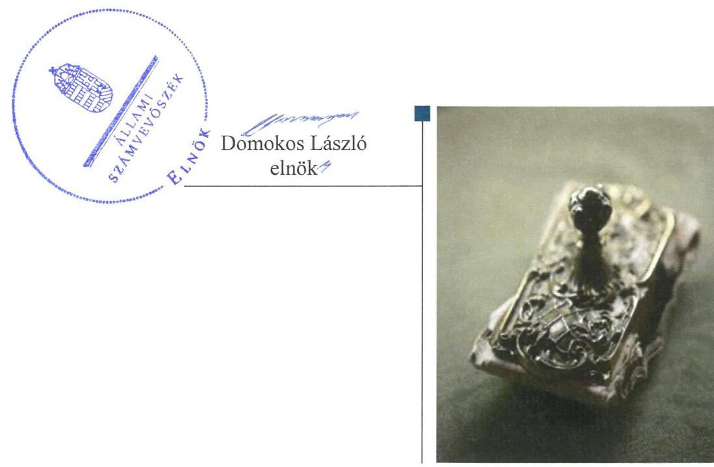
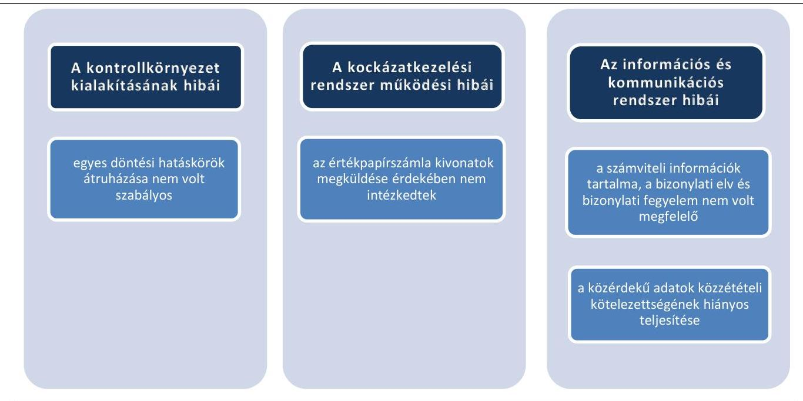
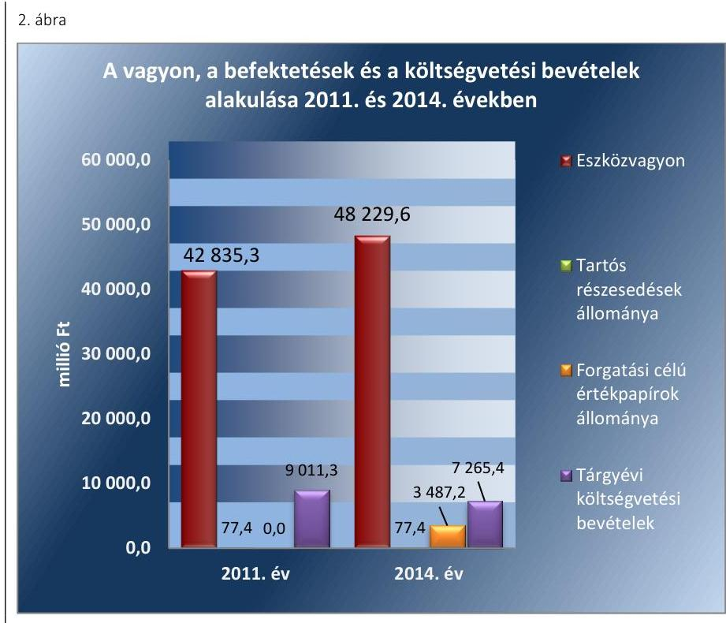
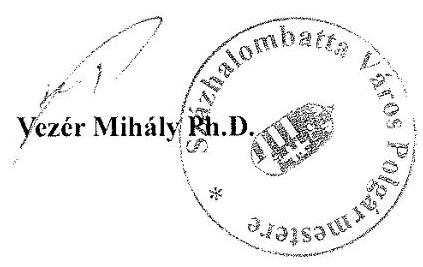
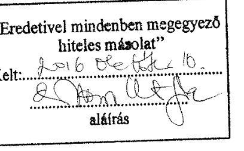
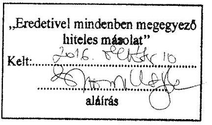
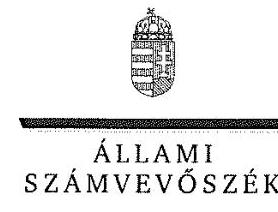
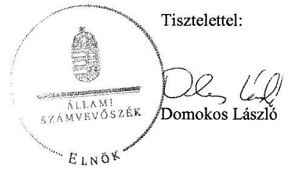
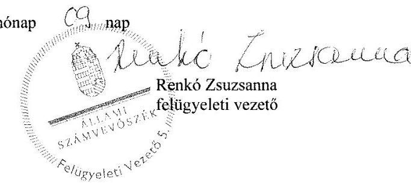

# Jelenetés 

## Önkormányzatok belső kontrollrendszere

Az önkormányzatok belső kontrollrendszere kialakításának és működtetésének ellenőrzése - Százhalombatta 2016.

---

# Jelenetés 

## Önkormányzatok belső kontrollrendszere

Az önkormányzatok belső kontrollrendszere kialakításának és működtetésének ellenőrzése - Százhalombatta
2016. 12. hó 01. nap

---

# AZ ELLENŐRZÉST FELÜGYELTE: 

RENKÓ ZSUZSANNA felügyeleti vezető

## AZ ELLENŐRZÉST VEZETTE ÉS A VÉGREHAJTÁSÁÉRT FELELŐS:

PÁNCSICS JUDIT ellenőrzésvezető

## A PROGRAM ÖSSZEÁLLÍTÁSÁÉRT FELELŐS:

JANIK JÓZSEF osztályvezető

IKTATÓSZÁM: V-0911-128/2016

TÉMASZÁM: 1945

## ELLENŐRZÉS-AZONOSÍTÓ SZÁM: V07183

Jelentéseink az Országgyűlés számítógépes hálózatán és az Interneten a www.asz.hu címen is olvashatóak.

---

# TARTALOMJEGYZÉK 

■ ÖSSZEGZÉS ..... 5
■ AZ ELLENŐRZÉS CÉLJA ..... 8
■ AZ ELLENŐRZÉS TERÜLETE ..... 9
■ AZ ELLENŐRZÉS HÁTTERE, INDOKOLTSÁGA ..... 11
■ A JELENTÉS LÉNYEGES KÉRDÉSKÖREI ..... 14
■ ELLENŐRZÉS HATÓKÖRE ÉS MÓDSZEREI ..... 15
■ MEGÁLLAPÍTÁSOK ..... 18
■ JAVASLATOK ..... 39
■ MELLÉKLETEK ..... 41
I. Sz. melléklet: Értelmező szótár ..... 41
II. Sz. melléklet: Az integritás érvényesítése érdekében kialakított és működtetett kontrollrendszer ..... 45
■ FÜGGELÉK: ÉSZREVÉTELEK ..... 47
■ RÖVIDÍTÉSEK JEGYZÉKE ..... 75

---

.

---

# ÖSSZEGZÉS 

Az Állami Számvevőszék Százhalombatta Város Önkormányzata belső kontrollrendszere kialakításának és működtetésének szabályszerűségét 2014. január 1-jétől 2015. április 30-ig terjedő időszakra vonatkozóan ellenőrizte és értékelte. A belső kontrollrendszer kialakítása és működtetése a pillérek összesített értékelése alapján szabályszerű volt.
Az Állami Számvevőszék 2011. január 1-jétől 2015. április 30-ig terjedő időszakban ellenőrizte Százhalombatta Város Önkormányzata egyes befektetési döntéseinek, a döntések végrehajtásának, elszámolásának a szabályszerűségét. Az ellenőrzés megállapításai alapján az egyes befektetési tevékenységeket - a szabályzási környezetben, a kulcskontrollok működésében és az információs és kommunikációs rendszerben meglévő hiányosságok alapján - nem szabályszerűen végezték. A befektetési tevékenység átláthatósága, elszámoltathatósága, a felelős vagyongazdálkodás nem volt biztosított. A belső kontrollrendszer egyes pillérei 2011. január 1. és 2015. április 30. között a befektetési tevékenység szabályszerű végzését nem támogatták.

## Az ellenőrzés társadalmi indokoltsága

A demokratikus társadalmakban alapvető igény, hogy a közpénzeket, a közvagyont használók a tevékenységükről elszámoljanak, ahhoz egyértelmű és érvényesíthető felelősségi szabályok társuljanak. Ennek a jogos igénynek az érvényesítéséhez meg kell teremteni azokat a folyamatokat, rendszereket, amelyek nélkülözhetetlenek az elszámoltatáshoz. Az elszámoltatás eredményes működtetéséhez szükség van a megfelelő információs-, kontroll-, értékelési és beszámolási rendszerek kialakítására. A belső kontrollok kiépítettsége hozzájárul az integritási szemlélet kialakításához és érvényesüléséhez. A belső kontrollrendszer kialakítása és működtetése nélkül nem valósítható meg a közpénzek, a közvagyon szabályos, gazdaságos, hatékony és eredményes felhasználása. A kockázatok alapján fennáll a lehetősége annak, hogy az önkormányzatok befektetési döntései, továbbá a döntések végrehajtása és számviteli elszámolása nem voltak teljes mértékben szabályszerűek, és a kapcsolódó külső és belső kontrollrendszerek sem működtek minden esetben megfelelően.

## Főbb megállapítások, következtetések, javaslatok

A belső kontrollrendszer kialakítása és működtetése az összesített értékelés alapján az ellenőrzés során feltárt hiányosságok mellett 2014. január 1. és 2015. április 30. között szabályszerű volt. A kontrollkörnyezetet, kockázatkezelési rendszert, az információs és kommunikációs rendszert, valamint a monitoring rendszert - néhány hiányosság ellenére - szabályszerűen alakították ki és működtették. A kontrolltevékenységek kialakítása és működtetése a feltárt szabályozásbeli és működtetési hiányosságok miatt részben volt szabályszerű. A pénzügyi folyamatokban kulcsszerepet betöltő teljesítésigazolás és érvényesítés belső kontrollok működése részben volt megfelelő, ezért azok nem biztosították a hibák megelőzését, feltárását, nem segítették a közpénzfelhasználás szabályosságát.

Az ellenőrzés tárgyát képező forgatási célú értékpapírok könyv szerinti értéke a 2014. évi költségvetési beszámoló alapján 3487,2 millió Ft volt, amelyet egy befektetési szolgáltatónál vásárolt állampapírban, diszkontkincstárjegyben fektettek be, rövid lejáratú lekötött betétjük az év végén nem volt. 2011. január 1. és 2015. április 30. között 434,4 millió Ft összegben 22 db visszterhes ügyletet kötöttek, amely során üzleti vagyonba tartozó ingatlanok tulajdonjogát szerezték meg. Ezek közül 15 db adásvételi- és csere szerződés befektetési céllal - az ipari park bővítéséhez, valamint a kereskedelmi és szolgáltató tevékenységek iránti lakossági igények kielégítése érdekében - jött létre. Az

---

üzleti vagyonba tartozó kulturális javakat és egyéb értéktárgyakat befektetési céllal, visszterhes ügylettel nem szereztek be.

A belső kontrollrendszer egyes pilléreiben, kiemelten a kontrollkörnyezet kialakításában, az információs és kommunikációs rendszerben 2011. január 1. és 2015. április 30. között hiányosságok voltak, ezáltal a belső kontrollrendszer nem támogatta a befektetési tevékenység szabályszerű végzését. A befektetési döntések előkészítésében és a döntések végrehajtásában szabálytalanságok, hibák fordultak elő. Az egyes befektetési tevékenységek nem megfelelő szabályozásából, a gazdasági események elszámolását alátámasztó dokumentumok hiányából eredően nem voltak biztosítottak a vagyonérték megőrzéséhez, növeléshez szükséges feltételek, az átlátható, elszámoltatható vagyongazdálkodás.

Az Önkormányzat ${ }^{1}$ befektetési tevékenységével kapcsolatos főbb szabálytalanságokat az 1. ábra foglalja össze.

# A BEFEKTETÉSI TEVÉKENYSÉG KONTROLLRENDSZERÉVEL KAPCSOLATBAN FELTÁRT HIBÁK 

A kulcskontrollok működtetése, valamint a monitoring rendszer (belső ellenőrzés) nem tárta fel a kockázatokat és a szabálytalanságokat.

A belső kontrollrendszer nem biztosította a szabályszerű, átlátható, elszámoltatható, a kockázatokat minimalizáló vagyongazdálkodást.

A belső ellenőrzés nem tárta fel az egyes befektetési döntések előkészítésében és végrehajtásában, továbbá a pénzügyi folyamatokban kulcsszerepet betöltő teljesítésigazolás és érvényesítés belső kontrollok működésének hiányosságait.

A befektetési tevékenységet külső ellenőrző szervezet nem ellenőrizte.
Az Önkormányzatnál az erőforrásokkal való szabályszerű gazdálkodás követelményeit részben határozták meg, hatékonysági követelményeket előírtak, és azok érvényesítése, számonkérése, ellenőrzése megvalósult. Az Önkormányzat irányítása alá tartozó költségvetési szerveknél az elszámoltathatóság, a hatékony gazdálkodás érvényesítésének lehetősége biztosított volt.

---

Az Önkormányzat 2014-ben nem vett részt az ÁSZ² integritás felmérésében, az adatszolgáltatásuk alapján a belső kontrollrendszer kialakítása és működtetése az integritás szemlélet érvényesülését támogatta, de a jelen ellenőrzés során feltárt szabályozási és működési hiányosságok miatt az integritás szemlélet érvényesítésében még fejlődést kell elérniük.

---

# AZ ELLENŐRZÉS CÉLJA 

Az ellenőrzés célja annak megállapítása volt, hogy az önkormányzat belső kontrollrendszerének kialakítása, továbbá egyes elemeinek működtetése biztosította-e az önkormányzatnál a közpénzfelhasználás szabályosságát. Az erőforrásokkal való szabályszerű és hatékony gazdálkodáshoz szükséges követelmények érvényesítése, számonkérése, ellenőrzése megtörtént-e az önkormányzatnál. A belső kontrollrendszer kialakítása és működtetése támogatta-e az integritás szemlélet érvényesülését. Az ellenőrzés során értékeltük a belső kontrollrendszer kialakításának és működtetésének szabályszerűségét. Bemutatjuk azokat a lényeges szabályozási hiányosságokat, amelyek miatt az ellenőrzött kulcskontrollok nem nyújtottak elegendő védelmet a lehetséges hibákkal szemben. Rámutattunk arra, ha a kulcskontrollok valamely hibát nem előztek meg, nem tártak fel vagy nem javítottak ki, valamint minősítjük működésük megfelelőségét.

Ellenőriztük, hogy az önkormányzat egyes befektetési döntései és azok végrehajtása, elszámolása megfelelt-e a vonatkozó jogszabályoknak és belső szabályozásoknak, a kialakított kontrollrendszer támogatta-e a befektetési tevékenység szabályszerűségét.

---

# AZ ELLENŐRZÉS TERÜLETE 

## Százhalombatta Város Önkormányzata

A Pest megyében fekvő Százhalombatta város állandó lakosainak száma 2015. január 1-jén 19279 fő volt.

Az Önkormányzat 11 tagú Képviselő-testületének ${ }^{3}$ munkáját négy állandó bizottság segítette. Az Önkormányzat a Hivatalon ${ }^{4}$ kívül 11 intézménnyel, valamint hat többségi tulajdoni részesedésű gazdasági társasággal látta el a feladatait.

A településen a helyi nemzetiségi önkormányzati képviselők 2014. évi választásáig roma, görög, szerb és horvát, azt követően roma, görög és szerb helyi nemzetiségi önkormányzat működött.

A polgármester ${ }^{5}$ az 1990. évi önkormányzati választások óta - a 2002-2006. közötti időszak kivételével - tölti be tisztségét. A jegyző ${ }^{6}$ 2005. április 1-jétől látja el feladatait. A Hivatal hat szervezeti egységre tagolódott (Titkárság, Hatósági Iroda, Műszaki Iroda, Vagyongazdálkodási és Intézményi Iroda, Közgazdasági Iroda, Szervezési és Önkormányzati Iroda), elkülönített gazdasági szervezettel rendelkezett. A gazdasági szervezet feladatait három iroda látta el, a gazdasági szervezet vezetője a Vagyongazdálkodási és Intézményi Iroda vezetője volt. A Hivatalban foglalkoztatott köztisztviselők száma 2014. év végén 98 fő volt. A Hivatalban szervezeti változás 2014. január 1-jétől nem történt.

Az Önkormányzat a 2014. évi költségvetési beszámoló szerint 7265,4 millió Ft költségvetési bevételt ért el, valamint 9574,0 millió Ft költségvetési kiadást teljesített. A költségvetés 2308,6 millió Ft-os hiányát a finanszírozási bevételek és a finanszírozási kiadások 7227,3 millió Ft-os egyenlegén belül a 7469,3 millió Ft-os előző évi pénzmaradvány igénybevétele fedezte. 2014. december 31-én az üzleti vagyonba tartozó ingatlanok értéke 3155,7 millió Ft, a befektetési célú tartós részesedések értéke 77,4 millió Ft volt. A pénzeszközök értéke 1652,3 millió Ft-ot tett ki, melyből a hosszú lejáratú betétek összege 103,8 millió Ft volt.

A 2014. évben a forrásokon belül a költségvetési évben esedékes kötelezettségállomány 76,7 millió Ft, a költségvetési évet követően esedékes kötelezettségállomány 10,3 millió Ft volt, pénzintézettel szembeni kötelezettségük nem volt.

Adósságkonszolidációs támogatásban nem részesültek.
Az Önkormányzat vagyonának, befektetéseinek és a költségvetési bevételeinek alakulását a 2011. évben és a 2014. évben a 2. ábra mutatja be:

---

Adatok forrása: a 2011. és a 2014. évi éves költségvetési beszámolók

---

# AZ ELLENŐRZÉS HÁTTERE, INDOKOLTSÁGA 

Az ÁSZ tv. ${ }^{7}$ szerint az ÁSZ feladata a jól irányított állam kiépítésének elősegítése. Az ÁSZ Stratégiájában ezért hangsúlyos szerepet szánt annak, hogy szilárd szakmai alapon álló, értékteremtő ellenőrzéseivel előmozdítsa a közpénzügyek átláthatóságát, rendezettségét. A számvevőszéki ellenőrzés nemzetközi alapelvei is rögzítik, hogy a megfelelő belső kontrollrendszer minimálisra csökkenti a hibák és szabálytalanságok kockázatát.

A belső kontrollrendszer azt a célt szolgálja, hogy a költségvetési szervek működésük és gazdálkodásuk során a tevékenységeket szabályszerűen, gazdaságosan, hatékonyan, eredményesen hajtsák végre, teljesítsék elszámolási kötelezettségeiket és megvédjék az erőforrásokat a veszteségektől, a károktól és a nem rendeltetésszerű használattól. A belső kontrollrendszer magában foglalja mindazon szabályokat, eljárásokat, gyakorlati módszereket és szervezeti struktúrákat, kockázatkezelési technikákat, kontrolltevékenységeket, amelyek segítséget nyújtanak a szervezetnek céljai eléréséhez. A belső kontrollrendszer szabályozása háromszintű, a törvényi előírásokat az Áht. és az Mötv., a rendeleti szintű szabályozást az Ávr. és a Bkr. tartalmazza, amelyeket útmutatói szinten az NGM által kiadott standardok és kézikönyvek támogatnak.

Az ellenőrzött időszak meghatározása lehetőséget teremt a 2014. október 12-i önkormányzati választásokat megelőző és követő ciklus belső kontrollrendszere működésének elkülönült értékelésére, valamint a változások nyomon követésére.

A BELSŐ KONTROLLRENDSZER kialakításának és működtetésének általános értékelése mellett a teljesítésigazolás és érvényesítés kontrollok kiemelt ellenőrzésének szükségességét alátámasztja, hogy 2012-től a pénzügyi folyamatokban kulcsszerepet betöltő belső kontrollok rendszere módosult és azok működtetésében az önkormányzatoknál hiányosságok mutatkoztak a 2012 óta elvégzett ÁSZ ellenőrzések alapján.

Az önkormányzatok belső kontrollrendszerének ellenőrzése az ÁSZ „jó kormányzással" kapcsolatos stratégiai céljainak megvalósítását is szolgálja. Az ÁSZ célja, hogy javuljon az ellenőrzött önkormányzatok belső kontrollrendszerének szabályozottsága, működésének megfelelősége, hozzájárulva ezzel az egyensúlyi helyzet fenntarthatóságának biztosításához, azaz az adósság újratermelődésének megakadályozásához. Az ÁSZ ellenőrzés tapasztalatai nem csupán a közvetlenül ellenőrzött önkormányzatokat segíthetik, hanem a „jó gyakorlat" elterjesztésével azok az önkormányzatok is átvehetik a pozitív példákat, ahol nem végez ellenőrzést az ÁSZ.

Az MNB három befektetési szolgáltató tevékenységi engedélyét 2015. első felében visszavonta és kezdeményezte a vállalkozások felszámolását a működéssel kapcsolatos szabálytalanságok, hiányosságok miatt. A korábbi évek ellenőrzési tapasztalatai alapján fennáll a lehetősége annak, hogy az önkormányzatok befektetési döntései, továbbá a döntések végrehajtása és számviteli elszámolása nem voltak teljes mértékben szabályszerűek, és a
 kapcsolódó külső ellenőrzések és a belső kontrollrendszer sem működtek minden esetben megfelelően.

---

Magyarország Alaptörvénye az önkormányzatoktól, mint az államháztartás alanyaitól elvárja a kiegyensúlyozott, átlátható és fenntartható költségvetési gazdálkodás elvének érvényesítését. A nemzeti vagyonról szóló törvény szerint a nemzeti vagyonnal felelős módon, rendeltetésszerűen kell gazdálkodni. A nemzeti vagyongazdálkodás feladata a nemzeti vagyon rendeltetésének megfelelő, átlátható, hatékony és költségtakarékos működtetése, ugyanakkor értékének megőrzését, értéknövelő használatát, hasznosítását, gyarapítását is elvárja.

# AZ ÖNKORMÁNYZATOK ÁTMENETILEG SZABAD PÉNZESZKÖZEINEK BEFEKTETÉSÉT jogszabály nem 

tiltja, a pénzpiaci szolgáltatók közül az önkormányzatok a kínált szolgáltatás és annak költségei alapján, szabadon választhatnak, a veszteséges gazdálkodás kockázatai és következményei azonban az önkormányzatokat terhelik. A szabad pénzeszközök felelős hasznosítása összhangban áll az önkormányzati gazdálkodás alapelveivel.

A közintézmények integritás alapú kultúrájának kialakítása, megerősítése és működése szorosan összefügg a belső kontrollrendszer működésével, ezért az ellenőrzés kiterjed annak értékelésére is, hogy a belső kontrollrendszer kialakítása és működtetése hogyan hatott az integritás szemlélet érvényesülésére.

Az államháztartás önkormányzati alrendszerében a 2014. év elején összesen 3177 települési önkormányzat működött: a 23 kerülettel rendelkező főváros, 345 város, 2691 község és 117 nagyközség volt. A belső kontrollrendszer kialakítása és működtetése ellenőrzését az ÁSZ által lefolytatott, kisebb településeket is érintő ellenőrzéseinek tapasztalatai, valamint a közérdekű bejelentések kockázati szempontú értékelése alapozták meg. Ezek a községek, nagyközségek gazdálkodásának, belső kontrollrendszere kialakításának és működésének hiányosságaira mutattak rá. Az ellenőrzések helyszíneinek kiválasztása során az ÁSZ célzott adatfeldolgozáson alapuló kockázatelemző rendszerére támaszkodik. Ez elősegíti, hogy azokon a területeken végezzen ellenőrzéseket, összpontosítva erőforrásait, ahol a valódi kockázatok, az aktuális problémák vannak.

## AZ ELLENŐRZÉS VÁRHATÓ HASZNOSULÁSA NÉGY SZINTEN valósul meg.

A törvényalkotás számára összegzett tapasztalatok állnak rendelkezésre a belső kontrollrendszer önkormányzati területen való kialakításáról, működtetéséről és hatásairól. Az ÁSZ az ellenőrzéseivel hozzájárul ahhoz, hogy az egyes önkormányzati befektetésekkel kapcsolatos kockázatok a szabályozási és kontroll mechanizmusok fejlesztésével mérsékelhetők legyenek.

Az ellenőrzés az ellenőrzött számára visszajelzést ad a belső kontrollrendszer kialakításában és működésében lévő hiányosságokról, javaslataival hozzájárul azok kiküszöböléséhez. Feltárja az önkormányzati befektetési tevékenységet meghatározó szabályozások összhangjának hiányosságait, a szabályozással nem érintett gazdálkodási területeket, valamint az egyes befektetési tevékenységek esetleges szabálytalanságait.

Az ellenőrzés megállapításait és javaslatait más szervezetek is hasznosíthatják a rendezett gazdálkodási keretek kialakításához.

---

A társadalom számára jelzi, hogy közpénz nem maradhat ellenőrizetlenül, az ÁSZ értékteremtő rend kialakításához és megőrzéséhez hozzájáruló tevékenysége pozitív hatással lesz a szervezetről kialakított összkép formálásában.

---

# A JELENTÉS LÉNYEGES KÉRDÉSKÖREI 

1.     - Az önkormányzat belső kontrollrendszerének kialakítása és működtetése szabályszerű volt-e 2014. január 1. és 2015. április 30. között, valamint a belső kontrollrendszer egyes pillérei támogatták-e a befektetési tevékenység szabályszerű végzését 2011. január 1. és 2015. április 30. között?
2.     - Az egyes befektetésekkel kapcsolatos döntéshozatal és a döntések végrehajtása szabályszerű volt-e?
3.     - Az egyes befektetések számviteli elszámolása, nyilvántartása szabályszerű volt-e?
4.     - Az erőforrásokkal való szabályszerű és hatékony gazdálkodáshoz szükséges követelmények érvényesítése, számonkérése, ellenőrzése megtörtént-e az önkormányzatnál?
5.     - Az önkormányzat belső kontrollrendszerének kialakítása és működtetése támogatta-e az integritás szemlélet érvényesülését?

---

# ELLENŐRZÉS HATÓKÖRE ÉS MÓDSZEREI 

## Az ellenőrzés típusa

Megfelelőségi ellenőrzés, a befektetési tevékenység esetében szabályszerűségi ellenőrzés.

## Az ellenőrzött időszak

A belső kontrollrendszer kialakításának és működtetésének ellenőrzése a 2014. január 1. és 2015. április 30. közötti időszakra terjedt ki. Ezen belül a belső kontrollrendszer kialakításának és működtetésének megfelelőségét a 2014. január 1. és október 12., valamint a 2014. október 13. és 2015. április 30. közötti időszakra vonatkozóan külön-külön értékeltük. Az önkormányzatok egyes befektetési tevékenységeinek ellenőrzése tekintetében az ellenőrzött időszak a 2011. január 1. - 2015. április 30. közötti időszak. Ezen felül az önkormányzat befektetésekkel kapcsolatos döntés-előkészítésének és döntéshozatalának szabályszerűségét a 2011. január 1. előtti időszakra visszanyúlóan is ellenőriztük, amennyiben a 2014. június 30-án, illetve 2015. április 30-án meglévő értékpapír-befektetéseire 2011. január 1-je előtt került sor. Az integritás szemlélet érvényesülését a 2014. évre vonatkozó adatszolgáltatás alapján értékeltük.

## Az ellenőrzés tárgya

A helyi önkormányzatnak, mint éves költségvetési beszámoló készítésére kötelezett szervezetnek és polgármesteri hivatalának belső kontrollrendszere. Az önkormányzat 2014. június 30-án, illetve 2015. április 30-án meglévő értékpapírokban megtestesülő befektetései, lekötött betétei, valamint az önkormányzat üzleti vagyonába tartozó ingatlanok, kulturális javak (műtárgyak, műalkotások, stb.), illetve a feladatellátást nem szolgáló egyéb értéktárgyak (pl. ékszerek, befektetési nemesfém). Az erőforrásokkal való szabályszerű és hatékony gazdálkodáshoz szükséges követelmények érvényesítése, számonkérése, ellenőrzése. Az integritás szemlélet érvényesülése.

## Az ellenőrzött szervezet

Százhalombatta Város Önkormányzata és az önkormányzati működéshez kapcsolódó feladatokat ellátó Hivatal.

---

# Az ellenőrzés jogalapja 

Az ÁSZ tv. 1. § (3) bekezdésében foglaltak alapján az ÁSZ általános hatáskörrel végzi a közpénzekkel és az állami és önkormányzati vagyonnal való felelős gazdálkodás ellenőrzését. Az ÁSZ tv. 5. § (2) bekezdése alapján az államháztartás gazdálkodásának ellenőrzése keretében az ÁSZ ellenőrzi a helyi önkormányzatok gazdálkodását, valamint az ÁSZ tv. 5. § (6) bekezdése alapján ellenőrzése során értékeli az államháztartás számviteli rendjének betartását és a belső kontrollrendszer működését.

## Az ellenőrzés módszerei

Az ellenőrzést a nemzetközi standardokat irányadónak tekintve az ellenőrzési program ellenőrzési kérdései, az ellenőrzött időszakban hatályos jogszabályok, az ellenőrzés szakmai szabályok és módszertanok figyelembe vételével végeztük.

Az ellenőrzés lefolytatásához az Önkormányzat a tanúsítványok kitöltésével, valamint az ÁSZ által kért dokumentumok elektronikus megküldésével szolgáltatott adatokat. A rendelkezésre bocsátott adatok, információk kontrollja és a munkalapok kitöltése az ellenőrzés keretében történt. A jelentésben használt fogalmak magyarázatát az I. számú melléklet, az integritás érvényesítése érdekében kialakított és működtetett kontrollrendszer minősítését a II. számú melléklet tartalmazza.

A belső kontrollrendszer jogszabályi előírások szerinti kialakításának és működtetésének szabályszerűségét az erre irányuló ellenőrzési kérdésekre adott válaszok összesítése alapján külön-külön értékeltük a 2014. január 1. és október 12., valamint a 2014. október 13. és 2015. április 30. közötti időszakra. A belső kontrollrendszert egy-egy ellenőrzött időszakra pillérenként (kontrollkörnyezet, kockázatkezelési rendszer, kontrolltevékenységek, információs és kommunikációs rendszer, monitoring rendszer) és összesítetten is értékeltük.

## A BELSŐ KONTROLLRENDSZER EGYES PILLÉRE-

INEK KIALAKÍTÁSA ÉS MŰKÖDTETÉSE „szabályszerű volt", amennyiben az értékelt területen az elért és elérhető pontok százalékban kifejezett, egész számra kerekített hányadosa meghaladta a 84%-ot, „részben szabályszerű volt", ha 61-84% közé esett, „nem szabályszerű volt", ha nem haladta meg a 60%-ot. A belső kontrollrendszer összesített értékelése megegyezett a pillérenként (kontrollterületenként) alkalmazott százalékos értékelésekkel, a következő eltérésekkel. A kontrollrendszer egésze esetében a „szabályszerű" értékelésnek a százalékos értéken felül további feltétele volt, hogy egyik kontrollterület sem kaphat „nem szabályszerű" értékelést, a „részben szabályszerű" értékelés további feltétele volt, hogy legfeljebb egy ellenőrzött kontrollterület lehet „nem szabályszerű" értékelésű. Az összesített értékelés a százalékos értéktől függetlenül „nem szabályszerű volt", ha az ellenőrzött kontrollterületek közül több mint egynek „nem szabályszerű volt" az értékelése.

---

# A GAZDÁLKODÁS FOLYAMATÁBAN A KÉT 

KULCSKONTROLL - teljesítésigazolás, érvényesítés - működésének megfelelőségét a személyi juttatásokkal, a dologi kiadásokkal, a beruházási, felújítási kiadásokkal, az ellátottak pénzbeli juttatásaival és az egyéb működési, felhalmozási célú, valamint a finanszírozási kiadásokkal kapcsolatos kifizetések esetében mintavétellel ellenőriztük. A mintavétel során külön értékeltük a 2014. január 1. és 2014. október 12. közötti időszakban és a 2014. október 13. és 2015. április 30. közötti időszakban teljesített kifizetéseket. „Megfelelőnek" értékeltük a gazdálkodási jogkörök gyakorlását, amennyiben 95%-os bizonyossággal a teljes sokaságban a hibaarány legfeljebb 10%, ,,részben megfelelőnek" értékeltük, ha a hibaarány felső határa 10-30% között volt, ,,nem megfelelőnek" pedig akkor, ha a mintavételi eredmények alapján a sokaságbeli hibaarány felső határa meghaladta a 30%-ot.

Az integritás szemlélet érvényesülésének értékelése az önkormányzat által kitöltött tanúsítvány alapján történt.

---

# MEGÁLLAPÍTÁSOK

## 1. Az önkormányzat belső kontrollrendszerének kialakítása és működtetése szabályszerű volt-e 2014. január 1. és 2015. április 30. között, valamint a belső kontrollrendszer egyes pillérei támogatták-e a befektetési tevékenység szabályszerű végzését 2011. január 1. és 2015. április 30. között?

|  Összegző megállapítás | A belső kontrollrendszer kialakítása és működtetése az össze-
sített értékelés alapján 2014. január 1. és 2015. április 30. kö-
zött - a feltárt hiányosságok mellett - szabályszerű volt. A hi-
bák, hiányosságok miatt a belső kontrollrendszer kialakítása
és működtetése 2011. január 1. és 2015. április 30. között nem
támogatta az egyes befektetési tevékenységek szabályszerű,
kockázatokat minimalizáló, átlátható, elszámoltatható végzé-
sét.  |
| --- | --- |
|   | A belső kontrollrendszer kialakításának és működtetésének összesített ér-
tékelését az 1. táblázat mutatja be:  |

1. táblázat

|  A BELSŐ KONTROLLRENDSZER KIALAKÍTÁSÁNAK ÉS MŰKÖDTETÉSÉNEK ÖSSZESÍTETT ÉRTÉKELÉSE |  |  |   |
| --- | --- | --- | --- |
|  Megnevezés | A gazdálkodás egészét érintően: | A befektetési tevékenységet érintően: |   |
|   | 2014. január 1-től | 2014. október 13-tól | 2014. január 1-től  |
|   | 2014. október 12-ig | 2015. április 30-ig | 2015. április 30-ig  |
|  Kontrollkörnyezet | szabályszerű | nem támogatta |   |
|  Kockázatkezelési rendszer | szabályszerű | támogatta |   |
|  Kontrolltevékenységek | részben szabályszerű | nem támogatta |   |
|  Információs és kommunikációs | szabályszerű | nem támogatta |   |
|  rendszer |  |  |   |
|  Monitoring rendszer | szabályszerű | nem támogatta |   |
|  BELSŐ KONTROLLRENDSZER | SZABÁLYSZERŰ | NEM TÁMOGATTA |   |
|   |  |  | Forrás: ÁSZ  |

1.1. számú megállapítás

A kontrollkörnyezet kialakítása 2014. január 1. és 2015. április 30. között néhány hiányosság ellenére szabályszerű volt. A befektetési tevékenységhez kapcsolódó hatáskörök, a belső eljárási rend kialakítása 2011. január 1. és 2015. április 30. között nem volt maradéktalanul szabályszerű, emiatt a kontrollkörnyezet nem támogatta az egyes befektetésekkel való átlátható, elszámoltatható gazdálkodást.

A SZERVEZETI ÉS A SZABÁLYOZÁSI KERETEKET a Képviselő-testület 2011. január 1. és 2015. április 30. között az alábbiak szerint alakította ki:

---

$\longrightarrow$ az önkormányzati SZMSZ-ben$^8$ meghatározta a szerveit, a feladat- és hatásköreit, részletezte a befektetéseivel kapcsolatos feladat- és hatáskörök megosztását, az átruházott hatáskör gyakorlójának évenkénti beszámolási kötelezettségét írta elő;
a vagyongazdálkodási rendelet$_{1,2}$$^9$ meghatározta a vagyongazdálkodás részletes szabályait, ezek között rögzítette az átmenetileg szabad pénzeszközök lekötésére, befektetésére és egyéb hasznosítására vonatkozó rendelkezéseket;
a versenyeztetésről szóló rendelet$_{1,2}$$^{10}$ előírta az önkormányzati vagyon átruházásának, megterhelésének részletes eljárási szabályait. A versenyeztetésről szóló rendelet$_{1,2}$ hatálya nem terjedt ki az átmenetileg szabad pénzeszközök lekötésére, befektetésére;
a 2011-2015. évi költségvetési rendeleteket a jogszabályi

 előírásoknak megfelelő részletezettségben hagyta jóvá, a humánerőforrás-gazdálkodás kereteihez meghatározta a Hivatal engedélyezett létszámát. A 2014. és a 2015. évi költségvetési rendeletekben ${ }^{11,12}$ felhatalmazta a polgármestert az átmenetileg szabad pénzforrások bankbetétben, illetve hitelviszonyt megtestesítő értékpapírban történő elhelyezésére; a 2012. év kivételével éves vagyongazdálkodási irányelv${ }_{1-4}$-et ${ }^{13}$ hagyott jóvá. 2013-ban az Nvtv.-ben ${ }^{14}$ előírtaknak megfelelően elfogadta az Önkormányzat közép- és hosszú távú vagyongazdálkodási tervét ${ }^{15}$. A 2011-2014. évekre és a 2015-2019. évekre vonatkozó gazdasági program${ }_{1,2}$-t ${ }^{16}$ az Ötv.-ben ${ }^{17}$, illetve az Mötv.-ben ${ }^{18}$ előírtaknak megfelelően hagyta jóvá; elfogadta a Hivatal alapító okiratát ${ }^{19}$.

# A BEFEKTETÉSI TEVÉKENYSÉG SZABÁLYOZÁSI HIÁNYOSSÁGAI:

A Képviselő-testület 2011-től 2013 júniusáig az önkormányzati SZMSZ 1. számú függelékének V/4. pontjában úgy rendelkezett, hogy a polgármester a jegyző ellenjegyzésével naptári éven belül kötelezettségvállalást tehet az önkormányzati forrásokból származó átmenetileg szabad pénzeszközök pénzintézetnél való lekötésére, befektetésére. Ezzel szemben a vagyongazdálkodási rendelet${ }_{1}$ 29. § (1) bekezdése szerint a szabad pénzeszközök lekötésének, befektetésének megszervezéséről 2012 novemberéig a jegyző volt köteles gondoskodni, azt követően a vagyongazdálkodási rendelet${ }_{2}$ 14. § (1) bekezdésében előírtak szerint pedig a polgármester. 2011-től 2012 novemberéig az önkormányzati SZMSZ 1. számú függelékének V/4. pontjában előírtak - a Jat. ${ }^{20}$ 2. § (1) bekezdésében foglaltakat megsértve - nem voltak egyértelműen értelmezhetőek a vagyongazdálkodási rendelet${ }_{1}$ 29. § (1) bekezdésében rögzítettekkel.
Az önkormányzati SZMSZ 1. számú függelékében 2012. január 1-jétől 2013 júniusáig a Képviselő-testület azon rendelkezése, hogy az értékpapírok adásvételére vonatkozó szerződések ellenjegyzésére a jegyzőt hatalmazta fel, nem felelt meg az Ávr. ${ }^{21}$ 55. § (2) bekezdés f) pontjának előírtaknak, mert a Hivatalban a helyi önkormányzat kiadási előirányzatai terhére vállalt kötelezettség pénzügyi ellenjegyzésére a gazdasági vezető vagy az általa írásban kijelölt személy volt jogosult. Az önkormányzati SZMSZ e rendelkezésével megsértették

---

a Jat. 24. §-ában előírtakat, mely szerint a közjogi szervezetszabályozó eszköz jogszabállyal nem lehet ellentétes.
A Képviselő-testület 2013 júniusától az önkormányzati SZMSZ 5. számú mellékletének II/3. pontjában úgy rendelkezett, hogy a polgármester jogosult megszervezni „naptári éven belül" az önkormányzati forrásokból származó átmenetileg szabad pénzeszközök betétben való elhelyezését, befektetését és egyéb hasznosítását. A vagyongazdálkodási rendelet${ }_{2}$-ben 2013. november 29-től a befektetés időtartamként a „naptári éven belül" helyett a „12 hónapon belül" időtartam került rögzítésre. Az önkormányzati SZMSZ-ben és a vagyongazdálkodási rendelet${ }_{2}$-ben az egyes befektetések időtartamára vonatkozó rendelkezések közötti ellentmondás 2015. április 30-án is fennállt, megsértve a Jat. 2. § (1) bekezdésében előírtakat.

A HIVATAL BELSŐ SZABÁLYOZÁSA 2011. január 1. és 2015. április 30. között - több kisebb súlyú hiányosság mellett - megfelelt a jogszabályi előírásoknak:
a hivatali SZMSZ${ }_{1,2}$ ${ }^{22}$ tartalmazta az ellátandó tevékenységeket, a szervezeti felépítést és a működési rendet, a gazdasági szervezet és az azon kívüli egyéb szervezeti egységek feladatait, az engedélyezett létszámot, a nevesített munkakörökhöz tartozó feladat- és hatásköröket;
a hivatali számviteli politika${ }_{1-4}$ - ${ }^{23}$ a jegyző, az Önkormányzat önálló beszámolóval érintett feladataival összefüggő önkormányzati számviteli politika${ }_{1-3}$ - ${ }^{24}$ a polgármester és a jegyző közös utasításban adta ki, melyeket szükség esetén aktualizáltak. A hivatali számlarend${ }_{1-3}$ ${ }^{25}$, illetve az önkormányzati számlarend${ }_{1,2}$ ${ }^{26}$ tartalmazta - az egyes befektetések vonatkozásában is - az alkalmazásra kijelölt számlák számjelét és megnevezését, a főkönyvi számlák és az analitikus nyilvántartások kapcsolatát;
az Önkormányzat önálló beszámolóval érintett feladataira vonatkozó pénzkezelési- ${ }^{27}$, leltározási- ${ }^{28}$, értékelési- ${ }^{29}$, valamint önköltségszámítási ${ }^{30}$ szabályzatokat a polgármester és a jegyző közös utasításban hagyta jóvá. A Hivatal pénzkezelési szabályzatát ${ }^{31}$, leltározási- ${ }^{32}$, értékelési- ${ }^{33}$, valamint az önköltség-számítási szabályzatát ${ }^{34}$ a jegyző kiadmányozta;
az önkormányzati pénzkezelési szabályzat${ }_{1-4}$-ben - a pénzügyi befektetésekre is kiterjedően - rögzítésre került a pénzforgalom lebonyolításának rendje és a pénzkezeléssel kapcsolatos bizonylatok köre. Az önkormányzati pénzkezelési szabályzat${ }_{1-4}$-ben előírták, hogy a betétlekötések és befektetések esetében a polgármester a kötelezettségvállaló. Az Önkormányzat és a helyi nemzetiségi önkormányzatok között létrejött megállapodásban rögzítették a nemzetiségi önkormányzatok bankszámláinak számát, valamint azt, hogy kivételes esetben a készpénzforgalom a Hivatal pénztárában - a Hivatal pénzeszközeitől elkülönítetten kezelve - történik;
az önkormányzati gazdálkodási szabályzat${ }_{1,2}$-ben ${ }^{35}$ a polgármester és a jegyző rögzítette a helyi önkormányzat önálló beszámolójával érintett feladataira vonatkozóan a gazdálkodási jogkörök - a kötelezettségvállalás, a pénzügyi ellenjegyzés, a teljesítésigazolás, az érvénye-

---

sítés és az utalványozás - gyakorlásának módjával, eljárási és dokumentációs részletszabályaival, valamint az ezeket végző személyek kijelölésének rendjével kapcsolatos belső előírásokat és feltételeket. A Hivatal esetében ezen jogkörök gyakorlásának módját és szabályait a jegyző a hivatali gazdálkodási szabályzat${ }_{1-3}$-ban ${ }^{36}$ rögzítette. A Vagyongazdálkodási Iroda ${ }^{37}$ ügyrendje${ }_{1,2}$-ben ${ }^{38}$, valamint az önkormányzati gazdálkodási szabályzat${ }_{1,2}$-ben az egyes befektetési tevékenységekkel kapcsolatban részletszabályokat állapítottak meg;
$\longrightarrow$ az ellenőrzési nyomvonal${ }_{1-3}$ ${ }^{39}$ tartalmazta az információs és felelősségi szinteket és kapcsolatokat, továbbá a 2012. évtől az ellenőrzési és irányítási folyamatokat az átmenetileg szabad pénzeszközök lekötésére, befektetésére is;
$\longrightarrow$ a szabálytalanságkezelési eljárásrend${ }_{1,2}$ ${ }^{40}$ tartalmában megfelelt a jogszabályi előírásoknak, kiterjedt az Önkormányzat, a Hivatal, valamint a nemzetiségi önkormányzatok ${ }^{41}$ önálló beszámolóval érintett feladataira;
$\longrightarrow$ a közszolgálati szabályzatban ${ }^{42}$ a jegyző rögzítette az általános munkáltatói hatáskörbe tartozó kérdéseket, közöttük a köztisztviselők teljesítményértékelésének ajánlott elemeit;
A kontrollkörnyezet kialakítása és 2011. január 1. és 2013. december 31., valamint 2014. január 1. és 2015. április 30. közötti időszakokban a befektetési tevékenységek szabályszerű végzését nem támogatta.

A kontrollkörnyezet kialakítása az értékelés szempontjából 2014. január 1. és 2014. október 12., valamint 2014. október 13. és 2015. április 30. közötti időszakokban 2. táblázatban részletezett hiányosságok mellett szabályszerű volt.
2. táblázat

# A KONTROLLKÖRNYEZET KIALAKÍTÁSÁNAK SZABÁLYTALANSÁGAI

## Sorszám

## Részmegállapítás

1. A Képviselő-testület 2013 júniusától az önkormányzati SZMSZ 5. számú mellékletének II/3. pontjában úgy rendelkezett, hogy a polgármester jogosult „naptári éven belül az önkormányzati forrásokból származó átmenetileg szabad pénzeszközök betétben való elhelyezését, befektetését és egyéb hasznosítását" megszervezni. A vagyongazdálkodási rendelet${ }_{2}$-ben ezzel szemben a Képviselő-testület - 2013. november 29-től - a polgármestert nem „naptári éven belül", hanem „12 hónapon belül" hatalmazta fel az átmenetileg szabad pénzeszközök betétben való elhelyezésére, befektetésére és egyéb hasznosítására. A Képviselő-testület a rendeletalkotások során megsértette a Jat. 2. § (1) bekezdésében előírtakat, mert nem egyértelműen értelmezhető rendelkezéseket hozott.
2. A polgármester az önkormányzati gazdálkodási szabályzat${ }_{1,2}$ 1. számú mellékletében, hivatkozva az Ávr. 52. § (6) bekezdésére - az önkormányzati SZMSZ-ben, a vagyongazdálkodási rendelet${ }_{1,2}$-ben, valamint a 2014-2015. évi költségvetési rendeletekben a Képviselő-testület által betétlekötésre átruházott jogkörét - értékhatárra tekintet nélkül átruházta a jegyzőre és az aljegyzőre. A kötelezettségvállalási jogkör átruházása ellentétes volt az önkormányzat költségvetési rendeleteiben előírtakkal.
3. A köztisztviselőkre vonatkozó hivatásetikai alapelvek részletes tartalmát, valamint az etikai eljárás szabályait a Kttv${ }^{43}$. 231. § (1) bekezdésében előírtak ellenére nem a Képviselő-testület fogadta el, hanem azokat a polgármester által jóváhagyott hivatali SZMSZ${ }_{2}$ 2014. február 14-től hatályos 1. számú melléklete tartalmazta.

---

### 1.2. számú megállapítás

A kockázatkezelési rendszer kialakítása és működtetése 2014. január 1. és 2015. április 30. között szabályszerű volt. A kockázatkezelési rendszer működtetése 2011. január 1. és 2015. április 30. között a közvagyon védelmét, a befektetési tevékenység szabályszerű és a pénzügyi kockázatokat minimalizáló végzését támogatta.

A KOCKÁZATKEZELÉSI RENDSZERT a jegyző kialakította. A kockázatkezelési szabályzat${ }_{1,2}$-ben ${ }^{44}$ beazonosították a tevékenységekben rejlő külső és belső kockázatokat, meghatározták az egyes kockázati tényezőkkel kapcsolatban a szükséges intézkedéseket és azok nyomon követési módját.

A „Főfolyamatok kockázati munkalapján" évente beazonosították a Hivatal tevékenységéhez kapcsolódó folyamatok kockázatait és minősítették azokat. A 2014-2015. évekre készített kockázatelemzés szerint a pénzügyi folyamatok (házipénztár és bankszámla forgalom kezelése, finanszírozás) „alacsony" kockázati minősítésénél a külső/harmadik fél által gyakorolt befolyás hatását - a pénzügyi szolgáltatók kiválasztását - „alacsony" kockázati tényezőként ítélték meg.

A vagyongazdálkodási rendelet${ }_{1,2}$-ben meghatározásra került, hogy az átmenetileg szabad pénzeszközök befektetése az Önkormányzat feladatellátását nem veszélyeztetheti. A vagyongazdálkodási irányelv${ }_{1-4}$-ben a likviditás és a fix kamat elérése mellett fő szempontként rögzítették a kockázatminimalizálást, melyet állampapír vásárlás révén látták biztosítottnak.

## A VAGYONNYILATKOZAT-TÉTELI KÖTELEZETTSÉGET és annak eljárási szabályait a köztisztviselők esetében a hivatali SZMSZ${ }_{1,2}$-ben és a közszolgálati szabályzatban rögzítették. A vagyonnyilatkozat-tételre kötelezett köztisztviselők a kötelezettségüknek eleget tettek. A Képviselő-testület az önkormányzati SZMSZ 71. § (1) bekezdésében a Pénzügyi bizottságot ${ }^{45}$ jelölte ki a polgármester és a képviselők, valamint képviselők és a Képviselő-testület bizottsága nem képviselő tagja összeférhetetlenségi ügyének kivizsgálására. A Pénzügyi bizottság a Vnytv. ${ }^{46}$ 11. § (6) bekezdésében foglaltak ellenére a vagyonnyilatkozat átadására, nyilvántartására, a vagyonnyilatkozatba foglalt személyes adatok védelmére vonatkozóan külön szabályokat nem állapított meg.

A kockázatkezelési rendszer 2011. január 1. és 2013. december 31., valamint 2014. január 1. és 2015. április 30. közötti időszakokban a befektetési tevékenységek szabályszerű végzését támogatta.

A kockázatkezelési rendszer kialakítása és működtetése a 2014. január 1. és 2014. október 12., valamint a 2014. október 13. és 2015. április 30. közötti időszakokban a 3. táblázatban részletezett hiányosság mellett szabályszerű volt.
3. táblázat

# A KOCKÁZATKEZELÉSI RENDSZER KIALAKÍTÁSA ÉS MŰKÖDTETÉSE HIÁNYOSSÁGA

Sorszám Részmegállapítások

1. A vagyonnyilatkozatok nyilvántartásáért felelős Pénzügyi bizottság a Vnytv. ${ }^{47}$ 11. § (6) bekezdésében foglaltak ellenére a képviselők vagyonnyilatkozatainak átadására, nyilvántartására, a vagyonnyilatkozatba foglalt személyes adatok védelmére vonatkozóan külön szabályokat nem állapított meg.

---

### 1.3. számú megállapítás

A pénzügyi folyamatokban kulcsszerepet betöltő teljesítésigazolás és érvényesítés kontrollok működése nem biztosította az ellátottak pénzbeli juttatásai és az egyéb működési és felhalmozási célú kiadásoknál, valamint a finanszírozási kiadásokkal kapcsolatban a hibák megelőzését és feltárását, a közpénzfelhasználás szabályosságát.

A KONTROLLTEVÉKENYSÉGEK KIALAKÍTÁSA során a jegyző biztosította a folyamatba épített, előzetes, utólagos és vezetői ellenőrzés működtetésének rendszerét. A pénzügyi döntések - köztük a költségvetés tervezése, a beszerzések lebonyolítása, a vagyonhasznosítási tevékenység végrehajtása és a támogatásokkal való elszámolása - dokumentumainak elkészítése, ellenőrzési folyamata az ügyrend${ }_{2}$-ben, az ellenőrzési nyomvonal${ }_{3}$-ban, valamint a belső kontrollrendszer szabályozásáról szóló utasításban ${ }^{48}$ került szabályozásra. A felelősségi körök meghatározásával szabályozták - a hivatali gazdálkodási szabályzat${ }_{3}$-ban, valamint az önkormányzati gazdálkodási szabályzat${ }_{2}$-ban, az ellenőrzési nyomvonal${ }_{3}$-ban, az iratkezelési szabályzatban ${ }^{49}$, valamint az informatikai biztonsági szabályzat${ }_{1,2}$-ben ${ }^{50}$ - az engedélyezési, jóváhagyási és kontrolleljárásokat, a dokumentumokhoz és az információhoz való hozzáférést, valamint a beszámolási eljárásokat.

A kötelezettségvállalók írásban kijelölték a
 teljesítés igazolására jogosult személyeket. A gazdasági vezető írásban kijelölte a pénzügyi ellenjegyzési és érvényesítési feladatra a Hivatal állományába tartozó köztisztviselőket, akik rendelkeztek az előírt iskolai végzettséggel, valamint pénzügyi, számviteli képesítéssel.

## A GAZDÁLKODÁSSAL KAPCSOLATOS KULCS-

KONTROLLOK MŰKÖDÉSE (teljesítésigazolás és érvényesítés) - 2014. január 1. és 2014. október 12. között, valamint a 2014. október 13. és 2015. április 30. közötti időszakban - részben volt megfelelő. A teljesítésigazolás és az érvényesítés kontrollok működését a személyi juttatásokkal, a dologi kiadásokkal, a beruházási és felújítási kiadásokkal, az ellátottak pénzbeli juttatásaival és az egyéb működési és felhalmozási célú kiadásokkal, valamint a finanszírozási kiadásokkal kapcsolatos kifizetéseknél ellenőriztük.

A kulcskontrollok működtetésének részben megfelelő minősítését az ellátottak pénzbeli juttatásai és az egyéb működési és felhalmozási célú kiadások, valamint a finanszírozási kiadások érvényesítése során kialakított - az Ávr. előírásaival ellentétes - helytelen gyakorlat okozta. A kifizetési utalványokat az ügyletek pénzügyi rendezését követően állították ki és érvényesítették:
$\longrightarrow$ az ellátottak pénzbeli juttatásai keretében a szociális támogatások pénztári kifizetése, valamint;
$\longrightarrow$ a finanszírozási kiadások (betétlekötési megbízás) esetében.
A kulcskontrollok működési szabálytalanságai részletesen a következők voltak:

---

# A TELJESÍTÉSIGAZOLÓ: 

a dologi kiadásoknál - az Ávr. 57. § (3) bekezdésének előírása ellenére - nem tüntette fel a teljesítés tényére utaló megjelölést, azaz az önkormányzati gazdálkodási szabályzat ${ }_{2}$-ben előírtak ellenére az „összegszerűséget és a jogosságot igazolom" szövegrészt;
a finanszírozási kiadásokhoz kapcsolódóan -az Ávr. 57. § (3) bekezdésében előírtak ellenére - nem rögzítette a teljesítésigazolás dátumát, emiatt nem igazolt, hogy az Áht. 38. § (1) bekezdésében és az önkormányzati gazdálkodási szabályzat ${ }_{2}$-ben előírtaknak megfelelően a kifizetéseket megelőzően ellenőrizték a kiadások jogosságát és összegszerűségét.

## AZ ÉRVÉNYESÍTŐ:

a dologi kiadásoknál, a beruházási, felújítási kiadásoknál, az ellátottak pénzbeli juttatásai és az egyéb működési és felhalmozási célú kiadásoknál, valamint a finanszírozási kiadásoknál - az Ávr. 58. § (3) bekezdésében előírtak ellenére - a kifizetési utalványon az érvényesítést nem az utalványozást megelőzően, hanem a pénzügyi teljesítést követően végezte el. Emiatt nem teljesültek az Áht. ${ }^{51}$ 38. § (1) bekezdésében, az Ávr. 58. § (1) bekezdésében és az önkormányzati gazdálkodási szabályzat ${ }_{2}$-ban foglalt előírások, mert az érvényesítő a kifizetést megelőzően nem ellenőrizte a kiadások összegszerűségét, a fedezet meglétét, valamint a megelőző ügymenet szabályszerűségét.
a finanszírozási kiadásoknál - az Ávr. 58. § (1) bekezdésében előírtak ellenére - nem ellenőrizte, hogy a megelőző ügymenetben a kötelezettségvállalásra vonatkozó belső szabályozásban foglaltakat maradéktalanul betartották-e. Az érvényesítő nem kifogásolta, hogy az átmenetileg szabad pénzeszközök betétként történő lekötésekor a polgármester - a Képviselő-testület által - a vagyongazdálkodási rendelet 2 14. § (1) bekezdésében, a 2014. évi költségvetési rendelet 8. § (12) bekezdésében ráruházott hatáskört továbbadta, illetve nem jelezte, hogy nem tartották be az önkormányzati pénzkezelési szabályzat ${ }_{3,4}$ 3. § (6) bekezdésében előírtakat azáltal, hogy nem a polgármester vállalt kötelezettséget a betétlekötésekre;
a dologi kiadások kifizetéseinél és a finanszírozási kiadások esetében - az Ávr. 58. § (3) bekezdésében, valamint az önkormányzati gazdálkodási szabályzat ${ }_{2}$ IV. rész I. fejezet 6. pontjában előírtak ellenére nem tüntette fel az utalványon az érvényesítésre utaló megjelölést.
A kulcskontrollok 2014. január 1. és 2015. április 30. közötti időszakban a finanszírozási kiadások esetében feltárt szabálytalanságok miatt nem támogatták a befektetési tevékenység szabályszerű végzését.

A teljesítésigazolás és az érvényesítés működésének ellenőrzése során feltárt hibákat a 4. táblázat összevontan tartalmazza.

---

# A TELJESÍTÉSIGAZOLÁS ÉS AZ ÉRVÉNYESÍTÉS MŰKÖDTETÉSÉNEK HIBÁI 

## Sorszám

## Részmegállapítás

1. A jegyző által kialakított kontrolltevékenységeken belül a Bkr. 8. § (2) bekezdésében előírtak ellenére a befektetési tevékenységek folyamatba épített, előzetes, utólagos és vezetői ellenőrzése nem volt biztosított a finanszírozási kiadások szabálytalan - az Ávr. 58. § (3) bekezdésében előírtakkal ellentétes -, utólagos érvényesítése miatt.
2. Teljesítésigazolás

A teljesítésigazoló az ellenőrzési feladatát - az Ávr. 57. § (3) bekezdésében és az önkormányzati gazdálkodási szabályzat ${ }_{2}$-ben előírtak ellenére - nem az előírt módon végezte el, mivel nem tüntette fel a teljesítés tényére utaló megjelölést és a teljesítésigazolás dátumát.
3. Érvényesítés

Az érvényesítést - az Áht. 38. § (1) bekezdésében, valamint az Ávr. 58. § (3) bekezdésében előírtak ellenére - nem a kifizetéseket megelőzően végezték el, ezért az Ávr. 58. § (1) bekezdésében és az önkormányzati gazdálkodási szabályzat ${ }_{2}$-ban foglaltak ellenére elmaradt a kiadások összegszerűségének, a fedezet meglétének, továbbá annak ellenőrzése, hogy a megelőző ügymenetben az Áht., az Áhsz. ${ }_{2}$, az Ávr. és a belső szabályzatokban foglaltakat betartották-e.
Az érvényesítő - az Ávr. 58. § (1) bekezdésében előírtak ellenére - nem ellenőrizte a megelőző ügymenet jogszabályoknak és belső szabályoknak való megfelelését, mivel nem észrevételezte a betétlekötések esetében a kötelezettségvállaláshoz kapcsolódó jog gyakorlásának szabálytalanságát és azt az Ávr. 58. § (2) bekezdésében előírtak ellenére nem jelezte az utalványozó részére.

Forrás: Ász
1.4. számú megállapítás

Az információs és kommunikációs rendszer kialakítása és működtetése 2014. január 1. és 2015. április 30. között a feltárt hiányosság mellett szabályszerű volt. Az információs és kommunikációs rendszer 2011. január 1. és 2015. április 30. között a közérdekű adatok hiányos közzététele miatt a befektetési tevékenységek átláthatóságát és nyilvánosságát nem biztosította.

AZ INFORMÁCIÓÁRAMLÁS RENDSZERÉT szervezeten belül és a külső felek részére az információs rendszerek keretében kialakították. A szervezeten belüli információáramlás és a szervezeten kívülre történő információátadás rendszere az önkormányzati SZMSZ-ben és a hivatali SZMSZ ${ }_{1,2}$-ben, valamint az egyes hivatali egységek ügyrendjében került meghatározásra. A beszámolási szinteket, határidőket és módokat az önkormányzati SZMSZ, a hivatali SZMSZ ${ }_{1,2}$, az ügyrend ${ }_{1,2}$, közszolgálati szabályzat, valamint a gazdasági szervezet kapcsolattartási rendjéről szóló jegyzői utasítás ${ }^{52}$ szabályozta.

A KÖTELEZŐEN KÖZZÉTEENDŐ ADATOK nyilvánosságra hozatalának és a közérdekű adatok megismerésére irányuló igények teljesítésének módját és felelősét a jegyző és a polgármester a közérdekű adatok közzétételének rendje ${ }_{1,2}$-ben ${ }^{53}$ szabályozta. Az adatok biztonságának, védelmének érvényre juttatásához szükséges eljárási szabályokat a közérdekű adatok megismerésének rendjéről ${ }^{54}$ szóló polgármesteri és jegyzői közös utasítás rögzítette. Az Önkormányzat a közérdekű adatok elektronikus közzétételi kötelezettségének a honlapján (www.szazhalombatta.hu) részben tett eleget, mivel az egyes befektetésekkel, pénzügyi szolgáltatások igénybevételével kapcsolatos szerződések adatait az Info tv. ${ }^{55}$ 37. § (1) bekezdésében és az 1. mellékletének III./4. pontjában előírtak ellenére nem tették közzé.

---

A Hivatal rendelkezett iratkezelési szabályzattal, amelyben előírtak biztosították az iratok iktatásának, a bejövő és a hivatalon belül keletkezett ügyiratok nyomon követhetőségének, az iratok fellelhetőségének folyamatát.

Az információs és kommunikációs rendszer a 2011. január 1. és 2015. április 30. közötti időszakban a közérdekű adatok közzétételében feltárt szabálytalanság miatt nem támogatta a befektetési tevékenység szabályszerű végzését.

Az információs és kommunikációs rendszer kialakítása és működtetése 2014. január 1. és 2014. október 12. között, valamint 2014. október 13. és 2015. április 30. között az 5. táblázatban jelzett hiányosság mellett szabályszerű volt.
5. táblázat

# AZ INFORMÁCIÓS ÉS KOMMUNIKÁCIÓS RENDSZER KIALAKÍTÁSA ÉS MŰKÖDTETÉSE HIÁNYOSSÁGA 

## Sorszám

## Részmegállapítások

1. Az Önkormányzatnál az Info tv. 37. § (1) bekezdésében és az 1. mellékletének III./4. pontjában előírtak ellenére nem tették közzé az államháztartáshoz tartozó vagyonnal történő gazdálkodással összefüggő, ötmillió forintot elérő vagy azt meghaladó értékű ingatlan vásárlásra és pénzügyi szolgáltatásra vonatkozó (értékpapír adásvételi és betétlekötési) szerződések adatait, azaz a szerződések megnevezését (típusa), tárgyát, a szerződést kötő felek nevét, a szerződés értékét, határozott időre kötött szerződés esetében annak időtartamát, valamint az említett adatok változásait.

Forrás: ÁSZ
1.5. számú megállapítás

A monitoring rendszer kialakítása és működtetése 2014. január 1. és 2015. április 30. között szabályszerű volt. A 2011. évtől 2015. április 30-ig végzett belső és külső ellenőrzések nem támogatták a szabályszerű, átlátható, elszámoltatható befektetési tevékenység végzését.

A MONITORING RENDSZERT a szervezeti tevékenységek és célok elérésének folyamatos és eseti nyomon követésére a jegyző kialakította és működtette. A belső kontrollrendszerről szóló utasítás V. fejezetében szabályozták a szervezeti célok megvalósításának nyomon követését biztosító monitoring rendszert és annak alkalmazási rendjét és értékelését. A Hivatal belső kontrollrendszerének minőségét a jegyző a 2013. és a 2014. évekre vonatkozóan a $8 \mathrm{kr} .{ }^{56} 1$. számú melléklete szerinti nyilatkozataiban - a jelen ellenőrzés során feltárt hiányosságok ellenére - megfelelőnek értékelte.

A BELSŐ ELLENŐRZÉSI FELADATOK ellátásáról a jegyző közvetlen irányítása alatt álló belső ellenőrzési egység útján gondoskodott. A belső ellenőrzési kézikönyv ${ }^{57}$ tartalmazta az eljárási szabályokat, a belső ellenőrzés hatáskörét, céljait és feladatait, a kockázatelemzés módszertanát, a dokumentumok formai követelményeit, valamint az ellenőrzési megállapítások hasznosításának nyomon követését.

A jegyző az Önkormányzat 2014-2017. évekre vonatkozó stratégiai ellenőrzési tervét 2014 februárjában hagyta jóvá, amely tartalmazta a belső kontrollrendszer és a kockázati tényezők értékelését, a belső ellenőrzéssel kapcsolatos stratégiai célokat, prioritásokat, valamint az ezek megvalósításához szükséges erőforrás felmérését. Az ellenőrzési tervek megalapozása érdekében kockázati munkalapokon értékelték az Önkormányzat stratégiai

---

célkitűzéseit veszélyeztető kritikus folyamatokat, majd ezek figyelembevételével készültek el a Bkr. előírásainak megfelelő éves ellenőrzési tervek.

A belső ellenőrzési vezető által jóváhagyott ellenőrzési programok alapján készült jelentések tartalma a Bkr. előírásainak megfelelt. Az ellenőrzések javaslatainak végrehajtása érdekében az ellenőrzött szervezetek intézkedési terveket készítettek. A belső ellenőrzés utóellenőrzések keretében vizsgálta az intézkedési tervben foglaltak végrehajtását. A belső ellenőrzési vezető a 2014. évi - a Bkr.-ben előírt, tartalmilag megfelelő - az Önkormányzat belső kontrollrendszerének működését is értékelő, összefoglaló éves jelentését határidőben (2015. február 12-én) megküldte a jegyzőnek.

A belső ellenőrzés a befektetésekkel kapcsolatos tevékenységek körében 2014. év novemberében, 2014. év II. negyedévére folytatott ellenőrzést a betétlekötések szabályosságára vonatkozóan. A belső ellenőrzés az ÁSZ ezen ellenőrzése során feltárt hiányosságok ellenére - a betétlekötések folyamatát külső- és belső jogi szabályozással összhangban állónak ítélte, „megfelelő" minősítéssel zárta, intézkedést igénylő megállapítást nem tett.

A monitoring rendszer kialakítása és működtetése 2014. január 1. és 2014. október 12., valamint 2014. október 13. és 2015. április 30. között szabályszerű volt.

A KÜLSŐ ELLENŐRZÉSEKRE vonatkozóan a jegyző kialakította és megfelelően működtette az intézkedési terv készítésére, annak végrehajtására, az ellenőrzések nyilvántartására, illetve a megtett intézkedésekről történő beszámolásra vonatkozó eljárásrendet.

A külső ellenőrzésekről vezetett nyilvántartás és az Önkormányzat adatszolgáltatása szerint 2014. január 1. és 2015. április 30. között a Kincstár ${ }^{58}$ négy alkalommal, a Kormányhivatal ${ }^{59}$ Népegészségügyi Intézete három esetben és a Kormányhivatal Gyámhivatala két alkalommal végzett ellenőrzést. EU-s és hazai támogatásból megvalósuló projektek esetében két alkalommal történt helyszíni ellenőrzés. A külső szervezetek ellenőrzéseiről vezetett nyilvántartás szerint a feltárt hiányosságokkal kapcsolatosan intézkedési tervek készültek és a hiányosságok pótlása minden esetben megtörtént. A Kormányhivatal a 2011-2013. években is rendszeresen végzett ellenőrzéseket az Önkormányzatnál, de azok sem terjedtek ki
 a befektetési tevékenység döntéshozatali eljárásának jogszerűségére, valamint a döntések végrehajtásának szabályszerűségére.

Az Önkormányzat megbízása alapján a 2011-2012. évek költségvetési beszámolóit, a 2013. évi zárszámadást és az éves költségvetési beszámolót, valamint a 2014. évi költségvetés végrehajtásáról szóló rendelettervezetet könyvvizsgáló felülvizsgálta. A könyvvizsgáló a 2011-2013. évi éves beszámolót korlátozás nélküli záradékkal fogadta el, illetve a 2014. évi költségvetés végrehajtásáról szóló rendelettervezetet rendeletalkotásra alkalmas véleménnyel és „Hitelesítő Záradék”-kal látta el.

A monitoring rendszer 2011. január 1. és 2015. április 30. között a jelen ellenőrzés során feltárt szabálytalanságokat nem észlelte, emiatt nem támogatta a befektetési tevékenység szabályszerű végzését.

---

# 2. Az egyes befektetésekkel kapcsolatos döntéshozatal és a döntések végrehajtása szabályszerű volt-e? 

Összegző megállapítás

Az egyes befektetésekkel kapcsolatos döntéshozatal és a döntések végrehajtása - az értékpapír- és ügyfélszámla szerződések megkötése, az értékpapír forgalom bizonylatolásának elmaradt érvényesítése, a kontrolltevékenységek hiányossága miatt - nem volt szabályszerű. A szabálytalanságok kockázatot jelentettek az Önkormányzat pénzügyi stabilitására, a közvagyon védelmére.
2.1. számú megállapítás

Az egyes befektetésekkel kapcsolatos döntés-előkészítés és döntéshozatal szabálytalansága veszélyeztette az Önkormányzat gazdasági célkitűzéseinek megvalósulását.

A 2011-2014. évi és a 2015-2019. évi gazdasági programok fő célkitűzése az Önkormányzat vagyoni és likviditási egyensúlyának hosszú távú fenntartása volt. Ennek pénzügyi alapját az átmenetileg szabad pénzeszközök lekötött betétben és forgatási célú értékpapírban történő elhelyezésével tervezték biztosítani.

Az Önkormányzatnak a Hungária Zrt.-nél ${ }^{60}$ 2014. június 30-án két különböző lejáratú diszkontkincstárjegyben 3433,1 millió Ft, 2015. április 30-án 3526,2 millió Ft befektetése volt. Az Önkormányzat fizetési számláját vezető ERSTE Banknál ${ }^{61}$ 2014. június 30-án nyolc különböző összegű lekötött betétben összesen 1943,2 millió Ft-ot, 2015. április 30-án öt lekötött betétben összesen 1271,8 millió Ft-ot tartottak. Az Önkormányzatnak az 1990-es évektől három energiaszolgáltató cégben van tartós tulajdoni részesedése, melyeket az ERSTE Banknál vezetett értékpapírszámlán, összesen 77,4 millió Ft-os névértéken tartottak nyilván.

AZ ÉRTÉKPAPÍR- ÉS ÜGYFÉLSZÁMLA SZERZŐDÉST - a Hungária Zrt. egyedüli befektetési ajánlatát elfogadva - 2012. március 30-án kötötték meg, az Önkormányzatnál az átmenetileg szabad pénzeszközök befektetésére versenyeztetésre vonatkozó szabályokat nem írtak elő, és nem alkalmaztak. A Hungária Zrt.-vel az értékpapír- és ügyfélszámla szerződést annak ellenére kötötték meg, hogy az önkormányzati SZMSZ 1. számú függelékében előírtak szerint a szabad pénzeszközöket csak pénzintézetnél helyezhették volna el. A rendelkezés 2013. júniusáig volt hatályban. Az értékpapír- és az ügyfélszámla szerződést az Ávr. 55. § (1) bekezdésében előírtak szerint anélkül ellenjegyezték, hogy az Áht. 37. § (1) bekezdésében előírtaknak megfelelően meggyőződtek volna arról, hogy a kötelezettségvállalás nem sérti-e az önkormányzati szabályozásban előírtakat.

A FORGATÁSI CÉLÚ ÉRTÉKPAPÍROKBAN történő befektetések előkészítésekor a vagyongazdálkodási irányelvek 2-4-ben rögzítettek szerint a hozam mértékére a számlavezető pénzintézettől is kértek ajánlatokat. A Hungária Zrt. a diszkontkincstárjegyek lejárata előtt mindig

---

megküldte az indikatív befektetési ajánlatait. A 2014-2015. évi költségvetési rendeletek és a vagyongazdálkodási rendelet 2 alapján az értékpapírok adásvételénél szabályosan jártak el, de 2014-ben két ügylet az önkormányzati SZMSZ 5. számú melléklet II./3. pontjában előírtaknak nem felelt meg, mivel a diszkontkincstárjegyek nem naptári éven belüli lejáratúak voltak.

A BETÉTLEKÖTÉSI MEGBÍZÁSOKAT nem a vagyongazdálkodási rendelet 2 14. § (1) bekezdésében, valamint a 2014. évi és 2015. évi költségvetési rendelet 8. § (12) bekezdésében meghatározott kötelezettségvállaló írta alá. A pénzügyi ellenjegyző az Áht. 37. § (1) bekezdésében előírtak ellenére nem győződött meg arról, hogy a kötelezettségvállalás nem sérti-e a gazdálkodási szabályokat, azon belül az önkormányzati szabályozást.

# AZ ÜZLETI VAGYONBA TARTOZÓ INGATLANOK MEGSZERZÉSÉRŐL SZÓLÓ DÖNTÉSEKET a Képviselőtestület, illetve két esetben - a vagyongazdálkodási rendelet 2-ben kapott felhatalmazása alapján - a Pénzügyi bizottság hozta meg. A Pénzügyi bizottság az átruházott hatáskörben hozott döntéseiről beszámolt a Képviselőtestületnek, amely azt elfogadta. 

A 2013-2015. években a Képviselőtestület 11 ügyletről, összesen 235,3 millió Ft értékű forgalomképes ingatlan megszerzéséről - a vagyongazdálkodási rendelet 2 7. § (3) bekezdésében előírtak ellenére - nem értékbecslés alapján döntött.

A polgármester az adott évi befektetési tranzakciókról az önkormányzati SZMSZ-ben előírtaknak megfelelően - az átruházott hatáskörben meghozott döntéseiről - a zárszámadási rendeletek előterjesztésében beszámolt a Képviselőtestületnek.

A betétlekötési megbízásokkal és az üzleti vagyonba tartozó ingatlanok megszerzésével kapcsolatos döntések a 6. táblázatban felsorolt hiányosságok miatt nem feleltek meg az önkormányzati előírásoknak:
6. táblázat

## BEFEKTETÉSEKKEL KAPCSOLATOS DÖNTÉSEK ELŐKÉSZÍTÉSÉNEK HIÁNYOSSÁGA

## Sorszám

1. A betétlekötési megbízásokat nem a vagyongazdálkodási rendelet 2 14. § (1) bekezdésében, valamint a 2014. évi és 2015. évi költségvetési rendelet 8. § (12) bekezdésében meghatározott kötelezettségvállaló írta alá. A pénzügyi ellenjegyző az Áht. 37. § (1) bekezdésében előírtak ellenére nem győződött meg arról, hogy a betétlekötések esetében a kötelezettségvállalás nem sérti-e a gazdálkodási szabályokat, azon belül az önkormányzati szabályozást.
2. A 2013-2015. években a Képviselőtestület 11 ügylet keretében, összesen 235,3 millió Ft értékű forgalomképes ingatlan megszerzéséről hozott döntése előtt a vagyongazdálkodási rendelet 2 7. § (3) bekezdésében előírtak ellenére nem készült értékbecslés.

---

### 2.2. számú megállapítás

Az egyes befektetésekkel kapcsolatos döntéseket nem szabályszerűen hajtották végre, mivel az értékpapír- és ügyfélszámla szerződésekben rögzített bizonylatolási követelményt a gazdasági események szabályos elszámolhatósága és nyilvántartása érdekében nem érvényesítették. Az értékpapírok adásvételére vonatkozó megbízások teljesítéséről a közvagyon védelme érdekében hitelt érdemlő módon nem győződtek meg.

## AZ ÉRTÉKPAPÍRSZÁMLA- ÉS ÜGYFÉLSZÁMLA

SZERZŐDÉS - amelyet a Hungária Zrt.-vel 2012. március 30-án kötöttek - tartalmazta:
$\longrightarrow$ a megbízás tárgyát, kikötötték, hogy a szolgáltatások díjtételei a mindenkor hatályos díjtáblázatban kerülnek meghatározásra, továbbá, hogy az üzletszabályzat átadására - a megismerése és az elfogadása céljából - a szerződés megkötése előtt sor került. Az üzletszabályzatot az Önkormányzatnál nem tudták az ellenőrzés rendelkezésére bocsátani. A szerződések tartalmazták a szerződés megszűnésének módját és feltételeit;
a II. pontban a felek jogait és kötelezettségeit, melyek között rögzítették az Önkormányzat befektetéseivel kapcsolatos rendelkezési jogkörét;
a II./7. pontban, hogy az értékpapírszámlán végrehajtott műveletekről a Hungária Zrt. a művelet napján visszaigazolást állít ki és azt az üzletszabályzatban meghatározott módon megküldi a megbízónak. A szerződésben rögzítették, hogy írásbeli kérelemre a Hungária Zrt. haladéktalanul, de legkésőbb két munkanapon belül számlakivonatot állít ki, amely harmadik személy felé a kiállítás időpontjára vonatkozóan igazolja az értékpapír tulajdonjogát. Az Önkormányzat a Hungária Zrt.-től e-mailben kapott visszajelzéseket az egyes befektetési tranzakciók teljesítéséről, amely nem felelt meg az általa 2012. április 4-én tett nyilatkozatában választott - postai úton történő ügyfélértesítési módnak;
6.1. pontban, hogy a Hungária Zrt. a számlatulajdonost az ügyfélszámlán történt terhelésekről és jóváírásokról számlakivonattal értesíti. A Zrt.-nek a számlakivonatot minden olyan munkanapon el kellett készítenie, amikor az ügyfélszámlán terhelés vagy jóváírás történt, a számlatulajdonos részére a számlákról évente - teljes naptári évre vonatkozóan - postai úton kimutatást is kellett küldenie.
A Hungária Zrt. a szerződésben előírt adatszolgáltatási kötelezettségét nem teljesítette, az Önkormányzat a szerződésben foglaltakat nem érvényesítette, ezért - a 2012. évet kivéve - nem rendelkezett az általa kezdeményezett, egyedi szerződésekben rögzített gazdasági események végrehajtásáról az adatokat a valóságnak megfelelően, hiánytalanul tartalmazó értékpapír- és ügyfélszámla kivonattal a Számv. tv. 165. § (2) bekezdésében előírt bizonylati elv és bizonylati fegyelem ellenére.

Az Önkormányzat a tulajdonában lévő forgatási célú dematerializált értékpapírok KELER Zrt.-nél ${ }^{62}$ történő nyilvántartása céljából nem igényelte a Hungária Zrt. főszámlájához tartozó külön alszámla nyitását.

---

A BETÉTLEKÖTÉSEK ESETÉBEN az érvényesítő a jelentéstervezet 1.3. számú megállapításában részletezettek szerint az ellenőrzési kötelezettségének az Ávr.-ben előírtak ellenére nem tett eleget. A betétlekötések utalványozását - az utalványkészítés dátuma alapján - az Áht. 38. § (1) bekezdésében előírtak ellenére nem a pénzügyi teljesítést megelőzően végezték el.

# AZ ÜZLETI VAGYONBA TARTOZÓ INGATLANOK 

megszerzéséről szóló döntések végrehajtása során az adásvételi-, a csereszerződések, valamint az ingatlanárverés jegyzőkönyvének tartalma megfelelt az ügyletről szóló döntésnek, a kötelezettséget az arra jogosult személy, az Ávr.-ben előírt pénzügyi ellenjegyzés után vállalta. A szerződésekben rendelkeztek az Önkormányzat érdekeit védő elemekről, a használatbavétel, valamint a tulajdonba vétel feltételeiről, továbbá a vételár megfizetéséről, a tulajdonjog bejegyeztetéséről.

Az ingatlanok vételárának kifizetését megelőzően az Ávr.-ben és az önkormányzati gazdálkodási szabályzat 1,2-ben előírtak szerint a teljesítést igazolták, érvényesítették és utalványozták.

Az egyes befektetésekkel kapcsolatos döntések végrehajtásának hiányosságát a 7. táblázat tartalmazza.
7. táblázat

## AZ EGYES BEFEKTETÉSEKKEL KAPCSOLATOS DÖNTÉSEK VÉGREHAJTÁSÁNAK HIÁNYOSSÁGA

## Sorszám

## Részmegállapítás

1. Az átmenetileg szabad pénzeszközök befektetése esetében a bizonylati elv és bizonylati fegyelem előírásait a Számv. tv. 165. § (2) bekezdésében foglaltak ellenére nem tartották be, mivel a Hungária Zrt.-től nem követelték meg a pénzeszközöket és a forgatási célú értékpapírokat érintő gazdasági műveletek, események bizonylatait (az értékpapír- és ügyfélszámla kivonatokat), amelyek az adott gazdasági műveletre vonatkozóan a könyvvitelben rögzítendő és a más jogszabályban előírt adatokat a valóságnak megfelelően, hiánytalanul tartalmazzák.
2. A betétlekötések esetében az utalványozás - az utalványkészítés dátuma alapján - az Áht. 38. § (1) bekezdésében előírtak ellenére a kiadás teljesítését megelőzően nem történt meg.

---

# 3. Az egyes befektetések számviteli elszámolása, nyilvántartása szabályszerű volt-e? 

Összegző megállapítás
Az üzleti célú ingatlanok, egyes befektetések számviteli elszámolása, nyilvántartása részben volt szabályszerű, mert a leltározás során nem tartották be a jogszabályban és a belső szabályozásban előírtakat. A feltárt hibák miatt nem biztosították az átlátható, elszámoltatható vagyongazdálkodást.
3.1. számú megállapítás

Az üzleti célú ingatlanok számviteli elszámolása (bekerülési érték meghatározása, analitikus nyilvántartása) - eseti hiányosság mellett - megfelelt a jogszabályoknak és a belső szabályozásnak. A forgatási célú értékpapírok adásvételét a fizetési számla és az adásvételi szerződések adatai alapján könyvelték.

## A BEFEKTETÉSEK SZÁMVITELI BESOROLÁSA 

megfelelt a jogszabályoknak és a belső szabályozásnak. Az Önkormányzat saját alapítású cégein kívüli tartós részvényeinek összetétele 2011. január 1. és 2015. április 30. között nem változott, a könyvszerinti értéke 77,4 millió Ft volt. A részvényeket (Mátrai Erőmű, TIGÁZ, ELMŰ) befektetett pénzügyi eszközként mutatták ki a Számv. tv.-ben ${ }^{63}$, az Áhsz. 1,2-ben foglaltaknak megfelelően.

Az Önkormányzat - a társasházak felújítási rendelete ${ }^{64}$ alapján - a társasházak által az épületek felújítására felvett hitelek fedezetére óvadéki, tartós betétet helyezett el. A tartós betét összege a 2011-2012. években 106,0 millió Ft, a 2013-2014. években 103,8 millió Ft volt.

A 2011. évben az átmenetileg szabad pénzeszközöket csak rövidlejáratú betétekben helyezték el. A 2012. évtől a rövidlejáratú betétek mellett a szabad pénzeszközöket diszkontkincstárjegyben tartották. A diszkontkincstárjegyeket a Számv. tv.-ben, az Áhsz. 1,2-ben foglaltaknak megfelelően a forgatási célú értékpapírok között, beszerzési értéken mutatták ki.

Az értékpapírokban és üzletrészekben, továbbá a tartós betétben lévő befektetések alakulását 2011-ről 2015. április 30-ra a 8. táblázat mutatja be.

A BEKERÜLÉSI ÉRTÉK a jogszabályi előírásoknak megfelelően a hosszú lejáratú bankbetét (óvadék) esetében az óvadékként elfogadott és lekötött összeg volt.
 A rövid lejáratú bankbetétek bekerülési értéke szintén megegyezett a lekötött összeggel. A hitelviszonyt megtestesítő kamatozó értékpapírok bekerülési értéke - a Számv. tv.-ben és az Áhsz. ${ }_{1,2}$-ben foglaltaknak megfelelően - nem tartalmazta a vételárban felhalmozott kamatot.

A tartós részesedésekről, a forgatási célú hitelviszonyt megtestesítő értékpapírokról és a lekötött betétekről analitikus nyilvántartást vezettek, melyek tartalma megfelelt az Áhsz. ${ }_{1,2}$-ben foglaltaknak. A tartós részesedések analitikus nyilvántartása az értékpapírok azonosításához szükséges adatokat tartalmazta (értékpapír megnevezése, sorszáma, átvétel dátuma,

---

a kapott osztalék összege). Az Önkormányzat a 2011. évtől a 2015. év májusáig a tartós részesedései után összesen 40,9 millió Ft osztalékban részesült.

A forgatási célú értékpapírok adásvételi szerződései alapján vezetett analitikus nyilvántartás tartalma megfelelt az Áhsz. 1,2-ben előírtaknak, a nyilvántartások tartalmazták az előírt egyedi értékeléshez szükséges adatokat.

A tartósan lekötött betétek esetében gondoskodtak az Áhsz. 1,2-ben előírt bizonylati elvről és bizonylati fegyelemről, biztosították a főkönyvi könyvelés és az analitikus nyilvántartás közötti egyeztetési és ellenőrzési lehetőséget, illetve a számviteli elszámolások logikailag zárt rendszerét. A tartós pénzügyi befektetésekhez kapcsolódó bevételek és kiadások számviteli elszámolása az Áhsz. 1,2-ben foglaltaknak megfelelően történt. A hosszú lejáratú óvadéki betétek után a 2011-2014. években összesen 23,9 millió Ft kamatot realizáltak.

A kapott kamatokat a forgatási célú értékpapírok értékesítésekor és beváltásakor, valamint a lekötött rövid lejáratú betétek után az Áhsz. 1,2-ben előírtaknak megfelelően a 2013. év végéig a költségvetési bevételek között, a 2014. évben pénzügyi műveletek eredményszemléletű bevételei között számolták el. A forgatási célú hitelviszonyt megtestesítő értékpapírok után a 2012-2014. években összesen 446,6 millió Ft, a rövid lejáratú betétek után a 2011-2014. években összesen 716,1 millió Ft kamatot realizáltak.

A forgatási célú értékpapírok gazdasági eseményeit a fizetésiszámla kivonat és az adásvételi szerződés adatai alapján könyvelték.

# Az üzleti vagyonba sorolt visszterhes ügyletekkel tulajdonba vett ingatlanokat a Számv. tv.-ben, valamint az önkormányzati számviteli politika ${ }_{3-4}$ ben előírtaknak megfelelően az Önkormányzat befektetett eszközei között mutatták ki. Az ingatlanokat a tulajdoni lapoknak és a tulajdonszerzést igazoló dokumentumoknak megfelelően, szabályszerűen felvették a tárgyi eszköz-nyilvántartásba. 

A bekerülési érték meghatározása egy ingatlan (helyrajzi száma: 2259) számviteli elszámolása során nem felelt meg a Számv. tv. 47. § (5) bekezdésében előírtaknak. A „kivett áruház" megjelölésű, $77 \mathrm{~m}^{2}$ alapterületű ingatlan négy magánszemély osztatlan közös tulajdonában állt, a tulajdoni hányaduk azonos mértékű volt. Az Önkormányzat az ingatlanrészeket 2013-ban három tulajdonostól adásvétellel, 2014-ben egy tulajdonostól ingatlancserével szerezte meg. A három adásvételi szerződés alapján megfizetett 13,8 millió Ft-os vételárat és a 2,9 millió Ft-os bontási költséget az előírásoknak megfelelően forgalomképes földterület értékeként, míg a csere szerződéssel megszerzett 1/4 részt 4,6 millió Ft összegben egyéb forgalomképes épületként vették nyilvántartásba a Számv. tv. 47. § (5) bekezdésében előírtak ellenére. Az Önkormányzatnál az 1/4 ingatlanrész cseréjének elszámolásakor nem tartották be a Számv. tv. 47. § (5) bekezdésében előírtakat, amely szerint az építési telek és rajta

---

lévő épület egyidejű beszerzése esetén, amennyiben az épületet rendeltetésszerűen nem veszik használatba, akkor a beszerzési, bontási költségeket a telek értékét növelő költségként kell elszámolni. A beszerzési, bontási költségeket az üres telek piaci értékének megfelelő összegig lehet elszámolni, az ezt meghaladó költségeket a megvalósuló beruházás bekerülési (beszerzési) értékeként kell figyelembe venni. Az ingatlan bekerülési értékének szabályos megállapításához a Számv. tv. 47. § (5) bekezdésében előírtak ellenére az üres telek piaci értékét nem határozták meg, és az azt meghaladó költségeket nem az új épület, építmény bekerülési értékeként vették figyelembe. Az 1/4 ingatlanrész csere kiadásainak szabálytalan elszámolása a hibák, hibahatások együttes (előjeltől független) összege nem minősül az Áhsz. 1. § (1) bekezdés 3. pontja szerinti jelentős összegű hibának.
3.2. számú megállapítás

Az egyes befektetések év végi számviteli elszámolási feladatai (leltározás, értékelés) részben feleltek meg a jogszabályoknak és a belső szabályozásnak, mivel az üzleti vagyonba tartozó ingatlanok leltározása során elmaradt a földhivatali nyilvántartással való egyeztetés, a forgatási célú hitelviszonyt megtestesítő értékpapírok egyeztetéssel történő leltárazását az értékpapír- és ügyfélszámla kivonatok hiányában - az adásvételi szerződések alapján hajtották végre. A feltárt hibák miatt nem biztosították a vagyon valóságnak megfelelő, átlátható nyilvántartását.

# A lekötött betétek és az értékpapírok 

leltárazását - a hitelviszonyt megtestesítő értékpapírok kivételével - a Számv. tv.-ben, az Áhsz. 1,2-ben, valamint a leltározási szabályzatban előírtak szerint egyeztetéssel végezték el. A szabályzatban előírták, hogy az egyeztetéssel történő leltározáskor az analitikus nyilvántartást össze kell vetni a már rendelkezésre álló, másik fél által korábban megküldött szerződésekkel, megállapodásokkal, számlákkal, átadás-átvétel igazoló okmányokkal, bankkivonatokkal, értesítésekkel.

A tartós részesedések leltárát minden évben az ERSTE Banktól kapott december 31-i értékpapírszámla kivonat alapján, szabályosan készítették el.

A forgatási célú hitelviszonyt megtestesítő értékpapírok leltárát - a Hungária Zrt. értékpapír- és ügyfélszámla kivonatának hiányában - a leltározási szabályzat 5.1.1 pont A/III. alpontjában előírtak ellenére nem az analitikus nyilvántartás és az értékpapír- és ügyfélszámla kivonat összevetésével készítették el, hanem a Számv. tv. 15. § (3) bekezdésében előírt valódiság elvét figyelmen kívül hagyva az értékpapírok adásvételi szerződésével támasztották alá.

A főkönyvi kivonatok és az analitikus nyilvántartások közötti egyeztetést a Számv. tv.-ben foglaltaknak megfelelően elvégezték, az ellenőrzés tényét a főkönyvi kivonaton az egyeztetést végző az aláírásával igazolta.

## Az értékpapírok év végi értékelését el-

végezték, a 2011-2014. évben a hitelviszonyt megtestesítő értékpapírok értékvesztésének elszámolásához szükséges feltételek nem álltak fenn, mert az értékpapírok könyv szerinti értéke és a piaci értéke között nem volt veszteség jellegű különbözet.

---

Az Önkormányzat a Hungária Zrt. tevékenységének 2015. március 6-i felfüggesztésétől a felszámolási eljárás megindításáig a felügyeleti biztos$\operatorname{sal}$ folytatott egyeztetést az értékpapírokból származó követeléseiről. A 2015. március 18-i értékpapírszámla egyenlegértesítő szerint az Önkormányzat D 150527 jelű 2175,8 millió Ft bekerülési értékű diszkontkincstárjegye nincs meg. A Vagyongazdálkodási Iroda - tekintettel a Hungária Zrt.-vel szemben 2015. április 22-én megindított felszámolási eljárásra - 2015. április 27-ével intézkedett az óvatosság és a valódiság számviteli elvének érvényesítése érdekében 1900 millió Ft összegű értékvesztés elszámolására a D 150527 jelű diszkontkincstárjegy után. A Számv. tv. 54. § (4) bekezdésében előírtak szerint az értékvesztés elszámolásának a feltétele a hitelviszonyt megtestesítő, egy évnél hosszabb lejáratú értékpapírok esetében áll fenn és csak akkor, ha a hitelviszonyt megtestesítő értékpapír könyv szerinti értéke és a piaci értéke közötti különbözet veszteségjellegű, tartósnak mutatkozik és jelentős összegű.

Az ingatlanok leltárazását a leltározási szabályzatban foglaltaktól eltérően végezték, mivel a szabályzat A./ II. pontja szerint az ingatlanok leltárazását évenkénti gyakorisággal, nyilvántartáson alapuló mennyiségi felvétellel kellett volna leltározni a könyvviteli, földhivatali és ingatlanvagyon-kataszteri nyilvántartások alapján. A leltárazás dokumentumai között azonban a földhivatali nyilvántartással történő egyeztetés dokumentumai nem voltak fellelhetőek, a leltárazás záró jegyzőkönyvei a földhivatali egyeztetés végrehajtását nem rögzítik.

Az egyes befektetések számviteli elszámolásával kapcsolatban feltárt hibákat a 9. táblázat tartalmazza.
9. táblázat

# Az egyes befektetések év végi számviteli elszámolásával kapcsolatban feltárt hibák 

## Sorszám

## Részmegállapítás

1. A forgatási célú hitelviszonyt megtestesítő értékpapírok egyeztetéssel készített leltárát - a leltározási szabályzat 5.1.1 pont A/III. alpontjában előírtak ellenére - nem az analitikus nyilvántartás és az értékpapír- és ügyfélszámla kivonat összevetésével készítették el, hanem a Számv. tv. 15. § (3) bekezdésében előírt valódiság elvének figyelmen kívül hagyva a leltárt az értékpapírok adásvételi szerződésével támasztották alá.
2. Az Önkormányzat 2015. március 18-i értékpapírszámla egyenlegértesítője szerint a hiányzó, D 150527 jelű diszkontkincstárjegy mérlegszerinti értéke után 2015. áprilisában 1900,0 millió Ft összegben elszámolt értékvesztés nem felelt meg a Számv. tv. 54. § (4) bekezdésében előírt feltételeknek, mert az értékvesztés elszámolásának a feltétele a hitelviszonyt megtestesítő, egy évnél hosszabb lejáratú értékpapírok esetében áll fenn és csak akkor, ha a hitelviszonyt megtestesítő értékpapír könyv szerinti értéke és a piaci értéke közötti különbözet veszteségjellegű, tartósnak mutatkozik és jelentős összegű.
3. Az üzleti vagyonba tartozó ingatlanok leltárazását nem a leltározási szabályzat A./ Befektetett eszközök II. Tárgyi eszközök pontjában előírtaknak megfelelően, nyilvántartáson alapuló mennyiségi felvétellel végezték el, mert a könyvviteli és az ingatlanvagyon-kataszteri nyilvántartásokat a földhivatali nyilvántartással nem egyeztették.

---

# 4. Az erőforrásokkal való szabályszerű és hatékony gazdálkodáshoz szükséges követelmények érvényesítése, számonkérése, ellenőrzése megtörtént-e az önkormányzatnál? 

Összegző megállapítás

Az Önkormányzat irányítása alá tartozó költségvetési szerveknél az erőforrásokkal való szabályszerű és hatékony gazdálkodáshoz szükséges követelmények érvényesítése részben történt meg, a követelmények számonkérése és az ellenőrzése megvalósult.
4.1. számú megállapítás

Az Önkormányzatnál az erőforrásokkal való szabályszerű gazdálkodás követelményeit részben határozták meg.

Az erőforrásokkal való szabályszerű gazdálkodás követelményeihez a Képviselő-testület a következőkről döntött:

- a 2011-2014. évi gazdasági programban meghatározta a fejlesztési elképzeléseket, ennek keretében a városfejlesztési koncepciót fenntartható város, gazdasági erő növelése, közlekedési csomópont kihasználásának lehetőségeit -, a fejlesztési célokat és alapelveket, a város intézményrendszere fejlesztésének elveit, a településfejlesztési koncepcióban elhatározott feladatok megvalósításának lehetőségeit, valamint a fejlesztési célok elérése érdekében javasolt konkrét intézkedéseket;
- a szociális tervezési koncepcióban meghatározta a szolgáltatások működtetési, finanszírozási és fejlesztési feladatait;
- a közép- és hosszú távú vagyongazdálkodási tervben általános vagyongazdálkodási alapelveket írt elő vagyonelemek szerinti bontásban, melyek összhangban voltak más koncepciókban rögzített elképzelésekkel (pl.: Integrált Városfejlesztési Stratégia; Településfejlesztési koncepció; Közművelődési és Kulturális koncepció);
- a környezetvédelmi programban négy átfogó célt rögzített a környezet állapotának javítására;
- jóváhagyta a 12 költségvetési intézmény alapító okiratát;
- az intézmények vezetőit kinevezte;
- a 2014. és a 2015. évi munkaterveiben előírta az intézmények beszámolási kötelezettségét, melynek az intézmények eleget tettek.
Az intézmények önálló munkaterveiket elkészítették, szakmai beszámolóikat összeállították. A jegyző az éves költségvetési rendeletek és azok módosításainak előterjesztésekor a Képviselő-testület részére bemutatta az Önkormányzat előirányzat felhasználási tervét.

Három költségvetési szerv esetében az SZMSZ-t az Áht. 9. § (1) bekezdés a) pontjában, valamint a muzeális intézményekről, a nyilvános könyvtári ellátásról és a közművelődésről szóló 1997. évi CXL. törvény 50. § (2) bekezdésének b) pontjában, illetve a 78. § (5) bekezdés b) pontjában előírtak ellenére nem a fenntartó hagyta jóvá, hanem az intézményvezetők.

Az erőforrásokkal való szabályszerű gazdálkodás követelményei hiányosságát a 10. táblázat tartalmazza.

---

# Az erőforrásokkal való szabályszerű gazdálkodás követelményei hiányossága 

## Sorszám

1. Három intézmény - 2014. január 1. és 2015. április 30. között - nem rendelkezett az irányítószerv (fenntartó) által jóváhagyott SZMSZ-szel, mivel azokat - az Áht. 9. § b) pontjában, valamint a nyilvános könyvtári ellátásról és a közművelődésről szóló 1997. évi CXL. törvény 50. § (2) bekezdésének b) pontjában, illetve a 78. § (5) bekezdés b) pontjában előírtak ellenére - az intézményvezetők hagyták jóvá.

Forrás: ÁSZ

### 4.2. számú megállapítás

Az Önkormányzatnál az erőforrásokkal való hatékony gazdálkodáshoz határoztak meg követelményeket, azok számonkérése és ellenőrzése megtörtént.

Az Önkormányzat fenntartásában lévő költségvetési szervek esetében az erőforrásokkal való hatékony gazdálkodás követelményeinek képviselőtestületi meghatározása, számonkérése és ellenőrzése a
 következőképpen valósult meg:

- Az Új Széchenyi Terv Közép-Magyarországi Operatív Programjának a megújulóenergia-felhasználás növelése pályázata keretében villamosenergia-felhasználás csökkentésére irányuló fejlesztéshez három intézmény és négy általános iskolai épület esetében határoztak meg követelményeket. A projektet a támogató a pénzügyi és a műszaki állapotra vonatkozóan folyamatosan ellenőrizte. A projekt sikeresen lezárult, az elvárás az ellenőrzött időszakban teljesült, lehetővé téve az energiafelhasználási költségek csökkentését.
- Az önkormányzati intézmények részére a hatékonysági követelmények érvényesítésére költségvetési útmutatót adtak ki, melynek keretében kötelező érvényű intézményi tervezési normatívákat hagytak jóvá, amelyek betartását a zárszámadáshoz, illetve az intézményi beszámolók elkészítéséhez kapcsolódóan ellenőriztek.
- Három önkormányzati intézményben átszervezés céljából végeztek átvilágítást, melynek keretében az erőforrásokkal való hatékony gazdálkodás követelményeit is értékelték.

## A BELSŐ ELLENŐRZÉS KERETÉBEN

ellenőrizték a Hivatal három irodáját érintően, hogy a hivatali dokumentumok készítése, szerkesztése, nyomtatása, fénymásolása, továbbítási módja megfelel-e a belső szabályzat előírásainak, a költségtakarékossági előírásokat maradéktalanul betartják-e;
a jegyző felülvizsgáltatta a dologi kiadások elszámolt költségeit, valamint az óvodai, a szociális és gyermekjóléti feladatokhoz kapcsolódó költségvetési támogatások felhasználásának szabályosságát;
értékelték a belső kontrollrendszer kiépítésének és működésének megfelelését a jogszabályoknak és a belső szabályzatoknak, valamint az erőforrások gazdaságos, hatékony és eredményes felhasználását.
A Pénzügyi bizottság az Áht.-ban előírtaknak megfelelően véleményezte a költségvetési javaslatot és figyelemmel kísérte a költségvetés végrehajtásáról szóló féléves és éves beszámoló-tervezeteket.

---

# 5. Az önkormányzat belső kontrollrendszerének kialakítása és működtetése támogatta-e az integritás szemlélet érvényesülését? 

Összegző megállapítás

Az Önkormányzat önértékelése szerint a belső kontrollrendszerének kialakítása és működtetése az integritás szemlélet érvényesülését támogatta, de az ellenőrzés során feltárt hibákra tekintettel az eredendő és korrupciós kockázatok kezelésében, a kontrollok működtetésében fejlődést kell elérni.
5.1. számú megállapítás

Az Önkormányzatnál az önértékelés szerint az eredendő veszélyeztetettségi, illetve a korrupciós veszélyeztetettséget növelő kockázati tényezők szintje a kockázatok mérséklő kontrollok szintjével összhangban volt, a belső kontrollrendszer kialakítása és működtetése az integritás szemlélet érvényesülését támogatta, de az ellenőrzés során feltárt hibák, hiányosságok miatt az integritás szemlélet fejlesztendő.

AZ ÁSZ INTEGRITÁS FELMÉRÉSÉBEN a 2014. évben az Önkormányzat nem vett részt. Az integritás szemlélet érvényesülésének ellenőrzéséhez tanúsítványon szolgáltattak adatokat. Az adatok II. számú melléklet szerinti értékelése alapján - a 2014. évi önkormányzati integritás felmérés átlagos adataihoz képest - az Önkormányzatnál az eredendő veszélyeztetettség tényező értéke, valamint a korrupciós veszélyeztetettséget növelő tényező értéke is magas volt. Emellett a szervezetnél kiépült, kockázatokat mérséklő kontrollok tényezője is magas értéket mutatott.

A szervezetnél jelenlévő eredendő és korrupciós kockázatok, valamint az azok kezelésére kiépült kontrollok szintje között egyensúly van. Így a kiépült kontrollok képesek kezelni a kockázatokat, valamint támogatni a szervezet feladatellátását figyelembe véve a jelen ellenőrzés során feltárt hiányosságok megszüntetésének szükségességét.

Az Önkormányzatnál a belső kontrollrendszer kialakítása és működtetése támogatta az integritás szemlélet érvényesülését, azonban a kontrollrendszer kialakításában és működtetésében feltárt hiányosságok, a pénzügyi folyamatokban kulcsszerepet betöltő belső kontrollok (teljesítésigazolás és érvényesítés) működésében feltárt hibák, valamint a számviteli elszámolásokban a bizonylati elv követelményeinek figyelmen kívül hagyása arra utalnak, hogy az Önkormányzatnak még fejlődést kell elérni az integritás szemlélet érvényesülésében.

---

# JAVASLATOK 

Az ÁSZ tv. 33. § (1) bekezdésében foglaltak értelmében az ellenőrzött szervezet vezetője köteles a jelentésben foglalt megállapításokhoz kapcsolódó intézkedési tervet összeállítani és azt a jelentés kézhezvételétől számított 30 napon belül az ÁSZ részére megküldeni. Amennyiben az ellenőrzött szervezet vezetője nem küldi meg határidőben az intézkedési tervet, vagy továbbra sem elfogadható intézkedési tervet küld, az Állami Számvevőszék elnöke az ÁSZ tv. 33. § (3) bekezdése a) és b) pontjaiban foglaltakat érvényesítheti.

## a polgármesternek:

1. Intézkedjen az átmenetileg szabad pénzeszközök betétben való elhelyezésére, befektetésére, egyéb hasznosítására meghatározott hatásköri szabályokkal kapcsolatosan az önkormányzati rendeletek előírásai közötti ellentmondás megszüntetéséről szóló előterjesztés Képviselő-testület elé terjesztéséről.
(2. táblázat 1. sora alapján)
2. Intézkedjen a befektetésekkel kapcsolatos döntések meghozatala során a Képviselő-testület által meghatározott szabályok betartásáról.
(2. táblázat 2. sora, 6. táblázat 2. sora alapján)
3. Intézkedjen a köztisztviselőkre vonatkozó hivatásetikai alapelvek részletes tartalmát, valamint az etikai eljárás szabályait tartalmazó előterjesztés Képviselő-testület elé terjesztéséről.
(2. táblázat 3. sora alapján)
4. Intézkedjen az önkormányzat irányítása alá tartozó költségvetési szervek szervezeti és működési szabályzatának jóváhagyásáról.
(10. táblázat 1. sora alapján)
5. Intézkedjen az Állami Számvevőszék ellenőrzése során feltárt hiányosságok és/vagy szabálytalanságok tekintetében a munkajogi felelősség kivizsgálására irányuló eljárás megindításáról, és ennek eredménye ismeretében tegye meg a szükséges intézkedéseket.
(5. táblázat 1., 7. táblázat 2. sora alapján)

---

# a jegyzőnek: 

1. Intézkedjen az ellenőrzés során a belső kontrollrendszer egyes elemei jogszabályi előírásnak megfelelő kialakításáról és működtetéséről, valamint a befektetésekkel kapcsolatos döntések előkészítése és végrehajtása során a gazdálkodási jogkörök jogszabályi előírásoknak megfelelő gyakorlásáról.
(4. táblázat 1-3., 5. táblázat 1., 6. táblázat 1., 7. táblázat 2. sora alapján)
2. Intézkedjen az átmenetileg szabad pénzeszközök betétben való elhelyezésére, befektetésére, egyéb hasznosítására meghatározott hatásköri szabályokkal kapcsolatosan az önkormányzati rendeletek előírásai közötti ellentmondás megszüntetéséről szóló előterjesztés elkészítéséről.
(2. táblázat 1. sora alapján)
3. Intézkedjen a köztisztviselőkre vonatkozó hivatásetikai alapelvek részletes tartalmát, valamint az etikai eljárás szabályait tartalmazó előterjesztés előkészítéséről.
(2. táblázat 3. sora alapján)
4. Intézkedjen a befektetésekkel kapcsolatos gazdasági események jogszabályi előírásoknak megfelelő bizonylatokkal történő alátámasztásáról, valamint rögzítéséről és elszámolásáról a számviteli (főkönyvi és részletező) nyilvántartásokban.
(7. táblázat 1. sora, 9. táblázat 2. sora alapján)
5. Intézkedjen az éves költségvetési beszámoló mérlegében kimutatott eszközök (értékpapír és üzleti vagyonba tartozó ingatlan) jogszabályi előírásoknak megfelelő leltárral történő alátámasztásáról.
(9. táblázat 1. és 3. sora alapján)
6. Intézkedjen az Állami Számvevőszék ellenőrzése során feltárt hiányosságok és/vagy szabálytalanságok tekintetében a munkajogi felelősség tisztázására irányuló eljárás megindításáról, és ennek eredménye ismeretében tegye meg a szükséges intézkedéseket.
(4. táblázat 1-3. sorai, 7. táblázat 1. sora, 9. táblázat 1-3. sorai alapján)

---

# MELLÉKLETEK 

- I. SZ. MELLÉKLET: ÉRTELMEZŐ SZÓTÁR
állampapír
ÁSZ Integritás Projekt
befektetési szolgáltatási tevékenység
befektetési vállalkozás
belső ellenőrzés
belső kontrollrendszer
belső kontrollrendszer pillérei, kontrollterületei
betét
a magyar vagy külföldi állam, az MNB, az Európai Központi Bank vagy az Európai Unió más tagállamának jegybankja által kibocsátott, hitelviszonyt megtestesítő értékpapír (Tpt. 5. § (1) bekezdés 6. pont).
Az Állami Számvevőszék 2009-ben indította el a „Korrupciós kockázatok feltérképezése - Integritás alapú közigazgatási kultúra terjesztése" című, európai uniós forrásból megvalósított kiemelt projektjét (Integritás Projekt). Az Integritás Projekt célja, hogy felmérje a közszféra intézményei korrupciós kockázatoknak való kitettségét, illetőleg az azok mérséklésére hivatott kontrollok szintjét. Az Állami Számvevőszék a projekt révén az integritás szemlélet minél szélesebb körrel történő megismertetését, gyakorlatba ültetését kívánja elérni. Az integritás követelményeinek megfelelő szervezeti működést előnyben részesítő közigazgatási kultúra elterjesztését és a korrupció elleni fellépést az ÁSZ önmagára nézve is stratégiai jelentőségű célként fogalmazta meg. A projekt a felmérésben résztvevő intézmények számára helyzetükről egyfajta „tükörképet" mutat be, ami alapot teremt a jövőbeni pozitív irányú elmozduláshoz. (Forrás: a http://integritas.asz.hu honlapon közzétett, a 2013. évi Integritás felmérés eredményeiről készült összefoglaló tanulmány)
rendszeres gazdasági tevékenység keretében, pénzügyi eszközre vonatkozóan végzett megbízás felvétele és továbbítása, megbízás végrehajtása az ügyfél javára, sajátszámlás kereskedés, portfólió-kezelés, befektetési tanácsadás, pénzügyi eszköz elhelyezése az eszköz (értékpapír vagy egyéb pénzügyi eszköz) vételére vonatkozó kötelezettségvállalással (jegyzési garanciavállalás), pénzügyi eszköz elhelyezése az eszköz (pénzügyi eszköz) vételére vonatkozó kötelezettségvállalás nélkül, és multilaterális kereskedési rendszer működtetése (Bszt. 5. § (1) bekezdés)
a Bszt. szerinti, tevékenység végzésére jogosító engedély alapján, harmadik személy részére, ellenérték fejében, rendszeres gazdasági tevékenysége keretében befektetési szolgáltatást nyújt vagy befektetési tevékenységet végez, ide nem értve a 3. §-ban meghatározottakat (Bszt. 4. § (2) bekezdés 10. pont)
Független, tárgyilagos bizonyosságot adó és tanácsadó tevékenység, amelynek célja, hogy az ellenőrzött szervezet működését fejlessze és eredményességét növelje, az ellenőrzött szervezet céljai elérése érdekében rendszerszemléletű megközelítéssel és módszeresen értékeli, illetve fejleszti az ellenőrzött szervezet irányítási és belső kontrollrendszerének hatékonyságát. (Bkr. 2. § b) pontja)
A belső kontrollrendszer a kockázatok kezelése és tárgyilagos bizonyosság megszerzése érdekében kialakított folyamatrendszer, amely azt a célt szolgálja, hogy a működés és gazdálkodás során a tevékenységeket szabályszerűen, gazdaságosan, hatékonyan, eredményesen hajtsák végre, az elszámolási kötelezettségeket teljesítsék, megvédjék az erőforrásokat a veszteségektől, károktól és nem rendeltetésszerű használattól. (Áht. 69. § (1) bekezdése)
A kontrollkörnyezet, a kockázatkezelési rendszer, a kontrolltevékenységek, az információs és kommunikációs rendszer, valamint a nyomon követési (monitoring) rendszer. (Bkr. 3. §-a)
a Ptk. szerinti betétszerződés vagy a takarékbetétről szóló 1989. évi 2. törvényerejű rendelet szerinti takarékbetét-szerződés alapján fennálló tartozás, ideértve a hitelintézetnél a fizetésiszámla-szerződés alapján fennálló pozitív számlaegyenleget is (Hpt. 6. § (1) bekezdés 8. pont).

---

betétszerződés
dematerializált értékpapír
diszkont értékpapír
értékpapírszámla
finanszírozási kiadások és bevételek
fizetésiszámla-szerződés
forgatási célú értékpapír
hitelviszonyt megtestesítő értékpapír
információs és kommunikációs rendszer
integritás
irányító szerv és annak vezetője
betétszerződés alapján a betétes jogosult a bank számára meghatározott pénzösszeget fizetni, a bank köteles a betétes által felajánlott pénzösszeget elfogadni, ugyanakkora pénzösszeget későbbi időpontban visszafizetni, valamint kamatot fizetni (Ptk. 6:390. § (1) bekezdés);
a Tpt.-ben és külön jogszabályban meghatározott módon, elektronikus úton létrehozott, rögzített, továbbított és nyilvántartott, az értékpapír tartalmi kellékeit azonosítható módon tartalmazó adatösszesség (Tpt. 5. § (1) bekezdés 29. pont)
olyan hitelviszonyt megtestesítő, nem kamatozó értékpapír, amelyet névérték alatt bocsátottak ki, és a lejáratkor névértéken váltanak be (Számv. tv. 3. § (6) bekezdés 4. pont)
a dematerializált értékpapírról és a hozzá kapcsolódó jogokról az értékpapír-tulajdonos javára vezetett nyilvántartás (Tpt. 5. § (1) bekezdés 46. pont)
a Magyarország gazdasági stabilitásáról szóló 2011. évi CXCIV. törvény 3. § (1) bekezdés a)-e) pontja szerinti ügyletből származó bevételek és kiadások, továbbá a hitelviszonyt megtestesítő értékpapírok vásárlásából, értékesítéséből, beváltásából származó bevételek és kiadások, a szabad pénzeszközök betétként való elhelyezése és visszavonása, az államháztartás önkormányzati alrendszerében irányító szervi támogatásként folyósított támogatás kiutalása és fizetési számlán történő jóváírása, finanszírozási bevétel a költségvetési maradvány, vállalkozási maradvány. (Áht. 6. § (7) bekezdés a) pont)
olyan szerződés, amely alapján a számlavezető a számlatulajdonos számára, pénzforgalmának lebonyolítása érdekében folyószámla nyitására és vezetésére, a számlatulajdonos díj fizetésére köteles (Ptk. 6:394. § (1) bekezdés)
azok az értékpapírok, amelyeket forgatási célból, kamatbevétel, illetve árfolyamnyereség elérése érdekében szereztek be, továbbá azokat, amelyek a tárgyévet követő üzleti évben lejárnak (Számv. tv. 30. § (5) bekezdés)
minden olyan értékpapír, illetve törvény által értékpapírnak minősített, jogot megtestesítő okirat, amelyben a kibocsátó (adós) meghatározott pénzösszeg rendelkezésére bocsátását elismerve arra kötelezi magát, hogy a pénz (kölcsön) összegét, valamint annak meghatározott módon számított kamatát vagy egyéb hozamát, és az általa esetleg vállalt egyéb szolgáltatásokat az értékpapír birtokosának (a hitelezőnek) a megjelölt időben és módon megfizeti, illetve teljesíti. Ide tartozik különösen: a kötvény, a kincstárjegy, a letéti jegy, a pénztárjegy, a célrészjegy, a takaréklevél, a jelzáloglevél, a hajóraklevél, a közraktárjegy, az árujegy, a zálogjegy, a kárpótlási jegy, a határozott idejű befektetési alap által kibocsátott befektetési jegy (Számv. tv. 3. § (6) bekezdés 2. pont)
A költségvetési
 szerv vezetője által kialakított és működtetett olyan rendszer, mely biztosítja, hogy a megfelelő információk a megfelelő időben eljutnak az illetékes szervezethez, szervezeti egységhez, illetve személyhez. (Bkr. 9. § (1) bekezdés)
Az integritás elvek, értékek, cselekvések, módszerek, intézkedések konzisztenciáját jelenti: olyan magatartásmódot, amely meghatározott értékeknek felel meg. Az integritás a közszféra esetében a társadalom által elvárt nyilvánossági, átláthatósági, illetve jogi/etikai normáknak történő megfelelést jelenti.
(Forrás: a http://integritas.asz.hu honlapon közzétett „A 2012. évi integritás felmérés eredményeinek összefoglalója" című dokumentum 3. oldal 1. bekezdése)
A közös önkormányzati hivatal kivételével a helyi önkormányzat által irányított költségvetési szerv esetén a képviselő-testület, közgyűlés és a polgármester, főpolgármester, megyei közgyűlés elnöke. A közös önkormányzati hivatal esetén a közös önkormányzati hivatal székhelye szerinti helyi önkormányzat képviselő-testülete és annak polgármestere. (Áht. 2. § (1) bekezdés i), ia) és ib) pontja)

---

kamat az adós által a kölcsönnyújtónak (betételhelyezőnek) az elfogadott betét vagy az igénybe vett kölcsön használatáért, kockázatáért fizetendő, a betét- vagy kölcsönösszeg százalékában meghatározott, időarányosan térítendő (elszámolandó) pénzösszeg vagy egyéb hozadék (Hpt. 6. § (1) bekezdés 52. pont)
kockázat A kockázat annak a valószínűségét jelenti, hogy egy vagy több esemény vagy intézkedés nem kívánt módon befolyásolja a rendszer működését, céljainak megvalósulását. (Forrás: Javaslatok a korrupciós kockázatok kezelésére - Kockázatkezelési és ellenőrzési módszertan 35. oldal, ÁSZ)
kockázatkezelési rendszer Olyan irányítási eszközök és módszerek összessége, melynek elemei a szervezeti célok elérését veszélyeztető tényezők (kockázatok) azonosítása, elemzése, csoportosítása, nyomon követése, valamint szükség esetén a kockázati kitettség mérséklése. (Bkr. 2. § m) pontja)
kontrollkörnyezet A költségvetési szerv vezetője által kialakított olyan elvek, eljárások, belső szabályzatok összessége, amelyben világos a szervezeti struktúra, egyértelműek a felelősségi, hatásköri viszonyok és feladatok, meghatározottak az etikai elvárások a szervezet minden szintjén, átlátható a humánerőforrás-kezelés. (Bkr. 6. § (1) bekezdés)
kontrolltevékenységek A költségvetési szerv vezetője által a szervezeten belül kialakított (kontroll) tevékenységek, melyek biztosítják a kockázatok kezelését, hozzájárulnak a szervezet céljainak eléréséhez. (Bkr. 8. § (1) bekezdés)
korrupció Azok a cselekmények, amelyek során a köz érdekében való eljárással megbízott és döntéshozatali felelősséggel felruházott személy a köz érdeke helyett önös vagy részérdekeket követve, mástól jogtalan vagy etikátlan előnyt elfogadva és őt jogtalan vagy etikátlan előnyhöz juttatva jár el, illetve amikor valaki a köz érdekében való eljárással megbízott és döntéshozatali felelősséggel felruházott személynek jogtalan vagy etikátlan előnyt nyújtva vagy felajánlva jogtalan vagy etikátlan előnyt kér. (Forrás: A Kormány korrupció megelőzési programja 2012-2014.)
kötvény névre szóló, hitelviszonyt megtestesítő értékpapír, amely lejárat nélküli vagy - jogszabály által megszabott keretek között - lejárattal rendelkezik. A kötvényben a kibocsátó (az adós) arra kötelezi magát, hogy az ott megjelölt pénzösszegnek az előre meghatározott kamatát vagy egyéb jutalékait, valamint az általa vállalt esetleges egyéb szolgáltatásokat (a továbbiakban együtt: kamat), továbbá a pénzösszeget a kötvény mindenkori tulajdonosának, illetve jogosultjának (a hitelezőnek) a megjelölt időben és módon megfizeti és teljesíti (Tpt. 12/B. § (1) bekezdés)
kulturális javak az élettelen és élő természet keletkezésének, fejlődésének, az emberiség, a magyar nemzet, Magyarország történelmének kiemelkedő és jellemző tárgyi, képi, hangrögzített, írásos emlékei és egyéb bizonyítékai - az ingatlanok kivételével -, valamint a művészeti alkotások (a kulturális örökség védelméről szóló 2001. évi LXIV. törvény)
megbízás végrehajtása az
pénzügyi eszköz vételére vagy eladására vonatkozó megállapodás megkötésére irányuló tevékenység végzése az ügyfél javára (Bszt. 4. § (2) bekezdés 46. pont)
monitoring
pénzügyi eszköz
A monitoring a különböző szintű szervezeti célok megvalósításának folyamatát kíséri figyelemmel, melynek során a releváns eseményekről és tevékenységekről (együtt: folyamatokról) rendszeres jelleggel, strukturált, döntéstámogató információkhoz jutnak a szervezet vezetői. (Forrás: NGM útmutató a költségvetési szervek monitoring rendszeréhez 3. oldal, 2011. november)
az átruházható értékpapír, a kollektív befektetési forma által kibocsátott értékpapír, az értékpapírhoz, devizához, kamatlábhoz vagy hozamhoz kapcsolódó opció, határidős ügylet, csereügylet, határidős kamatláb-megállapodás, valamint bármely más származtatott ügylet, eszköz, pénzügyi index vagy intézkedés, amely fizikai leszállítással teljesíthető vagy pénzben kiegyenlíthető; az áruhoz kapcsolódó opció, határidős

---

portfólió
részvény
tartós hitelviszonyt megtestesítő értékpapír
ügyfélszámla
üzleti vagyon
vagyongazdálkodás
ügylet, csereügylet, határidős kamatláb-megállapodás, valamint bármely más származtatott ügylet, eszköz, amelyet pénzben kell kiegyenlíteni vagy az ügyletben résztvevő felek valamelyikének választása szerint pénzben kiegyenlíthető, ide nem értve a teljesítési határidő lejártát vagy más megszűnési okot stb. (Bszt. 6. §)
a portfólió-kezelési tevékenységet végző számára átadott eszközök, illetőleg ezen eszközökből a portfólió-kezelési tevékenységet végző által összeállított, többféle vagyonelemet tartalmazó eszközök összessége (Tpt. 5. § (1) bekezdés 105. pont)
a kibocsátó részvénytársaságban gyakorolható tagsági jogokat megtestesítő, névre szóló, névértékkel rendelkező, forgalomképes értékpapír (Ptk. 3:213. § (1) bekezdés) tartós hitelviszonyt megtestesítő értékpapírként azokat a befektetési céllal beszerzett értékpapírokat kell kimutatni, amelyek lejárata, beváltása a tárgyévet követő üzleti évben még nem esedékes, és a vállalkozó azokat a tárgyévet követő üzleti évben nem szándékozik értékesíteni (Számv. tv. 27. § (7) bekezdés)
az ügyfél pénzeszközeinek nyilvántartására szolgáló, befektetési vállalkozás, hitelintézet, árutőzsdei szolgáltató, befektetési alapkezelő által vezetett számla (Tpt. 5. § (1) bekezdés 130. pont)
a nemzeti vagyon azon része, amely nem tartozik az önkormányzati vagyon esetén a törzsvagyonba (Nvtv. 3. § (1) bekezdés 18. pontja)
a nemzeti vagyongazdálkodás feladata a nemzeti vagyon rendeltetésének megfelelő, az állam, az önkormányzat mindenkori teherbíró képességéhez igazodó, elsődlegesen a közfeladatok ellátásához és a mindenkori társadalmi szükségletek kielégítéséhez szükséges, egységes elveken alapuló, átlátható, hatékony és költségtakarékos működtetése, értékének megőrzése, állagának védelme, értéknövelő használata, hasznosítása, gyarapítása, továbbá az állam vagy a helyi önkormányzat feladatának ellátása szempontjából feleslegessé váló vagyontárgyak elidegenítése (Nvtv. 7. § (2) bekezdése)

---

# II. SZ. MELLÉKLET: AZ INTEGRITÁS ÉRVÉNYESÍTÉSE ÉRDEKÉBEN KIALAKÍTOTT ÉS MŰKÖDTETETT KONTROLLRENDSZER 

Százhalombatta Város Önkormányzata által kitöltött tanúsítvány adatai alapján három indexérték meghatározására került sor. Ezek a következők:

Az Eredendő Veszélyeztetettségi Tényezők (EVT) index a szervezetek jogállásától és feladatköreitől függő - eredendő - veszélyeztetettség összetevőit teszi mérhetővé. Olyan tényezők határozzák meg, amelyek alakítása az alapítószerv jogalkotási hatáskörébe tartozik, így például a hatósági jogalkalmazás, a (jogi) szabályozás, vagy a különféle (oktatási, egészségügyi, szociális és kulturális) közszolgáltatások nyújtása.

A Korrupciós Veszélyeket Növelő Tényezők (KVNT) index az egyes intézmények napi működésétől függő - az eredendő veszélyeztetettséget növelő - összetevőket jeleníti meg. Leképezi a költségvetési szervek jogi/intézményi környezetének jellemzőit, működésük kiszámíthatóságát, stabilitását, továbbá az intézmények működtetése során jelentkező - alapvetően a mindenkori menedzsment döntéseitől befolyásolt - olyan változó tényezőket, mint a stratégiai célok meghatározása, a szervezeti struktúra és kultúra alakítása, valamint a személyi és költségvetési erőforrásokkal, illetve a közbeszerzésekkel való gazdálkodás.

A Kockázatokat Mérséklő Kontrollok Tényezője (KMKT) index azt tükrözi, hogy az adott szervezetnél léteznek-e intézményesült kontrollok, illetőleg, hogy ezek ténylegesen működnek-e, betöltik-e rendeltetésüket. Ehhez az indexhez olyan faktorok tartoznak, mint a szervezet belső szabályozása, a belső ellenőrzés, valamint az egyéb integritás kontrollok: etikai követelmények meghatározása, összeférhetetlenségi helyzetek kezelése, a bejelentések, panaszok kezelése, rendszeres kockázatelemzés.

Az egyes indexértékek szintjének (alacsony, közepes, magas) meghatározásához viszonyítási pontként a 2014. évi Integritás felmérésben válaszadó helyi önkormányzatokra számított indexértékek számtani átlaga szolgált.

A tanúsítványon szolgáltatott adatok alapján az ellenőrzött szervezetre kiszámolt indexértékek, illetve a 2014. évi Integritás felmérésben a helyi önkormányzatokra kalkulált átlagos mutatószámok összevetése alapján megállapítható, hogy a Százhalombatta Város Önkormányzatánál:

- az eredendő veszélyeztetettségi (EVT) szintje magas,
- a kockázatokat növelő tényező (KVNT) szintje magas, illetve
- a szervezetnél kiépült, kockázatok kezelésére hivatott kontrollok (KMKT) szintje magas.

Az ellenőrzött szervezet indexértékeit, illetve azok szintjét a 2014. évi Integritás felmérésben adatszolgáltató helyi önkormányzatokra számolt átlagos mutatószámainak tükrében az alábbi táblázat szemlélteti.

| Index neve | A 2014. évi Integritás   felmérésben válasz-   adó helyi önkor-   mányzatok átlagos   indexértékei | Százhalombatta Város   Önkormányzata által   kitöltött tanúsítvány   alapján számított in-   dexértékek | Százhalombatta Vá-   ros Önkormányzata   indexértékeinek   szintje (alacsony,   közepes, magas) |
| :-- | :-- | :-- | :-- |
| Eredendő Veszélyeztetettségi Tényezők (EVT) | $53,76 \%$ | $67,14 \%$ | magas |
| Korrupciós Veszélyeket Növelő Tényezők (KVNT) | $25,62 \%$ | $43,92 \%$ | magas |
| Kockázatokat Mérséklő Kontrollok Tényező (KMKT) | $61,15 \%$ | $79,02 \%$ | magas |

---

Az Önkormányzat indexértékei szintjének meghatározását követően külön-külön összevetettük az eredendő veszélyeztetettségi, illetve a korrupciós veszélyeztetettséget növelő tényezők szintjét a kockázatok mérséklő kontrollok szintjével. Megállapítottuk, hogy a szervezetnél jelenlévő korrupciós kockázatok, valamint az azok kezelésére kiépült kontrollok szintje között az önértékelés szerint egyensúly van. Így a kiépült kontrollok a szabályozás szintjén elvileg képesek kezelni a kockázatokat, valamint hatékonyan támogatni a szervezet feladatellátását.

A mutatószámok összevetésének eredményét az alábbi táblázat szemlélteti.

| Összevetett   mutatószámok | A kockázati tényezők és a kiépült kontrollok szintjének együttes értékelése   (fejlesztendő, megfelelő, kiváló) |
| :-- | :-- |
| EVT - KMKT | kiváló |
| KVNT - KMKT | kiváló |

Az Önkormányzatnál a belső kontrollrendszer kialakítása és működtetése támogatta az integritás szemlélet érvényesülését, azonban jelen ellenőrzés keretében feltárt hiányosságok és hibák arra utalnak, hogy az Önkormányzatnak még további fejlődést kell elérni az integritás szemlélet érvényesülésében.

---

# FÜGGELÉK: ÉSZREVÉTELEK 

A jelentéstervezetet a Számvevőszék 15 napos észrevételezésre megküldte az ellenőrzött szervezet vezetőjének az ÁSZ tv. 29. § (1) bekezdése előírásának megfelelően.
Az elfogadott észrevételek alapján a Számvevőszék módosította a jelentést.

A függelék tartalmazza az ellenőrzött észrevételeit, illetve az el nem fogadott észrevételek elutasításának indoklását.

[^0]
[^0]:    * 29. § (1) Az Állami Számvevőszék az ellenőrzési megállapításait megküldi az ellenőrzött szervezet vezetőjének vagy az általa megbízott személynek, és annak, akinek személyes felelősségét állapította meg.
    (2) Az ellenőrzött szervezet vezetője és a felelősként megjelölt személy az ellenőrzés megállapításaira tizenöt napon belül írásban észrevételt tehet.
    (3) Az Állami Számvevőszék az észrevételre a beérkezésétől számított harminc napon belül írásban válaszol. A figyelembe nem vett észrevételeket köteles a jelentésben feltüntetni, és megindokolni, hogy azokat miért nem fogadta el.

---

# $-1386$ 

## Százhalombatta Város Önkormányzatának POLGÁRMESTERÉTŐL   2441 Százhalombatta, Szent István tér 3. Pf. 14.   Tel.: (06-23) 542-116 Fax: (06-23) 542-113   e-mail: polghiv@mail.battanet.hu

2016. október 15.

Tárgy: Észrevétel
Hiv.sz.: V-0911-116/2016.
Szám: PHK/2016.
Melléklet: 2 db

## Állami Számvevőszék

## Domokos László Úr   Elnök részére

Budapest
Pf. 54.
Apáczai Csere János u. 10.
1364

ÁLLAMI SZÁMVEVŐSZÉK
Cím: 1054 Budapest, Apáczai Csere János u. 10.
Cégjegyzékszám: 01-09-067945
Érkezési időpont: 2016. október 14.
Iktatószám: V-0911-120/2016
Melléklet: 24

Tisztelt Elnök Úr!
Az Állami Számvevőszék által V-0911-116/2016. iktatószámon, az „Önkormányzatok belső kontrollrendszere kialakításának és működtetésének ellenőrzése - Százhalombatta" tárgyban megküldött Számvevőszéki jelentéstervezet megállapításaira az ÁSZ tv. 29. § (2) alapján a következő észrevételeket teszem:

## Összegzéshez (jelentéstervezet 6. oldal):

A Számvevőszéki jelentéstervezet összegzés részében szereplő 1. ábrán ismertetett, az ellenőrzési nyomvonallal és a

 számviteli szabályzatokkal kapcsolatos hiányosságok a jelentéstervezet megállapításaival nincsenek összhangban. A jelentéstervezet 1.1. számú megállapításában ugyanis mind a számviteli szabályzatokkal, mind az ellenőrzési nyomvonallal kapcsolatosan kizárólag pozitív megállapítást tartalmaz.

Szükségesnek tartjuk az összegzést a jelentéstervezet részletes megállapításaival összhangba hozni, a részletes pozitív megállapítások okán az 1. ábrán az ellenőrzési nyomvonallal és a számviteli szabályzatokkal kapcsolatos hibát törölni. Szükségesnek tartjuk továbbá a következőkben megfogalmazott észrevételek alapján a jelentéstervezet megállapításait felülvizsgálni, pontosítani, a megalapozatlan megállapításokat mind az összegzésből, mind a részletes megállapításokból törölni.

## 1. számú Összegzö megállapításhoz (jelentéstervezet 18. oldal):

Az 1. számú Összegzö megállapítás - eltérő időszakokra vonatkozó - egyes állításai egymásnak ellentmondóak, egymást kizárják, tekintettel arra, hogy a szabályszerűen kialakított belső kontrollrendszer működtetésének alapvető funkciója, hogy támogassa az egyes tevékenységek szabályszerű, kockázatokat minimalizáló, átlátható, elszámoltatható végzését. Kérjük a megállapítások ellentmondásos állításainak összhangba hozatalát, a vonatkozó részletes megállapítások megalapozását, a megalapozatlan megállapítások törlését a következőkben megfogalmazott és alátámasztott észrevételeink figyelembevételével.

---

# 2. számú Összegző megállapításhoz (jelentéstervezet 28. oldal): 

A 2. számú Összegző megállapítás állításai nincsenek okozati kapcsolatban, a feltárt eseti hiányosságok alapján levont következtetések megalapozatlanok. A megállapításokat és ezek alapján levont következtetéseket kifogásoljuk egyrészt azért, mert a jelentéstervezetben rögzített hibák egy része nem megalapozott, amit a továbbiakban megfogalmazott észrevételeinkben részletesen és hitelt érdemlő dokumentumokkal alátámasztunk. Az ÁSZ által levont következtetéseket vitatjuk másrészt azért is, mert a megalapozottan megállapított hibák alapján sem vonhatók le ezek a következtetések. Fontosnak tartjuk hangsúlyozni, hogy az ellenőrzés által megalapozottan feltárt eseti szabályszerűségi hiányosságokkal nincs okozati kapcsolatban az Önkormányzatot önhibáján kívül ért, rendkívüli külső körülményekből adódó, a Hungária Értékpapír Zrt. törvénysértő magatartása folytán bekövetkezett - egyelőre még nem ismert mértékű - kár. Ezt egyértelműen alátámasztják a Nyomozóhatóság vizsgálatai alapján kiadott határozatok is, melyek igazságügyi könyvszakértői véleményre alapozottan megerősítik, hogy az ÁSZ jelentéstervezetében megállapított számviteli hiányosságok nem jelentették az Önkormányzat vagyonkezelési kötelezettsége megszegését, vagy elhanyagolását, nem okoztak az Önkormányzat vagyoni helyzetében a megbízható és valós képet lényegesen befolyásoló hibát.

A belső kontrollrendszer kialakítására és működtetésére az Önkormányzatunk mindig nagy hangsúlyt fektetett és fektet, mert meggyőződésünk, hogy a szabályszerű, átlátható és eredményes gazdálkodás alapvető feltétele a szabályszerűen kialakított és működtetett belső kontrollrendszer. A belső kontrollrendszerünk kialakítását és működtetését az ÁSZ a rendelkezésére álló, hitelt érdemlő dokumentumok alapján a jelentéstervezetben megfogalmazott megállapításokban szabályszerűnek értékelte.

A megállapításban levont következtetéseket az eddigiekben és a következőkben - a részmegállapításokhoz kapcsolódóan - részletesen kifejtett észrevételeink és hivatkozott bizonylatok, bizonyítékok alapján vitatjuk, és kérjük pontosítását, a ténymegállapítással oksági kapcsolatban nem álló következtetések törlését.

### 1.1. számú megállapításhoz (jelentéstervezet 18. oldal):

A jelentéstervezet 19. oldalán a befektetési tevékenység szabályozási hiányosságaival kapcsolatos megállapítások módosítását kérjük figyelembe véve az alábbiakat:

A jelentéstervezet 19. oldalán a befektetési tevékenység szabályozási hiányosságai között, annak első pontjában kifogásolt vagyongazdálkodási rendelet: 29. § (1) bekezdésének rendelkezése szerint „Naptári éven belül az önkormányzati forrásokból származó átmenetileg likvid pénzeszközök lekötésének megszervezéséről a jegyző köteles gondoskodni." Ezzel a rendelkezéssel a rendelet feladatot ad a jegyzőnek, nem pedig hatáskört, nem ő a hatáskör címzettje, nem ő jogosult a döntésre. A vagyongazdálkodási rendelet megalkotásakor (2010) a Képviselő-testület a jegyzőre nem ruházhatta át a hatáskörét, mivel az akkor hatályban lévő Ötv. 9. § (3) bekezdése szerint „A Képviselő-testület egyes hatásköreit a polgármesterre, a bizottságaira, a részönkormányzat testületére, a kisebbségi önkormányzat testületére, törvényben meghatározottak szerint társulására ruházhatja". A vagyonrendelet rendelkezése és az SZMSZ 1. sz. függelékének V/4 pontja is egyértelmű, köztük nincs ellentmondás, ezért az nem ütközik a Jat. 2. § (1) bekezdésébe.

Vagyongazdálkodási rendelet: 14. § (1) bekezdése szerint „Naptári éven belül az önkormányzati forrásokból származó átmenetileg szabad pénzeszközök betétben való elhelyezésének, befektetésének és egyéb hasznosításának megszervezésére a polgármester jogosult." Az új vagyonrendelet a polgármestert, Képviselő-testülettől átruházott hatáskörben döntésre hatalmazza fel a betétlekötés vonatkozásában. Mindkét vagyongazdálkodási rendelet esetében - tekintettel arra, hogy az Ávr. 52. § (6) bekezdése szerint „A helyi önkormányzat kiadási előirányzatai terhére a polgármester vagy az általa írásban felhatalmazott személy vállalhat kötelezettséget." - ha a Képviselő-testület döntött volna a pénzügyi kötelezettségvállaló személyéről, akkor elvonta volna a polgármester hatáskörét. Az SZMSZ függeléke mindkét esetben a betétlekötésről szóló döntés Ávr. 52. § (6) bekezdése szerinti pénzügyi-gazdasági lebonyolítását/teljesítését jelentő kötelezettségvállalást rögzíti, nem az erről szóló döntés meghozatalára jogosult hatáskör címzettjét határozza meg.

Ezen túlmenően az SZMSZ 1. sz. függelék (illetve annak V/4. pontja) nem jogszabály, tekintettel a jogszabályszerkesztésről szóló 61/2009. (XII.14.) IRM rendelet 3. § (1) bekezdésére, mely szerint „A jogszabály normatív tartalmú rendelkezéseit a jogszabály szakaszai és mellékletei tartalmazzák", azaz a függelék nem a jogszabály része, így nem sértheti a Jat. 2. § (1) bekezdését. A második pontban kifogásolt SZMSZ 1. sz. függeléke a Jat. 23. §-a szerint nem közjogi szervezetszabályozó eszköz, így az nem sérti, nem sértheti a Jat. 24 §-ában előírtakat, azaz nem ellentétes jogszabállyal. A jogszabály módosítását követően az Ávr. 55. § (2) bekezdés f) pontjában meghatározottak szerint a jegyző, polgármester utasítást adott ki (Százhalombatta Város Önkormányzata Polgármesterének és Jegyzőjének 2/2012 számú utasítása), megnevezve az ellenjegyzésre jogosult gazdasági vezetőt.

# 2. táblázat 1. sorszámú részmegállapításához (jelentéstervezet 21. oldal): 

A 2. számú táblázat 1. sorszámú, törvénysértésre irányuló megállapítását nem fogadjuk el. Az SZMSZ 5. sz. mellékletének II/3. pontja csak felsorolja az önkormányzat vagyonáról szóló 17/1992 (XI.06.) önkormányzati rendelettel átruházott hatásköröket. Eredendően nem az SZMSZ rendelkezik a hatáskör gyakorlásának átruházásáról, hanem a vagyonrendelet, ezért az SZMSZ melléklete nem a vagyonrendelettől eltérő szabályozás, mivel azon alapul. Az SZMSZ mellékleteiben felsorolt átruházott hatáskörök felülvizsgálatára általában az SZMSZ módosításakor kerül sor, nem az egyes rendeletek módosításával egyidejűleg. A jogalkalmazás a konkrét jogterületet szabályozó rendeletek, ez esetben a vagyongazdálkodási rendelet alapján történik, az SZMSZ mellékletében az átruházott hatáskörök felsorolása csak technikai jellegű szabályozás. Fentiekre tekintettel a kifogásolt szabályozás nem sérti a Jat. 2. § (1) bekezdését. Mindezekre figyelemmel kérjük a megállapítás törlését.

## 2. táblázat 2. sorszámú részmegállapításához (jelentéstervezet 21. oldal):

Az átruházott hatáskör továbbruházására vonatkozó megállapítást vitatjuk, mivel az önkormányzati gazdálkodási szabályzat-2 1. számú mellékletében általam adott felhatalmazások nem a Magyarország helyi önkormányzatairól szóló 2011. évi CXXXIX. törvény (Mötv.) 41. § (3) bekezdés alapján a Képviselő-testület által átruházott hatásköröm tovább ruházásáról szóltak, hanem kizárólag és egyértelműen az Ávr. 52. § (6) bekezdésében amely szerint „A helyi önkormányzat kiadási előirányzatai terhére a polgármester vagy az általa írásban felhatalmazott személy vállalhat kötelezettséget." - foglaltaknak megfelelően a kötelezettségvállalási jogkör gyakorlására irányultak. Ezek a felhatalmazások - sem a kötelezettségvállalásra vonatkozó szabályozásban, sem a gyakorlatban - nem terjedtek ki a betétlekötésekre kapott átruházott döntési hatásköröm továbbruházására. A megállapítás tárgyát képező felhatalmazások kizárólag az általam hozott betétlekötési döntésekhez kapcsolódó kötelezettségvállalások, azaz a fizetési kötelezettség vállalására irányuló jognyilatkozatok (rendelkezések, megállapodások) aláírására vonatkoztak.

A kötelezettségvállalási jogkör jegyző és aljegyző részére történő átadása során a törvényben az Áht. 36.§ (7) bekezdésében - rögzített, kötelezettségvállalásra való felhatalmazási lehetőségemmel éltem, ami nem jelenti a Képviselő-testület által átruházott döntési hatásköröm továbbruházását. A kötelezettségvállalási jogkör első számú címzettje az Áht. 36. § (7) bekezdésében, valamint az Ávr. 52. § (6) bekezdésében foglaltak szerint a polgármester, ezért a gazdálkodási szabályzat kifogásolt rendelkezése, ezen hatáskör átruházása (azaz felhatalmazás adása a kötelezettségvállalásra) nem ellentétes az Mötv. 41. § (5) bekezdésében előírtakkal.

Észrevételemet alátámasztják az ellenőrzést végzők rendelkezésére bocsátott, az ÁSZ elektronikus adatszolgáltatási rendszerébe 2015. augusztus 7-én 4_6kotvall, 4_6Kotvall.ut, és 4.6.kotelezettsegv. néven, valamint 2016. március 25-én 2_1. betet.dontes_2011_1, 2_1. betet.dontes_2011_2, 2_1. betet.dontes_2012_1, 2_1. betet.dontes_2012_2, 2_1. betet.dontes_2013_1, 2_1. betet.dontes_2013_2, 2_1. betet.dontes_2014, 2_1. betet.dontes_2015,1_1bet_szerz_dontes_dok_20140630,1_1bet_szerz_dontes_dok_20150430 néven általunk feltöltött, hitelesített dokumentumok.

Elfogadott észrevételem alapján kérem a jelentés módosítását, a megállapítás törlését, ehhez kapcsolódóan a jelentéstervezet összegzés részében a 6. oldalon bemutatott 1. ábrán az egyes döntési hatáskörök átruházásával kapcsolatos hiba: „egyes döntési hatáskörök átruházása nem volt szabályos" törlését is.

# 1.2. számú megállapításhoz (jelentéstervezet 22. oldal): 

Az 1.2. számú megállapítás - eltérő időszakokra vonatkozó - állításai egymásnak ellentmondóak, egymást kizárják, mivel a szabályszerűen kialakított kockázatkezelési rendszer működtetésének alapvető funkciója, hogy támogassa az egyes tevékenységek szabályszerű, és a pénzügyi kockázatokat minimalizáló végzését. Kérjük a megállapítás ellentmondásos állításainak összhangba hozatalát, a vonatkozó részletes megállapítások megalapozását, a megalapozatlan megállapítások törlését a következőkben megfogalmazott és alátámasztott észrevételeink figyelembevételével.

## 3. táblázat 1. sorszámú részmegállapításához (jelentéstervezet 23. oldal):

A 3. táblázat 1. sorszámú részmegállapítását vitatjuk, mivel a jegyző által működtetett kockázatkezelési rendszer keretében a Bkr. 7. § (2) bekezdésében előírtaknak megfelelően felmérésre kerültek a befektetési tevékenységekben rejlő kockázatok is. Meghatározásra került a belső eljárásrendekben (Belső ellenőrzési kézikönyv, Kockázatkezelési szabályzat) rögzített kockázati tényezők alapján a kockázatok nagysága -, alacsony, közepes, magas -, az elfogadható kockázatok szintje kockázatkezelési mátrix segítségével. A kockázatok felmérését követően a nem elfogadható kockázatokról szükséges döntést hozni. A kockázatokat csökkentő intézkedések beépítésre kerültek a folyamatok szabályozásába, újraszabályozásába, módosításába (írásos formában megjelentek a különböző szabályzatokban, eljárásokban, utasításokban és intézkedésekben). A folyamatba épített ellenőrzés a legjobb eszköz a kockázatok folyamatos kezelésére, melyet a hatályos ellenőrzési nyomvonal határoz meg. A nem elfogadható kockázatok esetében a jegyző intézkedett a terület/tevékenység ellenőrzéséről, folyamatos jelentést, beszámolót kért, vagy helyszíni vizsgálatot tartott, vagy megbízta a belső ellenőrzést a vizsgálat elvégzésére.

Mindezeket alátámasztják az ÁSZ Elektronikus rendszerébe 2015. július 30-án általunk feltöltött, 1.8.2.Kockazati.munkalap. 2013.,1.8.2.Kockázati.munkalapok. 2013.irodankent, 1.8.2.Kockázati.munkalapok.2013.irodankent.2.,1.8.2.Kockazati.munkalap.2014.,1.8.2.Kockázati.munkalapok.2014.irodankent,1.8.2.Kockázati.munkalapok.2014.irodankent. 2 elnevezésű dokumentumok.

---

A Bkr. 7. § (2) bekezdésében előírtak alapján, a vizsgálattal érintett területek tekintetében, azaz a befektetési tevékenységekben (a forgatási célú értékpapírok vásárlásában, a betétlekötésekben, az ingatlanvásárlásokban) rejlő kockázatokat felmértük, és tekintettel az alábbi indokokra a kockázatokat alacsonynak ítéltük, illetve értékeltük.

A kockázatmentesség érvényesítése céljából kiemelt figyelmet fordítottunk arra, hogy a pénzügyi megtakarításokat az Önkormányzat vagy a számlavezető hitelintézetnél betétként lekötve vagy állampapírban tartsa. Arra is figyelmet fordítottunk, hogy az Önkormányzat számlavezető bankjaként választott pénzintézet nagy múltú, erős tulajdonosi háttérrel rendelkező hitelintézet legyen.

A nagy múltú, tőkeerős háttérrel rendelkező ERSTE Bank Hungary Zrt-nél eszközölt betétlekötések, és a Hungária Értékpapír Zrt-nél történt kizárólag állampapír-befektetések hitelkockázati szempontból gyakorlatilag kockázatmentesnek voltak tekinthetők Magyarországon. Az alacsony kockázat, illetve kockázatmentesség esetén nincs szükség intézkedések előírására a kockázatok kezelése érdekében.

A befektetési tevékenység alábbi kockázatait kellett értékelnie az Önkormányzatnak:
a) az értékpapír kockázata,
b) az ügyfélkockázat (partnerkockázat).

Ad a) Az értékpapír kockázata
Az Önkormányzat az értékpapír kockázatát megfelelően értékelte: az Önkormányzat kizárólag állampapírt vásárolt, amely - tekintettel arra, hogy a magyar állam feltétlen fizetési kötelezettségét testesíti meg, - Magyarországon a legbiztonságosabb befektetési kategóriába tartozik.

Ad b) Ügyfélkockázat (partnerkockázat)
Az ügyfélkockázat
 (partnerkockázat) körében az Önkormányzatnak azt kellett vizsgálnia, hogy az a piaci szereplő, akivel az értékpapír megvásárlására szerződést köt, alkalmas-e arra, hogy teljesítse a szerződésben foglaltakat. Az Önkormányzat olyan vállalkozással kötött az értékpapírok megvásárlására ügyletet, amely a magyarországi pénzügyi felügyeleti hatóság, a Pénzügyi Szervezetek Állami Felügyelete befektetési szolgáltatási tevékenységek végzésére jogosító engedélyével rendelkezett. Ennek alapján tehát az Önkormányzat kellő gondossággal vizsgálta, hogy a vele szerződő partner tevékenysége különleges kockázatot hordoz-e: tekintettel arra, hogy a Pénzügyi Szervezetek Állami Felügyelete alkalmasnak tekintette a Hungária Értékpapír Zrt.-t arra, hogy ügyfelei számára befektetési szolgáltatásokat nyújtson.

# 1.3. számú megállapításhoz (jelentéstervezet 23. oldal): 

Az 1.3. számú megállapítást vitatjuk, a következőkben - a részmegállapításokhoz kapcsolódóan - megfogalmazott és alátámasztott észrevételeink figyelembevételével annak pontosítását kérjük.
4. táblázat 1. sorszámú részmegállapításához (jelentéstervezet 25. oldal):

A megállapítás alapjául szolgáló - az ÁSZ rendelkezésére bocsátott - dokumentumok áttekintése alapján a megállapítás pontosítását kezdeményezzük, tekintettel arra, hogy a finanszírozási kiadások utólagos érvényesítése eseti hiányosságként, a 98 elemű minta 14 tétele tekintetében kettő tétel (fin105, és fin107) esetében állapítható meg. A dokumentumok

---

alapján egyértelműen megállapítható, hogy a finanszírozási kiadások érvényesítése - eseti hiányosságok mellett - megfelelt az Ávr. 58. § (3) bekezdésében előírtaknak. Megjegyzem és kifogásolom, hogy ugyanezt az utólagos érvényesítési hiányosságot a jelentéstervezet a 4. táblázat 3. sorszámú részmegállapításában is (ismételten), és már valamennyi kiadásra kiterjesztve is megállapítja.

Észrevételemet alátámasztják az általunk az ellenőrzés rendelkezésére bocsátott, az ÁSZ elektronikus adatszolgáltatási rendszerébe 2015. augusztus 13-án fin101, fin102, fin103, fin104, fin105, fin106, fin107, fin201, fin202, fin203, fin204, fin205, fin206, fin207 néven feltöltött, hitelesített dokumentumok.

A Számvevőszéki jelentéstervezet 16. oldalán rögzített százalékos értékelési rendszer figyelembevételével kezdeményezzük a feltárt hiba eseti hiányosságként való megállapítását, valamint a kontrolltevékenységek működtetésének a megalapozottan megállapítható hibák számára tekintettel való értékelését, és ez alapján a jelentéstervezet kapcsolódó megállapításainak módosítását.

# 4. táblázat 2. sorszámú részmegállapításához (jelentéstervezet 25. oldal): 

A megállapítás alapjául szolgáló - az ÁSZ rendelkezésére bocsátott - dokumentumok áttekintése alapján a megállapítás pontosítását kezdeményezzük, tekintettel arra, hogy a teljesítésigazolás (összegszerűség és a jogosultság igazolás) dátuma feltüntetésének elmaradása a mintegy 12000 elemű sokaságból vett 98 elemű mintából mindösszesen 2 tétel (fin104 és fin205) esetében állapítható meg, ezért nem vetíthető ki a teljes sokaságra. A 10 ellenőrzési területen vett összesen 98 elemű mintában 1 esetben (dol205) állapítható meg a teljesítés igazoló mulasztásaként az összegszerűség és jogosultság igazolásának elmaradása. A jelentéstervezetben foglalt megállapítással ellentétesen a 98 elemű mintában a jogszabályban előírtak szerinti teljesítés tényére utaló megjelölés hiánya egyetlen esetben sem állapítható meg az ellenőrzés rendelkezésére álló dokumentumok alapján. Az ÁSZ rendelkezésére álló dokumentumokból egyértelműen megállapítható, hogy a teljesítésigazoló az ellenőrzési feladatát - az Ávr. 57. § (3) bekezdésében és az önkormányzati gazdálkodási szabályzatban előírtaknak megfelelő módon végezte el, bár a teljesítés igazolás dátumának feltüntetését esetenként (két esetben) elmulasztotta, a teljesítés tényére utaló megjelölést minden esetben feltüntette.

Észrevételemet alátámasztják az ellenőrzés rendelkezésére bocsátott, az ÁSZ elektronikus adatszolgáltatási rendszerébe általunk 2015. augusztus 13-án, - a Mintavételhez - a Dokumentumlista_20150812_végleges elnevezésű dokumentumlistán felsoroltak szerinti, hitelesített másolatban felcsatolt dokumentumok.

Mindezekre tekintettel a Számvevőszéki jelentéstervezet 16. oldalán rögzített százalékos értékelési rendszer figyelembevételével kezdeményezzük a megalapozatlanul megállapított hiba törlését, illetve teljesítésigazolás dátumának feltüntetésével kapcsolatos hiba eseti hiányosságként való megállapítását, valamint a kontrolltevékenységek működtetésének a rendelkezésre bocsátott, hitelt érdemlő dokumentumok alapján megalapozottan megállapítható hibák számára tekintettel való értékelését, ez alapján a jelentéstervezet kapcsolódó megállapításainak módosítását.

## 4. táblázat 3. sorszámú részmegállapításához (jelentéstervezet 25. oldal):

A megállapítás alapjául szolgáló - az ÁSZ rendelkezésére bocsátott - dokumentumok áttekintése alapján az utólagos érvényesítés hibájának a kiadások teljes körére kiterjedő megállapítása megalapozottságát vitatjuk. A megállapítás módosítását kezdeményezzük, tekintettel arra, hogy a kifizetéseket követően elvégzett érvényesítés a mintegy 12000 elemű

---

sokaságból kijelölt 10 ellenőrzési területen vett összesen 98 elemű mintából mindösszesen 3 tétel (fin105, fin107 és ell103) esetében állapítható meg, ezért nem vetíthető ki a teljes sokaságra. Az ÁSZ rendelkezésére bocsátott dokumentumok alapján egyértelműen megállapítható, hogy az érvényesítést - az Áht. 38. § (1) bekezdésében, valamint az Ávr. 58. § (3) bekezdésében előírtaknak megfelelően - eseti hiányosságok mellett a kifizetéseket megelőzően elvégezték. Az Ávr. 58. § (1) bekezdésében és az önkormányzati gazdálkodási szabályzatban foglaltak alapján megtörtént a kiadások összegszerűségének, a fedezet meglétének, továbbá annak ellenőrzése, hogy a megelőző ügymenetben az Áht., az Áhsz., az Ávr. és a belső szabályzatokban foglaltakat betartották.

Észrevételemet alátámasztják az általunk az ellenőrzés rendelkezésére bocsátott, az ÁSZ elektronikus adatszolgáltatási rendszerébe 2015. augusztus 13-án, - a Mintavételhez - a Dokumentumlista_20150812_végleges elnevezésű dokumentumlistán felsoroltak szerinti, hitelesített másolatban felcsatolt dokumentumok.

Mindezekre tekintettel a Számvevőszéki jelentéstervezet 16. oldalán rögzített százalékos értékelési rendszer figyelembevételével kezdeményezzük a késedelmes érvényesítéssel kapcsolatos hiba eseti hiányosságként való megállapítását, valamint a kontrolltevékenységek működtetésének a rendelkezésre bocsátott, hitelt érdemlő dokumentumok alapján megalapozottan megállapítható hibák számára tekintettel való értékelését, ez alapján a jelentéstervezet kapcsolódó megállapításainak módosítását.

Az érvényesítő - kötelezettségvállaláshoz kapcsolódó jog szabálytalan gyakorlása észrevételezésének - mulasztására irányuló megállapítást a 2. táblázat 2. sorszámú részmegállapításhoz, valamint a 6. táblázat 1. sorszámú részmegállapításhoz tett észrevételek és hivatkozott alátámasztó dokumentumok alapján nem tartjuk megalapozottnak. Tekintettel arra, hogy a kötelezettségvállaláshoz kapcsolódó jog gyakorlása a fent hivatkozott észrevételekben részletezettek szerint a betétlekötések esetében nem volt szabálytalan, így az érvényesítő mulasztása sem állapítható meg ezek észrevételezési és jelzési kötelezettsége tekintetében.

A fentieket alátámasztják az ellenőrzés rendelkezésére bocsátott, a 2. táblázat 2. sorszámú részmegállapításhoz, valamint a 6. táblázat 1. sorszámú részmegállapításhoz tett észrevételeimben felsorolt alátámasztó dokumentumok. A hivatkozott dokumentumok alapján egyértelműen megállapítható, hogy az érvényesítő az Ávr. 58. § (1) bekezdésében előírtak alapján ellenőrizte a megelőző ügymenet jogszabályoknak és belső szabályoknak való megfelelést.

Elfogadott észrevételem alapján kérem a jelentéstervezet módosítását, a megállapítás törlését, valamint a kontrolltevékenységek működtetésének a megalapozottan megállapítható hibák számára tekintettel való értékelését, ez alapján a jelentéstervezet kapcsolódó megállapításainak módosítását.

# 1.5. számú megállapításhoz (jelentéstervezet 26. oldal): 

Az 1.5. számú megállapítás - eltérő időszakokra vonatkozó - állításai egymásnak ellentmondóak, és a második mondat állítása részletes megállapítással sem alátámasztott. A szabályszerűen kialakított monitoring rendszer működtetésének alapvető funkciója, hogy támogassa az egyes tevékenységek szabályszerű, átlátható, elszámoltatható végzését. Kérjük a megállapítás ellentmondásos állításainak összhangba hozatalát és pontosítását arra is figyelemmel, hogy a jelentéstervezet a belső ellenőrzés működtetésében nem állapított meg konkrét hiányosságot, mulasztást.

---

# 2.1. számú megállapításhoz (jelentéstervezet 28. oldal): 

A 2.1. számú megállapítást az eddigiekben és a következőkben - a részmegállapításokhoz kapcsolódóan - részletesen kifejtett észrevételeink és hivatkozott bizonylatok, bizonyítékok alapján vitatjuk, és kérjük azok pontosítását.

## 6. táblázat 1. sorszámú részmegállapításához (jelentéstervezet 29. oldal):

A 2.1. számú megállapítást és a 6. táblázat 1. sorszámú részmegállapítását vitatjuk, mivel a 2012. november 7-tól hatályos vagyongazdálkodási rendelet 14. § (1) bekezdésében, valamint a 2014. évi és a 2015. évi költségvetési rendelet 8. § (12) bekezdésében a Képviselő-testület nem a kötelezettségvállalót határozta meg, hanem a szabad pénzeszközök elhelyezésére irányuló döntés jogát ruházta át a polgármesterre. Mindkét esetben az Mötv. 41. § (3) bekezdése szerinti döntési hatáskör átruházást szabályoztak a rendeletek, nem pedig az Ávr. 52. § (6) bekezdése szerinti pénzügyi-gazdasági lebonyolítás kötelezettségvállalójának személyét határozzák meg. Ezt jogszerűen nem is tehetné meg a Képviselő-testület, hiszen az Ávr. 52. § (6) bekezdés szerint „A helyi önkormányzat kiadási előirányzatai terhére a polgármester vagy az általa írásban felhatalmazott személy vállalhat kötelezettséget.", és ebben az esetben elvonná a polgármester hatáskörét.

A Képviselő-testület által jóváhagyott rendeleti szabályozásnak megfelelően a betétlekötési megbízásokra irányuló döntéseket minden esetben az így kapott hatáskörömben eljárva hoztam. A betétlekötések engedélyezését a „betétlekötés kérése" tárgyú dokumentumon, a döntést előkészítő iroda példányán aláírásommal igazoltam. A fentiek szerinti polgármesteri döntéseken alapuló dokumentumokon, betétlekötési kéréseken, rendelkezéseken, megállapodásokon a kötelezettségvállalást kizárólag az önkormányzati gazdálkodási szabályzat 1. számú mellékletében általam jogszerűen felhatalmazott személyek gyakorolták.

Az ÁSZ rendelkezésére bocsátott dokumentumokból megállapítható, hogy a betétlekötési megbízásokat a vagyongazdálkodási rendelet 14. § (1) bekezdésében, valamint a 2014. évi és a 2015. évi költségvetési rendelet 8. § (12) bekezdésében meghatározott döntéshozó engedélyezte. A pénzügyi ellenjegyző az Áht. 37. § (1) bekezdésében előírtak alapján meggyőződött arról, hogy a betétlekötések esetében a kötelezettségvállalás nem sérti a gazdálkodási szabályokat, azon belül az önkormányzati szabályokat.

Mindezt alátámasztják az általunk az ellenőrzés rendelkezésére bocsátott, az ÁSZ elektronikus adatszolgáltatási rendszerébe 2015. augusztus 7-én 4_6kotvall, 4_6Kotvall.ut, és 4.6.kotelezettsegv. néven, valamint 2016. március 25-én 2_1. betet.dontes_2011_1, 2_1. betet.dontes_2011_2, 2_1. betet.dontes_2012_1, 2_1. betet.dontes_2012_2, 2_1. betet.dontes_2013_1, 2_1. betet.dontes_2013_2, 2_1.betet.dontes_2014, 2_1.betet.dontes_2015,1_1bet_szerz_dontes_dok_20140630,1_1bet_szerz_dontes_dok_20150430 elnevezésekkel feltöltött dokumentumok.

A fentiekre, valamint a 2. táblázat 2. sorszámú részmegállapítására tett észrevételünkben leírtakra tekintettel nem fogadjuk el a jogosulatlan kötelezettségvállalásra irányuló megállapítást, valamint a pénzügyi ellenjegyző mulasztására irányuló megállapítást sem. Meg kívánom jegyezni, hogy a jogosulatlan személy általi kötelezettségvállalás észlelése a pénzügyi ellenjegyzőn - az egymásra épülő belső kontrollok szabályszerű időbelisége, sorrendje miatt - nem kérhető számon a gazdálkodási szabályok megsértését illetően, tekintettel arra, hogy az Áht. 37. § (1) bekezdésében foglaltak alapján a pénzügyi ellenjegyzés minden esetben megelőzi a kötelezettségvállalást, így a pénzügyi ellenjegyző mulasztására vonatkozó megállapítás emiatt is megalapozatlan.

---

Észrevételezzük továbbá, hogy az Összegző megállapítás azon kitétele, hogy ,, az értékpapíres ügyfélszámla szerződések megkötése, az értékpapír forgalom bizonylatolásának elmaradt érvényesítése, a kontrolltevékenységek hiányossága miatt - nem volt szabályszerű", szintén nem állja meg a helyét, emiatt annak törlése szükséges. Az értékpapír- és ügyfélszámla szerződések megkötésének szabályos voltát ugyanis semmiképpen nem befolyásolhatja az értékpapír forgalom későbbi bizonylatolásának esetleges elmaradása, vagy a kontrolltevékenységek esetleges későbbi hiányossága.

Elfogadott észrevételem alapján kérem a jelentés módosítását, a megalapozatlan megállapítások, következtetések törlését, valamint a kontrolltevékenységek működtetésének a megalapozottan megállapítható hibák számára tekintettel való értékelését, ez alapján a jelentéstervezet kapcsolódó megállapításainak módosítását.

# 2.2. számú megállapításhoz (jelentéstervezet 30. oldal): 

A 2.2. számú Megállapítás állítása és indokolása nincs okozati kapcsolatban. A Képviselőtestület határozott arról - a Nyomozóhatóság által kirendelt szakértő megállapításai által is alátámasztottan -, hogy az Önkormányzat milyen befektetéseket eszközölhet, ez megfelelően végrehajtásra is került, hiszen az Önkormányzat (a) azokat az eszközöket, (b) annál a befektetési vállalkozásnál és (c) azon kondíciókkal vásárolta meg, amire a Képviselőtestülettől a polgármester felhatalmazással rendelkezett. A Megállapítás indokolási részében szereplő azon hiányosság pedig, hogy a szerződésekben rögzített bizonylatolási követelmény esetenként nem került érvényesítésre nem jelenti a befektetési döntések „nem szabályszerű" végrehajtását, ezért kérem a 2.2 számú megállapítás első tagmondata törlését.

A Nyomozóhatóság vizsgálatai során az ÁSZ kifogásai felülvizsgálatára kirendelt Igazságügyi könyvszakértő véleménye is megerősíti, hogy az
 Önkormányzat az adásvételi szerződéseknek, banki pénzmozgásoknak megfelelően szerepeltette az értékpapír adásvételi ügyleteket a könyveiben és a beszámolójában. A szakértői vélemény szerint a leltárkészítés során tapasztalt hiányosság nem eredményezi azt, hogy az Önkormányzat vagyoni helyzetének az áttekintése és ellenőrzése meghiúsuljon, valamint a megbízható és valós képet lényegesen befolyásoló hibát nem okoz.

Az üzletszabályzat rendelkezésre állásával kapcsolatos megállapítást vitatjuk. Mivel az Értékpapírszámla szerződés V.4. és az Ügyfélszámla-vezetési szerződés 9.5. pontja a Hungária Értékpapír Zrt. „mindenkor hatályos" Üzletszabályzatának rendelkezéseit tekinti irányadónak, az nem indokolt, hogy ezt az Önkormányzat mindenkor kinyomtatva, lefüzve tárolja. Elegendő, ha az a Hungária Értékpapír Zrt. honlapján megtekinthető.

A 2.2 megállapítás utolsó bekezdése szerint: „Az Önkormányzat a tulajdonában lévő forgatási célú dematerializált értékpapírok KELER Zrt.-nél történő nyilvántartása céljából nem igényelte a Hungária Zrt. főszámlájához tartozó külön alszámla nyitását.".
Az értékpapírszámla és az ügyfélszámla vezetésének szabályait az adott időszakban a Tpt. (a tőkepiacról szóló 2001. évi CXX. törvény), a Bszt. (a befektetési vállalkozásokról és az árutőzsdei szolgáltatókról, valamint az általuk végezhető tevékenységek szabályairól szóló 2007. évi CXXXVIII. törvény) és a végrehajtására szolgáló 284/2001. Korm. rendelet a dematerializált értékpapír előállításának és továbbításának módjáról és biztonsági szabályairól, valamint az értékpapírszámla, központi értékpapírszámla és az ügyfélszámla megnyitásának és vezetésének szabályairól tartalmazta. Az értékpapírszámla a Tpt. 5. § (1) bekezdés 46. pontja szerint a dematerializált értékpapírról és a hozzá kapcsolódó jogokról az értékpapír tulajdonos javára vezetett nyilvántartás, az ügyfélszámla pedig a Tpt. 5. § (1) bekezdés 130. pontja szerint az ügyfél pénzeszközeinek nyilvántartására szolgáló befektetési

vállalkozás által vezetett számla. A Tpt. 140. §-a szerint az értékpapír tulajdonos részére értékpapírszámlát a befektetési vállalkozás, a Tpt. 147. §-a szerint pedig ügyfélszámlát a befektetési vállalkozás vezet. A befektetési vállalkozás mindkét számlán az ügyfél tulajdonát képező eszközöket tartja nyilván. Ennek alapján a számlavezető vállal arra kötelezettséget, hogy a számlatulajdonos tulajdonában álló értékpapírt, illetve pénzt a számlavezetőnél megnyitott értékpapír-, illetve ügyfélszámlán nyilvántartja és kezeli, a számlatulajdonos szabályszerű rendelkezését teljesíti, valamint a számlán történt jóváírásról, terhelésről és a számla egyenlegéről a számlatulajdonost értesíti.

Ezen szakaszokból tehát megállapítható, hogy az értékpapír- és ügyfélszámlát a számlatulajdonos a számlavezetőnél nyitja, a számla vezetője pedig az a befektetési vállalkozás, amely a Bszt. 5. § (2) bekezdés a) és b) pontja, és 7-8. §-a alapján erre a tevékenységre a felügyeleti hatóságtól (korábban a PSZÁF-től, jelenleg az MNB-től) engedéllyel rendelkezik. Tekintettel arra, hogy a Hungária Értékpapír Zrt. ezen tevékenység végzésére a felügyeleti hatóság engedélyével rendelkezett, jogosult volt az értékpapír- és ügyfélszámla vezetésére. Az Önkormányzat tehát jogosult volt a Hungária Értékpapír Zrt.-nél a számlák vezetésére, és másutt, mint befektetési vállalkozásnál nem is tudott volna értékpapír- és ügyfélszámlát nyitni.

Az, hogy a befektetési vállalkozás javára a központi értéktár vezet számlát, a számlatulajdonos Önkormányzat és a befektetési vállalkozás Hungária Értékpapír Zrt. viszonyában nem bír jelentőséggel, hiszen az ügyfélszintű nyilvántartásnak a befektetési vállalkozás által vezetett értékpapír- és ügyfélszámlának kell lennie, az erről a számláról a számlavezető - jelen esetben a Hungária Értékpapír Zrt. - által kiállított kivonat igazolja az Önkormányzatnak az értékpapír, illetve pénz feletti tulajdonjogát harmadik személyek felé [Tpt. 142. § (2) bekezdés]. A számlatulajdonos rendelkezni is csak a befektetési vállalkozás által a javára vezetett számla felett tud. A befektetési vállalkozás által esetleg elkövetett visszaéléseket semmilyen módon nem tudja megakadályozni az, ha az ügyfél - jogszabály által nem nevesített, nem szabályozott, és különösen nem előírt plusz igényként - kéri a központi értéktárnál a befektetési vállalkozás főszámlájához tartozó külön alszámla nyitását és az értékpapírjainak azon történő nyilvántartását. Ez a tevékenység ugyanúgy a befektetési vállalkozás érdekkörébe tartozik, mint az értékpapíroknak a befektetési vállalkozás által vezetett értékpapírszámlákon, illetve a pénznek a befektetési vállalkozás által vezetett ügyfélszámlákon történő nyilvántartása.

# 7. táblázat 1. sorszámú részmegállapításához (jelentéstervezet 31. oldal): 

A megállapítás tényszerűségét nem vitatva arra szeretnék rámutatni, hogy a kimutatások, kivonatok szerződésszerű igénylése, illetve az Üzletszabályzat kinyomtatása semmilyen módon nem befolyásolta volna az Önkormányzatnál a Hungária Értékpapír Zrt. magatartása folytán bekövetkező veszteséget. Azt a megkapott kivonatok is egyértelműen mutatják, hogy a Hungária Értékpapír Zrt. az ügyfelek számára küldött visszaigazolásokban nem az ügyfelek által elhelyezett és az ügyfelek szabályszerű rendelkezéseinek megfelelő értékpapír, illetve pénz nyilvántartását igazolta vissza (hamis visszaigazolások), így ezen hamis kivonatok beszerzése semmilyen módon nem tudta volna megakadályozni a Hungária Értékpapír Zrt. visszaéléseit.

## 7. táblázat 2. sorszámú részmegállapításához (jelentéstervezet 31. oldal):

A megállapításra észrevételt teszünk, mivel annak alapjául szolgáló - az ÁSZ rendelkezésére bocsátott - dokumentumok, illetve az eredeti dokumentumok teljes körű áttekintése alapján megállapítható, hogy az eredeti utalványlapokon az utalványozó minden esetben feltüntette az aláírása mellett a keltezést. Az ellenőrzés tárgyát képező 10 ellenőrzési területen kijelölt, összesen 98 elemű minta tételeinek valamennyi rendelkezésre bocsátott dokumentumát

áttekintve - az ellenőrzés felé adott jelzésünkkel összhangban - megállapítható, hogy több esetben, így a betétlekötések tekintetében 3 tételnél (fin102, fin103, fin106) a hitelesített másolaton nem láthatóak a keltezések. A problémát az ellenőrzés felé írásban a 2015. augusztus 13-án aláirt és az általunk az ÁSZ Elektronikus rendszerébe feltöltött „Dokumentumlista 20150812vegleges" elnevezésű dokumentumon megjegyzésként jeleztük, feltüntettük.

A 2015. szeptember 1-jén kelt helyszíni ellenőrzésről készült Jegyzőkönyv tanúsága szerint a számvevők által kért eredeti dokumentumokat maradéktalanul bemutattuk. A Jegyzőkönyv tükrözi, hogy a bemutatni kért eredeti iratokon, a hitelesített másolatokon nem látható dátumok, illetve aláírások maradéktalanul rendben voltak. A Jegyzőkönyv tanúsítja, hogy a betétlekötések tekintetében az utalványozás dátumait az ellenőrzést végző számvevők nem hiányolták, nem kérték bemutatni, és nem tekintették meg. Ezúton is - megerősítve a dokumentumjegyzéken tett megjegyzésben foglaltakat - nyilatkozom, hogy az ellenőrzés tárgyát képező valamennyi utalványrendelet eredeti példányán, köztük a betétlekötésekhez kapcsolódó utalványrendeletek eredeti példányain is az utalványozó aláírásakor minden esetben feltüntetésre kerültek a keltezések. A betétlekötések tekintetében fent jelzett három tételnél az eredeti utalványrendeleteken feltüntetett utalványozói dátumok az alábbiak: fin. 102.: 2014. március 25., fin. 103.: 2014. április 8., fin. 106.: 2014. június 3.

Az ellenőrzés részére általunk rendelkezésre bocsátott dokumentumok alapján egyértelműen megállapítható, hogy a betétlekötések esetében az utalványozó az Ávr. 59. § (3) bekezdés g, pontjában foglaltak alapján az aláírása mellett a keltezést minden esetben feltüntette, az utalványozás minden esetben a kiadás teljesítését megelőzően történt meg. Mindezt alátámasztják az általunk az ellenőrzés rendelkezésére bocsátott, 2015. augusztus 13-án, - a Mintavételhez - a Dokumentumlista_20150812_vegleges elnevezésű dokumentumlistán található, hitelesített másolatban felcsatolt dokumentumok, illetőleg a helyszínen rendelkezésre bocsátott eredeti dokumentumok.

Elfogadott észrevételem alapján kérem a jelentés módosítását, a megalapozatlan megállapítás törlését, valamint a kontrolltevékenységek működtetésének a megalapozottan megállapítható hibák számára tekintettel való értékelését, ez alapján a jelentéstervezet kapcsolódó megállapításainak módosítását.

# 3.1. számú megállapításhoz (jelentéstervezet 32. oldal): 

A 3.1. sorszámú megállapítás első állítására észrevételt teszünk, mivel az üzleti célú ingatlanok elszámolására vonatkozóan feltárt eseti hiányosság „... egy ingatlan (helyrajzi száma:2259) számviteli elszámolása során nem felelt meg a Számv. tv. 47. § (5) bekezdésében előírtaknak: " az üzleti célú ingatlanok teljes körére való kiterjesztése nem megalapozott.

## 9. táblázat 1. sorszámú részmegállapításához (jelentéstervezet 34. oldal):

A forgatási célú értékpapírok könyvviteli elszámolásával kapcsolatos 9. táblázat 1. sorszámú részmegállapításra (3.1 számú megállapítás vonatkozó részére is) észrevételt teszünk. Tekintettel arra, hogy annak alapjául szolgáló, az általunk az ÁSZ rendelkezésére bocsátott dokumentumok (könyvelési dokumentumok, befektetésről rendelkező levelek, szerződések és hitelintézeti értesítések), illetve az eredeti dokumentumok teljes körű áttekintése alapján megállapítható, hogy minden esetben, kivétel nélkül, valamennyi forgatási célú értékpapír esetén a számlavezető ERSTE Bank Hungary Zrt. által kiállított és rendelkezésünkre álló hitelintézeti értesítések dátumával azonos dátummal kerültek a forgatási célú értékpapírok adásvételével kapcsolatos gazdasági események rögzítésre az Áhsz. 51. § (1) bekezdés a.) pontjában, illetve a Számv. tv. 165. § (3) bekezdés a.) pontjában előírtaknak megfelelően.

Észrevételemet alátámasztják az általunk az ellenőrzés rendelkezésére bocsátott, az ÁSZ elektronikus adatszolgáltatási rendszerébe 2015. augusztus 17-én, a 8.1 Kieg.penzmozgasokdok_ertekpapiros_ellenorzeshez elnevezéssel felcsatolt dokumentumok.

Elfogadott észrevételem alapján kérem a jelentés módosítását, az üzleti célú ingatlanok elszámolására irányuló megállapítás pontosítását, eseti hiányosságként való rögzítését, a forgatási célú értékpapírok elszámolására vonatkozó megállapítás törlését, figyelemmel a fentiekre, azaz arra, hogy a jogszabályoknak megfelelően a pénzeszközöket érintő gazdasági műveletek, események bizonylatainak adatait késedelem nélkül, készpénzforgalom esetén a pénzmozgással egyidejűleg, illetve bankszámla forgalomnál a hitelintézeti értesítés megérkezésekor rögzítettük a könyvekben.

# 10. táblázat 2. sorszámú részmegállapításához (jelentéstervezet 36. oldal): 

Az értékvesztés elszámolásával kapcsolatos megállapítást vitatjuk. Az Önkormányzat a Hungária Értékpapír Zrt. Felügyeleti Biztosa által 2015. március 18-án rendelkezésre bocsátott értékpapír számlaegyenleg értesítő alapján értesült arról, hogy a 2014. november 26-án kötött adásvételi szerződés, valamint a 2014. november 28-án kiállított Értékpapír számla egyenlegközlő dokumentumban foglaltak alapján nyilvántartott D150527 jelű diszkont értékpapír nincs meg, viszont a Hungária Értékpapír Zrt. nyilvántartása szerint az Önkormányzat ügyfélszámláján pénzkövetelésként 213632320 Ft szerepel. A Felügyeleti Biztos által adott dokumentum és információk birtokában - figyelembe véve az előrelátható kockázatot és a feltételezhető veszteséget - az óvatosság számviteli alapelv érvényesítése, valamint az évközi adatszolgáltatásokban (negyedéves mérlegjelentések) szereplő tételek valódiságának érdekében döntöttünk úgy, hogy a nem létező diszkont értékpapír nyilvántartási értéke és a meglévő pénzkövetelésünk különbözetét értékvesztésként számoljuk el.

Az értékvesztés elszámolásának indokoltságát, helyességét igazolta a Felszámolóbiztostól 2015. szeptember 25-én érkezett hitelezői igényünk visszaigazolása, melyben a Felszámolóbiztos hivatalosan is visszaigazolta az Önkormányzat értékpapírjaiban a Felügyeleti Biztos által már jelzett hiányt, és a hiányzó értékpapírból származó kárigényünket az f.) kategóriás hitelezői igények közé sorolta. A Felszámolóbiztos visszaigazolása alapján a D150527 jelű diszkont értékpapírt és a korábban elszámolt értékvesztést a könyvekből kivezettük, a teljes bekerülési értéket ráfordításként elszámoltuk és a 0. számlaosztályban függő követelésként nyilvántartásba vettük. A 2015. évi költségvetési beszámoló mérlegében a hiányzó értékpapír már nem szerepelt.

A Számvevőszéki jelentéstervezet megállapításában írtak - mely szerint az értékvesztés elszámolása nem felelt meg az Szt. 54. § (4) bekezdésében előírt feltételeknek - véleményünk szerint erre a speciális helyzetre nem alkalmazhatók. A Felügyeleti Biztos által kiadott értékpapír számlaegyenleg értesítő alapján ugyanis egyértelműen megállapítható volt, hogy az adott értékpapírok a Hungária Értékpapír Zrt.-nél nincsenek meg, melyet a későbbiek során a Felszámolóbiztos meg is erősített. Az Szt. 54. § (4) bekezdése csak a piaci értékre hivatkozik, és nem határozza meg a piaci érték fogalmát. Azonban ugyanezen § (5) bekezdése meghatározza azt is, hogy a piaci érték meghatározásakor mit kell figyelembe venni:

A piaci érték meghatározásakor figyelembe kell venni:

- az értékpapír kamattal csökkentett tőzsdei, tőzsdén kívüli árfolyamát, annak tartós tendenciáját,
-
 az értékpapír kibocsátójának piaci megítélését, a piaci megítélés tendenciáját,
- vizsgálni kell, hogy az értékpapírt lejáratkor, beváltáskor a névértéken várhatóan megfizetik-e, illetve milyen arányban fizetik majd meg.

---

Meggyőződésünk, hogy a jelen helyzetre az utolsó (harmadik) szempontot kell alkalmazni, mivel a rendelkezésre álló információk és bizonylatok alapján biztosan lehetett tudni, hogy bár az Önkormányzat ezen értékpapírokat megvásárolta, és azok átruházásáról, megterheléséről nem rendelkezett, azonban a D150527 jelű diszkont kincstárjegyek - az Önkormányzatnak nem felróható okból - nincsenek meg. Az Önkormányzat mindent megtett az értékpapírok visszaszerzése érdekében (eljárt a Felügyeleti Biztosnál, majd később megtette a szükséges bejelentéseket a Felszámolóbiztosnál, sőt rendőrségi feljelentést tett, és a büntető eljárásban is bejelentette a polgári jogi igényét), emellett fontosnak tartotta, hogy a számviteli elszámolások a rendelkezésre álló új információkkal, bizonylatokkal összhangban legyenek, a valós állapotot tükrözzék. Mindezek figyelembevételével kérjük az értékvesztés elszámolására vonatkozó megállapítás törlését.

# 4. 1. számú megállapításhoz (jelentéstervezet 36. oldal): 

A megállapítást vitatjuk, mivel az erőforrásokkal kapcsolatos szabályszerű gazdálkodás követelményeinek meghatározásával kapcsolatos hiányosságot a jelentéstervezet részmegállapításai nem tartalmaznak és ilyet a rendelkezésre álló iratok sem támasztanak alá. Kérjük a megállapítás törlését.
11. táblázat 1. sorszámú részmegállapításához (jelentéstervezet 37. oldal):

A megállapításra költségvetési szervenként az alábbiak szerint észrevételt teszünk:
Polgármesteri Hivatal:
Az Mötv. 84. § (1) bek. értelmében a helyi önkormányzat képviselő-testülete az önkormányzat működésével, valamint a polgármester vagy a jegyző feladat- és hatáskörébe tartozó ügyek döntésre való előkészítésével és végrehajtásával kapcsolatos feladatok ellátására polgármesteri hivatalt vagy közös önkormányzati hivatalt hoz létre. Az Mötv. 41. §. (2) bek. szerint az önkormányzati feladatok ellátását a Képviselő-testület és szervei biztosítják. A Képviselő-testület szervei: a polgármester, a főpolgármester, a megyei közgyűlés elnöke, a képviselő-testület bizottságai, a részönkormányzat testülete, a polgármesteri hivatal, a megyei önkormányzati hivatal, a közös önkormányzati hivatal, a jegyző, továbbá a társulás. Az Mötv. 41. (3) bekezdése értelmében önkormányzati döntést a Képviselő-testület, a helyi népszavazás, a képviselő-testület felhatalmazása alapján a képviselő-testület bizottsága, részönkormányzat testülete, a társulása, a polgármester, továbbá a jegyző hozhat. Az Mötv. 41. §. (4) bek. szerint a Képviselő-testület hatásköreit polgármesterre, a bizottságaira, a részönkormányzat testületére, a jegyzőre, a társulására ruházhatja.

Százhalombatta Város Önkormányzata Képviselő-testülete és Szervei Szervezeti és Működési Szabályzatáról szóló 3/2011. (II.14.) önkormányzati rendelete 84. §-a rendelkezik arról, hogy a Polgármesteri Hivatal Irodái, belső szervezeti egységei működésének, feladatai ellátásának részletes szabályait - benne a gazdasági szervezet felépítését és feladatát, a belső ellenőrzési kötelezettséget, az ellenőrzést végző személy jogállását, feladatait, az ellenőrzési nyomvonalat - a Polgármesteri Hivatal szervezeti és működési szabályzata tartalmazza. A szervezeti és működési szabályzatot a jegyző a polgármester jóváhagyásával alkotja meg, amelyet tájékoztatásul megküld a képviselő-testület tagjainak. A vizsgált időszakban a százhalombattai polgármesteri hivatal szervezeti és működési szabályzata a 7/2013., a 8/2014., és a 8/2015. Jegyzői utasítással került szabályozásra, melyet a polgármester minden esetben jóváhagyási záradékkal látott el.

---

Tekintettel arra, hogy az Mötv. 42. §-a nem nevesíti a Képviselő-testület át nem ruházható hatáskörei között a Polgármesteri Hivatal Szervezeti és Működési Szabályzatának jóváhagyását, kérjük a megállapítás törlését.

# Matrica Múzeum 

Százhalombatta Város Önkormányzata Képviselő-testülete és Szervei Szervezeti és Működési Szabályzatáról szóló 3/2011. (II.14.) önkormányzati rendelete 5.sz. melléklete tartalmazza a Képviselő-testület átruházott hatásköreinek felsorolását, melyben a Szervezeti és Működési Szabályzat által megállapított, a polgármesterre átruházott hatáskörök között szerepel, hogy „Jóváhagyja a Képviselő-testület által fenntartott intézmények szervezeti és működési szabályzatát. Százhalombatta Város Önkormányzata Polgármesterének 109/2015. (XII. 23.) PM. sz. határozatával Százhalombatta Város Önkormányzata Képviselő-testületének a Százhalombatta Város Önkormányzata Képviselő-testülete és Szervei Szervezeti és Működési Szabályzatáról szóló 3/2011. (II.14.) önkormányzati rendelete szerint a Képviselő-testület által fenntartott „Matrica" Múzeum szervezeti és működési szabályzatát átruházott hatáskörben az intézményvezető által beterjesztett tartalommal jóváhagyta, ezért kérem a megállapítás törlését.

## Barátság Kulturális Központ

Százhalombatta Város Önkormányzata Képviselő-testülete és Szervei Szervezeti és Működési Szabályzatáról szóló 3/2011. (II.14.) önkormányzati rendelete 5.sz. melléklete tartalmazza a Képviselő-testület átruházott hatásköreinek felsorolását, melyben a Szervezeti és Működési Szabályzat által megállapított, a polgármesterre átruházott hatáskörök között szerepel, hogy „Jóváhagyja a Képviselő-testület által fenntartott intézmények szervezeti és működési szabályzatát. Százhalombatta Város Önkormányzata Polgármesterének 111/2015. (XII. 23.) PM. sz. határozatával Százhalombatta Város Önkormányzata Képviselő-testületének a Százhalombatta Város Önkormányzata Képviselő-testülete és Szervei Szervezeti és Működési Szabályzatáról szóló 3/2011. (II.14.) önkormányzati rendelete szerint a Képviselő-testület által fenntartott Barátság Művelődési Központ szervezeti és működési szabályzatát átruházott hatáskörben az intézményvezető által beterjesztett tartalommal jóváhagyta, ezért kérem a megállapítás törlését.

A Polgármesteri Hivatal SZMSZ-ével kapcsolatos megállapításra irányuló észrevételeimet alátámasztják az ÁSZ Elektronikus Adatszolgáltatási rendszerébe 2015. július 29-én 1.2.2.PHSZMZ.mod.8_2014.2014.02.14; 1.2.2.PHSZMSZ.7_2013.06.03 néven feltöltött, hitelesített dokumentumok, míg az intézmények SZMSZ-ével kapcsolatos megállapításokra tett észrevételemet alátámasztják a mellékelten csatolt dokumentumok, Polgármesteri határozatok.

## Tisztelt Elnök Úr!

Az Állami Számvevőszék ellenőrzésének lefolytatásához szükséges közreműködési, több körös adatszolgáltatási kötelezettségünknek a megadott szempontok és kitöltési útmutatók alapján az ÁSZ tv. 5 munkanapos határidejének betartásával, - az ellenőrzés közel másfél éves időszaká alatt - folyamatosan és maradéktalanul eleget tettünk. Az ellenőrzést végzők által kért adatokat, rendkívüli mennyiségű dokumentációt, tanúsítványokat és nyilatkozatokat az Elektronikus Adatszolgáltató rendszerükbe csatolva, illetve a helyszínen az ellenőrzés részére teljes körűen rendelkezésre bocsátottuk. Az Önkormányzati gazdálkodás minél szabályszerűbbé és átláthatóbbá tétele érdekében, azon intézkedést igénylő megállapítások tekintetében, amelyekre észrevételt nem teszünk, a hasznosításra szükséges intézkedések egy részét azonnal megtettük, illetve a végrehajtásra intézkedési tervet készítünk, és a törvényi előírásoknak megfelelően meg fogjuk küldeni az Állami Számvevőszék részére.

---

Az ellenőrzés célkitűzéseivel azonosulva kiemelten fontosnak tartjuk az Állami Számvevőszék értékteremtő, megalapozott megállapításainak hasznosulását. Az ÁSZ ellenőrzések hozzáadott értékének érvényesüléséhez, hasznosulásához nélkülözhetetlen, hogy az ellenőrzést végzők megállapításaik megtételéhez elegendő és megfelelő bizonyossággal rendelkezzenek, hogy az ellenőrzési megállapítások megalapozottak és egymással összhangban legyenek.

Tisztelettel kérem, hogy észrevételeimben részletezettek alapján, a vitatott megállapítások megalapozottságáról, alátámasztottságáról szíveskedjenek meggyőződni, a szükséges pontosításokat megtenni, az összegző megállapítások állításait egymással és a részletes megállapításokkal összhangba hozni, a megalapozatlan megállapításokat és a kapcsolódó javaslatokat törölni.

Százhalombatta, 2016. október 12.

Tisztelettel:

---

# SZÁZHALOMBATTA VÁROS ÖNKORMÁNYZATA POLGÁRMESTERÉNEK 

195/2015. (XII. 25.) PM. sz. HATÁROZATA

## A Polgármester:

1.) Százhalombatta Város Önkormányzata Képviselő-testületének a Százhalombatta Város Önkormányzata Képviselő-testülete és Szervei Szervezeti és Működési Szabályzatáról szóló 3/2011. (II.14.) önkormányzati rendelete szerint a Képviselő-testület által fenntartott „Matrica" Múzeum szervezeti és működési szabályzatát átruházott hatáskörben a beterjesztett tartalommal jóváhagyja.
2.) Felkéri az intézményvezetőt, hogy a jóváhagyott szervezeti és működési szabályzatnak az érdekeltek számára történő megismertetéséről, illetve annak 2016. január 1-től történő alkalmazásáról gondoskodjon.

Határidő: 2016. január 1.
Felelős: Intézményvezető
3.) Felkéri a Jegyzőt, hogy a döntésről az érintetteket értesítse.

Határidő: 2015. december 31.
Felelős: Jegyző - (Hatósági Iroda vezetője)
K.m.f.

Vezér Mihály Ph. D. polgármester

---

# SZÁZHALOMBATTA VÁROS ÖNKORMÁNYZATA POLGÁRMESTERÉNEK 

111/2015. (XII. 23.) PM. sz.

HATÁROZATA

## A Polgármester:

1.) Százhalombatta Város Önkormányzata Képviselő-testületének a Százhalombatta Város Önkormányzata Képviselő-testülete és Szervei Szervezeti és Működési Szabályzatáról szóló 3/2011. (II.14.) önkormányzati rendelete szerint a Képviselő-testület által fenntartott Barátság Művelődési Központ szervezeti és működési szabályzatát átruházott hatáskörben a beterjesztett tartalommal jóváhagyja.
2.) Felkéri az intézményvezetőt, hogy a jóváhagyott szervezeti és működési szabályzatnak az érdekeltek számára történő megismertetéséről, illetve annak 2016. január 1-től történő alkalmazásáról gondoskodjon.

Határidő: 2016. január 1.
Felelős: Intézményvezető
3.) Felkéri a Jegyzőt, hogy a döntésről az érintetteket értesítse.

Határidő: 2015. december 31.
Felelős: Jegyző - (Hatósági Iroda vezetője)
K.m.f.

Vezér Mihály Ph. D. polgármester

---

ELNÖK

Ikt. szám: V-0911-121/2016.

# Vezér Mihály úr 

polgármester

Százhalombatta Város Önkormányzata

## Százhalombatta

## Tisztelt Polgármester Úr!

Köszönettel megkaptam ,,Önkormányzatok belső kontrollrendszere - Az önkormányzatok belső kontrollrendszere kialakításának és működésének ellenőrzése - Százhalombatta" címú jelentéstervezet megállapításaira tett észrevételét.

Az ellenőrzési megállapításokra vonatkozó észrevételét az Állami Számvevőszékről szóló 2011. évi LXVI. törvény 29. § (2) bekezdésében meghatározott tizenöt napos határidőn belül küldte meg. Az Állami Számvevőszék észrevétellel kapcsolatos álláspontját a mellékletként csatolt, a felügyeleti vezető által készített indokolás tartalmazza.

Budapest, 2016. AA hónap 09. nap

Melléklet: Észrevételre adott válasz

---

„Önkormányzatok belső kontrollrendszere - Az önkormányzatok belső kontrollrendszere kialakításának és működésének ellenőrzése - Százhalombatta" címú jelentéstervezetre tett észrevételekre adott válasz

| Észrevétel: | Összegzés (6. oldal 1. ábra)   Megállapítás: Az 1. ábra első oszlopában szereplő „az ellenőrzési nyomvonalban és a számviteli szabályzatokban hiányosságok voltak".   Észrevétel: A megállapítás nincs összhangban a jelentéstervezet 1.1. számú megállapításaival, mert azokban kizárólag pozitív megállapítások vannak az ellenőrzési nyomvonallal és a számviteli szabályzatokkal kapcsolatban. |
| :--: | :--: |
| Válasz: | Az Állami Számvevőszék az észrevételt elfogadja. |
| Indoklás: | Az 1.1 számú megállapításokkal való összhang megteremtése érdekében a megállapítást töröltük az 1. ábrából. |
| Észrevétel: | 1. számú összegző megállapításhoz   Megállapítás: A belső kontrollrendszer kialakítása és működtetése az összesített értékelés alapján 2014. január 1. és 2015. április 30. között - a feltárt hiányosságok mellett - szabályszerű volt. A hibák, hiányosságok miatt a belső kontrollrendszer kialakítása és működtetése 2011. január 1. és 2015. április 30. között nem támogatta az egyes befektetési tevékenységek szabályszerű, kockázatokat minimalizáló, átlátható, elszámoltatható végzését.   Észrevétel: Az 1. számú Összegző megállapítás - eltérő időszakokra szóló - megállapításai ellentmondóak, egymást kizárják, tekintettel arra, hogy a szabályszerűen kialakított belső kontrollrendszer működtetésének alapvető funkciója, hogy támogassa az egyes befektetési tevékenységek szabályszerű, átlátható, elszámoltatható végzését. |
| Válasz: | Az Állami Számvevőszék az észrevételt nem fogadja el. |
| Indoklás: | Az 1. számú összegző megállapítás két kérdésre válaszol, és a kérdéseket különböző - egymást részben átfedő - időszakokra értékeli. A kérdésekre adott válaszok között ezért nincs az észrevételben leírt kapcsolat az ellenőrzött időszak miatt. 2014. január 1. és 2015. április 30. között összességében szabályszerűnek értékelt belső kontrollrendszer esetében is előfordulhat, hogy egy részterület belső kontrollrendszere kialakításában és működtetésében 2011. január 1. és 2015. április 30. között olyan szabálytalanság, hiba kerül feltárásra, amelyek miatt az adott területen a célok elérése nem valósulhatott/valósult meg. |
| Észrevétel: | 2. számú összegző megállapításhoz   Megállapítás: Az egyes befektetésekkel kapcsolatos döntéshozatal és a döntések végrehajtása - az értékpapír- és ügyfélszámla szerződések megkötése, az értékpapír forgalom bizonylatolásának elmaradt érvényesítése, a kontrolltevékenységek hiányossága miatt - nem volt szabályszerű. A szabálytalanságok kockázatot jelentettek az Önkormányzat pénzügyi stabilitására, a közvagyon védelmére. |

---

|  | Észrevétel: A 2. számú Összegző megállapítás állításai nincsenek okozati kapcsolatban, a feltárt eseti hiányosságok alapján levont következtetések megalapozatlanok. A jelentéstervezetben rögzített hibák egy része nem megalapozott, a megalapozott hibák alapján sem vonhatóak le azok a következtetések. Az eseti szabályszerűségi hiányosságokkal nincs okozati kapcsolatban a pénzügyi szolgáltató törvénysértő magatartása folytán bekövetkezett kár. |
| :--: | :--: |
| Válasz: | Az Állami Számvevőszék az észrevételt nem fogadja el. |
| Indoklás: | A
 2. számú Összegző megállapítást nem a pénzügyi szolgáltató törvénysértő magatartásából bekövetkezett kárt figyelembe véve tettük meg, hanem a befektetési tevékenységekkel kapcsolatos döntéshozatal és a döntések végrehajtása során feltárt, a jelentéstervezetben részletesen bemutatott szabályszerűségi hibákra alapozva. |
| Észrevétel: | 1.1 számú megállapításhoz   Megállapítás: A befektetési tevékenységet a saját rendeleteikben ellentmondásosan, és a jogszabályi előírásokkal is ellentétesen szabályozták.   Észrevétel: A 2012. novemberéig hatályos vagyongazdálkodási rendelet ${ }_{1}$ Naptári éven belül az önkormányzati forrásokból származó átmenetileg likvid pénzeszközök lekötésének, befektetésének megszervezéséről a jegyző köteles gondoskodni." rendelkezése a jegyzőnek nem hatáskört ad, hanem feladatot.   Véleményük szerint azért sincs ellentmondás a helyi jogszabályok között, mert az önkormányzati SZMSZ 1. számú függeléke nem minősül jogszabálynak (csak a rendelet szakaszai és mellékletei). Ezen kívül ha a kötelezettségvállaló személyéről a Képviselő-testület döntött volna, akkor elvonta volna a polgármester hatáskörét. |
| Válasz: | Az Állami Számvevőszék az észrevételt nem fogadja el. |
| Indoklás: | A „befektetési tevékenységek megszervezése" kifejezés jogilag nem határoz meg egyértelmű tevékenységet, így az arról való „gondoskodás" sem értelmezhető döntés végrehajtási feladatként. Ezen túl a Képviselő-testületnek hatáskörökről kellett/kell rendelkeznie az Ötv. 88. § (1) bekezdés c) és d) pontjai, az Áht. ${ }_{1}$ 8/A. § (1) és (2) bekezdései, valamint az Áht. 23. § (2) bekezdés h) pontja alapján.   Az Ötv. 18. § (1) bekezdése szerint a 2011-2012. években a képviselő-testületnek a működésének részletes szabályait a szervezeti és működési szabályzatról szóló rendeletében kellett meghatároznia. 2013. január 1-től a képviselő-testület szervezeti és működési szabályzatának az Mötv. 53. § (1) bekezdés b) pontja szerint tartalmaznia kell az átruházott hatáskörök felsorolását. Ha az SZMSZ függelékét nem tekintjük a jogszabály részének, akkor nem tettek eleget szabályozási kötelezettségüknek, és a hatásköröket felhatalmazás nélkül gyakorolták. |
| Észrevétel: | 2. táblázat 1. sora   Megállapítás: A Képviselő-testület nem egyértelműen rendelkezett a betétben való elhelyezés szabályairól. 2013. júniusától az önkormányzati SZMSZ szerint a polgármester „naptári éven belül", míg a vagyongazdálkodási rendelet szerint 2013. november 29-től „12 hónapon belül" jogosult az átmenetileg szabad pénzeszközök betétben való elhelyezésére, befektetésére és egyéb hasznosítására.   Észrevétel: Az önkormányzati SZMSZ mellékletében csak felsorolják a vagyongazdálkodási rendelettel átruházott hatásköröket, azt „technikai jellegű szabályozás"- |

---

| :--: | :--: |
| Válasz: | Az Állami Számvevőszék az észrevételt nem fogadja el. |
| Indoklás: | Az önkormányzatnál az átmenetileg szabad pénzeszközök betétben való elhelyezésére, befektetésére és egyéb hasznosítására történő felhatalmazást a polgármesterre ruházták át mind az SZMSZ-ben, mind a vagyongazdálkodási rendeletben. Azonban a két rendelet eltérően fogalmazza meg azt az időintervallumot, amelyre a felhatalmazás szól, így nem egyértelműen értelmezhető rendelkezéseket hoztak. Továbbá az SZMSZ nem tekinthető technikai jellegű szabályozásnak, az ugyanolyan szintű önkormányzati rendelet, mint a vagyonrendelet. |
| Észrevétel: | 2. táblázat 2. sora   Megállapítás: A polgármester az önkormányzati gazdálkodási szabályzat 1. számú mellékletében - az önkormányzati SZMSZ-ben, a vagyongazdálkodási rendeletben, valamint a 2014-2015. évi költségvetési rendeletekben a Képviselő-testület által betétlekötésre átruházott jogkörét - értékhatárra tekintet nélkül átruházta a jegyzőre és az aljegyzőre annak ellenére, hogy az Mötv. szerint a Képviselő-testület által átruházott hatáskör tovább nem ruházható.   Észrevétel: A gazdálkodási szabályzat 1. számú mellékletében a polgármester felhatalmazása nem az Mötv. szerinti felhatalmazás továbbrúházásáról szólt, hanem az Ávr. szerinti kötelezettségvállalási jogkörre irányultak. |
| Válasz: | Az Állami Számvevőszék az észrevételt részben fogadja el. |
| Indoklás: | A betétlekötéshez kapcsolódó - Mötv. 41. § (5) bekezdése szerinti - hatáskör átruházására a gazdálkodási szabályzat 1. sz. mellékletében nem került sor, hanem a kötelezettségvállalási jogkör átruházásra, amely nem az Mötv. 41. § (5) bekezdésével, hanem az önkormányzat költségvetési rendeleteivel ellentétes. Ennek megfelelően a megállapítást pontosítottuk. |
| Észrevétel: | 1.2 számú megállapítás:   3. táblázat 1. sor   Megállapítás: A jegyző által működtetett kockázatkezelési rendszer keretében a befektetési tevékenységekben rejlő kockázatokat nem mérte fel, továbbá nem határozta meg az egyes kockázatokkal kapcsolatban szükséges intézkedéseket, valamint azok teljesítésének folyamatos nyomon követési módját.   Észrevétel: A befektetési tevékenységekben rejlő kockázatokat felmérték, és értékelték. A befektetésekkel kapcsolatos kockázatokat alacsonynak minősítették, ezért ezen kockázatok kezelése érdekében nem tartották szükségesnek intézkedések előírását. A kockázatmentesség érdekében számlavezető bank esetében nagy múltú tőkeerős hátterű hitelintézetet, míg a befektetési szolgáltató esetében a PSZÁF engedéllyel rendelkező céget választottak. |
| Válasz: | Az Állami Számvevőszék az észrevételt elfogadja. |

---

| Indoklás: | A dokumentumok újbóli áttekintése alapján megállapítást nyert, hogy a kockázatkezelési rendszer keretében a befektetési tevékenységekben rejlő kockázatokat felmérték, az alacsony, illetve a kockázatmentességre tekintettel nem volt szükség az egyes kockázatokkal kapcsolatban intézkedések megtételére. |
| :--: | :--: |
| Észrevétel: | 1.3 számú megállapításhoz:   4. táblázat 1. sora   Megállapítás: A jegyző által kialakított kontrolltevékenységeken belül a befektetési tevékenységek folyamatba épített, előzetes, utólagos és vezetői ellenőrzése nem volt biztosított a finanszírozási kiadások szabálytalan, utólagos érvényesítése miatt.   Észrevétel: A finanszírozási kiadások utólagos érvényesítése eseti hiányosságként, a 98 elemű mintában 14 tételében kettő tétel esetében állapítható meg.   4. táblázat 2. sora   Megállapítás: A teljesítésigazoló az ellenőrzési feladatát nem az előírt módon végezte el, mivel nem tüntette fel a teljesítés tényére utaló megjelölést és a teljesítésigazolás dátumát.   Észrevétel: A dologi kiadásoknál egy esetben, a finanszírozási kiadásokhoz kapcsolódóan két esetben maradt el a teljesítés dátumának feltüntetése, míg a teljesítés tényére utaló megjelölés minden esetben megtörtént.   4. táblázat 3. sora   Megállapítás: Az érvényesítést nem a kifizetéseket megelőzően végezték el, ezért elmaradt a kiadások összegszerűségének, a fedezet meglétének, továbbá annak ellenőrzése, hogy a megelőző ügymenetben az Áht., az Áhsz.2, az Ávr. és a belső szabályzatokban foglaltakat betartották-e.   Az érvényesítő nem ellenőrizte a megelőző ügymenet jogszabályoknak és belső szabályoknak való megfelelését, mivel nem észrevételezte a betétlekötések esetében a kötelezettségvállaláshoz kapcsolódó jog gyakorlásának szabálytalanságát és azt nem jelezte az utalványozó részére.   Észrevétel: Az utólagos érvényesítés hibájának a kiadások teljes körére kiterjedő megállapítása megalapozottságát vitatják. Véleményük szerint a mintegy 12000 elemű sokaságból kijelölt 10 ellenőrzési területen vett összesen 98 elemű mintából mindösszesen 3 tétel esetében állapítható meg, ezért nem vetíthető ki a teljes sokaságra. |
| Válasz: | Az Állami Számvevőszék az észrevételt nem fogadja el. |
| Indoklás: | A teljesítés igazolásánál és az érvényesítésnél a hibák értékelése az ellenőrzési módszertan szerint történt, amely alapján az ellenőrzött területekre összevontan, az ellenőrzött időszakonként, 95%-os megbízhatóság mellett történt a sokaságra vonatkozó hibaarány felső és alsó korlátjának számítása. A teljesítésigazolás során a dologi kiadásoknál egy esetben, a finanszírozási kiadásoknál két esetben maradt el a teljesítés dátumának feltüntetése, míg a teljesítés tényére utaló megjelölés hiánya egy dologi kiadás esetében volt igazolt. A beruházási kiadásoknál egy esetben, a finanszírozási kiadások esetében az ellenőrzés alá vont összes kifizetési utalványt a gazdasági esemény pénzügyi teljesítését követően, utólag készítették el, mert az utalványon a gépi rögzítés dátuma későbbi az értéknapnál (pénzügyi teljesítés idő- |

---

| :--: | :--: |
|  | pontja). Ezért az érvényesítés is a kiadások teljesítését követően utólag történt, függetlenül attól a ténytől, hogy az érvényesítés dátumbélyegzője több esetben korábbi volt, mint az utalvány gépi rögzítésének dátuma. Az utólagos érvényesítés hibájának a kiadások teljes körére kiterjedő megállapítása helytálló.   A betétlekötések esetében a kötelezettségvállaláshoz kapcsolódó jog gyakorlásának szabálytalanságára vonatkozó észrevételre adott válasz indoklását a 2. táblázat 2. sorához kapcsolódó indoklás tartalmazza. |
| Észrevétel: | 1.5. számú megállapításhoz   Megállapítás: A monitoring rendszer kialakítása és működtetése 2014. január 1. és 2015. április 30. között szabályszerű volt. A 2011. évtől 2015. április 30-ig végzett belső és külső ellenőrzések nem támogatták a szabályszerű, átlátható, elszámoltatható befektetési tevékenység végzését.   Észrevétel: Az 1.5 számú megállapítás - eltérő időszakokra vonatkozó - állításai ellentmondóak, a második mondat állítása részletes megállapítással nem alátámasztott. A jelentéstervezet a belső ellenőrzés működtetésében nem állapított meg konkrét hiányosságot, mulasztást. |
| Válasz: | Az Állami Számvevőszék az észrevételt nem fogadja el. |
| Indoklás: | Lásd az 1. számú összegző megállapítás észrevételéhez tett indoklást. Az ÁSZ ellenőrzése során a betétlekötéseknél feltárt hiányosságok miatt úgy ítélte meg, hogy a belső ellenőrzés nem támogatta a befektetési tevékenység szabályszerű végzését, a kifogásolt megállapítás második mondatát a fejezet 5. bekezdése támasztja alá. |
| Észrevétel: | 2.1 számú megállapítás:   6. táblázat 1. sora   Megállapítás: A betétlekötési megbízásokat nem a vagyongazdálkodási rendeletben, valamint a 2014. évi és 2015. évi költségvetési rendeletekben meghatározott kötelezettségvállaló írta alá. A pénzügyi ellenjegyző nem győződött meg arról, hogy a betétlekötések esetében a kötelezettségvállalás nem sérti-e a gazdálkodási szabályokat, azon belül az önkormányzati szabályozást.   Észrevétel: tartalmában azonos a 2. táblázat 2. sorához tett észrevétellel. |
| Válasz: | Az Állami Számvevőszék az észrevételt nem fogadja el. |
| Indoklás: | Lásd a 2. táblázat 2. sorához tett indoklást. |
| Észrevétel: | 2.2 számú megállapításhoz   Megállapítás: Az egyes befektetésekkel kapcsolatos döntéseket nem szabályszerűen hajtották végre, mivel az értékpapír- és ügyfélszámla szerződésekben rögzített bizonylatolási követelményt a gazdasági események szabályos elszámolhatósága és nyilvántartása érdekében nem érvényesítették.   Észrevétel: A polgármester a Képviselő-testület által meghatározott szabályok szerint járt el a befektetési döntések végrehajtásakor. A szerződésekben rögzített bizonylatolási követelmény elmaradása nem jelenti a befektetési döntések nem szabályszerű végrehajtását. Ezen túl a befektetési vállalkozó által elkövetett visszaéléseket nem tudja megakadályozni, ha az ügyfél kéri a központi értéktártól a befektetési vállalkozás és értékpapírjainak azon történő nyilvántartását. |

---

| :--: | :--: |
| Válasz: | Az Állami Számvevőszék az észrevételt nem fogadja el. |
| Indoklás: | A szerződésekben rögzített bizonylatolási követelmény érvényesítésének elmaradása azt jelenti, hogy nem bizonyosodtak meg az értékpapírok önkormányzat részére történő átadásáról, és ezáltal a befektetési döntések szabályszerű végrehajtásáról. A Hungária Zrt. KELER-nél vezetett főszámlájához tartozó külön alszámla nyitásával az önkormányzat tulajdonát képező értékpapírok elkülöníthetőek lettek volna, és kivédhető lett volna, hogy a befektetési szolgáltató az ügyfél rendelkezése nélkül, azzal a sajátjaként rendelkezzen. |
| Észrevétel: | 7. táblázat 1. sora   Megállapítás: nem követelték meg a pénzeszközöket és a

 forgatási célú értékpapírokat érintő gazdasági műveletek, események bizonylatait (az értékpapír- és ügyfélszámla kivonatokat).   Észrevétel: Véleményük szerint a hamis kivonatok beszerzése nem tudta volna megakadályozni a Hungária Értékpapír Zrt. visszaéléseit. |
| Válasz: | Az Állami Számvevőszék az észrevételt nem fogadja el. |
| Indoklás: | A megállapítás tényszerűségét, miszerint az értékpapír- és ügyfélszámla kivonatok hiányában nem rendelkeztek a könyvviteli nyilvántartás jogszabályi előírásnak megfelelő vezetéséhez szükséges bizonylatokkal nem vitatják. |
| Észrevétel: | 7. táblázat 2. sora   Megállapítás: A betétlekötések esetében az utalványozó az aláírása mellett a keltezést nem tüntette fel, emiatt nem igazolt, hogy az utalványozás a kiadás teljesítését megelőzően történt meg.   Észrevétel: Az utalványozó minden esetben feltüntette aláírása mellett a keltezést. |
| Válasz: | Az Állami Számvevőszék az észrevételt nem fogadja el. |
| Indoklás: | A betétlekötésekre vonatkozó dokumentumok áttekintése során megállapítást nyert, hogy ugyan az utalványozó aláírása mellett feltüntette a keltezést, csak az nem történhetett meg a betétlekötések tényleges teljesítésének időpontjában, mert a gazdasági esemény pénzügyi teljesítését (értéknapot) követően, utólag készültek el a kifizetési utalványok, mivel azok rögzítési dátuma későbbi, mint az utalványon lévő értéknap (pénzügyi teljesítés időpontja), ezért az aláírások és a dátumok csak utólag kerülhettek a bizonylatokra. Az egyértelműség érdekében pontosításra került a keltezés feltüntetésére vonatkozó megállapítás. |
| Észrevétel: | 3.1 számú megállapításhoz   Megállapítás: Az üzleti célú ingatlanok számviteli elszámolása (bekerülési érték meghatározása, analitikus nyilvántartása) nem felelt meg a jogszabályoknak és a belső szabályozásnak, mert az ingatlanok nyilvántartásba vételére és az analitikus nyilvántartás vezetésére vonatkozó szabályokat nem alkalmazták maradéktalanul. |

---

|  | Észrevétel: Egy ingatlan számviteli elszámolása során feltárt hiányosság miatt az üzleti célú ingatlanok teljes körére való kiterjesztése nem megalapozott. |
| :--: | :--: |
| Válasz: | Az Állami Számvevőszék az észrevételt elfogadja. |
| Indoklás: | Az észrevétel felülvizsgálata során megállapításra került, hogy a hiba eseti jelleggel fordult elő. |
| Észrevétel: | 9. táblázat 1. sora   Megállapítás: A forgatási célú értékpapírok adásvételére vonatkozó gazdasági események adatait késedelemmel, nem a hitelintézeti értesítés megérkezésekor rögzítették a könyvekben.   Észrevétel: Valamennyi forgatási célú értékpapír esetén a számlavezető ERSTE Bank Zrt. által kiállított és rendelkezésre álló hitelintézeti értesítés dátumával azonos dátummal kerültek a forgatási célú értékpapírok adásvételével kapcsolatos gazdasági események rögzítésre. |
| Válasz: | Az Állami Számvevőszék az észrevételt elfogadja. |
| Indoklás: | Az észrevétel felülvizsgálata során megállapításra került, hogy a gazdasági események adatait megfelelő időben rögzítették. |
| Észrevétel: | 10. táblázat 2. sora   Megállapítás: A hiányzó diszkontkincstárjegy mérlegszerinti értéke után elszámolt értékvesztés nem felelt meg az előírásoknak.   Észrevétel: Az óvatosság számviteli alapelv és az évközi adatszolgáltatásokban szereplő tételek valódisága érdekében számolták el az értékvesztést. |
| Válasz: | Az Állami Számvevőszék az észrevételt nem fogadja el. |
| Indoklás: | A hiányzó diszkontkincstárjegyből származó követelést a Számv. tv. 3. § (8) bekezdés 17. pontjában nevesített függő követelések közé kellett volna átvezetni, és ezzel egyidejűleg az Áhsz. 26. § (10a) bekezdése szerint egyéb ráfordításként elszámolni, mivel a követelés olyan eszközre vonatkozik, amelynek a mérlegben történő szerepeltetése jövőbeni eseménytől, a felszámolási eljárás befejezésétől függ. |
| Észrevétel: | 4.1 számú megállapításhoz:   11. táblázat 1. sora   Megállapítás: Három intézmény - 2014. január 1. és 2015. április 30. között - nem rendelkezett az irányítószerv (fenntartó) által jóváhagyott SZMSZ-szel, mivel azokat az intézményvezetők hagyták jóvá.   Észrevétel: Az intézményvezetők az SZMSZ-t átruházott hatáskörben hagyták jóvá. |
| Válasz: | Az Állami Számvevőszék az észrevételt nem fogadja el. |
| Indoklás: | Az észrevételben hivatkozott polgármesteri határozatok ellenőrzési időszakon túliak, amelyek felülvizsgálatára az utóellenőrzés keretében van lehetőség. A 11. táblázat 1. sora a Polgármesteri Hivatal SZMSZ-re vonatkozóan nem tartalmazott megállapítást, ezért az észrevételben jelzettek a megállapításra nem voltak hatással. |

---

Tájékoztatom Polgármester Urat, hogy az Állami Számvevőszékről szóló 2011. évi LXVI. törvény 29. § (3) bekezdése alapján az Állami Számvevőszék a figyelembe nem vett észrevételeket köteles a jelentésben feltüntetni, és megindokolni, hogy azokat miért nem fogadta el.

Budapest, 2016.

---

.

---

# RÖVIDÍTÉSEK JEGYZÉKE 

${ }^{1}$ Önkormányzat
${ }^{2}$ ÁSZ
${ }^{3}$ Képviselő-testület
${ }^{4}$ Hivatal
${ }^{5}$ polgármester
${ }^{6}$ jegyző
${ }^{7}$ ÁSZ tv.
${ }^{8}$ önkormányzati SZMSZ
${ }^{9}$ vagyongazdálkodási rendelet ${ }_{1}$
vagyongazdálkodási rendelet ${ }_{2}$
${ }^{10}$ versenyeztetésről szóló rendelet ${ }_{1}$
versenyeztetésről szóló rendelet ${ }_{2}$
${ }^{11}$ 2014. évi költségvetési rendelet
${ }^{12}$ 2015. évi költségvetési rendelet
${ }^{13}$ vagyongazdálkodási irányelv ${ }_{1}$
vagyongazdálkodási irányelv ${ }_{2}$
vagyongazdálkodási irányelv ${ }_{3}$
vagyongazdálkodási irányelv ${ }_{4}$
${ }^{14}$ Nvtv.
${ }^{15}$ vagyongazdálkodási terv

Százhalombatta Város Önkormányzata
Állami Számvevőszék
Százhalombatta Város Önkormányzatának Képviselő-testülete
Százhalombattai Polgármesteri Hivatal
Százhalombatta Város Önkormányzatának Polgármestere
Százhalombatta Város Önkormányzatának Jegyzője
az Állami Számvevőszékről szóló 2011. évi LXVI. törvény
Százhalombatta Város Önkormányzata Képviselő-testületének 3/2011. (II. 14.) számú rendelete a Képviselő-testülete és szervei Szervezeti és Működési szabályzatáról (módosítva: a 14/2011. (IV. 29.) számú, a 8/2013. (IV. 04.) számú és a 12/2013. (V. 31.) számú önkormányzati rendeletekkel) (hatályos 2011. március 1-jétől)
Százhalombatta Város Önkormányzata Képviselő-testületének 22/2009. (X. 7.) számú rendelete az Önkormányzat vagyonáról és a vagyonnal való gazdálkodás szabályairól (módosította a 11/2010. (VI. 2.) számú önkormányzati rendelet) (hatálytalan 2012. november 7-től)
Százhalombatta Város Önkormányzata Képviselő-testületének 17/2012. (XI. 06.) számú rendelete az Önkormányzat vagyonáról (hatályos 2012. november 7-től)

Százhalombatta Város Önkormányzata Képviselő-testületének 20/2000. (IV. 7.) számú rendelete az Önkormányzat vagyonának értékesítése, hasznosítása során alkalmazandó versenyeztetési szabályokról (hatálytalan 2012. november 7-től)
Százhalombatta Város Önkormányzata Képviselő-testületének 18/2012. (XI. 6.) számú rendelete a versenyeztetésről (hatályos 2012. november 7-től)
Százhalombatta Város Önkormányzata Képviselő-testületének 2/2014. (II. 26.) számú rendelete a 2014. évi költségvetésről
Százhalombatta Város Önkormányzata Képviselő-testületének 5/2015.(II. 24.) számú rendelete a 2015. évi költségvetésről
Százhalombatta Város Önkormányzata Képviselő-testületének 87/2011. (III. 24.) számú határozatával jóváhagyott 2011. évi vagyongazdálkodási irányelve
Százhalombatta Város Önkormányzata Képviselő-testületének 102/2013 (IV. 4.) számú határozatával jóváhagyott 2013. évi vagyongazdálkodás irányelve
Százhalombatta Város Önkormányzata Képviselő-testületének 150/2014 (IV. 28.) számú határozatával jóváhagyott 2014. évi vagyongazdálkodás irányelve
Százhalombatta Város Önkormányzata Képviselő-testületének 141/2015 (V. 28.) számú határozatával jóváhagyott 2015. évi vagyongazdálkodás irányelve
a nemzeti vagyonról szóló 2011. évi CXCVI. törvény (hatályos 2012. január 1-jétől)
Százhalombatta Város Önkormányzata Képviselő-testületének 102/2013. (IV. 4.) számú határozatával jóváhagyott Százhalombatta Város Önkormányzatának közép és hosszú távú vagyongazdálkodási terve

---

${ }^{16}$ gazdasági program $_{1}$

## gazdasági program $_{2}$

${ }^{17}$ Ötv.
${ }^{18}$ Mötv.
${ }^{19}$ alapító okirat
${ }^{20}$ Jat.
${ }^{21}$ Ávr.
${ }^{22}$ hivatali SZMSZ ${ }_{1}$
hivatali SZMSZ ${ }_{2}$
${ }^{23}$ hivatali számviteli politika $_{1}$
hivatali számviteli politika $_{2}$
hivatali számviteli politika ${ }_{3}$
hivatali számviteli politika ${ }_{4}$
${ }^{24}$ önkormányzati számviteli politika $_{1}$
önkormányzati számviteli politika2
önkormányzati számviteli politika ${ }_{2}$
önkormányzati számviteli politika3
${ }^{25}$ hivatali számlarend $_{1}$

## hivatali számlarend $_{2}$

hivatali számlarend $_{3}$

Százhalombatta Város Önkormányzata Képviselő-testületének 2011-2014. évekre szóló gazdasági programja (jóváhagyva: a 86/2011. (III. 24.) számú képviselő-testületi határozattal)
Százhalombatta Város Önkormányzata Képviselő-testületének 2015-2019. évekre szóló gazdasági programja (jóváhagyva: a 134/2015. (V. 28.) számú képviselő-testületi határozattal)
a helyi önkormányzatokról szóló 1990. évi LXV. törvény (hatálytalan 2014. október 12-től)
2011. évi CLXXXIX. törvény Magyarország helyi önkormányzatairól

Százhalombattai Polgármesteri Hivatal alapító okirata (jóváhagyva: a 284/2013. (X. 26.) számú és az 1/2014 (II 13.) számú képviselő-testületi határozatokkal)
a jogalkotásról szóló 2010. évi CXXX. törvény
368/2011. (XII. 31.) Korm. rendelet az államháztartási törvény végrehajtásáról
Százhalombattai Polgármesteri Hivatal SZMSZ-éről szóló 7/2013. számú jegyzői utasítás (hatályos 2013. június 4-től 2014. február 14-ig)
Százhalombattai Polgármesteri Hivatal SZMSZ-éről szóló 8/2014. (II. 14.) számú jegyzői utasítás (hatályos 2014. február 15-től)
Százhalombatta Város Önkormányzata Jegyzőjének 10/2010 (VII. 1.) számú utasítása Százhalombattai Polgármesteri Hivatal számviteli politikájáról (hatályos 2010. július 1-jétől 2011. július 1-jéig)
Százhalombatta Város Önkormányzata Jegyzőjének 18/2011 (VII. 1.) számú utasítása a Százhalombattai Polgármesteri Hivatal számviteli politikájáról (hatályos 2011. július 1-től 2012. július 1-jéig)
Százhalombatta Város Önkormányzata Jegyzőjének 15/2012 (VII. 1.) számú utasítása a Százhalombattai Polgármesteri Hivatal számviteli politikájáról (hatályos 2012. július 1-től 2014. január 1-jéig)
Százhalombatta Város Önkormányzata Jegyzőjének 18/2014. (III. 27.) számú Jegyzői utasítása a Százhalombattai Polgármesteri Hivatal számviteli politikájáról (hatályos 2014. január 1-jétől) (módosította: a 38/2014. (XII. 19.) számú Jegyzői utasítás)
Százhalombatta Város Önkormányzata Jegyzőjének 16/2012 (VII. 1.) számú utasítása Százhalombatta Város Önkormányzat számviteli politikájáról (hatályos 2012. július 1-jétől 2014. január 1-jéig)

Százhalombatta Város Önkormányzat Polgármesterének és Jegyzőjének 5/2014. (III. 27.) számú közös utasítása Százhalombatta Város Önkormányzat számviteli politikájáról (hatályos 2014. január 1-jétől 2014. december 22-ig)
Százhalombatta Város Önkormányzat Polgármesterének és Jegyzőjének 16/2014. (XII. 19.) számú közös utasítása Százhalombatta Város Önkormányzat számviteli politikájáról (hatályos 2014. december 22-től)
Százhalombatta Város Önkormányzata Jegyzőjének 17/2011 (VII. 1.) számú utasítása Százhalombatta Város Önkormányzata Polgármesteri Hivatalának számlarendjéről (hatályos 2011. július 1-jétől 2012. július 1-jéig)
Százhalombatta Város Önkormányzata Jegyzőjének 12/2012 (VII. 1.) számú utasítása Százhalombatta Város Önkormányzata Polgármesteri Hivatalának számlarendjéről (hatályos 2012. július 1-jétől 2014. június 1-jéig)
Százhalombatta Város Önkormányzata Jegyzőjének 21/2014 (V. 30.) számú utasítása Százhalombatta Város Önkormányzata Polgármesteri Hivatalának számlarendjéről (hatályos 2014. június 1-jétől)

---

| ${ }^{26}$ önkormányzati számlarend: | Százhalombatta Város Önkormányzata Polgármesterének és Jegyzőjének 9/2012. (VII. 1.) számú közös utasítása Százhalombatta Város Önkormányzat számlarendjéről (hatályos 2012. július 1-jétől 2014. június 1-jéig) |
| :--: | :--: |
| önkormányzati számlarend2 | Százhalombatta Város Önkormányzata Polgármesterének és Jegyzőjének 6/2014. (V. 30.) számú közös utasítása Százhalombatta Város Önkormányzat számlarendjéről (hatályos 2014. június 1-jétől) |
| ${ }^{27}$ önkormányzati pénzkezelési szabályzat ${ }_{1}$ | Százhalombatta Város Önkormányzata Polgármesterének és Jegyzőjének 3/2011. (I. 1.) számú közös utasítása Százhalombatta Város Önkormányzata Polgármesteri Hivatal Pénzkezelési Szabályzatáról (hatálytalan 2012. július 1-jétől) |
| önkormányzati pénzkezelési szabályzat ${ }_{2}$ | Százhalombatta Város Önkormányzata Polgármesterének és Jegyzőjének 11/2012. (VII. 1.) számú közös utasítása Százhalombatta Város Önkormányzata Pénzkezelési Szabályzatáról (hatályos 2012. július 1-jétől 2014. április 1-jéig) |
| önkormányzati pénzkezelési szabályzat ${ }_{3}$ | Százhalombatta Város Önkormányzata Polgármesterének és Jegyzőjének 4/2014. (III. 27.) számú utasítása Százhalombatta Város Önkormányzata Pénzkezelési szabályzatáról (hatályos 2014. április 1-jétől 2014. december 22-ig) |
| önkormányzati pénzkezelési szabályzat ${ }_{4}$ | Százhalombatta Város Önkormányzata Polgármesterének és Jegyzőjének 17/2014. (XII. 19.) számú utasítása Százhalombatta Város Önkormányzata Pénzkezelési szabályzatáról (hatályos 2014. december 22-étől) |
| ${ }^{28}$ leltározási szabályzat | Százhalombatta Város Önkormányzata Polgármesterének és Jegyzőjének 16/2012. számú közös utasítása az Önkormányzat Leltározási és leltárkészítési szabályzatáról |
| ${ }^{29}$ értékelési szabályzat | Százhalombatta Város Önkormányzata Polgármesterének és Jegyzőjének 15/2014. (III. 24) számú közös utasítása az Önkormányzat Értékelési Szabályzatáról |
| ${ }^{30}$ önköltség számítási szabályzat | Százhalombatta Város Önkormányzata Polgármesterének és Jegyzőjének 18/2014. (XII. 19.) számú közös utasítása az Önkormányzat Önköltség-számítási Szabályzatáról |
| ${ }^{31}$ hivatali pénzkezelési szabályzat | Százhalombatta Város Önkormányzata Jegyzőjének 14/2012. számú jegyzői utasítása a Százhalombattai Polgármesteri Hivatal Pénzkezelési Szabályzatáról |
| ${ }^{32}$ hivatali leltározási szabályzat | Százhalombatta Város Önkormányzata Jegyzőjének 21/2012. számú Jegyzői utasítása,

 Százhalombattai Polgármesteri Hivatal Leltározási és leltárkészítési szabályzatáról |
| ${ }^{33}$ hivatali értékelési szabályzat | Százhalombatta Város Önkormányzata Jegyzőjének 16/2014. (III. 24.) számú Jegyzői utasítás a Százhalombattai Polgármesteri Hivatal Értékelési Szabályzatáról |
| ${ }^{34}$ hivatali önköltség-számítási | Százhalombatta Város Önkormányzata Jegyzőjének 13/2014. (III. 17.) számú Jegyzői utasítása a Százhalombattai Polgármesteri Hivatal Önköltség-számítási Szabályzatáról |
| ${ }^{35}$ önkormányzati gazdálkodási szabályzat ${ }_{1-2}$ | Százhalombatta Város Önkormányzata Polgármesterének és Jegyzőjének 14/2011. (XI. 12.) számú utasítása a kötelezettségvállalási és utalványozási jogkörök gyakorlásáról |
|  | Százhalombatta Város Önkormányzata Polgármesterének és Jegyzőjének 10/2013. (XI. 12.) számú közös utasítása Százhalombatta Város Önkormányzatának gazdálkodási rendjéről (módosította: a 2/2014. (I. 21.) számú közös utasítás) |
| ${ }^{36}$ hivatali gazdálkodási szabályzat ${ }_{3-3}$ | Százhalombatta Város Önkormányzata Polgármesterének és Jegyzőjének 14/2011. (V. 9.) számú közös utasítása Százhalombattai Polgármesteri Hivatal gazdálkodásának rendjéről (hatályos 2012. január 1-ig) |

---

Százhalombatta Város Önkormányzata Polgármesterének és Jegyzőjének 2/2012. (I. 1.) számú közös utasítása Százhalombattai Polgármesteri Hivatal gazdálkodásának rendjéről (hatályos 2012. január 2-tól 2014. január 1-jéig)
Százhalombatta Város Önkormányzat Jegyzőjének 15/2013. (XI. 12.) számú utasítása Százhalombattai Polgármesteri Hivatal gazdálkodásának rendjéről (módosította: a 6/2014. (I. 21.) számú jegyzői utasítás)
a Polgármesteri Hivatal Kincstár, Adó- és Vagyonkezelési Irodája, illetve a Polgármesteri Hivatal Vagyongazdálkodási és Intézményi Irodája
Százhalombatta Város Önkormányzata Jegyzőjének 16/2010. (VI. 30.) számú utasítása a Polgármesteri Hivatal Kincstár, Adó- és Vagyonkezelési Irodájának ügyrendjéről (hatályos 2013. október 21-ig), Százhalombatta Város Önkormányzata Jegyzőjének 9/2013. (X. 21.) számú utasítása a Polgármesteri Hivatal Vagyongazdálkodási és Intézményi Irodájának ügyrendjéről (hatályos 2013. október 21-től)

Százhalombatta Város Önkormányzata Jegyzője által 2006. május 1-jén jóváhagyott Ellenőrzési nyomvonal c. szabályzat (hatálytalan 2012. július 2-től)
Százhalombatta Város Önkormányzata Jegyzőjének 8/2012 (VII. 2.) számú utasítása Százhalombattai Polgármesteri Hivatal Ellenőrzési Nyomvonaláról (hatálytalan 2014. február 5-étől)
Százhalombatta Város Önkormányzata Jegyzőjének 10/2014. (I. 31.) számú utasítása Százhalombattai Polgármesteri Hivatal Ellenőrzési Nyomvonaláról (hatályos 2014. február 5-étől)
2006-05-01-én Jegyző által jóváhagyott a „Folyamatba épített, előzetes és utólagos ellenőrzések rendszere" c. dokumentum 6. fejezete (hatálytalan 2012. július 2-ától)
Százhalombatta Város Önkormányzata Jegyzőjének 11/2012. (VII. 2.) számú utasítása a Százhalombattai Polgármesteri Hivatal Szabálytalanságok kezelésének eljárásrendje (módosította: a 11/2014 (II. 06.) számú Jegyzői utasítás) (hatályos 2012. július 2-ától)
Százhalombatta Város Görög Nemzetiségi Önkormányzata, Százhalombatta Város Román Nemzetiségi Önkormányzata, Százhalombatta Város Szerb Nemzetiségi Önkormányzata
Százhalombatta Város Önkormányzata Jegyzőjének 2/2013. számú Jegyzői intézkedése az Egységes Közszolgálati Szabályzatról (módosította: az 1/2015. (I. 5.) számú Jegyzői intézkedés)
A közszolgálati tisztviselőkről szóló 2011. évi CXCIX. törvény (Hatályos: 2012. március 1-jétől)
a Jegyző által 2006. május 1-jén jóváhagyott Kockázatértékelési táblázatok c. dokumentum (hatálytalan 2012. július 2-ától)
Százhalombatta Város Önkormányzata Jegyzőjének 10/2012. számú Jegyzői utasítása a Százhalombattai Polgármesteri Hivatal Kockázatkezelési Szabályzatáról (hatályos 2012. július 2-ától)
Százhalombatta Város Önkormányzata Képviselő-testületének Gazdasági és Pénzügyi Bizottsága
2007. évi CLII. törvény egyes vagyonnyilatkozat-tételi kötelezettségekről 2007. évi CLII. törvény egyes vagyonnyilatkozat-tételi kötelezettségekről

Százhalombatta Város Önkormányzata Jegyzőjének 9/2012. számú Jegyzői utasítása a Százhalombattai Polgármesteri Hivatal Belső Kontrollrendszeréről
Százhalombatta Város Önkormányzata Jegyzőjének 17/2013. (XII. 20.) számú Jegyzői utasítása a Százhalombattai Polgármesteri Hivatal Egyedi Iratkezelési szabályzatáról

---

${ }^{50}$ informatikai biztonsági szabályzat
${ }^{51}$ Áht.
${ }^{52}$ gazdasági szervezet kapcsolattartási rendje
${ }^{53}$ adatok közzétételének rendje;
adatok közzétételének rendje;
${ }^{54}$ adatok megismerésének rendje
${ }^{55}$ Info tv.
${ }^{56}$ Bkr.
${ }^{57}$ belső ellenőri kézikönyv
${ }^{58}$ Kincstár
${ }^{59}$ Kormányhivatal
${ }^{60}$ Hungária Zrt.
${ }^{61}$ ERSTE Bank
${ }^{62}$ KELER Zrt.
${ }^{63}$ Számv. tv.
${ }^{64}$ társasházak felújítási rendelete

Százhalombatta Város Önkormányzata Jegyzőjének 17/2010. számú Jegyzői utasítása a Százhalombattai Polgármesteri Hivatal Informatikai Biztonsági Szabályzatáról (módosította: a 42/2014. (XII. 19.) számú Jegyzői Utasítás) 2011. évi CXCV. törvény az államháztartásról (hatályos 2012. január 1-jétől)

Százhalombatta Város Önkormányzata Jegyzőjének 37/2014. (XII. 19.) számú Jegyzői Utasítása a Százhalombattai Polgármesteri Hivatal Gazdasági Szervezete külső és belső kapcsolattartási rendjéről
Százhalombatta Város Önkormányzata Polgármesterének és Jegyzőjének 13/2010. (VII. 1.) számú együttes utasítása a Közérdekű adatok közzétételének rendjéről (hatálytalan 2014. november 20-ától)
Százhalombatta Város Önkormányzata Polgármesterének és Jegyzőjének 13/2014. (XI. 17.) számú együttes utasítása a Közérdekű adatok közzétételének rendjéről (hatályos 2014. november 20-ától)
Százhalombatta Város Önkormányzata Polgármesterének és Jegyzőjének 13/2013. (XII. 23.) számú közös utasítása a Közérdekű adatok megismerésére irányuló igények teljesítésének rendjéről
az információs önrendelkezési jogról és az információszabadságról szóló 2011. évi CXII. törvény (hatályos 2012. január 1-jétől)
370/2011. (XII. 31.) Korm. rendelet a költségvetési szervek belső kontrollrendszeréről és belső ellenőrzéséről (hatályos 2012. január 1-jétől)
Százhalombatta Város Önkormányzata Jegyzőjének 9/2014. (II. 15.) számú utasításával kiadott belső ellenőrzési kézikönyv
Magyar Államkincstár Budapesti és Pest Megyei Igazgatósága
Pest Megyei Kormányhivatal
HUNGÁRIA ÉRTÉKPAPÍR Befektetési és Értékpapírkereskedelmi Zártkörűen Működő Részvénytársaság
ERSTE Bank Hungary Zártkörűen Működő Részvénytársaság
Központi Elszámoló-ház és Értéktár Zártkörűen Működő Részvénytársaság, amely Elszámoló-házi és központi szerződő fél funkciója mellett központi értéktári funkciót is ellát. (MNB)
a számvitelről szóló 2000. évi C. törvény
Százhalombatta Város Önkormányzata Képviselő-testületének a társasházak és lakásszövetkezetek felújítási hitelfelvételének támogatásáról szóló 36/2004. (XII. 9.) számú rendelete

---

# ÁLLAMI SZÁMVEVŐSZÉK 

1052 Budapest, Apáczai Csere János utca 10.
Levélcím: 1364 Budapest 4. Pf. 54
Telefon: +36 14849100 Telefax: +36 14849200
www.asz.hu
