# Jelentés 

## ELI-HU Kutatási és Fejlesztési Nonprofit Kft.

Az állami tulajdonban (résztulajdonban) lévő gazdálkodó szervezetek vagyonmegőrzési és gazdálkodási tevékenységének ellenőrzése 2016.

16185
www.asz.hu

---

.

---

# J elentés 

## ELI-HU Kutatási és Fejlesztési Nonprofit Kft.

Az állami tulajdonban (résztulajdonban) lévő gazdálkodó szervezetek vagyonmegőrzési és gazdálkodási tevékenységének ellenőrzése
2016. novembei hó \&. nap
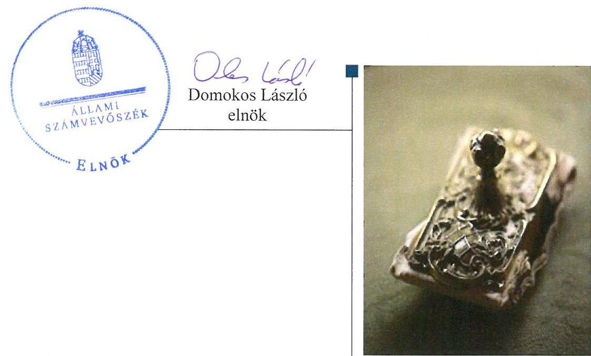

---

# AZ ELLENŐRZÉST FELÜGYELTE:

- **SALAMON ILDIKÓ** felügyeleti vezető

- **AZ ELLENŐRZÉST VEZETTE ÉS A VÉGREHAJTÁSÁÉRT FELELŐS:**

- **IMRE ZSUZSANNA** ellenőrzésvezető

- **A PROGRAM ÖSSZEÁLLÍTÁSÁÉRT FELELŐS:**

- **LAJTERNÉ HUDÁK MAGDOLNA** osztályvezető

**IKTATÓSZÁM:** V-0852-573/2016

**TÉMASZÁM:** 1886.

**ELLENŐRZÉS-AZONOSÍTÓ SZÁM:** V070901

Jelentéseink az Országgyűlés számítógépes hálózatán és az Interneta a www.asz.hu címen is olvashatóak.

---

# TARTALOMJEGYZÉK 

■ ÖSSZEGZÉS ..... 5
■ AZ ELLENŐRZÉS CÉLJA ..... 6
■ AZ ELLENŐRZÉS TERÜLETE ..... 7
■ AZ ELLENŐRZÉS HÁTTERE, INDOKOLTSÁGA ..... 9
■ A JELENTÉS LÉNYEGES KÉRDÉSKÖREI ..... 10
■ ELLENŐRZÉS HATÓKÖRE ÉS MÓDSZEREI ..... 11
■ MEGÁLLAPÍTÁSOK ..... 13
■ JAVASLATOK ..... 31
■ MELLÉKLETEK ..... 33
I. Sz. melléklet: Értelmező szótár. ..... 33
II. Sz. melléklet: ELI-HU NKft. vagyonának megoszlása a 2011-2014. években (adatok E forintban) ..... 39
III. Sz. melléklet: ELI-HU NKft. eredményének alakulása a 2011-2014. években (adatok E forintban) ..... 40
■ FÜGGELÉK: ÉSZREVÉTELEK ..... 41
■ RÖVIDÍTÉSEK JEGYZÉKE ..... 65

---

.

---

# ÖSSZEGZÉS 

Az ELI-HU NKft. tulajdonosi joggyakorlója, az MNV Zrt. szabályszerűen alakította ki az ELI-HU NKft. tulajdonában és kezelésében lévő vagyonnal való gazdálkodás feltételeit. Az ELI-HU NKft. vagyongazdálkodási tevékenységének szabályozása nem teljes körűen felelt meg a jogszabályi előírásoknak, a vagyonnyilvántartása nem volt szabályszerű. A közhasznú tevékenysége bevételeinek és ráfordításainak elszámolása összességében szabályszerű volt. Az ELI-HU NKft. vagyonnal való gazdálkodása és a vagyonváltozást eredményező döntések a jogszabályi és a tulajdonosi előírásoknak összességében megfeleltek. Az ELI-HU NKft. a beszámolási kötelezettségének összességében szabályszerűen eleget tett.

## Az ellenőrzés társadalmi indokoltsága

Az Állami Számvevőszék stratégiájában megfogalmazta, hogy az államháztartáson kívülre nyújtott költségvetési támogatások és ingyenes vagyonjuttatások, valamint az államháztartáson kívül működő közfeladat-ellátó rendszerek ellenőrzéseivel hozzájárul ahhoz, hogy a közpénzeket az államháztartáson kívül működő szervezetek is átlátható, rendezett módon használják fel a közfeladatok szerződésben vállalt ellátása, továbbá a közvagyon szerződésben vállalt átlátható, hatékony, költségtakarékos működtetése, értékének megőrzése, állagának védelme, értéknövelő használata, hasznosítása és gyarapítása érdekében. Minden közpénzt, közvagyont használó szervezettel szemben társadalmi igény, hogy tevékenységükről elszámoljanak. Ezzel az igénnyel és az Állami Számvevőszék Stratégiájával összhangban került sor az ELI-HU NKft. ellenőrzésére, amely hozzájárul a közvagyon hatékony működtetése, értékének megőrzése, állagának védelme, gyarapítása és a közpénzügyek átláthatóságának előmozdításához.

## Főbb megállapítások, következtetések, javaslatok

Az MNV Zrt. a Társasági szerződésekben és a Vagyonkezelési szerződésben meghatározta az ELI-HU NKft. vagyona, illetve a vagyonkezelésébe adott ingatlanok tekintetében a tulajdonos számára fenntartott, vagyongazdálkodásra vonatkozó jogokat, a tulajdonosi joggyakorlása szabályszerű volt. Az állami vagyon kezelésére kötött Vagyonkezelési szerződés szabályszerű volt, a jogszabályokban foglalt tartalmi előírásokat a szerződésben rögzítették. Az MNV Zrt. a Vagyon-nyilvántartási szabályzatát megalkotta, mely a jogszabályi előírásoknak megfelelt.

Az ELI-HU NKft. vagyongazdálkodási tevékenységének szabályozása nem teljes körűen felelt meg a jogszabályi előírásoknak. Az ELI-HU NKft. nem alakította ki teljes körűen a szabályszerű vagyongazdálkodás feltételeit. Számlarendjének kiegészítéséről nem gondoskodott, Leltározási szabályzatának módosítását elmulasztotta, önköltség-számítási szabályzattal nem rendelkezett. Nem gondoskodott a közérdekú adatok megismerésére irányuló igények teljesítése rendjének szabályozásáról. Az ELI-HU NKft. vagyonnyilvántartását kialakította, azonban - a beszámolót alátámasztó leltárak hiányában - az nem volt szabályszerű.

Az ELI-HU NKft. bevételei és ráfordításai összességében - a feltárt hiányosságok mellett - a támogatási szerződések előírásainak megfelelően elkülönítve és szabályszerűen kerültek elszámolásra.

Az ELI-HU NKft. vagyonnal való gazdálkodása, valamint a vagyonváltozást eredményező döntések a jogszabályi és a tulajdonosi előírásoknak összességében megfeleltek, ugyanakkor több esetben mellőzték a közbeszerzési eljárás lefolytatását. Vagyonának összetétele jelentősen változott, értéke - kiemelten a 2013. évről a 2014. évre - többszörösére növekedett az ELI-ALPS nagyprojekt megvalósításának előrehaladásával.

Az ELI-HU NKft. a beszámolási kötelezettségének összességében szabályszerűen tett eleget, azonban a közérdekú adatok nyilvánosságra hozatalát nem teljes körűen biztosította. A vagyongazdálkodását érintő információs rendszert kialakította, azt összességében a belső szabályozásban és az MNV Zrt. előírásainak megfelelően működtette.

---

# AZ ELLENŐRZÉS CÉLJA 

Az ellenőrzés célja annak értékelése volt, hogy a tulajdonosi jogok gyakorlása szabályszerű volt-e, a gazdálkodó szervezet által ellátott feladat bevételei, ráfordításai elszámolásának, és vagyongazdálkodási tevékenységének szabályozása megfelelte-e a jogszabályi és a tulajdonosi előírásoknak és azok végrehajtása szabályszerű volt-e, biztosítva volt-e a közfeladatok átláthatósága és elszámoltathatósága érdekében a közszolgáltatás díjának megalapozottsága szabályszerű önköltségszámítással, a vagyonváltozást eredményező döntések esetében az MNV Zrt. és a gazdálkodó szervezet szabályszerűen jártak-e el, a gazdálkodó szervezet épített-e ki és múködtetett-e információs rendszert a szabályszerű vagyongazdálkodás érdekében. Az ellenőrzés további célja volt annak értékelése, hogy a kormányzati szektorba sorolt egyéb szervezetek gazdálkodásának a kormányzati szektor hiányára és az államadósságra befolyással bíró elemei a jogszabályi előírásoknak megfeleltek-e.

---

# **AZ ELLENŐRZÉS TERÜLETE**

## **ELI-HU Kutatási és Fejlesztési Nonprofit Közhasznú Korlátolt Felelősségű Társaság**

Az ÁSZ1 Stratégiájával összhangban a közvagyon védelme, a közpénzügyek átláthatóságának előmozdítása érdekében került sor a költségvetésen kívüli, többségi állami tulajdonú gazdálkodó szervezet, az ELI-HU NKft.2 ellenőrzésére.

Az ELI-HU NKft.-t a Szegedi Tudományegyetem és Szeged Megyei Jogú Város Önkormányzata 2010. március 3-án alapította. Az alapítók az ELI-HU NKft. alapításkori jegyzett tőkéjét 2,0 M Ft-ban határozták meg, az SZTE3-nek 1,01 M Ft, az SZMJVÖ4-nek 0,99 M Ft volt a törzsbetéte. A Magyar Állam 2010. május 21-én vált tulajdonossá, s az általa jegyzett tőkeemeléssel az ELI-HU NKft. jegyzett tőkéje 4,01 M Ft-ra nőtt, amelyből a Magyar Államot illették meg a többségi részesedési jogok (50,12%).

Az ELI-HU NKft. 2011. április 7-i taggyűlése 100,0 M Ft összegű tőkeemelésről döntött, melyből a jegyzett tőkét 17,0 M Ft-tal, a tőketartalékot 83,0 M Ft-tal megemelték. A tőkeemelésben kizárólagosan a Magyar Állam vett részt, melynek következtében a Magyar Állam tulajdoni hányada az ELI-HU NKft.-ben 90,5%-ra nőtt. Az ELI-HU NKft.-ben lévő állami részesedés a Vtv.5 alapján állami vagyonnak minősült, amely felett a Magyar Állam tulajdonosi jogait a Vtv. alapján az állami vagyon felügyeletéért felelős miniszter gyakorolta, aki e feladatát az MNV Zrt.6 útján látta el.

Az ELI-HU NKft. főtevékenysége (közhasznú tevékenysége) az egyéb természettudományi, műszaki kutatás, fejlesztés, valamint kutatási szervezés fejlesztése és támogatása volt. Az ELI-HU NKft.-t, mint projektcéget azzal a céllal hozták létre, hogy az ELI7 nemzetközi lézeres kutatási infrastruktúra magyar lézerközpontjának építési projektjét előkészítse és a projekt megvalósítását koordinálja, a kiemelkedő jelentőségű kutató szuperlézer összeurópai összefogással megépülő kutatóbázisának egyik pillére legyen Magyarországon. Az ELI-HU NKft. tagjai kutatási szervezetet hoztak létre, amelynek legfontosabb feladata volt az SA8 forrásokra történő pályázás, az ELI nemzetközi konzorciumban való magyar részvétel és az ELI magyarországi berendezési és fejlesztési program koordinálása.

Az ELI-HU NKft. folyamatosan közhasznú jogállású gazdasági társaságként működött. Társasági szerződésében13-17 nevesítették, hogy közhasznú tevékenysége keretében együttműködik a TTI stratégia9 kialakításában a Kormánnyal, a tudományos élet képviselőivel, a vállalkozásokkal, valamint a társadalmi, gazdasági érdekképviseletekkel és más civil szervezetekkel a kutatás-fejlesztésről szóló tv.10-ben meghatározott közfeladat ellátásához kapcsolódóan. A TTI stratégia helyébe lépő, 2013-2020. időszakra az 1414/2013. (VII. 4) Korm. határozattal11 kiadott KFI stratégia12 a tudásbázisok fejlesztésénél specifikus célkitűzésként határozta meg a nemzetközileg versenyképes K+F infrastruktúra fejlesztését, ezen belül a nagy nemzetközi

---

infrastruktúrákhoz, hálózatokhoz való csatlakozás elősegítését, kiemelten nevesítve az ELI nagyberuházást.

Az ELI-HU NKft. 2011-2014. között az ELI nagyprojektet előkészítette, és az ellenőrzött időszakot érintő szakaszainak megvalósítását koordinálta. Az ELI-ALPS nagyprojekt ${ }^{13}$ megvalósítására négy szakaszban, az ERFA ${ }^{14}$-ból származó és hazai költségvetési források felhasználásával kerül sor, amelyet az 1. táblázat szemléltet:

1. táblázat

ELI-ALPS NAGYPROJEKT FORRÁSAI (ADATOK M FT-BAN)

| Támogató | Projekt szakasz | Támogatás bruttó összege | Támogatás forrása |
| :--: | :--: | :--: | :--: |
| NFÜ | $\begin{gathered} \text { P1 2011. 07. 01 - } \\ 2012.12 .30 . \end{gathered}$ | 992,0 | ERFA |
| NFÜ | $\begin{gathered} \text { P2 2011. 06. 01 - } \\ 2012.12 .31 . \end{gathered}$ | 2395,4 | ERFA |
| NFÜ | $\begin{gathered} \text { P3 2011. 03. 07. - } \\ 2015.07 .31 . \end{gathered}$ | 36999,0 | ERFA |
| NFÜ | $\begin{gathered} \text { P4 2015. 04. 01 - } \\ 2017.12 .31 . \end{gathered}$ | 28583,0 | ERFA |
|  | ERFA források összesen | 68969,4 |  |
| NKTH |  | 58,1 | Költségvetés |
| NFÜ | $\begin{gathered} \text { P2 2011. 06. 01 - } \\ 2012.12 .31 . \end{gathered}$ | 422,7 | Költségvetés |
| NFM |  | 581,1 | Költségvetés |
| NFM |  | 94,0 | Költségvetés |
| Költségvetési források összesen |  | 1155,9 |  |

Forrás: ELI-HU NKft támogatási szerződései
Az ELI-HU NKft. a projekt megvalósításához a 2013. január 22-én megkötött Vagyonkezelési szerződésben ${ }^{15}$ az MNV Zrt.-től hat darab földterületet (ingatlant) kapott vagyonkezelésbe Szeged II. kerületében. Az ingatlanok a Vagyonkezelési szerződés értelmében az ELI-HU NKft. vagyonkezelésébe a Szindikátusi szerződésben ${ }^{16}$ meghatározott célok elérése érdekében kerültek. Ennek során az ELI-HU NKft. mint vagyonkezelő, a pályázatok koordinátora, majd kedvezményezettje, a megvalósítandó projekt munkaszervezete és felelőse, valamint a létrejövő és a vagyonkezelésébe adott vagyon kezelője volt. Az ELI-ALPS nagyprojekt zárását követően a megvalósuló létesítmények az MNV Zrt. tulajdonába kerülnek.

Az ELI-HU NKft. főbb pénzügyi adatait a 2. táblázat mutatja:
2. táblázat

AZ ELI-HU NKFT. FŐBB PÉNZÜGYI ÉS LÉTSZÁM ADATAI (M FT-BAN, FŐ)

| Magyarország | 2011. év | 2012. év | 2013. év | 2014. év |
| :--: | :--: | :--: | :--: | :--: |
| Mérlegfőösszeg | 654,0 | 2267,9 | 2904,1 | 14432,5 |
| Készletek | 301,1 | 1384,8 | 2637,4 | 13655,4 |
| Saját tőke | 35,3 | 24,9 | 29,3 | 30,0 |
| Kötelezettség állomány | 590,1 | 2238,1 | 2823,7 | 14233,4 |
| Létszám | 10 | 24 | 28 | 79 |

Forrás: ELI-HU NKft. 2011-2014. évi éves beszámolói

Az ellenőrzött időszakban az ELI-HU NKft.-nél az ügyvezető személye egy alkalommal, 2011. március 7-től változott.

---

# AZ ELLENŐRZÉS HÁTTERE, INDOKOLTSÁGA 

Az állami vagyonnal való gazdálkodást illetően a tulajdonosi joggyakorlás és a vagyongazdálkodás feladata az állami vagyon átlátható, rendeltetésszerű és felelős felhasználásának biztosítása. Az állam meghatározza az ellátandó közszolgáltatásokkal kapcsolatos feladatokat, amelyhez a vagyonnal kapcsolatos döntéseknek igazodniuk kell. A nemzetgazdasági szempontból kiemelt jelentőségű nemzeti vagyonba tartozó állami tulajdonban álló társasági részesedést az Nvtv. ${ }^{17}$ határozza meg.

Az Áht. ${ }^{18}$ nevesíti a kormányzati szektorba sorolt egyéb szervezet fogalmát. E körbe tartoznak azok a szervezetek, amelyek nem részei az államháztartásnak, azonban az Európai Közösséget létrehozó szerződéshez csatolt, a túlzott hiány esetén követendő eljárásról szóló jegyzőkönyv alkalmazásáról szóló 2009. május 25-i 479/2009/EK rendelet szerint a kormányzati szektorba tartoznak. A nemzeti számlák nemzetközi és hazai statisztikai módszertana és szabványai elveket határoznak meg a statisztikai értelemben vett kormányzati szektorba tartozó szervezetek körére és besorolásuk módjára. A kormányzati szektorba sorolt egyéb szervezet többek között köteles adatszolgáltatást teljesíteni a központi költségvetésről szóló törvény elkészítéséhez, továbbá adósságot keletkeztető ügyletet csak az államháztartásért felelős miniszter előzetes egyetértésével köthet. A kormányzati szektoron kívüli féllel kötött adósságot keletkeztető ügylete, gazdálkodásának eredménye befolyásolja a kormányzati szektor konszolidált adósságmutatóját, illetve a kormányzati hiányt.

Az ellenőrzés hasznosulásaként az ellenőrzés megállapításai a jogalkotás számára segítséget nyújthatnak az államháztartáson kívüli közfeladatellátás, közvagyonnal való gazdálkodás értékeléséhez, jogszabályi keretei pontosításához, átláthatóságot, költségtakarékos múködést, értékének megőrzését, állagának védelmét, értéknövelő használatát, hasznosítását és gyarapítását biztosító szabályozáshoz. Az ellenőrzöttek számára visszajelzést ad a gazdálkodási tevékenységgel, az állami vagyon felhasználásával, a közszolgáltatási árképzés megalapozottságával és az éves elszámolással kapcsolatos szabálytalanságokról és kockázatokról. Az ellenőrzés tapasztalatai segítik és erősítik az ÁSZ hozzáadott értéket teremtő elemző tevékenységét és tanácsadó szerepét. A kormányzati szektorba sorolt, költségvetési tervezésbe is bevont gazdálkodó szervezetek ellenőrzése fokozza a legfőbb ellenőrző szerv iránti figyelmet és közbizalmat.

Feltárjuk, hogy a kormányzati szektorba sorolt egyéb szervezetek milyen mértékben befolyásolják a költségvetési hiányt és az államadósságot. Az ellenőrzés rámutathat az állami tulajdonú közszolgáltatást végző gazdálkodó szervezetek gazdálkodási tevékenységével, valamint az államháztartásból származó források felhasználásával kapcsolatos jó gyakorlatokra és szabálytalanságokra. Felhívhatja a figyelmet a jogszabályi követelmények teljesítéséhez szükséges feltételek hiányosságaira, hozzájárulhat az államháztartáson kívüli, de állami vagyont használó gazdálkodó szervezetek tevékenységének átláthatóságához. Hozzájárulhat a közfeladat-ellátás minőségének javulásához. Az ÁSZ értékteremtő rend kialakításához és megőrzéséhez hozzájáruló tevékenysége pozitív hatással van a szervezetről kialakított összkép formálására is.

---

# A JELENTÉS LÉNYEGES KÉRDÉSKÖREI 

1.     - A tulajdonosi jogok gyakorlója szabályszerűen alakította-e ki a gazdálkodó szervezet tulajdonában, illetve kezelésében lévő vagyonnal való gazdálkodás feltételeit?
2.     - A gazdálkodó szervezet az állami vagyon értéke megőrzését és gyarapítását biztosító vagyongazdálkodási tevékenységét sza-bályozta-e, illetve kialakította-e a vagyonnyilvántartást a jogszabályi és a tulajdonosi elöírásoknak megfelelően?
3.     - Szabályszerü, illetve a tulajdonosi elöírásoknak megfelelő volt-e a gazdálkodó szervezet által a közhasznú tevékenysége körében ellátott feladat bevételei és ráfordításai elszámolása?
4.     - A gazdálkodó szervezet vagyonnal való gazdálkodása, valamint a tulajdonosi jogok gyakorlója és a gazdálkodó szervezet által meghozott, vagyonváltozást eredményező döntések jogszabályi és a tulajdonosi elöírásoknak megfeleltek-e?
5.     - A szabályszerű vagyongazdálkodás érdekében a gazdálkodó szervezet teljesítette-e a beszámolási, adatszolgáltatási kötelezettségét, kiépített-e, illetve müködtetett-e információs rendszert?
6.     - A kormányzati szektorba sorolt egyéb szervezetek gazdálkodásának a kormányzati szektor hiányára és az államadósságra befolyással bíró elemei jogszabályi elöírásoknak megfelel-tek-e?

---

# ELLENŐRZÉS HATÓKÖRE ÉS MÓDSZEREI 

## Az ellenőrzés típusa

Szabályszerúségi ellenőrzés

## Az ellenőrzött időszak

2011. január 1-jétől 2014. december 31-ig.

## Az ellenőrzés tárgya

Az állami tulajdonban (résztulajdonban) lévő gazdálkodó szervezetek vagyonmegőrzési és gazdálkodási tevékenységének, valamint a kormányzati szektor hiányára és adósságállományára hatást gyakorló elemek ellenőrzése.

## Az ellenőrzött szervezet

ELI-HU Kutatási és Fejlesztési Nonprofit Közhasznú Korlátolt Felelősségű Társaság, Magyar Nemzeti Vagyonkezelő Zártkörűen Működő Részvénytársaság.

## Az ellenőrzés jogalapja

Az ellenőrzés végrehajtásnak jogszabályi alapját az Állami Számvevőszékről szóló 2011. évi LXVI. törvény 5. § (3)-(5) bekezdése, valamint az állami vagyonról szóló 2007. évi CVI. törvény 3. § (4) bekezdése képezte.

## Az ellenőrzés módszerei

Az ellenőrzés az INTOSAI által kiadott nemzetközi standardok figyelembevételével, az ÁSZ ellenőrzés szakmai szabályait tartalmazó belső szabályzatokban foglaltak, valamint az ellenőrzési programban foglalt értékelési szempontok szerint történt.

A bevételek és ráfordítások elszámolása, valamint a vagyonnyilvántartás terén a szabályszerű múködést véletlen mintavétellel ellenőriztük. Az ELI-HU NKft., mint kormányzati szektorba sorolt gazdálkodó szervezet esetében a személyi jellegú ráfordítások elszámolása mellett az egyéb ráfordítások, pénzügyi műveletek ráfordításai, rendkívüli ráfordítások, illetve az

---

egyéb bevételek, pénzügyi műveletek bevételei, rendkívüli bevételek elszámolásának szabályszerűségét szintén mintatételeken keresztül ellenőriztük. A mintavétellel ellenőrzött területek esetében minden egyes tétel vonatkozásában a szabályszerűségre vonatkozó kérdéseket tettünk fel, amelyek eredménye összesítésre került. A jogszabályoknak és a belső előírásoknak megfelelőnek tekintettük az adott területet, amennyiben a minta ellenőrzésének eredménye alapján 95\%-os bizonyossággal a teljes sokaságban a hibaarány kisebb volt, mint 10\%, nem megfelelőnek értékeltük, ha a hibaarány a 10\%-ot meghaladta. Kockázatot, illetve magas kockázatot jeleztünk, amennyiben egy adott terület vonatkozásában a minta alapján a teljes sokaságban nem volt egyértelműen biztosított a jogszabályoknak és a belső szabályzatoknak megfelelő működés. A ráfordítások elszámolására és a vagyonnyilvántartásra vonatkozó véletlen mintavételt kockázati alapú kiválasztással egészítettük ki, amelynek során évente a három legnagyobb összegű tételt választottuk ki.

---

# 1. A tulajdonosi jogok gyakorlója szabályszerűen alakította-e ki a gazdálkodó szervezet tulajdonában, illetve kezelésében lévő vagyonnal való gazdálkodás feltételeit? 

Összegző megállapítás

Az MNV Zrt. szabályszerűen alakította ki az ELI-HU NKft. tulajdonában, illetve kezelésében lévő vagyonnal való gazdálkodás feltételeit.
1.1. számú megállapítás

Az MNV Zrt. a Társasági szerződésekben és a Vagyonkezelési szerződésben meghatározta az ELI-HU NKft. vagyona, illetve a vagyonkezelésébe adott ingatlanok tekintetében a tulajdonos számára fenntartott, vagyongazdálkodásra vonatkozó jogokat.

Az ELI-HU NKft.-ben birtokolt többségi társasági részesedés az ellenőrzött időszakban a Vtv. szerint állami vagyonnak minősült, amely felett a tulajdonosi jogokat a Magyar Államot képviselve az állami vagyon felügyeletéért felelős miniszter gyakorolta, aki e feladatát a Vtv. előírásai szerint az MNV Zrt. útján látta el. 2013. január 22-től a Vagyonkezelési szerződésben meghatározott ingatlanok, mint állami vagyon, az ELI-HU NKft. vagyonkezelésébe kerültek.

A Szindikátusi szerződésben, a Vagyonkezelési szerződésben, valamint a Társasági Szerződésekben ${ }_{1-17}{ }^{19}$, meghatározták az ELI-HU NKft. vagyona, valamint a vagyonkezelésbe adott vagyon (földterületek) tekintetében a vagyongazdálkodásra vonatkozó követelményeket. A szerződések a Gt. ${ }^{20}$, Vtv., és a Vhr. ${ }^{21}$ előírásainak megfelelően tartalmazták a vagyonnal történő felelős gazdálkodáshoz szükséges követelményeket, meghatározták az MNV Zrt., a taggyűlés ${ }^{22}$, az $\mathrm{FB}^{23}$, az ügyvezető és a könyvvizsgáló jogait, feladatait.

A TULAJDONOSI JOGOK GYAKORLÁSÁT a Társasági szerződések ${ }_{1-17}$ III. 2. és III. 4. pontjai, valamint a Szindikátusi szerződés 4.b) pontja a taggyűlésen és az FB-n keresztül is biztosította. A Szindikátusi szerződés 4.b) pontja alapján az FB tagjai az FB elnökének az MNV Zrt. által delegált FB tagot választották meg. A Szindikátusi szerződés 6. és 7. pontjai biztosították az ELI-HU NKft. működési körében létrehozott vagyonelemek, mint épület (felépítmény) és az azon létrejövő egyéb vagyonelemek állami tulajdonba kerülését.

A TÁRSASÁGI SZERZŐDÉS tartalmazta a Gt. és a Ptk. ${ }^{24}$ előírásainak megfelelően az ELI-HU NKft. felelős gazdálkodásához szükséges követelményeket. Meghatározták benne a taggyűlés kizárólagos hatáskörébe utalt feladatokat, a döntési jogosultságokat. Meghatározták továbbá az ügyvezető megválasztásának módját, a feladatait, a döntési jogköreit és a felelősségi körét. Rendelkeztek az FB kötelezettségeiről, a működésének,

---

döntésének feltételeiről, a könyvvizsgáló kiválasztásáról, megbízásának időtartamáról. A Társasági szerződés1-17 tartalmazta az ELI-HU NKft. múködésének, a szolgáltatások igénybevétele módjának, a beszámoló közzétételéneknek, nyilvánosságának módjait, a cégjegyzés, a gazdálkodás feltételeit valamint a taggyűlés évente legalább két alkalommal történő összehívásának követelményét.

A Társasági szerződés1-17 a Gt.-nek, majd a Ptk.2-nak megfelelően tartalmazta a kizárólagosan a taggyűlés hatáskörébe utalt ügyeket:
$\longrightarrow$ a beszámolóról csak az FB írásbeli jelentésének birtokában határozhatott,
$\longrightarrow$ a közhasznúsági melléklet elfogadását, az éves üzleti tervek jóváhagyását, az éves munkaprogram elfogadását,
$\longrightarrow$ a hitelfelvétel elhatározásáról való döntést (2011. július 22-ig 15,0 M Ft feletti hitelfelvétel esetén),
$\longrightarrow$ a 100,0 M Ft feletti szerződések jóváhagyását,
$\longrightarrow$ az ELI-HU NKft. stratégiájának, fejlesztési és üzletpolitikája meghatározását, a közbeszerzési terv elfogadását,
$\longrightarrow$ az SZMSZ-nek, az FB ügyrendjének jóváhagyását.
Az ELI-HU NKft.-nél a tulajdonosok a Társasági szerződéssel ${ }_{1-17}$ és a Gt.vel, majd a Ptk.2-val összhangban létrehozták az FB-t. Az FB hatáskörébe utalták a beszámolók előzetes jóváhagyását, a működés és gazdálkodás ellenőrzését, továbbá a 15,0 M Ft feletti (2013. december 16-tól a 25,0 M Ft feletti), de 100,0 M Ft alatti szerződések előzetes jóváhagyását.

A VAGYONKEZELÉSI SZERZŐDÉSBEN rögzítették a gazdálkodó szervezet kezelésében lévő állami vagyon értékének megőrzését, gyarapítását. Szabályozták a Vhr. -ben előírtak szerint a tulajdonosi jogok gyakorlójának és az ELI-HU NKft.-nek a jogait és kötelezettségeit. A szerződés tartalmazta többek között:
$\longrightarrow$ tételesen a vagyonkezelésbe átadott állami vagyont, annak értékét, a visszapótlási kötelezettséget,
$\longrightarrow$ az MNV Zrt. ellenőrzési jogosultságát a használat tekintetében.
A SZINDIKÁTUSI SZERZŐDÉSBEN megfogalmazott tulajdonosi elvárásoknak megfelelően, az ELI-ALPS nagyprojekt megvalósítási kötelezettséget meghatározta a Vagyonkezelési szerződés 1. pontja és a 2. számú melléklete. A vagyon gyarapítását a Szindikátusi szerződésben és a Vagyonkezelési szerződésben foglaltaknak megfelelően az ELI-ALPS nagyprojekt megvalósításának előrehaladása jelentette.

# 1.2. számú megállapítás 

Az állami vagyon kezelésére kötött Vagyonkezelési szerződés szabályszerű volt, a jogszabályokban foglalt tartalmi előírásokat a szerződésben rögzítették.

Vagyonkezelési szerződés az MNV Zrt., valamint az SZTE és az ELI-HU NKft. között, az Nvtv. -ben foglaltaknak megfelelően, 2013. január 22-én jött létre, amelynek keretében hat db állami tulajdonú ingatlan (földterület) került az ELI-HU NKft. vagyonkezelésébe. Az állami vagyon felett a Vagyonkezelési szerződés 1.1. pontja és a Vtv. értelmében a tulajdonosi jogok és

---

# 1.3. számú megállapítás 

kötelezettségek összességét az állami vagyon felügyeletéért felelős miniszter gyakorolta, aki e feladatát az MNV Zrt. útján látta el.

A VAGYONKEZELÉSI SZERZŐDÉSBEN rögzítették a Vtv.-ben előírtaknak megfelelően az állami vagyon hatékony működtetésének, állaga védelmének, értékei megőrzésének és gyarapításának kötelezettségét. A Vtv.-ben foglaltaknak megfelelően rögzítették továbbá a felek jogait és kötelezettségeit, valamint a Vhr.-ben előírtak szerint a vagyonkezelt vagyonra vonatkozóan az MNV Zrt. ellenőrzési jogait. A Vagyonkezelési szerződés mellékletét képezte az MNV Zrt. Tulajdonosi Ellenőrzési szabályzata, az MNV Zrt. ellenőrzési eljárásrendje.

A Vagyonkezelési szerződésben meghatározták - a Vhr. szerinti vagyonnyilvántartás egységessége betartásához -, hogy az ELI-HU NKft. mint vagyonkezelő az MNV Zrt. mindenkori Vagyon-nyilvántartási szabályzatát megismerte és az abban foglaltakat magára nézve kötelezően elfogadta. A Vagyonkezelési szerződésben rögzítették a Vhr.-ben foglaltakkal összhangban az állami vagyonra vonatkozó nyilvántartási, adatszolgáltatási és elszámolási kötelezettséget. Meghatározták az ELI-HU NKft.-nek a vagyonkezelésbe kapott ingatlanokra vonatkozóan a teljes körű vagyonbiztosítási szerződés megkötésének kötelezettségét. Rendelkeztek a tulajdonosi jogok gyakorlójának a jogairól és az ELI-HU NKft. kötelezettségeiről a vagyonkezelt ingatlanok hasznosításának feltételei vonatkozásában.

Az MNV Zrt. a Vagyon-nyilvántartási szabályzatát megalkotta, mely a jogszabályi előírásoknak megfelelt.

A VAGYON-NYILVÁNTARTÁSI SZABÁLYZATOT ${ }_{1-5}{ }^{25}$ az MNV Zrt. a Vtv.-ben és az Nvtv.-ben előírt vagyonnyilvántartásához elkészítette, amelyet a Vagyonkezelési szerződés alapján az ELI-HU NKft.-re kiterjesztett.

A 2013. július 29-ig hatályos Vagyon-nyilvántartási szabályzat ${ }_{1-2}$ 1.2.6. pontjában a Vhr.-ben foglaltaknak megfelelően előírták az ELI-HU NKft.nek, hogy a számviteli politikáját és a nyilvántartásait köteles úgy kialakítani és vezetni, hogy azok biztosítsák az adatszolgáltatás pontosságát és ellenőrizhetőségét. A Vagyon-nyilvántartási szabályzatok ${ }_{1-2}$ 3.5.1. pontja, illetve a Vagyon-nyilvántartási szabályzatok ${ }_{3-5} \mathrm{C}$. és D pontjai a Vhr.-ben és annak mellékletében foglalt szolgáltatandó adatok körét, az adatszolgáltatás gyakoriságát tartalmazták.

---

# 2. A gazdálkodó szervezet az állami vagyon értéke megőrzését és gyarapítását biztosító vagyongazdálkodási tevékenységét szabályozta-e, illetve kialakította-e a vagyonnyilvántartást a jogszabályi és a tulajdonosi előírásoknak megfelelően? 

Összegző megállapítás

A vagyongazdálkodási tevékenység szabályozása nem teljes körűen felelt meg a jogszabályi előírásoknak, a vagyonnyilvántartását kialakította, azonban a beszámolót alátámasztó leltárak hiányában az nem volt szabályszerű.
2.1. számú megállapítás

Az ELI-HU NKft. nem teljes körűen alakította ki az állami és a saját vagyona értékének megőrzését, gyarapítását szolgáló szabályszerű vagyongazdálkodás feltételeit.

A VAGYONGAZDÁLKODÁS tekintetében a Szindikátusi szerződés határozott meg az ELI-HU NKft. számára stratégiai célokat, míg a Vagyonkezelési szerződés beruházási tervet részletező melléklete tartalmazta az ELI-ALPS nagyprojekt előkészítésének és megvalósításának ütemezését. Az ellenőrzött időszakban hatályos Társasági szerződés ${ }_{1-17}$ a taggyűlés kizárólagos hatáskörébe utalta a társaság stratégiájának, fejlesztési és üzletpolitikájának meghatározását, az éves munkaprogram elfogadását.

Az SZMSZ ${ }_{1-5}{ }^{26}$-ben az ügyvezető feladataként rögzítették a társaság éves munkaprogramjának elkészítése mellett, a társaság üzleti stratégiájának, és annak megfelelő üzleti tervének kidolgozását, a végrehajtás szervezését és ellenőrzését. Az ELI-HU NKft.-nél az SZMSZ ${ }_{1}$ 6.2.6. m) pontjában, valamint az SZMSZ ${ }_{2-5}$ 6.2.6. n) pontjában foglaltak ellenére nem gondoskodtak az üzleti stratégia elkészítéséről.

AZ ÉVES ÜZLETI TERV jóváhagyása a Társasági szerződés ${ }_{1-17}$ alapján a taggyűlés kizárólagos hatáskörébe tartozott. Ezzel összhangban az SZMSZ ${ }_{2-5}$-ekben az ügyvezető feladataként határozták meg az üzleti terv készítési kötelezettséget. Az üzleti tervek az ellenőrzött időszak minden évére vonatkozóan elkészültek.

A VAGYONNAL VALÓ GAZDÁLKODÁS belső szabályait a 2011-2014. évekre az ELI-HU NKft. a Számviteli politika ${ }^{27}{ }_{1-4}$-ben, a Számlarendek ${ }^{28}{ }_{1-2}$-ben, a Selejtezési szabályzatokban ${ }^{29}{ }_{1-2}$, a Pénzkezelési szabályzatokban ${ }^{30}{ }_{1-3}$, a Leltározási szabályzatokban ${ }^{31}{ }_{1-2}$, az Értékelési szabályzatokban ${ }^{32}{ }_{1-3}$, a Bizonylati rendekben ${ }^{33}{ }_{1-2}$, továbbá 2012. évtől az SZMSZ ${ }_{1-5}$-ben, és a Befektetési szabályzatokban ${ }^{34}{ }_{1-2}$ határozta meg.

Az ELI-HU NKft. 2012. január 4-ig nem rendelkezett SZMSZ-el, ezzel megsértette a 6/2010. (VII. 07.) FB határozatban - az SZMSZ elkészítésére előírt - 2010. szeptember 30-i határidőt.

Az ELI-HU NKft. az ellenőrzött időszakban rendelkezett a Számv. tv. ${ }^{35}$ ben előírt számviteli politikával, illetve számlarenddel. A Számviteli politikák ${ }_{1-4}$-ban (16. illetve 17. pont Amortizációs politika) meghatározták az értékcsökkenési leírás módszerét és elszámolásának gyakoriságát.

---

Az ELI-HU NKft. a 2014. január 1-jétől hatályos Számviteli politikában4 meghatározta a vagyonkezelésbe vett eszközök saját vagyontól való elkülönítésének, nyilvántartásának szabályait, melyet a Vagyonkezelési Szerződés hatályba lépése (2013. január 22.) és 2014. január 1-je között nem szabályoztak, a Vagyonkezelési szerződés 6.16. pontjában foglalt előírások ellenére.

Az ELI-ALPS nagyprojekt megvalósításához kapott támogatások, a megvalósítás során felmerült költségek és ráfordítások elszámolásának, nyilvántartásának szabályait a Számviteli politikában ${ }_{2-3}$ és annak 7 . számú mellékletében, a Számviteli politikában ${ }_{4}$ és annak 6 . számú mellékletében rögzítették.

A Számviteli politika ${ }_{1-4}$ mellékleteként elkészítették a Számlarendet ${ }_{1-2}$ et, ugyanakkor azokban nem nevesítették teljes körűen a főkönyvi nyilvántartásuk során 2011. évtől alkalmazott főkönyvi számlák, alszámlák számlajelét és megnevezését. Így különösen az ELI-ALPS nagyprojekthez kapcsolódóan a 23. Befejezetlen termelés és félkész termékek; 231. Befejezetlen termelés; illetve annak további alábontását, a 4791 GOP $^{36}$ elszámolás $\mathrm{NF}(\mathrm{J})^{37}$ előleg, illetve alábontásait; 581. Saját termelésű készletek állományváltozása, azon belül az 5811 ELI-ALPS nagyprojekt STK állományváltozása számlákat. A Számlarend ${ }_{1-2}$ nem tartalmazta ezen számlák tartalmát, a növekedési és csökkenési jogcímüket, a számlát érintő gazdasági eseményeket, azok más számlákkal való kapcsolatát, nem tartalmazta továbbá a főkönyvi számla és az analitikus nyilvántartás kapcsolatát, mellyel megsértették a Számv. tv. 161. § (2) bekezdése a)-c) pontjaiban foglaltakat.

Az ELI-HU NKft. az ellenőrzött időszakban rendelkezett (2010. július 22től) a Számv. tv.-ben előírt leltározási szabályzattal, ugyanakkor annak módosításáról a Számv. tv. vonatkozó rendelkezéseinek módosulása ellenére 2012. évtől kezdődően nem gondoskodtak. Az ellenőrzött időszakban a Leltározási szabályzat 2 5.1. pontja (Befektetett eszközök leltározása) öt évenkénti gyakorisággal írta elő - a tárgyi eszközökre és beruházásokra vonatkozóan, tekintettel arra, hogy azokról folyamatos mennyiségi és értékbeli nyilvántartást vezetett - a mennyiségi felvétellel történő leltározást, mely 2012. január 1-jétől nem felelt meg a Számv. tv. 69. § (3) bekezdésben előírtaknak, mivel az a legalább háromévente mennyiségi felvétellel történő leltározás elvégzését írta elő. A Leltározási szabályzat ${ }_{2}$ módosításának elmulasztásával a Számv. tv. 14. § (11) bekezdésben foglaltaknak sem tettek eleget, mely szerint a törvénymódosítás esetén a változásokat annak hatálybalépését követő 90 napon belül - jelen esetben 2012. március 31-ig - a Számviteli politikán, annak keretében elkészített leltározási szabályzaton át kellett volna vezetni.

Az ELI-HU NKft. az ellenőrzött időszakban rendelkezett (2010. július 22től) a Számv. tv.-ben előírt eszközök és források értékelési szabályzatával, amely a Számv. tv. előírásaival összhangban ugyan, de hiányosan tartalmazta az eszközök bekerülési értékének meghatározására vonatkozó szabályokat. Mivel a Számviteli Politika ${ }_{2-4}$ részeként elkészített Értékelési szabályzat ${ }_{2-3}$, sem a Számviteli politika ${ }_{2-4}$ egyéb részei, mellékletei a befejezetlen termelés és félkész termékek értékének meghatározására külön nem tértek ki annak ellenére, hogy a mérlegében kimutatott készletei között 2011-2014. években a befejezetlen termelés és félkész termékek értéke szerepelt, mely készletérték 2014. évben már a mérlegfőösszeg 59,6 \%-át

---

jelentette. Ezzel az ELI-HU NKft. nem tett eleget a Számv. tv. 14. § (4) bekezdésben előírtaknak, mivel a Számviteli politika2-4 keretében írásban nem rögzítették az ELI-HU NKft.-re, mint gazdálkodóra jellemző szabályokat, előírásokat, módszereket a befejezetlen termelés és félkész termékek értékelése tekintetében.

Az ELI-HU NKft. az ellenőrzött időszak alatt a Számv. tv. előírásainak megfelelően rendelkezett Selejtezési szabályzattal és Pénzkezelési Szabályzattal.

Az ELI-HU NKft. a bizonylati rend készítési kötelezettségének az ellenőrzött időszakban a Számv. tv.-ben előírtakkal összhangban eleget tett.

Az ELI-HU NKft. a Civil tv ${ }^{38}$-ben előírtaknak megfelelően elkészítette 2012. január 4-től hatályos - Befektetési szabályzatát, amely tartalmazta a befektetés alapelveit, a befektetés lehetséges formáit, a befektetési korlátok meghatározását, valamint a befektetési folyamat részletes leírását.

Az ELI-HU NKft. nem rendelkezett önköltség számítási szabályzattal, annak ellenére, hogy a 2012. évi beszámolója alapján a költség nemek együttes összege már meghaladta az 500 M Ft-ot. Így az önköltség számítási szabályzat elkészítésének elmulasztásával megsértették 2013-2014. években a Számv. tv. 14. § (5) bekezdésének c) pontjában foglaltakat, a Számv. tv. 14. § (7) bekezdésére tekintettel.

Az ELI-HU NKft. tulajdonában és kezelésben lévő vagyon értékének megőrzésével és gyarapításával, felelős gazdálkodásával kapcsolatosan speciális korlátozásokat, előírásokat - a Vtv. előírásaival összhangban - a Szindikátusi szerződés, a Társasági szerződés ${ }_{1-17}$, valamint a Vagyonkezelési szerződés fogalmazott meg.

# A VAGYONGAZDÁLKODÁSSAL KAPCSOLATOS 

FELADAT- ÉS HATÁSKÖRÖKET az MNV Zrt. a Társasági szerződésekben ${ }_{1-17}$, illetve a Vagyonkezelési Szerződésben írta elő az ELIHU NKft. számára. A vagyongazdálkodással kapcsolatos feladat- és hatásköröket, felelősségi viszonyokat az ELI-HU NKft. az MNV Zrt. által előírtakkal összhangban határozta meg, mely előírásokat az SZMSZ ${ }_{1-5}$, a Kötelezettségvállalási, valamint az Egységes Beszerzési szabályzat ${ }^{39}{ }_{1-5}$ tartalmazta.

### 2.2. számú megállapítás

Az ELI-HU NKft. vagyonnyilvántartása - a beszámolót alátámasztó leltárak hiányában - nem volt szabályszerű.

AZ ÁLLOMÁNYBA VÉTELI, nyilvántartási kötelezettségét a kezelt állami vagyonra vonatkozóan, valamint a saját vagyon elkülönítésére vonatkozó rendelkezéseket az ELI-HU NKft. betartotta. A 2011-2012. években vagyonkezelésbe vett vagyona nem volt. A 2013. január 22-én aláírt Vagyonkezelési szerződés alapján 6 db szegedi külterületi ingatlant, összesen bruttó 4,2 M Ft értékben vett vagyonkezelésbe. A vagyonkezelésbe vétel során betartották a Vhr. rendelkezéseit, azaz a vagyonkezelésbe vett eszközöket a hosszú lejáratú kötelezettségekkel szemben, a vagyonkezelési szerződésben rögzített értéken vették állományba. Az ELI-HU NKft. a 2013-2014. években a Vhr. előírásainak megfelelően elkülönített nyilvántartást vezetett a saját és a vagyonkezelésében lévő vagyonról.

---

BEFEKTETÉSI TEVÉKENYSÉGET az ELI-HU NKft. az ellenőrzött időszakban nem folytatott, részesedéssel, hitelviszonyt megtestesítő befektetett pénzügyi eszközzel nem rendelkezett. Az ELI-HU NKft. időlegesen szabad pénzeszközein a Társasági szerződésben ${ }_{5-17}$ rögzített, ügyvezető részére szóló felhatalmazás alapján a 2012-2014. években forgatási célú értékpapírt - diszkontkincstárjegyet és eladási célú diszkontértékpapírt - vásárolt.

LELTÁRRAL NEM TÁMASZTOTTA ALÁ az ELI-HU NKft. a 2011-2014. évi beszámolókban és a számviteli nyilvántartásokban lévő eszközeinek (házipénztár pénzkészlete kivételével) és forrásainak állományát. Az éves beszámolók, annak részét képező mérleg valamennyi tételének alátámasztásához nem készített olyan leltárt, amely a mérleg fordulónapján meglévő eszközeit és forrásait mennyiségben és értékben tételesen, ellenőrizhető módon tartalmazta volna, ezzel megsértette a Számv. tv. 69. § (1) bekezdésében, valamint a Leltározási szabályzat; 1. pontjában foglaltakat. Megsértette továbbá a Számv. tv. 15. § (3) bekezdésében meghatározott valódiság elvét, amely szerint a beszámolóban szereplő tételeknek bizonyíthatóknak, kívülállók által is megállapíthatóknak kell lenniük.

# 3. Szabályszerú, illetve a tulajdonosi előírásoknak megfelelő volt-e a gazdálkodó szervezet által a közhasznú tevékenysége körében ellátott feladat bevételei és ráfordításai elszámolása? 

Összegző megállapítás

### 3.1. számú megállapítás

Összességében szabályszerű, a tulajdonosi előírásoknak megfelelő volt az ELI-HU NKft. bevételeinek és ráfordításainak elszámolása.

Az ELI-HU NKft. közhasznú tevékenysége bevételei és ráfordításai összességében - a feltárt hiányosságok mellett - a támogatási szerződések szerint elkülönítetten és szabályszerűen kerültek elszámolásra.

Az ELI-HU NKft. alapításának célja szerinti tevékenysége az ELI-ALPS nagyprojekt megvalósításnak koordinálása, az ELI lézer kutatóközpont létrehozása volt a Szindikátusi szerződés alapján, melyhez kapcsolódóan végezte a Társasági szerződésben ${ }_{1-17}$ nevesített közhasznú tevékenységét:

- Az ELI-HU NKft. bevételei és kiadásai az ELI-ALPS nagyprojekt előkészítéséhez és megvalósításához kapcsolódtak, így az ERFA-ból lehívott támogatásokból, valamint az NFM-mel és az NKTH-val kötött támogatási szerződések alapján részben visszatérítendő, részben viszsza nem térítendő támogatásokból finanszírozta kiadásait.
- Az ELI-HU NKft. vagyonkezelésébe került állami vagyon (földterület) az ELI-ALPS nagyprojekt megvalósításához, a kontrollkörnyezetének kialakítása (SZMSZ, Számviteli Politika, egyéb belső szabályzatok) az ELI-ALPS nagyprojekttel kapcsolatos feladatok ellátásához, nyilvántartási és beszámolási rendszer kialakításhoz kapcsolódott.

---

# A BEVÉTELEK ÉS RÁFORDÍTÁSOK ELSZÁMOLÁ- 

SÁNAK SZABÁLYAIT az ELU-HU NKft. Számviteli politikájában1-4 szabályozták. Az ELI-ALPS nagyprojekt előkészítése és megvalósítása során keletkező bevételei és felmerülő ráfordításai - a támogatási szerződésekben ${ }_{1-2}{ }^{40}$ meghatározottak szerinti, a pályázati kódokra történő gyűjtés alkalmazásával, projektszámos/munkaszámos rendszerben történő - elkülönített nyilvántartásának szabályait a Számviteli politika2-3, és annak 7. számú melléklete, majd a Számviteli politika4, és annak 6. számú melléklete tartalmazta. Az ELI-HU NKft. az eszköz, a forrás és az eredmény főkönyvi számlákhoz kapcsolódóan szabályozta a pályázati kódokra történő gyűjtést projektszámos/munkaszámos rendszerben. Az ELI-HU NKft. által kialakított Számviteli politika2-4 megfelelt a támogatási szerződésekben az elkülönített nyilvántartások vezetésére vonatkozóan megfogalmazott előírásoknak.

AZ ÉRTÉKESÍTÉS NETTÓ ÁRBEVÉTELÉNEK elszámolása szabályszerű volt. ELI-HU NKft.-nek 2011-2014. között 0,3 M Ft nettó árbevétele keletkezett a költségek továbbszámlázásából, melynek számviteli elszámolása megfelelt a Számv. tv.-ben, a Számviteli politikában, valamint a Számlarendben foglaltaknak.

## A KORMÁNYZATI SZEKTOR HIÁNYÁRA BEFOLYÁST GYAKORLÓ EGYÉB BEVÉTELEK, a pénzügyi

múveletek bevételei és a rendkívüli bevételek elszámolása - a feltárt hiányosságok mellett - összességében megfelelő volt.

Az ellenőrzött időszakban az egyéb bevételek könyvelése során ugyanakkor több esetben nem tartották be a Számv. tv. 165. § (1)-(2) bekezdéseiben foglalt előírásokat, mivel előfordult, hogy
$\longrightarrow$ a számviteli elszámolást - a korábbi évben elhatárolt bevétel összegéből a tárgyévi elhatárolás feloldást, az elszámolt árfolyam differencia összegét - nem támasztották alá számviteli bizonylattal;
$\longrightarrow$ a kamatbevételek elhatárolása során a több tétel összegző adataként lekönyvelt összeget számviteli bizonylattal nem támasztották alá.
Az ellenőrzött időszakban az egyéb bevételek könyvelése során az elszámolás alapjául szolgáló számviteli bizonylat több esetben nem felelt meg az általános alaki és tartalmi követelményeknek, így a Számv. tv. 167. § (1) bekezdés a)-c) pontjaiban előírtakkal ellentétben nem tartalmazták a bizonylat megnevezését, sorszámát, a bizonylatot kiállító gazdálkodó, a gazdasági múveletet elrendelő személy, vagy szervezet megjelölését.

AZ ANYAGJELLEGŰ RÁFORDÍTÁSOK elszámolása megfelelt a Számv. tv.-ben és a Számviteli politikában1-4, valamint a Számlarendben ${ }_{1-2}$ foglalt előírásoknak. A költségelszámolást alátámasztó dokumentumok rendelkezésre álltak, a költségeket a megfelelő költség nem számlákra számolták el munkaszám és rétegszám szerint.

A KORMÁNYZATI SZEKTOR HIÁNYÁRA BEFOLYÁST GYAKORLÓ SZEMÉLYI JELLEGŰ ráfordítások elszámolása szabályszerű volt. A személyi juttatások kifizetését dokumentumokkal alátámasztottak, és összességében a Számv. tv.-ben és a belső

---

szabályozásnak megfelelően határozták meg. A cafeteria és egyéb személyi jellegú juttatások esetében a munkavállalótól származó nyilatkozattal rendelkezett az ELI-HU NKft., amelyek az Szja. tv. ${ }^{41}$-ben meghatározott előírásoknak és a Cafeteria szabályzatban foglaltaknak alapvetően megfeleltek. Ugyanakkor a cafeteria nyilatkozatok bruttó és nettó összege megegyezett, így e tekintetben a nyilatkozatok hiányosak voltak. A nyilatkozatokon szerepeltetett bruttó összeg kiszámítása során nem vették figyelembe a béren kívüli juttatások után fizetendő adóterheket. A bérszámfejtés során azonban a nyilatkozat nettó összegében foglalt cafeteria juttatások után felszámításra kerültek az adóterhek.

# A KORMÁNYZATI SZEKTOR HIÁNYÁRA BEFOLYÁST GYAKORLÓ EGYÉB ráfordítások elszámolásának szabályszerűsége az ellenőrzött időszakban magas kockázatúnak minősült. Az ELI-HU NKft.-nél a kötelezettségek között „T-Mobil átvállalt tartozás" címen nyilvántartott összeget az egyéb ráfordítások terhére kivezették, ugyanakkor a számviteli elszámolást alátámasztó számviteli bizonylat nem állt rendelkezésre, ezzel megsértették a Számv. tv. 165. § (1)-(2) bekezdéseiben foglaltakat. Nem támasztották alá a Számv. tv. 167. § (1) bekezdés előírásainak megfelelő számviteli bizonylattal az elszámolt árfolyam-differencia összegét, így megsértették a Számv. tv. 165. § (1)-(2) bekezdéseiben foglalt előírásokat. 

A BERUHÁZÁSOK ELSZÁMOLÁSA során szabályszerűen, a Számv. tv.-nek és Számviteli politikájának ${ }_{1-4}$ megfelelően jártak el.

AZ ÉRTÉKCSÖKKENÉS ELSZÁMOLÁSA a 2011-2013. években megfelelt a Számv. tv. és a Számviteli Politika ${ }_{1-3}$ előírásainak. A 2014. évi értékcsökkenés elszámolása során nem a 2014. évtől hatályos Számviteli Politika ${ }_{4}$ 11.2.1. pontjában meghatározottak szerint járt el az ELI-HU NKft., mert az abban foglaltaktól eltérően ugyan, de a Számv. tv.ben foglaltaknak megfelelően, a várható hasznos élettartam alapján határozta meg a leírási kulcsokat, s számolta el az értékcsökkenési leírás összegét.

ESZKÖZPÓTLÁSI, FELÚJÍTÁSI KÖTELEZETTSÉGE az ELI-HU NKft.-nek a vagyonkezelt vagyonra vonatkozóan nem keletkezett, mivel vagyonkezelésre csak földterületet vett át, melynek könyvszerinti értéke nem csökkent. A Számv. tv. 52. § (5) bekezdése alapján a földterületre nem számolható el értékcsökkenés, terven felüli értékcsökkenést és annak visszaírását sem számoltak el az ellenőrzött időszak egyik évében sem.

A KÖVETELÉSÁLLOMÁNY az ELI-HU NKft.-nél az ellenőrzött időszak alatt lejárt határidejű, kétes követelésállományt nem tartalmazott.

---

# 4. A gazdálkodó szervezet vagyonnal való gazdálkodása, valamint a tulajdonosi jogok gyakorlója és a gazdálkodó szervezet által meghozott, vagyonváltozást eredményező döntések jogszabályi és a tulajdonosi előírásoknak megfeleltek-e? 

Összegző megállapítás

Az ELI-HU NKft. vagyonnal való gazdálkodása, valamint a vagyonváltozást eredményező döntései a jogszabályi és a tulajdonosi előírásoknak összességében megfeleltek. Az MNV Zrt. vagyonváltozást eredményező döntései megfeleltek a jogszabályi előírásoknak.
4.1. számú megállapítás

Az ELI-HU NKft. a jogszabályi rendelkezéseknek és a belső szabályzatoknak megfelelően végezte a vagyongazdálkodási tevékenységét.

AZ ELI-HU NKFT. VAGYONÁNAK értéke az ellenőrzött időszakban többszörösére növekedett az ELI-ALPS nagyprojekt megvalósításának előrehaladásával. Megfelelve ezzel az Nvtv.-ben a vagyongazdálkodás tekintetében megfogalmazott, a nemzeti vagyon gyarapítására vonatkozó alapelvnek. (ELI-HU NKft. vagyonának alakulását a II. sz. melléklet szemlélteti.) A mérlegfőösszege 2011. január 01. és 2014. december 31. között 14,4 M Ft-tal növekedett, melynek meghatározó hányadát, a 8,5 M Ft összegű befejezetlen termelés értékének, valamint az 5,1 M Ft összegű készletekre adott előlegek összegének növekménye eredményezte. Az ELI-HU NKft. vagyonának megoszlását az ellenőrzött időszakban az 1. ábra szemlélteti.

1. ábra
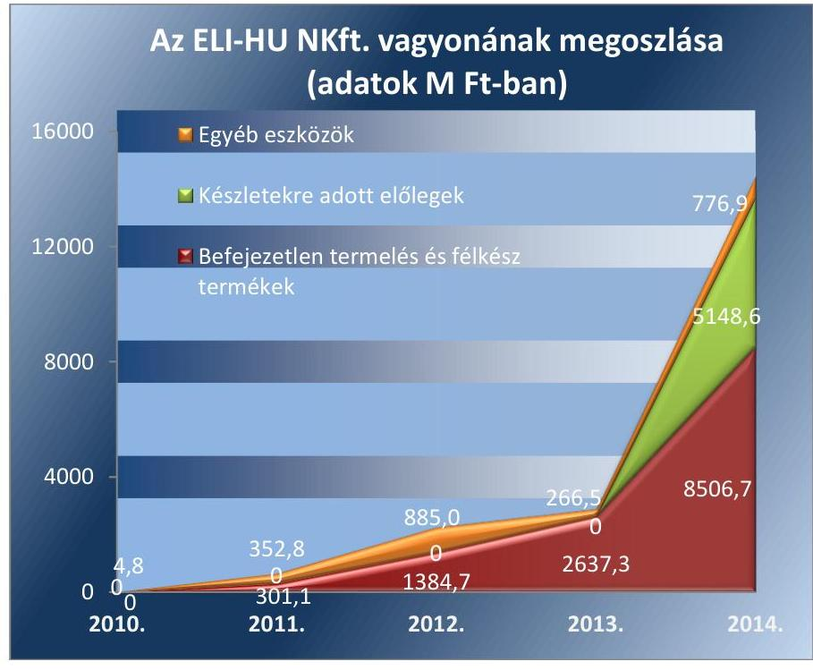

Forrás: Az ELI-HU NKft. 2011-2014. évi beszámolói

---

Az idegen források növekedését alapvetően a rövid lejáratú kötelezettségek között - a Számv. tv. előírásainak megfelelve - kimutatott, az ELIALPS nagyprojekthez kapott 12,2 M Ft összegű támogatás eredményezte. További növekedéshez a szállítóállomány 1,9 M Ft-tal járult hozzá. Az ELIHU NKft. forrásainak összetételét 2011. és 2014. években a 2. ábra szemlélteti.
2. ábra
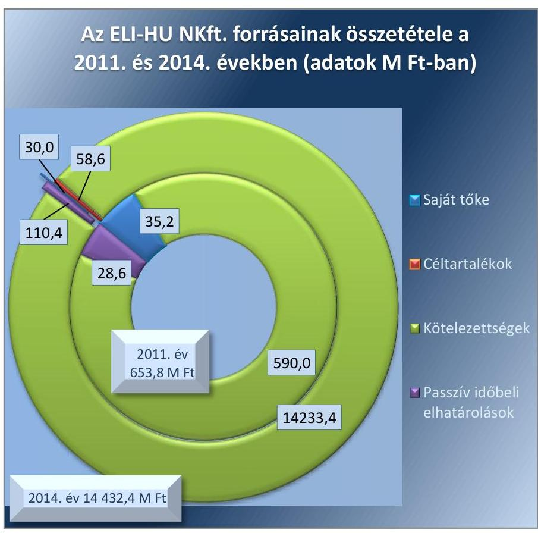

Forrás: Az ELI-HU NKft. 2011-2014. évi beszámolói

A saját tőke összege a 2010. évi veszteség következtében a jegyzett tőke összege alá csökkent. Az éves beszámolót elfogadó taggyűlésen hozott határozat alapján - a Gt. előírásainak megfelelve - az MNV Zrt. az állami tulajdoni részesedést növelve 17,0 M Ft jegyzett tőkeemelést hajtott végre. A tőkeszerkezet helyreállítása mellett a jövőbeni likviditás biztosítása érdekében további 83,0 M Ft-ot tőketartalékba helyezett. A végrehajtott tőkeemelés fedezetet jelentett a 2011. és 2012. évi veszteségek finanszírozására. Az ELI-HU NKft. saját tőkéjének összetételét az ellenőrzött időszakban a 3. ábra szemlélteti.

---

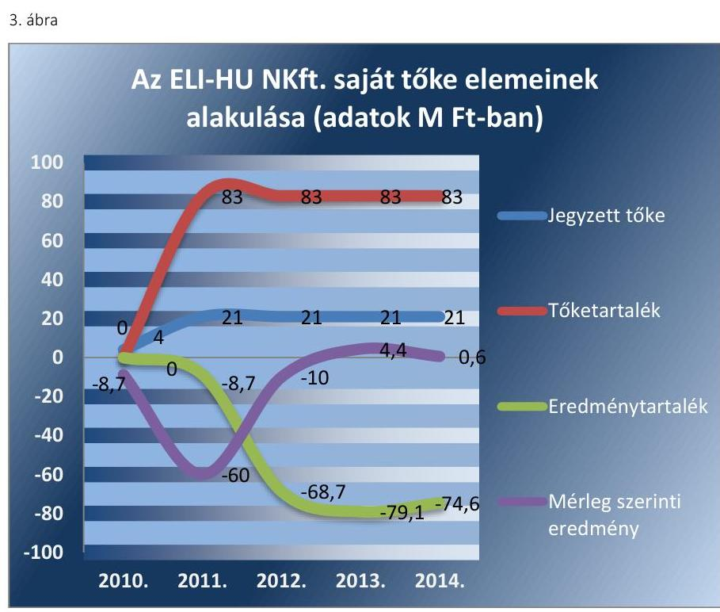

*Forrás: Az ELI-HU NKft. 2011-2014. évi beszámolói*

**A VAGYONKEZELÉSBE VETT INGATLANNAL** – földterületek – az ELI-HU NKft. 2013. január 22-től rendelkezett. A tárgyi eszközök rendszeres időközönkénti állapotfelmérésre, karbantartásra, állagmegóvásra vonatkozó – a Vagyonkezelési szerződésben rögzített – kötelezettséggel nem keletkezett, mivel vagyonkezelésbe vett földterületeken karbantartási, állagmegóvási munkák végzése nem vált szükségessé, tekintettel arra, hogy nem volt olyan káresemény, ami ezt indokolta volna. A Vagyonkezelési szerződés aláírását követően kezdődött meg az ELI-ALPS nagyprojekt keretében a beruházás megvalósítása, melynek befejezésére az ellenőrzött időszakot követően kerül sor.

**VISSZAPÓTLÁSI KÖTELEZETTSÉG** a vagyonkezelésbe vett földterületek tekintetében nem keletkezett. A földterületek könyvszerinti értéke nem csökkent, tekintettel arra, hogy a Számv. tv. előírásai alapján a földterület után értékcsökkenés nem számolható el.

**AZ ÁLLAMHÁZTARTÁS KÖRÉBE TARTOZÓ VAGYON ELIDEGENÍTÉSÉRE**, illetve megterhelésére vonatkozó eljárást sem az MNV Zrt. sem az ELI-HU NKft. nem végzett, betartva a Vtv.-ben és az Nvtv.-ben előírtakat.

### 4.2. számú megállapítás

**Az ELI-HU NKft.-nél a vagyonváltozást eredményező döntések előkészítése összességében megfelelő a jogszabályi és belső előírásoknak, ugyanakkor néhány esetben mellőzték a közbeszerzési eljárás lefolytatását.**

**A VAGYONGAZDÁLKODÁSI DÖNTÉSEK** előterjesztésére vonatkozó előírásokat az MNV Zrt. a Vagyonkezelési szerződésben, valamint a Társasági szerződés1-17-ben határozta meg. A Vagyonkezelési szerződés alapján a vagyonkezelésbe átadott ingatlanon a beruházási

---

munka elvégzéséhez az építési engedély benyújtását megelőzően, illetve a nem engedélyköteles munka esetén a munkálatok megkezdése előtt 30 nappal köteles volt az MNV Zrt. előzetes írásbeli engedélyét kérni. Rögzítésre került továbbá, hogy az ELI-HU NKft. köteles az ingatlanok birtoklásával, használatával kapcsolatos jogok változását érintő ügyekben az MNV Zrt előzetes tulajdonosi hozzájárulását kérni. Az ELI-HU NKft. kötelezettségeinek eleget tett, így megkérte az MNV Zrt.-től a tulajdonosi hozzájárulást az ELI-ALPS nagyprojekt megvalósításához a Magyar Állam tulajdonában lévő ingatlanokon, továbbá az ingatlanokon tervezett beruházási munkához az építési munkaterület fővállalkozó kivitelező részére történő átadásához.

A Társasági szerződés1-17-ben a vagyongazdálkodási döntésekhez kapcsolódó jogosultságokat, a kötelezettségeket és az értékhatárokat a Gt., majd a Ptk. 2 szabályai szerint határozták meg, részletesen rögzítették a tulajdonosi joggyakorló kizárólagos döntési hatáskörét. A vagyont érintő változásokról az ügyvezető negyedévente köteles volt beszámolni.

Az ELI-HU NKft. szabályzataiban rögzítette a tulajdonosi előírásokhoz kapcsolódó követelményeket. Az SZMSZ1-5-ben meghatározták az MNV Zrt. kizárólagos döntési hatásköreit, a Beszerzési szabályzatban rögzítették a Kbt. $1-2^{42}$ hatálya alá tartozó beszerzések lebonyolításának a rendjét.

A vagyongazdálkodási döntések előterjesztései a tulajdonosi, valamint az ELI-HU NKft. belső szabályzataiban foglalt előírásokkal összhangban voltak, kivéve a Kbt.1-2 hatálya alá tartozó egyes beszerzésekre vonatkozó döntéshozatalt.

KÖZBESZERZÉSI ELJÁRÁS lefolytatásának mellőzésével kötött három esetben szerződést az ELI-HU NKft. az ellenőrzött időszakban. A 2011. évben a Kbt. 1 22. § (1) bekezdésének i) pontja alapján a Kbt. 1 alanyi hatálya alá tartoztak. Ennek ellenére a megkötött gépjármú flottaüzemeltetési szerződés esetében a beszerzés értéke meghaladta a vonatkozó nemzeti értékhatárt, így megsértették - a Kbt. 1 240. §-ának (1) bekezdésében előírtakra figyelemmel - a Kbt. 1 2. § (1) bekezdésében rögzített előírásokat. A 2013. évi beszerzéseiknél a hivatalos közbeszerzési tanácsadói szerződések esetén két alkalommal megsértették - a Kbt. 2 19. § (1) bekezdésében előírt közbeszerzési eljárás lefolytatására vonatkozó előírások figyelmen kívül hagyásával - a Kbt. 2 5. §-ában foglaltakat.

# AZ ÁLLAMI VAGYON VÉDELME, ÉRTÉKÉNEK 

MEGŐRZÉSE ÉS GYARAPÍTÁSA érvényesült az ELI-ALPS nagyprojekt tulajdonosi döntésének előkészítése során. A Szindikátusi szerződéssel összhangban a vagyonkezelésre átvett ingatlanokhoz kapcsolódó Vagyonkezelési Szerződés megkötését az MNV Zrt. Igazgatósága 371/2012. (VI. 28.) számú határozatával hagyta jóvá. Ezt követően az ELIHU NKft. FB-a a 2/FB/2012/10/19. számú határozatával járult hozzá a Vagyonkezelési Szerződés megkötéséhez és döntésre felterjesztette az ELIHU Nkft. taggyűlésének. A taggyűlés az 1/TGY43/2012/11.05. számú határozatával járult hozzá a Vagyonkezelési szerződés megkötéséhez és felhatalmazta az ügyvezetőt a szerződés aláírására. A Vagyonkezelési szerződéssel összhangban a vagyonkezelésbe vett vagyonon az értéknövelő beruházások megvalósításának előkészítését az ELI-ALPS nagyprojekt P1 és P2 szakaszában dolgozták ki. Az ELI-ALPS nagyprojekt P3 és P4 szakaszában valósul meg a beruházás végrehajtása.

---

Az ELI-HU NKft. a Vagyonkezelési szerződésben foglaltaknak megfelelően a vagyon értékének gyarapításához tartozó vagyongazdálkodási döntések előtt a tulajdonosi jogokat gyakorlótól írásban előzetes engedélyt kért. Az ELI-HU NKft. a tulajdonosi döntésekhez írásban előzetes véleményt és javaslatot küldött.

Az MNV Zrt. vagyonváltozást eredményező döntései megfeleltek a vagyonkezelési szerződésben foglalt előírásoknak, hozzájárultak a vagyon értékének megőrzéséhez, gyarapításához.

Az MNV Zrt. a vagyon változását eredményező döntések előkészítésével kapcsolatos követelményeket meghatározta. A vagyongazdálkodási döntések előtt az MNV Zrt. a Vagyonkezelési szerződésben meghatározottak szerint a részére előzetesen megküldött előterjesztések alapján írásbeli véleményét, hozzájárulását megadta.

Az MNV Zrt. a Szindikátusi szerződés aláírásával - mint a szerződéssel egyetértő fél - kifejezte szándékát az ELI-ALPS nagyprojekt megvalósítását illetően. 2013. április 26-án került elfogadásra a 1240/2013. (IV. 26.) Korm. határozattal az ELI-ALPS nagyprojekt P3 szakasza támogatásának jóváhagyása, amelyet követően 2013. augusztus 28-án aláírták az ELI-HU NKft. és a MAG Zrt. ${ }^{44}$ között a támogatási szerződést. Az ELI-HU NKft. a Csongrád Megyei Kormányhivatal 2012. december 20-ai építési engedély határozata alapján az ELI-ALPS nagyprojekt P3 szakaszának megvalósítása kapcsán az MNV Zrt.-től megkérte a tulajdonosi nyilatkozatot az építési munkaterület fővállalkozó részére történő átadásához a vagyonkezelt ingatlanok vonatkozásában. Az MNV Zrt. a tulajdonosi nyilatkozatot az MNV/01/11863/9/2014 iktatószámú levelében a 121/2014. (III. 13.) vezérigazgatói határozat alapján 2014. március 13-án megadta, az építési munkák kivitelezésére a fővállalkozóval történő szerződéskötést megelőzően.

# 5. A szabályszerű vagyongazdálkodás érdekében a gazdálkodó szervezet teljesítette-e a beszámolási, adatszolgáltatási kötelezettségét, kiépített-e, illetve működtetett-e információs rendszert? 

Összegző megállapítás

Az ELI-HU NKft. a beszámolási kötelezettségének összességében szabályszerűen eleget tett, azonban a közérdekú adatok nyilvánosságra hozatalát nem teljes körűen biztosította. A vagyongazdálkodását érintően az információs rendszert kialakították, azt összességében a belső szabályozásban és az MNV Zrt. előírásainak megfelelően múködtették.
5.1. számú megállapítás

Az ELI-HU NKft. összességében szabályszerűen teljesítette a beszámolási, adatszolgáltatási kötelezettségét, ugyanakkor a közérdekú adatok nyilvánosságra hozatalát nem teljes körűen biztosította.

Az MNV Zrt. az ELI-HU NKft. számára a Társasági szerződésekben ${ }_{1-17}$ és a Vagyonkezelési szerződésben előírta a beszámolási, az adatszolgáltatási és az egyéb tájékoztatási kötelezettségeket.

---

# A SZÁMVITELI TÖRVÉNY SZERINTI BESZÁMOLÓ, 

a Közhasznú szervezetekről szóló tv.-ben előírt közhasznúsági jelentés, a Civil tv.-ben meghatározott közhasznúsági melléklet taggyűlés általi jóváhagyását, elfogadását meghatározta az MNV Zrt. a Társasági szerződések-ben1-17. Az ELI-HU NKft. 2012. január 4-től az SZMSZ1-5 ${ }^{45}$-ben meghatározta az ügyvezető feladatkörében az éves beszámolók összeállításával, az adatszolgáltatásokkal kapcsolatos kötelezettségét.

Az ELI-HU NKft. a Számv. tv.-ben, a Közhasznú szervezetekről szóló tv.ben, valamint a Civil tv.-ben előírt beszámolási kötelezettségének határidőben eleget tett. Az ELI-HU NKft. a beszámolókat a Számv. tv.-ben előírt határidőben elkészítette. A 2011-2014. évi beszámolók, valamint a 20122014. évi közhasznúsági melléklet jóváhagyásakor a Gt., illetve a Ptk. 2 előírásainak megfelelően az FB határozatok és a hitelesítő könyvvizsgálói záradékok a taggyűlés rendelkezésére álltak, az ELI-HU NKft. beszámolóit a taggyűlés jóváhagyta. A beszámolókat a Számv. tv.-ben előírt határidőben letétbe helyezték a Céginformációs szolgálatnál.

A könyvvizsgáló a 2011. évi éves beszámoló véleményezésénél figyelemfelhívást tett az ELI-HU NKft. által vissza nem igényelt ÁFA tekintetében. Az ELI-HU NKft. kérelemben kezdeményezte az NGM-nél az ELI-ALPS nagyprojekttel kapcsolatos ráfordítások ÁFA tartalmára vonatkozó levonási jog tisztázását, amelynek eredményeként az ELI-HU NKft. jogosulttá vált visszamenőleg az előzetesen felszámított ÁFA összegének levonására.

A könyvvizsgáló a 2011-2014. évi beszámolókról kiadott jelentésében nem hívta fel a tulajdonosok figyelmét a leltár készítés elmulasztására, annak ellenére, hogy az ELI-HU NKft. a 2011-2014. évekre elkészített mérlegének tételeit leltárral nem támasztotta alá.

Az FB két alkalommal élt figyelemfelhívással a tulajdonosok felé az állami vagyon védelme érdekében, mindkét figyelemfelhívásra likviditási problémák miatt került sor.

- Az ELI-HU NKft. gazdálkodása a 2010-2011. években veszteséges volt, amely során az ELI-HU NKft. saját tőkéje a jegyzett tőke alá csökkent. Az FB részére beterjesztett tájékoztatás szerint az ELI-HU NKft. likviditási helyzete kockázatossá vált, szükséges volt a jegyzett tőke emelése. A 2011. március 31-i 7/2011. (III. 31.) FB határozat javasolta a tulajdonosoknak a jegyzett tőke megemelését, amely tőkeemelésben kizárólag a Magyar Állam képviseletében az MNV Zrt. vett részt. Az ELI-HU NKft. a 2011. április 7-i taggyűlésen a 7/2011. (IV. 7.) határozatában 100,0 M Ft összegű tőkeemelésről döntött, a döntéssel az ELI-HU NKft. jegyzett tőkéje 17,0 M Ft-tal, a tőketartaléka 83,0 M Ft-tal növekedett.
- 2013. I. félévében az ELI-ALPS nagyprojekt (P3) támogatási szerződésének megkötésére nem került sor, a projekt lebonyolításának fedezetét biztosító források nem álltak rendelkezésre, emiatt kedvezőtlen likviditási helyzet alakult ki az ELI-HU NKft.-nél. A tulajdonosok a 2/TGY/2013.08.16. taggyűlési határozatban döntöttek arról, hogy az ELI-HU NKft. ügyvezetője a likviditási problémák megszüntetésére az NFM miniszterrel egyeztetve tegyen javaslatot. A taggyűlési határozatot követően az ELI-HU NKft. 2013. augusztus 28-án a MAG Zrt.vel megkötötte a 36 998,0 M Ft összegű, az ELI-ALPS nagyprojekt P3 szakaszára vonatkozó támogatási szerződést, s a támogatási előleg

---

3. táblázat

| AZ ELI-HU NKFT. NEGYEDÉVES BESZÁMOLÓI (PEJ-EK) |  |  |
| :--: | :--: | :--: |
| PEJ-ek | PEJ készült | Előző PEJ-   hez viszo-   nyitott idő |
| PEJ1 | 2012. 12. 06. | - |
| PEJ2 | 2013. 08. 01. | 268 nap |
| PEJ3 | 2013. 11. 03. | 95 nap |
| PEJ4 | 2014. 02. 20. | 109 nap |
| PEJ5 | 2014. 04. 24. | 63 nap |
| PEJ6 | 2014. 09. 19. | 148 nap |
| PEJ7 | 2014. 11. 20. | 62 nap |

forrás: az ELI-HU NKft. negyedéves beszámolói
lehívásával (2013. szeptember 10-én 450,0 M Ft) a likviditási helyzete rendeződött.

PROJEKT ELŐREHALADÁSI JELENTÉSEKBEN számolt be az ELI-HU NKft. ügyvezetője a tulajdonosok felé - a Társasági szerződésben előírt beszámolási kötelezettsége teljesítéseként - az ELI-HU NKft. működéséről és az ELI-ALPS nagyprojekt előrehaladásáról. A PEJ ${ }^{46}$ ekben megfelelő tartalmi részletezettséggel mutatta be az ELI-HU NKft. gazdálkodását, a megvalósítás alatt lévő ELI-ALPS nagyprojekt egyes szakaszait és a kapcsolatos információkat.

A Társasági szerződés5-15 III. 3. pontjában, a Társasági szerződés16-17 3.9. pontjában és az SZMSZ1-5 6.2.6. pontjának k) bekezdésben előírt, az ELI-HU NKft. működéséről a tulajdonosok felé negyedéves gyakoriságú tájékoztatási kötelezettségének az ügyvezető nem teljes körűen tett eleget. A negyedéves adatszolgáltatások 2011-2014. években nem minden esetben készültek el, ezzel az ELI-HU NKft. ügyvezetője megsértette a Társasági szerződés5-15 III. 3. pontban, a Társasági szerződés ${ }_{16-17}$ III. 3.9. pontban, valamint az SZMSZ1-5 6.2.6. pont k) bekezdésében foglaltakat. A PEJ-ek elkészítésének időpontját a 3. táblázat tartalmazza.

A KÖZÉRDEKŰ ADATOK nyilvánosságra hozatalát nem teljes körűen biztosította az ELI-HU NKft. az ellenőrzött időszakban, annak ellenére, hogy a Társasági szerződések ${ }_{1-17}$ IV. fejezetében, az Avtv. ${ }^{47}$-ben és az Info tv. ${ }^{48}$-ben foglaltaknak megfelelően a müködésének, a szolgáltatások igénybevételének, a beszámolói közzétételének a módját meghatározta.

Az ELI-HU NKft. az ellenőrzött időszakban megsértette a Társasági szerződés ${ }_{5-15}$ IV. fejezetében, a Társasági szerződés ${ }_{16-17}$ IV. fejezet 14. pontjában foglalt, a nyilvánosság biztosítására vonatkozó előírásait, mivel a 2011. évi közhasznúsági jelentése, a 2012-2014. évi számviteli beszámolók részeként elkészített közhasznúsági melléklete vonatkozásában azokat a Társasági szerződés ${ }_{5-15}$ IV. fejezetében, a Társasági szerződések ${ }_{16-17}$ IV. fejezet 14. pontjában rögzítettek ellenére nem tette közzé a saját honlapján.

Az ELI-HU NKft. a saját honlapján hozzáférhetővé tette a közbeszerzési eljárásokat, a közbeszerzési terveket és az éves közbeszerzési statisztikai összegzéseket a Kbt. ${ }_{1-2}$-ben foglalt közzétételi kötelezettségnek megfelelően.

Az ELI-HU NKft. az MNV Zrt.-vel kötött vagyonkezelési szerződés alapján vagyonkezelésbe vett állami vagyonra tekintettel a Vtv. 5. § (2) bekezdése alapján közérdekű adatok nyilvánosságáról szóló törvény szerinti közfeladatot ellátó szervnek minősült, ennek ellenére nem készített a közérdekű adatok megismerésére irányuló igények teljesítésének rendjét rögzítő szabályzatot. A szabályozás elmulasztásával az állami vagyon vagyonkezelésbe vételéről szóló szerződés hatályba lépését, 2013. január 22-ét követően így nem tett eleget az Info tv. 30. § (6) bekezdésben foglalt - a közfeladatot ellátó szerv vonatkozásában előírt közérdekű adatok megismerésére irányuló igények teljesítésének rendjét rögzítő - szabályzatkészítési követelménynek. Szabályozás hiányában ELI-HU NKft. nem rendelkezett arról, hogy az Info tv. 33. § (3) bekezdésében biztosított választási lehetőségek alapján az elektronikus közzétételi kötelezettségüket mely internetes honlapon teljesíti.

---

Az ELI-HU NKft. az állami vagyon vagyonkezelésbe vételéről szóló szerződés hatályba lépését - 2013. január 22-ét - követően maradéktalanul nem tett eleget az Info tv. 33. § (3) bekezdése alapján, a 37. § (1) bekezdésében foglaltakra hivatkozással, az Info tv. 1. melléklete szerinti általános közzétételi listában meghatározott adatokra vonatkozó közzétételi kötelezettségének. A saját honlapján nem került közzétételre az Info tv. 1. melléklet I. Szervezeti és személyzeti adatok 3. pontjában előírt közfeladatot ellátó szerv vezetőinek neve, beosztása, elérhetősége. Nem tették közzé továbbá az Info tv. 1. melléklet II. Tevékenységre, múködésre vonatkozó adatok 1. pontjában előírt, az ELI-HU NKft., mint közfeladatot ellátó szerv feladatát és az SZMSZ-ét, továbbá a III. Gazdálkodási adatok fejezethez kapcsolódó adatokat, így különösen a Számv. tv. szerinti beszámolóját, a foglalkoztatottak létszámára és személyi juttatásaira vonatkozó összesített adatokat. A 2013-2014. évi éves beszámolói a tulajdonosi joggyakorló MNV Zrt. honlapjára feltöltésre kerültek.

Az ELI-HU NKft. 2012. január 1-től, mint kormányzati szektorba sorolt egyéb szervezet, teljesítette az Áht.2-ben előírtaknak megfelelően a központi költségvetési törvény elkészítéséhez az államháztartásért felelős miniszternek teljesítendő adatszolgáltatási kötelezettségét. Az ELI-HU NKft. az Ávr. ${ }^{49}$ 7. sz. mellékletének 28. pontjában foglalt számviteli beszámolók, a kiegészítő mellékletek, a könyvvizsgálói jelentések megküldésével, az adatszolgáltatási kötelezettségének eleget tett.
5.2. számú megállapítás

Az ELI-HU NKft. kialakította a vagyongazdálkodását érintő információs rendszert, azt összességében - a feltárt hiányosságok mellett a belső szabályozásban és az MNV Zrt. előírásainak megfelelően múködtette.

# A VAGYONGAZDÁLKODÁST ÉRINTŐ ADATSZOLGÁLTATÁSI követelményeket - az éves beszámolók megküldésén túl - a Társasági szerződés4-16-ben 2011. augusztus 22-től határozta meg az MNV Zrt., amely szerint az ügyvezetőnek a társaság múködéséről háromhavonta, írásban kellett tájékoztatnia a tulajdonosokat. 

Az SZMSZ1-ben, a Társasági szerződésben5-17 foglaltakkal összhangban, 2012. január 4-től szabályozták a tulajdonosok az információs rendszert, a társaságon kívülre történő információszolgáltatás általános szabályait. Az SZMSZ1-5-ben az ügyvezető feladataként meghatározták a kötelező adatés információszolgáltatást a külső szervezetek részére. Továbbá az ügyvezető számára előírták a beszámolók, jelentések, összefoglalók összeállítását, a feladattervben foglaltak teljesüléséről a tájékoztatást a társaság vezetése és tulajdonosai felé.

A VAGYONKEZELT VAGYONRA VONATKOZÓAN az MNV Zrt. a Vhr.-ben foglaltaknak megfelelően előírta a Vagyonkezelési szerződés 6.16.-6.17. pontjaiban az ELI-HU NKft. részére az adatszolgáltatási kötelezettséget. Rögzítették, hogy az adatszolgáltatást a Vhr. vonatkozó általános szabályai szerint kell elvégezni, az adatszolgáltatás részletes tartalmát, formáját - az adatlapok tartalmát, kitöltési segédletet, az adatszolgáltatás informatikai hátterét - pedig az MNV Zrt. Vagyon-nyilvántartási szabályzata ${ }_{1-5}$ határozta meg.

---

Az ELI-HU NKft. a 2013-2014. évekre vonatkozóan a vagyonkezelt eszközökről szóló adatszolgáltatási kötelezettségének a Vhr. 9. § (9) bekezdés c) pontjában, a Vhr. 14. § (1), (3) bekezdéseiben, valamint a Vagyonkezelési Szerződés 6.16. pontjában rögzített együttműködési és a 6.17. pontja szerinti adatszolgáltatási kötelezettség ellenére nem tett eleget az ellenőrzött időszakban. Az ELI-HU NKft. a Vagyonkezelési szerződés 6.17. pontja szerinti, a 2013-2014. évekre vonatkozó adatszolgáltatást a Vhr. melléklete II. 3. pontjában foglaltak ellenére - amely szerint az adatszolgáltatást a tételesen nyilvántartott vagyonelem vagyonkezelői jogának átruházásáról harminc napon belül kell teljesíteni - az ellenőrzött időszakban nem teljesítette.

Az MNV Zrt. a Vagyonkezelési szerződés 6.17. pontjában rögzítettekkel ellentétben a vagyonkezelésbe adott vagyon birtokbaadásával egyidejűleg a vagyonnyilvántartás és adatszolgáltatás megfelelő teljesítése érdekében az erre a célra kifejlesztett szoftvert nem bocsátotta az ELI-HU NKft. rendelkezésére. Azt csak 2014. november 24-én biztosította.

ELLENŐRZÉST a vagyongazdálkodás szabályozottságával, szabályszerűségével, a vagyonnyilvántartással kapcsolatosan az MNV Zrt. végzett.

Az MNV Zrt. az ellenőrzött időszakban egy ellenőrzést folytatott le, az ELI-HU NKft. 2010-2013. I. félévi múködése és gazdálkodása szabályozottságát, szabályosságát ellenőrizte. A feltárt szabálytalanságok alacsony kockázatot hordoztak. Az ELI-HU NKft. a szabálytalanságok megszüntetésére 2013. december 21-én intézkedési tervet készített. Az intézkedési terv teljesüléséről a tulajdonosokat 2014. május 30-án tájékoztatta.

Az ELI-HU NKft. az ellenőrzött időszakban nem alakított ki belső ellenőrzést, mellyel - mint kormányzati szektorba sorolt egyéb szervezet -2014-től nem tett eleget a Bkr. 10. §-ában foglaltaknak.

# 6. A kormányzati szektorba sorolt egyéb szervezetek gazdálkodásának a kormányzati szektor hiányára és az államadósságra befolyással bíró elemei jogszabályi előírásoknak megfeleltek-e? 

## Összegző megállapítás

Az ELI-HU NKft. adósságot keletkeztető ügyletet nem kötött. Osztalékfizetésre nem került sor.

Az ELI-HU NKft.-nek 2012. január 1. - 2014. december 31. közötti időszakban az éves beszámolói alapján a Stabilitási tv. ${ }^{50}$-ben meghatározott adósságot keletkeztető ügyletet nem kötött.

Az ELI-HU NKft. a Közhasznú szervezetekről szóló tv. és a Civil tv., illetve az Alapító Okirat alapján az elért nyereséget nem oszthatta fel, az alapító nem vonhatta el, azt a közhasznú tevékenységre kellett fordítani. Az ellenőrzött időszakban az ELI-HU NKft. éves beszámolói szerint osztalékfizetésre nem került sor.

---

# JAVASLATOK 

Az ÁSZ tv. 33. § (1) bekezdésében foglaltak értelmében az ellenőrzött szervezet vezetője köteles a jelentésben foglalt megállapításokhoz kapcsolódó intézkedési tervet összeállítani és azt a jelentés kézhezvételétől számított 30 napon belül az ÁSZ részére megküldeni. Amennyiben az ellenőrzött szervezet vezetője nem küldi meg határidőben az intézkedési tervet, vagy továbbra sem elfogadható intézkedési tervet küld, az Állami Számvevőszék elnöke az ÁSZ tv. 33. § (3) bekezdése a) és b) pontjaiban foglaltakat érvényesítheti.

## Magyar Nemzeti Vagyonkezelő Zrt. vezérigazgatójának

1. Tegyen intézkedéseket a jogszabályi előírásoknak megfelelő leltár elkészitésének a hiányával összefüggésben feltárt szabálytalanságok tekintetében a felelősség tisztázása érdekében, és szükség szerint intézkedjen a felelősség érvényesitéséről.
(2.2. számú megállapítás 3. bekezdése alapján)

## az ELI-HU Nkft. ügyvezetőjének

1. Intézkedjen az SZMSZ-ben elöirt üzleti stratégia elkészitésére.
(2.1. számú megállapítás 2. bekezdése alapján)
2. Intézkedjen, hogy a Számlarend a jogszabályi előírásoknak megfelelően teljes körüen tartalmazza
a) az alkalmazott fökönyvi számlák, alszámlák számjelét, megnevezését,
b) a számla tartalmát, a számla értéke növekedésének, csökkenésének jogcímeit, a számlát érintő gazdasági eseményeket, azok más számlákkal való kapcsolatát, valamint
c) a fökönyvi számla és analitikus nyilvántartás kapcsolatát.
(2.1. számú megállapítás 9. bekezdése alapján)
3. Intézkedjen a Leltározási szabályzat módosítására annak érdekében, hogy az a jogszabályi előírásoknak megfelelő gyakorisággal tartalmazza - a számviteli alapelveknek megfelelő folyamatos mennyiségi nyilvántartás vezetése esetére elöirt - mennyiségi felvétellel történő leltározási kötelezettséget.
(2.1. számú megállapítás 10. bekezdése alapján)

---

4. Intézkedjen a Számviteli politika kiegészitésére, hogy abban a jogszabályi előírásoknak megfelelően rögzítsék a gazdálkodóra jellemző szabályokat, előírásokat, módszereket a befejezetlen termelés és félkész termékek értékelése tekintetében.
(2.1. számú megállapítás 11. bekezdése alapján)
5. Intézkedjen a jogszabályi előírásoknak megfelelően az önköltségszámítás rendjére vonatkozó belső szabályzat elkészitésére.
(2.1. számú megállapítás 15. bekezdése alapján)
6. Intézkedjen a jogszabályi előírásoknak megfelelő leltár elkészítésére.
(2.2. számú megállapítás 3. bekezdése alapján)
7. Intézkedjen, hogy a jogszabályi előírásoknak megfelelően
a) a számviteli elszámolást támasszák alá bizonylattal,
b) a bizonylat feleljen meg az általános alaki és tartalmi követelményeknek.
(3.1. számú megállapítás 5-6. és 9. bekezdése alapján)
8. Intézkedjen a jogszabályban meghatározott esetekben a közbeszerzési eljárások lefolytatására.
(4.2. számú megállapítás 5. bekezdése alapján)
9. Intézkedjen a Társasági szerződésben előírt közzétételi kötelezettség teljes körü teljesítésére.
(5.1. számú megállapítás 10. bekezdése alapján)
10. Intézkedjen a jogszabályi előírásoknak megfelelően
a) a közérdekü adatok megismerésére irányuló igények teljesitésének rendjét rögzítő szabályzat elkészítésére,
b) a közérdekü adatokra vonatkozó közzétételi kötelezettség teljes körü teljesítésére.
(5.1. számú megállapítás 12-13. bekezdése alapján)
11. Intézkedjen a jogszabályi előírásoknak és a Vagyonkezelési szerződésben foglaltaknak megfelelően a vagyonkezelt eszközökre vonatkozóan az adatszolgáltatási kötelezettség teljesitésére.
(5.2. számú megállapítás 4. bekezdése alapján)
12. Intézkedjen a jogszabályi előírásoknak megfelelően a belső ellenőrzés kialakítására.
(5.2 számú megállapítás 8. bekezdése alapján)

---

# MELLÉKLETEK 

## I. SZ. MELLÉKLET: ÉRTELMEZŐ SZÓTÁR

Adósságot keletkeztető ügylet
„Adósságot keletkeztető ügylet és annak értéke:
a) hitel, kölcsön felvétele, átvállalása a folyósítás, átvállalás napjától a végtörlesztés napjáig, és annak aktuális tőketartozása,
b) a számvitelről szóló törvény szerinti hitelviszonyt megtestesítő értékpapír forgalomba hozatala a forgalomba hozatal napjától a beváltás napjáig, kamatozó értékpapír esetén annak névértéke, egyéb értékpapír esetén annak vételára,
c) váltó kibocsátása a kibocsátás napjától a beváltás napjáig, és annak a váltóval kiváltott kötelezettséggel megegyező, kamatot nem tartalmazó értéke,
d) az Szt. szerint pénzügyi lízing lízingbevevői félként történő megkötése a lízing futamideje alatt, és a lizingszerződésben kikötött tőkerész hátralévő összege,
e) a visszavásárlási kötelezettség kikötésével megkötött adásvételi szerződés eladói félként történő megkötése - ideértve az Szt. szerinti valódi penziós és óvadéki repóügyleteket is - a visszavásárlásig, és a kikötött visszavásárlási ár,
f) a szerződésben kapott, legalább háromszázhatvanöt nap időtartamú halasztott fizetés, részletfizetés, és a még ki nem fizetett ellenérték,
g) hitelintézetek által, származékos műveletek különbözeteként az Államadósság Kezelő Központ Zrt.-nél (a továbbiakban: ÁKK Zrt.) elhelyezett fedezeti betétek, és azok összege."
Forrás: Stabilitási tv. 3. § (1) bekezdése
Állami vagyon
2010. június 17-től
a) Az állam tulajdonában lévő dolog, valamint a dolog módjára hasznosítható természeti erő,
b) az a) pont hatálya alá nem tartozó mindazon vagyon, amely vonatkozásában törvény az állam kizárólagos tulajdonjogát nevesíti,
c) az állam tulajdonában lévő tagsági jogviszonyt megtestesítő értékpapír, illetve az államot megillető egyéb társasági részesedés,
d) az államot megillető olyan immateriális, vagyoni értékkel rendelkező jogosultság, amelyet jogszabály vagyoni értékű jogként nevesít.
Forrás: Vtv. 1. § (2) bekezdése
2012. november 10-től az állami vagyon fogalma kiegészül a következő ponttal:
e) az állam tulajdonában lévő pénzügyi eszközök
Forrás: Vtv. 1. § (2) bekezdése
Állami vagyon használója
2011. január 1 - 2011. december 31-ig:

Az a természetes személy, jogi személy, illetve jogi személyiséggel nem rendelkező szervezet, amely, illetve aki törvény vagy szerződés alapján, bármely jogcímen (pl. bérlet, haszonbérlet, Vagyonkezelési szerződés, használat stb.) állami vagyont birtokol, használ, szedi annak hasznait, hasznosít, ide nem értve a tulajdonosi jogok gyakorlóját.
Forrás: Vhr. 1. § (7) a. pontja
2012. január 1-jétől:

---

Az a természetes vagy jogi személy, jogi személyiséggel nem rendelkező szervezet, aki, vagy amely törvény vagy szerződés alapján, bármely jogcímen (bérlet, haszonbérlet, használat stb.) állami vagyont birtokol, használ, szedi annak hasznait, hasznosít, ide nem értve a haszonélvezőt, a vagyonkezelőt és a tulajdonosi jogok gyakorlóját.
Forrás: Vhr. 1. § (7) a. pontja
Állami vagyon kezelője /vagyonkezelő

Állami vagyon értékesítése

Gazdálkodó szervezet

2010. január 01 - 2011. december 31. között:

Az állami vagyont az MNV Zrt. maga kezeli, vagy szerződés - így különösen bérlet, haszonbérlet, szerződésen alapuló haszonélvezet, vagyonkezelés, megbízás - alapján központi költségvetési szervnek, természetes vagy jogi személynek, illetőleg jogi személyiséggel nem rendelkező gazdasági társaságnak hasznosításra átengedi.
Vtv. 23. § (1) bekezdése
2012. január 1-jétől:

Az állami vagyont az MNV Zrt. maga kezeli, vagy szerződés - így különösen bérlet, haszonbérlet, megbízás - alapján központi költségvetési szervnek, természetes vagy jogi személynek, vagy jogi személyiséggel nem rendelkező gazdálkodó szervezetnek hasznosításra átengedi. Az állami vagyonra vonatkozóan az MNV Zrt. kizárólag az Nvtv-ben meghatározott személyekkel köthet Vagyonkezelési szerződést.
Forrás: Vtv. 23. § (1), 27. § (1)
2013. június 28-ától:

Az állami vagyonnal az MNV Zrt. maga gazdálkodik, vagy szerződés - így különösen bérlet, haszonbérlet, megbízás - alapján központi költségvetési szervnek, természetes vagy jogi személynek, vagy jogi személyiséggel nem rendelkező gazdálkodó szervezetnek hasznosításra átengedi, illetőleg vagyonkezelésbe, haszonélvezetbe adja. Az állami vagyonra vonatkozóan az MNV Zrt. kizárólag az Nvtv-ben meghatározott személyekkel köthet Vagyonkezelési szerződést.
Forrás: Vtv. 23. § (1), 27. § (1)
Állami vagyon tulajdonjogának bármely jogcímen történő, visszterhes átruházása.
Forrás: Vhr. 1. § (7) d) pont)
2013. június 30-ig gazdálkodó szervezet:

Az állami vállalat, az egyéb állami gazdálkodó szerv, a szövetkezet, a lakásszövetkezet, az európai szövetkezet, a gazdasági társaság, az európai részvény-társaság, az egyesülés, az európai gazdasági egyesülés, az európai területi együttmúködési csoportosulás, az egyes jogi személyek vállalata, a leányvállalat, a vízgazdálkodási társulat, az erdőbirtokossági társulat, a végrehajtói iroda, az egyéni cég, továbbá az egyéni vállalkozó.
Forrás: Ptk ${ }_{1}$. 685. § c) pontja
2013. július 1-jétől gazdálkodó szervezet:

Az állami vállalat, az egyéb állami gazdálkodó szerv, a szövetkezet, a lakásszövetkezet, az európai szövetkezet, a gazdasági társaság, az európai részvénytársaság, az egyesülés, az európai gazdasági egyesülés, az európai területi együttmúködési csoportosulás, az egyes jogi személyek vállalata, a leányvállalat, a vízgazdálkodási társulat, az erdőbirtokossági társulat, a végrehajtói iroda, az egyéni cég, továbbá az egyéni vállalkozó. Az állam, a helyi önkormányzat, a költségvetési szerv, az egyesület, a köztestület, valamint az alapítvány gazdálkodó tevékenységével összefüggő polgári jogi kapcsolataira is a gazdálkodó szervezetre vonatkozó rendelkezéseket kell alkalmazni, kivéve, ha a törvény e jogi személyekre eltérő rendelkezést tartalmaz; a 292/A292/B. §, 301/A-301/B. §, 405. § (1) bekezdés, valamint a 407/A. § (1) bekezdés tekintetében nem minősül gazdálkodó szervezetnek az, aki a közbeszerzésekről szóló törvény értelmében ajánlatkérő (szerződő hatóság).

---

Forrás: $\mathrm{Ptk}_{1}$. 685. § c) pontja
2014. március 15-től gazdálkodó szervezet:

A gazdasági társaság, az európai részvénytársaság, az egyesülés, az európai gazdasági egyesülés, az európai területi együttműködési csoportosulás, a szövetkezet, a lakásszövetkezet, az európai szövetkezet, a vízgazdálkodási társulat, az erdőbirtokossági társulat, az állami vállalat, az egyéb állami gazdálkodó szerv, az egyes jogi személyek vállalata, a közös vállalat, a végrehajtói iroda, a közjegyzői iroda, az ügyvédi iroda, a szabadalmi ügyvivői iroda, az önkéntes kölcsönös biztosító pénztár, a magánnyugdíjpénztár, az egyéni cég, továbbá az egyéni vállalkozó. Az állam, a helyi önkormányzat, a költségvetési szerv, az egyesület, a köztestület, valamint az alapítvány gazdálkodó tevékenységével összefüggő polgári jogi kapcsolataira is a gazdálkodó szervezetre vonatkozó rendelkezéseket kell alkalmazni.
Forrás: Ppt. 396. §
Kormányzati szektorba sorolt egyéb szervezet

Közfeladat

Közhasznú tevékenység

Közszolgáltatás

MFB Zrt.

Az a szervezet, amely az Áht ${ }_{2}$. alapján nem része az államháztartásnak, azonban az Európai Közösséget létrehozó szerződéshez csatolt, a túlzott hiány esetén követendő eljárásról szóló jegyzőkönyv alkalmazásáról szóló 2009. május 25-i 479/2009/EK rendelet szerint a kormányzati szektorba tartozik. A nemzetgazdasági miniszter 2013. június 26-án megjelent Közleményben tette közé ezen szervezetek listáját.
2012. január 01-től:

Jogszabályban meghatározott állami vagy önkormányzati feladat, amit az arra kötelezett közérdekből, haszonszerzési cél nélkül, jogszabályban meghatározott követelményeknek és feltételeknek megfelelve végez, ideértve a lakosság közszolgáltatásokkal való ellátását, valamint e feladatok ellátásához szükséges infrastruktúra biztosítását is.
Forrás: Civil tv. 2. § 19. pontja
2011. december 31-ig:

A társadalom és az egyén közös érdekeinek kielégítésére irányuló - a szervezet létesítő okiratában szereplő - cél szerinti tevékenységek.
Forrás: Közhasznú szervezetekről szóló tv. 26. § C) pontja
2012. január 01-től:

Minden olyan tevékenység, amely a létesítő okiratban megjelölt közfeladat teljesítését közvetlenül vagy közvetve szolgálja, ezzel hozzájárulva a társadalom és az egyén közös szükségleteinek kielégítéséhez.
Forrás: Civil tv. 2. § 20. pontja

1. Közcélú, illetőleg közérdekű szolgáltatást jelent, amely egy nagyobb közösség (állam, település) minden tagjára nézve megközelítőleg azonos feltételek mellett vehető igénybe, ezért valamilyen mértékig közösségi megszervezést, illetve szabályozást, ellenőrzést igényel.
Forrás: Közszolgáltatások szervezése és igazgatása címú tankönyv 158. oldal. Kiadó: Kormányzati Személyügyi Szolgáltató és Közigazgatási Képzési Központ, Budapest, 2007.
2. szerződéskötési kötelezettség alapján a lakosság alapvető szükségleteinek ellátására irányuló szolgáltatás, így különösen a villamos energia-, gáz-, hő-, víz-, szennyvízés hulladékkezelési, köztisztasági, postai és távközlési szolgáltatás, továbbá a menetrend alapján közlekedő járművekkel végzett közforgalmú személyszállítás.
Forrás: Ebtv. 3. § d) pontja
Az MNV Zrt. melletti másik tulajdonosi joggyakorló szervezet az állami vagyon vonatkozásában, amely 2010. június 17-től gyakorol ilyen jogokat a rábízott állami tulajdonú társasági részesedések tekintetében.

---

MNV Zrt.
2010. június 17-től:

Az állami vagyon felett a Magyar Államok megillető tulajdonosi jogok és kötelezettségek összességét - ha törvény eltérően nem rendelkezik - az állami vagyon felügyeletéért felelős miniszter (a továbbiakban: miniszter) gyakorolja, aki e feladatát a Magyar Nemzeti Vagyonkezelő Zártkörűen Müködő Részvénytársaság (a továbbiakban: MNV Zrt.), a Magyar Fejlesztési Bank, illetve a tulajdonosi joggyakorló szervezet útján látja el. A miniszter miniszteri rendeletben, a törvényben meghatározott állami vagyoni kör tekintetében, meghatározott időtartamra, a joggyakorlás egyes szabályainak meghatározásával - az őt megillető tulajdonosi jogok és kötelezettségek öszszességének, illetve azok meghatározott részének gyakorlóját az Áht. ${ }^{51}$ szerinti központi költségvetési szervek, ezek intézménye, továbbá a 100\%-ban állami tulajdonban álló gazdasági társaságok közül kijelölheti.
Forrás: Vtv. 3. § (1) és (2)
2013. június 28-ától:

A rábízott állami vagyon felett az államot megillető tulajdonosi jogok és kötelezettségek összességét tulajdonosi joggyakorlóként:
a) ha törvény vagy miniszteri rendelet eltérően nem rendelkezik, a Magyar Nemzeti Vagyonkezelő Zártkörűen Müködő Részvénytársaság (a továbbiakban: MNV Zrt.),
b) törvényben kijelölt személy vagy
c) az állami vagyon felügyeletéért felelős miniszter (a továbbiakban: miniszter) által rendeletben kijelölt személy gyakorolja.
[...] A miniszter e törvény felhatalmazása alapján - a meghatározott célok hatékonyabb elérése érdekében, miniszteri rendeletben, az ott meghatározott állami vagyoni kör tekintetében, meghatározott időtartamra - e törvény keretei között, a joggyakorlás egyes szabályainak meghatározásával - az államot megillető tulajdonosi jogok és kötelezettségek összességének, illetve azok meghatározott részének gyakorlóját az Áht. ${ }_{2}$ szerinti központi költségvetési szervek, ezek intézménye, továbbá a 100\%-ban állami tulajdonban álló gazdasági társaságok közül kijelölheti.
Forrás: Vtv. 3. § (1) és (2)
Nemzetgazdasági szempontból kiemelt jelentőségű nemzeti vagyon körébe tartozó társaságok
Nemzeti vagyon

Az ÁSZ ellenőrzés szempontjából az Nvtv. 2. sz. mellékletében felsorolt társasági részesedések.
2012. január 1-jétől hatályos
a) az állam vagy a helyi önkormányzat kizárólagos tulajdonában álló dolgok,
b) az a) pont hatálya alá nem tartozó, állam vagy a helyi önkormányzat tulajdonában lévő dolog,
c) az állam vagy a helyi önkormányzatot tulajdonában lévő pénzügyi eszközök, továbbá az államot vagy a helyi önkormányzatot megillető társasági részesedések,
d) az államot vagy a helyi önkormányzatot megillető bármely vagyoni értékkel rendelkező jogosultság, amelyet jogszabály vagyoni értékű jogként nevesít,
e) Magyarország határa által körbezárt terület feletti légtér,
f) az üvegházhatású gázok kibocsátási egységeinek kereskedelméről szóló törvény szerint kibocsátási egység és légiközlekedési kibocsátási egység, valamint az ENSZ Éghajlatváltozási Keretegyezménye és annak Kiotói Jegyzőkönyve végrehajtási keretrendszeréről szóló törvény szerinti kiotói egység,
g) állami vagy helyi önkormányzati fenntartású közgyűjtemény (muzeális intézmény, levéltár, közgyűjteményként működő kép- és hangarchívum, valamint könyvtár) saját gyűjteményében nyilvántartott kulturális javak körébe tartozó dolog,

---

|  | h) a régészeti lelet,   i) a nemzeti adatvagyon körébe tartozó állami nyilvántartások fokozottabb védelméről szóló törvény szerinti nemzeti adatvagyon.   Forrás: Nvtv. 1. § (2) |
| :--: | :--: |
| Rábízott vagyon | 2010. június 17-től   Egyrészt minden a Vtv. alkalmazásában állami vagyonnak minősülő vagyon, amit az MNV Zrt. kezel és nyilvántart.   Másrészt az a vagyon, amely felett az MFB tv. erejénél fogva a Magyar Állam nevében az MFB Zrt. gyakorolja a tulajdonosi jogokat.   Forrás: MFB tv. 3. § (9)   A rábízott vagyon a tulajdonosi jogokat gyakorló szervezetek saját vagyonától elkülönítendő.   Forrás: Vtv. 22. § (6) |
| Társasági portfólió | A tulajdonosi joggyakorló rábízott vagyonába tartozó állami tulajdonú társasági részesedések. |
| Tulajdonosi ellenőrzés | 2010. június 17-től:   Az MNV Zrt. „rendszeresen ellenőrzi a vele szerződéses jogviszonyban lévő személyek, szervezetek vagy más használók állami vagyonnal való gazdálkodását, megállapításairól az MNV Zrt. Felügyelő Bizottságát, az ellenőrzött szervet, szükség esetén a minisztert és az Állami Számvevőszéket tájékoztatja".   Forrás: Vtv. 17. § d.   A Vhr. alapján „a tulajdonosi ellenőrzés célja az állami vagyonnal való gazdálkodás vizsgálata, ennek keretében a rendeltetésellenes, jogszerűtlen, szerződésellenes, vagy a tulajdonos érdekeit sértő, illetve a központi költségvetést hátrányosan érintő vagyongazdálkodási intézkedések feltárása és a jogszerű állapot helyreállítása, továbbá a vagyonnyilvántartás hitelességének, teljességének és helyességének biztosítása". Forrás: Vhr. 20. § (2)   2011. december 31-ig   Az állami vagyon kezelőjét, használóját megillető jogok gyakorlását, annak szabályszerűségét, célszerűségét az MNV Zrt. - szükség szerint területi szervei útján - ellenőrzi.   Forrás: Vhr. 20. § (1)   2012. január 1-jétől:   Az állami vagyon kezelőjét, haszonélvezőjét, használóját megillető jogok gyakorlását, annak szabályszerűségét, célszerűségét az MNV Zrt. - szükség szerint területi szervei útján - ellenőrzi. |
| Tulajdonosi joggyakorlás és a vagyongazdálkodás feladata | 2010. június 17-től:   Az állami vagyon rendeltetésének megfelelő - az állami feladatok ellátásához, a társadalmi szükségletek kielégítéséhez, valamint a Kormány gazdaságpolitikája megvalósításának elősegítéséhez szükséges, egységes elveken alapuló, önálló ágazatként megjelenő - hatékony, költségtakarékos, értékmegőrző értéknövelő felhasználásának biztosítása (közvetlen felhasználás), illetve közvetett hasznosítása (beleértve a vagyoni kör változását eredményező értékesítést), valamint az állami vagyon gyarapítása (ideértve a vagyoni kör bővítését is).   Forrás: Vtv. 2. § (1) |

---

Vagyonkezelői jog
2011. december 31-ig:

A Vagyonkezelési szerződés alapján a vagyonkezelő jogosult meghatározott állami tulajdonba tartozó dolog birtoklására, használatára és hasznai szedésére. A vagyonkezelő köteles a vagyontárgy értékét megőrizni, állagának megóvásáról, jó karban tartásáról, múködtetéséről gondoskodni, továbbá - a központi költségvetési szervek kivételével - díjat fizetni vagy a szerződésben előírt más kötelezettséget teljesíteni. A vagyonkezelői jog az erre irányuló szerződéssel - kivételesen törvény alapján - jön létre.
Forrás: Vtv. 27. § (2) és (4)
2012. január 1-jétől:

A vagyonkezelő köteles a vagyontárgy értékét megőrizni, állagának megóvásáról, jó karban tartásáról, múködtetéséről gondoskodni, továbbá - a központi költségvetési szervek kivételével - díjat fizetni vagy a szerződésben előírt más kötelezettséget teljesíteni.
Forrás: Vtv. 27. § (2)
2013. június 28-ától:

A vagyonkezelő köteles a vagyontárgy állagának megóvásáról, jó karbantartásáról, működtetéséről gondoskodni, továbbá - a központi költségvetési szervek kivételével - díjat fizetni, jogszabályban és szerződésben előírt más kötelezettségét teljesíteni, valamint a vagyontárgyat jogszabályban vagy szerződésben meghatározott célnak megfelelően használni. Amennyiben a vagyonkezelő ezen kötelezettségének nem tesz eleget, a tulajdonosi joggyakorló jogosult a szerződést azonnali hatállyal felmondani.
Forrás: Vtv. 27. § (2)

---

### II. SZ. MELLÉKLET: ELI-HU NKFT. VAGYONÁNAK MEGOSZLÁSA A 2011-2014. ÉVEKBEN (ADATOK E FORINTBAN)

|  Az ELI-HU NKFI. Vagyonának megoszlása a 2011-2014. években |  |  |  |  |  |  |   |
| --- | --- | --- | --- | --- | --- | --- | --- |
|  Sorszám | Megnevezés | 2010 | 2011. | 2012. | 2013. | 2014. | Változás 2014.12.31 / 2011.12.31. ezer. Ft  |
|   | 1. | 2. | 3. | 4. | 5. | 6. | 7.  |
|  1. | A. Befektetett eszközök | 914 | 2 103 | 1 036 | 8 692 | 313 786 | 312 872  |
|  2. | I. IMMATERIALIS JAVAK | 110 | 769 | 270 | 613 | 200 568 | 200 458  |
|  3. | Vagyoni értékű jogok | 110 | 769 | 270 | 613 | 688 | 778  |
|  6. | Szellemi termékek | - | - | - | - | 199 680 | 199 680  |
|  10. | H. TÁRGYI ESZKÖZÖK | 804 | 1 334 | 766 | 8 079 | 113 218 | 112 414  |
|  11. | Ingatlanok és a kapcsolódó vagyoni értékű jogok | - | - | - | 4 208 | 4 208 | 4 208  |
|  13. | Egyéb bevonásainak, felnevezések, járművek | 804 | 1 334 | 766 | 2 776 | 109 010 | 108 286  |
|  16. | Beruházásokra adott előlegek | - | - | - | 1 095 | - | -  |
|  18. | III. BEFEKTETETT PÉNZÜGYI ESZKÖZÖK | - | - | - | - | - | -  |
|  24. | Tuntis felelősszegyű megtestesítő értékpapír | - | - | - | - | - | -  |
|  26. | B. Forgóeszközök | 3 505 | 650 590 | 2 267 917 | 2 894 882 | 14 115 930 | 14 112 425  |
|  27. | I. KÉSZLETEK | - | 301 121 | 1 384 776 | 2 637 366 | 13 655 437 | 13 655 437  |
|  29. | Befejezetlen termelés és félkész termékek | - | 301 121 | 1 384 776 | 2 637 366 | 8 506 798 | 8 506 798  |
|  33. | Készletekre adott előlegek | - | - | - | - | 5 148 639 | 5 148 639  |
|  34. | II. KÖVETELÉSEK | 1 321 | 1 414 | 315 250 | 34 984 | 105 026 | 103 705  |
|  41. | Egyéb követelések | 1 321 | 1 414 | 315 250 | 34 984 | 105 026 | 103 705  |
|  42. | III. ÉRTÉKPAPÍROK | - | - | 436 183 | 150 000 | 250 000 | 250 000  |
|  46. | Forgattás célú felelősszegyű megtestesítő értékpapírok | - | - | 436 183 | 150 000 | 250 000 | 250 000  |
|  47. | IV. PÉNZESZKÖZÖK | 2 184 | 348 055 | 131 708 | 72 532 | 105 467 | 103 283  |
|  48. | Pénztár, csekélek | 374 | 377 | 523 | 254 | 45 | 329  |
|  49. | Bontásvételek | 1 810 | 347 678 | 131 183 | 72 278 | 105 422 | 103 612  |
|  50. | C. Aktív időbeli elhatárolások | 539 | 1 335 | 974 | 480 | 2 793 | 2 254  |
|  51. | Bevétetek aktív időbeli elhatárolása | - | 1 172 | 906 | 345 | 170 | 170  |
|  52. | Kölvegek, ráfordítások aktív időbeli elhatárolása | 539 | 163 | 68 | 133 | 2 623 | 2 084  |
|  55. | ESZKÖZÖK (AKTÍVÁK) ÖSSZESEN | 4 958 | 654 028 | 2 269 927 | 2 904 054 | 14 432 509 | 14 427 551  |
|  57. | D. Saját tőke | 4 692 | 35 248 | 24 879 | 29 327 | 30 014 | 34 706  |
|  58. | I. JEGYZETT TŐKE | 4 010 | 21 010 | 21 010 | 21 010 | 21 010 | 17 000  |
|  61. | III. TŐKETARTALEK | - | 83 000 | 83 000 | 83 000 | 83 000 | 83 000  |
|  62. | IV. EREDMÉNYTARTALEK | - | 8 702 | 68 762 | 79 131 | 74 683 | 74 683  |
|  65. | VII. MÉRLEG SZERINTI EREDMÉNY | 8 702 | 60 060 | 10 369 | 4 448 | 687 | 9 389  |
|  66. | E. Céltartalékok | - | - | - | - | 58 611 | 58 611  |
|  67. | Céltartalek a várható kötelezettségekre | - | - | - | - | 58 611 | 58 611  |
|  70. | F. Kötelezettségek | 8 339 | 590 096 | 2 238 005 | 2 823 666 | 14 233 420 | 14 225 081  |
|  71. | I. HÁTRASOROLT KÖTELEZETTSÉGEK | - | - | - | - | - | -  |
|  74. | Hátrasorolt kötél, egyéb gazdálkodóval szemben | - | - | - | - | - | -  |
|  75. | II. HOSSZÚ LEJÁRATÚ KÖTELEZETTSÉGEK | - | - | - | 4 208 | 4 208 | 4 208  |
|  83. | Egyéb hosszú lejáratú kötelezettségek | - | - | - | 4 208 | 4 208 | 4 208  |
|  84. | III. RÖVID LEJÁRATÚ KÖTELEZETTSÉGEK | 8 339 | 590 096 | 2 238 005 | 2 819 458 | 14 229 212 | 14 220 873  |
|  85. | Rövid lejáratú kölcsönök | - | - | - | - | - | -  |
|  89. | Kötelez, iznusulításabel és szolgáltatásból (szállítók) | 2 380 | 61 001 | 582 632 | 21 503 | 1 883 867 | 1 881 487  |
|  95. | Egyéb rövid lejáratú kötelezettségek | 5 959 | 529 095 | 1 655 373 | 2 797 955 | 12 345 345 | 12 339 386  |
|  96. | G. Pusszív időbeli elhatárolások | 1 311 | 28 684 | 7 043 | 51 061 | 110 464 | 109 153  |
|  97. | Bevétetek pusszív időbeli elhatárolása | 914 | 345 | - | 3 000 | - | 914  |
|  98. | Költségek, ráfordítások pusszív időbeli elhatárolása | 397 | 28 139 | 7 043 | 40 642 | 109 095 | 108 698  |
|  99. | Halasztott bevételek | - | - | - | 5 419 | 1 369 | 1 369  |
|  101. | FORRÁSOK (PÁSSZÍVÁK) ÖSSZESEN | 4 958 | 654 028 | 2 269 927 | 2 904 054 | 14 432 509 | 14 427 551  |

---

III. SZ. MELLÉKLET: ELI-HU NKFT. EREDMÉNYÉNEK ALAKULÁSA A 2011-2014. ÉVEKBEN (ADATOK E FORINTBAN)

|  Az ELI-HU Nkft. Eredményének alakulása a 2011-2014. évben |  |  |  |  |   |
| --- | --- | --- | --- | --- | --- |
|  Sorszám | Megnevezés | 2011.12.31 | 2012.12.31 | 2013.12.31 | 2014.12.31  |
|  1. | Értékesítés nettó árbevétele |  |  | 105 | 144  |
|  2. | Aktivált saját teljesítmények értéke | 301121 | 1083655 | 1252590 | 5869433  |
|  3. | Egyéb bevételek | 370 | 545 | 70934 | 108640  |
|  4. | Anyagjellegű ráfordítások | 264405 | 946559 | 909170 | 4936591  |
|  5. | Személyi jellegű ráfordítások | 106128 | 173405 | 394106 | 946751  |
|  6. | Értékcsökkenési leírás | 3148 | 810 | 4991 | 20317  |
|  7. | Egyéb ráfordítások | 276 | 201 | 15761 | 73355  |
|  8. | Üzemi (üzleti) tevékenység eredménye | 72466 | 36775 | 399 | 1203  |
|  9. | Pénzügyi műveletek bevételei | 12471 | 26846 | 5252 | 775  |
|  10. | Pénzügyi műveletek ráfordításai | 65 | 440 | 405 | 1291  |
|  11. | Pénzügyi műveletek erménye | 12406 | 26406 | 4847 | 516  |
|  12. | Szokásos vállalkozási eredmény | 60060 | 10369 | 4448 | 687  |
|  13. | Rendkívüli bevételek | - | - | - | -  |
|  14. | Rendkívüli ráfordítások | - | - | - | -  |
|  15. | Rendkívüli eredmény | - | - | - | -  |
|  16. | Adózás előtti eredmény | 60060 | 10369 | 4448 | 687  |
|  17. | Adófizetési kötelezettség |  | - | - | -  |
|  18. | Adózott eredmény | 60060 | 10369 | 4448 | 687  |
|  19. | Eredmény/artalék igénybevétel osztalékra | - | - | - | -  |
|  20. | Ióváhagyott osztalék, részesedés | - | - | - | -  |
|  21. | Mérleg szerinti eredmény | 60060 | 10369 | 4448 | 687  |

---

# FÜGGELÉK: ÉSZREVÉTELEK 

Az Állami Számvevőszék a jelentéstervezetet 15 napos észrevételezésre megküldte az ellenőrzött szervezetek vezetőinek az ÁSZ tv. 29. $\xi^{\circ}$ (1) bekezdése előírásának megfelelően.

A Magyar Nemzeti Vagyonkezelő Zrt. vezérigazgatója, valamint az ELI-HU Nonprofit Kft. ügyvezető igazgatója az ellenőrzés megállapításaira írásban észrevételt tett.
A függelék tartalmazza az ellenőrzött szervezetek vezetőinek az észrevételeit és az azokra adott válaszokat, a figyelembe nem vett észrevételekről, azok indokairól szóló tájékoztatásokat.

[^0]
[^0]:    * 29. § (1) Az Állami Számvevőszék az ellenőrzési megállapításait megküldi az ellenőrzött szervezet vezetőjének vagy az általa megbízott személynek, és annak, akinek személyes felelősségét állapította meg.
    (2) Az ellenőrzött szervezet vezetője és a felelősként megjelölt személy az ellenőrzés megállapításaira tizenöt napon belül írásban észrevételt tehet.
    (3) Az Állami Számvevőszék az észrevételre a beérkezésétől számított harminc napon belül írásban válaszol. A figyelembe nem vett észrevételeket köteles a jelentésben feltüntetni, és megindokolni, hogy azokat miért nem fogadta el.

---

# 1215 

## 111111111111   111111111111   Állami Számvevőszék

## Domokos László   elnök

1052 Budapest
Apáczai Cs. J. u. 10.

Ikt. sz.: MNV/01/52636/ / /2016.
Hiv. sz.: V-0852-559/2016.

Tisztelt Elnök Úr!
A 2016. szeptember 13. napján a „Az állami tulajdonban (résztulajdonban) lévő gazdálkodó szervezetek vagyonmegőrzési és gazdálkodási tevékenységének ellenőrzése - ELI-HU Kutatási és Fejlesztési Nonprofit Kft." tárgyában kézhez vett, V-0852-559/2016. ikt. sz. Jelentés-tervezetre az alábbi észrevételeket tesszük:

Összegzés / 5. old. Főbb megállapítások, következtetések, javaslatok második bekezdés; Megállapítások / 18-19. old. 2.2. számú megállapítás és harmadik bekezdése; Megállapítások / 27. old. 5.1. számú megállapítás ötödik bekezdés;Javaslatok / 31. old. az MNV Zrt. vezérigazgatójának megfogalmazott javaslat:

A Jelentés-tervezet kifogásolja, hogy az ELI-HU Kutatási és Fejlesztési Nonprofit Kft. (a továbbiakban: Társaság vagy ELI-HU Nonprofit Kft.)vagyonnyilvántartása és éves beszámolói a 2011-2014. évekre alátámasztó leltár hiányában - nem voltak szabályszerűek, megsértették a valódiság elvét.

A Jelentés-tervezet által is hivatkozott, a számvitelről szóló 2000. évi C. törvény (a továbbiakban: Számviteli Törvény) 15. § (3) bekezdése alapján a könyvvitelben rögzített és a beszámolóban szereplő tételeknek a valóságban is megtalálhatóknak, bizonyíthatóknak, kívülállók által is megállapíthatóknak kell lenniük. Értékelésük meg kell, hogy feleljen az e törvényben előírt értékelési elveknek és az azokhoz kapcsolódó értékelési eljárásoknak (a valódiság elve). A leltárral összefüggő szabályokat a Számviteli Törvény 69. §-a részletezi.

A Társaságtól és a Társaság könyvvizsgálati feladatait a 2011. üzleti év óta folyamatosan ellátó Ernst \& Young Könyvvizsgáló Kft.-től kapott tájékoztatás alapján az ELI-HU Nonprofit Kft. az ellenőrzés tárgyát képező 2011-2014. években a Számviteli Politika részét képező Leltározási Szabályzattal rendelkezett. A Társaság Leltározási Szabályzata figyelembe vette a Számviteli Törvénynek a Jelentés-tervezetben is hivatkozott rendelkezéseit, azaz a valódiság elvének megfelelően a Társaság a mérleg alátámasztásaként a mérleg fordulónapján meglévő eszközeit és forrásait mennyiségben és értékben leltározta.

---

A tárgyi eszközök és a készpénz leltározása tételes mennyiségi leltárfelvétellel és tételes pénztárrovancs alkalmazásával, a csak értékben kimutatott eszközök és kötelezettségek leltározása pedig a nyilvántartások, analitikák, fökönyvek tételes egyeztetésével, többek között partnerekkel történő egyenlegközlök visszaigazolásával és különböző kimutatások, egyeztető listák készítésével történt. Ennek keretében a Társaság a fordulónapi egyenlegek alátámasztása érdekében az adott előlegekre, valamint a mérlegben a szállító soron kimutatott kötelezettségeihez kapcsolódóan is teljes körűen egyenlegközlő leveleket kért be.

A leltározás eredményét a Társaság könyvvizsgálója minden ellenőrzéssel érintett évben leellenőrizte, megvizsgálta és rendben találta, ennek alapján állította ki Könyvvizsgálói Jelentéseit. A könyvvizsgálat keretében a Társaság könyvvizsgálója részéről további eljárások is elvégzésre kerültek a leltárazás alátámasztására, így valamennyi pénzintézetnél nyilvántartott bankszámlára és a Magyar Államkincstártól a diszkont kincstárjegyekre is egyenlegközlő leveleket kértek be.

A fentiekre tekintettel kérjük a Jelentés-tervezet leltározás hiányával kapcsolatos megállapításait szükség szerint a Társasággal és a könyvvizsgálóval történő ismételt egyeztetés alapján - felülvizsgálni, lehetőség szerint törölni vagy a hiányosságok pontos körülírásával kiegészíteni.

Felhívjuk továbbá a figyelmet arra, hogy a Társaság nem kizárólagos, azaz nem 100\%-os állami tulajdonban álló gazdasági társaság, ezért a Társaság legfőbb szervi hatáskörbe tartozó ügyeiben a taggyűlés jogosult dönteni.

Mindezek és a Jelentés-tervezetben foglaltak áttanulmányozása alapján nem tartjuk indokoltnak és ezért törölni kérjük az MNV Zrt. vezérigazgatója részére a leltár elkészítésének a hiányával összefüggésben feltárt szabálytalanságok tekintetében a felelősség tisztázása érdekében megfogalmazott intézkedési javaslatot, - megítélésünk szerint - a Társaság ügyvezetőjének előírni tervezett javaslatok, a Társaság mindenkori tulajdonosi joggyakorlójának felügyelete mellett megfelelően szolgálják a feltárt hiányosságok, problémák kezelését.

Kérem Elnök Urat, hogy a Jelentés véglegesítése során jelen észrevételeinket szíveskedjenek figyelembe venni.

Budapest, 2016. szeptember „„ ${ }^{22}$ ""
Üdvözlettel:
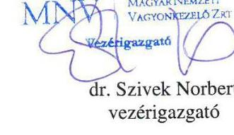

---

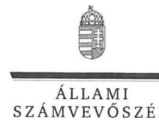

ELNÖK

Ikt.szám: V-0852-567/2016.

# Dr. Szivek Norbert úr 

vezérigazgató
Magyar Nemzeti Vagyonkezelő Zrt.

## Budapest

## Tisztelt Vezérigazgató Úr!

Köszönettel megkaptam a 2016. szeptember 26. napján az Állami Számvevőszékhez érkezett „Az állami tulajdonban (résztulajdonban) lévő gazdálkodó szervezetek vagyonmegőrzési és gazdálkodási tevékenységének ellenőrzése - ELI-HU Kutatási és Fejlesztési Nonprofit Kft. "címủ számvevőszéki jelentéstervezetben foglalt megállapításokra a vezérigazgató úr által írásban tett észrevételt.

Tájékoztatom Vezérigazgató urat, hogy a jelentésben - az Állami Számvevőszékről szóló 2011. évi LXVI. törvény 29. § (3) bekezdése alapján - a figyelembe nem vett észrevételt szerepeltetjük az elutasítás indokainak feltüntetésével együtt.

Az Állami Számvevőszék észrevételre vonatkozó álláspontjáról a felügyeleti vezető által készített részletes tájékoztatást mellékelten megküldöm.

Budapest, 2016. 10 hó 4 nap
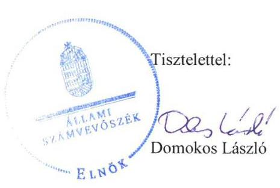

Melléklet: Tájékoztatás a figyelembe nem vett észrevételről

---

# Tájékoztatás   a figyelembe nem vett észrevételről 

| 1. | Észrevétel: | Az ELI-HU NKft. Leltározási szabályzatával, valamint a 20112014. évekre vonatkozó beszámolók leltárral való alátámasztásával kapcsolatosan (Összegzés, Főbb megállapítások, következtetések, javaslatok második bekezdés (5. oldal), a 2.2. számú megállapítás és annak 3. bekezdése (18-19. oldal), az 5.1 számú megállapítás 5. bekezdése (27. oldal), valamint az MNV Zrt. vezérigazgatójának megfogalmazott javaslat (31. oldal)). |
| :--: | :--: | :--: |
|  | Válasz: | Az Állami Számvevőszék az észrevételt nem fogadja el. |
| 1. | Indoklás: | Az ELI-HU NKft. az ellenőrzött időszakban a Számviteli politika részeként valóban rendelkezett a számvitelről szóló 2000. évi C. törvény (Számv. tv.) 14. § (5) bekezdés a) pontjában előírt Leltározási szabályzattal. A Leltározási szabályzat azonban - az észrevételben foglaltakkal ellentétben - nem felelt meg a Számv. tv.-nek a Jelentéstervezetben hivatkozott valamennyi rendelkezésének, mivel a mennyiségi felvétellel történő leltározást a Számv. tv. 69. § (3) bekezdésében foglalt legalább hároméves gyakoriság helyett öt évenkénti gyakorisággal írta elő, amelyet az észrevétel sem kifogásolt.   Az észrevételben az ELI-HU NKft. által elvégzett leltározással, és annak könyvvizsgálói ellenőrzésével kapcsolatosan adott tájékoztatást köszönettel vettük, azok azonban az ellenőrzés megállapításait nem módosítják. Az észrevételben hivatkozott ellenőrzési megállapítások ugyanis nem a leltározás megfelelőségét kifogásolták, hanem a leltár összeállítását, hogy „leltárral nem támasztotta alá az ELI-HU NKft. a 2011-2014. évi beszámolókban és a számviteli nyilvántartásokban lévő eszközeinek (házipénztár pénzkészlete kivételével) és forrásainak állományát."   A Számv. tv. 69.§ (1) bekezdése előírja, hogy „A könyvek üzleti év végi zárásához, a beszámoló elkészitéséhez, a mérleg tételeinek alátámasztásához olyan leltárt kell összeállítani és e törvény elöírásai szerint megőrizni, amely tételesen, ellenőrizhető módon tartalmazza - az (5) bekezdés figyelembevételével - a vállalkozónak a mérleg fordulónapián meglévő eszközeit és forrásait mennyiségben és értékben." |

---

Az ellenőrzés megállapította, hogy nem állítottak össze - az ellenőrzés részére nem adtak át - olyan dokumentumot, amely tételesen, ellenőrizhető módon, kívülállók által is megállapíthatóan tartalmazta volna az éves beszámolók, az annak részét képező mérleg valamennyi tételének alátámasztásához a mérleg fordulónapján meglévő eszközöket és forrásokat mennyiségben és értékben.
Az ELI-HU NKft. a mérleg egyes tételeit alátámasztó leltár készítéséről és az azt megelőző leltározási tevékenységéről a 2010. július 22 -től, valamint a 2011. december 20 -től hatályos Leltározási szabályzatokban rendelkezett. A Leltározási szabályzatok 1. pontjaiban rögzítették, hogy az ELI-HU NKft. által készített leltáraknak mely adatokat kell tartalmazniuk, így különösen a társaság nevét, a leltár megjelölését, a leltár fordulónapját, a leltározás végrehajtásáért és ellenőrzéséért felelős, valamint a számadásra kötelezett személyek aláírását. Az ELI-HU NKft. ilyen tartalmú leltár dokumentumot - a házipénztár pénzkészlete kivételével - nem bocsátott az ellenőrzés rendelkezésére. A beszámolók alátámasztásához az ellenőrzés rendelkezésére bocsátott dokumentumok - egyenlegközlők, analitikus nyilvántartások - nem felelnek meg a leltárral szemben meghatározott kritériumoknak, mivel aláírást nem tartalmaztak, továbbá hiányzott a leltár fordulónapjának feltüntetése, az időpont megjelölése is.
Mindezek következtében a megállapítás megalapozott, annak módosítása, valamint az MNV Zrt. vezérigazgatójának címzett 1. számú javaslat törlése nem indokolt.

Budapest, 2016. 10. hó 1. nap
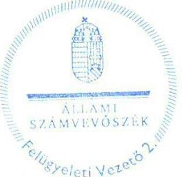

Salamon Ildikó
felügyeleti vezető

---

# ÁLLAMI SZÁMVEVŐSZÉK 

1364 BUDAPEST 4.
PF: 54.

## Domonkos László

## Elnök

Iktatószám: 2016/02948/003

## ÁLLAMI SZÁMVEVŐSZÉK   049723/2016

Firk.: SEP 282016
Iktatószám: 1/0852-566/216
Methliklat: 363

Tárgy: Észrevételek megküldése az Állami Számvevőszék „Az állami tulajdonban (résztulajdonban) lévő gazdálkodó szervezetek vagyonmegőrzési és gazdálkodási tevékenységének ellenőrzése - ELI-HU Kutatási és Fejlesztési NKft." tárgyban készült Jelentés tervezetéhez

## Tisztelt Elnök Úr!

Hivatkozva az Állami Számvevőszék V-0852-560/2016 iktatószámú kísérőlevéllel megküldött, - az ELIHU Nonprofit Kft. által 2016. szeptember 12-én kézhez kapott - az Állami Számvevőszék „Az állami tulajdonban (résztulajdonban) lévő gazdálkodó szervezetek vagyonmegőrzési és gazdálkodási tevékenységének ellenőrzése - ELI-HU Kutatási és Fejlesztési NKft." tárgyban készült Jelentés tervezetéhez az alábbi észrevételeket kívánjuk tenni.

A vagyonnal való gazdálkodás belső szabályozására vonatkozó 2.1 megállapítás 7. bekezdése (17. oldal első bekezdés) megállapítására - miszerint a Társaság nem szabályozta a Vagyonkezelési Szerződés hatálybalépése (2013. január 22.) és 2014. január 1-je között a vagyonkezelésbe vett eszközök saját vagyontól való elkülönítésének, nyilvántartásának szabályait - vonatkozóan az alábbi észrevételt tesszük:

Az ellenőrzés rendelkezésére bocsátottuk a Társaság Felügyelő Bizottsága által 2013. március 13-án jóváhagyott 2012. évi Számviteli Politika módosítását, amely a 19. oldalon tartalmazza a vagyonkezelésbe vett eszközök saját vagyontól való elkülönítésének, nyilvántartásának szabályait az alábbiak szerint:
„A Társaság tulajdonosai által aláírt Szindikátusi Szerződés III/6 . pontja rögzíti, hogy:
„...a társasági célok érdekében létrehozott vagyonelem (az ELI berendezés alkotórészeivel és tartozékaival együtt), mint épület, azaz felépítmény (a továbbiakban: ELI Berendezés), a Polgári Törvénykönyvről szóló 1959. évi IV törvény 97.§ (1) bekezdése alapján (tekintettel arra, hogy a felépítmény alapjául szolgáló telek állami tulajdon) állami tulajdonba kerül..."

A Szindikátusi Szerződés III/8. pontja:
„...a Társaság Tagjai és a Társaság vállalják, hogy jelen szerződés céljainak elérése érdekében az ELI Berendezés megvalósítására kijelölt állami tulajdonú ingatlan vonatkozásában mielőbb vagyonkezelői szerződés megkötését kezdeményezik a Társaság és a MNV Zrt. között..."

A Szindikátusi Szerződés III/9. pontja:

---

# 4 

attosecond
„...állami tulajdonba kerülő vagyonelemeket (amelyek létrehozásához az állami vagyonnal való gazdálkodásról szóló 254/2007. (X. 4.) Korm. rendelet 18. § (1) bekezdése alapján majd az MNV Zrt. elözetes, külön hozzájárulása szükséges), kizárólagos uniós forrásból és állami támogatásból valósitja meg. Az így létrehozott vagyonelemek állami tulajdonba kerülnek, mégpedig úgy, hogy azokat az MNV Zrt. az elszámolási kötelezettséggel kapott külső forrás (azaz az uniós források és állami támogatások) beszámításával téríti meg számla ellenében...."

A Vhr. 1.§ (7) bekezdése alapján a Társaság központi költségvetési szervnek nem minősülő jogi személy, azaz a Társaság egyéb vagyonkezelőnek minősül.

A fentiekböl következően:

- A kapott támogatást elszámolási kötelezettséggel kapott külső forrásként kell nyilvántartani (4499. Hosszú lejáratú egyéb kötelezettségek, majd 4491. Kincstári vagyon részét képező eszközök kezelésbevételével kapcsolatos kötelezettségek)
- Az állami tulajdont eredményező beruházást a beruházási időszak alatt a készletek között kell kimutatni...."

A Számviteli Politika 15. oldal 17. Amortizációs politika pont második bekezdése tartalmazza továbbá:
„...A Társaság és a Nemzeti Vagyonkezelő Zrt között létrejövő Vagyonkezelői szerződés 11.3 pontja alapján a vagyonkezelésbe vett Ingatlanok után terv szerinti értékcsökkenést nem számolunk el.

A Társaság által vagyonkezelésbe vett Ingatlanokon végrehajtott beruházások eredményeként létrehozandó és a Magyar Állam tulajdonába kerülő, Étv. 2.§ 8. és 10. pontja szerinti épületek, építmények vonatkozásában az MNV Zrt.-vel egyeztetett módon kerülnek meghatározásra az eszközcsoportonkénti értékcsökkenési leírási kulcsok... „

A 2014. január 1-jétől hatályos Számviteli Politika 8.9 pontjai tovább pontosították a vagyonkezelésbe vett eszközök nyilvántartását, és a vagyonkezelésben lévő eszközökön végzett beruházás nyilvántartását és elszámolását.

A fentiek alapján szintén az ellenőrzés rendelkezésére bocsátottuk Kiegészítő Adatszolgáltatásként - a 2015. augusztus 24-n átadott DVD 19_Vagyonkezelői szerződés 6.4., 6.7. és 6.12 pontjához dokumentumok címü elektronikus mappában - a Számviteli Politika által előírt, kapcsolódó dokumentumokat (többek között a Vagyonkezelési Szerződés 6.4 pontja szerinti főkönyvi karton, 6.4 pont szerinti állománybavételi bizonylat, az állami vagyon nyilvántartása a hosszú lejáratú kötelezettségek között bizonylata dokumentumokat, stb.)

Kérjük észrevételeink figyelembevételét, és a fentiek alapján kérjük a Jelentés tervezetből törölni a 2.1 megállapítás 7. bekezdését, valamint a Javaslatok rész 2. pontját.

A vagyonnal való gazdálkodás belső szabályozására vonatkozó 2.1 megállapítás 9. bekezdése (17. oldal 3. bekezdés) megállapítására - miszerint a Társaság Számviteli Politika mellékleteként elkészített Számlarendje nem tartalmazta az ELI-ALPS nagyprojekthez kapcsolódóan alkalmazott főkönyvi számlák, alszámlák számlajelét és megnevezését - így különösen a 23. Befejezetlen termelés és félkész termékek, 231. Befejezetlen termelés; illetve annak további alábontását 4791. GOP elszámolás NFÜ előleg, illetve alábontásait, 581 Saját termelésű készletek állományváltozása, azon belül az 5811 ELI ALPS nagyprojekt STK állományváltozása számlákat. A számla tartalmát, a számla értéke növekedésének, csökkenésének

---

jogcímeit, a számlát érintő gazdasági eseményeket, azok más számlákkal való kapcsolatát, valamint a fökönyvi számla és analitikus nyilvántartás kapcsolatát, mellyel megsértették a Számv. Tv. 161.§. (2) bekezdése a)-c) pontjaiban foglaltakat - vonatkozóan az alábbi észrevételt tesszük:

Az ellenőrzés rendelkezésére bocsátottuk a Társaság Felügyelő Bizottsága által 2013. március 13-án jóváhagyott 2012. évi Számviteli Politika módosítását, amely a 19. oldalon tartalmazza a ELI-ALPS nagyprojekt megvalósításához kapott támogatások, megvalósítás során felmerült költségek és ráfordítások elszámolásának, nyilvántartásának szabályait a következők szerint:
„A Társaság által müködtetett könyvelési és analitikus rendszernek az alábbi könyvvezetési követelményeknek kell eleget tennie:

1. GOP keretében elnyert támogatás bevételei/ráfordításai esetén:
a. A támogatott tevékenység forrásának (Támogatási Szerződésének) elkülöníthetőségét biztosítani kell szerződésenként:
i. GOP-1.5.1-2010-0001
ii. GOP-1.5.1-2011-000x
iii. GOP-1.4.1-2012-000x
b. A támogatott tevékenység elszámolásához a Támogatási Szerződésben szereplő tevékenységlista és/vagy projektelemhez történő kapcsolhatóságát biztosítani kell. Minden elszámolásra benyújtandó számviteli tételt hozzá kell rendelni az 7. sz. mellékletben szereplő tevékenység/projektelem lista valamely eleméhez."

Az ellenőrzés rendelkezésére bocsátottuk Kiegészítő Adatszolgáltatásként a 2015. augusztus 24-n átadott DVD 25 pont Számviteli politika címü elektronikus mappában a Számviteli Politika mellékleteként elkészített Számlarend részét képező Számlatükröt is, amely részletesen tartalmazza az ELI-ALPS nagyprojekthez kapcsolódóan alkalmazott főkönyvi számlák, alszámlák számlajelét és egyértelmü Támogatási Szerződés számára, vagy egyéb analitikára is hivatkozó megnevezését.

Az ellenőrzés megállapította továbbá a Jelentéstervezet 3.1 megállapításában a 20. oldal első bekezdés utolsó mondatában, hogy „Az ELI-HU NKft. által kialakított Számviteli Politika megfelelt a támogatási szerződésekben az elkülönített nyilvántartások vezetésére vonatkozóan megfogalmazott előírásoknak."

A fentiek alapján kérjük figyelembe venni a Jelentés tervezet véglegesítésekor, hogy a Társaság a Számlarend részét képező Számlatükörben meghatározta az ELI-ALPS nagyprojekt könyvvezetését biztosító minden alkalmazásra kijelölt számla számjelét és megnevezését, továbbá a Számviteli Politikában részletezte a főkönyvi számlák és az analitikus nyilvántartás kapcsolatát (isd. fentebb 1.a pont), ezzel a Társaság a Számviteli Törvény 161. § bekezdése szerint az egységes számlakeret előírásainak figyelembevételével olyan számlarendet készített, amely szerinti könyvvezetés az éves beszámoló készítést maradéktalanul biztosítja és megfelel a támogatási szerződésekben az elkülönített nyilvántartások vezetésére vonatkozóan megfogalmazott előírásoknak.

Kérjük észrevételeink figyelembevételét, és a fentiek alapján kérjük a Jelentés tervezetből törölni a 2.1 megállapítás 9. bekezdését, valamint a Javaslatok rész 2. pontját.

---

A vagyonnal való gazdálkodás belső szabályozására vonatkozó 2.1 megállapítás 11. bekezdése (17. oldal 5. bekezdés) 2.1 megállapítás 15. bekezdése (18. oldal 5. bekezdés) megállapításaira - miszerint a Társaság eszközök és források értékelési szabályzataiban foglaltak a Számviteli tv-el összhangban, de hiányosan tartalmazta az eszközök bekerülési értékének meghatározására vonatkozó szabályokat, továbbá nem rendelkezett a Társaság önköltségszámítási szabályzattal, ezekkel megsértette a Számviteli tv. 14.§ (4) és (5) bekezdéseiben foglaltakat- vonatkozóan az alábbi észrevételt tesszük:

Az MNV Zrt. korábbi javaslata alapján a beruházási időszaka alatt a készletek között indokolt kimutatni azt a beruházást is, amelynek során az egyéb vagyonkezelőnél olyan eszköz kerül megvalósítására kerül sor, amely állami vagyonnak minősül, vagyis az aktiválás után átadásra kerül az MNV Zrt. részére, és ezt követően kerül (vissza) az egyéb vagyonkezelő vagyonkezelésébe. A Társaság számviteli politikájában ennek megfelelően rögzítésre került, hogy az állami tulajdont eredményező beruházást a beruházási időszak alatt a készletek között kell kimutatni.

Az ELI-HU által több éve végzett beruházás tartalmilag beruházás, csak emiatt a javaslat miatt kerül készletként kimutatásra.

Az ELI-HU kizárólag a beruházás megvalósításával foglalkozik. Az ELI-HU jelenleg nem végez sem termék-előállítási, sem kereskedelmi tevékenységet, tartalmilag készletei nincsenek, így az önköltség számítási szabályzat nem értelmezhető.

Azonban az Eli-Hu Nonprofit Kft. a bevételek és ráfordítások elszámolásának szabályait a Számviteli Politikájában szabályozta. Az ELI-ALPS nagyprojekt előkészítése és megvalósítása során keletkező bevételei és felmerülő ráfordításai - a támogatási szerződésekben meghatározottak szerinti, a pályázati kódokra történő gyűjtés alkalmazásával, projektszámos/munkaszámos rendszerben történő elkülönítéssel történnek. Az elkülönített nyilvántartás projekt/munkaszám kódjait a Számviteli Politika 22. pontja, és a 7. számú, illetve 6. számú mellékletek tartalmazzák.

Továbbá az FB által 2013. március 13-án jóváhagyott Számviteli Politika mellékletét képező Értékelési Szabályzat ugyan kifejezetten szó szerint nem tér ki a befejezetlen termelés és félkész termékek értékének meghatározására, viszont részletesen szabályozza a 2.1 pontban az értékelés általános elveinél és a 2.3.1 pontban a készletek bekerülési értékének a meghatározását. A 2014. január 1-től hatályos Számviteli Politika tovább pontosítja és részletezi a 8. - 11. pontokban az értékelési, minősítési előírásokat, módszereket, az értékelés szempontjából lényegesnek, jelentősnek, minősített értékelési szempontokat, szabályokat.

Tekintettel arra, hogy a Társaság a Számviteli Törvény 14.§ (4) bekezdésének megfelelően a Számviteli Politika és annak mellékletét képező Értékelési Szabályzat keretében írásban rögzítette - többek között azokat a gazdálkodóra jellemző szabályokat, előírásokat, módszereket, amelyekkel meghatározza, hogy mit tekint a számviteli elszámolás, az értékelés szempontjából lényegesnek, jelentősnek, nem lényegesnek, nem jelentősnek, továbbá meghatározza azt, hogy a törvényben biztosított választási, minősítési lehetőségek közül melyeket, milyen feltételek fennállása esetén alkalmaz; összességében eleget tett a befejezetlen termelés és félkész termékek értékelése tekintetében előírandó és alkalmazandó Számviteli törvényben foglalt előírásoknak.

A Jelentés tervezet 2.1 megállapítás 15. bekezdése (18. oldal 5. bekezdés) megállapításaira vonatkozóan észrevételezzük továbbá, hogy a Társaság 2014. január 1-jétől hatályos Számviteli Politikája keretében ugyan nem készítette el az Önköltségszámítási Szabályzatát a Számviteli törvény 14.§ (4) c) pontjában

---

foglaltak szerint a Számviteli tv 14.§ (7) bekezdésére tekintettel - ugyanakkor a Számviteli Politika 22. pontjában meghatározta az értékelés elveit, továbbá az Értékelési Szabályzat 5. oldal 2.1.1 Eszközök bekerülési értéke pont utolsó bekezdése szó szerint tartalmazza a Számviteli tv. fentebb említett 14.§ (7) bekezdése által hivatkozott 51.§ rendelkezéseit is.

Kérjük észrevételeink figyelembevételét, és a fentiek alapján kérjük a Jelentés tervezetben törölni a 2.1 megállapítás 11. és 15. bekezdését, valamint a Javaslatok rész 4. és 5. pontjait.

A vagyonnal való gazdálkodás belső szabályozására vonatkozó 2.1 megállapítás 10. bekezdése, valamint a 2.2 megállapítás 3. bekezdése (19. oldal 2. bekezdés) megállapítására - miszerint az ELI-HU NKft. vagyonnyilvántartása - a beszámolót alátámasztó leltárak hiányában nem volt szabályszerű, vonatkozóan az alábbi észrevételt tesszük:

A Jelentés 2.2. számú megállapítása szerint a Társaság megsértette a Számviteli törvény 69. § (1) bekezdését, valamint a Leltározási Szabályzat 1. pontjában foglaltakat, megsértette továbbá a Számviteli tv. 15.§.(3) bekezdésében meghatározott valódiság elvét.

A 2.2. számú megállapítása alapján a házipénztár pénzkészlete kivételével nem támasztotta alá leltárral a beszámolóban szereplő értékeket.

A Jelentés 2.2 számú megállapítása ugyanakkor nem veszi figyelembe a Számviteli Törvény 69.§.(2) bekezdését, amely szerint a csak értékben kimutatott eszközöknél és kötelezettségeknél, továbbá a dematerializált értékpapírok esetén a leltározást az üzleti év mérlegfordulónapjára vonatkozóan egyeztetéssel kell elvégeznie.

Az ELI-HU Nonprofit Kft. az ellenőrzés tárgyát képező 2011-2014. években a Számviteli Politika részét képező Leltározási Szabályzatait a Felügyelő Bizottság és a Könyvvizsgáló véleményének figyelembevételével alakította ki. A Leltározási Szabályzat figyelembe vette a Számviteli Törvény Jelentésben is hivatkozott jogszabály helyeket, azaz a valódiság elvének megfelelően a Társaság a mérleg alátámasztásaként a mérleg fordulónapján meglévő eszközeit és forrásait leltározta. A tárgyi eszközök leltározása tételes mennyiségi leltárfelvétellel történt 2011. és 2014. években, 2012. és 2013. években pedig egyeztetéssel. A készpénz esetén tételes pénztárrovancs alkalmazásával történt minden mérleg fordulónapon és a csak értékben kimutatott eszközök és kötelezettségek leltározása pedig a nyilvántartások, analitikák, főkönyvek tételes egyeztetésével, többek között partnerekkel történő egyenlegközlők visszaigazolásával és különböző kimutatások, egyeztető listák készítésével.

A jelentéstervezet 2.1 megállapítás 10. bekezdése szerint a Leltározási Szabályzat 5.1 pontjában foglalt tárgyi eszközökre és beruházásokra vonatkozó mennyiségi felvétellel való leltározás 5 évenkénti gyakorisága a 2012. január 1-től nem felelt meg a Számviteli tv. 69.§ (3) bekezdésében előírtaknak, tekintettel arra, hogy az legalább három évente történő mennyiségi felvétellel történő leltározást ír elő. A Társaság, ugyanakkor jelzi, hogy a mennyiségi felvétellel történő leltározást a tárgyi eszközök leltározása során 2011. és 2014. években mennyiségi felvétellel, 2012. és 2013. években a tárgyi eszközök tételes, leltári számok alapján egyedi mennyiségi és érték adatokat is tartalmazó listák egyeztetésével végezte el. A készpénz leltározása az ellenőrzéssel érintett minden évben tételes mennyiségi nyilvántartással történt.

---

A Társaság a fentiek alátámasztásaként az ellenőrzés rendelkezésére bocsátotta a 2015. augusztus 24én átadott DVD 15. és 16. számú elektronikus mappáiban az adott évek leltározását alátámasztó dokumentumokat.

A leltározás során a Leltározási Szabályzatban és Számviteli Politikában foglalt egyeztetési tevékenységen túl, a szállítói analitikában év végén nyitott állományként szereplő szállítói egyenlegeket, valamint a kapott előlegeket teljes körűen egyenlegközlő kiküldésével és megerősítés kérésével is alátámasztotta, továbbá valamennyi bankszámlához kapcsolódó banki egyenlegeket is visszaigazoltatta a számlavezető pénzintézettel a Társaság. A könyvvizsgáló az előzőekben említetteken túl a diszkont kincstárjegyekre a pénzintézetektől közvetlen megkereséssel kért megerősítést.

A fentiek alapján megalapozottan megállapítható, hogy a Társaság eleget tett a jogszabályi előírásoknak megfelelő leltár elkészítési kötelezettségének, a Számviteli törvény 69.§ (1) és (2) bekezdésében foglaltaknak megfelelően, továbbá a Számviteli törvény 15.§ (3) bekezdésében meghatározott valódiság elvére figyelemmel támasztotta alá bizonyíthatóan, és kívülállók által is megállapítható módon a beszámolójában szereplő tételeket.

Kérjük észrevételeink figyelembevételét, és a fentiek alapján kérjük a Jelentés tervezetben törölni a 2.1. megállapítás 10. bekezdését, a 2.2. megállapítás 3. bekezdését, és az 5.1. megállapítás 5 bekezdését, valamint a Javaslatok rész 1. és 6. pontjait.

A szabályszerű bevételek és ráfordítások elszámolásának szabályozására vonatkozó 3.1 megállapítás 6. és 9. bekezdések, (20. oldal 6. és 8. bekezdések) megállapítására - miszerint az ELI-HU NKft. bevételeinek és ráfordításainak könyvelése során nem tartották be a Számviteli tv. 165.§ (1)-(2) bekezdésében, valamint a 167.§ (1) bekezdésében foglalt előírásokat a számviteli bizonylatokra vonatkozóan - vonatkozóan az alábbi észrevételt tesszük:

Az ellenőrzés megállapítása szerint a ráfordítások szabályszerűsége az ellenőrzött időszakban magas kockázatúnak minősült. Az ELI-HU NKft.-nél a kötelezettségek között „T-Mobil átvállalt tartozás" címen nyilvántartott összeget az egyéb ráfordítások terhére kivezették, ugyanakkor a számviteli elszámolást alátámasztó számviteli bizonylat nem állt rendelkezésre. Kérjük az Jelentés tervezetben feltüntetni, hogy a T-mobil átvállalt tartozás címén egyéb ráfordításként elszámolt összeg 15.680,- forint, amely érték leírása a szállítói analitika egyeztetés alapján mutatkozó különbözet volt, amely előző évek eltéréséből adódott.

Az egyéb ráfordítások elszámolása kapcsán az ellenőrzés megállapította továbbá, hogy a Társaság nem támasztotta alá a Számviteli tv. 167.§ (1) bekezdése szerinti számviteli bizonylattal az elszámolt árfolyam-differencia összegét. Észrevételezni kívánjuk, hogy a mintatételek alátámasztásaként az ELIHU NKft. 2015. augusztus 27-én átadott DVD Pénzügyi mintatételek elektronikus mappájában átadta az ellenőrzés részére a papíralapon is megtekintett az árfolyam-differenciák elszámolását alátámasztó számviteli bizonylatokat. Az árfolyam differenciák elszámolása a Társaság Számviteli Politikájában foglaltak szerint a következő módon történik. A devizás szállítói számlák lekönyvelésre kerülnek a Számviteli Politikában foglalt árfolyamon, a kötelezettség elszámolásának a bizonylata a számla. A számla kiegyenlítésekor a bankkivonat alapján lekönyvelésre került a kiegyenlítés deviza értéke, árfolyama, valamint forint értéke. A könyvelés informatikai rendszere zárt rendszerben kiszámítja a keletkező árfolyam-differenciát, amely egyéb bevétel, vagy egyéb ráfordítás lehet. Az árfolyamdifferencia informatikai rendszer által zárt rendszerben történő lekönyveléséről kontírlapok készíthetők,

---

# 㖕 

attosecond
amelyek megfelelnek a számviteli törvény 166.§ és 167.§ szerinti előírásoknak, az egyéb bevételként és ráfordításként lekönyvelt tételek esetében az ellenőrzési időszak vonatkozásában jelen levelünk mellékleteként megküldjük az említett számviteli bizonylatokat (kontirlapokat) szíves tájékoztatásul. Az ellenőrzés részére a fentebb említett DVD-n a mintatételek könyvelési alapbizonylataiként átadásra kerültek a mintatételek számlái, a kiegyenlitést igazoló bankkivonatok, a számlaértékeket, árfolyamokat és kiegyenlítés összegeit tartalmazó tételek, továbbá a részletes szállítói analitika. A rendelkezésre bocsátott számviteli bizonylatok megfelelnek a számviteli törvény előírásai szerinti számviteli bizonylatnak, és amellyek alapján a Társaság informatikai rendszere által előállíthatók számviteli bizonylatok alátámasztják az árfolyam-differenciaként elszámolt egyéb bevételek, illetve ráfordítások összegeit.

A szabályszerű bevételek és ráfordítások elszámolásának szabályozására vonatkozó 3.1 megállapítás 5. és 6 . és 9 . bekezdések, (20. oldal 6 . és 8 . bekezdések) megállapítására tett észrevételeink és megküldött alátámasztó bizonylataink alapján kérjük a Jelentéstervezet hivatkozott megállapításainak törlését, továbbá a Javaslatok rész 7. pontját.A szabályszerű bevételek és ráfordítások elszámolásának szabályozására vonatkozó 3.1 megállapítás 7. bekezdés, (20. oldal 8. bekezdés) megállapítására miszerint az ELI-HU NKft. által Cafetéria Szabályzat alapján alkalmazott cafetéria nyilatkozatok hiányosak voltak és nem vették figyelembe a béren kívüli juttatások után fizetendő adóterheket vonatkozóan az alábbi észrevételt tesszük:

Tekintettel arra, hogy sem az SZJA tv. sem egyéb más törvény nem ismeri a „bruttó cafetéria" fogalmát az ELI-HU NKft. esetében is helyes a megfogalmazás, mert a juttatások bruttó értéke és a nettó értéke megegyezhet (jogszabály szerint), figyelemmel arra is, hogy az ELI-HU a jogszabályban meghatározott adókkal nem növelte meg az éves keretet. A keretben meghatározott összegeket a munkavállalók nettó módon kapták meg (ezáltal nem téve különbséget nettó és bruttó összeg között), és az adó és járulék terheket a kifizető ezen felül fizette meg, tehát a béren kívüli juttatások után a fizetendő adóterhek is megfizetésre kerültek.

Kérjük észrevételeink figyelembevételét, és a fentiek alapján kérjük a Jelentés tervezetben törölni a 3.1. megállapítás 7. bekezdésében foglalt megállapítást (20. oldal 8. bekezdés).

A vagyongazdálkodást érintő információs rendszer müködtetésére vonatkozó 5.2 megállapítás 4. bekezdés, (30. oldal 1. bekezdés) megállapítására - miszerint az ELI-HU NKft. a Vagyonkezelési Szerződés 6.17 pontja szerinti adatszolgáltatási kötelezettségnek nem tett eleget az ellenőrzött időszakban vonatkozóan az alábbi észrevételt tesszük:

Az ELI-HU NKft. a Vagyonkezelési Szerződés 6.17 pontja szerinti adatszolgáltatási kötelezettségnek az ellenőrzött időszakban utólag tett eleget, miután az adatszolgáltatáshoz szükséges speciális szoftvert az MNV Zrt. biztosította. A jelentéseket a Társaság a 2015. augusztus 24-én átadott DVD 32- számú elektronikus mappáiban átadta az ellenőrzés részére.

Kérjük észrevételeink figyelembevételét, és a fentiek alapján kérjük a Jelentés tervezetben pontosítani az 5.2. megállapítás 4. bekezdésében foglalt megállapítást (30. oldal 1. bekezdés) és törölni a Javaslatok rész 11. pontját, tekintettel arra, hogy az adatszolgáltatás teljesítve van.

A közbeszerzési eljárásokra vonatkozó 4.2 megállapítására (25. oldal ) - miszerint a Társaság néhány esetben mellőzte a közbeszerzési eljárás az alábbi észrevételt tesszük:

---

# 畕 

attosecond

A gépjármú flottaszerződésnél annyit tudunk nyilatkozni, hogy egy korábban (más ügyvezető által) megkötött szerződést teljesítésre nem volt a társaságnak választása, elállás esetén ki kellett volna fizetni a hátralévő szolgáltatási díjat, amely nyilván hátrányosan érintette volna a társaságot.

A másik két szerződéssel kapcsolatban a Közbeszerzési Hatóság 2016. március 30. napján kelt levelével arról tájékoztatta Társaságunkat, hogy az ELI-HU Nonprofit Kft. és Tímár László egyéni vállalkozó között hivatalos közbeszerzési tanácsadói feladatok ellátása tárgyában létrejött kettő darab, 2013.04.19. napján kelt megbízási szerződés kapcsán közérdekú bejelentés érkezett Hatóságukhoz, amely bejelentésben foglaltak szerint a fenti két szerződést a közbeszerzési eljárás jogtalan mellőzésével kötötte meg Társaságunk. Erre tekintettel a Közbeszerzési Hatóság arra hívta fel Társaságunkat, hogy az adjon tájékoztatást arról, hogy a fenti szerződések kapcsán sor került-e közbeszerzési eljárás lefolytatására, illetve amennyiben nem, mik voltak a közbeszerzési eljárás mellőzésének indokai.

A Hatóság felhívására az alábbi választ adtuk:
„A T-01139/03/2015 iktatószámú levelükben említett két megbízási szerződés szabályszerűen, a Társaság Beszerzési Szabályzatának megfelelően került megkötésre.

A két beszerzési eljárás eredményeként megkötött szerződés tárgya más-más (GOP 1.11/B/2012 (P3P4) Projekt; GOP 1.5.1 2011-0001 (P2) Projekt) uniós forrásból finanszírozott pályázat közbeszerzési eljárásainak lefolytatására irányult. Ennek megfelelően a tárgyi megbízási szerződések alapján járó megbízási díjak is más-más pályázati forrásból kerültek kifizetésre.

A hivatalos közbeszerzési tanácsadói feladatok és a jogi szolgáltatás is a beszerzési eljárások lefolytatásakor hatályos, a közbeszerzésekről szóló 2011. CVIII. törvény 19. § (3) bekezdése és a 120. § (1) bek. g) pontja értelmében kivételi körnek számított."

A Közbeszerzési Hatóság nem indított semmilyen eljárást társaságunk ellen, amelyből arra lehet következtetni, hogy indokainkat elfogadták, azaz a Társaság nem járt el jogsértően.

Kérjük észrevételeink figyelembevételét, és a fentiek alapján kérjük a Jelentés tervezetből törölni a 4.2 megállapítás megfelelő részét, valamint a 8. számú javaslatot is megfelelően módosítani.

A belső ellenőrzésre vonatkozó 5.2 megállapítására (30. oldal ) - miszerint a Társaság nem alakította ki a belső ellenőrzési rendszert az alábbi észrevételt tesszük:

A Társaság nem tartozik az idézett 370/2011. (XII. 31.) a költségvetési szervek belső kontrollrendszeréről és belső ellenőrzéséről szóló Kormányrendelet hatálya alá.

Kérjük észrevételeink figyelembevételét, és a fentiek alapján kérjük a Jelentés tervezetből törölni az 5.2 megállapítás megfelelő részét, valamint a 12. számú javaslatot is megfelelően módosítani.

Kérjük a fentiekben összefoglalt észrevételeink és indokolásaink elfogadását és törlési javaslataink figyelembevételét a jelentéstervezet véglegesítése során.

Tisztelettel:

Melléklet: 1. számú DVD ELI-HU NKft. észrevételek

Lehrner Lóránt
ügyvezető igazgató
ELI-HU Nonprofit Kft.

---

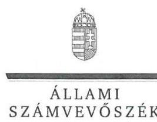

ELNÖK

Ikt.szám: V-0852-569/2016.

# Lehrner Lóránt úr 

ügyvezető igazgató
ELI-HU Nonprofit Kft.

## Szeged

## Tisztelt Ügyvezető Igazgató Úr!

Köszönettel megkaptam a 2016. szeptember 26. napján az Állami Számvevőszékhez érkezett „Az állami tulajdonban (résztulajdonban) lévő gazdálkodó szervezetek vagyonmegőrzési és gazdálkodási tevékenységének ellenőrzése - ELI-HU Kutatási és Fejlesztési Nonprofit Kft. "címủ számvevőszéki jelentéstervezetben foglalt megállapításokra az ügyvezető igazgató úr által írásban tett észrevételeket.

Tájékoztatom Ügyvezető Igazgató urat, hogy a jelentésben - az Állami Számvevőszékről szóló 2011. évi LXVI. törvény 29. § (3) bekezdése alapján - a figyelembe nem vett észrevételeket szerepeltetjük az elutasítás indokainak feltüntetésével együtt.

Az Állami Számvevőszék észrevételekre vonatkozó álláspontjáról a felügyeleti vezető által készített részletes tájékoztatást mellékelten megküldőm.

Budapest, 2016.
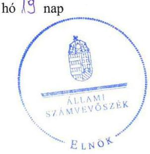

Tisztelettel:

Domokos László

Melléklet: Tájékoztatás a figyelembe nem vett észrevételekről

---

# Tájékoztatás   a figyelembe nem vett észrevételekröl 

| 1. | Észrevétel: | Vagyonnal való gazdálkodás belső szabályozására, a Számviteli politikának a vagyonkezelésbe vett eszközök saját vagyontól való elkülönítésének, nyilvántartásának szabályaira vonatkozóan (2.1. számú megállapítás 7. bekezdés). |
| :--: | :--: | :--: |
|  | Válasz: | Az Állami Számvevőszék az észrevételt nem fogadja el. |
|  | Indoklás: | Az ELI-HU Nkft. Felügyelő Bizottsága által 2013. március 13-án jóváhagyott Számviteli politika észrevételben hivatkozott és idézett pontjai - az észrevételben foglaltakkal ellentétben - nem tartalmazzák a vagyonkezelésbe vett eszközök saját vagyontól való elkülönítésének, nyilvántartásának szabályait.   A Számviteli politika a hivatkozott 19. oldalon a „22. Állami tulajdon létrehozása Európai Uniós forrásból a támogatások elszámolásának könyvviteli kötelezettségei"-t szabályozza, amely - mint a nyilvántartásokban készletek, illetve a befejezetlen termelés és félkész termékek között kimutatott - vagyontárgyak, az ellenőrzött időszakban nem a vagyonkezelésbe vett eszközök közé tartoztak, és azokat a vagyonkezelési szerződésben sem rögzítették.   A Számviteli politika a hivatkozott 15. oldal 17. pont második bekezdésében szintén nem a vagyonkezelésbe vett eszközök saját vagyontól való elkülönítésének, nyilvántartásának szabályait, hanem az „Amortizációs politika" keretében az értékcsökkenés elszámolásának a szabályait tartalmazza.   A 2014. január 1-jétől hatályos Számviteli politika 8.9. pontja már valóban tartalmazza a vagyonkezelésbe vett eszközök nyilvántartására vonatkozó szabályokat, mint ahogy ezt az ellenőrzési megállapítások is rögzítik.   A kiegészítő adatszolgáltatásként 2015. augusztus 24-én rendelkezésre bocsátott, észrevételben hivatkozott kapcsolódó dokumentumok nem a nyilvántartásnak az ellenőrzési megállapításban kifogásolt szabályozására, hanem a nyilvántartására vonatkoznak.   Mindezek következtében az észrevétel nem megalapozott, a megállapítás módosítása nem indokolt. Szintén nem indokolt az ELI-HU NKft. ügyvezetőjének címzett 2. számú javaslat törlése, amely nem a jelen észrevétel tárgyát képező Számviteli politika, hanem a Számlarend tartalmának kiegészítésére vonatkozik. |

---

|  | Észrevétel | A Számlarend tartalmára vonatkozóan (2.1. számú megállapítás 9. bekezdés). |
| :--: | :--: | :--: |
|  | Válasz | Az Állami Számvevőszék az észrevételt nem fogadja el. |
| 2. | Indoklás | A dokumentumok ismételt felülvizsgálata alapján, az észrevételben hivatkozott, 2015. augusztus 24-én átadott DVD 25 pont Számviteli politika címủ elektronikus mappában az ellenőrzés rendelkezésére bocsátott, 2011. december 20 -tól hatályos Számlarend és Számlatükör, illetve az azt megelőzően hatályos Számlarend és Számlatükör nem tartalmazta a 23. Befejezetlen termelés és félkész termékek; 231. Befejezetlen termelés; illetve annak további alábontását, a 4791 GOP elszámolás NFÜ előleg, illetve alábontásait; 581. Saját termelésű készletek állományváltozása, azon belül az 5811 ELI-ALPS nagyprojekt STK állományváltozása számlákat. Ebből következően nem tartalmazta ezen számlák tartalmát, növekedési és csökkenési jogcímüket, a számlákat érintő gazdasági eseményeket, azok más számlákkal való kapcsolatát, továbbá a fökönyvi számla és az analitikus nyilvántartás kapcsolatát sem.   Az ELI-HU Nkft. Felügyelő Bizottsága által 2013. március 13-án jóváhagyott Számviteli politika az észrevételben hivatkozott és idézett 19. oldalon a „22. Állami tulajdon létrehozása Európai Uniós forrásból a támogatások elszámolásának könyvviteli kötelezettségei" szabályozása keretében a „Társaság által müködtetett könyvelési és analitikus rendszernek" a könyvvezetési követelményeit rögzítette, amely szintén nem tartalmazta az ellenőrzési megállapítás szerint a Számlarendből hiányzó fökönyvi számlákat, valamint azok további szabályozását. Mindemellett az ellenőrzési megállapításban kifogásolt szabályozást a számvitelről szóló 2000 . évi C. törvény (Számv. tv.) 161. § (2) bekezdés a)-c) pontjai nem a Számviteli politika, hanem a Számlarend tartalmaként írták elő.   A 3.1. számú megállapítás 20. oldal első bekezdés utolsó mondata a Számviteli politikára - ezen belül is a támogatási szerződésekben az elkülönített nyilvántartások vezetésére megfogalmazott előírásokra - tartalmaz megállapítást, így az nincs ellentmondásban a 2.1 számú megállapítás 9. bekezdésében a Számlarend tartalmára vonatkozó ellenőrzési megállapítással.   Mindezek következtében az ellenőrzési megállapítás megalapozott, annak módosítása, valamint az ELI-HU NKft. ügyvezetőjének címzett 2. számú javaslat törlése nem indokolt. |
| 3. | Észrevétel | Az Eszközök és források értékelési szabályzataival, valamint az önköltség számítási szabályzattal kapcsolatos ellenőrzési megállapításokra vonatkozóan (2.1 megállapítás 11. és 15. bekezdés). |
|  | Válasz | Az Állami Számvevőszék az észrevételt nem fogadja el. |

---

|  | Köszönettel vettük a folyamatban lévő beruházásnak a nyilvántartásokban a készletek között történő kimutatására, valamint a bevételek és ráfordítások Számviteli politikában történő szabályozására vonatkozó információkat, amelyek azonban az ellenőrzés megállapításait nem módosítják. A beruházásnak a beruházási időszak alatti készletként történő kimutatását az ÁSZ nem kifogásolta, arra ellenőrzési megállapítást nem tett.   Az észrevétel megerősítette, hogy a Számviteli politika mellékletét képező Értékelési szabályzat a befejezetlen termelés és a félkész termékek értékének meghatározására külön nem tért ki, így az eszközök bekerülési értékének a hiányos szabályozására vonatkozó ellenőrzési megállapítás helytálló. Az Értékelési szabályzat észrevételben hivatkozott 2.1. pontja „Általános értékelési szabályok"-at tartalmazott az eszközök bekerülési értékére, értékcsökkenésére, értékvesztésére és a visszaírásra vonatkozóan, a 2.3.1. pontja a készletek értékelésére vonatkozóan. Egyik sem tért ki azonban a saját előállítású készletek, a befejezetlen termelés és félkész termékek értékelésére.   A Számviteli politikában meghatározták a lényegesség elvét („A beszámoló szempontjából lényegesnek minösitünk minden olyan információt, amelynek elhagyása vagy téves bemutatása - az ésszerüség határain belül - befolyásolja a beszámoló adatait felhasználók döntéseit."), a lényegesség kritériumait („A lényegesség elve alapján lényegesnek minösül a beszámoló szempontjából minden olyan információ, amelynek elhagyása vagy téves bemutatása befolyásolja annak adatait, a felhasználó döntéseit."), továbbá a jelentős összegủ hiba határát ( $2 \%$, illetve 500 millió Ft ).   A befejezetlen termelés és félkész termékek értéke 2014-ben a mérlegfőösszeg $59,6 \%$-át tette ki, amely a Számviteli politikában foglalt elvek szerint lényegesnek minősül.   Az észrevétel megerősítette az Önköltségszámítási szabályzat hiányára vonatkozó ellenőrzési megállapítást, amely szabályzat elkészítését nem pótolja a Számviteli politikában a Számv. tv. 51. $\S$-ának szó szerinti megismétlése. A Számv. tv. 14. § (7) bekezdése - készletek meglétére tekintet nélkül - az értékesítés nettó árbevételének, vagy a költségnemek szerinti költségek összegének meghatározott nagyságrendje felett tette kötelezővé az önköltségszámítás rendjére vonatkozó belső szabályzat elkészítését.   A fentiek alapján, az észrevételben szereplő ellenőrzési megállapítások megalapozottak, azok módosítása, valamint az ELI-HU NKft. ügyvezetőjének címzett 4. és 5. számú javaslat törlése nem indokolt. |
| :--: | :--: |

---

|  | Észrevétel | A beszámolót alátámasztó leltárak hiányára vonatkozó ellenőrzési megállapításhoz kapcsolódóan (2.1 számú megállapítás 10. bekezdés, valamint a 2.2 számú megállapítás 3. bekezdés). |
| :--: | :--: | :--: |
|  | Válasz | Az Állami Számvevőszék az észrevételt nem fogadja el. |
| 4. | Indoklás | Az észrevételben az ellenőrzött időszakban elvégzett leltározással, valamint ennek kapcsán a könyvvizsgálói tevékenyéggel kapcsolatosan adott részletes tájékoztatást köszönettel vettük, azok azonban az ellenőrzés megállapításait nem módosítják. Az észrevételben hivatkozott ellenőrzési megállapítások ugyanis nem a leltározás megfelelőségét, hanem a leltár összeállítását kifogásolták, amely szerint „leltárral nem támasztotta alá az ELIHU NKft. a 2011-2014. évi beszámolókban és a számviteli nyilvántartásokban lévő eszközeinek (házipénztár pénzkészlete kivételével) és forrásainak állományát."   A Számv. tv. 69. § (1) bekezdése előírja, hogy „A könyvek üzleti év végi zárásához, a beszámoló elkészitéséhez, a mérleg tételeinek alátámasztásához olyan leltárt kell összeállitani és e törvény elöírásai szerint megőrizni, amely tételesen ellenöríthető módon tartalmazza - az (3) bekezdés figyelembevételével - a vállalkozónak a mérleg fordulónapján meglévő eszközeit és forrásait mennyiségben és értékben."   A leltározás végrehajtására vonatkozó előírásokat - így az észrevételben szereplő, egyeztetéssel történő leltározást - a Számv. tv. 69. § (3)-(6) bekezdései szabályozzák, amelyekkel kapcsolatban ÁSZ ellenőrzési megállapítást nem tett. Nem tett továbbá megállapítást az észrevételben szintén hivatkozott, a Számv. tv. 69. § (2) bekezdésével kapcsolatban sem, amely - az észrevételben foglaltakkal ellentétben - nem az értékben kimutatott eszközök és források leltározására, hanem a fökönyvi könyvelés és az analitikus nyilvántartások közötti egyeztetésre vonatkozóan tartalmaz előirást.   Az ellenőrzés megállapította, hogy nem állítottak össze - az ellenőrzés részére nem adtak át - olyan dokumentumot, amely tételesen, ellenőrizhető módon, kívülállók által is megállapíthatóan tartalmazta volna az éves beszámolók, az annak részét képező mérleg valamennyi tételének alátámasztásához a mérleg fordulónapján meglévő eszközöket és forrásokat mennyiségben és értékben.   Az ELI-HU NKft. a mérleg egyes tételeit alátámasztó leltár készítéséről és az azt megelőző leltározási tevékenységéről a 2010. július 22 -tól, valamint a 2011. december 20 -tól hatályos Leltározási szabályzatokban rendelkezett.   A Leltározási szabályzatok 1. pontjaiban rögzítették, hogy az ELIHU NKft. által készített leltáraknak mely adatokat kell tartalmazniuk, így különösen a társaság nevét, a leltár megjelölését, a leltár fordulónapját, a leltározás végrehajtásáért és ellenőrzéséért felelős, valamint a számadásra kötelezett személyek aláírását. |

---

|  |  | Az ELI-HU NKft. ilyen tartalmú leltár dokumentumot - a házipénztár pénzkészlete kivételével - nem bocsátott az ellenőrzés rendelkezésére. A beszámolók alátámasztásához az ellenőrzés rendelkezésére bocsátott dokumentumok - egyenlegközlök, analitikus nyilvántartások - nem felelnek meg a leltárral szemben meghatározott kritériumoknak, mivel aláirást nem tartalmaztak, továbbá hiányzott a leltár fordulónapjának feltüntetése, az időpont megjelölése is.   A Leltározási szabályzat 2012. január 1-jétől nem vette figyelembe a Számv. tv. 69. § (3) bekezdésében előírtakat, mivel a mennyiségi felvétellel történő leltározást a hivatkozott jogszabályban elöirt legalább hároméves gyakoriság helyett öt évenkénti gyakorisággal írta elő, amelyet az észrevétel is megerősített.   A fentiek alapján, az észrevételben szereplő ellenőrzési megállapítások megalapozottak, azok módosítása, valamint a megállapításokhoz kapcsolódóan tett, a Magyar Nemzeti Vagyonkezelő Zrt. vezérigazgatójának címzett 1. számú, az ELIHU NKft. üggvezetőjének címzett 3. és 6. számú javaslat törlése nem indokolt. Az előzőek következtében nem indokolt továbbá módosítani, illetve törölni az 5.1. számú megállapítás 5. bekezdését sem. |
| :--: | :--: | :--: |
|  | Észrevétel | Az egyéb bevételek és ráfordítások elszámolására vonatkozó ellenőrzési megállapításokhoz kapcsolódóan (3.1. számú megállapítás 5-6. és 9 . bekezdés). |
|  | Válasz | Az Állami Számvevőszék az észrevételt nem fogadja el. |
| 5. | Indoklás | Az Állami Számvevőszék - amint azt „Az állami tulajdonban (résztulajdonban) lévő gazdálkodó szervezetek vagyonmegőrzési és gazdálkodási tevékenységének ellenörzése" ellenőrzési programban, valamint a jelentéstervezetben is rögzítette -, az ellenőrzést az ellenőrzési program szempontjai és a számvevőszéki ellenőrzés szakmai szabályai szerint, a vonatkozó nemzetközi standardok figyelembevételével végezte. A kormányzati szektor hiányára befolyást gyakorló egyéb ráfordítások elszámolásának a szabályszerűségét - a bevételek és a ráfordítások elszámolása szabályszerűségének ellenőrzéséhez hasonlóan - véletlen mintavétellel ellenőriztük, a következők szerint „A mintavétellel ellenörzött területek esetében minden egyes tétel vonatkozásában a szabályszerüségre vonatkozó kérdéseket tettünk fel, amelyek eredménye összestéres került. ... Kockázatot, illetve magas kockázatot jeleztünk, amennyiben egy adott terület vonatkozásában a minta alapján a teljes sokaságban nem volt egyértelmüen biztositott a jogszabályoknak és a belső szabályzatoknak megfelelő müködés." |

---

|  |  | Tekintettel arra, hogy a statisztikai alapon történt mintavétel szerinti mintatételek értékelése alapján az ellenőrzési megállapítások az egész sokaságra vonatkoztak, abból egy kiválasztott - az ellenőrzési megállapításban példaként szereplő tétel elszámolt összegének megjelenítése nem indokolt.   Köszönettel vettük az észrevételben az árfolyam-differencia elszámolásának a folyamatára vonatkozóan adott részletes tájékoztatást, amely nem módosítja az ellenőrzés megállapításait. Az ellenőrzés során az észrevételben hivatkozott, a 2015. augusztus 27 -én átadott DVD Pénzügyi mintatételek elektronikus mappában szereplő bizonylatok a mintatételek ellenőrzése során figyelembe vételre kerültek. Az ellenőrzés megállapította, hogy a rendelkezésére bocsátott bizonylatok nem az egyes elszámolt árfolyam-differenciákra vonatkoztak. A könyvviteli elszámolást közvetlenül alátámasztó, az elszámolt árfolyam-differenciák összegét megalapozó bizonylatokat nem bocsátottak az ellenőrzés rendelkezésére. Ennek következtében megalapozott a megállapítás, miszerint az elszámolt árfolyam-differencia összegét a Számv. tv. 165. § (1)-(2) bekezdéseiben foglaltak ellenére számviteli bizonylattal nem támasztották alá, illetve a bizonylatok nem feleltek meg a Számv. tv. 167. § (1)-(2) bekezdéseiben foglaltaknak. Az észrevételhez pótlólag megküldött „kontirlapok" szintén nem felelnek meg a Számv. tv. 167. § (1)-(2) bekezdéseiben foglaltaknak, mivel azok az elszámolt gazdasági eseményt nem alapozzák meg, továbbá a bizonylat alaki kellékeit sem tartalmazzák hiánytalanul (pl. aláírás hiányzik).   A fentiek alapján, az észrevételben szereplő ellenőrzési megállapítások megalapozottak, azok módosítása, valamint az ELI-HU NKft. ügyvezetőjének címzett 7. számú javaslat törlése nem indokolt. |
| :--: | :--: | :--: |
|  | Észrevétel | A cafetéria nyilatkozatok hiányosságára vonatkozó ellenőrzési megállapításhoz kapcsolódóan ( 3.1 megállapítás 8 . bekezdés) |
|  | Válasz | Az Állami Számvevőszék az észrevételt nem fogadja el. |
| 6. | Indoklás | Az észrevétel nem cáfolta, hanem megerősítette az ellenőrzésnek azt a megállapítását, miszerint a cafetéria nyilatkozatok, vagyis a dolgozók által aláirt „Nyilatkozat a választható béren kivüli juttatásokról" bruttó és nettó összege megegyezett. A cafetéria juttatások bruttó és nettó összege - amint az észrevétel is tartalmazza - meghatározott esetekben valóban megegyezhet, az ellenőrzött mintatételeknél azonban a juttatásokat jellemzően kifizetői adó terhelte, ezt azonban a nyilatkozatokon nem szerepeltették annak ellenére, hogy a nyilatkozatok erre vonatkozó előírást tartalmaztak (,a választott juttatások soraiban felül a nettó, alatta a bruttó összeg szerepel"). Ennek következtében a nyilatkozatok hiányosak voltak. |

---

|  |  | A béren kívüli juttatásokat terhelő adók megfizetésére vonatkozó tájékoztatást köszönettel vettük, amely összhangban van az erre vonatkozó ellenőrzési megállapítással.   A fentiek alapján, az észrevételben szereplő ellenőrzési megállapítás megalapozott, annak módosítása nem indokolt. |
| :--: | :--: | :--: |
|  | Észrevétel | A vagyonkezelési szerződésben rögzített adatszolgáltatási kötelezettség teljesítésére vonatkozó ellenőrzési megállapításhoz kapcsolódóan ( 5.2 számú megállapítás 4. bekezdés). |
|  | Válasz | Az Állami Számvevőszék az észrevételt nem fogadja el. |
| 7. | Indoklás | Az észrevétel nem cáfolta, hanem megerősítette azt az ellenőrzési megállapítást, amely szerint az ELI-HU NKft. az ellenőrzött időszakban nem tett eleget a Vagyonkezelési szerződés 6.17. pontja szerinti, a 2013-2014. évekre vonatkozó adatszolgáltatási kötelezettségének. Az adatszolgáltatási kötelezettség utólagos teljesítéséről szóló információ szerepeltetése nem indokolt, mivel az az ellenőrzött időszakon (2011-2014. évek), valamint az előírt 30 napon túl történt.   Előzőek következtében az észrevételben szereplő ellenőrzési megállapítás módosítása, és az ELI-HU NKft. ügyvezetőjének címzett 11. számú javaslat törlése nem indokolt. |
|  | Észrevétel | A közbeszerzési eljárások mellőzésére vonatkozó ellenőrzési megállapításhoz kapcsolódóan (4.2. számú megállapítás 5. bekezdés). |
|  | Válasz | Az Állami Számvevőszék az észrevételt nem fogadja el. |
| 8. | Indoklás | A közbeszerzési eljárás mellőzésével kötött, gépjármủ flottaszerződés esetén az észrevétel nem cáfolta, hanem megerősítette az ellenőrzés megállapítását.   A további két szerződéssel kapcsolatosan tett észrevétel nem megalapozott.   A közbeszerzésekről szóló 2011. évi CVIII. törvény (a továbbiakban: régi Kbt.) 120. §-ának g) pontja szerint az uniós értékhatárt el nem érő összegủ, hivatalos közbeszerzési tanácsadói szerződések megkötése esetén nem kell közbeszerzési eljárást lefolytatni, azonban az uniós értékhatárt elérő, illetve meghaladó ilyen tárgyú beszerzéseknél nem mellőzhető a közbeszerzési eljárás.   A régi Kbt. 19. § (3) bekezdése szerint „A 4. melléklet szerinti jogi szolgáltatások megrendelése esetében az ajánlatkérőnek nem kell közbeszerzési eljárást lefolytatnia, az uniós értékhatárt elérő értékủ szerzödés megkötéséröl azonban a külön jogszabályban meghatározott hirdetményt közzé kell tenni és a szerzödést szerepeltetni kell a külön jogszabályban foglaltak szerint elkészítendö éves statisztikai összegezésben." |

---

|  |  | Ezek alapján megállapítható, hogy az uniós értékhatárt meghaladó összegü, 2013. április 19-én megkötött megbizási szerződések esetében a beszerző jogtalanul mellőzte a közbeszerzési eljárást, amelyet nem cáfol meg annak a ténye, hogy a Közbeszerzési Hatóság részéről ezzel kapcsolatban visszajelzés nem érkezett.   Mindezek következtében az észrevételben szereplő ellenőrzési megállapítás megalapozott, annak módosítása, valamint az ELIHU NKft. ügyvezetőjének címzett 8. számú javaslat törlése nem indokolt. |
| :--: | :--: | :--: |
|  | Észrevétel | A belső ellenőrzés kialakításának a hiányára vonatkozó ellenőrzési megállapításhoz kapcsolódóan (5.2. számú megállapítás 8 . bekezdés) |
|  | Válasz | Az Állami Számvevőszék az észrevételt nem fogadja el. |
| 9 . | Indoklás | Az észrevétel nem megalapozott. A költségvetési szervek belső kontrollrendszeréről és belső ellenőrzéséről szóló 370/2011. (XII. 31.) Korm. rendelet 1. § (2) bekezdés e) pontjának 2014. január 1-jétől hatályos rendelkezése szerint a rendelet hatálya kiterjed a kormányzati szektorba sorolt egyéb szervezetekre. Az előírást 2015. július 8 -tól a Bkr. 1. § (2) bekezdés d) pontja tartalmazza.   A kormányzati szektorba sorolt egyéb szervezet fegalmát az államháztartásról szóló 2011. évi CXCV. törvény nevesíti. A kormányzati szektorba sorolt egyéb szervezetekről szóló NGM közlemények (megjelent: Hivatalos értesítő 2015/66. és 2013/60. szám) az ELI-HU Kutatási és Fejlesztési Nonprofit Közhasznú Korlátolt Felelősségű Társaságot ilyen szervezetként nevesítették.   Ennek következtében az észrevételben szereplő ellenőrzési megállapítás megalapozott, annak módosítása, valamint az ELIHU NKft. ügyvezetőjének címzett 12. számú javaslat törlése nem indokolt. |

Budapest, 2016. 10 hó 19 nap
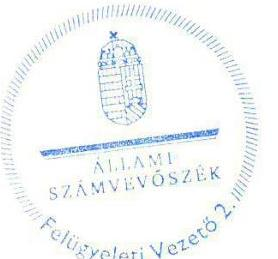

Salamon Ildikó
felügyeleti vezető

---

.

---

# RÖVIDÍTÉSEK JEGYZÉKE 

${ }^{1}$ ÁSZ
${ }^{2}$ ELI-HU NKft.
${ }^{3}$ SZTE
${ }^{4}$ SZMJVÖ
${ }^{5}$ Vtv.
${ }^{6}$ MNV Zrt.
${ }^{7}$ ELI
${ }^{8}$ SA
${ }^{9}$ TTI stratégia
${ }^{10}$ a kutatás-fejlesztésről szóló tv.
${ }^{11}$ 1414/2013.(VII.4) Korm. határozat
${ }^{12}$ KFI stratégia
${ }^{13}$ ELI-ALPS nagyprojekt
${ }^{14}$ ERFA
${ }^{15}$ Vagyonkezelési szerződés
${ }^{16}$ Szindikátusi szerződés
${ }^{17}$ Nvtv.
${ }^{18}$ Áht. 2
${ }^{19}$ Társasági szerződés

Állami Számvevőszék
ELI-HU Kutatási és Fejlesztési Nonprofit Közhasznú Korlátolt Felelősségű Társaság Szegedi Tudományegyetem
Szeged Megyei Jogú Város Önkormányzat
az állami vagyonról szóló 2007. évi CVI. törvény
Magyar Nemzeti Vagyonkezelő Zrt.
Extreme Light Infrastructure
Strukturális Alapok
a Kormány középtávú tudomány-,technológia- és innováció- politikai stratégiája, mely az 1023/2007. (IV.5.) Korm. határozattal került kihirdetésre
a kutatás-fejlesztésről és a technológiai innovációról szóló 2004. évi CXXXIV. törvény
a Nemzeti Kutatás-fejlesztési és Innovációs Stratégia (20136-2020) elfogadásáról szóló 1414/2013. 8vii.4.) Korm. határozat
a Nemzeti Kutatás-fejlesztési és Innovációs Stratégia (2013-2020), mely az 1414/2013. (VII. 4.) Korm. határozattal került kihirdetésre
ELI lézer kutatóközpont megvalósítása (ELI-ALPS) nagyprojekt
Európai Regionális Fejlesztési Alap
Megállapodás vagyonkezelési szerződés részbeni megszüntetéséről, valamint vagyonkezelési jog létesítéséről, létre jött: 2013. január 22-én az MNV Zrt., a Szegedi Tudományegyetem és az ELI-HU NKft. között
A Szegedi Tudományegyetem, a Szeged Megyei Jogú Város Önkormányzata, a Nemzeti Kutatási és Technológiai Hivatal, mint az ELI-HU NKft. tagjai és az MNV Zrt. valamint ELI-HU NKft. között 2010. május 20-án, SZT-33747. szám alatt létrejött szerződés, és annak 2012. február 01-én, NFM/SZERZ/1129/5/2011. szám alatt létrejött 1. számú módosítása.
a nemzeti vagyonról szóló 2011. évi CXCVI. törvény
2011. évi CXCV. törvény az államháztartásról (hatályos 2012. január 1-től) ELI-HU Nkft. Társasági Szerződése ${ }_{1}$, hatályos 2010.10.19-től ELI-HU Nkft. Társasági Szerződés2, hatályos:2011.03. 03-tól ELI-HU Nkft. Társasági Szerződés3, hatályos:2011.04.07-től ELI-HU Nkft. Társasági Szerződés4 hatályos:2011.08.22-től ELI-HU Nkft. Társasági Szerződés5 hatályos:2012 01. 04-től ELI-HU Nkft. Társasági Szerződés6 hatályos:2012.05.03-tól ELI-HU Nkft. Társasági Szerződés7 hatályos:2012.05.29-től ELI-HU Nkft. Társasági Szerződés8 hatályos:2012.12.20-tól ELI-HU Nkft. Társasági Szerződés9 hatályos:2013.01.30-tól ELI-HU Nkft. Társasági Szerződés10 hatályos:2013.02.07-től ELI-HU Nkft. Társasági Szerződés11 hatályos:2013.03.03-tól ELI-HU Nkft. Társasági Szerződés12 hatályos: 2013.05.30-tól ELI-HU Nkft. Társasági Szerződés13 hatályos:2013.11.18-tól ELI-HU Nkft. Társasági Szerződés14 hatályos: 2013.12.16-tól

---

ELI-HU Nkft. Társasági szerződés15 hatályos 2014. március 10-tól
ELI-HU Nkft. Társasági Szerződés ${ }_{16}$ hatályos: 2014.05.29-től
ELI-HU Nkft. Társasági Szerződés ${ }_{17}$ hatályos: 2014.12-19-től
a gazdasági társaságokról szóló 2006. évi IV. törvény (hatályon kívül helyezte a 2013. évi CLXXVII. tv. 67. § c), hatálytalan 2014. március 15-től)
az állami vagyonnal való gazdálkodásról szóló 254/2007. (X. 4.) Korm. rendelet ELI-HU NKft. taggyűlése
ELI-HU NKft. Felügyelő Bizottsága
a Polgári Törvénykönyvről szóló 2013. évi V. törvény
MNV Zrt. Vagyon-nyilvántartási szabályzata ${ }_{1}$ : a 46/2008. számú Vig. utasítással kiadott MNV Zrt. Vagyon-nyilvántartási szabályzat (hatályos: 2008. június 11től);
MNV Zrt. Vagyon-nyilvántartási szabályzata2: a 46/2008. számú Vig. utasítással kiadott MNV Zrt. Vagyon-nyilvántartási szabályzat 2009. áprilisi módosítása (hatályos: 2009. áprilistól, 2013. július 28-ig.);
MNV Zrt. Vagyon-nyilvántartási szabályzata3: a 266/2013. (VII. 29.) Vig. számú határozattal kiadott MNV Zrt. Vagyon-nyilvántartási eljárásrendje (hatályos:2013. július 29-től)
MNV Zrt. Vagyon-nyilvántartási szabályzata4: a 12/2014. számú Vig utasítással kiadott MNV Zrt. állami vagyon vagyonkezelőire, az állami vagyont használókra és a társasági részesedések esetében az MNV Zrt. tulajdonosi joggyakorlását megbízottként ellátókra vonatkozó Vagyon-nyilvántartási szabályzat (hatályos: 2014. március 24-től);

MNV Zrt. Vagyon-nyilvántartási szabályzata5: a 12/2014. számú Vig utasítás egységes szerkezetben a 24/2014. számú Vig. utasítással kiadott MNV Zrt. állami vagyon vagyonkezelőire, az állami vagyont használókra és a társasági részesedések esetében az MNV Zrt. tulajdonosi joggyakorlását megbízottként ellátókra vonatkozó Vagyon-nyilvántartási szabályzat (hatályos: 2014. május 31től)
ELI-HU NKft. Szervezeti és Működési Szabályzata ${ }_{1}$, hatályos 2012.01. 04-től
ELI-HU NKft. Szervezeti és Múködési Szabályzata2, hatályos 2013.08.16-tól
ELI-HU NKft. Szervezeti és Múködési Szabályzata ${ }_{3}$, hatályos 2013. 11.18.-tól
ELI-HU NKft. Szervezeti és Múködési Szabályzata4, hatályos 2014.05.29-től
ELI-HU NKft. Szervezeti és Múködési Szabályzata5, hatályos 2014.12.19-től
ELI-HU NKft. Számviteli Politikája ${ }_{1}$, hatályos 2010. 07.22-től
ELI-HU NKft. Számviteli Politikája ${ }_{2}$, hatályos 2011. 21. 20-tól
ELI-HU NKft. Számviteli Politikája ${ }_{3}$, hatályos 2013. 03. 13-tól
ELI-HU NKft. Számviteli Politikája ${ }_{4}$, hatályos 2014. 01. 14-től
ELI-HU NKft. Számlarend és Számlatükör ${ }_{1}$, hatályos 2010. 03. 13-tól
ELI-HU NKft. Számlarend és Számlatükör ${ }_{2}$, hatályos 2011. 12. 20-tól
ELI-HU NKft. Selejtezési szabályzata ${ }_{1}$, hatályos 2010. 07.22-től
ELI-HU NKft. Selejtezési szabályzata ${ }_{2}$, hatályos 2011. 12. 20-tól
ELI-HU NKft. Pénzkezelési szabályzata ${ }_{1}$, hatályos 2010. 07.22-től
ELI-HU NKft. Pénzkezelési szabályzata ${ }_{2}$, hatályos 2011. 12. 20-tól
ELI-HU NKft. Pénzkezelési szabályzata ${ }_{3}$, hatályos 2012. 11. 20-tól
ELI-HU NKft. Leltározási szabályzata ${ }_{1}$, hatályos 2010. 07.22-től
ELI-HU NKft. Leltározási szabályzata ${ }_{2}$, hatályos 2011. 12. 20-tól

---

${ }^{32}$ Értékelési szabályzat
${ }^{33}$ Bizonylati rend
${ }^{34}$ Befektetési szabályzat
${ }^{35}$ Számv. tv.
${ }^{36}$ GOP
${ }^{37}$ NFÜ
${ }^{38}$ Civil tv.
${ }^{39}$ Egységes Beszerzési Szabályzat
${ }^{40}$ támogatási szerződések
${ }^{41}$ Szja. tv.
${ }^{42} \mathrm{Kbt}_{1-2}$
${ }^{43}$ TGY
${ }^{44}$ MAG Zrt.
${ }^{45}$ SZMSZ
${ }^{46} \mathrm{PEJ}$
${ }^{47}$ Avtv.
${ }^{48}$ Info tv.
${ }^{49}$ Ávr.
${ }^{50}$ Stabilitási tv.

ELI-HU NKft. Eszközök és források értékelési szabályzata1, hatályos 2010. 07. 22-től

ELI-HU NKft. Eszközök és források értékelési szabályzata2, hatályos 2011. 12. 20-tól

ELI-HU NKft. Eszközök és források értékelési szabályzata3, hatályos 2013. 03. 13-tól

ELI-HU NKft. Bizonylati rendje1, hatályos 2010. 07. 22-től
ELI-HU NKft Bizonylati rendje2, hatályos 2011. 12. 20-tól
ELI-HU NKft. Befektetési szabályzata1, hatályos 2012. 01. 04-től
ELI-HU NKft. Befektetési szabályzata2, hatályos 2012. 12. 20-tól
2000. évi C törvény a számvitelről

Gazdasági Operatív Program
Nemzeti Fejlesztési Ügynökség
az egyesülési jogról, a közhasznú jogállásról, valamint a civil szervezetek müködéséről és támogatásáról szóló 2011. évi CLXXV. törvény
ELI-HU NKft. Egységes Beszerzési Szabályzata hatályos1: 2012. január 4-től
ELI-HU NKft. Egységes Beszerzési Szabályzata, hatályos2: 2012. május 29-től
ELI-HU NKft. Egységes Beszerzési Szabályzata, hatályos3: 2012. december 20-tól
ELI-HU NKft. Egységes Beszerzési Szabályzata, hatályos4: 2013. december 16-tól
ELI-HU NKft. Egységes Beszerzési Szabályzata, hatályos5: 2014. május 29-től
GOP-1.5.1-2010-001 „ELI lézer kutatóközpont megvalósítását előkészítő projekt I. fázisa"című projekt támogatására kötött támogatási szerződés1

GOP-1.5.1-11-2011-001 „ELI lézer kutatóközpont megvalósítását előkészítő projekt II. fázisa"című projekt támogatására kötött támogatási szerződés2
GOP-1.1.1-12/B-2012-0001 „ELI lézer kutatóközpont megvalósítása (ELI-ALPS) nagyprojekt, I fázis"című projekt támogatására kötött támogatási szerződés3
a Személyi jövedelemadósról szóló 1995. évi CXVII. törvény
A közbeszerzésekről szólós 2003. évi CXXIX. törvény
A közbeszerzésekről szólóz 2011. évi CVIII. törvény
Taggyűlés
MAG - Magyar Gazdaságfejlesztési Központ Zrt.
ELI-HU NKft. Szervezeti és Működési Szabályzata1 (hatályos: 2012. január. 4-től),
ELI-HU NKft. Szervezeti és Működési Szabályzata2 (hatályos: 2013. augusztus 16-tól),
ELI-HU NKft. Szervezeti és Müködési Szabályzata3 (hatályos: 2013. november 18-tól),
ELI-HU NKft. Szervezeti és Müködési Szabályzata4 (hatályos: 2014. május 29-től),
ELI-HU NKft. Szervezeti és Müködési Szabályzata5 (hatályos: 2014. december 19-től)
Projekt előrehaladási jelentés
1992. évi LXIII. törvény a személyes adatok védelméről és a közérdekú adatok nyilvánosságáról hatálytalan 2012. január 1-től
az információs önrendelkezési jogról és az információszabadságról szóló 2011. évi CXII. törvény, hatályos:2011. július 27-től
az államháztartásról szólótörvény végrehajtásáról szóló 368/2011. (XII. 31.) Korm. rendelet
Magyarország gazdasági stabilitásáról szóló 2011. évi CXCIV. törvény

---

${ }^{51}$ Áht. 1
az államháztartásról szóló 1992. évi XXXVII. törvény (hatályos: 2011. december 31-ig

---

.

---

# ÁLLAMI SZÁMVEVŐSZÉK 

1052 Budapest, Apáczai Csere János utca 10.
Levélcím: 1364 Budapest 4. Pf. 54
Telefon: +36 14849100 Telefax: +36 14849200
www.asz.hu