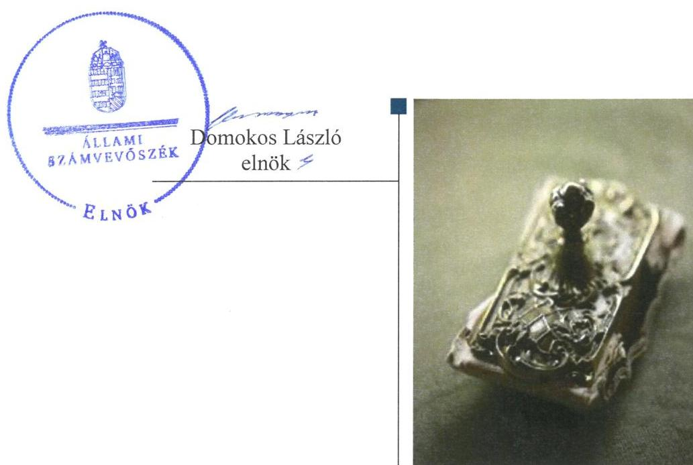
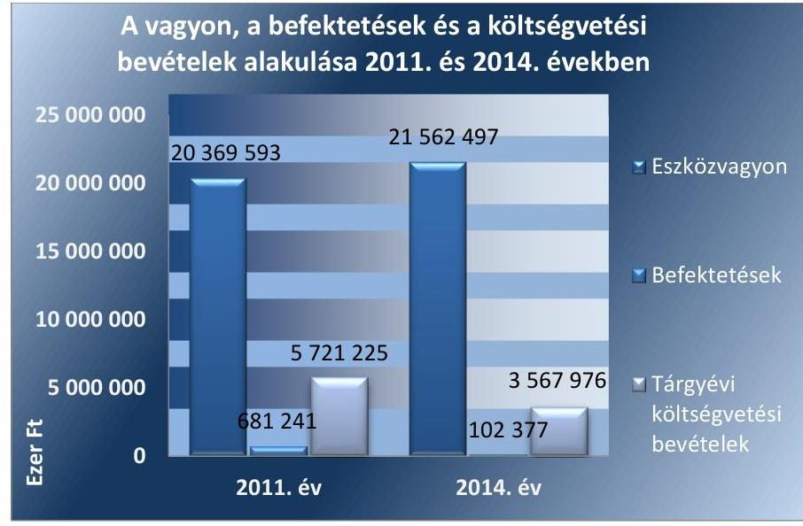
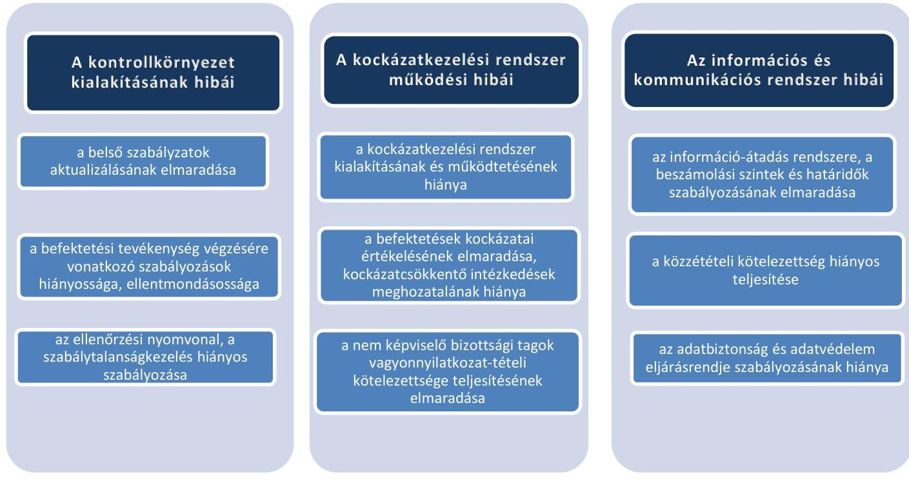
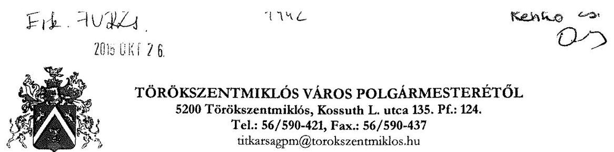

# Jelenetés 

## Önkormányzatok belsó kontrollrendszere

Az önkormányzatok belső kontrollrendszere kialakításának és múködtetésének ellenőrzése - Törökszentmiklós 2016.

---

# Jelenetés 

## Önkormányzatok belsó kontrollrendszere

Az önkormányzatok belső kontrollrendszere kialakításának és múködtetésének ellenőrzése - Törökszentmiklós
2016. 12. hó 01. nap

---

# AZ ELLENŐRZÉST FELÜGYELTE:

- **RENKŐ ZSUZSANNA** felügyeleti vezető
- **AZ ELLENŐRZÉST VEZETTE ÉS A VÉGREHAJTÁSÁÉRT FELELŐS:**
- **HORVÁTH JÓZSEF** ellenőrzésvezető
- **A PROGRAM ÖSSZEÁLLÍTÁSÁÉRT FELELŐS:**
- **JANIK JÓZSEF LÁSZLÓ** osztályvezető
- **A TÉMÁHOZ KAPCSOLÓDÓ KORÁBBI SZÁMVEVŐSZÉKI JELENTÉSEK:**
- **címe:** Jelentés Törökszentmiklós Város Önkormányzata pénzügyi helyzetének ellenőrzéséről
- **sorszáma:** 1268

Jelentéseink az Országgyűlés számítógépes hálózatán és az Interneten a www.asz.hu címen is olvashatóak.

|  IKTATÓSZÁM: V-1042-157/2016 | |
| --- | --- |
|  TÉMASZÁM: 2076 | |
|  ELLENŐRZÉS-AZONOSÍTÓ SZÁM: V071814, V073814 | |

---

# TARTALOMJEGYZÉK 

■ ÖSSZEGZÉS ..... 5
■ AZ ELLENŐRZÉS CÉLJA ..... 6
■ AZ ELLENŐRZÉS TERÜLETE ..... 7
■ AZ ELLENŐRZÉS HÁTTERE, INDOKOLTSÁGA ..... 8
■ A JELENTÉS LÉNYEGES KÉRDÉSKÖREI ..... 11
■ ELLENŐRZÉS HATÓKÖRE ÉS MÓDSZEREI ..... 12
■ MEGÁLLAPÍTÁSOK ..... 15
■ JAVASLATOK ..... 38
■ MELLÉKLETEK ..... 41
I. Sz. melléklet: Értelmező szótár. ..... 41
II. Sz. melléklet: Az integritás érvényesítése érdekében kialakított és müködtetett kontrollrendszer ..... 46
III. Sz. melléklet: Kimutatás Törökszentmiklós Városi Önkormányzat és a Raiffeisen Bank Zrt. közötti pénzmozgásokról, ügyletekről ..... 48
IV. Sz. melléklet: Kimutatás Törökszentmiklós Városi Önkormányzat és a Quaestor Értékpapír Zrt. közötti pénzmozgásokról, ügyletekről ..... 50
■ FÜGGELÉK: ÉSZREVÉTELEK ..... 53
■ RÖVIDÍTÉSEK JEGYZÉKE ..... 55

---

.

---

# ÖSSZEGZÉS 

Törökszentmiklós Város Önkormányzata belső kontrollrendszere kialakításának és müködtetésének hiányosságai miatt a közpénzfelhasználás szabályossága nem volt biztositott, a befektetési tevékenységek szabályszerü végzését nem támogatta. A befektetésekkel kapcsolatos döntések nem garantálták a közvagyon körültekintő, biztonságos befektetését. Az Önkormányzat beszámolója nem a valóságnak megfelelően mutatta be a befektetett közvagyon nagyságát. Az Önkormányzat az integritás szemlélet érvényesülése érdekében nem tett eröfeszitést.

## Az ellenőrzés társadalmi indokoltsága

Magyarország Alaptörvénye az önkormányzatoktól is elvárja a kiegyensúlyozott, átlátható és fenntartható költségvetési gazdálkodás elvének érvényesítését. A korábbi évek ellenőrzési tapasztalatai, az önkormányzatok által betöltött társadalmi szerep, az általuk kezelt közpénz nagysága, a nemzeti vagyon átruházására vagy hasznosítására vonatkozó döntéseik sokrétüsége egyaránt indokolttá tették a számvevőszéki ellenőrzések folytatását. A belső kontrollrendszer kialakítása és müködtetése nélkül nem valósítható meg a közpénzek, a közvagyon szabályos, gazdaságos, hatékony és eredményes felhasználása.

Törökszentmiklós Város Önkormányzata 2015. április 30-án egy befektetési vállalkozással szemben 103,5 millió Ft pénzkövetelést tartott nyilván. A befektetési vállalkozás törvénytelen tevékenysége következtében fennáll/fennállt a veszélye annak, hogy a befektetett közvagyon egészét vagy egy részét elveszítik. Felmerült, hogy a belső kontrollrendszer kialakítása és müködtetése nem biztosította a közvagyon megóvását, körültekintő, biztonságos befektetését, a befektetési döntések, azok végrehajtása és számviteli elszámolása nem volt szabályszerű.

## Főbb megállapítások, következtetések, javaslatok

A belső kontrollrendszer kialakítása és müködtetése nem volt szabályszerű, így nem segítette elő a szabálykövető múködést és gazdálkodást, a szervezeti célok elérését. A kontrolltevékenységek nem megfelelő müködtetése akadályozta a hibák megelőzését, feltárását. A teljesítésigazolási és az érvényesítési jogkörök szabálytalan gyakorlása következtében jogosulatlan kifizetések történtek.

A befektetési döntések a befektetett közvagyon biztonságos megőrzését nem garantálták. A döntéshozó a hatáskör átruházásban meghatározottakat figyelmen kívül hagyta, és nem állampapírokat, tőkegarantált befektetési jegyeket vásárolt. A betétlekötéseknél olyan módozatot választott, amely nem biztosította a befektetett tőke értékének megmaradását.

Az Önkormányzat beszámolója az egyes befektetések számviteli elszámolásának, nyilvántartásának és számbavételének szabálytalanságai következtében vagyonáról nem a valós összképet mutatta.

Az integritás szemlélet erősítése érdekében - a belső kontrollrendszer kialakításában és múködésében feltárt hiányosságok és hibák megszüntetésével - az Önkormányzatnak még további intézkedéseket kell megtennie.

---

# AZ ELLENŐRZÉS CÉLJA 

Az ellenőrzés célja annak megállapítása, hogy az önkormányzat belső kontrollrendszerének kialakítása, továbbá egyes elemeinek működtetése biztosította-e a közpénz felhasználás szabályosságát. Az erőforrásokkal való szabályszerű és hatékony gazdálkodáshoz szükséges követelmények érvényesítése, számonkérése, ellenőrzése meg-történt-e az önkormányzatnál. A belső kontrollrendszer kialakítása és működtetése támogatta-e az integritás szemlélet érvényesülését. Az ellenőrzés során értékeljük a belső kontrollrendszer kialakításának és működtetésének szabályszerűségét. Feltárjuk azokat a lényeges szabályozási és múködési hiányosságokat, amelyek miatt az ellenőrzött kulcskontrollok nem nyújtottak elegendő védelmet a lehetséges hibákkal szemben. Rámutatunk arra, ha a kulcskontrollok valamely hibát nem előznek meg, nem tárnak fel, vagy nem javítanak ki, valamint minősítjük múködésük megfelelőségét.

Ellenőrizzük, hogy az önkormányzat egyes befektetési döntései és azok végrehajtása, elszámolása megfelelt-e a vonatkozó jogszabályoknak és belső szabályozásoknak, a kialakított kontrollrendszer támogatta-e a befektetési tevékenység szabályszerűségét.

---

# **AZ ELLENŐRZÉS TERÜLETE**

## **Törökszentmiklós Városi Önkormányzat**

Törökszentmiklós város állandó lakosainak száma 2015. január 1-jén 20 613 fő volt. Az Önkormányzat¹ az ellenőrzött időszakban 11 tagú Képviselő-testület²-tel rendelkezett, melynek munkáját három állandó bizottság segítette. Az Önkormányzat a Hivatalon kívül öt intézménnyel, valamint négy többségi tulajdoni részesedésű gazdasági társasággal látta el a feladatait. A városban az ellenőrzött időszakban roma, illetve 2013. június 6-ánámos Nemzetiségi Önkormányzat működött.

A Polgármester³, a 2014. évi önkormányzati választások óta tölti be tisztségét. A Jegyző₈ 2015. január 20. óta látja el feladatait. A Hivatal⁴ elkülönített gazdasági szervezettel rendelkezett. A gazdasági szervezet feladatait a Városgazdálkodási Iroda Közpénzügyi Osztálya látta el, a gazdasági szervezet vezetője a gazdasági irodavezető volt. A Hivatalban foglalkoztatott köztisztviselők száma 2014. év végén 60 fő volt. A Hivatalnál 2014. január 1-jétől szervezeti változás nem következett be.

Az Önkormányzat a 2014. évi éves költségvetési beszámoló szerint 3 567 976 ezer Ft költségvetési bevételt ért el, valamint 2 550 583 ezer Ft költségvetési kiadást teljesített. Az eszközvagyon értéke 2014. december 31-én 21 562 497 ezer Ft volt, a költségvetési évben esedékes kötelezettség állomány 2970 ezer Ft-ot, a költségvetési évet követően esedékes kötelezettség állomány 36 934 ezer Ft-ot tett ki.

1. ábra

*Forrás: A 2011. és a 2014. éves költségvetési beszámoló*

---

# AZ ELLENŐRZÉS HÁTTERE, INDOKOLTSÁGA 

Az ÁSZ tv. ${ }^{5}$ szerint az ÁSZ ${ }^{6}$ feladata a jól irányított állam kiépítésének elősegítése. Az ÁSZ Stratégiájában ezért hangsúlyos szerepet szánt annak, hogy szilárd szakmai alapon álló, értékteremtő ellenőrzéseivel előmozdítsa a közpénzügyek átláthatóságát, rendezettségét. A számvevőszéki ellenőrzés nemzetközi alapelvei is rögzítik, hogy a megfelelő belső kontrollrendszer minimálisra csökkenti a hibák és szabálytalanságok kockázatát.

A belső kontrollrendszer azt a célt szolgálja, hogy a költségvetési szervek működésük és gazdálkodásuk során a tevékenységeket szabályszerűen, gazdaságosan, hatékonyan, eredményesen hajtsák végre, teljesítsék elszámolási kötelezettségeiket és megvédjék az erőforrásokat a veszteségektől, a károktól és a nem rendeltetésszerű használattól. A belső kontrollrendszer magában foglalja mindazon szabályokat, eljárásokat, gyakorlati módszereket és szervezeti struktúrákat, kockázatkezelési technikákat, kontrolltevékenységeket, amelyek segítséget nyújtanak a szervezetnek céljai eléréséhez. A belső kontrollrendszer szabályozása háromszintű a törvényi előírásokat az Áht. ${ }^{7}$ és a Mötv. ${ }^{8}$, a rendeleti szintű szabályozást az Ávr. ${ }^{9}$ és a Bkr. ${ }^{10}$ tartalmazza, amelyeket útmutatói szinten az NGM által kiadott standardok és kézikönyvek támogatnak.

Az ellenőrzött időszak meghatározása lehetőséget teremtett a 2014. október 12-i önkormányzati választásokat megelőző és követő ciklus belső kontrollrendszere működésének elkülönült értékelésére, valamint a változások nyomon követésére.

A BELSŐ KONTROLLRENDSZER kialakításának és működtetésének általános értékelése mellett a teljesítésigazolás és érvényesítés kontrollok kiemelt ellenőrzésének szükségességét alátámasztja, hogy 2012. évtől a pénzügyi folyamatokban kulcsszerepet betöltő belső kontrollok rendszere módosult és azok működtetésében az önkormányzatoknál hiányosságok mutatkoztak a 2012. év óta elvégzett ÁSZ ellenőrzések alapján.

Az önkormányzatok belső kontrollrendszerének ellenőrzése az ÁSZ "jó kormányzással" kapcsolatos stratégiai céljainak megvalósítását is szolgálja. Az ÁSZ célja, hogy javuljon az ellenőrzött önkormányzatok belső kontrollrendszerének szabályozottsága, működésének megfelelősége, hozzájárulva ezzel az egyensúlyi helyzet fenntarthatóságának biztosításához, azaz az adósság újratermelődésének megakadályozásához.

Az MNB három befektetési szolgáltató tevékenységi engedélyét 2015. első felében visszavonta és kezdeményezte a vállalkozások felszámolását a működéssel kapcsolatos szabálytalanságok, hiányosságok miatt. A befektetési vállalkozások problémás helyzetbe kerülése jelentős veszteségekhez vezetett számos önkormányzat esetében. A korábbi évek ellenőrzési tapasztalatai alapján fennáll a lehetősége annak, hogy az önkormányzatok befektetési döntései, továbbá a döntések végrehajtása és számviteli elszámolása nem voltak teljes mértékben szabályszerűek, a belső kontrollrendszer és a kapcsolódó külső ellenőrzések sem működtek minden esetben megfelelően. Az ÁSZ 2015 májusában felkérést kapott a Kormánytól arra,

---

hogy vizsgálja meg, az érintett befektetési vállalkozásoknál értékpapír portfolióval rendelkező önkormányzatok szabályszerűen jártak-e el a szabad pénzeszközeik befektetésekor.

Magyarország Alaptörvénye az önkormányzatoktól, mint az államháztartás alanyaitól elvárja a kiegyensúlyozott, átlátható és fenntartható költségvetési gazdálkodás elvének érvényesítését. A nemzeti vagyonról szóló törvény szerint a nemzeti vagyonnal felelős módon, rendeltetésszerűen kell gazdálkodni. A nemzeti vagyongazdálkodás feladata a nemzeti vagyon rendeltetésének megfelelő, átlátható, hatékony és költségtakarékos működtetése, ugyanakkor értékének megőrzését, értéknövelő használatát, hasznosítását, gyarapítását is elvárja.

# AZ ÖNKORMÁNYZATOK ÁTMENETILEG SZABAD 

PÉNZESZKÖZEINEK BEFEKTETÉSÉT jogszabály nem tiltja, a pénzpiaci szolgáltatók közül az önkormányzatok a kínált szolgáltatás és annak költségei alapján, szabadon választhatnak, a veszteséges gazdálkodás kockázatai és következményei azonban az önkormányzatokat terhelik. A szabad pénzeszközök felelős hasznosítása összhangban áll az önkormányzati gazdálkodás alapelveivel.

A közintézmények integritás alapú kultúrájának kialakítása, megerősítése és múködése szorosan összefügg a belső kontrollrendszer múködésével, ezért az ellenőrzés kiterjed annak értékelésére is, hogy a belső kontrollrendszer kialakítása és múködtetése hogyan hatott az integritás szemlélet érvényesülésére.

Az államháztartás önkormányzati alrendszerében a 2014. év elején öszszesen 3177 települési önkormányzat múködött: a 23 kerülettel rendelkező főváros, 345 város, 2691 község és 117 nagyközség volt. A belső kontrollrendszer kialakítása és múködtetése ellenőrzését az ÁSZ által lefolytatott, kisebb településeket is érintő ellenőrzéseinek tapasztalatai, valamint a közérdekú bejelentések kockázati szempontú értékelése alapozták meg. Ezek a községek, nagyközségek gazdálkodásának, belső kontrollrendszere kialakításának és múködésének hiányosságaira mutattak rá. Az ellenőrzések helyszíneinek kiválasztása során az ÁSZ célzott adatfeldolgozáson alapuló kockázatelemző rendszerére támaszkodik. Ez elősegíti, hogy azokon a területeken végezzen ellenőrzéseket, összpontosítva erőforrásait, ahol a valódi kockázatok, az aktuális problémák vannak.

## AZ ELLENŐRZÉS VÁRHATÓ HASZNOSULÁSA

NÉGY SZINTEN valósul meg. A törvényalkotás számára összegzett tapasztalatok állnak rendelkezésre a belső kontrollrendszer önkormányzati területen való kialakításáról, múködtetéséről és hatásairól. Az ellenőrzés az ellenőrzött számára visszajelzést ad a belső kontrollrendszer kialakításában és múködésében lévő hiányosságokról, javaslataival hozzájárul azok kiküszöböléséhez. Az ellenőrzés megállapításait és javaslatait más szervezetek is hasznosíthatják a rendezett gazdálkodási keretek kialakításához. A társadalom számára jelzi, hogy közpénz nem maradhat ellenőrizetlenül, az ÁSZ értékteremtő rend kialakításához és megőrzéséhez hozzájáruló tevékenysége pozitív hatással lesz a szervezetről kialakított összkép formálásában. Az ÁSZ az ellenőrzéseivel hozzájárul ahhoz, hogy az egyes önkormányzati befektetésekkel kapcsolatos kockázatok, a szabályozási és kontroll me-

---

chanizmusok fejlesztésével mérsékelhetők legyenek. Feltárja az önkormányzati befektetési tevékenységet meghatározó szabályozások összhangjának hiányosságait, a szabályozással nem érintett gazdálkodási területeket, valamint az egyes befektetési tevékenységek esetleges szabálytalanságait.

Az ellenőrzés által a megállapításokkal összefüggő javaslatok hasznosítása esetén javulhat az önkormányzat gazdálkodásának, egyes befektetési tevékenységének szabályozottsága, valamint a „jó gyakorlatok" terjesztésén keresztül azok az önkormányzatok is átvehetik a pozitív példákat, ahol nem végez ellenőrzést az ÁSZ.

---

# A JELENTÉS LÉNYEGES KÉRDÉSKÖREI 

1. Az önkormányzat belső kontrollrendszerének kialakítása és müködtetése szabályszerű volt-e 2014. január 1. és 2015. április 30. között, valamint a belső kontrollrendszer egyes pillérei támogat-ták-e a befektetési tevékenység szabályszerű végzését 2011. január 1. és 2015. április 30. között?
2. Az egyes befektetésekkel kapcsolatos döntéshozatal és a döntések végrehajtása szabályszerű volt-e?
3. Az egyes befektetések számviteli elszámolása, nyilvántartása szabályszerű volt-e?
4. Az erőforrásokkal való szabályszerű és hatékony gazdálkodáshoz szükséges követelmények érvényesitése, számon kérése, ellenőrzése megtörtént-e az önkormányzatnál?
5. Az önkormányzat belső kontrollrendszerének kialakítása és müködtetése támogatta-e az integritás szemlélet érvényesülését?

---

# ELLENŐRZÉS HATÓKÖRE ÉS MÓDSZEREI 

## Az ellenőrzés típusa

Megfelelőségi ellenőrzés, a befektetési tevékenység esetében szabályszerűségi ellenőrzés.

## Az ellenőrzött időszak

A belső kontrollrendszer kialakításának és működtetésének ellenőrzése a 2014. január 1. és 2015. április 30. közötti időszakra terjedt ki. Ezen belül a belső kontrollrendszer kialakításának és működtetésének megfelelőségét a 2014. január 1. és október 12., valamint a 2014. október 13. és 2015. április 30. közötti időszakra vonatkozóan külön-külön értékeltük. Az önkormányzatok egyes befektetési tevékenységeinek ellenőrzése tekintetében az ellenőrzött időszak a 2011. január 1. - 2015. április 30. közötti időszak. Ezen felül az önkormányzat befektetésekkel kapcsolatos döntés-előkészítésének és döntéshozatalának szabályszerűségét a 2011. január 1. előtti időszakra visszanyúlóan is ellenőriztük, amennyiben a 2014. június 30-án, illetve 2015. április 30-án meglévő befektetéseire 2011. január 1-je előtt került sor. Az integritás szemlélet érvényesülését a 2014. évre vonatkozó adatszolgáltatás alapján értékeltük.

## Az ellenőrzés tárgya

A helyi önkormányzatnak, mint éves költségvetési beszámoló készítésére kötelezett szervezetnek és polgármesteri hivatalának belső kontrollrendszere. Az erőforrásokkal való szabályszerű és hatékony gazdálkodáshoz szükséges követelmények érvényesítése, számon kérése, ellenőrzése. Az integritás szemlélet érvényesülése.

Az önkormányzat 2014. június 30-án, illetve 2015. április 30-án meglévő értékpapírokban megtestesülő befektetései, lekötött betétei, valamint az önkormányzat üzleti vagyonába tartozó ingatlanok, kulturális javak (műtárgyak, műalkotások, stb.), illetve a feladatellátást nem szolgáló egyéb értéktárgyak (pl. ékszerek, befektetési nemesfém).

## Az ellenőrzött szervezet

Törökszentmiklós Városi Önkormányzat

---

# Az ellenőrzés jogalapja 

Az ÁSZ tv. 1. § (3) bekezdésében foglaltak alapján az ÁSZ általános hatáskörrel végzi a közpénzekkel és az állami és önkormányzati vagyonnal való felelős gazdálkodás ellenőrzését. Az ÁSZ tv. 5. § (2) bekezdése alapján az államháztartás gazdálkodásának ellenőrzése keretében az ÁSZ ellenőrzi a helyi önkormányzatok gazdálkodását, valamint az ÁSZ tv. 5. § (6) bekezdése alapján ellenőrzése során értékeli az államháztartás számviteli rendjének betartását és a belső kontrollrendszer müködését. A kormány felkérésére végzett ellenőrzés jogalapja az ÁSZ tv. 3. § (3) bekezdésének b) pontja.

## Az ellenőrzés módszerei

Az ellenőrzést a nemzetközi standardokat irányadónak tekintve az ellenőrzési program ellenőrzési kérdései, az ellenőrzött időszakban hatályos jogszabályok, az ellenőrzés szakmai szabályok és módszertanok figyelembe vételével végeztük.

Az ellenőrzés lefolytatásához az önkormányzat a tanúsítványok kitöltésével, valamint az ÁSZ által kért dokumentumok elektronikus megküldésével szolgáltatott adatokat. A rendelkezésre bocsátott adatok, információk kontrollja és a munkalapok kitöltése az ellenőrzés keretében történt. A jelentésben használt fogalmak magyarázatát az I. számú melléklet, az integritás érvényesítése érdekében kialakított és múködtetett kontrollrendszer minősítését a II. számú melléklet tartalmazza.

A belső kontrollrendszer jogszabályi előírások szerinti kialakításának és múködtetésének szabályszerűségét az erre irányuló ellenőrzési kérdésekre adott válaszok összesítése alapján külön-külön értékeltük a 2014. január 1. és október 12., valamint a 2014. október 13. és 2015. április 30. közötti időszakra. A belső kontrollrendszert egy-egy ellenőrzött időszakra pillérenként (kontrollkörnyezet, kockázatkezelési rendszer, kontrolltevékenységek, információs és kommunikációs rendszer, monitoring rendszer) és öszszesítetten is értékeltük.

## A BELSŐ KONTROLLRENDSZER EGYES PILLÉRE-

INEK KIALAKÍTÁSA ÉS MŰKÖDTETÉSE „szabályszerü volt", amennyiben az értékelt területen az elért és elérhető pontok százalékban kifejezett, egész számra kerekített hányadosa meghaladta a 84\%ot, „részben szabályszerű volt", ha 61-84\% közé esett, „nem szabályszerű volt", ha nem haladta meg a 60\%-ot. A belső kontrollrendszer összesített értékelése megegyezett a pillérenként (kontrollterületenként) alkalmazott százalékos értékelésekkel, a következő eltérésekkel: A kontrollrendszer egésze esetében a „szabályszerü" értékelésnek a százalékos értéken felül további feltétele volt, hogy egyik kontrollterület sem kaphat „nem szabályszerű" értékelést, a „részben szabályszerű" értékelés további feltétele volt, hogy legfeljebb egy ellenőrzött kontrollterület lehet „nem szabályszerű" értékelésú. Az összesített értékelés a százalékos értéktől függetlenül „nem szabályszerű volt", ha az ellenőrzött kontrollterületek közül több mint egynek „nem szabályszerű volt" az értékelése.

---

# A GAZDÁLKODÁS FOLYAMATÁBAN A KÉT 

KULCSKONTROLL - teljesítésigazolás, érvényesítés - múködésének megfelelőségét a személyi juttatásokkal, a dologi kiadásokkal, a beruházási, felújítási kiadásokkal, az ellátottak pénzbeli juttatásaival és a finanszírozási kiadásokkal kapcsolatos kifizetések esetében mintavétellel ellenőriztük. A mintavétel során külön értékeltük a 2014. január 1. és 2014. október 12. közötti időszakban és a 2014. október 13. és 2015. április 30. közötti időszakban teljesített kifizetéseket. „Megfelelőnek" értékeltük a gazdálkodási jogkörök gyakorlását, amennyiben 95\%-os bizonyossággal a teljes sokaságban a hibaarány legfeljebb 10\%, részben megfelelőnek" értékeltük, ha a hibaarány felső határa 10-30\% között volt, „nem megfelelőnek" pedig akkor, ha a mintavételi eredmények alapján a sokaságbeli hibaarány felső határa meghaladta a 30\%-ot.

Az integritás szemlélet érvényesülésének értékelése az önkormányzat által kitöltött tanúsítvány alapján történt.

---

# 1. Az önkormányzat belső kontrollrendszerének kialakítása és müködtetése szabályszerű volt-e 2014. január 1. és 2015. április 30. között, valamint a belső kontrollrendszer egyes pillérei támogatták-e a befektetési tevékenység szabályszerű végzését 2011. január 1. és 2015. április 30. között?

|  Összegző megállapítás | A belső kontrollrendszer kialakítása és müködtetése 2014. január 1. és 2015. április 30. között nem volt szabályszerű, annak egyes pillérei nem támogatták a befektetési tevékenységek szabályszerű végzését 2011 január 1. és 2015. április 30. között.  |
| --- | --- |
|  1. táblázat |   |

|  A BELSŐ KONTROLLRENDSZER KIALAKÍTÁSÁNAK ÉS MŰKÖDTETÉSÉNEK ÖSSZESÍTETT ÉRTÉKELÉSE |  |  |   |
| --- | --- | --- | --- |
|  Megnevezés | A gazdálkodás egészét érintően | A befektetési tevékenységet érintően |   |
|   | 2014. január 1-től | 2014. október 13-től | 2011-2013. években  |
|   | 2014. október 13-ig | 2015. április 30-ig |   |
|  Kontrollkörnyezet | részben szabályszerű | nem támogatta | nem támogatta  |
|  Kockázatkezelési rendszer | nem szabályszerű | nem támogatta | nem támogatta  |
|  Kontrolltevékenységek | nem szabályszerű | - | nem támogatta  |
|  Információs és kommunikációs rendszer | nem szabályszerű | nem támogatta | nem támogatta  |
|  Monitoring | nem szabályszerű | nem támogatta | nem támogatta  |
|  BELSŐ KONTROLLRENDSZER | nem szabályszerű | NEM TÁMOGATTA Forrás: Saját adat a belső kontroll munkalapok alapján |   |

1.1. számú megállapítás

Az Önkormányzatnál a kontrollkörnyezet kialakítása és müködtetése 2014. január 1. és 2015. április 30. közötti időszakban részben volt szabályszerű. A befektetési tevékenységének hiányos és ellentmondásos szabályozása következtében a kontrollkörnyezet 2011. január 1. és 2015. április 30. között nem támogatta a befektetési tevékenység szabályszerű végzését.

AZ ÖNKORMÁNYZAT SZERVEZETI ÉS SZABÁLYOZÁSI KERETEIT, működését és gazdálkodását meghatározó szabályzatok közül a 2011. évre és 2015-2019. évekre vonatkozó Gazdasági program^{11}, az önkormányzati SZMSZ^{12}, a Vagyonrendelet^{13}, a Hivatali SZMSZ^{1,2}^{14}, valamint a Közszolgálati szabályzat^{15} (a teljes ellenőrzött időszakra vonatkozóan), a Gazdálkodási Szabályzat^{16} (2011. december 31-ig), az Értékelési szabályzat^{17} és a Pénzkezelési szabályzat^{18} (2013. december

---

31-ig) nem tartalmazta a kiadmányozási joggal rendelkező személy saját kezű aláírását, a szerv hivatalos bélyegzőlenyomatát, vagy a kiadmányozó neve mellett az „s. k." jelzést és a hitelesítésre felhatalmazott személy aláírását, illetve a szerv hivatalos bélyegzőlenyomatát, ezzel az Önkormányzatnál nem tettek eleget az lkr. ${ }^{19} 53$. § (1) bekezdés a.) és b.) pontjaiban foglalt követelményeknek. Az Önkormányzati SZMSZ és a Vagyonrendelet esetében az Ötv. 16. § (3) bekezdésében foglaltak ellenére a rendeletek nem tartalmazták az akkor hivatalban lévő polgármester és a Jegyzö1 aláírását.

Az Önkormányzat az ellenőrzött időszakban 2012-2014. évekre vonatkozóan rendelkezett a törvényi előírásoknak megfelelően a Képviselő-testület által jóváhagyott Gazdasági program ${ }_{1}$-mal.

A Hivatal rendelkezett a jogszabályoknak megfelelően a Képviselő-testület által elfogadott Alapító okirat ${ }_{1.5}{ }^{20}$-tal, melyek tartalmazták az Önkormányzat által végzett közfeladatot, az alaptevékenységeket, ezek kormányzati funkció szerinti megjelölését.

A Hivatal rendelkezett gazdasági szervezettel, melynek feladatait a Közpénzügyi Osztály látta el. A Hivatal a 2011-2013. évekre vonatkozóan nem tett eleget az Ámr. ${ }^{21} 15$. § (6) bekezdésében és az Ávr.9. § (5) bekezdésében foglaltaknak, mert gazdasági szervezete csak 2014. január 1-jétől rendelkezett Ügyrenddel ${ }^{22}$, mely tartalmazta a gazdálkodással kapcsolatos feladatok munkafolyamatainak leírását, a Hivatal gazdasági szervezete vezetőinek, tagjainak egyes feladatokkal kapcsolatos feladat- és hatáskörét.

A gazdasági szervezet, az egyéb szervezeti egységek létszámát - az Ávr. 13. § (1) bekezdés e) pontjában foglaltak ellenére - 2014. december 31-éig sem az önkormányzati, sem a Hivatali SZMSZ-ben nem határozták meg. Az Ávr. 13.§ (1) bekezdésének módosítása miatt 2015. január 1-jétől a szervezeti egységek engedélyezett létszáma nem kötelező tartalmi eleme az SZMSZ-nek.

Az Ügyrend az Ávr. 13. § (5) bekezdésében foglaltak ellenére nem tartalmazta belső és külső kapcsolattartás-, és a helyettesítés rendjét.

A gazdasági szervezet vezetője, és a beszámoló elkészítésével megbízott köztisztviselő rendelkezett a jogszabályokban előírt felsőfokú végzettséggel, illetve megfelelt az azokban meghatározott követelményeknek.

A Jegyzö ${ }_{7.8}$ a 2014. január 1. és 2015. február 1. közötti időszakban a Kttv. ${ }^{23} 75$. § (1) bekezdés d) pontjában foglaltak ellenére nem rendelkezett munkaköri leírással. A 2014. január 1. és 2015. január 31. közötti időszakban a pénzügyi - számviteli területen dolgozó köztisztviselők közül öt fő a Kttv. 75. § (1) bekezdés d) pontjában foglaltak ellenére nem rendelkezett munkaköri leírással. A 2015. év február 1-jével - a gazdálkodó szervezet teljes létszámára - kiadott munkaköri leírások a Kttv. 75. § (1) bekezdés d) pontjában előírtakkal ellentétben nem tartalmazták a munkakör betöltéséhez szükséges tapasztalatokat és képességeket. Mindezek az elszámoltathatóság átláthatóságát korlátozták.

A Jegyzö ${ }_{4.8}$ a jogszabályokban foglaltaknak megfelelően a Hivatal vonatkozásában kialakította a Gazdálkodási szabályzat ${ }_{2,3}$-ot, Számviteli politika $_{1,2}$-t $^{24}$, a Pénzkezelési szabályzat ${ }_{2,3}$-t, a Leltározási szabályzat ${ }_{2,3}$-ot ${ }^{25}$, az Értékelési szabályzat ${ }_{2,3}$-ot, Bizonylati szabályzatot ${ }^{26}$, melyek hatálya az Önkormányzatra is kiterjedt.

---

A Hivatal gazdálkodásának részletes rendjét 2012. január 1-jétől a Gazdálkodási szabályzat ${ }_{2-3}$-ban határozták meg, amelyek tartalmazták a kötelezettségvállalás, az ellenjegyzés, a teljesítésigazolás, az érvényesítés, valamint az utalványozás rendjét, valamint az ezen feladatokat végző személyek kijelölésével kapcsolatos feltételeket. A 100 ezer Ft alatti kifizetések előzetes írásbeli kötelezettségvállalás nélküli teljesítésének rendjét a jogszabályi előírásnak megfelelően szabályozták.

A Gazdálkodási szabályzat ${ }_{2}$ 2014. január 1-jétől 2015. január 31-éig az Ávr. 60. § (3) bekezdésében foglaltaktól eltérően nem írta elő kötelező elemként a jogosultak aláírás mintáinak naprakész vezetési kötelezettségét. A 2015. február 1-től hatályos Gazdálkodási szabályzat ${ }_{3}$-ban a nyilvántartásra előírtak megfeleltek a jogszabályban foglaltaknak.

A Számviteli politika ${ }_{1,2}$ az Áhsz ${ }_{1}{ }^{27} 9$. számú mellékletének 10. pontjában és az Áhsz. 2 50.§ (7) bekezdésében foglaltak ellenére nem tartalmazta az általános költségek szakfeladatokra- és az általános kiadások tevékenységekre történő felosztásának módját, a felosztáshoz alkalmazott mutatókat és a vetítési alapokat.

Az Önkormányzat számlarendet - a Számv. tv. ${ }^{28}$ 161. § (1) bekezdésében foglalt előírásokkal ellentétben - 2013. december 31-éig nem készített. A 2014. január 1-jétől hatályos Számlarend ${ }^{29}$ az Áhsz. 2 51.§ (3) bekezdésében foglaltak ellenére nem tartalmazta az összesítő bizonylat tartalmi és formai követelményeit.

A Leltározási szabályzat ${ }_{1-3}$, valamint a Selejtezési szabályzat ${ }_{1-3}{ }^{30}$ megfelel t a jogszabályi előírásoknak.

A Képviselő-testület - előterjesztés hiányában - a köztisztviselőkre vonatkozó hivatásetikai alapelvek részletes tartalmát, valamint az etikai eljárás szabályait a Kttv. 231. § (1) bekezdésében foglaltak ellenére nem fogadta el.

A köztisztviselők teljesítményértékelésének ajánlott elemeit a TÉR ${ }^{31}$ 9. § (1) és (3) bekezdéseiben foglaltak ellenére a Jegyzó ${ }_{7,8}$ belső szabályzatban nem határozta meg. A Hivatalban dolgozó köztisztviselők teljesítményértékelését a Kttv. 130. § (1) bekezdése, valamint a TÉR 12. § (1) bekezdésének megfelelően készítették el.

A Jegyzó ${ }_{1-8}{ }^{32}$ a 2011. január 1. és a 2015. április 30. közötti időszakra a Ber. ${ }^{33}$ 17. § (2), valamint a Bkr. 6. § (3) bekezdésében foglaltak ellenére nem alakította ki a Hivatal, valamint az Önkormányzat önálló beszámolóval érintett feladataira vonatkozó, azok egészére kiterjedő ellenőrzési nyomvonalat.

A Hivatal 2011. január 1. és a 2015. április 30. között az Ámr. 156. § (3) és a Bkr. 6. § (4) bekezdéseiben foglaltak ellenére nem rendelkezett aktualizált, a szervezet sajátosságait tartalmazó Szabálytalanságkezelési eljárásrenddel.

A BEFEKTETÉSI TEVÉKENYSÉG végzésére vonatkozóan az Önkormányzatnál a döntéshozatalt, a döntések végrehajtását, a befektetések számviteli elszámolását, nyilvántartását 2011. január 1. és 2015. április 30. között hiányosan, ellentmondásosan szabályozták.

A 2011-2013. években a betétlekötésekre, a származékos ügyletekre, az értékpapírok vásárlására, valamint egyéb befektetési tevékenységre vonatkozóan szabályozással az Önkormányzat nem rendelkezett.

---

A 2014. és 2015. évekre kiadott Pénzkezelési szabályzat ${ }_{2,3}$ és a 2015. évi költségvetési rendelet ${ }^{34}$ a betétlekötésekkel kapcsolatos felhatalmazás tekintetében egymással ellentétes előírásokat tartalmazott.

A Pénzkezelési szabályzat ${ }_{2,3}$ II. fejezet 1. pontjában Képviselő-testületi felhatalmazás nélkül az Mötv. 41. § (4) bekezdésében foglaltakat megsértve a következőkről rendelkezett: „Az átmenetileg szabad pénzeszközök betétként való elhelyezéséről a polgármester vagy a jegyző dönt." Ezzel ellentétesen a 2015. évi költségvetési rendelet 6. § (13) bekezdésében a törvényi előírásoknak megfelelően a Polgármester részére adtak felhatalmazást. A rendelet előírja: „hogy az átmenetileg szabad pénzeszközöket betétként elhelyezze, vagy államilag garantált értékpapírt, vagy tőkegarantált nyílt végú befektetési jegyet, illetve tőkegarantált pénzpiaci befektetési jegyet vásároljon, illetve devizaügyleteket bonyolítson".

Az Önkormányzat Pénzkezelési szabályzat ${ }_{2,3}$-ában a Számv. tv. 14. § (8) bekezdésében foglalt előírások ellenére nem rendelkeztek a befektetési tevékenység bonyolítására használt számlákon (Raiffeisen Banknál és a QUAESTOR Értékpapír Zrt.-nek a KELER Zrt. ${ }^{35}$-nél vezetett számlák) történő pénzforgalom lebonyolításának rendjéről, felelősségi szabályairól.

Az Értékelési szabályzat ${ }_{2,3}$-ban az Áhsz. ${ }_{2}$ 50. § (2) bekezdés a) pontjában foglaltak ellenére nem határozták meg követelések, ezen belül az értékpapír állomány év végi értékelésének elveit, szempontjait.

A kontrollkörnyezet kialakítása az értékelés szempontjából 2014. január 1. és 2014. október 12., valamint 2014. október 13. és 2015. április 30. közötti időszakokban 2. táblázatban részletezett hiányosságok mellett részben szabályszerű volt. Az Önkormányzat befektetési tevékenységének szabályozása - a szabályozottságában lévő ellentmondások és hiányosságok következtében - nem támogatta a befektetési tevékenység szabályszerű végzését.
2. táblázat

# A KONTROLLKÖRNYEZET KIALAKÍTÁSÁNAK SZABÁLYTALANSÁGAI 

## Sorszám

## Részmegállapítás

1. Az Önkormányzat és a Hivatal a múködését és gazdálkodását meghatározó SZMSZ, Vagyonrendelet, Közszolgálati szabályzat, valamint a 2015-19. évekre vonatkozó Gazdasági program az ellenőrzés befejezéséig nem felelt meg az lkr. 53. § (1) bekezdés a.) és b.) pontjaiban foglaltaknak, mert azok a meghatározott kiadmányozási joggal rendelkező személy saját kezű aláírását, a szerv hivatalos bélyegzőlenyomatát, vagy a kiadmányozó neve mellett az „s. k." jelzést és a hitelesítésre felhatalmazott személy aláírását, illetve a szerv hivatalos bélyegzőlenyomatát nem tartalmazták.
Továbbá az Önkormányzati SZMSZ és a Vagyonrendelet esetében az Ötv. 16. § (3) bekezdésében foglaltak ellenére a rendeletek nem tartalmazták az akkor hivatalban lévő polgármester és a Jegyző; aláírását.
2. Az Úgyrend az Ávr. 13. § (5) bekezdésében foglaltak ellenére nem tartalmazta belső és külső kapcsolattartás-, és a helyettesítés rendjét.
3. A 2015. év február 1-jével - a gazdálkodó szervezet teljes létszámára - kiadott munkaköri leírások a Kttv. 75. § (1) bekezdés d) pontjában előírtakkal ellentétben nem tartalmazták a munkakör betöltéséhez szükséges tapasztalatokat és képességeket.
4. A Számviteli politika $_{2}$ az Áhsz. 2 50.§ (7) bekezdésében foglaltak ellenére nem tartalmazta az általános költségek szakfeladatokra- és az általános kiadások tevékenységekre történő felosztásának módját, a felosztáshoz alkalmazott mutatókat és a vetítési alapokat.
5. A 2014. január 1-jétől hatályos Számlarend az Áhsz. 2 51.§ (3) bekezdésében foglaltak ellenére nem tartalmazta az összesítő bizonylat tartalmi és formai követelményeit.

---

6. A Képviselő-testület - előterjesztés hiányában - a köztisztviselőkre vonatkozó hivatásetikai alapelvek részletes tartalmát, valamint az etikai eljárás szabályait a Kttv. 231. § (1) bekezdésében foglaltak ellenére nem fogadta el.
7. A köztisztviselők teljesítményértékelésének ajánlott elemeit a TÉR 9 § (1) és (3) bekezdéseiben foglaltak ellenére belső szabályzatban nem határozták meg.
8. A Bkr. 6. § (3)-(4) bekezdésének előírása ellenére a jegyző nem készítette el az Önkormányzatra vonatkozó ellenőrzési nyomvonalat és a szabálytalanságok kezelésének eljárásrendjét nem szabályozta.
9. A Pénzkezelési szabályzat ${ }_{2,3}$-ban nem rendelkeztek teljes körűen az Önkormányzat pénzforgalmát lebonyolító pénzintézeteknél, befektetési szolgáltatónál vezetett számlákon lévő pénzforgalom lebonyolításának rendjéről, ezzel megsértették a Számv. tv. 14. § (8) bekezdésében foglaltakat.
A Pénzkezelési szabályzat ${ }_{2,3}$ II. fejezet 1. pontjában Képviselő-testületi felhatalmazás nélkül az Mötv. 41. § (4) bekezdésében foglaltakat megsértve rendelkezett az átmenetileg szabad pénzeszközök betétként való elhelyezéséről.
10. Az Értékelési szabályzat ${ }_{2,3}$-ban az Áhsz. ${ }_{2} 50 . \S$ (2) bekezdés a) pontjában foglaltak ellenére nem határozták meg az értékpapírok év végi értékelésének elveit, szempontjait.

Fonós: Ász

# 1.2. számú megállapítás 

Az Önkormányzatnál kockázatkezelési rendszert a 2011. január 1. és 2015. április 30. közötti időszakban nem alakítottak ki és nem múködtettek, nem mérték fel a befektetési tevékenységből eredő kockázatokat, nem dolgoztak ki kockázatmérséklő intézkedéseket.

A KOCKÁZATKEZELÉSI RENDSZERT a Jegyzö ${ }_{1-8}$ 2011. január 1. és 2015. április 30. közötti időszakban az Ámr. 157. §, a Bkr. 3. § b) pontja és a Bkr. 7. §-a előírásainak megfelelően nem alakított ki és nem múködtetett . A Hivatal az ellenőrzött időszakban rendelkezett Kockázatkezelési szabályzat ${ }^{36}$-tal - a FEUVE ${ }^{37}$ szabályzat 2. számú melléklete -, amelyben nem azonosították be a tevékenységben és a gazdálkodásban, ezen belül a befektetési döntésekben és azok végrehajtásában rejlő külső és belső kockázatokat, nem határozták meg a kockázati tényezőkkel kapcsolatban szükséges intézkedéseket és azok nyomon követési módját.

## A VAGYONNYILATKOZAT-TÉTELI KÖTELEZETTSÉGET 2014. január 1. és 2015. április 30. közötti időszakban a Vnytv. ${ }^{38}$

4. § a) és d) pontja alapján a Hivatal köztisztviselői, valamint az önkormányzati bizottságok nem képviselő tagjai tekintetében hatályos önkormányzati és hivatali SZMSZ hiányában nem határozták meg. A Hivatal köztisztviselőire vonatkozóan a vagyonnyilatkozat átadására, nyilvántartására, a vagyonnyilatkozatban foglalt személyes adatok védelmére vonatkozó további szabályokat a Vnytv. 11. § (6) bekezdése ellenére szabályzatban nem állapították meg.

A Szociális, Egészségügyi és Sport-bizottság elvégezte az Mötv. 39. § (3) bekezdése, 57. § (2) bekezdése szerint a vagyonnyilatkozatok vizsgálatával kapcsolatos feladatokat, a benyújtott a köztisztviselői és képviselői vagyonnyilatkozatok nyilvántartásba vételét. A vagyonnyilatkozat tételre kötelezett képviselők vagyonnyilatkozat tételi kötelezettségüknek az Mötv. 39. § (1) bekezdésében előírt határidőben eleget tettek.

A vagyonnyilatkozat-tételi kötelezettség fennállásáról és esedékességéről a Vnytv. 7. § a), c) pontja szerinti tájékoztatás a köztisztviselők és a képviselők esetében szabályszerűen megtörtént.

---

A nem képviselő bizottsági tagok tájékoztatása a vagyonnyilatkozat-tételi kötelezettség fennállásáról és esedékességéről a Vnytv. 7. § a), c) pontja, 8. § (4) bekezdése ellenére 2014. január 30. előtt, illetve a 2014. évi választásokat követően nem történt meg. A nem képviselő bizottsági tagok vagyonnyilatkozat-tételi kötelezettségüknek nem tettek eleget. A vagyonnyilatkozat-tételi kötelezettség pótlására nem szólították fel a nem képviselő bizottsági tagokat, a Képviselő-testület pedig a Vnytv. 9. § (1)-(2) bekezdése, 10. § (1)-(3) bekezdése ellenére nem döntött a nem képviselő bizottsági tag megbízatásának megszüntetéséről.

A 2015. január 30-ig esedékes vagyonnyilatkozat-tételi kötelezettségről a nem képviselő bizottsági tagokat tájékoztatta a Jegyző7, akik határidőben eleget tettek kötelezettségüknek.

A kockázatkezelési rendszer kialakítása és múködtetése a 2011. január 1. és 2015. április 30. közötti időszakban a 3. táblázatban részletezett hiányosságok következtében nem volt szabályszerű.
3. táblázat

# A KOCKÁZATKEZELÉSI RENDSZER KIALAKÍTÁSÁNAK ÉS MŰKÖDTETÉSÉNEK HIÁNYOSSÁGAI 

## Sorszám

## Részmegállapítás

1. A jegyző ${ }_{1-8}$ az ellenőrzött időszakban az Amr. 157. §, a Bkr. 3. § b) pontja és a Bkr. 7. § (1) - (2) bekezdés előírásainak megfelelő kockázatkezelési rendszert nem alakított ki és nem múködtetett.
2. A vagyonnyilatkozat-tételi kötelezettséget 2014. január 1. és 2015. április 30. közötti időszakban a Vnytv. 4. § a) és d) pontja alapján a Hivatal köztisztviselői, valamint az önkormányzati bizottságok nem képviselő tagjai tekintetében hatályos önkormányzati és hivatali SZMSZ hiányában nem határozták meg. A Hivatal köztisztviselőire vonatkozóan a vagyonnyilatkozat átadására, nyilvántartására, a vagyonnyilatkozatban foglalt személyes adatok védelmére vonatkozó további szabályokat a Vnytv. 11. § (6) bekezdése ellenére szabályzatban nem állapították meg.

Forrás: ÁSZ
1.3. számú megállapítás

A kontrolltevékenység kialakítása és múködtetése 2014. január 1. és 2015. április 30. közötti időszakban nem volt szabályszerű, a pénzügyi folyamatokban kulcsszerepet betöltő teljesítésigazolás és érvényesítés belső kontrollok múködtetése nem felelt meg a jogszabályokban és a belső szabályzatokban foglaltaknak és az nem támogatta a befektetési tevékenység szabályszerű végzését.

## A KONTROLL TEVÉKENYSÉGEK KIALAKÍTÁSA

2014. január 1. és 2015. április 30. között az Önkormányzatnál és a Hivatalnál nem felelt meg a Bkr. 8. § (2) bekezdésében foglaltaknak, mert az Önkormányzat és a Hivatal egyes tevékenységeire (beszerzések lebonyolítása, vagyonhasznosítási tevékenység, támogatások elszámolása és befektetési tevékenység) vonatkozóan nem biztosították a folyamatba épített előzetes, utólagos és vezetői ellenőrzést.

A Jegyző ${ }_{7,8}$ a Bkr. 8. § (4) bekezdés b) - c) pontjában foglaltak ellenére nem szabályozta a dokumentumokhoz és információkhoz való hozzáférési jogosultságokat és beszámolási eljárásokat.

Az Önkormányzat, a Hivatal és a Nemzetiségi Önkormányzat kiadási előirányzatai terhére vállalt kötelezettség érvényesítésre a jogszabályokban foglaltaknak megfelelően a gazdasági vezető adott kijelölést. A felhatalmazott köztisztviselők rendelkeztek az kormányrendeletben előírt végzettséggel, illetve pénzügyi-, számviteli képesítéssel.

---

A kötelezettségvállaló a jogszabálynak megfelelően kijelölte az Önkormányzat, a Hivatal és a Nemzetiségi Önkormányzat kiadási előirányzata terhére vállalt kötelezettségek teljesítés igazolására jogosultakat.

# A GAZDÁLKODÁSSAL KAPCSOLATOS KULCS- 

KONTROLLOK MŰKÖDÉSE - 2014. január 1. és 2014. október 12. között, valamint 2014. október 13. és 2015. április 30. közötti időszakban nem volt megfelelő. A pénzügyi folyamatokban kulcsszerepet betöltő teljesítésigazolás és érvényesítés belső kontrollok múködésének ellenőrzése során feltárt hiányosságok a következők voltak:
— az Ávr. 57. § (3) bekezdésben foglaltak ellenére aláírás hiányában nem volt igazolt a teljesítés, ezáltal nem történt meg a kiadások jogosságának és összegszerűségének ellenőrzése;
— az Ávr. 57. § (3) bekezdésben foglaltak ellenére a teljesítésigazolás a dátum feltüntetése nélkül történt;
— az Ávr. 57. § (3)-(4) bekezdéseiben foglaltak ellenére a teljesítésigazolás a kötelezettségvállaló általi felhatalmazása nélkül történt meg;
— az Ávr. 57. § (1) bekezdésben foglaltak ellenére nem történt meg a kiadások összegszerűségének ellenőrzése, mivel az ellenőrzött kifizetést megalapozó határozat - a kifizetett összegre vonatkozó részletszámítás hiányában - nem volt alkalmas a kiadások összegszerűségének ellenőrzésére;
— a teljesítésigazolás nem a Gazdálkodási szabályzat ${ }_{2,3}$ VI. fejezetében előírt módon - záradékkal való ellátással - történt meg.
— az Ávr. 58. § (1) bekezdésben foglaltak ellenére az érvényesítés nem történt meg, ezáltal elmaradt az összegszerűségnek, a fedezet meglétének és a megelőző ügymenetben az Áht., az Áhsz2. és az Ávr., továbbá a belső szabályzatok előírásai betartásának az ellenőrzése;
— az Ávr. 58. § (3) bekezdésben foglaltak ellenére hiányzott az érvényesítés dátuma;
— az Ávr. 58. § (2) bekezdésében foglaltakat megsértve az érvényesítés során az utalványozó felé a jelzés elmaradt, hogy az Ávr. 55. § (1) bekezdés ellenére a kötelezettségvállalás dokumentumán a pénzügyi ellenjegyzés nem történt meg;
— az Ávr. 58. § (2) bekezdésében foglaltak ellenére az érvényesítés során a kifizetéseket megelőzően elmaradt az utalványozó felé a jelzés, hogy a megelőző ügymenetben a teljesítésigazolás nem, vagy nem szabályszerűen történt meg.
A kontrolltevékenység kialakítása és működtetése a 2014. január 1. és 2014. október 12., valamint a 2014. október 13. és 2015. április 30. közötti időszakokban a 4. táblázatban részletezett hiányosságok következtében nem volt szabályszerű.

---

# A KONTROLLTEVÉKENYSÉG KIALAKÍTÁSÁNAK ÉS MŰKÖDTETÉSÉNEK HIÁNYOSSÁGAI 

## Sorszám

1. 

2014. január 1. és 2015. április 30. között az Önkormányzatnál a Bkr. 8. § (2) bekezdésében foglaltak ellenére a kontrolltevékenység részeként a beszerzések lebonyolítására, a vagyonhasznosítási tevékenységre és a támogatások elszámolására, valamint a befektetési tevékenységre vonatkozóan nem biztosították a folyamatba épített, előzetes, utólagos és vezetői ellenőrzést, mivel a szabályzatok nem tartalmaztak előírásokat e folyamatok tekintetében. A Jegyzö ${ }_{7.8}$ a Bkr. 8. § (4) bekezdés b) - c) pontjában foglaltak ellenére nem szabályozta a dokumentumokhoz, az információkhoz való hozzáférési jogosultságokat, és beszámolási eljárásokat.
2. Teljesítésigazolás
nem az Ávr. 57. § (1), (3), és (4) bekezdéseiben és a Gazdálkodási szabályzat VI. fejezetében előírtaknak megfelelően történt, mert a kiadások összegszerűségének ellenőrzése elmaradt, a teljesítésigazolás a kötelezettségvállaló általi felhatalmazás nélkül történt, a teljesítésigazolás során a dátum hiányzott, illetve a kifizetést megelőzően elmaradt a teljesítésigazolás.
3. Érvényesítés
során az Ávr. 58. § (1) bekezdésében előírtak ellenére nem történt meg a kifizetéseket megelőzően annak ellenőrzése, hogy az összegszerűséget, a fedezet meglétét és az Áht., az Áhsz. az Ávr. és a belső szabályzatokban foglaltakat betartották-e. Az Ávr. 58. § (2) bekezdésében foglaltak ellenére elmaradt az utalványozó felé a jelzés a megelőző ügymenetben a gazdálkodási jogkör gyakorlásában bekövetkezett szabálytalanságokról. Az Ávr. 58. § (3) bekezdésben foglaltak ellenére az érvényesítés dátuma hiányzott.

Forrás: Ász

### 1.4. számú megállapítás

Az információs és kommunikációs rendszer kialakítása és múködtetése a 2011. január 1. és 2015. április 30. közötti időszakban nem támogatta a befektetési tevékenység szabályos végzését. Az információ átadás illetve, a kötelezően közzéteendő adatok nyilvánosságra hozatalának rendjét nem szabályozták.

AZ INFORMÁCIÓ ÁTADÁS RENDJÉT, a szervezeten belülre és kívülre történő információáramlás rendszerét - az Ámr. 159. § (1) bekezdése, a Bkr. 3. § d) pontja és 9. § (1) bekezdése ellenére - az Önkormányzatnál és a Hivatalnál nem alakították ki 2011. január 1. és 2015. április 30. között. Az Ámr. 159. § (2) bekezdése, valamint a Bkr. 9.§ (2) bekezdésében meghatározott beszámolási rendszereket, beszámolási szinteket, határidőket, módokat nem szabályozták.

A szabad pénzeszközök hasznosításáról, annak kockázatáról a Polgármester ${ }_{1,2}$ nem számolt be rendszeresen a Képviselő-testületnek. A zárszámadási rendeletek előterjesztése és az Önkormányzat mérlege értékben tartalmazta a december 31-i fordulónapon meglévő értékpapír-állományt.

A Hivatal nem rendelkezett az Info tv. ${ }^{39}$ 24. § (3) bekezdésében előírtaknak megfelelő Adatvédelmi és adatbiztonsági szabályzattal. Nem határozták meg az Info tv. 7.§ (2) és (3) bekezdéseinek megfelelően az adatok biztonságának, védelmének érvényre juttatásához szükséges eljárási szabályokat.

A KÖTELEZŐEN KÖZZÉTEENDŐ ADATOK nyilvánosságra hozatalának rendjét a 2014. január 1. - 2014. október 12. és a 2014. október 13. - 2015. április 30. közötti időszakban az Info. tv. 35. § (3)

---

bekezdés, valamint az Ávr. 13. § (2) bekezdés h) pontja ellenére nem szabályozták.

A Jegyző ${ }_{7,8}$ a közérdekú adatok megismerésére irányuló igények teljesítésének rendjét az Info. tv. 30. § (6) bekezdése, az Ávr. 13. § (2) bekezdés h) pontja, valamint az lkr. 38. §-a) ellenére nem szabályozta.

Az Önkormányzat az elektronikus közzétételi kötelezettségének 2014. január 1. és 2014. október 12. közötti időszakban csak részben tett eleget, mivel a honlapján - az Info tv. 37. § (1) bekezdésében, valamint az Info tv. 1. melléklet III/1. pontjában előírtak ellenére - az előző évi költségvetési beszámolót, a 2014. évi költségvetést. Az ellenőrzött időszakban az Info tv. 1. melléklet III/4. pontjában előírtak ellenére a betétlekötésekre, származékos ügyletekre, állampapír és kötvényvásárlásokra vonatkozó befektetési szerződéseket nem tette közzé.

A Hivatal Iratkezelési szabályzat ${ }^{40}$ tervezetét megküldte a Jász-Nagy-kun-Szolnok Megyei Levéltárhoz és a Jász-Nagykun-Szolnok Megyei Közigazgatási Hivatalhoz, amelyet az érintett szervek vezetői jóváhagytak. Az Iratkezelési szabályzat Önkormányzatnál történt jóváhagyása és hatályba helyezése nem történt meg, ezzel megsértették a Ltv ${ }^{41}$. 9. § (4) bekezdésében, 10. § (1) bekezdés c) pontjában előírtakat.

Az információs és kommunikációs rendszer kialakítása és múködtetése a 2011. január 1. és 2015. április 30. közötti időszakokban az 5. táblázatban részletezett hiányosságok következtében nem volt szabályszerű.
5. táblázat

# AZ INFORMÁCIÓS ÉS KOMMUNIKÁCIÓS RENDSZER KIALAKÍTÁSÁNAK ÉS MŰKÖDTETÉSÉNEK HIÁNYOSSÁGAI 

## Sorszám

## Részmegállapítás

1. A Jegyző az Önkormányzatnál és a Hivatalnál 2011. január 1. és 2015. április 30. között nem alakította ki az Ámr. 159. § (1) bekezdése, a Bkr. 3. § d) pontja és 9. § (1) bekezdésében megfogalmazottak szerint sem a szervezeten belüli, sem a szervezeten kívülre történő információáramlás, információátadás rendszerét. Nem szabályozta továbbá az Ámr. 159. § (2) bekezdése, valamint a Bkr. 9.§ (2) bekezdésében meghatározott beszámolási rendszereket, szinteket, határidőket, módokat.
2. Az Önkormányzat és a Hivatal az információs és kommunikációs rendszer kialakítása során nem rendelkezett

- az Info tv. 24. § (3) bekezdésében előírtaknak megfelelő Adatvédelmi és adatbiztonsági szabályzattal,
- az Info. tv. 30. § (6) bekezdésében előírt a Közérdekú adatok megismerésére irányuló igények teljesítésének rendjét rögzítő szabályzattal,
- az Info. tv. 35. § (3) bekezdésének megfelelő kötelezően közzéteendő adatok nyilvánosságra hozatalának rendjére vonatkozó szabályzattal,
- az Info tv. 7.§ (2)-(3) bekezdéseiben foglalt - az adatok biztonságának, védelmének érvényre juttatásához szükséges - eljárási szabályokkal.

3. A Hivatal Iratkezelési szabályzat Önkormányzatnál történt jóváhagyása és hatályba helyezése - a Jász-Nagykun-Szolnok Megyei Levéltár és a Jász-Nagykun-Szolnok Megyei Közigazgatási Hivatal jóváhagyása ellenére - nem történt meg, ezzel megsértették a Ltv. 10. § (1) bekezdés c) pontjában előírtakat.
4. Az Önkormányzat az elektronikus közzétételi kötelezettségének 2014. január 1. és 2014. október 12. közötti időszakban csak részben tett eleget, mivel a honlapján - az Info tv. 37. § (1) bekezdésében, valamint az Info tv. 1. melléklet III/1. és III/4. pontjában előírtak ellenére - az előző évi költségvetési beszámolót, a 2014. évi költségvetést, valamint az ellenőrzött időszakban a betétlekötésekre, származékos ügyletekre, állampapír és kötvényvásárlásokra vonatkozó befektetési szerződéseket nem tette közzé.

---

### 1.5. számú megállapítás

Monitoring rendszert a 2014. január 1. - 2015. április 30. közötti időszakban a szervezeti tevékenységek és célok elérésének folyamatos és eseti nyomon követésére nem alakítottak ki. 2011. január 1. és 2015. április 30. közötti időszakban a belső és külső ellenőrzések nem terjedtek ki a befektetési tevékenységre, ezért nem támogatták azok szabályszerű végzését.

A MONITORING RENDSZERT a Jegyzó ${ }_{7.8}$ a szervezeti tevékenységek és célok elérésének folyamatos és eseti nyomon követésére az ellenőrzött időszakban a Bkr. 10. §-ában foglaltak ellenére nem alakította ki.

Az Önkormányzatnál - jogszabályi előírás hiányában - Képviselő-testületi döntések előkészítéséhez monitoring információk alapján jelentések, feljegyzések nem készültek.

A Jegyzó ${ }_{7}$ - a Bkr. 11. § (1) bekezdésében foglaltak ellenére - a Bkr. 1. melléklete szerinti nyilatkozatban nem értékelte a 2013. és 2014. évi beszámolók részeként az Önkormányzat belső kontrollrendszerének minőségét.

A BELSŐ ELLENŐRZÉSI FELADATOK ellátásról a Jegyzó ${ }_{7.8}$ - jogszabályokban előírt módon - külső szervezet megbízásával gondoskodott. A Bkr. 16. § (4) bekezdésében foglaltak ellenére a megbízási szerződésben a belső ellenőrzési vezetői feladatok és kötelességek ellátásának módjáról nem rendelkeztek. A belső ellenőrzést végzők rendelkeztek a tevékenység folytatásához szükséges - az államháztartásért felelős miniszter által kiadott - engedéllyel.

Az Önkormányzat a 2014. január 1. és 2015. április 30. közötti időszakra vonatkozóan nem rendelkezett a Bkr. 17. § (1) bekezdésében foglaltaknak megfelelően, a belső ellenőrzési vezető által készített belső ellenőrzési kézikönyvvel, továbbá a Bkr. 22. § (1) bekezdés b) pontja szerinti belső ellenőrzési vezető által készített, a Bkr. 29. § (1) bekezdés alapján a költségvetési szerv vezetője által jóváhagyott stratégiai ellenőrzési tervvel.

Az Önkormányzat Képviselő-testülete jóváhagyta a 2014. és 2015. évi ellenőrzési terveket, melyek tartalmazták a jogszabályban foglalt tartalmi követelményeket. A Képviselő-testület a Bkr. 32. § (4) bekezdésével ellentétben a 2015. évi Ellenőrzési tervet - a 2014. december 31-ei határidőn túl - 2015. január 13. napján fogadta el.

Az Önkormányzatnál végrehajtották a 2014. és a 2015. évi Ellenőrzési tervekben foglalt ellenőrzéseket.

A 2014. évi ellenőrzésekhez a Bkr. 33. § (2) bekezdése szerinti ellenőrzési program nem készült. A 2015. évi ellenőrzésekhez készített ellenőrzési programok ${ }^{42}$ nem tartalmazták a Bkr. 33. §(2) bekezdés j) pontjában előírtak ellenére a belső ellenőrzési vezető aláírását.

Az Önkormányzatnál a Bkr. 48. §-ban előírtak ellenére 2014. évben öszszefoglaló jelentés az előző évben végrehajtott ellenőrzésekről - közbeszerzési eljárások vizsgálata, normatívák elszámolásának ellenőrzése, céljellegú támogatások felhasználásának ellenőrzése, állami hozzájárulás mutatószámainak ellenőrzése - nem készült. A 2015. évben összeállított éves összefoglaló ellenőrzési jelentés a Bkr. 48. § ba) alpontja ellenére nem fogalmazott meg javaslatokat a belső kontrollrendszer szabályszerűségének,

---

gazdaságosságának, hatékonyságának és eredményességének növelése, javítása érdekében.

A 2014. és 2015. évben végrehajtott ellenőrzések során büntető-, sza-bálysértési-, kártérítési-, vagy fegyelmi eljárás megindítására okot adó cselekmény gyanúja nem merült fel.

A belső ellenőrzések intézkedést igénylő megállapításai, javaslatai alapján az ellenőrzött szervezeti egységek vezetői - a Bkr. 45. § (1) pontjában előírtak ellenére - intézkedési tervet nem készítettek, ennek következtében ezek nyomon követése sem történt meg.

A belső ellenőrzési tevékenységről készített a Bkr. 22. § (2) bekezdés e) pontjában meghatározott nyilvántartást éves bontásban vezették, azonban a Bkr. 50. § (2) bekezdés e) pontjában foglaltak ellenére nem tartalmazta az ellenőrzés lefolytatásában részt vett vizsgálatvezető, a belső ellenőr és a szakértő nevét.

A belső ellenőrzés a 2011. január 1. és 2015. április 30. közötti időszakban az Önkormányzat befektetési tevékenységét nem ellenőrizte.

# A KÜLSŐ ELLENŐRZÉSEKRE VONATKOZÓAN a 

Jegyző7,8 a Bkr. 14. § (1) bekezdés ellenére nem gondoskodott azok koordinációjáról, a javaslatok alapján elkészített intézkedési tervek végrehajtásáról szóló nyilvántartás vezetéséről.

Az Önkormányzatnál az 2014. január 1. és 2015. április 30. közötti időszakban öt külső ellenőrzést végeztek, amelyek az Önkormányzat befektetési tevékenységére nem terjedtek ki. Az EUTAF ${ }^{43}$, és három esetben a Magyar Államkincstár Jász-Nagykun Szolnok Megyei Igazgatósága az ellenőrzés alapján ajánlást, vagy egyéb javaslatot nem fogalmazott meg. A NAV ${ }^{44}$ 2014. évben 2014. július havi ÁFA bevallással kapcsolatban állapított meg hiányosságot, melyet az Önkormányzat határidőben korrigált.

Az Önkormányzat törvényességi felügyeletét ellátó Kormányhivatal ${ }^{45}$ tól az ellenőrzött időszakban az Mötv. 134. § (1) bekezdése szerint egy törvényességi felügyeleti felhívás érkezett, mely a kommunális adóra vonatkozó rendeletet érintette. A Jegyző8 határidőben intézkedett, és erről tájékoztatta a Kormányhivatalt, amely a tájékoztatást elfogadta és lezárta az eljárást.

A 2011. január 1. és 2015. április 30. közötti időszakban külső ellenőrzést a befektetési tevékenységre vonatkozóan nem végeztek.

Az Önkormányzat 2011-2012. évi költségvetési beszámolóit hitelesítő könyvvizsgáló a befektetésekre vonatkozóan sem vezetői levélben, sem az Önkormányzat beszámolóit alátámasztó záradékában észrevételt nem tett.

A monitoring rendszer kialakítása és működtetése a 2014. január 1. és 2014. október 12., valamint a 2014. október 13. és 2015. április 30. közötti időszakokban a 6. táblázatban részletezett hiányosságok következtében nem volt szabályszerű.

---

# A MONITORING RENDSZER KIALAKÍTÁSÁNAK ÉS MŰKÖDTETÉSÉNEK HIÁNYOSSÁGAI 

## Sorszám

## Részmegállapítás

1. 
2. 

2014. január 1. és 2015. április 30. közötti időszakban a Jegyző7,8 a Bkr. 10. §-ában foglaltak ellenére nem alakította ki a szervezet tevékenységének, a célok megvalósításának nyomon követését biztosító rendszert.
2. A belső ellenőrzési vezetői feladatok és kötelességek ellátásának módjáról írásbeli megállapodásban a megbízási szerződésben - a Bkr. 16. § (4) bekezdésében foglaltak ellenére nem rendelkeztek.
3. Az Önkormányzat a 2014. január 1. és 2015. április 30. közötti időszakra vonatkozóan nem rendelkezett a Bkr. 17. § (1) bekezdésében foglaltaknak megfelelően, a belső ellenőrzési vezető által készített belső ellenőrzési kézikönyvvel.
4. Az Önkormányzatnál nem rendelkeztek a Bkr. 22. § (1) bekezdés b) pontja szerinti a belső ellenőrzési vezető által készített, a Bkr. 29. § (1) bekezdés alapján a költségvetési szerv vezetője által jóváhagyott stratégiai ellenőrzési tervvel. A Képviselő-testület a 2015. évi Ellenőrzési tervet - az Mötv. 119. § (5) bekezdésében és a Bkr. 32. § (4) bekezdésében előírt - határidőn túl fogadta el.
5. A 2015. évi ellenőrzésekhez készített ellenőrzési programok nem tartalmazták a Bkr. 33. §(2) bekezdés j) pontjában előírtak ellenére a belső ellenőrzési vezető aláírását.
6. A belső ellenőrzések intézkedést igénylő megállapításai, javaslatai alapján az ellenőrzött szervezeti egységek vezetői - a Bkr. 28. § c) pontjában, valamint 45. § (1) pontjában előírtak ellenére - intézkedési tervet nem készítettek.
7. A 2015. évben összeállított éves összefoglaló ellenőrzési jelentés a Bkr. 48. § ba) alpontja ellenére nem fogalmazott meg javaslatokat a belső kontrollrendszer szabályszerűségének, gazdaságosságának, hatékonyságának és eredményességének növelése, javítása érdekében.
8. A belső ellenőrzési tevékenységről készített a Bkr. 22. § (2) bekezdés e) pontjában meghatározott nyilvántartás a Bkr. 50. § (2) bekezdés e) pontjában foglaltak ellenére nem tartalmazta az ellenőrzés lefolytatásában részt vett vizsgálatvezető, a belső ellenőr és a szakértő nevét.
9. A Jegyző7,8 a külső ellenőrzésekre vonatkozóan a Bkr. 14. § (1) bekezdés ellenére nem gondoskodott azok koordinációjáról, a javaslatok alapján elkészített intézkedési tervek végrehajtásáról szóló nyilvántartás vezetéséről.

---

A befeleltetési tevékenység kontrollrendszerével kapcsolatban feltárt hibákat az 2. ábra foglalja össze.
2. ábra

A BEFEKTETÉSI TEVÉKENYSÉG KONTROLLRENDSZERÉVEL KAPCSOLATBAN FELTÁRT HIBÁK, AMELYEK VESZÉLYEZTETTÉK AZ ÖNKORMÁNYZAT KÖZPÉNZFELHASZNÁLÁSÁT

A kulcskontrollok múködtetése, valamint a monitoring rendszer (belső ellenőrzés) nem tárta fel a kockázatokat és a szabálytalanságokat.

A belső kontrollrendszer nem biztosította a szabályszerű, átlátható, elszámoltatható, a kockázatokat minimalizáló vagyongazdálkodást.

---

# 2. Az egyes befektetésekkel kapcsolatos döntéshozatal és a döntések végrehajtása szabályszerű volt-e? 

Összegző megállapítás:

Az Önkormányzatnál a 2011. január 1. és 2015. április 30. közötti időszakban az egyes befektetésekkel kapcsolatos döntéselőkészítés, döntéshozatal, és azok végrehajtása nem a jogszabályokban és a belső szabályzatokban foglaltak szerint történt.
2.1. számú megállapítás

A 2011. szeptember 2. - 2015. február 28. közötti időszakban a befektetési tanácsadó kiválasztását közbeszerzési eljárás mellőzésével hajtották végre. Egy gazdasági társaságban a tőkeleszállításról szóló döntésnél az Önkormányzat képviselője tulajdonosi jogait Képviselő-testületi felhatalmazás nélkül gyakorolta.

Az Önkormányzat a 2011. január 1. és 2015. április 30. közötti időszakban az átmenetileg szabad pénzeszközeit lekötött betétben, származékos termékekben és forgatási célú értékpapírban helyezte el.

Az átmenetileg szabad pénzeszközök hasznosítására 2011. január 1. és 2013 júniusa között az Önkormányzat a kötvényeit lejegyző pénzintézeténél (Raiffeisen Bank) rövid lejáratú, különböző típusú - ezen belül betét és származékos - ügyleteket kötött. 2013 márciusától - 2015. április 30 -áig a magasabb hozam elérése céljából a szabad pénzeszközöket a QUAESTOR Értékpapír Zrt-nél állampapírokban, illetve vállalati kötvényekben helyezte el.

A betétlekötések, a származékos ügyletek és a forgatási célú értékpapírok után a 2011. január 1. és 2015. április 30. közötti időszakban összesen 88037 ezer Ft kamatot realizált az Önkormányzat. A pénzügyi befektetések alakulását és annak hozamait a IV. és V. számú mellékletek tartalmazzák.

Az Önkormányzat 2013. évben adásvételi szerződéssel egy ingatlant vásárolt, továbbá egy - 2013 nyaráig közfeladatot ellátó, majd ezt követően kizárólag vállalkozási tevékenységet végző - gazdasági társaságban rendelkezett részesedéssel.
2011. és 2015. április 30. között az Önkormányzat szabad pénzeszközeiből befektetési céllal képzőművészeti alkotást, nemesfémet és egyéb értéktárgyat nem szerzett be.

Az Önkormányzat 2014. június 30-án 199568 ezer Ft QUAESTOR Értékpapír Zrt. által kibocsátott vállalati kötvénnyel rendelkezett. 2015. április 30-án lekötött betéttel és értékpapírral nem rendelkeztek a QUAESTOR Értékpapír Zrt-vel szemben 103474 ezer Ft pénzkövetelést tartottak nyilván.

AZ ÁTMENETILEG SZABAD PÉNZESZKÖZÖK hatékony, eredményes elhelyezése céljából az Önkormányzat 2011. szeptember 2-án határozatlan időre pénzügyi tanácsadó céggel kötött szerződést. A szerződés megkötésére a Képviselő-testület határozatával került sor. A tanácsadó gazdasági társaságot közbeszerzési eljárás mellőzésével választottak ki, annak ellenére, hogy a szerződés havi 220 ezer Ft rendelkezésre

---

állási díjat (2013. évig), valamint sikerdíjat tartalmazott. Ezzel nem tartották be a Kbt. ${ }^{46} 36 . \S$ (1) bekezdés b) pontjában foglaltakat.
2013. évben az Mötv. 41. § (3) bekezdésében foglaltakat megsértve Képviselő-testületi döntés nélkül a Polgármester ${ }_{1}$ - a 2011. évben kötött szerződés felmondása nélkül - újabb határozatlan időre kötött szerződést a tanácsadó céggel, melyet a Polgármester ${ }_{2}$ 2015. február 28-ai hatállyal felmondott.

Az Önkormányzat a 2011-2013. években átmenetileg szabad pénzeszközeit rövid távú lekötések formájában - különböző típusú származékos és betét ügyletekkel - hasznosította a Raiffeisen Banknál. 2013. március 26. és 2015. március 6. között állampapírokat, és tőkegaranciával nem rendelkező vállalati kötvényeket vásároltak a QUAESTOR Értékpapír Zrt-től. Az Önkormányzat a tulajdonában lévő értékpapírok KELER Zrt-nél történő nyilvántartása céljából nem igényelte a QUAESTOR Értékpapír Zrt. főszámlájához tartozó külön alszámla nyitását.

A befektetési tevékenységet végző szolgáltatók kiválasztási eljárására, pályáztatására, a tanácsadó cég által történő ajánlására az Önkormányzat dokumentummal nem rendelkezett. Nem ellenőrizték a befektetési szolgáltatók átláthatósági követelményeknek való megfelelőségét, ezzel megsértették az Alaptörvény ${ }^{47} 38$. cikk 4. bekezdésében foglaltakat.

A szabad pénzeszközök hasznosítása minden esetben, a 20112013 márciusa közötti időszakban a Raiffeisen Bank, 2013. március 26. után a QUAESTOR Zrt. konkrét feltételeket tartalmazó ajánlatának elfogadásával történt.

INGATLANT, mely nem a közfeladat ellátását szolgálta, adásvételi szerződéssel az ellenőrzött időszakban - 2013. évben - az Önkormányzat egy esetben vásárolt. Az Önkormányzat által 2005. évben egy gazdasági társaság részére 56250 ezer Ft összegért értékesített ingatlan visszavásárlása a gazdasági társaság végelszámolása következtében történt. A vételre pályázat útján a jogszabályi előírásoknak megfelelően Képviselő-testületi döntés alapján, 15875 ezer Ft összegben került sor. Az ingatlan további hasznosításával kapcsolatban az ellenőrzött időszak további részében döntés nem született.

BEFEKTETÉSI CÉLÚ RÉSZESEDÉSSEL az Önkormányzat csak 2013. évtől rendelkezett. Egy gazdasági társaság közfeladat ellátó tevékenysége (víziközmű szolgáltatás) megszűnt, amely ezt követően csak vállalkozási tevékenységet (építési beruházás) végzett. A gazdasági társaság 2012. október 18-án megtartott taggyűlésén a Törökszentmiklós Városi Önkormányzatának képviselője tulajdonosi jogait az Ötv. ${ }^{48}$ 9. § (1) bekezdésében foglaltakat megsértve a Képviselő-testület felhatalmazása nélkül gyakorolta. A gazdasági társaság törzstőkéjét a tulajdonos önkormányzatok taggyűlésen 623840 ezer Ft-ról 49620 ezer Ft-ra csökkentették, mivel a korábbi közszolgáltatási tevékenységhez kapcsolódó eszközeit térítésmentesen az Önkormányzat részére átadta, ennek következtében saját tőkéje a jegyzett tőke alá csökkent. A Társasági szerződés alapján az Önkormányzat részesedése 495340 ezer Ft-ról 39550 ezer Ft-ra változott.

A Képviselő-testület utólag, 2013. április 4-én hozott határozatot a Társasági szerződés módosításáról, valamint ekkor hatalmazta fel a Polgármester ${ }_{1}$-t a Társasági szerződés módosításának aláírására.

---

A PVB ${ }^{49}$ az Ötv. 92. § (13) bekezdés b) pontjában és az Mötv. 120. § (1) bekezdés b) pontjában foglalt kötelezettségének - a költségvetési bevételek alakulásának (különös tekintettel a saját bevételekre és a vagyonváltozásra) figyelemmel kísérése - nem tett eleget.

Az Önkormányzat a döntés-előkészítés szakaszában megsértette a Bkr. 8. § (2) bekezdés b) pontjában foglaltakat, mert nem biztosították az előzetes, utólagos és vezetői ellenőrzést a pénzügyi döntések célszerűségi, gazdaságossági, hatékonysági és eredményességi megalapozottsága szempontjából.
2.2. számú megállapítás

Az Önkormányzat 2011. január 1. - 2015. április 30. között a szabad pénzeszközök hasznosítását szabálytalanul hajtotta végre.

A BEFEKTETÉSI DÖNTÉSEK végrehajtásánál 2011. január 1. és 2014. december 31. között az Ötv. 9. § (1) bekezdésében és az Mötv. 41. § (3) bekezdéseiben foglaltakat megsértve jártak el. A 2015. január 1. és 2015. március 6. között a szabad pénzeszközök hasznosítása szabálytalan volt, mert megsértették a 2015. évi költségvetési rendelet 6. § (13) bekezdésében foglaltakat.

A Polgármester ${ }_{1,2}$ a Képviselő-testületnek a 2013-2014. évi zárszámadási előterjesztésekben a beszámoló mérlegében a december 31-i fordulónapon meglévő értékpapírokról adott számot.

A 2011-2014. években az egyes megbízási szerződések alapján kifizetett díjak teljesítésigazolása során megsértették az Ávr. 57. § (1) bekezdésében foglaltakat, mert a teljesítés jogosságáról nem győződtek meg.

---

# 3. Az egyes befektetések számviteli elszámolása, nyilvántartása szabályszerű volt-e? 

Összegző megállapítás:

Az Önkormányzatnál a 2011. január 1. és 2015. április 30. közötti időszakban a befektetések számviteli elszámolása, nyilvántartása, az eszközök nem megfelelő besorolása, a bekerülési érték helytelen megállapítása, az analitikus nyilvántartások nem megfelelő vezetése, az év végi értékelések és leltározások jogszabálytól eltérő végrehajtása miatt nem volt megfelelő.
3.1. számú megállapítás

A befektetések számviteli besorolása és bekerülési értékének meghatározása a 2011. január 1. és 2015. április 30. közötti időszakban nem volt szabályszerű. A számviteli elszámolás során a betétlekötéseket és származékos ügyleteket a pénzeszközök helyett hosszú lejáratú betétként, illetve egy gazdasági társaságban lévő részesedés értékét nem a Társasági szerződésben foglalt összegben tartották nyilván. Az értékpapírok bekerülési értékét a jogszabályi előírásokkal ellentétben felhalmozott kamattal növelt értéken vették nyilvántartásba.

A SZÁMVITELI BESOROLÁS a betétlekötéseknél és származékos ügyleteknél a 2011. és a 2012. években nem felelt meg a Számv. tv. 31. §-ában foglaltaknak, mert ezeket nem bankbetétként a pénzeszközök között mutatták ki, hanem hosszú lejáratú betétként, a befektetett pénzügyi eszközök között tartották nyilván, annak ellenére, hogy a lekötések időtartama egyetlen esetben sem haladta meg az egy évet.

A 2013-2015. években a QUAESTOR Zrt-nél vásárolt értékpapírok és kötvények számviteli besorolása megfelelt a jogszabályokban foglaltaknak, mert az értékpapírokat forgóeszközként - a forgatási célú értékpapírok között - mutatták ki.

A vásárolt ingatlan a földhivatali nyilvántartásoknak megfelelően a befektetett eszközök közé került besorolásra.

Az Önkormányzat nem közfeladat ellátását szolgáló gazdasági társaságában lévő részesedésének besorolása megfelelt a jogszabályi előírásnak.

A BEKERÜLÉSI ÉRTÉK megállapítása a lekötött betétek és származékos ügyletek esetében a jogszabályi előírásnak megfelelően, a befektetett összeggel azonosan történt.
2013. március 26. és 2015. március 6. közötti időszakban az állampapírok és kötvények bekerülési értékének megállapítása nem felelt meg 2013. december 31-ig az Áhsz. 29. § (2) bekezdésében, 2014. január 1-től a Számv. tv. 50. § (3) bekezdésében foglaltaknak, mert a vásárláskor felhalmozott kamattal növelt értéken vették azokat nyilvántartásba. Az állampapírok és kötvények esetében értékpapírszámla kivonattal nem rendelkeztek, mert a 2013. március 22-én aláírt számlaszerződés 9.10.2. bekezdésében foglaltak szerint az Önkormányzat nem kért számlakivonatot a tranzakciókról.

---

A 2013. évben vásárolt ingatlan bekerülési értékének megállapítása megfelelt a Számv. tv. előírásainak, a nyilvántartott összeg tartalmazta a vételáron kívül a hirdetményre fizetett összeget, ügyvédi munkadíjat és az illeték összegét is.

Az Önkormányzat egy vállalkozási tevékenységet végző gazdasági társaságban lévő részesedésének bekerülési értéke 2013. és 2014. években nem felelt meg a Számv. tv. 49. § (4) bekezdésében foglaltaknak, mert azt nem a Társasági szerződésben foglalt összegben mutatták ki.

Az egyes befektetések számviteli elszámolása során feltárt hiányosságokat a 7. táblázat tartalmazza.
7. táblázat

# AZ EGYES BEFEKTETÉSEK SZÁMVITELI ELSZÁMOLÁSÁNAK HIÁNYOSSÁGAI 

## Sorszám

## Részmegállapítás

1. A betétlekötések és származékos ügyletek számviteli besorolása és a mérlegben történő kimutatása a 2011. és 2012. évi beszámolókban nem felelt meg a Számv. tv. 31. §-ában foglaltaknak, mert azokat a pénzeszközök helyett a befektetett pénzügyi eszközök között, hosszú lejáratú betétként mutatták ki.
2. Az állampapírok és kötvények bekerülési értékének megállapítása 2013. március 26-ától 2015. március 6 -ig nem felelt meg a Számv. tv. 50. § (3) bekezdésének, mert azokat a vásárláskor felhalmozott kamattal növelt értéken vették nyilvántartásba.
3. Egy gazdasági társaság részesedésének bekerülési értéke 2013. és 2014. években nem felelt meg a Számv. tv. 49. § (4) bekezdéseiben előírtaknak, mert azt nem a Társasági szerződésben foglalt összegben mutatták ki.

Forrás: $A S Z$
3.2. számú megállapítás

Az analitikus nyilvántartások vezetése - az ingatlanok kivételével nem felelt meg a jogszabályi előírásoknak, ennek következtében a fökönyvi könyvelés, az analitikus nyilvántartások és a bizonylatok adatai közötti egyeztetés és ellenőrzés nem volt biztosított.

## AZ ANALITIKUS (RÉSZLETEZŐ) NYILVÁNTARTÁ-

SOK vezetése a lekötött betétekre és a származékos ügyletekre vonatkozóan 2011-2013. években nem megfelelően történt, mert a nyilvántartás kizárólag a betét lekötésének és visszaváltásának időpontját és összegét rögzítette, abból nem volt megállapítható a lekötött betét kamata, továbbá az üres sorokat és szabálytalan javításokat is tartalmazott. Ennek következtében a főkönyvi könyvelés, az analitikus nyilvántartások és a bizonylatok adatai közötti egyeztetés és ellenőrzés lehetősége nem volt biztosított. Ezzel megsértették a Számv. tv. 165. § (4) bekezdésében foglaltakat.
2013. március 26. - 2015. március 6. közötti időszakban az állampapírokról és kötvényekről vezetett analitikus nyilvántartás nem felelt meg az Áhsz. 1 9. számú melléklet 2. pont d.) alpontjában, illetve az Áhsz. 2 14. számú melléklet VIII.1. pontjának b, c, d, e, g, i, és j alpontjaiban foglaltaknak, mivel az nem tartalmazta az értékpapír beszerzésének módját, a forgalmazó adatait, a beszerzés célját, számviteli besorolását, a kibocsátásának idejét, módját, névértékét, futamidejét, a bekerülési érték megállapításának módját, a beváltásának feltételeit. Továbbá az analitikus nyilvántartás nem tartalmazta az értékpapír a lejárati idejét, módját, a kamat fajtáját, mértékét, a kamatfizetések összegeit és időpontjait, az értékeléshez szükséges adatokat, az Nvtv. szerinti besorolását, és a biztonságos őrzési hely, a letéti hely megnevezését, illetve a letéti szerződés számát. Az

---

analitikus nyilvántartás csak az értékpapír azonosítószámát, beszerzésének időpontját, és bekerülési értékét, valamint az eladási árat tartalmazta.

A részesedésekről 2011. január 1. és 2015. április 30. között az Áhsz ${ }_{1}$ 49. § (1) bekezdése és az Áhsz 2 39. § (3) bekezdése szerinti nyilvántartást nem vezettek.

A 2013. és 2015. április 30. között a vásárolt ingatlanról vezetett analitikus nyilvántartás megfelelt a jogszabályi előírásoknak.

Az egyes befektetések analitikus nyilvántartása során feltárt hiányosságokat a 8. táblázat tartalmazza.
8. táblázat

# AZ EGYES BEFEKTETÉSEK ANALITIKUS NYILVÁNTARTÁSÁNAK HIÁNYOSSÁGAI 

## Sorszám

1. Az állampapírok és kötvények analitikus nyilvántartása 2013. március 26. - 2015. március 6. közötti időszakban nem felelt meg Áhsz. 1 9. számú 2. pont d.) alpontjában illetve az Áhsz. 2 14. számú mellékletek VIII.1. pontjának b, c, d, e, g, i, és j alpontjaiban foglaltaknak.
2. A részesedésekről 2011. január 1. és 2015. április 30. között az Áhsz 1 49. § (1) bekezdése és az Áhsz2 39. § (3) bekezdése szerinti nyilvántartást nem vezettek.

Forrás: ÁsZ
3.3. számú megállapítás

Az analitikus nyilvántartások hiányosságai következtében - az ingatlanok kivételével - a befektetések mérlegsorait egyeztetett leltárral nem támasztották alá. Az év végi értékelés helytelen végrehajtása következtében a 2011-2014. években a mérlegek összeállítása nem a jogszabályoknak megfelelően történt, a mérlegekben szereplő hibák összege meghaladta a Számv. tv.-ben meghatározott jelentős összegű hibahatárt.

A BEFEKTETÉSEK LELTÁROZÁSÁT - az ingatlan kivételével - nem a Számv. tv.-ben az Áhsz.1-2-ben, valamint a Leltározási szabály-zat ${ }_{1-3}$-ban előírtak szerint végezték el.

A főkönyvi könyvelés adataiból készített leltárban és a mérlegben kimutatott értékek az ellenőrzött időszakban egyezőséget mutattak. A jogszabályi előírásoknak megfelelő analitikus nyilvántartás hiányában - a betétlekötések és származékos ügyletek 2011-2012. évi, az értékpapírok és a részesedések 2013-2014. évi leltárértékének megállapításánál - az egyeztetés lehetősége az analitika és főkönyv között nem volt biztosított. Ennek következtében a mérlegben szereplő befektetéseket az ellenőrzött években - a Számv. tv. 69. § (1)-(2) bekezdéseiben, az Áhsz. 1 37. § (1)-(3) bekezdésében, illetve az Áhsz. 2 5. § (1) bekezdés, 22. § (1)-(2) bekezdéseiben meghatározottak ellenére - a főkönyvi könyvelés és az analitikus nyilvántartás adatai közötti egyeztetéssel készített leltárral nem támasztották alá.

A vásárolt ingatlan mérlegtételének leltárral történő alátámasztása megfelelt a Leltározási szabályzat 2,3 5.1. pontjában előírtaknak.

AZ ÉV VÉGI ÉRTÉKELÉS során a 2011. és 2012. évi mérlegekben a betétlekötéseket és a származékos ügyleteket a jogszabályi előírásoknak megfelelően bekerülési értéken mutatták ki. A lekötéseket, a származékos ügyleteket helytelenül a pénzeszközök helyett a befektetett pénzügyi eszközök között hosszú lejáratú bankbetétként mutatták ki, megsértve ezzel a Számv. tv. 31. §-ban foglaltakat.

---

Az állampapírok és kötvények 2013. és 2014. december 31-ei mérlegekben kimutatott bekerülési értéke a Számv. tv. 61. § (1) bekezdésével ellentétben a névértéken felül a vásárláskori kamat értékét is tartalmazta. Ezekben a mérlegekben a részesedés értékét a Számv. tv. 49. § (4) bekezdésében foglaltakkal ellentétben nem a Társasági szerződésben szereplő öszszegben mutatták ki.

A vásárolt ingatlan év végi értékelését elvégezték, annak mérlegértéke megegyezik a főkönyvi és analitikus nyilvántartásokban szereplő értékkel.

A 2011-2014. években a mérleget érintő hibák összege a Számv. tv. 3. § (3) bekezdés 3. pontja szerint jelentős összegűnek minősül.

Az egyes években a mérlegtételeket érintő hibák nagyságát a 9. táblázat tartalmazza.
9. táblázat

| Beszámolókban kimutatott értékeket érintő hibák nagysága (Ezer IV) |  |  |  |  |
| :--: | :--: | :--: | :--: | :--: |
|  | 2011 | 2012 | 2013 | 2014 |
| Tartós részesedés | 611202 | 613665 | 613717 | 616906 |
| Helyes összeg | 611202 | 613665 | 157927 | 160464 |
| Eltérés | 0 | 0 | 455790 | 456442 |
| Hosszú lejáratú bankbetétek | 681241 | 395388 | 0 | 0 |
| Helyes összeg | 0 | 0 | 0 | 0 |
| Eltérés | 681241 | 395388 | 0 | 0 |
| Rövid lejáratú bankbetétek | 0 | 0 | 0 | 0 |
| Helyes összeg | 681241 | 395388 | 0 | 0 |
| Eltérés | 681241 | 395388 | 0 | 0 |
| Értékpapírok névértéke a mérlegben | 0 | 0 | 322451 | 102377 |
| Értékpapírok névértéke helyesen | 0 | 0 | 288658 | 97080 |
| Eltérés | 0 | 0 | 33793 | 5297 |
| Eltérések összege a mérlegben | 1362482 | 790776 | 489583 | 461739 |
| Mérlegfőösszeg | 20369593 | 20767581 | 23476526 | 21562497 |
| Számv. tv. szerinti hibahatár | 407392 | 415352 | 469531 | 431250 |
| Hibanagyság | Jelentős | Jelentős | Jelentős | Jelentős |

Forrás: ÁSZ számítás
Az egyes befektetések számviteli elszámolása és nyilvántartása során feltárt hiányosságokat a 10. táblázat tartalmazza.
10. táblázat

# AZ EGYES BEFEKTETÉSEK LELTÁROZÁSÁNAK ÉS ÉV VÉGI ÉRTÉKELÉSÉNEK HIÁNYOSSÁGAI 

## Sorszám

## Részmegállapítás

1. A jogszabályi előírásoknak megfelelő analitikus nyilvántartás hiányában - a betétlekötések és származékos ügyletek 2011-2012. évi, az állampapírok, a kötvények és a részesedések 2013-2014. évi leltárértékének megállapításánál - az egyeztetés lehetősége az analitika és főkönyv között nem volt biztosított. Mindezek következtében a mérlegben szereplő befektetéseket az ellenőrzött években - a Számv. tv. 69. § (1)-(2) bekezdésében, az Áhsz. 1 37. § (1)-(3) bekezdésében, illetve az Áhsz. 2 5. § (1) bekezdés, 22. § (1)-(2) bekezdéseiben meghatározottak ellenére - a főkönyvi könyvelés és az analitikus nyilvántartás adatai közötti egyeztetéssel készített leltárral nem támasztották alá.

---

# 4. Az erőforrásokkal való szabályszerű és hatékony gazdálkodáshoz szükséges követelmények érvényesítése, számon kérése, ellenőrzése megtörtént-e az önkormányzatnál? 

Összegző megállapítás

Az Önkormányzatnál 2014. január 1. és 2015. április 30. közötti időszakban az erőforrásokkal való szabályszerű és hatékony gazdálkodáshoz szükséges követelmények érvényesítése, ellenőrzése és számon kérése nem történt meg.
4.1. számú megállapítás

Az Önkormányzat nem határozta meg az erőforrásokkal való szabályszerű gazdálkodáshoz szükséges, számon kérhető követelményeket a 2014. január 1. és 2015. április 30. közötti időszakban.

## AZ ERŐFORRÁSOKKAL VALÓ SZABÁLYSZERŰ GAZDÁLKODÁSHOZ SZÜKSÉGES KÖVETELMÉNYEKET a Képviselő-testület, a bizottságok, a Polgármester ${ }_{1,2}$ és a Jegyzö ${ }_{7,8}$ nem határoztak meg a költségvetési szervek részére.

A Munkaterv ${ }_{1,2}{ }^{50}$-ben a Képviselő-testület nem élt az Áht. 9. § (1) bekezdés i) pontja, illetve 2015. január 1-től 9. § i) pontjaiban nevesített irányítási hatáskörével, nem írta elő a költségvetési szervei beszámolási kötelezettségét azok gazdálkodásáról, szakmai feladatellátásáról, továbbá nem kötelezte azokat soron kívül jelentéstételre vagy beszámolóra.

Az Önkormányzat 2012-2014. évekre vonatkozó Gazdasági programja a törvényi előírásnak megfelelően tartalmazta a költségvetési lehetőségekkel összhangban álló, az egyes közszolgáltatások biztosítására, színvonalának javítására vonatkozó fejlesztési elképzeléseket.

A Törökszentmiklós Térsége Többcélú Kistérségi társulás által 2011. évben készített Szociális Szolgáltatástervezési Koncepció ${ }^{51}$-ban a Szoc. tv. ${ }^{52}$ nek megfelelően meghatározták a szolgáltatások biztosításának ütemtervét, valamint a szolgáltatások múködtetési, finanszírozási és fejlesztési feladatait (közösségfejlesztés, helyi társadalom megerősítését célzó programok, szolgáltatási és intézményi struktúrafejlesztés, jelenleg múködő szolgáltatások fejlesztése). A Szociális Szolgáltatástervezési Koncepció kétévenkénti előírt felülvizsgálatát a Szoc. tv. 92. § (3) bekezdésében foglaltak ellenére 2015. április 30-ig nem végezték el.

Az Nvtv. 9. § (1) bekezdésben foglaltak ellenére az Önkormányzat nem rendelkezett közép- és hosszú távú vagyongazdálkodási tervvel.

A Környv. tv. ${ }^{53}$ előírásainak megfelelően az Önkormányzat rendelkezett a település adottságaival, sajátosságaival és gazdasági lehetőségeivel összhangban álló, a 2011-2015. évekre vonatkozó környezetvédelmi programmal.

Az Önkormányzat fenntartásában lévő hat intézmény rendelkezett a jogszabályok szerinti, a Képviselő-testület által jóváhagyott alapító okirattal.

Az Önkormányzat költségvetési szervei az Óvoda kivételével rendelkeztek az Áht. 9. § (1) bekezdés a) pontja, illetve 2015. január 1-től az Áht. 9. § b) pontja szerinti jóváhagyott SZMSZ-szel.

---

Az ellenőrzött időszakban az Önkormányzat intézményeinek volt az Áht.-ban foglaltaknak megfelelően kinevezett vezetője. Az Önkormányzat költségvetési szervei közül három - a Hivatal, az EGYMI ${ }^{54}$ és a Városellátó Szolgálat ${ }^{55}$ - rendelkezett gazdasági szervezettel, mindhárom szervezetnek volt a jogszabályokban meghatározottak szerint kinevezett gazdasági vezetője.

A 2014. és 2015. évi költségvetések előterjesztésekor törvényi előírásoknak megfelelően elkészítették, és a Képviselő-testületnek bemutatták az Önkormányzat előirányzat-felhasználási terveit.

A BELSŐ ELLENŐRZÉS keretében a Jegyzö7,8 a jogszabályi előírásoknak megfelelően gondoskodott a felügyelt költségvetési szervek pénzügyi-gazdasági ellenőrzésének megszervezéséről és müködtetéséről. Az ellenőrzési tervek alapján 2014-ben két szabályszerűségi, három pénzügyi és egy rendszerellenőrzést 2015. január-áprilisában két szabályszerűségi és egy rendszerellenőrzést terveztek és valósítottak meg.

Az Önkormányzat belső ellenőrzése a 2014. évről készített éves jelentésében az ellenőrzések tapasztalatai alapján értékelte a belső kontrollrendszerek kiépítésének, múködésének jogszabályoknak és belső szabályzatoknak való megfelelését is, de az ellenőrzés nem tért ki azok gazdaságosságára, hatékonyságára és eredményességére. A belső ellenőrzés nem vizsgálta az erőforrásokkal való gazdálkodást. Az ellenőrzés a belső kontrollrendszer fejlesztésére vonatkozó jelentős megállapítást, javaslatot nem tett.

Az erőforrásokkal való szabályszerű gazdálkodás követelményei hiányosságát a 11. táblázat tartalmazza.
11. táblázat

# AZ ERŐFORRÁSOKKAL VALÓ SZABÁLYSZERŰ GAZDÁLKODÁS KÖVETELMÉNYÉNEK HIÁNYOSSÁGA 

## Sorszám

## Részmegállapítás

1. A Szociális Szolgáltatástervezési Koncepció kétévenkénti előírt felülvizsgálatát a Szoc. tv. 92. § (3) bekezdésében foglaltak ellenére 2015. április 30-ig nem végezték el.
2. Az Nvtv. 9. § (1) bekezdésben foglaltak ellenére az Önkormányzat nem rendelkezett közép- és hosszú távú vagyongazdálkodási tervvel.
3. Az Önkormányzat költségvetési szervei közül az Óvoda ${ }^{56}$ nem rendelkezett az Áht. 9. § (1) bekezdés a) pontja, illetve 2015. január 1-től az Áht. 9. § b) pontja szerinti jóváhagyott SZMSZ-szel.

Forrás: ÁSZ

### 4.2. számú megállapítás

Az erőforrásokkal való hatékony gazdálkodáshoz követelményeket nem alakítottak ki.

Az Önkormányzatnál az Áht.: 49. § (5) bekezdés f) pontja, illetve az Áht.: 9. § (1) bekezdés f) pontja ellenére nem határozták meg az erőforrásokkal való hatékony gazdálkodáshoz szükséges követelményeket ennek következtében a belső ellenőrzés részére nem volt olyan objektív kritérium-rendszer megjelölve, amelyet ellenőrizhetett volna.

---

# 5. Az önkormányzat belső kontrollrendszerének kialakítása és müködtetése támogatta-e az integritás szemlélet érvényesülését? 

Összegző megállapítás

Az Önkormányzat önértékelése szerint a belső kontrollrendszerének kialakítása és működtetése nem támogatta az integritás szemlélet érvényesülését, melyet az ellenőrzés során feltárt hibák megerősítettek. Az Önkormányzat az eredendő és korrupciós kockázatok kezelésében, a kontrollok működtetésében nem tett erőfeszítést.

AZ ÁSZ INTEGRITÁS FELMÉRÉSÉBEN 2014. évben az Önkormányzat nem vett részt. Az integritás szemlélet érvényesülésének ellenőrzéséhez tanúsítványon szolgáltattak adatokat. Az adatok értékelése alapján - a 2014. évi önkormányzati integritás felmérés átlagos adataihoz képest - az Önkormányzatnál az eredendő veszélyeztetettség tényező értéke, valamint a korrupciós veszélyeztetettséget növelő tényező értéke is magas volt. Emellett a szervezetnél kiépült, kockázatokat mérséklő kontrollok tényezője közepes értéket mutatott.

A kockázatok és a kontrollok szintje alapján megállapítható, hogy a szervezetnél jelenlévő kockázatokat növelő tényező szintje meghaladta az azok kezelésére kiépülő kontrollok szintjét. A minősítés alapján a szervezet integritása fejlesztendő.

Az ellenőrzés során a kontrollrendszer kialakításában és működtetésében feltárt hiányosságok, a pénzügyi folyamatokban kulcsszerepet betöltő belső kontrollok (teljesítésigazolás és érvényesítés) működésében feltárt hibák arra utalnak, hogy az Önkormányzatnak még fejlődést kell elérni az integritás szemlélet érvényesülésében. Az integritás érvényesítése érdekében kialakított és működtetett kontrollrendszer értékelését a II. számú melléklet tartalmazza.

---

# JAVASLATOK 

Az ÁSZ tv. 33. § (1) bekezdésében foglaltak értelmében az ellenőrzött szervezet vezetője köteles a jelentésben foglalt megállapításokhoz kapcsolódó intézkedési tervet összeállítani és azt a jelentés kézhezvételétől számított 30 napon belül az ÁSZ részére megküldeni. Amennyiben az ellenőrzött szervezet vezetője nem küldi meg határidőben az intézkedési tervet, vagy továbbra sem elfogadható intézkedési tervet küld, az Állami Számvevőszék elnöke az ÁSZ tv. 33. § (3) bekezdése a) és b) pontjaiban foglaltakat érvényesítheti.

## a polgármesternek:

1. Intézkedjen a köztisztviselőkre vonatkozó hivatásetikai alapelvek részletes tartalmát, valamint az etikai eljárás szabályait megállapító előterjesztés Képviselő-testület elé terjesztéséről.
(2. táblázat 6. sora alapján)
2. Intézkedjen az önkormányzati bizottságok nem képviselő tagjai vagyonnyilatkozat-tételi kötelezettségét is tartalmazó önkormányzati szervezeti és müködési szabályzat tervezet Képviselő-testület elé terjesztéséről.
(3. táblázat 2. sor első mondata alapján)
3. Intézkedjen a vagyongazdálkodással kapcsolatos szabályok meghatározása érdekében a jogszabályoknak megfelelő rendelet tervezet Kép-viselő-testület elé terjesztéséről.
(1.1 számú megállapítás 1. bekezdése alapján)
4. Intézkedjen a Hivatal köztisztviselői vagyonnyilatkozat-tételi kötelezettségét is tartalmazó szervezeti és müködési szabályzatának jóváhagyásáról.
(3. táblázat 2. sor első mondata alapján)
5. Intézkedjen a jogszabályi előírásoknak megfelelően felülvizsgált szociális szolgáltatástervezési koncepció Képviselő-testület elé terjesztéséről.
(11. táblázat 1. sora alapján)
6. Intézkedjen a közép- és hosszú távú vagyongazdálkodási tervről szóló előterjesztés Képviselő-testület elé terjesztéséről.
(11. táblázat 2. sora alapján)

---

7. Intézkedjen az önkormányzat irányítása alá tartozó Óvoda szervezeti és müködési szabályzatának jóváhagyásáról.
(11. táblázat 3. sora alapján)
8. Intézkedjen az Állami Számvevőszék ellenőrzése során feltárt hiányosságok és/vagy szabálytalanságok tekintetében a munkajogi felelősség kivizsgálására irányuló eljárás megindításáról, és ennek eredménye ismeretében tegye meg a szükséges intézkedéseket.
(3. táblázat 1. sor, 6. táblázat 1. sor, 2.2. számú megállapítás 1. bekezdés 2. mondata alapján)

# a jegyzőnek: 

1. Intézkedjen a belső kontrollrendszer egyes elemei jogszabályi előirásoknak megfelelő kialakítására és müködtetésére, valamint a befektetésekkel kapcsolatos döntések előkészitése, illetve a gazdálkodási jogkörök gyakorlása során a jogszabályi előírások és a belső szabályozás betartására.
(2. táblázat 1-5. és 7-10., 3. táblázat 1., 2. sor második mondata.; 4. táblázat 1-3.; 5. táblázat 1-4.; 6. táblázat 1-9. sorai és a 2.1 számú megállapítás utolsó bekezdése alapján)
2. Intézkedjen az önkormányzati bizottságok nem képviselő tagjai vagyonnyilatkozat-tételi kötelezettségét is tartalmazó önkormányzati szervezeti és müködési szabályzat-tervezet és a Hivatal köztisztviselői vagyonnyilatkozat-tételi kötelezettségét is tartalmazó hivatali szervezeti és müködési szabályzat-tervezet elkészitéséről.
(3. táblázat 2. sor első mondata alapján)
3. Intézkedjen a vagyongazdálkodással kapcsolatos szabályok meghatározása érdekében a jogszabályoknak megfelelő rendelettervezet elkészitéséről.
(1.1 számú megállapítás 1. bekezdése alapján)
4. Intézkedjen a befektetésekkel kapcsolatos gazdasági események jogszabályi előírásoknak megfelelő rögzítéséről a számviteli (főkönyvi és részletező) nyilvántartásokban.
(7. táblázat 2-3. és a 8. táblázat 1-2. sorai alapján)

---

5. Intézkedjen az éves költségvetési beszámolók mérlegében kimutatott eszközök (betétlekötések, értékpapírok, részesedések) jogszabályi előírásoknak megfelelő leltárral történő alátámasztásáról.
(10. táblázat 1. sora alapján)
6. Intézkedjen az ellenőrzés során feltárt, az egyes mérlegtételeket érintő, jelentős összegű hibák jogszabályi előírásoknak megfelelő javításáról.
(3.3 számú megállapítás 7-8. bekezdés és 9. számú táblázat alapján)
7. Intézkedjen a jogszabályi előírásnak megfelelő közép és hosszú távú vagyongazdálkodási terv elkészítéséről.
(11. táblázat 2. sor alapján)
8. Intézkedjen az Állami Számvevőszék ellenőrzése során feltárt hiányosságok és/vagy szabálytalanságok tekintetében a munkajogi felelősség tisztázására irányuló eljárás megindításáról, és ennek eredménye ismeretében tegye meg a szükséges intézkedéseket.
(7. táblázat 2-3. és a 8. táblázat 1-2. soraí, 3.3 számú megállapítás 7-8. bekezdése és a 9. számú táblázat alapján)

---

# MELLÉKLETEK 

- I. SZ. MELLÉKLET: ÉRTELMEZŐ SZÓTÁR
állampapír
ÁSZ Integritás Projekt
bankbetét
befektetés
befektetési szolgáltatási tevékenység
a magyar vagy külföldi állam, az MNB, az Európai Központi Bank vagy az Európai Unió más tagállamának jegybankja által kibocsátott, hitelviszonyt megtestesítő értékpapír (Tpt. 5. § (1) bekezdés 6. pont).

Az Állami Számvevőszék 2009-ben indította el a „Korrupciós kockázatok feltérképezése - Integritás alapú közigazgatási kultúra terjesztése" című, európai uniós forrásból megvalósított kiemelt projektjét (Integritás Projekt). Az Integritás Projekt célja, hogy felmérje a közszféra intézményei korrupciós kockázatoknak való kitettségét, illetőleg az azok mérséklésére hivatott kontrollok szintjét. Az Állami Számvevőszék a projekt révén az integritás szemlélet minél szélesebb körrel történő megismertetését, gyakorlatba ültetését kívánja elérni. Az integritás követelményeinek megfelelő szervezeti működést előnyben részesítő közigazgatási kultúra elterjesztését és a korrupció elleni fellépést az ÁSZ önmagára nézve is stratégiai jelentőségű célként fogalmazta meg. A projekt a felmérésben résztvevő intézmények számára helyzetükről egyfajta „tükörképet" mutat be, ami alapot teremt a jövőbeni pozitív irányú elmozduláshoz.
(Forrás: a http://integritas.asz.hu honlapon közzétett, a 2013. évi Integritás felmérés eredményeiről készült összefoglaló tanulmány)

A bankbetét hitelintézeteknél szerződés alapján, számlán elhelyezett pénzöszszeg, amely után a bank kamatot ír jóvá. A szerződés lejártakor a hitelintézet az elhelyezett tőkét kamattal együtt fizeti vissza. Rövidtávú befektetési forma, amely kiszámítható és biztonságos.
befektetés alatt az önkormányzat 2014. június 30-án, illetve 2015. április 30-án meglévő, értékpapírokban megtestesülő befektetései (különösen a kötvény, a kincstárjegy, a letéti jegy, a pénztárjegy, a célrészjegy, a takaréklevél, a jelzáloglevél, a hajóraklevél, a közraktárjegy, az árujegy, a zálogjegy, a kárpótlási jegy, a határozott idejű befektetési alap által kibocsátott befektetési jegy, a részvény, az üzletrész, a részjegy, a vagyon-jegy, a vagyoni betét, a határozatlan futamidejű befektetési alap által kibocsátott befektetési jegy, a kockázati tőkejegy, a kockázati tőkerészvény) lekötött betétei, valamint az önkormányzat üzleti vagyonába tartozó ingatlanok, kulturális javak (mütárgyak, múalkotások, stb.), illetve a feladatellátást nem szolgáló egyéb értéktárgyak (pl. ékszerek, befektetési nemesfém) értendők. (Kiegészítő modul az önkormányzat egyes befektetési tevékenységeinek ellenőrzéséhez címú a V-0872-239/2016. iktatószámú Ellenőrzési programban meghatározott ellenőrzés tárgya)
rendszeres gazdasági tevékenység keretében, pénzügyi eszközre vonatkozóan végzett megbízás felvétele és továbbítása, megbízás végrehajtása az ügyfél javára, sajátszámlás kereskedés, portfólió-kezelés, befektetési tanácsadás, pénzügyi eszköz elhelyezése az eszköz (értékpapír vagy egyéb pénzügyi eszköz) vételére vonatkozó kötelezettségvállalással (jegyzési garanciavállalás), pénzügyi eszköz elhelyezése az eszköz (pénzügyi eszköz) vételére vonatkozó kötelezettségvállalás nélkül, és multilaterális kereskedési rendszer müködtetése (Bszt. 5. § (1) bekezdés)

---

befektetési vállalkozás
belső ellenőrzés
belső kontrollrendszer
belső kontrollrendszer pillérei, kontrollterületei
betét
betétszerződés
finanszírozási kiadások és bevételek
forgatási célú értékpapír
hatékonyság
hiteles
a Bszt. szerinti, tevékenység végzésére jogosító engedély alapján, harmadik személy részére, ellenérték fejében, rendszeres gazdasági tevékenysége keretében befektetési szolgáltatást nyújt vagy befektetési tevékenységet végez, ide nem értve a 3. §-ban meghatározottakat (Bszt. 4. § (2) bekezdés 10. pont)

Független, tárgyilagos bizonyosságot adó és tanácsadó tevékenység, amelynek célja, hogy az ellenőrzött szervezet múködését fejlessze és eredményességét növelje, az ellenőrzött szervezet céljai elérése érdekében rendszerszemléletű megközelítéssel és módszeresen értékeli, illetve fejleszti az ellenőrzött szervezet irányítási és belső kontrollrendszerének hatékonyságát. (Bkr. 2. § b) pontja)

A belső kontrollrendszer a kockázatok kezelése és tárgyilagos bizonyosság megszerzése érdekében kialakított folyamatrendszer, amely azt a célt szolgálja, hogy a múködés és gazdálkodás során a tevékenységeket szabályszerűen, gazdaságosan, hatékonyan, eredményesen hajtsák végre, az elszámolási kötelezettségeket teljesítsék, megvédjék az erőforrásokat a veszteségektől, károktól és nem rendeltetésszerű használattól. (Áht. 2 69. § (1) bekezdése)

A kontrollkörnyezet, a kockázatkezelési rendszer, a kontrolltevékenységek, az információs és kommunikációs rendszer, valamint a nyomon követési (monitoring) rendszer. (Bkr. 3. §-a)
a Ptk. szerinti betétszerződés vagy a takarékbetétről szóló 1989. évi 2. törvényerejű rendelet szerinti takarékbetét-szerződés alapján fennálló tartozás, ideértve a hitelintézetnél a fizetésiszámla-szerződés alapján fennálló pozitív számlaegyenleget is (Hpt. 6. § (1) bekezdés 8. pont).
betétszerződés alapján a betétes jogosult a bank számára meghatározott pénzösszeget fizetni, a bank köteles a betétes által felajánlott pénzösszeget elfogadni, ugyanakkora pénzösszeget későbbi időpontban visszafizetni, valamint kamatot fizetni (Ptk. 6:390. § (1) bekezdés);
a Magyarország gazdasági stabilitásáról szóló 2011. évi CXCIV. törvény 3. § (1) bekezdés a)-e) pontja szerinti ügyletből származó bevételek és kiadások, továbbá a hitelviszonyt megtestesítő értékpapírok vásárlásából, értékesítéséből, beváltásából származó bevételek és kiadások, a szabad pénzeszközök betétként való elhelyezése és visszavonása, az államháztartás önkormányzati alrendszerében irányító szervi támogatásként folyósított támogatás kiutalása és fizetési számlán történő jóváírása, finanszírozási bevétel a költségvetési maradvány, vállalkozási maradvány. (Áht. 2 6. § (7) bekezdés a) pont)
azok az értékpapírok, amelyeket forgatási célból, kamatbevétel, illetve árfolyamnyereség elérése érdekében szereztek be, továbbá azokat, amelyek a tárgyévet követő üzleti évben lejárnak (Számv. tv. 30. § (5) bekezdés)

A hatékonyság annak követelménye, hogy az előállított termékek, nyújtott szolgáltatások, az ellátott feladat más eredményének értéke, vagy az azokból származó bevétel a lehető legnagyobb mértékben haladja meg a felhasznált erőforrásokhoz kapcsolódó kiadásokat vagy ráfordításokat. (Forrás: Bkr. 2. § j) pontja)
az a dokumentum, amely tartalmazza a kiadmányozási joggal rendelkező személy saját kezű aláírását, a szerv hivatalos bélyegzőlenyomatát, vagy a kiadmányozó neve mellett az „s. k." jelzést és a hitelesítésre felhatalmazott személy aláírását, illetve a szerv hivatalos bélyegzőlenyomatát

---

hitelviszonyt megtestesítő értékpapír
integritás
irányító szerv és annak vezetője
kamat
kockázat
kockázatkezelési rendszer
kontrollkörnyezet
kontrolltevékenységek
minden olyan értékpapír, illetve törvény által értékpapírnak minősített, jogot megtestesítő okirat, amelyben a kibocsátó (adós) meghatározott pénzösszeg rendelkezésére bocsátását elismerve arra kötelezi magát, hogy a pénz (kölcsön) öszszegét, valamint annak meghatározott módon számított kamatát vagy egyéb hozamát, és az általa esetleg vállalt egyéb szolgáltatásokat az értékpapír birtokosának (a hitelezőnek) a megjelölt időben és módon megfizeti, illetve teljesíti. Ide tartozik különösen: a kötvény, a kincstárjegy, a letéti jegy, a pénztárjegy, a célrészjegy, a takaréklevél, a jelzáloglevél, a hajóraklevél, a közraktárjegy, az árujegy, a zálogjegy, a kárpótlási jegy, a határozott idejű befektetési alap által kibocsátott befektetési jegy (Számv. tv. 3. § (6) bekezdés 2. pont)

A költségvetési szerv vezetője által kialakított és működtetett olyan rendszer, mely biztosítja, hogy a megfelelő információk a megfelelő időben eljutnak az illetékes szervezethez, szervezeti egységhez, illetve személyhez. (Bkr. 9. § (1) bekezdés)

Az integritás elvek, értékek, cselekvések, módszerek, intézkedések konzisztenciáját jelenti: olyan magatartásmódot, amely meghatározott értékeknek felel meg. Az integritás a közszféra esetében a társadalom által elvárt nyilvánossági, átláthatósági, illetve jogi/etikai normáknak történő megfelelést jelenti.
(Forrás: a http://integritas.asz.hu honlapon közzétett „A 2012. évi integritás felmérés eredményeinek összefoglalója" című dokumentum 3. oldal 1. bekezdése)
A közös önkormányzati hivatal kivételével a helyi önkormányzat által irányított költségvetési szerv esetén a képviselő-testület, közgyűlés és a polgármester, főpolgármester, megyei közgyűlés elnöke. A közös önkormányzati hivatal esetén a közös önkormányzati hivatal székhelye szerinti helyi önkormányzat képviselő-testülete és annak polgármestere. (Áht. 2 2. § (1) bekezdés i), ia) és ib) pontja)
az adós által a kölcsönnyújtónak (betételhelyezőnek) az elfogadott betét vagy az igénybe vett kölcsön használatáért, kockázatáért fizetendő, a betét- vagy kölcsönösszeg százalékában meghatározott, időarányosan térítendő (elszámolandó) pénzösszeg vagy egyéb hozadék (Hpt. 6. § (1) bekezdés 52. pont)
A kockázat annak a valószínűségét jelenti, hogy egy vagy több esemény vagy intézkedés nem kívánt módon befolyásolja a rendszer múködését, céljainak megvalósulását. (Javaslatok a korrupciós kockázatok kezelésére - Kockázatkezelési és ellenőrzési módszertan 35. oldal, ÁSZ)
Olyan irányítási eszközök és módszerek összessége, melynek elemei a szervezeti célok elérését veszélyeztető tényezők (kockázatok) azonosítása, elemzése, csoportosítása, nyomon követése, valamint szükség esetén a kockázati kitettség mérséklése. (Bkr. 2. § m) pontja)
A költségvetési szerv vezetője által kialakított olyan elvek, eljárások, belső szabályzatok összessége, amelyben világos a szervezeti struktúra, egyértelműek a felelősségi, hatásköri viszonyok és feladatok, meghatározottak az etikai elvárások a szervezet minden szintjén, átlátható a humánerőforrás-kezelés. (Bkr. 6. § (1) bekezdés)

A költségvetési szerv vezetője által a szervezeten belül kialakított (kontroll) tevékenységek, melyek biztosítják a kockázatok kezelését, hozzájárulnak a szervezet céljainak eléréséhez. (Bkr. 8. § (1) bekezdés)

---

korrupció
kulcskontrollok
kötvény
monitoring
önkormányzat
pénzügyi eszköz
származékos ügylet
származékos termék
részvény

Azok a cselekmények, amelyek során a köz érdekében való eljárással megbízott és döntéshozatali felelősséggel felruházott személy a köz érdeke helyett önös vagy részérdekeket követve, mástól jogtalan vagy etikátlan előnyt elfogadva és őt jogtalan vagy etikátlan előnyhöz juttatva jár el, illetve amikor valaki a köz érdekében való eljárással megbízott és döntéshozatali felelősséggel felruházott személynek jogtalan vagy etikátlan előnyt nyújtva vagy felajánlva jogtalan vagy etikátlan előnyt kér. (A Kormány korrupció megelőzési programja 2012-2014.)

Az önkormányzatok kontrollrendszere kialakításának és múködtetésének ellenőrzése során a pénzügyi folyamatokban kulcsszerepet betöltő belső (kulcs)kontrollok a teljesítésigazolás és az érvényesítés.
névre szóló, hitelviszonyt megtestesítő értékpapír, amely lejárat nélküli vagy jogszabály által megszabott keretek között - lejárattal rendelkezik. A kötvényben a kibocsátó (az adós) arra kötelezi magát, hogy az ott megjelölt pénzösszegnek az előre meghatározott kamatát vagy egyéb jutalékait, valamint az általa vállalt esetleges egyéb szolgáltatásokat (a továbbiakban együtt: kamat), továbbá a pénzösszseget a kötvény mindenkori tulajdonosának, illetve jogosultjának (a hitelezőnek) a megjelölt időben és módon megfizeti és teljesíti (Tpt. 12/B. § (1) bekezdés)

A monitoring a különböző szintű szervezeti célok megvalósításának folyamatát kíséri figyelemmel, melynek során a releváns eseményekről és tevékenységekről (együtt: folyamatokról) rendszeres jelleggel, strukturált, döntéstámogató információkhoz jutnak a szervezet vezetői. (NGM útmutató a költségvetési szervek monitoring rendszeréhez 3. oldal, 2011. november)
önkormányzat alatt a helyi önkormányzat azon - nem költségvetési szerveihez tartozó - feladatait, amelyekhez a helyi önkormányzatnak éves költségvetési beszámoló készítési kötelezettsége kapcsolódik, valamint a polgármesteri hivatalt együttesen értjük.
az átruházható értékpapír, a kollektív befektetési forma által kibocsátott értékpapír, az értékpapírhoz, devizához, kamatlábhoz vagy hozamhoz kapcsolódó opció, határidős ügylet, csereügylet, határidős kamatláb-megállapodás, valamint bármely más származtatott ügylet, eszköz, pénzügyi index vagy intézkedés, amely fizikai leszállítással teljesíthető vagy pénzben kiegyenlíthető; az áruhoz kapcsolódó opció, határidős ügylet, csereügylet, határidős kamatláb-megállapodás, valamint bármely más származtatott ügylet, eszköz, amelyet pénzben kell kiegyenlíteni vagy az ügyletben résztvevő felek valamelyikének választása szerint pénzben kiegyenlíthető, ide nem értve a teljesítési határidő lejártát vagy más megszűnési okot stb. (Bszt. 6. §)
származékos termékre vonatkozó, kereskedési célú vagy fedezeti célú határidős ügylet, opciós ügylet vagy swap ügylet, amelyek teljesítése pénzben vagy más pénzügyi instrumentummal történik.
azok az eszközök, amelyeknek értéke valamely más, tőzsdei vagy tőzsdén kívüli termék árfolyamától függ.
a kibocsátó részvénytársaságban gyakorolható tagsági jogokat megtestesítő, névre szóló, névértékkel rendelkező, forgalomképes értékpapír (Ptk. 3:213. § (1) bekezdés)

---

tartós hitelviszonyt megtestesítő értékpapír
vagyongazdálkodás
tartós hitelviszonyt megtestesítő értékpapírként azokat a befektetési céllal beszerzett értékpapírokat kell kimutatni, amelyek lejárata, beváltása a tárgyévet követő üzleti évben még nem esedékes, és a vállalkozó azokat a tárgyévet követő üzleti évben nem szándékozik értékesíteni (Számv. tv. 27. § (7) bekezdés)
a nemzeti vagyongazdálkodás feladata a nemzeti vagyon rendeltetésének megfelelő, az állam, az önkormányzat mindenkori teherbíró képességéhez igazodó, elsődlegesen a közfeladatok ellátásához és a mindenkori társadalmi szükségletek kielégítéséhez szükséges, egységes elveken alapuló, átlátható, hatékony és költségtakarékos működtetése, értékének megőrzése, állagának védelme, értéknövelő használata, hasznosítása, gyarapítása, továbbá az állam vagy a helyi önkormányzat feladatának ellátása szempontjából feleslegessé váló vagyontárgyak elidegenítése (Nvtv. 7. § (2) bekezdése)

---

# II. SZ. MELLÉKLET: AZ INTEGRITÁS ÉRVÉNYESÍTÉSE ÉRDEKÉBEN KIALAKÍTOTT ÉS MŰKÖDTETETT KONTROLLRENDSZER 

Törökszentmiklós Városi Önkormányzat által kitöltött tanúsítvány adatai alapján három indexérték meghatározására került sor. Ezek a következők:
Az Eredendő Veszélyeztetettségi Tényezők (EVT) index a szervezetek jogállásától és feladatköreitől függő - eredendő - veszélyeztetettség összetevőit teszi mérhetővé. Olyan tényezők határozzák meg, amelyek alakítása az alapítószerv jogalkotási hatáskörébe tartozik, így például a hatósági jogalkalmazás, a (jogi) szabályozás, vagy a különféle (oktatási, egészségügyi, szociális és kulturális) közszolgáltatások nyújtása.

A Korrupciós Veszélyeket Növelő Tényezők (KVNT) index az egyes intézmények napi működésétől függő - az eredendő veszélyeztetettséget növelő - összetevőket jeleníti meg. Leképezi a költségvetési szervek jogi/intézményi környezetének jellemzőit, működésük kiszámíthatóságát, stabilitását, továbbá az intézmények működtetése során jelentkező - alapvetően a mindenkori menedzsment döntéseitől befolyásolt - olyan változó tényezőket, mint a stratégiai célok meghatározása, a szervezeti struktúra és kultúra alakítása, valamint a személyi és költségvetési erőforrásokkal, illetve a közbeszerzésekkel való gazdálkodás.

A Kockázatokat Mérséklő Kontrollok Tényezője (KMKT) index azt tükrözi, hogy az adott szervezetnél léteznek-e intézményesült kontrollok, illetőleg, hogy ezek ténylegesen működnek-e, betöltik-e rendeltetésüket. Ehhez az indexhez olyan faktorok tartoznak, mint a szervezet belső szabályozása, a belső ellenőrzés, valamint az egyéb integritás kontrollok: etikai követelmények meghatározása, összeférhetetlenségi helyzetek kezelése, a bejelentések, panaszok kezelése, rendszeres kockázatelemzés.
Az egyes indexértékek szintjének (alacsony, közepes, magas) meghatározásához viszonyítási pontként a 2014. évi Integritás felmérésben válaszadó helyi önkormányzatokra számított indexértékek számtani átlaga szolgált.
A tanúsítványon szolgáltatott adatok alapján az ellenőrzött szervezetre kiszámolt indexértékek, illetve a 2014. évi Integritás felmérésben a helyi önkormányzatokra kalkulált átlagos mutatószámok összevetése alapján megállapítható, hogy a Törökszentmiklós Városi Önkormányzatnál:
az eredendő veszélyeztetettségi (EVT) szintje magas,
a kockázatokat növelő tényező (KVNT) szintje magas, illetve
a szervezetnél kiépült, kockázatok kezelésére hivatott kontrollok (KMKT) szintje közepes volt.
Az ellenőrzött szervezet indexértékeit, illetve azok szintjét a 2014. évi Integritás felmérésben adatszolgáltató helyi önkormányzatokra számolt átlagos mutatószámainak tükrében az alábbi táblázat szemlélteti.

A 2014. ÉVI INTEGRITÁS FELMÉRÉSBEN VÁLASZADÓ HELYI ÖNKORMÁNYZATOK ÁTLAGOS MUTATÓSZÁMAI

| Index   neve | A 2014. évi Integritás felmérésben válaszadó helyi ön-   kormányzatok átlagos indexértékei | Törökszentmiklós Városi Önkormányzat |  |
| :--: | :--: | :--: | :--: |
|  |  | A tanúsítványok alapján számí-   tott indexértékek | Indexértékek szintje |
| EVT | $53,76 \%$ | $77,86 \%$ | MAGAS |
| KVNT | $25,62 \%$ | $48,13 \%$ | MAGAS |
| KMKT | $61,15 \%$ | $62,83 \%$ | KÖZEPES |

Az Önkormányzat indexértékei szintjének meghatározását követően külön-külön összevetettük az eredendő veszélyeztetettségi, illetve a korrupciós veszélyeztetettséget növelő tényezők szintjét a kockázatok mérséklő kontrollok szintjével. Megállapítottuk, hogy a szervezetnél jelenlévő korrupciós kockázatok, valamint az azok kezelésére kiépült kontrollok szintje között nem alakult ki egyensúly, a szervezetnél jelenlévő kockázatokat növelő tényező szintje meghaladta az azok kezelésére kiépülő kontrollok szintjét. A kiépült kontrollok a szabályozás szintjén nem képesek kezelni a kockázatokat, valamint hatékonyan támogatni a szervezet feladatellátását.

---

A mutatószámok összevetésének eredményét a következő táblázat szemlélteti.

| A 2014. ÉVI INTEGRITÁS FELMÉRÉS ÖSSZETETT MUTATÓSZÁMAINAK EREDMÉNYE |  |
| :-- | :-- |
| Összevetett   mutatószámok | A kockázati tényezők és a kiépült kontrollok szintjének együttes értékelése   (fejlesztendő, megfelelő, kiváló) |
| EVT - KMKT | FEJLESZTENDŐ |
| KVNT - KMKT | FEJLESZTENDŐ |

Az ellenőrzés során a kontrollrendszer kialakításában és múködtetésében feltárt hiányosságok, a pénzügyi folyamatokban kulcsszerepet betöltő belső kontrollok (teljesítésigazolás és érvényesítés) múködésében feltárt hibák arra utalnak, hogy az Önkormányzatnak még fejlődést kell elérni az integritás szemlélet érvényesülésében.

---

III. SZ. MELLÉKLET: KIMUTATÁS TÖRÖKSZENTMIKLÓS VÁROSI ÖNKORMÁNYZAT ÉS A RAIFFEISEN BANK ZRT. KÖZÖTTI PÉNZMOZGÁSOKRÓL, ÜGYLETEKRŐL

|  Kimutatás Törökszentmiklós Városi Önkormányzat és a Raiffeisen Bank Zrt. közötti pénzmozgásokról és az Önkormányzat rendelkezései szerint végrehajtandó ügyletekről |  |  |  |  |   |
| --- | --- | --- | --- | --- | --- |
|  2011. |  |  |  |  |   |
|  Sorszám | Lakótés dátuma | Betét összege (Ezer Ft) | Lakótés lejárata | Betét összege (Ezer Ft) | Hozam (Ezer Ft)  |
|  1. | 2011.01.06 | 312428 | 2011.02.02 | 313699 | 1271  |
|  2. | 2011.01.12 | 253150 | 2011.01.26 | 254034 | 884  |
|  3. | 2011.01.19 | 545959 | 2011.02.02 | 546118 | 159  |
|  4. | 2011.01.27 | 254030 | 2011.02.10 | 255102 | 1072  |
|  5. | 2011.02.02 | 546118 | 2011.03.04 | 546710 | 592  |
|  6. | 2011.02.10 | 117140 | 2011.03.10 | 117949 | 809  |
|  7. | 2011.02.10 | 254020 | 2011.02.24 | 255384 | 1364  |
|  8. | 2011.02.10 | 313709 | 2011.03.10 | 314002 | 293  |
|  9. | 2011.02.28 | 255384 | 2011.03.01 | 255386 | 2  |
|  10. | 2011.03.01 | 255386 | 2011.03.18 | 256283 | 897  |
|  11. | 2011.03.04 | 546709 | 2011.04.04 | 547273 | 564  |
|  12. | 2011.03.10 | 314002 | 2011.04.12 | 314337 | 335  |
|  13. | 2011.03.18 | 242669 | 2011.04.20 | 244709 | 2040  |
|  14. | 2011.04.04 | 546709 | 2011.05.02 | 547347 | 638  |
|  15. | 2011.04.12 | 297814 | 2011.05.02 | 298031 | 217  |
|  16. | 2011.04.12 | 18016 | 2011.05.02 | 18029 | 13  |
|  17. | 2011.04.26 | 242669 | 2011.05.20 | 242993 | 324  |
|  18. | 2011.05.02 | 612720 | 2011.06.02 | 613617 | 897  |
|  19. | 2011.05.02 | 167850 | 2011.06.02 | 168096 | 246  |
|  20. | 2011.05.20 | 135713 | 2011.06.20 | 135912 | 199  |
|  21. | 2011.06.02 | 613617 | 2011.08.02 | 615593 | 1976  |
|  22. | 2011.06.02 | 168096 | 2011.07.04 | 168350 | 254  |
|  23. | 2011.06.20 | 135912 | 2011.07.20 | 136105 | 193  |
|  24. | 2011.06.24 | 97442 | 2011.07.25 | 97962 | 520  |
|  25. | 2011.07.04 | 168350 | 2011.08.04 | 168596 | 246  |
|  26. | 2011.08.02 | 615592 | 2011.10.03 | 617712 | 2120  |
|  27. | 2011.08.04 | 168596 | 2011.09.05 | 168851 | 255  |
|  28. | 2011.09.08 | 168851 | 2011.10.10 | 169301 | 450  |
|  29. | 2011.10.05 | 626584 | 2011.12.05 | 633963 | 7379  |
|  30. | 2011.10.14 | 70000 | 2011.10.28 | 70150 | 150  |
|  Összesen | 2011. évi kamat |  |  |  | 26359  |

---

|  |   |   |   |   |   |
| --- | --- | --- | --- | --- | --- |
|  |   |   |   |   |   |
|  |   |   |   |   |   |
|  |   |   |   |   |   |
|  |   |   |   |   |   |
|  |   |   |   |   |   |
|  |   |   |   |   |   |
|  |   |   |   |   |   |
|  |   |   |   |   |   |
|  |   |   |   |   |   |
|  |   |   |   |   |   |
|  |   |   |   |   |   |
|  |   |   |   |   |   |
|  |   |   |   |   |   |
|  |   |   |   |   |   |
|  |   |   |   |   |   |
|  |   |   |   |   |   |
|  |   |   |   |   |   |
|  |   |   |   |   |   |
|  |   |   |   |   |   |
|  |   |   |   |   |   |
|  |   |   |   |   |   |
|  |   |   |   |   |   |
|  |   |   |   |   |   |
|  |   |   |   |   |   |
|  |   |   |   |   |   |
|  |   |   |   |   |   |
|  |   |   |   |   |   |
|  |   |   |   |   |   |
|  |   |   |   |   |   |
|  |   |   |   |   |   |
|  |   |   |   |   |   |

---

# *Mellékletek*

IV. SZ. MELLÉKLET: KIMUTATÁS TÖRÖKSZENTMIKLŐS VÁROSI ÖNKORMÁNYZAT ÉS A QUAESTOR ÉRTÉKPAPÍR ZRT. KÖZÖTTI PÉNZMOZGÁSOKRÓL, ÜGYLETEKRŐL

|  Sorszám | Vétel dátuma | Értékpapír megnevezése | Névérték
(Ezer Ft) | Vételér
(Ezer Ft) | Eladás dátuma
(Ezer Ft) | Eladási ár
(Ezer Ft) | Hozam
(Ezer Ft) | Befektetést növelő/csökkenő öszszeg (Ezer Ft)  |
| --- | --- | --- | --- | --- | --- | --- | --- | --- |
|  1. | 2013.03.26 | NYITÓ ÉRTÉK (Banki beutalás) |  |  |  |  |  | -100 000  |
|  2. | 2013.03.26 | A281022A11 | 95 480 | 99 999 | 2013.06.26 | 101 687 | 1 687 |   |
|  3. | 2013.06.26 | A220624A11 | 99 350 | 101 685 | 2013.07.26 | 102 092 | 407 |   |
|  4. | 2013.07.01 | Banki beutalás |  |  |  |  |  | -200 000  |
|  5. | 2013.07.01 | QFD140319 | 26 530 | 24 999 | 2013.10.02 | 25 515 | 517 |   |
|  6. | 2013.07.01 | A190520B13 | 51 870 | 50 000 | 2013.08.01 | 50 212 | 212 |   |
|  7. | 2013.07.01 | A190520B13 | 25 930 | 24 999 | 2013.10.02 | 25 325 | 326 |   |
|  8. | 2013.07.01 | A190520B13 | 103 740 | 100 000 | 2013.09.01 | 100 877 | 877 |   |
|  9. | 2013.07.26 | A201112A04 | 87 500 | 102 082 | 2013.08.26 | 102 508 | 426 |   |
|  10. | 2013.08.01 | Értékpapír eladás átutalása |  |  |  |  |  | 50 201  |
|  11. | 2013.08.26 | A201112A04 | 87 500 | 102 508 | 2013.09.26 | 102 932 | 424 |   |
|  12. | 2013.09.02 | Értékpapír eladás átutalása |  |  |  |  |  | 100 878  |
|  13. | 2013.09.26 | A170224B06 | 93 360 | 102 932 | 2013.10.28 | 103 343 | 412 |   |
|  14. | 2013.10.02 | QFD140319 | 52 860 | 50 838 | 2013.12.02 | 51 519 | 681 |   |
|  15. | 2013.10.22 | A201112A04 | 165 300 | 199 999 | 2013.11.12 | 12 398 | 1 508 |   |
|  16. | 2013.10.22 | A201112A04 |  |  | 2013.12.20 | 189 110 |  |   |
|  17. | 2013.10.22 | Banki beutalás |  |  |  |  |  | -200 000  |
|  18. | 2013.10.28 | A170224B06 | 93 360 | 103 343 | 2014.03.03 | 98 584 | 1 506 |   |
|  19. | 2013.10.28 | A170224B06 | 93 360 |  | 2014.02.24 | 6 265 |  |   |
|  20. | 2013.12.02 | QFD140122 | 30 280 | 29 997 | 2014.01.22 | 30 280 | 283 |   |
|  21. | 2013.12.02 | Értékpapír eladás átutalása |  |  |  |  |  | 21 511  |
|  22. | 2013.12.20 | A201112A04 | 165 300 | 189 110 | 2014.03.20 | 191 096 | 1 986 |   |
|  Összesen |  |  |  |  |  |  | 11 252 |   |

---

|  Sorszám | Vétel dátuma | Értékpapír megnevezése | Névérték
(Ezer Ft) | Vételár
(Ezer Ft) | Eladás dátuma
(Ezer Ft) | Eladási ár
(Ezer Ft) | Hozam
(Ezer Ft) | Befektetést növelő/sökkenő öszszeg (Ezer Ft)  |
| --- | --- | --- | --- | --- | --- | --- | --- | --- |
|  23. | 2014.01.22 | QFD140319 | 30620 | 30276 | 2014.03.19 | 30620 | 344 |   |
|  24. | 2014.02.24 | Értékpapír eladás átutalása |  |  |  |  |  | 6265  |
|  25. | 2014.03.03 | A170224806 | 91310 | 98584 | 2014.05.05 | 99275 | 690 |   |
|  26. | 2014.03.19 | QFD150520 | 33250 | 30617 | 2014.05.19 | 30954 | 337 |   |
|  27. | 2014.03.19 | Banki beutalás |  |  |  |  |  | $-158904$  |
|  28. | 2014.03.20 | A20112A04 | 259500 | 299996 | 2014.06.20 | 303178 | 3182 |   |
|  29. | 2014.03.20 | QFD150520 | 54290 | 50000 | 2014.05.12 | 50368 | 368 |   |
|  30. | 2014.05.05 | A170224806 | 91310 | 99275 | 2014.06.05 | 99574 | 299 |   |
|  31. | 2014.05.12 | Értékpapír eladás átutalása |  |  |  |  |  | 50363  |
|  32. | 2014.05.19 | Értékpapír eladás átutalása |  |  |  |  |  | 30943  |
|  33. | 2014.06.05 | QFH190220A12 | 97080 | 99568 | 2014.08.05 | 100665 | 1097 |   |
|  34. | 2014.06.20 | QFH190220A12 | 97230 | 99999 | 2014.08.21 | 101085 | 1085 |   |
|  35. | 2014.06.20 | Értékpapír eladás átutalása |  |  |  |  |  | 203171  |
|  36. | 2014.08.05 | QFH190220A12 | 97080 | 100665 | 2014.09.05 | 101141 | 477 |   |
|  37. | 2014.08.21 | Értékpapír eladás átutalása |  |  |  |  |  | 101073  |
|  38. | 2014.09.05 | QFH190220A12 | 97080 | 101141 | 2014.10.06 | 101577 | 436 |   |
|  39. | 2014.10.06 | QFH190220A12 | 97080 | 101577 | 2014.12.08 | 102377 | 800 |   |
|  40. | 2014.12.08 | QFH190220A12 | 97080 | 102377 | 2015.01.08 | 102773 | 397 |   |
|  Összesen |  |  |  |  |  |  | 9512 |   |

|  Sorszám | Vétel dátuma | Értékpapír megnevezése | Névérték
(Ezer Ft) | Vételár
(Ezer Ft) | Eladás dátuma
(Ezer Ft) | Eladási ár
(Ezer Ft) | Hozam
(Ezer Ft) | Befektetést növelő/sökkenő öszszeg (Ezer Ft)  |
| --- | --- | --- | --- | --- | --- | --- | --- | --- |
|  41. | 2015.01.08 | QFH190220A12 | 97080 | 102773 | 2015.02.06 | 103121 | 348 |   |
|  42. | 2015.02.06 | QFH180218B11 | 97080 | 103121 | 2015.03.06 | 103474 | 353 |   |
|  Összesen |  |  |  |  |  |  | 201 |   |

---

.

---

# FÜGGELÉK: ÉSZREVÉTELEK 

A jelentéstervezetet a Számvevőszék 15 napos észrevételezésre megküldte az ellenőrzött szervezet vezetőjének az ÁSZ tv. 29. §* (1) bekezdése előírásának megfelelően.
A függelék tartalmazza az ellenőrzött észrevételét, amely szerint az ellenőrzés megállapításaival egyetért.

[^0]
[^0]:    * 29. § (1) Az Állami Számvevőszék az ellenőrzési megállapításait megküldi az ellenőrzött szervezet vezetőjének vagy az általa megbízott személynek, és annak, akinek személyes felelősségét állapította meg.
    (2) Az ellenőrzött szervezet vezetője és a felelősként megjelölt személy az ellenőrzés megállapításaira tizenöt napon belül írásban észrevételt tehet.
    (3) Az Állami Számvevőszék az észrevételre a beérkezésétől számított harminc napon belül írásban válaszol. A figyelembe nem vett észrevételeket köteles a jelentésben feltüntetni, és megindokolni, hogy azokat miért nem fogadta el.

---

Ikt. szám: 6-25/2016-F-2
Tárgy: Jelentéstervezet jóváhagyása
Ea.: Dr. Majtényi Erzsébet jegyző
Hiv. szám: V-0142-149/2016.
Melléklet: -

Állami Számvevőszék
Domokos László
részére

BUDAPEST 4
pf.: 54

ÁLLAMI SZÁMVEVŐSZÉK
087850/2016
Érkeze:: 2016 OKT 2 6.
Iktatószám: V-1042-153/2016
Melléklet:

1364

Tisztelt Domokos Úr!

A 2016. október 4. napján Hivatalomhoz érkezett levelében arról tájékoztatott, hogy „Az önkormányzatok belső kontrollrendszere kialakításának és működtetésének ellenőrzése – Törökszentmiklós” című jelentéstervezet elkészült, melyet leveléhez csatolva részemre megküldött.

A dokumentumot áttanulmányozva megállapítottam, hogy az abban foglaltakkal egyet értek, azt kiegészíteni, azzal kapcsolatban további észrevételeket tenni nem kívánok.

A további sikeres együttműködés reményében üdvözlettel:

Törökszentmiklós, 2016. október 20.

Markót Imre
polgármester

---

# RÖVIDÍTÉSEK JEGYZÉKE 

${ }^{1}$ Önkormányzat
${ }^{2}$ Képviselő-testület
${ }^{3}$ Polgármester ${ }_{1}$
Polgármester ${ }_{2}$
${ }^{4}$ Hivatal
${ }^{5}$ ÁSZ tv.
${ }^{6}$ ÁSZ
${ }^{7}$ Áht. ${ }_{1}$

Áht. 2
${ }^{8}$ Mötv.
${ }^{9}$ Ávr.
${ }^{10}$ Bkr.
${ }_{11}$ Gazdasági program ${ }_{1}$

Gazdasági program ${ }_{2}$
${ }^{12}$ önkormányzati SZMSZ
${ }^{13}$ Vagyonrendelet
${ }^{14}$ Hivatali SZMSZ ${ }_{1}$

Hivatal SZMSZ ${ }_{2}$
${ }^{15}$ Közszolgálati szabályzat
${ }^{16}$ Gazdálkodási szabályzat ${ }_{1}$

Gazdálkodási szabályzat ${ }_{2}$
Gazdálkodási szabályzat ${ }_{3}$
${ }^{17}$ Értékelési szabályzat ${ }_{1}$
Értékelési szabályzat ${ }_{2}$
Értékelési szabályzat ${ }_{3}$
${ }^{18}$ Pénzkezelési szabályzat ${ }_{1}$

Pénzkezelési szabályzat ${ }_{2}$

Törökszentmiklós Városi Önkormányzat
Törökszentmiklós Városi Önkormányzat Képviselő-testülete
Törökszentmiklós Városi Önkormányzat Polgármestere (2010 - 2014. október 12-ig)
Törökszentmiklós Városi Önkormányzat Polgármestere (2014. október 13-tól)
Törökszentmiklós Város Polgármesteri Hivatala
az Állami Számvevőszékről szóló 2011. évi LXVI. törvény
Állami Számvevőszék
az államháztartásról szóló 1992. évi XXXVIII. törvény (hatálytalan 2012. január 1-jétől)
az államháztartásról szóló 2011. évi CXCV. törvény (hatályos 2012. január 1-jétől)
Magyarország helyi önkormányzatairól szóló 2011. évi CLXXXIX. törvény
az államháztartási törvény végrehajtásáról szóló 368/2011. (XII. 31.) Korm. rendelet
a költségvetési szervek belső kontrollrendszeréről és belső ellenőrzéséről szóló 370/2011. (XII. 31.) Korm. rendelet (hatályos 2012. január 1-jétől)
176/2006. (XII. 21.) határozat Törökszentmiklós Városi Önkormányzat gazdasági program
219/2011. (XII. 23.) Kt. határozat Törökszentmiklós Városi Önkormányzat gazdasági program elfogadásáról
Törökszentmiklós Városi Önkormányzat Szervezeti és Működési Szabályzatáról szóló 19/2010. (X.19.) számú rendelet
az önkormányzat vagyonáról és a vagyongazdálkodás szabályairól szóló 30/2004. (VI. 25.) számú rendelet

Törökszentmiklós Város Polgármesteri Hivatalának Szervezeti és Múködési Szabályzata (2005/2007. (XII. 13.) számú Kt. határozat 3. sz. melléklete)
Törökszentmiklósi Polgármesteri hivatal Szervezeti és Múködési Szabályzat (196/2013. (XII. 19.) számú Kt. határozat melléklete)
Törökszentmiklós Városi Önkormányzat Közszolgálati szabályzata
Gazdálkodási szabályzat a kötelezettségvállalás, utalványozás, ellenjegyzés, szakmai teljesítésigazolása, érvényesítés és adatszolgáltatás rendjéről
(2-4/2011.F.13. ikt. szám)
Törökszentmiklós Városi Önkormányzat Gazdálkodási szabályzata (hatályos 2012. október 1-től - 2015. január 31-ig)
Törökszentmiklós Városi Önkormányzat Gazdálkodási szabályzata (hatályos 2015. február 1-től)
Eszközök és források értékelési szabályzata (2-8/2011.F.13. ikt. szám)
Törökszentmiklós Városi Önkormányzat Eszközök és Források értékelési szabályzata (hatályos 2014. január 1-től - 2015. január 31-ig)
Törökszentmiklós Városi Önkormányzat Eszközök és Források értékelési szabályzata (hatályos 2015. február 1-től)
Törökszentmiklós Városi Önkormányzat Pénzkezelési szabályzata (2-5/2011.F.13. ikt. szám)
Törökszentmiklós Városi Önkormányzat Pénzkezelési szabályzata (hatályos 2014. január 1-től) (19-6/2014-F-13 ikt. szám)

---

Pénzkezelési szabályzat ${ }_{3}$
${ }^{19}$ Ikr.
${ }^{20}$ Alapító okirat ${ }_{1}$
Alapító okirat ${ }_{2}$
Alapító okirat ${ }_{3}$
Alapító okirat ${ }_{4}$
Alapító okirat ${ }_{5}$
${ }^{21}$ Ámr.
${ }^{22}$ Ügyrend
${ }^{23} \mathrm{Kttv}$.
${ }^{24}$ Számviteli politika ${ }_{1}$
Számviteli politika ${ }_{2}$
${ }^{25}$ Leltározási szabályzat ${ }_{1}$
Leltározási szabályzat ${ }_{2}$
Leltározási szabályzat ${ }_{3}$
${ }^{26}$ Bizonylati szabályzat
${ }^{27}$ Áhsz. 1
Áhsz. 2
${ }^{28}$ Számv. tv.
${ }^{29}$ Számlarend
${ }^{30}$ Selejtezési szabályzat ${ }_{1}$
Selejtezési szabályzat ${ }_{2}$
Selejtezési szabályzat ${ }_{3}$
${ }^{31}$ TÉR
${ }^{32}$ Jegyző ${ }_{1}$
Jegyző ${ }_{2}$
Jegyzó ${ }_{3}$
Jegyzó ${ }_{4}$
Jegyzós

Törökszentmiklós Városi Önkormányzat Pénzkezelési szabályzata (hatályos 2015. február 1-től) (10-4/2015-F-13 ikt. szám)
a közfeladatot ellátó szervek iratkezelésének általános követelményeiről szóló 335/2005. (XII.29.) Korm. rendelet
Törökszentmiklós Városi Önkormányzat alapító okiratai (hatályos 2013. október 31-ig a 32/2013. (II.14.) Kt. számú határozat alapján)
(hatályos 2013. november 1. - 2014. február 26-ig a 151/2013. (X.10.) Kt. számú határozat alapján)
(hatályos 2014. február 27. - 2014. május 31-ig a 29/2014. (II.21.) Kt. határozat alapján)
(hatályos 2014. június 1. - 2015. február 25-ig a 71/2014. (V.30.) Kt. határozat alapján)
(hatályos 2015. február 26-tól a 34/2015.(II. 26.) Kt. határozat alapján)
az államháztartás múködési rendjéről szóló 292/2009. (XII. 19.) Korm. rendelet
Törökszentmiklósi Polgármesteri Hivatal gazdasági szervezetének gazdálkodással összefüggő feladataira 19-9/2014.F.13. számon kiadott Ügyrend (hatályos 2014. január 1-jétől)
a közszolgálati tisztviselőkről szóló 2011. évi CXCIX. törvény (hatályos 2012. március 1-jétől)
Törökszentmiklós Városi Önkormányzat Számviteli politikája (hatályos 2011. január 1-től)
Törökszentmiklós Városi Önkormányzat Számviteli politikája (hatályos 2014. január 1-től)
Törökszentmiklós Város Polgármesteri Hivatala Leltározási szabályzata (hatályos 2011. január 1.-2013. december 31. (29/2011.F.13. ikt. szám)

Törökszentmiklós Városi Önkormányzat Leltározási és leltárkészítési szabályzata (hatályos 2014. január 1-től- 2015. január 31-ig;)
Törökszentmiklós Városi Önkormányzat Leltározási és leltárkészítési szabályzata (hatályos 2015. február 1-től)
Törökszentmiklós Városi Önkormányzat Bizonylati szabályzata 4/2012.F.13. (hatályos: 2012. október 15-től)
az államháztartás szervezetei beszámolási és könyvvezetési kötelezettségeinek sajátosságairól szóló 249/2000. (XII.24.) Korm. rendelet
az államháztartás számviteléről szóló 4/2013. (I. 11.) Korm. rendelet
a számvitelről szóló 2000. évi C. törvény
Törökszentmiklósi Városi Önkormányzat Számlarendje (hatályos 2014. január 1.) (19-18/2014-F-13 ikt. szám)
Felesleges vagyontárgyak hasznosításának és selejtezésének szabályzata (hatályos 2011. január 1-től 2013. december 31-ig, ikt.sz. 2-7/2011.F.13)

Felesleges vagyontárgyak hasznosításának és selejtezésének szabályzata (hatályos 2014. január 1-től 2015 január 31-ig, ikt.sz. 19/2014-F-15.)

Felesleges vagyontárgyak hasznosításának és selejtezésének szabályzata (hatályos 2015. február 1-től, ikt.sz. 10/2015-F-15)
a közszolgálati egyéni teljesítményértékelésről szóló 10/2013. (I. 21.) Korm. rendelet
Törökszentmiklós Városi Önkormányzat Jegyzője (1994.09.16. - 2011.06.27.)
Törökszentmiklós Városi Önkormányzat Aljegyzője (2011.06.28. - 2011.08.15)
Törökszentmiklós Városi Önkormányzat Jegyzője (2011.08.16. - 2012.01.13.)
Törökszentmiklós Városi Önkormányzat Aljegyzője (2012.01.14. - 2012.01.16.)
Törökszentmiklós Városi Önkormányzat Jegyzője (2012.01.17. - 2013.01.02.)

---

| Jegyzős | Törökszentmiklós Városi Önkormányzat Aljegyzője (2013.01.03. - 2013.03.07.) |
| :--: | :--: |
| Jegyzö? | Törökszentmiklós Városi Önkormányzat Jegyzője (2013.03.08. - 2015.01.19.) |
| Jegyzős | Törökszentmiklós Városi Önkormányzat Jegyzője (2015.01.20. - ) |
| ${ }^{33}$ Ber. | a költségvetési szervek belső ellenőrzéséről szóló 193/2003. (XI. 26.) Korm. rendelet |
| ${ }^{34}$ 2015. évi költségvetési rendelet | Törökszentmiklós Városi Önkormányzat 2015. évi költségvetéséről szóló 5/2015 (II.27.) Kt. rendelet |
| ${ }^{35}$ KELER Zrt. | Központi Elszámolóház és Értéktár Zártkörűen Működő Részvénytársaság, amely Elszámoló-házi és központi szerződő fél funkciója mellett központi értéktári funkciót is ellát (MNB) |
| ${ }^{36}$ Kockázatkezelési szabályzat | a Hivatal Kockázatkezelési szabályzata (hatályos 203-27/2015-F-2. sz. jegyzői utasítás 2. számú melléklete) |
| ${ }^{37}$ FEUVE | Folyamatba épített előzetes, utólagos vezetői ellenőrzés rendszere |
| ${ }^{38}$ Vnytv. | 2007. évi CLII. törvény egyes vagyonnyilatkozat-tételi kötelezettségekről |
| ${ }^{39}$ Info tv. | az információs önrendelkezési jogról és az információszabadságról szóló 2011. évi CXII. törvény (hatályos 2011. július 27-étől) |
| ${ }^{40}$ Iratkezelési szabályzat | Törökszentmiklósi Polgármesteri Hivatal Iratkezelési szabályzata (hatályos 2007. január 11-től) |
| ${ }^{41}$ Ltv. | A köziratokról, a közlevéltárakról és a magánlevéltári anyag védelméről szóló 1995. évi LXVI. törvény |
| ${ }^{42}$ Ellenőrzési program | A vizsgálatvezető által készített és a belső ellenőrzési vezető által jóváhagyott ellenőrzési program |
| ${ }^{43}$ EUTAF | Európai Támogatásokat Auditáló Főigazgatóság |
| ${ }^{44}$ NAV | Nemzeti Adó- és Vámhivatal |
| ${ }^{45}$ Kormányhivatal | Jász-Nagykun-Szolnok Megyei Kormányhivatal |
| ${ }^{46}$ Kbt. 1 | A közbeszerzésekről szóló 20113. évi CXXIX. törvény |
| ${ }^{47}$ Alaptörvény | Magyarország Alaptörvénye (2011. április 25.) |
| ${ }^{48}$ Ötv. | a helyi önkormányzatról szóló 1990. évi LXV. törvény (hatálytalan 2014. október 12-től) |
| ${ }^{49}$ PVB | Törökszentmiklósi Városi Önkormányzat Pénzügyi és Városfejlesztési Bizottság |
| ${ }^{50}$ Munkaterv1 | Törökszentmiklósi Városi Önkormányzat Képviselő-testületének 2014. évi munkatervéről szóló 92/2014. (V.30.) Kt. határozat |
| Munkaterv2 | Törökszentmiklósi Városi Önkormányzat Képviselő-testületének 2015. évi munkatervéről szóló 203/2014. (XII.22) Kt. határozat |
| ${ }^{51}$ Szociális Szolgáltatástervezési | Törökszentmiklós Térsége Többcélú Kistérségi Társulásának felülvizsgált |
|  | Szociális Szolgáltatás Tervezési Koncepciója 2011. |
| ${ }^{52}$ Szoc. tv. | a szociális igazgatásról és szociális ellátásokról szóló 1993. évi III. tv |
| ${ }^{53}$ Környv. tv. | a környezet védelmének általános szabályairól szóló 1995. évi LIII. törvény |
| ${ }^{54}$ EGYMI | Egyesített Gyógyító Megelőző Intézet |
| ${ }^{55}$ Városellátó Szolgálat | Törökszentmiklós Városi Önkormányzat Városellátó Szolgálat |
| ${ }^{56}$ Óvoda | Törökszentmiklósi Városi Óvodai Intézmény |

---

# ÁLLAMI SZÁMVEVŐSZÉK 

1052 Budapest, Apáczai Csere János utca 10.
Levélcím: 1364 Budapest 4. Pf. 54
Telefon: +36 14849100 Telefax: +36 14849200
www.asz.hu