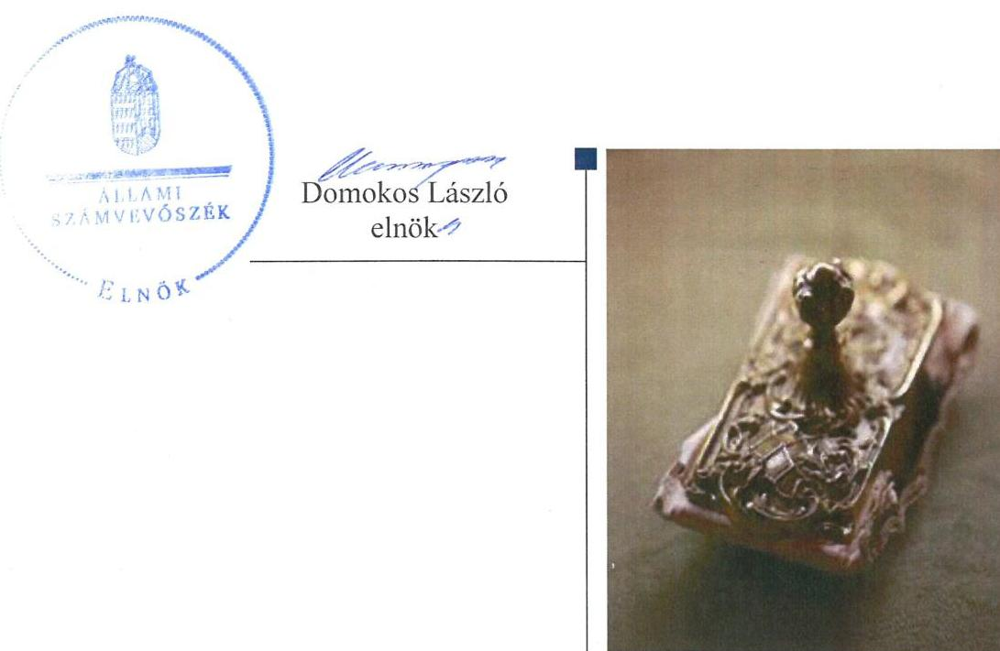
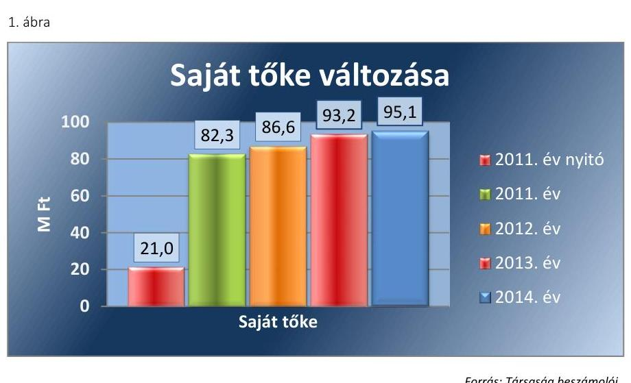
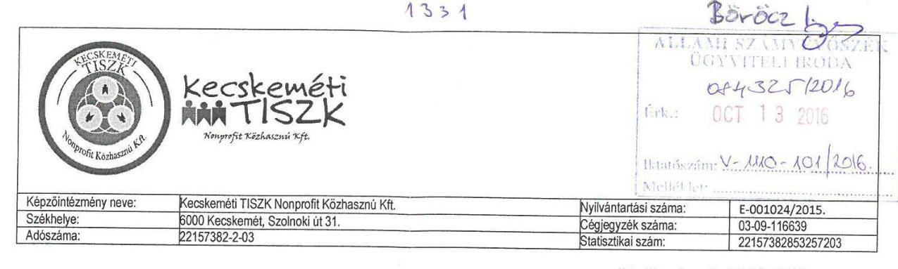
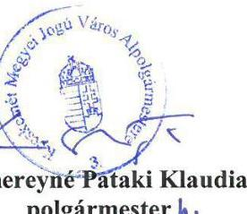

# Jelentés 

## Az önkormányzatok gazdasági társaságai

Az önkormányzatok többségi tulajdonában lévő gazdasági társaságok gazdálkodásának ellenőrzése - Kecskeméti TISZK Térségi Integrált Szakképző Központ Nonprofit Közhasznú Kft. 2016.

---

# Jelentés 

## Az önkormányzatok gazdasági társaságai

Az önkormányzatok többségi tulajdonában lévő gazdasági társaságok gazdálkodásának ellenőrzése - Kecskeméti TISZK Térségi Integrált Szakképző Központ Nonprofit Közhasznú Kft.
2016. mneml hó 17. nap

---

# AZ ELLENŐRZÉST FELÜGYELTE:

- BÖRÖCZ IMRE felügyeleti vezető

- AZ ELLENŐRZÉST VEZETTE ÉS A VÉGREHAJTÁSÁÉRT FELELŐS:
  - DR. NAGY IMRE ellenőrzésvezető
  - A PROGRAM ÖSSZEÁLLÍTÁSÁÉRT FELELŐS:
    - JANIK JÓZSEF LÁSZLÓ osztályvezető

- IKTATÓSZÁM: V-1110-103/2016
- TÉMASZÁM: 2144.
- ELLENŐRZÉS-AZONOSÍTÓ SZÁM: V070775

Jelentéseink az Országgyűlés számítógépes hálózatán és az Interneta a www.asz.hu címen is olvashatóak.

---

# TARTALOMJEGYZÉK 

■ ÖSSZEGZÉS ..... 5
■ AZ ELLENŐRZÉS CÉLJA ..... 6
■ AZ ELLENŐRZÉS TERÜLETE ..... 7
■ AZ ELLENŐRZÉS HÁTTERE, INDOKOLTSÁGA ..... 8
■ A JELENTÉS LÉNYEGES KÉRDÉSKÖREI ..... 9
■ ELLENŐRZÉS HATÓKÖRE ÉS MÓDSZEREI ..... 10
■ MEGÁLLAPÍTÁSOK ..... 12
■ JAVASLATOK ..... 22
■ MELLÉKLETEK ..... 23
I. Sz. melléklet: Értelmező szótár ..... 23
■ FÜGGELÉK: ÉSZREVÉTELEK ..... 27
■ RÖVIDÍTÉSEK JEGYZÉKE ..... 31

---

.

---

# ÖSSZEGZÉS 

Az Állami Számvevőszék 2011-2014. évekre kiterjedő ellenőrzése megállapította, hogy Kecskemét Megyei Jogú Város Önkormányzata a szakmai középfokú oktatáshoz kapcsolódó közfeladat ellátást szabályszerűen alakította ki, és tulajdonosi jogait a jogszabályoknak megfelelően gyakorolta. A Kecskeméti TISZK Nonprofit Kft. vagyongazdálkodása szabályszerű volt. A Társaságnál az ellátott közfeladattal összefüggő bevételek és ráfordítások elszámolása megfelelően történt.

## Az ellenőrzés társadalmi indokoltsága

Az Állami Számvevőszék kiemelt célja, hogy a helyi önkormányzatok gazdálkodásában rejlő pénzügyi kockázatok feltárásával, az államháztartáson kívülre nyújtott költségvetési támogatások és ingyenes vagyonjuttatások, valamint az államháztartáson kívül múködő feladat-ellátó rendszerek ellenőrzéseivel hozzájáruljon ahhoz, hogy a közpénzeket az államháztartáson kívül múködő szervezetek is átlátható, rendezett módon használják fel.

A Magyarországon az intézmény-centrikus közfeladat-ellátás jellemző, de egyre jelentősebb a költségvetésen kívüli feladatellátás térnyerése. Ennek legfontosabb szereplői - a nonprofit szervezetek mellett - az önkormányzati tulajdonú gazdasági társaságok. Az önkormányzatok szervezetalakítási szabadságának következménye, hogy a korábban is vállalati formában múködő közszolgáltatások mellett, mind a kötelező, mind az önként vállalt feladatok ellátásában a gazdasági társaságok kiemelt fontosságú szerephez jutottak.

## Főbb megállapítások, következtetések, javaslatok

Az Önkormányzat ${ }^{1}$ szakmai középfokú oktatási közfeladat-ellátásának megszervezése szabályszerű volt. A tulajdonosi joggyakorlás rendjének kialakítása és végrehajtása megfelelt a jogszabályi előírásoknak.

A Társaság² rendelkezett a múködéshez szükséges szabályzatokkal, amelyek a szabályozás hiányosságai mellett alapvetően megfeleltek a jogszabályi és belső előírásoknak. A Társaság vagyongazdálkodása, a vagyon nyilvántartása és hasznosítása a jogszabályi és belső előírásoknak megfelelt. A Társaság beszámolási kötelezettségét a jogszabályi és belső előírásoknak megfelelően teljesítette. A közzétételi kötelezettségeinek a jogszabályokkal és a társasági szerződéssel ellentétesen nem teljes körűen tett eleget, mivel a saját honlappal rendelkező Társaság nem gondoskodott az éves beszámolók, az SZMSZ, az adatvédelmi és adatbiztonsági szabályzat, az ellenőrzésekkel kapcsolatos, valamint a közérdekú adatok megismerésére és az adatszolgáltatásra vonatkozó adatok közzétételéről. A Társaság kötelezettségállománya, eladósodottságának mértéke és szerkezete nem jelentett kockázatot a közfeladat ellátására és a Társaság múködésére.

Az ellátott közfeladat bevételeinek, ráfordításainak, beruházásainak és értékcsökkenésének elszámolása szabályszerű volt. Az önköltségszámítás és az árképzés szabályozására a Társaságot sem jogszabály, sem az Önkormányzat nem kötelezte. A Társaságnál az önköltségszámítás és az árképzés szabályszerű volt.

Az ÁSZ a Társaság ügyvezetőjének fogalmazott meg javaslatokat, amelyek alapján köteles intézkedési tervet öszszeállítani és azt a jelentés kézhezvételétől számított 30 napon belül az ÁSZ részére megküldeni.

---

# AZ ELLENŐRZÉS CÉLJA 

Az ellenőrzés célja annak értékelése, hogy az önkormányzat vagyongazdálkodási tevékenysége során szabályszerűen gyakorolta-e tulajdonosi jogait; a gazdasági társaság szabályozottsága, gazdálkodása és vagyongazdálkodási tevékenysége, bevételeinek és ráfordításainak elszámolása megfelelt-e a jogszabályi és tulajdonosi előírásoknak; a gazdasági társaság kötelezettségállománya jelentett-e kockázatot a múködésre, valamint a gazdálkodás átláthatósága és elszámoltathatósága érdekében biztosítva volte a szolgáltatás dijának megalapozottsága szabályszerű önköltségszámítással.

---

# **AZ ELLENŐRZÉS TERÜLETE**

## **Kecskemét Megyei Jogú Város Önkormányzata és a többségi tulajdonában lévő Kecskeméti TISZK Integrált Szakképző Központ Nonprofit Közhasznú Kft.**

### **KECSKEMÉT MEGYEI JOGÚ VÁROS ÖNKORMÁNYZATA**

többségi tulajdonában lévő Társaságot 2005. március 9-én alapították, 2008. augusztus 22-én kiemelkedő közhasznú társasággá alakult. A Civil tv.3 alapján 2012. december 13-án a kiemelkedő státusza megszűnt. Az Önkormányzat tulajdoni részesedése 98,52%, a többi részesedés más önkormányzat, alapítvány, oktatási intézmény, illetve társulás tulajdonában van. A Társaság szakmai középfokú oktatás és szakmai középfokú oktatás ellátásához szükséges infrastruktúra biztosítása projekt megvalósítása és a projektfenntartási kötelezettség biztosítási közfeladatot lát el. A Társaság tevékenységének jellegét kötelezően határozzák meg a TIOP4 és a TÁMOP5 projektek fenntartási kötelezettség idejére vállalt feladatok, melyeknek célja Kecskemét és vonzáskörzetében a tudásalapú gazdaság elvárásaihoz alkalmazkodni tudó, a munkaerőpiaci kritériumoknak megfelelni képes, gyakorlattal rendelkező szakemberek képzésének biztosítása. A Társaságnak nem volt más gazdasági társaságban tulajdonosi részesedése. Az ellenőrzött időszakban a vezető személyében változás nem történt. A foglalkoztatottak száma 2011. évben 16 fő, 2012. évben 12 fő, 2013. és 2014. évben 14 fő volt.

1. táblázat

### **A TÁRSASÁG FŐBB GAZDÁLKODÁSI MUTATÓINAK ALAKULÁSA A 2011-2014. ÉVEK KÖZÖTT (M FT)**

|   | 2011. | 2012. | 2013. | 2014.  |
| --- | --- | --- | --- | --- |
|  Mérleg főösszege | 1443,6 | 1181,8 | 1015,2 | 854,7  |
|  Mérleg szerinti eredmény | 21,3 | 4,3 | 6,6 | 1,9  |

*Forrás: A Társaság 2011-2014. évi beszámolói / A Társaság adatszolgáltatása*

Az Önkormányzat tekintetében 2013. évben a jegyző, 2014. évben a polgármester személye változott.

---

# AZ ELLENŐRZÉS HÁTTERE, INDOKOLTSÁGA 

Objektív kép kialakítása Kecskemét Megyei Jogú Város Önkormányzata által a helyi közfeladatának megszervezéséről, tulajdonosi joggyakorlásáról, a többségi tulajdonában lévő Kecskeméti TISZK Integrált Szakképző Központ Nonprofit Közhasznú Kft. közfeladat ellátását érintő gazdálkodási tevékenységének szabályszerűségéről.

AZ ÖNKORMÁNYZATI TULAJDONÚ GAZDASÁGI TÁRSASÁGOK ellenőrzése kiemelten fontos a vagyon megőrzése, megóvása érdekében, valamint a kormányzati szektor elszámolásaiban megjelenő önkormányzati tulajdonú gazdálkodó szervezetek esetében, amelyekkel szemben alapvető követelmény, hogy gazdálkodásuk, működésük szabályszerű, az általuk szolgáltatott adatok minél megbízhatóbbak legyenek. A feladat/közfeladat-ellátás költségeinek, ráfordításainak alakulása, színvonala hatással van a lakosság elégedettségére.

A törvényalkotás számára - az észlelt problémák, szabálytalanságok, vagy egyéb nem kívánatos jelenségek felszínre kerülésével - az ellenőrzés megállapításai segítséget nyújthatnak az államháztartáson kívüli feladat/közfeladat-ellátás értékeléséhez, jogszabályi keretei pontosításához, átláthatóságot biztosító szabályozásához. Meghatározhatóvá válnak az önkormányzati feladatellátásban részt vevő államháztartáson kívüli szervezeteknek - az önkormányzat költségvetését, pénzügyi helyzetét is befolyásoló - kockázatai, lehetővé válik ezen kockázatok csökkentése. Ellenőrzéseink feltárhatják, hogy az önkormányzat feladat-ellátási kötelezettségének szabályszerűen tett-e eleget, a feladatellátáshoz rendelt vagyonkezelésbe vett és saját vagyon működtetését az elvárható gondossággal, szabályszerűen szervezte-e meg és a tulajdonosi felügyelete hozzájárult-e a feladatellátásához. Az ellenőrzés rávilágíthat arra, hogy a gazdasági társaság a feladat-ellátási, közszolgáltatási szerződésben foglaltak betartásával, a vagyon használatával biztosította-e a szolgáltatás folytatásának feltételeit, a feladat ellátását. Ezzel az ellenőrzöttek és a helyi döntéshozók számára visszajelzést ad feladatszervezési, feladat-ellátási kockázataikról, alapot ad a meglévő hibák megszüntetéséhez, a jobb feladatellátás biztosításához. Fokozza a fegyelmet, igazolja, hogy lejárt a következmények nélküli ellenőrzések időszaka.

---

# A JELENTÉS LÉNYEGES KÉRDÉSKÖREI 

1. Az önkormányzat közfeladat megszervezéséről szóló döntése, valamint tulajdonosi joggyakorlása szabályszerű volt-e?
2. A gazdasági társaság vagyongazdálkodása szabályszerű volt-e, kötelezettségállománya jelentett-e kockázatot a müködésre, illetve közfeladat ellátására?
3. A gazdasági társaságnál az ellátott közfeladat bevételei és ráfordításai elszámolása, valamint az önköltségszámítás és árképzés szabályszerű volt-e?

---

# ELLENŐRZÉS HATÓKÖRE ÉS MÓDSZEREI 

## Az ellenőrzés típusa

Megfelelőségi ellenőrzés.

## Az ellenőrzött időszak

2011. január 1-jétől 2014. december 31-ig tart.

## Az ellenőrzés tárgya

A gazdasági társaság feletti tulajdonosi joggyakorlás, valamint a gazdasági társaság gazdálkodásának szabályozottsága és szabályszerűsége.

Az ellenőrzés kiterjed minden olyan körülményre és adatra, amely az ÁSZ jogszabályban meghatározott feladatainak teljesítéséhez, valamint a program végrehajtása folyamán felmerült újabb összefüggések feltárásához szükséges.

## Az ellenőrzött szervezet

Az ellenőrzött szervezetek:
$\longrightarrow$ Kecskemét Megyei Jogú Város Önkormányzata,
$\longrightarrow$ Kecskeméti TISZK Integrált Szakképző Központ Nonprofit Közhasznú Kft.

## Az ellenőrzés jogalapja

Az ellenőrzés jogszabályi alapját az ÁSZ tv. ${ }^{6}$ 1. § (3) bekezdése és 5. § (3)(4)-(5) bekezdései képezik.

## Az ellenőrzés módszerei

Az ellenőrzést a nemzetközi standardokat irányadónak tekintve az ellenőrzési program ellenőrzési kérdései, az ellenőrzött időszakban hatályos jogszabályok, az ellenőrzés szakmai szabályok és módszertanok figyelembevételével végeztük.

Az ellenőrzés ideje alatt az ellenőrzött szervezettel történő kapcsolattartást az ÁSZ Szervezeti és Müködési Szabályzatának vonatkozó előírásai alapján biztosítottuk.

---

Az ellenőrzés a kiválasztott, tulajdonosi jogokat gyakorló önkormányzatra, illetve az ellenőrzésre kijelölt gazdasági társaság felett tulajdonosi jogokat gyakorló szervezetre és az ellenőrzött gazdasági társaságra terjedt ki.

Az ellenőrzési kérdések megválaszolásához szükséges bizonyítékok megszerzése a következő ellenőrzési eljárások alkalmazásával történt: megfigyelés, kérdésfeltevés (információkérés), összehasonlítás, valamint elemző eljárás. Az ellenőrzési bizonyítékként felhasználható adatforrások közé tartoznak egyrészt a szakmai programban felsorolt adatforrások, másrészt adatforrás lehet még minden - az ellenőrzés folyamán - feltárt, az ellenőrzés szempontjából információkat tartalmazó dokumentum.

Az ellenőrzést a kérdésekre adott válaszok kiértékelésével, valamint a megjelölt adatforrások, a csatolt tanúsítványok felhasználásával, továbbá az adott időszakban hatályos jogszabályok figyelembevételével folytattuk le.

A bevételek és ráfordítások elszámolása, valamint a vagyonnyilvántartás terén a szabályszerű működést véletlen mintavétellel ellenőriztük. A mintavétellel ellenőrzött területek esetében minden egyes tétel vonatkozásában a szabályszerűségre vonatkozó kérdéseket tettünk fel, amelyek eredménye összesítésre került. A jogszabályoknak és a belső előírásoknak megfelelőnek tekintettük az adott területet, amennyiben a minta ellenőrzésének eredménye alapján 95\%-os bizonyossággal a teljes sokaságban a hibaarány kisebb volt, mint 10\%, nem megfelelőnek, ha a hibaarány a 10\%ot meghaladta. Részben megfelelő minősítést adtunk, amennyiben egy adott terület vonatkozásában a minta alapján a teljes sokaságban nem volt egyértelműen biztosított a jogszabályoknak és a belső szabályzatoknak megfelelő működés.

---

# 1. Az önkormányzat közfeladat megszervezéséről szóló döntése, valamint tulajdonosi joggyakorlása szabályszerű volt-e? 

Összegző megállapítás

Az Önkormányzat a szakmai középfokú oktatási közfeladat-ellátást és a tulajdonosi jogok gyakorlásának rendjét szabályszerűen szervezte meg, a tulajdonosi jogok gyakorlása megfelelt a jogszabályi előírásoknak.
1.1. számú megállapítás

Az Önkormányzat szakmai középfokú oktatási közfeladat-ellátásának megszervezése szabályszerű volt.

GAZDASÁGI PROGRAMMAL az Önkormányzat az Ötv. ${ }^{7}$ 91. § (1) bekezdése, 2013. január 1-jétől az Mötv. ${ }^{8}$ 116. § (1) bekezdése rendelkezéseinek megfelelően rendelkezett. A Gazdasági program ${ }^{9}$ szerint az oktatás és képzés területén az Önkormányzat feladata a szakképzésben érintett társadalmi, szakmai és gazdasági szervezetek fejlesztési terveinek elemzése, összehangolása, valamint a szakképzésben érintett szervezetek hatékony együttműködésének megszervezése.

Az Nvtv. ${ }^{10}$ 9. § (1) bekezdése 2012. január 1-jétől előírta közép- és hoszszú távú vagyongazdálkodási terv készítését, az Önkormányzat a kötelezettségének azonban csak 2013. évtől tett eleget. A Vagyongazdálkodási terv ${ }^{11}$ szerint a kizárólagos és többségi önkormányzati tulajdonban álló gazdasági társaságok müködését és vagyongazdálkodását kiemelt figyelemmel kell kísérni a társaságok rendelkezésére bocsátott önkormányzati vagyon értékének megőrzése, növelése, eredményesebb működtetése érdekében.

A Társaságnak nyújtott müködési célú támogatást az Önkormányzat évente támogatási szerződés keretében, elszámolási kötelezettség meghatározásával adta át.

Az Önkormányzat évente előírta üzleti terv készítését. A Társaság az Önkormányzat által meghatározott tartalmi és formai követelményeknek megfelelően elkészítette az üzleti terveket.
1.2. számú megállapítás

A tulajdonosi joggyakorlás rendjének kialakítása és végrehajtása megfelelt a jogszabályi előírásoknak.

A TULAJ DONOSI JOGGYAKORLÁS RENDJÉT az Önkormányzat Közgyűlése az Önkormányzat SZMSZ-ében, valamint a Vagyonrendeletben ${ }_{1,2}{ }^{12}$ szabályozta. A Vagyonrendelet ${ }_{1,2}$ - a jogszabályban meghatározottakon túl - előírta a nonprofit gazdasági társaságok részére, hogy az éves beszámoló mellett félévenkénti beszámolót is készítsenek. A Vagyonrendelet ${ }_{1,2}$ szerint a nem kizárólag az Önkormányzat tulajdonában lévő gazdasági társaságok legfőbb szervének ülésén az Önkormányzatot a polgármester képviseli.

---

A TÁRSASÁGI SZERZŐDÉS ${ }^{13}$ szabályozta a Taggyűlésben, és Felügyelő bizottságban való képviseletre kijelölt személyek képviselettel összefüggő feladatait, beszámolási kötelezettségét.

A FELÜGYELŐ BIZOTTSÁG a Gt. ${ }^{14}$ 34. § (1) bekezdésében, valamint a Ptk. ${ }^{15}$ 3:121. § (1) bekezdésében előírtakat figyelembe véve három tagból állt. A Felügyelő bizottság a 416/2011. (XII. 15.) KH ${ }^{16}$ határozat ellenére nem számolt be a 2011. és 2014. évben lefolytatott ellenőrzéseiről a KVB ${ }^{17}$ részére.

A FÜGGETLEN KÖNYVVIZSGÁLÓI JELENTÉSEK a féléves és az éves beszámolókról elkészültek. A Taggyűlés megismerte a könyvvizsgálói jelentésben foglaltakat.

Az Önkormányzat KVB.-a és VPB.-a ${ }^{18}$ megtárgyalta a Társaság éves beszámolóját és javasolta a Társaság Taggyűlésének elfogadásra. A Taggyűlés a beszámolókat elfogadta.

AZ ÖNKORMÁNYZAT BELSŐ ELLENŐRZÉSE a Társasággal kapcsolatban 2013. évben vizsgálta a támogatási szerződés teljesítését. Az ellenőrzés hiányosságot nem állapított meg.

# 2. A gazdasági társaság vagyongazdálkodása szabályszerű volt-e, kötelezettségállománya jelentett-e kockázatot a múködésre, illetve közfeladat ellátására? 

Összegző megállapítás

A Társaság vagyongazdálkodása megfelelt a jogszabályi és belső előírásoknak, kötelezettségállománya és eladósodottsága nem jelentett kockázatot a Társaság múködésére és a közfeladat ellátásra.
2.1. számú megállapítás

A Társaság rendelkezett a múködéshez szükséges szabályzatokkal, amelyek alapvetően megfeleltek a jogszabályi és belső előírásoknak.

A Társaság az ellenőrzött időszakban rendelkezett a Számv. tv. ${ }^{19}$ 14. § (3) bekezdésben előírtaknak megfelelően Számviteli politikával ${ }^{20}$. Elkészítették a Számv. tv. 14. § (5) bekezdése előírásának megfelelően a Leltározási szabályzatot ${ }^{21}$, az Értékelési szabályzatot ${ }^{22}$, és a Pénzkezelési szabályzatot ${ }^{23}$. A Számv. tv. 14. § (6)-(7) bekezdései alapján a Társaság a 2011-2014. években mentesült az önköltségszámítási szabályzat készítésének kötelezettsége alól.

A SZÁMVITELI POLITIKA a Számv. tv-ben foglaltak szerint került kialakításra, aktualizálására a Számv. tv. 14. § (11) bekezdésének megfelelően többször sor került.

A LELTÁROZÁSI SZABÁLYZAT a Számv. tv. 69. § (3) bekezdésében előírtaknak megfelelően tartalmazta a leltározás gyakoriságára vonatkozó előírást, mely szerint a Társaság a mennyiségi nyilvántartásban

---

szereplő eszközeiről legalább háromévente mennyiségi felvétellel történő leltározással köteles meggyőződni.

AZ ÉRTÉKELÉSI SZABÁLYZAT a Számv. tv.-ben foglaltakkal összhangban biztosította a vagyon értékének meghatározását, a Számv. tv. 55. § (1)-(2) bekezdéseinek előírásaival összhangban meghatározta a követelések minősítésére, a mérlegtételek értékelésére, a bekerülési érték meghatározására vonatkozó szabályokat.

A PÉNZKEZELÉSI SZABÁLYZAT a Számv. tv. 14. § (8) bekezdésének előírásaival összhangban tartalmazta a pénzforgalom lebonyolításának rendjét, a pénzkezelési felelősség szabályait, a pénzkezelés személyi és tárgyi feltételeit, a készpénzben és a bankszámlán tartott pénzeszközök közötti forgalmat, a készpénzállományt érintő pénzmozgások jogcímeit, a készpénzállományt érintő pénzmozgások eljárási rendjét, a napi készpénz záró állomány maximális mértékét, a készpénzállomány ellenőrzésekor követendő eljárást, az ellenőrzés gyakoriságát, a pénzszállítás feltételeit, a pénzkezeléssel kapcsolatos bizonylatok rendjét és a pénzforgalommal kapcsolatos nyilvántartási szabályokat.

A SZÁMLARENDET ${ }^{24}$ a Társaság a Számv. tv. 161. § (1) bekezdésében előírtaknak megfelelően elkészítette, továbbá külön szabályzatban állapította meg a Bizonylati rendet ${ }^{25}$. A Számlarend a Számv. tv. 161. § (2) bekezdés b) és c) pontjaiban foglaltakkal ellentétben a számla értéke növekedésének, csökkenésének jogcímeit, a főkönyvi számla és az analitikus nyilvántartás kapcsolatát nem tartalmazta. A Társaság a tevékenységek bevételeinek, valamint költségeinek, ráfordításainak jogszabályban előírt elkülönített nyilvántartását a Számlarendben meghatározott munkaszámok bevezetésével biztosította. A Számv. tv. 160. §-ában meghatározott tartalmú számlatükröt a Társaság az ellenőrzött időszakban évente módosította.

A JAVADALMAZÁSI SZABÁLYZATOT a Taktv. ${ }^{26}$ 5. § (3) bekezdésében előírtaknak eleget téve a Taggyűlés megalkotta. A Javadalmazási szabályzat a Taktv.-ben foglaltak szerint tartalmazta az Ügyvezető ${ }^{27}$, a vezető állású munkavállalók, valamint a Felügyelő bizottsági tagok javadalmazására vonatkozó szabályokat és a jogviszony megszűnésére vonatkozó szabályokat.

# 2.2. számú megállapítás 

A Társaság vagyongazdálkodása, a vagyon nyilvántartása és hasznosítása a jogszabályi és belső előírásoknak megfelelt.

A Társaság tevékenységét saját eszközeivel látta el, üzemeltetésre, illetve vagyonkezelésbe átvett eszköze az ellenőrzött időszakban nem volt.

A leltározást a Számv. tv. 69. § (3) bekezdésében foglaltaknak és a Leltározási szabályzat előírásainak megfelelően végezte. A beszámolóban és a számviteli nyilvántartásokban lévő vagyontárgyak állományát szabályszerűen elkészített leltárral alátámasztották. A Társaság saját vagyonának nyilvántartását az előírásoknak megfelelően vezette.

A Társaság főbb mérlegadatait az 2. táblázat tartalmazza.

---

| A TÁRSASÁG FŐBB MÉRLEGADATAI (M FT) |  |  |  |  |  |
| :--: | :--: | :--: | :--: | :--: | :--: |
|  | 2011.01.01. | 2011.12.31. | 2012.12.31. | 2013.12.31. | 2014.12.31. |
| I. Befektetett eszközök | 680,4 | 963,9 | 1101,3 | 919,3 | 755,7 |
| - ebből: Tárgyi eszközök | 664,6 | 963,0 | 1101,1 | 919,3 | 755,7 |
| II. Forgó eszközök | 472,7 | 425,0 | 80,5 | 95,2 | 98,7 |
| - ebből: Követelések | 0,1 | 0 | 0,2 | 1,5 | 19,5 |
| - ebből: Pénzeszközök | 472,6 | 425,0 | 80,3 | 80,3 | 73,2 |
| III. Aktív időbeli elhatárolások | 40,0 | 54,7 | 0 | 0,7 | 0,3 |
| Eszközök összesen | 1193,1 | 1443,6 | 1181,8 | 1015,2 | 854,7 |
| IV. Saját tőke | 21,0 | 82,3 | 86,6 | 93,2 | 95,1 |
| - ebből: Jegyzett tőke | 3,8 | 43,8 | 43,8 | 43,8 | 43,8 |
| - ebből Eredménytartalék | 7,7 | 17,2 | 38,5 | 42,8 | 49,2 |
| - ebből Mérleg szerinti eredmény | 9,5 | 21,3 | 4,3 | 6,6 | 1,9 |
| V. Céltartalékok | 0 | 0 | 0 | 0 | 0 |
| VI. Kötelezettségek | 565,6 | 570,2 | 43,6 | 44,9 | 40,6 |
| VII. Passzív időbeli elhatárolások | 606,5 | 791,1 | 1051,6 | 877,1 | 719,0 |
| Források összesen | 1193,1 | 1443,6 | 1181,8 | 1015,2 | 854,7 |

A TÁRSASÁG VAGYONA az ellenőrzött időszakban csökkent, a 2014. év végére 28,4\%-kal, 338,4 M Ft-tal volt alacsonyabb a 2011. évi nyitó értéknél. A befektetett eszközöket döntően kitevő tárgyi eszköz állománya a még folyamatban lévő projekteknek köszönhetően a 2011-2012. években növekedett, azonban a 2013-2014. években pályázati források hiányában nem került sor új eszköz beszerzésére. A pénzeszközök állományának 2011. évi magas értéke az előfinanszírozásként kapott, projektekhez kapcsolódó előlegek miatt keletkezett. A követelések állománya a 2011. évi nyitó 0,1 M Ft-ról a számlavezető pénzintézet felszámolási eljárása következtében a 2014. évben 19,5 M Ft-ra nőtt.

A saját tőke állománya a 2011. évi nyitó összeghez képest a 2014. év végére 74,1 M Ft-tal volt magasabb az Önkormányzat 2011. évi törzstőke emelésének és a 2011-2014. évek nyereséges gazdálkodásának eredményeként. Az ellenőrzött időszak minden éve nyereséges volt, az 1997. évi CLVI. tv. ${ }^{28} 4 . \S$ (1) bekezdés c) pontjának és a Civil tv. 34. § (1) bekezdés c) pontjában foglaltaknak megfelelően osztalék fizetésére egyik évben sem került sor. A Társaság eszközeinek bérbeadására, illetve térítés nélküli eszközátadásra az ellenőrzött időszak alatt nem került sor. A Társaság a tulajdonában lévő eszközöket nem idegenítette el, azokat nem terhelte meg. Az ellenőrzött időszakban kizárólag a projektekhez kapcsolódó fejlesztések valósultak meg, melyhez nem volt tulajdonosi hozzájárulás előírva.

A saját tőke összege a 2011-2014. években lényegesen meghaladta a jegyzett tőke összegét. A Taggyűlés az ellenőrzött időszakban vizsgálta, hogy két egymást követő, lezárt évben a Társaság saját tőkéje összege a jegyzett tőkének törvényben meghatározott szintje alá csökkent-e. Ehhez kapcsolódóan intézkedésre nem volt szükség, mert az éves beszámolók alapján a saját tőke a jegyzett tőke felett volt minden évben.

A saját tőke változását a 1. ábra szemlélteti.

---

Fornás: Társaság beszámolói
2.3. számú megállapítás

A Társaság kötelezettségállománya, eladósodottságának mértéke és szerkezete nem jelentett kockázatot a közfeladat ellátására és a Társaság múködésére.

A KÖTELEZETTSÉGEK állománya a 2011. évi 570,2 M Ft öszszegről a 2014. év végére 40,6 M Ft-ra csökkent. A 2011. évi kötelezettségei 93,3 \%-ban rövid lejáratú kötelezettségek voltak, melyek elsősorban a projektek előfinanszírozására kapott előlegek ( $356,4 \mathrm{M} F \mathrm{Ft}$ ), fel nem használt szakképzési támogatásként kapott összeg ( $109,0 \mathrm{M} F \mathrm{Ft}$ ), valamint a pályázatokhoz kapcsolódó szállítói kötelezettségek ( $54,7 \mathrm{M} F \mathrm{Ft}$ ) miatt keletkeztek. Az ellenőrzési időszakot megelőzően az Önkormányzattól kapott tagi kölcsön fennmaradó összegét a 2011-2014. években a Számv. tv. 42. § (2) bekezdésében előírtaknak megfelelően a hosszú lejáratú kötelezettségek között tartotta nyilván. Az Önkormányzat Közgyűlése a 4/2011. (II.4) KH. sz. határozatával döntött a 2011. február 1-én fennálló 44,4 M Ft öszszegű tagi kölcsön tartozás és kamatai 15 évre szóló részletfizetéssel történő törlesztéséről. A Társaság a tartozás évi 3,0 M Ft összegű teljesítését a Számv. tv. 42. § (3) bekezdésének megfelelően rövid lejáratú kötelezettségként tartotta nyilván. A kötelezettségek alakulását a 2011-2014. években a 3. táblázat mutatja.
3. táblázat

| KÖTELEZETTSÉGEK ALAKULÁSA (M FT) |  |  |  |  |
| :--: | :--: | :--: | :--: | :--: |
|  | 2011. | 2012. | 2013. | 2014. |
| Hosszú lejáratú kötelezettségek összesen | 38,4 | 40,4 | 39,3 | 37,2 |
| Rövid lejáratú kötelezettségek összesen | 531,8 | 3,2 | 5,6 | 3,4 |
| Ebből rövid lejáratú hitel | 3,0 | 3,0 | 3,0 | 3,0 |
| szállítói kötelezettség | 54,7 | 0,2 | 0,4 | 0,2 |
| egyéb rövid lejáratú kötelezettség | 474,1 | 0 | 2,2 | 0,2 |

A Társaság a rövid és a hosszú lejáratú kötelezettségeit alapvetően határidőben teljesítette, a 2011. évben kimutatott pályázatokhoz kapcsolódó összegek és a szakképzési hozzájárulás a 2012. évben felhasználásra kerültek.

---

AZ ELADÓSODOTTSÁG mértéke és szerkezete nem jelentett kockázatot a közfeladat ellátására. A Társaság eladósodottságát jellemző mutatók alakulását a 4. táblázat szemlélteti.
4. táblázat

ELADÓSODOTTSÁGI MUTATÓK ALAKULÁSA (ARÁNY)

| Mutató megnevezése | 2011. | 2012. | 2013. | 2014. |
| :-- | :--: | :--: | :--: | :--: |
| Eladósodottsági mutató (idegen tőke/összes for-   rás) | 0,40 | 0,04 | 0,04 | 0,05 |
| Eladósodottság mértéke (kötelezettségek/saját   tőke) | 6,93 | 0,50 | 0,48 | 0,43 |
| Nettó eladósodottság (kötelezettségek-követel-   lések/saját tőke) | 6,93 | 0,50 | 0,47 | 0,22 |
| Adósságfedezeti mutató I. (befektetett eszkö-   zök+forgóeszközök/idegen forrás) | 2,44 | 27,10 | 22,59 | 21,07 |
| Adósságfedezeti mutató II. (működési cash   flow/hosszú lejáratú kötelezettségek) | 13,38 | $-5,02$ | 0,09 | $-0,13$ |
| Árbevételre vetített eladósodottság (kötelezett-   ségek-forgóeszközök/ért. nettó árbevétele) | 7,85 | n.é. | $-15,35$ | $-1,15$ |

Forrás: A Társaság 2011-2014. évi beszámolói, Társaság adatszolgáltatása
Az eladósodottsági mutató értéke az ellenőrzött időszak egészében kedvezően alakult, azt mutatta, hogy az idegen tőke (kötelezettségek) az összes forráshoz képest alacsony volt.

Az eladósodottság mértékének csökkenése a 2012-2014. években azt jelentette, hogy a kötelezettségek a saját tőke egyre kisebb hányadát kötötték le, amit az idegen tőke csökkenése és a folyamatosan növekvő saját tőke eredményezett. A mutató 2011. évi magas értéke nem vetített előre problémákat, mivel a pályázatok odaítélését követően a 2012. évi felhasználásig kötelezettségként nyilvántartott előlegek vissza nem térítendő öszszeget jelentettek.

A nettó eladósodottság mutató értéke alapján az alacsony összegű kintlévőségek a 2011-2014. években nem fedezték a kötelezettségek összegét, azonban a saját tőke növekedése egyre nagyobb mértékben nyújtott fedezetet a saját forrás $5 \%$-a alatt maradó kötelezettségekre.

Az adósságfedezeti mutató I. változása összességében kedvezően alakult az ellenőrzött években, míg a 2011. évben 1 Ft adósságra 2,4 Ft, a 2012-2014. években több mint 20 Ft vagyon jutott.

Az adósságfedezeti mutató II. értéke azt mutatja, hogy a működési cash flow révén a Társaság a 2011. év és a 2013. év kivételével nem volt képes valamennyi hosszú lejáratú kötelezettségének eleget tenni.

Az árbevételre vetített eladósodottság értéke kedvezően alakult a 2013-2014. években, mivel a forgóeszközök állománya fedezetet nyújtott a kötelezettségekre.

---

# 2.4. számú megállapítás 

A Társaság beszámolási kötelezettségét a jogszabályi és belső előírásoknak megfelelően teljesítette. A közzétételi kötelezettségeinek a jogszabályokkal és a társasági szerződéssel ellentétesen nem teljes körűen tett eleget.

A Társaság beszámolási, adatszolgáltatási kötelezettségét a Társasági szerződés, a Számviteli politika, az SZMSZ, valamint a Vagyonrendelet ${ }_{1,2}$ szabályozta. Az éves üzleti terveket és a pénzügyi múködésről szóló, az Önkormányzat által előírt féléves beszámolókat a Társaság határidőben elkészítette. Az Önkormányzat a beszámolással, az adatszolgáltatással kapcsolatos szabályozási kötelezettséget a Társaságnak nem írt elő.

AZ ÉVES BESZÁMOLÓKAT ${ }^{29}$ a Társaság a 2011-2014. évekre vonatkozóan a Számv. tv. 19. § (1) bekezdésében és a Vagyonrendeletben $t_{1,2}$ meghatározottak szerint elkészítette. A Gt. 141. § (2) bekezdés a) pontjában, a Ptk. 3:109. § (2) bekezdésében, a 1997. évi CLVI. tv. 19. § (2) bekezdésében, a Civil tv. 46. § (1) bekezdésében, valamint a Társasági szerződésben, a Számviteli politikában és az SZMSZ-ben előírtaknak megfelelően a Számv. tv. szerinti beszámolókat és 2011-ben a közhasznúsági jelentést, 2012-2014. években a közhasznúsági mellékleteket a Taggyűlés az előírt határidőben jóváhagyta.

A Taggyűlés a 2011-2014. években az éves beszámolókról a Gt. 35. § (3) bekezdés, 40. § (1) bekezdés, és a Ptk. 3:120. § (2) bekezdés, 3:129. § (1) bekezdés előírásainak megfelelően a Felügyelő bizottság írásos véleményének és a könyvvizsgáló hitelesítő záradékkal ellátott jelentésének birtokában határozott. A könyvvizsgáló a Gt. 44. § (1) bekezdésében, illetve a Ptk. 3:131. § (2) bekezdésében foglaltaknak megfelelően az éves beszámolót tárgyaló Taggyűlésen részt vett. A Felügyelő bizottság és a könyvvizsgáló a Taggyűlés összehívását az ellenőrzött időszakban nem kezdeményezte, mivel a Gt. 35. § (4) bekezdésében, 44. § (2) bekezdésében, a Ptk. 3:120. § (3) bekezdésében, és a Számv. tv. 157. § (2) bekezdésében előírt esetek nem álltak fenn.

Az éves beszámolókat a Számv. tv. 153. § (1) bekezdése és 154. § (1) bekezdése előírásainak megfelelően letétbe helyezték és közzétették.

AZ ADATOK NYILVÁNOSSÁGÁNAK biztosítása érdekében a Társaság az Avtv. ${ }^{30}$ 20. § (8) bekezdésében, valamint az Info tv. ${ }^{31} 30 . \S$ (6) bekezdésében előírtak szerint a közérdekú adatok megismerésére irányuló igények teljesítésének rendjére vonatkozó szabályzatot elkészítette. A 2011-2014. években az Eisztv. ${ }^{32}$ 6. § (1) bekezdésében, az Info tv. 33. § (3) bekezdésében előírt módon az Info tv. 37. § (1) bekezdésében, valamint a Társasági szerződésben meghatározott közzétételi kötelezettségének azonban maradéktalanul nem tett eleget, mivel a közzétételre a saját honlapját választó Társaság nem gondoskodott az éves beszámolók, az SZMSZ, az adatvédelmi és adatbiztonsági szabályzat, az ellenőrzésekkel kapcsolatos, valamint a közérdekú adatok megismerésére és az adatszolgáltatásra vonatkozó adatok közzétételéről. A Társaság nem tartozott az Avtv. 31/A. § (1) bekezdésében, illetve az Info tv. 24. § (1) bekezdés a)-c) pontjaiban meghatározott szervezetek közé, azonban az ellenőrzött években rendelkezett adatvédelmi és adatbiztonsági szabályzattal ${ }^{33}$.

---

# 3. A gazdasági társaságnál az ellátott közfeladat bevételei és ráfordításai elszámolása, valamint az önköltségszámítás és árképzés szabályszerű volt-e? 

Összegző megállapítás

A Társaságnál az ellátott közfeladat bevételeinek és ráfordításainak elszámolása, valamint az önköltségszámítás és árképzés szabályszerű volt.
3.1. számú megállapítás

Az ellátott közfeladat bevételeinek, ráfordításainak, beruházásainak és értékcsökkenésének elszámolása megfelelően történt.

A közfeladatok ráfordításainak és bevételeinek egyértelmű elhatárolásához szükséges előírások a Számlarendben és az évente frissített Számlatükör ${ }^{34}$ megfelelő kialakításával meghatározásra kerültek. A Társaság ennek megfelelően tevékenységenként a bevételek és kiadások elkülönítését munkaszámok főkönyvi számhoz való csatolásával, illetve külön főkönyvi számok alkalmazásával biztosította a gyakorlatban.

AZ ANYAGJELLEGŰ RÁFORDÍTÁSOK ELSZÁMOLÁSA megfelelő volt. A ráfordításokat elkülönítetten számolták el, a költségelszámolást megalapozó dokumentumok rendelkezésre álltak, a költségeket a Számlatükörben megjelölt költségszámlákra könyvelték.

AZ ÉRTÉKESÍTÉS NETTÓ ÁRBEVÉTELÉNEK ELSZÁMOLÁSA megfelelő volt. A bevételek kiszámlázása a belső szabályozásnak megfelelően történt, a bevételeket elkülönítetten számolták el a megfelelő főkönyvi számlákra és a megfelelő árat alkalmazták.

A BERUHÁZÁSOK, FELÚJÍTÁSOK ELSZÁMOLÁSA megfelelő volt. A bekerülési érték meghatározása megfelelt a Számv. tv. 47. §-ában, valamint az Értékelési szabályzatában előírtaknak. Az eszközök besorolása és aktiválása szabályos volt, a tárgyévi leltárban megtalálhatóak voltak.

AZ ÉRTÉKCSÖKKENÉSI LEÍRÁS ELSZÁMOLÁSA megfelelő volt. Az eszközök értékcsökkenése a Tao. tv. ${ }^{35}$ 2. sz. mellékletében meghatározott értékcsökkenési kulcsokkal egyezett meg, a leírás módszere nem változott a vizsgált időszakban.

A társaság az elszámolt amortizációnak megfelelő mértékben a 20112012. években - az elnyert támogatásokból megvalósított projekteknek köszönhetően - biztosította az eszközök pótlását, de 2013-2014-ben az eszközpótlás kisebb volt, mint az elszámolt értékcsökkenés összege. Az 5. táblázat az értékcsökkenés és eszközpótlás alakulását mutatja be.
5. táblázat

ÉRTÉKCSÖKKENÉS ÉS ESZKÖZPÓTLÁS (M Ft)

| Tárgyi eszközök | 2011 | 2012 | 2013 | 2014 |
| :-- | --: | --: | --: | --: |
| elszámolt értékcsökkenése | 97,7 | 175,1 | 183,7 | 163,7 |
| eszközök pótlására fordított összeg | 381,2 | 312,6 | 2,3 | 0,1 |

---

Az eszközpótlás a Társaság múködésére legjellemzőbb három eszközcsoportban a használhatósági fok és az átlagos életkor mutatókkal került minősítésre, melyet a 6. táblázat mutat be.
6. táblázat

TÁRGYI ESZKÖZÖK HASZNÁLHATÓSÁGI FOKA (\%) ÉS ÁTLAGOS ÉLETKORA (ÉV)

| Tárgyi eszköz | Mutató | 2011. | 2012. | 2013. | 2014. |
| :--: | :--: | :--: | :--: | :--: | :--: |
| 1. Ingatlanok és a kapcsolódó vagyoni értékú jogok | használhatósági fok (\%) | 92,3 | 92,0 | 89,9 | 87,8 |
|  | átlagos életkor (év) | 3,9 | 4,0 | 5,1 | 6,1 |
| 2. Múszaki berendezések, gépek, jármúvek | használhatósági fok (\%) | 38,1 | 34,8 | 23,7 | 13,7 |
|  | átlagos életkor (év) | 4,3 | 4,5 | 5,3 | 5,9 |
| 3. Egyéb berendezések, felszerelések, jármúvek | használhatósági fok (\%) | 74,6 | 66,6 | 46,9 | 28,6 |
|  | átlagos életkor (év) | 1,7 | 2,3 | 3,7 | 4,9 |

Forrás: a Társaság 2011-2014. beszámolói
Az ellenőrzött időszakban valamennyi eszköz használhatósági foka romlott, ezzel párhuzamosan az átlagos életkoruk nőtt, mivel a pótlások nem a vagyon elhasználódásának megfelelő mértékben történtek. Ennek következtében a közfeladat ellátását biztosító eszközvagyon értéke csökkent, a 2011. évi 963,0 M Ft-ról 2014. évre 755,7 M Ft-ra.

A tulajdonosi joggyakorló nem hozott döntést az éves eredmény eszközpótlásra, felújításra történő felhasználásáról, így azt a Társaság az ellenőrzött időszakban nem használta fel, az eredménytartalékba vezette át, növelve ezzel saját tőkéjét.

A KÖVETELÉSÁLLOMÁNY, ezen belül a vevőkövetelések 2011-2014. évek közötti alakulását a 7. táblázat mutatja.
7. táblázat

A TÁRSASÁG KÖVETELÉSEI (EZER FT)

|  | 2011. | 2012. | 2013. | 2014. |
| :--: | :--: | :--: | :--: | :--: |
| Követelések áruszállításból és szolgáltatásból (vevők) | 0 | 0 | 1342 | 18 |
| Egyéb követelések | 0 | 206 | 206 | 19442 |
| Követelések összesen | 0 | 206 | 1548 | 19460 |

Az egyéb követelések 2012-2013. években a helyi adóhatósággal szembeni túlfizetést, míg 2014-ben a Társaság számlavezető pénzintézetének felszámolási eljárása miatt keletkezett, értékvesztéssel csökkentett hitelezői követelését is tartalmazták.

A Társaságnak 2011. és 2012. években nem volt vevői követelésállománya. 2013-ban nőtt a vevőkövetelése, de az a mérlegkészítés időpontjáig pénzügyileg rendezésre került. 2014. év végére a vevőkövetelése jelentősen csökkent. A követelésállomány rendezése a mérlegkészítésig megtörtént, így hátralékos állománnyal nem rendelkezett, az ellenőrzött időszak alatt nem történtek hátralékos állomány csökkentésére irányuló intézkedések.

---

### 3.2. számú megállapítás

Az önköltségszámítás és az árképzés szabályozására a Társaságot sem jogszabály, sem az Önkormányzat nem kötelezte. A Társaságnál az önköltségszámítás és az árképzés szabályszerű volt.

ÖNKÖLTSÉGSZÁMÍTÁSI SZABÁLYZAT készítése alól a Társaság az ellenőrzött időszakban a Számv. tv. 14. § (6) és (7) bekezdései alapján mentesült és nem is rendelkezett ilyen szabályzattal. Tulajdonosi elvárás sem volt ezzel kapcsolatban.

AZ ÁRKÉPZÉS SZABÁLYOZÁSÁRA jogszabályi előírás nem kötelezte a Társaságot, a tulajdonos részéről sem volt ez követelmény. Az ellenőrzött időszakban nem rendelkezett árképzésre vonatkozó szabályzattal.

AZ ÁRMEGHATÁROZÁSOK során a kiszámlázott díjakat a pályázati dokumentációkban, illetve egyedi megállapodásokban határozta meg a Társaság. Saját hatáskörben lebonyolított képzés esetén a 6/1996. (VII. 16.) MüM rendelet ${ }^{36}$ alapján alkalmazható költségelemeket vette figyelembe, míg a Klebelsberg Intézményfenntartó Központ számára kiszámlázott tételek esetében a múködési költségek $\mathrm{m}^{2}$-re történő felosztása szerint számított óradíjak alapján történt a számlázás. Az alkalmazott önköltség- és díjkalkulációk megfeleltek az előírásoknak, biztosították a megfelelő díjmegállapítást és alátámasztották a kiszámlázott díjakat.

---

# JAVASLATOK 

Az ÁSZ tv. 33. § (1) bekezdésében foglaltak értelmében az ellenőrzött szervezet vezetője köteles a jelentésben foglalt megállapításokhoz kapcsolódó intézkedési tervet összeállítani és azt a jelentés kézhezvételétől számított 30 napon belül az ÁSZ részére megküldeni. Amennyiben az ellenőrzött szervezet vezetője nem küldi meg határidőben az intézkedési tervet, vagy továbbra sem elfogadható intézkedési tervet küld, az Állami Számvevőszék elnöke az ÁSZ tv. 33. § (3) bekezdés a) és b) pontjaiban foglaltakat érvényesítheti.

## a Kecskeméti TISZK Térségi Integrált Szakképző Központ Nonprofit Közhasznú Kft. ügyvezetőjének

1. Intézkedjen arról, hogy a Számlarend tartalmazza valamennyi, a Számv. tv.-ben elöirt tartalmi elemet.
(2.1. sz. megállapítás 6. bekezdése alapján)
2. Intézkedjen a jogszabályi elöírásoknak megfelelően a közzétételi kötelezettség teljes körü teljesitéséről.
(2.4. sz. megállapítás 5. bekezdése alapján)

---

# MELLÉKLETEK 

- I. SZ. MELLÉKLET: ÉRTELMEZŐ SZÓTÁR
garancia

A garancia olyan önálló, az önkormányzat nevében vállalt kötelezettség, amely alapján az önkormányzat az önkormányzati költségvetés terhére szerződésben meghatározott feltételek szerint, a kötelezett nem teljesítése esetén a jogosultnak fizetést teljesít az előzetesen rögzített összeghatárig.
gazdasági társaság
gazdálkodó szervezet
kezesség
nemzeti vagyon

Ptk. 3.88. § (1) bekezdése szerint „a gazdasági társaságok üzletszerű közös gazdasági tevékenység folytatására, a tagok vagyoni hozzájárulásával létrehozott, jogi személyiséggel rendelkező vállalkozások, amelyekben a tagok a nyereségből közösen részesednek, és a veszteséget közösen viselik".
A Ptk. 685. § c) pontja szerint gazdálkodó szervezet:
„az állami vállalat, az egyéb állami gazdálkodó szerv, a szövetkezet, a lakásszövetkezet, az európai szövetkezet, a gazdasági társaság, az európai részvénytársaság, az egyesülés, az európai gazdasági egyesülés, az európai területi együttműködési csoportosulás, az egyes jogi személyek vállalata, a leányvállalat, a víggazdálkodási társulat, az erdő birtokossági társulat, a végrehajtói iroda, az egyéni cég, továbbá az egyéni vállalkozó." (2014. 03.15-ig hatályos)
A kezességre vonatkozó előírásokat a Ptk. 6:416-430. §-ai tartalmazzák. Kezességi szerződéssel a kezes kötelezettséget vállal a jogosulttal szemben, hogyha a kötelezett nem teljesít, maga fog helyette a jogosultnak teljesíteni. Kezesség egy vagy több, fennálló vagy jövőbeli, feltétlen vagy feltételes, meghatározott vagy meghatározható összegű pénzkövetelés vagy pénzben kifejezhető értékkel rendelkező egyéb kötelezettség biztosítására vállalható.
A Ptk. szerint kezességet csak írásban lehet vállalni. A kezes kötelezettsége ahhoz a kötelezettséghez igazodik, amelyért kezességet vállalt. A kezes kötelezettsége nem válhat terhesebbé, mint amilyen elvállalásakor volt, kiterjed azonban a kötelezett szerződésszegésének jogkövetkezményeire és a kezesség elvállalása után esedékessé váló mellékkövetelésekre is.
Nvt. 1. § (2) bekezdése szerint:
„az állam vagy a helyi önkormányzat kizárólagos tulajdonában álló dolgok,
az a) pont hatálya alá nem tartozó, állam vagy a helyi önkormányzat tulajdonában lévő dolog,
az állam vagy a helyi önkormányzatot tulajdonában lévő pénzügyi eszközök, továbbá az államot vagy a helyi önkormányzatot megillető társasági részesedések,
az államot vagy a helyi önkormányzatot megillető bármely vagyoni értékkel rendelkező jogosultság, amelyet jogszabály vagyoni értékű jogként nevesít,
Magyarország határa által körbezárt terület feletti légtér,
az üvegházhatású gázok kibocsátási egységeinek kereskedelméről szóló törvény szerint kibocsátási egység és légiközlekedési kibocsátási egység, valamint az ENSZ Éghajlat változási Keretegyezménye és annak Kiotói Jegyzőkönyve végrehajtási keretrendszeréről szóló törvény szerinti kiotói egység,
állami vagy helyi önkormányzati fenntartású közgyűjtemény (muzeális intézmény, levéltár, közgyűjteményként működő kép- és hangarchívum, valamint könyvtár) saját gyűjteményében nyilvántartott kulturális javak körébe tartozó dolog,
a régészeti lelet,
a nemzeti adatvagyon körébe tartozó állami nyilvántartások fokozottabb védelméről szóló törvény szerinti nemzeti adatvagyon." (hatályos 2012. január 1-jétől, g) pont módosult 2012. június 30-tól)

---

nonprofit gazdasági társaság
többségi befolyást biztosító részesedés
eladósodottságot jellemző mutatók
keresztfinanszírozás tilalma
közszolgáltatás

Ctv. 9/F Ctv. 9/F. § (2) bekezdése szerint „az a gazdasági társaság minősül nonprofit gazdasági társaságnak és cégnevében az a gazdasági társaság tüntetheti fel a nonprofit jelleget, amelynek létesítő okirata tartalmazza, hogy a gazdasági társaság tevékenységéből származó nyereség a tagok között nem osztható fel, hanem az a gazdasági társaság vagyonát gyarapítja." (hatályos 2014. március 15-től)
A Ptk. 8:2. § (1) bekezdése szerint „többségi befolyás az olyan kapcsolat, amelynek révén természetes személy vagy jogi személy (befolyással rendelkező) egy jogi személyben a szavazatok több mint felével vagy meghatározó befolyással rendelkezik."
eladósodottsági mutató (tőkeáttétel): idegen tőke/összes forrás. Egészségesnek mondható egy olyan mértékű áttétel, amelyet az üzleti tervek szerint és az elmúlt időszak tapasztalatai alapján a társaság megfelelő biztonsággal ki tud termelni. Nagy eszközberuházás-igényű iparágakban értéke magasabb, azaz magasabb eladósodottság is elfogadható, de 75-85\%ot meghaladó értéknél már itt is erős, sőt túlzott külső finanszírozottságról beszélhetünk. Általánosságban véve kedvező, ha értéke kisebb, mint 0,6.
eladósodottság mértéke: kötelezettségek / saját tőke. Fontos szerepet játszik ez a mutató egy vállalat megítélésében. Azt mutatja, hogy a saját források a kötelezettségek hány százalékát fedezik. Törekedni kell, hogy a mutató tartósan (jelentősen) 1 alatti értéket érjen el.
nettó eladósodottság: (kötelezettségek-követelések) / saját tőke. Azt mutatja, hogy a kintlévőségekkel csökkentett kötelezettségeket milyen mértékben fedezi a saját forrás. Ez feltételezi, hogy a követelések pénzügyileg előbb realizálódnak, mint ahogy a kötelezettségeket teljesíteni kell. A mutató minél kisebb, csökkenő értéke a kedvező.
adósságfedezeti mutató I.: (befektetett eszközök+forgó eszközök) / idegen forrás. Azt mutatja, hogy 1 Ft adósságra hány Ft vagyon jut. Általánosságban véve kedvező, ha értéke 2 körül van, de nagy eszközberuházás-igényű iparágakban értéke kisebb is lehet.
adósságfedezeti mutató II.: működési cash flow / hosszú lejáratú kötelezettségek. A mutató azt jelzi, hogy az adott gazdálkodási időszak múködési pénzáramainak eredményeként realizált cash flow révén a vállalkozás mennyiben lenne képes valamennyi hosszú lejáratú kötelezettségének eleget tenni. Ennek vizsgálatára viszonylag ritkán kerül sor, az elsősorban a veszélyhelyzetbe került vállalkozások esetében lehet érdekes. Általánosságban véve kedvező, ha a múködési cash flow minél nagyobb arányban nyújt fedezetet a hosszú lejáratú kötelezettségre (értéke nagyobb, mint 1, nő az ellenőrzött időszakban).
árbevételre vetített eladósodottság: (kötelezettségek-forgóeszközök) / értékesítés nettó árbevétele. Az árbevételre vetített eladósodottság azt mutatja, hogy az árbevétel mekkora fedezetet nyújt a kötelezettségeknek a forgóeszközökkel csökkentett részére. Általánosságban véve kedvező, ha az árbevétel minél nagyobb arányban nyújt fedezetet a forgóeszközökkel csökkentett kötelezettségekre (értéke kisebb, mint 1, csökken az ellenőrzött időszakban).
A közszolgáltatás díját úgy kell megállapítani, hogy az maradéktalanul fedezetet nyújtson a közszolgáltatás indokolt költségeire és ráfordításaira, valamint a közszolgáltató e tevékenységével kapcsolatos ésszerű nyereségére; az ésszerű nyereség nem tartalmazhatja a közszolgáltatáson kívül eső egyéb gazdasági tevékenységei költségeinek, ráfordításainak fedezetét.
A közszolgáltatás: „közcélú, illetőleg közérdekű szolgáltatást jelent, amely egy nagyobb közösség (állam, település) minden tagjára nézve megközelítőleg azonos feltételek mellett vehető igénybe, ezért valamilyen mértékig közösségi megszervezést, illetve szabályozást, ellenőrzést igényel." Az Ebktv. 3. § d) pontja a következőképpen határozza meg a közszolgáltatást: „szerződéskötési kötelezettség alapján a lakosság alapvető szükségleteinek ellátására irányuló szolgáltatás, így különösen a villamos energia-, gáz-, hő-, víz-, szennyvíz- és hulladékkezelési, köztisztasági, postai és távközlési szolgáltatás, továbbá a menetrend alapján közlekedő járművekkel végzett közforgalmú személyszállítás".

---

közszolgáltató

közületi felhasználó
lakossági felhasználó
nemzeti vagyon
„az állam vagy a helyi önkormányzat kizárólagos tulajdonában álló dolgok,
az a) pont hatálya alá nem tartozó, állam vagy a helyi önkormányzat tulajdonában lévő do$\log$,
az állam vagy a helyi önkormányzatot tulajdonában lévő pénzügyi eszközök, továbbá az államot vagy a helyi önkormányzatot megillető társasági részesedések,
az államot vagy a helyi önkormányzatot megillető bármely vagyoni értékkel rendelkező jogosultság, amelyet jogszabály vagyoni értékű jogként nevesít,
Magyarország határa által körbezárt terület feletti légtér,
az üvegházhatású gázok kibocsátási egységeinek kereskedelméről szóló törvény szerint kibocsátási egység és légiközlekedési kibocsátási egység, valamint az ENSZ Éghajlat változási Keretegyezménye és annak Kiotói Jegyzőkönyve végrehajtási keretrendszeréről szóló törvény szerinti kiotói egység,
állami vagy helyi önkormányzati fenntartású közgyűjtemény (muzeális intézmény, levéltár, közgyűjteményként működő kép- és hangarchívum, valamint könyvtár) saját gyűjteményében nyilvántartott kulturális javak körébe tartozó dolog,
a régészeti lelet,
a nemzeti adatvagyon körébe tartozó állami nyilvántartások fokozottabb védelméről szóló törvény szerinti nemzeti adatvagyon." (hatályos 2012. január 1-jétől, g) pont módosult 2012. június 30-tól)
közfeladat
Jogszabályban meghatározott állami vagy önkormányzati feladat, amit az arra kötelezett közérdekből, jogszabályban meghatározott követelményeknek és feltételeknek megfelelve végez, ideértve a lakosság közszolgáltatásokkal való ellátását, továbbá az állam nemzetközi szerződésekben vállalt kötelezettségeiből adódó közérdekű feladatokat, valamint e feladatok ellátásához szükséges infrastruktúra biztosítását is (Nvtv. 3. § (1) bekezdés 7. pont).

---

.

---

# FÜGGELÉK: ÉSZREVÉTELEK 

A jelentéstervezetet a Számvevőszék 15 napos észrevételezésre megküldte az ellenőrzött szervezet vezetőjének az ÁSZ tv. 29. §* (1) bekezdése előírásának megfelelően.
Az ellenőrzött szervezetek vezetői a jelentéstervezetre észrevételt nem tettek.

- A Társaság ügyvezetőjének levele
- A polgármester levele

[^0]
[^0]:    * 29. § (1) Az Állami Számvevőszék az ellenőrzési megállapításait megküldi az ellenőrzött szervezet vezetőjének vagy az általa megbízott személynek, és annak, akinek személyes felelősségét állapította meg.
    (2) Az ellenőrzött szervezet vezetője és a felelősként megjelölt személy az ellenőrzés megállapításaira tizenöt napon belül írásban észrevételt tehet.
    (3) Az Állami Számvevőszék az észrevételre a beérkezésétől számított harminc napon belül írásban válaszol. A figyelembe nem vett észrevételeket köteles a jelentésben feltüntetni, és megindokolni, hogy azokat miért nem fogadta el.

---

|  |   |   |   |
| --- | --- | --- | --- |
|  Képzőintézmény neve: | Kecskeméti TISZK Nonprofit Közhasznú Kft. | Nyilvántartási száma: | 6-001014/2015.  |
|  Székhelye: | 6000 Kecskemét, Szolnoki út 31. | Cégjegyzék száma: | 03-09-116639  |
|  Adószáma: | 22157382-2-03 | Eltatószaki szám: | 22157382853257203  |

Iktatószám: G-18/2016/32. Tárgy: észrevétel

Állami Számvevőszék Budapest Apáczai Csere János u. 10. 1364

Tisztelt Domokos László Úr!

Köszönjük a 2016. 09. 23-án érkezett V-1110-096/2016. iktatószámú számvevőszéki jelentéstervezetben tett megállapításokat. Azokkal egyetértünk, az intézkedési tervet határidőn belül megküldjük a végleges jelentéshez igazodva.

Kecskemét, 2016. 10. 10.

Üdvözlettel:

Pósfainé Dr. Bakota Éva ügyvezető

Elérhetőségek: Tel: 76/507-458, Fax: 76/507-459, E-mail: info@ketiszk.hu, Web: www.ketiszk.hu

28

---

# 1303 

## Böröcz 1.

## Kecskemét Megyei Jogú Város PolgármeStere

Ügyiratszám: 6222-14/2016.
Ügyintéző: dr. Szappanos Csilla

Tárgy: Kecskeméti TISZK Térségi Integrált Szakképzö Központ Nonprofit Közhasznú Kft. ellenőrzési jelentéstervezete

Állami Számvevőszék
Domokos László elnök részére

Budapest
Apáczai Csere János u. 10.
1052
ÁLLAMI SZÁMVEVŐSZÉK
0858 ho/2016
Érkezein: 2016 OKT 12
Iktatószám:V-1180-400/2016
Melléklet: $\qquad$
Tisztelt Elnök Úr!

Kecskemét Megyei Jogú Város Önkormányzata (a továbbiakban: Önkormányzat) megkapta „Az önkormányzatok gazdasági társaságai - Az önkormányzatok többségi tulajdonában lévő gazdasági társaságok gazdálkodásának ellenőrzése - Kecskeméti TISZK Térségi Integrált Szakképző Központ Nonprofit Közhasznú Kft." címmel készített számvevőszéki ellenőrzéshez készült jelentéstervezet.

A jelentéstervezetben foglaltakra érdemi észrevétellel nem kívánunk élni, az abban foglaltakat maradéktalanul elfogadjuk.

Kecskemét, 2016. október 5.

Tisztelettel:

Szemereyné Pataki Klaudia polgármester $h$.

## Ügyintézés helye:

Kecskemét Megyei Jogú Város Polgármesteri Hivatala
Szervezési és Jogi Iroda
Jogi Osztály
Vagyongazdálkodási Csoport
$\boxtimes 6000$ Kecskemét, Kossuth tér 1.
76/513-513/2381 ügyintéző telefonszáma Fax: 76/513-538 e-mail: szappanos.csilla@kecskemet.hu

---

.

---

# RÖVIDÍTÉSEK JEGYZÉKE 

${ }^{1}$ Önkormányzat
${ }^{2}$ Társaság
${ }^{3}$ Civil tv.
${ }^{4}$ TIOP
${ }^{5}$ TÁMOP
${ }^{6}$ ÁSZ tv.
${ }^{7}$ Ötv.
${ }^{8}$ Mótv.
${ }^{9}$ Gazdasági program
${ }^{10}$ Nvtv.
${ }^{11}$ Vagyongazdálkodási terv
${ }^{12}$ Vagyonrendelet
${ }^{13}$ Társasági szerződés
${ }^{14}$ Gt.
${ }^{15}$ Ptk.
${ }^{16} \mathrm{KH}$
${ }^{17}$ KVB.
${ }^{18}$ VPB.
${ }^{19}$ Számv. tv.
${ }^{20}$ Számviteli politika
${ }^{21}$ Leltározási szabályzat
${ }^{22}$ Értékelési szabályzat
${ }^{23}$ Pénzkezelési szabályzat
${ }^{24}$ Számlarend
${ }^{25}$ Bizonylati rend
${ }^{26}$ Taktv.
${ }^{27}$ Ügyvezető
${ }^{28}$ 1997. CLVI. tv.

Kecskemét Megyei Jogú Város Önkormányzata
Kecskeméti TISZK Térségi Integrált Szakképző Központ Nonprofit Közhasznú Kft. az egyesülési jogról, a közhasznú jogállásról, valamint a civil szervezetek működéséről és támogatásáról szóló 2011. évi CLXXV. törvény (hatályos: 2011. december 22-től)
Társadalmi Infrastruktúra Operatív Program
Társadalmi Megújulás Operatív Program
2011. évi LXVI. törvény az Állami Számvevőszékről (hatályos: 2011. július 1-jétől) a helyi önkormányzatokról szóló 1990. évi LXV. törvény (hatálytalan: a 2014. október 12-től)
Magyarország helyi önkormányzatairól szóló 2011. évi CLXXXIX. törvény (hatályos: 2012. január 1-jétől)
Kecskemét Város Gazdasági programja 2007-2013.
a nemzeti vagyonról szóló 2011. évi CXCVI. törvény (hatályos: 2012. január 1-től) 151/2013. (VI. 27.) közgyűlési határozattal elfogadott közép- és hosszú távú vagyongazdálkodási terv 2013-2020. közötti időszakra
25/2003. (VI. 2.) és 19/2013. (VI. 27.) önkormányzati rendeletek
Kecskeméti TISZK Nonprofit Közhasznú Kft. társasági szerződése és módosításai 2006. évi IV. törvény a gazdasági társaságokról (hatálytalan: 2014. március 15től)
2013. évi V. törvény a Polgári Törvénykönyvről (hatályos: 2014. március 15-től) Közgyűlési Határozat
Költségvetési és Vagyongazdálkodási Bizottság (2011-2013)
Városstratégiai és Pénzügyi Bizottság (2014. január 1-től)
2000. évi C. törvény a számvitelről (hatályos: 2001. január 1-jétől)

Kecskeméti TISZK Térségi Integrált Szakképző Központ Nonprofit Kft. számviteli politikája (hatályos: 2010. január 1-jétől) és módosításai (2013. január 1-től, 2014. március 1-től)

Kecskeméti TISZK Térségi Integrált Szakképző Központ Nonprofit Kft. leltárkészítési és leltározási szabályzata (hatályos: 2010. október 1-jétől), módosításai: 2012. december 1-től)
Kecskeméti TISZK Térségi Integrált Szakképző Központ Nonprofit Kft. értékelési szabályzata (hatályos: 2010. január 1-től)
Kecskeméti TISZK Térségi Integrált Szakképző Központ Nonprofit Kft. pénzkezelési szabályzata (hatályos: 2009. január 1-jétől, módosítása: 2014. január 1-től)
Kecskeméti TISZK Térségi Integrált Szakképző Központ Nonprofit Kft. számlarendje (hatályos: 2010. január 1-től)
Kecskeméti TISZK Térségi Integrált Szakképző Központ Nonprofit Kft. bizonylati rendje (hatályos: 2010. január 1-től)
az állami tulajdonú gazdasági társaságok takarékosabb müködéséről szóló 2009. évi CXXII. törvény
Kecskeméti TISZK Térségi Integrált Szakképző Központ Nonprofit Kft. ügyvezetője 1997. évi CLVI. törvény a közhasznú szervezetekről

---

${ }^{29}$ Éves beszámoló
${ }^{30}$ Avtv.
${ }^{31}$ Info tv.
${ }^{32}$ Eisztv.
${ }^{33}$ Adatvédelmi és adatbiztonsági szabályzat
${ }^{34}$ Számlatükör
${ }^{35}$ Tao tv.
${ }^{36}$ 6/1996. (VII. 16.) MüM rendelet

Kecskeméti TISZK Térségi Integrált Szakképző Központ Nonprofit Kft. 2011-2014. évi éves beszámolói
1992. évi LXIII. törvény a személyes adatok védelméről és a közérdekú adatok nyilvánosságáról (hatályos: 2011. december 31-ig)
2011. évi CXII. törvény az információs önrendelkezési jogról (hatályos: 2011. július 27 -től)
2005. évi XC. törvény az elektronikus információszabadságról (hatályos: 2011. december 31-ig)
Kecskeméti TISZK Térségi Integrált Szakképző Központ Nonprofit Kft. adatvédelmi és adatbiztonsági szabályzata (hatályos: 2010. január 2-től, módosítása: 2011. november 2-től)
Számlatükör 2011., Számlatükör 2012., Számlatükör 2013., Számlatükör 2014. a társasági adóról és az osztalékadóról szóló 1996. évi LXXXI. törvény (hatályos: 1997. január 1-től)

6/1996. (VII. 16.) MüM rendelet a foglalkoztatást elősegitő támogatásokról, valamint a Munkaerőpiaci Alapból foglalkoztatási válsághelyzetek kezelésére nyújtható támogatásról (hatályos: 1996. július 24-től)

---

# ÁLLAMI SZÁMVEVŐSZÉK 

1052 Budapest, Apáczai Csere János utca 10.
Levélcím: 1364 Budapest 4. Pf. 54
Telefon: +36 14849100 Telefax: +36 14849200
www.asz.hu