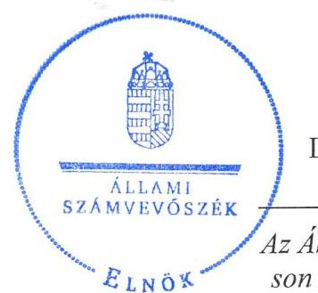
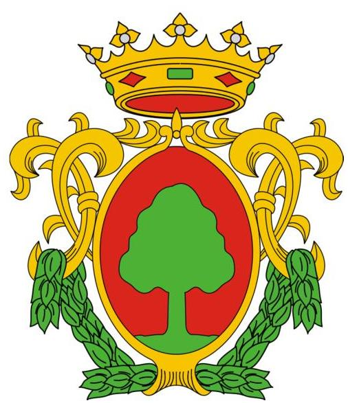
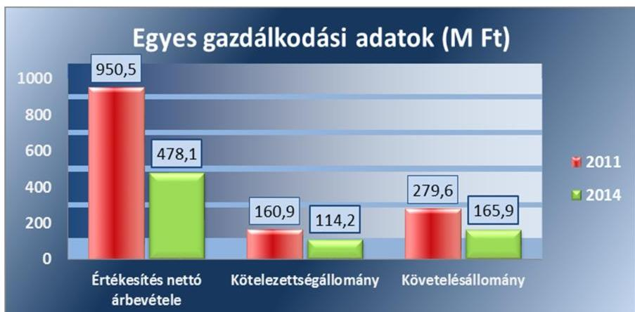
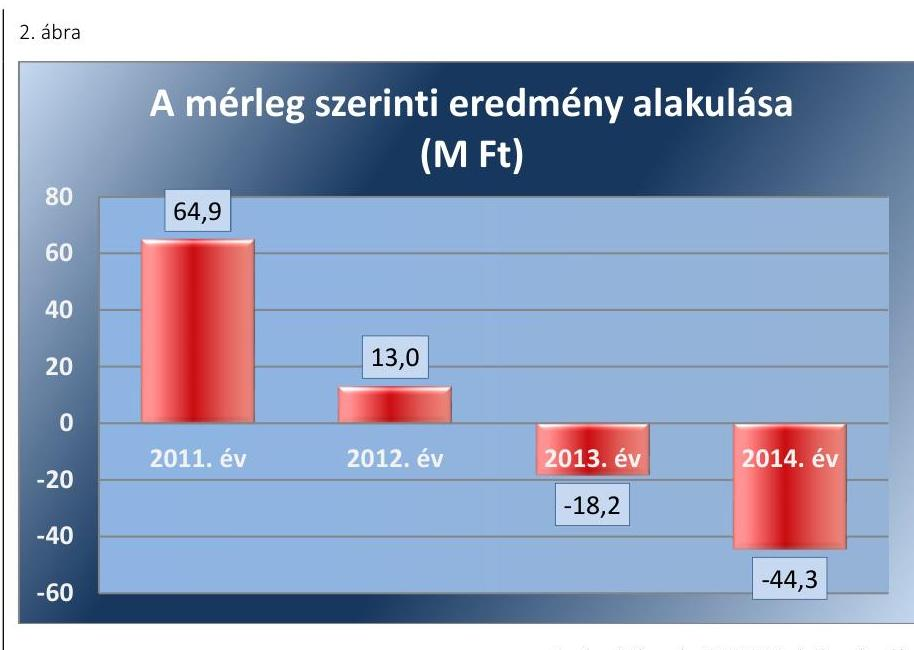
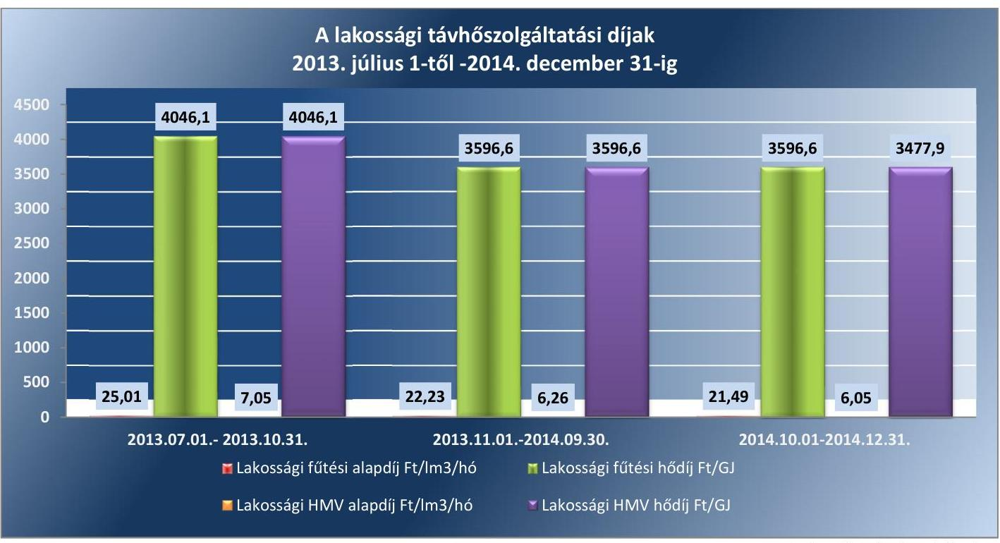
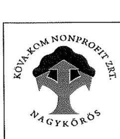
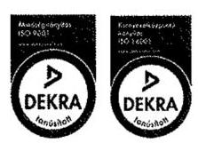
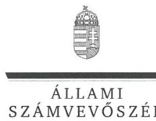
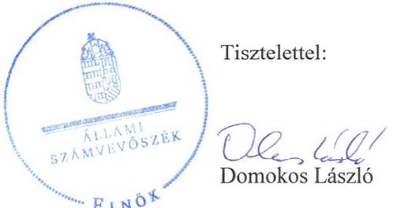

# Jelentés 

## Az önkormányzatok gazdasági társaságai

Az önkormányzatok többségi tulajdonában lévő gazdasági társaságok közfeladat ellátását érintő gazdálkodási tevékenysége szabályszerűségének ellenőrzése - KÖVA-KOM Nonprofit Zrt.
2016.

Az ÁSZ az államháztartáson kívül müködő közfel-adat-ellátó rendszerek ellenőrzéseivel hozzájárul ahhoz, hogy a közpénzeket az államháztartáson kívül müködő szervezetek is átlátható, rendezett módon használják fel a közfeladatok ellátása érdekében.

---

# Jelentés 

## Az önkormányzatok gazdasági társaságai

Az önkormányzatok többségi tulajdonában lévő gazdasági társaságok közfeladat ellátását érintő gazdálkodási tevékenysége szabályszerűségének ellenőrzése - KÖVA-KOM Nonprofit Zrt.
2016. decembe- hó 6. nap

16188
www.asz.hu

---

# AZ ELLENŐRZÉST FELÜGYELTE:

DR. HORVÁTH MARGIT felügyeleti vezető

## AZ ELLENŐRZÉST VEZETTE ÉS A VÉGREHAJTÁSÁÉRT FELELŐS:

SALAMIN VIKTOR ellenőrzésvezető

A PROGRAM ÖSSZEÁLLÍTÁSÁÉRT FELELŐS:

JANIK JÓZSEF osztályvezető

IKTATÓSZÁM: V-1071-122/2016.

TÉMASZÁM: 2051

ELLENŐRZÉS-AZONOSÍTÓ SZÁM: V-070743

Jelentéseink az Országgyűlés számítógépes hálózatán és az Interneta a www.asz.hu címen is olvashatóak.

---

# TARTALOMJEGYZÉK 

■ ÖSSZEGZÉS ..... 5
■ AZ ELLENŐRZÉS CÉLJA ..... 7
■ AZ ELLENŐRZÉS TERÜLETE ..... 8
■ AZ ELLENŐRZÉS HÁTTERE, INDOKOLTSÁGA ..... 10
■ FÓKUSZKÉRDÉSEK ..... 11
■ ELLENŐRZÉS HATÓKÖRE ÉS MÓDSZEREI ..... 12
■ MEGÁLLAPÍTÁSOK ..... 14
■ JAVASLATOK ..... 25
■ MELLÉKLETEK ..... 27
I. sz. melléklet: Értelmező szótár ..... 27
II. sz. melléklet: Múködési adatok ..... 29
III. sz. melléklet: Hődíjak alakulása ..... 30
■ FÜGGELÉK: ÉSZREVÉTELEK ..... 31
■ RÖVIDÍTÉSEK JEGYZÉKE ..... 37

---

.

---

# ÖSSZEGZÉS 

Az Állami Számvevőszék a kizárólagos önkormányzati tulajdonú KÖVA-KOM Nonprofit Zrt. távhőszolgáltatási (köz)feladat ellátását érintő gazdálkodási tevékenysége 2011-2014. évi szabályszerűségét ellenőrizte. A közfeladat-ellátás önkormányzati megszervezése szabályos volt, a tulajdonosi joggyakorlás megfelelt a jogszabályi előírásoknak. A szabályszerű vagyongazdálkodás biztosítása mellett a közfeladat költségeinek és ráfordításainak az elszámolása szabályos volt, a bevételek elszámolása azonban nem volt megfelelő. Az önköltségszámítás szabályait meghatározták, a közszolgáltatás díjainak megállapítása és alkalmazása a 2014. utolsó negyedévi lakossági fütési hődíjak kivételével szabályszerű volt. A Társaság kötelezettségállománya a müködésre, a közfeladat-ellátásra nem jelentett kockázatot.

## Az ellenőrzés társadalmi indokoltsága

Az Állami Számvevőszék stratégiájában megfogalmazta, hogy a helyi önkormányzatok gazdálkodásában rejlő pénzügyi kockázatok feltárásával, az államháztartáson kívülre nyújtott költségvetési támogatások és ingyenes vagyonjuttatások, valamint az államháztartáson kívül működő közfeladat-ellátó rendszerek ellenőrzéseivel hozzájárul ahhoz, hogy a közpénzeket az államháztartáson kívül működő szervezetek is átlátható, rendezett módon használják fel a közfeladatok szerződésben vállalt ellátása érdekében.

Magyarországon az intézmény-centrikus közfeladat-ellátás jellemző, de egyre jelentősebb a költségvetésen kívüli feladatellátás térnyerése. Ennek legfontosabb szereplői - a nonprofit szervezetek mellett - az önkormányzati tulajdonú gazdasági társaságok. Az önkormányzatok szervezetalakítási szabadságának következménye, hogy a korábban is vállalati formában működő közszolgáltatások mellett, mind a kötelező, mind az önként vállalt feladatok ellátásában a gazdasági társaságok kiemelt fontosságú szerephez jutottak.

## Főbb megállapítások, következtetések

Az Önkormányzat a távhőszolgáltatás közfeladatának megszervezéséről a jogszabályi előírásoknak megfelelően döntött, annak ellátásáról a kizárólagos tulajdonában lévő gazdasági társasága útján gondoskodott. A szükséges eszközöket apport formájában a Társaság rendelkezésére bocsátotta, a távhőszolgáltatás működtetéséhez vagyonkezelésre eszközt nem adott át. A feladatellátás kereteit a vagyongazdálkodási rendelet ${ }_{1,2}$ és annak előírásaival összhangban az Alapító Okirat határozta meg.

Az Önkormányzat a távhőszolgáltatással összefüggő rendeletalkotási kötelezettségének eleget tett. A távhőellátás biztosításának szabályait és a távhődíjak megállapításának előírásait a Távhő rendelet ${ }_{1,2}$-ben, a jogszabályi előírásokkal összhangban határozták meg. Az Önkormányzatot megillető tulajdonosi jogokat a Képviselő-testület gyakorolta, hatáskör átruházásra nem került sor. Az ellenőrzött időszakban az Önkormányzat a Társaságnál nem élt a belső ellenőrzés lehetőségével, így nem támogatta a szabályszerű működés kontrollját.

A közfeladat-ellátást szolgáló vagyonnal való gazdálkodás, annak nyilvántartása szabályszerű volt, a Társaság rendelkezett a Számv. tv. előírásainak megfelelő számviteli szabályzatokkal, amelyek elősegítették a szabályszerű működést.

A Társaság vagyona 2011. január 1-je és 2014. december 31. között 117,8 M Ft-tal csökkent. Az eszközérték csökkenése ellenére a saját tőke értéke a mérleg szerinti eredmények elszámolásának hatására 15,4 M Ft-tal nőtt. A kötelezettségek összegének csökkenése mellett az összes forráson belüli aránya 23,8\%-ról 26,9\%-ra nőtt, mérlegértéke az ellenőrzött időszak végén 114,2 M Ft volt. Az eladósodottságot jelző mutatók értéke 2012-ben volt a legmagasabb a 17,2 M Ft beruházási hitel igénybevétele miatt, azonban a kötelezettségállomány a müködést nem veszélyeztette, a távhőszolgáltatás közfeladatának ellátására nem jelentett kockázatot. A Társaság 2013 második félévétől végzi saját

---

feladatellátásban a távhőszolgáltatást, a 2013. évi mérlegben kimutatott 15,1 M Ft távhődíj tartozás 2014 végére 19,6 M Ft-ra nőtt. A fogyasztókkal szembeni követelések kezelésének, érvényesítésének rendjét szabályzatban rögzítették, a távhődíj kintlévőségek csökkentésére intézkedtek. A távhőtermelő és távhőszolgáltató üzletágból származó veszteség 2013-ban 16,8 M Ft, 2014-ben 7,6 M Ft volt, a Társaság a 2013-2014. években 43,1 M Ft távhőszolgáltatási támogatásban részesült.

A vezérigazgató az üzleti tervek teljesítéséről, a Társaság gazdálkodásról évente beszámolt az Önkormányzatnak, az üzleti jelentések kitértek a pénzügyi helyzet értékelésére, a foglalkoztatás alakulására, a jövőbeni tervekre, az adózás előtti eredmény tevékenységenkénti bemutatására. Az éves beszámolók elfogadásáról a Képviselő-testület az FB írásbeli véleményének és a könyvvizsgáló jelentésének birtokában döntött. A szétválasztási szabályok kidolgozását és alkalmazását a könyvvizsgáló a Tszt. előírásainak megfelelően a 2013., 2014. évi beszámolóhoz kiadott könyvvizsgálói jelentésben igazolta. A belső adatvédelmi felelőst kinevezték, az Info tv.-ben előírt adatvédelmi és adatbiztonsági szabályzattal azonban nem rendelkeztek, továbbá elektronikus közzétételi kötelezettségüknek csak részben tettek eleget. A távhőszolgáltatás költségeinek és ráfordításainak, valamint a beruházások, felújítások és az értékcsökkenés elszámolása megfelelt a jogszabályok és belső szabályozás előírásainak, a bevételek elszámolása azonban a nem megfelelő díjtételek alkalmazása miatt nem volt szabályos. Az önköltségszámítás rendjét meghatározták, az éves beszámolók kiegészítő mellékleteiben kimutatott tevékenységenkénti eredményt utókalkulációval alátámasztották. A díjképzés a lakossági fűtési hődíj esetében 2014. október 1-je és 2014. december 31. között nem volt szabályos, mivel nem hajtották végre a díjak - jogszabályban előírt - 3,3\%-os csökkentését.

---

# AZ ELLENŐRZÉS CÉLJA 

## A közfeladat ellátást érintő gazdálkodási tevékenység szabályozottságának és szabályszerűségének értékelése

Az ellenőrzés célja annak értékelése, hogy az önkormányzat a jogszabályi előírások figyelembevételével döntött-e az ellenőrzésre kerülő közfeladat megszervezéséről; az önkormányzat/tulajdonosi joggyakorló szabályszerűen gyakorolta-e a tulajdonosi jogokat.

Ellenőriztük, hogy a gazdasági társaság közfeladat-ellátása bevételeinek, ráfordításainak elszámolása, és vagyongazdálkodási tevékenysége megfelelt-e a jogszabályi, illetve a közszolgáltatási/vagyonkezelési szerződésben foglalt tulajdonosi előírásoknak, azok végrehajtása szabályszerű volt-e.

Értékeltük továbbá, hogy a gazdasági társaság kötelezettségállománya jelentett-e kockázatot a múködésre, illetve a közfeladat ellátására; valamint, hogy a közfeladatok átláthatósága és elszámoltathatósága érdekében biztosítva volte a közszolgáltatás díjának megalapozottsága szabályszerű önköltségszámítással.

---

# **AZ ELLENŐRZÉS TERÜLETE**

## **Nagykőrös Város Önkormányzata és a kizárólagos tulajdonában lévő KÖVA-KOM Nonprofit Zártkörű Részvény Társaság**

Nagykőrös Város Önkormányzata a KÖVA-KOM Nonprofit Zártkörű Részvénytársaságot 1991. július 25-én hozta létre, 2006. augusztus 14-étől működik zártkörű részvénytársaságként, és 2014. január 1-jétől nonprofit társaságként. A KÖVA-KOM Nonprofit Zrt. alapításkori 40 M Ft-os alaptőkéje 2006. augusztus 10-étől 100 M Ft-ra nőtt, ezt követően nem változott. Az ellenőrzött időszak egészében ellátta a lakás és helyiséggazdálkodási-, hulladékgazdálkodási és kezelési feladatot, valamint a helyi közutak és tartozékaik üzemeltetését és fenntartását. Tevékenységei közé tartozott 2012. december 31-ig a víziközmű üzemeltetési tevékenység. A távhőszolgáltatást 2013. június 30-ig vállalkozási szerződés útján, azt követően saját feladatellátásban biztosította. Az Önkormányzat¹ kezelésre vagyont a távhőszolgáltatással kapcsolatosan nem adott át. A Társaság² kizárólagos önkormányzati tulajdonban volt az ellenőrzött időszakban.

Nagykőrös Város lakosságának száma 2015. január 1-jén 23 694 fő volt. A távhőszolgáltatást két fűtőművel biztosította a Társaság. A Bárány úti fűtőmű 3 db gázfűtésű kazánnal működött, amelyek 480 db lakás fűtését és melegvíz-ellátását biztosították. A Kecskeméti úti fűtőmű 3 db kisnyomású kazánja 54 db lakás fűtését és melegvíz-ellátását, továbbá 6 db üzlet fűtését, és 3 üzletnek a melegvíz-ellátását is szolgáltatta. A vezérigazgató 2013. január 1-jétől tölti be tisztségét.

A Társaság gazdálkodásának egyes adatait a 2011., 2014. évek vonatkozásában az 1. ábra szemlélteti.

1. ábra

*Forrás: 2011., 2014. évi beszámoló*

Az értékesítés nettó árbevételének, kötelezettség és követelés állományának nagyságára alapvetően a Társaság által ellátott tevékenységi körök

---

alakulása volt hatással. A 2011. évi nettó árbevétel az Önkormányzat által végzett beruházások kivitelezésében való alvállalkozói közremúködés miatt jelentősen meghaladta a többi év realizált árbevételét. A kötelezettségek állományának alakulását alapvetően a szállítói tartozások nagysága és az egyéb rövid lejáratú kötelezettségek záró értéke befolyásolta. A követelésállomány csökkenését a víziközmű üzemeltetési tevékenység 2012. évi megszűnése eredményezte.

Az ellenőrzött időszakban a polgármester és a jegyző személye nem változott. A polgármester ${ }^{3}$ a 2002. évi önkormányzati választások óta tölti be tisztségét, a helyszíni ellenőrzés időszakában munkakört betöltő jegyző ${ }^{4}$ 2007. szeptember 27-étől látja el feladatait. Az Önkormányzat többségi tulajdonában egyéb, közfeladatot ellátó gazdasági társaság az ellenőrzött időszakban nem volt.

---

# AZ ELLENŐRZÉS HÁTTERE, INDOKOLTSÁGA 

Objektív vélemény kialakítása Nagykőrös Város Önkormányzata távhőszolgáltatási közfeladatának megszervezéséről, tulajdonosi jogai gyakorlásáról, valamint a kizárólagos tulajdonban lévő KÖVA-KOM Nonprofit Zrt. közfeladat ellátását érintő gazdálkodási tevékenységének szabályszerűségéről.

## Az önkormányzatok közfeladat-ellátásában egyre jelentősebb a gazdasági társaságokon belüli feladatellátás térnyerése

AZ ÁSZ STRATÉGIÁJÁBAN megfogalmazta, hogy a helyi önkormányzatok gazdálkodásában rejlő pénzügyi kockázatok feltárásával, az államháztartáson kívülre nyújtott költségvetési támogatások és ingyenes vagyonjuttatások, valamint az államháztartáson kívül múködő közfeladatellátó rendszerek ellenőrzéseivel hozzájárul ahhoz, hogy a közpénzeket az államháztartáson kívül múködő szervezetek is átlátható, rendezett módon használják fel a közfeladatok szerződésben vállalt ellátása érdekében.

Az Áht. ${ }^{5}$ 1. § (3) bekezdése értelmében az államháztartáson kívüli szervezetek a közfeladatok ellátásában - jogszabályban meghatározott feltételekkel - közremúködhetnek. Az önkormányzati tulajdonú gazdasági társaságok teljes körű ellenőrzésének lehetőségét az Állami Számvevőszékről szóló 1989. évi XXXVIII. törvény 2011. január 1-jétől hatályos módosítása teremtette meg. A gazdasági társaságok közfeladat ellátását érintő gazdálkodási tevékenysége szabályszerűségére irányuló ellenőrzéseket erre tekintettel a 2011. évtől végezzük.

## AZ ELLENŐRZÉS VÁRHATÓ HASZNOSULÁSA-

KÉNT az ÁSZ ${ }^{6}$ a megállapításaival segítséget nyújthat az államháztartáson kívüli közfeladat-ellátás értékeléséhez, jogszabályi keretei pontosításához, átláthatóságot biztosító szabályozásához. Meghatározhatóvá válnak a közfeladat ellátásban részt vevő államháztartáson kívüli szervezeteknek az önkormányzat költségvetését, pénzügyi helyzetét is befolyásoló - kockázatai, lehetővé válik ezen kockázatok csökkentése.

Értékelhetővé válik, hogy a feladatot ellátó gazdasági társaság a közszolgáltatási szerződésben foglaltak betartásával, a közvagyon használatával biztosította-e a szolgáltatás folytatásának feltételeit. Ezzel az ellenőrzöttek és a helyi döntéshozók számára az ÁSZ visszajelzést ad feladatszervezési, feladat-ellátási kockázataikról, alapot ad a meglévő hibák megszüntetéséhez, a jobb közfeladat-ellátás biztosításához. Mindezeken keresztül az ÁSZ hozzájárul Magyarország közpénzügyi helyzetének javításához, a közpénzek mérhető módon történő, a döntéshozók által meghatározott célok szerinti felhasználásához.

---

# FÓKUSZKÉRDÉSEK 

1. Az önkormányzat közfeladat megszervezéséről szóló döntése, valamint tulajdonosi joggyakorlása szabályszerű volt-e?
2. A gazdasági társaság vagyongazdálkodása szabályszerű volt-e, kötelezettségállománya jelentett-e kockázatot a müködésre, illetve a közfeladat ellátására?
3. A gazdasági társaságnál az ellátott közfeladat bevételei és ráfordításai elszámolása, valamint az önköltségszámítás és árképzés szabályszerű volt-e?

---

# ELLENŐRZÉS HATÓKÖRE ÉS MÓDSZEREI 

## Az ellenőrzés típusa

Megfelelőségi ellenőrzés.

## Az ellenőrzött időszak

2011. január 1-jétől 2014. december 31-ig tart.

## Az ellenőrzés tárgya

A közfeladatot gazdasági társaságokkal ellátó önkormányzatok tulajdonosi joggyakorlása, valamint gazdasági társaságok pénz- és vagyongazdálkodásának szabályozottsága és szabályszerűsége.

Az ellenőrzés kiterjed minden olyan körülményre és adatra, amely az ÁSZ jogszabályban meghatározott feladatainak teljesítéséhez, valamint a program végrehajtása folyamán felmerült újabb összefüggések feltárásához szükséges.

## Az ellenőrzött szervezet

Az ellenőrzött szervezetek:
Nagykőrös Város Önkormányzata,
KÖVA-KOM Nonprofit Zrt.

## Az ellenőrzés jogalapja

Az ellenőrzés jogszabályi alapját az ÁSZ tv. 5. § (3)-(4)-(5) bekezdései képezik. Ennek értelmében az ÁSZ ellenőrzi az államháztartásból nyújtott támogatás vagy az államháztartásból meghatározott célra ingyenesen juttatott vagyon felhasználását a gazdasági társaságoknál. Az önkormányzati vagyon kezelésének ellenőrzése keretében ellenőrzi a vagyon kezelését, a vagyonnal való gazdálkodást, a többségi önkormányzati tulajdonban lévő gazdasági társaságok vagyonérték-megőrző és vagyongyarapító tevékenységét, az államháztartás körébe tartozó vagyon elidegenítésére, illetve megterhelésére vonatkozó szabályok betartását; ellenőrizheti a többségi önkormányzati tulajdonban lévő gazdasági társaságok vagyongazdálkodását.

---

# Az ellenőrzés módszerei 

Az ellenőrzést a nemzetközi standardokat irányadónak tekintve az ellenőrzési program ellenőrzési kérdései, az ellenőrzött időszakban hatályos jogszabályok, az ellenőrzés szakmai szabályok és módszertanok figyelembe vételével végezzük.

Az ellenőrzés ideje alatt az ellenőrzött szervezettel történő kapcsolattartást az ÁSZ Szervezeti és Múködési Szabályzatának vonatkozó előírásai alapján biztosítjuk.

Az ellenőrzés a kiválasztott, többségi tulajdonosi jogokat gyakorló önkormányzatra, illetve az ellenőrzésre kijelölt közfeladatot ellátó gazdasági társaság felett tulajdonosi jogokat gyakorló szervezetre és az ellenőrzött közfeladatot ellátó gazdasági társaságra terjed ki. Amennyiben a gazdasági társaságban több önkormányzat együttesen többségi tulajdonos, úgy az ellenőrzést a többségi tulajdonosi jogokat gyakorló önkormányzatnál kell lefolytatni. Az ellenőrzött gazdasági társaságnál, amennyiben az több közfeladatot is ellát, akkor az ellenőrzésre kiválasztott közfeladat-ellátást ellenőrizzük.

Az ellenőrzést a kérdésekre adott válaszok kiértékelésével, valamint a megjelölt adatforrások, tanúsítványok felhasználásával, továbbá az adott időszakban hatályos jogszabályok figyelembe vételével kell lefolytatni. Az ellenőrzési kérdések megválaszolásához szükséges bizonyítékok megszerzése a következő ellenőrzési eljárások alkalmazásával történik: megfigyelés, kérdésfeltevés (információkérés), összehasonlítás, valamint elemző eljárás.

A bevételek és ráfordítások elszámolása, valamint a vagyonnyilvántartás terén a szabályszerű múködést véletlen mintavétellel ellenőriztük. A jogszabályoknak és a belső előírásoknak megfelelőnek tekintettük az adott területet, amennyiben a minta ellenőrzésének eredménye alapján 95\%-os bizonyossággal a teljes sokaságban a hibaarány kisebb volt, mint 10\%, nem megfelelőnek értékeltük, ha a hibaarány a 10\%-ot meghaladta. Részben megfeleltnek értékeltük, amennyiben egy adott terület vonatkozásában a minta alapján a teljes sokaságban nem volt egyértelmúen biztosított a jogszabályoknak és a belső szabályzatoknak megfelelő múködés. A ráfordítások elszámolására és a vagyonnyilvántartásra vonatkozó véletlen mintavételt kockázati alapú kiválasztással egészítettük ki, amelynek során évente a három legnagyobb összegű tételt választottuk ki.

---

# 1. Az önkormányzat közfeladat megszervezéséről szóló döntése, valamint tulajdonosi joggyakorlása szabályszerű volt-e? 

Összegző megállapítás

Az Önkormányzat a jogszabályok és a helyi szabályozás betartásával szervezte meg a távhőszolgáltatást, a tulajdonosi jogokat a jogszabályi előírásokon alapuló belső szabályozásban előírtaknak megfelelően érvényesítette.
1.1. számú megállapítás

A távhőszolgáltatási közfeladat-ellátást az Önkormányzat szabályszerűen szervezte meg, a távhőszolgáltatásra vonatkozó rendeletalkotási kötelezettségének eleget tett.

Az Ötv ${ }^{7}$. 91. § (6) bekezdése, 2013. január 1-jétől az Mötv8. 116. § (3)-(4) bekezdései szerint az önkormányzatnak a gazdasági programjában kell meghatároznia azokat a célkitűzéseket, amelyek az általa ellátott feladatok biztosítását, fejlesztését szolgálják. A Képviselő-testület ${ }^{9}$ által a 2011-2014. évekre elfogadott gazdasági program a távhőszolgáltatáshoz kapcsolódó fejlesztéseket nem tartalmazott.

A távhőszolgáltatással ellátott létesítmények távhőellátásának távhőszolgáltatásra engedéllyel rendelkezők útján történő biztosítása a Tszt ${ }^{10}$. 6. § (1) bekezdése értelmében a területileg illetékes települési önkormányzat kötelező feladata. Ennek a kötelezettségnek az Önkormányzat a Társaság alapításával eleget tett. A múködéséhez szükséges eszközök a Társaság tulajdonát képezték, az Önkormányzat kezelésre vagyont nem adott át. A Társaság a távhőszolgáltatást 2013. június 30-ig vállalkozási szerződés útján, azt követően saját feladatellátásban biztosította.

A Társaság feladatellátásának kereteit az Alapító Okirat, a távhő ellátás biztosításának és a távhődíjak megállapításának szabályait a Távhő rendelet ${ }_{1},{ }^{11}{ }_{2}{ }^{12}$ előírásai meghatározták. Az Önkormányzat és a Társaság között a közfeladat ellátására szerződés nem jött létre, arra a feleket jogszabályi előírás nem kötelezte.

A Társaság a távhőszolgáltatást 2013. június 30-ig a Dunaqua-Therm Rt.-vel kötött Vállalkozási szerződés ${ }^{13}$ keretében biztosította. A szerződésben foglaltak szerint a Vállalkozó ${ }^{14}$ a Társaságtól bérelt eszközökkel látta el a feladatát, melyekért az elszámolt értékcsökkenéssel megegyező összegű, de minimum 1,4 M Ft éves bérleti díjat volt köteles fizetni. Előírták továbbá az optimális távhőszolgáltatás és fogyasztás érdekében Vállalkozó által elvégzendő beruházásokat, felújításokat is. Tartalmazta a szerződés az alapdíj és a hődíj számításának módját, illetve a Képviselő-testület részére évente egyszeri alkalommal történő díjjavaslat előterjesztési kötelezettségét.

A Társaság 2011-ben elvégezte a távfűtési rendszer üzemeltetésének külső szakértő általi felülvizsgálatát. A szakértői jelentés megállapításai szerint a Vállalkozó a Vállalkozási szerződésben előírtak ellenére az időszakos

---

tüzeléstechnikai, kazánrevíziós eljárásokat nem folytatta le, továbbá a karbantartás és az értéktartó felújítások elmaradása miatt a távfűtési rendszer üzemeltetését kritikusnak, a kazánok állapotát elavultnak, működtetésüket pazarlónak értékelte. A szakértő jelentésében a távhőszolgáltatás saját üzemeltetésbe való visszavételét javasolta a Társaságnak. A Képviselő-testület a 114/2012. (VI. 28.) számú határozatában felhatalmazta a Társaságot a Vállalkozási szerződés felmondásának előkészítésére. A szerződést a szerződő felek - közös megegyezésével - 2013. június 30-án felmondták. A távhőszolgáltatás közfeladatát a Társaság 2013. július 1-jétől saját üzemeltetésben látta el.

A Vállalkozó 2013. június 30-ig rendelkezett a feladatellátáshoz szükséges működési engedéllyel. A Társaság a MEKH ${ }^{15}$ 1312/2013. számú határozatával a távhőszolgáltatás, 1313/2013. számú határozatával a távhőtermelés vonatkozásában kapott működési engedélyt.

AZ ALAPÍTÓ OKIRAT előírásai szerint a $\mathrm{Gt}^{16}$. 19. § (5) bekezdésében, valamint a Ptk ${ }^{17}$. 3:109. § (4) bekezdésében előírtakkal összhangban az alapító jogait a közgyűlés gyakorolta. A vezérigazgató feladataként írták elő - többek között - a számviteli beszámoló elfogadására és a nyereség felosztására vonatkozó javaslat elkészítését, és alapító elé terjesztését, a szervezeti és működési szabályzat elkészítését, a munkáltatói jogok gyakorlását. Az $\mathrm{FB}^{18}$ hatáskörébe tartozott az ügyvezetés ellenőrzése, az üzleti terv és a beszámoló írásban történő véleményezése.

A TÁVHŐ RENDELET ${ }_{1,2}$ megalkotásával az Önkormányzat a Tszt. 6. § (2) bekezdés a) pontjában előírt kötelezettségének eleget tett. A Távhő rendeletekben meghatározták a közüzemi szerződés tartalmát, a szerződés felmondásának előírásait, a távhőszolgáltatás bekapcsolásának, vételezésének, szüneteltetésének, korlátozásának szabályait. A Tszt. 6. § (2) bekezdés (b) pontjában előírtakkal összhangban meghatározták a távhőszolgáltatási díjak (alapdíj, hődíj, csatlakozási díj) alkalmazásának és fizetésének szabályait, a díjak mértékét. A Távhő rendelet ${ }_{1} 1$. számú melléklete és a Távhő rendelet ${ }_{2} 2$. számú melléklete rögzítette az alapdíj és a hődíj egységár meghatározásának módját. A távhőszolgáltatás alapdíját, és a mért hő díját tartalmazó Távhő rendelet ${ }_{1} 1$. számú mellékletét utolsó alkalommal 2011. február 15-i hatállyal módosították. A Tszt. 57/D. §-ának 2011. április 15-i módosításával az Önkormányzat ármegállapítási jogköre - a csatlakozási díj kivételével - megszűnt, ezért a Távhő rendelet ${ }_{2}$ alapdíj és hődíj megállapítással kapcsolatos előírásait az Önkormányzat hatályon kívül helyezte.

Az Önkormányzat tulajdonosi jogait érvényesítette, az FB müködése megfelelt az ügyrendjében rögzített előírásoknak. A közfeladat ellátással kapcsolatos ellenőrzést az Önkormányzat nem végzett.

A TULAJ DONOSI JOGOK gyakorlásának rendjét a vagyonrendelet ${ }_{1}{ }^{19}{ }_{2}{ }^{20}$-ben és azzal összhangban az Alapító Okiratban írták elő. Az Önkormányzatot megillető tulajdonosi jogok gyakorlására a Képviselő-testület volt jogosult, hatáskör átruházásra nem került sor. A Képviselő-testület határozattal döntött - többek között - az Alapító Okirat módosításáról, a kontrolling beszámolók elfogadásáról, az üzleti tervek jóváhagyásáról és

---

azok módosításáról, a nonprofit társasággá történő alakulásról, a számviteli beszámoló elfogadásáról, és az adózott eredmény felhasználásáról, a könyvvizsgáló és az FB tagok megválasztásáról.

AZ FB az ellenőrzött időszakban az Alapító Okiratban előírtak alapján a Gt. 34. § (1) bekezdésével, valamint a Ptk. 3:121. § (1) bekezdésével összhangban - három tagból állt. Az FB eleget tett a Gt. 34. § (4) bekezdése előírásainak, elkészítette ügyrendjét, melyet a Képviselő-testület a 39/2010. (III. 25.) számú határozatával jóváhagyott. Az FB az éves munkatervek alapján véleményezte a Társaság üzleti terveit, kontrolling beszámolóit, a kintlévőségek behajtásának alakulását, valamint a számviteli beszámolóról írásbeli véleményt bocsátott ki.

AZ ANYAGI ÉRDEKELTSÉGI RENDSZER elemeit a Taktv ${ }^{21}$. 5. § (3) bekezdésében foglaltaknak megfelelően a Képviselő-testület által elfogadott javadalmazási szabályzatban rögzítették. A szabályzat a Társaság vezérigazgatójának és vezetőinek javadalmazására, a prémium fizetés feltételeire és mértékére, a költségtérítés szabályozására, az FB tagok díjazására terjedt ki.

AZ ÁRKÉPZÉS SZABÁLYAIT a Távhő rendelet ${ }_{1,2}$-ben határozta meg az Önkormányzat. A távhőszolgáltatás 2011. április 15-ig olyan hatósági áras szolgáltatás volt, amelynek legmagasabb árait az önkormányzatoknak kellett előírniuk. A Távhő rendelet ${ }_{1,2}$ ben az Ámt. ${ }^{22}$ 7. § (1) bekezdésének, valamint a törvény mellékletének megfelelően meghatározták a távhőszolgáltatás legmagasabb fogyasztói árát az alapdíjra, a hődíjra, valamint a csatlakozási díra vonatkozóan. A Távhő rendelet ${ }_{1,2}$ mellékletei tartalmazták az alapdíj és a hődíj egységár meghatározására szolgáló díjképletet. A díjképlet megegyezett a Vállalkozási szerződés 7. pontjában rögzített díjképlettel. A 2011. január 1-jén alkalmazott díjak megegyeztek a Távhő rendelet ${ }_{1}$-ben meghatározott, 2009. március 1-től hatályos díjakkal. A díjakat a Vállalkozó által - előírt tartalommal - elkészített és előterjesztett díjkalkuláció alapján határozta meg a Képviselő-testület. Ezt követően önkormányzati hatáskörben díjmódosításra nem került sor.

A BESZÁMOLTATÁSI RENDSZERT az Önkormányzat múködtette, mivel a Társaság vezérigazgatóját a közfeladat-ellátásról negyedévente beszámoltatta. A Társaság 2011-2014. üzleti éveiről készített éves beszámolóit a Képviselő-testület megtárgyalta és elfogadta. A Képviselőtestület a beszámolók elfogadásáról a Gt. 35. § (3) bekezdésének és a Ptk. 3:120. § (2) bekezdésének előírásait betartva az FB írásos jelentésének birtokában döntött, valamint 2011-ben és 2012-ben határozott az adózott eredmény felhasználásáról. Az éves beszámolókon túl a Képviselő-testület megtárgyalta és határozattal elfogadta az üzleti terv teljesítéséről szóló, negyedéves gyakorisággal készített kontrolling beszámolókat.

Az Önkormányzat a 2011-2014. években nem élt az Ötv. 92. § (11) bekezdés b) pontjában, valamint az Áht. 70. § (1) bekezdés d) pontjában biztosított lehetőséggel, mivel a távhőszolgáltatás közfeladatának ellátását belső ellenőrzés keretében nem ellenőrizte.

A mérleg szerinti eredmény a 2011-2012. években pozitív volt, a 20132014. években veszteségesen gazdálkodott a Társaság. A mérleg szerinti eredmények összegét a 2. ábra mutatja be.

---

*Forrás: A Társaság 2011-2014. évi beszámolói*

2011-ben osztalékot nem fizettek, a 2012. évi eredmény terhére kifizetett osztalék összege 23,0 M Ft volt.

Az Önkormányzatnak az ellenőrzött időszakban a Társaság kötelezettség-vállalásához kapcsolódó garancia és kezességvállalása nem keletkezett, a feladatellátáshoz működési és fejlesztési támogatást, valamint tagi kölcsönt nem nyújtott.

## 2. A gazdasági társaság vagyongazdálkodása szabályszerű volt-e, kötelezettségállománya jelentett-e kockázatot a működésre, illetve a közfeladat ellátására?

**Összegző megállapítás**

**2.1. számú megállapítás**

A Társaság vagyongazdálkodása szabályszerű volt, kötelezettségállománya a működésre, közfeladat ellátásra nem jelentett kockázatot.

A Társaság szabályzatai a jogszabályoknak, valamint az Önkormányzat által megfogalmazott követelményeknek megfeleltek.

**AZ ÜZLETI TERVEKET** – az Alapító Okiratban előírtaknak megfelelően – a vezérigazgató készítette el és terjesztette a Képviselő-testület elé. Az üzleti tervek tartalmi és formai követelményeit nem határozták meg, azok a várható eredmény és a tervezett fejlesztések ágazatonkénti bemutatását tartalmazták. A 2013. évi üzleti tervet módosították a távhőszolgáltatás saját feladatellátásba vétele miatt. A módosított üzleti terv már tartalmazta a távhőszolgáltatás II. félévi várható eredményét. Az üzleti terveket és azok módosítását a Képviselő-testület határozattal hagyta jóvá.

A Társaság rendelkezett a Számv. tv.23 14. § (3) bekezdésben előírt számviteli politikával, valamint a Számv. tv. 14. § (5) bekezdés előírásainak megfelelően eszközök és források leltárkészítési és leltározási, illetve értékelési szabályzatával, önköltségszámítás rendjére vonatkozó szabályzattal,

---

valamint pénzkezelési szabályzattal. Elkészítették továbbá a Számv. tv. 161. § (1) bekezdésben előírt számlarendet.

A SZÁMVITELI POLITIKA a Számv. tv. 14. § (4) bekezdése, valamint a 161/A. § előírásainak megfelelt. Az eszközök és források leltárkészítési és leltározási szabályzata az ingatlanok, a gépek, berendezések és felszerelések 3 évenkénti, a vásárolt készletek évenkénti mennyiségi felvétellel történő leltározási kötelezettségét írta elő. A szabályozás megfelelt a Számv. tv. 69. § (3) bekezdésében foglalt előírásoknak, mivel a Társaság év közben az eszközeiről folyamatos mennyiségi nyilvántartást vezetett. Az eszközök és források értékelési szabályzatában - többek között - meghatározták az eszközök és források bekerülési értékének tartalmát, értékelésének szabályait, a vevőkövetelésekre elszámolt értékvesztés megállapításának kritériumait. Értékvesztés elszámolását a vevők, illetve adósok minősítése alapján az egy éven túli követelések esetében, maximum a követelés teljes összegének megfelelő értékben írták elő. A csoportos értékelés körébe vont követelések esetében a késedelem napjainak száma szerinti kategóriánként határozták meg az elszámolandó értékvesztés mértékét. A pénzkezelési szabályzatban a Számv. tv. 14. § (8) bekezdésében előírtaknak megfelelően - többek között - rendelkeztek a pénzforgalom lebonyolításának rendjéről, a készpénzben és a bankszámlán tartott pénzeszközök közötti forgalomról, a bankkártya használat rendjéről, a készpénzállomány ellenőrzésekor követendő eljárásról, az ellenőrzés gyakoriságáról.

# AZ ÖNKÖLTSÉGSZÁMÍTÁSI SZABÁLYZATOT a 

Számv. tv. 14. § (7) bekezdés előírása alapján szabályszerűen elkészítették. A szabályzatban meghatározták az önköltségszámítás tárgyát, az önköltségszámítás folyamatát, közvetett költségek elszámolásának és felosztásának módját.

A Tszt. 18/A. § (2) bekezdésében meghatározott számviteli szétválasztási szabályokat a 2013. január 1-jén hatályba léptetett szétválasztási szabályzat tartalmazta. A kialakított számlarend, az önköltségszámítási szabályzat, és a számviteli szétválasztási szabályzat együttesen biztosította, hogy a könyvvezetésre, a bizonylatolásra vonatkozó belső szabályok a mérleg és eredmény kimutatás alátámasztásán túlmenően a kiegészítő melléklet adatainak közvetlen alátámasztására alkalmasak legyenek.

ÜZLETSZABÁLYZATÁT a Tszt. 3. § v) pontja szerinti tartalommal elkészítette és 2013. július 1-jén hatályba léptette a Társaság. A jegyző az üzletszabályzatot jóváhagyta, és a Tszt. 7. § (1) bekezdés a) pontjában előírtaknak megfelelően véleményezésre megküldte a Pest Megyei Kormányhivatal Fogyasztóvédelmi Főfelügyelősége részére.
2.2. számú megállapítás

A Társaság a tulajdonában lévő vagyonával a jogszabályi és belső rendelkezéseknek megfelelően gazdálkodott.

AZ ANALITIKUS ÉS FŐKÖNYVI NYILVÁNTARTÁSI
RENDSZER biztosította a Társaság vagyonának Számv. tv. és belső szabályozás szerinti nyilvántartását, a változások folyamatos nyomon követését. Az ellenőrzött évek beszámolóinak mérlegét alátámasztó, Számv. tv. 69. § (1) bekezdése szerinti leltárakat elkészítették.

---

A Társaság a távhőszolgáltatás közfeladatát saját eszközeivel látta el, üzemeltetésre átvett, illetve vagyonkezelésbe vett eszköze nem volt. A főkönyvi könyvelés és analitikus nyilvántartások közötti egyezőség biztosított volt.

A tárgyi eszközök és a készletek Számv. tv. 69. § (3) bekezdése szerinti, mennyiségi felvétellel történő leltározását az eszközök és források leltározási és leltárkészítési szabályzatában előírtaknak megfelelően elvégezték.

A Társaság főbb mérleg adatait az 1. táblázat szemlélteti:

1. táblázat

A TÁRSASÁG FŐBB MÉRLEG ADATAI (M FT)

|  Megnevezés | $\begin{aligned} & 2011- \ & 01.01 . \end{aligned}$ | $\begin{aligned} & 2011- \ & 12.31 . \end{aligned}$ | $\begin{aligned} & 2012- \ & 12.31 . \end{aligned}$ | $\begin{aligned} & 2013- \ & 12.31 . \end{aligned}$ | $\begin{aligned} & 2014- \ & 12.31 . \end{aligned}$  |
| --- | --- | --- | --- | --- | --- |
|  I. Befektetett eszközök | 288,2 | 244,6 | 138,5 | 143,1 | 186,6  |
|  - ebből: Tárgyi eszközök | 286,5 | 244,6 | 138,5 | 136,3 | 177,2  |
|  II. Forgóeszközök | 215,8 | 305,4 | 390,5 | 292,0 | 234,5  |
|  - ebből: Követelések | 163,1 | 279,6 | 280,9 | 149,8 | 165,9  |
|  III. Aktív időbeli elhatárolások | 38,4 | 21,8 | 6,0 | 3,6 | 3,5  |
|  Eszközök összesen | 542,4 | 571,8 | 535,0 | 438,7 | 424,6  |
|  IV. Saját tőke | 157,5 | 222,4 | 235,4 | 217,2 | 172,9  |
|  - ebből: Jegyzett tőke | 100,0 | 100,0 | 100,0 | 100,0 | 100,0  |
|  - ebből Mérleg szerinti eredmény | 22,7 | 64,9 | 13,0 | $-18,2$ | $-44,3$  |
|  V. Céltartalékok | 99,7 | 56,1 | 82,4 | 80,0 | 80,0  |
|  VI. Kötelezettségek | 129,1 | 160,9 | 201,9 | 109,0 | 114,2  |
|  VII. Passzív időbeli elhatárolások | 156,1 | 132,4 | 15,3 | 32,5 | 57,5  |
|  Források összesen | 542,4 | 571,8 | 535,0 | 438,7 | 424,6  |

A Z ESZKÖZÉRTÉK alakulását 2011-ben alapvetően a követelések záró állományának - előző évihez viszonyított - 116,5 M Ft értékű emelkedése befolyásolta. A Társaság 2011-2012-ben alvállalkozóként vett részt európai uniós forrásból finanszírozott - beruházások kivitelezésében, és a kiszámlázott, de mérleg fordulónapig pénzügyileg nem rendezett számlaköveteléseket is kimutatta - az alaptevékenységéhez kapcsolódó követeléseken túl - a mérlegében. A tárgyi eszközök könyvszerinti értékének 2012. évi csökkenését a terv szerinti értékcsökkenés elszámolásán túl a vízés csatorna szolgáltatáshoz kapcsolódó eszközök új szolgáltató részére történő értékesítése, illetve 40,6 M Ft nettó értékű eszközök selejtezése (terven felüli értékcsökkenésként történő elszámolása) eredményezte. Ugyancsak a víz és csatorna szolgáltatás tevékenységének megszűnése eredményezte az aktív időbeli elhatárolások értékének 2013. évi - előző évekhez viszonyított - csökkenését, mivel ettől az évtől nem került sor a szolgáltatási díjakból származó bevételek aktív időbeli elhatárolására. A Társaság saját tőkéje az eredményes gazdálkodás miatt 2011-2012. években nőtt, a 2013. és 2014. évben a veszteség elszámolása miatt csökkent. A 2013. évi 18,2 M Ft veszteségből 16,8 M Ft a félévtől ellátott távhőszolgáltatás vesztesége volt. A 2014-ben realizált 44,3 M Ft veszteségből 7,6 M Ft-ot mutattak ki a távhőszolgáltatás negatív eredményeként. A kötelezettségek 2012. évi jelentős emelkedéséhez hozzájárult a 23,0 M Ft fizetendő osztalék egyéb kötelezettségként történő elszámolása. A passzív időbeli elhatárolások mérlegértékének alakulását a mérleg fordulónapja előtti időszakot terhelő - mérleg fordulónap után kiszámlázott, felmerült - költségek elszámolt összegének nagysága határozta meg.

---

# 2.3. számú megállapítás 

A kötelezettségek állománya a múködésre, közfeladat ellátásra nem jelentett kockázatot.

A Társaság kötelezettségeinek 87,9-96,7\%-át a rövid lejáratú kötelezettségek alkották. A szállítói kötelezettségek értéke jelentősen nem változott, 2011-ben 51,7 M Ft, 2014-ben 51,4 M Ft volt. Ugyanakkor az egyéb rövid lejáratú kötelezettségek csökkenése miatt a szállítói tartozások rövid lejáratú kötelezettségeken belüli aránya nőtt, 2014 végén 48,8\% volt.

Az eladósodottságot jelző mutatók értékei a 2. táblázatban foglaltak szerint alakult a 2011-2014. években.
2. táblázat

| A TÁRSASÁG PÉNZÜGYI MUTATÓSZÁMAI 2011-2014 |  |  |  |  |
| :--: | :--: | :--: | :--: | :--: |
| Megnevezés | $\begin{gathered} 2011 \\ \text { ev } \end{gathered}$ | $\begin{gathered} 2012 \\ \text { ev } \end{gathered}$ | $\begin{gathered} 2013 \\ \text { ev } \end{gathered}$ | $\begin{gathered} 2014 \\ \text { ev } \end{gathered}$ |
| Eladósodottsági mutató idegen tőke/összes forrás | 0,28 | 0,38 | 0,25 | 0,27 |
| Eladósodottság mértéke kötelezettségek/saját tőke | 0,72 | 0,86 | 0,50 | 0,66 |
| Nettó eladósodottság (kötelezettségek-követelések)/saját tőke | $-0,53$ | $-0,34$ | $-0,19$ | $-0,30$ |
| Adósságfedezeti mutató   (befektetett eszközök+forgóeszközök)/idegen   forrás | 3,42 | 2,62 | 3,99 | 3,69 |

Forrás: A Társaság adatszolgáltatása
Az eladósodottsági mutató értéke 2012-ben volt a legmagasabb, azonban az idegen tőke összes forráson belüli aránya egyik évben sem érte el a kritikus 0,6-es értéket. Az eladósodottság mértéke minden évben a kedvező 1 alatti értéket mutatott. A 2012-ben, hulladékszállító gép beszerzéséhez felvett 17,2 M Ft beruházási hitelek, és az osztalék fizetési kötelezettség miatt a mutató értéke 0,86-ra emelkedett. A nettó eladósodottság mutató arról nyújt információt, hogy a kintlévőségekkel csökkentett kötelezettségeket milyen mértékben fedezi saját forrás, és azt feltételezi, hogy a kötelezettségek teljesítését megelőzi a követelések realizálása. A mutató értéke az ellenőrzött években negatív volt, mivel a kintlévőségek teljes mértékben fedezték a kötelezettségek összegét. Az adósságfedezeti mutató értéke a kedvező 2 feletti értéket mutatott minden évben. Az eladósodás szintje az ellenőrzött időszakban jelentősen nem változott, a múködést, a közfeladat ellátását nem veszélyeztette.

A hosszú lejáratú kötelezettségek között kimutatott fejlesztési hitelek esedékes törlesztő részletének pénzügyi teljesítése határidőben történt. A rövid lejáratú kötelezettségeket jellemzően határidőben megfizették, egyes tartozások esetében néhány napos fizetési késedelem fordult elő. A késedelmes fizetés miatt felszámolt késedelmi kamat alacsony összege miatt ( $0,4 \mathrm{M} \mathrm{Ft}-1,1 \mathrm{M} \mathrm{Ft}$ ) annak rövid lejáratú kötelezettségekre vetített aránya nem kifejezhető.

---

### 2.4. számú megállapítás

A Társaság az éves beszámolóit elkészítette, határidőben letétbe helyezte, azokat az FB és a könyvvizsgáló véleményezte. A belső adatvédelmi felelőst kinevezték, azonban az adatvédelmi és adatbiztonsági szabályzatot nem készítették el, továbbá elektronikus közzétételi kötelezettségüknek csak részben tettek eleget.

AZ ÉVES BESZÁMOLÓKAT a Társaság a Számv. tv. 19. § (1) bekezdésében előírt tartalommal elkészítette, azokat a vezérigazgató a Képviselő-testület elé terjesztette. Az éves beszámolók letétbe helyezése a Számv. tv. 153. § (1) bekezdésben előírt határidőben megtörtént.

Az FB az éves beszámolókról a Gt. 35. § (3) bekezdése, valamint a Ptk. 3:120. § (2) bekezdése előírásának megfelelően elkészítette írásos jelentését. Az éves beszámolók elfogadásáról a Képviselő-testület minden évben az FB határozatának és a könyvvizsgáló írásos jelentésének birtokában döntött. A vezérigazgató által készített üzleti jelentés tartalmazta a tevékenységek ágazatonkénti áttekintését, a pénzügyi helyzet értékelését, a foglalkoztatás alakulásának ismertetését, a jövőbeni terveket, valamint az adózás előtti eredmény tevékenységenkénti bemutatását.

A KÖNYVVIZSGÁLÓ a Tszt. 18/B. § (1) bekezdésében rögzített kötelezettségének eleget tett, a 2013-2014. évek éves beszámolóihoz kiadott könyvvizsgálói jelentésében igazolta, hogy a Társaság által kidolgozott és alkalmazott szétválasztási szabályok, valamint az egyes tranzakciók árazása biztosítja a vállalkozás tevékenységei közötti keresztfinanszírozásmentességet. A könyvvizsgáló az ellenőrzött időszak minden évében hitelesítő záradékkal látta el a Társaság éves beszámolóját.

Az FB és a könyvvizsgáló a közvagyon védelme, illetve más okból a Kép-viselő-testület összehívását nem kezdeményezte.

A Társaság 2011-ben az Eisztv²4. 6. § (1) bekezdésében, 2012-2013. években az Info tv ${ }^{25}$. 37. § (1) bekezdésben előírt elektronikus közzétételi kötelezettségének részben tett eleget. Az Eisztv. mellékletének III. 1. pontja, valamint az Info tv. 1. melléklet III. 1. pontja szerinti számviteli beszámolót -a 2011-2013. évek vonatkozásában - honlapján nem tette közzé.

Az Info tv. 24. § (1) bekezdés c) pontjában foglalt kötelezettségnek eleget téve kinevezték a Társaság belső adatvédelmi felelősét, azonban az Info tv. 24. § (3) bekezdésben előírt adatvédelmi és adatbiztonsági szabályzatot nem készítették el.

---

# 3. A gazdasági társaságnál az ellátott közfeladat bevételei és ráfordításai elszámolása, valamint az önköltségszámítás és árképzés szabályszerű volt-e? 

Összegző megállapítás

A közfeladat költségeinek és ráfordításainak elszámolása szabályszerű volt, a távhőszolgáltatás árbevételeinek elszámolása azonban nem volt megfelelő. Az önköltségszámítás a jogszabályi és a belső szabályzat előírásainak megfelelt, az árképzésre vonatkozó szabályokat azonban a Társaság nem tartotta be teljes körűen.
3.1. számú megállapítás

A költségek és ráfordítások tevékenységenkénti elkülönítése és szabályszerű elszámolása megvalósult, azonban az értékesítés nettó árbevételének elszámolása - a nem megfelelően alkalmazott díjtételek miatt - nem volt szabályos.

A Társaság 2013. július 1-jétől látta el a távhőszolgáltatás közfeladatát. A közfeladat átláthatósága és a keresztfinanszírozás elkerülése érdekében fenn állt a Tszt. 2012. január 1-jétől hatályos 18/A. § (3) bekezdés c) pontjában foglalt előírás szerint a bevételek és ráfordítások elkülönítésének kötelezettsége, mivel a távhőszolgáltatás mellett a távhőtermelés feladatát és egyéb feladatokat is ellátott. A bevételek tevékenységenkénti elkülönítését az alkalmazott főkönyvi számok biztosították. A költségnemenként könyvelt ráfordításokat az önköltségszámítási szabályzatban előírtak alapján különítették el tevékenységenként. A 2013-2014. években a belső szabályzatokban meghatározottak alapján a szétválasztási kötelezettségnek eleget tettek.

AZ ÉRTÉKESÍTÉS NETTÓ ÁRBEVÉTELÉNEK ELSZÁMOLÁSA nem volt megfelelő. A 2014. október 1-je és 2014. december 31. között, a lakosság által igénybevett távhőszolgáltatás (fűtés) hődíjának kiszámlázásakor alkalmazott díjak esetében nem tartották be a Rezsi tv. ${ }^{26}$ 3. § (1) bekezdése hatályos előírásait. Nem hajtották végre a díjak 3,3\%-os csökkentését, a kiszámlázás a 2014. október 1. előtti díjtételek alkalmazásával történt.

AZ ANYAGJELLEGŰ RÁFORDÍTÁSOK ELSZÁMOLÁSA megfelelő volt. A távhőszolgáltatás ellátásával kapcsolatban elszámolt költségeket és ráfordításokat a megfelelő közfeladatra és költségnemre számolták el. A költségelszámolást megalapozó dokumentumok rendelkezésre álltak. A számviteli elszámolás bizonylatai a Számv. tv. 165-167. §-aiban rögzített alaki és tartalmi követelményeknek megfeleltek.

A BERUHÁZÁSOK, FELÚJÍTÁSOK KIADÁSAI ÉS AZ ÉRTÉKCSÖKKENÉSI LEÍRÁS ELSZÁMOLÁSA megfelelő volt, mivel a kiadásokat a megfelelő főkönyvi számlákra számolták el. Az üzembe helyezés, állományba vétel minden esetben megtörtént,

---

a bekerülési értékeket a Számv. tv. 47-51. §-aiban és a számviteli politikában előírtak alapján állapították meg. Az értékcsökkenés elszámolása szabályos volt, a számviteli politikában meghatározott leírási kulcsokat alkalmazta a Társaság. Az aktivált eszközöket a tárgyévi eszköz analitika és a leltár tartalmazta a Számv. tv. 69. § (4) bekezdése és az eszközök és források leltárkészítési és leltározási szabályzatban előírtaknak megfelelően.

A 2011-2014. évek éves beszámolóinak kiegészítő mellékletében a Számv. tv. 92. § (1) bekezdésében előírt részletezettséggel mutatták be az immateriális javak és tárgyi eszközök bruttó értékének, értékcsökkenésének és nettó értékének az alakulását. A víziközmű tevékenység megszűnéséhez kapcsolódó tárgyi eszköz selejtezés miatt elszámolt terven felüli értékcsökkenés összegét, indokoltságát a Számv. tv. 92. § (2) bekezdésében rögzítetteknek megfelelően a 2012. évi beszámoló kiegészítő mellékletében bemutatták. Az ellenőrzött időszakban a Társaság vagyona után elszámolt amortizáció összegét (194,3 M Ft) minimálisan meghaladta a tárgyi eszközök pótlásának (beruházások, élettartam növelő felújítások, karbantartások) kiadása (200,5 M Ft). A távhőszolgáltatást biztosító termelő gépek és berendezések nettó értéke 2011 és 2012 végén nulla volt. A 2013ban végrehajtott kazánfelújítások eredményeként ezen eszközök használhatósági foka 51,3\%-ra nőtt, 2014-ben 46,1\% volt.

KÖVETELÉS ÁLLOMÁNYÁT a számviteli politika keretében, eszközök és források értékelési szabályzatában előírtak szerint kezelte a Társaság. A 181-360 nap közötti késedelem esetén 50\%, a 361-540 nap közötti késedelem esetén $75 \%$, 540 napon túl fennálló (tartós) követelésekre 100\% értékvesztést számoltak el.

A távhőszolgáltatás vevőköveteléseinek alakulását a 3. táblázat mutatja be:
3. táblázat

# A TÁVHŐSZOLGÁLTATÁSHOZ KAPCSOLÓDÓ VEVŐKÖVETELÉSEK ALAKULÁSA (M FT) 

|  | 2011. év | 2012. év | 2013. év | 2014. év |
| :-- | :--: | :--: | :--: | :--: |
| Lakossági | 0,0 | 0,0 | 14,3 | 19,3 |
| Nem lakossági | 0,0 | 0,0 | 0,8 | 0,3 |
| Összesen: | 0,0 | 0,0 | 15,1 | 19,6 |

A Társaság 2013. július 1-jétől látta el a távhőszolgáltatás feladatát, ezért a 2013. december 31-i vevőkövetelés félévi szolgáltatáshoz kapcsolódott. A távhőszolgáltatást igénybevevőkkel szemben fennálló követelések döntő részét ( $94,7 \%-98,5 \%$-át) a lakosság részére kiszámlázott díjak követelései alkották. Értékvesztést a távhődíj tartozásokra 2013-ban - szabályosan - nem számoltak el, mivel a kintlévőség napjainak száma nem haladta meg a 180 napot. 2014-ben 1,9 M Ft volt az elszámolt értékvesztés összege. A vevői követelések behajtásának gyakorlati rendjét a követelések érvényesítési, és követelések leírási szabályzatában rögzítették. Ennek keretében meghatározták a lakossági és nem lakossági fogyasztókkal szembeni követelések érvényesítése érdekében alkalmazandó eljárásokat, valamint a behajthatatlan követelések leírásának szabályait. A Társaság felszólító levelek küldésével intézkedett a távhődíj kintlévőségei csökkentésére.

---

A Társaság távhőtermelő és távhőszolgáltató tevékenységéből származó eredménye 2013-ban 16,8 M Ft, 2014-ben 7,6 M Ft veszteség volt. Az 51/2011. (IX. 30.) NFM rendelet ${ }^{27}$ 1. § a) pontjában rögzítettek alapján 2013-ban 9,2 M Ft, 2014-ben 33,9 M Ft távhőszolgáltatási támogatásban részesültek.
3.2. számú megállapítás

Az önköltségszámítás rendjét meghatározták, a Társaság a szabályozásnak megfelelően, utókalkulációval határozta meg a közfel-adat-ellátás és az egyéb tevékenységek elszámolható költségeit. Az árképzésre vonatkozó 2014. október 1-jétől hatályos szabályokat teljes körűen nem tartották be.

A Társaság a 2013. január 1-jén hatályba léptetett önköltségszámítási szabályzatában írta elő a tevékenységenkénti önköltség megállapításának szabályait. A távhőszolgáltatás mellett egyéb feladatokat is elláttak, ezért az egyes tevékenységek közvetlen költségeinek elkülönítését kalkulációs egységek alkalmazásával biztosították, illetve meghatározták a közvetett költségek felosztásának szabályait. A 2013. és 2014. évi éves beszámolók kiegészítő mellékleteiben bemutatták az utókalkulált, tevékenységenkénti eredményt.

A távhőszolgáltatás díját 2011. április 15-től a Tszt. 57/D. § (1) bekezdése alapján, mint legmagasabb hatósági árat, azok szerkezetét és alkalmazási feltételeit - a MEKH javaslatának figyelembevételével - a nemzeti fejlesztési miniszter rendeletben állapítja meg. A lakossági távhő díjakat 2011. április 15-től - a 2011. március 31-én alkalmazott díjakon - befagyasztották, majd 2012. január 1-jétől az 50/2011. (IX. 30.) NFM rendelet ${ }^{28}$ hatályos 4. §-a alapján 4,2\%-kal megemelték. A 2013. évben két lépcsőben - 2013. január 1-jével az előző évihez képest 10,0\%-os, majd 2013. november 1-jétől további 11,1\%-os mértékben - csökkentették a Rezsi tv. 3. § (1) bekezdésének, valamint az 50/2011. (IX. 30.) NFM rendelet 3. § (2) bekezdésének megfelelően. A Rezsi tv. 3. § (1) bekezdése az távhőszolgáltatás díjának további 3,3\%-kal történő csökkentését írta elő 2014. október 1jétől.

A távhőszolgáltatást 2013. július 1-je előtt Vállalkozási szerződés keretében, azt követően saját feladatellátásban biztosította a Társaság. A távhőszolgáltatás 2013. július 1-jétől alkalmazott díjai megegyeztek a Vállalkozó által alkalmazott díjakkal. A Társaság a jogszabályi rendelkezéseknek megfelelően az alapdíjat és hődíjat 2013. november 1-jétől 11,1\%-kal csökkentette, azonban a 2014. október 1-jei 3,3\%-os csökkentést a Rezsi tv. 3. § (1) bekezdése előírásainak ellenére a lakossági fűtési hődíj esetében teljes körűen nem hajtotta végre. A Társaság lakossági fogyasztókra vonatkozó alapdíjat és hődíjat - fajlagos díjtételekkel - időszaki bontásban a 3. számú melléklet mutatja be.

---

# JAVASLATOK 

Az ÁSZ tv. 33. § (1) bekezdésében foglaltak értelmében az ellenőrzött szervezet vezetője köteles a jelentésben foglalt megállapításokhoz kapcsolódó intézkedési tervet összeállítani és azt a jelentés kézhezvételétől számított 30 napon belül az ÁSZ részére megküldeni. Amennyiben az ellenőrzött szervezet vezetője nem küldi meg határidőben az intézkedési tervet, vagy továbbra sem elfogadható intézkedési tervet küld, az Állami Számvevőszék elnöke az ÁSZ tv. 33. § (3) bekezdése a) és b) pontjaiban foglaltakat érvényesítheti.
Javaslataink célja a KÖVA-KOM Nonprofit Zrt. gazdálkodása szabályszerűségének és gyakorlatának javítása annak érdekében, hogy a szabályozási környezet és az alkalmazott gyakorlat megfelelően tudja támogatni az átlátható múködést.

## A KÖVA-KOM Nonprofit Zrt. Vezérigazgatójának

1. Intézkedjen az Info. tv. 1. mellékletében meghatározott gazdálkodási adatok elektronikus közzétételi kötelezettségének teljes körü teljesitéséről.
(2.4. sz. megállapítás 5. bekezdése alapján)
2. Intézkedjen az Info. tv.-ben elöírt adatvédelmi és adatbiztonsági szabályzat elkészitéséről.
(2.4. sz. megállapítás 6. bekezdése alapján)

Javaslatunk célja Nagykörös Város Önkormányzata tulajdonosi joggyakorlása kontrolljának erősítése.

## Nagykörös Város Önkormányzata Jegyzőjének

1. Fordítson kiemelt figyelmet arra, hogy az Önkormányzat belső ellenőrzése az ellenőrzéseivel a távhőszolgáltatás, mint közfeladat-ellátás szabályszerű teljesitéséhez járuljon hozzá.
(1.2. sz. megállapítás 6. bekezdése alapján)

---

.

---

# MELLÉKLETEK 

## I. SZ. MELLÉKLET: ÉRTELMEZŐ SZÓTÁR

adósságfedezeti mutató
eladósodottság mértéke
eladósodottsági mutató (tőkeáttétel)
gazdasági társaság
kezesség
közfeladat
közszolgáltatás
(befektetett eszközök+forgó eszközök)/idegen forrás
Azt mutatja, hogy 1 Ft adóságra hány Ft vagyon jut. Általánosságban véve kedvező, ha értéke 2 körül van, de nagy eszközberuházás-igényű iparágakban értéke kisebb is lehet.
Kötelezettségek / saját tőke
Fontos szerepet játszik ez a mutató egy vállalat megítélésében. Azt mutatja, hogy a saját források a kötelezettségek hány százalékát fedezik. Törekedni kell, hogy a mutató tartósan (jelentősen) 1 alatti értéket érjen el.
idegen tőke / összes forrás
Egészségesnek mondható egy olyan mértékű áttétel, amelyet az üzleti tervek szerint és az elmúlt időszak tapasztalatai alapján a társaság megfelelő biztonsággal ki tud termelni. Nagy eszközberuházás-igényű iparágakban értéke magasabb, azaz magasabb eladósodottság is elfogadható, de 75-85 \%-ot meghaladó értéknél már itt is erős, sőt túlzott külső finanszírozottságról beszélhetünk. Általánosságban véve kedvező, ha értéke kisebb, mint 0.
A gazdasági társaságok üzletszerű közös gazdasági tevékenység folytatására, a tagok vagyoni hozzájárulásával létrehozott, jogi személyiséggel rendelkező vállalkozások, amelyekben a tagok a nyereségből közösen részesednek, és a veszteséget közösen viselik (Ptk. 3:88. § (1) bekezdése).
A kezességre vonatkozó előírásokat a Ptk. 6:416-430. §-ai tartalmazzák. Kezességi szerződéssel a kezes kötelezettséget vállal a jogosulttal szemben, hogyha a kötelezett nem teljesít, maga fog helyette a jogosultnak teljesíteni. Kezesség egy vagy több, fennálló vagy jövőbeli, feltétlen vagy feltételes, meghatározott vagy meghatározható összegű pénzkövetelés vagy pénzben kifejezhető értékkel rendelkező egyéb kötelezettség biztosítására vállalható. A Ptk. szerint kezességet csak írásban lehet vállalni. A kezes kötelezettsége ahhoz a kötelezettséghez igazodik, amelyért kezességet vállalt. A kezes kötelezettsége nem válhat terhesebbé, mint amilyen elvállalásakor volt, kiterjed azonban a kötelezett szerződésszegésének jogkövetkezményeire és a kezesség elvállalása után esedékessé váló mellékkövetelésekre is.
Jogszabályban meghatározott állami vagy önkormányzati feladat, amit az arra kötelezett közérdekből, jogszabályban meghatározott követelményeknek és feltételeknek megfelelve végez, ideértve a lakosság közszolgáltatásokkal való ellátását, továbbá az állam nemzetközi szerződésekben vállalt kötelezettségeiből adódó közérdekű feladatokat, valamint e feladatok ellátásához szükséges infrastruktúra biztosítását is (Nvtv. ${ }^{29}$ 3. § (1) bekezdés 7. pont).
A közszolgáltatás: „közcélú, illetőleg közérdekú szolgáltatást jelent, amely egy nagyobb közösség (állam, település) minden tagjára nézve megközelítőleg azonos feltételek mellett vehető igénybe, ezért valamilyen mértékig közösségi megszervezést, illetve szabályozást, ellenőrzést igényel." Az Ebktv. ${ }^{30}$ 3. § d) pontja a következőképpen határozza meg a közszolgáltatást: „szerződéskötési kötelezettség alapján a lakosság alapvető szükségleteinek ellátására irányuló szolgáltatás, így különösen a villamos energia-, gáz-, hő-, víz-, szennyvíz- és hulladékkezelési, köztisztasági, postai és távközlési szolgáltatás, továbbá a menetrend alapján közlekedő járművekkel végzett közforgalmú személyszállítás"

---

meghatározó befolyás
nemzeti vagyon
nettó eladósodottság
többségi befolyás
tulajdonosi joggyakorló

A Ptk. 8:2. § (2) bekezdése szerint „A befolyással rendelkező akkor rendelkezik egy jogi személyben meghatározó befolyással, ha annak tagja vagy részvényese, és
a) jogosult e jogi személy vezető tisztségviselői vagy felügyelőbizottsága tagjai többségének megválasztására, illetve visszahívásra; vagy
b) a jogi személy más tagjai, illetve részvényesei a befolyással rendelkezővel kötött megállapodás alapján a befolyással rendelkezővel azonos tartalommal szavaznak, vagy a befolyással rendelkezőn keresztül gyakorolják szavazati jogukat, feltéve, hogy együtt a szavazatok több mint felével rendelkeznek."
Az Nvtv. 1. § (2) bekezdés c) pontja szerint „az állam vagy a helyi önkormányzatot tulajdonában lévő pénzügyi eszközök, továbbá az államot vagy a helyi önkormányzatot megillető társasági részesedések"
(kötelezettségek-követelések)/saját tőke
Azt mutatja, hogy a kintlévőségekkel csökkentett kötelezettségeket milyen mértékben fedezi a saját forrás. Ez feltételezi, hogy a követelések pénzügyileg előbb realizálódnak, mint ahogy a kötelezettségeket teljesíteni kell. A mutató minél kisebb, csökkenő értéke a kedvező.
A Ptk. 8:2. § (1) bekezdése szerint „többségi befolyás az olyan kapcsolat, amelynek révén természetes személy vagy jogi személy (befolyással rendelkező) egy jogi személyben a szavazatok több mint felével vagy meghatározó befolyással rendelkezik."
Aki a nemzeti vagyon felett az államot vagy a helyi önkormányzatot megillető tulajdonosi jogok és kötelezettségek összességének gyakorlására jogosult (Nvtv. 3. § (1) bekezdés 17. pont).

---

# II. SZ. MELLÉKLET: MŰKÖDÉSI ADATOK 

## A TÁRSASÁG MŰKÖDÉSÉNEK FŐBB JELLEMZŐI (EZER FORINT / \%)

| Sorszám | Megnevezés |  | 2011 | 2012 | 2013 | 2014 |
| :--: | :--: | :--: | :--: | :--: | :--: | :--: |
| 1. | A gazdasági társaság tulajdonosi összetétele: |  |  |  |  |  |
| 2. | Önkormányzat megnevezése: |  | Nagykőrös Város Önkormányzata |  |  |  |
| 3. | Önkormányzat tulajdoni részesedésének aránya | \% | 100 | 100 | 100 | 100 |
| 4. | Önkormányzat tulajdoni részesedésének összege | ezer Ft | 100000 | 100000 | 100000 | 100000 |
| 5. | A gazdasági társaság múködése a vizsgált évek során megszünt-e? | (IGEN/NEM) | NEM |  |  |  |
| 6. | A tárgyévben a gazdasági társaság saját vagyona után elszámolt értékcsökkenés összege | ezer Ft | 67300 | 54087 | 24838 | 48046 |
| 7. | A tárgyévben a saját tulajdonú eszközök pótlására (karbantartás, felújítás, beruházás) elszámolt költség | ezer Ft | 31895 | 45050 | 26620 | 96950 |
| 8. | Értékesítés nettó árbevétele | ezer Ft | 950469 | 782518 | 451915 | 478089 |
| 9. | Múködési cash flow | $\operatorname{ezer} F t$ | 789 | 45368 | 58301 | 34341 |

---

### III. SZ. MELLÉKLET: HŐDÍJAK ALAKULÁSA

*Forrás: a Társaság adatszolgáltatósa*

---

# FÜGGELÉK: ÉSZREVÉTELEK 

A jelentéstervezetet a Számvevőszék 15 napos észrevételezésre megküldte az ellenőrzött szervezet vezetőjének az ÁSZ tv. 29. §* (1) bekezdése előírásának megfelelően.

A jelentéstervezetre Nagykőrös Város Önkormányzata polgármestere észrevételt nem tett, a KÖVA-KOM Nonprofit Zrt. vezérigazgatója élt észrevételezési lehetőségével.

A függelék tartalmazza az ellenőrzött észrevételeit, illetve az el nem fogadott észrevételek elutasításának indoklását.

[^0]
[^0]:    * 29. § (1) Az Állami Számvevőszék az ellenőrzési megállapításait megküldi az ellenőrzött szervezet vezetőjének vagy az általa megbízott személynek, és annak, akinek személyes felelősségét állapította meg.
    (2) Az ellenőrzött szervezet vezetője és a felelősként megjelölt személy az ellenőrzés megállapításaira tizenöt napon belül írásban észrevételt tehet.
    (3) Az Állami Számvevőszék az észrevételre a beérkezésétől számított harminc napon belül írásban válaszol. A figyelembe nem vett észrevételeket köteles a jelentésben feltüntetni, és megindokolni, hogy azokat miért nem fogadta el.

---

KÖVA-KOM Nonprofit Zrt.
Székhely: 2750 Nagykörös, Lőrinc pap u. 3.
Levélcím: 2751 Nagykörös, Pf.: 57
Telefon: 53/550-250 Fax: 53/550-252
Web: www.kovart.hu
E-mail: kovart@kovart.hu
Adószámunk: 10674158-2-13

Hornik M.

Úgyintézőnk:
Iktatószám: 1/53 27/2016
Hiv. sz.: V-1071-
109/2016

Nagykörös, 2016. 10. 11.

Tárgy: Észrevétel

Állami Számvevőszék
Domokos László elnök

BUDAPEST
Apáczai Cs. J. u. 10.
1052

ÁLLAMI SZÁMVEVŐSZÉK
085366/2016
Érkezer: 2016 OKT 17
Iktatószám: V-1071-109/2016
Melléklet:

Tisztelt Elnök Úr!

Köszönettel megkaptam V-1071-109/2016. számú jelentését, mellyel kapcsolatban
Társaságunk vonatkozásában az alábbi pontosítást teszem:
- Megküldött jelentés 3.1. pontjában lévő megállapítás:

„Nem hajtották végre a díjak 3,3 %-os csökkentését, ..."
A távhő közszolgáltatás számlázása négy tételből áll össze:
- fűtés alapdíj
- fűtés hődíj
- HMV (használati melegvíz) alapdíj
- HMV hődíj

Az alapdíjak, illetve a HMV hődíj tételek 2014. október 1-től csökkentésre kerültek a rezsi
díj csökkentési előírásoknak megfelelően, viszont a fűtési hődíj, adminisztrációs hiba miatt
nem.

A fűtési idény során a fogyasztók részére résszámla, fűtési idény végén a ténylegesen mért
fogyasztás alapján – a Társasházak felosztási elveinek figyelembe vételével – elszámoló
számla kerül kiállításra. A hibát 2015-ben tártuk fel és 2014. október 1-től visszamenőleg
2015. május hónapban helyesbítettük a számlákat. Ennek megfelelően a tárgy fűtési
idényben elhasznált hőmennyiség vonatkozásában a rezsicsökkentés a fogyasztók részére
maradéktalanul érvényesítésre került. A 2015. évi helyesbítés dokumentumait az ellenőrzés
folyamán, a revizorok rendelkezésére bocsátottuk.

Kérem tájékoztatásunk elfogadását és amennyiben lehetséges a jelentésben jelezni, hogy a
hibát a vizsgált időszakon túl kijavítottuk.

- A KÖVA-KOM Nonprofit Zrt. vezérigazgatója részére megfogalmazott javaslatok
  1. pontja: Intézkedjen az Info tv. 1. mellékletében meghatározott gazdálkodási
adatok elektronikus közzétételi kötelezettségének teljes körű teljesítéséről:
2015. szeptemberében elkészült a „Közérdekű adatok megismerésére irányuló
igények teljesítésének rendjét rögzítő szabályzat", melynek 3. mellékletét képezi
hivatkozott rendelkezés a közadatok közzétételéről. A mellékletben szereplő
adattartalom feltöltése – annak nagyságrendje okán – fokozatosan történik.
  2. pontja: Intézkedjen az Info tv.-ben előírt adatvédelmi és adatbiztonsági szabályzat
elkészítéséről:

---

Adatvédelmi szabályzatunk 2015. évben elkészült, melyet NAIH-89754/2015. számon a Nemzeti Adatvédelmi és Információszabadság Hatóság nyilvántartásba vett.
Mindkét pontban jelzett dokumentum az ellenőrzés során az adatbázisba feltöltésre kerül, azokat az ellenőrzés során a revizorok rendelkezésére bocsátottuk.

Kérem tájékoztatásom szíves elfogadását. Egyúttal megköszönöm munkatársai vizsgálat során nyújtott segítő közreműködését.

---

ELNÖK

# Vozárné Ragó Ildikó asszony 

vezérigazgató
KÖVA-KOM Nonprofit Zrt.

## Nagykörös

## Tisztelt Vezérigazgató Asszony!

Köszönettel vettem a KÖVA-KOM Nonprofit Zrt. ellenőrzéséről készített számvevőszéki jelentéstervezetre tett észrevételeit.

Az Állami Számvevőszék észrevételekre vonatkozó álláspontjáról a felügyeleti vezető által készített részletes tájékoztatásban kap választ, amelyet levelemhez mellékeltem.

Tájékoztatom Vezérigazgató asszonyt, hogy az Állami Számvevőszék a figyelembe nem vett észrevételeket az Állami Számvevőszékről szóló 2011. évi LXVI. törvény 29. § (3) bekezdésében előírtak szerint köteles a jelentésében feltüntetni és megindokolni, hogy azokat miért nem fogadta el.

Budapest, 2016. okutobor hó 24. nap

Melléklet: Tájékoztatás az észrevételek kezeléséről

---

# Tájékoztatás az észrevételek kezeléséről 

„Az önkormányzatok gazdasági társaságai - Az önkormányzatok többségi tulajdonában lévő gazdasági társaságok közfeladat-ellátását érintő gazdálkodási tevékenysége szabályszerűségének ellenőrzése - KÖVA-KOM Nonprofit Zrt." címmel készített jelentéstervezetre Vezérigazgató asszony észrevételeit megköszönöm. Az észrevételek kezeléséről az alábbi tájékoztatást adom:

A jelentéstervezet 3.1. számú megállapítása szerint „a társaság 2014. október 1-je és 2014. december 31. között, a lakosság által igénybevett távhőszolgáltatás (fütés) hödjjának kiszámlázásakor alkalmazott díjak esetében nem tartották be a rezsicsökkentések végrehajtásáról szóló 2013. évi LIV. törvény 3. § (1) bekezdése hatályos elöírásait. Nem hajtották végre a díjak 3,3\%os csökkentését, a kiszámlázás a 2014. október 1. előtti díjtételek alkalmazásával történt." A megállapítás kapcsán Vezérigazgató asszony észrevételében jelzi, hogy 2014. október 1-től a fütési hődíj csökkentése adminisztrációs hiba miatt maradt el. Tájékoztatása szerint a hibát 2015. évben feltárták és visszamenőleg 2015. május hónapban a számlákat helyesbítették. Fenti tájékoztatását tudomásul veszem, ugyanakkor nem áll módomban a jelentéstervezetben a vonatkozó megállapítást módosítani, mivel az ellenőrzött időszak 2014. december 31-ig tartott, a hiányosságok 2014. évben is fennálltak. Az azt követő időszak folyamatait pedig nem értékeltük.

A társaság Közérdekủ adatok megismerésére irányuló igények teljesítésének rendjét rögzítő szabályzatának, az Adatvédelmi szabályzatának 2015. évi elkészítésére, valamint a kapcsolódó adattartalom fokozatosan történő feltöltésére, közzétételére vonatkozó tájékoztatását tudomásul veszem, ugyanakkor nem áll módomban a jelentéstervezetben a vonatkozó megállapítások, és a megállapításokra épülő javaslatok módosítása, mivel az ellenőrzött időszak 2014. december 31-ig tartott, azaz a hiányosságok 2014. évben is fennálltak. Az azt követő időszak folyamatait pedig nem értékeltük.

Budapest, 2016. sactiáme - hó 24 nap

Dr. Horváth Margit
felügyeleti vezető

---

.

---

# RÖVIDÍTÉSEK JEGYZÉKE 

${ }^{1}$ Önkormányzat
${ }^{2}$ Társaság
${ }^{3}$ polgármester
${ }^{4}$ jegyző
${ }^{5}$ Áht.
${ }^{6}$ ÁSZ
${ }^{7}$ Ötv.
${ }^{8}$ Mótv.
${ }^{9}$ Képviselő-testület
${ }^{10}$ Tszt.
${ }^{11}$ Távhő rendelet ${ }_{1}$
${ }^{12}$ Távhő rendelet ${ }_{2}$
${ }^{13}$ Vállalkozási szerződés
${ }^{14}$ Vállalkozó
${ }^{15}$ MEKH
${ }^{16}$ Gt.
${ }^{17}$ Ptk.
${ }^{18} \mathrm{FB}$
${ }^{19}$ vagyonrendelet ${ }_{1}$
${ }^{20}$ vagyonrendelet ${ }_{2}$
${ }^{21}$ Taktv.
${ }^{22}$ Ámt.
${ }^{23}$ Számv. tv.
${ }^{24}$ Eisztv.
${ }^{25}$ Info tv.

Nagykőrös Város Önkormányzata
KÖVA-KOM Nonprofit Zrt.
Nagykőrös Város Önkormányzatának polgármestere
Nagykőrös Város Önkormányzatának jegyzője
az államháztartásról szóló 2011. évi CXCV. törvény (hatályos: 2011. december 31-étől)
Állami Számvevőszék
a helyi önkormányzatokról szóló 1990. évi LXV. törvény (hatálytalan: 2014. október 12-től)
Magyarország helyi önkormányzatairól szóló 2011. évi CLXXXIX. törvény (hatályos: 2012. január 1-jétől)
Nagykőrös Város Önkormányzatának Képviselő-testülete
a távhőszolgáltatásról szóló 2005. évi XVIII. törvény
Nagykőrös Város Önkormányzatának a távhőszolgáltatásról, valamint a távhőszolgáltatás díjáról és a díjalkalmazás feltételeiről szóló 5/2009. (II. 27.) számú rendelete (hatályos: 2011. március 31-ig)
Nagykőrös Város Önkormányzatának a távhőszolgáltatásról, valamint a távhőszolgáltatás díjáról és a díjalkalmazás feltételeiről szóló 18/2011. (IV. 01.) számú rendelete (hatályos: 2011. április 1-jétől)
a Dunaqua-Therm Részvénytársaság és a Kőrösi Vagyonkezelő Részvénytársaság között Nagykőrös Város Önkormányzata garanciavállalási kötelezettsége mellett létrejött Nagykőrös Város távfűtése és tömbfűtése, fejlesztése illetve hosszú távú üzemeltetése tárgyában 1996. szeptember 25-én létrejött vállalkozási szerződés (hatályos: 2013. június 30-ig)
Dunaqua-Therm Részvénytársaság
Magyar Energetikai és Közmű szabályozási Hivatal
a gazdasági társaságokról szóló 2006. évi IV. törvény (hatályos: 2014. március 14ig)
a Polgári Törvénykönyvről szóló 2013. évi V. törvény (hatályos: 2014. március 15től)
a KÖVA-KOM Nonprofit Zrt. felügyelő bizottsága
Nagykőrös Város Önkormányzatának az Önkormányzat tulajdonáról és az önkormányzati vagyonnal való gazdálkodás egyes szabályairól szóló többször módosított 19/1992. (XII. 10.) számú rendelete (hatályos: 2013. június 14-ig)
Nagykőrös Város Önkormányzatának az Önkormányzat vagyonáról és a vagyonnal való gazdálkodás egyes szabályairól szóló 18/2013. (V. 31.) számú rendelete (hatályos: 2013. június 15-től)
a köztulajdonban álló gazdasági társaságok takarékosabb müködéséről szóló 2009. évi CXXII. törvény
az árak megállapításáról szóló 1990. évi LXXXVII. törvény
a számvitelről szóló 2000. évi C. törvény
az elektronikus információszabadságról szóló 2005. évi XC. törvény (hatályos: 2011. december 31-ig)
az információs önrendelkezési jogról és az információszabadságról szóló 2011. évi CXII. törvény (hatályos: 2011. július 27-től)

---

${ }^{26}$ Rezsi tv.
${ }^{27}$ 51/2011. (IX. 30.) NFM rendelet
${ }^{28}$ 50/2011. (IX. 30.) NFM rendelet
${ }^{29}$ Nvtv.
${ }^{30}$ Ebktv.
a rezsicsökkentések végrehajtásáról szóló 2013. évi LIV. törvény
a távhőszolgáltatói támogatásról szóló 51/2011. (IX. 30.) NFM rendelet (hatályos: 2011. október 1-jétől)
a távhőszolgáltatónak értékesített távhő árának, valamint a lakossági felhasználónak és a külön kezelt intézménynek nyújtott távhőszolgáltatás dijának megállapításáról szóló 50/2011. (IX. 30.) NFM rendelet (hatályos: 2011. október 1-jétől)
a nemzeti vagyonról szóló 2011. évi CXCVI. törvény (hatályos: 2011. december 31-től)
egyenlő bánásmódról és az esélyegyenlőség előmozdításáról szóló 2003.évi CXXV. törvény (hatályos: 2004. január 27-től)

---

# ÁLLAMI SZÁMVEVŐSZÉK 

1052 Budapest, Apáczai Csere János utca 10.
Levélcím: 1364 Budapest 4. Pf. 54
Telefon: +36 14849100 Telefax: +36 14849200
www.asz.hu