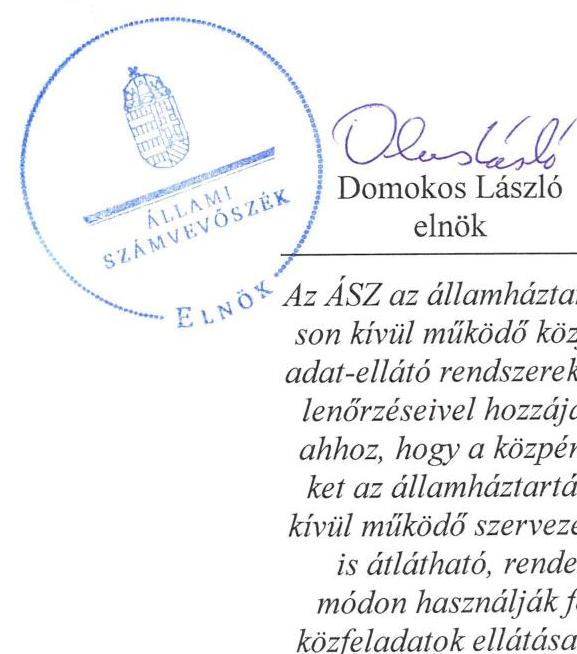
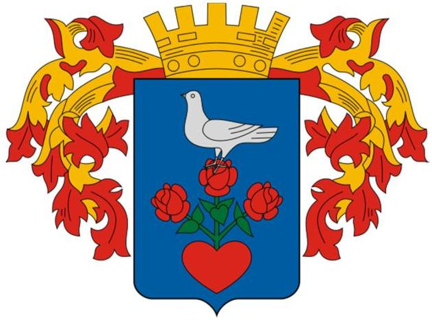
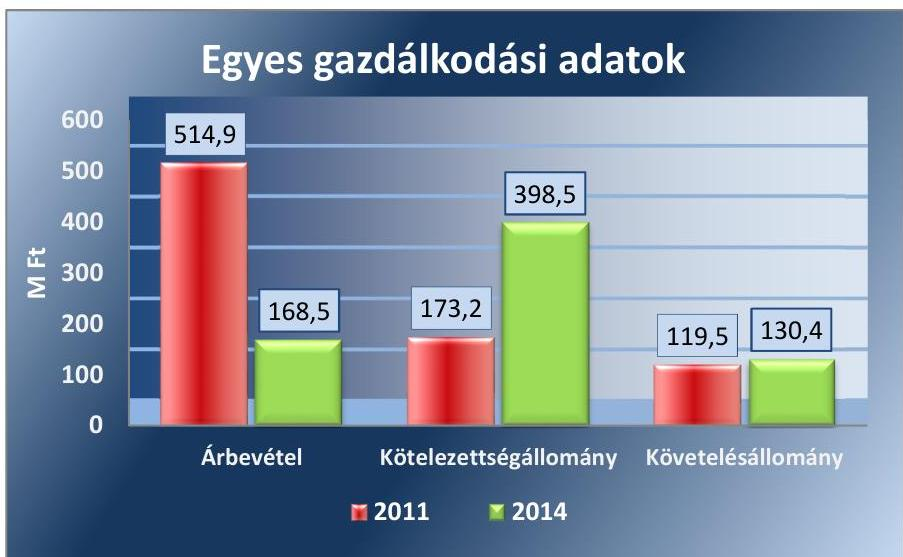
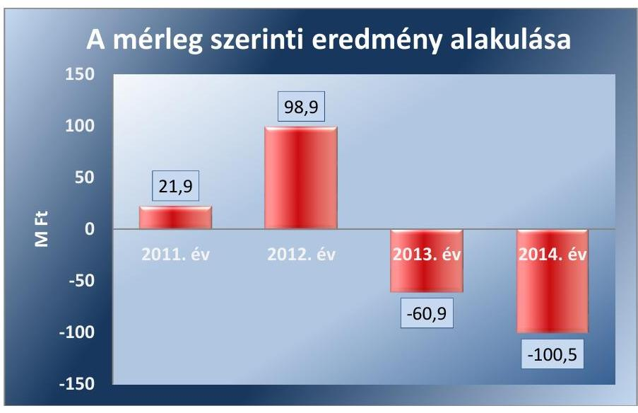
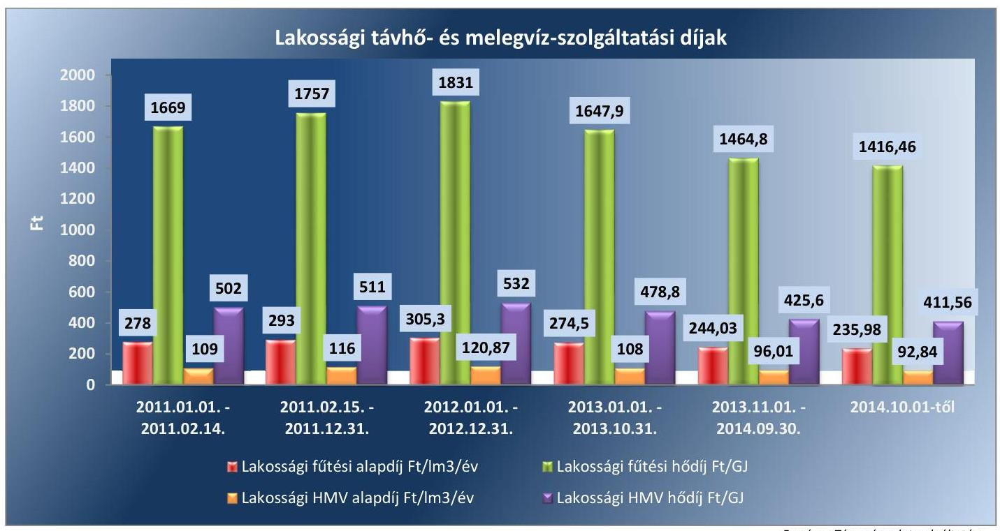

# Jelentés 

## Az önkormányzatok gazdasági társaságai

Az önkormányzatok többségi tulajdonában lévő gazdasági társaságok közfeladat ellátását érintő gazdálkodási tevékenysége szabályszerűségének ellenőrzése - Csongrádi Közmű Szolgáltató Kft. 2016.

Az ÁSZ az államháztartáson kívül müködő közfel-adat-ellátó rendszerek ellenőrzéseivel hozzájárul ahhoz, hogy a közpénzeket az államháztartáson kívül müködő szervezetek is átlátható, rendezett módon használják fel a közfeladatok ellátása érdekében.

---

# Jelentés 

## Az önkormányzatok gazdasági társaságai

Az önkormányzatok többségi tulajdonában lévő gazdasági társaságok közfeladat ellátását érintő gazdálkodási tevékenysége szabályszerűségének ellenőrzése - Csongrádi Közmű Szolgáltató Kft.
2016. november hó 23. nap

16189
www.asz.hu

---

# AZ ELLENŐRZÉST FELÜGYELTE:

DR. HORVÁTH MARGIT felügyeleti vezető

## AZ ELLENŐRZÉST VEZETTE ÉS A VÉGREHAJTÁSÁÉRT FELELŐS:

SALAMIN VIKTOR ellenőrzésvezető

A PROGRAM ÖSSZEÁLLÍTÁSÁÉRT FELELŐS:

JANIK JÓZSEF osztályvezető

IKTATÓSZÁM: V-1072-132/2016.

TÉMASZÁM: 2051

ELLENŐRZÉS-AZONOSÍTÓ SZÁM: V-070744

Jelentéseink az Országgyűlés számítógépes hálózatán és az Interneta a www.asz.hu címen is olvashatóak.

---

# TARTALOMJEGYZÉK 

■ ÖSSZEGZÉS ..... 5
■ AZ ELLENŐRZÉS CÉLJA ..... 7
■ AZ ELLENŐRZÉS TERÜLETE ..... 8
■ AZ ELLENŐRZÉS HÁTTERE, INDOKOLTSÁGA ..... 10
■ FÓKUSZKÉRDÉSEK ..... 11
■ ELLENŐRZÉS HATÓKÖRE ÉS MÓDSZEREI ..... 12
■ MEGÁLLAPÍTÁSOK ..... 14
■ JAVASLATOK ..... 24
■ MELLÉKLETEK ..... 25
I. sz. melléklet: Értelmező szótár ..... 25
II. sz. melléklet: Múködési adatok ..... 27
III. sz. melléklet: Hődíjak alakulása ..... 28
■ FÜGGELÉK: ÉSZREVÉTELEK ..... 29
■ RÖVIDÍTÉSEK JEGYZÉKE ..... 31

---

.

---

# ÖSSZEGZÉS 

Az Állami Számvevőszék a kizárólagos önkormányzati tulajdonú Csongrádi Közmű Szolgáltató Kft. távhőszolgáltatási közfeladat ellátását érintő gazdálkodási tevékenysége szabályszerűségét ellenőrizte 2011-2014 években. A közfeladat-ellátás önkormányzati megszervezése szabályos volt, a tulajdonosi joggyakorlás és annak szabályozása megfelelt a jogszabályi előírásoknak. A vagyongazdálkodás, valamint a közfeladat bevételeinek, költségeinek és ráfordításainak az elszámolása szabályos volt. Az önköltségszámítás szabályait meghatározták, a közszolgáltatás díjainak megállapítása és alkalmazása megfelelő volt. A Társaság kötelezettségállománya a müködésre, a közfeladat-ellátásra nem jelentett kockázatot.

## Az ellenőrzés társadalmi indokoltsága

Az Állami Számvevőszék stratégiájában megfogalmazta, hogy a helyi önkormányzatok gazdálkodásában rejlő pénzügyi kockázatok feltárásával, az államháztartáson kívülre nyújtott költségvetési támogatások és ingyenes vagyonjuttatások, valamint az államháztartáson kívül működő közfeladat-ellátó rendszerek ellenőrzéseivel hozzájárul ahhoz, hogy a közpénzeket az államháztartáson kívül működő szervezetek is átlátható, rendezett módon használják fel a közfeladatok szerződésben vállalt ellátása érdekében.

Magyarországon az intézmény-centrikus közfeladat-ellátás jellemző, de egyre jelentősebb a költségvetésen kívüli feladatellátás térnyerése. Ennek legfontosabb szereplői - a nonprofit szervezetek mellett - az önkormányzati tulajdonú gazdasági társaságok. Az önkormányzatok szervezetalakítási szabadságának következménye, hogy a korábban is vállalati formában működő közszolgáltatások mellett, mind a kötelező, mind az önként vállalt feladatok ellátásában a gazdasági társaságok kiemelt fontosságú szerephez jutottak.

## Főbb megállapítások, következtetések, javaslatok

Az Önkormányzat a távhőszolgáltatás közfeladatának megszervezéséről a jogszabályi előírásoknak megfelelően döntött, annak ellátásáról a kizárólagos tulajdonában lévő gazdasági társasága útján gondoskodott. A szükséges eszközöket apport formájában a Társaság rendelkezésére bocsátotta, a távhőszolgáltatás működtetéséhez vagyonkezelésre eszközt nem adott át. A feladatellátás kereteit a vagyongazdálkodási rendelet ${ }_{1,2}$ és annak előírásaival összhangban az Alapító Okirat határozta meg.

Az Önkormányzat a távhőszolgáltatással összefüggő rendeletalkotási kötelezettségének eleget tett. A távhőellátás biztosításának szabályait a Távhő rendeletben, a távhődíjak megállapításának előírásait a Díjrendeletben - a Tszt.ben rögzítettekkel összhangban - határozták meg. Az Önkormányzat a Díjrendeletét annak ellenére nem módosította, hogy a hatósági ár bevezetésével az Önkormányzat ármegállapítási jogköre - a csatlakozási díj kivételével megszűnt.

Az Önkormányzatot megillető tulajdonosi jogokat a szabályozással összhangban a Képviselő-testület gyakorolta, hatáskör átruházásra nem került sor. Az FB a jogszabályi előírásokkal összhangban három tagból állt, a Társaság számviteli beszámolóit írásban véleményezte, azonban ügyrendjét a Gt. előírásaival ellentétben nem készítette el. Az anyagi érdekeltségi rendszer elemeit rögzítő javadalmazási szabályzat nem tartalmazott minden, a Takt.-ben előírt tartalmi elemet. Az ellenőrzött időszakban az Önkormányzat belső ellenőrzése elvégezte a Társaság pénzügyi átvilágítását, illetve a 2012., 2013. évi üzleti tervek megalapozottságának, teljesítésének értékelését.

A közfeladat-ellátást szolgáló vagyonnal való gazdálkodás, annak nyilvántartása szabályszerű volt. A Társaság -2014-ig a pénzkezelési szabályzat kivételével - rendelkezett a Számv. tv. előírásainak megfelelő számviteli szabályzatokkal, amelyek elősegítették a szabályszerű működést. A Tszt.-ben előírt tartalommal készült üzletszabályzatokat a

---

jegyző jóváhagyta, azonban a Tszt. előírásai ellenére nem küldte meg véleményezésre a fogyasztóvédelmi hatóságnak.

A Társaság vagyona 2011. január 1-je és 2014. december 31. között 222,0 M Ft-tal nőtt. Az ellenőrzött időszakban a források összetétele is megváltozott. A saját tőke aránya 18,5 százalékponttal 22,5\%-ra csökkent, 2014. december 31-i záró értéke 159,8 M Ft volt. A kötelezettségek összes forráson belüli aránya 38,7\%-ról 56,0\%-ra nőtt, mérlegértéke az ellenőrzött időszak végén 398,5 M Ft volt. A változást befolyásoló lényegesebb gazdasági események a fürdő beruházás számviteli elszámolása, az ehhez kapcsolódó tagi kölcsön nyilvántartásba vétele, a vízi-közmű vagyon Önkormányzat részére történő ingyenes átadása volt. Az eladósodottságot jelző mutatók értéke elsősorban a 300,0 M Ft tagi kölcsön igénybevétele miatt romlott 2014-ben, azonban a kötelezettségállomány a távhőszolgáltatás közfeladatának ellátására nem jelentett kockázatot. A Társaság kezelte követelésállományát, felszólító levelek küldésével, fizetési meghagyások kezdeményezésével, illetve bírósági végrehajtás útján intézkedett a távhődíj tartozások csökkentésére. A megtett intézkedések és a távhőszolgáltatási díjak csökkentésének együttes hatására a lakossági díjhátralék csökkent az ellenőrzött időszakban. A távhőtermelő és távhőszolgáltató üzletágból származó veszteség 2012-ben 0,2 M Ft 2013-ban 4,2 M Ft, 2014-ben 21,9 M Ft volt, a Társaság a 2012-2014. években 156,8 M Ft távhőszolgáltatási támogatásban részesült.

A Társaság az üzleti tervek teljesítéséről, a gazdálkodásról és a közszolgáltatási tevékenységről évente beszámolt. Az éves beszámolók elfogadásáról a Képviselő-testület az FB írásbeli véleményének és a könyvvizsgáló jelentésének birtokában döntött. A szétválasztási szabályok kidolgozását és alkalmazását a könyvvizsgáló a Tszt. előírásainak megfelelően a 2012-2014. évi beszámolóhoz kiadott könyvvizsgálói jelentésben igazolta. Az Info tv.-ben előírt adatvédelmi és adatbiztonsági szabályzatot 2012. január 1-jén hatályba léptették, illetve kinevezték a belső adatvédelmi felelőst. A Társaság jogszabályi kötelezettségének eleget téve a közérdekű adatait honlapján közzétette. A távhőszolgáltatás bevételeinek, költségeinek és ráfordításainak elszámolása megfelelt a jogszabályok és belső szabályozás előírásainak. Az önköltségszámítás rendjét meghatározták, az éves beszámolók kiegészítő mellékleteiben kimutatott tevékenységenkénti eredményt utókalkulációval alátámasztották. A díjképzés a Díjrendeletben foglaltaknak, 2011. április 15-től a jogszabályi előírásoknak megfelelt, a díjcsökkentést a Rezsi tv. előírásai szerint végrehajtották.

---

# AZ ELLENŐRZÉS CÉLJA 

## A közfeladat ellátást érintő gazdálkodási tevékenység szabályozottságának és szabályszerűségének értékelése

Az ellenőrzés célja annak értékelése, hogy az önkormányzat a jogszabályi előírások figyelembevételével döntött-e az ellenőrzésre kerülő közfeladat megszervezéséről; az önkormányzat/tulajdonosi joggyakorló szabályszerűen gyakorolta-e a tulajdonosi jogokat.

Ellenőriztük, hogy a gazdasági társaság közfeladat-ellátása bevételeinek, ráfordításainak elszámolása, és vagyongazdálkodási tevékenysége megfelelt-e a jogszabályi, illetve a közszolgáltatási/vagyonkezelési szerződésben foglalt tulajdonosi előírásoknak, azok végrehajtása szabályszerű volt-e.

Értékeltük továbbá, hogy a gazdasági társaság kötelezettségállománya jelentett-e kockázatot a múködésre, illetve a közfeladat ellátására; valamint, hogy a közfeladatok átláthatósága és elszámoltathatósága érdekében biztosítva volte a közszolgáltatás díjának megalapozottsága szabályszerű önköltségszámítással.

---

# **A Z ELLENŐRZÉS TERÜLETE**

## **Csongrád Város Önkormányzata és a kizárólagos tulajdonában lévő Csongrádi Közmű Szolgáltató Korlátolt Felelősségű Társaság**

Csongrád Város Önkormányzata a Csongrádi Közmű Szolgáltató Korlátolt Felelősségű Társaságot 2009. október 30-án, a Csongrád Városi Víz- és Kommunális Kft-ből történő kiválással hozta létre. Az Önkormányzat1 a távhővagyont alapításkor apportba adta, kezelésre vagyont a távhőszolgáltatással kapcsolatosan nem adott át.

A Társaság2 főtevékenysége Csongrád Város közigazgatási területén a távhőszolgáltatás biztosítása, valamint 2013 végéig az ivóvíz- és szennyvíz szolgáltatás. A Társaság kizárólagos önkormányzati tulajdonban volt az ellenőrzött időszakban. Jegyzett tőkéje nem változott, az ellenőrzött években 55 M Ft volt.

Csongrád Város lakosságának száma 2015. január 1-jén meghaladta a 16 ezer főt, a távfűtött lakások száma 517 db volt. Ezen túl egy óvoda részére távfűtést és melegvíz szolgáltatást, további 10 – saját kazánnal rendelkező – intézmény részére termálhő alap-energiaszolgáltatást nyújtott a Társaság. A távhőszolgáltatás részben termálkútból származó hőenergiával, részben tömb-fűtőműben termelt hőenergiával volt biztosított. Az ügyvezető 2014. január 1-jétől tölti be tisztségét.

A Társaság gazdálkodásának egyes adatait a 2011. és 2014. évek vonatkozásában az 1. ábra szemlélteti.

1. ábra

*Forrás: 2011., 2014. évi beszámoló*

Az értékesítés nettó árbevételének nagyságára alapvetően a Társaság által ellátott tevékenységi körök alakulása volt hatással. A 2014. évi nettó

---

árbevétel - az ivóvízellátás és szennyvízszolgáltatás tevékenységének megszűnése miatt - jelentősen elmaradt az előző évek realizált árbevételétől. A többszöri díjcsökkentés ellenére a lakossági dijhátralék nőtt, ez volt az alapvető oka a követelés állomány 10,9 millió Ft-os emelkedésének. A kötelezettségek mérlegértékének jelentős emelkedését eredményezte a 2014. évi 300 M Ft tagi kölcsön igénybevétele.

A Társaság múködésének főbb jellemzőit a 2. számú melléklet mutatja be.

Az ellenőrzött időszakban a polgármester személye egy alkalommal, a jegyző személye nem változott. A polgármester ${ }^{3}$ a 2014. évi önkormányzati választások óta tölti be tisztségét, a helyszíni ellenőrzés időszakában munkakört betöltő jegyző ${ }^{4}$ 2015. május 1-jétől látja el feladatait.

Az ellenőrzött Csongrádi Közmű Szolgáltató Kft-n kívül három 100\%-os tulajdoni hányadú, továbbá négy többségi tulajdonú gazdasági társaság vállalt részt az önkormányzat közfeladatainak ellátásában az egészségügyi alapellátás, a szociális alapellátás és rehabilitációs foglalkoztatás, média tevékenység (tv), hulladékgazdálkodás, beruházási és fejlesztési feladatok ellátása területén.

---

# AZ ELLENŐRZÉS HÁTTERE, INDOKOLTSÁGA 

Objektív vélemény kialakítása Csongrád Város Önkormányzata távhőszolgáltatási közfeladatának megszervezéséről, tulajdonosi jogai gyakorlásáról, valamint a kizárólagos tulajdonban lévő Csongrádi Közmű Szolgáltató Kft. közfeladat ellátását érintő gazdálkodási tevékenységének szabályszerűségéről.

## Az önkormányzatok közfeladat-ellátásában egyre jelentősebb a gazdasági társaságokon belüli feladatellátás térnyerése

AZ ÁSZ STRATÉGIÁJÁBAN megfogalmazta, hogy a helyi önkormányzatok gazdálkodásában rejlő pénzügyi kockázatok feltárásával, az államháztartáson kívülre nyújtott költségvetési támogatások és ingyenes vagyonjuttatások, valamint az államháztartáson kívül múködő közfeladatellátó rendszerek ellenőrzéseivel hozzájárul ahhoz, hogy a közpénzeket az államháztartáson kívül múködő szervezetek is átlátható, rendezett módon használják fel a közfeladatok szerződésben vállalt ellátása érdekében.

Az Áht. ${ }^{5}$ 1. § (3) bekezdése értelmében az államháztartáson kívüli szervezetek a közfeladatok ellátásában - jogszabályban meghatározott feltételekkel - közremúködhetnek. Az önkormányzati tulajdonú gazdasági társaságok teljes körű ellenőrzésének lehetőségét az Állami Számvevőszékről szóló 1989. évi XXXVIII. törvény 2011. január 1-jétől hatályos módosítása teremtette meg. A gazdasági társaságok közfeladat ellátását érintő gazdálkodási tevékenysége szabályszerűségére irányuló ellenőrzéseket erre tekintettel a 2011. évtől végezzük.

## AZ ELLENŐRZÉS VÁRHATÓ HASZNOSULÁSA-

KÉNT az ÁSZ ${ }^{6}$ a megállapításaival segítséget nyújthat az államháztartáson kívüli közfeladat-ellátás értékeléséhez, jogszabályi keretei pontosításához, átláthatóságot biztosító szabályozásához. Meghatározhatóvá válnak a közfeladat ellátásban részt vevő államháztartáson kívüli szervezeteknek az önkormányzat költségvetését, pénzügyi helyzetét is befolyásoló - kockázatai, lehetővé válik ezen kockázatok csökkentése.

Értékelhetővé válik, hogy a feladatot ellátó gazdasági társaság a közszolgáltatási szerződésben foglaltak betartásával, a közvagyon használatával biztosította-e a szolgáltatás folytatásának feltételeit. Ezzel az ellenőrzöttek és a helyi döntéshozók számára az ÁSZ visszajelzést ad feladatszervezési, feladat-ellátási kockázataikról, alapot ad a meglévő hibák megszüntetéséhez, a jobb közfeladat-ellátás biztosításához. Mindezeken keresztül az ÁSZ hozzájárul Magyarország közpénzügyi helyzetének javításához, a közpénzek mérhető módon történő, a döntéshozók által meghatározott célok szerinti felhasználásához.

---

# FÓKUSZKÉRDÉSEK 

1. Az önkormányzat közfeladat megszervezéséről szóló döntése, valamint tulajdonosi joggyakorlása szabályszerű volt-e?
2. A gazdasági társaság vagyongazdálkodása szabályszerű volt-e, kötelezettségállománya jelentett-e kockázatot a müködésre, illetve a közfeladat ellátására?
3. A gazdasági társaságnál az ellátott közfeladat bevételei és ráfordításai elszámolása, valamint az önköltségszámítás és árképzés szabályszerű volt-e?

---

# ELLENŐRZÉS HATÓKÖRE ÉS MÓDSZEREI 

## Az ellenőrzés típusa

Megfelelőségi ellenőrzés.

## Az ellenőrzött időszak

2011. január 1-jétől 2014. december 31-ig tart.

## Az ellenőrzés tárgya

A közfeladatot gazdasági társaságokkal ellátó önkormányzatok tulajdonosi joggyakorlása, valamint gazdasági társaságok pénz- és vagyongazdálkodásának szabályozottsága és szabályszerűsége.

Az ellenőrzés kiterjed minden olyan körülményre és adatra, amely az ÁSZ jogszabályban meghatározott feladatainak teljesítéséhez, valamint a program végrehajtása folyamán felmerült újabb összefüggések feltárásához szükséges.

## Az ellenőrzött szervezet

Az ellenőrzött szervezetek:
$\longrightarrow$ Csongrád Város Önkormányzata,
$\longrightarrow$ Csongrádi Közmű Szolgáltató Kft.

## Az ellenőrzés jogalapja

Az ellenőrzés jogszabályi alapját az ÁSZ tv. 5. § (3)-(4)-(5) bekezdései képezik. Ennek értelmében az ÁSZ ellenőrzi az államháztartásból nyújtott támogatás vagy az államháztartásból meghatározott célra ingyenesen juttatott vagyon felhasználását a gazdasági társaságoknál. Az önkormányzati vagyon kezelésének ellenőrzése keretében ellenőrzi a vagyon kezelését, a vagyonnal való gazdálkodást, a többségi önkormányzati tulajdonban lévő gazdasági társaságok vagyonérték-megőrző és vagyongyarapító tevékenységét, az államháztartás körébe tartozó vagyon elidegenítésére, illetve megterhelésére vonatkozó szabályok betartását; ellenőrizheti a többségi önkormányzati tulajdonban lévő gazdasági társaságok vagyongazdálkodását.

---

# Az ellenőrzés módszerei 

Az ellenőrzést a nemzetközi standardokat irányadónak tekintve az ellenőrzési program ellenőrzési kérdései, az ellenőrzött időszakban hatályos jogszabályok, az ellenőrzés szakmai szabályok és módszertanok figyelembe vételével végezzük.

Az ellenőrzés ideje alatt az ellenőrzött szervezettel történő kapcsolattartást az ÁSZ Szervezeti és Múködési Szabályzatának vonatkozó előírásai alapján biztosítjuk.

Az ellenőrzés a kiválasztott, többségi tulajdonosi jogokat gyakorló önkormányzatra, illetve az ellenőrzésre kijelölt közfeladatot ellátó gazdasági társaság felett tulajdonosi jogokat gyakorló szervezetre és az ellenőrzött közfeladatot ellátó gazdasági társaságra terjed ki. Amennyiben a gazdasági társaságban több önkormányzat együttesen többségi tulajdonos, úgy az ellenőrzést a többségi tulajdonosi jogokat gyakorló önkormányzatnál kell lefolytatni. Az ellenőrzött gazdasági társaságnál, amennyiben az több közfeladatot is ellát, akkor az ellenőrzésre kiválasztott közfeladat-ellátást ellenőrizzük.

Az ellenőrzést a kérdésekre adott válaszok kiértékelésével, valamint a megjelölt adatforrások, tanúsítványok felhasználásával, továbbá az adott időszakban hatályos jogszabályok figyelembe vételével kell lefolytatni. Az ellenőrzési kérdések megválaszolásához szükséges bizonyítékok megszerzése a következő ellenőrzési eljárások alkalmazásával történik: megfigyelés, kérdésfeltevés (információkérés), összehasonlítás, valamint elemző eljárás.

A bevételek és ráfordítások elszámolása, valamint a vagyonnyilvántartás terén a szabályszerű múködést véletlen mintavétellel ellenőriztük. A jogszabályoknak és a belső előírásoknak megfelelőnek tekintettük az adott területet, amennyiben a minta ellenőrzésének eredménye alapján 95\%-os bizonyossággal a teljes sokaságban a hibaarány kisebb volt, mint 10\%, nem megfelelőnek értékeltük, ha a hibaarány a 10\%-ot meghaladta. Részben megfeleltnek értékeltük, amennyiben egy adott terület vonatkozásában a minta alapján a teljes sokaságban nem volt egyértelmúen biztosított a jogszabályoknak és a belső szabályzatoknak megfelelő múködés. A ráfordítások elszámolására és a vagyonnyilvántartásra vonatkozó véletlen mintavételt kockázati alapú kiválasztással egészítettük ki, amelynek során évente a három legnagyobb összegű tételt választottuk ki.

---

# 1. Az önkormányzat közfeladat megszervezéséről szóló döntése, valamint tulajdonosi joggyakorlása szabályszerű volt-e? 

Összegző megállapítás

Az Önkormányzat közfeladat-ellátás megszervezéséről szóló döntése és a tulajdonosi jogok gyakorlása összességében szabályszerű volt.
1.1. számú megállapítás

A közfeladat-ellátást az Önkormányzat szabályszerűen szervezte meg, a távhőszolgáltatásra vonatkozó rendeletalkotási kötelezettségének eleget tett.

Az Ötv². 91. § (6) bekezdése, 2013. január 1-jétől az Mötv8. 116. § (3)-(4) bekezdései szerint az önkormányzatnak a gazdasági programjában kell meghatároznia azokat a célkitűzéseket, amelyek az általa ellátott feladatok biztosítását, fejlesztését szolgálják. A Képviselő-testület ${ }^{9}$ által a 2011-2014. évekre elfogadott gazdasági program a távhőszolgáltatáshoz kapcsolódó fejlesztéseket nem tartalmazott.

A távhőszolgáltatással ellátott létesítmények távhőellátásának távhőszolgáltatásra engedéllyel rendelkezők útján történő biztosítása a Tszt ${ }^{10}$. 6. § (1) bekezdése értelmében a területileg illetékes települési önkormányzat kötelező feladata. Ennek a kötelezettségnek az Önkormányzat a Társaság alapításával eleget tett. A múködéséhez szükséges eszközöket az Önkormányzat - az ellenőrzött időszakot megelőzően - apport formájában bocsátotta a Társaság rendelkezésére, kezelésre vagyont nem adott át.

A Társaság feladatellátásának kereteit az Alapító Okirat, a távhő ellátás biztosításának szabályait a Távhő rendelet ${ }^{11}$ és a távhődíjak megállapításának szabályait a Díjrendelet ${ }^{12}$ előírásai meghatározták. Az Önkormányzat és a Társaság között a közfeladat ellátására szerződés nem jött létre, arra a feleket jogszabályi előírás nem kötelezte.

AZ ALAPÍTÓ OKIRAT előírásai szerint a Gt ${ }^{13}$. 19. § (5) bekezdésben előírtakkal összhangban a taggyűlés jogait az alapító gyakorolta. Az ügyvezető és az $\mathrm{FB}^{14}$ vonatkozásában a Gt. szerinti jogkörgyakorlást, feladatellátást, felelősségvállalást írták elő. A 2014. december 9-én módosított Alapító Okirat annak ellenére tartalmazott a Gt.-re való hivatkozást, hogy a jogszabályt 2014. március 15-től hatályon kívül helyezték*.

A TÁVHŐ RENDELET megalkotásával az Önkormányzat a Tszt. 6. § (2) bekezdés a) pontjában előírt kötelezettségének eleget tett. A Távhő rendeletben meghatározták a közüzemi szerződés tartalmát, a szerződés

[^0]
[^0]:    * 2014. március 15-től a gazdasági társaságok múködésének jogszabályi kereteit a Ptk. rögzíti.

---

# 1.2. számú megállapítás 

felmondásának előírásait, a távhőszolgáltatás bekapcsolásának, vételezésének, szüneteltetésének, korlátozásának szabályait. A Díjrendeletben a Tszt. 6. § (2) bekezdés (b) pontjában előírtakkal összhangban meghatározták a távhőszolgáltatási díjak (alapdíj, hődíj, csatlakozási díj) alkalmazásának és fizetésének szabályait, a díjak mértékét. A távhőszolgáltatás alapdíját, a mért hő díját tartalmazó 1. számú mellékletet utolsó alkalommal 2011. február 15-i hatállyal módosították. A Tszt. 57/D. §-ának 2011. április 15-i módosítását követően a Díjrendeletet annak ellenére nem módosították, hogy a hatósági ár bevezetésével az Önkormányzat ár megállapítási jogköre - a csatlakozási díj kivételével - megszűnt.

A tulajdonos a távhőszolgáltatással kapcsolatos döntések esetében tulajdonosi jogait érvényesítette, az FB müködésének szabályozása azonban hiányos volt.

A TULAJ DONOSI JOGOK gyakorlásának rendjét a vagyonrendelet ${ }^{15}{ }_{2}{ }^{16}$-ben és azzal összhangban az Alapító Okiratban írták elő. Az Önkormányzatot megillető tulajdonosi jogokat a szabályozással összhangban a Képviselő-testület gyakorolta, hatáskör átruházásra nem került sor.

AZ FB az ellenőrzött időszakban az Alapító Okiratban előírtak alapján a Gt. 34. § (1) bekezdésével, valamint a Ptk ${ }^{17}$. 3:121. § (1) bekezdésével összhangban - három tagból állt. Az FB a Társaság számviteli beszámolóiról jelentést készített, azokat az FB határozatok szerint az Önkormányzatnak elfogadásra javasolta.

A Gt. 34. § (4) bekezdésében, 2014. március 15-től a Ptk. 3:122. § (3) bekezdésének előírtak szerint az FB állapítja meg az ügyrendjét, melyet a társaság legfőbb szerve hagy jóvá. Ennek a kötelezettségének az FB nem tett eleget, az ellenőrzött időszakban ügyrenddel nem rendelkezett.

AZ ANYAGI ÉRDEKELTSÉGI RENDSZER elemeit a Kép-viselő-testület által elfogadott javadalmazási szabályzat ${ }_{1}{ }^{18}{ }_{2}{ }^{19}$-ben rögzítették. Az ügyvezető prémiumának megállapítása során teljesítménykövetelményként előírták az üzleti terv teljesítéséről szóló beszámoló, valamint az éves beszámoló Alapító általi elfogadását.

A javadalmazási szabályzat ${ }_{1,2}$ hiányossága volt, hogy a Taktv ${ }^{20}$. 5. § (3) bekezdésében foglaltak ellenére nem tartalmazták a jogviszony megszűnése esetére biztosított juttatások módjának, mértékének elveit és rendszerét.

AZ ÁRKÉPZÉS SZABÁLYAIT a Díjrendeletben határozta meg az Önkormányzat. A távhőszolgáltatás 2011. április 15-ig olyan hatósági áras szolgáltatás volt, amelynek legmagasabb árait az önkormányzatoknak kellett előírniuk. A Díjrendeletben az Ámt. ${ }^{21}$ 7. § (1) bekezdésének, valamint a törvény mellékletének megfelelően meghatározták a távhőszolgáltatás legmagasabb fogyasztói árát az alapdíjra, a hődíjra, valamint a csatlakozási díjra vonatkozóan. A 2011. január 1-jén hatályos díjakat a Díjrendelet 2008. december 2-i módosítása során vezették be. Ezt követően 2011. február 15-i hatállyal az alapdíjat, és hődíjat egyaránt módosították. Az ármódosítás alapját a Társaság által előterjesztett díjkalkuláció képezte.

---

A BESZÁMOLTATÁSI RENDSZERT az Önkormányzat múködtette, mivel a Társaság ügyvezetőjét évente beszámoltatta a gazdálkodásról, a végzett közszolgáltatási tevékenységről. A Társaság 2011-2014. üzleti éveiről készített éves beszámolóit a Képviselő-testület megtárgyalta és elfogadta. A Képviselő-testület a beszámolók elfogadásáról a Gt. 35. § (3) bekezdésének és a Ptk. 3:120. § (2) bekezdésének előírásait betartva az FB írásos jelentésének birtokában döntött.

A TÁRSASÁG BELSŐ ELLENŐRZÉSÉT az Önkormányzat belső ellenőre végezte, az ellenőrzött időszakban két ellenőrzést folytatott le. 2011-ben a Társaság pénzügyi átvilágítására került sor és a belső ellenőr jelentése a szervezeti és múködési szabályzat kiegészítésére, valamint ön-költség-számítási szabályzat és beszerzési szabályzat készítésére tett javaslatot. A javaslatok realizálására vonatkozó intézkedési terv készítési kötelezettsége nem volt a Társaságnak. A 2013-ban végzett ellenőrzés a 2012., 2013. évi üzleti tervek megalapozottságának, teljesítésének értékelésére terjedt ki. A jelentés a 2012. év tekintetében több költségnem és a bevételek vonatkozásában is jelentősnek minősítette a terv és tényadatok közötti eltérést. A 2013. évi üzleti terv időarányos teljesítését állapította meg. Az ellenőrzés intézkedést igénylő megállapítást nem tett. A távhőszolgáltatás közfeladat ellátására az ellenőrzések nem terjedtek ki. Az Önkormányzat megbízásán alapuló külső szakértői ellenőrzésre nem került sor.

A mérleg szerinti eredmény a 2011-2012. években pozitív volt, a 20132014. években veszteségesen gazdálkodott a Társaság. A mérleg szerinti eredmény összegét a 2. ábra mutatja be.
2. ábra

Forrás: a Társaság beszámolói
A Képviselő-testület határozataiban a 2011-2012. évek nyereségének eredménytartalékba helyezéséről döntött, osztalék kifizetésre nem került sor.

Az Önkormányzat az ellenőrzött időszakot megelőzően - 2013. szeptember 30-ig - vállalt kezességet a Társaság 44 M Ft folyószámlahiteléhez kapcsolódóan. A készfizető kezességvállalás beváltására nem került sor. A Társaság feladatellátásához múködési és fejlesztési támogatást nem nyújtott.

---

# 2. A gazdasági társaság vagyongazdálkodása szabályszerű volt-e, kötelezettségállománya jelentett-e kockázatot a múködésre, illetve a közfeladat ellátására? 

Összegző megállapítás

2.1. számú megállapítás

A Társaság vagyongazdálkodása szabályszerű volt, kötelezettségállománya a múködésre, a távhőszolgáltatás ellátására nem jelentett kockázatot.

A Társaság a jogszabályok által előírt szabályzatokkal - a pénzkezelési szabályzat kivételével - rendelkezett, azonban az üzletszabály-zat ${ }_{1,2}$-t a jegyző véleményezésre nem küldte meg a fogyasztóvédelmi hatóságnak.

AZ ÜZLETI TERVEKET az ügyvezető készítette el és terjesztette a Képviselő-testület elé. Az üzleti tervek tartalmi és formai követelményeit nem határozták meg, azok a várható eredményt, a tervezett fejlesztéseket, a fennálló kötelezettségek ütemezését tartalmazták. A távhőszolgáltatás díjbevételeit a Díjrendelet hatályos díjtételeinek figyelembevételével tervezték. Az üzleti terveket a Képviselő-testület határozattal hagyta jóvá.

A Társaság rendelkezett a Számv. tv. ${ }^{22}$ 14. § (3) bekezdésben előírt számviteli politikával, valamint a Számv. tv. 14. § (5) bekezdés a), b) pontjaiban előírtaknak megfelelően eszközök és források leltárkészítési és leltározási, illetve értékelési szabályzatával. Elkészítették továbbá a Számv. tv. 161. § (1) bekezdésben előírt számlarendet. A 2011-2013. években a Számv. tv. 14. § (5) bekezdés d) pontjában előírtak ellenére pénzkezelési szabályzattal nem rendelkeztek.

A SZÁMVITELI POLITIKA a Számv. tv. 14. § (4) bekezdése, valamint a 161/A. § előírásainak megfelelt. Az eszközök és források leltárkészítési és leltározási szabályzata az ingatlanok 3 évenkénti, a gépek, berendezések és felszerelések 2 évenkénti mennyiségi felvétellel történő leltározási kötelezettségét írta elő. A szabályozás megfelelt a Számv. tv. 69. § (3) bekezdésében foglalt előírásoknak, mivel a Társaság év közben az eszközeiről folyamatos mennyiségi nyilvántartást vezetett. Az eszközök és források értékelési szabályzatában - többek között - meghatározták az eszközök és források értékelésének szabályait, a vevőkövetelésekre elszámolt értékvesztés megállapításának kritériumait. A tartós ( 360 napon túli) követelések vonatkozásában írtak elő 20\% értékvesztés elszámolását. A 2014. január 1-jétől hatályos pénzkezelési szabályzatban a Számv. tv. 14. § (8) bekezdésében előírtaknak megfelelően - többek között - rendelkeztek a pénzforgalom lebonyolításának rendjéről, a készpénzben és a bankszámlán tartott pénzeszközök közötti forgalomról, a bankkártya használat rendjéről, a készpénzállomány ellenőrzésekor követendő eljárásról, az ellenőrzés gyakoriságáról. A számlarend tartalma megfelelt a Számv. tv. 161. § (2) bekezdés előírásainak.

AZ ÖNKÖLTSÉGSZÁMÍTÁSI SZABÁLYZAT készítésének kötelezettsége alól a Számv. tv. 14. § (6) bekezdése alapján 2013. január 1-jét megelőzően mentesült a Társaság. A 2012. évben elszámolt

---

költségnemek szerinti költségek együttes összege meghaladta az 500 M Ftot, ezért 2013. január 1-jén hatályba helyezték a Számv. tv. 14. § (5) bekezdés c) pontjában előírt önköltségszámítási szabályzatot.

A kialakított számlarend, valamint a kalkulációs egységek alkalmazását előíró szabályozás, az önköltségszámítási szabályzat, és a számviteli szétválasztási szabályzat együttesen biztosította, hogy a könyvvezetésre, a bizonylatolásra vonatkozó belső szabályok a mérleg és eredmény kimutatás alátámasztásán túlmenően a kiegészítő melléklet adatainak közvetlen alátámasztására alkalmasak legyenek.

ÜZLETSZABÁLYZAT ${ }_{1}{ }^{23,2}{ }^{24}$-t a Tszt. 3. § v) pontja szerinti tartalommal elkészítette a Társaság. A jegyző az üzletszabályzatokat jóváhagyta, azonban azokat a Tszt. 7. § (1) bekezdés a) pontja ellenére nem küldte meg véleményezésre a fogyasztóvédelmi hatóságnak.

# 2.2. számú megállapítás 

A Társaság a tulajdonában lévő vagyonával a jogszabályi és belső rendelkezéseknek megfelelően gazdálkodott.

## AZ ANALITIKUS ÉS FŐKÖNYVI NYILVÁNTARTÁSI

RENDSZER biztosította a Társaság vagyonának Számv. tv. és belső szabályozás szerinti nyilvántartását, a változások folyamatos nyomon követését. Az ellenőrzött évek beszámolóinak mérlegét alátámasztó, Számv. tv. 69. § (1) bekezdése szerinti leltárakat elkészítették.

A Társaság a távhőszolgáltatás közfeladatát saját eszközeivel látta el, üzemeltetésre átvett, illetve vagyonkezelésbe vett eszköze nem volt. A főkönyvi könyvelés és analitikus nyilvántartások közötti egyezőséget biztosították.

A tárgyi eszközök és készletek Számv. tv. 69. § (3) bekezdése szerinti, mennyiségi felvétellel történő leltározását az eszközök és források leltározási és leltárkészítési szabályzatában előírtaknak megfelelően elvégezték.

A Társaság főbb mérleg adatait az 1. táblázat szemlélteti.

1. táblázat

## A TÁRSASÁG FŐBB MÉRLEG ADATAI (M FT)

| Megnevezés | 2011 | 2011 | 2012 | 2013 | 2014 |
| :--: | :--: | :--: | :--: | :--: | :--: |
|  | 01.01 | 12.31 | 12.31 | 12.31 | 12.31 |
| I. Befektetett eszközök | 289,1 | 273,5 | 276,8 | 80,0 | 318,0 |
| - ebből: Tárgyi eszközök | 283,9 | 270,0 | 271,9 | 76,1 | 315,5 |
| II. Forgóeszközök | 132,2 | 136,9 | 197,9 | 255,6 | 360,3 |
| - ebből: Követelések | 121,1 | 119,5 | 185,4 | 212,3 | 130,4 |
| III. Aktív időbeli elhatárolások | 68,0 | 75,7 | 113,7 | 87,5 | 33,0 |
| Eszközök összesen | 489,3 | 486,1 | 588,4 | 423,1 | 711,3 |
| IV. Saját tőke | 200,4 | 222,2 | 321,2 | 260,3 | 159,8 |
| - ebből: Jegyzett tőke | 55,0 | 55,0 | 55,0 | 55,0 | 55,0 |
| - ebből Mérleg szerinti eredmény | 1,2 | 21,9 | 98,9 | $-60,9$ | $-100,5$ |
| V. Céltartalékok | - | - | - | - | - |
| VI. Kötelezettségek | 189,4 | 173,2 | 155,4 | 119,8 | 398,5 |
| VII. Passzív időbeli elhatárolások | 99,5 | 90,7 | 111,8 | 43,0 | 153,0 |
| Források összesen | 489,3 | 486,1 | 588,4 | 423,1 | 711,3 |

Forrás: a Társaság adatszolgáltatása

---

AZ ESZKÖZÉRTÉK alakulását alapvetően a tárgyi eszközök mérlegértékének alakulása és a forgóeszközök záró állomány növekedése befolyásolta. A tárgyi eszközök nettó értékének 2013. évi 195,8 M Ft-os csökkenését alapvetően a vízi-közmű vagyon Önkormányzat részére történő jogszabályon alapuló - ingyenes átadása eredményezte. A 2014. évi 239,4 M Ft eszközérték emelkedést döntően a fürdő beruházáshoz kapcsolódó, 252,3 M Ft összegű beruházási előleg, valamint a tervszerinti értékcsökkenés elszámolása okozta. A forgóeszköz értékének növekedéséhez 2012-2013. években a követelések, 2014-ben a pénzeszközök záró értékének emelkedése járult hozzá. A követelések mérlegértéke a 2013. év végéig tartó növekedést követően 2014-ben csökkent, alakulására alapvetően a vevőkövetelések állományának változása volt hatással. A források mérlegértékét a mérleg szerinti eredmény elszámolásán túl alapvetően a kötelezettségek értéke befolyásolta. A Társaság saját tőkéje az eredményes gazdálkodás miatt 2011-2012. években nőtt, a 2013. és 2014. évben a veszteség elszámolása miatt csökkent. A veszteséges gazdálkodás alapvető oka 2013-ban a nyilvántartásokból kivezetett vízi-közmű vagyon nettó értékének ráfordításként történő elszámolása, 2014-ben az ivóvíz-szolgáltatásból származó eredménykiesés volt. A kötelezettségek 2014. évi jelentős emelkedését eredményezte a fürdő beruházáshoz - Önkormányzat által - nyújtott 300,0 M Ft tagi kölcsön számviteli elszámolása. A passzív időbeli elhatárolások mérlegértéke 2014-ben a fürdő beruházással kapcsolatos halasztott bevételek elszámolása miatt meghaladta az előző évek értékeit.

# 2.3. számú megállapítás 

A kötelezettségek állománya a múködésre, közfeladat ellátásra nem jelentett kockázatot, azonban a szállítói kötelezettségek átütemezése, egy részének határidőn túli teljesítése likviditási nehézségekre utalt.

A Társaság kötelezettségeinek a 2011-2013. években 72,8-80,7\%-át a rövid lejáratú kötelezettségek alkották. A 2014. évben kapott tagi kölcsön ( 300 M Ft ) hosszú lejáratú kötelezettségként történő nyilvántartásba vételét követően a rövid lejáratú kötelezettségek kötelezettségeken belüli aránya $24,7 \%$-ra csökkent. A szállítók kötelezettségek értékének folyamatos csökkenése mellett annak rövid lejáratú kötelezettségeken belüli aránya 57,8\%-ról 31,6\%-ra csökkent. A Társaság rövid lejáratú kötelezettségeit képezték továbbá a rövid lejáratú hitelek és egyéb rövid lejáratú kötelezettségek.

Az eladósodottságot jelző mutatók értékei a 2. táblázatban foglaltak szerint alakult a 2011-2014. években.
2. táblázat

## A TÁRSASÁG PÉNZÜGYI MUTATÓSZÁMAI

| Megnevezés | 2011. | 2012. | 2013. | 2014. |
| :-- | :--: | :--: | :--: | :--: |
| Eladósodottsági mutató   idegen tőke/összes forrás | 0,36 | 0,26 | 0,28 | 0,56 |
| Eladósodottság mértéke   kötelezettségek/saját tőke | 0,78 | 0,48 | 0,46 | 2,5 |
| Nettó eladósodottság   (kötelezettségek-követelések)/saját tőke | 0,24 | $-0,09$ | $-0,36$ | 1,68 |
| Adósságfedezeti mutató   (befektetett eszközök+forgóeszközök)/idegen forrás | 2,37 | 3,05 | 2,80 | 1,70 |

Forrás: A Társaság adatszolgáltatása

---

Az eladósodottsági mutató értéke 2014-ben - az előző évi - duplájára nőtt, elsősorban a 300M Ft tagi kölcsön igénybevétele miatt, azonban az idegen tőke összes forráson belüli aránya egyik évben sem érte el a kritikus 0,6-es értéket. Az eladósodottság mértéke 2011-2013. években a kedvező 1 alatti értéket mutatott, azonban 2014-ben a saját tőke - veszteséges gazdálkodás miatti - csökkenésének és a kötelezettségállomány emelkedésének együttes hatására 2,5-re nőtt. A nettó eladósodottság mutató értéke 2012-2013 években negatív volt, mivel a kintlévőségek teljes mértékben fedezték a kötelezettségek összegét. A nettó eladósodottság mutató 2014ben negatív irányba változott, értéke, 1,68 volt. Az adósságfedezeti mutató értéke 2011-2013-ban a kedvező 2 feletti értéket mutatott, 2014-ben 1,7re csökkent. Az eladósodás szintje 2014-ben - a 2013-2014. évek veszteséges gazdálkodása, valamint a tagi kölcsön igénybevétele miatt - nőtt, azonban a múködést, a közfeladat ellátását nem veszélyeztette.

A Társaság likviditási nehézségeire utal, hogy szállítói kötelezettségeit részletfizetési megállapodás megkötésével, illetve 60-90 napos fizetési határidő kikötésével teljesítette, a számviteli beszámolók mérlegében mutattak ki lejárt határidejű tartozást. A 15 évre nyújtott, 300 M Ft tagi kölcsön törlesztésének és a kölcsön kamatainak megfizetése a likviditásra kedvezőtlenül hatott.

# 2.4. számú megállapítás 

A Társaság az FB és a könyvvizsgáló által véleményezett éves beszámolóit határidőben letétbe helyezte, az előírt beszámolási, adatszolgáltatási kötelezettségének eleget tett.

AZ ÉVES BESZÁMOLÓKAT a Társaság a Számv. tv. 19. § (1) bekezdésében előírt tartalommal elkészítette, azokat az ügyvezető a Kép-viselő-testület elé terjesztette. Az éves beszámolók letétbe helyezése a Számv. tv. 153. § (1) bekezdésben előírt határidőben megtörtént. A Társaság a Számv. tv. 154. § (1) bekezdése szerinti közzétételi kötelezettségének eleget tett.

Az éves beszámolók elfogadásáról a Képviselő-testület minden évben az FB határozatának és a könyvvizsgáló írásos jelentésének birtokában döntött. Az FB az éves beszámolókról a Gt. 35. § (3) bekezdése, valamint a Ptk. 3:120. § (2) bekezdése előírásának megfelelően elkészítette írásos jelentését. Az ügyvezető által készített üzleti jelentés tartalmazta a tényadatok üzleti tervben szereplő tervszámoktól való eltérésének részletes indoklását.

A KÖNYVVIZSGÁLÓ a Tszt. 18/B. § (1) bekezdésében rögzített kötelezettségének eleget tett, a 2012-2014. évek éves beszámolóihoz kiadott könyvvizsgálói jelentésében igazolta, hogy a Társaság által kidolgozott és alkalmazott szétválasztási szabályok, valamint az egyes tranzakciók árazása biztosítja a vállalkozás tevékenységei közötti keresztfinanszírozásmentességet. A könyvvizsgáló az ellenőrzött időszak minden évében hitelesítő záradékkal látta el a Társaság éves beszámolóját.

Az FB és a könyvvizsgáló a közvagyon védelme, illetve más okból a Kép-viselő-testület összehívását nem kezdeményezte.

A Társaság 2011-ben az Eisztv ${ }^{25}$. 6. § (1) bekezdésében, 2012-2014. években az Info tv ${ }^{26}$. 33. § (3) bekezdésben előírt kötelezettségének eleget téve szervezeti, személyi adatait, a tevékenységére, múködésére vonatkozó, és gazdálkodási adatait honlapján közzétette.

---

Az Info tv. 24. § (1) bekezdés c) pontjában foglalt kötelezettségnek eleget téve kinevezték a Társaság belső adatvédelmi felelősét, és 2012. január 1-jén hatályba helyezték az Info tv. 24. § (3) bekezdésben előírt adatvédelmi és adatbiztonsági szabályzatot.

# 3. A gazdasági társaságnál az ellátott közfeladat bevételei és ráfordításai elszámolása, valamint az önköltségszámítás és árképzés szabályszerű volt-e? 

Összegző megállapítás

A távhőszolgáltatási közfeladat bevételeinek, költségeinek és ráfordításainak elszámolása szabályszerű volt, az önköltségszámítás a jogszabályi és a belső szabályzat előírásainak megfelelt, az árképzés szabályos volt.
3.1. számú megállapítás

A bevételek, költségek és ráfordítások elszámolása megfelelő volt, az ágazati sajátosságokat figyelembe vették, a jogszabályi és a belső szabályozás előírásait betartották.

A Társaságnál - mivel a távhőszolgáltatási feladat mellett egyéb feladatokat is ellátott - a közfeladat átláthatósága és a keresztfinanszírozás elkerülése érdekében fenn állt a Tszt. 2012. január 1-jétől hatályos 18/A. § (3) bekezdés c) pontjában foglalt előírás szerint a bevételek és ráfordítások elkülönítésének kötelezettsége. A bevételek tevékenységenkénti elkülönítését az alkalmazott főkönyvi számok biztosították. A költségnemenként könyvelt ráfordításokat elszámolási egységek alkalmazásával különítették el tevékenységenként, a belső szabályozásban előírtak szerint.

AZ ÉRTÉKESÍTÉS NETTÓ ÁRBEVÉTELÉNEK ELSZÁMOLÁSA megfelelő volt. A bevételek előírása és kiszámlázása a belső szabályozásnak megfelelően történt, a bevételeket a megfelelő számlacsoportban, közfeladatonként elkülönítve számolták el. Az alkalmazott díjak megfeleltek a Díjrendeletben rögzítetteknek, illetve 2011. április 15-ét követően a Tszt.57/D. § (1) bekezdése, az 50/2011. (IX. 30.) NFM rendelet ${ }^{27}$ 4. §-a, valamint a Rezsi tv. ${ }^{28}$ 3. § (1) bekezdése hatályos előírásainak.

AZ ANYAGJELLEGÚ RÁFORDÍTÁSOK ELSZÁMOLÁSA megfelelő volt. A közfeladattal kapcsolatban elszámolt költségeket és ráfordításokat a megfelelő közfeladatra és költségnemre számolták el. A költségelszámolást megalapozó dokumentumok rendelkezésre álltak. A számviteli elszámolás bizonylatai a Számv. tv. 165-167. §-aiban rögzített alaki és tartalmi követelményeknek megfeleltek.

A BERUHÁZÁSOK, FELÚJÍTÁSOK KIADÁSAI ÉS AZ ÉRTÉKCSÖKKENÉSI LEÍRÁS ELSZÁMOLÁSA megfelelő volt, mivel a kiadásokat a megfelelő főkönyvi számlákra számolták el. Az üzembe helyezés, állományba vétel minden esetben megtörtént, a bekerülési értékeket a Számv. tv. 47-51. §-aiban és a számviteli politikában előírtak alapján állapították meg. Az értékcsökkenés elszámolása sza-

---

bályos volt, a számviteli politikában meghatározott leírási kulcsokat alkalmazta a Társaság. Az aktivált eszközöket a tárgyévi eszköz analitika és a leltár tartalmazta a Számv. tv. 69. § (4) bekezdése és az eszközök és források leltárkészítési és leltározási szabályzatban előírtaknak megfelelően.

A tárgyi eszközök terv szerinti értékcsökkenését havonta számolták el, terven felüli értékcsökkenés elszámolására nem került sor. A 2011-2014. évek éves beszámolóinak kiegészítő mellékletében a Számv. tv. 92. § (1) bekezdésében előírt részletezettséggel mutatták be az immateriális javak és tárgyi eszközök bruttó értékének, értékcsökkenésének és nettó értékének az alakulását. Az ellenőrzött években a Társaság vagyona után elszámolt amortizáció ( $81,8 \mathrm{M} \mathrm{Ft}$ ) összegét meghaladta az eszközpótlásra (beruházásra, élettartam növelő felújításra, karbantartásra) fordított kiadás (370,1 M Ft) összege.

KÖVETELÉS ÁLLOMÁNYÁT kezelte a Társaság, az értékvesztés elszámolása évente, a számviteli politika és az eszközök és források értékelési szabályzatának előírásai szerint történt. A 360 napon túl fennálló (tartós) követelésekre elszámolt értékvesztés mértéke 20\% volt.

A távhőszolgáltatás vevőköveteléseinek alakulását a 3. táblázat mutatja be.
3. táblázat

# A TÁVHŐSZOLGÁLTATÁSHOZ KAPCSOLÓDÓ VEVŐKÖVETELÉSEK ALAKULÁSA (M FT) 

|  | 2011. év | 2012. év | 2013. év | 2014. év |
| :-- | --: | --: | --: | --: |
| Lakossági | 28,5 | 25,7 | 30,9 | 25,4 |
| Nem lakosság! | 1,0 | 5,2 | 1,6 | 1,1 |
| Összesen: | 29,5 | 30,9 | 32,5 | 26,5 |

A távhőszolgáltatást igénybevevőkkel szemben fennálló követelések döntő részét ( $83,2 \%-96,7 \%$ ) a lakosság részére kiszámlázott díjak követelései alkották. A Társaság az ellenőrzött években felszólító levelek küldésével, fizetési meghagyások kezdeményezésével, illetve bírósági végrehajtás útján intézkedett a távhődíj kintlévőségeinek csökkentésére. A lakossággal szembeni díjkövetelések állománya az ellenőrzött időszak végére a rezsicsökkentési előírások végrehajtása, valamint a megtett intézkedések együttes hatására csökkent.

A Társaság távhőtermelő és távhőszolgáltató üzletágából származó eredménye 2012-ben 0,2 M Ft, 2013-ban 4,2 M Ft, 2014-ben 21,9 M Ft veszteség volt. Az 51/2011. (IX. 30.) NFM rendelet ${ }^{29} 1$. § a) pontjában rögzítettek alapján a 2012-2014. években 156,8 M Ft távhőszolgáltatási támogatásban részesült.

---

### 3.2. számú megállapítás

Az önköltségszámítás rendjét meghatározták, a Társaság a szabályozásnak megfelelően, utókalkulációval határozta meg a távhőszolgáltatás és az egyéb tevékenységek elszámolható költségeit. Az árképzés szabályszerű volt, a díjcsökkentést a Rezsi tv. előírásai szerint végrehajtották.

A Társaság 2013. január 1-jén léptette hatályba az önköltségszámítási szabályzatot, ezt megelőzően a költségek elszámolására és felosztására vonatkozó szabályzatban írták elő a tevékenységenkénti önköltség megállapításának szabályait. A Társaság a távhőszolgáltatás mellett egyéb feladatokat is ellátott, ezért az egyes tevékenységek közvetlen költségeinek elkülönítését kalkulációs egységek alkalmazásával biztosították, illetve meghatározták a közvetett költségek felosztásának szabályait. Az éves beszámolók kiegészítő mellékleteiben bemutatták a szabályozásnak megfelelően utókalkulált, tevékenységenkénti eredményt.

## A TÁVHŐSZOLGÁLTATÁS ÁRMEGÁLLAPÍTÁSI

JOGA 2011. április 14-ig önkormányzati hatáskörben volt. Az ellenőrzött időszakban egy alkalommal, 2011. február 15-i hatállyal döntött a Képvi-selő-testület a távhődíjak módosításáról. A díjemelésre - az alapdíj vonatkozásában - a Társaság által benyújtott költségkalkuláció figyelembevételével került sor. A Társaság lakossági fogyasztókra vonatkozó alapdíjat és hődíjat - fajlagos díjtételekkel - időszaki bontásban a 3. számú melléklet mutatja be.

A távhőszolgáltatás díját 2011. április 15-től a Tszt. 57/D. § (1) bekezdése alapján, mint legmagasabb hatósági árat, azok szerkezetét és alkalmazási feltételeit - a MEKH ${ }^{30}$ javaslatának figyelembevételével - a nemzeti fejlesztési miniszter rendeletben állapítja meg. A lakossági távhő díjakat 2011. április 15-től - a 2011. március 31-én alkalmazott díjakon - befagyasztották, majd 2012. január 1-jétől az 50/2011. (IX. 30.) NFM rendelet hatályos 4. §-a alapján 4,2\%-kal megemelték. A 2013. évben két lépcsőben - 2013. január 1-jével az előző évihez képest 10,0\%-os, majd 2013. november 1-jétől további 11,1\%-os mértékben - csökkentették a Rezsi tv. 3. § (1) bekezdésének, valamint az 50/2011. (IX. 30.) NFM rendelet 3. § (2) bekezdésének megfelelően. A Rezsi tv. 3. § (1) bekezdése az távhőszolgáltatás díjának további 3,3\%-kal történő csökkentését írta elő 2014. október 1jétől. A Társaság a jogszabályi rendelkezéseknek megfelelően az alapdíj és hődíj 2012. évi 4,2\%-os emelését, a 2013. évi két lépcsőben történő, valamint 2014. évi - előírt mértékű - csökkentését végrehajtotta.

---

# JAVASLATOK 

Az ÁSZ tv. 33. § (1) bekezdésében foglaltak értelmében az ellenőrzött szervezet vezetője köteles a jelentésben foglalt megállapításokhoz kapcsolódó intézkedési tervet összeállítani és azt a jelentés kézhezvételétől számított 30 napon belül az ÁSZ részére megküldeni. Amennyiben az ellenőrzött szervezet vezetője nem küldi meg határidőben az intézkedési tervet, vagy továbbra sem elfogadható intézkedési tervet küld, az Állami Számvevőszék elnöke az ÁSZ tv. 33. § (3) bekezdése a) és b) pontjaiban foglaltakat érvényesítheti.

Javaslataink célja az Önkormányzat szabályszerű működésének elősegítése, továbbá az önkormányzati tulajdonosi joggyakorlás kontrolljainak erősítése.

## Csongrád Városi Önkormányzat Polgármesterének

1. Intézkedjen a Díjrendelet aktualizálása érdekében, a Tszt. előírásainak megfelelően.
(1.1. sz. megállapítás 5. bekezdésének 4. mondata alapján)
2. Hívja fel a tulajdonosi jogokat gyakorló figyelmét arra, hogy az FB szabályszerű müködésének feltétele ügyrendjének megállapítása, majd a Társaság legfőbb szerve által történő jóváhagyása.
(1.2. sz. megállapítás 3. bekezdése alapján)
3. Gondoskodjon a javadalmazási szabályzat kiegészítéséről annak érdekében, hogy az mindenben megfeleljen a Taktv. előírásainak.
(1.2. sz. megállapítás 5. bekezdése alapján)

## Csongrád Városi Önkormányzat Jegyzőjének

1. A Társaság üzletszabályzatát a Tszt. előírásainak megfelelően küldje meg véleményezésre a fogyasztóvédelmi hatóságnak.
(2.1. sz. megállapítás 6. bekezdése alapján)

---

# MELLÉKLETEK 

## I. SZ. MELLÉKLET: ÉRTELMEZŐ SZÓTÁR

adósságfedezeti mutató
eladósodottság mértéke
eladósodottsági mutató (tőkeáttétel)
gazdasági társaság
kezesség
közfeladat
közszolgáltatás
(befektetett eszközök+forgó eszközök)/idegen forrás
Azt mutatja, hogy 1 Ft adóságra hány Ft vagyon jut. Általánosságban véve kedvező, ha értéke 2 körül van, de nagy eszközberuházás-igényű iparágakban értéke kisebb is lehet.
Kötelezettségek / saját tőke
Fontos szerepet játszik ez a mutató egy vállalat megítélésében. Azt mutatja, hogy a saját források a kötelezettségek hány százalékát fedezik. Törekedni kell, hogy a mutató tartósan (jelentősen) 1 alatti értéket érjen el.
idegen tőke / összes forrás
Egészségesnek mondható egy olyan mértékű áttétel, amelyet az üzleti tervek szerint és az elmúlt időszak tapasztalatai alapján a társaság megfelelő biztonsággal ki tud termelni. Nagy eszközberuházás-igényű iparágakban értéke magasabb, azaz magasabb eladósodottság is elfogadható, de 75-85 \%-ot meghaladó értéknél már itt is erős, sőt túlzott külső finanszírozottságról beszélhetünk. Általánosságban véve kedvező, ha értéke kisebb, mint 0.
A gazdasági társaságok üzletszerű közös gazdasági tevékenység folytatására, a tagok vagyoni hozzájárulásával létrehozott, jogi személyiséggel rendelkező vállalkozások, amelyekben a tagok a nyereségből közösen részesednek, és a veszteséget közösen viselik (Ptk. 3:88. § (1) bekezdése).
A kezességre vonatkozó előírásokat a Ptk. 6:416-430. §-ai tartalmazzák. Kezességi szerződéssel a kezes kötelezettséget vállal a jogosulttal szemben, hogyha a kötelezett nem teljesít, maga fog helyette a jogosultnak teljesíteni. Kezesség egy vagy több, fennálló vagy jövőbeli, feltétlen vagy feltételes, meghatározott vagy meghatározható összegű pénzkövetelés vagy pénzben kifejezhető értékkel rendelkező egyéb kötelezettség biztosítására vállalható. A Ptk. szerint kezességet csak írásban lehet vállalni. A kezes kötelezettsége ahhoz a kötelezettséghez igazodik, amelyért kezességet vállalt. A kezes kötelezettsége nem válhat terhesebbé, mint amilyen elvállalásakor volt, kiterjed azonban a kötelezett szerződésszegésének jogkövetkezményeire és a kezesség elvállalása után esedékessé váló mellékkövetelésekre is.
Jogszabályban meghatározott állami vagy önkormányzati feladat, amit az arra kötelezett közérdekből, jogszabályban meghatározott követelményeknek és feltételeknek megfelelve végez, ideértve a lakosság közszolgáltatásokkal való ellátását, továbbá az állam nemzetközi szerződésekben vállalt kötelezettségeiből adódó közérdekű feladatokat, valamint e feladatok ellátásához szükséges infrastruktúra biztosítását is (Nvtv. ${ }^{31}$ 3. § (1) bekezdés 7. pont).
A közszolgáltatás: „közcélú, illetőleg közérdekú szolgáltatást jelent, amely egy nagyobb közösség (állam, település) minden tagjára nézve megközelítőleg azonos feltételek mellett vehető igénybe, ezért valamilyen mértékig közösségi megszervezést, illetve szabályozást, ellenőrzést igényel." Az Ebktv. ${ }^{32}$ 3. § d) pontja a következőképpen határozza meg a közszolgáltatást: „szerződéskötési kötelezettség alapján a lakosság alapvető szükségleteinek ellátására irányuló szolgáltatás, így különösen a villamos energia-, gáz-, hő-, víz-, szennyvíz- és hulladékkezelési, köztisztasági, postai és távközlési szolgáltatás, továbbá a menetrend alapján közlekedő járművekkel végzett közforgalmú személyszállítás"

---

meghatározó befolyás
nemzeti vagyon
nettó eladósodottság
többségi befolyás
tulajdonosi joggyakorló

A Ptk. 8:2. § (2) bekezdése szerint „A befolyással rendelkező akkor rendelkezik egy jogi személyben meghatározó befolyással, ha annak tagja vagy részvényese, és
a) jogosult e jogi személy vezető tisztségviselői vagy felügyelőbizottsága tagjai többségének megválasztására, illetve visszahívásra; vagy
b) a jogi személy más tagjai, illetve részvényesei a befolyással rendelkezővel kötött megállapodás alapján a befolyással rendelkezővel azonos tartalommal szavaznak, vagy a befolyással rendelkezőn keresztül gyakorolják szavazati jogukat, feltéve, hogy együtt a szavazatok több mint felével rendelkeznek."
Az Nvtv. 1. § (2) bekezdés c) pontja szerint „az állam vagy a helyi önkormányzatot tulajdonában lévő pénzügyi eszközök, továbbá az államot vagy a helyi önkormányzatot megillető társasági részesedések"
(kötelezettségek-követelések)/saját tőke
Azt mutatja, hogy a kintlévőségekkel csökkentett kötelezettségeket milyen mértékben fedezi a saját forrás. Ez feltételezi, hogy a követelések pénzügyileg előbb realizálódnak, mint ahogy a kötelezettségeket teljesíteni kell. A mutató minél kisebb, csökkenő értéke a kedvező.
A Ptk. 8:2. § (1) bekezdése szerint „többségi befolyás az olyan kapcsolat, amelynek révén természetes személy vagy jogi személy (befolyással rendelkező) egy jogi személyben a szavazatok több mint felével vagy meghatározó befolyással rendelkezik."
Aki a nemzeti vagyon felett az államot vagy a helyi önkormányzatot megillető tulajdonosi jogok és kötelezettségek összességének gyakorlására jogosult (Nvtv. 3. § (1) bekezdés 17. pont).

---

# II. SZ. MELLÉKLET: MŰKÖDÉSI ADATOK 

## A TÁRSASÁG MŰKÖDÉSÉNEK FŐBB JELLEMZŐI

| Sorszám | Megnevezés | Méltékegység | 2011. év | 2012. év | 2013. év | 2014. év |
| :--: | :--: | :--: | :--: | :--: | :--: | :--: |
| 1. | Önkormányzat megnevezése: |  | Csongrád Város Önkormányzata |  |  |  |
| 2. | Önkormányzat tulajdoni részesedésének aránya | \% | 100 | 100 | 100 | 100 |
| 3. | Önkormányzat tulajdoni részesedésének összege | ezer Ft | 55000 | 55000 | 55000 | 55000 |
| 4. | A gazdasági társaság múködése a vizsgált évek során megszűnt-e? | (IGEN/NEM) | NEM |  |  |  |
| 5. | A tárgyévben a gazdasági társaság saját vagyona után elszámolt értékcsökkenés összege | $\operatorname{ezer} \mathrm{Ft}$ | 25283 | 26640 | 20470 | 9427 |
| 6. | A tárgyévben a saját tulajdonú eszközök pótlására (karbantartás) elszámolt költség | $\operatorname{ezer} \mathrm{Ft}$ | 32232 | 45967 | 39279 | 252624 |
| 7. | Értékesítés nettó árbevétele | $\operatorname{ezer} \mathrm{Ft}$ | 514874 | 610059 | 561381 | 168467 |
| 8. | Múködési cash flow | $\operatorname{ezer} \mathrm{Ft}$ | 67303 | 33139 | 68209 | 18931 |

---

II. SZ. MELLÉKLET: HŐDÍJAK ALAKULÁSA

---

# FÜGGELÉK: ÉSZREVÉTELEK 

A jelentéstervezetet a Számvevőszék 15 napos észrevételezésre megküldte az ellenőrzött szervezetek vezetőinek az ÁSZ tv. 29. §' (1) bekezdése előírásának megfelelően.

A jelentéstervezetre Csongrád Város Önkormányzatának polgármestere és a Csongrádi Közmű Szolgáltató Kft. ügyvezetője észrevételt nem tett.

[^0]
[^0]:    ${ }^{7}$ 29. § (1) Az Állami Számvevőszék az ellenőrzési megállapításait megküldi az ellenőrzött szervezet vezetőjének vagy az általa megbízott személynek, és annak, akinek személyes felelősségét állapította meg.
    (2) Az ellenőrzött szervezet vezetője és a felelősként megjelölt személy az ellenőrzés megállapításaira tizenöt napon belül írásban észrevételt tehet.
    (3) Az Állami Számvevőszék az észrevételre a beérkezésétől számított harminc napon belül írásban válaszol. A figyelembe nem vett észrevételeket köteles a jelentésben feltüntetni, és megindokolni, hogy azokat miért nem fogadta el.

---

.

---

# RÖVIDÍTÉSEK JEGYZÉKE 

${ }^{1}$ Önkormányzat
${ }^{2}$ Társaság
${ }^{3}$ polgármester
${ }^{4}$ jegyző
${ }^{5}$ Áht.
${ }^{6}$ ÁSZ
${ }^{7}$ Ötv.
${ }^{8}$ Mótv.
${ }^{9}$ Képviselő-testület
${ }^{10}$ Tszt.
${ }^{11}$ Távhő rendelet
${ }^{12}$ Díjrendelet
${ }^{13} \mathrm{Gt}$.
${ }^{14} \mathrm{FB}$
${ }^{15}$ vagyonrendelet ${ }_{1}$
${ }^{16}$ vagyonrendelet ${ }_{2}$
${ }^{17}$ Ptk.
${ }^{18}$ javadalmazási szabályzat ${ }_{1}$
${ }^{19}$ javadalmazási szabályzat ${ }_{2}$
${ }^{20}$ Taktv.
${ }^{21}$ Ámt.
${ }^{22}$ Számv. tv.
${ }^{23}$ üzletszabályzat ${ }_{1}$
${ }^{24}$ üzletszabályzat ${ }_{2}$
${ }^{25}$ Eisztv.

Csongrád Város Önkormányzata
Csongrádi Közmű Szolgáltató Korlátolt Felelősségű Társaság
Csongrád Város Önkormányzatának polgármestere
Csongrád Város Önkormányzatának jegyzője
az államháztartásról szóló 2011. évi CXCV. törvény (hatályos: 2011. december 31-étől)
Állami Számvevőszék
a helyi önkormányzatokról szóló 1990. évi LXV. törvény (hatálytalan: 2014. október 12-től)
Magyarország helyi önkormányzatairól szóló 2011. évi CLXXXIX. törvény (hatályos: 2012. január 1-jétől)
Csongrád Város Önkormányzatának Képviselő-testülete
a távhőszolgáltatásról szóló 2005. évi XVIII. törvény
Csongrád Város Önkormányzatának a távhőszolgáltatásról szóló 2005. évi XVIII. törvény egyes rendelkezéseinek Csongrád város területén történő végrehajtásáról szóló 2/2006. I. 30.) számú rendelete
Csongrád Város Önkormányzatának a Csongrád város területén alkalmazható távhőszolgáltatási díjak megállapításáról, valamint az alkalmazási és díjfizetési feltételekről szóló 3/2006. (I.30.) számú rendelete
a gazdasági társaságokról szóló 2006. évi IV. törvény (hatálytalan: 2014. március 15-től)
a Csongrádi Közmű Szolgáltató Kft. felügyelő bizottsága
Csongrád Város Önkormányzatának az Önkormányzat vagyona feletti rendelkezési jog gyakorlásának szabályairól szóló többször módosított 2/2001. (II. 06.) számú rendelete (hatályos: 2013. február 28-ig)

Csongrád Város Önkormányzatának az Önkormányzat vagyona feletti rendelkezési jog gyakorlásának szabályairól szóló 8/2013. (II. 25.) számú rendelete (hatályos: 2013. március 1-től)
a Polgári Törvénykönyvről szóló 2013. évi V. törvény (hatályos: 2014. március 15től)
Csongrád Város Önkormányzatának 81/2010. (IV. 30.) számú Képviselő-testületi határozatával elfogadott javadalmazási szabályzat (hatályos: 2012. március 31-ig) Csongrád Város Önkormányzatának 40/2012. (III. 29.) számú Képviselő-testületi határozatával elfogadott javadalmazási szabályzat (hatályos: 2012. április 1-jétől) a köztulajdonban álló gazdasági társaságok takarékosabb müködéséről szóló 2009. évi CXXII. törvény
az árak megállapításáról szóló 1990. évi LXXXVII. törvény
a számvitelről szóló 2000.évi C. törvény
a Csongrádi Közmű Szolgáltató Kft. 2011. január 1-jétől 2013. december 31-ig hatályos üzletszabályzata
a Csongrádi Közmű Szolgáltató Kft. 2014. január 1-jétől hatályos üzletszabályzata az elektronikus információszabadságról szóló 2005. évi XC. törvény (hatályos: 2011. december 31-ig)

---

${ }^{26}$ Info tv.
${ }^{27}$ 50/2011. (IX. 30.) NFM rendelet
${ }^{28}$ Rezsi tv.
${ }^{29}$ 51/2011. (IX. 30.) NFM rendelet
${ }^{30}$ MEKH
${ }^{31}$ Nvtv.
${ }^{32}$ Ebktv.
az információs önrendelkezési jogról és az információszabadságról szóló 2011. évi CXII. törvény (hatályos: 2011. július 27-től)
a távhőszolgáltatónak értékesített távhő árának, valamint a lakosság felhasználónak és a külön kezelt intézménynek nyújtott távhőszolgáltatás dijának megállapításáról szóló 50/2011. (IX. 30.) NFM rendelet (hatályos: 2011. október 1-jétől)
a rezsicsökkentések végrehajtásáról szóló 2013. évi LIV. törvény
a távhőszolgáltatói támogatásról szóló 51/2011. (IX. 30.) NFM rendelet (hatályos: 2011. október 1-jétől)

Magyar Energetikai és Közmű-szabályozási Hivatal (MEH) jogutódja a 2013.évi XXII. törvénnyel létrehozva (hatályos: 2013. április 4-től)
a nemzeti vagyonról szóló 2011. évi CXCVI. törvény (hatályos: 2011. december 31-től)
egyenlő bánásmódról és az esélyegyenlőség előmozdításáról szóló 2003.évi CXXV. törvény (hatályos: 2004. január 27-től)

---

# ÁLLAMI SZÁMVEVŐSZÉK 

1052 Budapest, Apáczai Csere János utca 10.
Levélcím: 1364 Budapest 4. Pf. 54
Telefon: +36 14849100 Telefax: +36 14849200
www.asz.hu