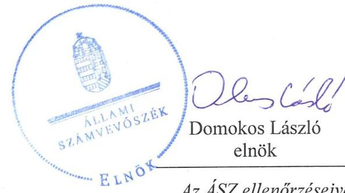
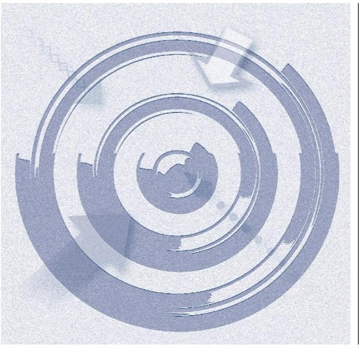
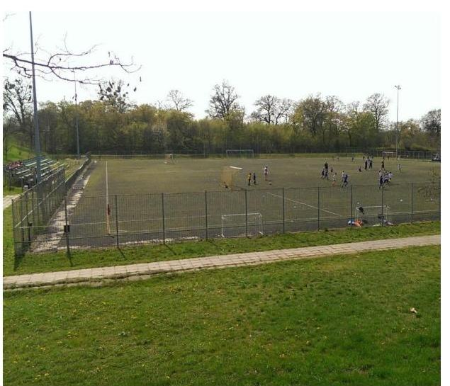
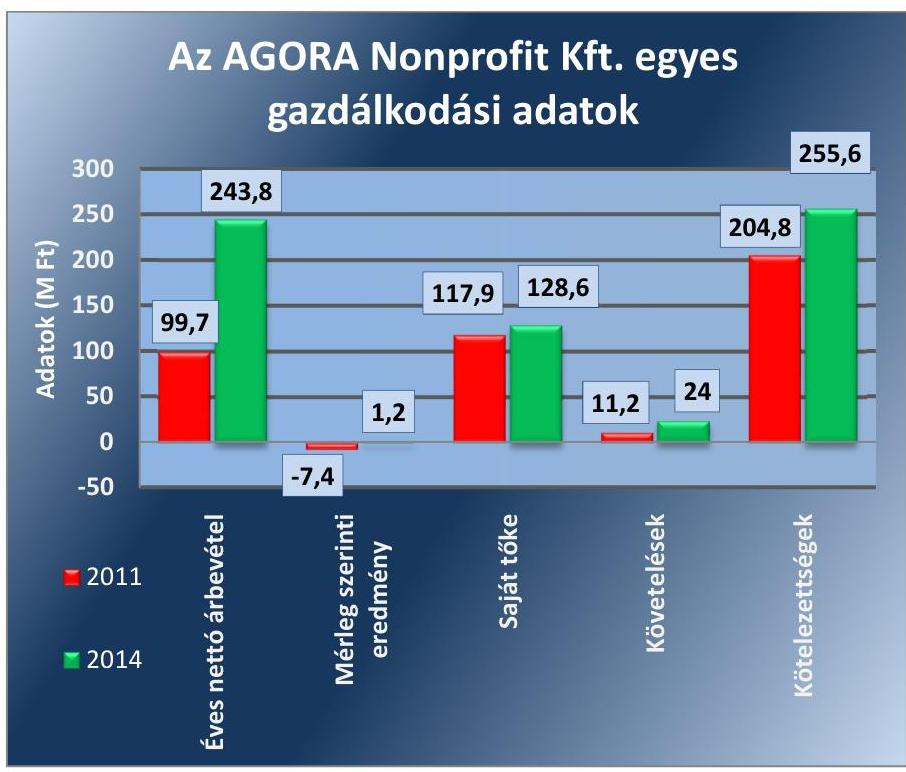
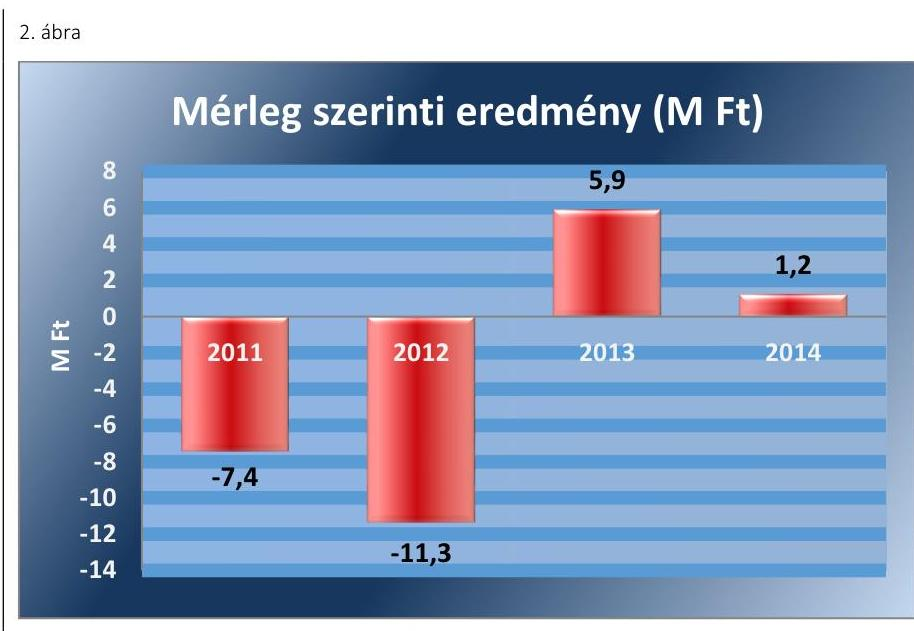

# Jelentés 

## Az önkormányzatok gazdasági társaságai

Az önkormányzatok többségi tulajdonában lévő gazdasági társaságok közfeladat ellátását érintő gazdálkodási tevékenysége szabályszerűségének ellenőrzése - AGORA Nonprofit Kft.
2016.

Az ÁSZ ellenőrzéseivel hozzájárul ahhoz, hogy a közpénzeket a szervezetek átlátható, rendezett módon használják fel a közfeladatok ellátása érdekében.

---

# Jelentés 

## Az önkormányzatok gazdasági társaságai

Az önkormányzatok többségi tulajdonában lévő gazdasági társaságok közfeladat ellátását érintő gazdálkodási tevékenysége szabályszerűségének ellenőrzése - AGORA Nonprofit Kft.
2016. november 25. nap

16190
www.asz.hu

---

# AZ ELLENŐRZÉST FELÜGYELTE:

DR. HORVÁTH MARGIT felügyeleti vezető

## AZ ELLENŐRZÉST VEZETTE ÉS A VÉGREHAJTÁSÁÉRT FELELŐS:

PENCZ MÁRIA ellenőrzésvezető

## A PROGRAM ÖSSZEÁLLÍTÁSÁÉRT FELELŐS:

JANIK JÓZSEF LÁSZLÓ osztályvezető

IKTATÓSZÁM: V-1130-118/2016.

TÉMASZÁM: 2164

ELLENŐRZÉS-AZONOSÍTÓ SZÁM: V070795

Jelentéseink az Országgyűlés számítógépes hálózatán és az Interneten a www.asz.hu címen is olvashatóak.

---

# TARTALOMJEGYZÉK 

■ ÖSSZEGZÉS ..... 5
■ AZ ELLENŐRZÉS CÉLJA ..... 7
■ AZ ELLENŐRZÉS TERÜLETE ..... 8
■ AZ ELLENŐRZÉS HÁTTERE, INDOKOLTSÁGA ..... 10
■ A JELENTÉS LÉNYEGES KÉRDÉSKÖREI ..... 11
■ ELLENŐRZÉS HATÓKÖRE ÉS MÓDSZEREI ..... 12
■ MEGÁLLAPÍTÁSOK ..... 14
■ JAVASLATOK ..... 28
■ MELLÉKLETEK ..... 29
I. Sz. melléklet: Értelmező szótár. ..... 29
II. sz. melléklet: Az AGORA Nonprofit Kft. vagyonának változása 2011-2014. között (ezer Ft, %) ..... 31
III. sz. melléklet: Az AGORA Nonprofit Kft. eredményének alakulása a 2011-2014. közötti években (E Ft , \% ) ..... 32
IV. sz. melléklet: Az AGORA Nonprofit Kft. bevételeinek alakulása a 2011-2014. közötti években (E Ft , \% ) ..... 33
■ FÜGGELÉK: ÉSZREVÉTELEK ..... 35
■ RÖVIDÍTÉSEK JEGYZÉKE ..... 37

---

.

---

# ÖSSZEGZÉS 

Az Állami Számvevőszék az AGORA Sport és Szabadidő Közhasznú Nonprofit Kft. közfeladat ellátását érintő gazdálkodási tevékenysége szabályszerűségét a 2011-2014. időszakra vonatkozóan ellenőrizte. Megállapította az ellenőrzés, hogy a tulajdonosi jogok gyakorlása szabályszerű volt. A tulajdonosi joggyakorlók közfeladat-ellátás megszervezésére vonatkozó döntései megfeleltek a jogszabályokban és az Önkormányzat rendeleteiben foglaltaknak. Az AGORA Nonprofit Kft. vagyongazdálkodása részben felelt meg a jogszabályi előírásoknak, a kötelezettségállomány alakulása a működésre és a közfeladat ellátására kockázatot jelentett. A bevételek és ráfordítások elszámolása szabályszerű volt, a szolgáltatások díjképzését és díjalkalmazását a hatályos bérbeadási szabályzataiban foglaltaknak megfelelően állapították meg.

## Az ellenőrzés társadalmi indokoltsága

Az Állami Számvevőszék stratégiájában megfogalmazta, hogy a helyi önkormányzatok gazdálkodásában rejlő pénzügyi kockázatok feltárásával, az államháztartáson kívülre nyújtott költségvetési támogatások és ingyenes vagyonjuttatások, valamint az államháztartáson kívül működő közfeladat-ellátó rendszerek ellenőrzéseivel hozzájárul ahhoz, hogy a közpénzeket az államháztartáson kívül működő szervezetek is átlátható, rendezett módon használják fel a közfeladatok szerződésben vállalt ellátása érdekében.

Magyarországon az intézmény-centrikus közfeladat-ellátás jellemző, de egyre jelentősebb a költségvetésen kívüli feladatellátás térnyerése. Ennek legfontosabb szereplői - a nonprofit szervezetek mellett - az önkormányzati tulajdonú gazdasági társaságok. Az önkormányzatok szervezetalakítási szabadságának következménye, hogy a korábban is vállalati formában működő közszolgáltatások mellett, mind a kötelező, mind az önként vállalt feladatok ellátásában a gazdasági társaságok kiemelt fontosságú szerephez jutottak.

## Főbb megállapítások, következtetések, javaslatok

A közfeladat-ellátás megszervezésére vonatkozó döntés és annak előkészítése a jogszabályokban és az Önkormányzat rendeleteiben foglaltakkal összhangban, szabályszerűen történt. Az AGORA Nonprofit Kft. által ellátott sport és közművelődési feladatok körét, a feladatellátással kapcsolatos követelményeket az Alapító Okiratban és a feladatellátási megállapodásokban meghatározták. A közművelődési feladatok átadásáról az Önkormányzat az AGORA Nonprofit Kft.-vel közművelődési megállapodást, a sport feladatok ellátására közhasznúsági keret-megállapodást kötött. Az Önkormányzat a feladatellátást szolgáló vagyont a sport feladatokat érintően vagyonkezelésbe adással, a közművelődési feladatokat szolgáló vagyont üzemeltetésbe adással az AGORA Nonprofit Kft. rendelkezésére bocsátotta.

Az AGORA Nonprofit Kft. 2011. és 2012. években nem teljes körűen rendelkezett a Számv. tv-ben előírt szabályzatokkal. Pénzkezelési szabályzattal 2012. évtől, Leltározási szabályzattal 2013. évtől rendelkezett. Az elkészített szabályzatok a jogszabályi előírásoknak megfeleltek. Vagyonnal való gazdálkodása részben felelt meg a jogszabályi és belső rendelkezéseknek. Saját és a vagyonkezelésbe vett eszközeinek leltárral való alátámasztását biztosította, azonban a vagyonkezelt eszközök visszapótlására vonatkozó kötelezettségének nem teljes körűen tett eleget.

Az AGORA Nonprofit Kft. kötelezettségállománya - annak folyamatos emelkedése miatt - a közfeladat ellátására, illetve a működésre is kockázatot jelentett. Beszámolási kötelezettségének eleget tett, azonban a vagyonkezelt eszközökre vonatkozó adatszolgáltatási kötelezettségét nem teljesítette.

---

Az Avtv, illetve Info tv. rendelkezései ellenére közérdekű adatok megismerésére irányuló igények teljesítésének rendjét rögzítő szabályzattal az ellenőrzött időszakban nem rendelkezett, elektronikus közzétételi kötelezettségét teljesítette.

Az AGORA Nonprofit Kft. által ellátott feladatok bevételeinek és ráfordításainak elszámolása megfelelt a jogszabályok és a belső szabályozás előírásainak.

Az AGORA Nonprofit Kft. a Számv. tv. előírása alapján önköltség-számítási szabályzat készítésére nem volt kötelezett. A nyújtott és kiszámlázott szolgáltatások díjképzését és díjalkalmazását a hatályos bérbeadási szabályzataiban foglaltak szerint, utókalkuláció alapján állapította meg.

---

# AZ ELLENŐRZÉS CÉLJA 

Az ellenőrzés célja annak értékelése, hogy az Önkormányzat a jogszabályi előírások figyelembevételével döntött-e az ellenőrzésre kerülő közfeladat megszervezéséről; az önkormányzat/tulajdonosi joggyakorló szabályszerűen gyakorolta-e a tulajdonosi jogokat.

Ellenőriztük, hogy a gazdasági társaság közfeladat-ellátása bevételeinek, ráfordításainak elszámolása, és vagyongazdálkodási tevékenysége megfelelt-e a jogszabályi, illetve a közszolgáltatási/vagyonkezelési szerződésben foglalt tulajdonosi előírásoknak, azok végrehajtása szabályszerű volt-e.

Értékeltük továbbá, hogy a gazdasági társaság kötelezettségállománya jelent-e kockázatot a működésre, illetve a közfeladat ellátására; valamint hogy a közfeladatok átláthatósága és elszámoltathatósága érdekében biztosítva volt-e a közszolgáltatás díjának megalapozottsága szabályszerű önköltségszámítással.

---

# **AZ ELLENŐRZÉS TERÜLETE**

## **SPORT Létesítményeket Üzemeltető és Szolgáltató Nonprofit Kft./AGORA Sport és Szabadidő Közhasznú Nonprofit Kft.**

### **TATABÁNYA MEGYEI JOGÚ VÁROS ÖNKORMÁNYZATA**

Az AGORA Sport és Szabadidő Közhasznú Nonprofit Korlátolt Felelősségű Társaság jogelődjét, a Sport Kht.-t a megyei jogú város sportlétesítményeinek, valamint a szabadidő hasznos eltöltését szolgáló létesítményeinek üzemeltetése, karbantartása és szolgáltatásainak fejlesztése céljából alapította 2009. május 29-én. Az Önkormányzat1 2012. május 23-án a 100%-os tulajdonát képező Közművelődés Háza Közhasznú Nonprofit Kft.-nek a jogelőd társaságba történő beolvadásáról döntött. A tulajdonosi döntést követően a cégbíróság AGORA Sport és Szabadidő Közhasznú Nonprofit Kft. néven jegyezte be a társaságot.

Az AGORA Nonprofit Kft.2 törzstőkéje a beolvadást követően 125,0 M Ft-ra emelkedett, melyből 3,8 M Ft pénzbeli, 121,2 M Ft nem pénzbeli betét. Az Önkormányzat a gazdasági társaságai új működési modell szerinti egységes irányításának megvalósításához az AGORA Nonprofit Kft. üzletrészeit 2013. június 30-án apport jogcímen átruházta a 100%-os tulajdonában álló T-Szol Zrt.3-be, amely 2013. július 1-jétől a vállalati csoport irányítását és a közös szolgáltatásokhoz kapcsolódó feladatokat az átalakulást követően, mint az egységes irányítás központi társasága látta el, továbbá gyakorolta a társaság feletti tulajdonosi jogokat. Az AGORA Nonprofit Kft.-be 2014. február 1-jétől beolvadt a Tatabánya Pont Rendezvényszervező és Turisztikai Közhasznú Nonprofit Kft.

Az AGORA Nonprofit Kft.-nek az ellenőrzött időszakban bevétele önkormányzati működési, illetve beruházási, fejlesztési támogatásból, valamint vállalkozási tevékenységéből származott.

**AZ AGORA NONPROFIT KFT.** tevékenysége a 2014. december 31-én 66.791 fő lakosságszámú Tatabánya Város sportlétesítményeinek, valamint a szabadidő hasznos eltöltését szolgáló létesítményeinek üzemeltetése, karbantartása, szolgáltatásainak fejlesztése volt az ellenőrzött időszakban. További tevékenységei közé tartozott a kultúra, művészet és oktatási tevékenység koordinálása, valamint bevételt eredményező rendezvények, képzések megszervezése a Vértes Agorája központtal, illetve a 2012. évben átvett művelődési házak bevonásával.

Az AGORA Nonprofit Kft. létesítményüzemeltetéssel kapcsolatos vállalkozási tevékenységből származó bevételei a sportlétesítmények szabad kapacitásának értékesítéséből származtak. További vállalkozási tevékenységből származó bevétele az AGORA Nonprofit Kft-nek rendezvényszervezéssel (versenyek, céges rendezvények, stb) kapcsolatosan keletkezett.

---

Az ellenőrzött időszakban az AGORA Nonprofit Kft.-nek további bevétele különböző bérleti díjakból (tekepálya bérleti díj, büfé bérleti díj, sportcsarnok bérleti díj), valamint a Sport Hotel étterem működtetéséből adódott. Az AGORA Nonprofit Kft. ellenőrzött időszaki bevételeinek alakulását a IV. sz. melléklet tartalmazza.

Az AGORA Nonprofit Kft. gazdálkodásának egyes adatait a 2011-2014. évek vonatkozásában az 1. ábra szemlélteti.
1. ábra

Forrás: Az AGORA Nonprofit Kft. 2011-2014. évi beszámolói
Az AGORA Nonprofit Kft. mérlegfőösszege 2011-ben 593,9 millió Ft, 2014-ben 654,5 millió Ft volt. Az értékesítés nettó árbevétele a 2011. és a 2014. év vége között 144,5%-kal nőtt. A kötelezettségállomány minden évben meghaladta a saját tőke értékét, 2011. december 31-éről a 2014. év végére 24,8%-kal emelkedett.

Az AGORA Nonprofit Kft. működésének főbb adatait a II. számú melléklet mutatja be.

Az AGORA Nonprofit Kft. átlagos statisztikai állományi létszáma az ellenőrzött időszakban folyamatosan emelkedett: a 2011. évi 35 főről 2012. évre 41 főre, 2013. évre 78 főre emelkedett. A 2013. évi létszámnövekedést a Vértes Agorája üzemeltetésének megkezdése indokolta. A 2014. évi állományi létszám 81 fő volt. Az ellenőrzött időszakban, a jegyző személye egy alkalommal változott. A polgármester a 2010. évi önkormányzati választások óta és a jelenlegi ügyvezető 2012. május 1. óta tölti be tisztségét.

Az AGORA Nonprofit Kft. az ellenőrzött időszakban más gazdasági társaságban tulajdonosi részesedéssel nem rendelkezett.

Az AGORA Nonprofit Kft. nem minősül kormányzati szektorba sorolt egyéb szervezeteknek.

---

# AZ ELLENŐRZÉS HÁTTERE, INDOKOLTSÁGA 

AZ ÖNKORMÁNYZATI TULAJDONÚ GAZDASÁGI TÁRSASÁGOK ellenőrzése kiemelten fontos a vagyon megőrzése, megóvása érdekében, valamint a kormányzati szektor elszámolásaiban megjelenő önkormányzati tulajdonú gazdálkodó szervezetek esetében, amelyekkel szemben alapvető követelmény, hogy gazdálkodásuk, működésük szabályszerű, az általuk szolgáltatott adatok minél megbízhatóbbak legyenek. A feladat/közfeladat-ellátás költségeinek, ráfordításainak alakulása, színvonala hatással van a lakosság elégedettségére. A törvényalkotás számára - az észlelt problémák, szabálytalanságok, vagy egyéb nem kívánatos jelenségek felszínre kerülésével - az ellenőrzés megállapításai segítséget nyújthatnak az államháztartáson kívüli feladat/közfeladat-ellátás értékeléséhez, jogszabályi keretei pontosításához, átláthatóságot biztosító szabályozásához. Meghatározhatóvá válnak az önkormányzati feladatellátásban részt vevő államháztartáson kívüli szervezeteknek - az önkormányzat költségvetését, pénzügyi helyzetét is befolyásoló - kockázatai, lehetővé válik ezen kockázatok csökkentése. Ellenőrzéseink feltárhatják, hogy az önkormányzat feladat-ellátási kötelezettségének szabályszerűen tett-e eleget, a feladatellátáshoz rendelt vagyonkezelésbe vett és saját vagyon működtetését az elvárható gondossággal, szabályszerűen szervezte-e meg és a tulajdonosi felügyelete hozzájárult-e a feladatellátásához.

AZ ELLENŐRZÉS RÁVILÁGÍTHAT arra, hogy a gazdasági társaság a feladat-ellátási, közszolgáltatási szerződésben foglaltak betartásával, a vagyon használatával biztosította-e a szolgáltatás folytatásának feltételeit, a feladat ellátását. Ezzel az ellenőrzöttek és a helyi döntéshozók számára visszajelzést ad feladatszervezési, feladat-ellátási kockázataikról, alapot ad a meglévő hibák megszüntetéséhez, a jobb feladatellátás biztosításához. Fokozza a fegyelmet, igazolja, hogy lejárt a következmények nélküli ellenőrzések időszaka. Az ÁSZ értékteremtő rend kialakításához és megőrzéséhez hozzájáruló tevékenysége pozitív hatással van a szervezetről kialakított összkép formálására.

---

# A JELENTÉS LÉNYEGES KÉRDÉSKÖREI 

1. Az önkormányzat feladat/közfeladat megszervezéséről szóló döntése, valamint tulajdonosi joggyakorlása szabályszerű volt-e?
2. A gazdasági társaság vagyongazdálkodása szabályszerű volt-e, kötelezettségállománya jelent-e kockázatot a működésre, illetve a feladat/közfeladat ellátására?
3. A gazdasági társaságnál az ellátott feladat/közfeladat bevételei és ráfordításai elszámolása, valamint az önköltségszámítás és árképzés szabályszerű volt-e?

---

# ELLENŐRZÉS HATÓKÖRE ÉS MÓDSZEREI 

## Az ellenőrzés típusa

Megfelelőségi ellenőrzés

## Az ellenőrzött időszak

A 2011. január 1-jétől 2014. december 31-éig terjedő időszak.

## Az ellenőrzés tárgya

A gazdasági társaság feletti tulajdonosi joggyakorlás, valamint a gazdasági társaság gazdálkodásának szabályozottsága és szabályszerűsége.

Az ellenőrzés kiterjed minden olyan körülményre és adatra, amely az ÁSZ jogszabályban meghatározott feladatainak teljesítéséhez, valamint a program végrehajtása folyamán
 felmerült újabb összefüggések feltárásához szükséges.

## Az ellenőrzött szervezet

SPORT Nonprofit Kft. (jogelőd), AGORA Nonprofit Kft., Tatabánya Megyei Jogú Város Önkormányzata, T-Szol Tatabányai Szolgáltató Zrt., mint tulajdonosi joggyakorlók

## Az ellenőrzés jogalapja

Az ellenőrzés jogszabályi alapját az ÁSZ tv. 1. § (3) bekezdése és 5. § (3)(4)-(5) bekezdései képezik.

## Az ellenőrzés módszerei

Az ellenőrzést a nemzetközi standardokat irányadónak tekintve az ellenőrzési program ellenőrzési kérdései, az ellenőrzött időszakban hatályos jogszabályok, az ellenőrzés szakmai szabályok és módszertanok figyelembe vételével végezzük.

Az ellenőrzés ideje alatt az ellenőrzött szervezettel történő kapcsolattartást az ÁSZ Szervezeti és Működési Szabályzatának vonatkozó előírásai alapján biztosítjuk.

Az ellenőrzés a kiválasztott, tulajdonosi jogokat gyakorló önkormányzatra, illetve az ellenőrzésre kijelölt gazdasági társaság felett tulajdonosi

---

jogokat gyakorló szervezetre (holding szervezetre) és az ellenőrzött gazdasági társaságra terjed ki.

Az ellenőrzést a kérdésekre adott válaszok kiértékelésével, valamint a megjelölt adatforrások, a csatolt tanúsítványok felhasználásával, továbbá az adott időszakban hatályos jogszabályok figyelembe vételével folytattuk le. Az ellenőrzési kérdések megválaszolásához szükséges bizonyítékok megszerzése a következő ellenőrzési eljárások alkalmazásával történt: megfigyelés, kérdésfeltevés (információkérés), összehasonlítás, valamint elemző eljárás.

A bevételek és ráfordítások elszámolása, valamint a vagyonnyilvántartás terén a szabályszerű működést véletlen mintavétellel ellenőriztük. A mintavétellel ellenőrzött területek esetében minden egyes tétel vonatkozásában a szabályszerűségre vonatkozó kérdéseket tettünk fel, amelyek eredménye összesítésre került. A jogszabályoknak és a belső előírásoknak megfelelőnek tekintettük az adott területet, amennyiben a minta ellenőrzésének eredménye alapján 95%-os bizonyossággal a teljes sokaságban a hibaarány kisebb volt, mint 10%, nem megfelelőnek, ha a hibaarány a 10%-ot meghaladta. Részben megfelelő minősítést adtunk, amennyiben egy adott terület vonatkozásában a minta alapján a teljes sokaságban nem volt egyértelműen biztosított a jogszabályoknak és a belső szabályzatoknak megfelelő működés. A ráfordítások elszámolására és a vagyonnyilvántartásra vonatkozó véletlen mintavételt kockázati alapú kiválasztással egészítettük ki, amelynek során évente a három legnagyobb összegű tételt választottuk ki.

---

# 1. Az önkormányzat feladat/közfeladat megszervezéséről szóló döntése, valamint tulajdonosi joggyakorlása szabályszerű volt-e? 

Összegző megállapítás

1.1. számú megállapítás

A közfeladat-ellátás megszervezésére vonatkozó döntések előkészítése szabályszerűen, a jogszabályi előírásoknak és a helyi szabályozásnak megfelelően történt, a tulajdonosi joggyakorlók a tulajdonosi jogokat szabályszerűen gyakorolták.

A közfeladat-ellátás megszervezésére vonatkozó döntés és annak előkészítése a jogszabályokban és az Önkormányzat rendeleteiben foglaltakkal összhangban, szabályszerűen történt.

Az Önkormányzat ${ }^{4 .}$ az Ötv ${ }^{5}$. és a Mötv. ${ }^{6}$ előírásainak megfelelően rendelkezett az ellenőrzött időszakban gazdasági programmal ${ }^{7}$, valamint közép- és hosszú távú vagyongazdálkodási tervvel, amelyben meghatározta azokat a célkitűzéseket, amelyek az általa ellátott feladatokat biztosították.

A GAZDASÁGI PROGRAMBAN az AGORA Nonprofit Kft. feladatellátásához kapcsolódóan a sport infrastruktúra fejlesztését, ezen belül az energiaracionalizálással egybekötött ingatlan és létesítmény felújítási célokat, valamint az Agora program keretében - Európai Uniós társfinanszírozással - a Közművelődés Háza épületének rekonstrukcióját határozta meg fejlesztési célként.

Az Nvtv ${ }^{8}$. 9. § (1) bekezdésében előírtaknak megfelelően a Közgyűlés ${ }^{9}$ az Önkormányzat közép- és hosszú távú vagyongazdálkodási tervét a 145/2013. (VIII. 29.) számú határozatával fogadta el, amelyben általános vagyongazdálkodási elveket, szempontokat határozott meg a vagyongazdálkodás szervezetére, irányítására és döntés-előkészítő folyamataira.

Az Önkormányzat rendeletekben határozta meg a sporttal és a helyi közműveléssel kapcsolatos részletes feladatait és kötelezettségeit. Az Önkormányzat 14/2011. (III. 25.) számú rendeletében szabályozta az önkormányzat sporttal kapcsolatos feladatait, a sporttámogatások területeit, a sportlétesítmények üzemeltetésének, felújításának, fejlesztésének támogatási,- és a sporttevékenységek és sportlétesítmények finanszírozási rendszerét. Az Önkormányzat az AGORA Nonprofit Kft. létesítményei működtetési, üzemeltetési feladataihoz minden évben támogatást biztosított. A sportlétesítmények felújításának, fejlesztésének támogatását az éves költségvetésen belül biztosította az Önkormányzat.

A Közgyűlés az 52/2011. (III. 24.) sz. határozatában a sporttal kapcsolatos stratégiai célként határozta meg - az AGORA Nonprofit Kft. által ellátott közhasznú feladatellátással összefüggésben - a város lakosságának

---

egészségmegőrzése, testedzése, szabadidejének hasznos eltöltése érdekében történő feladatokhoz szükséges feltételrendszer kidolgozását.

Az AGORA Nonprofit Kft. által ellátandó sport- és közművelődési feladatok kereteit, a feladatok körét, a feladatellátással kapcsolatos követelményeket az Alapító Okirat ${ }^{10}$1-10-ben és a feladat-ellátási megállapodásokban szabályszerűen, az Áht ${ }^{11}$1 és a Gt. ${ }^{12}$ előírásainak megfelelően határozták meg.

Az Alapító Okirat1-10 szerint az AGORA Nonprofit Kft. főtevékenységei sportlétesítmény működtetése, egyéb sporttevékenység, egyéb szórakoztatás, szabadidős tevékenység volt. A városi közművelődési feladatok átadásáról az Önkormányzat az AGORA Nonprofit Kft.-vel 2012. augusztus 30-án közművelődési megállapodást kötött, a helyi közművelődésről a 19/2011. (V.27.) önkormányzati rendeletben, majd annak módosításaként a 41/2012. (VIII. 30.) önkormányzati rendeletben foglaltak alapján.

A KÖZMŰVELŐDÉSI MEGÁLLAPODÁSBAN az Önkormányzat meghatározta az AGORA Nonprofit Kft. által ellátandó közművelődési feladatok, szolgáltatások (pl. kulturális, oktatási szolgáltató tevékenység, iskolarendszeren kívüli önképző tanfolyamok szervezésében való részvétel, Tatabánya város természeti, környezeti és kulturális értékeinek megismertetésében való közreműködés, stb.) körét, valamint előírta az AGORA Nonprofit Kft. számára az általa ellátandó feladatok vonatkozásában az évi egyszeri beszámolási kötelezettséget.

A sport feladatok ellátására az Önkormányzat az AGORA Nonprofit Kft.-vel közhasznúsági keret-megállapodást kötött.

# A KÖZHASZNÚSÁGI KERET-MEGÁLLAPODÁSBAN 

foglaltak szerint az AGORA Nonprofit Kft. feladata volt a különböző sportlétesítmények fenntartása, működtetése közhasznú szolgáltatás keretében, amelyhez az Önkormányzat támogatást biztosított. A megállapodásban meghatározták a tevékenység ellátásához szükséges, az AGORA Nonprofit Kft. által üzemeltetett, önkormányzati tulajdonú eszközvagyon körét.

Az Önkormányzat a sportról szóló 2004. évi I. törvény 55. § (6) bekezdésében, valamint az 1997. évi CXL. törvény ${ }^{13}$ 79. § (1) bekezdésében előírtak alapján rendeleteiben szabályozta az AGORA Nonprofit Kft. tevékenységével összefüggő feladatait.

A közművelődéssel kapcsolatos feladatokat, a feladatok ellátásának szervezeti kereteit, a közművelődési tevékenységeket ellátó szervezeteket és azok feladatait valamint közművelődési feladatok finanszírozását a helyi közművelődésről szóló 19/2011. (V. 27.) számú önkormányzati rendeletben szabályozták.

A SPORT ÉS KÖZMŰVELŐDÉSI feladatellátás támogatását az Önkormányzat az éves költségvetési rendeleteiben hagyta jóvá, és finanszírozási ütemterve alapján bocsátotta az AGORA Nonprofit Kft. rendelkezésére.

Az Önkormányzat a feladatellátást szolgáló vagyont a sport feladatokat érintően vagyonkezelésbe adással az AGORA Nonprofit Kft. rendelkezésére bocsátotta.

---

Az Önkormányzat és az AGORA Nonprofit Kft. 2011. október 11-én - az Áht.: 105/A-105/D §-ok és az Ötv. 80/A-80/B §-okban foglaltak alapján - vagyonkezelési szerződést kötött az AGORA Nonprofit Kft. által ellátott sportfeladatokkal összefüggő önkormányzati tulajdonú vagyon Társaság részére történő vagyonkezelésbe adására. A vagyonkezelésbe adott vagyon (kettő labdarúgó pálya, egy görkorcsolya-pálya ingatlan és egy autós mozi céljára szolgáló épületingatlan) nyilvántartás szerinti bruttó értéke 214,0 millió Ft, elszámolt értékcsökkenése 35,5 millió Ft, nettó értéke 178,5 millió Ft volt. Az Önkormányzat a vagyonkezelésbe vett vagyonelemek vonatkozásában nyilvántartási, és az elszámolt értékcsökkenés felhasználásáról szóló éves beszámolási kötelezettséget, a vagyonkezelési szerződés 17. pontjában felújítási és rekonstrukciós ütemterv készítési kötelezettséget írt elő.

Az Önkormányzat a közművelődési és szabadidős feladatok ellátását szolgáló vagyont (három sportcélú ingatlan, négy művelődési házingatlan és a Vértes Agorája művelődési központ) az AGORA Nonprofit Kft. részére üzemeltetési megállapodás keretében történő üzemeltetésbe adással biztosította.

# 1.2. számú megállapítás 

Az Önkormányzat a tulajdonosi ellenőrzési és beszámoltatási kötelezettségét, valamint a feladat-ellátás felügyeletét szabályszerűen végezte.

A vagyongazdálkodási rendeletben foglaltaknak megfelelően az AGORA Nonprofit Kft. feletti tulajdonosi jogokat 2013. június 30-ig a Közgyűlés és a GLB ${ }^{14}$ gyakorolta. Az AGORA Nonprofit Kft. üzletrészének apportálását követően az Önkormányzat közvetett tulajdonosi jogokat gyakorolt az AGORA Nonprofit Kft. felett, mert 2013. július 1-jétől az AGORA Nonprofit Kft. 100%-os tulajdonosa az önkormányzati tulajdonban lévő Tulajdonos ${ }^{15}$ lett.

A Közgyűlés volt jogosult dönteni az önkormányzati vagyon gazdasági társaságba történő beviteléről, a gazdasági társaság alapításáról. Az AGORA Nonprofit Kft.-nek a 2013. július 1-jei átalakulását követően - a Közgyűlés 104/2013. (VI. 28.) számú határozatában előírtak szerint - az Önkormányzat kizárólagos hatáskörébe vont egyes döntéseket a cégcsoport tulajdonosi joggyakorlása körében. A kizárólagos döntési jogosítványok a gazdasági társaságok működési formájának megváltoztatására, szakmai beszámolójuk jóváhagyására, felügyelő bizottsági tagjaik kinevezésére, társasági stratégia jóváhagyására, 100 millió Ft-ot meghaladó tőkeemelésre és tőkeleszállításra vonatkoztak.

Az AGORA Nonprofit Kft. 2013. július 1-jei átalakulását követően az Alapító Okiratban előírtak szerint a Tulajdonos ${ }_{2}$ volt jogosult dönteni a taggyűlés hatáskörébe tartozó ügyekben. A Tulajdonos ${ }_{2}$ az AGORA Nonprofit Kft.-t érintő döntéshozatalának rendjét Igazgatósági Ügyrendjében szabályozta. A Tulajdonos ${ }_{2}$, mint az AGORA Nonprofit Kft. egyedüli tagja, az AGORA Nonprofit Kft.-t érintő döntések meghozatala előtt köteles volt az FB, valamint az ügyvezető véleményének megismerése érdekében írásos véleményüket beszerezni.

Az új vállalatirányítási modell bevezetését követően a Közgyűlés a 104/2013. (VI. 28.) számú határozatának megfelelően az AGORA Nonprofit Kft. feletti tulajdonosi joggyakorlás jogosultságával a Tulajdonos ${ }_{2}$ Igazgatósága rendelkezett, a tulajdonosi jogosítványok átadására a Gt. 127. § (1) bekezdésében foglalt előírásoknak megfelelően került sor.

A tulajdonosok az Alapító Okirat1-10-ben és a Gt.-ben előírtaknak megfelelően határozták meg az FB16 és az ügyvezetés működésére, feladat- és hatásköreire vonatkozó szabályokat. Az Alapító Okirat1-10-ben szabályozták a bizottság működésének rendjét, határozatképességét, a hatáskörébe tartozó ügyeket.

A TULAJDONOSI JOGGYAKORLÁST az ellenőrzött időszakban az Önkormányzat és a Tulajdonos ${ }_{2}$ - az FB, az ügyvezetés és a könyvvizsgáló tevékenységéhez kapcsolódóan - a Gt.-ben és vagyongazdálkodási rendeletben foglaltaknak megfelelően, szabályszerűen látta el.

A 2013. június 30-áig tulajdonosi jogokat gyakorló Közgyűlés megválasztotta az ügyvezetőt, az FB tagokat és a könyvvizsgálót, valamint meghatározta az ügyvezető és az FB hatásköreinek rendjét. Az AGORA Nonprofit Kft. 2013. július 1-jei átalakulását követően a Tulajdonos ${ }_{2}$ döntött a taggyűlés hatáskörébe tartozó ügyekben - számviteli törvény szerinti beszámoló jóváhagyása, könyvvizsgáló megválasztása, visszahívása, 100 millió Ft-ot el nem érő tőkeemelés és tőkeleszállítás elhatározása, Alapító Okirat módosítása.

Az AGORA Nonprofit Kft. beszámolási kötelezettségét a tulajdonosok az Alapító Okirat1-10-ben írták elő. Ennek körében az ügyvezető feladataként határozták meg az éves beszámoló elkészítését és 2013. június 30-áig a GLB, azt követően a Tulajdonos ${ }_{2}$ Igazgatósága elé terjesztését.

Az FB az Alapító Okirat1-10-ben előírtak szerint minden évben megtárgyalta az AGORA Nonprofit Kft. számviteli törvény szerinti beszámolóját és döntése alapján javasolta a taggyűlésnek a beszámoló elfogadását. Az AGORA Nonprofit Kft. éves beszámolóit - az FB határozatának és a könyvvizsgáló írásos jelentésének ismeretében - 2013. évtől a Tulajdonos ${ }_{2}$ Igazgatósága megtárgyalta és jóváhagyta.

A tulajdonosok az üzleti terv elkészítésére, tartalmára vonatkozó előírásokat nem határozták meg. Az AGORA Nonprofit Kft. üzleti terveit az ellenőrzött időszak éveiben elkészítette, azt az ügyvezető előterjesztésére az FB jóváhagyta és elfogadásra javasolta a tulajdonosoknak. Az AGORA Nonprofit Kft. üzleti terveit a GLB a 2011-2013. évre, a Tulajdonos ${ }_{2}$ Igazgatósága a 2014. évre vonatkozóan jóváhagyta.

AZ ÜZLETI TERVEK az Önkormányzat sportlétesítmények üzemeltetésére és közművelődési tevékenység ellátására vonatkozó szakmai tervekkel, a gazdasági programmal összhangban voltak.

Az üzleti tervvel összhangban az Önkormányzat az 52/2011. (III.24.) közgyűlési
 határozattal elfogadott sportkoncepció és sportfejlesztési terve tartalmazta az AGORA Nonprofit Kft. által üzemeltetett létesítmények és szolgáltatásokkal kapcsolatos, rövid, közép és hosszú távú fejlesztési célokat, feladatokat.

Az Önkormányzat a Mötv. 119. § (4) bekezdésében előírtak alapján a 2013. és 2014. évben három alkalommal végzett belső ellenőrzést az AGORA Nonprofit Kft.-nél. Az AGORA Nonprofit Kft. az intézkedési tervben foglaltak megvalósításáról értesítette az Önkormányzatot.

---

Az AGORA Nonprofit Kft. az ellenőrzött időszakban nem végzett az Ebktv ${ }^{17}$ : 3. § d) pontja szerinti közszolgáltatási tevékenységet, ezért az árak megállapításáról szóló 1990. évi LXXXVII. törvény és a jogalkotásról szóló 2010. évi CXXX. törvény előírásai alapján az Önkormányzatnak nem volt ármegállapító hatásköre az AGORA Nonprofit Kft. által ellátott üzleti tevékenységgel kapcsolatban.

# 2. A gazdasági társaság vagyongazdálkodása szabályszerű volt-e, kötelezettségállománya jelent-e kockázatot a működésre, illetve a feladat/közfeladat ellátására? 

Összegző megállapítás

Az AGORA Nonprofit Kft. vagyongazdálkodási tevékenységének szabályozása és vagyongazdálkodása részben felelt meg a jogszabályi követelményeknek. A kötelezettségállomány alakulása a működésre és a közfeladat ellátására kockázatot jelentett.

Az AGORA Nonprofit Kft. a szabályszerű vagyongazdálkodás feltételeit részben alakította ki, mert Pénzkezelési szabályzattal 2012. évtől, Leltározási szabályzattal 2013. évtől rendelkezett. Az elkészített szabályzatok a jogszabályi előírásoknak megfeleltek.

BELSŐ SZABÁLYZATAIT az AGORA Nonprofit Kft. a jogszabályi előírásoknak megfelelően - 2013. évtől teljes körűen - elkészítette, azokat a jogszabályváltozásoknak, illetve az AGORA Nonprofit Kft. életében bekövetkezett változásoknak megfelelően aktualizálta. A 2011. és 2012. években a szabályzatok teljes körűsége nem volt biztosított, mert a Számv. ${ }^{18}$ tv. 14. § (5) bekezdésében előírtakkal ellentétben Leltározási szabályzattal 2011. és 2012. években, valamint a Pénzkezelési szabályzattal a 2011. évben nem rendelkezett.

A SZÁMVITELI POLITIKA ${ }_{1-5}{ }^{19}$-val a Számv. tv. előírásaival összhangban az AGORA Nonprofit Kft. a 2011-2014. évekre vonatkozóan rendelkezett, aktualizálását évente, a Számv. tv. változásaival összhangban elvégezte. Az AGORA Nonprofit Kft. Számlarendje ${ }^{20}{ }_{1-4}$ megfelelt a Számv. tv. előírásainak.

Az AGORA Nonprofit Kft. 2013. évtől Leltározási szabályzattal ${ }^{21}{ }_{1-2}$, az Eszközök és a források értékelési szabályzatával ${ }^{22}{ }_{1-4}$, és a Pénzkezelési szabályzattal ${ }^{23}{ }_{1-4}$ az ellenőrzött időszakban Számv. tv.-ben foglaltak szerint rendelkezett. Önköltség számítási szabályzat készítési kötelezettsége az ellenőrzött időszakban nem keletkezett, mert a Számv. tv-ben előírt feltételek nem teljesültek.

Az AGORA Nonprofit Kft. a szervezeti és a feladat változások miatt folyamatosan aktualizált SZMSZ ${ }^{24}$-el rendelkezett. Az AGORA Nonprofit Kft. 2011.06.01-jétől rendelkezett a többször módosított bérbeadási szabályzattal. A bérbeadási szabályzatot átalakulás (névváltozás) miatt 2012.05.23-i hatállyal, majd 2012.08.31. dátummal a közművelődési feladatok átvétele miatt, ezt követően a kezelésébe átkerült ingatlanok (Vér-

---

tes Agorája, József Attila Művelődési Ház, Széchenyi Művelődési Ház, Puskin Művelődési Ház, Kertvárosi Bányász Művelődési Otthon) miatt 2013.10.15-i hatállyal, és 2014.02.01-i hatállyal is aktualizálta.

JAVADALMAZÁSI SZABÁLYZATTAL az AGORA Nonprofit Kft. rendelkezett, amely összhangban állt a tulajdonosi előírásokkal, szabályozással. A 2010. május 1-étől hatályos Javadalmazási szabályzat a Taktv ${ }^{25}$. -ben előírtakkal összhangban készült. A szabályzatot 2012.05.01-i hatállyal a névváltozás, az Mt ${ }^{26}$ változása, valamint az ügyvezetői feladatokra létesített vezető tisztségviselő személyének megváltozása miatt módosították.

BELSŐ ELLENŐRZÉSI RENDSZERT az AGORA Nonprofit Kft. működtetett, 2013. évben pénzügyi, 2014. évben pénzügyi és rendszerellenőrzés keretében belső ellenőrzéseket végeztek. Az intézkedési tervek elkészültek, a tulajdonos azokat elfogadta.

A közhasznú tevékenységből származó bevételek és ráfordítások a vállalkozási tevékenységből származó bevételektől és ráfordításoktól való elkülönített nyilvántartására vonatkozó kötelezettséget az Alapító Okirat írta elő. Az AGORA Nonprofit Kft.-nek az Önkormányzattal kötött vagyonkezelési szerződése a vagyonkezelésbe vett vagyon elkülönítésének szabályait tartalmazta.

Az AGORA Nonprofit Kft. Számlarendje ${ }_{1-2}$ és Számviteli politikája ${ }_{1-5}$ nem volt összhangban a vagyonkezelési szerződésben foglaltakkal, miszerint a vagyonkezelt eszközeiről elkülönített nyilvántartás vezetésére kötelezett, és azokból származó bevételeit, ráfordításait elkülönítetten köteles nyilvántartani. A Számlarend ${ }_{3-4}$ tartalmazott a vagyonkezelésbe vett vagyon elkülönített nyilvántartására előírásokat. A szabályozási hiányosságok ellenére az AGORA Nonprofit Kft. 2011-2014. évi főkönyvi kivonatai alapján megállapítható volt, hogy a vagyonkezelt ingatlanok elkülönítését már 2011. évtől elvégezték, a megfelelő főkönyvi számok használatával. 2014. évtől az AGORA Nonprofit Kft. eszközeit munkaszám kódok alapján különítette el.

Az AGORA Nonprofit Kft. a Számlarend ${ }_{1-4}$-ben rögzítettek alapján biztosította az egyes tevékenységek bevételeinek elkülönített elszámolását, azonban önköltségszámítás, valamint a közvetett költségek felosztási szabályzatainak hiányában a ráfordítások, költségek bevételi kategóriák szerinti megosztása nem készült el. Ennek ellenére a költségek vagyonelemek szerinti megosztását a vagyonkezelt ingatlanokra az AGORA Nonprofit Kft. munkaszámok szerint biztosította.

Az AGORA Nonprofit Kft. vagyonkezelt eszközeinek 2014. évi nettó értéke 178,1 M Ft. volt. A 1. táblázat a vagyonkezelt eszközök és saját eszközök nettó értékeit szemlélteti az ellenőrzött években.

1. táblázat

VAGYONKEZELT ESZKÖZÖK ÉS SAJÁT ESZKÖZÖK NETTÓ ÉRTÉKE (M FT)

|   | 2011. | 2012. | 2013. | 2014.  |
| --- | --- | --- | --- | --- |
|  Saját vagyon (nettó) | 401,5 | 400,9 | 401,5 | 416,2  |
|  Kezelt vagyon (nettó) | 178,4 | 179,4 | 178,8 | 178,1  |
|  Összesen: | $\mathbf{5 7 9 , 9}$ | $\mathbf{5 8 0 , 3}$ | $\mathbf{5 8 0 , 3}$ | $\mathbf{5 9 4 , 3}$  |

Forrás: Társaság 2011-2014. évi főkönyvi kivonatai

---

### 2.2. számú megállapítás

Az AGORA Nonprofit Kft.-nek a saját és a vagyonkezelésbe vett vagyonnal való gazdálkodása részben felelt meg a jogszabályi és belső rendelkezéseknek, mert visszapótlási kötelezettségének nem teljes körűen tett eleget az ellenőrzés időszakában.

A vagyonkezelési szerződés 14. pontja alapján az AGORA Nonprofit Kft. az elkülönített nyilvántartásokat elkészítette, melyek tételesen tartalmazták a saját és kezelt vagyon könyv szerinti bruttó és nettó értékét, az elszámolt értékcsökkenés összegét, az azokban bekövetkezett változásokat. Az analitikus és főkönyvi nyilvántartások biztosították az AGORA Nonprofit Kft. vagyonának átlátható, naprakész nyilvántartását.

Az önköltségszámítás, valamint a közvetett költségek felosztási szabályzatainak hiánya ellenére a költségek vagyonelemek szerinti megosztása a vagyonkezelt ingatlanokra munkaszámok szerint biztosított volt.

A saját és vagyonkezelt eszközök leltárral való alátámasztása az AGORA Nonprofit Kft.-nél a Számv. tv. előírásainak megfelelően biztosított volt.

A 2011. és 2012. években az AGORA Nonprofit Kft. nem rendelkezett Leltározási szabályzattal, a Számviteli Politika ${ }_{1-5}$-ben a leltározásra vonatkozó előírások nem szerepeltek, ennek ellenére mennyiségi leltárfelvétel történt. A leltárkiértékelések elkészültek, hiányt nem tártak fel. A könyvekben szereplő tárgyi eszközök (saját és vagyonkezelt ingatlanok) értékben történő alátámasztását a fordulónapi tárgyi eszköz nyilvántartások (analitikák) biztosították a Számv. tv. előírásai szerint.

A Leltározási Szabályzat ${ }_{1-2}$ szerint a leltározási ütemtervek 2013. és 2014. években elkészültek, melyek a tárgyi eszközök vonatkozásában fordulónapi mennyiségi és értéken történő leltározást írták elő. A tárgyi eszköz nyilvántartás szerint a saját vagyonkörbe tartozó eszközök mennyiségi és értéken történt leltárfelvételét 2013. és 2014. években elvégezték, a Számv. tv., valamint a Leltározási szabályzatban ${ }_{1-2}$ előírtak alapján. A leltárkiértékelések megtörténtek, leltárhiányt vagy többletet nem tártak fel, a leltáríveken szereplő tárgyi eszközök mennyisége a valóságnak megfelelt.

Az AGORA Nonprofit Kft. mérlegadatainak változását a 2. táblázat tartalmazza:
2. táblázat

TÁRSASÁG MÉRLEGADATAINAK VÁLTOZÁSA (M FT)

| Megnevezés | 2011. | 2011. | 2012. | 2013. | 2014. |
| :-- | :--: | :--: | :--: | :--: | :--: |
|  | 01.01. | 12.31. | 12.31. | 12.31. | 12.31. |
| Befektetett eszközök | 400,2 | 579,9 | 580,4 | 580,3 | 603,4 |
| ebből: tárgyi eszköz | 400,1 | 579,8 | 580,3 | 580,0 | 602,3 |
| Forgóeszközök | 9,5 | 13,7 | 16,0 | 27,4 | 38,7 |
| ebből: követelések | 7,2 | 11,2 | 11,2 | 17,8 | 24,0 |
| Aktív időbeli elhatárolások | 0,8 | 0,3 | 2,8 | - | 12,3 |
| ESZKÖZÖK ÖSSZESEN | 410,5 | 593,9 | 599,2 | 607,7 | 654,4 |
| Saját tőke | 385,4 | 117,9 | 121,2 | 127,1 | 128,6 |
| ebből: jegyzett tőke | 119,0 | 119,0 | 125,0 | 125,0 | 125,0 |
| ebből: mérleg szerinti eredmény | $-13,9$ | $-7,4$ | $-11,3$ | 5,9 | 1,2 |
| Céltartalék | - | - | - | - | - |
| Kötelezettségek | 17,2 | 204,8 | 210,4 | 221,1 | 255,6 |
| Passzív időbeli elhatárolások | 7,9 | 271,2 | 267,6 | 259,5 | 270,2 |
| FORRÁSOK ÖSSZESEN | 410,5 | 593,9 | 599,2 | 607,7 | 654,4 |

Forrás: AGORA 2011-2014. évi beszámolók

---

A befektetett eszközök döntő részét a tárgyi eszközök képezték. Az eszközérték 2011. január 1-jéről 2014. december 31-ig 203,9 M Ft-tal, 59,42 %-kal növekedett, döntően a tárgyi eszköz állomány növekedése következtében.

Az AGORA Nonprofit Kft. kötelezettség állománya minden évben meghaladta a saját tőke értékét, 2011. december 31-éről a 2014. év végére 24,8\%-kal emelkedett.

VISSZAPÓTLÁSI KÖTELEZETTSÉGÉT az ellenőrzött időszakban az AGORA Nonprofit Kft. nem teljes körűen teljesítette, mert a vagyonkezelésbe vett vagyontárgyak után elszámolt értékcsökkenésnek megfelelő összeget teljes körűen nem fordította a vagyon pótlására, bővítésére, illetve felújítására, továbbá a különbözetnek megfelelő összegű tartalékot nem képzett. Az ellenőrzött időszakban az AGORA Nonprofit Kft. által a vagyonkezelt eszközökön elszámolt értékcsökkenés összege 2022,4 E Ft volt, míg a vagyonkezelt eszközökön végzett beruházás értéke 1621 E Ft volt. Az AGORA Nonprofit Kft. a vagyonkezelési szerződés 13. pontjában a tartalékképzésre vonatkozó kötelezettségének, továbbá a 15. pontban, a pótlásra vonatkozó kötelezettségének nem tett eleget. Az AGORA Nonprofit Kft. eljárása nem felelt meg az Áht. 105/A § (6), illetve az Mötv. 109. § (6) bekezdés előírásainak, mivel a 401,4 E Ft összegű különbözetre tartalékot nem képzett, továbbá a visszapótlásról nem gondoskodott.

Az AGORA Nonprofit Kft. által kezelésbe vett vagyonelemekre elszámolt értékcsökkenést és a végzett beruházást, felújítást a 3. táblázat szemlélteti évenkénti megbontásban:
3. táblázat

# AZ AGORA NKFT. VAGYONKEZELT ESZKÖZEIN ELSZÁMOLT ÉRTÉKCSÖKKENÉS ÉS BERUHÁZÁS ÉRTÉKE (E FT) 

| Megnevezés |  | 2011. | 2012. | 2013. | 2014. |
| :--: | :--: | :--: | :--: | :--: | :--: |
| Alsó füves pálya | ÉCS | 2,7 | 16,0 | 19,8 | 19,8 |
|  | beruházás felújítás | 0 | 692,7 | 0 | 0 |
| Műfüves pálya | ÉCS | 81,0 | 484,9 | 493,4 | 493,4 |
|  | beruházás felújítás | 0 | 928,3 | 0 | 0 |
| Autós mozi épülete | ÉCS | 6,6 | 39,7 | 39,7 | 39,7 |
|  | beruházás felújítás | 0 | 0 | 0 | 0 |
| Görkorcsolyapálya | ÉCS | 15,1 | 90,2 |

 90,2 | 90,2 |
|  | beruházás felújítás | 0 | 0 | 0 | 0 |

Forrás: AGORA NKFT beszámolói

Az AGORA Nonprofit Kft.-nél beruházás, felújítás, bővítés csak 2012. évben történt a vagyonkezelt ingatlanokon. 2012-ben a vagyonkezelt ingatlanok körében egy gerelyhajító pálya került kialakításra és a műfüves pályán az elektromos hálózatot bővítették. A műfüves pálya elektromos hálózatának bővítéséhez a tulajdonosi hozzájárulással nem rendelkeztek, ezért a vagyonkezelési szerződésben előírtak nem teljesültek. 2012-ben a beruházások értéke fedezetet nyújtott a vagyonelemekre elszámolt értékcsökkenésekre, ezáltal az Áht. 1., illetve az Mötv. ben előírtak teljesültek.

ÁLLAGMEGÓVÁSI KÖTELEZETTSÉGÉT az AGORA Nonprofit Kft. 2012. évtől biztosította. Karbantartási tervek nem készültek, ilyen kötelezettséget a tulajdonosi joggyakorló nem írt elő.

---

A vagyonkezelési szerződés tartalmazott a vagyonkezelésbe vett vagyonelemek vonatkozásában felújítási és rekonstrukciós ütemterv készítési kötelezettséget, amelyet a tulajdonosnak minden év december 31-ig kellett véleményeznie. Az AGORA Nonprofit Kft. az ellenőrzés időszakában ütemterv készítési kötelezettségét nem teljes körűen teljesítette.
2012. évre vonatkozóan készült karbantartási terv, azonban azt a GLB nem tárgyalta, határozat nem született az elfogadásáról. Az AGORA Nonprofit Kft. a 2013. évre vonatkozó karbantartási tervét a GLB a 1015/2012 (11.21) számú határozatával fogadta el. 2011. és 2014. években karbantartási tervek nem készültek.

Az AGORA Nonprofit Kft. karbantartási költségeket a 2012-2014. években számolt el, így az állagmegóvást 2012. évtől biztosította. 2014. évben az állagmegóvás biztosított volt, annak ellenére, hogy nem készült terv, ezért a vagyonkezelési szerződés 11. pontjában a vagyonkezelt eszközök állagmegóvására vonatkozó előírások teljesültek.

Az ellenőrzött időszakban az AGORA Nonprofit Kft. saját vagyonát érintően 2011. évben történtek fejlesztések. Az Önkormányzat az 5/2011 (II.25) számú közgyűlési rendelete alapján 6,97 M Ft értékben támogatást nyújtott az ökölvívó terem, öltöző, vizesblokk felújítására, melyet utófinanszírozással teljesített. Az Önkormányzat 170/2010 (V.20) számú közgyűlési határozata szerint 10 M Ft-ot különített el a tekepálya lemezelésére. Az Önkormányzat az AGORA Nonprofit Kft. nevében közbeszerzési ajánlattételi felhívás tett közzé a Kbt. ${ }^{27}$. 49-53. §-ban előírtaknak megfelelően. A nyertes pályázóval 9,36 M Ft összegben szerződést kötöttek. A kivitelező a munkát elvégezte.

Az AGORA Nonprofit Kft. a saját és kezelt vagyon hasznosítására a bérbeadási szabályzata alapján bérbeadási szerződéseket kötött.

A BÉRBEADÁSI SZABÁLYZAT az AGORA Nonprofit Kft. létesítményeire, kezelésében lévő épületekre és építményekre, területekre, valamint eszközeire terjedt ki. A szabályzat tartalmazta a bérleti díjak mértékét sportcélú hasznosítás, rendezvények, sport hotel étterem, művelődési házak vonatkozásában. A létesítményeket ideiglenes használatra meghatározott térítési díj mellett engedte át az AGORA Nonprofit Kft. A bérbeadási szerződéseket eseti vagy tartós bérletre kötötték. A bérleti díjakról az AGORA Nonprofit Kft. ügyvezetője döntött, meghatározásánál a fenntartási és üzemeltetési önköltségeket vették figyelembe.

Az AGORA Nonprofit Kft. 2011. évben 56 db, 2012. évben 69 db, 2013. évben 96 db és 2014. évben 64 db bérbeadási szerződést kötött. A bérbeadási szerződéseket a bérbeadási szabályzatnak megfelelően kötötték meg, az abban foglaltak teljesültek.

Az AGORA Nonprofit Kft. évenkénti mérleg szerinti eredmény összegét a 2. ábra mutatja be.

---

Forrás: Az AGORA Nonprofit Kft. 2011-2014. évi beszámolói

Mérleg szerinti eredménye 2011-2013. években negatív volt, 2014. évre 1,2 M Ft. lett. A veszteség rendezésére - a saját tőke/jegyzett tőkemutató szintjének a Gt. tv. 51.§ (1) bekezdése, valamint a Ptk. 3:133. § (2) bekezdése előírása alapján - a tulajdonos Önkormányzatnak intézkedési kötelezettsége nem keletkezett, mert az AGORA Nonprofit Kft. saját tőkéjének összege minden évben a társasági formára kötelezően előírt jegyzett tőke felett volt.

# 2.3. számú megállapítás 

Az AGORA Nonprofit Kft. kötelezettség állománya - annak folyamatos emelkedése miatt - a közfeladat ellátásra, illetve a működésre is kockázatot jelentett.

Az eladósodottság mértéke mind az AGORA Nonprofit Kft. közfeladat ellátására, mind a működésére kockázatot jelentett, főleg 2011. és 2012. években. A kötelezettség állomány folyamatos emelkedését a 2012. évi tőkebevonás és nettó árbevétel emelkedés sem tudta teljes mértékben ellensúlyozni.

A kötelezettség állomány minden évben meghaladta a saját tőke értékét, 2014. évben a saját tőke növekedése ellenére a kötelezettség állomány értéke a saját tőke kétszeresét képezte.

A 4. táblázat az AGORA Nonprofit Kft. eladósodottsági és adósságfedezeti mutatóit szemlélteti az ellenőrzött években:
4. táblázat

AGORA NONPROFIT KFT. ELADÓSODOTTSÁGI ÉS ADÓSSÁGFEDEZETI MUTATÓI

|  | 2011. | 2012. | 2013. | 2014. |
| :-- | --: | --: | --: | --: |
| eladósodottsági mutató | 0,34 | 0,35 | 0,36 | 0,39 |
| eladósodottság mértéke | 1,74 | 1,74 | 1,74 | 1,99 |
| nettó eladósodottság | 1,64 | 1,64 | 1,60 | 1,80 |
| adósságfedezeti mutató I. | 2,90 | 2,84 | 2,75 | 2,51 |
| adósságfedezeti mutató II. | 0,1184 | -0,0068 | 0,1237 | 0,2598 |
| árbevételre vetített eladósodottság | 1,92 | 1,69 | 1,36 | 0,89 |

---

AZ ELADÓSODOTTSÁGI MUTATÓ értéke az ellenőrzött időszakban megfelelő volt, minden évben az elfogadható 0,6 érték alatti volt, azonban a mutatószámok emelkedő tendenciát mutattak. Az eladósodottság mértéke az AGORA Nonprofit Kft.-nél az ellenőrzött időszakban jelentős volt, amely a vagyonkezelésbe vett eszközök miatti kötelezettség állomány könyvekben történő nyilvántartása, valamint a szállítói kötelezettségek évről-évre történő emelkedésének következménye volt.

Az adósságfedezeti mutató I. értéke kedvezőnek tekinthető az AGORA Nonprofit Kft.-nél az ellenőrzött időszakban, mivel eszközállománya kötelezettségeinek (idegen forrásainak) több mint kétszerese volt minden évben. Az adósságfedezeti mutató II. értéke nem volt kedvező az ellenőrzött időszakban. A vagyonkezelt eszközök miatti kötelezettség nagysága és a működési cash-flow alacsony (2012. évben negatív) értéke miatt alacsony mutatószámok jellemezték az AGORA Nonprofit Kft.-t adósságfedezeti szempontból. 2013. évtől némi javulás volt tapasztalható (a 2012. évi tőkeemelés/átalakulás miatt), de a működési cash-flow továbbra sem nyújtott fedezetet a hosszú lejáratú kötelezettségekre.

Az árbevételre vetített eladósodottság értéke a 2011-2013. években nem volt kedvező, mivel az AGORA Nonprofit Kft. árbevétele és forgóeszköz állománya nem nyújtott fedezetet a kötelezettségekre. A 2014. évben a nettó árbevétel (Tatabánya Pont Közhasznú Nonprofit Kft. 2014.01.31-i beolvadásával a „Tatabánya Pont" turisztikai központ, illetve a „Tatabánya Kártya" bevételei) jelentős emelkedése kedvezően befolyásolta a mutató értékét. Az ellenőrzött időszakban az értékek javuló tendenciát mutattak, az eladósodottság folyamatos csökkenését tükrözték.

# A HOSSZÚ LEJÁRATÚ KÖTELEZETTSÉGEK esedékes 

törlesztő részleteinek határidőben történő teljesítése biztosított volt.

Az AGORA Nonprofit Kft. hosszú lejáratú kötelezettségeinek összetételét és alakulását az ellenőrzött években az 5. táblázat tartalmazza:
5. táblázat

AZ AGORA NONPROFIT KFT. HOSSZÚ LEJÁRATÚ KÖTELEZETTSÉGEI (E FT)

|  | 2011. | 2012. | 2013. | 2014. |
| :-- | --: | --: | --: | --: |
| Vagyonkezelt eszközök miatti kötelezettség | 178533 | 178533 | 178533 | 178533 |
| Szgk. Pénzügyi lízing miatti kötelezettség | 0 | 2756 | 2103 | 1367 |
| Összesen: | $\mathbf{178533}$ | $\mathbf{181289}$ | $\mathbf{180636}$ | $\mathbf{179900}$ |
|  | Adotforrás: Az AGORA NKft. beszámolói |  |  |  |

A hosszú lejáratú kötelezettségek döntő részét az önkormányzati vagyon részét képező, Mötv. alapján kezelésbe vett eszközök értéke képezte, 178,6 M Ft összegben.

Az AGORA Nonprofit Kft. hosszú lejáratú kötelezettségei között szerepelt továbbá 2012. évtől egy személygépkocsi vételére kötött zárt végű lízingszerződés miatti éven túli kötelezettség. Az éven belüli részlet egyéb rövid lejáratú kötelezettségek közé történő átsorolását minden évben elvégezték, a törlesztés a szerződés szerinti havi rendszerességgel, határidőben történt.

A RÖVID LEJÁRATÚ KÖTELEZETTSÉGEK határidőben történő teljesítése nem volt biztosított az AGORA Nonprofit Kft.-nél.

---

Az AGORA Nonprofit Kft. rövid lejáratú kötelezettségeinek összetételét és alakulását az ellenőrzött években a 6. táblázat tartalmazza:
6. táblázat

AZ AGORA NONPROFIT KFT. RÖVID LEJÁRATÚ KÖTELEZETTSÉGEI (E FT)

|  | 2011. | 2012. | 2013. | 2014. |
| :-- | --: | --: | --: | --: |
| Vevőktől kapott előlegek | 0 | 0 | 3155 | 2538 |
| Szállítók | 16171 | 15675 | 15931 | 28132 |
| Adók, bér, járulék, egyéb | 10109 | 13387 | 21433 | 45023 |
| Összesen: | $\mathbf{26280}$ | $\mathbf{29062}$ | $\mathbf{40519}$ | $\mathbf{75693}$ |

Az AGORA Nonprofit Kft. rövid lejáratú kötelezettségei 2011. és 2014. évek között folyamatosan emelkedtek, az ellenőrzött időszak alatt közel háromszorosára nőtt az állomány. A szállítói kötelezettségek állományában 2011. és 2013. között lényegi változás nem volt, 2014. évre viszont jelentősen emelkedett. Az egyéb rövid lejáratú kötelezettségek állománya 2011. évről 2014. évre 345,4%-kal emelkedett. Ennek oka a Tatabánya Pont Közhasznú Nonprofit Kft. 2014.01.31-i beolvadása az AGORA Nonprofit Kft.-be. A záró vagyonmérlegben 27731 ezer Ft rövid lejáratú kötelezettség szerepelt (mely az összes forrás 98%-a), melynek döntő része az adóhatósággal szembeni 2014. évben esedékes kötelezettség volt.

Az AGORA Nonprofit Kft. az ellenőrzött időszak évei tekintetében nem készített szállítói korosító listákat, a szállítói analitikus nyilvántartások alapján megállapítható, hogy az állomány jelentős része 30-60 nap közötti lejárt tartozás volt.

# 2.4. számú megállapítás 

Az AGORA Nonprofit Kft. beszámolási kötelezettségének eleget tett, azonban a vagyonkezelt eszközökre vonatkozó adatszolgáltatási kötelezettségét nem teljesítette.

Az AGORA Nonprofit Kft. a Számv. tv. szerinti éves beszámoló készítési kötelezettségének az ellenőrzött időszakban határidőben eleget tett. 2012. május 23-i fordulónappal a Társaság elkészítette az átalakulási vagyonmérleget a Gt. 73. §. (1) bekezdésében előírtak szerint.

## AZ AGORA NONPROFIT KFT. ÉVES BESZÁMOLÓI

tartalmazták Számv. tv. előírásainak megfelelően a mérleget, az eredmény kimutatást, a kiegészítő mellékleteket és az üzleti jelentést, valamint az Ectv.-ben előírt közhasznúsági jelentést 2011-2012. években, és a közhasznúsági melléklet 2013-2014. években.

Az AGORA Nonprofit Kft. gazdálkodási tevékenységéről szóló számviteli beszámolók előterjesztésre kerültek a GLB, illetve a Tulajdonos2. IG ülésein az erre vonatkozó FB jelentéssel és döntéssel, valamint a hitelesítő záradékkal ellátott könyvvizsgálói jelentéssel. A beszámoló jóváhagyására vonatkozó tulajdonosi döntést - a vagyonrendeletben és SZMSZ-ben előírtaknak megfelelően - 2013. évtől az IG határozatban meghozta. A Társaság az ellenőrzött időszakban letétbe helyezési és közzétételi kötelezettségeinek eleget tett, a kormányzati portálon keresztül beszámolóit a céginformációs szolgálatnak megküldte.

---

AZ FB az AGORA Nonprofit Kft. beszámolóira vonatkozóan a Gt., illetve a $\mathrm{Ptk}_{2}{ }^{28}$ előírásai alapján írásbeli jelentéseit elkészítette. Az FB az éves beszámolót - illetve 2012. évben az átalakulási vagyonmérleget és vagyonleltárt - valamint üzleti tervet minden évben elfogadásra javasolta.

Az AGORA Nonprofit Kft. a Számv. tv. szerint az ellenőrzött időszak minden évében könyvvizsgálatra kötelezett volt.

A KÖNYVVIZSGÁLÓ elkészítette az AGORA Nonprofit Kft. 2011-2014. évek számviteli beszámolóira vonatkozó könyvvizsgálói véleményt, melyeket minősítés nélküli záradékkal látott el. A Gt. 73. §.
 (4) bekezdésében előírtak szerint az átalakulási vagyonmérleget az AGORA Nonprofit Kft. éves beszámolóit ellenőrző könyvvizsgálótól független könyvvizsgáló végezte, aki jelentését szintén minősítés nélküli záradékkal látta el.

ADATSZOLGÁLTATÁSI KÖTELEZETTSÉGÉT az AGORA Nonprofit Kft. a vagyonkezelt eszközökre vonatkozóan a vagyonkezelési szerződés 21. pontjában, valamint az Áht. 105/B. § (3) bekezdése előírása ellenére nem teljesítette.

A KÖZÉRDEKŰ ADATOK MEGISMERÉSÉRE IRÁNYULÓ IGÉNYEK teljesítésének rendjét rögzítő szabályzattal az Avtv. ${ }^{29} 20 . \S$ (8) és az Info. ${ }^{30}$ tv. 30. § (6) bekezdés előírásai ellenére az AGORA Nonprofit Kft. nem rendelkezett.

ELEKTRONIKUS KÖZZÉTÉTELI KÖTELEZETTSÉGÉT az ellenőrzött időszakban az Avtv. és az Info tv. előírásai szerint teljesítette, a kötelezően közzéteendő közérdekű adatokat az internetes honlapján hozzáférhetővé tette.

# 3. A gazdasági társaságnál az ellátott feladat/közfeladat bevételei és ráfordításai elszámolása, valamint az önköltségszámítás és árképzés szabályszerű volt-e? 

Összegző megállapítás

Az AGORA Nonprofit Kft.-nél az ellátott közfeladatok bevételei és ráfordításai elszámolása szabályszerű volt, a szolgáltatások díjképzését és díjalkalmazását a hatályos bérbeadási szabályzataiban foglaltaknak megfelelően állapította meg.
3.1. számú megállapítás

Az AGORA Nonprofit Kft. által ellátott közfeladatok bevételei és ráfordításai, valamint az értékcsökkenés elszámolása megfelelt a jogszabályok és a belső szabályozás előírásainak.

Az AGORA Nonprofit Kft. belső szabályzataiban nem írt elő elkülönítési kötelezettséget a vagyonkezelésbe vett vagyon nyilvántartására. A vagyonkezelésbe vett vagyon ráfordításainak elhatárolása a gyakorlatban a munkaszámos rendszer alkalmazásával megtörtént.

AZ ANYAGJELLEGŰ RÁFORDÍTÁSOK elszámolása megfelelt a Számv. tv. előírásainak. Az anyagjellegű ráfordításokat a megfelelő

---

főkönyvi számlákra könyvelték, az elszámolást szabályszerűen kiállított számviteli bizonylattal támasztották alá, a bizonylatok hiánytalanul tartalmazták a gazdasági eseményre vonatkozó adatokat.

AZ ÉRTÉKESÍTÉS NETTÓ ÁRBEVÉTELÉNEK elszámolása a Számv. tv. előírásainak megfelelően, szabályszerűen történt, az árbevételek kiszámlázása a hatályos szerződéseknek megfelelt.

AZ ÉRTÉKCSÖKKENÉSI LEÍRÁS elszámolása megfelelt az Értékelési szabályzatban és a Számviteli politikában meghatározott szabályoknak.

A mérlegben kimutatott követelésállomány 2011. évről 2014. év végére 2,1-szeresére növekedett. Az AGORA Nonprofit Kft. 2014. évi mérlegben kimutatott követelésállománya 24,0 M Ft volt, amelynek döntő részét a vevőkövetelések tették ki. A követelésállomány átlagos futamideje csökkenő volt, a 2011. évi 38,2 napról 2014. évre 30,2 napra módosult. A hátralékos követelések behajtását nem szabályozták, azonban intézkedtek a lejárt esedékességű követelések behajtására.

Az AGORA Nonprofit Kft. a Számv. tv. előírása alapján önköltségszámítási szabályzat készítésére nem volt kötelezett. A nyújtott és kiszámlázott szolgáltatások díjképzését és díjalkalmazását a hatályos bérbeadási szabályzataiban foglaltak szerint, utókalkuláció alapján állapította meg.

Az AGORA Nonprofit Kft. értékesítésének nettó árbevétele az ellenőrzött üzleti években az egymilliárd forintot nem érte el, valamint a költségnemek szerinti költségek együttes összege az ötszáz millió forintot nem haladta meg, ezért a Számv. tv. 14. § (7) bekezdésében előírtak alapján nem volt kötelezett önköltség-számítási szabályzat készítésére.

Az AGORA Nonprofit Kft. a bérleti díjak megállapítása során a bérbeadási szabályzatában foglalt előírások szerinti utókalkuláció módszerét alkalmazta. A bérleti díjak megállapításánál az AGORA Nonprofit Kft. a létesítmény éves összes működési költsége alapján számított egy üzemelési órára jutó, éves infláció mértékével korrigált díj figyelembe vételével, a bérbeadási szabályzatban foglaltaknak megfelelően járt el. A bérleti díjak mértékét és a szolgáltatási díjakat évenként, sportcélú hasznosítás, rendezvények, sport hotel étterem, művelődési házak vonatkozásában rögzítették.

Az AGORA Nonprofit Kft. az általa nyújtott szolgáltatások díjképzése és díjalkalmazása tekintetében nem tartozott az árak megállapításáról szóló 1990. évi LXXXVII. törvény hatálya alá.

---

# JAVASLATOK 

Az ÁSZ tv. 33. § (1) bekezdésében foglaltak értelmében az ellenőrzött szervezet vezetője köteles a jelentésben foglalt megállapításokhoz kapcsolódó intézkedési tervet összeállítani és azt a jelentés kézhezvételétől számított 30 napon belül az ÁSZ részére megküldeni. Amennyiben az ellenőrzött szervezet vezetője nem küldi meg határidőben az intézkedési tervet, vagy továbbra sem elfogadható intézkedési tervet küld, az Állami Számvevőszék elnöke az ÁSZ tv. 33. § (3) bekezdés a) és b) pontjaiban foglaltakat érvényesítheti.

Javaslataink célja az AGORA Nonprofit Kft. gazdálkodása szabályozottságának erősítése és gyakorlatának javítása az átlátható működés megfelelő támogatása érdekében.

## Az AGORA Nonprofit Kft. Ügyvezetőjének

1. A gazdálkodás gyakorlatában feltárt hiba kijavítása érdekében intézkedjen az Mtv.-ben előírt, a vagyonkezelésbe vett eszközökre vonatkozó visszapótlási kötelezettségének teljesítéséről.
(2.2. sz. megállapítás 9. bekezdése alapján)
2. Intézkedjen a vagyonkezelési szerződés 21. pontjában előírt adatszolgáltatási kötelezettségének teljesítésére.
(2.4. sz. megállapítás 7. bekezdése alapján)
3. A szabályozási hiányosság pótlása érdekében intézkedjen a közérdekű adatok megismerésére irányuló igények teljesítésének rendjét rögzítő szabályzat elkészítéséről.
(2.4. sz. megállapítás 8. bekezdése alapján)

---

# MELLÉKLETEK 

## I. SZ. MELLÉKLET: ÉRTELMEZŐ SZÓTÁR

eladósodottságot jellemző mutatók
eladósodottsági mutató (tőkeáttétel): idegen tőke/összes forrás.
Egészségesnek mondható egy olyan mértékű áttétel, amelyet az üzleti tervek szerint és az elmúlt időszak tapasztalatai alapján Az AGORA Nonprofit Kft. megfelelő biztonsággal ki tud termelni. Nagy eszközberuházás-igényű iparágakban értéke magasabb, azaz magasabb eladósodottság is elfogadható, de 75-85%-ot meghaladó értéknél már itt is erős, sőt túlzott külső finanszírozottságról beszélhetünk. Általánosságban véve kedvező, ha értéke kisebb, mint 0,6 .

## eladósodottság mértéke: kötelezettségek / saját tőke.

Fontos szerepet játszik ez a mutató egy vállalat megítélésében. Azt mutatja, hogy a saját források a kötelezettségek hány százalékát fedezik. Törekedni kell, hogy a mutató tartósan (jelentősen) 1 alatti értéket érjen el.
nettó eladósodottság: (kötelezettségek-követelések) / saját tőke.
Azt mutatja, hogy a kintlévőségekkel csökkentett kötelezettségeket milyen mértékben fedezi a saját forrás. Ez feltételezi, hogy a követelések pénzügyileg előbb realizálódnak, mint ahogy a kötelezettségeket teljesíteni kell. A mutató minél kisebb, csökkenő értéke a kedvező.
adósságfedezeti mutató I.: (befektetett eszközök+forgó eszközök) / idegen forrás.

Azt mutatja, hogy 1 Ft adósságra hány Ft vagyon jut. Általánosságban véve kedvező, ha értéke 2 körül van, de nagy eszközberuházás-igényű iparágakban értéke kisebb is lehet.
adósságfedezeti mutató II.: működési cash flow / hosszú lejáratú kötelezettségek.

A mutató azt jelzi, hogy az adott gazdálkodási időszak működési pénzáramainak eredményeként realizált cash flow révén a vállalkozás mennyiben lenne képes valamennyi hosszú lejáratú kötelezettségének eleget tenni. Ennek vizsgálatára viszonylag ritkán kerül sor, az elsősorban a veszélyhelyzetbe került vállalkozások esetében lehet érdekes. Általánosságban véve kedvező, ha a működési cash flow minél nagyobb arányban nyújt fedezetet a hosszú lejáratú kötelezettségre (értéke nagyobb, mint 1, nő az ellenőrzött időszakban).
árbevételre vetített eladósodottság: (kötelezettségek - forgóeszközök) / értékesítés nettó árbevétele.

Az árbevételre vetített eladósodottság azt mutatja, hogy az árbevétel mekkora fedezetet nyújt a kötelezettségeknek a forgóeszközökkel csökkentett részére. Általánosságban véve kedvező, ha az árbevétel minél nagyobb arányban nyújt fedezetet a forgóeszközökkel csökkentett kötelezettségekre (értéke kisebb, mint 1, csökken az ellenőrzött időszakban). Ptk. 2. 3.88. § (1) bekezdése szerint „a gazdasági társaságok üzletszerű közös gazdasági tevékenység folytatására, a tagok vagyoni hozzájárulásával létrehozott, jogi személyiséggel rendelkező vállalkozások, amelyekben a tagok a nyereségből közösen részesednek, és a veszteséget közösen viselik".

---

gazdálkodó szervezet
közfeladat
közszolgáltatás
nemzeti vagyon
nonprofit gazdasági társaság
többségi befolyást biztosító részesedés
tulajdonosi joggyakorló

A Ptk. 685. § c) pontja szerint gazdálkodó szervezet: „az állami vállalat, az egyéb állami gazdálkodó szerv, a szövetkezet, a lakásszövetkezet, az európai szövetkezet, a gazdasági társaság, az európai részvénytársaság, az egyesülés, az európai gazdasági egyesülés, az európai területi együttműködési csoportosulás, az egyes jogi személyek vállalata, a leányvállalat, a vízgazdálkodási társulat, az erdő birtokossági társulat, a végrehajtói iroda, az egyéni cég, továbbá az egyéni vállalkozó." (2014. 03.15-ig hatályos)
Jogszabályban meghatározott állami vagy önkormányzati feladat, amit az arra kötelezett közérdekből, jogszabályban meghatározott követelményeknek és feltételeknek megfelelve végez, ideértve a lakosság közszolgáltatásokkal való ellátását, továbbá az állam nemzetközi szerződésekben vállalt kötelezettségeiből adódó közérdekű feladatokat, valamint e feladatok ellátásához szükséges infrastruktúra biztosítását is (Nvtv. 3. § (1) bekezdés 7. pont).
Az Ebktv. 3. § d) pontja a következőképpen határozza meg a közszolgáltatást: „szerződéskötési kötelezettség alapján a lakosság alapvető szükségleteinek ellátására irányuló szolgáltatás, így különösen a villamos energia-, gáz-, hő-, víz-, szennyvíz- és hulladékkezelési, köztisztasági, postai és távközlési szolgáltatás, továbbá a menetrend alapján közlekedő járművekkel végzett közforgalmú személyszállítás".
Nvtv. 1. § (2) bekezdése szerint többek között:
„az állam vagy a helyi önkormányzat kizárólagos tulajdonában álló dolgok,
az a) pont hatálya alá nem tartozó, állam vagy a helyi önkormányzat tulajdonában lévő dolog,
az állam vagy a helyi önkormányzat tulajdonában lévő pénzügyi eszközök, továbbá az államot vagy a helyi önkormányzatot megillető társasági részesedések,
az államot vagy a helyi önkormányzatot megillető bármely vagyoni értékkel rendelkező jogosultság, amelyet jogszabály vagyoni értékű jogként nevesít."
Civil tv. 9/F. § (2) bekezdése szerint „az a gazdasági társaság minősül nonprofit gazdasági társaságnak és cégnevében az a gazdasági társaság tüntetheti fel a nonprofit jelleget, amelynek létesítő okirata tartalmazza, hogy a gazdasági társaság tevékenységéből származó nyereség a tagok között nem osztható fel, hanem az a gazdasági társaság vagyonát gyarapítja." (hatályos 2014. március 15-től)
A Ptk. 2. 8:2. § (1) bekezdése szerint „többségi befolyás az olyan kapcsolat, amelynek révén természetes személy vagy jogi személy (befolyással rendelkező) egy jogi személyben a szavazatok több mint felével vagy meghatározó befolyással rendelkezik."
Aki a nemzeti vagyon felett az államot vagy a helyi önkormányzatot megillető tulajdonosi jogok és kötelezettségek összességének gyakorlására jogosult. (Nvtv. 3. § (1) bekezdés 17. pont).

---

II. SZ. MELLÉKLET: AZ AGORA NONPROFIT KFT. VAGYONÁNAK VÁLTOZÁSA 2011-2014. KÖZÖTT (EZER FT, \%)

|  Megnevezés | 2011. | 2012. | 2013. | 2014. | Változás 2014/2011 (\%)  |
| --- | --- | --- | --- | --- | --- |
|  1. | 2. | 3. | 4. | 5. | 6.  |
|  A. Befektetett eszközök | 579929 | 580357 | 580208 | 603438 | 4,1\%  |
|  I. IMMATERIÁLIS JAVAK | 132 | 83 | 256 | 1126 | 753,0\%  |
|  Szellemi termékek | 132 | 83 | 256 | 1126 | 753,0\%  |
|  II. TÁRGYI ESZKÖZÖK | 579797 | 580274 | 579952 | 602312 | 3,9\%  |
|  Ingatlanok és a kapcsolódó vagyoni értékű jogok | 570440 | 568293 | 559327 | 549881 | -3,6\%  |
|  Műszaki berendezések, gépek, járművek | 2243 | 6341 | 16244 | 36591 | 1531,3\%  |
|  Egyéb berendezések, felszerelések, járművek | 7114 | 5640 | 4381 | 6695 | -5,9\%  |
|  Beruházások, felújítások | 0 | 0 | 0 | 9120 | -  |
|  Beruházásokra adott előlegek | 0 | 0 | 0 | 25 | -  |
|  III. BEFEKTETETT PÉNZÜGYI ESZKÖZÖK | - | 0 | - | - | -  |
|  B. Forgóeszközök | 13676 | 16026 | 27436 | 38718 | 183,1\%  |
|  I. KÉSZLETEK | 1490 | 1541 | 1471 | 5330 | 257,7\%  |
|  Áruk | 1490 | 1541 | 1471 | 5330 | 257,7\%  |

 | 1392 | 5330 | 257,7\%  |
|  Készletekre adott előlegek |  | 0 | 79 | 0 | -  |
|  II. KÖVETELÉSEK | 11204 | 11214 | 17835 | 23965 | 113,9\%  |
|  Követelések áruszállításból és szolgáltatásból (vevők) | 10449 | 9747 | 12636 | 20144 | 92,8\%  |
|  Egyéb követelések | 755 | 1467 | 5199 | 3821 | 406,1\%  |
|  III. ÉRTÉKPAPÍROK | - | - | - | - | -  |
|  IV. PÉNZESZKÖZÖK | 982 | 3271 | 8130 | 9423 | 859,6\%  |
|  Pénztár, csekkek | 877 | 834 | 3036 | 1402 | 59,9\%  |
|  Bankbetétek | 105 | 2437 | 5094 | 8021 | 7539,0\%  |
|  C. Aktív időbeli elhatárolások | 291 | 2785 | 0 | 12332 | 4137,8\%  |
|  Bevételek aktív időbeli elhatárolása | 291 | 242 | 0 | 12299 | 4126,5\%  |
|  Költségek, ráfordítások aktív időbeli elhatárolása | 0 | 2543 | 0 | 33 | -  |
|  Halasztott ráfordítások | 0 | 0 | 0 | 0 | -  |
|  ESZKÖZÖK (AKTÍVÁK) ÖSSZESEN | 593896 | 599168 | 607644 | 654488 | 10,2\%  |
|  D. Saját tőke | 117853 | 121171 | 127098 | 128648 | 9,2\%  |
|  I. JEGYZETT TÖKE | 119046 | 125000 | 125000 | 125000 | 5,0\%  |
|  II. JEGYZETT, DE MÉG BE NEM FIZETETT TÖKE(-) | 0 | 0 | 0 | 0 | -  |
|  III. TÖKETARTALÉK | 0 | 0 | 0 | 0 | -  |
|  IV. EREDMÉNYTARTALÉK | 6161 | 7508 | -3829 | 2402 | -61,0\%  |
|  V. LEKÖTÖTT TARTALÉK | 0 | 0 | 0 | 0 | -  |
|  VI. ÉRTÉKELÉSI TARTALÉK | 0 | 0 | 0 | 0 | -  |
|  VII. MÉRLEG SZERINTI EREDMÉNY | -7354 | -11337 | 5927 | 1246 | -116,9\%  |
|  E. Céltartalékok | - | - | - | - | -  |
|  F. Kötelezettségek | 204813 | 210351 | 221155 | 255593 | 24,8\%  |
|  I. HÁTRASOROLT KÖTELEZETTSÉGEK |  |  |  |  |   |
|  II. HOSSZÚ LEJÁRATÚ KÖTELEZETTSÉGEK | 178533 | 181289 | 180636 | 179900 | 0,8\%  |
|  Egyéb hosszú lejáratú kötelezettségek | 178533 | 181289 | 180636 | 179900 | 0,8\%  |
|  III. RÖVID LEJÁRATÚ KÖTELEZETTSÉGEK | 26280 | 29062 | 40519 | 75693 | 188,0\%  |
|  Vevőktől kapott előlegek | 0 | 0 | 3155 | 2538 | -  |
|  Kötelez. áruszállításból és szolgáltatásból (szállítók) | 16171 | 15675 | 15931 | 28132 | 74,0\%  |
|  Egyéb rövid lejáratú kötelezettségek | 10109 | 13387 | 21433 | 45023 | 345,4\%  |
|  G. Passzív időbeli elhatárolások | 271230 | 267646 | 259491 | 270247 | -0,4\%  |
|  Bevételek passzív időbeli elhatárolása | 266623 | 259790 | 252963 | 260576 | -2,3\%  |
|  Költségek, ráfordítások passzív időbeli elhatárolása | 4607 | 7856 | 6528 | 9671 | 109,9\%  |
|  FORRÁSOK (PASSZÍVÁK) ÖSSZESEN | 593896 | 599168 | 607744 | 654488 | 10,2\%  |

---

III. SZ. MELLÉKLET: AZ AGORA NONPROFIT KFT, EREDMÉNYÉNEK ALAKULÁSA A 2011-2014. KÖZÖTTI ÉVEKBEN (E FT , \% )

|  Megnevezés | 2011.12.31. | 2012.12.31. | 2013.12.31. | 2014.12.31. | $\begin{gathered} 2014.12 .31 . / \ 2014.01 .01 .(\%) \end{gathered}$  |
| --- | --- | --- | --- | --- | --- |
|  1 | 2 | 3 | 4 | 5 | 6  |
|  Belföldi értékesítés nettó árbevétele | 99711 | 114693 | 142804 | 243837 | 144,5\%  |
|  Exportértékesítés nettó árbevétele | 0 | 0 | 0 | 0 | -  |
|  I. Értékesítés nettó árbevétele | 99711 | 114693 | 142804 | 243837 | 144,5\%  |
|  Saját termelésű készletek állományváltozása | 0 | 0 | 0 | 0 | -  |
|  Saját előállítású eszközök aktivált értéke | 0 | 0 | 0 | 0 | -  |
|  II. Aktivált saját teljesítmények értéke | 0 | 0 | 0 | 0 | -  |
|  III. Egyéb bevételek | 132099 | 144153 | 404725 | 494218 | 274,1\%  |
|  Anyagköltség | 25766 | 38772 | 82166 | 117721 | 356,9\%  |
|  Igénybe vett szolgáltatások értéke | 67815 | 67458 | 128907 | 173870 | 156,4\%  |
|  Egyéb szolgáltatások értéke | 1083 | 1456 | 3555 | 5548 | 412,3\%  |
|  Eladott áruk beszerzési értéke | 26506 | 22918 | 25807 | 56781 | 114,2\%  |
|  Eladott (közvetített) szolgáltatások értéke | 4469 | 47 | 3958 | 132 | -97,0\%  |
|  IV. Anyagjellegű ráfordítások | 125639 | 130651 | 244393 | 354052 | 181,8\%  |
|  Bérköltség | 66764 | 86960 | 184751 | 250607 | 275,4\%  |
|  Személyi jellegű egyéb kifizetések | 3854 | 4499 | 8055 | 8989 | 133,2\%  |
|  Bérjárulékok | 16480 | 18652 | 46870 | 60989 | 270,1\%  |
|  V. Személyi jellegű ráfordítások | 87098 | 110111 | 239676 | 320585 | 268,1\%  |
|  VI. Értékcsökkenési leírás | 13099 | 13462 | 16879 | 21886 | 67,1\%  |
|  VII. Egyéb ráfordítások | 13151 | 15034 | 40328 | 38405 | 192,0\%  |
|  Üzemi (üzleti) tevékenység eredménye | -7177 | -10412 | 6253 | 3127 | -143,6\%  |
|  Egyéb kapott (járó) kamatok és kamatjellegű bevételek | 12 | 6 | 71 | 5 | -58,3\%  |
|  Pénzügyi műveletek egyéb bevételei | 2 | 6 | 71 | 11 | 450,0\%  |
|  VIII. Pénzügyi műveletek bevételei | 14 | 12 | 71 | 16 | 14,3\%  |
|  Fizetendő kamatok és kamatjellegű ráfordítások | 128 | 519 | 397 | 292 | 128,1\%  |
|  Pénzügyi műveltek egyéb ráfordításai | 63 | 418 | 0 | 35 | -44,4\%  |
|  IX. Pénzügyi műveletek ráfordításai | 191 | 937 | 397 | 327 | 71,2\%  |
|  Pénzügyi műveletek eredménye | -177 | -925 | -326 | -311 | 75,7\%  |
|  Szokásos vállalkozási eredmény | -7354 | -11337 | 5927 | 2816 | -138,3\%  |
|  X. Rendkívüli bevételek | 0 | 0 | 0 | 0 | -  |
|  XI. Rendkívüli ráfordítások | 0 | 0 | 0 | 1570 | -  |
|  Rendkívüli eredmény | 0 | 0 | 0 | -1570 | -  |
|  Adózás előtti eredmény | -7354 | -11337 | 5927 | 1246 | -116,9\%  |
|  XII. Adófizetési kötelezettség | 0 | 0 | 0 | 0 | -  |
|  Adózott eredmény | -7354 | -11337 | 5927 | 1246 | -116,9\%  |
|  Eredménytartalék igénybevétel osztalékra | 0 | 0 | 0 | 0 | -  |
|  Jóváhagyott osztalék, részesedés | 0 | 0 | 0 | 0 | -  |
|  Mérleg szerinti eredmény | -7354 | -11337 | 5927 | 1246 | -116,9\%  |

---

| IV. SZ. MELLÉKLET: AZ AGORA NONPROFIT KFT. BEVÉTELEINEK ALAKULÁSA A 2011-2014. KÖZÖTTI ÉVEKBEN (E FT, \%) |  |  |  |  |
| :--: | :--: | :--: | :--: | :--: |
| Megnevezés | 2011. év | 2012. év | 2013. év | 2014. év |
| Működési támogatás | 121320,0 | 118567,0 | 349850,0 | 420000,0 |
| Gazdálkodási tevékenységből származó nettó árbevétel összesen: | 99711,0 | 114693,0 | 142804,0 | 697326,0 |
| Ebből: Hotel-Étterem bevétele | 80136,0 | 75210,0 | 79031,0 |  |
| Létesítmények bevétele | 19575,0 | 39483,0 | 23154,0 |  |
| Művelődés bevétele | - | 0,0 | 40619,0 | 405326,0 |
| Sport-Vendéglátás bevétele |  |  |  | 292000,0 |

---

.

---

# FÜGGELÉK: ÉSZREVÉTELEK 

A jelentéstervezetet a Számvevőszék 15 napos észrevételezésre megküldte az ellenőrzött szervezet vezetőjének az ÁSZ tv. 29. § (1) bekezdése előírásának megfelelően.
Az ellenőrzött szervezetek észrevételt nem tettek.

[^0]
[^0]:    * 29. § (1) Az Állami Számvevőszék az ellenőrzési megállapításait megküldi az ellenőrzött szervezet vezetőjének vagy az általa megbízott személynek, és annak, akinek személyes felelősségét állapította meg.
    (2) Az ellenőrzött szervezet vezetője és a felelősként megjelölt személy az ellenőrzés megállapításaira tizenöt napon belül írásban észrevételt tehet.
    (3) Az Állami Számvevőszék az észrevételre a beérkezésétől számított harminc napon belül írásban válaszol. A figyelembe nem vett észrevételeket köteles a jelentésben feltüntetni, és megindokolni, hogy azokat miért nem fogadta el.

---

.

---

# RÖVIDÍTÉSEK JEGYZÉKE 

${ }^{1}$ Önkormányzat ${ }^{2}$ AGORA Nonprofit Kft ${ }^{3}$ T-Szol Zrt. ${ }^{4}$ tulajdonos ${ }_{1}$ ${ }^{5}$ Ötv. ${ }^{6}$ Mótv. ${ }^{7}$ gazdasági program ${ }^{8} \mathrm{Nvtv}$. ${ }^{9}$ Közgyűlés ${ }^{10}$ Alapító Okirat Alapító Okirat ${ }_{1}$ Alapító Okirat ${ }_{2}$ Alapító Okirat ${ }_{3}$ Alapító Okirat4 Alapító Okirat6 Alapító Okirat7 Alapító Okirat8 ..Alapító Okirat9 Alapító Okirat ${ }_{10}$ ${ }^{11}$ Áht. ${ }_{1}$ ${ }^{12} \mathrm{Gt}$. ${ }^{13}$ 1997. évi CXL törvény ${ }^{14}$ GLB ${ }^{15}$ Tulajdonos $_{2}$

${ }^{16} \mathrm{FB}$
${ }^{17}$ Ebktv.
${ }^{18}$ Számv. tv.
${ }^{19}$ Számviteli Politika ${ }_{1}$
Számviteli Politika ${ }_{2}$
Számviteli Politika ${ }_{3}$
Számviteli Politika ${ }_{4}$
Számviteli politika ${ }_{5}$
${ }^{20}$ Számlarend:

Tatabánya Megyei Jogú Város Önkormányzata
AGORA Sport és Szabadidő Közhasznú Nonprofit Korlátolt Felelősségű Társaság
T-Szol Tatabányai Szolgáltató Zártkörűen Működő Részvénytársaság
Tatabánya Megyei Jogú Város Önkormányzata
A helyi önkormányzatokról szóló 1990. évi LXV. törvény

 (hatálytalan: 2014. október 12-től)
Magyarország helyi önkormányzatairól szóló 2011. évi CLXXXIX. törvény
Tatabánya Megyei Jogú Város Önkormányzatának 2010-2014 közötti időszakra vonatkozó gazdasági programja (69/2011. számú Kgy. határozat)
A nemzeti vagyonról szóló 2011. évi CXCVI. törvény (hatályos 2011. december 31-étől)
Tatabánya Megyei Jogú Város Önkormányzata Közgyűlése
AGORA Sport és Szabadidő Közhasznú Nonprofit Korlátolt Felelősségű Társaság Alapító Okirata
Sport Kft. 2011.01.01-től hatályos Alapító Okirat
AGORA Sport Kft. 2012.05.01-től hatályos Alapító Okirata
AGORA Sport Kft. 2012.05.21-től hatályos Alapító Okirata
AGORA Sport Kft. 2012.05.30-tól hatályos Alapító Okirata
AGORA Sport Kft. 2012.12.03-tól hatályos Alapító Okirata
AGORA Sport Kft. 2013.07.01-től hatályos Alapító Okirata
AGORA Sport Kft. 2013.11.29-től hatályos Alapító Okirata
AGORA Sport Kft. 2014.02.07-től hatályos Alapító Okirata
AGORA Sport Kft. 2014.03.21-től hatályos Alapító Okirat
Az államháztartásról szóló 1992. évi XXXVIII. törvény
a gazdasági társaságokról szóló 2006. évi IV. törvény (hatálytalan: 2014. március 15-étől)
a muzeális intézményekről, a nyilvános könyvtári ellátásról és a közművelődésről szóló 1997. évi CXL. törvény
Tatabánya Megyei Jogú Város Önkormányzat Gazdasági és Lakásügyi Bizottsága
Tatabányai Szolgáltató Zártkörűen Működő Részvénytársaság, az AGORA Sport és Szabadidő Közhasznú Nonprofit Korlátolt Felelősségű Társaság kizárólagos tulajdonosa 2013. július 1-jétől
AGORA Sport és Szabadidő Közhasznú Nonprofit Korlátolt Felelősségű Társaság Felügyelő Bizottsága
Az egyenlő bánásmódról és az esélyegyenlőség előmozdításáról szóló 2003. évi CXXV. törvény
A számvitelről szóló 2000. évi C. törvény
Sport Kft. 2011.01.01-től hatályos számviteli politikája
Sport Kft. 2011.12.01-től hatályos számviteli politikája
AGORA Sport Kft. 2012.05.23-tól hatályos számviteli politikája
AGORA Sport Kft. 2013.01.01-től hatályos számviteli politikája
AGORA Sport Kft. 2014.01.01-től hatályos számviteli politika
Sport Kft. 2011.01.01-től hatályos számlarendje

---

| Számlarend $_{2}$ | AGORA Sport Kft. 2012.05.23-tól hatályos számlarendje |
| :--: | :--: |
| Számlarend $_{3}$ | AGORA Sport Kft. 2013.01.01-től hatályos számlarendje |
| Számlarend $_{4}$ | AGORA Sport Kft. 2014.01.01-től hatályos számlarendje |
| ${ }^{21}$ Leltározási Szabályzat ${ }_{1}$ | AGORA Sport Kft. 2013.01.01-től hatályos leltározási szabályzata |
| Leltározási Szabályzat ${ }_{2}$ | AGORA Sport Kft. 2014.01.01-től hatályos leltározási szabályzata |
| ${ }^{22}$ Értékelési szabályzat ${ }_{1}$ | Sport Kft. 2011.01.01-től hatályos értékelési szabályzat |
| Értékelési szabályzat ${ }_{2}$ | AGORA Sport Kft. 2012.05.23-tól hatályos értékelési szabályzat |
| Értékelési szabályzat ${ }_{3}$ | AGORA Sport Kft. 2013.01.01-től hatályos értékelési szabályzat |
| Értékelési szabályzat ${ }_{4}$ | AGORA Sport Kft. 2014.01.01-től hatályos értékelési szabályzat |
| ${ }^{23}$ Pénzkezelési szabályzat ${ }_{1}$ | AGORA Sport Kft. 2012.05.23-tól hatályos pénzkezelési szabályzata |
| Pénzkezelési szabályzat ${ }_{2}$ | AGORA Sport Kft. 2012.08.31-től hatályos pénzkezelési szabályzata |
| Pénzkezelési szabályzat ${ }_{3}$ | AGORA Sport Kft. 2013.04.01-től hatályos pénzkezelési szabályzata |
| Pénzkezelési szabályzat ${ }_{4}$ | AGORA Sport Kft. 2014.01.01-től hatályos pénzkezelési szabályzata |
| ${ }^{24}$ SZMSZ | Szervezeti és Működési Szabályzat |
| ${ }^{25}$ Taktv. | A köztulajdonban álló gazdasági társaságok takarékosabb működéséről szóló 2009. évi CXXII. törvény |
| ${ }^{26} \mathrm{Mt}_{2}$ | A munka törvénykönyvéről szóló 2012. évi I. törvény |
| ${ }^{27}$ Kbt. | A közbeszerzésről szóló 2003. évi CXXIX. törvény (hatályos 2012.01.01-ig) |
| ${ }^{28}$ Ptk. 2 | A Polgári Törvénykönyvről szóló 2013. évi V. törvény |
| ${ }^{29}$ Avtv. | a személyes adatok védelméről és a közérdekű adatok nyilvánosságáról szóló 1992. évi LXIII. törvény |
| ${ }^{30}$ Info. tv. | Az információs önrendelkezési jogról és az információszabadságról szóló 2011.   évi CXII. törvény |

---

# ÁLLAMI SZÁMVEVŐSZÉK 

1052 Budapest, Apáczai Csere János utca 10.
Levélcím: 1364 Budapest 4. Pf. 54
Telefon: +36 14849100 Telefax: +36 14849200
www.asz.hu
