# Jelentés 

## Állami

## Vagyonnyilvántartási Kft.

Az állami tulajdonban (résztulajdonban) lévő gazdálkodó szervezetek vagyonmegőrzési és gazdálkodási tevékenységének ellenőrzése 2016.

Az ÁSZ ellenőrzéseivel hozzájárul ahhoz, hogy a köppénzeket a szervezetek átlátható, rendezett módon használják fel a közfeladatok ellátása érdekében.
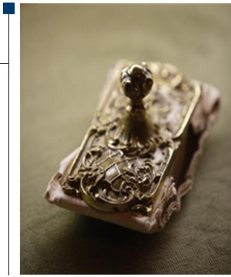

---

# Jelentés 

## Állami

## Vagyonnyilvántartási Kft.

Az állami tulajdonban (résztulajdonban) lévő gazdálkodó szervezetek vagyonmegőrzési és gazdálkodási tevékenységének ellenőrzése
2016. decembe- hó 5. nap
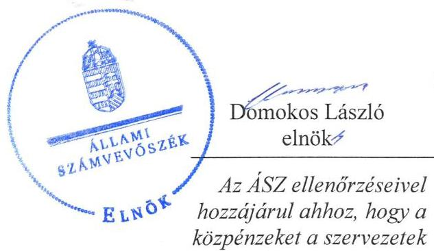

16191
www.asz.hu
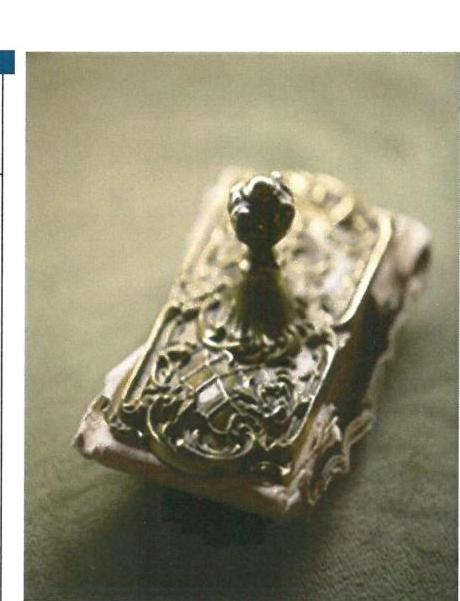

---

# AZ ELLENŐRZÉST FELÜGYELTE:

DR. HORVÁTH MARGIT felügyeleti vezető

## AZ ELLENŐRZÉST VEZETTE ÉS A VÉGREHAJTÁSÁÉRT FELELŐS:

PENCZ MÁRIA ellenőrzésvezető

## A PROGRAM ÖSSZEÁLLÍTÁSÁÉRT FELELŐS:

JANIK JÓZSEF LÁSZLÓ osztályvezető

IKTATÓSZÁM: V-1025-128/2016.

TÉMASZÁM: 2059

ELLENŐRZÉS-AZONOSÍTÓ SZÁM: V070918

Jelentéseink az Országgyűlés számítógépes hálózatán és az Interneta a www.asz.hu címen is olvashatóak.

---

# TARTALOMJEGYZÉK 

■ ÖSSZEGZÉS ..... 5
■ AZ ELLENŐRZÉS CÉLJA ..... 7
■ AZ ELLENŐRZÉS TERÜLETE ..... 8
■ AZ ELLENŐRZÉS HÁTTERE, INDOKOLTSÁGA ..... 10
■ A JELENTÉS LÉNYEGES KÉRDÉSKÖREI ..... 11
■ ELLENŐRZÉS HATÓKÖRE ÉS MÓDSZEREI ..... 12
■ MEGÁLLAPÍTÁSOK ..... 14
■ JAVASLATOK ..... 25
■ MELLÉKLETEK ..... 27
I. sz. melléklet: Értelmező szótár ..... 27
II. sz. melléklet: Az ÁVNY Kft. vagyonának változása 2011-2014.között ..... 31
III. sz. melléklet: Az ÁVNY Kft. eredménykimutatása 2011-2014.között. ..... 32
■ FÜGGELÉK: ÉSZREVÉTELEK ..... 33
■ RÖVIDÍTÉSEK JEGYZÉKE ..... 43

---

.

---

# ÖSSZEGZÉS 

Az Állami Számvevőszék az ÁVNY - Állami Vagyonnyilvántartási Kft. vagyonmegőrzési és gazdálkodási tevékenységét 2011. június 14. és 2014. december 31. közötti időszakra ellenőrizte. Az MNV Zrt. a vagyonnal való gazdálkodás feltételeit szabályszerűen alakította ki. Az ÁVNY Kft. vagyongazdálkodási tevékenységének szabályozását hiányosan alakította ki, és vagyonnyilvántartásában is hiányosságot tárt fel az ellenőrzés.
Az ÁVNY Kft. bevételeinek és ráfordításainak elszámolása megfelelt a jogszabályoknak és a belső szabályzatoknak, a szabályszerű önköltségszámítás feltételeit azonban csak 2013tól alakította ki. Vagyonnal való gazdálkodása, valamint vagyonváltozást eredményező döntései a jogszabályi és a tulajdonosi előírásoknak megfeleltek. Az ÁVNY Kft. beszámolási és adatszolgáltatási kötelezettségét teljesítette, az információs rendszert szabályszerűen építette ki és müködtette. Az ÁVNY Kft. az ellenőrzött időszakban adósságot keletkeztető ügyletet nem kötött.

## Az ellenőrzés társadalmi indokoltsága

Magyarországon az intézmény-centrikus közfeladat-ellátás, közvagyon gazdálkodás jellemző a költségvetésen kívüli feladatellátás térnyerése mellett. Ennek szereplői az állami tulajdonú gazdálkodó szervezetek is.

Az Áht2 2. § I) pontja, az Európai Közösséget létrehozó szerződéshez csatolt, a túlzott hiány esetén követendő eljárásról szóló jegyzőkönyv alkalmazásáról szóló 2009. május 25-i 479/2009/EK rendelet szerint, illetve az ESA95 és ESA2010 statisztikai módszertana alapján a kormányzati szektorba tartoznak a "központi kormányzat alszektorba besorolt társaságok és egyéb szervezetek" is, amelyekkel szemben alapvető követelmény, hogy gazdálkodásuk, müködésük szabályszerű, az általuk szolgáltatott adatok megbízhatóak legyenek.

Az állami vagyonnal való gazdálkodás alapvető célja az állami vagyon átlátható, rendeltetésszerű és felelős felhasználásának biztosítása. Az állami tulajdonban álló gazdálkodó szervezetek államot megillető társasági részesedése a nemzeti vagyon részét képezi és legfőbb rendeltetése szerint a közfeladatok ellátását szolgálja.

Az Állami Számvevőszék stratégiájában megfogalmazta, hogy az államháztartáson kívülre nyújtott költségvetési támogatások és ingyenes vagyonjuttatások, valamint az államháztartáson kívül működő közfeladat-ellátó rendszerek ellenőrzéseivel hozzájárul ahhoz, hogy a közpénzeket az államháztartáson kívül működő szervezetek is átlátható, rendezett módon használják fel a közfeladatok szerződésben vállalt ellátása érdekében.

## Főbb megállapítások, következtetések, javaslatok

A tulajdonosi joggyakorló MNV Zrt. a felelős vagyongazdálkodást biztosító követelményeket kialakította, meghatározta az állami vagyon értékének megőrzéséhez, gyarapításához szükséges követelményeket.

Az ÁVNY Kft. vagyongazdálkodási tevékenységének szabályozását hiányosan alakította ki, mert az SZMSZ, a Számlarend és a Bizonylati szabályzat készítési kötelezettségét a Számv. tv.-ben előírtak ellenére csak 2013. évtől teljesítette, továbbá a Számviteli Politika ${ }_{1,2}$-ban foglaltak ellenére Önköltségszámítás rendjére vonatkozó belső szabályzattal szintén csak 2013-tól rendelkezett.

Vagyonnyilvántartása nem teljes körűen felelt meg a Számv. tv-ben és a Leltárkészítési és Leltározási Szabályzat ${ }_{1,2}$ ban foglaltaknak, mert az önköltségszámítás szabályszerű feltételrendszerét 2013-tól alakította ki.

---

Éves beszámolóit a Számv. tv. előírásainak megfelelően határidőben elkészítette, a beszámolókat a könyvvizsgáló minden évben hitelesítő záradékkal látta el, az FB jóváhagyásra javasolta. Ugyanakkor beszámolói mérlegtételeinek leltárral igazolt alátámasztása nem minden esetben volt teljes körűen biztosított.

A Számviteli Politika ${ }_{1,3}$-ban előírt, az ÁVNY Kft. által ellátott közfeladatok bevételeinek és ráfordításainak elkülönítését biztosította. Az ÁVNY Kft. vagyongazdálkodási tevékenysége, valamint vagyonváltozást eredményező döntései megfeleltek a jogszabályi és belső szabályzatoknak.

Közzétételi kötelezettségének részben tett eleget, mert az Info. tv. előírásai ellenére nem tette közzé az 1. melléklet III. 1. rész szerinti éves költségvetését, a III. 2. rész szerinti foglalkoztatottak létszámát, személyi juttatásaira vonatkozó adatokat, és a III. 8. rész szerinti közbeszerzési terveket a 2011-2014. évekre vonatkozóan.

Az ÁVNY Kft. likvid pénzeszközeit diszkont kincstárjegyekbe fektette, az értékpapírok 2012. évi mérleg szerinti értéke 1 503,6 M Ft. volt, a 2013. évi érték 149,7 M Ft. Az ÁVNY Kft. az ellenőrzött időszakban adósságot keletkeztető ügyletet nem kötött.

---

# AZ ELLENŐRZÉS CÉLJA 

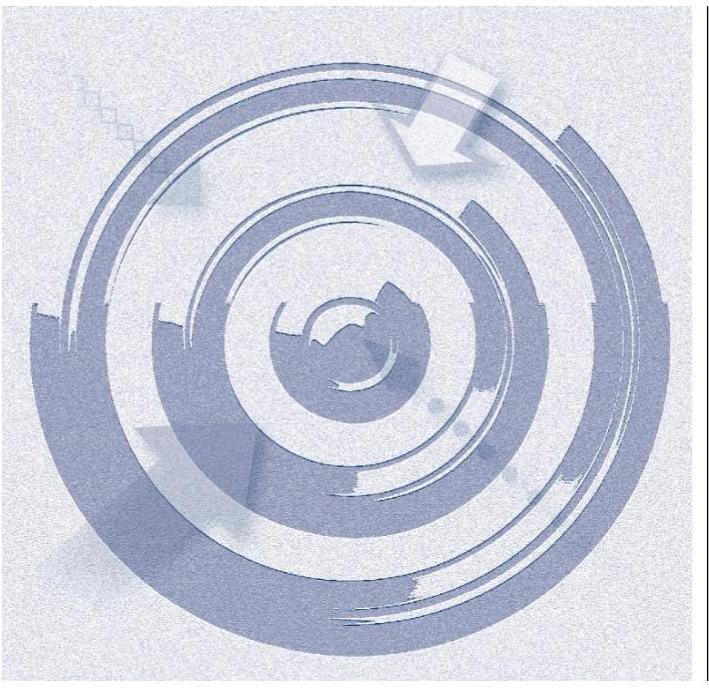

Az ellenőrzés célja annak értékelése, hogy a tulajdonosi jogok gyakorlása szabályszerű volt-e; a gazdálkodó szervezet által ellátott feladat bevételei, ráfordításai elszámolásának, és vagyongazdálkodási tevékenységének szabályozása megfelelt-e a jogszabályi és a tulajdonosi előírásoknak és azok végrehajtása szabályszerű volt-e; biztosítva volt-e a közfeladatok átláthatósága és elszámoltathatósága érdekében a közszolgáltatás dijának megalapozottsága szabályszerű önköltségszámítással; a vagyonváltozást eredményező döntések esetében a tulajdonosi jogok gyakorlója és a gazdálkodó szervezet szabályszerűen jártak-e el; a gazdálkodó szervezet épített-e ki és múködtetett-e információs rendszert a szabályszerű vagyongazdálkodás érdekében.

Az ellenőrzés további célja annak értékelése, hogy a kormányzati szektorba sorolt egyéb szervezetek gazdálkodásának a kormányzati szektor hiányára és az államadósságra befolyással bíró elemei a jogszabályi előírásoknak megfeleltek-e.

---

# AZ ELLENŐRZÉS TERÜLETE 

## ÁVNY - Állami Vagyonnyilvántartási Kft.

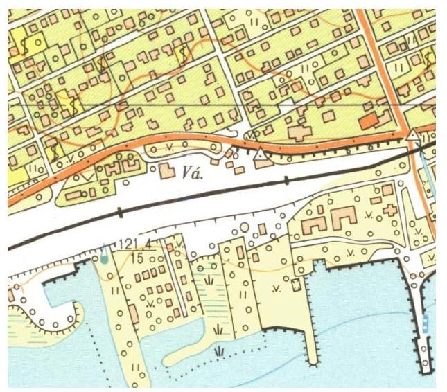

A 100\%-os állami tulajdonban álló Állami Vagyonnyilvántartási Kft.-t a Magyar Állam nevében az MNV Zrt. Igazgatósága a 146/2011. (IV. 13.) számú IG. határozatával 2011. június 14-én alapította 500,0 E Ft jegyzett tőkével. Az MNV Zrt. székhelyén, a szakmai felügyelete alatt müködő egyszemélyes Kft.-nél a tulajdonosi jogokat az állami vagyon felügyeletéért felelős miniszter az MNV Zrt. útján gyakorolta.

A Kormány az 1172/2010. (VIII. 18.) számú határozatában ${ }^{1}$ elrendelte az Országleltár elkészítését, azon belül az egységes, integrált állami vagyonnyilvántartási rendszer elkészítését az MNV Zrt. ${ }^{2}$ közremüködésével, a folyamatban lévő fejlesztésekkel összhangban. A kormányhatározatban meghatározott feladatok megvalósítására 2011. március 7-én létrejött az Országleltár multi-projekt.

Az ÁVNY Kft. ${ }^{3}$ kizárólagos feladata az MNV Zrt. felelősségi körébe tartozó Országleltár Program és az erre épülő publikus adatszolgáltató felület kialakítása, adattartalommal való feltöltése, üzembe helyezésének biztosítása és használatának oktatása. A projekttársaság létrehozásának célja az volt, hogy a projekthez kapcsolódó valamennyi beszerzés, költségkifizetés és kötelezettségvállalás transzparens és auditálható módon, egyetlen költségviselőn keresztül történjen, melyhez a forrásokat a tulajdonosi joggyakorló MNV Zrt. biztosította.

Az 1172/2010. (VIII. 18.) számú Korm. határozatban megfogalmazott feladatokkal összhangban az Országleltár multi-projekt elsődleges célja, hogy az állami tulajdonú ingatlanok, tulajdon részesedések, ingóságok és egyéb vagyonelemek darabszáma és értéke különböző időpontokban akár azonnali adatszolgáltatásra alkalmas módon - lekérdezhető legyen.

Az 1172/2010. (VIII. 18.) számú Korm. határozatban foglalt alapvető célokat tartalmazó feladatok 1-4. pontjai teljesültek, a vagyon-nyilvántartási rendszer változáskövetését, karbantartását és fejlesztését magába foglaló 5. pont végrehajtása folyamatos, - az MNV Zrt. és ÁVNY Kft. között létrejött vállalkozási szerződés alapján - megvalósulásának határideje 2017. június 30.

Az ÁVNY Kft. az ellenőrzött időszakban az adatállomány tisztítását munkavállalókkal, a projekt megvalósulását (minőségbiztosítás, közbeszerzések lefolytatása, szoftverkészítés) alvállalkozók igénybevételével valósította meg.

A projektek megvalósulásához szükséges forrást az MNV Zrt. biztosította díjbekérők alapján előlegek formájában, a folyamatban lévő projekteket az ÁVNY Kft. a félkész termékek között tartotta nyilván. Az elkészült modulok az MNV Zrt. számára kiszámlázásra kerültek, azokat az immateriális javak között az MNV Zrt. saját könyveiben aktiválta. Az Országleltár multi-projektre fordított költségek az ellenőrzött időszakban 3354 M Ft-ot tettek ki.

---

Az ÁVNY Kft. gazdálkodását az ellenőrzött években a beszámoló főbb adatai alapján a következő táblázat szemlélteti:

1. táblázat

# AZ ÁVNY KFT. FŐBB GAZDÁLKODÁSI ADATAI A 2011-2014. ÉVEKBEN (M FT-BAN) 

| Megnevezés | 2011. év | 2012. év | 2013. év | 2014. év |
| :-- | --: | --: | --: | --: |
| Értékesítés nettó árbevétele | 1,7 | 314,0 | 1147,6 | 1775,5 |
| Forgóeszközök | 1372,5 | 2641,0 | 2704,1 | 1018,1 |
| Készletek | 159,5 | 575,3 | 1078,9 | 10,6 |
| Követelések | 236,1 | 417,3 | 496,5 | 316,3 |
| Értékpapírok | 0,0 | 1503,6 | 149,7 | 0,0 |
| Pénzeszközök | 977,0 | 144,8 | 979,0 | 691,2 |
| Saját tőke | 5,0 | 60,5 | 85,9 | 17,3 |
| Jegyzett tőke | 0,5 | 0,5 | 0,5 | 0,5 |
| Kötelezettségek | 1360,5 | 2556,7 | 2334,4 | 943,7 |
| Mérleg szerinti eredmény | 4,5 | 55,5 | 25,4 | $-68,6$ |
| Mérlegfőösszeg | 1374,1 | 2657,5 | 2704,4 | 1018,6 |
| Állományi létszám (fő) | 9 | 29 | 17 | 10 |

Az ÁVNY Kft. mérlegfőösszege 25,9\%-al csökkent, 2011-ben 1374,1 M Ft., 2014-ben 1018,6 M Ft volt. Az értékesítés nettó árbevétele a 2011. és a 2014. év vége között 1773,8 M Ft-tal nőtt. A készletek állománya 2011. december 31-éről a 2014. év végére 148,9 M Ft-tal csökkent. A követelések állománya az ellenőrzött időszakban 34,0\%-al növekedett. A kötelezettség állomány minden évben meghaladja a saját tőke értékét, 2011. december 31-éről a 2014. év végére 30,6\%-kal csökkent.

---

# AZ ELLENŐRZÉS HÁTTERE, INDOKOLTSÁGA 

## AZ ÁSZ4 KÖZÉPTÁVRA SZÓLÓ STRATÉGIÁJÁBAN

megfogalmazta, hogy az államháztartáson kívülre nyújtott költségvetési támogatások és ingyenes vagyonjuttatások, valamint az államháztartáson kívül működő közfeladat-ellátó rendszerek ellenőrzéseivel hozzájárul ahhoz, hogy a közpénzeket az államháztartáson kívül működő szervezetek is átlátható, rendezett módon használják fel a közfeladatok szerződésben vállalt ellátása, továbbá a közvagyon szerződésben vállalt átlátható, hatékony, költségtakarékos működtetése, értékének megőrzése, állagának védelme, értéknövelő használata, hasznosítása és gyarapítása érdekében.

Az ellenőrzés feladata a közvagyonnal biztosított közfeladat ellátással kapcsolatban a közpénzek átláthatósága, nyilvánossága érdekében a jogszabályokban, belső szabályzatokban megfogalmazott előírások érvényesülésének az állami tulajdonban (résztulajdonban) lévő gazdálkodó szervezetek vagyonérték megőrzési és gazdálkodási tevékenységének értékelése.

AZ ELLENŐRZÉS EREDMÉNYEKÉPP a törvényalkotás számára tapasztalatok állnak rendelkezésre az állami vagyonnal való köz-feladat-ellátás, közvagyonnal való gazdálkodás értékeléséhez, az átláthatóságot biztosító szabályozáshoz. Az ellenőrzés tapasztalatai segítik és erősítik az ÁSZ hozzáadott értéket teremtő tevékenységét és tanácsadó szerepét.

---

# A JELENTÉS LÉNYEGES KÉRDÉSKÖREI 

1.     - A tulajdonosi joggyakorló a vagyonnal való gazdálkodás feltételeit szabályszerűen alakította-e ki?
2.     - Az ÁVNY Kft. vagyongazdálkodási tevékenységének szabályozottsága és a vagyon nyilvántartása megfelelt-e az előírásoknak?
3.     - A bevételek és ráfordítások elszámolása, valamint az önköltségszámítás szabályszerű volt-e?
4. A vagyonnal való gazdálkodás, valamint a vagyonváltozást eredményező döntések megfeleltek-e a jogszabályi és tulajdonosi előírásoknak?
5.     - Az ÁVNY Kft. a szabályszerű vagyongazdálkodás érdekében teljesítette-e beszámolási, adatszolgáltatási kötelezettségét, ki-épített-e, illetve müködtetett-e információs rendszert?
6.     - Az ÁVNY Kft. gazdálkodásának a kormányzati szektor hiányára és az államadósságra befolyást gyakorló elemek a jogszabályi előírásoknak megfeleltek-e?

---

# ELLENŐRZÉS HATÓKÖRE ÉS MÓDSZEREI 

## Az ellenőrzés típusa

Szabályszerűségi ellenőrzés

## Az ellenőrzött időszak

2011. június 14-től 2014. december 31-ig.

## Az ellenőrzés tárgya

Az állami tulajdonban (résztulajdonban) lévő gazdálkodó szervezetek vagyonmegőrzési és gazdálkodási tevékenysége és a kormányzati szektor hiányára és adósságállományára hatást gyakorló elemek ellenőrzése.

## Az ellenőrzött szervezet

Állami Vagyonnyilvántartási Kft, Magyar Nemzeti Vagyonkezelő Zrt.

## Az ellenőrzés jogalapja

Az ellenőrzés alapját az Állami Számvevőszékről szóló 2011. évi LXVI. törvény 5. § (3)-(5) bekezdése, valamint az állami vagyonról szóló 2007. évi CVI. törvény 3. § (4) bekezdése képezi.

## Az ellenőrzés módszerei

Az ellenőrzést az ellenőrzési program szempontjai, az ellenőrzött időszakban hatályos jogszabályok, az ellenőrzés szakmai szabályai, a jelen ellenőrzésre irányadó ÁSZ módszertan és a nemzetközi standardok figyelembevételével végeztük.

Az ellenőrzési kérdések megválaszolásához szükséges bizonyítékok megszerzése az ellenőrzött által rendelkezésre bocsátott dokumentumokra, adatokra alapozva kérdésfelvetés, mintavételezés, valamint elemző eljárás útján történt.

Az ellenőrzési bizonyítékként felhasználható adatforrások közé tartoztak egyrészt a szakmai program részletes szempontjainál felsorolt adatforrások, másrészt minden egyéb - az ellenőrzés folyamán feltárt, az ellenőrzés szempontjából információt tartalmazó - dokumentumok.

---

Az ellenőrzés lefolytatásához a gazdálkodó szervezet a tanúsítványok elektronikus kitöltésével, valamint az ÁSZ által kért dokumentumok megküldésével szolgáltatott adatokat.

A bevételek és a ráfordítások elszámolását, és a vagyonnyilvántartás terén a szabályszerű múködést véletlenszerű mintavétellel ellenőriztük. Az ellenőrzöttnél, mint a kormányzati szektorba sorolt gazdálkodó szervezetnél a személyi jellegú ráfordítások elszámolása mellett az egyéb ráfordítások, a pénzügyi múveletek ráfordításai, a rendkívüli ráfordítások, illetve az egyéb bevételek, a pénzügyi műveletek bevételei, a rendkívüli bevételek elszámolásának szabályszerűségét szintén mintatételeken keresztül ellenőriztük.

A mintavétellel ellenőrzött területek esetében minden egyes tétel vonatkozásában a szabályszerűségre vonatkozó kérdéseket tettük fel, amelyek eredménye összesítésre került. A jogszabályoknak és a belső előírásoknak megfelelőnek tekintettük az adott területet, amennyiben a minta ellenőrzésének eredménye alapján 95\%-os bizonyossággal a teljes sokaságban a hibaarány kisebb volt, mint 10\%, nem megfelelőnek értékeltük, ha a hibaarány a 10\%-ot meghaladta. A ráfordítások elszámolására és a vagyonnyilvántartásra vonatkozó véletlen mintavételt kockázati alapú kiválasztással egészítettük ki, amelynek során évente a három legnagyobb öszszegú tételt választottuk ki.

---

# 1. A tulajdonosi joggyakorló a vagyonnal való gazdálkodás feltételeit szabályszerűen alakította-e ki? 

Összegző megállapítás

Az MNV Zrt. a vagyonnal való gazdálkodás feltételeit szabályszerűen alakította ki.
1.1. számú megállapítás

A tulajdonosi joggyakorló MNV Zrt. az Alapító Okirat1-13-ban meghatározta az állami vagyon értékének megőrzését, gyarapítását, valamint a felelős vagyongazdálkodást biztosító követelményeket.

A TULAJDONOSI JOGGYAKORLÁS keretében a tulajdonosi joggyakorló az Alapító Okirat ${ }_{1-13}$-ban és az ÁVNY Kft.-vel kötött SZT36130. számú megbízási szerződés 10. pontjában a Vtv. ${ }^{5}$ előírásainak megfelelően meghatározta a vagyongazdálkodás alapelveit, követelményrendszerét, az alapelveknek való megfelelést.

Az Alapító Okirat ${ }_{1-13}$ tartalmazta az MNV Zrt. hatáskörét, a tulajdonosi joggyakorló számára fenntartott jogok között a vagyongazdálkodáshoz kapcsolódó jogokat, az ügyvezetés feladatát és hatáskörét, az ügyvezetőre vonatkozó összeférhetetlenségi szabályokat, rendelkezett az ügyvezető felelősségéről. Az Alapító Okirat ${ }_{1-13}$ előírása alapján az MNV Zrt. kizárólagos hatáskörébe tartozott a Számv tv. szerinti éves beszámoló jóváhagyása, a könyvvizsgáló, az FB tagjainak megválasztása, a törzstőke felemelése, leszállítása, az üzleti terv jóváhagyása, valamint az osztalékpolitikáról, üzletrész elidegenítésről való döntés.

Az MNV Zrt. jogkörébe tartozott az Alapító Okirat ${ }_{1-13}$-ban meghatározott értékhatár feletti döntési jog ingatlan, tárgyi eszköz, pénzügyi befektetés, értékpapír, részesedés, követelés megszerzése, a vagyoni értékű jogok, immateriális javak megszerzése vagy elidegenítése tárgyában, valamint döntési jog minden olyan kérdésben, amelynek tárgya az ÁVNY Kft. vagyonának, vagyoni értékú jogának a hatályos Alapító Okirat ${ }_{1-13}$-ban meghatározott értékhatárt elérő vagy meghaladó terhelése, egyéb kötelezettségvállalása. Az ÁVNY Kft.-nél a legfőbb döntést hozó szerv hatáskörébe tartozó döntéseket az Alapító Okirat ${ }_{1-13}$, valamint a $\mathrm{Ptk}_{2}{ }^{6}$ előírásainak megfelelően az MNV Zrt. hozta.

Az ÁVNY Kft. ügyvezetésének ellenőrzése céljából a Gt. ${ }^{7}$, valamint a Tak tv. ${ }^{8}$ előírásainak megfelelően $\mathrm{FB}^{9}$-t hoztak létre. Az Alapító Okirat ${ }_{1-13}$ a Gt. és a $\mathrm{Ptk}_{2}$ előírásainak megfelelően tartalmazta az FB feladatait, hatáskörét, ezen belül az ÁVNY Kft. múködésének, gazdálkodásának ellenőrzését. Az FB köteles volt megvizsgálni minden lényeges üzletpolitikai jelentést, minden olyan előterjesztést, amely az alapító kizárólagos hatáskörébe tartozó ügyre vonatkozott, melynek az FB eleget tett.

Az ÁVNY Kft. a Számv. tv. ${ }^{10}$ előírásai alapján az ellenőrzött időszakban könyvvizsgálatra kötelezett volt. Az Alapító Okirat ${ }_{1-13}$-ban a Gt. és a $\mathrm{Ptk}_{2}$ előírásainak megfelelően határozták meg a könyvvizsgáló feladatát, aki

---

számára tájékoztatási kötelezettséget írtak elő, ha tudomást szerez az ÁVNY Kft. várható vagyon csökkenéséről, vagy olyan tényt észlel, mely az ügyvezető vagy a FB tagjainak a törvényben meghatározott felelősségét vonja maga után.

Az SZT-36130. számú megbízási szerződés 10. pontjában rendelkeztek az ÁVNY Kft. tevékenysége során beszerzett szellemi termékek tulajdon,illetve használati jogáról, a szellemi termékek rendeltetésszerű használata minimum követelményeiről.

# 2. Az ÁVNY Kft. vagyongazdálkodási tevékenységének szabályozottsága és a vagyon nyilvántartása megfelelt-e az elóírásoknak? 

Összegző megállapítás

Az ÁVNY Kft. vagyongazdálkodási tevékenységének szabályozása és a vagyonnyilvántartása nem teljes körűen felelt meg a jogszabályi követelményeknek.
2.1. számú megállapítás

Az ÁVNY Kft. a vagyongazdálkodás feltételeit hiányosan alakította ki. Az önköltségszámítás rendjére vonatkozó belső szabályzattal 2013-tól rendelkezett. SZMSZ, Számlarend és Bizonylati szabályzat készítési kötelezettségét 2013. évtől teljesítette.

Az ÁVNY Kft. szabályszerű működésének kereteit az Alapító Okirat ${ }_{1-13}$, valamint az MNV Zrt.-vel kötött megbízási szerződés határozta meg. Az adott évre vonatkozó gazdálkodás kereteit az éves beszámolók és üzleti tervek, továbbá 2013. évtől az SZMSZ ${ }^{11}$ tartalmazta. Az MNV Zrt. a beszámolókat és üzleti terveket minden évben Alapítói határozattal elfogadta.

Az ÁVNY Kft. múködésének alapdokumentumai az Alapító Okirat ${ }_{1-13}$, valamint belső szabályzatai, mint Javadalmazási Szabályzat ${ }_{1-2}{ }^{12}$, Közbeszerzési és Beszerzési Szabályzat ${ }_{1-3}{ }^{13}$ Számviteli Politika ${ }_{1-3}{ }^{14}$, Leltárkészítési és Leltározási Szabályzat ${ }_{1-2}{ }^{15}$, Eszközök és Források Értékelési Szabályzata ${ }_{1-2}{ }^{16}$, Pénzkezelési Szabályzat ${ }_{1-3}{ }^{17}$, valamint a Számv. tv. szerinti Számlarend ${ }^{18}$ voltak.

Az ÁVNY Kft. az Alapító Okirat ${ }_{1-12}$-ban foglalt, az SZMSZ elkészítésének kötelezettségéről szóló előírást csak a 2013. évben teljesítette, az SZMSZ az 5/2013. ügyvezetői utasítással, az FB 23/2013. (VI. 13.) sz. határozatával 2013. június 17-én lépett hatályba. Ezt megelőzően, az ellenőrzött időszakra vonatkozóan - az Alapító Okirat előírásai ellenére - az ÁVNY Kft. nem rendelkezett SZMSZ-szel.

Az ÁVNY Kft. a Számv. tv. előírásainak megfelelően az alapítástól számított 90 napon belül elkészítette a Számviteli Politika ${ }_{1}$-t, ezt követően a Számviteli Politika ${ }_{2}$ 2012. január 1-jén lépett hatályba. A Számv. tv. 161. § (1)-(2) bekezdése előírásai ellenére az ÁVNY Kft. Számlarenddel csak 2013. január 1-jétől rendelkezett. A 2013. január 1-jétől hatályos Számviteli Poli-tika ${ }_{3}$-t a 6/2013. számú Ügyvezetői utasítás alapján elkészítették, melyet az ÁVNY Kft. ügyvezetője utólag, 2013. október 31-én hagyott jóvá.

A Számviteli politika ${ }_{1,2}$ 2. pontja a 2011-2012. évekre előírta az önköltségszámítás rendjére vonatkozó belső szabályzat készítési kötelezettséget,

---

# 2.2. számú megállapítás 

míg 2013-tól az önköltségszámítás rendjére vonatkozó szabályzat készítésére az ÁVNY Kft. már a Számv. tv. 14. § (7) bekezdése alapján volt kötelezett. Az ÁVNY Kft. az önköltségszámítás rendjére vonatkozó belső szabályzat készítési kötelezettségének az ellenőrzött időszakban 2013-tól úgy tett eleget, hogy az egyes projektekre vonatkozóan az ÁVNY Kft. rendelkezett a tulajdonosi joggyakorló MNV Zrt. által a 496/2013. (IX.20.) Alapítói határozatával jóváhagyott allokációs renddel, amely többek között előírta a projektekre vonatkozó közvetett költségek felosztását is.

A Selejtezési Szabályzatot ${ }^{19}$ a 7/2013-as Ügyvezető utasítással 2013. január 1-jén helyezték hatályba, melyet az ÁVNY Kft. ügyvezetője utólag, 2013. október 21-én hagyott jóvá. A Számviteli politika1-2 2. pontja előírásai ellenére az ÁVNY Kft. 2011-2012. évekre vonatkozóan Selejtezési Szabályzattal nem rendelkezett.

Az ÁVNY Kft. Bizonylati szabályzatot - a Számviteli politika1-2 2. pontja előírásai ellenére - a 2011-2012. években nem készített, azt a Számviteli politika3 részeként 2013. január 1-jétől helyezte hatályba. Az ÁVNY Kft. rendelkezett Közbeszerzési és Beszerzési Szabályzat ${ }_{1,2}$-tal az ellenőrzött időszakban, Javadalmazási Szabályzat ${ }_{1,2}$-át 2012. évtől készítette el.

## Az ÁVNY Kft. vagyonnyilvántartása nem teljes körűen felelt meg a jogszabályi előírásoknak.

Az ÁVNY Kft. a 2011-2014. években nem teljes körűen biztosította a Számv. tv. 69. § (1) bekezdése, valamint a Leltárkészítési és Leltározási Szabályzat ${ }_{1,2}$ 3.1.2 pontjában előírtak alapján az éves beszámolók mérlegtételeinek alátámasztását.

A Számv. tv. 69. § (3) bekezdése folyamatos mennyiségi nyilvántartás esetén a Leltárkészítési és Leltározási Szabályzat ${ }_{1,2}$-ban előírt gyakorisággal, de legalább háromévenkénti mennyiségi leltározási kötelezettséget írt elő. Az ÁVNY Kft. Leltárkészítési és Leltározási Szabályzat ${ }_{1,2}$-a a mennyiségi felvétellel leltározandó eszközök (tárgyi eszközök, készletek) leltározását éves gyakorisággal határozta meg. Az ÁVNY Kft. az ellenőrzött időszakban a készletek mérlegsoron belül befejezetlen termelést és félkészterméket mutatott ki a 2011-2013. években.

Az ÁVNY Kft. a Leltárkészítési és Leltározási Szabályzat ${ }_{1,2}$-ban előírtak ellenére nem rendelkezett az éves leltározásra vonatkozó ügyvezetői utasításokkal, leltározási ütemtervvel, leltári jegyzőkönyvekkel.

Az ellenőrzött időszaki beszámolók mérlegsorainak alátámasztására egyeztetéssel végrehajtott leltározást az ÁVNY Kft. leltárbizonylatokkal nem minden esetben támasztotta alá, azokat nem őrizték meg, megsértve ezzel a Számv. tv. 165. § (1) és a 169. § (1) bekezdésében foglaltakat. Ezzel az ÁVNY Kft. nem tudta teljesítetni a Számv. tv. 69. § (1) bekezdésében előírtakat, mivel a beszámoló elkészítéséhez, a mérleg tételeinek alátámasztásához összeállított leltárt, amely tételesen és ellenőrizhető módon mennyiségben és értékben tartalmazza a mérleg fordulónapján meglévő eszközöket és forrásokat a Számv. tv. 169. § (1) bekezdésében előírtak szerint 8 évig meg kellet volna őriznie.
— Az ÁVNY Kft. a Készletek mérlegsoron belül, 2013-2014. években árut (közvetített szolgáltatást) mutatott ki. A Leltárkészítési és Leltározási Szabályzat ${ }_{1,2}$ a közvetített szolgáltatásokra nem írta elő a mennyiségi felvétellel való leltározási kötelezettséget. Az ÁVNY Kft.

---

2013-2014. években a mérlegben kimutatott közvetített szolgáltatások értékének egyeztetéssel történt leltározását leltárbizonylattal nem támasztotta alá, ezzel nem biztosította a Számv. tv. 69. § (1) bekezdésében előírtakat.

- A 2011-2014. évi mérlegben kimutatott Pénzeszközökön belül a házi pénztári tételek leltározását dokumentálták, ugyanakkor a bankbetétek egyeztetéssel elvégzett leltározását leltárbizonylattal nem támasztotta alá, ezzel nem biztosította a Számv. tv. 69. § (1) bekezdésében előírtakat.
- A 2012-2013. évi mérlegben kimutatott értékpapírok, valamint a 2013. évi mérlegben kimutatott szállítói kötelezettségek értékének egyeztetéssel elvégzett leltározását leltárbizonylattal nem támasztották alá, ezzel nem biztosította a Számv. tv. 69. § (1) bekezdésében előírtakat.
- A 2011-2013. évek mérlegében kimutatott saját tőke értékének és összetételének egyeztetéssel végrehajtott leltározását leltárbizonylattal nem támasztotta alá, ezzel nem biztosította a Számv. tv. 69. § (1) bekezdésében előírtakat.
- A 2011-2014. évi mérlegekben kimutatott vevőktől kapott előlegek, valamint az egyéb rövidlejáratú kötelezettségek értékének egyeztetéssel elvégzett leltározását leltárbizonylattal nem támasztották alá, ezzel nem biztosította a Számv. tv. 69. § (1) bekezdésében előírtakat.

# 3. A bevételek és ráfordítások elszámolása, valamint az önköltségszámítás szabályszerű volt-e? 

Összegző megállapítás

Az ÁVNY Kft. által ellátott közfeladat bevételeinek és ráfordításainak elszámolása a jogszabályoknak, illetve belső szabályzatoknak megfelelt. Az ÁVNY Kft. a szabályszerű önköltségszámítás feltételeit 2013-tól alakította ki.
3.1. számú megállapítás

Az ÁVNY Kft. által ellátott közfeladatok elkülönített elszámolását a bevételek és ráfordítások költséghelyenkénti nyilvántartásával biztosította.

Az ÁVNY Kft.-nek a Vtv.-ben előírt visszapótlási kötelezettsége - vagyonkezelt eszközök hiányában - nem állt fenn.

A Számviteli Politika ${ }_{1,3}$ két költséghely (projektek és múködés) használatát írta elő. A projektek és a múködés költséghelyek használatával az ÁVNY Kft. a közfeladat bevételeinek és ráfordításainak elkülönített könyvelését biztosította, annak ellenére, hogy számára az elkülönítést jogszabály nem írta elő.

Az ÁVNY Kft. árbevételének alakulását az ellenőrzött időszakban az 1. ábra mutatja be:

---

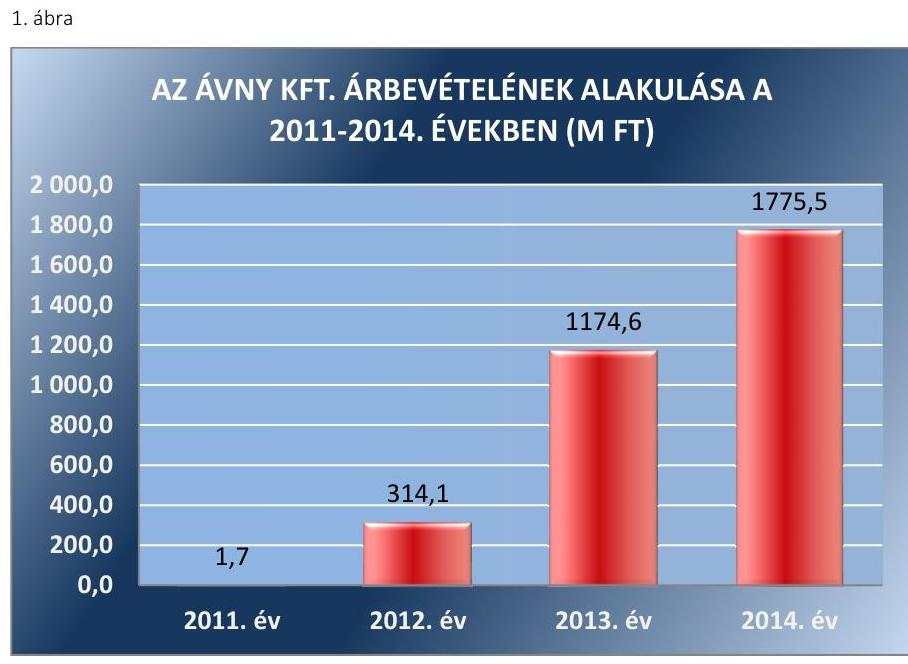

Forrás: Az ÁVNY Kft. 2011-2014. évi beszámolói
Az ÁVNY Kft. árbevétele folyamatos növekedést mutatott az alapítástól 2014. december 31-ig, amelynek oka az Országleltár projekthez kapcsolódó, az ÁVNY Kft. által ellátandó tevékenységek körének bővülése volt.

A BEVÉTELEK ELSZÁMOLÁSA összességében szabályszerű volt. Az Országleltár projekthez kapcsolódó szolgáltatásnyújtásból származó árbevételek elszámolása összességében megfelelt a Számv. tv. előírásainak.

AZ ANYAGJELLEGŰ RÁFORDÍTÁSOK elszámolása megfelelt a Számv. tv. előírásainak. A közfeladat-ellátással kapcsolatos ráfordításokat a Számviteli Politika ${ }_{1,3}$-ban előírtaknak megfelelően elkülönítették, és a megfelelő költségnemre számolták el.

# A BERUHÁZÁSOK, FELÚJÍTÁSOK KIADÁSAI ÉS 

AZ ÉRTÉKCSÖKKENÉSI LEÍRÁS elszámolása a Számv. tv. és a Számviteli Politika ${ }_{1-3}$ elöírásainak megfelelt. Az ÁVNY Kft. az Számv. tv. és a Számviteli Politika ${ }_{1-3}$-ban előírtaknak megfelelően a 100 ezer forint egyedi beszerzési, előállítási érték alatti vagyoni értékű jogok, szellemi termékek, tárgyi eszközök bekerülési értékét a használatbavételkor értékcsökkenési leírásként egy összegben elszámolta. Az ÁVNY Kft. a 2011-2012. évi beszámolókban nem mutatott ki tárgyi eszközöket. A 2013. évi és a 2014. évi beszámolók az értékcsökkenési leírás bemutatása tekintetében megfeleltek a Számv. tv. előírásainak, a kiegészítő mellékletben bemutatták a tárgyi eszközök bruttó értékének és elszámolt értékcsökkenésének nyitó és záró értékét, tárgyévi növekedését, valamint az értékcsökkenési leírás módszerét.

Az ÁVNY Kft. a 2011-2013. évi beszámolóiban vevőkövetelést nem mutatott ki. Az ÁVNY Kft. a 2014. évi beszámolójában 239,9 M Ft vevőkövetelést mutatott ki, amelyből 236,4 M Ft-ot az MNV Zrt.-vel, 3,5 M Ft-ot a Nemzeti Hulladékgazdálkodási Koordináló és Vagyonkezelési Zrt.-vel szembeni, nem lejárt összegű vevőkövetelés jelentette.

---

# 3.2. számú megállapítás 

Az ÁVNY Kft. a szabályszerű önköltségszámítás feltételeit 2013-tól alakította ki.

Az ÁVNY Kft. a Számv. tv. előírásainak megfelelően befejezetlen termelésként mutatta ki mérlegében az Országleltár Program keretében megvalósított projektek tárgyévben felmerült azon költségeit, amelyekkel kapcsolatban bevétel elszámolására a tárgyévben nem került sor.

Az ÁVNY Kft.-nek a hatályos Számviteli politika ${ }_{1,2}$ 2. pontjában előírtak szerint már a 2011-2012. években önköltségszámítás rendjére vonatkozó belső szabályzatkészítési kötelezettsége volt. Az ÁVNY Kft. költségnemek szerinti költségeinek együttes összege 2012. évben meghaladta a Számv. tv. 14. § (7) bekezdése szerinti értékhatárt, ezért 2013. évtől kezdődően a saját előállítású termékek, a végzett szolgáltatások Számv. tv. 51. §-a szerinti önköltségét az önköltségszámítás rendjére vonatkozó belső szabályzat szerinti utókalkuláció módszerével kellett megállapítania. Az ÁVNY Kft. 2013. évtől - a Számv. tv. 14. § (5) bekezdése c) pontja előírását betartva készítette el az önköltségszámítás rendjére vonatkozó belső szabályzatot az „Országleltár program keretében az ÁVNY számára átutalt előlegek elszámolása és OL költségek kezelése" néven, amelyben meghatározta a közvetlen önköltség számításának utókalkulációs módszerét a saját előállítású eszközök bekerülési értékének a megállapításához.

Az ÁVNY Kft. a 2011-2013. évi befejezetlen termelés értékét utókalkulációval nem támasztotta alá, mivel nem rendelkezett a Számv. tv. 14. § (5) bekezdésének c) pontja szerinti önköltségszámítás rendjére vonatkozó belső szabályzattal. Hiányzott a befejezetlen termelés értékének a Számv. tv. 51. § szerinti meghatározásának módja, így annak értékében kimutatott közvetlen és közvetett költségek szerinti megbontása, költségnemenkénti tételes felsorolása, továbbá a befejezetlen termelés értéke, valamint öszszetétele az egyes projektek szerinti megbontásban. Az ÁVNY Kft. 2014. évben mérlegében nem mutatott ki befejezetlen termelést és félkészterméket.

## 4. A vagyonnal való gazdálkodás, valamint a vagyonváltozást eredményező döntések megfeleltek-e a jogszabályi és tulajdonosi előírásoknak?

Összegző megállapítás

Az ÁVNY Kft. vagyonnal való gazdálkodása, valamint a tulajdonosi jogok gyakorlói és a gazdálkodó szervezet által meghozott, vagyonváltozást eredményező döntések a jogszabályi és a tulajdonosi előírásoknak megfeleltek.

Az ÁVNY Kft. a jogszabályi előírásokat betartva, a belső szabályzatok előírásainak megfelelően végezte vagyongazdálkodási tevékenységét.

Az ÁVNY Kft. a vagyongazdálkodási tevékenysége során a jogszabályi előírásokat betartotta. Az ÁVNY Kft. mérlegfőösszege az ellenőrzött időszakban a 2011. évről a 2012. évre 1374,1 M Ft-ról 2657,5 M Ft-ra növekedett,

---

2013. évben jelentősen nem változott, majd 2014. évben 1018,6 M Ft-ra csökkent. A gazdálkodás hatására a saját tőkében, ezen belül az eredménytartalékban volt jelentősebb változás a 2013. évről a 2014. évre a mérleg szerinti eredmény csökkenése miatt. Az eredménytartalék 2012-2013. években a pénzügyi műveletek eredményéből adódott, amely a vevőtől kapott előleg befektetéséből származó kamathozam volt.

Az ellenőrzött időszakban az ÁVNY Kft. Alapító Okirata 9.1.1. pontja szabályozta az osztalékhoz való jogot, mely szerint az alapítónak joga volt az ÁVNY Kft-nek a számviteli jogszabályok szerint számított adózott eredményét osztalékként kivenni. Az MNV Zrt. az ellenőrzött időszakban nem hozott döntést osztalékfizetésről, osztalék kifizetésére nem került sor.

Az ÁVNY Kft. mérleg szerinti eredményének alakulását az ellenőrzött időszakban a 2. ábra szemlélteti:
2. ábra
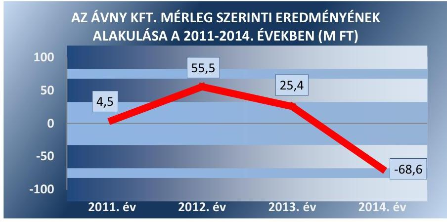

Forrás: Az ÁVNY Kft. 2011-2014. évi beszámolói
A 2014. évben realizált -68.582 E Ft összegű veszteséget tulajdonosi döntés alapján, az ÁVNY Kft. a korábbi évek kamatbevételéből képződött eredménytartalékából fedezte.

Az ÁVNY Kft. tárgyi eszköz állományában az ellenőrzött időszakban nem szerepeltek olyan eszközök, amelyek rendszeres, vagy időközönkénti karbantartást vagy állagmegóvást igényeltek volna.

Az ÁVNY Kft. saját tőke-jegyzett tőke arányát az ellenőrzött időszakban az alábbi ábra szemlélteti:

---

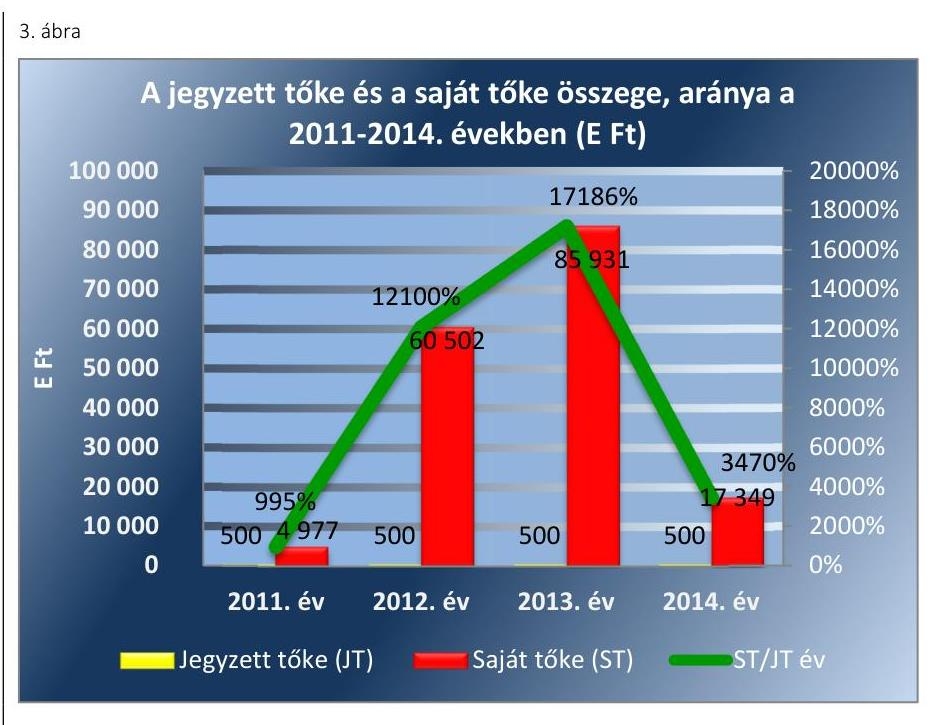

Fonrás: Az ÁVNY Kft. 2011-2014. évi beszámolói
Az ellenőrzött időszakban a Gt., valamint a Ptk. előírásainak megfelelően az ÁVNY Kft. saját tőkéje meghaladta a jegyzett tőke összegét.
4.2. számú megállapítás

Az MNV Zrt. és az ÁVNY Kft. vagyonváltozást eredményező döntéseinek előkészítése a jogszabályi és a belső előírásoknak megfeleltek.

A vagyonváltozást eredményező döntéseket az MNV Zrt. az Alapítói határozatokon, üzleti terveken, valamint az éves beszámolók jóváhagyásán keresztül hozta meg.

Az MNV Zrt. a vagyonváltozást eredményező döntésekkel kapcsolatos követelményeket az Alapító Okirat ${ }_{1-13}$-ban szabályozta. Meghatározta az ÁVNY Kft. szervezetén belüli döntési, kötelezettségvállalási jogköröket. A szabályozásnak megfelelő múködést az Igazgatóság, az FB, valamint az MNV Zrt. folyamatosan kontrollálta.

Az MNV Zrt. alapítói határozatokkal döntött a beszerzésekről, az Üzleti terv elfogadásáról, a szervezeti átalakításáról, a belső szabályzatok elfogadásáról, a szerződések megkötéséről, azok elfogadásáról, a prémiumfeladatok kiírásáról, az FB munkaterve elfogadásáról, az éves beszámoló jóváhagyásáról. Az alapítói határozatokat nyilvántartották és teljesítésükről igazoló lapokat állítottak ki. A határozatok teljesítését az FB igazolta, és az Alapító elfogadta.

Az MNV Zrt. igazgatósága az ellenőrzött időszakban három alkalommal végzett ellenőrzést. Az ellenőrzések az egységes integrált állami nyilvántartási rendszer elkészítésének aktuális helyzetére, az ÁVNY Kft. tevékenységének, gazdálkodásának áttekintésére irányultak. Az ellenőrzések megállapításaival kapcsolatban Ügyvezetői határozat formájában intézkedési tervet készítettek és rögzítették az intézkedés megvalósításának időpontját. A határozatok végrehajtását az FB a tulajdonosi ellenőrzés keretében ellenőrizte, melyekről minden esetben Igazoló lapokat állított ki.

---

A tulajdonosi joggyakorló MNV Zrt. a vagyon tulajdonjogának átruházására, illetve ingyenes átruházására, vagyon értékesítésére, a vagyon apportjára vonatkozó döntést nem hozott.

# 5. Az ÁVNY Kft. a szabályszerű vagyongazdálkodás érdekében teljesítette-e beszámolási, adatszolgáltatási kötelezettségét, ki-épített-e, illetve múködtetett-e információs rendszert? 

Összegző megállapítás

Az ÁVNY Kft. beszámolási és adatszolgáltatási kötelezettségének eleget tett. Közzétételi kötelezettségét részben teljesítette. Az információs rendszert szabályszerűen építette ki és múködtette.

Az ÁVNY Kft. éves beszámolóit elkészítette, azonban a 2011-2014. évi mérlegtételek leltárral történő alátámasztását nem tudta igazolni a leltárbizonylatok megőrzésének hiánya miatt. A könyvvizsgáló a beszámolókat hitelesítő záradékkal látta el. Az ÁVNY Kft. a közzétételi kötelezettségének részben tett eleget.

Az MNV Zrt. az Alapító Okirat ${ }_{1-13}$-ban előírta az ÁVNY Kft. számára a beszámolási, az adatszolgáltatási és egyéb tájékoztatási feladatok teljesítésének kötelezettségét. Az Alapító Okirat ${ }_{1-13}$ szerint az FB köteles volt megvizsgálni és határozatokban rögzíteni véleményét az ügyvezetés által az MNV Zrt. részére benyújtott előterjesztésekről. Az SZMSZ-ben rögzítésre került, hogy az alapító kizárólagos hatáskörébe tartozik a Számv. tv. szerinti beszámoló elfogadása.

Az ÁVNY Kft. az ellenőrzött időszakban a Számv. tv. és a Számviteli Poli-tika ${ }_{1-3}$-nak megfelelően elkészítette az éves beszámolókat, melyek tartalmazták a Számv. tv.-ben előírt tartalmi elemeket és a Számv. tv. szerint elkészített üzleti jelentést.

AZ FB a beszámolókat megtárgyalta, elfogadásra javasolta és az írásbeli jelentéseit megküldte az MNV Zrt-nek.

A KÖNYVVIZSGÁLÓ az ellenőrzött időszakban véleményezte az ÁVNY Kft. Számv. tv. szerinti éves beszámolóit, és elkészítette a könyvvizsgálói jelentéseket. A könyvvizsgáló az ÁVNY Kft. beszámolóit az ellenőrzött időszak minden évében a Számv. tv 3. § (13) bekezdés 1) pontja szerinti hitelesítő záradékkal látta el, és nem jelezte az önköltségszámítás rendjére vonatkozó belső szabályzat 2011-2012. évi hiányából eredő kockázatot.

A beszámolókat az MNV Zrt. alapítói határozatokban a Gt. és a Ptk ${ }_{2}$ előírásainak megfelelően az FB írásbeli jelentésének és a könyvvizsgálói jelentések birtokában fogadta el. Az ÁVNY Kft. az ellenőrzött időszakban a beszámolóit a Számv. tv. előírásainak megfelelően letétbe helyezte és közzé tette.

Az ÁVNY Kft. az Avtv. ${ }^{20}$-ben, és az Info. tv. ${ }^{21}$-ben előírt, a közérdekú adatok megismerésére irányuló igények teljesítésének rendjét rögzítő szabályzattal rendelkezett.

---

# ELEKTRONIKUS KÖZZÉTÉTELI KÖTELEZETTSÉ- 

GÉNEK az ellenőrzött időszakban az Avtv. 19. § (1)-(3), valamint az Info. tv. 33. § (1) és a 37. § (7) bekezdésében foglaltaknak részben tett eleget. Az Info. tv. 37. § (1) bekezdése előírásai ellenére nem tette közzé az Info. tv. 1. melléklete szerinti általános közzétételi listában meghatározott adatokat, így III. 1. része szerint az éves költségvetését, a III. 2. része szerint az ÁVNY Kft.-nél foglalkoztatottak létszámára és személyi juttatásaira vonatkozó adatokat, és a III. 8. része szerint a közbeszerzési terveket a 20112014. évekre vonatkozóan.

### 5.2. számú megállapítás

Az ÁVNY Kft. az információs rendszert kialakította, az MNV Zrt. által előírt adatszolgáltatási kötelezettségét teljesítette.

Az MNV Zrt. az ÁVNY Kft. Alapító Okiratá ${ }_{1-13}$-ban rögzítette az adatszolgáltatási és beszámolási kötelezettséget. Az Alapító Okirat ${ }_{1-13}$ rendelkezett az FB felé történő, a gazdálkodási tevékenységre vonatkozó beszámolási kötelezettségről.

Az Alapító Okirat 5. fejezet 9. pontja kötelezettségként írta elő az ÁVNY Kft. számára a Számv. tv. szerinti beszámoló Alapító elé terjesztését. Az ÁVNY Kft. az ellenőrzött időszakban a jóváhagyást megelőző előterjesztéssel eleget tett adatszolgáltatási kötelezettségének a tulajdonosi joggyakorló felé. Az ÁVNY Kft. SZMSZ V. fejezet 1. pont k) bekezdése szerint az ügyvezető a felelős az Alapító és az FB elé kerülő előterjesztések elkészítéséért, melynek a vizsgált időszakban eleget tett.

Az ÁVNY Kft. az üzleti terveket, valamint a közbeszerzési terveket először az FB, majd az FB általi határozathozatalt követően az MNV Zrt. elé terjesztette, melyeket az MNV Zrt. alapítói határozatokban fogadott el az Alapító Okirat ${ }_{1-13}$-ban foglaltaknak megfelelően.

Az ÁVNY Kft. 2012. január 1-jei hatállyal a számviteli és a bérszámfejtési, valamint 2013. január 1-jei hatállyal a pénzügyi és a kontrolling feladatok ellátására szerződést kötött egy könyvviteli szolgáltatást végző társasággal. A számviteli feladatok ellátására kötött megállapodás értelmében a szolgáltató fő tevékenysége volt az éves beszámoló készítése, a könyvelési feladatok elvégzése, a Számv. tv. szerinti szabályzatok aktualizálása, a számviteli bizonylatok tárolása a beszámoló készítéséig.

Az ÁVNY Kft. éves rendszerességgel számolt be az MNV Zrt. Igazgatóságának az Országleltár Program múködéséről, melynek megtárgyalásáról és tudomásul vételéről az Igazgatóság határozatot hozott.

Az ÁVNY Kft. kéthavi Kontrolling jelentésben számolt be gazdálkodásáról, múködési tevékenységéről az FB felé, melyet az FB megtárgyalt és jóváhagyott.

Az Alapító Okirat ${ }_{1-13}$ a Vhr. és az Nvtv. előírásainak megfelelően tartalmazta az MNV Zrt. ellenőrzési jogát. Az MNV Zrt. a 2012-2014. években belső ellenőrzéseket folytatott az ÁVNY Kft-nél az Országleltár, azon belül az egységes integrált állami nyilvántartási rendszer elkészítésének aktuális helyzetével, valamint az MNV Zrt. SAP projektjének vizsgálatával kapcsolatosan. Az ÁVNY Kft. a 2013. és 2014. évi ellenőrzéséről készült jelentés alapján intézkedési tervet készített, az ügyvezető határozatban rendelte el az elvégezendő feladatokat, melyeket az ÁVNY Kft. teljesített.

---

# 6. Az ÁVNY Kft. gazdálkodásának a kormányzati szektor hiányára és az államadósságra befolyást gyakorló elemek a jogszabályi előírásoknak megfeleltek-e? 

Összegző megállapítás Az ÁVNY Kft. az ellenőrzött időszakban adósságot keletkeztető ügyletet nem kötött.

Az ÁVNY Kft. az ellenőrzött időszakban likvid pénzeszközeit diszkont kincstárjegyekbe fektette, azonban az nem minősül a Stabilitási tv. ${ }^{22} 3$. § (1) bekezdése szerinti államadósságot keletkeztető ügyletnek, az ÁVNY Kft.-nek nem volt a Stabilitási tv. 9. § (1) bekezdés és a 353/2011. Korm. rendelet ${ }^{23}$ 11. § szerinti kérelem benyújtási kötelezettsége.

---

# JAVASLATOK 

Az ÁSZ tv. 33. § (1) bekezdésében foglaltak értelmében az ellenőrzött szervezet vezetője köteles a jelentésben foglalt megállapításokhoz kapcsolódó intézkedési tervet összeállítani és azt a jelentés kézhezvételétől számított 30 napon belül az ÁSZ részére megküldeni. Amennyiben az ellenőrzött szervezet vezetője nem küldi meg határidőben az intézkedési tervet, vagy továbbra sem elfogadható intézkedési tervet küld, az Állami Számvevőszék elnöke az ÁSZ tv. 33. § (3) bekezdése a) és b) pontjaiban foglaltakat érvényesítheti.

Javaslataink célja az ÁVNY Kft. gazdálkodása szabályozottságának erősítése annak érdekében, hogy a szabályozási környezet és a gazdálkodási gyakorlat megfelelően tudja támogatni az átlátható múködést.

## Az ÁVNY Kft. Ügyvezetőjének

1. A gazdálkodási gyakorlat és az átlátható müködés javítása érdekében:
a) Intézkedjen annak érdekében, hogy a leltározás lebonyolítása a Leltárkészittési és Leltározási Szabályzat elöírásainak megfelelően történjen, így az éves leltározásra vonatkozó ügyvezetői utasítás, valamint a leltározási ütemterv és a leltári jegyzőkönyv készittési kötelezettség betartásával.
(2.2. megállapítás 2. és 3. bekezdése alapján)
b) Intézkedjen annak érdekében, hogy a leltározást alátámasztó dokumentumokat (leltári jegyzőkönyveket) a Számv. tv. előírásai szerint elkészítsék, és azok alkalmasak legyenek a beszámoló mérlegsorainak alátámasztására.
(2.2. megállapítás 4. bekezdése alapján)
c) Intézkedjen arra vonatkozóan, hogy a leltározás a leltározási bizonylatokkal alátámasztott legyen, továbbá gondoskodjon ezen bizonylatok megőrzéséről a Számv. tv. előírásainak megfelelően.
(2.2. megállapítás 4. bekezdés 1-5. francia bekezdései alapján)
d) Intézkedjen a közzétételi kötelezettség Info. tv. előírásainak megfelelő, teljes körü teljesítéséről az átláthatóság biztositása érdekében.
(5.1. megállapítás 7. bekezdése alapján)

---

.

---

# MELLÉKLETEK 

## I. SZ. MELLÉKLET: ÉRTELMEZŐ SZÓTÁR

Adósságot keletkeztető ügylet
„Adósságot keletkeztető ügylet és annak értéke:
a) hitel, kölcsön felvétele, átvállalása a folyósítás, átvállalás napjától a végtörlesztés napjáig, és annak aktuális tőketartozása,
b) a számvitelről szóló törvény szerinti hitelviszonyt megtestesítő értékpapír forgalomba hozatala a forgalomba hozatal napjától a beváltás napjáig, kamatozó értékpapír esetén annak névértéke, egyéb értékpapír esetén annak vételára,
c) váltó kibocsátása a kibocsátás napjától a beváltás napjáig, és annak a váltóval kiváltott kötelezettséggel megegyező, kamatot nem tartalmazó értéke,
d) az Szt. szerint pénzügyi lízing lízingbevevői félként történő megkötése a lízing futamideje alatt, és a lízingszerződésben kikötött tőkerész hátralévő összege,
e) a visszavásárlási kötelezettség kikötésével megkötött adásvételi szerződés eladói félként történő megkötése - ideértve az Szt. szerinti valódi penziós és óvadéki repóügyleteket is - a visszavásárlásig, és a kikötött visszavásárlási ár,
f) a szerződésben kapott, legalább háromszázhatvanöt nap időtartamú halasztott fizetés, részletfizetés, és a még ki nem fizetett ellenérték,
g) hitelintézetek által, származékos műveletek különbözeteként az Államadósság Kezelő Központ Zrt.-nél (a továbbiakban: ÁKK Zrt.) elhelyezett fedezeti betétek, és azok összege.
Forrás: Stabilitási tv. 3. § (1) bekezdése
2010. június 17-től
a) Az állam tulajdonában lévő dolog, valamint a dolog módjára hasznosítható természeti erő,
b) Az a) pont hatálya alá nem tartozó mindazon vagyon, amely vonatkozásában törvény az állam kizárólagos tulajdonjogát nevesíti,
c) az állam tulajdonában lévő tagsági jogviszonyt megtestesítő értékpapír, illetve az államot megillető egyéb társasági részesedés,
d) az államot megillető olyan immateriális, vagyoni értékkel rendelkező jogosultság, amelyet jogszabály vagyoni értékű jogként nevesít.
Forrás: Vtv. 1. § (2) bekezdése
2012. november 10-től az állami vagyon fogalma kiegészül a következő ponttal:
a) az állam tulajdonában lévő pénzügyi eszközök

Forrás: Vtv. 1. § (2) bekezdése
2010. január 01 - 2011. december 31. között:

Az állami vagyont az MNV Zrt. maga kezeli, vagy szerződés - így különösen bérlet, haszonbérlet, szerződésen alapuló haszonélvezet, vagyonkezelés, megbízás alapján központi költségvetési szervnek, természetes vagy jogi személynek, illetőleg jogi személyiséggel nem rendelkező gazdasági társaságnak hasznosításra átengedi.
Vtv. 23. § (1) bekezdése

## 2012. január 1-jétől:

Az állami vagyont az MNV Zrt. maga kezeli, vagy szerződés - így különösen bérlet, haszonbérlet, megbízás - alapján központi költségvetési szervnek, természetes vagy jogi személynek, vagy jogi személyiséggel nem rendelkező gazdálkodó szer-

---

vezetnek hasznosításra átengedi. Az állami vagyonra vonatkozóan az MNV Zrt. kizárólag az Nvtv-ben meghatározott személyekkel köthet vagyonkezelési szerződést.
Forrás: Vtv. 23. § (1), 27. § (1)

# 2013. június 28-ától: 

Az állami vagyonnal az MNV Zrt. maga gazdálkodik, vagy szerződés - így különösen bérlet, haszonbérlet, megbízás - alapján központi költségvetési szervnek, természetes vagy jogi személynek, vagy jogi személyiséggel nem rendelkező gazdálkodó szervezetnek hasznosításra átengedi, illetőleg vagyonkezelésbe, haszonélvezetbe adja. Az állami vagyonra vonatkozóan az MNV Zrt. kizárólag az Nvtv-ben meghatározott személyekkel köthet vagyonkezelési szerződést.
Forrás: Vtv. 23. § (1), 27. § (1)
Állami vagyon értékesítése
Gazdálkodó szervezet

Állami vagyon tulajdonjogának bármely jogcímen történő, visszterhes átruházása. Forrás: $\mathrm{Vhr}^{24}$. 1. § (7) d) pont)
2013. június 30-ig gazdálkodó szervezet:

Az állami vállalat, az egyéb állami gazdálkodó szerv, a szövetkezet, a lakásszövetkezet, az európai szövetkezet, a gazdasági társaság, az európai részvény-társaság, az egyesülés, az európai gazdasági egyesülés, az európai területi együttmüködési csoportosulás, az egyes jogi személyek vállalata, a leányvállalat, a vízgazdálkodási társulat, az erdőbirtokossági társulat, a végrehajtói iroda, az egyéni cég, továbbá az egyéni vállalkozó.
Forrás: Ptk1. 685. § c) pontja
2013. július 1-jétől gazdálkodó szervezet:

Az állami vállalat, az egyéb állami gazdálkodó szerv, a szövetkezet, a lakásszövetkezet, az európai szövetkezet, a gazdasági társaság, az európai részvénytársaság, az egyesülés, az európai gazdasági egyesülés, az európai területi együttműködési csoportosulás, az egyes jogi személyek vállalata, a leányvállalat, a vízgazdálkodási társulat, az erdőbirtokossági társulat, a végrehajtói iroda, az egyéni cég, továbbá az egyéni vállalkozó. Az állam, a helyi önkormányzat, a költségvetési szerv, az egyesület, a köztestület, valamint az alapítvány gazdálkodó tevékenységével összefüggő polgári jogi kapcsolataira is a gazdálkodó szervezetre vonatkozó rendelkezéseket kell alkalmazni, kivéve, ha a törvény e jogi személyekre eltérő rendelkezést tartalmaz; a 292/A-292/B. §, 301/A-301/B. §, 405. § (1) bekezdés, valamint a 407/A. § (1) bekezdés tekintetében nem minősül gazdálkodó szervezetnek az, aki a közbeszerzésekről szóló törvény értelmében ajánlatkérő (szerződő hatóság).
Forrás: Ptk1. 685. § c) pontja
2014. március 15-től gazdálkodó szervezet:

A gazdasági társaság, az európai részvénytársaság, az egyesülés, az európai gazdasági egyesülés, az európai területi együttműködési csoportosulás, a szövetkezet, a lakásszövetkezet, az európai szövetkezet, a vízgazdálkodási társulat, az erdőbirtokossági társulat, az állami vállalat, az egyéb állami gazdálkodó szerv, az egyes jogi személyek vállalata, a közös vállalat, a végrehajtói iroda, a közjegyzői iroda, az ügyvédi iroda, a szabadalmi ügyvivői iroda, az önkéntes kölcsönös biztosító pénztár, a magánnyugdíjpénztár, az egyéni cég, továbbá az egyéni vállalkozó. Az állam, a helyi önkormányzat, a költségvetési szerv, az egyesület, a köztestület, valamint az alapítvány gazdálkodó tevékenységével összefüggő polgári jogi kapcsolataira is a gazdálkodó szervezetre vonatkozó rendelkezéseket kell alkalmazni. Forrás: Ppt. 396. §

---

Kormányzati szektorba sorolt egyéb szervezet

Nemzetgazdasági szempontból kiemelt jelentőségű nemzeti vagyon körébe tartozó társaságok
Nemzeti vagyon

Tulajdonosi ellenőrzés

Az a szervezet, amely az Áht. alapján nem része az államháztartásnak, azonban az Európai Közösséget létrehozó szerződéshez csatolt, a túlzott hiány esetén követendő eljárásról szóló jegyzőkönyv alkalmazásáról szóló 2009. május 25-i 479/2009/EK rendelet szerint a kormányzati szektorba tartozik. A nemzetgazdasági miniszter 2013. június 26-án megjelent Közleményben tette közé ezen szervezetek listáját.
Az ÁSZ ellenőrzés szempontjából az Nvtv. 2. sz. mellékletében felsorolt társasági részesedések.
2012. január 1-jétől nemzeti vagyon:
a) az állam vagy a helyi önkormányzat kizárólagos tulajdonában álló dolgok,
b) az a) pont hatálya alá nem tartozó, állam vagy a helyi önkormányzat tulajdonában lévő dolog,
c) az állam vagy a helyi önkormányzatot tulajdonában lévő pénzügyi eszközök, továbbá az államot vagy a helyi önkormányzatot megillető társasági részesedések,
d) az államot vagy a helyi önkormányzatot megillető bármely vagyoni értékkel rendelkező jogosultság, amelyet jogszabály vagyoni értékű jogként nevesít,
e) Magyarország határa által körbezárt terület feletti légtér,
f) az üvegházhatású gázok kibocsátási egységeinek kereskedelméről szóló törvény szerint kibocsátási egység és légiközlekedési kibocsátási egység, valamint az ENSZ Éghajlatváltozási Keretegyezménye és annak Kiotói Jegyzőkönyve végrehajtási keretrendszeréről szóló törvény szerinti kiotói egység,
g) állami vagy helyi önkormányzati fenntartású közgyűjtemény (muzeális intézmény, levéltár, közgyűjteményként működő kép- és hangarchívum, valamint könyvtár) saját gyűjteményében nyilvántartott kulturális javak körébe tartozó dolog,
h) a régészeti lelet,
i) a nemzeti adatvagyon körébe tartozó állami nyilvántartások fokozottabb védelméről szóló törvény szerinti nemzeti adatvagyon.
Forrás: Nvtv. 1. § (2)
2010. június 17-től:

Az MNV Zrt. „rendszeresen ellenőrzi a vele szerződéses jogviszonyban lévő személyek, szervezetek vagy más használók állami vagyonnal való gazdálkodását, megállapításairól az MNV Zrt. Felügyelő Bizottságát, az ellenőrzött szervet, szükség esetén a minisztert és az Állami Számvevőszéket tájékoztatja".
Forrás: Vtv. 17. § d.
A Vhr. alapján „a tulajdonosi ellenőrzés célja az állami vagyonnal való gazdálkodás vizsgálata, ennek keretében a rendeltetésellenes, jogszerűtlen, szerződésellenes, vagy a tulajdonos érdekeit sértő, illetve a központi költségvetést hátrányosan érintő vagyongazdálkodási intézkedések feltárása és a jogszerű állapot helyreállítása, továbbá a vagyonnyilvántartás hitelességének, teljességének és helyességének biztosítása". Forrás: Vhr. 20. § (2)

## 2011. december 31-ig

Az állami vagyon kezelőjét, használóját megillető jogok gyakorlását, annak szabályszerűségét, célszerűségét az MNV Zrt. - szükség szerint területi szervei útján - ellenőrzi.
Forrás: Vhr. 20. § (1)

---

# 2012. január 1-jétől: 

Az állami vagyon kezelőjét, haszonélvezőjét, használóját megillető jogok gyakorlását, annak szabályszerűségét, célszerűségét az MNV Zrt. - szükség szerint területi szervei útján - ellenőrzi.
Forrás: Vhr. 20. § (1)
2010. június 17-től:

Tulajdonosi jogok gyakorlója
Az állami vagyon felett a Magyar Államok megillető tulajdonosi jogok és kötelezettségek összességét - ha törvény eltérően nem rendelkezik - az állami vagyon felügyeletéért felelős miniszter (a továbbiakban: miniszter) gyakorolja, aki e feladatát a Magyar Nemzeti Vagyonkezelő Zártkörűen Működő Részvénytársaság (a továbbiakban: MNV Zrt.), a Magyar Fejlesztési Bank, illetve a tulajdonosi joggyakorló szervezet útján látja el. A miniszter miniszteri rendeletben, a törvényben meghatározott állami vagyoni kör tekintetében, meghatározott időtartamra, a joggyakorlás egyes szabályainak meghatározásával - az őt megillető tulajdonosi jogok és kötelezettségek összességének, illetve azok meghatározott részének gyakorlóját az Áht. szerinti központi költségvetési szervek, ezek intézménye, továbbá a 100\%-ban állami tulajdonban álló gazdasági társaságok közül kijelölheti.
Forrás: Vtv. 3. § (1) és (2)

## 2013. június 28-ától:

A rábízott állami vagyon felett az államot megillető tulajdonosi jogok és kötelezettségek összességét tulajdonosi joggyakorlóként:
a) ha törvény vagy miniszteri rendelet eltérően nem rendelkezik, a Magyar Nemzeti Vagyonkezelő Zártkörűen Működő Részvénytársaság (a továbbiakban: MNV Zrt.),
b) törvényben kijelölt személy vagy
c) az állami vagyon felügyeletéért felelős miniszter (a továbbiakban: miniszter) által rendeletben kijelölt személy gyakorolja.
[...] A miniszter e törvény felhatalmazása alapján - a meghatározott célok hatékonyabb elérése érdekében, miniszteri rendeletben, az ott meghatározott állami vagyoni kör tekintetében, meghatározott időtartamra - e törvény keretei között, a joggyakorlás egyes szabályainak meghatározásával - az államot megillető tulajdonosi jogok és kötelezettségek összességének, illetve azok meghatározott részének gyakorlóját az Áht. szerinti központi költségvetési szervek, ezek intézménye, továbbá a 100\%-ban állami tulajdonban álló gazdasági társaságok közül kijelölheti. Forrás: Vtv. 3. § (1) és (2)

---

II. SZ. MELLÉKLET: AZ ÁVNY KFT. VAGYONÁNAK VÁLTOZÁSA 2011-2014.KÖZÖTT
(ezer Ft, \%)

| Megnevezés | 2011. | 2012. | 2013. | 2014. | Változás 2014.12.31. / 2011.12.31. (\%) |
| :--: | :--: | :--: | :--: | :--: | :--: |
| 1. | 2. | 3. | 4. | 5. | 6. |
| A. Befektetett eszközök | 0 | 0 | 77 | 26 | - |
| I. IMMATERIÁLIS JAVAK | 0 | 0 | 0 | 0 | - |
| II. TÁRGYI ESZKÖZÖK | 0 | 0 | 77 | 26 | - |
| Egyéb berendezések, felszerelések, járművek | - | - | 77 | 26 | - |
| III. BEFEKTETETT PÉNZÜGYI ESZKÖZÖK | 0 | 0 | 0 | 0 | - |
| B. Forgóeszközök | 1372521 | 2641004 | 2704135 | 1018077 | $-25,8 \%$ |
| I. KÉSZLETEK | 159477 | 575339 | 1078948 | 10635 | $-93,3 \%$ |
| Befejezetlen termelés és félkész termékek | 159477 | 575339 | 482921 | 0 | $-100,0 \%$ |
| Áruk | - | - | 596027 | 10635 | - |
| II. KÖVETELÉSEK | 236083 | 417306 | 496469 | 316291 | 34,0\% |
| Követelések áruszállításból és szolgáltatásból (vevők) | - | - | - | 239887 | - |
| Egyéb követelések | 236083 | 417306 | 496469 | 76404 | $-67,6 \%$ |
| III. ÉRTÉKPAPÍROK | 0 | 1503604 | 149686 | 0 | - |
| Forgatási célú hitelviszonyt megtestesítő értékpapírok | 0 | 1503604 | 149686 | 0 | - |
| IV. PÉNZESZKÖZÖK | 976961 | 144755 | 979032 | 691151 | $-29,3 \%$ |
| Pénztár, csekkek | 179 | 10 | 148 | 54 | $-69,8 \%$ |
| Bankbetétek | 976782 | 144745 | 978884 | 691097 | $-29,2 \%$ |
| C. Aktív időbeli elhatárolások | 1592 | 16512 | 221 | 492 | $-69,1 \%$ |
| Bevételek aktív időbeli elhatárolása | 1589 | 16509 | 221 | 492 | $-69,0 \%$ |
| Költségek, ráfordítások aktív időbeli elhatárolása | 3 | 3 | - | - | $-100,0 \%$ |
| ESZKÖZÖK (AKTÍVÁK) ÖSSZESEN | 1374113 | 2657516 | 2704433 | 1018595 | $-25,9 \%$ |
| D. Saját tőke | 4977 | 60502 | 85931 | 17349 | 248,6\% |
| I. JEGYZETT TÖKE | 500 | 500 | 500 | 500 | 0,0\% |
| II. JEGYZETT, DE MÉG BE NEM FIZETETT TÖKE (-) | - | - | - | - | - |
| III. TÖKETARTALÉK | - | - | - | - | - |
| IV. EREDMÉNYTARTALÉK | - | 4477 | 60002 | 85431 | - |
| V. LEKÖTÖTT TARTALÉK | - | - | - | - | - |
| VI. ÉRTÉKELÉSI TARTALÉK | - | - | - | - | - |
| VII. MÉRLEG SZERINTI EREDMÉNY | 4477 | 55525 | 25429 | $-68582$ | $-1631,9 \%$ |
| E. Céltartalékok | 0 | 0 | 0 | 9714 | - |
| Céltartalék a várható kötelezettségekre | - | - | - | 9714 | - |
| F. Kötelezettségek | 1360450 | 2556738 | 2334353 | 943749 | $-30,6 \%$ |
| I. HÁTRASOROLT KÖTELEZETTSÉGEK | 0 | 0 | 0 | 0 | - |
| II. HOSSZÚ LEJÁRATÚ KÖTELEZETTSÉGEK | 0 | 0 | 0 | 0 | - |
| III. RÖVID LEJÁRATÚ KÖTELEZETTSÉGEK | 1360450 | 2556738 | 2334353 | 943749 | $-30,6 \%$ |
| Vevőktől kapott előlegek | 1169913 | 2256767 | 1854989 | 494367 | $-57,7 \%$ |
| Kötelez. áruszállításból és szolgáltatásból (szállítók) | 16310 | 267073 | 468801 | 440931 | 2603,4\% |
| Egyéb rövid lejáratú kötelezettségek | 174227 | 32898 | 10563 | 8451 | $-95,1 \%$ |
| G. Passzív időbeli elhatárolások | 8686 | 40276 | 284149 | 47783 | 450,1\% |
| Költségek, ráfordítások passzív időbeli elhatárolása | 8686 | 40276 | 284149 | 47783 | 450,1\% |
| FORRÁSOK (PASSZÍVÁK) ÖSSZESEN | 1374113 | 2657516 | 2704433 | 1018595 | $-25,9 \%$ |

---

III. SZ. MELLÉKLET: AZ ÁVNY KFT. EREDMÉNYKIMUTATÁSA 2011-2014.KÖZÖTT
(ezer Ft, \%)

| Megnevezés | 2011.12.31. | 2012.12.31. | 2013.12.31. | 2014.12.31. | Változás   2014.12.31./   2011.01.01. (\%) |
| :--: | :--: | :--: | :--: | :--: | :--: |
| 1. | 2. | 3. | 4. | 5. | 6. |
| Belföldi értékesítés nettó árbevétele | 1740 | 314099 | 1174620 | 1775534 | 101942,2\% |
| Exportértékesítés nettó árbevétele | - | - | - | - | - |
| I. Értékesítés nettó árbevétele | 1740 | 314099 | 1174620 | 1775534 | 101942,2\% |
| Saját termelésú készletek állományváltozása | 159447 | 415863 | $-92418$ | $-482922$ | $-402,9 \%$ |
| Saját előállítású eszközök aktivált értéke | - | - | 31082 | - | - |
| II. Aktivált saját teljesítmények értéke | 159477 | 415863 | $-61336$ | $-482922$ | $-402,8 \%$ |
| III. Egyéb bevételek | - | 145 | 299 | 19 | - |
| Anyagköltség | 1537 | 4167 | 3726 | 3961 | 157,7\% |
| Igénybe vett szolgáltatások értéke | 101659 | 431983 | 54904 | 36389 | $-64,2 \%$ |
| Egyéb szolgáltatások értéke | 349 | 220 | 1614 | 1148 | 228,9\% |
| Eladott áruk beszerzési értéke | - | - | 295262 | 9 | - |
| Eladott (közvetített) szolgáltatások értéke | - | - | 567895 | 1201790 | - |
| IV. Anyagjellegú ráfordítások | 103545 | 436370 | 923401 | 1243297 | 1100,7\% |
| Bérköltség | 42368 | 218316 | 139869 | 78457 | 85,2\% |
| Személyi jellegú egyéb kifizetések | 1567 | 10076 | 8577 | 6241 | 298,3\% |
| Bérjárulékok | 11997 | 64261 | 41331 | 24277 | 102,4\% |
| V. Személyi jellegú ráfordítások | 55932 | 292653 | 189777 | 108975 | 94,8\% |
| VI. Értékcsökkenési leírás | 13 | - | 105 | 51 | 292,3\% |
| VII. Egyéb ráfordítások | 35 | 7134 | 7296 | 21221 | 60531,4\% |
| A. Üzemi (üzleti) tevékenység eredménye | 1692 | $-6050$ | $-6996$ | $-80913$ | $-4882,1 \%$ |
| Egyéb kapott (járó) kamatok és kamatjellegú bevételek | 3283 | 67745 | 35251 | 13506 | 311,4\% |
| VIII. Pénzügyi múveletek bevételei | 3283 | 67745 | 35251 | 13506 | 311,4\% |
| IX. Pénzügyi műveletek ráfordításai | - | - | - | - | - |
| B. Pénzügyi műveletek eredménye | 3283 | 67745 | 35251 | 13506 | 311,4\% |
| C. Szokásos vállalkozási eredmény | 4975 | 61695 | 28255 | $-67407$ | $-1454,9 \%$ |
| X. Rendkívüli bevételek | - | - | - | - | - |
| XI. Rendkívüli ráfordítások | - | - | - | - | - |
| D. Rendkívüli eredmény | - | - | - | - | - |
| E. Adózás előtti eredmény | 4975 | 61695 | 28255 | $-67407$ | $-1454,9 \%$ |
| XII. Adófizetési kötelezettség | 498 | 6170 | 2826 | 1175 | 135,9\% |
| F. Adózott eredmény | 4477 | 55525 | 25429 | $-68582$ | $-1631,9 \%$ |
| Eredményztartalék igénybevétel osztalékra | - | - | - | - | - |
| Jóváhagyott osztalék, részesedés | - | - | - | - | - |
| G. Mérleg szerinti eredmény | 4477 | 55525 | 25429 | $-68582$ | $-1631,9 \%$ |

---

# FÜGGELÉK: ÉSZREVÉTELEK 

A jelentéstervezetet a Számvevőszék 15 napos észrevételezésre megküldte az ellenőrzött szervezetek vezetőinek az ÁSZ tv. 29. §* (1) bekezdése előírásának megfelelően.

Az MNV Zrt. vezérigazgatója észrevételezési lehetőségével nem élt. Az Állami Vagyonnyilvántarási Kft. ügyvezetőjétől érkezett észrevételeket és azok kezeléséről szóló válaszlevelet a jelentés függeléke tartalmazza.
Az elfogadott észrevételek alapján a Számvevőszék módosította a jelentést.

[^0]
[^0]:    * 29. § (1) Az Állami Számvevőszék az ellenőrzési megállapításait megküldi az ellenőrzött szervezet vezetőjének vagy az általa megbízott személynek, és annak, akinek személyes felelősségét állapította meg.
    (2) Az ellenőrzött szervezet vezetője és a felelősként megjelölt személy az ellenőrzés megállapításaira tizenöt napon belül írásban észrevételt tehet.
    (3) Az Állami Számvevőszék az észrevételre a beérkezésétől számított harminc napon belül írásban válaszol. A figyelembe nem vett észrevételeket köteles a jelentésben feltüntetni, és megindokolni, hogy azokat miért nem fogadta el.

---

# A 283 

## Molman M.   A VNY   ÁVNY   Állami Számvevőszék

## Domokos László

Elnök részére

## Állami Számvevőszék

## (45215/208

## (1) 2016 OKI 18

Iktatószám V-1025-120/2016
Melléklet:

Apáczai Csere János utca 10.
Budapest
1052
Iktatószám: ÁVNYA271408/2016.
Tárgy: Észrevételek az ÁVNY Kft. ellenőrzéséről készült számvevőszéki jelentéstervezethez

## Tisztelt Elnök Úr!

A 2016. október 03-án kézhez kapott V-1025-115/2016. iktatószámú, az Állami Vagyonnyilvántartási Kft. - Az állami tulajdonban (résztulajdonban) lévő gazdálkodó szervezetek vagyonmegőrzési és gazdálkodási tevékenységének ellenőrzése 2016. tárgyú számvevőszéki jelentéstervezetük kapcsán szeretnénk megosztani észrevételeinket Önökkel.
A jelentéstervezet megállapításai az alábbi 3 csoportba rendezhetőek, melyekhez igazodóan szeretnénk észrevételeinket megtenni:

- önköltségszámítás
- leltározás
- közzétételi kötelezettség

Az Önköltségszámítással kapcsolatosan az alábbi megállapítások került rögzítésre:
2.1. számú megállapítás: Az ÁVNY Kfi. a vagyongazdálkodás feltételeit hiányosan alakította ki. Az önköltségszámítás rendjére vonatkozó belső szabályzattal az ellenőrzött időszakban nem rendelkezett. SZMSZ, Számlarend és Bizonylati szabályzatkészitési kötelezettségét 2013. évtől teljesítette.
3.2. számú megállapítás Az ÁVNY Kft. a szabályszerű önköltségszámítás feltételeit nem alakította ki.

## Észrevételünk:

A Jelentéstervezet tartalmazza, hogy társaságunk a Számv. tv. 14. § (7) alapján 2013. évtől kötelezett önköltségszámítási szabályzat elkészítésére. Álláspontunk szerint társaságunk a saját előállítású termékek, a végzett szolgáltatások önköltségének megállapítása érdekében

---

kialakította belső szabályzatát, amely rögzíti a jogszabály szerinti kalkuláció és a költségfelosztásának elvégzésének módszertanát.
Ezen szabályrendszer 2013. évben készült el az előzőekben jelzett jogszabályi kötelezettségre tekintettel, s „Országleltár program keretében az ÁVNY számára átutalt elölegek elszámolása és OL költséghelyek kezelése" tárgyban került be a társaságunk szabályzatai közé (a továbbiakban „OL szabályzat"). Az OL szabályzatot a társaságunk tulajdonosi joggyakorlását ellátó MNV Zrt., mint alapító hagyott jóvá a 496/2013. (IX.20.) sz. Alapítói határozatában.
Az OL szabályzat az önköltségszámítási szabályzat minden elemét tartalmazza, mint költséghelyek beazonosítása, költséghely struktúra és allokációs módszertan. Az ÁVNY Kft. a 2013. és 2014. évi éves beszámolók elkészítésekor készleteit az OL szabályzat alapján értékelte.
Az OL szabályzat időközben több alkalommal módosult, igazodva a társaságunk által nyújtott szolgáltatásokhoz. A módosítások során minden esetben Alapítói határozattal kerül az aktualizált dokumentum elfogadásra (2014. évre vonatkozóan az Alapító 103/2014 (IV.01) számú határozatával került elfogadásra a szabályzat). Kérjük észrevételeink figyelembevételét, és a fentiek alapján kérjük a Jelentés tervezetből törölni a 2.1. és 3.2 számú megállapítások megfelelő részét.
A leltározási kötelezettségeink tekintetében az alábbi megállapítás került rögzítésre:
2.2. számú megállapítás Az ÁVNY Kft. vagyonnyilvántartása nem felelt meg a jogszabályi elöírásoknak, mert a mérlegtételek leltárral történő alátámasztását a mennyiségi leltározás esetében nem biztositotta.

# Észrevételünk: 

A Jelentéstervezet 2.2. megállapítása 2. bekezdése szerint az ÁVNY Kft. az ellenőrzött időszakban a készletek mérlegsoron belül befejezetlen termelést és félkészterméket mutatott ki a 2011-2013 években, amely tételek év végi értékét mennyiségi felvétellel történt leltári bizonylatokkal nem támasztotta alá.
Ugyanakkor jelzi szeretnénk, hogy az ellenőrzött időszakban Társaságunk a készletek között a tárgyévi költségekkel megegyező összegű Saját termelés készletet, azon belül Befejezetlen termelést vett állományba. A befejezetlen termelés az alábbi közvetlen önköltség összetevökből áll elő: A projekt cég feladataiból eredően a felmerült költségek beépülnek az MNV Zrt. részére értékesítendő termékek és szolgáltatások árába, ebből adódóan a költségek a saját termelés készletek állományváltozásán keresztül a befejezetlen termelés részévé válnak. Ezen készletek esetében, jellegükből adódóan az ÁVNY Kft. egyeztetéssel történő leltározást végzett.
A Jelentéstervezet elmarasztalja társaságunkat a Számv. tv. 69. § (1) szerinti kötelezettségek kapcsán. A Jelentéstervezet 2.2 számú megállapítása ugyanakkor nem veszi figyelembe a Számv. tv. 69.§.(2) bekezdését, amely szerint a csak értékben kimutatott eszközöknél és kötelezettségeknél, továbbá a dematerializált értékpapírok esetén a leltározást az üzleti év mérlegfordulónapjára vonatkozóan egyeztetéssel kell elvégeznie. Kérjük figyelembe venni,

[^0]
[^0]:    ÁVNY - Állami Vagyonnyilvántartási Kft. - 1133 Budapest, Pozsomyi út 56. Tel.: 06 (1) 237-4400/2040 Fax: 06 (1) 237-4377
    Fájl: t'azz_elentirats_201605_jelentéstervezetveleszkvel_észrevételok_ásv_jelentéséhez_20161013_v02.docx

---

hogy társaságunk az éves beszámolók összeállításakor, a mérleg tételeinek alátámasztásaként elvégezte a kapcsolódó tételek egyeztetését, illetve ezek eredményét bemutatta a társaság könyvvizsgálója számára annak érdekében, hogy a mérleg és beszámoló elfogadása megtörténhessen.

A Számviteli Törvény 69.§ (2) bekezdésében meghatározott egyeztetésen felül a könyvvizsgáló a diszkont kincstárjegyekre és valamennyi bankszámlához kapcsolódó egyenlegekre a pénzintézetektől közvetlen megkereséssel kért megerősítést, továbbá a szállítói analitikában év végén nyitott állományként szereplő szállítói egyenlegeket, valamint a kapott előlegeket meghatározott minta alapján egyenlegközlő kiküldésével és megerősítés kérésével is alátámasztotta.

A közzétételi kötelezettséggel kapcsolatosan az alábbi megállapítások került rögzítésre
5.1. számú megállapítás. Az ÁVNY Kft. éves beszámolóit elkészítette, azonban a 2011. - 2014. évi mérlegtételek leltárral történő alátámasztását nem biztosította. A könyvvizsgáló a beszámolókat - a számviteli szabálytalanság ellenére - hitelesitő záradékkal látta el. Az ÁVNY Kft. a közzétételi kötelezettségének részben tett eleget.

# Észrevételünk: 

Az éves mérlegtételek leltárral történő alátámasztása kapcsán kérjük a korábbi észrevételeink figyelembe vételét. A könyvvizsgáló az éves beszámolókat amiatt látta el hitelesítő záradékkal, mert kellő bizonyosságot szerzett arról, hogy az éves beszámolók lényeges hibás állításoktól mentesek voltak. Az Info tv. szerinti közzétételi kötelezettség vonatkozásában jelezni szeretnénk, hogy a hivatkozott jogszabály 1. sz. melléklete szerinti III. 8 pontban foglalt Közbeszerzési információk megítélésünk szerint megfelelően bemutatásra kerülnek társaságunk honlapján, így a közzétételi kötelezettség teljesítése terén nem tapasztalunk nem megfelelőséget. Álláspontunk az, hogy a vizsgálat időpontjában nem volt kötelezettsége táraságunknak a 2011-2014. időszakot érintő közbeszerzési terveket bemutatni. Ezen közbeszerzési tervek korábban elérhetőek voltak, azaz közzétételük biztosított volt.

Kérjük fentiekben jelzett észrevételeink elfogadását és azok figyelembe vételével a Számvevőszéki jelentéstervezet véglegesítését.

Budapest, 2016. október .. $\frac{1}{13} \ldots$
Tisztelettel:
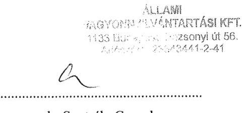
dr. Szutrély Gergely
ÁVNY Kft. ügyvezető

---

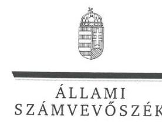

ELNÖK

Ikt.szám: V-1025-121/2016

Dr. Szutrély Gergely úr
ügyvezető
Állami Vagyonnyilvántartási Kft.

Budapest

Tisztelt Ügyvezető Úr!

Köszönettel vettem az Állami Vagyonnyilvántartási Kft. ellenőrzéséről készített
számvevőszéki jelentéstervezetre tett észrevételeit.

Az Állami Számvevőszék Ügyvezető úr észrevételeire vonatkozó álláspontját a felügyeleti
vezető által készített melléklet tartalmazza.

Tájékoztatom Ügyvezető urat, hogy az Állami Számvevőszék a figyelembe nem vett
észrevételeket az Állami Számvevőszékről szóló 2011. évi LXVI. törvény 29. § (3)
bekezdésében előírtak szerint köteles a jelentésében feltüntetni és megindokolni, hogy azokat
miért nem fogadta el.

Budapest, 2016. 243364- hó 28 nap

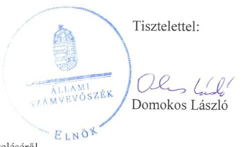

Melléklet: Tájékoztatás az észrevételek kezeléséről

---

# Tájékoztatás az észrevételek kezeléséről 

Megköszönöm Ügyvezető úrnak az „Állami Vagyonnyilvántartási Kft. - Az önkormányzatok gazdasági társaságai - Az állami tulajdonban (résztulajdonban) lévő gazdálkodó szervezetek vagyonmegőrzési és gazdálkodási tevékenységének ellenörzése" címmel készített jelentéstervezetre tett észrevételeit. Az észrevételek kezeléséről azok sorrendjében az alábbi tájékoztatást adom:

1. Az önköltségszámításra vonatkozó észrevételét részben tudom elfogadni. Az ÁVNY Kft. 2011. május 4 -től hatályos Számviteli politikája; és a 2012. január 1-jétől hatályos Számviteli politika 2 2. fejezetében előirta, hogy „A vállalkozás a Számviteli Politika keretein belül a következö szabályzatokat késziti el: [...] az önköltségszámítás rendjére vonatkozó szabályzatot. [...]". Az ÁVNY Kft. által alkalmazott belső szabályozásban elöirt szabályzatkészítési kötelezettség a Számv. tv. 14. § (7) bekezdése előírásánál szigorúbb, mert a Társaság jogszabály alapján csak 2013-tól volt kötelezett ilyen szabályzat készitésére. A Társaság az önköltségszámításra vonatkozó szabályzat készítési kötelezettségének 2013-tól tett eleget az „Országfeltár program keretében az ÁVNY számára átutalt elölegek elszámolása és OL költségek kezelése" szabályzat elkészítésével, amely az ÁVNY Kft. honlapján megtalálható.
A jelentéstervezet „Összegzés" részének 3. mondatát az alábbiak szerint pontosítom:
„Az ÁVNY Kft. bevételeinek és ráforditásainak elszámolása megfelelit a jogszabályoknak és a belső szabályzatoknak, azonban a szabályszerü önköltségszámitás feltételeit nem azonban csak 2013-tól alakította ki."
A jelentéstervezet „Főbb megállapítások, következtetések, javaslatok" részének 2. bekezdését az alábbiak szerint módosítom:
„Az ÁVNY Kft. vagyongazdálkodási tevékenységének szabályozását hiányosan alakította ki, mert az SZMSZ, a Számlarend és a Bizonyiati szabályzat készitési kötelezettségét a Számv. tv.-ben elöirtak ellenére csak 2013. évtöl teljesítette, továbbá a Számviteli Politikai,ban foglaltak ellenére Önköltségszámitás rendjére vonatkozó belső szabályzattal nem szintén csak 2013-tól rendelkezett."
A jelentéstervezet 2. számú lényeges kérdéskörének összegző megállapítását következőképpen korrigálom:
„Az ÁVNY Kft. vagyongazdálkodási tevékenységének szabályozása és a vagyonnyilvántartása nem teljes körüen felelt meg a jogszabályi követelményeknek."
A jelentéstervezet 2.1. számú megállapítása 2. mondatát a következőképpen módosítom:
„Az önköltségszámítás rendjére vonatkozó belső szabályzattal nem2013-tól rendelkezett."
A jelentéstervezet 2.1. számú megállapításának 5. bekezdését a következőképpen pontosítom:
„Az-AVNY-Kft.-2011-2012. -években-hatályos Számviteli politika1,2 2. pontja a 2011-2012. évekre elöirta az önköltségszámítás rendjére vonatkozó belső szabályzat készitési kötelezettséget, mig 2013- évtöl az önköltségszámítás rendjére vonatkozó szabályzat készitésére az ÁVNY Kft. már a Számv. tv. 14. § (7) bekezdése alapján voltak a szabályzat készitésére volt kötelezettek, azonban aAz AVNY Kft. az önköltségszámítás rendjére vonatkozó belső szabályzat készitési kötelezettségének az

---

ellenőrzött időszakban 2013-tól nem úgy tett eleget, hogy a-Az egyes projektekre vonatkozóan az ÁVNY Kft. rendelkezett a tulajdonosi joggyakorló MNV Zrt. által a 496/2013. (IX.20.) Alapitói határozatával jóváhagyott allokációs renddel, amely többek között elöirta a projektekre vonatkozó közvetett költségek felosztását is-irta elö."
A jelentéstervezet 3. számú összegző megállapítását a következőképpen javítom:
„Az ÁVNY Kft. a szabályszerű önköltségszámitás feltételeit nem2013-tól alakította ki."
A jelentéstervezet 3.2. számú megállapításának 2. bekezdését a következőképpen pontosítom:
„Az ÁVNY Kft. a szabályszerű önköltségszámitás feltételeit nem2013-tól alakította ki."
A jelentéstervezet 3.2. számú megállapításának 2. bekezdését a következőképpen pontosítom:
„Az ÁVNY Kft.-nek 2011-2012-években a hatályos Számviteli politika1,2 2. pontjában elöirtak szerint már a 2011-2012. években önköltségszámitás rendjére vonatkozó belső szabályzatkészitési kötelezettsége volt. Az ÁVNY Kft. költségnemek szerinti költségeinek együttes összege 2012. évben meghaladta a Számv. tv. 14. § (7) bekezdése szerinti értékhatárt, ezért 2013. évtől kezdődően a saját előállítású termékek, a végzett szolgáltatások Számv. tv. 51. §-a szerinti önköltségét az önköltségszámitás rendjére vonatkozó belső szabályzat szerinti utókalkuláció módszerével kellett volna-megállapítania. Az ÁVNY Kft. 2013. évbentöl - a Számv. tv. 14. § (5) bekezdése c) pontja elöirását megsértve-nem-betartva készítette el az önköltségszámitás rendjére vonatkozó belső szabályzatot az „Országleltár program keretében az ÁVNY számára átutalt előlegek elszámolása és OL költségek kezelése" néven, amelyben nem meghatározta-meg a közvetlen önköltség számításának utókalkulációs módszerét a saját előállítású eszközök bekerülési értékének a megállapításához."
A jelentéstervezetben Ügyvezető úrnak címzett 1. számú javaslatot törlöm, mivel az ÁVNY Kft. 2013-tól rendelkezik az önköltségszámítás rendjére vonatkozó belső szabályzatnak megfelelő szabályzattal, amely az ÁVNY Kft. honlapján elérhető és tartalmazza azokat az elemeket, melyeket a Számv. tv. az önköltségszámítás készítésére előír.
2. Leltározással kapcsolatban tett észrevételeit nem minden elemében tudom elfogadni, mivel a jelentéstervezetben szereplő azon állítások, hogy a „Leltározási Szabályzat1,2-ban elöirtak ellenére nem rendelkezett az éves leltározásra vonatkozó ügyvezetői utasitásokkal, leltározási ütemtervvel, leltári jegyzőkönyvekkel" továbbra is helytállóak. Ugyanakkor a jelentéstervezetben a mennyiségi felvétellel történő leltározás miatt megjelenő elmarasztalást törölni indokolt, mivel az észrevételében kifejtettek szerint a Társaság eszközeinek összetétele miatt a mennyiségi leltárfelvétel nem volt lehetséges. Észrevétele alapján a jelentéstervezet érintett részeit az alábbiakban módosítom:
A jelentéstervezet „Főbb megállapítások, következtetések, javaslatok" részének 3. és 4. bekezdését az alábbiak szerint javítom:
„Vagyonnyilvántartása nem teljes körüen felelt meg a Számv. tv-ben és a Leltárkészitési és Leltározási Szabályzat1,2-ban foglaltaknak, mert az önköltségszámitás szabályszerű feltételrendszerét 2013-tól alakította ki, a befejezetlen-termelés és-félkész-termékek-év-végi mérlegsoron kimutatott-összegét mennyiségi-leltárral nem támasztotta alá.
Éves beszámolóit a Számv. tv. elöirásainak megfelelően határidőben elkészítette, a beszámolókat a könyvvizsgáló minden évben hitelesitő záradékkal látta el, az FB

---

jóváhagyásra javasolta. Ugyanakkor bBeszámolói nem-feleltek-meg-a jogszabályi elöirásoknak, mert a mérlegtételeinek leltárral történő igazolt alátámasztásaát nem minden esetben volt teljes körüen biztositotta.
A jelentéstervezet 2.2. számú megállapítását a következőképpen helyesbítem:
„Az ÁVNY Kft. vagyonnyilvántartása nem teljes körüen felelt meg a jogszabályi elöirásoknak, mert-a mérlegtételek-leltárral-történő-alátámasztását-a mennyiségi-leltározás-esetében-nem biztositotta."
A jelentéstervezet 2.2. számú megállapításának első és 2 . bekezdését a következőképpen pontosítom:
„Az ÁVNY Kft. a 2011-2014. években nem teljes körüen biztosította a Számv. tv. 69. § (1) bekezdése, valamint a Leltárkészitési és Leltározási Szabályzatı, 2 3.1.2 pontjában elöirtak alapján az éves beszámolók mérlegtételeinek alátámasztását.
A Számv. tv. 69. § (3) bekezdése folyamatos mennyiségi nyilvántartás esetén a Leltárkészitési és Leltározási Szabályzatı, 2-ban elöirt gyakorisággal, de legalább háromévenkénti mennyiségi leltározási kötelezettséget irt elö. Az ÁVNY Kft. Leltárkészitési és Leltározási Szabályzatı,2-a a mennyiségi felvétellel leltározandó eszközök (tárgyi eszközök, készletek) leltározását éves gyakorisággal határozta meg. Az ÁVNY Kft. az ellenörzött időszakban a készletek mérlegsoron belül befejezetlen termelést és félkészterméket mutatott ki a 2011-2013. években, amely tételek év végi értékét mennyiségi felvétellel tơrtént leltári bizonylatokkal nem támasztotta alá. Az ÁVNY Kft. eljárásával megsértette a Számv. tv. 69. § (1) bekezdésében, valamint a Leltárkészitési és Leltározási Szabályzatı, 2-ban foglaltakat."
A jelentéstervezet 2.2. számú megállapításának 4. bekezdése 2. mondatának első tagmondatát a következőképpen pontosítom:
„Ezzel az ÁVNY Kft. nem tudta teljesítenitte a Számv. tv. 69. § (1) bekezdésében elöirtakat,"
A jelentéstervezet 5.1. számú megállapítás első és 2 . mondatát javítom:
„Az ÁVNY Kft. éves beszámolóit elkészítette, azonban a 2011. - 2014. évi mérlegtételek leltárral történő alátámasztását nem tudta igazolni a leltárbizonylatok megörzésének hiánya miatt, biztositotta. A könyvvizsgáló a beszámolókat - a számviteli szabálytalanság ellenére hitelesitő záradékkal látta el."
A jelentéstervezet 5.1. számú megállapítás 4. bekezdésének 2. mondatát a következőképpen átírom:
„A könyvvizsgáló az ÁVNY Kft. beszámolóit az ellenőrzött időszak minden évében a Számv. tv 3. § (13) bekezdés 1) pontja szerinti hitelesitő záradékkal látta el, és nem tàrta fel-a befejezetlen termelés és félkésztermékek nem megfélelö-leltári alátámasztásának a 20112013. évi beszámolókra gyakorolt hatását, valamint jelezte az önköltségszámitás rendjére vonatkozó belső szabályzat 2011-2012. évi hiányából eredő kockázatokat."
3. Az Info. tv. III. 8. része szerint a közbeszerzési tervekkel kapcsolatban tett észrevételét nem áll módomban elfogadni, mivel a 2011-2014. éveket érintő közbeszerzési tervek közzététele utólag nem ellenőrizhető.

Budapest, 2016. október- hó 28 nap

---

Dr. Horváth Margit
felügyeleti vezető

---

.

---

# RÖVIDÍTÉSEK JEGYZÉKE 

${ }^{1} 1172 / 2010$. (VIII. 18.) számú határozat
${ }^{2}$ MNV Zrt.
${ }^{3}$ ÁVNY Kft.
${ }^{4}$ ÁSZ
${ }^{5}$ Vtv.
${ }^{6}$ Ptk. 2
${ }^{7}$ Gt.
${ }^{8}$ Takarékos tv.
${ }^{9}$ FB
${ }^{10}$ Számv. tv.
${ }^{11}$ SZMSZ
${ }^{12}$ Javadalmazási Szabályzat: Javadalmazási Szabályzat: ${ }^{13}$ Közbeszerzési és Beszerzési Szabályzat: ${ }^{13}$ Közbeszerzési és Beszerzési Szabályzat: ${ }^{14}$ Számviteli Politika: Számviteli Politika: Számviteli Politika: ${ }^{15}$ Leltárkészítési és Leltározási Szabályzat: Leltárkészítési és Leltározási Szabályzat: ${ }^{16}$ Eszközök és Források Értékelési Szabályzata:
... Eszközök és Források Értékelési Szabályzata:
${ }^{17}$ Pénzkezelési Szabályzat: Pénzkezelési Szabályzat: Pénzkezelési szabályzat: ${ }^{18}$ Számlarend
${ }^{19}$ Selejtezési Szabályzat
${ }^{20}$ Avtv.

1172/2010. (VIII. 18.) Korm. határozat az Országleltár elkészítésével kapcsolatos időszerű intézkedésekről
Magyar Nemzeti Vagyonkezelő Zártkörű Részvénytársaság
Állami Vagyonnyilvántartási Kft.
Állami Számvevőszék
Az állami vagyonról szóló 2007. évi CVI. törvény
2013. évi V. törvény a Polgári Törvénykönyvről
2006. évi IV. törvény a gazdasági társaságokról

A köztulajdonban álló gazdasági társaságok takarékosabb müködéséről szóló 2009. évi CXXII. törvény

Az ÁVNY Kft. Felügyelőbizottsága
Számvitelről szóló 2000. évi C. törvény
Az ÁVNY Kft. Szervezeti és Működési Szabályzata, hatályos 2013. június 17-től
Az ÁVNY Kft. A munkavállalók, tisztségviselők és könyvvizsgálók javadalmazási szabályzata, hatályos 2012. május 17-től 2013. január 22-ig
Az ÁVNY Kft. A munkavállalók, tisztségviselők és könyvvizsgálók javadalmazási szabályzata, hatályos 2013. január 22-től
Az ÁVNY Kft. Közbeszerzési és Beszerzési Szabályzata, hatályos 2011. november 28-tól 2013. április 29-ig
Az ÁVNY Kft. Közbeszerzési és Beszerzési Szabályzata, hatályos 2013. április 29től
Az ÁVNY Kft. Számviteli Politikája, hatályos 2011. május 4-től
Az ÁVNY Kft. Számviteli Politikája, hatályos 2012. január 1-től
Az ÁVNY Kft. Számviteli Politikája, hatályos 2013. január 1-től
Az ÁVNY Kft. Eszközök és Források Leltárkészítési és Leltározási Szabályzata, hatályos 2011. május 4-től 2013. január 1-jéig
Az ÁVNY Kft. Eszközök és Források Leltárkészítési és Leltározási Szabályzata, hatályos 2013. január 1-jétől

Az ÁVNY Kft. Eszközök és Források Értékelési Szabályzata, hatályos 2011. május 4-től 2013. január 1-jéig

Az ÁVNY Kft. Eszközök és Források Értékelési Szabályzata, hatályos 2013. január 1-jétől
Az ÁVNY Kft. Pénzkezelési Szabályzata, hatályos 2011. május 4-től 2012. október 26-ig
Az ÁVNY Kft. Pénzkezelési Szabályzata, hatályos 2012. október 26-tól 2013. január 1-jéig
Az ÁVNY Kft. Pénzkezelési Szabályzata, hatályos 2013. január 1-jétől
Az ÁVNY Kft. számlarendje, hatályos 2013. január 1-jétől
Az ÁVNY Kft. Selejtezési Szabályzata, hatályos 2013. január 1-től
a személyes adatok védelméről és a közérdekú adatok nyilvánosságáról szóló 1992. évi LXIII. törvény

---

${ }^{21}$ Info. tv.
${ }^{22}$ Stabilitási tv.
${ }^{23}$ 353/2011.(XII.30) Korm. rendelet
${ }^{24} \mathrm{Vhr}$.

Az információs önrendelkezési jogról és az információszabadságról szóló 2011. évi CXII. törvény
Magyarország gazdasági stabilitásáról szóló 2011. évi CXCIV. törvény
Az adósságot keletkeztető ügyletekhez történő hozzájárulás részletes szabályairól szóló 353/2011. (XII. 30.) Korm. rendelet
Az állami vagyonnal való gazdálkodásról szóló 254/2007. (X. 4.) Korm. rendelet

---

# ÁLLAMI SZÁMVEVŐSZÉK 

1052 Budapest, Apáczai Csere János utca 10.
Levélcím: 1364 Budapest 4. Pf. 54
Telefon: +36 14849100 Telefax: +36 14849200
www.asz.hu