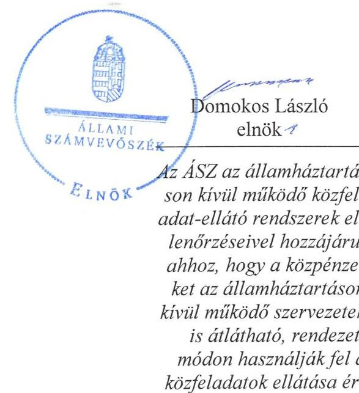
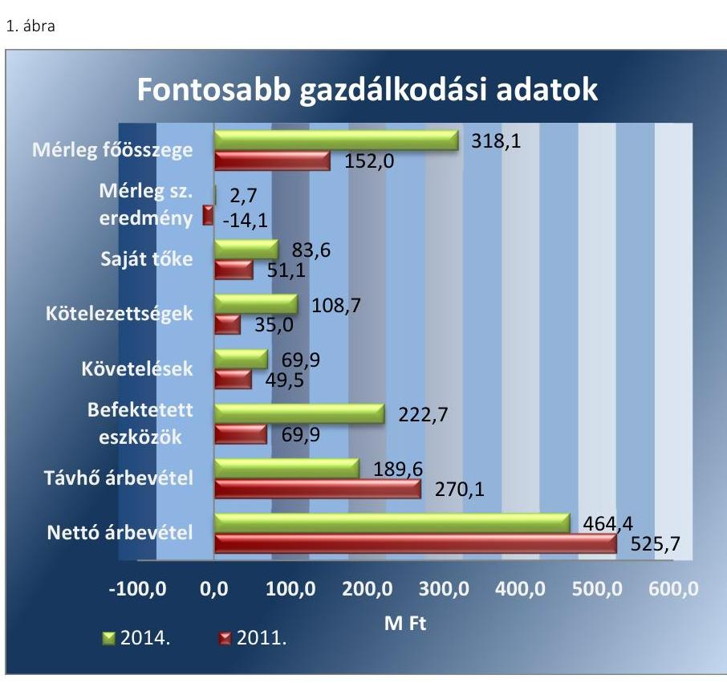
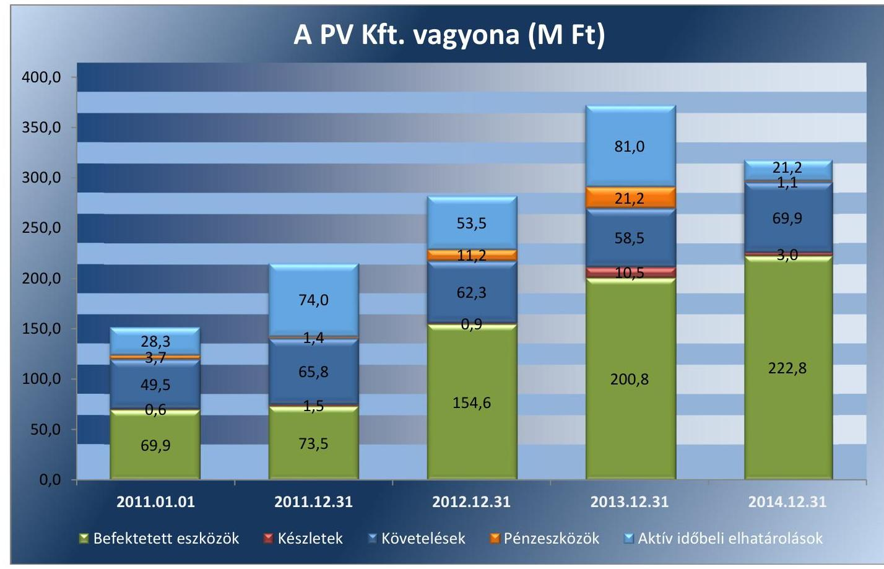
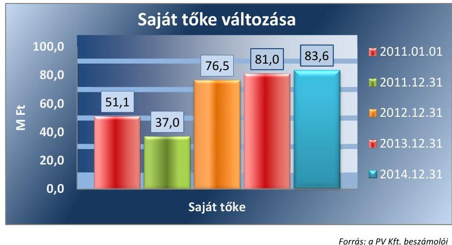
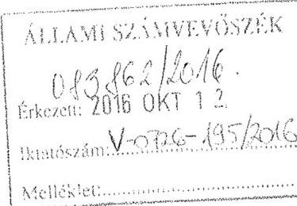
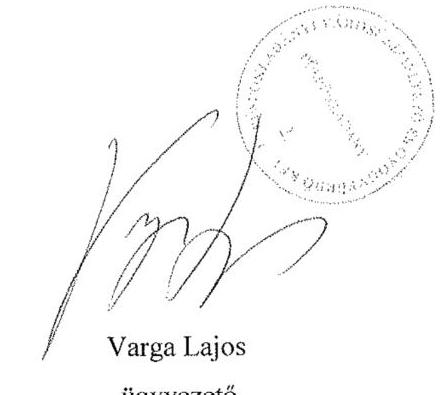
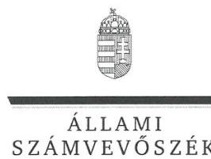
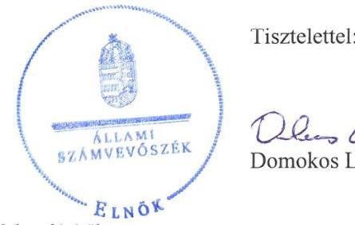

# Jelentés 

## Az önkormányzatok gazdasági társaságai

Az önkormányzatok többségi tulajdonában lévő gazdasági társaságok közfeladat ellátását érintő gazdálkodási tevékenysége szabályszerűségének ellenőrzése - Püspökladányi Városüzemeltető és Gyógyfürdő Kft.
2016.

Az ÁSZ az államháztartáson kívül müködő közfel-adat-ellátó rendszerek ellenőrzéseivel hozzájárul ahhoz, hogy a közpénzeket az államháztartáson kívül müködő szervezetek is átlátható, rendezett módon használják fel a közfeladatok ellátása érdekében.

---

# Jelentés 

## Az önkormányzatok gazdasági társaságai

Az önkormányzatok többségi tulajdonában lévő gazdasági társaságok közfeladat ellátását érintő gazdálkodási tevékenysége szabályszerűségének ellenőrzése - Püspökladányi Városüzemeltető és Gyógyfürdő Kft.
2016. december hó 15. nap

---

# AZ ELLENŐRZÉST FELÜGYELTE:

DR. HORVÁTH MARGIT felügyeleti vezető

## AZ ELLENŐRZÉST VEZETTE ÉS A VÉGREHAJTÁSÁÉRT FELELŐS:

- **CZÉKUS BALÁZS** ellenőrzésvezető
- **IMRE ZSUZSANNA** ellenőrzésvezető

## A PROGRAM ÖSSZEÁLLÍTÁSÁÉRT FELELŐS:

- **JANIK JÓZSEF LÁSZLÓ** osztályvezető

---

**IKTATÓSZÁM:** V-0726-204/2016

**TÉMASZÁM:** 1760

**ELLENŐRZÉS-AZONOSÍTÓ SZÁM:** V-070739

---

Jelentéseink az Országgyűlés számítógépes hálózatán és az Interneta a www.asz.hu címen is olvashatóak.

---

# TARTALOMJEGYZÉK 

■ ÖSSZEGZÉS ..... 5
■ AZ ELLENŐRZÉS CÉLJA ..... 7
■ AZ ELLENŐRZÉS TERÜLETE ..... 8
■ AZ ELLENŐRZÉS HÁTTERE, INDOKOLTSÁGA ..... 10
■ A JELENTÉS LÉNYEGES KÉRDÉSKÖREI ..... 11
■ ELLENŐRZÉS HATÓKÖRE ÉS MÓDSZEREI ..... 12
■ MEGÁLLAPÍTÁSOK ..... 14
■ JAVASLATOK ..... 30
■ MELLÉKLETEK ..... 33
I. Sz. melléklet: Értelmező szótár. ..... 33
II. Sz. melléklet: A PV Kft. mérlegének adatai (ezer Ft) ..... 36
III. Sz. melléklet: A PV Kft. eredménykimutatásának adatai (ezer Ft) ..... 37
■ FÜGGELÉK: ÉSZREVÉTELEK ..... 39
■ RÖVIDÍTÉSEK JEGYZÉKE ..... 53

---

.

---

# ÖSSZEGZÉS 

Az Állami Számvevőszék a Püspökladányi Városüzemeltető és Gyógyfürdő Kft. távhőszolgáltatási közfeladatot érintő gazdálkodási tevékenysége 2011-2014. évek közötti szabályszerűségét ellenőrizte. A távhőszolgáltatást az Önkormányzat összességében szabályszerűen szervezte meg. A tulajdonosi jogok gyakorlása is összességében szabályszerű volt. A PV Kft. vagyongazdálkodása nem teljes körüen volt szabályszerű, a 2011. évben a kötelezettségállománya a távhőszolgáltatásra és a müködésre kockázatot jelentett. A Társaság közszolgáltatói feladattal kapcsolatos árképzési gyakorlata szabályszerű volt, a díjcsökkenést szabályszerűen végrehajtották, önköltség-számítási szabályzattal rendelkeztek.

## Az ellenőrzés társadalmi indokoltsága

Az Állami Számvevőszék stratégiájában megfogalmazta, hogy a helyi önkormányzatok gazdálkodásában rejlő pénzügyi kockázatok feltárásával, az államháztartáson kívülre nyújtott költségvetési támogatások és ingyenes vagyonjuttatások, valamint az államháztartáson kívül működő közfeladat-ellátó rendszerek ellenőrzéseivel hozzájárul ahhoz, hogy a közpénzeket az államháztartáson kívül működő szervezetek is átlátható, rendezett módon használják fel a közfeladatok szerződésben vállalt ellátása érdekében.

Magyarországon az intézmény-centrikus közfeladat-ellátás jellemző, de egyre jelentősebb a költségvetésen kívüli feladatellátás térnyerése. Ennek legfontosabb szereplői - a nonprofit szervezetek mellett - az önkormányzati tulajdonú gazdasági társaságok. Az önkormányzatok szervezetalakítási szabadságának következménye, hogy a korábban is vállalati formában működő közszolgáltatások mellett, mind a kötelező, mind az önként vállalt feladatok ellátásában a gazdasági társaságok kiemelt fontosságú szerephez jutottak.

## Főbb megállapítások, következtetések, javaslatok

A közfeladat-ellátás megszervezésére vonatkozó önkormányzati döntés összességében szabályszerű volt, ugyanakkor a PV Kft. részére a közfeladat-ellátás érdekében üzemeltetésre átadott eszközökről szerződéssel nem rendelkeztek. Az Önkormányzat a rendeletalkotási kötelezettségének eleget tett, azonban az nem teljes körűen volt szabályszerű. A tulajdonosi jogok gyakorlása összességében megfelelő volt, ugyanakkor az ellenőrzött időszakban az FB ügyrenddel nem rendelkezett, javadalmazási szabályzatot a Képviselő-testület nem alkotott, s az Önkormányzat nem végzett belső ellenőrzést a PV Kft.-nél.

A PV Kft. vagyongazdálkodása nem teljes körűen volt szabályszerű, a szabályozási, közzétételi, adatvédelmi hiányosságok, valamint a mennyiségi leltárfelvétel elmulasztása miatt. A 2013-2014. években a számviteli politikát és a számlarendet nem aktualizálták, a leltározási és az értékelési szabályzat sem felelt meg teljes körűen az ellenőrzött időszakban a Számv. tv. előírásainak, a késedelmesen, 2013. évben elkészített szétválasztási szabályzat nem volt alkalmas a keresztfinanszírozás-mentesség biztosítására. Az üzletszabályzat jogszabályi előírás szerinti módosítását nem végezték el. A vagyonhoz kapcsolódó nyilvántartások vezetése nem felelt meg teljes körűen a jogszabályi előírásoknak és a belső szabályzatoknak, mert a készletek mennyiségi felvétellel történő leltározását minden évben elmulasztották. A kötelezettségek állománya a 2011. év kivételével nem jelentett kockázatot a közfeladat ellátására, illetve a müködésre. A PV Kft. a beszámolási kötelezettségeit szabályszerűen teljesítette, azonban a közzétételi kötelezettségeket nem teljes körűen teljesítették. Adatvédelmi és adatbiztonsági szabályzattal nem rendelkeztek, adatvédelmi biztost nem neveztek ki, adatvédelmi nyilvántartást nem vezettek.

A távhőszolgáltatási közfeladat-ellátásához kapcsolódó tevékenység bevételei valamint a beruházások, felújítások elszámolása nem volt megfelelő, az anyagjellegű ráfordítások elszámolása megfelelően történt. A távhőszolgáltatás

---

díjának meghatározása szabályszerűen történt, a hatósági díjakat a jogszabályi előírásoknak megfelelően alkalmazták. Önköltség-számítási szabályzattal rendelkeztek, a 2011. április 15-ig érvényes szolgáltatási díjak megállapítása a távhő rendeletben rögzített díjmeghatározás alapján történt, azt követően hatósági árak alkalmazására kerül sor.

---

# AZ ELLENŐRZÉS CÉLJA 

Az ellenőrzés célja annak értékelése, hogy az önkormányzat a jogszabályi előírások figyelembe vételével döntött-e az ellenőrzésre kerülő közfeladat megszervezéséről, az önkormányzat/tulajdonosi joggyakorló szabályszerűen gyakorolta-e a tulajdonosi jogokat. A gazdasági társaság közfeladat-ellátása bevételeinek, ráfordításainak elszámolás, és vagyongazdálkodási tevékenysége megfelelt-e a jogszabályi, illetve a közszolgáltatási/vagyonkezelési szerződésben foglalt tulajdonosi előírásoknak, azok végrehajtása szabályszerű volt-e, a gazdasági társaság kötelezettségállománya jelent-e kockázatot a múködésre, illetve a
közfeladat ellátására, a közfeladatok átláthatósága és elszámoltathatósága érdekében biztosítva volt-e a közszolgáltatás dijának megalapozottsága szabályszerű önköltség-számítással.

---

# AZ ELLENŐRZÉS TERÜLETE 

## Püspökladány Város Önkormányzata és a kizárólagos tulajdonában lévő Püspökladányi Városüzemeltető és Gyógyfürdő Kft.

Püspökladány Város Önkormányzatának a 2011. évben négy, majd 2012. évtől - a feladatellátás átszervezését és a beolvadással történt átalakulásokat követően -két gazdasági társaságban volt minősített többséget biztosító szavazati joga. A Püspökladányi Városüzemeltető és Gyógyfürdő Kft.-t (PV Kft. ${ }^{1}$ ) az Önkormányzat ${ }^{2}$ az ellenőrzött időszakot megelőzően, 1999. évben hozta létre Püspökladányi Városüzemeltető és Vízszolgáltató Kft. néven. A PV Kft. feletti közvetlen tulajdonosi joggyakorló 2012.július 31-ig az Önkormányzat 100\%-os tulajdonában lévő Püspökladányi Holding Vagyonkezelő Kft. volt. Képviselő-testület ${ }^{3}$ a 28/2012. (II. 23.) számú határozatával döntött a Püspökladányi Holding Vagyonkezelő Kft.-nek - és a Holding ${ }^{4}$ kizárólagos tulajdonában lévő további gazdasági társaságnak - a PV Kft-be történő beolvadásáról. A 2012. július 31. dátummal megvalósult átszervezést követően a két beolvadó gazdasági társaság feladatait a PV Kft. végezte.

Püspökladány Városban a közszolgáltatási távhő ellátást az ellenőrzött időszakban a PV Kft. látta el. A PV Kft. főtevékenysége 2013. április 23-ig az Önkormányzat közigazgatási területén a víztermelés, -kezelés, -ellátás volt, ezt követően pedig a gőzellátás, légkondícionálás. PV Kft. további önkormányzati feladatokat is ellátott az ellenőrzött időszakban, így közút, piac, sportlétesítmény, strand és temető üzemeltetést, parkfenntartást, lakásgazdálkodást, köztisztasági feladatellátást végzett. A PV Kft. a 2014. évben a mintegy 15 ezer lakosú Püspökladány Városban 770 lakossági és 120 közötti fogyasztó részére végzett távhőszolgáltatást.

A PV Kft. jegyzett tőkéje a 2011. év elején 12,0 M Ft volt, ami 8,0 M Ft pénzbeni és 4,0 M Ft nem pénzbeni betétből állt. A jegyzett tőke a 2012. év során történt beolvadással 30,0 M Ft-ra emelkedett és a 2014. év végéig változatlan volt.

A PV Kft. főbb mérleg adatait 2011.január 01. és 2014. december 31. időpontokban valamint a mérlegszerinti eredmény és az árbevétel adatokat 2011. és 2014. évek tekintetében az 1. ábra szemlélteti:

---

Forrás: A PV Kft. éves beszámolói

A PV Kft. az ellenőrzött időszakban -2011. év kivételével - nyereségesen gazdálkodott, ugyanakkor a 2011. évi jelentős, 14,1 M Ft mérleg szerinti vesztesége következtében összességében 5,0 M Ft veszteséget realizált a 2011-2014. évek során. A beszámoló adatainak változásában szerepet játszott a 2012. évben megvalósult beolvadás és a nyereségkorlát feletti eredményből végrehajtott, a távhőszolgáltatás eszközeinek fejlesztését szolgáló beruházások hatása is. A PV Kft. más gazdasági társaságban tulajdoni részesedéssel nem rendelkezett.

A foglalkoztatottak száma 2011-ben 82 fő, 2014. év végén 99 fő volt.
A polgármester ${ }^{5}$ a 2011. június 5 -ei évközi választás óta tölti be tisztségét, az ellenőrzött időszak során a munkakört betöltő jegyző ${ }^{6}$ 1999. július 1-jétől látja el feladatait. A PV Kft. ügyvezetőjének ${ }^{7}$ személye 2012. július 31-én változott, a főkönyvelő személye az ellenőrzött időszakban nem változott.

---

# AZ ELLENŐRZÉS HÁTTERE, INDOKOLTSÁGA 

AZ ÖNKORMÁNYZATI TULAJDONÚ GAZDASÁGI TÁRSASÁGOK teljes körű ellenőrzésének lehetőségét az ÁSZ. tv. 2011. január 1-jétől hatályos módosítása teremtette meg. A közfeladatot ellátó gazdasági társaságok ellenőrzése kiemelten fontos a vagyon megőrzése, megóvása érdekében, valamint a kormányzati szektor elszámolásaiban megjelenő önkormányzati tulajdonú gazdálkodó szervezetek esetében, amelyekkel szemben alapvető követelmény, hogy gazdálkodásuk, müködésük szabályszerű, az általuk szolgáltatott adatok minél megbízhatóbbak legyenek. A közfeladat ellátás költségeinek, ráfordításainak alakulása, színvonala hatással van a lakosság elégedettségére.

## AZ ELLENŐRZÉS VÁRHATÓ HASZNOSULÁSA-

KÉNT az ÁSZ ${ }^{8}$ a megállapításaival segítséget nyújthat az államháztartáson kívüli közfeladat-ellátás értékeléséhez, jogszabályi keretei pontosításához, átláthatóságot biztosító szabályozásához. Meghatározhatóvá válnak a közfeladat ellátásban részt vevő államháztartáson kívüli szervezeteknek az önkormányzat költségvetését, pénzügyi helyzetét is befolyásoló - kockázatai, lehetővé válik ezen kockázatok csökkentése. Ellenőrzéseink feltárhatják, hogy az önkormányzat közfeladat ellátási kötelezettségének szabályszerűen tett-e eleget, a feladatellátáshoz rendelt közvagyon müködtetését a tulajdonostól elvárható gondossággal, szabályszerűen szervezte-e meg és a tulajdonosi felügyelete hozzájárult-e a közfeladat szabályszerű ellátásához. Értékelhetővé válik, hogy a feladatot ellátó gazdasági társaság a közszolgáltatási szerződésben foglaltak betartásával, a közvagyon használatával biztosította-e a szolgáltatás folytatásának feltételeit. Ezzel az ellenőrzöttek és a helyi döntéshozók számára az ÁSZ visszajelzést ad feladatszervezési, feladat-ellátási kockázataikról, alapot ad a meglévő hibák megszüntetéséhez, a jobb közfeladat-ellátás biztosításához. Mindezeken keresztül az ÁSZ hozzájárul Magyarország közpénzügyi helyzetének javításához, a közpénzek mérhető módon történő, a döntéshozók által meghatározott célok szerinti felhasználásához.

---

# A JELENTÉS LÉNYEGES KÉRDÉSKÖREI 

1. Az önkormányzat közfeladat megszervezéséről szóló döntése, valamint tulajdonosi joggyakorlása szabályszerű volt-e?
2. A gazdasági társaság vagyongazdálkodása szabályszerű volt-e, kötelezettségállománya jelentett-e kockázatot a müködésére, illetve a közfeladat ellátásra?
3. A gazdasági társaságnál az ellátott közfeladat bevételei és ráfordításai elszámolása, valamint az önköltség-számítás és árképzés szabályszerű volt-e?

---

# ELLENŐRZÉS HATÓKÖRE ÉS MÓDSZEREI 

## Az ellenőrzés típusa

Megfelelőségi ellenőrzés

## Az ellenőrzött időszak

2011. január 1-jétől 2014. december 31-ig tartó időszak

## Az ellenőrzés tárgya

A közfeladatot gazdasági társaságokkal ellátó önkormányzatok tulajdonosi joggyakorlása, valamint gazdasági társaságok pénz- és vagyongazdálkodásának szabályozottsága és szabályszerűsége. Az ellenőrzés kiterjed minden olyan körülményre és adatra, amely az ÁSZ jogszabályban meghatározott feladatainak teljesítéséhez, valamint a program végrehajtása folyamán felmerült újabb összefüggések feltárásához szükséges.

## Az ellenőrzött szervezet

$\longrightarrow$ Püspökladány Város Önkormányzata
$\longrightarrow$ Püspökladány Holding Vagyonkezelő Kft.
$\longrightarrow$ Püspökladányi Városüzemeltető és Gyógyfürdő Kft.

## Az ellenőrzés jogalapja

Az ellenőrzés jogszabályi alapját az Állami Számvevőszékről szóló 2011. évi LXVI. törvény 5. § (3)-(4)-(5) bekezdése képezte.

## Az ellenőrzés módszerei

Az ellenőrzést a nemzetközi standardokat irányadónak tekintve az ellenőrzési program ellenőrzési kérdései, az ellenőrzött időszakban hatályos jogszabályok, az ellenőrzés szakmai szabályok és módszertanok figyelembe vételével végezzük.

Az ellenőrzés ideje alatt az ellenőrzött szervezettel történő kapcsolattartást az ÁSZ Szervezeti és Működési Szabályzatának vonatkozó előírásai alapján biztosítjuk.

---

Az ellenőrzés a kiválasztott, többségi tulajdonosi jogokat gyakorló önkormányzatra, illetve az ellenőrzésre kijelölt közfeladatot ellátó gazdasági társaság felett tulajdonosi jogokat gyakorló szervezetre és az ellenőrzött közfeladatot ellátó gazdasági társaságra terjed ki. Amennyiben a gazdasági társaságban több önkormányzat együttesen többségi tulajdonos, úgy az ellenőrzést a többségi tulajdonosi jogokat gyakorló önkormányzatnál kell lefolytatni. Az ellenőrzött gazdasági társaságnál, amennyiben az több közfeladatot is ellát, akkor az ellenőrzésre kiválasztott közfeladat-ellátást ellenőrizzük.

Az ellenőrzést a kérdésekre adott válaszok kiértékelésével, valamint a megjelölt adatforrások, a csatolt tanúsítványok felhasználásával, továbbá az adott időszakban hatályos jogszabályok figyelembe vételével kell lefolytatni. Az ellenőrzési kérdések megválaszolásához szükséges bizonyítékok megszerzése a következő ellenőrzési eljárások alkalmazásával történik: megfigyelés, kérdésfeltevés (információkérés), összehasonlítás, valamint elemző eljárás.

A bevételek és ráfordítások elszámolása, valamint a vagyonnyilvántartás terén a szabályszerű működést véletlen mintavétellel ellenőriztük. A mintavétellel ellenőrzött területek esetében minden egyes tétel vonatkozásában a szabályszerűségre vonatkozó kérdéseket tettünk fel, amelyek eredménye összesítésre került. „Megfelelőnek" értékeltünk egy ellenőrzött területet, amennyiben 95\%-os bizonyossággal a teljes sokaságban a hibaarány legfeljebb 10\%, nem megfelelőnek, amennyiben 10\%-nál magasabb arányt képviselt. Abban az esetben, ha a teljes sokaság tekintetében a 10\%os hibaarányhoz való viszony megítélésnek megbízhatósága nem érte el a 95\%-ot, annak elérése érdekében értékelésünket további szempontokkal egészítettük ki, és figyelembe vettük a feltárt hibák típusát és súlyát.

A ráfordítások elszámolására és a vagyonnyilvántartásra vonatkozó véletlen mintavételt kockázati alapú kiválasztással egészítettük ki, amelynek során évente a három legnagyobb összegű tételt választottuk ki.

---

# 1. Az önkormányzat közfeladat megszervezéséről szóló döntése, valamint tulajdonosi joggyakorlása szabályszerű volt-e? 

Összegző megállapítás

Az Önkormányzat közfeladat ellátására vonatkozó döntése, valamint a tulajdonosi jogok gyakorlása összességében szabályszerű volt.

### 1.1. számú megállapítás

A közfeladat-ellátás megszervezésére vonatkozó önkormányzati döntés szabályszerű volt, ugyanakkor az üzemeltetésre átadott eszközökről szerződéssel nem rendelkeztek. Az Önkormányzat a rendeletalkotási kötelezettségének eleget tett, azonban az nem teljes körűen volt szabályszerű.

Az Önkormányzat a távhőszolgáltatással ellátott létesítmények távhővel történő ellátási kötelezettségének - a Tszt. előírásainak megfelelve - engedélyes ${ }^{9}$ útján, gazdasági társaság alapításával és a feladatellátásba való bevonásával tett eleget. Az Önkormányzat az Ötv ${ }^{10}$. rendelkezései alapján az ellenőrzött időszakot megelőzően döntött az Ötv.-ben, majd az Mötv. ${ }^{11}$-ben foglalt, kötelezően ellátandó helyi önkormányzati feladatként megjelölt távhőszolgáltatás ellátásáról.

GAZDASÁGI PROGRAMJÁT az Önkormányzat az Ötv. előírásának megfelelően a 2011-2014. évekre meghatározta ${ }^{12}$, amely város- és infrastruktúrafejlesztési, valamint épületenergetikai célú fejlesztési elképzeléseket is tartalmazott. A gazdasági program célul tűzte ki az energiafelhasználás csökkentését és a megújuló energiaforrások felhasználási lehetőségeinek vizsgálatát.

## A KÖZÉP-ÉS HOSSZÚ TÁVÚ VAGYONGAZDÁLKO-

DÁSI TERVET ${ }^{13}$ az Önkormányzat az Nvtv. ${ }^{14}$-ben előírtak szerint a 2013-2017. évekre vonatkozóan elkészítette, amely tartalmazott a vagyon megőrzésére és az átlátható, hatékony és költségtakarékos működtetésre vonatkozó célkitűzéseket.

AZ ÖNKORMÁNYZATI SZMSZ ${ }_{1,2}{ }^{15}$ az Ávr. ${ }^{16}$ 13. § (1) bekezdés d) pontjának előírása ellenére nem tartalmazta azon gazdálkodó szervezetek - így a távhő közszolgáltatást végző, 2012. július 31-től az Önkormányzat kizárólagos tulajdonában lévő PV Kft. - részletes felsorolását, amelyek felett az Önkormányzat alapítói, tulajdonosi jogokat gyakorolt.

Az Önkormányzat az SZMSZ ${ }_{1}$ ben nem határozta meg a távhőszolgáltatást, mint a kötelezően ellátandó feladatot, és az ellátás módját az Ötv. 8. § (2) bekezdése ellenére.

---

A távhőszolgáltatási közfeladatot a Képviselő-testület által az ellenőrzött időszakot megelőzően hozott 27/2009. (III. 23.) számú határozata alapján a PV Kft. útján látták el.

AZ ALAPÍTÓ OKIRAT ${ }_{1-5}{ }^{17}$ a PV Kft. múködési feltételeit a Gt. ${ }^{18}$ és a Ptk. ${ }^{19}$ előírásainak megfelelően tartalmazta. Az alapító okiratot az ellenőrzött időszak során négy alkalommal módosították az ellátandó feladatok és a személyi, szervezeti változások miatt. A módosításokra a Gt., illetve a Ptk. előírásainak megfelelően került sor.

Az Önkormányzat az alapításkor apportként átadott és ezáltal a PV Kft. saját tőkéjében szereplő vagyontárgyakon túl közvagyont vagyonkezelésre nem adott át.

A PV Kft. a közfeladatot saját eszközeivel, és az Önkormányzat által az ellenőrzött időszakot megelőzően üzemeltetésre átadott eszközökkel látta el. Az Önkormányzat és a PV Kft. az üzemeltetésre átadott- átvett távhőszolgáltatási célú eszközök tekintetében szerződéssel nem rendelkeztek, ezáltal az Önkormányzat megsértette az Áht. ${ }^{20}$ 104. § (3) bekezdésének a vagyonnal való felelős, rendeltetésszerű gazdálkodásra vonatkozó előírását.

A Képviselő-testület, mint tulajdonosi joggyakorló a PV Kft. részére a feladatellátással kapcsolatosan a jogszabályi előírásokon túlmenően beszámolási kötelezettséget nem írt elő.

RENDELETALKOTÁSI KÖTELEZETTSÉGÉNEK az Önkormányzat - az ellenőrzött időszakot megelőzően a Tszt. rendelkezései alapján a távhő rendelet ${ }^{21}$ megalkotásával, az ellenőrzött időszak során annak módosításával - eleget tett. A távhő rendelet egyaránt kiterjedt a távhőszolgáltatás feltételeinek és dijának meghatározására és a díjak alkalmazására.

A távhő rendelet nem felelt meg teljes körűen a jogszabályi előírásoknak, mivel a Tszt. 6. § (2) bekezdés c) pontja ellenére nem jelölték ki azokat a területeket, ahol területfejlesztési, környezetvédelmi és levegőtisztaság védelmi szempontok alapján célszerű a távhőszolgáltatás fejlesztése; a Tszt. 6. § (2) bekezdés e) pontjának előírása ellenére nem határozták meg az új vagy növekvő távhőigénnyel jelentkező felhasználási hely tulajdonosától kérhető csatlakozási díjat.
1.2. számú megállapítás

A tulajdonosi jogok gyakorlása összességében megfelelő volt, ugyanakkor az FB ügyrenddel nem rendelkezett, javadalmazási szabályzatot a Képviselő-testület nem alkotott, s az Önkormányzat nem végzett belső ellenőrzést.

A TULAJ DONOSI JOGOKAT a Holding az alapító okirat ${ }_{1-3}$ majd a Képviselő-testület az alapító okirat ${ }_{4-5}$ szerint a Gt., illetve a Ptk. előírásaival összhangban határozta meg. A PV Kft. 2011. január 1-je és 2012. július 31-e között az Önkormányzat kizárólagos tulajdonában álló Holding irányítása alatt múködött, a PV Kft. felett a tulajdonosi jogokat az alapító okirat ${ }_{1-}$ ${ }_{3}$ értelmében a Holding gyakorolta. A 2012. évben az önkormányzati feladatellátás átszervezésére vonatkozó, 19/2012. (II. 2.) számú testületi döntéssel elhatározott átalakulás során a Holding beolvadt a PV Kft-be, amelynél a tulajdonosi jogokat közvetlenül a Képviselő-testület gyakorolta.

---

A tulajdonosi jogok gyakorlásának módját a vagyongazdálkodási rende-$\mathrm{let}_{1-2}{ }^{22}$ keretében határozták meg. A vagyongazdálkodási rendelet ${ }_{1}$-ben a Képviselő-testület által az Ötv., illetve Mötv. alapján adott felhatalmazás szerint a tulajdonosi jogok gyakorlója 2012. július 31-e és 2012. november 30. között - a képviselő testület számára fenntartott tulajdonosi jogok kivételével - átruházott hatáskörben a polgármester volt. 2012. december 1-jétől a vagyongazdálkodási rendelet ${ }_{2}$ megfogalmazása szerint a tulajdonosi joggyakorló a Képviselő-testület volt, melyet- az Mötv. előírásai alap-ján- a polgármester volt jogosult képviselni. Tulajdonosi joggyakorlási jogosítványokat a Képviselő-testület más személy vagy szervezet részére nem adott át.

A KÖNYVVIZSGÁLÓT a PV Kft. legfőbb szerve megválasztotta. A könyvvizsgáló személye az ellenőrzött időszak során egy alkalommal, 2012. július 31-i hatállyal változott, a változást az alapító okirat módosításával érvényre juttatták.

A FB ${ }^{23}$ LÉTREHOZÁSÁVAL és tagjainak kijelölésével, valamint az alapító okiratokban való megnevezésével a Holding, majd 2012. július 31-től a Képviselő-testület eleget tett a Gt.-ben, illetve a Ptk.-ban meghatározott kötelezettségének. Az alapító okirat ${ }_{1-5}$ a Tak. tv. ${ }^{24}$-ben előírtaknak megfelelően tartalmazta a három fővel működő FB létrehozására vonatkozó kötelesezettséget. Az FB tagjait kijelölték, a személyi változásokat az alapító okirat módosításával érvényre juttatták. Az alapító okirat ${ }_{3-5}$ tartalmazta az FB, mint testület feladatkörét, jogosítványát, továbbá meghatározta az FB elnökének sajátos feladatkörét. Az FB alapító okirat ${ }_{3-5}$ szerinti létrehozása megfelelt a Gt. és a Ptk. előírásainak.

Az FB a Gt, illetve a Ptk. által meghatározott kötelezettségeinek megfelelve az egyszerűsített éves beszámolókat ülésein megtárgyalta, majd határozatot hozott azok elfogadásáról. Ily módon a taggyűlés az FB írásbeli határozata alapján döntött az éves beszámolók elfogadásáról.

A FB ÜGYRENDJÉT 2011. január 1-je és 2013. május 6. között a Gt. 34. § (4) bekezdésében foglalt előírás ellenére nem állapította meg. A FB ügyrendjének megállapítására 2013. május 7. napjával került sor. Az FB ügyrendjének jóváhagyásáról a Gt. 34. § (4) bekezdésben, illetve a Ptk. 3:122. § (3) bekezdésében foglalt előírás ellenére 2012. július 31-ig a Holding, majd azt követően a Képviselő-testület a Ptk. 3:109. § (4) bekezdésében előírt hatáskörének megfelelően írásban nem határozott.

JAVADALMAZÁSI SZABÁLYZATTAL a PV Kft. a Tak. tv. 5. § (3) bekezdésében foglalt előírás ellenére nem rendelkezett. A tulajdonosi jogokat gyakorló Holding 2012.július 31-ig, majd azt követően a Kép-viselő-testület nem alkotott szabályzatot a vezető tisztségviselők, FB tagok, valamint a Mt. ${ }^{25} 188$. § (1) bekezdése vagy a 188/A § (1) bekezdése, illetve az Mt. ${ }^{26}$ 208. § hatálya alá tartozó vezető állású munkavállalók javadalmazására, valamint a jogviszony megszűnése esetére biztosított juttatások módjának, mértékének elveiről, annak rendszeréről.

ÜZLETI TERVET a PV Kft. az ellenőrzött időszak során minden évre vonatkozóan készített (a 2011-2012. évekre vonatkozóan a Holding üzleti tervének részeként). Az üzleti tervekben a bevétel és költség-ráfordítás

---

adatokat a vállalkozás egészére vonatkozóan szerepeltették, a távhőszolgáltatásra vonatkozó elkülönített adatokat nem határoztak meg. A 20112014. évi üzleti terveket az előző évi beszámolóval egyidejűleg a Képviselőtestület elé terjesztették, amely azokat határozattal elfogadta.

ELLENÖRZÉSI TEVÉKENYSÉGET sem a Holding, sem az Önkormányzat a PV Kft. vonatkozásában az üzleti tervek és Számv. tv. ${ }^{27}$ szerinti beszámolók megtárgyalásán és elfogadásán túlmenően nem végzett. Az Önkormányzat 2012. július 31.-ét követően nem élt az Ötv. 92. § (11) bekezdés b) pontjában, illetve az Áht. ${ }^{28}$ 70. § (1) bekezdésének d) pontjában biztosított belső ellenőrzés lehetőségével. Az Önkormányzat belső ellenőrzése 2012.július 31 után a PV Kft-re vonatkozó kockázatelemzést nem készített.

# AZ ÖNKORMÁNYZAT GARANCIÁT ÉS KÖTELE- 

ZETTSÉGET VÁLLALT a PV Kft. által az ellenőrzött időszakot megelőzően felvett beruházási és folyószámla-hiteleihez, amely kötelezettsége az ellenőrzött időszak során is fennállt. A Képviselő-testület a 2009. évben hozzájárult a PV Kft. 55,7 M Ft beruházási hitelfelvételéhez, amelynek lejárata 2015. szeptember 1-je volt.

A Képviselő-testület a 168/2013. (XII. 19.) számú határozatával hozzájárult ahhoz, hogy a PV Kft. által az ellenőrzött időszakot megelőzően megkötött, a döntés időpontjában 41,0 M Ft keretösszegű folyószámlahitelszerződése a 2014. évre meghosszabbításra kerüljön. Ugyanebben a határozatban hozzájárultak az Önkormányzat kezességvállalásához és az önkormányzati tulajdonú (törzsvagyonba nem tartozó) 489/1 Hrsz-ú ingatlan jelzáloggal való megterheléséhez.

## 2. A gazdasági társaság vagyongazdálkodása szabályszerű volt-e, kötelezettségállománya jelentett-e kockázatot a múködésére, illetve a közfeladat ellátásra?

Összegző megállapítás

A vagyongazdálkodása nem teljes körűen volt szabályszerű. A kötelezettségállomány 2011. évben kockázatot jelentett a múködésre és a közfeladatok ellátására.
2.1. számú megállapítás

A vagyongazdálkodási tevékenység belső szabályozása nem teljes körűen volt szabályszerű. A számviteli politikát és a számlarendet nem aktualizálták, a leltározási és az értékelési szabályzat nem teljes körűen felelt meg a Számv. tv. előírásainak, a szétválasztási szabályzat nem volt alkalmas a keresztfinanszírozás-mentesség biztosítására. Az üzletszabályzat jogszabályi előírás szerinti módosítását nem végezték el.

A PV Kft. eleget tett a Számv. tv.-ben előírt szabályozási kötelezettségének, megalkotta a számviteli politikáját és az annak keretében elkészítendő szabályzatokat. Szervezeti és múködési szabályzat készítését a tulajdonosi joggyakorló nem írta elő és azzal a PV Kft. nem rendelkezett.

---

A SZÁMVITELI POLITIKA ${ }_{1,2}{ }^{29}$ és az annak keretében a Számv. tv. 14. § (5) bekezdésében meghatározott leltárkészítési és leltározási, értékelési és pénzkezelési szabályzatok, továbbá jogszabályi előírás alapján vagy saját elhatározásból készített szabályzatok elkészítésével és hatályba léptetésével a PV Kft. kialakította a gazdálkodásának szabályozási környezetét.

A 2000. január 1-jével hatályba léptetett számviteli politika ${ }_{1}$ aktualizálását a Számv. tv. 14. § (11) bekezdésének előírása ellenére a törvénymódosítás hatályba lépését követő 90 napon belül nem végezték el. A számvitel politikán késedelmesen vezették keresztül a Számv. tv. 60. § (2) bekezdésének 2011. január 1-jétől hatályos, a követelések értékelésére vonatkozó változása miatt szükséges módosítást.

A számviteli politika ${ }_{2}$ felülvizsgálatát az ellenőrzött időszak végéig nem végezték el, így a Számv. tv. 2013. január 1-jétől hatályba lépő változásai nem kerültek átvezetésre, emiatt a Számv. tv. 3. § (3) bekezdés 3. pontjában meghatározott jelentős összegű hiba értékhatárát nem módosították, a Számv. tv. 3. § (3) bekezdés 5. pont szerinti megbízható és valós képet lényegesen befolyásoló hiba fogalmának hatályon kívül helyezése ellenére azt továbbra is tartalmazta; továbbá a Számv. tv. 52. § (2) bekezdése ellenére az értékcsökkenés elszámolása kezdő időpontjaként az üzembe helyezés időpontjának meghatározását és az üzembe helyezés hitelt érdemlő dokumentálásának előírását nem tartalmazta.

A leltározási szabályzat ${ }_{1,2}{ }^{30}$ keretében meghatározták a leltározás módszerét, gyakoriságát és időpontját. A PV Kft. eszközeiről folyamatos menynyiségi nyilvántartást vezetett. Ugyanakkor a leltározási szabályzat ${ }_{1,2}$ a Számv. tv. 69. § (3) bekezdésében előírt, legalább három évenkénti menynyiségi felvétellel történő leltározási gyakorlattól eltérően az immateriális javak esetében négyévente, az ingatlanok, gépek és berendezések, valamint a technológiai alapegységek körére ötévente, míg a készletek esetében évente történő leltározást írt elő.

Az értékelési szabályzat ${ }_{1,2}{ }^{31}$ szerint a vásárolt készleteket beszerzési áron vagy átlagos beszerzési áron kellett a mérlegben kimutatni. Ez a meghatározás nem felelt meg a Számv. tv. 14. § (4) bekezdésében foglaltaknak, mivel nem rögzítették, hogy a Számv. tv.-ben biztosított választási lehetőségek közül melyeket, milyen feltételek fennállása esetén alkalmaznak.

A pénzkezelési szabályzat ${ }_{1,2}{ }^{32}$ tartalma megfelelt a Számv. tv.-ben megfogalmazott követelményeknek.

A SZÁMLAREND ${ }_{1,2}{ }^{33}$, nem felelt meg a Számv. tv. 161. § (2) bekezdés a)-c) pontjai keretében megfogalmazott előírásoknak, mivel az egyes számlaosztályok tartalmának megjelölésén túlmenően nem tartalmazta minden alkalmazásra kijelölt, a számlakeretben felsorolt - így különösen a távhőszolgáltatás bevételeinek, kiadásainak és ráfordításainak elszámolására kijelölt - számla számlajelét és megnevezését. Nem tartalmazta továbbá a számlatartalmát - ha az a számla megnevezéséből egyértelműen nem következik -, a számla értéke növekedésének, csökkenésének jogcímeit, a számlát érintő gazdasági eseményeket, azok más számlákkal való kapcsolatát, valamint a főkönyvi számla és az analitikus nyilvántartás kapcsolatát.

A számlarend ${ }_{2}$ módosítása az ellenőrzött időszak végéig nem történt meg, ezáltal nem tartották be a Számv. tv. 161. § (5) bekezdésében előírt,

---

a törvényváltozásra tekintettel elvégzendő módosításra vonatkozó előírásokat. A Számv. tv. 2013. január 1-jén hatályba lépett módosításait - amelyek érintették az egyéb bevételek és ráfordítások, valamint a pénzügyi műveletek egyéb bevételeinek és egyéb ráfordításainak elszámolását - a számlarendben nem vezették át. A Számv. tv. 84. § (7) bekezdés o) pontja szerint a pénzügyi műveletek egyéb bevételei, a 85. §. (3) bekezdés o) pontja szerint a pénzügyi műveletek egyéb ráfordításai között kimutatandó tételek kapcsán, a szerződésben meghatározott fizetési határidőn belül történt pénzügyi rendezés esetén kapott, illetve adott engedmény szabályozását nem aktualizálták.

ÖNKÖLTSÉG-SZÁMÍTÁSI SZABÁLYZATOT34 a PV Kft. saját elhatározásából készített a számviteli politika; keretében. A PV Kft. a 2011-2014. években a Számv. tv. előírásának megfelelően egyszerűsített éves beszámolót készített, ezért nem volt kötelezett önköltség-számítás rendjére vonatkozó belső szabályzat elkészítésére. Az önköltség-számítási szabályzathoz kapcsolódóan 2012. augusztus 1-jén kiadott ügyvezetői utasításban meghatározták a költséghelyeket és költségviselőket, a távfűtésen kívül az önkormányzati lakásfenntartás, köztisztaság, piac, gyógy- és strandfürdő üzemeltetés területét. Az önköltség-számítási szabályzat rögzítette a PV Kft. által végzett tevékenységek, szolgáltatások közvetlen költségeinek elszámolására szolgáló, a 7. számlaosztályban alkalmazott főkönyvi számlaszámokat. A tevékenységekkel, szolgáltatásokkal közvetlen kapcsolatban nem lévő költségek és ráfordítások elszámolására a 6. számlaosztály főkönyvi számláit jelölték ki.

# A KÖZFELADATOK BEVÉTELEINEK ÉS RÁFORDÍ- 

TÁSAINAK elkülönített számviteli elszámolására vonatkozó előírásokat a 2012. évre vonatkozóan a PV Kft. a Tszt. ${ }^{35}$ 18/A. § (2) bekezdésének előírása ellenére nem dolgozta ki.

A számviteli politika ${ }_{2}$ a kiegészítő melléklettel kapcsolatos előírások között a Számv. tv-nek megfelelően tartalmazta, hogy annak összeállítása során a sajátos tevékenységgel kapcsolatos, más jogszabályban előírt információkat is be kell mutatni. A számlarend ${ }_{2}$ részét képező számlakeret 2012. augusztus 1-jétől tartalmazta a közfeladatok, ezen belül a távhőszolgáltatás bevételeinek és kiadásainak, ráfordításainak elkülönített nyilvántartását biztosító főkönyvi számlákat.

A távhő termelői és a távhő szolgáltatói tevékenységre vonatkozó szétválasztási szabályzatot ${ }^{36}$ egy év késedelemmel, 2013. január 1-jével készítették el, annak ellenére, hogy annak elkészítését a Tszt. 18/A. § (2) bekezdése 2012. január 1-jével előírta. A szétválasztási szabályzat a PV Kft. távhőtermelő és távhőszolgáltató tevékenységére vonatkozott, nem terjedt ki azonban a Tszt. 18/A. § (3) c) pontja szerint a PV Kft. egyéb tevékenységeire. A szétválasztási szabályzat a teljes költségre és ráfordításra vonatkozó felosztási előírások hiányában a Tszt. 18/A. § (2) bekezdésében foglalt keresztfinanszírozás-mentesség biztosítására nem volt alkalmas.

TOVÁBBI SZABÁLYZATOK voltak hatályban a PV Kft-nél az ellenőrzött időszakban a feleslegessé vált vagyontárgyak selejtezésére és hasznosítására, a számlarendben és egyéb szabályzatokban foglaltakat alátámasztó bizonylati rendre és iratkezelésre vonatkozóan, amelyeket az ügyvezető igazgató adott ki.

---

AZ ÜZLETSZABÁLYZAT ${ }^{37}$, , a Tszt. szerinti tartalommal került kiadásra. Az üzletszabályzat ${ }_{1}$ az ellenőrzött időszakot megelőzően készült el, majd 2012. évben lépett hatályba az üzletszabályzat ${ }_{2}$. Az üzletszabályzat ${ }_{1,2}$ szerint a távhőszolgáltatás legmagasabb hatósági díjainak megállapítását és az áralkalmazás feltételeit a távhőrendelet határozta meg.

A Tszt. 57. § 2011. április 15-i módosításával összefüggésben - mely szerint az Önkormányzat a továbbiakban nem jogosult a távhőszolgáltatási díjak megállapítására - az üzletszabályzat ${ }_{1,2}$ módosítását nem végezték el, az üzletszabályzat ${ }_{2} 14$. pontja továbbra is tartalmazta a távhőszolgáltatás ár és díjtételére vonatkozó rendelkezéseket, valamint azt, hogy a távhőszolgáltatás legmagasabb hatósági díjának megállapítását az Önkormányzat rendelete határozza meg.
2.2. számú megállapítás

A vagyongazdálkodás és a vagyonhoz kapcsolódó nyilvántartások vezetése nem felelt meg teljes körűen a jogszabályi előírásoknak és a belső szabályzatoknak a készletek mennyiségi felvétellel történő leltározásának elmulasztása miatt.

A saját tulajdonú eszközökről vezetett nyilvántartás a Számv. tv. előírásainak megfelelő volt. A PV Kft. által kialakított főkönyvi és analitikus nyilvántartást az eszközök és források változását folyamatosan, zárt rendszerben mutatta be. A mérlegben szereplő eszközök és források értékét a Számv. tv és a leltározási szabályzat előírása szerinti leltárral minden évben alátámasztották.

TÁVHŐSZOLGÁLTATÁS KÖZFELADATÁT a PV Kft. a saját vagyonába tartozó, valamint az Önkormányzattól az ellenőrzött időszakot megelőzően üzemeltetésre átvett eszközökkel látta el.

Az üzemeltetésre átvett távhőszolgáltatási célú eszközökről üzemeltetési szerződés nem készült, azokról a PV Kft. elkülönült nyilvántartást nem vezetett, ezáltal az Nvtv. 7. § (1) bekezdésében előírt, a nemzeti vagyonnal való felelős módon történő gazdálkodás feltételei nem voltak biztosítva.

A PV Kft. leltározási szabályzata az üzemeltetésre átvett eszközök leltározására vonatkozó előírásokat nem tartalmazott. Az üzemeltetésre átvett eszközöket a jegyző leltározásra való felhívása és az Önkormányzat által a PV Kft-nek átadott leltárfelvételi ívek alapján a PV Kft-nél a 2011. és 2013. években leltározták.

A PV Kft. saját tulajdonú, távhőszolgáltatási tevékenységhez kapcsolódó tárgyi eszközeit a leltározási szabályzat ${ }_{1,2}$ ötévente történő leltározási előírásával szemben az ellenőrzött időszak minden évében mennyiségi felvétellel leltározták, ezáltal a leltárakban kimutatott fordulónapi eszközérték megfelelően alátámasztotta az egyszerűsített éves beszámolók mérlegében szereplő tárgyi eszközértéket.

A PV Kft. készleteit a 2011-2014. évek során mennyiségi felvétellel nem leltározta. A PV Kft. ezen eljárása ellentétes volt a Számv. tv. 69. § (3) bekezdése előírásával, amely szerint a leltárba bekerülő adatok valódiságáról leltározással kell meggyőződni, és azt legalább háromévente mennyiségi felvétellel kell elvégezni. A PV Kft. a készletek leltározásának elmulasztásával nem tartotta be a leltározási szabályzat ${ }_{1,2} 4.23$. pontjában rögzített előírásokat sem, mely szerint a készleteit évente legalább egyszer mennyiségi

---

felvétellel leltározni kellett. A PV Kft. főbb mérlegadatainak változását az 2. ábra szemlélteti:
2. ábra

Forrás: A PV Kft. éves beszámolói

1. táblázat

TÁVHŐ VAGYON (M FT)

|  | 2012. | 2014. |
| :-- | --: | --: |
| Befektetett eszk. | 10,3 | 50,5 |
| Készletek | 0,1 | 0,8 |
| Követelések | 17,9 | 27,2 |
| Pénzeszközök | 1,4 | 0,3 |
| Aktív időbeli elh. | 6,6 | 5,7 |
| Eszközök összesen | 36,3 | 84,5 |
| Forrás: A PV Kft. éves beszámolói |  |  |

2. táblázat

TÁVHŐ ÁRBEVÉTEL - MSZE (M FT)

|  | ÁRBEVÉTEL | MSZE |
| :--: | :--: | :--: |
| 2012. | 285,2 | 3,0 |
| 2013. | 234,2 | 2,3 |
| 2014. | 189,6 | 2,0 |

AZ ESZKÖZÁLLOMÁNY 2011. január 1. és 2014. december 31. közötti 166,1 M Ft-os, 209,3 \%-os növekedését döntően a befektetett eszközök állományának 152,8 M Ft összegű növekedése okozta. A befektetett eszközökön belül a tárgyi eszközök állománya az elszámolt értékcsökkenést meghaladó összegű eszközpótlás és felújítás, valamint a 2012. évben történt beolvadás hatására folyamatosan emelkedett, a 2011. január 1-jei 69,9 M Ft-os értékről 2014. december 31-ére 221,8 M Ft-ra nőtt. A befektetett eszközök között 2011-ben csak tárgyi eszközök szerepeltek. A 2012. évben a tárgyi eszközök nyitó 73,5 M Ft-os értékéhez képest az év végére a tárgyi eszközök állománya valamivel több, mint a kétszeresére emelkedett. A 2012-2014. évi elkülönített mérlegek adatai szerint a távhőszolgáltatást szolgáló befektetett eszközök az összes befektetett eszközállomány 6,7\%-át tették ki. A fejlesztések eredményeként ez az arány 2014 végére 22,7\%-ra növekedett. A forgóeszközökön belül a követelések összege a 2011. január 1-i 49,5 M Ft-ról 69,9 M Ft-ra (41,3\%-kal) emelkedett. A távhőszolgáltatásból eredő követelések 2012. évben az összes követelés 28,7\%-át, 2014-ben 38,9\%-át tették ki, miközben összegük 9,3 M Ft-tal (52,0\%-kal) növekedett.

A SAJÁT TÖKE értéke a 2011. év kivételével emelkedett, a 2011. évben realizált 14,1 M Ft mérleg szerinti veszteség a saját tőke összegét 51,1 M Ft-ról 37,0 M Ft-ra csökkentette 2011. évben. A 2011. évben keletkezett veszteség hatását a 2012-2014 évek során kimutatott, 1,9 M Ft,

---

4,5 M Ft, illetve 2,7 M Ft nyereség nem kompenzálta. Emiatt a 2011-2014. évek során elért együttes mérleg szerinti eredmény összesen 5,0 M Ft veszteség volt. A távhő ágazat 2012-2014. években folyamatosan csökkenő árbevétel mellett pozitív mérlegszerinti eredményt realizált. A távhő ágazat árbevételének és mérlegszerinti eredményének alakulását a 2. táblázat szemlélteti. A saját tőke egyes elemeinek alakulását a következő 3. táblázat mutatja:
3. táblázat

| SAJÁT TŐKE ALAKULÁSA (M FT) |  |  |
| :--: | :--: | :--: |
|  | 2011.01.01. | 2014.12.31. |
| Saját tőke összesen | 51,1 | 86,6 |
| - ebből: jegyzett tőke | 12,0 | 30,0 |
| - tőketartalék | 6,7 | 6,8 |
| - eredménytartalék | 33,4 | 43,1 |
| - mérleg szerinti eredmény | $-1,0$ | 2,7 |

A saját tőke 2012. évben bekövetkezett, a nyitó értékhez kétszeresre történt növekedésében a beolvadó társaságok 37,5 M Ft-ot kitevő saját tőkéjének hatása mutatkozott meg. A saját tőke elemei közül a jegyzett tőke az induló 12,0 M Ft-ról 2012-ben a beolvadás következtében 30,0 M Ft-ra, az eredménytartalék a 2011. év eleji 33,4 M Ft-ról 2014. év végére 43,1 M Ft-ra (29,0\%-kal) növekedett a mérlegszerinti eredmények eredmény tartalékba helyezésével. A saját tőke az ellenőrzött időszakban folyamatosan meghaladta a jegyzett tőke összegét, ezért a tulajdonosi jogokat gyakorló Önkormányzatnak a tőke megóvásával, a tőke pótlásával kapcsolatosan a Gt. és a Ptk. szerinti intézkedéseket nem kellett tennie. Osztalékfizetésre 2011-2014 között nem került sor, a keletkezett eredményt a Képvi-selő-testület döntése alapján az eredménytartalékba helyezték. A saját tőke változását a 3. ábra szemlélteti:
3. ábra

A kötelezettségek állománya a 2011. év kivételével nem jelentett kockázatot a közfeladat ellátására, illetve a múködésre.

A KÖTELEZETTSÉGEK összege a 2011. január 1-jei 35,0 M Ftról az ellenőrzött időszak végére megháromszorozódott, és 2014.december 31-én 108,7 M Ft-ot tett ki. A kötelezettségek 2011. december 32-i és-2014. december 31-i alakulását a 4. táblázat adatai szemléltetik:

---

| KÖTELEZETTSÉGEK ALAKULÁSA (M FT) |  |  |  |
| :--: | :--: | :--: | :--: |
|  |  | 2011.12.31. | 2014.12.31. |
| Hosszú lejáratú kötelezettségek összesen |  | 6,9 | 26,6 |
| - | ebből: beruházási hitel | 6,9 | 0,7 |
| - | egyéb hosszú lejáratú hitel | - | - |
| - | egyéb hosszú lejáratú kötelezettség | - | 25,9 |
| Rövid lejáratú kötelezettségek összesen |  | 81,7 | 82,1 |
| - | ebből: rövid lejáratú hitelek | 29,9 | 10,4 |
| - | szállítók | 47,9 | 4,4 |
| - | egyéb rövid lejáratú kötelezettségek | 3,9 | 67,3 |
| Kötelezettségek összesen |  | 88,6 | 108,7 |

A PV Kft. kötelezettségállományán belül a 2014. december 31-i hosszú lejáratú kötelezettségek közt szereplő 25,9 M Ft egyéb hosszú lejáratú kötelezettség a Holding és az Önkormányzat között az ellenőrzött időszakot megelőzően kötött, majd megszüntetett vagyonkezelési szerződésből eredt. A kötelezettség a Holding 2012. évi beolvadásával került a PV Kft., mint jogutód mérlegébe. A kötelezettség megfizetésének esedékességére és annak ütemezésére, módjára vonatkozó megállapodás a felek között nem jött létre. Megfizetését az Önkormányzat - az ellenőrzött időszakot követően hozott döntésével - elengedte.

A rövid lejáratú kötelezettségek állománya a 2011. január 1-jén mutatott 32,8 M Ft-ról 2013. december 31-re 170,9 M Ft-ra, több mint ötszörösére nőtt, majd 2014. év végén mindössze 82,1 M Ft-ot tett ki. A rövid lejáratú kötelezettségeken belül a szállítókkal szembeni tartozások a 2011. december 31-i 47,9 M Ft-ról 2014. december 31-re közel a tizedükre csökkentek. A 2011. év végi 81,7 M Ft rövid lejáratú kötelezettségen belül a 47,9 M Ft összegű szállítói állomány meghatározó része, 46,2 M Ft lejárt tartozás volt. Emiatt a 2011. év végén a likviditás biztosítása érdekében szükségessé vált a folyószámla-hitelkeret 25,0 M Ft-ról 41,0 M Ft-ra történő emelése, amelyet a Képviselő-testület 138/2011. (XII. 15.) számú határozatával jóváhagyott. A szállítói állomány 2014 végére 5,5 M Ft-ra csökkent, ezen belül 1,8 M Ft volt a lejárt tartozás. A rövid lejáratú kötelezettségek között jelentős, 50\%-ot meghaladó részarányt képeztek az adók és egyéb költségvetési befizetési kötelezettségek, illetve a jövedelem elszámolás.

# AZ ELADÓSODOTTSÁGRA JELLEMZŐ PÉNZÜGYI 

MUTATÓK jellemzően kedvező irányba változtak az ellenőrzött időszak végére, ami a PV Kft. likviditási helyzetének javulását, az eladósodottság mérséklődését jelezte. Egyes mutatók 2011-2013. között emelkedő értéket mutattak, majd 2014-ben csökkent az értékük. Az eladósodottságot jellemző pénzügyi mutatók alakulását az 5. táblázat mutatja be:
5. táblázat

ELADÓSODOTTSÁGI MUTATÓK ALAKULÁSA A 2011-2014. ÉVEKBEN

| Mutató megnevezése | 2011.12 .31 . | 2012.12 .31 . | 2013.12 .31 . | 2014.12 .31 . |
| :-- | :--: | :--: | :--: | :--: |
| Eladósodottsági mutató (idegen tőke/összes forrás) | 0,41 | 0,52 | 0,56 | 0,34 |
| Eladósodottság mértéke (kötelezettségek/saját tőke) | 2,39 | 1,91 | 2,57 | 1,30 |
| Nettó eladósodottság (kötelezettségek-követelések) / saját tőke | 0,62 | 1,10 | 1,84 | 0,46 |

---

| Mutató megnevezése | 2011.12 .31 . | 2012.12 .31 . | 2013.12 .31 . | 2014.12 .31 . |
| :-- | :--: | :--: | :--: | :--: |
| Adósságfedezeti mutató I. (befektetett eszközök+forgóeszközök)/idegen forrás | 1,60 | 1,57 | 1,40 | 2,73 |
| Árbevételre vetített eladósodottság (kötelezettségek-forgóeszközök)/ért. nettó   árbevétele | 0,04 | 0,12 | 0,25 | 0,07 |

Az idegen tőke összes forráshoz viszonyított arányát jelző eladósodottsági mutató értéke 2011-2013 között emelkedett, majd értéke 2014-ben a 2011. évi alá csökkent.

A saját tőke az ellenőrzött időszak egészében jelentős többlettel fedezetet nyújtott a kötelezettségállományra.

A nettó eladósodottság mutatója 2011-ről 2013-ra a háromszorosára emelkedett annak következtében, hogy a kötelezettségállomány növekedési üteme jelentősen meghaladta a követelések kisebb mértékben emelkedő összegét. A 2014. évi mutató azt jelzi, hogy a saját tőke közel kétszerese a követelésállománnyal nem fedezett kötelezettségeknek.

Az adósságfedezeti I. mutató értéke 2011-2013 között kismértékben romlott annak következtében, hogy a befektetett eszközöket és forgóeszközöket növekvő arányban fedezte külső forrás, azonban ez a mutató is jelentős javulást jelzett 2014-ben.

Az árbevételre vetített eladósodottsági mutató 2011-2014 közötti alakulása azt mutatta, hogy az árbevétel folyamatosan fedezetet nyújtott a forgóeszközökkel nem fedezett kötelezettségek állományára.

Az eladósodottság mértékét jellemző mutatók alakulása - a 2011. évi kedvezőtlen pénzügyi helyzetet követően - alapján a PV Kft. közfeladat-ellátását, illetve a múködésére a kötelezettségállomány nem jelentett kockázatot, a 2014. évi értékek pedig a javuló tendenciákat jelezték.

# 2.4. számú megállapítás 

A PV Kft. a beszámolási kötelezettségeit szabályszerűen teljesítette, azonban a közzétételi kötelezettségének nem teljes körűen tett eleget. Adatvédelmi és adatbiztonsági szabályzattal nem rendelkeztek, adatvédelmi biztost nem neveztek ki, adatvédelmi nyilvántartást nem vezettek.

BESZÁMOLÁSI KÖTELEZETTSÉGET az Önkormányzat a PV Kft. részére a Számv. tv-ben és a Tszt.-ben előírt beszámolási, adatszolgáltatási kötelezettségeken túl a folyószámla hitelkeret felhasználásával összefüggésben írt elő. A Képviselő-testület a 6/2013. (I. 31.) számú határozatában - amelyben kezességet vállalt a PV Kft. folyószámla hitelkeretéhez - kötelezte a PV Kft-t, hogy negyedévente készítsen beszámolót a múködéséről. A negyedéves beszámoló formáját, tartalmát, Képviselő-testület részére történő átadásának határidejét nem határozták meg. Az ügyvezető a folyószámla hitelkeret felhasználásáról negyedévente tájékoztatta a Képviselő-testületet.

ÉVES BESZÁMOLÓIT a PV Kft. a 2011-2014. üzleti években a Számv. tv. és a számviteli politika ${ }_{1,2}$ előírásainak megfelelő tartalommal és formában, határidőben elkészítette. A könyvvizsgáló ${ }_{1,2}{ }^{38}$ a 2011-2014 évi egyszerűsített éves beszámolókat megvizsgálta és minden esetben hitelesítő záradékkal ellátott könyvvizsgálói jelentést bocsátott ki, figyelemfelhívással nem élt.

---

A KÖNYVVIZSGÁLÓ ${ }_{2}$ a 2012-2014. évi beszámolókról kibocsátott jelentésében a Tszt. 18/B. § (1) bekezdés előírásának megfelelően igazolta, hogy a PV Kft által kidolgozott és alkalmazott számviteli szétválasztási szabályok, valamint az egyes tevékenységek közötti tranzakciók árazása biztosította a vállalkozás tevékenységei közötti keresztfinanszírozás-mentességet.

A könyvvizsgáló a 2012-2014. évekre vonatkozó könyvvizsgálói jelentéseiben annak ellenére nyilatkozott a számviteli szétválasztási szabályok megfelelőségéről, hogy az ellenőrzött időszakban a PV Kft a 2012. évben nem dolgozott ki olyan számviteli szétválasztási szabályokat, amelyek biztosították volna az egyes tevékenységek közötti keresztfinanszírozás-mentességet, valamint a PV Kft által a 2013-2014. évekre megalkotott szétválasztási szabályok nem feleltek meg a Tszt. 18/A. §-ában előírtaknak.

A 2012-2014. évi beszámolókat a PV Kft. ügyvezetője az FB és a könyvvizsgáló ${ }_{1,2}$ véleményével együtt megtárgyalásra a társaság legfőbb szerveként eljáró Képviselő-testület részére átadta, amely azokat határozataival elfogadta. A 2011. évi beszámolót elfogadó taggyűlésen a könyvvizsgáló ${ }_{1}$ nem vett részt, a 2012-2014. évi beszámolók esetében a könyvvizsgáló ${ }_{2}$ a Képviselő-testület ülésein jelen volt. Az elfogadott beszámolókat a könyvvizsgálói jelentésekkel együtt a Számv. tv.-ben meghatározott módon és határidőben közzétették.

A FB az ellenőrzött időszakra vonatkozóan nem tett olyan megállapítást, amely szerint az ügyvezetés tevékenysége a Gt. 35. § (4) bekezdése szerint jogszabályba, alapító okiratba, illetve a társaság legfőbb szervének határozataiba ütközött, vagy egyébként sértette volna a PV Kft, illetve a tulajdonos Önkormányzat érdekeit. A könyvvizsgáló ${ }_{1,2}$ nem tett olyan megállapítást, hogy a társasági vagyon jelentős csökkenése lenne várható, illetve nem merült fel a vezető tisztségviselők vagy a FB tagjainak felelőssége, ezért a Gt., illetve a Ptk. szerinti a legfőbb szerv összehívásának kezdeményezésére nem volt szükség.

KÖZÉRDEKŰ ADATOK megismerésére irányuló igények teljesítése rendjét rögzítő, valamint belső adatvédelemi és adatbiztonsági szabályzatokkal a PV Kft. jogszabályi előírások ellenére nem rendelkezett. Nem készítették el a 2011. évben az Avtv. ${ }^{39}$ 20. § (8) bekezdésében, illetve a 2012-2014. években az Info. tv. ${ }^{40} 30 . \S$ (6) bekezdésében előírt, a közérdekű adatok megismerésére irányuló igények teljesítése rendjét rögzítő szabályzatot, továbbá az Info. tv. 24. § (2) bekezdés d) pontjában előírt belső adatvédelmi és adatbiztonsági szabályzatot sem.

KÖZZÉTÉTELI KÖTELEZETTSÉGEIT a PV Kft. a honlapján hiányosan teljesítette. Az Eisztv. ${ }^{41}$, valamint a Tszt. 57/C. § (4) bekezdés a)-d) pontjaiban előírt közzétételi kötelezettségeket teljesítették. Közzétették továbbá a Tszt. 4. melléklet I-XI. pontjában foglalt táblázatoknak megfelelő adatokat.

A PV Kft. 2013-2014. években a nyereségkorlátot meghaladó eredménye felhasználása során öt M Ft-ot meghaladó értékű árubeszerzést, építési beruházást valósított meg. Ezzel kapcsolatban nem tett eleget a 2012. január 1-jétől hatályos Info. tv. 35. § (1) bekezdése alapján, a 37. § (1) bekezdésében foglaltakra hivatkozással, az Info. tv. 1. mellékletének III. Gaz-

---

dálkodási adatok 4. pontja szerint a megkötött szerződések típusára, tárgyára, a szerződő felek nevére, a szerződések értékére vonatkozó közzétételi kötelezettségének.

A PV Kft-nél az Avtv. 31/A. § (1) bekezdés c) pontjában, illetve az Info. tv. 24. § (1) bekezdés c) pontjában foglalt előírás ellenére belső adatvédelmi felelőst nem neveztek ki vagy bíztak meg, és nem vezették az Avtv. 31/A. § (2) bekezdés e) pontja, illetve az Info. tv. 24. § (2) bekezdés e) pontja szerinti belső adatvédelmi nyilvántartást.

# 3. A gazdasági társaságnál az ellátott közfeladat bevételei és ráfordításai elszámolása, valamint az önköltség-számítás és árképzés szabályszerű volt-e? 

Összegző megállapítás

A közfeladat bevételeinek és ráfordításainak elszámolása megfelelő volt. Az árképzés szabályszerű volt, a hatósági árakat megfelelően alkalmazták. A PV Kft. rendelkezett önkölt-ség-számítási szabályzattal.

### 3.1. számú megállapítás

A távhőszolgáltatási közfeladat-ellátásához kapcsolódó tevékenység bevételei és a beruházások, felújítások elszámolása nem volt szabályszerű, az anyagjellegú ráfordítások elszámolása megfelelően történt.

A KÖZFELADATOK BEVÉTELEINEK ÉS RÁFORDÍTÁSAINAK elkülönítését 2012. évtől a számlarend; keretében, az ön-költség-számítási szabályzatban, valamint 2013. évtől a szétválasztási szabályzatban határozták meg.

A közfeladat-ellátáshoz kapcsolódó tevékenységek elszámolásánál a gyakorlatban az elkülönített munkaszámok és költséghelyek alkalmazása lehetőséget adott a távhőszolgáltatás és a PV Kft. által végzett további tevékenységek bevételeinek és kiadásainak elkülönített nyilvántartására és bemutatására.

A BEVÉTELEK ELSZÁMOLÁSA megfelelő volt. A bevételek kiszámlázása formailag és tartalmilag a számlarendnek és az azt megalapozó bizonylati rendnek megfelelő volt. Az értékesítés nettó árbevételének elszámolása és a közfeladat-ellátással kapcsolatos elkülönítése a számlarendben és az azt alátámasztó bizonylati rendben, illetve a szétválasztási szabályzatban foglaltak szerint szabályosan történt. Az árbevétel elszámolásához az alkalmazott számlázó és nyilvántartórendszer megfelelő kereteket biztosított.

AZ ANYAGJELLEGŰ RÁFORDÍTÁSOK elszámolása megfelelő volt. A szállítói számlák befogadása a belső előírásoknak megfelelően történt, azok az analitikus és főkönyvi nyilvántartásban szerepeltek, a számlákat alátámasztó szerződések, megrendelések rendelkezésre álltak. A ráfordítások elszámolásának szabályszerűségét a rendelkezésre álló dokumentumok alátámasztották. A nyilvántartásra és a visszakereshetőségre vonatkozó, a Számv. tv.-ben rögzített követelmények teljesültek.

---

A BERUHÁZÁSOK ÉS FELÚJÍTÁSOK elszámolása nem volt megfelelő, mivel a távhővezeték felújításával kapcsolatos kiadás elszámolása a Számv. tv. 26. § (2) bekezdés ellenére az ingatlanok helyett a műszaki berendezések között történt; a távhőszolgáltatásra szolgáló eszközök beszerzését a műszaki berendezések, gépek helyett a Számv. tv. 26. § (4) bekezdés ellenére az egyéb eszközök között számolták el; a leltározás során mennyiségi eltérés is jelentkezett, mivel az egyszerre beszerzett három szivattyút 1,0 M Ft értékben a Számv. tv. 16. § (1) bekezdésének előírása ellenére nem egyedileg, hanem egy tételként vettek nyilvántartásba.

AZ ESZKÖZPÓTLÁS során az értékcsökkenési leírás elszámolásából, illetve a távhőtámogatásból származó nyereségtöbbletből keletkezett forrásokat használták fel. Az eszközállomány értékében bekövetkezett változásokat a 6. táblázat mutatja be:
6. táblázat

# A TÁVHŐTERMELÉS ÉS SZOLGÁLTATÁS TÁRGYI ESZKÖZEINEK ÁLLOMÁNYVÁLTOZÁSA (M FT) 

| Megnevezés | 2011. | 2012. | 2013. | 2014. |
| :-- | --: | --: | --: | --: |
| Bruttó érték (nyitó) | 39,0 | 39,0 | 41,9 | 62,0 |
| Elszámolt halmozott értékcsökkenés | 28,6 | 30,6 | 31,6 | 32,6 |
| Nettó érték (nyitó) | 10,4 | 8,4 | 10,3 | 29,4 |
| Tárgyévben elszámolt értékcsökkenés | 2,0 | 1,0 | 1,0 | 3,9 |
| Beruházás, aktiválás | 0,0 | 2,9 | 20,1 | 25,0 |
| Könyv szerinti érték (záró) | 8,4 | 10,3 | 29,4 | 50,5 |

Az ellenőrzött időszak elején a PV Kft. saját tulajdonú, távhőszolgáltatási célú eszközeinek bruttó értéke 39,0 M Ft, a nettó értéke 10,5 M Ft volt. A végrehajtott beruházások, eszközpótlások értéke 40,0 M Ft-tal haladta meg az elszámolt értékcsökkenés összegét, amelynek eredményeként az eszközök használhatósági foka az induló 26,8\%-ról 58,0\%-ra javult. A 20132014. évi összesen 45,1 M Ft beruházásból 42,3 M Ft a nyereségkorlát miatti mentesítésre vonatkozó MEKH ${ }^{42}$ határozat alapján keletkezett fejlesztési kötelezettség alapján valósult meg.

A KÖVETELÉSÁLLOMÁNY CSÖKKENTÉSE érdekében intézkedtek. A követelések aránya az összes eszközökön belül a 2011. év elején 32,6\% volt, ami 2012 végére 22\%-ra csökkent. A hátralékos állományról havi rendszerességgel nyilvántartást vezettek. A lejárt esedékességű követeléseknél éltek a fizetési felszólítás, fizetési meghagyás kezdeményezése, és ezek eredménytelensége esetében a végrehajtási eljárás megindítása eszközeivel. A vevőkkel szembeni követelések adatait a 7. táblázat mutatja be:
7. táblázat

## A VEVŐ KÖVETELÉSEK ADATAI (M FT)

| Megnevezés | 2011. | 2012. | 2013. | 2014. |
| :-- | --: | --: | --: | --: |
| Vevő követelések összesen | 44,8 | 56,6 | 37,9 | 25,9 |
| - ebből távhővel kapcsolatos | 21,3 | 17,9 | 15,0 | 14,0 |
| - távhő elszámolt értékvesztés | 0,7 | 3,2 | 5,2 | 4,1 |
| - behajthatatlanság miatti leírás | 1,8 | - | - | - |
| Lakossági követelések (távhő) | 12,3 | 16,6 | 14,0 | 10,1 |

Forrás: Az éves beszámolók és adatszolgáltatások adatai

---

Az értékvesztések elszámolására dokumentumokkal alátámasztott módon, a Számv. tv-ben és az értékelési szabályzatban foglaltaknak megfelelően került sor, azonban a 2012. évben elszámolt értékvesztést a tárgyévi egyszerűsített éves beszámoló kiegészítő mellékletében a Számv. tv. 55. § (4) bekezdésének előírásával ellentétben nem mutatták be. Távhőszolgáltatással összefüggésben követelés behajthatatlanság miatti leírására csak 2011. évben került sor. A lakossággal szembeni követelések a 2011. évi 12,3 M Ft értékhez képest 2012. évben növekedtek, majd a 2013., illetve a 2014. években - főként a 90 napon belül lejárt követelések esetében - részben a rezsicsökkentésre irányuló központi intézkedések hatására csökkentek.

A NYERESÉGKORLÁTRA vonatkozó előírást betartották. A PV Kft. adózás előtti eredménye 2012. és 2013. évben a Tszt. 18/C. §-ban, illetve az NFM rendeletben ${ }^{43}$ meghatározott értéket 33,5 M Ft-al, illetve 12,0 M Ft-tal meghaladta. A PV Kft. 2013. június 12-én, illetve a 2014. június 12-én kelt levelében kérelmezte, hogy a nyereségkorlátot meghaladó eredmény visszafizetése helyett annak összege fejlesztésre történő felhasználását a MEKH engedélyezze. A MEKH a nyereségkorlátot meghaladó eredményrész fejlesztési célú felhasználását az 1607/2013. (VIII. 4.), illetve a 2703/2014. (X. 1.) számú határozataival engedélyezte. A nyereségkorláttal kapcsolatos adatokat a következő 8. táblázat mutatja be:
8. táblázat

# A NYERESÉGKORLÁTTAL KAPCSOLATOS ADATOK (M FT) 

|  | 2012 | 2013 | 2014 |
| :-- | --: | --: | --: |
| A nyereségkorlátnál figyelembe vett eszközérték | 150,1 | 150,1 | 150,1 |
| Nyereségtényező kulcsa (\%) | 2,0 | 2,0 | 2,0 |
| Realizálható adózás előtti nyereség | 3,0 | 3,0 | 3,0 |
| Tszt. szerint realizált adózás előtti nyereség | 36,5 | 15,0 | 2,0 |
| Nyereségkorlátot meghaladó eredményrész | 33,5 | 12,0 | - |
| Fejlesztési célra felhasználható eredmény | 33,5 | 12,0 | - |

A jóváhagyott fejlesztések a hőközpontok felújítását, új kazánok és a kapcsolódó gépek, berendezések beszerzését és üzembe állítását, valamint a kiegészítő hőmennyiségmérő és fűtésszabályozó berendezések megvalósítását célozták. A beruházás tervezett összege 41,8 M Ft volt.
3.2. számú megállapítás

A távhőszolgáltatás dijának meghatározása szabályszerűen történt, a hatósági díjakat a jogszabályi előírásoknak megfelelően alkalmazták. Önköltség-számítási szabályzattal rendelkeztek.

A TÁVHŐSZOLGÁLTATÁS DÍJÁNAK meghatározása az Önkormányzat távhő rendelete, valamint a Tszt.-ben, továbbá az NFM rendeletben foglalt jogszabályi előírások alapján megfelelően történt. A PV Kft. a távhőszolgáltatáshoz szükséges hőmennyiséget saját maga állította elő. A lakossági és a közületi fogyasztók a számukra szolgáltatott fűtési célú távhőért a rendelet értelmében a fűtött légtérfogat alapján számított éves alapdíjat és hődíjat fizettek. Az alapdíj költségösszetevőit az üzemeltetési és karbantartási költségek, a hődíjét az előállításhoz felhasználásban.

---

nált energiahordozó (földgáz) képezték. A 2011. április 15-ig érvényes szolgáltatási díjak megállapítása a távhő rendeletben rögzített díjmeghatározás alapján történt. A Tszt. rendelkezéseinek megfelelően a PV Kft. a lakossági felhasználóknak nyújtott távhőszolgáltatás díját, szerkezetét és alkalmazási feltételeit az NFM rendelet alapján 2011. október 1-jétől a 2011. március 31-i szinten rögzítette. A lakossági távhőszolgáltatás árát ezt követően az NFM rendeletnek megfelelően alkalmazták. A 2012. évben 4,2\% díjemelést hajtottak végre. A 2013. évben a lakossági távhő díjakat a Rezsi tv. ${ }^{44}$, illetve az NFM rendelet szerinti mértékben, két lépcsőben 10,0\%-kal, majd további 11,1\%-kal csökkentették, illetve 2014. október 1-jétől további 3,3\% csökkentést hajtottak végre. A távhőszolgáltatás díját a PV Kft. a mindenkori jogszabályi előírásoknak megfelelően állapította meg és alkalmazta. Az Önkormányzat a távhő rendeletben kihirdetett díjakat nem módosította az NFM rendelet hatályba lépésére, továbbá a Rezsi tv.-ben előírtakra való tekintettel.

Mivel az így megállapított díjak nem nyújtottak fedezetet a távhő előállítás költségeire, a veszteségek kompenzálására a PV Kft. számára a nemzeti fejlesztési miniszter az 51/2011. (IX. 30.) számú rendelet alapján 2012. évben 145,5 M Ft, 2013-ban 121,0 M Ft, 2014. évben 116,2 M Ft támogatást állapított meg.

A PV Kft. a rezsicsökkentések következtében csökkenő bevételek hatásának ellensúlyozására a hőtermelés hatékonyságát javító eszközfejlesztéseket hajtott végre. Ezen túlmenően az energiahordozók beszerzésére irányuló szerződéseknél kedvezőbb beszerzési forrásokat választottak.

Önköltség-számítási szabályzatában a PV Kft. meghatározta a kalkulációs költségtényezők tartalmát, elszámolásának és felosztásának bizonylati rendjét. A kalkulációs időszakot az éves zárási munkákhoz kapcsolódóan rögzítették, valamint kijelölték a kalkuláció készítésének munkaköri felelősét.

---

# JAVASLATOK 

Az ÁSZ tv. 33. § (1) bekezdésében foglaltak értelmében az ellenőrzött szervezet vezetője köteles a jelentésben foglalt megállapításokhoz kapcsolódó intézkedési tervet összeállítani és azt a jelentés kézhezvételétől számított 30 napon belül az ÁSZ részére megküldeni. Amennyiben az ellenőrzött szervezet vezetője nem küldi meg határidőben az intézkedési tervet, vagy továbbra sem elfogadható intézkedési tervet küld, az Állami Számvevőszék elnöke az ÁSZ tv. 33. § (3) bekezdése a) és b) pontjaiban foglaltakat érvényesítheti.

Javaslataink célja a PV Kft. gazdálkodása szabályozottságának javítása annak érdekében, hogy a szabályozási környezet és a gazdálkodási gyakorlat megfelelően tudja támogatni az átlátható múködést.

## A PV Kft. Ügyvezetőjének

1. Intézkedjen a szabályozási hiányosságok megszüntetéséről, ezen belül
a) a számviteli politika aktualizálásáról;
b) a leltározási szabályzatban a leltározások gyakoriságának a jogszabályi előírásnak megfelelő meghatározásáról;
c) az értékelési szabályzatban a vásárolt készletek választott értékelési módszerének egyértelmú rögzítéséről;
d) a számlarend Számv. tv. előírásainak megfelelő aktualizálásáról.
(2.1. sz. megállapítás 4., 5., 6., 8. és 9. bekezdései alapján)
2. Intézkedjen, hogy a szétválasztási szabályzata a jogszabályi előírásoknak megfelelően tartalmazza a távhőtermelési és a távhőszolgáltatási közszolgáltatás kereteibe tartozó, illetőleg az azon kívül eső tevékenységek költségei és ráfordításai elkülönítésének követelményeit.
(2.1. sz. megállapítás 13. bekezdése alapján)
3. Intézkedjen a távhőszolgáltatási tevékenységéhez kapcsolódó készletei esetében a jogszabályi előírásnak megfelelő leltározási tevékenység ellátására.
(2.2. sz. megállapítás 6. bekezdése alapján)

---

4. Intézkedjen a jogszabályi előírásoknak megfelelően
a) a belső adatvédelmi és adatbiztonsági szabályozás kialakítására,
b) a közérdekü adatok megismerésére irányuló igények teljesitésének rendjéről szóló szabályzat elkészitésére,
c) az általános közzétételi listában meghatározott adatok teljes körü közzétételére,
d) belső adatvédelmi felelős kinevezésére vagy megbizására és a belső adatvédelmi nyilvántartás vezetésére.
(2.4. sz. megállapítás 7., 9., és 10. bekezdései alapján)
5. Gondoskodjon arról, hogy a beruházásokat és felújításokat a jogszabályoknak megfelelően számolják el.
(3.1. sz. megállapítás 5. bekezdése alapján)

# Javaslataink célja Püspökladány Város Önkormányzata szabályszerű müködésének elősegítése, továbbá az önkormányzati tulajdonosi joggyakorlás kontrolljainak erősítése. 

## Püspökladány Város Önkormányzata Polgármesterének

1. Intézkedjen annak érdekében, hogy a távhőrendelet a jogszabályi előírásoknak megfelelően módosításra kerüljön.
(1.1. sz. megállapítás 12. bekezdése alapján)
2. Kezdeményezze, hogy a FB ügyrendjét a legfőbb szerv (Képviselő-testület) hagyja jóvá.
(1.2. sz. megállapítás 5. bekezdése alapján)
3. Kezdeményezze a legfőbb szervnél a Városüzemeltető Kft. javadalmazási szabályzatának megalkotását a Tak. tv. előírásainak megfelelően.
(1.2. sz. megállapítás 6. bekezdése alapján)

## Püspökladány Város Önkormányzata Jegyzőjének

1. Fordítson kiemelt figyelmet arra, hogy a belső ellenőrzés az ellenőrzéseivel támogassa a közfeladat-ellátás szabályszerű teljesitését.
(1.2. sz. megállapítás 8. bekezdése alapján)

---

.

---

# MELLÉKLETEK 

- I. SZ. MELLÉKLET: ÉRTELMEZŐ SZÓTÁR
eladósodottságot jellemző mutatók
garancia
gazdasági társaság
eladósodottsági mutató (tőkeáttétel): idegen tőke/összes forrás.
Egészségesnek mondható egy olyan mértékű áttétel, amelyet az üzleti tervek szerint és az elmúlt időszak tapasztalatai alapján a társaság megfelelő biztonsággal ki tud termelni. Nagy eszközberuházás-igényű iparágakban értéke magasabb, azaz magasabb eladósodottság is elfogadható, de 75-85\%-ot meghaladó értéknél már itt is erős, sőt túlzott külső finanszírozottságról beszélhetünk. Általánosságban véve kedvező, ha értéke kisebb, mint 0,6 .
eladósodottság mértéke: kötelezettségek / saját tőke.
Fontos szerepet játszik ez a mutató egy vállalat megítélésében. Azt mutatja, hogy a saját források a kötelezettségek hány százalékát fedezik. Törekedni kell, hogy a mutató tartósan (jelentősen) 1 alatti értéket érjen el.
nettó eladósodottság: (kötelezettségek-követelések) / saját tőke.
Azt mutatja, hogy a kintlévőségekkel csökkentett kötelezettségeket milyen mértékben fedezi a saját forrás. Ez feltételezi, hogy a követelések pénzügyileg előbb realizálódnak, mint ahogy a kötelezettségeket teljesíteni kell. A mutató minél kisebb, csökkenő értéke a kedvező.
adósságfedezeti mutató I.: (befektetett eszközök+forgó eszközök) / idegen forrás.
Azt mutatja, hogy 1 Ft adósságra hány Ft vagyon jut. Általánosságban véve kedvező, ha értéke 2 körül van, de nagy eszközberuházás-igényű iparágakban értéke kisebb is lehet.
adósságfedezeti mutató II.: működési cash flow / hosszú lejáratú kötelezettségek.
A mutató azt jelzi, hogy az adott gazdálkodási időszak működési pénzáramainak eredményeként realizált cash flow révén a vállalkozás mennyiben lenne képes valamenynyi hosszú lejáratú kötelezettségének eleget tenni. Ennek vizsgálatára viszonylag ritkán kerül sor, az elsősorban a veszélyhelyzetbe került vállalkozások esetében lehet érdekes. Általánosságban véve kedvező, ha a működési cash flow minél nagyobb arányban nyújt fedezetet a hosszú lejáratú kötelezettségre (értéke nagyobb, mint 1, nő az ellenőrzött időszakban).
árbevételre vetített eladósodottság: (kötelezettségek - forgóeszközök) / értékesítés nettó árbevétele.
Az árbevételre vetített eladósodottság azt mutatja, hogy az árbevétel mekkora fedezetet nyújt a kötelezettségeknek a forgóeszközökkel csökkentett részére. Általánosságban véve kedvező, ha az árbevétel minél nagyobb arányban nyújt fedezetet a forgóeszközökkel csökkentett kötelezettségekre (értéke kisebb, mint 1, csökken az ellenőrzött időszakban).
A garancia olyan önálló, az önkormányzat nevében vállalt kötelezettség, amely alapján az önkormányzat az önkormányzati költségvetés terhére szerződésben meghatározott feltételek szerint, a kötelezett nem teljesítése esetén a jogosultnak fizetést teljesít az előzetesen rögzített összeghatárig.
Ptk2. 3.88. § (1) bekezdése szerint „a gazdasági társaságok üzletszerű közös gazdasági tevékenység folytatására, a tagok vagyoni hozzájárulásával létrehozott, jogi személyiséggel rendelkező vállalkozások, amelyekben a tagok a nyereségből közösen részesednek, és a veszteséget közösen viselik".

---

gazdálkodó szervezet
„az állami vállalat, az egyéb állami gazdálkodó szerv, a szövetkezet, a lakásszövetkezet, az európai szövetkezet, a gazdasági társaság, az európai részvénytársaság, az egyesülés, az európai gazdasági egyesülés, az európai területi együttmúködési csoportosulás, az egyes jogi személyek vállalata, a leányvállalat, a vízgazdálkodási társulat, az erdő birtokossági társulat, a végrehajtói iroda, az egyéni cég, továbbá az egyéni vállalkozó." (2014. 03.15-ig hatályos)
keresztfinanszírozás tilalma
holding
kezesség
közszolgáltatás
meghatározó befolyás
minősített többséget biztosító részesedés
nemzeti vagyon

A közszolgáltatás díját úgy kell megállapítani, hogy az maradéktalanul fedezetet nyújtson a közszolgáltatás indokolt költségeire és ráfordításaira, valamint a közszolgáltató e tevékenységével kapcsolatos ésszerű nyereségére; az ésszerű nyereség nem tartalmazhatja a közszolgáltatáson kívül eső egyéb gazdasági tevékenységei költségeinek, ráfordításainak fedezetét.
A holding olyan gazdasági társaság, amely tartós részesedéssel rendelkezik egy vagy több jogilag önálló társaságban.
A kezességre vonatkozó előírásokat a Ptk. 2 6:416-430. §-ai tartalmazzák. Kezességi szerződéssel a kezes kötelezettséget vállal a jogosulttal szemben, hogyha a kötelezett nem teljesít, maga fog helyette a jogosultnak teljesíteni. Kezesség egy vagy több, fennálló vagy jövőbeli, feltétlen vagy feltételes, meghatározott vagy meghatározható összegű pénzkövetelés vagy pénzben kifejezhető értékkel rendelkező egyéb kötelezettség biztosítására vállalható.
A Ptk. szerint kezességet csak írásban lehet vállalni. A kezes kötelezettsége ahhoz a kötelezettséghez igazodik, amelyért kezességet vállalt. A kezes kötelezettsége nem válhat terhesebbé, mint amilyen elvállalásakor volt, kiterjed azonban a kötelezett szerződésszegésének jogkövetkezményeire és a kezesség elvállalása után esedékessé váló mellékkövetelésekre is.
A közszolgáltatás: „közcélú, illetőleg közérdekű szolgáltatást jelent, amely egy nagyobb közösség (állam, település) minden tagjára nézve megközelítőleg azonos feltételek mellett vehető igénybe, ezért valamilyen mértékig közösségi megszervezést, illetve szabályozást, ellenőrzést igényel." Az Ebktv. 3. § d) pontja a következőképpen határozza meg a közszolgáltatást: „szerződéskötési kötelezettség alapján a lakosság alapvető szükségleteinek ellátására irányuló szolgáltatás, így különösen a villamos energia-, gáz-, hő-, víz-, szennyvíz- és hulladékkezelési, köztisztasági, postai és távközlési szolgáltatás, továbbá a menetrend alapján közlekedő járművekkel végzett közforgalmú személyszállítás".
A Ptk. 2 8:2. § (2) bekezdése szerint „A befolyással rendelkező akkor rendelkezik egy jogi személyben meghatározó befolyással, ha annak tagja vagy részvényese, és
a) jogosult e jogi személy vezető tisztségviselői vagy felügyelőbizottsága tagjai többségének megválasztására, illetve visszahívására; vagy
b) a jogi személy más tagjai, illetve részvényesei a befolyással rendelkezővel kötött megállapodás alapján a befolyással rendelkezővel azonos tartalommal szavaznak, vagy a befolyással rendelkezőn keresztül gyakorolják szavazati jogukat, feltéve, hogy együtt a szavazatok több mint felével rendelkeznek."
A minősített befolyásszerző az ellenőrzött társaságban a szavazatok legalább hetvenöt százalékával rendelkezik. (Ptk.2. 3:324. §)
Nvt. 1. § (2) bekezdése szerint:
„az állam vagy a helyi önkormányzat kizárólagos tulajdonában álló dolgok, az a) pont hatálya alá nem tartozó, állam vagy a helyi önkormányzat tulajdonában lévő dolog,
az állam vagy a helyi önkormányzatot tulajdonában lévő pénzügyi eszközök, továbbá az államot vagy a helyi önkormányzatot megillető társasági részesedések,

---

az államot vagy a helyi önkormányzatot megillető bármely vagyoni értékkel rendelkező jogosultság, amelyet jogszabály vagyoni értékű jogként nevesít, Magyarország határa által körbezárt terület feletti légtér, az üvegházhatású gázok kibocsátási egységeinek kereskedelméről szóló törvény szerint kibocsátási egység és légiközlekedési kibocsátási egység, valamint az ENSZ Éghajlat változási Keretegyezménye és annak Kiotói Jegyzőkönyv végrehajtási keretrendszeréről szóló törvény szerinti kiotói egység, állami vagy helyi önkormányzati fenntartású közgyűjtemény (muzeális intézmény, levéltár, közgyűjteményként működő kép- és hangarchívum, valamint könyvtár) saját gyűjteményében nyilvántartott kulturális javak körébe tartozó dolog, a régészeti lelet, a nemzeti adatvagyon körébe tartozó állami nyilvántartások fokozottabb védelméről szóló törvény szerinti nemzeti adatvagyon." (hatályos 2012. január 1-jétől, g) pont módosult 2012. június 30-tól)
nonprofit gazdasági társaság
többségi befolyást biztosító részesedés

Ctv. 9/F. § (2) bekezdése szerint „az a gazdasági társaság minősül nonprofit gazdasági társaságnak és cégnevében az a gazdasági társaság tüntetheti fel a nonprofit jelleget, amelynek létesítő okirata tartalmazza, hogy a gazdasági társaság tevékenységéből származó nyereség a tagok között nem osztható fel, hanem az a gazdasági társaság vagyonát gyarapítja." (hatályos 2014. március 15-től)
A Ptk. 2 8:2. § (1) bekezdése szerint „többségi befolyás az olyan kapcsolat, amelynek révén természetes személy vagy jogi személy (befolyással rendelkező) egy jogi személyben a szavazatok több mint felével vagy meghatározó befolyással rendelkezik."

---

II. SZ. MELLÉKLET: A PV KFT, MÉRLEGÉNEK ADATAI (EZER FT)

|  Megnevezés | 2011.01.01. | 2011.12.31. | 2012.12.31. | 2013.12.31. | 2014.12.31.  |
| --- | --- | --- | --- | --- | --- |
|  BEFEKTETETT ESZKÖZÖK | 69870 | 73472 | 154584 | 200833 | 222750  |
|  Immateriális javak | 0 | 0 | 1741 | 1361 | 981  |
|  Tárgyi eszközök | 69870 | 73472 | 152843 | 199472 | 221769  |
|  Befektetett pénzügyi eszközök | 0 | 0 | 0 | 0 | 0  |
|  FORGÓESZKÖZÖK | 53798 | 68714 | 74431 | 90171 | 74061  |
|  Készletek | 613 | 1461 | 940 | 10512 | 2965  |
|  Követelések | 49490 | 65811 | 62297 | 58475 | 69947  |
|  Értékpapírok | 0 | 0 | 0 | 0 | 0  |
|  Pénzeszközök | 3695 | 1442 | 11194 | 21184 | 1149  |
|  AKTÍV IDŐBELI ELHATÁROLÁSOK | 28348 | 73959 | 53536 | 81012 | 21249  |
|  ESZKÖZÖK ÖSSZESEN | 152016 | 216145 | 282551 | 372016 | 318060  |
|  SAJÁT TÖKE | 51143 | 37027 | 76495 | 80955 | 83639  |
|  Jegyzett tőke | 12000 | 12000 | 30000 | 30000 | 30000  |
|  Töketartalék | 6718 | 6718 | 6824 | 6824 | 6824  |
|  Eredménytartalék | 33446 | 32425 | 35976 | 38310 | 43149  |
|  Lekötött tartalék | 0 | 0 | 1741 | 1361 | 981  |
|  Értékelési tartalék | 0 | 0 | 0 | 0 | 0  |
|  Mérleg szerinti eredmény | $-1021$ | $-14116$ | 1954 | 4460 | 2685  |
|  CÉLTARTALÉKOK | 0 | 0 | 9000 | 12360 | 836  |
|  KÖTELEZETTSÉGEK | 34988 | 88639 | 146147 | 207756 | 108718  |
|  Hátrasorolt kötelezettségek | 0 | 0 | 0 | 0 | 0  |
|  Hosszú lejáratú kötelezettségek | 2223 | 6909 | 61079 | 36884 | 26597  |
|  Rövid lejáratú kötelezettségek | 32765 | 81730 | 85068 | 170872 | 82121  |
|  PASSZÍV IDŐBELI ELHATÁROLÁSOK | 65885 | 90479 | 50909 | 70945 | 124867  |
|  FORRÁSOK ÖSSZESEN | 152016 | 216145 | 282551 | 372016 | 318060  |

---

|  |   |   |   |   |
| --- | --- | --- | --- | --- |
|  Megnevezés | 2011. | 2012. | 2013. | 2014.  |
|  Értékesítés nettó árbevétele | 525651 | 606255 | 479241 | 464425  |
|  Aktivált saját teljesítmények értéke | 0 | 1683 | 8659 | $-1462$  |
|  Egyéb bevételek | 92938 | 227097 | 221482 | 260916  |
|  Anyagjellegú ráfordítások | 433070 | 520045 | 399234 | 390098  |
|  Személyi jellegú ráfordítások | 168544 | 228744 | 256234 | 290496  |
|  Értékcsökkenési leírás | 13398 | 14916 | 15780 | 20274  |
|  Egyéb ráfordítások | 14054 | 61067 | 31144 | 18442  |
|  ÜZEMI (ÜZLETI) TEVÉKENYSÉG EREDMÉNYE | $-10477$ | 10263 | 6990 | 4569  |
|  Pénzügyi műveletek bevételei | 471 | 653 | 222 | 35  |
|  Pénzügyi műveletek ráfordításai | 2987 | 6993 | 3090 | 1884  |
|  PÉNZÜGYI MŰVELETEK EREDMÉNYE | $-2516$ | $-6340$ | $-2868$ | $-1849$  |
|  SZOKÁSOS VÁLLALKOZÁSI EREDMÉNY | $-12993$ | 3923 | 4122 | 2720  |
|  Rendkívüli bevételek | 0 | 0 | 1639 | 0  |
|  Rendkívüli ráfordítások | 55 | 65 | 35 | 35  |
|  RENDKÍVÜLI EREDMÉNY | $-55$ | $-65$ | 1604 | $-35$  |
|  ADÓZÁS ELŐTTI EREDMÉNY | $-13048$ | 3858 | 5726 | 2685  |
|  Adófizetési kötelezettség | 1068 | 1904 | 1266 | 0  |
|  ADÓZOTT EREDMÉNY | $-14116$ | 1954 | 4460 | 2685  |
|  MÉRLEG SZERINTI EREDMÉNY | $-14116$ | 1954 | 4460 | 2685  |

---

.

---

# FÜGGELÉK: ÉSZREVÉTELEK 

A jelentéstervezetet a Számvevőszék 15 napos észrevételezésre megküldte az ellenőrzött szervezetek vezetőinek az ÁSZ tv. 29. §* (1) bekezdése előírásának megfelelően.

Püspükladány Város Önkormányzatának polgármestere nem élt észrevételezési lehetőségével. Püspökladányi Városüzemeltető és Gyógyfürdő Kft. ügyvezetőjétől érkezett észrevétel. Az észrevételeket és az azok kezeléséről szóló válaszleveleket a jelentés függeléke tartalmazza.
Az elfogadott észrevételek alapján a Számvevőszék módosította a jelentést.

[^0]
[^0]:    * 29. § (1) Az Állami Számvevőszék az ellenőrzési megállapításait megküldi az ellenőrzött szervezet vezetőjének vagy az általa megbízott személynek, és annak, akinek személyes felelősségét állapította meg.
    (2) Az ellenőrzött szervezet vezetője és a felelősként megjelölt személy az ellenőrzés megállapításaira tizenöt napon belül írásban észrevételt tehet.
    (3) Az Állami Számvevőszék az észrevételre a beérkezésétől számított harminc napon belül írásban válaszol. A figyelembe nem vett észrevételeket köteles a jelentésben feltüntetni, és megindokolni, hogy azokat miért nem fogadta el.

---

Püspökladányi Városüzemeltető és Gyógyfürdő Kft.
Püspökladány, Kossuth u. 26.
Tel: 54/ 451-066, FAX: 54/ 450-539.
info@pf-városuzemelteto.hu

Állami Számvevőszék
Domokos László Elnök Úr részére
Budapest 4
Pf: 54
1364

Tisztelt Domokos László Elnök Úr!

Ikt: 2016.
Tárgy: Észrevétel
Melléklet: 1 db állásfoglalás

Hivatkozva a V-0726-189/2016 iktatószámú jelentés tervezetre, az alábbi észrevételeket kívánjuk tenni.
1.) „A 2000. január 1-ével hatályba léptetett számviteli politika aktualizálását a Számv. tv. 14. §. (1) bekezdésének előirása ellenére a törvénymódosítás hatályba lépését követő 90 napon belül nem vezették keresztül a Számv. Tv. 60.§. (2.) bekezdésének 2011. január 1-jétől hatályos, a követelések értékelésére vonatkozó változása miatt szükséges módosítást."

A Püspökladányi Városüzemeltető és Gyógyfürdő Kft. 2012. augusztus 1-jei dátummal elkészítette az összes, kötelezően előírt szabályzatát. A számviteli törvény módosításai a 2013-2014-es évben sajnálatos módon, valóban nem kerültek átvezetésre a számviteli politikán, ugyanakkor a törvény módosítások nem tartalmaztak olyan jelentős változásokat az említett két évben, amelyek hatással lettek volna a társaság müködésére, illetve módosították volna a beszámoló tartalmát, valamint az abban szereplő adatok valódiságát és pontosságát.

# Észrevétel a 60.§ (2) bekezdésének módosulására: 

A számviteli törvény értelmében:
(2)A mérlegben a valutapénztárban lévő valutakészletet, a devizaszámlán lévő devizát, továbbá a külföldi pénzértékre szóló - az 54-55. § szerint minősitett - minden követelést, befektetett pénzügyi eszközt, értékpapírt, illetve kötelezettséget az üzleti év

---

mérlegfordulónapjára vonatkozó - a (4)-(6) bekezdés szerinti - devizaárfolyamon átszámitott forintértéken kell kimutatni.
(4) A valutakészlet, a devizaszámlán lévő deviza, a külföldi pénzértékre szóló követelés, befektetett pénzügyi eszköz, értékpapír (együtt: külföldi pénzértékre szóló eszköz), illetve kötelezettség (1)-(2) bekezdés szerinti forintértékének meghatározásakor a valutát, a devizát a választott - hitelintézet által meghirdetett devizavételi és devizaeladási árfolyamának átlagán, vagy a Magyar Nemzeti Bank által közzétett, hivatalos devizaárfolyamon kell forintra átszámitani.
A Püspökladányi Városüzemeltető Kft. 2012. augusztus 1-től hatályos számviteli politika szabályozása megfelel a tv. 60.§.(2.). bekezdés 2011.01.01.-től hatályos előírásainak, mivel a szabályzatban a „hitelintézet által meghirdetett devizavételi és devizaeladási árfolyamának átlaga" szerepel értékelési előírásként.
2.) „ A számviteli szabályzat a teljes költségre és ráfordításra vonatkozó felosztási előírások hiányában a Tszt. 18/A. § (2) bekezdésében foglalt keresztfinanszirozásmentesség biztosítására nem volt alkalmas."

# Szétválasztással kapcsolatos észrevétel: 

A Magyar Energetikai Hivatal 1/2013. sz. ajánlását a távhőtermelők és távhőszolgáltatók számára előírt számviteli szétválasztási szabályok gyakorlati alkalmazásról 2013.02.22-én adta ki. A Társaságunk az ajánlás alapján készítette el a szétválasztási szabályzatát a 2012. év mérlegkészítés időszakában és azt 2013.01.01 keltezéssel látta el.
A számviteli szétválasztás folyamata a következő:

1. A költséghelyek, költségviselők bevételeinek, költségeinek évközi folyamatos gyűjtése költségkódok segítéségével (szabályozása biztosított volt a 2012-ben kiadott önköltségszámítási szabályzat alapján);
2. Az egyszerűsített éves beszámoló mérlegének, eredménykimutatásának elkészítése a végleges főkönyvi kivonat alapján (mérlegkészítés napját követően, számviteli politika szerint tárgyévet követő február utolsó napja);
3. Szétválasztási eredménykimutatás elkészítése az önköltségszámítási szabályzat költséggyűjtése és a végleges könyvelési adatok alapján.
4. Szétválasztási mérleg elkészítése a szétválasztási szabályzat előírásai alapján.

Az egyszerűsített beszámolóban található szétválasztási mérleg és eredménykimutatás 2013. március 14-i elkészítésekor a szabályszerű elkészítését biztosították a Társaság kiadott szabályzatai (önköltségszámítási szabályzat, szétválasztási szabályzat).

---

Véleményünk szerint a Társaságunk szabályozása biztosította a szétválasztás jogszabályok szerinti elkészítést, valamint a keresztfinanszírozás mentességet a 2012. évi beszámoló esetében is, annak ellenére, hogy a szétválasztási szabályzat 2013.01.01-keltezésű.

# Önköltségszámitással kapcsolatos megállapítás: 

„ A PV. Kft. az önköltség-számitási szabályzatában nem határozta meg a távhőtermelésre és a távhőszolgáltatásra vonatkozóan a Számv.tv. 14.§.(7.) bekezdésében előirt, a saját előállítású termékek és a végzett szolgáltatások Számv.tv. 51.§. szerinti önköltségének utókalkulációs módszerét, azon belül nem rendelkezett a Számv.tv. 51.§.(1.) bekezdés c) és az 51. § (2.) bekezdésének c. pontja szerint a saját előállítású termékeire, illetve szolgáltatásaira vonatkozó közvetlen önköltségének a megfelelő mutatók, jellemzők segítségével elszámolható mértékéről."

## Észrevétel:

Az önköltség számítási szabályzat 6. oldalán társaságunk előirta a kalkulációs egységekre vonatkozóan (mely kalkulációs egységekbe beleértendő a távhő termelés, és szolgáltatás) az utókalkuláció módszerét a közvetlen, szűkített, teljes önköltség meghatározása folyamán. Az előírás megfelel a számviteli törvény és a szakmában elfogadott elveknek.

## 3.) Készletek leltározásával kapcsolatos megállapítás:

„A PV. Kft. készleteit a 2011-2014. évek során mennyiségi felvétellel nem leltározta. A . Kft. ezen eljárása ellentétes volt a Számv. tv. 69.§. (3.) bekezdésének előírásával, amely szerint a leltárba bekerülő adatok valódiságáról leltározással kell meggyőződni és azt 3 évente mennyiségi felvétellel kell elvégezni. A PV. Kft. a készletek leltározásának elmulasztásával nem tartotta be a leltározási szabályzat 4.23. pontjában rögzített előírásokat sem, mely szerint a készleteit évente legalább egyszer mennyiségi felvétellel leltározni kellett."

## Észrevétel:

A készletek leltározási rendjét a leltározási szabályzat 2.sz. melléklete határozza meg. A melléklet szerint több készletfajta esetén egyeztetést, tételes felmérést ír elő a szabályzat. Álláspontunk szerint gyakorlatban sem lehet valamennyi készlet fajtára értelmezni a mennyiségi felvételt.

A Püspökladányi Városüzemeltető Kft. a legnagyobb raktár készlettel a temető szolgáltatással kapcsolatos tevékenységen rendelkezik. Az itt fellelhető készletekről készletnyilvántartó

---

program használatával, folyamatos mennyiségi és értékbeni nyilvántartást vezetett. A raktári készletet folyamatosan és közben és év végén rovancsolással leltároztuk, melyről az elkészült dokumentumok a telephelyen rendelkezésre állnak.

A Társaságunk 2012-ben kizárólag raktári készletet mutatott ki az egyszerüsített beszámoló mérlegének készlet során.

2013-ban a raktári készleteken túl mezőgazdasági növénytermesztéshez kapcsolódó befejezetlen termelést, melyet mezei leltárral támasztottunk alá, illetve vállalkozási szerződéshez kapcsolódó befejezetlen szolgáltatás utókalkulált összegét mutattunk ki.

2014-ben tárgyévben beszerzett, de tárgyévben teljes egészében fel nem használt útszórósót, befejezetlen mezőgazdasági termelést, illetve egyéb a tárgyévben beszerzett, de a tárgyévet követően felhasznált kiadványokat, anyagokat mutattuk ki a beszámoló készlet során.

A mezőgazdasági termeléshez kapcsolódóan mezeileltárt készítettünk, melyben a tárgyévet követő növénytermesztéséhez kapcsolódó, de tárgyévben felmerült munkálatok, felhasznált anyagköltségeket mértük fel és foglaltuk dokumentumba (a mezei leltár a csatolt 2013., 2014. évi készlet dokumentumok között találhatók). A készlet érték bejövő számlákkal alátámasztott. 2014-ben a mezőgazdasági földterületen jelentősebb munkálatokat nem végeztünk, mivel 2015.01.01-től az önkormányzat törvényi jogszabály változás miatt visszavette a korábban használatba adott földterületet és a mezei leltár értékét leszámláztuk mérlegkészítést követően az önkormányzat részére.

A 2013. évi jelentős nagyságrendű befejezetlen szolgáltatást tételes felméréssel és kapcsolódó költség kalkulációval végeztük el (a 2013. évi csatolt dokumentumban található). A Társaságunk vállalkozási szerződés alapján vállalt feladatait 2013-ban kezdte meg és 2014. első negyedévében fejezte be. A 2013-ban elvégzett szolgáltatás értékét utókalkulációval határoztuk meg.

Álláspontunk szerint a mezei leltár, a köbözéssel elvégzett útszóró só leltár, befejezetlen szolgáltatás leltár dokumentációja, megfelelt az leltározási szabályzat és a számviteli törvény előírásainak.

# Bevételek elszámolása: 

4.) „A bevételek elszámolása nem volt megfelelő, mert a PV. Kft. és a Kiserőmü PLD Kft. között létrejött hőátadási-gázátadási és üzemeltetési szerződés alapján a PV Kft. által kiszámlázott üzemeltetési díjakat a számlarend előírásaival szemben helytelenül a távhőszolgáltatási tevékenységen mutatták ki az egyéb tevékenységek bevétele helyett."

---

# Észrevétel: 

A gázmotor üzemeltetéséhez kapcsolódó költségek, például a személyi jellegű ráfordítás, a hőközpont rezsi költségei stb. naturális mutatók alapján nem osztható meg.
Így amennyiben az üzemeltetés bevétele az egyéb tevékenységre lenne elszámolva, a kapcsolódó költséget nem lehetne ráterhelni az egyéb tevékenységre, mely miatt a számviteli törvény összemérés elve nem tudna érvényesülni.
5.) „A beruházások és felújítások elszámolása nem volt megfelelő, mivel a távhővezeték felújításával kapcsolatos kiadás elszámolása a Számv. tv.26.§. (2) bekezdése ellenére az ingatlanok helyett a műszaki berendezések között történt; a távhőszolgáltatásra szolgáló eszközök beszerzését a műszaki berendezések, gépek helyett a Számv. tv. 26.§(4.) bekezdése ellenére az egyéb eszközök között számolták el; a leltározás során mennyiségi eltérés is jelentkezett, mivel az egyszerre beszerzett három szivattyú 1,0 M Ft értékben a Számv. tv. 16.§ (1.) bekezdésének előirása ellenére nem egyedileg, hanem egy tételként vezettek nyilvántartásba."

## Észrevétel:

A távhőszolgáltatás főkönyvi elszámolása az egyszerűsített éves beszámoló adatát nem befolyásolta, mivel a tárgyi eszközök (ingatlanok, műszaki berendezések, egyéb berendezések, befejezetlen beruházások) egy sorban jelennek meg a mérlegben.
A tárgyi eszközök aktiválása esetén a számviteli törvény 46. §-ának (3) bekezdését is figyelembe lehet venni. Társaságunk az azonos időpontban beszerzett, azonos paraméterủ, bekerülési értékủ és egy időpontban használatba vett tárgyi eszközök aktiválásánál él a csoportos nyilvántartás lehetőségével. Mellékelve megküldjük a csoportos nyilvántartás lehetőségével foglalkozó számviteli állásfoglalást.
6.) „Az értékvesztések elszámolására dokumentumokkal alátámasztott módon, a Számv.tv-ben és az értékelési szabályzatban foglaltaknak megfelelően került sor, azonban a 2012. évben elszámolt értékvesztést a tárgyévi egyszerűsített éves beszámoló kiegészítő mellékletében a Számv.tv. 55.§ (4.) bekezdésének előírásaival szemben nem mutatták be."

## Észrevétel:

A számviteli törvény 2012.12.31-én hatályos az egyszerűsített éves beszámolóra vonatkozó előírása az alábbiak szerint rendelkezik:
(4) Az egyszerűsített éves beszámoló kiegészítő mellékletének a 41. § (8) bekezdése, az 55. § (4) bekezdése, a 86. § (8) bekezdése, a 88. § (6) bekezdése, a 89. § (1)-(3) bekezdése, (4)

---

bekezdésének a), c)-d) pontja és (6) bekezdése, a 89/A. $\S$-a, a 90 . $\S$ (1)-(2) bekezdése és (3) bekezdésének b) pontja, (4) bekezdésének b) pontja, a 91. § c)-d) pontja, a 92. §-a, a 93. § (1)-(2) és (6) bekezdése szerinti adatokat nem kell tartalmaznia.

Az előírás alapján az értékvesztésre vonatkozó adatokat az egyszerúsített éves beszámoló kiegészítő mellékletében nem kellett bemutatni. A Társaság nem követett el mulasztást 2012. évi beszámoló elkészítése folyamán. 2013-tól saját elhatározás alapján mutatott be a számviteli törvény előírásán túl többlet információt.
7.) „A fejlesztés megvalósult azonban annak forrásául szolgáló, nyereségkorlát feletti eredményrész számviteli elszámolása helytelenül történt. A 2012. évi beszámolóban 33,5 M Ft, illetve a 2013. évi beszámolóban 12,0 M Ft nyereségkorlát feletti eredményt fejlesztési támogatásként mutatták ki. A MEKH erre vonatkozó határozatai a mérlegkészítés időpontja után érkeztek, ezért a Számv. tv. 41.§ (1) bekezdésének megfelelően a kérelmezett összegre a tárgyévi beszámolókban, mint függő kötelezettségre történő céltartalék képzése lett volna indokolt."

# Észrevétel: 

Az 50/2011. (IX. 30.) NFM rendelet (továbbiakban: Rendelet) 2012.12.31-én hatályos előírása a távhőtámogatással kapcsolatosan az alábbiak szerint rendelkezett:
„5. § (4) Ha a Hivatal az ellenôrzés során megállapítja, hogy
b) a távhőszolgáltató nyeresége meghaladta a nyereségkorlátot és a távhőszolgáltató az ellenőrzéssel érintett időszakban távhőszolgáltatási támogatásban részesült, a távhőszolgáltatót kötelezi arra, hogy a nyereségkorláton felüli nyereségtöbblet összegét a Vet. 147. § (1) bekezdés c) pontjában meghatározott célra létrehozott számla javára, a kapott távhőszolgáltatási támogatás erejéig fizesse be, továbbá az ezen felüli összeget a végfelhasználónak adja át,
c) a távhőszolgáltató nyeresége meghaladta a nyereségkorlátot és a távhőszolgáltató az ellenőrzéssel érintett időszakban távhőszolgáltatási támogatásban nem részesült, a távhőszolgáltatót kötelezi arra, hogy a nyereségtöbblet teljes összegét a végfelhasználónak adja át."

A Rendelet 5. §-a 2013-ban egy további 5. bekezdéssel egészült ki:
„(5) A Hivatal - az a)-d) pontok szerinti szempontok fennállásának mérlegelésével mentesítheti a (4) bekezdés szerinti visszafizetési kötelezettség alól az 1. melléklet szerinti értékesitőt vagy a távhőszolgáltatót (a továbbiakban együtt: kérelmezö), ha a kérelmezö az

---

éves beszámoló letétbe helyezését követő 15. napig a Hivatalhoz benyújtott kérelmében igazolja, hogy a nyereségkorlát feletti eredményét a tárgyévben megkezdett aktivált vagy nem aktivált olyan beruházásra fordította, illetve a kérelem benyújtását követő harmadik év végéig aktivált olyan beruházásra kívánja fordítani, amely ....."
A Rendelet a nyereségkorlátott meghaladó költségek fedezetére kapott támogatáshoz kapcsolódóan visszafizetési kötelezettséget állapított meg.
A számviteli törvény az egyéb bevételek között elszámolt költségek fedezetére kapott támogatással kapcsolatos rendelkezése a következő:
„77. § (3) Az egyéb bevételek között kell kimutatni:
b) a költségek (a ráforditások) ellentételezésére - visszafizetési kötelezettség nélkül - az adóhatóságtól, jogszabály által meghatározott szervezettől megkapott, illetve az üzleti évhez kapcsolódóan a mérlegkészités időpontjáig - a vonatkozó jogszabályi elöírásoknak megfelelöen-igényelt (járó) támogatás, juttatás összegét;"

A törvényi előírás alapján az egyéb bevételek között csak azokat a támogatásokat lehet kimutatni amit jogszabály szerint megigényeltek és az a jogszabály előírásainak megfelelően jár a gazdálkodónak. Amennyiben a költségek fedezetére kapott támogatás mértéke meghaladja a jogszabályban meghatározott mértéket, azt az egyéb bevételek között kimutatni nem lehet. A Rendelet előírásai alapján a Társaságunk a túlfinanszírozást a kötelezettségek közé vezette át.
A fejlesztési terv hivatal általi jóváhagyását követően a támogatást, mivel azt visszafizetni nem kellett, a fejlesztés finanszírozási forrásaként használta fel, mint fejlesztési támogatást, figyelembe véve a számviteli törvény 45 . § előírásait.
A jelentés tervezetben hivatkozott számviteli törvény 41. (1) bekezdés rendelkezése a következő:
41. § (1) Az adózás elötti eredmény terhére céltartalékot kell képezni - a szükséges mértékben - azokra a múltbeli, illetve a folyamatban lévő ügyletekböl, szerződésekből származó, harmadik felekkel szembeni fizetési kötelezettségekre fideértve különösen a jogszabályban meghatározott garanciális kötelezettséget, a függő kötelezettséget, a biztos (jövőbeni) kötelezettséget, a korengedményes nyugdij, illetve a helyébe lépő korhatár elötti ellátás, a végkielégités miatti fizetési kötelezettséget, a környezetvédelmi kötelezettséget], amelyek a mérlegfordulónapon valószínü vagy bizonyos, hogy fennállnak, de összegük vagy esedékességük időpontja még bizonytalan, és azokra a vállalkozó a szükséges fedezetet más módon nem biztositotta.

A céltartalék képzése a jogszabályi előírás alapján felesleges, mivel a Társaságunk a többlet támogatást a kötelezettségek közé átvezette, megteremtve a visszafizetés fedezetét.

---

A jelentésben jelzett céltartalék elszámolása esetén problémát okozott volna, hogy a fejlesztés jóváhagyása esetén, hogyan történik a céltartalék megszüntetése, feloldása. A fejlesztéssel kapcsolatosan felmerülő költség az értékcsökkenési leírás, melyre vonatkozóan céltartalékot képezni nem lehet a számviteli törvény 41. § (3) bekezdése alapján.
A leírtak alapján a Társaságunk a többlet támogatás, illetve a támogatás kapcsolódó fejlesztést követő számviteli elszámolása szakmailag megalapozottan történt.

Püspökladány, 2016. október 10.

Tisztelettel:

---

# 65/2009. Számviteli kérdés 

## Cégünk az építőiparban használatos tárgyi eszközök (többek között állványelemek) bérbeadásával foglalkozik. A több százmillió forint összértékủ, több ezer tételből álló eszközállomány elemeinek az egyedi értéke 100 ezer forint alatti. Nem kívánunk élni az egyösszegü értékcsökkenési leírás lehetőségével. Ezekre az eszközökre a 2000. évi C. törvény 46. §-ának (3) bekezdése alapján csoportos nyilvántartást és értékelést vezetünk be. Milyen feltételeknek kell megfelelniük az egyes, csoportba sorolandó eszközöknek? A később (illetve különböző időpontokban) beszerzett, ugyanolyan eszközök is besorolhatók ugyanabba a csoportba? ${ }^{1}$

A kérdésben hivatkozott törvényhely (2000. évi C. törvény (a továbbiakban: a számviteli törvény) 46. §-ának (3) bekezdése) egyedi értékelésnek minősíti a különböző időpontokban beszerzett, általában csoportosan nyilvántartott, azonos paraméterekkel rendelkező eszközöknél az átlagos beszerzési áron, továbbá a FIFO-módszerrel történő értékelést is. A hivatkozott módszer azonban nem a tárgyi eszközök, hanem a készletek értékelésére ad elsősorban az év végi értékelés során alkalmazható módszert.
A tárgyi eszközök egyedi értékelésének elvével, használatbavétele feltételeinek követelményével, a különböző időpontokban beszerzett tárgyi eszközök esetében a hivatkozott csoportos nyilvántartás nem egyeztethető össze. A tárgyi eszközöket csoportosan akkor célszerü nyilvántartani, ha azok azonos paraméterekkel rendelkeznek, beszerzésük közel azonos időben és közel azonos értéken történt és azokat egyidejűleg, azonos időponttal aktiválták, vették rendelhetésszerủen használatba, továbbá az évenként elszámolandó terv szerinti értékcsökkenés összegét azonos módon határozták meg.
Ha a csoportosan nyilvántartott tárgyi eszközök közül - bármilyen okból - egy eszközi ki kell vezetni, akkor a csoportszintű bruttó érték is és az elszámoli értékcsökkenés is arányosan csökken.
Ha a csoportosan nyilvántartott tárgyi eszközökkel (azok aktiválása után) azonos paraméterekkel rendelkező eszközök kerülnek beszerzésre, akkor azokat vagy egyedileg veszik nyilvántartásba, vagy azok nyilvántartására új csoportot alakítanak ki.
A kérdésben említett eszközök (állványelemek) csoportos nyilvántartását csak akkor lehet támogatni, ha egy-egy csoportba

- az azonos műszaki paraméterekkel rendelkező állványelemek kerülnek, amelyeket
- azonos időszakban, közel azonos áron szereztek be,
- ugyanazon időponttal vettek rendelhetésszerủen használatba, azonos módon számolják el a terv szerinti értékcsökkenést, és így
- az egyedi állványelem bekerülési (bruttó) értéke, elszámoli értékcsökkenése bármikor megállapítható.

A csoportos nyilvántartás természetesen tartalmazza a csoportba sorolt állványelemek darabszámát is, és így az év végén a mérleget alátámasztó, mennyiségi felvéteflel elkészített leltárral való összebasonlítás lehetőségét is.
Amennyiben a csoportba tartozó állványelemek mennyisége - bármilyen okból - csökken, a mennyiségi csökkenésre jutó bruttó érték és elszámoli értékcsökkenés kivezethető a tárgyi eszközök közül.
Ha új állványelemek kerülnek beszerzésre, azokat nem lehet a már meglévő tárgyi eszköz csoportokba besorolni, azokat vagy egyedileg, vagy - ha az elöbönöbben megfogalmazott követelmények teljesülnek - új csoportba sorolva kell állományba venni.
Ha a csoportos nyilvántartásba vétel követelményei teljesülnek, a csoportba tartozó tárgyi eszközök terv szerinti értékcsökkenésének elszámolására - számvitelileg - bármilyen módszer alkalmazható, ami az elhasználódással arányos könyv szerinti értékcsökkenés elszámolását biztosítja.
A különböző beszerzési időpontú és bekerülési értékủ eszközök csoportos nyilvántartását azért sem lehet támogatni, mert az új eszköz bekerülése utáni könyv szerinti érték alapján a korábban használatba vett eszközök egyedi értéke magasabb lesz, mint amilyennek elhasználtsága alapján lennie kellene. Nem lehet egyetérteni az olyan módszerrel, amely a különböző elhasználtságú egyedi eszközöknél azonos egyedi értéket eredményez.
[2000. évi C. törvény 46. § (3)]

[^0]
[^0]:    1 Megjeleni: a Számviteli, Add. Könyveüggélet 2009. októberi számában

---

ELNÖK

Ikt.szám: V-0726-196/2016

# Varga Lajos úr 

ügyvezető
Püspökladányi Városüzemeltető és Gyógyfürdő Kft.

## Püspökladány

## Tisztelt Ügyvezető Úr!

Köszönettel vettem a Püspökladányi Városüzemeltető és Gyógyfürdő Kft. ellenőrzéséről készített számvevőszéki jelentéstervezetre tett észrevételeit.

Az Állami Számvevőszék Ügyvezető úr észrevételcire vonatkozó álláspontját a felügyeleti vezető által készített melléklet tartalmazza.

Tájékoztatom Ügyvezető urat, hogy az Állami Számvevőszék a figyelembe nem vett észrevételeket az Állami Számvevőszékről szóló 2011. évi LXVI. törvény 29. § (3) bekezdésében előírtak szerint köteles a jelentésében feltüntetni és megindokolni, hogy azokat miért nem fogadta el.

Budapest, 2016. 26. 26. nap

Tisztelettel:

Melléklet: Tájékoztatás az észrevételek kezeléséről

---

# Tájékoztatás az észrevételek kezeléséről 

„Az önkormányzatok gazdasági társaságai - Az önkormányzatok többségi tulajdonában lévő gazdasági társaságok közfeladat-ellátását érintő gazdálkodási tevékenysége szabályszerűségének ellenőrzése - Püspökladányi Városüzemeltető és Gyógyfürdő Kft." címmel készített jelentéstervezetre Ügyvezető úr által tett észrevételeket köszönöm. Az észrevételek kezeléséről azok sorrendjében az alábbi tájékoztatást adom:

1. A jelentéstervezet 2.1. számú megállapítása 3. bekezdésével kapcsolatosan tett észrevétele alapján az érintett bekezdés 2 . mondatában a „nem" szót „késedelmesen" szóra cseréltem, mivel a Számv. tv. 60. § (2) bekezdése 2011.01.01.-től hatályos előírását a Számv. tv. 14. § (1) bekezdése szerinti 90 napon túl, 2012.08.01.-től vezették át a számviteli politikájukban.
2. A jelentéstervezet 2.1. számú megállapítása 13. bekezdésének 3. mondatával (a keresztfinanszírozás mentességgel) kapcsolatosan tett észrevételét nem fogadom el, mivel a Társaság Tszt. 18/A. § (3) c) előírása szerint az egyéb tevékenységeit a számviteli éves beszámolója kiegészítő mellékletében nem mutatta be oly módon, mintha azt önálló vállalkozás keretében végezte volna.
A jelentéstervezet 2.1. számú megállapítása 13. bekezdésének 4. mondatával (az önköltségszámítással) kapcsolatosan tett észrevételét elfogadom, annak alapján a mondatot töröltem, mivel a Társaság önköltség-számítása szabályzata tartalmazza a távhőtermelésre és a távhőszolgáltatásra vonatkozóan a saját előállítású termékek és a végzett szolgáltatások önköltségének utókalkulációs módszerét. Észrevétele érinti a jelentéstervezet 3.1. számú megállapításának első bekezdését is, melynek a 2. és a 3. mondatát töröltem, valamint érinti Ügyvezető úrnak címzett 2. számú javaslatot, melyben a „számviteli szabályzatai" szövegrészt „,szétválasztási szabályzata"-ra cseréltem.
3. A jelentéstervezet 2.2. számú megállapítása 6. bekezdésével kapcsolatosan tett észrevételét elfogadom, mivel több tevékenységhez kapcsolódóan elvégezték a készletek mennyiségi felvétellel történő leltározását. Ugyanakkor leírásából is kitűnik, hogy az ellenőrzésbe bevont távhőszolgáltatási tevékenységhez kapcsolódó készletek esetében nem történt mennyiségi leltárfelvétel. A jelentéstervezet érintett bekezdésének első mondatát és az Ügyvezető úrnak címzett 3. számú javaslatot a következőképpen kiegészítem:
„A PV Kft. a távhőszolgáltatási tevékenységhez kapcsolódó készleteit a 2011-2014. évek során mennyiségi felvétellel nem leltározta."
„Intézkedjen a távhőszolgáltatási tevékenységéhez kapcsolódó készletei esetében a jogszabályi előirásnak megfelelő leltározási tevékenység ellátására."
4. A jelentéstervezet 3.1. számú megállapítása 3. bekezdésével kapcsolatosan tett észrevételét elfogadom, mivel a Társaság a távhőszolgáltatáshoz kapcsolódó üzemeltetési szerződés szerinti bevételeit szabályszerűen a távhőszolgáltatás bevételeihez számolta el. A jelentéstervezet érintett részei a következőképpen változnak meg:
A jelentéstervezet 3. számú lényeges kérdésének összegző megállapítása első mondata:

---

„Az közfeladat bevételeinek elszámolása nem volt megfelelö, és a ráforditásqainak elszámolása megfelelö volt,"
A jelentéstervezet 3.1. számú megállapításának összegzése:
„A távhőszolgáltatási közfeladat-ellátásához kapcsolódó tevékenység-bevételei és-a beruházások, felújítások elszámolása között elöfordult nem volt-szabályszerüen elszámolt tétel, mig az anyagjellegü ráforditások elszámolása megfelelöen történt,"
A jelentéstervezet 3.1. számú megállapítás 3. bekezdése:
„A beVÉTELEK elszámolása nem volt megfelelö volt,-mert-a PV-Kft- és-a-Kiserömü-PLD-Kft. között létrejött-höátadási-gázátadási- és-üzemeltetési-szerzödés-alapján-a-PV-Kft.-által kiszámlázott-üzemeltetési-dijakat-a-számlarend,-elöirásával-szemben-helytelenül távhőszolgáltatási tevékenységként-mutatták-ki az egyéb-tevékenység-bevétele-helyett."
A jelentéstervezetben Ügyvezető úrnak címzett 5. számú javaslat:
„Gondoskodjon arról, hogy a-bevételeket,-a beruházásokat és felújításokat a jogszabályoknak megfelelöen számolják el, valamint a céltartalékot a jogszabályoknak megfelelöen képezzék meg."
5. A jelentéstervezet 3.1. számú megállapítása 6. bekezdésével kapcsolatosan tett észrevételét nem fogadom el, mivel a Társaság által beszerzett 3 db szivattyú egyedileg nyilvántartható, illetve egyedileg szükséges nyilvántartani. Az Ön által is említett kivétel jellemzően olyan - a leveléhez csatolt 65/2009. Számviteli kérdésben is bemutatott - kis értékủ eszközök esetében alkalmazható, ahol az eszköz felhasználása tömegesen történik (pl. szegek, csavarok, állványelemek), így a többszázezer forint értékủ szivattyúknál nem, azokat egyedileg kell nyilvántartania a Társaságnak.
6. A jelentéstervezet 3.1. számú megállapítása 10. bekezdésének első mondatával kapcsolatosan tett észrevételét elfogadom, mivel a Számv. tv. szerint valóban nem volt szükséges az elszámolt értékvesztéseknek a 2012. évi egyszerűsített éves beszámoló kiegészítő mellékletben történő bemutatása. A jelentéstervezet érintett bekezdésének első mondata 2. tagmondatát töröltem.
7. A jelentéstervezet 3.1. számú megállapítása 13. bekezdésével (a céltartalék képzéssel) kapcsolatosan tett észrevételét elfogadom, a Számv. tv. szerinti céltartalék képzésére nem volt szükség, mivel a távhőszolgáltatásból származó nyereségtöbblet visszafizetéséhez szükséges fedezetet a Társaság más módon biztosította. Ennek megfelelően az érintett bekezdést töröltem, illetőleg Ügyvezető úrnak címzett 5. számú javaslatot az alábbiak szerint módosítottam:
„Gondoskodjon arról, hogy a-bevételeket,-a beruházásokat és felújításokat,-valamint-a céltartalékot a jogszabályoknak megfelelően képezzék-meg-számolják el."

Budapest, 2016. október hó 26. nap

Dr. Horváth Margit
felügyeleti vezető

---

.

---

# RÖVIDÍTÉSEK JEGYZÉKE 

${ }^{1}$ PV Kft.
${ }^{2}$ Önkormányzat
${ }^{3}$ Képviselő-testület
${ }^{4}$ Holding
${ }^{5}$ polgármester
${ }^{6}$ jegyző
${ }^{7}$ ügyvezető
${ }^{8}$ ÁSZ
${ }^{9}$ engedélyes
${ }^{10}$ Ötv.
${ }^{11}$ Mötv.
${ }^{12}$ gazdasági program
${ }^{13}$ vagyongazdálkodási terv
${ }^{14}$ Nvtv.
${ }^{15} \mathrm{SZMSZ}_{1,2}$
${ }^{16}$ Ávr.
${ }^{17}$ alapító okirat ${ }_{1-5}$

Püspökladányi Városüzemeltető és Vízszolgáltató Korlátolt Felelősségű Társaság, 2012. július 31-től - névváltozást követően-Püspökladányi Városüzemeltető és Gyógyfürdő Korlátolt Felelősségű Társaság
Püspökladány Város Önkormányzata
Püspökladány Város Önkormányzata Képviselő-testülete
Püspökladányi Holding Vagyonkezelő Kft., 2012. július 31-én beolvadt a
Püspökladányi Városüzemeltető és Gyógyfürdő Korlátolt Felelősségű Társaságba
Püspökladány Város Önkormányzatának polgármestere
a Püspökladányi Közös önkormányzati Hivatal jegyzője
a PV Kft. ügyvezetője
Állami Számvevőszék
a Tszt. 3. (1) bekezdés c) pontja szerint a távhőtermelő létesítmény létesítésére, távhőtermelésre, valamint a távhőszolgáltatásra engedéllyel rendelkező
1990. évi LXV. törvény a helyi önkormányzatokról (hatálytalan: a 2014. évi helyi önkormányzati választások napjától, 2014. október 12-től
Magyarország helyi önkormányzatairól szóló 2011. évi CLXXXIX. törvény (hatályos 2012. január 1-jétől, kivéve a 144. § (2) bekezdésében meghatározott paragrafusok, amelyek 2012. április 15-én, a (3) bekezdésben meghatározott paragrafusok, amelyek 2013. január 1-jén léptek hatályba, továbbá a (4) bekezdésben meghatározott paragrafusok, amelyek a 2014. évi általános önkormányzati választások napján, 2014. október 12-én léptek hatályba)
Püspökladány Város Önkormányzatának Gazdasági Programja 2011 - 2014, amelyet a Képviselő-testület a 28/2011. (IV. 14.) számú határozatával fogadott el
Püspökladány Város Önkormányzata közép- és hosszú távú vagyongazdálkodási terve, amelyet a Képviselő-testület a 23/2013. (II. 26.) számú határozatával fogadott el
2011. évi CXCVI. törvény a nemzeti vagyonról (a nemzeti vagyonról szóló 2011. évi CXCVI. törvény (hatályos 2011. december 31-étől, kivéve a 20. § (2) bekezdésben meghatározott paragrafusok, amelyek 2012. január 1-jétől, a (3) bekezdésben meghatározott paragrafusok 2013. január 1-jétől, a (4) bekezdésben meghatározott paragrafus 2012. március 2-ától léptek hatályba)
SZMSZ1: Püspökladány Város Önkormányzata Képviselő-testületének 21/2006. (X. 14.) számú rendelete az Önkormányzat Szervezeti és Működési Szabályzatáról (hatálytalan 2013. április 4-től)
SZMSZ2: Püspökladány Város Önkormányzata Képviselő-testületének 6/2013. (IV. 4.) számú rendelete az Önkormányzat Szervezeti és Múködési Szabályzatáról (hatályos 2013. április 4-től)
368/2011. (XII. 31.) Kormányrendelet az államháztartásról szóló törvény végrehajtásáról (hatályos: 2012. január 1-jétől)
alapító okirat1: a Püspökladányi Városüzemeltető és Vízszolgáltató Kft. alapító okirata (kelte: 2010. XII. 16.)
alapító okirat2: a Püspökladányi Városüzemeltető és Vízszolgáltató Kft. alapító okirata (kelte: 2011. V. 12.)
alapító okirat3: a Püspökladányi Városüzemeltető és Vízszolgáltató Kft. alapító okirata (kelte: 2011. X. 27.)

---

alapító okirat4: a Püspökladányi Városüzemeltető és Gyógyfürdő Kft. alapító okirata (kelte: 2012. V. 10.)
alapító okirat5: a Püspökladányi Városüzemeltető és Gyógyfürdő Kft. alapító okirata (kelte: 2013. IV. 29.)
2006. évi IV. törvény a gazdasági társaságokról (hatályon kívül: 2014. március 15 -től)
2013. évi V. törvény a Polgári Törvénykönyvről (hatályos: 2014. március 15-től)
1992. évi XXXVIII. törvény az államháztartásról (hatályos: 2011. december 31-ig)

Püspökladány Város Önkormányzata Képviselő-testületének 14/2000. (IX. 1.) számú rendelete a távhőszolgáltatási díjak megállapításáról és alkalmazásáról
vagyongazdálkodási rendelet ${ }_{1}$ : Püspökladány Város Önkormányzata Képviselőtestületének 17/2002. (VIII. 30.) számú rendelete az Önkormányzat vagyonáról, hasznosításáról (hatálytalan: 2012. december 1-jétől)
vagyongazdálkodási rendelet2: Püspökladány Város Önkormányzata Képviselőtestületének 15/2012. (XI. 30.) számú rendelete az Önkormányzat vagyonáról, a vagyonhasznosítás rendjéről és a vagyontárgyak feletti tulajdonosi jogok gyakorlásának szabályairól (hatályos: 2012. december 1-jétől)
A PV Kft Felügyelő Bizottsága
2009. évi CXXII. törvény a köztulajdonban álló gazdasági társaságok takarékosabb müködéséről (hatályos: 2010. január 1-jétől)
a Munka Törvénykönyvéről szóló 1992. évi XXII. törvény (hatályon kívül: 2012. július 1-jétől)
a Munka Törvénykönyvéről szóló 2012. évi I. törvény (hatályos: 2012. július 1-jétől)
2000. évi C. törvény a számvitelről
2011. évi CXCV. törvény az államháztartásról
számviteli politika1: a PV Kft. számviteli politikája (hatályos 2000. április 1-jétől 2012. július 31-ig)
számviteli politika2: a PV Kft. számviteli politikája (hatályos 2012. augusztus 1-jétől)
leltározási szabályzat ${ }_{1}$ : a PV Kft. leltározási szabályzata (hatályos: 2001. január 1-jétől 2012. július 31-ig)
leltározási szabályzat2: a PV Kft. leltározási szabályzata (hatályos: 2012. augusztus 1-jétől)
értékelési szabályzat ${ }_{1}$ : a PV Kft. eszközök és források értékelési szabályzata (hatályos: 2001. január 1-jétől 2012. július 31-ig)
értékelési szabályzat ${ }_{2}$ : a PV Kft. eszközök és források értékelési szabályzata (hatályos: 2012. augusztus 1-jétől)
pénzkezelési szabályzat ${ }_{1}$ : a PV Kft. pénzkezelési szabályzata (hatályos: 2001. január 1-jétől 2012. július 31-ig)
pénzkezelési szabályzat ${ }_{1}$ : a PV Kft. pénzkezelési szabályzata (hatályos: 2012. augusztus 1-jétől)
számlarend ${ }_{1}$ : a PV Kft. számlarendje (hatályos: 2001. január 1-jétől 2012. július 31-ig)
számlarend2: a PV Kft. számlarendje (hatályos: 2012. augusztus1-jétől)
a PV Kft. önköltség-számítási szabályzata (hatályos: 2012. augusztus 1-jétől)
2005. évi XVIII. törvény a távhőszolgáltatásról (hatályos: 2005. július 1-jétől)
a PV Kft. számviteli szétválasztási szabályzata (hatályos: 2013. január 1-jétől)
a PV Kft. üzletszabályzata (hatályos: 2007. augusztus 31-től 2012. július 31-ig)

---

${ }^{38}$ könyvvizsgálóz. 2
${ }^{39}$ Avtv.
${ }^{40}$ Info. tv.
${ }^{41}$ Eisztv.
${ }^{42}$ MEKH
${ }^{43}$ NFM rendelet
${ }^{44}$ Rezsi tv.
könyvvizsgálóz: a PV Kft. könyvvizsgálója 2012. május 31-ig
könyvvizsgálóz: a PV Kft. könyvvizsgálója 2012. július 31-től
1992. évi LXIII. törvény a személyes adatok védelméről és a közérdekú adatok nyilvánosságáról (hatályon kívül: 2012. január 1-jétől)
2011. évi CXII. törvény az információs önrendelkezési jogról és az információszabadságról (hatályos: 2011. július 27-től)
2005. évi XC. törvény az elektronikus információszabadságról (hatálytalan: 2012. január 1-jétől)
Magyar Energetikai és Közmú-szabályozási Hivatal (korábban: Magyar Energia Hivatal)
50/2011. (IX. 30.) NFM rendelet a távhőszolgáltatónak értékesített távhő árának, valamint a lakossági felhasználónak és a külön kezelt intézménynek nyújtott távhőszolgáltatás dijának megállapításáról (hatályos: 2011. október 1-jétől, kivéve a 7.§ (1) bekezdést, amely 2011. december 1-jén, továbbá az 5. § és a 7. § (2) bekezdést, amelyek 2012. január 1-jén léptek hatályba)
2013. évi LIV. törvény a rezsicsökkentések végrehajtásáról (hatályos: 2013. május 10-től)

---

# ÁLLAMI SZÁMVEVŐSZÉK 

1052 Budapest, Apáczai Csere János utca 10.
Levélcím: 1364 Budapest 4. Pf. 54
Telefon: +36 14849100 Telefax: +36 14849200
www.asz.hu