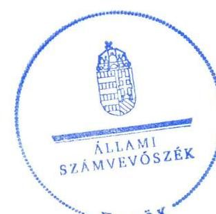
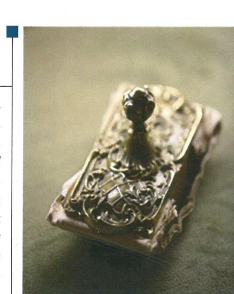
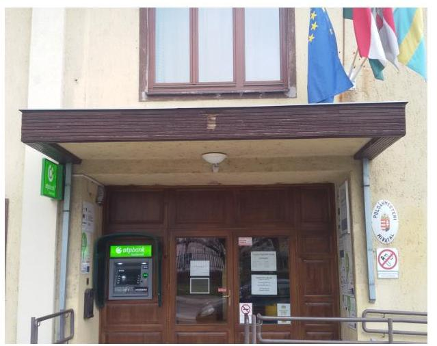
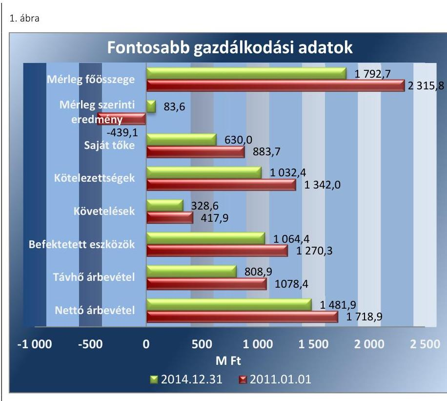
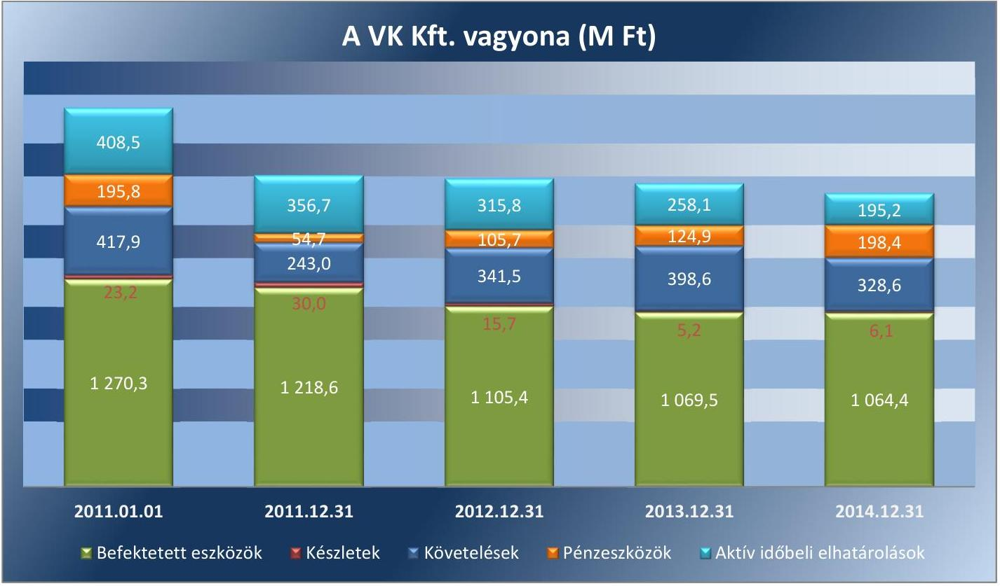
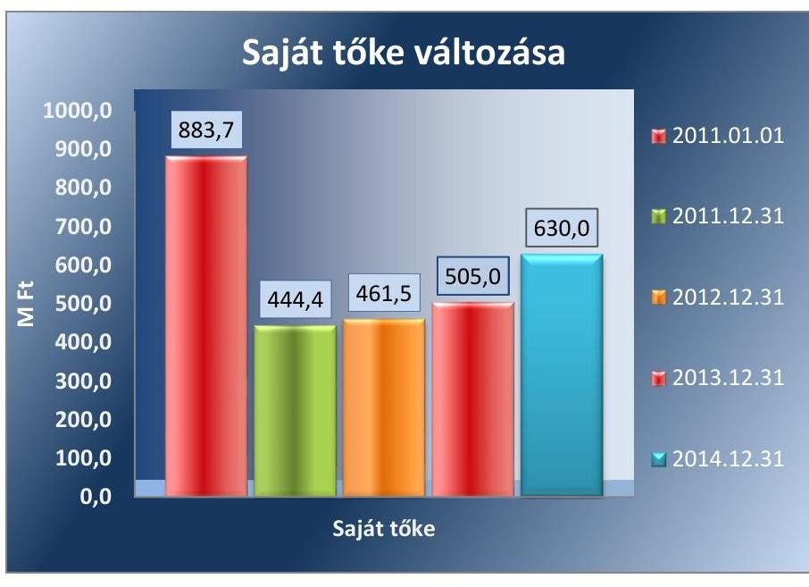
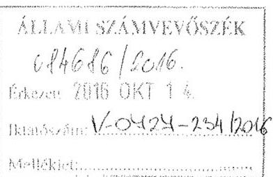
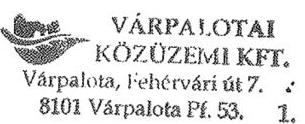
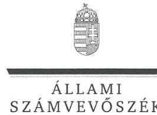
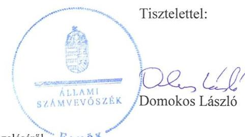

# Jelentés 

## Az önkormányzatok gazdasági társaságai

Az önkormányzatok többségi tulajdonában lévő gazdasági társaságok közfeladat ellátását érintő gazdálkodási tevékenysége szabályszerűségének ellenőrzése - Várpalotai Közüzemi Kft.
2016.

Az ÁSZ az államháztartáson kívül működő közfeladat-ellátó rendszerek ellenőrzéseivel hozzájárul ahhoz, hogy a közpénzeket az államháztartáson kívül működő szervezetek is átlátható, rendezett módon használják fel a közfeladatok ellátása érdekében.

---

# Jelentés 

## Az önkormányzatok gazdasági társaságai

Az önkormányzatok többségi tulajdonában lévő gazdasági társaságok közfeladat ellátását érintő gazdálkodási tevékenysége szabályszerűségének ellenőrzése - Várpalotai Közüzemi Kft.
2016. december hó 6. nap

16193
www.asz.hu

---

# AZ ELLENŐRZÉST FELÜGYELTE:

DR. HORVÁTH MARGIT felügyeleti vezető

## AZ ELLENŐRZÉST VEZETTE ÉS A VÉGREHAJTÁSÁÉRT FELELŐS:

- **CZÉKUS BALÁZS** ellenőrzésvezető
- **IMRE ZSUZSANNA** ellenőrzésvezető

## A PROGRAM ÖSSZEÁLLÍTÁSÁÉRT FELELŐS:

- **JANIK JÓZSEF LÁSZLÓ** osztályvezető

## IKTATÓSZÁM: V-0727-241/2016

## TÉMASZÁM: 1761

## ELLENŐRZÉS-AZONOSÍTÓ SZÁM: V-070740

Jelentéseink az Országgyűlés számítógépes hálózatán és az Interneten a www.asz.hu címen is olvashatóak.

---

# TARTALOMJEGYZÉK 

■ ÖSSZEGZÉS ..... 5
■ AZ ELLENŐRZÉS CÉLJA ..... 7
■ AZ ELLENŐRZÉS TERÜLETE ..... 8
■ AZ ELLENŐRZÉS HÁTTERE, INDOKOLTSÁGA ..... 10
■ A JELENTÉS LÉNYEGES KÉRDÉSKÖREI ..... 11
■ ELLENŐRZÉS HATÓKÖRE ÉS MÓDSZEREI ..... 12
■ MEGÁLLAPÍTÁSOK ..... 14
■ JAVASLATOK ..... 31
■ MELLÉKLETEK ..... 33
I. Sz. melléklet: Értelmező szótár ..... 33
II. Sz. melléklet: A VK Kft. mérlegének adatai (ezer Ft) ..... 36
III. Sz. melléklet: A VK Kft. eredménykimutatásának adatai (ezer Ft) ..... 37
■ FÜGGELÉK: ÉSZREVÉTELEK ..... 39
■ RÖVIDÍTÉSEK JEGYZÉKE ..... 47

---

.

---

# ÖSSZEGZÉS 

Az Állami Számvevőszék a Várpalotai Közüzemi Kft. távhőszolgáltatási közfeladatot érintő gazdálkodási tevékenysége 2011-2014. évek közötti szabályszerűségét ellenőrizte. A távhőszolgáltatást az Önkormányzat összességében szabályosan szervezte meg. A tulajdonosi jogok gyakorlása szabályszerű volt. A VK Kft. vagyongazdálkodási tevékenységének belső szabályozása az ellenőrzött időszak végére számottevően javult. A kötelezettségállománya a távhőszolgáltatásra és a működésre nem jelentett kockázatot. A VK Kft. a távhőszolgáltatási tevékenység bevételeit és ráfordításait, valamint a beruházásokat, felújításokat és az értékcsökkenést szabályszerűen számolta el. A közszolgáltatói tevékenységgel kapcsolatos árképzési gyakorlata szabályszerű volt, a díjcsökkentést szabályszerűen végrehajtotta, önköltségszámítási szabályzatát 2014. évben megalkotta.

## Az ellenőrzés társadalmi indokoltsága

Az Állami Számvevőszék stratégiájában megfogalmazta, hogy a helyi önkormányzatok gazdálkodásában rejlő pénzügyi kockázatok feltárásával, az államháztartáson kívülre nyújtott költségvetési támogatások és ingyenes vagyonjuttatások, valamint az államháztartáson kívül működő közfeladat-ellátó rendszerek ellenőrzéseivel hozzájárul ahhoz, hogy a közpénzeket az államháztartáson kívül működő szervezetek is átlátható, rendezett módon használják fel a közfeladatok szerződésben vállalt ellátása érdekében.

Magyarországon az intézmény-centrikus közfeladat-ellátás jellemző, de egyre jelentősebb a költségvetésen kívüli feladatellátás térnyerése. Ennek legfontosabb szereplői - a nonprofit szervezetek mellett - az önkormányzati tulajdonú gazdasági társaságok. Az önkormányzatok szervezetalakítási szabadságának következménye, hogy a korábban is vállalati formában működő közszolgáltatások mellett, mind a kötelező, mind az önként vállalt feladatok ellátásában a gazdasági társaságok kiemelt fontosságú szerephez jutottak.

## Főbb megállapítások, következtetések, javaslatok

A közfeladat ellátásának megszervezésére vonatkozó önkormányzati döntések összességében szabályszerűek voltak. Az Önkormányzat az ellenőrzött időszakot megelőzően döntött a távhőszolgáltatási közfeladat gazdasági társaság útján történő ellátásáról. Közép és hosszú távú vagyongazdálkodási terveket készítettek, ugyanakkor a gazdasági program nem tartalmazott a távhőszolgáltatási közfeladat ellátására, színvonalának javítására, fejlesztésére vonatkozó elképzeléseket. Az Önkormányzat a távhőszolgáltatással kapcsolatos rendeletalkotási kötelezettségének eleget tett. Az Önkormányzat a VK Kft. tulajdonosi joggyakorlása során szabályszerűen járt el. A tulajdonosi jogok gyakorlásának rendjét a vagyongazdálkodási rendeletben és az SZMSZ-ben meghatározták. A Képviselő-testület évente megtárgyalta és jóváhagyta a VK Kft. üzleti tervét, és az éves beszámolóit.

A vagyongazdálkodással kapcsolatos szabályozás kereteit kialakították, folyamatosan fejlesztették, ugyanakkor belső szabályzatai nem teljes körűen feleltek meg a jogszabályi előírásoknak. A számviteli politikát az ellenőrzött időszakban több alkalommal aktualizálták, s annak keretében elkészítették a Számv.tv-ben meghatározott szabályzatokat. Ugyanakkor a számviteli politikát 2013. évtől kezdően már nem aktualizálták, a leltározási szabályzatban a tárgyi eszközök leltározásának gyakorisága a 2012. évtől nem volt összhangban a Számv. tv. előírásaival. A számlarendet 2001. év óta nem aktualizálták, nem tartalmazta többek között a távhőszolgáltatási közfeladathoz kapcsolódó bevételi és költség, ráfordítás számlák számjelét és megnevezését, tartalmát. Üzletszabályzata nem teljes körűen felelt meg a Tszt. előírásainak. A közfeladat ellátását biztosító vagyonnal a jogszabályi és a belső előírásoknak megfelelően gazdálkodtak. A kötelezettségek állományát folyamatosan csökkentette, lejárt kötelezettségállománya nem volt számottevő. A jogszabályban előírt beszámolási kötelezettségeket teljesítették, ugyanakkor a közérdekű adatok közzététele hiányosan történt meg. A VK Kft. nem tette közzé a honlapján a 2014. évi beszámolóját és nem szerepeltek a honlapon az egyes fogyasztók számára elérhető távhőszolgáltatással kapcsolatos támogatásokra, pályázatokra vonatkozó információk. A VK Kft-nél belső adatvédelmi felelőst nem neveztek ki vagy bíztak meg, valamint nem vezettek adatvédelmi nyilvántartást, amelynek következtében sérült a személyes adatok védelméhez való jog érvényesülése.

A távhőszolgáltatáshoz kapcsolódó értékesítés nettó árbevételének, az anyagjellegű ráfordításoknak az elszámolása szabályszerű volt. A 2012-2014. évi beszámolók kiegészítő mellékletében a Tszt. előírásainak megfelelően a távhőszolgáltatási tevékenységet önálló mérleg és eredmény kimutatás keretében bemutatták. A beruházások, felújítások és az értékcsökkenés elszámolása során betartották a jogszabályi előírásokat, ugyanakkor a távhőszolgáltatáshoz kapcsolódó eszközök pótlása lényegesen alatta maradt az elszámolt értékcsökkenésnek, melyből eredően a tárgyi eszközállomány elhasználódása a jövőben kockázatot jelenthet a működésre és a közfeladat ellátásra.

A távhőszolgáltatás díjának meghatározása és alkalmazása az Önkormányzat távhőrendeletében ${ }_{1-3}$, illetve a Tszt.-ben és az NFM rendeletben foglalt előírásoknak megfelelően történt. A lakossági távhő díjakat a Rezsi tv., illetve az NFM rendelet szerinti mértékben, két lépcsőben csökkentették.

---

# AZ ELLENŐRZÉS CÉLJA 

Az ellenőrzés célja annak értékelése, hogy az önkormányzat a jogszabályi előírások figyelembe vételével döntött-e az ellenőrzésre kerülő közfeladat megszervezéséről, az önkormányzat/tulajdonosi joggyakorló szabályszerűen gyakorolta-e a tulajdonosi jogokat. A gazdasági társaság közfeladat-ellátása bevételeinek, ráfordításainak elszámolása, és vagyongazdálkodási tevékenysége megfelelt-e a jogszabályi, illetve a közszolgáltatási/vagyonkezelési szerződésben foglalt tulajdonosi előírásoknak, azok végrehajtása szabályszerű volt-e, a gazdasági társaság kötelezettségállománya jelent-e kockázatot a működésre, illetve a
közfeladat ellátására, a közfeladatok átláthatósága és elszámoltathatósága érdekében biztosítva volt-e a közszolgáltatás díjának megalapozottsága szabályszerű önköltségszámítással.

---

# **AZ ELLENŐRZÉS TERÜLETE**

## **Várpalota Város Önkormányzata és a kizárólagos tulajdonában lévő Várpalotai Közüzemi Kft.**

Várpalota Város Önkormányzatának1 Képviselő-testülete2 az ellenőrzött időszakot megelőzően döntött a távhőszolgáltatásra külön gazdasági társaság megalapításáról. A távhőszolgáltatási feladatokat ellátó Várpalotai Távhőszolgáltató Kft. 1999. január 26-án, majd a Várpalotai Közüzemi Kft. (VK Kft.) 1999. október 28. nappal került megalapításra. Mindkét gazdasági társaság az Önkormányzat 100%-os tulajdonában volt. A Képviselő-testület a 360/2006. (XII. 14.) számú határozatával döntött a VK Kft.3 és a Várpalotai Távhőszolgáltató Kft. egyesüléséről, ami a Várpalotai Távhőszolgáltató Kft-nek a VK Kft.-be való beolvadásával valósult meg. A gazdasági társaság VK Kft. néven működött tovább.

Az alapításkor, illetve azt követően 2011-ig az Önkormányzat a VK Kft. működéséhez készpénzt és nem pénzbeli hozzájárulásként eszközvagyont bocsátott rendelkezésre. A jegyzett tőke 2011. január 1-jén összesen 726,9 M Ft4 volt.

A VK Kft. az ellenőrzött időszak során távhőszolgáltatás mellett energiatermelést, hulladékgazdálkodást, városüzemeltetési és építőipari tevékenységet, valamint ingatlangazdálkodást és egyéb tevékenységeket végzett.

A VK Kft. a távhőszolgáltatási feladatokat a város két területén egy-egy elkülönült fűtési rendszerrel látta el. A 2014. év végén a mintegy 20 ezer fős lakosú Várpalotán a távhőellátást igénybe vevő lakossági felhasználók száma 3932, a közületi fogyasztási helyeké 364 volt, az üzemeltetett távhővezeték hossza mintegy 17,7 km-t tett ki.

A VK Kft. gazdálkodásának főbb mérleg adatait 2011.január 01. és 2014. december 31. időpontokban valamint a mérlegszerinti eredmény és az árbevétel adatokat 2011. és 2014. évek tekintetében az 1. ábra szemlélteti:

---

Forrás: A VK Kft. éves beszámolói

A VK Kft. 2011. év kivételével nyereségesen gazdálkodott, azonban a 2012-2014. évi nyereség sem kompenzálta a 2011. évi 439,1 M Ft veszteséget, melynek következtében a saját tőke összege az ellenőrzött időszakban jelentős mértékben, 253,7 M Ft-tal csökkent. A teljes munkaidőben foglalkoztatottak létszáma a 2011. évi 115 főről 2014. évben 136 főre emelkedett.

Az ellenőrzött időszak során a polgármester ${ }^{5}$ és a jegyző ${ }^{6}$ személye nem változott. A polgármester a 2010. évi önkormányzati választások óta tölti be tisztségét, a jegyző 2007. február 22-től látta el feladatait. A VK Kft. ügyvezetőjének személye egy alkalommal, 2011. szeptember 23-án változott, a gazdasági igazgató 2009. augusztus 1-jétől áll alkalmazásban.

---

# AZ ELLENŐRZÉS HÁTTERE, INDOKOLTSÁGA 

AZ ÖNKORMÁNYZATI TULAJDONÚ GAZDASÁGI TÁRSASÁGOK teljes körű ellenőrzésének lehetőségét a 2011. január 1-jétől hatályos ÁSZ. tv. teremtette meg. A közfeladatot ellátó gazdasági társaságok ellenőrzése kiemelten fontos a vagyon megőrzése, megóvása érdekében, valamint a kormányzati szektor elszámolásaiban megjelenő önkormányzati tulajdonú gazdálkodó szervezetek esetében, amelyekkel szemben alapvető követelmény, hogy gazdálkodásuk, működésük szabályszerű, az általuk szolgáltatott adatok minél megbízhatóbbak legyenek. A közfeladat ellátás költségeinek, ráfordításainak alakulása, színvonala hatással van a lakosság elégedettségére.

## AZ ELLENŐRZÉS VÁRHATÓ HASZNOSULÁSA-

KÉNT az ÁSZ ${ }^{7}$ a megállapításaival segítséget nyújthat az államháztartáson kívüli közfeladat-ellátás értékeléséhez, jogszabályi keretei pontosításához, átláthatóságot biztosító szabályozásához. Meghatározhatóvá válnak a közfeladat ellátásban részt vevő államháztartáson kívüli szervezeteknek az önkormányzat költségvetését, pénzügyi helyzetét is befolyásoló kockázatai, lehetővé válik ezen kockázatok csökkentése. Ellenőrzéseink feltárhatják, hogy az önkormányzat közfeladat ellátási kötelezettségének szabályszerűen tett-e eleget, a feladatellátáshoz rendelt közvagyon működtetését a tulajdonostól elvárható gondossággal, szabályszerűen szervezte-e meg és a tulajdonosi felügyelete hozzájárult-e a közfeladat szabályszerű ellátásához. Értékelhetővé válik, hogy a feladatot ellátó gazdasági társaság a közszolgáltatási szerződésben foglaltak betartásával, a közvagyon használatával biztosította-e a szolgáltatás folytatásának feltételeit. Ezzel az ellenőrzöttek és a helyi döntéshozók számára az ÁSZ visszajelzést ad feladatszervezési, feladat-ellátási kockázataikról, alapot ad a meglévő hibák megszüntetéséhez, a jobb közfeladat-ellátás biztosításához. Mindezeken keresztül az ÁSZ hozzájárul Magyarország közpénzügyi helyzetének javításához, a közpénzek mérhető módon történő, a döntéshozók által meghatározott célok szerinti felhasználásához.

---

# A JELENTÉS LÉNYEGES KÉRDÉSKÖREI 

1. Az önkormányzat közfeladat megszervezéséről szóló döntése, valamint tulajdonosi joggyakorlása szabályszerű volt-e?
2. A gazdasági társaság vagyongazdálkodása szabályszerű volt-e, kötelezettségállománya jelentett-e kockázatot a működésére, illetve a közfeladat ellátásra?
3. A gazdasági társaságnál az ellátott közfeladat bevételei és ráfordításai elszámolása, valamint az önköltségszámítás és árképzés szabályszerű volt-e?

---

# ELLENŐRZÉS HATÓKÖRE ÉS MÓDSZEREI 

## Az ellenőrzés típusa

Megfelelőségi ellenőrzés

## Az ellenőrzött időszak

2011. január 1-jétől 2014. december 31-ig tartó időszak

## Az ellenőrzés tárgya

A közfeladatot gazdasági társaságokkal ellátó önkormányzatok tulajdonosi joggyakorlása, valamint gazdasági társaságok pénz- és vagyongazdálkodásának szabályozottsága és szabályszerűsége. Az ellenőrzés kiterjed minden olyan körülményre és adatra, amely az ÁSZ jogszabályban meghatározott feladatainak teljesítéséhez, valamint a program végrehajtása folyamán felmerült újabb összefüggések feltárásához szükséges.

## Az ellenőrzött szervezet

Várpalota Város Önkormányzata
Várpalotai Közüzemi Kft.

## Az ellenőrzés jogalapja

Az ellenőrzés jogszabályi alapját az Állami Számvevőszékről szóló 2011. évi LXVI. törvény 5. § (3)-(4)-(5) bekezdése képezte.

## Az ellenőrzés módszerei

Az ellenőrzést a nemzetközi standardokat irányadónak tekintve az ellenőrzési program ellenőrzési kérdései, az ellenőrzött időszakban hatályos jogszabályok, az ellenőrzés szakmai szabályok és módszertanok figyelembe vételével végezzük.

Az ellenőrzés
 ideje alatt az ellenőrzött szervezettel történő kapcsolattartást az ÁSZ Szervezeti és Működési Szabályzatának vonatkozó előírásai alapján biztosítjuk.

Az ellenőrzés a kiválasztott, többségi tulajdonosi jogokat gyakorló önkormányzatra, illetve az ellenőrzésre kijelölt közfeladatot ellátó gazdasági társaság felett tulajdonosi jogokat gyakorló szervezetre és az ellenőrzött

---

közfeladatot ellátó gazdasági társaságra terjed ki. Amennyiben a gazdasági társaságban több önkormányzat együttesen többségi tulajdonos, úgy az ellenőrzést a többségi tulajdonosi jogokat gyakorló önkormányzatnál kell lefolytatni. Az ellenőrzött gazdasági társaságnál, amennyiben az több közfeladatot is ellát, akkor az ellenőrzésre kiválasztott közfeladat-ellátást ellenőrizzük.

Az ellenőrzést a kérdésekre adott válaszok kiértékelésével, valamint a megjelölt adatforrások, a csatolt tanúsítványok felhasználásával, továbbá az adott időszakban hatályos jogszabályok figyelembe vételével kell lefolytatni. Az ellenőrzési kérdések megválaszolásához szükséges bizonyítékok megszerzése a következő ellenőrzési eljárások alkalmazásával történik: megfigyelés, kérdésfeltevés (információkérés), összehasonlítás, valamint elemző eljárás.

A bevételek és ráfordítások elszámolása, valamint a vagyonnyilvántartás terén a szabályszerű működést véletlen mintavétellel ellenőriztük. A mintavétellel ellenőrzött területek esetében minden egyes tétel vonatkozásában a szabályszerűségre vonatkozó kérdéseket tettünk fel, amelyek eredménye összesítésre került. „Megfelelőnek” értékeltünk egy ellenőrzött területet, amennyiben 95%-os bizonyossággal a teljes sokaságban a hibaarány legfeljebb 10%, nem megfelelőnek, amennyiben 10%-nál magasabb arányt képviselt. Abban az esetben, ha a teljes sokaság tekintetében a 10%-os hibaarányhoz való viszony megítélésének megbízhatósága nem érte el a 95%-ot, annak elérése érdekében értékelésünket további szempontokkal egészítettük ki, és figyelembe vettük a feltárt hibák típusát és súlyát.

A ráfordítások elszámolására és a vagyonnyilvántartásra vonatkozó véletlen mintavételt kockázati alapú kiválasztással egészítettük ki, amelynek során évente a három legnagyobb összegű tételt választottuk ki.

---

# 1. Az önkormányzat közfeladat megszervezéséről szóló döntése, valamint tulajdonosi joggyakorlása szabályszerű volt-e? 

Összegző megállapítás

A közfeladat megszervezésével kapcsolatos döntések összességében szabályszerűek voltak, a tulajdonosi joggyakorlás szabályszerű volt.

### 1.1. számú megállapítás

A közfeladat ellátásának megszervezésére vonatkozó önkormányzati döntések összességében szabályszerűek voltak, az Önkormányzat a rendeletalkotási kötelezettségének eleget tett.

A Tszt. ${ }^{8}$ előírása szerint a területileg illetékes települési önkormányzat a távhőszolgáltatással ellátott létesítmények távhőellátását engedélyes ${ }^{9}$ útján köteles biztosítani. Feladatellátási kötelezettségének az Önkormányzat az ellenőrzött időszakot megelőzően gazdasági társaság alapításával tett eleget. Az Önkormányzat az Ötv ${ }^{10}$. rendelkezései alapján, az ellenőrzött időszakot megelőzően döntött a közfeladatok, köztük az Ötv.-ben, majd az Mötv. ${ }^{11}$-ben foglaltak szerint a kötelezően ellátandó, a helyi önkormányzati feladatként megjelölt távhőszolgáltatás ellátásáról. Az Önkormányzat a közfeladatok ellátását a kizárólagos tulajdonában lévő VK Kft. gazdasági társaságon keresztül biztosította.

Gazdasági programját ${ }^{12}$ az Önkormányzat a 2011-2014. évekre vonatkozóan elkészítette, és azt a Képviselő-testület elfogadta.

A gazdasági program az Ötv. 91. § (6), illetve az Mötv. 116. § (4) bekezdésében foglaltak ellenére nem tartalmazott a távhő közszolgáltatás biztosítására, színvonalának javítására vonatkozó fejlesztési elképzeléseket.

## A közép- és hosszú távú vagyongazdálkodási tervet ${ }^{13}$ az Önkormányzat az Nvtv. ${ }^{14}$-ben előírtak szerint a 2012-2017. időszakra, illetve 2012-2022. évekre vonatkozóan elkészítette. Abban a vagyongazdálkodás feladataként megjelölte a közfeladatok ellátásához és a mindenkori társadalmi szükségletek kielégítéséhez szükséges vagyon egységes elveken alapuló, átlátható, hatékony és költségtakarékos működtetését, értékének megőrzését, állagának védelmét, értéknövelő használatát, gyarapítását. Az önkormányzati vagyonfejlesztés céljainak meghatározását a Képviselő-testület döntési hatáskörébe utalta. Meghatározta az önkormányzati vagyon hasznosításának módjait, és a hasznosítás során figyelembe veendő szempontokat.

A közép és hosszú távú vagyongazdálkodási terv nem tartalmazott a távhő közszolgáltatás biztosítására, színvonalának javítására vonatkozó fejlesztési elképzeléseket, közép és hosszú távú célokat.

---

Az önkormányzati SzMSz ${ }^{15}$ tartalmazta az ellátott feladatok szakfeladat szerinti felsorolását, így a távhő közszolgáltatási feladatot is.

Az önkormányzati SZMSZ az Ámr. ${ }^{16}$ 20. § (2) bekezdés d) pontjának, illetve az Ávr. ${ }^{17}$ 13. § (1) bekezdés d) pontjának előírása ellenére nem tartalmazta azon gazdálkodó szervezetek - így a távhő közszolgáltatást végző, az Önkormányzat kizárólagos tulajdonában lévő VK Kft. - részletes felsorolását, amely felett alapítói, illetve tulajdonosi jogokat gyakorolt.

A távhőszolgáltatási közfeladat ellátását a VK Kft. 2012. február 12-ig a jegyző által kiadott működési engedély, azt követően pedig a MEKH ${ }^{18}$ 60/2012. számú határozatában foglalt engedély alapján végezte.

Az alapító okirat ${ }_{1-9}{ }^{19}$ a kötelező tartalmi elemeket és a VK Kft. működési feltételeit a Gt., illetve a Ptk. ${ }^{20}$ előírásainak megfelelően tartalmazta. Az Alapító okiratban ${ }_{1-9}$ meghatározták a társaság alapítójának -az Önkormányzatnak- a képviseletére jogosult személyként a polgármestert, összhangban az Önkormányzat SZMSZ-e és az Mötv előírásaival. Az alapító okirat ${ }_{1,2}$ az ügyvezető jogkörét a meghatározott értékhatár feletti kötelezettségvállalások esetén a tulajdonost képviselő polgármester előzetes ellenjegyzéséhez, illetve személyügyi döntések tekintetében jóváhagyásához kötötte. A korlátozását az alapító okirat ${ }_{3}$-ban megszüntették, és a későbbi módosítások során már nem érvényesítették. Az alapító okirat ${ }_{1-9}$ a VK Kft. által ellátandó közfeladatokat és egyéb, vállalkozási jellegű tevékenységeket a Gt., illetve a Ptk. előírásainak megfelelően tartalmazta.

Üzleti terv készítési kötelezettséget az Önkormányzat a többségi tulajdonában álló gazdasági társaságokra az üzleti terv szabályzatában ${ }^{21}$ írta elő. Abban meghatározták az üzleti terv főbb tartalmi és formai követelményeit és elkészítésének határidejét. Az üzleti terv szabályzatban kötelezettségként előírták továbbá a gazdasági társaságok részére a jóváhagyott üzleti tervek teljesítéséről az éves beszámoló beterjesztését a Képviselő-testület, míg a negyedéves beszámoló készítését és benyújtását az FB ${ }^{22}$ és a polgármester részére.

Rendeletalkotási kötelezettségének az Önkormányzat a távhőszolgáltatási közfeladat ellátásával kapcsolatosan a távhőrendelet ${ }_{1-3}{ }^{23}$ megalkotásával a Tszt. előírásának megfelelően eleget tett. A távhőrendelet ${ }_{1-2}$ a Tszt. előírásainak megfelelően tartalmazta 2011. április 15-ig a távhőszolgáltatási díjakat, és a díjszámítás önkormányzati hatáskörben történő megállapításának módját. A távhőrendelet ${ }_{1-3}$ a Tszt. előírásaival összhangban tartalmazta az Önkormányzat ellátási kötelezettségét, a működtetési és fejlesztési előírásokat, a távhő mérésére, az alkalmazott díjakra, az ármegállapításra és díjfizetésre vonatkozó szabályokat, valamint kijelölték a távhőszolgáltatás célszerű fejlesztési területeit.

A Tszt. 6. § (2) bekezdés b) pontjának 2011. április 15-től hatályos, a távhőszolgáltatási díjakat és az önkormányzati ármegállapítói feladatokat érintő módosításait az Önkormányzat késve, 2011. december 1-jei hatállyal a távhőrendelet ${ }_{3}$ megalkotásakor juttatta érvényre.

---

Vagyonkezelési szerződés ${ }^{24}$ alapján átvett eszközökkel - telek, épület és építmények -, az Önkormányzattól bérleti szerződés ${ }^{25}$ alapján bérelt gépekkel és műszaki berendezésekkel, valamint saját eszközeivel látta el a VK Kft. a távhőszolgáltatási közfeladatát. A 10 éves határozott időtartamra, 2017. december 18. napjáig megkötött vagyonkezelési szerződésben, valamint a bérleti szerződésben meghatározták az Önkormányzat által biztosított, a távhőszolgáltatási közfeladat-ellátást szolgáló közvagyon körét.

A vagyonkezelési szerződés nem tartalmazta az Áht. 105/B. § (1) bekezdés c) pont szerint a közfeladat ellátása érdekében vagyonkezelésbe adott eszközök egyedi értékét, ennek pótlása a vagyonkezelési szerződés 2012. április 26-i módosításakor megtörtént.

Az Önkormányzat a vagyonkezelési szerződésben meghatározta a VK Kft. jogait és kötelezettségeit, illetve a tulajdonosnak fenntartott jogokat. Előírták a vagyonkezelésbe adott vagyon elkülönített nyilvántartási, a VK Kft. adatszolgáltatási, beszámolási, leltározási és leltáregyeztetési kötelezettségét és annak módját. Meghatározták benne az elszámolt értékcsökkenés összegének felhasználására vonatkozó évenkénti elszámolást az Áht. ${ }_{1}{ }^{26}$-ban foglaltaknak megfelelően.

Bérleti szerződést kötött az Önkormányzat, mint bérbeadó és a VK Kft., mint bérbevevő az ellenőrzött időszakot megelőzően, 2007. december 18-án a 3212/36 hrsz-on nyilvántartott tömbfűtőműben található eszközökre. A bérleti szerződés 2017. december 31-ig terjedő 10 év határozott időtartamra szólt, 568,0 M Ft + ÁFA egyösszegű, előre fizetendő bérleti díj ellenében. A bérlet tárgyát képező eszközök részét képezték a városi távhőszolgáltató rendszernek. A bérleti szerződés szerinti eszközök közé tartoztak: a gázfogadó berendezés, a kazánok, a pótvízellátás, a forróvízrendszer, a villamos berendezés, a vízlágyító berendezés, a biztonságtechnika, az irányítástechnika, a gázmotorok és a kiviteli tervek.

A bérleti szerződés nem tartalmazott a bérlet tárgyát képező eszközökre vonatkozóan az átadás-átvételi eljárásról szóló dokumentumot. A bérleti szerződés nem tartalmazta a tárgyát képező eszközök tételes felsorolását. Ezáltal sérült az Áht. ${ }_{1}$ 104. § (3) bekezdésének a vagyonnal való felelős, rendeltetésszerű gazdálkodásra vonatkozó előírása.

Az Önkormányzat, mint tulajdonos a VK Kft-nek a bérleti szerződés alapján átadott eszközökre vonatkozóan az Áhsz. ${ }_{1}{ }^{27}$ 37. § (4) bekezdésének előírása ellenére leltározási, leltáregyeztetési és adatszolgáltatási kötelezettséget nem írt elő.
1.2. számú megállapítás

A távhőszolgáltatási közfeladat ellátásával kapcsolatos tulajdonosi jogok gyakorlása szabályszerű volt.

A tulajdonosi jogok gyakorlását a Képviselőtestület az önkormányzati SZMSZ és a vagyongazdálkodási rendelet ${ }^{28}$ alapján az alapító okirat ${ }_{1-9}$ szerint a Gt., illetve a Ptk. előírásaival összhangban határozta meg. A tulajdonosi jogokat a VK Kft. tekintetében a Képviselőtestület gyakorolta. A gazdasági társaságokkal kapcsolatos döntési hatásköröket a polgármesterre, más személyre, szervezetre vagy az Önkormányzat bizottságaira nem ruháztak át.

---

Az alapítót megillető jogok gyakorlása - így többek között döntés az eredmény felosztásáról, a FB és a könyvvizsgáló megválasztása, a törzstőke felemelése és leszállítása - a Képviselő-testületet illette. A tulajdonosi joggyakorlás meghatározásának módja megfelelt a Gt.-ben, illetve a Ptk.-ban foglalt előírásoknak.

A könyvvizsgáló személye az ellenőrzött időszak során egy alkalommal változott. A könyvvizsgáló ${ }_{1}{ }^{29}$ megbízásának lejártát -2011. május 31. - követően a könyvvizsgálót ${ }^{30}$ a VK Kft. legfőbb szerve 2011. június 1-jével ötéves időtartamra megválasztotta.

A FB létrehozásával és tagjainak kijelölésével, továbbá az alapító okiratokban való megnevezésével a Képviselő-testület eleget tett a Gt.-ben, illetve a Ptk.-ban meghatározott kötelezettségének. A FB tagjait kijelölték, a személyi változásokat az alapító okirat módosításával érvényre juttatták.

A FB ügyrendjét ${ }^{31}$ a Gt. előírásának megfelelően meghatározta, a Képviselő-testület megtárgyalta és 28/2011. (II. 24.) számú tulajdonosi határozatával jóváhagyta. A FB ügyrendjében a Tak. tv. előírásának megfelelően a tagok számát öt főben határozták meg. A FB tagok száma 2014. november 20-tól három főre csökkent az alapító okirat módosításával.

Javadalmazási szabályzatot a Tak. tv-ben foglalt előírásnak megfelelően alkotott a VK Kft. a vezető tisztségviselők, az FB tagok és az Mt. ${ }_{1,2}{ }^{32}$-ben meghatározott vezető állású munkavállalók javadalmazására, valamint a jogviszony megszűnése esetén biztosított juttatások módjára, mértékére, rendszerére vonatkozóan. A javadalmazási szabályzatot a Képviselő-testület a 144/2011. (V. 31.) számú határozatával elfogadta.

Az ügyvezető részére az Önkormányzat vezetői prémiumfeladat kitűzéséről nem határozott, 2011-2014 között prémium fizetésére nem került sor.

Monitoring tevékenység keretében az Önkormányzat az üzleti terv szabályzatban és a távhőrendelet ${ }_{1-3}$-ban üzleti terv készítését és annak teljesítéséről negyedévente történő beszámolási kötelezettséget, valamint a vagyonkezelésbe adott eszközökkel kapcsolatos évente történő adatszolgáltatási és tájékoztatási kötelezettséget írt elő a VK Kft. számára. A nemzeti vagyon részét képező, gazdasági társaságokban megtestesülő tulajdonrészeiből fakadó rendszeres ellenőrzési kötelezettségét a Képviselő-testület az éves beszámolók megtárgyalásával és elfogadásával végezte. A beszámolók Képviselő-testület által történő megtárgyalása előtt az FB ellenőrzési tevékenysége keretében az éves
 beszámolókat megtárgyalta és a Képviselő-testület részére elfogadásra javasolta.

ELLENŐRZÉSI TEVÉKENYSÉGET az Önkormányzat a VK Kft. vonatkozásában az üzleti tervek és Számv. tv. ${ }^{33}$ szerinti beszámolók megtárgyalásán és elfogadásán túl, az Ötv.-ben, illetve az Áht. ${ }^{34}$-ben biztosított lehetőséggel élve a belső ellenőrzés keretében is végzett. Az Önkormányzat belső ellenőrzése által a 2011. évre készített kockázatelemzés az önkormányzati tulajdonú gazdasági társaságok gazdálkodását magas

---

kockázatúnak értékelte, és ez alapján az ellenőrzési tervbe az ellenőrzésüket beépítették. 2011. évben a belső ellenőrzés a VK Kft-nél az ellátott közszolgáltatások költséghatékonyságát, gazdálkodásának szabályosságát és a díjképzés módszerét ellenőrizte a vállalkozás egészére nézve. Az ellenőrzés alapján javaslattétel nem volt, intézkedési terv készítésének kötelezettsége nem merült fel. A 2012-2014. évekre vonatkozó kockázatelemzés a gazdasági társaságokra nem terjedt ki.

GARANCIÁT ÉS KEZESSÉGET az ellenőrzött időszak során az Önkormányzat nem vállalt a VK Kft. kötelezettségei teljesítésének biztosítékaként.

# 2. A gazdasági társaság vagyongazdálkodása szabályszerű volt-e, kötelezettségállománya jelentett-e kockázatot a működésére, illetve a közfeladat ellátásra? 

Összegző megállapítás

A vagyongazdálkodás szabályozását hiányosan alakították ki, a kötelezettségek nem jelentettek kockázatot a működésre és a közfeladat ellátására.
2.1. számú megállapítás

A vagyongazdálkodási tevékenység szabályozása nem teljes körűen felelt meg a jogszabályi előírásoknak. A számviteli politikát és a leltározási szabályzatot nem teljes körűen aktualizálták, nem rendelkeztek a vagyonkezelésbe vett eszközök leltározásáról. A számlarend nem felelt meg a Számv. tv. előírásainak, az önköltségszámítási szabályzatot késedelmesen alkották meg.

A VK Kft. a vagyongazdálkodással kapcsolatos szabályozás kereteit a számviteli politika ${ }_{1-3}{ }^{35}$ és a hozzá kapcsolódó szabályzatok megalkotásával, valamint a működésével összefüggő feladatok, felelősségi- és hatáskörök SZMSZ-ben történt előírásával kialakította. Szabályozási kötelezettségének teljes körűen nem tett eleget, mivel 2011. január 1-je és 2014. június 30-a között önköltség-számítási szabályzattal a Számv. tv. 14. § (5) bekezdés c) pontjának előírása ellenére nem rendelkezett.

A SZÁMVITELI POLITIKA ${ }_{1-3}$ keretében elkészítették a Számv. tv. 14. § (5) bekezdésében meghatározott leltárkészítési és leltározási, értékelési és pénzkezelési szabályzatokat. A 2011. január 1-jétől hatályos számviteli politika aktualizálására az ellenőrzött időszakban két alkalommal - 2011. október 15-én és 2012. november 1-jén - került sor. A számviteli politika ${ }_{1}$ az éves beszámoló eredmény kimutatásának formáját a 2011. évben forgalmi költség eljárással, a számviteli politika ${ }_{2,3}$ a 2012. évtől kezdődően összköltség eljárással történő összeállításban határozta meg.

A számviteli politika ${ }_{1}$ 2011. október 15-ig a Számv. tv. 88. § (4) bekezdésének előírásával ellentétben nem tartalmazta az értékcsökkenési leírás elszámolásának módszeréhez kapcsolódóan az alkalmazott leírási kulcsokat.

---

A VK Kft. a számviteli politika ${ }_{3}$ felülvizsgálatát az ellenőrzött időszak során 2013. évtől nem végezte el, emiatt a Számv. tv. 3. § (3) bekezdés 5. pontjának hatályon kívül helyezése miatt - megbízható és valós képet lényegesen befolyásoló hiba számviteli kategória megszüntetését - illetve az 52. § (2) bekezdésében meghatározott - az értékcsökkenés elszámolása kezdő időpontjaként az üzembe helyezés időpontjának meghatározását és az üzembe helyezés hitelt érdemlő dokumentálásának előírását - 2013. január 1-jétől hatályba lépő változásait nem építették be a szabályozásba. A mulasztással a VK Kft. megsértette a Számv. tv. 14. § (11) bekezdésében foglaltakat.

A VK Kft. a leltározási szabályzat ${ }^{36}$-ban a Számv. tv. 69. § (3) bekezdésében előírt legalább három évenkénti leltározással ellentétesen - eszközeiről folyamatos mennyiségi nyilvántartást vezetett - az ingatlanok, a tárgyi eszközök körében a lealapozott gépek és berendezések, valamint a földalatti kábelek, alagutak, csővezetékek, légvezetékek és technológiai egységek esetében ötévente történő leltározást írta elő. A leltározási szabályzat a vagyonkezelői szerződés 9/b. pontjában meghatározott leltározási kötelezettség ellenére nem tartalmazott előírást az Önkormányzattól vagyonkezelésre átvett eszközök leltározására vonatkozóan. Ezzel nem tartotta be a Számv. tv. 14. § (4) bekezdésében foglaltakat, mivel a számviteli politika keretében elkészített leltározási szabályzatban írásban nem rögzítették a VK Kft.-re, mint gazdálkodóra jellemző szabályokat, előírásokat, módszereket a vagyonkezelésre átvett eszközök leltározása tekintetében.

Az értékelési szabályzat ${ }^{37}$. 2011. január 1-jétől volt hatályban, az ellenőrzött időszak során felülvizsgálatára, módosítására nem került sor. Az értékelési szabályzat tartalma megfelelt a Számv. tv. előírásainak, biztosította a mérlegtételek értékének megfelelő meghatározását.

A pénzkezelési szabályzat ${ }^{38}$. felülvizsgálatára és módosítására az ellenőrzött időszak során négy alkalommal, utoljára 2014. október 15-én került sor. A pénzkezelési szabályzat tartalma megfelelt a Számv. tv.-ben megfogalmazott követelményeknek.

A SZÁMLAREND ${ }^{39}$. kiadására 2001. január 1-jével került sor, az ellenőrzött időszakban aktualizálása a Számv. tv. időközi módosításaira, továbbá a távhőszolgáltatási közfeladat ellátásának a tevékenységi körbe történt bevonására - és az annak elszámolását szolgáló számlák meghatározására - tekintettel a Számv. tv. 161. § (5) bekezdésében foglalt előírás ellenére nem történt meg. A „Számlarend_2014" megnevezésű dokumentum - amely a VK Kft. által alkalmazott számviteli programban kialakított főkönyvi számlák számjelét és megnevezését tartalmazta csupán - nem felelt meg a Számv. tv. 161. (1) bekezdésben foglalt előírásnak. A számlarend nem felelt meg a Számv. tv.161. § (2) bekezdésében meghatározott követelményeknek, mivel:
nem tartalmazta az a) és b) pontok előírásával szemben a távhőszolgáltatási közfeladathoz kapcsolódó főkönyvi számlák (bevételi, költség és ráfordítás számlák) számjelét és megnevezését, tartalmát, a számla értéke növekedésének, csökkenésének jogcímeit, a számlát érintő gazdasági eseményeket;
az egyes tevékenységek bevételeinek és ráfordításainak elkülönítése érdekében munkaszám szerinti nyilvántartást vezettek, azonban az

---

egyes főkönyvi számlák és a munkaszám szerinti analitikus nyilvántartás kapcsolatát a Számv. tv. 161. § (2) bekezdése c) pontjának rendelkezése ellenére a számlarendben nem szabályozták.
a Számv. tv. 2013. január 1-jén hatályba lépett módosításai - amelyek érintették az egyéb bevételek és ráfordítások, valamint a pénzügyi műveletek egyéb bevételeinek és egyéb ráfordításainak elszámolását - számlarendben való érvényre juttatása a Számv. tv. 14. § (11) bekezdés előírása ellenére nem történt meg. A Számv. tv. 84. § (7) bekezdés o) pontja a pénzügyi műveletek egyéb bevételei, a 85. §. (3) bekezdés o) pontja a pénzügyi műveletek egyéb ráfordításai között kimutatandó tételek kapcsán, a szerződésben meghatározott fizetési határidőn belül történt pénzügyi rendezés esetén kapott, illetve adott engedmény szabályozását nem aktualizálták.
A VK Kft. a Számv. tv.161. § (2) bekezdés d) pont előírásával szemben 2011. január 1-je és 2013. december 31. között a számlarendben foglaltakat alátámasztó bizonylati renddel nem rendelkezett. A Számv. tv. előírása szerint a számlarendben és egyéb szabályzatokban foglaltakat alátámasztó bizonylati rend szabályzatot ${ }^{40}$ 2014. január 1-jei, az iratkezelésre vonatkozó szabályzatot ${ }^{41}$ az ellenőrzött időszakot megelőzően, 2009. május 28.-ai hatállyal adott ki ügyvezető igazgató.

ÖNKÖLTSÉGSZÁMÍTÁSI SZABÁLYZAT ${ }^{42}$ készítési kötelezettségének a Számv. tv. 14. § (5) bekezdés c) pontjában előírtak ellenére a VK Kft. 2011. január 1-je és 2014. június 30-a között nem tett eleget. A VK Kft. a 2011-2014. években a Számv. tv. előírásának megfelelően éves beszámolót készített. Az értékesítés nettó árbevétele már 2011. évet megelőzően meghaladta az egymilliárd Ft-ot, ezért a számviteli politika keretében el kellett készíteni az önköltségszámítás rendjére vonatkozó belső szabályzatot. Önköltség számítási szabályzatát a VK Kft. 2014. július 1-jei hatályba lépéssel készítette el. Az önköltség számítási szabályzat szerint a végzett tevékenységek, szolgáltatások közvetlen költségeit a 7. számlaosztályban, a tevékenységekkel, szolgáltatásokkal közvetlen kapcsolatban nem lévő költségeket és ráfordításokat a 6. számlaosztály főkönyvi számláin számolták el.

A közvetett költségek felosztásának módszereit, a felosztás során alkalmazandó mutatószámokat, módszereket a Számv. tv. 51. § (2) bekezdésével ellentétben 2011. január 1-je és 2014. június 30.-a között nem határozták meg.

Az önköltség-számítási szabályzat rendelkezései alapján, a költséghelyeken elszámolt költségek költségviselőkre történő felosztását 2014. július 1-jétől munkaszámok alkalmazásával biztosították.

A SZÉTVÁLASZTÁSI SZABÁLYOK 2012. január 1-jétől hatályos Tszt. 18/A. § (2) bekezdésében meghatározott kidolgozására vonatkozó kötelezettség teljesítése érdekében a VK Kft. módosította a számviteli politikáját. A számviteli politika 2012. november 1-jétől hatályos kiadásában meghatározták a számviteli szétválasztás elveit. Az elkülönített eredmény kimutatás összeállításával kapcsolatban rögzítették a bevételek és költségtételek elkülönítésének módszerét, meghatározták a távhőszolgáltatással összefüggésben az alkalmazott költséghelyeket. Az elkülönített

---

mérleg összeállításánál meghatározták a befektetett- és a forgóeszközök elkülönítését alátámasztó előírásokat.

A számviteli politika ${ }_{3}$ keretében meghatározott szétválasztási elveknek és módszereknek megfelelő számlarendet azonban nem alakították ki, így a Számv. tv. 161/A § (leltár1) bekezdésének előírása ellenére a számlarend nem volt alkalmas a szétválasztási elveknek megfelelő, a Tszt. 18. § (2) bekezdésében előírtak szerinti elkülönített mérleg és eredmény kimutatás alátámasztására, a kapcsolódó főkönyvi nyilvántartások vezetésére.

TOVÁBBI SZABÁLYZATOK voltak hatályban a VK Kft-nél 2014. január 1-jétől a feleslegessé vált vagyontárgyak selejtezésére és hasznosítására, a Kbt. ${ }_{1,2}{ }^{43}$. előírásának megfelelően a közbeszerzések lebonyolítására.

AZ ÜZLETSZABÁLYZAT ${ }^{44}$ a Tszt. szerinti tartalommal az ellenőrzött időszakot megelőzően került megalkotásra, amelyet a jegyző a Tszt.-ben foglalt hatáskörének megfelelően jóváhagyott, és a Fogyasztóvédelmi Felügyelőségnek véleményezésre megküldött. Az üzletszabályzatot a Tszt. 57/C. § (4) bekezdés a) pontja előírásának megfelelően a VK Kft. honlapján közzétették. Az üzletszabályzat szerint a távhőszolgáltatás elszámolásával és a díjfizetéssel kapcsolatos szabályokat az Önkormányzat díjalkalmazási feltételei szerint állapítják meg.

A Tszt. 57. § 2011. április 15-i módosításával összefüggésben - mely szerint az Önkormányzat a továbbiakban nem jogosult a távhőszolgáltatási díjak megállapítására - az üzletszabályzat módosítását nem végezték el. Az üzletszabályzat 10. pontja továbbra is tartalmazta, hogy „a szolgáltatott hőmennyiség elszámolásával és a díjfizetéssel kapcsolatos szabályokat az Önkormányzat díjalkalmazási feltételekben állapítja meg".

# 2.2. számú megállapítás 

A közfeladat ellátását biztosító vagyonnal a jogszabályi és a belső előírásoknak megfelelően gazdálkodtak.

TÁVHŐSZOLGÁLTATÁSI KÖZFELADATÁT a VK Kft. a saját vagyonába tartozó, valamint az Önkormányzattól vagyonkezelésre, illetve bérleti szerződés keretében átvett eszközökkel látta el.

Az Önkormányzat az ellenőrzött időszakot megelőzően a VK Kft-nek ingatlant adott át vagyonkezelésre 568,0 M Ft értékben. A vagyonkezelési szerződés tartalmazta az átadott létesítmény és a kapcsolódó vagyonelemek (telek, épület, kémény, forróvízrendszer, villamos berendezés, víz-, csatornarendszer, út, járda) meghatározását.

A saját vagyonról és a vagyonkezelésbe vett eszközökről a Számv. tv. előírásainak megfelelő nyilvántartást vezettek. A vagyonkezelt ingatlan elkülönített nyilvántartása 2011-ben az Áht. 1-ben, 2012-2014-ben a Mötv.-ben és a számviteli politikában foglalt előírások szerint történt.

A VK Kft. által kialakított főkönyvi és analitikus nyilvántartás az eszközök és források változását folyamatosan, zárt rendszerben mutatta be. A beszerzett eszközök állományba vétele során a bekerülési értéket az értékelési szabályzat alapján határozták meg, az üzembe helyezést dokumentálták, az értékcsökkenési leírást a számviteli politika előírásainak megfelelően számolták el. A mérlegben szereplő eszközök és források értékét a

---

Számv. tv és a leltározási szabályzat előírása szerint leltárral minden évben alátámasztották.

A VK Kft. főbb mérlegadatokat a II. számú melléklet tartalmazza, azok változását a 2. ábra szemlélteti:
2. ábra

Fonrás: A VK Kft. éves beszámolói

1. táblázat

| TÁVHŐ VAGYON

 (M FT) |  |  |
| :--: | :--: | :--: |
|  | 2012. | 2014. |
| Befektetett eszközök | 773,4 | 684,4 |
| ebből tárgyi eszközök | 768,3 | 670,9 |
| Követelések | 244,9 | 190,8 |
| Pénzeszközök | 74,6 | 123,1 |
| Aktív időbeli elhatárolások | 222,9 | 174,6 |

A VK KFT. mérleg főösszege 2011. január 1. és 2014. december 31. közötti 22,6%-os (523,1 M Ft) csökkenést mutatott. A befektetett eszközökön belül a tárgyi eszközök állománya az elszámolt értékcsökkenési leírás hatására 222,6 M Ft-tal (17,7%-kal) csökkent. A tárgyi eszközökön belül a távhővel kapcsolatos eszközöknél kisebb arányú (12,7%-os, 97,4 M Ft) volt a csökkenés 2012-2014. évek között. A forgóeszközökön belül a követelések állománya 89,4 M Ft-tal (21,4%-kal), részarányuk a 2011. január 1-jei 65,6%-ról 61,6%-ra csökkent. Az aktív időbeli elhatárolások 213,3 M Ft-tal, a nyitó érték fele alá csökkent. A 2013. évi átalakulás, a hulladékgazdálkodás kiválása pusztán a pénzeszközök 25,0 M Ft összegű csökkenésével járt, a jegyzett tőke azonos összegű csökkenése mellett.

A SAJÁT TŐKE értéke a 2011. év végén közel az induló érték felére, 444,4 M Ft-ra (253,6 M Ft-tal) csökkent a tárgyévi 439,1 M Ft mérleg szerinti veszteség következtében. A veszteségből 405,1 M Ft az üzemi tevékenység, 30,4 M Ft a pénzügyi műveletek eredménye és 1,8 M Ft volt a rendkívüli eredmény, amelyekhez további 1,8 M Ft társasági adó fizetési kötelezettség került elszámolásra. A saját tőke a 2014. év végére folyamatos növekedés után 630,0 M Ft-ot tett ki. Osztalékfizetésre 2011-2014 között nem került sor, a keletkezett eredményt a Képviselő-testület döntése alapján az eredménytartalékba helyezték.

---

A saját tőke egyes elemeinek alakulását a II. számú melléklet tartalmazza, változását a 3. ábra szemlélteti:
3. ábra

Forrás: a VK Kft. beszámolói
A jegyzett tőke 2011. január 1-jén összesen 726,9 M Ft volt. A Képviselő-testület 33/2013. (III. 21.) számú határozatával döntött a hulladékgazdálkodási közfeladat ellátására megalapított Várpalotai Hulladékgazdálkodási NKft. kiválásáról. Az átalakuláshoz készült vagyonmérleg alapján - kiválással létrejövő gazdasági társaság részére történő 25 M Ft jegyzett tőke átadása miatti csökkenésén túl - a VK Kft. jegyzett tőkéjét 426,9 M Ft-tal leszállították, ami ezáltal 275,0 M Ft-ra csökkent, az eredménytartalék azonos összegű növekedése mellett. Ezt követően az Önkormányzat két gazdasági társaságában meglévő 3,0 M Ft, illetve 10,0 M Ft értékű üzletrészét apportálta a VK Kft-be, így alakult ki az ellenőrzött időszak végéig érvényes 288,0 M Ft jegyzett tőke. Tőketartalékként az ellenőrzött időszak során végig 39,1 M Ft szerepelt a mérlegben. Mivel a saját tőke az ellenőrzött időszakban folyamatosan meghaladta a VK Kft. társasági formájára kötelezően előírt jegyzett tőke összegét, a tulajdonosi jogokat gyakorló Önkormányzatnak a tőke megóvásával, pótlásával kapcsolatosan a Gt-ben, illetve a Ptk-ban meghatározott intézkedéseket nem kellett tennie.
2.3. számú megállapítás

A kötelezettségek állománya nem jelentett kockázatot a működésre és a közfeladatok ellátására.

A KÖTELEZETTSÉGEK összege a 2011. január 1-jei nyitó értékhez képest az ellenőrzött időszak végére 20,6% (267,1 M Ft) csökkenést mutatott. A kötelezettségek 2011. január 1. és 2014. december 31. közötti alakulását a 2. táblázat szemlélteti:

---

3. táblázat

TÁVHŐ KÖTELEZETTSÉGEK (M FT)

|  | 2012 | 2014 |
| :-- | --: | --: |
|  | 12.31 | 12.31 |
| Hosszú lejáratú | 554,5 | 441,3 |
| ebből beruházási hitel | 143,2 | 85,8 |
| egyéb | 411,3 | 355,5 |
| Rövid lejáratú | 349,9 | 274,5 |
| ebből hitel | 115,4 | 36,4 |
| szállítók | 204,0 | 183,7 |
| egyéb | 30,5 | 54,4 |

A VK Kft. kötelezettségállományán belül 2011. év elején a hosszú lejáratú kötelezettségek 60,4%-os, a rövid lejáratú kötelezettségek 39,6% részarányt tettek ki. A hosszú lejáratú kötelezettségek a - folyamatosan törlesztett - beruházási hitelből, és hosszú lejáratú lízing kötelezettségek állományából eredtek. A 2014. év végén a hosszú lejáratú kötelezettségek 65,4%-át, a beruházási hitel 84,0%-át a távhővel kapcsolatos kötelezettségek tették ki. A 2014. év végére a hosszú lejáratú kötelezettségek részaránya 65,4%-ra növekedett a rövid lejáratú kötelezettségek részarányának 34,6%-ra történt csökkenésével egyidejűleg.

A rövid lejáratú kötelezettségek állománya a 2011. január 1-jei nyitó értékről 22,7%-kal, 173,8 M Ft-tal csökkent a 2014. év végére. A rövid lejáratú kötelezettségek 2011-2014 között 59,9% (141,4 M Ft-tal) csökkentek. A 2014. év végén a távhőszolgáltatással kapcsolatos szállítói kötelezettségek az összes szállítói állományon belül 86,9%-ot tettek ki. A lejárt tartozás 2011. év elején 10,2 M Ft, 2014 végén 2,4 M Ft volt.

Az VK Kft. eladósodottságára jellemző pénzügyi mutatók 2011-2014. között folyamatosan javuló tendenciát mutattak, melyek alakulását a 4. táblázat mutatja be:
4. táblázat

ELADÓSODOTTSÁGI MUTATÓK ALAKULÁSA A 2011-2014. ÉVEKBEN

|  | Mutató megnevezése | 2011-12-31 | 2012-12-31 | 2013-12-31 | 2014-12-31 |
| :-- | :-- | :--: | :--: | :--: | :--: |
| Eladósodottsági mutató (idegen tőke/összes forrás) | 0,68 | 0,69 | 0,65 | 0,58 |  |
| Eladósodottság mértéke (kötelezettségek/saját tőke) | 2,92 | 2,80 | 2,38 | 1,64 |  |
| Nettó eladósodottság (kötelezettségek-követelések) / saját tőke | 2,38 | 2,06 | 1,59 | 1,12 |  |
| Adósságfedezeti mutató I. (befektetett eszközök+forgóeszközök)/idegen forrás | 1,19 | 1,21 | 1,33 | 1,55 |  |
| Árbevételre vetített eladósodottság (kötelezettségek-forgóeszközök)/érték   nettó árbevétele | 56,5% | 50,2% | 38,6% | 33,7% |  |

A kötelezettségeknek a saját tőke értékéhez viszonyított aránya 2011. december 31-i állapot szerint azt jelezte, hogy a kötelezettségek közel háromszorosát tették ki a saját tőkének. 2014. december 31-i állapot szerint ez a mutató jelentős javulást jelzett, amit a kötelezettségállomány csökkenése és egyidejűleg a saját tőke 2011. december 31. és 2014. december 31. időszakban bekövetkezett 42%-os növekedése eredményezett.

---

A nettó eladósodottság mutatója 2011. évről 2014. évre jelentős javulást mutatott, a saját tőke az időszak elején a 2011. évben a követelésállománnyal nem fedezett kötelezettségeknek kevesebb, mint a felére, míg 2014 végén mintegy 90%-ára nyújtott fedezetet.

Az adósságfedezeti I. mutató értéke 2011-2014 között jelentősen javult, a befektetett eszközök és a forgóeszközök fedezetében a külső források csökkenő szerepet játszottak.

Az árbevételre vetített eladósodottsági mutató 2011-2014 között szintén javulást mutatott, mert a növekvő értékű forgóeszközökkel szemben a kötelezettségek állománya csökkent, aminek következtében a forgóeszközökkel nem fedezett kötelezettségek állománya is csökkent.

Az eladósodottság mértékét jellemző mutatók alakulása alapján a VK Kft. közfeladat-ellátására, illetve a működésére a kötelezettségállomány nem jelentett kockázatot.

# 2.4. számú megállapítás 

A jogszabályban előírt beszámolási kötelezettségeket teljesítették, ugyanakkor a közérdekű adatok közzététele hiányosan történt meg.

BESZÁMOLÁSI KÖTELEZETTSÉGEKET az Önkormányzat a VK Kft. részére a Számv. tv-ben és a Tszt-ben előírt beszámolási, adatszolgáltatási kötelezettségeken túl a vagyonkezelésbe adott eszközökkel és az elfogadott üzleti tervek teljesítésére vonatkozóan írt elő. A vagyonkezelésbe adott eszközökről a vagyonkezelési szerződésben előírt, a tárgyévet követő év február 15. napjáig történő beszámolási kötelezettségét a VK Kft. teljesítette.

Üzleti terveket az ellenőrzött időszak során minden évre vonatkozóan készítettek, amelyek bevételi, költség- és ráfordítási valamint beruházási tervet is tartalmaztak. Az üzleti tervek a vállalkozás teljes tevékenységi körére készültek, és az egyes elkülönült üzletágakra, így a távhőszolgáltatásra vonatkozó főbb jellemző adatokat is meghatározták.

A 2013-2014. évekre vonatkozóan elkészített üzleti tervek az Önkormányzat által az üzleti terv szabályzat 2. pontjában előírtakkal ellentétben, a tervezést megalapozó - tevékenységi, anyag- és személyi jellegű ráfordításokat, felosztott költségeket és a likviditási adatokat bemutató - adatokat nem tartalmazták.

Az üzleti terv szabályzat 5. pontjában előírt, az elfogadott tervek teljesítésével kapcsolatban a Képviselő-testület részére negyedéves rendszerességgel történő tájékoztatási kötelezettségét a VK Kft. nem teljesítette. A tájékoztatás elmaradását az Önkormányzat nem kérte számon az ügyvezetésen.

A 2011-2014. évi üzleti terveket az FB véleményével együtt, a tárgyévi beszámolóval egyidejűleg a Képviselő-testület elé terjesztették, amely azokat határozattal elfogadta.

SZÁMVITELI BESZÁMOLÓIT a 2011-2014. üzleti évekre vonatkozóan a VK Kft. a Számv. tv. és a számviteli politika előírásainak megfelelő formában, határidőben, a Számv. tv.-ben meghatározott tartalommal elkészítette. A 2012-2014. évi beszámolók kiegészítő mellékletében a Tszt. előírásainak megfelelően - érvényre juttatva a számviteli szétválasztási kö-

---

telezettséget és a keresztfinanszírozás tilalmát - a távhőszolgáltatási tevékenységet önálló mérleg és eredménykimutatás keretében bemutatta. A könyvvizsgáló a 2011-2014. évi éves beszámolókat megvizsgálta és minden esetben hitelesítő záradékkal ellátott könyvvizsgálói jelentést bocsátott ki. A 2011. és 2012. évi beszámolókhoz kiadott könyvvizsgálói jelentés keretében a könyvvizsgáló - véleménye korlátozása nélkül - figyelemfelhívással élt amiatt, hogy a saját tőke a 2011. évi veszteség következtében a jegyzett tőke értéke alá csökkent. Mivel a saját tőke értéke ekkor is meghaladta a jegyzett tőke 50,0%-át, a Gt. 143. § szerinti tulajdonosi intézkedésekre nem volt szükség. A saját tőke rendezése a 2013. év során a jegyzett tőke leszállításával megtörtént. A könyvvizsgáló nyilatkozott továbbá arról, hogy a 2011-2014. évi beszámolók az üzleti jelentésekkel összhangban álltak.

A KÖNYVVIZSGÁLÓ a 2013-2014. évekre vonatkozóan a tárgyévi beszámolókról kibocsátott jelentésében a Tszt. szerinti igazolási kötelezettségének eleget tett.

A könyvvizsgáló a 2013-2014. évekre vonatkozó könyvvizsgálói jelentéseiben annak ellenére nyilatkozott a számviteli szétválasztási szabályok megfelelőségéről, hogy a VK Kft. által a számviteli politika keretében kidolgozott számviteli szétválasztási szabályokat a számlarend nem támasztotta alá megfelelően.

AZ FB a 2011-2014. évi éves beszámolókat a könyvvizsgálói jelentés ismeretében megtárgyalta, és azokról elkészítette a jelentését. Az éves beszámolókat a VK Kft. ügyvezetője a FB és a könyvvizsgáló jelentésével együtt a Képviselő-testület részére megküldte, amely azokat a Gt., illetve a Ptk. előírásai alapján határozataival elfogadta. Az éves beszámolókat elfogadó Képviselő-testületi üléseken a könyvvizsgáló jelen volt. Az elfogadott beszámolókat a könyvvizsgálói jelentésekkel együtt a Számv. tv.-ben meghatározott módon és határidőben közzétették.

Az FB az ellenőrzött időszakra vonatkozóan nem tett olyan megállapítást, amely szerint az ügyvezetés tevékenysége a Gt. 35. § (4) bekezdése szerint jogszabályba, alapító okiratba, illetve a társaság legfőbb szervének határozataiba ütközött, vagy egyébként sértette volna a VK Kft., illetve a tulajdonos Önkormányzat érdekeit. A könyvvizsgáló továbbá nem tett olyan megállapítást, hogy a társasági vagyon jelentős csökkenése lenne várható, illetve nem merült fel a vezető tisztségviselők vagy a FB tagjainak felelőssége, ezért a Gt. 44. § (2) bekezdése, illetve a Ptk. 3:34. § (2) szerint a legfőbb szerv összehívásának kezdeményezésére nem volt szükség.

KÖZÉRDEKŰ ADATOK megismerésére irányuló igények teljesítésének rendjét rögzítő szabályzatát $^{45}$ a 2011. évben az Avtv. $^{46}$ 20. § (8) bekezdésében, illetve a 2012. évtől az Info. tv. $^{47}$ 30. § (6) bekezdésében előírt kötelezettsége ellenére 2013.
 július 1-jei hatályba lépéssel készítette el a VK Kft. A szabályozási hiányosságok következtében a VK Kft., mint közfeladatot ellátó szerv, az ellenőrzött időszak egészére vonatkozóan nem biztosította a kezelésében lévő közérdekből nyilvános adat megismerésére vonatkozó igények teljesítésének szabályozási feltételeit.

Közzétételi kötelezettségeit a VK Kft. – a közérdekű adatokra vonatkozóan – a honlapján hiányosan teljesítette. Közzétették a szervezeti, személyzeti adatokat, a tevékenységre, működésre vonatkozó adatokat az

---

Eisztv. ${ }^{48}$, illetve az Info. tv. előírásai szerint, továbbá a Tszt. 57/C. § (4) bekezdés a)-d) pontjainak előírása alapján az üzletszabályzatot, a felhasználói panaszok intézésével kapcsolatos információkat, a fogyasztóvédelmi szervek elérhetőségét.

A VK Kft. nem tette közzé a honlapján a Tszt. 57/C. § (4) bekezdés d) pontjának előírása ellenére a Számv. tv.-nek megfelelő formában a 2014. évi gazdálkodási adatait és az f) pont előírása ellenére nem szerepeltek a honlapon az egyes fogyasztók számára elérhető távhőszolgáltatással kapcsolatos támogatásokra, pályázatokra vonatkozó információk.

A VK Kft.-nél 2011. évben az Avtv. 31/A. § (1) bekezdésében, majd 2012-2014. években az Info. tv. 24. § (1) bekezdés c) pontjában foglalt előírás ellenére belső adatvédelmi felelőst nem neveztek ki vagy bíztak meg.

Az Info. tv. 24. § (2) bekezdés d) pontjában előírt belső adatvédelmi és adatbiztonsági szabályzatot 2014. augusztus 1-jéig nem készítették el, ezáltal nem alakították ki a VK Kft. által kezelt adatok biztonságos kezelésének kereteit.

A VK Kft.-nél nem vezették az Avtv. 31/A. § (2) bekezdés e) pontja, illetve az Info. tv. 24. § (2) bekezdés e) pontja szerinti belső adatvédelmi nyilvántartást, amelynek következtében sérült a személyes adatok védelméhez való jog érvényesülése.

# 3. A gazdasági társaságnál az ellátott közfeladat bevételei és ráfordításai elszámolása, valamint az önköltségszámítás és árképzés szabályszerű volt-e? 

Összegző megállapítás

## 3.1. számú megállapítás

A távhőszolgáltatáshoz kapcsolódó bevételeket és ráfordításokat megfelelően számolták el, a közüzemi díjak megalapozását szolgáló önköltségszámítást nem szabályozták.

A bevételek és ráfordítások elszámolása szabályszerű volt.

## A KÖZFELADATOK BEVÉTELEINEK ÉS RÁFORDÍTÁSAINAK elkülönítését 2012. évtől a számviteli politika keretében, valamint 2014. július 1-jétől az önköltség-számítási szabályzatban határozták meg. A 2012-2014. között a távhőszolgáltatással összefüggő gazdasági események elkülönített nyilvántartását a számlakeret szerint megnyitott főkönyvi számlák szolgálták.

AZ ÉRTÉKESÍTÉS NETTÓ ÁRBEVÉTELÉNEK elszámolása megfelelő volt. A bevételek kiszámlázása tartalmilag a Számv. tv. és az üzletszabályzat, valamint a távhőrendelet ${ }_{1-3}$ formailag a bizonylati rend előírásainak megfelelően történt. A távhőszolgáltatást igénybe vevő felhasználók szolgáltatási számláján az egyes díjtételek – fűtési alapdíj, hő díj, használati meleg víz alapdíj és a vízmelegítés díja – elkülönítetten szerepelt. Az árbevétel elszámolásához az alkalmazott számlázó és nyilvántartó programrendszer megfelelő kereteket biztosított. Az értékesítés árbevételének elszámolása és a közfeladat-ellátással kapcsolatos elkülönítése a számviteli politikában meghatározott elvek szerint szabályosan történt.

---

AZ ANYAGJELLEGŰ RÁFORDÍTÁSOK elszámolása megfelelő volt. Az elszámolás szabályszerűen kiállított és befogadott számlák alapján történt, azok az analitikus és főkönyvi nyilvántartásban megfelelően szerepeltek. Az elszámolt anyagjellegű ráfordítások a távhő termelésével és szolgáltatásával voltak összefüggésben. A ráfordítások elszámolásának szabályszerűségét a rendelkezésre álló dokumentumok alátámasztották. A Számv. tv.-ben rögzített, nyilvántartásra és visszakereshetőségre vonatkozó követelmények teljesültek.

A BERUHÁZÁSOK ÉS FELÚJÍTÁSOK elszámolása megfelelő volt. A beruházások esetében az állományba vétel és az üzembe helyezés az eszköz megfelelő besorolása mellett, a bekerülési érték – az értékelési szabályzat alapján való meghatározását követően – dokumentáltan megtörtént, az eszközök a tárgyévi leltárban megtalálhatók voltak. Az értékcsökkenési leírás a számviteli politikában meghatározott leírási kulcsok alkalmazása mellett lineáris módszerrel, havi gyakorisággal került elszámolásra.

AZ ESZKÖZPÓTLÁS során az értékcsökkenési leírás elszámolásából keletkező-, illetve a saját forrásokat használták fel. Az eszközállomány értékében bekövetkezett változásokat az 5. táblázat mutatja be:
5. táblázat

A TÁRGYI ESZKÖZÖK ÁLLOMÁNYVÁLTOZÁSA (M Ft, VK KFT ÖSSZESEN)

| Megnevezés | 2011. | 2012. | 2013. | 2014. |
| :-- | --: | --: | --: | --: |
| Bruttó érték (nyitó) | 2026,2 | 1899,9 | 1894,1 | 1939,1 |
| Elszámolt halmozott értékcsökkenés | 757,2 | 682,3 | 789,2 | 883,2 |
| Nettó érték (nyitó) | 1269,0 | 1217,6 | 1105,0 | 1055,9 |
| Tárgyévben elszámolt értékcsökkenés | 193,5 | 109,2 | 94,4 | 82,9 |
| - ebből távhőszolgáltatást érintő | 150,3 | 74,9 | 63,5 | 54,2 |
| Beruházás, aktiválás, felújítás | 51,2 | 27,9 | 43,7 | 76,2 |
| - ebből távhőszolgáltatást érintő | 0,0 | 1,3 | 20,8 | 33,4 |
| Könyv szerinti érték (záró) | 1217,6 | 1105,0 | 1055,9 | 1051,0 |

Az ellenőrzött időszak során távhőszolgáltatással összefüggő elszámolt értékcsökkenés 342,8 M Ft, a végrehajtott beruházások, eszközpótlások értéke mindössze 55,5 M Ft volt. Megállapítható, hogy az eszközök pótlása lényegesen alatta maradt az elszámolt értékcsökkenésnek, melyből eredően a tárgyi eszközállomány elhasználódása a jövőben kockázatot jelenthet a működésre és a közfeladat ellátásra.

A VK Kft. vagyonkezelési szerződés alapján hasznosított eszközeinek értéke 568,0 M Ft volt, amit a hosszú lejáratú kötelezettségek között tartottak nyilván. Az Önkormányzat által a VK Kft. részére vagyonkezelésre átadott, elkülönítetten kezelt eszközökkel kapcsolatosan 2011-2014. között selejtezés vagy más állományváltozás nem történt, terven felüli értékcsökkenést nem számoltak el. A vagyonkezelt eszközökre elszámolt tárgyévi értékcsökkenést a vagyonelemek esetében a kiegészítő mellékletben elkülönítetten bemutatták, összegét a lekötött tartalékba helyezték. A vagyonkezelésbe vett eszközök esetében az Nvtv. előírásainak eleget tettek.

A KÖVETELÉSÁLLOMÁNY CSÖKKENTÉSE érdekében annak állományát folyamatosan figyelemmel kísérték. Az alkalmazott

---

pénzügyi-számviteli nyilvántartási rendszer folyamatos, naprakész adatokat szolgáltatott a követelésekről és a realizált bevételekről. Ezen túl információkkal szolgált a hátralékos állományról, valamint a szankcionálás – fizetési felszólítás, végrehajtás kezdeményezés – megindításának lehetőségeiről. A lejárt esedékességű követelések tekintetében éltek a követelések beszedéséhez rendelkezésre álló eszközökkel. A követelések aránya az összes eszközökön belül az ellenőrzött időszak során 12,7% (2011. december 31.) és 21,5% (2013. december 31.), mint szélső értékek között alakult. A vevőkkel szembeni követelések adatait a 6. táblázat mutatja be:
6. táblázat

| A VEVŐKKEL SZEMBENI KÖVETELÉSEK ADATAI (M Ft) |  |  |  |  |
| :--: | :--: | :--: | :--: | :--: |
| Megnevezés | 2011. | 2012. | 2013. | 2014. |
| 1. Vevőkkel szembeni követelések összesen | 237,6 | 314,8 | 377,0 | 337,1 |
| - ebből lakossági: | 127,4 | 154,6 | 165,1 | 163,3 |
| 2. Elszámolt értékvesztés | 105,7 | 133,0 | 151,0 | 148,6 |
| 3. Értékvesztés összegével csökkentett vevőkkel szembeni követelés | 131,9 | 181,7 | 226,0 | 188,5 |
| ebből lakossági távhő: | - | 103,1 | 111,6 | 91,7 |

A vevőkkel szemben fennálló összes követeléseken belül a lakossággal szemben fennálló követelések az ellenőrzött időszakban 28,2%-kal (35,9 M Ft-tal) növekedtek, míg az értékvesztés összegével csökkentett, a távhőszolgáltatással kapcsolatos a lakossággal szemben fennálló követelések az ellenőrzött időszakban 11,4 M Ft-tal csökkentek. A lakossági távhőszolgáltatás miatti követelések 2011-ben 53,6% részarányt képviseltek a vevő követeléseken belül, ami az időszak végére, 2014. évben 48,4%-ra csökkent. A követelések kezelése, beszedése nem volt eredményes, mert távhő lakossági követelések összege és ezzel összefüggésben az elszámolt értékvesztés a Rezsi tv. ${ }^{49}$-ben előírt díjcsökkenések végrehajtása ellenére az időszak során növekedett.

Az értékvesztések elszámolására dokumentumokkal alátámasztott módon, a Számv. tv-ben és az értékelési szabályzatban foglaltaknak megfelelően került sor. Behajthatatlanság miatt távhőszolgáltatással összefüggésben 2013. évben 5,2 M Ft, 2014. évben 4,1 M Ft követelés került a Számv. tv. előírásainak megfelelően leírásra.

A NYERESÉGKORLÁTRA vonatkozó, NFM rendelet ${ }^{50}$ szerinti előírást a VK Kft. a 2012. évről készített eredménykimutatása alapján 38,8 M Ft-tal túllépte. A VK Kft. a MEKH-nél kérelmezte a 2012. évi nyereségkorlátot meghaladó eredményrész visszafizetése helyett annak fejlesztésre történő felhasználásának engedélyezését. A MEKH az engedélyt nem adta meg, határozatában annak visszafizetését rendelte el. A MEKH a VK Kft. által igényelt távhő támogatás elszámolási hibái miatt a 2011. október – 2013. február hó közötti időszakot érintően az 1221/2013. (2013. május 30.) számú határozatában 72,8 M Ft jogosulatlanul igénybe vett támogatás visszafizetésére kötelezte a VK Kft.-t, és egyúttal további 4,2 M Ft kamat fizetését is előírta számára, amit a kapott részletfizetési engedéllyel az ellenőrzött időszakon túl teljesítettek.

A 2013. évről készült beszámoló eredménykimutatása szerint a nyereségkorlátot meghaladó eredmény 17,3 M Ft volt, amelynek elszámolása

---

megfelelt a Számv. tv-ben és a Tszt.-ben előírtaknak. A VK Kft. által 2014. június 13-án benyújtott kérelem alapján a MEKH 2689/2014. (IX. 26.) számú határozatával 17,3 M Ft nyereségkorlát feletti eredményrész, valamint a 2014. és 2015. évi várható értékcsökkenés figyelembe vételével összesen 108,9 M Ft beruházás – a szolgáltatói hőközpont szétválasztása és felhasználói hőközpontok kiépítése, valamint a távhő rendszerhez kapcsolódó kiegészítő berendezések – megvalósításához járult hozzá. A beruházás teljesítésének és számviteli elszámolásának a határozatban foglaltak szerint az ellenőrzött időszakot követően, az ellenőrzött időszakon kívül, a 2015. év végéig kellett megtörténnie.

# 3.2. számú megállapítás 

A távhőszolgáltatás díjának meghatározása szabályszerű volt. Ön-költség-számítási szabályzattal 2014. évtől rendelkeztek.

A TÁVHŐSZOLGÁLTATÁS DÍJÁNAK meghatározása és alkalmazása az Önkormányzat távhőrendeletében ${ }_{1-3}$, illetve a Tszt.-ben és az NFM rendeletben foglalt előírásoknak megfelelően történt, azonban azokat önköltségszámítással nem támasztották alá. A díjszámítás módját és az alkalmazandó árképletet a távhőrendelet ${ }_{1,2}$ keretében az alapdíjakra és a hődíjakra vonatkozóan meghatározták. A VK Kft. a távhőszolgáltatáshoz szükséges hőmennyiséget a hőtermelési tevékenysége keretében saját maga állította elő. A 2011. április 15-ig érvényes szolgáltatási díjak megállapítása a távhőrendeletben rögzített díjmeghatározás alapján történt. A Tszt. 57/D. § (1) bekezdése értelmében a lakossági felhasználóknak nyújtott távhőszolgáltatás díját, mint legmagasabb hatósági árat, annak szerkezetét és alkalmazási feltételeit 2011. április 15-től az NFM rendelet állapította meg. A lakossági távhőszolgáltatás árát ezt követően az NFM rendelet előírásának megfelelően alkalmazták, azonban az NFM rendelet szerinti, az önkormányzati árszabályozási feladatokat érintő módosításokat csak a távhő rendelet ${ }_{3}$ keretében, 2011. december 1-jei hatállyal módosították. A 2012. évben díjemelést nem hajtottak végre. A 2013. évben a lakossági távhő díjakat a Rezsi tv., illetve az NFM rendelet szerinti mértékben, két lépcsőben 10,0%-kal, majd további 11,1%-kal csökkentették.

A VK Kft. a rezsicsökkentések következtében csökkenő bevételek hatásának ellensúlyozása érdekében a hőtermelés hatékonyságát javító eszközfejlesztéseket hajtott végre, amelyeket saját forrásból valósított meg. Ezen túlmenően kérelmezte a MEKH-nél a nyereségkorlát feletti eredmény fejlesztési célú felhasználást is, amelyre vonatkozóan engedélyt a 2015. évre kapott.

---

# JAVASLATOK 

Az ÁSZ tv. 33. § (1) bekezdésében foglaltak értelmében az ellenőrzött szervezet vezetője köteles a jelentésben foglalt megállapításokhoz kapcsolódó intézkedési tervet összeállítani és azt a jelentés kézhezvételétől számított 30 napon belül az ÁSZ részére megküldeni. Amennyiben az
 ellenőrzött szervezet vezetője nem küldi meg határidőben az intézkedési tervet, vagy továbbra sem elfogadható intézkedési tervet küld, az Állami Számvevőszék elnöke az ÁSZ tv. 33. § (3) bekezdése a) és b) pontjaiban foglaltakat érvényesítheti.

Javaslataink célja a Várpalotai Közüzemi Kft. gazdálkodása szabályozottságának javítása annak érdekében, hogy a szabályozási környezet és a gazdálkodási gyakorlat megfelelően tudja támogatni az átlátható működést.

## A Várpalotai Közüzemi Kft. Ügyvezetőjének

1. Intézkedjen a szabályozási hiányosságok megszüntetéséről, ezen belül
a) a számviteli politika aktualizálásáról;
b) a leltározási szabályzatban a leltározások gyakoriságának a jogszabályi előírásnak megfelelő meghatározásáról valamint a vagyonkezelésbe vett eszközök leltározásának szabályozásáról.
(2.1. sz. megállapítás 4. és 5. bekezdései alapján)
2. Intézkedjen az Üzletszabályzat jogszabályi előírásoknak megfelelő aktualizálására.
(2.1. sz. megállapítás 17. bekezdése alapján)
3. Intézkedjen arról, hogy az üzleti tervek az Önkormányzat szabályzatában előírt tartalommal kerüljenek elkészítésre.
(2.4. sz. megállapítás 3. bekezdése alapján)
4. Intézkedjen a jogszabályi előírásoknak megfelelően
a) az általános közzétételi listában meghatározott adatok teljes körű közzétételére,
b) a belső adatvédelmi felelős kinevezésére vagy megbízására,
c) belső adatvédelmi nyilvántartás vezetésére.
(2.4. sz. megállapítás 14., 15. és 17. bekezdései alapján)

---

# Javaslataink célja az önkormányzati tulajdonosi joggyakorlás kontrolljainak erősítése. 

## Várpalota Város Önkormányzata Jegyzőjének

1. Fordítson kiemelt figyelmet arra, hogy a belső ellenőrzés az ellenőrzéseivel támogassa a közfeladat-ellátás szabályszerű teljesítését.
(1.2. sz. megállapítás 9. bekezdése alapján)

---

# MELLÉKLETEK 

## I. SZ. MELLÉKLET: ÉRTELMEZŐ SZÓTÁR

eladósodottságot jellemző mutatók
eladósodottsági mutató (tőkeáttétel): idegen tőke/összes forrás.
Egészségesnek mondható egy olyan mértékű áttétel, amelyet az üzleti tervek szerint és az elmúlt időszak tapasztalatai alapján a társaság megfelelő biztonsággal ki tud termelni. Nagy eszközberuházás-igényű iparágakban értéke magasabb, azaz magasabb eladósodottság is elfogadható, de 75-85%-ot meghaladó értéknél már itt is erős, sőt túlzott külső finanszírozottságról beszélhetünk. Általánosságban véve kedvező, ha értéke kisebb, mint 0,6.
eladósodottság mértéke: kötelezettségek / saját tőke.
Fontos szerepet játszik ez a mutató egy vállalat megítélésében. Azt mutatja, hogy a saját források a kötelezettségek hány százalékát fedezik. Törekedni kell, hogy a mutató tartósan (jelentősen) 1 alatti értéket érjen el.
nettó eladósodottság: (kötelezettségek-követelések) / saját tőke.
Azt mutatja, hogy a kintlévőségekkel csökkentett kötelezettségeket milyen mértékben fedezi a saját forrás. Ez feltételezi, hogy a követelések pénzügyileg előbb realizálódnak, mint ahogy a kötelezettségeket teljesíteni kell. A mutató minél kisebb, csökkenő értéke a kedvező.
adósságfedezeti mutató I.: (befektetett eszközök+forgó eszközök) / idegen forrás.
Azt mutatja, hogy 1 Ft adósságra hány Ft vagyon jut. Általánosságban véve kedvező, ha értéke 2 körül van, de nagy eszközberuházás-igényű iparágakban értéke kisebb is lehet.
adósságfedezeti mutató II.: működési cash flow / hosszú lejáratú kötelezettségek.
A mutató azt jelzi, hogy az adott gazdálkodási időszak működési pénzáramainak eredményeként realizált cash flow révén a vállalkozás mennyiben lenne képes valamennyi hosszú lejáratú kötelezettségének eleget tenni. Ennek vizsgálatára viszonylag ritkán kerül sor, az elsősorban a veszélyhelyzetbe került vállalkozások esetében lehet érdekes. Általánosságban véve kedvező, ha a működési cash flow minél nagyobb arányban nyújt fedezetet a hosszú lejáratú kötelezettségre (értéke nagyobb, mint 1, nő az ellenőrzött időszakban).
árbevételre vetített eladósodottság: (kötelezettségek - forgóeszközök) / értékesítés nettó árbevétele.
Az árbevételre vetített eladósodottság azt mutatja, hogy az árbevétel mekkora fedezetet nyújt a kötelezettségeknek a forgóeszközökkel csökkentett részére. Általánosságban véve kedvező, ha az árbevétel minél nagyobb arányban nyújt fedezetet a forgóeszközökkel csökkentett kötelezettségekre (értéke kisebb, mint 1, csökken az ellenőrzött időszakban).
garancia
gazdasági társaság
gazdálkodó szervezet
A garancia olyan önálló, az önkormányzat nevében vállalt kötelezettség, amely alapján az önkormányzat az önkormányzati költségvetés terhére szerződésben meghatározott feltételek szerint, a kötelezett nem teljesítése esetén a jogosultnak fizetést teljesít az előzetesen rögzített összeghatárig.
Ptk. 2. 3:88. § (1) bekezdése szerint „a gazdasági társaságok üzletszerű közös gazdasági tevékenység folytatására, a tagok vagyoni hozzájárulásával létrehozott, jogi személyiséggel rendelkező vállalkozások, amelyekben a tagok a nyereségből közösen részesednek, és a veszteséget közösen viselik".
A Ptk. 685. § c) pontja szerint gazdálkodó szervezet: „az állami vállalat, az egyéb állami gazdálkodó szerv, a szövetkezet, a lakásszövetkezet, az európai szövetkezet, a gazdasági társaság, az európai részvénytársaság, az

---

keresztfinanszírozás tilalma
holding
kezesség
közszolgáltatás
meghatározó befolyás
minősített többséget biztosító részesedés
nemzeti vagyon
egyesülés, az európai gazdasági egyesülés, az európai területi együttműködési csoportosulás, az egyes jogi személyek vállalata, a leányvállalat, a vízgazdálkodási társulat, az erdő birtokossági társulat, a végrehajtói iroda, az egyéni cég, továbbá az egyéni vállalkozó." (2014. 03. 15-ig hatályos)
A közszolgáltatás díját úgy kell megállapítani, hogy az maradéktalanul fedezetet nyújtson a közszolgáltatás indokolt költségeire és ráfordításaira, valamint a közszolgáltató e tevékenységével kapcsolatos ésszerű nyereségére; az ésszerű nyereség nem tartalmazhatja a közszolgáltatáson kívül eső egyéb gazdasági tevékenységei költségeinek, ráfordításainak fedezetét.
A holding olyan gazdasági társaság, amely tartós részesedéssel rendelkezik egy vagy több jogilag önálló társaságban.
A kezességre vonatkozó előírásokat a Ptk. 2 6:416-430. §-ai tartalmazzák. Kezességi szerződéssel a kezes kötelezettséget vállal a jogosulttal szemben, hogyha a kötelezett nem teljesít, maga fog helyette a jogosultnak teljesíteni. Kezesség egy vagy több, fennálló vagy jövőbeli, feltétlen vagy feltételes, meghatározott vagy meghatározható összegű pénzkövetelés vagy pénzben kifejezhető értékkel rendelkező egyéb kötelezettség biztosítására vállalható.
A Ptk. szerint kezességet csak írásban lehet vállalni. A kezes kötelezettsége ahhoz a kötelezettséghez igazodik, amelyért kezességet vállalt. A kezes kötelezettsége nem válhat terhesebbé, mint amilyen elvállalásakor volt, kiterjed azonban a kötelezett szerződésszegésének jogkövetkezményeire és a kezesség elvállalása után esedékessé váló mellékkövetelésekre is.
A közszolgáltatás: „közcélú, illetőleg közérdekű szolgáltatást jelent, amely egy nagyobb közösség (állam, település) minden tagjára nézve megközelítőleg azonos feltételek mellett vehető igénybe, ezért valamilyen mértékig közösségi megszervezést, illetve szabályozást, ellenőrzést igényel." Az Ebktv. 3. § d) pontja a következőképpen határozza meg a közszolgáltatást: „szerződéskötési kötelezettség alapján a lakosság alapvető szükségleteinek ellátására irányuló szolgáltatás, így különösen a villamos energia-, gáz-, hő-, víz-, szennyvíz- és hulladékkezelési, köztisztasági, postai és távközlési szolgáltatás, továbbá a menetrend alapján közlekedő járművekkel végzett közforgalmú személyszállítás".
A Ptk. 2 8:2. § (2) bekezdése szerint „A befolyással rendelkező akkor rendelkezik egy jogi személyben meghatározó befolyással, ha annak tagja vagy részvényese, és
a) jogosult e jogi személy vezető tisztségviselői vagy felügyelőbizottsága tagjainak többségének megválasztására, illetve visszahívására; vagy
b) a jogi személy más tagjai, illetve részvényesei a befolyással rendelkezővel kötött megállapodás alapján a befolyással rendelkezővel azonos tartalommal szavaznak, vagy a befolyással rendelkezőn keresztül gyakorolják szavazati jogukat, feltéve, hogy együtt a szavazatok több mint felével rendelkeznek."
A minősített befolyásszerző az ellenőrzött társaságban a szavazatok legalább hetvenöt százalékával rendelkezik. (Ptk. 2. 3:324. §)
Nvt. 1. § (2) bekezdése szerint:
„az állam vagy a helyi önkormányzat kizárólagos tulajdonában álló dolgok, az a) pont hatálya alá nem tartozó, állam vagy a helyi önkormányzat tulajdonában lévő dolog,
az állam vagy a helyi önkormányzat tulajdonában lévő pénzügyi eszközök, továbbá az államot vagy a helyi önkormányzatot megillető társasági részesedések,
az államot vagy a helyi önkormányzatot megillető bármely vagyoni értékkel rendelkező jogosultság, amelyet jogszabály vagyoni értékű jogként nevesít,
Magyarország határa által körbezárt terület feletti légtér,

---

az üvegházhatású gázok kibocsátási egységeinek kereskedelméről szóló törvény szerint kibocsátási egység és légiközlekedési kibocsátási egység, valamint az ENSZ Éghajlatváltozási Keretegyezménye és annak Kiotói Jegyzőkönyve végrehajtási keretrendszeréről szóló törvény szerinti kiotói egység,
állami vagy helyi önkormányzati fenntartású közgyűjtemény (muzeális intézmény, levéltár, közgyűjteményként működő kép- és hangarchívum, valamint könyvtár) saját gyűjteményében nyilvántartott kulturális javak körébe tartozó dolog, a régészeti lelet,
a nemzeti adatvagyon körébe tartozó állami nyilvántartások fokozottabb védelméről szóló törvény szerinti nemzeti adatvagyon." (hatályos 2012. január 1-jétől, g) pont módosult 2012. június 30-tól)
nonprofit gazdasági társaság
többségi befolyást biztosító részesedés

Ctv. 9/F. § (2) bekezdése szerint „az a gazdasági társaság minősül nonprofit gazdasági társaságnak és cégnevében az a gazdasági társaság tüntetheti fel a nonprofit jelleget, amelynek létesítő okirata tartalmazza, hogy a gazdasági társaság tevékenységéből származó nyereség a tagok között nem osztható fel, hanem az a gazdasági társaság vagyonát gyarapítja." (hatályos 2014. március 15-től)
A Ptk. 2 8:2. § (1) bekezdése szerint „többségi befolyás az olyan kapcsolat, amelynek révén természetes személy vagy jogi személy (befolyással rendelkező) egy jogi személyben a szavazatok több mint felével vagy meghatározó befolyással rendelkezik."

---

II. SZ. MELLÉKLET: A VK KFT. MÉRLEGÉNEK ADATAI (EZER FT)

|  Megnevezés | 2011.01.01. | 2011.12.31. | 2012.12.31. | 2013.12.31. | 2014.12.31.  |
|---|---|---|---|---|---|
|  BEFEKTETETT ESZKÖZÖK | 1270308 | 1218563 | 1105358 | 1069474 | 1064406  |
|  Immateriális javak | 10804 | 27740 | 10107 | 14503 | 15437  |
|  Tárgyi eszközök | 1258177 | 1189841 | 1094850 | 1041637 | 1035568  |
|  Befektetett pénzügyi eszközök | 1327 | 982 | 401 | 13334 | 13401  |
|  FORGÓESZKÖZÖK | 636957 | 327751 | 462932 | 528761 | 533078  |
|  Készletek | 23202 | 30025 | 15730 | 5245 | 6067  |
|  Követelések | 417942 | 243035 | 341478 | 398618 | 328568  |
|  Értékpapírok | - | - | - | - | -  |
|  Pénzeszközök | 195813 | 54691 | 105724 | 124898 | 198443  |
|  AKTÍV IDŐBELI ELHATÁROLÁSOK | 408498 | 356735 | 315847 | 258105 | 195236  |
|  ESZKÖZÖK ÖSSZESEN | 2315763 | 1912048 | 1884137 | 1856340 | 1792720  |
|  SAJÁT TÖKE | 883655 | 444412 | 461524 | 505031 | 630024  |
|  Jegyzett tőke | 726890 | 726890 | 726890 | 288000 | 288000  |
|  Tőketartalék | 39115 | 39115 | 39115 | 39115 | 39115  |
|  Eredménytartalék | 48936 | 29473 | -423408 | 6807 | 89886  |
|  Lekötött tartalék | 68714 | 88028 | 101815 | 115602 | 129389  |
|  Értékelési tartalék | - | - | - | - | -  |
|  Mérleg szerinti eredmény | 0 | -439094 | 17112 | 55507 | 83634  |
|  CÉLTARTALÉKOK | 0 | 53832 | 43965 | 49903 | 51363  |
|  KÖTELEZETTSÉGEK | 1341991 | 1299458 | 1291976 | 1202877 | 1032422  |
|  Hátrasorolt kötelezettségek | - | - | - | - | -  |
|  Hosszú lejáratú kötelezettségek | 810712 | 849681 | 792081 | 733541 | 674958  |
|  Rövid lejáratú kötelezettségek | 531279 | 449777 | 499895 | 469336 | 357464  |
|  PASSZÍV IDŐBELI ELHATÁROLÁSOK | 90117 | 114346 | 86672 | 98529 | 78911  |
|  FORRÁSOK ÖSSZESEN | 2315763 | 1912048 | 1884137 | 1856340 | 1792720  |

---

|  Megnevezés |
 2011. | 2012. | 2013. | 2014.  |
| --- | --- | --- | --- | --- |
|  Értékesítés nettó árbevétele | 1718873 | 1652006 | 1748496 | 1481940  |
|  Aktivált saját teljesítmények értéke | 10337 | 1560 | 6713 | 23661  |
|  Egyéb bevételek | 43727 | 292055 | 385880 | 366227  |
|  Anyagjellegű ráfordítások | 1241002 | 1282535 | 1392499 | 1122996  |
|  Személyi jellegű ráfordítások | 424070 | 396081 | 382532 | 452759  |
|  Értékcsökkenési leírás | 193470 | 109228 | 94401 | 82946  |
|  Egyéb ráfordítások | 319473 | 127221 | 182605 | 112396  |
|  ÜZEMI (ÜZLETI) TEVÉKENYSÉG EREDMÉNYE | $-405078$ | 30556 | 89052 | 100731  |
|  Pénzügyi műveletek bevételei | 4847 | 2560 | 2776 | 2840  |
|  Pénzügyi műveletek ráfordításai | 35204 | 39642 | 25238 | 13518  |
|  PÉNZÜGYI MŰVELETEK EREDMÉNYE | $-30357$ | $-37082$ | $-22462$ | $-10678$  |
|  SZOKÁSOS VÁLLALKOZÁSI EREDMÉNY | $-435436$ | $-6526$ | 66590 | 90053  |
|  Rendkívüli bevételek | 48644 | 49018 | 13806 | 11719  |
|  Rendkívüli ráfordítások | 50496 | 22504 | 20446 | 16674  |
|  RENDKÍVÜLI EREDMÉNY | $-1852$ | 26514 | $-6640$ | $-4955$  |
|  ADÓZÁS ELŐTTI EREDMÉNY | $-437288$ | 19988 | 59950 | 85098  |
|  Adófizetési kötelezettség | 1806 | 2876 | 4443 | 1464  |
|  ADÓZOTT EREDMÉNY | $-439094$ | 17112 | 55507 | 83634  |
|  MÉRLEG SZERINTI EREDMÉNY | $-439094$ | 17112 | 55507 | 83634  |

---

.

---

# FÜGGELÉK: ÉSZREVÉTELEK 

A jelentéstervezetet a Számvevőszék 15 napos észrevételezésre megküldte az ellenőrzött szervezetek vezetőinek az ÁSZ tv. 29. § (1) bekezdése előírásának megfelelően.

A jelentéstervezetre Várpalota Város Önkormányzatának polgármestere észrevételt nem tett. A Várpalotai Közüzemi Kft. ügyvezető igazgatójától érkezett észrevételeket és azok kezeléséről szóló válaszlevelet a jelentés függeléke tartalmazza.

Az elfogadott észrevételek alapján a Számvevőszék módosította a jelentést.

[^0]
[^0]:    * 29. § (1) Az Állami Számvevőszék az ellenőrzési megállapításait megküldi az ellenőrzött szervezet vezetőjének vagy az általa megbízott személynek, és annak, akinek személyes felelősségét állapította meg.
    (2) Az ellenőrzött szervezet vezetője és a felelősként megjelölt személy az ellenőrzés megállapításaira tizenöt napon belül írásban észrevételt tehet.
    (3) Az Állami Számvevőszék az észrevételre a beérkezésétől számított harminc napon belül írásban válaszol. A figyelembe nem vett észrevételeket köteles a jelentésben feltüntetni, és megindokolni, hogy azokat miért nem fogadta el.

---

# 1337 

## VÁRPALOTAI KÖZÜZEMI KFT.   megújuló környezetünkért

Várpalota, Fehérvári út 7.

Állami Számvevőszék Domokos László elnök úr részére

Budapest 4.
Pf.: 54
1364

## Tárgy: észrevétel jelentéstervezet vonatkozásában

Tisztelt Elnök Úr!

Ügyintéző: Lakatos Tamás Iktatószám: 4442 / 2016 Dátum: 2016. október 12.

2016. október 4-én kaptam kézhez az V-0727-225/2016 iktatószámú kísérőlevéllel, a Várpalotai Közüzemi Kft. ( 8100 Várpalota Fehérvári u. 7.) V-070740 ellenőrzés-azonosító számú ellenőrzéséről készült számvevőszéki jelentéstervezetet. Az Állami Számvevőszékről szóló 2011. évi LXVI. törvény 29. § (2) bekezdése szerint, mint az ellenőrzött szervezet vezetője az ellenőrzés megállapításaira az alábbi észrevételeket teszem.

1. A jelentéstervezet 2.1. számú megállapításában a számviteli politika felülvizsgálatára a megállapítás alapján nem került sor 2013. évtől kezdődően, és ezzel megsértette a Társaság a Számviteli törvény 52. § (2) bekezdésében foglaltakat. A Társaság annak ellenére, hogy szabályzatát nem aktualizálta, az üzembe helyezés hitelt érdemlő dokumentálása és az értékcsökkenés elszámolása megtörtént, amely megállapításra is került a jelentéstervezet 3.1. „Beruházások és felújítások" fejezetében.
2. A jelentéstervezet 2.1. számú megállapításában a Számlarend vonatkozásában észrevételezett aktualizálás mulasztása ellenére, az alkalmazott számviteli szoftverben, amely a főkönyvi és analitikus könyvelésre szolgál, önálló számlarenddel rendelkezik. A szoftver számlarendjében a távhőszolgáltatási közfeladat ellátásának tevékenységi körbe történt bevonására és annak elszámolását szolgáló számlák meghatározása megtörtént, rögzítésre és alkalmazásra került, szabályozására pedig a Számviteli Politikában 2012. évtől sor került, biztosítva a szétválasztási szabályokban meghatározott kötelezettség teljesítése érdekében kidolgozott elkülönített nyilvántartást, amire a 3.1. megállapítás a közfeladatok bevételeinek és ráfordításának elkülönítése kapcsán is kitér a jelentéstervezet. A számviteli politika keretében a Tszt. rendelkezéseinek megfelelően meghatározásra és rögzítésre kerültek a számviteli szétválasztási elvek, amelyek tartalmazták azokat a főkönyvi számlákat, költséghelyeket az engedélyes tevékenység vonatkozásában amelyeken rögzítésre kerültek a számviteli szétválasztással érintett tételek, gazdasági események, és alkalmas volt az elkülönített mérleg és eredménykimutatás alátámasztására. A Társaság által a Számviteli Politikában rögzített módszertan a Magyar Energia Hivatal 2013. február 22-én kiadott 1/2013. számú a távhőtermelők és távhőszolgáltatók számára előírt számviteli szétválasztási szabályok gyakorlati alkalmazásáról

Levelezési cím: 8100 Várpalota, Pf. 53
Tel.: 88/592-110 Fax: 88/592-115
E-mail: titkarsag@vpkozuzem.hu

Adószám: 11943972-219
Bankszámla szám: OTP Nyrt. 11748076-25505849
Cégjegyzékszám: Cg. 19-09-505188

---

megnevezésű ajánlással összhangban van. A számviteli rendszerét a Társaság úgy alakította ki, hogy árbevétele, költségei elkülönítéséhez az információk rendelkezésre álljanak, az ehhez szükséges főkönyvi számok a Számviteli Politikában nevesítésre kerültek.
A mérleg és eredménykimutatás sorainak vonatkozásában rögzítésre került a szétválasztás metodikája, így tételes elkülönítésre is sor kerül, illetve ahol erre nincs lehetőség ott a közvetlen költség arányban történik a felosztás.
3. A jelentéstervezet észrevételezte a vagyonkezelésre átvett eszközök leltározására vonatkozó előírás hiányát a leltározási szabályzatban. A Társaság azonban teljesítette a szabályzatban nem rögzített előírás ellenére a Vagyonkezelési szerződésben meghatározott kötelezettségeit, amelynek része minden évben az elkülönített nyilvántartás szerinti adatszolgáltatási, beszámolási, leltározási és leltáregyeztetési kötelezettség.
4. A 2.4. számú megállapítás észrevételezte a könyvvizsgáló vonatkozásában a 2012. évi beszámolóhoz kiadott jelentés hiányosságát. A végleges 2013. március 18-án kelt Független könyvvizsgálói jelentés „Egyéb kérdések" fejezete tartalmazza a Tszt. 18/B. § (1) bekezdésében előírtak szerinti igazolási kötelezettségét. A jelentés elektronikusan közzétételre került az Igazságügyi Minisztérium Céginformációs szolgálatának honlapján a beszámoló csatolmányaként, mellékleteként, amely ellenőrzésre került. A jelentés az ellenőrzés során az Elektronikus Adatszolgáltató Rendszerbe is feltöltésre került az egyéb dokumentumok közé, I_3_3_7_Fuggetlen_konyvvizsgáloi_jelentes_2012 hivatkozási néven.
5. A 2.4. számú megállapítás közérdekű adatok fejezetében észrevételezett 2014. évi beszámoló közzététele megtörtént a Társaság honlapján. A honlap következő linkjén http://vpkozuzem.hu/site/tavho tortenet a csatolmány részében található a Társaság 2014. évi üzleti jelentése és kiegészítő melléklete, illetve a mérleg és eredménykimutatása.

A távhőszolgáltatással kapcsolatos támogatások vonatkozásában a Társaság honlapjának következő linkjén található tájékoztatás, http://vpkozuzem.hu/site/node/23.
6. A 3.1. számú megállapítás Eszközpótlás fejezete észrevételezte az eszközpótlás elmaradását az elszámolt értékcsökkenés viszonylatában. Tájékoztatom, hogy az ellenőrzött időszakon kívül, 2015. évben 96131850 Ft a távhőszolgáltatással összefüggő beruházást végzett önerőből a Társaság.
A Társaság engedélyes tervdokumentációval rendelkezik a „távhőszolgáltató szektort érintő, energiahatékonyság növelésére, és a megújuló energiaforrások alkalmazására irányuló beruházás megvalósítása" tárgyában tervezett pályázat beadásához távhőrendszer korszerűsítése tárgyában két projekt vonatkozásában is.
A pályázat megjelenése évek óta várat magára Kormány oldalról. Az előkészített projektek megvalósítását önerőből, forrás hiány miatt megvalósítani felelősen nem áll módunkban. Az egyik projekt a várpalotai hőközpontok szétválasztása és felhasználói hőközpontok kialakítása, melynek becsült beruházási költsége 354486497 Ft , illetve a másik a primer távhővezeték korszerűsítése a várpalotai távhőrendszerben, melynek becsült beruházási értéke 241486593 Ft . Ezen projektek támogatási intenzitása 50 %.

Levelezési cím: 8100 Várpalota, Pf. 53
Tel.: 88/592-110 Fax: 88/592-115
E-mail: titkarsag@vpkozuzem.hu

Adószám: 11943972-219
Bankszámla szám: OTP Nyrt. 11748076-25505849
Cégjegyzékszám: Cg. 19-09-505188

---

A jelentéstervezet megállapításaira tett észrevételeimmel kapcsolatban tájékoztatom Elnök Úrat, hogy a Számviteli Politika, a Számlarend és a Számlatükör 2016. január 1-vel a Számviteli törvény változásait figyelembe véve aktualizálásra kerültek.

A jogszabályban előírt kötelezettségemnek eleget teszek, mint a Társaság képviseletét ellátó ügyvezető a jelentésben foglalt megállapításokhoz kapcsolódó intézkedési terv összeállítását végrehajtom a meghatározott időn belül.

Tisztelettel

Horváth Tamás József ügyvezető igazgató

---

ELNÖK

Ikt.szám: V-0727-235/2016

# Horváth Tamás József úr 

ügyvezető igazgató
Várpalotai Közüzemi Kft.

## Várpalota

## Tisztelt Ügyvezető Igazgató Úr!

Köszönettel vettem a Várpalotai Közüzemi Kft. ellenőrzéséről készített számvevőszéki jelentéstervezetre tett észrevételeit.

Az Állami Számvevőszék észrevételekre vonatkozó álláspontjáról a felügyeleti vezető által készített részletes tájékoztatásban kap választ, amelyet levelemhez mellékeltem.

Tájékoztatom Ügyvezető igazgató urat, hogy az Állami Számvevőszék a figyelembe nem vett észrevételeket az Állami Számvevőszékről szóló 2011. évi LXVI. törvény 29. § (3) bekezdésében előírtak szerint köteles a jelentésében feltüntetni és megindokolni, hogy azokat miért nem fogadta el.

Budapest, 2016. október 2. nap

Melléklet: Tájékoztatás az észrevételek kezeléséről ${ }^{\text {E }}$ LNOX

---

# Tájékoztatás az észrevételek kezeléséről 

„Az önkormányzatok többségi tulajdonában lévő gazdasági társaságok közfeladat ellátását érintő gazdálkodási tevékenysége szabályszerűségének ellenőrzése - Várpalotai Közüzemi Kft." címmel készített jelentéstervezetre Ügyvezető igazgató úr észrevételeit megköszönöm. Az észrevételek kezeléséről - azok sorrendjében - az alábbi tájékoztatást adom.

Első észrevétele a jelentéstervezet 2.1. számú megállapítására vonatkozik, amelyben megállapítjuk, hogy a társaság 2013. évtől kezdődően nem vizsgálta felül számviteli politikáját, ezzel megsértve a számvitelről szóló 2000. évi C. törvény (továbbiakban: Számv. tv.) 14. § (11) bekezdésében foglaltakat. Az észrevételében az üzembe helyezés hitelt érdemlő dokumentálásának és az értékcsökkenés elszámolásának gyakorlatát írta le, amelyre megfelelő utalás történt a jelentéstervezet 3.1. pontjában. Ezzel együtt a 2.1. számú megállapításra vonatkozó szabályozási hiányosság megállapítása továbbra is helytálló. A 2.1. megállapításhoz kapcsolódó észrevételét nem áll módomban elfogadni, így azok alapján a jelentéstervezet megállapítását nem módosítom.

Második észrevétele a jelentéstervezet 2.1. számú megállapítására vonatkozik, amelyben megállapítjuk, hogy a társaság a számlarendje felülvizsgálatát elmulasztotta. Észrevételében jelezte, hogy a főkönyvi és analitikus könyvelésre szolgáló, önálló számlarenddel rendelkező alkalmazott számviteli szoftver számlarendjében a távhőszolgáltatási közfeladat ellátásának elszámolására szolgáló számlákat meghatározták, rögzítették és alkalmazzák. Továbbá jelezte, hogy a távhőszolgáltatásról szóló 2005. évi XVIII. törvény előírásainak megfelelően a társaságnál meghatározásra és rögzítésre kerültek a számviteli szétválasztási elvek, amelyek tartalmazták azokat a főkönyvi számlákat, költséghelyeket az engedélyes tevékenység vonatkozásában, amelyeken rögzítésre kerültek a számviteli szétválasztással érintett tételek, gazdasági események. A 2.1. számú megállapításra vonatkozó észrevételét nem áll módomban elfogadni, mert az észrevételében leírtak alapján a szabályozási hiányosság megállapítása továbbra is helytálló, így a jelentéstervezet megállapítását nem módosítom.

Harmadik észrevétele a jelentéstervezet 2.1. számú megállapítására vonatkozik, amelyben megállapítjuk, hogy a társaság leltározási szabályzata a vagyonkezelői szerződésben meghatározott leltározási kötelezettség ellenére nem tartalmazott előírást az Önkormányzattól vagyonkezelésre átvett eszközök leltározására vonatkozóan. Észrevételében jelezte, hogy a társaság - a szabályzatban nem rögzített előírás ellenére - teljesítette a vagyonkezelési szerződésben meghatározott kötelezettségeit, így a leltározási kötelezettséget is, melyre utalás történt a jelentéstervezet 2.2. pontjában. Ezzel együtt a 2.1. számú megállapításra vonatkozó észrevételét nem áll módomban elfogadni, mert az észrevételében leírtak alapján a szabályozási hiányosság megállapítása továbbra is helytálló, így a jelentéstervezet megállapítását nem módosítom.

Negyedik észrevétele
 a jelentéstervezet 2.4. számú megállapításra vonatkozik, amelyben megállapítjuk, hogy a könyvvizsgáló a 2012. évi beszámolóhoz kiadott jelentésében a távhőszolgáltatásról szóló 2005. évi XVIII. törvény 18/B. § (1) bekezdésében előírtakkal ellentétben nem tett eleget az arra vonatkozó igazolási kötelezettségének, hogy a társaság által kidolgozott és alkalmazott számviteli szétválasztási szabályok, valamint az egyes tevékenységek közötti tranzakciók árazása biztosította-e a vállalkozás tevékenységei közötti keresztfinanszírozásmentességet. Észrevétele alapján az Elektronikus Adatszolgáltató Rendszerbe feltöltött dokumentumokat ismételten áttekintettem, ez alapján észrevételét elfogadom, a jelentéstervezetből a megállapítás törlésre kerül.

---

„A könyvvizsgáló a 2012. évi beszámolóhoz kiadott jelentésében a Tszt. 18/B. § (1) bekezdésében előírtakkal ellentétben nem tett eleget az arra vonatkozó igazolási kötelezettségének, hogy a VK Kft. által kidolgozott és alkalmazott számviteli szétválasztási szabályok, valamint az egyes tevékenységek közötti tranzakciók árazása biztosította-e a vállalkozás tevékenységei közötti keresztfinanszírozás-mentességet."

Ötödik észrevétele a jelentéstervezet 2.4. számú megállapításra vonatkozik, amelyben megállapítjuk, hogy a társaság nem tette közzé honlapján a távhőszolgáltatásról szóló 2005. évi XVIII. törvény 57/C. § (4) bekezdés d) pontjának előírása ellenére a Számv. tv.-nek megfelelő formában a 2014. évi gazdálkodási adatait és az f) pont előírása ellenére nem szerepeltek a honlapon az egyes fogyasztók számára elérhető távhőszolgáltatással kapcsolatos támogatásokra, pályázatokra vonatkozó információkat. Észrevételét nem áll módomban elfogadni. A dokumentumok ismételt áttekintése alapján, a 2016. március 31-én kelt nyilatkozata alapján megállapítható, hogy közzétételi kötelezettségének a fenti hiányosságokkal tett csak eleget.

Hatodik észrevétele a jelentéstervezet 3.1. számú megállapítására vonatkozik, amelyben megállapítjuk, hogy a társaságnál az eszközök pótlása lényegesen alatta maradt az elszámolt értékcsökkenésnek. Észrevétele szerint 2015. évben végzett a társaság önerőből a távhőszolgáltatással összefüggő beruházást, ezen tájékoztatását tudomásul veszem, ugyanakkor nem áll módomba a jelentéstervezetben a vonatkozó részek módosítása, mivel az ellenőrzött időszak 2014. december 31-ig tartott, a hiányosságok 2014. évben is fennálltak. Az azt követő időszak folyamatait pedig nem értékeltük.

Továbbá a társaság számviteli politikájának, számlarendjének és számlatükrének 2016. január 1-jei aktualizálására vonatkozó tájékoztatását tudomásul veszem, ugyanakkor nem áll módomban a jelentéstervezetben a vonatkozó részek módosítása, mivel az ellenőrzött időszak 2014. december 31-ig tartott, azaz a hiányosságok 2014. évben is fennálltak. A 2014. december 31. utáni időszak folyamatait pedig nem értékeltük.

Budapest, 2016.  hó 2. nap

Dr. Horváth Margit felügyeleti vezető

---

.

---

# RÖVIDÍTÉSEK JEGYZÉKE 

${ }^{1}$ Önkormányzat
${ }^{2}$ Képviselő-testület
${ }^{3}$ VK Kft.
${ }^{4} \mathrm{M} \mathrm{Ft}$
${ }^{5}$ polgármester
${ }^{6}$ jegyző
${ }^{7}$ ÁSZ
${ }^{8}$ Tszt.
${ }^{9}$ engedélyes
${ }^{10}$ Ötv.
${ }^{11}$ Mötv.
${ }^{12}$ gazdasági program
${ }^{13}$ vagyongazdálkodási terv
${ }^{14}$ Nvtv.
${ }^{15}$ önkormányzati SZMSZ
${ }^{16}$ Ámr.
${ }^{17}$ Ávr.
${ }^{18}$ MEKH
${ }^{19}$ alapító okirat ${ }_{1-9}$

Várpalota Város Önkormányzata
Várpalota Város Önkormányzata Képviselő-testülete
Várpalotai Közüzemi Korlátolt Felelősségű Társaság
millió forint
Várpalota Város Önkormányzata polgármestere
a Várpalotai Polgármesteri Hivatal jegyzője
Állami Számvevőszék
2005. évi XVIII. törvény a távhőszolgáltatásról (hatályos: 2005. július 1-jétől)
a Tszt. 3. § (1) bekezdés c) pontja szerint a távhőtermelő létesítmény létesítésére, távhőtermelésre, valamint a távhőszolgáltatásra engedéllyel rendelkező
1990. évi LXV. törvény a helyi önkormányzatokról (hatálytalan: a 2014. évi helyi önkormányzati választások napjától, 2014. október 12-től)
Magyarország helyi önkormányzatairól szóló 2011. évi CLXXXIX. törvény (hatályos 2012. január 1-jétől, kivéve a 144. § (2) bekezdésében meghatározott paragrafusok, amelyek 2012. április 15-én, a (3) bekezdésben meghatározott paragrafusok, amelyek 2013. január 1-jén léptek hatályba, továbbá a (4) bekezdésben meghatározott paragrafusok, amelyek a 2014. évi általános önkormányzati választások napján, 2014. október 12-én léptek hatályba)
Várpalota Város Önkormányzatának Gazdasági Programja 2011-2014., amelyet a Képviselő-testület a 75/2011. (IV. 29.) számú határozatával fogadott el
Várpalota Város Önkormányzatának közép- és hosszú távú vagyongazdálkodási terve, amelyet a Képviselő-testület a 141/2012. (VI. 28.) számú határozatával fogadott el
2011. évi CXCVI. törvény a nemzeti vagyonról (a nemzeti vagyonról szóló 2011. évi CXCVI. törvény (hatályos 2011. december 31-étől, kivéve a 20. § (2) bekezdésben meghatározott paragrafusok, amelyek 2012. január 1-jétől, a (3) bekezdésben meghatározott paragrafusok 2013. január 1-jétől, a (4) bekezdésben meghatározott paragrafus 2012. március 2-ától léptek hatályba)
Várpalota Város Önkormányzata Képviselő-testületének 8/2011. (II. 28.) számú rendelete Várpalota Város Önkormányzatának Szervezeti és Működési Szabályzatáról
292/2009. (XII. 19.) Korm. rendelet az államháztartás működési rendjéről (hatálytalan: 2012. január 1-jétől)
368/2011. (XII.31.) Korm. rendelet az államháztartásról szóló törvény végrehajtásáról (hatályos: 2012. január 1-jétől)
Magyar Energetikai és Közmű-szabályozási Hivatal (2013. április 4-től, előtte Magyar Energia Hivatal)
alapító okirat1: a Várpalotai Közüzemi Kft. alapító okirata (kelte: 2010. XII. 17.) alapító okirat2: a Várpalotai Közüzemi Kft. alapító okirata (kelte: 2011. IX. 23.) alapító okirat3: a Várpalotai Közüzemi Kft. alapító okirata (kelte: 2011. XII. 15.) alapító okirat4: a Várpalotai Közüzemi Kft. alapító okirata (kelte: 2012. I. 5.) alapító okirat5: a Várpalotai Közüzemi Kft. alapító okirata (kelte: 2012. X. 1.) alapító okirat6: a Várpalotai Közüzemi Kft. alapító okirata (kelte: 2013. III. 21.) alapító okirat7: a Várpalotai Közüzemi Kft. alapító okirata (kelte: 2013. VII. 1.)

---

${ }^{20}$ Ptk.
${ }^{21}$ üzleti terv szabályzat
${ }^{22} \mathrm{FB}$
${ }^{23}$ távhő rendelet ${ }_{1}$
${ }^{24}$ vagyonkezelési szerződés
${ }^{25}$ bérleti szerződés
${ }^{26}$ Áht. 1
${ }^{27}$ Áhsz. 1
${ }^{28}$ vagyongazdálkodási rendelet
${ }^{29}$ Könyvvizsgáló ${ }_{1}$
${ }^{30}$ könyvvizsgáló2
${ }^{31}$ FB ügyrendje
${ }^{32} \mathrm{Mt}_{1.2}$.
${ }^{33}$ Számv. tv.
${ }^{34}$ Áht. 2
${ }^{35}$ számviteli politika $1-3$
alapító okirat8: a Várpalotai Közüzemi Kft. alapító okirata (kelte: 2013. XI. 28.) alapító okirat9: a Várpalotai Közüzemi Kft. alapító okirata (kelte: 2014. XI. 20.) 2013. évi V. törvény a Polgári Törvénykönyvről (hatályos: 2014. március 15-től) Szabályzat - Éves üzleti terv tevékenységi tervezésének és beszámolásának szabályozása az Önkormányzat többségi tulajdonában álló gazdasági társaságok részére, amelyet a Képviselő-testület a 9/2011. (II. 3.) számú határozatával fogadott el (hatályos: 2011. február 10-től, de rendelkezéseit a 2011. évi üzleti tervkészítésénél is figyelembe kellett venni)
A VK Kft, illetve a jogelődjének a Felügyelő Bizottsága
távhő rendelet1: Várpalota Város Önkormányzata Képviselő-testületének 35/2005. (XI. 4.) számú rendelete a távhőszolgáltatásról, valamint a távhőszolgáltatás legmagasabb hatósági dijáról és a dijalkalmazás feltételeiről távhő rendelet2: Várpalota Város Önkormányzata Képviselő-testületének 9/2011. (II. 28.) számú rendelete a távhőszolgáltatásról, valamint a távhőszolgáltatás legmagasabb hatósági dijáról és a dijalkalmazás feltételeiről távhő rendelet3: Várpalota Város Önkormányzata Képviselő-testületének 35/2005. (XI. 4.) számú rendelete a távhőszolgáltatásról, valamint a távhőszolgáltatás legmagasabb hatósági dijáról és a dijalkalmazás feltételeiről Várpalota Város Önkormányzata és a Várpalotai Közüzemi Kft. között 2007. december 18-án létrejött vagyonkezelési szerződés (módosítva: a Képviselőtestület 68/2012. (IV. 26.) számú határozatával)
Várpalota Város Önkormányzata és a Várpalotai Közüzemi Kft. között 2007. december 18-án a fűtőmű eszközeire létrejött bérleti szerződés (kelte: 2007. december 18.)
az 1992. évi XXXVIII. törvény az államháztartásról
4/2013. (I. 11.) Kormány rendelet az államháztartás számviteléről
4/1997. (XI. 5.) önkormányzati rendelet Várpalota Város Önkormányzata vagyonáról és a vagyonnal való gazdálkodás szabályairól
a VK Kft. 2005. június 1.-2011. május 31. időszakra megválasztott könyvvizsgálója
a VK Kft. 2011. június 1.-2016. május 31. időszakra megválasztott könyvvizsgálója
A VK Kft. felügyelő Bizottságának ügyrendje (kelt: 2010. december 9.)
Mt. 1: a Munka Törvénykönyvéről szóló 1992. évi XXII. törvény (hatályon kívül: 2012. július 1-jétől)

Mt. 2: a Munka Törvénykönyvéről szóló 2012. évi I. törvény (hatályos: 2012. július 1-jétől)
2000. évi C. törvény a számvitelről
2011. évi CXCV. törvény az államháztartásról
számviteli politika1: a VK Kft. Számviteli politika irányelvei szabályzata „B" kiadás, hatályos: 2011. január 1-jétől 2011. október 14-ig
számviteli politika2: a VK Kft. Számviteli politika irányelvei szabályzata „C" kiadás, hatályos: 2011. október 15-től 2012. október 30-ig
számviteli politika3: a VK Kft. Számviteli politika irányelvei szabályzata „C" kiadás 1. módosítás, hatályos: 2012. november 1-jétől
a VK Kft. leltárkészítési és leltározási szabályzata (hatályos: 2011. január 1-jétől)
a VK Kft. eszközök és források értékelési szabályzata (hatályos: 2011. január 1-jétől)
a VK Kft. pénzkezelési szabályzata (hatályos: 2000. január 1-jétől)
a VK Kft. számlarendje (hatályos: 2001. január 1-jétől)
a VK Kft. bizonylati rend szabályzata (hatályos: 2014. január 1-jétől)

---

${ }^{41}$ iratkezelési szabályzat
${ }^{42}$ önköltség számítási szabályzat
${ }^{43} \mathrm{Kbt}_{\text {.1,2 }}$
${ }^{44}$ Üzletszabályzat
${ }^{45}$ közzétételi szabályzat
${ }^{46}$ Avtv.
${ }^{47}$ Info.tv.
${ }^{48}$ Eisztv.
${ }^{49}$ Rezsi tv.
${ }^{50}$ NFM rendelet
a VK Kft. iratkezelési szabályzata (hatályos: 2009. május 5-től, módosítva 2010. július 31-én)
a VK Kft. önköltség számítási szabályzata (hatályos: 2014. július 1-jétől)
Kbt. 1: a közbeszerzésekről szóló 2003. évi CXXIX. törvény (hatálytalan: 2012. január 1-jétől)
Kbt. 2: a közbeszerzésekről szóló 2011. évi CVIII. törvény (hatályos: 2011. augusztus 21-től)
a VK Kft. távhőszolgáltatási üzletszabályzata (hatályos: 2009. augusztus 27-től)
a VK Kft. közérdekú adatok megismerésére, közzétételére vonatkozó szabályzata (hatályos: 2013. július 1-jétől)
1992. évi LXIII. törvény a személyes adatok védelméről és a közérdekú adatok nyilvánosságáról (hatályon kívül: 2012. január 1-jétől)
2011. évi CXII. törvény az információs önrendelkezési jogról és az információszabadságról (hatályos: 2011. július 27-től)
2005. évi XC. törvény az elektronikus információszabadságról (hatálytalan: 2012. január 1-jétől)
2013. évi LIV. törvény a rezsicsökkentések végrehajtásáról (hatályos: 2013. május 10-től)
50/2011. (IX. 30.) NFM rendelet a távhőszolgáltatónak értékesített távhő árának, valamint a lakossági felhasználónak és a külön kezelt intézménynek nyújtott távhőszolgáltatás díjának megállapításáról (hatályos: 2011. október 1-jétől, kivéve a 7.§ (1) bekezdést, amely 2011. december 1-jén, továbbá az 5. § és a 7. § (2) bekezdést, amelyek 2012. január 1-jén léptek hatályba)

---

# ÁLLAMI SZÁMVEVŐSZÉK 

1052 Budapest, Apáczai Csere János utca 10.
Levélcím: 1364 Budapest 4. Pf. 54
Telefon: +36 14849100 Telefax: +36 14849200
www.asz.hu

