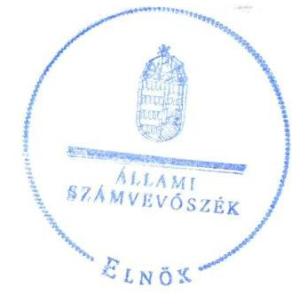
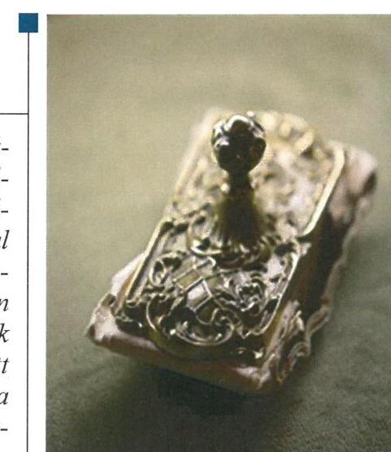
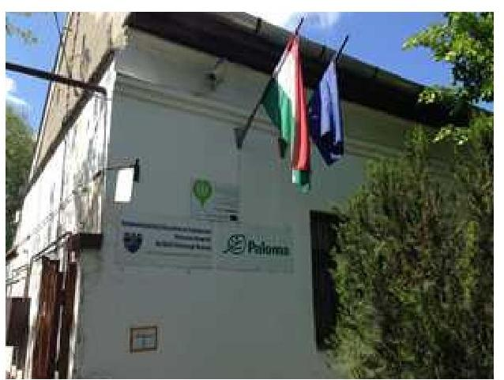
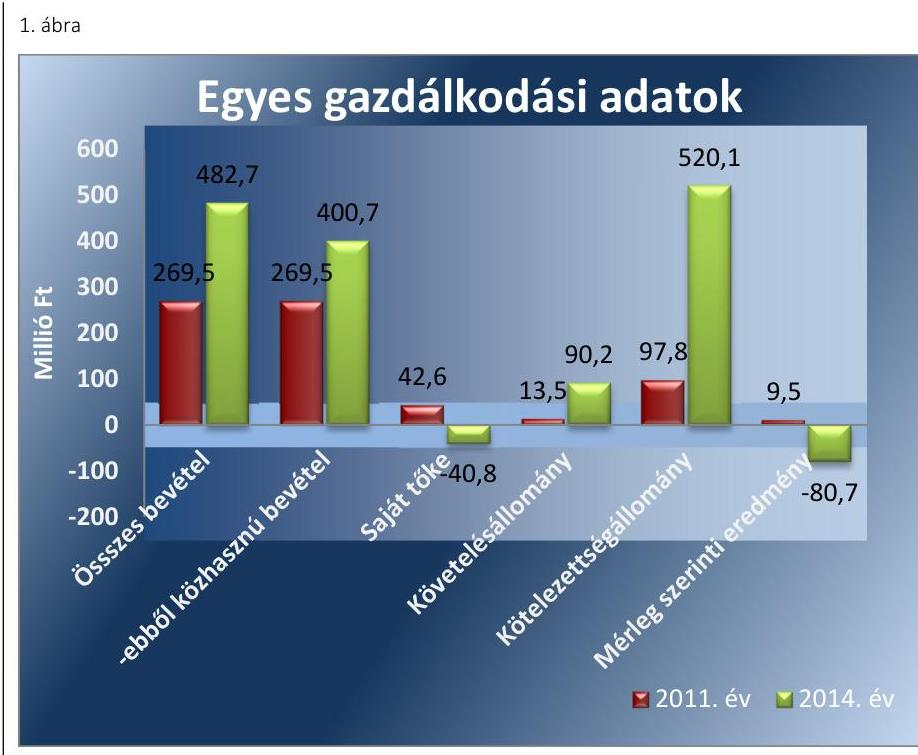

# Jelentés 

## Az önkormányzatok gazdasági társaságai

Az önkormányzatok többségi tulajdonában lévő gazdasági társaságok gazdálkodásának ellenőrzése - HÓDFÓ Hódmezővásárhelyi Foglalkoztató Közhasznú Nonprofit Kft. 2016.

Az ÁSZ az államháztartáson kívül müködő közfel-adat-ellátó rendszerek ellenőrzéseivel hozzájárul ahhoz, hogy a közpénzeket az államháztartáson kívül müködő szervezetek is átlátható, rendezett módon használják fel a közfeladatok ellátása érdekében.

---

# Jelentés 

## Az önkormányzatok gazdasági társaságai

Az önkormányzatok többségi tulajdonában lévő gazdasági társaságok gazdálkodásának ellenőrzése - HÓDFŐ Hódmezővásárhelyi Foglalkoztató Közhasznú Nonprofit Kft.
2016. decemásor hó 15. nap

16194
www.asz.hu

## 

---

# AZ ELLENŐRZÉST FELÜGYELTE:

DR. HORVÁTH MARGIT felügyeleti vezető

## AZ ELLENŐRZÉST VEZETTE ÉS A VÉGREHAJTÁSÁÉRT FELELŐS:

- KLINGA LÁSZLÓ ellenőrzésvezető
- A PROGRAM ÖSSZEÁLLÍTÁSÁÉRT FELELŐS:
- JANIK JÓZSEF osztályvezető

IKTATÓSZÁM: V-1087-156/2016.

TÉMASZÁM: 2121

ELLENŐRZÉS-AZONOSÍTÓ SZÁM: V-070751

Jelentéseink az Országgyűlés számítógépes hálózatán és az Interneta a www.asz.hu címen is olvashatóak.

---

# TARTALOMJEGYZÉK 

■ ÖSSZEGZÉS ..... 5
■ AZ ELLENŐRZÉS CÉLJA ..... 7
■ AZ ELLENŐRZÉS TERÜLETE ..... 8
■ AZ ELLENŐRZÉS HÁTTERE, INDOKOLTSÁGA ..... 10
■ A JELENTÉS LÉNYEGES KÉRDÉSKÖREI ..... 11
■ ELLENŐRZÉS HATÓKÖRE ÉS MÓDSZEREI ..... 12
■ MEGÁLLAPÍTÁSOK ..... 14
■ JAVASLATOK ..... 27
■ MELLÉKLETEK ..... 29
I. Sz. melléklet: Értelmező szótár ..... 29
II. Sz. melléklet: Múködési adatok ..... 32
III. Sz. melléklet: Mintavételi eljárások ellenőrzési területenként ..... 33
■ FÜGGELÉK: ÉSZREVÉTELEK ..... 35
■ RÖVIDÍTÉSEK JEGYZÉKE ..... 37

---

.

---

# ÖSSZEGZÉS 

Az Állami Számvevőszék a kizárólagos önkormányzati tulajdonú HÓDFÓ Hódmezővásárhelyi Foglalkoztató Közhasznú Nonprofit Kft-nél a megváltozott munkaképességüek foglalkoztatása közfeladatának ellátását érintő gazdálkodási tevékenység 2011-2014 közötti szabályszerűségének ellenőrzése során megállapította, hogy a közfeladat-ellátás önkormányzati megszervezése szabályosan történt. A tulajdonosi jogok gyakorlása szabályszerű volt. A vagyongazdálkodás során nem érvényesültek teljes körüen a belső szabályozások előírásai. A közfeladat bevételeinek, anyagjellegú ráfordításainak, valamint a beruházások, felújítások és az értékcsökkenési leírás elszámolása megfelelő volt. Az alkalmazott árak önköltségszámitással nem voltak megalapozva.

## Az ellenőrzés társadalmi indokoltsága

Az Állami Számvevőszék kiemelt célja, hogy a helyi önkormányzatok gazdálkodásában rejlő pénzügyi kockázatok feltárásával, az államháztartáson kívülre nyújtott költségvetési támogatások és ingyenes vagyonjuttatások, valamint az államháztartáson kívül múködő feladat-ellátó rendszerek ellenőrzéseivel hozzájárul ahhoz, hogy a közpénzeket az államháztartáson kívül múködő szervezetek is átlátható, rendezett módon használják fel.

Magyarországon az intézmény-centrikus közfeladat-ellátás jellemző, de egyre jelentősebb a költségvetésen kívüli feladatellátás térnyerése. Ennek legfontosabb szereplői - a nonprofit szervezetek mellett - az önkormányzati tulajdonú gazdasági társaságok. Az önkormányzatok szervezetalakítási szabadságának következménye, hogy a korábban is vállalati formában múködő közszolgáltatások mellett, mind a kötelező, mind az önként vállalt feladatok ellátásában a gazdasági társaságok kiemelt fontosságú szerephez jutottak.

## Főbb megállapítások, következtetések, javaslatok

Az Önkormányzat a megváltozott munkaképességűek foglalkoztatása közfeladatának megszervezéséről a jogszabályi előírásoknak megfelelően döntött, annak ellátásáról a kizárólagos tulajdonában lévő gazdasági társasága útján gondoskodott. Az Önkormányzat és a Társaság a 2007. évben Vagyonkezelési szerződés kötött egyes befektetett eszközök kezelésére. Az Önkormányzat a Vagyonrendeletben, valamint az Alapító Okiratban meghatározta a tulajdonosi joggyakorlás szabályait, azokat az elírásoknak megfelelően gyakorolta. Az ellenőrzött időszakban az Önkormányzat belső ellenőrzése a Társaságnál 2011-ben és 2014-ben végzett ellenőrzést, ezáltal támogatta a szabályszerű múködés kontrollját. Az Önkormányzatnak intézkedési kötelezettsége keletkezett a Társaság 2012-2014. évi vesztesége miatt, mivel ezekben az években a saját tőke a jegyzett tőke 50\%-át nem érte el. Az Önkormányzat a pótbefizetést teljesítette.

A Társaság - a számlarend kivételével - rendelkezett a Számv. tv. előírásainak megfelelő számviteli szabályzatokkal, azonban a 2012-2014. években a belső szabályait nem alakította ki oly módon, hogy azok a mérleg és eredménykimutatás alátámasztásán túlmenően a kiegészítő melléklet adatainak közvetlen alátámasztására is alkalmasak legyenek. A Leltározási szabályzat előírásának ellenére a tárgyi eszközöket a 2011. és a 2014. évben, az ingatlanokat a 2013. évben mennyiségi felvétellel nem leltározták. A HÓDFÓ Nonprofit Kft. nem tartotta be a Vagyonkezelési szerződésben foglaltakat, mivel a vagyonkezelt eszközökre elszámolt értékcsökkenésnek megfelelő összeget nem fordította az eszközök pótlására, karbantartására. A rövid lejáratú kötelezettségek határidőben történő teljesítése 2012. július 1-jétől nem volt biztosított, azok állománya a múködésre, a közfeladat ellátásra veszélyt jelentett.

A HÓDFÓ Nonprofit Kft. az éves gazdálkodásról az éves beszámolók keretében beszámolt a tulajdonos felé a Számv. tv.-ben előírtaknak megfelelően. Az éves beszámolók elfogadásáról a Közgyűlés a könyvvizsgáló és az FB írásbeli jelentésének birtokában határozott. Az Avtv.-ben, illetve az Info tv.-ben előírt, adatvédelmi és adatbiztonsági

---

szabályzat készítési kötelezettségnek nem tettek eleget, belső adatvédelmi felelőst nem neveztek ki, nem rendelkeztek a közérdekű adatok megismerésére irányuló igények teljesítésének rendjét rögzítő szabályzattal. A gazdálkodási adatokat sem a Társaság, sem az Önkormányzat honlapján nem szerepeltette. A Társaságnál a közfeladat bevételeinek és anyagjellegú ráfordításainak, továbbá a beruházások, felújítások és az értékcsökkenési leírás elszámolása megfelelő volt, figyelembe véve a jogszabályok és a belső szabályozás előírásait.

---

# AZ ELLENŐRZÉS CÉLJA 

pozottsága szabályszerű önköltségszámítással.

Az ellenőrzés célja annak értékelése, hogy az Önkormányzat vagyongazdálkodási tevékenysége során szabályszerűen gyakorolta-e tulajdonosi jogait.

Ellenőriztük, hogy a gazdasági társaság szabályozottsága, gazdálkodása és vagyongazdálkodási tevékenysége, bevételeinek és ráfordításainak elszámolása megfelel-e a jogszabályi és tulajdonosi előírásoknak.

Értékeltük továbbá, hogy a gazdasági társaság kötelezettségállománya jelentett-e kockázatot a múködésre, valamint a gazdálkodás átláthatósága és elszámoltathatósága érdekében biztosítva volt-e a szolgáltatás dijának megala-

---

# **AZ ELLENŐRZÉS TERÜLETE**

## **Hódmezővásárhely Megyei Jogú Város Önkormányzata és a kizárólagos tulajdonában lévő HÓDFÓ Hódmezővásárhelyi Foglalkoztató Közhasznú Nonprofit Kft.**

**HÓDMEZŐVÁSÁRHELY MEGYEI JOGÚ VÁROS ÖNKORMÁNYZATA** 2006. szeptember 1-jén hozta létre a Hódfó Szociális Foglalkoztató Közhasznú Társaságot, mely 2009-ben vált nonprofittá Hódfó Szociális Foglalkoztató Közhasznú Nonprofit Kft. néven. 2012. január 1-jétől a Társaság új neve Hódmezővásárhelyi Városellátó és Foglalkoztató Közhasznú Nonprofit Kft., 2015. november 26-ától HÓDFÓ Hódmezővásárhelyi Foglalkoztató Közhasznú Nonprofit Kft. lett. 2012. július 1-jével beolvadt a Társaságba az önkormányzati tulajdonú Hódmezővásárhelyi Városellátó és Beszerzési Közhasznú Kft. A Hódmezővásárhelyi Városellátó és Beszerzési Közhasznú Kft. beolvadását követően a Társaság tevékenységi köre jelentősen bővült, a megváltozott munkaképességűek foglalkoztatása mellett piacüzemeltetési, közterület parkolási, e.b. befogási feladatokat is ellátott az ellenőrzött időszakban.

**A HÓDFÓ HÓDMEZŐVÁSÁRHELYI FOGLALKOZTATÓ KÖZHASZNÚ NONPROFIT KFT.** közhasznú tevékenysége a hátrányos helyzetű csoportok társadalmi esélyegyenlőségének elősegítése, rehabilitációs foglalkoztatás, valamint a munkaerőpiacon hátrányos helyzetű rétegek képzésének, foglalkoztatásának elősegítése volt. A Társaság üzletszerű gazdasági tevékenységei többek között közúti árufuvarozás, ingatlankezelés, gépjárműkölcsönzés voltak. A megváltozott munkaképességű munkavállalókkal a Társaság döntően könyvkötészeti, illatosító tűzési, csomagolási, névjegykártya készítési, varrodai tevékenységeket látott el.

A Társaság 100%-ban Hódmezővásárhely Megyei Jogú Város Önkormányzatának tulajdonában volt a 2011-2014. években, jegyzett tőkéje 2012. július 1-jén változott, 3,0 millió Ft-ról a Hódmezővásárhelyi Városellátó és Beszerzési Közhasznú Kft. beolvadásával 40,0 millió Ft-ra emelkedett. A 40,0 millió Ft jegyzett tőke 10,6 millió Ft pénzbeli betétből és 29,4 millió Ft apportból állt.

Hódmezővásárhely város lakossága 2015. január 1-jén 44 795 fő volt. A HÓDFÓ Hódmezővásárhelyi Foglalkoztató Közhasznú Nonprofit Kft.-nél foglalkoztatottak átlagos statisztikai állományi létszáma a 2011. évben 208 fő, a 2014. évben 270 fő, ebből a megváltozott munkaképességűek átlagos állományi létszáma 184 fő, illetve 254 fő volt.

A HÓDFÓ Hódmezővásárhelyi Foglalkoztató Közhasznú Nonprofit Kft. gazdálkodásának főbb adatait a 2011-2014. évek vonatkozásában az 1. ábra szemlélteti.

---

Forrás: a Társaság éves beszámolói

Az összes bevétel az ellenőrzött időszakban kedvezően alakult, 2014-re 79,1\%-kal nőtt 2011-hez képest, ezen belül a közhasznú bevétel kisebb mértékben, 67,2\%-kal emelkedett. A bevétel növekedéssel együtt a követelések állománya is nőtt, közel 7-szeresére. 2011-ben az összes követelés 95,1\%-a volt vevőkövetelés, 2014-ben ennek aránya 79,5\%-ot tett ki. A kötelezettségek kedvezőtlen irányba változtak, 5,3-szorosára nőttek, amelyen belül a legnagyobb arányt a szállítói tartozás és a kölcsöntartozás tette ki. A saját tőke és a mérleg szerinti eredmény, valamint a kötelezettségek kedvezőtlen alakulását a Hódmezővásárhelyi Városellátó és Beszerzési Közhasznú Kft. beolvadása befolyásolta.

Az ellenőrzött időszakban a polgármester személye változott. A polgármester a 2012. évi időközi választás óta látja el feladatát. A jegyző személyében nem történt változás, 2001. szeptember 7-étől tölti be tisztségét. Az ügyvezető személye egy alkalommal változott, 2011. január 1. és 2011. október 6. között egy, 2011. október 7-étől 2011. december 31-éig kettő, majd 2012. január 1-jétől ismét egy ügyvezetője volt a Társaságnak.

A Társaság múködésének főbb jellemzőit a 2. számú melléklet mutatja be.

---

# AZ ELLENŐRZÉS HÁTTERE, INDOKOLTSÁGA 

Az önkormányzatok közfeladat-ellátásában egyre jelentősebb a gazdasági társaságok útján történő feladatellátás térnyerése.

AZ ÖNKORMÁNYZATI TULAJDONÚ GAZDASÁGI TÁRSASÁGOK teljes körű ellenőrzésének lehetőségét az Állami Számvevőszékről szóló 1989. évi XXXVIII. törvény 2011. január 1-jétől hatályos módosítása teremtette meg. Az önkormányzati tulajdonú gazdasági társaságok ellenőrzése kiemelten fontos a vagyon megőrzése, megóvása érdekében, valamint a kormányzati szektor elszámolásaiban megjelenő önkormányzati tulajdonú gazdálkodó szervezetek esetében, amelyekkel szemben alapvető követelmény, hogy gazdálkodásuk, működésük szabályszerű, az általuk szolgáltatott adatok minél megbízhatóbbak legyenek. A feladat/közfeladat ellátás költségeinek, ráfordításainak alakulása, színvonala hatással van a lakosság elégedettségére.

## AZ ELLENŐRZÉS VÁRHATÓ HASZNOSULÁSA-

KÉNT az ÁSZ ${ }^{1}$ a megállapításaival segítséget nyújthat az államháztartáson kívüli közfeladat-ellátás értékeléséhez, jogszabályi keretei pontosításához, átláthatóságot biztosító szabályozásához. Meghatározhatóvá válnak az önkormányzati feladatellátásban részt vevő államháztartáson kívüli szervezeteknek - az önkormányzat költségvetését, pénzügyi helyzetét is befolyásoló - kockázatai, lehetővé válik ezen kockázatok csökkentése. Ellenőrzéseink feltárhatják, hogy az önkormányzat feladat-ellátási kötelezettségének szabályszerűen tett-e eleget, a feladatellátáshoz rendelt vagyonkezelésbe vett és saját vagyon működtetését az elvárható gondossággal, szabályszerűen szervezte-e meg és a tulajdonosi felügyelete hozzájá-rult-e a feladatellátásához. Értékelhetővé válik, hogy a gazdasági társaság a feladat-ellátási, közszolgáltatási szerződésben foglaltak betartásával, a vagyon használatával biztosította-e a szolgáltatás folytatásának feltételeit. Ezzel az ellenőrzöttek és a helyi döntéshozók számára az ÁSZ visszajelzést ad feladatszervezési, feladat-ellátási kockázataikról, alapot ad a meglévő hibák megszüntetéséhez, a jobb feladat-ellátás biztosításához. Mindezeken keresztül az ÁSZ hozzájárul Magyarország közpénzügyi helyzetének javításához, a közpénzek mérhető módon történő, a döntéshozók által meghatározott célok szerinti felhasználásához.

---

# A JELENTÉS LÉNYEGES KÉRDÉSKÖREI 

1. Az önkormányzat közfeladat megszervezéséről szóló döntése, valamint tulajdonosi joggyakorlása szabályszerű volt-e?
2. A gazdasági társaság vagyongazdálkodása szabályszerű volt-e, kötelezettségállománya jelentett-e kockázatot a müködésre, illetve a közfeladat ellátásra?
3. A gazdasági társaságnál az ellátott közfeladat bevételei és ráfordításai elszámolása, valamint az önköltségszámítás és árképzés szabályszerű volt-e?

---

# ELLENŐRZÉS HATÓKÖRE ÉS MÓDSZEREI 

## Az ellenőrzés típusa

Megfelelőségi ellenőrzés

## Az ellenőrzött időszak

A 2011. január 1-jétől 2014. december 31-éig terjedő időszak.

## Az ellenőrzés tárgya

A gazdasági társaság feletti tulajdonosi joggyakorlás, valamint a gazdasági társaság gazdálkodásának szabályozottsága és szabályszerűsége.

Az ellenőrzés kiterjed minden olyan körülményre és adatra, amely az ÁSZ jogszabályban meghatározott feladatainak teljesítéséhez, valamint a program végrehajtása folyamán felmerült újabb összefüggések feltárásához szükséges.

## Az ellenőrzött szervezet

Hódmezővásárhely Megyei Jogú Város Önkormányzata és a HÓDFŐ Hódmezővásárhelyi Foglalkoztató Közhasznú Nonprofit Kft.

## Az ellenőrzés jogalapja

Az ellenőrzés végrehajtásának jogszabályi alapját az Állami Számvevőszékről szóló 2011. évi LXVI. törvény 5. § (3)-(4)-(5) bekezdései képezték.

## Az ellenőrzés módszerei

Az ellenőrzést a nemzetközi standardokat irányadónak tekintve az ellenőrzési program ellenőrzési kérdései, az ellenőrzött időszakban hatályos jogszabályok, az ellenőrzés szakmai szabályok és módszertanok figyelembe vételével végeztük.

Az ellenőrzés ideje alatt az ellenőrzött szervezettel történő kapcsolattartást az ÁSZ Szervezeti és Múködési Szabályzatának vonatkozó előírásai alapján biztosítottuk.

Az ellenőrzés a kiválasztott, tulajdonosi jogokat gyakorló önkormányzatra, illetve az ellenőrzésre kijelölt gazdasági társaságra terjedt ki.

---

Az ellenőrzési kérdések megválaszolásához szükséges bizonyítékok megszerzése a következő ellenőrzési eljárások alkalmazásával történt: megfigyelés, kérdésfeltevés (információkérés), összehasonlítás, valamint elemző eljárás. Az ellenőrzési bizonyítékként felhasználható adatforrások közé tartoztak egyrészt a szakmai programban felsorolt adatforrások, másrészt adatforrás lehetett még minden - az ellenőrzés folyamán - feltárt, az ellenőrzés szempontjából információkat tartalmazó dokumentum.

Az ellenőrzést a kérdésekre adott válaszok kiértékelésével, valamint a megjelölt adatforrások, a csatolt tanúsítványok felhasználásával, továbbá az adott időszakban hatályos jogszabályok figyelembe vételével folytattuk le.

A bevételek és ráfordítások elszámolását véletlen mintavétellel, a vagyonnyilvántartás terén a beruházások és felújítások elszámolását teljes körűen ellenőriztük. A mintavétellel ellenőrzött területek esetében minden egyes tétel vonatkozásában a szabályszerűségre vonatkozó kérdéseket tettünk fel, amelyek eredménye összesítésre került. Megfelelőnek értékeltünk egy ellenőrzött területet, amennyiben 95\%-os bizonyossággal a teljes sokaságban a hibaarány legfeljebb 10\%, nem megfelelőnek, amenynyiben 10\%-nál magasabb arányt képviselt. Abban az esetben, ha a teljes sokaság tekintetében a 10\%-os hibaarányhoz való viszony megítélésnek megbízhatósága nem érte el a 95\%-ot, annak elérése érdekében értékelésünket további szempontokkal egészítettük ki, és figyelembe vettük a feltárt hibák típusát és súlyát. A ráfordítások elszámolására vonatkozó véletlen mintavételt kockázati alapú kiválasztással egészítettük ki, amelynek során évente a három legnagyobb összegű tételt választottuk ki. A mintavételi eljárások ellenőrzési területenként történő bemutatását a III. számú melléklet tartalmazza.

---

# 1. Az önkormányzat közfeladat megszervezéséről szóló döntése, valamint tulajdonosi joggyakorlása szabályszerű volt-e? 

Összegző megállapítás

Az Önkormányzat a jogszabályok és a helyi szabályozások betartásával szervezte meg a megváltozott munkaképességúek foglalkoztatását, a tulajdonosi jogokat szabályszerűen gyakorolta.

### 1.1. számú megállapítás

Az Önkormányzat a közfeladat-ellátást szabályszerűen szervezte meg, a Társasággal határozatlan időre vagyonkezelési szerződést kötött.

Hódmezővásárhely hosszú távú gazdaságfejlesztési lehetőségeit és törekvéseit - az Ötv. ${ }^{2}$ 91. § (6) bekezdését, 2013. január 1-jétől az Mötv. ${ }^{3}$ 116. § (3)-(4) bekezdéseiben foglaltaknak eleget téve - a Gazdaságfejlesztési Stratégiai Program tartalmazta, amelyet a 2005-2013. évekre vonatkozóan készítettek el. A felülvizsgálatot követő módosítás megtörtént a 2011. évben, amely megfelelt az Ötv. 91. § (7) bekezdésében előírtaknak. A Gazdaságfejlesztési Stratégiai Program az általános foglalkoztatással kapcsolatban bővítést irányzott elő, a megváltozott munkaképességúek foglalkoztatására vonatkozóan feladatokat, célokat nem tartalmazott.

Az Önkormányzat ${ }^{4}$ a 2013. évtől rendelkezett az Nvtv ${ }^{5}$. 9. § (1) bekezdésében foglalt előírás szerint közép- és hosszú távú vagyongazdálkodási tervvel, azonban ez sem tartalmazott a Társasággal kapcsolatos célokat, feladatokat.

Az Önkormányzat a vagyonnal való gazdálkodás feladatait, annak kereteit a többször módosított Vagyonrendeletben ${ }^{6}$ határozta meg. Az SzMSz ${ }^{7}$ a HÖDFÖ Nonprofit Kft. ${ }^{8}$ feladataként tartalmazta a kötelező feladatok között a „helyi közterületek fenntartása"-t, valamint az önként vállalt feladatok között a „közhasználatú zöldterületek fenntartása ás üzemeltetése, fizető parkoló-hálózat müködtetése"-t.

Az Önkormányzat a megváltozott munkaképességűekkel kapcsolatos közfeladat ellátási kötelezettségének 2011. január 1. és 2014. december 31. között a 100\%-os tulajdonában lévő HÖDFÖ Nonprofit Kft.-n keresztül tett eleget. A közfeladat-ellátás választott módjáról az Önkormányzat az ellenőrzött időszak előtt döntött az Ötv. 8. § (1) bekezdésében foglalt kötelezettsége alapján, a foglalkoztatás megoldása kapcsán. A hátrányos helyzetú csoportok, rétegek foglalkoztatásának, valamint társadalmi esélyegyenlőségének elősegítése, illetve reszocializációja iránti szükséglet olyan társadalmi közös szükségletből ered, amelynek kielégítése állami feladat és amelynek megoldásában a települési önkormányzat közreműködik. Az Önkormányzat és a Társaság ${ }^{9}$ között a közfeladat ellátására szerződés nem jött létre, arra a feleket jogszabályi előírás nem kötelezte. Rendeletalkotási

---

#### Abstract

kötelezettsége az Önkormányzatnak a Társaság megváltozott munkaképességűek foglalkoztatásával kapcsolatos működésére, tevékenységére vonatkozóan nem volt.

Az Önkormányzat az Alapító Okiratban ${ }^{10}$ és a Vagyonrendeletben az ellenőrzési és beszámolási kötelezettséget a Számv. tv. ${ }^{11}$ 8. § szerinti beszámolóra vonatkozóan írta elő.

AZ ALAPÍTÓ OKIRAT - a Gt. ${ }^{12}$ 19. § (5) bekezdésének, 2014. március 15 -étől a Ptk. ${ }^{13}$ 3:109. § -ának megfelelően - az Önkormányzat kizárólagos hatáskörébe sorolta az éves beszámoló elfogadását, a felügyelő bizottság tagjainak, az ügyvezetőnek és a könyvvizsgálónak megválasztását, visszahívását, díjazásának megállapítását, a közhasznúsági jelentés elfogadását. Továbbá olyan szerződések megkötésének jóváhagyását, amelynek értéke a törzstőke legalább egynegyedét meghaladta, illetőleg amelyet a Társaság ügyvezetőjével vagy azok közeli hozzátartozójával kötöttek. Az ügyvezető kötelezettségei között előírta az éves beszámoló előkészítését, valamint annak Közgyűlés elé terjesztését.

VAGYONKEZELÉSI SZERZŐDÉS ${ }^{14}$ jött létre 2007. július 1jén a HÓDFŐ Nonprofit Kft. jogelődje és az Önkormányzat között, amelynek alapján 93 db befektetett eszköz (ingatlanok, műszaki és egyéb gépek, berendezések) összesen 81,0 millió Ft értékben az az Ötv. 80/A. §-ában* foglaltak alapján, ingyenesen és határozatlan időre a Társaság vagyonkezelésébe került. A Vagyonkezelési szerződés rögzítette a vagyonkezelőt megillető tulajdonosi jogokat, és a tulajdonost terhelő kötelezettségeket. Az önkormányzati vagyon nyilvántartására vonatkozó előírásoknak megfelelően a Társaságnak adatszolgáltatási és nyilvántartási kötelezettsége állt fenn a vagyonkezelésbe kapott eszközök vonatkozásában.

# 1.2. számú megállapítás 

A tulajdonosi joggyakorló a közfeladat-ellátással kapcsolatos döntések esetében érvényesítette a tulajdonosi jogait, ellenőrzéseket végzett. A tulajdonosi jogok gyakorlása szabályszerű volt.

## A TULAJDONOSI JOGOK GYAKORLÁSÁNAK

RENDJÉT az Önkormányzat a Vagyonrendeletben, és a Társaság Alapító Okiratában határozta meg. Az Önkormányzatot megillető tulajdonosi jogok gyakorlásával kapcsolatos feladatok és jogosultságok a Közgyűlést illették meg, amelyeket a Vagyonrendeletben meghatározott esetekben a polgármesterre ruházott át. Az önkormányzati tulajdonú gazdálkodó szervezetek forgalomképes tulajdoni részesedéseinek elidegenítése, megterhelése, illetőleg jogi sorsukat érintő egyéb rendelkezések kérdésében a tulajdonosi jogokat nettó 10,0 millió Ft értékhatárig átruházott hatáskörben a polgármester gyakorolhatta. A Társaság vonatkozásában a tulajdonosi jogokat szabályszerűen, a Vagyonrendelet, illetve az Alapító Okirat előírásai szerint gyakorolták. Szabálytalan hatáskör delegálás nem volt.

AZ FB az ellenőrzött időszakban rendelkezett az Önkormányzat által jóváhagyott ügyrenddel a Gt. 34. §. (4) bekezdése, valamint a

[^0]
[^0]:    * 2014. december 31-étől az Mötv. 108. § (2) bekezdése.

---

Ptk. 3 3:122. § (3) bekezdése értelmében. Az FB az ügyrendjében és az Alapító Okiratban előírtaknak megfelelően három tagból állt, amely megfelelt a Gt. 34. § (1) bekezdésében, valamint a Ptk. 3 3:121. § (1) bekezdésében előírt rendelkezéseknek. Az FB az ellenőrzött időszak alatt teljesítette az ügyrendben előírt, legalább háromhavonkénti ülés megtartására vonatkozó kötelezettségét. Az FB a 2011-2014. években a Gt. 35. § (3) bekezdésében, illetve a Ptk. 3 3:121. § (2) bekezdésének megfelelően minden évben írásbeli jelentést készített a Társaság számviteli beszámolójáról.

A tulajdonosi joggyakorlás az FB és a könyvvizsgáló tevékenységéhez kapcsolódóan szabályszerű volt. Az FB tagokat, valamint a könyvvizsgálót az Önkormányzat választotta.

A megváltozott munkaképességűek foglalkoztatásának tevékenységével kapcsolatos árképzés szabályait a Társaság vonatkozásában jogszabály nem írta elő. A tulajdonosi joggyakorló az ellenőrzött időszakban nem rendelkezett az értékesített termékek díjának megállapítására vonatkozó díjkoncepcióval, rendeletben, vagy belső szabályzatban nem szabályozta a díjmegállapítás feladatait, hatásköreit, módszerét, eljárásrendjét.

A BESZÁMOLTATÁSI RENDSZER keretében az Önkormányzat a 2011-2014. években beszámoltatta a Társaságot a gazdálkodásról, a szakmai tevékenységéről. A Közgyűlés az Alapító Okiratban foglalt hatáskörénél fogva minden évben határozattal fogadta el a beszámolókat, miután azokat az FB megtárgyalta és elfogadásra javasolta. A 2011. évről a Számv. tv. 9. § (2) bekezdésében előírtaknak megfelelően egyszerűsített éves beszámolót készítettek. A 2012-2014. évekről - mivel a mérlegfőöszszeg meghaladta az 500,0 millió Ft-ot, a foglalkoztatottak száma pedig az 50 főt - a Számv. tv. 9. § (1) bekezdésében foglaltak szerinti éves beszámoló készült, amelynek az üzleti jelentés is része volt. A számviteli beszámolókat a megválasztott könyvvizsgáló minden évben felülvizsgálta. A könyvvizsgáló a 2012-2014. években a független könyvvizsgálói jelentésében figyelemfelhívással élt a Számv. tv. 156. § (5) bekezdés g) pontjának megfelelően. Ezekben felhívta a figyelmet, hogy a Társaság saját tőkéje a jegyzett tőke alá esett, ezért a tulajdonosnak intézkedési kötelezettsége keletkezett. A 2011-2013. évi számviteli beszámolókhoz csatolták a Gt. 40. § (1) bekezdésében, a 2014. évi beszámolóhoz a Ptk. 3 3:129. § (1) bekezdésében előírt könyvvizsgálói jelentéseket.

A HÓDFŐ Nonprofit Kft. kötelezett volt a Khtv. ${ }^{15}$ 19. §. (1) bekezdése szerint közhasznúsági jelentést, valamint a Civil tv. ${ }^{16}$ 29. §. (3) bekezdése alapján közhasznúsági mellékletet készíteni. A Társaság ezeket elkészítette, és a tulajdonosnak megküldte az éves beszámolókkal együtt.

A Vagyonkezelési szerződésben előírták, hogy az elszámolt és a bevételekben megtérülő értékcsökkenés összegéről évente be kell számolnia a Társaságnak, valamint a tárgyévet követő február 15-éig a vagyonkezelésbe vett eszközök állapotáról a jegyző által meghatározott módon és formában adatot kell szolgáltatnia, mely előírásnak nem tettek eleget.

A TÁRSASÁG BELSŐ ELLENŐRZÉSÉT az Önkormányzat Polgármesteri Hivatalának Belső Ellenőrzési Irodája végezte, a Ber. ${ }^{17}$ 21. §. (1)-(2) és a Bkr. ${ }^{18} 22$. § (1) bekezdés b) pontjában előírt kockázatelemzésen alapuló éves ellenőrzési terv alapján. A belső ellenőrzési ter-

---

veket az Ötv. 92. § (6) bekezdésében, illetve az Mötv. 119. § (5) bekezdésében megjelölt határidőn belül jóváhagyta a Közgyűlés. Az éves ellenőrzési tervek közül a 2011. és a 2014. évi tartalmazott a Társaságnál végrehajtandó ellenőrzést, melyet lefolytattak. 2011-ben a vevői- és szállítói-, valamint az anyag- és eszközállományt ellenőrizték. Az ellenőrzési jelentés közfeladat-ellátásra vonatkozó javaslatot nem tartalmazott. A 2014. évben a gazdálkodás ellenőrzése történt meg. A közfeladat-ellátásra vonatkozó javaslat négy darab volt. A javaslatok a Szervezeti és Múködési Szabályzat aktualizálására, a szigorú számadású nyomtatványokról teljes körű nyilvántartás vezetésére, a nyilvántartás folyamatos oldalszámozására, a felhasználás kezdő időpontjában a jogosult személy hitelesítésére vonatkoztak. Az ügyvezető az intézkedési tervet elkészítette, az abban vállalt feladatok végrehajtásáról beszámolt. A Ber. 31. § (1)-(3), valamint a Bkr. 49. § (3) bekezdésében előírtaknak megfelelően a polgármester a Közgyűlés elé terjesztette a belső ellenőrzési tevékenységről szóló éves ellenőrzési jelentéseket. A beszámolók tartalmazták a Társaságnál végzett ellenőrzéseket. A Közgyűlés az éves ellenőrzési jelentéseket határozataival jóváhagyta.

Az Önkormányzat az ellenőrzött időszakban a megváltozott munkaképességűek foglalkoztatására irányuló ellenőrzésre külső szakértőt nem bízott meg.

KÜLSŐ ELLENŐRZÉS huszonkettő esetben volt a Társaságnál az ellenőrzött időszakban. Tizenegy esetben a MÁK ${ }^{19}$ végzett ellenőrzést a rehabilitációs költségvetési támogatásokkal kapcsolatban. A Nemzeti Rehabilitációs és Szociális Hivatal négy esetben tartott ellenőrzést. Az ellenőrzések az akkreditált követelmények betartására, valamint a foglalkoztatási kötelezettség betartására irányultak. A Csongrád Megyei Kormányhivatal Nyugdíjbiztosítási Igazgatósága, Munkaügyi Felügyelősége, valamint a Népegészségügyi Intézménye egy-egy alkalommal tartott ellenőrzést. Az Európai Szociális Alap Nonprofit Kft. a Társadalmi Megújulás Operatív Program keretében kiírt pályázatot ellenőrizte. A MÁK és a Nemzeti Rehabilitáció és Szociális Hivatal három alkalommal együtt végzett komplex ellenőrzést. A külső ellenőrzéseknek közfeladat-ellátásra vonatkozó javaslata nem volt.

# INTÉZKEDÉS MEGTÉTELE VÁLT SZÜKSÉGESSÉ a 

Gt. 143. § (2) bekezdés a) pontja, illetve a Ptk. 3 :189. § (1) bekezdése szerint, mivel a Társaság mérleg szerinti eredménye, illetve saját tőkéje a 2011. év kivételével negatív volt, a saját tőke a 2012-2014. években a jegyzett tőke 50\%-át nem érte el. A veszteség rendezésére a Közgyűlés pótbefizetésekről döntött.

A 2013. évben 42,9 millió Ft pótbefizetésről döntöttek, melyet az Önkormányzat a Gt. 143. § (3) bekezdésében foglalt előírás ellenére - mely szerint a határozatokat legkésőbb három hónapon belül végre kell hajtani - határidőben nem teljesített, illetve a pótlás is csak 13,9 millió Ft-ban valósult meg. A különbözetet ( 29,0 millió Ft-ot) a következő évben biztosította az Önkormányzat. A 2014. évben 32,9 millió Ft pótbefizetést rendeltek el, melyet teljesítettek.

Az Önkormányzat bankgarancia megbízási szerződést kötött egy bankkal 2007. augusztus 14-én, 14,4 millió Ft értékben, 2012. szeptember 13.ai lejárattal. A szerződésben szereplő összeg biztosítéka volt a „Munkate-

---

rület és fedett tárolóterületek rekonstrukciója, kis tehergépjármú, kompresszor beszerzése" tárgyú hatósági szerződés alapján új munkahelyek létesítéséhez igénybe vehető vissza nem térintendő támogatásnak. Beváltott kötelezettség nem volt az ellenőrzött időszakban.

Az Önkormányzat a 2011-2014. években összesen 206,7 millió Ft működési célú támogatást nyújtott a Társaságnak, amelyet bérkifizetésre, üzemanyag költségre, NAV ${ }^{20}$ tartozásra, közutak karbantartására használhattak fel. A 2014. évben fejlesztési céllal további 11,9 millió Ft összeggel támogatta az Önkormányzat a Társaságot. Múködésre a 2012. évtől kezdődően összesen 87,0 millió Ft kölcsönt kapott a Társaság, a kölcsönök visszafizetési határideje az adott év december 31.-e volt. A 2012-2014. években a múködésre folyósított kölcsönből 33,9 millió Ft-ot fizettek vissza határidőre, a 2014. év végén fennálló tartozás 53,1 millió Ft volt. Fejlesztési céllal a 2012-2013. évben 19,5 millió Ft kölcsönt nyújtott az Önkormányzat a Társaság részére, melyet részben címkezsinórozó gép vásárlására fordítottak. A kölcsönből 16,1 millió Ft-ot visszafizettek, a 2014. év végén fennálló tartozás 3,4 millió Ft volt.

# 2. A gazdasági társaság vagyongazdálkodása szabályszerű volt-e, kötelezettségállománya jelentett-e kockázatot a múködésre, illetve a közfeladat ellátásra? 

Összegző megállapítás

A Társaság vagyongazdálkodása - egyes belső szabályok előírásainak figyelmen kívül hagyása miatt - nem volt teljes körűen szabályszerű, kötelezettségállománya a múködésre, a közfeladat ellátásra kockázatot jelentett.
2.1. számú megállapítás

A Társaság az előírt számviteli szabályzatokkal - a számlarend kivételével - rendelkezett. A belső szabályok nem voltak alkalmasak a kiegészítő melléklet adatainak közvetlen alátámasztására.

AZ ÜZLETI TERV készítésének kötelezettségét az Önkormányzat éves munkaterveiben írta elő. A Társaság az éves üzleti terveket az ellenőrzött időszakban elkészítette, az FB és a Közgyűlés azokat megtárgyalta és határozataiban elfogadta. Az üzleti tervekben bemutatták a Társaság tevékenységét, a foglalkoztatottak összetételét, a közhasznú tevékenység várható bevételeit, költségeit és ráfordításait Az üzleti terv részét képező termelési és költéstervben kitértek a végzett tevékenységre, a célokra. Különválasztották a támogatott és nem támogatott költségeket, kimutatták a forráshiányt, amelyre az Önkormányzattól támogatást igényeltek.

A Társaság rendelkezett a Számv. tv. 14. § (3) bekezdésében előírt számviteli politikával, valamint a Számv. tv. 14. § (5) bekezdése előírásainak megfelelően eszközök és források leltárkészítési és leltározási, értékelési, valamint pénzkezelési szabályzattal. Nem rendelkezett azonban a Számv. tv. 161. § (1) bekezdésében előírt számlarenddel.

A SZÁMVITELI POLITIKÁT ${ }^{21}$ az ellenőrzött időszakban kétszer módosították, névváltozás és az ügyvezető személyében bekövetkezett változás miatt. A Számviteli politika a jelentős összegű hiba értékhatárát az

---

ellenőrzött üzleti év mérlegfőösszegének 2\%-ában határozta meg, amely megfelelt a Számv. tv. 3. § (3) bekezdés 3. pontja 2013. január 1-jétől hatályos módosításának. A Számviteli politika a vagyonkezelési szerződéssel összhangban előírta a vagyonkezelt eszközök elkülönített nyilvántartását és az Áht.; ${ }^{22}$ 105/A. § (11)-(15) bekezdéseinek, valamint az Mótv. 109. § (7) bekezdésének megfelelően a kapcsolódó bevételek és ráfordítások elkülönített elszámolását.

A LELTÁROZÁSI SZABÁLYZAT ${ }^{23}$ tartalmazta a leltározás előkészítésének feladatait, a leltározásért felelős személyeket, a leltározás módját, fordulónapját. A készletek és a tárgyi eszközök esetében évenkénti mennyiségi felvétellel történő leltározást írtak elő (az ingatlanokra három évenkéntit), mely megfelelt a Számv. tv. 2012. január 1-jétől hatályos 69. § (3) bekezdése előírásának. A Leltározási szabályzat a Társaság kezelésébe, tartós használatába adott befektetett és forgóeszközök, valamint a források egyeztetéssel történő leltározását írta elő.

AZ ÉRTÉKELÉSI SZABÁLYZAT ${ }^{24}$ a Számv. tv. 47. § előírásaival összhangban szabályozta az eszközök és források bekerülési értékét, az 55. § (1)-(2) bekezdésének megfelelően az értékvesztés elszámolásának szabályait, továbbá összhangban állt a Számv. tv. 57. § (1) bekezdésében foglalt elvekkel.

A PÉNZKEZELÉSI SZABÁLYZAT ${ }^{25}$ a Számv. tv. 14. § (8) bekezdésében előírt tartalmi követelményeknek megfelelt, rendelkezett többek között - a pénzforgalom lebonyolításának rendjéről, a pénzkezelés személyi és tárgyi feltételeiről, felelősségi szabályairól, a készpénzállomány ellenőrzéséről.

Az önköltségszámítási szabályzat készítésének kötelezettsége alól a Számv. tv. 14. § (6) bekezdése alapján mentesült a Társaság.

A Selejtezési szabályzat ${ }^{26}$-ban meghatározták a feleslegessé vált vagyontárgyak hasznosításával, leértékelésével és selejtezésével kapcsolatos feladatokat, előírták azok végrehajtásának ellenőrzési kötelezettségét.

A Társaság közhasznú tevékenysége mellett vállalkozási tevékenységet is folytatott. A Számlatükörben ${ }^{27}$ az egyes tevékenységek bevételeit elkülönítette, a költségek tevékenységenkénti elkülönítését azonban nem szabályozta.

A Társaság a 2012-2014. években a Számv. tv. 161/A. § (1) és (2) bekezdése előírása ellenére belső szabályait nem alakította ki oly módon, hogy azok a mérleg és eredménykimutatás alátámasztásán túlmenően a kiegészítő melléklet adatainak közvetlen alátámasztására is alkalmasak legyenek, továbbá a közpénzek felhasználásának és a köztulajdon használatának nyilvánossága és ellenőrizhetősége érdekében nem alakított ki olyan részletezettségű nyilvántartási (könyvvezetési) rendszert, melyből a vonatkozó külön jogszabályban meghatározott adatok rendelkezésre álltak.

A JAVADALMAZÁSI SZABÁLYZATOT ${ }^{28}$ a Társaság legfőbb szerve megalkotta, azt a 348/2013. (IX. 6.) számú határozatával jóváhagyta. A Társaság 2013. szeptember 6. előtt nem rendelkezett javadalmazási szabályzattal. A Javadalmazási szabályzat a Taktv. ${ }^{29}$ 5. § (3) bekezdésé-

---

# 2.2. számú megállapítás 

nek figyelembevételével készült. Hatálya kiterjedt a vezető tisztségviselőkre, az FB tagokra, vezető állású munkavállalókra valamint az Mt. ${ }^{30}$ 208. § hatálya alatt álló munkavállalókra.

## A Társaság vagyongazdálkodási tevékenysége - egyes belső szabályok előírásainak figyelmen kívül hagyása miatt - nem teljes körűen felelt meg. A 2012-2014. években nem rendelkeztek a társasági formájukra kötelezően előírt jegyzett tőkének megfelelő összegű saját tőkével.

A HÓDFÓ Nonprofit Kft. az eszközeiben és forrásaiban bekövetkezett változásokat a valóságnak megfelelően, folyamatosan, zárt rendszerben, áttekinthetően mutatta be a Számv. tv. 159. §-ában foglaltaknak megfelelően. A tárgyi eszközök nyilvántartása analitikus nyilvántartás keretében egyedi nyilvántartó kartonokon történt. A vagyonkezelésre átvett eszközöket a vagyonkezelői szerződésben előírtak alapján, a saját vagyontól elkülönítetten tartották nyilván.

LELTÁRRAL az éves beszámolók adatait alátámasztották. A főkönyvi könyvelés és az analitikus nyilvántartások közötti egyeztetést a mérleg fordulónapjára vonatkozón szabályszerűen elvégezték. A HÓDFÓ Nonprofit Kft. a saját eszközeiről év közbeni folyamatos mennyiségi nyilvántartást vezetett. A Társaság a 2011. évben csak a vagyonkezelésében lévő eszközöket leltározta mennyiségben, a 2012. és 2013. években a saját eszközei közül a gépeket, berendezéseket leltározta mennyiségben, a vagyonkezelt eszközök mennyiségi felvétellel való leltározása nem történt meg a vagyonkezelői szerződés 6. szakaszának i.) pontjában meghatározott határidőben. A 2014. évben a Számv. tv. 69. § (3) bekezdésében előírtak ellenére nem volt mennyiségi felvétellel történő leltározás sem a saját tulajdonú, sem a vagyonkezelt eszközöknél. A Társaság a Leltározási szabályzat 5.3. pontjának előírásait nem tartotta be, mivel a tárgyi eszközöket a 2011. és a 2014. évben, az ingatlanokat a 2013. évben mennyiségi felvétellel nem leltározta. A készleteket minden évben leltározták mennyiségben és értékben is. A Társaság éves beszámolóinak főbb mérlegadatait a 1. táblázat szemlélteti.

1. táblázat

A HÓDFÓ NONPROFIT KFT. FŐBB MÉRLEG ADATAI (MILLIÓ FORINT)

| Megnevezés | 2011.01.01. | 2011.12.31. | 2012.12.31. | 2013.12.31. | 2014.12.31. |
| :-- | :--: | :--: | :--: | :--: | :--: |
| Befektetett eszközök | 107,1 | 105,5 | 696,1 | 702,7 | 761,8 |
| - ebből: Tárgyi eszközök | 104,7 | 103,2 | 690,1 | 697,2 | 756,4 |
| Forgóeszközök | 46,7 | 56,4 | 53,3 | 92,3 | 131,9 |
| - ebből: Követelések | 13,5 | 20,0 | 43,0 | 79,7 | 90,2 |
| Aktív időbeli elhatárolások | 12,8 | 30,0 | 47,9 | 36,8 | 10,6 |
| ESZKÖZÖK ÖSSZESEN | 166,6 | 191,9 | 797,3 | 831,8 | 904,3 |
| Saját tőke | 42,6 | 72,7 | $-2,9$ | $-21,9$ | $-40,7$ |
| - ebből Jegyzett tőke | 3,0 | 3,0 | 40,0 | 40,0 | 40,0 |
| - ebből: Mérleg szerinti eredmény | 9,5 | 30,0 | $-53.5$ | $-32,9$ | $-80,7$ |
| Céltartalékok | 0 | 0 | 0 | 0 | 0 |
| Kötelezettségek | 97,8 | 97,2 | 396,9 | 425,8 | 520,2 |
| Passzív időbeli elhatárolások | 26,2 | 22,0 | 403,3 | 427,9 | 424,8 |
| FORRÁSOK ÖSSZESEN | 166,6 | 191,9 | 797,3 | 831,8 | 904,3 |

---

A VAGYONI HELYZETBEN érdemi változás 2012. július 1-jén a Hódmezővásárhelyi Városellátó és Beszerzési Közhasznú Kft. beolvadását követően következett be. A befektetett eszközök értéke a 2012. évi nyitó állományról év végére közel hétszeresére nőtt. A befektetett eszközök döntő részét a tárgyi eszközök képezték, $97 \%$ és $99 \%$ közötti arányt képviseltek az ellenőrzött időszakban. A forgóeszközök nagyobb részét a követelések tették ki, ennek aránya 68\% és 86\% között volt. Hazai/központi forrásból a 2011-2014. években a Társaság összesen 836,9 millió Ft normatív támogatásban részesült, a Munkaügyi Központtól a 2012. évben 0,2 millió Ft-ot, a 2013. évben 0,1 millió Ft-ot kapott.

A Hódmezővásárhelyi Városellátó és Beszerzési Közhasznú Kft. beolvadása után a saját tőke értéke negatív lett, a jegyzett tőke tizenháromszorosára nőtt. A kötelezettségek ugrásszerűen megnőttek, azok forrásokon belüli részaránya a 2014. évben volt a legmagasabb, 57,5\%. A kötelezettségeken belül a legnagyobb arányt a szállítói tartozás és a kölcsöntartozás tette ki.

A VAGYONKEZELÉSI SZERZŐDÉS 6. f) pontjában előírták a Társaság részére, hogy a vagyonkezelt eszközökre elszámolt értékcsökkenést, az eszközök felújítására, pótlására, karbantartására kell fordítani. A négy év során az elszámolt értékcsökkenés összege 7,1 millió Ft volt, a vagyonkezelt eszközök felújítására, pótlására, karbantartására nem költöttek, valamint nem képeztek céltartalékot az értékcsökkenésnek megfelelő összegben. Ezzel nem tartották be a vagyonkezelési szerződésben, 2011. december 31-éig az Áht.: 105/A. § (6) bekezdésében, valamint 2012. január 1-jétől az Mótv. 109. § (6) bekezdésében előírtakat.

A SAJÁT VAGYONT többször fejlesztették, pályázati forrásból nagy értékű beruházásokra került sor. A 2011. évben szerezték be a Renault Master tehergépkocsit nettó 5,8 millió Ft összegben, 2012-ben TÁMOP forrásból targoncát vásároltak nettó 5,3 millió Ft összegben, 2013-ban saját ingatlanukra riasztórendszert, tűzjelző rendszert és videó rendszert aktiváltak nettó 15,0 millió Ft értékben, valamint TÁMOP forrásból címkezsinórozó gépet vásároltak 17,3 millió Ft-ért.

A Társaság az ellenőrzött időszakban a vagyonkezelt eszközöket nem idegenítette el és nem terhelte meg. A saját vagyonból történt tárgyi eszközértékesítés. A befolyt bevételt az eszközök pótlására fordították.

Az Alapító Okirat X. g) pontja szerint, a törzstőke legalább egynegyedét meghaladó szerződések (2011-ben 750 ezer Ft-ot meghaladó) megkötése az alapító kizárólagos hatáskörébe tarozott. A 2011. évben egy tehergépkocsi vásárlásához az Alapító Okiratban foglaltak ellenére nem kértek hozzájárulást az alapítótól (a beszerzés értéke bruttó 7,3 millió Ft volt).

A Társaság az ellenőrzött időszakban nem tartozott a kormányzati szektorba sorolt társaságok közé. Nem minősült kormányzati alszektorba besorolt társaságnak, illetve egyéb szervezetnek, így az Ávr. ${ }^{31} 7$. számú melléklete 29. pontjában előírt bejelentési és adatszolgáltatási kötelezettsége nem keletkezett.

---

# 2.3. számú megállapítás 

A Társaság kötelezettségállománya 2012. július 1-jét követően veszélyt jelentett a müködésre, a közfeladat ellátására.

AZ ELADÓSODÁS MÉRTÉKE és szerkezete a Hódmezővásárhelyi Városellátó és Beszerzési Közhasznú Kft. beolvadása után veszélyt jelentett a müködésre, illetve a közfeladat ellátására. A

AZ ELADÓSODOTTSÁGI MUTATÓ értéke kedvezőtlenül alakult, a 2011. évben 0,51, a 2012. évben 0,50, a 2013. évben 0,51, a 2014. évben 0,58 volt, azonban nem érte el a kritikus 0,6-os értéket. Az eladósodottság mértéke hasonló képet mutatott, a mutató értéke az évek sorrendjében 1,34, -135,41, -19,43 és -12,79 volt, a 2012. évtől a negatív összegű saját tőke miatt az értéke is negatív lett. A mutató azt mutatja, hogy a Társaság a követelései behajtásával együtt sem lett volna képes saját tőkéjéből rendezni a tartozásait. A nettó eladósodottság mutatója arról nyújt információt, hogy a kintlévőségekkel csökkentett kötelezettségeket milyen mértékben fedezi saját forrás. A mutató értéke 2011-ben 1,06, 2012-ben -120,72, 2013-ban -15,79, 2014-ben -10,79 volt.

Az adósságfedezeti mutató I. értéke ingadozó volt, 1,0 Ft adósságra a 2011. évben 1,67 Ft, a 2012. évben 1,89 Ft, a 2013. évben 1,87 Ft és a 2014. évben 1,72 Ft vagyon jutott.

Az adósságfedezeti mutató II. értéke 2012. évben még magas volt $(7,39)$, mivel a beolvadó társaság vesztesége és kötelezettségállománya csak félévtől terhelte a Társaságot. A 2013. és 2014. években a mutató értéke alacsony volt ( $0,43 ; 0,80$ ), kedvezőtlen képet mutatott. Értéke 1,0 felett lett volna kedvező.

Az árbevételre vetített eladósodottság a 2011-2014. években kedvezőtlenül alakult, mértéke az évek sorrendjében 0,53, 2,26, 1,58 és 2,10 volt, melynek oka, hogy a kötelezettségek nagyobb ütemben növekedtek, mint a bevételek.

A kötelezettségek között kimutatott vagyonkezelt eszközök állománya befolyásolta a mutatókat.

## A HOSSZÚ LEJÁRATÚ KÖTELEZETTSÉGEKNEK az

ellenőrzött időszakban nem voltak esedékes törlesztő részletei. A Társaság a vagyonkezelt eszközeit tartotta nyilván, mint hosszú lejáratú kötelezettséget, illetve a 2012. évtől egyéb hosszú lejáratú kötelezettségként a Hódmezővásárhelyi Városellátó és Beszerzési Közhasznú Kft. piacüzemeltetési tevékenységéhez kapcsolódó bérlőktől kapott kauciókat.

A rövid lejáratú kötelezettségek összetételét és alakulását a 2. táblázat mutatja.
2. táblázat

A HÓDFÓ NONPROFIT KFT. RÖVID LEJÁRATÚ KÖTELEZETTSÉGEI (M FT)

| Megnevezés | 2011. | 2012. | 2013. | 2014. |
| :--: | :--: | :--: | :--: | :--: |
|  | 12.31. | 12.31. | 12.31. | 12.31. |
| Kötelezettségek, ebből | 97,2 | 386,9 | 425,8 | 520,2 |
| Rövid lejáratú kötelezettségek összesen | 18,8 | 318,1 | 347,08 | 441,38 |
| - rövid lejáratú kölcsönök | 0 | 180,1 | 188,0 | 210,5 |
| - vevöktől kapott előlegek | 0 | 0,2 | 0,08 | 0,08 |
| - szállítói kötelezettség összesen | 0 | 114,2 | 148,1 | 215,8 |
| - egyéb rövid lejáratú kötelezettségek | 18,8 | 23,6 | 10,9 | 15,0 |

A HÓDFÓ NONPROFIT KFT. RÖVID LEJÁRATÚ KÖTELEZETTSÉGEI (M FT)

| Megnevezés | 2011. | 2012. | 2013. | 2014. |
| :--: | :--: | :--: | :--: | :--: |
|  | 12.31. | 12.31. | 12.31. | 12.31. |
| Kötelezettségek, ebből | 97,2 | 386,9 | 425,8 | 520,2 |
| Rövid lejáratú kötelezettségek összesen | 18,8 | 318,1 | 347,08 | 441,38 |
| - rövid lejáratú kölcsönök | 0 | 180,1 | 188,0 | 210,5 |
| - vevöktől kapott előlegek | 0 | 0,2 | 0,08 | 0,08 |
| - szállítói kötelezettség összesen | 0 | 114,2 | 148,1 | 215,8 |
| - egyéb rövid lejáratú kötelezettségek | 18,8 | 23,6 | 10,9 | 15,0 |

---

# A RÖVID LEJÁRATÚ KÖTELEZETTSÉGEK határidőben történő teljesítése 2012. június 30 -áig biztosított volt, ezt követően a Társaság nem tudta tartani az előírt fizetési határidőket. A rövid lejáratú kötelezettségek állománya a négy év során folyamatosan nőtt, összetétele döntően önkormányzati kölcsönből és szállítói tartozásokból állt. A Társaság legjelentősebb szállítói tartozása minden évben az önkormányzati tulajdonú Hódmezővásárhelyi Vagyonkezelő Zrt. felé állt fenn, számviteli, munkaügyi, tűzvédelmi szolgáltatások miatt. A szállítói tartozások kifizetésével kapcsolatban átütemezésre nem került sor. A kötelezettségek állománya kockázatot jelentett a múködésre illetve a közfeladat-ellátásra.
2.4. számú megállapítás

A Társaság az előírt beszámolási, adatszolgáltatási kötelezettségeinek nem teljes körűen tett eleget. Jogszabályban előírt közzétételi kötelezettségének a gazdálkodási adatok tekintetében nem tett eleget.

## A BESZÁMOLÁSI, ADATSZOLGÁLTATÁSI ÉS EGYÉB TÁJÉKOZTATÁSI FELADATOKAT az Alapító

Okiratban, a Társaság SzMSz ${ }^{32}$-ében, a Számviteli politikában és a Vagyonkezelési szerződésben rögzítették. Az ügyvezető feladataként a beszámoló Közgyűlés elé történő előterjesztését írták elő. A vagyonkezelt eszközökkel kapcsolatos egyéb beszámolási kötelezettséget az Önkormányzat a Vagyonkezelési szerződésben írt elő a Társaság részére, amely az előírt kötelezettségeknek nem teljes körűen tett eleget. A Vagyonkezelési szerződés 6. i.) pontjában előírt adatszolgáltatást adott év február 15-éig - és azt követően -nem teljesítették, továbbá a vagyonkezelt eszközök vonatkozásában nem számoltak be arról, hogy az értékcsökkenés összegét mire fordították.

Az éves beszámolókat a Társaság a Számv. tv. 19. § (1) bekezdésében előírt tartalommal elkészítette, azokat elfogadásra a Közgyűlés elé terjesztette. A Társaság kötelezett volt a Khtv. 19. §. (1) bekezdése szerint közhasznúsági jelentés, valamint a Civil tv. 46. §. (1) bekezdése alapján közhasznúsági mellékletet készíteni. A jelentés és a mellékletek minden évben elkészültek, tartalmuk megfelelt a Khtv. 19. §. (3) bekezdésében, valamint a Civil tv. 29. §. (4)- (7) bekezdéseiben foglaltaknak.

A 2011-2013. évi számviteli beszámolókat, a közhasznúsági jelentést/mellékleteket a Társaság a Számv. tv. 153. § (1) bekezdésének, 154. § (1) bekezdésének és a Civil tv. 46. § (1) bekezdéseinek megfelelően határidőben letétbe helyezte és közzé tette. A 2014. évi beszámolót késve, 2015. június 2-án helyezték letétbe. ${ }^{\dagger}$

Az éves beszámolók elfogadásáról a Közgyűlés minden évben az FB határozatának és a könyvvizsgáló írásos jelentésének ismeretében döntött. A könyvvizsgáló az éves beszámolók elfogadásakor jelen volt a Közgyűlésen. Az FB az éves beszámolókról a Gt. 35. § (3) bekezdése, valamint a Ptk. ${ }_{2}$ 3:120. § (2) bekezdése előírásainak megfelelően elkészítette írásos jelentését. A könyvvizsgáló a 2012-2014. években felhívta a figyelmet arra, hogy a saját tőke értéke nem érte el a jegyzett tőke értékét, eleget téve ezzel a Számv. tv. 156. § (5) bekezdés g) pontjában előírtaknak.

[^0]
[^0]:    ${ }^{\dagger}$ A beszámoló letétbe helyezésének határideje 2015. május 31. volt.

---

Az FB és a könyvvizsgáló a közvagyon védelme, illetve más okból a Közgyűlés összehívását nem kezdeményezte. A 2012. I. féléves beszámoló elfogadása kapcsán az FB jelezte az Önkormányzatnak a Társaság nehéz pénzügyi, likviditási helyzetét. A jegyzőkönyvben javaslatot tettek új bevételi források feltárására.

Az Avtv. ${ }^{33}$ 31/A. § (2) bekezdés d) pontjában, illetve az Info tv. ${ }^{34}$ 24. § (3) bekezdésében előírt adatvédelmi és adatbiztonsági szabályzatkészítési kötelezettségének a Társaság a 2011-2014. évekre vonatkozóan nem tett eleget. Az Avtv. 31/A. § (1) bekezdés c) pontjában, valamint az Info tv. 24. § (1) bekezdés c) pontjában foglaltak ellenére a Társaságnál belső adatvédelmi felelőst nem neveztek ki.

A HÓDFÓ Nonprofit Kft. az ellenőrzött időszakban nem rendelkezett a közérdekú adatok megismerésére irányuló igények teljesítésének rendjét rögzítő szabályzattal, ezzel megsértette az Avtv. 20. § (8) bekezdésében, illetve az Info tv. 30. § (6) bekezdésében foglaltakat. A Társaság az Info. tv. 33. § (3) bekezdése szerinti elektronikus közzétételi kötelezettségének nem tett leget. Az Alapító Okirat X. fejezete az alapító feladatai közé sorolta a közzétételi kötelezettség ellátását. Ugyanakkor az Önkormányzat sem tett közzé közérdekú adatokat a Társaságról, így az Info tv. 37. § (1) bekezdésében előírtak alapján az 1. mellékletének III. fejezetében előírt gazdálkodási adatokat nem szerepeltették sem az Önkormányzat, sem a Társaság honlapján.

# 3. A gazdasági társaságnál az ellátott közfeladat bevételei és ráfordításai elszámolása, valamint az önköltségszámítás és árképzés szabályszerű volt-e? 

Összegző megállapítás

A bevételek, az anyagjellegú ráfordítások és a beruházások, felújítások elszámolása megfelelő volt.

## 3.1. számú megállapítás

A bevételek, az anyagjellegú ráfordítások és a beruházások, felújítások elszámolása megfelelő volt. A vagyonkezelt eszközökre elszámolt értékcsökkenésnek megfelelő összeget nem fordították a vagyonkezelt eszközök pótlására.

A HÓDFÓ Nonprofit Kft. 2012. június 30 -áig csak közfeladatot látott el. A Hódmezővásárhelyi Városellátó és Beszerzési Közhasznú Kft. beolvadását követően üzletszerű gazdasági tevékenységet (saját tulajdonú ingatlan bérbeadása, élőállat nagykereskedelem, gépjárműkölcsönzés, közút árufuvarozás) is végzett.

A Társaság úgy alakította ki Számlatükrét, hogy a 9-es számlaosztályon belül elkülönítve szerepeltette a közfeladatához kapcsolódó bevételeit. Ezzel a bevételek tekintetében eleget tett a Khtv. 18. §. (1)-(2) bekezdése, valamint a Civil tv. 46. § (1) bekezdése előírásainak.

A közfeladathoz kapcsolódó költségek, ráfordítások elkülönítése 2012. július 1-je és 2014 év vége között nem történt meg. 2011. január 1. és 2012. június 30. között minden költség, ráfordítás a közfeladathoz kapcsolódott. A 2012. július 1. és 2014. december 31. közötti időszakban az éves

---

beszámolás során bevételeket elkülönítették, a közhasznú és egyéb vállalkozási tevékenység érdekében felmerült költségeket, ráfordításokat, azonban a 2014. évben nem a helyes arányszámot alkalmazták.

# AZ ÉRTÉKESÍTÉS NETTÓ ÁRBEVÉTELE ELSZÁ- 

MOLÁSÁNAK szabályszerűsége megfelelő volt. A bevételek számlázása, beszedése és közfeladat-ellátással kapcsolatos elkülönítése szabályszerűen történt, a megfelelő főkönyvi számlára könyveltek, a Számlatükörnek megfelelően.

## AZ ANYAGJELLEGŰ RÁFORDÍTÁSOK ELSZÁMOL

LÁSÁNAK szabályszerűsége megfelelő volt. A ráfordításokat a megfelelő főkönyvi számlákra könyvelték. Esetenként előfordult, hogy a ráfordítás elszámolását nem támasztotta alá számviteli bizonylat, ezzel nem tartották be a Számv. tv. 169. § (2) bekezdésében foglaltakat, amely alapján a számviteli bizonylatokat legalább 8 évig olvasható formában, a könyvelési feljegyzések hivatkozása alapján visszakereshető módon meg kell őrizni.

## A BERUHÁZÁSOK, FELÚJÍTÁSOK KIADÁSAI ELSZÁMOLÁSÁNAK szabályszerűsége megfelelő volt. Esetenként előfordult, hogy nagy értékű tárgyi eszköznél a Számv. tv. 52. § (2) bekezdésében előírtak ellenére nem hitelt érdemlően dokumentálták az állományba vételt megalapozó üzembe helyezést, a Számviteli politika 3. pontjában előírt, a Társaság ügyvezetője által aláírt üzembe helyezési okmányt nem csatolták az eszközökhöz.

AZ ÉRTÉKCSÖKKENÉS ELSZÁMOLÁSA megfelelő volt. A Számviteli politikában foglaltak alapján a terv szerinti értékcsökkenést a Társaság az immateriális javak, illetve tárgyi eszközök tekintetében lineáris leírási módszerrel határozta meg, kivéve a 100,0 ezer Ft egyedi beszerzési érték alatti eszközöket, melyek bekerülési értékét a használatba vételkor egy összegben számolták el értékcsökkenési leírásként. Az elszámolás megfelelt a Számv. tv. 80. § (2) bekezdésében foglaltaknak.

A saját eszközök után elszámolt értékcsökkenési leírás 2011-2014 között összesen 96,2 millió Ft, az éves beruházások és felújítások összege 179,6 millió Ft volt. A saját eszközök vonatkozásában visszapótlási kötelezettséget a tulajdonos nem írt elő.

A vagyonkezelt eszközök használhatósági foka csökkenő tendenciát mutatott. Az ellenőrzött időszakban az eszközök átlagos életkora megnőtt, a vagyonkezelésbe vett épületek, épületrészek esetében 4,5-ről 7,8-ra, a termelő gépek és berendezések esetében 4,5-ről 6,9-re, az irodai, igazgatási berendezések esetében 3,8-ról 5,0-ra.

A KÖVETELÉS ÁLLOMÁNY kezelését nem szabályozta a Társaság, arra jogszabályi előírás nem kötelezte. A 2012. év végére az előző évi követelésállomány kétszeresére növekedett, majd évente növekvő tendenciát mutatott a beolvadás következtében. A lejárt határidejű követelésekről év végén egyenlegközlőket, ezen felül a 2013. évben hat, míg a 2014. évben 94 db fizetési felszólítást küldtek ki a vevőknek.

---

# 3.2. számú megállapítás 

A Társaság önköltségszámítási szabályzat elkészítésére nem volt kötelezett, az általa alkalmazott árakat önköltségszámítással nem alapozta meg.

ÖNKÖLTSÉGSZÁMÍTÁSI SZABÁLYZAT készítésére a Társaság a Számv. tv. 14. § (6) bekezdése alapján előírtak figyelembe vételével nem volt kötelezett.

Árképzéssel kapcsolatos tulajdonosi elvárás, ágazati előírás nem volt a 2011-2014 években a HÖDFŐ Nonprofit Kft. felé. A Társaság a megváltozott munkaképességűek foglalkoztatásával kapcsolatos tevékenysége során alkalmazott árait a piaci versenytársak áraihoz igazította, legfőképpen a bérmunkák esetében. A saját készítésű termékek esetében az árakat az alapanyag és normaidő alapján kalkulálták, illetve az infláció mértékével emelték. Az alkalmazott árak önköltségszámítással nem voltak megalapozva.

---

# JAVASLATOK 

Az ÁSZ tv. 33. § (1) bekezdésében foglaltak értelmében az ellenőrzött szervezet vezetője köteles a jelentésben foglalt megállapításokhoz kapcsolódó intézkedési tervet összeállítani és azt a jelentés kézhezvételétől számított 30 napon belül az ÁSZ részére megküldeni. Amennyiben az ellenőrzött szervezet vezetője nem küldi meg határidőben az intézkedési tervet, vagy továbbra sem elfogadható intézkedési tervet küld, az Állami Számvevőszék elnöke az ÁSZ tv. 33. § (3) bekezdése a) és b) pontjaiban foglaltakat érvényesítheti.
Javaslataink célja a HÓDFÓ Nonprofit Kft. gazdálkodása szabályozottságának javítása annak érdekében, hogy a szabályozási környezet és a gazdálkodási gyakorlat megfelelően tudja támogatni az átlátható múködést.

## A HÓDFÓ Nonprofit Kft. Ügyvezetőjének

1. Intézkedjen a Társaság Számv. tv. előírásának megfelelő számlarendjének elkészítéséről.
(2.1. sz. megállapítás 2. bekezdés 2. mondata alapján)
2. Intézkedjen a Társaság belső szabályainak Számv. tv. szerinti kiegészítéséről, hogy azok a mérleg és eredménykimutatás alátámasztásán túlmenően a kiegészítő melléklet adatainak közvetlen alátámasztására is alkalmasak legyenek.
(2.1. sz. megállapítás 10. bekezdése alapján)
3. Tegyen eleget a Leltározási szabályzat előírásának a mennyiségi felvétellel történő leltározás tekintetében.
(2.2. sz. megállapítás 2. bekezdése alapján)
4. Tegyen eleget a Vagyonkezelési szerződés, továbbá az Mötv. előírásainak a vagyonkezelt eszközök karbantartása, felújítása, pótlása, továbbá az elszámolt értékcsökkenésnek megfelelő céltartalék képzés tekintetében.
(2.2. sz. megállapítás 5. bekezdése alapján)
5. Kezdeményezze az alapító hozzájárulását az Alapító Okiratban foglaltak szerint a törzstőke legalább egynegyedét meghaladó értékủ szerződések megkötésekor.
(2.2. sz. megállapítás 8. bekezdése alapján)

---

6. 

Tegyen eleget a Vagyonkezelési szerződés előirása szerinti, az adott év február 15-éig történő beszámolási és adatszolgáltatási kötelezettségének.
(2.4. sz. megállapítás 1. bekezdésének 3. és 4. mondata alapján)
7. Tartassa be a Számv. tv. előirását az éves beszámolók letétbe helyezését illetően.
(2.4. sz. megállapítás 3. bekezdése alapján)
8. Gondoskodjon az adatvédelmi és adatbiztonsági szabályzat elkészitéséről, továbbá belső adatvédelmi felelős kinevezéséről, valamint biztosítsa a közérdekú adatainak honlapon történő közzétételi kötelezettsége teljesitését.
(2.4. sz. megállapítás 6. bekezdése alapján)
9. Gondoskodjon a közérdekú adatok megismerésére irányuló igények teljesitésének rendjét rögzítő szabályzat elkészítéséről, valamint biztosítsa a közérdekú adatainak honlapon történő közzétételi kötelezettsége teljesitését.
(2.4. sz. megállapítás 7. bekezdése alapján)
10. Gondoskodjon a Számv. tv. betartásáról a számviteli bizonylatok megőrzése tekintetében.
(3.1. sz. megállapítás 5. bekezdése alapján)
11. Gondoskodjon a Számviteli politikában foglaltak betartásáról az állományba vételt megalapozó üzembe helyezés bizonylatolása során.
(3.1. sz. megállapítás 6. bekezdése alapján)

---

# MELLÉKLETEK 

## I. SZ. MELLÉKLET: ÉRTELMEZŐ SZÓTÁR

eladósodottságot jellemző mutatók
eladósodottsági mutató (tőkeáttétel): idegen tőke/összes forrás.
Egészségesnek mondható egy olyan mértékű áttétel, amelyet az üzleti tervek szerint és az elmúlt időszak tapasztalatai alapján a társaság megfelelő biztonsággal ki tud termelni. Nagy eszközberuházás-igényű iparágakban értéke magasabb, azaz magasabb eladósodottság is elfogadható, de 75-85\%-ot meghaladó értéknél már itt is erős, sőt túlzott külső finanszírozottságról beszélhetünk. Általánosságban véve kedvező, ha értéke kisebb, mint 0,6 .
eladósodottság mértéke: kötelezettségek / saját tőke.
Fontos szerepet játszik ez a mutató egy vállalat megítélésében. Azt mutatja, hogy a saját források a kötelezettségek hány százalékát fedezik. Törekedni kell, hogy a mutató tartósan (jelentősen) 1 alatti értéket érjen el.
nettó eladósodottság: (kötelezettségek-követelések) / saját tőke.
Azt mutatja, hogy a kintlévőségekkel csökkentett kötelezettségeket milyen mértékben fedezi a saját forrás. Ez feltételezi, hogy a követelések pénzügyileg előbb realizálódnak, mint ahogy a kötelezettségeket teljesíteni kell. A mutató minél kisebb, csökkenő értéke a kedvező.
adósságfedezeti mutató I.: (befektetett eszközök+forgó eszközök) / idegen forrás.
Azt mutatja, hogy 1 Ft adósságra hány Ft vagyon jut. Általánosságban véve kedvező, ha értéke 2 körül van, de nagy eszközberuházás-igényű iparágakban értéke kisebb is lehet.
adósságfedezeti mutató II.: működési cash flow / hosszú lejáratú kötelezettségek.
A mutató azt jelzi, hogy az adott gazdálkodási időszak működési pénzáramainak eredményeként realizált cash flow révén a vállalkozás mennyiben lenne képes valamenynyi hosszú lejáratú kötelezettségének eleget tenni. Ennek vizsgálatára viszonylag ritkán kerül sor, az elsősorban a veszélyhelyzetbe került vállalkozások esetében lehet érdekes. Általánosságban véve kedvező, ha a működési cash flow minél nagyobb arányban nyújt fedezetet a hosszú lejáratú kötelezettségre (értéke nagyobb, mint 1, nő az ellenőrzött időszakban).
árbevételre vetített eladósodottság: (kötelezettségek - forgóeszközök) / értékesítés nettó árbevétele.
Az árbevételre vetített eladósodottság azt mutatja, hogy az árbevétel mekkora fedezetet nyújt a kötelezettségeknek a forgóeszközökkel csökkentett részére. Általánosságban véve kedvező, ha az árbevétel minél nagyobb arányban nyújt fedezetet a forgóeszközökkel csökkentett kötelezettségekre (értéke kisebb, mint 1, csökken az ellenőrzött időszakban).
garancia
gazdasági társaság

A garancia olyan önálló, az önkormányzat nevében vállalt kötelezettség, amely alapján az önkormányzat az önkormányzati költségvetés terhére szerződésben meghatározott feltételek szerint, a kötelezett nem teljesítése esetén a jogosultnak fizetést teljesít az előzetesen rögzített összeghatárig.
Ptk. 3.88. § (1) bekezdése szerint „a gazdasági társaságok üzletszerű közös gazdasági tevékenység folytatására, a tagok vagyoni hozzájárulásával létrehozott, jogi személyiséggel rendelkező vállalkozások, amelyekben a tagok a nyereségből közösen részesednek, és a veszteséget közösen viselik".

---

gazdálkodó szervezet
kezesség
közfeladat
közhasznú tevékenység
nemzeti vagyon

A Ptk. ${ }^{35}$ 685. § c) pontja szerint gazdálkodó szervezet: „az állami vállalat, az egyéb állami gazdálkodó szerv, a szövetkezet, a lakásszövetkezet, az európai szövetkezet, a gazdasági társaság, az európai részvénytársaság, az egyesülés, az európai gazdasági egyesülés, az európai területi együttmúködési csoportosulás, az egyes jogi személyek vállalata, a leányvállalat, a vízgazdálkodási társulat, az erdő birtokossági társulat, a végrehajtói iroda, az egyéni cég, továbbá az egyéni vállalkozó." (hatályos: 2014. március 15-éig) A Hgt. 2 2. § (1) bekezdés 15. pontja szerint „a polgári perrendtartásról szóló törvényben meghatározott gazdálkodó szervezet, ide nem értve azt a költségvetési szervet, amelyet az államháztartásról szóló törvény szerint közfeladat ellátására hoztak létre." (hatályos: 2014. március 15-étől)
A kezességre vonatkozó előírásokat a Ptk. 2 6:416-430. §-ai tartalmazzák. Kezességi szerződéssel a kezes kötelezettséget vállal a jogosulttal szemben, hogyha a kötelezett nem teljesít, maga fog helyette a jogosultnak teljesíteni. Kezesség egy vagy több, fennálló vagy jövőbeli, feltétlen vagy feltételes, meghatározott vagy meghatározható összegű pénzkövetelés vagy pénzben kifejezhető értékkel rendelkező egyéb kötelezettség biztosítására vállalható.
A Ptk. 1 szerint kezességet csak írásban lehet vállalni. A kezes kötelezettsége ahhoz a kötelezettséghez igazodik, amelyért kezességet vállalt. A kezes kötelezettsége nem válhat terhesebbé, mint amilyen elvállalásakor volt, kiterjed azonban a kötelezett szerződésszegésének jogkövetkezményeire és a kezesség elvállalása után esedékessé váló mellékkövetelésekre is.
Jogszabályban meghatározott állami vagy önkormányzati feladat, amit az arra kötelezett közérdekből, jogszabályban meghatározott követelményeknek és feltételeknek megfelelve végez, ideértve a lakosság közszolgáltatásokkal való ellátását, továbbá az állam nemzetközi szerződésekben vállalt kötelezettségeiből adódó közérdekű feladatokat, valamint e feladatok ellátásához szükséges infrastruktúra biztosítását is (Nvtv. 3. § (1) bekezdés 7. pont).
A Civil tv. 2. § 20. pontja szerint „minden olyan tevékenység, amely a létesítő okiratban megjelölt közfeladat teljesítését közvetlenül vagy közvetve szolgálja, ezzel hozzájárulva a társadalom és az egyén közös szükségleteinek kielégítéséhez."
Nvtv. 1. § (2) bekezdése szerint:
„az állam vagy a helyi önkormányzat kizárólagos tulajdonában álló dolgok, az a) pont hatálya alá nem tartozó, állam vagy a helyi önkormányzat tulajdonában lévő dolog,
az állam vagy a helyi önkormányzatot tulajdonában lévő pénzügyi eszközök, továbbá az államot vagy a helyi önkormányzatot megillető társasági részesedések,
az államot vagy a helyi önkormányzatot megillető bármely vagyoni értékkel rendelkező jogosultság, amelyet jogszabály vagyoni értékű jogként nevesít,
Magyarország határa által körbezárt terület feletti légtér,
az üvegházhatású gázok kibocsátási egységeinek kereskedelméről szóló törvény szerint kibocsátási egység és légiközlekedési kibocsátási egység, valamint az ENSZ Éghajlat változási Keretegyezménye és annak Kiotói Jegyzőkönyve végrehajtási keretrendszeréről szóló törvény szerinti kiotói egység,
állami vagy helyi önkormányzati fenntartású közgyűjtemény (muzeális intézmény, levéltár, közgyűjteményként működő kép- és hangarchívum, valamint könyvtár) saját gyűjteményében nyilvántartott kulturális javak körébe tartozó dolog,
a régészeti lelet,
a nemzeti adatvagyon körébe tartozó állami nyilvántartások fokozottabb védelméről szóló törvény szerinti nemzeti adatvagyon." (hatályos 2012. január 1-jétől, g) pont módosult 2012. június 30-ától)

---

nonprofit gazdasági társaság A Civil tv. 9/F. § (2) bekezdése szerint „az a gazdasági társaság minősül nonprofit gazdasági társaságnak és cégnevében az a gazdasági társaság tüntetheti fel a nonprofit jelleget, amelynek létesítő okirata tartalmazza, hogy a gazdasági társaság tevékenységéből származó nyereség a tagok között nem osztható fel, hanem az a gazdasági társaság vagyonát gyarapítja." (hatályos 2014. március 15-étől)
többségi befolyást biztosító részesedés
tulajdonosi joggyakorló

A Ptk. 2 8:2. § (1) bekezdése szerint „többségi befolyás az olyan kapcsolat, amelynek révén természetes személy vagy jogi személy (befolyással rendelkező) egy jogi személyben a szavazatok több mint felével vagy meghatározó befolyással rendelkezik."
Aki a nemzeti vagyon felett az államot vagy a helyi önkormányzatot megillető tulajdonosi jogok és kötelezettségek összességének gyakorlására jogosult. (Nvtv. 3. § (1) bekezdés 17. pont).

---

# II. SZ. MELLÉKLET: MŰKÖDÉSI ADATOK 

## A HÓDMEZŐVÁSÁRHELYI VÁROSELLÁTÓ ÉS FOGLALKOZTATÓ NKFT. MŰKÖDÉSÉNEK FŐBB JELLEMZŐI

| Sorszám | Megnevezés |  | 2011. | 2012. | 2013. | 2014. |
| :--: | :--: | :--: | :--: | :--: | :--: | :--: |
| 1. | A gazdasági társaság tulajdonosi összetétele: |  |  |  |  |  |
| 2. | Önkormányzat megnevezése: |  | Hódmezővásárhely Megyei Jogú Város Önkormányzata |  |  |  |
| 3. | Önkormányzat tulajdoni részesedésének aránya \% |  | 100,0 |  |  |  |
| 4. | Önkormányzat tulajdoni részesedésének öszszege | ezer Ft | 3000 | 3000 | 40000 | 40000 |
| 5. | A gazdasági társaság múködése a vizsgált évek során meg-szűnt-e? (IGEN/NEM) |  | NEM |  |  |  |
| 6. | A tárgyévben a gazdasági társaság vagyonkezelésben lévő önkormányzati vagyon után elszámolt értékcsökkenés összege | $\operatorname{ezer} \mathrm{Ft}$ | 1836 | 1836 | 1836 | 1586 |
| 7. | A tárgyévben az önkormányzati tulajdonú, gazdasági társaság által kezelt eszközök pótlására (karbantartás, felújítás, beruházás) elszámolt költség | $\operatorname{ezer} \mathrm{Ft}$ | 0,0 | 0,0 | 0,0 | 0,0 |
| 8. | A tárgyévben a gazdasági társaság saját vagyona után elszámolt értékcsökkenés | $\operatorname{ezer} \mathrm{Ft}$ | 4365 | 22461 | 34690 | 34681 |
| 9. | A tárgyévben a saját tulajdonú eszközök pótlására (karbantartás, felújítás, beruházás) elszámolt költség | $\operatorname{ezer} \mathrm{Ft}$ | 6221 | 23841 | 46346 | 103094 |
| 10. | Értékesítés nettó árbevétele | $\operatorname{ezer} \mathrm{Ft}$ | 76461 | 151438 | 210440 | 184513 |
| 11. | Múködési cash flow | $\operatorname{ezer} \mathrm{Ft}$ | - | 581330 | 33611 | 62759 |

---

| Ssz. | Mintavétellel ellenőrzendő területek | Főbb kérdés | Ellenőrzési kérdések | Adatforrások | Sokaság | Mintavételi eljárás |
| :--: | :--: | :--: | :--: | :--: | :--: | :--: |
|  | 1. | 2. | 3. | 4. | 5. | 6. |
| 1. | A gazdasági társaság ráfordításainak szabályszerű elszámolása területén |  |  |  |  |  |
| 2. | Anyagjellegü ráfordítások | Az anyagjellegű ráfordítások elszámolása szabályszerű volt-e? | - Amennyiben az írásbeli kötelezettségvállalás előírás volt, a költségelszámolást megalapozó szerződés, megrendelés rendelkezésre állt-e?   - Rendelkezésre áll a tulajdonosi jóváhagyás, amennyiben ezt belső szabályozás előírja?   - A vagyonkezelésbe vett vagyonhoz, illetve jogszabályban előírt feladatokhoz kapcsolódó ráfordításokat elkülönítetten számolták-e el?   - A ráfordítás elszámolását alátámasztottae megfelelő számviteli bizonylat?   - A megfelelő főkönyvi számlákra számolták el a ráfordítást? | Az anyagjellegú ráfordítások közül vett minta esetében - a költségelszámolást megalapozó dokumentumok (szerződések, megrendelések, stb.), költségelszámoláshoz benyújtott számlák, teljesítés megtörténtét alátámasztó egyéb dokumentumok, - analitikus nyilvántartások, anyagok nyilvántartásba vételét igazoló dokumentumok, ha a számviteli politika szerint nyilvántartásba kell venni azokat. | A gazdasági társaságnál a közfeladatai, ha közfeladata nincs, akkor az egyéb feladatai (gyakorlatilag a teljes feladatellátása) vonatkozásában, éves bontásban a főkönyvi adatbázisból az Anyagjellegú ráfordítások számlacsoportba a tartozó ráfordítások, kivéve az ELÁBÉ és az eladott (közvetített) szolgáltatások értéke. Kiszürendők a technológiai leírás 7 . pontjában jelzett tételek | A mintavételt megelőzően a sokaságból ki kell emelni - tételes ellenőrzésre évente a 3-3 legnagyobb összegű tételt.   Véletlen mintavétel évenként elemszámmal arányos rétegzéssel. |
| 3. | Vagyon-   nyilvántar-   tások és ér-   tékcsökken ési leírás | Az előírásoknak megfelelően ve-zették-e az üzemeltetett, kezelésbe vett és saját vagyonhoz kapcsolódó nyilvántartásokat?   A jogszabályok, belső szabályozás szerint történt-e az értékcsökkenési leírás elszámolása? | - A költségelszámolást megalapozó dokumentum (szerződés, megrendelés, stb.) megfelelte-e az előírásoknak, továbbá be lett kérve a tulajdonosi jogok gyakorlójának előzetes, írásbeli engedélye - amennyiben előírták - az önkormányzati tulajdonban lévő eszközön elszámolt beruházáshoz/felújításhoz?   - a beruházások, felújítások, egyéb vagyongyarapodás állományba vétele, besorolása, a bekerülési érték meghatározása, az üzembehelyezések dokumentálása megfelelte az Számv.tv., a számviteli politika, illetve az értékelési szabályzat előírásainak?   - az ellenőrzésre kiválasztott immateriális javak és tárgyi eszközök szerepelnek a mérleget alátámasztó leltárban?   - az értékcsökkenés elszámolása a jogszabályban és a számviteli politikában meghatározott szabályozásnak megfelelte? | A kiválasztott üzembehelyezett, aktivált beruházásra, felújításra, egyéb állománynövekedésre: szerződések, számlák, átadásátvételi jegyzőkönyvek, a befejezetlen beruházások, felújítások analitikus nyilvántartása, immateriális javak, tárgyi eszközök analitikus nyilvántartása, a beszerzett eszköz üzembehelyezési okmánya, állományba vételi bizonylata, egyedi eszköznyilvántartó kartonja - az értékcsökkenés elszámolása az egyedi eszköznyilvántartó kartonja, illetve analitikus nyilvántartása | A gazdasági társaságnál a közfeladatai, ha közfeladata nincs, akkor az egyéb feladatai (gyakorlatilag a teljes feladatellátása) vonatkozásában, éves bontásban az immateriális javak, a tárgyi eszközök állománynövekedési tételei, amelyek összegének meg kell egyeznie a kiegészítő mellékletben az immateriális javak, a tárgyi eszközök növekedéseként bemutatott értékkel | A mintavételt megelőzően a sokaságból ki kell emelni - tételes ellenőrzésre évente a 3-3 legnagyobb összegű tételt.   Véletlen mintavétel évenkénti, elemszámmal arányos rétegzéssel. Kiválasztott tételek eszközkartonjának tételes ellenőrzése, különös figyelemmel az értékcsökkenés elszámolására. |
| 4. | A gazdasági társaság bevételeinek szabályszerű elszámolása területén |  |  |  |  |  |
| 5. | Értékesítés nettó árbevétel | Az értékesítés nettó árbevétele elszámolása szabályszerű volt-e? | - a bevétel kiszámlázása a belső szabályozásnak megfelelően történt-e?   - a befolyt bevétel nyilvántartásba vétele (analitika, főkönyvi megtörtént-e, azokat a feladat-ellátással kapcsolatosan elkülönítették-e?   - a bevételek beszedése, elszámolása során betartották-e a szabályozásban foglaltakat és a megfelelő számlacsoportba számolták el a bevételt?   - a tulajdonosi követelményeknek, belső szabályozásnak megfelelő árat alkalmaz-ták-e? | A kiválasztott értékesítés nettó árbevétel jogcímen befolyt be-vételre:   - az egyes bevételek díjmegállapítása,   - a kibocsátott számla, befolyt bevétel analitikus nyilvántartása, behajtásra tett intézkedések dokumentumai,   - kapcsolódó főkönyvi számla tételes forgalma,   - bevétel beérkezését igazoló banki kivonat (rész). | A gazdasági társaságnál a közfeladatai, ha közfeladata nincs, akkor az egyéb feladatai (gyakorlatilag a teljes feladatellátása) vonatkozásában, éves bontásban a főkönyvi adatbázisból a nettó árbevétel számlacsoportok bevételei | Véletlen mintavétel évenkénti, elemszámmal arányos rétegzéssel. |

---

.

---

# FÜGGELÉK: ÉSZREVÉTELEK 

A jelentéstervezetet a Számvevőszék 15 napos észrevételezésre megküldte az ellenőrzött szervezetek vezetőinek az ÁSZ tv. 29. §² (1) bekezdése előírásának megfelelően.

Az ellenőrzöttek észrevételt nem tettek.

${ }^{2}$ 29. § (1) Az Állami Számvevőszék az ellenőrzési megállapításait megküldi az ellenőrzött szervezet vezetőjének vagy az általa megbízott személynek, és annak, akinek személyes felelősségét állapította meg.
(2) Az ellenőrzött szervezet vezetője és a felelősként megjelölt személy az ellenőrzés megállapításaira tizenöt napon belül írásban észrevételt tehet.
(3) Az Állami Számvevőszék az észrevételre a beérkezésétől számított harminc napon belül írásban válaszol. A figyelembe nem vett észrevételeket köteles a jelentésben feltüntetni, és megindokolni, hogy azokat miért nem fogadta el.

---

.

---

# RÖVIDÍTÉSEK JEGYZÉKE 

${ }^{1}$ ÁSZ
${ }^{2}$ Ötv.
${ }^{3}$ Mötv.
${ }^{4}$ Önkormányzat
${ }^{5}$ Nvtv.
${ }^{6}$ Vagyonrendelet
${ }^{7}$ SzMSz
${ }^{8}$ HÖDFÖ Nonprofit Kft.
${ }^{9}$ Társaság
${ }^{10}$ Alapító Okirat
${ }^{11}$ Számv. tv.
${ }^{12}$ Gt.
${ }^{13}$ Ptk. 2
${ }^{14}$ Vagyonkezelési szerződés
${ }^{15}$ Khtv.
${ }^{16}$ Civil tv.
${ }^{17}$ Ber.
${ }^{18}$ Bkr.
${ }^{19}$ MÁK
${ }^{20}$ NAV
${ }^{21}$ Számviteli politika
${ }^{22}$ Áht. 1
${ }^{23}$ Leltározási szabályzat
${ }^{24}$ Értékelési szabályzat
${ }^{25}$ Pénzkezelési szabályzat
${ }^{26}$ Selejtezési szabályzat
${ }^{27}$ Számlatükör
${ }^{28}$ Javadalmazási szabályzat

Állami Számvevőszék
a helyi önkormányzatokról szóló 1990. évi LXV. törvény (hatálytalan 2014. október 12-étől)
Magyarország helyi önkormányzatairól szóló 2011. évi CLXXXIX. törvény
Hódmezővásárhely Megyei Jogú Város Önkormányzata
a nemzeti vagyonról szóló 2011. évi CXCVI. törvény (hatályos: 2011. december 31-étől)
Hódmezővásárhely Megyei Jogú Város Közgyűlésének 10/2007. (II. 12.) Kgy. sz. rendelete az önkormányzati vagyonnal való gazdálkodás szabályairól és módosításai
Hódmezővásárhely Megyei Jogú Város Közgyűlésének 3/2011. (II. 8.) Kgy. sz. rendelete Hódmezővásárhely Megyei Jogú Város Önkormányzatának és Szerveinek Szervezeti és Múködési Szabályzatáról
HÖDFÖ Hódmezővásárhelyi Foglalkoztató Közhasznú Nonprofit Kft.
HÖDFÖ Hódmezővásárhelyi Foglalkoztató Közhasznú Nonprofit Kft.
Társaság Alapító Okirata és módosításai
a számvitelről szóló 2000. évi C. törvény
a gazdasági társaságokról szóló 2006. évi IV. törvény
a Polgári Törvénykönyvről szóló 2013. évi V. törvény (hatályos
2014. március 15-étől
az Önkormányzat és a Társaság között 2007. július 1-jén létrejött vagyonkezelési szerződés
a közhasznú szervezetekről szóló CLVI. törvény (hatálytalan: 2012. január 1-jétől)
az egyesülési jogról, a közhasznú jogállásról, valamint a civil szervezetek múködéséről és támogatásáról szóló 2011. évi CLXXV. törvény (hatályos: - a (2)(4) bekezdésben foglalt kivételekkel - 2011. december 22-étől)
a költségvetési szervek belső ellenőrzéséről szóló 193/2003. (XI. 26.) Korm. rendelet
a költségvetési szervek belső kontrollrendszeréről és belső ellenőrzéséről szóló 370/2011. (XII.31.) számú Kormányrendelet
Magyar Államkincstár
Nemzeti Adó- és Vámhivatal
a Társaság számviteli politikája, hatályos 2007. július 1-jétől
az államháztartásról szóló 1992. évi XXXVIII. törvény (hatálytalan:2012. január 1jétől)
a Társaság kétszer módosított leltározási szabályzata (hatályos 2007. július 1jétől)
a Társaság értékelési szabályzata (hatályos 2007. július 1-jétől)
a Társaság kétszer módosított pénzkezelési szabályzata (hatályos 2007. július 1jétől)
a Társaság selejtezési szabályzata (hatályos 2006. december 1-jétől)
a Társaság 2011-2014. években hatályban lévő számlatükre
a Társaság javadalmazási szabályzata (hatályos 2013. szeptember 6-ától)

---

${ }^{29}$ Taktv.
${ }^{30} \mathrm{Mt}$.
${ }^{31}$ Ávr.
${ }^{32}$ Társaság SzMSz-e
${ }^{33}$ Avtv.
${ }^{34}$ Info tv.
${ }^{35}$ Ptk. 1
a köztulajdonban álló gazdasági társaságok takarékosabb múködéséről szóló 2009. évi CXXII. törvény (hatályos: 2009. december 4-étől)
a munka törvénykönyvéről szóló 2012.évi I. törvény (hatályos 2012. január 6ától)
az államháztartási törvény végrehajtásáról szóló 368/2011. (XII. 31.) Korm. rendelet (hatályos: 2012. január 1-jétől)
a HÖDFŐ Nonprofit Kft. többször módosított Szervezeti és Müködési Szabályzata (hatályos: 2006. december 1-jétől)
a személyes adatok védelméről és a közérdekú adatok nyilvánosságáról szóló 1992. évi LXIII. törvény (hatályos 2011. december 31-éig)
az információs önrendelkezési jogról és az információszabadságról szóló 2011. évi CXII. törvény (hatályos 2011. július 26-ától)
a Polgári Törvénykönyvről szóló 1959. évi IV. törvény (hatálytalan: 2014. március 15-étől)

---

# ÁLLAMI SZÁMVEVŐSZÉK 

1052 Budapest, Apáczai Csere János utca 10.
Levélcím: 1364 Budapest 4. Pf. 54
Telefon: +36 14849100 Telefax: +36 14849200
www.asz.hu