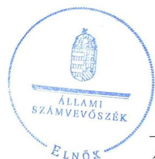
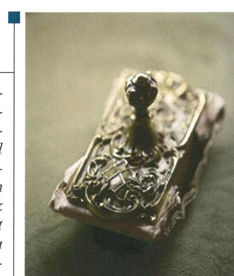
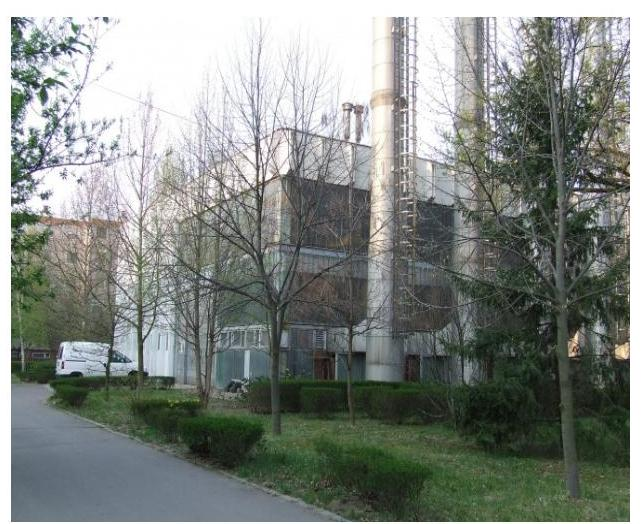
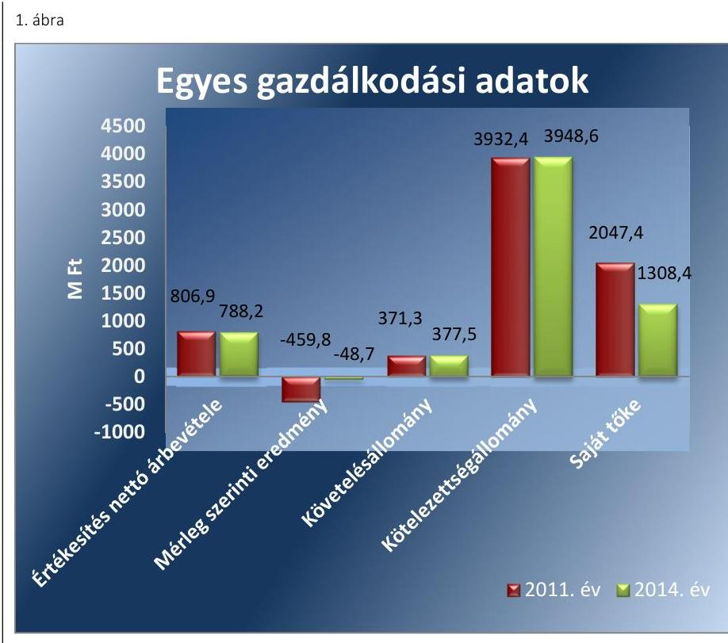
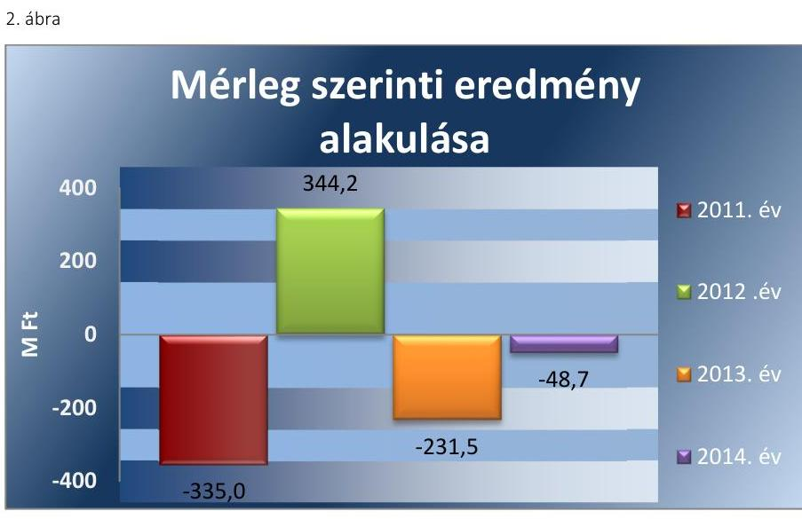

# Jelentés 

## Az önkormányzatok gazdasági társaságai

Az önkormányzatok többségi tulajdonában lévő gazdasági társaságok gazdálkodásának ellenőrzése - Hódmezővásárhelyi Vagyonkezelő és Szolgáltató Zrt. 2016.

Az ÁSZ az államháztartáson kívül működő közfeladat-ellátó rendszerek ellenőrzéseivel hozzájárul ahhoz, hogy a közpénzeket az államháztartáson kívül működő szervezetek is átlátható, rendezett módon használják fel a közfeladatok ellátása érdekében.

---

# Jelentés 

## Az önkormányzatok gazdasági társaságai

Az önkormányzatok többségi tulajdonában lévő gazdasági társaságok gazdálkodásának ellenőrzése - Hódmezővásárhelyi Vagyonkezelő és Szolgáltató Zrt.
2016. december 15.

16195
www.asz.hu

## 

---

# AZ ELLENŐRZÉST FELÜGYELTE:

DR. HORVÁTH MARGIT felügyeleti vezető

## AZ ELLENŐRZÉST VEZETTE ÉS A VÉGREHAJTÁSÁÉRT FELELŐS:

- KLINGA LÁSZLÓ ellenőrzésvezető
- A PROGRAM ÖSSZEÁLLÍTÁSÁÉRT FELELŐS:
- JANIK JÓZSEF osztályvezető

|  IKTATÓSZÁM: V-1088-131/2016. | |
| --- | --- |
|  TÉMASZÁM: 2122 | |
|  ELLENŐRZÉS-AZONOSÍTÓ SZÁM: V-070752 | |

Jelentéseink az Országgyűlés számítógépes hálózatán és az Interneten a www.asz.hu címen is olvashatóak.

---

# TARTALOMJEGYZÉK 

■ ÖSSZEGZÉS ..... 5
■ AZ ELLENŐRZÉS CÉLJA ..... 7
■ AZ ELLENŐRZÉS TERÜLETE ..... 8
■ AZ ELLENŐRZÉS HÁTTERE, INDOKOLTSÁGA ..... 10
■ A JELENTÉS LÉNYEGES KÉRDÉSKÖREI ..... 11
■ ELLENŐRZÉS HATÓKÖRE ÉS MÓDSZEREI ..... 12
■ MEGÁLLAPÍTÁSOK ..... 14
■ JAVASLATOK ..... 29
■ MELLÉKLETEK ..... 31
I. sz. melléklet: Értelmező szótár ..... 31
II. sz. melléklet: Működési adatok ..... 34
III. sz. melléklet: Mintavételi eljárások ellenőrzési területenként ..... 35
■ FÜGGELÉK: ÉSZREVÉTELEK ..... 37
■ RÖVIDÍTÉSEK JEGYZÉKE ..... 39

---

.

---

# ÖSSZEGZÉS 

Az Állami Számvevőszék a kizárólagos önkormányzati tulajdonú Hódmezővásárhelyi Vagyonkezelő és Szolgáltató Zrt.-nél a távhőszolgáltatási közfeladat ellátását érintő gazdálkodási tevékenység 2011-2014 közötti szabályszerűségének ellenőrzése során megállapította, hogy a közfeladat-ellátás önkormányzati megszervezése szabályosan történt. A tulajdonosi jogok gyakorlása szabályszerű volt. A szabályszerű vagyongazdálkodás biztosítása mellett a távhőszolgáltatás közfeladatával kapcsolatos összes elszámolása megfelelő volt. Az önköltségszámítás szabályait az előírás ellenére a 2011-2013. évekre nem határozták meg, így az árképzés nem volt megalapozott.

## Az ellenőrzés társadalmi indokoltsága

Az Állami Számvevőszék kiemelt célja, hogy a helyi önkormányzatok gazdálkodásában rejlő pénzügyi kockázatok feltárásával, az államháztartáson kívülre nyújtott költségvetési támogatások és ingyenes vagyonjuttatások, valamint az államháztartáson kívül működő feladat-ellátó rendszerek ellenőrzéseivel hozzájárul ahhoz, hogy a közpénzeket az államháztartáson kívül működő szervezetek is átlátható, rendezett módon használják fel.

Magyarországon az intézmény-centrikus közfeladat-ellátás jellemző, de egyre jelentősebb a költségvetésen kívüli feladatellátás térnyerése. Ennek legfontosabb szereplői - a nonprofit szervezetek mellett - az önkormányzati tulajdonú gazdasági társaságok. Az önkormányzatok szervezetalakítási szabadságának következménye, hogy a korábban is vállalati formában működő közszolgáltatások mellett, mind a kötelező, mind az önként vállalt feladatok ellátásában a gazdasági társaságok kiemelt fontosságú szerephez jutottak.

## Főbb megállapítások, következtetések, javaslatok

Az Önkormányzat a távhőszolgáltatás közfeladatának megszervezéséről a jogszabályi előírásoknak megfelelően döntött, annak ellátásáról a kizárólagos tulajdonában lévő gazdasági társasága útján gondoskodott. Az Önkormányzat a Tszt. szerinti távhőszolgáltatással összefüggő rendeletalkotási kötelezettségének eleget tett. A Távhő rendelet tartalma megfelelt az előírásoknak. Az Önkormányzat a távhőszolgáltatási közszolgáltatás ellátására 2013. november 8-án kötött Közszolgáltatási szerződést KEOP pályázat útján elnyert támogatással létrejövő beruházás megvalósítása érdekében.

Az Önkormányzat a Vagyonrendeletben, valamint az Alapító Okiratban meghatározta a tulajdonosi joggyakorlás szabályait. A tulajdonosi jogok gyakorlása szabályszerű volt. Az ellenőrzött időszakban az Önkormányzat belső ellenőrzése a Társaságnál egy alkalommal, 2011-ben végzett ellenőrzést, ezáltal támogatta a szabályszerű működés kontrollját. A 2013. évben egy kezességvállalás esetében nem tartották be a Stabilitási tv. előírását.

A közfeladat-ellátását szolgáló vagyonnal való gazdálkodás, annak nyilvántartása szabályszerű volt, a Társaság az önköltségszámítás rendjére vonatkozó szabályzat kivételével, melyet csak 2014-re alkottak meg - rendelkezett a Számv. tv. előírásainak megfelelő számviteli szabályzatokkal. A Vagyonkezelő Zrt. 2012. január 1-jétől eleget tett a Tszt. előírásának, a munkaszámrendszer kidolgozásával a számviteli szétválasztási szabályokat meghatározta, ezáltal biztosította az egyes tevékenységek átláthatóságát.

A Társaság legfőbb szerve a javadalmazási szabályzatot megalkotta. A Társaság a hosszú lejáratú kötelezettségei törlesztő részleteit csak részben tudta határidőben teljesíteni, a rövid lejáratú kötelezettségei határidőben történő teljesítése nem volt biztosított. A Társaság mérleg szerinti eredménye a 2011. és a 2013-2014. években negatív volt.

A Vagyonkezelő Zrt. az éves gazdálkodásról az éves beszámolók keretében beszámolt a tulajdonos felé a Számv. tv.-ben előírtaknak megfelelően. Az éves beszámolók elfogadásáról a Közgyűlés a könyvvizsgáló és az FB írásbeli jelentésének birtokában határozott. A Társaság eleget tett az Eisztv.-ben, illetve az Info tv.-ben előírtak szerinti, a közérdekű adatok megismerésére irányuló igények teljesítésének rendjét rögzítő, valamint az adatvédelmi-adatbiztonsági szabályzatkészítési, továbbá az adatvédelmi felelős kijelölési kötelezettségének. A Társaságnál a közfeladat bevételeinek és anyagjellegű ráfordításainak, továbbá a beruházások, felújítások és az értékcsökkenési leírás elszámolása megfelelő volt. A távhőszolgáltatás lejárt hátralékos követelésállománya a 2011. évi 135,1 millió Ft-ról a 2014. évre 130,1 millió Ft-ra csökkent. Az önköltségszámítás szabályait a 2011-2013. évekre nem határozták meg, így erre az időszakra a díjszámítás szabályszerű önköltségszámítással nem volt megalapozott.

---

# AZ ELLENŐRZÉS CÉLJA 

pozottsága szabályszerű önköltségszámítással.

Az ellenőrzés célja annak értékelése, hogy az Önkormányzat vagyongazdálkodási tevékenysége során szabályszerűen gyakorolta-e tulajdonosi jogait.

Ellenőriztük, hogy a gazdasági társaság szabályozottsága, gazdálkodása és vagyongazdálkodási tevékenysége, bevételeinek és ráfordításainak elszámolása megfelel-e a jogszabályi és tulajdonosi előírásoknak.

Értékeltük továbbá, hogy a gazdasági társaság kötelezettségállománya jelentett-e kockázatot a működésre, valamint a gazdálkodás átláthatósága és elszámoltathatósága érdekében biztosítva volt-e a szolgáltatás díjának megala-

---

# Hódmezővásárhely Megyei Jogú Város Önkormányzata és a kizárólagos tulajdonában lévő Hódmezővásárhelyi Vagyonkezelő és Szolgáltató Zrt. 

HÓDMEZŐVÁSÁRHELY MEGYEI JOGÚ VÁROS ÖNKORMÁNYZATA a Hódmezővásárhelyi Vagyonkezelő és Szolgáltató Zártkörű Részvénytársaságot 1997. október 1-jén hozta létre. A Hódmezővásárhelyi Vagyonkezelő és Szolgáltató Zrt. 2006. június 2-ától, a Hódmezővásárhelyi Távfűtő és Tüzeléstechnikai Kft. beolvadásának időpontjától látta el a távfűtési-, és a használati melegvíz szolgáltatást, valamint az ezekhez kapcsolódó karbantartási feladatokat. Az Önkormányzat vagyonkezelésbe eszközöket a távhőszolgáltatással kapcsolatosan nem adott át. A Hódmezővásárhelyi Vagyonkezelő és Szolgáltató Zrt. ügyvezető szerve az Igazgatóság volt, amely három tagból állt.

## A HÓDMEZŐVÁSÁRHELYI VAGYONKE-

ZELŐ ÉS SZOLGÁLTATÓ ZRT. alaptevékenysége az ellenőrzött időszakban „gőzellátás, légkondicionálás" volt. A Társaság a távhőszolgáltatást kizárólag Hódmezővásárhely közigazgatási területén végezte. A távhőszolgáltatáson kívül internet- és informatikai szolgáltatást látott el, amellyel jelen volt a gazdasági-, egészségügyi-, oktatási-, szociális- és kulturális szektorokban egyaránt. A város egyik legnagyobb informatikai rendszerüzemeltetőjeként közel 40 szerződött partner több mint 60 telephelyén működtette a teljes hardver-, szoftver- és hálózati infrastruktúrát. A sport részegység ellátta a Hódtói Sportcsarnok és Szabadidő Központ, a Városi Stadion, valamint a Damjanich utcai műfüves labdarúgó pálya üzemeltetését. A Társaság 100%-ban Hódmezővásárhely Megyei Jogú Város Önkormányzatának tulajdonában volt a 2011-2014. években.

Hódmezővásárhely város lakossága 2015. január 1-jén 44795 fő volt. A Társaság az ellenőrzött időszakban 2725 lakás távfűtését látta el, az értékesített hőmennyiség a 2011. évi 60036 GJ-ról 2014-re 46768 GJ-ra csökkent. A távfűtési-, és használati melegvíz szolgáltatás kétféle rendszeren keresztül történt, egyrészt a geotermikus energiát kihasználva kitermelt hévíz közvetlen felhasználásával, amennyiben ez nem volt elegendő, akkor földgáz felhasználásával, ráfűtéssel.

A Társaságnál foglalkoztatott átlagos statisztikai állományi létszám az ellenőrzött időszak elején 66 fő, a végén 61 fő volt.

A Társaság gazdálkodásának főbb adatait a 2011-2014. évek vonatkozásában az 1. ábra szemlélteti.

---

Forrás: a Társaság éves beszámolói

A távhődíjak ellenőrzött időszakban végrehajtott csökkentésének következtében az értékesítés nettó árbevétele 2,4%-kal (18,7 millió Ft-tal) csökkent a 2014. év végére a 2011. évi bázishoz képest. A többszöri díjcsökkentés ellenére a lakossági díjhátralék nőtt. A kimutatott követelésállományból a 2011. évben 48,3% (167,4 millió Ft) volt a vevőkövetelés, amely a 2014. évre 312,0 millió Ft-ra nőtt, így az összes követelésállomány 82,6%-át tette ki. A kötelezettségek mérlegértéke - amely döntő részben kötvénykibocsátáshoz kapcsolódott - jelentős volt 2011-ben, ami kis mértékben növekedett az ellenőrzött időszak végére.

Az ellenőrzött időszakban a polgármester személye egy alkalommal változott, a polgármester a 2012. évi időközi választás óta látja el feladatát. A jegyző személyében nem történt változás. Az Igazgatóság elnöke 2014. december 19-étől tölti be tisztségét, a gazdasági igazgató személye 2014. június 1-jétől változott.

A Társaság működésének főbb jellemzőit a 2. számú melléklet mutatja be.

---

# AZ ELLENŐRZÉS HÁTTERE, INDOKOLTSÁGA 

Az önkormányzatok közfeladat-ellátásában egyre jelentősebb a gazdasági társaságok útján történő feladatellátás térnyerése.

AZ ÖNKORMÁNYZATI TULAJDONÚ GAZDASÁGI TÁRSASÁGOK teljes körű ellenőrzésének lehetőségét az Állami Számvevőszékről szóló 1989. évi XXXVIII. törvény 2011. január 1-jétől hatályos módosítása teremtette meg. Az önkormányzati tulajdonú gazdasági társaságok ellenőrzése kiemelten fontos a vagyon megőrzése, megóvása érdekében, valamint a kormányzati szektor elszámolásaiban megjelenő önkormányzati tulajdonú gazdálkodó szervezetek esetében, amelyekkel szemben alapvető követelmény, hogy gazdálkodásuk, működésük szabályszerű, az általuk szolgáltatott adatok minél megbízhatóbbak legyenek. A feladat/közfeladat ellátás költségeinek, ráfordításainak alakulása, színvonala hatással van a lakosság elégedettségére.

## AZ ELLENŐRZÉS VÁRHATÓ HASZNOSULÁSA-

KÉNT az ÁSZ ${ }^{1}$ a megállapításaival segítséget nyújthat az államháztartáson kívüli közfeladat-ellátás értékeléséhez, jogszabályi keretei pontosításához, átláthatóságot biztosító szabályozásához. Meghatározhatóvá válnak az önkormányzati feladatellátásban részt vevő államháztartáson kívüli szervezeteknek - az önkormányzat költségvetését, pénzügyi helyzetét is befolyásoló - kockázatai, lehetővé válik ezen kockázatok csökkentése. Ellenőrzéseink feltárhatják, hogy az önkormányzat feladat-ellátási kötelezettségének szabályszerűen tett-e eleget, a feladatellátáshoz rendelt vagyonkezelésbe vett és saját vagyon működtetését az elvárható gondossággal, szabályszerűen szervezte-e meg és a tulajdonosi felügyelete hozzájárult-e a feladatellátásához. Értékelhetővé válik, hogy a gazdasági társaság a feladat-ellátási, közszolgáltatási szerződésben foglaltak betartásával, a vagyon használatával biztosította-e a szolgáltatás folytatásának feltételeit. Ezzel az ellenőrzöttek és a helyi döntéshozók számára az ÁSZ visszajelzést ad feladatszervezési, feladat-ellátási kockázataikról, alapot ad a meglévő hibák megszüntetéséhez, a jobb feladat-ellátás biztosításához. Mindezeken keresztül az ÁSZ hozzájárul Magyarország közpénzügyi helyzetének javításához, a közpénzek mérhető módon történő, a döntéshozók által meghatározott célok szerinti felhasználásához.

---

# A JELENTÉS LÉNYEGES KÉRDÉSKÖREI 

1. Az önkormányzat közfeladat megszervezéséről szóló döntése, valamint tulajdonosi joggyakorlása szabályszerű volt-e?
2. A gazdasági társaság vagyongazdálkodása szabályszerű volt-e, kötelezettségállománya jelentett-e kockázatot a működésre, illetve a közfeladat ellátásra?
3. A gazdasági társaságnál az ellátott közfeladat bevételei és ráfordításai elszámolása, valamint az önköltségszámítás és árképzés szabályszerű volt-e?

---

# ELLENŐRZÉS HATÓKÖRE ÉS MÓDSZEREI 

## Az ellenőrzés típusa

Megfelelőségi ellenőrzés

## Az ellenőrzött időszak

A 2011. január 1-jétől 2014. december 31-éig terjedő időszak.

## Az ellenőrzés tárgya

A gazdasági társaság feletti tulajdonosi joggyakorlás, valamint a gazdasági társaság gazdálkodásának szabályozottsága és szabályszerűsége.

Az ellenőrzés kiterjed minden olyan körülményre és adatra, amely az ÁSZ jogszabályban meghatározott feladatainak teljesítéséhez, valamint a program végrehajtása folyamán felmerült újabb összefüggések feltárásához szükséges.

## Az ellenőrzött szervezet

Hódmezővásárhely Megyei Jogú Város Önkormányzata és a Hódmezővásárhelyi Vagyonkezelő és Szolgáltató Zártkörű Részvénytársaság.

## Az ellenőrzés jogalapja

Az ellenőrzés végrehajtásának jogszabályi alapját az Állami Számvevőszékről szóló 2011. évi LXVI. törvény 5. § (3)-(4)-(5) bekezdései képezték.

## Az ellenőrzés módszerei

Az ellenőrzést a nemzetközi standardokat irányadónak tekintve az ellenőrzési program ellenőrzési kérdései, az ellenőrzött időszakban hatályos jogszabályok, az ellenőrzés szakmai szabályok és módszertanok figyelembe vételével végeztük.

Az ellenőrzés ideje alatt az ellenőrzött szervezettel történő kapcsolattartást

 az ÁSZ Szervezeti és Működési Szabályzatának vonatkozó előírásai alapján biztosítottuk.

---

Az ellenőrzés a kiválasztott, tulajdonosi jogokat gyakorló önkormányzatra, illetve az ellenőrzésre kijelölt gazdasági társaságra terjedt ki.

Az ellenőrzési kérdések megválaszolásához szükséges bizonyítékok megszerzése a következő ellenőrzési eljárások alkalmazásával történt: megfigyelés, kérdésfeltevés (információkérés), összehasonlítás, valamint elemző eljárás. Az ellenőrzési bizonyítékként felhasználható adatforrások közé tartoztak egyrészt a szakmai programban felsorolt adatforrások, másrészt adatforrás lehetett még minden - az ellenőrzés folyamán - feltárt, az ellenőrzés szempontjából információkat tartalmazó dokumentum.

Az ellenőrzést a kérdésekre adott válaszok kiértékelésével, valamint a megjelölt adatforrások, a csatolt tanúsítványok felhasználásával, továbbá az adott időszakban hatályos jogszabályok figyelembe vételével folytattuk le.

A bevételek és ráfordítások elszámolását véletlen mintavétellel, a vagyonnyilvántartás terén a beruházások és felújítások elszámolását teljes körűen ellenőriztük. A mintavétellel ellenőrzött területek esetében minden egyes tétel vonatkozásában a szabályszerűségre vonatkozó kérdéseket tettünk fel, amelyek eredménye összesítésre került. Megfelelőnek értékeltünk egy ellenőrzött területet, amennyiben 95%-os bizonyossággal a teljes sokaságban a hibaarány legfeljebb 10%, nem megfelelőnek, amennyiben 10%-nál magasabb arányt képviselt. Abban az esetben, ha a teljes sokaság tekintetében a 10%-os hibaarányhoz való viszony megítélésének megbízhatósága nem érte el a 95%-ot, annak elérése érdekében értékelésünket további szempontokkal egészítettük ki, és figyelembe vettük a feltárt hibák típusát és súlyát. A ráfordítások elszámolására vonatkozó véletlen mintavételt kockázati alapú kiválasztással egészítettük ki, amelynek során évente a három legnagyobb összegű tételt választottuk ki. A mintavételi eljárások ellenőrzési területenként történő bemutatását a III. számú melléklet tartalmazza.

---

# 1. Az önkormányzat közfeladat megszervezéséről szóló döntése, valamint tulajdonosi joggyakorlása szabályszerű volt-e? 

Összegző megállapítás

Az Önkormányzat a jogszabályok és a helyi szabályozás betartásával szervezte meg a távhőszolgáltatást, a tulajdonosi jogokat szabályszerűen gyakorolta.

### 1.1. számú megállapítás

A közfeladat-ellátást az Önkormányzat szabályszerűen szervezte meg, a távhőszolgáltatásra vonatkozó rendeletalkotási kötelezettségének eleget tett.

Hódmezővásárhely hosszú távú gazdaságfejlesztési lehetőségeit és törekvéseit - az Ötv. ${ }^{2}$ 91. § (6) bekezdését, 2013. január 1-jétől az Mötv. ${ }^{3}$ 116. § (3)-(4) bekezdéseiben foglaltaknak eleget téve - a Gazdaságfejlesztési Stratégiai program tartalmazta, amelyet a 2005-2013. évekre vonatkozóan készítettek el. A felülvizsgálatot követő módosítás megtörtént a 2011. évben, amely megfelelt az Ötv. 91. § (7) bekezdésében előírtaknak. A Gazdaságfejlesztési Stratégiai program a lakosság figyelmét környezetkímélő és hatékony távfűtésre hívta fel, továbbá a távfűtés komfortjának növelését, egyedi költségelosztók felszerelését és az egyedi hőszabályozás feltételeinek megteremtését célozta meg. További terv volt az új fogyasztók bekapcsolása a geotermális energiaellátásba.

Az SZMSZ ${ }^{4}$ 2. számú mellékletében kötelező feladatként előírták a Társaság feladataként a közreműködést a helyi energia-szolgáltatásban (távhő- és melegvízszolgáltatás). Az Önkormányzat ${ }^{5}$ a vagyonnal való gazdálkodás feladatait, annak kereteit a többször módosított Vagyonrendeletben ${ }^{6}$ határozta meg.

Az Önkormányzat 2013. évtől rendelkezett az Nvtv. ${ }^{7}$ 9. § (1) bekezdésében foglalt előírás szerint közép- és hosszú távú vagyongazdálkodási tervvel, mely a távhőszolgáltatással kapcsolatos terveket nem tartalmazott.

A TÁVHŐSZOLGÁLTATÁS a Tszt. ${ }^{8}$ 6. § (1)-(2) bekezdése és az Mötv. 13. § (1) bekezdés 20. pont előírása alapján az Önkormányzat kötelezően ellátandó feladata volt. Ennek a kötelezettségének az Önkormányzat az ellenőrzött időszakban a Vagyonkezelő Zrt. ${ }^{9}$ útján tett eleget. A közfeladat ellátásának megszervezése, az ellátás módjára vonatkozó döntés az ellenőrzött időszakot megelőzően történt. A működéshez szükséges eszközöket az Önkormányzat apport formájában bocsátotta a Társaság ${ }^{10}$ rendelkezésére, kezelésre vagyont nem adott át.

Az Önkormányzat a Társasággal 2013. november 8-án Közszolgáltatási szerződést kötött, amelyet a Közgyűlés határozattal elfogadott. A Közszolgáltatási szerződést 10 évre, a KEOP ${ }^{11}$-2012-5.4.0 pályázatban meghatározott beruházás közszolgáltatással járó ellentételezés formájában igénybe

---

vehető támogatással történő megvalósítása érdekében kötötték. A Közszolgáltatási szerződésben előírták a Társaságnak az éves üzleti terv készítési kötelezettségét, továbbá minden tárgyévet követő év május 30. napjáig a gazdálkodásról szóló, a Számv. tv. ${ }^{12}$ 8. §. szerinti beszámoló készítésének kötelezettségét.

A Társaság feladatellátásának kereteit az Alapító Okiratban ${ }^{13}$, a közfeladat-ellátás, a szolgáltatási díjak megállapításainak szabályait a Távhő rendeletben ${ }^{14}$, az Üzletszabályzatban ${ }^{15}$ és a Társaság SZMSZ ${ }^{16}$-ében határozták meg.

Az Önkormányzat az Alapító Okiratban és a Vagyonrendeletben az ellenőrzési és számviteli beszámolási kötelezettséget előírta.

Az Alapító Okirat a Gt. 19. § (5) bekezdésében, 2014. március 15-étől a Ptk. ${ }^{17}$ 3:109. §-ában előírtakkal összhangban a Közgyűlés ${ }^{18}$ kizárólagos hatáskörébe sorolta az Igazgatóság ${ }^{19}$, az FB ${ }^{20}$ tagjainak és a könyvvizsgáló megválasztását, visszahívását, díjazásának megállapítását. A Közgyűlés kizárólagos hatáskörébe tartozott továbbá a beszámoló elfogadása, ideértve az adózott eredmény felhasználására vonatkozó, az osztalékelőleg fizetéséről szóló döntés, valamint az alaptőke felemeléséről, leszállításáról, a részvénytársaság kötvény-, és hitelügyleteivel, valamint az ezekhez kapcsolódó biztosítékok nyújtásával kapcsolatos mindennemű döntés meghozatala.

A Távhő rendelet megalkotásával az Önkormányzat eleget tett a Tszt. 6. § (2) bekezdésében előírt rendeletalkotási kötelezettségének. A Távhő rendelet tartalmazta - többek között - a távhőszolgáltató és a felhasználó közötti jogviszony részletes szabályait, a szolgáltatás teljesítését, a távhőszolgáltatási díjak tartalmát, díjtételeit, a díjak megállapításának és elszámolásának szabályait, valamint a szolgáltatás korlátozásának és szüneteltetéseinek eseteit. A Tszt. 6. § (2) bekezdés c) pontjában előírtaknak megfelelően a Közgyűlés kijelölte azokat a területeket, ahol területfejlesztési, környezetvédelmi és levegőtisztaságvédelmi szempontok alapján célszerű volt a távhőszolgáltatás fejlesztése.

A 2011. április 15-étől hatályos Tszt. 57/D. § (1) és (2) bekezdései szerint a távhő szolgáltatónak értékesített távhő árát, valamint a lakossági felhasználónak és a külön kezelt intézménynek nyújtott távhőszolgáltatás legmagasabb hatósági árát miniszteri rendelettel kellett megállapítani. A Tszt. 57/D. §-ának 2011. április 15-i hatálybalépését követően a Távhő rendeletet annak ellenére nem módosították, hogy a hatósági ár bevezetésével az Önkormányzat ármegállapítása jogköre - a csatlakozási díj kivételével - megszűnt.

A Vagyonkezelő Zrt. Üzletszabályzatát a Tszt. 52. § (1) előírásának megfelelően, a Tszt. 3. § v) pontja szerinti tartalommal elkészítette, melyet Szeged Megyei Jogú Város címzetes főjegyzője hagyott jóvá a Tszt. 7. § (1) bekezdés b) pontja alapján.

---

1.2. számú megállapítás

A tulajdonosi joggyakorlás szabályszerű volt, az Önkormányzat tulajdonosi jogait a belső ellenőrzésen keresztül is érvényesítette. A 2013. évi kezességvállalásnál a Stabilitási tv. előírásait nem tartották be.

A TULAJDONOSI JOGOK GYAKORLÁSÁNAK
RENDJÉT az Alapító Okiratban és a Vagyonrendeletben rögzítették. Az Önkormányzatot megillető tulajdonosi jogok gyakorlásával kapcsolatos feladatok és jogosultságok a Közgyűlést illették meg, amelyeket a Vagyonrendeletben meghatározott esetekben a polgármesterre ${ }^{21}$ ruházott át. Az önkormányzati tulajdonú gazdálkodó szervezetek forgalomképes tulajdoni részesedéseinek elidegenítése, megterhelése, illetőleg jogi sorsukat érintő egyéb rendelkezések kérdésében a tulajdonosi jogokat nettó 10,0 millió Ft értékhatárig átruházott hatáskörben a polgármester gyakorolhatta. A Társaság vonatkozásában a tulajdonosi jogokat szabályszerűen, a Vagyongazdálkodási rendelet, illetve az Alapító Okirat előírásai szerint gyakorolták. Szabálytalan hatáskör delegálás nem volt.

Az Igazgatóság az Alapító Okiratban és az Igazgatóság ügyrendjében ${ }^{22}$ előírtak alapján, évente legalább négy alkalommal volt köteles ülésezni, amelynek az ellenőrzött időszakban eleget tett. Az Igazgatóság az Alapító Okiratban és az Igazgatóság ügyrendjében foglalt kötelezettsége alapján a Vagyonkezelő Zrt. ellenőrzött időszakra szóló üzleti terveit, beszámolóit határozatokban jóváhagyta.

Az FB az ellenőrzött időszakban az ügyrendjében rögzítettek alapján hat tagból állt, figyelembe véve az Alapító Okiratban és a Gt. ${ }^{23}$ 34. § (1) bekezdés, valamint a Ptk. 3:121. § (1) bekezdésében előírtakat. Az FB az ellenőrzött időszak alatt teljesítette az ügyrendben előírt, legalább háromhavonkénti ülés megtartására vonatkozó kötelezettségét. Az FB a Társaság 2011-2014. évek közötti üzleti terveit és beszámolóit megtárgyalta és elfogadásra javasolta a Közgyűlésnek. Az FB a Gt. 35. § (3) bekezdésének, illetve a Ptk. 3:120. § (2) bekezdésének megfelelően minden évben írásbeli jelentést készített a Társaság számviteli beszámolójáról. A Közgyűlés az üzleti tervek elfogadásáról az FB írásos jelentésének birtokában döntött.

Az árképzés szabályait 2011. április 15-éig az Önkormányzat a Távhő rendeletben határozta meg. A távhőszolgáltatás 2011. április 15-éig olyan hatósági áras szolgáltatás volt, amelynek legmagasabb árait mindenkor az önkormányzatoknak kellett előírniuk. Ennek a kötelezettségnek az Önkormányzat eleget tett. A Távhő rendeletben az Ámt. ${ }^{24}$ 7. § (1) bekezdésében előírtaknak megfelelően meghatározták a távhőszolgáltatás legmagasabb fogyasztói árát az alapdíjra és a hődíjra, valamint a csatlakozási díjra vonatkozóan. A díjak megállapítására a Társaság tett javaslatot a díjképzési előírásoknak megfelelően. Az előterjesztés tartalmazta a díjképzésnél használt elveket, követelményeket, a díjmeghatározó személyét, valamint a megemelt díjtételeket.

A beszámoltatási rendszer keretében az Önkormányzat a 2011-2014. években beszámoltatta a Társaságot a gazdálkodásáról, a szakmai tevékenységéről. A Közgyűlés az Alapító Okiratban foglalt hatáskörénél fogva minden évben határozattal fogadta el a beszámolókat,

---

miután azokat az Igazgatóság és az FB megtárgyalta és jóváhagyásra javasolta. A beszámolás magában foglalta a Számv. tv. 8. § (2) bekezdése szerinti beszámolókat - mérleg, eredménykimutatás, kiegészítő melléklet - a Számv. tv. 9. § (1) és (2) bekezdésében előírt üzleti jelentést és a Számv. tv. 156. § (4)-(5) bekezdés szerinti könyvvizsgálói záradékot. A számviteli beszámolókat a megválasztott könyvvizsgáló minden évben ellenjegyezte és korlátozás nélkül záradékkal zárta le. A 2011-2013. évi számviteli beszámolókhoz csatolták a Gt. 40. § (1) bekezdésében, a 2014. évi beszámolóhoz a Ptk. 3:129. § (1) bekezdésében előírt könyvvizsgálói jelentést.

A Társaság belső ellenőrzését az Önkormányzat Polgármesteri Hivatalának Belső Ellenőrzési Irodája végezte, a Ber. ${ }^{25}$ 21. §. (1)-(2) bekezdés és a Bkr. ${ }^{26}$ 22. § (1) bekezdés b) pontjában előírt kockázatelemzésen alapuló éves ellenőrzési terv alapján. Az éves ellenőrzési terveket az Ötv. 92. § (6) bekezdésében, illetve az Mötv. 119. § (5) bekezdésében megjelölt határidőn belül jóváhagyta a Közgyűlés. Az éves ellenőrzési tervek közül a 2011. évi tartalmazott a Társaságnál végrehajtandó ellenőrzést, melyet lefolytattak. A belső ellenőrzés célja az energiaszolgáltatói számlakifizetés rendjének ellenőrzése volt. A jelentés javaslatot nem tartalmazott, így intézkedési terv készítési kötelezettsége nem volt a Társaságnak. A Ber. 31. § (1)-(3), valamint a Bkr. 49. § (3a) bekezdésében előírtaknak megfelelően a polgármester a Közgyűlés elé terjesztette a belső ellenőrzési tevékenységről szóló beszámolót, amely tartalmazta a Társaságnál végzett ellenőrzést. A Közgyűlés a beszámolót határozattal jóváhagyta.

A Társaságnál külső ellenőrzés hét esetben volt az ellenőrzött időszakban. Három esetben a MÁK ${ }^{27}$ ellenőrizte az állami pénzeszközök igénylésének jogszerűségét, a NAV ${ }^{28}$ két esetben végzett ellenőrzést, az egyes adókötelezettségek, valamint az általános forgalmi adó bevallások tekintetében. Az Alsó-Tisza-vidéki Környezetvédelmi és Természetvédelmi Felügyelőséggel egyeztető tárgyalás volt a B-1092 OKK számú Hódtói fúrókútból kitermelt víz-készletjárulék bevallásáról. A Magyar Bányászati és Földtani Hivatal a geotermikus közműrendszert ellenőrizte, amelynek javaslatára a bányajáradék elszámolásának rendjéről szóló szabályzatot készítettek. Az ellenőrzések a közfeladat-ellátásra vonatkozó javaslatot nem
 fogalmaztak meg.

A Vagyonkezelő Zrt. mérleg szerinti eredménye a 2012. évet kivéve negatív volt. A 2012. évi adózott eredményt a Közgyűlés döntése alapján eredménytartalékba helyezték.

Az évenkénti mérleg szerinti eredmény alakulását a 2. ábra mutatja be.

---

Forrás: a Társaság éves beszámolói

Az ellenőrzött időszakban a Társaság rendelkezett a társasági formájára kötelezően előírt jegyzett tőkének megfelelő összegű saját tőkével, így a Gt. 51. § (1) bekezdés és a Ptk. 3:133. § (2) bekezdés szerinti előírás alapján a tulajdonos Önkormányzatnak intézkedési kötelezettsége nem keletkezett.

# AZ ÖNKORMÁNYZAT KÉSZFIZETŐ KEZESSÉGET a 

Társaság felé két alkalommal vállalt az ellenőrzött időszakban. A távfűtési rendszer szekunder oldalán végzett beruházás végszámlájának finanszírozására az Önkormányzat - egy külső társasággal - faktorálási megállapodást kötött. Az engedményezett összeg 96,5 millió Ft, az esedékesség 2011. március 10-e volt, amelynek teljesítésére az Önkormányzat készfizető kezességet vállalt. A kötelezettséget a 2011. évben beváltották, azonban a Társaság az Önkormányzat részére visszafizette a 96,5 millió Ft összeget. A belváros rehabilitációjával egy időben zajló, a Bessenyi Ferenc Művelődési Központ építéséhez kapcsolódó üzemeltetői kiegészítő munkák végzése tárgyú végszámla kiegyenlítése szintén faktorálási megállapodás alapján történt 2013. februárjában. Az Önkormányzat 2013. március 31-éig készfizető kezességet vállalt 52,8 millió Ft összeg erejéig. A Társaság likviditási nehézségei miatt az Önkormányzat teljesítette a kezességből származó kötelezettséget. A Vagyonkezelő Zrt. 2013. március 25-én a kezességvállalásból fennálló kötelezettségéből 36,4 millió Ft-ot törlesztett az Önkormányzat részére, míg a fennmaradó 16,4 millió Ft kötelezettség az ellenőrzött időszak végén is fennállt.

A kezességvállalásokhoz a közgyűlési előterjesztések, határozatok, kezességvállalási szerződések, számviteli nyilvántartások rendelkezésre álltak. A kezességvállalások írásban történtek, betartva ezzel a Ptk. ${ }^{29} 272$. § (2) bekezdésében foglaltakat.

A 2013. évben az 52,8 millió Ft összegű kezességvállalás esetében nem tartották be a Stabilitási tv. ${ }^{30} 10. § (3) bekezdésében előírtakat. Ebben az esetben az adósságot keletkeztető ügyletből származó tárgyévi fizetési kötelezettség a vállalható tárgyévi összes fizetési kötelezettséget meghaladó összegben történt.

---

# 2. A gazdasági társaság vagyongazdálkodása szabályszerű volt-e, kötelezettségállománya jelentett-e kockázatot a működésre, illetve a közfeladat ellátásra? 

Összegző megállapítás

2.1. számú megállapítás

A Társaság vagyongazdálkodása szabályszerű volt, kötelezettségállománya kockázatot jelentett a működésre, illetve a közfeladat-ellátásra.

A Társaság az előírt számviteli szabályzatokkal rendelkezett. A 2012. január 1-jétől kötelezően alkalmazandó számviteli szétválasztási szabályokat meghatározták.

AZ ÜZLETI TERV készítésének kötelezettségét az Önkormányzat éves munkaterveiben írta elő. A Társaság az éves üzleti terveket az ellenőrzött időszakban elkészítette, az FB és a Közgyűlés megtárgyalta és határozataiban elfogadta. Az üzleti tervekben bemutatták a pénzügyi helyzet alakulását, a tárgyévi tervszámokat árbevétel-, költség-, eredménybontásban. Ezen túlmenően az üzleti tervek tartalmazták az éves feladatvégzés koncepcióját, az éves tervezett felújításokat és karbantartásokat szervezeti és működési struktúrában. Az üzleti tervek összhangban voltak a tulajdonosi elvárásokkal.

A Társaság rendelkezett a Számv. tv. 14. § (3) bekezdésben előírt számviteli politikával, valamint a Számv. tv. 14. § (5) bekezdése előírásainak megfelelően eszközök és források leltárkészítési és leltározási, valamint selejtezési szabályzattal, eszközök és források értékelési szabályzatával, pénzkezelési szabályzattal, illetve 2013. december 31-étől az önköltségszámítás rendjére vonatkozó szabályzattal. Elkészítették továbbá a Számv. tv. 161. § (1) bekezdésében előírt számlarendet.

A SZÁMVITELI POLITIKA ${ }^{31}$ hiányossága volt, hogy 2011. január 1-jétől - annak ellenére, hogy a gyakorlatban a 100 ezer Ft-os értékhatárt alkalmazták - nem módosították a Számv. tv. 80. § (2) bekezdésének megfelelően a 100 ezer Ft egyedi beszerzési, előállítási érték alatti vagyoni értékű jogok, szellemi termékek, tárgyi eszközök tekintetében. További hiányosság volt, hogy a szabályzat 2013. január 1-jétől nem tartalmazta a Számv. tv. 3. § (3) bekezdés 3. pontjában rögzített jelentős összegű hiba meghatározásához szükséges értékhatárt. A Számviteli politika ${ }^{32}$ tartalma 2014. január 1-jétől megfelelt az előírásoknak.

## A LELTÁROZÁSI ÉS SELEJTEZÉSI SZABÁLYZAT ${ }^{33}$

tartalmazta a leltározás előkészítésének feladatait, a leltározásért felelős személyeket, a leltározás módját, fordulónapját. A készletek esetében évenkénti, a tárgyi eszközök esetében kétévenkénti mennyiségi felvétellel történő leltározást írták elő, figyelembe véve a 2012. január 1-jétől hatályos Számv. tv. 69. § (3) bekezdésében előírtakat.

A PÉNZKEZELÉSI SZABÁLYZAT ${ }^{34}$ a Számv. tv. 14. § (8) bekezdésében előírt tartalmi követelményeknek megfelelt, rendelkezett többek között - a pénzforgalom lebonyolításának rendjéről, a pénzkezelés

---

személyi és tárgyi feltételeiről, felelősségi szabályairól, a készpénzállomány ellenőrzésekor követendő eljárásról, az ellenőrzés gyakoriságáról.

# AZ ESZKÖZÖK ÉS FORRÁSOK ÉRTÉKELÉSI SZABÁLYZATA ${ }^{35}$ a Számv. tv. 55. § (1)-(2) bekezdésének előírásaival összhangban szabályozta a követelések minősítésének, az értékvesztés elszámolásának szabályait, továbbá összhangban állt a Számv. tv. 57. § (1) bekezdésében foglalt értékelési elvekkel. 

A SZÁMLAREND ${ }_{1}{ }^{36}{ }_{2}{ }^{37}$ nem felelt meg a Számv. tv. 161. § (2) bekezdés a) és b) pontjaiban előírt tartalmi követelményeknek, mivel nem tartalmazta minden alkalmazásra kijelölt számla számlajelét és megnevezését, valamint a számla értéke növekedésének, és csökkenésének jogcímeit.

AZ ÖNKÖLTSÉGSZÁMÍTÁSI SZABÁLYZAT ${ }^{38}$ elkészítésére a Társaság az ellenőrzött időszak elejétől köteles volt, a szabályzatkészítési kötelezettségnek csak 2013. december 31-étől tettek eleget.

A Vagyonkezelő Zrt. 2012. január 1-jétől eleget tett a Tszt. 18/A. § (2) bekezdésében foglalt előírásnak, a munkaszámrendszer kidolgozásával a számviteli szétválasztási szabályokat meghatározta, ezáltal biztosította az egyes tevékenységek átláthatóságát.

AZ ÜZLETSZABÁLYZAT árképzésre vonatkozó előírását a Tszt. 57/D. § (1) bekezdésében meghatározott, mint legmagasabb hatósági árat -, a hatósági ár szerkezetét és alkalmazási feltételeit a MEKH ${ }^{39}$ javaslatának figyelembevételével a miniszter rendeletben állapítja meg. Az üzletszabályzatot nem módosították a 2011. április 15-től hatályos jogszabályi változásoknak megfelelően.

A JAVADALMAZÁSI SZABÁLYZATOT a Társaság legfőbb szerve a Taktv. 5. § (3) bekezdésében foglaltaknak megfelelően megalkotta és 2010. február 1-jétől hatályba léptette. A szabályzat hatálya kiterjedt a vezető tisztségviselőkre, az FB tagokra, vezető állású munkavállalókra, valamint az Mt. ${ }^{40} 188. § (1) bekezdése és a 188/A. § (1) bekezdése hatálya alatt álló munkavállalókra. A javadalmazási szabályzat előírása szerint a vezető tisztségviselőket a prémium kiírásban foglalt feladatok ellátásáért prémium kifizetése illethette meg. Prémiumfeladat kiírására csak az FB jóváhagyásával kerülhetett sor. Az ellenőrzött időszakban nem történt prémium kifizetés.
2.2. számú megállapítás

A Társaság vagyongazdálkodása a jogszabályi rendelkezéseknek, a tulajdonosi elvárásoknak és a belső előírásoknak megfelelt.

A Vagyonkezelő Zrt. az Önkormányzattól vagyonkezelésbe, üzemeltetésre nem vett át vagyont, tevékenységét saját eszközeivel látta el.

## AZ ANALITIKUS ÉS FŐKÖNYVI NYILVÁNTARTÁSI

RENDSZER biztosította a Vagyonkezelő Zrt. vagyonának a Számv. tv. és a belső szabályozás szerinti nyilvántartását, a változások folyamatos nyomon követését. A főkönyvi könyvelés és az analitikus nyilvántartások közötti egyezőség biztosított volt.

---

A Vagyonkezelő Zrt. éves beszámolóinak főbb mérlegadatait az 1. táblázat szemlélteti.

1. táblázat

| A TÁRSASÁG FŐBB MÉRLEG ADATAI (MILLIÓ FORINT) |  |  |  |  |  |
| :--: | :--: | :--: | :--: | :--: | :--: |
| Megnevezés | 2011.01.01. | 2011.12.31. | 2012.12.31. | 2013.12.31. | 2014.12.31. |
| Befektetett eszközök | 5747,4 | 5506,7 | 5704,2 | 5033,7 | 5339,3 |
| - ebből: Tárgyi eszközök | 5687,6 | 5447,2 | 5644,9 | 4972,5 | 5279,7 |
| Forgóeszközök | 373,1 | 349,6 | 412,3 | 264,6 | 380,3 |
| - ebből: Követelések | 371,3 | 345,9 | 409,9 | 260,6 | 377,6 |
| Aktív időbeli elhatárolások | 424,3 | 586,1 | 507,6 | 589,3 | 596,0 |
| ESZKÖZÖK ÖSSZESEN | 6544,8 | 6442,4 | 6624,1 | 5887,6 | 6315,6 |
| Saját tőke | 2047,4 | 1639,7 | 1896,8 | 1505,2 | 1308,4 |
| - ebből:Jegyzett tőke | 1263,5 | 1263,5 | 1263,5 | 1263,5 | 1263,5 |
| - ebből: Mérleg szerinti eredmény | $-459,8$ | $-335,0$ | 344,3 | $-231,6$ | $-48,7$ |
| Céltartalékok | 53,7 | 106,4 | 93,6 | 65,0 | 121,0 |
| Kötelezettségek | 3932,4 | 4200,8 | 4105,6 | 3773,7 | 3948,7 |
| Passzív időbeli elhatárolások | 511,3 | 495,5 | 528,1 | 543,7 | 937,5 |
| FORRÁSOK ÖSSZESEN | 6544,8 | 6442,4 | 6624,1 | 5887,6 | 6315,6 |

A VAGYONKEZELŐ ZRT. VAGYONA a 2011. január 1. és 2014. december 31. közötti időszakban jelentős változást nem mutatott, 3,6%-kal, 229,2 millió Ft-tal csökkent. A befektetett eszközök állománya 7,0%-kal, 408,0 millió Ft-tal csökkent, miközben a forgóeszközök állománya 1,9%-kal, 7,2 millió Ft-tal nőtt. A befektetett eszközök állományának csökkenését döntően a 2011-2014. évben az elszámolt értékcsökkenésnél alacsonyabb értékben megvalósított állagmegóvási beruházások és felújítások eredményezték. Az ellenőrzött időszakban a vagyon után elszámolt értékcsökkenés halmozott összege 1026,3 millió Ft volt, ugyanezen időszakban az eszközök pótlására 515,5 millió Ft-ot fordítottak. A Társaság forrásain belül a saját tőke állománya a 2011. év elejétől a 2014. év végéig terjedő időszakban 739,0 millió Ft-tal csökkent, döntően a 2011. és a 2013-2014. években keletkezett veszteség miatt. A céltartalékok a 2011. évi nyitó értékről 2014-re több mint kétszeresére nőttek. Céltartalékként a devizával nem fedezett, beruházásokhoz kapcsolódó hosszú lejáratú devizában fennálló hiteltartozásokat (kötvényeket) mutatták ki. A passzív időbeli elhatárolások nagyarányú növekedése a halasztott bevételek miatt volt, ezek fejlesztési célú elhatárolásokhoz (élményfürdő, fedett uszoda) kapcsolódtak.

LELTÁRRAL az éves beszámolók adatait alátámasztották, a főkönyvi könyvelés és az analitikus nyilvántartások közötti egyeztetést a mérleg fordulónapjára vonatkozóan szabályszerűen elvégezték. A Társaság a Leltározási és selejtezési szabályzatában előírtakat a 2012. évben nem tartotta be, mivel a tárgyi eszközöknél előírt kétévenkénti mennyiségi felvétellel történő leltározási kötelezettségének nem tett eleget. A készleteket minden évben leltározták mennyiségben és értékben is.

A Számv. tv. 69. § (3) bekezdésében foglaltak szerint - a 2012. évi módosítást követően - háromévenkénti tényleges mennyiségi felvétellel történő leltározási kötelezettségének a Társaság a 2014. évben tett eleget. A mennyiségi leltárfelvétel során hiányt, illetve többletet nem állapítottak meg.

---

# A SAJÁT VAGYON ÉRTÉKÉNEK MEGŐRZÉSE, gyarapítása, hasznosítása az Alapító Okiratban és a Közszolgáltatási szerződésben előírtaknak megfelelően történt. A vagyongazdálkodást érintő döntéseikről határozatokat hoztak. A saját vagyon elidegenítésére, illetve megterhelésére vonatkozó döntést az ellenőrzött időszakban nem hoztak. 

A vagyont érintő fejlesztések esetében rendelkeztek tulajdonosi hozzájárulással. Az üzleti tervek tartalmazták az éves tervezett fejlesztéseket a Társaság teljes tevékenységére vonatkozóan, benne elkülönítve a távhőszolgáltatás közfeladat ellátását. A Közgyűlés az ellenőrzött időszakban az üzleti terveket, így a benne lévő fejlesztéseket rendelettel hagyta jóvá. A 2011-2014. években a távhőszolgáltatás közfeladat ellátására pályázati források terhére történtek fejlesztések, amelyhez az Önkormányzat saját forrásból az önerőt támogatásként biztosította. A 2011. és 2012. években a távfűtési fűtőművek tető javítása, festése, korrózió védelme valósult meg 16-16 millió Ft összegben. A 2013. évben KEOP ${ }^{41}$-5.4.0/12-2013-0024 azonosítóval rendelkező pályázattal 59,6 millió Ft vissza nem térítendő támogatást
 nyertek el az energiatakarékossági és megújuló energiahordozót hasznosító fejlesztésekhez.

## 2.3. számú megállapítás

A kötelezettségek állománya a közfeladat ellátásra kockázatot jelentett. A kockázatot a hosszú lejáratú hitelek visszafizetése, valamint a szállítói tartozások állományának növekedése okozta.

Az eladósodás mértéke jelentős kockázatot jelentett a közfeladat ellátásra. A 2007. évben egy banktól 6579,8 ezer $\mathrm{CHF}^{42}$-ben felvett 1000,0 milliárd Ft összegű, a 2008. évben egy másik banktól 7196,8 ezer CHF-ben felvett 1043,5 millió Ft összegű kötvénykibocsátásból származó hitel törlesztő összege a 2014. év végére összesen 3063,2 millió Ftra emelkedett.

A 2007. évi kötvénykibocsátás oka a 2007. évben beolvadó, korábbi távhőszolgáltatási feladatokat ellátó Geohód Kft. adósságállományának és a távhőszolgáltatás elvégzéséhez szükséges beruházásokkal kapcsolatos kötelezettségek, továbbá az Önkormányzattól kapott 473,5 millió Ft kölcsönből származó kötelezettség visszafizetése volt.

A 2008. évi kötvénykibocsátás oka a Társaság 51%-os tulajdonában lévő Hódfürdő Kft.-nél beruházást végző gazdasági társaság felé fennálló 558,2 millió Ft kötelezettség, valamint az Önkormányzattól felvett 485,3 millió Ft összegű kölcsön visszafizetése volt.

Az ellenőrzött időszakban az egyik banknak - határidő mulasztása esetén - minden bevételre inkasszó joga volt, ez a kötelezettségek határidőben történő teljesítését veszélyeztette. Az eladósodás másik kockázati tényezője a behajthatatlan követelésállomány növekedése volt.

Az eladósodottsági mutató a 2011. évben 0,65, a 2012. évben 0,62, a 2013. évben 0,6, a 2014. évben 0,63 volt, az idegen tőke összes forráson belüli aránya mindegyik évben meghaladta a kritikus 0,6-os értéket. Az eladósodottság mértéke fontos szerepet játszik egy vállalat megítélésében. Azt mutatja, hogy a saját források a kötelezettségek hány százalékát fedezik, a mutató értéke 1,0 alatt elfogadható. 2011-ről 2014-re kedvezőtlenül alakult a mutató értéke, 2,5-ről 3,0-ra emelkedett. A túlzott eladósodás oka a 2007. és a 2008. évben kötvénykibocsátásból

---

származó kötelezettség volt, amelynek visszafizetése a 2011., illetve a 2013. évben kezdődött meg. A devizaárfolyam kedvezőtlen alakulása folyamatosan növelte ezen kötelezettségek értékét.

A nettó eladósodottság mutatója arról nyújt információt, hogy a kintlévőségekkel csökkentett kötelezettségeket milyen mértékben fedezi saját forrás. A mutató értéke 2011-ben 2,35, 2012-ben 1,95, 2013-ban 2,33, 2014-ben 2,73 volt. A mutató értéke a 2014. évre növekedett, az eladósodottság egyre nagyobb terhet jelentett a Társaságnak.

Az adósságfedezeti mutató I. értéke hasonlóan alakult, 1,0 Ft adósságra a 2011. évben 1,39 Ft, a 2012. évben 1,49 Ft, a 2013. évben 1,40 Ft és a 2014. évben 1,45 Ft vagyon jutott. Általánosságban véve kedvező a mutató, ha értéke 2 körül van, de nagy eszközberuházás-igényű iparágakban értéke kisebb is lehet. A mutató értéke növekedett 2014-re, amely azt mutatja, hogy közel kiegyensúlyozott a saját vagyon és az idegen forrás értékének aránya.

Az adósságfedezeti mutató II. az ellenőrzött időszakban javuló tendenciát mutatott, a kezdeti 0,04 értékről 0,32 értékig növekedett. A mutató azt jelzi, hogy az adott gazdálkodási időszak működési pénzáramainak eredményeként realizált cash flow révén a vállalkozás mennyiben lenne képes valamennyi hosszú lejáratú kötelezettségének eleget tenni. Az értékek minden évben 1 alatt voltak, amely azt jelzi, hogy a Társaság hosszú fizetési határidővel, vagy egyáltalán nem volt képes a hosszú lejáratú kötelezettségeinek eleget tenni.

Az árbevételre vetített eladósodottság mértéke a 2011-2014. években 4,45, 3,9, 3,92, és 4,53 volt, tehát az 1,0 Ft nettó árbevételre eső, forgóeszközökkel csökkentett kötelezettség valamennyi évben több volt, mint az árbevétel. Értéke kedvezőtlen irányba változott a 2014. évre, amelynek oka a csökkenő árbevétel és a növekvő kötelezettségek voltak.

A hosszú lejáratú kötelezettségek törlesztő részleteit részben tudták határidőben teljesíteni. Az egyik bank felé a 2012. és a 2014. években a törlesztések inkasszóval történtek, mivel az előírt határidőre a Társaság nem fizetett. A bank érvényesítette szerződésben rögzített jogát, inkasszó útján a beérkező bevételt az esedékes törlesztő részletek kiegyenlítése érdekében leemelte. A bank felé 2014. december 31-én fennálló hosszú lejáratú tartozás összege 1320,9 millió Ft volt. A másik banktól felvett hitelt határidőben törlesztették, a 2014. év végén fennálló hosszú lejáratú kötelezettség 1506,3 millió Ft-ot tett ki.

A rövid lejáratú kötelezettségek határidőben történő teljesítése nem volt biztosított. A devizában felvett, kötvénykibocsátásból származó hitel visszafizetése a jelentős árfolyamváltozás miatt akkora terhet rótt a Társaságra, hogy az ellenőrzött időszakban a szállítói kötelezettségeket folyamatosan késedelmesen teljesítette. A szállítókkal határidő átütemezéssel, az azonos követelés, kötelezettségek tulajdonosaival engedményezéssel kezelték a kockázatot. A tulajdonost tájékoztatták a kockázatokról, amely rövid lejáratú kölcsönt biztosított a Társaság részére, 2012-ben 107,9 millió Ft, 2013-ban 25,0 millió Ft, 2014-ben 254,3 millió Ft összegben. Az Önkormányzattól kapott kölcsön a kockázat éven belüli mérséklését segítette, a fennálló kockázatot azonban nem oldotta meg.

---

A rövid lejáratú kötelezettségek közül az önkormányzati tulajdonú Zsigmondy Béla Zrt. felé 2014. december 31-én fennálló, 209,1 millió Ft összegű kölcsön tartozás és a 247,3 millió Ft összegű csatornadíjjal kapcsolatos számlatartozás volt a legnagyobb mértékű. A bankok felé fennálló, éven belüli kötelezettség összege a 2014. év végén 85,4 millió Ft, illetve 150,6 millió Ft volt.

A kötelezettségek alakulását a 2. táblázat mutatja be.
2. táblázat

| A kötelezettségek alakulása (millió Ft) |  |  |  |  |
| :--: | :--: | :--: | :--: | :--: |
| Megnevezés | 2011. év | 2012. év | 2013. év | 2014. év |
| Hosszú lejáratú kötelezettség | 3374,1 | 3139,5 | 2891,3 | 2878,1 |
| Rövid lejáratú kötelezettség | 826,7 | 966,1 | 882,4 | 1070,6 |
| - ebből 360 napot meghaladó | 296,0 | 545,0 | 528,0 | 581,0 |

2.4. számú megállapítás

A Társaság az éves beszámolóit a jogszabályi előírásoknak megfelelően elkészítette és letétbe helyezte. Az adatvédelemre és közzétételre vonatkozó szabályozási kötelezettségét a Társaság az ellenőrzött időszakban teljesítette.

# A beszámolási, adatszolgáltatási és 

egyéb tájékoztatási feladatokat az Alapító Okiratban, a Számviteli politika ${ }_{1,2}$-ben, a Vagyonrendeletben és a Közszolgáltatási szerződésben rögzítették. Az éves beszámolókat a Társaság a Számv. tv. 19. § (1) bekezdésében előírt tartalommal elkészítette, azokat az Igazgatóság az Alapító Okiratban előírtaknak megfelelően megtárgyalta és jóváhagyásra a Közgyűlés elé terjesztette. Az éves beszámolók letétbe helyezése a Számv. tv. 153. § (1) bekezdésében előírt határidőben megtörtént.

Az éves beszámolók elfogadásáról a Közgyűlés a könyvvizsgáló jelentésének és az FB írásbeli jelentésének birtokában határozott. A könyvvizsgáló a 2012. évtől kezdődően minden évben a beszámolót elfogadó jelentésében igazolta, hogy a Társaság a kiegészítő mellékletekben bemutatta a Tszt. 18. § (5) bekezdésében foglaltaknak megfelelő mérleget és eredménykimutatásokat, melyeket a Tszt. 18/A. § (1)-(6) bekezdéseiben előírt szétválasztási szabályoknak megfelelően állított össze.

Adatvédelmi szabályzat készítési és adatvédelmi felelős kinevezési kötelezettsége az ellenőrzött időszakban az Avtv. ${ }^{43}$ 31/A. § (1) bekezdés c) pontjában, valamint az Info. tv. 24. § (1) bekezdés c) pontjában foglaltak szerint volt a Társaságnak. Az előírt kötelezettségnek az adatvédelmi felelős kijelölése kapcsán 2012. június 28-ától, az Adatvédelmi-adatbiztonsági szabályzat elkészítése esetében 2013. március 20-ától tettek eleget.

Az Eisztv. 4. § (3) bekezdése, valamint az Info. tv. 30. § (6) bekezdése alapján előírt közérdekű adatok megismerésére irányuló igények teljesítésének rendjét rögzítő szabályzatot 2012. július 20-án léptették hatályba.

A Társaság az ellenőrzött időszakban az Eisztv. 6. § (1) bekezdésében, és az Info. tv. 33. § (2) bekezdésében előírt közzétételi kötelezettségének

---

eleget tett, a szervezet tevékenységére, működésére, továbbá gazdálkodására vonatkozó adatait honlapján* közzétette.

# 3. A gazdasági társaságnál az ellátott közfeladat bevételei és ráfordításai elszámolása, valamint az önköltségszámítás és árképzés szabályszerű volt-e? 

Összegző megállapítás

## 3.1. számú megállapítás

A távhőszolgáltatás bevételeinek és ráfordításainak elszámolása megfelelő volt. A díjszámítás szabályszerű önköltségszámítással 2013 végéig nem volt megalapozott.

Az ellátott közfeladat bevételeinek, anyagjellegű ráfordításainak és a beruházások, felújítások kiadásainak elszámolása megfelelő volt. A lejárt hátralékos követelések a díjcsökkenések ellenére növekedtek.

A Vagyonkezelő Zrt.-nél - mivel a távhőszolgáltatási közfeladat mellett egyéb feladatokat is ellátott - a közfeladat átláthatósága és a keresztfinanszírozás elkerülése érdekében fennállt a Tszt. 2012. január 1-jétől hatályos 18/A. § (3) bekezdés c) pontjában foglalt előírása szerint a bevételek és ráfordítások elkülönítésének kötelezettsége. A Vagyonkezelő Zrt. a közfeladatot öt telephelyen végezte, ezért a Tszt. 18/A. § (3) bekezdés a) pontja szerinti telephelyenkénti bontást is el kellett végeznie.

A Társaság a közfeladatok bevételeinek és ráfordításainak egyértelmű elhatárolásához szükséges előírásokat a számlatükör részét képező munkaszámok kialakításával valósította meg. A munkaszámokkal a tevékenységek elkülönítése megtörtént. A 2013. december 31-én hatályba lépett Önköltségszámítási szabályzatban előírták, hogy a távhőtermelés és távhőszolgáltatás teljesítése során felmerült költségek elszámolására az 5-ös számlaosztályt, továbbá munkaszám kódokat alkalmaznak.

A Vagyonkezelő Zrt. a Tszt. 18/A. § (3) bekezdés a) pontja szerinti telephelyenkénti, valamint c) pontja szerinti, egyéb szolgáltatási tevékenységre vonatkozó szétválasztási kötelezettségének eleget tett. A távhőszolgáltatási tevékenységet kizárólag Hódmezővásárhely városban látta el, ezért a Tszt. 18/A. § (3) bekezdés b) pontja szerinti településenkénti szétválasztási kötelezettsége nem állt fenn.

A Társaság értékesítés nettó árbevételét, a távhőszolgáltatás nettó árbevételét és eredményét a 3. táblázat mutatja be.
3. táblázat

A Vagyonkezelő Zrt. árbevételének és eredményének alakulása (M Ft)

| Megnevezés | 2011. | 2012. | 2013. | 2014. |
| :-- | :--: | :--: | :--: | :--: |
| Értékesítés nettó árbevétele | 864,5 | 946,8 | 895,8 | 788,2 |
| Távhőszolgáltatás nettó árbevétele | - | 716,1 | 685,2 | 585,8 |
| Mérleg szerinti eredmény | - | 167,5 | 439,0 | 345,0 |

* www.hvszrt.hu

---

# Az értékesítés nettó árbevétel elszámolásának 

szabályszerűsége megfelelő volt. A bevételek előírása és kiszámlázása a Számviteli politika ${ }_{1,2}$, továbbá a 2014. évtől az Önköltségszámítási szabályzat előírásainak megfelelően történt, azokat a kijelölt számlacsoportban, a megfelelő munkaszámokon számolták el. Az alkalmazott szolgáltatási díjak a belső szabályozásnak és a tulajdonosi követelményeknek, illetve a hatósági árképzésnek megfeleltek.

## Az anyagjellegű ráfordítások elszámolásának 

szabályszerűsége megfelelő volt. A költségeket a Számv. tv.

78. §-ának megfelelő költségnemre számolták el, azok egyes tevékenységekhez kapcsolódó elkülönítése megtörtént. A költségelszámolást megalapozó kötelezettségvállalás rendelkezésre állt, a beszerzéseket szerződéssel alátámasztották.

## A beruházások, felújítások és az érték-

csökkenési leírás elszámolásának szabályszerűsége megfelelő volt. A kötelezettségvállalás, a pénzügyi elszámolás, a kontírozás, valamint az értékcsökkenések elszámolása - a 100 ezer Ft egyedi értékhatár alatti tárgyi eszközök elszámolásának kivételével - a Számv. tv. 80. § (2) bekezdésében és a Számviteli politika ${ }_{1,2}$-ban előírtaknak megfelelően történt. A Számviteli politika ${ }_{1,2}$ 2011-2013. évi előírása szerint az 50 ezer Ft egyedi értékhatár alatti tárgyi eszközöket lehetett egy összegben elszámolni, a Társaság ezzel szemben a gyakorlatban a 100 ezer Ft-os értékhatárt alkalmazta a 2011-2013. években.

Az amortizáció elszámolásával kapcsolatos eljárásrendet a Számviteli politika ${ }_{1,2}$-ban rögzítették, ennek keretében lineáris értékcsökkenés elszámolásáról döntöttek. Az amortizációt a rendeltetésszerű használatbavételtől, az üzembe helyezéstől
 kezdődően, negyedéves gyakorisággal számolták el.

A Számv. tv. 92. § (1) bekezdésében foglaltak ellenére az immateriális javak, a tárgyi eszközök, valamint a halmozott értékcsökkenés nyitó bruttó értékét, annak tárgyévi növekedését, csökkenését, legalább a mérlegtételek szerinti bontásban az éves beszámolók kiegészítő mellékleteiben nem mutatták be, azokban csak az év végi záró bruttó, illetve nettó érték, valamint a tárgyévi értékcsökkenési leírás összegét szerepeltették.

Terven felüli értékcsökkenést - a Számv. tv. 53. § (1) bekezdésében foglalt előírás figyelembe vételével - a 2012. évben 4,3 millió Ft értékben számoltak el, amely összeg nem volt jelentős, ezért a Számv. tv. 92. § (2) bekezdésében foglaltak alapján a 2012. évi beszámoló kiegészítő mellékletében nem került bemutatásra.

A használhatósági fok a 2014. évben az ellenőrzésre kiválasztott három eszközcsoport (ingatlanok, gépek, műszaki berendezések, illetve egyéb gépek, berendezések) esetében 2,8, 21,3, illetve 25,7 százalékponttal csökkent a 2011. évhez viszonyítva, mivel az elszámolt értékcsökkenést nem pótolták.

A követelések kezelésének folyamatát, az alapelveket, módszereket a Társaság Üzletszabályzatában rögzítették. A 2011-2014. években a Vagyonkezelő Zrt. a Közgyűlés felé évente beszámolt a

---

távfűtés helyzetéről, melyekben bemutatták a követelések behajtására tett intézkedéseket, a hátralékos követelésállományt. A 2011. évben kiküldött fizetési felszólítások, indított fizetési meghagyások és végrehajtások (a tárgyévi ügyek indításának száma 730 db volt) eredményeképpen 2012-re a kintlévőség állomány 10,0%-kal csökkent. A 2014. évben már csupán 281 db ügy (végrehajtás és fizetési meghagyás) indult és 14,0%-kal kevesebb fizetési felszólítást küldtek ki, ugyanakkor a követelés állomány 361 napnál régebbi esedékességű aránya vált meghatározóvá. A távhőszolgáltatás lejárt hátralékos követelésállománya a 2011. évben 135,1 millió Ft, a 2012. évben 122,2 millió Ft, a 2013. évben 94,3 millió Ft, a 2014. évben 130,1 millió Ft volt.

A Vagyonkezelő Zrt. a 2011-2014. években a Tszt. 18/C. §-ában, illetve az 50/2011. (IX. 30.) NFM rendelet ${ }^{44}$ 5. § (2) bekezdés c) pontjában előírt nyereségkorlátot nem lépte túl. Az adózás előtti eredmény nem haladta meg a nyereségkorlát számításánál figyelembe vehető eszközérték 2%-át.
3.2. számú megállapítás

Önköltségszámítási szabályzattal csak 2013. december 31-étől rendelkeztek, a jogszabályi előírások ellenére. A szabályszerű önköltségszámítás feltételeit a 2013. évtől biztosították.

Önköltségszámítási szabályzatot a Társaság a 2011-2013. évekre nem készített, annak ellenére, hogy a költségnemek szerinti költségeinek együttes összege meghaladta a Számv. tv. 14. § (7) bekezdésében foglaltak szerinti 500,0 millió Ft-ot. Az Önköltségszámítási szabályzatot 2013. december 31-ével léptették hatályba. A szabályzat rögzítette az elő- és utókalkuláció rendjét, a kalkulációs sémát, a kalkulációs egységeket, a közvetlen és közvetett költségek elkülönítését. A szabályzat megfelelt a Számv. tv. 51. § (1)-(4) bekezdésében előírt követelményeknek.

A távhőszolgáltatás díját a lakossági és a közületi fogyasztók esetében a Távhő rendelet 17. § (1) bekezdése értelmében határozták meg 2011. április 14-éig, a közületi fogyasztók esetében elő-, illetve utókalkuláció összevetése nélkül.

A Vagyonkezelő Zrt. díj megállapítási gyakorlata az ellenőrzött időszakban nem felelt meg a Számv. tv. 14. § (7) bekezdésének, mivel a végzett szolgáltatások önköltségét utókalkuláció módszerével nem állapították meg.

A Vagyonkezelő Zrt. lakosságra és közületi fogyasztókra vonatkozó alapdíjait, illetve hő díjait és használati melegvíz díjait - fajlagos díjtételekkel időszaki bontásban az 4. táblázat mutatja be.
4. táblázat

| AZ ALKALMAZOTT DÍJTÉTELEK ALAKULÁSA |  |  |  |  |  |  |
| :--: | :--: | :--: | :--: | :--: | :--: | :--: |
| Időszak | Lakossági |  |  | Közületi |  |  |
|  | Hődíj   (Ft/60) | Alapdíj   (Ft/im²/6v) | Használati melegvíz   hődíj (Ft/vizm²) | Hődíj   (Ft/60) | Alapdíj   (Ft/im²/6v) | Használati melegvíz   hődíj (Ft/vizm²) |
| 2011.01.01.-2011.12.31. | 3590 | 338 | 482 | 3940 | 338 | 482 |
| 2012.01.01.-2012.12.31. | 3737 | 352 | 502 | 4102 | 352 | 502 |
| 2013.01.01.-2013.10.31. | 3363 | 317 | 452 | 4102 | 317 | 502 |
| 2013.11.01.-2014.09.30. | 2990 | 282 | 402 | 4102 | 282 | 502 |
| 2014.10.01.-2014.12.31. | 2891 | 273 | 389 | 4102 | 273 | 502 |

---

A távhőszolgáltatás díját 2011. április 15-étől a Tszt. 57/D. § (1) bekezdése alapján, mint legmagasabb hatósági árat, azok szerkezetét és alkalmazási feltételeit - a MEKH javaslatának figyelembevételével - a miniszter rendeletben állapította meg. A lakossági távhő díjakat 2011. március 31-ével befagyasztották, majd 2012. január 1-jétől - az 50/2011. (IX. 30.) NFM rendelet 3. § (1) bekezdésében foglalt 4,2% helyett - 4,1%-kal megemelték, ezt követően a 2013. évben két lépcsőben - 2013. január 1-jével az előző évihez képest 10,0%-os, majd 2013. november 1-jétől további 11,1%-os mértékben - csökkentették a Rezsi tv. ${ }^{45}$ 3. § (1) bekezdésének megfelelően. A Rezsi tv. 3. § (1) bekezdésében, valamint az 50/2011. (IX. 30.) NFM rendelet 3. § (2) bekezdésében foglaltak szerint 2014. október 1-jétől további 3,3%-kal csökkentették az alap- és hő díjakat a lakosság esetében.

---

# JAVASLATOK 

Az ÁSZ tv. 33. § (1) bekezdésében foglaltak értelmében az ellenőrzött szervezet vezetője köteles a jelentésben foglalt megállapításokhoz kapcsolódó intézkedési tervet összeállítani és azt a jelentés kézhezvételétől számított 30 napon belül az ÁSZ részére megküldeni. Amennyiben az ellenőrzött szervezet vezetője nem küldi meg határidőben az intézkedési tervet, vagy továbbra sem elfogadható intézkedési tervet küld, az Állami Számvevőszék elnöke az ÁSZ tv. 33. § (3) bekezdés a) és b) pontjaiban foglaltakat érvényesítheti.
Javaslataink célja a Vagyonkezelő Zrt. gazdálkodása szabályozottságának javítása annak érdekében, hogy a szabályozási környezet és a gazdálkodási gyakorlat megfelelően tudja támogatni az átlátható működést.

## A Vagyonkezelő Zrt. Igazgatósági Elnökének

1. Intézkedjen a Társaság Számlarendjének a Számv. tv.-nek megfelelő tartalommal történő kiegészítéséről.
(2.1. sz. megállapítás 7. bekezdése alapján)
2. Intézkedjen az Üzletszabályzat Tszt.-nek megfelelő módosításáról.
(2.1. sz. megállapítás 10. bekezdése alapján)

## Hódmezővásárhely Megyei Város Önkormányzata Polgármesterének

1. A Távhő rendelet módosításáról szóló előterjesztést terjessze a Közgyűlés elé.
(1.1. sz. megállapítás 10. bekezdése alapján)

## Hódmezővásárhely Megyei Város Önkormányzata Jegyzőjének

1. Készítse elő a Távhő rendelet hatályos jogszabályi környezetnek megfelelő módosítását.
(1.1. sz. megállapítás 10. bekezdése alapján)

---

.

---

# MELLÉKLETEK 

## I. SZ. MELLÉKLET: ÉRTELMEZŐ SZÓTÁR

eladósodottságot jellemző mutatók
eladósodottsági mutató (tőkeáttétel): idegen tőke/összes forrás.
Egészségesnek mondható egy olyan mértékű áttétel, amelyet az üzleti tervek szerint és az elmúlt időszak tapasztalatai alapján a társaság megfelelő biztonsággal ki tud termelni. Nagy eszközberuházás-igényű iparágakban értéke magasabb, azaz magasabb eladósodottság is elfogadható, de 75-85%-ot meghaladó értéknél már itt is erős, sőt túlzott külső finanszírozottságról beszélhetünk. Általánosságban véve kedvező, ha értéke kisebb, mint 0,6.
eladósodottság mértéke: kötelezettségek / saját tőke.
Fontos szerepet játszik ez a mutató egy vállalat megítélésében. Azt mutatja, hogy a saját források a kötelezettségek hány százalékát fedezik. Törekedni kell, hogy a mutató tartósan (jelentősen) 1 alatti értéket érjen el.
nettó eladósodottság: (kötelezettségek-követelések) / saját tőke.
Azt mutatja, hogy a kintlévőségekkel csökkentett kötelezettségeket milyen mértékben fedezi a saját forrás. Ez feltételezi, hogy a követelések pénzügyileg előbb realizálódnak, mint ahogy a kötelezettségeket teljesíteni kell. A mutató minél kisebb, csökkenő értéke a kedvező.
adósságfedezeti mutató I.: (befektetett eszközök+forgó eszközök) / idegen forrás.
Azt mutatja, hogy 1 Ft adósságra hány Ft vagyon jut. Általánosságban véve kedvező, ha értéke 2 körül van, de nagy eszközberuházás-igényű iparágakban értéke kisebb is lehet.
adósságfedezeti mutató II.: működési cash flow / hosszú lejáratú kötelezettségek.
A mutató azt jelzi, hogy az adott gazdálkodási időszak működési pénzáramainak eredményeként realizált cash flow révén a vállalkozás mennyiben lenne képes valamennyi hosszú lejáratú kötelezettségének eleget tenni. Ennek vizsgálatára viszonylag ritkán kerül sor, az elsősorban a veszélyhelyzetbe került vállalkozások esetében lehet érdekes. Általánosságban véve kedvező, ha a működési cash flow minél nagyobb arányban nyújt fedezetet a hosszú lejáratú kötelezettségre (értéke nagyobb, mint 1, nő az ellenőrzött időszakban).
árbevételre vetített eladósodottság: (kötelezettségek - forgóeszközök) / értékesítés nettó árbevétele.
Az árbevételre vetített eladósodottság azt mutatja, hogy az árbevétel mekkora fedezetet nyújt a kötelezettségeknek a forgóeszközökkel csökkentett részére. Általánosságban véve kedvező, ha az árbevétel minél nagyobb arányban nyújt fedezetet a forgóeszközökkel csökkentett kötelezettségekre (értéke kisebb, mint 1, csökken az ellenőrzött időszakban).
garancia
gazdasági társaság

A garancia olyan önálló, az önkormányzat nevében vállalt kötelezettség, amely alapján az önkormányzat az önkormányzati költségvetés terhére szerződésben meghatározott feltételek szerint, a kötelezett nem teljesítése esetén a jogosultnak fizetést teljesít az előzetesen rögzített összeghatárig.
Ptk. 3.88. § (1) bekezdése szerint „a gazdasági társaságok üzletszerű közös gazdasági tevékenység folytatására, a tagok vagyoni hozzájárulásával létrehozott, jogi személyiséggel rendelkező vállalkozások, amelyekben a tagok a nyereségből közösen részesednek, és a veszteséget közösen viselik”.

---

gazdálkodó szervezet
kezesség
közfeladat
közszolgáltatás
közszolgáltató
nemzeti vagyon

A Ptk. 1 685. § c) pontja szerint gazdálkodó szervezet: „az állami vállalat, az egyéb állami gazdálkodó szerv, a szövetkezet, a lakásszövetkezet, az európai szövetkezet, a gazdasági társaság, az európai részvénytársaság, az egyesülés, az európai gazdasági egyesülés, az európai területi együttműködési csoportosulás, az egyes jogi személyek vállalata, a leányvállalat, a vízgazdálkodási társulat, az erdő birtokossági társulat, a végrehajtói iroda, az egyéni cég, továbbá az egyéni vállalkozó.” (hatályos: 2014. március 15-éig) A Hgt. 2 2. § (1) bekezdés 15. pontja szerint „a polgári perrendtartásról szóló törvényben meghatározott gazdálkodó szervezet, ide nem értve azt a költségvetési szervet, amelyet az államháztartásról szóló törvény szerint közfeladat ellátására hoztak létre.” (hatályos: 2014. március 15-étől)
A kezességre vonatkozó előírásokat a Ptk. 2 6:416-430. §-ai tartalmazzák. Kezességi szerződéssel a kezes kötelezettséget vállal a jogosulttal szemben, hogyha a kötelezett nem teljesít, maga fog helyette a jogosultnak teljesíteni. Kezesség egy vagy több, fennálló vagy jövőbeli, feltétlen vagy feltételes, meghatározott vagy meghatározható összegű pénzkövetelés vagy pénzben kifejezhető értékkel rendelkező egyéb kötelezettség biztosítására vállalható.
A Ptk. 1 szerint kezességet csak írásban lehet vállalni. A kezes kötelezettsége ahhoz a kötelezettséghez igazodik, amelyért kezességet vállalt. A kezes kötelezettsége nem válhat terhesebbé, mint amilyen elvállalásakor volt, kiterjed azonban a kötelezett szerződésszegésének jogkövetkezményeire és a kezesség elvállalása után esedékessé váló mellékkövetelésekre is.
Jogszabályban meghatározott állami vagy önkormányzati feladat, amit az arra kötelezett közérdekből, jogszabályban meghatározott követelményeknek és feltételeknek megfelelve végez, ideértve a lakosság közszolgáltatásokkal való ellátását, továbbá az állam nemzetközi szerződésekben vállalt kötelezettségeiből adódó közérdekű feladatokat, valamint e feladatok ellátásához szükséges infrastruktúra biztosítását is (Nvtv. ${ }^{46}$ 3. § (1) bekezdés 7. pont).
A közszolgáltatás: „közcélú, illetőleg közérdekű szolgáltatást jelent, amely egy nagyobb közösség (állam, település) minden tagjára nézve megközelítőleg azonos feltételek mellett vehető igénybe, ezért valamilyen mértékig közösségi megszervezést, illetve szabályozást, ellenőrzést igényel.” Az Ebktv. ${ }^{47}$ 3. § d) pontja a következőképpen határozza meg a közszolgáltatást: „szerződéskötési kötelezettség alapján a lakosság alapvető szükségleteinek ellátására
 irányuló szolgáltatás, így különösen a villamos energia-, gáz-, hő-, víz-, szennyvíz- és hulladékkezelési, köztisztasági, postai és távközlési szolgáltatás, továbbá a menetrend alapján közlekedő járművekkel végzett közforgalmú személyszállítás".
A Hgt. 2. § (1) bekezdés 37. pont szerint: „az a hulladékgazdálkodási közszolgáltatási engedéllyel rendelkező és a hulladékgazdálkodási közszolgáltatási tevékenység minősítéséről szóló törvény szerint minősített nonprofit gazdasági társaság, amely a települési önkormányzattal kötött hulladékgazdálkodási közszolgáltatási szerződés alapján hulladékgazdálkodási közszolgáltatást lát el." (hatályos: 2014. január 1-jétől)
Nvtv. 1. § (2) bekezdése szerint:
„az állam vagy a helyi önkormányzat kizárólagos tulajdonában álló dolgok, az a) pont hatálya alá nem tartozó, állam vagy a helyi önkormányzat tulajdonában lévő dolog,
az állam vagy a helyi önkormányzat tulajdonában lévő pénzügyi eszközök, továbbá az államot vagy a helyi önkormányzatot megillető társasági részesedések, az államot vagy a helyi önkormányzatot megillető bármely vagyoni értékkel rendelkező jogosultság, amelyet jogszabály vagyoni értékű jogként nevesít, Magyarország határa által körbezárt terület feletti légtér,

---

az üvegházhatású gázok kibocsátási egységeinek kereskedelméről szóló törvény szerint kibocsátási egység és légiközlekedési kibocsátási egység, valamint az ENSZ Éghajlat-változási Keretegyezménye és annak Kiotói Jegyzőkönyve végrehajtási keretrendszeréről szóló törvény szerinti kiotói egység,
állami vagy helyi önkormányzati fenntartású közgyűjtemény (muzeális intézmény, levéltár, közgyűjteményként működő kép- és hangarchívum, valamint könyvtár) saját gyűjteményében nyilvántartott kulturális javak körébe tartozó dolog, a régészeti lelet,
a nemzeti adatvagyon körébe tartozó állami nyilvántartások fokozottabb védelméről szóló törvény szerinti nemzeti adatvagyon." (hatályos 2012. január 1-jétől, g) pont módosult 2012. június 30-ától)
nonprofit gazdasági társaság A Civil tv. ${ }^{48}$ 9/F. § (2) bekezdése szerint „az a gazdasági társaság minősül nonprofit gazdasági társaságnak és cégnevében az a gazdasági társaság tüntetheti fel a nonprofit jelleget, amelynek létesítő okirata tartalmazza, hogy a gazdasági társaság tevékenységéből származó nyereség a tagok között nem osztható fel, hanem az a gazdasági társaság vagyonát gyarapítja." (hatályos 2014. március 15-étől)
többségi befolyást biztosító részesedés
tulajdonosi joggyakorló

A Ptk. 2. 8:2. § (1) bekezdése szerint „többségi befolyás az olyan kapcsolat, amelynek révén természetes személy vagy jogi személy (befolyással rendelkező) egy jogi személyben a szavazatok több mint felével vagy meghatározó befolyással rendelkezik."
Aki a nemzeti vagyon felett az államot vagy a helyi önkormányzatot megillető tulajdonosi jogok és kötelezettségek összességének gyakorlására jogosult. (Nvtv. 3. § (1) bekezdés 17. pont).

---

# II. SZ. MELLÉKLET: MŰKÖDÉSI ADATOK 

## A HÓDMEZŐVÁSÁRHELYI VAGYONKEZELŐ ÉS SZOLGÁLTATÓ ZRT. MŰKÖDÉSÉNEK FŐBB JELLEMZŐI

| Sorszám | Megnevezés |  | 2011. | 2012. | 2013. | 2014. |
| :--: | :--: | :--: | :--: | :--: | :--: | :--: |
| 1. | A gazdasági társaság tulajdonosi összetétele: |  |  |  |  |  |
| 2. | Önkormányzat megnevezése: |  | Hódmezővásárhely Megyei Jogú Város Önkormányzata |  |  |  |
| 3. | Önkormányzat tulajdoni részesedésének aránya \% |  | 100,0 |  |  |  |
| 4. | Önkormányzat tulajdoni részesedésének összege | ezer Ft | 1263500 | 1263500 | 1263500 | 1263500 |
| 5. | A gazdasági társaság működése a vizsgált évek során megszűnt-e? (IGEN/NEM) |  | NEM |  |  |  |
| 6. | A tárgyévben a gazdasági társaság vagyonkezelésben lévő önkormányzati vagyon után elszámolt értékcsökkenés összege | ezer Ft | 0,0 | 0,0 | 0,0 | 0,0 |
| 7. | A tárgyévben az önkormányzati tulajdonú, gazdasági társaság által kezelt eszközök pótlására (karbantartás, felújítás, beruházás) elszámolt költség | ezer Ft | 0,0 | 0,0 | 0,0 | 0,0 |
| 8. | A tárgyévben a gazdasági társaság saját vagyona után elszámolt értékcsökkenés | ezer Ft | 265976 | 251652 | 254218 | 252471 |
| 9. | A tárgyévben a saját tulajdonú eszközök pótlására (felújítás, beruházás) elszámolt költség | ezer Ft | 75168 | 343216 | 80114 | 16974 |
| 10. | Értékesítés nettó árbevétele | ezer Ft | 864514 | 946829 | 895776 | 788202 |
| 11. | Működési cash flow | $\begin{aligned} & \text { ezer Ft } \\ & \text { ezer Ft } \end{aligned}$ | $\begin{aligned} & 141514 \\ & 141514 \end{aligned}$ | $\begin{aligned} & 1031445 \\ & 1031445 \end{aligned}$ | $\begin{gathered} -447187 \\ -447187 \end{gathered}$ | $\begin{gathered} 928037 \\ 928037 \end{gathered}$ |

---

| Ssz. | Mintavételle ellenőrzendő területek | Főbb kérdés | Ellenőrzési kérdések | Adatforrások | Sokaság | Mintavételi eljárás |
| :--: | :--: | :--: | :--: | :--: | :--: | :--: |
|  | 1. | 2. | 3. | 4. | 5. | 6. |
| 1. | A gazdasági társaság ráfordításainak szabályszerű elszámolása területén |  |  |  |  |  |
| 2. | Anyagjellegű ráfordítások | Az anyagjellegű ráfordítások elszámolása szabályszerű volt-e? | - Amennyiben az írásbeli kötelezettségvállalás előírás volt, a költségelszámolást megalapozó szerződés, megrendelés rendelkezésre állt-e?   - Rendelkezésre állt a tulajdonosi jóváhagyás, amennyiben ezt belső szabályozás előírja?   - A vagyonkezelésbe vett vagyonhoz, illetve jogszabályban előírt feladatokhoz kapcsolódó ráfordításokat elkülönítetten számolták-e el?   - A ráfordítás elszámolását alátámasztotta-e megfelelő számviteli bizonylat?   - A megfelelő főkönyvi számlákra számolták el a ráfordítást? | Az anyagjellegű ráfordítások közül vett minta esetében - a költségelszámolást megalapozó dokumentumok (szerződések, megrendelések, stb.), költségelszámoláshoz benyújtott számlák, teljesítés megtörténtét alátámasztó egyéb dokumentumok, - analitikus nyilvántartások, anyagok nyilvántartásba vételét igazoló dokumentumok, ha a számviteli politika szerint nyilvántartásba kell venni azokat. | A gazdasági társaságnál a közfeladatai, ha közfeladata nincs, akkor az egyéb feladatai (gyakorlatilag a teljes feladatellátása) vonatkozásában, éves bontásban a főkönyvi adatbázisból az Anyagjellegű ráfordítások számlacsoportba tartozó ráfordítások, kivéve az ELÁBÉ és az eladott (közvetített) szolgáltatások értéke. Kiszűrendők a technológiai leírás 7. pontjában jelzett tételek | A mintavételt megelőzően a sokaságból ki kell emelni - tételes ellenőrzésre évente a 3-3 legnagyobb összegű tételt.   Véletlen mintavétel évenként elemszámmal arányos rétegréssel. |
| 3. | Vagyonnyilvántartások és értékcsökkenési leírás | Az előírásoknak megfelelően vezették-e az üzemeltetett, kezelésbe vett és saját vagyonhoz kapcsolódó nyilvántartásokat?   A jogszabályok, belső szabályozás szerint történt-e az értékcsökkenési leírás elszámolása? | - A költségelszámolást megalapozó dokumentum (szerződés, megrendelés, stb.) megfelelte az előírásoknak, továbbá be lett kérve a tulajdonosi jogok gyakorlójának előzetes, írásbeli engedélye - amennyiben előírták - az önkormányzati tulajdonban lévő eszközön elszámolt beruházáshoz/felújításhoz? - a beruházások, felújítások, egyéb vagyongyarapodás állományba vétele, besorolása, a bekerülési érték meghatározása, az üzembehelyezések dokumentálása megfelelte az Számvtv., a számviteli politika, illetve az értékelési szabályzat előírásainak?   - az ellenőrzésre kiválasztott immateriális javak és tárgyi eszközök szerepelnek a mérleget alátámasztó leltárban? - az értékcsökkenés elszámolása a jogszabályban és a számviteli politikában meghatározott szabályozásnak megfelel-e? | A kiválasztott üzembehelyezett, aktivált beruházásra, felújításra, egyéb állománynövekedésre: szerződések, számlák, átadásátvételi jegyzőkönyvek, a befejezetlen beruházások, felújítások analitikus nyilvántartása, immateriális javak, tárgyi eszközök analitikus nyilvántartása, a beszerzett eszköz üzembehelyezési okmánya, állományba vételi bizonylata, egyedi eszköznyilvántartó kartonja - az értékcsökkenés elszámolása az egyedi eszköznyilvántartó kartonja, illetve analitikus nyilvántartása | A gazdasági társaságnál a közfeladatai, ha közfeladata nincs, akkor az egyéb feladatai (gyakorlatilag a teljes feladatellátása) vonatkozásában, éves bontásban az immateriális javak, a tárgyi eszközök állománynövekedési tételei, amelyek összegének meg kell egyeznie a kiegészítő mellékletben az immateriális javak, a tárgyi eszközök növekedéseként bemutatott értékkel | A mintavételt megelőzően a sokaságból ki kell emelni - tételes ellenőrzésre évente a 3-3 legnagyobb összegű tételt.   Véletlen mintavétel évenkénti, elemszámmal arányos rétegréssel. Kiválasztott tételek eszközkartonjának tételes ellenőrzése, különös figyelemmel az értékcsökkenés elszámolására. |
| 4. | A gazdasági társaság bevételeinek szabályszerű elszámolása területén |  |  |  |  |  |
| 5. | Értékesítés nettó árbevétel | Az értékesítés nettó árbevétele elszámolása szabályszerű volt-e? | - a bevétel kiszámlázása a belső szabályozásnak megfelelően történt-e? - a befolyt bevétel nyilvántartásba vétele (analitika, főkönyv) megtörtént-e, azokat a feladat-ellátással kapcsolatosan elkülönítették-e?   - a bevételek beszedése, elszámolása során betartották-e a szabályozásban foglaltakat és a megfelelő számlacsoportba számolták el a bevételt?   - a tulajdonosi követelményeknek, belső szabályozásnak megfelelő árat alkalmazták-e? | A kiválasztott értékesítés nettó árbevétel jogcímen befolyt bevételre:   - az egyes bevételek díjmegállapítása,   - a kibocsátott számla, befolyt bevétel analitikus nyilvántartása, behajtásra tett intézkedések dokumentumai, - kapcsolódó főkönyvi számla tételes forgalma, - bevétel beérkezését igazoló banki kivonat (rész). | A gazdasági társaságnál a közfeladatai, ha közfeladata nincs, akkor az egyéb feladatai (gyakorlatilag a teljes feladatellátása) vonatkozásában, éves bontásban a főkönyvi adatbázisból a nettó árbevétel számlacsoportok bevételei | Véletlen mintavétel évenkénti, elemszámmal arányos rétegréssel. |

---

.

---

# FÜGGELÉK: ÉSZREVÉTELEK 

A jelentéstervezetet a Számvevőszék 15 napos észrevételezésre megküldte az ellenőrzött szervezetek vezetőinek az ÁSZ tv. 29. § (1) bekezdése előírásának megfelelően.
Az ellenőrzött szervezetek észrevételt nem tettek.

* 29. § (1) Az Állami Számvevőszék az ellenőrzési megállapításait megküldi az ellenőrzött szervezet vezetőjének vagy az általa megbízott személynek, és annak, akinek személyes felelősségét állapította meg.
(2) Az ellenőrzött szervezet vezetője és a felelősként megjelölt személy az ellenőrzés megállapításaira tizenöt napon belül írásban észrevételt tehet.
(3) Az Állami Számvevőszék az észrevételre a beérkezésétől számított harminc napon belül írásban válaszol. A figyelembe nem vett észrevételeket köteles a jelentésben feltüntetni, és megindokolni, hogy azokat miért nem fogadta el.

---

.

---

# RÖVIDÍTÉSEK JEGYZÉKE 

${ }^{1}$ ÁSZ
${ }^{2}$ Ötv.
${ }^{3}$ Mötv.
${ }^{4}$ SZMSZ
${ }^{5}$ Önkormányzat
${ }^{6}$ Vagyonrendelet
${ }^{7}$ Nvtv.
${ }^{8}$ Tszt.
${ }^{9}$ Vagyonkezelő Zrt.
${ }^{10}$ Társaság
${ }^{11}$ KEOP
${ }^{12}$ Számv.tv.
${ }^{13}$ Alapító Okirat
${ }^{14}$ Távhő rendelet
${ }^{15}$ Üzletszabályzat
${ }^{16}$ Társaság SZMSZ-e
${ }^{17}$ Ptk. 2
${ }^{18}$ Közgyűlés
${ }^{19}$ Igazgatóság
${ }^{20}$ FB
${ }^{21}$ polgármester
${ }^{22}$ Igazgatóság ügyrendje
${ }^{23}$ Gt.
${ }^{24}$ Ámt.
${ }^{25}$ Ber.
${ }^{26}$ Bkr.
${ }^{27}$ MÁK
${ }^{28}$ NAV

Állami Számvevőszék
a helyi önkormányzatokról szóló 1990. évi LXV. törvény (hatálytalan 2014. október 12-étől)
Magyarország helyi önkormányzatairól szóló 2011. évi CLXXXIX. törvény
Hódmezővásárhely Megyei Jogú Város Önkormányzatának Szervezeti és Működési Szabályzata
Hódmezővásárhely Megyei Jogú Város Önkormányzata
az Önkormányzati vagyonnal való gazdálkodás szabályairól szóló 10/2007. (II. 12.) számú rendelet
a nemzeti vagyonról szóló 2011. évi CXCVI. törvény (hatályos: 2011. december 31-étől)
a távhőszolgáltatásról szóló 2005. évi XVIII. törvény
Hódmezővásárhelyi Vagyonkezelő és Szolgáltató Zrt.
Hódmezővásárhelyi Vagyonkezelő és Szolgáltató Zrt.
Környezet és Energia Operatív Program
a számvitelről szóló 2000. évi C. törvény
Hódmezővásárhelyi Vagyonkezelő és Szolgáltató Zrt. Alapító Okirata és annak módosításai
Hódmezővásárhely Megyei Jogú Város Közgyűlésének a távhőszolgáltatásról, a távhőszolgáltatás legmagasabb díjáról, és a díjalmazás feltételeiről szóló 42/2005. (X. 07.) számú rendelete
A Társaság üzletszabályzata, hatályos 2009. október
 15-étől
a Hódmezővásárhelyi Vagyonkezelő és Szolgáltató Zrt.
Szervezeti és Működési Szabályzata (hatályos: 2006. júniusától)
a Polgári Törvénykönyvről szóló 2013. évi V. törvény (hatályos: 2014. március 15-étől)
Hódmezővásárhely Megyei Jogú Város Önkormányzatának Közgyűlése
a Hódmezővásárhelyi Vagyonkezelő és Szolgáltató Zrt. Igazgatósága
a Hódmezővásárhelyi Vagyonkezelő és Szolgáltató Zrt. Felügyelő Bizottsága
Hódmezővásárhely Megyei Jogú Város polgármestere
a Hódmezővásárhelyi Vagyonkezelő és Szolgáltató Zrt. Igazgatóságának ügyrendje
a gazdasági társaságokról szóló 2006. évi IV. törvény
az árak megállapításáról szóló 1990. évi LXXXVII. törvény (hatályos: 1991. január 1-jétől)
a költségvetési szervek belső ellenőrzéséről szóló 193/2003. (XI. 26.) Korm. rendelet
a költségvetési szervek belső kontrollrendszeréről és belső ellenőrzéséről szóló 370/2011. (XII. 31.) számú Kormányrendelet
Magyar Államkincstár
Nemzeti Adó- és Vámhivatal

---

${ }^{29}$ Ptk. 1
${ }^{30}$ Stabilitási tv.
${ }^{31}$ Számviteli politika 1
${ }^{32}$ Számviteli politika 2
${ }^{33}$ Leltározási és selejtezési szabályzat
${ }^{34}$ Pénzkezelési szabályzat
${ }^{35}$ Eszközök és források értékelési szabályzata
${ }^{36}$ Számlarend ${ }_{1}$
${ }^{37}$ Számlarend ${ }_{2}$
${ }^{38}$ Önköltségszámítási szabályzat
${ }^{39}$ MEKH
${ }^{40}$ Mt
${ }^{41}$ KEOP
${ }^{42}$ CHF
${ }^{43}$ Avtv.
${ }^{44}$ 50/2011. (IX. 30.) NFM rendelet
${ }^{45}$ Rezsi tv.
${ }^{46}$ Nvtv.
${ }^{47}$ Ebktv.
${ }^{48}$ Civil tv.
a Polgári Törvénykönyvről szóló 1959. évi IV. törvény (hatálytalan 2014. március 15-étől)
Magyarország gazdasági stabilitásáról szóló 2011. évi CXCIV. törvény (hatályos: 2012. január 1-jétől)
a Társaság számviteli politikája (hatályos 2005. január 3-ától 2013. december 31-éig)
a Társaság számviteli politikája (hatályos 2014. január 1-jétől)
a Társaság leltározási és selejtezési szabályzata (hatályos 2003. január 2-ától)
a Társaság pénzkezelési szabályzata (hatályos 2003. január 1-jétől)
a Társaság értékelési szabályzata (hatályos 2003. január 1-jétől)
a Társaság számlarendje (hatályos 2003. január 1-jétől 2013. december 31-éig)
a Társaság számlarendje (hatályos 2014. január 1-jétől)
a Társaság önköltségszámítási szabályzata (hatályos 2013. december 31-étől)
Magyar Energetikai és Közmű-Szabályozási Hivatal
a Munka Törvénykönyvéről szóló 1992. évi XXII. törvény (hatálytalan: 2013. január 1-jétől)

Környezet és Energia Operatív Program
svájci frank
a személyes adatok védelméről és a közérdekű adatok nyilvánosságáról szóló 1992. évi LXIII. törvény (hatálytalan: 2012. január 1-jétől)
a távhőszolgáltatónak értékesített távhő árának, valamint a lakossági felhasználónak és a külön kezelt intézménynek nyújtott távhőszolgáltatás díjának megállapításáról (hatályos: 2011. október 1-jétől)
a rezsicsökkentések végrehajtásáról szóló 2013. évi LIV. törvény (hatályos: 2013. május 10-étől)
a nemzeti vagyonról szóló 2011. évi CXCVI. törvény (hatályos: 2011. december 31-étől)
az egyenlő bánásmódról és az esélyegyenlőség előmozdításáról szóló 2003. évi CXXV. törvény
az egyesülési jogról, a közhasznú jogállásról, valamint a civil szervezetek működéséről és támogatásáról szóló 2011. évi CLXXV. törvény (hatályos: 2011. december 22-étől)

---

# ÁLLAMI SZÁMVEVŐSZÉK 

1052 Budapest, Apáczai Csere János utca 10.
Levélcím: 1364 Budapest 4. Pf. 54
Telefon: +36 14849100 Telefax: +36 14849200
www.asz.hu
